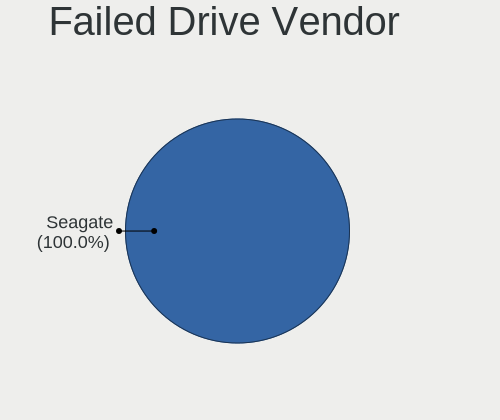
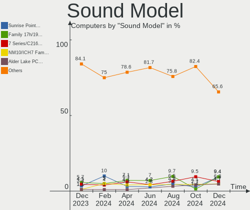

Xubuntu Hardware Trends
-----------------------

A project to identify most popular hardware characteristics and track their change
over time based on data collected by Xubuntu users at https://Linux-Hardware.org.

Anyone can contribute to this report by the [hw-probe](https://github.com/linuxhw/hw-probe) tool:

    sudo -E hw-probe -all -upload

This is a report for all computer types. See also reports for [desktops](/Dist/Xubuntu/Desktop/README.md) and [notebooks](/Dist/Xubuntu/Notebook/README.md).

Full-feature report is available here: https://linux-hardware.org/?view=trends

Period: Aug, 2021.

Contents
--------

* [ System ](#system)
  - [ OS                       ](#os)
  - [ OS Family                ](#os-family)
  - [ Kernel                   ](#kernel)
  - [ Kernel Family            ](#kernel-family)
  - [ Kernel Major Ver.        ](#kernel-major-ver)
  - [ Arch                     ](#arch)
  - [ DE                       ](#de)
  - [ Display Server           ](#display-server)
  - [ Display Manager          ](#display-manager)
  - [ OS Lang                  ](#os-lang)
  - [ Boot Mode                ](#boot-mode)
  - [ Filesystem               ](#filesystem)
  - [ Part. scheme             ](#part-scheme)
  - [ Dual Boot with Linux/BSD ](#dual-boot-with-linuxbsd)
  - [ Dual Boot (Win)          ](#dual-boot-win)

* [ Board ](#board)
  - [ Vendor                   ](#vendor)
  - [ Model                    ](#model)
  - [ Model Family             ](#model-family)
  - [ MFG Year                 ](#mfg-year)
  - [ Form Factor              ](#form-factor)
  - [ Secure Boot              ](#secure-boot)
  - [ Coreboot                 ](#coreboot)
  - [ RAM Size                 ](#ram-size)
  - [ RAM Used                 ](#ram-used)
  - [ Total Drives             ](#total-drives)
  - [ Has CD-ROM               ](#has-cd-rom)
  - [ Has Ethernet             ](#has-ethernet)
  - [ Has WiFi                 ](#has-wifi)
  - [ Has Bluetooth            ](#has-bluetooth)

* [ Location ](#location)
  - [ Country                  ](#country)
  - [ City                     ](#city)

* [ Drives ](#drives)
  - [ Drive Vendor             ](#drive-vendor)
  - [ Drive Model              ](#drive-model)
  - [ HDD Vendor               ](#hdd-vendor)
  - [ SSD Vendor               ](#ssd-vendor)
  - [ Drive Kind               ](#drive-kind)
  - [ Drive Connector          ](#drive-connector)
  - [ Drive Size               ](#drive-size)
  - [ Space Total              ](#space-total)
  - [ Space Used               ](#space-used)
  - [ Malfunc. Drives          ](#malfunc-drives)
  - [ Malfunc. Drive Vendor    ](#malfunc-drive-vendor)
  - [ Malfunc. HDD Vendor      ](#malfunc-hdd-vendor)
  - [ Malfunc. Drive Kind      ](#malfunc-drive-kind)
  - [ Failed Drives            ](#failed-drives)
  - [ Failed Drive Vendor      ](#failed-drive-vendor)
  - [ Drive Status             ](#drive-status)

* [ Storage controller ](#storage-controller)
  - [ Storage Vendor           ](#storage-vendor)
  - [ Storage Model            ](#storage-model)
  - [ Storage Kind             ](#storage-kind)

* [ Processor ](#processor)
  - [ CPU Vendor               ](#cpu-vendor)
  - [ CPU Model                ](#cpu-model)
  - [ CPU Model Family         ](#cpu-model-family)
  - [ CPU Cores                ](#cpu-cores)
  - [ CPU Sockets              ](#cpu-sockets)
  - [ CPU Threads              ](#cpu-threads)
  - [ CPU Op-Modes             ](#cpu-op-modes)
  - [ CPU Microcode            ](#cpu-microcode)
  - [ CPU Microarch            ](#cpu-microarch)

* [ Graphics ](#graphics)
  - [ GPU Vendor               ](#gpu-vendor)
  - [ GPU Model                ](#gpu-model)
  - [ GPU Combo                ](#gpu-combo)
  - [ GPU Driver               ](#gpu-driver)
  - [ GPU Memory               ](#gpu-memory)

* [ Monitor ](#monitor)
  - [ Monitor Vendor           ](#monitor-vendor)
  - [ Monitor Model            ](#monitor-model)
  - [ Monitor Resolution       ](#monitor-resolution)
  - [ Monitor Diagonal         ](#monitor-diagonal)
  - [ Monitor Width            ](#monitor-width)
  - [ Aspect Ratio             ](#aspect-ratio)
  - [ Monitor Area             ](#monitor-area)
  - [ Pixel Density            ](#pixel-density)
  - [ Multiple Monitors        ](#multiple-monitors)

* [ Network ](#network)
  - [ Net Controller Vendor    ](#net-controller-vendor)
  - [ Net Controller Model     ](#net-controller-model)
  - [ Wireless Vendor          ](#wireless-vendor)
  - [ Wireless Model           ](#wireless-model)
  - [ Ethernet Vendor          ](#ethernet-vendor)
  - [ Ethernet Model           ](#ethernet-model)
  - [ Net Controller Kind      ](#net-controller-kind)
  - [ Used Controller          ](#used-controller)
  - [ NICs                     ](#nics)
  - [ IPv6                     ](#ipv6)

* [ Bluetooth ](#bluetooth)
  - [ Bluetooth Vendor         ](#bluetooth-vendor)
  - [ Bluetooth Model          ](#bluetooth-model)

* [ Sound ](#sound)
  - [ Sound Vendor             ](#sound-vendor)
  - [ Sound Model              ](#sound-model)

* [ Memory ](#memory)
  - [ Memory Vendor            ](#memory-vendor)
  - [ Memory Model             ](#memory-model)
  - [ Memory Kind              ](#memory-kind)
  - [ Memory Form Factor       ](#memory-form-factor)
  - [ Memory Size              ](#memory-size)
  - [ Memory Speed             ](#memory-speed)

* [ Printers & scanners ](#printers--scanners)
  - [ Printer Vendor           ](#printer-vendor)
  - [ Printer Model            ](#printer-model)
  - [ Scanner Vendor           ](#scanner-vendor)
  - [ Scanner Model            ](#scanner-model)

* [ Camera ](#camera)
  - [ Camera Vendor            ](#camera-vendor)
  - [ Camera Model             ](#camera-model)

* [ Security ](#security)
  - [ Fingerprint Vendor       ](#fingerprint-vendor)
  - [ Fingerprint Model        ](#fingerprint-model)
  - [ Chipcard Vendor          ](#chipcard-vendor)
  - [ Chipcard Model           ](#chipcard-model)

* [ Unsupported ](#unsupported)
  - [ Unsupported Devices      ](#unsupported-devices)
  - [ Unsupported Device Types ](#unsupported-device-types)

System
------

OS
--

Installed operating systems

| Name          | Computers | Percent |
|---------------|-----------|---------|
| Xubuntu 20.04 | 69        | 67.65%  |
| Xubuntu 18.04 | 20        | 19.61%  |
| Xubuntu 21.04 | 12        | 11.76%  |
| Xubuntu 16.04 | 1         | 0.98%   |

OS Family
---------

OS without a version

| Name    | Computers | Percent |
|---------|-----------|---------|
| Xubuntu | 102       | 100%    |

Kernel
------

Version of the Linux kernel

| Version                | Computers | Percent |
|------------------------|-----------|---------|
| 5.4.0-81-generic       | 17        | 16.67%  |
| 5.11.0-25-generic      | 15        | 14.71%  |
| 5.4.0-80-generic       | 14        | 13.73%  |
| 5.11.0-27-generic      | 6         | 5.88%   |
| 5.4.0-80-lowlatency    | 5         | 4.9%    |
| 5.11.0-31-generic      | 5         | 4.9%    |
| 5.11.0-25-lowlatency   | 5         | 4.9%    |
| 5.11.0-27-lowlatency   | 4         | 3.92%   |
| 5.8.0-43-generic       | 3         | 2.94%   |
| 5.8.0-63-generic       | 2         | 1.96%   |
| 5.4.0-42-generic       | 2         | 1.96%   |
| 5.13.7-051307-generic  | 2         | 1.96%   |
| 4.15.0-154-generic     | 2         | 1.96%   |
| 4.15.0-153-generic     | 2         | 1.96%   |
| 5.8.0-63-lowlatency    | 1         | 0.98%   |
| 5.8.0-59-generic       | 1         | 0.98%   |
| 5.8.0-55-generic       | 1         | 0.98%   |
| 5.8.0-43-lowlatency    | 1         | 0.98%   |
| 5.8.0-41-generic       | 1         | 0.98%   |
| 5.4.0-81-lowlatency    | 1         | 0.98%   |
| 5.4.0-58-lowlatency    | 1         | 0.98%   |
| 5.4.0-54-generic       | 1         | 0.98%   |
| 5.14.0-rc4             | 1         | 0.98%   |
| 5.13.5-051305-generic  | 1         | 0.98%   |
| 5.13.2-051302-generic  | 1         | 0.98%   |
| 5.10.33-051033-generic | 1         | 0.98%   |
| 4.4.0-210-generic      | 1         | 0.98%   |
| 4.15.0-96-generic      | 1         | 0.98%   |
| 4.15.0-47-generic      | 1         | 0.98%   |
| 4.15.0-153-lowlatency  | 1         | 0.98%   |
| 4.15.0-151-generic     | 1         | 0.98%   |
| 4.15.0-111-generic     | 1         | 0.98%   |

Kernel Family
-------------

Linux kernel without a distro release

| Version | Computers | Percent |
|---------|-----------|---------|
| 5.4.0   | 41        | 40.2%   |
| 5.11.0  | 35        | 34.31%  |
| 5.8.0   | 10        | 9.8%    |
| 4.15.0  | 9         | 8.82%   |
| 5.13.7  | 2         | 1.96%   |
| 5.14.0  | 1         | 0.98%   |
| 5.13.5  | 1         | 0.98%   |
| 5.13.2  | 1         | 0.98%   |
| 5.10.33 | 1         | 0.98%   |
| 4.4.0   | 1         | 0.98%   |

Kernel Major Ver.
-----------------

Linux kernel major version

| Version | Computers | Percent |
|---------|-----------|---------|
| 5.4     | 41        | 40.2%   |
| 5.11    | 35        | 34.31%  |
| 5.8     | 10        | 9.8%    |
| 4.15    | 9         | 8.82%   |
| 5.13    | 4         | 3.92%   |
| 5.14    | 1         | 0.98%   |
| 5.10    | 1         | 0.98%   |
| 4.4     | 1         | 0.98%   |

Arch
----

OS architecture (x86_64, i586, etc.)

| Name   | Computers | Percent |
|--------|-----------|---------|
| x86_64 | 94        | 92.16%  |
| i686   | 8         | 7.84%   |

DE
--

Desktop Environment

| Name     | Computers | Percent |
|----------|-----------|---------|
| XFCE     | 100       | 98.04%  |
| ICEWM    | 1         | 0.98%   |
| Cinnamon | 1         | 0.98%   |

Display Server
--------------

X11 or Wayland

| Name | Computers | Percent |
|------|-----------|---------|
| X11  | 100       | 98.04%  |
| Tty  | 2         | 1.96%   |

Display Manager
---------------

SDDM, LightDM, etc.

| Name    | Computers | Percent |
|---------|-----------|---------|
| Unknown | 59        | 57.84%  |
| TDM     | 32        | 31.37%  |
| LightDM | 9         | 8.82%   |
| XDM     | 1         | 0.98%   |
| GDM     | 1         | 0.98%   |

OS Lang
-------

Language

| Lang  | Computers | Percent |
|-------|-----------|---------|
| en_US | 43        | 42.16%  |
| fr_FR | 15        | 14.71%  |
| de_DE | 7         | 6.86%   |
| C     | 6         | 5.88%   |
| pt_BR | 5         | 4.9%    |
| it_IT | 5         | 4.9%    |
| en_AU | 3         | 2.94%   |
| fr_CA | 2         | 1.96%   |
| en_CA | 2         | 1.96%   |
| zh_TW | 1         | 0.98%   |
| zh_CN | 1         | 0.98%   |
| uk_UA | 1         | 0.98%   |
| sv_SE | 1         | 0.98%   |
| sv_FI | 1         | 0.98%   |
| ru_RU | 1         | 0.98%   |
| pl_PL | 1         | 0.98%   |
| nl_BE | 1         | 0.98%   |
| fr_BE | 1         | 0.98%   |
| es_ES | 1         | 0.98%   |
| es_AR | 1         | 0.98%   |
| en_NZ | 1         | 0.98%   |
| en_GB | 1         | 0.98%   |
| el_GR | 1         | 0.98%   |

Boot Mode
---------

EFI or BIOS

| Mode | Computers | Percent |
|------|-----------|---------|
| BIOS | 64        | 62.75%  |
| EFI  | 38        | 37.25%  |

Filesystem
----------

Type of filesystem

| Type    | Computers | Percent |
|---------|-----------|---------|
| Ext4    | 98        | 96.08%  |
| Overlay | 3         | 2.94%   |
| Xfs     | 1         | 0.98%   |

Part. scheme
------------

Scheme of partitioning

| Type    | Computers | Percent |
|---------|-----------|---------|
| Unknown | 59        | 57.84%  |
| GPT     | 30        | 29.41%  |
| MBR     | 13        | 12.75%  |

Dual Boot with Linux/BSD
------------------------

Hosting more than one Linux/BSD

| Dual boot | Computers | Percent |
|-----------|-----------|---------|
| No        | 90        | 88.24%  |
| Yes       | 12        | 11.76%  |

Dual Boot (Win)
---------------

Hosting Linux and Windows

| Dual boot | Computers | Percent |
|-----------|-----------|---------|
| No        | 62        | 60.78%  |
| Yes       | 40        | 39.22%  |

Board
-----

Vendor
------

Motherboard manufacturer

| Name                | Computers | Percent |
|---------------------|-----------|---------|
| Hewlett-Packard     | 20        | 19.61%  |
| Lenovo              | 16        | 15.69%  |
| Dell                | 12        | 11.76%  |
| ASUSTek Computer    | 12        | 11.76%  |
| Acer                | 8         | 7.84%   |
| Toshiba             | 5         | 4.9%    |
| MSI                 | 4         | 3.92%   |
| Gigabyte Technology | 4         | 3.92%   |
| ASRock              | 4         | 3.92%   |
| Sony                | 2         | 1.96%   |
| Notebook            | 2         | 1.96%   |
| Intel               | 2         | 1.96%   |
| Foxconn             | 2         | 1.96%   |
| UNOWHY              | 1         | 0.98%   |
| NEC Computers       | 1         | 0.98%   |
| Medion              | 1         | 0.98%   |
| Gateway             | 1         | 0.98%   |
| Fujitsu             | 1         | 0.98%   |
| Digibras            | 1         | 0.98%   |
| Clevo               | 1         | 0.98%   |
| Apple               | 1         | 0.98%   |
| Alienware           | 1         | 0.98%   |

Model
-----

Motherboard model

| Name                                       | Computers | Percent |
|--------------------------------------------|-----------|---------|
| ASUS All Series                            | 2         | 1.96%   |
| UNOWHY Y13G010S4EI                         | 1         | 0.98%   |
| Toshiba Satellite P300                     | 1         | 0.98%   |
| Toshiba Satellite P205D                    | 1         | 0.98%   |
| Toshiba Satellite C665D                    | 1         | 0.98%   |
| Toshiba Satellite A100                     | 1         | 0.98%   |
| Toshiba PORTEGE R30-A                      | 1         | 0.98%   |
| Sony VPCF236FM                             | 1         | 0.98%   |
| Sony SVE1512C6EB                           | 1         | 0.98%   |
| Notebook W970SUW                           | 1         | 0.98%   |
| Notebook P65_P67RGRERA                     | 1         | 0.98%   |
| NEC Computers IMEDIA 5204                  | 1         | 0.98%   |
| MSI VT493AA-ABA s5212y                     | 1         | 0.98%   |
| MSI PR601/VR603                            | 1         | 0.98%   |
| MSI CR61 2M/CX61 2OC/CX61 2OD              | 1         | 0.98%   |
| MSI Compaq dx2420 Microtower               | 1         | 0.98%   |
| Medion Akoya P2120 D MD8836/2452           | 1         | 0.98%   |
| Lenovo V130-15IKB 81HN                     | 1         | 0.98%   |
| Lenovo ThinkStation P620 30E0S0E000        | 1         | 0.98%   |
| Lenovo ThinkPad X1 Carbon Gen 8 20U9CTO1WW | 1         | 0.98%   |
| Lenovo ThinkPad W540 20BHS1HR00            | 1         | 0.98%   |
| Lenovo ThinkPad W540 20BHS0KY08            | 1         | 0.98%   |
| Lenovo ThinkPad T460s 20FAS12E00           | 1         | 0.98%   |
| Lenovo ThinkPad T440s 20AQ009DGE           | 1         | 0.98%   |
| Lenovo ThinkPad E15 Gen 3 20YHS00900       | 1         | 0.98%   |
| Lenovo ThinkPad 20AY001DMH                 | 1         | 0.98%   |
| Lenovo ThinkCentre M93p 10A8000WUS         | 1         | 0.98%   |
| Lenovo ThinkCentre M83 10AJCTO1WW          | 1         | 0.98%   |
| Lenovo ThinkCentre M58 7627AA9             | 1         | 0.98%   |
| Lenovo QIWG5                               | 1         | 0.98%   |
| Lenovo MIIX 310-10ICR 80SG                 | 1         | 0.98%   |
| Lenovo G460 0677                           | 1         | 0.98%   |
| Lenovo B5400 s20278Q                       | 1         | 0.98%   |
| Intel DH67BL AAG10189-206                  | 1         | 0.98%   |
| Intel D945GNT AAC96315-402                 | 1         | 0.98%   |
| HP Z600 Workstation                        | 1         | 0.98%   |
| HP ProBook 6470b                           | 1         | 0.98%   |
| HP ProBook 450 G3                          | 1         | 0.98%   |
| HP Pavilion Laptop 15-cc1xx                | 1         | 0.98%   |
| HP OMEN by HP Laptop                       | 1         | 0.98%   |
| HP Mini 311-1000                           | 1         | 0.98%   |
| HP Laptop 15s-fq1xxx                       | 1         | 0.98%   |
| HP EliteDesk 800 G1 SFF                    | 1         | 0.98%   |
| HP EliteBook x360 1040 G7 Notebook PC      | 1         | 0.98%   |
| HP EliteBook 8470p                         | 1         | 0.98%   |
| HP EliteBook 840 G3                        | 1         | 0.98%   |
| HP Compaq CQ58                             | 1         | 0.98%   |
| HP Compaq 8710w                            | 1         | 0.98%   |
| HP Compaq 8000 Elite SFF PC                | 1         | 0.98%   |
| HP 550-a114                                | 1         | 0.98%   |
| HP 255 G7 Notebook PC                      | 1         | 0.98%   |
| HP 255 G1                                  | 1         | 0.98%   |
| HP 2000                                    | 1         | 0.98%   |
| HP 15                                      | 1         | 0.98%   |
| Gigabyte X99-UD4-CF                        | 1         | 0.98%   |
| Gigabyte H81M-H                            | 1         | 0.98%   |
| Gigabyte F2A88XM-HD3                       | 1         | 0.98%   |
| Gigabyte B450M DS3H                        | 1         | 0.98%   |
| Gateway SX2185                             | 1         | 0.98%   |
| Fujitsu ESPRIMO E910                       | 1         | 0.98%   |

Model Family
------------

Motherboard model prefix

| Name                 | Computers | Percent |
|----------------------|-----------|---------|
| Lenovo ThinkPad      | 7         | 6.86%   |
| Acer Aspire          | 5         | 4.9%    |
| Toshiba Satellite    | 4         | 3.92%   |
| Lenovo ThinkCentre   | 3         | 2.94%   |
| HP EliteBook         | 3         | 2.94%   |
| HP Compaq            | 3         | 2.94%   |
| Dell Inspiron        | 3         | 2.94%   |
| HP ProBook           | 2         | 1.96%   |
| HP 255               | 2         | 1.96%   |
| Dell Vostro          | 2         | 1.96%   |
| Dell Latitude        | 2         | 1.96%   |
| ASUS All             | 2         | 1.96%   |
| Acer Swift           | 2         | 1.96%   |
| UNOWHY Y13G010S4EI   | 1         | 0.98%   |
| Toshiba PORTEGE      | 1         | 0.98%   |
| Sony VPCF236FM       | 1         | 0.98%   |
| Sony SVE1512C6EB     | 1         | 0.98%   |
| Notebook W970SUW     | 1         | 0.98%   |
| Notebook P65         | 1         | 0.98%   |
| NEC Computers IMEDIA | 1         | 0.98%   |
| MSI VT493AA-ABA      | 1         | 0.98%   |
| MSI PR601            | 1         | 0.98%   |
| MSI CR61             | 1         | 0.98%   |
| MSI Compaq           | 1         | 0.98%   |
| Medion Akoya         | 1         | 0.98%   |
| Lenovo V130-15IKB    | 1         | 0.98%   |
| Lenovo ThinkStation  | 1         | 0.98%   |
| Lenovo QIWG5         | 1         | 0.98%   |
| Lenovo MIIX          | 1         | 0.98%   |
| Lenovo G460          | 1         | 0.98%   |
| Lenovo B5400         | 1         | 0.98%   |
| Intel DH67BL         | 1         | 0.98%   |
| Intel D945GNT        | 1         | 0.98%   |
| HP Z600              | 1         | 0.98%   |
| HP Pavilion          | 1         | 0.98%   |
| HP OMEN              | 1         | 0.98%   |
| HP Mini              | 1         | 0.98%   |
| HP Laptop            | 1         | 0.98%   |
| HP EliteDesk         | 1         | 0.98%   |
| HP 550-a114          | 1         | 0.98%   |
| HP 2000              | 1         | 0.98%   |
| HP 15                | 1         | 0.98%   |
| Gigabyte X99-UD4-CF  | 1         | 0.98%   |
| Gigabyte H81M-H      | 1         | 0.98%   |
| Gigabyte F2A88XM-HD3 | 1         | 0.98%   |
| Gigabyte B450M       | 1         | 0.98%   |
| Gateway SX2185       | 1         | 0.98%   |
| Fujitsu ESPRIMO      | 1         | 0.98%   |
| Foxconn s5-1014      | 1         | 0.98%   |
| Foxconn Pro          | 1         | 0.98%   |
| Digibras NH4CU53     | 1         | 0.98%   |
| Dell XPS             | 1         | 0.98%   |
| Dell Studio          | 1         | 0.98%   |
| Dell OptiPlex        | 1         | 0.98%   |
| Dell G5              | 1         | 0.98%   |
| Dell DXP051          | 1         | 0.98%   |
| Clevo W240HU         | 1         | 0.98%   |
| ASUS Z170-A          | 1         | 0.98%   |
| ASUS X501A           | 1         | 0.98%   |
| ASUS X455YA          | 1         | 0.98%   |

MFG Year
--------

Motherboard manufacture year

| Year | Computers | Percent |
|------|-----------|---------|
| 2013 | 14        | 13.73%  |
| 2020 | 12        | 11.76%  |
| 2011 | 11        | 10.78%  |
| 2021 | 10        | 9.8%    |
| 2019 | 8         | 7.84%   |
| 2014 | 8         | 7.84%   |
| 2009 | 8         | 7.84%   |
| 2015 | 7         | 6.86%   |
| 2018 | 6         | 5.88%   |
| 2012 | 4         | 3.92%   |
| 2010 | 3         | 2.94%   |
| 2007 | 3         | 2.94%   |
| 2006 | 3         | 2.94%   |
| 2017 | 2         | 1.96%   |
| 2016 | 2         | 1.96%   |
| 2008 | 1         | 0.98%   |

Form Factor
-----------

Physical design of the computer

| Name        | Computers | Percent |
|-------------|-----------|---------|
| Notebook    | 57        | 55.88%  |
| Desktop     | 41        | 40.2%   |
| Convertible | 2         | 1.96%   |
| Tablet      | 1         | 0.98%   |
| All in one  | 1         | 0.98%   |

Secure Boot
-----------

Enabled or disabled

| State    | Computers | Percent |
|----------|-----------|---------|
| Disabled | 94        | 92.16%  |
| Enabled  | 8         | 7.84%   |

Coreboot
--------

Have coreboot on board

| Used | Computers | Percent |
|------|-----------|---------|
| No   | 102       | 100%    |

RAM Size
--------

Total RAM memory

| Size in GB  | Computers | Percent |
|-------------|-----------|---------|
| 4.01-8.0    | 23        | 22.55%  |
| 3.01-4.0    | 23        | 22.55%  |
| 8.01-16.0   | 19        | 18.63%  |
| 16.01-24.0  | 16        | 15.69%  |
| 1.01-2.0    | 6         | 5.88%   |
| 32.01-64.0  | 5         | 4.9%    |
| 64.01-256.0 | 4         | 3.92%   |
| 2.01-3.0    | 3         | 2.94%   |
| 0.51-1.0    | 2         | 1.96%   |
| 24.01-32.0  | 1         | 0.98%   |

RAM Used
--------

Used RAM memory

| Used GB    | Computers | Percent |
|------------|-----------|---------|
| 1.01-2.0   | 40        | 39.22%  |
| 2.01-3.0   | 20        | 19.61%  |
| 0.51-1.0   | 19        | 18.63%  |
| 4.01-8.0   | 13        | 12.75%  |
| 3.01-4.0   | 7         | 6.86%   |
| 0.01-0.5   | 2         | 1.96%   |
| 24.01-32.0 | 1         | 0.98%   |

Total Drives
------------

Number of drives on board

| Drives | Computers | Percent |
|--------|-----------|---------|
| 1      | 60        | 58.82%  |
| 2      | 26        | 25.49%  |
| 3      | 9         | 8.82%   |
| 5      | 2         | 1.96%   |
| 4      | 2         | 1.96%   |
| 9      | 1         | 0.98%   |
| 7      | 1         | 0.98%   |
| 0      | 1         | 0.98%   |

Has CD-ROM
----------

Has CD-ROM on board

| Presented | Computers | Percent |
|-----------|-----------|---------|
| Yes       | 54        | 52.94%  |
| No        | 48        | 47.06%  |

Has Ethernet
------------

Has Ethernet on board

| Presented | Computers | Percent |
|-----------|-----------|---------|
| Yes       | 95        | 93.14%  |
| No        | 7         | 6.86%   |

Has WiFi
--------

Has WiFi module

| Presented | Computers | Percent |
|-----------|-----------|---------|
| Yes       | 76        | 74.51%  |
| No        | 26        | 25.49%  |

Has Bluetooth
-------------

Has Bluetooth module

| Presented | Computers | Percent |
|-----------|-----------|---------|
| Yes       | 55        | 53.92%  |
| No        | 47        | 46.08%  |

Location
--------

Country
-------

Geographic location (country)

| Country     | Computers | Percent |
|-------------|-----------|---------|
| USA         | 24        | 23.53%  |
| France      | 15        | 14.71%  |
| Germany     | 7         | 6.86%   |
| Brazil      | 7         | 6.86%   |
| Italy       | 6         | 5.88%   |
| Canada      | 5         | 4.9%    |
| Belgium     | 5         | 4.9%    |
| Finland     | 3         | 2.94%   |
| Australia   | 3         | 2.94%   |
| Ukraine     | 2         | 1.96%   |
| Sweden      | 2         | 1.96%   |
| Spain       | 2         | 1.96%   |
| Netherlands | 2         | 1.96%   |
| India       | 2         | 1.96%   |
| UK          | 1         | 0.98%   |
| Taiwan      | 1         | 0.98%   |
| Switzerland | 1         | 0.98%   |
| Singapore   | 1         | 0.98%   |
| Russia      | 1         | 0.98%   |
| Poland      | 1         | 0.98%   |
| New Zealand | 1         | 0.98%   |
| Mexico      | 1         | 0.98%   |
| Malaysia    | 1         | 0.98%   |
| Japan       | 1         | 0.98%   |
| Indonesia   | 1         | 0.98%   |
| Greece      | 1         | 0.98%   |
| Estonia     | 1         | 0.98%   |
| Costa Rica  | 1         | 0.98%   |
| China       | 1         | 0.98%   |
| Argentina   | 1         | 0.98%   |
| Algeria     | 1         | 0.98%   |

City
----

Geographic location (city)

| City              | Computers | Percent |
|-------------------|-----------|---------|
| S??o Paulo        | 3         | 2.94%   |
| Pittsburgh        | 3         | 2.94%   |
| Springfield       | 2         | 1.96%   |
| Rolla             | 2         | 1.96%   |
| Rennes            | 2         | 1.96%   |
| Paris             | 2         | 1.96%   |
| Ghent             | 2         | 1.96%   |
| Zarzalejo         | 1         | 0.98%   |
| Yuzhno-Sakhalinsk | 1         | 0.98%   |
| Youngstown        | 1         | 0.98%   |
| Wilderness Rim    | 1         | 0.98%   |
| Waterford         | 1         | 0.98%   |
| Vitry-sur-Seine   | 1         | 0.98%   |
| Villecresnes      | 1         | 0.98%   |
| Vesilahti         | 1         | 0.98%   |
| Vernier           | 1         | 0.98%   |
| Uzhhorod          | 1         | 0.98%   |
| Turku             | 1         | 0.98%   |
| Trets             | 1         | 0.98%   |
| Toronto           | 1         | 0.98%   |
| Tempe             | 1         | 0.98%   |
| Tallinn           | 1         | 0.98%   |
| Sydney            | 1         | 0.98%   |
| Surakarta         | 1         | 0.98%   |
| Steenderen        | 1         | 0.98%   |
| Sparti            | 1         | 0.98%   |
| Singapore         | 1         | 0.98%   |
| Shah Alam         | 1         | 0.98%   |
| Seattle           | 1         | 0.98%   |
| San Jose          | 1         | 0.98%   |
| San Jos?©         | 1         | 0.98%   |
| Saint-Ambroise    | 1         | 0.98%   |
| Rome              | 1         | 0.98%   |
| Reno              | 1         | 0.98%   |
| Pluderhausen      | 1         | 0.98%   |
| Pipriac           | 1         | 0.98%   |
| Paranatama        | 1         | 0.98%   |
| Oulu              | 1         | 0.98%   |
| North Highlands   | 1         | 0.98%   |
| Newcastle         | 1         | 0.98%   |
| New Taipei        | 1         | 0.98%   |
| Neuqu?©n          | 1         | 0.98%   |
| Napier City       | 1         | 0.98%   |
| Mumbai            | 1         | 0.98%   |
| Montreal          | 1         | 0.98%   |
| Mitcham           | 1         | 0.98%   |
| Milan             | 1         | 0.98%   |
| Meinersen         | 1         | 0.98%   |
| Maxeville         | 1         | 0.98%   |
| Matinhos          | 1         | 0.98%   |
| Marseille         | 1         | 0.98%   |
| Ludwigsfelde      | 1         | 0.98%   |
| Leland            | 1         | 0.98%   |
| Le??n             | 1         | 0.98%   |
| Laval             | 1         | 0.98%   |
| Landskrona        | 1         | 0.98%   |
| Lacadee           | 1         | 0.98%   |
| Kyiv              | 1         | 0.98%   |
| Kortrijk          | 1         | 0.98%   |
| Kolkata           | 1         | 0.98%   |

Drives
------

Drive Vendor
------------

Hard drive vendors

| Vendor              | Computers | Drives | Percent |
|---------------------|-----------|--------|---------|
| Seagate             | 29        | 41     | 19.46%  |
| WDC                 | 28        | 33     | 18.79%  |
| Samsung Electronics | 11        | 11     | 7.38%   |
| Toshiba             | 10        | 10     | 6.71%   |
| Unknown             | 9         | 10     | 6.04%   |
| Hitachi             | 9         | 10     | 6.04%   |
| Sandisk             | 6         | 6      | 4.03%   |
| Kingston            | 6         | 7      | 4.03%   |
| Intel               | 5         | 5      | 3.36%   |
| KIOXIA              | 4         | 4      | 2.68%   |
| Crucial             | 4         | 4      | 2.68%   |
| SK Hynix            | 3         | 3      | 2.01%   |
| Maxtor              | 3         | 3      | 2.01%   |
| SPCC                | 2         | 2      | 1.34%   |
| Micron Technology   | 2         | 2      | 1.34%   |
| Intenso             | 2         | 3      | 1.34%   |
| HGST                | 2         | 2      | 1.34%   |
| Hewlett-Packard     | 2         | 2      | 1.34%   |
| XPG                 | 1         | 1      | 0.67%   |
| TCSUNBOW            | 1         | 1      | 0.67%   |
| SUNEAST             | 1         | 1      | 0.67%   |
| Silicon Motion      | 1         | 1      | 0.67%   |
| PNY                 | 1         | 1      | 0.67%   |
| Netac               | 1         | 1      | 0.67%   |
| MX                  | 1         | 1      | 0.67%   |
| MAXIO               | 1         | 1      | 0.67%   |
| LITEONIT            | 1         | 1      | 0.67%   |
| LITEON              | 1         | 1      | 0.67%   |
| Lite-On             | 1         | 1      | 0.67%   |
| A-DATA Technology   | 1         | 1      | 0.67%   |

Drive Model
-----------

Hard drive models

| Model                                | Computers | Percent |
|--------------------------------------|-----------|---------|
| WDC WD5000LPVX-22V0TT0 500GB         | 2         | 1.24%   |
| WDC WD2003FZEX-00SRLA0 2TB           | 2         | 1.24%   |
| Unknown SD/MMC/MS PRO 128GB          | 2         | 1.24%   |
| Toshiba DT01ACA100 1TB               | 2         | 1.24%   |
| Seagate ST31000524AS 1TB             | 2         | 1.24%   |
| Seagate ST3000DM008-2DM166 3TB       | 2         | 1.24%   |
| Seagate ST1000DM003-1SB102 1TB       | 2         | 1.24%   |
| Sandisk NVMe SSD Drive 256GB         | 2         | 1.24%   |
| Samsung HM321HI 320GB                | 2         | 1.24%   |
| Kingston SA400S37120G 120GB SSD      | 2         | 1.24%   |
| XPG GAMMIX S11 Pro 512GB             | 1         | 0.62%   |
| WDC WDS500G2B0C-00PXH0 500GB         | 1         | 0.62%   |
| WDC WDS240G2G0B-00EPW0 240GB SSD     | 1         | 0.62%   |
| WDC WDBNCE5000PNC 500GB SSD          | 1         | 0.62%   |
| WDC WD800JB-00JJC0 80GB              | 1         | 0.62%   |
| WDC WD5000LPLX-60ZNTT1 500GB         | 1         | 0.62%   |
| WDC WD5000BPKX-22HPJT0 500GB         | 1         | 0.62%   |
| WDC WD5000BEKT-75KA9T0 500GB         | 1         | 0.62%   |
| WDC WD5000AZRX-00L4HB0 500GB         | 1         | 0.62%   |
| WDC WD5000AAKX-22ERMA0 500GB         | 1         | 0.62%   |
| WDC WD5000AAKS-22V1A0 500GB          | 1         | 0.62%   |
| WDC WD5000AAKS-07YGA0 500GB          | 1         | 0.62%   |
| WDC WD5000AAKS-00TMA0 500GB          | 1         | 0.62%   |
| WDC WD4000FYYZ-01UL1B1 4TB           | 1         | 0.62%   |
| WDC WD3200LPVX-22V0TT0 320GB         | 1         | 0.62%   |
| WDC WD2500JS-60NCB2 250GB            | 1         | 0.62%   |
| WDC WD2500BEVS-22UST0 250GB          | 1         | 0.62%   |
| WDC WD20EFRX-68EUZN0 2TB             | 1         | 0.62%   |
| WDC WD20EARS-00J99B0 2TB             | 1         | 0.62%   |
| WDC WD2003FZEX-00Z4SA0 2TB           | 1         | 0.62%   |
| WDC WD1600AAJS-08L7A0 160GB          | 1         | 0.62%   |
| WDC WD1600AAJS-00L7A0 160GB          | 1         | 0.62%   |
| WDC WD10SPZX-75Z10T3 1TB             | 1         | 0.62%   |
| WDC WD10SPZX-21Z10T0 1TB             | 1         | 0.62%   |
| WDC WD10EZEX-00BN5A0 1TB             | 1         | 0.62%   |
| WDC WD10EARX-22N0YB0 1TB             | 1         | 0.62%   |
| WDC WD10EADS-22M2B0 1TB              | 1         | 0.62%   |
| WDC PC SN730 SDBQNTY-256G-1001 256GB | 1         | 0.62%   |
| WDC PC SN720 SDAPNTW-512G-1014 512GB | 1         | 0.62%   |
| WDC PC SN520 NVMe 256GB              | 1         | 0.62%   |
| Unknown SL16G  16GB                  | 1         | 0.62%   |
| Unknown NVMe SSD Drive 256GB         | 1         | 0.62%   |
| Unknown MMC32G  32GB                 | 1         | 0.62%   |
| Unknown MMC Card  256GB              | 1         | 0.62%   |
| Unknown MMC Card  16GB               | 1         | 0.62%   |
| Unknown DA4064  64GB                 | 1         | 0.62%   |
| Unknown C2S3T/240G 240GB SSD         | 1         | 0.62%   |
| Unknown 00000  129GB                 | 1         | 0.62%   |
| Toshiba NVMe SSD Drive 512GB         | 1         | 0.62%   |
| Toshiba NVMe SSD Drive 2TB           | 1         | 0.62%   |
| Toshiba MQ01ABD100 1TB               | 1         | 0.62%   |
| Toshiba MQ01ABD075 752GB             | 1         | 0.62%   |
| Toshiba MQ01ABD050 500GB             | 1         | 0.62%   |
| Toshiba MK7559GSXP 752GB             | 1         | 0.62%   |
| Toshiba MK5065GSXF 500GB             | 1         | 0.62%   |
| Toshiba MK3261GSYN 320GB             | 1         | 0.62%   |
| TCSUNBOW X3 1TB SSD                  | 1         | 0.62%   |
| SUNEAST SSD SE800 1TB                | 1         | 0.62%   |
| SPCC Solid State Disk 256GB          | 1         | 0.62%   |
| SPCC Solid State Disk 1TB            | 1         | 0.62%   |

HDD Vendor
----------

Hard disk drive vendors

| Vendor              | Computers | Drives | Percent |
|---------------------|-----------|--------|---------|
| Seagate             | 29        | 40     | 37.18%  |
| WDC                 | 24        | 27     | 30.77%  |
| Hitachi             | 9         | 10     | 11.54%  |
| Toshiba             | 8         | 8      | 10.26%  |
| Maxtor              | 3         | 3      | 3.85%   |
| Samsung Electronics | 2         | 2      | 2.56%   |
| HGST                | 2         | 2      | 2.56%   |
| Intenso             | 1         | 1      | 1.28%   |

SSD Vendor
----------

Solid state drive vendors

| Vendor              | Computers | Drives | Percent |
|---------------------|-----------|--------|---------|
| Samsung Electronics | 8         | 8      | 20%     |
| Kingston            | 4         | 5      | 10%     |
| Crucial             | 4         | 4      | 10%     |
| SanDisk             | 3         | 3      | 7.5%    |
| WDC                 | 2         | 2      | 5%      |
| SPCC                | 2         | 2      | 5%      |
| Intel               | 2         | 2      | 5%      |
| Hewlett-Packard     | 2         | 2      | 5%      |
| Unknown             | 1         | 1      | 2.5%    |
| TCSUNBOW            | 1         | 1      | 2.5%    |
| SUNEAST             | 1         | 1      | 2.5%    |
| SK Hynix            | 1         | 1      | 2.5%    |
| PNY                 | 1         | 1      | 2.5%    |
| Netac               | 1         | 1      | 2.5%    |
| MX                  | 1         | 1      | 2.5%    |
| Micron Technology   | 1         | 1      | 2.5%    |
| MAXIO               | 1         | 1      | 2.5%    |
| LITEONIT            | 1         | 1      | 2.5%    |
| LITEON              | 1         | 1      | 2.5%    |
| Intenso             | 1         | 2      | 2.5%    |
| A-DATA Technology   | 1         | 1      | 2.5%    |

Drive Kind
----------

HDD or SSD

| Kind    | Computers | Drives | Percent |
|---------|-----------|--------|---------|
| HDD     | 67        | 93     | 48.91%  |
| SSD     | 37        | 42     | 27.01%  |
| NVMe    | 25        | 26     | 18.25%  |
| MMC     | 5         | 6      | 3.65%   |
| Unknown | 3         | 3      | 2.19%   |

Drive Connector
---------------

SATA, SAS, NVMe, etc.

| Type | Computers | Drives | Percent |
|------|-----------|--------|---------|
| SATA | 86        | 131    | 70.49%  |
| NVMe | 25        | 26     | 20.49%  |
| SAS  | 6         | 7      | 4.92%   |
| MMC  | 5         | 6      | 4.1%    |

Drive Size
----------

Size of hard drive

| Size in TB | Computers | Drives | Percent |
|------------|-----------|--------|---------|
| 0.01-0.5   | 60        | 75     | 57.14%  |
| 0.51-1.0   | 27        | 33     | 25.71%  |
| 1.01-2.0   | 11        | 12     | 10.48%  |
| 3.01-4.0   | 3         | 3      | 2.86%   |
| 2.01-3.0   | 3         | 11     | 2.86%   |
| 4.01-10.0  | 1         | 1      | 0.95%   |

Space Total
-----------

Amount of disk space available on the file system

| Size in GB     | Computers | Percent |
|----------------|-----------|---------|
| 101-250        | 31        | 30.39%  |
| 251-500        | 27        | 26.47%  |
| 501-1000       | 13        | 12.75%  |
| 1001-2000      | 11        | 10.78%  |
| 51-100         | 7         | 6.86%   |
| More than 3000 | 5         | 4.9%    |
| 2001-3000      | 3         | 2.94%   |
| 1-20           | 3         | 2.94%   |
| 21-50          | 2         | 1.96%   |

Space Used
----------

Amount of used disk space

| Used GB   | Computers | Percent |
|-----------|-----------|---------|
| 1-20      | 29        | 28.43%  |
| 21-50     | 17        | 16.67%  |
| 101-250   | 16        | 15.69%  |
| 51-100    | 13        | 12.75%  |
| 251-500   | 10        | 9.8%    |
| 501-1000  | 9         | 8.82%   |
| 1001-2000 | 5         | 4.9%    |
| 2001-3000 | 3         | 2.94%   |

Malfunc. Drives
---------------

Drive models with a malfunction

| Model                          | Computers | Drives | Percent |
|--------------------------------|-----------|--------|---------|
| WDC WD4000FYYZ-01UL1B1 4TB     | 1         | 1      | 12.5%   |
| WDC WD10EADS-22M2B0 1TB        | 1         | 1      | 12.5%   |
| Toshiba MK7559GSXP 752GB       | 1         | 1      | 12.5%   |
| Seagate ST500LM000-SSHD-8GB    | 1         | 1      | 12.5%   |
| Seagate ST1000DM003-1SB102 1TB | 1         | 1      | 12.5%   |
| Intel SSDPEKKW256G7 256GB      | 1         | 1      | 12.5%   |
| Hitachi HTS543232A7A384 320GB  | 1         | 1      | 12.5%   |
| HGST HTS721010A9E630 1TB       | 1         | 1      | 12.5%   |

Malfunc. Drive Vendor
---------------------

Vendors of faulty drives

| Vendor  | Computers | Drives | Percent |
|---------|-----------|--------|---------|
| WDC     | 2         | 2      | 25%     |
| Seagate | 2         | 2      | 25%     |
| Toshiba | 1         | 1      | 12.5%   |
| Intel   | 1         | 1      | 12.5%   |
| Hitachi | 1         | 1      | 12.5%   |
| HGST    | 1         | 1      | 12.5%   |

Malfunc. HDD Vendor
-------------------

Vendors of faulty HDD drives

| Vendor  | Computers | Drives | Percent |
|---------|-----------|--------|---------|
| WDC     | 2         | 2      | 28.57%  |
| Seagate | 2         | 2      | 28.57%  |
| Toshiba | 1         | 1      | 14.29%  |
| Hitachi | 1         | 1      | 14.29%  |
| HGST    | 1         | 1      | 14.29%  |

Malfunc. Drive Kind
-------------------

Kinds of faulty drives

| Kind | Computers | Drives | Percent |
|------|-----------|--------|---------|
| HDD  | 7         | 7      | 87.5%   |
| NVMe | 1         | 1      | 12.5%   |

Failed Drives
-------------

Failed drive models

| Model                    | Computers | Drives | Percent |
|--------------------------|-----------|--------|---------|
| WDC WD20EARS-00J99B0 2TB | 1         | 1      | 100%    |

Failed Drive Vendor
-------------------

Failed drive vendors

| Vendor | Computers | Drives | Percent |
|--------|-----------|--------|---------|
| WDC    | 1         | 1      | 100%    |

Drive Status
------------

Number of failed and malfunc. drives

| Status   | Computers | Drives | Percent |
|----------|-----------|--------|---------|
| Detected | 65        | 106    | 58.04%  |
| Works    | 38        | 55     | 33.93%  |
| Malfunc  | 8         | 8      | 7.14%   |
| Failed   | 1         | 1      | 0.89%   |

Storage controller
------------------

Storage Vendor
--------------

Storage controller vendors

| Vendor                       | Computers | Percent |
|------------------------------|-----------|---------|
| Intel                        | 76        | 62.3%   |
| AMD                          | 20        | 16.39%  |
| Sandisk                      | 6         | 4.92%   |
| KIOXIA                       | 4         | 3.28%   |
| Toshiba America Info Systems | 2         | 1.64%   |
| SK Hynix                     | 2         | 1.64%   |
| Kingston Technology Company  | 2         | 1.64%   |
| JMicron Technology           | 2         | 1.64%   |
| Samsung Electronics          | 1         | 0.82%   |
| Nvidia                       | 1         | 0.82%   |
| Micron Technology            | 1         | 0.82%   |
| MAXIO Technology (Hangzhou)  | 1         | 0.82%   |
| Marvell Technology Group     | 1         | 0.82%   |
| Lite-On Technology           | 1         | 0.82%   |
| ASMedia Technology           | 1         | 0.82%   |
| ADATA Technology             | 1         | 0.82%   |

Storage Model
-------------

Storage controller models

| Model                                                                            | Computers | Percent |
|----------------------------------------------------------------------------------|-----------|---------|
| AMD FCH SATA Controller [AHCI mode]                                              | 14        | 9.21%   |
| Intel 8 Series/C220 Series Chipset Family 6-port SATA Controller 1 [AHCI mode]   | 13        | 8.55%   |
| Intel Sunrise Point-LP SATA Controller [AHCI mode]                               | 6         | 3.95%   |
| Intel 7 Series Chipset Family 6-port SATA Controller [AHCI mode]                 | 6         | 3.95%   |
| Intel NM10/ICH7 Family SATA Controller [IDE mode]                                | 5         | 3.29%   |
| Intel 82801G (ICH7 Family) IDE Controller                                        | 5         | 3.29%   |
| KIOXIA Non-Volatile memory controller                                            | 4         | 2.63%   |
| Intel 6 Series/C200 Series Chipset Family 6 port Mobile SATA AHCI Controller     | 4         | 2.63%   |
| Intel Atom Processor E3800 Series SATA AHCI Controller                           | 3         | 1.97%   |
| Intel 82801 Mobile SATA Controller [RAID mode]                                   | 3         | 1.97%   |
| Intel 7 Series/C210 Series Chipset Family 6-port SATA Controller [AHCI mode]     | 3         | 1.97%   |
| AMD 400 Series Chipset SATA Controller                                           | 3         | 1.97%   |
| SK Hynix BC511                                                                   | 2         | 1.32%   |
| Sandisk PC SN520 NVMe SSD                                                        | 2         | 1.32%   |
| Intel Volume Management Device NVMe RAID Controller                              | 2         | 1.32%   |
| Intel Tiger Lake-LP SATA Controller [AHCI mode]                                  | 2         | 1.32%   |
| Intel SSD 660P Series                                                            | 2         | 1.32%   |
| Intel SATA Controller [RAID mode]                                                | 2         | 1.32%   |
| Intel Q170/Q150/B150/H170/H110/Z170/CM236 Chipset SATA Controller [AHCI Mode]    | 2         | 1.32%   |
| Intel HM170/QM170 Chipset SATA Controller [AHCI Mode]                            | 2         | 1.32%   |
| Intel Cannon Lake Mobile PCH SATA AHCI Controller                                | 2         | 1.32%   |
| Intel 82801JD/DO (ICH10 Family) 4-port SATA IDE Controller                       | 2         | 1.32%   |
| Intel 82801JD/DO (ICH10 Family) 2-port SATA IDE Controller                       | 2         | 1.32%   |
| Intel 82801GBM/GHM (ICH7-M Family) SATA Controller [IDE mode]                    | 2         | 1.32%   |
| Intel 8 Series SATA Controller 1 [AHCI mode]                                     | 2         | 1.32%   |
| Intel 6 Series/C200 Series Chipset Family 6 port Desktop SATA AHCI Controller    | 2         | 1.32%   |
| Intel 5 Series/3400 Series Chipset 4 port SATA IDE Controller                    | 2         | 1.32%   |
| Intel 5 Series/3400 Series Chipset 2 port SATA IDE Controller                    | 2         | 1.32%   |
| Toshiba America Info Systems XG6 NVMe SSD Controller                             | 1         | 0.66%   |
| Toshiba America Info Systems Toshiba America Info Non-Volatile memory controller | 1         | 0.66%   |
| Sandisk WD Blue SN550 NVMe SSD                                                   | 1         | 0.66%   |
| Sandisk WD Black SN750 / PC SN730 NVMe SSD                                       | 1         | 0.66%   |
| Sandisk WD Black 2018/SN750 / PC SN720 NVMe SSD                                  | 1         | 0.66%   |
| Sandisk Non-Volatile memory controller                                           | 1         | 0.66%   |
| Samsung NVMe Controller                                                          | 1         | 0.66%   |
| Nvidia MCP79 AHCI Controller                                                     | 1         | 0.66%   |
| Micron Non-Volatile memory controller                                            | 1         | 0.66%   |
| MAXIO (Hangzhou) NVMe SSD Controller MAP1202                                     | 1         | 0.66%   |
| Marvell Group 88SE9215 PCIe 2.0 x1 4-port SATA 6 Gb/s Controller                 | 1         | 0.66%   |
| Lite-On M8Pe Series NVMe SSD                                                     | 1         | 0.66%   |
| Kingston Company U-SNS8154P3 NVMe SSD                                            | 1         | 0.66%   |
| Kingston Company KC2000 NVMe SSD                                                 | 1         | 0.66%   |
| JMicron JMB363 SATA/IDE Controller                                               | 1         | 0.66%   |
| JMicron JMB361 AHCI/IDE                                                          | 1         | 0.66%   |
| Intel Wildcat Point-LP SATA Controller [AHCI Mode]                               | 1         | 0.66%   |
| Intel SSD 600P Series                                                            | 1         | 0.66%   |
| Intel NM10/ICH7 Family SATA Controller [AHCI mode]                               | 1         | 0.66%   |
| Intel Mobile PM965/GM965 PT IDER Controller                                      | 1         | 0.66%   |
| Intel Ice Lake-LP SATA Controller [AHCI mode]                                    | 1         | 0.66%   |
| Intel Celeron/Pentium Silver Processor SATA Controller                           | 1         | 0.66%   |
| Intel Cannon Lake PCH SATA AHCI Controller                                       | 1         | 0.66%   |
| Intel C610/X99 series chipset sSATA Controller [AHCI mode]                       | 1         | 0.66%   |
| Intel C610/X99 series chipset 6-Port SATA Controller [AHCI mode]                 | 1         | 0.66%   |
| Intel 82801JI (ICH10 Family) SATA AHCI Controller                                | 1         | 0.66%   |
| Intel 82801IBM/IEM (ICH9M/ICH9M-E) 4 port SATA Controller [AHCI mode]            | 1         | 0.66%   |
| Intel 82801IBM/IEM (ICH9M/ICH9M-E) 2 port SATA Controller [IDE mode]             | 1         | 0.66%   |
| Intel 82801HM/HEM (ICH8M/ICH8M-E) SATA Controller [AHCI mode]                    | 1         | 0.66%   |
| Intel 82801HM/HEM (ICH8M/ICH8M-E) IDE Controller                                 | 1         | 0.66%   |
| Intel 82801GBM/GHM (ICH7-M Family) SATA Controller [AHCI mode]                   | 1         | 0.66%   |
| Intel 8 Series/C220 Series Chipset Family 4-port SATA Controller 1 [IDE mode]    | 1         | 0.66%   |

Storage Kind
------------

Kind of storage controller (IDE, SATA, NVMe, SAS, ...)

| Kind | Computers | Percent |
|------|-----------|---------|
| SATA | 78        | 60%     |
| NVMe | 23        | 17.69%  |
| IDE  | 22        | 16.92%  |
| RAID | 7         | 5.38%   |

Processor
---------

CPU Vendor
----------

Processor vendors

| Vendor | Computers | Percent |
|--------|-----------|---------|
| Intel  | 81        | 79.41%  |
| AMD    | 21        | 20.59%  |

CPU Model
---------

Processor models

| Model                                       | Computers | Percent |
|---------------------------------------------|-----------|---------|
| Intel Pentium Dual-Core CPU E5200 @ 2.50GHz | 2         | 1.96%   |
| Intel Pentium Dual CPU T3400 @ 2.16GHz      | 2         | 1.96%   |
| Intel Core i7-9750H CPU @ 2.60GHz           | 2         | 1.96%   |
| Intel Core i5-4440 CPU @ 3.10GHz            | 2         | 1.96%   |
| Intel Core i5-1035G1 CPU @ 1.00GHz          | 2         | 1.96%   |
| Intel Core i3-6100 CPU @ 3.70GHz            | 2         | 1.96%   |
| Intel Core i3-4130 CPU @ 3.40GHz            | 2         | 1.96%   |
| Intel Celeron CPU J1900 @ 1.99GHz           | 2         | 1.96%   |
| Intel Celeron CPU 2950M @ 2.00GHz           | 2         | 1.96%   |
| Intel Atom CPU N270 @ 1.60GHz               | 2         | 1.96%   |
| Intel 11th Gen Core i7-1165G7 @ 2.80GHz     | 2         | 1.96%   |
| AMD A8-6410 APU with AMD Radeon R5 Graphics | 2         | 1.96%   |
| Intel Xeon CPU X5670 @ 2.93GHz              | 1         | 0.98%   |
| Intel Processor 5Y10 CPU @ 0.80GHz          | 1         | 0.98%   |
| Intel Pentium Dual-Core CPU E5800 @ 3.20GHz | 1         | 0.98%   |
| Intel Pentium CPU G860 @ 3.00GHz            | 1         | 0.98%   |
| Intel Pentium CPU G2020 @ 2.90GHz           | 1         | 0.98%   |
| Intel Pentium CPU B980 @ 2.40GHz            | 1         | 0.98%   |
| Intel Pentium 4 CPU 3.40GHz                 | 1         | 0.98%   |
| Intel Pentium 4 CPU 3.20GHz                 | 1         | 0.98%   |
| Intel Pentium 4 CPU 3.06GHz                 | 1         | 0.98%   |
| Intel Pentium 4 CPU 3.00GHz                 | 1         | 0.98%   |
| Intel Genuine CPU T2300 @ 1.66GHz           | 1         | 0.98%   |
| Intel Core i9-9920X CPU @ 3.50GHz           | 1         | 0.98%   |
| Intel Core i7-8550U CPU @ 1.80GHz           | 1         | 0.98%   |
| Intel Core i7-6700HQ CPU @ 2.60GHz          | 1         | 0.98%   |
| Intel Core i7-6600U CPU @ 2.60GHz           | 1         | 0.98%   |
| Intel Core i7-5820K CPU @ 3.30GHz           | 1         | 0.98%   |
| Intel Core i7-4800MQ CPU @ 2.70GHz          | 1         | 0.98%   |
| Intel Core i7-4790 CPU @ 3.60GHz            | 1         | 0.98%   |
| Intel Core i7-4700MQ CPU @ 2.40GHz          | 1         | 0.98%   |
| Intel Core i7-4700HQ CPU @ 2.40GHz          | 1         | 0.98%   |
| Intel Core i7-4500U CPU @ 1.80GHz           | 1         | 0.98%   |
| Intel Core i7-3770 CPU @ 3.40GHz            | 1         | 0.98%   |
| Intel Core i7-3540M CPU @ 3.00GHz           | 1         | 0.98%   |
| Intel Core i7-2670QM CPU @ 2.20GHz          | 1         | 0.98%   |
| Intel Core i7-2630QM CPU @ 2.00GHz          | 1         | 0.98%   |
| Intel Core i7-2620M CPU @ 2.70GHz           | 1         | 0.98%   |
| Intel Core i7-10710U CPU @ 1.10GHz          | 1         | 0.98%   |
| Intel Core i7-1065G7 CPU @ 1.30GHz          | 1         | 0.98%   |
| Intel Core i7 CPU 920 @ 2.67GHz             | 1         | 0.98%   |
| Intel Core i5-9400 CPU @ 2.90GHz            | 1         | 0.98%   |
| Intel Core i5-8250U CPU @ 1.60GHz           | 1         | 0.98%   |
| Intel Core i5-7300HQ CPU @ 2.50GHz          | 1         | 0.98%   |
| Intel Core i5-7200U CPU @ 2.50GHz           | 1         | 0.98%   |
| Intel Core i5-6300U CPU @ 2.40GHz           | 1         | 0.98%   |
| Intel Core i5-6200U CPU @ 2.30GHz           | 1         | 0.98%   |
| Intel Core i5-4590 CPU @ 3.30GHz            | 1         | 0.98%   |
| Intel Core i5-4570 CPU @ 3.20GHz            | 1         | 0.98%   |
| Intel Core i5-4300M CPU @ 2.60GHz           | 1         | 0.98%   |
| Intel Core i5-4210U CPU @ 1.70GHz           | 1         | 0.98%   |
| Intel Core i5-4200M CPU @ 2.50GHz           | 1         | 0.98%   |
| Intel Core i5-2415M CPU @ 2.30GHz           | 1         | 0.98%   |
| Intel Core i5-2410M CPU @ 2.30GHz           | 1         | 0.98%   |
| Intel Core i5-2400S CPU @ 2.50GHz           | 1         | 0.98%   |
| Intel Core i5-2400 CPU @ 3.10GHz            | 1         | 0.98%   |
| Intel Core i5-10210U CPU @ 1.60GHz          | 1         | 0.98%   |
| Intel Core i5 CPU M 540 @ 2.53GHz           | 1         | 0.98%   |
| Intel Core i5 CPU M 520 @ 2.40GHz           | 1         | 0.98%   |
| Intel Core i5 CPU M 480 @ 2.67GHz           | 1         | 0.98%   |

CPU Model Family
----------------

Processor model prefix

| Model                   | Computers | Percent |
|-------------------------|-----------|---------|
| Intel Core i5           | 23        | 22.55%  |
| Intel Core i7           | 19        | 18.63%  |
| Intel Core i3           | 7         | 6.86%   |
| Intel Celeron           | 7         | 6.86%   |
| Intel Pentium 4         | 4         | 3.92%   |
| AMD A8                  | 4         | 3.92%   |
| Other                   | 3         | 2.94%   |
| Intel Pentium Dual-Core | 3         | 2.94%   |
| Intel Pentium           | 3         | 2.94%   |
| Intel Atom              | 3         | 2.94%   |
| AMD Ryzen 7             | 3         | 2.94%   |
| Intel Pentium Dual      | 2         | 1.96%   |
| Intel Core 2 Duo        | 2         | 1.96%   |
| AMD Ryzen Threadripper  | 2         | 1.96%   |
| AMD Ryzen 5             | 2         | 1.96%   |
| AMD Ryzen 3             | 2         | 1.96%   |
| AMD E1                  | 2         | 1.96%   |
| Intel Xeon              | 1         | 0.98%   |
| Intel Genuine           | 1         | 0.98%   |
| Intel Core i9           | 1         | 0.98%   |
| Intel Core 2 Quad       | 1         | 0.98%   |
| Intel Core 2            | 1         | 0.98%   |
| AMD Turion 64 X2 Mobile | 1         | 0.98%   |
| AMD Phenom II X4        | 1         | 0.98%   |
| AMD E2                  | 1         | 0.98%   |
| AMD E                   | 1         | 0.98%   |
| AMD A6                  | 1         | 0.98%   |
| AMD A4                  | 1         | 0.98%   |

CPU Cores
---------

Number of processor cores

| Number | Computers | Percent |
|--------|-----------|---------|
| 2      | 44        | 43.14%  |
| 4      | 38        | 37.25%  |
| 1      | 7         | 6.86%   |
| 6      | 6         | 5.88%   |
| 12     | 4         | 3.92%   |
| 8      | 3         | 2.94%   |

CPU Sockets
-----------

Number of sockets

| Number | Computers | Percent |
|--------|-----------|---------|
| 1      | 101       | 99.02%  |
| 2      | 1         | 0.98%   |

CPU Threads
-----------

Threads per core (Hyper-Threading)

| Number | Computers | Percent |
|--------|-----------|---------|
| 2      | 59        | 57.84%  |
| 1      | 43        | 42.16%  |

CPU Op-Modes
------------

CPU Operation Modes (32-bit, 64-bit)

| Op mode        | Computers | Percent |
|----------------|-----------|---------|
| 32-bit, 64-bit | 99        | 97.06%  |
| 32-bit         | 3         | 2.94%   |

CPU Microcode
-------------

Microcode number

| Number     | Computers | Percent |
|------------|-----------|---------|
| Unknown    | 16        | 15.69%  |
| 0x306c3    | 13        | 12.75%  |
| 0x206a7    | 9         | 8.82%   |
| 0x306a9    | 4         | 3.92%   |
| 0x906ea    | 3         | 2.94%   |
| 0x506e3    | 3         | 2.94%   |
| 0x406e3    | 3         | 2.94%   |
| 0x1067a    | 3         | 2.94%   |
| 0xf43      | 2         | 1.96%   |
| 0x806ea    | 2         | 1.96%   |
| 0x806c1    | 2         | 1.96%   |
| 0x706e5    | 2         | 1.96%   |
| 0x6fd      | 2         | 1.96%   |
| 0x40651    | 2         | 1.96%   |
| 0x20652    | 2         | 1.96%   |
| 0x10676    | 2         | 1.96%   |
| 0x0800820d | 2         | 1.96%   |
| 0x07030105 | 2         | 1.96%   |
| 0x0700010f | 2         | 1.96%   |
| 0x05000119 | 2         | 1.96%   |
| 0xf65      | 1         | 0.98%   |
| 0xf49      | 1         | 0.98%   |
| 0xa0661    | 1         | 0.98%   |
| 0x806ec    | 1         | 0.98%   |
| 0x6fb      | 1         | 0.98%   |
| 0x6f6      | 1         | 0.98%   |
| 0x6e8      | 1         | 0.98%   |
| 0x406c4    | 1         | 0.98%   |
| 0x306f2    | 1         | 0.98%   |
| 0x306d4    | 1         | 0.98%   |
| 0x30678    | 1         | 0.98%   |
| 0x30673    | 1         | 0.98%   |
| 0x206c2    | 1         | 0.98%   |
| 0x20655    | 1         | 0.98%   |
| 0x106c2    | 1         | 0.98%   |
| 0x106a5    | 1         | 0.98%   |
| 0x08608103 | 1         | 0.98%   |
| 0x08600104 | 1         | 0.98%   |
| 0x08301039 | 1         | 0.98%   |
| 0x08108109 | 1         | 0.98%   |
| 0x08001137 | 1         | 0.98%   |
| 0x06001119 | 1         | 0.98%   |
| 0x03000027 | 1         | 0.98%   |
| 0x010000dc | 1         | 0.98%   |

CPU Microarch
-------------

Microarchitecture

| Name          | Computers | Percent |
|---------------|-----------|---------|
| Haswell       | 17        | 16.67%  |
| SandyBridge   | 12        | 11.76%  |
| KabyLake      | 8         | 7.84%   |
| Skylake       | 7         | 6.86%   |
| Penryn        | 5         | 4.9%    |
| Zen+          | 4         | 3.92%   |
| Westmere      | 4         | 3.92%   |
| Silvermont    | 4         | 3.92%   |
| NetBurst      | 4         | 3.92%   |
| IvyBridge     | 4         | 3.92%   |
| Core          | 4         | 3.92%   |
| Zen 2         | 3         | 2.94%   |
| Puma          | 3         | 2.94%   |
| IceLake       | 3         | 2.94%   |
| Bobcat        | 3         | 2.94%   |
| TigerLake     | 2         | 1.96%   |
| Jaguar        | 2         | 1.96%   |
| Bonnell       | 2         | 1.96%   |
| Zen           | 1         | 0.98%   |
| Piledriver    | 1         | 0.98%   |
| P6            | 1         | 0.98%   |
| Nehalem       | 1         | 0.98%   |
| K8 Hammer     | 1         | 0.98%   |
| K10 Llano     | 1         | 0.98%   |
| K10           | 1         | 0.98%   |
| Goldmont plus | 1         | 0.98%   |
| CometLake     | 1         | 0.98%   |
| Broadwell     | 1         | 0.98%   |
| Unknown       | 1         | 0.98%   |

Graphics
--------

GPU Vendor
----------

Vendors of graphics cards

| Vendor | Computers | Percent |
|--------|-----------|---------|
| Intel  | 63        | 52.94%  |
| Nvidia | 34        | 28.57%  |
| AMD    | 22        | 18.49%  |

GPU Model
---------

Graphics card models

| Model                                                                         | Computers | Percent |
|-------------------------------------------------------------------------------|-----------|---------|
| Intel 2nd Generation Core Processor Family Integrated Graphics Controller     | 10        | 8.2%    |
| Intel 4th Gen Core Processor Integrated Graphics Controller                   | 5         | 4.1%    |
| Intel Xeon E3-1200 v3/4th Gen Core Processor Integrated Graphics Controller   | 4         | 3.28%   |
| Intel Skylake GT2 [HD Graphics 520]                                           | 3         | 2.46%   |
| Intel Core Processor Integrated Graphics Controller                           | 3         | 2.46%   |
| Intel Atom Processor Z36xxx/Z37xxx Series Graphics & Display                  | 3         | 2.46%   |
| Intel 4 Series Chipset Integrated Graphics Controller                         | 3         | 2.46%   |
| AMD Picasso                                                                   | 3         | 2.46%   |
| AMD Mullins [Radeon R4/R5 Graphics]                                           | 3         | 2.46%   |
| Nvidia GP107M [GeForce MX350]                                                 | 2         | 1.64%   |
| Nvidia GM204 [GeForce GTX 970]                                                | 2         | 1.64%   |
| Nvidia GK107GLM [Quadro K1100M]                                               | 2         | 1.64%   |
| Intel UHD Graphics 620                                                        | 2         | 1.64%   |
| Intel TigerLake-LP GT2 [Iris Xe Graphics]                                     | 2         | 1.64%   |
| Intel Mobile 945GM/GMS/GME, 943/940GML Express Integrated Graphics Controller | 2         | 1.64%   |
| Intel Mobile 4 Series Chipset Integrated Graphics Controller                  | 2         | 1.64%   |
| Intel Iris Plus Graphics G1 (Ice Lake)                                        | 2         | 1.64%   |
| Intel HD Graphics 530                                                         | 2         | 1.64%   |
| Intel Haswell-ULT Integrated Graphics Controller                              | 2         | 1.64%   |
| Intel Haswell Integrated Graphics Controller                                  | 2         | 1.64%   |
| Intel CoffeeLake-H GT2 [UHD Graphics 630]                                     | 2         | 1.64%   |
| Intel 82G33/G31 Express Integrated Graphics Controller                        | 2         | 1.64%   |
| Nvidia TU116M [GeForce GTX 1660 Ti Mobile]                                    | 1         | 0.82%   |
| Nvidia TU106M [GeForce RTX 2060 Mobile]                                       | 1         | 0.82%   |
| Nvidia TU106 [GeForce GTX 1650]                                               | 1         | 0.82%   |
| Nvidia TU102 [GeForce RTX 2080 Ti Rev. A]                                     | 1         | 0.82%   |
| Nvidia GP108M [GeForce MX150]                                                 | 1         | 0.82%   |
| Nvidia GP107M [GeForce GTX 1050 Mobile]                                       | 1         | 0.82%   |
| Nvidia GP107GL [Quadro P1000]                                                 | 1         | 0.82%   |
| Nvidia GP107 [GeForce GTX 1050 Ti]                                            | 1         | 0.82%   |
| Nvidia GP104 [GeForce GTX 1070]                                               | 1         | 0.82%   |
| Nvidia GP104 [GeForce GTX 1070 Ti]                                            | 1         | 0.82%   |
| Nvidia GM204M [GeForce GTX 970M]                                              | 1         | 0.82%   |
| Nvidia GM108M [GeForce 940MX]                                                 | 1         | 0.82%   |
| Nvidia GM107 [GeForce GTX 750]                                                | 1         | 0.82%   |
| Nvidia GK208B [GeForce GT 710]                                                | 1         | 0.82%   |
| Nvidia GK107M [GeForce GT 750M]                                               | 1         | 0.82%   |
| Nvidia GK106 [GeForce GTX 650 Ti]                                             | 1         | 0.82%   |
| Nvidia GK104 [GeForce GTX 670]                                                | 1         | 0.82%   |
| Nvidia GF119 [GeForce GT 520]                                                 | 1         | 0.82%   |
| Nvidia GF117M [GeForce 610M/710M/810M/820M / GT 620M/625M/630M/720M]          | 1         | 0.82%   |
| Nvidia GF116 [GeForce GTX 550 Ti]                                             | 1         | 0.82%   |
| Nvidia GF108M [GeForce GT 540M]                                               | 1         | 0.82%   |
| Nvidia GF108M [GeForce GT 525M]                                               | 1         | 0.82%   |
| Nvidia GF108 [GeForce GT 630]                                                 | 1         | 0.82%   |
| Nvidia G96C [GeForce GT 120]                                                  | 1         | 0.82%   |
| Nvidia G84GLM [Quadro FX 1600M]                                               | 1         | 0.82%   |
| Nvidia G72M [Quadro NVS 110M/GeForce Go 7300]                                 | 1         | 0.82%   |
| Nvidia G72 [GeForce 7300 GS]                                                  | 1         | 0.82%   |
| Nvidia C79 [ION LE]                                                           | 1         | 0.82%   |
| Intel Xeon E3-1200 v2/3rd Gen Core processor Graphics Controller              | 1         | 0.82%   |
| Intel Mobile 945GSE Express Integrated Graphics Controller                    | 1         | 0.82%   |
| Intel Mobile 945GM/GMS, 943/940GML Express Integrated Graphics Controller     | 1         | 0.82%   |
| Intel Iris Plus Graphics G7                                                   | 1         | 0.82%   |
| Intel HD Graphics 630                                                         | 1         | 0.82%   |
| Intel HD Graphics 620                                                         | 1         | 0.82%   |
| Intel HD Graphics 5300                                                        | 1         | 0.82%   |
| Intel GeminiLake [UHD Graphics 600]                                           | 1         | 0.82%   |
| Intel CometLake-U GT2 [UHD Graphics]                                          | 1         | 0.82%   |
| Intel CometLake-S GT2 [UHD Graphics 630]                                      | 1         | 0.82%   |

GPU Combo
---------

Combinations of graphics cards

| Name           | Computers | Percent |
|----------------|-----------|---------|
| 1 x Intel      | 48        | 47.06%  |
| 1 x Nvidia     | 22        | 21.57%  |
| 1 x AMD        | 17        | 16.67%  |
| Intel + Nvidia | 12        | 11.76%  |
| Intel + AMD    | 2         | 1.96%   |
| 2 x AMD        | 1         | 0.98%   |

GPU Driver
----------

Free vs proprietary

| Driver      | Computers | Percent |
|-------------|-----------|---------|
| Free        | 82        | 80.39%  |
| Proprietary | 19        | 18.63%  |
| Unknown     | 1         | 0.98%   |

GPU Memory
----------

Total video memory

| Size in GB | Computers | Percent |
|------------|-----------|---------|
| Unknown    | 51        | 50%     |
| 1.01-2.0   | 14        | 13.73%  |
| 0.51-1.0   | 13        | 12.75%  |
| 0.01-0.5   | 11        | 10.78%  |
| 3.01-4.0   | 7         | 6.86%   |
| 5.01-6.0   | 3         | 2.94%   |
| 7.01-8.0   | 2         | 1.96%   |
| 8.01-16.0  | 1         | 0.98%   |

Monitor
-------

Monitor Vendor
--------------

Monitor vendors

| Vendor                  | Computers | Percent |
|-------------------------|-----------|---------|
| Samsung Electronics     | 15        | 13.27%  |
| AU Optronics            | 15        | 13.27%  |
| LG Display              | 12        | 10.62%  |
| Chimei Innolux          | 7         | 6.19%   |
| Acer                    | 6         | 5.31%   |
| Dell                    | 5         | 4.42%   |
| LG Philips              | 4         | 3.54%   |
| Hewlett-Packard         | 4         | 3.54%   |
| BOE                     | 4         | 3.54%   |
| Philips                 | 3         | 2.65%   |
| Chi Mei Optoelectronics | 3         | 2.65%   |
| AOC                     | 3         | 2.65%   |
| Ancor Communications    | 3         | 2.65%   |
| Panasonic               | 2         | 1.77%   |
| Lenovo                  | 2         | 1.77%   |
| Goldstar                | 2         | 1.77%   |
| BenQ                    | 2         | 1.77%   |
| Westinghouse            | 1         | 0.88%   |
| Vizio                   | 1         | 0.88%   |
| Vestel Elektronik       | 1         | 0.88%   |
| Unknown (AAA)           | 1         | 0.88%   |
| Unknown                 | 1         | 0.88%   |
| Toshiba                 | 1         | 0.88%   |
| Seiki                   | 1         | 0.88%   |
| Sceptre Tech            | 1         | 0.88%   |
| PANDA                   | 1         | 0.88%   |
| ONN                     | 1         | 0.88%   |
| MOT                     | 1         | 0.88%   |
| Medion                  | 1         | 0.88%   |
| Insignia                | 1         | 0.88%   |
| InfoVision              | 1         | 0.88%   |
| HannStar                | 1         | 0.88%   |
| Fujitsu Siemens         | 1         | 0.88%   |
| Fujitsu                 | 1         | 0.88%   |
| Eizo                    | 1         | 0.88%   |
| DENON                   | 1         | 0.88%   |
| CPT                     | 1         | 0.88%   |
| Apple                   | 1         | 0.88%   |

Monitor Model
-------------

Monitor models

| Model                                                                   | Computers | Percent |
|-------------------------------------------------------------------------|-----------|---------|
| Panasonic VVX13F009G00 MEI96A2 1920x1080 290x170mm 13.2-inch            | 2         | 1.77%   |
| Westinghouse SK-32H640G WDE6040 1440x900 710x400mm 32.1-inch            | 1         | 0.88%   |
| Vizio D32h-D1 VIZ1002 1360x768 697x392mm 31.5-inch                      | 1         | 0.88%   |
| Vestel Elektronik 50UHD_LCD_TV VES3700 3840x2160 1872x1053mm 84.6-inch  | 1         | 0.88%   |
| Unknown LCD Monitor SAMSUNG 3840x2160                                   | 1         | 0.88%   |
| Unknown (AAA) LCDTV AAA3393 1360x768 890x500mm 40.2-inch                | 1         | 0.88%   |
| Toshiba LCD Monitor LCD1775 1280x1024 338x270mm 17.0-inch               | 1         | 0.88%   |
| Seiki SE29HY34 SEK9333 1366x768 700x390mm 31.5-inch                     | 1         | 0.88%   |
| Sceptre Tech E205W-1600 SPT080D 1600x900 477x268mm 21.5-inch            | 1         | 0.88%   |
| Samsung Electronics T22C310 SAM0AE9 1920x1080 477x268mm 21.5-inch       | 1         | 0.88%   |
| Samsung Electronics SyncMaster SAM0523 1920x1080 477x268mm 21.5-inch    | 1         | 0.88%   |
| Samsung Electronics SyncMaster SAM0226 1440x900 410x257mm 19.1-inch     | 1         | 0.88%   |
| Samsung Electronics SMB2230H SAM0646 1920x1080 477x268mm 21.5-inch      | 1         | 0.88%   |
| Samsung Electronics S22F350 SAM0D1A 1920x1080 480x270mm 21.7-inch       | 1         | 0.88%   |
| Samsung Electronics S22D390 SAM0B63 1920x1080 477x268mm 21.5-inch       | 1         | 0.88%   |
| Samsung Electronics LS32R75 SAM0F92 3840x2160 697x392mm 31.5-inch       | 1         | 0.88%   |
| Samsung Electronics LCD Monitor SEC5541 1366x768 344x193mm 15.5-inch    | 1         | 0.88%   |
| Samsung Electronics LCD Monitor SEC4252 1366x768 344x194mm 15.5-inch    | 1         | 0.88%   |
| Samsung Electronics LCD Monitor SEC3945 1280x800 331x207mm 15.4-inch    | 1         | 0.88%   |
| Samsung Electronics LCD Monitor SEC3847 1440x900 367x230mm 17.1-inch    | 1         | 0.88%   |
| Samsung Electronics LCD Monitor SDC324C 1920x1080 344x194mm 15.5-inch   | 1         | 0.88%   |
| Samsung Electronics LCD Monitor SAM0F13 3840x2160 1872x1053mm 84.6-inch | 1         | 0.88%   |
| Samsung Electronics LCD Monitor SAM03D3 1360x768 410x256mm 19.0-inch    | 1         | 0.88%   |
| Samsung Electronics LCD Monitor LU28R55                                 | 1         | 0.88%   |
| Philips PHL 273V5 PHLC0D2 1920x1080 600x340mm 27.2-inch                 | 1         | 0.88%   |
| Philips 221V PHL0888 1920x1080 480x270mm 21.7-inch                      | 1         | 0.88%   |
| Philips 220AW PHL0855 1680x1050 434x270mm 20.1-inch                     | 1         | 0.88%   |
| PANDA LM133LF1L01 NCP13FB 1920x1080 294x165mm 13.3-inch                 | 1         | 0.88%   |
| ONN ONA18HO015 ONN0101 1920x1080 698x393mm 31.5-inch                    | 1         | 0.88%   |
| MOT MotoAttach MOT3DC4 1366x768 256x144mm 11.6-inch                     | 1         | 0.88%   |
| Medion MD20435 MED36D5 1920x1080 521x293mm 23.5-inch                    | 1         | 0.88%   |
| LG Philips LCD Monitor LPLF700 1920x1200 370x230mm 17.2-inch            | 1         | 0.88%   |
| LG Philips LCD Monitor LPLC700 1280x800 331x207mm 15.4-inch             | 1         | 0.88%   |
| LG Philips LCD Monitor LPLBB00 1024x768 304x228mm 15.0-inch             | 1         | 0.88%   |
| LG Philips LCD Monitor LPLA101 1440x900 367x230mm 17.1-inch             | 1         | 0.88%   |
| LG Display LP156WH3-TLA1 LGD0202 1366x768 345x194mm 15.6-inch           | 1         | 0.88%   |
| LG Display LP116WH2-TLC1 LGD0232 1366x768 256x144mm 11.6-inch           | 1         | 0.88%   |
| LG Display LCD Monitor LGD05F3 1920x1080 309x174mm 14.0-inch            | 1         | 0.88%   |
| LG Display LCD Monitor LGD0599 1920x1080 309x174mm 14.0-inch            | 1         | 0.88%   |
| LG Display LCD Monitor LGD056D 1920x1080 380x210mm 17.1-inch            | 1         | 0.88%   |
| LG Display LCD Monitor LGD050B 1920x1080 309x174mm 14.0-inch            | 1         | 0.88%   |
| LG Display LCD Monitor LGD0395 1366x768 344x194mm 15.5-inch             | 1         | 0.88%   |
| LG Display LCD Monitor LGD0386 1366x768 309x174mm 14.0-inch             | 1         | 0.88%   |
| LG Display LCD Monitor LGD0357 1600x900 382x215mm 17.3-inch             | 1         | 0.88%   |
| LG Display LCD Monitor LGD02F2 1366x768 344x194mm 15.5-inch             | 1         | 0.88%   |
| LG Display LCD Monitor LGD02E3 1366x768 344x194mm 15.5-inch             | 1         | 0.88%   |
| LG Display LCD Monitor LGD024D 1366x768 294x166mm 13.3-inch             | 1         | 0.88%   |
| Lenovo P24h-10 LEN61AE 2560x1440 527x296mm 23.8-inch                    | 1         | 0.88%   |
| Lenovo LCD Monitor LEN40A0 1366x768 309x174mm 14.0-inch                 | 1         | 0.88%   |
| Insignia NS-19E320A13 BBY0032 1680x1050 640x384mm 29.4-inch             | 1         | 0.88%   |
| InfoVision LCD Monitor IVO8C78 1920x1080 309x174mm 14.0-inch            | 1         | 0.88%   |
| Hewlett-Packard LCD Monitor E232 1920x1080                              | 1         | 0.88%   |
| Hewlett-Packard LA2405x HWP301F 1920x1200 518x324mm 24.1-inch           | 1         | 0.88%   |
| Hewlett-Packard 27x HPN3580 1920x1080 598x336mm 27.0-inch               | 1         | 0.88%   |
| Hewlett-Packard 2009 HWP2827 1600x900 442x249mm 20.0-inch               | 1         | 0.88%   |
| HannStar LCD Monitor HSD03E9 1024x600 220x129mm 10.0-inch               | 1         | 0.88%   |
| Goldstar W2243 GSM56FE 1920x1080 477x269mm 21.6-inch                    | 1         | 0.88%   |
| Goldstar IPS FULLHD GSM5AB6 1920x1080 480x270mm 21.7-inch               | 1         | 0.88%   |
| Fujitsu VL-221SSWL FUJ4211 1680x1050 474x296mm 22.0-inch                | 1         | 0.88%   |
| Fujitsu Siemens L24W-2 FUS077A 1920x1200 518x324mm 24.1-inch            | 1         | 0.88%   |

Monitor Resolution
------------------

Monitor screen resolution

| Resolution         | Computers | Percent |
|--------------------|-----------|---------|
| 1920x1080 (FHD)    | 46        | 42.99%  |
| 1366x768 (WXGA)    | 23        | 21.5%   |
| 3840x2160 (4K)     | 8         | 7.48%   |
| 1600x900 (HD+)     | 7         | 6.54%   |
| 2560x1440 (QHD)    | 3         | 2.8%    |
| 1920x1200 (WUXGA)  | 3         | 2.8%    |
| 1440x900 (WXGA+)   | 3         | 2.8%    |
| 1280x800 (WXGA)    | 3         | 2.8%    |
| 1280x1024 (SXGA)   | 3         | 2.8%    |
| 1680x1050 (WSXGA+) | 2         | 1.87%   |
| 3840x1080          | 1         | 0.93%   |
| 1920x540           | 1         | 0.93%   |
| 1360x768           | 1         | 0.93%   |
| 1024x768 (XGA)     | 1         | 0.93%   |
| 1024x600           | 1         | 0.93%   |
| Unknown            | 1         | 0.93%   |

Monitor Diagonal
----------------

Diagonal size in inches

| Inches  | Computers | Percent |
|---------|-----------|---------|
| 15      | 27        | 24.32%  |
| 14      | 12        | 10.81%  |
| 21      | 10        | 9.01%   |
| 17      | 9         | 8.11%   |
| 23      | 8         | 7.21%   |
| 13      | 7         | 6.31%   |
| 27      | 6         | 5.41%   |
| 24      | 5         | 4.5%    |
| 19      | 4         | 3.6%    |
| Unknown | 4         | 3.6%    |
| 31      | 3         | 2.7%    |
| 11      | 3         | 2.7%    |
| 84      | 2         | 1.8%    |
| 22      | 2         | 1.8%    |
| 20      | 2         | 1.8%    |
| 48      | 1         | 0.9%    |
| 40      | 1         | 0.9%    |
| 39      | 1         | 0.9%    |
| 38      | 1         | 0.9%    |
| 32      | 1         | 0.9%    |
| 16      | 1         | 0.9%    |
| 10      | 1         | 0.9%    |

Monitor Width
-------------

Physical width

| Width in mm | Computers | Percent |
|-------------|-----------|---------|
| 301-350     | 45        | 41.28%  |
| 501-600     | 18        | 16.51%  |
| 401-500     | 16        | 14.68%  |
| 351-400     | 9         | 8.26%   |
| 201-300     | 7         | 6.42%   |
| Unknown     | 4         | 3.67%   |
| 801-900     | 3         | 2.75%   |
| 601-700     | 3         | 2.75%   |
| 1501-2000   | 2         | 1.83%   |
| 701-800     | 1         | 0.92%   |
| 1001-1500   | 1         | 0.92%   |

Aspect Ratio
------------

Proportional relationship between the width and the height

| Ratio   | Computers | Percent |
|---------|-----------|---------|
| 16/9    | 78        | 78.79%  |
| 16/10   | 12        | 12.12%  |
| Unknown | 4         | 4.04%   |
| 5/4     | 3         | 3.03%   |
| 4/3     | 1         | 1.01%   |
| 1.96    | 1         | 1.01%   |

Monitor Area
------------

Area in inch²

| Area in inch² | Computers | Percent |
|----------------|-----------|---------|
| 101-110        | 27        | 24.77%  |
| 201-250        | 21        | 19.27%  |
| 81-90          | 17        | 15.6%   |
| 151-200        | 7         | 6.42%   |
| 301-350        | 6         | 5.5%    |
| 351-500        | 4         | 3.67%   |
| 121-130        | 4         | 3.67%   |
| Unknown        | 4         | 3.67%   |
| 51-60          | 3         | 2.75%   |
| 131-140        | 3         | 2.75%   |
| 501-1000       | 3         | 2.75%   |
| More than 1000 | 2         | 1.83%   |
| 71-80          | 2         | 1.83%   |
| 251-300        | 2         | 1.83%   |
| 141-150        | 2         | 1.83%   |
| 41-50          | 1         | 0.92%   |
| 111-120        | 1         | 0.92%   |

Pixel Density
-------------

Pixels per inch

| Density       | Computers | Percent |
|---------------|-----------|---------|
| 51-100        | 37        | 34.26%  |
| 121-160       | 31        | 28.7%   |
| 101-120       | 26        | 24.07%  |
| 1-50          | 5         | 4.63%   |
| Unknown       | 4         | 3.7%    |
| 161-240       | 3         | 2.78%   |
| More than 240 | 2         | 1.85%   |

Multiple Monitors
-----------------

Total monitors connected

| Total | Computers | Percent |
|-------|-----------|---------|
| 1     | 83        | 81.37%  |
| 2     | 16        | 15.69%  |
| 0     | 2         | 1.96%   |
| 3     | 1         | 0.98%   |

Network
-------

Net Controller Vendor
---------------------

Controller vendors

| Vendor                          | Computers | Percent |
|---------------------------------|-----------|---------|
| Realtek Semiconductor           | 61        | 39.35%  |
| Intel                           | 43        | 27.74%  |
| Qualcomm Atheros                | 23        | 14.84%  |
| Broadcom                        | 6         | 3.87%   |
| Ralink Technology               | 3         | 1.94%   |
| Qualcomm Atheros Communications | 3         | 1.94%   |
| TP-Link                         | 2         | 1.29%   |
| MEDIATEK                        | 2         | 1.29%   |
| D-Link System                   | 2         | 1.29%   |
| Broadcom Limited                | 2         | 1.29%   |
| Ralink                          | 1         | 0.65%   |
| Nvidia                          | 1         | 0.65%   |
| Marvell Technology Group        | 1         | 0.65%   |
| JMicron Technology              | 1         | 0.65%   |
| HTC (High Tech Computer)        | 1         | 0.65%   |
| D-Link                          | 1         | 0.65%   |
| Aquantia                        | 1         | 0.65%   |
| AboCom Systems                  | 1         | 0.65%   |

Net Controller Model
--------------------

Controller models

| Model                                                                   | Computers | Percent |
|-------------------------------------------------------------------------|-----------|---------|
| Realtek RTL8111/8168/8411 PCI Express Gigabit Ethernet Controller       | 43        | 23.76%  |
| Realtek RTL810xE PCI Express Fast Ethernet controller                   | 10        | 5.52%   |
| Qualcomm Atheros AR9485 Wireless Network Adapter                        | 7         | 3.87%   |
| Intel Wireless 7260                                                     | 6         | 3.31%   |
| Intel Ethernet Connection I217-LM                                       | 6         | 3.31%   |
| Realtek RTL8153 Gigabit Ethernet Adapter                                | 3         | 1.66%   |
| Qualcomm Atheros QCA9565 / AR9565 Wireless Network Adapter              | 3         | 1.66%   |
| Qualcomm Atheros AR9271 802.11n                                         | 3         | 1.66%   |
| Intel Wireless-AC 9260                                                  | 3         | 1.66%   |
| Intel Wireless 8260                                                     | 3         | 1.66%   |
| Intel Wireless 7265                                                     | 3         | 1.66%   |
| Realtek RTL8822CE 802.11ac PCIe Wireless Network Adapter                | 2         | 1.1%    |
| Realtek RTL8188CE 802.11b/g/n WiFi Adapter                              | 2         | 1.1%    |
| Qualcomm Atheros QCA9377 802.11ac Wireless Network Adapter              | 2         | 1.1%    |
| Qualcomm Atheros QCA6174 802.11ac Wireless Network Adapter              | 2         | 1.1%    |
| Qualcomm Atheros Killer E2500 Gigabit Ethernet Controller               | 2         | 1.1%    |
| Qualcomm Atheros AR928X Wireless Network Adapter (PCI-Express)          | 2         | 1.1%    |
| Qualcomm Atheros AR242x / AR542x Wireless Network Adapter (PCI-Express) | 2         | 1.1%    |
| Intel Wi-Fi 6 AX200                                                     | 2         | 1.1%    |
| Intel I211 Gigabit Network Connection                                   | 2         | 1.1%    |
| Intel Ethernet Connection I219-LM                                       | 2         | 1.1%    |
| Intel Dual Band Wireless-AC 3168NGW [Stone Peak]                        | 2         | 1.1%    |
| Intel Comet Lake PCH-LP CNVi WiFi                                       | 2         | 1.1%    |
| Intel Centrino Advanced-N 6205 [Taylor Peak]                            | 2         | 1.1%    |
| Intel 82579V Gigabit Network Connection                                 | 2         | 1.1%    |
| Intel 82579LM Gigabit Network Connection (Lewisville)                   | 2         | 1.1%    |
| D-Link System DGE-528T Gigabit Ethernet Adapter                         | 2         | 1.1%    |
| Broadcom BCM43142 802.11b/g/n                                           | 2         | 1.1%    |
| TP-Link TL-WN821N Version 5 RTL8192EU                                   | 1         | 0.55%   |
| TP-Link 802.11ac WLAN Adapter                                           | 1         | 0.55%   |
| Realtek RTL8821CE 802.11ac PCIe Wireless Network Adapter                | 1         | 0.55%   |
| Realtek RTL8723BE PCIe Wireless Network Adapter                         | 1         | 0.55%   |
| Realtek RTL8723AE PCIe Wireless Network Adapter                         | 1         | 0.55%   |
| Realtek RTL8192EE PCIe Wireless Network Adapter                         | 1         | 0.55%   |
| Realtek RTL8188FTV 802.11b/g/n 1T1R 2.4G WLAN Adapter                   | 1         | 0.55%   |
| Realtek RTL8188EE Wireless Network Adapter                              | 1         | 0.55%   |
| Realtek RTL-8100/8101L/8139 PCI Fast Ethernet Adapter                   | 1         | 0.55%   |
| Realtek Killer E2500 Gigabit Ethernet Controller                        | 1         | 0.55%   |
| Realtek 802.11ac WLAN Adapter                                           | 1         | 0.55%   |
| Ralink RT2870/RT3070 Wireless Adapter                                   | 1         | 0.55%   |
| Ralink RT2070 Wireless Adapter                                          | 1         | 0.55%   |
| Ralink MT7601U Wireless Adapter                                         | 1         | 0.55%   |
| Ralink RT3290 Wireless 802.11n 1T/1R PCIe                               | 1         | 0.55%   |
| Qualcomm Atheros AR9462 Wireless Network Adapter                        | 1         | 0.55%   |
| Qualcomm Atheros AR8162 Fast Ethernet                                   | 1         | 0.55%   |
| Qualcomm Atheros AR8161 Gigabit Ethernet                                | 1         | 0.55%   |
| Qualcomm Atheros AR8152 v1.1 Fast Ethernet                              | 1         | 0.55%   |
| Qualcomm Atheros AR8121/AR8113/AR8114 Gigabit or Fast Ethernet          | 1         | 0.55%   |
| Nvidia MCP79 Ethernet                                                   | 1         | 0.55%   |
| MediaTek WiFi                                                           | 1         | 0.55%   |
| MEDIATEK Network controller                                             | 1         | 0.55%   |
| Marvell Group 88E8040T PCI-E Fast Ethernet Controller                   | 1         | 0.55%   |
| JMicron JMC250 PCI Express Gigabit Ethernet Controller                  | 1         | 0.55%   |
| Intel PRO/Wireless 4965 AG or AGN [Kedron] Network Connection           | 1         | 0.55%   |
| Intel PRO/Wireless 3945ABG [Golan] Network Connection                   | 1         | 0.55%   |
| Intel PRO/100 VE Network Connection                                     | 1         | 0.55%   |
| Intel NM10/ICH7 Family LAN Controller                                   | 1         | 0.55%   |
| Intel Ice Lake-LP PCH CNVi WiFi                                         | 1         | 0.55%   |
| Intel Gemini Lake PCH CNVi WiFi                                         | 1         | 0.55%   |
| Intel Ethernet Connection I218-V                                        | 1         | 0.55%   |

Wireless Vendor
---------------

Wireless vendors

| Vendor                          | Computers | Percent |
|---------------------------------|-----------|---------|
| Intel                           | 33        | 40.74%  |
| Qualcomm Atheros                | 19        | 23.46%  |
| Realtek Semiconductor           | 10        | 12.35%  |
| Broadcom                        | 4         | 4.94%   |
| Ralink Technology               | 3         | 3.7%    |
| Qualcomm Atheros Communications | 3         | 3.7%    |
| TP-Link                         | 2         | 2.47%   |
| MEDIATEK                        | 2         | 2.47%   |
| Broadcom Limited                | 2         | 2.47%   |
| Ralink                          | 1         | 1.23%   |
| D-Link                          | 1         | 1.23%   |
| AboCom Systems                  | 1         | 1.23%   |

Wireless Model
--------------

Wireless models

| Model                                                                   | Computers | Percent |
|-------------------------------------------------------------------------|-----------|---------|
| Qualcomm Atheros AR9485 Wireless Network Adapter                        | 7         | 8.54%   |
| Intel Wireless 7260                                                     | 6         | 7.32%   |
| Qualcomm Atheros QCA9565 / AR9565 Wireless Network Adapter              | 3         | 3.66%   |
| Qualcomm Atheros AR9271 802.11n                                         | 3         | 3.66%   |
| Intel Wireless-AC 9260                                                  | 3         | 3.66%   |
| Intel Wireless 8260                                                     | 3         | 3.66%   |
| Intel Wireless 7265                                                     | 3         | 3.66%   |
| Realtek RTL8188CE 802.11b/g/n WiFi Adapter                              | 2         | 2.44%   |
| Qualcomm Atheros QCA9377 802.11ac Wireless Network Adapter              | 2         | 2.44%   |
| Qualcomm Atheros QCA6174 802.11ac Wireless Network Adapter              | 2         | 2.44%   |
| Qualcomm Atheros AR928X Wireless Network Adapter (PCI-Express)          | 2         | 2.44%   |
| Qualcomm Atheros AR242x / AR542x Wireless Network Adapter (PCI-Express) | 2         | 2.44%   |
| Intel Wi-Fi 6 AX200                                                     | 2         | 2.44%   |
| Intel Dual Band Wireless-AC 3168NGW [Stone Peak]                        | 2         | 2.44%   |
| Intel Comet Lake PCH-LP CNVi WiFi                                       | 2         | 2.44%   |
| Intel Centrino Advanced-N 6205 [Taylor Peak]                            | 2         | 2.44%   |
| Broadcom BCM43142 802.11b/g/n                                           | 2         | 2.44%   |
| TP-Link TL-WN821N Version 5 RTL8192EU                                   | 1         | 1.22%   |
| TP-Link 802.11ac WLAN Adapter                                           | 1         | 1.22%   |
| Realtek RTL8822CE 802.11ac PCIe Wireless Network Adapter                | 1         | 1.22%   |
| Realtek RTL8821CE 802.11ac PCIe Wireless Network Adapter                | 1         | 1.22%   |
| Realtek RTL8723BE PCIe Wireless Network Adapter                         | 1         | 1.22%   |
| Realtek RTL8723AE PCIe Wireless Network Adapter                         | 1         | 1.22%   |
| Realtek RTL8192EE PCIe Wireless Network Adapter                         | 1         | 1.22%   |
| Realtek RTL8188FTV 802.11b/g/n 1T1R 2.4G WLAN Adapter                   | 1         | 1.22%   |
| Realtek RTL8188EE Wireless Network Adapter                              | 1         | 1.22%   |
| Realtek 802.11ac WLAN Adapter                                           | 1         | 1.22%   |
| Ralink RT2870/RT3070 Wireless Adapter                                   | 1         | 1.22%   |
| Ralink RT2070 Wireless Adapter                                          | 1         | 1.22%   |
| Ralink MT7601U Wireless Adapter                                         | 1         | 1.22%   |
| Ralink RT3290 Wireless 802.11n 1T/1R PCIe                               | 1         | 1.22%   |
| Qualcomm Atheros AR9462 Wireless Network Adapter                        | 1         | 1.22%   |
| MediaTek WiFi                                                           | 1         | 1.22%   |
| MEDIATEK Network controller                                             | 1         | 1.22%   |
| Intel PRO/Wireless 4965 AG or AGN [Kedron] Network Connection           | 1         | 1.22%   |
| Intel PRO/Wireless 3945ABG [Golan] Network Connection                   | 1         | 1.22%   |
| Intel Ice Lake-LP PCH CNVi WiFi                                         | 1         | 1.22%   |
| Intel Gemini Lake PCH CNVi WiFi                                         | 1         | 1.22%   |
| Intel Dual Band Wireless-AC 3165 Plus Bluetooth                         | 1         | 1.22%   |
| Intel Centrino Wireless-N 6150                                          | 1         | 1.22%   |
| Intel Centrino Wireless-N + WiMAX 6150                                  | 1         | 1.22%   |
| Intel Centrino Advanced-N 6235                                          | 1         | 1.22%   |
| Intel Centrino Advanced-N 6230 [Rainbow Peak]                           | 1         | 1.22%   |
| Intel Centrino Advanced-N 6200                                          | 1         | 1.22%   |
| Intel Cannon Lake PCH CNVi WiFi                                         | 1         | 1.22%   |
| D-Link DWA-121 802.11n Wireless N 150 Pico Adapter [Realtek RTL8188CUS] | 1         | 1.22%   |
| Broadcom Limited BCM4313 802.11bgn Wireless Network Adapter             | 1         | 1.22%   |
| Broadcom Limited BCM4311 802.11a/b/g                                    | 1         | 1.22%   |
| Broadcom BCM4331 802.11a/b/g/n                                          | 1         | 1.22%   |
| Broadcom BCM4312 802.11b/g LP-PHY                                       | 1         | 1.22%   |
| AboCom Systems RT2573                                                   | 1         | 1.22%   |

Ethernet Vendor
---------------

Ethernet vendors

| Vendor                   | Computers | Percent |
|--------------------------|-----------|---------|
| Realtek Semiconductor    | 58        | 59.18%  |
| Intel                    | 23        | 23.47%  |
| Qualcomm Atheros         | 6         | 6.12%   |
| Broadcom                 | 3         | 3.06%   |
| D-Link System            | 2         | 2.04%   |
| Nvidia                   | 1         | 1.02%   |
| Marvell Technology Group | 1         | 1.02%   |
| JMicron Technology       | 1         | 1.02%   |
| HTC (High Tech Computer) | 1         | 1.02%   |
| Broadcom Limited         | 1         | 1.02%   |
| Aquantia                 | 1         | 1.02%   |

Ethernet Model
--------------

Ethernet models

| Model                                                             | Computers | Percent |
|-------------------------------------------------------------------|-----------|---------|
| Realtek RTL8111/8168/8411 PCI Express Gigabit Ethernet Controller | 43        | 43.43%  |
| Realtek RTL810xE PCI Express Fast Ethernet controller             | 10        | 10.1%   |
| Intel Ethernet Connection I217-LM                                 | 6         | 6.06%   |
| Realtek RTL8153 Gigabit Ethernet Adapter                          | 3         | 3.03%   |
| Qualcomm Atheros Killer E2500 Gigabit Ethernet Controller         | 2         | 2.02%   |
| Intel I211 Gigabit Network Connection                             | 2         | 2.02%   |
| Intel Ethernet Connection I219-LM                                 | 2         | 2.02%   |
| Intel 82579V Gigabit Network Connection                           | 2         | 2.02%   |
| Intel 82579LM Gigabit Network Connection (Lewisville)             | 2         | 2.02%   |
| D-Link System DGE-528T Gigabit Ethernet Adapter                   | 2         | 2.02%   |
| Realtek RTL8822CE 802.11ac PCIe Wireless Network Adapter          | 1         | 1.01%   |
| Realtek RTL-8100/8101L/8139 PCI Fast Ethernet Adapter             | 1         | 1.01%   |
| Realtek Killer E2500 Gigabit Ethernet Controller                  | 1         | 1.01%   |
| Qualcomm Atheros AR8162 Fast Ethernet                             | 1         | 1.01%   |
| Qualcomm Atheros AR8161 Gigabit Ethernet                          | 1         | 1.01%   |
| Qualcomm Atheros AR8152 v1.1 Fast Ethernet                        | 1         | 1.01%   |
| Qualcomm Atheros AR8121/AR8113/AR8114 Gigabit or Fast Ethernet    | 1         | 1.01%   |
| Nvidia MCP79 Ethernet                                             | 1         | 1.01%   |
| Marvell Group 88E8040T PCI-E Fast Ethernet Controller             | 1         | 1.01%   |
| JMicron JMC250 PCI Express Gigabit Ethernet Controller            | 1         | 1.01%   |
| Intel PRO/100 VE Network Connection                               | 1         | 1.01%   |
| Intel NM10/ICH7 Family LAN Controller                             | 1         | 1.01%   |
| Intel Ethernet Connection I218-V                                  | 1         | 1.01%   |
| Intel Ethernet Connection (2) I219-V                              | 1         | 1.01%   |
| Intel Ethernet Connection (2) I218-V                              | 1         | 1.01%   |
| Intel Ethernet Connection (10) I219-V                             | 1         | 1.01%   |
| Intel 82577LM Gigabit Network Connection                          | 1         | 1.01%   |
| Intel 82567LM-3 Gigabit Network Connection                        | 1         | 1.01%   |
| Intel 82566MM Gigabit Network Connection                          | 1         | 1.01%   |
| HTC (High Tech Computer) Desire HD (modem mode)                   | 1         | 1.01%   |
| Broadcom NetXtreme BCM57765 Gigabit Ethernet PCIe                 | 1         | 1.01%   |
| Broadcom NetXtreme BCM5764M Gigabit Ethernet PCIe                 | 1         | 1.01%   |
| Broadcom NetXtreme BCM5761 Gigabit Ethernet PCIe                  | 1         | 1.01%   |
| Broadcom Limited NetXtreme BCM5788 Gigabit Ethernet               | 1         | 1.01%   |
| Aquantia AQC107 NBase-T/IEEE 802.3bz Ethernet Controller [AQtion] | 1         | 1.01%   |

Net Controller Kind
-------------------

Ethernet, WiFi or modem

| Kind     | Computers | Percent |
|----------|-----------|---------|
| Ethernet | 95        | 55.56%  |
| WiFi     | 76        | 44.44%  |

Used Controller
---------------

Currently used network controller

| Kind     | Computers | Percent |
|----------|-----------|---------|
| WiFi     | 62        | 52.99%  |
| Ethernet | 55        | 47.01%  |

NICs
----

Total network controllers on board

| Total | Computers | Percent |
|-------|-----------|---------|
| 2     | 58        | 56.86%  |
| 1     | 37        | 36.27%  |
| 3     | 4         | 3.92%   |
| 0     | 3         | 2.94%   |

IPv6
----

IPv6 vs IPv4

| Used | Computers | Percent |
|------|-----------|---------|
| No   | 76        | 74.51%  |
| Yes  | 26        | 25.49%  |

Bluetooth
---------

Bluetooth Vendor
----------------

Controller vendors

| Vendor                          | Computers | Percent |
|---------------------------------|-----------|---------|
| Intel                           | 25        | 45.45%  |
| Qualcomm Atheros Communications | 7         | 12.73%  |
| Realtek Semiconductor           | 5         | 9.09%   |
| Foxconn / Hon Hai               | 4         | 7.27%   |
| Cambridge Silicon Radio         | 4         | 7.27%   |
| IMC Networks                    | 3         | 5.45%   |
| Lite-On Technology              | 2         | 3.64%   |
| Broadcom                        | 2         | 3.64%   |
| Ralink                          | 1         | 1.82%   |
| ASUSTek Computer                | 1         | 1.82%   |
| Apple                           | 1         | 1.82%   |

Bluetooth Model
---------------

Controller models

| Model                                               | Computers | Percent |
|-----------------------------------------------------|-----------|---------|
| Intel Bluetooth wireless interface                  | 13        | 23.64%  |
| Qualcomm Atheros  Bluetooth Device                  | 5         | 9.09%   |
| Realtek Bluetooth Radio                             | 4         | 7.27%   |
| Intel Bluetooth Device                              | 4         | 7.27%   |
| Cambridge Silicon Radio Bluetooth Dongle (HCI mode) | 4         | 7.27%   |
| Intel Wireless-AC 3168 Bluetooth                    | 2         | 3.64%   |
| Intel Bluetooth 9460/9560 Jefferson Peak (JfP)      | 2         | 3.64%   |
| Intel AX200 Bluetooth                               | 2         | 3.64%   |
| Realtek RTL8723B Bluetooth                          | 1         | 1.82%   |
| Ralink RT3290 Bluetooth                             | 1         | 1.82%   |
| Qualcomm Atheros Bluetooth USB Host Controller      | 1         | 1.82%   |
| Qualcomm Atheros AR9462 Bluetooth                   | 1         | 1.82%   |
| Lite-On Wireless_Device                             | 1         | 1.82%   |
| Lite-On Bluetooth Device                            | 1         | 1.82%   |
| Intel Centrino Bluetooth Wireless Transceiver       | 1         | 1.82%   |
| Intel Centrino Advanced-N 6230 Bluetooth adapter    | 1         | 1.82%   |
| IMC Networks Bluetooth USB Host Controller          | 1         | 1.82%   |
| IMC Networks Bluetooth Device                       | 1         | 1.82%   |
| IMC Networks Bluetooth                              | 1         | 1.82%   |
| Foxconn / Hon Hai Broadcom Bluetooth 2.1 Device     | 1         | 1.82%   |
| Foxconn / Hon Hai Broadcom BCM20702 Bluetooth       | 1         | 1.82%   |
| Foxconn / Hon Hai Bluetooth USB Host Controller     | 1         | 1.82%   |
| Foxconn / Hon Hai BCM43142A0 broadcom bluetooth     | 1         | 1.82%   |
| Broadcom HP Portable SoftSailing                    | 1         | 1.82%   |
| Broadcom BCM43142A0 Bluetooth Device                | 1         | 1.82%   |
| ASUS Broadcom BCM20702A0 Bluetooth                  | 1         | 1.82%   |
| Apple Bluetooth Host Controller                     | 1         | 1.82%   |

Sound
-----

Sound Vendor
------------

Sound card vendors

| Vendor              | Computers | Percent |
|---------------------|-----------|---------|
| Intel               | 78        | 56.93%  |
| AMD                 | 27        | 19.71%  |
| Nvidia              | 24        | 17.52%  |
| C-Media Electronics | 2         | 1.46%   |
| Unknown             | 1         | 0.73%   |
| TEAC                | 1         | 0.73%   |
| M-Audio             | 1         | 0.73%   |
| Focusrite-Novation  | 1         | 0.73%   |
| Elite Silicon       | 1         | 0.73%   |
| Creative Labs       | 1         | 0.73%   |

Sound Model
-----------

Sound card models

| Model                                                                      | Computers | Percent |
|----------------------------------------------------------------------------|-----------|---------|
| Intel 8 Series/C220 Series Chipset High Definition Audio Controller        | 14        | 8.59%   |
| Intel Xeon E3-1200 v3/4th Gen Core Processor HD Audio Controller           | 11        | 6.75%   |
| Intel NM10/ICH7 Family High Definition Audio Controller                    | 9         | 5.52%   |
| Intel 7 Series/C216 Chipset Family High Definition Audio Controller        | 9         | 5.52%   |
| AMD FCH Azalia Controller                                                  | 9         | 5.52%   |
| Intel 6 Series/C200 Series Chipset Family High Definition Audio Controller | 7         | 4.29%   |
| Intel Sunrise Point-LP HD Audio                                            | 6         | 3.68%   |
| AMD Kabini HDMI/DP Audio                                                   | 4         | 2.45%   |
| AMD Family 17h (Models 10h-1fh) HD Audio Controller                        | 4         | 2.45%   |
| Nvidia GP107GL High Definition Audio Controller                            | 3         | 1.84%   |
| Nvidia GM204 High Definition Audio Controller                              | 3         | 1.84%   |
| Nvidia GF108 High Definition Audio Controller                              | 3         | 1.84%   |
| Intel Ice Lake-LP Smart Sound Technology Audio Controller                  | 3         | 1.84%   |
| Intel Cannon Lake PCH cAVS                                                 | 3         | 1.84%   |
| Intel Atom Processor Z36xxx/Z37xxx Series High Definition Audio Controller | 3         | 1.84%   |
| Intel 5 Series/3400 Series Chipset High Definition Audio                   | 3         | 1.84%   |
| Intel 100 Series/C230 Series Chipset Family HD Audio Controller            | 3         | 1.84%   |
| AMD Raven/Raven2/Fenghuang HDMI/DP Audio Controller                        | 3         | 1.84%   |
| AMD Family 17h (Models 00h-0fh) HD Audio Controller                        | 3         | 1.84%   |
| Nvidia TU106 High Definition Audio Controller                              | 2         | 1.23%   |
| Nvidia GP104 High Definition Audio Controller                              | 2         | 1.23%   |
| Nvidia GK107 HDMI Audio Controller                                         | 2         | 1.23%   |
| Intel Tiger Lake-LP Smart Sound Technology Audio Controller                | 2         | 1.23%   |
| Intel Haswell-ULT HD Audio Controller                                      | 2         | 1.23%   |
| Intel Comet Lake PCH-LP cAVS                                               | 2         | 1.23%   |
| Intel 82801JI (ICH10 Family) HD Audio Controller                           | 2         | 1.23%   |
| Intel 82801JD/DO (ICH10 Family) HD Audio Controller                        | 2         | 1.23%   |
| Intel 82801I (ICH9 Family) HD Audio Controller                             | 2         | 1.23%   |
| Intel 8 Series HD Audio Controller                                         | 2         | 1.23%   |
| AMD Wrestler HDMI Audio                                                    | 2         | 1.23%   |
| AMD Turks HDMI Audio [Radeon HD 6500/6600 / 6700M Series]                  | 2         | 1.23%   |
| AMD SBx00 Azalia (Intel HDA)                                               | 2         | 1.23%   |
| AMD Renoir Radeon High Definition Audio Controller                         | 2         | 1.23%   |
| Unknown Realtek USB Audio Rear                                             | 1         | 0.61%   |
| Unknown Realtek USB Audio Front                                            | 1         | 0.61%   |
| TEAC SERIES 208i                                                           | 1         | 0.61%   |
| Nvidia TU116 High Definition Audio Controller                              | 1         | 0.61%   |
| Nvidia TU102 High Definition Audio Controller                              | 1         | 0.61%   |
| Nvidia MCP79 High Definition Audio                                         | 1         | 0.61%   |
| Nvidia GM107 High Definition Audio Controller [GeForce 940MX]              | 1         | 0.61%   |
| Nvidia GK208 HDMI/DP Audio Controller                                      | 1         | 0.61%   |
| Nvidia GK106 HDMI Audio Controller                                         | 1         | 0.61%   |
| Nvidia GK104 HDMI Audio Controller                                         | 1         | 0.61%   |
| Nvidia GF119 HDMI Audio Controller                                         | 1         | 0.61%   |
| Nvidia GF116 High Definition Audio Controller                              | 1         | 0.61%   |
| M-Audio KeyStudio                                                          | 1         | 0.61%   |
| Intel Wildcat Point-LP High Definition Audio Controller                    | 1         | 0.61%   |
| Intel CM238 HD Audio Controller                                            | 1         | 0.61%   |
| Intel Celeron/Pentium Silver Processor High Definition Audio               | 1         | 0.61%   |
| Intel C610/X99 series chipset HD Audio Controller                          | 1         | 0.61%   |
| Intel Broadwell-U Audio Controller                                         | 1         | 0.61%   |
| Intel 82801H (ICH8 Family) HD Audio Controller                             | 1         | 0.61%   |
| Intel 200 Series PCH HD Audio                                              | 1         | 0.61%   |
| Focusrite-Novation Scarlett Solo USB                                       | 1         | 0.61%   |
| Elite Silicon USB Audio Device                                             | 1         | 0.61%   |
| Creative Labs EMU10k1 [Sound Blaster Live! Series]                         | 1         | 0.61%   |
| C-Media Electronics CMI8788 [Oxygen HD Audio]                              | 1         | 0.61%   |
| C-Media Electronics Blue Snowball                                          | 1         | 0.61%   |
| AMD Trinity HDMI Audio Controller                                          | 1         | 0.61%   |
| AMD Starship/Matisse HD Audio Controller                                   | 1         | 0.61%   |

Memory
------

Memory Vendor
-------------

Memory module vendors

| Vendor              | Computers | Percent |
|---------------------|-----------|---------|
| SK Hynix            | 11        | 17.46%  |
| Kingston            | 11        | 17.46%  |
| Samsung Electronics | 9         | 14.29%  |
| Unknown             | 7         | 11.11%  |
| Micron Technology   | 6         | 9.52%   |
| Corsair             | 6         | 9.52%   |
| Nanya Technology    | 3         | 4.76%   |
| A-DATA Technology   | 3         | 4.76%   |
| Elpida              | 2         | 3.17%   |
| Crucial             | 2         | 3.17%   |
| Unknown (ABCD)      | 1         | 1.59%   |
| Unifosa             | 1         | 1.59%   |
| Ramaxel Technology  | 1         | 1.59%   |

Memory Model
------------

Memory module models

| Model                                                            | Computers | Percent |
|------------------------------------------------------------------|-----------|---------|
| Samsung RAM M4 70T5663QZ3-CE6 2048MB SODIMM DDR2 667MT/s         | 2         | 2.82%   |
| Unknown RAM Module 4GB SODIMM DDR3 1333MT/s                      | 1         | 1.41%   |
| Unknown RAM Module 4GB Chip DDR4 2133MT/s                        | 1         | 1.41%   |
| Unknown RAM Module 4096MB SODIMM LPDDR3 1600MT/s                 | 1         | 1.41%   |
| Unknown RAM Module 4096MB SODIMM DDR3                            | 1         | 1.41%   |
| Unknown RAM Module 2GB SODIMM DDR3 1600MT/s                      | 1         | 1.41%   |
| Unknown RAM Module 2GB SODIMM DDR2 667MT/s                       | 1         | 1.41%   |
| Unknown RAM Module 2GB SODIMM 667MT/s                            | 1         | 1.41%   |
| Unknown RAM Module 1GB SODIMM 667MT/s                            | 1         | 1.41%   |
| Unknown (ABCD) RAM 123456789012345678 2GB SODIMM LPDDR4 2400MT/s | 1         | 1.41%   |
| Unifosa RAM HU564403EP0200 4096MB DIMM DDR3 1333MT/s             | 1         | 1.41%   |
| SK Hynix RAM Module 4096MB SODIMM DDR4 2133MT/s                  | 1         | 1.41%   |
| SK Hynix RAM HMT451S6CFR6A-PB 4096MB SODIMM DDR3 1600MT/s        | 1         | 1.41%   |
| SK Hynix RAM HMT451S6BFR8A-PB 4096MB SODIMM DDR3 1600MT/s        | 1         | 1.41%   |
| SK Hynix RAM HMT41GU6BFR8C-PB 8192MB DIMM DDR3 1600MT/s          | 1         | 1.41%   |
| SK Hynix RAM HMT41GU6BFR8A-PB 8192MB DIMM DDR3 2000MT/s          | 1         | 1.41%   |
| SK Hynix RAM HMT41GS6BFR8A-PB 8GB SODIMM DDR3 1600MT/s           | 1         | 1.41%   |
| SK Hynix RAM HMT351S6EFR8A-PB 4GB SODIMM DDR3 1600MT/s           | 1         | 1.41%   |
| SK Hynix RAM HMT351S6CFR8C-PB 4096MB SODIMM DDR3 1600MT/s        | 1         | 1.41%   |
| SK Hynix RAM HMA851S6CJR6N-VK 4GB SODIMM DDR4 2667MT/s           | 1         | 1.41%   |
| SK Hynix RAM HMA84GR7CJR4N-XN 32GB DIMM DDR4 3200MT/s            | 1         | 1.41%   |
| SK Hynix RAM HMA81GS6JJR8N-VK 8GB SODIMM DDR4 2667MT/s           | 1         | 1.41%   |
| SK Hynix RAM H9HCNNNCPMALHR-NEE 8GB Row Of Chips LPDDR4 4267MT/s | 1         | 1.41%   |
| Samsung RAM Module 4GB Row Of Chips LPDDR3 2133MT/s              | 1         | 1.41%   |
| Samsung RAM M471B5273CH0-CH9 4096MB SODIMM DDR3 1334MT/s         | 1         | 1.41%   |
| Samsung RAM M471B1G73BH0-YK0 8192MB SODIMM DDR3 1600MT/s         | 1         | 1.41%   |
| Samsung RAM M471A5244CB0-CRC 4GB SODIMM DDR4 2667MT/s            | 1         | 1.41%   |
| Samsung RAM M471A1K43DB1-CWE 8GB SODIMM DDR4 3200MT/s            | 1         | 1.41%   |
| Samsung RAM M4 70T2953CZ3-CD5 1GB SODIMM DDR2 533MT/s            | 1         | 1.41%   |
| Samsung RAM M378B1G73QH0-YK0 8192MB DIMM DDR3 1600MT/s           | 1         | 1.41%   |
| Samsung RAM M378B1G73EB0-YK0 8GB DIMM DDR3 1600MT/s              | 1         | 1.41%   |
| Samsung RAM M378B1G73DB0-CK0 8192MB DIMM DDR3 2133MT/s           | 1         | 1.41%   |
| Ramaxel RAM RMSA3260NA78HAF-2666 8192MB SODIMM DDR4 2667MT/s     | 1         | 1.41%   |
| Nanya RAM NT4GC64B8HG0NF-DI 4GB DIMM DDR3 1600MT/s               | 1         | 1.41%   |
| Nanya RAM NT2GT64U8HD0BY-AD 2048MB DIMM DDR2 2048MT/s            | 1         | 1.41%   |
| Nanya RAM Module 4096MB DIMM DDR3 1333MT/s                       | 1         | 1.41%   |
| Micron RAM Module 8192MB Row Of Chips LPDDR4 4000MT/s            | 1         | 1.41%   |
| Micron RAM 8JTF51264AZ-1G6E1 4096MB DIMM DDR3 1600MT/s           | 1         | 1.41%   |
| Micron RAM 8ATF1G64HZ-2G6H1 8GB SODIMM DDR4 2667MT/s             | 1         | 1.41%   |
| Micron RAM 4ATF51264HZ-2G6E1 4096MB SODIMM DDR4 2667MT/s         | 1         | 1.41%   |
| Micron RAM 4ATF1G64HZ-3G2E2 8GB SODIMM DDR4 3200MT/s             | 1         | 1.41%   |
| Micron RAM 16JTF1G64AZ-1G6E1 8GB DIMM DDR3 1600MT/s              | 1         | 1.41%   |
| Kingston RAM TSB1600D3S1ELD/4GE 4096MB SODIMM DDR3 1067MT/s      | 1         | 1.41%   |
| Kingston RAM Module 8192MB DIMM DDR4 2666MT/s                    | 1         | 1.41%   |
| Kingston RAM Module 4096MB DIMM DDR4 2666MT/s                    | 1         | 1.41%   |
| Kingston RAM Module 16GB DIMM DDR4 2666MT/s                      | 1         | 1.41%   |
| Kingston RAM KHYXPX-MID 8192MB SODIMM DDR4 2667MT/s              | 1         | 1.41%   |
| Kingston RAM KHX1600C9D3/4GX 4096MB DIMM DDR3 2400MT/s           | 1         | 1.41%   |
| Kingston RAM KHX1600C9D3/4 4GB DIMM DDR3 1600MT/s                | 1         | 1.41%   |
| Kingston RAM KF073F-ELD 2048MB SODIMM DDR3 1067MT/s              | 1         | 1.41%   |
| Kingston RAM HP16D3LS1KFG/4G 4GB SODIMM DDR3 1600MT/s            | 1         | 1.41%   |
| Kingston RAM 99U5469-045.A00LF 4GB SODIMM DDR3 1600MT/s          | 1         | 1.41%   |
| Kingston RAM 99P5723-014.A00G 4GB DIMM DDR4 2187MT/s             | 1         | 1.41%   |
| Kingston RAM 9905678-041.A00G 4GB DIMM DDR4 2187MT/s             | 1         | 1.41%   |
| Kingston RAM 9905471-084.A01LF 8192MB DIMM DDR3 1600MT/s         | 1         | 1.41%   |
| Kingston RAM 9905471-074.A00LF 8192MB DIMM DDR3 1600MT/s         | 1         | 1.41%   |
| Kingston RAM 9905471-001.A01LF 2GB DIMM DDR3 1600MT/s            | 1         | 1.41%   |
| Elpida RAM Module 4096MB DIMM DDR3 1600MT/s                      | 1         | 1.41%   |
| Elpida RAM EBJ81UG8EFU0-GN-F 8GB SODIMM DDR3 1600MT/s            | 1         | 1.41%   |
| Crucial RAM CT51264BF160BJ.C8F 4GB SODIMM DDR3 1600MT/s          | 1         | 1.41%   |

Memory Kind
-----------

Memory module kinds

| Kind    | Computers | Percent |
|---------|-----------|---------|
| DDR3    | 21        | 40.38%  |
| DDR4    | 20        | 38.46%  |
| DDR2    | 4         | 7.69%   |
| LPDDR4  | 3         | 5.77%   |
| LPDDR3  | 2         | 3.85%   |
| SDRAM   | 1         | 1.92%   |
| Unknown | 1         | 1.92%   |

Memory Form Factor
------------------

Physical design of the memory module

| Name         | Computers | Percent |
|--------------|-----------|---------|
| SODIMM       | 29        | 54.72%  |
| DIMM         | 20        | 37.74%  |
| Row Of Chips | 3         | 5.66%   |
| Chip         | 1         | 1.89%   |

Memory Size
-----------

Memory module size

| Size  | Computers | Percent |
|-------|-----------|---------|
| 4096  | 25        | 42.37%  |
| 8192  | 18        | 30.51%  |
| 2048  | 9         | 15.25%  |
| 16384 | 4         | 6.78%   |
| 1024  | 2         | 3.39%   |
| 32768 | 1         | 1.69%   |

Memory Speed
------------

Memory module speed

| Speed   | Computers | Percent |
|---------|-----------|---------|
| 1600    | 16        | 28.07%  |
| 2667    | 8         | 14.04%  |
| 3200    | 4         | 7.02%   |
| 2133    | 4         | 7.02%   |
| 667     | 4         | 7.02%   |
| 2400    | 3         | 5.26%   |
| 1333    | 3         | 5.26%   |
| 2666    | 2         | 3.51%   |
| 4267    | 1         | 1.75%   |
| 4199    | 1         | 1.75%   |
| 4000    | 1         | 1.75%   |
| 3600    | 1         | 1.75%   |
| 3000    | 1         | 1.75%   |
| 2800    | 1         | 1.75%   |
| 2187    | 1         | 1.75%   |
| 2048    | 1         | 1.75%   |
| 2000    | 1         | 1.75%   |
| 1334    | 1         | 1.75%   |
| 1067    | 1         | 1.75%   |
| 533     | 1         | 1.75%   |
| Unknown | 1         | 1.75%   |

Printers & scanners
-------------------

Printer Vendor
--------------

Printer device vendors

| Vendor          | Computers | Percent |
|-----------------|-----------|---------|
| Hewlett-Packard | 1         | 50%     |
| Canon           | 1         | 50%     |

Printer Model
-------------

Printer device models

| Model               | Computers | Percent |
|---------------------|-----------|---------|
| HP ENVY 4520 series | 1         | 50%     |
| Canon TS3300 series | 1         | 50%     |

Scanner Vendor
--------------

Scanner device vendors

| Vendor      | Computers | Percent |
|-------------|-----------|---------|
| Seiko Epson | 1         | 50%     |
| Canon       | 1         | 50%     |

Scanner Model
-------------

Scanner device models

| Model                                   | Computers | Percent |
|-----------------------------------------|-----------|---------|
| Seiko Epson GT-7700U [Perfection 1240U] | 1         | 50%     |
| Canon CanoScan N650U/N656U              | 1         | 50%     |

Camera
------

Camera Vendor
-------------

Camera device vendors

| Vendor                                 | Computers | Percent |
|----------------------------------------|-----------|---------|
| Chicony Electronics                    | 18        | 31.03%  |
| Logitech                               | 6         | 10.34%  |
| Realtek Semiconductor                  | 4         | 6.9%    |
| Microdia                               | 4         | 6.9%    |
| Lite-On Technology                     | 4         | 6.9%    |
| Acer                                   | 4         | 6.9%    |
| Quanta                                 | 3         | 5.17%   |
| Cheng Uei Precision Industry (Foxlink) | 3         | 5.17%   |
| Sunplus Innovation Technology          | 2         | 3.45%   |
| Ricoh                                  | 2         | 3.45%   |
| IMC Networks                           | 2         | 3.45%   |
| Suyin                                  | 1         | 1.72%   |
| Silicon Motion                         | 1         | 1.72%   |
| Primax Electronics                     | 1         | 1.72%   |
| Microsoft                              | 1         | 1.72%   |
| Apple                                  | 1         | 1.72%   |
| Alcor Micro                            | 1         | 1.72%   |

Camera Model
------------

Camera device models

| Model                                                           | Computers | Percent |
|-----------------------------------------------------------------|-----------|---------|
| Chicony Integrated Camera                                       | 4         | 6.9%    |
| Logitech Webcam C270                                            | 3         | 5.17%   |
| Lite-On Integrated Camera                                       | 3         | 5.17%   |
| Realtek Integrated_Webcam_HD                                    | 2         | 3.45%   |
| Microdia Integrated_Webcam_HD                                   | 2         | 3.45%   |
| Chicony HP Truevision HD                                        | 2         | 3.45%   |
| Acer BisonCam, NB Pro                                           | 2         | 3.45%   |
| Suyin Asus Integrated Webcam                                    | 1         | 1.72%   |
| Sunplus HP Truevision HD                                        | 1         | 1.72%   |
| Sunplus HD User Facing                                          | 1         | 1.72%   |
| Silicon Motion Lenovo EasyCamera                                | 1         | 1.72%   |
| Ricoh USB2.0 Camera                                             | 1         | 1.72%   |
| Ricoh Laptop_Integrated_Webcam_FHD                              | 1         | 1.72%   |
| Realtek Integrated Camera                                       | 1         | 1.72%   |
| Realtek HD WebCam                                               | 1         | 1.72%   |
| Quanta HP TrueVision HD Camera                                  | 1         | 1.72%   |
| Quanta HP HD Camera                                             | 1         | 1.72%   |
| Quanta HD User Facing                                           | 1         | 1.72%   |
| Primax Dell Laptop Integrated Webcam 2Mpix                      | 1         | 1.72%   |
| Microsoft LifeCam Cinema                                        | 1         | 1.72%   |
| Microdia Laptop_Integrated_Webcam_2M                            | 1         | 1.72%   |
| Microdia HDP Webcam USB                                         | 1         | 1.72%   |
| Logitech Webcam C310                                            | 1         | 1.72%   |
| Logitech HD Webcam C525                                         | 1         | 1.72%   |
| Logitech HD Pro Webcam C920                                     | 1         | 1.72%   |
| Lite-On HP HD Camera                                            | 1         | 1.72%   |
| IMC Networks USB Camera                                         | 1         | 1.72%   |
| IMC Networks Integrated Camera                                  | 1         | 1.72%   |
| Chicony USB2.0 VGA UVC WebCam                                   | 1         | 1.72%   |
| Chicony USB 2.0 Camera                                          | 1         | 1.72%   |
| Chicony TOSHIBA Web Camera - FHD                                | 1         | 1.72%   |
| Chicony Lenovo EasyCamera                                       | 1         | 1.72%   |
| Chicony Laptop_Integrated_Webcam_HD                             | 1         | 1.72%   |
| Chicony HP Truevision HD camera                                 | 1         | 1.72%   |
| Chicony HP HD Webcam [Fixed]                                    | 1         | 1.72%   |
| Chicony HP HD Camera                                            | 1         | 1.72%   |
| Chicony HD WebCam (Asus N-series)                               | 1         | 1.72%   |
| Chicony HD WebCam                                               | 1         | 1.72%   |
| Chicony HD User Facing                                          | 1         | 1.72%   |
| Chicony 2.0M UVC Webcam / CNF7129                               | 1         | 1.72%   |
| Cheng Uei Precision Industry (Foxlink) HP Wide Vision HD Camera | 1         | 1.72%   |
| Cheng Uei Precision Industry (Foxlink) HP Wide Vision HD        | 1         | 1.72%   |
| Cheng Uei Precision Industry (Foxlink) HP Webcam                | 1         | 1.72%   |
| Apple FaceTime HD Camera                                        | 1         | 1.72%   |
| Alcor Micro USB 2.0 Camera                                      | 1         | 1.72%   |
| Acer USB2.0 Camera                                              | 1         | 1.72%   |
| Acer BisonCam NB Pro 1300                                       | 1         | 1.72%   |

Security
--------

Fingerprint Vendor
------------------

Fingerprint sensor vendors

| Vendor                | Computers | Percent |
|-----------------------|-----------|---------|
| Validity Sensors      | 8         | 53.33%  |
| LighTuning Technology | 3         | 20%     |
| Synaptics             | 2         | 13.33%  |
| AuthenTec             | 2         | 13.33%  |

Fingerprint Model
-----------------

Fingerprint sensor models

| Model                                                     | Computers | Percent |
|-----------------------------------------------------------|-----------|---------|
| Validity Sensors VFS5011 Fingerprint Reader               | 2         | 13.33%  |
| Validity Sensors VFS 5011 fingerprint sensor              | 2         | 13.33%  |
| LighTuning EgisTec Touch Fingerprint Sensor               | 2         | 13.33%  |
| AuthenTec AES2501 Fingerprint Sensor                      | 2         | 13.33%  |
| Validity Sensors VFS7500 Touch Fingerprint Sensor         | 1         | 6.67%   |
| Validity Sensors VFS495 Fingerprint Reader                | 1         | 6.67%   |
| Validity Sensors VFS491                                   | 1         | 6.67%   |
| Validity Sensors VFS Fingerprint sensor                   | 1         | 6.67%   |
| Synaptics  FS7604 Touch Fingerprint Sensor with PurePrint | 1         | 6.67%   |
| Synaptics Prometheus MIS Touch Fingerprint Reader         | 1         | 6.67%   |
| LighTuning ES603 Swipe Fingerprint Sensor                 | 1         | 6.67%   |

Chipcard Vendor
---------------

Chipcard module vendors

| Vendor                    | Computers | Percent |
|---------------------------|-----------|---------|
| Alcor Micro               | 2         | 50%     |
| Fujitsu Siemens Computers | 1         | 25%     |
| Broadcom                  | 1         | 25%     |

Chipcard Model
--------------

Chipcard module models

| Model                                          | Computers | Percent |
|------------------------------------------------|-----------|---------|
| Alcor Micro AU9540 Smartcard Reader            | 2         | 50%     |
| Fujitsu Siemens Computers SmartCard Reader 2A  | 1         | 25%     |
| Broadcom BCM5880 Secure Applications Processor | 1         | 25%     |

Unsupported
-----------

Unsupported Devices
-------------------

Total unsupported devices on board

| Total | Computers | Percent |
|-------|-----------|---------|
| 0     | 70        | 68.63%  |
| 1     | 27        | 26.47%  |
| 2     | 4         | 3.92%   |
| 3     | 1         | 0.98%   |

Unsupported Device Types
------------------------

Types of unsupported devices

| Type                     | Computers | Percent |
|--------------------------|-----------|---------|
| Fingerprint reader       | 15        | 40.54%  |
| Graphics card            | 5         | 13.51%  |
| Net/wireless             | 4         | 10.81%  |
| Chipcard                 | 4         | 10.81%  |
| Storage                  | 2         | 5.41%   |
| Multimedia controller    | 2         | 5.41%   |
| Unassigned class         | 1         | 2.7%    |
| Sound                    | 1         | 2.7%    |
| Net/ethernet             | 1         | 2.7%    |
| Communication controller | 1         | 2.7%    |
| Bluetooth                | 1         | 2.7%    |

