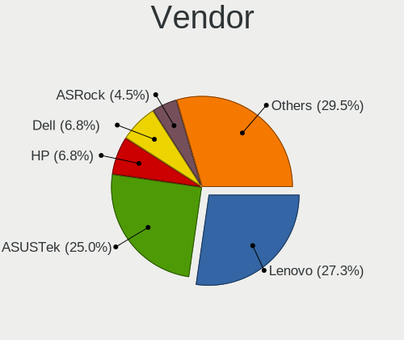
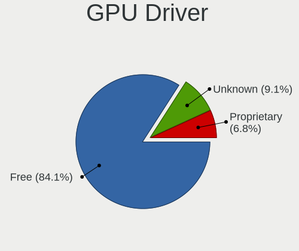
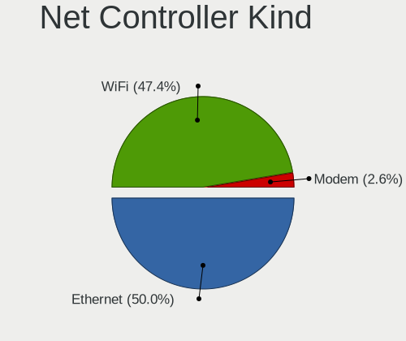
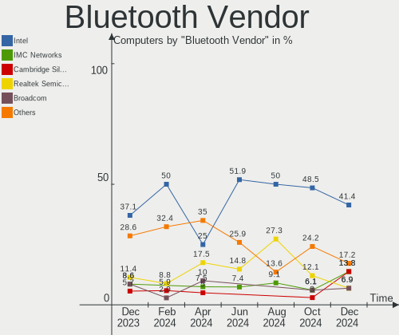

Xubuntu - Hardware Trends
-------------------------

A project to identify most popular hardware characteristics and track their change
over time based on data collected by Linux users at https://Linux-Hardware.org.

Anyone can contribute to this report by the [hw-probe](https://github.com/linuxhw/hw-probe) tool:

    sudo -E hw-probe -all -upload

This is a report for all computer types. See also reports for [desktops](/Dist/Xubuntu/Desktop/README.md) and [notebooks](/Dist/Xubuntu/Notebook/README.md).

This report is for one last month. Overall report since the beginning of time: [TestDays](https://github.com/linuxhw/TestDays)

Period: Apr, 2023.

Contents
--------

* [ System ](#system)
  - [ OS                       ](#os)
  - [ OS Family                ](#os-family)
  - [ Kernel                   ](#kernel)
  - [ Kernel Family            ](#kernel-family)
  - [ Kernel Major Ver.        ](#kernel-major-ver)
  - [ Arch                     ](#arch)
  - [ DE                       ](#de)
  - [ Display Server           ](#display-server)
  - [ Display Manager          ](#display-manager)
  - [ OS Lang                  ](#os-lang)
  - [ Boot Mode                ](#boot-mode)
  - [ Filesystem               ](#filesystem)
  - [ Part. scheme             ](#part-scheme)
  - [ Dual Boot with Linux/BSD ](#dual-boot-with-linuxbsd)
  - [ Dual Boot (Win)          ](#dual-boot-win)

* [ Board ](#board)
  - [ Vendor                   ](#vendor)
  - [ Model                    ](#model)
  - [ Model Family             ](#model-family)
  - [ MFG Year                 ](#mfg-year)
  - [ Form Factor              ](#form-factor)
  - [ Secure Boot              ](#secure-boot)
  - [ Coreboot                 ](#coreboot)
  - [ RAM Size                 ](#ram-size)
  - [ RAM Used                 ](#ram-used)
  - [ Total Drives             ](#total-drives)
  - [ Has CD-ROM               ](#has-cd-rom)
  - [ Has Ethernet             ](#has-ethernet)
  - [ Has WiFi                 ](#has-wifi)
  - [ Has Bluetooth            ](#has-bluetooth)

* [ Location ](#location)
  - [ Country                  ](#country)
  - [ City                     ](#city)

* [ Drives ](#drives)
  - [ Drive Vendor             ](#drive-vendor)
  - [ Drive Model              ](#drive-model)
  - [ HDD Vendor               ](#hdd-vendor)
  - [ SSD Vendor               ](#ssd-vendor)
  - [ Drive Kind               ](#drive-kind)
  - [ Drive Connector          ](#drive-connector)
  - [ Drive Size               ](#drive-size)
  - [ Space Total              ](#space-total)
  - [ Space Used               ](#space-used)
  - [ Malfunc. Drives          ](#malfunc-drives)
  - [ Malfunc. Drive Vendor    ](#malfunc-drive-vendor)
  - [ Malfunc. HDD Vendor      ](#malfunc-hdd-vendor)
  - [ Malfunc. Drive Kind      ](#malfunc-drive-kind)
  - [ Failed Drives            ](#failed-drives)
  - [ Failed Drive Vendor      ](#failed-drive-vendor)
  - [ Drive Status             ](#drive-status)

* [ Storage controller ](#storage-controller)
  - [ Storage Vendor           ](#storage-vendor)
  - [ Storage Model            ](#storage-model)
  - [ Storage Kind             ](#storage-kind)

* [ Processor ](#processor)
  - [ CPU Vendor               ](#cpu-vendor)
  - [ CPU Model                ](#cpu-model)
  - [ CPU Model Family         ](#cpu-model-family)
  - [ CPU Cores                ](#cpu-cores)
  - [ CPU Sockets              ](#cpu-sockets)
  - [ CPU Threads              ](#cpu-threads)
  - [ CPU Op-Modes             ](#cpu-op-modes)
  - [ CPU Microcode            ](#cpu-microcode)
  - [ CPU Microarch            ](#cpu-microarch)

* [ Graphics ](#graphics)
  - [ GPU Vendor               ](#gpu-vendor)
  - [ GPU Model                ](#gpu-model)
  - [ GPU Combo                ](#gpu-combo)
  - [ GPU Driver               ](#gpu-driver)
  - [ GPU Memory               ](#gpu-memory)

* [ Monitor ](#monitor)
  - [ Monitor Vendor           ](#monitor-vendor)
  - [ Monitor Model            ](#monitor-model)
  - [ Monitor Resolution       ](#monitor-resolution)
  - [ Monitor Diagonal         ](#monitor-diagonal)
  - [ Monitor Width            ](#monitor-width)
  - [ Aspect Ratio             ](#aspect-ratio)
  - [ Monitor Area             ](#monitor-area)
  - [ Pixel Density            ](#pixel-density)
  - [ Multiple Monitors        ](#multiple-monitors)

* [ Network ](#network)
  - [ Net Controller Vendor    ](#net-controller-vendor)
  - [ Net Controller Model     ](#net-controller-model)
  - [ Wireless Vendor          ](#wireless-vendor)
  - [ Wireless Model           ](#wireless-model)
  - [ Ethernet Vendor          ](#ethernet-vendor)
  - [ Ethernet Model           ](#ethernet-model)
  - [ Net Controller Kind      ](#net-controller-kind)
  - [ Used Controller          ](#used-controller)
  - [ NICs                     ](#nics)
  - [ IPv6                     ](#ipv6)

* [ Bluetooth ](#bluetooth)
  - [ Bluetooth Vendor         ](#bluetooth-vendor)
  - [ Bluetooth Model          ](#bluetooth-model)

* [ Sound ](#sound)
  - [ Sound Vendor             ](#sound-vendor)
  - [ Sound Model              ](#sound-model)

* [ Memory ](#memory)
  - [ Memory Vendor            ](#memory-vendor)
  - [ Memory Model             ](#memory-model)
  - [ Memory Kind              ](#memory-kind)
  - [ Memory Form Factor       ](#memory-form-factor)
  - [ Memory Size              ](#memory-size)
  - [ Memory Speed             ](#memory-speed)

* [ Printers & scanners ](#printers--scanners)
  - [ Printer Vendor           ](#printer-vendor)
  - [ Printer Model            ](#printer-model)
  - [ Scanner Vendor           ](#scanner-vendor)
  - [ Scanner Model            ](#scanner-model)

* [ Camera ](#camera)
  - [ Camera Vendor            ](#camera-vendor)
  - [ Camera Model             ](#camera-model)

* [ Security ](#security)
  - [ Fingerprint Vendor       ](#fingerprint-vendor)
  - [ Fingerprint Model        ](#fingerprint-model)
  - [ Chipcard Vendor          ](#chipcard-vendor)
  - [ Chipcard Model           ](#chipcard-model)

* [ Unsupported ](#unsupported)
  - [ Unsupported Devices      ](#unsupported-devices)
  - [ Unsupported Device Types ](#unsupported-device-types)

System
------

OS
--

Installed operating systems

| Name          | Computers | Percent |
|---------------|-----------|---------|
| Xubuntu 22.04 | 40        | 63.49%  |
| Xubuntu 20.04 | 12        | 19.05%  |
| Xubuntu 22.10 | 4         | 6.35%   |
| Xubuntu 23.04 | 3         | 4.76%   |
| Xubuntu 18.04 | 3         | 4.76%   |
| Xubuntu 21.04 | 1         | 1.59%   |

OS Family
---------

OS without a version

| Name    | Computers | Percent |
|---------|-----------|---------|
| Xubuntu | 63        | 100%    |

Kernel
------

Version of the Linux kernel

| Version                | Computers | Percent |
|------------------------|-----------|---------|
| 5.19.0-38-generic      | 12        | 19.05%  |
| 5.15.0-69-generic      | 9         | 14.29%  |
| 5.15.0-70-generic      | 7         | 11.11%  |
| 5.4.0-146-generic      | 3         | 4.76%   |
| 5.19.0-41-generic      | 3         | 4.76%   |
| 5.15.0-71-generic      | 2         | 3.17%   |
| 5.15.0-70-lowlatency   | 2         | 3.17%   |
| 5.15.0-69-lowlatency   | 2         | 3.17%   |
| 6.3.0                  | 1         | 1.59%   |
| 6.2.9-060209-generic   | 1         | 1.59%   |
| 6.2.0-20-generic       | 1         | 1.59%   |
| 6.2.0-18-generic       | 1         | 1.59%   |
| 6.2.0-1002-lowlatency  | 1         | 1.59%   |
| 6.1.0-1008-oem         | 1         | 1.59%   |
| 5.4.0-131-generic      | 1         | 1.59%   |
| 5.19.0-40-generic      | 1         | 1.59%   |
| 5.19.0-35-generic      | 1         | 1.59%   |
| 5.19.0-32-generic      | 1         | 1.59%   |
| 5.19.0-21-generic      | 1         | 1.59%   |
| 5.17.0-1027-oem        | 1         | 1.59%   |
| 5.17.0-1020-oem        | 1         | 1.59%   |
| 5.15.93-rockchip64     | 1         | 1.59%   |
| 5.15.85-051585-generic | 1         | 1.59%   |
| 5.15.0-67-generic      | 1         | 1.59%   |
| 5.15.0-60-generic      | 1         | 1.59%   |
| 5.15.0-56-generic      | 1         | 1.59%   |
| 4.9.140-tegra          | 1         | 1.59%   |
| 4.4.213-rk3399         | 1         | 1.59%   |
| 4.15.0-210-generic     | 1         | 1.59%   |
| 4.15.0-209-lowlatency  | 1         | 1.59%   |
| 4.15.0-208-generic     | 1         | 1.59%   |

Kernel Family
-------------

Linux kernel without a distro release

| Version | Computers | Percent |
|---------|-----------|---------|
| 5.15.0  | 25        | 39.68%  |
| 5.19.0  | 19        | 30.16%  |
| 5.4.0   | 4         | 6.35%   |
| 6.2.0   | 3         | 4.76%   |
| 4.15.0  | 3         | 4.76%   |
| 5.17.0  | 2         | 3.17%   |
| 6.3.0   | 1         | 1.59%   |
| 6.2.9   | 1         | 1.59%   |
| 6.1.0   | 1         | 1.59%   |
| 5.15.93 | 1         | 1.59%   |
| 5.15.85 | 1         | 1.59%   |
| 4.9.140 | 1         | 1.59%   |
| 4.4.213 | 1         | 1.59%   |

Kernel Major Ver.
-----------------

Linux kernel major version

| Version | Computers | Percent |
|---------|-----------|---------|
| 5.15    | 27        | 42.86%  |
| 5.19    | 19        | 30.16%  |
| 6.2     | 4         | 6.35%   |
| 5.4     | 4         | 6.35%   |
| 4.15    | 3         | 4.76%   |
| 5.17    | 2         | 3.17%   |
| 6.3     | 1         | 1.59%   |
| 6.1     | 1         | 1.59%   |
| 4.9     | 1         | 1.59%   |
| 4.4     | 1         | 1.59%   |

Arch
----

OS architecture (x86_64, i586, etc.)

| Name    | Computers | Percent |
|---------|-----------|---------|
| x86_64  | 57        | 90.48%  |
| i686    | 3         | 4.76%   |
| aarch64 | 3         | 4.76%   |

DE
--

Desktop Environment

| Name     | Computers | Percent |
|----------|-----------|---------|
| XFCE     | 59        | 93.65%  |
| GNOME    | 2         | 3.17%   |
| i3       | 1         | 1.59%   |
| Cinnamon | 1         | 1.59%   |

Display Server
--------------

X11 or Wayland

| Name    | Computers | Percent |
|---------|-----------|---------|
| X11     | 59        | 93.65%  |
| Wayland | 2         | 3.17%   |
| Tty     | 2         | 3.17%   |

Display Manager
---------------

SDDM, LightDM, etc.

| Name    | Computers | Percent |
|---------|-----------|---------|
| LightDM | 53        | 84.13%  |
| SDDM    | 4         | 6.35%   |
| Unknown | 3         | 4.76%   |
| GDM3    | 2         | 3.17%   |
| GDM     | 1         | 1.59%   |

OS Lang
-------

Language

| Lang  | Computers | Percent |
|-------|-----------|---------|
| en_US | 31        | 49.21%  |
| de_DE | 9         | 14.29%  |
| en_GB | 5         | 7.94%   |
| en_CA | 4         | 6.35%   |
| fr_FR | 3         | 4.76%   |
| ja_JP | 2         | 3.17%   |
| it_IT | 2         | 3.17%   |
| pl_PL | 1         | 1.59%   |
| fr_BE | 1         | 1.59%   |
| es_MX | 1         | 1.59%   |
| es_ES | 1         | 1.59%   |
| en_IN | 1         | 1.59%   |
| en_AU | 1         | 1.59%   |
| cs_CZ | 1         | 1.59%   |

Boot Mode
---------

EFI or BIOS

| Mode | Computers | Percent |
|------|-----------|---------|
| BIOS | 34        | 53.97%  |
| EFI  | 29        | 46.03%  |

Filesystem
----------

Type of filesystem

| Type  | Computers | Percent |
|-------|-----------|---------|
| Ext4  | 52        | 82.54%  |
| Tmpfs | 8         | 12.7%   |
| Zfs   | 2         | 3.17%   |
| Xfs   | 1         | 1.59%   |

Part. scheme
------------

Scheme of partitioning

| Type    | Computers | Percent |
|---------|-----------|---------|
| GPT     | 45        | 71.43%  |
| MBR     | 12        | 19.05%  |
| Unknown | 6         | 9.52%   |

Dual Boot with Linux/BSD
------------------------

Hosting more than one Linux/BSD

| Dual boot | Computers | Percent |
|-----------|-----------|---------|
| No        | 50        | 79.37%  |
| Yes       | 13        | 20.63%  |

Dual Boot (Win)
---------------

Hosting Linux and Windows

| Dual boot | Computers | Percent |
|-----------|-----------|---------|
| No        | 48        | 76.19%  |
| Yes       | 15        | 23.81%  |

Board
-----

Vendor
------

Motherboard manufacturer

| Name                | Computers | Percent |
|---------------------|-----------|---------|
| Hewlett-Packard     | 10        | 15.87%  |
| Lenovo              | 8         | 12.7%   |
| ASUSTek Computer    | 7         | 11.11%  |
| Dell                | 6         | 9.52%   |
| Acer                | 5         | 7.94%   |
| ASRock              | 4         | 6.35%   |
| Fujitsu             | 3         | 4.76%   |
| Apple               | 3         | 4.76%   |
| Toshiba             | 2         | 3.17%   |
| MSI                 | 2         | 3.17%   |
| Gigabyte Technology | 2         | 3.17%   |
| Sony                | 1         | 1.59%   |
| SGIN                | 1         | 1.59%   |
| Radxa               | 1         | 1.59%   |
| OrangePi            | 1         | 1.59%   |
| Nvidia              | 1         | 1.59%   |
| Nuvision            | 1         | 1.59%   |
| Medion              | 1         | 1.59%   |
| Intel               | 1         | 1.59%   |
| GPU Company         | 1         | 1.59%   |
| Fujitsu Siemens     | 1         | 1.59%   |
| eMachines           | 1         | 1.59%   |

Model
-----

Motherboard model

| Name                                              | Computers | Percent |
|---------------------------------------------------|-----------|---------|
| Toshiba Satellite L750D                           | 1         | 1.59%   |
| Toshiba EQUIUM P200                               | 1         | 1.59%   |
| Sony VPCZ13M9E                                    | 1         | 1.59%   |
| SGIN M15                                          | 1         | 1.59%   |
| Radxa ROCK Pi 4B                                  | 1         | 1.59%   |
| OrangePi 4 (DT)                                   | 1         | 1.59%   |
| Nvidia Tegra                                      | 1         | 1.59%   |
| Nuvision NEBP12                                   | 1         | 1.59%   |
| MSI MS-7758                                       | 1         | 1.59%   |
| MSI GP65 Leopard 10SDK                            | 1         | 1.59%   |
| Medion MS-7848                                    | 1         | 1.59%   |
| Lenovo ThinkPad X270 W10DG 20K5S0B700             | 1         | 1.59%   |
| Lenovo ThinkPad X200s 74664SJ                     | 1         | 1.59%   |
| Lenovo ThinkPad X1 Carbon Gen 10 21CCS72200       | 1         | 1.59%   |
| Lenovo ThinkPad T420 4236PA8                      | 1         | 1.59%   |
| Lenovo ThinkPad T14 Gen 3 21AH00FHYA              | 1         | 1.59%   |
| Lenovo ThinkPad P50 20EN0013US                    | 1         | 1.59%   |
| Lenovo ThinkPad L14 Gen 3 21C5004FGE              | 1         | 1.59%   |
| Lenovo ThinkPad E14 Gen 2 20TA00JLAU              | 1         | 1.59%   |
| Intel NUC11PAHi7                                  | 1         | 1.59%   |
| HP ZBook Firefly 16 inch G9 Mobile Workstation PC | 1         | 1.59%   |
| HP Z800 Workstation                               | 1         | 1.59%   |
| HP Z620 Workstation                               | 1         | 1.59%   |
| HP rp5800                                         | 1         | 1.59%   |
| HP ProBook 650 G3                                 | 1         | 1.59%   |
| HP ProBook 11 G2                                  | 1         | 1.59%   |
| HP Pavilion g6                                    | 1         | 1.59%   |
| HP Laptop 17-cp2xxx                               | 1         | 1.59%   |
| HP Laptop 15s-fq2xxx                              | 1         | 1.59%   |
| HP 470 17 inch G9 Notebook PC                     | 1         | 1.59%   |
| GPU Company GWTN156-5                             | 1         | 1.59%   |
| Gigabyte P55A-UD4P                                | 1         | 1.59%   |
| Gigabyte M68MT-S2                                 | 1         | 1.59%   |
| Fujitsu Siemens ESPRIMO Mobile V6535              | 1         | 1.59%   |
| Fujitsu LIFEBOOK U759                             | 1         | 1.59%   |
| Fujitsu ESPRIMO Q958                              | 1         | 1.59%   |
| Fujitsu CELSIUS W380                              | 1         | 1.59%   |
| eMachines EL1852G                                 | 1         | 1.59%   |
| Dell XPS 13 9333                                  | 1         | 1.59%   |
| Dell XPS 13 9305                                  | 1         | 1.59%   |

Model Family
------------

Motherboard model prefix

| Name                    | Computers | Percent |
|-------------------------|-----------|---------|
| Lenovo ThinkPad         | 8         | 12.7%   |
| HP ProBook              | 2         | 3.17%   |
| HP Laptop               | 2         | 3.17%   |
| Dell XPS                | 2         | 3.17%   |
| ASUS VivoBook           | 2         | 3.17%   |
| Acer Aspire             | 2         | 3.17%   |
| Toshiba Satellite       | 1         | 1.59%   |
| Toshiba EQUIUM          | 1         | 1.59%   |
| Sony VPCZ13M9E          | 1         | 1.59%   |
| SGIN M15                | 1         | 1.59%   |
| Radxa ROCK              | 1         | 1.59%   |
| OrangePi 4              | 1         | 1.59%   |
| Nvidia Tegra            | 1         | 1.59%   |
| Nuvision NEBP12         | 1         | 1.59%   |
| MSI MS-7758             | 1         | 1.59%   |
| MSI GP65                | 1         | 1.59%   |
| Medion MS-7848          | 1         | 1.59%   |
| Intel NUC11PAHi7        | 1         | 1.59%   |
| HP ZBook                | 1         | 1.59%   |
| HP Z800                 | 1         | 1.59%   |
| HP Z620                 | 1         | 1.59%   |
| HP rp5800               | 1         | 1.59%   |
| HP Pavilion             | 1         | 1.59%   |
| HP 470                  | 1         | 1.59%   |
| GPU Company GWTN156-5   | 1         | 1.59%   |
| Gigabyte P55A-UD4P      | 1         | 1.59%   |
| Gigabyte M68MT-S2       | 1         | 1.59%   |
| Fujitsu Siemens ESPRIMO | 1         | 1.59%   |
| Fujitsu LIFEBOOK        | 1         | 1.59%   |
| Fujitsu ESPRIMO         | 1         | 1.59%   |
| Fujitsu CELSIUS         | 1         | 1.59%   |
| eMachines EL1852G       | 1         | 1.59%   |
| Dell Wyse               | 1         | 1.59%   |
| Dell Vostro             | 1         | 1.59%   |
| Dell Precision          | 1         | 1.59%   |
| Dell Latitude           | 1         | 1.59%   |
| ASUS X58C               | 1         | 1.59%   |
| ASUS ROG                | 1         | 1.59%   |
| ASUS P5Q                | 1         | 1.59%   |
| ASUS M5A78L-M           | 1         | 1.59%   |

MFG Year
--------

Motherboard manufacture year

| Year    | Computers | Percent |
|---------|-----------|---------|
| 2020    | 8         | 12.7%   |
| 2022    | 7         | 11.11%  |
| 2011    | 7         | 11.11%  |
| 2021    | 5         | 7.94%   |
| 2010    | 5         | 7.94%   |
| 2012    | 4         | 6.35%   |
| 2008    | 4         | 6.35%   |
| 2017    | 3         | 4.76%   |
| 2016    | 3         | 4.76%   |
| 2009    | 3         | 4.76%   |
| 2007    | 3         | 4.76%   |
| Unknown | 3         | 4.76%   |
| 2019    | 2         | 3.17%   |
| 2018    | 2         | 3.17%   |
| 2015    | 2         | 3.17%   |
| 2013    | 2         | 3.17%   |

Form Factor
-----------

Physical design of the computer

| Name           | Computers | Percent |
|----------------|-----------|---------|
| Notebook       | 36        | 57.14%  |
| Desktop        | 18        | 28.57%  |
| System on chip | 3         | 4.76%   |
| Mini pc        | 3         | 4.76%   |
| All in one     | 2         | 3.17%   |
| Server         | 1         | 1.59%   |

Secure Boot
-----------

Enabled or disabled

| State    | Computers | Percent |
|----------|-----------|---------|
| Disabled | 60        | 95.24%  |
| Enabled  | 3         | 4.76%   |

Coreboot
--------

Have coreboot on board

| Used | Computers | Percent |
|------|-----------|---------|
| No   | 62        | 98.41%  |
| Yes  | 1         | 1.59%   |

RAM Size
--------

Total RAM memory

| Size in GB  | Computers | Percent |
|-------------|-----------|---------|
| 4.01-8.0    | 12        | 19.05%  |
| 3.01-4.0    | 12        | 19.05%  |
| 8.01-16.0   | 9         | 14.29%  |
| 16.01-24.0  | 8         | 12.7%   |
| 64.01-256.0 | 7         | 11.11%  |
| 32.01-64.0  | 6         | 9.52%   |
| 2.01-3.0    | 4         | 6.35%   |
| 24.01-32.0  | 2         | 3.17%   |
| 1.01-2.0    | 2         | 3.17%   |
| 0.51-1.0    | 1         | 1.59%   |

RAM Used
--------

Used RAM memory

| Used GB    | Computers | Percent |
|------------|-----------|---------|
| 2.01-3.0   | 18        | 28.57%  |
| 1.01-2.0   | 15        | 23.81%  |
| 3.01-4.0   | 9         | 14.29%  |
| 4.01-8.0   | 8         | 12.7%   |
| 0.51-1.0   | 5         | 7.94%   |
| 8.01-16.0  | 4         | 6.35%   |
| 0.01-0.5   | 2         | 3.17%   |
| 24.01-32.0 | 1         | 1.59%   |
| 16.01-24.0 | 1         | 1.59%   |

Total Drives
------------

Number of drives on board

| Drives | Computers | Percent |
|--------|-----------|---------|
| 1      | 39        | 61.9%   |
| 2      | 16        | 25.4%   |
| 3      | 6         | 9.52%   |
| 5      | 1         | 1.59%   |
| 4      | 1         | 1.59%   |

Has CD-ROM
----------

Has CD-ROM on board

| Presented | Computers | Percent |
|-----------|-----------|---------|
| No        | 36        | 57.14%  |
| Yes       | 27        | 42.86%  |

Has Ethernet
------------

Has Ethernet on board

| Presented | Computers | Percent |
|-----------|-----------|---------|
| Yes       | 49        | 77.78%  |
| No        | 14        | 22.22%  |

Has WiFi
--------

Has WiFi module

| Presented | Computers | Percent |
|-----------|-----------|---------|
| Yes       | 54        | 85.71%  |
| No        | 9         | 14.29%  |

Has Bluetooth
-------------

Has Bluetooth module

| Presented | Computers | Percent |
|-----------|-----------|---------|
| Yes       | 39        | 61.9%   |
| No        | 24        | 38.1%   |

Location
--------

Country
-------

Geographic location (country)

| Country   | Computers | Percent |
|-----------|-----------|---------|
| USA       | 14        | 22.22%  |
| Germany   | 14        | 22.22%  |
| France    | 6         | 9.52%   |
| Italy     | 4         | 6.35%   |
| Canada    | 4         | 6.35%   |
| UK        | 3         | 4.76%   |
| Spain     | 3         | 4.76%   |
| Poland    | 3         | 4.76%   |
| Japan     | 2         | 3.17%   |
| Russia    | 1         | 1.59%   |
| Mexico    | 1         | 1.59%   |
| India     | 1         | 1.59%   |
| Egypt     | 1         | 1.59%   |
| Denmark   | 1         | 1.59%   |
| Czechia   | 1         | 1.59%   |
| Belgium   | 1         | 1.59%   |
| Austria   | 1         | 1.59%   |
| Australia | 1         | 1.59%   |
| Argentina | 1         | 1.59%   |

City
----

Geographic location (city)

| City                  | Computers | Percent |
|-----------------------|-----------|---------|
| North Hills           | 3         | 4.76%   |
| Hamburg               | 2         | 3.17%   |
| Burnaby               | 2         | 3.17%   |
| Winnipeg              | 1         | 1.59%   |
| Williston             | 1         | 1.59%   |
| Warsaw                | 1         | 1.59%   |
| Vienna                | 1         | 1.59%   |
| Trieste               | 1         | 1.59%   |
| Trento                | 1         | 1.59%   |
| Torremolinos          | 1         | 1.59%   |
| Stuttgart             | 1         | 1.59%   |
| Stockton              | 1         | 1.59%   |
| Shinjuku              | 1         | 1.59%   |
| Seguin                | 1         | 1.59%   |
| Schorndorf            | 1         | 1.59%   |
| Schnaittach           | 1         | 1.59%   |
| San Antonio de Areco  | 1         | 1.59%   |
| Puteaux               | 1         | 1.59%   |
| Plymouth              | 1         | 1.59%   |
| Osaka                 | 1         | 1.59%   |
| Orléans              | 1         | 1.59%   |
| Opava                 | 1         | 1.59%   |
| O Outeiro             | 1         | 1.59%   |
| Newcastle             | 1         | 1.59%   |
| New Albany            | 1         | 1.59%   |
| Münster              | 1         | 1.59%   |
| Munich                | 1         | 1.59%   |
| Moscow                | 1         | 1.59%   |
| Milan                 | 1         | 1.59%   |
| Mexicali              | 1         | 1.59%   |
| Melbourne             | 1         | 1.59%   |
| Mantes-la-Jolie       | 1         | 1.59%   |
| Ludwigshafen am Rhein | 1         | 1.59%   |
| Lorient               | 1         | 1.59%   |
| Lincoln               | 1         | 1.59%   |
| Liège                | 1         | 1.59%   |
| Legnaro               | 1         | 1.59%   |
| Kolkata               | 1         | 1.59%   |
| Hyżne                | 1         | 1.59%   |
| Hove                  | 1         | 1.59%   |

Drives
------

Drive Vendor
------------

Hard drive vendors

| Vendor                      | Computers | Drives | Percent |
|-----------------------------|-----------|--------|---------|
| Samsung Electronics         | 14        | 15     | 16.09%  |
| WDC                         | 10        | 10     | 11.49%  |
| Seagate                     | 8         | 11     | 9.2%    |
| Unknown                     | 7         | 8      | 8.05%   |
| Toshiba                     | 6         | 7      | 6.9%    |
| SanDisk                     | 5         | 5      | 5.75%   |
| Crucial                     | 5         | 5      | 5.75%   |
| Kingston                    | 3         | 3      | 3.45%   |
| Intel                       | 3         | 3      | 3.45%   |
| Micron Technology           | 2         | 2      | 2.3%    |
| Kingston Technology Company | 2         | 2      | 2.3%    |
| Hitachi                     | 2         | 2      | 2.3%    |
| HGST                        | 2         | 2      | 2.3%    |
| Corsair                     | 2         | 2      | 2.3%    |
| UMIS                        | 1         | 1      | 1.15%   |
| Transcend                   | 1         | 1      | 1.15%   |
| Team                        | 1         | 1      | 1.15%   |
| SPCC                        | 1         | 1      | 1.15%   |
| SK hynix                    | 1         | 1      | 1.15%   |
| Realtek Semiconductor       | 1         | 1      | 1.15%   |
| Plextor                     | 1         | 1      | 1.15%   |
| Phison                      | 1         | 2      | 1.15%   |
| ORICO                       | 1         | 1      | 1.15%   |
| Micron/Crucial Technology   | 1         | 1      | 1.15%   |
| Hewlett-Packard             | 1         | 2      | 1.15%   |
| Fujitsu                     | 1         | 1      | 1.15%   |
| FORESEE                     | 1         | 1      | 1.15%   |
| Dogfish                     | 1         | 1      | 1.15%   |
| China                       | 1         | 1      | 1.15%   |
| ASMT                        | 1         | 2      | 1.15%   |

Drive Model
-----------

Hard drive models

| Model                                             | Computers | Percent |
|---------------------------------------------------|-----------|---------|
| Seagate ST31000524AS 1TB                          | 2         | 2.22%   |
| Samsung NVMe SSD Controller SM981/PM981/PM983 1TB | 2         | 2.22%   |
| Crucial CT500MX500SSD1 500GB                      | 2         | 2.22%   |
| WDC WD5003ABYZ-011FA0 500GB                       | 1         | 1.11%   |
| WDC WD5000LPLX-60ZNTT1 500GB                      | 1         | 1.11%   |
| WDC WD5000AZLX-60K2TA0 500GB                      | 1         | 1.11%   |
| WDC WD5000AZLX-00K2TA0 500GB                      | 1         | 1.11%   |
| WDC WD5000AAKX-22ERMA0 500GB                      | 1         | 1.11%   |
| WDC WD5000AAKX-00ERMA0 500GB                      | 1         | 1.11%   |
| WDC WD5000AADS-00S9B0 500GB                       | 1         | 1.11%   |
| WDC WD20NPVX-00EA4T0 2TB                          | 1         | 1.11%   |
| WDC WD1001FALS-40Y6A0 1TB                         | 1         | 1.11%   |
| WDC PC SN730 NVMe 512GB                           | 1         | 1.11%   |
| Unknown SD64G  64GB                               | 1         | 1.11%   |
| Unknown SD16G  32GB                               | 1         | 1.11%   |
| Unknown SD/MMC/MS PRO 249GB                       | 1         | 1.11%   |
| Unknown MMC Card  64GB                            | 1         | 1.11%   |
| Unknown MMC Card  16GB                            | 1         | 1.11%   |
| Unknown MMC Card  128GB                           | 1         | 1.11%   |
| Unknown DF4016  16GB                              | 1         | 1.11%   |
| Unknown AJTD4R  16GB                              | 1         | 1.11%   |
| UMIS RPJTJ512MGE1QDQ 512GB                        | 1         | 1.11%   |
| Transcend TS120GMTS420S 120GB SSD                 | 1         | 1.11%   |
| Toshiba MQ01ABD075 752GB                          | 1         | 1.11%   |
| Toshiba MK6475GSX 640GB                           | 1         | 1.11%   |
| Toshiba MK1655GSX H 120GB                         | 1         | 1.11%   |
| Toshiba MK1246GSX 120GB                           | 1         | 1.11%   |
| Toshiba DT01ACA200 2TB                            | 1         | 1.11%   |
| Toshiba DT01ACA100 1TB                            | 1         | 1.11%   |
| Team TM8PS7512G 512GB SSD                         | 1         | 1.11%   |
| SPCC M.2 SSD 512GB                                | 1         | 1.11%   |
| SK hynix SKHynix_HFM512GD3HX015N 512GB            | 1         | 1.11%   |
| Seagate ST9320325AS 320GB                         | 1         | 1.11%   |
| Seagate ST9250827AS 250GB                         | 1         | 1.11%   |
| Seagate ST31000528AS 1TB                          | 1         | 1.11%   |
| Seagate ST31000340AS 1TB                          | 1         | 1.11%   |
| Seagate ST2000DM001-1CH164 2TB                    | 1         | 1.11%   |
| Seagate ST1000LM048-2E7172 1TB                    | 1         | 1.11%   |
| Seagate OneTouch HDD 5TB                          | 1         | 1.11%   |
| Seagate FireCuda HDD 2TB                          | 1         | 1.11%   |

HDD Vendor
----------

Hard disk drive vendors

| Vendor          | Computers | Drives | Percent |
|-----------------|-----------|--------|---------|
| WDC             | 9         | 9      | 30%     |
| Seagate         | 8         | 11     | 26.67%  |
| Toshiba         | 6         | 7      | 20%     |
| Hitachi         | 2         | 2      | 6.67%   |
| HGST            | 2         | 2      | 6.67%   |
| Unknown         | 1         | 1      | 3.33%   |
| Hewlett-Packard | 1         | 2      | 3.33%   |
| Fujitsu         | 1         | 1      | 3.33%   |

SSD Vendor
----------

Solid state drive vendors

| Vendor              | Computers | Drives | Percent |
|---------------------|-----------|--------|---------|
| Samsung Electronics | 5         | 6      | 20%     |
| Crucial             | 5         | 5      | 20%     |
| SanDisk             | 2         | 2      | 8%      |
| Kingston            | 2         | 2      | 8%      |
| Transcend           | 1         | 1      | 4%      |
| Team                | 1         | 1      | 4%      |
| SPCC                | 1         | 1      | 4%      |
| Plextor             | 1         | 1      | 4%      |
| Micron Technology   | 1         | 1      | 4%      |
| Intel               | 1         | 1      | 4%      |
| FORESEE             | 1         | 1      | 4%      |
| Dogfish             | 1         | 1      | 4%      |
| Corsair             | 1         | 1      | 4%      |
| China               | 1         | 1      | 4%      |
| ASMT                | 1         | 2      | 4%      |

Drive Kind
----------

HDD or SSD

| Kind    | Computers | Drives | Percent |
|---------|-----------|--------|---------|
| HDD     | 26        | 35     | 32.91%  |
| NVMe    | 23        | 25     | 29.11%  |
| SSD     | 23        | 27     | 29.11%  |
| MMC     | 6         | 8      | 7.59%   |
| Unknown | 1         | 1      | 1.27%   |

Drive Connector
---------------

SATA, SAS, NVMe, etc.

| Type | Computers | Drives | Percent |
|------|-----------|--------|---------|
| SATA | 40        | 56     | 54.05%  |
| NVMe | 23        | 25     | 31.08%  |
| MMC  | 6         | 8      | 8.11%   |
| SAS  | 5         | 7      | 6.76%   |

Drive Size
----------

Size of hard drive

| Size in TB | Computers | Drives | Percent |
|------------|-----------|--------|---------|
| 0.01-0.5   | 31        | 35     | 58.49%  |
| 0.51-1.0   | 14        | 15     | 26.42%  |
| 1.01-2.0   | 7         | 10     | 13.21%  |
| 4.01-10.0  | 1         | 2      | 1.89%   |

Space Total
-----------

Amount of disk space available on the file system

| Size in GB     | Computers | Percent |
|----------------|-----------|---------|
| 251-500        | 17        | 26.98%  |
| 101-250        | 11        | 17.46%  |
| 501-1000       | 10        | 15.87%  |
| 1001-2000      | 7         | 11.11%  |
| More than 3000 | 4         | 6.35%   |
| 21-50          | 4         | 6.35%   |
| 1-20           | 4         | 6.35%   |
| 2001-3000      | 3         | 4.76%   |
| 51-100         | 3         | 4.76%   |

Space Used
----------

Amount of used disk space

| Used GB        | Computers | Percent |
|----------------|-----------|---------|
| 1-20           | 21        | 33.33%  |
| 101-250        | 14        | 22.22%  |
| 51-100         | 8         | 12.7%   |
| 21-50          | 7         | 11.11%  |
| 251-500        | 4         | 6.35%   |
| 501-1000       | 4         | 6.35%   |
| 1001-2000      | 3         | 4.76%   |
| More than 3000 | 1         | 1.59%   |
| 2001-3000      | 1         | 1.59%   |

Malfunc. Drives
---------------

Drive models with a malfunction

| Model                          | Computers | Drives | Percent |
|--------------------------------|-----------|--------|---------|
| WDC WD1001FALS-40Y6A0 1TB      | 1         | 1      | 20%     |
| Toshiba MK1246GSX 120GB        | 1         | 1      | 20%     |
| Seagate ST2000DM001-1CH164 2TB | 1         | 1      | 20%     |
| Hitachi HTS543216L9A300 160GB  | 1         | 1      | 20%     |
| Fujitsu MHZ2160BJ FFS G2 160GB | 1         | 1      | 20%     |

Malfunc. Drive Vendor
---------------------

Vendors of faulty drives

| Vendor  | Computers | Drives | Percent |
|---------|-----------|--------|---------|
| WDC     | 1         | 1      | 20%     |
| Toshiba | 1         | 1      | 20%     |
| Seagate | 1         | 1      | 20%     |
| Hitachi | 1         | 1      | 20%     |
| Fujitsu | 1         | 1      | 20%     |

Malfunc. HDD Vendor
-------------------

Vendors of faulty HDD drives

| Vendor  | Computers | Drives | Percent |
|---------|-----------|--------|---------|
| WDC     | 1         | 1      | 20%     |
| Toshiba | 1         | 1      | 20%     |
| Seagate | 1         | 1      | 20%     |
| Hitachi | 1         | 1      | 20%     |
| Fujitsu | 1         | 1      | 20%     |

Malfunc. Drive Kind
-------------------

Kinds of faulty drives

| Kind | Computers | Drives | Percent |
|------|-----------|--------|---------|
| HDD  | 5         | 5      | 100%    |

Failed Drives
-------------

Failed drive models

Zero info for selected period =(

Failed Drive Vendor
-------------------

Failed drive vendors

Zero info for selected period =(

Drive Status
------------

Number of failed and malfunc. drives

| Status   | Computers | Drives | Percent |
|----------|-----------|--------|---------|
| Detected | 32        | 47     | 47.06%  |
| Works    | 31        | 44     | 45.59%  |
| Malfunc  | 5         | 5      | 7.35%   |

Storage controller
------------------

Storage Vendor
--------------

Storage controller vendors

| Vendor                           | Computers | Percent |
|----------------------------------|-----------|---------|
| Intel                            | 42        | 52.5%   |
| Samsung Electronics              | 9         | 11.25%  |
| AMD                              | 6         | 7.5%    |
| SanDisk                          | 3         | 3.75%   |
| Kingston Technology Company      | 3         | 3.75%   |
| Phison Electronics               | 2         | 2.5%    |
| Marvell Technology Group         | 2         | 2.5%    |
| ASMedia Technology               | 2         | 2.5%    |
| Union Memory (Shenzhen)          | 1         | 1.25%   |
| SK hynix                         | 1         | 1.25%   |
| Silicon Integrated Systems [SiS] | 1         | 1.25%   |
| Realtek Semiconductor            | 1         | 1.25%   |
| Nvidia                           | 1         | 1.25%   |
| Micron/Crucial Technology        | 1         | 1.25%   |
| Micron Technology                | 1         | 1.25%   |
| LSI Logic / Symbios Logic        | 1         | 1.25%   |
| JMicron Technology               | 1         | 1.25%   |
| Integrated Technology Express    | 1         | 1.25%   |
| Broadcom / LSI                   | 1         | 1.25%   |

Storage Model
-------------

Storage controller models

| Model                                                                         | Computers | Percent |
|-------------------------------------------------------------------------------|-----------|---------|
| Samsung NVMe SSD Controller SM981/PM981/PM983                                 | 4         | 4.12%   |
| Intel Volume Management Device NVMe RAID Controller                           | 4         | 4.12%   |
| AMD FCH SATA Controller [AHCI mode]                                           | 4         | 4.12%   |
| Intel Celeron/Pentium Silver Processor SATA Controller                        | 3         | 3.09%   |
| Samsung NVMe SSD Controller SM961/PM961/SM963                                 | 2         | 2.06%   |
| Samsung NVMe SSD Controller 980                                               | 2         | 2.06%   |
| Intel Tiger Lake-LP SATA Controller                                           | 2         | 2.06%   |
| Intel Sunrise Point-LP SATA Controller [AHCI mode]                            | 2         | 2.06%   |
| Intel SATA Controller [RAID mode]                                             | 2         | 2.06%   |
| Intel Q170/Q150/B150/H170/H110/Z170/CM236 Chipset SATA Controller [AHCI Mode] | 2         | 2.06%   |
| Intel Cannon Lake PCH SATA AHCI Controller                                    | 2         | 2.06%   |
| Intel 82801IBM/IEM (ICH9M/ICH9M-E) 4 port SATA Controller [AHCI mode]         | 2         | 2.06%   |
| Intel 82801HM/HEM (ICH8M/ICH8M-E) IDE Controller                              | 2         | 2.06%   |
| Intel 82801G (ICH7 Family) IDE Controller                                     | 2         | 2.06%   |
| Intel 82801 Mobile SATA Controller [RAID mode]                                | 2         | 2.06%   |
| Intel 8 Series SATA Controller 1 [AHCI mode]                                  | 2         | 2.06%   |
| Intel 7 Series/C210 Series Chipset Family 6-port SATA Controller [AHCI mode]  | 2         | 2.06%   |
| Intel 7 Series Chipset Family 6-port SATA Controller [AHCI mode]              | 2         | 2.06%   |
| Intel 6 Series/C200 Series Chipset Family 6 port Mobile SATA AHCI Controller  | 2         | 2.06%   |
| Intel 5 Series/3400 Series Chipset 6 port SATA AHCI Controller                | 2         | 2.06%   |
| ASMedia ASM1062 Serial ATA Controller                                         | 2         | 2.06%   |
| AMD SB7x0/SB8x0/SB9x0 SATA Controller [AHCI mode]                             | 2         | 2.06%   |
| Union Memory (Shenzhen) AM630 PCIe 4.0 x4 NVMe SSD Controller                 | 1         | 1.03%   |
| SK hynix Gold P31/PC711 NVMe Solid State Drive                                | 1         | 1.03%   |
| Silicon Integrated Systems [SiS] SATA Controller / IDE mode                   | 1         | 1.03%   |
| SanDisk WD Blue SN570 NVMe SSD 1TB                                            | 1         | 1.03%   |
| SanDisk WD Black SN770 NVMe SSD                                               | 1         | 1.03%   |
| SanDisk WD Black SN750 / PC SN730 NVMe SSD                                    | 1         | 1.03%   |
| Samsung NVMe SSD Controller PM9A1/PM9A3/980PRO                                | 1         | 1.03%   |
| Realtek NVMe Controller                                                       | 1         | 1.03%   |
| Phison E7 NVMe Controller                                                     | 1         | 1.03%   |
| Phison E18 PCIe4 NVMe Controller                                              | 1         | 1.03%   |
| Nvidia MCP61 SATA Controller                                                  | 1         | 1.03%   |
| Micron/Crucial P2 NVMe PCIe SSD                                               | 1         | 1.03%   |
| Micron NVMe Storage Controller                                                | 1         | 1.03%   |
| Marvell Group 88SE9230 PCIe 2.0 x2 4-port SATA 6 Gb/s RAID Controller         | 1         | 1.03%   |
| Marvell Group 88SE91A3 SATA-600 Controller                                    | 1         | 1.03%   |
| Marvell Group 88SE6111/6121 SATA II / PATA Controller                         | 1         | 1.03%   |
| LSI Logic / Symbios Logic SAS1068E PCI-Express Fusion-MPT SAS                 | 1         | 1.03%   |
| Kingston Company U-SNS8154P3 NVMe SSD                                         | 1         | 1.03%   |

Storage Kind
------------

Kind of storage controller (IDE, SATA, NVMe, SAS, ...)

| Kind | Computers | Percent |
|------|-----------|---------|
| SATA | 38        | 44.71%  |
| NVMe | 23        | 27.06%  |
| IDE  | 13        | 15.29%  |
| RAID | 9         | 10.59%  |
| SAS  | 1         | 1.18%   |
| SCSI | 1         | 1.18%   |

Processor
---------

CPU Vendor
----------

Processor vendors

| Vendor | Computers | Percent |
|--------|-----------|---------|
| Intel  | 50        | 79.37%  |
| AMD    | 10        | 15.87%  |
| ARM    | 3         | 4.76%   |

CPU Model
---------

Processor models

| Model                                       | Computers | Percent |
|---------------------------------------------|-----------|---------|
| ARM Processor                               | 3         | 4.76%   |
| Intel Core 2 Duo CPU P8600 @ 2.40GHz        | 2         | 3.17%   |
| Intel 12th Gen Core i7-1260P                | 2         | 3.17%   |
| Intel 11th Gen Core i7-1165G7 @ 2.80GHz     | 2         | 3.17%   |
| Intel 11th Gen Core i5-1135G7 @ 2.40GHz     | 2         | 3.17%   |
| Intel Xeon Gold 5217 CPU @ 3.00GHz          | 1         | 1.59%   |
| Intel Xeon CPU X5687 @ 3.60GHz              | 1         | 1.59%   |
| Intel Xeon CPU E5-2697 v2 @ 2.70GHz         | 1         | 1.59%   |
| Intel Pentium Dual-Core CPU E5800 @ 3.20GHz | 1         | 1.59%   |
| Intel Pentium Dual CPU T3400 @ 2.16GHz      | 1         | 1.59%   |
| Intel Pentium Dual CPU T2330 @ 1.60GHz      | 1         | 1.59%   |
| Intel Pentium CPU N3700 @ 1.60GHz           | 1         | 1.59%   |
| Intel Core i7-9700T CPU @ 2.00GHz           | 1         | 1.59%   |
| Intel Core i7-8565U CPU @ 1.80GHz           | 1         | 1.59%   |
| Intel Core i7-6700HQ CPU @ 2.60GHz          | 1         | 1.59%   |
| Intel Core i7-6700 CPU @ 3.40GHz            | 1         | 1.59%   |
| Intel Core i7-4790 CPU @ 3.60GHz            | 1         | 1.59%   |
| Intel Core i7-10750H CPU @ 2.60GHz          | 1         | 1.59%   |
| Intel Core i7 CPU 870 @ 2.93GHz             | 1         | 1.59%   |
| Intel Core i5-9400 CPU @ 2.90GHz            | 1         | 1.59%   |
| Intel Core i5-7200U CPU @ 2.50GHz           | 1         | 1.59%   |
| Intel Core i5-6200U CPU @ 2.30GHz           | 1         | 1.59%   |
| Intel Core i5-4200U CPU @ 1.60GHz           | 1         | 1.59%   |
| Intel Core i5-3570 CPU @ 3.40GHz            | 1         | 1.59%   |
| Intel Core i5-3230M CPU @ 2.60GHz           | 1         | 1.59%   |
| Intel Core i5-3210M CPU @ 2.50GHz           | 1         | 1.59%   |
| Intel Core i5-2520M CPU @ 2.50GHz           | 1         | 1.59%   |
| Intel Core i5-2500K CPU @ 3.30GHz           | 1         | 1.59%   |
| Intel Core i5-2415M CPU @ 2.30GHz           | 1         | 1.59%   |
| Intel Core i5 CPU M 460 @ 2.53GHz           | 1         | 1.59%   |
| Intel Core i5 CPU 760 @ 2.80GHz             | 1         | 1.59%   |
| Intel Core i5 CPU 660 @ 3.33GHz             | 1         | 1.59%   |
| Intel Core i3-6100U CPU @ 2.30GHz           | 1         | 1.59%   |
| Intel Core 2 Duo CPU T5550 @ 1.83GHz        | 1         | 1.59%   |
| Intel Core 2 Duo CPU L9400 @ 1.86GHz        | 1         | 1.59%   |
| Intel Core 2 Duo CPU E8200 @ 2.66GHz        | 1         | 1.59%   |
| Intel Core 2 CPU T7400 @ 2.16GHz            | 1         | 1.59%   |
| Intel Celeron N4020C CPU @ 1.10GHz          | 1         | 1.59%   |
| Intel Celeron N4020 CPU @ 1.10GHz           | 1         | 1.59%   |
| Intel Celeron J4105 CPU @ 1.50GHz           | 1         | 1.59%   |

CPU Model Family
----------------

Processor model prefix

| Model                   | Computers | Percent |
|-------------------------|-----------|---------|
| Intel Core i5           | 13        | 20.63%  |
| Other                   | 12        | 19.05%  |
| Intel Core i7           | 7         | 11.11%  |
| Intel Celeron           | 7         | 11.11%  |
| Intel Core 2 Duo        | 5         | 7.94%   |
| Intel Xeon              | 2         | 3.17%   |
| Intel Pentium Dual      | 2         | 3.17%   |
| AMD Ryzen 7             | 2         | 3.17%   |
| AMD Ryzen 5             | 2         | 3.17%   |
| Intel Xeon Gold         | 1         | 1.59%   |
| Intel Pentium Dual-Core | 1         | 1.59%   |
| Intel Pentium           | 1         | 1.59%   |
| Intel Core i3           | 1         | 1.59%   |
| Intel Core 2            | 1         | 1.59%   |
| AMD Ryzen 9             | 1         | 1.59%   |
| AMD Ryzen 7 PRO         | 1         | 1.59%   |
| AMD Ryzen 3             | 1         | 1.59%   |
| AMD FX                  | 1         | 1.59%   |
| AMD E                   | 1         | 1.59%   |
| AMD Athlon II X2        | 1         | 1.59%   |

CPU Cores
---------

Number of processor cores

| Number | Computers | Percent |
|--------|-----------|---------|
| 2      | 28        | 44.44%  |
| 4      | 19        | 30.16%  |
| 8      | 5         | 7.94%   |
| 6      | 4         | 6.35%   |
| 12     | 3         | 4.76%   |
| 24     | 1         | 1.59%   |
| 16     | 1         | 1.59%   |
| 10     | 1         | 1.59%   |
| 1      | 1         | 1.59%   |

CPU Sockets
-----------

Number of sockets

| Number | Computers | Percent |
|--------|-----------|---------|
| 1      | 61        | 96.83%  |
| 2      | 2         | 3.17%   |

CPU Threads
-----------

Threads per core (Hyper-Threading)

| Number | Computers | Percent |
|--------|-----------|---------|
| 2      | 34        | 53.97%  |
| 1      | 29        | 46.03%  |

CPU Op-Modes
------------

CPU Operation Modes (32-bit, 64-bit)

| Op mode        | Computers | Percent |
|----------------|-----------|---------|
| 32-bit, 64-bit | 62        | 98.41%  |
| 64-bit         | 1         | 1.59%   |

CPU Microcode
-------------

Microcode number

| Number     | Computers | Percent |
|------------|-----------|---------|
| Unknown    | 25        | 39.68%  |
| 0x6fd      | 3         | 4.76%   |
| 0x206a7    | 2         | 3.17%   |
| 0x106e5    | 2         | 3.17%   |
| 0x1067a    | 2         | 3.17%   |
| 0x10676    | 2         | 3.17%   |
| 0x906ed    | 1         | 1.59%   |
| 0x906ea    | 1         | 1.59%   |
| 0x906a4    | 1         | 1.59%   |
| 0x906a3    | 1         | 1.59%   |
| 0x806e9    | 1         | 1.59%   |
| 0x806c1    | 1         | 1.59%   |
| 0x706a8    | 1         | 1.59%   |
| 0x706a1    | 1         | 1.59%   |
| 0x6f6      | 1         | 1.59%   |
| 0x506e3    | 1         | 1.59%   |
| 0x506c9    | 1         | 1.59%   |
| 0x50657    | 1         | 1.59%   |
| 0x406e3    | 1         | 1.59%   |
| 0x406c3    | 1         | 1.59%   |
| 0x306e4    | 1         | 1.59%   |
| 0x306c3    | 1         | 1.59%   |
| 0x306a9    | 1         | 1.59%   |
| 0x206c2    | 1         | 1.59%   |
| 0x20655    | 1         | 1.59%   |
| 0x0a50000d | 1         | 1.59%   |
| 0x0a201025 | 1         | 1.59%   |
| 0x08a00006 | 1         | 1.59%   |
| 0x08701013 | 1         | 1.59%   |
| 0x08600102 | 1         | 1.59%   |
| 0x06000852 | 1         | 1.59%   |
| 0x05000119 | 1         | 1.59%   |
| 0x010000c7 | 1         | 1.59%   |

CPU Microarch
-------------

Microarchitecture

| Name             | Computers | Percent |
|------------------|-----------|---------|
| Unknown          | 7         | 11.11%  |
| TigerLake        | 5         | 7.94%   |
| Skylake          | 5         | 7.94%   |
| Penryn           | 5         | 7.94%   |
| Core             | 5         | 7.94%   |
| SandyBridge      | 4         | 6.35%   |
| KabyLake         | 4         | 6.35%   |
| IvyBridge        | 4         | 6.35%   |
| Westmere         | 3         | 4.76%   |
| Haswell          | 3         | 4.76%   |
| Goldmont plus    | 3         | 4.76%   |
| Zen 3            | 2         | 3.17%   |
| Zen 2            | 2         | 3.17%   |
| Nehalem          | 2         | 3.17%   |
| Alderlake Hybrid | 2         | 3.17%   |
| Zen+             | 1         | 1.59%   |
| Silvermont       | 1         | 1.59%   |
| Piledriver       | 1         | 1.59%   |
| K10              | 1         | 1.59%   |
| Goldmont         | 1         | 1.59%   |
| CometLake        | 1         | 1.59%   |
| Bobcat           | 1         | 1.59%   |

Graphics
--------

GPU Vendor
----------

Vendors of graphics cards

| Vendor                           | Computers | Percent |
|----------------------------------|-----------|---------|
| Intel                            | 37        | 56.92%  |
| Nvidia                           | 14        | 21.54%  |
| AMD                              | 13        | 20%     |
| Silicon Integrated Systems [SiS] | 1         | 1.54%   |

GPU Model
---------

Graphics card models

| Model                                                                                    | Computers | Percent |
|------------------------------------------------------------------------------------------|-----------|---------|
| Intel TigerLake-LP GT2 [Iris Xe Graphics]                                                | 4         | 6.06%   |
| Intel Mobile 4 Series Chipset Integrated Graphics Controller                             | 4         | 6.06%   |
| Intel 2nd Generation Core Processor Family Integrated Graphics Controller                | 4         | 6.06%   |
| Intel GeminiLake [UHD Graphics 600]                                                      | 3         | 4.55%   |
| Intel Alder Lake-P Integrated Graphics Controller                                        | 3         | 4.55%   |
| Intel Skylake GT2 [HD Graphics 520]                                                      | 2         | 3.03%   |
| Intel HD Graphics 530                                                                    | 2         | 3.03%   |
| Intel Haswell-ULT Integrated Graphics Controller                                         | 2         | 3.03%   |
| Intel CoffeeLake-S GT2 [UHD Graphics 630]                                                | 2         | 3.03%   |
| Intel 3rd Gen Core processor Graphics Controller                                         | 2         | 3.03%   |
| Silicon Integrated Systems [SiS] 771/671 PCIE VGA Display Adapter                        | 1         | 1.52%   |
| Nvidia TU116M [GeForce GTX 1660 Ti Mobile]                                               | 1         | 1.52%   |
| Nvidia TU104GL [Quadro RTX 4000]                                                         | 1         | 1.52%   |
| Nvidia GT216M [GeForce GT 330M]                                                          | 1         | 1.52%   |
| Nvidia GP106 [GeForce GTX 1060 6GB]                                                      | 1         | 1.52%   |
| Nvidia GM107GLM [Quadro M1000M]                                                          | 1         | 1.52%   |
| Nvidia GM107 [GeForce GTX 750 Ti]                                                        | 1         | 1.52%   |
| Nvidia GK208B [GeForce GT 730]                                                           | 1         | 1.52%   |
| Nvidia GK208B [GeForce GT 710]                                                           | 1         | 1.52%   |
| Nvidia GK104GL [Quadro K5000]                                                            | 1         | 1.52%   |
| Nvidia GF119 [GeForce GT 610]                                                            | 1         | 1.52%   |
| Nvidia GF117M [GeForce 610M/710M/810M/820M / GT 620M/625M/630M/720M]                     | 1         | 1.52%   |
| Nvidia GF100GL [Quadro 5000]                                                             | 1         | 1.52%   |
| Nvidia GA107M [GeForce RTX 3050 Ti Mobile]                                               | 1         | 1.52%   |
| Nvidia G96C [GeForce 9500 GT]                                                            | 1         | 1.52%   |
| Intel WhiskeyLake-U GT2 [UHD Graphics 620]                                               | 1         | 1.52%   |
| Intel Tiger Lake-LP GT2 [UHD Graphics G4]                                                | 1         | 1.52%   |
| Intel Mobile GM965/GL960 Integrated Graphics Controller (secondary)                      | 1         | 1.52%   |
| Intel Mobile GM965/GL960 Integrated Graphics Controller (primary)                        | 1         | 1.52%   |
| Intel HD Graphics 620                                                                    | 1         | 1.52%   |
| Intel HD Graphics 500                                                                    | 1         | 1.52%   |
| Intel CometLake-H GT2 [UHD Graphics]                                                     | 1         | 1.52%   |
| Intel Atom/Celeron/Pentium Processor x5-E8000/J3xxx/N3xxx Integrated Graphics Controller | 1         | 1.52%   |
| Intel Alder Lake-UP3 GT2 [UHD Graphics]                                                  | 1         | 1.52%   |
| Intel 4 Series Chipset Integrated Graphics Controller                                    | 1         | 1.52%   |
| AMD Wrestler [Radeon HD 6320]                                                            | 1         | 1.52%   |
| AMD RV610/M74 [Mobility Radeon HD 2400 XT]                                               | 1         | 1.52%   |
| AMD RV530/M56-P [Mobility Radeon X1600]                                                  | 1         | 1.52%   |
| AMD Renoir                                                                               | 1         | 1.52%   |
| AMD Rembrandt [Radeon 680M]                                                              | 1         | 1.52%   |

GPU Combo
---------

Combinations of graphics cards

| Name           | Computers | Percent |
|----------------|-----------|---------|
| 1 x Intel      | 33        | 52.38%  |
| 1 x AMD        | 12        | 19.05%  |
| 1 x Nvidia     | 10        | 15.87%  |
| Other          | 3         | 4.76%   |
| Intel + Nvidia | 3         | 4.76%   |
| 1 x SiS        | 1         | 1.59%   |
| AMD + Nvidia   | 1         | 1.59%   |

GPU Driver
----------

Free vs proprietary

| Driver      | Computers | Percent |
|-------------|-----------|---------|
| Free        | 51        | 80.95%  |
| Proprietary | 8         | 12.7%   |
| Unknown     | 4         | 6.35%   |

GPU Memory
----------

Total video memory

| Size in GB | Computers | Percent |
|------------|-----------|---------|
| Unknown    | 42        | 66.67%  |
| 1.01-2.0   | 6         | 9.52%   |
| 0.51-1.0   | 5         | 7.94%   |
| 0.01-0.5   | 4         | 6.35%   |
| 7.01-8.0   | 2         | 3.17%   |
| 5.01-6.0   | 1         | 1.59%   |
| 3.01-4.0   | 1         | 1.59%   |
| 2.01-3.0   | 1         | 1.59%   |
| 8.01-16.0  | 1         | 1.59%   |

Monitor
-------

Monitor Vendor
--------------

Monitor vendors

| Vendor               | Computers | Percent |
|----------------------|-----------|---------|
| Chimei Innolux       | 10        | 14.49%  |
| LG Display           | 7         | 10.14%  |
| Samsung Electronics  | 6         | 8.7%    |
| Dell                 | 6         | 8.7%    |
| BOE                  | 6         | 8.7%    |
| Hewlett-Packard      | 4         | 5.8%    |
| AU Optronics         | 4         | 5.8%    |
| Iiyama               | 3         | 4.35%   |
| Apple                | 3         | 4.35%   |
| Sony                 | 2         | 2.9%    |
| Sharp                | 2         | 2.9%    |
| LG Philips           | 2         | 2.9%    |
| Ancor Communications | 2         | 2.9%    |
| Unknown (AAA)        | 1         | 1.45%   |
| RTK                  | 1         | 1.45%   |
| Philips              | 1         | 1.45%   |
| LG Electronics       | 1         | 1.45%   |
| Lenovo Group Limited | 1         | 1.45%   |
| Lenovo               | 1         | 1.45%   |
| InfoVision           | 1         | 1.45%   |
| Goldstar             | 1         | 1.45%   |
| Eizo                 | 1         | 1.45%   |
| AOC                  | 1         | 1.45%   |
| ADI                  | 1         | 1.45%   |
| Unknown              | 1         | 1.45%   |

Monitor Model
-------------

Monitor models

| Model                                                                | Computers | Percent |
|----------------------------------------------------------------------|-----------|---------|
| LG Display LCD Monitor LGD02DC 1366x768 344x194mm 15.5-inch          | 2         | 2.7%    |
| Unknown (AAA) LCDTV AAA3393 1360x768 890x500mm 40.2-inch             | 1         | 1.35%   |
| Sony TV SNYAB03 1920x1080                                            | 1         | 1.35%   |
| Sony LCD SNY06FA 1600x900 291x164mm 13.2-inch                        | 1         | 1.35%   |
| Sharp LQ125T1JX03 SHP142C 2560x1440 277x155mm 12.5-inch              | 1         | 1.35%   |
| Sharp LCD Monitor SHP14AE 1920x1080 294x165mm 13.3-inch              | 1         | 1.35%   |
| Samsung Electronics U28E570 SAM0D70 3840x2160 608x345mm 27.5-inch    | 1         | 1.35%   |
| Samsung Electronics SyncMaster SAM01AE 1600x1200 408x306mm 20.1-inch | 1         | 1.35%   |
| Samsung Electronics S22E450 SAM0C7A 1920x1080 477x268mm 21.5-inch    | 1         | 1.35%   |
| Samsung Electronics S22C450 SAM09C4 1920x1080 477x268mm 21.5-inch    | 1         | 1.35%   |
| Samsung Electronics QBQ90 SAM71F8 3840x2160 950x540mm 43.0-inch      | 1         | 1.35%   |
| Samsung Electronics LCD Monitor SyncMaster 1280x1024                 | 1         | 1.35%   |
| Samsung Electronics LCD Monitor SEC3945 1280x800 331x207mm 15.4-inch | 1         | 1.35%   |
| RTK 32V3H-H6A RTK4C54 1280x1024 697x392mm 31.5-inch                  | 1         | 1.35%   |
| Philips PHL 258B6QJEB PHL08E9 2560x1440 553x311mm 25.0-inch          | 1         | 1.35%   |
| LG Philips LCD Monitor LPLA002 1440x900 367x230mm 17.1-inch          | 1         | 1.35%   |
| LG Philips LCD Monitor LPL1E01 1280x800 331x207mm 15.4-inch          | 1         | 1.35%   |
| LG Electronics LCD Monitor LG ULTRAWIDE 7680x1080                    | 1         | 1.35%   |
| LG Electronics LCD Monitor LG ULTRAWIDE                              | 1         | 1.35%   |
| LG Display LCD Monitor LGD0ABC 1280x800 304x190mm 14.1-inch          | 1         | 1.35%   |
| LG Display LCD Monitor LGD046F 1920x1080 345x194mm 15.6-inch         | 1         | 1.35%   |
| LG Display LCD Monitor LGD034D 1366x768 344x194mm 15.5-inch          | 1         | 1.35%   |
| LG Display LCD Monitor LGD02E2 1600x900 310x174mm 14.0-inch          | 1         | 1.35%   |
| LG Display LCD Monitor LGD01F4 1280x800 331x207mm 15.4-inch          | 1         | 1.35%   |
| Lenovo LCD Monitor LEN4011 1280x800 261x163mm 12.1-inch              | 1         | 1.35%   |
| Lenovo Group Limited LCD Monitor LEN P27q-10 2560x1440               | 1         | 1.35%   |
| InfoVision LCD Monitor IVO03F4 1024x600 223x125mm 10.1-inch          | 1         | 1.35%   |
| Iiyama PLX2783H IVM6611 1920x1080 598x336mm 27.0-inch                | 1         | 1.35%   |
| Iiyama PL2377 IVM561D 1920x1080 510x287mm 23.0-inch                  | 1         | 1.35%   |
| Iiyama PL2209HD IVM560B 1920x1080 478x269mm 21.6-inch                | 1         | 1.35%   |
| Hewlett-Packard vs15 HWP2646 1024x768 300x220mm 14.6-inch            | 1         | 1.35%   |
| Hewlett-Packard LP2065 HWP0A72 1600x1200 408x306mm 20.1-inch         | 1         | 1.35%   |
| Hewlett-Packard LCD Monitor ZR2440w 7360x1200                        | 1         | 1.35%   |
| Hewlett-Packard LCD Monitor ZR2440w 5440x1200                        | 1         | 1.35%   |
| Hewlett-Packard LCD Monitor ZR2440w                                  | 1         | 1.35%   |
| Hewlett-Packard LCD Monitor P201                                     | 1         | 1.35%   |
| Hewlett-Packard 27er HWP3325 1920x1080 598x336mm 27.0-inch           | 1         | 1.35%   |
| Goldstar HDR WQHD+ GSM774D 3840x1600 879x366mm 37.5-inch             | 1         | 1.35%   |
| Eizo EV2436W ENC2384 1920x1200 519x324mm 24.1-inch                   | 1         | 1.35%   |
| Dell U2419H DEL415D 1920x1080 527x296mm 23.8-inch                    | 1         | 1.35%   |

Monitor Resolution
------------------

Monitor screen resolution

| Resolution         | Computers | Percent |
|--------------------|-----------|---------|
| 1920x1080 (FHD)    | 23        | 32.86%  |
| 1366x768 (WXGA)    | 8         | 11.43%  |
| 1920x1200 (WUXGA)  | 7         | 10%     |
| 1280x800 (WXGA)    | 6         | 8.57%   |
| 2560x1440 (QHD)    | 5         | 7.14%   |
| 1280x1024 (SXGA)   | 3         | 4.29%   |
| 3840x2160 (4K)     | 2         | 2.86%   |
| 1680x1050 (WSXGA+) | 2         | 2.86%   |
| 1600x900 (HD+)     | 2         | 2.86%   |
| 1600x1200          | 2         | 2.86%   |
| Unknown            | 2         | 2.86%   |
| 7680x1080          | 1         | 1.43%   |
| 7360x1200          | 1         | 1.43%   |
| 5440x1200          | 1         | 1.43%   |
| 3840x1600          | 1         | 1.43%   |
| 2048x1152          | 1         | 1.43%   |
| 1440x900 (WXGA+)   | 1         | 1.43%   |
| 1360x768           | 1         | 1.43%   |
| 1024x768 (XGA)     | 1         | 1.43%   |

Monitor Diagonal
----------------

Diagonal size in inches

| Inches  | Computers | Percent |
|---------|-----------|---------|
| 15      | 15        | 21.74%  |
| 14      | 6         | 8.7%    |
| Unknown | 6         | 8.7%    |
| 27      | 5         | 7.25%   |
| 24      | 5         | 7.25%   |
| 13      | 5         | 7.25%   |
| 17      | 4         | 5.8%    |
| 20      | 3         | 4.35%   |
| 12      | 3         | 4.35%   |
| 11      | 3         | 4.35%   |
| 23      | 2         | 2.9%    |
| 21      | 2         | 2.9%    |
| 16      | 2         | 2.9%    |
| 84      | 1         | 1.45%   |
| 72      | 1         | 1.45%   |
| 40      | 1         | 1.45%   |
| 37      | 1         | 1.45%   |
| 32      | 1         | 1.45%   |
| 31      | 1         | 1.45%   |
| 25      | 1         | 1.45%   |
| 22      | 1         | 1.45%   |

Monitor Width
-------------

Physical width

| Width in mm | Computers | Percent |
|-------------|-----------|---------|
| 301-350     | 24        | 35.29%  |
| 501-600     | 12        | 17.65%  |
| 201-300     | 9         | 13.24%  |
| 401-500     | 6         | 8.82%   |
| Unknown     | 6         | 8.82%   |
| 351-400     | 4         | 5.88%   |
| 801-900     | 2         | 2.94%   |
| 601-700     | 2         | 2.94%   |
| 1501-2000   | 2         | 2.94%   |
| 701-800     | 1         | 1.47%   |

Aspect Ratio
------------

Proportional relationship between the width and the height

| Ratio   | Computers | Percent |
|---------|-----------|---------|
| 16/9    | 38        | 59.38%  |
| 16/10   | 14        | 21.88%  |
| Unknown | 6         | 9.38%   |
| 4/3     | 3         | 4.69%   |
| 6/5     | 1         | 1.56%   |
| 3/2     | 1         | 1.56%   |
| 21/9    | 1         | 1.56%   |

Monitor Area
------------

Area in inch²

| Area in inch² | Computers | Percent |
|----------------|-----------|---------|
| 101-110        | 15        | 21.74%  |
| 81-90          | 9         | 13.04%  |
| 201-250        | 6         | 8.7%    |
| Unknown        | 6         | 8.7%    |
| 301-350        | 5         | 7.25%   |
| 251-300        | 4         | 5.8%    |
| 151-200        | 4         | 5.8%    |
| 61-70          | 3         | 4.35%   |
| 51-60          | 3         | 4.35%   |
| 351-500        | 3         | 4.35%   |
| 121-130        | 3         | 4.35%   |
| More than 1000 | 2         | 2.9%    |
| 71-80          | 2         | 2.9%    |
| 131-140        | 2         | 2.9%    |
| 111-120        | 1         | 1.45%   |
| 501-1000       | 1         | 1.45%   |

Pixel Density
-------------

Pixels per inch

| Density | Computers | Percent |
|---------|-----------|---------|
| 121-160 | 18        | 27.27%  |
| 51-100  | 17        | 25.76%  |
| 101-120 | 16        | 24.24%  |
| 161-240 | 6         | 9.09%   |
| Unknown | 6         | 9.09%   |
| 1-50    | 3         | 4.55%   |

Multiple Monitors
-----------------

Total monitors connected

| Total | Computers | Percent |
|-------|-----------|---------|
| 1     | 46        | 73.02%  |
| 2     | 11        | 17.46%  |
| 3     | 3         | 4.76%   |
| 0     | 3         | 4.76%   |

Network
-------

Net Controller Vendor
---------------------

Controller vendors

| Vendor                           | Computers | Percent |
|----------------------------------|-----------|---------|
| Intel                            | 31        | 32.98%  |
| Realtek Semiconductor            | 30        | 31.91%  |
| Qualcomm Atheros                 | 9         | 9.57%   |
| Broadcom                         | 6         | 6.38%   |
| TP-Link                          | 3         | 3.19%   |
| Ralink                           | 2         | 2.13%   |
| MediaTek                         | 2         | 2.13%   |
| Silicon Integrated Systems [SiS] | 1         | 1.06%   |
| Sierra Wireless                  | 1         | 1.06%   |
| Ralink Technology                | 1         | 1.06%   |
| Nvidia                           | 1         | 1.06%   |
| Marvell Technology Group         | 1         | 1.06%   |
| Linksys                          | 1         | 1.06%   |
| Dell                             | 1         | 1.06%   |
| D-Link                           | 1         | 1.06%   |
| Broadcom Limited                 | 1         | 1.06%   |
| ASUSTek Computer                 | 1         | 1.06%   |
| ASIX Electronics                 | 1         | 1.06%   |

Net Controller Model
--------------------

Controller models

| Model                                                                         | Computers | Percent |
|-------------------------------------------------------------------------------|-----------|---------|
| Realtek RTL8111/8168/8411 PCI Express Gigabit Ethernet Controller             | 17        | 15.32%  |
| Realtek RTL8821CE 802.11ac PCIe Wireless Network Adapter                      | 4         | 3.6%    |
| Intel Wireless 8260                                                           | 3         | 2.7%    |
| Intel Wi-Fi 6 AX201                                                           | 3         | 2.7%    |
| Intel Wi-Fi 6 AX200                                                           | 3         | 2.7%    |
| Intel Alder Lake-P PCH CNVi WiFi                                              | 3         | 2.7%    |
| Intel 82579LM Gigabit Network Connection (Lewisville)                         | 3         | 2.7%    |
| Realtek RTL810xE PCI Express Fast Ethernet controller                         | 2         | 1.8%    |
| Realtek 802.11ac NIC                                                          | 2         | 1.8%    |
| Qualcomm Atheros AR928X Wireless Network Adapter (PCI-Express)                | 2         | 1.8%    |
| Qualcomm Atheros AR242x / AR542x Wireless Network Adapter (PCI-Express)       | 2         | 1.8%    |
| Intel PRO/Wireless 5100 AGN [Shiloh] Network Connection                       | 2         | 1.8%    |
| Intel I211 Gigabit Network Connection                                         | 2         | 1.8%    |
| Intel Ethernet Connection (2) I219-V                                          | 2         | 1.8%    |
| Intel 82567LM Gigabit Network Connection                                      | 2         | 1.8%    |
| Broadcom NetXtreme BCM5764M Gigabit Ethernet PCIe                             | 2         | 1.8%    |
| TP-Link TL-WN722N v2/v3 [Realtek RTL8188EUS]                                  | 1         | 0.9%    |
| TP-Link AC600 wireless Realtek RTL8811AU [Archer T2U Nano]                    | 1         | 0.9%    |
| TP-Link 802.11ac WLAN Adapter                                                 | 1         | 0.9%    |
| Silicon Integrated Systems [SiS] 191 Gigabit Ethernet Adapter                 | 1         | 0.9%    |
| Sierra Wireless EM7455                                                        | 1         | 0.9%    |
| Realtek RTL8852BE PCIe 802.11ax Wireless Network Controller                   | 1         | 0.9%    |
| Realtek RTL8188FTV 802.11b/g/n 1T1R 2.4G WLAN Adapter                         | 1         | 0.9%    |
| Realtek RTL8153 Gigabit Ethernet Adapter                                      | 1         | 0.9%    |
| Realtek RTL8125 2.5GbE Controller                                             | 1         | 0.9%    |
| Realtek 802.11n WLAN Adapter                                                  | 1         | 0.9%    |
| Ralink MT7601U Wireless Adapter                                               | 1         | 0.9%    |
| Ralink RT5390R 802.11bgn PCIe Wireless Network Adapter                        | 1         | 0.9%    |
| Ralink RT2790 Wireless 802.11n 1T/2R PCIe                                     | 1         | 0.9%    |
| Qualcomm Atheros AR9485 Wireless Network Adapter                              | 1         | 0.9%    |
| Qualcomm Atheros AR9462 Wireless Network Adapter                              | 1         | 0.9%    |
| Qualcomm Atheros AR9285 Wireless Network Adapter (PCI-Express)                | 1         | 0.9%    |
| Qualcomm Atheros AR8152 v2.0 Fast Ethernet                                    | 1         | 0.9%    |
| Qualcomm Atheros AR8121/AR8113/AR8114 Gigabit or Fast Ethernet                | 1         | 0.9%    |
| Qualcomm Atheros AR2413/AR2414 Wireless Network Adapter [AR5005G(S) 802.11bg] | 1         | 0.9%    |
| Nvidia MCP61 Ethernet                                                         | 1         | 0.9%    |
| MediaTek MT7922 802.11ax PCI Express Wireless Network Adapter                 | 1         | 0.9%    |
| MediaTek MT7921 802.11ax PCI Express Wireless Network Adapter                 | 1         | 0.9%    |
| Marvell Group 88E8053 PCI-E Gigabit Ethernet Controller                       | 1         | 0.9%    |
| Linksys WUSB54GC v1 802.11g Adapter [Ralink RT73]                             | 1         | 0.9%    |

Wireless Vendor
---------------

Wireless vendors

| Vendor                | Computers | Percent |
|-----------------------|-----------|---------|
| Intel                 | 25        | 43.86%  |
| Realtek Semiconductor | 9         | 15.79%  |
| Qualcomm Atheros      | 8         | 14.04%  |
| TP-Link               | 3         | 5.26%   |
| Ralink                | 2         | 3.51%   |
| MediaTek              | 2         | 3.51%   |
| Broadcom              | 2         | 3.51%   |
| Sierra Wireless       | 1         | 1.75%   |
| Ralink Technology     | 1         | 1.75%   |
| Linksys               | 1         | 1.75%   |
| D-Link                | 1         | 1.75%   |
| Broadcom Limited      | 1         | 1.75%   |
| ASUSTek Computer      | 1         | 1.75%   |

Wireless Model
--------------

Wireless models

| Model                                                                         | Computers | Percent |
|-------------------------------------------------------------------------------|-----------|---------|
| Realtek RTL8821CE 802.11ac PCIe Wireless Network Adapter                      | 4         | 7.02%   |
| Intel Wireless 8260                                                           | 3         | 5.26%   |
| Intel Wi-Fi 6 AX201                                                           | 3         | 5.26%   |
| Intel Wi-Fi 6 AX200                                                           | 3         | 5.26%   |
| Intel Alder Lake-P PCH CNVi WiFi                                              | 3         | 5.26%   |
| Realtek 802.11ac NIC                                                          | 2         | 3.51%   |
| Qualcomm Atheros AR928X Wireless Network Adapter (PCI-Express)                | 2         | 3.51%   |
| Qualcomm Atheros AR242x / AR542x Wireless Network Adapter (PCI-Express)       | 2         | 3.51%   |
| Intel PRO/Wireless 5100 AGN [Shiloh] Network Connection                       | 2         | 3.51%   |
| TP-Link TL-WN722N v2/v3 [Realtek RTL8188EUS]                                  | 1         | 1.75%   |
| TP-Link AC600 wireless Realtek RTL8811AU [Archer T2U Nano]                    | 1         | 1.75%   |
| TP-Link 802.11ac WLAN Adapter                                                 | 1         | 1.75%   |
| Sierra Wireless EM7455                                                        | 1         | 1.75%   |
| Realtek RTL8852BE PCIe 802.11ax Wireless Network Controller                   | 1         | 1.75%   |
| Realtek RTL8188FTV 802.11b/g/n 1T1R 2.4G WLAN Adapter                         | 1         | 1.75%   |
| Realtek 802.11n WLAN Adapter                                                  | 1         | 1.75%   |
| Ralink MT7601U Wireless Adapter                                               | 1         | 1.75%   |
| Ralink RT5390R 802.11bgn PCIe Wireless Network Adapter                        | 1         | 1.75%   |
| Ralink RT2790 Wireless 802.11n 1T/2R PCIe                                     | 1         | 1.75%   |
| Qualcomm Atheros AR9485 Wireless Network Adapter                              | 1         | 1.75%   |
| Qualcomm Atheros AR9462 Wireless Network Adapter                              | 1         | 1.75%   |
| Qualcomm Atheros AR9285 Wireless Network Adapter (PCI-Express)                | 1         | 1.75%   |
| Qualcomm Atheros AR2413/AR2414 Wireless Network Adapter [AR5005G(S) 802.11bg] | 1         | 1.75%   |
| MediaTek MT7922 802.11ax PCI Express Wireless Network Adapter                 | 1         | 1.75%   |
| MediaTek MT7921 802.11ax PCI Express Wireless Network Adapter                 | 1         | 1.75%   |
| Linksys WUSB54GC v1 802.11g Adapter [Ralink RT73]                             | 1         | 1.75%   |
| Intel Wireless-AC 9260                                                        | 1         | 1.75%   |
| Intel Wireless 8265 / 8275                                                    | 1         | 1.75%   |
| Intel Wireless 7260                                                           | 1         | 1.75%   |
| Intel Wireless 3165                                                           | 1         | 1.75%   |
| Intel Ultimate N WiFi Link 5300                                               | 1         | 1.75%   |
| Intel PRO/Wireless 3945ABG [Golan] Network Connection                         | 1         | 1.75%   |
| Intel Comet Lake PCH CNVi WiFi                                                | 1         | 1.75%   |
| Intel Centrino Ultimate-N 6300                                                | 1         | 1.75%   |
| Intel Centrino Advanced-N 6200                                                | 1         | 1.75%   |
| Intel Cannon Point-LP CNVi [Wireless-AC]                                      | 1         | 1.75%   |
| Intel Cannon Lake PCH CNVi WiFi                                               | 1         | 1.75%   |
| D-Link DWA-131 802.11n Wireless N Nano Adapter (rev.B1) [Realtek RTL8192CU]   | 1         | 1.75%   |
| Broadcom Limited BCM4321 802.11a/b/g/n                                        | 1         | 1.75%   |
| Broadcom BCM4331 802.11a/b/g/n                                                | 1         | 1.75%   |

Ethernet Vendor
---------------

Ethernet vendors

| Vendor                           | Computers | Percent |
|----------------------------------|-----------|---------|
| Realtek Semiconductor            | 21        | 42%     |
| Intel                            | 18        | 36%     |
| Broadcom                         | 5         | 10%     |
| Qualcomm Atheros                 | 2         | 4%      |
| Silicon Integrated Systems [SiS] | 1         | 2%      |
| Nvidia                           | 1         | 2%      |
| Marvell Technology Group         | 1         | 2%      |
| ASIX Electronics                 | 1         | 2%      |

Ethernet Model
--------------

Ethernet models

| Model                                                             | Computers | Percent |
|-------------------------------------------------------------------|-----------|---------|
| Realtek RTL8111/8168/8411 PCI Express Gigabit Ethernet Controller | 17        | 32.08%  |
| Intel 82579LM Gigabit Network Connection (Lewisville)             | 3         | 5.66%   |
| Realtek RTL810xE PCI Express Fast Ethernet controller             | 2         | 3.77%   |
| Intel I211 Gigabit Network Connection                             | 2         | 3.77%   |
| Intel Ethernet Connection (2) I219-V                              | 2         | 3.77%   |
| Intel 82567LM Gigabit Network Connection                          | 2         | 3.77%   |
| Broadcom NetXtreme BCM5764M Gigabit Ethernet PCIe                 | 2         | 3.77%   |
| Silicon Integrated Systems [SiS] 191 Gigabit Ethernet Adapter     | 1         | 1.89%   |
| Realtek RTL8153 Gigabit Ethernet Adapter                          | 1         | 1.89%   |
| Realtek RTL8125 2.5GbE Controller                                 | 1         | 1.89%   |
| Qualcomm Atheros AR8152 v2.0 Fast Ethernet                        | 1         | 1.89%   |
| Qualcomm Atheros AR8121/AR8113/AR8114 Gigabit or Fast Ethernet    | 1         | 1.89%   |
| Nvidia MCP61 Ethernet                                             | 1         | 1.89%   |
| Marvell Group 88E8053 PCI-E Gigabit Ethernet Controller           | 1         | 1.89%   |
| Intel I210 Gigabit Network Connection                             | 1         | 1.89%   |
| Intel Ethernet Controller X550                                    | 1         | 1.89%   |
| Intel Ethernet Controller I225-V                                  | 1         | 1.89%   |
| Intel Ethernet Connection I219-V                                  | 1         | 1.89%   |
| Intel Ethernet Connection (7) I219-LM                             | 1         | 1.89%   |
| Intel Ethernet Connection (6) I219-LM                             | 1         | 1.89%   |
| Intel Ethernet Connection (4) I219-V                              | 1         | 1.89%   |
| Intel Ethernet Connection (3) I219-LM                             | 1         | 1.89%   |
| Intel Ethernet Connection (16) I219-V                             | 1         | 1.89%   |
| Intel 82578DM Gigabit Network Connection                          | 1         | 1.89%   |
| Intel 82577LC Gigabit Network Connection                          | 1         | 1.89%   |
| Intel 82574L Gigabit Network Connection                           | 1         | 1.89%   |
| Broadcom NetXtreme BCM57765 Gigabit Ethernet PCIe                 | 1         | 1.89%   |
| Broadcom NetLink BCM5787M Gigabit Ethernet PCI Express            | 1         | 1.89%   |
| Broadcom NetLink BCM57785 Gigabit Ethernet PCIe                   | 1         | 1.89%   |
| ASIX AX88179 Gigabit Ethernet                                     | 1         | 1.89%   |

Net Controller Kind
-------------------

Ethernet, WiFi or modem

| Kind     | Computers | Percent |
|----------|-----------|---------|
| WiFi     | 54        | 51.92%  |
| Ethernet | 49        | 47.12%  |
| Modem    | 1         | 0.96%   |

Used Controller
---------------

Currently used network controller

| Kind     | Computers | Percent |
|----------|-----------|---------|
| WiFi     | 40        | 62.5%   |
| Ethernet | 24        | 37.5%   |

NICs
----

Total network controllers on board

| Total | Computers | Percent |
|-------|-----------|---------|
| 2     | 32        | 50.79%  |
| 1     | 25        | 39.68%  |
| 0     | 3         | 4.76%   |
| 3     | 2         | 3.17%   |
| 5     | 1         | 1.59%   |

IPv6
----

IPv6 vs IPv4

| Used | Computers | Percent |
|------|-----------|---------|
| No   | 47        | 74.6%   |
| Yes  | 16        | 25.4%   |

Bluetooth
---------

Bluetooth Vendor
----------------

Controller vendors

| Vendor                          | Computers | Percent |
|---------------------------------|-----------|---------|
| Intel                           | 18        | 46.15%  |
| Realtek Semiconductor           | 5         | 12.82%  |
| Broadcom                        | 4         | 10.26%  |
| Apple                           | 3         | 7.69%   |
| TP-Link                         | 2         | 5.13%   |
| IMC Networks                    | 2         | 5.13%   |
| Foxconn / Hon Hai               | 2         | 5.13%   |
| Cambridge Silicon Radio         | 2         | 5.13%   |
| Qualcomm Atheros Communications | 1         | 2.56%   |

Bluetooth Model
---------------

Controller models

| Model                                               | Computers | Percent |
|-----------------------------------------------------|-----------|---------|
| Realtek Bluetooth Radio                             | 5         | 12.82%  |
| Intel Bluetooth wireless interface                  | 5         | 12.82%  |
| Intel Bluetooth Device                              | 3         | 7.69%   |
| Intel Bluetooth 9460/9560 Jefferson Peak (JfP)      | 3         | 7.69%   |
| Intel AX201 Bluetooth                               | 3         | 7.69%   |
| Intel AX200 Bluetooth                               | 3         | 7.69%   |
| TP-Link UB500 Adapter                               | 2         | 5.13%   |
| Cambridge Silicon Radio Bluetooth Dongle (HCI mode) | 2         | 5.13%   |
| Qualcomm Atheros AR3011 Bluetooth                   | 1         | 2.56%   |
| Intel Wireless-AC 9260 Bluetooth Adapter            | 1         | 2.56%   |
| IMC Networks Wireless_Device                        | 1         | 2.56%   |
| IMC Networks Bluetooth Radio                        | 1         | 2.56%   |
| Foxconn / Hon Hai Wireless_Device                   | 1         | 2.56%   |
| Foxconn / Hon Hai Bluetooth Device                  | 1         | 2.56%   |
| Broadcom BCM20702A0 Bluetooth 4.0                   | 1         | 2.56%   |
| Broadcom BCM2045B (BDC-2.1) [Bluetooth Controller]  | 1         | 2.56%   |
| Broadcom BCM2045B (BDC-2.1)                         | 1         | 2.56%   |
| Broadcom BCM2045 Bluetooth                          | 1         | 2.56%   |
| Apple Built-in Bluetooth 2.0+EDR HCI                | 1         | 2.56%   |
| Apple Bluetooth Host Controller                     | 1         | 2.56%   |
| Apple Bluetooth HCI                                 | 1         | 2.56%   |

Sound
-----

Sound Vendor
------------

Sound card vendors

| Vendor                           | Computers | Percent |
|----------------------------------|-----------|---------|
| Intel                            | 49        | 55.68%  |
| Nvidia                           | 12        | 13.64%  |
| AMD                              | 12        | 13.64%  |
| Creative Technology              | 2         | 2.27%   |
| Creative Labs                    | 2         | 2.27%   |
| Yamaha                           | 1         | 1.14%   |
| VIA Technologies                 | 1         | 1.14%   |
| Texas Instruments                | 1         | 1.14%   |
| Silicon Integrated Systems [SiS] | 1         | 1.14%   |
| Razer USA                        | 1         | 1.14%   |
| MAG Technology                   | 1         | 1.14%   |
| GN Netcom                        | 1         | 1.14%   |
| Fujitsu                          | 1         | 1.14%   |
| Focusrite-Novation               | 1         | 1.14%   |
| C-Media Electronics              | 1         | 1.14%   |
| ASUSTek Computer                 | 1         | 1.14%   |

Sound Model
-----------

Sound card models

| Model                                                                       | Computers | Percent |
|-----------------------------------------------------------------------------|-----------|---------|
| Intel Tiger Lake-LP Smart Sound Technology Audio Controller                 | 5         | 5.15%   |
| Intel Alder Lake PCH-P High Definition Audio Controller                     | 4         | 4.12%   |
| Intel 82801I (ICH9 Family) HD Audio Controller                              | 4         | 4.12%   |
| Intel 7 Series/C216 Chipset Family High Definition Audio Controller         | 4         | 4.12%   |
| Intel 5 Series/3400 Series Chipset High Definition Audio                    | 4         | 4.12%   |
| AMD Family 17h/19h HD Audio Controller                                      | 4         | 4.12%   |
| Intel Sunrise Point-LP HD Audio                                             | 3         | 3.09%   |
| Intel Celeron/Pentium Silver Processor High Definition Audio                | 3         | 3.09%   |
| Intel 6 Series/C200 Series Chipset Family High Definition Audio Controller  | 3         | 3.09%   |
| Nvidia GM107 High Definition Audio Controller [GeForce 940MX]               | 2         | 2.06%   |
| Nvidia GK208 HDMI/DP Audio Controller                                       | 2         | 2.06%   |
| Intel NM10/ICH7 Family High Definition Audio Controller                     | 2         | 2.06%   |
| Intel Haswell-ULT HD Audio Controller                                       | 2         | 2.06%   |
| Intel Cannon Lake PCH cAVS                                                  | 2         | 2.06%   |
| Intel 82801JI (ICH10 Family) HD Audio Controller                            | 2         | 2.06%   |
| Intel 82801H (ICH8 Family) HD Audio Controller                              | 2         | 2.06%   |
| Intel 8 Series HD Audio Controller                                          | 2         | 2.06%   |
| Intel 100 Series/C230 Series Chipset Family HD Audio Controller             | 2         | 2.06%   |
| AMD Starship/Matisse HD Audio Controller                                    | 2         | 2.06%   |
| AMD SBx00 Azalia (Intel HDA)                                                | 2         | 2.06%   |
| AMD Renoir Radeon High Definition Audio Controller                          | 2         | 2.06%   |
| AMD Oland/Hainan/Cape Verde/Pitcairn HDMI Audio [Radeon HD 7000 Series]     | 2         | 2.06%   |
| Yamaha Steinberg UR44C                                                      | 1         | 1.03%   |
| VIA Technologies VT1720/24 [Envy24PT/HT] PCI Multi-Channel Audio Controller | 1         | 1.03%   |
| Texas Instruments PCM2704 16-bit stereo audio DAC                           | 1         | 1.03%   |
| Silicon Integrated Systems [SiS] Azalia Audio Controller                    | 1         | 1.03%   |
| Razer USA Razer Kraken V3                                                   | 1         | 1.03%   |
| Nvidia TU116 High Definition Audio Controller                               | 1         | 1.03%   |
| Nvidia TU104 HD Audio Controller                                            | 1         | 1.03%   |
| Nvidia MCP61 High Definition Audio                                          | 1         | 1.03%   |
| Nvidia GT216 HDMI Audio Controller                                          | 1         | 1.03%   |
| Nvidia GP106 High Definition Audio Controller                               | 1         | 1.03%   |
| Nvidia GK104 HDMI Audio Controller                                          | 1         | 1.03%   |
| Nvidia GF119 HDMI Audio Controller                                          | 1         | 1.03%   |
| Nvidia GF100 High Definition Audio Controller                               | 1         | 1.03%   |
| Nvidia Audio device                                                         | 1         | 1.03%   |
| MAG Technology ARC AMP DAC                                                  | 1         | 1.03%   |
| Intel Lewisburg MROM 0                                                      | 1         | 1.03%   |
| Intel Comet Lake PCH cAVS                                                   | 1         | 1.03%   |
| Intel Celeron N3350/Pentium N4200/Atom E3900 Series Audio Cluster           | 1         | 1.03%   |

Memory
------

Memory Vendor
-------------

Memory module vendors

| Vendor              | Computers | Percent |
|---------------------|-----------|---------|
| Samsung Electronics | 11        | 26.19%  |
| Unknown             | 6         | 14.29%  |
| SK hynix            | 6         | 14.29%  |
| Kingston            | 5         | 11.9%   |
| Crucial             | 4         | 9.52%   |
| Unknown (ABCD)      | 2         | 4.76%   |
| Ramaxel Technology  | 2         | 4.76%   |
| Nanya Technology    | 2         | 4.76%   |
| G.Skill             | 2         | 4.76%   |
| Micron Technology   | 1         | 2.38%   |
| Corsair             | 1         | 2.38%   |

Memory Model
------------

Memory module models

| Model                                                            | Computers | Percent |
|------------------------------------------------------------------|-----------|---------|
| SK hynix RAM HYMP125S64CP8-S6 2GB SODIMM DDR 800MT/s             | 2         | 4.35%   |
| Unknown RAM Module 4GB DIMM 1066MT/s                             | 1         | 2.17%   |
| Unknown RAM Module 2GB SODIMM SDRAM                              | 1         | 2.17%   |
| Unknown RAM Module 2GB SODIMM DDR2 533MT/s                       | 1         | 2.17%   |
| Unknown RAM Module 2GB Row Of Chips LPDDR4 4267MT/s              | 1         | 2.17%   |
| Unknown RAM Module 2GB DIMM DDR2 667MT/s                         | 1         | 2.17%   |
| Unknown RAM Module 2048MB DIMM DDR2 800MT/s                      | 1         | 2.17%   |
| Unknown RAM Module 1GB SODIMM DDR2 533MT/s                       | 1         | 2.17%   |
| Unknown (ABCD) RAM 123456789012345678 3GB SODIMM LPDDR4 2400MT/s | 1         | 2.17%   |
| Unknown (ABCD) RAM 123456789012345678 2GB DIMM LPDDR4 2400MT/s   | 1         | 2.17%   |
| SK hynix RAM HMT31GR7BFR4C-H9 8GB DIMM DDR3 1333MT/s             | 1         | 2.17%   |
| SK hynix RAM HMT31GR7AFR4C-H9 8GB DIMM DDR3 1333MT/s             | 1         | 2.17%   |
| SK hynix RAM HMAB2GS6CMR6N-XN 16GB SODIMM DDR4 3200MT/s          | 1         | 2.17%   |
| SK hynix RAM HMA82GR7CJR8N-XN 16384MB DIMM DDR4 3200MT/s         | 1         | 2.17%   |
| SK hynix RAM H9HCNNNCPMALHR-NEE 8GB SODIMM LPDDR4 4266MT/s       | 1         | 2.17%   |
| Samsung RAM Module 4GB DIMM DDR3 1067MT/s                        | 1         | 2.17%   |
| Samsung RAM Module 16GB SODIMM DDR5 4800MT/s                     | 1         | 2.17%   |
| Samsung RAM M471B5773CHS-CH9 2GB SODIMM DDR3 4199MT/s            | 1         | 2.17%   |
| Samsung RAM M471B5273CH0-CH9 4GB SODIMM DDR3 1334MT/s            | 1         | 2.17%   |
| Samsung RAM M471A5244CB0-CTD 4GB SODIMM DDR4 3266MT/s            | 1         | 2.17%   |
| Samsung RAM M471A2K43EB1-CWE 16GB SODIMM DDR4 3200MT/s           | 1         | 2.17%   |
| Samsung RAM M471A2K43CB1-CTD 16384MB SODIMM DDR4 8400MT/s        | 1         | 2.17%   |
| Samsung RAM M471A2G43BB2-CWE 16GB SODIMM DDR4 3200MT/s           | 1         | 2.17%   |
| Samsung RAM M471A1K43EB1-CWE 8GB SODIMM DDR4 3200MT/s            | 1         | 2.17%   |
| Samsung RAM M471A1K43CB1-CRC 8GB SODIMM DDR4 2667MT/s            | 1         | 2.17%   |
| Samsung RAM M4 70T2864QZ3-CF7 1GB SODIMM DDR2 2048MT/s           | 1         | 2.17%   |
| Samsung RAM K3LKCKC0BM-MGCP 4GB Row Of Chips LPDDR5 6400MT/s     | 1         | 2.17%   |
| Ramaxel RAM RMSA3340MB88HBF-3200 16GB SODIMM DDR4 3200MT/s       | 1         | 2.17%   |
| Ramaxel RAM RMSA3260KE78HAF-3200 8GB SODIMM DDR4 3200MT/s        | 1         | 2.17%   |
| Nanya RAM Module 1GB DIMM DDR2 667MT/s                           | 1         | 2.17%   |
| Nanya RAM M2F8G64CB8HD5N-DI 8GB DIMM DDR3 1600MT/s               | 1         | 2.17%   |
| Micron RAM MT62F1G32D4DR-031 WT 4GB LPDDR5 5500MT/s              | 1         | 2.17%   |
| Kingston RAM Module 8192MB DIMM DDR4 2666MT/s                    | 1         | 2.17%   |
| Kingston RAM Module 4GB SODIMM DDR3 1333MT/s                     | 1         | 2.17%   |
| Kingston RAM Module 4096MB DIMM DDR4 2666MT/s                    | 1         | 2.17%   |
| Kingston RAM KHX1600C9S3L/4G 4GB DIMM DDR3 1600MT/s              | 1         | 2.17%   |
| Kingston RAM 99U5402-034.A00LF 4096MB DIMM DDR3 1333MT/s         | 1         | 2.17%   |
| Kingston RAM 9905295-051.A00LF 2GB SODIMM DDR2 975MT/s           | 1         | 2.17%   |
| G.Skill RAM F4-3600C16-32GTRS 32GB DIMM DDR4 3600MT/s            | 1         | 2.17%   |
| G.Skill RAM F4-3200C16-16GIS 16GB DIMM DDR4 3600MT/s             | 1         | 2.17%   |

Memory Kind
-----------

Memory module kinds

| Kind    | Computers | Percent |
|---------|-----------|---------|
| DDR4    | 14        | 35.9%   |
| DDR3    | 9         | 23.08%  |
| DDR2    | 5         | 12.82%  |
| LPDDR4  | 4         | 10.26%  |
| SDRAM   | 3         | 7.69%   |
| LPDDR5  | 2         | 5.13%   |
| DDR5    | 1         | 2.56%   |
| Unknown | 1         | 2.56%   |

Memory Form Factor
------------------

Physical design of the memory module

| Name         | Computers | Percent |
|--------------|-----------|---------|
| SODIMM       | 20        | 54.05%  |
| DIMM         | 14        | 37.84%  |
| Row Of Chips | 2         | 5.41%   |
| Unknown      | 1         | 2.7%    |

Memory Size
-----------

Memory module size

| Size  | Computers | Percent |
|-------|-----------|---------|
| 4096  | 11        | 26.19%  |
| 16384 | 9         | 21.43%  |
| 8192  | 9         | 21.43%  |
| 2048  | 8         | 19.05%  |
| 1024  | 3         | 7.14%   |
| 32768 | 2         | 4.76%   |

Memory Speed
------------

Memory module speed

| Speed   | Computers | Percent |
|---------|-----------|---------|
| 3200    | 7         | 17.95%  |
| 1600    | 4         | 10.26%  |
| 2400    | 3         | 7.69%   |
| 1333    | 3         | 7.69%   |
| 3600    | 2         | 5.13%   |
| 975     | 2         | 5.13%   |
| 8400    | 1         | 2.56%   |
| 6400    | 1         | 2.56%   |
| 5500    | 1         | 2.56%   |
| 4800    | 1         | 2.56%   |
| 4267    | 1         | 2.56%   |
| 4266    | 1         | 2.56%   |
| 4199    | 1         | 2.56%   |
| 3266    | 1         | 2.56%   |
| 2667    | 1         | 2.56%   |
| 2666    | 1         | 2.56%   |
| 2048    | 1         | 2.56%   |
| 1334    | 1         | 2.56%   |
| 1067    | 1         | 2.56%   |
| 1066    | 1         | 2.56%   |
| 800     | 1         | 2.56%   |
| 667     | 1         | 2.56%   |
| 533     | 1         | 2.56%   |
| Unknown | 1         | 2.56%   |

Printers & scanners
-------------------

Printer Vendor
--------------

Printer device vendors

| Vendor             | Computers | Percent |
|--------------------|-----------|---------|
| Hewlett-Packard    | 2         | 66.67%  |
| Brother Industries | 1         | 33.33%  |

Printer Model
-------------

Printer device models

| Model                   | Computers | Percent |
|-------------------------|-----------|---------|
| HP ENVY Pro 6400 series | 1         | 33.33%  |
| HP DeskJet 3700 series  | 1         | 33.33%  |
| Brother MFC-J460DW      | 1         | 33.33%  |

Scanner Vendor
--------------

Scanner device vendors

Zero info for selected period =(

Scanner Model
-------------

Scanner device models

Zero info for selected period =(

Camera
------

Camera Vendor
-------------

Camera device vendors

| Vendor                                 | Computers | Percent |
|----------------------------------------|-----------|---------|
| Chicony Electronics                    | 9         | 20.45%  |
| Logitech                               | 5         | 11.36%  |
| Sunplus Innovation Technology          | 3         | 6.82%   |
| Microdia                               | 3         | 6.82%   |
| Syntek                                 | 2         | 4.55%   |
| Suyin                                  | 2         | 4.55%   |
| Luxvisions Innotech Limited            | 2         | 4.55%   |
| IMC Networks                           | 2         | 4.55%   |
| Cheng Uei Precision Industry (Foxlink) | 2         | 4.55%   |
| Apple                                  | 2         | 4.55%   |
| 2M UVC CAMERA                          | 2         | 4.55%   |
| ValueHD                                | 1         | 2.27%   |
| USB Camera CS                          | 1         | 2.27%   |
| Sonix Technology                       | 1         | 2.27%   |
| Silicon Motion                         | 1         | 2.27%   |
| Ricoh                                  | 1         | 2.27%   |
| Quanta                                 | 1         | 2.27%   |
| KYE Systems (Mouse Systems)            | 1         | 2.27%   |
| Generalplus Technology                 | 1         | 2.27%   |
| Bison Electronics                      | 1         | 2.27%   |
| Alcor Micro                            | 1         | 2.27%   |

Camera Model
------------

Camera device models

| Model                                                   | Computers | Percent |
|---------------------------------------------------------|-----------|---------|
| Logitech C922 Pro Stream Webcam                         | 3         | 6.82%   |
| Chicony Integrated Camera                               | 3         | 6.82%   |
| Syntek Integrated Camera                                | 2         | 4.55%   |
| Chicony HD Webcam                                       | 2         | 4.55%   |
| 2M UVC CAMERA NexiGo N60 FHD Webcam                     | 2         | 4.55%   |
| ValueHD Konftel Cam10                                   | 1         | 2.27%   |
| USB Camera CS USB Camera CS                             | 1         | 2.27%   |
| Suyin HP TrueVision HD Integrated Webcam                | 1         | 2.27%   |
| Suyin Acer CrystalEye Webcam                            | 1         | 2.27%   |
| Sunplus MTD camera                                      | 1         | 2.27%   |
| Sunplus Integrated_Webcam_HD                            | 1         | 2.27%   |
| Sunplus HD WebCam                                       | 1         | 2.27%   |
| Sonix USB2.0 VGAUVC WebCam                              | 1         | 2.27%   |
| Silicon Motion 300k Pixel Camera                        | 1         | 2.27%   |
| Ricoh Sony Visual Communication Camera                  | 1         | 2.27%   |
| Quanta HD User Facing                                   | 1         | 2.27%   |
| Microdia Webcam Vitade AF                               | 1         | 2.27%   |
| Microdia Sonix Integrated Webcam                        | 1         | 2.27%   |
| Microdia Integrated_Webcam_HD                           | 1         | 2.27%   |
| Luxvisions Innotech Limited Integrated Camera           | 1         | 2.27%   |
| Luxvisions Innotech Limited HP TrueVision HD Camera     | 1         | 2.27%   |
| Logitech Webcam C110                                    | 1         | 2.27%   |
| Logitech BRIO Ultra HD Webcam                           | 1         | 2.27%   |
| KYE Systems (Mouse Systems) Genius FaceCam 320          | 1         | 2.27%   |
| IMC Networks USB2.0 VGA UVC WebCam                      | 1         | 2.27%   |
| IMC Networks USB2.0 HD UVC WebCam                       | 1         | 2.27%   |
| Generalplus GENERAL WEBCAM                              | 1         | 2.27%   |
| Chicony HP TrueVision HD Camera                         | 1         | 2.27%   |
| Chicony HP HD Camera                                    | 1         | 2.27%   |
| Chicony HP 5MP Camera                                   | 1         | 2.27%   |
| Chicony FJ Camera                                       | 1         | 2.27%   |
| Cheng Uei Precision Industry (Foxlink) HP TrueVision HD | 1         | 2.27%   |
| Cheng Uei Precision Industry (Foxlink) FM13FF-82        | 1         | 2.27%   |
| Bison Integrated Camera                                 | 1         | 2.27%   |
| Apple FaceTime HD Camera                                | 1         | 2.27%   |
| Apple Built-in iSight                                   | 1         | 2.27%   |
| Alcor Micro SHUNCCM2MP                                  | 1         | 2.27%   |

Security
--------

Fingerprint Vendor
------------------

Fingerprint sensor vendors

| Vendor                     | Computers | Percent |
|----------------------------|-----------|---------|
| Validity Sensors           | 2         | 25%     |
| Upek                       | 1         | 12.5%   |
| Shenzhen Goodix Technology | 1         | 12.5%   |
| Gingytech                  | 1         | 12.5%   |
| Focal-systems.Corp         | 1         | 12.5%   |
| Elan Microelectronics      | 1         | 12.5%   |
| AuthenTec                  | 1         | 12.5%   |

Fingerprint Model
-----------------

Fingerprint sensor models

| Model                                             | Computers | Percent |
|---------------------------------------------------|-----------|---------|
| Validity Sensors VFS7500 Touch Fingerprint Sensor | 1         | 12.5%   |
| Validity Sensors Synaptics WBDI                   | 1         | 12.5%   |
| Upek TCS5B Fingerprint sensor                     | 1         | 12.5%   |
| Shenzhen Goodix  Fingerprint Device               | 1         | 12.5%   |
| Gingytech Fingerprint sensor                      | 1         | 12.5%   |
| Focal-systems.Corp FT9201Fingerprint.             | 1         | 12.5%   |
| Elan ELAN:ARM-M4                                  | 1         | 12.5%   |
| AuthenTec AES2810                                 | 1         | 12.5%   |

Chipcard Vendor
---------------

Chipcard module vendors

| Vendor                | Computers | Percent |
|-----------------------|-----------|---------|
| Alcor Micro           | 3         | 50%     |
| Lenovo                | 1         | 16.67%  |
| Gemalto (was Gemplus) | 1         | 16.67%  |
| Broadcom              | 1         | 16.67%  |

Chipcard Model
--------------

Chipcard module models

| Model                                             | Computers | Percent |
|---------------------------------------------------|-----------|---------|
| Alcor Micro AU9540 Smartcard Reader               | 3         | 50%     |
| Lenovo Integrated Smart Card Reader               | 1         | 16.67%  |
| Gemalto (was Gemplus) GemPC Twin SmartCard Reader | 1         | 16.67%  |
| Broadcom BCM5880 Secure Applications Processor    | 1         | 16.67%  |

Unsupported
-----------

Unsupported Devices
-------------------

Total unsupported devices on board

| Total | Computers | Percent |
|-------|-----------|---------|
| 0     | 43        | 68.25%  |
| 1     | 16        | 25.4%   |
| 2     | 4         | 6.35%   |

Unsupported Device Types
------------------------

Types of unsupported devices

| Type                  | Computers | Percent |
|-----------------------|-----------|---------|
| Fingerprint reader    | 7         | 31.82%  |
| Chipcard              | 4         | 18.18%  |
| Camera                | 4         | 18.18%  |
| Net/wireless          | 2         | 9.09%   |
| Unassigned class      | 1         | 4.55%   |
| Storage               | 1         | 4.55%   |
| Multimedia controller | 1         | 4.55%   |
| Graphics card         | 1         | 4.55%   |
| Dvb card              | 1         | 4.55%   |

