Xubuntu - Hardware Trends
-------------------------

A project to identify most popular hardware characteristics and track their change
over time based on data collected by Linux users at https://Linux-Hardware.org.

Anyone can contribute to this report by the [hw-probe](https://github.com/linuxhw/hw-probe) tool:

    sudo -E hw-probe -all -upload

This is a report for all computer types. See also reports for [desktops](/Dist/Xubuntu/Desktop/README.md) and [notebooks](/Dist/Xubuntu/Notebook/README.md).

This report is for one last month. Overall report since the beginning of time: [TestDays](https://github.com/linuxhw/TestDays)

Period: Sep, 2023.

Contents
--------

* [ System ](#system)
  - [ OS                       ](#os)
  - [ OS Family                ](#os-family)
  - [ Kernel                   ](#kernel)
  - [ Kernel Family            ](#kernel-family)
  - [ Kernel Major Ver.        ](#kernel-major-ver)
  - [ Arch                     ](#arch)
  - [ DE                       ](#de)
  - [ Display Server           ](#display-server)
  - [ Display Manager          ](#display-manager)
  - [ OS Lang                  ](#os-lang)
  - [ Boot Mode                ](#boot-mode)
  - [ Filesystem               ](#filesystem)
  - [ Part. scheme             ](#part-scheme)
  - [ Dual Boot with Linux/BSD ](#dual-boot-with-linuxbsd)
  - [ Dual Boot (Win)          ](#dual-boot-win)

* [ Board ](#board)
  - [ Vendor                   ](#vendor)
  - [ Model                    ](#model)
  - [ Model Family             ](#model-family)
  - [ MFG Year                 ](#mfg-year)
  - [ Form Factor              ](#form-factor)
  - [ Secure Boot              ](#secure-boot)
  - [ Coreboot                 ](#coreboot)
  - [ RAM Size                 ](#ram-size)
  - [ RAM Used                 ](#ram-used)
  - [ Total Drives             ](#total-drives)
  - [ Has CD-ROM               ](#has-cd-rom)
  - [ Has Ethernet             ](#has-ethernet)
  - [ Has WiFi                 ](#has-wifi)
  - [ Has Bluetooth            ](#has-bluetooth)

* [ Location ](#location)
  - [ Country                  ](#country)
  - [ City                     ](#city)

* [ Drives ](#drives)
  - [ Drive Vendor             ](#drive-vendor)
  - [ Drive Model              ](#drive-model)
  - [ HDD Vendor               ](#hdd-vendor)
  - [ SSD Vendor               ](#ssd-vendor)
  - [ Drive Kind               ](#drive-kind)
  - [ Drive Connector          ](#drive-connector)
  - [ Drive Size               ](#drive-size)
  - [ Space Total              ](#space-total)
  - [ Space Used               ](#space-used)
  - [ Malfunc. Drives          ](#malfunc-drives)
  - [ Malfunc. Drive Vendor    ](#malfunc-drive-vendor)
  - [ Malfunc. HDD Vendor      ](#malfunc-hdd-vendor)
  - [ Malfunc. Drive Kind      ](#malfunc-drive-kind)
  - [ Failed Drives            ](#failed-drives)
  - [ Failed Drive Vendor      ](#failed-drive-vendor)
  - [ Drive Status             ](#drive-status)

* [ Storage controller ](#storage-controller)
  - [ Storage Vendor           ](#storage-vendor)
  - [ Storage Model            ](#storage-model)
  - [ Storage Kind             ](#storage-kind)

* [ Processor ](#processor)
  - [ CPU Vendor               ](#cpu-vendor)
  - [ CPU Model                ](#cpu-model)
  - [ CPU Model Family         ](#cpu-model-family)
  - [ CPU Cores                ](#cpu-cores)
  - [ CPU Sockets              ](#cpu-sockets)
  - [ CPU Threads              ](#cpu-threads)
  - [ CPU Op-Modes             ](#cpu-op-modes)
  - [ CPU Microcode            ](#cpu-microcode)
  - [ CPU Microarch            ](#cpu-microarch)

* [ Graphics ](#graphics)
  - [ GPU Vendor               ](#gpu-vendor)
  - [ GPU Model                ](#gpu-model)
  - [ GPU Combo                ](#gpu-combo)
  - [ GPU Driver               ](#gpu-driver)
  - [ GPU Memory               ](#gpu-memory)

* [ Monitor ](#monitor)
  - [ Monitor Vendor           ](#monitor-vendor)
  - [ Monitor Model            ](#monitor-model)
  - [ Monitor Resolution       ](#monitor-resolution)
  - [ Monitor Diagonal         ](#monitor-diagonal)
  - [ Monitor Width            ](#monitor-width)
  - [ Aspect Ratio             ](#aspect-ratio)
  - [ Monitor Area             ](#monitor-area)
  - [ Pixel Density            ](#pixel-density)
  - [ Multiple Monitors        ](#multiple-monitors)

* [ Network ](#network)
  - [ Net Controller Vendor    ](#net-controller-vendor)
  - [ Net Controller Model     ](#net-controller-model)
  - [ Wireless Vendor          ](#wireless-vendor)
  - [ Wireless Model           ](#wireless-model)
  - [ Ethernet Vendor          ](#ethernet-vendor)
  - [ Ethernet Model           ](#ethernet-model)
  - [ Net Controller Kind      ](#net-controller-kind)
  - [ Used Controller          ](#used-controller)
  - [ NICs                     ](#nics)
  - [ IPv6                     ](#ipv6)

* [ Bluetooth ](#bluetooth)
  - [ Bluetooth Vendor         ](#bluetooth-vendor)
  - [ Bluetooth Model          ](#bluetooth-model)

* [ Sound ](#sound)
  - [ Sound Vendor             ](#sound-vendor)
  - [ Sound Model              ](#sound-model)

* [ Memory ](#memory)
  - [ Memory Vendor            ](#memory-vendor)
  - [ Memory Model             ](#memory-model)
  - [ Memory Kind              ](#memory-kind)
  - [ Memory Form Factor       ](#memory-form-factor)
  - [ Memory Size              ](#memory-size)
  - [ Memory Speed             ](#memory-speed)

* [ Printers & scanners ](#printers--scanners)
  - [ Printer Vendor           ](#printer-vendor)
  - [ Printer Model            ](#printer-model)
  - [ Scanner Vendor           ](#scanner-vendor)
  - [ Scanner Model            ](#scanner-model)

* [ Camera ](#camera)
  - [ Camera Vendor            ](#camera-vendor)
  - [ Camera Model             ](#camera-model)

* [ Security ](#security)
  - [ Fingerprint Vendor       ](#fingerprint-vendor)
  - [ Fingerprint Model        ](#fingerprint-model)
  - [ Chipcard Vendor          ](#chipcard-vendor)
  - [ Chipcard Model           ](#chipcard-model)

* [ Unsupported ](#unsupported)
  - [ Unsupported Devices      ](#unsupported-devices)
  - [ Unsupported Device Types ](#unsupported-device-types)

System
------

OS
--

Installed operating systems

| Name              | Computers | Percent |
|-------------------|-----------|---------|
| Xubuntu 22.04     | 37        | 58.73%  |
| Xubuntu 23.04     | 8         | 12.7%   |
| Xubuntu 20.04     | 7         | 11.11%  |
| Xubuntu 18.04     | 6         | 9.52%   |
| Xubuntu 2023.2    | 2         | 3.17%   |
| Xubuntu 22.10     | 1         | 1.59%   |
| Xubuntu 2023.3~rc | 1         | 1.59%   |
| Xubuntu 16.04     | 1         | 1.59%   |

OS Family
---------

OS without a version

| Name    | Computers | Percent |
|---------|-----------|---------|
| Xubuntu | 63        | 100%    |

Kernel
------

Version of the Linux kernel

| Version                 | Computers | Percent |
|-------------------------|-----------|---------|
| 6.2.0-32-generic        | 15        | 23.81%  |
| 6.2.0-33-generic        | 6         | 9.52%   |
| 6.2.0-31-generic        | 5         | 7.94%   |
| 5.15.0-83-generic       | 4         | 6.35%   |
| 5.15.0-82-generic       | 4         | 6.35%   |
| 5.4.0-150-generic       | 3         | 4.76%   |
| 6.5.1-060501-generic    | 2         | 3.17%   |
| 5.15.0-84-generic       | 2         | 3.17%   |
| 4.15.0-213-generic      | 2         | 3.17%   |
| 6.5.1                   | 1         | 1.59%   |
| 6.5.0-060500-generic    | 1         | 1.59%   |
| 6.4.15-2-liquorix-amd64 | 1         | 1.59%   |
| 6.3.5-1-liquorix-amd64  | 1         | 1.59%   |
| 6.2.0-20-generic        | 1         | 1.59%   |
| 6.1.50-current-meson64  | 1         | 1.59%   |
| 5.4.0-163-generic       | 1         | 1.59%   |
| 5.4.0-162-lowlatency    | 1         | 1.59%   |
| 5.4.0-148-generic       | 1         | 1.59%   |
| 5.19.17-051917-generic  | 1         | 1.59%   |
| 5.19.0-50-generic       | 1         | 1.59%   |
| 5.15.0-86-generic       | 1         | 1.59%   |
| 5.15.0-83-lowlatency    | 1         | 1.59%   |
| 5.15.0-82-lowlatency    | 1         | 1.59%   |
| 5.15.0-79-generic       | 1         | 1.59%   |
| 5.15.0-72-generic       | 1         | 1.59%   |
| 5.15.0-67-generic       | 1         | 1.59%   |
| 5.15.0-58-generic       | 1         | 1.59%   |
| 4.4.0-210-generic       | 1         | 1.59%   |
| 4.15.0-213-lowlatency   | 1         | 1.59%   |

Kernel Family
-------------

Linux kernel without a distro release

| Version | Computers | Percent |
|---------|-----------|---------|
| 6.2.0   | 27        | 42.86%  |
| 5.15.0  | 17        | 26.98%  |
| 5.4.0   | 6         | 9.52%   |
| 6.5.1   | 3         | 4.76%   |
| 4.15.0  | 3         | 4.76%   |
| 6.5.0   | 1         | 1.59%   |
| 6.4.15  | 1         | 1.59%   |
| 6.3.5   | 1         | 1.59%   |
| 6.1.50  | 1         | 1.59%   |
| 5.19.17 | 1         | 1.59%   |
| 5.19.0  | 1         | 1.59%   |
| 4.4.0   | 1         | 1.59%   |

Kernel Major Ver.
-----------------

Linux kernel major version

| Version | Computers | Percent |
|---------|-----------|---------|
| 6.2     | 27        | 42.86%  |
| 5.15    | 17        | 26.98%  |
| 5.4     | 6         | 9.52%   |
| 6.5     | 4         | 6.35%   |
| 4.15    | 3         | 4.76%   |
| 5.19    | 2         | 3.17%   |
| 6.4     | 1         | 1.59%   |
| 6.3     | 1         | 1.59%   |
| 6.1     | 1         | 1.59%   |
| 4.4     | 1         | 1.59%   |

Arch
----

OS architecture (x86_64, i586, etc.)

| Name    | Computers | Percent |
|---------|-----------|---------|
| x86_64  | 60        | 95.24%  |
| i686    | 2         | 3.17%   |
| aarch64 | 1         | 1.59%   |

DE
--

Desktop Environment

| Name         | Computers | Percent |
|--------------|-----------|---------|
| XFCE         | 58        | 92.06%  |
| Unicorn:XFCE | 3         | 4.76%   |
| i3           | 1         | 1.59%   |
| GNOME        | 1         | 1.59%   |

Display Server
--------------

X11 or Wayland

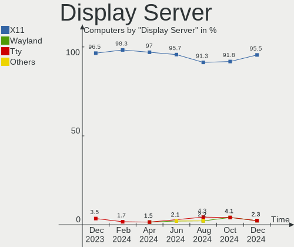

| Name    | Computers | Percent |
|---------|-----------|---------|
| X11     | 60        | 95.24%  |
| Tty     | 2         | 3.17%   |
| Wayland | 1         | 1.59%   |

Display Manager
---------------

SDDM, LightDM, etc.

| Name    | Computers | Percent |
|---------|-----------|---------|
| LightDM | 47        | 74.6%   |
| Unknown | 10        | 15.87%  |
| GDM3    | 4         | 6.35%   |
| SLiM    | 1         | 1.59%   |
| SDDM    | 1         | 1.59%   |

OS Lang
-------

Language

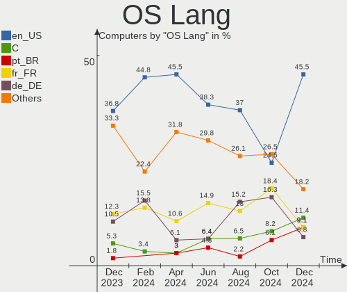

| Lang  | Computers | Percent |
|-------|-----------|---------|
| en_US | 29        | 46.03%  |
| en_GB | 7         | 11.11%  |
| fr_FR | 6         | 9.52%   |
| de_DE | 5         | 7.94%   |
| it_IT | 4         | 6.35%   |
| hu_HU | 2         | 3.17%   |
| C     | 2         | 3.17%   |
| ru_UA | 1         | 1.59%   |
| ru_RU | 1         | 1.59%   |
| pt_BR | 1         | 1.59%   |
| es_UY | 1         | 1.59%   |
| es_MX | 1         | 1.59%   |
| en_SG | 1         | 1.59%   |
| en_IN | 1         | 1.59%   |
| en_CA | 1         | 1.59%   |

Boot Mode
---------

EFI or BIOS

| Mode | Computers | Percent |
|------|-----------|---------|
| EFI  | 34        | 53.97%  |
| BIOS | 29        | 46.03%  |

Filesystem
----------

Type of filesystem

| Type    | Computers | Percent |
|---------|-----------|---------|
| Ext4    | 48        | 76.19%  |
| Tmpfs   | 13        | 20.63%  |
| Zfs     | 1         | 1.59%   |
| Overlay | 1         | 1.59%   |

Part. scheme
------------

Scheme of partitioning

| Type    | Computers | Percent |
|---------|-----------|---------|
| GPT     | 44        | 69.84%  |
| Unknown | 11        | 17.46%  |
| MBR     | 8         | 12.7%   |

Dual Boot with Linux/BSD
------------------------

Hosting more than one Linux/BSD

| Dual boot | Computers | Percent |
|-----------|-----------|---------|
| No        | 50        | 79.37%  |
| Yes       | 13        | 20.63%  |

Dual Boot (Win)
---------------

Hosting Linux and Windows

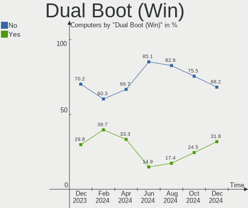

| Dual boot | Computers | Percent |
|-----------|-----------|---------|
| No        | 42        | 66.67%  |
| Yes       | 21        | 33.33%  |

Board
-----

Vendor
------

Motherboard manufacturer

| Name                | Computers | Percent |
|---------------------|-----------|---------|
| ASUSTek Computer    | 13        | 20.63%  |
| Lenovo              | 10        | 15.87%  |
| Dell                | 9         | 14.29%  |
| Hewlett-Packard     | 4         | 6.35%   |
| Gigabyte Technology | 4         | 6.35%   |
| Medion              | 3         | 4.76%   |
| Google              | 3         | 4.76%   |
| Fujitsu             | 3         | 4.76%   |
| Acer                | 2         | 3.17%   |
| Toshiba             | 1         | 1.59%   |
| Samsung Electronics | 1         | 1.59%   |
| Packard Bell        | 1         | 1.59%   |
| Olivetti            | 1         | 1.59%   |
| MSI                 | 1         | 1.59%   |
| Intel               | 1         | 1.59%   |
| HUAWEI              | 1         | 1.59%   |
| eMachines           | 1         | 1.59%   |
| Apple               | 1         | 1.59%   |
| AMI                 | 1         | 1.59%   |
| AMD                 | 1         | 1.59%   |
| Unknown             | 1         | 1.59%   |

Model
-----

Motherboard model

| Name                                     | Computers | Percent |
|------------------------------------------|-----------|---------|
| Lenovo ThinkSystem SR570 -[7Y03CTO1WW]-  | 2         | 3.17%   |
| Toshiba Satellite C50D-A-10E             | 1         | 1.59%   |
| Samsung P500A2D                          | 1         | 1.59%   |
| Packard Bell IXTREME M5800               | 1         | 1.59%   |
| Olivetti OLIBOOK PX5-XXXAES              | 1         | 1.59%   |
| MSI GS75 Stealth 10SGS                   | 1         | 1.59%   |
| Medion MS-7848                           | 1         | 1.59%   |
| Medion MD34805                           | 1         | 1.59%   |
| Medion Akoya P2213T                      | 1         | 1.59%   |
| Lenovo ThinkPad X250 20CLA1YJUK          | 1         | 1.59%   |
| Lenovo ThinkPad T450 20BVA01QHV          | 1         | 1.59%   |
| Lenovo ThinkPad T430 2349BG6             | 1         | 1.59%   |
| Lenovo ThinkPad T14 Gen 3 21AH00CXGE     | 1         | 1.59%   |
| Lenovo ThinkPad T14 Gen 3 21AH00C3AU     | 1         | 1.59%   |
| Lenovo ThinkPad E14 Gen 2 20T6003BRT     | 1         | 1.59%   |
| Lenovo ThinkCentre M70q Gen 3 11T300C0US | 1         | 1.59%   |
| Lenovo H535 10117                        | 1         | 1.59%   |
| Intel Meerkat                            | 1         | 1.59%   |
| HUAWEI BOHK-WAX9X                        | 1         | 1.59%   |
| HP ProDesk 400 G2 MT                     | 1         | 1.59%   |
| HP Desktop Pro 300 G3                    | 1         | 1.59%   |
| HP 8433 11                               | 1         | 1.59%   |
| HP 550-179nf                             | 1         | 1.59%   |
| Google Swanky                            | 1         | 1.59%   |
| Google Rabbid                            | 1         | 1.59%   |
| Google Magpie                            | 1         | 1.59%   |
| Gigabyte H61M-D2-B3                      | 1         | 1.59%   |
| Gigabyte F2A68HM-H                       | 1         | 1.59%   |
| Gigabyte EX58-UD5                        | 1         | 1.59%   |
| Gigabyte B85M-D3H                        | 1         | 1.59%   |
| Fujitsu LIFEBOOK E734                    | 1         | 1.59%   |
| Fujitsu ESPRIMO_D956                     | 1         | 1.59%   |
| Fujitsu CELSIUS M470                     | 1         | 1.59%   |
| eMachines EL1852G                        | 1         | 1.59%   |
| Dell XPS 8500                            | 1         | 1.59%   |
| Dell XPS 15 9570                         | 1         | 1.59%   |
| Dell XPS 13 9305                         | 1         | 1.59%   |
| Dell Vostro 3501                         | 1         | 1.59%   |
| Dell Vostro 220s Series                  | 1         | 1.59%   |
| Dell OptiPlex 7010                       | 1         | 1.59%   |

Model Family
------------

Motherboard model prefix

| Name                 | Computers | Percent |
|----------------------|-----------|---------|
| Lenovo ThinkPad      | 6         | 9.52%   |
| Dell XPS             | 3         | 4.76%   |
| Lenovo ThinkSystem   | 2         | 3.17%   |
| Dell Vostro          | 2         | 3.17%   |
| Dell OptiPlex        | 2         | 3.17%   |
| Dell Latitude        | 2         | 3.17%   |
| ASUS TUF             | 2         | 3.17%   |
| ASUS ROG             | 2         | 3.17%   |
| Acer Aspire          | 2         | 3.17%   |
| Toshiba Satellite    | 1         | 1.59%   |
| Samsung P500A2D      | 1         | 1.59%   |
| Packard Bell IXTREME | 1         | 1.59%   |
| Olivetti OLIBOOK     | 1         | 1.59%   |
| MSI GS75             | 1         | 1.59%   |
| Medion MS-7848       | 1         | 1.59%   |
| Medion MD34805       | 1         | 1.59%   |
| Medion Akoya         | 1         | 1.59%   |
| Lenovo ThinkCentre   | 1         | 1.59%   |
| Lenovo H535          | 1         | 1.59%   |
| Intel Meerkat        | 1         | 1.59%   |
| HUAWEI BOHK-WAX9X    | 1         | 1.59%   |
| HP ProDesk           | 1         | 1.59%   |
| HP Desktop           | 1         | 1.59%   |
| HP 8433              | 1         | 1.59%   |
| HP 550-179nf         | 1         | 1.59%   |
| Google Swanky        | 1         | 1.59%   |
| Google Rabbid        | 1         | 1.59%   |
| Google Magpie        | 1         | 1.59%   |
| Gigabyte H61M-D2-B3  | 1         | 1.59%   |
| Gigabyte F2A68HM-H   | 1         | 1.59%   |
| Gigabyte EX58-UD5    | 1         | 1.59%   |
| Gigabyte B85M-D3H    | 1         | 1.59%   |
| Fujitsu LIFEBOOK     | 1         | 1.59%   |
| Fujitsu ESPRIMO      | 1         | 1.59%   |
| Fujitsu CELSIUS      | 1         | 1.59%   |
| eMachines EL1852G    | 1         | 1.59%   |
| ASUS X510UQR         | 1         | 1.59%   |
| ASUS PRIME           | 1         | 1.59%   |
| ASUS P9X79           | 1         | 1.59%   |
| ASUS N550JV          | 1         | 1.59%   |

MFG Year
--------

Motherboard manufacture year

| Year    | Computers | Percent |
|---------|-----------|---------|
| 2013    | 7         | 11.11%  |
| 2012    | 7         | 11.11%  |
| 2020    | 6         | 9.52%   |
| 2018    | 6         | 9.52%   |
| 2021    | 5         | 7.94%   |
| 2023    | 4         | 6.35%   |
| 2022    | 4         | 6.35%   |
| 2015    | 4         | 6.35%   |
| 2014    | 4         | 6.35%   |
| 2011    | 4         | 6.35%   |
| 2010    | 3         | 4.76%   |
| 2019    | 2         | 3.17%   |
| 2008    | 2         | 3.17%   |
| 2017    | 1         | 1.59%   |
| 2016    | 1         | 1.59%   |
| 2009    | 1         | 1.59%   |
| 2005    | 1         | 1.59%   |
| Unknown | 1         | 1.59%   |

Form Factor
-----------

Physical design of the computer

| Name           | Computers | Percent |
|----------------|-----------|---------|
| Desktop        | 28        | 44.44%  |
| Notebook       | 28        | 44.44%  |
| Mini pc        | 3         | 4.76%   |
| Server         | 2         | 3.17%   |
| System on chip | 1         | 1.59%   |
| All in one     | 1         | 1.59%   |

Secure Boot
-----------

Enabled or disabled

| State    | Computers | Percent |
|----------|-----------|---------|
| Disabled | 55        | 87.3%   |
| Enabled  | 8         | 12.7%   |

Coreboot
--------

Have coreboot on board

| Used | Computers | Percent |
|------|-----------|---------|
| No   | 60        | 95.24%  |
| Yes  | 3         | 4.76%   |

RAM Size
--------

Total RAM memory

| Size in GB  | Computers | Percent |
|-------------|-----------|---------|
| 8.01-16.0   | 15        | 23.81%  |
| 4.01-8.0    | 14        | 22.22%  |
| 3.01-4.0    | 11        | 17.46%  |
| 32.01-64.0  | 8         | 12.7%   |
| 16.01-24.0  | 5         | 7.94%   |
| 24.01-32.0  | 4         | 6.35%   |
| 1.01-2.0    | 3         | 4.76%   |
| 64.01-256.0 | 2         | 3.17%   |
| 0.51-1.0    | 1         | 1.59%   |

RAM Used
--------

Used RAM memory

| Used GB    | Computers | Percent |
|------------|-----------|---------|
| 2.01-3.0   | 16        | 25.4%   |
| 1.01-2.0   | 15        | 23.81%  |
| 4.01-8.0   | 14        | 22.22%  |
| 0.51-1.0   | 8         | 12.7%   |
| 3.01-4.0   | 6         | 9.52%   |
| 16.01-24.0 | 2         | 3.17%   |
| 8.01-16.0  | 2         | 3.17%   |

Total Drives
------------

Number of drives on board

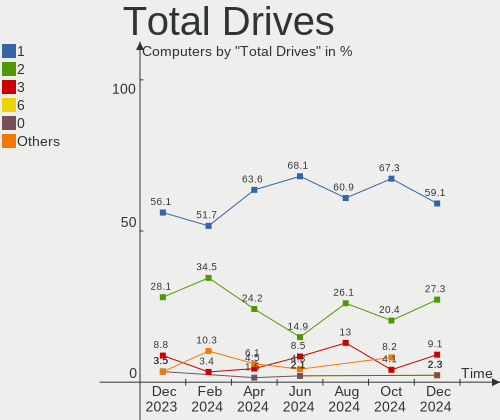

| Drives | Computers | Percent |
|--------|-----------|---------|
| 1      | 32        | 50.79%  |
| 2      | 20        | 31.75%  |
| 3      | 7         | 11.11%  |
| 5      | 2         | 3.17%   |
| 8      | 1         | 1.59%   |
| 4      | 1         | 1.59%   |

Has CD-ROM
----------

Has CD-ROM on board

| Presented | Computers | Percent |
|-----------|-----------|---------|
| No        | 40        | 63.49%  |
| Yes       | 23        | 36.51%  |

Has Ethernet
------------

Has Ethernet on board

| Presented | Computers | Percent |
|-----------|-----------|---------|
| Yes       | 53        | 84.13%  |
| No        | 10        | 15.87%  |

Has WiFi
--------

Has WiFi module

| Presented | Computers | Percent |
|-----------|-----------|---------|
| Yes       | 46        | 73.02%  |
| No        | 17        | 26.98%  |

Has Bluetooth
-------------

Has Bluetooth module

| Presented | Computers | Percent |
|-----------|-----------|---------|
| Yes       | 36        | 57.14%  |
| No        | 27        | 42.86%  |

Location
--------

Country
-------

Geographic location (country)

| Country     | Computers | Percent |
|-------------|-----------|---------|
| USA         | 13        | 20.63%  |
| Germany     | 9         | 14.29%  |
| UK          | 6         | 9.52%   |
| France      | 5         | 7.94%   |
| Italy       | 4         | 6.35%   |
| Russia      | 3         | 4.76%   |
| Brazil      | 3         | 4.76%   |
| Switzerland | 2         | 3.17%   |
| Serbia      | 2         | 3.17%   |
| Hungary     | 2         | 3.17%   |
| Uruguay     | 1         | 1.59%   |
| Ukraine     | 1         | 1.59%   |
| Slovakia    | 1         | 1.59%   |
| Singapore   | 1         | 1.59%   |
| Philippines | 1         | 1.59%   |
| Peru        | 1         | 1.59%   |
| Mexico      | 1         | 1.59%   |
| Ireland     | 1         | 1.59%   |
| India       | 1         | 1.59%   |
| Guadeloupe  | 1         | 1.59%   |
| Greece      | 1         | 1.59%   |
| Cuba        | 1         | 1.59%   |
| Canada      | 1         | 1.59%   |
| Belarus     | 1         | 1.59%   |

City
----

Geographic location (city)

| City               | Computers | Percent |
|--------------------|-----------|---------|
| Toul               | 2         | 3.17%   |
| Rogers             | 2         | 3.17%   |
| Budapest           | 2         | 3.17%   |
| Berlin             | 2         | 3.17%   |
| Zurich             | 1         | 1.59%   |
| Yuzhno-Sakhalinsk  | 1         | 1.59%   |
| Valenciennes       | 1         | 1.59%   |
| Vaiano Cremasco    | 1         | 1.59%   |
| Tampa              | 1         | 1.59%   |
| Svilajnac          | 1         | 1.59%   |
| Sunnyvale          | 1         | 1.59%   |
| Singapore          | 1         | 1.59%   |
| Sigmaringen        | 1         | 1.59%   |
| Selongey           | 1         | 1.59%   |
| Sao Paulo          | 1         | 1.59%   |
| Saint Clair Shores | 1         | 1.59%   |
| Rome               | 1         | 1.59%   |
| Rickmansworth      | 1         | 1.59%   |
| Ribeirao Preto     | 1         | 1.59%   |
| Recife             | 1         | 1.59%   |
| Quinte West        | 1         | 1.59%   |
| Pune               | 1         | 1.59%   |
| Peterborough       | 1         | 1.59%   |
| Perm               | 1         | 1.59%   |
| Moscow             | 1         | 1.59%   |
| Montevideo         | 1         | 1.59%   |
| Minsk              | 1         | 1.59%   |
| Milan              | 1         | 1.59%   |
| Mexicali           | 1         | 1.59%   |
| Melvindale         | 1         | 1.59%   |
| Mainz              | 1         | 1.59%   |
| Lima               | 1         | 1.59%   |
| Les Hogues         | 1         | 1.59%   |
| Les Abymes         | 1         | 1.59%   |
| Legnaro            | 1         | 1.59%   |
| Lansdale           | 1         | 1.59%   |
| Lake Placid        | 1         | 1.59%   |
| Khmelnytskyi       | 1         | 1.59%   |
| Heilbronn          | 1         | 1.59%   |
| Havana             | 1         | 1.59%   |

Drives
------

Drive Vendor
------------

Hard drive vendors

| Vendor                    | Computers | Drives | Percent |
|---------------------------|-----------|--------|---------|
| WDC                       | 14        | 15     | 14.89%  |
| Samsung Electronics       | 12        | 14     | 12.77%  |
| Seagate                   | 9         | 11     | 9.57%   |
| Toshiba                   | 8         | 10     | 8.51%   |
| Unknown                   | 6         | 8      | 6.38%   |
| Sandisk                   | 5         | 5      | 5.32%   |
| Kingston                  | 5         | 5      | 5.32%   |
| Crucial                   | 4         | 4      | 4.26%   |
| Transcend                 | 3         | 3      | 3.19%   |
| Micron Technology         | 3         | 3      | 3.19%   |
| SK hynix                  | 2         | 2      | 2.13%   |
| PNY                       | 2         | 2      | 2.13%   |
| Lenovo                    | 2         | 8      | 2.13%   |
| Intenso                   | 2         | 2      | 2.13%   |
| SPCC                      | 1         | 1      | 1.06%   |
| ShiJi                     | 1         | 1      | 1.06%   |
| Phison                    | 1         | 2      | 1.06%   |
| Netac                     | 1         | 1      | 1.06%   |
| Micron/Crucial Technology | 1         | 1      | 1.06%   |
| LITEON                    | 1         | 1      | 1.06%   |
| KIOXIA                    | 1         | 1      | 1.06%   |
| Intel                     | 1         | 2      | 1.06%   |
| ICY BOX                   | 1         | 1      | 1.06%   |
| Hitachi                   | 1         | 1      | 1.06%   |
| HGST                      | 1         | 1      | 1.06%   |
| Hewlett-Packard           | 1         | 1      | 1.06%   |
| Gigabyte Technology       | 1         | 1      | 1.06%   |
| Fujitsu                   | 1         | 1      | 1.06%   |
| China                     | 1         | 1      | 1.06%   |
| ASMT                      | 1         | 1      | 1.06%   |
| A-DATA Technology         | 1         | 1      | 1.06%   |

Drive Model
-----------

Hard drive models

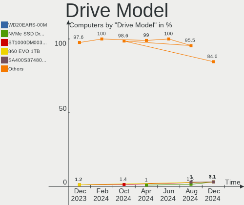

| Model                                  | Computers | Percent |
|----------------------------------------|-----------|---------|
| Unknown MMC Card  64GB                 | 2         | 1.94%   |
| Toshiba DT01ACA100 1TB                 | 2         | 1.94%   |
| Samsung SSD 860 PRO 512GB              | 2         | 1.94%   |
| Samsung SSD 860 EVO 500GB              | 2         | 1.94%   |
| Lenovo ST1000NM0045 1TB                | 2         | 1.94%   |
| WDC WDS200T2B0B-00YS70 2TB SSD         | 1         | 0.97%   |
| WDC WDBNCE5000PNC 500GB SSD            | 1         | 0.97%   |
| WDC WD5000BPVT-22HXZT3 500GB           | 1         | 0.97%   |
| WDC WD5000AAKX-60U6AA0 500GB           | 1         | 0.97%   |
| WDC WD5000AAKS-75A7B2 500GB            | 1         | 0.97%   |
| WDC WD40EZRZ-00GXCB0 4TB               | 1         | 0.97%   |
| WDC WD40EFZX-68AWUN0 4TB               | 1         | 0.97%   |
| WDC WD3200AAKS-00L9A0 320GB            | 1         | 0.97%   |
| WDC WD3200AAKS-00B3A0 320GB            | 1         | 0.97%   |
| WDC WD20NPVX-00EA4T0 2TB               | 1         | 0.97%   |
| WDC WD10JPVX-22JC3T0 1TB               | 1         | 0.97%   |
| WDC WD10EZEX-60M2NA0 1TB               | 1         | 0.97%   |
| WDC WD10EZEX-08M2NA0 1TB               | 1         | 0.97%   |
| WDC WD10EZEX-07WN4A0 1TB               | 1         | 0.97%   |
| WDC PC SN730 SDBPNTY-512G-1027 512GB   | 1         | 0.97%   |
| Unknown SD128  128GB                   | 1         | 0.97%   |
| Unknown SD/MMC/MS PRO 128GB            | 1         | 0.97%   |
| Unknown NVMe SSD Drive 2TB             | 1         | 0.97%   |
| Unknown MMC Card  32GB                 | 1         | 0.97%   |
| Unknown MMC Card  16GB                 | 1         | 0.97%   |
| Unknown DA4064  64GB                   | 1         | 0.97%   |
| Transcend TS256GSSD320 256GB           | 1         | 0.97%   |
| Transcend TS240GSSD220S 240GB          | 1         | 0.97%   |
| Transcend TS128GMTE110S 128GB          | 1         | 0.97%   |
| Toshiba MQ01ABF050 500GB               | 1         | 0.97%   |
| Toshiba MK5065GSXN 500GB               | 1         | 0.97%   |
| Toshiba MK1655GSX H 120GB              | 1         | 0.97%   |
| Toshiba HDWD240 4TB                    | 1         | 0.97%   |
| Toshiba DT01ACA300 3TB                 | 1         | 0.97%   |
| Toshiba DT01ACA200 2TB                 | 1         | 0.97%   |
| Toshiba DT01ACA050 500GB               | 1         | 0.97%   |
| SPCC Solid State Disk 512GB            | 1         | 0.97%   |
| SK hynix SKHynix_HFS512GDE9X081N 512GB | 1         | 0.97%   |
| SK hynix HCG8e  64GB                   | 1         | 0.97%   |
| ShiJi 128GB                            | 1         | 0.97%   |

HDD Vendor
----------

Hard disk drive vendors

| Vendor  | Computers | Drives | Percent |
|---------|-----------|--------|---------|
| WDC     | 12        | 12     | 33.33%  |
| Toshiba | 8         | 10     | 22.22%  |
| Seagate | 8         | 10     | 22.22%  |
| Lenovo  | 2         | 8      | 5.56%   |
| Unknown | 1         | 1      | 2.78%   |
| Intenso | 1         | 1      | 2.78%   |
| ICY BOX | 1         | 1      | 2.78%   |
| Hitachi | 1         | 1      | 2.78%   |
| HGST    | 1         | 1      | 2.78%   |
| Fujitsu | 1         | 1      | 2.78%   |

SSD Vendor
----------

Solid state drive vendors

| Vendor              | Computers | Drives | Percent |
|---------------------|-----------|--------|---------|
| Samsung Electronics | 9         | 9      | 27.27%  |
| Kingston            | 3         | 3      | 9.09%   |
| Crucial             | 3         | 3      | 9.09%   |
| WDC                 | 2         | 2      | 6.06%   |
| Transcend           | 2         | 2      | 6.06%   |
| SanDisk             | 2         | 2      | 6.06%   |
| PNY                 | 2         | 2      | 6.06%   |
| Micron Technology   | 2         | 2      | 6.06%   |
| SPCC                | 1         | 1      | 3.03%   |
| LITEON              | 1         | 1      | 3.03%   |
| Intenso             | 1         | 1      | 3.03%   |
| Hewlett-Packard     | 1         | 1      | 3.03%   |
| Gigabyte Technology | 1         | 1      | 3.03%   |
| China               | 1         | 1      | 3.03%   |
| ASMT                | 1         | 1      | 3.03%   |
| A-DATA Technology   | 1         | 1      | 3.03%   |

Drive Kind
----------

HDD or SSD

| Kind    | Computers | Drives | Percent |
|---------|-----------|--------|---------|
| HDD     | 31        | 46     | 38.75%  |
| SSD     | 25        | 33     | 31.25%  |
| NVMe    | 17        | 23     | 21.25%  |
| MMC     | 5         | 7      | 6.25%   |
| Unknown | 2         | 2      | 2.5%    |

Drive Connector
---------------

SATA, SAS, NVMe, etc.

| Type | Computers | Drives | Percent |
|------|-----------|--------|---------|
| SATA | 45        | 76     | 63.38%  |
| NVMe | 17        | 23     | 23.94%  |
| MMC  | 5         | 7      | 7.04%   |
| SAS  | 4         | 5      | 5.63%   |

Drive Size
----------

Size of hard drive

| Size in TB | Computers | Drives | Percent |
|------------|-----------|--------|---------|
| 0.01-0.5   | 29        | 41     | 51.79%  |
| 0.51-1.0   | 16        | 25     | 28.57%  |
| 1.01-2.0   | 6         | 7      | 10.71%  |
| 3.01-4.0   | 3         | 3      | 5.36%   |
| 2.01-3.0   | 2         | 3      | 3.57%   |

Space Total
-----------

Amount of disk space available on the file system

| Size in GB     | Computers | Percent |
|----------------|-----------|---------|
| 101-250        | 17        | 26.98%  |
| 251-500        | 11        | 17.46%  |
| 501-1000       | 7         | 11.11%  |
| 2001-3000      | 6         | 9.52%   |
| 1001-2000      | 6         | 9.52%   |
| 51-100         | 6         | 9.52%   |
| More than 3000 | 4         | 6.35%   |
| 1-20           | 4         | 6.35%   |
| 21-50          | 2         | 3.17%   |

Space Used
----------

Amount of used disk space

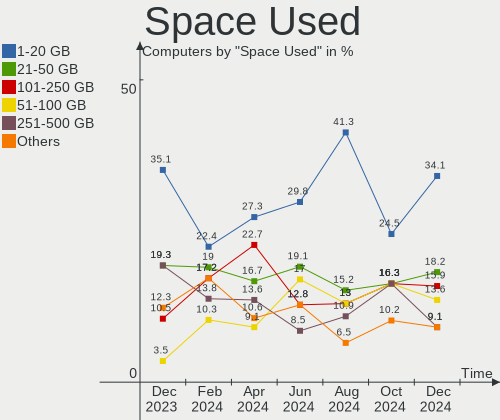

| Used GB   | Computers | Percent |
|-----------|-----------|---------|
| 1-20      | 14        | 22.22%  |
| 51-100    | 11        | 17.46%  |
| 251-500   | 8         | 12.7%   |
| 101-250   | 8         | 12.7%   |
| 1001-2000 | 8         | 12.7%   |
| 21-50     | 7         | 11.11%  |
| 501-1000  | 4         | 6.35%   |
| 2001-3000 | 3         | 4.76%   |

Malfunc. Drives
---------------

Drive models with a malfunction

| Model                                          | Computers | Drives | Percent |
|------------------------------------------------|-----------|--------|---------|
| WDC WD5000AAKX-60U6AA0 500GB                   | 1         | 1      | 12.5%   |
| WDC WD10JPVX-22JC3T0 1TB                       | 1         | 1      | 12.5%   |
| Toshiba MK5065GSXN 500GB                       | 1         | 1      | 12.5%   |
| Toshiba DT01ACA100 1TB                         | 1         | 1      | 12.5%   |
| Seagate ST500DM002-1BD142 500GB                | 1         | 1      | 12.5%   |
| Micron Technology 1100_MTFDDAV512TBN 512GB SSD | 1         | 1      | 12.5%   |
| LITEON CV8-8E128-HP 128GB SSD                  | 1         | 1      | 12.5%   |
| ICY BOX IB-250StU3+BH15 2TB                    | 1         | 1      | 12.5%   |

Malfunc. Drive Vendor
---------------------

Vendors of faulty drives

| Vendor            | Computers | Drives | Percent |
|-------------------|-----------|--------|---------|
| WDC               | 2         | 2      | 25%     |
| Toshiba           | 2         | 2      | 25%     |
| Seagate           | 1         | 1      | 12.5%   |
| Micron Technology | 1         | 1      | 12.5%   |
| LITEON            | 1         | 1      | 12.5%   |
| ICY BOX           | 1         | 1      | 12.5%   |

Malfunc. HDD Vendor
-------------------

Vendors of faulty HDD drives

| Vendor  | Computers | Drives | Percent |
|---------|-----------|--------|---------|
| WDC     | 2         | 2      | 33.33%  |
| Toshiba | 2         | 2      | 33.33%  |
| Seagate | 1         | 1      | 16.67%  |
| ICY BOX | 1         | 1      | 16.67%  |

Malfunc. Drive Kind
-------------------

Kinds of faulty drives

| Kind | Computers | Drives | Percent |
|------|-----------|--------|---------|
| HDD  | 5         | 6      | 71.43%  |
| SSD  | 2         | 2      | 28.57%  |

Failed Drives
-------------

Failed drive models

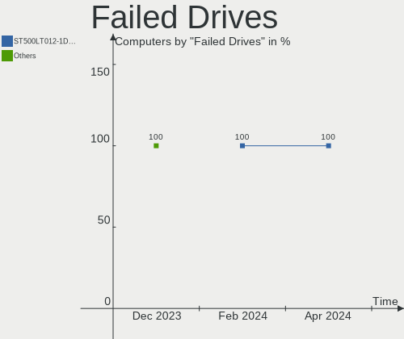

| Model                               | Computers | Drives | Percent |
|-------------------------------------|-----------|--------|---------|
| Seagate ST500LM012 HN-M500MBB 500GB | 1         | 1      | 100%    |

Failed Drive Vendor
-------------------

Failed drive vendors

| Vendor  | Computers | Drives | Percent |
|---------|-----------|--------|---------|
| Seagate | 1         | 1      | 100%    |

Drive Status
------------

Number of failed and malfunc. drives

| Status   | Computers | Drives | Percent |
|----------|-----------|--------|---------|
| Works    | 32        | 50     | 46.38%  |
| Detected | 29        | 52     | 42.03%  |
| Malfunc  | 7         | 8      | 10.14%  |
| Failed   | 1         | 1      | 1.45%   |

Storage controller
------------------

Storage Vendor
--------------

Storage controller vendors

| Vendor                      | Computers | Percent |
|-----------------------------|-----------|---------|
| Intel                       | 39        | 50.65%  |
| AMD                         | 13        | 16.88%  |
| SanDisk                     | 4         | 5.19%   |
| Samsung Electronics         | 4         | 5.19%   |
| Micron/Crucial Technology   | 2         | 2.6%    |
| Kingston Technology Company | 2         | 2.6%    |
| Broadcom / LSI              | 2         | 2.6%    |
| Transcend                   | 1         | 1.3%    |
| SK hynix                    | 1         | 1.3%    |
| Phison Electronics          | 1         | 1.3%    |
| Nvidia                      | 1         | 1.3%    |
| Netac Technology            | 1         | 1.3%    |
| Micron Technology           | 1         | 1.3%    |
| Marvell Technology Group    | 1         | 1.3%    |
| KIOXIA                      | 1         | 1.3%    |
| JMicron Technology          | 1         | 1.3%    |
| Hosin Global Electronics    | 1         | 1.3%    |
| ASMedia Technology          | 1         | 1.3%    |

Storage Model
-------------

Storage controller models

| Model                                                                          | Computers | Percent |
|--------------------------------------------------------------------------------|-----------|---------|
| AMD FCH SATA Controller [AHCI mode]                                            | 9         | 10%     |
| Intel 8 Series/C220 Series Chipset Family 6-port SATA Controller 1 [AHCI mode] | 6         | 6.67%   |
| Samsung NVMe SSD Controller SM981/PM981/PM983                                  | 3         | 3.33%   |
| Intel Wildcat Point-LP SATA Controller [AHCI Mode]                             | 3         | 3.33%   |
| Intel Volume Management Device NVMe RAID Controller                            | 3         | 3.33%   |
| Intel 6 Series/C200 Series Chipset Family 6 port Desktop SATA AHCI Controller  | 3         | 3.33%   |
| Intel Tiger Lake-LP SATA Controller                                            | 2         | 2.22%   |
| Intel C620 Series Chipset Family SSATA Controller [AHCI mode]                  | 2         | 2.22%   |
| Intel C620 Series Chipset Family SATA Controller [AHCI mode]                   | 2         | 2.22%   |
| Intel Alder Lake-S PCH SATA Controller [AHCI Mode]                             | 2         | 2.22%   |
| Intel 82801JI (ICH10 Family) SATA AHCI Controller                              | 2         | 2.22%   |
| Intel 7 Series/C210 Series Chipset Family 6-port SATA Controller [AHCI mode]   | 2         | 2.22%   |
| Intel 7 Series Chipset Family 6-port SATA Controller [AHCI mode]               | 2         | 2.22%   |
| Intel 200 Series PCH SATA controller [AHCI mode]                               | 2         | 2.22%   |
| Broadcom / LSI MegaRAID Tri-Mode SAS3408                                       | 2         | 2.22%   |
| AMD SB7x0/SB8x0/SB9x0 SATA Controller [IDE mode]                               | 2         | 2.22%   |
| AMD SB7x0/SB8x0/SB9x0 IDE Controller                                           | 2         | 2.22%   |
| Transcend NVMe PCIe SSD 120S/112S (DRAM-less)                                  | 1         | 1.11%   |
| SK hynix Gold P31/BC711/PC711 NVMe Solid State Drive                           | 1         | 1.11%   |
| SanDisk WD Green SN350 NVMe SSD 1 TB (DRAM-less)                               | 1         | 1.11%   |
| SanDisk WD Blue SN570 NVMe SSD 2TB                                             | 1         | 1.11%   |
| SanDisk WD Black SN750 / PC SN730 NVMe SSD                                     | 1         | 1.11%   |
| SanDisk PC SN530 NVMe SSD (DRAM-less)                                          | 1         | 1.11%   |
| Samsung NVMe SSD Controller PM9B1                                              | 1         | 1.11%   |
| Samsung NVMe SSD Controller PM9A1/PM9A3/980PRO                                 | 1         | 1.11%   |
| Phison E18 PCIe4 NVMe Controller                                               | 1         | 1.11%   |
| Nvidia MCP79 AHCI Controller                                                   | 1         | 1.11%   |
| Netac Non-Volatile memory controller                                           | 1         | 1.11%   |
| Micron/Crucial P5 Plus NVMe PCIe SSD                                           | 1         | 1.11%   |
| Micron/Crucial P1 NVMe PCIe SSD[Frampton2]                                     | 1         | 1.11%   |
| Micron 2450 NVMe SSD [HendrixV] (DRAM-less)                                    | 1         | 1.11%   |
| Marvell Group 88SE9128 PCIe SATA 6 Gb/s RAID controller with HyperDuo          | 1         | 1.11%   |
| KIOXIA NVMe SSD Controller BG4 (DRAM-less)                                     | 1         | 1.11%   |
| Kingston Company Company Non-Volatile memory controller                        | 1         | 1.11%   |
| Kingston Company KC3000/Renegade NVMe SSD                                      | 1         | 1.11%   |
| JMicron JMB363 SATA/IDE Controller                                             | 1         | 1.11%   |
| Intel Sunrise Point-LP SATA Controller [AHCI mode]                             | 1         | 1.11%   |
| Intel Q170/Q150/B150/H170/H110/Z170/CM236 Chipset SATA Controller [AHCI Mode]  | 1         | 1.11%   |
| Intel Optane NVME SSD H10 with Solid State Storage [Teton Glacier]             | 1         | 1.11%   |
| Intel NM10/ICH7 Family SATA Controller [IDE mode]                              | 1         | 1.11%   |

Storage Kind
------------

Kind of storage controller (IDE, SATA, NVMe, SAS, ...)

| Kind | Computers | Percent |
|------|-----------|---------|
| SATA | 48        | 62.34%  |
| NVMe | 17        | 22.08%  |
| IDE  | 7         | 9.09%   |
| RAID | 5         | 6.49%   |

Processor
---------

CPU Vendor
----------

Processor vendors

| Vendor | Computers | Percent |
|--------|-----------|---------|
| Intel  | 46        | 73.02%  |
| AMD    | 16        | 25.4%   |
| ARM    | 1         | 1.59%   |

CPU Model
---------

Processor models

| Model                                       | Computers | Percent |
|---------------------------------------------|-----------|---------|
| Intel Xeon Silver 4116 CPU @ 2.10GHz        | 2         | 3.17%   |
| Intel Core i7-3770 CPU @ 3.40GHz            | 2         | 3.17%   |
| Intel 12th Gen Core i7-1255U                | 2         | 3.17%   |
| Intel Xeon CPU W3520 @ 2.67GHz              | 1         | 1.59%   |
| Intel Pentium M processor 1300MHz           | 1         | 1.59%   |
| Intel Pentium Dual-Core CPU E5800 @ 3.20GHz | 1         | 1.59%   |
| Intel Core i7-8750H CPU @ 2.20GHz           | 1         | 1.59%   |
| Intel Core i7-8550U CPU @ 1.80GHz           | 1         | 1.59%   |
| Intel Core i7-5500U CPU @ 2.40GHz           | 1         | 1.59%   |
| Intel Core i7-4790 CPU @ 3.60GHz            | 1         | 1.59%   |
| Intel Core i7-4700HQ CPU @ 2.40GHz          | 1         | 1.59%   |
| Intel Core i7-3960X CPU @ 3.30GHz           | 1         | 1.59%   |
| Intel Core i7-3610QM CPU @ 2.30GHz          | 1         | 1.59%   |
| Intel Core i7-2600 CPU @ 3.40GHz            | 1         | 1.59%   |
| Intel Core i7-10750H CPU @ 2.60GHz          | 1         | 1.59%   |
| Intel Core i7 CPU 950 @ 3.07GHz             | 1         | 1.59%   |
| Intel Core i7 CPU 870 @ 2.93GHz             | 1         | 1.59%   |
| Intel Core i5-7500 CPU @ 3.40GHz            | 1         | 1.59%   |
| Intel Core i5-6500 CPU @ 3.20GHz            | 1         | 1.59%   |
| Intel Core i5-5300U CPU @ 2.30GHz           | 1         | 1.59%   |
| Intel Core i5-4590S CPU @ 3.00GHz           | 1         | 1.59%   |
| Intel Core i5-4460S CPU @ 2.90GHz           | 1         | 1.59%   |
| Intel Core i5-4460 CPU @ 3.20GHz            | 1         | 1.59%   |
| Intel Core i5-4210M CPU @ 2.60GHz           | 1         | 1.59%   |
| Intel Core i5-3470T CPU @ 2.90GHz           | 1         | 1.59%   |
| Intel Core i5-3320M CPU @ 2.60GHz           | 1         | 1.59%   |
| Intel Core i5-2500 CPU @ 3.30GHz            | 1         | 1.59%   |
| Intel Core i5-1035G1 CPU @ 1.00GHz          | 1         | 1.59%   |
| Intel Core i3-9100 CPU @ 3.60GHz            | 1         | 1.59%   |
| Intel Core i3-5005U CPU @ 2.00GHz           | 1         | 1.59%   |
| Intel Core 2 Duo CPU P8700 @ 2.53GHz        | 1         | 1.59%   |
| Intel Core 2 Duo CPU E8400 @ 3.00GHz        | 1         | 1.59%   |
| Intel Celeron N4500 @ 1.10GHz               | 1         | 1.59%   |
| Intel Celeron CPU N3350 @ 1.10GHz           | 1         | 1.59%   |
| Intel Celeron CPU N3150 @ 1.60GHz           | 1         | 1.59%   |
| Intel Celeron CPU N2940 @ 1.83GHz           | 1         | 1.59%   |
| Intel Celeron CPU N2840 @ 2.16GHz           | 1         | 1.59%   |
| Intel Celeron CPU B800 @ 1.50GHz            | 1         | 1.59%   |
| Intel 12th Gen Core i5-12400T               | 1         | 1.59%   |
| Intel 12th Gen Core i5-12400                | 1         | 1.59%   |

CPU Model Family
----------------

Processor model prefix

| Model                   | Computers | Percent |
|-------------------------|-----------|---------|
| Intel Core i7           | 13        | 20.63%  |
| Intel Core i5           | 11        | 17.46%  |
| Other                   | 8         | 12.7%   |
| Intel Celeron           | 6         | 9.52%   |
| AMD Ryzen 7             | 5         | 7.94%   |
| Intel Xeon Silver       | 2         | 3.17%   |
| Intel Core i3           | 2         | 3.17%   |
| Intel Core 2 Duo        | 2         | 3.17%   |
| AMD Ryzen 9             | 2         | 3.17%   |
| AMD FX                  | 2         | 3.17%   |
| AMD A6                  | 2         | 3.17%   |
| Intel Xeon              | 1         | 1.59%   |
| Intel Pentium M         | 1         | 1.59%   |
| Intel Pentium Dual-Core | 1         | 1.59%   |
| AMD Ryzen 5             | 1         | 1.59%   |
| AMD Athlon II           | 1         | 1.59%   |
| AMD A8                  | 1         | 1.59%   |
| AMD A4                  | 1         | 1.59%   |
| AMD A10                 | 1         | 1.59%   |

CPU Cores
---------

Number of processor cores

| Number  | Computers | Percent |
|---------|-----------|---------|
| 4       | 26        | 41.27%  |
| 2       | 17        | 26.98%  |
| 8       | 5         | 7.94%   |
| 6       | 5         | 7.94%   |
| 1       | 3         | 4.76%   |
| 12      | 2         | 3.17%   |
| 10      | 2         | 3.17%   |
| 16      | 1         | 1.59%   |
| 3       | 1         | 1.59%   |
| Unknown | 1         | 1.59%   |

CPU Sockets
-----------

Number of sockets

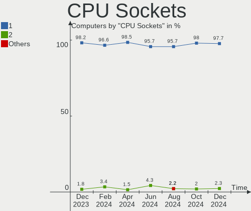

| Number  | Computers | Percent |
|---------|-----------|---------|
| 1       | 62        | 98.41%  |
| Unknown | 1         | 1.59%   |

CPU Threads
-----------

Threads per core (Hyper-Threading)

| Number  | Computers | Percent |
|---------|-----------|---------|
| 2       | 41        | 65.08%  |
| 1       | 21        | 33.33%  |
| Unknown | 1         | 1.59%   |

CPU Op-Modes
------------

CPU Operation Modes (32-bit, 64-bit)

| Op mode        | Computers | Percent |
|----------------|-----------|---------|
| 32-bit, 64-bit | 61        | 96.83%  |
| 64-bit         | 1         | 1.59%   |
| 32-bit         | 1         | 1.59%   |

CPU Microcode
-------------

Microcode number

| Number     | Computers | Percent |
|------------|-----------|---------|
| Unknown    | 32        | 50.79%  |
| 0x306c3    | 3         | 4.76%   |
| 0x206a7    | 3         | 4.76%   |
| 0x50654    | 2         | 3.17%   |
| 0x1067a    | 2         | 3.17%   |
| 0x906eb    | 1         | 1.59%   |
| 0x906ea    | 1         | 1.59%   |
| 0x906e9    | 1         | 1.59%   |
| 0x906a4    | 1         | 1.59%   |
| 0x90675    | 1         | 1.59%   |
| 0x806c1    | 1         | 1.59%   |
| 0x695      | 1         | 1.59%   |
| 0x30678    | 1         | 1.59%   |
| 0x206d6    | 1         | 1.59%   |
| 0x106e5    | 1         | 1.59%   |
| 0x106a5    | 1         | 1.59%   |
| 0x0a704103 | 1         | 1.59%   |
| 0x0a201025 | 1         | 1.59%   |
| 0x08600106 | 1         | 1.59%   |
| 0x08108109 | 1         | 1.59%   |
| 0x0810100b | 1         | 1.59%   |
| 0x0700010f | 1         | 1.59%   |
| 0x06001116 | 1         | 1.59%   |
| 0x06000852 | 1         | 1.59%   |
| 0x0600063e | 1         | 1.59%   |
| 0x010000c8 | 1         | 1.59%   |

CPU Microarch
-------------

Microarchitecture

| Name             | Computers | Percent |
|------------------|-----------|---------|
| Haswell          | 6         | 9.52%   |
| IvyBridge        | 5         | 7.94%   |
| SandyBridge      | 4         | 6.35%   |
| KabyLake         | 4         | 6.35%   |
| Zen 2            | 3         | 4.76%   |
| TigerLake        | 3         | 4.76%   |
| Skylake          | 3         | 4.76%   |
| Silvermont       | 3         | 4.76%   |
| Piledriver       | 3         | 4.76%   |
| Penryn           | 3         | 4.76%   |
| Nehalem          | 3         | 4.76%   |
| Broadwell        | 3         | 4.76%   |
| Alderlake Hybrid | 3         | 4.76%   |
| Unknown          | 3         | 4.76%   |
| Zen 3            | 2         | 3.17%   |
| Zen+             | 1         | 1.59%   |
| Zen              | 1         | 1.59%   |
| Tremont          | 1         | 1.59%   |
| Steamroller      | 1         | 1.59%   |
| P6               | 1         | 1.59%   |
| K10              | 1         | 1.59%   |
| Jaguar           | 1         | 1.59%   |
| IceLake          | 1         | 1.59%   |
| Goldmont         | 1         | 1.59%   |
| Excavator        | 1         | 1.59%   |
| CometLake        | 1         | 1.59%   |
| Bulldozer        | 1         | 1.59%   |

Graphics
--------

GPU Vendor
----------

Vendors of graphics cards

| Vendor                     | Computers | Percent |
|----------------------------|-----------|---------|
| Intel                      | 32        | 43.84%  |
| Nvidia                     | 21        | 28.77%  |
| AMD                        | 18        | 24.66%  |
| Matrox Electronics Systems | 2         | 2.74%   |

GPU Model
---------

Graphics card models

| Model                                                                       | Computers | Percent |
|-----------------------------------------------------------------------------|-----------|---------|
| Intel HD Graphics 5500                                                      | 3         | 3.95%   |
| Matrox Electronics Systems MGA G200e [Pilot] ServerEngines (SEP1)           | 2         | 2.63%   |
| Intel Xeon E3-1200 v3/4th Gen Core Processor Integrated Graphics Controller | 2         | 2.63%   |
| Intel TigerLake-LP GT2 [Iris Xe Graphics]                                   | 2         | 2.63%   |
| Intel Atom Processor Z36xxx/Z37xxx Series Graphics & Display                | 2         | 2.63%   |
| Intel 4th Gen Core Processor Integrated Graphics Controller                 | 2         | 2.63%   |
| Intel 4 Series Chipset Integrated Graphics Controller                       | 2         | 2.63%   |
| Intel 3rd Gen Core processor Graphics Controller                            | 2         | 2.63%   |
| Intel 2nd Generation Core Processor Family Integrated Graphics Controller   | 2         | 2.63%   |
| AMD Renoir                                                                  | 2         | 2.63%   |
| Nvidia TU117GL [T600]                                                       | 1         | 1.32%   |
| Nvidia TU106M [GeForce RTX 2060 Mobile]                                     | 1         | 1.32%   |
| Nvidia TU104M [GeForce RTX 2080 SUPER Mobile / Max-Q]                       | 1         | 1.32%   |
| Nvidia GP107M [GeForce GTX 1050 Ti Mobile]                                  | 1         | 1.32%   |
| Nvidia GP107 [GeForce GTX 1050 Ti]                                          | 1         | 1.32%   |
| Nvidia GP106 [GeForce GTX 1060 6GB]                                         | 1         | 1.32%   |
| Nvidia GM108M [GeForce 940M]                                                | 1         | 1.32%   |
| Nvidia GM108M [GeForce 940MX]                                               | 1         | 1.32%   |
| Nvidia GM107 [GeForce GTX 745]                                              | 1         | 1.32%   |
| Nvidia GK208BM [GeForce 920M]                                               | 1         | 1.32%   |
| Nvidia GK208B [GeForce GT 730]                                              | 1         | 1.32%   |
| Nvidia GK208B [GeForce GT 710]                                              | 1         | 1.32%   |
| Nvidia GK107M [GeForce GT 750M]                                             | 1         | 1.32%   |
| Nvidia GF119 [GeForce GT 520]                                               | 1         | 1.32%   |
| Nvidia GF108M [GeForce GT 620M/630M/635M/640M LE]                           | 1         | 1.32%   |
| Nvidia GF100GL [Quadro 4000]                                                | 1         | 1.32%   |
| Nvidia GA104 [GeForce RTX 3060 Ti Lite Hash Rate]                           | 1         | 1.32%   |
| Nvidia GA102 [GeForce RTX 3080]                                             | 1         | 1.32%   |
| Nvidia G96C [GeForce 9400 GT]                                               | 1         | 1.32%   |
| Nvidia C79 [GeForce 9400M]                                                  | 1         | 1.32%   |
| Nvidia AD107M [GeForce RTX 4060 Max-Q / Mobile]                             | 1         | 1.32%   |
| Intel Xeon E3-1200 v2/3rd Gen Core processor Graphics Controller            | 1         | 1.32%   |
| Intel UHD Graphics 620                                                      | 1         | 1.32%   |
| Intel Tiger Lake-LP GT2 [UHD Graphics G4]                                   | 1         | 1.32%   |
| Intel JasperLake [UHD Graphics]                                             | 1         | 1.32%   |
| Intel Iris Plus Graphics G1 (Ice Lake)                                      | 1         | 1.32%   |
| Intel HD Graphics 530                                                       | 1         | 1.32%   |
| Intel HD Graphics 500                                                       | 1         | 1.32%   |
| Intel CometLake-H GT2 [UHD Graphics]                                        | 1         | 1.32%   |
| Intel CoffeeLake-S GT2 [UHD Graphics 630]                                   | 1         | 1.32%   |

GPU Combo
---------

Combinations of graphics cards

| Name           | Computers | Percent |
|----------------|-----------|---------|
| 1 x Intel      | 22        | 34.92%  |
| 1 x AMD        | 13        | 20.63%  |
| 1 x Nvidia     | 11        | 17.46%  |
| Intel + Nvidia | 7         | 11.11%  |
| Other          | 3         | 4.76%   |
| AMD + Nvidia   | 3         | 4.76%   |
| 2 x AMD        | 2         | 3.17%   |
| 1 x Matrox     | 2         | 3.17%   |

GPU Driver
----------

Free vs proprietary

| Driver      | Computers | Percent |
|-------------|-----------|---------|
| Free        | 46        | 73.02%  |
| Proprietary | 13        | 20.63%  |
| Unknown     | 4         | 6.35%   |

GPU Memory
----------

Total video memory

| Size in GB | Computers | Percent |
|------------|-----------|---------|
| Unknown    | 37        | 58.73%  |
| 1.01-2.0   | 7         | 11.11%  |
| 0.01-0.5   | 6         | 9.52%   |
| 3.01-4.0   | 4         | 6.35%   |
| 7.01-8.0   | 3         | 4.76%   |
| 0.51-1.0   | 3         | 4.76%   |
| 8.01-16.0  | 2         | 3.17%   |
| 5.01-6.0   | 1         | 1.59%   |

Monitor
-------

Monitor Vendor
--------------

Monitor vendors

| Vendor               | Computers | Percent |
|----------------------|-----------|---------|
| AU Optronics         | 10        | 14.49%  |
| Samsung Electronics  | 9         | 13.04%  |
| Dell                 | 8         | 11.59%  |
| LG Display           | 4         | 5.8%    |
| Goldstar             | 4         | 5.8%    |
| BOE                  | 4         | 5.8%    |
| AOC                  | 4         | 5.8%    |
| Acer                 | 4         | 5.8%    |
| Ancor Communications | 3         | 4.35%   |
| Hewlett-Packard      | 2         | 2.9%    |
| HannStar             | 2         | 2.9%    |
| Chimei Innolux       | 2         | 2.9%    |
| BenQ                 | 2         | 2.9%    |
| ViewSonic            | 1         | 1.45%   |
| TMX                  | 1         | 1.45%   |
| Sharp                | 1         | 1.45%   |
| Sceptre Tech         | 1         | 1.45%   |
| RGT                  | 1         | 1.45%   |
| PANDA                | 1         | 1.45%   |
| NEC Computers        | 1         | 1.45%   |
| MStar                | 1         | 1.45%   |
| LG Electronics       | 1         | 1.45%   |
| JRY                  | 1         | 1.45%   |
| Fujitsu Siemens      | 1         | 1.45%   |

Monitor Model
-------------

Monitor models

| Model                                                                  | Computers | Percent |
|------------------------------------------------------------------------|-----------|---------|
| HannStar HL205DPB HSD62E0 1600x900 432x240mm 19.5-inch                 | 2         | 2.78%   |
| Goldstar ULTRAWIDE GSM59F1 2560x1080 673x284mm 28.8-inch               | 2         | 2.78%   |
| Dell E2210 DELD036 1680x1050 473x296mm 22.0-inch                       | 2         | 2.78%   |
| ViewSonic VX3211-4K VSCC336 3840x2160 698x393mm 31.5-inch              | 1         | 1.39%   |
| TMX TL140ADXP02-0 TMX1401 2560x1600 301x188mm 14.0-inch                | 1         | 1.39%   |
| Sharp LCD Monitor SHP149A 1920x1080 344x194mm 15.5-inch                | 1         | 1.39%   |
| Sceptre Tech Sceptre Y27 SPT0AB9 2560x1440 597x336mm 27.0-inch         | 1         | 1.39%   |
| Samsung Electronics U32J59x SAM0F35 3840x2160 697x392mm 31.5-inch      | 1         | 1.39%   |
| Samsung Electronics SyncMaster SAM0273 1440x900 410x257mm 19.1-inch    | 1         | 1.39%   |
| Samsung Electronics SMS22A450 SAM0836 1680x1050 470x300mm 22.0-inch    | 1         | 1.39%   |
| Samsung Electronics SMS22A450 SAM0835 1680x1050 470x300mm 22.0-inch    | 1         | 1.39%   |
| Samsung Electronics LF24T35 SAM707D 1920x1080 528x297mm 23.9-inch      | 1         | 1.39%   |
| Samsung Electronics LCD Monitor SEC4258 1024x768 286x214mm 14.1-inch   | 1         | 1.39%   |
| Samsung Electronics LCD Monitor SDC324E 1600x900 309x174mm 14.0-inch   | 1         | 1.39%   |
| Samsung Electronics LCD Monitor SDC324C 1920x1080 344x194mm 15.5-inch  | 1         | 1.39%   |
| Samsung Electronics LCD Monitor SAM0A7D 1920x1080 1060x626mm 48.5-inch | 1         | 1.39%   |
| Samsung Electronics C27F390 SAM0D32 1920x1080 598x336mm 27.0-inch      | 1         | 1.39%   |
| RGT LCD Monitor RGT1352 1920x1080 480x270mm 21.7-inch                  | 1         | 1.39%   |
| PANDA LCD Monitor NCP004D 1920x1080 344x194mm 15.5-inch                | 1         | 1.39%   |
| NEC Computers EA244WMi NEC68D5 1920x1200 519x324mm 24.1-inch           | 1         | 1.39%   |
| NEC Computers EA244WMi NEC68D4 1920x1200 519x324mm 24.1-inch           | 1         | 1.39%   |
| MStar Demo MST0030 1360x765 1150x650mm 52.0-inch                       | 1         | 1.39%   |
| LG Electronics LCD Monitor W2452 1920x1200                             | 1         | 1.39%   |
| LG Display LCD Monitor LGD05FA 1920x1080 309x174mm 14.0-inch           | 1         | 1.39%   |
| LG Display LCD Monitor LGD0437 1920x1080 276x156mm 12.5-inch           | 1         | 1.39%   |
| LG Display LCD Monitor LGD033A 1366x768 344x194mm 15.5-inch            | 1         | 1.39%   |
| LG Display LCD Monitor LGD02DC 1366x768 344x194mm 15.5-inch            | 1         | 1.39%   |
| JRY HDMI JRY1900 1440x900 410x230mm 18.5-inch                          | 1         | 1.39%   |
| Hewlett-Packard E220t HWP3253 1920x1080 434x238mm 19.5-inch            | 1         | 1.39%   |
| Hewlett-Packard 24o HPN337C 1920x1080 531x299mm 24.0-inch              | 1         | 1.39%   |
| Goldstar IPS236 GSM580D 1920x1080 510x290mm 23.1-inch                  | 1         | 1.39%   |
| Goldstar HDR WQHD+ GSM774D 3840x1600 879x366mm 37.5-inch               | 1         | 1.39%   |
| Goldstar HDR WFHD GSM7714 2560x1080 798x334mm 34.1-inch                | 1         | 1.39%   |
| Fujitsu Siemens L24W-2 FUS077A 1920x1200 518x324mm 24.1-inch           | 1         | 1.39%   |
| Dell U3821DW DELA1AB 3840x1600 880x367mm 37.5-inch                     | 1         | 1.39%   |
| Dell U2412M DELA079 1920x1200 520x320mm 24.0-inch                      | 1         | 1.39%   |
| Dell U2311H DELA05F 1920x1080 509x286mm 23.0-inch                      | 1         | 1.39%   |
| Dell S2721DS DELA19D 2560x1440 597x336mm 27.0-inch                     | 1         | 1.39%   |
| Dell S2421H DEL41EF 1920x1080 527x296mm 23.8-inch                      | 1         | 1.39%   |
| Dell 1907FP DEL4015 1280x1024 376x301mm 19.0-inch                      | 1         | 1.39%   |

Monitor Resolution
------------------

Monitor screen resolution

| Resolution         | Computers | Percent |
|--------------------|-----------|---------|
| 1920x1080 (FHD)    | 27        | 40.3%   |
| 1366x768 (WXGA)    | 9         | 13.43%  |
| 1920x1200 (WUXGA)  | 7         | 10.45%  |
| 3840x2160 (4K)     | 4         | 5.97%   |
| 2560x1440 (QHD)    | 4         | 5.97%   |
| 1680x1050 (WSXGA+) | 3         | 4.48%   |
| 1600x900 (HD+)     | 3         | 4.48%   |
| 3840x1600          | 2         | 2.99%   |
| 2560x1080          | 2         | 2.99%   |
| 1440x900 (WXGA+)   | 2         | 2.99%   |
| 1280x1024 (SXGA)   | 2         | 2.99%   |
| 2560x1600          | 1         | 1.49%   |
| 1024x768 (XGA)     | 1         | 1.49%   |

Monitor Diagonal
----------------

Diagonal size in inches

| Inches  | Computers | Percent |
|---------|-----------|---------|
| 24      | 10        | 14.71%  |
| 15      | 10        | 14.71%  |
| 14      | 8         | 11.76%  |
| 27      | 5         | 7.35%   |
| 23      | 4         | 5.88%   |
| 19      | 4         | 5.88%   |
| 13      | 4         | 5.88%   |
| 22      | 3         | 4.41%   |
| 18      | 3         | 4.41%   |
| 37      | 2         | 2.94%   |
| 34      | 2         | 2.94%   |
| 31      | 2         | 2.94%   |
| 21      | 2         | 2.94%   |
| 17      | 2         | 2.94%   |
| Unknown | 2         | 2.94%   |
| 52      | 1         | 1.47%   |
| 48      | 1         | 1.47%   |
| 40      | 1         | 1.47%   |
| 12      | 1         | 1.47%   |
| 11      | 1         | 1.47%   |

Monitor Width
-------------

Physical width

| Width in mm | Computers | Percent |
|-------------|-----------|---------|
| 501-600     | 19        | 27.94%  |
| 301-350     | 18        | 26.47%  |
| 401-500     | 11        | 16.18%  |
| 201-300     | 6         | 8.82%   |
| 801-900     | 3         | 4.41%   |
| 351-400     | 3         | 4.41%   |
| 701-800     | 2         | 2.94%   |
| 601-700     | 2         | 2.94%   |
| 1001-1500   | 2         | 2.94%   |
| Unknown     | 2         | 2.94%   |

Aspect Ratio
------------

Proportional relationship between the width and the height

| Ratio   | Computers | Percent |
|---------|-----------|---------|
| 16/9    | 45        | 70.31%  |
| 16/10   | 11        | 17.19%  |
| 21/9    | 4         | 6.25%   |
| Unknown | 2         | 3.13%   |
| 5/4     | 1         | 1.56%   |
| 4/3     | 1         | 1.56%   |

Monitor Area
------------

Area in inch

| Area in inch | Computers | Percent |
|----------------|-----------|---------|
| 201-250        | 15        | 22.06%  |
| 101-110        | 10        | 14.71%  |
| 81-90          | 8         | 11.76%  |
| 351-500        | 5         | 7.35%   |
| 301-350        | 5         | 7.35%   |
| 251-300        | 4         | 5.88%   |
| 151-200        | 4         | 5.88%   |
| 71-80          | 3         | 4.41%   |
| 141-150        | 3         | 4.41%   |
| More than 1000 | 2         | 2.94%   |
| 121-130        | 2         | 2.94%   |
| 501-1000       | 2         | 2.94%   |
| Unknown        | 2         | 2.94%   |
| 61-70          | 1         | 1.47%   |
| 51-60          | 1         | 1.47%   |
| 91-100         | 1         | 1.47%   |

Pixel Density
-------------

Pixels per inch

| Density | Computers | Percent |
|---------|-----------|---------|
| 51-100  | 25        | 38.46%  |
| 101-120 | 16        | 24.62%  |
| 121-160 | 13        | 20%     |
| 161-240 | 7         | 10.77%  |
| 1-50    | 2         | 3.08%   |
| Unknown | 2         | 3.08%   |

Multiple Monitors
-----------------

Total monitors connected

| Total | Computers | Percent |
|-------|-----------|---------|
| 1     | 46        | 73.02%  |
| 2     | 11        | 17.46%  |
| 3     | 3         | 4.76%   |
| 0     | 3         | 4.76%   |

Network
-------

Net Controller Vendor
---------------------

Controller vendors

| Vendor                          | Computers | Percent |
|---------------------------------|-----------|---------|
| Realtek Semiconductor           | 38        | 41.76%  |
| Intel                           | 30        | 32.97%  |
| Qualcomm Atheros                | 9         | 9.89%   |
| Ralink Technology               | 2         | 2.2%    |
| IBM                             | 2         | 2.2%    |
| TP-Link                         | 1         | 1.1%    |
| Ralink                          | 1         | 1.1%    |
| Qualcomm Atheros Communications | 1         | 1.1%    |
| OPPO Electronics                | 1         | 1.1%    |
| Nvidia                          | 1         | 1.1%    |
| MediaTek                        | 1         | 1.1%    |
| DisplayLink                     | 1         | 1.1%    |
| D-Link                          | 1         | 1.1%    |
| Broadcom Limited                | 1         | 1.1%    |
| Broadcom                        | 1         | 1.1%    |

Net Controller Model
--------------------

Controller models

| Model                                                                          | Computers | Percent |
|--------------------------------------------------------------------------------|-----------|---------|
| Realtek RTL8111/8168/8411 PCI Express Gigabit Ethernet Controller              | 29        | 25.66%  |
| Intel Wireless 7265                                                            | 4         | 3.54%   |
| Intel Wi-Fi 6 AX200                                                            | 4         | 3.54%   |
| Realtek RTL8153 Gigabit Ethernet Adapter                                       | 3         | 2.65%   |
| Qualcomm Atheros AR9485 Wireless Network Adapter                               | 3         | 2.65%   |
| Realtek RTL8822CE 802.11ac PCIe Wireless Network Adapter                       | 2         | 1.77%   |
| Realtek RTL8188EE Wireless Network Adapter                                     | 2         | 1.77%   |
| Realtek RTL8125 2.5GbE Controller                                              | 2         | 1.77%   |
| Ralink MT7601U Wireless Adapter                                                | 2         | 1.77%   |
| Intel Wireless 7260                                                            | 2         | 1.77%   |
| Intel Wi-Fi 6 AX201                                                            | 2         | 1.77%   |
| Intel Ethernet Connection X722 for 1GbE                                        | 2         | 1.77%   |
| Intel Ethernet Connection X722                                                 | 2         | 1.77%   |
| Intel Ethernet Connection (16) I219-V                                          | 2         | 1.77%   |
| Intel Alder Lake-S PCH CNVi WiFi                                               | 2         | 1.77%   |
| Intel Alder Lake-P PCH CNVi WiFi                                               | 2         | 1.77%   |
| Intel 82579LM Gigabit Network Connection (Lewisville)                          | 2         | 1.77%   |
| IBM XClarity Controller                                                        | 2         | 1.77%   |
| TP-Link 802.11ac WLAN Adapter                                                  | 1         | 0.88%   |
| Realtek RTL8821CE 802.11ac PCIe Wireless Network Adapter                       | 1         | 0.88%   |
| Realtek RTL8188CUS 802.11n WLAN Adapter                                        | 1         | 0.88%   |
| Realtek RTL8188CE 802.11b/g/n WiFi Adapter                                     | 1         | 0.88%   |
| Realtek RTL8169 PCI Gigabit Ethernet Controller                                | 1         | 0.88%   |
| Realtek RTL8152 Fast Ethernet Adapter                                          | 1         | 0.88%   |
| Realtek 802.11ac NIC                                                           | 1         | 0.88%   |
| Ralink RT2790 Wireless 802.11n 1T/2R PCIe                                      | 1         | 0.88%   |
| Qualcomm Atheros QCA9377 802.11ac Wireless Network Adapter                     | 1         | 0.88%   |
| Qualcomm Atheros QCA8172 Fast Ethernet                                         | 1         | 0.88%   |
| Qualcomm Atheros QCA6174 802.11ac Wireless Network Adapter                     | 1         | 0.88%   |
| Qualcomm Atheros AR9271 802.11n                                                | 1         | 0.88%   |
| Qualcomm Atheros AR9285 Wireless Network Adapter (PCI-Express)                 | 1         | 0.88%   |
| Qualcomm Atheros AR8152 v2.0 Fast Ethernet                                     | 1         | 0.88%   |
| Qualcomm Atheros AR8131 Gigabit Ethernet                                       | 1         | 0.88%   |
| Qualcomm Atheros AR5413/AR5414 Wireless Network Adapter [AR5006X(S) 802.11abg] | 1         | 0.88%   |
| OPPO 8                                                                         | 1         | 0.88%   |
| Nvidia MCP79 Ethernet                                                          | 1         | 0.88%   |
| MediaTek MT7922 802.11ax PCI Express Wireless Network Adapter                  | 1         | 0.88%   |
| Intel Wireless 8265 / 8275                                                     | 1         | 0.88%   |
| Intel Wireless 3160                                                            | 1         | 0.88%   |
| Intel Wi-Fi 6 AX201 160MHz                                                     | 1         | 0.88%   |

Wireless Vendor
---------------

Wireless vendors

| Vendor                          | Computers | Percent |
|---------------------------------|-----------|---------|
| Intel                           | 22        | 47.83%  |
| Realtek Semiconductor           | 8         | 17.39%  |
| Qualcomm Atheros                | 7         | 15.22%  |
| Ralink Technology               | 2         | 4.35%   |
| TP-Link                         | 1         | 2.17%   |
| Ralink                          | 1         | 2.17%   |
| Qualcomm Atheros Communications | 1         | 2.17%   |
| MediaTek                        | 1         | 2.17%   |
| D-Link                          | 1         | 2.17%   |
| Broadcom Limited                | 1         | 2.17%   |
| Broadcom                        | 1         | 2.17%   |

Wireless Model
--------------

Wireless models

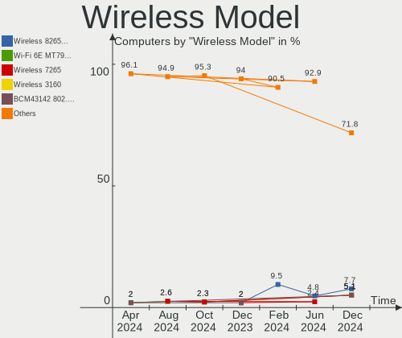

| Model                                                                          | Computers | Percent |
|--------------------------------------------------------------------------------|-----------|---------|
| Intel Wireless 7265                                                            | 4         | 8.7%    |
| Intel Wi-Fi 6 AX200                                                            | 4         | 8.7%    |
| Qualcomm Atheros AR9485 Wireless Network Adapter                               | 3         | 6.52%   |
| Realtek RTL8822CE 802.11ac PCIe Wireless Network Adapter                       | 2         | 4.35%   |
| Realtek RTL8188EE Wireless Network Adapter                                     | 2         | 4.35%   |
| Ralink MT7601U Wireless Adapter                                                | 2         | 4.35%   |
| Intel Wireless 7260                                                            | 2         | 4.35%   |
| Intel Wi-Fi 6 AX201                                                            | 2         | 4.35%   |
| Intel Alder Lake-P PCH CNVi WiFi                                               | 2         | 4.35%   |
| TP-Link 802.11ac WLAN Adapter                                                  | 1         | 2.17%   |
| Realtek RTL8821CE 802.11ac PCIe Wireless Network Adapter                       | 1         | 2.17%   |
| Realtek RTL8188CUS 802.11n WLAN Adapter                                        | 1         | 2.17%   |
| Realtek RTL8188CE 802.11b/g/n WiFi Adapter                                     | 1         | 2.17%   |
| Realtek 802.11ac NIC                                                           | 1         | 2.17%   |
| Ralink RT2790 Wireless 802.11n 1T/2R PCIe                                      | 1         | 2.17%   |
| Qualcomm Atheros QCA9377 802.11ac Wireless Network Adapter                     | 1         | 2.17%   |
| Qualcomm Atheros QCA6174 802.11ac Wireless Network Adapter                     | 1         | 2.17%   |
| Qualcomm Atheros AR9271 802.11n                                                | 1         | 2.17%   |
| Qualcomm Atheros AR9285 Wireless Network Adapter (PCI-Express)                 | 1         | 2.17%   |
| Qualcomm Atheros AR5413/AR5414 Wireless Network Adapter [AR5006X(S) 802.11abg] | 1         | 2.17%   |
| MediaTek MT7922 802.11ax PCI Express Wireless Network Adapter                  | 1         | 2.17%   |
| Intel Wireless 8265 / 8275                                                     | 1         | 2.17%   |
| Intel Wireless 3160                                                            | 1         | 2.17%   |
| Intel Wi-Fi 6 AX201 160MHz                                                     | 1         | 2.17%   |
| Intel Ice Lake-LP PCH CNVi WiFi                                                | 1         | 2.17%   |
| Intel Comet Lake PCH CNVi WiFi                                                 | 1         | 2.17%   |
| Intel Centrino Wireless-N 2200                                                 | 1         | 2.17%   |
| Intel Centrino Advanced-N 6205 [Taylor Peak]                                   | 1         | 2.17%   |
| Intel Alder Lake-S PCH CNVi WiFi                                               | 1         | 2.17%   |
| D-Link 11ac adapter                                                            | 1         | 2.17%   |
| Broadcom Limited BCM4321 802.11a/b/g/n                                         | 1         | 2.17%   |
| Broadcom BCM4322 802.11a/b/g/n Wireless LAN Controller                         | 1         | 2.17%   |

Ethernet Vendor
---------------

Ethernet vendors

| Vendor                | Computers | Percent |
|-----------------------|-----------|---------|
| Realtek Semiconductor | 34        | 56.67%  |
| Intel                 | 18        | 30%     |
| Qualcomm Atheros      | 3         | 5%      |
| IBM                   | 2         | 3.33%   |
| OPPO Electronics      | 1         | 1.67%   |
| Nvidia                | 1         | 1.67%   |
| DisplayLink           | 1         | 1.67%   |

Ethernet Model
--------------

Ethernet models

| Model                                                             | Computers | Percent |
|-------------------------------------------------------------------|-----------|---------|
| Realtek RTL8111/8168/8411 PCI Express Gigabit Ethernet Controller | 29        | 43.94%  |
| Realtek RTL8153 Gigabit Ethernet Adapter                          | 3         | 4.55%   |
| Realtek RTL8125 2.5GbE Controller                                 | 2         | 3.03%   |
| Intel Ethernet Connection X722 for 1GbE                           | 2         | 3.03%   |
| Intel Ethernet Connection X722                                    | 2         | 3.03%   |
| Intel Ethernet Connection (16) I219-V                             | 2         | 3.03%   |
| Intel 82579LM Gigabit Network Connection (Lewisville)             | 2         | 3.03%   |
| IBM XClarity Controller                                           | 2         | 3.03%   |
| Realtek RTL8169 PCI Gigabit Ethernet Controller                   | 1         | 1.52%   |
| Realtek RTL8152 Fast Ethernet Adapter                             | 1         | 1.52%   |
| Qualcomm Atheros QCA8172 Fast Ethernet                            | 1         | 1.52%   |
| Qualcomm Atheros AR8152 v2.0 Fast Ethernet                        | 1         | 1.52%   |
| Qualcomm Atheros AR8131 Gigabit Ethernet                          | 1         | 1.52%   |
| OPPO 8                                                            | 1         | 1.52%   |
| Nvidia MCP79 Ethernet                                             | 1         | 1.52%   |
| Intel Killer E3100 2.5 Gigabit Ethernet Controller                | 1         | 1.52%   |
| Intel I211 Gigabit Network Connection                             | 1         | 1.52%   |
| Intel Ethernet Controller I225-V                                  | 1         | 1.52%   |
| Intel Ethernet Controller I225-LM                                 | 1         | 1.52%   |
| Intel Ethernet Connection I217-V                                  | 1         | 1.52%   |
| Intel Ethernet Connection (3) I218-V                              | 1         | 1.52%   |
| Intel Ethernet Connection (3) I218-LM                             | 1         | 1.52%   |
| Intel Ethernet Connection (2) I219-V                              | 1         | 1.52%   |
| Intel Ethernet Connection (2) I219-LM                             | 1         | 1.52%   |
| Intel Ethernet Connection (17) I219-LM                            | 1         | 1.52%   |
| Intel Alder Lake-S PCH CNVi WiFi                                  | 1         | 1.52%   |
| Intel 82801DB PRO/100 VE (MOB) Ethernet Controller                | 1         | 1.52%   |
| Intel 82599ES 10-Gigabit SFI/SFP+ Network Connection              | 1         | 1.52%   |
| Intel 82579V Gigabit Network Connection                           | 1         | 1.52%   |
| DisplayLink USB3.0 dock                                           | 1         | 1.52%   |

Net Controller Kind
-------------------

Ethernet, WiFi or modem

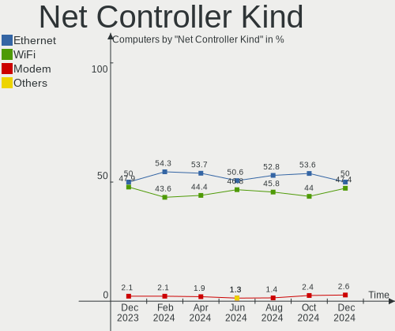

| Kind     | Computers | Percent |
|----------|-----------|---------|
| Ethernet | 53        | 53%     |
| WiFi     | 46        | 46%     |
| Modem    | 1         | 1%      |

Used Controller
---------------

Currently used network controller

| Kind     | Computers | Percent |
|----------|-----------|---------|
| WiFi     | 35        | 52.24%  |
| Ethernet | 32        | 47.76%  |

NICs
----

Total network controllers on board

| Total | Computers | Percent |
|-------|-----------|---------|
| 2     | 30        | 47.62%  |
| 1     | 26        | 41.27%  |
| 3     | 5         | 7.94%   |
| 0     | 2         | 3.17%   |

IPv6
----

IPv6 vs IPv4

| Used | Computers | Percent |
|------|-----------|---------|
| No   | 42        | 66.67%  |
| Yes  | 21        | 33.33%  |

Bluetooth
---------

Bluetooth Vendor
----------------

Controller vendors

| Vendor                          | Computers | Percent |
|---------------------------------|-----------|---------|
| Intel                           | 21        | 58.33%  |
| Qualcomm Atheros Communications | 4         | 11.11%  |
| IMC Networks                    | 2         | 5.56%   |
| Realtek Semiconductor           | 1         | 2.78%   |
| Realtek                         | 1         | 2.78%   |
| Lite-On Technology              | 1         | 2.78%   |
| Integrated System Solution      | 1         | 2.78%   |
| Foxconn / Hon Hai               | 1         | 2.78%   |
| Cambridge Silicon Radio         | 1         | 2.78%   |
| Broadcom                        | 1         | 2.78%   |
| ASUSTek Computer                | 1         | 2.78%   |
| Apple                           | 1         | 2.78%   |

Bluetooth Model
---------------

Controller models

| Model                                               | Computers | Percent |
|-----------------------------------------------------|-----------|---------|
| Intel Bluetooth wireless interface                  | 8         | 22.22%  |
| Intel AX201 Bluetooth                               | 6         | 16.67%  |
| Intel AX200 Bluetooth                               | 4         | 11.11%  |
| Intel Bluetooth Device                              | 2         | 5.56%   |
| Realtek  Bluetooth 4.2 Adapter                      | 1         | 2.78%   |
| Realtek Bluetooth Radio                             | 1         | 2.78%   |
| Qualcomm Atheros QCA61x4 Bluetooth 4.0              | 1         | 2.78%   |
| Qualcomm Atheros Bluetooth USB Host Controller      | 1         | 2.78%   |
| Qualcomm Atheros AR3012 Bluetooth 4.0               | 1         | 2.78%   |
| Qualcomm Atheros AR3011 Bluetooth                   | 1         | 2.78%   |
| Lite-On Qualcomm Atheros QCA9377 Bluetooth          | 1         | 2.78%   |
| Intel Bluetooth 9460/9560 Jefferson Peak (JfP)      | 1         | 2.78%   |
| Integrated System Solution Bluetooth Device         | 1         | 2.78%   |
| IMC Networks Bluetooth USB Host Controller          | 1         | 2.78%   |
| IMC Networks Bluetooth Radio                        | 1         | 2.78%   |
| Foxconn / Hon Hai Wireless_Device                   | 1         | 2.78%   |
| Cambridge Silicon Radio Bluetooth Dongle (HCI mode) | 1         | 2.78%   |
| Broadcom BCM20702 Bluetooth 4.0 [ThinkPad]          | 1         | 2.78%   |
| ASUS ASUS USB-BT500                                 | 1         | 2.78%   |
| Apple Bluetooth Host Controller                     | 1         | 2.78%   |

Sound
-----

Sound Vendor
------------

Sound card vendors

| Vendor                                       | Computers | Percent |
|----------------------------------------------|-----------|---------|
| Intel                                        | 43        | 46.74%  |
| AMD                                          | 18        | 19.57%  |
| Nvidia                                       | 16        | 17.39%  |
| C-Media Electronics                          | 4         | 4.35%   |
| Lenovo                                       | 2         | 2.17%   |
| Zoran Co. Personal Media Division (Nogatech) | 1         | 1.09%   |
| Tenx Technology                              | 1         | 1.09%   |
| Microchip Technology                         | 1         | 1.09%   |
| MAG Technology                               | 1         | 1.09%   |
| M-Audio                                      | 1         | 1.09%   |
| JMTek                                        | 1         | 1.09%   |
| GN Netcom                                    | 1         | 1.09%   |
| Creative Labs                                | 1         | 1.09%   |
| BR23                                         | 1         | 1.09%   |

Sound Model
-----------

Sound card models

| Model                                                                      | Computers | Percent |
|----------------------------------------------------------------------------|-----------|---------|
| Intel 8 Series/C220 Series Chipset High Definition Audio Controller        | 6         | 5.26%   |
| AMD Family 17h/19h HD Audio Controller                                     | 6         | 5.26%   |
| AMD FCH Azalia Controller                                                  | 5         | 4.39%   |
| Intel 7 Series/C216 Chipset Family High Definition Audio Controller        | 4         | 3.51%   |
| Intel 6 Series/C200 Series Chipset Family High Definition Audio Controller | 4         | 3.51%   |
| Nvidia GK208 HDMI/DP Audio Controller                                      | 3         | 2.63%   |
| Intel Xeon E3-1200 v3/4th Gen Core Processor HD Audio Controller           | 3         | 2.63%   |
| Intel Wildcat Point-LP High Definition Audio Controller                    | 3         | 2.63%   |
| Intel Tiger Lake-LP Smart Sound Technology Audio Controller                | 3         | 2.63%   |
| Intel Broadwell-U Audio Controller                                         | 3         | 2.63%   |
| Intel 82801JI (ICH10 Family) HD Audio Controller                           | 3         | 2.63%   |
| AMD SBx00 Azalia (Intel HDA)                                               | 3         | 2.63%   |
| AMD Renoir Radeon High Definition Audio Controller                         | 3         | 2.63%   |
| Intel Atom Processor Z36xxx/Z37xxx Series High Definition Audio Controller | 2         | 1.75%   |
| Intel Alder Lake-S HD Audio Controller                                     | 2         | 1.75%   |
| Intel Alder Lake PCH-P High Definition Audio Controller                    | 2         | 1.75%   |
| Intel 200 Series PCH HD Audio                                              | 2         | 1.75%   |
| AMD Trinity HDMI Audio Controller                                          | 2         | 1.75%   |
| AMD Starship/Matisse HD Audio Controller                                   | 2         | 1.75%   |
| AMD Raven/Raven2/Fenghuang HDMI/DP Audio Controller                        | 2         | 1.75%   |
| AMD Navi 21/23 HDMI/DP Audio Controller                                    | 2         | 1.75%   |
| AMD Kabini HDMI/DP Audio                                                   | 2         | 1.75%   |
| Zoran Co. Personal Media Division (Nogatech) USB Audio and HID             | 1         | 0.88%   |
| Tenx Technology USB AUDIO                                                  | 1         | 0.88%   |
| Nvidia TU107 GeForce GTX 1650 High Definition Audio Controller             | 1         | 0.88%   |
| Nvidia TU106 High Definition Audio Controller                              | 1         | 0.88%   |
| Nvidia TU104 HD Audio Controller                                           | 1         | 0.88%   |
| Nvidia MCP79 High Definition Audio                                         | 1         | 0.88%   |
| Nvidia GP107GL High Definition Audio Controller                            | 1         | 0.88%   |
| Nvidia GP106 High Definition Audio Controller                              | 1         | 0.88%   |
| Nvidia GM107 High Definition Audio Controller [GeForce 940MX]              | 1         | 0.88%   |
| Nvidia GF119 HDMI Audio Controller                                         | 1         | 0.88%   |
| Nvidia GF108 High Definition Audio Controller                              | 1         | 0.88%   |
| Nvidia GF100 High Definition Audio Controller                              | 1         | 0.88%   |
| Nvidia GA104 High Definition Audio Controller                              | 1         | 0.88%   |
| Nvidia GA102 High Definition Audio Controller                              | 1         | 0.88%   |
| Nvidia Audio device                                                        | 1         | 0.88%   |
| Microchip Technology timeBuzzer                                            | 1         | 0.88%   |
| MAG Technology ARC AMP DAC                                                 | 1         | 0.88%   |
| M-Audio M-Audio 1x1                                                        | 1         | 0.88%   |

Memory
------

Memory Vendor
-------------

Memory module vendors

| Vendor              | Computers | Percent |
|---------------------|-----------|---------|
| Samsung Electronics | 11        | 21.15%  |
| SK hynix            | 10        | 19.23%  |
| Unknown             | 5         | 9.62%   |
| Kingston            | 5         | 9.62%   |
| Corsair             | 5         | 9.62%   |
| Nanya Technology    | 4         | 7.69%   |
| Crucial             | 4         | 7.69%   |
| Micron Technology   | 3         | 5.77%   |
| Unknown (0x0B15)    | 1         | 1.92%   |
| Smart               | 1         | 1.92%   |
| Patriot             | 1         | 1.92%   |
| G.Skill             | 1         | 1.92%   |
| A-DATA Technology   | 1         | 1.92%   |

Memory Model
------------

Memory module models

| Model                                                       | Computers | Percent |
|-------------------------------------------------------------|-----------|---------|
| SK hynix RAM HMT451S6BFR8A-PB 4GB SODIMM DDR3 1600MT/s      | 2         | 3.7%    |
| SK hynix RAM HMA84GR7AFR4N-VK 32GB DIMM DDR4 2666MT/s       | 2         | 3.7%    |
| Nanya RAM NT4GC64B8HG0NF-DI 4GB DIMM DDR3 1600MT/s          | 2         | 3.7%    |
| Unknown RAM Module 4096MB DIMM 1333MT/s                     | 1         | 1.85%   |
| Unknown RAM Module 2GB SODIMM DDR3 1333MT/s                 | 1         | 1.85%   |
| Unknown RAM Module 2GB DIMM 1600MT/s                        | 1         | 1.85%   |
| Unknown RAM Module 1GB SODIMM DDR 266MT/s                   | 1         | 1.85%   |
| Unknown RAM Module 1GB Row Of Chips LPDDR4 4267MT/s         | 1         | 1.85%   |
| Unknown (0x0B15) RAM JAD3200U1816 16GB DIMM DDR4 2667MT/s   | 1         | 1.85%   |
| Smart RAM SMS4WEC8C1K0446FCG 8GB SODIMM DDR4 3200MT/s       | 1         | 1.85%   |
| SK hynix RAM Module 8GB DIMM DDR4 2133MT/s                  | 1         | 1.85%   |
| SK hynix RAM HMT41GS6BFR8A-PB 8GB SODIMM DDR3 1600MT/s      | 1         | 1.85%   |
| SK hynix RAM HMT351U6CFR8C-PB 4GB DIMM DDR3 1800MT/s        | 1         | 1.85%   |
| SK hynix RAM HMAB2GS6CMR6N-XN 16GB SODIMM DDR4 3200MT/s     | 1         | 1.85%   |
| SK hynix RAM HMA81GU6DJR8N-XN 8GB DIMM DDR4 3200MT/s        | 1         | 1.85%   |
| SK hynix RAM HMA81GU6AFR8N-UH 8GB DIMM DDR4 2400MT/s        | 1         | 1.85%   |
| SK hynix RAM HMA81GS6AFR8N-UH 8GB SODIMM DDR4 2667MT/s      | 1         | 1.85%   |
| Samsung RAM M471B5173QH0-YK0 4GB SODIMM DDR3 1600MT/s       | 1         | 1.85%   |
| Samsung RAM M471B5173DB0-YK0 4GB SODIMM DDR3 1600MT/s       | 1         | 1.85%   |
| Samsung RAM M471B5173BH0-CK0 4GB SODIMM DDR3 1600MT/s       | 1         | 1.85%   |
| Samsung RAM M471A5244CB0-CTD 4GB SODIMM DDR4 3266MT/s       | 1         | 1.85%   |
| Samsung RAM M471A5244CB0-CTD 4GB Row Of Chips DDR4 2667MT/s | 1         | 1.85%   |
| Samsung RAM M471A2K43DB1-CWE 16384MB SODIMM DDR4 3200MT/s   | 1         | 1.85%   |
| Samsung RAM M471A2G44BM0-CWE 16384MB SODIMM DDR4 3200MT/s   | 1         | 1.85%   |
| Samsung RAM M471A2G43BB2-CWE 16GB SODIMM DDR4 3200MT/s      | 1         | 1.85%   |
| Samsung RAM M471A1K43DB1-CWE 8GB SODIMM DDR4 3200MT/s       | 1         | 1.85%   |
| Samsung RAM M471A1G44AB0-CWE 8GB SODIMM DDR4 3200MT/s       | 1         | 1.85%   |
| Samsung RAM M378B5273DH0-CK0 4GB DIMM DDR3 2200MT/s         | 1         | 1.85%   |
| Samsung RAM M378B5173EB0-YK0 4GB DIMM DDR3 1600MT/s         | 1         | 1.85%   |
| Patriot RAM 1600EL Series 4GB DIMM DDR3 1600MT/s            | 1         | 1.85%   |
| Nanya RAM NT2GT64U8HD0BY-AD 2048MB DIMM DDR2 2048MT/s       | 1         | 1.85%   |
| Nanya RAM M2F8G64CB8HD5N-DI 8GB DIMM DDR3 1600MT/s          | 1         | 1.85%   |
| Micron RAM MTC8C1084S1SC48BA1 16GB SODIMM DDR5 4800MT/s     | 1         | 1.85%   |
| Micron RAM Module 4GB Row Of Chips LPDDR4 2933MT/s          | 1         | 1.85%   |
| Micron RAM 18KSF1G72AZ-1G6E1 8GB DIMM DDR2 1600MT/s         | 1         | 1.85%   |
| Kingston RAM KHX2666C16/8G 8GB DIMM DDR4 3466MT/s           | 1         | 1.85%   |
| Kingston RAM ACR16D3LS1KNG/4G 4096MB SODIMM DDR3 1600MT/s   | 1         | 1.85%   |
| Kingston RAM 99U5471-012.A00LF 4GB DIMM 1600MT/s            | 1         | 1.85%   |
| Kingston RAM 9905744-114.A00G 32GB SODIMM DDR4 3200MT/s     | 1         | 1.85%   |
| Kingston RAM 9905700-118.A00G 8GB SODIMM DDR4 3200MT/s      | 1         | 1.85%   |

Memory Kind
-----------

Memory module kinds

| Kind    | Computers | Percent |
|---------|-----------|---------|
| DDR3    | 19        | 44.19%  |
| DDR4    | 17        | 39.53%  |
| LPDDR4  | 2         | 4.65%   |
| Unknown | 2         | 4.65%   |
| SDRAM   | 1         | 2.33%   |
| DDR5    | 1         | 2.33%   |
| DDR     | 1         | 2.33%   |

Memory Form Factor
------------------

Physical design of the memory module

| Name         | Computers | Percent |
|--------------|-----------|---------|
| SODIMM       | 21        | 48.84%  |
| DIMM         | 19        | 44.19%  |
| Row Of Chips | 3         | 6.98%   |

Memory Size
-----------

Memory module size

| Size  | Computers | Percent |
|-------|-----------|---------|
| 4096  | 19        | 39.58%  |
| 8192  | 11        | 22.92%  |
| 16384 | 8         | 16.67%  |
| 32768 | 5         | 10.42%  |
| 2048  | 3         | 6.25%   |
| 1024  | 2         | 4.17%   |

Memory Speed
------------

Memory module speed

| Speed | Computers | Percent |
|-------|-----------|---------|
| 1600  | 15        | 31.91%  |
| 3200  | 9         | 19.15%  |
| 2667  | 4         | 8.51%   |
| 1333  | 3         | 6.38%   |
| 2666  | 2         | 4.26%   |
| 4800  | 1         | 2.13%   |
| 4267  | 1         | 2.13%   |
| 3600  | 1         | 2.13%   |
| 3466  | 1         | 2.13%   |
| 3266  | 1         | 2.13%   |
| 2933  | 1         | 2.13%   |
| 2400  | 1         | 2.13%   |
| 2200  | 1         | 2.13%   |
| 2133  | 1         | 2.13%   |
| 2048  | 1         | 2.13%   |
| 1800  | 1         | 2.13%   |
| 1334  | 1         | 2.13%   |
| 1067  | 1         | 2.13%   |
| 266   | 1         | 2.13%   |

Printers & scanners
-------------------

Printer Vendor
--------------

Printer device vendors

| Vendor              | Computers | Percent |
|---------------------|-----------|---------|
| Xiaomi              | 1         | 33.33%  |
| Samsung Electronics | 1         | 33.33%  |
| Hewlett-Packard     | 1         | 33.33%  |

Printer Model
-------------

Printer device models

| Model             | Computers | Percent |
|-------------------|-----------|---------|
| Xiaomi MiMouse 2  | 1         | 33.33%  |
| Samsung ML-1865   | 1         | 33.33%  |
| HP LaserJet P1102 | 1         | 33.33%  |

Scanner Vendor
--------------

Scanner device vendors

Zero info for selected period =(

Scanner Model
-------------

Scanner device models

Zero info for selected period =(

Camera
------

Camera Vendor
-------------

Camera device vendors

| Vendor                        | Computers | Percent |
|-------------------------------|-----------|---------|
| Chicony Electronics           | 9         | 28.13%  |
| IMC Networks                  | 6         | 18.75%  |
| Logitech                      | 3         | 9.38%   |
| Microdia                      | 2         | 6.25%   |
| Lite-On Technology            | 2         | 6.25%   |
| 8SSC21D67422V1SR28902JL       | 2         | 6.25%   |
| Sunplus Innovation Technology | 1         | 3.13%   |
| Sonix Technology              | 1         | 3.13%   |
| Silicon Motion                | 1         | 3.13%   |
| Samsung Electronics           | 1         | 3.13%   |
| Realtek Semiconductor         | 1         | 3.13%   |
| Jieli Technology              | 1         | 3.13%   |
| Apple                         | 1         | 3.13%   |
| Acer                          | 1         | 3.13%   |

Camera Model
------------

Camera device models

| Model                                         | Computers | Percent |
|-----------------------------------------------|-----------|---------|
| Lite-On Integrated Camera                     | 2         | 6.25%   |
| IMC Networks USB2.0 HD UVC WebCam             | 2         | 6.25%   |
| Chicony TOSHIBA Web Camera - HD               | 2         | 6.25%   |
| 8SSC21D67422V1SR28902JL Integrated RGB Camera | 2         | 6.25%   |
| Sunplus Integrated_Webcam_HD                  | 1         | 3.13%   |
| Sonix USB2.0 FHD UVC WebCam                   | 1         | 3.13%   |
| Silicon Motion WebCam SC-10IRQ12340N          | 1         | 3.13%   |
| Samsung Galaxy series, misc. (MTP mode)       | 1         | 3.13%   |
| Realtek Integrated_Webcam_HD                  | 1         | 3.13%   |
| Microdia USB 2.0 Camera                       | 1         | 3.13%   |
| Microdia Integrated_Webcam_HD                 | 1         | 3.13%   |
| Logitech Webcam C270                          | 1         | 3.13%   |
| Logitech Logi Webcam C920e                    | 1         | 3.13%   |
| Logitech BRIO                                 | 1         | 3.13%   |
| Jieli USB Composite Device                    | 1         | 3.13%   |
| IMC Networks VGA UVC WebCam                   | 1         | 3.13%   |
| IMC Networks ov9734_azurewave_camera          | 1         | 3.13%   |
| IMC Networks Integrated Webcam                | 1         | 3.13%   |
| IMC Networks Integrated Camera                | 1         | 3.13%   |
| Chicony WebCam                                | 1         | 3.13%   |
| Chicony USB2.0 HD UVC WebCam                  | 1         | 3.13%   |
| Chicony HD WebCam (Asus N-series)             | 1         | 3.13%   |
| Chicony HD WebCam                             | 1         | 3.13%   |
| Chicony HD User Facing                        | 1         | 3.13%   |
| Chicony FJ Camera                             | 1         | 3.13%   |
| Chicony Camera                                | 1         | 3.13%   |
| Apple Built-in iSight                         | 1         | 3.13%   |
| Acer Integrated Camera                        | 1         | 3.13%   |

Security
--------

Fingerprint Vendor
------------------

Fingerprint sensor vendors

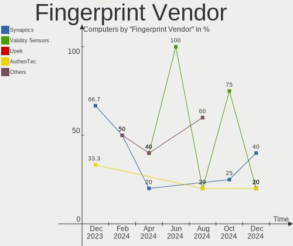

| Vendor                     | Computers | Percent |
|----------------------------|-----------|---------|
| Shenzhen Goodix Technology | 2         | 66.67%  |
| Validity Sensors           | 1         | 33.33%  |

Fingerprint Model
-----------------

Fingerprint sensor models

| Model                                        | Computers | Percent |
|----------------------------------------------|-----------|---------|
| Shenzhen Goodix  Fingerprint Device          | 2         | 66.67%  |
| Validity Sensors VFS 5011 fingerprint sensor | 1         | 33.33%  |

Chipcard Vendor
---------------

Chipcard module vendors

| Vendor      | Computers | Percent |
|-------------|-----------|---------|
| Alcor Micro | 1         | 100%    |

Chipcard Model
--------------

Chipcard module models

| Model                               | Computers | Percent |
|-------------------------------------|-----------|---------|
| Alcor Micro AU9540 Smartcard Reader | 1         | 100%    |

Unsupported
-----------

Unsupported Devices
-------------------

Total unsupported devices on board

| Total | Computers | Percent |
|-------|-----------|---------|
| 0     | 48        | 76.19%  |
| 1     | 12        | 19.05%  |
| 4     | 2         | 3.17%   |
| 3     | 1         | 1.59%   |

Unsupported Device Types
------------------------

Types of unsupported devices

| Type                     | Computers | Percent |
|--------------------------|-----------|---------|
| Graphics card            | 5         | 23.81%  |
| Communication controller | 3         | 14.29%  |
| Unassigned class         | 2         | 9.52%   |
| Sound                    | 2         | 9.52%   |
| Net/ethernet             | 2         | 9.52%   |
| Fingerprint reader       | 2         | 9.52%   |
| Net/wireless             | 1         | 4.76%   |
| Multimedia controller    | 1         | 4.76%   |
| Modem                    | 1         | 4.76%   |
| Chipcard                 | 1         | 4.76%   |
| Bluetooth                | 1         | 4.76%   |

