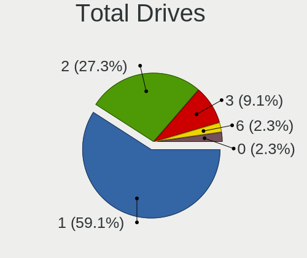
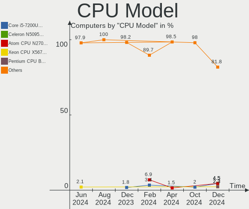
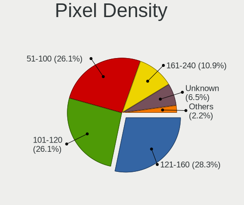
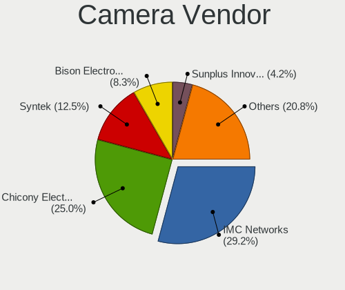

Xubuntu - Hardware Trends
-------------------------

A project to identify most popular hardware characteristics and track their change
over time based on data collected by Linux users at https://Linux-Hardware.org.

Anyone can contribute to this report by the [hw-probe](https://github.com/linuxhw/hw-probe) tool:

    sudo -E hw-probe -all -upload

This is a report for all computer types. See also reports for [desktops](/Dist/Xubuntu/Desktop/README.md) and [notebooks](/Dist/Xubuntu/Notebook/README.md).

This report is for one last month. Overall report since the beginning of time: [TestDays](https://github.com/linuxhw/TestDays)

Period: Dec, 2023.

Contents
--------

* [ System ](#system)
  - [ OS                       ](#os)
  - [ OS Family                ](#os-family)
  - [ Kernel                   ](#kernel)
  - [ Kernel Family            ](#kernel-family)
  - [ Kernel Major Ver.        ](#kernel-major-ver)
  - [ Arch                     ](#arch)
  - [ DE                       ](#de)
  - [ Display Server           ](#display-server)
  - [ Display Manager          ](#display-manager)
  - [ OS Lang                  ](#os-lang)
  - [ Boot Mode                ](#boot-mode)
  - [ Filesystem               ](#filesystem)
  - [ Part. scheme             ](#part-scheme)
  - [ Dual Boot with Linux/BSD ](#dual-boot-with-linuxbsd)
  - [ Dual Boot (Win)          ](#dual-boot-win)

* [ Board ](#board)
  - [ Vendor                   ](#vendor)
  - [ Model                    ](#model)
  - [ Model Family             ](#model-family)
  - [ MFG Year                 ](#mfg-year)
  - [ Form Factor              ](#form-factor)
  - [ Secure Boot              ](#secure-boot)
  - [ Coreboot                 ](#coreboot)
  - [ RAM Size                 ](#ram-size)
  - [ RAM Used                 ](#ram-used)
  - [ Total Drives             ](#total-drives)
  - [ Has CD-ROM               ](#has-cd-rom)
  - [ Has Ethernet             ](#has-ethernet)
  - [ Has WiFi                 ](#has-wifi)
  - [ Has Bluetooth            ](#has-bluetooth)

* [ Location ](#location)
  - [ Country                  ](#country)
  - [ City                     ](#city)

* [ Drives ](#drives)
  - [ Drive Vendor             ](#drive-vendor)
  - [ Drive Model              ](#drive-model)
  - [ HDD Vendor               ](#hdd-vendor)
  - [ SSD Vendor               ](#ssd-vendor)
  - [ Drive Kind               ](#drive-kind)
  - [ Drive Connector          ](#drive-connector)
  - [ Drive Size               ](#drive-size)
  - [ Space Total              ](#space-total)
  - [ Space Used               ](#space-used)
  - [ Malfunc. Drives          ](#malfunc-drives)
  - [ Malfunc. Drive Vendor    ](#malfunc-drive-vendor)
  - [ Malfunc. HDD Vendor      ](#malfunc-hdd-vendor)
  - [ Malfunc. Drive Kind      ](#malfunc-drive-kind)
  - [ Failed Drives            ](#failed-drives)
  - [ Failed Drive Vendor      ](#failed-drive-vendor)
  - [ Drive Status             ](#drive-status)

* [ Storage controller ](#storage-controller)
  - [ Storage Vendor           ](#storage-vendor)
  - [ Storage Model            ](#storage-model)
  - [ Storage Kind             ](#storage-kind)

* [ Processor ](#processor)
  - [ CPU Vendor               ](#cpu-vendor)
  - [ CPU Model                ](#cpu-model)
  - [ CPU Model Family         ](#cpu-model-family)
  - [ CPU Cores                ](#cpu-cores)
  - [ CPU Sockets              ](#cpu-sockets)
  - [ CPU Threads              ](#cpu-threads)
  - [ CPU Op-Modes             ](#cpu-op-modes)
  - [ CPU Microcode            ](#cpu-microcode)
  - [ CPU Microarch            ](#cpu-microarch)

* [ Graphics ](#graphics)
  - [ GPU Vendor               ](#gpu-vendor)
  - [ GPU Model                ](#gpu-model)
  - [ GPU Combo                ](#gpu-combo)
  - [ GPU Driver               ](#gpu-driver)
  - [ GPU Memory               ](#gpu-memory)

* [ Monitor ](#monitor)
  - [ Monitor Vendor           ](#monitor-vendor)
  - [ Monitor Model            ](#monitor-model)
  - [ Monitor Resolution       ](#monitor-resolution)
  - [ Monitor Diagonal         ](#monitor-diagonal)
  - [ Monitor Width            ](#monitor-width)
  - [ Aspect Ratio             ](#aspect-ratio)
  - [ Monitor Area             ](#monitor-area)
  - [ Pixel Density            ](#pixel-density)
  - [ Multiple Monitors        ](#multiple-monitors)

* [ Network ](#network)
  - [ Net Controller Vendor    ](#net-controller-vendor)
  - [ Net Controller Model     ](#net-controller-model)
  - [ Wireless Vendor          ](#wireless-vendor)
  - [ Wireless Model           ](#wireless-model)
  - [ Ethernet Vendor          ](#ethernet-vendor)
  - [ Ethernet Model           ](#ethernet-model)
  - [ Net Controller Kind      ](#net-controller-kind)
  - [ Used Controller          ](#used-controller)
  - [ NICs                     ](#nics)
  - [ IPv6                     ](#ipv6)

* [ Bluetooth ](#bluetooth)
  - [ Bluetooth Vendor         ](#bluetooth-vendor)
  - [ Bluetooth Model          ](#bluetooth-model)

* [ Sound ](#sound)
  - [ Sound Vendor             ](#sound-vendor)
  - [ Sound Model              ](#sound-model)

* [ Memory ](#memory)
  - [ Memory Vendor            ](#memory-vendor)
  - [ Memory Model             ](#memory-model)
  - [ Memory Kind              ](#memory-kind)
  - [ Memory Form Factor       ](#memory-form-factor)
  - [ Memory Size              ](#memory-size)
  - [ Memory Speed             ](#memory-speed)

* [ Printers & scanners ](#printers--scanners)
  - [ Printer Vendor           ](#printer-vendor)
  - [ Printer Model            ](#printer-model)
  - [ Scanner Vendor           ](#scanner-vendor)
  - [ Scanner Model            ](#scanner-model)

* [ Camera ](#camera)
  - [ Camera Vendor            ](#camera-vendor)
  - [ Camera Model             ](#camera-model)

* [ Security ](#security)
  - [ Fingerprint Vendor       ](#fingerprint-vendor)
  - [ Fingerprint Model        ](#fingerprint-model)
  - [ Chipcard Vendor          ](#chipcard-vendor)
  - [ Chipcard Model           ](#chipcard-model)

* [ Unsupported ](#unsupported)
  - [ Unsupported Devices      ](#unsupported-devices)
  - [ Unsupported Device Types ](#unsupported-device-types)

System
------

OS
--

Installed operating systems

| Name              | Computers | Percent |
|-------------------|-----------|---------|
| Xubuntu 22.04     | 32        | 56.14%  |
| Xubuntu 23.10     | 9         | 15.79%  |
| Xubuntu 18.04     | 8         | 14.04%  |
| Xubuntu 20.04     | 6         | 10.53%  |
| Xubuntu 2023.4~rc | 2         | 3.51%   |

OS Family
---------

OS without a version

| Name    | Computers | Percent |
|---------|-----------|---------|
| Xubuntu | 57        | 100%    |

Kernel
------

Version of the Linux kernel

| Version                 | Computers | Percent |
|-------------------------|-----------|---------|
| 6.2.0-39-generic        | 8         | 14.04%  |
| 6.5.0-14-generic        | 6         | 10.53%  |
| 6.2.0-37-generic        | 6         | 10.53%  |
| 5.15.0-91-generic       | 6         | 10.53%  |
| 5.4.0-150-generic       | 5         | 8.77%   |
| 6.2.0-26-generic        | 2         | 3.51%   |
| 6.1.0-1027-oem          | 2         | 3.51%   |
| 5.4.0-167-generic       | 2         | 3.51%   |
| 5.15.0-89-generic       | 2         | 3.51%   |
| 5.15.0-88-generic       | 2         | 3.51%   |
| 6.6.7-060607-generic    | 1         | 1.75%   |
| 6.6.4-1-liquorix-amd64  | 1         | 1.75%   |
| 6.5.5-060505-generic    | 1         | 1.75%   |
| 6.5.0-9-generic         | 1         | 1.75%   |
| 6.5.0-10-generic        | 1         | 1.75%   |
| 6.2.0-36-generic        | 1         | 1.75%   |
| 6.2.0-1017-lowlatency   | 1         | 1.75%   |
| 6.2.0-060200-generic    | 1         | 1.75%   |
| 6.1.0-1015-oem          | 1         | 1.75%   |
| 5.4.217-0504217-generic | 1         | 1.75%   |
| 5.4.0-99-generic        | 1         | 1.75%   |
| 5.17.5-76051705-generic | 1         | 1.75%   |
| 5.15.0-91-lowlatency    | 1         | 1.75%   |
| 5.15.0-71-generic       | 1         | 1.75%   |
| 4.4.194-rk322x          | 1         | 1.75%   |
| 4.15.0-29-generic       | 1         | 1.75%   |

Kernel Family
-------------

Linux kernel without a distro release

| Version | Computers | Percent |
|---------|-----------|---------|
| 6.2.0   | 19        | 33.33%  |
| 5.15.0  | 12        | 21.05%  |
| 6.5.0   | 8         | 14.04%  |
| 5.4.0   | 8         | 14.04%  |
| 6.1.0   | 3         | 5.26%   |
| 6.6.7   | 1         | 1.75%   |
| 6.6.4   | 1         | 1.75%   |
| 6.5.5   | 1         | 1.75%   |
| 5.4.217 | 1         | 1.75%   |
| 5.17.5  | 1         | 1.75%   |
| 4.4.194 | 1         | 1.75%   |
| 4.15.0  | 1         | 1.75%   |

Kernel Major Ver.
-----------------

Linux kernel major version

| Version | Computers | Percent |
|---------|-----------|---------|
| 6.2     | 19        | 33.33%  |
| 5.15    | 12        | 21.05%  |
| 6.5     | 9         | 15.79%  |
| 5.4     | 9         | 15.79%  |
| 6.1     | 3         | 5.26%   |
| 6.6     | 2         | 3.51%   |
| 5.17    | 1         | 1.75%   |
| 4.4     | 1         | 1.75%   |
| 4.15    | 1         | 1.75%   |

Arch
----

OS architecture (x86_64, i586, etc.)

| Name   | Computers | Percent |
|--------|-----------|---------|
| x86_64 | 52        | 91.23%  |
| i686   | 4         | 7.02%   |
| armv7l | 1         | 1.75%   |

DE
--

Desktop Environment

| Name            | Computers | Percent |
|-----------------|-----------|---------|
| XFCE            | 53        | 92.98%  |
| Unicorn:XFCE    | 2         | 3.51%   |
| i3              | 1         | 1.75%   |
| GNOME Flashback | 1         | 1.75%   |

Display Server
--------------

X11 or Wayland

| Name | Computers | Percent |
|------|-----------|---------|
| X11  | 55        | 96.49%  |
| Tty  | 2         | 3.51%   |

Display Manager
---------------

SDDM, LightDM, etc.

| Name    | Computers | Percent |
|---------|-----------|---------|
| LightDM | 48        | 84.21%  |
| Unknown | 6         | 10.53%  |
| GDM3    | 3         | 5.26%   |

OS Lang
-------

Language

| Lang  | Computers | Percent |
|-------|-----------|---------|
| en_US | 21        | 36.84%  |
| fr_FR | 7         | 12.28%  |
| it_IT | 6         | 10.53%  |
| de_DE | 6         | 10.53%  |
| C     | 3         | 5.26%   |
| ru_RU | 2         | 3.51%   |
| en_GB | 2         | 3.51%   |
| ro_RO | 1         | 1.75%   |
| pt_BR | 1         | 1.75%   |
| pl_PL | 1         | 1.75%   |
| fi_FI | 1         | 1.75%   |
| es_ES | 1         | 1.75%   |
| es_CL | 1         | 1.75%   |
| en_CA | 1         | 1.75%   |
| en_AU | 1         | 1.75%   |
| de_IT | 1         | 1.75%   |
| be_BY | 1         | 1.75%   |

Boot Mode
---------

EFI or BIOS

| Mode | Computers | Percent |
|------|-----------|---------|
| BIOS | 32        | 56.14%  |
| EFI  | 25        | 43.86%  |

Filesystem
----------

Type of filesystem

| Type    | Computers | Percent |
|---------|-----------|---------|
| Ext4    | 41        | 71.93%  |
| Tmpfs   | 13        | 22.81%  |
| Overlay | 3         | 5.26%   |

Part. scheme
------------

Scheme of partitioning

| Type    | Computers | Percent |
|---------|-----------|---------|
| GPT     | 37        | 64.91%  |
| Unknown | 11        | 19.3%   |
| MBR     | 9         | 15.79%  |

Dual Boot with Linux/BSD
------------------------

Hosting more than one Linux/BSD

| Dual boot | Computers | Percent |
|-----------|-----------|---------|
| No        | 46        | 80.7%   |
| Yes       | 11        | 19.3%   |

Dual Boot (Win)
---------------

Hosting Linux and Windows

| Dual boot | Computers | Percent |
|-----------|-----------|---------|
| No        | 40        | 70.18%  |
| Yes       | 17        | 29.82%  |

Board
-----

Vendor
------

Motherboard manufacturer

| Name                | Computers | Percent |
|---------------------|-----------|---------|
| ASUSTek Computer    | 10        | 17.54%  |
| Lenovo              | 9         | 15.79%  |
| Hewlett-Packard     | 7         | 12.28%  |
| Gigabyte Technology | 4         | 7.02%   |
| Dell                | 4         | 7.02%   |
| MSI                 | 3         | 5.26%   |
| Intel               | 3         | 5.26%   |
| ASRock              | 3         | 5.26%   |
| Unknown             | 3         | 5.26%   |
| Apple               | 2         | 3.51%   |
| Acer                | 2         | 3.51%   |
| Toshiba             | 1         | 1.75%   |
| Sony                | 1         | 1.75%   |
| Packard Bell        | 1         | 1.75%   |
| HUAWEI              | 1         | 1.75%   |
| Fujitsu             | 1         | 1.75%   |
| Foxconn             | 1         | 1.75%   |
| eMachines           | 1         | 1.75%   |

Model
-----

Motherboard model

| Name                                        | Computers | Percent |
|---------------------------------------------|-----------|---------|
| Unknown                                     | 3         | 5.26%   |
| Toshiba Satellite Pro C660                  | 1         | 1.75%   |
| Sony VGN-NW270F                             | 1         | 1.75%   |
| Packard Bell EasyNote MH35                  | 1         | 1.75%   |
| MSI MS-7C56                                 | 1         | 1.75%   |
| MSI MS-7C37                                 | 1         | 1.75%   |
| MSI GF63 Thin 11UC                          | 1         | 1.75%   |
| Lenovo Yoga 2 11 20332                      | 1         | 1.75%   |
| Lenovo ThinkStation S30 43512Z4             | 1         | 1.75%   |
| Lenovo ThinkPad X1 Carbon Gen 11 21HMCTO1WW | 1         | 1.75%   |
| Lenovo ThinkPad T530 2429W1E                | 1         | 1.75%   |
| Lenovo ThinkPad T14 Gen 3 21AH00C3AU        | 1         | 1.75%   |
| Lenovo ThinkPad T14 Gen 1 20UDCTO1WW        | 1         | 1.75%   |
| Lenovo ThinkCentre M75q-1 11A5S0BB01        | 1         | 1.75%   |
| Lenovo IdeaPad 3 17ADA05 81W2               | 1         | 1.75%   |
| Lenovo IdeaPad 1 15AMN7 82VG                | 1         | 1.75%   |
| Intel STK1AW32SC                            | 1         | 1.75%   |
| Intel H310 Series                           | 1         | 1.75%   |
| Intel DB75EN                                | 1         | 1.75%   |
| HUAWEI MACHD-WXX9                           | 1         | 1.75%   |
| HP ZBook Fury 16 G9 Mobile Workstation PC   | 1         | 1.75%   |
| HP Z440 Workstation                         | 1         | 1.75%   |
| HP ProBook 6570b                            | 1         | 1.75%   |
| HP ProBook 4535s                            | 1         | 1.75%   |
| HP Pavilion dv6                             | 1         | 1.75%   |
| HP Notebook                                 | 1         | 1.75%   |
| HP Compaq nx7400 (RH609ES#ABZ)              | 1         | 1.75%   |
| Gigabyte Z270-HD3P                          | 1         | 1.75%   |
| Gigabyte P35-DS3R                           | 1         | 1.75%   |
| Gigabyte B550 AORUS ELITE                   | 1         | 1.75%   |
| Gigabyte B450M DS3H                         | 1         | 1.75%   |
| Fujitsu LIFEBOOK AH531/GFO                  | 1         | 1.75%   |
| Foxconn KX639AA-ABZ s3530.it                | 1         | 1.75%   |
| eMachines E527                              | 1         | 1.75%   |
| Dell Latitude E5510                         | 1         | 1.75%   |
| Dell Latitude 7390                          | 1         | 1.75%   |
| Dell Latitude 7370                          | 1         | 1.75%   |
| Dell Inspiron 7591                          | 1         | 1.75%   |
| ASUS X541UVK                                | 1         | 1.75%   |
| ASUS X201EP                                 | 1         | 1.75%   |

Model Family
------------

Motherboard model prefix

| Name                  | Computers | Percent |
|-----------------------|-----------|---------|
| Lenovo ThinkPad       | 4         | 7.02%   |
| Dell Latitude         | 3         | 5.26%   |
| Unknown               | 3         | 5.26%   |
| Lenovo IdeaPad        | 2         | 3.51%   |
| HP ProBook            | 2         | 3.51%   |
| ASUS PRIME            | 2         | 3.51%   |
| Acer Aspire           | 2         | 3.51%   |
| Toshiba Satellite     | 1         | 1.75%   |
| Sony VGN-NW270F       | 1         | 1.75%   |
| Packard Bell EasyNote | 1         | 1.75%   |
| MSI MS-7C56           | 1         | 1.75%   |
| MSI MS-7C37           | 1         | 1.75%   |
| MSI GF63              | 1         | 1.75%   |
| Lenovo Yoga           | 1         | 1.75%   |
| Lenovo ThinkStation   | 1         | 1.75%   |
| Lenovo ThinkCentre    | 1         | 1.75%   |
| Intel STK1AW32SC      | 1         | 1.75%   |
| Intel H310            | 1         | 1.75%   |
| Intel DB75EN          | 1         | 1.75%   |
| HUAWEI MACHD-WXX9     | 1         | 1.75%   |
| HP ZBook              | 1         | 1.75%   |
| HP Z440               | 1         | 1.75%   |
| HP Pavilion           | 1         | 1.75%   |
| HP Notebook           | 1         | 1.75%   |
| HP Compaq             | 1         | 1.75%   |
| Gigabyte Z270-HD3P    | 1         | 1.75%   |
| Gigabyte P35-DS3R     | 1         | 1.75%   |
| Gigabyte B550         | 1         | 1.75%   |
| Gigabyte B450M        | 1         | 1.75%   |
| Fujitsu LIFEBOOK      | 1         | 1.75%   |
| Foxconn KX639AA-ABZ   | 1         | 1.75%   |
| eMachines E527        | 1         | 1.75%   |
| Dell Inspiron         | 1         | 1.75%   |
| ASUS X541UVK          | 1         | 1.75%   |
| ASUS X201EP           | 1         | 1.75%   |
| ASUS VivoBook         | 1         | 1.75%   |
| ASUS ROG              | 1         | 1.75%   |
| ASUS P7P55D           | 1         | 1.75%   |
| ASUS P6X58D           | 1         | 1.75%   |
| ASUS K30AD            | 1         | 1.75%   |

MFG Year
--------

Motherboard manufacture year

| Year    | Computers | Percent |
|---------|-----------|---------|
| 2022    | 5         | 8.77%   |
| 2020    | 5         | 8.77%   |
| 2010    | 5         | 8.77%   |
| 2021    | 4         | 7.02%   |
| 2019    | 4         | 7.02%   |
| 2018    | 4         | 7.02%   |
| 2012    | 4         | 7.02%   |
| 2009    | 4         | 7.02%   |
| 2023    | 3         | 5.26%   |
| 2014    | 3         | 5.26%   |
| 2011    | 3         | 5.26%   |
| 2008    | 3         | 5.26%   |
| 2017    | 2         | 3.51%   |
| 2016    | 2         | 3.51%   |
| 2013    | 2         | 3.51%   |
| 2007    | 2         | 3.51%   |
| 2015    | 1         | 1.75%   |
| Unknown | 1         | 1.75%   |

Form Factor
-----------

Physical design of the computer

| Name     | Computers | Percent |
|----------|-----------|---------|
| Notebook | 31        | 54.39%  |
| Desktop  | 24        | 42.11%  |
| Mini pc  | 2         | 3.51%   |

Secure Boot
-----------

Enabled or disabled

| State    | Computers | Percent |
|----------|-----------|---------|
| Disabled | 52        | 91.23%  |
| Enabled  | 5         | 8.77%   |

Coreboot
--------

Have coreboot on board

| Used | Computers | Percent |
|------|-----------|---------|
| No   | 57        | 100%    |

RAM Size
--------

Total RAM memory

| Size in GB  | Computers | Percent |
|-------------|-----------|---------|
| 3.01-4.0    | 12        | 21.05%  |
| 16.01-24.0  | 12        | 21.05%  |
| 4.01-8.0    | 9         | 15.79%  |
| 32.01-64.0  | 7         | 12.28%  |
| 64.01-256.0 | 5         | 8.77%   |
| 8.01-16.0   | 5         | 8.77%   |
| 1.01-2.0    | 4         | 7.02%   |
| 2.01-3.0    | 2         | 3.51%   |
| 0.51-1.0    | 1         | 1.75%   |

RAM Used
--------

Used RAM memory

| Used GB   | Computers | Percent |
|-----------|-----------|---------|
| 2.01-3.0  | 17        | 29.82%  |
| 1.01-2.0  | 17        | 29.82%  |
| 4.01-8.0  | 8         | 14.04%  |
| 3.01-4.0  | 7         | 12.28%  |
| 0.51-1.0  | 3         | 5.26%   |
| 0.01-0.5  | 3         | 5.26%   |
| 8.01-16.0 | 2         | 3.51%   |

Total Drives
------------

Number of drives on board

| Drives | Computers | Percent |
|--------|-----------|---------|
| 1      | 32        | 56.14%  |
| 2      | 16        | 28.07%  |
| 3      | 5         | 8.77%   |
| 0      | 2         | 3.51%   |
| 5      | 1         | 1.75%   |
| 4      | 1         | 1.75%   |

Has CD-ROM
----------

Has CD-ROM on board

| Presented | Computers | Percent |
|-----------|-----------|---------|
| No        | 35        | 61.4%   |
| Yes       | 22        | 38.6%   |

Has Ethernet
------------

Has Ethernet on board

| Presented | Computers | Percent |
|-----------|-----------|---------|
| Yes       | 47        | 82.46%  |
| No        | 10        | 17.54%  |

Has WiFi
--------

Has WiFi module

| Presented | Computers | Percent |
|-----------|-----------|---------|
| Yes       | 46        | 80.7%   |
| No        | 11        | 19.3%   |

Has Bluetooth
-------------

Has Bluetooth module

| Presented | Computers | Percent |
|-----------|-----------|---------|
| Yes       | 34        | 59.65%  |
| No        | 23        | 40.35%  |

Location
--------

Country
-------

Geographic location (country)

| Country         | Computers | Percent |
|-----------------|-----------|---------|
| USA             | 10        | 17.54%  |
| Germany         | 9         | 15.79%  |
| France          | 7         | 12.28%  |
| Italy           | 6         | 10.53%  |
| Russia          | 4         | 7.02%   |
| UK              | 2         | 3.51%   |
| Iran            | 2         | 3.51%   |
| Canada          | 2         | 3.51%   |
| Austria         | 2         | 3.51%   |
| Turkey          | 1         | 1.75%   |
| The Netherlands | 1         | 1.75%   |
| Switzerland     | 1         | 1.75%   |
| Spain           | 1         | 1.75%   |
| Romania         | 1         | 1.75%   |
| Portugal        | 1         | 1.75%   |
| Poland          | 1         | 1.75%   |
| Japan           | 1         | 1.75%   |
| Finland         | 1         | 1.75%   |
| Chile           | 1         | 1.75%   |
| Brazil          | 1         | 1.75%   |
| Belarus         | 1         | 1.75%   |
| Australia       | 1         | 1.75%   |

City
----

Geographic location (city)

| City                          | Computers | Percent |
|-------------------------------|-----------|---------|
| Harrisonburg                  | 3         | 5.26%   |
| Tehran                        | 2         | 3.51%   |
| Moscow                        | 2         | 3.51%   |
| Augsburg                      | 2         | 3.51%   |
| Wusterhausen                  | 1         | 1.75%   |
| Willits                       | 1         | 1.75%   |
| Whitehorse                    | 1         | 1.75%   |
| Valenciennes                  | 1         | 1.75%   |
| Tyler                         | 1         | 1.75%   |
| Toulouse                      | 1         | 1.75%   |
| Taganrog                      | 1         | 1.75%   |
| Sydney                        | 1         | 1.75%   |
| Sundern                       | 1         | 1.75%   |
| Sovicille                     | 1         | 1.75%   |
| Smolensk                      | 1         | 1.75%   |
| Santiago                      | 1         | 1.75%   |
| San Nicolò d'Arcidano        | 1         | 1.75%   |
| Salzburg                      | 1         | 1.75%   |
| Salaberry-de-Valleyfield      | 1         | 1.75%   |
| Saint-Maximin-la-Sainte-Baume | 1         | 1.75%   |
| Saint-Estephe                 | 1         | 1.75%   |
| Saint-Brieuc                  | 1         | 1.75%   |
| Rome                          | 1         | 1.75%   |
| Riaz                          | 1         | 1.75%   |
| Poznan                        | 1         | 1.75%   |
| Portland                      | 1         | 1.75%   |
| Pescara                       | 1         | 1.75%   |
| Paris                         | 1         | 1.75%   |
| Oceanside                     | 1         | 1.75%   |
| Minsk                         | 1         | 1.75%   |
| Midorigaoka                   | 1         | 1.75%   |
| Massa Lubrense                | 1         | 1.75%   |
| Malden                        | 1         | 1.75%   |
| Lugo                          | 1         | 1.75%   |
| Lisbon                        | 1         | 1.75%   |
| Innsbruck                     | 1         | 1.75%   |
| Helsinki                      | 1         | 1.75%   |
| Hanover                       | 1         | 1.75%   |
| Grossenhain                   | 1         | 1.75%   |
| Gilching                      | 1         | 1.75%   |

Drives
------

Drive Vendor
------------

Hard drive vendors

| Vendor                      | Computers | Drives | Percent |
|-----------------------------|-----------|--------|---------|
| Samsung Electronics         | 15        | 17     | 18.99%  |
| Seagate                     | 13        | 13     | 16.46%  |
| WDC                         | 11        | 13     | 13.92%  |
| Toshiba                     | 5         | 5      | 6.33%   |
| SanDisk                     | 5         | 6      | 6.33%   |
| Kingston                    | 4         | 4      | 5.06%   |
| SK hynix                    | 3         | 3      | 3.8%    |
| Hitachi                     | 3         | 3      | 3.8%    |
| Unknown                     | 2         | 2      | 2.53%   |
| Intel                       | 2         | 2      | 2.53%   |
| Crucial                     | 2         | 2      | 2.53%   |
| Team                        | 1         | 1      | 1.27%   |
| SPCC Sol                    | 1         | 1      | 1.27%   |
| Silicon Motion              | 1         | 1      | 1.27%   |
| PNY                         | 1         | 1      | 1.27%   |
| Micron Technology           | 1         | 1      | 1.27%   |
| MAXIO Technology (Hangzhou) | 1         | 1      | 1.27%   |
| MARVELL                     | 1         | 1      | 1.27%   |
| LITEONIT                    | 1         | 1      | 1.27%   |
| KIOXIA-EXCERIA              | 1         | 1      | 1.27%   |
| Intenso                     | 1         | 1      | 1.27%   |
| Hoodisk                     | 1         | 1      | 1.27%   |
| Hewlett-Packard             | 1         | 2      | 1.27%   |
| Apple                       | 1         | 1      | 1.27%   |
| A-DATA Technology           | 1         | 1      | 1.27%   |

Drive Model
-----------

Hard drive models

| Model                                          | Computers | Percent |
|------------------------------------------------|-----------|---------|
| Seagate ST1000LM035-1RK172 1TB                 | 2         | 2.38%   |
| Samsung SSD 860 EVO 500GB                      | 2         | 2.38%   |
| Kingston SA400S37240G 240GB SSD                | 2         | 2.38%   |
| WDC WDS500G2B0A-00SM50 500GB SSD               | 1         | 1.19%   |
| WDC WDS250G2B0B-00YS70 250GB SSD               | 1         | 1.19%   |
| WDC WDS240G2G0B-00EPW0 240GB SSD               | 1         | 1.19%   |
| WDC WD7500BPKT-75PK4T0 752GB                   | 1         | 1.19%   |
| WDC WD5000MPCK-22AWHT0 500GB                   | 1         | 1.19%   |
| WDC WD5000BEVT-22ZAT0 500GB                    | 1         | 1.19%   |
| WDC WD5000AAKX-08U6AA0 500GB                   | 1         | 1.19%   |
| WDC WD4000AAJS-00YFA0 400GB                    | 1         | 1.19%   |
| WDC WD3200AAKS-75B3A0 320GB                    | 1         | 1.19%   |
| WDC WD10SPZX-00Z10T0 1TB                       | 1         | 1.19%   |
| WDC WD10EZEX-75WN4A0 1TB                       | 1         | 1.19%   |
| WDC WD10EFRX-68PJCN0 1TB                       | 1         | 1.19%   |
| WDC PC SN540 SDDPNPF-512G-1032 512GB           | 1         | 1.19%   |
| Unknown MMC Card  7GB                          | 1         | 1.19%   |
| Unknown MMC Card  32GB                         | 1         | 1.19%   |
| Toshiba XG4 NVMe SSD Controller 256GB          | 1         | 1.19%   |
| Toshiba MQ01ABD050 500GB                       | 1         | 1.19%   |
| Toshiba MK6476GSX 640GB                        | 1         | 1.19%   |
| Toshiba MK3261GSYN 320GB                       | 1         | 1.19%   |
| Toshiba KXG6AZNV1T02 1TB                       | 1         | 1.19%   |
| Team TM8FPD001T 1TB                            | 1         | 1.19%   |
| SPCC Sol id State Disk 1024GB SSD              | 1         | 1.19%   |
| SK hynix SKHynix_HFS512GDE9X081N 512GB         | 1         | 1.19%   |
| SK hynix SKHynix_HFS512GD9TNI-L2B0B 512GB      | 1         | 1.19%   |
| SK hynix PC611 NVMe 1TB                        | 1         | 1.19%   |
| Silicon Motion M.2 2280 Gen 3x4 NVMe SSD 256GB | 1         | 1.19%   |
| Seagate ST9500420AS 500GB                      | 1         | 1.19%   |
| Seagate ST9160821AS 160GB                      | 1         | 1.19%   |
| Seagate ST500LM030-2E717D 500GB                | 1         | 1.19%   |
| Seagate ST4000DM004-2CV104 4TB                 | 1         | 1.19%   |
| Seagate ST2000VX008-2E3164 2TB                 | 1         | 1.19%   |
| Seagate ST2000LM003 HN-M201RAD 2TB             | 1         | 1.19%   |
| Seagate ST2000DM008-2FR102 2TB                 | 1         | 1.19%   |
| Seagate ST18000NM000J-2TV103 18TB              | 1         | 1.19%   |
| Seagate ST1000DX002-2DV162 1TB                 | 1         | 1.19%   |
| Seagate ST1000DM003-1ER162 1TB                 | 1         | 1.19%   |
| Seagate ST1000DM003-1CH162 1TB                 | 1         | 1.19%   |

HDD Vendor
----------

Hard disk drive vendors

| Vendor              | Computers | Drives | Percent |
|---------------------|-----------|--------|---------|
| Seagate             | 13        | 13     | 41.94%  |
| WDC                 | 8         | 9      | 25.81%  |
| Toshiba             | 3         | 3      | 9.68%   |
| Hitachi             | 3         | 3      | 9.68%   |
| Samsung Electronics | 1         | 1      | 3.23%   |
| MARVELL             | 1         | 1      | 3.23%   |
| Hewlett-Packard     | 1         | 2      | 3.23%   |
| Apple               | 1         | 1      | 3.23%   |

SSD Vendor
----------

Solid state drive vendors

| Vendor              | Computers | Drives | Percent |
|---------------------|-----------|--------|---------|
| Samsung Electronics | 7         | 8      | 29.17%  |
| Kingston            | 4         | 4      | 16.67%  |
| WDC                 | 3         | 3      | 12.5%   |
| SanDisk             | 2         | 3      | 8.33%   |
| SPCC Sol            | 1         | 1      | 4.17%   |
| PNY                 | 1         | 1      | 4.17%   |
| LITEONIT            | 1         | 1      | 4.17%   |
| KIOXIA-EXCERIA      | 1         | 1      | 4.17%   |
| Intenso             | 1         | 1      | 4.17%   |
| Hoodisk             | 1         | 1      | 4.17%   |
| Crucial             | 1         | 1      | 4.17%   |
| A-DATA Technology   | 1         | 1      | 4.17%   |

Drive Kind
----------

HDD or SSD

| Kind | Computers | Drives | Percent |
|------|-----------|--------|---------|
| HDD  | 28        | 33     | 37.84%  |
| SSD  | 22        | 26     | 29.73%  |
| NVMe | 21        | 23     | 28.38%  |
| MMC  | 3         | 3      | 4.05%   |

Drive Connector
---------------

SATA, SAS, NVMe, etc.

| Type | Computers | Drives | Percent |
|------|-----------|--------|---------|
| SATA | 41        | 57     | 61.19%  |
| NVMe | 21        | 23     | 31.34%  |
| MMC  | 3         | 3      | 4.48%   |
| SAS  | 2         | 2      | 2.99%   |

Drive Size
----------

Size of hard drive

| Size in TB | Computers | Drives | Percent |
|------------|-----------|--------|---------|
| 0.01-0.5   | 30        | 33     | 58.82%  |
| 0.51-1.0   | 14        | 19     | 27.45%  |
| 1.01-2.0   | 4         | 4      | 7.84%   |
| 3.01-4.0   | 2         | 2      | 3.92%   |
| 10.01-20.0 | 1         | 1      | 1.96%   |

Space Total
-----------

Amount of disk space available on the file system

| Size in GB     | Computers | Percent |
|----------------|-----------|---------|
| 101-250        | 14        | 24.56%  |
| 501-1000       | 14        | 24.56%  |
| 251-500        | 13        | 22.81%  |
| 1001-2000      | 5         | 8.77%   |
| 1-20           | 3         | 5.26%   |
| 51-100         | 3         | 5.26%   |
| More than 3000 | 2         | 3.51%   |
| 21-50          | 2         | 3.51%   |
| 2001-3000      | 1         | 1.75%   |

Space Used
----------

Amount of used disk space

| Used GB        | Computers | Percent |
|----------------|-----------|---------|
| 1-20           | 20        | 35.09%  |
| 251-500        | 11        | 19.3%   |
| 21-50          | 11        | 19.3%   |
| 101-250        | 6         | 10.53%  |
| 1001-2000      | 4         | 7.02%   |
| 501-1000       | 2         | 3.51%   |
| 51-100         | 2         | 3.51%   |
| More than 3000 | 1         | 1.75%   |

Malfunc. Drives
---------------

Drive models with a malfunction

| Model                             | Computers | Drives | Percent |
|-----------------------------------|-----------|--------|---------|
| WDC WD3200AAKS-75B3A0 320GB       | 1         | 1      | 20%     |
| Seagate ST9160821AS 160GB         | 1         | 1      | 20%     |
| Seagate ST18000NM000J-2TV103 18TB | 1         | 1      | 20%     |
| Intenso SSD Sata III 250GB        | 1         | 1      | 20%     |
| Hewlett-Packard GB1000EAMYC 1TB   | 1         | 2      | 20%     |

Malfunc. Drive Vendor
---------------------

Vendors of faulty drives

| Vendor          | Computers | Drives | Percent |
|-----------------|-----------|--------|---------|
| Seagate         | 2         | 2      | 40%     |
| WDC             | 1         | 1      | 20%     |
| Intenso         | 1         | 1      | 20%     |
| Hewlett-Packard | 1         | 2      | 20%     |

Malfunc. HDD Vendor
-------------------

Vendors of faulty HDD drives

| Vendor          | Computers | Drives | Percent |
|-----------------|-----------|--------|---------|
| Seagate         | 2         | 2      | 50%     |
| WDC             | 1         | 1      | 25%     |
| Hewlett-Packard | 1         | 2      | 25%     |

Malfunc. Drive Kind
-------------------

Kinds of faulty drives

| Kind | Computers | Drives | Percent |
|------|-----------|--------|---------|
| HDD  | 4         | 5      | 80%     |
| SSD  | 1         | 1      | 20%     |

Failed Drives
-------------

Failed drive models

| Model                        | Computers | Drives | Percent |
|------------------------------|-----------|--------|---------|
| WDC WD7500BPKT-75PK4T0 752GB | 1         | 1      | 100%    |

Failed Drive Vendor
-------------------

Failed drive vendors

| Vendor | Computers | Drives | Percent |
|--------|-----------|--------|---------|
| WDC    | 1         | 1      | 100%    |

Drive Status
------------

Number of failed and malfunc. drives

| Status   | Computers | Drives | Percent |
|----------|-----------|--------|---------|
| Works    | 32        | 48     | 52.46%  |
| Detected | 23        | 30     | 37.7%   |
| Malfunc  | 5         | 6      | 8.2%    |
| Failed   | 1         | 1      | 1.64%   |

Storage controller
------------------

Storage Vendor
--------------

Storage controller vendors

| Vendor                           | Computers | Percent |
|----------------------------------|-----------|---------|
| Intel                            | 30        | 40.54%  |
| AMD                              | 12        | 16.22%  |
| Samsung Electronics              | 7         | 9.46%   |
| ASMedia Technology               | 4         | 5.41%   |
| SK hynix                         | 3         | 4.05%   |
| SanDisk                          | 3         | 4.05%   |
| Toshiba America Info Systems     | 2         | 2.7%    |
| Silicon Integrated Systems [SiS] | 2         | 2.7%    |
| MAXIO Technology (Hangzhou)      | 2         | 2.7%    |
| Marvell Technology Group         | 2         | 2.7%    |
| JMicron Technology               | 2         | 2.7%    |
| Silicon Motion                   | 1         | 1.35%   |
| Nvidia                           | 1         | 1.35%   |
| Micron/Crucial Technology        | 1         | 1.35%   |
| Micron Technology                | 1         | 1.35%   |
| Broadcom / LSI                   | 1         | 1.35%   |

Storage Model
-------------

Storage controller models

| Model                                                                        | Computers | Percent |
|------------------------------------------------------------------------------|-----------|---------|
| AMD FCH SATA Controller [AHCI mode]                                          | 9         | 10.11%  |
| Samsung NVMe SSD Controller SM981/PM981/PM983                                | 4         | 4.49%   |
| Intel 82801IBM/IEM (ICH9M/ICH9M-E) 4 port SATA Controller [AHCI mode]        | 4         | 4.49%   |
| ASMedia ASM1062 Serial ATA Controller                                        | 4         | 4.49%   |
| Intel 7 Series Chipset Family 6-port SATA Controller [AHCI mode]             | 3         | 3.37%   |
| Intel 6 Series/C200 Series Chipset Family 6 port Mobile SATA AHCI Controller | 3         | 3.37%   |
| AMD 400 Series Chipset SATA Controller                                       | 3         | 3.37%   |
| SK hynix PC611 NVMe Solid State Drive                                        | 2         | 2.25%   |
| Silicon Integrated Systems [SiS] SATA Controller / IDE mode                  | 2         | 2.25%   |
| Silicon Integrated Systems [SiS] 5513 IDE Controller                         | 2         | 2.25%   |
| MAXIO (Hangzhou) NVMe SSD Controller MAP1202                                 | 2         | 2.25%   |
| JMicron JMB363 SATA/IDE Controller                                           | 2         | 2.25%   |
| Intel SSD 670p Series [Keystone Harbor]                                      | 2         | 2.25%   |
| Intel Atom Processor E3800 Series SATA AHCI Controller                       | 2         | 2.25%   |
| AMD 500 Series Chipset SATA Controller                                       | 2         | 2.25%   |
| Toshiba America Info Systems XG6 NVMe SSD Controller                         | 1         | 1.12%   |
| Toshiba America Info Systems XG4 NVMe SSD Controller                         | 1         | 1.12%   |
| SK hynix Gold P31/BC711/PC711 NVMe Solid State Drive                         | 1         | 1.12%   |
| Silicon Motion SM2263EN/SM2263XT (DRAM-less) NVMe SSD Controllers            | 1         | 1.12%   |
| SanDisk WD PC SN540 / Green SN350 NVMe SSD 1 TB (DRAM-less)                  | 1         | 1.12%   |
| SanDisk Ultra 3D / WD Blue SN570 NVMe SSD (DRAM-less)                        | 1         | 1.12%   |
| SanDisk Ultra 3D / WD Blue SN550 NVMe SSD                                    | 1         | 1.12%   |
| Samsung NVMe SSD Controller S4LV008[Pascal]                                  | 1         | 1.12%   |
| Samsung NVMe SSD Controller PM9A1/PM9A3/980PRO                               | 1         | 1.12%   |
| Samsung NVMe SSD Controller 980 (DRAM-less)                                  | 1         | 1.12%   |
| Nvidia MCP73 SATA Controller (IDE mode)                                      | 1         | 1.12%   |
| Nvidia MCP73 IDE Controller                                                  | 1         | 1.12%   |
| Micron/Crucial P2 [Nick P2] / P3 / P3 Plus NVMe PCIe SSD (DRAM-less)         | 1         | 1.12%   |
| Micron 2210 NVMe SSD [Cobain]                                                | 1         | 1.12%   |
| Marvell Group 88SE9230 PCIe 2.0 x2 4-port SATA 6 Gb/s RAID Controller        | 1         | 1.12%   |
| Marvell Group 88SE912x SATA 6Gb/s Controller [IDE mode]                      | 1         | 1.12%   |
| Intel Volume Management Device NVMe RAID Controller Intel Corporation        | 1         | 1.12%   |
| Intel Volume Management Device NVMe RAID Controller                          | 1         | 1.12%   |
| Intel Tiger Lake-LP SATA Controller                                          | 1         | 1.12%   |
| Intel Tiger Lake SATA AHCI Controller                                        | 1         | 1.12%   |
| Intel Sunrise Point-LP SATA Controller [AHCI mode]                           | 1         | 1.12%   |
| Intel Cannon Lake PCH SATA AHCI Controller                                   | 1         | 1.12%   |
| Intel Cannon Lake Mobile PCH SATA AHCI Controller                            | 1         | 1.12%   |
| Intel C610/X99 series chipset sSATA Controller [RAID mode]                   | 1         | 1.12%   |
| Intel C602 chipset 4-Port SATA Storage Control Unit                          | 1         | 1.12%   |

Storage Kind
------------

Kind of storage controller (IDE, SATA, NVMe, SAS, ...)

| Kind | Computers | Percent |
|------|-----------|---------|
| SATA | 39        | 53.42%  |
| NVMe | 21        | 28.77%  |
| IDE  | 8         | 10.96%  |
| RAID | 3         | 4.11%   |
| SAS  | 2         | 2.74%   |

Processor
---------

CPU Vendor
----------

Processor vendors

| Vendor | Computers | Percent |
|--------|-----------|---------|
| Intel  | 41        | 71.93%  |
| AMD    | 15        | 26.32%  |
| ARM    | 1         | 1.75%   |

CPU Model
---------

Processor models

| Model                                   | Computers | Percent |
|-----------------------------------------|-----------|---------|
| Intel Core i7-3520M CPU @ 2.90GHz       | 2         | 3.51%   |
| Intel Celeron CPU J1900 @ 1.99GHz       | 2         | 3.51%   |
| AMD Ryzen 9 7950X 16-Core Processor     | 2         | 3.51%   |
| Intel Xeon CPU E5520 @ 2.27GHz          | 1         | 1.75%   |
| Intel Xeon CPU E5-1650 v4 @ 3.60GHz     | 1         | 1.75%   |
| Intel Xeon CPU E5-1607 v2 @ 3.00GHz     | 1         | 1.75%   |
| Intel Pentium Dual CPU T2370 @ 1.73GHz  | 1         | 1.75%   |
| Intel Core m7-6Y75 CPU @ 1.20GHz        | 1         | 1.75%   |
| Intel Core i7-9750H CPU @ 2.60GHz       | 1         | 1.75%   |
| Intel Core i7-8650U CPU @ 1.90GHz       | 1         | 1.75%   |
| Intel Core i7-7700 CPU @ 3.60GHz        | 1         | 1.75%   |
| Intel Core i7 CPU 960 @ 3.20GHz         | 1         | 1.75%   |
| Intel Core i5-8500 CPU @ 3.00GHz        | 1         | 1.75%   |
| Intel Core i5-7200U CPU @ 2.50GHz       | 1         | 1.75%   |
| Intel Core i5-3330 CPU @ 3.00GHz        | 1         | 1.75%   |
| Intel Core i5-2435M CPU @ 2.40GHz       | 1         | 1.75%   |
| Intel Core i5 CPU 750 @ 2.67GHz         | 1         | 1.75%   |
| Intel Core i3-2350M CPU @ 2.30GHz       | 1         | 1.75%   |
| Intel Core i3-2310M CPU @ 2.10GHz       | 1         | 1.75%   |
| Intel Core i3-10105 CPU @ 3.70GHz       | 1         | 1.75%   |
| Intel Core i3 CPU M 380 @ 2.53GHz       | 1         | 1.75%   |
| Intel Core 2 Duo CPU T6670 @ 2.20GHz    | 1         | 1.75%   |
| Intel Core 2 Duo CPU T6600 @ 2.20GHz    | 1         | 1.75%   |
| Intel Core 2 Duo CPU P7450 @ 2.13GHz    | 1         | 1.75%   |
| Intel Core 2 Duo CPU E6750 @ 2.66GHz    | 1         | 1.75%   |
| Intel Core 2 Duo CPU E4700 @ 2.60GHz    | 1         | 1.75%   |
| Intel Celeron M CPU 430 @ 1.73GHz       | 1         | 1.75%   |
| Intel Celeron CPU N2930 @ 1.83GHz       | 1         | 1.75%   |
| Intel Celeron CPU G1820 @ 2.70GHz       | 1         | 1.75%   |
| Intel Celeron CPU 900 @ 2.20GHz         | 1         | 1.75%   |
| Intel Celeron CPU 847 @ 1.10GHz         | 1         | 1.75%   |
| Intel Atom x5-Z8330 CPU @ 1.44GHz       | 1         | 1.75%   |
| Intel Atom CPU 230 @ 1.60GHz            | 1         | 1.75%   |
| Intel 13th Gen Core i9-13900H           | 1         | 1.75%   |
| Intel 13th Gen Core i7-1370P            | 1         | 1.75%   |
| Intel 12th Gen Core i7-12850HX          | 1         | 1.75%   |
| Intel 12th Gen Core i7-1255U            | 1         | 1.75%   |
| Intel 11th Gen Core i7-11800H @ 2.30GHz | 1         | 1.75%   |
| Intel 11th Gen Core i7-1165G7 @ 2.80GHz | 1         | 1.75%   |
| Intel 11th Gen Core i5-1135G7 @ 2.40GHz | 1         | 1.75%   |

CPU Model Family
----------------

Processor model prefix

| Model              | Computers | Percent |
|--------------------|-----------|---------|
| Other              | 8         | 14.04%  |
| Intel Core i7      | 6         | 10.53%  |
| Intel Celeron      | 6         | 10.53%  |
| Intel Core i5      | 5         | 8.77%   |
| Intel Core 2 Duo   | 5         | 8.77%   |
| AMD Ryzen 5        | 5         | 8.77%   |
| Intel Core i3      | 4         | 7.02%   |
| Intel Xeon         | 3         | 5.26%   |
| Intel Atom         | 2         | 3.51%   |
| AMD Ryzen 9        | 2         | 3.51%   |
| AMD Ryzen 7 PRO    | 2         | 3.51%   |
| Intel Pentium Dual | 1         | 1.75%   |
| Intel Core m7      | 1         | 1.75%   |
| Intel Celeron M    | 1         | 1.75%   |
| AMD Ryzen 7        | 1         | 1.75%   |
| AMD Ryzen 5 PRO    | 1         | 1.75%   |
| AMD Ryzen 3        | 1         | 1.75%   |
| AMD E1             | 1         | 1.75%   |
| AMD A6             | 1         | 1.75%   |
| AMD A4             | 1         | 1.75%   |

CPU Cores
---------

Number of processor cores

| Number | Computers | Percent |
|--------|-----------|---------|
| 4      | 18        | 31.58%  |
| 2      | 18        | 31.58%  |
| 6      | 7         | 12.28%  |
| 8      | 5         | 8.77%   |
| 16     | 3         | 5.26%   |
| 1      | 3         | 5.26%   |
| 14     | 2         | 3.51%   |
| 10     | 1         | 1.75%   |

CPU Sockets
-----------

Number of sockets

| Number | Computers | Percent |
|--------|-----------|---------|
| 1      | 56        | 98.25%  |
| 2      | 1         | 1.75%   |

CPU Threads
-----------

Threads per core (Hyper-Threading)

| Number | Computers | Percent |
|--------|-----------|---------|
| 2      | 33        | 57.89%  |
| 1      | 24        | 42.11%  |

CPU Op-Modes
------------

CPU Operation Modes (32-bit, 64-bit)

| Op mode        | Computers | Percent |
|----------------|-----------|---------|
| 32-bit, 64-bit | 55        | 96.49%  |
| 32-bit         | 1         | 1.75%   |
| Unknown        | 1         | 1.75%   |

CPU Microcode
-------------

Microcode number

| Number     | Computers | Percent |
|------------|-----------|---------|
| Unknown    | 34        | 59.65%  |
| 0x206a7    | 2         | 3.51%   |
| 0x08108109 | 2         | 3.51%   |
| 0xb06a2    | 1         | 1.75%   |
| 0x906ea    | 1         | 1.75%   |
| 0x906e9    | 1         | 1.75%   |
| 0x6fd      | 1         | 1.75%   |
| 0x6e8      | 1         | 1.75%   |
| 0x406c4    | 1         | 1.75%   |
| 0x306e4    | 1         | 1.75%   |
| 0x306a9    | 1         | 1.75%   |
| 0x30679    | 1         | 1.75%   |
| 0x106e5    | 1         | 1.75%   |
| 0x106a5    | 1         | 1.75%   |
| 0x0a601206 | 1         | 1.75%   |
| 0x0a20120e | 1         | 1.75%   |
| 0x08701030 | 1         | 1.75%   |
| 0x08701021 | 1         | 1.75%   |
| 0x08600106 | 1         | 1.75%   |
| 0x0800820d | 1         | 1.75%   |
| 0x08001138 | 1         | 1.75%   |
| 0x0700010f | 1         | 1.75%   |

CPU Microarch
-------------

Microarchitecture

| Name             | Computers | Percent |
|------------------|-----------|---------|
| KabyLake         | 5         | 8.77%   |
| Unknown          | 5         | 8.77%   |
| Zen 2            | 4         | 7.02%   |
| Silvermont       | 4         | 7.02%   |
| SandyBridge      | 4         | 7.02%   |
| Penryn           | 4         | 7.02%   |
| IvyBridge        | 4         | 7.02%   |
| Zen+             | 3         | 5.26%   |
| Nehalem          | 3         | 5.26%   |
| Core             | 3         | 5.26%   |
| Alderlake Hybrid | 3         | 5.26%   |
| TigerLake        | 2         | 3.51%   |
| Zen 3            | 1         | 1.75%   |
| Zen              | 1         | 1.75%   |
| Westmere         | 1         | 1.75%   |
| Skylake          | 1         | 1.75%   |
| Puma             | 1         | 1.75%   |
| P6               | 1         | 1.75%   |
| K10 Llano        | 1         | 1.75%   |
| Jaguar           | 1         | 1.75%   |
| Icelake          | 1         | 1.75%   |
| Haswell          | 1         | 1.75%   |
| CometLake        | 1         | 1.75%   |
| Broadwell        | 1         | 1.75%   |
| Bonnell          | 1         | 1.75%   |

Graphics
--------

GPU Vendor
----------

Vendors of graphics cards

| Vendor                           | Computers | Percent |
|----------------------------------|-----------|---------|
| Intel                            | 29        | 43.28%  |
| Nvidia                           | 20        | 29.85%  |
| AMD                              | 16        | 23.88%  |
| Silicon Integrated Systems [SiS] | 2         | 2.99%   |

GPU Model
---------

Graphics card models

| Model                                                                         | Computers | Percent |
|-------------------------------------------------------------------------------|-----------|---------|
| Intel 2nd Generation Core Processor Family Integrated Graphics Controller     | 4         | 5.63%   |
| Intel Mobile 4 Series Chipset Integrated Graphics Controller                  | 3         | 4.23%   |
| Intel Atom Processor Z36xxx/Z37xxx Series Graphics & Display                  | 3         | 4.23%   |
| Silicon Integrated Systems [SiS] 771/671 PCIE VGA Display Adapter             | 2         | 2.82%   |
| Intel TigerLake-LP GT2 [Iris Xe Graphics]                                     | 2         | 2.82%   |
| Intel Raptor Lake-P [Iris Xe Graphics]                                        | 2         | 2.82%   |
| Intel 3rd Gen Core processor Graphics Controller                              | 2         | 2.82%   |
| AMD Seymour [Radeon HD 6400M/7400M Series]                                    | 2         | 2.82%   |
| AMD Picasso/Raven 2 [Radeon Vega Series / Radeon Vega Mobile Series]          | 2         | 2.82%   |
| AMD Lexa PRO [Radeon 540/540X/550/550X / RX 540X/550/550X]                    | 2         | 2.82%   |
| Nvidia TU117M [GeForce GTX 1650 Mobile / Max-Q]                               | 1         | 1.41%   |
| Nvidia TU116 [GeForce GTX 1660]                                               | 1         | 1.41%   |
| Nvidia TU116 [GeForce GTX 1660 Ti]                                            | 1         | 1.41%   |
| Nvidia TU116 [GeForce GTX 1660 SUPER]                                         | 1         | 1.41%   |
| Nvidia TU106 [GeForce RTX 2060 Rev. A]                                        | 1         | 1.41%   |
| Nvidia GT216M [GeForce GT 240M]                                               | 1         | 1.41%   |
| Nvidia GP107 [GeForce GTX 1050 Ti]                                            | 1         | 1.41%   |
| Nvidia GP106 [GeForce GTX 1060 3GB]                                           | 1         | 1.41%   |
| Nvidia GN20-P0-R-K2 [GeForce RTX 3050 6GB Laptop GPU]                         | 1         | 1.41%   |
| Nvidia GM200GL [Tesla M40]                                                    | 1         | 1.41%   |
| Nvidia GM108M [GeForce 920MX]                                                 | 1         | 1.41%   |
| Nvidia GK107GL [Quadro K2000]                                                 | 1         | 1.41%   |
| Nvidia GK107 [GeForce GTX 650]                                                | 1         | 1.41%   |
| Nvidia GF108M [NVS 5400M]                                                     | 1         | 1.41%   |
| Nvidia GF108M [GeForce GT 525M]                                               | 1         | 1.41%   |
| Nvidia GA107M [GeForce RTX 3050 Mobile]                                       | 1         | 1.41%   |
| Nvidia GA107GLM [RTX A1000 Laptop GPU]                                        | 1         | 1.41%   |
| Nvidia GA106 [GeForce RTX 3060 Lite Hash Rate]                                | 1         | 1.41%   |
| Nvidia G80 [GeForce 8800 GTS]                                                 | 1         | 1.41%   |
| Nvidia G71 [GeForce 7950 GT]                                                  | 1         | 1.41%   |
| Nvidia C73 [GeForce 7100 / nForce 630i]                                       | 1         | 1.41%   |
| Intel Xeon E3-1200 v3/4th Gen Core Processor Integrated Graphics Controller   | 1         | 1.41%   |
| Intel UHD Graphics 620                                                        | 1         | 1.41%   |
| Intel TigerLake-H GT1 [UHD Graphics]                                          | 1         | 1.41%   |
| Intel Mobile 945GM/GMS/GME, 943/940GML Express Integrated Graphics Controller | 1         | 1.41%   |
| Intel Mobile 945GM/GMS, 943/940GML Express Integrated Graphics Controller     | 1         | 1.41%   |
| Intel HD Graphics 620                                                         | 1         | 1.41%   |
| Intel HD Graphics 515                                                         | 1         | 1.41%   |
| Intel Core Processor Integrated Graphics Controller                           | 1         | 1.41%   |
| Intel CometLake-S GT2 [UHD Graphics 630]                                      | 1         | 1.41%   |

GPU Combo
---------

Combinations of graphics cards

| Name                 | Computers | Percent |
|----------------------|-----------|---------|
| 1 x Intel            | 20        | 35.09%  |
| 1 x AMD              | 12        | 21.05%  |
| 1 x Nvidia           | 9         | 15.79%  |
| Intel + Nvidia       | 8         | 14.04%  |
| 1 x SiS              | 2         | 3.51%   |
| Other                | 1         | 1.75%   |
| 2 x Nvidia           | 1         | 1.75%   |
| 2 x AMD + 1 x Nvidia | 1         | 1.75%   |
| 2 x AMD              | 1         | 1.75%   |
| Intel + AMD          | 1         | 1.75%   |
| AMD + Nvidia         | 1         | 1.75%   |

GPU Driver
----------

Free vs proprietary

| Driver      | Computers | Percent |
|-------------|-----------|---------|
| Free        | 42        | 73.68%  |
| Proprietary | 11        | 19.3%   |
| Unknown     | 4         | 7.02%   |

GPU Memory
----------

Total video memory

| Size in GB | Computers | Percent |
|------------|-----------|---------|
| Unknown    | 35        | 61.4%   |
| 0.51-1.0   | 5         | 8.77%   |
| 5.01-6.0   | 4         | 7.02%   |
| 0.01-0.5   | 4         | 7.02%   |
| 1.01-2.0   | 3         | 5.26%   |
| 7.01-8.0   | 2         | 3.51%   |
| 8.01-16.0  | 2         | 3.51%   |
| 3.01-4.0   | 1         | 1.75%   |
| 2.01-3.0   | 1         | 1.75%   |

Monitor
-------

Monitor Vendor
--------------

Monitor vendors

| Vendor              | Computers | Percent |
|---------------------|-----------|---------|
| Samsung Electronics | 10        | 15.38%  |
| AU Optronics        | 8         | 12.31%  |
| LG Display          | 7         | 10.77%  |
| Dell                | 7         | 10.77%  |
| Goldstar            | 6         | 9.23%   |
| Hewlett-Packard     | 4         | 6.15%   |
| BOE                 | 3         | 4.62%   |
| BenQ                | 3         | 4.62%   |
| Chimei Innolux      | 2         | 3.08%   |
| Vestel Elektronik   | 1         | 1.54%   |
| SNC                 | 1         | 1.54%   |
| Sharp               | 1         | 1.54%   |
| Philips             | 1         | 1.54%   |
| LG Philips          | 1         | 1.54%   |
| InfoVision          | 1         | 1.54%   |
| Iiyama              | 1         | 1.54%   |
| Denver              | 1         | 1.54%   |
| CTV                 | 1         | 1.54%   |
| CSO                 | 1         | 1.54%   |
| Belinea             | 1         | 1.54%   |
| BDS                 | 1         | 1.54%   |
| Apple               | 1         | 1.54%   |
| AOC                 | 1         | 1.54%   |
| Acer                | 1         | 1.54%   |

Monitor Model
-------------

Monitor models

| Model                                                                   | Computers | Percent |
|-------------------------------------------------------------------------|-----------|---------|
| Goldstar LG ULTRAWIDE GSM76E4 3440x1440 800x340mm 34.2-inch             | 2         | 2.99%   |
| Vestel Elektronik 55UHD_LCD_TV VES3700 3840x2160 1872x1053mm 84.6-inch  | 1         | 1.49%   |
| SNC SKP_E5-24 SNC2360 1920x1080 521x293mm 23.5-inch                     | 1         | 1.49%   |
| Sharp LCD Monitor SHP1461 3200x1800 294x165mm 13.3-inch                 | 1         | 1.49%   |
| Samsung Electronics TV SAM0289 1280x720                                 | 1         | 1.49%   |
| Samsung Electronics SyncMaster SAM0577 1920x1080 476x268mm 21.5-inch    | 1         | 1.49%   |
| Samsung Electronics SMS27A850 SAM083C 2560x1440 518x324mm 24.1-inch     | 1         | 1.49%   |
| Samsung Electronics S24D332 SAM0F5E 1920x1080 531x299mm 24.0-inch       | 1         | 1.49%   |
| Samsung Electronics S24D300 SAM0B45 1920x1080 521x293mm 23.5-inch       | 1         | 1.49%   |
| Samsung Electronics LCD Monitor SEC4351 1366x768 344x194mm 15.5-inch    | 1         | 1.49%   |
| Samsung Electronics LCD Monitor SEC325A 1366x768 344x194mm 15.5-inch    | 1         | 1.49%   |
| Samsung Electronics LCD Monitor SDC4180 2880x1620 344x194mm 15.5-inch   | 1         | 1.49%   |
| Samsung Electronics LCD Monitor SAM0DF7 3840x2160 1872x1053mm 84.6-inch | 1         | 1.49%   |
| Samsung Electronics LCD Monitor SAM0677 1360x768 410x256mm 19.0-inch    | 1         | 1.49%   |
| Philips LCD Monitor PHL 242V8 1920x1080                                 | 1         | 1.49%   |
| LG Philips LP154WX4-TLAB LPL3D01 1280x800 331x207mm 15.4-inch           | 1         | 1.49%   |
| LG Display LP156WH2-TLE1 LGDCF01 1366x768 344x194mm 15.5-inch           | 1         | 1.49%   |
| LG Display LCD Monitor LGD071E 1920x1080 344x194mm 15.5-inch            | 1         | 1.49%   |
| LG Display LCD Monitor LGD061A 1920x1080 344x194mm 15.5-inch            | 1         | 1.49%   |
| LG Display LCD Monitor LGD02F2 1366x768 344x194mm 15.5-inch             | 1         | 1.49%   |
| LG Display LCD Monitor LGD02DC 1366x768 344x194mm 15.5-inch             | 1         | 1.49%   |
| LG Display LCD Monitor LGD026C 1366x768 345x194mm 15.6-inch             | 1         | 1.49%   |
| LG Display LCD Monitor LGD024B 1366x768 344x194mm 15.5-inch             | 1         | 1.49%   |
| InfoVision M116NWR1 R0 IVO0489 1366x768 256x144mm 11.6-inch             | 1         | 1.49%   |
| Iiyama PL2796QS IVM666A 2560x1440 597x336mm 27.0-inch                   | 1         | 1.49%   |
| Hewlett-Packard ZR30w HWP286C 2560x1600 641x400mm 29.7-inch             | 1         | 1.49%   |
| Hewlett-Packard w19b/w19e HWP26A0 1440x900 410x256mm 19.0-inch          | 1         | 1.49%   |
| Hewlett-Packard E24q G4 HPN368C 2560x1440 526x296mm 23.8-inch           | 1         | 1.49%   |
| Hewlett-Packard E190i HWP3119 1280x1024 374x299mm 18.9-inch             | 1         | 1.49%   |
| Goldstar W2261 GSM56CE 1920x1080 477x268mm 21.5-inch                    | 1         | 1.49%   |
| Goldstar W2242 GSM5677 1680x1050 474x296mm 22.0-inch                    | 1         | 1.49%   |
| Goldstar LG Ultra HD GSM5B09 3840x2160 600x340mm 27.2-inch              | 1         | 1.49%   |
| Goldstar HDR 4K GSM7707 3840x2160 600x340mm 27.2-inch                   | 1         | 1.49%   |
| Goldstar 24EN43 GSM59DF 1920x1080 510x290mm 23.1-inch                   | 1         | 1.49%   |
| Denver WH22FX9222 LHCFFFF 1920x1080 479x260mm 21.5-inch                 | 1         | 1.49%   |
| Dell U3011 DEL4065 2560x1600 641x401mm 29.8-inch                        | 1         | 1.49%   |
| Dell U2719D DEL415A 2560x1440 597x336mm 27.0-inch                       | 1         | 1.49%   |
| Dell U2715H DELD065 2560x1440 597x336mm 27.0-inch                       | 1         | 1.49%   |
| Dell S2721QS DELA196 3840x2160 597x336mm 27.0-inch                      | 1         | 1.49%   |
| Dell S199WFP DELF00A 1440x900 410x260mm 19.1-inch                       | 1         | 1.49%   |

Monitor Resolution
------------------

Monitor screen resolution

| Resolution         | Computers | Percent |
|--------------------|-----------|---------|
| 1920x1080 (FHD)    | 17        | 26.98%  |
| 1366x768 (WXGA)    | 11        | 17.46%  |
| 3840x2160 (4K)     | 9         | 14.29%  |
| 2560x1440 (QHD)    | 4         | 6.35%   |
| 3440x1440          | 2         | 3.17%   |
| 2560x1600          | 2         | 3.17%   |
| 1920x1200 (WUXGA)  | 2         | 3.17%   |
| 1680x1050 (WSXGA+) | 2         | 3.17%   |
| 1440x900 (WXGA+)   | 2         | 3.17%   |
| 1280x800 (WXGA)    | 2         | 3.17%   |
| 3200x1800 (QHD+)   | 1         | 1.59%   |
| 3000x2000          | 1         | 1.59%   |
| 2880x1620          | 1         | 1.59%   |
| 1920x540           | 1         | 1.59%   |
| 1600x900 (HD+)     | 1         | 1.59%   |
| 1600x1200          | 1         | 1.59%   |
| 1536x2048          | 1         | 1.59%   |
| 1360x768           | 1         | 1.59%   |
| 1280x1024 (SXGA)   | 1         | 1.59%   |
| 1024x768 (XGA)     | 1         | 1.59%   |

Monitor Diagonal
----------------

Diagonal size in inches

| Inches  | Computers | Percent |
|---------|-----------|---------|
| 15      | 20        | 30.77%  |
| 27      | 7         | 10.77%  |
| 24      | 5         | 7.69%   |
| 13      | 4         | 6.15%   |
| 23      | 3         | 4.62%   |
| 21      | 3         | 4.62%   |
| 19      | 3         | 4.62%   |
| 14      | 3         | 4.62%   |
| 84      | 2         | 3.08%   |
| 34      | 2         | 3.08%   |
| 32      | 2         | 3.08%   |
| 29      | 2         | 3.08%   |
| 20      | 2         | 3.08%   |
| Unknown | 2         | 3.08%   |
| 49      | 1         | 1.54%   |
| 22      | 1         | 1.54%   |
| 18      | 1         | 1.54%   |
| 17      | 1         | 1.54%   |
| 11      | 1         | 1.54%   |

Monitor Width
-------------

Physical width

| Width in mm | Computers | Percent |
|-------------|-----------|---------|
| 301-350     | 24        | 37.5%   |
| 501-600     | 13        | 20.31%  |
| 401-500     | 9         | 14.06%  |
| 201-300     | 5         | 7.81%   |
| 701-800     | 4         | 6.25%   |
| 601-700     | 2         | 3.13%   |
| 351-400     | 2         | 3.13%   |
| 1501-2000   | 2         | 3.13%   |
| Unknown     | 2         | 3.13%   |
| 1001-1500   | 1         | 1.56%   |

Aspect Ratio
------------

Proportional relationship between the width and the height

| Ratio   | Computers | Percent |
|---------|-----------|---------|
| 16/9    | 37        | 61.67%  |
| 16/10   | 12        | 20%     |
| 4/3     | 2         | 3.33%   |
| 32/9    | 2         | 3.33%   |
| 3/2     | 2         | 3.33%   |
| 21/9    | 2         | 3.33%   |
| 5/4     | 1         | 1.67%   |
| 0.75    | 1         | 1.67%   |
| Unknown | 1         | 1.67%   |

Monitor Area
------------

Area in inch²

| Area in inch² | Computers | Percent |
|----------------|-----------|---------|
| 101-110        | 20        | 31.75%  |
| 201-250        | 9         | 14.29%  |
| 301-350        | 7         | 11.11%  |
| 351-500        | 6         | 9.52%   |
| 151-200        | 6         | 9.52%   |
| 81-90          | 4         | 6.35%   |
| 71-80          | 3         | 4.76%   |
| More than 1000 | 2         | 3.17%   |
| Unknown        | 2         | 3.17%   |
| 51-60          | 1         | 1.59%   |
| 251-300        | 1         | 1.59%   |
| 121-130        | 1         | 1.59%   |
| 501-1000       | 1         | 1.59%   |

Pixel Density
-------------

Pixels per inch

| Density       | Computers | Percent |
|---------------|-----------|---------|
| 101-120       | 22        | 35.48%  |
| 51-100        | 19        | 30.65%  |
| 121-160       | 12        | 19.35%  |
| 161-240       | 5         | 8.06%   |
| More than 240 | 2         | 3.23%   |
| Unknown       | 2         | 3.23%   |

Multiple Monitors
-----------------

Total monitors connected

| Total | Computers | Percent |
|-------|-----------|---------|
| 1     | 41        | 71.93%  |
| 2     | 11        | 19.3%   |
| 0     | 3         | 5.26%   |
| 3     | 2         | 3.51%   |

Network
-------

Net Controller Vendor
---------------------

Controller vendors

| Vendor                            | Computers | Percent |
|-----------------------------------|-----------|---------|
| Realtek Semiconductor             | 31        | 34.44%  |
| Intel                             | 23        | 25.56%  |
| Qualcomm Atheros                  | 9         | 10%     |
| Broadcom                          | 7         | 7.78%   |
| TP-Link                           | 2         | 2.22%   |
| NetGear                           | 2         | 2.22%   |
| MediaTek                          | 2         | 2.22%   |
| Marvell Technology Group          | 2         | 2.22%   |
| VeriFone                          | 1         | 1.11%   |
| Silicon Integrated Systems [SiS]  | 1         | 1.11%   |
| Ralink Technology                 | 1         | 1.11%   |
| Ralink                            | 1         | 1.11%   |
| Qcom                              | 1         | 1.11%   |
| Nvidia                            | 1         | 1.11%   |
| Linksys                           | 1         | 1.11%   |
| ICS Advent                        | 1         | 1.11%   |
| Gemtek                            | 1         | 1.11%   |
| Ericsson Business Mobile Networks | 1         | 1.11%   |
| D-Link                            | 1         | 1.11%   |
| Broadcom Limited                  | 1         | 1.11%   |

Net Controller Model
--------------------

Controller models

| Model                                                             | Computers | Percent |
|-------------------------------------------------------------------|-----------|---------|
| Realtek RTL8111/8168/8411 PCI Express Gigabit Ethernet Controller | 19        | 18.1%   |
| Realtek RTL8125 2.5GbE Controller                                 | 3         | 2.86%   |
| Realtek RTL810xE PCI Express Fast Ethernet controller             | 3         | 2.86%   |
| Qualcomm Atheros AR9285 Wireless Network Adapter (PCI-Express)    | 3         | 2.86%   |
| Intel 82579LM Gigabit Network Connection (Lewisville)             | 3         | 2.86%   |
| Realtek RTL8852BE PCIe 802.11ax Wireless Network Controller       | 2         | 1.9%    |
| Qualcomm Atheros QCA9565 / AR9565 Wireless Network Adapter        | 2         | 1.9%    |
| Intel Wireless 8260                                               | 2         | 1.9%    |
| Intel Tiger Lake PCH CNVi WiFi                                    | 2         | 1.9%    |
| Intel Raptor Lake PCH CNVi WiFi                                   | 2         | 1.9%    |
| Intel Centrino Advanced-N 6205 [Taylor Peak]                      | 2         | 1.9%    |
| Broadcom BCM4313 802.11bgn Wireless Network Adapter               | 2         | 1.9%    |
| VeriFone Trident USB Device 1.1                                   | 1         | 0.95%   |
| TP-Link Archer T2U PLUS [RTL8821AU]                               | 1         | 0.95%   |
| TP-Link AC600 wireless Realtek RTL8811AU [Archer T2U Nano]        | 1         | 0.95%   |
| Silicon Integrated Systems [SiS] 191 Gigabit Ethernet Adapter     | 1         | 0.95%   |
| Realtek RTL8822CE 802.11ac PCIe Wireless Network Adapter          | 1         | 0.95%   |
| Realtek RTL8821CE 802.11ac PCIe Wireless Network Adapter          | 1         | 0.95%   |
| Realtek RTL8814AU 802.11a/b/g/n/ac Wireless Adapter               | 1         | 0.95%   |
| Realtek RTL8723BE PCIe Wireless Network Adapter                   | 1         | 0.95%   |
| Realtek RTL8192CU 802.11n WLAN Adapter                            | 1         | 0.95%   |
| Realtek RTL8191SU 802.11n WLAN Adapter                            | 1         | 0.95%   |
| Realtek RTL8188FTV 802.11b/g/n 1T1R 2.4G WLAN Adapter             | 1         | 0.95%   |
| Realtek RTL8153 Gigabit Ethernet Adapter                          | 1         | 0.95%   |
| Ralink MT7601U Wireless Adapter                                   | 1         | 0.95%   |
| Ralink RT5390 [802.11 b/g/n 1T1R G-band PCI Express Single Chip]  | 1         | 0.95%   |
| Qualcomm Atheros QCA9377 802.11ac Wireless Network Adapter        | 1         | 0.95%   |
| Qualcomm Atheros QCA8171 Gigabit Ethernet                         | 1         | 0.95%   |
| Qualcomm Atheros AR93xx Wireless Network Adapter                  | 1         | 0.95%   |
| Qualcomm Atheros AR8162 Fast Ethernet                             | 1         | 0.95%   |
| Qualcomm Atheros AR8132 Fast Ethernet                             | 1         | 0.95%   |
| Qualcomm Atheros AR8131 Gigabit Ethernet                          | 1         | 0.95%   |
| Qcom RT2573                                                       | 1         | 0.95%   |
| Nvidia MCP73 Ethernet                                             | 1         | 0.95%   |
| NetGear WG111v2 54 Mbps Wireless [RealTek RTL8187L]               | 1         | 0.95%   |
| NetGear A6210                                                     | 1         | 0.95%   |
| MediaTek MT7921K (RZ608) Wi-Fi 6E 80MHz                           | 1         | 0.95%   |
| MediaTek MT7921 802.11ax PCI Express Wireless Network Adapter     | 1         | 0.95%   |
| Marvell Group 88E8057 PCI-E Gigabit Ethernet Controller           | 1         | 0.95%   |
| Marvell Group 88E8056 PCI-E Gigabit Ethernet Controller           | 1         | 0.95%   |

Wireless Vendor
---------------

Wireless vendors

| Vendor                | Computers | Percent |
|-----------------------|-----------|---------|
| Intel                 | 17        | 33.33%  |
| Realtek Semiconductor | 9         | 17.65%  |
| Qualcomm Atheros      | 7         | 13.73%  |
| Broadcom              | 7         | 13.73%  |
| TP-Link               | 2         | 3.92%   |
| NetGear               | 2         | 3.92%   |
| MediaTek              | 2         | 3.92%   |
| Ralink Technology     | 1         | 1.96%   |
| Ralink                | 1         | 1.96%   |
| Qcom                  | 1         | 1.96%   |
| Gemtek                | 1         | 1.96%   |
| D-Link                | 1         | 1.96%   |

Wireless Model
--------------

Wireless models

| Model                                                            | Computers | Percent |
|------------------------------------------------------------------|-----------|---------|
| Qualcomm Atheros AR9285 Wireless Network Adapter (PCI-Express)   | 3         | 5.88%   |
| Realtek RTL8852BE PCIe 802.11ax Wireless Network Controller      | 2         | 3.92%   |
| Qualcomm Atheros QCA9565 / AR9565 Wireless Network Adapter       | 2         | 3.92%   |
| Intel Wireless 8260                                              | 2         | 3.92%   |
| Intel Tiger Lake PCH CNVi WiFi                                   | 2         | 3.92%   |
| Intel Raptor Lake PCH CNVi WiFi                                  | 2         | 3.92%   |
| Intel Centrino Advanced-N 6205 [Taylor Peak]                     | 2         | 3.92%   |
| Broadcom BCM4313 802.11bgn Wireless Network Adapter              | 2         | 3.92%   |
| TP-Link Archer T2U PLUS [RTL8821AU]                              | 1         | 1.96%   |
| TP-Link AC600 wireless Realtek RTL8811AU [Archer T2U Nano]       | 1         | 1.96%   |
| Realtek RTL8822CE 802.11ac PCIe Wireless Network Adapter         | 1         | 1.96%   |
| Realtek RTL8821CE 802.11ac PCIe Wireless Network Adapter         | 1         | 1.96%   |
| Realtek RTL8814AU 802.11a/b/g/n/ac Wireless Adapter              | 1         | 1.96%   |
| Realtek RTL8723BE PCIe Wireless Network Adapter                  | 1         | 1.96%   |
| Realtek RTL8192CU 802.11n WLAN Adapter                           | 1         | 1.96%   |
| Realtek RTL8191SU 802.11n WLAN Adapter                           | 1         | 1.96%   |
| Realtek RTL8188FTV 802.11b/g/n 1T1R 2.4G WLAN Adapter            | 1         | 1.96%   |
| Ralink MT7601U Wireless Adapter                                  | 1         | 1.96%   |
| Ralink RT5390 [802.11 b/g/n 1T1R G-band PCI Express Single Chip] | 1         | 1.96%   |
| Qualcomm Atheros QCA9377 802.11ac Wireless Network Adapter       | 1         | 1.96%   |
| Qualcomm Atheros AR93xx Wireless Network Adapter                 | 1         | 1.96%   |
| Qcom RT2573                                                      | 1         | 1.96%   |
| NetGear WG111v2 54 Mbps Wireless [RealTek RTL8187L]              | 1         | 1.96%   |
| NetGear A6210                                                    | 1         | 1.96%   |
| MediaTek MT7921K (RZ608) Wi-Fi 6E 80MHz                          | 1         | 1.96%   |
| MediaTek MT7921 802.11ax PCI Express Wireless Network Adapter    | 1         | 1.96%   |
| Intel Wireless 8265 / 8275                                       | 1         | 1.96%   |
| Intel Wireless 7265                                              | 1         | 1.96%   |
| Intel WiFi Link 5100                                             | 1         | 1.96%   |
| Intel Wi-Fi 6 AX201                                              | 1         | 1.96%   |
| Intel Wi-Fi 6 AX200                                              | 1         | 1.96%   |
| Intel Centrino Wireless-N 1030 [Rainbow Peak]                    | 1         | 1.96%   |
| Intel Cannon Lake PCH CNVi WiFi                                  | 1         | 1.96%   |
| Intel Alder Lake-S PCH CNVi WiFi                                 | 1         | 1.96%   |
| Intel Alder Lake-P PCH CNVi WiFi                                 | 1         | 1.96%   |
| Gemtek WUBR-177G [Ralink RT2571W]                                | 1         | 1.96%   |
| D-Link DWA-140 RangeBooster N Adapter(rev.B3) [Ralink RT5372]    | 1         | 1.96%   |
| Broadcom BCM43602 802.11ac Wireless LAN SoC                      | 1         | 1.96%   |
| Broadcom BCM4331 802.11a/b/g/n                                   | 1         | 1.96%   |
| Broadcom BCM43224 802.11a/b/g/n                                  | 1         | 1.96%   |

Ethernet Vendor
---------------

Ethernet vendors

| Vendor                           | Computers | Percent |
|----------------------------------|-----------|---------|
| Realtek Semiconductor            | 26        | 50%     |
| Intel                            | 13        | 25%     |
| Qualcomm Atheros                 | 4         | 7.69%   |
| Marvell Technology Group         | 2         | 3.85%   |
| Broadcom                         | 2         | 3.85%   |
| Silicon Integrated Systems [SiS] | 1         | 1.92%   |
| Nvidia                           | 1         | 1.92%   |
| Linksys                          | 1         | 1.92%   |
| ICS Advent                       | 1         | 1.92%   |
| Broadcom Limited                 | 1         | 1.92%   |

Ethernet Model
--------------

Ethernet models

| Model                                                             | Computers | Percent |
|-------------------------------------------------------------------|-----------|---------|
| Realtek RTL8111/8168/8411 PCI Express Gigabit Ethernet Controller | 19        | 36.54%  |
| Realtek RTL8125 2.5GbE Controller                                 | 3         | 5.77%   |
| Realtek RTL810xE PCI Express Fast Ethernet controller             | 3         | 5.77%   |
| Intel 82579LM Gigabit Network Connection (Lewisville)             | 3         | 5.77%   |
| Silicon Integrated Systems [SiS] 191 Gigabit Ethernet Adapter     | 1         | 1.92%   |
| Realtek RTL8153 Gigabit Ethernet Adapter                          | 1         | 1.92%   |
| Qualcomm Atheros QCA8171 Gigabit Ethernet                         | 1         | 1.92%   |
| Qualcomm Atheros AR8162 Fast Ethernet                             | 1         | 1.92%   |
| Qualcomm Atheros AR8132 Fast Ethernet                             | 1         | 1.92%   |
| Qualcomm Atheros AR8131 Gigabit Ethernet                          | 1         | 1.92%   |
| Nvidia MCP73 Ethernet                                             | 1         | 1.92%   |
| Marvell Group 88E8057 PCI-E Gigabit Ethernet Controller           | 1         | 1.92%   |
| Marvell Group 88E8056 PCI-E Gigabit Ethernet Controller           | 1         | 1.92%   |
| Linksys Gigabit Ethernet Adapter                                  | 1         | 1.92%   |
| Intel Ethernet Controller I225-V                                  | 1         | 1.92%   |
| Intel Ethernet Connection I217-V                                  | 1         | 1.92%   |
| Intel Ethernet Connection (4) I219-LM                             | 1         | 1.92%   |
| Intel Ethernet Connection (2) I219-V                              | 1         | 1.92%   |
| Intel Ethernet Connection (2) I218-LM                             | 1         | 1.92%   |
| Intel Ethernet Connection (17) I219-LM                            | 1         | 1.92%   |
| Intel Ethernet Connection (16) I219-V                             | 1         | 1.92%   |
| Intel Ethernet Connection (14) I219-V                             | 1         | 1.92%   |
| Intel 82579V Gigabit Network Connection                           | 1         | 1.92%   |
| Intel 82574L Gigabit Network Connection                           | 1         | 1.92%   |
| ICS Advent DM9601 Fast Ethernet Adapter                           | 1         | 1.92%   |
| Broadcom NetXtreme BCM57765 Gigabit Ethernet PCIe                 | 1         | 1.92%   |
| Broadcom Limited NetXtreme BCM5761e Gigabit Ethernet PCIe         | 1         | 1.92%   |
| Broadcom BCM4401-B0 100Base-TX                                    | 1         | 1.92%   |

Net Controller Kind
-------------------

Ethernet, WiFi or modem

| Kind     | Computers | Percent |
|----------|-----------|---------|
| Ethernet | 47        | 49.47%  |
| WiFi     | 46        | 48.42%  |
| Modem    | 2         | 2.11%   |

Used Controller
---------------

Currently used network controller

| Kind     | Computers | Percent |
|----------|-----------|---------|
| WiFi     | 37        | 67.27%  |
| Ethernet | 18        | 32.73%  |

NICs
----

Total network controllers on board

| Total | Computers | Percent |
|-------|-----------|---------|
| 2     | 30        | 52.63%  |
| 1     | 23        | 40.35%  |
| 3     | 3         | 5.26%   |
| 0     | 1         | 1.75%   |

IPv6
----

IPv6 vs IPv4

| Used | Computers | Percent |
|------|-----------|---------|
| No   | 40        | 70.18%  |
| Yes  | 17        | 29.82%  |

Bluetooth
---------

Bluetooth Vendor
----------------

Controller vendors

| Vendor                          | Computers | Percent |
|---------------------------------|-----------|---------|
| Intel                           | 13        | 37.14%  |
| Realtek Semiconductor           | 4         | 11.43%  |
| IMC Networks                    | 3         | 8.57%   |
| Broadcom                        | 3         | 8.57%   |
| Qualcomm Atheros Communications | 2         | 5.71%   |
| MediaTek                        | 2         | 5.71%   |
| Cambridge Silicon Radio         | 2         | 5.71%   |
| Apple                           | 2         | 5.71%   |
| Ralink Technology               | 1         | 2.86%   |
| Foxconn International           | 1         | 2.86%   |
| Foxconn / Hon Hai               | 1         | 2.86%   |
| ASUSTek Computer                | 1         | 2.86%   |

Bluetooth Model
---------------

Controller models

| Model                                               | Computers | Percent |
|-----------------------------------------------------|-----------|---------|
| Intel Bluetooth Device                              | 6         | 17.14%  |
| Intel Bluetooth wireless interface                  | 4         | 11.43%  |
| Realtek Bluetooth Radio                             | 3         | 8.57%   |
| MediaTek Wireless_Device                            | 2         | 5.71%   |
| Intel Bluetooth 9460/9560 Jefferson Peak (JfP)      | 2         | 5.71%   |
| IMC Networks Bluetooth Radio                        | 2         | 5.71%   |
| Cambridge Silicon Radio Bluetooth Dongle (HCI mode) | 2         | 5.71%   |
| Realtek Bluetooth 5.1 Radio                         | 1         | 2.86%   |
| Ralink CSR BS8510                                   | 1         | 2.86%   |
| Qualcomm Atheros AR9462 Bluetooth                   | 1         | 2.86%   |
| Qualcomm Atheros AR3011 Bluetooth                   | 1         | 2.86%   |
| Intel Centrino Advanced-N 6230 Bluetooth adapter    | 1         | 2.86%   |
| IMC Networks Bluetooth Device                       | 1         | 2.86%   |
| Foxconn International BCM43142A0 Bluetooth module   | 1         | 2.86%   |
| Foxconn / Hon Hai Bluetooth Device                  | 1         | 2.86%   |
| Broadcom HP Portable SoftSailing                    | 1         | 2.86%   |
| Broadcom BCM20702A0 Bluetooth 4.0                   | 1         | 2.86%   |
| Broadcom BCM20702 Bluetooth 4.0 [ThinkPad]          | 1         | 2.86%   |
| ASUS Bluetooth Device                               | 1         | 2.86%   |
| Apple Bluetooth USB Host Controller                 | 1         | 2.86%   |
| Apple Bluetooth Host Controller                     | 1         | 2.86%   |

Sound
-----

Sound Vendor
------------

Sound card vendors

| Vendor                           | Computers | Percent |
|----------------------------------|-----------|---------|
| Intel                            | 37        | 49.33%  |
| AMD                              | 16        | 21.33%  |
| Nvidia                           | 14        | 18.67%  |
| Silicon Integrated Systems [SiS] | 2         | 2.67%   |
| Texas Instruments                | 1         | 1.33%   |
| Reloop                           | 1         | 1.33%   |
| Logitech                         | 1         | 1.33%   |
| Lenovo                           | 1         | 1.33%   |
| DSEA A/S                         | 1         | 1.33%   |
| ASUSTek Computer                 | 1         | 1.33%   |

Sound Model
-----------

Sound card models

| Model                                                                      | Computers | Percent |
|----------------------------------------------------------------------------|-----------|---------|
| Intel 82801I (ICH9 Family) HD Audio Controller                             | 5         | 5.68%   |
| AMD Family 17h/19h HD Audio Controller                                     | 5         | 5.68%   |
| Intel 7 Series/C216 Chipset Family High Definition Audio Controller        | 4         | 4.55%   |
| AMD Starship/Matisse HD Audio Controller                                   | 4         | 4.55%   |
| Intel Sunrise Point-LP HD Audio                                            | 3         | 3.41%   |
| Intel Atom Processor Z36xxx/Z37xxx Series High Definition Audio Controller | 3         | 3.41%   |
| Intel 6 Series/C200 Series Chipset Family High Definition Audio Controller | 3         | 3.41%   |
| AMD FCH Azalia Controller                                                  | 3         | 3.41%   |
| AMD Baffin HDMI/DP Audio [Radeon RX 550 640SP / RX 560/560X]               | 3         | 3.41%   |
| Silicon Integrated Systems [SiS] Azalia Audio Controller                   | 2         | 2.27%   |
| Nvidia TU116 High Definition Audio Controller                              | 2         | 2.27%   |
| Nvidia GK107 HDMI Audio Controller                                         | 2         | 2.27%   |
| Nvidia GF108 High Definition Audio Controller                              | 2         | 2.27%   |
| Nvidia Audio device                                                        | 2         | 2.27%   |
| Intel Tiger Lake-LP Smart Sound Technology Audio Controller                | 2         | 2.27%   |
| Intel Raptor Lake-P/U/H cAVS                                               | 2         | 2.27%   |
| Intel Cannon Lake PCH cAVS                                                 | 2         | 2.27%   |
| Intel 82801JI (ICH10 Family) HD Audio Controller                           | 2         | 2.27%   |
| Intel 5 Series/3400 Series Chipset High Definition Audio                   | 2         | 2.27%   |
| AMD Rembrandt Radeon High Definition Audio Controller                      | 2         | 2.27%   |
| AMD Raven/Raven2/Fenghuang HDMI/DP Audio Controller                        | 2         | 2.27%   |
| AMD Kabini HDMI/DP Audio                                                   | 2         | 2.27%   |
| AMD Family 17h (Models 00h-0fh) HD Audio Controller                        | 2         | 2.27%   |
| Texas Instruments PCM2902 Audio Codec                                      | 1         | 1.14%   |
| Reloop PLAY                                                                | 1         | 1.14%   |
| Nvidia TU106 High Definition Audio Controller                              | 1         | 1.14%   |
| Nvidia MCP73 High Definition Audio                                         | 1         | 1.14%   |
| Nvidia GT216 HDMI Audio Controller                                         | 1         | 1.14%   |
| Nvidia GP107GL High Definition Audio Controller                            | 1         | 1.14%   |
| Nvidia GP106 High Definition Audio Controller                              | 1         | 1.14%   |
| Nvidia GA106 High Definition Audio Controller                              | 1         | 1.14%   |
| Logitech H390 headset with microphone                                      | 1         | 1.14%   |
| Lenovo ThinkPad USB-C Dock Audio                                           | 1         | 1.14%   |
| Intel Xeon E3-1200 v3/4th Gen Core Processor HD Audio Controller           | 1         | 1.14%   |
| Intel Tiger Lake-H HD Audio Controller                                     | 1         | 1.14%   |
| Intel Smart Sound Technology (SST) Audio Controller                        | 1         | 1.14%   |
| Intel NM10/ICH7 Family High Definition Audio Controller                    | 1         | 1.14%   |
| Intel C610/X99 series chipset HD Audio Controller                          | 1         | 1.14%   |
| Intel C600/X79 series chipset High Definition Audio Controller             | 1         | 1.14%   |
| Intel Alder Lake-S HD Audio Controller                                     | 1         | 1.14%   |

Memory
------

Memory Vendor
-------------

Memory module vendors

| Vendor              | Computers | Percent |
|---------------------|-----------|---------|
| SK hynix            | 10        | 20.41%  |
| Samsung Electronics | 8         | 16.33%  |
| Unknown             | 7         | 14.29%  |
| Micron Technology   | 7         | 14.29%  |
| Corsair             | 5         | 10.2%   |
| Crucial             | 4         | 8.16%   |
| Kingston            | 3         | 6.12%   |
| Nanya Technology    | 2         | 4.08%   |
| Ramaxel Technology  | 1         | 2.04%   |
| G.Skill             | 1         | 2.04%   |
| Unknown             | 1         | 2.04%   |

Memory Model
------------

Memory module models

| Model                                                            | Computers | Percent |
|------------------------------------------------------------------|-----------|---------|
| Unknown RAM Module 4096MB DIMM DDR 1333MT/s                      | 1         | 1.82%   |
| Unknown RAM Module 4096MB DIMM 1066MT/s                          | 1         | 1.82%   |
| Unknown RAM Module 2GB SODIMM DDR2                               | 1         | 1.82%   |
| Unknown RAM Module 2GB SODIMM 800MT/s                            | 1         | 1.82%   |
| Unknown RAM Module 2GB DIMM SDRAM                                | 1         | 1.82%   |
| Unknown RAM Module 1GB SODIMM DRAM                               | 1         | 1.82%   |
| Unknown RAM Module 1GB SODIMM 800MT/s                            | 1         | 1.82%   |
| Unknown RAM Module 1GB DIMM 800MT/s                              | 1         | 1.82%   |
| Unknown RAM Module 1GB DIMM 667MT/s                              | 1         | 1.82%   |
| SK hynix RAM Module 8GB DIMM DDR3 1066MT/s                       | 1         | 1.82%   |
| SK hynix RAM Module 2048MB DIMM DDR3 1600MT/s                    | 1         | 1.82%   |
| SK hynix RAM HYMP125U64CP8-S6 2GB DIMM DDR2 49926MT/s            | 1         | 1.82%   |
| SK hynix RAM HYMP112U64CP8-S6 1GB DIMM DDR2 800MT/s              | 1         | 1.82%   |
| SK hynix RAM HMT41GU6MFR8C-PB 8GB DIMM DDR3 1600MT/s             | 1         | 1.82%   |
| SK hynix RAM HMT41GU6BFR8A-PB 8GB DIMM DDR3 2000MT/s             | 1         | 1.82%   |
| SK hynix RAM HMAB2GS6AMR6N-XN 16GB SODIMM DDR4 3200MT/s          | 1         | 1.82%   |
| SK hynix RAM HMAA1GS6CJR6N-XN 8GB SODIMM DDR4 3200MT/s           | 1         | 1.82%   |
| SK hynix RAM HMA851S6CJR6N-VK 4GB SODIMM DDR4 2667MT/s           | 1         | 1.82%   |
| SK hynix RAM HMA82GR7MFR4N-UH 16GB DIMM DDR4 2400MT/s            | 1         | 1.82%   |
| SK hynix RAM HMA81GS6DJR8N-XN 8GB SODIMM DDR4 3200MT/s           | 1         | 1.82%   |
| SK hynix RAM HMA81GS6DJR8N-VK 8GB SODIMM DDR4 2667MT/s           | 1         | 1.82%   |
| Samsung RAM Module 8GB DIMM DDR3 1066MT/s                        | 1         | 1.82%   |
| Samsung RAM Module 16GB SODIMM DDR5 4800MT/s                     | 1         | 1.82%   |
| Samsung RAM M471B5173QH0-YK0 4GB DIMM DDR3 1600MT/s              | 1         | 1.82%   |
| Samsung RAM M471A5244CB0-CWE 4GB Row Of Chips DDR4 3200MT/s      | 1         | 1.82%   |
| Samsung RAM M471A2G44BM0-CWE 16GB SODIMM DDR4 3200MT/s           | 1         | 1.82%   |
| Samsung RAM M425R1GB4BB0-CQKOL 8GB SODIMM DDR5 4800MT/s          | 1         | 1.82%   |
| Samsung RAM M393B2K70CM0 16GB DIMM DDR3 1066MT/s                 | 1         | 1.82%   |
| Samsung RAM M393A2K40CB1-CRC 16GB DIMM DDR4 2400MT/s             | 1         | 1.82%   |
| Samsung RAM M393A2K40BB1-CRC 16GB DIMM DDR4 2400MT/s             | 1         | 1.82%   |
| Ramaxel RAM RMSA3260ME78HAF-2666 8GB SODIMM DDR4 2667MT/s        | 1         | 1.82%   |
| Nanya RAM NT4GC64B8HG0NF-DI 4GB DIMM DDR3 1600MT/s               | 1         | 1.82%   |
| Nanya RAM NT4GC64B8HB0NS-CG 4GB SODIMM DDR3 1334MT/s             | 1         | 1.82%   |
| Micron RAM MTC4C10163S1SC48BA1 8GB SODIMM DDR5 4800MT/s          | 1         | 1.82%   |
| Micron RAM MT62F4G32D8DV-026 WT 8GB Row Of Chips LPDDR5 6400MT/s | 1         | 1.82%   |
| Micron RAM Module 2GB SODIMM DDR3 1333MT/s                       | 1         | 1.82%   |
| Micron RAM 8ATF2G64HZ-3G2E1 16GB SODIMM DDR4 3200MT/s            | 1         | 1.82%   |
| Micron RAM 53E1G32D2NP-046 2GB Row Of Chips LPDDR4 4267MT/s      | 1         | 1.82%   |
| Micron RAM 4KTF25664HZ-1G4E1 2GB SODIMM DDR3 1333MT/s            | 1         | 1.82%   |
| Micron RAM 4ATF51264HZ-2G3B1 4GB SODIMM DDR4 3200MT/s            | 1         | 1.82%   |

Memory Kind
-----------

Memory module kinds

| Kind    | Computers | Percent |
|---------|-----------|---------|
| DDR4    | 15        | 35.71%  |
| DDR3    | 12        | 28.57%  |
| DDR5    | 4         | 9.52%   |
| Unknown | 4         | 9.52%   |
| DDR2    | 2         | 4.76%   |
| SDRAM   | 1         | 2.38%   |
| LPDDR5  | 1         | 2.38%   |
| LPDDR4  | 1         | 2.38%   |
| DRAM    | 1         | 2.38%   |
| DDR     | 1         | 2.38%   |

Memory Form Factor
------------------

Physical design of the memory module

| Name         | Computers | Percent |
|--------------|-----------|---------|
| DIMM         | 21        | 48.84%  |
| SODIMM       | 19        | 44.19%  |
| Row Of Chips | 3         | 6.98%   |

Memory Size
-----------

Memory module size

| Size  | Computers | Percent |
|-------|-----------|---------|
| 8192  | 13        | 28.89%  |
| 16384 | 8         | 17.78%  |
| 4096  | 8         | 17.78%  |
| 2048  | 8         | 17.78%  |
| 32768 | 4         | 8.89%   |
| 1024  | 4         | 8.89%   |

Memory Speed
------------

Memory module speed

| Speed   | Computers | Percent |
|---------|-----------|---------|
| 3200    | 8         | 17.02%  |
| 1600    | 6         | 12.77%  |
| 2667    | 4         | 8.51%   |
| 1333    | 4         | 8.51%   |
| 1066    | 4         | 8.51%   |
| 4800    | 3         | 6.38%   |
| 2400    | 3         | 6.38%   |
| 800     | 3         | 6.38%   |
| Unknown | 3         | 6.38%   |
| 49926   | 1         | 2.13%   |
| 6400    | 1         | 2.13%   |
| 5600    | 1         | 2.13%   |
| 4267    | 1         | 2.13%   |
| 3600    | 1         | 2.13%   |
| 2134    | 1         | 2.13%   |
| 2000    | 1         | 2.13%   |
| 1334    | 1         | 2.13%   |
| 667     | 1         | 2.13%   |

Printers & scanners
-------------------

Printer Vendor
--------------

Printer device vendors

Zero info for selected period =(

Printer Model
-------------

Printer device models

Zero info for selected period =(

Scanner Vendor
--------------

Scanner device vendors

Zero info for selected period =(

Scanner Model
-------------

Scanner device models

Zero info for selected period =(

Camera
------

Camera Vendor
-------------

Camera device vendors

| Vendor                        | Computers | Percent |
|-------------------------------|-----------|---------|
| Chicony Electronics           | 10        | 31.25%  |
| Realtek Semiconductor         | 3         | 9.38%   |
| Sunplus Innovation Technology | 2         | 6.25%   |
| Sonix Technology              | 2         | 6.25%   |
| Logitech                      | 2         | 6.25%   |
| Acer                          | 2         | 6.25%   |
| Syntek                        | 1         | 3.13%   |
| Suyin                         | 1         | 3.13%   |
| Samsung Electronics           | 1         | 3.13%   |
| Primax Electronics            | 1         | 3.13%   |
| MacroSilicon                  | 1         | 3.13%   |
| kingcome                      | 1         | 3.13%   |
| IMC Networks                  | 1         | 3.13%   |
| GEMBIRD                       | 1         | 3.13%   |
| Apple                         | 1         | 3.13%   |
| AME Optimedia Technology      | 1         | 3.13%   |
| 8SSC21D67422V1SR28902JL       | 1         | 3.13%   |

Camera Model
------------

Camera device models

| Model                                         | Computers | Percent |
|-----------------------------------------------|-----------|---------|
| Realtek Integrated_Webcam_HD                  | 2         | 6.25%   |
| Chicony Integrated Camera                     | 2         | 6.25%   |
| Syntek Integrated Camera                      | 1         | 3.13%   |
| Suyin HD Video WebCam                         | 1         | 3.13%   |
| Sunplus Lenovo EasyCamera                     | 1         | 3.13%   |
| Sunplus HD WebCam                             | 1         | 3.13%   |
| Sonix USB2.0 HD UVC WebCam                    | 1         | 3.13%   |
| Sonix USB2.0 FHD UVC WebCam                   | 1         | 3.13%   |
| Samsung Galaxy series, misc. (MTP mode)       | 1         | 3.13%   |
| Realtek Asus laptop camera                    | 1         | 3.13%   |
| Primax HP HD Webcam [Fixed]                   | 1         | 3.13%   |
| MacroSilicon MS210x Video Grabber [EasierCAP] | 1         | 3.13%   |
| Logitech HD Webcam C525                       | 1         | 3.13%   |
| Logitech HD Pro Webcam C920                   | 1         | 3.13%   |
| kingcome HD Camera                            | 1         | 3.13%   |
| IMC Networks USB2.0 VGA UVC WebCam            | 1         | 3.13%   |
| GEMBIRD TIGA Device                           | 1         | 3.13%   |
| Chicony Sony Visual Communication Camera      | 1         | 3.13%   |
| Chicony Integrated HP HD Webcam               | 1         | 3.13%   |
| Chicony HP TrueVision HD                      | 1         | 3.13%   |
| Chicony HP 5MP Camera                         | 1         | 3.13%   |
| Chicony Fujitsu Integrated Camera             | 1         | 3.13%   |
| Chicony CNF9055 Toshiba Webcam                | 1         | 3.13%   |
| Chicony CNF7045                               | 1         | 3.13%   |
| Chicony 1.3M Webcam                           | 1         | 3.13%   |
| Apple FaceTime HD Camera                      | 1         | 3.13%   |
| AME Optimedia P35U Camera Capture             | 1         | 3.13%   |
| Acer Integrated Camera                        | 1         | 3.13%   |
| Acer HP TrueVision HD Webcam                  | 1         | 3.13%   |
| 8SSC21D67422V1SR28902JL Integrated RGB Camera | 1         | 3.13%   |

Security
--------

Fingerprint Vendor
------------------

Fingerprint sensor vendors

| Vendor    | Computers | Percent |
|-----------|-----------|---------|
| Synaptics | 1         | 50%     |
| AuthenTec | 1         | 50%     |

Fingerprint Model
-----------------

Fingerprint sensor models

| Model                                                    | Computers | Percent |
|----------------------------------------------------------|-----------|---------|
| Synaptics FS7604 Touch Fingerprint Sensor with PurePrint | 1         | 50%     |
| AuthenTec AES2810                                        | 1         | 50%     |

Chipcard Vendor
---------------

Chipcard module vendors

| Vendor   | Computers | Percent |
|----------|-----------|---------|
| O2 Micro | 1         | 33.33%  |
| Lenovo   | 1         | 33.33%  |
| Broadcom | 1         | 33.33%  |

Chipcard Model
--------------

Chipcard module models

| Model                                | Computers | Percent |
|--------------------------------------|-----------|---------|
| O2 Micro OZ776 CCID Smartcard Reader | 1         | 33.33%  |
| Lenovo Integrated Smart Card Reader  | 1         | 33.33%  |
| Broadcom 5880                        | 1         | 33.33%  |

Unsupported
-----------

Unsupported Devices
-------------------

Total unsupported devices on board

| Total | Computers | Percent |
|-------|-----------|---------|
| 0     | 40        | 70.18%  |
| 1     | 14        | 24.56%  |
| 2     | 3         | 5.26%   |

Unsupported Device Types
------------------------

Types of unsupported devices

| Type               | Computers | Percent |
|--------------------|-----------|---------|
| Graphics card      | 7         | 35%     |
| Net/wireless       | 5         | 25%     |
| Fingerprint reader | 2         | 10%     |
| Chipcard           | 2         | 10%     |
| Unassigned class   | 1         | 5%      |
| Card reader        | 1         | 5%      |
| Camera             | 1         | 5%      |
| Bluetooth          | 1         | 5%      |

