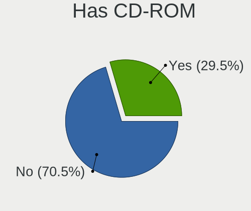
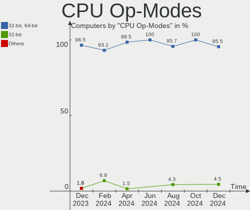
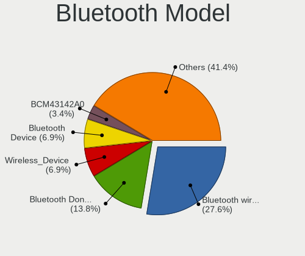

Xubuntu - Hardware Trends
-------------------------

A project to identify most popular hardware characteristics and track their change
over time based on data collected by Linux users at https://Linux-Hardware.org.

Anyone can contribute to this report by the [hw-probe](https://github.com/linuxhw/hw-probe) tool:

    sudo -E hw-probe -all -upload

This is a report for all computer types. See also reports for [desktops](/Dist/Xubuntu/Desktop/README.md) and [notebooks](/Dist/Xubuntu/Notebook/README.md).

This report is for one last month. Overall report since the beginning of time: [TestDays](https://github.com/linuxhw/TestDays)

Period: Nov, 2023.

Contents
--------

* [ System ](#system)
  - [ OS                       ](#os)
  - [ OS Family                ](#os-family)
  - [ Kernel                   ](#kernel)
  - [ Kernel Family            ](#kernel-family)
  - [ Kernel Major Ver.        ](#kernel-major-ver)
  - [ Arch                     ](#arch)
  - [ DE                       ](#de)
  - [ Display Server           ](#display-server)
  - [ Display Manager          ](#display-manager)
  - [ OS Lang                  ](#os-lang)
  - [ Boot Mode                ](#boot-mode)
  - [ Filesystem               ](#filesystem)
  - [ Part. scheme             ](#part-scheme)
  - [ Dual Boot with Linux/BSD ](#dual-boot-with-linuxbsd)
  - [ Dual Boot (Win)          ](#dual-boot-win)

* [ Board ](#board)
  - [ Vendor                   ](#vendor)
  - [ Model                    ](#model)
  - [ Model Family             ](#model-family)
  - [ MFG Year                 ](#mfg-year)
  - [ Form Factor              ](#form-factor)
  - [ Secure Boot              ](#secure-boot)
  - [ Coreboot                 ](#coreboot)
  - [ RAM Size                 ](#ram-size)
  - [ RAM Used                 ](#ram-used)
  - [ Total Drives             ](#total-drives)
  - [ Has CD-ROM               ](#has-cd-rom)
  - [ Has Ethernet             ](#has-ethernet)
  - [ Has WiFi                 ](#has-wifi)
  - [ Has Bluetooth            ](#has-bluetooth)

* [ Location ](#location)
  - [ Country                  ](#country)
  - [ City                     ](#city)

* [ Drives ](#drives)
  - [ Drive Vendor             ](#drive-vendor)
  - [ Drive Model              ](#drive-model)
  - [ HDD Vendor               ](#hdd-vendor)
  - [ SSD Vendor               ](#ssd-vendor)
  - [ Drive Kind               ](#drive-kind)
  - [ Drive Connector          ](#drive-connector)
  - [ Drive Size               ](#drive-size)
  - [ Space Total              ](#space-total)
  - [ Space Used               ](#space-used)
  - [ Malfunc. Drives          ](#malfunc-drives)
  - [ Malfunc. Drive Vendor    ](#malfunc-drive-vendor)
  - [ Malfunc. HDD Vendor      ](#malfunc-hdd-vendor)
  - [ Malfunc. Drive Kind      ](#malfunc-drive-kind)
  - [ Failed Drives            ](#failed-drives)
  - [ Failed Drive Vendor      ](#failed-drive-vendor)
  - [ Drive Status             ](#drive-status)

* [ Storage controller ](#storage-controller)
  - [ Storage Vendor           ](#storage-vendor)
  - [ Storage Model            ](#storage-model)
  - [ Storage Kind             ](#storage-kind)

* [ Processor ](#processor)
  - [ CPU Vendor               ](#cpu-vendor)
  - [ CPU Model                ](#cpu-model)
  - [ CPU Model Family         ](#cpu-model-family)
  - [ CPU Cores                ](#cpu-cores)
  - [ CPU Sockets              ](#cpu-sockets)
  - [ CPU Threads              ](#cpu-threads)
  - [ CPU Op-Modes             ](#cpu-op-modes)
  - [ CPU Microcode            ](#cpu-microcode)
  - [ CPU Microarch            ](#cpu-microarch)

* [ Graphics ](#graphics)
  - [ GPU Vendor               ](#gpu-vendor)
  - [ GPU Model                ](#gpu-model)
  - [ GPU Combo                ](#gpu-combo)
  - [ GPU Driver               ](#gpu-driver)
  - [ GPU Memory               ](#gpu-memory)

* [ Monitor ](#monitor)
  - [ Monitor Vendor           ](#monitor-vendor)
  - [ Monitor Model            ](#monitor-model)
  - [ Monitor Resolution       ](#monitor-resolution)
  - [ Monitor Diagonal         ](#monitor-diagonal)
  - [ Monitor Width            ](#monitor-width)
  - [ Aspect Ratio             ](#aspect-ratio)
  - [ Monitor Area             ](#monitor-area)
  - [ Pixel Density            ](#pixel-density)
  - [ Multiple Monitors        ](#multiple-monitors)

* [ Network ](#network)
  - [ Net Controller Vendor    ](#net-controller-vendor)
  - [ Net Controller Model     ](#net-controller-model)
  - [ Wireless Vendor          ](#wireless-vendor)
  - [ Wireless Model           ](#wireless-model)
  - [ Ethernet Vendor          ](#ethernet-vendor)
  - [ Ethernet Model           ](#ethernet-model)
  - [ Net Controller Kind      ](#net-controller-kind)
  - [ Used Controller          ](#used-controller)
  - [ NICs                     ](#nics)
  - [ IPv6                     ](#ipv6)

* [ Bluetooth ](#bluetooth)
  - [ Bluetooth Vendor         ](#bluetooth-vendor)
  - [ Bluetooth Model          ](#bluetooth-model)

* [ Sound ](#sound)
  - [ Sound Vendor             ](#sound-vendor)
  - [ Sound Model              ](#sound-model)

* [ Memory ](#memory)
  - [ Memory Vendor            ](#memory-vendor)
  - [ Memory Model             ](#memory-model)
  - [ Memory Kind              ](#memory-kind)
  - [ Memory Form Factor       ](#memory-form-factor)
  - [ Memory Size              ](#memory-size)
  - [ Memory Speed             ](#memory-speed)

* [ Printers & scanners ](#printers--scanners)
  - [ Printer Vendor           ](#printer-vendor)
  - [ Printer Model            ](#printer-model)
  - [ Scanner Vendor           ](#scanner-vendor)
  - [ Scanner Model            ](#scanner-model)

* [ Camera ](#camera)
  - [ Camera Vendor            ](#camera-vendor)
  - [ Camera Model             ](#camera-model)

* [ Security ](#security)
  - [ Fingerprint Vendor       ](#fingerprint-vendor)
  - [ Fingerprint Model        ](#fingerprint-model)
  - [ Chipcard Vendor          ](#chipcard-vendor)
  - [ Chipcard Model           ](#chipcard-model)

* [ Unsupported ](#unsupported)
  - [ Unsupported Devices      ](#unsupported-devices)
  - [ Unsupported Device Types ](#unsupported-device-types)

System
------

OS
--

Installed operating systems

| Name          | Computers | Percent |
|---------------|-----------|---------|
| Xubuntu 22.04 | 28        | 40%     |
| Xubuntu 23.10 | 17        | 24.29%  |
| Xubuntu 20.04 | 14        | 20%     |
| Xubuntu 23.04 | 5         | 7.14%   |
| Xubuntu 18.04 | 5         | 7.14%   |
| Xubuntu 22.10 | 1         | 1.43%   |

OS Family
---------

OS without a version

| Name    | Computers | Percent |
|---------|-----------|---------|
| Xubuntu | 70        | 100%    |

Kernel
------

Version of the Linux kernel

| Version                         | Computers | Percent |
|---------------------------------|-----------|---------|
| 6.5.0-10-generic                | 15        | 21.43%  |
| 6.2.0-36-generic                | 14        | 20%     |
| 5.15.0-88-generic               | 7         | 10%     |
| 6.2.0-37-generic                | 6         | 8.57%   |
| 5.4.0-166-generic               | 2         | 2.86%   |
| 5.4.0-165-generic               | 2         | 2.86%   |
| 5.4.0-164-generic               | 2         | 2.86%   |
| 5.4.0-150-generic               | 2         | 2.86%   |
| 6.5.0-9-generic                 | 1         | 1.43%   |
| 6.5.0-1004-oem                  | 1         | 1.43%   |
| 6.5.0-10006-tuxedo              | 1         | 1.43%   |
| 6.5.0-10-lowlatency             | 1         | 1.43%   |
| 6.2.0-35-generic                | 1         | 1.43%   |
| 6.2.0-26-generic                | 1         | 1.43%   |
| 6.2.0-1017-lowlatency           | 1         | 1.43%   |
| 6.2.0-1013-lowlatency           | 1         | 1.43%   |
| 6.2.0-060200-generic            | 1         | 1.43%   |
| 5.9.8-050908-generic            | 1         | 1.43%   |
| 5.4.0-159-generic               | 1         | 1.43%   |
| 5.19.0-50-generic               | 1         | 1.43%   |
| 5.19.0-46-generic               | 1         | 1.43%   |
| 5.18.5-rk3399                   | 1         | 1.43%   |
| 5.15.0-90-generic               | 1         | 1.43%   |
| 5.15.0-89-generic               | 1         | 1.43%   |
| 5.15.0-87-lowlatency            | 1         | 1.43%   |
| 5.15.0-87-generic               | 1         | 1.43%   |
| 5.15.0-67-generic               | 1         | 1.43%   |
| 5.0.0-aml-s912-gf2f3a8c1a-dirty | 1         | 1.43%   |

Kernel Family
-------------

Linux kernel without a distro release

| Version | Computers | Percent |
|---------|-----------|---------|
| 6.2.0   | 25        | 35.71%  |
| 6.5.0   | 19        | 27.14%  |
| 5.15.0  | 12        | 17.14%  |
| 5.4.0   | 9         | 12.86%  |
| 5.19.0  | 2         | 2.86%   |
| 5.9.8   | 1         | 1.43%   |
| 5.18.5  | 1         | 1.43%   |
| 5.0.0   | 1         | 1.43%   |

Kernel Major Ver.
-----------------

Linux kernel major version

| Version | Computers | Percent |
|---------|-----------|---------|
| 6.2     | 25        | 35.71%  |
| 6.5     | 19        | 27.14%  |
| 5.15    | 12        | 17.14%  |
| 5.4     | 9         | 12.86%  |
| 5.19    | 2         | 2.86%   |
| 5.9     | 1         | 1.43%   |
| 5.18    | 1         | 1.43%   |
| 5.0     | 1         | 1.43%   |

Arch
----

OS architecture (x86_64, i586, etc.)

| Name    | Computers | Percent |
|---------|-----------|---------|
| x86_64  | 66        | 94.29%  |
| i686    | 2         | 2.86%   |
| aarch64 | 2         | 2.86%   |

DE
--

Desktop Environment

| Name  | Computers | Percent |
|-------|-----------|---------|
| XFCE  | 69        | 98.57%  |
| GNOME | 1         | 1.43%   |

Display Server
--------------

X11 or Wayland

| Name    | Computers | Percent |
|---------|-----------|---------|
| X11     | 67        | 95.71%  |
| Tty     | 2         | 2.86%   |
| Wayland | 1         | 1.43%   |

Display Manager
---------------

SDDM, LightDM, etc.

| Name    | Computers | Percent |
|---------|-----------|---------|
| LightDM | 57        | 81.43%  |
| Unknown | 9         | 12.86%  |
| GDM3    | 4         | 5.71%   |

OS Lang
-------

Language

| Lang  | Computers | Percent |
|-------|-----------|---------|
| en_US | 28        | 40%     |
| fr_FR | 12        | 17.14%  |
| en_GB | 6         | 8.57%   |
| it_IT | 4         | 5.71%   |
| pt_BR | 3         | 4.29%   |
| en_CA | 3         | 4.29%   |
| de_DE | 3         | 4.29%   |
| C     | 2         | 2.86%   |
| zh_TW | 1         | 1.43%   |
| zh_CN | 1         | 1.43%   |
| ru_RU | 1         | 1.43%   |
| pl_PL | 1         | 1.43%   |
| nl_NL | 1         | 1.43%   |
| ja_JP | 1         | 1.43%   |
| hu_HU | 1         | 1.43%   |
| es_ES | 1         | 1.43%   |
| en_IE | 1         | 1.43%   |

Boot Mode
---------

EFI or BIOS

| Mode | Computers | Percent |
|------|-----------|---------|
| BIOS | 37        | 52.86%  |
| EFI  | 33        | 47.14%  |

Filesystem
----------

Type of filesystem

| Type  | Computers | Percent |
|-------|-----------|---------|
| Ext4  | 41        | 58.57%  |
| Tmpfs | 25        | 35.71%  |
| Ext3  | 2         | 2.86%   |
| Xfs   | 1         | 1.43%   |
| Btrfs | 1         | 1.43%   |

Part. scheme
------------

Scheme of partitioning

| Type    | Computers | Percent |
|---------|-----------|---------|
| GPT     | 44        | 62.86%  |
| MBR     | 16        | 22.86%  |
| Unknown | 10        | 14.29%  |

Dual Boot with Linux/BSD
------------------------

Hosting more than one Linux/BSD

| Dual boot | Computers | Percent |
|-----------|-----------|---------|
| No        | 61        | 87.14%  |
| Yes       | 9         | 12.86%  |

Dual Boot (Win)
---------------

Hosting Linux and Windows

| Dual boot | Computers | Percent |
|-----------|-----------|---------|
| No        | 44        | 62.86%  |
| Yes       | 26        | 37.14%  |

Board
-----

Vendor
------

Motherboard manufacturer

| Name                | Computers | Percent |
|---------------------|-----------|---------|
| Lenovo              | 12        | 17.14%  |
| Dell                | 9         | 12.86%  |
| Hewlett-Packard     | 8         | 11.43%  |
| ASUSTek Computer    | 8         | 11.43%  |
| Gigabyte Technology | 5         | 7.14%   |
| ASRock              | 5         | 7.14%   |
| Acer                | 5         | 7.14%   |
| MSI                 | 3         | 4.29%   |
| Thomson             | 2         | 2.86%   |
| Apple               | 2         | 2.86%   |
| Sony                | 1         | 1.43%   |
| SiComputer          | 1         | 1.43%   |
| Pegatron            | 1         | 1.43%   |
| OrangePi            | 1         | 1.43%   |
| Medion              | 1         | 1.43%   |
| MECHREVO            | 1         | 1.43%   |
| Khadas              | 1         | 1.43%   |
| Itautec             | 1         | 1.43%   |
| Intel               | 1         | 1.43%   |
| Fujitsu             | 1         | 1.43%   |
| Unknown             | 1         | 1.43%   |

Model
-----

Motherboard model

| Name                                 | Computers | Percent |
|--------------------------------------|-----------|---------|
| Lenovo ThinkPad T14 Gen 3 21AJS7P700 | 2         | 2.86%   |
| Thomson N15C8BK2T                    | 1         | 1.43%   |
| Thomson N14C4WH64                    | 1         | 1.43%   |
| Sony VGN-NS12M_W                     | 1         | 1.43%   |
| SiComputer Nauta 01E                 | 1         | 1.43%   |
| Pegatron 20-b010                     | 1         | 1.43%   |
| OrangePi 4 LTS                       | 1         | 1.43%   |
| MSI MS-7A74                          | 1         | 1.43%   |
| MSI MS-7A38                          | 1         | 1.43%   |
| MSI MS-7798                          | 1         | 1.43%   |
| Medion Crawler E25                   | 1         | 1.43%   |
| MECHREVO Code 01 Series PF5NU1G      | 1         | 1.43%   |
| Lenovo Yoga Creator 7 15IMH05 82DS   | 1         | 1.43%   |
| Lenovo ThinkPad X250 20CLS2P703      | 1         | 1.43%   |
| Lenovo ThinkPad T440p 20AN0069US     | 1         | 1.43%   |
| Lenovo ThinkPad P72 20MBCTO1WW       | 1         | 1.43%   |
| Lenovo ThinkPad E470 20H1006NHV      | 1         | 1.43%   |
| Lenovo Legion Y740-17IRHg 81UJ       | 1         | 1.43%   |
| Lenovo IdeaPad S340-15IIL 81VW       | 1         | 1.43%   |
| Lenovo IdeaPad S300 9803             | 1         | 1.43%   |
| Lenovo IdeaPad N585 20179            | 1         | 1.43%   |
| Lenovo G505 20240                    | 1         | 1.43%   |
| Khadas VIM2                          | 1         | 1.43%   |
| Itautec Infoway                      | 1         | 1.43%   |
| Intel DH55TC AAG26116-302            | 1         | 1.43%   |
| HP t620 Quad Core TC                 | 1         | 1.43%   |
| HP ProBook 6570b                     | 1         | 1.43%   |
| HP ProBook 650 G2                    | 1         | 1.43%   |
| HP ProBook 450 G1                    | 1         | 1.43%   |
| HP Presario CQ57                     | 1         | 1.43%   |
| HP Presario C500 (GF849EA#ABU)       | 1         | 1.43%   |
| HP Pavilion g6                       | 1         | 1.43%   |
| HP EliteBook 725 G2                  | 1         | 1.43%   |
| Gigabyte Z390 M GAMING               | 1         | 1.43%   |
| Gigabyte H81M-DS2                    | 1         | 1.43%   |
| Gigabyte B560M DS3H                  | 1         | 1.43%   |
| Gigabyte B450M DS3H                  | 1         | 1.43%   |
| Gigabyte 970A-D3                     | 1         | 1.43%   |
| Fujitsu ESPRIMO Q958                 | 1         | 1.43%   |
| Dell System XPS L502X                | 1         | 1.43%   |

Model Family
------------

Motherboard model prefix

| Name              | Computers | Percent |
|-------------------|-----------|---------|
| Lenovo ThinkPad   | 6         | 8.57%   |
| Dell Latitude     | 4         | 5.71%   |
| Lenovo IdeaPad    | 3         | 4.29%   |
| HP ProBook        | 3         | 4.29%   |
| ASUS ROG          | 3         | 4.29%   |
| Acer Aspire       | 3         | 4.29%   |
| HP Presario       | 2         | 2.86%   |
| Dell Inspiron     | 2         | 2.86%   |
| Thomson N15C8BK2T | 1         | 1.43%   |
| Thomson N14C4WH64 | 1         | 1.43%   |
| Sony VGN-NS12M    | 1         | 1.43%   |
| SiComputer Nauta  | 1         | 1.43%   |
| Pegatron 20-b010  | 1         | 1.43%   |
| OrangePi 4        | 1         | 1.43%   |
| MSI MS-7A74       | 1         | 1.43%   |
| MSI MS-7A38       | 1         | 1.43%   |
| MSI MS-7798       | 1         | 1.43%   |
| Medion Crawler    | 1         | 1.43%   |
| MECHREVO Code     | 1         | 1.43%   |
| Lenovo Yoga       | 1         | 1.43%   |
| Lenovo Legion     | 1         | 1.43%   |
| Lenovo G505       | 1         | 1.43%   |
| Khadas VIM2       | 1         | 1.43%   |
| Itautec Infoway   | 1         | 1.43%   |
| Intel DH55TC      | 1         | 1.43%   |
| HP t620           | 1         | 1.43%   |
| HP Pavilion       | 1         | 1.43%   |
| HP EliteBook      | 1         | 1.43%   |
| Gigabyte Z390     | 1         | 1.43%   |
| Gigabyte H81M-DS2 | 1         | 1.43%   |
| Gigabyte B560M    | 1         | 1.43%   |
| Gigabyte B450M    | 1         | 1.43%   |
| Gigabyte 970A-D3  | 1         | 1.43%   |
| Fujitsu ESPRIMO   | 1         | 1.43%   |
| Dell System       | 1         | 1.43%   |
| Dell OptiPlex     | 1         | 1.43%   |
| Dell ASM100       | 1         | 1.43%   |
| ASUS VivoBook     | 1         | 1.43%   |
| ASUS P8Z68-M      | 1         | 1.43%   |
| ASUS P5K          | 1         | 1.43%   |

MFG Year
--------

Motherboard manufacture year

| Year    | Computers | Percent |
|---------|-----------|---------|
| 2021    | 8         | 11.43%  |
| 2012    | 8         | 11.43%  |
| 2011    | 8         | 11.43%  |
| 2020    | 7         | 10%     |
| 2019    | 5         | 7.14%   |
| 2018    | 5         | 7.14%   |
| 2022    | 4         | 5.71%   |
| 2013    | 4         | 5.71%   |
| 2009    | 4         | 5.71%   |
| 2017    | 3         | 4.29%   |
| 2016    | 3         | 4.29%   |
| 2014    | 3         | 4.29%   |
| 2015    | 2         | 2.86%   |
| 2007    | 2         | 2.86%   |
| Unknown | 2         | 2.86%   |
| 2010    | 1         | 1.43%   |
| 2008    | 1         | 1.43%   |

Form Factor
-----------

Physical design of the computer

| Name           | Computers | Percent |
|----------------|-----------|---------|
| Notebook       | 37        | 52.86%  |
| Desktop        | 29        | 41.43%  |
| System on chip | 2         | 2.86%   |
| Convertible    | 1         | 1.43%   |
| Mini pc        | 1         | 1.43%   |

Secure Boot
-----------

Enabled or disabled

| State    | Computers | Percent |
|----------|-----------|---------|
| Disabled | 62        | 88.57%  |
| Enabled  | 8         | 11.43%  |

Coreboot
--------

Have coreboot on board

| Used | Computers | Percent |
|------|-----------|---------|
| No   | 70        | 100%    |

RAM Size
--------

Total RAM memory

| Size in GB  | Computers | Percent |
|-------------|-----------|---------|
| 3.01-4.0    | 16        | 22.86%  |
| 4.01-8.0    | 15        | 21.43%  |
| 16.01-24.0  | 11        | 15.71%  |
| 8.01-16.0   | 11        | 15.71%  |
| 32.01-64.0  | 7         | 10%     |
| 64.01-256.0 | 6         | 8.57%   |
| 24.01-32.0  | 2         | 2.86%   |
| 2.01-3.0    | 1         | 1.43%   |
| 0.51-1.0    | 1         | 1.43%   |

RAM Used
--------

Used RAM memory

| Used GB    | Computers | Percent |
|------------|-----------|---------|
| 1.01-2.0   | 20        | 28.57%  |
| 2.01-3.0   | 13        | 18.57%  |
| 3.01-4.0   | 12        | 17.14%  |
| 4.01-8.0   | 11        | 15.71%  |
| 8.01-16.0  | 8         | 11.43%  |
| 0.51-1.0   | 5         | 7.14%   |
| 16.01-24.0 | 1         | 1.43%   |

Total Drives
------------

Number of drives on board

| Drives | Computers | Percent |
|--------|-----------|---------|
| 1      | 43        | 61.43%  |
| 2      | 15        | 21.43%  |
| 3      | 6         | 8.57%   |
| 4      | 5         | 7.14%   |
| 11     | 1         | 1.43%   |

Has CD-ROM
----------

Has CD-ROM on board

| Presented | Computers | Percent |
|-----------|-----------|---------|
| No        | 48        | 68.57%  |
| Yes       | 22        | 31.43%  |

Has Ethernet
------------

Has Ethernet on board

| Presented | Computers | Percent |
|-----------|-----------|---------|
| Yes       | 61        | 87.14%  |
| No        | 9         | 12.86%  |

Has WiFi
--------

Has WiFi module

| Presented | Computers | Percent |
|-----------|-----------|---------|
| Yes       | 56        | 80%     |
| No        | 14        | 20%     |

Has Bluetooth
-------------

Has Bluetooth module

| Presented | Computers | Percent |
|-----------|-----------|---------|
| Yes       | 40        | 57.14%  |
| No        | 30        | 42.86%  |

Location
--------

Country
-------

Geographic location (country)

| Country     | Computers | Percent |
|-------------|-----------|---------|
| France      | 13        | 18.57%  |
| USA         | 12        | 17.14%  |
| UK          | 6         | 8.57%   |
| Italy       | 4         | 5.71%   |
| Germany     | 4         | 5.71%   |
| Brazil      | 4         | 5.71%   |
| Russia      | 3         | 4.29%   |
| Canada      | 3         | 4.29%   |
| Hungary     | 2         | 2.86%   |
| Venezuela   | 1         | 1.43%   |
| Ukraine     | 1         | 1.43%   |
| Taiwan      | 1         | 1.43%   |
| Switzerland | 1         | 1.43%   |
| Sweden      | 1         | 1.43%   |
| Spain       | 1         | 1.43%   |
| Poland      | 1         | 1.43%   |
| Netherlands | 1         | 1.43%   |
| Madagascar  | 1         | 1.43%   |
| Lebanon     | 1         | 1.43%   |
| Japan       | 1         | 1.43%   |
| Israel      | 1         | 1.43%   |
| Ireland     | 1         | 1.43%   |
| Iran        | 1         | 1.43%   |
| Indonesia   | 1         | 1.43%   |
| Czechia     | 1         | 1.43%   |
| Colombia    | 1         | 1.43%   |
| China       | 1         | 1.43%   |
| Belgium     | 1         | 1.43%   |

City
----

Geographic location (city)

| City               | Computers | Percent |
|--------------------|-----------|---------|
| Stowmarket         | 3         | 4.29%   |
| Florence           | 3         | 4.29%   |
| Burgnac            | 3         | 4.29%   |
| Springfield        | 2         | 2.86%   |
| Yokohama           | 1         | 1.43%   |
| Yogyakarta         | 1         | 1.43%   |
| Wellesley          | 1         | 1.43%   |
| Toulon             | 1         | 1.43%   |
| Tehran             | 1         | 1.43%   |
| Stillwater         | 1         | 1.43%   |
| Southampton        | 1         | 1.43%   |
| Solna              | 1         | 1.43%   |
| Simferopol         | 1         | 1.43%   |
| Santo André       | 1         | 1.43%   |
| Saint Clair Shores | 1         | 1.43%   |
| Rotterdam          | 1         | 1.43%   |
| Rio de Janeiro     | 1         | 1.43%   |
| Prague             | 1         | 1.43%   |
| Port Huron         | 1         | 1.43%   |
| Pinsaguel          | 1         | 1.43%   |
| Paris              | 1         | 1.43%   |
| Oelsnitz           | 1         | 1.43%   |
| Newcastle          | 1         | 1.43%   |
| New Taipei         | 1         | 1.43%   |
| Nantes             | 1         | 1.43%   |
| Nadarzyn           | 1         | 1.43%   |
| Moscow             | 1         | 1.43%   |
| Manchester         | 1         | 1.43%   |
| Lugo               | 1         | 1.43%   |
| Lecherias          | 1         | 1.43%   |
| Krasnodar          | 1         | 1.43%   |
| Kostroma           | 1         | 1.43%   |
| Kitchener          | 1         | 1.43%   |
| Jundiaí           | 1         | 1.43%   |
| Hot Springs        | 1         | 1.43%   |
| Hollywood          | 1         | 1.43%   |
| Hemmingen          | 1         | 1.43%   |
| Hasselt            | 1         | 1.43%   |
| Harrisonburg       | 1         | 1.43%   |
| Grenoble           | 1         | 1.43%   |

Drives
------

Drive Vendor
------------

Hard drive vendors

| Vendor                | Computers | Drives | Percent |
|-----------------------|-----------|--------|---------|
| Samsung Electronics   | 21        | 26     | 19.44%  |
| Seagate               | 15        | 17     | 13.89%  |
| WDC                   | 14        | 15     | 12.96%  |
| Unknown               | 8         | 9      | 7.41%   |
| Toshiba               | 7         | 7      | 6.48%   |
| Kingston              | 6         | 6      | 5.56%   |
| Sandisk               | 5         | 5      | 4.63%   |
| Crucial               | 3         | 3      | 2.78%   |
| China                 | 3         | 3      | 2.78%   |
| Lexar                 | 2         | 2      | 1.85%   |
| Hitachi               | 2         | 2      | 1.85%   |
| WALRAM                | 1         | 6      | 0.93%   |
| SPCC                  | 1         | 1      | 0.93%   |
| SK hynix              | 1         | 1      | 0.93%   |
| Realtek Semiconductor | 1         | 1      | 0.93%   |
| PNY                   | 1         | 1      | 0.93%   |
| Phison Electronics    | 1         | 1      | 0.93%   |
| Phison                | 1         | 1      | 0.93%   |
| Micron Technology     | 1         | 1      | 0.93%   |
| LITEON                | 1         | 1      | 0.93%   |
| KIOXIA-EXCERIA        | 1         | 1      | 0.93%   |
| KIOXIA                | 1         | 1      | 0.93%   |
| KingSpec              | 1         | 1      | 0.93%   |
| KingDian              | 1         | 1      | 0.93%   |
| JMicron Technology    | 1         | 1      | 0.93%   |
| Intel                 | 1         | 1      | 0.93%   |
| Hikvision             | 1         | 1      | 0.93%   |
| HGST                  | 1         | 1      | 0.93%   |
| Fujitsu               | 1         | 1      | 0.93%   |
| External              | 1         | 2      | 0.93%   |
| Apple                 | 1         | 1      | 0.93%   |
| A-DATA Technology     | 1         | 1      | 0.93%   |
| Unknown               | 1         | 1      | 0.93%   |

Drive Model
-----------

Hard drive models

| Model                                               | Computers | Percent |
|-----------------------------------------------------|-----------|---------|
| Samsung NVMe SSD Controller SM981/PM981/PM983 250GB | 4         | 3.42%   |
| Seagate ST1000LM049-2GH172 1TB                      | 3         | 2.56%   |
| Unknown MMC Card  64GB                              | 2         | 1.71%   |
| Toshiba DT01ACA100 1TB                              | 2         | 1.71%   |
| Samsung SSD 860 EVO 500GB                           | 2         | 1.71%   |
| Samsung SSD 850 EVO 500GB                           | 2         | 1.71%   |
| Kingston SA400S37240G 240GB SSD                     | 2         | 1.71%   |
| Crucial CT240BX500SSD1 240GB                        | 2         | 1.71%   |
| WDC WDS500G2B0C 500GB                               | 1         | 0.85%   |
| WDC WDS250G2B0B-00YS70 250GB SSD                    | 1         | 0.85%   |
| WDC WD5000LPVT-08G33T1 500GB                        | 1         | 0.85%   |
| WDC WD5000BEVT-22A0RT0 500GB                        | 1         | 0.85%   |
| WDC WD3200AAKS-75B3A0 320GB                         | 1         | 0.85%   |
| WDC WD2500BEVT-60ZCT1 250GB                         | 1         | 0.85%   |
| WDC WD2500AVVS-98L2B0 250GB                         | 1         | 0.85%   |
| WDC WD20EZAZ-00GGJB0 2TB                            | 1         | 0.85%   |
| WDC WD2003FZEX-00SRLA0 2TB                          | 1         | 0.85%   |
| WDC WD1600AABS-00PRA0 160GB                         | 1         | 0.85%   |
| WDC WD10EZEX-75WN4A0 1TB                            | 1         | 0.85%   |
| WDC WD10EZEX-00BN5A0 1TB                            | 1         | 0.85%   |
| WDC WD Blue SA510 2.5 500GB                         | 1         | 0.85%   |
| WDC PC SN730 SDBPNTY-512G-1101 512GB                | 1         | 0.85%   |
| WDC PC SN720 SDAPNTW-256G-1014 256GB                | 1         | 0.85%   |
| WALRAM SSD 2TB                                      | 1         | 0.85%   |
| WALRAM SSD 1TB                                      | 1         | 0.85%   |
| WALRAM 1TB                                          | 1         | 0.85%   |
| Unknown SU08G  8GB                                  | 1         | 0.85%   |
| Unknown SD/MMC/MS PRO 128GB                         | 1         | 0.85%   |
| Unknown NVMe SSD Drive 500GB                        | 1         | 0.85%   |
| Unknown MMC Card  4GB                               | 1         | 0.85%   |
| Unknown MMC Card  128GB                             | 1         | 0.85%   |
| Unknown DA4128  128GB                               | 1         | 0.85%   |
| Unknown AJTD4R  16GB                                | 1         | 0.85%   |
| Toshiba XG4 NVMe SSD Controller 512GB               | 1         | 0.85%   |
| Toshiba MK3261GSYN 320GB                            | 1         | 0.85%   |
| Toshiba MK2552GSX 250GB                             | 1         | 0.85%   |
| Toshiba DT01ACA050 500GB                            | 1         | 0.85%   |
| Toshiba A100 120GB SSD                              | 1         | 0.85%   |
| SPCC Solid State Disk 1TB                           | 1         | 0.85%   |
| SK hynix SKHynix_HFS512GD9TNG-L3A0B 512GB           | 1         | 0.85%   |

HDD Vendor
----------

Hard disk drive vendors

| Vendor              | Computers | Drives | Percent |
|---------------------|-----------|--------|---------|
| Seagate             | 14        | 16     | 38.89%  |
| WDC                 | 10        | 10     | 27.78%  |
| Toshiba             | 5         | 5      | 13.89%  |
| Hitachi             | 2         | 2      | 5.56%   |
| Unknown             | 1         | 1      | 2.78%   |
| Samsung Electronics | 1         | 1      | 2.78%   |
| HGST                | 1         | 1      | 2.78%   |
| Fujitsu             | 1         | 1      | 2.78%   |
| External            | 1         | 2      | 2.78%   |

SSD Vendor
----------

Solid state drive vendors

| Vendor              | Computers | Drives | Percent |
|---------------------|-----------|--------|---------|
| Samsung Electronics | 12        | 14     | 31.58%  |
| Kingston            | 5         | 5      | 13.16%  |
| Crucial             | 3         | 3      | 7.89%   |
| China               | 3         | 3      | 7.89%   |
| WDC                 | 2         | 2      | 5.26%   |
| Lexar               | 2         | 2      | 5.26%   |
| WALRAM              | 1         | 5      | 2.63%   |
| Toshiba             | 1         | 1      | 2.63%   |
| SPCC                | 1         | 1      | 2.63%   |
| SanDisk             | 1         | 1      | 2.63%   |
| PNY                 | 1         | 1      | 2.63%   |
| LITEON              | 1         | 1      | 2.63%   |
| KIOXIA-EXCERIA      | 1         | 1      | 2.63%   |
| KingSpec            | 1         | 1      | 2.63%   |
| KingDian            | 1         | 1      | 2.63%   |
| Apple               | 1         | 1      | 2.63%   |
| A-DATA Technology   | 1         | 1      | 2.63%   |

Drive Kind
----------

HDD or SSD

| Kind    | Computers | Drives | Percent |
|---------|-----------|--------|---------|
| SSD     | 32        | 44     | 33.33%  |
| HDD     | 30        | 39     | 31.25%  |
| NVMe    | 26        | 30     | 27.08%  |
| MMC     | 6         | 8      | 6.25%   |
| Unknown | 2         | 2      | 2.08%   |

Drive Connector
---------------

SATA, SAS, NVMe, etc.

| Type | Computers | Drives | Percent |
|------|-----------|--------|---------|
| SATA | 53        | 78     | 58.24%  |
| NVMe | 26        | 30     | 28.57%  |
| SAS  | 6         | 7      | 6.59%   |
| MMC  | 6         | 8      | 6.59%   |

Drive Size
----------

Size of hard drive

| Size in TB | Computers | Drives | Percent |
|------------|-----------|--------|---------|
| 0.01-0.5   | 42        | 47     | 61.76%  |
| 0.51-1.0   | 18        | 23     | 26.47%  |
| 1.01-2.0   | 7         | 12     | 10.29%  |
| 2.01-3.0   | 1         | 1      | 1.47%   |

Space Total
-----------

Amount of disk space available on the file system

| Size in GB     | Computers | Percent |
|----------------|-----------|---------|
| 101-250        | 20        | 28.57%  |
| 251-500        | 12        | 17.14%  |
| 501-1000       | 12        | 17.14%  |
| 1001-2000      | 8         | 11.43%  |
| 51-100         | 7         | 10%     |
| More than 3000 | 5         | 7.14%   |
| 21-50          | 2         | 2.86%   |
| 2001-3000      | 2         | 2.86%   |
| 1-20           | 2         | 2.86%   |

Space Used
----------

Amount of used disk space

| Used GB        | Computers | Percent |
|----------------|-----------|---------|
| 1-20           | 19        | 27.14%  |
| 101-250        | 12        | 17.14%  |
| 51-100         | 12        | 17.14%  |
| 501-1000       | 11        | 15.71%  |
| 21-50          | 8         | 11.43%  |
| 251-500        | 3         | 4.29%   |
| 2001-3000      | 2         | 2.86%   |
| 1001-2000      | 2         | 2.86%   |
| More than 3000 | 1         | 1.43%   |

Malfunc. Drives
---------------

Drive models with a malfunction

| Model                                 | Computers | Drives | Percent |
|---------------------------------------|-----------|--------|---------|
| WDC WD5000LPVT-08G33T1 500GB          | 1         | 1      | 20%     |
| WDC WD5000BEVT-22A0RT0 500GB          | 1         | 1      | 20%     |
| WDC WD3200AAKS-75B3A0 320GB           | 1         | 1      | 20%     |
| Samsung Electronics SSD 870 EVO 500GB | 1         | 1      | 20%     |
| Apple SSD SM256C 256GB                | 1         | 1      | 20%     |

Malfunc. Drive Vendor
---------------------

Vendors of faulty drives

| Vendor              | Computers | Drives | Percent |
|---------------------|-----------|--------|---------|
| WDC                 | 3         | 3      | 60%     |
| Samsung Electronics | 1         | 1      | 20%     |
| Apple               | 1         | 1      | 20%     |

Malfunc. HDD Vendor
-------------------

Vendors of faulty HDD drives

| Vendor | Computers | Drives | Percent |
|--------|-----------|--------|---------|
| WDC    | 3         | 3      | 100%    |

Malfunc. Drive Kind
-------------------

Kinds of faulty drives

| Kind | Computers | Drives | Percent |
|------|-----------|--------|---------|
| HDD  | 3         | 3      | 60%     |
| SSD  | 2         | 2      | 40%     |

Failed Drives
-------------

Failed drive models

Zero info for selected period =(

Failed Drive Vendor
-------------------

Failed drive vendors

Zero info for selected period =(

Drive Status
------------

Number of failed and malfunc. drives

| Status   | Computers | Drives | Percent |
|----------|-----------|--------|---------|
| Detected | 40        | 57     | 51.28%  |
| Works    | 33        | 61     | 42.31%  |
| Malfunc  | 5         | 5      | 6.41%   |

Storage controller
------------------

Storage Vendor
--------------

Storage controller vendors

| Vendor                       | Computers | Percent |
|------------------------------|-----------|---------|
| Intel                        | 46        | 50%     |
| AMD                          | 18        | 19.57%  |
| Samsung Electronics          | 10        | 10.87%  |
| SanDisk                      | 6         | 6.52%   |
| Phison Electronics           | 2         | 2.17%   |
| Toshiba America Info Systems | 1         | 1.09%   |
| TenaFe                       | 1         | 1.09%   |
| SK hynix                     | 1         | 1.09%   |
| Realtek Semiconductor        | 1         | 1.09%   |
| Micron Technology            | 1         | 1.09%   |
| MAXIO Technology (Hangzhou)  | 1         | 1.09%   |
| KIOXIA                       | 1         | 1.09%   |
| Kingston Technology Company  | 1         | 1.09%   |
| JMicron Technology           | 1         | 1.09%   |
| ASMedia Technology           | 1         | 1.09%   |

Storage Model
-------------

Storage controller models

| Model                                                                                   | Computers | Percent |
|-----------------------------------------------------------------------------------------|-----------|---------|
| AMD FCH SATA Controller [AHCI mode]                                                     | 16        | 14.95%  |
| Samsung NVMe SSD Controller SM981/PM981/PM983                                           | 7         | 6.54%   |
| Intel 8 Series/C220 Series Chipset Family 6-port SATA Controller 1 [AHCI mode]          | 5         | 4.67%   |
| Intel 6 Series/C200 Series Chipset Family 6 port Mobile SATA AHCI Controller            | 5         | 4.67%   |
| Intel Cannon Lake PCH SATA AHCI Controller                                              | 3         | 2.8%    |
| Intel Cannon Lake Mobile PCH SATA AHCI Controller                                       | 3         | 2.8%    |
| Intel 7 Series Chipset Family 6-port SATA Controller [AHCI mode]                        | 3         | 2.8%    |
| SanDisk WD Black SN770 / PC SN740 256GB / PC SN560 (DRAM-less) NVMe SSD                 | 2         | 1.87%   |
| SanDisk Ultra 3D / WD Blue SN550 NVMe SSD                                               | 2         | 1.87%   |
| Samsung NVMe SSD Controller 980 (DRAM-less)                                             | 2         | 1.87%   |
| Intel Volume Management Device NVMe RAID Controller                                     | 2         | 1.87%   |
| Intel Sunrise Point-LP SATA Controller [AHCI mode]                                      | 2         | 1.87%   |
| Intel Ice Lake-LP SATA Controller [AHCI mode]                                           | 2         | 1.87%   |
| Intel Celeron/Pentium Silver Processor SATA Controller                                  | 2         | 1.87%   |
| Intel 82801G (ICH7 Family) IDE Controller                                               | 2         | 1.87%   |
| Intel 6 Series/C200 Series Chipset Family Desktop SATA Controller (IDE mode, ports 4-5) | 2         | 1.87%   |
| Intel 6 Series/C200 Series Chipset Family Desktop SATA Controller (IDE mode, ports 0-3) | 2         | 1.87%   |
| Intel 500 Series Chipset Family SATA AHCI Controller                                    | 2         | 1.87%   |
| AMD SB7x0/SB8x0/SB9x0 SATA Controller [IDE mode]                                        | 2         | 1.87%   |
| AMD SB7x0/SB8x0/SB9x0 IDE Controller                                                    | 2         | 1.87%   |
| AMD 400 Series Chipset SATA Controller                                                  | 2         | 1.87%   |
| Toshiba America Info Systems XG4 NVMe SSD Controller                                    | 1         | 0.93%   |
| TenaFe TC2200/TC2201 NVMe Controller (DRAM-less)                                        | 1         | 0.93%   |
| SK hynix PC601 NVMe Solid State Drive                                                   | 1         | 0.93%   |
| SanDisk Extreme Pro / WD Black SN750 / PC SN730 / Red SN700 NVMe SSD                    | 1         | 0.93%   |
| SanDisk Extreme Pro / WD Black 2018/SN750/PC SN720 NVMe SSD                             | 1         | 0.93%   |
| Samsung NVMe SSD Controller PM9A1/PM9A3/980PRO                                          | 1         | 0.93%   |
| Realtek RTS5763DL NVMe SSD Controller (DRAM-less)                                       | 1         | 0.93%   |
| Phison PS5015-E15 PCIe3 NVMe Controller (DRAM-less)                                     | 1         | 0.93%   |
| Phison PS5013-E13 PCIe3 NVMe Controller (DRAM-less)                                     | 1         | 0.93%   |
| Micron 2450 NVMe SSD [HendrixV] (DRAM-less)                                             | 1         | 0.93%   |
| MAXIO (Hangzhou) NVMe SSD Controller MAP1602                                            | 1         | 0.93%   |
| KIOXIA NVMe SSD Controller BG4 (DRAM-less)                                              | 1         | 0.93%   |
| Kingston Company A1000/U-SNS8154P3 x2 NVMe SSD                                          | 1         | 0.93%   |
| JMicron JMB363 SATA/IDE Controller                                                      | 1         | 0.93%   |
| Intel Wildcat Point-LP SATA Controller [AHCI Mode]                                      | 1         | 0.93%   |
| Intel SSD 670p Series [Keystone Harbor]                                                 | 1         | 0.93%   |
| Intel NM10/ICH7 Family SATA Controller [IDE mode]                                       | 1         | 0.93%   |
| Intel Jasper Lake SATA AHCI Controller                                                  | 1         | 0.93%   |
| Intel HM170/QM170 Chipset SATA Controller [AHCI Mode]                                   | 1         | 0.93%   |

Storage Kind
------------

Kind of storage controller (IDE, SATA, NVMe, SAS, ...)

| Kind | Computers | Percent |
|------|-----------|---------|
| SATA | 56        | 60.22%  |
| NVMe | 26        | 27.96%  |
| IDE  | 9         | 9.68%   |
| RAID | 2         | 2.15%   |

Processor
---------

CPU Vendor
----------

Processor vendors

| Vendor | Computers | Percent |
|--------|-----------|---------|
| Intel  | 50        | 71.43%  |
| AMD    | 18        | 25.71%  |
| ARM    | 2         | 2.86%   |

CPU Model
---------

Processor models

| Model                                   | Computers | Percent |
|-----------------------------------------|-----------|---------|
| Intel Core i7-3520M CPU @ 2.90GHz       | 2         | 2.86%   |
| Intel Core i5-2520M CPU @ 2.50GHz       | 2         | 2.86%   |
| Intel Core 2 Quad CPU Q6600 @ 2.40GHz   | 2         | 2.86%   |
| Intel 12th Gen Core i7-1260P            | 2         | 2.86%   |
| ARM Processor                           | 2         | 2.86%   |
| AMD E1-1200 APU with Radeon HD Graphics | 2         | 2.86%   |
| Intel Pentium CPU G4620 @ 3.70GHz       | 1         | 1.43%   |
| Intel Core m7-6Y75 CPU @ 1.20GHz        | 1         | 1.43%   |
| Intel Core i9-9980HK CPU @ 2.40GHz      | 1         | 1.43%   |
| Intel Core i7-9750H CPU @ 2.60GHz       | 1         | 1.43%   |
| Intel Core i7-9700T CPU @ 2.00GHz       | 1         | 1.43%   |
| Intel Core i7-9700K CPU @ 3.60GHz       | 1         | 1.43%   |
| Intel Core i7-8850H CPU @ 2.60GHz       | 1         | 1.43%   |
| Intel Core i7-7700HQ CPU @ 2.80GHz      | 1         | 1.43%   |
| Intel Core i7-7500U CPU @ 2.70GHz       | 1         | 1.43%   |
| Intel Core i7-5600U CPU @ 2.60GHz       | 1         | 1.43%   |
| Intel Core i7-2600K CPU @ 3.40GHz       | 1         | 1.43%   |
| Intel Core i7-10750H CPU @ 2.60GHz      | 1         | 1.43%   |
| Intel Core i5-9400 CPU @ 2.90GHz        | 1         | 1.43%   |
| Intel Core i5-6200U CPU @ 2.30GHz       | 1         | 1.43%   |
| Intel Core i5-4590T CPU @ 2.00GHz       | 1         | 1.43%   |
| Intel Core i5-4200M CPU @ 2.50GHz       | 1         | 1.43%   |
| Intel Core i5-2557M CPU @ 1.70GHz       | 1         | 1.43%   |
| Intel Core i5-2410M CPU @ 2.30GHz       | 1         | 1.43%   |
| Intel Core i5-2405S CPU @ 2.50GHz       | 1         | 1.43%   |
| Intel Core i5-1035G4 CPU @ 1.10GHz      | 1         | 1.43%   |
| Intel Core i5-1035G1 CPU @ 1.00GHz      | 1         | 1.43%   |
| Intel Core i5-10300H CPU @ 2.50GHz      | 1         | 1.43%   |
| Intel Core i3-4170T CPU @ 3.20GHz       | 1         | 1.43%   |
| Intel Core i3-4000M CPU @ 2.40GHz       | 1         | 1.43%   |
| Intel Core i3-3220 CPU @ 3.30GHz        | 1         | 1.43%   |
| Intel Core i3-2120 CPU @ 3.30GHz        | 1         | 1.43%   |
| Intel Core i3-10100T CPU @ 3.00GHz      | 1         | 1.43%   |
| Intel Core i3 CPU M 330 @ 2.13GHz       | 1         | 1.43%   |
| Intel Core i3 CPU 550 @ 3.20GHz         | 1         | 1.43%   |
| Intel Core 2 Quad CPU Q9300 @ 2.50GHz   | 1         | 1.43%   |
| Intel Core 2 Duo CPU T5800 @ 2.00GHz    | 1         | 1.43%   |
| Intel Celeron N4500 @ 1.10GHz           | 1         | 1.43%   |
| Intel Celeron N4020 CPU @ 1.10GHz       | 1         | 1.43%   |
| Intel Celeron N4000 CPU @ 1.10GHz       | 1         | 1.43%   |

CPU Model Family
----------------

Processor model prefix

| Model                  | Computers | Percent |
|------------------------|-----------|---------|
| Intel Core i5          | 12        | 17.14%  |
| Intel Core i7          | 11        | 15.71%  |
| Other                  | 7         | 10%     |
| Intel Core i3          | 7         | 10%     |
| Intel Celeron          | 7         | 10%     |
| AMD Ryzen 9            | 5         | 7.14%   |
| Intel Core 2 Quad      | 3         | 4.29%   |
| AMD Ryzen 7            | 2         | 2.86%   |
| AMD Ryzen 5            | 2         | 2.86%   |
| AMD E1                 | 2         | 2.86%   |
| Intel Pentium          | 1         | 1.43%   |
| Intel Core m7          | 1         | 1.43%   |
| Intel Core i9          | 1         | 1.43%   |
| Intel Core 2 Duo       | 1         | 1.43%   |
| Intel Celeron M        | 1         | 1.43%   |
| AMD Ryzen Threadripper | 1         | 1.43%   |
| AMD GX                 | 1         | 1.43%   |
| AMD FX                 | 1         | 1.43%   |
| AMD Athlon II X2       | 1         | 1.43%   |
| AMD A8                 | 1         | 1.43%   |
| AMD A4                 | 1         | 1.43%   |
| AMD A10                | 1         | 1.43%   |

CPU Cores
---------

Number of processor cores

| Number | Computers | Percent |
|--------|-----------|---------|
| 2      | 32        | 45.71%  |
| 4      | 14        | 20%     |
| 8      | 8         | 11.43%  |
| 6      | 6         | 8.57%   |
| 12     | 5         | 7.14%   |
| 16     | 2         | 2.86%   |
| 14     | 1         | 1.43%   |
| 3      | 1         | 1.43%   |
| 1      | 1         | 1.43%   |

CPU Sockets
-----------

Number of sockets

| Number | Computers | Percent |
|--------|-----------|---------|
| 1      | 69        | 98.57%  |
| 2      | 1         | 1.43%   |

CPU Threads
-----------

Threads per core (Hyper-Threading)

| Number | Computers | Percent |
|--------|-----------|---------|
| 2      | 44        | 62.86%  |
| 1      | 26        | 37.14%  |

CPU Op-Modes
------------

CPU Operation Modes (32-bit, 64-bit)

| Op mode        | Computers | Percent |
|----------------|-----------|---------|
| 32-bit, 64-bit | 68        | 97.14%  |
| 64-bit         | 1         | 1.43%   |
| 32-bit         | 1         | 1.43%   |

CPU Microcode
-------------

Microcode number

| Number     | Computers | Percent |
|------------|-----------|---------|
| Unknown    | 50        | 71.43%  |
| 0x206a7    | 4         | 5.71%   |
| 0x0700010f | 2         | 2.86%   |
| 0xa0671    | 1         | 1.43%   |
| 0x906ed    | 1         | 1.43%   |
| 0x906ea    | 1         | 1.43%   |
| 0x906a3    | 1         | 1.43%   |
| 0x6fd      | 1         | 1.43%   |
| 0x6ec      | 1         | 1.43%   |
| 0x406e3    | 1         | 1.43%   |
| 0x10677    | 1         | 1.43%   |
| 0x0a201205 | 1         | 1.43%   |
| 0x08701021 | 1         | 1.43%   |
| 0x08600103 | 1         | 1.43%   |
| 0x0800820d | 1         | 1.43%   |
| 0x06000852 | 1         | 1.43%   |
| 0x05000119 | 1         | 1.43%   |

CPU Microarch
-------------

Microarchitecture

| Name             | Computers | Percent |
|------------------|-----------|---------|
| SandyBridge      | 9         | 12.86%  |
| KabyLake         | 9         | 12.86%  |
| Haswell          | 5         | 7.14%   |
| Unknown          | 5         | 7.14%   |
| Zen 3            | 4         | 5.71%   |
| Zen+             | 3         | 4.29%   |
| IvyBridge        | 3         | 4.29%   |
| Core             | 3         | 4.29%   |
| CometLake        | 3         | 4.29%   |
| Zen 2            | 2         | 2.86%   |
| Westmere         | 2         | 2.86%   |
| Skylake          | 2         | 2.86%   |
| Piledriver       | 2         | 2.86%   |
| Jaguar           | 2         | 2.86%   |
| IceLake          | 2         | 2.86%   |
| Goldmont plus    | 2         | 2.86%   |
| Bobcat           | 2         | 2.86%   |
| Alderlake Hybrid | 2         | 2.86%   |
| Tremont          | 1         | 1.43%   |
| TigerLake        | 1         | 1.43%   |
| Steamroller      | 1         | 1.43%   |
| Penryn           | 1         | 1.43%   |
| P6               | 1         | 1.43%   |
| K10              | 1         | 1.43%   |
| Goldmont         | 1         | 1.43%   |
| Broadwell        | 1         | 1.43%   |

Graphics
--------

GPU Vendor
----------

Vendors of graphics cards

| Vendor | Computers | Percent |
|--------|-----------|---------|
| Intel  | 42        | 55.26%  |
| AMD    | 20        | 26.32%  |
| Nvidia | 14        | 18.42%  |

GPU Model
---------

Graphics card models

| Model                                                                         | Computers | Percent |
|-------------------------------------------------------------------------------|-----------|---------|
| Intel 2nd Generation Core Processor Family Integrated Graphics Controller     | 8         | 10%     |
| Intel CoffeeLake-S GT2 [UHD Graphics 630]                                     | 3         | 3.75%   |
| Intel Alder Lake-P GT2 [Iris Xe Graphics]                                     | 3         | 3.75%   |
| Intel Xeon E3-1200 v3/4th Gen Core Processor Integrated Graphics Controller   | 2         | 2.5%    |
| Intel HD Graphics 630                                                         | 2         | 2.5%    |
| Intel GeminiLake [UHD Graphics 600]                                           | 2         | 2.5%    |
| Intel Core Processor Integrated Graphics Controller                           | 2         | 2.5%    |
| Intel CometLake-H GT2 [UHD Graphics]                                          | 2         | 2.5%    |
| Intel 4th Gen Core Processor Integrated Graphics Controller                   | 2         | 2.5%    |
| Intel 4 Series Chipset Integrated Graphics Controller                         | 2         | 2.5%    |
| Intel 3rd Gen Core processor Graphics Controller                              | 2         | 2.5%    |
| AMD Wrestler [Radeon HD 7310]                                                 | 2         | 2.5%    |
| AMD Cezanne [Radeon Vega Series / Radeon Vega Mobile Series]                  | 2         | 2.5%    |
| Nvidia TU117M [GeForce GTX 1650 Mobile / Max-Q]                               | 1         | 1.25%   |
| Nvidia TU106BM [GeForce RTX 2070 Mobile / Max-Q]                              | 1         | 1.25%   |
| Nvidia TU104BM [GeForce RTX 2080 Mobile]                                      | 1         | 1.25%   |
| Nvidia GP107M [GeForce GTX 1050 Mobile]                                       | 1         | 1.25%   |
| Nvidia GP107GLM [Quadro P2000 Mobile]                                         | 1         | 1.25%   |
| Nvidia GM206GL [Quadro M2000]                                                 | 1         | 1.25%   |
| Nvidia GM108M [GeForce 940MX]                                                 | 1         | 1.25%   |
| Nvidia GM107M [GeForce GTX 860M]                                              | 1         | 1.25%   |
| Nvidia GM107 [GeForce GTX 750]                                                | 1         | 1.25%   |
| Nvidia GK208B [GeForce GT 710]                                                | 1         | 1.25%   |
| Nvidia GF108M [GeForce GT 540M]                                               | 1         | 1.25%   |
| Nvidia GA107M [GeForce RTX 3050 Mobile]                                       | 1         | 1.25%   |
| Nvidia GA104 [GeForce RTX 3070]                                               | 1         | 1.25%   |
| Nvidia G84 [GeForce 8600 GT]                                                  | 1         | 1.25%   |
| Intel Xeon E3-1200 v2/3rd Gen Core processor Graphics Controller              | 1         | 1.25%   |
| Intel TigerLake-LP GT2 [Iris Xe Graphics]                                     | 1         | 1.25%   |
| Intel Skylake GT2 [HD Graphics 520]                                           | 1         | 1.25%   |
| Intel Mobile 945GM/GMS/GME, 943/940GML Express Integrated Graphics Controller | 1         | 1.25%   |
| Intel Mobile 945GM/GMS, 943/940GML Express Integrated Graphics Controller     | 1         | 1.25%   |
| Intel JasperLake [UHD Graphics]                                               | 1         | 1.25%   |
| Intel Iris Plus Graphics G4 (Ice Lake)                                        | 1         | 1.25%   |
| Intel Iris Plus Graphics G1 (Ice Lake)                                        | 1         | 1.25%   |
| Intel HD Graphics 620                                                         | 1         | 1.25%   |
| Intel HD Graphics 5500                                                        | 1         | 1.25%   |
| Intel HD Graphics 515                                                         | 1         | 1.25%   |
| Intel HD Graphics 500                                                         | 1         | 1.25%   |
| Intel CometLake-S GT2 [UHD Graphics 630]                                      | 1         | 1.25%   |

GPU Combo
---------

Combinations of graphics cards

| Name           | Computers | Percent |
|----------------|-----------|---------|
| 1 x Intel      | 35        | 50%     |
| 1 x AMD        | 16        | 22.86%  |
| 1 x Nvidia     | 8         | 11.43%  |
| Intel + Nvidia | 5         | 7.14%   |
| 2 x AMD        | 3         | 4.29%   |
| Other          | 2         | 2.86%   |
| AMD + Nvidia   | 1         | 1.43%   |

GPU Driver
----------

Free vs proprietary

| Driver      | Computers | Percent |
|-------------|-----------|---------|
| Free        | 58        | 82.86%  |
| Proprietary | 9         | 12.86%  |
| Unknown     | 3         | 4.29%   |

GPU Memory
----------

Total video memory

| Size in GB | Computers | Percent |
|------------|-----------|---------|
| Unknown    | 52        | 74.29%  |
| 0.01-0.5   | 6         | 8.57%   |
| 7.01-8.0   | 4         | 5.71%   |
| 1.01-2.0   | 3         | 4.29%   |
| 3.01-4.0   | 2         | 2.86%   |
| 0.51-1.0   | 2         | 2.86%   |
| 8.01-16.0  | 1         | 1.43%   |

Monitor
-------

Monitor Vendor
--------------

Monitor vendors

| Vendor                  | Computers | Percent |
|-------------------------|-----------|---------|
| AU Optronics            | 11        | 13.75%  |
| Samsung Electronics     | 9         | 11.25%  |
| LG Display              | 6         | 7.5%    |
| Dell                    | 6         | 7.5%    |
| Acer                    | 6         | 7.5%    |
| Goldstar                | 5         | 6.25%   |
| Hewlett-Packard         | 4         | 5%      |
| BOE                     | 4         | 5%      |
| Sharp                   | 2         | 2.5%    |
| PANDA                   | 2         | 2.5%    |
| Lenovo                  | 2         | 2.5%    |
| Chimei Innolux          | 2         | 2.5%    |
| AOC                     | 2         | 2.5%    |
| Unknown (AAA)           | 1         | 1.25%   |
| TCH                     | 1         | 1.25%   |
| SLD                     | 1         | 1.25%   |
| Sceptre Tech            | 1         | 1.25%   |
| Philips                 | 1         | 1.25%   |
| NTS                     | 1         | 1.25%   |
| NEC Computers           | 1         | 1.25%   |
| MSI                     | 1         | 1.25%   |
| LG Philips              | 1         | 1.25%   |
| LG Electronics          | 1         | 1.25%   |
| InfoVision              | 1         | 1.25%   |
| Iiyama                  | 1         | 1.25%   |
| Grundig                 | 1         | 1.25%   |
| Eizo                    | 1         | 1.25%   |
| DPL                     | 1         | 1.25%   |
| Denver                  | 1         | 1.25%   |
| Chi Mei Optoelectronics | 1         | 1.25%   |
| BenQ                    | 1         | 1.25%   |
| Apple                   | 1         | 1.25%   |

Monitor Model
-------------

Monitor models

| Model                                                                 | Computers | Percent |
|-----------------------------------------------------------------------|-----------|---------|
| LG Display LCD Monitor LGD033A 1366x768 344x194mm 15.5-inch           | 2         | 2.38%   |
| BOE LCD Monitor BOE0A35 1920x1200 302x189mm 14.0-inch                 | 2         | 2.38%   |
| Unknown (AAA) LCDTV AAA3393 1360x768 890x500mm 40.2-inch              | 1         | 1.19%   |
| TCH HDMI TCH5600 1920x1080 340x190mm 15.3-inch                        | 1         | 1.19%   |
| SLD LCD Monitor SLD003C 1366x768 309x173mm 13.9-inch                  | 1         | 1.19%   |
| Sharp LQ156M1JW01 SHP14C3 1920x1080 344x194mm 15.5-inch               | 1         | 1.19%   |
| Sharp LCD Monitor SHP1461 3200x1800 294x165mm 13.3-inch               | 1         | 1.19%   |
| Sceptre Tech Sceptre Y27 SPT0AB9 2560x1440 597x336mm 27.0-inch        | 1         | 1.19%   |
| Samsung Electronics SyncMaster SAM01AE 1600x1200 408x306mm 20.1-inch  | 1         | 1.19%   |
| Samsung Electronics S22E390 SAM0C18 1920x1080 477x268mm 21.5-inch     | 1         | 1.19%   |
| Samsung Electronics S22B300 SAM08A9 1600x900 443x249mm 20.0-inch      | 1         | 1.19%   |
| Samsung Electronics LU28R55 SAM1015 3840x2160 632x360mm 28.6-inch     | 1         | 1.19%   |
| Samsung Electronics LCD Monitor SEC5441 1366x768 309x174mm 14.0-inch  | 1         | 1.19%   |
| Samsung Electronics LCD Monitor SEC414A 1366x768 293x165mm 13.2-inch  | 1         | 1.19%   |
| Samsung Electronics LCD Monitor SEC325A 1366x768 344x194mm 15.5-inch  | 1         | 1.19%   |
| Samsung Electronics LCD Monitor SDC4161 1920x1080 344x194mm 15.5-inch | 1         | 1.19%   |
| Samsung Electronics LC27G5xT SAM7079 2560x1440 597x336mm 27.0-inch    | 1         | 1.19%   |
| Samsung Electronics EPSON PJ SECA519 1920x1080                        | 1         | 1.19%   |
| Philips PHL 193V5 PHLC0CD 1366x768 410x230mm 18.5-inch                | 1         | 1.19%   |
| PANDA LM156LF1L03 NCP001C 1920x1080 344x194mm 15.5-inch               | 1         | 1.19%   |
| PANDA LCD Monitor NCP0046 1920x1080 344x194mm 15.5-inch               | 1         | 1.19%   |
| NTS MAW-SERIAL NTS0007 1680x1050 433x271mm 20.1-inch                  | 1         | 1.19%   |
| NEC Computers LCD1701 NEC65EF 1280x1024 338x270mm 17.0-inch           | 1         | 1.19%   |
| MSI G273Q MSI3CA8 3840x2160 596x335mm 26.9-inch                       | 1         | 1.19%   |
| LG Philips LCD Monitor LPLBC00 1280x800 331x207mm 15.4-inch           | 1         | 1.19%   |
| LG Electronics LCD Monitor LG ULTRAWIDE 2560x1080                     | 1         | 1.19%   |
| LG Display LCD Monitor LGD0633 1920x1080 344x194mm 15.5-inch          | 1         | 1.19%   |
| LG Display LCD Monitor LGD04E8 1920x1080 382x215mm 17.3-inch          | 1         | 1.19%   |
| LG Display LCD Monitor LGD045E 1366x768 310x174mm 14.0-inch           | 1         | 1.19%   |
| LG Display LCD Monitor LGD02F2 1366x768 344x194mm 15.5-inch           | 1         | 1.19%   |
| Lenovo T2224pD LEN60CA 1920x1080 476x267mm 21.5-inch                  | 1         | 1.19%   |
| Lenovo LEN T24i-20 LEN61F7 1920x1080 527x296mm 23.8-inch              | 1         | 1.19%   |
| InfoVision LCD Monitor IVO061F 1920x1080 344x194mm 15.5-inch          | 1         | 1.19%   |
| Iiyama X2483/2481 IVM6128 1920x1080 527x296mm 23.8-inch               | 1         | 1.19%   |
| Hewlett-Packard w19b/w19e HWP26A0 1440x900 410x256mm 19.0-inch        | 1         | 1.19%   |
| Hewlett-Packard V214a HPN348C 1920x1080 458x258mm 20.7-inch           | 1         | 1.19%   |
| Hewlett-Packard TouchSmart HWP4218 1600x900 440x240mm 19.7-inch       | 1         | 1.19%   |
| Hewlett-Packard E190i HWP3119 1280x1024 374x299mm 18.9-inch           | 1         | 1.19%   |
| Grundig WXGA GRU4448 1600x1200                                        | 1         | 1.19%   |
| Goldstar ULTRAWIDE GSM7767 3440x1440 800x334mm 34.1-inch              | 1         | 1.19%   |

Monitor Resolution
------------------

Monitor screen resolution

| Resolution         | Computers | Percent |
|--------------------|-----------|---------|
| 1920x1080 (FHD)    | 30        | 36.59%  |
| 1366x768 (WXGA)    | 15        | 18.29%  |
| 3840x2160 (4K)     | 8         | 9.76%   |
| 2560x1440 (QHD)    | 5         | 6.1%    |
| 1280x1024 (SXGA)   | 4         | 4.88%   |
| 1920x1200 (WUXGA)  | 3         | 3.66%   |
| 1680x1050 (WSXGA+) | 3         | 3.66%   |
| 1600x900 (HD+)     | 3         | 3.66%   |
| 1440x900 (WXGA+)   | 3         | 3.66%   |
| 2560x1080          | 2         | 2.44%   |
| 3440x1440          | 1         | 1.22%   |
| 3200x1800 (QHD+)   | 1         | 1.22%   |
| 2560x1600          | 1         | 1.22%   |
| 1600x1200          | 1         | 1.22%   |
| 1280x800 (WXGA)    | 1         | 1.22%   |
| 1024x768 (XGA)     | 1         | 1.22%   |

Monitor Diagonal
----------------

Diagonal size in inches

| Inches  | Computers | Percent |
|---------|-----------|---------|
| 15      | 21        | 25.61%  |
| 27      | 8         | 9.76%   |
| 14      | 7         | 8.54%   |
| 17      | 6         | 7.32%   |
| 20      | 5         | 6.1%    |
| 13      | 5         | 6.1%    |
| 24      | 4         | 4.88%   |
| 23      | 4         | 4.88%   |
| 21      | 4         | 4.88%   |
| 18      | 4         | 4.88%   |
| Unknown | 3         | 3.66%   |
| 34      | 2         | 2.44%   |
| 22      | 2         | 2.44%   |
| 54      | 1         | 1.22%   |
| 40      | 1         | 1.22%   |
| 31      | 1         | 1.22%   |
| 28      | 1         | 1.22%   |
| 25      | 1         | 1.22%   |
| 19      | 1         | 1.22%   |
| 12      | 1         | 1.22%   |

Monitor Width
-------------

Physical width

| Width in mm | Computers | Percent |
|-------------|-----------|---------|
| 301-350     | 31        | 38.27%  |
| 501-600     | 16        | 19.75%  |
| 401-500     | 14        | 17.28%  |
| 351-400     | 5         | 6.17%   |
| 201-300     | 5         | 6.17%   |
| 601-700     | 3         | 3.7%    |
| Unknown     | 3         | 3.7%    |
| 701-800     | 2         | 2.47%   |
| 801-900     | 1         | 1.23%   |
| 1001-1500   | 1         | 1.23%   |

Aspect Ratio
------------

Proportional relationship between the width and the height

| Ratio   | Computers | Percent |
|---------|-----------|---------|
| 16/9    | 53        | 70.67%  |
| 16/10   | 12        | 16%     |
| 5/4     | 4         | 5.33%   |
| 4/3     | 2         | 2.67%   |
| 21/9    | 2         | 2.67%   |
| Unknown | 2         | 2.67%   |

Monitor Area
------------

Area in inch²

| Area in inch² | Computers | Percent |
|----------------|-----------|---------|
| 101-110        | 21        | 25.61%  |
| 201-250        | 12        | 14.63%  |
| 81-90          | 9         | 10.98%  |
| 301-350        | 8         | 9.76%   |
| 151-200        | 8         | 9.76%   |
| 141-150        | 5         | 6.1%    |
| 351-500        | 4         | 4.88%   |
| 251-300        | 3         | 3.66%   |
| 121-130        | 3         | 3.66%   |
| Unknown        | 3         | 3.66%   |
| 71-80          | 2         | 2.44%   |
| More than 1000 | 1         | 1.22%   |
| 61-70          | 1         | 1.22%   |
| 501-1000       | 1         | 1.22%   |
| 91-100         | 1         | 1.22%   |

Pixel Density
-------------

Pixels per inch

| Density       | Computers | Percent |
|---------------|-----------|---------|
| 51-100        | 27        | 34.18%  |
| 121-160       | 21        | 26.58%  |
| 101-120       | 21        | 26.58%  |
| 161-240       | 5         | 6.33%   |
| Unknown       | 3         | 3.8%    |
| More than 240 | 1         | 1.27%   |
| 1-50          | 1         | 1.27%   |

Multiple Monitors
-----------------

Total monitors connected

| Total | Computers | Percent |
|-------|-----------|---------|
| 1     | 56        | 80%     |
| 2     | 9         | 12.86%  |
| 3     | 4         | 5.71%   |
| 0     | 1         | 1.43%   |

Network
-------

Net Controller Vendor
---------------------

Controller vendors

| Vendor                          | Computers | Percent |
|---------------------------------|-----------|---------|
| Realtek Semiconductor           | 42        | 38.18%  |
| Intel                           | 34        | 30.91%  |
| Broadcom                        | 9         | 8.18%   |
| Qualcomm Atheros                | 8         | 7.27%   |
| MediaTek                        | 4         | 3.64%   |
| Broadcom Limited                | 3         | 2.73%   |
| Marvell Technology Group        | 2         | 1.82%   |
| SEGGER                          | 1         | 0.91%   |
| Ralink Technology               | 1         | 0.91%   |
| Qualcomm Atheros Communications | 1         | 0.91%   |
| Hewlett-Packard                 | 1         | 0.91%   |
| Dell                            | 1         | 0.91%   |
| D-Link System                   | 1         | 0.91%   |
| D-Link                          | 1         | 0.91%   |
| BUFFALO                         | 1         | 0.91%   |

Net Controller Model
--------------------

Controller models

| Model                                                             | Computers | Percent |
|-------------------------------------------------------------------|-----------|---------|
| Realtek RTL8111/8168/8411 PCI Express Gigabit Ethernet Controller | 24        | 18.75%  |
| Realtek RTL8153 Gigabit Ethernet Adapter                          | 5         | 3.91%   |
| Realtek RTL810xE PCI Express Fast Ethernet controller             | 4         | 3.13%   |
| Intel I211 Gigabit Network Connection                             | 4         | 3.13%   |
| Realtek RTL8821CE 802.11ac PCIe Wireless Network Adapter          | 3         | 2.34%   |
| Realtek RTL8125 2.5GbE Controller                                 | 3         | 2.34%   |
| Intel Wi-Fi 6 AX200                                               | 3         | 2.34%   |
| Intel Cannon Lake PCH CNVi WiFi                                   | 3         | 2.34%   |
| Intel Alder Lake-P PCH CNVi WiFi                                  | 3         | 2.34%   |
| Realtek RTL8188EUS 802.11n Wireless Network Adapter               | 2         | 1.56%   |
| Qualcomm Atheros AR928X Wireless Network Adapter (PCI-Express)    | 2         | 1.56%   |
| MediaTek MT7921K (RZ608) Wi-Fi 6E 80MHz                           | 2         | 1.56%   |
| Intel Wireless 8260                                               | 2         | 1.56%   |
| Intel Wireless 7265                                               | 2         | 1.56%   |
| Intel Wi-Fi 6 AX210/AX211/AX411 160MHz                            | 2         | 1.56%   |
| Intel Ethernet Controller I225-V                                  | 2         | 1.56%   |
| Intel Ethernet Connection (7) I219-LM                             | 2         | 1.56%   |
| Intel Ethernet Connection (16) I219-V                             | 2         | 1.56%   |
| Intel Comet Lake PCH CNVi WiFi                                    | 2         | 1.56%   |
| Intel Centrino Advanced-N 6205 [Taylor Peak]                      | 2         | 1.56%   |
| Intel 82579LM Gigabit Network Connection (Lewisville)             | 2         | 1.56%   |
| Broadcom BCM43228 802.11a/b/g/n                                   | 2         | 1.56%   |
| SEGGER J-Link                                                     | 1         | 0.78%   |
| Realtek RTL8812AU 802.11a/b/g/n/ac 2T2R DB WLAN Adapter           | 1         | 0.78%   |
| Realtek RTL8723BU 802.11b/g/n WLAN Adapter                        | 1         | 0.78%   |
| Realtek RTL8188CE 802.11b/g/n WiFi Adapter                        | 1         | 0.78%   |
| Realtek RTL8152 Fast Ethernet Adapter                             | 1         | 0.78%   |
| Realtek RTL-8100/8101L/8139 PCI Fast Ethernet Adapter             | 1         | 0.78%   |
| Realtek Killer E3000 2.5GbE Controller                            | 1         | 0.78%   |
| Realtek 802.11n WLAN Adapter                                      | 1         | 0.78%   |
| Realtek 802.11ac NIC                                              | 1         | 0.78%   |
| Ralink MT7601U Wireless Adapter                                   | 1         | 0.78%   |
| Qualcomm Atheros QCA9565 / AR9565 Wireless Network Adapter        | 1         | 0.78%   |
| Qualcomm Atheros QCA9377 802.11ac Wireless Network Adapter        | 1         | 0.78%   |
| Qualcomm Atheros QCA8172 Fast Ethernet                            | 1         | 0.78%   |
| Qualcomm Atheros AR9271 802.11n                                   | 1         | 0.78%   |
| Qualcomm Atheros Attansic L1 Gigabit Ethernet                     | 1         | 0.78%   |
| Qualcomm Atheros AR9485 Wireless Network Adapter                  | 1         | 0.78%   |
| Qualcomm Atheros AR8151 v2.0 Gigabit Ethernet                     | 1         | 0.78%   |
| MediaTek Wi-Fi 6E MT7902 Wireless Network Adapter                 | 1         | 0.78%   |

Wireless Vendor
---------------

Wireless vendors

| Vendor                          | Computers | Percent |
|---------------------------------|-----------|---------|
| Intel                           | 25        | 42.37%  |
| Realtek Semiconductor           | 10        | 16.95%  |
| Broadcom                        | 7         | 11.86%  |
| Qualcomm Atheros                | 5         | 8.47%   |
| MediaTek                        | 4         | 6.78%   |
| Broadcom Limited                | 2         | 3.39%   |
| Ralink Technology               | 1         | 1.69%   |
| Qualcomm Atheros Communications | 1         | 1.69%   |
| Dell                            | 1         | 1.69%   |
| D-Link System                   | 1         | 1.69%   |
| D-Link                          | 1         | 1.69%   |
| BUFFALO                         | 1         | 1.69%   |

Wireless Model
--------------

Wireless models

| Model                                                                       | Computers | Percent |
|-----------------------------------------------------------------------------|-----------|---------|
| Realtek RTL8821CE 802.11ac PCIe Wireless Network Adapter                    | 3         | 5.08%   |
| Intel Wi-Fi 6 AX200                                                         | 3         | 5.08%   |
| Intel Cannon Lake PCH CNVi WiFi                                             | 3         | 5.08%   |
| Intel Alder Lake-P PCH CNVi WiFi                                            | 3         | 5.08%   |
| Realtek RTL8188EUS 802.11n Wireless Network Adapter                         | 2         | 3.39%   |
| Qualcomm Atheros AR928X Wireless Network Adapter (PCI-Express)              | 2         | 3.39%   |
| MediaTek MT7921K (RZ608) Wi-Fi 6E 80MHz                                     | 2         | 3.39%   |
| Intel Wireless 8260                                                         | 2         | 3.39%   |
| Intel Wireless 7265                                                         | 2         | 3.39%   |
| Intel Wi-Fi 6 AX210/AX211/AX411 160MHz                                      | 2         | 3.39%   |
| Intel Comet Lake PCH CNVi WiFi                                              | 2         | 3.39%   |
| Intel Centrino Advanced-N 6205 [Taylor Peak]                                | 2         | 3.39%   |
| Broadcom BCM43228 802.11a/b/g/n                                             | 2         | 3.39%   |
| Realtek RTL8812AU 802.11a/b/g/n/ac 2T2R DB WLAN Adapter                     | 1         | 1.69%   |
| Realtek RTL8723BU 802.11b/g/n WLAN Adapter                                  | 1         | 1.69%   |
| Realtek RTL8188CE 802.11b/g/n WiFi Adapter                                  | 1         | 1.69%   |
| Realtek 802.11n WLAN Adapter                                                | 1         | 1.69%   |
| Realtek 802.11ac NIC                                                        | 1         | 1.69%   |
| Ralink MT7601U Wireless Adapter                                             | 1         | 1.69%   |
| Qualcomm Atheros QCA9565 / AR9565 Wireless Network Adapter                  | 1         | 1.69%   |
| Qualcomm Atheros QCA9377 802.11ac Wireless Network Adapter                  | 1         | 1.69%   |
| Qualcomm Atheros AR9271 802.11n                                             | 1         | 1.69%   |
| Qualcomm Atheros AR9485 Wireless Network Adapter                            | 1         | 1.69%   |
| MediaTek Wi-Fi 6E MT7902 Wireless Network Adapter                           | 1         | 1.69%   |
| MediaTek MT7630e 802.11bgn Wireless Network Adapter                         | 1         | 1.69%   |
| Intel Wireless-AC 9260                                                      | 1         | 1.69%   |
| Intel Wireless 7260                                                         | 1         | 1.69%   |
| Intel Wireless 3160                                                         | 1         | 1.69%   |
| Intel WiFi Link 5100                                                        | 1         | 1.69%   |
| Intel Dual Band Wireless-AC 3168NGW [Stone Peak]                            | 1         | 1.69%   |
| Intel Centrino Wireless-N 2230                                              | 1         | 1.69%   |
| Dell Hub of E-Port Replicator                                               | 1         | 1.69%   |
| D-Link System DWA-130 802.11n Wireless N Adapter(rev.E) [Realtek RTL8191SU] | 1         | 1.69%   |
| D-Link DWA-125 Wireless N 150 Adapter(rev.A3) [Ralink RT5370]               | 1         | 1.69%   |
| BUFFALO 802.11ac WLAN Adapter                                               | 1         | 1.69%   |
| Broadcom Limited BCM4352 802.11ac Dual Band Wireless Network Adapter        | 1         | 1.69%   |
| Broadcom Limited BCM4331 802.11a/b/g/n                                      | 1         | 1.69%   |
| Broadcom BCM43224 802.11a/b/g/n                                             | 1         | 1.69%   |
| Broadcom BCM4318 [AirForce One 54g] 802.11g Wireless LAN Controller         | 1         | 1.69%   |
| Broadcom BCM43142 802.11b/g/n                                               | 1         | 1.69%   |

Ethernet Vendor
---------------

Ethernet vendors

| Vendor                   | Computers | Percent |
|--------------------------|-----------|---------|
| Realtek Semiconductor    | 38        | 56.72%  |
| Intel                    | 20        | 29.85%  |
| Qualcomm Atheros         | 3         | 4.48%   |
| Marvell Technology Group | 2         | 2.99%   |
| Broadcom                 | 2         | 2.99%   |
| Hewlett-Packard          | 1         | 1.49%   |
| Broadcom Limited         | 1         | 1.49%   |

Ethernet Model
--------------

Ethernet models

| Model                                                             | Computers | Percent |
|-------------------------------------------------------------------|-----------|---------|
| Realtek RTL8111/8168/8411 PCI Express Gigabit Ethernet Controller | 24        | 35.29%  |
| Realtek RTL8153 Gigabit Ethernet Adapter                          | 5         | 7.35%   |
| Realtek RTL810xE PCI Express Fast Ethernet controller             | 4         | 5.88%   |
| Intel I211 Gigabit Network Connection                             | 4         | 5.88%   |
| Realtek RTL8125 2.5GbE Controller                                 | 3         | 4.41%   |
| Intel Ethernet Controller I225-V                                  | 2         | 2.94%   |
| Intel Ethernet Connection (7) I219-LM                             | 2         | 2.94%   |
| Intel Ethernet Connection (16) I219-V                             | 2         | 2.94%   |
| Intel 82579LM Gigabit Network Connection (Lewisville)             | 2         | 2.94%   |
| Realtek RTL8152 Fast Ethernet Adapter                             | 1         | 1.47%   |
| Realtek RTL-8100/8101L/8139 PCI Fast Ethernet Adapter             | 1         | 1.47%   |
| Realtek Killer E3000 2.5GbE Controller                            | 1         | 1.47%   |
| Qualcomm Atheros QCA8172 Fast Ethernet                            | 1         | 1.47%   |
| Qualcomm Atheros Attansic L1 Gigabit Ethernet                     | 1         | 1.47%   |
| Qualcomm Atheros AR8151 v2.0 Gigabit Ethernet                     | 1         | 1.47%   |
| Marvell Group 88E8071 PCI-E Gigabit Ethernet Controller           | 1         | 1.47%   |
| Marvell Group 88E8055 PCI-E Gigabit Ethernet Controller           | 1         | 1.47%   |
| Intel Ethernet Connection I219-V                                  | 1         | 1.47%   |
| Intel Ethernet Connection I217-V                                  | 1         | 1.47%   |
| Intel Ethernet Connection I217-LM                                 | 1         | 1.47%   |
| Intel Ethernet Connection (7) I219-V                              | 1         | 1.47%   |
| Intel Ethernet Connection (3) I218-LM                             | 1         | 1.47%   |
| Intel Ethernet Connection (14) I219-V                             | 1         | 1.47%   |
| Intel 82578DC Gigabit Network Connection                          | 1         | 1.47%   |
| Intel 82557/8/9/0/1 Ethernet Pro 100                              | 1         | 1.47%   |
| HP lt4120 Snapdragon X5 LTE                                       | 1         | 1.47%   |
| Broadcom NetXtreme BCM57765 Gigabit Ethernet PCIe                 | 1         | 1.47%   |
| Broadcom NetLink BCM57780 Gigabit Ethernet PCIe                   | 1         | 1.47%   |
| Broadcom Limited NetXtreme BCM5761 Gigabit Ethernet PCIe          | 1         | 1.47%   |

Net Controller Kind
-------------------

Ethernet, WiFi or modem

| Kind     | Computers | Percent |
|----------|-----------|---------|
| Ethernet | 62        | 52.1%   |
| WiFi     | 56        | 47.06%  |
| Modem    | 1         | 0.84%   |

Used Controller
---------------

Currently used network controller

| Kind     | Computers | Percent |
|----------|-----------|---------|
| WiFi     | 39        | 52.7%   |
| Ethernet | 35        | 47.3%   |

NICs
----

Total network controllers on board

| Total | Computers | Percent |
|-------|-----------|---------|
| 2     | 39        | 55.71%  |
| 1     | 24        | 34.29%  |
| 0     | 4         | 5.71%   |
| 3     | 3         | 4.29%   |

IPv6
----

IPv6 vs IPv4

| Used | Computers | Percent |
|------|-----------|---------|
| No   | 47        | 67.14%  |
| Yes  | 23        | 32.86%  |

Bluetooth
---------

Bluetooth Vendor
----------------

Controller vendors

| Vendor                          | Computers | Percent |
|---------------------------------|-----------|---------|
| Intel                           | 22        | 52.38%  |
| Realtek Semiconductor           | 4         | 9.52%   |
| MediaTek                        | 3         | 7.14%   |
| Broadcom                        | 3         | 7.14%   |
| Qualcomm Atheros Communications | 2         | 4.76%   |
| IMC Networks                    | 2         | 4.76%   |
| Apple                           | 2         | 4.76%   |
| Foxconn International           | 1         | 2.38%   |
| Dynex                           | 1         | 2.38%   |
| Dell                            | 1         | 2.38%   |
| Cambridge Silicon Radio         | 1         | 2.38%   |

Bluetooth Model
---------------

Controller models

| Model                                                    | Computers | Percent |
|----------------------------------------------------------|-----------|---------|
| Intel Bluetooth wireless interface                       | 6         | 14.29%  |
| Realtek Bluetooth Radio                                  | 4         | 9.52%   |
| Intel Bluetooth 9460/9560 Jefferson Peak (JfP)           | 4         | 9.52%   |
| Intel Bluetooth Device                                   | 3         | 7.14%   |
| Intel AX200 Bluetooth                                    | 3         | 7.14%   |
| MediaTek Wireless_Device                                 | 2         | 4.76%   |
| Intel AX210 Bluetooth                                    | 2         | 4.76%   |
| Qualcomm Atheros  Bluetooth Device                       | 1         | 2.38%   |
| Qualcomm Atheros AR9462 Bluetooth                        | 1         | 2.38%   |
| MediaTek MT7630e Bluetooth Adapter                       | 1         | 2.38%   |
| Intel Wireless-AC 9260 Bluetooth Adapter                 | 1         | 2.38%   |
| Intel Wireless-AC 3168 Bluetooth                         | 1         | 2.38%   |
| Intel Centrino Bluetooth Wireless Transceiver            | 1         | 2.38%   |
| Intel AX201 Bluetooth                                    | 1         | 2.38%   |
| IMC Networks Wireless_Device                             | 1         | 2.38%   |
| IMC Networks Bluetooth Radio                             | 1         | 2.38%   |
| Foxconn International BCM43142A0 Bluetooth module        | 1         | 2.38%   |
| Dynex Bluetooth 4.0 Adapter [Broadcom, 1.12, BCM20702A0] | 1         | 2.38%   |
| Dell DW375 Bluetooth Module                              | 1         | 2.38%   |
| Cambridge Silicon Radio Bluetooth Dongle (HCI mode)      | 1         | 2.38%   |
| Broadcom HP Portable SoftSailing                         | 1         | 2.38%   |
| Broadcom HP Portable Bumble Bee                          | 1         | 2.38%   |
| Broadcom BCM20702A0                                      | 1         | 2.38%   |
| Apple Built-in Bluetooth 2.0+EDR HCI                     | 1         | 2.38%   |
| Apple Bluetooth Host Controller                          | 1         | 2.38%   |

Sound
-----

Sound Vendor
------------

Sound card vendors

| Vendor              | Computers | Percent |
|---------------------|-----------|---------|
| Intel               | 50        | 49.5%   |
| AMD                 | 20        | 19.8%   |
| Nvidia              | 11        | 10.89%  |
| Logitech            | 3         | 2.97%   |
| C-Media Electronics | 3         | 2.97%   |
| Yamaha              | 2         | 1.98%   |
| Dell                | 2         | 1.98%   |
| VIA Technologies    | 1         | 0.99%   |
| RODE Microphones    | 1         | 0.99%   |
| Razer USA           | 1         | 0.99%   |
| Lenovo              | 1         | 0.99%   |
| Kingston Technology | 1         | 0.99%   |
| JMTek               | 1         | 0.99%   |
| GYROCOM C&C         | 1         | 0.99%   |
| DSEA A/S            | 1         | 0.99%   |
| ASUSTek Computer    | 1         | 0.99%   |
| ARCAM               | 1         | 0.99%   |

Sound Model
-----------

Sound card models

| Model                                                                      | Computers | Percent |
|----------------------------------------------------------------------------|-----------|---------|
| Intel 6 Series/C200 Series Chipset Family High Definition Audio Controller | 8         | 6.61%   |
| Intel Cannon Lake PCH cAVS                                                 | 6         | 4.96%   |
| AMD FCH Azalia Controller                                                  | 6         | 4.96%   |
| Intel 8 Series/C220 Series Chipset High Definition Audio Controller        | 5         | 4.13%   |
| Intel Xeon E3-1200 v3/4th Gen Core Processor HD Audio Controller           | 4         | 3.31%   |
| Intel 7 Series/C216 Chipset Family High Definition Audio Controller        | 4         | 3.31%   |
| Intel Sunrise Point-LP HD Audio                                            | 3         | 2.48%   |
| Intel Alder Lake PCH-P High Definition Audio Controller                    | 3         | 2.48%   |
| AMD Starship/Matisse HD Audio Controller                                   | 3         | 2.48%   |
| AMD Renoir Radeon High Definition Audio Controller                         | 3         | 2.48%   |
| AMD Navi 21/23 HDMI/DP Audio Controller                                    | 3         | 2.48%   |
| AMD Family 17h/19h HD Audio Controller                                     | 3         | 2.48%   |
| AMD Family 17h (Models 00h-0fh) HD Audio Controller                        | 3         | 2.48%   |
| Nvidia GM107 High Definition Audio Controller [GeForce 940MX]              | 2         | 1.65%   |
| Intel NM10/ICH7 Family High Definition Audio Controller                    | 2         | 1.65%   |
| Intel Ice Lake-LP Smart Sound Technology Audio Controller                  | 2         | 1.65%   |
| Intel Comet Lake PCH cAVS                                                  | 2         | 1.65%   |
| Intel Celeron/Pentium Silver Processor High Definition Audio               | 2         | 1.65%   |
| Intel 82801I (ICH9 Family) HD Audio Controller                             | 2         | 1.65%   |
| Intel 5 Series/3400 Series Chipset High Definition Audio                   | 2         | 1.65%   |
| C-Media Electronics Audio Adapter (Unitek Y-247A)                          | 2         | 1.65%   |
| AMD SBx00 Azalia (Intel HDA)                                               | 2         | 1.65%   |
| AMD Kabini HDMI/DP Audio                                                   | 2         | 1.65%   |
| AMD Ellesmere HDMI Audio [Radeon RX 470/480 / 570/580/590]                 | 2         | 1.65%   |
| Yamaha Steinberg UR44C                                                     | 1         | 0.83%   |
| Yamaha MG-XU                                                               | 1         | 0.83%   |
| VIA Technologies D2 MiNi                                                   | 1         | 0.83%   |
| RODE Microphones RODE NT-USB Mini                                          | 1         | 0.83%   |
| Razer USA Razer USB Sound Card                                             | 1         | 0.83%   |
| Nvidia TU107 GeForce GTX 1650 High Definition Audio Controller             | 1         | 0.83%   |
| Nvidia TU106 High Definition Audio Controller                              | 1         | 0.83%   |
| Nvidia TU104 HD Audio Controller                                           | 1         | 0.83%   |
| Nvidia GP107GL High Definition Audio Controller                            | 1         | 0.83%   |
| Nvidia GM206 High Definition Audio Controller                              | 1         | 0.83%   |
| Nvidia GK208 HDMI/DP Audio Controller                                      | 1         | 0.83%   |
| Nvidia GF108 High Definition Audio Controller                              | 1         | 0.83%   |
| Nvidia GA104 High Definition Audio Controller                              | 1         | 0.83%   |
| Nvidia Audio device                                                        | 1         | 0.83%   |
| Logitech PRO X Wireless Gaming Headset                                     | 1         | 0.83%   |
| Logitech Logi USB Headset                                                  | 1         | 0.83%   |

Memory
------

Memory Vendor
-------------

Memory module vendors

| Vendor              | Computers | Percent |
|---------------------|-----------|---------|
| SK hynix            | 10        | 20%     |
| Kingston            | 9         | 18%     |
| Samsung Electronics | 8         | 16%     |
| Crucial             | 8         | 16%     |
| Corsair             | 4         | 8%      |
| Ramaxel Technology  | 3         | 6%      |
| Micron Technology   | 3         | 6%      |
| Unknown (ABCD)      | 2         | 4%      |
| Unknown             | 2         | 4%      |
| Nanya Technology    | 1         | 2%      |

Memory Model
------------

Memory module models

| Model                                                            | Computers | Percent |
|------------------------------------------------------------------|-----------|---------|
| Unknown (ABCD) RAM 123456789012345678 2GB SODIMM LPDDR4 2400MT/s | 2         | 3.39%   |
| Samsung RAM M471B5173DB0-YK0 4GB SODIMM DDR3 1600MT/s            | 2         | 3.39%   |
| Samsung RAM M471A2G44BM0-CWE 16GB SODIMM DDR4 3200MT/s           | 2         | 3.39%   |
| Samsung RAM M471A2G43BB2-CWE 16GB SODIMM DDR4 3200MT/s           | 2         | 3.39%   |
| Unknown RAM Module 4GB DIMM SDRAM                                | 1         | 1.69%   |
| Unknown RAM Module 2048MB SODIMM DDR2                            | 1         | 1.69%   |
| SK hynix RAM Module 2GB SODIMM DDR3 1333MT/s                     | 1         | 1.69%   |
| SK hynix RAM HMT451S6BFR8A-PB 4GB SODIMM DDR3 1600MT/s           | 1         | 1.69%   |
| SK hynix RAM HMT41GU6BFR8A-PB 8GB DIMM DDR3 2000MT/s             | 1         | 1.69%   |
| SK hynix RAM HMT351S6CFR8C-PB 4GB SODIMM DDR3 1600MT/s           | 1         | 1.69%   |
| SK hynix RAM HMT351S6CFR8C-H9 4GB SODIMM DDR3 1333MT/s           | 1         | 1.69%   |
| SK hynix RAM HMAA4GS6AJR8N-XN 32GB SODIMM DDR4 3200MT/s          | 1         | 1.69%   |
| SK hynix RAM HMA851S6DJR6N-XN 4GB SODIMM DDR4 3200MT/s           | 1         | 1.69%   |
| SK hynix RAM HMA851S6CJR6N-VK 4GB SODIMM DDR4 2667MT/s           | 1         | 1.69%   |
| SK hynix RAM HMA82GS6CJR8N-VK 16GB SODIMM DDR4 2667MT/s          | 1         | 1.69%   |
| SK hynix RAM HMA81GS6JJR8N-VK 8GB SODIMM DDR4 2667MT/s           | 1         | 1.69%   |
| SK hynix RAM HCNNNFAMMLXR-NEE 4GB Row Of Chips LPDDR4 4267MT/s   | 1         | 1.69%   |
| Samsung RAM M471B1G73DB0-YK0 8GB SODIMM DDR3 1600MT/s            | 1         | 1.69%   |
| Samsung RAM M471A2K43DB1-CWE 16GB SODIMM DDR4 3200MT/s           | 1         | 1.69%   |
| Samsung RAM M471A2K43CB1-CTD 16GB SODIMM DDR4 8400MT/s           | 1         | 1.69%   |
| Samsung RAM M471A1K43EB1-CWE 8GB SODIMM DDR4 3200MT/s            | 1         | 1.69%   |
| Samsung RAM M471A1G44BB0-CWE 8GB SODIMM DDR4 3200MT/s            | 1         | 1.69%   |
| Ramaxel RAM RMT3160ED58E9W1600 4GB SODIMM DDR3 1600MT/s          | 1         | 1.69%   |
| Ramaxel RAM RMSA3260ME78HAF-2666 8GB SODIMM DDR4 2667MT/s        | 1         | 1.69%   |
| Ramaxel RAM RMSA3260MB78HAF2400 8192MB SODIMM DDR4 2400MT/s      | 1         | 1.69%   |
| Nanya RAM NT4GC64B8HG0NF-DI 4GB DIMM DDR3 1600MT/s               | 1         | 1.69%   |
| Micron RAM 8ATF1G64AZ-2G3E1 8GB DIMM DDR4 2400MT/s               | 1         | 1.69%   |
| Micron RAM 16KTF1G64HZ-1G9P1 8GB SODIMM DDR3 1867MT/s            | 1         | 1.69%   |
| Micron RAM 16KTF1G64HZ-1G6E1 8GB SODIMM DDR3 1600MT/s            | 1         | 1.69%   |
| Kingston RAM Module 8GB DIMM DDR4 2666MT/s                       | 1         | 1.69%   |
| Kingston RAM Module 4GB DIMM DDR4 2666MT/s                       | 1         | 1.69%   |
| Kingston RAM KHX2400C14S4/16G 16384MB SODIMM DDR4 2667MT/s       | 1         | 1.69%   |
| Kingston RAM KHX2400C12D4/16GX 16384MB DIMM DDR4 2400MT/s        | 1         | 1.69%   |
| Kingston RAM KHX1600C9S3L/8G 8GB SODIMM DDR3 1600MT/s            | 1         | 1.69%   |
| Kingston RAM KF3200C16D4/32GX 32GB DIMM DDR4 3933MT/s            | 1         | 1.69%   |
| Kingston RAM K1N7HK-ELC 2GB DIMM DDR3 1333MT/s                   | 1         | 1.69%   |
| Kingston RAM ASU16D3LU1KBG/8G 8GB DIMM DDR3 1600MT/s             | 1         | 1.69%   |
| Kingston RAM 99U5474-024.A00LF 2GB DIMM DDR3 1600MT/s            | 1         | 1.69%   |
| Kingston RAM 99U5474-022.A00LF 2GB DIMM DDR3 1600MT/s            | 1         | 1.69%   |
| Kingston RAM 9905702-137.A00G 8192MB DIMM DDR4 2400MT/s          | 1         | 1.69%   |

Memory Kind
-----------

Memory module kinds

| Kind   | Computers | Percent |
|--------|-----------|---------|
| DDR4   | 21        | 50%     |
| DDR3   | 16        | 38.1%   |
| LPDDR4 | 3         | 7.14%   |
| SDRAM  | 1         | 2.38%   |
| DDR2   | 1         | 2.38%   |

Memory Form Factor
------------------

Physical design of the memory module

| Name         | Computers | Percent |
|--------------|-----------|---------|
| SODIMM       | 28        | 66.67%  |
| DIMM         | 13        | 30.95%  |
| Row Of Chips | 1         | 2.38%   |

Memory Size
-----------

Memory module size

| Size  | Computers | Percent |
|-------|-----------|---------|
| 8192  | 19        | 40.43%  |
| 4096  | 12        | 25.53%  |
| 16384 | 9         | 19.15%  |
| 2048  | 4         | 8.51%   |
| 32768 | 3         | 6.38%   |

Memory Speed
------------

Memory module speed

| Speed   | Computers | Percent |
|---------|-----------|---------|
| 1600    | 11        | 22.45%  |
| 3200    | 7         | 14.29%  |
| 2667    | 6         | 12.24%  |
| 2400    | 6         | 12.24%  |
| 1333    | 4         | 8.16%   |
| 3000    | 3         | 6.12%   |
| 3600    | 2         | 4.08%   |
| Unknown | 2         | 4.08%   |
| 8400    | 1         | 2.04%   |
| 4267    | 1         | 2.04%   |
| 3933    | 1         | 2.04%   |
| 3534    | 1         | 2.04%   |
| 3400    | 1         | 2.04%   |
| 2666    | 1         | 2.04%   |
| 2000    | 1         | 2.04%   |
| 1867    | 1         | 2.04%   |

Printers & scanners
-------------------

Printer Vendor
--------------

Printer device vendors

Zero info for selected period =(

Printer Model
-------------

Printer device models

Zero info for selected period =(

Scanner Vendor
--------------

Scanner device vendors

Zero info for selected period =(

Scanner Model
-------------

Scanner device models

Zero info for selected period =(

Camera
------

Camera Vendor
-------------

Camera device vendors

| Vendor                                 | Computers | Percent |
|----------------------------------------|-----------|---------|
| Chicony Electronics                    | 7         | 17.5%   |
| Realtek Semiconductor                  | 5         | 12.5%   |
| Microdia                               | 4         | 10%     |
| IMC Networks                           | 4         | 10%     |
| Quanta                                 | 2         | 5%      |
| Lite-On Technology                     | 2         | 5%      |
| Cheng Uei Precision Industry (Foxlink) | 2         | 5%      |
| Bison Electronics                      | 2         | 5%      |
| Acer                                   | 2         | 5%      |
| Y Media                                | 1         | 2.5%    |
| Trust                                  | 1         | 2.5%    |
| Sunplus Innovation Technology          | 1         | 2.5%    |
| Ricoh                                  | 1         | 2.5%    |
| Razer USA                              | 1         | 2.5%    |
| Primax Electronics                     | 1         | 2.5%    |
| OYT Tech                               | 1         | 2.5%    |
| Microsoft                              | 1         | 2.5%    |
| Logitech                               | 1         | 2.5%    |
| Apple                                  | 1         | 2.5%    |

Camera Model
------------

Camera device models

| Model                                                   | Computers | Percent |
|---------------------------------------------------------|-----------|---------|
| Realtek Integrated_Webcam_HD                            | 2         | 4.88%   |
| Lite-On Integrated Camera                               | 2         | 4.88%   |
| IMC Networks USB2.0 HD UVC WebCam                       | 2         | 4.88%   |
| Acer Integrated RGB Camera                              | 2         | 4.88%   |
| Y Media USB Camera                                      | 1         | 2.44%   |
| Trust Full HD Webcam                                    | 1         | 2.44%   |
| Sunplus SPCA2087 PC Camera                              | 1         | 2.44%   |
| Ricoh Sony Vaio Integrated Webcam                       | 1         | 2.44%   |
| Realtek USB Camera                                      | 1         | 2.44%   |
| Realtek Lenovo EasyCamera                               | 1         | 2.44%   |
| Realtek Integrated Camera                               | 1         | 2.44%   |
| Razer USA Razer Kiyo Pro                                | 1         | 2.44%   |
| Quanta Laptop_Integrated_Webcam_2HDM                    | 1         | 2.44%   |
| Quanta HD User Facing                                   | 1         | 2.44%   |
| Primax HP HD Webcam [Fixed]                             | 1         | 2.44%   |
| OYT Tech OYV1RDFF5                                      | 1         | 2.44%   |
| Microsoft Microsoft LifeCam Cinema                    | 1         | 2.44%   |
| Microdia USB 2.0 Camera                                 | 1         | 2.44%   |
| Microdia Laptop_Integrated_Webcam_E4HD                  | 1         | 2.44%   |
| Microdia Integrated_Webcam_HD                           | 1         | 2.44%   |
| Microdia HP Integrated Webcam                           | 1         | 2.44%   |
| Logitech HD Pro Webcam C920                             | 1         | 2.44%   |
| IMC Networks Lenovo EasyCamera                          | 1         | 2.44%   |
| IMC Networks Integrated Camera                          | 1         | 2.44%   |
| Chicony USB2.0 Camera                                   | 1         | 2.44%   |
| Chicony Integrated IR Camera                            | 1         | 2.44%   |
| Chicony Integrated Camera (1280x720@30)                 | 1         | 2.44%   |
| Chicony Integrated Camera                               | 1         | 2.44%   |
| Chicony HP High Definition 1MP Webcam                   | 1         | 2.44%   |
| Chicony HP HD Webcam                                    | 1         | 2.44%   |
| Chicony FHD User Facing                                 | 1         | 2.44%   |
| Chicony Acer CrystalEye Webcam                          | 1         | 2.44%   |
| Cheng Uei Precision Industry (Foxlink) HP Truevision HD | 1         | 2.44%   |
| Cheng Uei Precision Industry (Foxlink) HP HD Camera     | 1         | 2.44%   |
| Bison Lenovo Integrated Webcam                          | 1         | 2.44%   |
| Bison HD Webcam                                         | 1         | 2.44%   |
| Apple FaceTime Camera                                   | 1         | 2.44%   |

Security
--------

Fingerprint Vendor
------------------

Fingerprint sensor vendors

| Vendor                             | Computers | Percent |
|------------------------------------|-----------|---------|
| Validity Sensors                   | 4         | 36.36%  |
| Synaptics                          | 3         | 27.27%  |
| STMicroelectronics                 | 1         | 9.09%   |
| Shenzhen Goodix Technology         | 1         | 9.09%   |
| Realtek USB2.0 Finger Print Bridge | 1         | 9.09%   |
| LighTuning Technology              | 1         | 9.09%   |

Fingerprint Model
-----------------

Fingerprint sensor models

| Model                                                           | Computers | Percent |
|-----------------------------------------------------------------|-----------|---------|
| Validity Sensors VFS495 Fingerprint Reader                      | 2         | 18.18%  |
| Synaptics UWP WBDI Device                                       | 2         | 18.18%  |
| Validity Sensors VFS5011 Fingerprint Reader                     | 1         | 9.09%   |
| Validity Sensors VFS 5011 fingerprint sensor                    | 1         | 9.09%   |
| Synaptics Metallica MIS Touch Fingerprint Reader                | 1         | 9.09%   |
| STMicroelectronics Fingerprint Reader                           | 1         | 9.09%   |
| Shenzhen Goodix  Fingerprint Device                             | 1         | 9.09%   |
| Realtek USB2.0 Finger Print Bridge FocalTech Fingerprint Device | 1         | 9.09%   |
| LighTuning ES603 Swipe Fingerprint Sensor                       | 1         | 9.09%   |

Chipcard Vendor
---------------

Chipcard module vendors

| Vendor      | Computers | Percent |
|-------------|-----------|---------|
| Broadcom    | 1         | 50%     |
| Alcor Micro | 1         | 50%     |

Chipcard Model
--------------

Chipcard module models

| Model                               | Computers | Percent |
|-------------------------------------|-----------|---------|
| Broadcom 5880                       | 1         | 50%     |
| Alcor Micro AU9540 Smartcard Reader | 1         | 50%     |

Unsupported
-----------

Unsupported Devices
-------------------

Total unsupported devices on board

| Total | Computers | Percent |
|-------|-----------|---------|
| 0     | 53        | 75.71%  |
| 1     | 12        | 17.14%  |
| 2     | 5         | 7.14%   |

Unsupported Device Types
------------------------

Types of unsupported devices

| Type                     | Computers | Percent |
|--------------------------|-----------|---------|
| Fingerprint reader       | 10        | 45.45%  |
| Net/wireless             | 2         | 9.09%   |
| Multimedia controller    | 2         | 9.09%   |
| Graphics card            | 2         | 9.09%   |
| Chipcard                 | 2         | 9.09%   |
| Storage                  | 1         | 4.55%   |
| Communication controller | 1         | 4.55%   |
| Camera                   | 1         | 4.55%   |
| Bluetooth                | 1         | 4.55%   |

