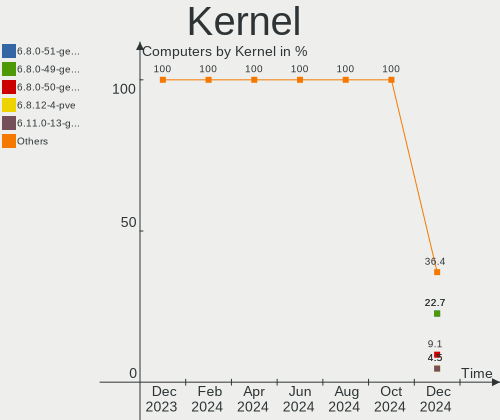
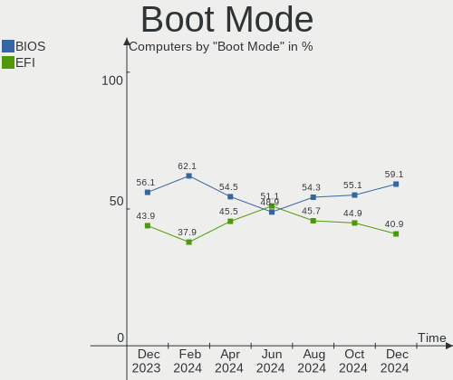
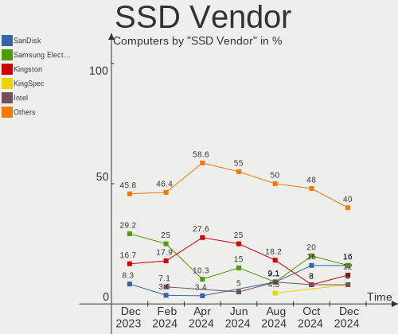
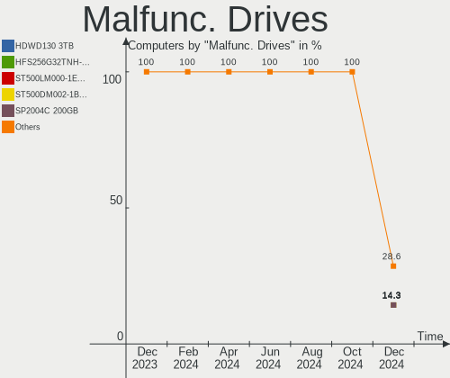
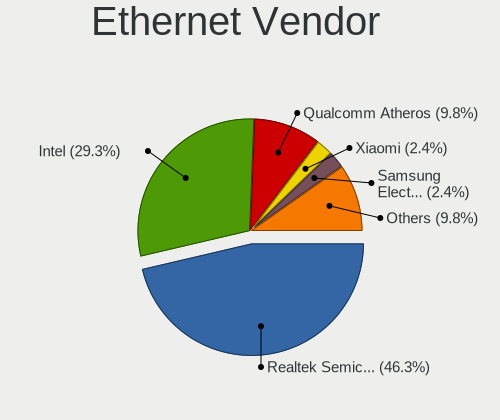
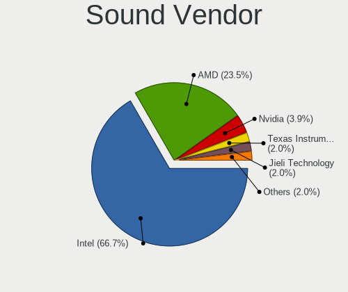

Xubuntu - Hardware Trends
-------------------------

A project to identify most popular hardware characteristics and track their change
over time based on data collected by Linux users at https://Linux-Hardware.org.

Anyone can contribute to this report by the [hw-probe](https://github.com/linuxhw/hw-probe) tool:

    sudo -E hw-probe -all -upload

This is a report for all computer types. See also reports for [desktops](/Dist/Xubuntu/Desktop/README.md) and [notebooks](/Dist/Xubuntu/Notebook/README.md).

This report is for one last month. Overall report since the beginning of time: [TestDays](https://github.com/linuxhw/TestDays)

Period: Jan, 2024.

Contents
--------

* [ System ](#system)
  - [ OS                       ](#os)
  - [ OS Family                ](#os-family)
  - [ Kernel                   ](#kernel)
  - [ Kernel Family            ](#kernel-family)
  - [ Kernel Major Ver.        ](#kernel-major-ver)
  - [ Arch                     ](#arch)
  - [ DE                       ](#de)
  - [ Display Server           ](#display-server)
  - [ Display Manager          ](#display-manager)
  - [ OS Lang                  ](#os-lang)
  - [ Boot Mode                ](#boot-mode)
  - [ Filesystem               ](#filesystem)
  - [ Part. scheme             ](#part-scheme)
  - [ Dual Boot with Linux/BSD ](#dual-boot-with-linuxbsd)
  - [ Dual Boot (Win)          ](#dual-boot-win)

* [ Board ](#board)
  - [ Vendor                   ](#vendor)
  - [ Model                    ](#model)
  - [ Model Family             ](#model-family)
  - [ MFG Year                 ](#mfg-year)
  - [ Form Factor              ](#form-factor)
  - [ Secure Boot              ](#secure-boot)
  - [ Coreboot                 ](#coreboot)
  - [ RAM Size                 ](#ram-size)
  - [ RAM Used                 ](#ram-used)
  - [ Total Drives             ](#total-drives)
  - [ Has CD-ROM               ](#has-cd-rom)
  - [ Has Ethernet             ](#has-ethernet)
  - [ Has WiFi                 ](#has-wifi)
  - [ Has Bluetooth            ](#has-bluetooth)

* [ Location ](#location)
  - [ Country                  ](#country)
  - [ City                     ](#city)

* [ Drives ](#drives)
  - [ Drive Vendor             ](#drive-vendor)
  - [ Drive Model              ](#drive-model)
  - [ HDD Vendor               ](#hdd-vendor)
  - [ SSD Vendor               ](#ssd-vendor)
  - [ Drive Kind               ](#drive-kind)
  - [ Drive Connector          ](#drive-connector)
  - [ Drive Size               ](#drive-size)
  - [ Space Total              ](#space-total)
  - [ Space Used               ](#space-used)
  - [ Malfunc. Drives          ](#malfunc-drives)
  - [ Malfunc. Drive Vendor    ](#malfunc-drive-vendor)
  - [ Malfunc. HDD Vendor      ](#malfunc-hdd-vendor)
  - [ Malfunc. Drive Kind      ](#malfunc-drive-kind)
  - [ Failed Drives            ](#failed-drives)
  - [ Failed Drive Vendor      ](#failed-drive-vendor)
  - [ Drive Status             ](#drive-status)

* [ Storage controller ](#storage-controller)
  - [ Storage Vendor           ](#storage-vendor)
  - [ Storage Model            ](#storage-model)
  - [ Storage Kind             ](#storage-kind)

* [ Processor ](#processor)
  - [ CPU Vendor               ](#cpu-vendor)
  - [ CPU Model                ](#cpu-model)
  - [ CPU Model Family         ](#cpu-model-family)
  - [ CPU Cores                ](#cpu-cores)
  - [ CPU Sockets              ](#cpu-sockets)
  - [ CPU Threads              ](#cpu-threads)
  - [ CPU Op-Modes             ](#cpu-op-modes)
  - [ CPU Microcode            ](#cpu-microcode)
  - [ CPU Microarch            ](#cpu-microarch)

* [ Graphics ](#graphics)
  - [ GPU Vendor               ](#gpu-vendor)
  - [ GPU Model                ](#gpu-model)
  - [ GPU Combo                ](#gpu-combo)
  - [ GPU Driver               ](#gpu-driver)
  - [ GPU Memory               ](#gpu-memory)

* [ Monitor ](#monitor)
  - [ Monitor Vendor           ](#monitor-vendor)
  - [ Monitor Model            ](#monitor-model)
  - [ Monitor Resolution       ](#monitor-resolution)
  - [ Monitor Diagonal         ](#monitor-diagonal)
  - [ Monitor Width            ](#monitor-width)
  - [ Aspect Ratio             ](#aspect-ratio)
  - [ Monitor Area             ](#monitor-area)
  - [ Pixel Density            ](#pixel-density)
  - [ Multiple Monitors        ](#multiple-monitors)

* [ Network ](#network)
  - [ Net Controller Vendor    ](#net-controller-vendor)
  - [ Net Controller Model     ](#net-controller-model)
  - [ Wireless Vendor          ](#wireless-vendor)
  - [ Wireless Model           ](#wireless-model)
  - [ Ethernet Vendor          ](#ethernet-vendor)
  - [ Ethernet Model           ](#ethernet-model)
  - [ Net Controller Kind      ](#net-controller-kind)
  - [ Used Controller          ](#used-controller)
  - [ NICs                     ](#nics)
  - [ IPv6                     ](#ipv6)

* [ Bluetooth ](#bluetooth)
  - [ Bluetooth Vendor         ](#bluetooth-vendor)
  - [ Bluetooth Model          ](#bluetooth-model)

* [ Sound ](#sound)
  - [ Sound Vendor             ](#sound-vendor)
  - [ Sound Model              ](#sound-model)

* [ Memory ](#memory)
  - [ Memory Vendor            ](#memory-vendor)
  - [ Memory Model             ](#memory-model)
  - [ Memory Kind              ](#memory-kind)
  - [ Memory Form Factor       ](#memory-form-factor)
  - [ Memory Size              ](#memory-size)
  - [ Memory Speed             ](#memory-speed)

* [ Printers & scanners ](#printers--scanners)
  - [ Printer Vendor           ](#printer-vendor)
  - [ Printer Model            ](#printer-model)
  - [ Scanner Vendor           ](#scanner-vendor)
  - [ Scanner Model            ](#scanner-model)

* [ Camera ](#camera)
  - [ Camera Vendor            ](#camera-vendor)
  - [ Camera Model             ](#camera-model)

* [ Security ](#security)
  - [ Fingerprint Vendor       ](#fingerprint-vendor)
  - [ Fingerprint Model        ](#fingerprint-model)
  - [ Chipcard Vendor          ](#chipcard-vendor)
  - [ Chipcard Model           ](#chipcard-model)

* [ Unsupported ](#unsupported)
  - [ Unsupported Devices      ](#unsupported-devices)
  - [ Unsupported Device Types ](#unsupported-device-types)

System
------

OS
--

Installed operating systems

| Name          | Computers | Percent |
|---------------|-----------|---------|
| Xubuntu 22.04 | 37        | 46.84%  |
| Xubuntu 23.10 | 14        | 17.72%  |
| Xubuntu 20.04 | 14        | 17.72%  |
| Xubuntu 18.04 | 9         | 11.39%  |
| Xubuntu 16.04 | 3         | 3.8%    |
| Xubuntu 23.04 | 1         | 1.27%   |
| Xubuntu 21.04 | 1         | 1.27%   |

OS Family
---------

OS without a version

| Name    | Computers | Percent |
|---------|-----------|---------|
| Xubuntu | 79        | 100%    |

Kernel
------

Version of the Linux kernel

| Version                  | Computers | Percent |
|--------------------------|-----------|---------|
| 6.5.0-14-generic         | 18        | 22.78%  |
| 6.2.0-39-generic         | 11        | 13.92%  |
| 5.15.0-91-generic        | 7         | 8.86%   |
| 6.5.0-15-generic         | 4         | 5.06%   |
| 6.2.0-26-generic         | 3         | 3.8%    |
| 5.15.0-92-generic        | 3         | 3.8%    |
| 5.4.0-170-generic        | 2         | 2.53%   |
| 5.4.0-169-generic        | 2         | 2.53%   |
| 5.4.0-150-generic        | 2         | 2.53%   |
| 5.15.0-91-lowlatency     | 2         | 2.53%   |
| 6.7.0                    | 1         | 1.27%   |
| 6.6.2-edge-rockchip64    | 1         | 1.27%   |
| 6.6.11-1-liquorix-amd64  | 1         | 1.27%   |
| 6.5.7-surface-2          | 1         | 1.27%   |
| 6.5.0-14-lowlatency      | 1         | 1.27%   |
| 6.2.0-37-generic         | 1         | 1.27%   |
| 5.4.217-0504217-generic  | 1         | 1.27%   |
| 5.4.0-73-generic         | 1         | 1.27%   |
| 5.4.0-26-generic         | 1         | 1.27%   |
| 5.15.0-94-generic        | 1         | 1.27%   |
| 5.15.0-88-generic        | 1         | 1.27%   |
| 5.15.0-78-generic        | 1         | 1.27%   |
| 5.15.0-71-generic        | 1         | 1.27%   |
| 5.15.0-25-generic        | 1         | 1.27%   |
| 5.15.0-051500-generic    | 1         | 1.27%   |
| 5.13.0-30-generic        | 1         | 1.27%   |
| 5.11.0-44-lowlatency     | 1         | 1.27%   |
| 5.10.160-rockchip-rk3588 | 1         | 1.27%   |
| 4.4.0-210-generic        | 1         | 1.27%   |
| 4.15.13-pf6              | 1         | 1.27%   |
| 4.15.0-213-generic       | 1         | 1.27%   |
| 4.15.0-212-generic       | 1         | 1.27%   |
| 4.15.0-209-lowlatency    | 1         | 1.27%   |
| 4.15.0-142-lowlatency    | 1         | 1.27%   |
| 4.15.0-142-generic       | 1         | 1.27%   |

Kernel Family
-------------

Linux kernel without a distro release

| Version  | Computers | Percent |
|----------|-----------|---------|
| 6.5.0    | 23        | 29.11%  |
| 5.15.0   | 18        | 22.78%  |
| 6.2.0    | 15        | 18.99%  |
| 5.4.0    | 8         | 10.13%  |
| 4.15.0   | 5         | 6.33%   |
| 6.7.0    | 1         | 1.27%   |
| 6.6.2    | 1         | 1.27%   |
| 6.6.11   | 1         | 1.27%   |
| 6.5.7    | 1         | 1.27%   |
| 5.4.217  | 1         | 1.27%   |
| 5.13.0   | 1         | 1.27%   |
| 5.11.0   | 1         | 1.27%   |
| 5.10.160 | 1         | 1.27%   |
| 4.4.0    | 1         | 1.27%   |
| 4.15.13  | 1         | 1.27%   |

Kernel Major Ver.
-----------------

Linux kernel major version

| Version | Computers | Percent |
|---------|-----------|---------|
| 6.5     | 24        | 30.38%  |
| 5.15    | 18        | 22.78%  |
| 6.2     | 15        | 18.99%  |
| 5.4     | 9         | 11.39%  |
| 4.15    | 6         | 7.59%   |
| 6.6     | 2         | 2.53%   |
| 6.7     | 1         | 1.27%   |
| 5.13    | 1         | 1.27%   |
| 5.11    | 1         | 1.27%   |
| 5.10    | 1         | 1.27%   |
| 4.4     | 1         | 1.27%   |

Arch
----

OS architecture (x86_64, i586, etc.)

| Name    | Computers | Percent |
|---------|-----------|---------|
| x86_64  | 74        | 93.67%  |
| i686    | 3         | 3.8%    |
| aarch64 | 2         | 2.53%   |

DE
--

Desktop Environment

| Name  | Computers | Percent |
|-------|-----------|---------|
| XFCE  | 76        | 96.2%   |
| MATE  | 1         | 1.27%   |
| i3    | 1         | 1.27%   |
| GNOME | 1         | 1.27%   |

Display Server
--------------

X11 or Wayland

| Name | Computers | Percent |
|------|-----------|---------|
| X11  | 76        | 96.2%   |
| Tty  | 3         | 3.8%    |

Display Manager
---------------

SDDM, LightDM, etc.

| Name    | Computers | Percent |
|---------|-----------|---------|
| LightDM | 72        | 91.14%  |
| Unknown | 4         | 5.06%   |
| GDM3    | 3         | 3.8%    |

OS Lang
-------

Language

| Lang  | Computers | Percent |
|-------|-----------|---------|
| en_US | 32        | 40.51%  |
| fr_FR | 15        | 18.99%  |
| de_DE | 9         | 11.39%  |
| it_IT | 4         | 5.06%   |
| ru_RU | 3         | 3.8%    |
| pt_BR | 2         | 2.53%   |
| es_ES | 2         | 2.53%   |
| en_GB | 2         | 2.53%   |
| C     | 2         | 2.53%   |
| sk_SK | 1         | 1.27%   |
| pl_PL | 1         | 1.27%   |
| ja_JP | 1         | 1.27%   |
| hu_HU | 1         | 1.27%   |
| es_CL | 1         | 1.27%   |
| en_PH | 1         | 1.27%   |
| en_IN | 1         | 1.27%   |
| en_AU | 1         | 1.27%   |

Boot Mode
---------

EFI or BIOS

| Mode | Computers | Percent |
|------|-----------|---------|
| BIOS | 41        | 51.9%   |
| EFI  | 38        | 48.1%   |

Filesystem
----------

Type of filesystem

| Type    | Computers | Percent |
|---------|-----------|---------|
| Ext4    | 42        | 53.16%  |
| Tmpfs   | 32        | 40.51%  |
| Overlay | 4         | 5.06%   |
| Zfs     | 1         | 1.27%   |

Part. scheme
------------

Scheme of partitioning

| Type    | Computers | Percent |
|---------|-----------|---------|
| GPT     | 60        | 75.95%  |
| MBR     | 13        | 16.46%  |
| Unknown | 6         | 7.59%   |

Dual Boot with Linux/BSD
------------------------

Hosting more than one Linux/BSD

| Dual boot | Computers | Percent |
|-----------|-----------|---------|
| No        | 69        | 87.34%  |
| Yes       | 10        | 12.66%  |

Dual Boot (Win)
---------------

Hosting Linux and Windows

| Dual boot | Computers | Percent |
|-----------|-----------|---------|
| No        | 50        | 63.29%  |
| Yes       | 29        | 36.71%  |

Board
-----

Vendor
------

Motherboard manufacturer

| Name                  | Computers | Percent |
|-----------------------|-----------|---------|
| ASUSTek Computer      | 15        | 18.99%  |
| Dell                  | 14        | 17.72%  |
| Lenovo                | 11        | 13.92%  |
| Hewlett-Packard       | 7         | 8.86%   |
| Gigabyte Technology   | 5         | 6.33%   |
| Acer                  | 5         | 6.33%   |
| ASRock                | 4         | 5.06%   |
| MSI                   | 3         | 3.8%    |
| Apple                 | 3         | 3.8%    |
| Rockchip              | 2         | 2.53%   |
| Toshiba               | 1         | 1.27%   |
| Shuttle               | 1         | 1.27%   |
| PC Specialist         | 1         | 1.27%   |
| Packard Bell          | 1         | 1.27%   |
| Microsoft             | 1         | 1.27%   |
| KunPengDianTong(KPDT) | 1         | 1.27%   |
| Intel                 | 1         | 1.27%   |
| Gigazone              | 1         | 1.27%   |
| Fujitsu               | 1         | 1.27%   |
| AOpen                 | 1         | 1.27%   |

Model
-----

Motherboard model

| Name                                     | Computers | Percent |
|------------------------------------------|-----------|---------|
| ASUS All Series                          | 2         | 2.53%   |
| Toshiba Satellite L300                   | 1         | 1.27%   |
| Shuttle NC40U                            | 1         | 1.27%   |
| Rockchip RK3588 OPi 5 Plus               | 1         | 1.27%   |
| Rockchip RK3566 OPi 3B                   | 1         | 1.27%   |
| PC Specialist NH5x_7xDPx                 | 1         | 1.27%   |
| Packard Bell IXTREME M5800               | 1         | 1.27%   |
| MSI MS-7C56                              | 1         | 1.27%   |
| MSI MS-7B86                              | 1         | 1.27%   |
| MSI GF63 Thin 11UC                       | 1         | 1.27%   |
| Microsoft Surface Pro 7                  | 1         | 1.27%   |
| Lenovo Yoga 720-13IKB 81C3               | 1         | 1.27%   |
| Lenovo V560                              | 1         | 1.27%   |
| Lenovo ThinkStation P720 30BBS6NG00      | 1         | 1.27%   |
| Lenovo ThinkPad X260 20F5S0KE00          | 1         | 1.27%   |
| Lenovo ThinkPad X240 20AMS00100          | 1         | 1.27%   |
| Lenovo ThinkPad T570 20HAS0NU00          | 1         | 1.27%   |
| Lenovo ThinkPad T400 6474AW6             | 1         | 1.27%   |
| Lenovo ThinkPad P53 20QNS00X00           | 1         | 1.27%   |
| Lenovo IdeaPad 510S-13ISK 80SJ           | 1         | 1.27%   |
| Lenovo IdeaCentre 310S-08ASR 90G9002MUK  | 1         | 1.27%   |
| Lenovo G500 20236                        | 1         | 1.27%   |
| Intel DB75EN                             | 1         | 1.27%   |
| HP ProDesk 400 G5 Desktop Mini           | 1         | 1.27%   |
| HP Pavilion g6                           | 1         | 1.27%   |
| HP Pavilion dv7                          | 1         | 1.27%   |
| HP Pavilion dv6                          | 1         | 1.27%   |
| HP EliteBook 860 16 inch G10 Notebook PC | 1         | 1.27%   |
| HP EliteBook 840 G1                      | 1         | 1.27%   |
| HP Compaq Presario CQ60                  | 1         | 1.27%   |
| Gigazone X107(B-B)                       | 1         | 1.27%   |
| Gigabyte P55-UD3R                        | 1         | 1.27%   |
| Gigabyte GA-MA790FXT-UD5P                | 1         | 1.27%   |
| Gigabyte C1037UN                         | 1         | 1.27%   |
| Gigabyte B550 AORUS ELITE AX V2          | 1         | 1.27%   |
| Gigabyte 8IPE1000P-G                     | 1         | 1.27%   |
| Fujitsu ESPRIMO Q958                     | 1         | 1.27%   |
| Dell Precision Tower 5810                | 1         | 1.27%   |
| Dell Precision M6800                     | 1         | 1.27%   |
| Dell PowerEdge R910                      | 1         | 1.27%   |

Model Family
------------

Motherboard model prefix

| Name                      | Computers | Percent |
|---------------------------|-----------|---------|
| Lenovo ThinkPad           | 5         | 6.33%   |
| Dell Latitude             | 4         | 5.06%   |
| Dell Inspiron             | 4         | 5.06%   |
| ASUS ROG                  | 4         | 5.06%   |
| Acer Aspire               | 4         | 5.06%   |
| HP Pavilion               | 3         | 3.8%    |
| Dell OptiPlex             | 3         | 3.8%    |
| HP EliteBook              | 2         | 2.53%   |
| Dell Precision            | 2         | 2.53%   |
| ASUS All                  | 2         | 2.53%   |
| Apple MacBook5            | 2         | 2.53%   |
| Toshiba Satellite         | 1         | 1.27%   |
| Shuttle NC40U             | 1         | 1.27%   |
| Rockchip RK3588           | 1         | 1.27%   |
| Rockchip RK3566           | 1         | 1.27%   |
| PC Specialist NH5x        | 1         | 1.27%   |
| Packard Bell IXTREME      | 1         | 1.27%   |
| MSI MS-7C56               | 1         | 1.27%   |
| MSI MS-7B86               | 1         | 1.27%   |
| MSI GF63                  | 1         | 1.27%   |
| Microsoft Surface         | 1         | 1.27%   |
| Lenovo Yoga               | 1         | 1.27%   |
| Lenovo V560               | 1         | 1.27%   |
| Lenovo ThinkStation       | 1         | 1.27%   |
| Lenovo IdeaPad            | 1         | 1.27%   |
| Lenovo IdeaCentre         | 1         | 1.27%   |
| Lenovo G500               | 1         | 1.27%   |
| Intel DB75EN              | 1         | 1.27%   |
| HP ProDesk                | 1         | 1.27%   |
| HP Compaq                 | 1         | 1.27%   |
| Gigazone X107(B-B)        | 1         | 1.27%   |
| Gigabyte P55-UD3R         | 1         | 1.27%   |
| Gigabyte GA-MA790FXT-UD5P | 1         | 1.27%   |
| Gigabyte C1037UN          | 1         | 1.27%   |
| Gigabyte B550             | 1         | 1.27%   |
| Gigabyte 8IPE1000P-G      | 1         | 1.27%   |
| Fujitsu ESPRIMO           | 1         | 1.27%   |
| Dell PowerEdge            | 1         | 1.27%   |
| ASUS X540SAA              | 1         | 1.27%   |
| ASUS X205TA               | 1         | 1.27%   |

MFG Year
--------

Motherboard manufacture year

| Year    | Computers | Percent |
|---------|-----------|---------|
| 2008    | 8         | 10.13%  |
| 2020    | 6         | 7.59%   |
| 2019    | 6         | 7.59%   |
| 2009    | 6         | 7.59%   |
| 2023    | 5         | 6.33%   |
| 2021    | 5         | 6.33%   |
| 2013    | 5         | 6.33%   |
| 2012    | 5         | 6.33%   |
| 2011    | 5         | 6.33%   |
| 2018    | 4         | 5.06%   |
| 2017    | 4         | 5.06%   |
| 2016    | 4         | 5.06%   |
| 2022    | 3         | 3.8%    |
| 2015    | 3         | 3.8%    |
| 2014    | 3         | 3.8%    |
| 2010    | 3         | 3.8%    |
| Unknown | 2         | 2.53%   |
| 2006    | 1         | 1.27%   |
| 2004    | 1         | 1.27%   |

Form Factor
-----------

Physical design of the computer

| Name           | Computers | Percent |
|----------------|-----------|---------|
| Notebook       | 39        | 49.37%  |
| Desktop        | 32        | 40.51%  |
| System on chip | 2         | 2.53%   |
| Server         | 2         | 2.53%   |
| Tablet         | 1         | 1.27%   |
| Convertible    | 1         | 1.27%   |
| Mini pc        | 1         | 1.27%   |
| All in one     | 1         | 1.27%   |

Secure Boot
-----------

Enabled or disabled

| State    | Computers | Percent |
|----------|-----------|---------|
| Disabled | 70        | 88.61%  |
| Enabled  | 9         | 11.39%  |

Coreboot
--------

Have coreboot on board

| Used | Computers | Percent |
|------|-----------|---------|
| No   | 79        | 100%    |

RAM Size
--------

Total RAM memory

| Size in GB      | Computers | Percent |
|-----------------|-----------|---------|
| 3.01-4.0        | 19        | 24.05%  |
| 16.01-24.0      | 16        | 20.25%  |
| 4.01-8.0        | 15        | 18.99%  |
| 8.01-16.0       | 11        | 13.92%  |
| 1.01-2.0        | 6         | 7.59%   |
| 64.01-256.0     | 5         | 6.33%   |
| 32.01-64.0      | 3         | 3.8%    |
| 2.01-3.0        | 2         | 2.53%   |
| More than 256.0 | 1         | 1.27%   |
| 24.01-32.0      | 1         | 1.27%   |

RAM Used
--------

Used RAM memory

| Used GB    | Computers | Percent |
|------------|-----------|---------|
| 1.01-2.0   | 27        | 34.18%  |
| 3.01-4.0   | 14        | 17.72%  |
| 2.01-3.0   | 13        | 16.46%  |
| 4.01-8.0   | 10        | 12.66%  |
| 0.51-1.0   | 10        | 12.66%  |
| 8.01-16.0  | 4         | 5.06%   |
| 16.01-24.0 | 1         | 1.27%   |

Total Drives
------------

Number of drives on board

| Drives | Computers | Percent |
|--------|-----------|---------|
| 1      | 52        | 65.82%  |
| 2      | 16        | 20.25%  |
| 3      | 6         | 7.59%   |
| 4      | 2         | 2.53%   |
| 8      | 1         | 1.27%   |
| 6      | 1         | 1.27%   |
| 5      | 1         | 1.27%   |

Has CD-ROM
----------

Has CD-ROM on board

| Presented | Computers | Percent |
|-----------|-----------|---------|
| No        | 43        | 54.43%  |
| Yes       | 36        | 45.57%  |

Has Ethernet
------------

Has Ethernet on board

| Presented | Computers | Percent |
|-----------|-----------|---------|
| Yes       | 71        | 89.87%  |
| No        | 8         | 10.13%  |

Has WiFi
--------

Has WiFi module

| Presented | Computers | Percent |
|-----------|-----------|---------|
| Yes       | 60        | 75.95%  |
| No        | 19        | 24.05%  |

Has Bluetooth
-------------

Has Bluetooth module

| Presented | Computers | Percent |
|-----------|-----------|---------|
| Yes       | 42        | 53.16%  |
| No        | 37        | 46.84%  |

Location
--------

Country
-------

Geographic location (country)

| Country     | Computers | Percent |
|-------------|-----------|---------|
| France      | 15        | 18.99%  |
| USA         | 14        | 17.72%  |
| Germany     | 11        | 13.92%  |
| Russia      | 7         | 8.86%   |
| Italy       | 6         | 7.59%   |
| Spain       | 3         | 3.8%    |
| Canada      | 3         | 3.8%    |
| UK          | 2         | 2.53%   |
| Thailand    | 2         | 2.53%   |
| Poland      | 2         | 2.53%   |
| Brazil      | 2         | 2.53%   |
| Slovakia    | 1         | 1.27%   |
| Singapore   | 1         | 1.27%   |
| Philippines | 1         | 1.27%   |
| Malaysia    | 1         | 1.27%   |
| Japan       | 1         | 1.27%   |
| India       | 1         | 1.27%   |
| Hungary     | 1         | 1.27%   |
| Greece      | 1         | 1.27%   |
| Chile       | 1         | 1.27%   |
| Belgium     | 1         | 1.27%   |
| Australia   | 1         | 1.27%   |
| Argentina   | 1         | 1.27%   |

City
----

Geographic location (city)

| City                          | Computers | Percent |
|-------------------------------|-----------|---------|
| Berlin                        | 3         | 3.8%    |
| Toulouse                      | 2         | 2.53%   |
| Milano                        | 2         | 2.53%   |
| Bangkok                       | 2         | 2.53%   |
| Wroclaw                       | 1         | 1.27%   |
| Witten                        | 1         | 1.27%   |
| Wiesbaden                     | 1         | 1.27%   |
| Warangal                      | 1         | 1.27%   |
| Ulyanovsk                     | 1         | 1.27%   |
| Tomsk                         | 1         | 1.27%   |
| Terni                         | 1         | 1.27%   |
| Sydney                        | 1         | 1.27%   |
| Stuttgart                     | 1         | 1.27%   |
| St Petersburg                 | 1         | 1.27%   |
| Springfield                   | 1         | 1.27%   |
| Spanish Fork                  | 1         | 1.27%   |
| South Shields                 | 1         | 1.27%   |
| Soave                         | 1         | 1.27%   |
| Singapore                     | 1         | 1.27%   |
| Sebring                       | 1         | 1.27%   |
| Salvador                      | 1         | 1.27%   |
| Saint-Maximin-la-Sainte-Baume | 1         | 1.27%   |
| Saint-Germain-les-Arpajon     | 1         | 1.27%   |
| Rafal                         | 1         | 1.27%   |
| Poskwitow                     | 1         | 1.27%   |
| Petaling Jaya                 | 1         | 1.27%   |
| Perpignan                     | 1         | 1.27%   |
| Paris                         | 1         | 1.27%   |
| Ostercappeln                  | 1         | 1.27%   |
| Orsay                         | 1         | 1.27%   |
| Nuremberg                     | 1         | 1.27%   |
| Novosibirsk                   | 1         | 1.27%   |
| Moscow                        | 1         | 1.27%   |
| Moron                         | 1         | 1.27%   |
| Montreal                      | 1         | 1.27%   |
| Montebello                    | 1         | 1.27%   |
| Montbéliard                  | 1         | 1.27%   |
| Minneapolis                   | 1         | 1.27%   |
| Manila                        | 1         | 1.27%   |
| Manaus                        | 1         | 1.27%   |

Drives
------

Drive Vendor
------------

Hard drive vendors

| Vendor                      | Computers | Drives | Percent |
|-----------------------------|-----------|--------|---------|
| WDC                         | 15        | 19     | 13.64%  |
| Seagate                     | 14        | 18     | 12.73%  |
| Samsung Electronics         | 13        | 14     | 11.82%  |
| Kingston                    | 8         | 9      | 7.27%   |
| Toshiba                     | 7         | 7      | 6.36%   |
| SanDisk                     | 7         | 7      | 6.36%   |
| Unknown                     | 5         | 6      | 4.55%   |
| SK hynix                    | 4         | 4      | 3.64%   |
| Hitachi                     | 4         | 4      | 3.64%   |
| Crucial                     | 4         | 4      | 3.64%   |
| HGST                        | 3         | 3      | 2.73%   |
| SPCC                        | 2         | 2      | 1.82%   |
| Micron Technology           | 2         | 2      | 1.82%   |
| KIOXIA                      | 2         | 2      | 1.82%   |
| Kingston Technology Company | 2         | 2      | 1.82%   |
| China                       | 2         | 2      | 1.82%   |
| USB3.0                      | 1         | 1      | 0.91%   |
| Transcend                   | 1         | 1      | 0.91%   |
| Timetec                     | 1         | 1      | 0.91%   |
| PNY                         | 1         | 1      | 0.91%   |
| Phison Electronics          | 1         | 2      | 0.91%   |
| Phison                      | 1         | 2      | 0.91%   |
| Maxtor                      | 1         | 1      | 0.91%   |
| LITEONIT                    | 1         | 1      | 0.91%   |
| IBM-ESXS                    | 1         | 1      | 0.91%   |
| Hewlett-Packard             | 1         | 1      | 0.91%   |
| GOODRAM                     | 1         | 1      | 0.91%   |
| Fujitsu                     | 1         | 1      | 0.91%   |
| Corsair                     | 1         | 1      | 0.91%   |
| ASMT                        | 1         | 1      | 0.91%   |
| A-DATA Technology           | 1         | 1      | 0.91%   |
| Unknown                     | 1         | 1      | 0.91%   |

Drive Model
-----------

Hard drive models

| Model                                             | Computers | Percent |
|---------------------------------------------------|-----------|---------|
| Kingston SA400S37240G 240GB SSD                   | 3         | 2.5%    |
| Seagate ST2000DM008-2FR102 2TB                    | 2         | 1.67%   |
| Sandisk WD Blue SN550 NVMe SSD 512GB              | 2         | 1.67%   |
| Samsung NVMe SSD Controller SM981/PM981/PM983 1TB | 2         | 1.67%   |
| HGST HTS725032A7E630 320GB                        | 2         | 1.67%   |
| WDC WDS240G2G0B-00EPW0 240GB SSD                  | 1         | 0.83%   |
| WDC WDS240G2G0A-00JH30 240GB SSD                  | 1         | 0.83%   |
| WDC WD80EMAZ-00WJTA0 8TB                          | 1         | 0.83%   |
| WDC WD7500BPVT-22HXZT3 752GB                      | 1         | 0.83%   |
| WDC WD6400AAKS-00E4A0 640GB                       | 1         | 0.83%   |
| WDC WD5000LUCT-63RC2Y0 500GB                      | 1         | 0.83%   |
| WDC WD5000AAKX-08U6AA0 500GB                      | 1         | 0.83%   |
| WDC WD4000AAJS-00YFA0 400GB                       | 1         | 0.83%   |
| WDC WD20EZRZ-00Z5HB0 2TB                          | 1         | 0.83%   |
| WDC WD1600BEVS-08VAT1 160GB                       | 1         | 0.83%   |
| WDC WD10SPZX-00Z10T0 1TB                          | 1         | 0.83%   |
| WDC WD10JPVX-22JC3T0 1TB                          | 1         | 0.83%   |
| WDC WD10EZEX-75WN4A1 1TB                          | 1         | 0.83%   |
| WDC WD10EZEX-08WN4A0 1TB                          | 1         | 0.83%   |
| WDC WD10EZEX-08M2NA0 1TB                          | 1         | 0.83%   |
| WDC WD10EZEX-07WN4A0 1TB                          | 1         | 0.83%   |
| WDC WD10EZEX-00BN5A0 1TB                          | 1         | 0.83%   |
| WDC WD10EACS-00D6B0 1TB                           | 1         | 0.83%   |
| WDC PC SN540 SDDPNPF-512G-1032 512GB              | 1         | 0.83%   |
| USB3.0 Super Speed 500GB SSD                      | 1         | 0.83%   |
| Unknown NVMe SSD Drive 512GB                      | 1         | 0.83%   |
| Unknown MMC Card  64GB                            | 1         | 0.83%   |
| Unknown MMC Card  250GB                           | 1         | 0.83%   |
| Unknown MBG4GC  32GB                              | 1         | 0.83%   |
| Unknown DS2032  32GB                              | 1         | 0.83%   |
| Unknown BGND3R  32GB                              | 1         | 0.83%   |
| Transcend TS64GSSD370S 64GB                       | 1         | 0.83%   |
| Toshiba MQ01ABD100 1TB                            | 1         | 0.83%   |
| Toshiba MQ01ABD050 500GB                          | 1         | 0.83%   |
| Toshiba MK5065GSXF 500GB                          | 1         | 0.83%   |
| Toshiba MK1059GSM 1TB                             | 1         | 0.83%   |
| Toshiba HDWE150 5TB                               | 1         | 0.83%   |
| Toshiba HDWD105 500GB                             | 1         | 0.83%   |
| Toshiba DT01ACA050 500GB                          | 1         | 0.83%   |
| Timetec M.2 SATA 256GB SSD                        | 1         | 0.83%   |

HDD Vendor
----------

Hard disk drive vendors

| Vendor              | Computers | Drives | Percent |
|---------------------|-----------|--------|---------|
| Seagate             | 14        | 18     | 31.11%  |
| WDC                 | 12        | 16     | 26.67%  |
| Toshiba             | 7         | 7      | 15.56%  |
| Hitachi             | 4         | 4      | 8.89%   |
| HGST                | 3         | 3      | 6.67%   |
| Samsung Electronics | 2         | 2      | 4.44%   |
| Maxtor              | 1         | 1      | 2.22%   |
| IBM-ESXS            | 1         | 1      | 2.22%   |
| Fujitsu             | 1         | 1      | 2.22%   |

SSD Vendor
----------

Solid state drive vendors

| Vendor              | Computers | Drives | Percent |
|---------------------|-----------|--------|---------|
| Kingston            | 7         | 8      | 20.59%  |
| Samsung Electronics | 6         | 6      | 17.65%  |
| WDC                 | 2         | 2      | 5.88%   |
| SPCC                | 2         | 2      | 5.88%   |
| SanDisk             | 2         | 2      | 5.88%   |
| Crucial             | 2         | 2      | 5.88%   |
| China               | 2         | 2      | 5.88%   |
| USB3.0              | 1         | 1      | 2.94%   |
| Transcend           | 1         | 1      | 2.94%   |
| Timetec             | 1         | 1      | 2.94%   |
| PNY                 | 1         | 1      | 2.94%   |
| Micron Technology   | 1         | 1      | 2.94%   |
| LITEONIT            | 1         | 1      | 2.94%   |
| Hewlett-Packard     | 1         | 1      | 2.94%   |
| GOODRAM             | 1         | 1      | 2.94%   |
| Corsair             | 1         | 1      | 2.94%   |
| ASMT                | 1         | 1      | 2.94%   |
| A-DATA Technology   | 1         | 1      | 2.94%   |

Drive Kind
----------

HDD or SSD

| Kind | Computers | Drives | Percent |
|------|-----------|--------|---------|
| HDD  | 36        | 53     | 37.11%  |
| SSD  | 31        | 35     | 31.96%  |
| NVMe | 25        | 29     | 25.77%  |
| MMC  | 5         | 6      | 5.15%   |

Drive Connector
---------------

SATA, SAS, NVMe, etc.

| Type | Computers | Drives | Percent |
|------|-----------|--------|---------|
| SATA | 56        | 84     | 62.22%  |
| NVMe | 25        | 29     | 27.78%  |
| MMC  | 5         | 6      | 5.56%   |
| SAS  | 4         | 4      | 4.44%   |

Drive Size
----------

Size of hard drive

| Size in TB | Computers | Drives | Percent |
|------------|-----------|--------|---------|
| 0.01-0.5   | 40        | 50     | 57.97%  |
| 0.51-1.0   | 18        | 25     | 26.09%  |
| 1.01-2.0   | 8         | 9      | 11.59%  |
| 4.01-10.0  | 3         | 4      | 4.35%   |

Space Total
-----------

Amount of disk space available on the file system

| Size in GB     | Computers | Percent |
|----------------|-----------|---------|
| 101-250        | 28        | 35.44%  |
| 251-500        | 15        | 18.99%  |
| 501-1000       | 10        | 12.66%  |
| 51-100         | 8         | 10.13%  |
| More than 3000 | 4         | 5.06%   |
| 2001-3000      | 4         | 5.06%   |
| 1001-2000      | 4         | 5.06%   |
| 1-20           | 4         | 5.06%   |
| 21-50          | 2         | 2.53%   |

Space Used
----------

Amount of used disk space

| Used GB        | Computers | Percent |
|----------------|-----------|---------|
| 1-20           | 29        | 36.71%  |
| 21-50          | 16        | 20.25%  |
| 101-250        | 10        | 12.66%  |
| 251-500        | 7         | 8.86%   |
| 501-1000       | 5         | 6.33%   |
| 51-100         | 5         | 6.33%   |
| 1001-2000      | 4         | 5.06%   |
| 2001-3000      | 2         | 2.53%   |
| More than 3000 | 1         | 1.27%   |

Malfunc. Drives
---------------

Drive models with a malfunction

| Model                                               | Computers | Drives | Percent |
|-----------------------------------------------------|-----------|--------|---------|
| Toshiba MQ01ABD050 500GB                            | 1         | 1      | 14.29%  |
| Seagate ST2000DM008-2FR102 2TB                      | 1         | 2      | 14.29%  |
| Micron Technology MTFDDAK512TBN-1AR1ZABHA 512GB SSD | 1         | 1      | 14.29%  |
| Kingston SV300S37A120G 120GB SSD                    | 1         | 1      | 14.29%  |
| Kingston OM8PDP3512B-AA1 512GB                      | 1         | 1      | 14.29%  |
| Kingston A400 256GB SSD                             | 1         | 1      | 14.29%  |
| Hitachi HTS547575A9E384 752GB                       | 1         | 1      | 14.29%  |

Malfunc. Drive Vendor
---------------------

Vendors of faulty drives

| Vendor            | Computers | Drives | Percent |
|-------------------|-----------|--------|---------|
| Kingston          | 3         | 3      | 42.86%  |
| Toshiba           | 1         | 1      | 14.29%  |
| Seagate           | 1         | 2      | 14.29%  |
| Micron Technology | 1         | 1      | 14.29%  |
| Hitachi           | 1         | 1      | 14.29%  |

Malfunc. HDD Vendor
-------------------

Vendors of faulty HDD drives

| Vendor  | Computers | Drives | Percent |
|---------|-----------|--------|---------|
| Toshiba | 1         | 1      | 33.33%  |
| Seagate | 1         | 2      | 33.33%  |
| Hitachi | 1         | 1      | 33.33%  |

Malfunc. Drive Kind
-------------------

Kinds of faulty drives

| Kind | Computers | Drives | Percent |
|------|-----------|--------|---------|
| SSD  | 3         | 3      | 42.86%  |
| HDD  | 3         | 4      | 42.86%  |
| NVMe | 1         | 1      | 14.29%  |

Failed Drives
-------------

Failed drive models

Zero info for selected period =(

Failed Drive Vendor
-------------------

Failed drive vendors

Zero info for selected period =(

Drive Status
------------

Number of failed and malfunc. drives

| Status   | Computers | Drives | Percent |
|----------|-----------|--------|---------|
| Detected | 43        | 58     | 50%     |
| Works    | 36        | 57     | 41.86%  |
| Malfunc  | 7         | 8      | 8.14%   |

Storage controller
------------------

Storage Vendor
--------------

Storage controller vendors

| Vendor                      | Computers | Percent |
|-----------------------------|-----------|---------|
| Intel                       | 49        | 48.51%  |
| AMD                         | 16        | 15.84%  |
| SanDisk                     | 6         | 5.94%   |
| Samsung Electronics         | 5         | 4.95%   |
| SK hynix                    | 4         | 3.96%   |
| Nvidia                      | 3         | 2.97%   |
| Kingston Technology Company | 3         | 2.97%   |
| JMicron Technology          | 3         | 2.97%   |
| Phison Electronics          | 2         | 1.98%   |
| Micron/Crucial Technology   | 2         | 1.98%   |
| KIOXIA                      | 2         | 1.98%   |
| Realtek Semiconductor       | 1         | 0.99%   |
| Micron Technology           | 1         | 0.99%   |
| Marvell Technology Group    | 1         | 0.99%   |
| LSI Logic / Symbios Logic   | 1         | 0.99%   |
| Hosin Global Electronics    | 1         | 0.99%   |
| ASMedia Technology          | 1         | 0.99%   |

Storage Model
-------------

Storage controller models

| Model                                                                          | Computers | Percent |
|--------------------------------------------------------------------------------|-----------|---------|
| AMD FCH SATA Controller [AHCI mode]                                            | 6         | 4.92%   |
| Intel 7 Series Chipset Family 6-port SATA Controller [AHCI mode]               | 5         | 4.1%    |
| Intel Sunrise Point-LP SATA Controller [AHCI mode]                             | 4         | 3.28%   |
| Intel 82801IBM/IEM (ICH9M/ICH9M-E) 4 port SATA Controller [AHCI mode]          | 4         | 3.28%   |
| AMD 500 Series Chipset SATA Controller                                         | 4         | 3.28%   |
| SK hynix BC501 NVMe Solid State Drive                                          | 3         | 2.46%   |
| Samsung NVMe SSD Controller SM981/PM981/PM983                                  | 3         | 2.46%   |
| Intel Tiger Lake-LP SATA Controller                                            | 3         | 2.46%   |
| Intel 8 Series/C220 Series Chipset Family 6-port SATA Controller 1 [AHCI mode] | 3         | 2.46%   |
| AMD SB7x0/SB8x0/SB9x0 IDE Controller                                           | 3         | 2.46%   |
| AMD 400 Series Chipset SATA Controller                                         | 3         | 2.46%   |
| SanDisk Ultra 3D / WD Blue SN550 NVMe SSD                                      | 2         | 1.64%   |
| Nvidia MCP79 AHCI Controller                                                   | 2         | 1.64%   |
| Micron/Crucial P2 [Nick P2] / P3 / P3 Plus NVMe PCIe SSD (DRAM-less)           | 2         | 1.64%   |
| Kingston Company NV2 NVMe SSD SM2267XT (DRAM-less)                             | 2         | 1.64%   |
| JMicron JMB363 SATA/IDE Controller                                             | 2         | 1.64%   |
| Intel Volume Management Device NVMe RAID Controller                            | 2         | 1.64%   |
| Intel Cannon Lake PCH SATA AHCI Controller                                     | 2         | 1.64%   |
| Intel 82801HM/HEM (ICH8M/ICH8M-E) SATA Controller [AHCI mode]                  | 2         | 1.64%   |
| Intel 82801HM/HEM (ICH8M/ICH8M-E) IDE Controller                               | 2         | 1.64%   |
| Intel 82801 Mobile SATA Controller [RAID mode]                                 | 2         | 1.64%   |
| Intel 8 Series SATA Controller 1 [AHCI mode]                                   | 2         | 1.64%   |
| Intel 6 Series/C200 Series Chipset Family 6 port Desktop SATA AHCI Controller  | 2         | 1.64%   |
| Intel 400 Series Chipset Family SATA AHCI Controller                           | 2         | 1.64%   |
| AMD SB7x0/SB8x0/SB9x0 SATA Controller [AHCI mode]                              | 2         | 1.64%   |
| SK hynix BC511 NVMe SSD                                                        | 1         | 0.82%   |
| SanDisk WD PC SN540 / Green SN350 NVMe SSD 1 TB (DRAM-less)                    | 1         | 0.82%   |
| SanDisk WD Black SN770 / PC SN740 256GB / PC SN560 (DRAM-less) NVMe SSD        | 1         | 0.82%   |
| SanDisk WD Black NVMe SSD                                                      | 1         | 0.82%   |
| SanDisk IX SN530 NVMe SSD (DRAM-less)                                          | 1         | 0.82%   |
| Samsung NVMe SSD Controller SM961/PM961/SM963                                  | 1         | 0.82%   |
| Samsung NVMe SSD Controller PM9A1/PM9A3/980PRO                                 | 1         | 0.82%   |
| Realtek RTS5765DL NVMe SSD Controller (DRAM-less)                              | 1         | 0.82%   |
| Phison PS5015-E15 PCIe3 NVMe Controller (DRAM-less)                            | 1         | 0.82%   |
| Phison PS5013-E13 PCIe3 NVMe Controller (DRAM-less)                            | 1         | 0.82%   |
| Phison E18 PCIe4 NVMe Controller                                               | 1         | 0.82%   |
| Nvidia MCP61 SATA Controller                                                   | 1         | 0.82%   |
| Nvidia MCP61 IDE                                                               | 1         | 0.82%   |
| Micron 2210 NVMe SSD [Cobain]                                                  | 1         | 0.82%   |
| Marvell Group 88SE9128 PCIe SATA 6 Gb/s RAID controller with HyperDuo          | 1         | 0.82%   |

Storage Kind
------------

Kind of storage controller (IDE, SATA, NVMe, SAS, ...)

| Kind | Computers | Percent |
|------|-----------|---------|
| SATA | 59        | 55.14%  |
| NVMe | 26        | 24.3%   |
| IDE  | 15        | 14.02%  |
| RAID | 7         | 6.54%   |

Processor
---------

CPU Vendor
----------

Processor vendors

| Vendor | Computers | Percent |
|--------|-----------|---------|
| Intel  | 59        | 74.68%  |
| AMD    | 18        | 22.78%  |
| ARM    | 2         | 2.53%   |

CPU Model
---------

Processor models

| Model                                       | Computers | Percent |
|---------------------------------------------|-----------|---------|
| Intel Core i5-7200U CPU @ 2.50GHz           | 2         | 2.53%   |
| Intel Core i5-3210M CPU @ 2.50GHz           | 2         | 2.53%   |
| Intel Core 2 Duo CPU P8600 @ 2.40GHz        | 2         | 2.53%   |
| Intel 11th Gen Core i5-1135G7 @ 2.40GHz     | 2         | 2.53%   |
| ARM Processor                               | 2         | 2.53%   |
| Intel Xeon Silver 4114 CPU @ 2.20GHz        | 1         | 1.27%   |
| Intel Xeon CPU E7- 8870 @ 2.40GHz           | 1         | 1.27%   |
| Intel Xeon CPU E5-2699 v3 @ 2.30GHz         | 1         | 1.27%   |
| Intel Pentium Silver J5040 CPU @ 2.00GHz    | 1         | 1.27%   |
| Intel Pentium Dual-Core CPU T4200 @ 2.00GHz | 1         | 1.27%   |
| Intel Pentium CPU G645 @ 2.90GHz            | 1         | 1.27%   |
| Intel Pentium 4 CPU 2.80GHz                 | 1         | 1.27%   |
| Intel Core i7-9750H CPU @ 2.60GHz           | 1         | 1.27%   |
| Intel Core i7-9700T CPU @ 2.00GHz           | 1         | 1.27%   |
| Intel Core i7-8550U CPU @ 1.80GHz           | 1         | 1.27%   |
| Intel Core i7-4900MQ CPU @ 2.80GHz          | 1         | 1.27%   |
| Intel Core i7-3540M CPU @ 3.00GHz           | 1         | 1.27%   |
| Intel Core i7-2670QM CPU @ 2.20GHz          | 1         | 1.27%   |
| Intel Core i7-2600K CPU @ 3.40GHz           | 1         | 1.27%   |
| Intel Core i7-10870H CPU @ 2.20GHz          | 1         | 1.27%   |
| Intel Core i7-10850H CPU @ 2.70GHz          | 1         | 1.27%   |
| Intel Core i7-1065G7 CPU @ 1.30GHz          | 1         | 1.27%   |
| Intel Core i7 CPU 870 @ 2.93GHz             | 1         | 1.27%   |
| Intel Core i7 CPU 860 @ 2.80GHz             | 1         | 1.27%   |
| Intel Core i5-9500T CPU @ 2.20GHz           | 1         | 1.27%   |
| Intel Core i5-8500 CPU @ 3.00GHz            | 1         | 1.27%   |
| Intel Core i5-6300U CPU @ 2.40GHz           | 1         | 1.27%   |
| Intel Core i5-5575R CPU @ 2.80GHz           | 1         | 1.27%   |
| Intel Core i5-4590 CPU @ 3.30GHz            | 1         | 1.27%   |
| Intel Core i5-4310U CPU @ 2.00GHz           | 1         | 1.27%   |
| Intel Core i5-4200U CPU @ 1.60GHz           | 1         | 1.27%   |
| Intel Core i5-3330 CPU @ 3.00GHz            | 1         | 1.27%   |
| Intel Core i5-2500 CPU @ 3.30GHz            | 1         | 1.27%   |
| Intel Core i5-10310U CPU @ 1.70GHz          | 1         | 1.27%   |
| Intel Core i5 CPU M 460 @ 2.53GHz           | 1         | 1.27%   |
| Intel Core i3-6100U CPU @ 2.30GHz           | 1         | 1.27%   |
| Intel Core i3-6006U CPU @ 2.00GHz           | 1         | 1.27%   |
| Intel Core i3-4150 CPU @ 3.50GHz            | 1         | 1.27%   |
| Intel Core i3-3110M CPU @ 2.40GHz           | 1         | 1.27%   |
| Intel Core 2 Duo CPU T8100 @ 2.10GHz        | 1         | 1.27%   |

CPU Model Family
----------------

Processor model prefix

| Model                   | Computers | Percent |
|-------------------------|-----------|---------|
| Intel Core i5           | 15        | 18.99%  |
| Intel Core i7           | 12        | 15.19%  |
| Other                   | 9         | 11.39%  |
| Intel Core 2 Duo        | 7         | 8.86%   |
| Intel Celeron           | 5         | 6.33%   |
| Intel Core i3           | 4         | 5.06%   |
| AMD Ryzen 7             | 4         | 5.06%   |
| AMD Ryzen 5             | 4         | 5.06%   |
| Intel Atom              | 3         | 3.8%    |
| AMD Ryzen 9             | 3         | 3.8%    |
| Intel Xeon              | 2         | 2.53%   |
| Intel Xeon Silver       | 1         | 1.27%   |
| Intel Pentium Silver    | 1         | 1.27%   |
| Intel Pentium Dual-Core | 1         | 1.27%   |
| Intel Pentium 4         | 1         | 1.27%   |
| Intel Pentium           | 1         | 1.27%   |
| AMD Turion 64 X2 Mobile | 1         | 1.27%   |
| AMD Phenom II X6        | 1         | 1.27%   |
| AMD Phenom II X4        | 1         | 1.27%   |
| AMD E                   | 1         | 1.27%   |
| AMD Athlon II X3        | 1         | 1.27%   |
| AMD A8                  | 1         | 1.27%   |

CPU Cores
---------

Number of processor cores

| Number  | Computers | Percent |
|---------|-----------|---------|
| 2       | 29        | 36.71%  |
| 4       | 21        | 26.58%  |
| 6       | 9         | 11.39%  |
| 8       | 7         | 8.86%   |
| 16      | 3         | 3.8%    |
| 1       | 3         | 3.8%    |
| 10      | 2         | 2.53%   |
| 20      | 1         | 1.27%   |
| 18      | 1         | 1.27%   |
| 5       | 1         | 1.27%   |
| 3       | 1         | 1.27%   |
| Unknown | 1         | 1.27%   |

CPU Sockets
-----------

Number of sockets

| Number  | Computers | Percent |
|---------|-----------|---------|
| 1       | 75        | 94.94%  |
| 2       | 3         | 3.8%    |
| Unknown | 1         | 1.27%   |

CPU Threads
-----------

Threads per core (Hyper-Threading)

| Number  | Computers | Percent |
|---------|-----------|---------|
| 2       | 45        | 56.96%  |
| 1       | 33        | 41.77%  |
| Unknown | 1         | 1.27%   |

CPU Op-Modes
------------

CPU Operation Modes (32-bit, 64-bit)

| Op mode        | Computers | Percent |
|----------------|-----------|---------|
| 32-bit, 64-bit | 76        | 96.2%   |
| 32-bit         | 2         | 2.53%   |
| 64-bit         | 1         | 1.27%   |

CPU Microcode
-------------

Microcode number

| Number     | Computers | Percent |
|------------|-----------|---------|
| Unknown    | 40        | 50.63%  |
| 0x306a9    | 4         | 5.06%   |
| 0xa0652    | 2         | 2.53%   |
| 0x406e3    | 2         | 2.53%   |
| 0x206a7    | 2         | 2.53%   |
| 0x08701021 | 2         | 2.53%   |
| 0xf33      | 1         | 1.27%   |
| 0x906ed    | 1         | 1.27%   |
| 0x906ea    | 1         | 1.27%   |
| 0x906a4    | 1         | 1.27%   |
| 0x806ec    | 1         | 1.27%   |
| 0x806e9    | 1         | 1.27%   |
| 0x706a8    | 1         | 1.27%   |
| 0x50654    | 1         | 1.27%   |
| 0x406c3    | 1         | 1.27%   |
| 0x40651    | 1         | 1.27%   |
| 0x306c3    | 1         | 1.27%   |
| 0x20655    | 1         | 1.27%   |
| 0x106e5    | 1         | 1.27%   |
| 0x106c2    | 1         | 1.27%   |
| 0x1067a    | 1         | 1.27%   |
| 0x0a601203 | 1         | 1.27%   |
| 0x0a20120e | 1         | 1.27%   |
| 0x0a20102b | 1         | 1.27%   |
| 0x08701030 | 1         | 1.27%   |
| 0x08608102 | 1         | 1.27%   |
| 0x08600106 | 1         | 1.27%   |
| 0x0800820d | 1         | 1.27%   |
| 0x06006704 | 1         | 1.27%   |
| 0x05000119 | 1         | 1.27%   |
| 0x03000027 | 1         | 1.27%   |
| 0x010000dc | 1         | 1.27%   |
| 0x010000db | 1         | 1.27%   |

CPU Microarch
-------------

Microarchitecture

| Name             | Computers | Percent |
|------------------|-----------|---------|
| KabyLake         | 8         | 10.13%  |
| Haswell          | 7         | 8.86%   |
| Penryn           | 6         | 7.59%   |
| IvyBridge        | 6         | 7.59%   |
| Unknown          | 5         | 6.33%   |
| Zen 2            | 4         | 5.06%   |
| Skylake          | 4         | 5.06%   |
| Silvermont       | 4         | 5.06%   |
| SandyBridge      | 4         | 5.06%   |
| Zen 3            | 3         | 3.8%    |
| TigerLake        | 3         | 3.8%    |
| K10              | 3         | 3.8%    |
| Alderlake Hybrid | 3         | 3.8%    |
| Westmere         | 2         | 2.53%   |
| Nehalem          | 2         | 2.53%   |
| IceLake          | 2         | 2.53%   |
| Core             | 2         | 2.53%   |
| CometLake        | 2         | 2.53%   |
| Zen+             | 1         | 1.27%   |
| NetBurst         | 1         | 1.27%   |
| K8 Hammer        | 1         | 1.27%   |
| K10 Llano        | 1         | 1.27%   |
| Goldmont plus    | 1         | 1.27%   |
| Excavator        | 1         | 1.27%   |
| Broadwell        | 1         | 1.27%   |
| Bonnell          | 1         | 1.27%   |
| Bobcat           | 1         | 1.27%   |

Graphics
--------

GPU Vendor
----------

Vendors of graphics cards

| Vendor                     | Computers | Percent |
|----------------------------|-----------|---------|
| Intel                      | 47        | 52.22%  |
| Nvidia                     | 22        | 24.44%  |
| AMD                        | 20        | 22.22%  |
| Matrox Electronics Systems | 1         | 1.11%   |

GPU Model
---------

Graphics card models

| Model                                                                                    | Computers | Percent |
|------------------------------------------------------------------------------------------|-----------|---------|
| Intel 3rd Gen Core processor Graphics Controller                                         | 5         | 5.26%   |
| Intel TigerLake-LP GT2 [Iris Xe Graphics]                                                | 3         | 3.16%   |
| Intel Skylake GT2 [HD Graphics 520]                                                      | 3         | 3.16%   |
| Intel Mobile 4 Series Chipset Integrated Graphics Controller                             | 3         | 3.16%   |
| Intel CoffeeLake-S GT2 [UHD Graphics 630]                                                | 3         | 3.16%   |
| Intel Atom/Celeron/Pentium Processor x5-E8000/J3xxx/N3xxx Integrated Graphics Controller | 3         | 3.16%   |
| Intel 2nd Generation Core Processor Family Integrated Graphics Controller                | 3         | 3.16%   |
| Intel Xeon E3-1200 v3/4th Gen Core Processor Integrated Graphics Controller              | 2         | 2.11%   |
| Intel Mobile GM965/GL960 Integrated Graphics Controller (secondary)                      | 2         | 2.11%   |
| Intel Mobile GM965/GL960 Integrated Graphics Controller (primary)                        | 2         | 2.11%   |
| Intel HD Graphics 620                                                                    | 2         | 2.11%   |
| Intel Haswell-ULT Integrated Graphics Controller                                         | 2         | 2.11%   |
| Intel CometLake-H GT2 [UHD Graphics]                                                     | 2         | 2.11%   |
| AMD Raphael                                                                              | 2         | 2.11%   |
| AMD Juniper XT [Radeon HD 5770]                                                          | 2         | 2.11%   |
| Nvidia TU117GLM [Quadro T2000 Mobile / Max-Q]                                            | 1         | 1.05%   |
| Nvidia TU116 [GeForce GTX 1660 Ti]                                                       | 1         | 1.05%   |
| Nvidia TU104 [GeForce RTX 2060]                                                          | 1         | 1.05%   |
| Nvidia NV34 [GeForce FX 5200]                                                            | 1         | 1.05%   |
| Nvidia GT218M [GeForce 310M]                                                             | 1         | 1.05%   |
| Nvidia GT218 [GeForce 8400 GS Rev. 3]                                                    | 1         | 1.05%   |
| Nvidia GP107M [GeForce MX150]                                                            | 1         | 1.05%   |
| Nvidia GP104GL [Quadro P5000]                                                            | 1         | 1.05%   |
| Nvidia GP104 [GeForce GTX 1070]                                                          | 1         | 1.05%   |
| Nvidia GM107 [GeForce GTX 750]                                                           | 1         | 1.05%   |
| Nvidia GK208B [GeForce GT 730]                                                           | 1         | 1.05%   |
| Nvidia GK107GL [Quadro K600]                                                             | 1         | 1.05%   |
| Nvidia GK107 [GeForce GTX 650]                                                           | 1         | 1.05%   |
| Nvidia GK106 [GeForce GTX 660]                                                           | 1         | 1.05%   |
| Nvidia GF108M [GeForce GT 620M/630M/635M/640M LE]                                        | 1         | 1.05%   |
| Nvidia GA107M [GeForce RTX 3050 Mobile]                                                  | 1         | 1.05%   |
| Nvidia GA106M [GeForce RTX 3060 Mobile / Max-Q]                                          | 1         | 1.05%   |
| Nvidia GA104 [GeForce RTX 3070]                                                          | 1         | 1.05%   |
| Nvidia G98M [GeForce 9200M GS]                                                           | 1         | 1.05%   |
| Nvidia C79 [GeForce 9400M]                                                               | 1         | 1.05%   |
| Nvidia C79 [GeForce 9400M G]                                                             | 1         | 1.05%   |
| Nvidia AD104M [GeForce RTX 4080 Max-Q / Mobile]                                          | 1         | 1.05%   |
| Matrox Electronics Systems MGA G200eW WPCM450                                            | 1         | 1.05%   |
| Intel UHD Graphics 620                                                                   | 1         | 1.05%   |
| Intel TigerLake-H GT1 [UHD Graphics]                                                     | 1         | 1.05%   |

GPU Combo
---------

Combinations of graphics cards

| Name           | Computers | Percent |
|----------------|-----------|---------|
| 1 x Intel      | 35        | 44.3%   |
| 1 x Nvidia     | 14        | 17.72%  |
| 1 x AMD        | 12        | 15.19%  |
| Intel + Nvidia | 6         | 7.59%   |
| Intel + AMD    | 5         | 6.33%   |
| Other          | 2         | 2.53%   |
| 2 x AMD        | 2         | 2.53%   |
| 2 x Intel      | 1         | 1.27%   |
| 1 x Matrox     | 1         | 1.27%   |
| AMD + Nvidia   | 1         | 1.27%   |

GPU Driver
----------

Free vs proprietary

| Driver      | Computers | Percent |
|-------------|-----------|---------|
| Free        | 64        | 81.01%  |
| Proprietary | 12        | 15.19%  |
| Unknown     | 3         | 3.8%    |

GPU Memory
----------

Total video memory

| Size in GB | Computers | Percent |
|------------|-----------|---------|
| Unknown    | 50        | 63.29%  |
| 0.51-1.0   | 8         | 10.13%  |
| 0.01-0.5   | 8         | 10.13%  |
| 3.01-4.0   | 4         | 5.06%   |
| 1.01-2.0   | 3         | 3.8%    |
| 8.01-16.0  | 3         | 3.8%    |
| 5.01-6.0   | 2         | 2.53%   |
| 7.01-8.0   | 1         | 1.27%   |

Monitor
-------

Monitor Vendor
--------------

Monitor vendors

| Vendor               | Computers | Percent |
|----------------------|-----------|---------|
| AU Optronics         | 11        | 12.64%  |
| BOE                  | 9         | 10.34%  |
| Dell                 | 8         | 9.2%    |
| Samsung Electronics  | 6         | 6.9%    |
| Acer                 | 5         | 5.75%   |
| LG Display           | 4         | 4.6%    |
| InfoVision           | 4         | 4.6%    |
| Goldstar             | 4         | 4.6%    |
| Lenovo               | 3         | 3.45%   |
| Hewlett-Packard      | 3         | 3.45%   |
| Chimei Innolux       | 3         | 3.45%   |
| Apple                | 3         | 3.45%   |
| Philips              | 2         | 2.3%    |
| Iiyama               | 2         | 2.3%    |
| CPT                  | 2         | 2.3%    |
| Unknown (BBC)        | 1         | 1.15%   |
| Sony                 | 1         | 1.15%   |
| Sharp                | 1         | 1.15%   |
| Sceptre Tech         | 1         | 1.15%   |
| PANDA                | 1         | 1.15%   |
| OEM                  | 1         | 1.15%   |
| NEC Computers        | 1         | 1.15%   |
| Mi                   | 1         | 1.15%   |
| LG Philips           | 1         | 1.15%   |
| LG Electronics       | 1         | 1.15%   |
| HUAWEI               | 1         | 1.15%   |
| Hitachi              | 1         | 1.15%   |
| Fujitsu Siemens      | 1         | 1.15%   |
| Eizo                 | 1         | 1.15%   |
| DMT                  | 1         | 1.15%   |
| BenQ                 | 1         | 1.15%   |
| AOC                  | 1         | 1.15%   |
| Ancor Communications | 1         | 1.15%   |

Monitor Model
-------------

Monitor models

| Model                                                                   | Computers | Percent |
|-------------------------------------------------------------------------|-----------|---------|
| AU Optronics LCD Monitor AUO22EC 1366x768 344x193mm 15.5-inch           | 3         | 3.37%   |
| AU Optronics LCD Monitor AUO10EC 1366x768 344x193mm 15.5-inch           | 2         | 2.25%   |
| Unknown (BBC) HDP-V104 BBC0104 3840x2160 344x195mm 15.6-inch            | 1         | 1.12%   |
| Sony SDM-HS75 SNY2400 1280x1024 338x270mm 17.0-inch                     | 1         | 1.12%   |
| Sharp HDMI SHP0FDB 1360x768 820x460mm 37.0-inch                         | 1         | 1.12%   |
| Sceptre Tech Sceptre M25 SPT0A05 1920x1080 597x336mm 27.0-inch          | 1         | 1.12%   |
| Samsung Electronics U32J59x SAM0F33 3840x2160 697x392mm 31.5-inch       | 1         | 1.12%   |
| Samsung Electronics SyncMaster SAM022B 1280x1024 338x270mm 17.0-inch    | 1         | 1.12%   |
| Samsung Electronics SyncMaster SAM01AE 1600x1200 408x306mm 20.1-inch    | 1         | 1.12%   |
| Samsung Electronics SyncMaster SAM011E 1280x1024 338x270mm 17.0-inch    | 1         | 1.12%   |
| Samsung Electronics LCD Monitor SEC5441 1366x768 344x194mm 15.5-inch    | 1         | 1.12%   |
| Samsung Electronics LCD Monitor SEC4251 1366x768 344x194mm 15.5-inch    | 1         | 1.12%   |
| Samsung Electronics LCD Monitor SAM0DF7 3840x2160 1872x1053mm 84.6-inch | 1         | 1.12%   |
| Philips PHL 241S4 PHL08D3 1920x1080 531x299mm 24.0-inch                 | 1         | 1.12%   |
| Philips PHL 223V5 PHLC0CF 1920x1080 477x268mm 21.5-inch                 | 1         | 1.12%   |
| PANDA LCD Monitor NCP0036 1920x1080 344x194mm 15.5-inch                 | 1         | 1.12%   |
| OEM 2223W OEM2223 1920x1080 477x268mm 21.5-inch                         | 1         | 1.12%   |
| NEC Computers EA234WMi NEC6921 1920x1080 510x290mm 23.1-inch            | 1         | 1.12%   |
| Mi Redmi 27 NF XMIC001 1920x1080 597x336mm 27.0-inch                    | 1         | 1.12%   |
| LG Philips LCD Monitor LPLA101 1440x900 367x230mm 17.1-inch             | 1         | 1.12%   |
| LG Electronics LCD Monitor W2452 1920x1200                              | 1         | 1.12%   |
| LG Display LCD Monitor LGD05E6 1920x1080 344x194mm 15.5-inch            | 1         | 1.12%   |
| LG Display LCD Monitor LGD0555 1536x1024 263x175mm 12.4-inch            | 1         | 1.12%   |
| LG Display LCD Monitor LGD04BE 1366x768 344x194mm 15.5-inch             | 1         | 1.12%   |
| LG Display LCD Monitor LGD02DA 1920x1080 382x215mm 17.3-inch            | 1         | 1.12%   |
| Lenovo LEN T24d-10 LEN61B4 1920x1200 520x320mm 24.0-inch                | 1         | 1.12%   |
| Lenovo LEN LT2452pwC LEN1144 1920x1200 518x324mm 24.1-inch              | 1         | 1.12%   |
| Lenovo LCD Monitor LEN4031 1280x800 304x190mm 14.1-inch                 | 1         | 1.12%   |
| InfoVision LCD Monitor IVO3E94 1920x1200 345x215mm 16.0-inch            | 1         | 1.12%   |
| InfoVision LCD Monitor IVO0536 1920x1080 294x165mm 13.3-inch            | 1         | 1.12%   |
| InfoVision LCD Monitor IVO0533 1366x768 293x165mm 13.2-inch             | 1         | 1.12%   |
| InfoVision LCD Monitor IVO04E5 1366x768 276x155mm 12.5-inch             | 1         | 1.12%   |
| Iiyama PL2888UH IVM7103 3840x2160 621x341mm 27.9-inch                   | 1         | 1.12%   |
| Iiyama PL2792Q IVM6630 2560x1440 597x336mm 27.0-inch                    | 1         | 1.12%   |
| HUAWEI AD80HW HWV2402 1920x1080 527x296mm 23.8-inch                     | 1         | 1.12%   |
| Hitachi X220W D-sub HIT6021 1680x1050 473x296mm 22.0-inch               | 1         | 1.12%   |
| Hewlett-Packard Z43 HPN3439 3840x2160 941x529mm 42.5-inch               | 1         | 1.12%   |
| Hewlett-Packard w19b/w19e HWP26A1 1440x900 400x250mm 18.6-inch          | 1         | 1.12%   |
| Hewlett-Packard f2105 HWP2654 1680x1050 433x271mm 20.1-inch             | 1         | 1.12%   |
| Goldstar W2261 GSM56CF 1920x1080 477x268mm 21.5-inch                    | 1         | 1.12%   |

Monitor Resolution
------------------

Monitor screen resolution

| Resolution         | Computers | Percent |
|--------------------|-----------|---------|
| 1920x1080 (FHD)    | 32        | 38.1%   |
| 1366x768 (WXGA)    | 16        | 19.05%  |
| 3840x2160 (4K)     | 6         | 7.14%   |
| 1920x1200 (WUXGA)  | 6         | 7.14%   |
| 1280x800 (WXGA)    | 5         | 5.95%   |
| 2560x1440 (QHD)    | 3         | 3.57%   |
| 1680x1050 (WSXGA+) | 3         | 3.57%   |
| 1440x900 (WXGA+)   | 3         | 3.57%   |
| 1280x1024 (SXGA)   | 3         | 3.57%   |
| 3840x1600          | 1         | 1.19%   |
| 2736x1824          | 1         | 1.19%   |
| 2560x1080          | 1         | 1.19%   |
| 1600x900 (HD+)     | 1         | 1.19%   |
| 1600x1200          | 1         | 1.19%   |
| 1360x768           | 1         | 1.19%   |
| 1024x600           | 1         | 1.19%   |

Monitor Diagonal
----------------

Diagonal size in inches

| Inches  | Computers | Percent |
|---------|-----------|---------|
| 15      | 21        | 24.42%  |
| 24      | 10        | 11.63%  |
| 21      | 9         | 10.47%  |
| 17      | 7         | 8.14%   |
| 13      | 7         | 8.14%   |
| 27      | 5         | 5.81%   |
| 23      | 4         | 4.65%   |
| 19      | 3         | 3.49%   |
| 12      | 3         | 3.49%   |
| 37      | 2         | 2.33%   |
| 31      | 2         | 2.33%   |
| 22      | 2         | 2.33%   |
| 20      | 2         | 2.33%   |
| 14      | 2         | 2.33%   |
| 84      | 1         | 1.16%   |
| 42      | 1         | 1.16%   |
| 34      | 1         | 1.16%   |
| 16      | 1         | 1.16%   |
| 11      | 1         | 1.16%   |
| 10      | 1         | 1.16%   |
| Unknown | 1         | 1.16%   |

Monitor Width
-------------

Physical width

| Width in mm | Computers | Percent |
|-------------|-----------|---------|
| 301-350     | 27        | 31.4%   |
| 501-600     | 18        | 20.93%  |
| 401-500     | 15        | 17.44%  |
| 201-300     | 10        | 11.63%  |
| 351-400     | 7         | 8.14%   |
| 601-700     | 3         | 3.49%   |
| 801-900     | 2         | 2.33%   |
| 701-800     | 1         | 1.16%   |
| 1501-2000   | 1         | 1.16%   |
| 901-1000    | 1         | 1.16%   |
| Unknown     | 1         | 1.16%   |

Aspect Ratio
------------

Proportional relationship between the width and the height

| Ratio   | Computers | Percent |
|---------|-----------|---------|
| 16/9    | 55        | 67.9%   |
| 16/10   | 18        | 22.22%  |
| 5/4     | 3         | 3.7%    |
| 21/9    | 2         | 2.47%   |
| 4/3     | 1         | 1.23%   |
| 3/2     | 1         | 1.23%   |
| Unknown | 1         | 1.23%   |

Monitor Area
------------

Area in inch²

| Area in inch² | Computers | Percent |
|----------------|-----------|---------|
| 101-110        | 21        | 24.71%  |
| 201-250        | 18        | 21.18%  |
| 151-200        | 7         | 8.24%   |
| 81-90          | 5         | 5.88%   |
| 71-80          | 5         | 5.88%   |
| 301-350        | 5         | 5.88%   |
| 251-300        | 5         | 5.88%   |
| 121-130        | 4         | 4.71%   |
| 351-500        | 3         | 3.53%   |
| 61-70          | 2         | 2.35%   |
| 141-150        | 2         | 2.35%   |
| 501-1000       | 2         | 2.35%   |
| More than 1000 | 1         | 1.18%   |
| 51-60          | 1         | 1.18%   |
| 41-50          | 1         | 1.18%   |
| 131-140        | 1         | 1.18%   |
| 111-120        | 1         | 1.18%   |
| Unknown        | 1         | 1.18%   |

Pixel Density
-------------

Pixels per inch

| Density       | Computers | Percent |
|---------------|-----------|---------|
| 51-100        | 31        | 36.9%   |
| 101-120       | 30        | 35.71%  |
| 121-160       | 17        | 20.24%  |
| 161-240       | 3         | 3.57%   |
| More than 240 | 1         | 1.19%   |
| 1-50          | 1         | 1.19%   |
| Unknown       | 1         | 1.19%   |

Multiple Monitors
-----------------

Total monitors connected

| Total | Computers | Percent |
|-------|-----------|---------|
| 1     | 62        | 78.48%  |
| 2     | 15        | 18.99%  |
| 0     | 2         | 2.53%   |

Network
-------

Net Controller Vendor
---------------------

Controller vendors

| Vendor                   | Computers | Percent |
|--------------------------|-----------|---------|
| Realtek Semiconductor    | 43        | 34.13%  |
| Intel                    | 35        | 27.78%  |
| Qualcomm Atheros         | 11        | 8.73%   |
| Broadcom                 | 10        | 7.94%   |
| MediaTek                 | 6         | 4.76%   |
| Nvidia                   | 3         | 2.38%   |
| D-Link                   | 3         | 2.38%   |
| TP-Link                  | 2         | 1.59%   |
| Marvell Technology Group | 2         | 1.59%   |
| Xiaomi                   | 1         | 0.79%   |
| Sierra Wireless          | 1         | 0.79%   |
| Samsung Electronics      | 1         | 0.79%   |
| Ralink                   | 1         | 0.79%   |
| Qualcomm                 | 1         | 0.79%   |
| NetXen Incorporated      | 1         | 0.79%   |
| NetGear                  | 1         | 0.79%   |
| Motorola                 | 1         | 0.79%   |
| Lenovo                   | 1         | 0.79%   |
| Belkin Components        | 1         | 0.79%   |
| ASIX Electronics         | 1         | 0.79%   |

Net Controller Model
--------------------

Controller models

| Model                                                                   | Computers | Percent |
|-------------------------------------------------------------------------|-----------|---------|
| Realtek RTL8111/8168/8211/8411 PCI Express Gigabit Ethernet Controller  | 28        | 19.31%  |
| Realtek RTL810xE PCI Express Fast Ethernet controller                   | 6         | 4.14%   |
| Intel Wi-Fi 6 AX200                                                     | 5         | 3.45%   |
| Realtek RTL8125 2.5GbE Controller                                       | 3         | 2.07%   |
| Qualcomm Atheros AR242x / AR542x Wireless Network Adapter (PCI-Express) | 3         | 2.07%   |
| MediaTek MT7921 802.11ax PCI Express Wireless Network Adapter           | 3         | 2.07%   |
| Intel Ethernet Connection I217-LM                                       | 3         | 2.07%   |
| TP-Link TL-WN823N v2/v3 [Realtek RTL8192EU]                             | 2         | 1.38%   |
| Realtek RTL8153 Gigabit Ethernet Adapter                                | 2         | 1.38%   |
| Qualcomm Atheros AR9485 Wireless Network Adapter                        | 2         | 1.38%   |
| Nvidia MCP79 Ethernet                                                   | 2         | 1.38%   |
| Intel Wireless 8265 / 8275                                              | 2         | 1.38%   |
| Intel Wireless 7260                                                     | 2         | 1.38%   |
| Intel Wi-Fi 6E(802.11ax) AX210/AX1675* 2x2 [Typhoon Peak]               | 2         | 1.38%   |
| Intel I211 Gigabit Network Connection                                   | 2         | 1.38%   |
| Intel Ethernet Connection I218-LM                                       | 2         | 1.38%   |
| Intel 82579V Gigabit Network Connection                                 | 2         | 1.38%   |
| D-Link DWA-140 RangeBooster N Adapter(rev.B3) [Ralink RT5372]           | 2         | 1.38%   |
| Broadcom BCM4322 802.11a/b/g/n Wireless LAN Controller                  | 2         | 1.38%   |
| Broadcom BCM4313 802.11bgn Wireless Network Adapter                     | 2         | 1.38%   |
| Xiaomi Mi/Redmi series (RNDIS)                                          | 1         | 0.69%   |
| Sierra Wireless EM7355 Qualcomm Gobi 4G LTE/HSPA+/EVDO                  | 1         | 0.69%   |
| Samsung Galaxy series, misc. (tethering mode)                           | 1         | 0.69%   |
| Realtek RTL8852BE PCIe 802.11ax Wireless Network Controller             | 1         | 0.69%   |
| Realtek RTL8821AE 802.11ac PCIe Wireless Network Adapter                | 1         | 0.69%   |
| Realtek RTL8723BE PCIe Wireless Network Adapter                         | 1         | 0.69%   |
| Realtek RTL8192EE PCIe Wireless Network Adapter                         | 1         | 0.69%   |
| Realtek RTL8192CU 802.11n WLAN Adapter                                  | 1         | 0.69%   |
| Realtek RTL8152 Fast Ethernet Adapter                                   | 1         | 0.69%   |
| Ralink RT3060 Wireless 802.11n 1T/1R                                    | 1         | 0.69%   |
| Qualcomm Atheros QCA9565 / AR9565 Wireless Network Adapter              | 1         | 0.69%   |
| Qualcomm Atheros QCA9377 802.11ac Wireless Network Adapter              | 1         | 0.69%   |
| Qualcomm Atheros QCA8172 Fast Ethernet                                  | 1         | 0.69%   |
| Qualcomm Atheros AR928X Wireless Network Adapter (PCI-Express)          | 1         | 0.69%   |
| Qualcomm Atheros AR9287 Wireless Network Adapter (PCI-Express)          | 1         | 0.69%   |
| Qualcomm Atheros AR9285 Wireless Network Adapter (PCI-Express)          | 1         | 0.69%   |
| Qualcomm Atheros AR8131 Gigabit Ethernet                                | 1         | 0.69%   |
| Qualcomm Android                                                        | 1         | 0.69%   |
| Nvidia MCP61 Ethernet                                                   | 1         | 0.69%   |
| NetXen Incorporated NX3031 Multifunction 1/10-Gigabit Server Adapter    | 1         | 0.69%   |

Wireless Vendor
---------------

Wireless vendors

| Vendor                | Computers | Percent |
|-----------------------|-----------|---------|
| Intel                 | 26        | 41.94%  |
| Qualcomm Atheros      | 10        | 16.13%  |
| Broadcom              | 7         | 11.29%  |
| Realtek Semiconductor | 5         | 8.06%   |
| MediaTek              | 5         | 8.06%   |
| D-Link                | 3         | 4.84%   |
| TP-Link               | 2         | 3.23%   |
| Sierra Wireless       | 1         | 1.61%   |
| Ralink                | 1         | 1.61%   |
| NetGear               | 1         | 1.61%   |
| Belkin Components     | 1         | 1.61%   |

Wireless Model
--------------

Wireless models

| Model                                                                   | Computers | Percent |
|-------------------------------------------------------------------------|-----------|---------|
| Intel Wi-Fi 6 AX200                                                     | 5         | 8.06%   |
| Qualcomm Atheros AR242x / AR542x Wireless Network Adapter (PCI-Express) | 3         | 4.84%   |
| MediaTek MT7921 802.11ax PCI Express Wireless Network Adapter           | 3         | 4.84%   |
| TP-Link TL-WN823N v2/v3 [Realtek RTL8192EU]                             | 2         | 3.23%   |
| Qualcomm Atheros AR9485 Wireless Network Adapter                        | 2         | 3.23%   |
| Intel Wireless 8265 / 8275                                              | 2         | 3.23%   |
| Intel Wireless 7260                                                     | 2         | 3.23%   |
| Intel Wi-Fi 6E(802.11ax) AX210/AX1675* 2x2 [Typhoon Peak]               | 2         | 3.23%   |
| D-Link DWA-140 RangeBooster N Adapter(rev.B3) [Ralink RT5372]           | 2         | 3.23%   |
| Broadcom BCM4322 802.11a/b/g/n Wireless LAN Controller                  | 2         | 3.23%   |
| Broadcom BCM4313 802.11bgn Wireless Network Adapter                     | 2         | 3.23%   |
| Sierra Wireless EM7355 Qualcomm Gobi 4G LTE/HSPA+/EVDO                  | 1         | 1.61%   |
| Realtek RTL8852BE PCIe 802.11ax Wireless Network Controller             | 1         | 1.61%   |
| Realtek RTL8821AE 802.11ac PCIe Wireless Network Adapter                | 1         | 1.61%   |
| Realtek RTL8723BE PCIe Wireless Network Adapter                         | 1         | 1.61%   |
| Realtek RTL8192EE PCIe Wireless Network Adapter                         | 1         | 1.61%   |
| Realtek RTL8192CU 802.11n WLAN Adapter                                  | 1         | 1.61%   |
| Ralink RT3060 Wireless 802.11n 1T/1R                                    | 1         | 1.61%   |
| Qualcomm Atheros QCA9565 / AR9565 Wireless Network Adapter              | 1         | 1.61%   |
| Qualcomm Atheros QCA9377 802.11ac Wireless Network Adapter              | 1         | 1.61%   |
| Qualcomm Atheros AR928X Wireless Network Adapter (PCI-Express)          | 1         | 1.61%   |
| Qualcomm Atheros AR9287 Wireless Network Adapter (PCI-Express)          | 1         | 1.61%   |
| Qualcomm Atheros AR9285 Wireless Network Adapter (PCI-Express)          | 1         | 1.61%   |
| NetGear A6210                                                           | 1         | 1.61%   |
| MediaTek MT7922 802.11ax PCI Express Wireless Network Adapter           | 1         | 1.61%   |
| MediaTek MT7921K (RZ608) Wi-Fi 6E 80MHz                                 | 1         | 1.61%   |
| Intel Wireless 8260                                                     | 1         | 1.61%   |
| Intel Wireless 3165                                                     | 1         | 1.61%   |
| Intel WiMAX/WiFi Link 5150                                              | 1         | 1.61%   |
| Intel Wi-Fi 6 AX201                                                     | 1         | 1.61%   |
| Intel Wi-Fi 5(802.11ac) Wireless-AC 9x6x [Thunder Peak]                 | 1         | 1.61%   |
| Intel Tiger Lake PCH CNVi WiFi                                          | 1         | 1.61%   |
| Intel Raptor Lake PCH CNVi WiFi                                         | 1         | 1.61%   |
| Intel PRO/Wireless 5100 AGN [Shiloh] Network Connection                 | 1         | 1.61%   |
| Intel Ice Lake-LP PCH CNVi WiFi                                         | 1         | 1.61%   |
| Intel Gemini Lake PCH CNVi WiFi                                         | 1         | 1.61%   |
| Intel Dual Band Wireless-AC 3168NGW [Stone Peak]                        | 1         | 1.61%   |
| Intel Comet Lake PCH-LP CNVi WiFi                                       | 1         | 1.61%   |
| Intel Comet Lake PCH CNVi WiFi                                          | 1         | 1.61%   |
| Intel Centrino Ultimate-N 6300                                          | 1         | 1.61%   |

Ethernet Vendor
---------------

Ethernet vendors

| Vendor                   | Computers | Percent |
|--------------------------|-----------|---------|
| Realtek Semiconductor    | 40        | 49.38%  |
| Intel                    | 22        | 27.16%  |
| Broadcom                 | 5         | 6.17%   |
| Nvidia                   | 3         | 3.7%    |
| Qualcomm Atheros         | 2         | 2.47%   |
| Marvell Technology Group | 2         | 2.47%   |
| Xiaomi                   | 1         | 1.23%   |
| Samsung Electronics      | 1         | 1.23%   |
| Qualcomm                 | 1         | 1.23%   |
| NetXen Incorporated      | 1         | 1.23%   |
| MediaTek                 | 1         | 1.23%   |
| Lenovo                   | 1         | 1.23%   |
| ASIX Electronics         | 1         | 1.23%   |

Ethernet Model
--------------

Ethernet models

| Model                                                                  | Computers | Percent |
|------------------------------------------------------------------------|-----------|---------|
| Realtek RTL8111/8168/8211/8411 PCI Express Gigabit Ethernet Controller | 28        | 34.15%  |
| Realtek RTL810xE PCI Express Fast Ethernet controller                  | 6         | 7.32%   |
| Realtek RTL8125 2.5GbE Controller                                      | 3         | 3.66%   |
| Intel Ethernet Connection I217-LM                                      | 3         | 3.66%   |
| Realtek RTL8153 Gigabit Ethernet Adapter                               | 2         | 2.44%   |
| Nvidia MCP79 Ethernet                                                  | 2         | 2.44%   |
| Intel I211 Gigabit Network Connection                                  | 2         | 2.44%   |
| Intel Ethernet Connection I218-LM                                      | 2         | 2.44%   |
| Intel 82579V Gigabit Network Connection                                | 2         | 2.44%   |
| Xiaomi Mi/Redmi series (RNDIS)                                         | 1         | 1.22%   |
| Samsung Galaxy series, misc. (tethering mode)                          | 1         | 1.22%   |
| Realtek RTL8152 Fast Ethernet Adapter                                  | 1         | 1.22%   |
| Qualcomm Atheros QCA8172 Fast Ethernet                                 | 1         | 1.22%   |
| Qualcomm Atheros AR8131 Gigabit Ethernet                               | 1         | 1.22%   |
| Qualcomm Android                                                       | 1         | 1.22%   |
| Nvidia MCP61 Ethernet                                                  | 1         | 1.22%   |
| NetXen Incorporated NX3031 Multifunction 1/10-Gigabit Server Adapter   | 1         | 1.22%   |
| MediaTek moto e22                                                      | 1         | 1.22%   |
| Marvell Group 88E8071 PCI-E Gigabit Ethernet Controller                | 1         | 1.22%   |
| Marvell Group 88E8040 PCI-E Fast Ethernet Controller                   | 1         | 1.22%   |
| Lenovo Powered Hub                                                     | 1         | 1.22%   |
| Intel WiMAX Connection 2400m                                           | 1         | 1.22%   |
| Intel I210 Gigabit Network Connection                                  | 1         | 1.22%   |
| Intel Ethernet Controller I225-V                                       | 1         | 1.22%   |
| Intel Ethernet Connection I219-LM                                      | 1         | 1.22%   |
| Intel Ethernet Connection (7) I219-V                                   | 1         | 1.22%   |
| Intel Ethernet Connection (7) I219-LM                                  | 1         | 1.22%   |
| Intel Ethernet Connection (4) I219-V                                   | 1         | 1.22%   |
| Intel Ethernet Connection (3) I219-LM                                  | 1         | 1.22%   |
| Intel Ethernet Connection (16) I219-V                                  | 1         | 1.22%   |
| Intel Ethernet Connection (11) I219-LM                                 | 1         | 1.22%   |
| Intel Ethernet Connection (10) I219-LM                                 | 1         | 1.22%   |
| Intel 82579LM Gigabit Network Connection (Lewisville)                  | 1         | 1.22%   |
| Intel 82567LM Gigabit Network Connection                               | 1         | 1.22%   |
| Intel 82566MM Gigabit Network Connection                               | 1         | 1.22%   |
| Broadcom NetXtreme II BCM5709 Gigabit Ethernet                         | 1         | 1.22%   |
| Broadcom NetXtreme BCM57766 Gigabit Ethernet PCIe                      | 1         | 1.22%   |
| Broadcom NetXtreme BCM5761 Gigabit Ethernet PCIe                       | 1         | 1.22%   |
| Broadcom NetXtreme BCM5705 Gigabit Ethernet                            | 1         | 1.22%   |
| Broadcom BCM4401-B0 100Base-TX                                         | 1         | 1.22%   |

Net Controller Kind
-------------------

Ethernet, WiFi or modem

| Kind     | Computers | Percent |
|----------|-----------|---------|
| Ethernet | 71        | 53.79%  |
| WiFi     | 60        | 45.45%  |
| Modem    | 1         | 0.76%   |

Used Controller
---------------

Currently used network controller

| Kind     | Computers | Percent |
|----------|-----------|---------|
| WiFi     | 47        | 58.02%  |
| Ethernet | 34        | 41.98%  |

NICs
----

Total network controllers on board

| Total | Computers | Percent |
|-------|-----------|---------|
| 2     | 47        | 59.49%  |
| 1     | 24        | 30.38%  |
| 0     | 4         | 5.06%   |
| 3     | 3         | 3.8%    |
| 6     | 1         | 1.27%   |

IPv6
----

IPv6 vs IPv4

| Used | Computers | Percent |
|------|-----------|---------|
| No   | 52        | 65.82%  |
| Yes  | 27        | 34.18%  |

Bluetooth
---------

Bluetooth Vendor
----------------

Controller vendors

| Vendor                          | Computers | Percent |
|---------------------------------|-----------|---------|
| Intel                           | 20        | 47.62%  |
| Realtek Semiconductor           | 4         | 9.52%   |
| Qualcomm Atheros Communications | 3         | 7.14%   |
| Cambridge Silicon Radio         | 3         | 7.14%   |
| Apple                           | 3         | 7.14%   |
| MediaTek                        | 2         | 4.76%   |
| Lite-On Technology              | 2         | 4.76%   |
| Foxconn / Hon Hai               | 2         | 4.76%   |
| Integrated System Solution      | 1         | 2.38%   |
| IMC Networks                    | 1         | 2.38%   |
| Broadcom                        | 1         | 2.38%   |

Bluetooth Model
---------------

Controller models

| Model                                               | Computers | Percent |
|-----------------------------------------------------|-----------|---------|
| Intel Bluetooth wireless interface                  | 5         | 11.9%   |
| Intel AX200 Bluetooth                               | 5         | 11.9%   |
| Realtek Bluetooth Radio                             | 4         | 9.52%   |
| Intel AX201 Bluetooth                               | 4         | 9.52%   |
| Cambridge Silicon Radio Bluetooth Dongle (HCI mode) | 3         | 7.14%   |
| MediaTek Wireless_Device                            | 2         | 4.76%   |
| Lite-On Wireless_Device                             | 2         | 4.76%   |
| Intel Bluetooth 9460/9560 Jefferson Peak (JfP)      | 2         | 4.76%   |
| Qualcomm Atheros  Bluetooth Device                  | 1         | 2.38%   |
| Qualcomm Atheros AR3012 Bluetooth 4.0               | 1         | 2.38%   |
| Qualcomm Atheros AR3011 Bluetooth                   | 1         | 2.38%   |
| Intel Wireless-AC 9260 Bluetooth Adapter            | 1         | 2.38%   |
| Intel Wireless-AC 3168 Bluetooth                    | 1         | 2.38%   |
| Intel Centrino Bluetooth Wireless Transceiver       | 1         | 2.38%   |
| Intel Bluetooth Device                              | 1         | 2.38%   |
| Integrated System Solution Bluetooth Device         | 1         | 2.38%   |
| IMC Networks Bluetooth Device                       | 1         | 2.38%   |
| Foxconn / Hon Hai Wireless_Device                   | 1         | 2.38%   |
| Foxconn / Hon Hai Broadcom Bluetooth 2.1 Device     | 1         | 2.38%   |
| Broadcom BCM92045B3 ROM                             | 1         | 2.38%   |
| Apple Built-in Bluetooth 2.0+EDR HCI                | 1         | 2.38%   |
| Apple Bluetooth USB Host Controller                 | 1         | 2.38%   |
| Apple Bluetooth Host Controller                     | 1         | 2.38%   |

Sound
-----

Sound Vendor
------------

Sound card vendors

| Vendor                      | Computers | Percent |
|-----------------------------|-----------|---------|
| Intel                       | 53        | 49.53%  |
| AMD                         | 21        | 19.63%  |
| Nvidia                      | 18        | 16.82%  |
| Yamaha                      | 1         | 0.93%   |
| VIA Technologies            | 1         | 0.93%   |
| Texas Instruments           | 1         | 0.93%   |
| Tenx Technology             | 1         | 0.93%   |
| Plantronics                 | 1         | 0.93%   |
| Philips (or NXP)            | 1         | 0.93%   |
| MAG Technology              | 1         | 0.93%   |
| Logitech                    | 1         | 0.93%   |
| Hewlett-Packard             | 1         | 0.93%   |
| Generalplus Technology      | 1         | 0.93%   |
| Focusrite-Novation          | 1         | 0.93%   |
| Earth Computer Technologies | 1         | 0.93%   |
| Digidesign                  | 1         | 0.93%   |
| Dell                        | 1         | 0.93%   |
| ASUSTek Computer            | 1         | 0.93%   |

Sound Model
-----------

Sound card models

| Model                                                                                             | Computers | Percent |
|---------------------------------------------------------------------------------------------------|-----------|---------|
| Intel Sunrise Point-LP HD Audio                                                                   | 6         | 4.76%   |
| Intel 7 Series/C216 Chipset Family High Definition Audio Controller                               | 6         | 4.76%   |
| AMD Starship/Matisse HD Audio Controller                                                          | 5         | 3.97%   |
| Intel Cannon Lake PCH cAVS                                                                        | 4         | 3.17%   |
| Intel 82801I (ICH9 Family) HD Audio Controller                                                    | 4         | 3.17%   |
| Intel 8 Series/C220 Series Chipset High Definition Audio Controller                               | 4         | 3.17%   |
| Intel 6 Series/C200 Series Chipset Family High Definition Audio Controller                        | 4         | 3.17%   |
| AMD SBx00 Azalia (Intel HDA)                                                                      | 4         | 3.17%   |
| AMD Family 17h/19h HD Audio Controller                                                            | 4         | 3.17%   |
| Intel Xeon E3-1200 v3/4th Gen Core Processor HD Audio Controller                                  | 3         | 2.38%   |
| Intel Tiger Lake-LP Smart Sound Technology Audio Controller                                       | 3         | 2.38%   |
| Intel 5 Series/3400 Series Chipset High Definition Audio                                          | 3         | 2.38%   |
| AMD Renoir Radeon High Definition Audio Controller                                                | 3         | 2.38%   |
| Nvidia MCP79 High Definition Audio                                                                | 2         | 1.59%   |
| Nvidia High Definition Audio Controller                                                           | 2         | 1.59%   |
| Nvidia GP104 High Definition Audio Controller                                                     | 2         | 1.59%   |
| Nvidia GK107 HDMI Audio Controller                                                                | 2         | 1.59%   |
| Intel Raptor Lake-P/U/H cAVS                                                                      | 2         | 1.59%   |
| Intel Haswell-ULT HD Audio Controller                                                             | 2         | 1.59%   |
| Intel Comet Lake PCH cAVS                                                                         | 2         | 1.59%   |
| Intel Atom/Celeron/Pentium Processor x5-E8000/J3xxx/N3xxx Series High Definition Audio Controller | 2         | 1.59%   |
| Intel 82801H (ICH8 Family) HD Audio Controller                                                    | 2         | 1.59%   |
| Intel 8 Series HD Audio Controller                                                                | 2         | 1.59%   |
| AMD Oland/Hainan/Cape Verde/Pitcairn HDMI Audio [Radeon HD 7000 Series]                           | 2         | 1.59%   |
| AMD Navi 21/23 HDMI/DP Audio Controller                                                           | 2         | 1.59%   |
| AMD Juniper HDMI Audio [Radeon HD 5700 Series]                                                    | 2         | 1.59%   |
| Yamaha Steinberg UR44C                                                                            | 1         | 0.79%   |
| VIA Technologies VT1720/24 [Envy24PT/HT] PCI Multi-Channel Audio Controller                       | 1         | 0.79%   |
| Texas Instruments PCM2902 Audio Codec                                                             | 1         | 0.79%   |
| Tenx Technology USB AUDIO                                                                         | 1         | 0.79%   |
| Plantronics BT600                                                                                 | 1         | 0.79%   |
| Philips (or NXP) DSS350 Digital Speaker System                                                    | 1         | 0.79%   |
| Nvidia TU116 High Definition Audio Controller                                                     | 1         | 0.79%   |
| Nvidia TU107 GeForce GTX 1650 High Definition Audio Controller                                    | 1         | 0.79%   |
| Nvidia TU104 HD Audio Controller                                                                  | 1         | 0.79%   |
| Nvidia MCP61 High Definition Audio                                                                | 1         | 0.79%   |
| Nvidia GM107 High Definition Audio Controller [GeForce 940MX]                                     | 1         | 0.79%   |
| Nvidia GK208 HDMI/DP Audio Controller                                                             | 1         | 0.79%   |
| Nvidia GK106 HDMI Audio Controller                                                                | 1         | 0.79%   |
| Nvidia GF108 High Definition Audio Controller                                                     | 1         | 0.79%   |

Memory
------

Memory Vendor
-------------

Memory module vendors

| Vendor              | Computers | Percent |
|---------------------|-----------|---------|
| SK hynix            | 15        | 26.32%  |
| Samsung Electronics | 11        | 19.3%   |
| Unknown             | 7         | 12.28%  |
| Corsair             | 6         | 10.53%  |
| Kingston            | 4         | 7.02%   |
| Micron Technology   | 2         | 3.51%   |
| Crucial             | 2         | 3.51%   |
| Unknown             | 2         | 3.51%   |
| Unknown (0x0E25)    | 1         | 1.75%   |
| Transcend           | 1         | 1.75%   |
| Ramaxel Technology  | 1         | 1.75%   |
| Patriot             | 1         | 1.75%   |
| Nanya Technology    | 1         | 1.75%   |
| G.Skill             | 1         | 1.75%   |
| Elpida              | 1         | 1.75%   |
| A-DATA Technology   | 1         | 1.75%   |

Memory Model
------------

Memory module models

| Model                                                                     | Computers | Percent |
|---------------------------------------------------------------------------|-----------|---------|
| Samsung RAM M471B5773DH0-CH9 2GB SODIMM DDR3 1600MT/s                     | 2         | 3.23%   |
| Corsair RAM CMK16GX4M2B3200C16 8GB DIMM DDR4 3600MT/s                     | 2         | 3.23%   |
| Unknown                                                                   | 2         | 3.23%   |
| Unknown RAM Module 4GB SODIMM DDR4 2133MT/s                               | 1         | 1.61%   |
| Unknown RAM Module 4GB DIMM 1600MT/s                                      | 1         | 1.61%   |
| Unknown RAM Module 4096MB DIMM DDR 1600MT/s                               | 1         | 1.61%   |
| Unknown RAM Module 2GB SODIMM DDR3 1333MT/s                               | 1         | 1.61%   |
| Unknown RAM Module 2GB SODIMM DDR2 667MT/s                                | 1         | 1.61%   |
| Unknown RAM Module 2GB DIMM SDRAM                                         | 1         | 1.61%   |
| Unknown RAM Module 1GB SODIMM DDR3 1600MT/s                               | 1         | 1.61%   |
| Unknown (0x0E25) RAM HMA82GS6AFR8N-VK 16GB SODIMM DDR4 2667MT/s           | 1         | 1.61%   |
| Transcend RAM JM1333KLN-4G 4GB DIMM DDR3 1600MT/s                         | 1         | 1.61%   |
| SK hynix RAM Module 8192MB SODIMM DDR4 2667MT/s                           | 1         | 1.61%   |
| SK hynix RAM Module 1GB SODIMM DDR3 1067MT/s                              | 1         | 1.61%   |
| SK hynix RAM HMT42GR7CMR4C-G7 16GB DIMM DDR3 1066MT/s                     | 1         | 1.61%   |
| SK hynix RAM HMT42GR7BMR4C-G7 16GB DIMM DDR3 1067MT/s                     | 1         | 1.61%   |
| SK hynix RAM HMT41GU6MFR8C-PB 8GB DIMM DDR3 1600MT/s                      | 1         | 1.61%   |
| SK hynix RAM HMT41GU6BFR8C-PB 8GB DIMM DDR3 1600MT/s                      | 1         | 1.61%   |
| SK hynix RAM HMT41GU6BFR8A-PB 8GB DIMM DDR3 2000MT/s                      | 1         | 1.61%   |
| SK hynix RAM HMT351S6CFR8C-H9 4GB SODIMM DDR3 1334MT/s                    | 1         | 1.61%   |
| SK hynix RAM HMT351S6BFR8C-H9 4GB SODIMM DDR3 1334MT/s                    | 1         | 1.61%   |
| SK hynix RAM HMT351S6BFR8C-H9 4GB SODIMM DDR3 1333MT/s                    | 1         | 1.61%   |
| SK hynix RAM HMA851U6AFR6N-UH 4GB DIMM DDR4 2400MT/s                      | 1         | 1.61%   |
| SK hynix RAM HMA851S6JJR6N-VK 4GB SODIMM DDR4 2667MT/s                    | 1         | 1.61%   |
| SK hynix RAM HMA82GS6DJR8N-XN 16GB SODIMM DDR4 3200MT/s                   | 1         | 1.61%   |
| SK hynix RAM HMA81GS6DJR8N-XN 8GB SODIMM DDR4 3200MT/s                    | 1         | 1.61%   |
| SK hynix RAM HMA81GS6AFR8N-UH 8GB SODIMM DDR4 2667MT/s                    | 1         | 1.61%   |
| SK hynix RAM H9HCNNNCPNALHR-NEE 8GB Row Of Chips LPDDR4 3733MT/s          | 1         | 1.61%   |
| SK hynix RAM H9HCNNNCPMMLXR-NEE 8192MB SODIMM LPDDR4 4266MT/s             | 1         | 1.61%   |
| SK hynix RAM 3B3B3B3B3B3B3B3B3B3B3B3B3B3B3B3B3B3B 2GB SODIMM DDR2 800MT/s | 1         | 1.61%   |
| Samsung RAM Module 16GB SODIMM DDR5 5600MT/s                              | 1         | 1.61%   |
| Samsung RAM M471B5173EB0-YK0 4GB SODIMM DDR3 1600MT/s                     | 1         | 1.61%   |
| Samsung RAM M471A5244CB0-CRC 4GB SODIMM DDR4 2667MT/s                     | 1         | 1.61%   |
| Samsung RAM M425R2GA3BB0-CQKOL 16GB SODIMM DDR5 4800MT/s                  | 1         | 1.61%   |
| Samsung RAM M4 70T5663QZ3-CF7 2GB SODIMM DDR 2048MT/s                     | 1         | 1.61%   |
| Samsung RAM M4 70T5663EH3-CF7 2GB SODIMM DDR 975MT/s                      | 1         | 1.61%   |
| Samsung RAM M393B2K70DM0-CF8 16GB DIMM DDR3 1066MT/s                      | 1         | 1.61%   |
| Samsung RAM M393A2K43BB1-CTD 16384MB DIMM DDR4 2667MT/s                   | 1         | 1.61%   |
| Samsung RAM M378B5273TB0-CK0 4096MB DIMM DDR3 1600MT/s                    | 1         | 1.61%   |
| Samsung RAM M378B5173CB0-CK0 4GB DIMM DDR3 2000MT/s                       | 1         | 1.61%   |

Memory Kind
-----------

Memory module kinds

| Kind    | Computers | Percent |
|---------|-----------|---------|
| DDR4    | 21        | 41.18%  |
| DDR3    | 17        | 33.33%  |
| SDRAM   | 3         | 5.88%   |
| LPDDR4  | 2         | 3.92%   |
| DDR5    | 2         | 3.92%   |
| DDR2    | 2         | 3.92%   |
| Unknown | 2         | 3.92%   |
| LPDDR5  | 1         | 1.96%   |
| DDR     | 1         | 1.96%   |

Memory Form Factor
------------------

Physical design of the memory module

| Name         | Computers | Percent |
|--------------|-----------|---------|
| SODIMM       | 28        | 56%     |
| DIMM         | 20        | 40%     |
| Row Of Chips | 2         | 4%      |

Memory Size
-----------

Memory module size

| Size  | Computers | Percent |
|-------|-----------|---------|
| 8192  | 17        | 32.69%  |
| 4096  | 17        | 32.69%  |
| 16384 | 7         | 13.46%  |
| 2048  | 7         | 13.46%  |
| 1024  | 3         | 5.77%   |
| 32768 | 1         | 1.92%   |

Memory Speed
------------

Memory module speed

| Speed   | Computers | Percent |
|---------|-----------|---------|
| 1600    | 14        | 25.45%  |
| 2667    | 7         | 12.73%  |
| 3600    | 4         | 7.27%   |
| 1333    | 3         | 5.45%   |
| 3200    | 2         | 3.64%   |
| 2133    | 2         | 3.64%   |
| 2000    | 2         | 3.64%   |
| 1067    | 2         | 3.64%   |
| 55438   | 1         | 1.82%   |
| 6400    | 1         | 1.82%   |
| 5600    | 1         | 1.82%   |
| 4800    | 1         | 1.82%   |
| 4266    | 1         | 1.82%   |
| 3800    | 1         | 1.82%   |
| 3733    | 1         | 1.82%   |
| 3533    | 1         | 1.82%   |
| 3400    | 1         | 1.82%   |
| 3266    | 1         | 1.82%   |
| 3000    | 1         | 1.82%   |
| 2400    | 1         | 1.82%   |
| 2048    | 1         | 1.82%   |
| 1867    | 1         | 1.82%   |
| 1334    | 1         | 1.82%   |
| 1066    | 1         | 1.82%   |
| 800     | 1         | 1.82%   |
| 667     | 1         | 1.82%   |
| Unknown | 1         | 1.82%   |

Printers & scanners
-------------------

Printer Vendor
--------------

Printer device vendors

| Vendor              | Computers | Percent |
|---------------------|-----------|---------|
| QinHeng Electronics | 1         | 33.33%  |
| Hewlett-Packard     | 1         | 33.33%  |
| Belkin Components   | 1         | 33.33%  |

Printer Model
-------------

Printer device models

| Model                                  | Computers | Percent |
|----------------------------------------|-----------|---------|
| QinHeng CH340S                         | 1         | 33.33%  |
| HP DeskJet F4100 Printer series        | 1         | 33.33%  |
| Belkin Components IEEE-1284 Controller | 1         | 33.33%  |

Scanner Vendor
--------------

Scanner device vendors

Zero info for selected period =(

Scanner Model
-------------

Scanner device models

Zero info for selected period =(

Camera
------

Camera Vendor
-------------

Camera device vendors

| Vendor                                 | Computers | Percent |
|----------------------------------------|-----------|---------|
| Chicony Electronics                    | 7         | 18.42%  |
| Logitech                               | 5         | 13.16%  |
| Microdia                               | 4         | 10.53%  |
| IMC Networks                           | 4         | 10.53%  |
| Suyin                                  | 2         | 5.26%   |
| Sunplus Innovation Technology          | 2         | 5.26%   |
| Realtek Semiconductor                  | 2         | 5.26%   |
| Quanta                                 | 2         | 5.26%   |
| Bison Electronics                      | 2         | 5.26%   |
| Apple                                  | 2         | 5.26%   |
| Z-Star Microelectronics                | 1         | 2.63%   |
| Luxvisions Innotech Limited            | 1         | 2.63%   |
| Lite-On Technology                     | 1         | 2.63%   |
| Goertek Electronics                    | 1         | 2.63%   |
| Cheng Uei Precision Industry (Foxlink) | 1         | 2.63%   |
| Acer                                   | 1         | 2.63%   |

Camera Model
------------

Camera device models

| Model                                                   | Computers | Percent |
|---------------------------------------------------------|-----------|---------|
| Quanta HD User Facing                                   | 2         | 5.13%   |
| Microdia Integrated_Webcam_HD                           | 2         | 5.13%   |
| Logitech Webcam C270                                    | 2         | 5.13%   |
| Chicony Integrated Camera                               | 2         | 5.13%   |
| Z-Star Venus USB2.0 Camera                              | 1         | 2.56%   |
| Suyin Acer/Lenovo Webcam [CN0316]                       | 1         | 2.56%   |
| Suyin Acer/HP Integrated Webcam [CN0314]                | 1         | 2.56%   |
| Sunplus Integrated_Webcam_HD                            | 1         | 2.56%   |
| Sunplus Full HD webcam                                  | 1         | 2.56%   |
| Realtek Lenovo EasyCamera                               | 1         | 2.56%   |
| Realtek Integrated_Webcam_HD                            | 1         | 2.56%   |
| Microdia Webcam Vitade AF                               | 1         | 2.56%   |
| Microdia Laptop_Integrated_Webcam_HD                    | 1         | 2.56%   |
| Luxvisions Innotech Limited HP 5MP Camera               | 1         | 2.56%   |
| Logitech Webcam B500                                    | 1         | 2.56%   |
| Logitech BRIO Ultra HD Webcam                           | 1         | 2.56%   |
| Logitech BCC950 ConferenceCam                           | 1         | 2.56%   |
| Lite-On HP HD Webcam                                    | 1         | 2.56%   |
| IMC Networks UVC VGA Webcam                             | 1         | 2.56%   |
| IMC Networks USB2.0 HD UVC WebCam                       | 1         | 2.56%   |
| IMC Networks Integrated Camera                          | 1         | 2.56%   |
| IMC Networks EasyCamera                                 | 1         | 2.56%   |
| Goertek USB2.0 VGA UVC WebCam                           | 1         | 2.56%   |
| Chicony VGA WebCam                                      | 1         | 2.56%   |
| Chicony USB2.0 VGA UVC WebCam                           | 1         | 2.56%   |
| Chicony Integrated IR Camera                            | 1         | 2.56%   |
| Chicony HP TrueVision HD                                | 1         | 2.56%   |
| Chicony HD User Facing                                  | 1         | 2.56%   |
| Chicony Camera                                          | 1         | 2.56%   |
| Cheng Uei Precision Industry (Foxlink) HP Truevision HD | 1         | 2.56%   |
| Bison Lenovo EasyCamera                                 | 1         | 2.56%   |
| Bison BisonCam,NB Pro                                   | 1         | 2.56%   |
| Apple FaceTime HD Camera (Built-in)                     | 1         | 2.56%   |
| Apple Built-in iSight                                   | 1         | 2.56%   |
| Acer EasyCamera                                         | 1         | 2.56%   |

Security
--------

Fingerprint Vendor
------------------

Fingerprint sensor vendors

| Vendor                | Computers | Percent |
|-----------------------|-----------|---------|
| Validity Sensors      | 2         | 40%     |
| Synaptics             | 2         | 40%     |
| LighTuning Technology | 1         | 20%     |

Fingerprint Model
-----------------

Fingerprint sensor models

| Model                                             | Computers | Percent |
|---------------------------------------------------|-----------|---------|
| Validity Sensors Synaptics WBDI                   | 1         | 20%     |
| Validity Sensors Fingerprint scanner              | 1         | 20%     |
| Synaptics  WBDI                                   | 1         | 20%     |
| Synaptics Prometheus MIS Touch Fingerprint Reader | 1         | 20%     |
| LighTuning Fingerprint Reader                     | 1         | 20%     |

Chipcard Vendor
---------------

Chipcard module vendors

| Vendor   | Computers | Percent |
|----------|-----------|---------|
| Broadcom | 4         | 100%    |

Chipcard Model
--------------

Chipcard module models

| Model                                          | Computers | Percent |
|------------------------------------------------|-----------|---------|
| Broadcom 58200                                 | 3         | 75%     |
| Broadcom BCM5880 Secure Applications Processor | 1         | 25%     |

Unsupported
-----------

Unsupported Devices
-------------------

Total unsupported devices on board

| Total | Computers | Percent |
|-------|-----------|---------|
| 0     | 59        | 74.68%  |
| 1     | 18        | 22.78%  |
| 6     | 1         | 1.27%   |
| 2     | 1         | 1.27%   |

Unsupported Device Types
------------------------

Types of unsupported devices

| Type                     | Computers | Percent |
|--------------------------|-----------|---------|
| Graphics card            | 5         | 20.83%  |
| Fingerprint reader       | 5         | 20.83%  |
| Chipcard                 | 4         | 16.67%  |
| Unassigned class         | 2         | 8.33%   |
| Net/ethernet             | 2         | 8.33%   |
| Storage/nvme             | 1         | 4.17%   |
| Storage/ide              | 1         | 4.17%   |
| Sound                    | 1         | 4.17%   |
| Multimedia controller    | 1         | 4.17%   |
| Modem                    | 1         | 4.17%   |
| Communication controller | 1         | 4.17%   |

