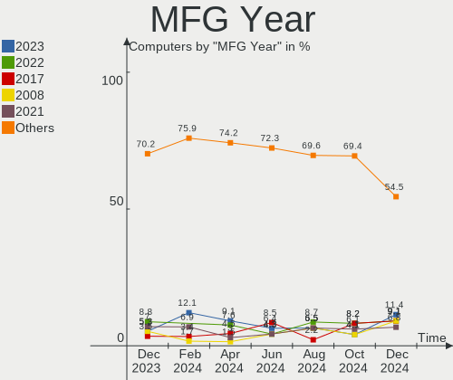
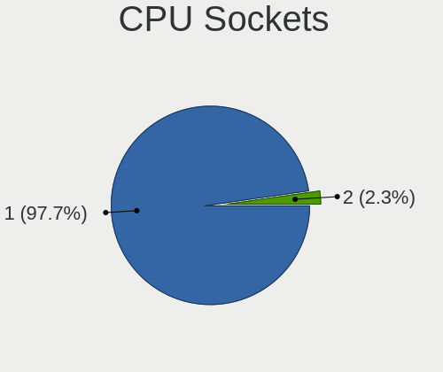
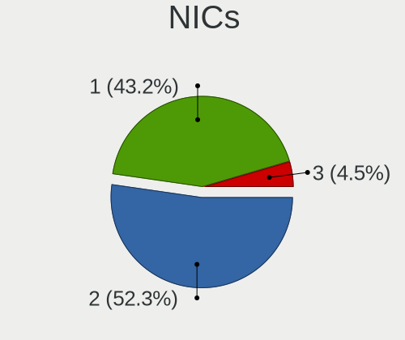

Xubuntu Hardware Trends
-----------------------

A project to identify most popular hardware characteristics and track their change
over time based on data collected by Linux users at https://Linux-Hardware.org.

Anyone can contribute to this report by the [hw-probe](https://github.com/linuxhw/hw-probe) tool:

    sudo -E hw-probe -all -upload

This is a report for all computer types. See also reports for [desktops](/Dist/Xubuntu/Desktop/README.md) and [notebooks](/Dist/Xubuntu/Notebook/README.md).

Full-feature report is available here: https://linux-hardware.org/?view=trends

Period: Jul, 2021.

Contents
--------

* [ System ](#system)
  - [ OS                       ](#os)
  - [ OS Family                ](#os-family)
  - [ Kernel                   ](#kernel)
  - [ Kernel Family            ](#kernel-family)
  - [ Kernel Major Ver.        ](#kernel-major-ver)
  - [ Arch                     ](#arch)
  - [ DE                       ](#de)
  - [ Display Server           ](#display-server)
  - [ Display Manager          ](#display-manager)
  - [ OS Lang                  ](#os-lang)
  - [ Boot Mode                ](#boot-mode)
  - [ Filesystem               ](#filesystem)
  - [ Part. scheme             ](#part-scheme)
  - [ Dual Boot with Linux/BSD ](#dual-boot-with-linuxbsd)
  - [ Dual Boot (Win)          ](#dual-boot-win)

* [ Board ](#board)
  - [ Vendor                   ](#vendor)
  - [ Model                    ](#model)
  - [ Model Family             ](#model-family)
  - [ MFG Year                 ](#mfg-year)
  - [ Form Factor              ](#form-factor)
  - [ Secure Boot              ](#secure-boot)
  - [ Coreboot                 ](#coreboot)
  - [ RAM Size                 ](#ram-size)
  - [ RAM Used                 ](#ram-used)
  - [ Total Drives             ](#total-drives)
  - [ Has CD-ROM               ](#has-cd-rom)
  - [ Has Ethernet             ](#has-ethernet)
  - [ Has WiFi                 ](#has-wifi)
  - [ Has Bluetooth            ](#has-bluetooth)

* [ Location ](#location)
  - [ Country                  ](#country)
  - [ City                     ](#city)

* [ Drives ](#drives)
  - [ Drive Vendor             ](#drive-vendor)
  - [ Drive Model              ](#drive-model)
  - [ HDD Vendor               ](#hdd-vendor)
  - [ SSD Vendor               ](#ssd-vendor)
  - [ Drive Kind               ](#drive-kind)
  - [ Drive Connector          ](#drive-connector)
  - [ Drive Size               ](#drive-size)
  - [ Space Total              ](#space-total)
  - [ Space Used               ](#space-used)
  - [ Malfunc. Drives          ](#malfunc-drives)
  - [ Malfunc. Drive Vendor    ](#malfunc-drive-vendor)
  - [ Malfunc. HDD Vendor      ](#malfunc-hdd-vendor)
  - [ Malfunc. Drive Kind      ](#malfunc-drive-kind)
  - [ Failed Drives            ](#failed-drives)
  - [ Failed Drive Vendor      ](#failed-drive-vendor)
  - [ Drive Status             ](#drive-status)

* [ Storage controller ](#storage-controller)
  - [ Storage Vendor           ](#storage-vendor)
  - [ Storage Model            ](#storage-model)
  - [ Storage Kind             ](#storage-kind)

* [ Processor ](#processor)
  - [ CPU Vendor               ](#cpu-vendor)
  - [ CPU Model                ](#cpu-model)
  - [ CPU Model Family         ](#cpu-model-family)
  - [ CPU Cores                ](#cpu-cores)
  - [ CPU Sockets              ](#cpu-sockets)
  - [ CPU Threads              ](#cpu-threads)
  - [ CPU Op-Modes             ](#cpu-op-modes)
  - [ CPU Microcode            ](#cpu-microcode)
  - [ CPU Microarch            ](#cpu-microarch)

* [ Graphics ](#graphics)
  - [ GPU Vendor               ](#gpu-vendor)
  - [ GPU Model                ](#gpu-model)
  - [ GPU Combo                ](#gpu-combo)
  - [ GPU Driver               ](#gpu-driver)
  - [ GPU Memory               ](#gpu-memory)

* [ Monitor ](#monitor)
  - [ Monitor Vendor           ](#monitor-vendor)
  - [ Monitor Model            ](#monitor-model)
  - [ Monitor Resolution       ](#monitor-resolution)
  - [ Monitor Diagonal         ](#monitor-diagonal)
  - [ Monitor Width            ](#monitor-width)
  - [ Aspect Ratio             ](#aspect-ratio)
  - [ Monitor Area             ](#monitor-area)
  - [ Pixel Density            ](#pixel-density)
  - [ Multiple Monitors        ](#multiple-monitors)

* [ Network ](#network)
  - [ Net Controller Vendor    ](#net-controller-vendor)
  - [ Net Controller Model     ](#net-controller-model)
  - [ Wireless Vendor          ](#wireless-vendor)
  - [ Wireless Model           ](#wireless-model)
  - [ Ethernet Vendor          ](#ethernet-vendor)
  - [ Ethernet Model           ](#ethernet-model)
  - [ Net Controller Kind      ](#net-controller-kind)
  - [ Used Controller          ](#used-controller)
  - [ NICs                     ](#nics)
  - [ IPv6                     ](#ipv6)

* [ Bluetooth ](#bluetooth)
  - [ Bluetooth Vendor         ](#bluetooth-vendor)
  - [ Bluetooth Model          ](#bluetooth-model)

* [ Sound ](#sound)
  - [ Sound Vendor             ](#sound-vendor)
  - [ Sound Model              ](#sound-model)

* [ Memory ](#memory)
  - [ Memory Vendor            ](#memory-vendor)
  - [ Memory Model             ](#memory-model)
  - [ Memory Kind              ](#memory-kind)
  - [ Memory Form Factor       ](#memory-form-factor)
  - [ Memory Size              ](#memory-size)
  - [ Memory Speed             ](#memory-speed)

* [ Printers & scanners ](#printers-&-scanners)
  - [ Printer Vendor           ](#printer-vendor)
  - [ Printer Model            ](#printer-model)
  - [ Scanner Vendor           ](#scanner-vendor)
  - [ Scanner Model            ](#scanner-model)

* [ Camera ](#camera)
  - [ Camera Vendor            ](#camera-vendor)
  - [ Camera Model             ](#camera-model)

* [ Security ](#security)
  - [ Fingerprint Vendor       ](#fingerprint-vendor)
  - [ Fingerprint Model        ](#fingerprint-model)
  - [ Chipcard Vendor          ](#chipcard-vendor)
  - [ Chipcard Model           ](#chipcard-model)

* [ Unsupported ](#unsupported)
  - [ Unsupported Devices      ](#unsupported-devices)
  - [ Unsupported Device Types ](#unsupported-device-types)

System
------

OS
--

Installed operating systems

| Name          | Computers | Percent |
|---------------|-----------|---------|
| Xubuntu 20.04 | 60        | 63.16%  |
| Xubuntu 18.04 | 20        | 21.05%  |
| Xubuntu 21.04 | 10        | 10.53%  |
| Xubuntu 16.04 | 3         | 3.16%   |
| Xubuntu 21.10 | 1         | 1.05%   |
| Xubuntu 20.10 | 1         | 1.05%   |

OS Family
---------

OS without a version

| Name    | Computers | Percent |
|---------|-----------|---------|
| Xubuntu | 95        | 100%    |

Kernel
------

Version of the Linux kernel

| Version                  | Computers | Percent |
|--------------------------|-----------|---------|
| 5.4.0-77-generic         | 17        | 17.89%  |
| 5.8.0-59-generic         | 11        | 11.58%  |
| 5.8.0-63-generic         | 6         | 6.32%   |
| 5.4.0-80-generic         | 6         | 6.32%   |
| 5.4.0-77-lowlatency      | 5         | 5.26%   |
| 4.15.0-147-generic       | 5         | 5.26%   |
| 5.11.0-22-generic        | 4         | 4.21%   |
| 5.8.0-43-generic         | 3         | 3.16%   |
| 4.15.0-151-generic       | 3         | 3.16%   |
| 5.8.0-63-lowlatency      | 2         | 2.11%   |
| 5.8.0-59-lowlatency      | 2         | 2.11%   |
| 5.8.0-55-generic         | 2         | 2.11%   |
| 5.4.0-80-lowlatency      | 2         | 2.11%   |
| 5.11.0-26-generic        | 2         | 2.11%   |
| 4.15.0-147-lowlatency    | 2         | 2.11%   |
| 5.8.0-61-generic         | 1         | 1.05%   |
| 5.8.0-45-generic         | 1         | 1.05%   |
| 5.4.0-74-lowlatency      | 1         | 1.05%   |
| 5.4.0-74-generic         | 1         | 1.05%   |
| 5.4.0-72-generic         | 1         | 1.05%   |
| 5.4.0-70-generic         | 1         | 1.05%   |
| 5.4.0-60-generic         | 1         | 1.05%   |
| 5.4.0-59-generic         | 1         | 1.05%   |
| 5.4.0-1038-raspi         | 1         | 1.05%   |
| 5.13.4-051304-lowlatency | 1         | 1.05%   |
| 5.13.0-11-generic        | 1         | 1.05%   |
| 5.12.17-xanmod1          | 1         | 1.05%   |
| 5.12.14-xanmod1          | 1         | 1.05%   |
| 5.11.0-25-generic        | 1         | 1.05%   |
| 5.11.0-16-generic        | 1         | 1.05%   |
| 5.11.0-051100-generic    | 1         | 1.05%   |
| 5.10.0-1034-oem          | 1         | 1.05%   |
| 5.10.0-1033-oem          | 1         | 1.05%   |
| 4.4.0-210-generic        | 1         | 1.05%   |
| 4.4.0-112-generic        | 1         | 1.05%   |
| 4.15.0-99-generic        | 1         | 1.05%   |
| 4.15.0-91-lowlatency     | 1         | 1.05%   |
| 4.15.0-142-generic       | 1         | 1.05%   |

Kernel Family
-------------

Linux kernel without a distro release

| Version | Computers | Percent |
|---------|-----------|---------|
| 5.4.0   | 37        | 38.95%  |
| 5.8.0   | 28        | 29.47%  |
| 4.15.0  | 13        | 13.68%  |
| 5.11.0  | 9         | 9.47%   |
| 5.10.0  | 2         | 2.11%   |
| 4.4.0   | 2         | 2.11%   |
| 5.13.4  | 1         | 1.05%   |
| 5.13.0  | 1         | 1.05%   |
| 5.12.17 | 1         | 1.05%   |
| 5.12.14 | 1         | 1.05%   |

Kernel Major Ver.
-----------------

Linux kernel major version

| Version | Computers | Percent |
|---------|-----------|---------|
| 5.4     | 37        | 38.95%  |
| 5.8     | 28        | 29.47%  |
| 4.15    | 13        | 13.68%  |
| 5.11    | 9         | 9.47%   |
| 5.13    | 2         | 2.11%   |
| 5.12    | 2         | 2.11%   |
| 5.10    | 2         | 2.11%   |
| 4.4     | 2         | 2.11%   |

Arch
----

OS architecture (x86_64, i586, etc.)

| Name    | Computers | Percent |
|---------|-----------|---------|
| x86_64  | 86        | 90.53%  |
| i686    | 8         | 8.42%   |
| aarch64 | 1         | 1.05%   |

DE
--

Desktop Environment

| Name            | Computers | Percent |
|-----------------|-----------|---------|
| XFCE            | 91        | 95.79%  |
| GNOME           | 2         | 2.11%   |
| GNOME Flashback | 1         | 1.05%   |
| Cinnamon        | 1         | 1.05%   |

Display Server
--------------

X11 or Wayland

| Name    | Computers | Percent |
|---------|-----------|---------|
| X11     | 93        | 97.89%  |
| Wayland | 1         | 1.05%   |
| Tty     | 1         | 1.05%   |

Display Manager
---------------

SDDM, LightDM, etc.

| Name    | Computers | Percent |
|---------|-----------|---------|
| Unknown | 57        | 60%     |
| TDM     | 33        | 34.74%  |
| GDM     | 4         | 4.21%   |
| LightDM | 1         | 1.05%   |

OS Lang
-------

Language

| Lang  | Computers | Percent |
|-------|-----------|---------|
| en_US | 31        | 32.63%  |
| de_DE | 14        | 14.74%  |
| fr_FR | 7         | 7.37%   |
| ru_RU | 5         | 5.26%   |
| it_IT | 4         | 4.21%   |
| en_GB | 4         | 4.21%   |
| hu_HU | 3         | 3.16%   |
| en_CA | 3         | 3.16%   |
| C     | 3         | 3.16%   |
| pt_BR | 2         | 2.11%   |
| ja_JP | 2         | 2.11%   |
| es_ES | 2         | 2.11%   |
| cs_CZ | 2         | 2.11%   |
| sv_SE | 1         | 1.05%   |
| ru_UA | 1         | 1.05%   |
| pt_PT | 1         | 1.05%   |
| pl_PL | 1         | 1.05%   |
| fr_CA | 1         | 1.05%   |
| fr_BE | 1         | 1.05%   |
| fi_FI | 1         | 1.05%   |
| es_MX | 1         | 1.05%   |
| es_CR | 1         | 1.05%   |
| es_AR | 1         | 1.05%   |
| en_SG | 1         | 1.05%   |
| en_AU | 1         | 1.05%   |
| aa_DJ | 1         | 1.05%   |

Boot Mode
---------

EFI or BIOS

| Mode | Computers | Percent |
|------|-----------|---------|
| BIOS | 61        | 64.21%  |
| EFI  | 34        | 35.79%  |

Filesystem
----------

Type of filesystem

| Type    | Computers | Percent |
|---------|-----------|---------|
| Ext4    | 90        | 94.74%  |
| Overlay | 4         | 4.21%   |
| Xfs     | 1         | 1.05%   |

Part. scheme
------------

Scheme of partitioning

| Type    | Computers | Percent |
|---------|-----------|---------|
| Unknown | 57        | 60%     |
| GPT     | 21        | 22.11%  |
| MBR     | 17        | 17.89%  |

Dual Boot with Linux/BSD
------------------------

Hosting more than one Linux/BSD

| Dual boot | Computers | Percent |
|-----------|-----------|---------|
| No        | 78        | 82.11%  |
| Yes       | 17        | 17.89%  |

Dual Boot (Win)
---------------

Hosting Linux and Windows

| Dual boot | Computers | Percent |
|-----------|-----------|---------|
| No        | 62        | 65.26%  |
| Yes       | 33        | 34.74%  |

Board
-----

Vendor
------

Motherboard manufacturer

| Name                    | Computers | Percent |
|-------------------------|-----------|---------|
| Hewlett-Packard         | 18        | 18.95%  |
| Lenovo                  | 17        | 17.89%  |
| ASUSTek Computer        | 10        | 10.53%  |
| Dell                    | 8         | 8.42%   |
| ASRock                  | 7         | 7.37%   |
| Acer                    | 5         | 5.26%   |
| MSI                     | 4         | 4.21%   |
| Gigabyte Technology     | 4         | 4.21%   |
| Toshiba                 | 3         | 3.16%   |
| Samsung Electronics     | 3         | 3.16%   |
| Apple                   | 3         | 3.16%   |
| WinFast                 | 1         | 1.05%   |
| System76                | 1         | 1.05%   |
| Sony                    | 1         | 1.05%   |
| Raspberry Pi Foundation | 1         | 1.05%   |
| Packard Bell            | 1         | 1.05%   |
| Medion                  | 1         | 1.05%   |
| Intel                   | 1         | 1.05%   |
| IBM                     | 1         | 1.05%   |
| Google                  | 1         | 1.05%   |
| Gateway                 | 1         | 1.05%   |
| Fujitsu Siemens         | 1         | 1.05%   |
| BANGHO                  | 1         | 1.05%   |
| Unknown                 | 1         | 1.05%   |

Model
-----

Motherboard model

| Name                                  | Computers | Percent |
|---------------------------------------|-----------|---------|
| HP Pavilion dv6                       | 2         | 2.11%   |
| Dell XPS 13 9310                      | 2         | 2.11%   |
| Unknown                               | 2         | 2.11%   |
| WinFast 6100M2MA                      | 1         | 1.05%   |
| Toshiba Satellite L500                | 1         | 1.05%   |
| Toshiba Satellite L300                | 1         | 1.05%   |
| Toshiba PORTEGE R930                  | 1         | 1.05%   |
| System76 Gazelle                      | 1         | 1.05%   |
| Sony SVE1512C6EB                      | 1         | 1.05%   |
| Samsung RV415/RV515/E3415             | 1         | 1.05%   |
| Samsung R530/R730/P530                | 1         | 1.05%   |
| Samsung 530U3C/530U4C/532U3C          | 1         | 1.05%   |
| RPi Raspberry Pi 4 Model B Rev 1.4    | 1         | 1.05%   |
| Packard Bell EasyNote MB65            | 1         | 1.05%   |
| MSI VT493AA-ABA s5212y                | 1         | 1.05%   |
| MSI MS-7B48                           | 1         | 1.05%   |
| MSI MS-7181                           | 1         | 1.05%   |
| MSI MS-1034                           | 1         | 1.05%   |
| Medion WAM2070                        | 1         | 1.05%   |
| Lenovo ThinkPad X220 429137G          | 1         | 1.05%   |
| Lenovo ThinkPad W530 24479Q7          | 1         | 1.05%   |
| Lenovo ThinkPad T61 7661V9Z           | 1         | 1.05%   |
| Lenovo ThinkPad T500 2241CG9          | 1         | 1.05%   |
| Lenovo ThinkPad T440s 20AQ009DGE      | 1         | 1.05%   |
| Lenovo ThinkPad T430 2349SU6          | 1         | 1.05%   |
| Lenovo ThinkPad T430 2347G4U          | 1         | 1.05%   |
| Lenovo ThinkPad E485 20KU001CGE       | 1         | 1.05%   |
| Lenovo ThinkPad E15 Gen 3 20YHS00900  | 1         | 1.05%   |
| Lenovo ThinkBook 14 G2 ITL 20VD       | 1         | 1.05%   |
| Lenovo IdeaPad 710S-13ISK 80SW        | 1         | 1.05%   |
| Lenovo IdeaPad 330S-15ARR 81FB        | 1         | 1.05%   |
| Lenovo IdeaPad 110S-11IBR 80WG        | 1         | 1.05%   |
| Lenovo G50-70 20351                   | 1         | 1.05%   |
| Lenovo G40-30 80FY                    | 1         | 1.05%   |
| Lenovo B5400 s20278Q                  | 1         | 1.05%   |
| Lenovo 4518-a12                       | 1         | 1.05%   |
| Intel DQ67SW AAG12527-310             | 1         | 1.05%   |
| IBM System x3550 M4 Server -[7914AC1] | 1         | 1.05%   |
| HP ZBook 17 G5                        | 1         | 1.05%   |
| HP Z600 Workstation                   | 1         | 1.05%   |
| HP Z420 Workstation                   | 1         | 1.05%   |
| HP xw8600 Workstation                 | 1         | 1.05%   |
| HP ProBook 6570b                      | 1         | 1.05%   |
| HP ProBook 450 G8 Notebook PC         | 1         | 1.05%   |
| HP Notebook                           | 1         | 1.05%   |
| HP Laptop 17-ca0xxx                   | 1         | 1.05%   |
| HP EliteBook Folio 9470m              | 1         | 1.05%   |
| HP EliteBook 845 G7 Notebook PC       | 1         | 1.05%   |
| HP DC5750                             | 1         | 1.05%   |
| HP Compaq nx7300 (RU389ES#ABZ)        | 1         | 1.05%   |
| HP Compaq dc7700 Small Form Factor    | 1         | 1.05%   |
| HP 255 G2                             | 1         | 1.05%   |
| HP 15                                 | 1         | 1.05%   |
| Google Kip                            | 1         | 1.05%   |
| Gigabyte H55M-UD2H                    | 1         | 1.05%   |
| Gigabyte GA-MA74GM-S2H                | 1         | 1.05%   |
| Gigabyte F2A78M-HD2                   | 1         | 1.05%   |
| Gigabyte AB350-Gaming 3               | 1         | 1.05%   |
| Gateway NV57H                         | 1         | 1.05%   |
| Fujitsu Siemens AMILO Xi 3650         | 1         | 1.05%   |

Model Family
------------

Motherboard model prefix

| Name                   | Computers | Percent |
|------------------------|-----------|---------|
| Lenovo ThinkPad        | 9         | 9.47%   |
| Lenovo IdeaPad         | 3         | 3.16%   |
| Dell Inspiron          | 3         | 3.16%   |
| Toshiba Satellite      | 2         | 2.11%   |
| HP ProBook             | 2         | 2.11%   |
| HP Pavilion            | 2         | 2.11%   |
| HP EliteBook           | 2         | 2.11%   |
| HP Compaq              | 2         | 2.11%   |
| Dell XPS               | 2         | 2.11%   |
| ASUS PRIME             | 2         | 2.11%   |
| Acer Aspire            | 2         | 2.11%   |
| Unknown                | 2         | 2.11%   |
| WinFast 6100M2MA       | 1         | 1.05%   |
| Toshiba PORTEGE        | 1         | 1.05%   |
| System76 Gazelle       | 1         | 1.05%   |
| Sony SVE1512C6EB       | 1         | 1.05%   |
| Samsung RV415          | 1         | 1.05%   |
| Samsung R530           | 1         | 1.05%   |
| Samsung 530U3C         | 1         | 1.05%   |
| RPi Raspberry          | 1         | 1.05%   |
| Packard Bell EasyNote  | 1         | 1.05%   |
| MSI VT493AA-ABA        | 1         | 1.05%   |
| MSI MS-7B48            | 1         | 1.05%   |
| MSI MS-7181            | 1         | 1.05%   |
| MSI MS-1034            | 1         | 1.05%   |
| Medion WAM2070         | 1         | 1.05%   |
| Lenovo ThinkBook       | 1         | 1.05%   |
| Lenovo G50-70          | 1         | 1.05%   |
| Lenovo G40-30          | 1         | 1.05%   |
| Lenovo B5400           | 1         | 1.05%   |
| Lenovo 4518-a12        | 1         | 1.05%   |
| Intel DQ67SW           | 1         | 1.05%   |
| IBM System             | 1         | 1.05%   |
| HP ZBook               | 1         | 1.05%   |
| HP Z600                | 1         | 1.05%   |
| HP Z420                | 1         | 1.05%   |
| HP xw8600              | 1         | 1.05%   |
| HP Notebook            | 1         | 1.05%   |
| HP Laptop              | 1         | 1.05%   |
| HP DC5750              | 1         | 1.05%   |
| HP 255                 | 1         | 1.05%   |
| HP 15                  | 1         | 1.05%   |
| Google Kip             | 1         | 1.05%   |
| Gigabyte H55M-UD2H     | 1         | 1.05%   |
| Gigabyte GA-MA74GM-S2H | 1         | 1.05%   |
| Gigabyte F2A78M-HD2    | 1         | 1.05%   |
| Gigabyte AB350-Gaming  | 1         | 1.05%   |
| Gateway NV57H          | 1         | 1.05%   |
| Fujitsu Siemens AMILO  | 1         | 1.05%   |
| Dell Precision         | 1         | 1.05%   |
| Dell OptiPlex          | 1         | 1.05%   |
| Dell Latitude          | 1         | 1.05%   |
| BANGHO Suma            | 1         | 1.05%   |
| ASUS X541SA            | 1         | 1.05%   |
| ASUS S551LN            | 1         | 1.05%   |
| ASUS ROG               | 1         | 1.05%   |
| ASUS N53SV             | 1         | 1.05%   |
| ASUS M5A99X            | 1         | 1.05%   |
| ASUS M3A-H             | 1         | 1.05%   |
| ASUS GL310AA-ABA       | 1         | 1.05%   |

MFG Year
--------

Motherboard manufacture year

| Year    | Computers | Percent |
|---------|-----------|---------|
| 2021    | 8         | 8.42%   |
| 2019    | 8         | 8.42%   |
| 2018    | 8         | 8.42%   |
| 2014    | 8         | 8.42%   |
| 2013    | 8         | 8.42%   |
| 2011    | 8         | 8.42%   |
| 2012    | 7         | 7.37%   |
| 2020    | 6         | 6.32%   |
| 2015    | 6         | 6.32%   |
| 2009    | 6         | 6.32%   |
| 2007    | 5         | 5.26%   |
| 2010    | 4         | 4.21%   |
| 2006    | 4         | 4.21%   |
| 2016    | 3         | 3.16%   |
| 2008    | 3         | 3.16%   |
| 2017    | 2         | 2.11%   |
| Unknown | 1         | 1.05%   |

Form Factor
-----------

Physical design of the computer

| Name           | Computers | Percent |
|----------------|-----------|---------|
| Notebook       | 60        | 63.16%  |
| Desktop        | 32        | 33.68%  |
| System on chip | 1         | 1.05%   |
| Tablet         | 1         | 1.05%   |
| Server         | 1         | 1.05%   |

Secure Boot
-----------

Enabled or disabled

| State    | Computers | Percent |
|----------|-----------|---------|
| Disabled | 88        | 92.63%  |
| Enabled  | 7         | 7.37%   |

Coreboot
--------

Have coreboot on board

| Used | Computers | Percent |
|------|-----------|---------|
| No   | 94        | 98.95%  |
| Yes  | 1         | 1.05%   |

RAM Size
--------

Total RAM memory

| Size in GB  | Computers | Percent |
|-------------|-----------|---------|
| 3.01-4.0    | 27        | 28.42%  |
| 4.01-8.0    | 23        | 24.21%  |
| 8.01-16.0   | 13        | 13.68%  |
| 32.01-64.0  | 9         | 9.47%   |
| 16.01-24.0  | 9         | 9.47%   |
| 1.01-2.0    | 7         | 7.37%   |
| 64.01-256.0 | 3         | 3.16%   |
| 0.51-1.0    | 3         | 3.16%   |
| 24.01-32.0  | 1         | 1.05%   |

RAM Used
--------

Used RAM memory

| Used GB    | Computers | Percent |
|------------|-----------|---------|
| 1.01-2.0   | 45        | 47.37%  |
| 2.01-3.0   | 16        | 16.84%  |
| 0.51-1.0   | 13        | 13.68%  |
| 3.01-4.0   | 9         | 9.47%   |
| 4.01-8.0   | 7         | 7.37%   |
| 8.01-16.0  | 3         | 3.16%   |
| 16.01-24.0 | 1         | 1.05%   |
| 0.01-0.5   | 1         | 1.05%   |

Total Drives
------------

Number of drives on board

| Drives | Computers | Percent |
|--------|-----------|---------|
| 1      | 62        | 65.26%  |
| 2      | 17        | 17.89%  |
| 3      | 10        | 10.53%  |
| 5      | 2         | 2.11%   |
| 4      | 2         | 2.11%   |
| 10     | 1         | 1.05%   |
| 6      | 1         | 1.05%   |

Has CD-ROM
----------

Has CD-ROM on board

| Presented | Computers | Percent |
|-----------|-----------|---------|
| Yes       | 48        | 50.53%  |
| No        | 47        | 49.47%  |

Has Ethernet
------------

Has Ethernet on board

| Presented | Computers | Percent |
|-----------|-----------|---------|
| Yes       | 88        | 92.63%  |
| No        | 7         | 7.37%   |

Has WiFi
--------

Has WiFi module

| Presented | Computers | Percent |
|-----------|-----------|---------|
| Yes       | 70        | 73.68%  |
| No        | 25        | 26.32%  |

Has Bluetooth
-------------

Has Bluetooth module

| Presented | Computers | Percent |
|-----------|-----------|---------|
| No        | 48        | 50.53%  |
| Yes       | 47        | 49.47%  |

Location
--------

Country
-------

Geographic location (country)

| Country     | Computers | Percent |
|-------------|-----------|---------|
| Germany     | 20        | 21.05%  |
| USA         | 15        | 15.79%  |
| France      | 7         | 7.37%   |
| Italy       | 5         | 5.26%   |
| Canada      | 5         | 5.26%   |
| UK          | 4         | 4.21%   |
| Russia      | 4         | 4.21%   |
| Brazil      | 4         | 4.21%   |
| Hungary     | 3         | 3.16%   |
| Spain       | 2         | 2.11%   |
| Poland      | 2         | 2.11%   |
| Netherlands | 2         | 2.11%   |
| Japan       | 2         | 2.11%   |
| Czechia     | 2         | 2.11%   |
| Australia   | 2         | 2.11%   |
| Ukraine     | 1         | 1.05%   |
| Thailand    | 1         | 1.05%   |
| Sweden      | 1         | 1.05%   |
| Singapore   | 1         | 1.05%   |
| Portugal    | 1         | 1.05%   |
| Latvia      | 1         | 1.05%   |
| Ireland     | 1         | 1.05%   |
| Indonesia   | 1         | 1.05%   |
| Guatemala   | 1         | 1.05%   |
| Finland     | 1         | 1.05%   |
| Egypt       | 1         | 1.05%   |
| Chile       | 1         | 1.05%   |
| Cabo Verde  | 1         | 1.05%   |
| Belgium     | 1         | 1.05%   |
| Azerbaijan  | 1         | 1.05%   |
| Argentina   | 1         | 1.05%   |

City
----

Geographic location (city)

| City                    | Computers | Percent |
|-------------------------|-----------|---------|
| Syracuse                | 2         | 2.11%   |
| Munich                  | 2         | 2.11%   |
| Moscow                  | 2         | 2.11%   |
| Frankfurt am Main       | 2         | 2.11%   |
| Denver                  | 2         | 2.11%   |
| Berlin                  | 2         | 2.11%   |
| Youngstown              | 1         | 1.05%   |
| Ylöjärvi              | 1         | 1.05%   |
| Wissen                  | 1         | 1.05%   |
| Winzeln                 | 1         | 1.05%   |
| Winnipeg                | 1         | 1.05%   |
| Villefranche-sur-Mer    | 1         | 1.05%   |
| Villanueva de la Torre  | 1         | 1.05%   |
| Vaassen                 | 1         | 1.05%   |
| Toulon                  | 1         | 1.05%   |
| St Petersburg           | 1         | 1.05%   |
| St Helens               | 1         | 1.05%   |
| Singapore               | 1         | 1.05%   |
| Sindelfingen            | 1         | 1.05%   |
| Seevetal                | 1         | 1.05%   |
| Schnaittach             | 1         | 1.05%   |
| Sant Andreu de la Barca | 1         | 1.05%   |
| Rio de Janeiro          | 1         | 1.05%   |
| Riga                    | 1         | 1.05%   |
| Ridgecrest              | 1         | 1.05%   |
| Praia                   | 1         | 1.05%   |
| Portland                | 1         | 1.05%   |
| Poitiers                | 1         | 1.05%   |
| Oberhausen              | 1         | 1.05%   |
| Novosibirsk             | 1         | 1.05%   |
| North Vancouver         | 1         | 1.05%   |
| Nonantola               | 1         | 1.05%   |
| Nashville               | 1         | 1.05%   |
| Montreal                | 1         | 1.05%   |
| Mons                    | 1         | 1.05%   |
| Milton Keynes           | 1         | 1.05%   |
| Milan                   | 1         | 1.05%   |
| Mariupol                | 1         | 1.05%   |
| Mandello del Lario      | 1         | 1.05%   |
| Mafra                   | 1         | 1.05%   |
| London                  | 1         | 1.05%   |
| Lewis Center            | 1         | 1.05%   |
| Las Condes              | 1         | 1.05%   |
| Lannion                 | 1         | 1.05%   |
| La Fermete              | 1         | 1.05%   |
| Kanoya                  | 1         | 1.05%   |
| Indaiatuba              | 1         | 1.05%   |
| Illewong                | 1         | 1.05%   |
| Hoeganaes               | 1         | 1.05%   |
| Hobart                  | 1         | 1.05%   |
| Havířov               | 1         | 1.05%   |
| Hauzenberg              | 1         | 1.05%   |
| Hamilton                | 1         | 1.05%   |
| Hamburg                 | 1         | 1.05%   |
| Guatemala City          | 1         | 1.05%   |
| Gresik                  | 1         | 1.05%   |
| G?∂ttingen              | 1         | 1.05%   |
| Garbsen                 | 1         | 1.05%   |
| Galway                  | 1         | 1.05%   |
| Fot                     | 1         | 1.05%   |

Drives
------

Drive Vendor
------------

Hard drive vendors

| Vendor              | Computers | Drives | Percent |
|---------------------|-----------|--------|---------|
| Seagate             | 25        | 29     | 17.99%  |
| WDC                 | 24        | 27     | 17.27%  |
| Samsung Electronics | 19        | 23     | 13.67%  |
| Toshiba             | 11        | 15     | 7.91%   |
| Hitachi             | 8         | 9      | 5.76%   |
| SanDisk             | 7         | 7      | 5.04%   |
| HGST                | 6         | 6      | 4.32%   |
| Unknown             | 5         | 6      | 3.6%    |
| Kingston            | 5         | 6      | 3.6%    |
| Intel               | 5         | 5      | 3.6%    |
| Crucial             | 3         | 3      | 2.16%   |
| XPG                 | 2         | 2      | 1.44%   |
| Micron Technology   | 2         | 2      | 1.44%   |
| A-DATA Technology   | 2         | 2      | 1.44%   |
| Transcend           | 1         | 1      | 0.72%   |
| Team                | 1         | 1      | 0.72%   |
| SPCC                | 1         | 1      | 0.72%   |
| SMI                 | 1         | 1      | 0.72%   |
| SK Hynix            | 1         | 1      | 0.72%   |
| Silicon Motion      | 1         | 1      | 0.72%   |
| PNY                 | 1         | 1      | 0.72%   |
| Maxtor              | 1         | 1      | 0.72%   |
| LITEONIT            | 1         | 1      | 0.72%   |
| LITEON              | 1         | 1      | 0.72%   |
| Lite-On             | 1         | 1      | 0.72%   |
| Intenso             | 1         | 1      | 0.72%   |
| Hewlett-Packard     | 1         | 1      | 0.72%   |
| Fujitsu             | 1         | 1      | 0.72%   |
| Apple               | 1         | 1      | 0.72%   |

Drive Model
-----------

Hard drive models

| Model                                | Computers | Percent |
|--------------------------------------|-----------|---------|
| Seagate ST380815AS 80GB              | 3         | 2%      |
| Samsung SSD 850 EVO 250GB            | 3         | 2%      |
| Unknown MMC Card  128GB              | 2         | 1.33%   |
| Toshiba MQ01ABD100 1TB               | 2         | 1.33%   |
| Seagate ST9160314AS 160GB            | 2         | 1.33%   |
| Seagate ST320LT007-9ZV142 320GB      | 2         | 1.33%   |
| Sandisk NVMe SSD Drive 256GB         | 2         | 1.33%   |
| Samsung SSD 840 EVO 250GB            | 2         | 1.33%   |
| Kingston SA400S37480G 480GB SSD      | 2         | 1.33%   |
| HGST HTS725050A7E630 500GB           | 2         | 1.33%   |
| XPG NVMe SSD Drive 256GB             | 1         | 0.67%   |
| XPG NVMe SSD Drive 1024GB            | 1         | 0.67%   |
| WDC WDS250G2B0C-00PXH0 250GB         | 1         | 0.67%   |
| WDC WDS200T2B0B-00YS70 2TB SSD       | 1         | 0.67%   |
| WDC WDS100T2B0C-00PXH0 1TB           | 1         | 0.67%   |
| WDC WDS100T2B0A-00SM50 1TB SSD       | 1         | 0.67%   |
| WDC WD80EZAZ-11TDBA0 8TB             | 1         | 0.67%   |
| WDC WD7502ABYS-02A6B0 752GB          | 1         | 0.67%   |
| WDC WD7500BPVT-80HXZT3 752GB         | 1         | 0.67%   |
| WDC WD5000LPVX-00V0TT0 500GB         | 1         | 0.67%   |
| WDC WD5000LPCX-60VHAT0 500GB         | 1         | 0.67%   |
| WDC WD5000LPCX-24C6HT0 500GB         | 1         | 0.67%   |
| WDC WD5000AAKS-00UU3A0 500GB         | 1         | 0.67%   |
| WDC WD5000AACS-00ZUB0 500GB          | 1         | 0.67%   |
| WDC WD400BD-60LTA0 40GB              | 1         | 0.67%   |
| WDC WD2500JS-60NCB2 250GB            | 1         | 0.67%   |
| WDC WD2500BEVS-22UST0 250GB          | 1         | 0.67%   |
| WDC WD20EZRZ-22Z5HB0 2TB             | 1         | 0.67%   |
| WDC WD20EURX-25T0FY0 2TB             | 1         | 0.67%   |
| WDC WD1600BJKT-75F4T0 160GB          | 1         | 0.67%   |
| WDC WD10SPZX-75Z10T0 1TB             | 1         | 0.67%   |
| WDC WD10SPZX-24Z10T0 1TB             | 1         | 0.67%   |
| WDC WD10JPVX-22JC3T0 1TB             | 1         | 0.67%   |
| WDC WD10EZEX-08WN4A0 1TB             | 1         | 0.67%   |
| WDC WD10EZEX-00BN5A0 1TB             | 1         | 0.67%   |
| WDC WD10EARS-00MVWB0 1TB             | 1         | 0.67%   |
| WDC WD1002FBYS-18W8B1 1TB            | 1         | 0.67%   |
| WDC PC SN720 SDAPNTW-512G-1014 512GB | 1         | 0.67%   |
| WDC PC SN520 NVMe 512GB              | 1         | 0.67%   |
| Unknown SP600FA3-256GM 256GB SSD     | 1         | 0.67%   |
| Unknown SDW16G  16GB                 | 1         | 0.67%   |
| Unknown MMC Card  32GB               | 1         | 0.67%   |
| Unknown MMC Card  1073GB             | 1         | 0.67%   |
| Transcend SSD 4GB                    | 1         | 0.67%   |
| Toshiba TR150 240GB SSD              | 1         | 0.67%   |
| Toshiba MQ04ABD200 2TB               | 1         | 0.67%   |
| Toshiba MQ02ABD100H 1TB              | 1         | 0.67%   |
| Toshiba MQ01ABF050 500GB             | 1         | 0.67%   |
| Toshiba MK7559GSXP 752GB             | 1         | 0.67%   |
| Toshiba MK6034GSX 64GB               | 1         | 0.67%   |
| Toshiba MK5076GSX 500GB              | 1         | 0.67%   |
| Toshiba HDWE160 6TB                  | 1         | 0.67%   |
| Toshiba HDWE150 5TB                  | 1         | 0.67%   |
| Toshiba HDWD120 2TB                  | 1         | 0.67%   |
| Team TEAML5Lite3D1T 1TB SSD          | 1         | 0.67%   |
| SPCC Solid State Disk 240GB          | 1         | 0.67%   |
| SMI DISK 506GB                       | 1         | 0.67%   |
| SK Hynix NVMe SSD Drive 256GB        | 1         | 0.67%   |
| Silicon Motion NVMe SSD Drive 512GB  | 1         | 0.67%   |
| Seagate ST98823AS 80GB               | 1         | 0.67%   |

HDD Vendor
----------

Hard disk drive vendors

| Vendor              | Computers | Drives | Percent |
|---------------------|-----------|--------|---------|
| Seagate             | 25        | 29     | 33.78%  |
| WDC                 | 19        | 21     | 25.68%  |
| Toshiba             | 10        | 14     | 13.51%  |
| Hitachi             | 8         | 9      | 10.81%  |
| HGST                | 6         | 6      | 8.11%   |
| Samsung Electronics | 4         | 4      | 5.41%   |
| Maxtor              | 1         | 1      | 1.35%   |
| Fujitsu             | 1         | 1      | 1.35%   |

SSD Vendor
----------

Solid state drive vendors

| Vendor              | Computers | Drives | Percent |
|---------------------|-----------|--------|---------|
| Samsung Electronics | 7         | 10     | 19.44%  |
| Kingston            | 5         | 6      | 13.89%  |
| Intel               | 4         | 4      | 11.11%  |
| SanDisk             | 3         | 3      | 8.33%   |
| Crucial             | 3         | 3      | 8.33%   |
| WDC                 | 1         | 2      | 2.78%   |
| Unknown             | 1         | 1      | 2.78%   |
| Transcend           | 1         | 1      | 2.78%   |
| Toshiba             | 1         | 1      | 2.78%   |
| Team                | 1         | 1      | 2.78%   |
| SPCC                | 1         | 1      | 2.78%   |
| PNY                 | 1         | 1      | 2.78%   |
| Micron Technology   | 1         | 1      | 2.78%   |
| LITEONIT            | 1         | 1      | 2.78%   |
| LITEON              | 1         | 1      | 2.78%   |
| Intenso             | 1         | 1      | 2.78%   |
| Hewlett-Packard     | 1         | 1      | 2.78%   |
| Apple               | 1         | 1      | 2.78%   |
| A-DATA Technology   | 1         | 1      | 2.78%   |

Drive Kind
----------

HDD or SSD

| Kind    | Computers | Drives | Percent |
|---------|-----------|--------|---------|
| HDD     | 65        | 85     | 52.42%  |
| SSD     | 32        | 41     | 25.81%  |
| NVMe    | 22        | 25     | 17.74%  |
| MMC     | 4         | 5      | 3.23%   |
| Unknown | 1         | 1      | 0.81%   |

Drive Connector
---------------

SATA, SAS, NVMe, etc.

| Type | Computers | Drives | Percent |
|------|-----------|--------|---------|
| SATA | 81        | 125    | 74.31%  |
| NVMe | 22        | 25     | 20.18%  |
| MMC  | 4         | 5      | 3.67%   |
| SAS  | 2         | 2      | 1.83%   |

Drive Size
----------

Size of hard drive

| Size in TB | Computers | Drives | Percent |
|------------|-----------|--------|---------|
| 0.01-0.5   | 59        | 73     | 60.2%   |
| 0.51-1.0   | 27        | 31     | 27.55%  |
| 1.01-2.0   | 6         | 7      | 6.12%   |
| 4.01-10.0  | 3         | 11     | 3.06%   |
| 3.01-4.0   | 1         | 1      | 1.02%   |
| 2.01-3.0   | 1         | 2      | 1.02%   |
| 10.01-20.0 | 1         | 1      | 1.02%   |

Space Total
-----------

Amount of disk space available on the file system

| Size in GB     | Computers | Percent |
|----------------|-----------|---------|
| 101-250        | 28        | 29.47%  |
| 251-500        | 24        | 25.26%  |
| 501-1000       | 12        | 12.63%  |
| 1001-2000      | 7         | 7.37%   |
| 21-50          | 6         | 6.32%   |
| 51-100         | 6         | 6.32%   |
| More than 3000 | 3         | 3.16%   |
| 2001-3000      | 3         | 3.16%   |
| 1-20           | 3         | 3.16%   |
| Unknown        | 3         | 3.16%   |

Space Used
----------

Amount of used disk space

| Used GB        | Computers | Percent |
|----------------|-----------|---------|
| 1-20           | 26        | 27.37%  |
| 21-50          | 21        | 22.11%  |
| 51-100         | 14        | 14.74%  |
| 101-250        | 11        | 11.58%  |
| 251-500        | 9         | 9.47%   |
| 501-1000       | 6         | 6.32%   |
| More than 3000 | 3         | 3.16%   |
| Unknown        | 3         | 3.16%   |
| 2001-3000      | 1         | 1.05%   |
| 1001-2000      | 1         | 1.05%   |

Malfunc. Drives
---------------

Drive models with a malfunction

| Model                           | Computers | Drives | Percent |
|---------------------------------|-----------|--------|---------|
| WDC WD7500BPVT-80HXZT3 752GB    | 1         | 1      | 16.67%  |
| WDC WD10EARS-00MVWB0 1TB        | 1         | 1      | 16.67%  |
| Toshiba MQ01ABD100 1TB          | 1         | 1      | 16.67%  |
| Seagate ST380815AS 80GB         | 1         | 1      | 16.67%  |
| Seagate ST320LT007-9ZV142 320GB | 1         | 1      | 16.67%  |
| SanDisk SSD PLUS 480 GB         | 1         | 1      | 16.67%  |

Malfunc. Drive Vendor
---------------------

Vendors of faulty drives

| Vendor  | Computers | Drives | Percent |
|---------|-----------|--------|---------|
| WDC     | 2         | 2      | 33.33%  |
| Seagate | 2         | 2      | 33.33%  |
| Toshiba | 1         | 1      | 16.67%  |
| SanDisk | 1         | 1      | 16.67%  |

Malfunc. HDD Vendor
-------------------

Vendors of faulty HDD drives

| Vendor  | Computers | Drives | Percent |
|---------|-----------|--------|---------|
| WDC     | 2         | 2      | 40%     |
| Seagate | 2         | 2      | 40%     |
| Toshiba | 1         | 1      | 20%     |

Malfunc. Drive Kind
-------------------

Kinds of faulty drives

| Kind | Computers | Drives | Percent |
|------|-----------|--------|---------|
| HDD  | 5         | 5      | 83.33%  |
| SSD  | 1         | 1      | 16.67%  |

Failed Drives
-------------

Failed drive models

Zero info for selected period =(

Failed Drive Vendor
-------------------

Failed drive vendors

Zero info for selected period =(

Drive Status
------------

Number of failed and malfunc. drives

| Status   | Computers | Drives | Percent |
|----------|-----------|--------|---------|
| Detected | 61        | 96     | 61.62%  |
| Works    | 32        | 55     | 32.32%  |
| Malfunc  | 6         | 6      | 6.06%   |

Storage controller
------------------

Storage Vendor
--------------

Storage controller vendors

| Vendor                    | Computers | Percent |
|---------------------------|-----------|---------|
| Intel                     | 63        | 53.39%  |
| AMD                       | 21        | 17.8%   |
| Samsung Electronics       | 9         | 7.63%   |
| Sandisk                   | 7         | 5.93%   |
| LSI Logic / Symbios Logic | 3         | 2.54%   |
| Nvidia                    | 2         | 1.69%   |
| Broadcom / LSI            | 2         | 1.69%   |
| ASMedia Technology        | 2         | 1.69%   |
| ADATA Technology          | 2         | 1.69%   |
| VIA Technologies          | 1         | 0.85%   |
| SK Hynix                  | 1         | 0.85%   |
| Silicon Motion            | 1         | 0.85%   |
| Micron Technology         | 1         | 0.85%   |
| Marvell Technology Group  | 1         | 0.85%   |
| Lite-On Technology        | 1         | 0.85%   |
| JMicron Technology        | 1         | 0.85%   |

Storage Model
-------------

Storage controller models

| Model                                                                            | Computers | Percent |
|----------------------------------------------------------------------------------|-----------|---------|
| AMD FCH SATA Controller [AHCI mode]                                              | 15        | 10.71%  |
| Intel 7 Series Chipset Family 6-port SATA Controller [AHCI mode]                 | 8         | 5.71%   |
| Samsung NVMe SSD Controller SM981/PM981/PM983                                    | 6         | 4.29%   |
| Sandisk WD Blue SN550 NVMe SSD                                                   | 4         | 2.86%   |
| Intel 6 Series/C200 Series Chipset Family 6 port Mobile SATA AHCI Controller     | 4         | 2.86%   |
| Intel Sunrise Point-LP SATA Controller [AHCI mode]                               | 3         | 2.14%   |
| Intel SATA Controller [RAID mode]                                                | 3         | 2.14%   |
| Intel 82801HM/HEM (ICH8M/ICH8M-E) IDE Controller                                 | 3         | 2.14%   |
| Intel 82801 Mobile SATA Controller [RAID mode]                                   | 3         | 2.14%   |
| Intel 8 Series/C220 Series Chipset Family 6-port SATA Controller 1 [AHCI mode]   | 3         | 2.14%   |
| Intel 8 Series SATA Controller 1 [AHCI mode]                                     | 3         | 2.14%   |
| AMD SB7x0/SB8x0/SB9x0 SATA Controller [IDE mode]                                 | 3         | 2.14%   |
| AMD SB7x0/SB8x0/SB9x0 IDE Controller                                             | 3         | 2.14%   |
| Samsung NVMe Controller                                                          | 2         | 1.43%   |
| Nvidia MCP51 Serial ATA Controller                                               | 2         | 1.43%   |
| Nvidia MCP51 IDE                                                                 | 2         | 1.43%   |
| Intel Volume Management Device NVMe RAID Controller                              | 2         | 1.43%   |
| Intel NM10/ICH7 Family SATA Controller [IDE mode]                                | 2         | 1.43%   |
| Intel Cannon Lake Mobile PCH SATA AHCI Controller                                | 2         | 1.43%   |
| Intel Atom/Celeron/Pentium Processor x5-E8000/J3xxx/N3xxx Series SATA Controller | 2         | 1.43%   |
| Intel Atom Processor E3800 Series SATA AHCI Controller                           | 2         | 1.43%   |
| Intel 82801IBM/IEM (ICH9M/ICH9M-E) 4 port SATA Controller [AHCI mode]            | 2         | 1.43%   |
| Intel 82801HM/HEM (ICH8M/ICH8M-E) SATA Controller [AHCI mode]                    | 2         | 1.43%   |
| Intel 82801G (ICH7 Family) IDE Controller                                        | 2         | 1.43%   |
| Intel 631xESB/632xESB/3100 Chipset SATA IDE Controller                           | 2         | 1.43%   |
| Intel 631xESB/632xESB IDE Controller                                             | 2         | 1.43%   |
| Intel 6 Series/C200 Series Chipset Family 6 port Desktop SATA AHCI Controller    | 2         | 1.43%   |
| Intel 5 Series/3400 Series Chipset 4 port SATA AHCI Controller                   | 2         | 1.43%   |
| ASMedia ASM1062 Serial ATA Controller                                            | 2         | 1.43%   |
| AMD SB7x0/SB8x0/SB9x0 SATA Controller [AHCI mode]                                | 2         | 1.43%   |
| AMD 300 Series Chipset SATA Controller                                           | 2         | 1.43%   |
| ADATA XPG SX8200 Pro PCIe Gen3x4 M.2 2280 Solid State Drive                      | 2         | 1.43%   |
| VIA VT82C586A/B/VT82C686/A/B/VT823x/A/C PIPC Bus Master IDE                      | 1         | 0.71%   |
| VIA VIA VT6420 SATA RAID Controller                                              | 1         | 0.71%   |
| SK Hynix BC501 NVMe Solid State Drive                                            | 1         | 0.71%   |
| Silicon Motion SM2263EN/SM2263XT SSD Controller                                  | 1         | 0.71%   |
| Sandisk WD Black 2018/SN750 / PC SN720 NVMe SSD                                  | 1         | 0.71%   |
| Sandisk PC SN520 NVMe SSD                                                        | 1         | 0.71%   |
| Sandisk Non-Volatile memory controller                                           | 1         | 0.71%   |
| Samsung Apple PCIe SSD                                                           | 1         | 0.71%   |
| Micron Non-Volatile memory controller                                            | 1         | 0.71%   |
| Marvell Group 88SE9215 PCIe 2.0 x1 4-port SATA 6 Gb/s Controller                 | 1         | 0.71%   |
| LSI Logic / Symbios Logic MegaRAID SAS 2208 [Thunderbolt]                        | 1         | 0.71%   |
| LSI Logic / Symbios Logic 53c810                                                 | 1         | 0.71%   |
| LSI Logic / Symbios Logic 53c1030 PCI-X Fusion-MPT Dual Ultra320 SCSI            | 1         | 0.71%   |
| Lite-On M8Pe Series NVMe SSD                                                     | 1         | 0.71%   |
| JMicron JMB368 IDE controller                                                    | 1         | 0.71%   |
| Intel US15W/US15X/US15L/UL11L SCH [Poulsbo] IDE Controller                       | 1         | 0.71%   |
| Intel Tiger Lake-LP SATA Controller [AHCI mode]                                  | 1         | 0.71%   |
| Intel SSD 660P Series                                                            | 1         | 0.71%   |
| Intel NM10/ICH7 Family SATA Controller [AHCI mode]                               | 1         | 0.71%   |
| Intel Comet Lake SATA AHCI Controller                                            | 1         | 0.71%   |
| Intel Celeron/Pentium Silver Processor SATA Controller                           | 1         | 0.71%   |
| Intel C602 chipset 4-Port SATA Storage Control Unit                              | 1         | 0.71%   |
| Intel C600/X79 series chipset SATA RAID Controller                               | 1         | 0.71%   |
| Intel C600/X79 series chipset IDE-r Controller                                   | 1         | 0.71%   |
| Intel C600/X79 series chipset 6-Port SATA AHCI Controller                        | 1         | 0.71%   |
| Intel 82801IBM/IEM (ICH9M/ICH9M-E) 2 port SATA Controller [IDE mode]             | 1         | 0.71%   |
| Intel 82801HM/HEM (ICH8M/ICH8M-E) SATA Controller [IDE mode]                     | 1         | 0.71%   |
| Intel 82801H (ICH8 Family) 4 port SATA Controller [IDE mode]                     | 1         | 0.71%   |

Storage Kind
------------

Kind of storage controller (IDE, SATA, NVMe, SAS, ...)

| Kind | Computers | Percent |
|------|-----------|---------|
| SATA | 68        | 54.4%   |
| IDE  | 23        | 18.4%   |
| NVMe | 20        | 16%     |
| RAID | 11        | 8.8%    |
| SCSI | 2         | 1.6%    |
| SAS  | 1         | 0.8%    |

Processor
---------

CPU Vendor
----------

Processor vendors

| Vendor | Computers | Percent |
|--------|-----------|---------|
| Intel  | 67        | 70.53%  |
| AMD    | 27        | 28.42%  |
| ARM    | 1         | 1.05%   |

CPU Model
---------

Processor models

| Model                                         | Computers | Percent |
|-----------------------------------------------|-----------|---------|
| Intel Core i5-4210U CPU @ 1.70GHz             | 3         | 3.16%   |
| Intel 11th Gen Core i7-1165G7 @ 2.80GHz       | 3         | 3.16%   |
| Intel Core i5-3320M CPU @ 2.60GHz             | 2         | 2.11%   |
| Intel Celeron CPU N2840 @ 2.16GHz             | 2         | 2.11%   |
| AMD Ryzen 5 2500U with Radeon Vega Mobile Gfx | 2         | 2.11%   |
| AMD Phenom II X4 955 Processor                | 2         | 2.11%   |
| AMD A8-6410 APU with AMD Radeon R5 Graphics   | 2         | 2.11%   |
| AMD A6-5200 APU with Radeon HD Graphics       | 2         | 2.11%   |
| Intel Xeon CPU X5670 @ 2.93GHz                | 1         | 1.05%   |
| Intel Xeon CPU E5410 @ 2.33GHz                | 1         | 1.05%   |
| Intel Xeon CPU E5-2640 0 @ 2.50GHz            | 1         | 1.05%   |
| Intel Xeon CPU E5-1620 0 @ 3.60GHz            | 1         | 1.05%   |
| Intel Xeon CPU 5150 @ 2.66GHz                 | 1         | 1.05%   |
| Intel Pentium Dual-Core CPU T4300 @ 2.10GHz   | 1         | 1.05%   |
| Intel Pentium Dual-Core CPU E5200 @ 2.50GHz   | 1         | 1.05%   |
| Intel Pentium Dual CPU T3400 @ 2.16GHz        | 1         | 1.05%   |
| Intel Pentium D CPU 3.00GHz                   | 1         | 1.05%   |
| Intel Pentium CPU N3710 @ 1.60GHz             | 1         | 1.05%   |
| Intel Pentium CPU G850 @ 2.90GHz              | 1         | 1.05%   |
| Intel Pentium CPU B980 @ 2.40GHz              | 1         | 1.05%   |
| Intel Pentium 4 CPU 3.20GHz                   | 1         | 1.05%   |
| Intel Pentium 4 CPU 3.00GHz                   | 1         | 1.05%   |
| Intel Core i9-9900K CPU @ 3.60GHz             | 1         | 1.05%   |
| Intel Core i7-9750H CPU @ 2.60GHz             | 1         | 1.05%   |
| Intel Core i7-8850H CPU @ 2.60GHz             | 1         | 1.05%   |
| Intel Core i7-8700K CPU @ 3.70GHz             | 1         | 1.05%   |
| Intel Core i7-7500U CPU @ 2.70GHz             | 1         | 1.05%   |
| Intel Core i7-4790 CPU @ 3.60GHz              | 1         | 1.05%   |
| Intel Core i7-4650U CPU @ 1.70GHz             | 1         | 1.05%   |
| Intel Core i7-3840QM CPU @ 2.80GHz            | 1         | 1.05%   |
| Intel Core i7-3540M CPU @ 3.00GHz             | 1         | 1.05%   |
| Intel Core i7-2670QM CPU @ 2.20GHz            | 1         | 1.05%   |
| Intel Core i7-10870H CPU @ 2.20GHz            | 1         | 1.05%   |
| Intel Core i5-6200U CPU @ 2.30GHz             | 1         | 1.05%   |
| Intel Core i5-4440 CPU @ 3.10GHz              | 1         | 1.05%   |
| Intel Core i5-4200M CPU @ 2.50GHz             | 1         | 1.05%   |
| Intel Core i5-3340M CPU @ 2.70GHz             | 1         | 1.05%   |
| Intel Core i5-3337U CPU @ 1.80GHz             | 1         | 1.05%   |
| Intel Core i5-3317U CPU @ 1.70GHz             | 1         | 1.05%   |
| Intel Core i5-3230M CPU @ 2.60GHz             | 1         | 1.05%   |
| Intel Core i5-2520M CPU @ 2.50GHz             | 1         | 1.05%   |
| Intel Core i5-2500 CPU @ 3.30GHz              | 1         | 1.05%   |
| Intel Core i5-2450M CPU @ 2.50GHz             | 1         | 1.05%   |
| Intel Core i5-2410M CPU @ 2.30GHz             | 1         | 1.05%   |
| Intel Core i5-2400 CPU @ 3.10GHz              | 1         | 1.05%   |
| Intel Core i5-10400 CPU @ 2.90GHz             | 1         | 1.05%   |
| Intel Core i5 CPU M 460 @ 2.53GHz             | 1         | 1.05%   |
| Intel Core i3-6006U CPU @ 2.00GHz             | 1         | 1.05%   |
| Intel Core i3 CPU M 330 @ 2.13GHz             | 1         | 1.05%   |
| Intel Core i3 CPU 530 @ 2.93GHz               | 1         | 1.05%   |
| Intel Core 2 Duo CPU T7500 @ 2.20GHz          | 1         | 1.05%   |
| Intel Core 2 Duo CPU T7100 @ 1.80GHz          | 1         | 1.05%   |
| Intel Core 2 Duo CPU T5450 @ 1.66GHz          | 1         | 1.05%   |
| Intel Core 2 Duo CPU P8700 @ 2.53GHz          | 1         | 1.05%   |
| Intel Core 2 Duo CPU P8600 @ 2.40GHz          | 1         | 1.05%   |
| Intel Core 2 Duo CPU P8400 @ 2.26GHz          | 1         | 1.05%   |
| Intel Core 2 CPU T5200 @ 1.60GHz              | 1         | 1.05%   |
| Intel Celeron M CPU 430 @ 1.73GHz             | 1         | 1.05%   |
| Intel Celeron J4105 CPU @ 1.50GHz             | 1         | 1.05%   |
| Intel Celeron CPU N3060 @ 1.60GHz             | 1         | 1.05%   |

CPU Model Family
----------------

Processor model prefix

| Model                   | Computers | Percent |
|-------------------------|-----------|---------|
| Intel Core i5           | 19        | 20%     |
| Intel Core i7           | 10        | 10.53%  |
| Other                   | 6         | 6.32%   |
| Intel Core 2 Duo        | 6         | 6.32%   |
| AMD Ryzen 5             | 6         | 6.32%   |
| Intel Xeon              | 5         | 5.26%   |
| Intel Celeron           | 5         | 5.26%   |
| Intel Pentium           | 3         | 3.16%   |
| Intel Core i3           | 3         | 3.16%   |
| AMD A6                  | 3         | 3.16%   |
| Intel Pentium Dual-Core | 2         | 2.11%   |
| Intel Pentium 4         | 2         | 2.11%   |
| Intel Atom              | 2         | 2.11%   |
| AMD Phenom II X4        | 2         | 2.11%   |
| AMD A8                  | 2         | 2.11%   |
| Intel Pentium Dual      | 1         | 1.05%   |
| Intel Pentium D         | 1         | 1.05%   |
| Intel Core i9           | 1         | 1.05%   |
| Intel Core 2            | 1         | 1.05%   |
| Intel Celeron M         | 1         | 1.05%   |
| AMD Turion 64 X2 Mobile | 1         | 1.05%   |
| AMD Ryzen 7 PRO         | 1         | 1.05%   |
| AMD Ryzen 7             | 1         | 1.05%   |
| AMD Ryzen 5 PRO         | 1         | 1.05%   |
| AMD Ryzen 3             | 1         | 1.05%   |
| AMD FX                  | 1         | 1.05%   |
| AMD E2                  | 1         | 1.05%   |
| AMD E1                  | 1         | 1.05%   |
| AMD E                   | 1         | 1.05%   |
| AMD Athlon X4           | 1         | 1.05%   |
| AMD Athlon II X2        | 1         | 1.05%   |
| AMD Athlon Dual Core    | 1         | 1.05%   |
| AMD Athlon 64 X2        | 1         | 1.05%   |
| AMD Athlon 64           | 1         | 1.05%   |

CPU Cores
---------

Number of processor cores

| Number | Computers | Percent |
|--------|-----------|---------|
| 2      | 47        | 49.47%  |
| 4      | 27        | 28.42%  |
| 6      | 7         | 7.37%   |
| 1      | 6         | 6.32%   |
| 8      | 5         | 5.26%   |
| 12     | 2         | 2.11%   |
| 3      | 1         | 1.05%   |

CPU Sockets
-----------

Number of sockets

| Number | Computers | Percent |
|--------|-----------|---------|
| 1      | 91        | 95.79%  |
| 2      | 4         | 4.21%   |

CPU Threads
-----------

Threads per core (Hyper-Threading)

| Number | Computers | Percent |
|--------|-----------|---------|
| 2      | 55        | 57.89%  |
| 1      | 40        | 42.11%  |

CPU Op-Modes
------------

CPU Operation Modes (32-bit, 64-bit)

| Op mode        | Computers | Percent |
|----------------|-----------|---------|
| 32-bit, 64-bit | 92        | 96.84%  |
| 32-bit         | 2         | 2.11%   |
| Unknown        | 1         | 1.05%   |

CPU Microcode
-------------

Microcode number

| Number     | Computers | Percent |
|------------|-----------|---------|
| Unknown    | 18        | 18.95%  |
| 0x206a7    | 7         | 7.37%   |
| 0x306a9    | 6         | 6.32%   |
| 0x1067a    | 5         | 5.26%   |
| 0x806c1    | 4         | 4.21%   |
| 0x40651    | 4         | 4.21%   |
| 0x6fd      | 3         | 3.16%   |
| 0x306c3    | 3         | 3.16%   |
| 0xf65      | 2         | 2.11%   |
| 0x6f6      | 2         | 2.11%   |
| 0x406e3    | 2         | 2.11%   |
| 0x406c4    | 2         | 2.11%   |
| 0x30678    | 2         | 2.11%   |
| 0x20652    | 2         | 2.11%   |
| 0x08600106 | 2         | 2.11%   |
| 0x0810100b | 2         | 2.11%   |
| 0x07030104 | 2         | 2.11%   |
| 0x0700010f | 2         | 2.11%   |
| 0x010000c8 | 2         | 2.11%   |
| 0xa0671    | 1         | 1.05%   |
| 0xa0653    | 1         | 1.05%   |
| 0xa0652    | 1         | 1.05%   |
| 0x906ed    | 1         | 1.05%   |
| 0x906ea    | 1         | 1.05%   |
| 0x806e9    | 1         | 1.05%   |
| 0x6fb      | 1         | 1.05%   |
| 0x6e8      | 1         | 1.05%   |
| 0x30673    | 1         | 1.05%   |
| 0x30661    | 1         | 1.05%   |
| 0x206d7    | 1         | 1.05%   |
| 0x206c2    | 1         | 1.05%   |
| 0x106c2    | 1         | 1.05%   |
| 0x10676    | 1         | 1.05%   |
| 0x08608103 | 1         | 1.05%   |
| 0x08108102 | 1         | 1.05%   |
| 0x0800820d | 1         | 1.05%   |
| 0x08001138 | 1         | 1.05%   |
| 0x07030106 | 1         | 1.05%   |
| 0x06006113 | 1         | 1.05%   |
| 0x06003106 | 1         | 1.05%   |
| 0x06000852 | 1         | 1.05%   |
| 0x05000119 | 1         | 1.05%   |

CPU Microarch
-------------

Microarchitecture

| Name          | Computers | Percent |
|---------------|-----------|---------|
| SandyBridge   | 10        | 10.53%  |
| IvyBridge     | 8         | 8.42%   |
| Haswell       | 7         | 7.37%   |
| Penryn        | 6         | 6.32%   |
| Core          | 6         | 6.32%   |
| Zen           | 5         | 5.26%   |
| Silvermont    | 5         | 5.26%   |
| KabyLake      | 5         | 5.26%   |
| Westmere      | 4         | 4.21%   |
| TigerLake     | 4         | 4.21%   |
| K8 Hammer     | 4         | 4.21%   |
| Puma          | 3         | 3.16%   |
| NetBurst      | 3         | 3.16%   |
| K10           | 3         | 3.16%   |
| Jaguar        | 3         | 3.16%   |
| Unknown       | 3         | 3.16%   |
| Zen+          | 2         | 2.11%   |
| Zen 2         | 2         | 2.11%   |
| Skylake       | 2         | 2.11%   |
| CometLake     | 2         | 2.11%   |
| Bonnell       | 2         | 2.11%   |
| Steamroller   | 1         | 1.05%   |
| Piledriver    | 1         | 1.05%   |
| P6            | 1         | 1.05%   |
| Goldmont plus | 1         | 1.05%   |
| Excavator     | 1         | 1.05%   |
| Bobcat        | 1         | 1.05%   |

Graphics
--------

GPU Vendor
----------

Vendors of graphics cards

| Vendor                     | Computers | Percent |
|----------------------------|-----------|---------|
| Intel                      | 53        | 50.48%  |
| Nvidia                     | 29        | 27.62%  |
| AMD                        | 22        | 20.95%  |
| Matrox Electronics Systems | 1         | 0.95%   |

GPU Model
---------

Graphics card models

| Model                                                                                    | Computers | Percent |
|------------------------------------------------------------------------------------------|-----------|---------|
| Intel 3rd Gen Core processor Graphics Controller                                         | 7         | 6.42%   |
| Intel 2nd Generation Core Processor Family Integrated Graphics Controller                | 7         | 6.42%   |
| Intel Haswell-ULT Integrated Graphics Controller                                         | 4         | 3.67%   |
| Intel TigerLake-LP GT2 [Iris Xe Graphics]                                                | 3         | 2.75%   |
| Intel Mobile 4 Series Chipset Integrated Graphics Controller                             | 3         | 2.75%   |
| Intel Atom Processor Z36xxx/Z37xxx Series Graphics & Display                             | 3         | 2.75%   |
| AMD Raven Ridge [Radeon Vega Series / Radeon Vega Mobile Series]                         | 3         | 2.75%   |
| Nvidia GK208B [GeForce GT 710]                                                           | 2         | 1.83%   |
| Nvidia GF117M [GeForce 610M/710M/810M/820M / GT 620M/625M/630M/720M]                     | 2         | 1.83%   |
| Nvidia GF108M [GeForce GT 540M]                                                          | 2         | 1.83%   |
| Intel Xeon E3-1200 v3/4th Gen Core Processor Integrated Graphics Controller              | 2         | 1.83%   |
| Intel Skylake GT2 [HD Graphics 520]                                                      | 2         | 1.83%   |
| Intel Mobile GM965/GL960 Integrated Graphics Controller (secondary)                      | 2         | 1.83%   |
| Intel Mobile GM965/GL960 Integrated Graphics Controller (primary)                        | 2         | 1.83%   |
| Intel Mobile 945GM/GMS/GME, 943/940GML Express Integrated Graphics Controller            | 2         | 1.83%   |
| Intel Mobile 945GM/GMS, 943/940GML Express Integrated Graphics Controller                | 2         | 1.83%   |
| Intel Core Processor Integrated Graphics Controller                                      | 2         | 1.83%   |
| Intel CoffeeLake-H GT2 [UHD Graphics 630]                                                | 2         | 1.83%   |
| Intel Atom/Celeron/Pentium Processor x5-E8000/J3xxx/N3xxx Integrated Graphics Controller | 2         | 1.83%   |
| AMD Seymour [Radeon HD 6400M/7400M Series]                                               | 2         | 1.83%   |
| AMD Renoir                                                                               | 2         | 1.83%   |
| AMD Mullins [Radeon R4/R5 Graphics]                                                      | 2         | 1.83%   |
| AMD Kabini [Radeon HD 8400 / R3 Series]                                                  | 2         | 1.83%   |
| Nvidia TU116M [GeForce GTX 1660 Ti Mobile]                                               | 1         | 0.92%   |
| Nvidia TU106 [GeForce RTX 2060 SUPER]                                                    | 1         | 0.92%   |
| Nvidia TU102 [GeForce RTX 2080 Ti Rev. A]                                                | 1         | 0.92%   |
| Nvidia NV31 [GeForce FX 5600]                                                            | 1         | 0.92%   |
| Nvidia GT218M [GeForce 310M]                                                             | 1         | 0.92%   |
| Nvidia GT218 [GeForce 210]                                                               | 1         | 0.92%   |
| Nvidia GP108 [GeForce GT 1030]                                                           | 1         | 0.92%   |
| Nvidia GP106 [GeForce GTX 1060 6GB]                                                      | 1         | 0.92%   |
| Nvidia GP106 [GeForce GTX 1060 3GB]                                                      | 1         | 0.92%   |
| Nvidia GP104GLM [Quadro P3200 Mobile]                                                    | 1         | 0.92%   |
| Nvidia GM206 [GeForce GTX 950]                                                           | 1         | 0.92%   |
| Nvidia GM108M [GeForce 940MX]                                                            | 1         | 0.92%   |
| Nvidia GM108M [GeForce 840M]                                                             | 1         | 0.92%   |
| Nvidia GK208 [GeForce GT 630 Rev. 2]                                                     | 1         | 0.92%   |
| Nvidia GK107GLM [Quadro K2000M]                                                          | 1         | 0.92%   |
| Nvidia GK106GL [Quadro K4000]                                                            | 1         | 0.92%   |
| Nvidia GK104 [GeForce GTX 670]                                                           | 1         | 0.92%   |
| Nvidia GF108M [NVS 5400M]                                                                | 1         | 0.92%   |
| Nvidia G96GLM [Quadro FX 770M]                                                           | 1         | 0.92%   |
| Nvidia G86M [GeForce 8400M G]                                                            | 1         | 0.92%   |
| Nvidia G86 [GeForce 8500 GT]                                                             | 1         | 0.92%   |
| Nvidia G84GL [Quadro FX 1700]                                                            | 1         | 0.92%   |
| Nvidia C51 [GeForce Go 6150]                                                             | 1         | 0.92%   |
| Matrox Electronics Systems G200eR2                                                       | 1         | 0.92%   |
| Intel US15W/US15X SCH [Poulsbo] Graphics Controller                                      | 1         | 0.92%   |
| Intel Tiger Lake UHD Graphics                                                            | 1         | 0.92%   |
| Intel HD Graphics 620                                                                    | 1         | 0.92%   |
| Intel GeminiLake [UHD Graphics 600]                                                      | 1         | 0.92%   |
| Intel CometLake-S GT2 [UHD Graphics 630]                                                 | 1         | 0.92%   |
| Intel CometLake-H GT2 [UHD Graphics]                                                     | 1         | 0.92%   |
| Intel Atom Processor D2xxx/N2xxx Integrated Graphics Controller                          | 1         | 0.92%   |
| Intel 82Q963/Q965 Integrated Graphics Controller                                         | 1         | 0.92%   |
| Intel 82G33/G31 Express Integrated Graphics Controller                                   | 1         | 0.92%   |
| Intel 82945G/GZ Integrated Graphics Controller                                           | 1         | 0.92%   |
| Intel 82865G Integrated Graphics Controller                                              | 1         | 0.92%   |
| Intel 4th Gen Core Processor Integrated Graphics Controller                              | 1         | 0.92%   |
| AMD Turks XT [Radeon HD 6670/7670]                                                       | 1         | 0.92%   |

GPU Combo
---------

Combinations of graphics cards

| Name           | Computers | Percent |
|----------------|-----------|---------|
| 1 x Intel      | 42        | 44.21%  |
| 1 x AMD        | 21        | 22.11%  |
| 1 x Nvidia     | 20        | 21.05%  |
| Intel + Nvidia | 9         | 9.47%   |
| Other          | 1         | 1.05%   |
| 1 x Matrox     | 1         | 1.05%   |
| Intel + AMD    | 1         | 1.05%   |

GPU Driver
----------

Free vs proprietary

| Driver      | Computers | Percent |
|-------------|-----------|---------|
| Free        | 84        | 88.42%  |
| Proprietary | 7         | 7.37%   |
| Unknown     | 4         | 4.21%   |

GPU Memory
----------

Total video memory

| Size in GB | Computers | Percent |
|------------|-----------|---------|
| Unknown    | 44        | 46.32%  |
| 0.01-0.5   | 17        | 17.89%  |
| 1.01-2.0   | 15        | 15.79%  |
| 0.51-1.0   | 12        | 12.63%  |
| 5.01-6.0   | 2         | 2.11%   |
| 3.01-4.0   | 2         | 2.11%   |
| 2.01-3.0   | 2         | 2.11%   |
| 8.01-16.0  | 1         | 1.05%   |

Monitor
-------

Monitor Vendor
--------------

Monitor vendors

| Vendor                  | Computers | Percent |
|-------------------------|-----------|---------|
| Samsung Electronics     | 16        | 15.38%  |
| Chimei Innolux          | 11        | 10.58%  |
| AU Optronics            | 11        | 10.58%  |
| LG Display              | 8         | 7.69%   |
| Dell                    | 7         | 6.73%   |
| Chi Mei Optoelectronics | 6         | 5.77%   |
| Hewlett-Packard         | 5         | 4.81%   |
| Goldstar                | 4         | 3.85%   |
| Lenovo                  | 3         | 2.88%   |
| Iiyama                  | 3         | 2.88%   |
| HannStar                | 3         | 2.88%   |
| BOE                     | 3         | 2.88%   |
| Sharp                   | 2         | 1.92%   |
| Philips                 | 2         | 1.92%   |
| Panasonic               | 2         | 1.92%   |
| NEC Computers           | 2         | 1.92%   |
| BenQ                    | 2         | 1.92%   |
| Apple                   | 2         | 1.92%   |
| ViewSonic               | 1         | 0.96%   |
| Unknown (XXX)           | 1         | 0.96%   |
| Toshiba                 | 1         | 0.96%   |
| Seiki                   | 1         | 0.96%   |
| Quanta Display          | 1         | 0.96%   |
| PANDA                   | 1         | 0.96%   |
| MPI                     | 1         | 0.96%   |
| LG Philips              | 1         | 0.96%   |
| IOD                     | 1         | 0.96%   |
| Compal                  | 1         | 0.96%   |
| Ancor Communications    | 1         | 0.96%   |
| Acer                    | 1         | 0.96%   |

Monitor Model
-------------

Monitor models

| Model                                                                    | Computers | Percent |
|--------------------------------------------------------------------------|-----------|---------|
| Samsung Electronics LCD Monitor SEC5441 1366x768 344x194mm 15.5-inch     | 3         | 2.83%   |
| Chimei Innolux LCD Monitor CMN14D4 1920x1080 309x173mm 13.9-inch         | 3         | 2.83%   |
| Sharp LCD Monitor SHP14F9 1920x1200 288x180mm 13.4-inch                  | 2         | 1.89%   |
| HannStar Hanns.G Hi221 HSD2469 1680x1050 474x297mm 22.0-inch             | 2         | 1.89%   |
| Chi Mei Optoelectronics LCD Monitor CMO15A7 1366x768 350x190mm 15.7-inch | 2         | 1.89%   |
| AU Optronics LCD Monitor AUO47EC 1366x768 344x193mm 15.5-inch            | 2         | 1.89%   |
| ViewSonic VX3211 SERIES VSCF534 1920x1080 698x392mm 31.5-inch            | 1         | 0.94%   |
| Unknown (XXX) 1772ED XXX1772 1280x1024 320x250mm 16.0-inch               | 1         | 0.94%   |
| Toshiba LCD Monitor LCD1775 1280x1024 338x270mm 17.0-inch                | 1         | 0.94%   |
| Seiki SE29HY34 SEK9333 1366x768 700x390mm 31.5-inch                      | 1         | 0.94%   |
| Samsung Electronics U32R59x SAM0F94 3840x2160 697x392mm 31.5-inch        | 1         | 0.94%   |
| Samsung Electronics U32J59x SAM0F34 3840x2160 697x392mm 31.5-inch        | 1         | 0.94%   |
| Samsung Electronics SyncMaster SAM00A1 1280x1024 340x270mm 17.1-inch     | 1         | 0.94%   |
| Samsung Electronics S22F350 SAM0D1A 1920x1080 480x270mm 21.7-inch        | 1         | 0.94%   |
| Samsung Electronics LCD Monitor SEC4151 1366x768 344x194mm 15.5-inch     | 1         | 0.94%   |
| Samsung Electronics LCD Monitor SEC3345 1280x800 331x207mm 15.4-inch     | 1         | 0.94%   |
| Samsung Electronics LCD Monitor SEC325A 1366x768 344x194mm 15.5-inch     | 1         | 0.94%   |
| Samsung Electronics LCD Monitor SEC324C 1366x768 353x198mm 15.9-inch     | 1         | 0.94%   |
| Samsung Electronics LCD Monitor SEC3150 1366x768 344x193mm 15.5-inch     | 1         | 0.94%   |
| Samsung Electronics LCD Monitor SDC4942 1366x768 309x174mm 14.0-inch     | 1         | 0.94%   |
| Samsung Electronics LCD Monitor SDC4852 3840x2160 340x190mm 15.3-inch    | 1         | 0.94%   |
| Samsung Electronics LCD Monitor SAM029D 1360x768                         | 1         | 0.94%   |
| Samsung Electronics EPSON PJ SECA60D 1920x1080                           | 1         | 0.94%   |
| Samsung Electronics C27R504 SAM0F9D 1920x1080 598x336mm 27.0-inch        | 1         | 0.94%   |
| Quanta Display LCD Monitor QDS0041 1280x800 331x207mm 15.4-inch          | 1         | 0.94%   |
| Philips 273ELH PHLC07D 1920x1080 598x336mm 27.0-inch                     | 1         | 0.94%   |
| Philips 201E PHLC033 1600x900 443x249mm 20.0-inch                        | 1         | 0.94%   |
| PANDA LCD Monitor NCP004D 1920x1080 344x194mm 15.5-inch                  | 1         | 0.94%   |
| Panasonic TV MEIC13D 1920x540 708x398mm 32.0-inch                        | 1         | 0.94%   |
| Panasonic TV MEIA296 1920x1080 1280x720mm 57.8-inch                      | 1         | 0.94%   |
| NEC Computers LCD2090UXi NEC66B0 1600x1200 408x306mm 20.1-inch           | 1         | 0.94%   |
| NEC Computers LCD1990SXi NEC66AC 1280x1024 376x301mm 19.0-inch           | 1         | 0.94%   |
| MPI MPI5008 MPI5008 800x480 255x255mm 14.2-inch                          | 1         | 0.94%   |
| LG Philips LP154WX4-TLC8 LPL0120 1280x800 331x207mm 15.4-inch            | 1         | 0.94%   |
| LG Display LCD Monitor LGD064E 1920x1080 309x174mm 14.0-inch             | 1         | 0.94%   |
| LG Display LCD Monitor LGD064C 1920x1080 344x194mm 15.5-inch             | 1         | 0.94%   |
| LG Display LCD Monitor LGD059E 1920x1080 382x215mm 17.3-inch             | 1         | 0.94%   |
| LG Display LCD Monitor LGD04EF 1920x1080 294x165mm 13.3-inch             | 1         | 0.94%   |
| LG Display LCD Monitor LGD04E1 1366x768 340x190mm 15.3-inch              | 1         | 0.94%   |
| LG Display LCD Monitor LGD039F 1366x768 345x194mm 15.6-inch              | 1         | 0.94%   |
| LG Display LCD Monitor LGD02E3 1366x768 344x194mm 15.5-inch              | 1         | 0.94%   |
| LG Display LCD Monitor LGD02D3 1366x768 277x156mm 12.5-inch              | 1         | 0.94%   |
| Lenovo LEN LT2323pwA LEN0BD0 1920x1080 510x287mm 23.0-inch               | 1         | 0.94%   |
| Lenovo LCD Monitor LEN4057 1280x800 331x207mm 15.4-inch                  | 1         | 0.94%   |
| Lenovo LCD Monitor LEN4033 1440x900 304x190mm 14.1-inch                  | 1         | 0.94%   |
| IOD LCD-A176G IOD1150 1280x1024 338x270mm 17.0-inch                      | 1         | 0.94%   |
| Iiyama PLE2003WS IVM5398 1680x1050 434x270mm 20.1-inch                   | 1         | 0.94%   |
| Iiyama PL2788H IVM6628 1920x1080 600x340mm 27.2-inch                     | 1         | 0.94%   |
| Iiyama PL2492H IVM612F 1920x1080 530x300mm 24.0-inch                     | 1         | 0.94%   |
| Hewlett-Packard V24b HPN353F 1920x1080 530x300mm 24.0-inch               | 1         | 0.94%   |
| Hewlett-Packard LP2065 HWP0A72 1600x1200 408x306mm 20.1-inch             | 1         | 0.94%   |
| Hewlett-Packard LA2306 HWP294A 1920x1080 510x287mm 23.0-inch             | 1         | 0.94%   |
| Hewlett-Packard E231 HWP3063 1920x1080 510x287mm 23.0-inch               | 1         | 0.94%   |
| Hewlett-Packard 27o HPN342B 1920x1080 600x340mm 27.2-inch                | 1         | 0.94%   |
| HannStar Hanns.G HW191 HSD8991 1440x900 408x255mm 18.9-inch              | 1         | 0.94%   |
| Goldstar W2252 GSM567E 1680x1050 474x296mm 22.0-inch                     | 1         | 0.94%   |
| Goldstar L226WT GSM5633 1680x1050 474x296mm 22.0-inch                    | 1         | 0.94%   |
| Goldstar 27EA53 GSM59AD 1920x1080 600x340mm 27.2-inch                    | 1         | 0.94%   |
| Goldstar 23EA63 GSM598C 1920x1080 510x290mm 23.1-inch                    | 1         | 0.94%   |
| Dell U2312HM DEL4072 1920x1080 510x290mm 23.1-inch                       | 1         | 0.94%   |

Monitor Resolution
------------------

Monitor screen resolution

| Resolution         | Computers | Percent |
|--------------------|-----------|---------|
| 1920x1080 (FHD)    | 30        | 29.41%  |
| 1366x768 (WXGA)    | 28        | 27.45%  |
| 1280x800 (WXGA)    | 7         | 6.86%   |
| 1680x1050 (WSXGA+) | 6         | 5.88%   |
| 1440x900 (WXGA+)   | 6         | 5.88%   |
| 1600x900 (HD+)     | 5         | 4.9%    |
| 1280x1024 (SXGA)   | 5         | 4.9%    |
| 3840x2160 (4K)     | 4         | 3.92%   |
| 1920x1200 (WUXGA)  | 2         | 1.96%   |
| 1600x1200          | 2         | 1.96%   |
| 800x480            | 1         | 0.98%   |
| 5120x1440          | 1         | 0.98%   |
| 2560x1440 (QHD)    | 1         | 0.98%   |
| 1920x540           | 1         | 0.98%   |
| 1360x768           | 1         | 0.98%   |
| 1024x600           | 1         | 0.98%   |
| Unknown            | 1         | 0.98%   |

Monitor Diagonal
----------------

Diagonal size in inches

| Inches  | Computers | Percent |
|---------|-----------|---------|
| 15      | 34        | 32.69%  |
| 13      | 9         | 8.65%   |
| 14      | 7         | 6.73%   |
| 27      | 6         | 5.77%   |
| 17      | 6         | 5.77%   |
| 23      | 5         | 4.81%   |
| 31      | 4         | 3.85%   |
| 24      | 4         | 3.85%   |
| 22      | 4         | 3.85%   |
| 20      | 4         | 3.85%   |
| 19      | 4         | 3.85%   |
| 21      | 3         | 2.88%   |
| Unknown | 3         | 2.88%   |
| 18      | 2         | 1.92%   |
| 11      | 2         | 1.92%   |
| 10      | 2         | 1.92%   |
| 84      | 1         | 0.96%   |
| 72      | 1         | 0.96%   |
| 32      | 1         | 0.96%   |
| 16      | 1         | 0.96%   |
| 12      | 1         | 0.96%   |

Monitor Width
-------------

Physical width

| Width in mm | Computers | Percent |
|-------------|-----------|---------|
| 301-350     | 43        | 42.57%  |
| 401-500     | 16        | 15.84%  |
| 501-600     | 13        | 12.87%  |
| 201-300     | 11        | 10.89%  |
| 351-400     | 8         | 7.92%   |
| 601-700     | 4         | 3.96%   |
| Unknown     | 3         | 2.97%   |
| 1501-2000   | 2         | 1.98%   |
| 701-800     | 1         | 0.99%   |

Aspect Ratio
------------

Proportional relationship between the width and the height

| Ratio   | Computers | Percent |
|---------|-----------|---------|
| 16/9    | 63        | 67.02%  |
| 16/10   | 20        | 21.28%  |
| 5/4     | 5         | 5.32%   |
| 4/3     | 2         | 2.13%   |
| Unknown | 2         | 2.13%   |
| 3/2     | 1         | 1.06%   |
| 1.00    | 1         | 1.06%   |

Monitor Area
------------

Area in inch²

| Area in inch² | Computers | Percent |
|----------------|-----------|---------|
| 101-110        | 35        | 33.65%  |
| 201-250        | 15        | 14.42%  |
| 81-90          | 11        | 10.58%  |
| 151-200        | 10        | 9.62%   |
| 301-350        | 6         | 5.77%   |
| 351-500        | 5         | 4.81%   |
| 71-80          | 4         | 3.85%   |
| 141-150        | 4         | 3.85%   |
| 121-130        | 4         | 3.85%   |
| Unknown        | 3         | 2.88%   |
| More than 1000 | 2         | 1.92%   |
| 51-60          | 2         | 1.92%   |
| 41-50          | 2         | 1.92%   |
| 61-70          | 1         | 0.96%   |

Pixel Density
-------------

Pixels per inch

| Density | Computers | Percent |
|---------|-----------|---------|
| 51-100  | 45        | 45.45%  |
| 101-120 | 26        | 26.26%  |
| 121-160 | 20        | 20.2%   |
| 161-240 | 3         | 3.03%   |
| Unknown | 3         | 3.03%   |
| 1-50    | 2         | 2.02%   |

Multiple Monitors
-----------------

Total monitors connected

| Total | Computers | Percent |
|-------|-----------|---------|
| 1     | 78        | 82.11%  |
| 2     | 11        | 11.58%  |
| 3     | 3         | 3.16%   |
| 0     | 3         | 3.16%   |

Network
-------

Net Controller Vendor
---------------------

Controller vendors

| Vendor                            | Computers | Percent |
|-----------------------------------|-----------|---------|
| Realtek Semiconductor             | 53        | 36.05%  |
| Intel                             | 41        | 27.89%  |
| Qualcomm Atheros                  | 20        | 13.61%  |
| Broadcom                          | 8         | 5.44%   |
| Broadcom Limited                  | 4         | 2.72%   |
| Marvell Technology Group          | 3         | 2.04%   |
| Samsung Electronics               | 2         | 1.36%   |
| Nvidia                            | 2         | 1.36%   |
| D-Link System                     | 2         | 1.36%   |
| ZyDAS                             | 1         | 0.68%   |
| VIA Technologies                  | 1         | 0.68%   |
| TP-Link                           | 1         | 0.68%   |
| T & A Mobile Phones               | 1         | 0.68%   |
| Ralink                            | 1         | 0.68%   |
| Qualcomm Atheros Communications   | 1         | 0.68%   |
| Qualcomm                          | 1         | 0.68%   |
| NetGear                           | 1         | 0.68%   |
| Lenovo                            | 1         | 0.68%   |
| IBM                               | 1         | 0.68%   |
| Ericsson Business Mobile Networks | 1         | 0.68%   |
| ASIX Electronics                  | 1         | 0.68%   |

Net Controller Model
--------------------

Controller models

| Model                                                                          | Computers | Percent |
|--------------------------------------------------------------------------------|-----------|---------|
| Realtek RTL8111/8168/8411 PCI Express Gigabit Ethernet Controller              | 34        | 19.88%  |
| Realtek RTL810xE PCI Express Fast Ethernet controller                          | 15        | 8.77%   |
| Intel 82579LM Gigabit Network Connection (Lewisville)                          | 10        | 5.85%   |
| Realtek RTL8723BE PCIe Wireless Network Adapter                                | 4         | 2.34%   |
| Qualcomm Atheros AR9485 Wireless Network Adapter                               | 4         | 2.34%   |
| Intel Wi-Fi 6 AX200                                                            | 4         | 2.34%   |
| Intel Centrino Advanced-N 6205 [Taylor Peak]                                   | 4         | 2.34%   |
| Qualcomm Atheros QCA9565 / AR9565 Wireless Network Adapter                     | 3         | 1.75%   |
| Qualcomm Atheros QCA9377 802.11ac Wireless Network Adapter                     | 3         | 1.75%   |
| Qualcomm Atheros AR9287 Wireless Network Adapter (PCI-Express)                 | 3         | 1.75%   |
| Qualcomm Atheros AR9285 Wireless Network Adapter (PCI-Express)                 | 3         | 1.75%   |
| Intel Wi-Fi 6 AX201                                                            | 3         | 1.75%   |
| Intel PRO/Wireless 3945ABG [Golan] Network Connection                          | 3         | 1.75%   |
| Samsung Galaxy series, misc. (tethering mode)                                  | 2         | 1.17%   |
| Realtek RTL8188EE Wireless Network Adapter                                     | 2         | 1.17%   |
| Nvidia MCP51 Ethernet Controller                                               | 2         | 1.17%   |
| Intel Wireless 7260                                                            | 2         | 1.17%   |
| Intel Dual Band Wireless-AC 3165 Plus Bluetooth                                | 2         | 1.17%   |
| Intel Centrino Advanced-N 6235                                                 | 2         | 1.17%   |
| Intel 82579V Gigabit Network Connection                                        | 2         | 1.17%   |
| Intel 82567LM Gigabit Network Connection                                       | 2         | 1.17%   |
| Intel 82557/8/9/0/1 Ethernet Pro 100                                           | 2         | 1.17%   |
| Broadcom Limited BCM4312 802.11b/g LP-PHY                                      | 2         | 1.17%   |
| ZyDAS ZD1211B 802.11g                                                          | 1         | 0.58%   |
| VIA VT6102/VT6103 [Rhine-II]                                                   | 1         | 0.58%   |
| TP-Link TL-WN822N Version 4 RTL8192EU                                          | 1         | 0.58%   |
| T & A Mobile Phones ALCATEL ONETOUCH POP D1                                    | 1         | 0.58%   |
| Realtek USB 10/100/1G/2.5G LAN                                                 | 1         | 0.58%   |
| Realtek RTL88x2bu [AC1200 Techkey]                                             | 1         | 0.58%   |
| Realtek RTL8822CE 802.11ac PCIe Wireless Network Adapter                       | 1         | 0.58%   |
| Realtek RTL8821CE 802.11ac PCIe Wireless Network Adapter                       | 1         | 0.58%   |
| Realtek RTL8192EE PCIe Wireless Network Adapter                                | 1         | 0.58%   |
| Realtek RTL8192E/RTL8192SE Wireless LAN Controller                             | 1         | 0.58%   |
| Realtek RTL8188EUS 802.11n Wireless Network Adapter                            | 1         | 0.58%   |
| Realtek RTL8153 Gigabit Ethernet Adapter                                       | 1         | 0.58%   |
| Realtek RTL-8100/8101L/8139 PCI Fast Ethernet Adapter                          | 1         | 0.58%   |
| Ralink RT3090 Wireless 802.11n 1T/1R PCIe                                      | 1         | 0.58%   |
| Qualcomm QCA6390 Wireless Network Adapter [AX500-DBS (2x2)]                    | 1         | 0.58%   |
| Qualcomm Atheros QCA8171 Gigabit Ethernet                                      | 1         | 0.58%   |
| Qualcomm Atheros QCA6174 802.11ac Wireless Network Adapter                     | 1         | 0.58%   |
| Qualcomm Atheros Killer E2500 Gigabit Ethernet Controller                      | 1         | 0.58%   |
| Qualcomm Atheros AR9271 802.11n                                                | 1         | 0.58%   |
| Qualcomm Atheros Attansic L1 Gigabit Ethernet                                  | 1         | 0.58%   |
| Qualcomm Atheros AR242x / AR542x Wireless Network Adapter (PCI-Express)        | 1         | 0.58%   |
| NetGear WNA3100(v1) Wireless-N 300 [Broadcom BCM43231]                         | 1         | 0.58%   |
| Marvell Group Yukon Optima 88E8059 [PCIe Gigabit Ethernet Controller with AVB] | 1         | 0.58%   |
| Marvell Group 88E8058 PCI-E Gigabit Ethernet Controller                        | 1         | 0.58%   |
| Marvell Group 88E8039 PCI-E Fast Ethernet Controller                           | 1         | 0.58%   |
| Lenovo Lenovo                                                                  | 1         | 0.58%   |
| Intel WiFi Link 5100                                                           | 1         | 0.58%   |
| Intel PRO/Wireless 5100 AGN [Shiloh] Network Connection                        | 1         | 0.58%   |
| Intel I350 Gigabit Network Connection                                          | 1         | 0.58%   |
| Intel Ethernet Controller I225-V                                               | 1         | 0.58%   |
| Intel Ethernet Connection I218-V                                               | 1         | 0.58%   |
| Intel Ethernet Connection (7) I219-V                                           | 1         | 0.58%   |
| Intel Ethernet Connection (7) I219-LM                                          | 1         | 0.58%   |
| Intel Ethernet Connection (11) I219-V                                          | 1         | 0.58%   |
| Intel Comet Lake PCH CNVi WiFi                                                 | 1         | 0.58%   |
| Intel Centrino Wireless-N 1000 [Condor Peak]                                   | 1         | 0.58%   |
| Intel Cannon Lake PCH CNVi WiFi                                                | 1         | 0.58%   |

Wireless Vendor
---------------

Wireless vendors

| Vendor                          | Computers | Percent |
|---------------------------------|-----------|---------|
| Intel                           | 25        | 35.71%  |
| Qualcomm Atheros                | 18        | 25.71%  |
| Realtek Semiconductor           | 12        | 17.14%  |
| Broadcom                        | 5         | 7.14%   |
| Broadcom Limited                | 3         | 4.29%   |
| ZyDAS                           | 1         | 1.43%   |
| TP-Link                         | 1         | 1.43%   |
| Ralink                          | 1         | 1.43%   |
| Qualcomm Atheros Communications | 1         | 1.43%   |
| Qualcomm                        | 1         | 1.43%   |
| NetGear                         | 1         | 1.43%   |
| D-Link System                   | 1         | 1.43%   |

Wireless Model
--------------

Wireless models

| Model                                                                     | Computers | Percent |
|---------------------------------------------------------------------------|-----------|---------|
| Realtek RTL8723BE PCIe Wireless Network Adapter                           | 4         | 5.71%   |
| Qualcomm Atheros AR9485 Wireless Network Adapter                          | 4         | 5.71%   |
| Intel Wi-Fi 6 AX200                                                       | 4         | 5.71%   |
| Intel Centrino Advanced-N 6205 [Taylor Peak]                              | 4         | 5.71%   |
| Qualcomm Atheros QCA9565 / AR9565 Wireless Network Adapter                | 3         | 4.29%   |
| Qualcomm Atheros QCA9377 802.11ac Wireless Network Adapter                | 3         | 4.29%   |
| Qualcomm Atheros AR9287 Wireless Network Adapter (PCI-Express)            | 3         | 4.29%   |
| Qualcomm Atheros AR9285 Wireless Network Adapter (PCI-Express)            | 3         | 4.29%   |
| Intel Wi-Fi 6 AX201                                                       | 3         | 4.29%   |
| Intel PRO/Wireless 3945ABG [Golan] Network Connection                     | 3         | 4.29%   |
| Realtek RTL8188EE Wireless Network Adapter                                | 2         | 2.86%   |
| Intel Wireless 7260                                                       | 2         | 2.86%   |
| Intel Dual Band Wireless-AC 3165 Plus Bluetooth                           | 2         | 2.86%   |
| Intel Centrino Advanced-N 6235                                            | 2         | 2.86%   |
| Broadcom Limited BCM4312 802.11b/g LP-PHY                                 | 2         | 2.86%   |
| ZyDAS ZD1211B 802.11g                                                     | 1         | 1.43%   |
| TP-Link TL-WN822N Version 4 RTL8192EU                                     | 1         | 1.43%   |
| Realtek RTL88x2bu [AC1200 Techkey]                                        | 1         | 1.43%   |
| Realtek RTL8822CE 802.11ac PCIe Wireless Network Adapter                  | 1         | 1.43%   |
| Realtek RTL8821CE 802.11ac PCIe Wireless Network Adapter                  | 1         | 1.43%   |
| Realtek RTL8192EE PCIe Wireless Network Adapter                           | 1         | 1.43%   |
| Realtek RTL8192E/RTL8192SE Wireless LAN Controller                        | 1         | 1.43%   |
| Realtek RTL8188EUS 802.11n Wireless Network Adapter                       | 1         | 1.43%   |
| Ralink RT3090 Wireless 802.11n 1T/1R PCIe                                 | 1         | 1.43%   |
| Qualcomm QCA6390 Wireless Network Adapter [AX500-DBS (2x2)]               | 1         | 1.43%   |
| Qualcomm Atheros QCA6174 802.11ac Wireless Network Adapter                | 1         | 1.43%   |
| Qualcomm Atheros AR9271 802.11n                                           | 1         | 1.43%   |
| Qualcomm Atheros AR242x / AR542x Wireless Network Adapter (PCI-Express)   | 1         | 1.43%   |
| NetGear WNA3100(v1) Wireless-N 300 [Broadcom BCM43231]                    | 1         | 1.43%   |
| Intel WiFi Link 5100                                                      | 1         | 1.43%   |
| Intel PRO/Wireless 5100 AGN [Shiloh] Network Connection                   | 1         | 1.43%   |
| Intel Comet Lake PCH CNVi WiFi                                            | 1         | 1.43%   |
| Intel Centrino Wireless-N 1000 [Condor Peak]                              | 1         | 1.43%   |
| Intel Cannon Lake PCH CNVi WiFi                                           | 1         | 1.43%   |
| D-Link System AirPlus G DWL-G122 Wireless Adapter(rev.E1) [Ralink RT2070] | 1         | 1.43%   |
| Broadcom Limited BCM4360 802.11ac Wireless Network Adapter                | 1         | 1.43%   |
| Broadcom BCM43228 802.11a/b/g/n                                           | 1         | 1.43%   |
| Broadcom BCM4321 802.11a/b/g/n                                            | 1         | 1.43%   |
| Broadcom BCM43142 802.11b/g/n                                             | 1         | 1.43%   |
| Broadcom BCM4313 802.11bgn Wireless Network Adapter                       | 1         | 1.43%   |
| Broadcom BCM4311 802.11b/g WLAN                                           | 1         | 1.43%   |

Ethernet Vendor
---------------

Ethernet vendors

| Vendor                   | Computers | Percent |
|--------------------------|-----------|---------|
| Realtek Semiconductor    | 52        | 52%     |
| Intel                    | 27        | 27%     |
| Broadcom                 | 4         | 4%      |
| Qualcomm Atheros         | 3         | 3%      |
| Marvell Technology Group | 3         | 3%      |
| Samsung Electronics      | 2         | 2%      |
| Nvidia                   | 2         | 2%      |
| VIA Technologies         | 1         | 1%      |
| T & A Mobile Phones      | 1         | 1%      |
| Lenovo                   | 1         | 1%      |
| IBM                      | 1         | 1%      |
| D-Link System            | 1         | 1%      |
| Broadcom Limited         | 1         | 1%      |
| ASIX Electronics         | 1         | 1%      |

Ethernet Model
--------------

Ethernet models

| Model                                                                          | Computers | Percent |
|--------------------------------------------------------------------------------|-----------|---------|
| Realtek RTL8111/8168/8411 PCI Express Gigabit Ethernet Controller              | 34        | 34%     |
| Realtek RTL810xE PCI Express Fast Ethernet controller                          | 15        | 15%     |
| Intel 82579LM Gigabit Network Connection (Lewisville)                          | 10        | 10%     |
| Samsung Galaxy series, misc. (tethering mode)                                  | 2         | 2%      |
| Nvidia MCP51 Ethernet Controller                                               | 2         | 2%      |
| Intel 82579V Gigabit Network Connection                                        | 2         | 2%      |
| Intel 82567LM Gigabit Network Connection                                       | 2         | 2%      |
| Intel 82557/8/9/0/1 Ethernet Pro 100                                           | 2         | 2%      |
| VIA VT6102/VT6103 [Rhine-II]                                                   | 1         | 1%      |
| T & A Mobile Phones ALCATEL ONETOUCH POP D1                                    | 1         | 1%      |
| Realtek USB 10/100/1G/2.5G LAN                                                 | 1         | 1%      |
| Realtek RTL8153 Gigabit Ethernet Adapter                                       | 1         | 1%      |
| Realtek RTL-8100/8101L/8139 PCI Fast Ethernet Adapter                          | 1         | 1%      |
| Qualcomm Atheros QCA8171 Gigabit Ethernet                                      | 1         | 1%      |
| Qualcomm Atheros Killer E2500 Gigabit Ethernet Controller                      | 1         | 1%      |
| Qualcomm Atheros Attansic L1 Gigabit Ethernet                                  | 1         | 1%      |
| Marvell Group Yukon Optima 88E8059 [PCIe Gigabit Ethernet Controller with AVB] | 1         | 1%      |
| Marvell Group 88E8058 PCI-E Gigabit Ethernet Controller                        | 1         | 1%      |
| Marvell Group 88E8039 PCI-E Fast Ethernet Controller                           | 1         | 1%      |
| Lenovo Lenovo                                                                  | 1         | 1%      |
| Intel I350 Gigabit Network Connection                                          | 1         | 1%      |
| Intel Ethernet Controller I225-V                                               | 1         | 1%      |
| Intel Ethernet Connection I218-V                                               | 1         | 1%      |
| Intel Ethernet Connection (7) I219-V                                           | 1         | 1%      |
| Intel Ethernet Connection (7) I219-LM                                          | 1         | 1%      |
| Intel Ethernet Connection (11) I219-V                                          | 1         | 1%      |
| Intel 82571EB/82571GB Gigabit Ethernet Controller D0/D1 (copper applications)  | 1         | 1%      |
| Intel 82567LF Gigabit Network Connection                                       | 1         | 1%      |
| Intel 82566MM Gigabit Network Connection                                       | 1         | 1%      |
| Intel 82566DM Gigabit Network Connection                                       | 1         | 1%      |
| Intel 80003ES2LAN Gigabit Ethernet Controller (Copper)                         | 1         | 1%      |
| IBM RNDIS/Ethernet Gadget                                                      | 1         | 1%      |
| D-Link System DGE-528T Gigabit Ethernet Adapter                                | 1         | 1%      |
| Broadcom NetXtreme BCM5764M Gigabit Ethernet PCIe                              | 1         | 1%      |
| Broadcom NetXtreme BCM5755 Gigabit Ethernet PCI Express                        | 1         | 1%      |
| Broadcom NetLink BCM57785 Gigabit Ethernet PCIe                                | 1         | 1%      |
| Broadcom Limited NetXtreme BCM5755 Gigabit Ethernet PCI Express                | 1         | 1%      |
| Broadcom BCM4401-B0 100Base-TX                                                 | 1         | 1%      |
| ASIX AX88179 Gigabit Ethernet                                                  | 1         | 1%      |

Net Controller Kind
-------------------

Ethernet, WiFi or modem

| Kind     | Computers | Percent |
|----------|-----------|---------|
| Ethernet | 88        | 55.35%  |
| WiFi     | 70        | 44.03%  |
| Modem    | 1         | 0.63%   |

Used Controller
---------------

Currently used network controller

| Kind     | Computers | Percent |
|----------|-----------|---------|
| WiFi     | 62        | 54.87%  |
| Ethernet | 51        | 45.13%  |

NICs
----

Total network controllers on board

| Total | Computers | Percent |
|-------|-----------|---------|
| 2     | 56        | 58.95%  |
| 1     | 34        | 35.79%  |
| 4     | 2         | 2.11%   |
| 3     | 2         | 2.11%   |
| 0     | 1         | 1.05%   |

IPv6
----

IPv6 vs IPv4

| Used | Computers | Percent |
|------|-----------|---------|
| No   | 69        | 72.63%  |
| Yes  | 26        | 27.37%  |

Bluetooth
---------

Bluetooth Vendor
----------------

Controller vendors

| Vendor                          | Computers | Percent |
|---------------------------------|-----------|---------|
| Intel                           | 15        | 31.91%  |
| Qualcomm Atheros Communications | 8         | 17.02%  |
| Broadcom                        | 7         | 14.89%  |
| Realtek Semiconductor           | 6         | 12.77%  |
| Cambridge Silicon Radio         | 3         | 6.38%   |
| Apple                           | 2         | 4.26%   |
| Toshiba                         | 1         | 2.13%   |
| Ralink Technology               | 1         | 2.13%   |
| Lite-On Technology              | 1         | 2.13%   |
| Foxconn International           | 1         | 2.13%   |
| Foxconn / Hon Hai               | 1         | 2.13%   |
| ASUSTek Computer                | 1         | 2.13%   |

Bluetooth Model
---------------

Controller models

| Model                                               | Computers | Percent |
|-----------------------------------------------------|-----------|---------|
| Qualcomm Atheros  Bluetooth Device                  | 5         | 10.64%  |
| Intel Bluetooth wireless interface                  | 4         | 8.51%   |
| Intel AX201 Bluetooth                               | 4         | 8.51%   |
| Intel AX200 Bluetooth                               | 4         | 8.51%   |
| Realtek RTL8723B Bluetooth                          | 3         | 6.38%   |
| Cambridge Silicon Radio Bluetooth Dongle (HCI mode) | 3         | 6.38%   |
| Realtek Bluetooth Radio                             | 2         | 4.26%   |
| Qualcomm Atheros AR3011 Bluetooth                   | 2         | 4.26%   |
| Intel Centrino Bluetooth Wireless Transceiver       | 2         | 4.26%   |
| Toshiba Integrated Bluetooth HCI                    | 1         | 2.13%   |
| Realtek  Bluetooth 4.2 Adapter                      | 1         | 2.13%   |
| Ralink Motorola BC4 Bluetooth 3.0+HS Adapter        | 1         | 2.13%   |
| Qualcomm Atheros Bluetooth                          | 1         | 2.13%   |
| Lite-On Atheros AR3012 Bluetooth                    | 1         | 2.13%   |
| Intel Bluetooth 9460/9560 Jefferson Peak (JfP)      | 1         | 2.13%   |
| Foxconn International BCM43142A0 Bluetooth module   | 1         | 2.13%   |
| Foxconn / Hon Hai Bluetooth USB Host Controller     | 1         | 2.13%   |
| Broadcom HP Portable Valentine                      | 1         | 2.13%   |
| Broadcom HP Portable SoftSailing                    | 1         | 2.13%   |
| Broadcom BCM20702A0 Bluetooth 4.0                   | 1         | 2.13%   |
| Broadcom BCM20702 Bluetooth 4.0 [ThinkPad]          | 1         | 2.13%   |
| Broadcom BCM2045B (BDC-2.1) [Bluetooth Controller]  | 1         | 2.13%   |
| Broadcom BCM2045B (BDC-2.1)                         | 1         | 2.13%   |
| Broadcom BCM2045B (BDC-2) [Bluetooth Controller]    | 1         | 2.13%   |
| ASUS Broadcom BCM20702A0 Bluetooth                  | 1         | 2.13%   |
| Apple Bluetooth USB Host Controller                 | 1         | 2.13%   |
| Apple Bluetooth HCI                                 | 1         | 2.13%   |

Sound
-----

Sound Vendor
------------

Sound card vendors

| Vendor                            | Computers | Percent |
|-----------------------------------|-----------|---------|
| Intel                             | 66        | 51.16%  |
| AMD                               | 25        | 19.38%  |
| Nvidia                            | 21        | 16.28%  |
| C-Media Electronics               | 3         | 2.33%   |
| GN Netcom                         | 2         | 1.55%   |
| Yamaha                            | 1         | 0.78%   |
| Xilinx                            | 1         | 0.78%   |
| VIA Technologies                  | 1         | 0.78%   |
| TC Electronic                     | 1         | 0.78%   |
| Pioneer DJ                        | 1         | 0.78%   |
| Nordic Semiconductor ASA          | 1         | 0.78%   |
| Native Instruments                | 1         | 0.78%   |
| JMTek                             | 1         | 0.78%   |
| Generalplus Technology            | 1         | 0.78%   |
| Elitegroup Computer Systems (ECS) | 1         | 0.78%   |
| Creative Technology               | 1         | 0.78%   |
| ASUSTek Computer                  | 1         | 0.78%   |

Sound Model
-----------

Sound card models

| Model                                                                                             | Computers | Percent |
|---------------------------------------------------------------------------------------------------|-----------|---------|
| Intel 7 Series/C216 Chipset Family High Definition Audio Controller                               | 9         | 5.81%   |
| AMD FCH Azalia Controller                                                                         | 8         | 5.16%   |
| Intel 6 Series/C200 Series Chipset Family High Definition Audio Controller                        | 7         | 4.52%   |
| AMD Family 17h (Models 10h-1fh) HD Audio Controller                                               | 7         | 4.52%   |
| AMD SBx00 Azalia (Intel HDA)                                                                      | 6         | 3.87%   |
| AMD Kabini HDMI/DP Audio                                                                          | 6         | 3.87%   |
| Intel NM10/ICH7 Family High Definition Audio Controller                                           | 5         | 3.23%   |
| Intel 82801I (ICH9 Family) HD Audio Controller                                                    | 5         | 3.23%   |
| Intel Tiger Lake-LP Smart Sound Technology Audio Controller                                       | 4         | 2.58%   |
| Intel Haswell-ULT HD Audio Controller                                                             | 4         | 2.58%   |
| Intel 82801H (ICH8 Family) HD Audio Controller                                                    | 4         | 2.58%   |
| Intel 8 Series HD Audio Controller                                                                | 4         | 2.58%   |
| AMD Raven/Raven2/Fenghuang HDMI/DP Audio Controller                                               | 4         | 2.58%   |
| Nvidia GK208 HDMI/DP Audio Controller                                                             | 3         | 1.94%   |
| Nvidia GF108 High Definition Audio Controller                                                     | 3         | 1.94%   |
| Intel Xeon E3-1200 v3/4th Gen Core Processor HD Audio Controller                                  | 3         | 1.94%   |
| Intel Sunrise Point-LP HD Audio                                                                   | 3         | 1.94%   |
| Intel Cannon Lake PCH cAVS                                                                        | 3         | 1.94%   |
| Intel Atom Processor Z36xxx/Z37xxx Series High Definition Audio Controller                        | 3         | 1.94%   |
| Intel 8 Series/C220 Series Chipset High Definition Audio Controller                               | 3         | 1.94%   |
| Intel 5 Series/3400 Series Chipset High Definition Audio                                          | 3         | 1.94%   |
| AMD Renoir Radeon High Definition Audio Controller                                                | 3         | 1.94%   |
| Nvidia High Definition Audio Controller                                                           | 2         | 1.29%   |
| Nvidia GP106 High Definition Audio Controller                                                     | 2         | 1.29%   |
| Intel Comet Lake PCH cAVS                                                                         | 2         | 1.29%   |
| Intel Atom/Celeron/Pentium Processor x5-E8000/J3xxx/N3xxx Series High Definition Audio Controller | 2         | 1.29%   |
| Intel 631xESB/632xESB High Definition Audio Controller                                            | 2         | 1.29%   |
| AMD Family 17h (Models 00h-0fh) HD Audio Controller                                               | 2         | 1.29%   |
| Yamaha YMF-724                                                                                    | 1         | 0.65%   |
| Xilinx RME Digi9652 (Hammerfall)                                                                  | 1         | 0.65%   |
| VIA Technologies VT8233/A/8235/8237 AC97 Audio Controller                                         | 1         | 0.65%   |
| TC Electronic VoiceLive Play                                                                      | 1         | 0.65%   |
| Pioneer DJ DDJ-SX3                                                                                | 1         | 0.65%   |
| Nvidia TU116 High Definition Audio Controller                                                     | 1         | 0.65%   |
| Nvidia TU106 High Definition Audio Controller                                                     | 1         | 0.65%   |
| Nvidia TU102 High Definition Audio Controller                                                     | 1         | 0.65%   |
| Nvidia MCP51 High Definition Audio                                                                | 1         | 0.65%   |
| Nvidia MCP51 AC97 Audio Controller                                                                | 1         | 0.65%   |
| Nvidia GP108 High Definition Audio Controller                                                     | 1         | 0.65%   |
| Nvidia GP104 High Definition Audio Controller                                                     | 1         | 0.65%   |
| Nvidia GM206 High Definition Audio Controller                                                     | 1         | 0.65%   |
| Nvidia GK107 HDMI Audio Controller                                                                | 1         | 0.65%   |
| Nvidia GK106 HDMI Audio Controller                                                                | 1         | 0.65%   |
| Nvidia GK104 HDMI Audio Controller                                                                | 1         | 0.65%   |
| Nordic Semiconductor ASA SG Control Mic                                                           | 1         | 0.65%   |
| Native Instruments Traktor Audio 6                                                                | 1         | 0.65%   |
| JMTek USB PnP Audio Device                                                                        | 1         | 0.65%   |
| Intel US15W/US15X/US15L/UL11L SCH [Poulsbo] HD Audio Controller                                   | 1         | 0.65%   |
| Intel Tiger Lake-H HD Audio Controller                                                            | 1         | 0.65%   |
| Intel Celeron/Pentium Silver Processor High Definition Audio                                      | 1         | 0.65%   |
| Intel C600/X79 series chipset High Definition Audio Controller                                    | 1         | 0.65%   |
| Intel 82801JI (ICH10 Family) HD Audio Controller                                                  | 1         | 0.65%   |
| Intel 82801EB/ER (ICH5/ICH5R) AC'97 Audio Controller                                              | 1         | 0.65%   |
| Intel 200 Series PCH HD Audio                                                                     | 1         | 0.65%   |
| GN Netcom Jabra SPEAK 510                                                                         | 1         | 0.65%   |
| GN Netcom Jabra EVOLVE LINK MS                                                                    | 1         | 0.65%   |
| Generalplus Technology USB Audio Device                                                           | 1         | 0.65%   |
| Elitegroup Computer Systems (ECS) VOLUME CONTROLLER                                               | 1         | 0.65%   |
| Creative Technology Sound Blaster Play! 3                                                         | 1         | 0.65%   |
| C-Media Electronics CMI8738/CMI8768 PCI Audio                                                     | 1         | 0.65%   |

Memory
------

Memory Vendor
-------------

Memory module vendors

| Vendor              | Computers | Percent |
|---------------------|-----------|---------|
| Unknown             | 14        | 26.92%  |
| Samsung Electronics | 11        | 21.15%  |
| SK Hynix            | 3         | 5.77%   |
| Micron Technology   | 3         | 5.77%   |
| Crucial             | 3         | 5.77%   |
| Nanya Technology    | 2         | 3.85%   |
| Kingston            | 2         | 3.85%   |
| G.Skill             | 2         | 3.85%   |
| Elpida              | 2         | 3.85%   |
| Toshiba             | 1         | 1.92%   |
| Team                | 1         | 1.92%   |
| Smart               | 1         | 1.92%   |
| Neo Forza           | 1         | 1.92%   |
| Corsair             | 1         | 1.92%   |
| A-DATA Technology   | 1         | 1.92%   |
| 2C0C1121390963FE    | 1         | 1.92%   |
| 2C0C1121390963FD    | 1         | 1.92%   |
| 2C0C1121390963F9    | 1         | 1.92%   |
| 2C0C1121390963F8    | 1         | 1.92%   |

Memory Model
------------

Memory module models

| Model                                                               | Computers | Percent |
|---------------------------------------------------------------------|-----------|---------|
| Unknown RAM Module 1024MB DIMM                                      | 2         | 3.64%   |
| Unknown SODIMM 4GB SODIMM DDR2 667MT/s                              | 1         | 1.82%   |
| Unknown SODIMM 2GB SODIMM DDR2 667MT/s                              | 1         | 1.82%   |
| Unknown SODIMM 2048MB SODIMM DDR2 667MT/s                           | 1         | 1.82%   |
| Unknown RAM Module 4096MB Row Of Chips LPDDR4 4267MT/s              | 1         | 1.82%   |
| Unknown RAM Module 4096MB DIMM DDR3 1333MT/s                        | 1         | 1.82%   |
| Unknown RAM Module 2GB SODIMM DDR3 1066MT/s                         | 1         | 1.82%   |
| Unknown RAM Module 2048MB SODIMM DDR2 667MT/s                       | 1         | 1.82%   |
| Unknown RAM Module 2048MB Row Of Chips LPDDR4 4267MT/s              | 1         | 1.82%   |
| Unknown RAM Module 2048MB DIMM DDR2 667MT/s                         | 1         | 1.82%   |
| Unknown RAM Module 2048MB DIMM 1333MT/s                             | 1         | 1.82%   |
| Unknown RAM Module 1GB DIMM SDRAM                                   | 1         | 1.82%   |
| Unknown RAM Module 16384MB DIMM DDR4 3200MT/s                       | 1         | 1.82%   |
| Unknown RAM Module 1024MB DIMM DDR2 800MT/s                         | 1         | 1.82%   |
| Unknown RAM Module 1024MB DIMM DDR2 667MT/s                         | 1         | 1.82%   |
| Toshiba RAM 99U5702-094.A00G 8192MB DIMM DDR4 2400MT/s              | 1         | 1.82%   |
| Team RAM TEAMGROUP-UD4-3600 16384MB DIMM DDR4 3600MT/s              | 1         | 1.82%   |
| Smart RAM SH564128FH8NZPHSCG 4GB SODIMM DDR3 1333MT/s               | 1         | 1.82%   |
| SK Hynix RAM HMT351S6EFR8C-PB 4GB SODIMM DDR3 1600MT/s              | 1         | 1.82%   |
| SK Hynix RAM HMT351S6CFR8C-PB 4GB SODIMM DDR3 1600MT/s              | 1         | 1.82%   |
| SK Hynix RAM HMT351S6BFR8C-H9 4GB SODIMM DDR3 1333MT/s              | 1         | 1.82%   |
| SK Hynix RAM HMT325S6BFR8C-H9 2048MB SODIMM DDR3 1333MT/s           | 1         | 1.82%   |
| Samsung RAM Module 8192MB SODIMM DDR4 3200MT/s                      | 1         | 1.82%   |
| Samsung RAM Module 2GB SODIMM LPDDR3 1867MT/s                       | 1         | 1.82%   |
| Samsung RAM Module 16384MB SODIMM DDR4 2667MT/s                     | 1         | 1.82%   |
| Samsung RAM M471B5273CH0-CK0 4096MB SODIMM DDR3 1600MT/s            | 1         | 1.82%   |
| Samsung RAM M471B5273CH0-CH9 4096MB SODIMM DDR3 1334MT/s            | 1         | 1.82%   |
| Samsung RAM M471B5173EB0-YK0 4GB SODIMM DDR3 1600MT/s               | 1         | 1.82%   |
| Samsung RAM M471A5244BB0-CRC 4096MB SODIMM DDR4 2667MT/s            | 1         | 1.82%   |
| Samsung RAM M471A1K43CB1-CRC 8GB SODIMM DDR4 2667MT/s               | 1         | 1.82%   |
| Samsung RAM M471A1G44AB0-CWE 8GB SODIMM DDR4 3200MT/s               | 1         | 1.82%   |
| Samsung RAM M471A1G44AB0-CWE 8192MB Row Of Chips DDR4 3200MT/s      | 1         | 1.82%   |
| Samsung RAM M378B5173DB0-CK0 4096MB DIMM DDR3 1600MT/s              | 1         | 1.82%   |
| Neo Forza RAM NMSO432F82-3200E 32GB SODIMM DDR4 2933MT/s            | 1         | 1.82%   |
| Nanya RAM NT4GC64B8HG0NS-DI 4GB SODIMM DDR3 1600MT/s                | 1         | 1.82%   |
| Nanya RAM NT4GC64B8HB0NS-CG 4GB SODIMM DDR3 1334MT/s                | 1         | 1.82%   |
| Micron RAM 4KTF25664HZ-1G9P 2GB SODIMM DDR3 1333MT/s                | 1         | 1.82%   |
| Micron RAM 4KTF25664HZ-1G6P1 2048MB SODIMM DDR3 1600MT/s            | 1         | 1.82%   |
| Micron RAM 16JTF1G64HZ-1G6E1 8192MB SODIMM DDR3 1600MT/s            | 1         | 1.82%   |
| Kingston RAM KHX1600C10D3/8G 8GB DIMM DDR3 1867MT/s                 | 1         | 1.82%   |
| Kingston RAM ACR16D3LS1NBG/4G 4GB SODIMM DDR3 1600MT/s              | 1         | 1.82%   |
| G.Skill RAM F4-2666C19-16GRS 16GB SODIMM DDR4 2667MT/s              | 1         | 1.82%   |
| G.Skill RAM F3-1600C9-4GAB 4GB DIMM DDR3 1600MT/s                   | 1         | 1.82%   |
| Elpida RAM Module 4096MB SODIMM DDR3 1600MT/s                       | 1         | 1.82%   |
| Elpida RAM EBE21UE8AFFA-8G-F 2048MB DIMM DDR2 800MT/s               | 1         | 1.82%   |
| Crucial RAM CT51264BF160BJ.M8F 4GB SODIMM DDR3 1600MT/s             | 1         | 1.82%   |
| Crucial RAM BLS4G4D240FSB.8FBD 4096MB DIMM DDR4 2400MT/s            | 1         | 1.82%   |
| Crucial RAM BL16G32C16S4B.M16FE 16GB SODIMM DDR4 3200MT/s           | 1         | 1.82%   |
| Corsair RAM CMSX16GX3M2B1600C9 8192MB SODIMM DDR3 1600MT/s          | 1         | 1.82%   |
| A-DATA RAM Module 8192MB SODIMM DDR4 2667MT/s                       | 1         | 1.82%   |
| 2C0C1121390963FE RAM 36HTF25672F667G1N8 2048MB FB-DIMM DDR2 667MT/s | 1         | 1.82%   |
| 2C0C1121390963FD RAM 36HTF25672F667G1N8 2048MB FB-DIMM DDR2 667MT/s | 1         | 1.82%   |
| 2C0C1121390963F9 RAM 36HTF25672F667G1N8 2048MB FB-DIMM DDR2 667MT/s | 1         | 1.82%   |
| 2C0C1121390963F8 RAM 36HTF25672F667G1N8 2048MB FB-DIMM DDR2 667MT/s | 1         | 1.82%   |

Memory Kind
-----------

Memory module kinds

| Kind    | Computers | Percent |
|---------|-----------|---------|
| DDR3    | 17        | 37.78%  |
| DDR4    | 14        | 31.11%  |
| DDR2    | 7         | 15.56%  |
| Unknown | 3         | 6.67%   |
| LPDDR4  | 2         | 4.44%   |
| SDRAM   | 1         | 2.22%   |
| LPDDR3  | 1         | 2.22%   |

Memory Form Factor
------------------

Physical design of the memory module

| Name         | Computers | Percent |
|--------------|-----------|---------|
| SODIMM       | 26        | 57.78%  |
| DIMM         | 15        | 33.33%  |
| Row Of Chips | 3         | 6.67%   |
| FB-DIMM      | 1         | 2.22%   |

Memory Size
-----------

Memory module size

| Size  | Computers | Percent |
|-------|-----------|---------|
| 4096  | 16        | 32%     |
| 2048  | 13        | 26%     |
| 8192  | 10        | 20%     |
| 16384 | 5         | 10%     |
| 1024  | 5         | 10%     |
| 32768 | 1         | 2%      |

Memory Speed
------------

Memory module speed

| Speed   | Computers | Percent |
|---------|-----------|---------|
| 1600    | 9         | 20%     |
| 3200    | 6         | 13.33%  |
| 2667    | 5         | 11.11%  |
| 1333    | 5         | 11.11%  |
| 667     | 5         | 11.11%  |
| Unknown | 3         | 6.67%   |
| 4267    | 2         | 4.44%   |
| 2400    | 2         | 4.44%   |
| 1867    | 2         | 4.44%   |
| 1334    | 2         | 4.44%   |
| 800     | 2         | 4.44%   |
| 3600    | 1         | 2.22%   |
| 1066    | 1         | 2.22%   |

Printers & scanners
-------------------

Printer Vendor
--------------

Printer device vendors

| Vendor | Computers | Percent |
|--------|-----------|---------|
| Canon  | 2         | 100%    |

Printer Model
-------------

Printer device models

| Model               | Computers | Percent |
|---------------------|-----------|---------|
| Canon MF3200 series | 1         | 50%     |
| Canon LBP6230/6240  | 1         | 50%     |

Scanner Vendor
--------------

Scanner device vendors

Zero info for selected period =(

Scanner Model
-------------

Scanner device models

Zero info for selected period =(

Camera
------

Camera Vendor
-------------

Camera device vendors

| Vendor                                 | Computers | Percent |
|----------------------------------------|-----------|---------|
| Chicony Electronics                    | 16        | 28.07%  |
| Microdia                               | 8         | 14.04%  |
| IMC Networks                           | 4         | 7.02%   |
| Acer                                   | 4         | 7.02%   |
| Suyin                                  | 3         | 5.26%   |
| Quanta                                 | 3         | 5.26%   |
| Sunplus Innovation Technology          | 2         | 3.51%   |
| Silicon Motion                         | 2         | 3.51%   |
| Logitech                               | 2         | 3.51%   |
| Lenovo                                 | 2         | 3.51%   |
| Cheng Uei Precision Industry (Foxlink) | 2         | 3.51%   |
| Unknown                                | 1         | 1.75%   |
| Ricoh                                  | 1         | 1.75%   |
| Realtek Semiconductor                  | 1         | 1.75%   |
| Primax Electronics                     | 1         | 1.75%   |
| Luxvisions Innotech Limited            | 1         | 1.75%   |
| Lite-On Technology                     | 1         | 1.75%   |
| DigiTech                               | 1         | 1.75%   |
| Apple                                  | 1         | 1.75%   |
| Alcor Micro                            | 1         | 1.75%   |

Camera Model
------------

Camera device models

| Model                                                       | Computers | Percent |
|-------------------------------------------------------------|-----------|---------|
| IMC Networks Integrated Camera                              | 3         | 5.26%   |
| Microdia Sonix USB 2.0 Camera                               | 2         | 3.51%   |
| Microdia Integrated_Webcam_HD                               | 2         | 3.51%   |
| Microdia HP Webcam                                          | 2         | 3.51%   |
| Chicony Integrated Camera                                   | 2         | 3.51%   |
| Unknown HD camera                                           | 1         | 1.75%   |
| Suyin HP Webcam                                             | 1         | 1.75%   |
| Suyin HP Truevision HD                                      | 1         | 1.75%   |
| Suyin Acer OrbiCam                                          | 1         | 1.75%   |
| Sunplus TOSHIBA Web Camera - HD                             | 1         | 1.75%   |
| Sunplus Integrated_Webcam_HD                                | 1         | 1.75%   |
| Silicon Motion WebCam SC-13HDL12131N                        | 1         | 1.75%   |
| Silicon Motion WebCam SC-0311139N                           | 1         | 1.75%   |
| Realtek Integrated Webcam                                   | 1         | 1.75%   |
| Quanta HP Webcam                                            | 1         | 1.75%   |
| Quanta HP TrueVision HD Webcam                              | 1         | 1.75%   |
| Quanta HP HD Camera                                         | 1         | 1.75%   |
| Primax HP HD Webcam [Fixed]                                 | 1         | 1.75%   |
| Microdia Lenovo EasyCamera                                  | 1         | 1.75%   |
| Microdia Integrated Webcam                                  | 1         | 1.75%   |
| Luxvisions Innotech Limited HP HD Camera                    | 1         | 1.75%   |
| Logitech StreamCam                                          | 1         | 1.75%   |
| Logitech HD Pro Webcam C920                                 | 1         | 1.75%   |
| Lite-On Integrated Camera                                   | 1         | 1.75%   |
| Lenovo UVC Camera                                           | 1         | 1.75%   |
| Lenovo Integrated Webcam                                    | 1         | 1.75%   |
| IMC Networks 2M Integrated Webcam                           | 1         | 1.75%   |
| DigiTech USB 2.0 PC Camera                                  | 1         | 1.75%   |
| Chicony WebCam                                              | 1         | 1.75%   |
| Chicony USB2.0 VGA UVC WebCam                               | 1         | 1.75%   |
| Chicony USB2.0 HD UVC WebCam                                | 1         | 1.75%   |
| Chicony USB 2.0 Webcam                                      | 1         | 1.75%   |
| Chicony USB 2.0 Camera                                      | 1         | 1.75%   |
| Chicony thinkpad t430s camera                               | 1         | 1.75%   |
| Chicony Lenovo Integrated Camera (0.3MP)                    | 1         | 1.75%   |
| Chicony Lenovo EasyCamera                                   | 1         | 1.75%   |
| Chicony Integrated Camera [ThinkPad]                        | 1         | 1.75%   |
| Chicony HP HD Camera                                        | 1         | 1.75%   |
| Chicony HD WebCam (Acer)                                    | 1         | 1.75%   |
| Chicony HD User Facing                                      | 1         | 1.75%   |
| Chicony EasyCamera                                          | 1         | 1.75%   |
| Chicony Camera                                              | 1         | 1.75%   |
| Cheng Uei Precision Industry (Foxlink) Webcam               | 1         | 1.75%   |
| Cheng Uei Precision Industry (Foxlink) HP HD Webcam [Fixed] | 1         | 1.75%   |
| Apple iPhone 5/5C/5S/6/SE                                   | 1         | 1.75%   |
| Alcor Micro Acer Integrated Webcam                          | 1         | 1.75%   |
| Acer USB2.0 Camera                                          | 1         | 1.75%   |
| Acer Lenovo EasyCamera                                      | 1         | 1.75%   |
| Acer HP TrueVision HD                                       | 1         | 1.75%   |
| Acer BisonCam,NB Pro                                        | 1         | 1.75%   |
| Unknown                                                     | 1         | 1.75%   |

Security
--------

Fingerprint Vendor
------------------

Fingerprint sensor vendors

| Vendor                     | Computers | Percent |
|----------------------------|-----------|---------|
| Validity Sensors           | 5         | 45.45%  |
| Shenzhen Goodix Technology | 3         | 27.27%  |
| Upek                       | 1         | 9.09%   |
| Synaptics                  | 1         | 9.09%   |
| AuthenTec                  | 1         | 9.09%   |

Fingerprint Model
-----------------

Fingerprint sensor models

| Model                                                                      | Computers | Percent |
|----------------------------------------------------------------------------|-----------|---------|
| Validity Sensors VFS5011 Fingerprint Reader                                | 1         | 9.09%   |
| Validity Sensors VFS491                                                    | 1         | 9.09%   |
| Validity Sensors VFS 5011 fingerprint sensor                               | 1         | 9.09%   |
| Validity Sensors Synaptics VFS7552 Touch Fingerprint Sensor with PurePrint | 1         | 9.09%   |
| Validity Sensors Fingerprint scanner                                       | 1         | 9.09%   |
| Upek Biometric Touchchip/Touchstrip Fingerprint Sensor                     | 1         | 9.09%   |
| Synaptics  FS7604 Touch Fingerprint Sensor with PurePrint                  | 1         | 9.09%   |
| Shenzhen Goodix  FingerPrint Device                                        | 1         | 9.09%   |
| Shenzhen Goodix Fingerprint Reader                                         | 1         | 9.09%   |
| Shenzhen Goodix FingerPrint                                                | 1         | 9.09%   |
| AuthenTec Fingerprint Sensor                                               | 1         | 9.09%   |

Chipcard Vendor
---------------

Chipcard module vendors

| Vendor   | Computers | Percent |
|----------|-----------|---------|
| Broadcom | 2         | 66.67%  |
| Upek     | 1         | 33.33%  |

Chipcard Model
--------------

Chipcard module models

| Model                                                                        | Computers | Percent |
|------------------------------------------------------------------------------|-----------|---------|
| Upek TouchChip Fingerprint Coprocessor (WBF advanced mode)                   | 1         | 33.33%  |
| Broadcom BCM5880 Secure Applications Processor with fingerprint swipe sensor | 1         | 33.33%  |
| Broadcom BCM5880 Secure Applications Processor                               | 1         | 33.33%  |

Unsupported
-----------

Unsupported Devices
-------------------

Total unsupported devices on board

| Total | Computers | Percent |
|-------|-----------|---------|
| 0     | 73        | 76.84%  |
| 1     | 22        | 23.16%  |

Unsupported Device Types
------------------------

Types of unsupported devices

| Type               | Computers | Percent |
|--------------------|-----------|---------|
| Fingerprint reader | 11        | 47.83%  |
| Graphics card      | 4         | 17.39%  |
| Net/wireless       | 3         | 13.04%  |
| Chipcard           | 3         | 13.04%  |
| Unassigned class   | 1         | 4.35%   |
| Sound              | 1         | 4.35%   |

