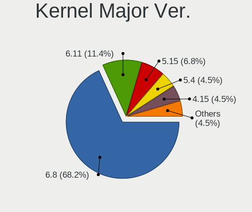
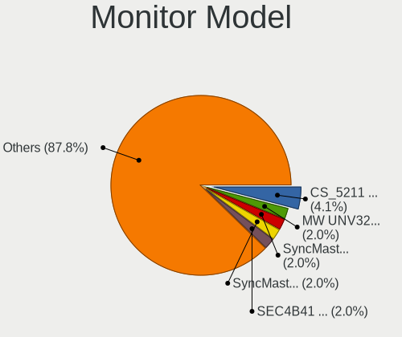
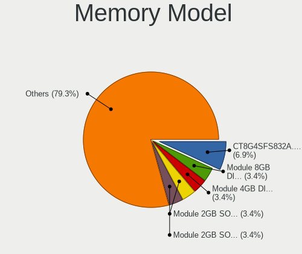

Xubuntu - Hardware Trends
-------------------------

A project to identify most popular hardware characteristics and track their change
over time based on data collected by Linux users at https://Linux-Hardware.org.

Anyone can contribute to this report by the [hw-probe](https://github.com/linuxhw/hw-probe) tool:

    sudo -E hw-probe -all -upload

This is a report for all computer types. See also reports for [desktops](/Dist/Xubuntu/Desktop/README.md) and [notebooks](/Dist/Xubuntu/Notebook/README.md).

This report is for one last month. Overall report since the beginning of time: [TestDays](https://github.com/linuxhw/TestDays)

Period: Aug, 2023.

Contents
--------

* [ System ](#system)
  - [ OS                       ](#os)
  - [ OS Family                ](#os-family)
  - [ Kernel                   ](#kernel)
  - [ Kernel Family            ](#kernel-family)
  - [ Kernel Major Ver.        ](#kernel-major-ver)
  - [ Arch                     ](#arch)
  - [ DE                       ](#de)
  - [ Display Server           ](#display-server)
  - [ Display Manager          ](#display-manager)
  - [ OS Lang                  ](#os-lang)
  - [ Boot Mode                ](#boot-mode)
  - [ Filesystem               ](#filesystem)
  - [ Part. scheme             ](#part-scheme)
  - [ Dual Boot with Linux/BSD ](#dual-boot-with-linuxbsd)
  - [ Dual Boot (Win)          ](#dual-boot-win)

* [ Board ](#board)
  - [ Vendor                   ](#vendor)
  - [ Model                    ](#model)
  - [ Model Family             ](#model-family)
  - [ MFG Year                 ](#mfg-year)
  - [ Form Factor              ](#form-factor)
  - [ Secure Boot              ](#secure-boot)
  - [ Coreboot                 ](#coreboot)
  - [ RAM Size                 ](#ram-size)
  - [ RAM Used                 ](#ram-used)
  - [ Total Drives             ](#total-drives)
  - [ Has CD-ROM               ](#has-cd-rom)
  - [ Has Ethernet             ](#has-ethernet)
  - [ Has WiFi                 ](#has-wifi)
  - [ Has Bluetooth            ](#has-bluetooth)

* [ Location ](#location)
  - [ Country                  ](#country)
  - [ City                     ](#city)

* [ Drives ](#drives)
  - [ Drive Vendor             ](#drive-vendor)
  - [ Drive Model              ](#drive-model)
  - [ HDD Vendor               ](#hdd-vendor)
  - [ SSD Vendor               ](#ssd-vendor)
  - [ Drive Kind               ](#drive-kind)
  - [ Drive Connector          ](#drive-connector)
  - [ Drive Size               ](#drive-size)
  - [ Space Total              ](#space-total)
  - [ Space Used               ](#space-used)
  - [ Malfunc. Drives          ](#malfunc-drives)
  - [ Malfunc. Drive Vendor    ](#malfunc-drive-vendor)
  - [ Malfunc. HDD Vendor      ](#malfunc-hdd-vendor)
  - [ Malfunc. Drive Kind      ](#malfunc-drive-kind)
  - [ Failed Drives            ](#failed-drives)
  - [ Failed Drive Vendor      ](#failed-drive-vendor)
  - [ Drive Status             ](#drive-status)

* [ Storage controller ](#storage-controller)
  - [ Storage Vendor           ](#storage-vendor)
  - [ Storage Model            ](#storage-model)
  - [ Storage Kind             ](#storage-kind)

* [ Processor ](#processor)
  - [ CPU Vendor               ](#cpu-vendor)
  - [ CPU Model                ](#cpu-model)
  - [ CPU Model Family         ](#cpu-model-family)
  - [ CPU Cores                ](#cpu-cores)
  - [ CPU Sockets              ](#cpu-sockets)
  - [ CPU Threads              ](#cpu-threads)
  - [ CPU Op-Modes             ](#cpu-op-modes)
  - [ CPU Microcode            ](#cpu-microcode)
  - [ CPU Microarch            ](#cpu-microarch)

* [ Graphics ](#graphics)
  - [ GPU Vendor               ](#gpu-vendor)
  - [ GPU Model                ](#gpu-model)
  - [ GPU Combo                ](#gpu-combo)
  - [ GPU Driver               ](#gpu-driver)
  - [ GPU Memory               ](#gpu-memory)

* [ Monitor ](#monitor)
  - [ Monitor Vendor           ](#monitor-vendor)
  - [ Monitor Model            ](#monitor-model)
  - [ Monitor Resolution       ](#monitor-resolution)
  - [ Monitor Diagonal         ](#monitor-diagonal)
  - [ Monitor Width            ](#monitor-width)
  - [ Aspect Ratio             ](#aspect-ratio)
  - [ Monitor Area             ](#monitor-area)
  - [ Pixel Density            ](#pixel-density)
  - [ Multiple Monitors        ](#multiple-monitors)

* [ Network ](#network)
  - [ Net Controller Vendor    ](#net-controller-vendor)
  - [ Net Controller Model     ](#net-controller-model)
  - [ Wireless Vendor          ](#wireless-vendor)
  - [ Wireless Model           ](#wireless-model)
  - [ Ethernet Vendor          ](#ethernet-vendor)
  - [ Ethernet Model           ](#ethernet-model)
  - [ Net Controller Kind      ](#net-controller-kind)
  - [ Used Controller          ](#used-controller)
  - [ NICs                     ](#nics)
  - [ IPv6                     ](#ipv6)

* [ Bluetooth ](#bluetooth)
  - [ Bluetooth Vendor         ](#bluetooth-vendor)
  - [ Bluetooth Model          ](#bluetooth-model)

* [ Sound ](#sound)
  - [ Sound Vendor             ](#sound-vendor)
  - [ Sound Model              ](#sound-model)

* [ Memory ](#memory)
  - [ Memory Vendor            ](#memory-vendor)
  - [ Memory Model             ](#memory-model)
  - [ Memory Kind              ](#memory-kind)
  - [ Memory Form Factor       ](#memory-form-factor)
  - [ Memory Size              ](#memory-size)
  - [ Memory Speed             ](#memory-speed)

* [ Printers & scanners ](#printers--scanners)
  - [ Printer Vendor           ](#printer-vendor)
  - [ Printer Model            ](#printer-model)
  - [ Scanner Vendor           ](#scanner-vendor)
  - [ Scanner Model            ](#scanner-model)

* [ Camera ](#camera)
  - [ Camera Vendor            ](#camera-vendor)
  - [ Camera Model             ](#camera-model)

* [ Security ](#security)
  - [ Fingerprint Vendor       ](#fingerprint-vendor)
  - [ Fingerprint Model        ](#fingerprint-model)
  - [ Chipcard Vendor          ](#chipcard-vendor)
  - [ Chipcard Model           ](#chipcard-model)

* [ Unsupported ](#unsupported)
  - [ Unsupported Devices      ](#unsupported-devices)
  - [ Unsupported Device Types ](#unsupported-device-types)

System
------

OS
--

Installed operating systems

| Name          | Computers | Percent |
|---------------|-----------|---------|
| Xubuntu 22.04 | 44        | 63.77%  |
| Xubuntu 23.04 | 16        | 23.19%  |
| Xubuntu 20.04 | 6         | 8.7%    |
| Xubuntu 22.10 | 2         | 2.9%    |
| Xubuntu 18.04 | 1         | 1.45%   |

OS Family
---------

OS without a version

| Name    | Computers | Percent |
|---------|-----------|---------|
| Xubuntu | 69        | 100%    |

Kernel
------

Version of the Linux kernel

| Version               | Computers | Percent |
|-----------------------|-----------|---------|
| 6.2.0-26-generic      | 24        | 34.78%  |
| 5.15.0-78-generic     | 7         | 10.14%  |
| 6.2.0-27-generic      | 6         | 8.7%    |
| 5.15.0-79-generic     | 6         | 8.7%    |
| 5.19.0-50-generic     | 4         | 5.8%    |
| 6.2.0-31-generic      | 3         | 4.35%   |
| 6.4.8-060408-generic  | 1         | 1.45%   |
| 6.4.7-x64v4-xanmod1   | 1         | 1.45%   |
| 6.3.12-x64v1-xanmod1  | 1         | 1.45%   |
| 6.2.0-32-generic      | 1         | 1.45%   |
| 6.2.0-1009-lowlatency | 1         | 1.45%   |
| 6.1.31-sun50iw9       | 1         | 1.45%   |
| 6.1.30-meson64        | 1         | 1.45%   |
| 6.0.0-060000-generic  | 1         | 1.45%   |
| 5.9.0-arm-64          | 1         | 1.45%   |
| 5.4.0-96-generic      | 1         | 1.45%   |
| 5.4.0-156-generic     | 1         | 1.45%   |
| 5.19.0-46-generic     | 1         | 1.45%   |
| 5.19.0-45-generic     | 1         | 1.45%   |
| 5.19.0-40-generic     | 1         | 1.45%   |
| 5.15.0-82-generic     | 1         | 1.45%   |
| 5.15.0-72-generic     | 1         | 1.45%   |
| 5.15.0-71-generic     | 1         | 1.45%   |
| 5.15.0-39-generic     | 1         | 1.45%   |
| 4.9.191               | 1         | 1.45%   |

Kernel Family
-------------

Linux kernel without a distro release

| Version | Computers | Percent |
|---------|-----------|---------|
| 6.2.0   | 35        | 50.72%  |
| 5.15.0  | 17        | 24.64%  |
| 5.19.0  | 7         | 10.14%  |
| 5.4.0   | 2         | 2.9%    |
| 6.4.8   | 1         | 1.45%   |
| 6.4.7   | 1         | 1.45%   |
| 6.3.12  | 1         | 1.45%   |
| 6.1.31  | 1         | 1.45%   |
| 6.1.30  | 1         | 1.45%   |
| 6.0.0   | 1         | 1.45%   |
| 5.9.0   | 1         | 1.45%   |
| 4.9.191 | 1         | 1.45%   |

Kernel Major Ver.
-----------------

Linux kernel major version

| Version | Computers | Percent |
|---------|-----------|---------|
| 6.2     | 35        | 50.72%  |
| 5.15    | 17        | 24.64%  |
| 5.19    | 7         | 10.14%  |
| 6.4     | 2         | 2.9%    |
| 6.1     | 2         | 2.9%    |
| 5.4     | 2         | 2.9%    |
| 6.3     | 1         | 1.45%   |
| 6.0     | 1         | 1.45%   |
| 5.9     | 1         | 1.45%   |
| 4.9     | 1         | 1.45%   |

Arch
----

OS architecture (x86_64, i586, etc.)

| Name    | Computers | Percent |
|---------|-----------|---------|
| x86_64  | 64        | 92.75%  |
| aarch64 | 4         | 5.8%    |
| i686    | 1         | 1.45%   |

DE
--

Desktop Environment

| Name  | Computers | Percent |
|-------|-----------|---------|
| XFCE  | 68        | 98.55%  |
| GNOME | 1         | 1.45%   |

Display Server
--------------

X11 or Wayland

| Name | Computers | Percent |
|------|-----------|---------|
| X11  | 67        | 97.1%   |
| Tty  | 2         | 2.9%    |

Display Manager
---------------

SDDM, LightDM, etc.

| Name    | Computers | Percent |
|---------|-----------|---------|
| LightDM | 56        | 81.16%  |
| Unknown | 10        | 14.49%  |
| SLiM    | 1         | 1.45%   |
| SDDM    | 1         | 1.45%   |
| GDM3    | 1         | 1.45%   |

OS Lang
-------

Language

| Lang  | Computers | Percent |
|-------|-----------|---------|
| en_US | 19        | 27.54%  |
| de_DE | 9         | 13.04%  |
| fr_FR | 7         | 10.14%  |
| pt_BR | 6         | 8.7%    |
| it_IT | 4         | 5.8%    |
| en_GB | 4         | 5.8%    |
| en_CA | 3         | 4.35%   |
| en_AU | 3         | 4.35%   |
| pl_PL | 2         | 2.9%    |
| es_ES | 2         | 2.9%    |
| C     | 2         | 2.9%    |
| zh_TW | 1         | 1.45%   |
| ru_RU | 1         | 1.45%   |
| ro_RO | 1         | 1.45%   |
| fr_LU | 1         | 1.45%   |
| fi_FI | 1         | 1.45%   |
| es_MX | 1         | 1.45%   |
| en_NZ | 1         | 1.45%   |
| de_AT | 1         | 1.45%   |

Boot Mode
---------

EFI or BIOS

| Mode | Computers | Percent |
|------|-----------|---------|
| BIOS | 38        | 55.07%  |
| EFI  | 31        | 44.93%  |

Filesystem
----------

Type of filesystem

| Type  | Computers | Percent |
|-------|-----------|---------|
| Ext4  | 53        | 76.81%  |
| Tmpfs | 15        | 21.74%  |
| Btrfs | 1         | 1.45%   |

Part. scheme
------------

Scheme of partitioning

| Type    | Computers | Percent |
|---------|-----------|---------|
| GPT     | 50        | 72.46%  |
| MBR     | 10        | 14.49%  |
| Unknown | 9         | 13.04%  |

Dual Boot with Linux/BSD
------------------------

Hosting more than one Linux/BSD

| Dual boot | Computers | Percent |
|-----------|-----------|---------|
| No        | 62        | 89.86%  |
| Yes       | 7         | 10.14%  |

Dual Boot (Win)
---------------

Hosting Linux and Windows

| Dual boot | Computers | Percent |
|-----------|-----------|---------|
| No        | 59        | 85.51%  |
| Yes       | 10        | 14.49%  |

Board
-----

Vendor
------

Motherboard manufacturer

| Name                | Computers | Percent |
|---------------------|-----------|---------|
| ASUSTek Computer    | 14        | 20.29%  |
| Lenovo              | 9         | 13.04%  |
| Acer                | 8         | 11.59%  |
| MSI                 | 6         | 8.7%    |
| Hewlett-Packard     | 6         | 8.7%    |
| Dell                | 5         | 7.25%   |
| Apple               | 3         | 4.35%   |
| Unknown             | 3         | 4.35%   |
| Gigabyte Technology | 2         | 2.9%    |
| ZOTAC               | 1         | 1.45%   |
| Toshiba             | 1         | 1.45%   |
| TaNix               | 1         | 1.45%   |
| Supermicro          | 1         | 1.45%   |
| Sony                | 1         | 1.45%   |
| Pegatron            | 1         | 1.45%   |
| OrangePi            | 1         | 1.45%   |
| Microsoft           | 1         | 1.45%   |
| GPU Company         | 1         | 1.45%   |
| Google              | 1         | 1.45%   |
| Daten Tecnologia    | 1         | 1.45%   |
| AZW                 | 1         | 1.45%   |
| ASRock              | 1         | 1.45%   |

Model
-----

Motherboard model

| Name                                 | Computers | Percent |
|--------------------------------------|-----------|---------|
| Unknown                              | 3         | 4.35%   |
| ZOTAC ZBOX-CI329NANO                 | 1         | 1.45%   |
| Toshiba Satellite C55D-B             | 1         | 1.45%   |
| TaNix TX3 (QZ)                       | 1         | 1.45%   |
| Supermicro AS -4124GS-TNR            | 1         | 1.45%   |
| Sony VGN-SR19VN                      | 1         | 1.45%   |
| Pegatron AW016AV-ABA s5280t          | 1         | 1.45%   |
| OrangePi Zero3                       | 1         | 1.45%   |
| MSI U90/U100                         | 1         | 1.45%   |
| MSI MS-7D70                          | 1         | 1.45%   |
| MSI MS-7D40                          | 1         | 1.45%   |
| MSI MS-7C96                          | 1         | 1.45%   |
| MSI MS-7C52                          | 1         | 1.45%   |
| MSI MS-7721                          | 1         | 1.45%   |
| Microsoft Surface Pro 7              | 1         | 1.45%   |
| Lenovo V530S-07ICB 10TX0010PB        | 1         | 1.45%   |
| Lenovo ThinkPad X250 20CM001RMC      | 1         | 1.45%   |
| Lenovo ThinkPad T460s 20F9003VMD     | 1         | 1.45%   |
| Lenovo ThinkPad T14 Gen 3 21AH00C3AU | 1         | 1.45%   |
| Lenovo IdeaPad Y570 0862             | 1         | 1.45%   |
| Lenovo IdeaPad 5 15ABA7 82SG         | 1         | 1.45%   |
| Lenovo G500 20236                    | 1         | 1.45%   |
| Lenovo G50-70 20351                  | 1         | 1.45%   |
| Lenovo B50-50 80S2                   | 1         | 1.45%   |
| HP ZBook 17 G3                       | 1         | 1.45%   |
| HP Presario CQ42                     | 1         | 1.45%   |
| HP Pavilion 17                       | 1         | 1.45%   |
| HP Laptop 17-cp0xxx                  | 1         | 1.45%   |
| HP EliteBook 820 G3                  | 1         | 1.45%   |
| HP 250 G4 Notebook PC                | 1         | 1.45%   |
| GPU Company GWTN156-5                | 1         | 1.45%   |
| Google Banjo                         | 1         | 1.45%   |
| Gigabyte H97N-WIFI                   | 1         | 1.45%   |
| Gigabyte B550 AORUS ELITE            | 1         | 1.45%   |
| Dell XPS 15 9500                     | 1         | 1.45%   |
| Dell OptiPlex 7020                   | 1         | 1.45%   |
| Dell Latitude E5510                  | 1         | 1.45%   |
| Dell Latitude 5411                   | 1         | 1.45%   |
| Dell Latitude 3540                   | 1         | 1.45%   |
| Daten Tecnologia DT02-M4             | 1         | 1.45%   |

Model Family
------------

Motherboard model prefix

| Name                     | Computers | Percent |
|--------------------------|-----------|---------|
| Acer Aspire              | 5         | 7.25%   |
| Lenovo ThinkPad          | 3         | 4.35%   |
| Dell Latitude            | 3         | 4.35%   |
| ASUS PRIME               | 3         | 4.35%   |
| Unknown                  | 3         | 4.35%   |
| Lenovo IdeaPad           | 2         | 2.9%    |
| ZOTAC ZBOX-CI329NANO     | 1         | 1.45%   |
| Toshiba Satellite        | 1         | 1.45%   |
| TaNix TX3                | 1         | 1.45%   |
| Supermicro AS            | 1         | 1.45%   |
| Sony VGN-SR19VN          | 1         | 1.45%   |
| Pegatron AW016AV-ABA     | 1         | 1.45%   |
| OrangePi Zero3           | 1         | 1.45%   |
| MSI U90                  | 1         | 1.45%   |
| MSI MS-7D70              | 1         | 1.45%   |
| MSI MS-7D40              | 1         | 1.45%   |
| MSI MS-7C96              | 1         | 1.45%   |
| MSI MS-7C52              | 1         | 1.45%   |
| MSI MS-7721              | 1         | 1.45%   |
| Microsoft Surface        | 1         | 1.45%   |
| Lenovo V530S-07ICB       | 1         | 1.45%   |
| Lenovo G500              | 1         | 1.45%   |
| Lenovo G50-70            | 1         | 1.45%   |
| Lenovo B50-50            | 1         | 1.45%   |
| HP ZBook                 | 1         | 1.45%   |
| HP Presario              | 1         | 1.45%   |
| HP Pavilion              | 1         | 1.45%   |
| HP Laptop                | 1         | 1.45%   |
| HP EliteBook             | 1         | 1.45%   |
| HP 250                   | 1         | 1.45%   |
| GPU Company GWTN156-5    | 1         | 1.45%   |
| Google Banjo             | 1         | 1.45%   |
| Gigabyte H97N-WIFI       | 1         | 1.45%   |
| Gigabyte B550            | 1         | 1.45%   |
| Dell XPS                 | 1         | 1.45%   |
| Dell OptiPlex            | 1         | 1.45%   |
| Daten Tecnologia DT02-M4 | 1         | 1.45%   |
| AZW SER                  | 1         | 1.45%   |
| ASUS X541UVK             | 1         | 1.45%   |
| ASUS VivoBook            | 1         | 1.45%   |

MFG Year
--------

Motherboard manufacture year

| Year    | Computers | Percent |
|---------|-----------|---------|
| 2022    | 9         | 13.04%  |
| 2020    | 9         | 13.04%  |
| 2015    | 6         | 8.7%    |
| 2013    | 5         | 7.25%   |
| 2010    | 5         | 7.25%   |
| 2021    | 4         | 5.8%    |
| 2018    | 4         | 5.8%    |
| 2009    | 4         | 5.8%    |
| Unknown | 4         | 5.8%    |
| 2019    | 3         | 4.35%   |
| 2014    | 3         | 4.35%   |
| 2012    | 3         | 4.35%   |
| 2017    | 2         | 2.9%    |
| 2016    | 2         | 2.9%    |
| 2011    | 2         | 2.9%    |
| 2008    | 2         | 2.9%    |
| 2023    | 1         | 1.45%   |
| 2006    | 1         | 1.45%   |

Form Factor
-----------

Physical design of the computer

| Name           | Computers | Percent |
|----------------|-----------|---------|
| Notebook       | 35        | 50.72%  |
| Desktop        | 22        | 31.88%  |
| System on chip | 4         | 5.8%    |
| Mini pc        | 3         | 4.35%   |
| Tablet         | 2         | 2.9%    |
| Convertible    | 1         | 1.45%   |
| All in one     | 1         | 1.45%   |
| Server         | 1         | 1.45%   |

Secure Boot
-----------

Enabled or disabled

| State    | Computers | Percent |
|----------|-----------|---------|
| Disabled | 64        | 92.75%  |
| Enabled  | 5         | 7.25%   |

Coreboot
--------

Have coreboot on board

| Used | Computers | Percent |
|------|-----------|---------|
| No   | 68        | 98.55%  |
| Yes  | 1         | 1.45%   |

RAM Size
--------

Total RAM memory

| Size in GB      | Computers | Percent |
|-----------------|-----------|---------|
| 3.01-4.0        | 20        | 28.99%  |
| 16.01-24.0      | 12        | 17.39%  |
| 8.01-16.0       | 11        | 15.94%  |
| 4.01-8.0        | 9         | 13.04%  |
| 32.01-64.0      | 5         | 7.25%   |
| 64.01-256.0     | 4         | 5.8%    |
| 1.01-2.0        | 4         | 5.8%    |
| More than 256.0 | 1         | 1.45%   |
| 24.01-32.0      | 1         | 1.45%   |
| 2.01-3.0        | 1         | 1.45%   |
| 0.51-1.0        | 1         | 1.45%   |

RAM Used
--------

Used RAM memory

| Used GB    | Computers | Percent |
|------------|-----------|---------|
| 1.01-2.0   | 18        | 26.09%  |
| 2.01-3.0   | 14        | 20.29%  |
| 4.01-8.0   | 11        | 15.94%  |
| 3.01-4.0   | 11        | 15.94%  |
| 0.51-1.0   | 10        | 14.49%  |
| 16.01-24.0 | 3         | 4.35%   |
| 8.01-16.0  | 1         | 1.45%   |
| 0.01-0.5   | 1         | 1.45%   |

Total Drives
------------

Number of drives on board

| Drives | Computers | Percent |
|--------|-----------|---------|
| 1      | 46        | 66.67%  |
| 2      | 14        | 20.29%  |
| 3      | 4         | 5.8%    |
| 5      | 2         | 2.9%    |
| 4      | 2         | 2.9%    |
| 7      | 1         | 1.45%   |

Has CD-ROM
----------

Has CD-ROM on board

| Presented | Computers | Percent |
|-----------|-----------|---------|
| No        | 46        | 66.67%  |
| Yes       | 23        | 33.33%  |

Has Ethernet
------------

Has Ethernet on board

| Presented | Computers | Percent |
|-----------|-----------|---------|
| Yes       | 58        | 84.06%  |
| No        | 11        | 15.94%  |

Has WiFi
--------

Has WiFi module

| Presented | Computers | Percent |
|-----------|-----------|---------|
| Yes       | 54        | 78.26%  |
| No        | 15        | 21.74%  |

Has Bluetooth
-------------

Has Bluetooth module

| Presented | Computers | Percent |
|-----------|-----------|---------|
| Yes       | 39        | 56.52%  |
| No        | 30        | 43.48%  |

Location
--------

Country
-------

Geographic location (country)

| Country      | Computers | Percent |
|--------------|-----------|---------|
| USA          | 11        | 15.94%  |
| Germany      | 9         | 13.04%  |
| France       | 8         | 11.59%  |
| Brazil       | 7         | 10.14%  |
| Canada       | 6         | 8.7%    |
| UK           | 4         | 5.8%    |
| Italy        | 4         | 5.8%    |
| Australia    | 3         | 4.35%   |
| Spain        | 2         | 2.9%    |
| Russia       | 2         | 2.9%    |
| Poland       | 2         | 2.9%    |
| Denmark      | 2         | 2.9%    |
| Switzerland  | 1         | 1.45%   |
| Saudi Arabia | 1         | 1.45%   |
| Romania      | 1         | 1.45%   |
| New Zealand  | 1         | 1.45%   |
| Netherlands  | 1         | 1.45%   |
| Mexico       | 1         | 1.45%   |
| Finland      | 1         | 1.45%   |
| Czechia      | 1         | 1.45%   |
| Austria      | 1         | 1.45%   |

City
----

Geographic location (city)

| City                   | Computers | Percent |
|------------------------|-----------|---------|
| Toronto                | 2         | 2.9%    |
| Sydney                 | 2         | 2.9%    |
| Rome                   | 2         | 2.9%    |
| Ribeirao Preto         | 2         | 2.9%    |
| Copenhagen             | 2         | 2.9%    |
| Winter Garden          | 1         | 1.45%   |
| Winsen                 | 1         | 1.45%   |
| Uxbridge               | 1         | 1.45%   |
| Toulouse               | 1         | 1.45%   |
| Torquay                | 1         | 1.45%   |
| Tauranga               | 1         | 1.45%   |
| Tandarei               | 1         | 1.45%   |
| Suscevaz               | 1         | 1.45%   |
| Springfield            | 1         | 1.45%   |
| Sesto Fiorentino       | 1         | 1.45%   |
| Schnaittach            | 1         | 1.45%   |
| Sao Goncalo            | 1         | 1.45%   |
| Santa Cruz de Tenerife | 1         | 1.45%   |
| Rio de Janeiro         | 1         | 1.45%   |
| Realmont               | 1         | 1.45%   |
| Prague                 | 1         | 1.45%   |
| Potsdam                | 1         | 1.45%   |
| Port Orchard           | 1         | 1.45%   |
| Plauen                 | 1         | 1.45%   |
| Plattsmouth            | 1         | 1.45%   |
| Plattsburgh            | 1         | 1.45%   |
| Parla                  | 1         | 1.45%   |
| Paris                  | 1         | 1.45%   |
| Palmyra                | 1         | 1.45%   |
| Paignton               | 1         | 1.45%   |
| Osceola                | 1         | 1.45%   |
| Oliveira               | 1         | 1.45%   |
| Novosibirsk            | 1         | 1.45%   |
| Newcastle              | 1         | 1.45%   |
| Nesles-la-Vallee       | 1         | 1.45%   |
| Naaldwijk              | 1         | 1.45%   |
| Moscow                 | 1         | 1.45%   |
| Mesa                   | 1         | 1.45%   |
| Melbourne              | 1         | 1.45%   |
| Markham                | 1         | 1.45%   |

Drives
------

Drive Vendor
------------

Hard drive vendors

| Vendor                      | Computers | Drives | Percent |
|-----------------------------|-----------|--------|---------|
| Samsung Electronics         | 12        | 14     | 12.9%   |
| Unknown                     | 10        | 12     | 10.75%  |
| WDC                         | 9         | 14     | 9.68%   |
| Seagate                     | 9         | 14     | 9.68%   |
| Kingston                    | 6         | 6      | 6.45%   |
| Toshiba                     | 5         | 5      | 5.38%   |
| Crucial                     | 5         | 5      | 5.38%   |
| SanDisk                     | 4         | 4      | 4.3%    |
| Intel                       | 4         | 5      | 4.3%    |
| Hitachi                     | 4         | 4      | 4.3%    |
| SK hynix                    | 3         | 3      | 3.23%   |
| Micron Technology           | 2         | 2      | 2.15%   |
| Kingston Technology Company | 2         | 2      | 2.15%   |
| XrayDisk                    | 1         | 1      | 1.08%   |
| XPG                         | 1         | 1      | 1.08%   |
| Team                        | 1         | 1      | 1.08%   |
| SPCC                        | 1         | 1      | 1.08%   |
| PHD 3.0                     | 1         | 1      | 1.08%   |
| Lexar                       | 1         | 1      | 1.08%   |
| KIOXIA                      | 1         | 1      | 1.08%   |
| KEEPDATA                    | 1         | 1      | 1.08%   |
| JMicron Technology          | 1         | 1      | 1.08%   |
| Intenso                     | 1         | 1      | 1.08%   |
| HS-SSD-E100                 | 1         | 1      | 1.08%   |
| Gigabyte Technology         | 1         | 2      | 1.08%   |
| FORESEE                     | 1         | 1      | 1.08%   |
| Emtec                       | 1         | 1      | 1.08%   |
| Dogfish                     | 1         | 1      | 1.08%   |
| Apple                       | 1         | 1      | 1.08%   |
| A-DATA Technology           | 1         | 1      | 1.08%   |
| Unknown                     | 1         | 1      | 1.08%   |

Drive Model
-----------

Hard drive models

| Model                                  | Computers | Percent |
|----------------------------------------|-----------|---------|
| Unknown MMC Card  64GB                 | 3         | 2.88%   |
| Unknown SD/MMC/MS PRO 1GB              | 2         | 1.92%   |
| Unknown MMC Card  32GB                 | 2         | 1.92%   |
| Toshiba HDWD110 1TB                    | 2         | 1.92%   |
| Samsung SSD 970 EVO Plus 2TB           | 2         | 1.92%   |
| Kingston SA400S37240G 240GB SSD        | 2         | 1.92%   |
| Intel SSDPEKNU512GZ 512GB              | 2         | 1.92%   |
| Crucial CT250MX500SSD1 250GB           | 2         | 1.92%   |
| XrayDisk 512GB                         | 1         | 0.96%   |
| XPG SPECTRIX S40G 1TB                  | 1         | 0.96%   |
| WDC WDS500G2B0A-00SM50 500GB SSD       | 1         | 0.96%   |
| WDC WDBNCE0010PNC 1TB SSD              | 1         | 0.96%   |
| WDC WD800JB-00FMA0 80GB                | 1         | 0.96%   |
| WDC WD5000LPCX-24C6HT0 500GB           | 1         | 0.96%   |
| WDC WD5000AAKX-001CA0 500GB            | 1         | 0.96%   |
| WDC WD5000AAKS-08V0A0 500GB            | 1         | 0.96%   |
| WDC WD5000AAKS-00V1A0 500GB            | 1         | 0.96%   |
| WDC WD5000AADS-00L4B1 500GB            | 1         | 0.96%   |
| WDC WD40EZRZ-22GXCB0 4TB               | 1         | 0.96%   |
| WDC WD3200AAJS-00L7A0 320GB            | 1         | 0.96%   |
| WDC WD30EZRX-00MMMB0 3TB               | 1         | 0.96%   |
| WDC WD20EZAZ-00GGJB0 2TB               | 1         | 0.96%   |
| WDC WD10EZEX-22BN5A0 1TB               | 1         | 0.96%   |
| WDC WD10EARS-003BB1 1TB                | 1         | 0.96%   |
| Unknown NCard  64GB                    | 1         | 0.96%   |
| Unknown MMC128  128GB                  | 1         | 0.96%   |
| Unknown HAG2e  16GB                    | 1         | 0.96%   |
| Unknown AJTD4R  16GB                   | 1         | 0.96%   |
| Unknown 58K722  128GB                  | 1         | 0.96%   |
| Toshiba MQ01ABD075 752GB               | 1         | 0.96%   |
| Toshiba MK2561GSYN 250GB               | 1         | 0.96%   |
| Toshiba DT01ACA100 1TB                 | 1         | 0.96%   |
| Team TM8PS7512G 512GB SSD              | 1         | 0.96%   |
| SPCC Solid State Disk 512GB            | 1         | 0.96%   |
| SK hynix SKHynix_HFS512GDE9X081N 512GB | 1         | 0.96%   |
| SK hynix PC611 NVMe 256GB              | 1         | 0.96%   |
| SK hynix PC611 NVMe 1TB                | 1         | 0.96%   |
| Seagate ST9320325AS 320GB              | 1         | 0.96%   |
| Seagate ST4000DX001-1CE168 4TB         | 1         | 0.96%   |
| Seagate ST3250310AS 250GB              | 1         | 0.96%   |

HDD Vendor
----------

Hard disk drive vendors

| Vendor  | Computers | Drives | Percent |
|---------|-----------|--------|---------|
| WDC     | 8         | 12     | 28.57%  |
| Seagate | 8         | 8      | 28.57%  |
| Toshiba | 5         | 5      | 17.86%  |
| Hitachi | 4         | 4      | 14.29%  |
| Unknown | 2         | 2      | 7.14%   |
| PHD 3.0 | 1         | 1      | 3.57%   |

SSD Vendor
----------

Solid state drive vendors

| Vendor              | Computers | Drives | Percent |
|---------------------|-----------|--------|---------|
| Samsung Electronics | 7         | 7      | 20.59%  |
| Kingston            | 5         | 5      | 14.71%  |
| Crucial             | 4         | 4      | 11.76%  |
| SanDisk             | 3         | 3      | 8.82%   |
| WDC                 | 2         | 2      | 5.88%   |
| Team                | 1         | 1      | 2.94%   |
| SPCC                | 1         | 1      | 2.94%   |
| Seagate             | 1         | 4      | 2.94%   |
| Lexar               | 1         | 1      | 2.94%   |
| KEEPDATA            | 1         | 1      | 2.94%   |
| JMicron Technology  | 1         | 1      | 2.94%   |
| Intenso             | 1         | 1      | 2.94%   |
| Gigabyte Technology | 1         | 1      | 2.94%   |
| FORESEE             | 1         | 1      | 2.94%   |
| Emtec               | 1         | 1      | 2.94%   |
| Dogfish             | 1         | 1      | 2.94%   |
| A-DATA Technology   | 1         | 1      | 2.94%   |
| Unknown             | 1         | 1      | 2.94%   |

Drive Kind
----------

HDD or SSD

| Kind    | Computers | Drives | Percent |
|---------|-----------|--------|---------|
| SSD     | 32        | 37     | 36.78%  |
| HDD     | 23        | 32     | 26.44%  |
| NVMe    | 22        | 28     | 25.29%  |
| MMC     | 8         | 10     | 9.2%    |
| Unknown | 2         | 2      | 2.3%    |

Drive Connector
---------------

SATA, SAS, NVMe, etc.

| Type | Computers | Drives | Percent |
|------|-----------|--------|---------|
| SATA | 46        | 67     | 57.5%   |
| NVMe | 22        | 28     | 27.5%   |
| MMC  | 8         | 10     | 10%     |
| SAS  | 4         | 4      | 5%      |

Drive Size
----------

Size of hard drive

| Size in TB | Computers | Drives | Percent |
|------------|-----------|--------|---------|
| 0.01-0.5   | 31        | 37     | 52.54%  |
| 0.51-1.0   | 21        | 25     | 35.59%  |
| 1.01-2.0   | 4         | 4      | 6.78%   |
| 3.01-4.0   | 2         | 2      | 3.39%   |
| 2.01-3.0   | 1         | 1      | 1.69%   |

Space Total
-----------

Amount of disk space available on the file system

| Size in GB     | Computers | Percent |
|----------------|-----------|---------|
| 251-500        | 19        | 27.54%  |
| 101-250        | 18        | 26.09%  |
| 501-1000       | 10        | 14.49%  |
| 1001-2000      | 8         | 11.59%  |
| 51-100         | 6         | 8.7%    |
| More than 3000 | 4         | 5.8%    |
| 1-20           | 3         | 4.35%   |
| 2001-3000      | 1         | 1.45%   |

Space Used
----------

Amount of used disk space

| Used GB        | Computers | Percent |
|----------------|-----------|---------|
| 1-20           | 20        | 28.99%  |
| 51-100         | 13        | 18.84%  |
| 21-50          | 12        | 17.39%  |
| 101-250        | 9         | 13.04%  |
| 251-500        | 5         | 7.25%   |
| More than 3000 | 3         | 4.35%   |
| 1001-2000      | 3         | 4.35%   |
| 501-1000       | 3         | 4.35%   |
| 2001-3000      | 1         | 1.45%   |

Malfunc. Drives
---------------

Drive models with a malfunction

| Model                          | Computers | Drives | Percent |
|--------------------------------|-----------|--------|---------|
| WDC WD10EARS-003BB1 1TB        | 1         | 1      | 16.67%  |
| Seagate ST4000DX001-1CE168 4TB | 1         | 1      | 16.67%  |
| Seagate ST3250310AS 250GB      | 1         | 1      | 16.67%  |
| Seagate ST2000LM007-1R8174 2TB | 1         | 1      | 16.67%  |
| KEEPDATA SSD 120GB             | 1         | 1      | 16.67%  |
| Hitachi HTS545025B9SA02 250GB  | 1         | 1      | 16.67%  |

Malfunc. Drive Vendor
---------------------

Vendors of faulty drives

| Vendor   | Computers | Drives | Percent |
|----------|-----------|--------|---------|
| Seagate  | 3         | 3      | 50%     |
| WDC      | 1         | 1      | 16.67%  |
| KEEPDATA | 1         | 1      | 16.67%  |
| Hitachi  | 1         | 1      | 16.67%  |

Malfunc. HDD Vendor
-------------------

Vendors of faulty HDD drives

| Vendor  | Computers | Drives | Percent |
|---------|-----------|--------|---------|
| Seagate | 3         | 3      | 60%     |
| WDC     | 1         | 1      | 20%     |
| Hitachi | 1         | 1      | 20%     |

Malfunc. Drive Kind
-------------------

Kinds of faulty drives

| Kind | Computers | Drives | Percent |
|------|-----------|--------|---------|
| HDD  | 4         | 5      | 80%     |
| SSD  | 1         | 1      | 20%     |

Failed Drives
-------------

Failed drive models

Zero info for selected period =(

Failed Drive Vendor
-------------------

Failed drive vendors

Zero info for selected period =(

Drive Status
------------

Number of failed and malfunc. drives

| Status   | Computers | Drives | Percent |
|----------|-----------|--------|---------|
| Works    | 37        | 59     | 50%     |
| Detected | 32        | 44     | 43.24%  |
| Malfunc  | 5         | 6      | 6.76%   |

Storage controller
------------------

Storage Vendor
--------------

Storage controller vendors

| Vendor                      | Computers | Percent |
|-----------------------------|-----------|---------|
| Intel                       | 41        | 50%     |
| AMD                         | 15        | 18.29%  |
| Samsung Electronics         | 5         | 6.1%    |
| SK hynix                    | 3         | 3.66%   |
| Kingston Technology Company | 3         | 3.66%   |
| JMicron Technology          | 3         | 3.66%   |
| Micron Technology           | 2         | 2.44%   |
| Seagate Technology          | 1         | 1.22%   |
| SanDisk                     | 1         | 1.22%   |
| Realtek Semiconductor       | 1         | 1.22%   |
| Phison Electronics          | 1         | 1.22%   |
| Nvidia                      | 1         | 1.22%   |
| Micron/Crucial Technology   | 1         | 1.22%   |
| Marvell Technology Group    | 1         | 1.22%   |
| KIOXIA                      | 1         | 1.22%   |
| ASMedia Technology          | 1         | 1.22%   |
| Apple                       | 1         | 1.22%   |

Storage Model
-------------

Storage controller models

| Model                                                                    | Computers | Percent |
|--------------------------------------------------------------------------|-----------|---------|
| AMD FCH SATA Controller [AHCI mode]                                      | 7         | 7.37%   |
| Intel Sunrise Point-LP SATA Controller [AHCI mode]                       | 4         | 4.21%   |
| AMD 500 Series Chipset SATA Controller                                   | 4         | 4.21%   |
| Samsung NVMe SSD Controller SM981/PM981/PM983                            | 3         | 3.16%   |
| Intel 8 Series SATA Controller 1 [AHCI mode]                             | 3         | 3.16%   |
| SK hynix PC611 NVMe Solid State Drive                                    | 2         | 2.11%   |
| Intel Wildcat Point-LP SATA Controller [AHCI Mode]                       | 2         | 2.11%   |
| Intel Volume Management Device NVMe RAID Controller                      | 2         | 2.11%   |
| Intel Tiger Lake-LP SATA Controller                                      | 2         | 2.11%   |
| Intel SSD 670p Series [Keystone Harbor]                                  | 2         | 2.11%   |
| Intel NM10/ICH7 Family SATA Controller [IDE mode]                        | 2         | 2.11%   |
| Intel Comet Lake SATA AHCI Controller                                    | 2         | 2.11%   |
| Intel Celeron/Pentium Silver Processor SATA Controller                   | 2         | 2.11%   |
| Intel Celeron N3350/Pentium N4200/Atom E3900 Series SATA AHCI Controller | 2         | 2.11%   |
| Intel Cannon Lake PCH SATA AHCI Controller                               | 2         | 2.11%   |
| Intel 9 Series Chipset Family SATA Controller [AHCI Mode]                | 2         | 2.11%   |
| Intel 82801IBM/IEM (ICH9M/ICH9M-E) 4 port SATA Controller [AHCI mode]    | 2         | 2.11%   |
| Intel 700 Series Chipset Family SATA AHCI Controller                     | 2         | 2.11%   |
| AMD SB7x0/SB8x0/SB9x0 SATA Controller [IDE mode]                         | 2         | 2.11%   |
| AMD SB7x0/SB8x0/SB9x0 SATA Controller [AHCI mode]                        | 2         | 2.11%   |
| AMD SB7x0/SB8x0/SB9x0 IDE Controller                                     | 2         | 2.11%   |
| SK hynix Gold P31/BC711/PC711 NVMe Solid State Drive                     | 1         | 1.05%   |
| Seagate FireCuda 520 SSD                                                 | 1         | 1.05%   |
| SanDisk WD Blue SN500 / PC SN520 NVMe SSD                                | 1         | 1.05%   |
| Samsung NVMe SSD Controller PM9B1                                        | 1         | 1.05%   |
| Samsung NVMe SSD Controller 980                                          | 1         | 1.05%   |
| Realtek RTS5763DL NVMe SSD Controller                                    | 1         | 1.05%   |
| Phison PS5013 E13 NVMe Controller                                        | 1         | 1.05%   |
| Nvidia MCP89 SATA Controller (AHCI mode)                                 | 1         | 1.05%   |
| Micron/Crucial Non-Volatile memory controller                            | 1         | 1.05%   |
| Micron 2450 NVMe SSD [HendrixV] (DRAM-less)                              | 1         | 1.05%   |
| Micron 2210 NVMe SSD [Cobain]                                            | 1         | 1.05%   |
| Marvell Group 88SE9230 PCIe 2.0 x2 4-port SATA 6 Gb/s RAID Controller    | 1         | 1.05%   |
| KIOXIA NVMe SSD Controller BG4 (DRAM-less)                               | 1         | 1.05%   |
| Kingston Company U-SNS8154P3 NVMe SSD                                    | 1         | 1.05%   |
| Kingston Company Company Non-Volatile memory controller                  | 1         | 1.05%   |
| Kingston Company Design-In PCIe 4 NVMe SSD (QLC)                         | 1         | 1.05%   |
| JMicron JMB363 SATA/IDE Controller                                       | 1         | 1.05%   |
| JMicron JMB362 SATA Controller                                           | 1         | 1.05%   |
| JMicron JMB361 AHCI/IDE                                                  | 1         | 1.05%   |

Storage Kind
------------

Kind of storage controller (IDE, SATA, NVMe, SAS, ...)

| Kind | Computers | Percent |
|------|-----------|---------|
| SATA | 50        | 59.52%  |
| NVMe | 22        | 26.19%  |
| IDE  | 9         | 10.71%  |
| RAID | 3         | 3.57%   |

Processor
---------

CPU Vendor
----------

Processor vendors

| Vendor | Computers | Percent |
|--------|-----------|---------|
| Intel  | 47        | 68.12%  |
| AMD    | 18        | 26.09%  |
| ARM    | 4         | 5.8%    |

CPU Model
---------

Processor models

| Model                                       | Computers | Percent |
|---------------------------------------------|-----------|---------|
| ARM Processor                               | 4         | 5.8%    |
| Intel Core i5-7200U CPU @ 2.50GHz           | 2         | 2.9%    |
| Intel Core i5-6300U CPU @ 2.40GHz           | 2         | 2.9%    |
| Intel Core i5-4210U CPU @ 1.70GHz           | 2         | 2.9%    |
| Intel Celeron CPU N3350 @ 1.10GHz           | 2         | 2.9%    |
| Intel Pentium Dual-Core CPU T4300 @ 2.10GHz | 1         | 1.45%   |
| Intel Pentium Dual-Core CPU E5300 @ 2.60GHz | 1         | 1.45%   |
| Intel Core i9-10885H CPU @ 2.40GHz          | 1         | 1.45%   |
| Intel Core i7-8700B CPU @ 3.20GHz           | 1         | 1.45%   |
| Intel Core i7-6820HQ CPU @ 2.70GHz          | 1         | 1.45%   |
| Intel Core i7-5600U CPU @ 2.60GHz           | 1         | 1.45%   |
| Intel Core i7-4790S CPU @ 3.20GHz           | 1         | 1.45%   |
| Intel Core i7-2630QM CPU @ 2.00GHz          | 1         | 1.45%   |
| Intel Core i7-2600K CPU @ 3.40GHz           | 1         | 1.45%   |
| Intel Core i7-10850H CPU @ 2.70GHz          | 1         | 1.45%   |
| Intel Core i7-10700K CPU @ 3.80GHz          | 1         | 1.45%   |
| Intel Core i7-1065G7 CPU @ 1.30GHz          | 1         | 1.45%   |
| Intel Core i7-10510U CPU @ 1.80GHz          | 1         | 1.45%   |
| Intel Core i5-9400 CPU @ 2.90GHz            | 1         | 1.45%   |
| Intel Core i5-8400 CPU @ 2.80GHz            | 1         | 1.45%   |
| Intel Core i5-4570 CPU @ 3.20GHz            | 1         | 1.45%   |
| Intel Core i5-4460 CPU @ 3.20GHz            | 1         | 1.45%   |
| Intel Core i5-3210M CPU @ 2.50GHz           | 1         | 1.45%   |
| Intel Core i3-5005U CPU @ 2.00GHz           | 1         | 1.45%   |
| Intel Core i3-4010U CPU @ 1.70GHz           | 1         | 1.45%   |
| Intel Core i3-3110M CPU @ 2.40GHz           | 1         | 1.45%   |
| Intel Core i3 CPU M 350 @ 2.27GHz           | 1         | 1.45%   |
| Intel Core 2 Quad CPU Q8300 @ 2.50GHz       | 1         | 1.45%   |
| Intel Core 2 Duo CPU T9500 @ 2.60GHz        | 1         | 1.45%   |
| Intel Core 2 Duo CPU P8600 @ 2.40GHz        | 1         | 1.45%   |
| Intel Core 2 Duo CPU P8400 @ 2.26GHz        | 1         | 1.45%   |
| Intel Core 2 Duo CPU E8400 @ 3.00GHz        | 1         | 1.45%   |
| Intel Celeron N4100 CPU @ 1.10GHz           | 1         | 1.45%   |
| Intel Celeron N4020 CPU @ 1.10GHz           | 1         | 1.45%   |
| Intel Celeron CPU N3050 @ 1.60GHz           | 1         | 1.45%   |
| Intel Celeron CPU N2840 @ 2.16GHz           | 1         | 1.45%   |
| Intel Atom CPU N450 @ 1.66GHz               | 1         | 1.45%   |
| Intel Atom CPU N270 @ 1.60GHz               | 1         | 1.45%   |
| Intel 13th Gen Core i9-13900K               | 1         | 1.45%   |
| Intel 13th Gen Core i5-13600K               | 1         | 1.45%   |

CPU Model Family
----------------

Processor model prefix

| Model                   | Computers | Percent |
|-------------------------|-----------|---------|
| Intel Core i5           | 11        | 15.94%  |
| Other                   | 10        | 14.49%  |
| Intel Core i7           | 10        | 14.49%  |
| Intel Celeron           | 6         | 8.7%    |
| AMD Ryzen 5             | 6         | 8.7%    |
| Intel Core i3           | 4         | 5.8%    |
| Intel Core 2 Duo        | 4         | 5.8%    |
| Intel Pentium Dual-Core | 2         | 2.9%    |
| Intel Atom              | 2         | 2.9%    |
| AMD Ryzen 9             | 2         | 2.9%    |
| AMD Ryzen 7             | 2         | 2.9%    |
| AMD FX                  | 2         | 2.9%    |
| Intel Core i9           | 1         | 1.45%   |
| Intel Core 2 Quad       | 1         | 1.45%   |
| AMD V120                | 1         | 1.45%   |
| AMD Phenom II X4        | 1         | 1.45%   |
| AMD EPYC                | 1         | 1.45%   |
| AMD E1                  | 1         | 1.45%   |
| AMD Athlon X4           | 1         | 1.45%   |
| AMD A8                  | 1         | 1.45%   |

CPU Cores
---------

Number of processor cores

| Number  | Computers | Percent |
|---------|-----------|---------|
| 2       | 26        | 37.68%  |
| 4       | 16        | 23.19%  |
| 6       | 9         | 13.04%  |
| 8       | 4         | 5.8%    |
| 1       | 3         | 4.35%   |
| Unknown | 3         | 4.35%   |
| 16      | 2         | 2.9%    |
| 10      | 2         | 2.9%    |
| 64      | 1         | 1.45%   |
| 24      | 1         | 1.45%   |
| 14      | 1         | 1.45%   |
| 3       | 1         | 1.45%   |

CPU Sockets
-----------

Number of sockets

| Number  | Computers | Percent |
|---------|-----------|---------|
| 1       | 65        | 94.2%   |
| Unknown | 3         | 4.35%   |
| 2       | 1         | 1.45%   |

CPU Threads
-----------

Threads per core (Hyper-Threading)

| Number  | Computers | Percent |
|---------|-----------|---------|
| 2       | 43        | 62.32%  |
| 1       | 23        | 33.33%  |
| Unknown | 3         | 4.35%   |

CPU Op-Modes
------------

CPU Operation Modes (32-bit, 64-bit)

| Op mode        | Computers | Percent |
|----------------|-----------|---------|
| 32-bit, 64-bit | 65        | 94.2%   |
| 64-bit         | 2         | 2.9%    |
| 32-bit         | 1         | 1.45%   |
| Unknown        | 1         | 1.45%   |

CPU Microcode
-------------

Microcode number

| Number     | Computers | Percent |
|------------|-----------|---------|
| Unknown    | 48        | 69.57%  |
| 0x0a50000d | 3         | 4.35%   |
| 0x0a601203 | 2         | 2.9%    |
| 0x06000852 | 2         | 2.9%    |
| 0xb0671    | 1         | 1.45%   |
| 0xa0655    | 1         | 1.45%   |
| 0x906ea    | 1         | 1.45%   |
| 0x906a4    | 1         | 1.45%   |
| 0x806c1    | 1         | 1.45%   |
| 0x406e3    | 1         | 1.45%   |
| 0x306c3    | 1         | 1.45%   |
| 0x306a9    | 1         | 1.45%   |
| 0x20655    | 1         | 1.45%   |
| 0x106c2    | 1         | 1.45%   |
| 0x1067a    | 1         | 1.45%   |
| 0x08608103 | 1         | 1.45%   |
| 0x0830107a | 1         | 1.45%   |
| 0x07030105 | 1         | 1.45%   |

CPU Microarch
-------------

Microarchitecture

| Name             | Computers | Percent |
|------------------|-----------|---------|
| Unknown          | 9         | 13.04%  |
| Penryn           | 7         | 10.14%  |
| KabyLake         | 6         | 8.7%    |
| Haswell          | 6         | 8.7%    |
| Zen 3            | 4         | 5.8%    |
| Zen 2            | 3         | 4.35%   |
| Skylake          | 3         | 4.35%   |
| Piledriver       | 3         | 4.35%   |
| CometLake        | 3         | 4.35%   |
| TigerLake        | 2         | 2.9%    |
| Silvermont       | 2         | 2.9%    |
| SandyBridge      | 2         | 2.9%    |
| K10              | 2         | 2.9%    |
| IvyBridge        | 2         | 2.9%    |
| Goldmont plus    | 2         | 2.9%    |
| Goldmont         | 2         | 2.9%    |
| Broadwell        | 2         | 2.9%    |
| Bonnell          | 2         | 2.9%    |
| Alderlake Hybrid | 2         | 2.9%    |
| Zen+             | 1         | 1.45%   |
| Westmere         | 1         | 1.45%   |
| Puma             | 1         | 1.45%   |
| IceLake          | 1         | 1.45%   |
| Excavator        | 1         | 1.45%   |

Graphics
--------

GPU Vendor
----------

Vendors of graphics cards

| Vendor            | Computers | Percent |
|-------------------|-----------|---------|
| Intel             | 41        | 54.67%  |
| AMD               | 17        | 22.67%  |
| Nvidia            | 16        | 21.33%  |
| ASPEED Technology | 1         | 1.33%   |

GPU Model
---------

Graphics card models

| Model                                                                                    | Computers | Percent |
|------------------------------------------------------------------------------------------|-----------|---------|
| Intel Xeon E3-1200 v3/4th Gen Core Processor Integrated Graphics Controller              | 3         | 3.95%   |
| Intel Haswell-ULT Integrated Graphics Controller                                         | 3         | 3.95%   |
| AMD Cezanne [Radeon Vega Series / Radeon Vega Mobile Series]                             | 3         | 3.95%   |
| Nvidia GT218 [GeForce 210]                                                               | 2         | 2.63%   |
| Nvidia GP108M [GeForce MX250]                                                            | 2         | 2.63%   |
| Intel TigerLake-LP GT2 [Iris Xe Graphics]                                                | 2         | 2.63%   |
| Intel Skylake GT2 [HD Graphics 520]                                                      | 2         | 2.63%   |
| Intel Raptor Lake-S GT1 [UHD Graphics 770]                                               | 2         | 2.63%   |
| Intel HD Graphics 620                                                                    | 2         | 2.63%   |
| Intel HD Graphics 5500                                                                   | 2         | 2.63%   |
| Intel HD Graphics 500                                                                    | 2         | 2.63%   |
| Intel GeminiLake [UHD Graphics 600]                                                      | 2         | 2.63%   |
| Intel CometLake-H GT2 [UHD Graphics]                                                     | 2         | 2.63%   |
| Intel CoffeeLake-S GT2 [UHD Graphics 630]                                                | 2         | 2.63%   |
| Intel 3rd Gen Core processor Graphics Controller                                         | 2         | 2.63%   |
| Nvidia TU117M [GeForce GTX 1650 Ti Mobile]                                               | 1         | 1.32%   |
| Nvidia TU117 [GeForce GTX 1650]                                                          | 1         | 1.32%   |
| Nvidia TU104GL [Quadro RTX 5000]                                                         | 1         | 1.32%   |
| Nvidia MCP89 [GeForce 320M]                                                              | 1         | 1.32%   |
| Nvidia GN21-X11                                                                          | 1         | 1.32%   |
| Nvidia GM204GLM [Quadro M3000M]                                                          | 1         | 1.32%   |
| Nvidia GM108M [GeForce 920MX]                                                            | 1         | 1.32%   |
| Nvidia GM108M [GeForce 840M]                                                             | 1         | 1.32%   |
| Nvidia GF117M [GeForce 610M/710M/810M/820M / GT 620M/625M/630M/720M]                     | 1         | 1.32%   |
| Nvidia GF108M [GeForce GT 555M]                                                          | 1         | 1.32%   |
| Nvidia G92 [GeForce 9800 GT]                                                             | 1         | 1.32%   |
| Nvidia G92 [GeForce 8800 GT]                                                             | 1         | 1.32%   |
| Intel Raptor Lake-P [Iris Xe Graphics]                                                   | 1         | 1.32%   |
| Intel Mobile 945GSE Express Integrated Graphics Controller                               | 1         | 1.32%   |
| Intel Mobile 945GM/GMS/GME, 943/940GML Express Integrated Graphics Controller            | 1         | 1.32%   |
| Intel Mobile 4 Series Chipset Integrated Graphics Controller                             | 1         | 1.32%   |
| Intel Iris Plus Graphics G7                                                              | 1         | 1.32%   |
| Intel HD Graphics 530                                                                    | 1         | 1.32%   |
| Intel Core Processor Integrated Graphics Controller                                      | 1         | 1.32%   |
| Intel CometLake-U GT2 [UHD Graphics]                                                     | 1         | 1.32%   |
| Intel CometLake-S GT2 [UHD Graphics 630]                                                 | 1         | 1.32%   |
| Intel CoffeeLake-H GT2 [UHD Graphics 630]                                                | 1         | 1.32%   |
| Intel Atom/Celeron/Pentium Processor x5-E8000/J3xxx/N3xxx Integrated Graphics Controller | 1         | 1.32%   |
| Intel Atom Processor Z36xxx/Z37xxx Series Graphics & Display                             | 1         | 1.32%   |
| Intel Atom Processor D4xx/D5xx/N4xx/N5xx Integrated Graphics Controller                  | 1         | 1.32%   |

GPU Combo
---------

Combinations of graphics cards

| Name            | Computers | Percent |
|-----------------|-----------|---------|
| 1 x Intel       | 33        | 47.83%  |
| 1 x AMD         | 16        | 23.19%  |
| Intel + Nvidia  | 8         | 11.59%  |
| 1 x Nvidia      | 6         | 8.7%    |
| Other           | 4         | 5.8%    |
| Nvidia + ASPEED | 1         | 1.45%   |
| AMD + Nvidia    | 1         | 1.45%   |

GPU Driver
----------

Free vs proprietary

| Driver      | Computers | Percent |
|-------------|-----------|---------|
| Free        | 54        | 78.26%  |
| Proprietary | 8         | 11.59%  |
| Unknown     | 7         | 10.14%  |

GPU Memory
----------

Total video memory

| Size in GB | Computers | Percent |
|------------|-----------|---------|
| Unknown    | 54        | 78.26%  |
| 0.01-0.5   | 7         | 10.14%  |
| 0.51-1.0   | 4         | 5.8%    |
| 8.01-16.0  | 2         | 2.9%    |
| 3.01-4.0   | 1         | 1.45%   |
| 2.01-3.0   | 1         | 1.45%   |

Monitor
-------

Monitor Vendor
--------------

Monitor vendors

| Vendor                  | Computers | Percent |
|-------------------------|-----------|---------|
| AU Optronics            | 10        | 12.82%  |
| Samsung Electronics     | 9         | 11.54%  |
| LG Display              | 8         | 10.26%  |
| Dell                    | 5         | 6.41%   |
| Chimei Innolux          | 5         | 6.41%   |
| BOE                     | 5         | 6.41%   |
| BenQ                    | 4         | 5.13%   |
| Goldstar                | 3         | 3.85%   |
| AOC                     | 3         | 3.85%   |
| Acer                    | 3         | 3.85%   |
| Unknown (AAA)           | 2         | 2.56%   |
| InfoVision              | 2         | 2.56%   |
| Hewlett-Packard         | 2         | 2.56%   |
| Apple                   | 2         | 2.56%   |
| Ancor Communications    | 2         | 2.56%   |
| VIE                     | 1         | 1.28%   |
| Sharp                   | 1         | 1.28%   |
| QBell                   | 1         | 1.28%   |
| Philips                 | 1         | 1.28%   |
| Optoma                  | 1         | 1.28%   |
| NUL                     | 1         | 1.28%   |
| HJW                     | 1         | 1.28%   |
| Eizo                    | 1         | 1.28%   |
| Daewoo                  | 1         | 1.28%   |
| CPT                     | 1         | 1.28%   |
| CHO                     | 1         | 1.28%   |
| Chi Mei Optoelectronics | 1         | 1.28%   |
| ASUSTek Computer        | 1         | 1.28%   |

Monitor Model
-------------

Monitor models

| Model                                                                  | Computers | Percent |
|------------------------------------------------------------------------|-----------|---------|
| Unknown (AAA) LCDTV AAA3393 1920x1080 520x290mm 23.4-inch              | 2         | 2.44%   |
| Samsung Electronics LF24T35 SAM707D 1920x1080 528x297mm 23.9-inch      | 2         | 2.44%   |
| LG Display LCD Monitor LGD02DC 1366x768 344x194mm 15.5-inch            | 2         | 2.44%   |
| InfoVision LCD Monitor IVO03F4 1920x1200 263x164mm 12.2-inch           | 2         | 2.44%   |
| VIE Z195 VIE1950 1600x900 443x249mm 20.0-inch                          | 1         | 1.22%   |
| VIE E215 VIEE003 1920x1080 480x260mm 21.5-inch                         | 1         | 1.22%   |
| Sharp LCD Monitor SHP14D0 3840x2400 336x210mm 15.6-inch                | 1         | 1.22%   |
| Samsung Electronics SyncMaster SAM0302 1680x1050 460x300mm 21.6-inch   | 1         | 1.22%   |
| Samsung Electronics S27H85x SAM0E0F 2560x1440 597x336mm 27.0-inch      | 1         | 1.22%   |
| Samsung Electronics S24F350 SAM0D20 1920x1080 521x293mm 23.5-inch      | 1         | 1.22%   |
| Samsung Electronics LCD Monitor SEC3046 1366x768 344x193mm 15.5-inch   | 1         | 1.22%   |
| Samsung Electronics LCD Monitor SDC4852 1366x768 344x194mm 15.5-inch   | 1         | 1.22%   |
| Samsung Electronics LCD Monitor SDC4752 1366x768 344x194mm 15.5-inch   | 1         | 1.22%   |
| Samsung Electronics LCD Monitor SAM07C5 1920x1080 1210x680mm 54.6-inch | 1         | 1.22%   |
| Samsung Electronics LCD Monitor SAM065D 1920x1080                      | 1         | 1.22%   |
| QBell QXL.216WA QBL8011 1920x1080 304x228mm 15.0-inch                  | 1         | 1.22%   |
| Philips FTV PHL04C3 1920x1080 1440x810mm 65.0-inch                     | 1         | 1.22%   |
| Optoma 1080P OTM079C 1920x1080                                         | 1         | 1.22%   |
| NUL '' NUL0001 1280x1024 338x270mm 17.0-inch                           | 1         | 1.22%   |
| LG Display LCD Monitor LGD059D 1920x1080 309x174mm 14.0-inch           | 1         | 1.22%   |
| LG Display LCD Monitor LGD0555 2736x1824 260x173mm 12.3-inch           | 1         | 1.22%   |
| LG Display LCD Monitor LGD04B7 1366x768 344x194mm 15.5-inch            | 1         | 1.22%   |
| LG Display LCD Monitor LGD0437 1920x1080 276x156mm 12.5-inch           | 1         | 1.22%   |
| LG Display LCD Monitor LGD02D1 1600x900 382x215mm 17.3-inch            | 1         | 1.22%   |
| LG Display LCD Monitor LGD024B 1366x768 344x194mm 15.5-inch            | 1         | 1.22%   |
| HJW MACROSILICON HJW1836 1680x1050 530x290mm 23.8-inch                 | 1         | 1.22%   |
| Hewlett-Packard X24ih HPN36DA 1920x1080 527x297mm 23.8-inch            | 1         | 1.22%   |
| Hewlett-Packard LA2306 HWP294A 1920x1080 509x286mm 23.0-inch           | 1         | 1.22%   |
| Goldstar W2261 GSM56CE 1920x1080 477x268mm 21.5-inch                   | 1         | 1.22%   |
| Goldstar ULTRAGEAR GSM5B80 2560x1440 597x336mm 27.0-inch               | 1         | 1.22%   |
| Goldstar HDR 4K GSM7706 3840x2160 600x340mm 27.2-inch                  | 1         | 1.22%   |
| Goldstar E1941 GSM4BF0 1366x768 410x230mm 18.5-inch                    | 1         | 1.22%   |
| Eizo LCD Monitor MX315W 3840x2160                                      | 1         | 1.22%   |
| Dell SE198WFP DELF003 1440x900 408x255mm 18.9-inch                     | 1         | 1.22%   |
| Dell P2419H DELD0D9 1920x1080 527x296mm 23.8-inch                      | 1         | 1.22%   |
| Dell P2411H DELA06D 1920x1080 531x299mm 24.0-inch                      | 1         | 1.22%   |
| Dell E157FPT DEL7400 1024x768 300x230mm 14.9-inch                      | 1         | 1.22%   |
| Dell 1905FP DEL400D 1280x1024 376x301mm 19.0-inch                      | 1         | 1.22%   |
| Daewoo HDMI DWE2100 1280x1024 470x260mm 21.1-inch                      | 1         | 1.22%   |
| CPT LCD Monitor CPT04C4 1024x600 222x130mm 10.1-inch                   | 1         | 1.22%   |

Monitor Resolution
------------------

Monitor screen resolution

| Resolution         | Computers | Percent |
|--------------------|-----------|---------|
| 1920x1080 (FHD)    | 32        | 41.56%  |
| 1366x768 (WXGA)    | 16        | 20.78%  |
| 3840x2160 (4K)     | 6         | 7.79%   |
| 1920x1200 (WUXGA)  | 4         | 5.19%   |
| 2560x1440 (QHD)    | 3         | 3.9%    |
| 1600x900 (HD+)     | 3         | 3.9%    |
| 1280x1024 (SXGA)   | 3         | 3.9%    |
| 1680x1050 (WSXGA+) | 2         | 2.6%    |
| 1440x900 (WXGA+)   | 2         | 2.6%    |
| 1024x600           | 2         | 2.6%    |
| 3840x2400          | 1         | 1.3%    |
| 2736x1824          | 1         | 1.3%    |
| 1280x800 (WXGA)    | 1         | 1.3%    |
| 1024x768 (XGA)     | 1         | 1.3%    |

Monitor Diagonal
----------------

Diagonal size in inches

| Inches  | Computers | Percent |
|---------|-----------|---------|
| 15      | 20        | 24.69%  |
| 24      | 10        | 12.35%  |
| 21      | 6         | 7.41%   |
| 17      | 6         | 7.41%   |
| 13      | 5         | 6.17%   |
| 14      | 4         | 4.94%   |
| 23      | 3         | 3.7%    |
| 20      | 3         | 3.7%    |
| 19      | 3         | 3.7%    |
| 12      | 3         | 3.7%    |
| Unknown | 3         | 3.7%    |
| 40      | 2         | 2.47%   |
| 31      | 2         | 2.47%   |
| 27      | 2         | 2.47%   |
| 18      | 2         | 2.47%   |
| 10      | 2         | 2.47%   |
| 65      | 1         | 1.23%   |
| 63      | 1         | 1.23%   |
| 54      | 1         | 1.23%   |
| 32      | 1         | 1.23%   |
| 22      | 1         | 1.23%   |

Monitor Width
-------------

Physical width

| Width in mm | Computers | Percent |
|-------------|-----------|---------|
| 301-350     | 28        | 35.44%  |
| 501-600     | 14        | 17.72%  |
| 401-500     | 12        | 15.19%  |
| 351-400     | 7         | 8.86%   |
| 201-300     | 7         | 8.86%   |
| 1001-1500   | 3         | 3.8%    |
| Unknown     | 3         | 3.8%    |
| 801-900     | 2         | 2.53%   |
| 601-700     | 2         | 2.53%   |
| 701-800     | 1         | 1.27%   |

Aspect Ratio
------------

Proportional relationship between the width and the height

| Ratio   | Computers | Percent |
|---------|-----------|---------|
| 16/9    | 57        | 79.17%  |
| 16/10   | 7         | 9.72%   |
| 5/4     | 2         | 2.78%   |
| 4/3     | 2         | 2.78%   |
| 3/2     | 2         | 2.78%   |
| 6/5     | 1         | 1.39%   |
| Unknown | 1         | 1.39%   |

Monitor Area
------------

Area in inch

| Area in inch | Computers | Percent |
|----------------|-----------|---------|
| 101-110        | 20        | 25.64%  |
| 201-250        | 15        | 19.23%  |
| 151-200        | 8         | 10.26%  |
| 81-90          | 7         | 8.97%   |
| 121-130        | 5         | 6.41%   |
| More than 1000 | 3         | 3.85%   |
| 351-500        | 3         | 3.85%   |
| 141-150        | 3         | 3.85%   |
| Unknown        | 3         | 3.85%   |
| 71-80          | 2         | 2.56%   |
| 61-70          | 2         | 2.56%   |
| 41-50          | 2         | 2.56%   |
| 301-350        | 2         | 2.56%   |
| 501-1000       | 2         | 2.56%   |
| 251-300        | 1         | 1.28%   |

Pixel Density
-------------

Pixels per inch

| Density       | Computers | Percent |
|---------------|-----------|---------|
| 101-120       | 25        | 32.89%  |
| 51-100        | 24        | 31.58%  |
| 121-160       | 15        | 19.74%  |
| 1-50          | 4         | 5.26%   |
| 161-240       | 4         | 5.26%   |
| Unknown       | 3         | 3.95%   |
| More than 240 | 1         | 1.32%   |

Multiple Monitors
-----------------

Total monitors connected

| Total | Computers | Percent |
|-------|-----------|---------|
| 1     | 50        | 72.46%  |
| 2     | 14        | 20.29%  |
| 0     | 4         | 5.8%    |
| 3     | 1         | 1.45%   |

Network
-------

Net Controller Vendor
---------------------

Controller vendors

| Vendor                   | Computers | Percent |
|--------------------------|-----------|---------|
| Realtek Semiconductor    | 42        | 39.62%  |
| Intel                    | 26        | 24.53%  |
| Qualcomm Atheros         | 11        | 10.38%  |
| Broadcom                 | 7         | 6.6%    |
| MediaTek                 | 3         | 2.83%   |
| Marvell Technology Group | 3         | 2.83%   |
| Broadcom Limited         | 3         | 2.83%   |
| Xiaomi                   | 1         | 0.94%   |
| TP-Link                  | 1         | 0.94%   |
| Sierra Wireless          | 1         | 0.94%   |
| Samsung Electronics      | 1         | 0.94%   |
| Ralink Technology        | 1         | 0.94%   |
| Ralink                   | 1         | 0.94%   |
| Qualcomm                 | 1         | 0.94%   |
| NetGear                  | 1         | 0.94%   |
| Insyde Software          | 1         | 0.94%   |
| D-Link                   | 1         | 0.94%   |
| Belkin Components        | 1         | 0.94%   |

Net Controller Model
--------------------

Controller models

| Model                                                             | Computers | Percent |
|-------------------------------------------------------------------|-----------|---------|
| Realtek RTL8111/8168/8411 PCI Express Gigabit Ethernet Controller | 17        | 13.39%  |
| Realtek RTL810xE PCI Express Fast Ethernet controller             | 8         | 6.3%    |
| Realtek RTL8125 2.5GbE Controller                                 | 6         | 4.72%   |
| Realtek RTL8723BE PCIe Wireless Network Adapter                   | 3         | 2.36%   |
| Realtek RTL8153 Gigabit Ethernet Adapter                          | 3         | 2.36%   |
| Qualcomm Atheros QCA9377 802.11ac Wireless Network Adapter        | 3         | 2.36%   |
| Intel Wireless 8260                                               | 3         | 2.36%   |
| Intel Wireless 7260                                               | 3         | 2.36%   |
| Realtek RTL8821CE 802.11ac PCIe Wireless Network Adapter          | 2         | 1.57%   |
| Realtek RTL8152 Fast Ethernet Adapter                             | 2         | 1.57%   |
| Realtek 802.11ac NIC                                              | 2         | 1.57%   |
| Qualcomm Atheros AR9485 Wireless Network Adapter                  | 2         | 1.57%   |
| Qualcomm Atheros AR9285 Wireless Network Adapter (PCI-Express)    | 2         | 1.57%   |
| Qualcomm Atheros AR8161 Gigabit Ethernet                          | 2         | 1.57%   |
| MediaTek MT7921 802.11ax PCI Express Wireless Network Adapter     | 2         | 1.57%   |
| Intel Wireless 7265                                               | 2         | 1.57%   |
| Intel Ethernet Connection I219-LM                                 | 2         | 1.57%   |
| Broadcom BCM43142 802.11b/g/n                                     | 2         | 1.57%   |
| Xiaomi Mi/Redmi series (RNDIS + ADB)                              | 1         | 0.79%   |
| TP-Link Archer T2U PLUS [RTL8821AU]                               | 1         | 0.79%   |
| Sierra Wireless EM7345 4G LTE                                     | 1         | 0.79%   |
| Samsung Galaxy series, misc. (tethering mode)                     | 1         | 0.79%   |
| Realtek RTL88x2bu [AC1200 Techkey]                                | 1         | 0.79%   |
| Realtek RTL8852BE PCIe 802.11ax Wireless Network Controller       | 1         | 0.79%   |
| Realtek RTL8852AE 802.11ax PCIe Wireless Network Adapter          | 1         | 0.79%   |
| Realtek RTL8812AU 802.11a/b/g/n/ac 2T2R DB WLAN Adapter           | 1         | 0.79%   |
| Realtek RTL8188EUS 802.11n Wireless Network Adapter               | 1         | 0.79%   |
| Realtek 802.11n WLAN Adapter                                      | 1         | 0.79%   |
| Ralink RT5572 Wireless Adapter                                    | 1         | 0.79%   |
| Ralink RT2790 Wireless 802.11n 1T/2R PCIe                         | 1         | 0.79%   |
| Qualcomm QCA6390 Wireless Network Adapter                         | 1         | 0.79%   |
| Qualcomm Atheros QCA8172 Fast Ethernet                            | 1         | 0.79%   |
| Qualcomm Atheros AR928X Wireless Network Adapter (PCI-Express)    | 1         | 0.79%   |
| Qualcomm Atheros AR8152 v1.1 Fast Ethernet                        | 1         | 0.79%   |
| Qualcomm Atheros AR8132 Fast Ethernet                             | 1         | 0.79%   |
| NetGear A6100 AC600 DB Wireless Adapter [Realtek RTL8811AU]       | 1         | 0.79%   |
| MediaTek MT7922 802.11ax PCI Express Wireless Network Adapter     | 1         | 0.79%   |
| Marvell Group 88E8058 PCI-E Gigabit Ethernet Controller           | 1         | 0.79%   |
| Marvell Group 88E8056 PCI-E Gigabit Ethernet Controller           | 1         | 0.79%   |
| Marvell Group 88E8040 PCI-E Fast Ethernet Controller              | 1         | 0.79%   |

Wireless Vendor
---------------

Wireless vendors

| Vendor                | Computers | Percent |
|-----------------------|-----------|---------|
| Intel                 | 22        | 38.6%   |
| Realtek Semiconductor | 11        | 19.3%   |
| Qualcomm Atheros      | 8         | 14.04%  |
| Broadcom              | 5         | 8.77%   |
| MediaTek              | 3         | 5.26%   |
| TP-Link               | 1         | 1.75%   |
| Sierra Wireless       | 1         | 1.75%   |
| Ralink Technology     | 1         | 1.75%   |
| Ralink                | 1         | 1.75%   |
| Qualcomm              | 1         | 1.75%   |
| NetGear               | 1         | 1.75%   |
| D-Link                | 1         | 1.75%   |
| Belkin Components     | 1         | 1.75%   |

Wireless Model
--------------

Wireless models

| Model                                                          | Computers | Percent |
|----------------------------------------------------------------|-----------|---------|
| Realtek RTL8723BE PCIe Wireless Network Adapter                | 3         | 5.08%   |
| Qualcomm Atheros QCA9377 802.11ac Wireless Network Adapter     | 3         | 5.08%   |
| Intel Wireless 8260                                            | 3         | 5.08%   |
| Intel Wireless 7260                                            | 3         | 5.08%   |
| Realtek RTL8821CE 802.11ac PCIe Wireless Network Adapter       | 2         | 3.39%   |
| Realtek 802.11ac NIC                                           | 2         | 3.39%   |
| Qualcomm Atheros AR9485 Wireless Network Adapter               | 2         | 3.39%   |
| Qualcomm Atheros AR9285 Wireless Network Adapter (PCI-Express) | 2         | 3.39%   |
| MediaTek MT7921 802.11ax PCI Express Wireless Network Adapter  | 2         | 3.39%   |
| Intel Wireless 7265                                            | 2         | 3.39%   |
| Broadcom BCM43142 802.11b/g/n                                  | 2         | 3.39%   |
| TP-Link Archer T2U PLUS [RTL8821AU]                            | 1         | 1.69%   |
| Sierra Wireless EM7345 4G LTE                                  | 1         | 1.69%   |
| Realtek RTL88x2bu [AC1200 Techkey]                             | 1         | 1.69%   |
| Realtek RTL8852BE PCIe 802.11ax Wireless Network Controller    | 1         | 1.69%   |
| Realtek RTL8852AE 802.11ax PCIe Wireless Network Adapter       | 1         | 1.69%   |
| Realtek RTL8812AU 802.11a/b/g/n/ac 2T2R DB WLAN Adapter        | 1         | 1.69%   |
| Realtek RTL8188EUS 802.11n Wireless Network Adapter            | 1         | 1.69%   |
| Realtek 802.11n WLAN Adapter                                   | 1         | 1.69%   |
| Ralink RT5572 Wireless Adapter                                 | 1         | 1.69%   |
| Ralink RT2790 Wireless 802.11n 1T/2R PCIe                      | 1         | 1.69%   |
| Qualcomm QCA6390 Wireless Network Adapter                      | 1         | 1.69%   |
| Qualcomm Atheros AR928X Wireless Network Adapter (PCI-Express) | 1         | 1.69%   |
| NetGear A6100 AC600 DB Wireless Adapter [Realtek RTL8811AU]    | 1         | 1.69%   |
| MediaTek MT7922 802.11ax PCI Express Wireless Network Adapter  | 1         | 1.69%   |
| Intel Wireless 8265 / 8275                                     | 1         | 1.69%   |
| Intel WiFi Link 5100                                           | 1         | 1.69%   |
| Intel Wi-Fi 6 AX210/AX211/AX411 160MHz                         | 1         | 1.69%   |
| Intel Wi-Fi 6 AX200                                            | 1         | 1.69%   |
| Intel Raptor Lake PCH CNVi WiFi                                | 1         | 1.69%   |
| Intel Ice Lake-LP PCH CNVi WiFi                                | 1         | 1.69%   |
| Intel Gemini Lake PCH CNVi WiFi                                | 1         | 1.69%   |
| Intel Dual Band Wireless-AC 3168NGW [Stone Peak]               | 1         | 1.69%   |
| Intel Comet Lake PCH CNVi WiFi                                 | 1         | 1.69%   |
| Intel Centrino Wireless-N 1000 [Condor Peak]                   | 1         | 1.69%   |
| Intel Centrino Advanced-N 6200                                 | 1         | 1.69%   |
| Intel Cannon Lake PCH CNVi WiFi                                | 1         | 1.69%   |
| Intel Alder Lake-P PCH CNVi WiFi                               | 1         | 1.69%   |
| Intel 700 Series Chipset Family Wi-Fi                          | 1         | 1.69%   |
| D-Link 11ac adapter                                            | 1         | 1.69%   |

Ethernet Vendor
---------------

Ethernet vendors

| Vendor                   | Computers | Percent |
|--------------------------|-----------|---------|
| Realtek Semiconductor    | 35        | 53.85%  |
| Intel                    | 12        | 18.46%  |
| Qualcomm Atheros         | 5         | 7.69%   |
| Broadcom                 | 4         | 6.15%   |
| Marvell Technology Group | 3         | 4.62%   |
| Broadcom Limited         | 3         | 4.62%   |
| Xiaomi                   | 1         | 1.54%   |
| Samsung Electronics      | 1         | 1.54%   |
| Insyde Software          | 1         | 1.54%   |

Ethernet Model
--------------

Ethernet models

| Model                                                             | Computers | Percent |
|-------------------------------------------------------------------|-----------|---------|
| Realtek RTL8111/8168/8411 PCI Express Gigabit Ethernet Controller | 17        | 25%     |
| Realtek RTL810xE PCI Express Fast Ethernet controller             | 8         | 11.76%  |
| Realtek RTL8125 2.5GbE Controller                                 | 6         | 8.82%   |
| Realtek RTL8153 Gigabit Ethernet Adapter                          | 3         | 4.41%   |
| Realtek RTL8152 Fast Ethernet Adapter                             | 2         | 2.94%   |
| Qualcomm Atheros AR8161 Gigabit Ethernet                          | 2         | 2.94%   |
| Intel Ethernet Connection I219-LM                                 | 2         | 2.94%   |
| Xiaomi Mi/Redmi series (RNDIS + ADB)                              | 1         | 1.47%   |
| Samsung Galaxy series, misc. (tethering mode)                     | 1         | 1.47%   |
| Qualcomm Atheros QCA8172 Fast Ethernet                            | 1         | 1.47%   |
| Qualcomm Atheros AR8152 v1.1 Fast Ethernet                        | 1         | 1.47%   |
| Qualcomm Atheros AR8132 Fast Ethernet                             | 1         | 1.47%   |
| Marvell Group 88E8058 PCI-E Gigabit Ethernet Controller           | 1         | 1.47%   |
| Marvell Group 88E8056 PCI-E Gigabit Ethernet Controller           | 1         | 1.47%   |
| Marvell Group 88E8040 PCI-E Fast Ethernet Controller              | 1         | 1.47%   |
| Marvell Group 88E8001 Gigabit Ethernet Controller                 | 1         | 1.47%   |
| Intel I350 Gigabit Network Connection                             | 1         | 1.47%   |
| Intel Ethernet Controller X550                                    | 1         | 1.47%   |
| Intel Ethernet Connection I217-V                                  | 1         | 1.47%   |
| Intel Ethernet Connection I217-LM                                 | 1         | 1.47%   |
| Intel Ethernet Connection (3) I218-LM                             | 1         | 1.47%   |
| Intel Ethernet Connection (2) I219-LM                             | 1         | 1.47%   |
| Intel Ethernet Connection (16) I219-V                             | 1         | 1.47%   |
| Intel Ethernet Connection (11) I219-V                             | 1         | 1.47%   |
| Intel Ethernet Connection (11) I219-LM                            | 1         | 1.47%   |
| Intel 82579V Gigabit Network Connection                           | 1         | 1.47%   |
| Intel 82541PI Gigabit Ethernet Controller                         | 1         | 1.47%   |
| Insyde Software RNDIS/Ethernet Gadget                             | 1         | 1.47%   |
| Broadcom NetXtreme BCM57786 Gigabit Ethernet PCIe                 | 1         | 1.47%   |
| Broadcom NetXtreme BCM57766 Gigabit Ethernet PCIe                 | 1         | 1.47%   |
| Broadcom NetXtreme BCM5764M Gigabit Ethernet PCIe                 | 1         | 1.47%   |
| Broadcom NetLink BCM57785 Gigabit Ethernet PCIe                   | 1         | 1.47%   |
| Broadcom Limited NetXtreme BCM5761e Gigabit Ethernet PCIe         | 1         | 1.47%   |
| Broadcom Limited NetXtreme BCM5751 Gigabit Ethernet PCI Express   | 1         | 1.47%   |
| Broadcom Limited NetLink BCM57781 Gigabit Ethernet PCIe           | 1         | 1.47%   |

Net Controller Kind
-------------------

Ethernet, WiFi or modem

| Kind     | Computers | Percent |
|----------|-----------|---------|
| Ethernet | 58        | 51.79%  |
| WiFi     | 54        | 48.21%  |

Used Controller
---------------

Currently used network controller

| Kind     | Computers | Percent |
|----------|-----------|---------|
| WiFi     | 42        | 61.76%  |
| Ethernet | 26        | 38.24%  |

NICs
----

Total network controllers on board

| Total | Computers | Percent |
|-------|-----------|---------|
| 2     | 36        | 52.17%  |
| 1     | 24        | 34.78%  |
| 0     | 5         | 7.25%   |
| 4     | 2         | 2.9%    |
| 3     | 2         | 2.9%    |

IPv6
----

IPv6 vs IPv4

| Used | Computers | Percent |
|------|-----------|---------|
| No   | 52        | 75.36%  |
| Yes  | 17        | 24.64%  |

Bluetooth
---------

Bluetooth Vendor
----------------

Controller vendors

| Vendor                  | Computers | Percent |
|-------------------------|-----------|---------|
| Intel                   | 17        | 41.46%  |
| Realtek Semiconductor   | 8         | 19.51%  |
| Cambridge Silicon Radio | 4         | 9.76%   |
| IMC Networks            | 3         | 7.32%   |
| Lite-On Technology      | 2         | 4.88%   |
| Foxconn / Hon Hai       | 2         | 4.88%   |
| Apple                   | 2         | 4.88%   |
| MediaTek                | 1         | 2.44%   |
| Broadcom                | 1         | 2.44%   |
| Alps Electric           | 1         | 2.44%   |

Bluetooth Model
---------------

Controller models

| Model                                               | Computers | Percent |
|-----------------------------------------------------|-----------|---------|
| Realtek Bluetooth Radio                             | 8         | 19.51%  |
| Intel Bluetooth wireless interface                  | 8         | 19.51%  |
| Intel Bluetooth Device                              | 4         | 9.76%   |
| Cambridge Silicon Radio Bluetooth Dongle (HCI mode) | 4         | 9.76%   |
| Intel Bluetooth 9460/9560 Jefferson Peak (JfP)      | 2         | 4.88%   |
| Intel AX201 Bluetooth                               | 2         | 4.88%   |
| IMC Networks Bluetooth Device                       | 2         | 4.88%   |
| MediaTek Wireless_Device                            | 1         | 2.44%   |
| Lite-On Wireless_Device                             | 1         | 2.44%   |
| Lite-On Qualcomm Atheros QCA9377 Bluetooth          | 1         | 2.44%   |
| Intel AX200 Bluetooth                               | 1         | 2.44%   |
| IMC Networks Wireless_Device                        | 1         | 2.44%   |
| Foxconn / Hon Hai Wireless_Device                   | 1         | 2.44%   |
| Foxconn / Hon Hai Broadcom Bluetooth 2.1 Device     | 1         | 2.44%   |
| Broadcom BCM43142A0 Bluetooth Device                | 1         | 2.44%   |
| Apple Bluetooth Host Controller                     | 1         | 2.44%   |
| Apple Bluetooth HCI                                 | 1         | 2.44%   |
| Alps Electric BCM2046 Bluetooth Device              | 1         | 2.44%   |

Sound
-----

Sound Vendor
------------

Sound card vendors

| Vendor                    | Computers | Percent |
|---------------------------|-----------|---------|
| Intel                     | 46        | 55.42%  |
| AMD                       | 19        | 22.89%  |
| Nvidia                    | 8         | 9.64%   |
| Texas Instruments         | 1         | 1.2%    |
| Sennheiser Communications | 1         | 1.2%    |
| Razer USA                 | 1         | 1.2%    |
| Nordic Semiconductor ASA  | 1         | 1.2%    |
| Micro Star International  | 1         | 1.2%    |
| Medeli Electronics        | 1         | 1.2%    |
| DCMT Technology           | 1         | 1.2%    |
| Creative Labs             | 1         | 1.2%    |
| C-Media Electronics       | 1         | 1.2%    |
| Apple                     | 1         | 1.2%    |

Sound Model
-----------

Sound card models

| Model                                                                      | Computers | Percent |
|----------------------------------------------------------------------------|-----------|---------|
| AMD Family 17h/19h HD Audio Controller                                     | 8         | 7.84%   |
| AMD Renoir Radeon High Definition Audio Controller                         | 5         | 4.9%    |
| Intel Sunrise Point-LP HD Audio                                            | 4         | 3.92%   |
| AMD SBx00 Azalia (Intel HDA)                                               | 4         | 3.92%   |
| Intel Xeon E3-1200 v3/4th Gen Core Processor HD Audio Controller           | 3         | 2.94%   |
| Intel NM10/ICH7 Family High Definition Audio Controller                    | 3         | 2.94%   |
| Intel Haswell-ULT HD Audio Controller                                      | 3         | 2.94%   |
| Intel Comet Lake PCH cAVS                                                  | 3         | 2.94%   |
| Intel Cannon Lake PCH cAVS                                                 | 3         | 2.94%   |
| Intel 8 Series HD Audio Controller                                         | 3         | 2.94%   |
| Nvidia High Definition Audio Controller                                    | 2         | 1.96%   |
| Intel Wildcat Point-LP High Definition Audio Controller                    | 2         | 1.96%   |
| Intel Tiger Lake-LP Smart Sound Technology Audio Controller                | 2         | 1.96%   |
| Intel Celeron/Pentium Silver Processor High Definition Audio               | 2         | 1.96%   |
| Intel Celeron N3350/Pentium N4200/Atom E3900 Series Audio Cluster          | 2         | 1.96%   |
| Intel Broadwell-U Audio Controller                                         | 2         | 1.96%   |
| Intel 9 Series Chipset Family HD Audio Controller                          | 2         | 1.96%   |
| Intel 82801I (ICH9 Family) HD Audio Controller                             | 2         | 1.96%   |
| Intel 82801H (ICH8 Family) HD Audio Controller                             | 2         | 1.96%   |
| Intel 700 Series Chipset Family Precise Touch and Stylus Port #1           | 2         | 1.96%   |
| Intel 7 Series/C216 Chipset Family High Definition Audio Controller        | 2         | 1.96%   |
| Intel 6 Series/C200 Series Chipset Family High Definition Audio Controller | 2         | 1.96%   |
| AMD Starship/Matisse HD Audio Controller                                   | 2         | 1.96%   |
| AMD Kabini HDMI/DP Audio                                                   | 2         | 1.96%   |
| AMD FCH Azalia Controller                                                  | 2         | 1.96%   |
| Texas Instruments PCM2900C Audio CODEC                                     | 1         | 0.98%   |
| Sennheiser Communications SC60 for Lync                                    | 1         | 0.98%   |
| Razer USA Razer Barracuda X 2.4                                            | 1         | 0.98%   |
| Nvidia TU107 GeForce GTX 1650 High Definition Audio Controller             | 1         | 0.98%   |
| Nvidia TU104 HD Audio Controller                                           | 1         | 0.98%   |
| Nvidia MCP89 High Definition Audio                                         | 1         | 0.98%   |
| Nvidia GM204 High Definition Audio Controller                              | 1         | 0.98%   |
| Nvidia GF108 High Definition Audio Controller                              | 1         | 0.98%   |
| Nvidia Audio device                                                        | 1         | 0.98%   |
| Nordic Semiconductor ASA SG Control Mic                                    | 1         | 0.98%   |
| Micro Star International USB Audio                                         | 1         | 0.98%   |
| Medeli Electronics USB AudioDevice                                         | 1         | 0.98%   |
| Intel Raptor Lake-P/U/H cAVS                                               | 1         | 0.98%   |
| Intel Ice Lake-LP Smart Sound Technology Audio Controller                  | 1         | 0.98%   |
| Intel Comet Lake PCH-LP cAVS                                               | 1         | 0.98%   |

Memory
------

Memory Vendor
-------------

Memory module vendors

| Vendor              | Computers | Percent |
|---------------------|-----------|---------|
| SK hynix            | 11        | 22.45%  |
| Samsung Electronics | 7         | 14.29%  |
| Unknown             | 5         | 10.2%   |
| Kingston            | 5         | 10.2%   |
| Corsair             | 4         | 8.16%   |
| Micron Technology   | 3         | 6.12%   |
| G.Skill             | 3         | 6.12%   |
| A-DATA Technology   | 3         | 6.12%   |
| Unknown (ABCD)      | 2         | 4.08%   |
| Crucial             | 2         | 4.08%   |
| Ramaxel Technology  | 1         | 2.04%   |
| Nanya Technology    | 1         | 2.04%   |
| Goldenmars          | 1         | 2.04%   |
| Elpida              | 1         | 2.04%   |

Memory Model
------------

Memory module models

| Model                                                                     | Computers | Percent |
|---------------------------------------------------------------------------|-----------|---------|
| Unknown (ABCD) RAM 123456789012345678 4GB SODIMM LPDDR4 2400MT/s          | 2         | 3.64%   |
| SK hynix RAM HMA81GS6DJR8N-XN 8GB SODIMM DDR4 3200MT/s                    | 2         | 3.64%   |
| SK hynix RAM HMA451S6AFR8N-TF 4GB SODIMM DDR4 2133MT/s                    | 2         | 3.64%   |
| Samsung RAM M471B5773CHS-CH9 2048MB SODIMM DDR3 4199MT/s                  | 2         | 3.64%   |
| Samsung RAM M471B5173QH0-YK0 4GB SODIMM DDR3 1600MT/s                     | 2         | 3.64%   |
| Unknown RAM Module 8GB DIMM 1600MT/s                                      | 1         | 1.82%   |
| Unknown RAM Module 4GB SODIMM DDR4 2667MT/s                               | 1         | 1.82%   |
| Unknown RAM Module 4GB Chip DDR4 2133MT/s                                 | 1         | 1.82%   |
| Unknown RAM Module 2GB SODIMM DDR2                                        | 1         | 1.82%   |
| Unknown RAM Module 2GB DIMM 800MT/s                                       | 1         | 1.82%   |
| SK hynix RAM Module 2GB SODIMM DDR3 1067MT/s                              | 1         | 1.82%   |
| SK hynix RAM HMT451S6AFR8A-PB 4GB SODIMM DDR3 1600MT/s                    | 1         | 1.82%   |
| SK hynix RAM HMT425S6CFR6A-PB 2048MB SODIMM DDR3 1600MT/s                 | 1         | 1.82%   |
| SK hynix RAM HMT41GU6MFR8C-PB 8GB DIMM DDR3 1600MT/s                      | 1         | 1.82%   |
| SK hynix RAM HMT41GS6BFR8A-PB 8192MB SODIMM DDR3 1600MT/s                 | 1         | 1.82%   |
| SK hynix RAM HMAA4GS6AJR8N-XN 32GB SODIMM DDR4 3200MT/s                   | 1         | 1.82%   |
| SK hynix RAM HMA425S6AFR6N-UH 2GB SODIMM DDR4 2400MT/s                    | 1         | 1.82%   |
| SK hynix RAM 0E0E0E0E0E0E0E0E0E0E0E0E0E0E0E0E0E0E 2GB SODIMM DDR2 800MT/s | 1         | 1.82%   |
| Samsung RAM Module 8GB SODIMM DDR4 2133MT/s                               | 1         | 1.82%   |
| Samsung RAM M471B5773DH0-CH9 2GB SODIMM DDR3 1600MT/s                     | 1         | 1.82%   |
| Samsung RAM M471B5273CH0-CH9 4GB SODIMM DDR3 1334MT/s                     | 1         | 1.82%   |
| Samsung RAM M471A2G44BM0-CWE 16384MB SODIMM DDR4 3200MT/s                 | 1         | 1.82%   |
| Samsung RAM M425R4GA3BB0-CQKOL 32GB SODIMM DDR5 4800MT/s                  | 1         | 1.82%   |
| Ramaxel RAM RMT3170EF68F9W1600 4GB SODIMM DDR3 1600MT/s                   | 1         | 1.82%   |
| Nanya RAM 161616161616161616161616161616161616 2GB SODIMM DDR2 800MT/s    | 1         | 1.82%   |
| Micron RAM 8ATF1G64HZ-2G6E3 8GB SODIMM DDR4 2667MT/s                      | 1         | 1.82%   |
| Micron RAM 4ATF1G64HZ-3G2E1 8GB SODIMM DDR4 3200MT/s                      | 1         | 1.82%   |
| Micron RAM 18ASF4G72PZ-3G2E1 32GB DIMM DDR4 3200MT/s                      | 1         | 1.82%   |
| Kingston RAM Module 8GB DIMM DDR4 2666MT/s                                | 1         | 1.82%   |
| Kingston RAM Module 4GB DIMM DDR4 2666MT/s                                | 1         | 1.82%   |
| Kingston RAM KHX1866C10D3/4G 4GB DIMM DDR3 1923MT/s                       | 1         | 1.82%   |
| Kingston RAM KF3600C18D4/16GX 16GB DIMM DDR4 3600MT/s                     | 1         | 1.82%   |
| Kingston RAM KF3600C16D4/16GX 16GB DIMM DDR4 3600MT/s                     | 1         | 1.82%   |
| Kingston RAM ACR16D3LS1KFG/4G 4GB SODIMM DDR3 1600MT/s                    | 1         | 1.82%   |
| Goldenmars RAM Module 2GB SODIMM DDR2 667MT/s                             | 1         | 1.82%   |
| G.Skill RAM F4-3600C18-8GTZN 8GB DIMM DDR4 3600MT/s                       | 1         | 1.82%   |
| G.Skill RAM F4-3200C22-32GRS 32GB SODIMM DDR4 3200MT/s                    | 1         | 1.82%   |
| G.Skill RAM F4-2133C15-8GRS 8GB SODIMM DDR4 2667MT/s                      | 1         | 1.82%   |
| Elpida RAM EBJ21UE8BDF0-DJ-F 2GB DIMM DDR3 1333MT/s                       | 1         | 1.82%   |
| Crucial RAM CT51264BD160BJ.C8F 4GB DIMM DDR3 1600MT/s                     | 1         | 1.82%   |

Memory Kind
-----------

Memory module kinds

| Kind    | Computers | Percent |
|---------|-----------|---------|
| DDR4    | 21        | 46.67%  |
| DDR3    | 12        | 26.67%  |
| SDRAM   | 3         | 6.67%   |
| DDR2    | 3         | 6.67%   |
| LPDDR4  | 2         | 4.44%   |
| DDR5    | 2         | 4.44%   |
| Unknown | 2         | 4.44%   |

Memory Form Factor
------------------

Physical design of the memory module

| Name   | Computers | Percent |
|--------|-----------|---------|
| SODIMM | 27        | 61.36%  |
| DIMM   | 16        | 36.36%  |
| Chip   | 1         | 2.27%   |

Memory Size
-----------

Memory module size

| Size  | Computers | Percent |
|-------|-----------|---------|
| 8192  | 15        | 31.91%  |
| 4096  | 11        | 23.4%   |
| 2048  | 10        | 21.28%  |
| 32768 | 6         | 12.77%  |
| 16384 | 5         | 10.64%  |

Memory Speed
------------

Memory module speed

| Speed   | Computers | Percent |
|---------|-----------|---------|
| 3200    | 9         | 19.57%  |
| 1600    | 9         | 19.57%  |
| 3600    | 4         | 8.7%    |
| 2133    | 4         | 8.7%    |
| 2667    | 3         | 6.52%   |
| 2400    | 3         | 6.52%   |
| 4800    | 2         | 4.35%   |
| 4199    | 2         | 4.35%   |
| 800     | 2         | 4.35%   |
| 3800    | 1         | 2.17%   |
| 2666    | 1         | 2.17%   |
| 1867    | 1         | 2.17%   |
| 1334    | 1         | 2.17%   |
| 1333    | 1         | 2.17%   |
| 1067    | 1         | 2.17%   |
| 667     | 1         | 2.17%   |
| Unknown | 1         | 2.17%   |

Printers & scanners
-------------------

Printer Vendor
--------------

Printer device vendors

Zero info for selected period =(

Printer Model
-------------

Printer device models

Zero info for selected period =(

Scanner Vendor
--------------

Scanner device vendors

| Vendor | Computers | Percent |
|--------|-----------|---------|
| Canon  | 1         | 100%    |

Scanner Model
-------------

Scanner device models

| Model                  | Computers | Percent |
|------------------------|-----------|---------|
| Canon CanoScan LIDE 25 | 1         | 100%    |

Camera
------

Camera Vendor
-------------

Camera device vendors

| Vendor                                 | Computers | Percent |
|----------------------------------------|-----------|---------|
| Chicony Electronics                    | 10        | 27.03%  |
| IMC Networks                           | 6         | 16.22%  |
| Logitech                               | 3         | 8.11%   |
| Acer                                   | 3         | 8.11%   |
| Sunplus Innovation Technology          | 2         | 5.41%   |
| Quanta                                 | 2         | 5.41%   |
| Luxvisions Innotech Limited            | 2         | 5.41%   |
| Apple                                  | 2         | 5.41%   |
| Y Media                                | 1         | 2.7%    |
| Ricoh                                  | 1         | 2.7%    |
| Realtek Semiconductor                  | 1         | 2.7%    |
| Microdia                               | 1         | 2.7%    |
| icSpring                               | 1         | 2.7%    |
| Cheng Uei Precision Industry (Foxlink) | 1         | 2.7%    |
| ALi                                    | 1         | 2.7%    |

Camera Model
------------

Camera device models

| Model                                               | Computers | Percent |
|-----------------------------------------------------|-----------|---------|
| IMC Networks USB2.0 VGA UVC WebCam                  | 3         | 8.11%   |
| Chicony HD WebCam                                   | 3         | 8.11%   |
| Quanta HD User Facing                               | 2         | 5.41%   |
| Chicony Integrated Camera                           | 2         | 5.41%   |
| Apple Built-in iSight                               | 2         | 5.41%   |
| Acer Lenovo EasyCamera                              | 2         | 5.41%   |
| Y Media USB Camera                                  | 1         | 2.7%    |
| Sunplus MTD camera                                  | 1         | 2.7%    |
| Sunplus Integrated_Webcam_FHD                       | 1         | 2.7%    |
| Ricoh Visual Communication Camera VGP-VCC9 [R5U870] | 1         | 2.7%    |
| Realtek Lenovo EasyCamera                           | 1         | 2.7%    |
| Microdia Integrated_Webcam_HD                       | 1         | 2.7%    |
| Luxvisions Innotech Limited Integrated RGB Camera   | 1         | 2.7%    |
| Luxvisions Innotech Limited HP TrueVision HD Camera | 1         | 2.7%    |
| Logitech Webcam C930e                               | 1         | 2.7%    |
| Logitech HD Pro Webcam C920                         | 1         | 2.7%    |
| Logitech C922 Pro Stream Webcam                     | 1         | 2.7%    |
| IMC Networks USB2.0 HD UVC WebCam                   | 1         | 2.7%    |
| IMC Networks TOSHIBA Web Camera - HD                | 1         | 2.7%    |
| IMC Networks Lenovo EasyCamera                      | 1         | 2.7%    |
| icSpring camera                                     | 1         | 2.7%    |
| Chicony Webcam-101                                  | 1         | 2.7%    |
| Chicony HP Webcam                                   | 1         | 2.7%    |
| Chicony HP Truevision HD camera                     | 1         | 2.7%    |
| Chicony HP HD Camera                                | 1         | 2.7%    |
| Chicony Acer CrystalEye Webcam                      | 1         | 2.7%    |
| Cheng Uei Precision Industry (Foxlink) HP HD Camera | 1         | 2.7%    |
| ALi Gateway Webcam                                  | 1         | 2.7%    |
| Acer ThinkPad P50 Integrated Camera                 | 1         | 2.7%    |

Security
--------

Fingerprint Vendor
------------------

Fingerprint sensor vendors

| Vendor                     | Computers | Percent |
|----------------------------|-----------|---------|
| Validity Sensors           | 3         | 37.5%   |
| Shenzhen Goodix Technology | 2         | 25%     |
| Upek                       | 1         | 12.5%   |
| Focal-systems.Corp         | 1         | 12.5%   |
| Elan Microelectronics      | 1         | 12.5%   |

Fingerprint Model
-----------------

Fingerprint sensor models

| Model                                                  | Computers | Percent |
|--------------------------------------------------------|-----------|---------|
| Validity Sensors VFS7500 Touch Fingerprint Sensor      | 1         | 12.5%   |
| Validity Sensors VFS495 Fingerprint Reader             | 1         | 12.5%   |
| Validity Sensors VFS 5011 fingerprint sensor           | 1         | 12.5%   |
| Upek Biometric Touchchip/Touchstrip Fingerprint Sensor | 1         | 12.5%   |
| Shenzhen Goodix  FingerPrint Device                    | 1         | 12.5%   |
| Shenzhen Goodix FingerPrint                            | 1         | 12.5%   |
| Focal-systems.Corp FT9201Fingerprint.                  | 1         | 12.5%   |
| Elan ELAN:ARM-M4                                       | 1         | 12.5%   |

Chipcard Vendor
---------------

Chipcard module vendors

| Vendor      | Computers | Percent |
|-------------|-----------|---------|
| Alcor Micro | 2         | 66.67%  |
| Broadcom    | 1         | 33.33%  |

Chipcard Model
--------------

Chipcard module models

| Model                               | Computers | Percent |
|-------------------------------------|-----------|---------|
| Alcor Micro AU9540 Smartcard Reader | 2         | 66.67%  |
| Broadcom 58200                      | 1         | 33.33%  |

Unsupported
-----------

Unsupported Devices
-------------------

Total unsupported devices on board

| Total | Computers | Percent |
|-------|-----------|---------|
| 0     | 51        | 73.91%  |
| 1     | 11        | 15.94%  |
| 2     | 7         | 10.14%  |

Unsupported Device Types
------------------------

Types of unsupported devices

| Type                     | Computers | Percent |
|--------------------------|-----------|---------|
| Fingerprint reader       | 8         | 32%     |
| Graphics card            | 6         | 24%     |
| Chipcard                 | 3         | 12%     |
| Net/wireless             | 2         | 8%      |
| Multimedia controller    | 2         | 8%      |
| Sound                    | 1         | 4%      |
| Network                  | 1         | 4%      |
| Communication controller | 1         | 4%      |
| Card reader              | 1         | 4%      |

