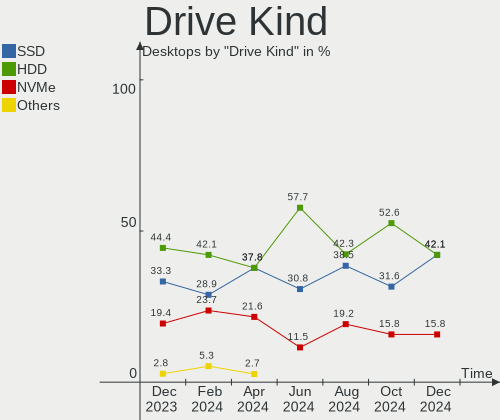
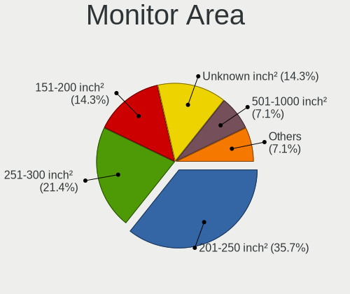

Xubuntu - Hardware Trends (Desktops)
------------------------------------

A project to identify most popular hardware characteristics and track their change
over time based on data collected by Linux users at https://Linux-Hardware.org.

Anyone can contribute to this report by the [hw-probe](https://github.com/linuxhw/hw-probe) tool:

    sudo -E hw-probe -all -upload

This report is for one last month. Overall report since the beginning of time: [TestCoverage](https://github.com/linuxhw/TestCoverage)

Period: Aug, 2022.

Contents
--------

* [ System ](#system)
  - [ OS                       ](#os)
  - [ OS Family                ](#os-family)
  - [ Kernel                   ](#kernel)
  - [ Kernel Family            ](#kernel-family)
  - [ Kernel Major Ver.        ](#kernel-major-ver)
  - [ Arch                     ](#arch)
  - [ DE                       ](#de)
  - [ Display Server           ](#display-server)
  - [ Display Manager          ](#display-manager)
  - [ OS Lang                  ](#os-lang)
  - [ Boot Mode                ](#boot-mode)
  - [ Filesystem               ](#filesystem)
  - [ Part. scheme             ](#part-scheme)
  - [ Dual Boot with Linux/BSD ](#dual-boot-with-linuxbsd)
  - [ Dual Boot (Win)          ](#dual-boot-win)

* [ Board ](#board)
  - [ Vendor                   ](#vendor)
  - [ Model                    ](#model)
  - [ Model Family             ](#model-family)
  - [ MFG Year                 ](#mfg-year)
  - [ Form Factor              ](#form-factor)
  - [ Secure Boot              ](#secure-boot)
  - [ Coreboot                 ](#coreboot)
  - [ RAM Size                 ](#ram-size)
  - [ RAM Used                 ](#ram-used)
  - [ Total Drives             ](#total-drives)
  - [ Has CD-ROM               ](#has-cd-rom)
  - [ Has Ethernet             ](#has-ethernet)
  - [ Has WiFi                 ](#has-wifi)
  - [ Has Bluetooth            ](#has-bluetooth)

* [ Location ](#location)
  - [ Country                  ](#country)
  - [ City                     ](#city)

* [ Drives ](#drives)
  - [ Drive Vendor             ](#drive-vendor)
  - [ Drive Model              ](#drive-model)
  - [ HDD Vendor               ](#hdd-vendor)
  - [ SSD Vendor               ](#ssd-vendor)
  - [ Drive Kind               ](#drive-kind)
  - [ Drive Connector          ](#drive-connector)
  - [ Drive Size               ](#drive-size)
  - [ Space Total              ](#space-total)
  - [ Space Used               ](#space-used)
  - [ Malfunc. Drives          ](#malfunc-drives)
  - [ Malfunc. Drive Vendor    ](#malfunc-drive-vendor)
  - [ Malfunc. HDD Vendor      ](#malfunc-hdd-vendor)
  - [ Malfunc. Drive Kind      ](#malfunc-drive-kind)
  - [ Failed Drives            ](#failed-drives)
  - [ Failed Drive Vendor      ](#failed-drive-vendor)
  - [ Drive Status             ](#drive-status)

* [ Storage controller ](#storage-controller)
  - [ Storage Vendor           ](#storage-vendor)
  - [ Storage Model            ](#storage-model)
  - [ Storage Kind             ](#storage-kind)

* [ Processor ](#processor)
  - [ CPU Vendor               ](#cpu-vendor)
  - [ CPU Model                ](#cpu-model)
  - [ CPU Model Family         ](#cpu-model-family)
  - [ CPU Cores                ](#cpu-cores)
  - [ CPU Sockets              ](#cpu-sockets)
  - [ CPU Threads              ](#cpu-threads)
  - [ CPU Op-Modes             ](#cpu-op-modes)
  - [ CPU Microcode            ](#cpu-microcode)
  - [ CPU Microarch            ](#cpu-microarch)

* [ Graphics ](#graphics)
  - [ GPU Vendor               ](#gpu-vendor)
  - [ GPU Model                ](#gpu-model)
  - [ GPU Combo                ](#gpu-combo)
  - [ GPU Driver               ](#gpu-driver)
  - [ GPU Memory               ](#gpu-memory)

* [ Monitor ](#monitor)
  - [ Monitor Vendor           ](#monitor-vendor)
  - [ Monitor Model            ](#monitor-model)
  - [ Monitor Resolution       ](#monitor-resolution)
  - [ Monitor Diagonal         ](#monitor-diagonal)
  - [ Monitor Width            ](#monitor-width)
  - [ Aspect Ratio             ](#aspect-ratio)
  - [ Monitor Area             ](#monitor-area)
  - [ Pixel Density            ](#pixel-density)
  - [ Multiple Monitors        ](#multiple-monitors)

* [ Network ](#network)
  - [ Net Controller Vendor    ](#net-controller-vendor)
  - [ Net Controller Model     ](#net-controller-model)
  - [ Wireless Vendor          ](#wireless-vendor)
  - [ Wireless Model           ](#wireless-model)
  - [ Ethernet Vendor          ](#ethernet-vendor)
  - [ Ethernet Model           ](#ethernet-model)
  - [ Net Controller Kind      ](#net-controller-kind)
  - [ Used Controller          ](#used-controller)
  - [ NICs                     ](#nics)
  - [ IPv6                     ](#ipv6)

* [ Bluetooth ](#bluetooth)
  - [ Bluetooth Vendor         ](#bluetooth-vendor)
  - [ Bluetooth Model          ](#bluetooth-model)

* [ Sound ](#sound)
  - [ Sound Vendor             ](#sound-vendor)
  - [ Sound Model              ](#sound-model)

* [ Memory ](#memory)
  - [ Memory Vendor            ](#memory-vendor)
  - [ Memory Model             ](#memory-model)
  - [ Memory Kind              ](#memory-kind)
  - [ Memory Form Factor       ](#memory-form-factor)
  - [ Memory Size              ](#memory-size)
  - [ Memory Speed             ](#memory-speed)

* [ Printers & scanners ](#printers--scanners)
  - [ Printer Vendor           ](#printer-vendor)
  - [ Printer Model            ](#printer-model)
  - [ Scanner Vendor           ](#scanner-vendor)
  - [ Scanner Model            ](#scanner-model)

* [ Camera ](#camera)
  - [ Camera Vendor            ](#camera-vendor)
  - [ Camera Model             ](#camera-model)

* [ Security ](#security)
  - [ Fingerprint Vendor       ](#fingerprint-vendor)
  - [ Fingerprint Model        ](#fingerprint-model)
  - [ Chipcard Vendor          ](#chipcard-vendor)
  - [ Chipcard Model           ](#chipcard-model)

* [ Unsupported ](#unsupported)
  - [ Unsupported Devices      ](#unsupported-devices)
  - [ Unsupported Device Types ](#unsupported-device-types)

System
------

OS
--

Installed operating systems

| Name          | Desktops | Percent |
|---------------|----------|---------|
| Xubuntu 20.04 | 15       | 46.88%  |
| Xubuntu 22.04 | 14       | 43.75%  |
| Xubuntu 18.04 | 3        | 9.38%   |

OS Family
---------

OS without a version

| Name    | Desktops | Percent |
|---------|----------|---------|
| Xubuntu | 32       | 100%    |

Kernel
------

Version of the Linux kernel

| Version              | Desktops | Percent |
|----------------------|----------|---------|
| 5.15.0-46-generic    | 12       | 37.5%   |
| 5.4.0-124-generic    | 3        | 9.38%   |
| 5.4.0-122-generic    | 3        | 9.38%   |
| 5.15.0-43-generic    | 3        | 9.38%   |
| 5.15.0-46-lowlatency | 2        | 6.25%   |
| 5.13.0-44-generic    | 2        | 6.25%   |
| 5.4.0-70-generic     | 1        | 3.13%   |
| 5.4.0-125-generic    | 1        | 3.13%   |
| 5.4.0-122-lowlatency | 1        | 3.13%   |
| 5.4.0-110-generic    | 1        | 3.13%   |
| 5.19.1               | 1        | 3.13%   |
| 5.15.0-43-lowlatency | 1        | 3.13%   |
| 5.15.0-25-generic    | 1        | 3.13%   |

Kernel Family
-------------

Linux kernel without a distro release

| Version | Desktops | Percent |
|---------|----------|---------|
| 5.15.0  | 19       | 59.38%  |
| 5.4.0   | 10       | 31.25%  |
| 5.13.0  | 2        | 6.25%   |
| 5.19.1  | 1        | 3.13%   |

Kernel Major Ver.
-----------------

Linux kernel major version

| Version | Desktops | Percent |
|---------|----------|---------|
| 5.15    | 19       | 59.38%  |
| 5.4     | 10       | 31.25%  |
| 5.13    | 2        | 6.25%   |
| 5.19    | 1        | 3.13%   |

Arch
----

OS architecture (x86_64, i586, etc.)

| Name   | Desktops | Percent |
|--------|----------|---------|
| x86_64 | 32       | 100%    |

DE
--

Desktop Environment

| Name  | Desktops | Percent |
|-------|----------|---------|
| XFCE  | 28       | 87.5%   |
| GNOME | 2        | 6.25%   |
| MATE  | 1        | 3.13%   |
| i3    | 1        | 3.13%   |

Display Server
--------------

X11 or Wayland

| Name    | Desktops | Percent |
|---------|----------|---------|
| X11     | 30       | 93.75%  |
| Wayland | 1        | 3.13%   |
| Tty     | 1        | 3.13%   |

Display Manager
---------------

SDDM, LightDM, etc.

| Name    | Desktops | Percent |
|---------|----------|---------|
| LightDM | 26       | 81.25%  |
| Unknown | 3        | 9.38%   |
| GDM     | 2        | 6.25%   |
| GDM3    | 1        | 3.13%   |

OS Lang
-------

Language

| Lang  | Desktops | Percent |
|-------|----------|---------|
| en_US | 11       | 34.38%  |
| fr_FR | 7        | 21.88%  |
| de_DE | 4        | 12.5%   |
| en_GB | 2        | 6.25%   |
| en_AU | 2        | 6.25%   |
| ru_RU | 1        | 3.13%   |
| pt_BR | 1        | 3.13%   |
| it_IT | 1        | 3.13%   |
| fr_CH | 1        | 3.13%   |
| es_PE | 1        | 3.13%   |
| C     | 1        | 3.13%   |

Boot Mode
---------

EFI or BIOS

| Mode | Desktops | Percent |
|------|----------|---------|
| BIOS | 21       | 65.63%  |
| EFI  | 11       | 34.38%  |

Filesystem
----------

Type of filesystem

| Type    | Desktops | Percent |
|---------|----------|---------|
| Ext4    | 30       | 93.75%  |
| Overlay | 1        | 3.13%   |
| Ext3    | 1        | 3.13%   |

Part. scheme
------------

Scheme of partitioning

| Type    | Desktops | Percent |
|---------|----------|---------|
| Unknown | 17       | 53.13%  |
| GPT     | 12       | 37.5%   |
| MBR     | 3        | 9.38%   |

Dual Boot with Linux/BSD
------------------------

Hosting more than one Linux/BSD

| Dual boot | Desktops | Percent |
|-----------|----------|---------|
| No        | 22       | 68.75%  |
| Yes       | 10       | 31.25%  |

Dual Boot (Win)
---------------

Hosting Linux and Windows

| Dual boot | Desktops | Percent |
|-----------|----------|---------|
| Yes       | 16       | 50%     |
| No        | 16       | 50%     |

Board
-----

Vendor
------

Motherboard manufacturer

| Name                | Desktops | Percent |
|---------------------|----------|---------|
| ASUSTek Computer    | 9        | 28.13%  |
| Gigabyte Technology | 8        | 25%     |
| Hewlett-Packard     | 3        | 9.38%   |
| Dell                | 3        | 9.38%   |
| MSI                 | 2        | 6.25%   |
| eMachines           | 2        | 6.25%   |
| OEM_MB              | 1        | 3.13%   |
| Intel               | 1        | 3.13%   |
| Foxconn             | 1        | 3.13%   |
| DNI                 | 1        | 3.13%   |
| ASRock              | 1        | 3.13%   |

Model
-----

Motherboard model

| Name                              | Desktops | Percent |
|-----------------------------------|----------|---------|
| OEM_MB KX733AA-ABU a6511.uk       | 1        | 3.13%   |
| MSI MS-7C08                       | 1        | 3.13%   |
| MSI MS-7A33                       | 1        | 3.13%   |
| Intel H61                         | 1        | 3.13%   |
| HP Z1 Entry Tower G5              | 1        | 3.13%   |
| HP Pavilion Desktop 590-p0xxx     | 1        | 3.13%   |
| HP ENVY Desktop 795-06xx          | 1        | 3.13%   |
| Gigabyte Z97X-UD3H                | 1        | 3.13%   |
| Gigabyte H97M-D3H                 | 1        | 3.13%   |
| Gigabyte H370HD3                  | 1        | 3.13%   |
| Gigabyte GA-MA790FXT-UD5P         | 1        | 3.13%   |
| Gigabyte GA-78LMT-USB3 6.0        | 1        | 3.13%   |
| Gigabyte F2A88XM-D3H              | 1        | 3.13%   |
| Gigabyte F2A78M-HD2               | 1        | 3.13%   |
| Gigabyte AB350-Gaming             | 1        | 3.13%   |
| Foxconn p6-2466ef                 | 1        | 3.13%   |
| eMachines ET1352                  | 1        | 3.13%   |
| eMachines EL1358G                 | 1        | 3.13%   |
| DNI SteelHead CX-580              | 1        | 3.13%   |
| Dell PowerEdge T30                | 1        | 3.13%   |
| Dell OptiPlex 7010                | 1        | 3.13%   |
| Dell Inspiron 530                 | 1        | 3.13%   |
| ASUS Z170 PRO GAMING              | 1        | 3.13%   |
| ASUS Z10PE-D16 WS                 | 1        | 3.13%   |
| ASUS ROG STRIX B450-F GAMING II   | 1        | 3.13%   |
| ASUS ROG CROSSHAIR VIII DARK HERO | 1        | 3.13%   |
| ASUS P8Z77-M PRO                  | 1        | 3.13%   |
| ASUS P8H67-M LE                   | 1        | 3.13%   |
| ASUS K30AD_M31AD_M51AD            | 1        | 3.13%   |
| ASUS All Series                   | 1        | 3.13%   |
| ASUS A0000001                     | 1        | 3.13%   |
| ASRock X58 Extreme3               | 1        | 3.13%   |

Model Family
------------

Motherboard model prefix

| Name                      | Desktops | Percent |
|---------------------------|----------|---------|
| ASUS ROG                  | 2        | 6.25%   |
| OEM_MB KX733AA-ABU        | 1        | 3.13%   |
| MSI MS-7C08               | 1        | 3.13%   |
| MSI MS-7A33               | 1        | 3.13%   |
| Intel H61                 | 1        | 3.13%   |
| HP Z1                     | 1        | 3.13%   |
| HP Pavilion               | 1        | 3.13%   |
| HP ENVY                   | 1        | 3.13%   |
| Gigabyte Z97X-UD3H        | 1        | 3.13%   |
| Gigabyte H97M-D3H         | 1        | 3.13%   |
| Gigabyte H370HD3          | 1        | 3.13%   |
| Gigabyte GA-MA790FXT-UD5P | 1        | 3.13%   |
| Gigabyte GA-78LMT-USB3    | 1        | 3.13%   |
| Gigabyte F2A88XM-D3H      | 1        | 3.13%   |
| Gigabyte F2A78M-HD2       | 1        | 3.13%   |
| Gigabyte AB350-Gaming     | 1        | 3.13%   |
| Foxconn p6-2466ef         | 1        | 3.13%   |
| eMachines ET1352          | 1        | 3.13%   |
| eMachines EL1358G         | 1        | 3.13%   |
| DNI SteelHead             | 1        | 3.13%   |
| Dell PowerEdge            | 1        | 3.13%   |
| Dell OptiPlex             | 1        | 3.13%   |
| Dell Inspiron             | 1        | 3.13%   |
| ASUS Z170                 | 1        | 3.13%   |
| ASUS Z10PE-D16            | 1        | 3.13%   |
| ASUS P8Z77-M              | 1        | 3.13%   |
| ASUS P8H67-M              | 1        | 3.13%   |
| ASUS K30AD                | 1        | 3.13%   |
| ASUS All                  | 1        | 3.13%   |
| ASUS A0000001             | 1        | 3.13%   |
| ASRock X58                | 1        | 3.13%   |

MFG Year
--------

Motherboard manufacture year

| Year | Desktops | Percent |
|------|----------|---------|
| 2014 | 6        | 18.75%  |
| 2017 | 5        | 15.63%  |
| 2018 | 4        | 12.5%   |
| 2013 | 3        | 9.38%   |
| 2019 | 2        | 6.25%   |
| 2011 | 2        | 6.25%   |
| 2010 | 2        | 6.25%   |
| 2022 | 1        | 3.13%   |
| 2021 | 1        | 3.13%   |
| 2020 | 1        | 3.13%   |
| 2015 | 1        | 3.13%   |
| 2012 | 1        | 3.13%   |
| 2009 | 1        | 3.13%   |
| 2008 | 1        | 3.13%   |
| 2007 | 1        | 3.13%   |

Form Factor
-----------

Physical design of the computer

| Name    | Desktops | Percent |
|---------|----------|---------|
| Desktop | 32       | 100%    |

Secure Boot
-----------

Enabled or disabled

| State    | Desktops | Percent |
|----------|----------|---------|
| Disabled | 31       | 96.88%  |
| Enabled  | 1        | 3.13%   |

Coreboot
--------

Have coreboot on board

| Used | Desktops | Percent |
|------|----------|---------|
| No   | 32       | 100%    |

RAM Size
--------

Total RAM memory

| Size in GB  | Desktops | Percent |
|-------------|----------|---------|
| 4.01-8.0    | 9        | 28.13%  |
| 16.01-24.0  | 9        | 28.13%  |
| 32.01-64.0  | 5        | 15.63%  |
| 3.01-4.0    | 3        | 9.38%   |
| 64.01-256.0 | 2        | 6.25%   |
| 8.01-16.0   | 2        | 6.25%   |
| 24.01-32.0  | 1        | 3.13%   |
| 1.01-2.0    | 1        | 3.13%   |

RAM Used
--------

Used RAM memory

| Used GB   | Desktops | Percent |
|-----------|----------|---------|
| 1.01-2.0  | 13       | 40.63%  |
| 2.01-3.0  | 7        | 21.88%  |
| 3.01-4.0  | 5        | 15.63%  |
| 4.01-8.0  | 4        | 12.5%   |
| 8.01-16.0 | 3        | 9.38%   |

Total Drives
------------

Number of drives on board

| Drives | Desktops | Percent |
|--------|----------|---------|
| 2      | 11       | 34.38%  |
| 3      | 8        | 25%     |
| 1      | 5        | 15.63%  |
| 4      | 3        | 9.38%   |
| 7      | 2        | 6.25%   |
| 8      | 1        | 3.13%   |
| 6      | 1        | 3.13%   |
| 5      | 1        | 3.13%   |

Has CD-ROM
----------

Has CD-ROM on board

| Presented | Desktops | Percent |
|-----------|----------|---------|
| Yes       | 21       | 65.63%  |
| No        | 11       | 34.38%  |

Has Ethernet
------------

Has Ethernet on board

| Presented | Desktops | Percent |
|-----------|----------|---------|
| Yes       | 32       | 100%    |

Has WiFi
--------

Has WiFi module

| Presented | Desktops | Percent |
|-----------|----------|---------|
| No        | 22       | 68.75%  |
| Yes       | 10       | 31.25%  |

Has Bluetooth
-------------

Has Bluetooth module

| Presented | Desktops | Percent |
|-----------|----------|---------|
| No        | 25       | 78.13%  |
| Yes       | 7        | 21.88%  |

Location
--------

Country
-------

Geographic location (country)

| Country      | Desktops | Percent |
|--------------|----------|---------|
| USA          | 6        | 18.75%  |
| France       | 5        | 15.63%  |
| Germany      | 4        | 12.5%   |
| UK           | 2        | 6.25%   |
| Italy        | 2        | 6.25%   |
| Australia    | 2        | 6.25%   |
| Taiwan       | 1        | 3.13%   |
| Switzerland  | 1        | 3.13%   |
| South Africa | 1        | 3.13%   |
| Russia       | 1        | 3.13%   |
| Romania      | 1        | 3.13%   |
| Portugal     | 1        | 3.13%   |
| Peru         | 1        | 3.13%   |
| Iran         | 1        | 3.13%   |
| Guadeloupe   | 1        | 3.13%   |
| Brazil       | 1        | 3.13%   |
| Belgium      | 1        | 3.13%   |

City
----

Geographic location (city)

| City                | Desktops | Percent |
|---------------------|----------|---------|
| Sydney              | 2        | 6.25%   |
| Paris               | 2        | 6.25%   |
| Toccoa              | 1        | 3.13%   |
| Sainte-Rose         | 1        | 3.13%   |
| Saint Joseph        | 1        | 3.13%   |
| Rehnān             | 1        | 3.13%   |
| Pieris              | 1        | 3.13%   |
| New Taipei          | 1        | 3.13%   |
| Ludwigsburg         | 1        | 3.13%   |
| Lisbon              | 1        | 3.13%   |
| Lima                | 1        | 3.13%   |
| Lansdale            | 1        | 3.13%   |
| La Tour-de-Peilz    | 1        | 3.13%   |
| Kamensk-Shakhtinsky | 1        | 3.13%   |
| Ghent               | 1        | 3.13%   |
| Élancourt          | 1        | 3.13%   |
| Edinburgh           | 1        | 3.13%   |
| Durham              | 1        | 3.13%   |
| Durbanville         | 1        | 3.13%   |
| Dresden             | 1        | 3.13%   |
| Dothan              | 1        | 3.13%   |
| Camden              | 1        | 3.13%   |
| Bruchsal            | 1        | 3.13%   |
| Bristol             | 1        | 3.13%   |
| Bressuire           | 1        | 3.13%   |
| Brasov              | 1        | 3.13%   |
| Brasília           | 1        | 3.13%   |
| Bolzano             | 1        | 3.13%   |
| Biarritz            | 1        | 3.13%   |
| Berlin              | 1        | 3.13%   |

Drives
------

Drive Vendor
------------

Hard drive vendors

| Vendor              | Desktops | Drives | Percent |
|---------------------|----------|--------|---------|
| Seagate             | 15       | 20     | 22.39%  |
| WDC                 | 13       | 21     | 19.4%   |
| Samsung Electronics | 9        | 11     | 13.43%  |
| Toshiba             | 7        | 10     | 10.45%  |
| Crucial             | 5        | 7      | 7.46%   |
| Hitachi             | 4        | 10     | 5.97%   |
| PNY                 | 2        | 2      | 2.99%   |
| Wintec              | 1        | 1      | 1.49%   |
| SPCC                | 1        | 1      | 1.49%   |
| SK hynix            | 1        | 1      | 1.49%   |
| Phison              | 1        | 2      | 1.49%   |
| Patriot             | 1        | 1      | 1.49%   |
| OCZ                 | 1        | 1      | 1.49%   |
| Kingston            | 1        | 1      | 1.49%   |
| Intel               | 1        | 1      | 1.49%   |
| Emtec               | 1        | 1      | 1.49%   |
| China               | 1        | 1      | 1.49%   |
| Apple               | 1        | 1      | 1.49%   |
| A-DATA Technology   | 1        | 1      | 1.49%   |

Drive Model
-----------

Hard drive models

| Model                                   | Desktops | Percent |
|-----------------------------------------|----------|---------|
| Seagate ST1000DM003-1SB102 1TB          | 3        | 3.61%   |
| Seagate ST3500413AS 500GB               | 2        | 2.41%   |
| Seagate ST3320620AS 320GB               | 2        | 2.41%   |
| Wintec S6 30G M.2 SSD                   | 1        | 1.2%    |
| WDC WD80EFAX-68KNBN0 8TB                | 1        | 1.2%    |
| WDC WD740ADFD-00NLR5 74GB               | 1        | 1.2%    |
| WDC WD40EZAZ-00SF3B0 4TB                | 1        | 1.2%    |
| WDC WD4003FRYZ-01F0DB0 4TB              | 1        | 1.2%    |
| WDC WD3200AAJS-60Z0A0 320GB             | 1        | 1.2%    |
| WDC WD30EZRZ-00Z5HB0 3TB                | 1        | 1.2%    |
| WDC WD30 EZRX-00D8PB0 3TB               | 1        | 1.2%    |
| WDC WD20EZRX-00D8PB0 2TB                | 1        | 1.2%    |
| WDC WD20EARX-00PASB0 2TB                | 1        | 1.2%    |
| WDC WD2002FYPS-02W3B0 2TB               | 1        | 1.2%    |
| WDC WD1600JS-60MHB1 160GB               | 1        | 1.2%    |
| WDC WD10PURX-64D85Y0 1TB                | 1        | 1.2%    |
| WDC WD10EZEX-60ZF5A0 1TB                | 1        | 1.2%    |
| WDC WD10EZEX-08WN4A0 1TB                | 1        | 1.2%    |
| WDC WD10EZEX-00BN5A0 1TB                | 1        | 1.2%    |
| WDC WD10EARS-00Y5B1 1TB                 | 1        | 1.2%    |
| WDC WD10EADX-22TDHB0 1TB                | 1        | 1.2%    |
| WDC WD102KFBX-68M95N0 10TB              | 1        | 1.2%    |
| WDC WD1003FZEX-00K3CA0 1TB              | 1        | 1.2%    |
| Toshiba Q300 120GB SSD                  | 1        | 1.2%    |
| Toshiba MK5065GSX 500GB                 | 1        | 1.2%    |
| Toshiba MK3265GSXF 320GB                | 1        | 1.2%    |
| Toshiba HDWE140 4TB                     | 1        | 1.2%    |
| Toshiba DT01ACA300 3TB                  | 1        | 1.2%    |
| Toshiba DT01ACA200 2TB                  | 1        | 1.2%    |
| Toshiba DT01ACA050 500GB                | 1        | 1.2%    |
| SPCC Solid State Disk 240GB             | 1        | 1.2%    |
| SK hynix PC601 HFS512GD9TNG-L2A0A 512GB | 1        | 1.2%    |
| Seagate ST9500420AS 500GB               | 1        | 1.2%    |
| Seagate ST8000DM004-2CX188 8TB          | 1        | 1.2%    |
| Seagate ST500LM012 HN-M500MBB 500GB     | 1        | 1.2%    |
| Seagate ST3750840AS 752GB               | 1        | 1.2%    |
| Seagate ST3250820AS 250GB               | 1        | 1.2%    |
| Seagate ST3250318AS 250GB               | 1        | 1.2%    |
| Seagate ST250DM000-1BD141 250GB         | 1        | 1.2%    |
| Seagate ST2000DL003-9VT166 2TB          | 1        | 1.2%    |
| Seagate ST1000LV000-2G3172 1TB          | 1        | 1.2%    |
| Seagate ST1000LM035-1RK172 1TB          | 1        | 1.2%    |
| Seagate ST1000DM010-2EP102 1TB          | 1        | 1.2%    |
| Seagate ST10000NM0086-2AA101 10TB       | 1        | 1.2%    |
| Samsung SSD RBX Series 64GB M           | 1        | 1.2%    |
| Samsung SSD 970 EVO Plus 1TB            | 1        | 1.2%    |
| Samsung SSD 840 Series 120GB            | 1        | 1.2%    |
| Samsung SSD 840 EVO 250GB               | 1        | 1.2%    |
| Samsung SSD 840 EVO 1TB                 | 1        | 1.2%    |
| Samsung SSD 840 EVO 120GB               | 1        | 1.2%    |
| Samsung NVMe SSD Drive 1TB              | 1        | 1.2%    |
| Samsung HD204UI 2TB                     | 1        | 1.2%    |
| Samsung HD160JJ 160GB                   | 1        | 1.2%    |
| Samsung HD154UI 1TB                     | 1        | 1.2%    |
| Samsung HD081GJ 80GB                    | 1        | 1.2%    |
| PNY CS900 500GB SSD                     | 1        | 1.2%    |
| PNY CS3030 250GB SSD                    | 1        | 1.2%    |
| Phison Sabrent Rocket 4.0 Plus 4TB      | 1        | 1.2%    |
| Patriot Burst 240GB SSD                 | 1        | 1.2%    |
| OCZ AGILITY3 64GB SSD                   | 1        | 1.2%    |

HDD Vendor
----------

Hard disk drive vendors

| Vendor              | Desktops | Drives | Percent |
|---------------------|----------|--------|---------|
| Seagate             | 15       | 20     | 34.88%  |
| WDC                 | 13       | 21     | 30.23%  |
| Toshiba             | 6        | 9      | 13.95%  |
| Samsung Electronics | 4        | 4      | 9.3%    |
| Hitachi             | 4        | 10     | 9.3%    |
| Apple               | 1        | 1      | 2.33%   |

SSD Vendor
----------

Solid state drive vendors

| Vendor              | Desktops | Drives | Percent |
|---------------------|----------|--------|---------|
| Samsung Electronics | 4        | 5      | 22.22%  |
| Crucial             | 4        | 6      | 22.22%  |
| Wintec              | 1        | 1      | 5.56%   |
| Toshiba             | 1        | 1      | 5.56%   |
| SPCC                | 1        | 1      | 5.56%   |
| PNY                 | 1        | 1      | 5.56%   |
| Patriot             | 1        | 1      | 5.56%   |
| OCZ                 | 1        | 1      | 5.56%   |
| Kingston            | 1        | 1      | 5.56%   |
| Intel               | 1        | 1      | 5.56%   |
| China               | 1        | 1      | 5.56%   |
| A-DATA Technology   | 1        | 1      | 5.56%   |

Drive Kind
----------

HDD or SSD

| Kind    | Desktops | Drives | Percent |
|---------|----------|--------|---------|
| HDD     | 28       | 65     | 58.33%  |
| SSD     | 13       | 21     | 27.08%  |
| NVMe    | 6        | 7      | 12.5%   |
| Unknown | 1        | 1      | 2.08%   |

Drive Connector
---------------

SATA, SAS, NVMe, etc.

| Type | Desktops | Drives | Percent |
|------|----------|--------|---------|
| SATA | 31       | 85     | 79.49%  |
| NVMe | 6        | 7      | 15.38%  |
| SAS  | 2        | 2      | 5.13%   |

Drive Size
----------

Size of hard drive

| Size in TB | Desktops | Drives | Percent |
|------------|----------|--------|---------|
| 0.01-0.5   | 21       | 39     | 40.38%  |
| 0.51-1.0   | 18       | 25     | 34.62%  |
| 1.01-2.0   | 6        | 8      | 11.54%  |
| 3.01-4.0   | 3        | 3      | 5.77%   |
| 2.01-3.0   | 2        | 7      | 3.85%   |
| 4.01-10.0  | 2        | 4      | 3.85%   |

Space Total
-----------

Amount of disk space available on the file system

| Size in GB     | Desktops | Percent |
|----------------|----------|---------|
| 501-1000       | 8        | 25%     |
| 101-250        | 7        | 21.88%  |
| 251-500        | 5        | 15.63%  |
| 1001-2000      | 4        | 12.5%   |
| More than 3000 | 3        | 9.38%   |
| 2001-3000      | 3        | 9.38%   |
| 51-100         | 2        | 6.25%   |

Space Used
----------

Amount of used disk space

| Used GB        | Desktops | Percent |
|----------------|----------|---------|
| 251-500        | 9        | 28.13%  |
| 101-250        | 4        | 12.5%   |
| 1-20           | 4        | 12.5%   |
| 51-100         | 4        | 12.5%   |
| 21-50          | 3        | 9.38%   |
| 1001-2000      | 3        | 9.38%   |
| 501-1000       | 3        | 9.38%   |
| More than 3000 | 2        | 6.25%   |

Malfunc. Drives
---------------

Drive models with a malfunction

| Model                             | Desktops | Drives | Percent |
|-----------------------------------|----------|--------|---------|
| WDC WD3200AAJS-60Z0A0 320GB       | 1        | 1      | 8.33%   |
| WDC WD2002FYPS-02W3B0 2TB         | 1        | 1      | 8.33%   |
| WDC WD10EZEX-60ZF5A0 1TB          | 1        | 1      | 8.33%   |
| WDC WD10EARS-00Y5B1 1TB           | 1        | 1      | 8.33%   |
| Toshiba MK3265GSXF 320GB          | 1        | 1      | 8.33%   |
| Seagate ST3750840AS 752GB         | 1        | 1      | 8.33%   |
| Seagate ST3500413AS 500GB         | 1        | 1      | 8.33%   |
| Seagate ST3250318AS 250GB         | 1        | 1      | 8.33%   |
| Seagate ST10000NM0086-2AA101 10TB | 1        | 1      | 8.33%   |
| Samsung Electronics HD081GJ 80GB  | 1        | 1      | 8.33%   |
| Hitachi HDS721010CLA332 1TB       | 1        | 1      | 8.33%   |
| Hitachi HCP725032GLA380 320GB     | 1        | 2      | 8.33%   |

Malfunc. Drive Vendor
---------------------

Vendors of faulty drives

| Vendor              | Desktops | Drives | Percent |
|---------------------|----------|--------|---------|
| WDC                 | 4        | 4      | 33.33%  |
| Seagate             | 4        | 4      | 33.33%  |
| Hitachi             | 2        | 3      | 16.67%  |
| Toshiba             | 1        | 1      | 8.33%   |
| Samsung Electronics | 1        | 1      | 8.33%   |

Malfunc. HDD Vendor
-------------------

Vendors of faulty HDD drives

| Vendor              | Desktops | Drives | Percent |
|---------------------|----------|--------|---------|
| WDC                 | 4        | 4      | 33.33%  |
| Seagate             | 4        | 4      | 33.33%  |
| Hitachi             | 2        | 3      | 16.67%  |
| Toshiba             | 1        | 1      | 8.33%   |
| Samsung Electronics | 1        | 1      | 8.33%   |

Malfunc. Drive Kind
-------------------

Kinds of faulty drives

| Kind | Desktops | Drives | Percent |
|------|----------|--------|---------|
| HDD  | 10       | 13     | 100%    |

Failed Drives
-------------

Failed drive models

Zero info for selected period =(

Failed Drive Vendor
-------------------

Failed drive vendors

Zero info for selected period =(

Drive Status
------------

Number of failed and malfunc. drives

| Status   | Desktops | Drives | Percent |
|----------|----------|--------|---------|
| Detected | 17       | 50     | 42.5%   |
| Works    | 13       | 31     | 32.5%   |
| Malfunc  | 10       | 13     | 25%     |

Storage controller
------------------

Storage Vendor
--------------

Storage controller vendors

| Vendor                    | Desktops | Percent |
|---------------------------|----------|---------|
| Intel                     | 19       | 43.18%  |
| AMD                       | 10       | 22.73%  |
| Nvidia                    | 3        | 6.82%   |
| ASMedia Technology        | 3        | 6.82%   |
| Samsung Electronics       | 2        | 4.55%   |
| Phison Electronics        | 2        | 4.55%   |
| SK hynix                  | 1        | 2.27%   |
| Micron/Crucial Technology | 1        | 2.27%   |
| Marvell Technology Group  | 1        | 2.27%   |
| JMicron Technology        | 1        | 2.27%   |
| Adaptec                   | 1        | 2.27%   |

Storage Model
-------------

Storage controller models

| Model                                                                                   | Desktops | Percent |
|-----------------------------------------------------------------------------------------|----------|---------|
| AMD FCH SATA Controller [AHCI mode]                                                     | 6        | 10.53%  |
| Nvidia MCP61 SATA Controller                                                            | 3        | 5.26%   |
| Intel Cannon Lake PCH SATA AHCI Controller                                              | 3        | 5.26%   |
| Intel 9 Series Chipset Family SATA Controller [AHCI Mode]                               | 3        | 5.26%   |
| ASMedia ASM1062 Serial ATA Controller                                                   | 3        | 5.26%   |
| Samsung NVMe SSD Controller SM981/PM981/PM983                                           | 2        | 3.51%   |
| Nvidia MCP61 IDE                                                                        | 2        | 3.51%   |
| Intel 8 Series/C220 Series Chipset Family 6-port SATA Controller 1 [AHCI mode]          | 2        | 3.51%   |
| Intel 7 Series/C210 Series Chipset Family 6-port SATA Controller [AHCI mode]            | 2        | 3.51%   |
| Intel 6 Series/C200 Series Chipset Family 6 port Desktop SATA AHCI Controller           | 2        | 3.51%   |
| AMD SB7x0/SB8x0/SB9x0 IDE Controller                                                    | 2        | 3.51%   |
| AMD 400 Series Chipset SATA Controller                                                  | 2        | 3.51%   |
| AMD 300 Series Chipset SATA Controller                                                  | 2        | 3.51%   |
| SK hynix Non-Volatile memory controller                                                 | 1        | 1.75%   |
| Phison E18 PCIe4 NVMe Controller                                                        | 1        | 1.75%   |
| Phison E12 NVMe Controller                                                              | 1        | 1.75%   |
| Micron/Crucial NVMe Controller                                                          | 1        | 1.75%   |
| Marvell Group 88SE91A3 SATA-600 Controller                                              | 1        | 1.75%   |
| Marvell Group 88SE912x IDE Controller                                                   | 1        | 1.75%   |
| JMicron JMB363 SATA/IDE Controller                                                      | 1        | 1.75%   |
| Intel SATA Controller [RAID mode]                                                       | 1        | 1.75%   |
| Intel Q170/Q150/B150/H170/H110/Z170/CM236 Chipset SATA Controller [AHCI Mode]           | 1        | 1.75%   |
| Intel C610/X99 series chipset sSATA Controller [AHCI mode]                              | 1        | 1.75%   |
| Intel C610/X99 series chipset 6-Port SATA Controller [AHCI mode]                        | 1        | 1.75%   |
| Intel 82801JI (ICH10 Family) 4 port SATA IDE Controller #1                              | 1        | 1.75%   |
| Intel 82801JI (ICH10 Family) 2 port SATA IDE Controller #2                              | 1        | 1.75%   |
| Intel 82801IR/IO/IH (ICH9R/DO/DH) 4 port SATA Controller [IDE mode]                     | 1        | 1.75%   |
| Intel 82801I (ICH9 Family) 2 port SATA Controller [IDE mode]                            | 1        | 1.75%   |
| Intel 6 Series/C200 Series Chipset Family Desktop SATA Controller (IDE mode, ports 4-5) | 1        | 1.75%   |
| Intel 6 Series/C200 Series Chipset Family Desktop SATA Controller (IDE mode, ports 0-3) | 1        | 1.75%   |
| Intel 200 Series PCH SATA controller [AHCI mode]                                        | 1        | 1.75%   |
| AMD X370 Series Chipset SATA Controller                                                 | 1        | 1.75%   |
| AMD SB7x0/SB8x0/SB9x0 SATA Controller [IDE mode]                                        | 1        | 1.75%   |
| AMD SB7x0/SB8x0/SB9x0 SATA Controller [AHCI mode]                                       | 1        | 1.75%   |
| AMD FCH SATA Controller [RAID mode]                                                     | 1        | 1.75%   |
| Adaptec AHA-2930CU                                                                      | 1        | 1.75%   |

Storage Kind
------------

Kind of storage controller (IDE, SATA, NVMe, SAS, ...)

| Kind | Desktops | Percent |
|------|----------|---------|
| SATA | 25       | 59.52%  |
| IDE  | 8        | 19.05%  |
| NVMe | 6        | 14.29%  |
| RAID | 2        | 4.76%   |
| SCSI | 1        | 2.38%   |

Processor
---------

CPU Vendor
----------

Processor vendors

| Vendor | Desktops | Percent |
|--------|----------|---------|
| Intel  | 19       | 59.38%  |
| AMD    | 13       | 40.63%  |

CPU Model
---------

Processor models

| Model                                       | Desktops | Percent |
|---------------------------------------------|----------|---------|
| Intel Core i5-3470 CPU @ 3.20GHz            | 2        | 6.25%   |
| Intel Xeon CPU E5-2603 v4 @ 1.70GHz         | 1        | 3.13%   |
| Intel Xeon CPU E3-1225 v5 @ 3.30GHz         | 1        | 3.13%   |
| Intel Xeon CPU D-1513N @ 1.60GHz            | 1        | 3.13%   |
| Intel Pentium Dual CPU E2180 @ 2.00GHz      | 1        | 3.13%   |
| Intel Core i9-9900 CPU @ 3.10GHz            | 1        | 3.13%   |
| Intel Core i7-9700 CPU @ 3.00GHz            | 1        | 3.13%   |
| Intel Core i7-8700 CPU @ 3.20GHz            | 1        | 3.13%   |
| Intel Core i7-6700K CPU @ 4.00GHz           | 1        | 3.13%   |
| Intel Core i7-4790K CPU @ 4.00GHz           | 1        | 3.13%   |
| Intel Core i7-4790 CPU @ 3.60GHz            | 1        | 3.13%   |
| Intel Core i7-3770K CPU @ 3.50GHz           | 1        | 3.13%   |
| Intel Core i7 CPU 950 @ 3.07GHz             | 1        | 3.13%   |
| Intel Core i5-4690K CPU @ 3.50GHz           | 1        | 3.13%   |
| Intel Core i5-4590 CPU @ 3.30GHz            | 1        | 3.13%   |
| Intel Core i5-3350P CPU @ 3.10GHz           | 1        | 3.13%   |
| Intel Core i3-9100 CPU @ 3.60GHz            | 1        | 3.13%   |
| Intel Core i3-2100 CPU @ 3.10GHz            | 1        | 3.13%   |
| AMD Ryzen 9 5950X 16-Core Processor         | 1        | 3.13%   |
| AMD Ryzen 7 5800X 8-Core Processor          | 1        | 3.13%   |
| AMD Ryzen 7 2700 Eight-Core Processor       | 1        | 3.13%   |
| AMD Ryzen 5 2600X Six-Core Processor        | 1        | 3.13%   |
| AMD Ryzen 5 1500X Quad-Core Processor       | 1        | 3.13%   |
| AMD Ryzen 3 2200G with Radeon Vega Graphics | 1        | 3.13%   |
| AMD Processor model unknown                 | 1        | 3.13%   |
| AMD Phenom II X4 955 Processor              | 1        | 3.13%   |
| AMD FX-6300 Six-Core Processor              | 1        | 3.13%   |
| AMD Athlon X4 845 Quad Core Processor       | 1        | 3.13%   |
| AMD Athlon II X2 220 Processor              | 1        | 3.13%   |
| AMD Athlon II 160u Processor                | 1        | 3.13%   |
| AMD A8-6600K APU with Radeon HD Graphics    | 1        | 3.13%   |

CPU Model Family
----------------

Processor model prefix

| Model              | Desktops | Percent |
|--------------------|----------|---------|
| Intel Core i7      | 7        | 21.88%  |
| Intel Core i5      | 5        | 15.63%  |
| Intel Xeon         | 3        | 9.38%   |
| Intel Core i3      | 2        | 6.25%   |
| AMD Ryzen 7        | 2        | 6.25%   |
| AMD Ryzen 5        | 2        | 6.25%   |
| Other              | 1        | 3.13%   |
| Intel Pentium Dual | 1        | 3.13%   |
| Intel Core i9      | 1        | 3.13%   |
| AMD Ryzen 9        | 1        | 3.13%   |
| AMD Ryzen 3        | 1        | 3.13%   |
| AMD Phenom II X4   | 1        | 3.13%   |
| AMD FX             | 1        | 3.13%   |
| AMD Athlon X4      | 1        | 3.13%   |
| AMD Athlon II X2   | 1        | 3.13%   |
| AMD Athlon II      | 1        | 3.13%   |
| AMD A8             | 1        | 3.13%   |

CPU Cores
---------

Number of processor cores

| Number | Desktops | Percent |
|--------|----------|---------|
| 4      | 17       | 53.13%  |
| 2      | 5        | 15.63%  |
| 8      | 4        | 12.5%   |
| 6      | 2        | 6.25%   |
| 3      | 2        | 6.25%   |
| 16     | 1        | 3.13%   |
| 1      | 1        | 3.13%   |

CPU Sockets
-----------

Number of sockets

| Number | Desktops | Percent |
|--------|----------|---------|
| 1      | 32       | 100%    |

CPU Threads
-----------

Threads per core (Hyper-Threading)

| Number | Desktops | Percent |
|--------|----------|---------|
| 2      | 16       | 50%     |
| 1      | 16       | 50%     |

CPU Op-Modes
------------

CPU Operation Modes (32-bit, 64-bit)

| Op mode        | Desktops | Percent |
|----------------|----------|---------|
| 32-bit, 64-bit | 32       | 100%    |

CPU Microcode
-------------

Microcode number

| Number     | Desktops | Percent |
|------------|----------|---------|
| Unknown    | 6        | 18.75%  |
| 0x306a9    | 4        | 12.5%   |
| 0x010000c8 | 3        | 9.38%   |
| 0x906ed    | 2        | 6.25%   |
| 0x306c3    | 2        | 6.25%   |
| 0x0a201016 | 2        | 6.25%   |
| 0x0800820d | 2        | 6.25%   |
| 0x906ea    | 1        | 3.13%   |
| 0x6fd      | 1        | 3.13%   |
| 0x506e3    | 1        | 3.13%   |
| 0x50665    | 1        | 3.13%   |
| 0x406f1    | 1        | 3.13%   |
| 0x206a7    | 1        | 3.13%   |
| 0x106a5    | 1        | 3.13%   |
| 0x08001138 | 1        | 3.13%   |
| 0x06001119 | 1        | 3.13%   |
| 0x06000852 | 1        | 3.13%   |
| 0x010000c7 | 1        | 3.13%   |

CPU Microarch
-------------

Microarchitecture

| Name        | Desktops | Percent |
|-------------|----------|---------|
| KabyLake    | 4        | 12.5%   |
| K10         | 4        | 12.5%   |
| IvyBridge   | 4        | 12.5%   |
| Haswell     | 4        | 12.5%   |
| Zen+        | 2        | 6.25%   |
| Zen 3       | 2        | 6.25%   |
| Zen         | 2        | 6.25%   |
| Skylake     | 2        | 6.25%   |
| Piledriver  | 2        | 6.25%   |
| Broadwell   | 2        | 6.25%   |
| SandyBridge | 1        | 3.13%   |
| Nehalem     | 1        | 3.13%   |
| Excavator   | 1        | 3.13%   |
| Core        | 1        | 3.13%   |

Graphics
--------

GPU Vendor
----------

Vendors of graphics cards

| Vendor | Desktops | Percent |
|--------|----------|---------|
| Nvidia | 14       | 40%     |
| Intel  | 11       | 31.43%  |
| AMD    | 10       | 28.57%  |

GPU Model
---------

Graphics card models

| Model                                                                       | Desktops | Percent |
|-----------------------------------------------------------------------------|----------|---------|
| Nvidia GK208B [GeForce GT 730]                                              | 2        | 5.71%   |
| Nvidia GF119 [GeForce GT 610]                                               | 2        | 5.71%   |
| Intel Xeon E3-1200 v3/4th Gen Core Processor Integrated Graphics Controller | 2        | 5.71%   |
| Intel Xeon E3-1200 v2/3rd Gen Core processor Graphics Controller            | 2        | 5.71%   |
| Intel CoffeeLake-S GT2 [UHD Graphics 630]                                   | 2        | 5.71%   |
| Nvidia TU106 [GeForce RTX 2060 SUPER]                                       | 1        | 2.86%   |
| Nvidia NV34 [GeForce FX 5200]                                               | 1        | 2.86%   |
| Nvidia GT218 [GeForce 310]                                                  | 1        | 2.86%   |
| Nvidia GT200 [GeForce GTX 260]                                              | 1        | 2.86%   |
| Nvidia GP107GL [Quadro P620]                                                | 1        | 2.86%   |
| Nvidia GP107 [GeForce GTX 1050 Ti]                                          | 1        | 2.86%   |
| Nvidia GP104 [GeForce GTX 1070]                                             | 1        | 2.86%   |
| Nvidia GP102 [GeForce GTX 1080 Ti]                                          | 1        | 2.86%   |
| Nvidia GK208B [GeForce GT 710]                                              | 1        | 2.86%   |
| Nvidia C61 [GeForce 6150SE nForce 430]                                      | 1        | 2.86%   |
| Intel IvyBridge GT2 [HD Graphics 4000]                                      | 1        | 2.86%   |
| Intel HD Graphics P530                                                      | 1        | 2.86%   |
| Intel HD Graphics 530                                                       | 1        | 2.86%   |
| Intel 82G33/G31 Express Integrated Graphics Controller                      | 1        | 2.86%   |
| Intel 2nd Generation Core Processor Family Integrated Graphics Controller   | 1        | 2.86%   |
| AMD RS780L [Radeon 3000]                                                    | 1        | 2.86%   |
| AMD Richland [Radeon HD 8570D]                                              | 1        | 2.86%   |
| AMD Redwood XT [Radeon HD 5670/5690/5730]                                   | 1        | 2.86%   |
| AMD Raven Ridge [Radeon Vega Series / Radeon Vega Mobile Series]            | 1        | 2.86%   |
| AMD Navi 21 [Radeon RX 6800/6800 XT / 6900 XT]                              | 1        | 2.86%   |
| AMD Navi 14 [Radeon RX 5500/5500M / Pro 5500M]                              | 1        | 2.86%   |
| AMD Hawaii PRO [Radeon R9 290/390]                                          | 1        | 2.86%   |
| AMD Ellesmere [Radeon RX 470/480/570/570X/580/580X/590]                     | 1        | 2.86%   |
| AMD Caicos [Radeon HD 6450/7450/8450 / R5 230 OEM]                          | 1        | 2.86%   |
| AMD Baffin [Radeon RX 460/560D / Pro 450/455/460/555/555X/560/560X]         | 1        | 2.86%   |

GPU Combo
---------

Combinations of graphics cards

| Name           | Desktops | Percent |
|----------------|----------|---------|
| 1 x Nvidia     | 12       | 37.5%   |
| 1 x AMD        | 10       | 31.25%  |
| 1 x Intel      | 7        | 21.88%  |
| Intel + Nvidia | 2        | 6.25%   |
| Other          | 1        | 3.13%   |

GPU Driver
----------

Free vs proprietary

| Driver      | Desktops | Percent |
|-------------|----------|---------|
| Free        | 23       | 71.88%  |
| Proprietary | 6        | 18.75%  |
| Unknown     | 3        | 9.38%   |

GPU Memory
----------

Total video memory

| Size in GB | Desktops | Percent |
|------------|----------|---------|
| Unknown    | 14       | 43.75%  |
| 0.51-1.0   | 5        | 15.63%  |
| 7.01-8.0   | 4        | 12.5%   |
| 1.01-2.0   | 4        | 12.5%   |
| 0.01-0.5   | 3        | 9.38%   |
| 8.01-16.0  | 2        | 6.25%   |

Monitor
-------

Monitor Vendor
--------------

Monitor vendors

| Vendor              | Desktops | Percent |
|---------------------|----------|---------|
| Goldstar            | 5        | 16.67%  |
| Dell                | 4        | 13.33%  |
| BenQ                | 4        | 13.33%  |
| AOC                 | 4        | 13.33%  |
| Samsung Electronics | 3        | 10%     |
| Iiyama              | 3        | 10%     |
| Hewlett-Packard     | 2        | 6.67%   |
| TEO                 | 1        | 3.33%   |
| TCL                 | 1        | 3.33%   |
| MAG                 | 1        | 3.33%   |
| LG Electronics      | 1        | 3.33%   |
| Acer                | 1        | 3.33%   |

Monitor Model
-------------

Monitor models

| Model                                                             | Desktops | Percent |
|-------------------------------------------------------------------|----------|---------|
| TEO TL765 TEO6700 1280x1024 338x270mm 17.0-inch                   | 1        | 3.23%   |
| TCL LCD TV TCL0030 1920x1080 708x398mm 32.0-inch                  | 1        | 3.23%   |
| Samsung Electronics SMB2030 SAM063C 1600x900 443x249mm 20.0-inch  | 1        | 3.23%   |
| Samsung Electronics S24D330 SAM0D92 1920x1080 531x299mm 24.0-inch | 1        | 3.23%   |
| Samsung Electronics LCD Monitor SA300/SA350 1600x900              | 1        | 3.23%   |
| MAG Monitor MAG1901 1280x1024 320x206mm 15.0-inch                 | 1        | 3.23%   |
| LG Electronics LCD Monitor E2442 1920x1080                        | 1        | 3.23%   |
| Iiyama PL2780H IVM6609 1920x1080 600x340mm 27.2-inch              | 1        | 3.23%   |
| Iiyama PL2377 IVM561D 1920x1080 510x287mm 23.0-inch               | 1        | 3.23%   |
| Iiyama PL1908W IVM483D 1680x1050 408x255mm 18.9-inch              | 1        | 3.23%   |
| Hewlett-Packard 27o HPN342B 1920x1080 598x336mm 27.0-inch         | 1        | 3.23%   |
| Hewlett-Packard 24yh HPN3504 1920x1080 528x297mm 23.9-inch        | 1        | 3.23%   |
| Goldstar W2252 GSM567D 1680x1050 474x296mm 22.0-inch              | 1        | 3.23%   |
| Goldstar FULL HD GSM5B54 1920x1080 480x270mm 21.7-inch            | 1        | 3.23%   |
| Goldstar E2750 GSM57DB 1920x1080 510x290mm 23.1-inch              | 1        | 3.23%   |
| Goldstar 32LB75 GSM75D7 1920x1080 700x390mm 31.5-inch             | 1        | 3.23%   |
| Goldstar 22EN43 GSM59D9 1920x1080 477x268mm 21.5-inch             | 1        | 3.23%   |
| Dell LCD Monitor U2717D 5120x1440                                 | 1        | 3.23%   |
| Dell LCD Monitor U2717D                                           | 1        | 3.23%   |
| Dell LCD Monitor P3421W 5360x1440                                 | 1        | 3.23%   |
| Dell DELL3007WFPHC DEL4016 2560x1600 646x406mm 30.0-inch          | 1        | 3.23%   |
| Dell 1703FP DEL3010 1280x1024 340x270mm 17.1-inch                 | 1        | 3.23%   |
| BenQ RL2755 BNQ7F41 1920x1080 598x336mm 27.0-inch                 | 1        | 3.23%   |
| BenQ GL2460 BNQ78CE 1920x1080 531x299mm 24.0-inch                 | 1        | 3.23%   |
| BenQ EX3210U BNQ7FA6 3840x2160 708x399mm 32.0-inch                | 1        | 3.23%   |
| BenQ E2200HD BNQ790B 1920x1080 476x268mm 21.5-inch                | 1        | 3.23%   |
| AOC Q2770 AOC2770 2560x1440 597x336mm 27.0-inch                   | 1        | 3.23%   |
| AOC LM720/LM720A AOCA781 1280x1024 340x270mm 17.1-inch            | 1        | 3.23%   |
| AOC 2470W AOC2470 1920x1080 521x293mm 23.5-inch                   | 1        | 3.23%   |
| AOC 1950W AOC1950 1366x768 410x230mm 18.5-inch                    | 1        | 3.23%   |
| Acer ET322QU ACR0687 2560x1440 698x393mm 31.5-inch                | 1        | 3.23%   |

Monitor Resolution
------------------

Monitor screen resolution

| Resolution         | Desktops | Percent |
|--------------------|----------|---------|
| 1920x1080 (FHD)    | 13       | 46.43%  |
| 1280x1024 (SXGA)   | 3        | 10.71%  |
| 2560x1440 (QHD)    | 2        | 7.14%   |
| 1680x1050 (WSXGA+) | 2        | 7.14%   |
| 1600x900 (HD+)     | 2        | 7.14%   |
| 5360x1440          | 1        | 3.57%   |
| 5120x1440          | 1        | 3.57%   |
| 3840x2160 (4K)     | 1        | 3.57%   |
| 2560x1600          | 1        | 3.57%   |
| 1366x768 (WXGA)    | 1        | 3.57%   |
| Unknown            | 1        | 3.57%   |

Monitor Diagonal
----------------

Diagonal size in inches

| Inches  | Desktops | Percent |
|---------|----------|---------|
| 27      | 4        | 13.79%  |
| 23      | 4        | 13.79%  |
| Unknown | 4        | 13.79%  |
| 24      | 3        | 10.34%  |
| 21      | 3        | 10.34%  |
| 32      | 2        | 6.9%    |
| 31      | 2        | 6.9%    |
| 18      | 2        | 6.9%    |
| 17      | 2        | 6.9%    |
| 30      | 1        | 3.45%   |
| 20      | 1        | 3.45%   |
| 15      | 1        | 3.45%   |

Monitor Width
-------------

Physical width

| Width in mm | Desktops | Percent |
|-------------|----------|---------|
| 501-600     | 10       | 34.48%  |
| 401-500     | 7        | 24.14%  |
| Unknown     | 4        | 13.79%  |
| 601-700     | 3        | 10.34%  |
| 301-350     | 3        | 10.34%  |
| 701-800     | 2        | 6.9%    |

Aspect Ratio
------------

Proportional relationship between the width and the height

| Ratio   | Desktops | Percent |
|---------|----------|---------|
| 16/9    | 17       | 62.96%  |
| Unknown | 4        | 14.81%  |
| 16/10   | 3        | 11.11%  |
| 5/4     | 2        | 7.41%   |
| 3/2     | 1        | 3.7%    |

Monitor Area
------------

Area in inch²

| Area in inch² | Desktops | Percent |
|----------------|----------|---------|
| 201-250        | 7        | 25%     |
| 351-500        | 5        | 17.86%  |
| 301-350        | 4        | 14.29%  |
| 151-200        | 4        | 14.29%  |
| Unknown        | 4        | 14.29%  |
| 141-150        | 3        | 10.71%  |
| 101-110        | 1        | 3.57%   |

Pixel Density
-------------

Pixels per inch

| Density | Desktops | Percent |
|---------|----------|---------|
| 51-100  | 17       | 60.71%  |
| 101-120 | 6        | 21.43%  |
| Unknown | 4        | 14.29%  |
| 121-160 | 1        | 3.57%   |

Multiple Monitors
-----------------

Total monitors connected

| Total | Desktops | Percent |
|-------|----------|---------|
| 1     | 26       | 81.25%  |
| 2     | 4        | 12.5%   |
| 0     | 2        | 6.25%   |

Network
-------

Net Controller Vendor
---------------------

Controller vendors

| Vendor                | Desktops | Percent |
|-----------------------|----------|---------|
| Realtek Semiconductor | 17       | 40.48%  |
| Intel                 | 14       | 33.33%  |
| Nvidia                | 3        | 7.14%   |
| TRENDnet              | 1        | 2.38%   |
| Ralink Technology     | 1        | 2.38%   |
| Ralink                | 1        | 2.38%   |
| Qualcomm Atheros      | 1        | 2.38%   |
| Dell                  | 1        | 2.38%   |
| D-Link System         | 1        | 2.38%   |
| Belkin Components     | 1        | 2.38%   |
| Aquantia              | 1        | 2.38%   |

Net Controller Model
--------------------

Controller models

| Model                                                                      | Desktops | Percent |
|----------------------------------------------------------------------------|----------|---------|
| Realtek RTL8111/8168/8411 PCI Express Gigabit Ethernet Controller          | 14       | 30.43%  |
| Nvidia MCP61 Ethernet                                                      | 3        | 6.52%   |
| Realtek RTL8821CE 802.11ac PCIe Wireless Network Adapter                   | 2        | 4.35%   |
| Intel I211 Gigabit Network Connection                                      | 2        | 4.35%   |
| Intel Ethernet Connection I217-V                                           | 2        | 4.35%   |
| Intel Ethernet Connection (2) I219-V                                       | 2        | 4.35%   |
| TRENDnet TEW-805UB 300Mbps+867Mbps Wireless AC Adapter [Realtek RTL8812AU] | 1        | 2.17%   |
| Realtek RTL8821AE 802.11ac PCIe Wireless Network Adapter                   | 1        | 2.17%   |
| Realtek RTL8125 2.5GbE Controller                                          | 1        | 2.17%   |
| Realtek RTL810xE PCI Express Fast Ethernet controller                      | 1        | 2.17%   |
| Ralink RT2770 Wireless Adapter                                             | 1        | 2.17%   |
| Ralink RT5390R 802.11bgn PCIe Wireless Network Adapter                     | 1        | 2.17%   |
| Qualcomm Atheros AR9227 Wireless Network Adapter                           | 1        | 2.17%   |
| Intel Wi-Fi 6 AX200                                                        | 1        | 2.17%   |
| Intel I350 Gigabit Network Connection                                      | 1        | 2.17%   |
| Intel I210 Gigabit Network Connection                                      | 1        | 2.17%   |
| Intel Ethernet Connection X552 10 GbE SFP+                                 | 1        | 2.17%   |
| Intel Ethernet Connection (7) I219-V                                       | 1        | 2.17%   |
| Intel Ethernet Connection (7) I219-LM                                      | 1        | 2.17%   |
| Intel Ethernet Connection (2) I219-LM                                      | 1        | 2.17%   |
| Intel Ethernet Connection (2) I218-V                                       | 1        | 2.17%   |
| Intel 82579LM Gigabit Network Connection (Lewisville)                      | 1        | 2.17%   |
| Intel 82562V-2 10/100 Network Connection                                   | 1        | 2.17%   |
| Dell Wireless 1450 Dual-band (802.11a/b/g) Adapter [Intersil ISL3887]      | 1        | 2.17%   |
| D-Link System AirPlus G DWL-G122 Wireless Adapter(rev.C1) [Ralink RT2571W] | 1        | 2.17%   |
| Belkin Components F5D8053 N Wireless USB Adapter v3000 [Ralink RT2870]     | 1        | 2.17%   |
| Aquantia AQC107 NBase-T/IEEE 802.3bz Ethernet Controller [AQtion]          | 1        | 2.17%   |

Wireless Vendor
---------------

Wireless vendors

| Vendor                | Desktops | Percent |
|-----------------------|----------|---------|
| Realtek Semiconductor | 3        | 27.27%  |
| TRENDnet              | 1        | 9.09%   |
| Ralink Technology     | 1        | 9.09%   |
| Ralink                | 1        | 9.09%   |
| Qualcomm Atheros      | 1        | 9.09%   |
| Intel                 | 1        | 9.09%   |
| Dell                  | 1        | 9.09%   |
| D-Link System         | 1        | 9.09%   |
| Belkin Components     | 1        | 9.09%   |

Wireless Model
--------------

Wireless models

| Model                                                                      | Desktops | Percent |
|----------------------------------------------------------------------------|----------|---------|
| Realtek RTL8821CE 802.11ac PCIe Wireless Network Adapter                   | 2        | 18.18%  |
| TRENDnet TEW-805UB 300Mbps+867Mbps Wireless AC Adapter [Realtek RTL8812AU] | 1        | 9.09%   |
| Realtek RTL8821AE 802.11ac PCIe Wireless Network Adapter                   | 1        | 9.09%   |
| Ralink RT2770 Wireless Adapter                                             | 1        | 9.09%   |
| Ralink RT5390R 802.11bgn PCIe Wireless Network Adapter                     | 1        | 9.09%   |
| Qualcomm Atheros AR9227 Wireless Network Adapter                           | 1        | 9.09%   |
| Intel Wi-Fi 6 AX200                                                        | 1        | 9.09%   |
| Dell Wireless 1450 Dual-band (802.11a/b/g) Adapter [Intersil ISL3887]      | 1        | 9.09%   |
| D-Link System AirPlus G DWL-G122 Wireless Adapter(rev.C1) [Ralink RT2571W] | 1        | 9.09%   |
| Belkin Components F5D8053 N Wireless USB Adapter v3000 [Ralink RT2870]     | 1        | 9.09%   |

Ethernet Vendor
---------------

Ethernet vendors

| Vendor                | Desktops | Percent |
|-----------------------|----------|---------|
| Realtek Semiconductor | 16       | 47.06%  |
| Intel                 | 14       | 41.18%  |
| Nvidia                | 3        | 8.82%   |
| Aquantia              | 1        | 2.94%   |

Ethernet Model
--------------

Ethernet models

| Model                                                             | Desktops | Percent |
|-------------------------------------------------------------------|----------|---------|
| Realtek RTL8111/8168/8411 PCI Express Gigabit Ethernet Controller | 14       | 40%     |
| Nvidia MCP61 Ethernet                                             | 3        | 8.57%   |
| Intel I211 Gigabit Network Connection                             | 2        | 5.71%   |
| Intel Ethernet Connection I217-V                                  | 2        | 5.71%   |
| Intel Ethernet Connection (2) I219-V                              | 2        | 5.71%   |
| Realtek RTL8125 2.5GbE Controller                                 | 1        | 2.86%   |
| Realtek RTL810xE PCI Express Fast Ethernet controller             | 1        | 2.86%   |
| Intel I350 Gigabit Network Connection                             | 1        | 2.86%   |
| Intel I210 Gigabit Network Connection                             | 1        | 2.86%   |
| Intel Ethernet Connection X552 10 GbE SFP+                        | 1        | 2.86%   |
| Intel Ethernet Connection (7) I219-V                              | 1        | 2.86%   |
| Intel Ethernet Connection (7) I219-LM                             | 1        | 2.86%   |
| Intel Ethernet Connection (2) I219-LM                             | 1        | 2.86%   |
| Intel Ethernet Connection (2) I218-V                              | 1        | 2.86%   |
| Intel 82579LM Gigabit Network Connection (Lewisville)             | 1        | 2.86%   |
| Intel 82562V-2 10/100 Network Connection                          | 1        | 2.86%   |
| Aquantia AQC107 NBase-T/IEEE 802.3bz Ethernet Controller [AQtion] | 1        | 2.86%   |

Net Controller Kind
-------------------

Ethernet, WiFi or modem

| Kind     | Desktops | Percent |
|----------|----------|---------|
| Ethernet | 32       | 76.19%  |
| WiFi     | 10       | 23.81%  |

Used Controller
---------------

Currently used network controller

| Kind     | Desktops | Percent |
|----------|----------|---------|
| Ethernet | 27       | 84.38%  |
| WiFi     | 5        | 15.63%  |

NICs
----

Total network controllers on board

| Total | Desktops | Percent |
|-------|----------|---------|
| 1     | 22       | 68.75%  |
| 2     | 8        | 25%     |
| 10    | 1        | 3.13%   |
| 3     | 1        | 3.13%   |

IPv6
----

IPv6 vs IPv4

| Used | Desktops | Percent |
|------|----------|---------|
| No   | 22       | 68.75%  |
| Yes  | 10       | 31.25%  |

Bluetooth
---------

Bluetooth Vendor
----------------

Controller vendors

| Vendor                  | Desktops | Percent |
|-------------------------|----------|---------|
| Realtek Semiconductor   | 2        | 28.57%  |
| Cambridge Silicon Radio | 2        | 28.57%  |
| Intel                   | 1        | 14.29%  |
| IMC Networks            | 1        | 14.29%  |
| Broadcom                | 1        | 14.29%  |

Bluetooth Model
---------------

Controller models

| Model                                               | Desktops | Percent |
|-----------------------------------------------------|----------|---------|
| Realtek  Bluetooth 4.2 Adapter                      | 2        | 28.57%  |
| Cambridge Silicon Radio Bluetooth Dongle (HCI mode) | 2        | 28.57%  |
| Intel AX200 Bluetooth                               | 1        | 14.29%  |
| IMC Networks Bluetooth Radio                        | 1        | 14.29%  |
| Broadcom BCM2210 Bluetooth                          | 1        | 14.29%  |

Sound
-----

Sound Vendor
------------

Sound card vendors

| Vendor              | Desktops | Percent |
|---------------------|----------|---------|
| Intel               | 17       | 34.69%  |
| Nvidia              | 12       | 24.49%  |
| AMD                 | 12       | 24.49%  |
| Texas Instruments   | 1        | 2.04%   |
| Microsoft           | 1        | 2.04%   |
| MAG Technology      | 1        | 2.04%   |
| Logitech            | 1        | 2.04%   |
| GN Netcom           | 1        | 2.04%   |
| Focusrite-Novation  | 1        | 2.04%   |
| Creative Labs       | 1        | 2.04%   |
| C-Media Electronics | 1        | 2.04%   |

Sound Model
-----------

Sound card models

| Model                                                                             | Desktops | Percent |
|-----------------------------------------------------------------------------------|----------|---------|
| Nvidia MCP61 High Definition Audio                                                | 3        | 4.92%   |
| Nvidia GK208 HDMI/DP Audio Controller                                             | 3        | 4.92%   |
| Intel Cannon Lake PCH cAVS                                                        | 3        | 4.92%   |
| Intel 9 Series Chipset Family HD Audio Controller                                 | 3        | 4.92%   |
| Intel 6 Series/C200 Series Chipset Family High Definition Audio Controller        | 3        | 4.92%   |
| AMD Family 17h (Models 00h-0fh) HD Audio Controller                               | 3        | 4.92%   |
| Nvidia GP107GL High Definition Audio Controller                                   | 2        | 3.28%   |
| Nvidia GF119 HDMI Audio Controller                                                | 2        | 3.28%   |
| Intel Xeon E3-1200 v3/4th Gen Core Processor HD Audio Controller                  | 2        | 3.28%   |
| Intel 7 Series/C216 Chipset Family High Definition Audio Controller               | 2        | 3.28%   |
| Intel 100 Series/C230 Series Chipset Family HD Audio Controller                   | 2        | 3.28%   |
| AMD Starship/Matisse HD Audio Controller                                          | 2        | 3.28%   |
| AMD SBx00 Azalia (Intel HDA)                                                      | 2        | 3.28%   |
| AMD FCH Azalia Controller                                                         | 2        | 3.28%   |
| Texas Instruments PCM2902 Audio Codec                                             | 1        | 1.64%   |
| Nvidia TU106 High Definition Audio Controller                                     | 1        | 1.64%   |
| Nvidia High Definition Audio Controller                                           | 1        | 1.64%   |
| Nvidia GP104 High Definition Audio Controller                                     | 1        | 1.64%   |
| Nvidia GP102 HDMI Audio Controller                                                | 1        | 1.64%   |
| Microsoft LifeChat LX-3000 Headset                                                | 1        | 1.64%   |
| MAG Technology ARC AMP DAC                                                        | 1        | 1.64%   |
| Logitech QuickCam PTZ                                                             | 1        | 1.64%   |
| Intel C610/X99 series chipset HD Audio Controller                                 | 1        | 1.64%   |
| Intel 82801I (ICH9 Family) HD Audio Controller                                    | 1        | 1.64%   |
| Intel 8 Series/C220 Series Chipset High Definition Audio Controller               | 1        | 1.64%   |
| Intel 200 Series PCH HD Audio                                                     | 1        | 1.64%   |
| GN Netcom enc060:Buttons Volume up/down/mute + phone [Jabra]                      | 1        | 1.64%   |
| Focusrite-Novation Focusrite Scarlett 6i6                                         | 1        | 1.64%   |
| Creative Labs Sound Core3D [Sound Blaster Recon3D / Z-Series]                     | 1        | 1.64%   |
| C-Media Electronics CMI8788 [Oxygen HD Audio]                                     | 1        | 1.64%   |
| AMD Trinity HDMI Audio Controller                                                 | 1        | 1.64%   |
| AMD RS780 HDMI Audio [Radeon 3000/3100 / HD 3200/3300]                            | 1        | 1.64%   |
| AMD Redwood HDMI Audio [Radeon HD 5000 Series]                                    | 1        | 1.64%   |
| AMD Raven/Raven2/Fenghuang HDMI/DP Audio Controller                               | 1        | 1.64%   |
| AMD Navi 21/23 HDMI/DP Audio Controller                                           | 1        | 1.64%   |
| AMD Navi 10 HDMI Audio                                                            | 1        | 1.64%   |
| AMD Hawaii HDMI Audio [Radeon R9 290/290X / 390/390X]                             | 1        | 1.64%   |
| AMD Family 17h/19h HD Audio Controller                                            | 1        | 1.64%   |
| AMD Ellesmere HDMI Audio [Radeon RX 470/480 / 570/580/590]                        | 1        | 1.64%   |
| AMD Caicos HDMI Audio [Radeon HD 6450 / 7450/8450/8490 OEM / R5 230/235/235X OEM] | 1        | 1.64%   |
| AMD Baffin HDMI/DP Audio [Radeon RX 550 640SP / RX 560/560X]                      | 1        | 1.64%   |

Memory
------

Memory Vendor
-------------

Memory module vendors

| Vendor              | Desktops | Percent |
|---------------------|----------|---------|
| Samsung Electronics | 8        | 32%     |
| Unknown             | 4        | 16%     |
| Corsair             | 4        | 16%     |
| SK hynix            | 3        | 12%     |
| Crucial             | 3        | 12%     |
| Nanya Technology    | 1        | 4%      |
| Kingston            | 1        | 4%      |
| G.Skill             | 1        | 4%      |

Memory Model
------------

Memory module models

| Model                                                     | Desktops | Percent |
|-----------------------------------------------------------|----------|---------|
| Samsung RAM Module 2GB DIMM DDR3 1066MT/s                 | 2        | 7.69%   |
| Unknown RAM Module 8GB DIMM 1600MT/s                      | 1        | 3.85%   |
| Unknown RAM Module 2GB DIMM DDR3 1333MT/s                 | 1        | 3.85%   |
| Unknown RAM Module 2GB DIMM 1333MT/s                      | 1        | 3.85%   |
| Unknown RAM Module 2048MB DIMM DDR3                       | 1        | 3.85%   |
| SK hynix RAM Module 16GB DIMM DDR4 2667MT/s               | 1        | 3.85%   |
| SK hynix RAM HMT451U6BFR8A-PB 4GB DIMM DDR3 1600MT/s      | 1        | 3.85%   |
| SK hynix RAM HMT351U6CFR8C-PB 4GB DIMM DDR3 1800MT/s      | 1        | 3.85%   |
| SK hynix RAM HMA81GU7AFR8N-UH 8192MB DIMM DDR4 2400MT/s   | 1        | 3.85%   |
| Samsung RAM WD4RE9008G26MSC-RVB 8192MB DIMM DDR4 2667MT/s | 1        | 3.85%   |
| Samsung RAM M393A2K43BB1-CTD 16GB DIMM DDR4 2667MT/s      | 1        | 3.85%   |
| Samsung RAM M378B5273CH0-CK0 4096MB DIMM DDR3 2000MT/s    | 1        | 3.85%   |
| Samsung RAM M378B5173BH0-CK0 4GB DIMM DDR3 1600MT/s       | 1        | 3.85%   |
| Samsung RAM M378B5173BH0-CH9 4GB DIMM DDR3 1867MT/s       | 1        | 3.85%   |
| Samsung RAM M3 78T2863QZS-CF7 1024MB DIMM DDR2 800MT/s    | 1        | 3.85%   |
| Nanya RAM M2F4G64CB88B4N-DI 4GB DIMM DDR3 1600MT/s        | 1        | 3.85%   |
| Kingston RAM Module 4096MB DIMM DDR3                      | 1        | 3.85%   |
| G.Skill RAM F4-3600C16-32GTRS 32GB DIMM DDR4 3600MT/s     | 1        | 3.85%   |
| Crucial RAM CT8G4DFS8266.M8FE 8GB DIMM DDR4 2667MT/s      | 1        | 3.85%   |
| Crucial RAM CT25664AA800.M16FH 2048MB DIMM DDR2 800MT/s   | 1        | 3.85%   |
| Crucial RAM BLS8G4D26BFSEK.8FBD 8GB DIMM DDR4 2133MT/s    | 1        | 3.85%   |
| Corsair RAM CMV8GX4M1A2133C15 8192MB DIMM DDR4 2733MT/s   | 1        | 3.85%   |
| Corsair RAM CMV4GX3M1A1600C11 4096MB DIMM DDR3 1600MT/s   | 1        | 3.85%   |
| Corsair RAM CMK32GX4M2B3000C15 16GB DIMM DDR4 3000MT/s    | 1        | 3.85%   |
| Corsair RAM CMK16GX4M1D3000C16 16GB DIMM DDR4 3000MT/s    | 1        | 3.85%   |

Memory Kind
-----------

Memory module kinds

| Kind    | Desktops | Percent |
|---------|----------|---------|
| DDR4    | 9        | 45%     |
| DDR3    | 7        | 35%     |
| Unknown | 2        | 10%     |
| SDRAM   | 1        | 5%      |
| DDR2    | 1        | 5%      |

Memory Form Factor
------------------

Physical design of the memory module

| Name | Desktops | Percent |
|------|----------|---------|
| DIMM | 19       | 100%    |

Memory Size
-----------

Memory module size

| Size  | Desktops | Percent |
|-------|----------|---------|
| 8192  | 6        | 26.09%  |
| 2048  | 6        | 26.09%  |
| 4096  | 5        | 21.74%  |
| 16384 | 4        | 17.39%  |
| 32768 | 1        | 4.35%   |
| 1024  | 1        | 4.35%   |

Memory Speed
------------

Memory module speed

| Speed   | Desktops | Percent |
|---------|----------|---------|
| 2667    | 4        | 18.18%  |
| 1600    | 3        | 13.64%  |
| 3000    | 2        | 9.09%   |
| 1333    | 2        | 9.09%   |
| 1066    | 2        | 9.09%   |
| 3600    | 1        | 4.55%   |
| 2733    | 1        | 4.55%   |
| 2400    | 1        | 4.55%   |
| 2133    | 1        | 4.55%   |
| 2000    | 1        | 4.55%   |
| 1867    | 1        | 4.55%   |
| 1800    | 1        | 4.55%   |
| 800     | 1        | 4.55%   |
| Unknown | 1        | 4.55%   |

Printers & scanners
-------------------

Printer Vendor
--------------

Printer device vendors

| Vendor          | Desktops | Percent |
|-----------------|----------|---------|
| Hewlett-Packard | 2        | 100%    |

Printer Model
-------------

Printer device models

| Model                        | Desktops | Percent |
|------------------------------|----------|---------|
| HP OfficeJet Pro 7730 series | 1        | 50%     |
| HP Deskjet 3070 B611 series  | 1        | 50%     |

Scanner Vendor
--------------

Scanner device vendors

Zero info for selected period =(

Scanner Model
-------------

Scanner device models

Zero info for selected period =(

Camera
------

Camera Vendor
-------------

Camera device vendors

| Vendor                      | Desktops | Percent |
|-----------------------------|----------|---------|
| Logitech                    | 2        | 22.22%  |
| Generalplus Technology      | 2        | 22.22%  |
| Samsung Electronics         | 1        | 11.11%  |
| Microsoft                   | 1        | 11.11%  |
| KYE Systems (Mouse Systems) | 1        | 11.11%  |
| Guillemot                   | 1        | 11.11%  |
| Apple                       | 1        | 11.11%  |

Camera Model
------------

Camera device models

| Model                                    | Desktops | Percent |
|------------------------------------------|----------|---------|
| Generalplus 808 Camera #9 (web-cam mode) | 2        | 22.22%  |
| Samsung Galaxy series, misc. (MTP mode)  | 1        | 11.11%  |
| Microsoft Microsoft LifeCam Cinema     | 1        | 11.11%  |
| Logitech C922 Pro Stream Webcam          | 1        | 11.11%  |
| Logitech BRIO Ultra HD Webcam            | 1        | 11.11%  |
| KYE Systems (Mouse Systems) iSlim 2020AF | 1        | 11.11%  |
| Guillemot Hercules Dualpix Exchange      | 1        | 11.11%  |
| Apple iPhone 5/5C/5S/6/SE                | 1        | 11.11%  |

Security
--------

Fingerprint Vendor
------------------

Fingerprint sensor vendors

Zero info for selected period =(

Fingerprint Model
-----------------

Fingerprint sensor models

Zero info for selected period =(

Chipcard Vendor
---------------

Chipcard module vendors

Zero info for selected period =(

Chipcard Model
--------------

Chipcard module models

Zero info for selected period =(

Unsupported
-----------

Unsupported Devices
-------------------

Total unsupported devices on board

| Total | Desktops | Percent |
|-------|----------|---------|
| 0     | 27       | 84.38%  |
| 1     | 3        | 9.38%   |
| 2     | 2        | 6.25%   |

Unsupported Device Types
------------------------

Types of unsupported devices

| Type                     | Desktops | Percent |
|--------------------------|----------|---------|
| Graphics card            | 2        | 33.33%  |
| Communication controller | 2        | 33.33%  |
| Unassigned class         | 1        | 16.67%  |
| Net/wireless             | 1        | 16.67%  |

