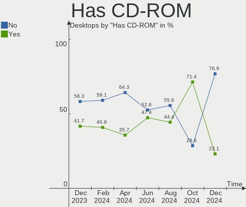
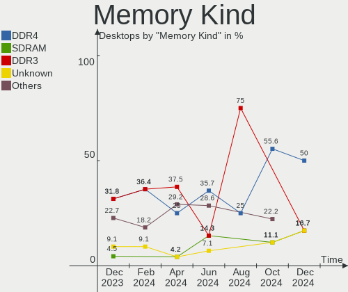
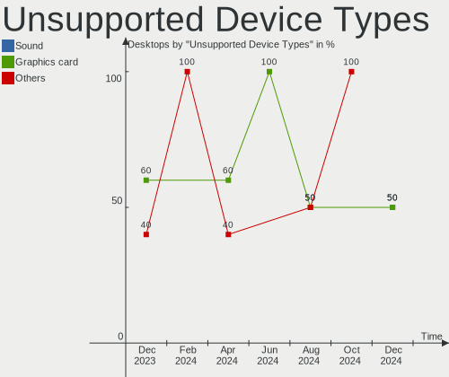

Xubuntu - Hardware Trends (Desktops)
------------------------------------

A project to identify most popular hardware characteristics and track their change
over time based on data collected by Linux users at https://Linux-Hardware.org.

Anyone can contribute to this report by the [hw-probe](https://github.com/linuxhw/hw-probe) tool:

    sudo -E hw-probe -all -upload

This report is for one last month. Overall report since the beginning of time: [TestDays](https://github.com/linuxhw/TestDays)

Period: Jun, 2023.

Contents
--------

* [ System ](#system)
  - [ OS                       ](#os)
  - [ OS Family                ](#os-family)
  - [ Kernel                   ](#kernel)
  - [ Kernel Family            ](#kernel-family)
  - [ Kernel Major Ver.        ](#kernel-major-ver)
  - [ Arch                     ](#arch)
  - [ DE                       ](#de)
  - [ Display Server           ](#display-server)
  - [ Display Manager          ](#display-manager)
  - [ OS Lang                  ](#os-lang)
  - [ Boot Mode                ](#boot-mode)
  - [ Filesystem               ](#filesystem)
  - [ Part. scheme             ](#part-scheme)
  - [ Dual Boot with Linux/BSD ](#dual-boot-with-linuxbsd)
  - [ Dual Boot (Win)          ](#dual-boot-win)

* [ Board ](#board)
  - [ Vendor                   ](#vendor)
  - [ Model                    ](#model)
  - [ Model Family             ](#model-family)
  - [ MFG Year                 ](#mfg-year)
  - [ Form Factor              ](#form-factor)
  - [ Secure Boot              ](#secure-boot)
  - [ Coreboot                 ](#coreboot)
  - [ RAM Size                 ](#ram-size)
  - [ RAM Used                 ](#ram-used)
  - [ Total Drives             ](#total-drives)
  - [ Has CD-ROM               ](#has-cd-rom)
  - [ Has Ethernet             ](#has-ethernet)
  - [ Has WiFi                 ](#has-wifi)
  - [ Has Bluetooth            ](#has-bluetooth)

* [ Location ](#location)
  - [ Country                  ](#country)
  - [ City                     ](#city)

* [ Drives ](#drives)
  - [ Drive Vendor             ](#drive-vendor)
  - [ Drive Model              ](#drive-model)
  - [ HDD Vendor               ](#hdd-vendor)
  - [ SSD Vendor               ](#ssd-vendor)
  - [ Drive Kind               ](#drive-kind)
  - [ Drive Connector          ](#drive-connector)
  - [ Drive Size               ](#drive-size)
  - [ Space Total              ](#space-total)
  - [ Space Used               ](#space-used)
  - [ Malfunc. Drives          ](#malfunc-drives)
  - [ Malfunc. Drive Vendor    ](#malfunc-drive-vendor)
  - [ Malfunc. HDD Vendor      ](#malfunc-hdd-vendor)
  - [ Malfunc. Drive Kind      ](#malfunc-drive-kind)
  - [ Failed Drives            ](#failed-drives)
  - [ Failed Drive Vendor      ](#failed-drive-vendor)
  - [ Drive Status             ](#drive-status)

* [ Storage controller ](#storage-controller)
  - [ Storage Vendor           ](#storage-vendor)
  - [ Storage Model            ](#storage-model)
  - [ Storage Kind             ](#storage-kind)

* [ Processor ](#processor)
  - [ CPU Vendor               ](#cpu-vendor)
  - [ CPU Model                ](#cpu-model)
  - [ CPU Model Family         ](#cpu-model-family)
  - [ CPU Cores                ](#cpu-cores)
  - [ CPU Sockets              ](#cpu-sockets)
  - [ CPU Threads              ](#cpu-threads)
  - [ CPU Op-Modes             ](#cpu-op-modes)
  - [ CPU Microcode            ](#cpu-microcode)
  - [ CPU Microarch            ](#cpu-microarch)

* [ Graphics ](#graphics)
  - [ GPU Vendor               ](#gpu-vendor)
  - [ GPU Model                ](#gpu-model)
  - [ GPU Combo                ](#gpu-combo)
  - [ GPU Driver               ](#gpu-driver)
  - [ GPU Memory               ](#gpu-memory)

* [ Monitor ](#monitor)
  - [ Monitor Vendor           ](#monitor-vendor)
  - [ Monitor Model            ](#monitor-model)
  - [ Monitor Resolution       ](#monitor-resolution)
  - [ Monitor Diagonal         ](#monitor-diagonal)
  - [ Monitor Width            ](#monitor-width)
  - [ Aspect Ratio             ](#aspect-ratio)
  - [ Monitor Area             ](#monitor-area)
  - [ Pixel Density            ](#pixel-density)
  - [ Multiple Monitors        ](#multiple-monitors)

* [ Network ](#network)
  - [ Net Controller Vendor    ](#net-controller-vendor)
  - [ Net Controller Model     ](#net-controller-model)
  - [ Wireless Vendor          ](#wireless-vendor)
  - [ Wireless Model           ](#wireless-model)
  - [ Ethernet Vendor          ](#ethernet-vendor)
  - [ Ethernet Model           ](#ethernet-model)
  - [ Net Controller Kind      ](#net-controller-kind)
  - [ Used Controller          ](#used-controller)
  - [ NICs                     ](#nics)
  - [ IPv6                     ](#ipv6)

* [ Bluetooth ](#bluetooth)
  - [ Bluetooth Vendor         ](#bluetooth-vendor)
  - [ Bluetooth Model          ](#bluetooth-model)

* [ Sound ](#sound)
  - [ Sound Vendor             ](#sound-vendor)
  - [ Sound Model              ](#sound-model)

* [ Memory ](#memory)
  - [ Memory Vendor            ](#memory-vendor)
  - [ Memory Model             ](#memory-model)
  - [ Memory Kind              ](#memory-kind)
  - [ Memory Form Factor       ](#memory-form-factor)
  - [ Memory Size              ](#memory-size)
  - [ Memory Speed             ](#memory-speed)

* [ Printers & scanners ](#printers--scanners)
  - [ Printer Vendor           ](#printer-vendor)
  - [ Printer Model            ](#printer-model)
  - [ Scanner Vendor           ](#scanner-vendor)
  - [ Scanner Model            ](#scanner-model)

* [ Camera ](#camera)
  - [ Camera Vendor            ](#camera-vendor)
  - [ Camera Model             ](#camera-model)

* [ Security ](#security)
  - [ Fingerprint Vendor       ](#fingerprint-vendor)
  - [ Fingerprint Model        ](#fingerprint-model)
  - [ Chipcard Vendor          ](#chipcard-vendor)
  - [ Chipcard Model           ](#chipcard-model)

* [ Unsupported ](#unsupported)
  - [ Unsupported Devices      ](#unsupported-devices)
  - [ Unsupported Device Types ](#unsupported-device-types)

System
------

OS
--

Installed operating systems

| Name          | Desktops | Percent |
|---------------|----------|---------|
| Xubuntu 22.04 | 14       | 53.85%  |
| Xubuntu 23.04 | 7        | 26.92%  |
| Xubuntu 18.04 | 3        | 11.54%  |
| Xubuntu 20.04 | 2        | 7.69%   |

OS Family
---------

OS without a version

| Name    | Desktops | Percent |
|---------|----------|---------|
| Xubuntu | 26       | 100%    |

Kernel
------

Version of the Linux kernel

| Version              | Desktops | Percent |
|----------------------|----------|---------|
| 6.2.0-20-generic     | 4        | 15.38%  |
| 5.19.0-43-generic    | 4        | 15.38%  |
| 5.15.0-75-generic    | 4        | 15.38%  |
| 6.2.0-23-generic     | 3        | 11.54%  |
| 5.15.0-73-generic    | 3        | 11.54%  |
| 5.19.0-45-generic    | 2        | 7.69%   |
| 6.2.7-060207-generic | 1        | 3.85%   |
| 5.4.0-42-generic     | 1        | 3.85%   |
| 5.4.0-152-lowlatency | 1        | 3.85%   |
| 5.4.0-149-generic    | 1        | 3.85%   |
| 5.13.0-40-generic    | 1        | 3.85%   |
| 4.18.0-17-generic    | 1        | 3.85%   |

Kernel Family
-------------

Linux kernel without a distro release

| Version | Desktops | Percent |
|---------|----------|---------|
| 6.2.0   | 7        | 26.92%  |
| 5.15.0  | 7        | 26.92%  |
| 5.19.0  | 6        | 23.08%  |
| 5.4.0   | 3        | 11.54%  |
| 6.2.7   | 1        | 3.85%   |
| 5.13.0  | 1        | 3.85%   |
| 4.18.0  | 1        | 3.85%   |

Kernel Major Ver.
-----------------

Linux kernel major version

| Version | Desktops | Percent |
|---------|----------|---------|
| 6.2     | 8        | 30.77%  |
| 5.15    | 7        | 26.92%  |
| 5.19    | 6        | 23.08%  |
| 5.4     | 3        | 11.54%  |
| 5.13    | 1        | 3.85%   |
| 4.18    | 1        | 3.85%   |

Arch
----

OS architecture (x86_64, i586, etc.)

| Name   | Desktops | Percent |
|--------|----------|---------|
| x86_64 | 24       | 92.31%  |
| i686   | 2        | 7.69%   |

DE
--

Desktop Environment

| Name | Desktops | Percent |
|------|----------|---------|
| XFCE | 26       | 100%    |

Display Server
--------------

X11 or Wayland

| Name | Desktops | Percent |
|------|----------|---------|
| X11  | 25       | 96.15%  |
| Tty  | 1        | 3.85%   |

Display Manager
---------------

SDDM, LightDM, etc.

| Name    | Desktops | Percent |
|---------|----------|---------|
| LightDM | 21       | 80.77%  |
| Unknown | 4        | 15.38%  |
| GDM3    | 1        | 3.85%   |

OS Lang
-------

Language

| Lang  | Desktops | Percent |
|-------|----------|---------|
| en_US | 9        | 34.62%  |
| de_DE | 5        | 19.23%  |
| en_IN | 2        | 7.69%   |
| zh_CN | 1        | 3.85%   |
| sv_SE | 1        | 3.85%   |
| ru_RU | 1        | 3.85%   |
| pt_BR | 1        | 3.85%   |
| pl_PL | 1        | 3.85%   |
| nl_BE | 1        | 3.85%   |
| fr_FR | 1        | 3.85%   |
| es_VE | 1        | 3.85%   |
| es_AR | 1        | 3.85%   |
| en_ZM | 1        | 3.85%   |

Boot Mode
---------

EFI or BIOS

| Mode | Desktops | Percent |
|------|----------|---------|
| BIOS | 15       | 57.69%  |
| EFI  | 11       | 42.31%  |

Filesystem
----------

Type of filesystem

| Type  | Desktops | Percent |
|-------|----------|---------|
| Ext4  | 16       | 61.54%  |
| Tmpfs | 9        | 34.62%  |
| Btrfs | 1        | 3.85%   |

Part. scheme
------------

Scheme of partitioning

| Type    | Desktops | Percent |
|---------|----------|---------|
| GPT     | 18       | 69.23%  |
| Unknown | 6        | 23.08%  |
| MBR     | 2        | 7.69%   |

Dual Boot with Linux/BSD
------------------------

Hosting more than one Linux/BSD

| Dual boot | Desktops | Percent |
|-----------|----------|---------|
| No        | 22       | 84.62%  |
| Yes       | 4        | 15.38%  |

Dual Boot (Win)
---------------

Hosting Linux and Windows

| Dual boot | Desktops | Percent |
|-----------|----------|---------|
| No        | 15       | 57.69%  |
| Yes       | 11       | 42.31%  |

Board
-----

Vendor
------

Motherboard manufacturer

| Name                | Desktops | Percent |
|---------------------|----------|---------|
| Hewlett-Packard     | 4        | 15.38%  |
| Gigabyte Technology | 4        | 15.38%  |
| ASUSTek Computer    | 4        | 15.38%  |
| Pegatron            | 2        | 7.69%   |
| Dell                | 2        | 7.69%   |
| Standard            | 1        | 3.85%   |
| MSI                 | 1        | 3.85%   |
| LORD ELECTRONICS    | 1        | 3.85%   |
| Lenovo              | 1        | 3.85%   |
| Intel               | 1        | 3.85%   |
| Hardkernel          | 1        | 3.85%   |
| Foxconn             | 1        | 3.85%   |
| Colorful Technology | 1        | 3.85%   |
| Biostar             | 1        | 3.85%   |
| ASRock              | 1        | 3.85%   |

Model
-----

Motherboard model

| Name                                      | Desktops | Percent |
|-------------------------------------------|----------|---------|
| Pegatron NP185AA-ABA CQ5110F              | 1        | 3.85%   |
| Pegatron 520-1030a                        | 1        | 3.85%   |
| MSI MS-7721                               | 1        | 3.85%   |
| LORD ELECTRONICS I915 Series V1.0         | 1        | 3.85%   |
| Lenovo ThinkStation P360 Tower 30FNS4J100 | 1        | 3.85%   |
| Intel H61                                 | 1        | 3.85%   |
| HP t620 Quad Core TC                      | 1        | 3.85%   |
| HP ProDesk 600 G1 SFF                     | 1        | 3.85%   |
| HP Desktop N01-F0xxx                      | 1        | 3.85%   |
| HP Compaq Pro 6300 SFF                    | 1        | 3.85%   |
| Hardkernel ODROID-H2                      | 1        | 3.85%   |
| Gigabyte Z690 AORUS ELITE DDR4            | 1        | 3.85%   |
| Gigabyte P55A-UD3                         | 1        | 3.85%   |
| Gigabyte F2A88XM-D3H                      | 1        | 3.85%   |
| Gigabyte B550 AORUS ELITE                 | 1        | 3.85%   |
| Foxconn Pro 3500 Series                   | 1        | 3.85%   |
| Dell OptiPlex 9020                        | 1        | 3.85%   |
| Dell OptiPlex 3020                        | 1        | 3.85%   |
| Colorful CVN B550M GAMING FROZEN          | 1        | 3.85%   |
| Biostar TPower I45                        | 1        | 3.85%   |
| ASUS PRIME Z270-K                         | 1        | 3.85%   |
| ASUS PRIME H610M-K D4                     | 1        | 3.85%   |
| ASUS PRIME H410I-PLUS                     | 1        | 3.85%   |
| ASUS H61M-CS                              | 1        | 3.85%   |
| ASRock N68C-S UCC                         | 1        | 3.85%   |
| Unknown                                   | 1        | 3.85%   |

Model Family
------------

Motherboard model prefix

| Name                  | Desktops | Percent |
|-----------------------|----------|---------|
| ASUS PRIME            | 3        | 11.54%  |
| Dell OptiPlex         | 2        | 7.69%   |
| Pegatron NP185AA-ABA  | 1        | 3.85%   |
| Pegatron 520-1030a    | 1        | 3.85%   |
| MSI MS-7721           | 1        | 3.85%   |
| LORD ELECTRONICS I915 | 1        | 3.85%   |
| Lenovo ThinkStation   | 1        | 3.85%   |
| Intel H61             | 1        | 3.85%   |
| HP t620               | 1        | 3.85%   |
| HP ProDesk            | 1        | 3.85%   |
| HP Desktop            | 1        | 3.85%   |
| HP Compaq             | 1        | 3.85%   |
| Hardkernel ODROID-H2  | 1        | 3.85%   |
| Gigabyte Z690         | 1        | 3.85%   |
| Gigabyte P55A-UD3     | 1        | 3.85%   |
| Gigabyte F2A88XM-D3H  | 1        | 3.85%   |
| Gigabyte B550         | 1        | 3.85%   |
| Foxconn Pro           | 1        | 3.85%   |
| Colorful CVN          | 1        | 3.85%   |
| Biostar TPower        | 1        | 3.85%   |
| ASUS H61M-CS          | 1        | 3.85%   |
| ASRock N68C-S         | 1        | 3.85%   |
| Unknown               | 1        | 3.85%   |

MFG Year
--------

Motherboard manufacture year

| Year | Desktops | Percent |
|------|----------|---------|
| 2013 | 4        | 15.38%  |
| 2021 | 3        | 11.54%  |
| 2014 | 3        | 11.54%  |
| 2012 | 3        | 11.54%  |
| 2009 | 3        | 11.54%  |
| 2020 | 2        | 7.69%   |
| 2010 | 2        | 7.69%   |
| 2023 | 1        | 3.85%   |
| 2022 | 1        | 3.85%   |
| 2018 | 1        | 3.85%   |
| 2017 | 1        | 3.85%   |
| 2016 | 1        | 3.85%   |
| 2015 | 1        | 3.85%   |

Form Factor
-----------

Physical design of the computer

| Name    | Desktops | Percent |
|---------|----------|---------|
| Desktop | 26       | 100%    |

Secure Boot
-----------

Enabled or disabled

| State    | Desktops | Percent |
|----------|----------|---------|
| Disabled | 24       | 92.31%  |
| Enabled  | 2        | 7.69%   |

Coreboot
--------

Have coreboot on board

| Used | Desktops | Percent |
|------|----------|---------|
| No   | 26       | 100%    |

RAM Size
--------

Total RAM memory

| Size in GB  | Desktops | Percent |
|-------------|----------|---------|
| 4.01-8.0    | 7        | 26.92%  |
| 3.01-4.0    | 6        | 23.08%  |
| 32.01-64.0  | 4        | 15.38%  |
| 8.01-16.0   | 4        | 15.38%  |
| 16.01-24.0  | 3        | 11.54%  |
| 2.01-3.0    | 1        | 3.85%   |
| 64.01-256.0 | 1        | 3.85%   |

RAM Used
--------

Used RAM memory

| Used GB    | Desktops | Percent |
|------------|----------|---------|
| 1.01-2.0   | 10       | 38.46%  |
| 2.01-3.0   | 5        | 19.23%  |
| 3.01-4.0   | 4        | 15.38%  |
| 4.01-8.0   | 3        | 11.54%  |
| 0.51-1.0   | 2        | 7.69%   |
| 16.01-24.0 | 1        | 3.85%   |
| 8.01-16.0  | 1        | 3.85%   |

Total Drives
------------

Number of drives on board

| Drives | Desktops | Percent |
|--------|----------|---------|
| 1      | 14       | 53.85%  |
| 3      | 5        | 19.23%  |
| 2      | 5        | 19.23%  |
| 4      | 2        | 7.69%   |

Has CD-ROM
----------

Has CD-ROM on board

| Presented | Desktops | Percent |
|-----------|----------|---------|
| Yes       | 13       | 50%     |
| No        | 13       | 50%     |

Has Ethernet
------------

Has Ethernet on board

| Presented | Desktops | Percent |
|-----------|----------|---------|
| Yes       | 26       | 100%    |

Has WiFi
--------

Has WiFi module

| Presented | Desktops | Percent |
|-----------|----------|---------|
| No        | 16       | 61.54%  |
| Yes       | 10       | 38.46%  |

Has Bluetooth
-------------

Has Bluetooth module

| Presented | Desktops | Percent |
|-----------|----------|---------|
| No        | 20       | 76.92%  |
| Yes       | 6        | 23.08%  |

Location
--------

Country
-------

Geographic location (country)

| Country   | Desktops | Percent |
|-----------|----------|---------|
| USA       | 5        | 19.23%  |
| Germany   | 5        | 19.23%  |
| India     | 2        | 7.69%   |
| China     | 2        | 7.69%   |
| Zambia    | 1        | 3.85%   |
| Sweden    | 1        | 3.85%   |
| Russia    | 1        | 3.85%   |
| Portugal  | 1        | 3.85%   |
| Poland    | 1        | 3.85%   |
| Mexico    | 1        | 3.85%   |
| France    | 1        | 3.85%   |
| Brazil    | 1        | 3.85%   |
| Belgium   | 1        | 3.85%   |
| Austria   | 1        | 3.85%   |
| Australia | 1        | 3.85%   |
| Argentina | 1        | 3.85%   |

City
----

Geographic location (city)

| City               | Desktops | Percent |
|--------------------|----------|---------|
| Wojnicz            | 1        | 3.85%   |
| Wilhelmshaven      | 1        | 3.85%   |
| Wiener Neustadt    | 1        | 3.85%   |
| St Petersburg      | 1        | 3.85%   |
| Solna              | 1        | 3.85%   |
| Seattle            | 1        | 3.85%   |
| Salvador           | 1        | 3.85%   |
| Raipur             | 1        | 3.85%   |
| Münster           | 1        | 3.85%   |
| Munich             | 1        | 3.85%   |
| Mexico City        | 1        | 3.85%   |
| Margate            | 1        | 3.85%   |
| Lusaka             | 1        | 3.85%   |
| Ludwigsburg        | 1        | 3.85%   |
| Louvain-la-Neuve   | 1        | 3.85%   |
| Lexington          | 1        | 3.85%   |
| Indore             | 1        | 3.85%   |
| Hengyang           | 1        | 3.85%   |
| Hanover            | 1        | 3.85%   |
| Fleury-les-Aubrais | 1        | 3.85%   |
| Denver             | 1        | 3.85%   |
| Buenos Aires       | 1        | 3.85%   |
| Brisbane           | 1        | 3.85%   |
| Bothell            | 1        | 3.85%   |
| Beijing            | 1        | 3.85%   |
| Barra              | 1        | 3.85%   |

Drives
------

Drive Vendor
------------

Hard drive vendors

| Vendor                      | Desktops | Drives | Percent |
|-----------------------------|----------|--------|---------|
| Samsung Electronics         | 8        | 8      | 19.05%  |
| Seagate                     | 7        | 8      | 16.67%  |
| WDC                         | 6        | 7      | 14.29%  |
| Kingston                    | 4        | 4      | 9.52%   |
| SPCC                        | 2        | 2      | 4.76%   |
| Hitachi                     | 2        | 2      | 4.76%   |
| China                       | 2        | 2      | 4.76%   |
| Yangtze Memory Technologies | 1        | 1      | 2.38%   |
| Unknown                     | 1        | 1      | 2.38%   |
| Toshiba                     | 1        | 1      | 2.38%   |
| TO Exter                    | 1        | 2      | 2.38%   |
| SanDisk                     | 1        | 1      | 2.38%   |
| Phison Electronics          | 1        | 2      | 2.38%   |
| Micron Technology           | 1        | 1      | 2.38%   |
| HGST                        | 1        | 1      | 2.38%   |
| Crucial                     | 1        | 1      | 2.38%   |
| ASMT                        | 1        | 1      | 2.38%   |
| ADATA Technology            | 1        | 1      | 2.38%   |

Drive Model
-----------

Hard drive models

| Model                                               | Desktops | Percent |
|-----------------------------------------------------|----------|---------|
| Seagate ST500DM002-1BD142 500GB                     | 2        | 4.65%   |
| Kingston SV300S37A120G 120GB SSD                    | 2        | 4.65%   |
| Yangtze Memory ZHITAI TiPlus5000 1TB                | 1        | 2.33%   |
| WDC WD5000AAKS-00D2B0 500GB                         | 1        | 2.33%   |
| WDC WD20EZRX-00D8PB0 2TB                            | 1        | 2.33%   |
| WDC WD20EARX-00PASB0 2TB                            | 1        | 2.33%   |
| WDC WD10JPVX-00JC3T0 1TB                            | 1        | 2.33%   |
| WDC WD10EADS-00M2B0 1TB                             | 1        | 2.33%   |
| WDC WD1002FBYS-18A6B0 1TB                           | 1        | 2.33%   |
| Unknown CJTD4R  64GB                                | 1        | 2.33%   |
| Toshiba MQ01ABD050 500GB                            | 1        | 2.33%   |
| TO Exter nal USB 3.0 1TB                            | 1        | 2.33%   |
| SPCC Solid State Disk 128GB                         | 1        | 2.33%   |
| SPCC Solid State Disk 1024GB                        | 1        | 2.33%   |
| Seagate ST5000LM000-2U8170 5TB                      | 1        | 2.33%   |
| Seagate ST3500418AS 500GB                           | 1        | 2.33%   |
| Seagate ST3500414CS 500GB                           | 1        | 2.33%   |
| Seagate ST3000DM001-1ER166 3TB                      | 1        | 2.33%   |
| Seagate ST2000DM008-2FR102 2TB                      | 1        | 2.33%   |
| Seagate Expansion HDD 8TB                           | 1        | 2.33%   |
| SanDisk SDSSDH31000G 1TB                            | 1        | 2.33%   |
| Samsung SSD PM871 2.5 7mm 256GB                     | 1        | 2.33%   |
| Samsung SSD 980 1TB                                 | 1        | 2.33%   |
| Samsung SSD 850 EVO 250GB                           | 1        | 2.33%   |
| Samsung SSD 840 EVO 250GB                           | 1        | 2.33%   |
| Samsung NVMe SSD Controller SM961/PM961/SM963 256GB | 1        | 2.33%   |
| Samsung MZVL2512HCJQ-00BL7 512GB                    | 1        | 2.33%   |
| Samsung HD250HJ 250GB                               | 1        | 2.33%   |
| Samsung HD103SJ 1TB                                 | 1        | 2.33%   |
| Phison E16 PCIe4 NVMe Controller 1TB                | 1        | 2.33%   |
| Micron MTFDHBA256TCK-1AS1AABHA 256GB                | 1        | 2.33%   |
| Kingston SNVS500G 500GB                             | 1        | 2.33%   |
| Kingston SA400S37 120G SSD                          | 1        | 2.33%   |
| Hitachi HTS545050B9A300 500GB                       | 1        | 2.33%   |
| Hitachi HDS723020BLA642 2TB                         | 1        | 2.33%   |
| HGST HTS545050A7E680 500GB                          | 1        | 2.33%   |
| Crucial CT1000P3SSD8 1TB                            | 1        | 2.33%   |
| China SATA SSD 480GB                                | 1        | 2.33%   |
| China SATA SSD 16GB                                 | 1        | 2.33%   |
| ASMT 2235 128GB                                     | 1        | 2.33%   |

HDD Vendor
----------

Hard disk drive vendors

| Vendor              | Desktops | Drives | Percent |
|---------------------|----------|--------|---------|
| Seagate             | 7        | 8      | 35%     |
| WDC                 | 6        | 7      | 30%     |
| Samsung Electronics | 2        | 2      | 10%     |
| Hitachi             | 2        | 2      | 10%     |
| Toshiba             | 1        | 1      | 5%      |
| HGST                | 1        | 1      | 5%      |
| ASMT                | 1        | 1      | 5%      |

SSD Vendor
----------

Solid state drive vendors

| Vendor              | Desktops | Drives | Percent |
|---------------------|----------|--------|---------|
| Samsung Electronics | 3        | 3      | 25%     |
| Kingston            | 3        | 3      | 25%     |
| SPCC                | 2        | 2      | 16.67%  |
| China               | 2        | 2      | 16.67%  |
| TO Exter            | 1        | 2      | 8.33%   |
| SanDisk             | 1        | 1      | 8.33%   |

Drive Kind
----------

HDD or SSD

| Kind | Desktops | Drives | Percent |
|------|----------|--------|---------|
| HDD  | 17       | 22     | 45.95%  |
| SSD  | 11       | 13     | 29.73%  |
| NVMe | 8        | 10     | 21.62%  |
| MMC  | 1        | 1      | 2.7%    |

Drive Connector
---------------

SATA, SAS, NVMe, etc.

| Type | Desktops | Drives | Percent |
|------|----------|--------|---------|
| SATA | 22       | 31     | 66.67%  |
| NVMe | 8        | 10     | 24.24%  |
| SAS  | 2        | 4      | 6.06%   |
| MMC  | 1        | 1      | 3.03%   |

Drive Size
----------

Size of hard drive

| Size in TB | Desktops | Drives | Percent |
|------------|----------|--------|---------|
| 0.01-0.5   | 18       | 19     | 58.06%  |
| 0.51-1.0   | 6        | 7      | 19.35%  |
| 1.01-2.0   | 4        | 6      | 12.9%   |
| 4.01-10.0  | 2        | 2      | 6.45%   |
| 2.01-3.0   | 1        | 1      | 3.23%   |

Space Total
-----------

Amount of disk space available on the file system

| Size in GB     | Desktops | Percent |
|----------------|----------|---------|
| 101-250        | 7        | 26.92%  |
| 251-500        | 6        | 23.08%  |
| More than 3000 | 3        | 11.54%  |
| 501-1000       | 3        | 11.54%  |
| 2001-3000      | 2        | 7.69%   |
| 1001-2000      | 2        | 7.69%   |
| 51-100         | 2        | 7.69%   |
| 1-20           | 1        | 3.85%   |

Space Used
----------

Amount of used disk space

| Used GB        | Desktops | Percent |
|----------------|----------|---------|
| 1-20           | 8        | 30.77%  |
| 21-50          | 5        | 19.23%  |
| 51-100         | 4        | 15.38%  |
| 2001-3000      | 2        | 7.69%   |
| 101-250        | 2        | 7.69%   |
| 1001-2000      | 2        | 7.69%   |
| 501-1000       | 2        | 7.69%   |
| More than 3000 | 1        | 3.85%   |

Malfunc. Drives
---------------

Drive models with a malfunction

| Model                           | Desktops | Drives | Percent |
|---------------------------------|----------|--------|---------|
| Toshiba MQ01ABD050 500GB        | 1        | 1      | 25%     |
| Seagate ST500DM002-1BD142 500GB | 1        | 1      | 25%     |
| Seagate ST3500414CS 500GB       | 1        | 1      | 25%     |
| China SATA SSD 16GB             | 1        | 1      | 25%     |

Malfunc. Drive Vendor
---------------------

Vendors of faulty drives

| Vendor  | Desktops | Drives | Percent |
|---------|----------|--------|---------|
| Seagate | 2        | 2      | 50%     |
| Toshiba | 1        | 1      | 25%     |
| China   | 1        | 1      | 25%     |

Malfunc. HDD Vendor
-------------------

Vendors of faulty HDD drives

| Vendor  | Desktops | Drives | Percent |
|---------|----------|--------|---------|
| Seagate | 2        | 2      | 66.67%  |
| Toshiba | 1        | 1      | 33.33%  |

Malfunc. Drive Kind
-------------------

Kinds of faulty drives

| Kind | Desktops | Drives | Percent |
|------|----------|--------|---------|
| HDD  | 3        | 3      | 75%     |
| SSD  | 1        | 1      | 25%     |

Failed Drives
-------------

Failed drive models

Zero info for selected period =(

Failed Drive Vendor
-------------------

Failed drive vendors

Zero info for selected period =(

Drive Status
------------

Number of failed and malfunc. drives

| Status   | Desktops | Drives | Percent |
|----------|----------|--------|---------|
| Detected | 16       | 29     | 57.14%  |
| Works    | 8        | 13     | 28.57%  |
| Malfunc  | 4        | 4      | 14.29%  |

Storage controller
------------------

Storage Vendor
--------------

Storage controller vendors

| Vendor                        | Desktops | Percent |
|-------------------------------|----------|---------|
| Intel                         | 18       | 47.37%  |
| AMD                           | 6        | 15.79%  |
| Samsung Electronics           | 3        | 7.89%   |
| Nvidia                        | 2        | 5.26%   |
| Marvell Technology Group      | 2        | 5.26%   |
| Yangtze Memory Technologies   | 1        | 2.63%   |
| Phison Electronics            | 1        | 2.63%   |
| Micron/Crucial Technology     | 1        | 2.63%   |
| Micron Technology             | 1        | 2.63%   |
| Kingston Technology Company   | 1        | 2.63%   |
| Integrated Technology Express | 1        | 2.63%   |
| ADATA Technology              | 1        | 2.63%   |

Storage Model
-------------

Storage controller models

| Model                                                                          | Desktops | Percent |
|--------------------------------------------------------------------------------|----------|---------|
| AMD FCH SATA Controller [AHCI mode]                                            | 4        | 8.7%    |
| Intel Alder Lake-S PCH SATA Controller [AHCI Mode]                             | 3        | 6.52%   |
| Intel 8 Series/C220 Series Chipset Family 6-port SATA Controller 1 [AHCI mode] | 3        | 6.52%   |
| Intel 6 Series/C200 Series Chipset Family 6 port Desktop SATA AHCI Controller  | 3        | 6.52%   |
| Nvidia MCP61 SATA Controller                                                   | 2        | 4.35%   |
| Intel Volume Management Device NVMe RAID Controller                            | 2        | 4.35%   |
| AMD 500 Series Chipset SATA Controller                                         | 2        | 4.35%   |
| Yangtze Memory ZHITAI TiPro5000 NVMe SSD                                       | 1        | 2.17%   |
| Samsung NVMe SSD Controller SM961/PM961/SM963                                  | 1        | 2.17%   |
| Samsung NVMe SSD Controller PM9A1/PM9A3/980PRO                                 | 1        | 2.17%   |
| Samsung NVMe SSD Controller 980                                                | 1        | 2.17%   |
| Phison E16 PCIe4 NVMe Controller                                               | 1        | 2.17%   |
| Nvidia MCP61 IDE                                                               | 1        | 2.17%   |
| Micron/Crucial P2 NVMe PCIe SSD                                                | 1        | 2.17%   |
| Micron 2200S NVMe SSD                                                          | 1        | 2.17%   |
| Marvell Group 88SE91A3 SATA-600 Controller                                     | 1        | 2.17%   |
| Marvell Group 88SE6111/6121 SATA II / PATA Controller                          | 1        | 2.17%   |
| Kingston Company NVMe Controller                                               | 1        | 2.17%   |
| Intel Volume Management Device NVMe RAID Controller Intel Corporation          | 1        | 2.17%   |
| Intel SATA Controller [RAID mode]                                              | 1        | 2.17%   |
| Intel Celeron/Pentium Silver Processor SATA Controller                         | 1        | 2.17%   |
| Intel 82801JI (ICH10 Family) 4 port SATA IDE Controller #1                     | 1        | 2.17%   |
| Intel 82801JI (ICH10 Family) 2 port SATA IDE Controller #2                     | 1        | 2.17%   |
| Intel 82801FB/FW (ICH6/ICH6W) SATA Controller                                  | 1        | 2.17%   |
| Intel 82801FB/FBM/FR/FW/FRW (ICH6 Family) IDE Controller                       | 1        | 2.17%   |
| Intel 7 Series/C210 Series Chipset Family 6-port SATA Controller [AHCI mode]   | 1        | 2.17%   |
| Intel 7 Series Chipset Family 6-port SATA Controller [AHCI mode]               | 1        | 2.17%   |
| Intel 5 Series/3400 Series Chipset 4 port SATA IDE Controller                  | 1        | 2.17%   |
| Intel 5 Series/3400 Series Chipset 2 port SATA IDE Controller                  | 1        | 2.17%   |
| Intel 400 Series Chipset Family SATA AHCI Controller                           | 1        | 2.17%   |
| Intel 200 Series PCH SATA controller [AHCI mode]                               | 1        | 2.17%   |
| Integrated Express IT8213 IDE Controller                                       | 1        | 2.17%   |
| AMD FCH SATA Controller [RAID mode]                                            | 1        | 2.17%   |
| ADATA ADATA XPG GAMMIXS1 1L Media                                              | 1        | 2.17%   |

Storage Kind
------------

Kind of storage controller (IDE, SATA, NVMe, SAS, ...)

| Kind | Desktops | Percent |
|------|----------|---------|
| SATA | 20       | 52.63%  |
| NVMe | 8        | 21.05%  |
| RAID | 5        | 13.16%  |
| IDE  | 5        | 13.16%  |

Processor
---------

CPU Vendor
----------

Processor vendors

| Vendor | Desktops | Percent |
|--------|----------|---------|
| Intel  | 18       | 69.23%  |
| AMD    | 8        | 30.77%  |

CPU Model
---------

Processor models

| Model                                         | Desktops | Percent |
|-----------------------------------------------|----------|---------|
| Intel Xeon CPU E5450 @ 3.00GHz                | 1        | 3.85%   |
| Intel Pentium CPU G3220 @ 3.00GHz             | 1        | 3.85%   |
| Intel Pentium CPU G2030 @ 3.00GHz             | 1        | 3.85%   |
| Intel Pentium 4 CPU 2.26GHz                   | 1        | 3.85%   |
| Intel Core i7-7700K CPU @ 4.20GHz             | 1        | 3.85%   |
| Intel Core i7-4790 CPU @ 3.60GHz              | 1        | 3.85%   |
| Intel Core i5-3470 CPU @ 3.20GHz              | 1        | 3.85%   |
| Intel Core i5 CPU 760 @ 2.80GHz               | 1        | 3.85%   |
| Intel Core i3-4150 CPU @ 3.50GHz              | 1        | 3.85%   |
| Intel Core i3-3220 CPU @ 3.30GHz              | 1        | 3.85%   |
| Intel Core i3-2120 CPU @ 3.30GHz              | 1        | 3.85%   |
| Intel Core i3-10100F CPU @ 3.60GHz            | 1        | 3.85%   |
| Intel Celeron J4105 CPU @ 1.50GHz             | 1        | 3.85%   |
| Intel Celeron G5905 CPU @ 3.50GHz             | 1        | 3.85%   |
| Intel Celeron CPU 1007U @ 1.50GHz             | 1        | 3.85%   |
| Intel 13th Gen Core i7-13700KF                | 1        | 3.85%   |
| Intel 12th Gen Core i7-12700K                 | 1        | 3.85%   |
| Intel 12th Gen Core i3-12100F                 | 1        | 3.85%   |
| AMD Ryzen 5 5500                              | 1        | 3.85%   |
| AMD Ryzen 5 3600 6-Core Processor             | 1        | 3.85%   |
| AMD GX-415GA SOC with Radeon HD Graphics      | 1        | 3.85%   |
| AMD Athlon II X4 635 Processor                | 1        | 3.85%   |
| AMD Athlon 7550 Dual-Core Processor           | 1        | 3.85%   |
| AMD A8-7600 Radeon R7, 10 Compute Cores 4C+6G | 1        | 3.85%   |
| AMD A8-6600K APU with Radeon HD Graphics      | 1        | 3.85%   |
| AMD A6-3600 APU with Radeon HD Graphics       | 1        | 3.85%   |

CPU Model Family
----------------

Processor model prefix

| Model            | Desktops | Percent |
|------------------|----------|---------|
| Intel Core i3    | 4        | 15.38%  |
| Other            | 3        | 11.54%  |
| Intel Celeron    | 3        | 11.54%  |
| Intel Pentium    | 2        | 7.69%   |
| Intel Core i7    | 2        | 7.69%   |
| Intel Core i5    | 2        | 7.69%   |
| AMD Ryzen 5      | 2        | 7.69%   |
| AMD A8           | 2        | 7.69%   |
| Intel Xeon       | 1        | 3.85%   |
| Intel Pentium 4  | 1        | 3.85%   |
| AMD GX           | 1        | 3.85%   |
| AMD Athlon II X4 | 1        | 3.85%   |
| AMD Athlon       | 1        | 3.85%   |
| AMD A6           | 1        | 3.85%   |

CPU Cores
---------

Number of processor cores

| Number | Desktops | Percent |
|--------|----------|---------|
| 4      | 11       | 42.31%  |
| 2      | 10       | 38.46%  |
| 6      | 2        | 7.69%   |
| 12     | 1        | 3.85%   |
| 8      | 1        | 3.85%   |
| 1      | 1        | 3.85%   |

CPU Sockets
-----------

Number of sockets

| Number | Desktops | Percent |
|--------|----------|---------|
| 1      | 26       | 100%    |

CPU Threads
-----------

Threads per core (Hyper-Threading)

| Number | Desktops | Percent |
|--------|----------|---------|
| 2      | 13       | 50%     |
| 1      | 13       | 50%     |

CPU Op-Modes
------------

CPU Operation Modes (32-bit, 64-bit)

| Op mode        | Desktops | Percent |
|----------------|----------|---------|
| 32-bit, 64-bit | 25       | 96.15%  |
| 32-bit         | 1        | 3.85%   |

CPU Microcode
-------------

Microcode number

| Number     | Desktops | Percent |
|------------|----------|---------|
| Unknown    | 16       | 61.54%  |
| 0x306a9    | 2        | 7.69%   |
| 0xf27      | 1        | 3.85%   |
| 0x706a1    | 1        | 3.85%   |
| 0x306c3    | 1        | 3.85%   |
| 0x1067a    | 1        | 3.85%   |
| 0x07000110 | 1        | 3.85%   |
| 0x06003104 | 1        | 3.85%   |
| 0x03000027 | 1        | 3.85%   |
| 0x010000c8 | 1        | 3.85%   |

CPU Microarch
-------------

Microarchitecture

| Name             | Desktops | Percent |
|------------------|----------|---------|
| IvyBridge        | 4        | 15.38%  |
| Haswell          | 3        | 11.54%  |
| K10              | 2        | 7.69%   |
| CometLake        | 2        | 7.69%   |
| Alderlake Hybrid | 2        | 7.69%   |
| Zen 3            | 1        | 3.85%   |
| Zen 2            | 1        | 3.85%   |
| Steamroller      | 1        | 3.85%   |
| SandyBridge      | 1        | 3.85%   |
| Piledriver       | 1        | 3.85%   |
| Penryn           | 1        | 3.85%   |
| NetBurst         | 1        | 3.85%   |
| Nehalem          | 1        | 3.85%   |
| KabyLake         | 1        | 3.85%   |
| K10 Llano        | 1        | 3.85%   |
| Jaguar           | 1        | 3.85%   |
| Goldmont plus    | 1        | 3.85%   |
| Unknown          | 1        | 3.85%   |

Graphics
--------

GPU Vendor
----------

Vendors of graphics cards

| Vendor | Desktops | Percent |
|--------|----------|---------|
| Intel  | 12       | 44.44%  |
| Nvidia | 8        | 29.63%  |
| AMD    | 7        | 25.93%  |

GPU Model
---------

Graphics card models

| Model                                                                       | Desktops | Percent |
|-----------------------------------------------------------------------------|----------|---------|
| Intel Xeon E3-1200 v2/3rd Gen Core processor Graphics Controller            | 3        | 11.11%  |
| AMD Caicos [Radeon HD 6450/7450/8450 / R5 230 OEM]                          | 2        | 7.41%   |
| Nvidia TU117GL [T600]                                                       | 1        | 3.7%    |
| Nvidia TU116 [GeForce GTX 1660 Ti]                                          | 1        | 3.7%    |
| Nvidia GT218 [GeForce 210]                                                  | 1        | 3.7%    |
| Nvidia GP106 [GeForce GTX 1060 6GB]                                         | 1        | 3.7%    |
| Nvidia GP102 [GeForce GTX 1080 Ti]                                          | 1        | 3.7%    |
| Nvidia GM107 [GeForce GTX 750 Ti]                                           | 1        | 3.7%    |
| Nvidia GK208B [GeForce GT 730]                                              | 1        | 3.7%    |
| Nvidia G96GL [Quadro FX 380]                                                | 1        | 3.7%    |
| Intel Xeon E3-1200 v3/4th Gen Core Processor Integrated Graphics Controller | 1        | 3.7%    |
| Intel GeminiLake [UHD Graphics 600]                                         | 1        | 3.7%    |
| Intel DG2 [Arc A770]                                                        | 1        | 3.7%    |
| Intel CometLake-S GT1 [UHD Graphics 610]                                    | 1        | 3.7%    |
| Intel AlderLake-S GT1                                                       | 1        | 3.7%    |
| Intel 82915G/GV/910GL Integrated Graphics Controller                        | 1        | 3.7%    |
| Intel 4th Generation Core Processor Family Integrated Graphics Controller   | 1        | 3.7%    |
| Intel 3rd Gen Core processor Graphics Controller                            | 1        | 3.7%    |
| Intel 2nd Generation Core Processor Family Integrated Graphics Controller   | 1        | 3.7%    |
| AMD Richland [Radeon HD 8570D]                                              | 1        | 3.7%    |
| AMD Lexa PRO [Radeon 540/540X/550/550X / RX 540X/550/550X]                  | 1        | 3.7%    |
| AMD Kaveri [Radeon R7 Graphics]                                             | 1        | 3.7%    |
| AMD Kabini [Radeon HD 8330E]                                                | 1        | 3.7%    |
| AMD Juniper XT [Radeon HD 5770]                                             | 1        | 3.7%    |

GPU Combo
---------

Combinations of graphics cards

| Name           | Desktops | Percent |
|----------------|----------|---------|
| 1 x Intel      | 11       | 42.31%  |
| 1 x Nvidia     | 7        | 26.92%  |
| 1 x AMD        | 7        | 26.92%  |
| Intel + Nvidia | 1        | 3.85%   |

GPU Driver
----------

Free vs proprietary

| Driver      | Desktops | Percent |
|-------------|----------|---------|
| Free        | 21       | 80.77%  |
| Proprietary | 4        | 15.38%  |
| Unknown     | 1        | 3.85%   |

GPU Memory
----------

Total video memory

| Size in GB | Desktops | Percent |
|------------|----------|---------|
| Unknown    | 19       | 73.08%  |
| 0.51-1.0   | 3        | 11.54%  |
| 0.01-0.5   | 2        | 7.69%   |
| 3.01-4.0   | 1        | 3.85%   |
| 8.01-16.0  | 1        | 3.85%   |

Monitor
-------

Monitor Vendor
--------------

Monitor vendors

| Vendor               | Desktops | Percent |
|----------------------|----------|---------|
| Samsung Electronics  | 4        | 16.67%  |
| Hewlett-Packard      | 4        | 16.67%  |
| Goldstar             | 4        | 16.67%  |
| Dell                 | 3        | 12.5%   |
| AOC                  | 3        | 12.5%   |
| BenQ                 | 2        | 8.33%   |
| Philips              | 1        | 4.17%   |
| Lenovo               | 1        | 4.17%   |
| Envision Peripherals | 1        | 4.17%   |
| ASUSTek Computer     | 1        | 4.17%   |

Monitor Model
-------------

Monitor models

| Model                                                                 | Desktops | Percent |
|-----------------------------------------------------------------------|----------|---------|
| Samsung Electronics SyncMaster SAM0585 2048x1152 510x287mm 23.0-inch  | 1        | 4%      |
| Samsung Electronics SyncMaster SAM0584 2048x1152 510x287mm 23.0-inch  | 1        | 4%      |
| Samsung Electronics SyncMaster SAM036F 1440x900 428x255mm 19.6-inch   | 1        | 4%      |
| Samsung Electronics SA300/SA350 SAM078F 1920x1080 477x268mm 21.5-inch | 1        | 4%      |
| Samsung Electronics S24E360 SAM0C0F 1920x1080 521x293mm 23.5-inch     | 1        | 4%      |
| Philips 190CW PHLC018 1440x900 400x250mm 18.6-inch                    | 1        | 4%      |
| Lenovo LEN T24i-20 LEN61F7 1920x1080 527x296mm 23.8-inch              | 1        | 4%      |
| Hewlett-Packard TouchSmart HWP4212 1920x1080 509x286mm 23.0-inch      | 1        | 4%      |
| Hewlett-Packard E243i HPN3463 1920x1200 518x324mm 24.1-inch           | 1        | 4%      |
| Hewlett-Packard E231 HWP3064 1920x1080 509x286mm 23.0-inch            | 1        | 4%      |
| Hewlett-Packard 23es HWP331E 1920x1080 509x286mm 23.0-inch            | 1        | 4%      |
| Goldstar W2261 GSM56CE 1920x1080 477x268mm 21.5-inch                  | 1        | 4%      |
| Goldstar M208WA GSM4E61 1680x1050 434x270mm 20.1-inch                 | 1        | 4%      |
| Goldstar FULL HD GSM5ABA 1920x1080 480x270mm 21.7-inch                | 1        | 4%      |
| Goldstar 22EN43 GSM59D9 1920x1080 477x268mm 21.5-inch                 | 1        | 4%      |
| Envision Peripherals LCD2271W ENV2271 1920x1080 476x268mm 21.5-inch   | 1        | 4%      |
| Dell P2417H DELA0DB 1920x1080 527x296mm 23.8-inch                     | 1        | 4%      |
| Dell P2414H DELA09A 1920x1080 530x300mm 24.0-inch                     | 1        | 4%      |
| Dell 1907FP DEL4015 1280x1024 376x301mm 19.0-inch                     | 1        | 4%      |
| BenQ VL2040Z BNQ7B31 1600x900 434x236mm 19.4-inch                     | 1        | 4%      |
| BenQ GL2460 BNQ78CE 1920x1080 530x300mm 24.0-inch                     | 1        | 4%      |
| ASUSTek Computer VG27A AUS2722 2560x1440 597x336mm 27.0-inch          | 1        | 4%      |
| AOC 2475W AOC2475 1920x1080 521x293mm 23.5-inch                       | 1        | 4%      |
| AOC 2370 AOC2370 1920x1080 509x286mm 23.0-inch                        | 1        | 4%      |
| AOC 2343 AOC2343 1920x1080 509x286mm 23.0-inch                        | 1        | 4%      |

Monitor Resolution
------------------

Monitor screen resolution

| Resolution         | Desktops | Percent |
|--------------------|----------|---------|
| 1920x1080 (FHD)    | 14       | 66.67%  |
| 1440x900 (WXGA+)   | 2        | 9.52%   |
| 2560x1440 (QHD)    | 1        | 4.76%   |
| 2048x1152          | 1        | 4.76%   |
| 1680x1050 (WSXGA+) | 1        | 4.76%   |
| 1600x900 (HD+)     | 1        | 4.76%   |
| 1280x1024 (SXGA)   | 1        | 4.76%   |

Monitor Diagonal
----------------

Diagonal size in inches

| Inches | Desktops | Percent |
|--------|----------|---------|
| 23     | 8        | 33.33%  |
| 24     | 5        | 20.83%  |
| 21     | 5        | 20.83%  |
| 19     | 3        | 12.5%   |
| 27     | 1        | 4.17%   |
| 20     | 1        | 4.17%   |
| 18     | 1        | 4.17%   |

Monitor Width
-------------

Physical width

| Width in mm | Desktops | Percent |
|-------------|----------|---------|
| 501-600     | 12       | 54.55%  |
| 401-500     | 9        | 40.91%  |
| 351-400     | 1        | 4.55%   |

Aspect Ratio
------------

Proportional relationship between the width and the height

| Ratio | Desktops | Percent |
|-------|----------|---------|
| 16/9  | 17       | 80.95%  |
| 16/10 | 3        | 14.29%  |
| 5/4   | 1        | 4.76%   |

Monitor Area
------------

Area in inch²

| Area in inch² | Desktops | Percent |
|----------------|----------|---------|
| 201-250        | 12       | 57.14%  |
| 151-200        | 7        | 33.33%  |
| 301-350        | 1        | 4.76%   |
| 251-300        | 1        | 4.76%   |

Pixel Density
-------------

Pixels per inch

| Density | Desktops | Percent |
|---------|----------|---------|
| 51-100  | 15       | 68.18%  |
| 101-120 | 7        | 31.82%  |

Multiple Monitors
-----------------

Total monitors connected

| Total | Desktops | Percent |
|-------|----------|---------|
| 1     | 19       | 73.08%  |
| 2     | 4        | 15.38%  |
| 0     | 3        | 11.54%  |

Network
-------

Net Controller Vendor
---------------------

Controller vendors

| Vendor                     | Desktops | Percent |
|----------------------------|----------|---------|
| Realtek Semiconductor      | 21       | 53.85%  |
| Intel                      | 8        | 20.51%  |
| Ralink                     | 2        | 5.13%   |
| Nvidia                     | 2        | 5.13%   |
| ZTE WCDMA Technologies MSM | 1        | 2.56%   |
| TP-Link                    | 1        | 2.56%   |
| Samsung Electronics        | 1        | 2.56%   |
| Ralink Technology          | 1        | 2.56%   |
| MediaTek                   | 1        | 2.56%   |
| JMicron Technology         | 1        | 2.56%   |

Net Controller Model
--------------------

Controller models

| Model                                                             | Desktops | Percent |
|-------------------------------------------------------------------|----------|---------|
| Realtek RTL8111/8168/8411 PCI Express Gigabit Ethernet Controller | 14       | 33.33%  |
| Realtek RTL8125 2.5GbE Controller                                 | 2        | 4.76%   |
| Nvidia MCP61 Ethernet                                             | 2        | 4.76%   |
| Intel Ethernet Connection I217-LM                                 | 2        | 4.76%   |
| ZTE WCDMA MSM Android                                             | 1        | 2.38%   |
| TP-Link Archer T4U ver.3                                          | 1        | 2.38%   |
| Samsung GT-I9070 (network tethering, USB debugging enabled)       | 1        | 2.38%   |
| Realtek RTL8821CE 802.11ac PCIe Wireless Network Adapter          | 1        | 2.38%   |
| Realtek RTL8188FTV 802.11b/g/n 1T1R 2.4G WLAN Adapter             | 1        | 2.38%   |
| Realtek RTL8188EUS 802.11n Wireless Network Adapter               | 1        | 2.38%   |
| Realtek RTL8188EE Wireless Network Adapter                        | 1        | 2.38%   |
| Realtek RTL810xE PCI Express Fast Ethernet controller             | 1        | 2.38%   |
| Realtek RTL-8100/8101L/8139 PCI Fast Ethernet Adapter             | 1        | 2.38%   |
| Realtek 802.11ac NIC                                              | 1        | 2.38%   |
| Ralink MT7601U Wireless Adapter                                   | 1        | 2.38%   |
| Ralink RT5390 Wireless 802.11n 1T/1R PCIe                         | 1        | 2.38%   |
| Ralink RT2561/RT61 rev B 802.11g                                  | 1        | 2.38%   |
| MediaTek Armor X10 Pro                                            | 1        | 2.38%   |
| JMicron JMC250 PCI Express Gigabit Ethernet Controller            | 1        | 2.38%   |
| Intel Wireless 8260                                               | 1        | 2.38%   |
| Intel Ethernet Connection (2) I219-V                              | 1        | 2.38%   |
| Intel Ethernet Connection (17) I219-LM                            | 1        | 2.38%   |
| Intel 82579LM Gigabit Network Connection (Lewisville)             | 1        | 2.38%   |
| Intel 82574L Gigabit Network Connection                           | 1        | 2.38%   |
| Intel 82541PI Gigabit Ethernet Controller                         | 1        | 2.38%   |
| Intel 82540EM Gigabit Ethernet Controller                         | 1        | 2.38%   |

Wireless Vendor
---------------

Wireless vendors

| Vendor                | Desktops | Percent |
|-----------------------|----------|---------|
| Realtek Semiconductor | 5        | 50%     |
| Ralink                | 2        | 20%     |
| TP-Link               | 1        | 10%     |
| Ralink Technology     | 1        | 10%     |
| Intel                 | 1        | 10%     |

Wireless Model
--------------

Wireless models

| Model                                                    | Desktops | Percent |
|----------------------------------------------------------|----------|---------|
| TP-Link Archer T4U ver.3                                 | 1        | 10%     |
| Realtek RTL8821CE 802.11ac PCIe Wireless Network Adapter | 1        | 10%     |
| Realtek RTL8188FTV 802.11b/g/n 1T1R 2.4G WLAN Adapter    | 1        | 10%     |
| Realtek RTL8188EUS 802.11n Wireless Network Adapter      | 1        | 10%     |
| Realtek RTL8188EE Wireless Network Adapter               | 1        | 10%     |
| Realtek 802.11ac NIC                                     | 1        | 10%     |
| Ralink MT7601U Wireless Adapter                          | 1        | 10%     |
| Ralink RT5390 Wireless 802.11n 1T/1R PCIe                | 1        | 10%     |
| Ralink RT2561/RT61 rev B 802.11g                         | 1        | 10%     |
| Intel Wireless 8260                                      | 1        | 10%     |

Ethernet Vendor
---------------

Ethernet vendors

| Vendor                     | Desktops | Percent |
|----------------------------|----------|---------|
| Realtek Semiconductor      | 18       | 60%     |
| Intel                      | 7        | 23.33%  |
| Nvidia                     | 2        | 6.67%   |
| ZTE WCDMA Technologies MSM | 1        | 3.33%   |
| MediaTek                   | 1        | 3.33%   |
| JMicron Technology         | 1        | 3.33%   |

Ethernet Model
--------------

Ethernet models

| Model                                                             | Desktops | Percent |
|-------------------------------------------------------------------|----------|---------|
| Realtek RTL8111/8168/8411 PCI Express Gigabit Ethernet Controller | 14       | 45.16%  |
| Realtek RTL8125 2.5GbE Controller                                 | 2        | 6.45%   |
| Nvidia MCP61 Ethernet                                             | 2        | 6.45%   |
| Intel Ethernet Connection I217-LM                                 | 2        | 6.45%   |
| ZTE WCDMA MSM Android                                             | 1        | 3.23%   |
| Realtek RTL810xE PCI Express Fast Ethernet controller             | 1        | 3.23%   |
| Realtek RTL-8100/8101L/8139 PCI Fast Ethernet Adapter             | 1        | 3.23%   |
| MediaTek Armor X10 Pro                                            | 1        | 3.23%   |
| JMicron JMC250 PCI Express Gigabit Ethernet Controller            | 1        | 3.23%   |
| Intel Ethernet Connection (2) I219-V                              | 1        | 3.23%   |
| Intel Ethernet Connection (17) I219-LM                            | 1        | 3.23%   |
| Intel 82579LM Gigabit Network Connection (Lewisville)             | 1        | 3.23%   |
| Intel 82574L Gigabit Network Connection                           | 1        | 3.23%   |
| Intel 82541PI Gigabit Ethernet Controller                         | 1        | 3.23%   |
| Intel 82540EM Gigabit Ethernet Controller                         | 1        | 3.23%   |

Net Controller Kind
-------------------

Ethernet, WiFi or modem

| Kind     | Desktops | Percent |
|----------|----------|---------|
| Ethernet | 26       | 70.27%  |
| WiFi     | 10       | 27.03%  |
| Modem    | 1        | 2.7%    |

Used Controller
---------------

Currently used network controller

| Kind     | Desktops | Percent |
|----------|----------|---------|
| Ethernet | 21       | 80.77%  |
| WiFi     | 5        | 19.23%  |

NICs
----

Total network controllers on board

| Total | Desktops | Percent |
|-------|----------|---------|
| 1     | 17       | 65.38%  |
| 2     | 9        | 34.62%  |

IPv6
----

IPv6 vs IPv4

| Used | Desktops | Percent |
|------|----------|---------|
| No   | 17       | 65.38%  |
| Yes  | 9        | 34.62%  |

Bluetooth
---------

Bluetooth Vendor
----------------

Controller vendors

| Vendor                  | Desktops | Percent |
|-------------------------|----------|---------|
| TP-Link                 | 2        | 33.33%  |
| Realtek Semiconductor   | 2        | 33.33%  |
| Intel                   | 1        | 16.67%  |
| Cambridge Silicon Radio | 1        | 16.67%  |

Bluetooth Model
---------------

Controller models

| Model                                               | Desktops | Percent |
|-----------------------------------------------------|----------|---------|
| TP-Link UB500 Adapter                               | 2        | 33.33%  |
| Realtek  Bluetooth 4.2 Adapter                      | 1        | 16.67%  |
| Realtek Bluetooth Radio                             | 1        | 16.67%  |
| Intel Bluetooth wireless interface                  | 1        | 16.67%  |
| Cambridge Silicon Radio Bluetooth Dongle (HCI mode) | 1        | 16.67%  |

Sound
-----

Sound Vendor
------------

Sound card vendors

| Vendor              | Desktops | Percent |
|---------------------|----------|---------|
| Intel               | 18       | 46.15%  |
| Nvidia              | 8        | 20.51%  |
| AMD                 | 8        | 20.51%  |
| Creative Labs       | 2        | 5.13%   |
| C-Media Electronics | 2        | 5.13%   |
| Logitech            | 1        | 2.56%   |

Sound Model
-----------

Sound card models

| Model                                                                             | Desktops | Percent |
|-----------------------------------------------------------------------------------|----------|---------|
| AMD FCH Azalia Controller                                                         | 4        | 8.7%    |
| Intel 8 Series/C220 Series Chipset High Definition Audio Controller               | 3        | 6.52%   |
| Intel 6 Series/C200 Series Chipset Family High Definition Audio Controller        | 3        | 6.52%   |
| Intel Xeon E3-1200 v3/4th Gen Core Processor HD Audio Controller                  | 2        | 4.35%   |
| Intel Comet Lake PCH-V cAVS                                                       | 2        | 4.35%   |
| Intel Alder Lake-S HD Audio Controller                                            | 2        | 4.35%   |
| Intel 7 Series/C216 Chipset Family High Definition Audio Controller               | 2        | 4.35%   |
| AMD Caicos HDMI Audio [Radeon HD 6450 / 7450/8450/8490 OEM / R5 230/235/235X OEM] | 2        | 4.35%   |
| Nvidia TU116 High Definition Audio Controller                                     | 1        | 2.17%   |
| Nvidia TU107 GeForce GTX 1650 High Definition Audio Controller                    | 1        | 2.17%   |
| Nvidia MCP61 High Definition Audio                                                | 1        | 2.17%   |
| Nvidia High Definition Audio Controller                                           | 1        | 2.17%   |
| Nvidia GP106 High Definition Audio Controller                                     | 1        | 2.17%   |
| Nvidia GP102 HDMI Audio Controller                                                | 1        | 2.17%   |
| Nvidia GM107 High Definition Audio Controller [GeForce 940MX]                     | 1        | 2.17%   |
| Nvidia GK208 HDMI/DP Audio Controller                                             | 1        | 2.17%   |
| Logitech G935 Gaming Headset                                                      | 1        | 2.17%   |
| Intel DG2 Audio Controller                                                        | 1        | 2.17%   |
| Intel Celeron/Pentium Silver Processor High Definition Audio                      | 1        | 2.17%   |
| Intel 82801JI (ICH10 Family) HD Audio Controller                                  | 1        | 2.17%   |
| Intel 82801FB/FBM/FR/FW/FRW (ICH6 Family) AC'97 Audio Controller                  | 1        | 2.17%   |
| Intel 5 Series/3400 Series Chipset High Definition Audio                          | 1        | 2.17%   |
| Intel 200 Series PCH HD Audio                                                     | 1        | 2.17%   |
| Creative Labs EMU10k2/CA0100/CA0102/CA10200 [Sound Blaster Audigy Series]         | 1        | 2.17%   |
| Creative Labs Audigy Audio Processor                                              | 1        | 2.17%   |
| C-Media Electronics USB Advanced Audio Device                                     | 1        | 2.17%   |
| C-Media Electronics CMI8738/CMI8768 PCI Audio                                     | 1        | 2.17%   |
| AMD Trinity HDMI Audio Controller                                                 | 1        | 2.17%   |
| AMD Starship/Matisse HD Audio Controller                                          | 1        | 2.17%   |
| AMD Kaveri HDMI/DP Audio Controller                                               | 1        | 2.17%   |
| AMD Kabini HDMI/DP Audio                                                          | 1        | 2.17%   |
| AMD Juniper HDMI Audio [Radeon HD 5700 Series]                                    | 1        | 2.17%   |
| AMD Family 17h/19h HD Audio Controller                                            | 1        | 2.17%   |
| AMD Baffin HDMI/DP Audio [Radeon RX 550 640SP / RX 560/560X]                      | 1        | 2.17%   |

Memory
------

Memory Vendor
-------------

Memory module vendors

| Vendor              | Desktops | Percent |
|---------------------|----------|---------|
| Unknown             | 2        | 12.5%   |
| SK hynix            | 2        | 12.5%   |
| Samsung Electronics | 2        | 12.5%   |
| Unknown (ABCD)      | 1        | 6.25%   |
| Smart               | 1        | 6.25%   |
| Ramaxel Technology  | 1        | 6.25%   |
| Kingston            | 1        | 6.25%   |
| GIGA-BYTE           | 1        | 6.25%   |
| G.Skill             | 1        | 6.25%   |
| Elpida              | 1        | 6.25%   |
| Crucial             | 1        | 6.25%   |
| A-DATA Technology   | 1        | 6.25%   |
| Unknown             | 1        | 6.25%   |

Memory Model
------------

Memory module models

| Model                                                          | Desktops | Percent |
|----------------------------------------------------------------|----------|---------|
| Unknown RAM Module 2GB DIMM SDRAM                              | 1        | 5.88%   |
| Unknown RAM 1600 CL9 Series 8192MB DIMM DDR3 1066MT/s          | 1        | 5.88%   |
| Unknown (ABCD) RAM 123456789012345678 2GB DIMM LPDDR4 2400MT/s | 1        | 5.88%   |
| Smart RAM SH564128FJ8NZRNSDR 4096MB SODIMM DDR3 1600MT/s       | 1        | 5.88%   |
| SK hynix RAM HMT451S6BFR8A-PB 4GB SODIMM DDR3 1600MT/s         | 1        | 5.88%   |
| SK hynix RAM HMT351U6EFR8C-PB 4GB DIMM DDR3 1800MT/s           | 1        | 5.88%   |
| Samsung RAM M378B5173QH0-CK0 4GB DIMM DDR3 1600MT/s            | 1        | 5.88%   |
| Samsung RAM M378B5173DB0-CK0 4GB DIMM DDR3 1600MT/s            | 1        | 5.88%   |
| Samsung RAM 23R4GA3BB0-CQKOD 32GB DIMM DDR5 4800MT/s           | 1        | 5.88%   |
| Ramaxel RAM RMR5030ME68F9F1600 4GB DIMM DDR3 1600MT/s          | 1        | 5.88%   |
| Kingston RAM 99P5471-049.A00LF 4GB DIMM DDR3                   | 1        | 5.88%   |
| GIGA-BYTE RAM GP-ARS16G33 8GB DIMM DDR4 3333MT/s               | 1        | 5.88%   |
| G.Skill RAM F3-1600C11-4GIS 4GB DIMM DDR3 1600MT/s             | 1        | 5.88%   |
| Elpida RAM EBJ41UF8BDW0-GN-F 4GB DIMM DDR3 1600MT/s            | 1        | 5.88%   |
| Crucial RAM CT16G4DFRA32A.C8FE 16GB DIMM DDR4 3200MT/s         | 1        | 5.88%   |
| A-DATA RAM DDR3 1600 4GB DIMM DDR3 1600MT/s                    | 1        | 5.88%   |
| Unknown                                                        | 1        | 5.88%   |

Memory Kind
-----------

Memory module kinds

| Kind   | Desktops | Percent |
|--------|----------|---------|
| DDR3   | 8        | 61.54%  |
| DDR4   | 2        | 15.38%  |
| SDRAM  | 1        | 7.69%   |
| LPDDR4 | 1        | 7.69%   |
| DDR5   | 1        | 7.69%   |

Memory Form Factor
------------------

Physical design of the memory module

| Name   | Desktops | Percent |
|--------|----------|---------|
| DIMM   | 11       | 84.62%  |
| SODIMM | 2        | 15.38%  |

Memory Size
-----------

Memory module size

| Size  | Desktops | Percent |
|-------|----------|---------|
| 4096  | 6        | 42.86%  |
| 8192  | 4        | 28.57%  |
| 16384 | 2        | 14.29%  |
| 32768 | 1        | 7.14%   |
| 2048  | 1        | 7.14%   |

Memory Speed
------------

Memory module speed

| Speed   | Desktops | Percent |
|---------|----------|---------|
| 1600    | 7        | 46.67%  |
| Unknown | 2        | 13.33%  |
| 4800    | 1        | 6.67%   |
| 3333    | 1        | 6.67%   |
| 3200    | 1        | 6.67%   |
| 2400    | 1        | 6.67%   |
| 1866    | 1        | 6.67%   |
| 1800    | 1        | 6.67%   |

Printers & scanners
-------------------

Printer Vendor
--------------

Printer device vendors

| Vendor             | Desktops | Percent |
|--------------------|----------|---------|
| Brother Industries | 1        | 100%    |

Printer Model
-------------

Printer device models

| Model                        | Desktops | Percent |
|------------------------------|----------|---------|
| Brother QL-560 Label Printer | 1        | 100%    |

Scanner Vendor
--------------

Scanner device vendors

Zero info for selected period =(

Scanner Model
-------------

Scanner device models

Zero info for selected period =(

Camera
------

Camera Vendor
-------------

Camera device vendors

| Vendor              | Desktops | Percent |
|---------------------|----------|---------|
| Samsung Electronics | 1        | 20%     |
| Ruision             | 1        | 20%     |
| Microdia            | 1        | 20%     |
| Jieli Technology    | 1        | 20%     |
| Chicony Electronics | 1        | 20%     |

Camera Model
------------

Camera device models

| Model                                 | Desktops | Percent |
|---------------------------------------|----------|---------|
| Samsung Galaxy A5 (MTP)               | 1        | 20%     |
| Ruision UVC Camera                    | 1        | 20%     |
| Microdia Camera                       | 1        | 20%     |
| Jieli USB PHY 2.0                     | 1        | 20%     |
| Chicony HP High Definition 1MP Webcam | 1        | 20%     |

Security
--------

Fingerprint Vendor
------------------

Fingerprint sensor vendors

Zero info for selected period =(

Fingerprint Model
-----------------

Fingerprint sensor models

Zero info for selected period =(

Chipcard Vendor
---------------

Chipcard module vendors

| Vendor                            | Desktops | Percent |
|-----------------------------------|----------|---------|
| VASCO Data Security International | 1        | 100%    |

Chipcard Model
--------------

Chipcard module models

| Model                                          | Desktops | Percent |
|------------------------------------------------|----------|---------|
| VASCO Data Security International DIGIPASS 870 | 1        | 100%    |

Unsupported
-----------

Unsupported Devices
-------------------

Total unsupported devices on board

| Total | Desktops | Percent |
|-------|----------|---------|
| 0     | 19       | 73.08%  |
| 1     | 7        | 26.92%  |

Unsupported Device Types
------------------------

Types of unsupported devices

| Type                     | Desktops | Percent |
|--------------------------|----------|---------|
| Graphics card            | 2        | 28.57%  |
| Unassigned class         | 1        | 14.29%  |
| Network                  | 1        | 14.29%  |
| Net/wireless             | 1        | 14.29%  |
| Communication controller | 1        | 14.29%  |
| Chipcard                 | 1        | 14.29%  |

