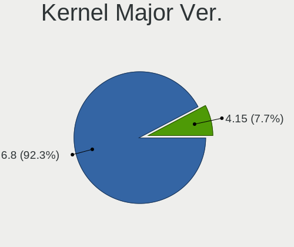
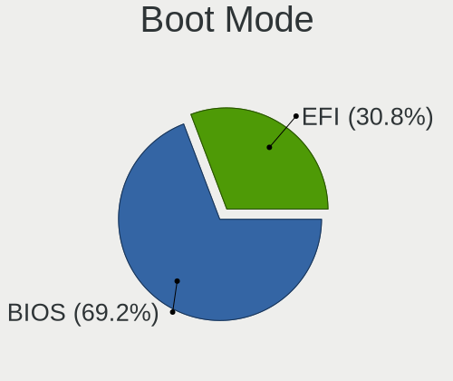
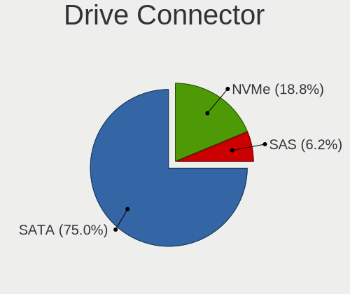
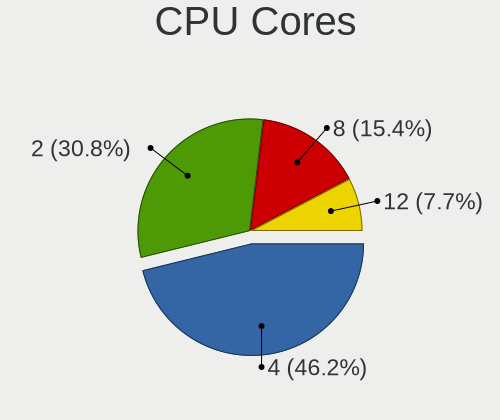
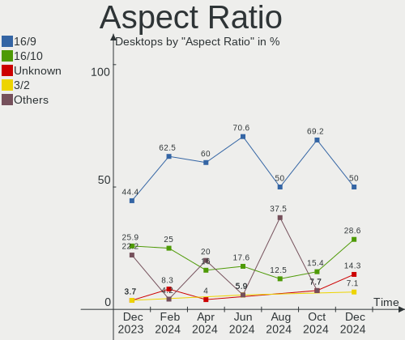

Xubuntu - Hardware Trends (Desktops)
------------------------------------

A project to identify most popular hardware characteristics and track their change
over time based on data collected by Linux users at https://Linux-Hardware.org.

Anyone can contribute to this report by the [hw-probe](https://github.com/linuxhw/hw-probe) tool:

    sudo -E hw-probe -all -upload

This report is for one last month. Overall report since the beginning of time: [TestDays](https://github.com/linuxhw/TestDays)

Period: Jan, 2024.

Contents
--------

* [ System ](#system)
  - [ OS                       ](#os)
  - [ OS Family                ](#os-family)
  - [ Kernel                   ](#kernel)
  - [ Kernel Family            ](#kernel-family)
  - [ Kernel Major Ver.        ](#kernel-major-ver)
  - [ Arch                     ](#arch)
  - [ DE                       ](#de)
  - [ Display Server           ](#display-server)
  - [ Display Manager          ](#display-manager)
  - [ OS Lang                  ](#os-lang)
  - [ Boot Mode                ](#boot-mode)
  - [ Filesystem               ](#filesystem)
  - [ Part. scheme             ](#part-scheme)
  - [ Dual Boot with Linux/BSD ](#dual-boot-with-linuxbsd)
  - [ Dual Boot (Win)          ](#dual-boot-win)

* [ Board ](#board)
  - [ Vendor                   ](#vendor)
  - [ Model                    ](#model)
  - [ Model Family             ](#model-family)
  - [ MFG Year                 ](#mfg-year)
  - [ Form Factor              ](#form-factor)
  - [ Secure Boot              ](#secure-boot)
  - [ Coreboot                 ](#coreboot)
  - [ RAM Size                 ](#ram-size)
  - [ RAM Used                 ](#ram-used)
  - [ Total Drives             ](#total-drives)
  - [ Has CD-ROM               ](#has-cd-rom)
  - [ Has Ethernet             ](#has-ethernet)
  - [ Has WiFi                 ](#has-wifi)
  - [ Has Bluetooth            ](#has-bluetooth)

* [ Location ](#location)
  - [ Country                  ](#country)
  - [ City                     ](#city)

* [ Drives ](#drives)
  - [ Drive Vendor             ](#drive-vendor)
  - [ Drive Model              ](#drive-model)
  - [ HDD Vendor               ](#hdd-vendor)
  - [ SSD Vendor               ](#ssd-vendor)
  - [ Drive Kind               ](#drive-kind)
  - [ Drive Connector          ](#drive-connector)
  - [ Drive Size               ](#drive-size)
  - [ Space Total              ](#space-total)
  - [ Space Used               ](#space-used)
  - [ Malfunc. Drives          ](#malfunc-drives)
  - [ Malfunc. Drive Vendor    ](#malfunc-drive-vendor)
  - [ Malfunc. HDD Vendor      ](#malfunc-hdd-vendor)
  - [ Malfunc. Drive Kind      ](#malfunc-drive-kind)
  - [ Failed Drives            ](#failed-drives)
  - [ Failed Drive Vendor      ](#failed-drive-vendor)
  - [ Drive Status             ](#drive-status)

* [ Storage controller ](#storage-controller)
  - [ Storage Vendor           ](#storage-vendor)
  - [ Storage Model            ](#storage-model)
  - [ Storage Kind             ](#storage-kind)

* [ Processor ](#processor)
  - [ CPU Vendor               ](#cpu-vendor)
  - [ CPU Model                ](#cpu-model)
  - [ CPU Model Family         ](#cpu-model-family)
  - [ CPU Cores                ](#cpu-cores)
  - [ CPU Sockets              ](#cpu-sockets)
  - [ CPU Threads              ](#cpu-threads)
  - [ CPU Op-Modes             ](#cpu-op-modes)
  - [ CPU Microcode            ](#cpu-microcode)
  - [ CPU Microarch            ](#cpu-microarch)

* [ Graphics ](#graphics)
  - [ GPU Vendor               ](#gpu-vendor)
  - [ GPU Model                ](#gpu-model)
  - [ GPU Combo                ](#gpu-combo)
  - [ GPU Driver               ](#gpu-driver)
  - [ GPU Memory               ](#gpu-memory)

* [ Monitor ](#monitor)
  - [ Monitor Vendor           ](#monitor-vendor)
  - [ Monitor Model            ](#monitor-model)
  - [ Monitor Resolution       ](#monitor-resolution)
  - [ Monitor Diagonal         ](#monitor-diagonal)
  - [ Monitor Width            ](#monitor-width)
  - [ Aspect Ratio             ](#aspect-ratio)
  - [ Monitor Area             ](#monitor-area)
  - [ Pixel Density            ](#pixel-density)
  - [ Multiple Monitors        ](#multiple-monitors)

* [ Network ](#network)
  - [ Net Controller Vendor    ](#net-controller-vendor)
  - [ Net Controller Model     ](#net-controller-model)
  - [ Wireless Vendor          ](#wireless-vendor)
  - [ Wireless Model           ](#wireless-model)
  - [ Ethernet Vendor          ](#ethernet-vendor)
  - [ Ethernet Model           ](#ethernet-model)
  - [ Net Controller Kind      ](#net-controller-kind)
  - [ Used Controller          ](#used-controller)
  - [ NICs                     ](#nics)
  - [ IPv6                     ](#ipv6)

* [ Bluetooth ](#bluetooth)
  - [ Bluetooth Vendor         ](#bluetooth-vendor)
  - [ Bluetooth Model          ](#bluetooth-model)

* [ Sound ](#sound)
  - [ Sound Vendor             ](#sound-vendor)
  - [ Sound Model              ](#sound-model)

* [ Memory ](#memory)
  - [ Memory Vendor            ](#memory-vendor)
  - [ Memory Model             ](#memory-model)
  - [ Memory Kind              ](#memory-kind)
  - [ Memory Form Factor       ](#memory-form-factor)
  - [ Memory Size              ](#memory-size)
  - [ Memory Speed             ](#memory-speed)

* [ Printers & scanners ](#printers--scanners)
  - [ Printer Vendor           ](#printer-vendor)
  - [ Printer Model            ](#printer-model)
  - [ Scanner Vendor           ](#scanner-vendor)
  - [ Scanner Model            ](#scanner-model)

* [ Camera ](#camera)
  - [ Camera Vendor            ](#camera-vendor)
  - [ Camera Model             ](#camera-model)

* [ Security ](#security)
  - [ Fingerprint Vendor       ](#fingerprint-vendor)
  - [ Fingerprint Model        ](#fingerprint-model)
  - [ Chipcard Vendor          ](#chipcard-vendor)
  - [ Chipcard Model           ](#chipcard-model)

* [ Unsupported ](#unsupported)
  - [ Unsupported Devices      ](#unsupported-devices)
  - [ Unsupported Device Types ](#unsupported-device-types)

System
------

OS
--

Installed operating systems

| Name          | Desktops | Percent |
|---------------|----------|---------|
| Xubuntu 22.04 | 13       | 40.63%  |
| Xubuntu 23.10 | 7        | 21.88%  |
| Xubuntu 20.04 | 6        | 18.75%  |
| Xubuntu 18.04 | 4        | 12.5%   |
| Xubuntu 23.04 | 1        | 3.13%   |
| Xubuntu 16.04 | 1        | 3.13%   |

OS Family
---------

OS without a version

| Name    | Desktops | Percent |
|---------|----------|---------|
| Xubuntu | 32       | 100%    |

Kernel
------

Version of the Linux kernel

| Version                 | Desktops | Percent |
|-------------------------|----------|---------|
| 6.5.0-14-generic        | 9        | 28.13%  |
| 6.2.0-39-generic        | 4        | 12.5%   |
| 5.15.0-91-generic       | 4        | 12.5%   |
| 5.4.0-169-generic       | 2        | 6.25%   |
| 5.15.0-91-lowlatency    | 2        | 6.25%   |
| 6.7.0                   | 1        | 3.13%   |
| 6.6.11-1-liquorix-amd64 | 1        | 3.13%   |
| 6.5.0-14-lowlatency     | 1        | 3.13%   |
| 6.2.0-26-generic        | 1        | 3.13%   |
| 5.4.217-0504217-generic | 1        | 3.13%   |
| 5.4.0-73-generic        | 1        | 3.13%   |
| 5.4.0-150-generic       | 1        | 3.13%   |
| 5.15.0-92-generic       | 1        | 3.13%   |
| 5.15.0-051500-generic   | 1        | 3.13%   |
| 5.13.0-30-generic       | 1        | 3.13%   |
| 4.15.0-142-generic      | 1        | 3.13%   |

Kernel Family
-------------

Linux kernel without a distro release

| Version | Desktops | Percent |
|---------|----------|---------|
| 6.5.0   | 10       | 31.25%  |
| 5.15.0  | 8        | 25%     |
| 6.2.0   | 5        | 15.63%  |
| 5.4.0   | 4        | 12.5%   |
| 6.7.0   | 1        | 3.13%   |
| 6.6.11  | 1        | 3.13%   |
| 5.4.217 | 1        | 3.13%   |
| 5.13.0  | 1        | 3.13%   |
| 4.15.0  | 1        | 3.13%   |

Kernel Major Ver.
-----------------

Linux kernel major version

| Version | Desktops | Percent |
|---------|----------|---------|
| 6.5     | 10       | 31.25%  |
| 5.15    | 8        | 25%     |
| 6.2     | 5        | 15.63%  |
| 5.4     | 5        | 15.63%  |
| 6.7     | 1        | 3.13%   |
| 6.6     | 1        | 3.13%   |
| 5.13    | 1        | 3.13%   |
| 4.15    | 1        | 3.13%   |

Arch
----

OS architecture (x86_64, i586, etc.)

| Name   | Desktops | Percent |
|--------|----------|---------|
| x86_64 | 31       | 96.88%  |
| i686   | 1        | 3.13%   |

DE
--

Desktop Environment

| Name  | Desktops | Percent |
|-------|----------|---------|
| XFCE  | 30       | 93.75%  |
| i3    | 1        | 3.13%   |
| GNOME | 1        | 3.13%   |

Display Server
--------------

X11 or Wayland

| Name | Desktops | Percent |
|------|----------|---------|
| X11  | 30       | 93.75%  |
| Tty  | 2        | 6.25%   |

Display Manager
---------------

SDDM, LightDM, etc.

| Name    | Desktops | Percent |
|---------|----------|---------|
| LightDM | 29       | 90.63%  |
| Unknown | 2        | 6.25%   |
| GDM3    | 1        | 3.13%   |

OS Lang
-------

Language

| Lang  | Desktops | Percent |
|-------|----------|---------|
| en_US | 16       | 50%     |
| fr_FR | 5        | 15.63%  |
| de_DE | 3        | 9.38%   |
| sk_SK | 1        | 3.13%   |
| ru_RU | 1        | 3.13%   |
| pt_BR | 1        | 3.13%   |
| ja_JP | 1        | 3.13%   |
| it_IT | 1        | 3.13%   |
| hu_HU | 1        | 3.13%   |
| es_ES | 1        | 3.13%   |
| C     | 1        | 3.13%   |

Boot Mode
---------

EFI or BIOS

| Mode | Desktops | Percent |
|------|----------|---------|
| BIOS | 18       | 56.25%  |
| EFI  | 14       | 43.75%  |

Filesystem
----------

Type of filesystem

| Type    | Desktops | Percent |
|---------|----------|---------|
| Ext4    | 19       | 59.38%  |
| Tmpfs   | 12       | 37.5%   |
| Overlay | 1        | 3.13%   |

Part. scheme
------------

Scheme of partitioning

| Type    | Desktops | Percent |
|---------|----------|---------|
| GPT     | 26       | 81.25%  |
| MBR     | 4        | 12.5%   |
| Unknown | 2        | 6.25%   |

Dual Boot with Linux/BSD
------------------------

Hosting more than one Linux/BSD

| Dual boot | Desktops | Percent |
|-----------|----------|---------|
| No        | 26       | 81.25%  |
| Yes       | 6        | 18.75%  |

Dual Boot (Win)
---------------

Hosting Linux and Windows

| Dual boot | Desktops | Percent |
|-----------|----------|---------|
| No        | 22       | 68.75%  |
| Yes       | 10       | 31.25%  |

Board
-----

Vendor
------

Motherboard manufacturer

| Name                  | Desktops | Percent |
|-----------------------|----------|---------|
| ASUSTek Computer      | 9        | 28.13%  |
| Gigabyte Technology   | 5        | 15.63%  |
| Dell                  | 4        | 12.5%   |
| ASRock                | 4        | 12.5%   |
| MSI                   | 2        | 6.25%   |
| Shuttle               | 1        | 3.13%   |
| Packard Bell          | 1        | 3.13%   |
| Lenovo                | 1        | 3.13%   |
| KunPengDianTong(KPDT) | 1        | 3.13%   |
| Intel                 | 1        | 3.13%   |
| Hewlett-Packard       | 1        | 3.13%   |
| Fujitsu               | 1        | 3.13%   |
| AOpen                 | 1        | 3.13%   |

Model
-----

Motherboard model

| Name                                    | Desktops | Percent |
|-----------------------------------------|----------|---------|
| ASUS All Series                         | 2        | 6.25%   |
| Shuttle NC40U                           | 1        | 3.13%   |
| Packard Bell IXTREME M5800              | 1        | 3.13%   |
| MSI MS-7C56                             | 1        | 3.13%   |
| MSI MS-7B86                             | 1        | 3.13%   |
| Lenovo IdeaCentre 310S-08ASR 90G9002MUK | 1        | 3.13%   |
| Intel DB75EN                            | 1        | 3.13%   |
| HP ProDesk 400 G5 Desktop Mini          | 1        | 3.13%   |
| Gigabyte P55-UD3R                       | 1        | 3.13%   |
| Gigabyte GA-MA790FXT-UD5P               | 1        | 3.13%   |
| Gigabyte C1037UN                        | 1        | 3.13%   |
| Gigabyte B550 AORUS ELITE AX V2         | 1        | 3.13%   |
| Gigabyte 8IPE1000P-G                    | 1        | 3.13%   |
| Fujitsu ESPRIMO Q958                    | 1        | 3.13%   |
| Dell Precision Tower 5810               | 1        | 3.13%   |
| Dell OptiPlex 990                       | 1        | 3.13%   |
| Dell OptiPlex 7020                      | 1        | 3.13%   |
| Dell OptiPlex 3060                      | 1        | 3.13%   |
| ASUS TUF B450-PLUS GAMING               | 1        | 3.13%   |
| ASUS ROG STRIX B650E-F GAMING WIFI      | 1        | 3.13%   |
| ASUS ROG STRIX B450-F GAMING            | 1        | 3.13%   |
| ASUS ROG CROSSHAIR VIII DARK HERO       | 1        | 3.13%   |
| ASUS P8P67 DELUXE                       | 1        | 3.13%   |
| ASUS P8H61-M2 USB3                      | 1        | 3.13%   |
| ASUS M4A79T Deluxe                      | 1        | 3.13%   |
| ASRock PC WORK BRONZE AMD               | 1        | 3.13%   |
| ASRock N68-S3 FX                        | 1        | 3.13%   |
| ASRock E350M1                           | 1        | 3.13%   |
| ASRock B450 Steel Legend                | 1        | 3.13%   |
| AOpen ESPRIMO Q5020                     | 1        | 3.13%   |
| Unknown                                 | 1        | 3.13%   |

Model Family
------------

Motherboard model prefix

| Name                      | Desktops | Percent |
|---------------------------|----------|---------|
| Dell OptiPlex             | 3        | 9.38%   |
| ASUS ROG                  | 3        | 9.38%   |
| ASUS All                  | 2        | 6.25%   |
| Shuttle NC40U             | 1        | 3.13%   |
| Packard Bell IXTREME      | 1        | 3.13%   |
| MSI MS-7C56               | 1        | 3.13%   |
| MSI MS-7B86               | 1        | 3.13%   |
| Lenovo IdeaCentre         | 1        | 3.13%   |
| Intel DB75EN              | 1        | 3.13%   |
| HP ProDesk                | 1        | 3.13%   |
| Gigabyte P55-UD3R         | 1        | 3.13%   |
| Gigabyte GA-MA790FXT-UD5P | 1        | 3.13%   |
| Gigabyte C1037UN          | 1        | 3.13%   |
| Gigabyte B550             | 1        | 3.13%   |
| Gigabyte 8IPE1000P-G      | 1        | 3.13%   |
| Fujitsu ESPRIMO           | 1        | 3.13%   |
| Dell Precision            | 1        | 3.13%   |
| ASUS TUF                  | 1        | 3.13%   |
| ASUS P8P67                | 1        | 3.13%   |
| ASUS P8H61-M2             | 1        | 3.13%   |
| ASUS M4A79T               | 1        | 3.13%   |
| ASRock PC                 | 1        | 3.13%   |
| ASRock N68-S3             | 1        | 3.13%   |
| ASRock E350M1             | 1        | 3.13%   |
| ASRock B450               | 1        | 3.13%   |
| AOpen ESPRIMO             | 1        | 3.13%   |
| Unknown                   | 1        | 3.13%   |

MFG Year
--------

Motherboard manufacture year

| Year | Desktops | Percent |
|------|----------|---------|
| 2022 | 3        | 9.38%   |
| 2020 | 3        | 9.38%   |
| 2019 | 3        | 9.38%   |
| 2012 | 3        | 9.38%   |
| 2011 | 3        | 9.38%   |
| 2009 | 3        | 9.38%   |
| 2023 | 2        | 6.25%   |
| 2018 | 2        | 6.25%   |
| 2014 | 2        | 6.25%   |
| 2010 | 2        | 6.25%   |
| 2021 | 1        | 3.13%   |
| 2017 | 1        | 3.13%   |
| 2015 | 1        | 3.13%   |
| 2013 | 1        | 3.13%   |
| 2008 | 1        | 3.13%   |
| 2004 | 1        | 3.13%   |

Form Factor
-----------

Physical design of the computer

| Name    | Desktops | Percent |
|---------|----------|---------|
| Desktop | 32       | 100%    |

Secure Boot
-----------

Enabled or disabled

| State    | Desktops | Percent |
|----------|----------|---------|
| Disabled | 29       | 90.63%  |
| Enabled  | 3        | 9.38%   |

Coreboot
--------

Have coreboot on board

| Used | Desktops | Percent |
|------|----------|---------|
| No   | 32       | 100%    |

RAM Size
--------

Total RAM memory

| Size in GB  | Desktops | Percent |
|-------------|----------|---------|
| 16.01-24.0  | 12       | 37.5%   |
| 3.01-4.0    | 6        | 18.75%  |
| 4.01-8.0    | 5        | 15.63%  |
| 64.01-256.0 | 4        | 12.5%   |
| 8.01-16.0   | 3        | 9.38%   |
| 32.01-64.0  | 1        | 3.13%   |
| 1.01-2.0    | 1        | 3.13%   |

RAM Used
--------

Used RAM memory

| Used GB   | Desktops | Percent |
|-----------|----------|---------|
| 1.01-2.0  | 9        | 28.13%  |
| 3.01-4.0  | 8        | 25%     |
| 2.01-3.0  | 6        | 18.75%  |
| 4.01-8.0  | 4        | 12.5%   |
| 0.51-1.0  | 3        | 9.38%   |
| 8.01-16.0 | 2        | 6.25%   |

Total Drives
------------

Number of drives on board

| Drives | Desktops | Percent |
|--------|----------|---------|
| 1      | 17       | 53.13%  |
| 3      | 6        | 18.75%  |
| 2      | 5        | 15.63%  |
| 4      | 2        | 6.25%   |
| 6      | 1        | 3.13%   |
| 5      | 1        | 3.13%   |

Has CD-ROM
----------

Has CD-ROM on board

| Presented | Desktops | Percent |
|-----------|----------|---------|
| Yes       | 16       | 50%     |
| No        | 16       | 50%     |

Has Ethernet
------------

Has Ethernet on board

| Presented | Desktops | Percent |
|-----------|----------|---------|
| Yes       | 31       | 96.88%  |
| No        | 1        | 3.13%   |

Has WiFi
--------

Has WiFi module

| Presented | Desktops | Percent |
|-----------|----------|---------|
| Yes       | 17       | 53.13%  |
| No        | 15       | 46.88%  |

Has Bluetooth
-------------

Has Bluetooth module

| Presented | Desktops | Percent |
|-----------|----------|---------|
| No        | 19       | 59.38%  |
| Yes       | 13       | 40.63%  |

Location
--------

Country
-------

Geographic location (country)

| Country   | Desktops | Percent |
|-----------|----------|---------|
| USA       | 9        | 28.13%  |
| France    | 5        | 15.63%  |
| Germany   | 4        | 12.5%   |
| Russia    | 3        | 9.38%   |
| Italy     | 2        | 6.25%   |
| UK        | 1        | 3.13%   |
| Thailand  | 1        | 3.13%   |
| Spain     | 1        | 3.13%   |
| Slovakia  | 1        | 3.13%   |
| Singapore | 1        | 3.13%   |
| Japan     | 1        | 3.13%   |
| Hungary   | 1        | 3.13%   |
| Canada    | 1        | 3.13%   |
| Brazil    | 1        | 3.13%   |

City
----

Geographic location (city)

| City                      | Desktops | Percent |
|---------------------------|----------|---------|
| Berlin                    | 2        | 6.25%   |
| Toulouse                  | 1        | 3.13%   |
| Tomsk                     | 1        | 3.13%   |
| Springfield               | 1        | 3.13%   |
| Singapore                 | 1        | 3.13%   |
| Sebring                   | 1        | 3.13%   |
| Saint-Germain-les-Arpajon | 1        | 3.13%   |
| Paris                     | 1        | 3.13%   |
| Nuremberg                 | 1        | 3.13%   |
| Novosibirsk               | 1        | 3.13%   |
| Montebello                | 1        | 3.13%   |
| Manaus                    | 1        | 3.13%   |
| Legnaro                   | 1        | 3.13%   |
| Krasnoznamensk            | 1        | 3.13%   |
| Kelowna                   | 1        | 3.13%   |
| Kansas City               | 1        | 3.13%   |
| Jarrettsville             | 1        | 3.13%   |
| Ingenio                   | 1        | 3.13%   |
| Harrisonburg              | 1        | 3.13%   |
| Girard                    | 1        | 3.13%   |
| Freiberg                  | 1        | 3.13%   |
| Fontenay-Tresigny         | 1        | 3.13%   |
| Florence                  | 1        | 3.13%   |
| Cournanel                 | 1        | 3.13%   |
| Columbia                  | 1        | 3.13%   |
| Cincinnati                | 1        | 3.13%   |
| Chichibu                  | 1        | 3.13%   |
| Carluke                   | 1        | 3.13%   |
| Budapest                  | 1        | 3.13%   |
| Bratislava                | 1        | 3.13%   |
| Bangkok                   | 1        | 3.13%   |

Drives
------

Drive Vendor
------------

Hard drive vendors

| Vendor                      | Desktops | Drives | Percent |
|-----------------------------|----------|--------|---------|
| WDC                         | 12       | 16     | 21.43%  |
| Seagate                     | 8        | 11     | 14.29%  |
| Kingston                    | 5        | 6      | 8.93%   |
| Toshiba                     | 3        | 3      | 5.36%   |
| Samsung Electronics         | 3        | 3      | 5.36%   |
| Crucial                     | 3        | 3      | 5.36%   |
| SPCC                        | 2        | 2      | 3.57%   |
| Kingston Technology Company | 2        | 2      | 3.57%   |
| Hitachi                     | 2        | 2      | 3.57%   |
| Unknown                     | 1        | 1      | 1.79%   |
| Transcend                   | 1        | 1      | 1.79%   |
| Timetec                     | 1        | 1      | 1.79%   |
| SK hynix                    | 1        | 1      | 1.79%   |
| Sandisk                     | 1        | 1      | 1.79%   |
| PNY                         | 1        | 1      | 1.79%   |
| Phison Electronics          | 1        | 2      | 1.79%   |
| Phison                      | 1        | 2      | 1.79%   |
| Maxtor                      | 1        | 1      | 1.79%   |
| LITEONIT                    | 1        | 1      | 1.79%   |
| KIOXIA                      | 1        | 1      | 1.79%   |
| HGST                        | 1        | 1      | 1.79%   |
| Hewlett-Packard             | 1        | 1      | 1.79%   |
| Corsair                     | 1        | 1      | 1.79%   |
| China                       | 1        | 1      | 1.79%   |
| A-DATA Technology           | 1        | 1      | 1.79%   |

Drive Model
-----------

Hard drive models

| Model                                   | Desktops | Percent |
|-----------------------------------------|----------|---------|
| Kingston SA400S37240G 240GB SSD         | 3        | 4.62%   |
| WDC WDS240G2G0B-00EPW0 240GB SSD        | 1        | 1.54%   |
| WDC WD80EMAZ-00WJTA0 8TB                | 1        | 1.54%   |
| WDC WD7500BPVT-22HXZT3 752GB            | 1        | 1.54%   |
| WDC WD6400AAKS-00E4A0 640GB             | 1        | 1.54%   |
| WDC WD5000LUCT-63RC2Y0 500GB            | 1        | 1.54%   |
| WDC WD5000AAKX-08U6AA0 500GB            | 1        | 1.54%   |
| WDC WD4000AAJS-00YFA0 400GB             | 1        | 1.54%   |
| WDC WD20EZRZ-00Z5HB0 2TB                | 1        | 1.54%   |
| WDC WD10SPZX-00Z10T0 1TB                | 1        | 1.54%   |
| WDC WD10JPVX-22JC3T0 1TB                | 1        | 1.54%   |
| WDC WD10EZEX-75WN4A1 1TB                | 1        | 1.54%   |
| WDC WD10EZEX-08WN4A0 1TB                | 1        | 1.54%   |
| WDC WD10EZEX-08M2NA0 1TB                | 1        | 1.54%   |
| WDC WD10EZEX-07WN4A0 1TB                | 1        | 1.54%   |
| WDC WD10EZEX-00BN5A0 1TB                | 1        | 1.54%   |
| WDC WD10EACS-00D6B0 1TB                 | 1        | 1.54%   |
| Unknown NVMe SSD Drive 512GB            | 1        | 1.54%   |
| Transcend TS64GSSD370S 64GB             | 1        | 1.54%   |
| Toshiba HDWE150 5TB                     | 1        | 1.54%   |
| Toshiba HDWD105 500GB                   | 1        | 1.54%   |
| Toshiba DT01ACA050 500GB                | 1        | 1.54%   |
| Timetec M.2 SATA 256GB SSD              | 1        | 1.54%   |
| SPCC Solid State Disk 1TB               | 1        | 1.54%   |
| SPCC Solid State Disk 120GB             | 1        | 1.54%   |
| SK hynix BC501 HFM256GDJTNG-8310A 256GB | 1        | 1.54%   |
| Seagate ST8000DM004-2U9188 8TB          | 1        | 1.54%   |
| Seagate ST8000DM004-2CX188 8TB          | 1        | 1.54%   |
| Seagate ST3500418AS 500GB               | 1        | 1.54%   |
| Seagate ST3120022A 120GB                | 1        | 1.54%   |
| Seagate ST2000VX008-2E3164 2TB          | 1        | 1.54%   |
| Seagate ST2000DM008-2FR102 2TB          | 1        | 1.54%   |
| Seagate ST2000DM001-1CH164 2TB          | 1        | 1.54%   |
| Seagate ST1000VM002-1SD102 1TB          | 1        | 1.54%   |
| Seagate ST1000DM010-2EP102 1TB          | 1        | 1.54%   |
| Seagate ST1000DM003-1ER162 1TB          | 1        | 1.54%   |
| Seagate ST1000DM003-1CH162 1TB          | 1        | 1.54%   |
| Sandisk WD Blue SN550 NVMe SSD 512GB    | 1        | 1.54%   |
| Samsung SSD 870 EVO 500GB               | 1        | 1.54%   |
| Samsung SP1614C 160GB                   | 1        | 1.54%   |

HDD Vendor
----------

Hard disk drive vendors

| Vendor              | Desktops | Drives | Percent |
|---------------------|----------|--------|---------|
| WDC                 | 11       | 15     | 40.74%  |
| Seagate             | 8        | 11     | 29.63%  |
| Toshiba             | 3        | 3      | 11.11%  |
| Hitachi             | 2        | 2      | 7.41%   |
| Samsung Electronics | 1        | 1      | 3.7%    |
| Maxtor              | 1        | 1      | 3.7%    |
| HGST                | 1        | 1      | 3.7%    |

SSD Vendor
----------

Solid state drive vendors

| Vendor              | Desktops | Drives | Percent |
|---------------------|----------|--------|---------|
| Kingston            | 5        | 6      | 27.78%  |
| SPCC                | 2        | 2      | 11.11%  |
| WDC                 | 1        | 1      | 5.56%   |
| Transcend           | 1        | 1      | 5.56%   |
| Timetec             | 1        | 1      | 5.56%   |
| Samsung Electronics | 1        | 1      | 5.56%   |
| PNY                 | 1        | 1      | 5.56%   |
| LITEONIT            | 1        | 1      | 5.56%   |
| Hewlett-Packard     | 1        | 1      | 5.56%   |
| Crucial             | 1        | 1      | 5.56%   |
| Corsair             | 1        | 1      | 5.56%   |
| China               | 1        | 1      | 5.56%   |
| A-DATA Technology   | 1        | 1      | 5.56%   |

Drive Kind
----------

HDD or SSD

| Kind | Desktops | Drives | Percent |
|------|----------|--------|---------|
| HDD  | 19       | 34     | 42.22%  |
| SSD  | 16       | 19     | 35.56%  |
| NVMe | 10       | 13     | 22.22%  |

Drive Connector
---------------

SATA, SAS, NVMe, etc.

| Type | Desktops | Drives | Percent |
|------|----------|--------|---------|
| SATA | 27       | 52     | 71.05%  |
| NVMe | 10       | 13     | 26.32%  |
| SAS  | 1        | 1      | 2.63%   |

Drive Size
----------

Size of hard drive

| Size in TB | Desktops | Drives | Percent |
|------------|----------|--------|---------|
| 0.01-0.5   | 18       | 28     | 51.43%  |
| 0.51-1.0   | 10       | 17     | 28.57%  |
| 1.01-2.0   | 4        | 4      | 11.43%  |
| 4.01-10.0  | 3        | 4      | 8.57%   |

Space Total
-----------

Amount of disk space available on the file system

| Size in GB     | Desktops | Percent |
|----------------|----------|---------|
| 101-250        | 11       | 34.38%  |
| 501-1000       | 6        | 18.75%  |
| More than 3000 | 4        | 12.5%   |
| 251-500        | 3        | 9.38%   |
| 2001-3000      | 3        | 9.38%   |
| 1001-2000      | 2        | 6.25%   |
| 51-100         | 2        | 6.25%   |
| 1-20           | 1        | 3.13%   |

Space Used
----------

Amount of used disk space

| Used GB        | Desktops | Percent |
|----------------|----------|---------|
| 1-20           | 11       | 34.38%  |
| 21-50          | 5        | 15.63%  |
| 251-500        | 3        | 9.38%   |
| 101-250        | 3        | 9.38%   |
| 1001-2000      | 3        | 9.38%   |
| 501-1000       | 3        | 9.38%   |
| 2001-3000      | 2        | 6.25%   |
| More than 3000 | 1        | 3.13%   |
| 51-100         | 1        | 3.13%   |

Malfunc. Drives
---------------

Drive models with a malfunction

| Model                            | Desktops | Drives | Percent |
|----------------------------------|----------|--------|---------|
| Kingston SV300S37A120G 120GB SSD | 1        | 1      | 33.33%  |
| Kingston A400 256GB SSD          | 1        | 1      | 33.33%  |
| Hitachi HTS547575A9E384 752GB    | 1        | 1      | 33.33%  |

Malfunc. Drive Vendor
---------------------

Vendors of faulty drives

| Vendor   | Desktops | Drives | Percent |
|----------|----------|--------|---------|
| Kingston | 2        | 2      | 66.67%  |
| Hitachi  | 1        | 1      | 33.33%  |

Malfunc. HDD Vendor
-------------------

Vendors of faulty HDD drives

| Vendor  | Desktops | Drives | Percent |
|---------|----------|--------|---------|
| Hitachi | 1        | 1      | 100%    |

Malfunc. Drive Kind
-------------------

Kinds of faulty drives

| Kind | Desktops | Drives | Percent |
|------|----------|--------|---------|
| SSD  | 2        | 2      | 66.67%  |
| HDD  | 1        | 1      | 33.33%  |

Failed Drives
-------------

Failed drive models

Zero info for selected period =(

Failed Drive Vendor
-------------------

Failed drive vendors

Zero info for selected period =(

Drive Status
------------

Number of failed and malfunc. drives

| Status   | Desktops | Drives | Percent |
|----------|----------|--------|---------|
| Works    | 18       | 36     | 48.65%  |
| Detected | 16       | 27     | 43.24%  |
| Malfunc  | 3        | 3      | 8.11%   |

Storage controller
------------------

Storage Vendor
--------------

Storage controller vendors

| Vendor                      | Desktops | Percent |
|-----------------------------|----------|---------|
| Intel                       | 18       | 37.5%   |
| AMD                         | 13       | 27.08%  |
| JMicron Technology          | 3        | 6.25%   |
| Phison Electronics          | 2        | 4.17%   |
| Micron/Crucial Technology   | 2        | 4.17%   |
| Kingston Technology Company | 2        | 4.17%   |
| SK hynix                    | 1        | 2.08%   |
| SanDisk                     | 1        | 2.08%   |
| Samsung Electronics         | 1        | 2.08%   |
| Nvidia                      | 1        | 2.08%   |
| Marvell Technology Group    | 1        | 2.08%   |
| KIOXIA                      | 1        | 2.08%   |
| Hosin Global Electronics    | 1        | 2.08%   |
| ASMedia Technology          | 1        | 2.08%   |

Storage Model
-------------

Storage controller models

| Model                                                                                   | Desktops | Percent |
|-----------------------------------------------------------------------------------------|----------|---------|
| AMD FCH SATA Controller [AHCI mode]                                                     | 4        | 6.67%   |
| AMD 500 Series Chipset SATA Controller                                                  | 4        | 6.67%   |
| Intel 8 Series/C220 Series Chipset Family 6-port SATA Controller 1 [AHCI mode]          | 3        | 5%      |
| AMD SB7x0/SB8x0/SB9x0 IDE Controller                                                    | 3        | 5%      |
| AMD 400 Series Chipset SATA Controller                                                  | 3        | 5%      |
| Micron/Crucial P2 [Nick P2] / P3 / P3 Plus NVMe PCIe SSD (DRAM-less)                    | 2        | 3.33%   |
| Kingston Company NV2 NVMe SSD SM2267XT (DRAM-less)                                      | 2        | 3.33%   |
| JMicron JMB363 SATA/IDE Controller                                                      | 2        | 3.33%   |
| Intel Cannon Lake PCH SATA AHCI Controller                                              | 2        | 3.33%   |
| Intel 6 Series/C200 Series Chipset Family 6 port Desktop SATA AHCI Controller           | 2        | 3.33%   |
| AMD SB7x0/SB8x0/SB9x0 SATA Controller [AHCI mode]                                       | 2        | 3.33%   |
| SK hynix BC501 NVMe Solid State Drive                                                   | 1        | 1.67%   |
| SanDisk Ultra 3D / WD Blue SN550 NVMe SSD                                               | 1        | 1.67%   |
| Samsung NVMe SSD Controller SM981/PM981/PM983                                           | 1        | 1.67%   |
| Phison PS5015-E15 PCIe3 NVMe Controller (DRAM-less)                                     | 1        | 1.67%   |
| Phison PS5013-E13 PCIe3 NVMe Controller (DRAM-less)                                     | 1        | 1.67%   |
| Phison E18 PCIe4 NVMe Controller                                                        | 1        | 1.67%   |
| Nvidia MCP61 SATA Controller                                                            | 1        | 1.67%   |
| Nvidia MCP61 IDE                                                                        | 1        | 1.67%   |
| Marvell Group 88SE9128 PCIe SATA 6 Gb/s RAID controller with HyperDuo                   | 1        | 1.67%   |
| KIOXIA NVMe SSD Controller BG4 (DRAM-less)                                              | 1        | 1.67%   |
| JMicron JMB362 SATA Controller                                                          | 1        | 1.67%   |
| Intel Tiger Lake-LP SATA Controller                                                     | 1        | 1.67%   |
| Intel SATA Controller [RAID mode]                                                       | 1        | 1.67%   |
| Intel C610/X99 series chipset sSATA Controller [AHCI mode]                              | 1        | 1.67%   |
| Intel C610/X99 series chipset 6-Port SATA Controller [AHCI mode]                        | 1        | 1.67%   |
| Intel Alder Lake-P SATA AHCI Controller                                                 | 1        | 1.67%   |
| Intel 82801HM/HEM (ICH8M/ICH8M-E) SATA Controller [AHCI mode]                           | 1        | 1.67%   |
| Intel 82801HM/HEM (ICH8M/ICH8M-E) IDE Controller                                        | 1        | 1.67%   |
| Intel 82801EB/ER (ICH5/ICH5R) IDE Controller                                            | 1        | 1.67%   |
| Intel 82801EB (ICH5) SATA Controller                                                    | 1        | 1.67%   |
| Intel 7 Series/C210 Series Chipset Family 6-port SATA Controller [AHCI mode]            | 1        | 1.67%   |
| Intel 7 Series Chipset Family 6-port SATA Controller [AHCI mode]                        | 1        | 1.67%   |
| Intel 6 Series/C200 Series Chipset Family Desktop SATA Controller (IDE mode, ports 4-5) | 1        | 1.67%   |
| Intel 6 Series/C200 Series Chipset Family Desktop SATA Controller (IDE mode, ports 0-3) | 1        | 1.67%   |
| Intel 5 Series/3400 Series Chipset 6 port SATA AHCI Controller                          | 1        | 1.67%   |
| Intel 5 Series/3400 Series Chipset 4 port SATA IDE Controller                           | 1        | 1.67%   |
| Intel 5 Series/3400 Series Chipset 2 port SATA IDE Controller                           | 1        | 1.67%   |
| Hosin Global Non-Volatile memory controller                                             | 1        | 1.67%   |
| ASMedia ASM1061/ASM1062 Serial ATA Controller                                           | 1        | 1.67%   |

Storage Kind
------------

Kind of storage controller (IDE, SATA, NVMe, SAS, ...)

| Kind | Desktops | Percent |
|------|----------|---------|
| SATA | 27       | 58.7%   |
| NVMe | 10       | 21.74%  |
| IDE  | 8        | 17.39%  |
| RAID | 1        | 2.17%   |

Processor
---------

CPU Vendor
----------

Processor vendors

| Vendor | Desktops | Percent |
|--------|----------|---------|
| Intel  | 18       | 56.25%  |
| AMD    | 14       | 43.75%  |

CPU Model
---------

Processor models

| Model                                        | Desktops | Percent |
|----------------------------------------------|----------|---------|
| Intel Xeon CPU E5-2699 v3 @ 2.30GHz          | 1        | 3.13%   |
| Intel Pentium CPU G645 @ 2.90GHz             | 1        | 3.13%   |
| Intel Pentium 4 CPU 2.80GHz                  | 1        | 3.13%   |
| Intel Core i7-9700T CPU @ 2.00GHz            | 1        | 3.13%   |
| Intel Core i7-2600K CPU @ 3.40GHz            | 1        | 3.13%   |
| Intel Core i7 CPU 870 @ 2.93GHz              | 1        | 3.13%   |
| Intel Core i7 CPU 860 @ 2.80GHz              | 1        | 3.13%   |
| Intel Core i5-9500T CPU @ 2.20GHz            | 1        | 3.13%   |
| Intel Core i5-8500 CPU @ 3.00GHz             | 1        | 3.13%   |
| Intel Core i5-4590 CPU @ 3.30GHz             | 1        | 3.13%   |
| Intel Core i5-3330 CPU @ 3.00GHz             | 1        | 3.13%   |
| Intel Core i5-2500 CPU @ 3.30GHz             | 1        | 3.13%   |
| Intel Core i3-4150 CPU @ 3.50GHz             | 1        | 3.13%   |
| Intel Core 2 Duo CPU T8100 @ 2.10GHz         | 1        | 3.13%   |
| Intel Celeron CPU G1820 @ 2.70GHz            | 1        | 3.13%   |
| Intel Celeron CPU 1037U @ 1.80GHz            | 1        | 3.13%   |
| Intel Celeron 7305                           | 1        | 3.13%   |
| Intel 11th Gen Core i5-1135G7 @ 2.40GHz      | 1        | 3.13%   |
| AMD Ryzen 9 7950X3D 16-Core Processor        | 1        | 3.13%   |
| AMD Ryzen 9 5950X 16-Core Processor          | 1        | 3.13%   |
| AMD Ryzen 7 5700G with Radeon Graphics       | 1        | 3.13%   |
| AMD Ryzen 7 3700X 8-Core Processor           | 1        | 3.13%   |
| AMD Ryzen 7 2700X Eight-Core Processor       | 1        | 3.13%   |
| AMD Ryzen 5 5600X 6-Core Processor           | 1        | 3.13%   |
| AMD Ryzen 5 4600G with Radeon Graphics       | 1        | 3.13%   |
| AMD Ryzen 5 3600 6-Core Processor            | 1        | 3.13%   |
| AMD Ryzen 5 3500 6-Core Processor            | 1        | 3.13%   |
| AMD Phenom II X6 1100T Processor             | 1        | 3.13%   |
| AMD Phenom II X4 925 Processor               | 1        | 3.13%   |
| AMD E-350D APU with Radeon HD Graphics       | 1        | 3.13%   |
| AMD Athlon II X3 440 Processor               | 1        | 3.13%   |
| AMD A9-9430 RADEON R5, 5 COMPUTE CORES 2C+3G | 1        | 3.13%   |

CPU Model Family
----------------

Processor model prefix

| Model            | Desktops | Percent |
|------------------|----------|---------|
| Intel Core i5    | 5        | 15.63%  |
| Intel Core i7    | 4        | 12.5%   |
| AMD Ryzen 5      | 4        | 12.5%   |
| Intel Celeron    | 3        | 9.38%   |
| AMD Ryzen 7      | 3        | 9.38%   |
| Other            | 2        | 6.25%   |
| AMD Ryzen 9      | 2        | 6.25%   |
| Intel Xeon       | 1        | 3.13%   |
| Intel Pentium 4  | 1        | 3.13%   |
| Intel Pentium    | 1        | 3.13%   |
| Intel Core i3    | 1        | 3.13%   |
| Intel Core 2 Duo | 1        | 3.13%   |
| AMD Phenom II X6 | 1        | 3.13%   |
| AMD Phenom II X4 | 1        | 3.13%   |
| AMD E            | 1        | 3.13%   |
| AMD Athlon II X3 | 1        | 3.13%   |

CPU Cores
---------

Number of processor cores

| Number | Desktops | Percent |
|--------|----------|---------|
| 4      | 8        | 25%     |
| 6      | 7        | 21.88%  |
| 2      | 7        | 21.88%  |
| 8      | 4        | 12.5%   |
| 16     | 2        | 6.25%   |
| 18     | 1        | 3.13%   |
| 5      | 1        | 3.13%   |
| 3      | 1        | 3.13%   |
| 1      | 1        | 3.13%   |

CPU Sockets
-----------

Number of sockets

| Number | Desktops | Percent |
|--------|----------|---------|
| 1      | 32       | 100%    |

CPU Threads
-----------

Threads per core (Hyper-Threading)

| Number | Desktops | Percent |
|--------|----------|---------|
| 1      | 17       | 53.13%  |
| 2      | 15       | 46.88%  |

CPU Op-Modes
------------

CPU Operation Modes (32-bit, 64-bit)

| Op mode        | Desktops | Percent |
|----------------|----------|---------|
| 32-bit, 64-bit | 31       | 96.88%  |
| 32-bit         | 1        | 3.13%   |

CPU Microcode
-------------

Microcode number

| Number     | Desktops | Percent |
|------------|----------|---------|
| Unknown    | 12       | 37.5%   |
| 0x306a9    | 2        | 6.25%   |
| 0x206a7    | 2        | 6.25%   |
| 0x08701021 | 2        | 6.25%   |
| 0xf33      | 1        | 3.13%   |
| 0x906ed    | 1        | 3.13%   |
| 0x906ea    | 1        | 3.13%   |
| 0x906a4    | 1        | 3.13%   |
| 0x106e5    | 1        | 3.13%   |
| 0x0a20120e | 1        | 3.13%   |
| 0x0a20102b | 1        | 3.13%   |
| 0x08701030 | 1        | 3.13%   |
| 0x08600106 | 1        | 3.13%   |
| 0x0800820d | 1        | 3.13%   |
| 0x06006704 | 1        | 3.13%   |
| 0x05000119 | 1        | 3.13%   |
| 0x010000dc | 1        | 3.13%   |
| 0x010000db | 1        | 3.13%   |

CPU Microarch
-------------

Microarchitecture

| Name             | Desktops | Percent |
|------------------|----------|---------|
| Zen 2            | 4        | 12.5%   |
| Haswell          | 4        | 12.5%   |
| Zen 3            | 3        | 9.38%   |
| SandyBridge      | 3        | 9.38%   |
| KabyLake         | 3        | 9.38%   |
| K10              | 3        | 9.38%   |
| Nehalem          | 2        | 6.25%   |
| IvyBridge        | 2        | 6.25%   |
| Zen+             | 1        | 3.13%   |
| TigerLake        | 1        | 3.13%   |
| Penryn           | 1        | 3.13%   |
| NetBurst         | 1        | 3.13%   |
| Excavator        | 1        | 3.13%   |
| Bobcat           | 1        | 3.13%   |
| Alderlake Hybrid | 1        | 3.13%   |
| Unknown          | 1        | 3.13%   |

Graphics
--------

GPU Vendor
----------

Vendors of graphics cards

| Vendor | Desktops | Percent |
|--------|----------|---------|
| Nvidia | 11       | 33.33%  |
| Intel  | 11       | 33.33%  |
| AMD    | 11       | 33.33%  |

GPU Model
---------

Graphics card models

| Model                                                                       | Desktops | Percent |
|-----------------------------------------------------------------------------|----------|---------|
| Intel CoffeeLake-S GT2 [UHD Graphics 630]                                   | 3        | 8.57%   |
| Intel Xeon E3-1200 v3/4th Gen Core Processor Integrated Graphics Controller | 2        | 5.71%   |
| Intel 2nd Generation Core Processor Family Integrated Graphics Controller   | 2        | 5.71%   |
| AMD Juniper XT [Radeon HD 5770]                                             | 2        | 5.71%   |
| Nvidia TU116 [GeForce GTX 1660 Ti]                                          | 1        | 2.86%   |
| Nvidia TU104 [GeForce RTX 2060]                                             | 1        | 2.86%   |
| Nvidia NV34 [GeForce FX 5200]                                               | 1        | 2.86%   |
| Nvidia GT218 [GeForce 8400 GS Rev. 3]                                       | 1        | 2.86%   |
| Nvidia GP104 [GeForce GTX 1070]                                             | 1        | 2.86%   |
| Nvidia GM107 [GeForce GTX 750]                                              | 1        | 2.86%   |
| Nvidia GK208B [GeForce GT 730]                                              | 1        | 2.86%   |
| Nvidia GK107GL [Quadro K600]                                                | 1        | 2.86%   |
| Nvidia GK107 [GeForce GTX 650]                                              | 1        | 2.86%   |
| Nvidia GK106 [GeForce GTX 660]                                              | 1        | 2.86%   |
| Nvidia GA104 [GeForce RTX 3070]                                             | 1        | 2.86%   |
| Intel TigerLake-LP GT2 [Iris Xe Graphics]                                   | 1        | 2.86%   |
| Intel Mobile GM965/GL960 Integrated Graphics Controller (secondary)         | 1        | 2.86%   |
| Intel Mobile GM965/GL960 Integrated Graphics Controller (primary)           | 1        | 2.86%   |
| Intel Alder Lake-UP3 GT1 [UHD Graphics]                                     | 1        | 2.86%   |
| Intel 3rd Gen Core processor Graphics Controller                            | 1        | 2.86%   |
| AMD Wrestler [Radeon HD 6310]                                               | 1        | 2.86%   |
| AMD Stoney [Radeon R2/R3/R4/R5 Graphics]                                    | 1        | 2.86%   |
| AMD RV710 [Radeon HD 4350/4550]                                             | 1        | 2.86%   |
| AMD Renoir [Radeon RX Vega 6 (Ryzen 4000/5000 Mobile Series)]               | 1        | 2.86%   |
| AMD Raphael                                                                 | 1        | 2.86%   |
| AMD Navi 32 [Radeon RX 7700 XT / 7800 XT]                                   | 1        | 2.86%   |
| AMD Navi 23 [Radeon RX 6600/6600 XT/6600M]                                  | 1        | 2.86%   |
| AMD Navi 21 [Radeon RX 6800/6800 XT / 6900 XT]                              | 1        | 2.86%   |
| AMD Lexa PRO [Radeon 540/540X/550/550X / RX 540X/550/550X]                  | 1        | 2.86%   |
| AMD Cape Verde PRO [Radeon HD 7750/8740 / R7 250E]                          | 1        | 2.86%   |

GPU Combo
---------

Combinations of graphics cards

| Name       | Desktops | Percent |
|------------|----------|---------|
| 1 x Intel  | 11       | 34.38%  |
| 1 x Nvidia | 10       | 31.25%  |
| 1 x AMD    | 10       | 31.25%  |
| 2 x AMD    | 1        | 3.13%   |

GPU Driver
----------

Free vs proprietary

| Driver      | Desktops | Percent |
|-------------|----------|---------|
| Free        | 24       | 75%     |
| Proprietary | 7        | 21.88%  |
| Unknown     | 1        | 3.13%   |

GPU Memory
----------

Total video memory

| Size in GB | Desktops | Percent |
|------------|----------|---------|
| Unknown    | 17       | 53.13%  |
| 0.51-1.0   | 5        | 15.63%  |
| 0.01-0.5   | 4        | 12.5%   |
| 8.01-16.0  | 2        | 6.25%   |
| 7.01-8.0   | 1        | 3.13%   |
| 5.01-6.0   | 1        | 3.13%   |
| 3.01-4.0   | 1        | 3.13%   |
| 1.01-2.0   | 1        | 3.13%   |

Monitor
-------

Monitor Vendor
--------------

Monitor vendors

| Vendor               | Desktops | Percent |
|----------------------|----------|---------|
| Dell                 | 5        | 14.71%  |
| Acer                 | 5        | 14.71%  |
| Samsung Electronics  | 4        | 11.76%  |
| Hewlett-Packard      | 3        | 8.82%   |
| Goldstar             | 3        | 8.82%   |
| Sony                 | 1        | 2.94%   |
| Sharp                | 1        | 2.94%   |
| Sceptre Tech         | 1        | 2.94%   |
| Philips              | 1        | 2.94%   |
| OEM                  | 1        | 2.94%   |
| Mi                   | 1        | 2.94%   |
| LG Electronics       | 1        | 2.94%   |
| Hitachi              | 1        | 2.94%   |
| Fujitsu Siemens      | 1        | 2.94%   |
| Eizo                 | 1        | 2.94%   |
| DMT                  | 1        | 2.94%   |
| BenQ                 | 1        | 2.94%   |
| AOC                  | 1        | 2.94%   |
| Ancor Communications | 1        | 2.94%   |

Monitor Model
-------------

Monitor models

| Model                                                                   | Desktops | Percent |
|-------------------------------------------------------------------------|----------|---------|
| Sony SDM-HS75 SNY2400 1280x1024 338x270mm 17.0-inch                     | 1        | 2.78%   |
| Sharp HDMI SHP0FDB 1360x768 820x460mm 37.0-inch                         | 1        | 2.78%   |
| Sceptre Tech Sceptre M25 SPT0A05 1920x1080 597x336mm 27.0-inch          | 1        | 2.78%   |
| Samsung Electronics U32J59x SAM0F33 3840x2160 697x392mm 31.5-inch       | 1        | 2.78%   |
| Samsung Electronics SyncMaster SAM022B 1280x1024 338x270mm 17.0-inch    | 1        | 2.78%   |
| Samsung Electronics SyncMaster SAM01AE 1600x1200 408x306mm 20.1-inch    | 1        | 2.78%   |
| Samsung Electronics SyncMaster SAM011E 1280x1024 338x270mm 17.0-inch    | 1        | 2.78%   |
| Samsung Electronics LCD Monitor SAM0DF7 3840x2160 1872x1053mm 84.6-inch | 1        | 2.78%   |
| Philips PHL 223V5 PHLC0CF 1920x1080 477x268mm 21.5-inch                 | 1        | 2.78%   |
| OEM 2223W OEM2223 1920x1080 477x268mm 21.5-inch                         | 1        | 2.78%   |
| Mi Redmi 27 NF XMIC001 1920x1080 597x336mm 27.0-inch                    | 1        | 2.78%   |
| LG Electronics LCD Monitor W2452 1920x1200                              | 1        | 2.78%   |
| Hitachi X220W D-sub HIT6021 1680x1050 473x296mm 22.0-inch               | 1        | 2.78%   |
| Hewlett-Packard Z43 HPN3439 3840x2160 941x529mm 42.5-inch               | 1        | 2.78%   |
| Hewlett-Packard w19b/w19e HWP26A1 1440x900 400x250mm 18.6-inch          | 1        | 2.78%   |
| Hewlett-Packard f2105 HWP2654 1680x1050 433x271mm 20.1-inch             | 1        | 2.78%   |
| Goldstar W2261 GSM56CF 1920x1080 477x268mm 21.5-inch                    | 1        | 2.78%   |
| Goldstar ULTRAWIDE GSM59F1 2560x1080 673x284mm 28.8-inch                | 1        | 2.78%   |
| Goldstar HDR WQHD+ GSM774D 3840x1600 879x366mm 37.5-inch                | 1        | 2.78%   |
| Fujitsu Siemens P19-2 FUS0552 1280x1024 376x301mm 19.0-inch             | 1        | 2.78%   |
| Fujitsu Siemens B22W-5 FUS06AF 1680x1050 473x296mm 22.0-inch            | 1        | 2.78%   |
| Eizo EV2436W ENC2384 1920x1200 519x324mm 24.1-inch                      | 1        | 2.78%   |
| DMT KVM Adapter DMT1080 1920x1080 480x268mm 21.6-inch                   | 1        | 2.78%   |
| Dell U2719D DEL415A 2560x1440 597x336mm 27.0-inch                       | 1        | 2.78%   |
| Dell SE2216H DELF070 1920x1080 476x268mm 21.5-inch                      | 1        | 2.78%   |
| Dell SE198WFP DELF003 1440x900 408x255mm 18.9-inch                      | 1        | 2.78%   |
| Dell S199WFP DELF00A 1440x900 410x260mm 19.1-inch                       | 1        | 2.78%   |
| Dell 2408WFP DELA02B 1920x1200 520x320mm 24.0-inch                      | 1        | 2.78%   |
| BenQ G2220HD BNQ7821 1920x1080 477x268mm 21.5-inch                      | 1        | 2.78%   |
| AOC 27G2G8 AOC2702 1920x1080 598x336mm 27.0-inch                        | 1        | 2.78%   |
| Ancor Communications ASUS VS229 ACI22C2 1920x1080 477x268mm 21.5-inch   | 1        | 2.78%   |
| Acer P226HQ ACR0196 1920x1080 477x268mm 21.5-inch                       | 1        | 2.78%   |
| Acer KC272 H ACR0AEE 1920x1080 597x336mm 27.0-inch                      | 1        | 2.78%   |
| Acer H243H ACR0074 1920x1080 531x298mm 24.0-inch                        | 1        | 2.78%   |
| Acer G246HL ACR02FF 1920x1080 531x299mm 24.0-inch                       | 1        | 2.78%   |
| Acer G236HL ACR02EB 1920x1080 509x286mm 23.0-inch                       | 1        | 2.78%   |

Monitor Resolution
------------------

Monitor screen resolution

| Resolution         | Desktops | Percent |
|--------------------|----------|---------|
| 1920x1080 (FHD)    | 14       | 41.18%  |
| 3840x2160 (4K)     | 4        | 11.76%  |
| 1920x1200 (WUXGA)  | 3        | 8.82%   |
| 1680x1050 (WSXGA+) | 3        | 8.82%   |
| 1280x1024 (SXGA)   | 3        | 8.82%   |
| 1440x900 (WXGA+)   | 2        | 5.88%   |
| 3840x1600          | 1        | 2.94%   |
| 2560x1440 (QHD)    | 1        | 2.94%   |
| 2560x1080          | 1        | 2.94%   |
| 1600x1200          | 1        | 2.94%   |
| 1360x768           | 1        | 2.94%   |

Monitor Diagonal
----------------

Diagonal size in inches

| Inches  | Desktops | Percent |
|---------|----------|---------|
| 21      | 7        | 21.21%  |
| 24      | 5        | 15.15%  |
| 27      | 3        | 9.09%   |
| 19      | 3        | 9.09%   |
| 37      | 2        | 6.06%   |
| 31      | 2        | 6.06%   |
| 22      | 2        | 6.06%   |
| 20      | 2        | 6.06%   |
| 17      | 2        | 6.06%   |
| 84      | 1        | 3.03%   |
| 42      | 1        | 3.03%   |
| 34      | 1        | 3.03%   |
| 23      | 1        | 3.03%   |
| Unknown | 1        | 3.03%   |

Monitor Width
-------------

Physical width

| Width in mm | Desktops | Percent |
|-------------|----------|---------|
| 401-500     | 13       | 39.39%  |
| 501-600     | 9        | 27.27%  |
| 801-900     | 2        | 6.06%   |
| 601-700     | 2        | 6.06%   |
| 301-350     | 2        | 6.06%   |
| 701-800     | 1        | 3.03%   |
| 351-400     | 1        | 3.03%   |
| 1501-2000   | 1        | 3.03%   |
| 901-1000    | 1        | 3.03%   |
| Unknown     | 1        | 3.03%   |

Aspect Ratio
------------

Proportional relationship between the width and the height

| Ratio   | Desktops | Percent |
|---------|----------|---------|
| 16/9    | 18       | 56.25%  |
| 16/10   | 7        | 21.88%  |
| 5/4     | 3        | 9.38%   |
| 21/9    | 2        | 6.25%   |
| 4/3     | 1        | 3.13%   |
| Unknown | 1        | 3.13%   |

Monitor Area
------------

Area in inch

| Area in inch | Desktops | Percent |
|----------------|----------|---------|
| 201-250        | 11       | 34.38%  |
| 151-200        | 7        | 21.88%  |
| 351-500        | 3        | 9.38%   |
| 301-350        | 3        | 9.38%   |
| 251-300        | 2        | 6.25%   |
| 141-150        | 2        | 6.25%   |
| 501-1000       | 2        | 6.25%   |
| More than 1000 | 1        | 3.13%   |
| Unknown        | 1        | 3.13%   |

Pixel Density
-------------

Pixels per inch

| Density | Desktops | Percent |
|---------|----------|---------|
| 51-100  | 19       | 59.38%  |
| 101-120 | 10       | 31.25%  |
| 1-50    | 1        | 3.13%   |
| 121-160 | 1        | 3.13%   |
| Unknown | 1        | 3.13%   |

Multiple Monitors
-----------------

Total monitors connected

| Total | Desktops | Percent |
|-------|----------|---------|
| 1     | 23       | 71.88%  |
| 2     | 7        | 21.88%  |
| 0     | 2        | 6.25%   |

Network
-------

Net Controller Vendor
---------------------

Controller vendors

| Vendor                | Desktops | Percent |
|-----------------------|----------|---------|
| Realtek Semiconductor | 20       | 41.67%  |
| Intel                 | 13       | 27.08%  |
| TP-Link               | 2        | 4.17%   |
| Qualcomm Atheros      | 2        | 4.17%   |
| MediaTek              | 2        | 4.17%   |
| D-Link                | 2        | 4.17%   |
| Xiaomi                | 1        | 2.08%   |
| Ralink                | 1        | 2.08%   |
| Nvidia                | 1        | 2.08%   |
| NetGear               | 1        | 2.08%   |
| Motorola              | 1        | 2.08%   |
| Broadcom              | 1        | 2.08%   |
| Belkin Components     | 1        | 2.08%   |

Net Controller Model
--------------------

Controller models

| Model                                                                                 | Desktops | Percent |
|---------------------------------------------------------------------------------------|----------|---------|
| Realtek RTL8111/8168/8211/8411 PCI Express Gigabit Ethernet Controller                | 18       | 33.96%  |
| Intel Wi-Fi 6 AX200                                                                   | 3        | 5.66%   |
| TP-Link TL-WN823N v2/v3 [Realtek RTL8192EU]                                           | 2        | 3.77%   |
| Realtek RTL8125 2.5GbE Controller                                                     | 2        | 3.77%   |
| Intel I211 Gigabit Network Connection                                                 | 2        | 3.77%   |
| Intel Ethernet Connection I217-LM                                                     | 2        | 3.77%   |
| Intel 82579V Gigabit Network Connection                                               | 2        | 3.77%   |
| D-Link DWA-140 RangeBooster N Adapter(rev.B3) [Ralink RT5372]                         | 2        | 3.77%   |
| Xiaomi Mi/Redmi series (RNDIS)                                                        | 1        | 1.89%   |
| Realtek RTL8821AE 802.11ac PCIe Wireless Network Adapter                              | 1        | 1.89%   |
| Realtek RTL8192EE PCIe Wireless Network Adapter                                       | 1        | 1.89%   |
| Ralink RT3060 Wireless 802.11n 1T/1R                                                  | 1        | 1.89%   |
| Qualcomm Atheros AR9287 Wireless Network Adapter (PCI-Express)                        | 1        | 1.89%   |
| Qualcomm Atheros AR242x / AR542x Wireless Network Adapter (PCI-Express)               | 1        | 1.89%   |
| Nvidia MCP61 Ethernet                                                                 | 1        | 1.89%   |
| NetGear A6210                                                                         | 1        | 1.89%   |
| Motorola SM56 Data Fax Modem                                                          | 1        | 1.89%   |
| MediaTek MT7921K (RZ608) Wi-Fi 6E 80MHz                                               | 1        | 1.89%   |
| MediaTek MT7921 802.11ax PCI Express Wireless Network Adapter                         | 1        | 1.89%   |
| Intel Wi-Fi 6E(802.11ax) AX210/AX1675* 2x2 [Typhoon Peak]                             | 1        | 1.89%   |
| Intel Wi-Fi 5(802.11ac) Wireless-AC 9x6x [Thunder Peak]                               | 1        | 1.89%   |
| Intel Ethernet Controller I225-V                                                      | 1        | 1.89%   |
| Intel Ethernet Connection (7) I219-LM                                                 | 1        | 1.89%   |
| Intel Ethernet Connection (16) I219-V                                                 | 1        | 1.89%   |
| Intel 82579LM Gigabit Network Connection (Lewisville)                                 | 1        | 1.89%   |
| Intel 82566MM Gigabit Network Connection                                              | 1        | 1.89%   |
| Broadcom NetXtreme BCM5705 Gigabit Ethernet                                           | 1        | 1.89%   |
| Belkin Components F7D1102 N150/Surf Micro Wireless Adapter v1000 [Realtek RTL8188CUS] | 1        | 1.89%   |

Wireless Vendor
---------------

Wireless vendors

| Vendor                | Desktops | Percent |
|-----------------------|----------|---------|
| Intel                 | 5        | 27.78%  |
| TP-Link               | 2        | 11.11%  |
| Realtek Semiconductor | 2        | 11.11%  |
| Qualcomm Atheros      | 2        | 11.11%  |
| MediaTek              | 2        | 11.11%  |
| D-Link                | 2        | 11.11%  |
| Ralink                | 1        | 5.56%   |
| NetGear               | 1        | 5.56%   |
| Belkin Components     | 1        | 5.56%   |

Wireless Model
--------------

Wireless models

| Model                                                                                 | Desktops | Percent |
|---------------------------------------------------------------------------------------|----------|---------|
| Intel Wi-Fi 6 AX200                                                                   | 3        | 16.67%  |
| TP-Link TL-WN823N v2/v3 [Realtek RTL8192EU]                                           | 2        | 11.11%  |
| D-Link DWA-140 RangeBooster N Adapter(rev.B3) [Ralink RT5372]                         | 2        | 11.11%  |
| Realtek RTL8821AE 802.11ac PCIe Wireless Network Adapter                              | 1        | 5.56%   |
| Realtek RTL8192EE PCIe Wireless Network Adapter                                       | 1        | 5.56%   |
| Ralink RT3060 Wireless 802.11n 1T/1R                                                  | 1        | 5.56%   |
| Qualcomm Atheros AR9287 Wireless Network Adapter (PCI-Express)                        | 1        | 5.56%   |
| Qualcomm Atheros AR242x / AR542x Wireless Network Adapter (PCI-Express)               | 1        | 5.56%   |
| NetGear A6210                                                                         | 1        | 5.56%   |
| MediaTek MT7921K (RZ608) Wi-Fi 6E 80MHz                                               | 1        | 5.56%   |
| MediaTek MT7921 802.11ax PCI Express Wireless Network Adapter                         | 1        | 5.56%   |
| Intel Wi-Fi 6E(802.11ax) AX210/AX1675* 2x2 [Typhoon Peak]                             | 1        | 5.56%   |
| Intel Wi-Fi 5(802.11ac) Wireless-AC 9x6x [Thunder Peak]                               | 1        | 5.56%   |
| Belkin Components F7D1102 N150/Surf Micro Wireless Adapter v1000 [Realtek RTL8188CUS] | 1        | 5.56%   |

Ethernet Vendor
---------------

Ethernet vendors

| Vendor                | Desktops | Percent |
|-----------------------|----------|---------|
| Realtek Semiconductor | 20       | 58.82%  |
| Intel                 | 11       | 32.35%  |
| Xiaomi                | 1        | 2.94%   |
| Nvidia                | 1        | 2.94%   |
| Broadcom              | 1        | 2.94%   |

Ethernet Model
--------------

Ethernet models

| Model                                                                  | Desktops | Percent |
|------------------------------------------------------------------------|----------|---------|
| Realtek RTL8111/8168/8211/8411 PCI Express Gigabit Ethernet Controller | 18       | 52.94%  |
| Realtek RTL8125 2.5GbE Controller                                      | 2        | 5.88%   |
| Intel I211 Gigabit Network Connection                                  | 2        | 5.88%   |
| Intel Ethernet Connection I217-LM                                      | 2        | 5.88%   |
| Intel 82579V Gigabit Network Connection                                | 2        | 5.88%   |
| Xiaomi Mi/Redmi series (RNDIS)                                         | 1        | 2.94%   |
| Nvidia MCP61 Ethernet                                                  | 1        | 2.94%   |
| Intel Ethernet Controller I225-V                                       | 1        | 2.94%   |
| Intel Ethernet Connection (7) I219-LM                                  | 1        | 2.94%   |
| Intel Ethernet Connection (16) I219-V                                  | 1        | 2.94%   |
| Intel 82579LM Gigabit Network Connection (Lewisville)                  | 1        | 2.94%   |
| Intel 82566MM Gigabit Network Connection                               | 1        | 2.94%   |
| Broadcom NetXtreme BCM5705 Gigabit Ethernet                            | 1        | 2.94%   |

Net Controller Kind
-------------------

Ethernet, WiFi or modem

| Kind     | Desktops | Percent |
|----------|----------|---------|
| Ethernet | 31       | 63.27%  |
| WiFi     | 17       | 34.69%  |
| Modem    | 1        | 2.04%   |

Used Controller
---------------

Currently used network controller

| Kind     | Desktops | Percent |
|----------|----------|---------|
| Ethernet | 22       | 66.67%  |
| WiFi     | 11       | 33.33%  |

NICs
----

Total network controllers on board

| Total | Desktops | Percent |
|-------|----------|---------|
| 1     | 18       | 56.25%  |
| 2     | 11       | 34.38%  |
| 3     | 3        | 9.38%   |

IPv6
----

IPv6 vs IPv4

| Used | Desktops | Percent |
|------|----------|---------|
| No   | 21       | 65.63%  |
| Yes  | 11       | 34.38%  |

Bluetooth
---------

Bluetooth Vendor
----------------

Controller vendors

| Vendor                          | Desktops | Percent |
|---------------------------------|----------|---------|
| Intel                           | 4        | 30.77%  |
| Realtek Semiconductor           | 2        | 15.38%  |
| MediaTek                        | 2        | 15.38%  |
| Cambridge Silicon Radio         | 2        | 15.38%  |
| Qualcomm Atheros Communications | 1        | 7.69%   |
| Integrated System Solution      | 1        | 7.69%   |
| Broadcom                        | 1        | 7.69%   |

Bluetooth Model
---------------

Controller models

| Model                                               | Desktops | Percent |
|-----------------------------------------------------|----------|---------|
| Intel AX200 Bluetooth                               | 3        | 23.08%  |
| Realtek Bluetooth Radio                             | 2        | 15.38%  |
| MediaTek Wireless_Device                            | 2        | 15.38%  |
| Cambridge Silicon Radio Bluetooth Dongle (HCI mode) | 2        | 15.38%  |
| Qualcomm Atheros AR3011 Bluetooth                   | 1        | 7.69%   |
| Intel Wireless-AC 9260 Bluetooth Adapter            | 1        | 7.69%   |
| Integrated System Solution Bluetooth Device         | 1        | 7.69%   |
| Broadcom BCM92045B3 ROM                             | 1        | 7.69%   |

Sound
-----

Sound Vendor
------------

Sound card vendors

| Vendor             | Desktops | Percent |
|--------------------|----------|---------|
| Intel              | 17       | 33.33%  |
| AMD                | 15       | 29.41%  |
| Nvidia             | 10       | 19.61%  |
| Yamaha             | 1        | 1.96%   |
| VIA Technologies   | 1        | 1.96%   |
| Texas Instruments  | 1        | 1.96%   |
| Tenx Technology    | 1        | 1.96%   |
| Philips (or NXP)   | 1        | 1.96%   |
| MAG Technology     | 1        | 1.96%   |
| Logitech           | 1        | 1.96%   |
| Focusrite-Novation | 1        | 1.96%   |
| ASUSTek Computer   | 1        | 1.96%   |

Sound Model
-----------

Sound card models

| Model                                                                       | Desktops | Percent |
|-----------------------------------------------------------------------------|----------|---------|
| AMD Starship/Matisse HD Audio Controller                                    | 5        | 7.81%   |
| Intel Cannon Lake PCH cAVS                                                  | 3        | 4.69%   |
| Intel 8 Series/C220 Series Chipset High Definition Audio Controller         | 3        | 4.69%   |
| Intel 6 Series/C200 Series Chipset Family High Definition Audio Controller  | 3        | 4.69%   |
| AMD SBx00 Azalia (Intel HDA)                                                | 3        | 4.69%   |
| Nvidia GK107 HDMI Audio Controller                                          | 2        | 3.13%   |
| Intel Xeon E3-1200 v3/4th Gen Core Processor HD Audio Controller            | 2        | 3.13%   |
| Intel 7 Series/C216 Chipset Family High Definition Audio Controller         | 2        | 3.13%   |
| Intel 5 Series/3400 Series Chipset High Definition Audio                    | 2        | 3.13%   |
| AMD Renoir Radeon High Definition Audio Controller                          | 2        | 3.13%   |
| AMD Navi 21/23 HDMI/DP Audio Controller                                     | 2        | 3.13%   |
| AMD Juniper HDMI Audio [Radeon HD 5700 Series]                              | 2        | 3.13%   |
| AMD Family 17h/19h HD Audio Controller                                      | 2        | 3.13%   |
| Yamaha Steinberg UR44C                                                      | 1        | 1.56%   |
| VIA Technologies VT1720/24 [Envy24PT/HT] PCI Multi-Channel Audio Controller | 1        | 1.56%   |
| Texas Instruments PCM2902 Audio Codec                                       | 1        | 1.56%   |
| Tenx Technology USB AUDIO                                                   | 1        | 1.56%   |
| Philips (or NXP) DSS350 Digital Speaker System                              | 1        | 1.56%   |
| Nvidia TU116 High Definition Audio Controller                               | 1        | 1.56%   |
| Nvidia TU104 HD Audio Controller                                            | 1        | 1.56%   |
| Nvidia MCP61 High Definition Audio                                          | 1        | 1.56%   |
| Nvidia High Definition Audio Controller                                     | 1        | 1.56%   |
| Nvidia GP104 High Definition Audio Controller                               | 1        | 1.56%   |
| Nvidia GM107 High Definition Audio Controller [GeForce 940MX]               | 1        | 1.56%   |
| Nvidia GK208 HDMI/DP Audio Controller                                       | 1        | 1.56%   |
| Nvidia GK106 HDMI Audio Controller                                          | 1        | 1.56%   |
| Nvidia GA104 High Definition Audio Controller                               | 1        | 1.56%   |
| MAG Technology ARC AMP DAC                                                  | 1        | 1.56%   |
| Logitech BCC950 ConferenceCam audio                                         | 1        | 1.56%   |
| Intel Tiger Lake-LP Smart Sound Technology Audio Controller                 | 1        | 1.56%   |
| Intel C610/X99 series chipset HD Audio Controller                           | 1        | 1.56%   |
| Intel Alder Lake PCH-P High Definition Audio Controller                     | 1        | 1.56%   |
| Intel 82801H (ICH8 Family) HD Audio Controller                              | 1        | 1.56%   |
| Focusrite-Novation Scarlett Solo (3rd Gen.)                                 | 1        | 1.56%   |
| ASUSTek Computer USB Audio                                                  | 1        | 1.56%   |
| AMD Wrestler HDMI Audio                                                     | 1        | 1.56%   |
| AMD RV710/730 HDMI Audio [Radeon HD 4000 series]                            | 1        | 1.56%   |
| AMD Rembrandt Radeon High Definition Audio Controller                       | 1        | 1.56%   |
| AMD Oland/Hainan/Cape Verde/Pitcairn HDMI Audio [Radeon HD 7000 Series]     | 1        | 1.56%   |
| AMD Navi 31 HDMI/DP Audio                                                   | 1        | 1.56%   |

Memory
------

Memory Vendor
-------------

Memory module vendors

| Vendor              | Desktops | Percent |
|---------------------|----------|---------|
| Corsair             | 5        | 21.74%  |
| SK hynix            | 4        | 17.39%  |
| Kingston            | 3        | 13.04%  |
| Unknown             | 2        | 8.7%    |
| Samsung Electronics | 2        | 8.7%    |
| Unknown (0x0E25)    | 1        | 4.35%   |
| Transcend           | 1        | 4.35%   |
| Patriot             | 1        | 4.35%   |
| G.Skill             | 1        | 4.35%   |
| Elpida              | 1        | 4.35%   |
| Crucial             | 1        | 4.35%   |
| Unknown             | 1        | 4.35%   |

Memory Model
------------

Memory module models

| Model                                                           | Desktops | Percent |
|-----------------------------------------------------------------|----------|---------|
| Corsair RAM CMK16GX4M2B3200C16 8GB DIMM DDR4 3600MT/s           | 2        | 8%      |
| Unknown RAM Module 4GB DIMM 1600MT/s                            | 1        | 4%      |
| Unknown RAM Module 4096MB DIMM DDR 1600MT/s                     | 1        | 4%      |
| Unknown (0x0E25) RAM HMA82GS6AFR8N-VK 16GB SODIMM DDR4 2667MT/s | 1        | 4%      |
| Transcend RAM JM1333KLN-4G 4GB DIMM DDR3 1600MT/s               | 1        | 4%      |
| SK hynix RAM Module 8192MB SODIMM DDR4 2667MT/s                 | 1        | 4%      |
| SK hynix RAM HMT41GU6MFR8C-PB 8GB DIMM DDR3 1600MT/s            | 1        | 4%      |
| SK hynix RAM HMT41GU6BFR8C-PB 8GB DIMM DDR3 1600MT/s            | 1        | 4%      |
| SK hynix RAM HMT41GU6BFR8A-PB 8GB DIMM DDR3 2000MT/s            | 1        | 4%      |
| SK hynix RAM HMA851U6AFR6N-UH 4GB DIMM DDR4 2400MT/s            | 1        | 4%      |
| Samsung RAM M378B5273TB0-CK0 4096MB DIMM DDR3 1600MT/s          | 1        | 4%      |
| Samsung RAM M378B5173CB0-CK0 4GB DIMM DDR3 2000MT/s             | 1        | 4%      |
| Samsung RAM M378A1K43CB2-CTD 8GB DIMM DDR4 3266MT/s             | 1        | 4%      |
| Patriot RAM PSD32G133381 2GB DIMM DDR3 1333MT/s                 | 1        | 4%      |
| Kingston RAM KHX1600C10D3/8G 8GB DIMM DDR3 1648MT/s             | 1        | 4%      |
| Kingston RAM KF3200C16D4/8GX 8GB DIMM DDR4 3600MT/s             | 1        | 4%      |
| Kingston RAM 9905711-057.A00G 4096MB SODIMM DDR4 2667MT/s       | 1        | 4%      |
| G.Skill RAM F4-3600C16-32GTRS 32GB DIMM DDR4 3600MT/s           | 1        | 4%      |
| Elpida RAM EBJ41UF8BDW0-GN-F 4GB DIMM DDR3 1600MT/s             | 1        | 4%      |
| Crucial RAM BLS4G3D1609DS1S00. 4GB DIMM DDR3 1600MT/s           | 1        | 4%      |
| Corsair RAM CMK32GX4M2D3600C18 16GB DIMM DDR4 3800MT/s          | 1        | 4%      |
| Corsair RAM CMK16GX4M2B3000C15 8GB DIMM DDR4 3533MT/s           | 1        | 4%      |
| Corsair RAM CMK16GX4M2A2666C16 8GB DIMM DDR4 3400MT/s           | 1        | 4%      |
| Unknown                                                         | 1        | 4%      |

Memory Kind
-----------

Memory module kinds

| Kind    | Desktops | Percent |
|---------|----------|---------|
| DDR4    | 12       | 57.14%  |
| DDR3    | 5        | 23.81%  |
| Unknown | 2        | 9.52%   |
| SDRAM   | 1        | 4.76%   |
| DDR     | 1        | 4.76%   |

Memory Form Factor
------------------

Physical design of the memory module

| Name   | Desktops | Percent |
|--------|----------|---------|
| DIMM   | 17       | 85%     |
| SODIMM | 3        | 15%     |

Memory Size
-----------

Memory module size

| Size  | Desktops | Percent |
|-------|----------|---------|
| 8192  | 10       | 45.45%  |
| 4096  | 7        | 31.82%  |
| 16384 | 2        | 9.09%   |
| 32768 | 1        | 4.55%   |
| 2048  | 1        | 4.55%   |
| 1024  | 1        | 4.55%   |

Memory Speed
------------

Memory module speed

| Speed | Desktops | Percent |
|-------|----------|---------|
| 1600  | 6        | 26.09%  |
| 3600  | 4        | 17.39%  |
| 2667  | 3        | 13.04%  |
| 2000  | 2        | 8.7%    |
| 55438 | 1        | 4.35%   |
| 3800  | 1        | 4.35%   |
| 3533  | 1        | 4.35%   |
| 3400  | 1        | 4.35%   |
| 3266  | 1        | 4.35%   |
| 2400  | 1        | 4.35%   |
| 1867  | 1        | 4.35%   |
| 1333  | 1        | 4.35%   |

Printers & scanners
-------------------

Printer Vendor
--------------

Printer device vendors

| Vendor              | Desktops | Percent |
|---------------------|----------|---------|
| QinHeng Electronics | 1        | 33.33%  |
| Hewlett-Packard     | 1        | 33.33%  |
| Belkin Components   | 1        | 33.33%  |

Printer Model
-------------

Printer device models

| Model                                  | Desktops | Percent |
|----------------------------------------|----------|---------|
| QinHeng CH340S                         | 1        | 33.33%  |
| HP DeskJet F4100 Printer series        | 1        | 33.33%  |
| Belkin Components IEEE-1284 Controller | 1        | 33.33%  |

Scanner Vendor
--------------

Scanner device vendors

Zero info for selected period =(

Scanner Model
-------------

Scanner device models

Zero info for selected period =(

Camera
------

Camera Vendor
-------------

Camera device vendors

| Vendor                        | Desktops | Percent |
|-------------------------------|----------|---------|
| Logitech                      | 5        | 71.43%  |
| Sunplus Innovation Technology | 1        | 14.29%  |
| Microdia                      | 1        | 14.29%  |

Camera Model
------------

Camera device models

| Model                         | Desktops | Percent |
|-------------------------------|----------|---------|
| Logitech Webcam C270          | 2        | 28.57%  |
| Sunplus Full HD webcam        | 1        | 14.29%  |
| Microdia Webcam Vitade AF     | 1        | 14.29%  |
| Logitech Webcam B500          | 1        | 14.29%  |
| Logitech BRIO Ultra HD Webcam | 1        | 14.29%  |
| Logitech BCC950 ConferenceCam | 1        | 14.29%  |

Security
--------

Fingerprint Vendor
------------------

Fingerprint sensor vendors

Zero info for selected period =(

Fingerprint Model
-----------------

Fingerprint sensor models

Zero info for selected period =(

Chipcard Vendor
---------------

Chipcard module vendors

Zero info for selected period =(

Chipcard Model
--------------

Chipcard module models

Zero info for selected period =(

Unsupported
-----------

Unsupported Devices
-------------------

Total unsupported devices on board

| Total | Desktops | Percent |
|-------|----------|---------|
| 0     | 27       | 84.38%  |
| 1     | 5        | 15.63%  |

Unsupported Device Types
------------------------

Types of unsupported devices

| Type             | Desktops | Percent |
|------------------|----------|---------|
| Net/ethernet     | 2        | 40%     |
| Unassigned class | 1        | 20%     |
| Modem            | 1        | 20%     |
| Graphics card    | 1        | 20%     |

