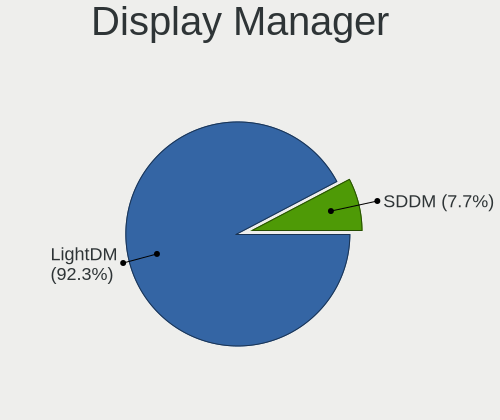
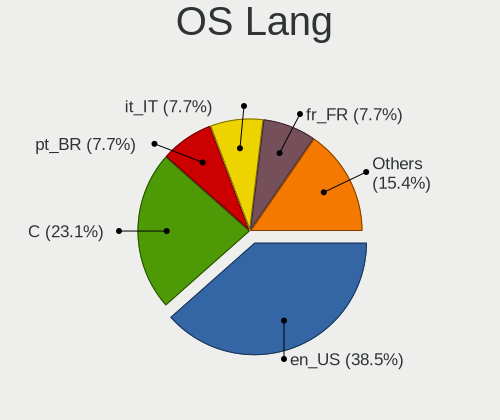
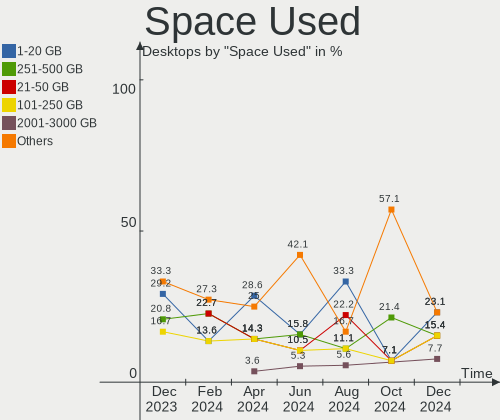
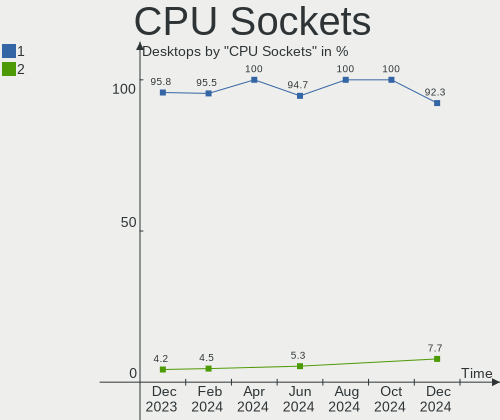

Xubuntu Hardware Trends (Desktops)
----------------------------------

A project to identify most popular hardware characteristics and track their change
over time based on data collected by Xubuntu users at https://Linux-Hardware.org.

Anyone can contribute to this report by the [hw-probe](https://github.com/linuxhw/hw-probe) tool:

    sudo -E hw-probe -all -upload

Full-feature report is available here: https://linux-hardware.org/?view=trends&formfactor=desktop

Period: Oct, 2021.

Contents
--------

* [ System ](#system)
  - [ OS                       ](#os)
  - [ OS Family                ](#os-family)
  - [ Kernel                   ](#kernel)
  - [ Kernel Family            ](#kernel-family)
  - [ Kernel Major Ver.        ](#kernel-major-ver)
  - [ Arch                     ](#arch)
  - [ DE                       ](#de)
  - [ Display Server           ](#display-server)
  - [ Display Manager          ](#display-manager)
  - [ OS Lang                  ](#os-lang)
  - [ Boot Mode                ](#boot-mode)
  - [ Filesystem               ](#filesystem)
  - [ Part. scheme             ](#part-scheme)
  - [ Dual Boot with Linux/BSD ](#dual-boot-with-linuxbsd)
  - [ Dual Boot (Win)          ](#dual-boot-win)

* [ Board ](#board)
  - [ Vendor                   ](#vendor)
  - [ Model                    ](#model)
  - [ Model Family             ](#model-family)
  - [ MFG Year                 ](#mfg-year)
  - [ Form Factor              ](#form-factor)
  - [ Secure Boot              ](#secure-boot)
  - [ Coreboot                 ](#coreboot)
  - [ RAM Size                 ](#ram-size)
  - [ RAM Used                 ](#ram-used)
  - [ Total Drives             ](#total-drives)
  - [ Has CD-ROM               ](#has-cd-rom)
  - [ Has Ethernet             ](#has-ethernet)
  - [ Has WiFi                 ](#has-wifi)
  - [ Has Bluetooth            ](#has-bluetooth)

* [ Location ](#location)
  - [ Country                  ](#country)
  - [ City                     ](#city)

* [ Drives ](#drives)
  - [ Drive Vendor             ](#drive-vendor)
  - [ Drive Model              ](#drive-model)
  - [ HDD Vendor               ](#hdd-vendor)
  - [ SSD Vendor               ](#ssd-vendor)
  - [ Drive Kind               ](#drive-kind)
  - [ Drive Connector          ](#drive-connector)
  - [ Drive Size               ](#drive-size)
  - [ Space Total              ](#space-total)
  - [ Space Used               ](#space-used)
  - [ Malfunc. Drives          ](#malfunc-drives)
  - [ Malfunc. Drive Vendor    ](#malfunc-drive-vendor)
  - [ Malfunc. HDD Vendor      ](#malfunc-hdd-vendor)
  - [ Malfunc. Drive Kind      ](#malfunc-drive-kind)
  - [ Failed Drives            ](#failed-drives)
  - [ Failed Drive Vendor      ](#failed-drive-vendor)
  - [ Drive Status             ](#drive-status)

* [ Storage controller ](#storage-controller)
  - [ Storage Vendor           ](#storage-vendor)
  - [ Storage Model            ](#storage-model)
  - [ Storage Kind             ](#storage-kind)

* [ Processor ](#processor)
  - [ CPU Vendor               ](#cpu-vendor)
  - [ CPU Model                ](#cpu-model)
  - [ CPU Model Family         ](#cpu-model-family)
  - [ CPU Cores                ](#cpu-cores)
  - [ CPU Sockets              ](#cpu-sockets)
  - [ CPU Threads              ](#cpu-threads)
  - [ CPU Op-Modes             ](#cpu-op-modes)
  - [ CPU Microcode            ](#cpu-microcode)
  - [ CPU Microarch            ](#cpu-microarch)

* [ Graphics ](#graphics)
  - [ GPU Vendor               ](#gpu-vendor)
  - [ GPU Model                ](#gpu-model)
  - [ GPU Combo                ](#gpu-combo)
  - [ GPU Driver               ](#gpu-driver)
  - [ GPU Memory               ](#gpu-memory)

* [ Monitor ](#monitor)
  - [ Monitor Vendor           ](#monitor-vendor)
  - [ Monitor Model            ](#monitor-model)
  - [ Monitor Resolution       ](#monitor-resolution)
  - [ Monitor Diagonal         ](#monitor-diagonal)
  - [ Monitor Width            ](#monitor-width)
  - [ Aspect Ratio             ](#aspect-ratio)
  - [ Monitor Area             ](#monitor-area)
  - [ Pixel Density            ](#pixel-density)
  - [ Multiple Monitors        ](#multiple-monitors)

* [ Network ](#network)
  - [ Net Controller Vendor    ](#net-controller-vendor)
  - [ Net Controller Model     ](#net-controller-model)
  - [ Wireless Vendor          ](#wireless-vendor)
  - [ Wireless Model           ](#wireless-model)
  - [ Ethernet Vendor          ](#ethernet-vendor)
  - [ Ethernet Model           ](#ethernet-model)
  - [ Net Controller Kind      ](#net-controller-kind)
  - [ Used Controller          ](#used-controller)
  - [ NICs                     ](#nics)
  - [ IPv6                     ](#ipv6)

* [ Bluetooth ](#bluetooth)
  - [ Bluetooth Vendor         ](#bluetooth-vendor)
  - [ Bluetooth Model          ](#bluetooth-model)

* [ Sound ](#sound)
  - [ Sound Vendor             ](#sound-vendor)
  - [ Sound Model              ](#sound-model)

* [ Memory ](#memory)
  - [ Memory Vendor            ](#memory-vendor)
  - [ Memory Model             ](#memory-model)
  - [ Memory Kind              ](#memory-kind)
  - [ Memory Form Factor       ](#memory-form-factor)
  - [ Memory Size              ](#memory-size)
  - [ Memory Speed             ](#memory-speed)

* [ Printers & scanners ](#printers--scanners)
  - [ Printer Vendor           ](#printer-vendor)
  - [ Printer Model            ](#printer-model)
  - [ Scanner Vendor           ](#scanner-vendor)
  - [ Scanner Model            ](#scanner-model)

* [ Camera ](#camera)
  - [ Camera Vendor            ](#camera-vendor)
  - [ Camera Model             ](#camera-model)

* [ Security ](#security)
  - [ Fingerprint Vendor       ](#fingerprint-vendor)
  - [ Fingerprint Model        ](#fingerprint-model)
  - [ Chipcard Vendor          ](#chipcard-vendor)
  - [ Chipcard Model           ](#chipcard-model)

* [ Unsupported ](#unsupported)
  - [ Unsupported Devices      ](#unsupported-devices)
  - [ Unsupported Device Types ](#unsupported-device-types)

System
------

OS
--

Installed operating systems

| Name          | Desktops | Percent |
|---------------|----------|---------|
| Xubuntu 20.04 | 27       | 56.25%  |
| Xubuntu 18.04 | 10       | 20.83%  |
| Xubuntu 21.04 | 7        | 14.58%  |
| Xubuntu 21.10 | 3        | 6.25%   |
| Xubuntu 20.10 | 1        | 2.08%   |

OS Family
---------

OS without a version

| Name    | Desktops | Percent |
|---------|----------|---------|
| Xubuntu | 48       | 100%    |

Kernel
------

Version of the Linux kernel

| Version               | Desktops | Percent |
|-----------------------|----------|---------|
| 5.11.0-37-generic     | 9        | 18.75%  |
| 5.4.0-88-generic      | 7        | 14.58%  |
| 5.11.0-38-generic     | 6        | 12.5%   |
| 5.4.0-87-generic      | 5        | 10.42%  |
| 5.4.0-89-generic      | 4        | 8.33%   |
| 5.4.0-89-lowlatency   | 2        | 4.17%   |
| 5.13.0-20-generic     | 2        | 4.17%   |
| 5.11.0-38-lowlatency  | 2        | 4.17%   |
| 5.8.0-63-generic      | 1        | 2.08%   |
| 5.8.0-43-generic      | 1        | 2.08%   |
| 5.4.0-84-generic      | 1        | 2.08%   |
| 5.4.0-77-lowlatency   | 1        | 2.08%   |
| 5.4.0-77-generic      | 1        | 2.08%   |
| 5.14.7-xanmod1-edge   | 1        | 2.08%   |
| 5.13.0-19-generic     | 1        | 2.08%   |
| 5.11.0-16-generic     | 1        | 2.08%   |
| 5.0.0-19-generic      | 1        | 2.08%   |
| 4.15.0-159-generic    | 1        | 2.08%   |
| 4.15.0-158-lowlatency | 1        | 2.08%   |

Kernel Family
-------------

Linux kernel without a distro release

| Version | Desktops | Percent |
|---------|----------|---------|
| 5.4.0   | 21       | 43.75%  |
| 5.11.0  | 18       | 37.5%   |
| 5.13.0  | 3        | 6.25%   |
| 5.8.0   | 2        | 4.17%   |
| 4.15.0  | 2        | 4.17%   |
| 5.14.7  | 1        | 2.08%   |
| 5.0.0   | 1        | 2.08%   |

Kernel Major Ver.
-----------------

Linux kernel major version

| Version | Desktops | Percent |
|---------|----------|---------|
| 5.4     | 21       | 43.75%  |
| 5.11    | 18       | 37.5%   |
| 5.13    | 3        | 6.25%   |
| 5.8     | 2        | 4.17%   |
| 4.15    | 2        | 4.17%   |
| 5.14    | 1        | 2.08%   |
| 5.0     | 1        | 2.08%   |

Arch
----

OS architecture (x86_64, i586, etc.)

| Name   | Desktops | Percent |
|--------|----------|---------|
| x86_64 | 45       | 93.75%  |
| i686   | 3        | 6.25%   |

DE
--

Desktop Environment

| Name    | Desktops | Percent |
|---------|----------|---------|
| XFCE    | 44       | 91.67%  |
| GNOME   | 2        | 4.17%   |
| KDE5    | 1        | 2.08%   |
| GNUstep | 1        | 2.08%   |

Display Server
--------------

X11 or Wayland

| Name    | Desktops | Percent |
|---------|----------|---------|
| X11     | 46       | 95.83%  |
| Wayland | 2        | 4.17%   |

Display Manager
---------------

SDDM, LightDM, etc.

| Name    | Desktops | Percent |
|---------|----------|---------|
| LightDM | 42       | 87.5%   |
| Unknown | 3        | 6.25%   |
| GDM     | 2        | 4.17%   |
| GDM3    | 1        | 2.08%   |

OS Lang
-------

Language

| Lang  | Desktops | Percent |
|-------|----------|---------|
| en_US | 19       | 39.58%  |
| de_DE | 7        | 14.58%  |
| fr_FR | 5        | 10.42%  |
| ru_RU | 2        | 4.17%   |
| hu_HU | 2        | 4.17%   |
| en_CA | 2        | 4.17%   |
| sv_SE | 1        | 2.08%   |
| sv_FI | 1        | 2.08%   |
| ru_UA | 1        | 2.08%   |
| pt_BR | 1        | 2.08%   |
| nl_NL | 1        | 2.08%   |
| it_IT | 1        | 2.08%   |
| es_ES | 1        | 2.08%   |
| en_ZA | 1        | 2.08%   |
| en_GB | 1        | 2.08%   |
| en_AU | 1        | 2.08%   |
| cs_CZ | 1        | 2.08%   |

Boot Mode
---------

EFI or BIOS

| Mode | Desktops | Percent |
|------|----------|---------|
| BIOS | 37       | 77.08%  |
| EFI  | 11       | 22.92%  |

Filesystem
----------

Type of filesystem

| Type    | Desktops | Percent |
|---------|----------|---------|
| Ext4    | 43       | 89.58%  |
| Btrfs   | 4        | 8.33%   |
| Overlay | 1        | 2.08%   |

Part. scheme
------------

Scheme of partitioning

| Type    | Desktops | Percent |
|---------|----------|---------|
| Unknown | 32       | 66.67%  |
| GPT     | 12       | 25%     |
| MBR     | 4        | 8.33%   |

Dual Boot with Linux/BSD
------------------------

Hosting more than one Linux/BSD

| Dual boot | Desktops | Percent |
|-----------|----------|---------|
| No        | 39       | 81.25%  |
| Yes       | 9        | 18.75%  |

Dual Boot (Win)
---------------

Hosting Linux and Windows

| Dual boot | Desktops | Percent |
|-----------|----------|---------|
| Yes       | 26       | 54.17%  |
| No        | 22       | 45.83%  |

Board
-----

Vendor
------

Motherboard manufacturer

| Name                | Desktops | Percent |
|---------------------|----------|---------|
| ASUSTek Computer    | 11       | 22.92%  |
| Gigabyte Technology | 7        | 14.58%  |
| Dell                | 7        | 14.58%  |
| MSI                 | 4        | 8.33%   |
| ASRock              | 4        | 8.33%   |
| Hewlett-Packard     | 3        | 6.25%   |
| Acer                | 3        | 6.25%   |
| Lenovo              | 2        | 4.17%   |
| PCChips             | 1        | 2.08%   |
| NCR                 | 1        | 2.08%   |
| MiTAC               | 1        | 2.08%   |
| Medion              | 1        | 2.08%   |
| Foxconn             | 1        | 2.08%   |
| Clientron           | 1        | 2.08%   |
| Biostar             | 1        | 2.08%   |

Model
-----

Motherboard model

| Name                             | Desktops | Percent |
|----------------------------------|----------|---------|
| PCChips P49G                     | 1        | 2.08%   |
| NCR 7606-1309-8801               | 1        | 2.08%   |
| MSI MS-7C37                      | 1        | 2.08%   |
| MSI MS-7A34                      | 1        | 2.08%   |
| MSI MS-7982                      | 1        | 2.08%   |
| MSI MS-7917                      | 1        | 2.08%   |
| MiTAC PD14RI                     | 1        | 2.08%   |
| Medion E62009                    | 1        | 2.08%   |
| Lenovo ThinkCentre M82 2756AT9   | 1        | 2.08%   |
| Lenovo ThinkCentre A55 92658HG   | 1        | 2.08%   |
| HP ProDesk 400 G7 Microtower PC  | 1        | 2.08%   |
| HP Pavilion Desktop 590-p0xxx    | 1        | 2.08%   |
| HP EliteDesk 800 G1 SFF          | 1        | 2.08%   |
| Gigabyte X470 AORUS ULTRA GAMING | 1        | 2.08%   |
| Gigabyte M68MT-D3P               | 1        | 2.08%   |
| Gigabyte H510M S2H               | 1        | 2.08%   |
| Gigabyte H370HD3                 | 1        | 2.08%   |
| Gigabyte GA-990FXA-D3            | 1        | 2.08%   |
| Gigabyte GA-78LMT-USB3 6.0       | 1        | 2.08%   |
| Gigabyte B450 AORUS ELITE V2     | 1        | 2.08%   |
| Foxconn Pro 3305 Series          | 1        | 2.08%   |
| Dell Studio XPS 9100             | 1        | 2.08%   |
| Dell Precision Tower 7910        | 1        | 2.08%   |
| Dell OptiPlex 755                | 1        | 2.08%   |
| Dell OptiPlex 3010               | 1        | 2.08%   |
| Dell Inspiron 660s               | 1        | 2.08%   |
| Dell Inspiron 530                | 1        | 2.08%   |
| Dell DXP051                      | 1        | 2.08%   |
| Clientron PT6000                 | 1        | 2.08%   |
| Biostar G41D3C                   | 1        | 2.08%   |
| ASUS Z170-P                      | 1        | 2.08%   |
| ASUS TUF GAMING X570-PLUS        | 1        | 2.08%   |
| ASUS TUF GAMING B550M-PLUS       | 1        | 2.08%   |
| ASUS ROG CROSSHAIR VIII EXTREME  | 1        | 2.08%   |
| ASUS PRIME H410M-K               | 1        | 2.08%   |
| ASUS PRIME B450-PLUS             | 1        | 2.08%   |
| ASUS P8H61-I R2.0                | 1        | 2.08%   |
| ASUS P5KC                        | 1        | 2.08%   |
| ASUS MaestroII 24                | 1        | 2.08%   |
| ASUS M2N-E SLI                   | 1        | 2.08%   |
| ASUS A8N32-SLI-Deluxe            | 1        | 2.08%   |
| ASRock N68C-S UCC                | 1        | 2.08%   |
| ASRock G31M-VS2                  | 1        | 2.08%   |
| ASRock G31M-VS                   | 1        | 2.08%   |
| ASRock 775Dual-VSTA              | 1        | 2.08%   |
| Acer Aspire XC-603G              | 1        | 2.08%   |
| Acer Aspire X3990                | 1        | 2.08%   |
| Acer Aspire X1430                | 1        | 2.08%   |

Model Family
------------

Motherboard model prefix

| Name                   | Desktops | Percent |
|------------------------|----------|---------|
| Acer Aspire            | 3        | 6.25%   |
| Lenovo ThinkCentre     | 2        | 4.17%   |
| Dell OptiPlex          | 2        | 4.17%   |
| Dell Inspiron          | 2        | 4.17%   |
| ASUS TUF               | 2        | 4.17%   |
| ASUS PRIME             | 2        | 4.17%   |
| PCChips P49G           | 1        | 2.08%   |
| NCR 7606-1309-8801     | 1        | 2.08%   |
| MSI MS-7C37            | 1        | 2.08%   |
| MSI MS-7A34            | 1        | 2.08%   |
| MSI MS-7982            | 1        | 2.08%   |
| MSI MS-7917            | 1        | 2.08%   |
| MiTAC PD14RI           | 1        | 2.08%   |
| Medion E62009          | 1        | 2.08%   |
| HP ProDesk             | 1        | 2.08%   |
| HP Pavilion            | 1        | 2.08%   |
| HP EliteDesk           | 1        | 2.08%   |
| Gigabyte X470          | 1        | 2.08%   |
| Gigabyte M68MT-D3P     | 1        | 2.08%   |
| Gigabyte H510M         | 1        | 2.08%   |
| Gigabyte H370HD3       | 1        | 2.08%   |
| Gigabyte GA-990FXA-D3  | 1        | 2.08%   |
| Gigabyte GA-78LMT-USB3 | 1        | 2.08%   |
| Gigabyte B450          | 1        | 2.08%   |
| Foxconn Pro            | 1        | 2.08%   |
| Dell Studio            | 1        | 2.08%   |
| Dell Precision         | 1        | 2.08%   |
| Dell DXP051            | 1        | 2.08%   |
| Clientron PT6000       | 1        | 2.08%   |
| Biostar G41D3C         | 1        | 2.08%   |
| ASUS Z170-P            | 1        | 2.08%   |
| ASUS ROG               | 1        | 2.08%   |
| ASUS P8H61-I           | 1        | 2.08%   |
| ASUS P5KC              | 1        | 2.08%   |
| ASUS MaestroII         | 1        | 2.08%   |
| ASUS M2N-E             | 1        | 2.08%   |
| ASUS A8N32-SLI-Deluxe  | 1        | 2.08%   |
| ASRock N68C-S          | 1        | 2.08%   |
| ASRock G31M-VS2        | 1        | 2.08%   |
| ASRock G31M-VS         | 1        | 2.08%   |
| ASRock 775Dual-VSTA    | 1        | 2.08%   |

MFG Year
--------

Motherboard manufacture year

| Year | Desktops | Percent |
|------|----------|---------|
| 2020 | 7        | 14.58%  |
| 2011 | 7        | 14.58%  |
| 2021 | 4        | 8.33%   |
| 2018 | 4        | 8.33%   |
| 2014 | 4        | 8.33%   |
| 2010 | 4        | 8.33%   |
| 2019 | 3        | 6.25%   |
| 2016 | 3        | 6.25%   |
| 2008 | 3        | 6.25%   |
| 2007 | 3        | 6.25%   |
| 2015 | 2        | 4.17%   |
| 2013 | 1        | 2.08%   |
| 2012 | 1        | 2.08%   |
| 2009 | 1        | 2.08%   |
| 2006 | 1        | 2.08%   |

Form Factor
-----------

Physical design of the computer

| Name    | Desktops | Percent |
|---------|----------|---------|
| Desktop | 48       | 100%    |

Secure Boot
-----------

Enabled or disabled

| State    | Desktops | Percent |
|----------|----------|---------|
| Disabled | 48       | 100%    |

Coreboot
--------

Have coreboot on board

| Used | Desktops | Percent |
|------|----------|---------|
| No   | 48       | 100%    |

RAM Size
--------

Total RAM memory

| Size in GB  | Desktops | Percent |
|-------------|----------|---------|
| 16.01-24.0  | 13       | 27.08%  |
| 4.01-8.0    | 9        | 18.75%  |
| 8.01-16.0   | 8        | 16.67%  |
| 3.01-4.0    | 6        | 12.5%   |
| 1.01-2.0    | 4        | 8.33%   |
| 32.01-64.0  | 3        | 6.25%   |
| 2.01-3.0    | 3        | 6.25%   |
| 64.01-256.0 | 2        | 4.17%   |

RAM Used
--------

Used RAM memory

| Used GB   | Desktops | Percent |
|-----------|----------|---------|
| 1.01-2.0  | 14       | 29.17%  |
| 2.01-3.0  | 10       | 20.83%  |
| 0.51-1.0  | 10       | 20.83%  |
| 3.01-4.0  | 6        | 12.5%   |
| 4.01-8.0  | 5        | 10.42%  |
| 8.01-16.0 | 3        | 6.25%   |

Total Drives
------------

Number of drives on board

| Drives | Desktops | Percent |
|--------|----------|---------|
| 2      | 16       | 33.33%  |
| 1      | 16       | 33.33%  |
| 3      | 8        | 16.67%  |
| 4      | 5        | 10.42%  |
| 8      | 1        | 2.08%   |
| 5      | 1        | 2.08%   |
| 0      | 1        | 2.08%   |

Has CD-ROM
----------

Has CD-ROM on board

| Presented | Desktops | Percent |
|-----------|----------|---------|
| Yes       | 28       | 58.33%  |
| No        | 20       | 41.67%  |

Has Ethernet
------------

Has Ethernet on board

| Presented | Desktops | Percent |
|-----------|----------|---------|
| Yes       | 46       | 95.83%  |
| No        | 2        | 4.17%   |

Has WiFi
--------

Has WiFi module

| Presented | Desktops | Percent |
|-----------|----------|---------|
| No        | 28       | 58.33%  |
| Yes       | 20       | 41.67%  |

Has Bluetooth
-------------

Has Bluetooth module

| Presented | Desktops | Percent |
|-----------|----------|---------|
| No        | 38       | 79.17%  |
| Yes       | 10       | 20.83%  |

Location
--------

Country
-------

Geographic location (country)

| Country      | Desktops | Percent |
|--------------|----------|---------|
| Germany      | 10       | 20.83%  |
| USA          | 9        | 18.75%  |
| France       | 5        | 10.42%  |
| UK           | 2        | 4.17%   |
| Spain        | 2        | 4.17%   |
| Russia       | 2        | 4.17%   |
| Canada       | 2        | 4.17%   |
| Uruguay      | 1        | 2.08%   |
| Ukraine      | 1        | 2.08%   |
| Sweden       | 1        | 2.08%   |
| South Africa | 1        | 2.08%   |
| Romania      | 1        | 2.08%   |
| Norway       | 1        | 2.08%   |
| Netherlands  | 1        | 2.08%   |
| Malaysia     | 1        | 2.08%   |
| Italy        | 1        | 2.08%   |
| Hungary      | 1        | 2.08%   |
| Greece       | 1        | 2.08%   |
| Finland      | 1        | 2.08%   |
| Egypt        | 1        | 2.08%   |
| Czechia      | 1        | 2.08%   |
| Brazil       | 1        | 2.08%   |
| Australia    | 1        | 2.08%   |

City
----

Geographic location (city)

| City                 | Desktops | Percent |
|----------------------|----------|---------|
| Madrid               | 2        | 4.17%   |
| Garland              | 2        | 4.17%   |
| Berlin               | 2        | 4.17%   |
| Yuma                 | 1        | 2.08%   |
| Wilderness Rim       | 1        | 2.08%   |
| Vlaardingen          | 1        | 2.08%   |
| Ufa                  | 1        | 2.08%   |
| Stavanger            | 1        | 2.08%   |
| Six-Fours-les-Plages | 1        | 2.08%   |
| Serpukhov            | 1        | 2.08%   |
| Seelze               | 1        | 2.08%   |
| S??o Paulo           | 1        | 2.08%   |
| Sankt Augustin       | 1        | 2.08%   |
| Saint-Quentin        | 1        | 2.08%   |
| Rastatt              | 1        | 2.08%   |
| Pretoria             | 1        | 2.08%   |
| Perth                | 1        | 2.08%   |
| Oulu                 | 1        | 2.08%   |
| Oldenburg            | 1        | 2.08%   |
| Nagold               | 1        | 2.08%   |
| Munich               | 1        | 2.08%   |
| Moyock               | 1        | 2.08%   |
| Montreal             | 1        | 2.08%   |
| Montevideo           | 1        | 2.08%   |
| Miami                | 1        | 2.08%   |
| Mesa                 | 1        | 2.08%   |
| Mansfield            | 1        | 2.08%   |
| Long Seridan         | 1        | 2.08%   |
| London               | 1        | 2.08%   |
| Litom?›?™ice         | 1        | 2.08%   |
| Le Kremlin-Bicetre   | 1        | 2.08%   |
| Laval                | 1        | 2.08%   |
| Lamia                | 1        | 2.08%   |
| Jefferson City       | 1        | 2.08%   |
| G?¤vle               | 1        | 2.08%   |
| Ectot-les-Baons      | 1        | 2.08%   |
| Dresden              | 1        | 2.08%   |
| Dnipropetrovsk       | 1        | 2.08%   |
| Cairo                | 1        | 2.08%   |
| Buxtehude            | 1        | 2.08%   |
| Burnsville           | 1        | 2.08%   |
| Budapest             | 1        | 2.08%   |
| Bucharest            | 1        | 2.08%   |
| Aprilia              | 1        | 2.08%   |
| Angers               | 1        | 2.08%   |

Drives
------

Drive Vendor
------------

Hard drive vendors

| Vendor                | Desktops | Drives | Percent |
|-----------------------|----------|--------|---------|
| Seagate               | 24       | 28     | 26.67%  |
| Samsung Electronics   | 12       | 14     | 13.33%  |
| WDC                   | 10       | 14     | 11.11%  |
| Crucial               | 6        | 7      | 6.67%   |
| Kingston              | 5        | 5      | 5.56%   |
| SanDisk               | 4        | 4      | 4.44%   |
| Toshiba               | 3        | 3      | 3.33%   |
| MAXTOR                | 3        | 3      | 3.33%   |
| Hitachi               | 3        | 3      | 3.33%   |
| HGST                  | 2        | 3      | 2.22%   |
| A-DATA Technology     | 2        | 2      | 2.22%   |
| SPCC                  | 1        | 2      | 1.11%   |
| S3+                   | 1        | 1      | 1.11%   |
| Realtek Semiconductor | 1        | 1      | 1.11%   |
| PNY                   | 1        | 1      | 1.11%   |
| Phison                | 1        | 1      | 1.11%   |
| OCZ                   | 1        | 1      | 1.11%   |
| Mushkin               | 1        | 1      | 1.11%   |
| LITEON                | 1        | 1      | 1.11%   |
| LaCie                 | 1        | 1      | 1.11%   |
| KIOXIA                | 1        | 1      | 1.11%   |
| Intenso               | 1        | 1      | 1.11%   |
| ICY BOX               | 1        | 1      | 1.11%   |
| Gigabyte Technology   | 1        | 1      | 1.11%   |
| ASMT                  | 1        | 1      | 1.11%   |
| Apple                 | 1        | 1      | 1.11%   |
| Apacer                | 1        | 1      | 1.11%   |

Drive Model
-----------

Hard drive models

| Model                               | Desktops | Percent |
|-------------------------------------|----------|---------|
| WDC WD10JPVT-00A1YT0 1TB            | 2        | 1.98%   |
| Seagate ST1000DM010-2EP102 1TB      | 2        | 1.98%   |
| Seagate Expansion 1TB               | 2        | 1.98%   |
| Samsung SSD 860 EVO 250GB           | 2        | 1.98%   |
| Kingston SV300S37A60G 64GB SSD      | 2        | 1.98%   |
| Kingston SA400S37480G 480GB SSD     | 2        | 1.98%   |
| Crucial CT500MX500SSD1 500GB        | 2        | 1.98%   |
| Crucial CT1000MX500SSD1 1TB         | 2        | 1.98%   |
| WDC WDS250G2B0A-00SM50 250GB SSD    | 1        | 0.99%   |
| WDC WD5000AAKX-22ERMA0 500GB        | 1        | 0.99%   |
| WDC WD5000AAKS-07YGA0 500GB         | 1        | 0.99%   |
| WDC WD5000AAKS-00UU3A0 500GB        | 1        | 0.99%   |
| WDC WD3201ABYS-01B9A0 320GB         | 1        | 0.99%   |
| WDC WD3200AAJB-00J3A0 320GB         | 1        | 0.99%   |
| WDC WD20EZRZ-00Z5HB0 2TB            | 1        | 0.99%   |
| WDC WD1600JS-00MHB0 160GB           | 1        | 0.99%   |
| WDC WD1600AABS-00H4A0 160GB         | 1        | 0.99%   |
| WDC WD1502FYPS-02W3B0 1TB           | 1        | 0.99%   |
| WDC WD10EFRX-68FYTN0 1TB            | 1        | 0.99%   |
| WDC WD1001FAES-75W7A0 1TB           | 1        | 0.99%   |
| Toshiba Q300. 120GB SSD             | 1        | 0.99%   |
| Toshiba MQ01ABF050 500GB            | 1        | 0.99%   |
| Toshiba HDWD110 1TB                 | 1        | 0.99%   |
| SPCC Solid State Disk 512GB         | 1        | 0.99%   |
| Seagate ST9500420AS 500GB           | 1        | 0.99%   |
| Seagate ST750LM022 HN-M750MBB 752GB | 1        | 0.99%   |
| Seagate ST500DM002-1BD142 500GB     | 1        | 0.99%   |
| Seagate ST500DM002-1BD14 500GB      | 1        | 0.99%   |
| Seagate ST500DM002-1BC142 500GB     | 1        | 0.99%   |
| Seagate ST380815AS 80GB             | 1        | 0.99%   |
| Seagate ST3500413AS 500GB           | 1        | 0.99%   |
| Seagate ST3320620AS 320GB           | 1        | 0.99%   |
| Seagate ST3320620A 320GB            | 1        | 0.99%   |
| Seagate ST3320413AS 320GB           | 1        | 0.99%   |
| Seagate ST3250823AS 250GB           | 1        | 0.99%   |
| Seagate ST3250318AS 250GB           | 1        | 0.99%   |
| Seagate ST3120023A 120GB            | 1        | 0.99%   |
| Seagate ST31000524AS 1TB            | 1        | 0.99%   |
| Seagate ST2000DM008-2FR102 2TB      | 1        | 0.99%   |
| Seagate ST1500LM006 HN-M151RAD 1TB  | 1        | 0.99%   |
| Seagate ST1000VX000-1ES162 1TB      | 1        | 0.99%   |
| Seagate ST1000LX015-1U7172 1TB      | 1        | 0.99%   |
| Seagate ST1000LM010-9YH146 1TB      | 1        | 0.99%   |
| Seagate ST1000DM003-1SB102 1TB      | 1        | 0.99%   |
| Seagate ST1000DM003-1CH162 1TB      | 1        | 0.99%   |
| Seagate ST10000VN0004-1ZD101 10TB   | 1        | 0.99%   |
| Seagate Expansion Desk 4TB          | 1        | 0.99%   |
| Seagate BUP Slim BK 2TB             | 1        | 0.99%   |
| SanDisk SSD U110 128GB              | 1        | 0.99%   |
| SanDisk SDSSDHP128G 128GB           | 1        | 0.99%   |
| SanDisk SDSSDA120G 120GB            | 1        | 0.99%   |
| SanDisk SDCFH-004G SSD              | 1        | 0.99%   |
| Samsung SSD 980 PRO 2TB             | 1        | 0.99%   |
| Samsung SSD 970 EVO Plus 250GB      | 1        | 0.99%   |
| Samsung SSD 850 EVO 250GB           | 1        | 0.99%   |
| Samsung SSD 850 EVO 120GB           | 1        | 0.99%   |
| Samsung SSD 840 EVO 1TB             | 1        | 0.99%   |
| Samsung SP0812N 80GB                | 1        | 0.99%   |
| Samsung SP0411N 40GB                | 1        | 0.99%   |
| Samsung NVMe SSD Drive 1TB          | 1        | 0.99%   |

HDD Vendor
----------

Hard disk drive vendors

| Vendor              | Desktops | Drives | Percent |
|---------------------|----------|--------|---------|
| Seagate             | 24       | 28     | 47.06%  |
| WDC                 | 9        | 13     | 17.65%  |
| Samsung Electronics | 4        | 4      | 7.84%   |
| MAXTOR              | 3        | 3      | 5.88%   |
| Hitachi             | 3        | 3      | 5.88%   |
| Toshiba             | 2        | 2      | 3.92%   |
| HGST                | 2        | 3      | 3.92%   |
| LaCie               | 1        | 1      | 1.96%   |
| Intenso             | 1        | 1      | 1.96%   |
| ICY BOX             | 1        | 1      | 1.96%   |
| Apple               | 1        | 1      | 1.96%   |

SSD Vendor
----------

Solid state drive vendors

| Vendor              | Desktops | Drives | Percent |
|---------------------|----------|--------|---------|
| Crucial             | 6        | 7      | 19.35%  |
| Samsung Electronics | 5        | 6      | 16.13%  |
| Kingston            | 5        | 5      | 16.13%  |
| SanDisk             | 4        | 4      | 12.9%   |
| WDC                 | 1        | 1      | 3.23%   |
| Toshiba             | 1        | 1      | 3.23%   |
| SPCC                | 1        | 2      | 3.23%   |
| S3+                 | 1        | 1      | 3.23%   |
| PNY                 | 1        | 1      | 3.23%   |
| OCZ                 | 1        | 1      | 3.23%   |
| Mushkin             | 1        | 1      | 3.23%   |
| LITEON              | 1        | 1      | 3.23%   |
| ASMT                | 1        | 1      | 3.23%   |
| Apacer              | 1        | 1      | 3.23%   |
| A-DATA Technology   | 1        | 1      | 3.23%   |

Drive Kind
----------

HDD or SSD

| Kind | Desktops | Drives | Percent |
|------|----------|--------|---------|
| HDD  | 36       | 60     | 50.7%   |
| SSD  | 27       | 34     | 38.03%  |
| NVMe | 8        | 9      | 11.27%  |

Drive Connector
---------------

SATA, SAS, NVMe, etc.

| Type | Desktops | Drives | Percent |
|------|----------|--------|---------|
| SATA | 46       | 86     | 76.67%  |
| NVMe | 8        | 9      | 13.33%  |
| SAS  | 6        | 8      | 10%     |

Drive Size
----------

Size of hard drive

| Size in TB | Desktops | Drives | Percent |
|------------|----------|--------|---------|
| 0.01-0.5   | 39       | 60     | 60.94%  |
| 0.51-1.0   | 17       | 24     | 26.56%  |
| 1.01-2.0   | 5        | 5      | 7.81%   |
| 3.01-4.0   | 1        | 2      | 1.56%   |
| 2.01-3.0   | 1        | 2      | 1.56%   |
| 4.01-10.0  | 1        | 1      | 1.56%   |

Space Total
-----------

Amount of disk space available on the file system

| Size in GB     | Desktops | Percent |
|----------------|----------|---------|
| 101-250        | 18       | 37.5%   |
| 251-500        | 10       | 20.83%  |
| 1001-2000      | 4        | 8.33%   |
| 51-100         | 4        | 8.33%   |
| 21-50          | 3        | 6.25%   |
| 2001-3000      | 3        | 6.25%   |
| 501-1000       | 3        | 6.25%   |
| More than 3000 | 2        | 4.17%   |
| 1-20           | 1        | 2.08%   |

Space Used
----------

Amount of used disk space

| Used GB        | Desktops | Percent |
|----------------|----------|---------|
| 21-50          | 12       | 25%     |
| 101-250        | 10       | 20.83%  |
| 1-20           | 10       | 20.83%  |
| 251-500        | 5        | 10.42%  |
| 51-100         | 4        | 8.33%   |
| 501-1000       | 3        | 6.25%   |
| 2001-3000      | 2        | 4.17%   |
| More than 3000 | 1        | 2.08%   |
| 1001-2000      | 1        | 2.08%   |

Malfunc. Drives
---------------

Drive models with a malfunction

| Model                          | Desktops | Drives | Percent |
|--------------------------------|----------|--------|---------|
| WDC WD1600AABS-00H4A0 160GB    | 1        | 1      | 20%     |
| Toshiba MQ01ABF050 500GB       | 1        | 1      | 20%     |
| Seagate ST3320620AS 320GB      | 1        | 1      | 20%     |
| Seagate ST1000DM010-2EP102 1TB | 1        | 1      | 20%     |
| ICY BOX IB-250StU3+BH15 2TB    | 1        | 1      | 20%     |

Malfunc. Drive Vendor
---------------------

Vendors of faulty drives

| Vendor  | Desktops | Drives | Percent |
|---------|----------|--------|---------|
| Seagate | 2        | 2      | 40%     |
| WDC     | 1        | 1      | 20%     |
| Toshiba | 1        | 1      | 20%     |
| ICY BOX | 1        | 1      | 20%     |

Malfunc. HDD Vendor
-------------------

Vendors of faulty HDD drives

| Vendor  | Desktops | Drives | Percent |
|---------|----------|--------|---------|
| Seagate | 2        | 2      | 40%     |
| WDC     | 1        | 1      | 20%     |
| Toshiba | 1        | 1      | 20%     |
| ICY BOX | 1        | 1      | 20%     |

Malfunc. Drive Kind
-------------------

Kinds of faulty drives

| Kind | Desktops | Drives | Percent |
|------|----------|--------|---------|
| HDD  | 5        | 5      | 100%    |

Failed Drives
-------------

Failed drive models

Zero info for selected period =(

Failed Drive Vendor
-------------------

Failed drive vendors

Zero info for selected period =(

Drive Status
------------

Number of failed and malfunc. drives

| Status   | Desktops | Drives | Percent |
|----------|----------|--------|---------|
| Detected | 34       | 69     | 62.96%  |
| Works    | 15       | 29     | 27.78%  |
| Malfunc  | 5        | 5      | 9.26%   |

Storage controller
------------------

Storage Vendor
--------------

Storage controller vendors

| Vendor                | Desktops | Percent |
|-----------------------|----------|---------|
| Intel                 | 30       | 46.88%  |
| AMD                   | 13       | 20.31%  |
| Samsung Electronics   | 4        | 6.25%   |
| Nvidia                | 4        | 6.25%   |
| Silicon Image         | 2        | 3.13%   |
| Phison Electronics    | 2        | 3.13%   |
| ASMedia Technology    | 2        | 3.13%   |
| VIA Technologies      | 1        | 1.56%   |
| Realtek Semiconductor | 1        | 1.56%   |
| KIOXIA                | 1        | 1.56%   |
| JMicron Technology    | 1        | 1.56%   |
| Broadcom / LSI        | 1        | 1.56%   |
| ADATA Technology      | 1        | 1.56%   |
| Adaptec               | 1        | 1.56%   |

Storage Model
-------------

Storage controller models

| Model                                                                            | Desktops | Percent |
|----------------------------------------------------------------------------------|----------|---------|
| AMD FCH SATA Controller [AHCI mode]                                              | 8        | 9.41%   |
| Intel 82801G (ICH7 Family) IDE Controller                                        | 6        | 7.06%   |
| Intel NM10/ICH7 Family SATA Controller [IDE mode]                                | 4        | 4.71%   |
| Intel Cannon Lake PCH SATA AHCI Controller                                       | 3        | 3.53%   |
| Intel 6 Series/C200 Series Chipset Family 6 port Desktop SATA AHCI Controller    | 3        | 3.53%   |
| AMD SB7x0/SB8x0/SB9x0 SATA Controller [AHCI mode]                                | 3        | 3.53%   |
| AMD SB7x0/SB8x0/SB9x0 IDE Controller                                             | 3        | 3.53%   |
| AMD 400 Series Chipset SATA Controller                                           | 3        | 3.53%   |
| Samsung NVMe SSD Controller SM981/PM981/PM983                                    | 2        | 2.35%   |
| Nvidia MCP61 SATA Controller                                                     | 2        | 2.35%   |
| Nvidia CK804 Serial ATA Controller                                               | 2        | 2.35%   |
| Nvidia CK804 IDE                                                                 | 2        | 2.35%   |
| Intel Q170/Q150/B150/H170/H110/Z170/CM236 Chipset SATA Controller [AHCI Mode]    | 2        | 2.35%   |
| Intel 82801I (ICH9 Family) 2 port SATA Controller [IDE mode]                     | 2        | 2.35%   |
| Intel 7 Series/C210 Series Chipset Family 6-port SATA Controller [AHCI mode]     | 2        | 2.35%   |
| ASMedia ASM1062 Serial ATA Controller                                            | 2        | 2.35%   |
| AMD 300 Series Chipset SATA Controller                                           | 2        | 2.35%   |
| VIA VT82C586A/B/VT82C686/A/B/VT823x/A/C PIPC Bus Master IDE                      | 1        | 1.18%   |
| VIA VT8237A SATA 2-Port Controller                                               | 1        | 1.18%   |
| Silicon Image SiI 3132 Serial ATA Raid II Controller                             | 1        | 1.18%   |
| Silicon Image SiI 3114 [SATALink/SATARaid] Serial ATA Controller                 | 1        | 1.18%   |
| Samsung NVMe SSD Controller SM961/PM961/SM963                                    | 1        | 1.18%   |
| Samsung NVMe SSD Controller PM9A1/PM9A3/980PRO                                   | 1        | 1.18%   |
| Realtek Realtek Non-Volatile memory controller                                   | 1        | 1.18%   |
| Phison PS5013 E13 NVMe Controller                                                | 1        | 1.18%   |
| Phison E12 NVMe Controller                                                       | 1        | 1.18%   |
| Nvidia MCP61 IDE                                                                 | 1        | 1.18%   |
| KIOXIA Non-Volatile memory controller                                            | 1        | 1.18%   |
| JMicron JMB363 SATA/IDE Controller                                               | 1        | 1.18%   |
| Intel SATA Controller [RAID mode]                                                | 1        | 1.18%   |
| Intel NM10/ICH7 Family SATA Controller [AHCI mode]                               | 1        | 1.18%   |
| Intel Comet Lake SATA AHCI Controller                                            | 1        | 1.18%   |
| Intel C610/X99 series chipset 6-Port SATA Controller [AHCI mode]                 | 1        | 1.18%   |
| Intel Atom/Celeron/Pentium Processor x5-E8000/J3xxx/N3xxx Series SATA Controller | 1        | 1.18%   |
| Intel Atom Processor E3800 Series SATA AHCI Controller                           | 1        | 1.18%   |
| Intel 9 Series Chipset Family SATA Controller [AHCI Mode]                        | 1        | 1.18%   |
| Intel 82Q35 Express PT IDER Controller                                           | 1        | 1.18%   |
| Intel 82801JI (ICH10 Family) SATA AHCI Controller                                | 1        | 1.18%   |
| Intel 82801IR/IO/IH (ICH9R/DO/DH) 6 port SATA Controller [AHCI mode]             | 1        | 1.18%   |
| Intel 82801IR/IO/IH (ICH9R/DO/DH) 4 port SATA Controller [IDE mode]              | 1        | 1.18%   |
| Intel 82801IB (ICH9) 2 port SATA Controller [IDE mode]                           | 1        | 1.18%   |
| Intel 82801HM/HEM (ICH8M/ICH8M-E) SATA Controller [IDE mode]                     | 1        | 1.18%   |
| Intel 82801HM/HEM (ICH8M/ICH8M-E) IDE Controller                                 | 1        | 1.18%   |
| Intel 8 Series/C220 Series Chipset Family 6-port SATA Controller 1 [AHCI mode]   | 1        | 1.18%   |
| Intel 500 Series Chipset Family SATA AHCI Controller                             | 1        | 1.18%   |
| Intel 400 Series Chipset Family SATA AHCI Controller                             | 1        | 1.18%   |
| Broadcom / LSI SAS3008 PCI-Express Fusion-MPT SAS-3                              | 1        | 1.18%   |
| AMD Starship/Matisse Chipset SATA Controller [AHCI mode]                         | 1        | 1.18%   |
| AMD SB7x0/SB8x0/SB9x0 SATA Controller [IDE mode]                                 | 1        | 1.18%   |
| ADATA XPG SX8200 Pro PCIe Gen3x4 M.2 2280 Solid State Drive                      | 1        | 1.18%   |
| Adaptec AHA-2930CU                                                               | 1        | 1.18%   |

Storage Kind
------------

Kind of storage controller (IDE, SATA, NVMe, SAS, ...)

| Kind | Desktops | Percent |
|------|----------|---------|
| SATA | 34       | 52.31%  |
| IDE  | 18       | 27.69%  |
| NVMe | 8        | 12.31%  |
| RAID | 3        | 4.62%   |
| SAS  | 1        | 1.54%   |
| SCSI | 1        | 1.54%   |

Processor
---------

CPU Vendor
----------

Processor vendors

| Vendor | Desktops | Percent |
|--------|----------|---------|
| Intel  | 31       | 64.58%  |
| AMD    | 17       | 35.42%  |

CPU Model
---------

Processor models

| Model                                       | Desktops | Percent |
|---------------------------------------------|----------|---------|
| Intel Pentium 4 CPU 3.00GHz                 | 2        | 4.17%   |
| Intel Core i7-2600 CPU @ 3.40GHz            | 2        | 4.17%   |
| Intel Celeron CPU E3400 @ 2.60GHz           | 2        | 4.17%   |
| AMD Ryzen 5 2600 Six-Core Processor         | 2        | 4.17%   |
| Intel Xeon CPU E5-2623 v3 @ 3.00GHz         | 1        | 2.08%   |
| Intel Pentium Dual-Core CPU E5700 @ 3.00GHz | 1        | 2.08%   |
| Intel Pentium Dual CPU E2160 @ 1.80GHz      | 1        | 2.08%   |
| Intel Pentium D CPU 3.40GHz                 | 1        | 2.08%   |
| Intel Pentium CPU G850 @ 2.90GHz            | 1        | 2.08%   |
| Intel Pentium CPU G2020 @ 2.90GHz           | 1        | 2.08%   |
| Intel Core i9-9900 CPU @ 3.10GHz            | 1        | 2.08%   |
| Intel Core i7-8700 CPU @ 3.20GHz            | 1        | 2.08%   |
| Intel Core i7-6700 CPU @ 3.40GHz            | 1        | 2.08%   |
| Intel Core i7-4790K CPU @ 4.00GHz           | 1        | 2.08%   |
| Intel Core i7-3770K CPU @ 3.50GHz           | 1        | 2.08%   |
| Intel Core i7-10700 CPU @ 2.90GHz           | 1        | 2.08%   |
| Intel Core i7 CPU 920 @ 2.67GHz             | 1        | 2.08%   |
| Intel Core i5-9400 CPU @ 2.90GHz            | 1        | 2.08%   |
| Intel Core i5-6500 CPU @ 3.20GHz            | 1        | 2.08%   |
| Intel Core i5-4570 CPU @ 3.20GHz            | 1        | 2.08%   |
| Intel Core i3-2100 CPU @ 3.10GHz            | 1        | 2.08%   |
| Intel Core i3-10100F CPU @ 3.60GHz          | 1        | 2.08%   |
| Intel Core 2 Quad CPU Q9450 @ 2.66GHz       | 1        | 2.08%   |
| Intel Core 2 Quad CPU Q6600 @ 2.40GHz       | 1        | 2.08%   |
| Intel Celeron CPU N3060 @ 1.60GHz           | 1        | 2.08%   |
| Intel Celeron CPU J1900 @ 1.99GHz           | 1        | 2.08%   |
| Intel Celeron CPU 450 @ 2.20GHz             | 1        | 2.08%   |
| Intel Atom CPU D525 @ 1.80GHz               | 1        | 2.08%   |
| Intel 11th Gen Core i5-11400 @ 2.60GHz      | 1        | 2.08%   |
| AMD Ryzen 9 5950X 16-Core Processor         | 1        | 2.08%   |
| AMD Ryzen 9 3900X 12-Core Processor         | 1        | 2.08%   |
| AMD Ryzen 7 3800X 8-Core Processor          | 1        | 2.08%   |
| AMD Ryzen 7 2700 Eight-Core Processor       | 1        | 2.08%   |
| AMD Ryzen 5 3600 6-Core Processor           | 1        | 2.08%   |
| AMD Ryzen 5 1600 Six-Core Processor         | 1        | 2.08%   |
| AMD Ryzen 3 2200G with Radeon Vega Graphics | 1        | 2.08%   |
| AMD Phenom II X4 850 Processor              | 1        | 2.08%   |
| AMD FX-8300 Eight-Core Processor            | 1        | 2.08%   |
| AMD FX-6300 Six-Core Processor              | 1        | 2.08%   |
| AMD E-300 APU with Radeon HD Graphics       | 1        | 2.08%   |
| AMD Athlon II X4 640 Processor              | 1        | 2.08%   |
| AMD Athlon II X2 260 Processor              | 1        | 2.08%   |
| AMD Athlon 64 X2 Dual Core Processor 6000+  | 1        | 2.08%   |
| AMD Athlon 64 Processor 3700+               | 1        | 2.08%   |

CPU Model Family
----------------

Processor model prefix

| Model                   | Desktops | Percent |
|-------------------------|----------|---------|
| Intel Core i7           | 8        | 16.67%  |
| Intel Celeron           | 5        | 10.42%  |
| AMD Ryzen 5             | 4        | 8.33%   |
| Intel Core i5           | 3        | 6.25%   |
| Intel Pentium 4         | 2        | 4.17%   |
| Intel Pentium           | 2        | 4.17%   |
| Intel Core i3           | 2        | 4.17%   |
| Intel Core 2 Quad       | 2        | 4.17%   |
| AMD Ryzen 9             | 2        | 4.17%   |
| AMD Ryzen 7             | 2        | 4.17%   |
| AMD FX                  | 2        | 4.17%   |
| Other                   | 1        | 2.08%   |
| Intel Xeon              | 1        | 2.08%   |
| Intel Pentium Dual-Core | 1        | 2.08%   |
| Intel Pentium Dual      | 1        | 2.08%   |
| Intel Pentium D         | 1        | 2.08%   |
| Intel Core i9           | 1        | 2.08%   |
| Intel Atom              | 1        | 2.08%   |
| AMD Ryzen 3             | 1        | 2.08%   |
| AMD Phenom II X4        | 1        | 2.08%   |
| AMD E                   | 1        | 2.08%   |
| AMD Athlon II X4        | 1        | 2.08%   |
| AMD Athlon II X2        | 1        | 2.08%   |
| AMD Athlon 64 X2        | 1        | 2.08%   |
| AMD Athlon 64           | 1        | 2.08%   |

CPU Cores
---------

Number of processor cores

| Number | Desktops | Percent |
|--------|----------|---------|
| 4      | 16       | 33.33%  |
| 2      | 13       | 27.08%  |
| 6      | 7        | 14.58%  |
| 8      | 5        | 10.42%  |
| 1      | 4        | 8.33%   |
| 16     | 1        | 2.08%   |
| 12     | 1        | 2.08%   |
| 3      | 1        | 2.08%   |

CPU Sockets
-----------

Number of sockets

| Number | Desktops | Percent |
|--------|----------|---------|
| 1      | 47       | 97.92%  |
| 2      | 1        | 2.08%   |

CPU Threads
-----------

Threads per core (Hyper-Threading)

| Number | Desktops | Percent |
|--------|----------|---------|
| 2      | 25       | 52.08%  |
| 1      | 23       | 47.92%  |

CPU Op-Modes
------------

CPU Operation Modes (32-bit, 64-bit)

| Op mode        | Desktops | Percent |
|----------------|----------|---------|
| 32-bit, 64-bit | 48       | 100%    |

CPU Microcode
-------------

Microcode number

| Number     | Desktops | Percent |
|------------|----------|---------|
| Unknown    | 11       | 22.92%  |
| 0x206a7    | 3        | 6.25%   |
| 0x08701021 | 3        | 6.25%   |
| 0x0800820d | 3        | 6.25%   |
| 0xf43      | 2        | 4.17%   |
| 0x506e3    | 2        | 4.17%   |
| 0x306a9    | 2        | 4.17%   |
| 0x1067a    | 2        | 4.17%   |
| 0x06000852 | 2        | 4.17%   |
| 0xf64      | 1        | 2.08%   |
| 0xa0655    | 1        | 2.08%   |
| 0xa0653    | 1        | 2.08%   |
| 0x906ed    | 1        | 2.08%   |
| 0x906ea    | 1        | 2.08%   |
| 0x6fd      | 1        | 2.08%   |
| 0x6fb      | 1        | 2.08%   |
| 0x406c4    | 1        | 2.08%   |
| 0x306f2    | 1        | 2.08%   |
| 0x306c3    | 1        | 2.08%   |
| 0x106ca    | 1        | 2.08%   |
| 0x10677    | 1        | 2.08%   |
| 0x10661    | 1        | 2.08%   |
| 0x0a201016 | 1        | 2.08%   |
| 0x08101016 | 1        | 2.08%   |
| 0x08001137 | 1        | 2.08%   |
| 0x05000119 | 1        | 2.08%   |
| 0x010000c8 | 1        | 2.08%   |

CPU Microarch
-------------

Microarchitecture

| Name        | Desktops | Percent |
|-------------|----------|---------|
| SandyBridge | 4        | 8.33%   |
| Penryn      | 4        | 8.33%   |
| Zen+        | 3        | 6.25%   |
| Zen 2       | 3        | 6.25%   |
| NetBurst    | 3        | 6.25%   |
| KabyLake    | 3        | 6.25%   |
| K10         | 3        | 6.25%   |
| Haswell     | 3        | 6.25%   |
| Core        | 3        | 6.25%   |
| Zen         | 2        | 4.17%   |
| Skylake     | 2        | 4.17%   |
| Silvermont  | 2        | 4.17%   |
| Piledriver  | 2        | 4.17%   |
| K8 Hammer   | 2        | 4.17%   |
| IvyBridge   | 2        | 4.17%   |
| CometLake   | 2        | 4.17%   |
| Zen 3       | 1        | 2.08%   |
| Nehalem     | 1        | 2.08%   |
| Bonnell     | 1        | 2.08%   |
| Bobcat      | 1        | 2.08%   |
| Unknown     | 1        | 2.08%   |

Graphics
--------

GPU Vendor
----------

Vendors of graphics cards

| Vendor | Desktops | Percent |
|--------|----------|---------|
| Intel  | 19       | 39.58%  |
| Nvidia | 18       | 37.5%   |
| AMD    | 11       | 22.92%  |

GPU Model
---------

Graphics card models

| Model                                                                                    | Desktops | Percent |
|------------------------------------------------------------------------------------------|----------|---------|
| Intel CometLake-S GT2 [UHD Graphics 630]                                                 | 3        | 6%      |
| Intel 2nd Generation Core Processor Family Integrated Graphics Controller                | 3        | 6%      |
| Nvidia GP106 [GeForce GTX 1060 3GB]                                                      | 2        | 4%      |
| Nvidia GK208B [GeForce GT 710]                                                           | 2        | 4%      |
| Nvidia GF116 [GeForce GTX 550 Ti]                                                        | 2        | 4%      |
| Nvidia G92 [GeForce GTS 250]                                                             | 2        | 4%      |
| Intel Xeon E3-1200 v2/3rd Gen Core processor Graphics Controller                         | 2        | 4%      |
| Intel HD Graphics 530                                                                    | 2        | 4%      |
| Intel 82G33/G31 Express Integrated Graphics Controller                                   | 2        | 4%      |
| Intel 4 Series Chipset Integrated Graphics Controller                                    | 2        | 4%      |
| Nvidia TU106 [GeForce RTX 2060 SUPER]                                                    | 1        | 2%      |
| Nvidia NV34 [GeForce FX 5200]                                                            | 1        | 2%      |
| Nvidia GT218 [GeForce 310]                                                               | 1        | 2%      |
| Nvidia GP108 [GeForce GT 1030]                                                           | 1        | 2%      |
| Nvidia GP107 [GeForce GTX 1050 Ti]                                                       | 1        | 2%      |
| Nvidia GP102 [GeForce GTX 1080 Ti]                                                       | 1        | 2%      |
| Nvidia GM107GL [Quadro K620]                                                             | 1        | 2%      |
| Nvidia GA104 [GeForce RTX 3070 Lite Hash Rate]                                           | 1        | 2%      |
| Nvidia G98 [Quadro NVS 450]                                                              | 1        | 2%      |
| Nvidia G84 [GeForce 8600 GT]                                                             | 1        | 2%      |
| Nvidia C61 [GeForce 7025 / nForce 630a]                                                  | 1        | 2%      |
| Intel Xeon E3-1200 v3/4th Gen Core Processor Integrated Graphics Controller              | 1        | 2%      |
| Intel RocketLake-S GT1 [UHD Graphics 730]                                                | 1        | 2%      |
| Intel Atom/Celeron/Pentium Processor x5-E8000/J3xxx/N3xxx Integrated Graphics Controller | 1        | 2%      |
| Intel Atom Processor Z36xxx/Z37xxx Series Graphics & Display                             | 1        | 2%      |
| Intel Atom Processor D4xx/D5xx/N4xx/N5xx Integrated Graphics Controller                  | 1        | 2%      |
| AMD Wrestler [Radeon HD 6310]                                                            | 1        | 2%      |
| AMD RV770 [Radeon HD 4850]                                                               | 1        | 2%      |
| AMD RV635 [Radeon HD 3650/3750/4570/4580]                                                | 1        | 2%      |
| AMD RV610 [Radeon HD 2400 PRO/XT]                                                        | 1        | 2%      |
| AMD RS880 [Radeon HD 4200]                                                               | 1        | 2%      |
| AMD RS780L [Radeon 3000]                                                                 | 1        | 2%      |
| AMD Raven Ridge [Radeon Vega Series / Radeon Vega Mobile Series]                         | 1        | 2%      |
| AMD R423 [Radeon X800 GT] (Secondary)                                                    | 1        | 2%      |
| AMD R423 [Radeon X800 GT/SE]                                                             | 1        | 2%      |
| AMD Oland PRO [Radeon R7 240/340]                                                        | 1        | 2%      |
| AMD Navi 10 [Radeon RX 5600 OEM/5600 XT / 5700/5700 XT]                                  | 1        | 2%      |
| AMD Ellesmere [Radeon RX 470/480/570/570X/580/580X/590]                                  | 1        | 2%      |

GPU Combo
---------

Combinations of graphics cards

| Name       | Desktops | Percent |
|------------|----------|---------|
| 1 x Intel  | 19       | 39.58%  |
| 1 x Nvidia | 18       | 37.5%   |
| 1 x AMD    | 10       | 20.83%  |
| 2 x AMD    | 1        | 2.08%   |

GPU Driver
----------

Free vs proprietary

| Driver      | Desktops | Percent |
|-------------|----------|---------|
| Free        | 36       | 75%     |
| Proprietary | 11       | 22.92%  |
| Unknown     | 1        | 2.08%   |

GPU Memory
----------

Total video memory

| Size in GB | Desktops | Percent |
|------------|----------|---------|
| Unknown    | 23       | 47.92%  |
| 0.01-0.5   | 9        | 18.75%  |
| 1.01-2.0   | 5        | 10.42%  |
| 0.51-1.0   | 4        | 8.33%   |
| 7.01-8.0   | 2        | 4.17%   |
| 3.01-4.0   | 2        | 4.17%   |
| 2.01-3.0   | 2        | 4.17%   |
| 8.01-16.0  | 1        | 2.08%   |

Monitor
-------

Monitor Vendor
--------------

Monitor vendors

| Vendor               | Desktops | Percent |
|----------------------|----------|---------|
| Dell                 | 9        | 21.43%  |
| Samsung Electronics  | 5        | 11.9%   |
| Hewlett-Packard      | 4        | 9.52%   |
| Ancor Communications | 4        | 9.52%   |
| ViewSonic            | 3        | 7.14%   |
| Goldstar             | 3        | 7.14%   |
| Iiyama               | 2        | 4.76%   |
| Westinghouse         | 1        | 2.38%   |
| Unknown              | 1        | 2.38%   |
| TEO                  | 1        | 2.38%   |
| Sony                 | 1        | 2.38%   |
| Sceptre Tech         | 1        | 2.38%   |
| RTK                  | 1        | 2.38%   |
| Philips              | 1        | 2.38%   |
| Hyundai ImageQuest   | 1        | 2.38%   |
| Hitachi              | 1        | 2.38%   |
| GDH                  | 1        | 2.38%   |
| FUS                  | 1        | 2.38%   |
| BenQ                 | 1        | 2.38%   |

Monitor Model
-------------

Monitor models

| Model                                                                  | Desktops | Percent |
|------------------------------------------------------------------------|----------|---------|
| Ancor Communications ASUS VS228 ACI22FD 1920x1080 476x268mm 21.5-inch  | 2        | 4.76%   |
| Westinghouse SK-32H640G WDE6040 1440x900 710x400mm 32.1-inch           | 1        | 2.38%   |
| ViewSonic VX2478 Series VSCE032 2560x1440 526x296mm 23.8-inch          | 1        | 2.38%   |
| ViewSonic VP2000s VSC231A 1600x1200 408x306mm 20.1-inch                | 1        | 2.38%   |
| ViewSonic LCD Monitor VA1931 Series 1366x768                           | 1        | 2.38%   |
| Unknown LCD Monitor SAMSUNG 1920x1080                                  | 1        | 2.38%   |
| TEO TEO TL765 TEO6700 1280x1024 338x270mm 17.0-inch                    | 1        | 2.38%   |
| Sony TV SNYE903 1920x1080 1600x900mm 72.3-inch                         | 1        | 2.38%   |
| Sceptre Tech E205W-1600 SPT080D 1600x900 477x268mm 21.5-inch           | 1        | 2.38%   |
| Samsung Electronics SyncMaster SAM001B 1280x1024 338x270mm 17.0-inch   | 1        | 2.38%   |
| Samsung Electronics SMS27A850 SAM083D 1280x1024 520x320mm 24.0-inch    | 1        | 2.38%   |
| Samsung Electronics Monitor SAM1035 1024x768 267x200mm 13.1-inch       | 1        | 2.38%   |
| Samsung Electronics LCD Monitor SAM0B54 1366x768 609x347mm 27.6-inch   | 1        | 2.38%   |
| Samsung Electronics LCD Monitor SAM0A7D 1920x1080 1060x626mm 48.5-inch | 1        | 2.38%   |
| RTK LCD Monitor RTK1D1A 1920x1080 1020x570mm 46.0-inch                 | 1        | 2.38%   |
| Philips 170S PHL0839 1280x1024 338x270mm 17.0-inch                     | 1        | 2.38%   |
| Iiyama PLE485S IVM4822 1280x1024 376x301mm 19.0-inch                   | 1        | 2.38%   |
| Iiyama PL2792UH IVM664E 3840x2160 596x335mm 26.9-inch                  | 1        | 2.38%   |
| Hyundai ImageQuest HIQ T91D HIQ6D0B 1280x1024 304x228mm 15.0-inch      | 1        | 2.38%   |
| Hitachi X220W D-sub HIT6021 1680x1050 473x296mm 22.0-inch              | 1        | 2.38%   |
| Hewlett-Packard E233 HPN3460 1920x1080 509x286mm 23.0-inch             | 1        | 2.38%   |
| Hewlett-Packard 25bw HWP304E 1920x1080 550x310mm 24.9-inch             | 1        | 2.38%   |
| Hewlett-Packard 24y HPN3504 1920x1080 528x297mm 23.9-inch              | 1        | 2.38%   |
| Hewlett-Packard 24fw HPN3606 1920x1080 527x296mm 23.8-inch             | 1        | 2.38%   |
| Goldstar W2241 GSM56B3 1680x1050 474x296mm 22.0-inch                   | 1        | 2.38%   |
| Goldstar L1730S GSM438D 1280x1024 338x270mm 17.0-inch                  | 1        | 2.38%   |
| Goldstar IPS FULLHD GSM5AB8 1920x1080 480x270mm 21.7-inch              | 1        | 2.38%   |
| GDH Smart TV GDH0030 3840x2160 708x398mm 32.0-inch                     | 1        | 2.38%   |
| FUS LCD Monitor L20T-2 LED 1600x900                                    | 1        | 2.38%   |
| Dell P2719H DEL4183 1920x1080 598x336mm 27.0-inch                      | 1        | 2.38%   |
| Dell P2213 DELF043 1680x1050 473x296mm 22.0-inch                       | 1        | 2.38%   |
| Dell LCD Monitor U2717D 2560x1440                                      | 1        | 2.38%   |
| Dell LCD Monitor P3421W 5360x1440                                      | 1        | 2.38%   |
| Dell LCD Monitor P2419H 1920x1080                                      | 1        | 2.38%   |
| Dell G2410 DEL404A 1920x1080 531x298mm 24.0-inch                       | 1        | 2.38%   |
| Dell 2408WFP DELA02A 1920x1200 519x324mm 24.1-inch                     | 1        | 2.38%   |
| Dell 2408WFP DELA029 1920x1200 520x320mm 24.0-inch                     | 1        | 2.38%   |
| Dell 1908FP DEL4025 1280x1024 380x300mm 19.1-inch                      | 1        | 2.38%   |
| BenQ E2420HD BNQ7916 1920x1080 531x299mm 24.0-inch                     | 1        | 2.38%   |
| Ancor Communications LCD Monitor ASUS PB238 7680x2164                  | 1        | 2.38%   |
| Ancor Communications ASUS VW193D ACI19D5 1440x900 408x255mm 18.9-inch  | 1        | 2.38%   |

Monitor Resolution
------------------

Monitor screen resolution

| Resolution         | Desktops | Percent |
|--------------------|----------|---------|
| 1920x1080 (FHD)    | 15       | 35.71%  |
| 1280x1024 (SXGA)   | 7        | 16.67%  |
| 2560x1440 (QHD)    | 3        | 7.14%   |
| 1680x1050 (WSXGA+) | 3        | 7.14%   |
| 1366x768 (WXGA)    | 3        | 7.14%   |
| 3840x2160 (4K)     | 2        | 4.76%   |
| 1920x1200 (WUXGA)  | 2        | 4.76%   |
| 1600x900 (HD+)     | 2        | 4.76%   |
| 7680x2164          | 1        | 2.38%   |
| 5360x1440          | 1        | 2.38%   |
| 1600x1200          | 1        | 2.38%   |
| 1440x900 (WXGA+)   | 1        | 2.38%   |
| 1024x768 (XGA)     | 1        | 2.38%   |

Monitor Diagonal
----------------

Diagonal size in inches

| Inches  | Desktops | Percent |
|---------|----------|---------|
| Unknown | 7        | 16.67%  |
| 24      | 5        | 11.9%   |
| 23      | 5        | 11.9%   |
| 21      | 4        | 9.52%   |
| 17      | 4        | 9.52%   |
| 27      | 3        | 7.14%   |
| 19      | 3        | 7.14%   |
| 32      | 2        | 4.76%   |
| 22      | 2        | 4.76%   |
| 72      | 1        | 2.38%   |
| 48      | 1        | 2.38%   |
| 46      | 1        | 2.38%   |
| 25      | 1        | 2.38%   |
| 20      | 1        | 2.38%   |
| 15      | 1        | 2.38%   |
| 13      | 1        | 2.38%   |

Monitor Width
-------------

Physical width

| Width in mm | Desktops | Percent |
|-------------|----------|---------|
| 501-600     | 12       | 28.57%  |
| 401-500     | 9        | 21.43%  |
| Unknown     | 7        | 16.67%  |
| 301-350     | 5        | 11.9%   |
| 701-800     | 2        | 4.76%   |
| 351-400     | 2        | 4.76%   |
| 1001-1500   | 2        | 4.76%   |
| 601-700     | 1        | 2.38%   |
| 201-300     | 1        | 2.38%   |
| 1501-2000   | 1        | 2.38%   |

Aspect Ratio
------------

Proportional relationship between the width and the height

| Ratio   | Desktops | Percent |
|---------|----------|---------|
| 16/9    | 18       | 43.9%   |
| Unknown | 7        | 17.07%  |
| 5/4     | 6        | 14.63%  |
| 16/10   | 6        | 14.63%  |
| 4/3     | 3        | 7.32%   |
| 3/2     | 1        | 2.44%   |

Monitor Area
------------

Area in inch²

| Area in inch² | Desktops | Percent |
|----------------|----------|---------|
| 201-250        | 12       | 29.27%  |
| Unknown        | 7        | 17.07%  |
| 251-300        | 4        | 9.76%   |
| 151-200        | 4        | 9.76%   |
| 141-150        | 4        | 9.76%   |
| 301-350        | 3        | 7.32%   |
| More than 1000 | 2        | 4.88%   |
| 351-500        | 2        | 4.88%   |
| 81-90          | 1        | 2.44%   |
| 101-110        | 1        | 2.44%   |
| 501-1000       | 1        | 2.44%   |

Pixel Density
-------------

Pixels per inch

| Density | Desktops | Percent |
|---------|----------|---------|
| 51-100  | 23       | 56.1%   |
| Unknown | 7        | 17.07%  |
| 1-50    | 4        | 9.76%   |
| 101-120 | 4        | 9.76%   |
| 121-160 | 2        | 4.88%   |
| 161-240 | 1        | 2.44%   |

Multiple Monitors
-----------------

Total monitors connected

| Total | Desktops | Percent |
|-------|----------|---------|
| 1     | 43       | 89.58%  |
| 2     | 4        | 8.33%   |
| 0     | 1        | 2.08%   |

Network
-------

Net Controller Vendor
---------------------

Controller vendors

| Vendor                          | Desktops | Percent |
|---------------------------------|----------|---------|
| Realtek Semiconductor           | 28       | 40.58%  |
| Intel                           | 15       | 21.74%  |
| Qualcomm Atheros                | 6        | 8.7%    |
| Nvidia                          | 4        | 5.8%    |
| Ralink Technology               | 2        | 2.9%    |
| Broadcom                        | 2        | 2.9%    |
| Aquantia                        | 2        | 2.9%    |
| VIA Technologies                | 1        | 1.45%   |
| TRENDnet                        | 1        | 1.45%   |
| Realtek                         | 1        | 1.45%   |
| Qualcomm Atheros Communications | 1        | 1.45%   |
| Microsoft                       | 1        | 1.45%   |
| Marvell Technology Group        | 1        | 1.45%   |
| Huawei Technologies             | 1        | 1.45%   |
| D-Link System                   | 1        | 1.45%   |
| AVM                             | 1        | 1.45%   |
| ASUSTek Computer                | 1        | 1.45%   |

Net Controller Model
--------------------

Controller models

| Model                                                                      | Desktops | Percent |
|----------------------------------------------------------------------------|----------|---------|
| Realtek RTL8111/8168/8411 PCI Express Gigabit Ethernet Controller          | 21       | 28.77%  |
| Realtek RTL810xE PCI Express Fast Ethernet controller                      | 4        | 5.48%   |
| Nvidia MCP61 Ethernet                                                      | 2        | 2.74%   |
| Nvidia CK804 Ethernet Controller                                           | 2        | 2.74%   |
| Intel Ethernet Connection I217-LM                                          | 2        | 2.74%   |
| Intel 82579LM Gigabit Network Connection (Lewisville)                      | 2        | 2.74%   |
| VIA VT6102/VT6103 [Rhine-II]                                               | 1        | 1.37%   |
| TRENDnet TEW-805UB 300Mbps+867Mbps Wireless AC Adapter [Realtek RTL8812AU] | 1        | 1.37%   |
| Realtek RTL8821CE 802.11ac PCIe Wireless Network Adapter                   | 1        | 1.37%   |
| Realtek RTL8187 Wireless Adapter                                           | 1        | 1.37%   |
| Realtek RTL8125 2.5GbE Controller                                          | 1        | 1.37%   |
| Realtek 802.11n NIC                                                        | 1        | 1.37%   |
| Realtek 802.11n NIC                                                        | 1        | 1.37%   |
| Ralink RT3072 Wireless Adapter                                             | 1        | 1.37%   |
| Ralink RT2870/RT3070 Wireless Adapter                                      | 1        | 1.37%   |
| Qualcomm Atheros Killer E220x Gigabit Ethernet Controller                  | 1        | 1.37%   |
| Qualcomm Atheros AR9271 802.11n                                            | 1        | 1.37%   |
| Qualcomm Atheros Attansic L1 Gigabit Ethernet                              | 1        | 1.37%   |
| Qualcomm Atheros AR9485 Wireless Network Adapter                           | 1        | 1.37%   |
| Qualcomm Atheros AR9462 Wireless Network Adapter                           | 1        | 1.37%   |
| Qualcomm Atheros AR928X Wireless Network Adapter (PCI-Express)             | 1        | 1.37%   |
| Qualcomm Atheros AR9287 Wireless Network Adapter (PCI-Express)             | 1        | 1.37%   |
| Qualcomm Atheros AR8152 v2.0 Fast Ethernet                                 | 1        | 1.37%   |
| Microsoft Wireless XBox Controller Dongle                                  | 1        | 1.37%   |
| Marvell Group 88E8053 PCI-E Gigabit Ethernet Controller                    | 1        | 1.37%   |
| Intel Wireless-AC 9260                                                     | 1        | 1.37%   |
| Intel Wi-Fi 6 AX210/AX211/AX411 160MHz                                     | 1        | 1.37%   |
| Intel Wi-Fi 6 AX200                                                        | 1        | 1.37%   |
| Intel I211 Gigabit Network Connection                                      | 1        | 1.37%   |
| Intel I210 Gigabit Network Connection                                      | 1        | 1.37%   |
| Intel Ethernet Controller I225-V                                           | 1        | 1.37%   |
| Intel Ethernet Connection (7) I219-V                                       | 1        | 1.37%   |
| Intel Ethernet Connection (11) I219-LM                                     | 1        | 1.37%   |
| Intel Cannon Lake PCH CNVi WiFi                                            | 1        | 1.37%   |
| Intel 82579V Gigabit Network Connection                                    | 1        | 1.37%   |
| Intel 82566DM-2 Gigabit Network Connection                                 | 1        | 1.37%   |
| Intel 82562V-2 10/100 Network Connection                                   | 1        | 1.37%   |
| Intel 82541GI Gigabit Ethernet Controller                                  | 1        | 1.37%   |
| Huawei BLA-L29                                                             | 1        | 1.37%   |
| D-Link System RTL8139 Ethernet                                             | 1        | 1.37%   |
| Broadcom NetLink BCM5786 Gigabit Ethernet PCI Express                      | 1        | 1.37%   |
| Broadcom BCM4360 802.11ac Wireless Network Adapter                         | 1        | 1.37%   |
| AVM Fritz!WLAN N 2.4 [Atheros AR9001U]                                     | 1        | 1.37%   |
| ASUS USB-AC56 802.11a/b/g/n/ac Wireless Adapter [Realtek RTL8812AU]        | 1        | 1.37%   |
| Aquantia Ethernet controller                                               | 1        | 1.37%   |
| Aquantia AQC107 NBase-T/IEEE 802.3bz Ethernet Controller [AQtion]          | 1        | 1.37%   |

Wireless Vendor
---------------

Wireless vendors

| Vendor                          | Desktops | Percent |
|---------------------------------|----------|---------|
| Qualcomm Atheros                | 4        | 20%     |
| Intel                           | 4        | 20%     |
| Realtek Semiconductor           | 3        | 15%     |
| Ralink Technology               | 2        | 10%     |
| TRENDnet                        | 1        | 5%      |
| Realtek                         | 1        | 5%      |
| Qualcomm Atheros Communications | 1        | 5%      |
| Microsoft                       | 1        | 5%      |
| Broadcom                        | 1        | 5%      |
| AVM                             | 1        | 5%      |
| ASUSTek Computer                | 1        | 5%      |

Wireless Model
--------------

Wireless models

| Model                                                                      | Desktops | Percent |
|----------------------------------------------------------------------------|----------|---------|
| TRENDnet TEW-805UB 300Mbps+867Mbps Wireless AC Adapter [Realtek RTL8812AU] | 1        | 5%      |
| Realtek RTL8821CE 802.11ac PCIe Wireless Network Adapter                   | 1        | 5%      |
| Realtek RTL8187 Wireless Adapter                                           | 1        | 5%      |
| Realtek 802.11n NIC                                                        | 1        | 5%      |
| Realtek 802.11n NIC                                                        | 1        | 5%      |
| Ralink RT3072 Wireless Adapter                                             | 1        | 5%      |
| Ralink RT2870/RT3070 Wireless Adapter                                      | 1        | 5%      |
| Qualcomm Atheros AR9271 802.11n                                            | 1        | 5%      |
| Qualcomm Atheros AR9485 Wireless Network Adapter                           | 1        | 5%      |
| Qualcomm Atheros AR9462 Wireless Network Adapter                           | 1        | 5%      |
| Qualcomm Atheros AR928X Wireless Network Adapter (PCI-Express)             | 1        | 5%      |
| Qualcomm Atheros AR9287 Wireless Network Adapter (PCI-Express)             | 1        | 5%      |
| Microsoft Wireless XBox Controller Dongle                                  | 1        | 5%      |
| Intel Wireless-AC 9260                                                     | 1        | 5%      |
| Intel Wi-Fi 6 AX210/AX211/AX411 160MHz                                     | 1        | 5%      |
| Intel Wi-Fi 6 AX200                                                        | 1        | 5%      |
| Intel Cannon Lake PCH CNVi WiFi                                            | 1        | 5%      |
| Broadcom BCM4360 802.11ac Wireless Network Adapter                         | 1        | 5%      |
| AVM Fritz!WLAN N 2.4 [Atheros AR9001U]                                     | 1        | 5%      |
| ASUS USB-AC56 802.11a/b/g/n/ac Wireless Adapter [Realtek RTL8812AU]        | 1        | 5%      |

Ethernet Vendor
---------------

Ethernet vendors

| Vendor                   | Desktops | Percent |
|--------------------------|----------|---------|
| Realtek Semiconductor    | 26       | 50%     |
| Intel                    | 12       | 23.08%  |
| Nvidia                   | 4        | 7.69%   |
| Qualcomm Atheros         | 3        | 5.77%   |
| Aquantia                 | 2        | 3.85%   |
| VIA Technologies         | 1        | 1.92%   |
| Marvell Technology Group | 1        | 1.92%   |
| Huawei Technologies      | 1        | 1.92%   |
| D-Link System            | 1        | 1.92%   |
| Broadcom                 | 1        | 1.92%   |

Ethernet Model
--------------

Ethernet models

| Model                                                             | Desktops | Percent |
|-------------------------------------------------------------------|----------|---------|
| Realtek RTL8111/8168/8411 PCI Express Gigabit Ethernet Controller | 21       | 39.62%  |
| Realtek RTL810xE PCI Express Fast Ethernet controller             | 4        | 7.55%   |
| Nvidia MCP61 Ethernet                                             | 2        | 3.77%   |
| Nvidia CK804 Ethernet Controller                                  | 2        | 3.77%   |
| Intel Ethernet Connection I217-LM                                 | 2        | 3.77%   |
| Intel 82579LM Gigabit Network Connection (Lewisville)             | 2        | 3.77%   |
| VIA VT6102/VT6103 [Rhine-II]                                      | 1        | 1.89%   |
| Realtek RTL8125 2.5GbE Controller                                 | 1        | 1.89%   |
| Qualcomm Atheros Killer E220x Gigabit Ethernet Controller         | 1        | 1.89%   |
| Qualcomm Atheros Attansic L1 Gigabit Ethernet                     | 1        | 1.89%   |
| Qualcomm Atheros AR8152 v2.0 Fast Ethernet                        | 1        | 1.89%   |
| Marvell Group 88E8053 PCI-E Gigabit Ethernet Controller           | 1        | 1.89%   |
| Intel I211 Gigabit Network Connection                             | 1        | 1.89%   |
| Intel I210 Gigabit Network Connection                             | 1        | 1.89%   |
| Intel Ethernet Controller I225-V                                  | 1        | 1.89%   |
| Intel Ethernet Connection (7) I219-V                              | 1        | 1.89%   |
| Intel Ethernet Connection (11) I219-LM                            | 1        | 1.89%   |
| Intel 82579V Gigabit Network Connection                           | 1        | 1.89%   |
| Intel 82566DM-2 Gigabit Network Connection                        | 1        | 1.89%   |
| Intel 82562V-2 10/100 Network Connection                          | 1        | 1.89%   |
| Intel 82541GI Gigabit Ethernet Controller                         | 1        | 1.89%   |
| Huawei BLA-L29                                                    | 1        | 1.89%   |
| D-Link System RTL8139 Ethernet                                    | 1        | 1.89%   |
| Broadcom NetLink BCM5786 Gigabit Ethernet PCI Express             | 1        | 1.89%   |
| Aquantia Ethernet controller                                      | 1        | 1.89%   |
| Aquantia AQC107 NBase-T/IEEE 802.3bz Ethernet Controller [AQtion] | 1        | 1.89%   |

Net Controller Kind
-------------------

Ethernet, WiFi or modem

| Kind     | Desktops | Percent |
|----------|----------|---------|
| Ethernet | 46       | 69.7%   |
| WiFi     | 20       | 30.3%   |

Used Controller
---------------

Currently used network controller

| Kind     | Desktops | Percent |
|----------|----------|---------|
| Ethernet | 40       | 78.43%  |
| WiFi     | 11       | 21.57%  |

NICs
----

Total network controllers on board

| Total | Desktops | Percent |
|-------|----------|---------|
| 1     | 33       | 68.75%  |
| 2     | 12       | 25%     |
| 3     | 2        | 4.17%   |
| 0     | 1        | 2.08%   |

IPv6
----

IPv6 vs IPv4

| Used | Desktops | Percent |
|------|----------|---------|
| No   | 31       | 64.58%  |
| Yes  | 17       | 35.42%  |

Bluetooth
---------

Bluetooth Vendor
----------------

Controller vendors

| Vendor                  | Desktops | Percent |
|-------------------------|----------|---------|
| Intel                   | 4        | 40%     |
| Cambridge Silicon Radio | 4        | 40%     |
| Realtek Semiconductor   | 1        | 10%     |
| Lite-On Technology      | 1        | 10%     |

Bluetooth Model
---------------

Controller models

| Model                                               | Desktops | Percent |
|-----------------------------------------------------|----------|---------|
| Cambridge Silicon Radio Bluetooth Dongle (HCI mode) | 4        | 40%     |
| Realtek  Bluetooth 4.2 Adapter                      | 1        | 10%     |
| Lite-On Bluetooth Device                            | 1        | 10%     |
| Intel Wireless-AC 9260 Bluetooth Adapter            | 1        | 10%     |
| Intel Bluetooth 9460/9560 Jefferson Peak (JfP)      | 1        | 10%     |
| Intel AX210 Bluetooth                               | 1        | 10%     |
| Intel AX200 Bluetooth                               | 1        | 10%     |

Sound
-----

Sound Vendor
------------

Sound card vendors

| Vendor                    | Desktops | Percent |
|---------------------------|----------|---------|
| Intel                     | 30       | 42.86%  |
| AMD                       | 16       | 22.86%  |
| Nvidia                    | 14       | 20%     |
| C-Media Electronics       | 2        | 2.86%   |
| VIA Technologies          | 1        | 1.43%   |
| Texas Instruments         | 1        | 1.43%   |
| Sennheiser Communications | 1        | 1.43%   |
| Focusrite-Novation        | 1        | 1.43%   |
| Creative Technology       | 1        | 1.43%   |
| ASUSTek Computer          | 1        | 1.43%   |
| Alesis                    | 1        | 1.43%   |
| AKAI Professional M.I.    | 1        | 1.43%   |

Sound Model
-----------

Sound card models

| Model                                                                                             | Desktops | Percent |
|---------------------------------------------------------------------------------------------------|----------|---------|
| Intel NM10/ICH7 Family High Definition Audio Controller                                           | 6        | 7.69%   |
| Intel 6 Series/C200 Series Chipset Family High Definition Audio Controller                        | 4        | 5.13%   |
| AMD SBx00 Azalia (Intel HDA)                                                                      | 4        | 5.13%   |
| AMD Family 17h (Models 00h-0fh) HD Audio Controller                                               | 4        | 5.13%   |
| Intel Cannon Lake PCH cAVS                                                                        | 3        | 3.85%   |
| Intel 82801I (ICH9 Family) HD Audio Controller                                                    | 3        | 3.85%   |
| AMD Starship/Matisse HD Audio Controller                                                          | 3        | 3.85%   |
| Nvidia MCP61 High Definition Audio                                                                | 2        | 2.56%   |
| Nvidia GP106 High Definition Audio Controller                                                     | 2        | 2.56%   |
| Nvidia GK208 HDMI/DP Audio Controller                                                             | 2        | 2.56%   |
| Nvidia GF116 High Definition Audio Controller                                                     | 2        | 2.56%   |
| Intel 7 Series/C216 Chipset Family High Definition Audio Controller                               | 2        | 2.56%   |
| Intel 100 Series/C230 Series Chipset Family HD Audio Controller                                   | 2        | 2.56%   |
| VIA Technologies VX900/VT8xxx High Definition Audio Controller                                    | 1        | 1.28%   |
| Texas Instruments PCM2900C Audio CODEC                                                            | 1        | 1.28%   |
| Sennheiser Communications SC60 for Lync                                                           | 1        | 1.28%   |
| Nvidia TU106 High Definition Audio Controller                                                     | 1        | 1.28%   |
| Nvidia High Definition Audio Controller                                                           | 1        | 1.28%   |
| Nvidia GP108 High Definition Audio Controller                                                     | 1        | 1.28%   |
| Nvidia GP107GL High Definition Audio Controller                                                   | 1        | 1.28%   |
| Nvidia GP102 HDMI Audio Controller                                                                | 1        | 1.28%   |
| Nvidia GM107 High Definition Audio Controller [GeForce 940MX]                                     | 1        | 1.28%   |
| Nvidia GA104 High Definition Audio Controller                                                     | 1        | 1.28%   |
| Nvidia CK804 AC'97 Audio Controller                                                               | 1        | 1.28%   |
| Intel Xeon E3-1200 v3/4th Gen Core Processor HD Audio Controller                                  | 1        | 1.28%   |
| Intel Tiger Lake-H HD Audio Controller                                                            | 1        | 1.28%   |
| Intel Comet Lake PCH-V Smart Sound Technology Audio Controller                                    | 1        | 1.28%   |
| Intel Comet Lake PCH cAVS                                                                         | 1        | 1.28%   |
| Intel C610/X99 series chipset HD Audio Controller                                                 | 1        | 1.28%   |
| Intel Atom/Celeron/Pentium Processor x5-E8000/J3xxx/N3xxx Series High Definition Audio Controller | 1        | 1.28%   |
| Intel Atom Processor Z36xxx/Z37xxx Series High Definition Audio Controller                        | 1        | 1.28%   |
| Intel 9 Series Chipset Family HD Audio Controller                                                 | 1        | 1.28%   |
| Intel 82801JI (ICH10 Family) HD Audio Controller                                                  | 1        | 1.28%   |
| Intel 82801H (ICH8 Family) HD Audio Controller                                                    | 1        | 1.28%   |
| Intel 8 Series/C220 Series Chipset High Definition Audio Controller                               | 1        | 1.28%   |
| Focusrite-Novation Scarlett Solo USB                                                              | 1        | 1.28%   |
| Creative Technology Sound Blaster Premium HD [SBX]                                                | 1        | 1.28%   |
| C-Media Electronics CMI8738/CMI8768 PCI Audio                                                     | 1        | 1.28%   |
| C-Media Electronics CM6501                                                                        | 1        | 1.28%   |
| ASUSTek Computer USB Audio                                                                        | 1        | 1.28%   |
| AMD Wrestler HDMI Audio                                                                           | 1        | 1.28%   |
| AMD RV770 HDMI Audio [Radeon HD 4850/4870]                                                        | 1        | 1.28%   |
| AMD RV635 HDMI Audio [Radeon HD 3650/3730/3750]                                                   | 1        | 1.28%   |
| AMD RS880 HDMI Audio [Radeon HD 4200 Series]                                                      | 1        | 1.28%   |
| AMD RS780 HDMI Audio [Radeon 3000/3100 / HD 3200/3300]                                            | 1        | 1.28%   |
| AMD Raven/Raven2/Fenghuang HDMI/DP Audio Controller                                               | 1        | 1.28%   |
| AMD Oland/Hainan/Cape Verde/Pitcairn HDMI Audio [Radeon HD 7000 Series]                           | 1        | 1.28%   |
| AMD Navi 10 HDMI Audio                                                                            | 1        | 1.28%   |
| AMD Family 17h (Models 10h-1fh) HD Audio Controller                                               | 1        | 1.28%   |
| AMD Ellesmere HDMI Audio [Radeon RX 470/480 / 570/580/590]                                        | 1        | 1.28%   |
| Alesis PhotonX25                                                                                  | 1        | 1.28%   |
| AKAI Professional M.I. EIE                                                                        | 1        | 1.28%   |

Memory
------

Memory Vendor
-------------

Memory module vendors

| Vendor              | Desktops | Percent |
|---------------------|----------|---------|
| Unknown             | 4        | 16.67%  |
| SK Hynix            | 3        | 12.5%   |
| Samsung Electronics | 3        | 12.5%   |
| Kingston            | 3        | 12.5%   |
| Crucial             | 3        | 12.5%   |
| Corsair             | 2        | 8.33%   |
| A-DATA Technology   | 2        | 8.33%   |
| Micron Technology   | 1        | 4.17%   |
| GEIL                | 1        | 4.17%   |
| G.Skill             | 1        | 4.17%   |
| Elpida              | 1        | 4.17%   |

Memory Model
------------

Memory module models

| Model                                                   | Desktops | Percent |
|---------------------------------------------------------|----------|---------|
| Unknown RAM Module 4096MB DIMM DDR2 800MT/s             | 1        | 4.17%   |
| Unknown RAM Module 2GB DIMM SDRAM                       | 1        | 4.17%   |
| Unknown RAM Module 2GB DIMM DDR2 800MT/s                | 1        | 4.17%   |
| Unknown RAM Module 2048MB DIMM SDRAM                    | 1        | 4.17%   |
| SK Hynix RAM Module 16384MB DIMM DDR4 3200MT/s          | 1        | 4.17%   |
| SK Hynix RAM HMT351U6CFR8C-PB 4GB DIMM DDR3 1800MT/s    | 1        | 4.17%   |
| SK Hynix RAM HMP125U6EFR8C-S6 2048MB DIMM DDR2 800MT/s  | 1        | 4.17%   |
| Samsung RAM M393A5143DB0-CPB 4GB DIMM 2133MT/s          | 1        | 4.17%   |
| Samsung RAM M378B5273DH0-CK0 4GB DIMM DDR3 2200MT/s     | 1        | 4.17%   |
| Samsung RAM M378A1K43CB2-CTD 8GB DIMM DDR4 3200MT/s     | 1        | 4.17%   |
| Micron RAM 16HTF25664AY-800E1 2048MB DIMM DDR2 800MT/s  | 1        | 4.17%   |
| Kingston RAM Module 2048MB DIMM DDR2 800MT/s            | 1        | 4.17%   |
| Kingston RAM KHX3200C16D4/16GX 16GB DIMM DDR4 3600MT/s  | 1        | 4.17%   |
| Kingston RAM KHX2133C14/8G 8GB DIMM DDR4 2400MT/s       | 1        | 4.17%   |
| GEIL RAM CL15-15-15 D4-2133 8192MB DIMM DDR4 2666MT/s   | 1        | 4.17%   |
| G.Skill RAM F4-3200C16-8GIS 8192MB DIMM DDR4 3200MT/s   | 1        | 4.17%   |
| Elpida RAM EBE11UD8AJWA-6E-E 1GB DIMM DDR2 667MT/s      | 1        | 4.17%   |
| Crucial RAM CT51264BF160BJ.M8F 4GB DIMM DDR3 1600MT/s   | 1        | 4.17%   |
| Crucial RAM CT4G4DFS824A.M8FG 4096MB DIMM DDR4 2400MT/s | 1        | 4.17%   |
| Crucial RAM CB16GU2666.C8ET 16384MB DIMM DDR4 2666MT/s  | 1        | 4.17%   |
| Corsair RAM CMZ16GX3M2A1600C10 8GB DIMM DDR3 1600MT/s   | 1        | 4.17%   |
| Corsair RAM CMN128GX4M4Z3200C16 32GB DIMM DDR4 3200MT/s | 1        | 4.17%   |
| A-DATA RAM DDR4 3600 16384MB DIMM DDR4 3800MT/s         | 1        | 4.17%   |
| A-DATA RAM DDR4 3000 2OZ 8GB DIMM DDR4 3000MT/s         | 1        | 4.17%   |

Memory Kind
-----------

Memory module kinds

| Kind  | Desktops | Percent |
|-------|----------|---------|
| DDR4  | 12       | 57.14%  |
| DDR2  | 4        | 19.05%  |
| DDR3  | 3        | 14.29%  |
| SDRAM | 2        | 9.52%   |

Memory Form Factor
------------------

Physical design of the memory module

| Name | Desktops | Percent |
|------|----------|---------|
| DIMM | 21       | 100%    |

Memory Size
-----------

Memory module size

| Size  | Desktops | Percent |
|-------|----------|---------|
| 16384 | 5        | 23.81%  |
| 8192  | 5        | 23.81%  |
| 4096  | 5        | 23.81%  |
| 2048  | 4        | 19.05%  |
| 32768 | 1        | 4.76%   |
| 1024  | 1        | 4.76%   |

Memory Speed
------------

Memory module speed

| Speed   | Desktops | Percent |
|---------|----------|---------|
| 3200    | 4        | 18.18%  |
| 800     | 3        | 13.64%  |
| 2666    | 2        | 9.09%   |
| 2400    | 2        | 9.09%   |
| 1600    | 2        | 9.09%   |
| Unknown | 2        | 9.09%   |
| 3800    | 1        | 4.55%   |
| 3600    | 1        | 4.55%   |
| 3000    | 1        | 4.55%   |
| 2200    | 1        | 4.55%   |
| 2133    | 1        | 4.55%   |
| 1800    | 1        | 4.55%   |
| 667     | 1        | 4.55%   |

Printers & scanners
-------------------

Printer Vendor
--------------

Printer device vendors

| Vendor              | Desktops | Percent |
|---------------------|----------|---------|
| QinHeng Electronics | 1        | 50%     |
| Brother Industries  | 1        | 50%     |

Printer Model
-------------

Printer device models

| Model                   | Desktops | Percent |
|-------------------------|----------|---------|
| QinHeng CH340S          | 1        | 50%     |
| Brother HL-1210W series | 1        | 50%     |

Scanner Vendor
--------------

Scanner device vendors

| Vendor | Desktops | Percent |
|--------|----------|---------|
| Canon  | 1        | 100%    |

Scanner Model
-------------

Scanner device models

| Model                      | Desktops | Percent |
|----------------------------|----------|---------|
| Canon CanoScan N650U/N656U | 1        | 100%    |

Camera
------

Camera Vendor
-------------

Camera device vendors

| Vendor             | Desktops | Percent |
|--------------------|----------|---------|
| Microdia           | 2        | 33.33%  |
| Logitech           | 2        | 33.33%  |
| Mimaki Engineering | 1        | 16.67%  |
| MacroSilicon       | 1        | 16.67%  |

Camera Model
------------

Camera device models

| Model                            | Desktops | Percent |
|----------------------------------|----------|---------|
| Mimaki Engineering HD WEB CAMERA | 1        | 16.67%  |
| Microdia Webcam Vitade AF        | 1        | 16.67%  |
| Microdia Integrated Webcam       | 1        | 16.67%  |
| MacroSilicon USB Video           | 1        | 16.67%  |
| Logitech Webcam C930e            | 1        | 16.67%  |
| Logitech Webcam C270             | 1        | 16.67%  |

Security
--------

Fingerprint Vendor
------------------

Fingerprint sensor vendors

Zero info for selected period =(

Fingerprint Model
-----------------

Fingerprint sensor models

Zero info for selected period =(

Chipcard Vendor
---------------

Chipcard module vendors

Zero info for selected period =(

Chipcard Model
--------------

Chipcard module models

Zero info for selected period =(

Unsupported
-----------

Unsupported Devices
-------------------

Total unsupported devices on board

| Total | Desktops | Percent |
|-------|----------|---------|
| 0     | 44       | 91.67%  |
| 1     | 3        | 6.25%   |
| 3     | 1        | 2.08%   |

Unsupported Device Types
------------------------

Types of unsupported devices

| Type                  | Desktops | Percent |
|-----------------------|----------|---------|
| Graphics card         | 2        | 40%     |
| Unassigned class      | 1        | 20%     |
| Net/wireless          | 1        | 20%     |
| Multimedia controller | 1        | 20%     |

