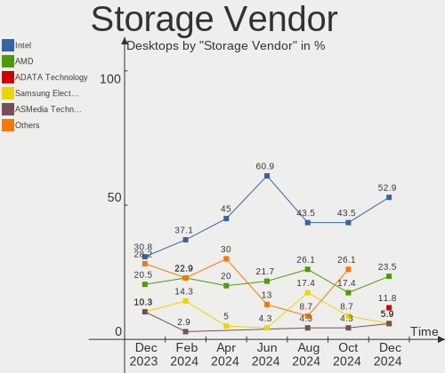
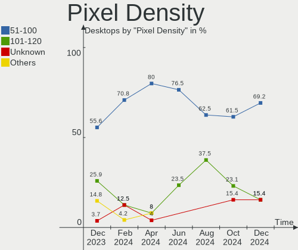

Xubuntu - Hardware Trends (Desktops)
------------------------------------

A project to identify most popular hardware characteristics and track their change
over time based on data collected by Linux users at https://Linux-Hardware.org.

Anyone can contribute to this report by the [hw-probe](https://github.com/linuxhw/hw-probe) tool:

    sudo -E hw-probe -all -upload

This report is for one last month. Overall report since the beginning of time: [TestDays](https://github.com/linuxhw/TestDays)

Period: Dec, 2023.

Contents
--------

* [ System ](#system)
  - [ OS                       ](#os)
  - [ OS Family                ](#os-family)
  - [ Kernel                   ](#kernel)
  - [ Kernel Family            ](#kernel-family)
  - [ Kernel Major Ver.        ](#kernel-major-ver)
  - [ Arch                     ](#arch)
  - [ DE                       ](#de)
  - [ Display Server           ](#display-server)
  - [ Display Manager          ](#display-manager)
  - [ OS Lang                  ](#os-lang)
  - [ Boot Mode                ](#boot-mode)
  - [ Filesystem               ](#filesystem)
  - [ Part. scheme             ](#part-scheme)
  - [ Dual Boot with Linux/BSD ](#dual-boot-with-linuxbsd)
  - [ Dual Boot (Win)          ](#dual-boot-win)

* [ Board ](#board)
  - [ Vendor                   ](#vendor)
  - [ Model                    ](#model)
  - [ Model Family             ](#model-family)
  - [ MFG Year                 ](#mfg-year)
  - [ Form Factor              ](#form-factor)
  - [ Secure Boot              ](#secure-boot)
  - [ Coreboot                 ](#coreboot)
  - [ RAM Size                 ](#ram-size)
  - [ RAM Used                 ](#ram-used)
  - [ Total Drives             ](#total-drives)
  - [ Has CD-ROM               ](#has-cd-rom)
  - [ Has Ethernet             ](#has-ethernet)
  - [ Has WiFi                 ](#has-wifi)
  - [ Has Bluetooth            ](#has-bluetooth)

* [ Location ](#location)
  - [ Country                  ](#country)
  - [ City                     ](#city)

* [ Drives ](#drives)
  - [ Drive Vendor             ](#drive-vendor)
  - [ Drive Model              ](#drive-model)
  - [ HDD Vendor               ](#hdd-vendor)
  - [ SSD Vendor               ](#ssd-vendor)
  - [ Drive Kind               ](#drive-kind)
  - [ Drive Connector          ](#drive-connector)
  - [ Drive Size               ](#drive-size)
  - [ Space Total              ](#space-total)
  - [ Space Used               ](#space-used)
  - [ Malfunc. Drives          ](#malfunc-drives)
  - [ Malfunc. Drive Vendor    ](#malfunc-drive-vendor)
  - [ Malfunc. HDD Vendor      ](#malfunc-hdd-vendor)
  - [ Malfunc. Drive Kind      ](#malfunc-drive-kind)
  - [ Failed Drives            ](#failed-drives)
  - [ Failed Drive Vendor      ](#failed-drive-vendor)
  - [ Drive Status             ](#drive-status)

* [ Storage controller ](#storage-controller)
  - [ Storage Vendor           ](#storage-vendor)
  - [ Storage Model            ](#storage-model)
  - [ Storage Kind             ](#storage-kind)

* [ Processor ](#processor)
  - [ CPU Vendor               ](#cpu-vendor)
  - [ CPU Model                ](#cpu-model)
  - [ CPU Model Family         ](#cpu-model-family)
  - [ CPU Cores                ](#cpu-cores)
  - [ CPU Sockets              ](#cpu-sockets)
  - [ CPU Threads              ](#cpu-threads)
  - [ CPU Op-Modes             ](#cpu-op-modes)
  - [ CPU Microcode            ](#cpu-microcode)
  - [ CPU Microarch            ](#cpu-microarch)

* [ Graphics ](#graphics)
  - [ GPU Vendor               ](#gpu-vendor)
  - [ GPU Model                ](#gpu-model)
  - [ GPU Combo                ](#gpu-combo)
  - [ GPU Driver               ](#gpu-driver)
  - [ GPU Memory               ](#gpu-memory)

* [ Monitor ](#monitor)
  - [ Monitor Vendor           ](#monitor-vendor)
  - [ Monitor Model            ](#monitor-model)
  - [ Monitor Resolution       ](#monitor-resolution)
  - [ Monitor Diagonal         ](#monitor-diagonal)
  - [ Monitor Width            ](#monitor-width)
  - [ Aspect Ratio             ](#aspect-ratio)
  - [ Monitor Area             ](#monitor-area)
  - [ Pixel Density            ](#pixel-density)
  - [ Multiple Monitors        ](#multiple-monitors)

* [ Network ](#network)
  - [ Net Controller Vendor    ](#net-controller-vendor)
  - [ Net Controller Model     ](#net-controller-model)
  - [ Wireless Vendor          ](#wireless-vendor)
  - [ Wireless Model           ](#wireless-model)
  - [ Ethernet Vendor          ](#ethernet-vendor)
  - [ Ethernet Model           ](#ethernet-model)
  - [ Net Controller Kind      ](#net-controller-kind)
  - [ Used Controller          ](#used-controller)
  - [ NICs                     ](#nics)
  - [ IPv6                     ](#ipv6)

* [ Bluetooth ](#bluetooth)
  - [ Bluetooth Vendor         ](#bluetooth-vendor)
  - [ Bluetooth Model          ](#bluetooth-model)

* [ Sound ](#sound)
  - [ Sound Vendor             ](#sound-vendor)
  - [ Sound Model              ](#sound-model)

* [ Memory ](#memory)
  - [ Memory Vendor            ](#memory-vendor)
  - [ Memory Model             ](#memory-model)
  - [ Memory Kind              ](#memory-kind)
  - [ Memory Form Factor       ](#memory-form-factor)
  - [ Memory Size              ](#memory-size)
  - [ Memory Speed             ](#memory-speed)

* [ Printers & scanners ](#printers--scanners)
  - [ Printer Vendor           ](#printer-vendor)
  - [ Printer Model            ](#printer-model)
  - [ Scanner Vendor           ](#scanner-vendor)
  - [ Scanner Model            ](#scanner-model)

* [ Camera ](#camera)
  - [ Camera Vendor            ](#camera-vendor)
  - [ Camera Model             ](#camera-model)

* [ Security ](#security)
  - [ Fingerprint Vendor       ](#fingerprint-vendor)
  - [ Fingerprint Model        ](#fingerprint-model)
  - [ Chipcard Vendor          ](#chipcard-vendor)
  - [ Chipcard Model           ](#chipcard-model)

* [ Unsupported ](#unsupported)
  - [ Unsupported Devices      ](#unsupported-devices)
  - [ Unsupported Device Types ](#unsupported-device-types)

System
------

OS
--

Installed operating systems

| Name          | Desktops | Percent |
|---------------|----------|---------|
| Xubuntu 22.04 | 11       | 45.83%  |
| Xubuntu 23.10 | 5        | 20.83%  |
| Xubuntu 18.04 | 5        | 20.83%  |
| Xubuntu 20.04 | 3        | 12.5%   |

OS Family
---------

OS without a version

| Name    | Desktops | Percent |
|---------|----------|---------|
| Xubuntu | 24       | 100%    |

Kernel
------

Version of the Linux kernel

| Version                 | Desktops | Percent |
|-------------------------|----------|---------|
| 6.5.0-14-generic        | 3        | 12.5%   |
| 6.2.0-39-generic        | 2        | 8.33%   |
| 6.2.0-37-generic        | 2        | 8.33%   |
| 5.4.0-150-generic       | 2        | 8.33%   |
| 5.15.0-91-generic       | 2        | 8.33%   |
| 6.6.4-1-liquorix-amd64  | 1        | 4.17%   |
| 6.5.0-9-generic         | 1        | 4.17%   |
| 6.2.0-36-generic        | 1        | 4.17%   |
| 6.2.0-26-generic        | 1        | 4.17%   |
| 6.2.0-060200-generic    | 1        | 4.17%   |
| 6.1.0-1015-oem          | 1        | 4.17%   |
| 5.4.217-0504217-generic | 1        | 4.17%   |
| 5.4.0-99-generic        | 1        | 4.17%   |
| 5.4.0-167-generic       | 1        | 4.17%   |
| 5.17.5-76051705-generic | 1        | 4.17%   |
| 5.15.0-89-generic       | 1        | 4.17%   |
| 5.15.0-88-generic       | 1        | 4.17%   |
| 4.15.0-29-generic       | 1        | 4.17%   |

Kernel Family
-------------

Linux kernel without a distro release

| Version | Desktops | Percent |
|---------|----------|---------|
| 6.2.0   | 7        | 29.17%  |
| 6.5.0   | 4        | 16.67%  |
| 5.4.0   | 4        | 16.67%  |
| 5.15.0  | 4        | 16.67%  |
| 6.6.4   | 1        | 4.17%   |
| 6.1.0   | 1        | 4.17%   |
| 5.4.217 | 1        | 4.17%   |
| 5.17.5  | 1        | 4.17%   |
| 4.15.0  | 1        | 4.17%   |

Kernel Major Ver.
-----------------

Linux kernel major version

| Version | Desktops | Percent |
|---------|----------|---------|
| 6.2     | 7        | 29.17%  |
| 5.4     | 5        | 20.83%  |
| 6.5     | 4        | 16.67%  |
| 5.15    | 4        | 16.67%  |
| 6.6     | 1        | 4.17%   |
| 6.1     | 1        | 4.17%   |
| 5.17    | 1        | 4.17%   |
| 4.15    | 1        | 4.17%   |

Arch
----

OS architecture (x86_64, i586, etc.)

| Name   | Desktops | Percent |
|--------|----------|---------|
| x86_64 | 23       | 95.83%  |
| i686   | 1        | 4.17%   |

DE
--

Desktop Environment

| Name            | Desktops | Percent |
|-----------------|----------|---------|
| XFCE            | 22       | 91.67%  |
| i3              | 1        | 4.17%   |
| GNOME Flashback | 1        | 4.17%   |

Display Server
--------------

X11 or Wayland

| Name | Desktops | Percent |
|------|----------|---------|
| X11  | 22       | 91.67%  |
| Tty  | 2        | 8.33%   |

Display Manager
---------------

SDDM, LightDM, etc.

| Name    | Desktops | Percent |
|---------|----------|---------|
| LightDM | 22       | 91.67%  |
| GDM3    | 1        | 4.17%   |
| Unknown | 1        | 4.17%   |

OS Lang
-------

Language

| Lang  | Desktops | Percent |
|-------|----------|---------|
| en_US | 10       | 41.67%  |
| de_DE | 4        | 16.67%  |
| fr_FR | 2        | 8.33%   |
| C     | 2        | 8.33%   |
| ru_RU | 1        | 4.17%   |
| it_IT | 1        | 4.17%   |
| fi_FI | 1        | 4.17%   |
| es_ES | 1        | 4.17%   |
| en_CA | 1        | 4.17%   |
| en_AU | 1        | 4.17%   |

Boot Mode
---------

EFI or BIOS

| Mode | Desktops | Percent |
|------|----------|---------|
| BIOS | 13       | 54.17%  |
| EFI  | 11       | 45.83%  |

Filesystem
----------

Type of filesystem

| Type    | Desktops | Percent |
|---------|----------|---------|
| Ext4    | 18       | 75%     |
| Tmpfs   | 4        | 16.67%  |
| Overlay | 2        | 8.33%   |

Part. scheme
------------

Scheme of partitioning

| Type    | Desktops | Percent |
|---------|----------|---------|
| GPT     | 18       | 75%     |
| MBR     | 4        | 16.67%  |
| Unknown | 2        | 8.33%   |

Dual Boot with Linux/BSD
------------------------

Hosting more than one Linux/BSD

| Dual boot | Desktops | Percent |
|-----------|----------|---------|
| No        | 20       | 83.33%  |
| Yes       | 4        | 16.67%  |

Dual Boot (Win)
---------------

Hosting Linux and Windows

| Dual boot | Desktops | Percent |
|-----------|----------|---------|
| No        | 17       | 70.83%  |
| Yes       | 7        | 29.17%  |

Board
-----

Vendor
------

Motherboard manufacturer

| Name                | Desktops | Percent |
|---------------------|----------|---------|
| ASUSTek Computer    | 6        | 25%     |
| Gigabyte Technology | 4        | 16.67%  |
| Intel               | 3        | 12.5%   |
| ASRock              | 3        | 12.5%   |
| MSI                 | 2        | 8.33%   |
| Unknown             | 2        | 8.33%   |
| Lenovo              | 1        | 4.17%   |
| Hewlett-Packard     | 1        | 4.17%   |
| Foxconn             | 1        | 4.17%   |
| Apple               | 1        | 4.17%   |

Model
-----

Motherboard model

| Name                               | Desktops | Percent |
|------------------------------------|----------|---------|
| Unknown                            | 2        | 8.33%   |
| MSI MS-7C56                        | 1        | 4.17%   |
| MSI MS-7C37                        | 1        | 4.17%   |
| Lenovo ThinkStation S30 43512Z4    | 1        | 4.17%   |
| Intel STK1AW32SC                   | 1        | 4.17%   |
| Intel H310 Series                  | 1        | 4.17%   |
| Intel DB75EN                       | 1        | 4.17%   |
| HP Z440 Workstation                | 1        | 4.17%   |
| Gigabyte Z270-HD3P                 | 1        | 4.17%   |
| Gigabyte P35-DS3R                  | 1        | 4.17%   |
| Gigabyte B550 AORUS ELITE          | 1        | 4.17%   |
| Gigabyte B450M DS3H                | 1        | 4.17%   |
| Foxconn KX639AA-ABZ s3530.it       | 1        | 4.17%   |
| ASUS ROG STRIX B650E-F GAMING WIFI | 1        | 4.17%   |
| ASUS PRIME X670-P WIFI             | 1        | 4.17%   |
| ASUS PRIME H510M-A WIFI            | 1        | 4.17%   |
| ASUS P7P55D                        | 1        | 4.17%   |
| ASUS P6X58D PREMIUM                | 1        | 4.17%   |
| ASUS K30AD_M31AD_M51AD             | 1        | 4.17%   |
| ASRock Q1900DC-ITX                 | 1        | 4.17%   |
| ASRock B450M Steel Legend          | 1        | 4.17%   |
| ASRock B450 Steel Legend           | 1        | 4.17%   |
| Apple MacPro5,1                    | 1        | 4.17%   |

Model Family
------------

Motherboard model prefix

| Name                | Desktops | Percent |
|---------------------|----------|---------|
| ASUS PRIME          | 2        | 8.33%   |
| Unknown             | 2        | 8.33%   |
| MSI MS-7C56         | 1        | 4.17%   |
| MSI MS-7C37         | 1        | 4.17%   |
| Lenovo ThinkStation | 1        | 4.17%   |
| Intel STK1AW32SC    | 1        | 4.17%   |
| Intel H310          | 1        | 4.17%   |
| Intel DB75EN        | 1        | 4.17%   |
| HP Z440             | 1        | 4.17%   |
| Gigabyte Z270-HD3P  | 1        | 4.17%   |
| Gigabyte P35-DS3R   | 1        | 4.17%   |
| Gigabyte B550       | 1        | 4.17%   |
| Gigabyte B450M      | 1        | 4.17%   |
| Foxconn KX639AA-ABZ | 1        | 4.17%   |
| ASUS ROG            | 1        | 4.17%   |
| ASUS P7P55D         | 1        | 4.17%   |
| ASUS P6X58D         | 1        | 4.17%   |
| ASUS K30AD          | 1        | 4.17%   |
| ASRock Q1900DC-ITX  | 1        | 4.17%   |
| ASRock B450M        | 1        | 4.17%   |
| ASRock B450         | 1        | 4.17%   |
| Apple MacPro5       | 1        | 4.17%   |

MFG Year
--------

Motherboard manufacture year

| Year | Desktops | Percent |
|------|----------|---------|
| 2020 | 3        | 12.5%   |
| 2019 | 3        | 12.5%   |
| 2014 | 3        | 12.5%   |
| 2022 | 2        | 8.33%   |
| 2018 | 2        | 8.33%   |
| 2016 | 2        | 8.33%   |
| 2010 | 2        | 8.33%   |
| 2009 | 2        | 8.33%   |
| 2021 | 1        | 4.17%   |
| 2015 | 1        | 4.17%   |
| 2012 | 1        | 4.17%   |
| 2008 | 1        | 4.17%   |
| 2007 | 1        | 4.17%   |

Form Factor
-----------

Physical design of the computer

| Name    | Desktops | Percent |
|---------|----------|---------|
| Desktop | 24       | 100%    |

Secure Boot
-----------

Enabled or disabled

| State    | Desktops | Percent |
|----------|----------|---------|
| Disabled | 23       | 95.83%  |
| Enabled  | 1        | 4.17%   |

Coreboot
--------

Have coreboot on board

| Used | Desktops | Percent |
|------|----------|---------|
| No   | 24       | 100%    |

RAM Size
--------

Total RAM memory

| Size in GB  | Desktops | Percent |
|-------------|----------|---------|
| 16.01-24.0  | 7        | 29.17%  |
| 32.01-64.0  | 4        | 16.67%  |
| 64.01-256.0 | 4        | 16.67%  |
| 4.01-8.0    | 2        | 8.33%   |
| 3.01-4.0    | 2        | 8.33%   |
| 1.01-2.0    | 2        | 8.33%   |
| 8.01-16.0   | 2        | 8.33%   |
| 2.01-3.0    | 1        | 4.17%   |

RAM Used
--------

Used RAM memory

| Used GB   | Desktops | Percent |
|-----------|----------|---------|
| 1.01-2.0  | 7        | 29.17%  |
| 4.01-8.0  | 6        | 25%     |
| 2.01-3.0  | 5        | 20.83%  |
| 3.01-4.0  | 3        | 12.5%   |
| 8.01-16.0 | 1        | 4.17%   |
| 0.51-1.0  | 1        | 4.17%   |
| 0.01-0.5  | 1        | 4.17%   |

Total Drives
------------

Number of drives on board

| Drives | Desktops | Percent |
|--------|----------|---------|
| 1      | 9        | 37.5%   |
| 2      | 6        | 25%     |
| 3      | 5        | 20.83%  |
| 0      | 2        | 8.33%   |
| 5      | 1        | 4.17%   |
| 4      | 1        | 4.17%   |

Has CD-ROM
----------

Has CD-ROM on board

| Presented | Desktops | Percent |
|-----------|----------|---------|
| No        | 14       | 58.33%  |
| Yes       | 10       | 41.67%  |

Has Ethernet
------------

Has Ethernet on board

| Presented | Desktops | Percent |
|-----------|----------|---------|
| Yes       | 23       | 95.83%  |
| No        | 1        | 4.17%   |

Has WiFi
--------

Has WiFi module

| Presented | Desktops | Percent |
|-----------|----------|---------|
| Yes       | 14       | 58.33%  |
| No        | 10       | 41.67%  |

Has Bluetooth
-------------

Has Bluetooth module

| Presented | Desktops | Percent |
|-----------|----------|---------|
| No        | 13       | 54.17%  |
| Yes       | 11       | 45.83%  |

Location
--------

Country
-------

Geographic location (country)

| Country         | Desktops | Percent |
|-----------------|----------|---------|
| USA             | 7        | 29.17%  |
| Germany         | 3        | 12.5%   |
| Russia          | 2        | 8.33%   |
| France          | 2        | 8.33%   |
| Canada          | 2        | 8.33%   |
| The Netherlands | 1        | 4.17%   |
| Spain           | 1        | 4.17%   |
| Portugal        | 1        | 4.17%   |
| Italy           | 1        | 4.17%   |
| Iran            | 1        | 4.17%   |
| Finland         | 1        | 4.17%   |
| Austria         | 1        | 4.17%   |
| Australia       | 1        | 4.17%   |

City
----

Geographic location (city)

| City                     | Desktops | Percent |
|--------------------------|----------|---------|
| Harrisonburg             | 3        | 12.5%   |
| Wusterhausen             | 1        | 4.17%   |
| Willits                  | 1        | 4.17%   |
| Whitehorse               | 1        | 4.17%   |
| Tyler                    | 1        | 4.17%   |
| Tehran                   | 1        | 4.17%   |
| Sydney                   | 1        | 4.17%   |
| Sundern                  | 1        | 4.17%   |
| Smolensk                 | 1        | 4.17%   |
| Salaberry-de-Valleyfield | 1        | 4.17%   |
| Portland                 | 1        | 4.17%   |
| Pescara                  | 1        | 4.17%   |
| Paris                    | 1        | 4.17%   |
| Oceanside                | 1        | 4.17%   |
| Moscow                   | 1        | 4.17%   |
| Lugo                     | 1        | 4.17%   |
| Lisbon                   | 1        | 4.17%   |
| Innsbruck                | 1        | 4.17%   |
| Helsinki                 | 1        | 4.17%   |
| Hanover                  | 1        | 4.17%   |
| Burgnac                  | 1        | 4.17%   |
| Amsterdam                | 1        | 4.17%   |

Drives
------

Drive Vendor
------------

Hard drive vendors

| Vendor              | Desktops | Drives | Percent |
|---------------------|----------|--------|---------|
| WDC                 | 8        | 10     | 19.51%  |
| Seagate             | 8        | 8      | 19.51%  |
| Samsung Electronics | 8        | 9      | 19.51%  |
| Sandisk             | 4        | 4      | 9.76%   |
| Kingston            | 2        | 2      | 4.88%   |
| Hitachi             | 2        | 2      | 4.88%   |
| Crucial             | 2        | 2      | 4.88%   |
| Toshiba             | 1        | 1      | 2.44%   |
| PNY                 | 1        | 1      | 2.44%   |
| MARVELL             | 1        | 1      | 2.44%   |
| KIOXIA-EXCERIA      | 1        | 1      | 2.44%   |
| Hoodisk             | 1        | 1      | 2.44%   |
| Hewlett-Packard     | 1        | 2      | 2.44%   |
| Apple               | 1        | 1      | 2.44%   |

Drive Model
-----------

Hard drive models

| Model                                          | Desktops | Percent |
|------------------------------------------------|----------|---------|
| WDC WDS500G2B0A-00SM50 500GB SSD               | 1        | 2.27%   |
| WDC WDS250G2B0B-00YS70 250GB SSD               | 1        | 2.27%   |
| WDC WDS240G2G0B-00EPW0 240GB SSD               | 1        | 2.27%   |
| WDC WD7500BPKT-75PK4T0 752GB                   | 1        | 2.27%   |
| WDC WD5000AAKX-08U6AA0 500GB                   | 1        | 2.27%   |
| WDC WD4000AAJS-00YFA0 400GB                    | 1        | 2.27%   |
| WDC WD3200AAKS-75B3A0 320GB                    | 1        | 2.27%   |
| WDC WD10SPZX-00Z10T0 1TB                       | 1        | 2.27%   |
| WDC WD10EZEX-75WN4A0 1TB                       | 1        | 2.27%   |
| WDC WD10EFRX-68PJCN0 1TB                       | 1        | 2.27%   |
| Toshiba KXG6AZNV1T02 1TB                       | 1        | 2.27%   |
| Seagate ST4000DM004-2CV104 4TB                 | 1        | 2.27%   |
| Seagate ST2000VX008-2E3164 2TB                 | 1        | 2.27%   |
| Seagate ST2000LM003 HN-M201RAD 2TB             | 1        | 2.27%   |
| Seagate ST2000DM008-2FR102 2TB                 | 1        | 2.27%   |
| Seagate ST18000NM000J-2TV103 18TB              | 1        | 2.27%   |
| Seagate ST1000DX002-2DV162 1TB                 | 1        | 2.27%   |
| Seagate ST1000DM003-1ER162 1TB                 | 1        | 2.27%   |
| Seagate ST1000DM003-1CH162 1TB                 | 1        | 2.27%   |
| Sandisk WD Blue SN550 NVMe SSD 1TB             | 1        | 2.27%   |
| SanDisk SDSSDH31000G 1TB                       | 1        | 2.27%   |
| SanDisk NVMe SSD Drive 250GB                   | 1        | 2.27%   |
| SanDisk DF4032  32GB                           | 1        | 2.27%   |
| Samsung SSD 990 PRO 1TB                        | 1        | 2.27%   |
| Samsung SSD 980 1TB                            | 1        | 2.27%   |
| Samsung SSD 970 EVO Plus 250GB S59BNM0RB07707A | 1        | 2.27%   |
| Samsung SSD 970 EVO 250GB                      | 1        | 2.27%   |
| Samsung SSD 860 EVO M.2 250GB                  | 1        | 2.27%   |
| Samsung SSD 860 EVO 500GB                      | 1        | 2.27%   |
| Samsung SSD 860 EVO 1TB                        | 1        | 2.27%   |
| Samsung SSD 840 EVO 250GB                      | 1        | 2.27%   |
| Samsung SSD 840 EVO 120GB                      | 1        | 2.27%   |
| PNY ELITE PSSD 480GB                           | 1        | 2.27%   |
| MARVELL Raid VD 4TB                            | 1        | 2.27%   |
| KIOXIA-EXCERIA SATA SSD 240GB                  | 1        | 2.27%   |
| Kingston SA400S37960G 960GB SSD                | 1        | 2.27%   |
| Kingston SA400S37240G 240GB SSD                | 1        | 2.27%   |
| Hoodisk SSD 64GB                               | 1        | 2.27%   |
| Hitachi HTS543225L9A300 250GB                  | 1        | 2.27%   |
| Hitachi HDP725050GLA360 500GB                  | 1        | 2.27%   |

HDD Vendor
----------

Hard disk drive vendors

| Vendor          | Desktops | Drives | Percent |
|-----------------|----------|--------|---------|
| Seagate         | 8        | 8      | 42.11%  |
| WDC             | 6        | 7      | 31.58%  |
| Hitachi         | 2        | 2      | 10.53%  |
| MARVELL         | 1        | 1      | 5.26%   |
| Hewlett-Packard | 1        | 2      | 5.26%   |
| Apple           | 1        | 1      | 5.26%   |

SSD Vendor
----------

Solid state drive vendors

| Vendor              | Desktops | Drives | Percent |
|---------------------|----------|--------|---------|
| Samsung Electronics | 4        | 5      | 28.57%  |
| WDC                 | 3        | 3      | 21.43%  |
| Kingston            | 2        | 2      | 14.29%  |
| SanDisk             | 1        | 1      | 7.14%   |
| PNY                 | 1        | 1      | 7.14%   |
| KIOXIA-EXCERIA      | 1        | 1      | 7.14%   |
| Hoodisk             | 1        | 1      | 7.14%   |
| Crucial             | 1        | 1      | 7.14%   |

Drive Kind
----------

HDD or SSD

| Kind | Desktops | Drives | Percent |
|------|----------|--------|---------|
| HDD  | 16       | 21     | 44.44%  |
| SSD  | 12       | 15     | 33.33%  |
| NVMe | 7        | 8      | 19.44%  |
| MMC  | 1        | 1      | 2.78%   |

Drive Connector
---------------

SATA, SAS, NVMe, etc.

| Type | Desktops | Drives | Percent |
|------|----------|--------|---------|
| SATA | 21       | 35     | 70%     |
| NVMe | 7        | 8      | 23.33%  |
| SAS  | 1        | 1      | 3.33%   |
| MMC  | 1        | 1      | 3.33%   |

Drive Size
----------

Size of hard drive

| Size in TB | Desktops | Drives | Percent |
|------------|----------|--------|---------|
| 0.01-0.5   | 13       | 16     | 44.83%  |
| 0.51-1.0   | 10       | 14     | 34.48%  |
| 1.01-2.0   | 3        | 3      | 10.34%  |
| 3.01-4.0   | 2        | 2      | 6.9%    |
| 10.01-20.0 | 1        | 1      | 3.45%   |

Space Total
-----------

Amount of disk space available on the file system

| Size in GB     | Desktops | Percent |
|----------------|----------|---------|
| 501-1000       | 5        | 20.83%  |
| 251-500        | 4        | 16.67%  |
| 101-250        | 4        | 16.67%  |
| 1001-2000      | 4        | 16.67%  |
| More than 3000 | 2        | 8.33%   |
| 51-100         | 2        | 8.33%   |
| 21-50          | 1        | 4.17%   |
| 2001-3000      | 1        | 4.17%   |
| 1-20           | 1        | 4.17%   |

Space Used
----------

Amount of used disk space

| Used GB        | Desktops | Percent |
|----------------|----------|---------|
| 1-20           | 7        | 29.17%  |
| 251-500        | 5        | 20.83%  |
| 101-250        | 4        | 16.67%  |
| 1001-2000      | 4        | 16.67%  |
| 51-100         | 2        | 8.33%   |
| More than 3000 | 1        | 4.17%   |
| 501-1000       | 1        | 4.17%   |

Malfunc. Drives
---------------

Drive models with a malfunction

| Model                             | Desktops | Drives | Percent |
|-----------------------------------|----------|--------|---------|
| WDC WD3200AAKS-75B3A0 320GB       | 1        | 1      | 33.33%  |
| Seagate ST18000NM000J-2TV103 18TB | 1        | 1      | 33.33%  |
| Hewlett-Packard GB1000EAMYC 1TB   | 1        | 2      | 33.33%  |

Malfunc. Drive Vendor
---------------------

Vendors of faulty drives

| Vendor          | Desktops | Drives | Percent |
|-----------------|----------|--------|---------|
| WDC             | 1        | 1      | 33.33%  |
| Seagate         | 1        | 1      | 33.33%  |
| Hewlett-Packard | 1        | 2      | 33.33%  |

Malfunc. HDD Vendor
-------------------

Vendors of faulty HDD drives

| Vendor          | Desktops | Drives | Percent |
|-----------------|----------|--------|---------|
| WDC             | 1        | 1      | 33.33%  |
| Seagate         | 1        | 1      | 33.33%  |
| Hewlett-Packard | 1        | 2      | 33.33%  |

Malfunc. Drive Kind
-------------------

Kinds of faulty drives

| Kind | Desktops | Drives | Percent |
|------|----------|--------|---------|
| HDD  | 3        | 4      | 100%    |

Failed Drives
-------------

Failed drive models

| Model                        | Desktops | Drives | Percent |
|------------------------------|----------|--------|---------|
| WDC WD7500BPKT-75PK4T0 752GB | 1        | 1      | 100%    |

Failed Drive Vendor
-------------------

Failed drive vendors

| Vendor | Desktops | Drives | Percent |
|--------|----------|--------|---------|
| WDC    | 1        | 1      | 100%    |

Drive Status
------------

Number of failed and malfunc. drives

| Status   | Desktops | Drives | Percent |
|----------|----------|--------|---------|
| Works    | 14       | 26     | 50%     |
| Detected | 10       | 14     | 35.71%  |
| Malfunc  | 3        | 4      | 10.71%  |
| Failed   | 1        | 1      | 3.57%   |

Storage controller
------------------

Storage Vendor
--------------

Storage controller vendors

| Vendor                           | Desktops | Percent |
|----------------------------------|----------|---------|
| Intel                            | 12       | 30.77%  |
| AMD                              | 8        | 20.51%  |
| Samsung Electronics              | 4        | 10.26%  |
| ASMedia Technology               | 4        | 10.26%  |
| SanDisk                          | 2        | 5.13%   |
| Marvell Technology Group         | 2        | 5.13%   |
| JMicron Technology               | 2        | 5.13%   |
| Toshiba America Info Systems     | 1        | 2.56%   |
| Silicon Integrated Systems [SiS] | 1        | 2.56%   |
| Nvidia                           | 1        | 2.56%   |
| Micron/Crucial Technology        | 1        | 2.56%   |
| Broadcom / LSI                   | 1        | 2.56%   |

Storage Model
-------------

Storage controller models

| Model                                                                          | Desktops | Percent |
|--------------------------------------------------------------------------------|----------|---------|
| AMD FCH SATA Controller [AHCI mode]                                            | 5        | 10.2%   |
| ASMedia ASM1062 Serial ATA Controller                                          | 4        | 8.16%   |
| AMD 400 Series Chipset SATA Controller                                         | 3        | 6.12%   |
| Samsung NVMe SSD Controller SM981/PM981/PM983                                  | 2        | 4.08%   |
| JMicron JMB363 SATA/IDE Controller                                             | 2        | 4.08%   |
| AMD 500 Series Chipset SATA Controller                                         | 2        | 4.08%   |
| Toshiba America Info Systems XG6 NVMe SSD Controller                           | 1        | 2.04%   |
| Silicon Integrated Systems [SiS] SATA Controller / IDE mode                    | 1        | 2.04%   |
| Silicon Integrated Systems [SiS] 5513 IDE Controller                           | 1        | 2.04%   |
| SanDisk Ultra 3D / WD Blue SN570 NVMe SSD (DRAM-less)                          | 1        | 2.04%   |
| SanDisk Ultra 3D / WD Blue SN550 NVMe SSD                                      | 1        | 2.04%   |
| Samsung NVMe SSD Controller S4LV008[Pascal]                                    | 1        | 2.04%   |
| Samsung NVMe SSD Controller 980 (DRAM-less)                                    | 1        | 2.04%   |
| Nvidia MCP73 SATA Controller (IDE mode)                                        | 1        | 2.04%   |
| Nvidia MCP73 IDE Controller                                                    | 1        | 2.04%   |
| Micron/Crucial P2 [Nick P2] / P3 / P3 Plus NVMe PCIe SSD (DRAM-less)           | 1        | 2.04%   |
| Marvell Group 88SE9230 PCIe 2.0 x2 4-port SATA 6 Gb/s RAID Controller          | 1        | 2.04%   |
| Marvell Group 88SE912x SATA 6Gb/s Controller [IDE mode]                        | 1        | 2.04%   |
| Intel Cannon Lake PCH SATA AHCI Controller                                     | 1        | 2.04%   |
| Intel C610/X99 series chipset sSATA Controller [RAID mode]                     | 1        | 2.04%   |
| Intel C602 chipset 4-Port SATA Storage Control Unit                            | 1        | 2.04%   |
| Intel C600/X79 series chipset SATA RAID Controller                             | 1        | 2.04%   |
| Intel C600/X79 series chipset IDE-r Controller                                 | 1        | 2.04%   |
| Intel C600/X79 series chipset 6-Port SATA AHCI Controller                      | 1        | 2.04%   |
| Intel Atom Processor E3800 Series SATA AHCI Controller                         | 1        | 2.04%   |
| Intel 82801JI (ICH10 Family) SATA AHCI Controller                              | 1        | 2.04%   |
| Intel 82801JI (ICH10 Family) 4 port SATA IDE Controller #1                     | 1        | 2.04%   |
| Intel 82801JI (ICH10 Family) 2 port SATA IDE Controller #2                     | 1        | 2.04%   |
| Intel 82801IR/IO/IH (ICH9R/DO/DH) 4 port SATA Controller [IDE mode]            | 1        | 2.04%   |
| Intel 82801I (ICH9 Family) 2 port SATA Controller [IDE mode]                   | 1        | 2.04%   |
| Intel 8 Series/C220 Series Chipset Family 6-port SATA Controller 1 [AHCI mode] | 1        | 2.04%   |
| Intel 7 Series/C210 Series Chipset Family 6-port SATA Controller [AHCI mode]   | 1        | 2.04%   |
| Intel 500 Series Chipset Family SATA AHCI Controller                           | 1        | 2.04%   |
| Intel 5 Series/3400 Series Chipset 4 port SATA IDE Controller                  | 1        | 2.04%   |
| Intel 5 Series/3400 Series Chipset 2 port SATA IDE Controller                  | 1        | 2.04%   |
| Intel 200 Series PCH SATA controller [AHCI mode]                               | 1        | 2.04%   |
| Broadcom / LSI SAS2308 PCI-Express Fusion-MPT SAS-2                            | 1        | 2.04%   |

Storage Kind
------------

Kind of storage controller (IDE, SATA, NVMe, SAS, ...)

| Kind | Desktops | Percent |
|------|----------|---------|
| SATA | 18       | 52.94%  |
| NVMe | 7        | 20.59%  |
| IDE  | 6        | 17.65%  |
| SAS  | 2        | 5.88%   |
| RAID | 1        | 2.94%   |

Processor
---------

CPU Vendor
----------

Processor vendors

| Vendor | Desktops | Percent |
|--------|----------|---------|
| Intel  | 16       | 66.67%  |
| AMD    | 8        | 33.33%  |

CPU Model
---------

Processor models

| Model                                      | Desktops | Percent |
|--------------------------------------------|----------|---------|
| Intel Celeron CPU J1900 @ 1.99GHz          | 2        | 8.33%   |
| AMD Ryzen 9 7950X 16-Core Processor        | 2        | 8.33%   |
| Intel Xeon CPU E5520 @ 2.27GHz             | 1        | 4.17%   |
| Intel Xeon CPU E5-1650 v4 @ 3.60GHz        | 1        | 4.17%   |
| Intel Xeon CPU E5-1607 v2 @ 3.00GHz        | 1        | 4.17%   |
| Intel Core i7-7700 CPU @ 3.60GHz           | 1        | 4.17%   |
| Intel Core i7 CPU 960 @ 3.20GHz            | 1        | 4.17%   |
| Intel Core i5-8500 CPU @ 3.00GHz           | 1        | 4.17%   |
| Intel Core i5-3330 CPU @ 3.00GHz           | 1        | 4.17%   |
| Intel Core i5 CPU 750 @ 2.67GHz            | 1        | 4.17%   |
| Intel Core i3-10105 CPU @ 3.70GHz          | 1        | 4.17%   |
| Intel Core 2 Duo CPU E6750 @ 2.66GHz       | 1        | 4.17%   |
| Intel Core 2 Duo CPU E4700 @ 2.60GHz       | 1        | 4.17%   |
| Intel Celeron CPU G1820 @ 2.70GHz          | 1        | 4.17%   |
| Intel Atom x5-Z8330 CPU @ 1.44GHz          | 1        | 4.17%   |
| Intel Atom CPU 230 @ 1.60GHz               | 1        | 4.17%   |
| AMD Ryzen 7 PRO 1700X Eight-Core Processor | 1        | 4.17%   |
| AMD Ryzen 7 3800X 8-Core Processor         | 1        | 4.17%   |
| AMD Ryzen 5 5600X 6-Core Processor         | 1        | 4.17%   |
| AMD Ryzen 5 3600 6-Core Processor          | 1        | 4.17%   |
| AMD Ryzen 5 3500 6-Core Processor          | 1        | 4.17%   |
| AMD Ryzen 5 2600X Six-Core Processor       | 1        | 4.17%   |

CPU Model Family
----------------

Processor model prefix

| Model            | Desktops | Percent |
|------------------|----------|---------|
| AMD Ryzen 5      | 4        | 16.67%  |
| Intel Xeon       | 3        | 12.5%   |
| Intel Core i5    | 3        | 12.5%   |
| Intel Celeron    | 3        | 12.5%   |
| Intel Core i7    | 2        | 8.33%   |
| Intel Core 2 Duo | 2        | 8.33%   |
| Intel Atom       | 2        | 8.33%   |
| AMD Ryzen 9      | 2        | 8.33%   |
| Intel Core i3    | 1        | 4.17%   |
| AMD Ryzen 7 PRO  | 1        | 4.17%   |
| AMD Ryzen 7      | 1        | 4.17%   |

CPU Cores
---------

Number of processor cores

| Number | Desktops | Percent |
|--------|----------|---------|
| 4      | 9        | 37.5%   |
| 6      | 6        | 25%     |
| 8      | 3        | 12.5%   |
| 2      | 3        | 12.5%   |
| 16     | 2        | 8.33%   |
| 1      | 1        | 4.17%   |

CPU Sockets
-----------

Number of sockets

| Number | Desktops | Percent |
|--------|----------|---------|
| 1      | 23       | 95.83%  |
| 2      | 1        | 4.17%   |

CPU Threads
-----------

Threads per core (Hyper-Threading)

| Number | Desktops | Percent |
|--------|----------|---------|
| 2      | 13       | 54.17%  |
| 1      | 11       | 45.83%  |

CPU Op-Modes
------------

CPU Operation Modes (32-bit, 64-bit)

| Op mode        | Desktops | Percent |
|----------------|----------|---------|
| 32-bit, 64-bit | 24       | 100%    |

CPU Microcode
-------------

Microcode number

| Number     | Desktops | Percent |
|------------|----------|---------|
| Unknown    | 11       | 45.83%  |
| 0x906e9    | 1        | 4.17%   |
| 0x406c4    | 1        | 4.17%   |
| 0x306e4    | 1        | 4.17%   |
| 0x306a9    | 1        | 4.17%   |
| 0x30679    | 1        | 4.17%   |
| 0x106e5    | 1        | 4.17%   |
| 0x106a5    | 1        | 4.17%   |
| 0x0a601206 | 1        | 4.17%   |
| 0x0a20120e | 1        | 4.17%   |
| 0x08701030 | 1        | 4.17%   |
| 0x08701021 | 1        | 4.17%   |
| 0x0800820d | 1        | 4.17%   |
| 0x08001138 | 1        | 4.17%   |

CPU Microarch
-------------

Microarchitecture

| Name       | Desktops | Percent |
|------------|----------|---------|
| Zen 2      | 3        | 12.5%   |
| Silvermont | 3        | 12.5%   |
| Nehalem    | 3        | 12.5%   |
| KabyLake   | 2        | 8.33%   |
| IvyBridge  | 2        | 8.33%   |
| Core       | 2        | 8.33%   |
| Unknown    | 2        | 8.33%   |
| Zen+       | 1        | 4.17%   |
| Zen 3      | 1        | 4.17%   |
| Zen        | 1        | 4.17%   |
| Haswell    | 1        | 4.17%   |
| CometLake  | 1        | 4.17%   |
| Broadwell  | 1        | 4.17%   |
| Bonnell    | 1        | 4.17%   |

Graphics
--------

GPU Vendor
----------

Vendors of graphics cards

| Vendor                           | Desktops | Percent |
|----------------------------------|----------|---------|
| Nvidia                           | 12       | 44.44%  |
| AMD                              | 8        | 29.63%  |
| Intel                            | 6        | 22.22%  |
| Silicon Integrated Systems [SiS] | 1        | 3.7%    |

GPU Model
---------

Graphics card models

| Model                                                                                    | Desktops | Percent |
|------------------------------------------------------------------------------------------|----------|---------|
| Intel Atom Processor Z36xxx/Z37xxx Series Graphics & Display                             | 2        | 6.9%    |
| AMD Lexa PRO [Radeon 540/540X/550/550X / RX 540X/550/550X]                               | 2        | 6.9%    |
| Silicon Integrated Systems [SiS] 771/671 PCIE VGA Display Adapter                        | 1        | 3.45%   |
| Nvidia TU116 [GeForce GTX 1660]                                                          | 1        | 3.45%   |
| Nvidia TU116 [GeForce GTX 1660 Ti]                                                       | 1        | 3.45%   |
| Nvidia TU116 [GeForce GTX 1660 SUPER]                                                    | 1        | 3.45%   |
| Nvidia TU106 [GeForce RTX 2060 Rev. A]                                                   | 1        | 3.45%   |
| Nvidia GP107 [GeForce GTX 1050 Ti]                                                       | 1        | 3.45%   |
| Nvidia GP106 [GeForce GTX 1060 3GB]                                                      | 1        | 3.45%   |
| Nvidia GM200GL [Tesla M40]                                                               | 1        | 3.45%   |
| Nvidia GK107GL [Quadro K2000]                                                            | 1        | 3.45%   |
| Nvidia GK107 [GeForce GTX 650]                                                           | 1        | 3.45%   |
| Nvidia GA106 [GeForce RTX 3060 Lite Hash Rate]                                           | 1        | 3.45%   |
| Nvidia G80 [GeForce 8800 GTS]                                                            | 1        | 3.45%   |
| Nvidia G71 [GeForce 7950 GT]                                                             | 1        | 3.45%   |
| Nvidia C73 [GeForce 7100 / nForce 630i]                                                  | 1        | 3.45%   |
| Intel Xeon E3-1200 v3/4th Gen Core Processor Integrated Graphics Controller              | 1        | 3.45%   |
| Intel CometLake-S GT2 [UHD Graphics 630]                                                 | 1        | 3.45%   |
| Intel CoffeeLake-S GT2 [UHD Graphics 630]                                                | 1        | 3.45%   |
| Intel Atom/Celeron/Pentium Processor x5-E8000/J3xxx/N3xxx Integrated Graphics Controller | 1        | 3.45%   |
| AMD RV530 GL [FireGL V3400] (Secondary)                                                  | 1        | 3.45%   |
| AMD RV530 GL [FireGL V3400]                                                              | 1        | 3.45%   |
| AMD Raphael                                                                              | 1        | 3.45%   |
| AMD Polaris 20 XL [Radeon RX 580 2048SP]                                                 | 1        | 3.45%   |
| AMD Navi 32 [Radeon RX 7700 XT / 7800 XT]                                                | 1        | 3.45%   |
| AMD Hawaii PRO [Radeon R9 290/390]                                                       | 1        | 3.45%   |
| AMD Baffin [Radeon RX 460/560D / Pro 450/455/460/555/555X/560/560X]                      | 1        | 3.45%   |

GPU Combo
---------

Combinations of graphics cards

| Name                 | Desktops | Percent |
|----------------------|----------|---------|
| 1 x Nvidia           | 8        | 33.33%  |
| 1 x AMD              | 6        | 25%     |
| 1 x Intel            | 5        | 20.83%  |
| 2 x Nvidia           | 1        | 4.17%   |
| 2 x AMD + 1 x Nvidia | 1        | 4.17%   |
| 1 x SiS              | 1        | 4.17%   |
| Intel + Nvidia       | 1        | 4.17%   |
| AMD + Nvidia         | 1        | 4.17%   |

GPU Driver
----------

Free vs proprietary

| Driver      | Desktops | Percent |
|-------------|----------|---------|
| Free        | 14       | 58.33%  |
| Proprietary | 8        | 33.33%  |
| Unknown     | 2        | 8.33%   |

GPU Memory
----------

Total video memory

| Size in GB | Desktops | Percent |
|------------|----------|---------|
| Unknown    | 10       | 41.67%  |
| 5.01-6.0   | 3        | 12.5%   |
| 7.01-8.0   | 2        | 8.33%   |
| 8.01-16.0  | 2        | 8.33%   |
| 0.51-1.0   | 2        | 8.33%   |
| 0.01-0.5   | 2        | 8.33%   |
| 3.01-4.0   | 1        | 4.17%   |
| 2.01-3.0   | 1        | 4.17%   |
| 1.01-2.0   | 1        | 4.17%   |

Monitor
-------

Monitor Vendor
--------------

Monitor vendors

| Vendor              | Desktops | Percent |
|---------------------|----------|---------|
| Samsung Electronics | 6        | 21.43%  |
| Goldstar            | 5        | 17.86%  |
| Dell                | 5        | 17.86%  |
| Hewlett-Packard     | 2        | 7.14%   |
| BenQ                | 2        | 7.14%   |
| Vestel Elektronik   | 1        | 3.57%   |
| Philips             | 1        | 3.57%   |
| Denver              | 1        | 3.57%   |
| CTV                 | 1        | 3.57%   |
| Belinea             | 1        | 3.57%   |
| BDS                 | 1        | 3.57%   |
| AOC                 | 1        | 3.57%   |
| Acer                | 1        | 3.57%   |

Monitor Model
-------------

Monitor models

| Model                                                                   | Desktops | Percent |
|-------------------------------------------------------------------------|----------|---------|
| Goldstar LG ULTRAWIDE GSM76E4 3440x1440 800x340mm 34.2-inch             | 2        | 6.67%   |
| Vestel Elektronik 55UHD_LCD_TV VES3700 3840x2160 1872x1053mm 84.6-inch  | 1        | 3.33%   |
| Samsung Electronics SyncMaster SAM0577 1920x1080 476x268mm 21.5-inch    | 1        | 3.33%   |
| Samsung Electronics SMS27A850 SAM083C 2560x1440 518x324mm 24.1-inch     | 1        | 3.33%   |
| Samsung Electronics S24D332 SAM0F5E 1920x1080 531x299mm 24.0-inch       | 1        | 3.33%   |
| Samsung Electronics S24D300 SAM0B45 1920x1080 521x293mm 23.5-inch       | 1        | 3.33%   |
| Samsung Electronics LCD Monitor SAM0DF7 3840x2160 1872x1053mm 84.6-inch | 1        | 3.33%   |
| Samsung Electronics LCD Monitor SAM0677 1360x768 410x256mm 19.0-inch    | 1        | 3.33%   |
| Philips LCD Monitor PHL 242V8 1920x1080                                 | 1        | 3.33%   |
| Hewlett-Packard ZR30w HWP286C 2560x1600 641x400mm 29.7-inch             | 1        | 3.33%   |
| Hewlett-Packard w19b/w19e HWP26A0 1440x900 410x256mm 19.0-inch          | 1        | 3.33%   |
| Goldstar W2261 GSM56CE 1920x1080 477x268mm 21.5-inch                    | 1        | 3.33%   |
| Goldstar W2242 GSM5677 1680x1050 474x296mm 22.0-inch                    | 1        | 3.33%   |
| Goldstar HDR 4K GSM7707 3840x2160 600x340mm 27.2-inch                   | 1        | 3.33%   |
| Goldstar 24EN43 GSM59DF 1920x1080 510x290mm 23.1-inch                   | 1        | 3.33%   |
| Denver WH22FX9222 LHCFFFF 1920x1080 479x260mm 21.5-inch                 | 1        | 3.33%   |
| Dell U3011 DEL4065 2560x1600 641x401mm 29.8-inch                        | 1        | 3.33%   |
| Dell U2719D DEL415A 2560x1440 597x336mm 27.0-inch                       | 1        | 3.33%   |
| Dell S2721QS DELA196 3840x2160 597x336mm 27.0-inch                      | 1        | 3.33%   |
| Dell S199WFP DELF00A 1440x900 410x260mm 19.1-inch                       | 1        | 3.33%   |
| Dell P2210 DEL404D 1680x1050 474x296mm 22.0-inch                        | 1        | 3.33%   |
| Dell 2001FP DELA008 1600x1200 367x275mm 18.1-inch                       | 1        | 3.33%   |
| CTV CTV CTV0030 1920x1080 708x398mm 32.0-inch                           | 1        | 3.33%   |
| BenQ PD3200U BNQ8025 3840x2160 708x399mm 32.0-inch                      | 1        | 3.33%   |
| BenQ GL2460 BNQ78CE 1920x1080 531x299mm 24.0-inch                       | 1        | 3.33%   |
| Belinea Belinea101536 MAX05E4 1024x768 300x230mm 14.9-inch              | 1        | 3.33%   |
| BDS MDCG 3120-CB BDS4500 2048x1536 318x423mm 20.8-inch                  | 1        | 3.33%   |
| AOC 27G2G4 AOC2702 1920x1080 598x336mm 27.0-inch                        | 1        | 3.33%   |
| Acer CB272 ACR071A 1920x1080 598x336mm 27.0-inch                        | 1        | 3.33%   |

Monitor Resolution
------------------

Monitor screen resolution

| Resolution         | Desktops | Percent |
|--------------------|----------|---------|
| 3840x2160 (4K)     | 8        | 28.57%  |
| 1920x1080 (FHD)    | 6        | 21.43%  |
| 3440x1440          | 2        | 7.14%   |
| 2560x1600          | 2        | 7.14%   |
| 2560x1440 (QHD)    | 2        | 7.14%   |
| 1680x1050 (WSXGA+) | 2        | 7.14%   |
| 1440x900 (WXGA+)   | 2        | 7.14%   |
| 1600x1200          | 1        | 3.57%   |
| 1536x2048          | 1        | 3.57%   |
| 1360x768           | 1        | 3.57%   |
| 1024x768 (XGA)     | 1        | 3.57%   |

Monitor Diagonal
----------------

Diagonal size in inches

| Inches  | Desktops | Percent |
|---------|----------|---------|
| 27      | 4        | 14.29%  |
| 24      | 3        | 10.71%  |
| 19      | 3        | 10.71%  |
| 84      | 2        | 7.14%   |
| 34      | 2        | 7.14%   |
| 32      | 2        | 7.14%   |
| 29      | 2        | 7.14%   |
| 23      | 2        | 7.14%   |
| 21      | 2        | 7.14%   |
| 20      | 2        | 7.14%   |
| 49      | 1        | 3.57%   |
| 22      | 1        | 3.57%   |
| 15      | 1        | 3.57%   |
| Unknown | 1        | 3.57%   |

Monitor Width
-------------

Physical width

| Width in mm | Desktops | Percent |
|-------------|----------|---------|
| 501-600     | 8        | 28.57%  |
| 401-500     | 8        | 28.57%  |
| 701-800     | 4        | 14.29%  |
| 601-700     | 2        | 7.14%   |
| 301-350     | 2        | 7.14%   |
| 1501-2000   | 2        | 7.14%   |
| 1001-1500   | 1        | 3.57%   |
| Unknown     | 1        | 3.57%   |

Aspect Ratio
------------

Proportional relationship between the width and the height

| Ratio   | Desktops | Percent |
|---------|----------|---------|
| 16/9    | 12       | 44.44%  |
| 16/10   | 7        | 25.93%  |
| 4/3     | 2        | 7.41%   |
| 21/9    | 2        | 7.41%   |
| 32/9    | 1        | 3.7%    |
| 3/2     | 1        | 3.7%    |
| 0.75    | 1        | 3.7%    |
| Unknown | 1        | 3.7%    |

Monitor Area
------------

Area in inch

| Area in inch | Desktops | Percent |
|----------------|----------|---------|
| 351-500        | 6        | 23.08%  |
| 201-250        | 5        | 19.23%  |
| 151-200        | 5        | 19.23%  |
| 301-350        | 4        | 15.38%  |
| More than 1000 | 2        | 7.69%   |
| 251-300        | 1        | 3.85%   |
| 101-110        | 1        | 3.85%   |
| 501-1000       | 1        | 3.85%   |
| Unknown        | 1        | 3.85%   |

Pixel Density
-------------

Pixels per inch

| Density | Desktops | Percent |
|---------|----------|---------|
| 51-100  | 15       | 55.56%  |
| 101-120 | 7        | 25.93%  |
| 121-160 | 3        | 11.11%  |
| 161-240 | 1        | 3.7%    |
| Unknown | 1        | 3.7%    |

Multiple Monitors
-----------------

Total monitors connected

| Total | Desktops | Percent |
|-------|----------|---------|
| 1     | 14       | 58.33%  |
| 2     | 8        | 33.33%  |
| 0     | 2        | 8.33%   |

Network
-------

Net Controller Vendor
---------------------

Controller vendors

| Vendor                   | Desktops | Percent |
|--------------------------|----------|---------|
| Realtek Semiconductor    | 15       | 39.47%  |
| Intel                    | 9        | 23.68%  |
| Qualcomm Atheros         | 2        | 5.26%   |
| MediaTek                 | 2        | 5.26%   |
| VeriFone                 | 1        | 2.63%   |
| Ralink Technology        | 1        | 2.63%   |
| Nvidia                   | 1        | 2.63%   |
| NetGear                  | 1        | 2.63%   |
| Marvell Technology Group | 1        | 2.63%   |
| Linksys                  | 1        | 2.63%   |
| ICS Advent               | 1        | 2.63%   |
| Gemtek                   | 1        | 2.63%   |
| D-Link                   | 1        | 2.63%   |
| Broadcom                 | 1        | 2.63%   |

Net Controller Model
--------------------

Controller models

| Model                                                             | Desktops | Percent |
|-------------------------------------------------------------------|----------|---------|
| Realtek RTL8111/8168/8411 PCI Express Gigabit Ethernet Controller | 12       | 27.91%  |
| Realtek RTL8125 2.5GbE Controller                                 | 3        | 6.98%   |
| VeriFone Trident USB Device 1.1                                   | 1        | 2.33%   |
| Realtek RTL8852BE PCIe 802.11ax Wireless Network Controller       | 1        | 2.33%   |
| Realtek RTL8814AU 802.11a/b/g/n/ac Wireless Adapter               | 1        | 2.33%   |
| Realtek RTL8192CU 802.11n WLAN Adapter                            | 1        | 2.33%   |
| Ralink MT7601U Wireless Adapter                                   | 1        | 2.33%   |
| Qualcomm Atheros QCA9565 / AR9565 Wireless Network Adapter        | 1        | 2.33%   |
| Qualcomm Atheros AR93xx Wireless Network Adapter                  | 1        | 2.33%   |
| Nvidia MCP73 Ethernet                                             | 1        | 2.33%   |
| NetGear WG111v2 54 Mbps Wireless [RealTek RTL8187L]               | 1        | 2.33%   |
| MediaTek MT7921K (RZ608) Wi-Fi 6E 80MHz                           | 1        | 2.33%   |
| MediaTek MT7921 802.11ax PCI Express Wireless Network Adapter     | 1        | 2.33%   |
| Marvell Group 88E8056 PCI-E Gigabit Ethernet Controller           | 1        | 2.33%   |
| Linksys Gigabit Ethernet Adapter                                  | 1        | 2.33%   |
| Intel Wireless 8260                                               | 1        | 2.33%   |
| Intel Wireless 7265                                               | 1        | 2.33%   |
| Intel Tiger Lake PCH CNVi WiFi                                    | 1        | 2.33%   |
| Intel Ethernet Controller I225-V                                  | 1        | 2.33%   |
| Intel Ethernet Connection I217-V                                  | 1        | 2.33%   |
| Intel Ethernet Connection (2) I219-V                              | 1        | 2.33%   |
| Intel Ethernet Connection (2) I218-LM                             | 1        | 2.33%   |
| Intel Ethernet Connection (14) I219-V                             | 1        | 2.33%   |
| Intel 82579V Gigabit Network Connection                           | 1        | 2.33%   |
| Intel 82579LM Gigabit Network Connection (Lewisville)             | 1        | 2.33%   |
| Intel 82574L Gigabit Network Connection                           | 1        | 2.33%   |
| ICS Advent DM9601 Fast Ethernet Adapter                           | 1        | 2.33%   |
| Gemtek WUBR-177G [Ralink RT2571W]                                 | 1        | 2.33%   |
| D-Link DWA-140 RangeBooster N Adapter(rev.B3) [Ralink RT5372]     | 1        | 2.33%   |
| Broadcom BCM43602 802.11ac Wireless LAN SoC                       | 1        | 2.33%   |

Wireless Vendor
---------------

Wireless vendors

| Vendor                | Desktops | Percent |
|-----------------------|----------|---------|
| Realtek Semiconductor | 3        | 20%     |
| Intel                 | 3        | 20%     |
| Qualcomm Atheros      | 2        | 13.33%  |
| MediaTek              | 2        | 13.33%  |
| Ralink Technology     | 1        | 6.67%   |
| NetGear               | 1        | 6.67%   |
| Gemtek                | 1        | 6.67%   |
| D-Link                | 1        | 6.67%   |
| Broadcom              | 1        | 6.67%   |

Wireless Model
--------------

Wireless models

| Model                                                         | Desktops | Percent |
|---------------------------------------------------------------|----------|---------|
| Realtek RTL8852BE PCIe 802.11ax Wireless Network Controller   | 1        | 6.67%   |
| Realtek RTL8814AU 802.11a/b/g/n/ac Wireless Adapter           | 1        | 6.67%   |
| Realtek RTL8192CU 802.11n WLAN Adapter                        | 1        | 6.67%   |
| Ralink MT7601U Wireless Adapter                               | 1        | 6.67%   |
| Qualcomm Atheros QCA9565 / AR9565 Wireless Network Adapter    | 1        | 6.67%   |
| Qualcomm Atheros AR93xx Wireless Network Adapter              | 1        | 6.67%   |
| NetGear WG111v2 54 Mbps Wireless [RealTek RTL8187L]           | 1        | 6.67%   |
| MediaTek MT7921K (RZ608) Wi-Fi 6E 80MHz                       | 1        | 6.67%   |
| MediaTek MT7921 802.11ax PCI Express Wireless Network Adapter | 1        | 6.67%   |
| Intel Wireless 8260                                           | 1        | 6.67%   |
| Intel Wireless 7265                                           | 1        | 6.67%   |
| Intel Tiger Lake PCH CNVi WiFi                                | 1        | 6.67%   |
| Gemtek WUBR-177G [Ralink RT2571W]                             | 1        | 6.67%   |
| D-Link DWA-140 RangeBooster N Adapter(rev.B3) [Ralink RT5372] | 1        | 6.67%   |
| Broadcom BCM43602 802.11ac Wireless LAN SoC                   | 1        | 6.67%   |

Ethernet Vendor
---------------

Ethernet vendors

| Vendor                   | Desktops | Percent |
|--------------------------|----------|---------|
| Realtek Semiconductor    | 15       | 55.56%  |
| Intel                    | 8        | 29.63%  |
| Nvidia                   | 1        | 3.7%    |
| Marvell Technology Group | 1        | 3.7%    |
| Linksys                  | 1        | 3.7%    |
| ICS Advent               | 1        | 3.7%    |

Ethernet Model
--------------

Ethernet models

| Model                                                             | Desktops | Percent |
|-------------------------------------------------------------------|----------|---------|
| Realtek RTL8111/8168/8411 PCI Express Gigabit Ethernet Controller | 12       | 44.44%  |
| Realtek RTL8125 2.5GbE Controller                                 | 3        | 11.11%  |
| Nvidia MCP73 Ethernet                                             | 1        | 3.7%    |
| Marvell Group 88E8056 PCI-E Gigabit Ethernet Controller           | 1        | 3.7%    |
| Linksys Gigabit Ethernet Adapter                                  | 1        | 3.7%    |
| Intel Ethernet Controller I225-V                                  | 1        | 3.7%    |
| Intel Ethernet Connection I217-V                                  | 1        | 3.7%    |
| Intel Ethernet Connection (2) I219-V                              | 1        | 3.7%    |
| Intel Ethernet Connection (2) I218-LM                             | 1        | 3.7%    |
| Intel Ethernet Connection (14) I219-V                             | 1        | 3.7%    |
| Intel 82579V Gigabit Network Connection                           | 1        | 3.7%    |
| Intel 82579LM Gigabit Network Connection (Lewisville)             | 1        | 3.7%    |
| Intel 82574L Gigabit Network Connection                           | 1        | 3.7%    |
| ICS Advent DM9601 Fast Ethernet Adapter                           | 1        | 3.7%    |

Net Controller Kind
-------------------

Ethernet, WiFi or modem

| Kind     | Desktops | Percent |
|----------|----------|---------|
| Ethernet | 23       | 60.53%  |
| WiFi     | 14       | 36.84%  |
| Modem    | 1        | 2.63%   |

Used Controller
---------------

Currently used network controller

| Kind     | Desktops | Percent |
|----------|----------|---------|
| Ethernet | 14       | 58.33%  |
| WiFi     | 10       | 41.67%  |

NICs
----

Total network controllers on board

| Total | Desktops | Percent |
|-------|----------|---------|
| 1     | 13       | 54.17%  |
| 2     | 9        | 37.5%   |
| 3     | 2        | 8.33%   |

IPv6
----

IPv6 vs IPv4

| Used | Desktops | Percent |
|------|----------|---------|
| No   | 19       | 79.17%  |
| Yes  | 5        | 20.83%  |

Bluetooth
---------

Bluetooth Vendor
----------------

Controller vendors

| Vendor                          | Desktops | Percent |
|---------------------------------|----------|---------|
| Intel                           | 3        | 25%     |
| MediaTek                        | 2        | 16.67%  |
| Realtek Semiconductor           | 1        | 8.33%   |
| Qualcomm Atheros Communications | 1        | 8.33%   |
| IMC Networks                    | 1        | 8.33%   |
| Cambridge Silicon Radio         | 1        | 8.33%   |
| Broadcom                        | 1        | 8.33%   |
| ASUSTek Computer                | 1        | 8.33%   |
| Apple                           | 1        | 8.33%   |

Bluetooth Model
---------------

Controller models

| Model                                               | Desktops | Percent |
|-----------------------------------------------------|----------|---------|
| MediaTek Wireless_Device                            | 2        | 16.67%  |
| Intel Bluetooth wireless interface                  | 2        | 16.67%  |
| Realtek Bluetooth 5.1 Radio                         | 1        | 8.33%   |
| Qualcomm Atheros AR9462 Bluetooth                   | 1        | 8.33%   |
| Intel Bluetooth 9460/9560 Jefferson Peak (JfP)      | 1        | 8.33%   |
| IMC Networks Bluetooth Radio                        | 1        | 8.33%   |
| Cambridge Silicon Radio Bluetooth Dongle (HCI mode) | 1        | 8.33%   |
| Broadcom BCM20702A0 Bluetooth 4.0                   | 1        | 8.33%   |
| ASUS Bluetooth Device                               | 1        | 8.33%   |
| Apple Bluetooth USB Host Controller                 | 1        | 8.33%   |

Sound
-----

Sound Vendor
------------

Sound card vendors

| Vendor                           | Desktops | Percent |
|----------------------------------|----------|---------|
| Intel                            | 13       | 36.11%  |
| Nvidia                           | 9        | 25%     |
| AMD                              | 9        | 25%     |
| Texas Instruments                | 1        | 2.78%   |
| Silicon Integrated Systems [SiS] | 1        | 2.78%   |
| Reloop                           | 1        | 2.78%   |
| DSEA A/S                         | 1        | 2.78%   |
| ASUSTek Computer                 | 1        | 2.78%   |

Sound Model
-----------

Sound card models

| Model                                                                      | Desktops | Percent |
|----------------------------------------------------------------------------|----------|---------|
| AMD Starship/Matisse HD Audio Controller                                   | 4        | 9.52%   |
| AMD Baffin HDMI/DP Audio [Radeon RX 550 640SP / RX 560/560X]               | 3        | 7.14%   |
| Nvidia TU116 High Definition Audio Controller                              | 2        | 4.76%   |
| Nvidia GK107 HDMI Audio Controller                                         | 2        | 4.76%   |
| Intel Atom Processor Z36xxx/Z37xxx Series High Definition Audio Controller | 2        | 4.76%   |
| Intel 82801JI (ICH10 Family) HD Audio Controller                           | 2        | 4.76%   |
| AMD Family 17h (Models 00h-0fh) HD Audio Controller                        | 2        | 4.76%   |
| Texas Instruments PCM2902 Audio Codec                                      | 1        | 2.38%   |
| Silicon Integrated Systems [SiS] Azalia Audio Controller                   | 1        | 2.38%   |
| Reloop PLAY                                                                | 1        | 2.38%   |
| Nvidia TU106 High Definition Audio Controller                              | 1        | 2.38%   |
| Nvidia MCP73 High Definition Audio                                         | 1        | 2.38%   |
| Nvidia GP107GL High Definition Audio Controller                            | 1        | 2.38%   |
| Nvidia GP106 High Definition Audio Controller                              | 1        | 2.38%   |
| Nvidia GA106 High Definition Audio Controller                              | 1        | 2.38%   |
| Intel Xeon E3-1200 v3/4th Gen Core Processor HD Audio Controller           | 1        | 2.38%   |
| Intel Smart Sound Technology (SST) Audio Controller                        | 1        | 2.38%   |
| Intel Cannon Lake PCH cAVS                                                 | 1        | 2.38%   |
| Intel C610/X99 series chipset HD Audio Controller                          | 1        | 2.38%   |
| Intel C600/X79 series chipset High Definition Audio Controller             | 1        | 2.38%   |
| Intel 82801I (ICH9 Family) HD Audio Controller                             | 1        | 2.38%   |
| Intel 8 Series/C220 Series Chipset High Definition Audio Controller        | 1        | 2.38%   |
| Intel 7 Series/C216 Chipset Family High Definition Audio Controller        | 1        | 2.38%   |
| Intel 5 Series/3400 Series Chipset High Definition Audio                   | 1        | 2.38%   |
| Intel 200 Series PCH HD Audio                                              | 1        | 2.38%   |
| DSEA A/S Headset [PC 8]                                                    | 1        | 2.38%   |
| ASUSTek Computer USB Audio                                                 | 1        | 2.38%   |
| AMD Rembrandt Radeon High Definition Audio Controller                      | 1        | 2.38%   |
| AMD Navi 31 HDMI/DP Audio                                                  | 1        | 2.38%   |
| AMD Hawaii HDMI Audio [Radeon R9 290/290X / 390/390X]                      | 1        | 2.38%   |
| AMD Family 17h/19h HD Audio Controller                                     | 1        | 2.38%   |
| AMD Ellesmere HDMI Audio [Radeon RX 470/480 / 570/580/590]                 | 1        | 2.38%   |

Memory
------

Memory Vendor
-------------

Memory module vendors

| Vendor              | Desktops | Percent |
|---------------------|----------|---------|
| SK hynix            | 5        | 20.83%  |
| Corsair             | 5        | 20.83%  |
| Unknown             | 4        | 16.67%  |
| Samsung Electronics | 4        | 16.67%  |
| Kingston            | 2        | 8.33%   |
| Crucial             | 2        | 8.33%   |
| Nanya Technology    | 1        | 4.17%   |
| G.Skill             | 1        | 4.17%   |

Memory Model
------------

Memory module models

| Model                                                       | Desktops | Percent |
|-------------------------------------------------------------|----------|---------|
| Unknown RAM Module 4096MB DIMM DDR 1333MT/s                 | 1        | 3.45%   |
| Unknown RAM Module 4096MB DIMM 1066MT/s                     | 1        | 3.45%   |
| Unknown RAM Module 2GB DIMM SDRAM                           | 1        | 3.45%   |
| Unknown RAM Module 1GB DIMM 800MT/s                         | 1        | 3.45%   |
| Unknown RAM Module 1GB DIMM 667MT/s                         | 1        | 3.45%   |
| SK hynix RAM Module 8GB DIMM DDR3 1066MT/s                  | 1        | 3.45%   |
| SK hynix RAM Module 2048MB DIMM DDR3 1600MT/s               | 1        | 3.45%   |
| SK hynix RAM HYMP125U64CP8-S6 2GB DIMM DDR2 49926MT/s       | 1        | 3.45%   |
| SK hynix RAM HYMP112U64CP8-S6 1GB DIMM DDR2 800MT/s         | 1        | 3.45%   |
| SK hynix RAM HMT41GU6MFR8C-PB 8GB DIMM DDR3 1600MT/s        | 1        | 3.45%   |
| SK hynix RAM HMT41GU6BFR8A-PB 8GB DIMM DDR3 2000MT/s        | 1        | 3.45%   |
| SK hynix RAM HMA82GR7MFR4N-UH 16GB DIMM DDR4 2400MT/s       | 1        | 3.45%   |
| Samsung RAM Module 8GB DIMM DDR3 1066MT/s                   | 1        | 3.45%   |
| Samsung RAM M471B5173QH0-YK0 4GB DIMM DDR3 1600MT/s         | 1        | 3.45%   |
| Samsung RAM M393B2K70CM0 16GB DIMM DDR3 1066MT/s            | 1        | 3.45%   |
| Samsung RAM M393A2K40CB1-CRC 16GB DIMM DDR4 2400MT/s        | 1        | 3.45%   |
| Samsung RAM M393A2K40BB1-CRC 16GB DIMM DDR4 2400MT/s        | 1        | 3.45%   |
| Nanya RAM NT4GC64B8HG0NF-DI 4GB DIMM DDR3 1600MT/s          | 1        | 3.45%   |
| Kingston RAM 9905702-137.A00G 8GB DIMM DDR4 2400MT/s        | 1        | 3.45%   |
| Kingston RAM 9905702-120.A00G 8GB DIMM DDR4 2667MT/s        | 1        | 3.45%   |
| G.Skill RAM F3-10666CL9-4GBSQ 4GB DIMM DDR3 1333MT/s        | 1        | 3.45%   |
| Crucial RAM CT8G4DFS824A.M8FR 8GB DIMM DDR4 2400MT/s        | 1        | 3.45%   |
| Crucial RAM CT16G4DFD824A.C16FJ 16384MB DIMM DDR4 2400MT/s  | 1        | 3.45%   |
| Crucial RAM CT16G4DFD824A.C16FHD 16384MB DIMM DDR4 2400MT/s | 1        | 3.45%   |
| Corsair RAM CMV16GX4M1A2133C15 16GB DIMM DDR4 2134MT/s      | 1        | 3.45%   |
| Corsair RAM CMK64GX5M2B5600Z40 32GB DIMM DDR5 5600MT/s      | 1        | 3.45%   |
| Corsair RAM CMK32GX4M2Z3200C16 16GB DIMM DDR4 3200MT/s      | 1        | 3.45%   |
| Corsair RAM CMK16GX4M2B3200C16 8GB DIMM DDR4 3600MT/s       | 1        | 3.45%   |
| Corsair RAM CMH64GX5M2B5600Z36 32GB DIMM DDR5 4800MT/s      | 1        | 3.45%   |

Memory Kind
-----------

Memory module kinds

| Kind    | Desktops | Percent |
|---------|----------|---------|
| DDR4    | 7        | 33.33%  |
| DDR3    | 7        | 33.33%  |
| DDR5    | 2        | 9.52%   |
| Unknown | 2        | 9.52%   |
| SDRAM   | 1        | 4.76%   |
| DDR2    | 1        | 4.76%   |
| DDR     | 1        | 4.76%   |

Memory Form Factor
------------------

Physical design of the memory module

| Name | Desktops | Percent |
|------|----------|---------|
| DIMM | 21       | 100%    |

Memory Size
-----------

Memory module size

| Size  | Desktops | Percent |
|-------|----------|---------|
| 16384 | 5        | 22.73%  |
| 8192  | 5        | 22.73%  |
| 4096  | 5        | 22.73%  |
| 2048  | 3        | 13.64%  |
| 32768 | 2        | 9.09%   |
| 1024  | 2        | 9.09%   |

Memory Speed
------------

Memory module speed

| Speed   | Desktops | Percent |
|---------|----------|---------|
| 1600    | 4        | 16.67%  |
| 2400    | 3        | 12.5%   |
| 1066    | 3        | 12.5%   |
| 1333    | 2        | 8.33%   |
| 800     | 2        | 8.33%   |
| 49926   | 1        | 4.17%   |
| 5600    | 1        | 4.17%   |
| 4800    | 1        | 4.17%   |
| 3600    | 1        | 4.17%   |
| 3200    | 1        | 4.17%   |
| 2667    | 1        | 4.17%   |
| 2134    | 1        | 4.17%   |
| 2000    | 1        | 4.17%   |
| 667     | 1        | 4.17%   |
| Unknown | 1        | 4.17%   |

Printers & scanners
-------------------

Printer Vendor
--------------

Printer device vendors

Zero info for selected period =(

Printer Model
-------------

Printer device models

Zero info for selected period =(

Scanner Vendor
--------------

Scanner device vendors

Zero info for selected period =(

Scanner Model
-------------

Scanner device models

Zero info for selected period =(

Camera
------

Camera Vendor
-------------

Camera device vendors

| Vendor                   | Desktops | Percent |
|--------------------------|----------|---------|
| Samsung Electronics      | 1        | 25%     |
| MacroSilicon             | 1        | 25%     |
| Logitech                 | 1        | 25%     |
| AME Optimedia Technology | 1        | 25%     |

Camera Model
------------

Camera device models

| Model                                         | Desktops | Percent |
|-----------------------------------------------|----------|---------|
| Samsung Galaxy series, misc. (MTP mode)       | 1        | 25%     |
| MacroSilicon MS210x Video Grabber [EasierCAP] | 1        | 25%     |
| Logitech HD Webcam C525                       | 1        | 25%     |
| AME Optimedia P35U Camera Capture             | 1        | 25%     |

Security
--------

Fingerprint Vendor
------------------

Fingerprint sensor vendors

Zero info for selected period =(

Fingerprint Model
-----------------

Fingerprint sensor models

Zero info for selected period =(

Chipcard Vendor
---------------

Chipcard module vendors

Zero info for selected period =(

Chipcard Model
--------------

Chipcard module models

Zero info for selected period =(

Unsupported
-----------

Unsupported Devices
-------------------

Total unsupported devices on board

| Total | Desktops | Percent |
|-------|----------|---------|
| 0     | 19       | 79.17%  |
| 1     | 5        | 20.83%  |

Unsupported Device Types
------------------------

Types of unsupported devices

| Type             | Desktops | Percent |
|------------------|----------|---------|
| Graphics card    | 3        | 60%     |
| Unassigned class | 1        | 20%     |
| Net/wireless     | 1        | 20%     |

