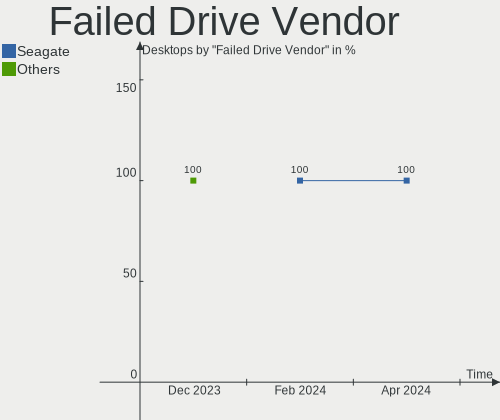
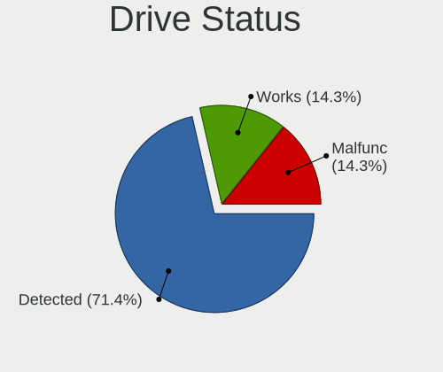
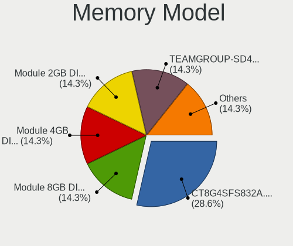

Xubuntu Hardware Trends (Desktop)
---------------------------------

A project to identify most popular hardware characteristics and track their change
over time based on data collected by Xubuntu users at https://Linux-Hardware.org.

Anyone can contribute to the study by uploading probes of their computers by
the [hw-probe](https://github.com/linuxhw/hw-probe) tool:

    sudo -E hw-probe -all -upload

Full-feature report is available here: https://linux-hardware.org/?view=trends&formfactor=desktop

Period: Mar, 2021.

Contents
--------

- [ OS                       ](#os)
- [ OS Family                ](#os-family)
- [ Kernel                   ](#kernel)
- [ Kernel Family            ](#kernel-family)
- [ Kernel Major Ver.        ](#kernel-major-ver)
- [ Arch                     ](#arch)
- [ DE                       ](#de)
- [ Display Server           ](#display-server)
- [ Display Manager          ](#display-manager)
- [ OS Lang                  ](#os-lang)
- [ Boot Mode                ](#boot-mode)
- [ Filesystem               ](#filesystem)
- [ Part. scheme             ](#part-scheme)
- [ Dual Boot with Linux/BSD ](#dual-boot-with-linux/bsd)
- [ Dual Boot (Win)          ](#dual-boot-win)
- [ Country                  ](#country)
- [ City                     ](#city)
- [ Vendor                   ](#vendor)
- [ Model                    ](#model)
- [ Model Family             ](#model-family)
- [ MFG Year                 ](#mfg-year)
- [ Form Factor              ](#form-factor)
- [ Secure Boot              ](#secure-boot)
- [ Coreboot                 ](#coreboot)
- [ RAM Size                 ](#ram-size)
- [ RAM Used                 ](#ram-used)
- [ Has CD-ROM               ](#has-cd-rom)
- [ Total Drives             ](#total-drives)
- [ Has Ethernet             ](#has-ethernet)
- [ Has WiFi                 ](#has-wifi)
- [ Has Bluetooth            ](#has-bluetooth)
- [ Drive Vendor             ](#drive-vendor)
- [ Drive Model              ](#drive-model)
- [ HDD Vendor               ](#hdd-vendor)
- [ SSD Vendor               ](#ssd-vendor)
- [ Drive Kind               ](#drive-kind)
- [ Drive Connector          ](#drive-connector)
- [ Drive Size               ](#drive-size)
- [ Space Total              ](#space-total)
- [ Space Used               ](#space-used)
- [ Malfunc. Drives          ](#malfunc-drives)
- [ Malfunc. Drive Vendor    ](#malfunc-drive-vendor)
- [ Malfunc. HDD Vendor      ](#malfunc-hdd-vendor)
- [ Malfunc. Drive Kind      ](#malfunc-drive-kind)
- [ Failed Drives            ](#failed-drives)
- [ Failed Drive Vendor      ](#failed-drive-vendor)
- [ Drive Status             ](#drive-status)
- [ Storage Vendor           ](#storage-vendor)
- [ Storage Model            ](#storage-model)
- [ Storage Kind             ](#storage-kind)
- [ CPU Vendor               ](#cpu-vendor)
- [ CPU Model                ](#cpu-model)
- [ CPU Model Family         ](#cpu-model-family)
- [ CPU Cores                ](#cpu-cores)
- [ CPU Sockets              ](#cpu-sockets)
- [ CPU Threads              ](#cpu-threads)
- [ CPU Op-Modes             ](#cpu-op-modes)
- [ CPU Microcode            ](#cpu-microcode)
- [ CPU Microarch            ](#cpu-microarch)
- [ GPU Vendor               ](#gpu-vendor)
- [ GPU Model                ](#gpu-model)
- [ GPU Combo                ](#gpu-combo)
- [ GPU Driver               ](#gpu-driver)
- [ GPU Memory               ](#gpu-memory)
- [ Monitor Vendor           ](#monitor-vendor)
- [ Monitor Model            ](#monitor-model)
- [ Monitor Resolution       ](#monitor-resolution)
- [ Monitor Diagonal         ](#monitor-diagonal)
- [ Monitor Width            ](#monitor-width)
- [ Aspect Ratio             ](#aspect-ratio)
- [ Monitor Area             ](#monitor-area)
- [ Pixel Density            ](#pixel-density)
- [ Multiple Monitors        ](#multiple-monitors)
- [ Net Controller Vendor    ](#net-controller-vendor)
- [ Net Controller Model     ](#net-controller-model)
- [ Wireless Vendor          ](#wireless-vendor)
- [ Wireless Model           ](#wireless-model)
- [ Ethernet Vendor          ](#ethernet-vendor)
- [ Ethernet Model           ](#ethernet-model)
- [ Net Controller Kind      ](#net-controller-kind)
- [ Used Controller          ](#used-controller)
- [ NICs                     ](#nics)
- [ IPv6                     ](#ipv6)
- [ Memory Vendor            ](#memory-vendor)
- [ Memory Model             ](#memory-model)
- [ Memory Kind              ](#memory-kind)
- [ Memory Form Factor       ](#memory-form-factor)
- [ Memory Size              ](#memory-size)
- [ Memory Speed             ](#memory-speed)
- [ Sound Vendor             ](#sound-vendor)
- [ Sound Model              ](#sound-model)
- [ Camera Vendor            ](#camera-vendor)
- [ Camera Model             ](#camera-model)
- [ Fingerprint Vendor       ](#fingerprint-vendor)
- [ Fingerprint Model        ](#fingerprint-model)
- [ Chipcard Vendor          ](#chipcard-vendor)
- [ Chipcard Model           ](#chipcard-model)
- [ Printer Vendor           ](#printer-vendor)
- [ Printer Model            ](#printer-model)
- [ Scanner Vendor           ](#scanner-vendor)
- [ Scanner Model            ](#scanner-model)
- [ Bluetooth Vendor         ](#bluetooth-vendor)
- [ Bluetooth Model          ](#bluetooth-model)
- [ Unsupported Devices      ](#unsupported-devices)
- [ Unsupported Device Types ](#unsupported-device-types)

OS
--

Installed operating systems

| Name          | Desktops | Percent |
|---------------|----------|---------|
| Xubuntu 20.04 | 43       | 70.49%  |
| Xubuntu 18.04 | 10       | 16.39%  |
| Xubuntu 20.10 | 7        | 11.48%  |
| Xubuntu 16.04 | 1        | 1.64%   |

OS Family
---------

OS without a version

| Name    | Desktops | Percent |
|---------|----------|---------|
| Xubuntu | 61       | 100%    |

Kernel
------

Version of the Linux kernel

| Version                    | Desktops | Percent |
|----------------------------|----------|---------|
| 5.4.0-66-generic           | 13       | 21.31%  |
| 5.8.0-44-generic           | 7        | 11.48%  |
| 5.4.0-66-lowlatency        | 6        | 9.84%   |
| 5.8.0-45-generic           | 5        | 8.2%    |
| 5.4.0-67-generic           | 5        | 8.2%    |
| 5.4.0-67-lowlatency        | 4        | 6.56%   |
| 5.4.0-65-generic           | 3        | 4.92%   |
| 5.8.0-45-lowlatency        | 2        | 3.28%   |
| 5.4.0-70-lowlatency        | 2        | 3.28%   |
| 5.4.0-70-generic           | 2        | 3.28%   |
| 5.9.16-050916-generic      | 1        | 1.64%   |
| 5.8.0-48-lowlatency        | 1        | 1.64%   |
| 5.8.0-43-generic           | 1        | 1.64%   |
| 5.4.0-58-generic           | 1        | 1.64%   |
| 5.11.6-xanmod1             | 1        | 1.64%   |
| 5.10.25-051025-generic     | 1        | 1.64%   |
| 5.0.0-050000rc8-lowlatency | 1        | 1.64%   |
| 4.4.0-203-generic          | 1        | 1.64%   |
| 4.15.0-99-generic          | 1        | 1.64%   |
| 4.15.0-139-generic         | 1        | 1.64%   |
| 4.15.0-136-generic         | 1        | 1.64%   |
| 4.15.0-135-generic         | 1        | 1.64%   |

Kernel Family
-------------

Linux kernel without a distro release

| Version | Desktops | Percent |
|---------|----------|---------|
| 5.4.0   | 36       | 59.02%  |
| 5.8.0   | 16       | 26.23%  |
| 4.15.0  | 4        | 6.56%   |
| 5.9.16  | 1        | 1.64%   |
| 5.11.6  | 1        | 1.64%   |
| 5.10.25 | 1        | 1.64%   |
| 5.0.0   | 1        | 1.64%   |
| 4.4.0   | 1        | 1.64%   |

Kernel Major Ver.
-----------------

Linux kernel major version

| Version | Desktops | Percent |
|---------|----------|---------|
| 5.4     | 36       | 59.02%  |
| 5.8     | 16       | 26.23%  |
| 4.15    | 4        | 6.56%   |
| 5.9     | 1        | 1.64%   |
| 5.11    | 1        | 1.64%   |
| 5.10    | 1        | 1.64%   |
| 5.0     | 1        | 1.64%   |
| 4.4     | 1        | 1.64%   |

Arch
----

OS architecture (x86_64, i586, etc.)

| Name   | Desktops | Percent |
|--------|----------|---------|
| x86_64 | 57       | 93.44%  |
| i686   | 4        | 6.56%   |

DE
--

Desktop Environment

| Name  | Desktops | Percent |
|-------|----------|---------|
| XFCE  | 60       | 98.36%  |
| GNOME | 1        | 1.64%   |

Display Server
--------------

X11 or Wayland

| Name | Desktops | Percent |
|------|----------|---------|
| X11  | 60       | 98.36%  |
| Tty  | 1        | 1.64%   |

Display Manager
---------------

SDDM, LightDM, etc.

| Name    | Desktops | Percent |
|---------|----------|---------|
| Unknown | 38       | 62.3%   |
| TDM     | 23       | 37.7%   |

OS Lang
-------

Language

| Lang  | Desktops | Percent |
|-------|----------|---------|
| en_US | 14       | 22.95%  |
| ru_RU | 10       | 16.39%  |
| fr_FR | 9        | 14.75%  |
| en_GB | 4        | 6.56%   |
| de_DE | 4        | 6.56%   |
| en_CA | 3        | 4.92%   |
| pt_BR | 2        | 3.28%   |
| pl_PL | 2        | 3.28%   |
| ja_JP | 2        | 3.28%   |
| it_IT | 2        | 3.28%   |
| cs_CZ | 2        | 3.28%   |
| uk_UA | 1        | 1.64%   |
| sk_SK | 1        | 1.64%   |
| ru_UA | 1        | 1.64%   |
| nl_BE | 1        | 1.64%   |
| fi_FI | 1        | 1.64%   |
| es_MX | 1        | 1.64%   |
| C     | 1        | 1.64%   |

Boot Mode
---------

EFI or BIOS

| Mode | Desktops | Percent |
|------|----------|---------|
| BIOS | 37       | 60.66%  |
| EFI  | 24       | 39.34%  |

Filesystem
----------

Type of filesystem

| Type    | Desktops | Percent |
|---------|----------|---------|
| Ext4    | 56       | 91.8%   |
| Btrfs   | 2        | 3.28%   |
| Zfs     | 1        | 1.64%   |
| Xfs     | 1        | 1.64%   |
| Overlay | 1        | 1.64%   |

Part. scheme
------------

Scheme of partitioning

| Type    | Desktops | Percent |
|---------|----------|---------|
| Unknown | 38       | 62.3%   |
| GPT     | 12       | 19.67%  |
| MBR     | 11       | 18.03%  |

Dual Boot with Linux/BSD
------------------------

Hosting more than one Linux/BSD

| Dual boot | Desktops | Percent |
|-----------|----------|---------|
| No        | 42       | 68.85%  |
| Yes       | 19       | 31.15%  |

Dual Boot (Win)
---------------

Hosting Linux and Windows

| Dual boot | Desktops | Percent |
|-----------|----------|---------|
| No        | 31       | 50.82%  |
| Yes       | 30       | 49.18%  |

Country
-------

Geographic location (country)

| Country     | Desktops | Percent |
|-------------|----------|---------|
| Russia      | 10       | 16.39%  |
| France      | 9        | 14.75%  |
| USA         | 8        | 13.11%  |
| UK          | 4        | 6.56%   |
| Ukraine     | 3        | 4.92%   |
| Japan       | 3        | 4.92%   |
| Germany     | 3        | 4.92%   |
| Canada      | 3        | 4.92%   |
| Poland      | 2        | 3.28%   |
| Italy       | 2        | 3.28%   |
| Czechia     | 2        | 3.28%   |
| Brazil      | 2        | 3.28%   |
| Thailand    | 1        | 1.64%   |
| Sweden      | 1        | 1.64%   |
| Slovakia    | 1        | 1.64%   |
| Romania     | 1        | 1.64%   |
| Netherlands | 1        | 1.64%   |
| Mexico      | 1        | 1.64%   |
| Finland     | 1        | 1.64%   |
| Bulgaria    | 1        | 1.64%   |
| Bolivia     | 1        | 1.64%   |
| Belgium     | 1        | 1.64%   |

City
----

Geographic location (city)

| City                  | Desktops | Percent |
|-----------------------|----------|---------|
| Toulon                | 2        | 3.28%   |
| Rostov-on-Don         | 2        | 3.28%   |
| Ōtsu                 | 1        | 1.64%   |
| Zawiercie             | 1        | 1.64%   |
| Wilmington            | 1        | 1.64%   |
| Voronezh              | 1        | 1.64%   |
| Veliko Tarnovo        | 1        | 1.64%   |
| Unna                  | 1        | 1.64%   |
| Tsukuba               | 1        | 1.64%   |
| Tourouvre             | 1        | 1.64%   |
| Tomsk                 | 1        | 1.64%   |
| Temryuk               | 1        | 1.64%   |
| São Carlos           | 1        | 1.64%   |
| Spruce Grove          | 1        | 1.64%   |
| Springfield           | 1        | 1.64%   |
| San Diego             | 1        | 1.64%   |
| Salvador              | 1        | 1.64%   |
| Saint-Martin-d'Hères | 1        | 1.64%   |
| Ryazan                | 1        | 1.64%   |
| Reda                  | 1        | 1.64%   |
| Pottstown             | 1        | 1.64%   |
| Perpignan             | 1        | 1.64%   |
| Pau                   | 1        | 1.64%   |
| Oshawa                | 1        | 1.64%   |
| Orléans              | 1        | 1.64%   |
| Odessa                | 1        | 1.64%   |
| Novosibirsk           | 1        | 1.64%   |
| Novocherkassk         | 1        | 1.64%   |
| Norden                | 1        | 1.64%   |
| Moscow                | 1        | 1.64%   |
| Moose Jaw             | 1        | 1.64%   |
| Montaldo di Mondovi   | 1        | 1.64%   |
| Modesto               | 1        | 1.64%   |
| Mexico City           | 1        | 1.64%   |
| Meurchin              | 1        | 1.64%   |
| Mariupol              | 1        | 1.64%   |
| Manchester            | 1        | 1.64%   |
| Lovosice              | 1        | 1.64%   |
| Littlehampton         | 1        | 1.64%   |
| Le Vigan              | 1        | 1.64%   |
| La Paz                | 1        | 1.64%   |
| Kyiv                  | 1        | 1.64%   |
| Kortrijk              | 1        | 1.64%   |
| Jugenheim             | 1        | 1.64%   |
| Izhevsk               | 1        | 1.64%   |
| Helsinki              | 1        | 1.64%   |
| Helsingborg           | 1        | 1.64%   |
| Hayes                 | 1        | 1.64%   |
| Dallas                | 1        | 1.64%   |
| Cranston              | 1        | 1.64%   |
| Chicago               | 1        | 1.64%   |
| Chainat               | 1        | 1.64%   |
| Campogalliano         | 1        | 1.64%   |
| Bucharest             | 1        | 1.64%   |
| Brno                  | 1        | 1.64%   |
| Bratislava            | 1        | 1.64%   |
| Bolton                | 1        | 1.64%   |
| Azumino               | 1        | 1.64%   |
| Almelo                | 1        | 1.64%   |

Vendor
------

Motherboard manufacturer

| Name                | Desktops | Percent |
|---------------------|----------|---------|
| Gigabyte Technology | 11       | 18.03%  |
| ASUSTek Computer    | 11       | 18.03%  |
| Hewlett-Packard     | 8        | 13.11%  |
| ASRock              | 8        | 13.11%  |
| MSI                 | 7        | 11.48%  |
| Foxconn             | 3        | 4.92%   |
| Lenovo              | 2        | 3.28%   |
| Intel               | 2        | 3.28%   |
| Dell                | 2        | 3.28%   |
| Medion              | 1        | 1.64%   |
| Huanan              | 1        | 1.64%   |
| Fujitsu             | 1        | 1.64%   |
| eMachines           | 1        | 1.64%   |
| ECS                 | 1        | 1.64%   |
| Acer                | 1        | 1.64%   |
| AAEON               | 1        | 1.64%   |

Model
-----

Motherboard model

| Name                               | Desktops | Percent |
|------------------------------------|----------|---------|
| HP Compaq Pro 6300 SFF             | 2        | 3.28%   |
| MSI MS-7C84                        | 1        | 1.64%   |
| MSI MS-7C37                        | 1        | 1.64%   |
| MSI MS-7C13                        | 1        | 1.64%   |
| MSI MS-7B89                        | 1        | 1.64%   |
| MSI MS-7816                        | 1        | 1.64%   |
| MSI MS-7721                        | 1        | 1.64%   |
| MSI KM400-8235                     | 1        | 1.64%   |
| Medion Akoya P2120 D MD8836/2452   | 1        | 1.64%   |
| Lenovo ThinkCentre M91p 4518A13    | 1        | 1.64%   |
| Lenovo ThinkCentre A70 7844H9G     | 1        | 1.64%   |
| Intel X99                          | 1        | 1.64%   |
| Intel DG965MQ AAD37419-302         | 1        | 1.64%   |
| Huanan Thurley                     | 1        | 1.64%   |
| HP Z440 Workstation                | 1        | 1.64%   |
| HP t620 Quad Core TC               | 1        | 1.64%   |
| HP ProDesk 600 G1 SFF              | 1        | 1.64%   |
| HP Compaq dc7900 Small Form Factor | 1        | 1.64%   |
| HP Compaq 8000 Elite SFF PC        | 1        | 1.64%   |
| HP 500-311nf                       | 1        | 1.64%   |
| Gigabyte Z97X-Gaming 5             | 1        | 1.64%   |
| Gigabyte Z97X-Gaming 3             | 1        | 1.64%   |
| Gigabyte X570 AORUS ELITE WIFI     | 1        | 1.64%   |
| Gigabyte X470 AORUS ULTRA GAMING   | 1        | 1.64%   |
| Gigabyte M61PME-S2P                | 1        | 1.64%   |
| Gigabyte F2A78M-HD2                | 1        | 1.64%   |
| Gigabyte B450M S2H                 | 1        | 1.64%   |
| Gigabyte B450M DS3H                | 1        | 1.64%   |
| Gigabyte A320M-H                   | 1        | 1.64%   |
| Gigabyte 970-GAMING                | 1        | 1.64%   |
| Gigabyte 945GZM-S2                 | 1        | 1.64%   |
| Fujitsu ESPRIMO P400               | 1        | 1.64%   |
| Foxconn nT-i1000 Series            | 1        | 1.64%   |
| Foxconn G31MXP FAB:1.1             | 1        | 1.64%   |
| Foxconn 500-023w                   | 1        | 1.64%   |
| eMachines EL1850                   | 1        | 1.64%   |
| ECS Aquilon O126                   | 1        | 1.64%   |
| Dell OptiPlex 755                  | 1        | 1.64%   |
| Dell OptiPlex 360                  | 1        | 1.64%   |
| ASUS TUF B450M-PLUS GAMING         | 1        | 1.64%   |
| ASUS PRIME H310M-D R2.0            | 1        | 1.64%   |
| ASUS PRIME A320M-K                 | 1        | 1.64%   |
| ASUS P8Z68 DELUXE                  | 1        | 1.64%   |
| ASUS P8H61                         | 1        | 1.64%   |
| ASUS P5KPL-AM/PS                   | 1        | 1.64%   |
| ASUS P5KC                          | 1        | 1.64%   |
| ASUS P5K Premium                   | 1        | 1.64%   |
| ASUS M4A78 PRO                     | 1        | 1.64%   |
| ASUS M2N68-AM Plus                 | 1        | 1.64%   |
| ASUS A68HM-K                       | 1        | 1.64%   |
| ASRock X300M-STX                   | 1        | 1.64%   |
| ASRock K10N78D                     | 1        | 1.64%   |
| ASRock FM2A88X-ITX+                | 1        | 1.64%   |
| ASRock FM2A68M-HD+                 | 1        | 1.64%   |
| ASRock B450 Pro4                   | 1        | 1.64%   |
| ASRock ALiveNF6G-GLAN              | 1        | 1.64%   |
| ASRock AB350M Pro4 R2.0            | 1        | 1.64%   |
| ASRock A320M-HDV R3.0              | 1        | 1.64%   |
| Acer C-AXC-780                     | 1        | 1.64%   |
| AAEON GENE-APL5                    | 1        | 1.64%   |

Model Family
------------

Motherboard model prefix

| Name                  | Desktops | Percent |
|-----------------------|----------|---------|
| HP Compaq             | 4        | 6.56%   |
| Lenovo ThinkCentre    | 2        | 3.28%   |
| Gigabyte Z97X-Gaming  | 2        | 3.28%   |
| Gigabyte B450M        | 2        | 3.28%   |
| Dell OptiPlex         | 2        | 3.28%   |
| ASUS PRIME            | 2        | 3.28%   |
| MSI MS-7C84           | 1        | 1.64%   |
| MSI MS-7C37           | 1        | 1.64%   |
| MSI MS-7C13           | 1        | 1.64%   |
| MSI MS-7B89           | 1        | 1.64%   |
| MSI MS-7816           | 1        | 1.64%   |
| MSI MS-7721           | 1        | 1.64%   |
| MSI KM400-8235        | 1        | 1.64%   |
| Medion Akoya          | 1        | 1.64%   |
| Intel X99             | 1        | 1.64%   |
| Intel DG965MQ         | 1        | 1.64%   |
| Huanan Thurley        | 1        | 1.64%   |
| HP Z440               | 1        | 1.64%   |
| HP t620               | 1        | 1.64%   |
| HP ProDesk            | 1        | 1.64%   |
| HP 500-311nf          | 1        | 1.64%   |
| Gigabyte X570         | 1        | 1.64%   |
| Gigabyte X470         | 1        | 1.64%   |
| Gigabyte M61PME-S2P   | 1        | 1.64%   |
| Gigabyte F2A78M-HD2   | 1        | 1.64%   |
| Gigabyte A320M-H      | 1        | 1.64%   |
| Gigabyte 970-GAMING   | 1        | 1.64%   |
| Gigabyte 945GZM-S2    | 1        | 1.64%   |
| Fujitsu ESPRIMO       | 1        | 1.64%   |
| Foxconn nT-i1000      | 1        | 1.64%   |
| Foxconn G31MXP        | 1        | 1.64%   |
| Foxconn 500-023w      | 1        | 1.64%   |
| eMachines EL1850      | 1        | 1.64%   |
| ECS Aquilon           | 1        | 1.64%   |
| ASUS TUF              | 1        | 1.64%   |
| ASUS P8Z68            | 1        | 1.64%   |
| ASUS P8H61            | 1        | 1.64%   |
| ASUS P5KPL-AM         | 1        | 1.64%   |
| ASUS P5KC             | 1        | 1.64%   |
| ASUS P5K              | 1        | 1.64%   |
| ASUS M4A78            | 1        | 1.64%   |
| ASUS M2N68-AM         | 1        | 1.64%   |
| ASUS A68HM-K          | 1        | 1.64%   |
| ASRock X300M-STX      | 1        | 1.64%   |
| ASRock K10N78D        | 1        | 1.64%   |
| ASRock FM2A88X-ITX+   | 1        | 1.64%   |
| ASRock FM2A68M-HD+    | 1        | 1.64%   |
| ASRock B450           | 1        | 1.64%   |
| ASRock ALiveNF6G-GLAN | 1        | 1.64%   |
| ASRock AB350M         | 1        | 1.64%   |
| ASRock A320M-HDV      | 1        | 1.64%   |
| Acer C-AXC-780        | 1        | 1.64%   |
| AAEON GENE-APL5       | 1        | 1.64%   |

MFG Year
--------

Motherboard manufacture year

| Year | Desktops | Percent |
|------|----------|---------|
| 2020 | 14       | 22.95%  |
| 2019 | 7        | 11.48%  |
| 2015 | 6        | 9.84%   |
| 2014 | 5        | 8.2%    |
| 2010 | 5        | 8.2%    |
| 2008 | 5        | 8.2%    |
| 2012 | 4        | 6.56%   |
| 2011 | 3        | 4.92%   |
| 2021 | 2        | 3.28%   |
| 2018 | 2        | 3.28%   |
| 2016 | 2        | 3.28%   |
| 2009 | 2        | 3.28%   |
| 2013 | 1        | 1.64%   |
| 2007 | 1        | 1.64%   |
| 2006 | 1        | 1.64%   |
| 2005 | 1        | 1.64%   |

Form Factor
-----------

Physical design of the computer

| Name    | Desktops | Percent |
|---------|----------|---------|
| Desktop | 61       | 100%    |

Secure Boot
-----------

Enabled or disabled

| State    | Desktops | Percent |
|----------|----------|---------|
| Disabled | 60       | 98.36%  |
| Enabled  | 1        | 1.64%   |

Coreboot
--------

Have coreboot on board

| Used | Desktops | Percent |
|------|----------|---------|
| No   | 61       | 100%    |

RAM Size
--------

Total RAM memory

| Size in GB | Desktops | Percent |
|------------|----------|---------|
| 3.01-4.0   | 14       | 22.95%  |
| 16.01-24.0 | 12       | 19.67%  |
| 8.01-16.0  | 10       | 16.39%  |
| 1.01-2.0   | 8        | 13.11%  |
| 4.01-8.0   | 7        | 11.48%  |
| 32.01-64.0 | 7        | 11.48%  |
| 24.01-32.0 | 2        | 3.28%   |
| 0.51-1.0   | 1        | 1.64%   |

RAM Used
--------

Used RAM memory

| Used GB   | Desktops | Percent |
|-----------|----------|---------|
| 1.01-2.0  | 29       | 47.54%  |
| 0.51-1.0  | 11       | 18.03%  |
| 4.01-8.0  | 9        | 14.75%  |
| 2.01-3.0  | 5        | 8.2%    |
| 8.01-16.0 | 4        | 6.56%   |
| 3.01-4.0  | 3        | 4.92%   |

Has CD-ROM
----------

Has CD-ROM on board

| Presented | Desktops | Percent |
|-----------|----------|---------|
| Yes       | 32       | 52.46%  |
| No        | 29       | 47.54%  |

Total Drives
------------

Number of drives on board

| Drives | Desktops | Percent |
|--------|----------|---------|
| 2      | 25       | 40.98%  |
| 1      | 17       | 27.87%  |
| 3      | 8        | 13.11%  |
| 4      | 7        | 11.48%  |
| 7      | 1        | 1.64%   |
| 6      | 1        | 1.64%   |
| 5      | 1        | 1.64%   |
| 0      | 1        | 1.64%   |

Has Ethernet
------------

Has Ethernet on board

| Presented | Desktops | Percent |
|-----------|----------|---------|
| Yes       | 59       | 96.72%  |
| No        | 2        | 3.28%   |

Has WiFi
--------

Has WiFi module

| Presented | Desktops | Percent |
|-----------|----------|---------|
| No        | 34       | 55.74%  |
| Yes       | 27       | 44.26%  |

Has Bluetooth
-------------

Has Bluetooth module

| Presented | Desktops | Percent |
|-----------|----------|---------|
| No        | 51       | 83.61%  |
| Yes       | 10       | 16.39%  |

Drive Vendor
------------

Hard drive vendors

| Vendor                | Desktops | Drives | Percent |
|-----------------------|----------|--------|---------|
| WDC                   | 28       | 36     | 23.33%  |
| Seagate               | 22       | 30     | 18.33%  |
| Samsung Electronics   | 15       | 15     | 12.5%   |
| Hitachi               | 7        | 8      | 5.83%   |
| Toshiba               | 4        | 6      | 3.33%   |
| SanDisk               | 4        | 4      | 3.33%   |
| Kingston              | 4        | 4      | 3.33%   |
| A-DATA Technology     | 4        | 5      | 3.33%   |
| Crucial               | 3        | 3      | 2.5%    |
| TO Exter              | 2        | 2      | 1.67%   |
| SPCC                  | 2        | 2      | 1.67%   |
| Patriot               | 2        | 2      | 1.67%   |
| Maxtor                | 2        | 2      | 1.67%   |
| XPG                   | 1        | 1      | 0.83%   |
| Unknown               | 1        | 1      | 0.83%   |
| Transcend             | 1        | 1      | 0.83%   |
| Realtek Semiconductor | 1        | 1      | 0.83%   |
| Q7                    | 1        | 1      | 0.83%   |
| PNY                   | 1        | 1      | 0.83%   |
| Phison                | 1        | 1      | 0.83%   |
| PCCOOLER              | 1        | 1      | 0.83%   |
| OCZ                   | 1        | 1      | 0.83%   |
| Lexar                 | 1        | 1      | 0.83%   |
| LDLC                  | 1        | 1      | 0.83%   |
| LaCie                 | 1        | 1      | 0.83%   |
| KIOXIA-EXCERIA        | 1        | 1      | 0.83%   |
| KingFast              | 1        | 1      | 0.83%   |
| Intenso               | 1        | 1      | 0.83%   |
| HGST                  | 1        | 1      | 0.83%   |
| Gigabyte Technology   | 1        | 1      | 0.83%   |
| Fujitsu               | 1        | 1      | 0.83%   |
| ExcelStor             | 1        | 1      | 0.83%   |
| China                 | 1        | 1      | 0.83%   |
| Apacer                | 1        | 1      | 0.83%   |

Drive Model
-----------

Hard drive models

| Model                               | Desktops | Percent |
|-------------------------------------|----------|---------|
| WDC WD10EZEX-08WN4A0 1TB            | 3        | 2.17%   |
| Seagate ST1000DM010-2EP102 1TB      | 3        | 2.17%   |
| WDC WD10EZEX-00RKKA0 1TB            | 2        | 1.45%   |
| TO Exter nal USB 3.0 2TB            | 2        | 1.45%   |
| Seagate ST8000DM004-2CX188 8TB      | 2        | 1.45%   |
| Seagate ST500DM002-1SB10A 500GB     | 2        | 1.45%   |
| Seagate ST3500418AS 500GB           | 2        | 1.45%   |
| Seagate ST3320620AS 320GB           | 2        | 1.45%   |
| Seagate ST3250310AS 250GB           | 2        | 1.45%   |
| Seagate ST2000DM001-1ER164 2TB      | 2        | 1.45%   |
| Samsung SSD 970 EVO Plus 250GB      | 2        | 1.45%   |
| Samsung SSD 860 EVO 500GB           | 2        | 1.45%   |
| Samsung SSD 860 EVO 250GB           | 2        | 1.45%   |
| Crucial CT480BX500SSD1 480GB        | 2        | 1.45%   |
| A-DATA SU630 240GB SSD              | 2        | 1.45%   |
| XPG NVMe SSD Drive 2TB              | 1        | 0.72%   |
| WDC WDS500G3X0C-00SJG0 500GB        | 1        | 0.72%   |
| WDC WDS250G2B0C-00PXH0 250GB        | 1        | 0.72%   |
| WDC WDS240G2G0A-00JH30 240GB SSD    | 1        | 0.72%   |
| WDC WDS120G2G0B-00EPW0 120GB SSD    | 1        | 0.72%   |
| WDC WD800JD-75JNA0 80GB             | 1        | 0.72%   |
| WDC WD6400AAKS-22A7B2 640GB         | 1        | 0.72%   |
| WDC WD5003AZEX-00K1GA0 500GB        | 1        | 0.72%   |
| WDC WD5000AZLX-00JKKA0 500GB        | 1        | 0.72%   |
| WDC WD3201ABYS-01B9A0 320GB         | 1        | 0.72%   |
| WDC WD30EZRX-00SPEB0 3TB            | 1        | 0.72%   |
| WDC WD30EZRX-00MMMB0 3TB            | 1        | 0.72%   |
| WDC WD2500JS-40T                    | 1        | 0.72%   |
| WDC WD2500AAKX-073CA1 250GB         | 1        | 0.72%   |
| WDC WD20EZRX-00DC0B0 2TB            | 1        | 0.72%   |
| WDC WD20EURX-63T0FY0 2TB            | 1        | 0.72%   |
| WDC WD20EARX-00PASB0 2TB            | 1        | 0.72%   |
| WDC WD20EARS-00MVWB0 2TB            | 1        | 0.72%   |
| WDC WD2003FZEX-00SRLA0 2TB          | 1        | 0.72%   |
| WDC WD1600JS-00MHB0 160GB           | 1        | 0.72%   |
| WDC WD1600JB-22GVA0 160GB           | 1        | 0.72%   |
| WDC WD10PURZ-85U8XY0 1TB            | 1        | 0.72%   |
| WDC WD10EZRX-00A8LB0 1TB            | 1        | 0.72%   |
| WDC WD10EZEX-00MFCA0 1TB            | 1        | 0.72%   |
| WDC WD10EFRX-68PJCN0 1TB            | 1        | 0.72%   |
| WDC WD10EFRX-68JCSN0 1TB            | 1        | 0.72%   |
| WDC WD10EFRX-68FYTN0 1TB            | 1        | 0.72%   |
| WDC WD10EAVS-22D7B0 1TB             | 1        | 0.72%   |
| WDC WD10EARX-32N0YB0 1TB            | 1        | 0.72%   |
| WDC WD1003FZEX-00MK2A0 1TB          | 1        | 0.72%   |
| WDC WD1003FBYX-18Y7B0 1TB           | 1        | 0.72%   |
| Unknown SD/MMC/MS PRO 128GB         | 1        | 0.72%   |
| Transcend TS32GMSA370 32GB SSD      | 1        | 0.72%   |
| Toshiba MQ04ABD200 2TB              | 1        | 0.72%   |
| Toshiba MQ01ABD100 1TB              | 1        | 0.72%   |
| Toshiba MK7575GSX 752GB             | 1        | 0.72%   |
| Toshiba MK3263GSX 320GB             | 1        | 0.72%   |
| Toshiba HDWE140 4TB                 | 1        | 0.72%   |
| Toshiba HDWD130 3TB                 | 1        | 0.72%   |
| SPCC Solid State DiskB28 128GB      | 1        | 0.72%   |
| SPCC Solid State Disk 240GB         | 1        | 0.72%   |
| Seagate ST940210AS 40GB             | 1        | 0.72%   |
| Seagate ST9120822AS 120GB           | 1        | 0.72%   |
| Seagate ST8000NM0105 8TB            | 1        | 0.72%   |
| Seagate ST750LM022 HN-M750MBB 752GB | 1        | 0.72%   |

HDD Vendor
----------

Hard disk drive vendors

| Vendor              | Desktops | Drives | Percent |
|---------------------|----------|--------|---------|
| WDC                 | 25       | 32     | 35.21%  |
| Seagate             | 22       | 30     | 30.99%  |
| Hitachi             | 7        | 8      | 9.86%   |
| Samsung Electronics | 5        | 5      | 7.04%   |
| Toshiba             | 4        | 6      | 5.63%   |
| TO Exter            | 2        | 2      | 2.82%   |
| Maxtor              | 2        | 2      | 2.82%   |
| LaCie               | 1        | 1      | 1.41%   |
| HGST                | 1        | 1      | 1.41%   |
| Fujitsu             | 1        | 1      | 1.41%   |
| ExcelStor           | 1        | 1      | 1.41%   |

SSD Vendor
----------

Solid state drive vendors

| Vendor              | Desktops | Drives | Percent |
|---------------------|----------|--------|---------|
| Samsung Electronics | 7        | 7      | 20.59%  |
| Kingston            | 4        | 4      | 11.76%  |
| A-DATA Technology   | 4        | 4      | 11.76%  |
| SanDisk             | 3        | 3      | 8.82%   |
| Crucial             | 3        | 3      | 8.82%   |
| WDC                 | 2        | 2      | 5.88%   |
| SPCC                | 2        | 2      | 5.88%   |
| Patriot             | 2        | 2      | 5.88%   |
| Transcend           | 1        | 1      | 2.94%   |
| PNY                 | 1        | 1      | 2.94%   |
| OCZ                 | 1        | 1      | 2.94%   |
| Lexar               | 1        | 1      | 2.94%   |
| KIOXIA-EXCERIA      | 1        | 1      | 2.94%   |
| China               | 1        | 1      | 2.94%   |
| Apacer              | 1        | 1      | 2.94%   |

Drive Kind
----------

HDD or SSD

| Kind    | Desktops | Drives | Percent |
|---------|----------|--------|---------|
| HDD     | 48       | 89     | 51.06%  |
| SSD     | 31       | 34     | 32.98%  |
| NVMe    | 9        | 11     | 9.57%   |
| Unknown | 6        | 6      | 6.38%   |

Drive Connector
---------------

SATA, SAS, NVMe, etc.

| Type | Desktops | Drives | Percent |
|------|----------|--------|---------|
| SATA | 57       | 124    | 80.28%  |
| NVMe | 9        | 11     | 12.68%  |
| SAS  | 5        | 5      | 7.04%   |

Drive Size
----------

Size of hard drive

| Size in TB | Desktops | Drives | Percent |
|------------|----------|--------|---------|
| 0.01-0.5   | 45       | 73     | 52.33%  |
| 0.51-1.0   | 23       | 28     | 26.74%  |
| 1.01-2.0   | 13       | 14     | 15.12%  |
| 2.01-3.0   | 2        | 3      | 2.33%   |
| 4.01-10.0  | 2        | 4      | 2.33%   |
| 3.01-4.0   | 1        | 1      | 1.16%   |

Space Total
-----------

Amount of disk space available on the file system

| Size in GB     | Desktops | Percent |
|----------------|----------|---------|
| 101-250        | 25       | 40.98%  |
| 501-1000       | 10       | 16.39%  |
| 1001-2000      | 8        | 13.11%  |
| 251-500        | 7        | 11.48%  |
| 2001-3000      | 4        | 6.56%   |
| 51-100         | 3        | 4.92%   |
| 21-50          | 2        | 3.28%   |
| More than 3000 | 1        | 1.64%   |
| 1-20           | 1        | 1.64%   |

Space Used
----------

Amount of used disk space

| Used GB        | Desktops | Percent |
|----------------|----------|---------|
| 1-20           | 17       | 27.87%  |
| 21-50          | 14       | 22.95%  |
| 101-250        | 9        | 14.75%  |
| 501-1000       | 8        | 13.11%  |
| 51-100         | 7        | 11.48%  |
| 1001-2000      | 3        | 4.92%   |
| 251-500        | 2        | 3.28%   |
| More than 3000 | 1        | 1.64%   |

Malfunc. Drives
---------------

Drive models with a malfunction

| Model                          | Desktops | Drives | Percent |
|--------------------------------|----------|--------|---------|
| WDC WD6400AAKS-22A7B2 640GB    | 1        | 1      | 11.11%  |
| WDC WD10EZRX-00A8LB0 1TB       | 1        | 1      | 11.11%  |
| WDC WD10EZEX-00RKKA0 1TB       | 1        | 1      | 11.11%  |
| WDC WD10EFRX-68PJCN0 1TB       | 1        | 1      | 11.11%  |
| WDC WD10EFRX-68JCSN0 1TB       | 1        | 1      | 11.11%  |
| WDC WD10EAVS-22D7B0 1TB        | 1        | 1      | 11.11%  |
| Toshiba MK3263GSX 320GB        | 1        | 1      | 11.11%  |
| Toshiba HDWE140 4TB            | 1        | 1      | 11.11%  |
| SPCC Solid State DiskB28 128GB | 1        | 1      | 11.11%  |

Malfunc. Drive Vendor
---------------------

Vendors of faulty drives

| Vendor  | Desktops | Drives | Percent |
|---------|----------|--------|---------|
| WDC     | 6        | 6      | 66.67%  |
| Toshiba | 2        | 2      | 22.22%  |
| SPCC    | 1        | 1      | 11.11%  |

Malfunc. HDD Vendor
-------------------

Vendors of faulty HDD drives

| Vendor  | Desktops | Drives | Percent |
|---------|----------|--------|---------|
| WDC     | 6        | 6      | 75%     |
| Toshiba | 2        | 2      | 25%     |

Malfunc. Drive Kind
-------------------

Kinds of faulty drives

| Kind | Desktops | Drives | Percent |
|------|----------|--------|---------|
| HDD  | 7        | 8      | 87.5%   |
| SSD  | 1        | 1      | 12.5%   |

Failed Drives
-------------

Failed drive models

| Model                            | Desktops | Drives | Percent |
|----------------------------------|----------|--------|---------|
| Seagate ST500DM002-1BC142 500GB  | 1        | 1      | 50%     |
| A-DATA Technology SP800 32GB SSD | 1        | 1      | 50%     |

Failed Drive Vendor
-------------------

Failed drive vendors

| Vendor            | Desktops | Drives | Percent |
|-------------------|----------|--------|---------|
| Seagate           | 1        | 1      | 50%     |
| A-DATA Technology | 1        | 1      | 50%     |

Drive Status
------------

Number of failed and malfunc. drives

| Status   | Desktops | Drives | Percent |
|----------|----------|--------|---------|
| Detected | 38       | 83     | 53.52%  |
| Works    | 23       | 46     | 32.39%  |
| Malfunc  | 8        | 9      | 11.27%  |
| Failed   | 2        | 2      | 2.82%   |

Storage Vendor
--------------

Storage controller vendors

| Vendor                   | Desktops | Percent |
|--------------------------|----------|---------|
| Intel                    | 32       | 40%     |
| AMD                      | 23       | 28.75%  |
| Nvidia                   | 4        | 5%      |
| Sandisk                  | 3        | 3.75%   |
| Samsung Electronics      | 3        | 3.75%   |
| JMicron Technology       | 3        | 3.75%   |
| ASMedia Technology       | 3        | 3.75%   |
| Realtek Semiconductor    | 2        | 2.5%    |
| Phison Electronics       | 2        | 2.5%    |
| Marvell Technology Group | 2        | 2.5%    |
| VIA Technologies         | 1        | 1.25%   |
| Silicon Image            | 1        | 1.25%   |
| ADATA Technology         | 1        | 1.25%   |

Storage Model
-------------

Storage controller models

| Model                                                                                   | Desktops | Percent |
|-----------------------------------------------------------------------------------------|----------|---------|
| AMD FCH SATA Controller [AHCI mode]                                                     | 20       | 18.52%  |
| Intel NM10/ICH7 Family SATA Controller [IDE mode]                                       | 6        | 5.56%   |
| AMD 400 Series Chipset SATA Controller                                                  | 6        | 5.56%   |
| Intel 82801G (ICH7 Family) IDE Controller                                               | 5        | 4.63%   |
| Intel 6 Series/C200 Series Chipset Family 6 port Desktop SATA AHCI Controller           | 4        | 3.7%    |
| Nvidia MCP61 SATA Controller                                                            | 3        | 2.78%   |
| Nvidia MCP61 IDE                                                                        | 3        | 2.78%   |
| Intel 9 Series Chipset Family SATA Controller [AHCI Mode]                               | 3        | 2.78%   |
| ASMedia ASM1062 Serial ATA Controller                                                   | 3        | 2.78%   |
| AMD FCH SATA Controller D                                                               | 3        | 2.78%   |
| Sandisk WD Blue SN550 NVMe SSD                                                          | 2        | 1.85%   |
| Samsung NVMe SSD Controller SM981/PM981/PM983                                           | 2        | 1.85%   |
| Realtek Realtek Non-Volatile memory controller                                          | 2        | 1.85%   |
| JMicron JMB363 SATA/IDE Controller                                                      | 2        | 1.85%   |
| Intel Q170/Q150/B150/H170/H110/Z170/CM236 Chipset SATA Controller [AHCI Mode]           | 2        | 1.85%   |
| Intel 82801IR/IO/IH (ICH9R/DO/DH) 6 port SATA Controller [AHCI mode]                    | 2        | 1.85%   |
| Intel 7 Series/C210 Series Chipset Family 6-port SATA Controller [AHCI mode]            | 2        | 1.85%   |
| Intel 4 Series Chipset PT IDER Controller                                               | 2        | 1.85%   |
| Intel 200 Series PCH SATA controller [AHCI mode]                                        | 2        | 1.85%   |
| VIA VT82C586A/B/VT82C686/A/B/VT823x/A/C PIPC Bus Master IDE                             | 1        | 0.93%   |
| Silicon Image SiI 3114 [SATALink/SATARaid] Serial ATA Controller                        | 1        | 0.93%   |
| Sandisk WD Black 2018/SN750 / PC SN720 NVMe SSD                                         | 1        | 0.93%   |
| Samsung NVMe SSD Controller SM961/PM961/SM963                                           | 1        | 0.93%   |
| Phison PS5013 E13 NVMe Controller                                                       | 1        | 0.93%   |
| Phison E12 NVMe Controller                                                              | 1        | 0.93%   |
| Nvidia MCP78S [GeForce 8200] SATA Controller (non-AHCI mode)                            | 1        | 0.93%   |
| Nvidia MCP78S [GeForce 8200] IDE                                                        | 1        | 0.93%   |
| Marvell Group 88SE9128 PCIe SATA 6 Gb/s RAID controller with HyperDuo                   | 1        | 0.93%   |
| Marvell Group 88SE6101/6102 single-port PATA133 interface                               | 1        | 0.93%   |
| JMicron JMB362 SATA Controller                                                          | 1        | 0.93%   |
| Intel SATA Controller [RAID mode]                                                       | 1        | 0.93%   |
| Intel NM10/ICH7 Family SATA Controller [AHCI mode]                                      | 1        | 0.93%   |
| Intel Celeron N3350/Pentium N4200/Atom E3900 Series SATA AHCI Controller                | 1        | 0.93%   |
| Intel C610/X99 series chipset sSATA Controller [RAID mode]                              | 1        | 0.93%   |
| Intel C610/X99 series chipset 6-Port SATA Controller [AHCI mode]                        | 1        | 0.93%   |
| Intel C600/X79 series chipset SATA RAID Controller                                      | 1        | 0.93%   |
| Intel 82Q35 Express PT IDER Controller                                                  | 1        | 0.93%   |
| Intel 82801JI (ICH10 Family) 4 port SATA IDE Controller #1                              | 1        | 0.93%   |
| Intel 82801JI (ICH10 Family) 2 port SATA IDE Controller #2                              | 1        | 0.93%   |
| Intel 82801JD/DO (ICH10 Family) SATA AHCI Controller                                    | 1        | 0.93%   |
| Intel 82801JD/DO (ICH10 Family) 4-port SATA IDE Controller                              | 1        | 0.93%   |
| Intel 82801JD/DO (ICH10 Family) 2-port SATA IDE Controller                              | 1        | 0.93%   |
| Intel 82801IB (ICH9) 2 port SATA Controller [IDE mode]                                  | 1        | 0.93%   |
| Intel 82801I (ICH9 Family) 2 port SATA Controller [IDE mode]                            | 1        | 0.93%   |
| Intel 8 Series/C220 Series Chipset Family 6-port SATA Controller 1 [AHCI mode]          | 1        | 0.93%   |
| Intel 6 Series/C200 Series Chipset Family Desktop SATA Controller (IDE mode, ports 4-5) | 1        | 0.93%   |
| Intel 6 Series/C200 Series Chipset Family Desktop SATA Controller (IDE mode, ports 0-3) | 1        | 0.93%   |
| AMD SB7x0/SB8x0/SB9x0 SATA Controller [IDE mode]                                        | 1        | 0.93%   |
| AMD SB7x0/SB8x0/SB9x0 SATA Controller [AHCI mode]                                       | 1        | 0.93%   |
| AMD SB7x0/SB8x0/SB9x0 IDE Controller                                                    | 1        | 0.93%   |
| AMD FCH IDE Controller                                                                  | 1        | 0.93%   |
| AMD 300 Series Chipset SATA Controller                                                  | 1        | 0.93%   |
| ADATA XPG SX8200 Pro PCIe Gen3x4 M.2 2280 Solid State Drive                             | 1        | 0.93%   |

Storage Kind
------------

Kind of storage controller (IDE, SATA, NVMe, SAS, ...)

| Kind | Desktops | Percent |
|------|----------|---------|
| SATA | 43       | 56.58%  |
| IDE  | 21       | 27.63%  |
| NVMe | 9        | 11.84%  |
| RAID | 3        | 3.95%   |

CPU Vendor
----------

Processor vendors

| Vendor | Desktops | Percent |
|--------|----------|---------|
| Intel  | 33       | 54.1%   |
| AMD    | 28       | 45.9%   |

CPU Model
---------

Processor models

| Model                                           | Desktops | Percent |
|-------------------------------------------------|----------|---------|
| AMD Ryzen 5 2600 Six-Core Processor             | 4        | 6.56%   |
| AMD Ryzen 7 3700X 8-Core Processor              | 3        | 4.92%   |
| Intel Core i7-2600K CPU @ 3.40GHz               | 2        | 3.28%   |
| Intel Core 2 Duo CPU E7500 @ 2.93GHz            | 2        | 3.28%   |
| AMD Athlon X4 845 Quad Core Processor           | 2        | 3.28%   |
| Intel Xeon CPU E5-2678 v3 @ 2.50GHz             | 1        | 1.64%   |
| Intel Xeon CPU E5-1630 v3 @ 3.70GHz             | 1        | 1.64%   |
| Intel Pentium Gold G5400 CPU @ 3.70GHz          | 1        | 1.64%   |
| Intel Pentium Dual-Core CPU E5400 @ 2.70GHz     | 1        | 1.64%   |
| Intel Pentium Dual-Core CPU E5300 @ 2.60GHz     | 1        | 1.64%   |
| Intel Pentium Dual CPU E2180 @ 2.00GHz          | 1        | 1.64%   |
| Intel Pentium CPU N4200 @ 1.10GHz               | 1        | 1.64%   |
| Intel Pentium CPU G640 @ 2.80GHz                | 1        | 1.64%   |
| Intel Pentium 4 CPU 3.20GHz                     | 1        | 1.64%   |
| Intel Core i9-9900 CPU @ 3.10GHz                | 1        | 1.64%   |
| Intel Core i7-4790T CPU @ 2.70GHz               | 1        | 1.64%   |
| Intel Core i7-4790 CPU @ 3.60GHz                | 1        | 1.64%   |
| Intel Core i7 CPU 975 @ 3.33GHz                 | 1        | 1.64%   |
| Intel Core i5-4690 CPU @ 3.50GHz                | 1        | 1.64%   |
| Intel Core i5-4670 CPU @ 3.40GHz                | 1        | 1.64%   |
| Intel Core i5-2500 CPU @ 3.30GHz                | 1        | 1.64%   |
| Intel Core i3-7100 CPU @ 3.90GHz                | 1        | 1.64%   |
| Intel Core i3-6100 CPU @ 3.70GHz                | 1        | 1.64%   |
| Intel Core i3-3240 CPU @ 3.40GHz                | 1        | 1.64%   |
| Intel Core i3-3220 CPU @ 3.30GHz                | 1        | 1.64%   |
| Intel Core i3-2120 CPU @ 3.30GHz                | 1        | 1.64%   |
| Intel Core 2 Quad CPU Q9550 @ 2.83GHz           | 1        | 1.64%   |
| Intel Core 2 Quad CPU Q6700 @ 2.66GHz           | 1        | 1.64%   |
| Intel Core 2 Quad CPU Q6600 @ 2.40GHz           | 1        | 1.64%   |
| Intel Core 2 Duo CPU E8500 @ 3.16GHz            | 1        | 1.64%   |
| Intel Core 2 Duo CPU E8400 @ 3.00GHz            | 1        | 1.64%   |
| Intel Core 2 CPU 6400 @ 2.13GHz                 | 1        | 1.64%   |
| Intel Celeron CPU J1800 @ 2.41GHz               | 1        | 1.64%   |
| Intel Atom CPU D2700 @ 2.13GHz                  | 1        | 1.64%   |
| AMD Ryzen 9 3900X 12-Core Processor             | 1        | 1.64%   |
| AMD Ryzen 5 PRO 4650G with Radeon Graphics      | 1        | 1.64%   |
| AMD Ryzen 5 5600X 6-Core Processor              | 1        | 1.64%   |
| AMD Ryzen 5 3400G with Radeon Vega Graphics     | 1        | 1.64%   |
| AMD Ryzen 3 2200G with Radeon Vega Graphics     | 1        | 1.64%   |
| AMD Ryzen 3 1200 Quad-Core Processor            | 1        | 1.64%   |
| AMD Phenom II X4 925 Processor                  | 1        | 1.64%   |
| AMD Phenom II X2 545 Processor                  | 1        | 1.64%   |
| AMD GX-415GA SOC with Radeon HD Graphics        | 1        | 1.64%   |
| AMD FX-6100 Six-Core Processor                  | 1        | 1.64%   |
| AMD Athlon XP 2200+                             | 1        | 1.64%   |
| AMD Athlon X2 240 Processor                     | 1        | 1.64%   |
| AMD Athlon 64 X2 Dual Core Processor 5600+      | 1        | 1.64%   |
| AMD Athlon 64 X2 Dual Core Processor 5200+      | 1        | 1.64%   |
| AMD A8-9600 RADEON R7, 10 COMPUTE CORES 4C+6G   | 1        | 1.64%   |
| AMD A8-6500 APU with Radeon HD Graphics         | 1        | 1.64%   |
| AMD A4-6300 APU with Radeon HD Graphics         | 1        | 1.64%   |
| AMD A10-7870K Radeon R7, 12 Compute Cores 4C+8G | 1        | 1.64%   |
| AMD A10-6800K APU with Radeon HD Graphics       | 1        | 1.64%   |

CPU Model Family
----------------

Processor model prefix

| Model                   | Desktops | Percent |
|-------------------------|----------|---------|
| AMD Ryzen 5             | 6        | 9.84%   |
| Intel Core i7           | 5        | 8.2%    |
| Intel Core i3           | 5        | 8.2%    |
| Intel Core 2 Duo        | 4        | 6.56%   |
| Intel Core i5           | 3        | 4.92%   |
| Intel Core 2 Quad       | 3        | 4.92%   |
| AMD Ryzen 7             | 3        | 4.92%   |
| Intel Xeon              | 2        | 3.28%   |
| Intel Pentium Dual-Core | 2        | 3.28%   |
| Intel Pentium           | 2        | 3.28%   |
| AMD Ryzen 3             | 2        | 3.28%   |
| AMD Athlon X4           | 2        | 3.28%   |
| AMD Athlon 64 X2        | 2        | 3.28%   |
| AMD A8                  | 2        | 3.28%   |
| AMD A10                 | 2        | 3.28%   |
| Intel Pentium Gold      | 1        | 1.64%   |
| Intel Pentium Dual      | 1        | 1.64%   |
| Intel Pentium 4         | 1        | 1.64%   |
| Intel Core i9           | 1        | 1.64%   |
| Intel Core 2            | 1        | 1.64%   |
| Intel Celeron           | 1        | 1.64%   |
| Intel Atom              | 1        | 1.64%   |
| AMD Ryzen 9             | 1        | 1.64%   |
| AMD Ryzen 5 PRO         | 1        | 1.64%   |
| AMD Phenom II X4        | 1        | 1.64%   |
| AMD Phenom II X2        | 1        | 1.64%   |
| AMD GX                  | 1        | 1.64%   |
| AMD FX                  | 1        | 1.64%   |
| AMD Athlon XP           | 1        | 1.64%   |
| AMD Athlon X2           | 1        | 1.64%   |
| AMD A4                  | 1        | 1.64%   |

CPU Cores
---------

Number of processor cores

| Number | Desktops | Percent |
|--------|----------|---------|
| 2      | 27       | 44.26%  |
| 4      | 18       | 29.51%  |
| 6      | 6        | 9.84%   |
| 8      | 4        | 6.56%   |
| 1      | 3        | 4.92%   |
| 12     | 2        | 3.28%   |
| 3      | 1        | 1.64%   |

CPU Sockets
-----------

Number of sockets

| Number | Desktops | Percent |
|--------|----------|---------|
| 1      | 61       | 100%    |

CPU Threads
-----------

Threads per core (Hyper-Threading)

| Number | Desktops | Percent |
|--------|----------|---------|
| 2      | 35       | 57.38%  |
| 1      | 26       | 42.62%  |

CPU Op-Modes
------------

CPU Operation Modes (32-bit, 64-bit)

| Op mode        | Desktops | Percent |
|----------------|----------|---------|
| 32-bit, 64-bit | 60       | 98.36%  |
| 32-bit         | 1        | 1.64%   |

CPU Microcode
-------------

Microcode number

| Number     | Desktops | Percent |
|------------|----------|---------|
| Unknown    | 9        | 14.75%  |
| 0x206a7    | 5        | 8.2%    |
| 0x1067a    | 5        | 8.2%    |
| 0x306c3    | 4        | 6.56%   |
| 0x0800820d | 4        | 6.56%   |
| 0x06001119 | 3        | 4.92%   |
| 0x306f2    | 2        | 3.28%   |
| 0x08701021 | 2        | 3.28%   |
| 0x08701013 | 2        | 3.28%   |
| 0x010000db | 2        | 3.28%   |
| 0xf65      | 1        | 1.64%   |
| 0x906ed    | 1        | 1.64%   |
| 0x906ea    | 1        | 1.64%   |
| 0x906e9    | 1        | 1.64%   |
| 0x6fd      | 1        | 1.64%   |
| 0x6fb      | 1        | 1.64%   |
| 0x506e3    | 1        | 1.64%   |
| 0x506ca    | 1        | 1.64%   |
| 0x306a9    | 1        | 1.64%   |
| 0x30678    | 1        | 1.64%   |
| 0x30661    | 1        | 1.64%   |
| 0x10676    | 1        | 1.64%   |
| 0x0a201009 | 1        | 1.64%   |
| 0x08600103 | 1        | 1.64%   |
| 0x08108109 | 1        | 1.64%   |
| 0x08101016 | 1        | 1.64%   |
| 0x08001138 | 1        | 1.64%   |
| 0x0700010f | 1        | 1.64%   |
| 0x0600611a | 1        | 1.64%   |
| 0x06006113 | 1        | 1.64%   |
| 0x06003106 | 1        | 1.64%   |
| 0x0600063e | 1        | 1.64%   |
| 0x010000c7 | 1        | 1.64%   |

CPU Microarch
-------------

Microarchitecture

| Name        | Desktops | Percent |
|-------------|----------|---------|
| Penryn      | 7        | 11.48%  |
| Haswell     | 6        | 9.84%   |
| Zen+        | 5        | 8.2%    |
| Zen 2       | 5        | 8.2%    |
| SandyBridge | 5        | 8.2%    |
| Core        | 4        | 6.56%   |
| Piledriver  | 3        | 4.92%   |
| KabyLake    | 3        | 4.92%   |
| K10         | 3        | 4.92%   |
| Excavator   | 3        | 4.92%   |
| Zen         | 2        | 3.28%   |
| K8 Hammer   | 2        | 3.28%   |
| IvyBridge   | 2        | 3.28%   |
| Zen 3       | 1        | 1.64%   |
| Steamroller | 1        | 1.64%   |
| Skylake     | 1        | 1.64%   |
| Silvermont  | 1        | 1.64%   |
| NetBurst    | 1        | 1.64%   |
| Nehalem     | 1        | 1.64%   |
| K6          | 1        | 1.64%   |
| Jaguar      | 1        | 1.64%   |
| Goldmont    | 1        | 1.64%   |
| Bulldozer   | 1        | 1.64%   |
| Bonnell     | 1        | 1.64%   |

GPU Vendor
----------

Vendors of graphics cards

| Vendor | Desktops | Percent |
|--------|----------|---------|
| Nvidia | 26       | 40%     |
| Intel  | 21       | 32.31%  |
| AMD    | 18       | 27.69%  |

GPU Model
---------

Graphics card models

| Model                                                                              | Desktops | Percent |
|------------------------------------------------------------------------------------|----------|---------|
| Nvidia GK208B [GeForce GT 710]                                                     | 4        | 5.97%   |
| Intel Xeon E3-1200 v3/4th Gen Core Processor Integrated Graphics Controller        | 4        | 5.97%   |
| Intel 2nd Generation Core Processor Family Integrated Graphics Controller          | 4        | 5.97%   |
| Nvidia GP107 [GeForce GTX 1050 Ti]                                                 | 3        | 4.48%   |
| Intel 4 Series Chipset Integrated Graphics Controller                              | 3        | 4.48%   |
| Nvidia TU104 [GeForce RTX 2070 SUPER]                                              | 2        | 2.99%   |
| Nvidia GP108 [GeForce GT 1030]                                                     | 2        | 2.99%   |
| Nvidia G84 [GeForce 8600 GT]                                                       | 2        | 2.99%   |
| Intel Xeon E3-1200 v2/3rd Gen Core processor Graphics Controller                   | 2        | 2.99%   |
| Intel 82G33/G31 Express Integrated Graphics Controller                             | 2        | 2.99%   |
| AMD Caicos [Radeon HD 6450/7450/8450 / R5 230 OEM]                                 | 2        | 2.99%   |
| Nvidia TU106 [GeForce RTX 2060 Rev. A]                                             | 1        | 1.49%   |
| Nvidia GP106 [GeForce GTX 1060 3GB]                                                | 1        | 1.49%   |
| Nvidia GM206 [GeForce GTX 960]                                                     | 1        | 1.49%   |
| Nvidia GM107GL [Quadro K620]                                                       | 1        | 1.49%   |
| Nvidia GK208B [GeForce GT 720]                                                     | 1        | 1.49%   |
| Nvidia GK208 [GeForce GT 710]                                                      | 1        | 1.49%   |
| Nvidia GK110B [GeForce GTX 780 Ti]                                                 | 1        | 1.49%   |
| Nvidia GK107GL [Quadro K2000]                                                      | 1        | 1.49%   |
| Nvidia GF119 [GeForce GT 610]                                                      | 1        | 1.49%   |
| Nvidia GF108 [GeForce GT 730]                                                      | 1        | 1.49%   |
| Nvidia GF108 [GeForce GT 620]                                                      | 1        | 1.49%   |
| Nvidia G92 [GeForce GTS 250]                                                       | 1        | 1.49%   |
| Nvidia C61 [GeForce 6150SE nForce 430]                                             | 1        | 1.49%   |
| Intel HD Graphics 530                                                              | 1        | 1.49%   |
| Intel CoffeeLake-S GT1 [UHD Graphics 610]                                          | 1        | 1.49%   |
| Intel Celeron N3350/Pentium N4200/Atom E3900 Series Integrated Graphics Controller | 1        | 1.49%   |
| Intel Atom Processor Z36xxx/Z37xxx Series Graphics & Display                       | 1        | 1.49%   |
| Intel Atom Processor D2xxx/N2xxx Integrated Graphics Controller                    | 1        | 1.49%   |
| Intel 82G965 Integrated Graphics Controller                                        | 1        | 1.49%   |
| AMD Wani [Radeon R5/R6/R7 Graphics]                                                | 1        | 1.49%   |
| AMD Turks XT [Radeon HD 6670/7670]                                                 | 1        | 1.49%   |
| AMD RV370 [Radeon X300/X550/X1050 Series] (Secondary)                              | 1        | 1.49%   |
| AMD RV370 [Radeon X300/X550/X1050 Series]                                          | 1        | 1.49%   |
| AMD RV280 [Radeon 9200 PRO] (Secondary)                                            | 1        | 1.49%   |
| AMD RV280 [Radeon 9200 PRO / 9250]                                                 | 1        | 1.49%   |
| AMD Richland [Radeon HD 8570D]                                                     | 1        | 1.49%   |
| AMD Renoir                                                                         | 1        | 1.49%   |
| AMD Raven Ridge [Radeon Vega Series / Radeon Vega Mobile Series]                   | 1        | 1.49%   |
| AMD Picasso                                                                        | 1        | 1.49%   |
| AMD Navi 14 [Radeon RX 5500/5500M / Pro 5500M]                                     | 1        | 1.49%   |
| AMD Kaveri [Radeon R7 Graphics]                                                    | 1        | 1.49%   |
| AMD Kabini [Radeon HD 8330E]                                                       | 1        | 1.49%   |
| AMD Ellesmere [Radeon RX 470/480/570/570X/580/580X/590]                            | 1        | 1.49%   |
| AMD Caicos XT [Radeon HD 7470/8470 / R5 235/310 OEM]                               | 1        | 1.49%   |
| AMD Bonaire XTX [Radeon R7 260X/360]                                               | 1        | 1.49%   |
| AMD Baffin [Radeon RX 550 640SP / RX 560/560X]                                     | 1        | 1.49%   |
| AMD Baffin [Radeon RX 460/560D / Pro 450/455/460/555/555X/560/560X]                | 1        | 1.49%   |

GPU Combo
---------

Combinations of graphics cards

| Name           | Desktops | Percent |
|----------------|----------|---------|
| 1 x Nvidia     | 24       | 39.34%  |
| 1 x Intel      | 18       | 29.51%  |
| 1 x AMD        | 15       | 24.59%  |
| 2 x AMD        | 2        | 3.28%   |
| Intel + Nvidia | 1        | 1.64%   |
| AMD + Nvidia   | 1        | 1.64%   |

GPU Driver
----------

Free vs proprietary

| Driver      | Desktops | Percent |
|-------------|----------|---------|
| Free        | 45       | 73.77%  |
| Proprietary | 15       | 24.59%  |
| Unknown     | 1        | 1.64%   |

GPU Memory
----------

Total video memory

| Size in GB | Desktops | Percent |
|------------|----------|---------|
| Unknown    | 21       | 34.43%  |
| 1.01-2.0   | 13       | 21.31%  |
| 0.51-1.0   | 9        | 14.75%  |
| 0.01-0.5   | 7        | 11.48%  |
| 7.01-8.0   | 4        | 6.56%   |
| 3.01-4.0   | 4        | 6.56%   |
| 2.01-3.0   | 2        | 3.28%   |
| 5.01-6.0   | 1        | 1.64%   |

Monitor Vendor
--------------

Monitor vendors

| Vendor               | Desktops | Percent |
|----------------------|----------|---------|
| Samsung Electronics  | 15       | 24.59%  |
| Goldstar             | 8        | 13.11%  |
| Acer                 | 5        | 8.2%    |
| Hewlett-Packard      | 4        | 6.56%   |
| Unknown              | 3        | 4.92%   |
| Philips              | 3        | 4.92%   |
| Medion               | 3        | 4.92%   |
| Lenovo Group Limited | 2        | 3.28%   |
| Dell                 | 2        | 3.28%   |
| ASUSTek Computer     | 2        | 3.28%   |
| ViewSonic            | 1        | 1.64%   |
| Panasonic            | 1        | 1.64%   |
| Packard Bell         | 1        | 1.64%   |
| ONN                  | 1        | 1.64%   |
| NEC Computers        | 1        | 1.64%   |
| KTC                  | 1        | 1.64%   |
| Iiyama               | 1        | 1.64%   |
| EDI                  | 1        | 1.64%   |
| BenQ                 | 1        | 1.64%   |
| AOpen                | 1        | 1.64%   |
| AOC                  | 1        | 1.64%   |
| Ancor Communications | 1        | 1.64%   |
| AGO                  | 1        | 1.64%   |
| AAN                  | 1        | 1.64%   |

Monitor Model
-------------

Monitor models

| Model                                                                  | Desktops | Percent |
|------------------------------------------------------------------------|----------|---------|
| ViewSonic VA2226w VSC5120 1680x1050 495x291mm 22.6-inch                | 1        | 1.56%   |
| Unknown LCD Monitor SAMSUNG 1920x1080                                  | 1        | 1.56%   |
| Unknown LCD Monitor Maxdata/XXXXXXX o.disp4.1_24w 1920x1200            | 1        | 1.56%   |
| Unknown LCD Monitor IODATA EX-LD321D 1920x1080                         | 1        | 1.56%   |
| Samsung Electronics T24B300 SAM092E 1920x1080 521x293mm 23.5-inch      | 1        | 1.56%   |
| Samsung Electronics SyncMaster SAM0485 1920x1080 520x320mm 24.0-inch   | 1        | 1.56%   |
| Samsung Electronics SyncMaster SAM011E 1280x1024 338x270mm 17.0-inch   | 1        | 1.56%   |
| Samsung Electronics SMS27A350H SAM07CE 1920x1080 598x336mm 27.0-inch   | 1        | 1.56%   |
| Samsung Electronics S24D360 SAM0B24 1920x1080 521x293mm 23.5-inch      | 1        | 1.56%   |
| Samsung Electronics S22F350 SAM0D1B 1920x1080 477x268mm 21.5-inch      | 1        | 1.56%   |
| Samsung Electronics S22E391 SAM0C0E 1920x1080 477x268mm 21.5-inch      | 1        | 1.56%   |
| Samsung Electronics S22D300 SAM0B3F 1920x1080 477x268mm 21.5-inch      | 1        | 1.56%   |
| Samsung Electronics LCD Monitor SyncMaster 1680x1050                   | 1        | 1.56%   |
| Samsung Electronics LCD Monitor SAM0C39 1920x1080 1050x590mm 47.4-inch | 1        | 1.56%   |
| Samsung Electronics LCD Monitor SAM08FB 1366x768 580x320mm 26.1-inch   | 1        | 1.56%   |
| Samsung Electronics LCD Monitor SAM029D 1360x768                       | 1        | 1.56%   |
| Samsung Electronics LCD Monitor S22F350 1920x1080                      | 1        | 1.56%   |
| Samsung Electronics C27R504 SAM0F9D 1920x1080 598x336mm 27.0-inch      | 1        | 1.56%   |
| Samsung Electronics C24F390 SAM0D2C 1920x1080 520x290mm 23.4-inch      | 1        | 1.56%   |
| Philips 273ELH PHLC07D 1920x1080 598x336mm 27.0-inch                   | 1        | 1.56%   |
| Philips 227E4Q PHLC0A9 1920x1080 477x268mm 21.5-inch                   | 1        | 1.56%   |
| Philips 190C PHL0849 1280x1024 376x301mm 19.0-inch                     | 1        | 1.56%   |
| Panasonic TV MEIA296 1920x1080 1280x720mm 57.8-inch                    | 1        | 1.56%   |
| Packard Bell Viseo 200Ws PKB00C2 1600x900 442x249mm 20.0-inch          | 1        | 1.56%   |
| ONN ONA18HO015 ONN0101 1920x1080 698x393mm 31.5-inch                   | 1        | 1.56%   |
| NEC Computers LCD195VXM+ NEC66C1 1280x1024 376x301mm 19.0-inch         | 1        | 1.56%   |
| Medion MD30699PU MED89DD 1280x1024 376x301mm 19.0-inch                 | 1        | 1.56%   |
| Medion MD20435 MED36D5 1920x1080 521x293mm 23.5-inch                   | 1        | 1.56%   |
| Medion MD 20144 MED3634 1920x1080 521x293mm 23.5-inch                  | 1        | 1.56%   |
| Lenovo Group Limited LCD Monitor LEN Q27h-10 5120x1440                 | 1        | 1.56%   |
| Lenovo Group Limited LCD Monitor LEN Q27h-10                           | 1        | 1.56%   |
| Lenovo Group Limited LCD Monitor LEN LT2452pwC 1920x1200               | 1        | 1.56%   |
| KTC 24'TV KTC2400 1360x768 520x290mm 23.4-inch                         | 1        | 1.56%   |
| Iiyama PL2395W IVM5639 1920x1200 488x297mm 22.5-inch                   | 1        | 1.56%   |
| Hewlett-Packard LA2205 HWP2848 1680x1050 473x296mm 22.0-inch           | 1        | 1.56%   |
| Hewlett-Packard L1710 HWP26EB 1280x1024 340x270mm 17.1-inch            | 1        | 1.56%   |
| Hewlett-Packard L1706 HWP265C 1280x1024 340x270mm 17.1-inch            | 1        | 1.56%   |
| Hewlett-Packard 27o HPN342B 1920x1080 600x340mm 27.2-inch              | 1        | 1.56%   |
| Hewlett-Packard 24es HWP3320 1920x1080 527x296mm 23.8-inch             | 1        | 1.56%   |
| Hewlett-Packard 21kd HWP332A 1920x1080 458x258mm 20.7-inch             | 1        | 1.56%   |
| Goldstar W2241 GSM56B3 1680x1050 474x296mm 22.0-inch                   | 1        | 1.56%   |
| Goldstar W2053 GSM4EA0 1600x900 443x249mm 20.0-inch                    | 1        | 1.56%   |
| Goldstar W1946 GSM4BCD 1360x768 406x229mm 18.4-inch                    | 1        | 1.56%   |
| Goldstar W1943 GSM4BAD 1024x768 410x230mm 18.5-inch                    | 1        | 1.56%   |
| Goldstar M227WD GSM56D4 1920x1080 476x268mm 21.5-inch                  | 1        | 1.56%   |
| Goldstar L194WT GSM4B05 1440x900 408x255mm 18.9-inch                   | 1        | 1.56%   |
| Goldstar IPS FULLHD GSM5AB8 1920x1080 480x270mm 21.7-inch              | 1        | 1.56%   |
| Goldstar E2360 GSM57E3 1920x1080 510x290mm 23.1-inch                   | 1        | 1.56%   |
| EDI VGA TO HDMI EDI1209 1920x1080 480x270mm 21.7-inch                  | 1        | 1.56%   |
| Dell U2717D DEL40EA 2560x1440 600x340mm 27.2-inch                      | 1        | 1.56%   |
| Dell S2409W DELA038 1920x1080 531x298mm 24.0-inch                      | 1        | 1.56%   |
| BenQ FP71V+ BNQ76A1 1280x1024 376x301mm 19.0-inch                      | 1        | 1.56%   |
| ASUSTek Computer VA229 AUS22F1 1920x1080 476x268mm 21.5-inch           | 1        | 1.56%   |
| ASUSTek Computer PA278QV AUS2701 2560x1440 597x336mm 27.0-inch         | 1        | 1.56%   |
| AOpen 24CL1Y AOP0758 1920x1080 530x299mm 24.0-inch                     | 1        | 1.56%   |
| AOC 2260WG5 AOC2260 1920x1080 477x268mm 21.5-inch                      | 1        | 1.56%   |
| Ancor Communications LCD Monitor ACI19A6 1440x900 430x270mm 20.0-inch  | 1        | 1.56%   |
| AGO LCD Monitor AGO0001 1920x1080 300x230mm 14.9-inch                  | 1        | 1.56%   |
| Acer S230HL ACR0280 1920x1080 509x286mm 23.0-inch                      | 1        | 1.56%   |
| Acer RG270 ACR061E 1920x1080 598x336mm 27.0-inch                       | 1        | 1.56%   |

Monitor Resolution
------------------

Monitor screen resolution

| Resolution         | Desktops | Percent |
|--------------------|----------|---------|
| 1920x1080 (FHD)    | 33       | 54.1%   |
| 1280x1024 (SXGA)   | 8        | 13.11%  |
| 1680x1050 (WSXGA+) | 4        | 6.56%   |
| 1600x900 (HD+)     | 3        | 4.92%   |
| 1360x768           | 3        | 4.92%   |
| 2560x1440 (QHD)    | 2        | 3.28%   |
| 1920x1200 (WUXGA)  | 2        | 3.28%   |
| 1440x900 (WXGA+)   | 2        | 3.28%   |
| 5120x1440          | 1        | 1.64%   |
| 3840x2160 (4K)     | 1        | 1.64%   |
| 1366x768 (WXGA)    | 1        | 1.64%   |
| Unknown            | 1        | 1.64%   |

Monitor Diagonal
----------------

Diagonal size in inches

| Inches  | Desktops | Percent |
|---------|----------|---------|
| 23      | 10       | 16.13%  |
| 21      | 8        | 12.9%   |
| Unknown | 8        | 12.9%   |
| 27      | 7        | 11.29%  |
| 20      | 5        | 8.06%   |
| 19      | 5        | 8.06%   |
| 24      | 4        | 6.45%   |
| 22      | 4        | 6.45%   |
| 18      | 3        | 4.84%   |
| 17      | 3        | 4.84%   |
| 84      | 1        | 1.61%   |
| 47      | 1        | 1.61%   |
| 31      | 1        | 1.61%   |
| 26      | 1        | 1.61%   |
| 14      | 1        | 1.61%   |

Monitor Width
-------------

Physical width

| Width in mm | Desktops | Percent |
|-------------|----------|---------|
| 501-600     | 21       | 34.43%  |
| 401-500     | 20       | 32.79%  |
| Unknown     | 8        | 13.11%  |
| 351-400     | 5        | 8.2%    |
| 301-350     | 3        | 4.92%   |
| 601-700     | 1        | 1.64%   |
| 201-300     | 1        | 1.64%   |
| 1501-2000   | 1        | 1.64%   |
| 1001-1500   | 1        | 1.64%   |

Aspect Ratio
------------

Proportional relationship between the width and the height

| Ratio   | Desktops | Percent |
|---------|----------|---------|
| 16/9    | 37       | 62.71%  |
| 5/4     | 7        | 11.86%  |
| Unknown | 7        | 11.86%  |
| 16/10   | 6        | 10.17%  |
| 4/3     | 1        | 1.69%   |
| 3/2     | 1        | 1.69%   |

Monitor Area
------------

Area in inch²

| Area in inch² | Desktops | Percent |
|----------------|----------|---------|
| 201-250        | 23       | 37.1%   |
| 151-200        | 13       | 20.97%  |
| Unknown        | 8        | 12.9%   |
| 301-350        | 7        | 11.29%  |
| 141-150        | 5        | 8.06%   |
| 251-300        | 2        | 3.23%   |
| More than 1000 | 1        | 1.61%   |
| 351-500        | 1        | 1.61%   |
| 101-110        | 1        | 1.61%   |
| 501-1000       | 1        | 1.61%   |

Pixel Density
-------------

Pixels per inch

| Density | Desktops | Percent |
|---------|----------|---------|
| 51-100  | 39       | 65%     |
| 101-120 | 11       | 18.33%  |
| Unknown | 8        | 13.33%  |
| 1-50    | 1        | 1.67%   |
| 121-160 | 1        | 1.67%   |

Multiple Monitors
-----------------

Total monitors connected

| Total | Desktops | Percent |
|-------|----------|---------|
| 1     | 55       | 90.16%  |
| 2     | 4        | 6.56%   |
| 3     | 1        | 1.64%   |
| 0     | 1        | 1.64%   |

Net Controller Vendor
---------------------

Controller vendors

| Vendor                   | Desktops | Percent |
|--------------------------|----------|---------|
| Realtek Semiconductor    | 41       | 50.62%  |
| Intel                    | 19       | 23.46%  |
| Qualcomm Atheros         | 9        | 11.11%  |
| Nvidia                   | 4        | 4.94%   |
| TP-Link                  | 2        | 2.47%   |
| D-Link System            | 2        | 2.47%   |
| VIA Technologies         | 1        | 1.23%   |
| Marvell Technology Group | 1        | 1.23%   |
| Broadcom                 | 1        | 1.23%   |
| ASUSTek Computer         | 1        | 1.23%   |

Net Controller Model
--------------------

Controller models

| Model                                                                             | Desktops | Percent |
|-----------------------------------------------------------------------------------|----------|---------|
| Realtek RTL8111/8168/8411 PCI Express Gigabit Ethernet Controller                 | 33       | 36.67%  |
| Nvidia MCP61 Ethernet                                                             | 3        | 3.33%   |
| Intel Wi-Fi 6 AX200                                                               | 3        | 3.33%   |
| Intel I211 Gigabit Network Connection                                             | 3        | 3.33%   |
| Intel 82579LM Gigabit Network Connection (Lewisville)                             | 3        | 3.33%   |
| Realtek RTL8192EU 802.11b/g/n WLAN Adapter                                        | 2        | 2.22%   |
| Realtek RTL-8100/8101L/8139 PCI Fast Ethernet Adapter                             | 2        | 2.22%   |
| Qualcomm Atheros Killer E220x Gigabit Ethernet Controller                         | 2        | 2.22%   |
| Qualcomm Atheros AR9485 Wireless Network Adapter                                  | 2        | 2.22%   |
| Qualcomm Atheros AR9227 Wireless Network Adapter                                  | 2        | 2.22%   |
| Intel 82567LM-3 Gigabit Network Connection                                        | 2        | 2.22%   |
| VIA VT6102/VT6103 [Rhine-II]                                                      | 1        | 1.11%   |
| TP-Link AC600 wireless Realtek RTL8811AU [Archer T2U Nano]                        | 1        | 1.11%   |
| TP-Link 802.11ac NIC                                                              | 1        | 1.11%   |
| Realtek RTL8812AE 802.11ac PCIe Wireless Network Adapter                          | 1        | 1.11%   |
| Realtek RTL8192EE PCIe Wireless Network Adapter                                   | 1        | 1.11%   |
| Realtek RTL8192CU 802.11n WLAN Adapter                                            | 1        | 1.11%   |
| Realtek RTL8188EUS 802.11n Wireless Network Adapter                               | 1        | 1.11%   |
| Realtek RTL8188CE 802.11b/g/n WiFi Adapter                                        | 1        | 1.11%   |
| Realtek RTL8125 2.5GbE Controller                                                 | 1        | 1.11%   |
| Realtek RTL-8185 IEEE 802.11a/b/g Wireless LAN Controller                         | 1        | 1.11%   |
| Realtek RTL-8110SC/8169SC Gigabit Ethernet                                        | 1        | 1.11%   |
| Realtek 802.11ac WLAN Adapter                                                     | 1        | 1.11%   |
| Qualcomm Atheros QCA8171 Gigabit Ethernet                                         | 1        | 1.11%   |
| Qualcomm Atheros Attansic L1 Gigabit Ethernet                                     | 1        | 1.11%   |
| Qualcomm Atheros AR9462 Wireless Network Adapter                                  | 1        | 1.11%   |
| Qualcomm Atheros AR93xx Wireless Network Adapter                                  | 1        | 1.11%   |
| Qualcomm Atheros AR5416 Wireless Network Adapter [AR5008 802.11(a)bgn]            | 1        | 1.11%   |
| Nvidia MCP77 Ethernet                                                             | 1        | 1.11%   |
| Marvell Group 88E8056 PCI-E Gigabit Ethernet Controller                           | 1        | 1.11%   |
| Intel Wireless-AC 9260                                                            | 1        | 1.11%   |
| Intel Wireless 8260                                                               | 1        | 1.11%   |
| Intel Wireless 7265                                                               | 1        | 1.11%   |
| Intel Wireless 7260                                                               | 1        | 1.11%   |
| Intel Ethernet Connection I217-LM                                                 | 1        | 1.11%   |
| Intel Ethernet Connection (2) I218-LM                                             | 1        | 1.11%   |
| Intel Centrino Wireless-N 1000 [Condor Peak]                                      | 1        | 1.11%   |
| Intel 82579V Gigabit Network Connection                                           | 1        | 1.11%   |
| Intel 82566DM-2 Gigabit Network Connection                                        | 1        | 1.11%   |
| Intel 82566DC Gigabit Network Connection                                          | 1        | 1.11%   |
| D-Link System RTL8139 Ethernet                                                    | 1        | 1.11%   |
| D-Link System DWA-131 802.11n Wireless N Nano Adapter(rev.A1) [Realtek RTL8192SU] | 1        | 1.11%   |
| Broadcom NetLink BCM5784M Gigabit Ethernet PCIe                                   | 1        | 1.11%   |
| ASUS WL-167G v2 802.11g Adapter [Ralink RT2571W]                                  | 1        | 1.11%   |

Wireless Vendor
---------------

Wireless vendors

| Vendor                | Desktops | Percent |
|-----------------------|----------|---------|
| Realtek Semiconductor | 9        | 32.14%  |
| Intel                 | 8        | 28.57%  |
| Qualcomm Atheros      | 7        | 25%     |
| TP-Link               | 2        | 7.14%   |
| D-Link System         | 1        | 3.57%   |
| ASUSTek Computer      | 1        | 3.57%   |

Wireless Model
--------------

Wireless models

| Model                                                                             | Desktops | Percent |
|-----------------------------------------------------------------------------------|----------|---------|
| Intel Wi-Fi 6 AX200                                                               | 3        | 10.71%  |
| Realtek RTL8192EU 802.11b/g/n WLAN Adapter                                        | 2        | 7.14%   |
| Qualcomm Atheros AR9485 Wireless Network Adapter                                  | 2        | 7.14%   |
| Qualcomm Atheros AR9227 Wireless Network Adapter                                  | 2        | 7.14%   |
| TP-Link AC600 wireless Realtek RTL8811AU [Archer T2U Nano]                        | 1        | 3.57%   |
| TP-Link 802.11ac NIC                                                              | 1        | 3.57%   |
| Realtek RTL8812AE 802.11ac PCIe Wireless Network Adapter                          | 1        | 3.57%   |
| Realtek RTL8192EE PCIe Wireless Network Adapter                                   | 1        | 3.57%   |
| Realtek RTL8192CU 802.11n WLAN Adapter                                            | 1        | 3.57%   |
| Realtek RTL8188EUS 802.11n Wireless Network Adapter                               | 1        | 3.57%   |
| Realtek RTL8188CE 802.11b/g/n WiFi Adapter                                        | 1        | 3.57%   |
| Realtek RTL-8185 IEEE 802.11a/b/g Wireless LAN Controller                         | 1        | 3.57%   |
| Realtek 802.11ac WLAN Adapter                                                     | 1        | 3.57%   |
| Qualcomm Atheros AR9462 Wireless Network Adapter                                  | 1        | 3.57%   |
| Qualcomm Atheros AR93xx Wireless Network Adapter                                  | 1        | 3.57%   |
| Qualcomm Atheros AR5416 Wireless Network Adapter [AR5008 802.11(a)bgn]            | 1        | 3.57%   |
| Intel Wireless-AC 9260                                                            | 1        | 3.57%   |
| Intel Wireless 8260                                                               | 1        | 3.57%   |
| Intel Wireless 7265                                                               | 1        | 3.57%   |
| Intel Wireless 7260                                                               | 1        | 3.57%   |
| Intel Centrino Wireless-N 1000 [Condor Peak]                                      | 1        | 3.57%   |
| D-Link System DWA-131 802.11n Wireless N Nano Adapter(rev.A1) [Realtek RTL8192SU] | 1        | 3.57%   |
| ASUS WL-167G v2 802.11g Adapter [Ralink RT2571W]                                  | 1        | 3.57%   |

Ethernet Vendor
---------------

Ethernet vendors

| Vendor                   | Desktops | Percent |
|--------------------------|----------|---------|
| Realtek Semiconductor    | 36       | 59.02%  |
| Intel                    | 13       | 21.31%  |
| Qualcomm Atheros         | 4        | 6.56%   |
| Nvidia                   | 4        | 6.56%   |
| VIA Technologies         | 1        | 1.64%   |
| Marvell Technology Group | 1        | 1.64%   |
| D-Link System            | 1        | 1.64%   |
| Broadcom                 | 1        | 1.64%   |

Ethernet Model
--------------

Ethernet models

| Model                                                             | Desktops | Percent |
|-------------------------------------------------------------------|----------|---------|
| Realtek RTL8111/8168/8411 PCI Express Gigabit Ethernet Controller | 33       | 53.23%  |
| Nvidia MCP61 Ethernet                                             | 3        | 4.84%   |
| Intel I211 Gigabit Network Connection                             | 3        | 4.84%   |
| Intel 82579LM Gigabit Network Connection (Lewisville)             | 3        | 4.84%   |
| Realtek RTL-8100/8101L/8139 PCI Fast Ethernet Adapter             | 2        | 3.23%   |
| Qualcomm Atheros Killer E220x Gigabit Ethernet Controller         | 2        | 3.23%   |
| Intel 82567LM-3 Gigabit Network Connection                        | 2        | 3.23%   |
| VIA VT6102/VT6103 [Rhine-II]                                      | 1        | 1.61%   |
| Realtek RTL8125 2.5GbE Controller                                 | 1        | 1.61%   |
| Realtek RTL-8110SC/8169SC Gigabit Ethernet                        | 1        | 1.61%   |
| Qualcomm Atheros QCA8171 Gigabit Ethernet                         | 1        | 1.61%   |
| Qualcomm Atheros Attansic L1 Gigabit Ethernet                     | 1        | 1.61%   |
| Nvidia MCP77 Ethernet                                             | 1        | 1.61%   |
| Marvell Group 88E8056 PCI-E Gigabit Ethernet Controller           | 1        | 1.61%   |
| Intel Ethernet Connection I217-LM                                 | 1        | 1.61%   |
| Intel Ethernet Connection (2) I218-LM                             | 1        | 1.61%   |
| Intel 82579V Gigabit Network Connection                           | 1        | 1.61%   |
| Intel 82566DM-2 Gigabit Network Connection                        | 1        | 1.61%   |
| Intel 82566DC Gigabit Network Connection                          | 1        | 1.61%   |
| D-Link System RTL8139 Ethernet                                    | 1        | 1.61%   |
| Broadcom NetLink BCM5784M Gigabit Ethernet PCIe                   | 1        | 1.61%   |

Net Controller Kind
-------------------

Ethernet, WiFi or modem

| Kind     | Desktops | Percent |
|----------|----------|---------|
| Ethernet | 59       | 68.6%   |
| WiFi     | 27       | 31.4%   |

Used Controller
---------------

Currently used network controller

| Kind     | Desktops | Percent |
|----------|----------|---------|
| Ethernet | 48       | 70.59%  |
| WiFi     | 20       | 29.41%  |

NICs
----

Total network controllers on board

| Total | Desktops | Percent |
|-------|----------|---------|
| 1     | 42       | 68.85%  |
| 2     | 17       | 27.87%  |
| 3     | 2        | 3.28%   |

IPv6
----

IPv6 vs IPv4

| Used | Desktops | Percent |
|------|----------|---------|
| No   | 45       | 73.77%  |
| Yes  | 16       | 26.23%  |

Memory Vendor
-------------

Memory module vendors

| Vendor              | Desktops | Percent |
|---------------------|----------|---------|
| Kingston            | 6        | 21.43%  |
| Unknown             | 4        | 14.29%  |
| Samsung Electronics | 3        | 10.71%  |
| G.Skill             | 3        | 10.71%  |
| A-DATA Technology   | 3        | 10.71%  |
| SK Hynix            | 2        | 7.14%   |
| Transcend           | 1        | 3.57%   |
| Ramaxel Technology  | 1        | 3.57%   |
| Neo Forza           | 1        | 3.57%   |
| Micron Technology   | 1        | 3.57%   |
| GOODRAM             | 1        | 3.57%   |
| Crucial             | 1        | 3.57%   |
| Corsair             | 1        | 3.57%   |

Memory Model
------------

Memory module models

| Model                                                     | Desktops | Percent |
|-----------------------------------------------------------|----------|---------|
| Unknown RAM Module 8192MB DIMM DDR4 2667MT/s              | 1        | 3.23%   |
| Unknown RAM Module 8192MB DIMM DDR3 1333MT/s              | 1        | 3.23%   |
| Unknown RAM Module 2048MB DIMM DDR2 400MT/s               | 1        | 3.23%   |
| Unknown RAM Module 2048MB DIMM 5354MT/s                   | 1        | 3.23%   |
| Unknown RAM Module 1024MB DIMM DDR2 400MT/s               | 1        | 3.23%   |
| Transcend RAM TS256MSK64W8N 2048MB SODIMM DDR3 1866MT/s   | 1        | 3.23%   |
| SK Hynix RAM HYMP125U64CP8-S6 2048MB DIMM DDR2 49926MT/s  | 1        | 3.23%   |
| SK Hynix RAM HMT351U6BFR8C-H9 4096MB DIMM DDR3 1333MT/s   | 1        | 3.23%   |
| SK Hynix RAM HMT325U6EFR8C-PB 2048MB DIMM DDR3 1600MT/s   | 1        | 3.23%   |
| Samsung RAM Module 2048MB DIMM DDR3 800MT/s               | 1        | 3.23%   |
| Samsung RAM M471B5173EB0-YK0 4GB SODIMM DDR3 1600MT/s     | 1        | 3.23%   |
| Samsung RAM M471B2873EH1-CH9 1024MB SODIMM DDR3 1333MT/s  | 1        | 3.23%   |
| Samsung RAM M471A1G44AB0-CWE 8192MB SODIMM DDR4 3200MT/s  | 1        | 3.23%   |
| Ramaxel RAM RMT3170EB68F9W1600 4096MB DIMM DDR3 1600MT/s  | 1        | 3.23%   |
| Neo Forza RAM NMUD416E82-3600D 16384MB DIMM DDR4 3600MT/s | 1        | 3.23%   |
| Micron RAM 8JTF51264AZ-1G6E1 4GB DIMM DDR3 1600MT/s       | 1        | 3.23%   |
| Kingston RAM KHX1866C10D3/ 4GB DIMM DDR3 1866MT/s         | 1        | 3.23%   |
| Kingston RAM KHX1600C10D3/8G 8192MB DIMM DDR3 1867MT/s    | 1        | 3.23%   |
| Kingston RAM 9965525-018.A00LF 4GB DIMM DDR3 1333MT/s     | 1        | 3.23%   |
| Kingston RAM 9905734-059.A00G 16384MB DIMM DDR4 2666MT/s  | 1        | 3.23%   |
| Kingston RAM 9905702-209.A00G 8192MB DIMM DDR4 2400MT/s   | 1        | 3.23%   |
| Kingston RAM 9905702-027.A00G 8192MB DIMM DDR4 2667MT/s   | 1        | 3.23%   |
| GOODRAM RAM GR2666D464L19S/8G 8192MB DIMM DDR4 2667MT/s   | 1        | 3.23%   |
| G.Skill RAM F4-3600C16-8GTZNC 8192MB DIMM DDR4 3800MT/s   | 1        | 3.23%   |
| G.Skill RAM F4-3200C16-16GVK 16384MB DIMM DDR4 3600MT/s   | 1        | 3.23%   |
| G.Skill RAM F3-2400C10-4GTX 4096MB DIMM DDR3 2400MT/s     | 1        | 3.23%   |
| Crucial RAM BLS16G4D240FSB.16FBR 16GB DIMM DDR4 2400MT/s  | 1        | 3.23%   |
| Corsair RAM CMK32GX4M2B3200C16 16384MB DIMM DDR4 3400MT/s | 1        | 3.23%   |
| A-DATA RAM DDR4 3000 2OZ 8192MB DIMM DDR4 3000MT/s        | 1        | 3.23%   |
| A-DATA RAM DDR4 2666 8GB DIMM DDR4 2666MT/s               | 1        | 3.23%   |
| A-DATA RAM DDR4 2666 16384MB DIMM DDR4 2667MT/s           | 1        | 3.23%   |

Memory Kind
-----------

Memory module kinds

| Kind    | Desktops | Percent |
|---------|----------|---------|
| DDR4    | 14       | 53.85%  |
| DDR3    | 9        | 34.62%  |
| DDR2    | 2        | 7.69%   |
| Unknown | 1        | 3.85%   |

Memory Form Factor
------------------

Physical design of the memory module

| Name   | Desktops | Percent |
|--------|----------|---------|
| DIMM   | 23       | 88.46%  |
| SODIMM | 3        | 11.54%  |

Memory Size
-----------

Memory module size

| Size  | Desktops | Percent |
|-------|----------|---------|
| 16384 | 8        | 27.59%  |
| 8192  | 8        | 27.59%  |
| 2048  | 6        | 20.69%  |
| 4096  | 5        | 17.24%  |
| 1024  | 2        | 6.9%    |

Memory Speed
------------

Memory module speed

| Speed | Desktops | Percent |
|-------|----------|---------|
| 2667  | 4        | 13.79%  |
| 1333  | 4        | 13.79%  |
| 2400  | 3        | 10.34%  |
| 1600  | 3        | 10.34%  |
| 3600  | 2        | 6.9%    |
| 2666  | 2        | 6.9%    |
| 1866  | 2        | 6.9%    |
| 49926 | 1        | 3.45%   |
| 5354  | 1        | 3.45%   |
| 3800  | 1        | 3.45%   |
| 3400  | 1        | 3.45%   |
| 3200  | 1        | 3.45%   |
| 3000  | 1        | 3.45%   |
| 1867  | 1        | 3.45%   |
| 800   | 1        | 3.45%   |
| 400   | 1        | 3.45%   |

Sound Vendor
------------

Sound card vendors

| Vendor                            | Desktops | Percent |
|-----------------------------------|----------|---------|
| Intel                             | 34       | 35.42%  |
| Nvidia                            | 25       | 26.04%  |
| AMD                               | 24       | 25%     |
| C-Media Electronics               | 3        | 3.13%   |
| VIA Technologies                  | 2        | 2.08%   |
| Creative Labs                     | 2        | 2.08%   |
| XMOS                              | 1        | 1.04%   |
| Texas Instruments                 | 1        | 1.04%   |
| TerraTec Electronic               | 1        | 1.04%   |
| Logitech                          | 1        | 1.04%   |
| Focusrite-Novation                | 1        | 1.04%   |
| Elitegroup Computer Systems (ECS) | 1        | 1.04%   |

Sound Model
-----------

Sound card models

| Model                                                                             | Desktops | Percent |
|-----------------------------------------------------------------------------------|----------|---------|
| Intel NM10/ICH7 Family High Definition Audio Controller                           | 7        | 6.14%   |
| AMD FCH Azalia Controller                                                         | 7        | 6.14%   |
| Nvidia GK208 HDMI/DP Audio Controller                                             | 6        | 5.26%   |
| Intel 6 Series/C200 Series Chipset Family High Definition Audio Controller        | 5        | 4.39%   |
| AMD Starship/Matisse HD Audio Controller                                          | 5        | 4.39%   |
| AMD Family 17h (Models 00h-0fh) HD Audio Controller                               | 5        | 4.39%   |
| Intel Xeon E3-1200 v3/4th Gen Core Processor HD Audio Controller                  | 4        | 3.51%   |
| Nvidia MCP61 High Definition Audio                                                | 3        | 2.63%   |
| Intel 9 Series Chipset Family HD Audio Controller                                 | 3        | 2.63%   |
| Intel 82801I (ICH9 Family) HD Audio Controller                                    | 3        | 2.63%   |
| AMD Caicos HDMI Audio [Radeon HD 6450 / 7450/8450/8490 OEM / R5 230/235/235X OEM] | 3        | 2.63%   |
| Nvidia TU104 HD Audio Controller                                                  | 2        | 1.75%   |
| Nvidia GP108 High Definition Audio Controller                                     | 2        | 1.75%   |
| Nvidia GP107GL High Definition Audio Controller                                   | 2        | 1.75%   |
| Nvidia GF108 High Definition Audio Controller                                     | 2        | 1.75%   |
| Intel C610/X99 series chipset HD Audio Controller                                 | 2        | 1.75%   |
| Intel 82801JD/DO (ICH10 Family) HD Audio Controller                               | 2        | 1.75%   |
| Intel 7 Series/C216 Chipset Family High Definition Audio Controller               | 2        | 1.75%   |
| Intel 200 Series PCH HD Audio                                                     | 2        | 1.75%   |
| Intel 100 Series/C230 Series Chipset Family HD Audio Controller                   | 2        | 1.75%   |
| AMD Raven/Raven2/Fenghuang HDMI/DP Audio Controller                               | 2        | 1.75%   |
| AMD Kabini HDMI/DP Audio                                                          | 2        | 1.75%   |
| AMD Family 17h (Models 10h-1fh) HD Audio Controller                               | 2        | 1.75%   |
| AMD Baffin HDMI/DP Audio [Radeon RX 550 640SP / RX 560/560X]                      | 2        | 1.75%   |
| XMOS USB Audio 2.0                                                                | 1        | 0.88%   |
| VIA Technologies VT8233/A/8235/8237 AC97 Audio Controller                         | 1        | 0.88%   |
| VIA Technologies ICE1712 [Envy24] PCI Multi-Channel I/O Controller                | 1        | 0.88%   |
| Texas Instruments PCM2902 Audio Codec                                             | 1        | 0.88%   |
| TerraTec Electronic PHASE 26                                                      | 1        | 0.88%   |
| Nvidia TU106 High Definition Audio Controller                                     | 1        | 0.88%   |
| Nvidia MCP72XE/MCP72P/MCP78U/MCP78S High Definition Audio                         | 1        | 0.88%   |
| Nvidia GP106 High Definition Audio Controller                                     | 1        | 0.88%   |
| Nvidia GM206 High Definition Audio Controller                                     | 1        | 0.88%   |
| Nvidia GM107 High Definition Audio Controller [GeForce 940MX]                     | 1        | 0.88%   |
| Nvidia GK110 High Definition Audio Controller                                     | 1        | 0.88%   |
| Nvidia GK107 HDMI Audio Controller                                                | 1        | 0.88%   |
| Nvidia GF119 HDMI Audio Controller                                                | 1        | 0.88%   |
| Nvidia GF116 High Definition Audio Controller                                     | 1        | 0.88%   |
| Logitech G433 Gaming Headset                                                      | 1        | 0.88%   |
| Intel USB PnP Sound Device                                                        | 1        | 0.88%   |
| Intel Celeron N3350/Pentium N4200/Atom E3900 Series Audio Cluster                 | 1        | 0.88%   |
| Intel Atom Processor Z36xxx/Z37xxx Series High Definition Audio Controller        | 1        | 0.88%   |
| Intel 82801JI (ICH10 Family) HD Audio Controller                                  | 1        | 0.88%   |
| Intel 82801H (ICH8 Family) HD Audio Controller                                    | 1        | 0.88%   |
| Intel 8 Series/C220 Series Chipset High Definition Audio Controller               | 1        | 0.88%   |
| Focusrite-Novation Scarlett Solo (3rd Gen.)                                       | 1        | 0.88%   |
| Elitegroup Computer Systems (ECS) VOLUME CONTROLLER                               | 1        | 0.88%   |
| Creative Labs EMU10k1 [Sound Blaster Live! Series]                                | 1        | 0.88%   |
| Creative Labs CA0106/CA0111 [SB Live!/Audigy/X-Fi Series]                         | 1        | 0.88%   |
| C-Media Electronics CM108 Audio Controller                                        | 1        | 0.88%   |
| C-Media Electronics CM106 Like Sound Device                                       | 1        | 0.88%   |
| C-Media Electronics CM102-A+/102S+ Audio Controller                               | 1        | 0.88%   |
| AMD Turks HDMI Audio [Radeon HD 6500/6600 / 6700M Series]                         | 1        | 0.88%   |
| AMD Trinity HDMI Audio Controller                                                 | 1        | 0.88%   |
| AMD Tobago HDMI Audio [Radeon R7 360 / R9 360 OEM]                                | 1        | 0.88%   |
| AMD SBx00 Azalia (Intel HDA)                                                      | 1        | 0.88%   |
| AMD Renoir Radeon High Definition Audio Controller                                | 1        | 0.88%   |
| AMD Navi 10 HDMI Audio                                                            | 1        | 0.88%   |
| AMD Kaveri HDMI/DP Audio Controller                                               | 1        | 0.88%   |
| AMD Family 15h (Models 60h-6fh) Audio Controller                                  | 1        | 0.88%   |

Camera Vendor
-------------

Camera device vendors

| Vendor                        | Desktops | Percent |
|-------------------------------|----------|---------|
| Logitech                      | 5        | 71.43%  |
| Sunplus Innovation Technology | 1        | 14.29%  |
| Microdia                      | 1        | 14.29%  |

Camera Model
------------

Camera device models

| Model                            | Desktops | Percent |
|----------------------------------|----------|---------|
| Logitech Webcam C270             | 3        | 42.86%  |
| Sunplus NexiGo N930AF FHD Webcam | 1        | 14.29%  |
| Microdia Camera                  | 1        | 14.29%  |
| Logitech HD Pro Webcam C920      | 1        | 14.29%  |
| Logitech C922 Pro Stream Webcam  | 1        | 14.29%  |

Fingerprint Vendor
------------------

Fingerprint sensor vendors

Zero info for selected period =(

Fingerprint Model
-----------------

Fingerprint sensor models

Zero info for selected period =(

Chipcard Vendor
---------------

Chipcard module vendors

Zero info for selected period =(

Chipcard Model
--------------

Chipcard module models

Zero info for selected period =(

Printer Vendor
--------------

Printer device vendors

| Vendor          | Desktops | Percent |
|-----------------|----------|---------|
| Canon           | 3        | 75%     |
| Hewlett-Packard | 1        | 25%     |

Printer Model
-------------

Printer device models

| Model               | Desktops | Percent |
|---------------------|----------|---------|
| HP ENVY 4520 series | 1        | 25%     |
| Canon TS3100 series | 1        | 25%     |
| Canon iP4700 series | 1        | 25%     |
| Canon E4200 series  | 1        | 25%     |

Scanner Vendor
--------------

Scanner device vendors

Zero info for selected period =(

Scanner Model
-------------

Scanner device models

Zero info for selected period =(

Bluetooth Vendor
----------------

Controller vendors

| Vendor                          | Desktops | Percent |
|---------------------------------|----------|---------|
| Intel                           | 4        | 40%     |
| Qualcomm Atheros Communications | 3        | 30%     |
| Realtek Semiconductor           | 1        | 10%     |
| IMC Networks                    | 1        | 10%     |
| Cambridge Silicon Radio         | 1        | 10%     |

Bluetooth Model
---------------

Controller models

| Model                                               | Desktops | Percent |
|-----------------------------------------------------|----------|---------|
| Qualcomm Atheros AR3011 Bluetooth                   | 3        | 30%     |
| Intel AX200 Bluetooth                               | 2        | 20%     |
| Realtek Bluetooth Radio                             | 1        | 10%     |
| Intel Wireless-AC 9260 Bluetooth Adapter            | 1        | 10%     |
| Intel Bluetooth wireless interface                  | 1        | 10%     |
| IMC Networks Bluetooth Device                       | 1        | 10%     |
| Cambridge Silicon Radio Bluetooth Dongle (HCI mode) | 1        | 10%     |

Unsupported Devices
-------------------

Total unsupported devices on board

| Total | Desktops | Percent |
|-------|----------|---------|
| 0     | 56       | 91.8%   |
| 1     | 5        | 8.2%    |

Unsupported Device Types
------------------------

Types of unsupported devices

| Type                  | Desktops | Percent |
|-----------------------|----------|---------|
| Unassigned class      | 2        | 33.33%  |
| Net/wireless          | 2        | 33.33%  |
| Multimedia controller | 1        | 16.67%  |
| Graphics card         | 1        | 16.67%  |

