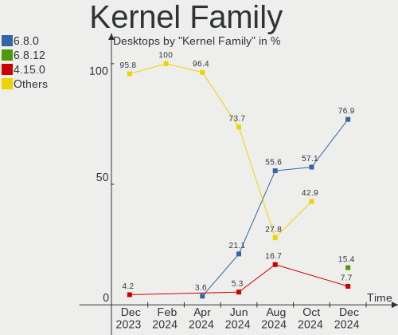
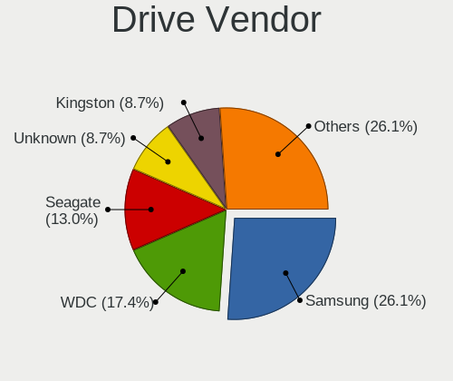
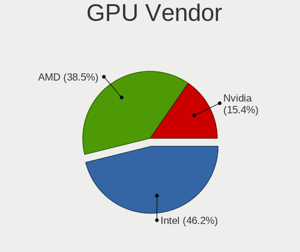
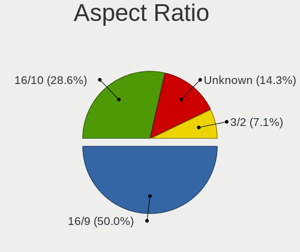
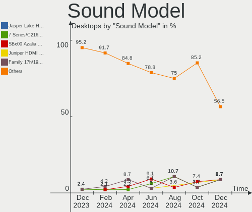

Xubuntu Hardware Trends (Desktops)
----------------------------------

A project to identify most popular hardware characteristics and track their change
over time based on data collected by Xubuntu users at https://Linux-Hardware.org.

Anyone can contribute to this report by the [hw-probe](https://github.com/linuxhw/hw-probe) tool:

    sudo -E hw-probe -all -upload

Full-feature report is available here: https://linux-hardware.org/?view=trends

Period: Nov, 2021.

Contents
--------

* [ System ](#system)
  - [ OS                       ](#os)
  - [ OS Family                ](#os-family)
  - [ Kernel                   ](#kernel)
  - [ Kernel Family            ](#kernel-family)
  - [ Kernel Major Ver.        ](#kernel-major-ver)
  - [ Arch                     ](#arch)
  - [ DE                       ](#de)
  - [ Display Server           ](#display-server)
  - [ Display Manager          ](#display-manager)
  - [ OS Lang                  ](#os-lang)
  - [ Boot Mode                ](#boot-mode)
  - [ Filesystem               ](#filesystem)
  - [ Part. scheme             ](#part-scheme)
  - [ Dual Boot with Linux/BSD ](#dual-boot-with-linuxbsd)
  - [ Dual Boot (Win)          ](#dual-boot-win)

* [ Board ](#board)
  - [ Vendor                   ](#vendor)
  - [ Model                    ](#model)
  - [ Model Family             ](#model-family)
  - [ MFG Year                 ](#mfg-year)
  - [ Form Factor              ](#form-factor)
  - [ Secure Boot              ](#secure-boot)
  - [ Coreboot                 ](#coreboot)
  - [ RAM Size                 ](#ram-size)
  - [ RAM Used                 ](#ram-used)
  - [ Total Drives             ](#total-drives)
  - [ Has CD-ROM               ](#has-cd-rom)
  - [ Has Ethernet             ](#has-ethernet)
  - [ Has WiFi                 ](#has-wifi)
  - [ Has Bluetooth            ](#has-bluetooth)

* [ Location ](#location)
  - [ Country                  ](#country)
  - [ City                     ](#city)

* [ Drives ](#drives)
  - [ Drive Vendor             ](#drive-vendor)
  - [ Drive Model              ](#drive-model)
  - [ HDD Vendor               ](#hdd-vendor)
  - [ SSD Vendor               ](#ssd-vendor)
  - [ Drive Kind               ](#drive-kind)
  - [ Drive Connector          ](#drive-connector)
  - [ Drive Size               ](#drive-size)
  - [ Space Total              ](#space-total)
  - [ Space Used               ](#space-used)
  - [ Malfunc. Drives          ](#malfunc-drives)
  - [ Malfunc. Drive Vendor    ](#malfunc-drive-vendor)
  - [ Malfunc. HDD Vendor      ](#malfunc-hdd-vendor)
  - [ Malfunc. Drive Kind      ](#malfunc-drive-kind)
  - [ Failed Drives            ](#failed-drives)
  - [ Failed Drive Vendor      ](#failed-drive-vendor)
  - [ Drive Status             ](#drive-status)

* [ Storage controller ](#storage-controller)
  - [ Storage Vendor           ](#storage-vendor)
  - [ Storage Model            ](#storage-model)
  - [ Storage Kind             ](#storage-kind)

* [ Processor ](#processor)
  - [ CPU Vendor               ](#cpu-vendor)
  - [ CPU Model                ](#cpu-model)
  - [ CPU Model Family         ](#cpu-model-family)
  - [ CPU Cores                ](#cpu-cores)
  - [ CPU Sockets              ](#cpu-sockets)
  - [ CPU Threads              ](#cpu-threads)
  - [ CPU Op-Modes             ](#cpu-op-modes)
  - [ CPU Microcode            ](#cpu-microcode)
  - [ CPU Microarch            ](#cpu-microarch)

* [ Graphics ](#graphics)
  - [ GPU Vendor               ](#gpu-vendor)
  - [ GPU Model                ](#gpu-model)
  - [ GPU Combo                ](#gpu-combo)
  - [ GPU Driver               ](#gpu-driver)
  - [ GPU Memory               ](#gpu-memory)

* [ Monitor ](#monitor)
  - [ Monitor Vendor           ](#monitor-vendor)
  - [ Monitor Model            ](#monitor-model)
  - [ Monitor Resolution       ](#monitor-resolution)
  - [ Monitor Diagonal         ](#monitor-diagonal)
  - [ Monitor Width            ](#monitor-width)
  - [ Aspect Ratio             ](#aspect-ratio)
  - [ Monitor Area             ](#monitor-area)
  - [ Pixel Density            ](#pixel-density)
  - [ Multiple Monitors        ](#multiple-monitors)

* [ Network ](#network)
  - [ Net Controller Vendor    ](#net-controller-vendor)
  - [ Net Controller Model     ](#net-controller-model)
  - [ Wireless Vendor          ](#wireless-vendor)
  - [ Wireless Model           ](#wireless-model)
  - [ Ethernet Vendor          ](#ethernet-vendor)
  - [ Ethernet Model           ](#ethernet-model)
  - [ Net Controller Kind      ](#net-controller-kind)
  - [ Used Controller          ](#used-controller)
  - [ NICs                     ](#nics)
  - [ IPv6                     ](#ipv6)

* [ Bluetooth ](#bluetooth)
  - [ Bluetooth Vendor         ](#bluetooth-vendor)
  - [ Bluetooth Model          ](#bluetooth-model)

* [ Sound ](#sound)
  - [ Sound Vendor             ](#sound-vendor)
  - [ Sound Model              ](#sound-model)

* [ Memory ](#memory)
  - [ Memory Vendor            ](#memory-vendor)
  - [ Memory Model             ](#memory-model)
  - [ Memory Kind              ](#memory-kind)
  - [ Memory Form Factor       ](#memory-form-factor)
  - [ Memory Size              ](#memory-size)
  - [ Memory Speed             ](#memory-speed)

* [ Printers & scanners ](#printers--scanners)
  - [ Printer Vendor           ](#printer-vendor)
  - [ Printer Model            ](#printer-model)
  - [ Scanner Vendor           ](#scanner-vendor)
  - [ Scanner Model            ](#scanner-model)

* [ Camera ](#camera)
  - [ Camera Vendor            ](#camera-vendor)
  - [ Camera Model             ](#camera-model)

* [ Security ](#security)
  - [ Fingerprint Vendor       ](#fingerprint-vendor)
  - [ Fingerprint Model        ](#fingerprint-model)
  - [ Chipcard Vendor          ](#chipcard-vendor)
  - [ Chipcard Model           ](#chipcard-model)

* [ Unsupported ](#unsupported)
  - [ Unsupported Devices      ](#unsupported-devices)
  - [ Unsupported Device Types ](#unsupported-device-types)

System
------

OS
--

Installed operating systems

| Name          | Desktops | Percent |
|---------------|----------|---------|
| Xubuntu 20.04 | 23       | 60.53%  |
| Xubuntu 18.04 | 9        | 23.68%  |
| Xubuntu 21.10 | 3        | 7.89%   |
| Xubuntu 21.04 | 1        | 2.63%   |
| Xubuntu 20.10 | 1        | 2.63%   |
| Xubuntu 16.04 | 1        | 2.63%   |

OS Family
---------

OS without a version

| Name    | Desktops | Percent |
|---------|----------|---------|
| Xubuntu | 38       | 100%    |

Kernel
------

Version of the Linux kernel

| Version               | Desktops | Percent |
|-----------------------|----------|---------|
| 5.4.0-89-generic      | 7        | 18.42%  |
| 5.11.0-40-generic     | 6        | 15.79%  |
| 5.4.0-90-generic      | 5        | 13.16%  |
| 5.11.0-40-lowlatency  | 3        | 7.89%   |
| 5.4.0-90-lowlatency   | 2        | 5.26%   |
| 5.15.1-051501-generic | 2        | 5.26%   |
| 5.13.0-20-generic     | 2        | 5.26%   |
| 4.15.0-161-generic    | 2        | 5.26%   |
| 5.8.0-63-generic      | 1        | 2.63%   |
| 5.4.0-91-generic      | 1        | 2.63%   |
| 5.4.0-89-lowlatency   | 1        | 2.63%   |
| 5.13.0-21-generic     | 1        | 2.63%   |
| 5.11.0-38-generic     | 1        | 2.63%   |
| 5.11.0-37-generic     | 1        | 2.63%   |
| 4.4.0-210-generic     | 1        | 2.63%   |
| 4.15.0-162-lowlatency | 1        | 2.63%   |
| 4.15.0-147-generic    | 1        | 2.63%   |

Kernel Family
-------------

Linux kernel without a distro release

| Version | Desktops | Percent |
|---------|----------|---------|
| 5.4.0   | 16       | 42.11%  |
| 5.11.0  | 11       | 28.95%  |
| 4.15.0  | 4        | 10.53%  |
| 5.13.0  | 3        | 7.89%   |
| 5.15.1  | 2        | 5.26%   |
| 5.8.0   | 1        | 2.63%   |
| 4.4.0   | 1        | 2.63%   |

Kernel Major Ver.
-----------------

Linux kernel major version

| Version | Desktops | Percent |
|---------|----------|---------|
| 5.4     | 16       | 42.11%  |
| 5.11    | 11       | 28.95%  |
| 4.15    | 4        | 10.53%  |
| 5.13    | 3        | 7.89%   |
| 5.15    | 2        | 5.26%   |
| 5.8     | 1        | 2.63%   |
| 4.4     | 1        | 2.63%   |

Arch
----

OS architecture (x86_64, i586, etc.)

| Name   | Desktops | Percent |
|--------|----------|---------|
| x86_64 | 35       | 92.11%  |
| i686   | 3        | 7.89%   |

DE
--

Desktop Environment

| Name | Desktops | Percent |
|------|----------|---------|
| XFCE | 38       | 100%    |

Display Server
--------------

X11 or Wayland

| Name | Desktops | Percent |
|------|----------|---------|
| X11  | 37       | 97.37%  |
| Tty  | 1        | 2.63%   |

Display Manager
---------------

SDDM, LightDM, etc.

| Name    | Desktops | Percent |
|---------|----------|---------|
| LightDM | 34       | 89.47%  |
| Unknown | 2        | 5.26%   |
| XDM     | 1        | 2.63%   |
| GDM     | 1        | 2.63%   |

OS Lang
-------

Language

| Lang  | Desktops | Percent |
|-------|----------|---------|
| en_US | 14       | 36.84%  |
| de_DE | 6        | 15.79%  |
| fr_FR | 2        | 5.26%   |
| es_ES | 2        | 5.26%   |
| en_CA | 2        | 5.26%   |
| zh_TW | 1        | 2.63%   |
| th_TH | 1        | 2.63%   |
| sv_SE | 1        | 2.63%   |
| ru_RU | 1        | 2.63%   |
| pl_PL | 1        | 2.63%   |
| nl_NL | 1        | 2.63%   |
| nl_BE | 1        | 2.63%   |
| it_IT | 1        | 2.63%   |
| hu_HU | 1        | 2.63%   |
| fi_FI | 1        | 2.63%   |
| en_ZA | 1        | 2.63%   |
| C     | 1        | 2.63%   |

Boot Mode
---------

EFI or BIOS

| Mode | Desktops | Percent |
|------|----------|---------|
| BIOS | 31       | 81.58%  |
| EFI  | 7        | 18.42%  |

Filesystem
----------

Type of filesystem

| Type | Desktops | Percent |
|------|----------|---------|
| Ext4 | 37       | 97.37%  |
| Zfs  | 1        | 2.63%   |

Part. scheme
------------

Scheme of partitioning

| Type    | Desktops | Percent |
|---------|----------|---------|
| Unknown | 29       | 76.32%  |
| MBR     | 5        | 13.16%  |
| GPT     | 4        | 10.53%  |

Dual Boot with Linux/BSD
------------------------

Hosting more than one Linux/BSD

| Dual boot | Desktops | Percent |
|-----------|----------|---------|
| No        | 29       | 76.32%  |
| Yes       | 9        | 23.68%  |

Dual Boot (Win)
---------------

Hosting Linux and Windows

| Dual boot | Desktops | Percent |
|-----------|----------|---------|
| No        | 22       | 57.89%  |
| Yes       | 16       | 42.11%  |

Board
-----

Vendor
------

Motherboard manufacturer

| Name                | Desktops | Percent |
|---------------------|----------|---------|
| ASUSTek Computer    | 12       | 31.58%  |
| Dell                | 4        | 10.53%  |
| ASRock              | 4        | 10.53%  |
| Gigabyte Technology | 3        | 7.89%   |
| MSI                 | 2        | 5.26%   |
| Medion              | 2        | 5.26%   |
| Hewlett-Packard     | 2        | 5.26%   |
| Shuttle             | 1        | 2.63%   |
| NCR                 | 1        | 2.63%   |
| Lenovo              | 1        | 2.63%   |
| Gateway             | 1        | 2.63%   |
| Fujitsu             | 1        | 2.63%   |
| EVGA                | 1        | 2.63%   |
| ECS                 | 1        | 2.63%   |
| Acer                | 1        | 2.63%   |
| ABIT                | 1        | 2.63%   |

Model
-----

Motherboard model

| Name                                    | Desktops | Percent |
|-----------------------------------------|----------|---------|
| Shuttle NC03U                           | 1        | 2.63%   |
| NCR 7606-1309-8801                      | 1        | 2.63%   |
| MSI Pro 2000/2080                       | 1        | 2.63%   |
| MSI MS-7B79                             | 1        | 2.63%   |
| Medion MS-7366                          | 1        | 2.63%   |
| Medion Akoya P2120 D MD8836/2452        | 1        | 2.63%   |
| Lenovo ThinkCentre A70 7844H9G          | 1        | 2.63%   |
| HP Compaq dc7800p Small Form Factor     | 1        | 2.63%   |
| HP Compaq dc7800p Convertible Minitower | 1        | 2.63%   |
| Gigabyte Z97X-UD3H                      | 1        | 2.63%   |
| Gigabyte H370HD3                        | 1        | 2.63%   |
| Gigabyte 945GZM-S2                      | 1        | 2.63%   |
| Gateway DX4840                          | 1        | 2.63%   |
| Fujitsu D3417-B2 S26361-D3417-B2        | 1        | 2.63%   |
| EVGA 111-CS-E371                        | 1        | 2.63%   |
| ECS H81H3-M4                            | 1        | 2.63%   |
| Dell Precision WorkStation T3500        | 1        | 2.63%   |
| Dell OptiPlex 9020                      | 1        | 2.63%   |
| Dell OptiPlex 3020                      | 1        | 2.63%   |
| Dell Inspiron 530s                      | 1        | 2.63%   |
| ASUS ROG STRIX B450-F GAMING            | 1        | 2.63%   |
| ASUS PRIME Z590M-PLUS                   | 1        | 2.63%   |
| ASUS PRIME B550M-A                      | 1        | 2.63%   |
| ASUS P7P55D                             | 1        | 2.63%   |
| ASUS P5LD2-VM                           | 1        | 2.63%   |
| ASUS M4A89GTD-PRO                       | 1        | 2.63%   |
| ASUS M3N78-EM                           | 1        | 2.63%   |
| ASUS GV454AA-ABU s3230.uk               | 1        | 2.63%   |
| ASUS B150-PLUS                          | 1        | 2.63%   |
| ASUS All Series                         | 1        | 2.63%   |
| ASUS A8N32-SLI-Deluxe                   | 1        | 2.63%   |
| ASUS A68HM-K                            | 1        | 2.63%   |
| ASRock Z97 Extreme4                     | 1        | 2.63%   |
| ASRock N68C-S UCC                       | 1        | 2.63%   |
| ASRock H470 Phantom Gaming 4            | 1        | 2.63%   |
| ASRock B450M Pro4                       | 1        | 2.63%   |
| Acer Veriton L480                       | 1        | 2.63%   |
| ABIT AI7                                | 1        | 2.63%   |

Model Family
------------

Motherboard model prefix

| Name                  | Desktops | Percent |
|-----------------------|----------|---------|
| HP Compaq             | 2        | 5.26%   |
| Dell OptiPlex         | 2        | 5.26%   |
| ASUS PRIME            | 2        | 5.26%   |
| Shuttle NC03U         | 1        | 2.63%   |
| NCR 7606-1309-8801    | 1        | 2.63%   |
| MSI Pro               | 1        | 2.63%   |
| MSI MS-7B79           | 1        | 2.63%   |
| Medion MS-7366        | 1        | 2.63%   |
| Medion Akoya          | 1        | 2.63%   |
| Lenovo ThinkCentre    | 1        | 2.63%   |
| Gigabyte Z97X-UD3H    | 1        | 2.63%   |
| Gigabyte H370HD3      | 1        | 2.63%   |
| Gigabyte 945GZM-S2    | 1        | 2.63%   |
| Gateway DX4840        | 1        | 2.63%   |
| Fujitsu D3417-B2      | 1        | 2.63%   |
| EVGA 111-CS-E371      | 1        | 2.63%   |
| ECS H81H3-M4          | 1        | 2.63%   |
| Dell Precision        | 1        | 2.63%   |
| Dell Inspiron         | 1        | 2.63%   |
| ASUS ROG              | 1        | 2.63%   |
| ASUS P7P55D           | 1        | 2.63%   |
| ASUS P5LD2-VM         | 1        | 2.63%   |
| ASUS M4A89GTD-PRO     | 1        | 2.63%   |
| ASUS M3N78-EM         | 1        | 2.63%   |
| ASUS GV454AA-ABU      | 1        | 2.63%   |
| ASUS B150-PLUS        | 1        | 2.63%   |
| ASUS All              | 1        | 2.63%   |
| ASUS A8N32-SLI-Deluxe | 1        | 2.63%   |
| ASUS A68HM-K          | 1        | 2.63%   |
| ASRock Z97            | 1        | 2.63%   |
| ASRock N68C-S         | 1        | 2.63%   |
| ASRock H470           | 1        | 2.63%   |
| ASRock B450M          | 1        | 2.63%   |
| Acer Veriton          | 1        | 2.63%   |
| ABIT AI7              | 1        | 2.63%   |

MFG Year
--------

Motherboard manufacture year

| Year | Desktops | Percent |
|------|----------|---------|
| 2007 | 5        | 13.16%  |
| 2010 | 4        | 10.53%  |
| 2009 | 4        | 10.53%  |
| 2020 | 3        | 7.89%   |
| 2019 | 3        | 7.89%   |
| 2018 | 3        | 7.89%   |
| 2015 | 3        | 7.89%   |
| 2014 | 3        | 7.89%   |
| 2011 | 3        | 7.89%   |
| 2021 | 2        | 5.26%   |
| 2013 | 2        | 5.26%   |
| 2016 | 1        | 2.63%   |
| 2006 | 1        | 2.63%   |
| 2004 | 1        | 2.63%   |

Form Factor
-----------

Physical design of the computer

| Name    | Desktops | Percent |
|---------|----------|---------|
| Desktop | 38       | 100%    |

Secure Boot
-----------

Enabled or disabled

| State    | Desktops | Percent |
|----------|----------|---------|
| Disabled | 37       | 97.37%  |
| Enabled  | 1        | 2.63%   |

Coreboot
--------

Have coreboot on board

| Used | Desktops | Percent |
|------|----------|---------|
| No   | 38       | 100%    |

RAM Size
--------

Total RAM memory

| Size in GB  | Desktops | Percent |
|-------------|----------|---------|
| 3.01-4.0    | 9        | 23.68%  |
| 16.01-24.0  | 9        | 23.68%  |
| 8.01-16.0   | 6        | 15.79%  |
| 4.01-8.0    | 5        | 13.16%  |
| 1.01-2.0    | 3        | 7.89%   |
| 32.01-64.0  | 2        | 5.26%   |
| 2.01-3.0    | 2        | 5.26%   |
| 24.01-32.0  | 1        | 2.63%   |
| 64.01-256.0 | 1        | 2.63%   |

RAM Used
--------

Used RAM memory

| Used GB   | Desktops | Percent |
|-----------|----------|---------|
| 1.01-2.0  | 13       | 34.21%  |
| 2.01-3.0  | 12       | 31.58%  |
| 0.51-1.0  | 7        | 18.42%  |
| 4.01-8.0  | 4        | 10.53%  |
| 8.01-16.0 | 2        | 5.26%   |

Total Drives
------------

Number of drives on board

| Drives | Desktops | Percent |
|--------|----------|---------|
| 1      | 16       | 42.11%  |
| 3      | 8        | 21.05%  |
| 2      | 7        | 18.42%  |
| 4      | 3        | 7.89%   |
| 7      | 2        | 5.26%   |
| 5      | 2        | 5.26%   |

Has CD-ROM
----------

Has CD-ROM on board

| Presented | Desktops | Percent |
|-----------|----------|---------|
| Yes       | 26       | 68.42%  |
| No        | 12       | 31.58%  |

Has Ethernet
------------

Has Ethernet on board

| Presented | Desktops | Percent |
|-----------|----------|---------|
| Yes       | 37       | 97.37%  |
| No        | 1        | 2.63%   |

Has WiFi
--------

Has WiFi module

| Presented | Desktops | Percent |
|-----------|----------|---------|
| No        | 23       | 60.53%  |
| Yes       | 15       | 39.47%  |

Has Bluetooth
-------------

Has Bluetooth module

| Presented | Desktops | Percent |
|-----------|----------|---------|
| No        | 32       | 84.21%  |
| Yes       | 6        | 15.79%  |

Location
--------

Country
-------

Geographic location (country)

| Country                | Desktops | Percent |
|------------------------|----------|---------|
| USA                    | 8        | 21.05%  |
| Germany                | 6        | 15.79%  |
| Ukraine                | 2        | 5.26%   |
| Spain                  | 2        | 5.26%   |
| Netherlands            | 2        | 5.26%   |
| France                 | 2        | 5.26%   |
| Finland                | 2        | 5.26%   |
| Canada                 | 2        | 5.26%   |
| Thailand               | 1        | 2.63%   |
| Taiwan                 | 1        | 2.63%   |
| Sweden                 | 1        | 2.63%   |
| South Africa           | 1        | 2.63%   |
| Slovenia               | 1        | 2.63%   |
| Poland                 | 1        | 2.63%   |
| Morocco                | 1        | 2.63%   |
| Italy                  | 1        | 2.63%   |
| Hungary                | 1        | 2.63%   |
| Bosnia and Herzegovina | 1        | 2.63%   |
| Belgium                | 1        | 2.63%   |
| Argentina              | 1        | 2.63%   |

City
----

Geographic location (city)

| City               | Desktops | Percent |
|--------------------|----------|---------|
| Berlin             | 2        | 5.26%   |
| Zgornja Besnica    | 1        | 2.63%   |
| Uzhhorod           | 1        | 2.63%   |
| The Hague          | 1        | 2.63%   |
| Tampere            | 1        | 2.63%   |
| Talence            | 1        | 2.63%   |
| Springfield        | 1        | 2.63%   |
| Rosario            | 1        | 2.63%   |
| Rapid City         | 1        | 2.63%   |
| Queens             | 1        | 2.63%   |
| Pretoria           | 1        | 2.63%   |
| Poznan             | 1        | 2.63%   |
| Potsdam            | 1        | 2.63%   |
| Phuket             | 1        | 2.63%   |
| Ozzano dell'Emilia | 1        | 2.63%   |
| Odessa             | 1        | 2.63%   |
| New Taipei         | 1        | 2.63%   |
| Navalmanzano       | 1        | 2.63%   |
| M?©rignac          | 1        | 2.63%   |
| Madrid             | 1        | 2.63%   |
| Lebach             | 1        | 2.63%   |
| Kuopio             | 1        | 2.63%   |
| Kortrijk           | 1        | 2.63%   |
| Hodmezovasarhely   | 1        | 2.63%   |
| Guntersville       | 1        | 2.63%   |
| Greensburg         | 1        | 2.63%   |
| Essen              | 1        | 2.63%   |
| Dresden            | 1        | 2.63%   |
| Dothan             | 1        | 2.63%   |
| Cleveland          | 1        | 2.63%   |
| Charleston         | 1        | 2.63%   |
| Casablanca         | 1        | 2.63%   |
| Brantford          | 1        | 2.63%   |
| Bolton             | 1        | 2.63%   |
| Bollnaes           | 1        | 2.63%   |
| Bijeljina          | 1        | 2.63%   |
| Amsterdam          | 1        | 2.63%   |

Drives
------

Drive Vendor
------------

Hard drive vendors

| Vendor              | Desktops | Drives | Percent |
|---------------------|----------|--------|---------|
| WDC                 | 17       | 31     | 26.15%  |
| Seagate             | 14       | 17     | 21.54%  |
| Samsung Electronics | 10       | 16     | 15.38%  |
| Kingston            | 5        | 5      | 7.69%   |
| Hitachi             | 3        | 3      | 4.62%   |
| Crucial             | 3        | 3      | 4.62%   |
| Toshiba             | 1        | 1      | 1.54%   |
| SPCC                | 1        | 1      | 1.54%   |
| Sandisk             | 1        | 1      | 1.54%   |
| Phison              | 1        | 1      | 1.54%   |
| MAXTOR              | 1        | 1      | 1.54%   |
| Lexar               | 1        | 1      | 1.54%   |
| KIOXIA              | 1        | 1      | 1.54%   |
| Intenso             | 1        | 1      | 1.54%   |
| HDD                 | 1        | 1      | 1.54%   |
| d2                  | 1        | 1      | 1.54%   |
| Corsair             | 1        | 1      | 1.54%   |
| CHN25SATAS1         | 1        | 1      | 1.54%   |
| Apple               | 1        | 1      | 1.54%   |

Drive Model
-----------

Hard drive models

| Model                                | Desktops | Percent |
|--------------------------------------|----------|---------|
| WDC WD10EZEX-00BN5A0 1TB             | 2        | 2.35%   |
| Samsung HD322HJ 320GB                | 2        | 2.35%   |
| WDC WDS500G2B0A-00SM50 500GB SSD     | 1        | 1.18%   |
| WDC WDS250G2B0A-00SM50 250GB SSD     | 1        | 1.18%   |
| WDC WD800JB-00JJC0 80GB              | 1        | 1.18%   |
| WDC WD6400AAKS-00A7B2 640GB          | 1        | 1.18%   |
| WDC WD60 EFRX-68L0BN1 6TB            | 1        | 1.18%   |
| WDC WD5003AZEX-00K1GA0 500GB         | 1        | 1.18%   |
| WDC WD5000AZRX-00L4HB0 500GB         | 1        | 1.18%   |
| WDC WD5000AAKS-75A7B2 500GB          | 1        | 1.18%   |
| WDC WD5000AAKS-22V1A0 500GB          | 1        | 1.18%   |
| WDC WD40PURZ-85TTDY0 4TB             | 1        | 1.18%   |
| WDC WD3200BEVT-75ZCT1 320GB          | 1        | 1.18%   |
| WDC WD3200AAJS-65RYA0 320GB          | 1        | 1.18%   |
| WDC WD3200AAJS-00B4A0 320GB          | 1        | 1.18%   |
| WDC WD3000HLFS-01G6U4 304GB          | 1        | 1.18%   |
| WDC WD2500BEVT-00A23T0 250GB         | 1        | 1.18%   |
| WDC WD2500AAKX-001CA0 250GB          | 1        | 1.18%   |
| WDC WD2500AAJS-75B4A0 250GB          | 1        | 1.18%   |
| WDC WD20EFRX-68EUZN0 2TB             | 1        | 1.18%   |
| WDC WD20EARX-00PASB0 2TB             | 1        | 1.18%   |
| WDC WD20EARS-00MVWB0 2TB             | 1        | 1.18%   |
| WDC WD20EARS-00J2GB0 2TB             | 1        | 1.18%   |
| WDC WD2002FAEX-007BA0 2TB            | 1        | 1.18%   |
| WDC WD10EZEX-21WN4A0 1TB             | 1        | 1.18%   |
| WDC WD10EZEX-08WN4A0 1TB             | 1        | 1.18%   |
| WDC WD10EARS-00Y5B1 1TB              | 1        | 1.18%   |
| WDC WD10EACS-00D6B0 1TB              | 1        | 1.18%   |
| WDC WD10EACS-00C7B0 1TB              | 1        | 1.18%   |
| Toshiba HDWD120 2TB                  | 1        | 1.18%   |
| SPCC Solid State Disk 1TB            | 1        | 1.18%   |
| Seagate ST940210AS 40GB              | 1        | 1.18%   |
| Seagate ST9250827AS 250GB            | 1        | 1.18%   |
| Seagate ST9120822AS 120GB            | 1        | 1.18%   |
| Seagate ST500LM000-1EJ162 500GB      | 1        | 1.18%   |
| Seagate ST500DM002-1BD142 500GB      | 1        | 1.18%   |
| Seagate ST3500413AS 500GB            | 1        | 1.18%   |
| Seagate ST3320418AS 320GB            | 1        | 1.18%   |
| Seagate ST3250318AS 250GB            | 1        | 1.18%   |
| Seagate ST3250312AS 250GB            | 1        | 1.18%   |
| Seagate ST2000DM001-1ER164 2TB       | 1        | 1.18%   |
| Seagate ST16000NM001G-2KK103 16TB    | 1        | 1.18%   |
| Seagate ST1000VM002-1SD102 1TB       | 1        | 1.18%   |
| Seagate ST1000DX001-1NS162 1TB       | 1        | 1.18%   |
| Seagate ST1000DM003-1SB10C 1TB       | 1        | 1.18%   |
| Seagate ST1000DM003-1SB102 1TB       | 1        | 1.18%   |
| Seagate Expansion Desk 8TB           | 1        | 1.18%   |
| Sandisk NVMe SSD Drive 500GB         | 1        | 1.18%   |
| Samsung SSD 870 EVO 250GB            | 1        | 1.18%   |
| Samsung SSD 870 EVO 1TB              | 1        | 1.18%   |
| Samsung SSD 860 EVO M.2 250GB        | 1        | 1.18%   |
| Samsung SSD 860 EVO 1TB              | 1        | 1.18%   |
| Samsung SSD 850 PRO 512GB            | 1        | 1.18%   |
| Samsung SSD 850 EVO 1TB              | 1        | 1.18%   |
| Samsung SSD 850 EVO 120GB            | 1        | 1.18%   |
| Samsung SSD 840 EVO 1TB              | 1        | 1.18%   |
| Samsung SP0411N 40GB                 | 1        | 1.18%   |
| Samsung NVMe SSD Drive 1TB           | 1        | 1.18%   |
| Samsung MZVPV256HDGL-00000 256GB     | 1        | 1.18%   |
| Samsung MZNLF128HCHP-00000 128GB SSD | 1        | 1.18%   |

HDD Vendor
----------

Hard disk drive vendors

| Vendor              | Desktops | Drives | Percent |
|---------------------|----------|--------|---------|
| WDC                 | 16       | 29     | 40%     |
| Seagate             | 14       | 17     | 35%     |
| Samsung Electronics | 4        | 5      | 10%     |
| Hitachi             | 3        | 3      | 7.5%    |
| Toshiba             | 1        | 1      | 2.5%    |
| MAXTOR              | 1        | 1      | 2.5%    |
| Apple               | 1        | 1      | 2.5%    |

SSD Vendor
----------

Solid state drive vendors

| Vendor              | Desktops | Drives | Percent |
|---------------------|----------|--------|---------|
| Samsung Electronics | 6        | 9      | 33.33%  |
| Kingston            | 4        | 4      | 22.22%  |
| Crucial             | 3        | 3      | 16.67%  |
| WDC                 | 2        | 2      | 11.11%  |
| SPCC                | 1        | 1      | 5.56%   |
| Lexar               | 1        | 1      | 5.56%   |
| Corsair             | 1        | 1      | 5.56%   |

Drive Kind
----------

HDD or SSD

| Kind    | Desktops | Drives | Percent |
|---------|----------|--------|---------|
| HDD     | 30       | 57     | 53.57%  |
| SSD     | 16       | 21     | 28.57%  |
| NVMe    | 6        | 6      | 10.71%  |
| Unknown | 4        | 4      | 7.14%   |

Drive Connector
---------------

SATA, SAS, NVMe, etc.

| Type | Desktops | Drives | Percent |
|------|----------|--------|---------|
| SATA | 36       | 78     | 78.26%  |
| NVMe | 6        | 6      | 13.04%  |
| SAS  | 4        | 4      | 8.7%    |

Drive Size
----------

Size of hard drive

| Size in TB | Desktops | Drives | Percent |
|------------|----------|--------|---------|
| 0.01-0.5   | 30       | 43     | 61.22%  |
| 0.51-1.0   | 11       | 23     | 22.45%  |
| 1.01-2.0   | 4        | 7      | 8.16%   |
| 4.01-10.0  | 2        | 2      | 4.08%   |
| 3.01-4.0   | 1        | 2      | 2.04%   |
| 10.01-20.0 | 1        | 1      | 2.04%   |

Space Total
-----------

Amount of disk space available on the file system

| Size in GB     | Desktops | Percent |
|----------------|----------|---------|
| 101-250        | 14       | 36.84%  |
| 251-500        | 6        | 15.79%  |
| 21-50          | 4        | 10.53%  |
| 2001-3000      | 4        | 10.53%  |
| 1001-2000      | 4        | 10.53%  |
| 501-1000       | 3        | 7.89%   |
| More than 3000 | 1        | 2.63%   |
| 1-20           | 1        | 2.63%   |
| 51-100         | 1        | 2.63%   |

Space Used
----------

Amount of used disk space

| Used GB        | Desktops | Percent |
|----------------|----------|---------|
| 1-20           | 11       | 28.95%  |
| 21-50          | 9        | 23.68%  |
| 101-250        | 5        | 13.16%  |
| 51-100         | 4        | 10.53%  |
| 1001-2000      | 3        | 7.89%   |
| 501-1000       | 3        | 7.89%   |
| More than 3000 | 1        | 2.63%   |
| 251-500        | 1        | 2.63%   |
| 2001-3000      | 1        | 2.63%   |

Malfunc. Drives
---------------

Drive models with a malfunction

| Model                          | Desktops | Drives | Percent |
|--------------------------------|----------|--------|---------|
| WDC WD3200BEVT-75ZCT1 320GB    | 1        | 1      | 33.33%  |
| WDC WD20EFRX-68EUZN0 2TB       | 1        | 1      | 33.33%  |
| Seagate ST1000DM003-1SB102 1TB | 1        | 1      | 33.33%  |

Malfunc. Drive Vendor
---------------------

Vendors of faulty drives

| Vendor  | Desktops | Drives | Percent |
|---------|----------|--------|---------|
| WDC     | 1        | 2      | 50%     |
| Seagate | 1        | 1      | 50%     |

Malfunc. HDD Vendor
-------------------

Vendors of faulty HDD drives

| Vendor  | Desktops | Drives | Percent |
|---------|----------|--------|---------|
| WDC     | 1        | 2      | 50%     |
| Seagate | 1        | 1      | 50%     |

Malfunc. Drive Kind
-------------------

Kinds of faulty drives

| Kind | Desktops | Drives | Percent |
|------|----------|--------|---------|
| HDD  | 2        | 3      | 100%    |

Failed Drives
-------------

Failed drive models

Zero info for selected period =(

Failed Drive Vendor
-------------------

Failed drive vendors

Zero info for selected period =(

Drive Status
------------

Number of failed and malfunc. drives

| Status   | Desktops | Drives | Percent |
|----------|----------|--------|---------|
| Detected | 29       | 66     | 72.5%   |
| Works    | 9        | 19     | 22.5%   |
| Malfunc  | 2        | 3      | 5%      |

Storage controller
------------------

Storage Vendor
--------------

Storage controller vendors

| Vendor                      | Desktops | Percent |
|-----------------------------|----------|---------|
| Intel                       | 27       | 56.25%  |
| AMD                         | 6        | 12.5%   |
| Nvidia                      | 5        | 10.42%  |
| Samsung Electronics         | 2        | 4.17%   |
| Silicon Image               | 1        | 2.08%   |
| Sandisk                     | 1        | 2.08%   |
| Phison Electronics          | 1        | 2.08%   |
| KIOXIA                      | 1        | 2.08%   |
| Kingston Technology Company | 1        | 2.08%   |
| JMicron Technology          | 1        | 2.08%   |
| ASMedia Technology          | 1        | 2.08%   |
| Adaptec                     | 1        | 2.08%   |

Storage Model
-------------

Storage controller models

| Model                                                                          | Desktops | Percent |
|--------------------------------------------------------------------------------|----------|---------|
| Intel NM10/ICH7 Family SATA Controller [IDE mode]                              | 4        | 5.97%   |
| AMD FCH SATA Controller [AHCI mode]                                            | 4        | 5.97%   |
| Intel Q170/Q150/B150/H170/H110/Z170/CM236 Chipset SATA Controller [AHCI Mode]  | 3        | 4.48%   |
| Intel 82801IR/IO/IH (ICH9R/DO/DH) 4 port SATA Controller [IDE mode]            | 3        | 4.48%   |
| Intel 82801I (ICH9 Family) 2 port SATA Controller [IDE mode]                   | 3        | 4.48%   |
| Intel 8 Series/C220 Series Chipset Family 6-port SATA Controller 1 [AHCI mode] | 3        | 4.48%   |
| AMD 400 Series Chipset SATA Controller                                         | 3        | 4.48%   |
| Nvidia MCP61 SATA Controller                                                   | 2        | 2.99%   |
| Nvidia MCP61 IDE                                                               | 2        | 2.99%   |
| Intel SATA Controller [RAID mode]                                              | 2        | 2.99%   |
| Intel Cannon Lake PCH SATA AHCI Controller                                     | 2        | 2.99%   |
| Intel 9 Series Chipset Family SATA Controller [AHCI Mode]                      | 2        | 2.99%   |
| Intel 82Q35 Express PT IDER Controller                                         | 2        | 2.99%   |
| Intel 82801G (ICH7 Family) IDE Controller                                      | 2        | 2.99%   |
| Silicon Image SiI 3132 Serial ATA Raid II Controller                           | 1        | 1.49%   |
| Sandisk WD Black SN750 / PC SN730 NVMe SSD                                     | 1        | 1.49%   |
| Samsung NVMe SSD Controller SM981/PM981/PM983                                  | 1        | 1.49%   |
| Samsung NVMe SSD Controller SM951/PM951                                        | 1        | 1.49%   |
| Phison E12 NVMe Controller                                                     | 1        | 1.49%   |
| Nvidia MCP78S [GeForce 8200] SATA Controller (non-AHCI mode)                   | 1        | 1.49%   |
| Nvidia MCP78S [GeForce 8200] IDE                                               | 1        | 1.49%   |
| Nvidia MCP73 IDE Controller                                                    | 1        | 1.49%   |
| Nvidia GeForce 7100/nForce 630i SATA                                           | 1        | 1.49%   |
| Nvidia CK804 Serial ATA Controller                                             | 1        | 1.49%   |
| Nvidia CK804 IDE                                                               | 1        | 1.49%   |
| KIOXIA Non-Volatile memory controller                                          | 1        | 1.49%   |
| Kingston Company Company Non-Volatile memory controller                        | 1        | 1.49%   |
| JMicron JMB361 AHCI/IDE                                                        | 1        | 1.49%   |
| Intel Sunrise Point-LP SATA Controller [AHCI mode]                             | 1        | 1.49%   |
| Intel Comet Lake SATA AHCI Controller                                          | 1        | 1.49%   |
| Intel 82801JI (ICH10 Family) SATA AHCI Controller                              | 1        | 1.49%   |
| Intel 82801JI (ICH10 Family) 4 port SATA IDE Controller #1                     | 1        | 1.49%   |
| Intel 82801JI (ICH10 Family) 2 port SATA IDE Controller #2                     | 1        | 1.49%   |
| Intel 82801ER (ICH5R) SATA Controller                                          | 1        | 1.49%   |
| Intel 82801EB/ER (ICH5/ICH5R) IDE Controller                                   | 1        | 1.49%   |
| Intel 500 Series Chipset Family SATA AHCI Controller                           | 1        | 1.49%   |
| Intel 5 Series/3400 Series Chipset 6 port SATA AHCI Controller                 | 1        | 1.49%   |
| Intel 5 Series/3400 Series Chipset 4 port SATA IDE Controller                  | 1        | 1.49%   |
| Intel 5 Series/3400 Series Chipset 2 port SATA IDE Controller                  | 1        | 1.49%   |
| ASMedia ASM1062 Serial ATA Controller                                          | 1        | 1.49%   |
| AMD Starship/Matisse Chipset SATA Controller [AHCI mode]                       | 1        | 1.49%   |
| AMD SB7x0/SB8x0/SB9x0 SATA Controller [IDE mode]                               | 1        | 1.49%   |
| AMD SB7x0/SB8x0/SB9x0 IDE Controller                                           | 1        | 1.49%   |
| Adaptec AHA-2930CU                                                             | 1        | 1.49%   |

Storage Kind
------------

Kind of storage controller (IDE, SATA, NVMe, SAS, ...)

| Kind | Desktops | Percent |
|------|----------|---------|
| SATA | 22       | 44.9%   |
| IDE  | 16       | 32.65%  |
| NVMe | 6        | 12.24%  |
| RAID | 4        | 8.16%   |
| SCSI | 1        | 2.04%   |

Processor
---------

CPU Vendor
----------

Processor vendors

| Vendor | Desktops | Percent |
|--------|----------|---------|
| Intel  | 28       | 73.68%  |
| AMD    | 10       | 26.32%  |

CPU Model
---------

Processor models

| Model                                       | Desktops | Percent |
|---------------------------------------------|----------|---------|
| Intel Xeon CPU W3520 @ 2.67GHz              | 1        | 2.63%   |
| Intel Xeon CPU E3-1225 v6 @ 3.30GHz         | 1        | 2.63%   |
| Intel Pentium Dual-Core CPU E5500 @ 2.80GHz | 1        | 2.63%   |
| Intel Pentium Dual-Core CPU E5200 @ 2.50GHz | 1        | 2.63%   |
| Intel Pentium Dual CPU E2200 @ 2.20GHz      | 1        | 2.63%   |
| Intel Pentium CPU G850 @ 2.90GHz            | 1        | 2.63%   |
| Intel Pentium CPU G3420 @ 3.20GHz           | 1        | 2.63%   |
| Intel Pentium CPU G3240 @ 3.10GHz           | 1        | 2.63%   |
| Intel Pentium CPU G3220 @ 3.00GHz           | 1        | 2.63%   |
| Intel Pentium 4 CPU 3.20GHz                 | 1        | 2.63%   |
| Intel Pentium 4 CPU 3.00GHz                 | 1        | 2.63%   |
| Intel Core i9-9900 CPU @ 3.10GHz            | 1        | 2.63%   |
| Intel Core i7-5775C CPU @ 3.30GHz           | 1        | 2.63%   |
| Intel Core i5-9600K CPU @ 3.70GHz           | 1        | 2.63%   |
| Intel Core i5-6600 CPU @ 3.30GHz            | 1        | 2.63%   |
| Intel Core i5-4690K CPU @ 3.50GHz           | 1        | 2.63%   |
| Intel Core i5 CPU 650 @ 3.20GHz             | 1        | 2.63%   |
| Intel Core i3-6100 CPU @ 3.70GHz            | 1        | 2.63%   |
| Intel Core i3-4130 CPU @ 3.40GHz            | 1        | 2.63%   |
| Intel Core i3-10100 CPU @ 3.60GHz           | 1        | 2.63%   |
| Intel Core i3 CPU 540 @ 3.07GHz             | 1        | 2.63%   |
| Intel Core 2 Quad CPU Q8400 @ 2.66GHz       | 1        | 2.63%   |
| Intel Core 2 Duo CPU E7500 @ 2.93GHz        | 1        | 2.63%   |
| Intel Core 2 Duo CPU E6750 @ 2.66GHz        | 1        | 2.63%   |
| Intel Core 2 Duo CPU E6550 @ 2.33GHz        | 1        | 2.63%   |
| Intel Core 2 Duo CPU E4400 @ 2.00GHz        | 1        | 2.63%   |
| Intel Celeron CPU 3865U @ 1.80GHz           | 1        | 2.63%   |
| Intel 11th Gen Core i7-11700K @ 3.60GHz     | 1        | 2.63%   |
| AMD Ryzen 7 2700X Eight-Core Processor      | 1        | 2.63%   |
| AMD Ryzen 7 1800X Eight-Core Processor      | 1        | 2.63%   |
| AMD Ryzen 5 5600G with Radeon Graphics      | 1        | 2.63%   |
| AMD Ryzen 3 3200G with Radeon Vega Graphics | 1        | 2.63%   |
| AMD Phenom II X6 1090T Processor            | 1        | 2.63%   |
| AMD Phenom II X4 960T Processor             | 1        | 2.63%   |
| AMD Athlon II X4 640 Processor              | 1        | 2.63%   |
| AMD Athlon 64 X2 Dual Core Processor 4400+  | 1        | 2.63%   |
| AMD Athlon 64 Processor 3700+               | 1        | 2.63%   |
| AMD A10-5800K APU with Radeon HD Graphics   | 1        | 2.63%   |

CPU Model Family
----------------

Processor model prefix

| Model                   | Desktops | Percent |
|-------------------------|----------|---------|
| Intel Pentium           | 4        | 10.53%  |
| Intel Core i5           | 4        | 10.53%  |
| Intel Core i3           | 4        | 10.53%  |
| Intel Core 2 Duo        | 4        | 10.53%  |
| Intel Xeon              | 2        | 5.26%   |
| Intel Pentium Dual-Core | 2        | 5.26%   |
| Intel Pentium 4         | 2        | 5.26%   |
| AMD Ryzen 7             | 2        | 5.26%   |
| Other                   | 1        | 2.63%   |
| Intel Pentium Dual      | 1        | 2.63%   |
| Intel Core i9           | 1        | 2.63%   |
| Intel Core i7           | 1        | 2.63%   |
| Intel Core 2 Quad       | 1        | 2.63%   |
| Intel Celeron           | 1        | 2.63%   |
| AMD Ryzen 5             | 1        | 2.63%   |
| AMD Ryzen 3             | 1        | 2.63%   |
| AMD Phenom II X6        | 1        | 2.63%   |
| AMD Phenom II X4        | 1        | 2.63%   |
| AMD Athlon II X4        | 1        | 2.63%   |
| AMD Athlon 64 X2        | 1        | 2.63%   |
| AMD Athlon 64           | 1        | 2.63%   |
| AMD A10                 | 1        | 2.63%   |

CPU Cores
---------

Number of processor cores

| Number | Desktops | Percent |
|--------|----------|---------|
| 2      | 18       | 47.37%  |
| 4      | 10       | 26.32%  |
| 8      | 4        | 10.53%  |
| 6      | 3        | 7.89%   |
| 1      | 3        | 7.89%   |

CPU Sockets
-----------

Number of sockets

| Number | Desktops | Percent |
|--------|----------|---------|
| 1      | 38       | 100%    |

CPU Threads
-----------

Threads per core (Hyper-Threading)

| Number | Desktops | Percent |
|--------|----------|---------|
| 1      | 23       | 60.53%  |
| 2      | 15       | 39.47%  |

CPU Op-Modes
------------

CPU Operation Modes (32-bit, 64-bit)

| Op mode        | Desktops | Percent |
|----------------|----------|---------|
| 32-bit, 64-bit | 37       | 97.37%  |
| 32-bit         | 1        | 2.63%   |

CPU Microcode
-------------

Microcode number

| Number     | Desktops | Percent |
|------------|----------|---------|
| Unknown    | 8        | 21.05%  |
| 0x306c3    | 4        | 10.53%  |
| 0x1067a    | 3        | 7.89%   |
| 0x906ed    | 2        | 5.26%   |
| 0x6fd      | 2        | 5.26%   |
| 0x506e3    | 2        | 5.26%   |
| 0x010000dc | 2        | 5.26%   |
| 0xf65      | 1        | 2.63%   |
| 0xf29      | 1        | 2.63%   |
| 0xa0671    | 1        | 2.63%   |
| 0x906e9    | 1        | 2.63%   |
| 0x806e9    | 1        | 2.63%   |
| 0x6fb      | 1        | 2.63%   |
| 0x40671    | 1        | 2.63%   |
| 0x206a7    | 1        | 2.63%   |
| 0x20652    | 1        | 2.63%   |
| 0x10676    | 1        | 2.63%   |
| 0x0a50000c | 1        | 2.63%   |
| 0x08108109 | 1        | 2.63%   |
| 0x0800820d | 1        | 2.63%   |
| 0x08001137 | 1        | 2.63%   |
| 0x06001119 | 1        | 2.63%   |

CPU Microarch
-------------

Microarchitecture

| Name        | Desktops | Percent |
|-------------|----------|---------|
| Haswell     | 5        | 13.16%  |
| Penryn      | 4        | 10.53%  |
| KabyLake    | 4        | 10.53%  |
| Core        | 4        | 10.53%  |
| K10         | 3        | 7.89%   |
| Zen+        | 2        | 5.26%   |
| Westmere    | 2        | 5.26%   |
| Skylake     | 2        | 5.26%   |
| NetBurst    | 2        | 5.26%   |
| K8 Hammer   | 2        | 5.26%   |
| Zen 3       | 1        | 2.63%   |
| Zen         | 1        | 2.63%   |
| SandyBridge | 1        | 2.63%   |
| Piledriver  | 1        | 2.63%   |
| Nehalem     | 1        | 2.63%   |
| Icelake     | 1        | 2.63%   |
| CometLake   | 1        | 2.63%   |
| Broadwell   | 1        | 2.63%   |

Graphics
--------

GPU Vendor
----------

Vendors of graphics cards

| Vendor | Desktops | Percent |
|--------|----------|---------|
| Nvidia | 14       | 35.9%   |
| Intel  | 13       | 33.33%  |
| AMD    | 12       | 30.77%  |

GPU Model
---------

Graphics card models

| Model                                                                       | Desktops | Percent |
|-----------------------------------------------------------------------------|----------|---------|
| Intel Xeon E3-1200 v3/4th Gen Core Processor Integrated Graphics Controller | 3        | 7.69%   |
| Nvidia GF116 [GeForce GTX 550 Ti]                                           | 2        | 5.13%   |
| AMD Ellesmere [Radeon RX 470/480/570/570X/580/580X/590]                     | 2        | 5.13%   |
| Nvidia TU106 [GeForce RTX 2060 SUPER]                                       | 1        | 2.56%   |
| Nvidia NV34 [GeForce FX 5200]                                               | 1        | 2.56%   |
| Nvidia GP104 [GeForce GTX 1070]                                             | 1        | 2.56%   |
| Nvidia GP104 [GeForce GTX 1070 Ti]                                          | 1        | 2.56%   |
| Nvidia GM107 [GeForce GTX 750]                                              | 1        | 2.56%   |
| Nvidia GM107 [GeForce GTX 750 Ti]                                           | 1        | 2.56%   |
| Nvidia GK208B [GeForce GT 720]                                              | 1        | 2.56%   |
| Nvidia GF108 [GeForce GT 630]                                               | 1        | 2.56%   |
| Nvidia G96CGL [Quadro FX 580]                                               | 1        | 2.56%   |
| Nvidia G86 [GeForce 8500 GT]                                                | 1        | 2.56%   |
| Nvidia G72 [GeForce 7300 GS]                                                | 1        | 2.56%   |
| Nvidia C77 [GeForce 8300]                                                   | 1        | 2.56%   |
| Intel RocketLake-S GT1 [UHD Graphics 750]                                   | 1        | 2.56%   |
| Intel Kaby Lake-U GT1 Integrated Graphics Controller                        | 1        | 2.56%   |
| Intel Iris Pro Graphics 6200                                                | 1        | 2.56%   |
| Intel HD Graphics P630                                                      | 1        | 2.56%   |
| Intel HD Graphics 530                                                       | 1        | 2.56%   |
| Intel Core Processor Integrated Graphics Controller                         | 1        | 2.56%   |
| Intel 82Q35 Express Integrated Graphics Controller                          | 1        | 2.56%   |
| Intel 4th Generation Core Processor Family Integrated Graphics Controller   | 1        | 2.56%   |
| Intel 4 Series Chipset Integrated Graphics Controller                       | 1        | 2.56%   |
| Intel 2nd Generation Core Processor Family Integrated Graphics Controller   | 1        | 2.56%   |
| AMD Trinity [Radeon HD 7660D]                                               | 1        | 2.56%   |
| AMD Tobago PRO [Radeon R7 360 / R9 360 OEM]                                 | 1        | 2.56%   |
| AMD RV730 [Radeon HD 4600 AGP Series]                                       | 1        | 2.56%   |
| AMD RV710 [Radeon HD 4350/4550]                                             | 1        | 2.56%   |
| AMD RV620 LE [Radeon HD 3450]                                               | 1        | 2.56%   |
| AMD RV610 [Radeon HD 2350]                                                  | 1        | 2.56%   |
| AMD Picasso/Raven 2 [Radeon Vega Series / Radeon Vega Mobile Series]        | 1        | 2.56%   |
| AMD Juniper PRO [Radeon HD 5750]                                            | 1        | 2.56%   |
| AMD Cedar [Radeon HD 5000/6000/7350/8350 Series]                            | 1        | 2.56%   |
| AMD Caicos [Radeon HD 6450/7450/8450 / R5 230 OEM]                          | 1        | 2.56%   |

GPU Combo
---------

Combinations of graphics cards

| Name        | Desktops | Percent |
|-------------|----------|---------|
| 1 x Nvidia  | 14       | 36.84%  |
| 1 x Intel   | 12       | 31.58%  |
| 1 x AMD     | 11       | 28.95%  |
| Intel + AMD | 1        | 2.63%   |

GPU Driver
----------

Free vs proprietary

| Driver      | Desktops | Percent |
|-------------|----------|---------|
| Free        | 30       | 78.95%  |
| Proprietary | 7        | 18.42%  |
| Unknown     | 1        | 2.63%   |

GPU Memory
----------

Total video memory

| Size in GB | Desktops | Percent |
|------------|----------|---------|
| Unknown    | 16       | 42.11%  |
| 0.51-1.0   | 8        | 21.05%  |
| 1.01-2.0   | 5        | 13.16%  |
| 0.01-0.5   | 5        | 13.16%  |
| 7.01-8.0   | 3        | 7.89%   |
| 3.01-4.0   | 1        | 2.63%   |

Monitor
-------

Monitor Vendor
--------------

Monitor vendors

| Vendor                  | Desktops | Percent |
|-------------------------|----------|---------|
| Dell                    | 5        | 13.51%  |
| Hewlett-Packard         | 4        | 10.81%  |
| Goldstar                | 4        | 10.81%  |
| Philips                 | 3        | 8.11%   |
| Medion                  | 3        | 8.11%   |
| AOC                     | 3        | 8.11%   |
| Samsung Electronics     | 2        | 5.41%   |
| ASUSTek Computer        | 2        | 5.41%   |
| Vizio                   | 1        | 2.7%    |
| RS                      | 1        | 2.7%    |
| Lenovo                  | 1        | 2.7%    |
| Idek Iiyama             | 1        | 2.7%    |
| FUS                     | 1        | 2.7%    |
| FUN                     | 1        | 2.7%    |
| Fujitsu Siemens         | 1        | 2.7%    |
| CHO                     | 1        | 2.7%    |
| Chi Mei Optoelectronics | 1        | 2.7%    |
| BenQ                    | 1        | 2.7%    |
| Acer                    | 1        | 2.7%    |

Monitor Model
-------------

Monitor models

| Model                                                                    | Desktops | Percent |
|--------------------------------------------------------------------------|----------|---------|
| Philips 170S PHL0839 1280x1024 338x270mm 17.0-inch                       | 2        | 5%      |
| Vizio D32h-D1 VIZ1002 1360x768 697x392mm 31.5-inch                       | 1        | 2.5%    |
| Samsung Electronics SyncMaster SAM03C2 1680x1050 459x296mm 21.5-inch     | 1        | 2.5%    |
| Samsung Electronics S24F350 SAM0D21 1680x1050 520x290mm 23.4-inch        | 1        | 2.5%    |
| RS LE2262 BTC2262 1680x1050 473x296mm 22.0-inch                          | 1        | 2.5%    |
| Philips PHL 243V7 PHLC155 1920x1080 530x300mm 24.0-inch                  | 1        | 2.5%    |
| Medion MD20435 MED36D5 1920x1080 521x293mm 23.5-inch                     | 1        | 2.5%    |
| Medion MD20433 MED36B4 1920x1080 521x293mm 23.5-inch                     | 1        | 2.5%    |
| Medion MD 20144 MED3634 1920x1080 521x293mm 23.5-inch                    | 1        | 2.5%    |
| Lenovo LEN L220xwC LEN1151 1920x1200 474x296mm 22.0-inch                 | 1        | 2.5%    |
| Idek Iiyama LCD Monitor PL2290 3840x1080                                 | 1        | 2.5%    |
| Idek Iiyama LCD Monitor PL2290                                           | 1        | 2.5%    |
| Hewlett-Packard w2408 HWP26CF 1920x1200 518x324mm 24.1-inch              | 1        | 2.5%    |
| Hewlett-Packard S2031 HWP2904 1600x900 443x249mm 20.0-inch               | 1        | 2.5%    |
| Hewlett-Packard LCD Monitor E232 1920x1080                               | 1        | 2.5%    |
| Hewlett-Packard 27xi HWP3039 1920x1080 600x340mm 27.2-inch               | 1        | 2.5%    |
| Hewlett-Packard 27xi HWP3038 1920x1080 600x340mm 27.2-inch               | 1        | 2.5%    |
| Hewlett-Packard 27xi HWP3037 1920x1080 600x340mm 27.2-inch               | 1        | 2.5%    |
| Goldstar W1946 GSM4BCD 1360x768 406x229mm 18.4-inch                      | 1        | 2.5%    |
| Goldstar IPS FULLHD GSM5AB8 1920x1080 480x270mm 21.7-inch                | 1        | 2.5%    |
| Goldstar 22EA53 GSM59A5 1680x1050 480x270mm 21.7-inch                    | 1        | 2.5%    |
| Goldstar 19M35 GSM4C24 1366x768 410x230mm 18.5-inch                      | 1        | 2.5%    |
| FUS LCD Monitor L20T-2 LED 1600x900                                      | 1        | 2.5%    |
| FUN DP monitor FUN0270 2560x1600 480x270mm 21.7-inch                     | 1        | 2.5%    |
| Fujitsu Siemens SL23T-1 LED FUS07F8 1920x1080 509x286mm 23.0-inch        | 1        | 2.5%    |
| Dell U2415 DELA0B9 1920x1080 518x324mm 24.1-inch                         | 1        | 2.5%    |
| Dell P2210 DEL404C 1680x1050 474x296mm 22.0-inch                         | 1        | 2.5%    |
| Dell LCD Monitor P3421W 5360x1440                                        | 1        | 2.5%    |
| Dell 2007FP DELA021 1600x1200 367x275mm 18.1-inch                        | 1        | 2.5%    |
| Dell 1905FP DEL400D 1280x1024 376x301mm 19.0-inch                        | 1        | 2.5%    |
| CHO Smart TV CHO0030 1920x1080 708x398mm 32.0-inch                       | 1        | 2.5%    |
| Chi Mei Optoelectronics CMC 17" AD CMO7801 1280x1024 338x270mm 17.0-inch | 1        | 2.5%    |
| BenQ GL2460 BNQ78CE 1920x1080 531x299mm 24.0-inch                        | 1        | 2.5%    |
| ASUSTek Computer VP278 AUS27AE 1920x1080 598x336mm 27.0-inch             | 1        | 2.5%    |
| ASUSTek Computer VL279 AUS2781 1920x1080 598x336mm 27.0-inch             | 1        | 2.5%    |
| AOC 917W AOC1917 1440x900 410x256mm 19.0-inch                            | 1        | 2.5%    |
| AOC 2757M AOC2757 1920x1080 598x336mm 27.0-inch                          | 1        | 2.5%    |
| AOC 2476WM AOC2476 1920x1080 521x293mm 23.5-inch                         | 1        | 2.5%    |
| Acer G236HL ACR02EB 1920x1080 509x286mm 23.0-inch                        | 1        | 2.5%    |

Monitor Resolution
------------------

Monitor screen resolution

| Resolution         | Desktops | Percent |
|--------------------|----------|---------|
| 1920x1080 (FHD)    | 17       | 45.95%  |
| 1680x1050 (WSXGA+) | 3        | 8.11%   |
| 1280x1024 (SXGA)   | 3        | 8.11%   |
| 1920x1200 (WUXGA)  | 2        | 5.41%   |
| 1600x900 (HD+)     | 2        | 5.41%   |
| 1366x768 (WXGA)    | 2        | 5.41%   |
| 5360x1440          | 1        | 2.7%    |
| 3840x2160 (4K)     | 1        | 2.7%    |
| 3840x1080          | 1        | 2.7%    |
| 2560x1440 (QHD)    | 1        | 2.7%    |
| 1600x1200          | 1        | 2.7%    |
| 1440x900 (WXGA+)   | 1        | 2.7%    |
| 1360x768           | 1        | 2.7%    |
| Unknown            | 1        | 2.7%    |

Monitor Diagonal
----------------

Diagonal size in inches

| Inches  | Desktops | Percent |
|---------|----------|---------|
| 23      | 7        | 19.44%  |
| 27      | 4        | 11.11%  |
| 24      | 4        | 11.11%  |
| 21      | 4        | 11.11%  |
| Unknown | 4        | 11.11%  |
| 22      | 3        | 8.33%   |
| 20      | 2        | 5.56%   |
| 19      | 2        | 5.56%   |
| 18      | 2        | 5.56%   |
| 17      | 2        | 5.56%   |
| 38      | 1        | 2.78%   |
| 32      | 1        | 2.78%   |

Monitor Width
-------------

Physical width

| Width in mm | Desktops | Percent |
|-------------|----------|---------|
| 501-600     | 15       | 41.67%  |
| 401-500     | 12       | 33.33%  |
| Unknown     | 4        | 11.11%  |
| 301-350     | 2        | 5.56%   |
| 801-900     | 1        | 2.78%   |
| 701-800     | 1        | 2.78%   |
| 351-400     | 1        | 2.78%   |

Aspect Ratio
------------

Proportional relationship between the width and the height

| Ratio   | Desktops | Percent |
|---------|----------|---------|
| 16/9    | 20       | 57.14%  |
| 16/10   | 7        | 20%     |
| Unknown | 4        | 11.43%  |
| 5/4     | 2        | 5.71%   |
| 6/5     | 1        | 2.86%   |
| 4/3     | 1        | 2.86%   |

Monitor Area
------------

Area in inch²

| Area in inch² | Desktops | Percent |
|----------------|----------|---------|
| 201-250        | 16       | 44.44%  |
| 301-350        | 4        | 11.11%  |
| 151-200        | 4        | 11.11%  |
| 141-150        | 4        | 11.11%  |
| Unknown        | 4        | 11.11%  |
| 251-300        | 2        | 5.56%   |
| 351-500        | 1        | 2.78%   |
| 501-1000       | 1        | 2.78%   |

Pixel Density
-------------

Pixels per inch

| Density | Desktops | Percent |
|---------|----------|---------|
| 51-100  | 27       | 75%     |
| Unknown | 4        | 11.11%  |
| 101-120 | 3        | 8.33%   |
| 1-50    | 1        | 2.78%   |
| 121-160 | 1        | 2.78%   |

Multiple Monitors
-----------------

Total monitors connected

| Total | Desktops | Percent |
|-------|----------|---------|
| 1     | 33       | 86.84%  |
| 2     | 3        | 7.89%   |
| 3     | 1        | 2.63%   |
| 0     | 1        | 2.63%   |

Network
-------

Net Controller Vendor
---------------------

Controller vendors

| Vendor                   | Desktops | Percent |
|--------------------------|----------|---------|
| Realtek Semiconductor    | 18       | 33.96%  |
| Intel                    | 17       | 32.08%  |
| Nvidia                   | 5        | 9.43%   |
| Marvell Technology Group | 3        | 5.66%   |
| VIA Technologies         | 1        | 1.89%   |
| TP-Link                  | 1        | 1.89%   |
| Samsung Electronics      | 1        | 1.89%   |
| Ralink Technology        | 1        | 1.89%   |
| Qualcomm Atheros         | 1        | 1.89%   |
| NetGear                  | 1        | 1.89%   |
| D-Link System            | 1        | 1.89%   |
| D-Link                   | 1        | 1.89%   |
| Broadcom                 | 1        | 1.89%   |
| Aquantia                 | 1        | 1.89%   |

Net Controller Model
--------------------

Controller models

| Model                                                                         | Desktops | Percent |
|-------------------------------------------------------------------------------|----------|---------|
| Realtek RTL8111/8168/8411 PCI Express Gigabit Ethernet Controller             | 14       | 23.73%  |
| Intel Wi-Fi 6 AX200                                                           | 3        | 5.08%   |
| Nvidia MCP61 Ethernet                                                         | 2        | 3.39%   |
| Intel I211 Gigabit Network Connection                                         | 2        | 3.39%   |
| Intel Ethernet Connection (7) I219-V                                          | 2        | 3.39%   |
| Intel 82566DM-2 Gigabit Network Connection                                    | 2        | 3.39%   |
| VIA VT6105/VT6106S [Rhine-III]                                                | 1        | 1.69%   |
| TP-Link TL-WN722N v2/v3 [Realtek RTL8188EUS]                                  | 1        | 1.69%   |
| Samsung GT-I9070 (network tethering, USB debugging enabled)                   | 1        | 1.69%   |
| Realtek RTL8192EE PCIe Wireless Network Adapter                               | 1        | 1.69%   |
| Realtek RTL8188EUS 802.11n Wireless Network Adapter                           | 1        | 1.69%   |
| Realtek RTL8188EE Wireless Network Adapter                                    | 1        | 1.69%   |
| Realtek RTL-8110SC/8169SC Gigabit Ethernet                                    | 1        | 1.69%   |
| Realtek RTL-8100/8101L/8139 PCI Fast Ethernet Adapter                         | 1        | 1.69%   |
| Realtek B1680191051                                                           | 1        | 1.69%   |
| Realtek 802.11ac NIC                                                          | 1        | 1.69%   |
| Ralink MT7601U Wireless Adapter                                               | 1        | 1.69%   |
| Qualcomm Atheros AR9287 Wireless Network Adapter (PCI-Express)                | 1        | 1.69%   |
| Nvidia MCP77 Ethernet                                                         | 1        | 1.69%   |
| Nvidia MCP73 Ethernet                                                         | 1        | 1.69%   |
| Nvidia CK804 Ethernet Controller                                              | 1        | 1.69%   |
| NetGear A6100 AC600 DB Wireless Adapter [Realtek RTL8811AU]                   | 1        | 1.69%   |
| Marvell Group 88w8335 [Libertas] 802.11b/g Wireless                           | 1        | 1.69%   |
| Marvell Group 88E8071 PCI-E Gigabit Ethernet Controller                       | 1        | 1.69%   |
| Marvell Group 88E8053 PCI-E Gigabit Ethernet Controller                       | 1        | 1.69%   |
| Intel Ethernet Connection I217-V                                              | 1        | 1.69%   |
| Intel Ethernet Connection I217-LM                                             | 1        | 1.69%   |
| Intel Ethernet Connection (2) I219-LM                                         | 1        | 1.69%   |
| Intel Ethernet Connection (2) I218-V                                          | 1        | 1.69%   |
| Intel Ethernet Connection (14) I219-V                                         | 1        | 1.69%   |
| Intel Ethernet Connection (11) I219-V                                         | 1        | 1.69%   |
| Intel Cannon Lake PCH CNVi WiFi                                               | 1        | 1.69%   |
| Intel 82579LM Gigabit Network Connection (Lewisville)                         | 1        | 1.69%   |
| Intel 82576 Gigabit Network Connection                                        | 1        | 1.69%   |
| Intel 82573L Gigabit Ethernet Controller                                      | 1        | 1.69%   |
| Intel 82571EB/82571GB Gigabit Ethernet Controller D0/D1 (copper applications) | 1        | 1.69%   |
| D-Link System RTL8139 Ethernet                                                | 1        | 1.69%   |
| D-Link DWA-123 Wireless N 150 Adapter (rev.D1)                                | 1        | 1.69%   |
| Broadcom NetXtreme BCM5761 Gigabit Ethernet PCIe                              | 1        | 1.69%   |
| Aquantia AQC107 NBase-T/IEEE 802.3bz Ethernet Controller [AQtion]             | 1        | 1.69%   |

Wireless Vendor
---------------

Wireless vendors

| Vendor                   | Desktops | Percent |
|--------------------------|----------|---------|
| Realtek Semiconductor    | 5        | 33.33%  |
| Intel                    | 4        | 26.67%  |
| TP-Link                  | 1        | 6.67%   |
| Ralink Technology        | 1        | 6.67%   |
| Qualcomm Atheros         | 1        | 6.67%   |
| NetGear                  | 1        | 6.67%   |
| Marvell Technology Group | 1        | 6.67%   |
| D-Link                   | 1        | 6.67%   |

Wireless Model
--------------

Wireless models

| Model                                                          | Desktops | Percent |
|----------------------------------------------------------------|----------|---------|
| Intel Wi-Fi 6 AX200                                            | 3        | 20%     |
| TP-Link TL-WN722N v2/v3 [Realtek RTL8188EUS]                   | 1        | 6.67%   |
| Realtek RTL8192EE PCIe Wireless Network Adapter                | 1        | 6.67%   |
| Realtek RTL8188EUS 802.11n Wireless Network Adapter            | 1        | 6.67%   |
| Realtek RTL8188EE Wireless Network Adapter                     | 1        | 6.67%   |
| Realtek B1680191051                                            | 1        | 6.67%   |
| Realtek 802.11ac NIC                                           | 1        | 6.67%   |
| Ralink MT7601U Wireless Adapter                                | 1        | 6.67%   |
| Qualcomm Atheros AR9287 Wireless Network Adapter (PCI-Express) | 1        | 6.67%   |
| NetGear A6100 AC600 DB Wireless Adapter [Realtek RTL8811AU]    | 1        | 6.67%   |
| Marvell Group 88w8335 [Libertas] 802.11b/g Wireless            | 1        | 6.67%   |
| Intel Cannon Lake PCH CNVi WiFi                                | 1        | 6.67%   |
| D-Link DWA-123 Wireless N 150 Adapter (rev.D1)                 | 1        | 6.67%   |

Ethernet Vendor
---------------

Ethernet vendors

| Vendor                   | Desktops | Percent |
|--------------------------|----------|---------|
| Realtek Semiconductor    | 16       | 38.1%   |
| Intel                    | 14       | 33.33%  |
| Nvidia                   | 5        | 11.9%   |
| Marvell Technology Group | 2        | 4.76%   |
| VIA Technologies         | 1        | 2.38%   |
| Samsung Electronics      | 1        | 2.38%   |
| D-Link System            | 1        | 2.38%   |
| Broadcom                 | 1        | 2.38%   |
| Aquantia                 | 1        | 2.38%   |

Ethernet Model
--------------

Ethernet models

| Model                                                                         | Desktops | Percent |
|-------------------------------------------------------------------------------|----------|---------|
| Realtek RTL8111/8168/8411 PCI Express Gigabit Ethernet Controller             | 14       | 31.82%  |
| Nvidia MCP61 Ethernet                                                         | 2        | 4.55%   |
| Intel I211 Gigabit Network Connection                                         | 2        | 4.55%   |
| Intel Ethernet Connection (7) I219-V                                          | 2        | 4.55%   |
| Intel 82566DM-2 Gigabit Network Connection                                    | 2        | 4.55%   |
| VIA VT6105/VT6106S [Rhine-III]                                                | 1        | 2.27%   |
| Samsung GT-I9070 (network tethering, USB debugging enabled)                   | 1        | 2.27%   |
| Realtek RTL-8110SC/8169SC Gigabit Ethernet                                    | 1        | 2.27%   |
| Realtek RTL-8100/8101L/8139 PCI Fast Ethernet Adapter                         | 1        | 2.27%   |
| Nvidia MCP77 Ethernet                                                         | 1        | 2.27%   |
| Nvidia MCP73 Ethernet                                                         | 1        | 2.27%   |
| Nvidia CK804 Ethernet Controller                                              | 1        | 2.27%   |
| Marvell Group 88E8071 PCI-E Gigabit Ethernet Controller                       | 1        | 2.27%   |
| Marvell Group 88E8053 PCI-E Gigabit Ethernet Controller                       | 1        | 2.27%   |
| Intel Ethernet Connection I217-V                                              | 1        | 2.27%   |
| Intel Ethernet Connection I217-LM                                             | 1        | 2.27%   |
| Intel Ethernet Connection (2) I219-LM                                         | 1        | 2.27%   |
| Intel Ethernet Connection (2) I218-V                                          | 1        | 2.27%   |
| Intel Ethernet Connection (14) I219-V                                         | 1        | 2.27%   |
| Intel Ethernet Connection (11) I219-V                                         | 1        | 2.27%   |
| Intel 82579LM Gigabit Network Connection (Lewisville)                         | 1        | 2.27%   |
| Intel 82576 Gigabit Network Connection                                        | 1        | 2.27%   |
| Intel 82573L Gigabit Ethernet Controller                                      | 1        | 2.27%   |
| Intel 82571EB/82571GB Gigabit Ethernet Controller D0/D1 (copper applications) | 1        | 2.27%   |
| D-Link System RTL8139 Ethernet                                                | 1        | 2.27%   |
| Broadcom NetXtreme BCM5761 Gigabit Ethernet PCIe                              | 1        | 2.27%   |
| Aquantia AQC107 NBase-T/IEEE 802.3bz Ethernet Controller [AQtion]             | 1        | 2.27%   |

Net Controller Kind
-------------------

Ethernet, WiFi or modem

| Kind     | Desktops | Percent |
|----------|----------|---------|
| Ethernet | 37       | 71.15%  |
| WiFi     | 15       | 28.85%  |

Used Controller
---------------

Currently used network controller

| Kind     | Desktops | Percent |
|----------|----------|---------|
| Ethernet | 32       | 80%     |
| WiFi     | 8        | 20%     |

NICs
----

Total network controllers on board

| Total | Desktops | Percent |
|-------|----------|---------|
| 1     | 24       | 63.16%  |
| 2     | 12       | 31.58%  |
| 5     | 1        | 2.63%   |
| 0     | 1        | 2.63%   |

IPv6
----

IPv6 vs IPv4

| Used | Desktops | Percent |
|------|----------|---------|
| No   | 24       | 63.16%  |
| Yes  | 14       | 36.84%  |

Bluetooth
---------

Bluetooth Vendor
----------------

Controller vendors

| Vendor                | Desktops | Percent |
|-----------------------|----------|---------|
| Intel                 | 4        | 66.67%  |
| Realtek Semiconductor | 1        | 16.67%  |
| Broadcom              | 1        | 16.67%  |

Bluetooth Model
---------------

Controller models

| Model                                          | Desktops | Percent |
|------------------------------------------------|----------|---------|
| Intel AX200 Bluetooth                          | 3        | 50%     |
| Realtek Bluetooth Radio                        | 1        | 16.67%  |
| Intel Bluetooth 9460/9560 Jefferson Peak (JfP) | 1        | 16.67%  |
| Broadcom BCM92045B3 ROM                        | 1        | 16.67%  |

Sound
-----

Sound Vendor
------------

Sound card vendors

| Vendor              | Desktops | Percent |
|---------------------|----------|---------|
| Intel               | 23       | 42.59%  |
| AMD                 | 14       | 25.93%  |
| Nvidia              | 13       | 24.07%  |
| VIA Technologies    | 1        | 1.85%   |
| Ensoniq             | 1        | 1.85%   |
| Creative Labs       | 1        | 1.85%   |
| C-Media Electronics | 1        | 1.85%   |

Sound Model
-----------

Sound card models

| Model                                                                             | Desktops | Percent |
|-----------------------------------------------------------------------------------|----------|---------|
| Intel Xeon E3-1200 v3/4th Gen Core Processor HD Audio Controller                  | 4        | 6.56%   |
| Intel NM10/ICH7 Family High Definition Audio Controller                           | 4        | 6.56%   |
| Intel 8 Series/C220 Series Chipset High Definition Audio Controller               | 4        | 6.56%   |
| Nvidia MCP61 High Definition Audio                                                | 2        | 3.28%   |
| Nvidia GP104 High Definition Audio Controller                                     | 2        | 3.28%   |
| Nvidia GM107 High Definition Audio Controller [GeForce 940MX]                     | 2        | 3.28%   |
| Nvidia GF116 High Definition Audio Controller                                     | 2        | 3.28%   |
| Intel Cannon Lake PCH cAVS                                                        | 2        | 3.28%   |
| Intel 9 Series Chipset Family HD Audio Controller                                 | 2        | 3.28%   |
| Intel 82801JI (ICH10 Family) HD Audio Controller                                  | 2        | 3.28%   |
| Intel 82801I (ICH9 Family) HD Audio Controller                                    | 2        | 3.28%   |
| Intel 100 Series/C230 Series Chipset Family HD Audio Controller                   | 2        | 3.28%   |
| AMD RV710/730 HDMI Audio [Radeon HD 4000 series]                                  | 2        | 3.28%   |
| AMD Family 17h (Models 00h-0fh) HD Audio Controller                               | 2        | 3.28%   |
| AMD Ellesmere HDMI Audio [Radeon RX 470/480 / 570/580/590]                        | 2        | 3.28%   |
| VIA Technologies ICE1712 [Envy24] PCI Multi-Channel I/O Controller                | 1        | 1.64%   |
| Nvidia TU106 High Definition Audio Controller                                     | 1        | 1.64%   |
| Nvidia MCP73 High Definition Audio                                                | 1        | 1.64%   |
| Nvidia MCP72XE/MCP72P/MCP78U/MCP78S High Definition Audio                         | 1        | 1.64%   |
| Nvidia GK208 HDMI/DP Audio Controller                                             | 1        | 1.64%   |
| Nvidia GF108 High Definition Audio Controller                                     | 1        | 1.64%   |
| Nvidia CK804 AC'97 Audio Controller                                               | 1        | 1.64%   |
| Intel USB PnP Sound Device                                                        | 1        | 1.64%   |
| Intel Tiger Lake-H HD Audio Controller                                            | 1        | 1.64%   |
| Intel Sunrise Point-LP HD Audio                                                   | 1        | 1.64%   |
| Intel Broadwell-U Audio Controller                                                | 1        | 1.64%   |
| Intel 6 Series/C200 Series Chipset Family High Definition Audio Controller        | 1        | 1.64%   |
| Intel 5 Series/3400 Series Chipset High Definition Audio                          | 1        | 1.64%   |
| Ensoniq 5880B / Creative Labs CT5880                                              | 1        | 1.64%   |
| Creative Labs EMU10k1 [Sound Blaster Live! Series]                                | 1        | 1.64%   |
| C-Media Electronics CMI8738/CMI8768 PCI Audio                                     | 1        | 1.64%   |
| AMD Tobago HDMI Audio [Radeon R7 360 / R9 360 OEM]                                | 1        | 1.64%   |
| AMD RV620 HDMI Audio [Radeon HD 3450/3470/3550/3570]                              | 1        | 1.64%   |
| AMD Renoir Radeon High Definition Audio Controller                                | 1        | 1.64%   |
| AMD Raven/Raven2/Fenghuang HDMI/DP Audio Controller                               | 1        | 1.64%   |
| AMD Juniper HDMI Audio [Radeon HD 5700 Series]                                    | 1        | 1.64%   |
| AMD FCH Azalia Controller                                                         | 1        | 1.64%   |
| AMD Family 17h (Models 10h-1fh) HD Audio Controller                               | 1        | 1.64%   |
| AMD Cedar HDMI Audio [Radeon HD 5400/6300/7300 Series]                            | 1        | 1.64%   |
| AMD Caicos HDMI Audio [Radeon HD 6450 / 7450/8450/8490 OEM / R5 230/235/235X OEM] | 1        | 1.64%   |

Memory
------

Memory Vendor
-------------

Memory module vendors

| Vendor              | Desktops | Percent |
|---------------------|----------|---------|
| Unknown             | 2        | 22.22%  |
| Samsung Electronics | 2        | 22.22%  |
| Corsair             | 2        | 22.22%  |
| Kingston            | 1        | 11.11%  |
| EVGA                | 1        | 11.11%  |
| Crucial             | 1        | 11.11%  |

Memory Model
------------

Memory module models

| Model                                                   | Desktops | Percent |
|---------------------------------------------------------|----------|---------|
| Unknown RAM Module 512MB DIMM SDRAM                     | 1        | 9.09%   |
| Unknown RAM Module 4096MB DIMM DDR 1333MT/s             | 1        | 9.09%   |
| Unknown RAM Module 2048MB DIMM DDR 1333MT/s             | 1        | 9.09%   |
| Unknown RAM Module 1024MB DIMM SDRAM                    | 1        | 9.09%   |
| Samsung RAM M391A2K43BB1-CRC 16384MB DIMM DDR4 2866MT/s | 1        | 9.09%   |
| Samsung RAM M378B5173DB0-CK0 4GB DIMM DDR3 1600MT/s     | 1        | 9.09%   |
| Kingston RAM KF3200C16D4/32GX 32GB DIMM DDR4 2400MT/s   | 1        | 9.09%   |
| EVGA RAM 8GX-D4-3000-MR 8GB DIMM DDR4 2133MT/s          | 1        | 9.09%   |
| Crucial RAM CT16G4DFRA32A.C8FB 16GB DIMM DDR4 3266MT/s  | 1        | 9.09%   |
| Corsair RAM CMX8GX3M2A1600C9 4096MB DIMM DDR3 1800MT/s  | 1        | 9.09%   |
| Corsair RAM CMK16GX4M2B3200C16 8GB DIMM DDR4 3600MT/s   | 1        | 9.09%   |

Memory Kind
-----------

Memory module kinds

| Kind  | Desktops | Percent |
|-------|----------|---------|
| DDR4  | 5        | 55.56%  |
| DDR3  | 2        | 22.22%  |
| SDRAM | 1        | 11.11%  |
| DDR   | 1        | 11.11%  |

Memory Form Factor
------------------

Physical design of the memory module

| Name | Desktops | Percent |
|------|----------|---------|
| DIMM | 9        | 100%    |

Memory Size
-----------

Memory module size

| Size  | Desktops | Percent |
|-------|----------|---------|
| 4096  | 3        | 27.27%  |
| 16384 | 2        | 18.18%  |
| 8192  | 2        | 18.18%  |
| 32768 | 1        | 9.09%   |
| 2048  | 1        | 9.09%   |
| 1024  | 1        | 9.09%   |
| 512   | 1        | 9.09%   |

Memory Speed
------------

Memory module speed

| Speed   | Desktops | Percent |
|---------|----------|---------|
| 3600    | 1        | 11.11%  |
| 3266    | 1        | 11.11%  |
| 2866    | 1        | 11.11%  |
| 2400    | 1        | 11.11%  |
| 2133    | 1        | 11.11%  |
| 1800    | 1        | 11.11%  |
| 1600    | 1        | 11.11%  |
| 1333    | 1        | 11.11%  |
| Unknown | 1        | 11.11%  |

Printers & scanners
-------------------

Printer Vendor
--------------

Printer device vendors

| Vendor          | Desktops | Percent |
|-----------------|----------|---------|
| Hewlett-Packard | 2        | 100%    |

Printer Model
-------------

Printer device models

| Model               | Desktops | Percent |
|---------------------|----------|---------|
| HP LaserJet P1005   | 1        | 50%     |
| HP ENVY 4520 series | 1        | 50%     |

Scanner Vendor
--------------

Scanner device vendors

Zero info for selected period =(

Scanner Model
-------------

Scanner device models

Zero info for selected period =(

Camera
------

Camera Vendor
-------------

Camera device vendors

| Vendor                      | Desktops | Percent |
|-----------------------------|----------|---------|
| Logitech                    | 2        | 50%     |
| KYE Systems (Mouse Systems) | 1        | 25%     |
| Jieli Technology            | 1        | 25%     |

Camera Model
------------

Camera device models

| Model                                          | Desktops | Percent |
|------------------------------------------------|----------|---------|
| Logitech Webcam C270                           | 2        | 50%     |
| KYE Systems (Mouse Systems) Genius FaceCam 320 | 1        | 25%     |
| Jieli USB PHY 2.0                              | 1        | 25%     |

Security
--------

Fingerprint Vendor
------------------

Fingerprint sensor vendors

Zero info for selected period =(

Fingerprint Model
-----------------

Fingerprint sensor models

Zero info for selected period =(

Chipcard Vendor
---------------

Chipcard module vendors

Zero info for selected period =(

Chipcard Model
--------------

Chipcard module models

Zero info for selected period =(

Unsupported
-----------

Unsupported Devices
-------------------

Total unsupported devices on board

| Total | Desktops | Percent |
|-------|----------|---------|
| 0     | 35       | 92.11%  |
| 2     | 2        | 5.26%   |
| 1     | 1        | 2.63%   |

Unsupported Device Types
------------------------

Types of unsupported devices

| Type          | Desktops | Percent |
|---------------|----------|---------|
| Net/wireless  | 2        | 50%     |
| Sound         | 1        | 25%     |
| Graphics card | 1        | 25%     |

