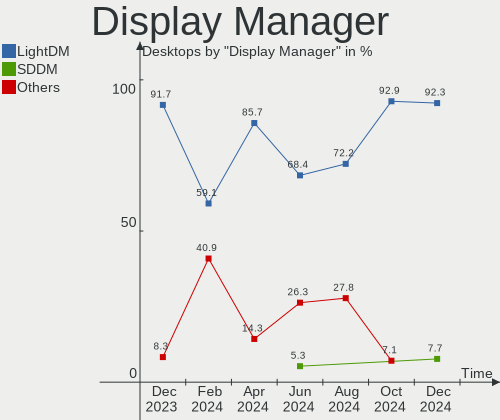
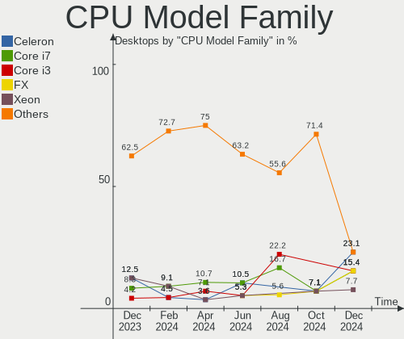
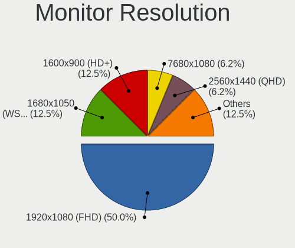
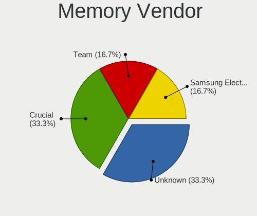

Xubuntu - Hardware Trends (Desktops)
------------------------------------

A project to identify most popular hardware characteristics and track their change
over time based on data collected by Linux users at https://Linux-Hardware.org.

Anyone can contribute to this report by the [hw-probe](https://github.com/linuxhw/hw-probe) tool:

    sudo -E hw-probe -all -upload

This report is for one last month. Overall report since the beginning of time: [TestDays](https://github.com/linuxhw/TestDays)

Period: Feb, 2023.

Contents
--------

* [ System ](#system)
  - [ OS                       ](#os)
  - [ OS Family                ](#os-family)
  - [ Kernel                   ](#kernel)
  - [ Kernel Family            ](#kernel-family)
  - [ Kernel Major Ver.        ](#kernel-major-ver)
  - [ Arch                     ](#arch)
  - [ DE                       ](#de)
  - [ Display Server           ](#display-server)
  - [ Display Manager          ](#display-manager)
  - [ OS Lang                  ](#os-lang)
  - [ Boot Mode                ](#boot-mode)
  - [ Filesystem               ](#filesystem)
  - [ Part. scheme             ](#part-scheme)
  - [ Dual Boot with Linux/BSD ](#dual-boot-with-linuxbsd)
  - [ Dual Boot (Win)          ](#dual-boot-win)

* [ Board ](#board)
  - [ Vendor                   ](#vendor)
  - [ Model                    ](#model)
  - [ Model Family             ](#model-family)
  - [ MFG Year                 ](#mfg-year)
  - [ Form Factor              ](#form-factor)
  - [ Secure Boot              ](#secure-boot)
  - [ Coreboot                 ](#coreboot)
  - [ RAM Size                 ](#ram-size)
  - [ RAM Used                 ](#ram-used)
  - [ Total Drives             ](#total-drives)
  - [ Has CD-ROM               ](#has-cd-rom)
  - [ Has Ethernet             ](#has-ethernet)
  - [ Has WiFi                 ](#has-wifi)
  - [ Has Bluetooth            ](#has-bluetooth)

* [ Location ](#location)
  - [ Country                  ](#country)
  - [ City                     ](#city)

* [ Drives ](#drives)
  - [ Drive Vendor             ](#drive-vendor)
  - [ Drive Model              ](#drive-model)
  - [ HDD Vendor               ](#hdd-vendor)
  - [ SSD Vendor               ](#ssd-vendor)
  - [ Drive Kind               ](#drive-kind)
  - [ Drive Connector          ](#drive-connector)
  - [ Drive Size               ](#drive-size)
  - [ Space Total              ](#space-total)
  - [ Space Used               ](#space-used)
  - [ Malfunc. Drives          ](#malfunc-drives)
  - [ Malfunc. Drive Vendor    ](#malfunc-drive-vendor)
  - [ Malfunc. HDD Vendor      ](#malfunc-hdd-vendor)
  - [ Malfunc. Drive Kind      ](#malfunc-drive-kind)
  - [ Failed Drives            ](#failed-drives)
  - [ Failed Drive Vendor      ](#failed-drive-vendor)
  - [ Drive Status             ](#drive-status)

* [ Storage controller ](#storage-controller)
  - [ Storage Vendor           ](#storage-vendor)
  - [ Storage Model            ](#storage-model)
  - [ Storage Kind             ](#storage-kind)

* [ Processor ](#processor)
  - [ CPU Vendor               ](#cpu-vendor)
  - [ CPU Model                ](#cpu-model)
  - [ CPU Model Family         ](#cpu-model-family)
  - [ CPU Cores                ](#cpu-cores)
  - [ CPU Sockets              ](#cpu-sockets)
  - [ CPU Threads              ](#cpu-threads)
  - [ CPU Op-Modes             ](#cpu-op-modes)
  - [ CPU Microcode            ](#cpu-microcode)
  - [ CPU Microarch            ](#cpu-microarch)

* [ Graphics ](#graphics)
  - [ GPU Vendor               ](#gpu-vendor)
  - [ GPU Model                ](#gpu-model)
  - [ GPU Combo                ](#gpu-combo)
  - [ GPU Driver               ](#gpu-driver)
  - [ GPU Memory               ](#gpu-memory)

* [ Monitor ](#monitor)
  - [ Monitor Vendor           ](#monitor-vendor)
  - [ Monitor Model            ](#monitor-model)
  - [ Monitor Resolution       ](#monitor-resolution)
  - [ Monitor Diagonal         ](#monitor-diagonal)
  - [ Monitor Width            ](#monitor-width)
  - [ Aspect Ratio             ](#aspect-ratio)
  - [ Monitor Area             ](#monitor-area)
  - [ Pixel Density            ](#pixel-density)
  - [ Multiple Monitors        ](#multiple-monitors)

* [ Network ](#network)
  - [ Net Controller Vendor    ](#net-controller-vendor)
  - [ Net Controller Model     ](#net-controller-model)
  - [ Wireless Vendor          ](#wireless-vendor)
  - [ Wireless Model           ](#wireless-model)
  - [ Ethernet Vendor          ](#ethernet-vendor)
  - [ Ethernet Model           ](#ethernet-model)
  - [ Net Controller Kind      ](#net-controller-kind)
  - [ Used Controller          ](#used-controller)
  - [ NICs                     ](#nics)
  - [ IPv6                     ](#ipv6)

* [ Bluetooth ](#bluetooth)
  - [ Bluetooth Vendor         ](#bluetooth-vendor)
  - [ Bluetooth Model          ](#bluetooth-model)

* [ Sound ](#sound)
  - [ Sound Vendor             ](#sound-vendor)
  - [ Sound Model              ](#sound-model)

* [ Memory ](#memory)
  - [ Memory Vendor            ](#memory-vendor)
  - [ Memory Model             ](#memory-model)
  - [ Memory Kind              ](#memory-kind)
  - [ Memory Form Factor       ](#memory-form-factor)
  - [ Memory Size              ](#memory-size)
  - [ Memory Speed             ](#memory-speed)

* [ Printers & scanners ](#printers--scanners)
  - [ Printer Vendor           ](#printer-vendor)
  - [ Printer Model            ](#printer-model)
  - [ Scanner Vendor           ](#scanner-vendor)
  - [ Scanner Model            ](#scanner-model)

* [ Camera ](#camera)
  - [ Camera Vendor            ](#camera-vendor)
  - [ Camera Model             ](#camera-model)

* [ Security ](#security)
  - [ Fingerprint Vendor       ](#fingerprint-vendor)
  - [ Fingerprint Model        ](#fingerprint-model)
  - [ Chipcard Vendor          ](#chipcard-vendor)
  - [ Chipcard Model           ](#chipcard-model)

* [ Unsupported ](#unsupported)
  - [ Unsupported Devices      ](#unsupported-devices)
  - [ Unsupported Device Types ](#unsupported-device-types)

System
------

OS
--

Installed operating systems

| Name          | Desktops | Percent |
|---------------|----------|---------|
| Xubuntu 22.04 | 13       | 39.39%  |
| Xubuntu 20.04 | 11       | 33.33%  |
| Xubuntu 18.04 | 5        | 15.15%  |
| Xubuntu 22.10 | 4        | 12.12%  |

OS Family
---------

OS without a version

| Name    | Desktops | Percent |
|---------|----------|---------|
| Xubuntu | 33       | 100%    |

Kernel
------

Version of the Linux kernel

| Version                | Desktops | Percent |
|------------------------|----------|---------|
| 5.15.0-60-generic      | 7        | 21.21%  |
| 5.15.0-60-lowlatency   | 5        | 15.15%  |
| 5.4.0-137-generic      | 4        | 12.12%  |
| 5.4.0-139-generic      | 2        | 6.06%   |
| 5.19.0-31-generic      | 2        | 6.06%   |
| 5.15.0-58-generic      | 2        | 6.06%   |
| 5.15.0-52-generic      | 2        | 6.06%   |
| 4.15.0-202-generic     | 2        | 6.06%   |
| 6.2.0                  | 1        | 3.03%   |
| 6.1.10.mmn             | 1        | 3.03%   |
| 5.4.0-139-lowlatency   | 1        | 3.03%   |
| 5.4.0-137-lowlatency   | 1        | 3.03%   |
| 5.19.0-32-generic      | 1        | 3.03%   |
| 5.19.0-1017-lowlatency | 1        | 3.03%   |
| 4.15.0-204-generic     | 1        | 3.03%   |

Kernel Family
-------------

Linux kernel without a distro release

| Version | Desktops | Percent |
|---------|----------|---------|
| 5.15.0  | 16       | 48.48%  |
| 5.4.0   | 8        | 24.24%  |
| 5.19.0  | 4        | 12.12%  |
| 4.15.0  | 3        | 9.09%   |
| 6.2.0   | 1        | 3.03%   |
| 6.1.10  | 1        | 3.03%   |

Kernel Major Ver.
-----------------

Linux kernel major version

| Version | Desktops | Percent |
|---------|----------|---------|
| 5.15    | 16       | 48.48%  |
| 5.4     | 8        | 24.24%  |
| 5.19    | 4        | 12.12%  |
| 4.15    | 3        | 9.09%   |
| 6.2     | 1        | 3.03%   |
| 6.1     | 1        | 3.03%   |

Arch
----

OS architecture (x86_64, i586, etc.)

| Name   | Desktops | Percent |
|--------|----------|---------|
| x86_64 | 31       | 93.94%  |
| i686   | 2        | 6.06%   |

DE
--

Desktop Environment

| Name  | Desktops | Percent |
|-------|----------|---------|
| XFCE  | 30       | 90.91%  |
| GNOME | 2        | 6.06%   |
| i3    | 1        | 3.03%   |

Display Server
--------------

X11 or Wayland

| Name | Desktops | Percent |
|------|----------|---------|
| X11  | 33       | 100%    |

Display Manager
---------------

SDDM, LightDM, etc.

| Name    | Desktops | Percent |
|---------|----------|---------|
| LightDM | 26       | 78.79%  |
| Unknown | 5        | 15.15%  |
| SDDM    | 1        | 3.03%   |
| GDM3    | 1        | 3.03%   |

OS Lang
-------

Language

| Lang  | Desktops | Percent |
|-------|----------|---------|
| en_US | 6        | 18.18%  |
| de_DE | 6        | 18.18%  |
| fr_FR | 4        | 12.12%  |
| en_CA | 3        | 9.09%   |
| it_IT | 2        | 6.06%   |
| ru_UA | 1        | 3.03%   |
| pt_BR | 1        | 3.03%   |
| nl_NL | 1        | 3.03%   |
| ja_JP | 1        | 3.03%   |
| fr_CH | 1        | 3.03%   |
| es_VE | 1        | 3.03%   |
| es_UY | 1        | 3.03%   |
| en_ZA | 1        | 3.03%   |
| en_GB | 1        | 3.03%   |
| de_AT | 1        | 3.03%   |
| cs_CZ | 1        | 3.03%   |
| C     | 1        | 3.03%   |

Boot Mode
---------

EFI or BIOS

| Mode | Desktops | Percent |
|------|----------|---------|
| BIOS | 21       | 63.64%  |
| EFI  | 12       | 36.36%  |

Filesystem
----------

Type of filesystem

| Type  | Desktops | Percent |
|-------|----------|---------|
| Ext4  | 31       | 93.94%  |
| Btrfs | 2        | 6.06%   |

Part. scheme
------------

Scheme of partitioning

| Type    | Desktops | Percent |
|---------|----------|---------|
| GPT     | 19       | 57.58%  |
| MBR     | 9        | 27.27%  |
| Unknown | 5        | 15.15%  |

Dual Boot with Linux/BSD
------------------------

Hosting more than one Linux/BSD

| Dual boot | Desktops | Percent |
|-----------|----------|---------|
| No        | 25       | 75.76%  |
| Yes       | 8        | 24.24%  |

Dual Boot (Win)
---------------

Hosting Linux and Windows

| Dual boot | Desktops | Percent |
|-----------|----------|---------|
| No        | 20       | 60.61%  |
| Yes       | 13       | 39.39%  |

Board
-----

Vendor
------

Motherboard manufacturer

| Name                | Desktops | Percent |
|---------------------|----------|---------|
| MSI                 | 7        | 21.21%  |
| Gigabyte Technology | 7        | 21.21%  |
| ASUSTek Computer    | 7        | 21.21%  |
| Dell                | 3        | 9.09%   |
| ASRock              | 2        | 6.06%   |
| Pegatron            | 1        | 3.03%   |
| Packard Bell        | 1        | 3.03%   |
| Intel               | 1        | 3.03%   |
| Hewlett-Packard     | 1        | 3.03%   |
| Fujitsu             | 1        | 3.03%   |
| AZW                 | 1        | 3.03%   |
| Unknown             | 1        | 3.03%   |

Model
-----

Motherboard model

| Name                              | Desktops | Percent |
|-----------------------------------|----------|---------|
| Pegatron KT457AA-ABA IQ804        | 1        | 3.03%   |
| Packard Bell IXTREME M5800        | 1        | 3.03%   |
| MSI MS-7D25                       | 1        | 3.03%   |
| MSI MS-7C37                       | 1        | 3.03%   |
| MSI MS-7A32                       | 1        | 3.03%   |
| MSI MS-7982                       | 1        | 3.03%   |
| MSI MS-7835                       | 1        | 3.03%   |
| MSI MS-7788                       | 1        | 3.03%   |
| MSI MS-7309                       | 1        | 3.03%   |
| Intel X79                         | 1        | 3.03%   |
| HP Z620 Workstation               | 1        | 3.03%   |
| Gigabyte Z170XP-SLI               | 1        | 3.03%   |
| Gigabyte H410M S2 V3              | 1        | 3.03%   |
| Gigabyte GB-BACE-3160             | 1        | 3.03%   |
| Gigabyte GB-BACE-3150             | 1        | 3.03%   |
| Gigabyte GA-A75-UD4H              | 1        | 3.03%   |
| Gigabyte B550 AORUS ELITE         | 1        | 3.03%   |
| Gigabyte 945GZM-S2                | 1        | 3.03%   |
| Fujitsu ESPRIMO Q958              | 1        | 3.03%   |
| Dell OptiPlex XE2                 | 1        | 3.03%   |
| Dell OptiPlex 790                 | 1        | 3.03%   |
| Dell OptiPlex 7050                | 1        | 3.03%   |
| AZW U59                           | 1        | 3.03%   |
| ASUS ROG CROSSHAIR VIII DARK HERO | 1        | 3.03%   |
| ASUS P8H77-I                      | 1        | 3.03%   |
| ASUS P5V-VM DH                    | 1        | 3.03%   |
| ASUS P5KC                         | 1        | 3.03%   |
| ASUS M5A97 LE R2.0                | 1        | 3.03%   |
| ASUS H170 PRO GAMING              | 1        | 3.03%   |
| ASUS All Series                   | 1        | 3.03%   |
| ASRock H81M-DGS R2.0              | 1        | 3.03%   |
| ASRock AOD790GX/128M              | 1        | 3.03%   |
| Unknown                           | 1        | 3.03%   |

Model Family
------------

Motherboard model prefix

| Name                  | Desktops | Percent |
|-----------------------|----------|---------|
| Dell OptiPlex         | 3        | 9.09%   |
| Pegatron KT457AA-ABA  | 1        | 3.03%   |
| Packard Bell IXTREME  | 1        | 3.03%   |
| MSI MS-7D25           | 1        | 3.03%   |
| MSI MS-7C37           | 1        | 3.03%   |
| MSI MS-7A32           | 1        | 3.03%   |
| MSI MS-7982           | 1        | 3.03%   |
| MSI MS-7835           | 1        | 3.03%   |
| MSI MS-7788           | 1        | 3.03%   |
| MSI MS-7309           | 1        | 3.03%   |
| Intel X79             | 1        | 3.03%   |
| HP Z620               | 1        | 3.03%   |
| Gigabyte Z170XP-SLI   | 1        | 3.03%   |
| Gigabyte H410M        | 1        | 3.03%   |
| Gigabyte GB-BACE-3160 | 1        | 3.03%   |
| Gigabyte GB-BACE-3150 | 1        | 3.03%   |
| Gigabyte GA-A75-UD4H  | 1        | 3.03%   |
| Gigabyte B550         | 1        | 3.03%   |
| Gigabyte 945GZM-S2    | 1        | 3.03%   |
| Fujitsu ESPRIMO       | 1        | 3.03%   |
| AZW U59               | 1        | 3.03%   |
| ASUS ROG              | 1        | 3.03%   |
| ASUS P8H77-I          | 1        | 3.03%   |
| ASUS P5V-VM           | 1        | 3.03%   |
| ASUS P5KC             | 1        | 3.03%   |
| ASUS M5A97            | 1        | 3.03%   |
| ASUS H170             | 1        | 3.03%   |
| ASUS All              | 1        | 3.03%   |
| ASRock H81M-DGS       | 1        | 3.03%   |
| ASRock AOD790GX       | 1        | 3.03%   |
| Unknown               | 1        | 3.03%   |

MFG Year
--------

Motherboard manufacture year

| Year | Desktops | Percent |
|------|----------|---------|
| 2021 | 4        | 12.12%  |
| 2015 | 4        | 12.12%  |
| 2012 | 4        | 12.12%  |
| 2013 | 3        | 9.09%   |
| 2020 | 2        | 6.06%   |
| 2017 | 2        | 6.06%   |
| 2016 | 2        | 6.06%   |
| 2011 | 2        | 6.06%   |
| 2010 | 2        | 6.06%   |
| 2009 | 2        | 6.06%   |
| 2007 | 2        | 6.06%   |
| 2006 | 2        | 6.06%   |
| 2019 | 1        | 3.03%   |
| 2014 | 1        | 3.03%   |

Form Factor
-----------

Physical design of the computer

| Name    | Desktops | Percent |
|---------|----------|---------|
| Desktop | 33       | 100%    |

Secure Boot
-----------

Enabled or disabled

| State    | Desktops | Percent |
|----------|----------|---------|
| Disabled | 31       | 93.94%  |
| Enabled  | 2        | 6.06%   |

Coreboot
--------

Have coreboot on board

| Used | Desktops | Percent |
|------|----------|---------|
| No   | 33       | 100%    |

RAM Size
--------

Total RAM memory

| Size in GB  | Desktops | Percent |
|-------------|----------|---------|
| 16.01-24.0  | 8        | 24.24%  |
| 4.01-8.0    | 6        | 18.18%  |
| 3.01-4.0    | 5        | 15.15%  |
| 32.01-64.0  | 4        | 12.12%  |
| 64.01-256.0 | 3        | 9.09%   |
| 8.01-16.0   | 3        | 9.09%   |
| 24.01-32.0  | 2        | 6.06%   |
| 1.01-2.0    | 1        | 3.03%   |
| 0.51-1.0    | 1        | 3.03%   |

RAM Used
--------

Used RAM memory

| Used GB   | Desktops | Percent |
|-----------|----------|---------|
| 1.01-2.0  | 13       | 39.39%  |
| 2.01-3.0  | 10       | 30.3%   |
| 4.01-8.0  | 5        | 15.15%  |
| 8.01-16.0 | 2        | 6.06%   |
| 3.01-4.0  | 1        | 3.03%   |
| 0.51-1.0  | 1        | 3.03%   |
| 0.01-0.5  | 1        | 3.03%   |

Total Drives
------------

Number of drives on board

| Drives | Desktops | Percent |
|--------|----------|---------|
| 2      | 12       | 36.36%  |
| 1      | 8        | 24.24%  |
| 3      | 6        | 18.18%  |
| 5      | 3        | 9.09%   |
| 11     | 1        | 3.03%   |
| 9      | 1        | 3.03%   |
| 7      | 1        | 3.03%   |
| 4      | 1        | 3.03%   |

Has CD-ROM
----------

Has CD-ROM on board

| Presented | Desktops | Percent |
|-----------|----------|---------|
| Yes       | 19       | 57.58%  |
| No        | 14       | 42.42%  |

Has Ethernet
------------

Has Ethernet on board

| Presented | Desktops | Percent |
|-----------|----------|---------|
| Yes       | 33       | 100%    |

Has WiFi
--------

Has WiFi module

| Presented | Desktops | Percent |
|-----------|----------|---------|
| No        | 21       | 63.64%  |
| Yes       | 12       | 36.36%  |

Has Bluetooth
-------------

Has Bluetooth module

| Presented | Desktops | Percent |
|-----------|----------|---------|
| No        | 23       | 69.7%   |
| Yes       | 10       | 30.3%   |

Location
--------

Country
-------

Geographic location (country)

| Country      | Desktops | Percent |
|--------------|----------|---------|
| Germany      | 7        | 21.21%  |
| France       | 4        | 12.12%  |
| Italy        | 3        | 9.09%   |
| Canada       | 3        | 9.09%   |
| USA          | 2        | 6.06%   |
| Russia       | 2        | 6.06%   |
| Austria      | 2        | 6.06%   |
| Venezuela    | 1        | 3.03%   |
| Uruguay      | 1        | 3.03%   |
| UK           | 1        | 3.03%   |
| Switzerland  | 1        | 3.03%   |
| South Africa | 1        | 3.03%   |
| Romania      | 1        | 3.03%   |
| Netherlands  | 1        | 3.03%   |
| Japan        | 1        | 3.03%   |
| Czechia      | 1        | 3.03%   |
| Brazil       | 1        | 3.03%   |

City
----

Geographic location (city)

| City             | Desktops | Percent |
|------------------|----------|---------|
| Witten           | 2        | 6.06%   |
| Vienna           | 1        | 3.03%   |
| Vancouver        | 1        | 3.03%   |
| Toledo           | 1        | 3.03%   |
| St Louis         | 1        | 3.03%   |
| Sherbrooke       | 1        | 3.03%   |
| Shchelkovo       | 1        | 3.03%   |
| Schopfloch       | 1        | 3.03%   |
| Rinteln          | 1        | 3.03%   |
| Ried im Innkreis | 1        | 3.03%   |
| Plounerin        | 1        | 3.03%   |
| Pilsen           | 1        | 3.03%   |
| Osaka            | 1        | 3.03%   |
| Niterói         | 1        | 3.03%   |
| Neuenhof         | 1        | 3.03%   |
| Montevideo       | 1        | 3.03%   |
| Milan            | 1        | 3.03%   |
| Marseille        | 1        | 3.03%   |
| London           | 1        | 3.03%   |
| Legnaro          | 1        | 3.03%   |
| Hanover          | 1        | 3.03%   |
| Freiberg         | 1        | 3.03%   |
| Donetsk          | 1        | 3.03%   |
| Cape Town        | 1        | 3.03%   |
| Cagliari         | 1        | 3.03%   |
| Bucharest        | 1        | 3.03%   |
| Bourg-en-Bresse  | 1        | 3.03%   |
| Boucherville     | 1        | 3.03%   |
| Bischwiller      | 1        | 3.03%   |
| Berlin           | 1        | 3.03%   |
| Barquisimeto     | 1        | 3.03%   |
| Almere Stad      | 1        | 3.03%   |

Drives
------

Drive Vendor
------------

Hard drive vendors

| Vendor                      | Desktops | Drives | Percent |
|-----------------------------|----------|--------|---------|
| Seagate                     | 16       | 26     | 21.92%  |
| WDC                         | 12       | 18     | 16.44%  |
| Samsung Electronics         | 8        | 9      | 10.96%  |
| Kingston                    | 8        | 10     | 10.96%  |
| Toshiba                     | 4        | 5      | 5.48%   |
| SanDisk                     | 4        | 5      | 5.48%   |
| A-DATA Technology           | 4        | 4      | 5.48%   |
| Hitachi                     | 3        | 3      | 4.11%   |
| Crucial                     | 2        | 2      | 2.74%   |
| TECHLEAF-SSD                | 1        | 1      | 1.37%   |
| Phison Electronics          | 1        | 1      | 1.37%   |
| Phison                      | 1        | 2      | 1.37%   |
| OCZ                         | 1        | 1      | 1.37%   |
| Maxtor                      | 1        | 1      | 1.37%   |
| LaCie                       | 1        | 1      | 1.37%   |
| Kingston Technology Company | 1        | 1      | 1.37%   |
| Intenso                     | 1        | 1      | 1.37%   |
| Intel                       | 1        | 1      | 1.37%   |
| HGST                        | 1        | 1      | 1.37%   |
| Dogfish                     | 1        | 1      | 1.37%   |
| China                       | 1        | 1      | 1.37%   |

Drive Model
-----------

Hard drive models

| Model                               | Desktops | Percent |
|-------------------------------------|----------|---------|
| Seagate ST500DM002-1BD142 500GB     | 3        | 3.33%   |
| Kingston SA400S37240G 240GB SSD     | 3        | 3.33%   |
| Seagate ST500DM002-1BC142 500GB     | 2        | 2.22%   |
| Seagate ST4000VX007-2DT166 4TB      | 2        | 2.22%   |
| A-DATA SU800 256GB SSD              | 2        | 2.22%   |
| WDC WUH721816ALE6L4 16TB            | 1        | 1.11%   |
| WDC WD60EFZX-68B3FN0 6TB            | 1        | 1.11%   |
| WDC WD5000BPVT-80HXZT3 500GB        | 1        | 1.11%   |
| WDC WD5000AZLX-60K2TA0 500GB        | 1        | 1.11%   |
| WDC WD5000AAKX-003CA0 500GB         | 1        | 1.11%   |
| WDC WD40EZRZ-00GXCB0 4TB            | 1        | 1.11%   |
| WDC WD4003FRYZ-01F0DB0 4TB          | 1        | 1.11%   |
| WDC WD2500AAKS-00VSA0 250GB         | 1        | 1.11%   |
| WDC WD20NPVZ-00WFZT0 2TB            | 1        | 1.11%   |
| WDC WD20EARS-00MVWB0 2TB            | 1        | 1.11%   |
| WDC WD2003FZEX-00Z4SA0 2TB          | 1        | 1.11%   |
| WDC WD10EZEX-60WN4A1 1TB            | 1        | 1.11%   |
| WDC WD10EZEX-22MFCA0 1TB            | 1        | 1.11%   |
| WDC WD10EZEX-08M2NA0 1TB            | 1        | 1.11%   |
| WDC WD10EZEX-07WN4A0 1TB            | 1        | 1.11%   |
| WDC WD1003FBYX-01Y7B1 1TB           | 1        | 1.11%   |
| WDC WD10 EAVS-00D7B1 1TB            | 1        | 1.11%   |
| Toshiba MK6034GSX 64GB              | 1        | 1.11%   |
| Toshiba MG06ACA800E 8TB             | 1        | 1.11%   |
| Toshiba HDWD120 2TB                 | 1        | 1.11%   |
| Toshiba DT01ACA300 3TB              | 1        | 1.11%   |
| Toshiba DT01ACA200 2TB              | 1        | 1.11%   |
| TECHLEAF-SSD 1TB                    | 1        | 1.11%   |
| Seagate ST750LM022 HN-M750MBB 752GB | 1        | 1.11%   |
| Seagate ST500LT012-1DG142 500GB     | 1        | 1.11%   |
| Seagate ST4000VN008-2DR166 4TB      | 1        | 1.11%   |
| Seagate ST4000DM005-2DP166 4TB      | 1        | 1.11%   |
| Seagate ST4000DM004-2CV104 4TB      | 1        | 1.11%   |
| Seagate ST3500620AS 500GB           | 1        | 1.11%   |
| Seagate ST3320418AS 320GB           | 1        | 1.11%   |
| Seagate ST2000NM0011 2TB            | 1        | 1.11%   |
| Seagate ST2000LX001-1RG174 2TB      | 1        | 1.11%   |
| Seagate ST2000DM008-2FR102 2TB      | 1        | 1.11%   |
| Seagate ST2000DM001-1CH164 2TB      | 1        | 1.11%   |
| Seagate ST2000DL003-9VT166 2TB      | 1        | 1.11%   |

HDD Vendor
----------

Hard disk drive vendors

| Vendor              | Desktops | Drives | Percent |
|---------------------|----------|--------|---------|
| Seagate             | 16       | 26     | 40%     |
| WDC                 | 12       | 18     | 30%     |
| Toshiba             | 4        | 5      | 10%     |
| Hitachi             | 3        | 3      | 7.5%    |
| Samsung Electronics | 2        | 2      | 5%      |
| Maxtor              | 1        | 1      | 2.5%    |
| LaCie               | 1        | 1      | 2.5%    |
| HGST                | 1        | 1      | 2.5%    |

SSD Vendor
----------

Solid state drive vendors

| Vendor              | Desktops | Drives | Percent |
|---------------------|----------|--------|---------|
| Kingston            | 8        | 10     | 33.33%  |
| Samsung Electronics | 4        | 5      | 16.67%  |
| A-DATA Technology   | 4        | 4      | 16.67%  |
| SanDisk             | 2        | 2      | 8.33%   |
| Crucial             | 2        | 2      | 8.33%   |
| OCZ                 | 1        | 1      | 4.17%   |
| Intenso             | 1        | 1      | 4.17%   |
| Dogfish             | 1        | 1      | 4.17%   |
| China               | 1        | 1      | 4.17%   |

Drive Kind
----------

HDD or SSD

| Kind    | Desktops | Drives | Percent |
|---------|----------|--------|---------|
| HDD     | 24       | 57     | 44.44%  |
| SSD     | 22       | 27     | 40.74%  |
| NVMe    | 7        | 10     | 12.96%  |
| Unknown | 1        | 1      | 1.85%   |

Drive Connector
---------------

SATA, SAS, NVMe, etc.

| Type | Desktops | Drives | Percent |
|------|----------|--------|---------|
| SATA | 31       | 79     | 72.09%  |
| NVMe | 7        | 10     | 16.28%  |
| SAS  | 5        | 6      | 11.63%  |

Drive Size
----------

Size of hard drive

| Size in TB | Desktops | Drives | Percent |
|------------|----------|--------|---------|
| 0.01-0.5   | 28       | 42     | 46.67%  |
| 0.51-1.0   | 12       | 16     | 20%     |
| 1.01-2.0   | 9        | 12     | 15%     |
| 3.01-4.0   | 7        | 9      | 11.67%  |
| 4.01-10.0  | 2        | 3      | 3.33%   |
| 2.01-3.0   | 1        | 1      | 1.67%   |
| 10.01-20.0 | 1        | 1      | 1.67%   |

Space Total
-----------

Amount of disk space available on the file system

| Size in GB     | Desktops | Percent |
|----------------|----------|---------|
| 251-500        | 9        | 27.27%  |
| 501-1000       | 6        | 18.18%  |
| More than 3000 | 5        | 15.15%  |
| 2001-3000      | 4        | 12.12%  |
| 101-250        | 4        | 12.12%  |
| 1001-2000      | 4        | 12.12%  |
| 51-100         | 1        | 3.03%   |

Space Used
----------

Amount of used disk space

| Used GB        | Desktops | Percent |
|----------------|----------|---------|
| 101-250        | 7        | 21.21%  |
| 251-500        | 5        | 15.15%  |
| 1-20           | 5        | 15.15%  |
| 501-1000       | 5        | 15.15%  |
| 51-100         | 5        | 15.15%  |
| More than 3000 | 4        | 12.12%  |
| 21-50          | 1        | 3.03%   |
| 2001-3000      | 1        | 3.03%   |

Malfunc. Drives
---------------

Drive models with a malfunction

| Model                                        | Desktops | Drives | Percent |
|----------------------------------------------|----------|--------|---------|
| WDC WD2500AAKS-00VSA0 250GB                  | 1        | 1      | 25%     |
| WDC WD20EARS-00MVWB0 2TB                     | 1        | 1      | 25%     |
| Samsung Electronics SSD 840 PRO Series 256GB | 1        | 1      | 25%     |
| Maxtor STM3320620A 320GB                     | 1        | 1      | 25%     |

Malfunc. Drive Vendor
---------------------

Vendors of faulty drives

| Vendor              | Desktops | Drives | Percent |
|---------------------|----------|--------|---------|
| WDC                 | 1        | 2      | 33.33%  |
| Samsung Electronics | 1        | 1      | 33.33%  |
| Maxtor              | 1        | 1      | 33.33%  |

Malfunc. HDD Vendor
-------------------

Vendors of faulty HDD drives

| Vendor | Desktops | Drives | Percent |
|--------|----------|--------|---------|
| WDC    | 1        | 2      | 50%     |
| Maxtor | 1        | 1      | 50%     |

Malfunc. Drive Kind
-------------------

Kinds of faulty drives

| Kind | Desktops | Drives | Percent |
|------|----------|--------|---------|
| HDD  | 2        | 3      | 66.67%  |
| SSD  | 1        | 1      | 33.33%  |

Failed Drives
-------------

Failed drive models

Zero info for selected period =(

Failed Drive Vendor
-------------------

Failed drive vendors

Zero info for selected period =(

Drive Status
------------

Number of failed and malfunc. drives

| Status   | Desktops | Drives | Percent |
|----------|----------|--------|---------|
| Detected | 21       | 67     | 56.76%  |
| Works    | 13       | 24     | 35.14%  |
| Malfunc  | 3        | 4      | 8.11%   |

Storage controller
------------------

Storage Vendor
--------------

Storage controller vendors

| Vendor                           | Desktops | Percent |
|----------------------------------|----------|---------|
| Intel                            | 23       | 48.94%  |
| AMD                              | 7        | 14.89%  |
| Silicon Image                    | 2        | 4.26%   |
| SanDisk                          | 2        | 4.26%   |
| Samsung Electronics              | 2        | 4.26%   |
| Phison Electronics               | 2        | 4.26%   |
| JMicron Technology               | 2        | 4.26%   |
| VIA Technologies                 | 1        | 2.13%   |
| Silicon Integrated Systems [SiS] | 1        | 2.13%   |
| Nvidia                           | 1        | 2.13%   |
| Marvell Technology Group         | 1        | 2.13%   |
| Kingston Technology Company      | 1        | 2.13%   |
| Broadcom / LSI                   | 1        | 2.13%   |
| ASMedia Technology               | 1        | 2.13%   |

Storage Model
-------------

Storage controller models

| Model                                                                                   | Desktops | Percent |
|-----------------------------------------------------------------------------------------|----------|---------|
| AMD FCH SATA Controller [AHCI mode]                                                     | 4        | 7.02%   |
| Intel Q170/Q150/B150/H170/H110/Z170/CM236 Chipset SATA Controller [AHCI Mode]           | 3        | 5.26%   |
| Silicon Image SiI 3114 [SATALink/SATARaid] Serial ATA Controller                        | 2        | 3.51%   |
| JMicron JMB363 SATA/IDE Controller                                                      | 2        | 3.51%   |
| Intel Atom/Celeron/Pentium Processor x5-E8000/J3xxx/N3xxx Series SATA Controller        | 2        | 3.51%   |
| Intel 8 Series/C220 Series Chipset Family 6-port SATA Controller 1 [AHCI mode]          | 2        | 3.51%   |
| AMD SB7x0/SB8x0/SB9x0 SATA Controller [AHCI mode]                                       | 2        | 3.51%   |
| VIA VT82C586A/B/VT82C686/A/B/VT823x/A/C PIPC Bus Master IDE                             | 1        | 1.75%   |
| VIA VT8237A SATA 2-Port Controller                                                      | 1        | 1.75%   |
| Silicon Integrated Systems [SiS] SATA Controller / IDE mode                             | 1        | 1.75%   |
| Silicon Integrated Systems [SiS] 5513 IDE Controller                                    | 1        | 1.75%   |
| SanDisk WD Black SN750 / PC SN730 NVMe SSD                                              | 1        | 1.75%   |
| SanDisk Non-Volatile memory controller                                                  | 1        | 1.75%   |
| Samsung NVMe SSD Controller SM981/PM981/PM983                                           | 1        | 1.75%   |
| Samsung NVMe SSD Controller PM9A1/PM9A3/980PRO                                          | 1        | 1.75%   |
| Phison E18 PCIe4 NVMe Controller                                                        | 1        | 1.75%   |
| Phison E16 PCIe4 NVMe Controller                                                        | 1        | 1.75%   |
| Nvidia MCP61 SATA Controller                                                            | 1        | 1.75%   |
| Nvidia MCP61 IDE                                                                        | 1        | 1.75%   |
| Marvell Group 88SE9215 PCIe 2.0 x1 4-port SATA 6 Gb/s Controller                        | 1        | 1.75%   |
| Kingston Company A2000 NVMe SSD                                                         | 1        | 1.75%   |
| Intel SSD 600P Series                                                                   | 1        | 1.75%   |
| Intel SATA Controller [RAID mode]                                                       | 1        | 1.75%   |
| Intel NM10/ICH7 Family SATA Controller [IDE mode]                                       | 1        | 1.75%   |
| Intel Jasper Lake SATA AHCI Controller                                                  | 1        | 1.75%   |
| Intel Cannon Lake PCH SATA AHCI Controller                                              | 1        | 1.75%   |
| Intel C602 chipset 4-Port SATA Storage Control Unit                                     | 1        | 1.75%   |
| Intel C600/X79 series chipset SATA RAID Controller                                      | 1        | 1.75%   |
| Intel C600/X79 series chipset 6-Port SATA AHCI Controller                               | 1        | 1.75%   |
| Intel Alder Lake-S PCH SATA Controller [AHCI Mode]                                      | 1        | 1.75%   |
| Intel 82801IB (ICH9) 2 port SATA Controller [IDE mode]                                  | 1        | 1.75%   |
| Intel 82801I (ICH9 Family) 2 port SATA Controller [IDE mode]                            | 1        | 1.75%   |
| Intel 82801HM/HEM (ICH8M/ICH8M-E) SATA Controller [AHCI mode]                           | 1        | 1.75%   |
| Intel 82801HM/HEM (ICH8M/ICH8M-E) IDE Controller                                        | 1        | 1.75%   |
| Intel 7 Series/C210 Series Chipset Family 6-port SATA Controller [AHCI mode]            | 1        | 1.75%   |
| Intel 7 Series Chipset Family 6-port SATA Controller [AHCI mode]                        | 1        | 1.75%   |
| Intel 6 Series/C200 Series Chipset Family Desktop SATA Controller (IDE mode, ports 4-5) | 1        | 1.75%   |
| Intel 6 Series/C200 Series Chipset Family Desktop SATA Controller (IDE mode, ports 0-3) | 1        | 1.75%   |
| Intel 6 Series/C200 Series Chipset Family 6 port Desktop SATA AHCI Controller           | 1        | 1.75%   |
| Intel 500 Series Chipset Family SATA AHCI Controller                                    | 1        | 1.75%   |

Storage Kind
------------

Kind of storage controller (IDE, SATA, NVMe, SAS, ...)

| Kind | Desktops | Percent |
|------|----------|---------|
| SATA | 25       | 54.35%  |
| IDE  | 8        | 17.39%  |
| NVMe | 7        | 15.22%  |
| RAID | 5        | 10.87%  |
| SAS  | 1        | 2.17%   |

Processor
---------

CPU Vendor
----------

Processor vendors

| Vendor | Desktops | Percent |
|--------|----------|---------|
| Intel  | 25       | 75.76%  |
| AMD    | 8        | 24.24%  |

CPU Model
---------

Processor models

| Model                                      | Desktops | Percent |
|--------------------------------------------|----------|---------|
| Intel Core i7-6700K CPU @ 4.00GHz          | 2        | 6.06%   |
| Intel Core i5-4670 CPU @ 3.40GHz           | 2        | 6.06%   |
| Intel Core 2 CPU 6300 @ 1.86GHz            | 2        | 6.06%   |
| Intel Xeon CPU E5-4650 v2 @ 2.40GHz        | 1        | 3.03%   |
| Intel Xeon CPU E5-2658 v2 @ 2.40GHz        | 1        | 3.03%   |
| Intel Core i7-9700T CPU @ 2.00GHz          | 1        | 3.03%   |
| Intel Core i7-6700 CPU @ 3.40GHz           | 1        | 3.03%   |
| Intel Core i7-3770T CPU @ 2.50GHz          | 1        | 3.03%   |
| Intel Core i7-2600 CPU @ 3.40GHz           | 1        | 3.03%   |
| Intel Core i7 CPU 870 @ 2.93GHz            | 1        | 3.03%   |
| Intel Core i5-6600 CPU @ 3.30GHz           | 1        | 3.03%   |
| Intel Core i3-4330 CPU @ 3.50GHz           | 1        | 3.03%   |
| Intel Core i3-3250 CPU @ 3.50GHz           | 1        | 3.03%   |
| Intel Core i3-10100 CPU @ 3.60GHz          | 1        | 3.03%   |
| Intel Core 2 Quad CPU Q6600 @ 2.40GHz      | 1        | 3.03%   |
| Intel Core 2 Duo CPU T5850 @ 2.16GHz       | 1        | 3.03%   |
| Intel Celeron N5105 @ 2.00GHz              | 1        | 3.03%   |
| Intel Celeron CPU N3150 @ 1.60GHz          | 1        | 3.03%   |
| Intel Celeron CPU J3160 @ 1.60GHz          | 1        | 3.03%   |
| Intel Celeron CPU 847 @ 1.10GHz            | 1        | 3.03%   |
| Intel Atom CPU 230 @ 1.60GHz               | 1        | 3.03%   |
| Intel 12th Gen Core i7-12700K              | 1        | 3.03%   |
| AMD Ryzen 9 5950X 16-Core Processor        | 1        | 3.03%   |
| AMD Ryzen 9 3900X 12-Core Processor        | 1        | 3.03%   |
| AMD Ryzen 7 3800X 8-Core Processor         | 1        | 3.03%   |
| AMD Ryzen 5 3600 6-Core Processor          | 1        | 3.03%   |
| AMD Phenom II X4 940 Processor             | 1        | 3.03%   |
| AMD FX-8350 Eight-Core Processor           | 1        | 3.03%   |
| AMD Athlon 64 X2 Dual Core Processor 4800+ | 1        | 3.03%   |
| AMD A8-3870 APU with Radeon HD Graphics    | 1        | 3.03%   |

CPU Model Family
----------------

Processor model prefix

| Model             | Desktops | Percent |
|-------------------|----------|---------|
| Intel Core i7     | 7        | 21.21%  |
| Intel Celeron     | 4        | 12.12%  |
| Intel Core i5     | 3        | 9.09%   |
| Intel Core i3     | 3        | 9.09%   |
| Intel Xeon        | 2        | 6.06%   |
| Intel Core 2      | 2        | 6.06%   |
| AMD Ryzen 9       | 2        | 6.06%   |
| Other             | 1        | 3.03%   |
| Intel Core 2 Quad | 1        | 3.03%   |
| Intel Core 2 Duo  | 1        | 3.03%   |
| Intel Atom        | 1        | 3.03%   |
| AMD Ryzen 7       | 1        | 3.03%   |
| AMD Ryzen 5       | 1        | 3.03%   |
| AMD Phenom II X4  | 1        | 3.03%   |
| AMD FX            | 1        | 3.03%   |
| AMD Athlon 64 X2  | 1        | 3.03%   |
| AMD A8            | 1        | 3.03%   |

CPU Cores
---------

Number of processor cores

| Number | Desktops | Percent |
|--------|----------|---------|
| 4      | 16       | 48.48%  |
| 2      | 7        | 21.21%  |
| 12     | 2        | 6.06%   |
| 8      | 2        | 6.06%   |
| 1      | 2        | 6.06%   |
| 20     | 1        | 3.03%   |
| 16     | 1        | 3.03%   |
| 10     | 1        | 3.03%   |
| 6      | 1        | 3.03%   |

CPU Sockets
-----------

Number of sockets

| Number | Desktops | Percent |
|--------|----------|---------|
| 1      | 32       | 96.97%  |
| 2      | 1        | 3.03%   |

CPU Threads
-----------

Threads per core (Hyper-Threading)

| Number | Desktops | Percent |
|--------|----------|---------|
| 2      | 18       | 54.55%  |
| 1      | 14       | 42.42%  |
| 4      | 1        | 3.03%   |

CPU Op-Modes
------------

CPU Operation Modes (32-bit, 64-bit)

| Op mode        | Desktops | Percent |
|----------------|----------|---------|
| 32-bit, 64-bit | 33       | 100%    |

CPU Microcode
-------------

Microcode number

| Number     | Desktops | Percent |
|------------|----------|---------|
| Unknown    | 11       | 33.33%  |
| 0x506e3    | 4        | 12.12%  |
| 0x6f6      | 2        | 6.06%   |
| 0x306e4    | 2        | 6.06%   |
| 0x306c3    | 2        | 6.06%   |
| 0x306a9    | 2        | 6.06%   |
| 0x906ed    | 1        | 3.03%   |
| 0x90672    | 1        | 3.03%   |
| 0x406c4    | 1        | 3.03%   |
| 0x406c3    | 1        | 3.03%   |
| 0x206a7    | 1        | 3.03%   |
| 0x106e5    | 1        | 3.03%   |
| 0x106c2    | 1        | 3.03%   |
| 0x0a201025 | 1        | 3.03%   |
| 0x08701013 | 1        | 3.03%   |
| 0x010000db | 1        | 3.03%   |

CPU Microarch
-------------

Microarchitecture

| Name             | Desktops | Percent |
|------------------|----------|---------|
| Skylake          | 4        | 12.12%  |
| IvyBridge        | 4        | 12.12%  |
| Core             | 4        | 12.12%  |
| Zen 2            | 3        | 9.09%   |
| Haswell          | 3        | 9.09%   |
| Silvermont       | 2        | 6.06%   |
| SandyBridge      | 2        | 6.06%   |
| Zen 3            | 1        | 3.03%   |
| Piledriver       | 1        | 3.03%   |
| Nehalem          | 1        | 3.03%   |
| KabyLake         | 1        | 3.03%   |
| K8 Hammer        | 1        | 3.03%   |
| K10 Llano        | 1        | 3.03%   |
| K10              | 1        | 3.03%   |
| CometLake        | 1        | 3.03%   |
| Bonnell          | 1        | 3.03%   |
| Alderlake Hybrid | 1        | 3.03%   |
| Unknown          | 1        | 3.03%   |

Graphics
--------

GPU Vendor
----------

Vendors of graphics cards

| Vendor                           | Desktops | Percent |
|----------------------------------|----------|---------|
| Intel                            | 16       | 45.71%  |
| Nvidia                           | 11       | 31.43%  |
| AMD                              | 7        | 20%     |
| Silicon Integrated Systems [SiS] | 1        | 2.86%   |

GPU Model
---------

Graphics card models

| Model                                                                                    | Desktops | Percent |
|------------------------------------------------------------------------------------------|----------|---------|
| Intel Xeon E3-1200 v3/4th Gen Core Processor Integrated Graphics Controller              | 3        | 8.57%   |
| Intel HD Graphics 530                                                                    | 2        | 5.71%   |
| Intel Atom/Celeron/Pentium Processor x5-E8000/J3xxx/N3xxx Integrated Graphics Controller | 2        | 5.71%   |
| Intel 2nd Generation Core Processor Family Integrated Graphics Controller                | 2        | 5.71%   |
| AMD Lexa PRO [Radeon 540/540X/550/550X / RX 540X/550/550X]                               | 2        | 5.71%   |
| AMD Ellesmere [Radeon RX 470/480/570/570X/580/580X/590]                                  | 2        | 5.71%   |
| Silicon Integrated Systems [SiS] 771/671 PCIE VGA Display Adapter                        | 1        | 2.86%   |
| Nvidia TU104 [GeForce RTX 2060]                                                          | 1        | 2.86%   |
| Nvidia GT218 [GeForce 210]                                                               | 1        | 2.86%   |
| Nvidia GM204 [GeForce GTX 970]                                                           | 1        | 2.86%   |
| Nvidia GK208B [GeForce GT 730]                                                           | 1        | 2.86%   |
| Nvidia GK208B [GeForce GT 720]                                                           | 1        | 2.86%   |
| Nvidia GK208B [GeForce GT 710]                                                           | 1        | 2.86%   |
| Nvidia GK106GL [Quadro K4000]                                                            | 1        | 2.86%   |
| Nvidia GA107 [GeForce RTX 3050 8GB]                                                      | 1        | 2.86%   |
| Nvidia G98M [GeForce 9300M GS]                                                           | 1        | 2.86%   |
| Nvidia G92 [GeForce GTS 250]                                                             | 1        | 2.86%   |
| Nvidia C61 [GeForce 6100 nForce 405]                                                     | 1        | 2.86%   |
| Intel Xeon E3-1200 v2/3rd Gen Core processor Graphics Controller                         | 1        | 2.86%   |
| Intel JasperLake [UHD Graphics]                                                          | 1        | 2.86%   |
| Intel IvyBridge GT2 [HD Graphics 4000]                                                   | 1        | 2.86%   |
| Intel CometLake-S GT2 [UHD Graphics 630]                                                 | 1        | 2.86%   |
| Intel CoffeeLake-S GT2 [UHD Graphics 630]                                                | 1        | 2.86%   |
| Intel AlderLake-S GT1                                                                    | 1        | 2.86%   |
| Intel 82945G/GZ Integrated Graphics Controller                                           | 1        | 2.86%   |
| AMD Turks XT [Radeon HD 6670/7670]                                                       | 1        | 2.86%   |
| AMD Navi 21 [Radeon RX 6800/6800 XT / 6900 XT]                                           | 1        | 2.86%   |
| AMD Baffin [Radeon RX 550 640SP / RX 560/560X]                                           | 1        | 2.86%   |

GPU Combo
---------

Combinations of graphics cards

| Name       | Desktops | Percent |
|------------|----------|---------|
| 1 x Intel  | 14       | 42.42%  |
| 1 x Nvidia | 11       | 33.33%  |
| 1 x AMD    | 7        | 21.21%  |
| 1 x SiS    | 1        | 3.03%   |

GPU Driver
----------

Free vs proprietary

| Driver      | Desktops | Percent |
|-------------|----------|---------|
| Free        | 25       | 75.76%  |
| Proprietary | 6        | 18.18%  |
| Unknown     | 2        | 6.06%   |

GPU Memory
----------

Total video memory

| Size in GB | Desktops | Percent |
|------------|----------|---------|
| Unknown    | 21       | 63.64%  |
| 1.01-2.0   | 5        | 15.15%  |
| 7.01-8.0   | 2        | 6.06%   |
| 3.01-4.0   | 2        | 6.06%   |
| 5.01-6.0   | 1        | 3.03%   |
| 2.01-3.0   | 1        | 3.03%   |
| 8.01-16.0  | 1        | 3.03%   |

Monitor
-------

Monitor Vendor
--------------

Monitor vendors

| Vendor               | Desktops | Percent |
|----------------------|----------|---------|
| Samsung Electronics  | 7        | 21.88%  |
| Hewlett-Packard      | 5        | 15.63%  |
| Goldstar             | 4        | 12.5%   |
| ViewSonic            | 2        | 6.25%   |
| Iiyama               | 2        | 6.25%   |
| IBM                  | 2        | 6.25%   |
| AOC                  | 2        | 6.25%   |
| NEC Computers        | 1        | 3.13%   |
| LG Electronics       | 1        | 3.13%   |
| Eizo                 | 1        | 3.13%   |
| Compal               | 1        | 3.13%   |
| BenQ                 | 1        | 3.13%   |
| ASUSTek Computer     | 1        | 3.13%   |
| Ancor Communications | 1        | 3.13%   |
| Acer                 | 1        | 3.13%   |

Monitor Model
-------------

Monitor models

| Model                                                                | Desktops | Percent |
|----------------------------------------------------------------------|----------|---------|
| ViewSonic VX2457 VSCB931 1920x1080 521x293mm 23.5-inch               | 1        | 2.86%   |
| ViewSonic VA2265 SERIES VSCB330 1920x1080 476x268mm 21.5-inch        | 1        | 2.86%   |
| Samsung Electronics SyncMaster SAM01AE 1600x1200 408x306mm 20.1-inch | 1        | 2.86%   |
| Samsung Electronics SMB2430L SAM0645 1920x1080 521x293mm 23.5-inch   | 1        | 2.86%   |
| Samsung Electronics S22E200 SAM0C6D 1920x1080 477x268mm 21.5-inch    | 1        | 2.86%   |
| Samsung Electronics S19A33x SAM711F 1366x768 410x230mm 18.5-inch     | 1        | 2.86%   |
| Samsung Electronics LCD Monitor SyncMaster 1280x1024                 | 1        | 2.86%   |
| Samsung Electronics LCD Monitor SMB2430L 3840x1080                   | 1        | 2.86%   |
| Samsung Electronics LCD Monitor SMB2430L                             | 1        | 2.86%   |
| Samsung Electronics LCD Monitor SAM0659 1920x1080                    | 1        | 2.86%   |
| NEC Computers EA241F NEC2EA1 1920x1080 527x296mm 23.8-inch           | 1        | 2.86%   |
| LG Electronics LCD Monitor W2452 1920x1200                           | 1        | 2.86%   |
| Iiyama PLX2783H IVM6648 1920x1080 598x336mm 27.0-inch                | 1        | 2.86%   |
| Iiyama PLE2483H IVM6113 1920x1080 531x299mm 24.0-inch                | 1        | 2.86%   |
| Iiyama PL3270Q IVM7607 2560x1440 698x393mm 31.5-inch                 | 1        | 2.86%   |
| IBM L150 IBM19EC 1024x768 304x228mm 15.0-inch                        | 1        | 2.86%   |
| IBM E74 IBM18BC 1280x1024 306x230mm 15.1-inch                        | 1        | 2.86%   |
| Hewlett-Packard vs17 HWP2647 1280x1024 337x270mm 17.0-inch           | 1        | 2.86%   |
| Hewlett-Packard LCD Monitor ZR2440w 5760x1200                        | 1        | 2.86%   |
| Hewlett-Packard LCD Monitor ZR2440w                                  | 1        | 2.86%   |
| Hewlett-Packard L1702 HWP2601 1280x1024 337x270mm 17.0-inch          | 1        | 2.86%   |
| Hewlett-Packard ENVY 32 HWP315F 2560x1440 708x399mm 32.0-inch        | 1        | 2.86%   |
| Hewlett-Packard 27m HPN3579 1920x1080 598x336mm 27.0-inch            | 1        | 2.86%   |
| Goldstar W2261 GSM56CE 1920x1080 477x268mm 21.5-inch                 | 1        | 2.86%   |
| Goldstar L1753S GSM446F 1280x1024 338x270mm 17.0-inch                | 1        | 2.86%   |
| Goldstar HDR WQHD+ GSM774D 3840x1600 879x366mm 37.5-inch             | 1        | 2.86%   |
| Goldstar 24M45 GSM5A53 1920x1080 521x293mm 23.5-inch                 | 1        | 2.86%   |
| Eizo EV2436W ENC2384 1920x1200 519x324mm 24.1-inch                   | 1        | 2.86%   |
| Compal TERRA 2446W WOR2446 1920x1080 527x296mm 23.8-inch             | 1        | 2.86%   |
| BenQ GL2460 BNQ78CE 1920x1080 531x299mm 24.0-inch                    | 1        | 2.86%   |
| ASUSTek Computer VG245 AUS24A1 1920x1080 531x299mm 24.0-inch         | 1        | 2.86%   |
| AOC U2868 AOC2868 3840x2160 621x341mm 27.9-inch                      | 1        | 2.86%   |
| AOC 1950W AOC1950 1366x768 410x230mm 18.5-inch                       | 1        | 2.86%   |
| Ancor Communications LCD Monitor ROG PG279Q 2560x1440                | 1        | 2.86%   |
| Acer B243PWL ACR02C5 1920x1200 518x324mm 24.1-inch                   | 1        | 2.86%   |

Monitor Resolution
------------------

Monitor screen resolution

| Resolution        | Desktops | Percent |
|-------------------|----------|---------|
| 1920x1080 (FHD)   | 11       | 34.38%  |
| 1280x1024 (SXGA)  | 5        | 15.63%  |
| 2560x1440 (QHD)   | 3        | 9.38%   |
| 1920x1200 (WUXGA) | 3        | 9.38%   |
| 1366x768 (WXGA)   | 2        | 6.25%   |
| Unknown           | 2        | 6.25%   |
| 5760x1200         | 1        | 3.13%   |
| 3840x2160 (4K)    | 1        | 3.13%   |
| 3840x1600         | 1        | 3.13%   |
| 3840x1080         | 1        | 3.13%   |
| 1600x1200         | 1        | 3.13%   |
| 1024x768 (XGA)    | 1        | 3.13%   |

Monitor Diagonal
----------------

Diagonal size in inches

| Inches  | Desktops | Percent |
|---------|----------|---------|
| 24      | 6        | 18.18%  |
| Unknown | 6        | 18.18%  |
| 23      | 4        | 12.12%  |
| 27      | 3        | 9.09%   |
| 21      | 3        | 9.09%   |
| 17      | 3        | 9.09%   |
| 18      | 2        | 6.06%   |
| 15      | 2        | 6.06%   |
| 37      | 1        | 3.03%   |
| 32      | 1        | 3.03%   |
| 31      | 1        | 3.03%   |
| 20      | 1        | 3.03%   |

Monitor Width
-------------

Physical width

| Width in mm | Desktops | Percent |
|-------------|----------|---------|
| 501-600     | 11       | 34.38%  |
| 401-500     | 6        | 18.75%  |
| Unknown     | 6        | 18.75%  |
| 301-350     | 5        | 15.63%  |
| 601-700     | 2        | 6.25%   |
| 801-900     | 1        | 3.13%   |
| 701-800     | 1        | 3.13%   |

Aspect Ratio
------------

Proportional relationship between the width and the height

| Ratio   | Desktops | Percent |
|---------|----------|---------|
| 16/9    | 15       | 51.72%  |
| Unknown | 5        | 17.24%  |
| 5/4     | 3        | 10.34%  |
| 4/3     | 3        | 10.34%  |
| 16/10   | 2        | 6.9%    |
| 21/9    | 1        | 3.45%   |

Monitor Area
------------

Area in inch²

| Area in inch² | Desktops | Percent |
|----------------|----------|---------|
| 201-250        | 7        | 23.33%  |
| Unknown        | 6        | 20%     |
| 141-150        | 5        | 16.67%  |
| 351-500        | 3        | 10%     |
| 301-350        | 3        | 10%     |
| 251-300        | 2        | 6.67%   |
| 151-200        | 2        | 6.67%   |
| 101-110        | 2        | 6.67%   |

Pixel Density
-------------

Pixels per inch

| Density | Desktops | Percent |
|---------|----------|---------|
| 51-100  | 18       | 60%     |
| Unknown | 6        | 20%     |
| 101-120 | 5        | 16.67%  |
| 121-160 | 1        | 3.33%   |

Multiple Monitors
-----------------

Total monitors connected

| Total | Desktops | Percent |
|-------|----------|---------|
| 1     | 25       | 75.76%  |
| 2     | 7        | 21.21%  |
| 0     | 1        | 3.03%   |

Network
-------

Net Controller Vendor
---------------------

Controller vendors

| Vendor                          | Desktops | Percent |
|---------------------------------|----------|---------|
| Realtek Semiconductor           | 22       | 44.9%   |
| Intel                           | 14       | 28.57%  |
| ASIX Electronics                | 2        | 4.08%   |
| VIA Technologies                | 1        | 2.04%   |
| TP-Link                         | 1        | 2.04%   |
| Ralink Technology               | 1        | 2.04%   |
| Ralink                          | 1        | 2.04%   |
| Qualcomm Atheros Communications | 1        | 2.04%   |
| Qualcomm Atheros                | 1        | 2.04%   |
| QinHeng Electronics             | 1        | 2.04%   |
| Nvidia                          | 1        | 2.04%   |
| NetGear                         | 1        | 2.04%   |
| Marvell Technology Group        | 1        | 2.04%   |
| Huawei Technologies             | 1        | 2.04%   |

Net Controller Model
--------------------

Controller models

| Model                                                             | Desktops | Percent |
|-------------------------------------------------------------------|----------|---------|
| Realtek RTL8111/8168/8411 PCI Express Gigabit Ethernet Controller | 19       | 34.55%  |
| Realtek RTL8125 2.5GbE Controller                                 | 2        | 3.64%   |
| Intel Wi-Fi 6 AX210/AX211/AX411 160MHz                            | 2        | 3.64%   |
| Intel I211 Gigabit Network Connection                             | 2        | 3.64%   |
| Intel Ethernet Connection (2) I219-V                              | 2        | 3.64%   |
| Intel 82579LM Gigabit Network Connection (Lewisville)             | 2        | 3.64%   |
| VIA VT6102/VT6103 [Rhine-II]                                      | 1        | 1.82%   |
| TP-Link 802.11ac NIC                                              | 1        | 1.82%   |
| Realtek RTL8188EUS 802.11n Wireless Network Adapter               | 1        | 1.82%   |
| Realtek RTL8187 Wireless Adapter                                  | 1        | 1.82%   |
| Ralink RT5572 Wireless Adapter                                    | 1        | 1.82%   |
| Ralink RT2790 Wireless 802.11n 1T/2R PCIe                         | 1        | 1.82%   |
| Qualcomm Atheros AR9271 802.11n                                   | 1        | 1.82%   |
| Qualcomm Atheros Attansic L1 Gigabit Ethernet                     | 1        | 1.82%   |
| QinHeng SONOFF Zigbee 3.0 USB Dongle Plus V2                      | 1        | 1.82%   |
| Nvidia MCP61 Ethernet                                             | 1        | 1.82%   |
| NetGear WG111v3 54 Mbps Wireless [realtek RTL8187B]               | 1        | 1.82%   |
| Marvell Group 88E8001 Gigabit Ethernet Controller                 | 1        | 1.82%   |
| Intel Wireless-AC 9260                                            | 1        | 1.82%   |
| Intel Wireless 8265 / 8275                                        | 1        | 1.82%   |
| Intel Wireless 3160                                               | 1        | 1.82%   |
| Intel Wi-Fi 6 AX200                                               | 1        | 1.82%   |
| Intel Ethernet Controller I225-V                                  | 1        | 1.82%   |
| Intel Ethernet Connection I217-LM                                 | 1        | 1.82%   |
| Intel Ethernet Connection (7) I219-LM                             | 1        | 1.82%   |
| Intel Ethernet Connection (5) I219-LM                             | 1        | 1.82%   |
| Intel Dual Band Wireless-AC 3168NGW [Stone Peak]                  | 1        | 1.82%   |
| Intel Alder Lake-S PCH CNVi WiFi                                  | 1        | 1.82%   |
| Intel 82574L Gigabit Network Connection                           | 1        | 1.82%   |
| Huawei Y360-U72                                                   | 1        | 1.82%   |
| ASIX AX88772B                                                     | 1        | 1.82%   |
| ASIX AX88179 Gigabit Ethernet                                     | 1        | 1.82%   |

Wireless Vendor
---------------

Wireless vendors

| Vendor                          | Desktops | Percent |
|---------------------------------|----------|---------|
| Intel                           | 8        | 53.33%  |
| Realtek Semiconductor           | 2        | 13.33%  |
| TP-Link                         | 1        | 6.67%   |
| Ralink Technology               | 1        | 6.67%   |
| Ralink                          | 1        | 6.67%   |
| Qualcomm Atheros Communications | 1        | 6.67%   |
| NetGear                         | 1        | 6.67%   |

Wireless Model
--------------

Wireless models

| Model                                               | Desktops | Percent |
|-----------------------------------------------------|----------|---------|
| Intel Wi-Fi 6 AX210/AX211/AX411 160MHz              | 2        | 13.33%  |
| TP-Link 802.11ac NIC                                | 1        | 6.67%   |
| Realtek RTL8188EUS 802.11n Wireless Network Adapter | 1        | 6.67%   |
| Realtek RTL8187 Wireless Adapter                    | 1        | 6.67%   |
| Ralink RT5572 Wireless Adapter                      | 1        | 6.67%   |
| Ralink RT2790 Wireless 802.11n 1T/2R PCIe           | 1        | 6.67%   |
| Qualcomm Atheros AR9271 802.11n                     | 1        | 6.67%   |
| NetGear WG111v3 54 Mbps Wireless [realtek RTL8187B] | 1        | 6.67%   |
| Intel Wireless-AC 9260                              | 1        | 6.67%   |
| Intel Wireless 8265 / 8275                          | 1        | 6.67%   |
| Intel Wireless 3160                                 | 1        | 6.67%   |
| Intel Wi-Fi 6 AX200                                 | 1        | 6.67%   |
| Intel Dual Band Wireless-AC 3168NGW [Stone Peak]    | 1        | 6.67%   |
| Intel Alder Lake-S PCH CNVi WiFi                    | 1        | 6.67%   |

Ethernet Vendor
---------------

Ethernet vendors

| Vendor                   | Desktops | Percent |
|--------------------------|----------|---------|
| Realtek Semiconductor    | 21       | 56.76%  |
| Intel                    | 10       | 27.03%  |
| ASIX Electronics         | 2        | 5.41%   |
| VIA Technologies         | 1        | 2.7%    |
| Qualcomm Atheros         | 1        | 2.7%    |
| Nvidia                   | 1        | 2.7%    |
| Marvell Technology Group | 1        | 2.7%    |

Ethernet Model
--------------

Ethernet models

| Model                                                             | Desktops | Percent |
|-------------------------------------------------------------------|----------|---------|
| Realtek RTL8111/8168/8411 PCI Express Gigabit Ethernet Controller | 19       | 50%     |
| Realtek RTL8125 2.5GbE Controller                                 | 2        | 5.26%   |
| Intel I211 Gigabit Network Connection                             | 2        | 5.26%   |
| Intel Ethernet Connection (2) I219-V                              | 2        | 5.26%   |
| Intel 82579LM Gigabit Network Connection (Lewisville)             | 2        | 5.26%   |
| VIA VT6102/VT6103 [Rhine-II]                                      | 1        | 2.63%   |
| Qualcomm Atheros Attansic L1 Gigabit Ethernet                     | 1        | 2.63%   |
| Nvidia MCP61 Ethernet                                             | 1        | 2.63%   |
| Marvell Group 88E8001 Gigabit Ethernet Controller                 | 1        | 2.63%   |
| Intel Ethernet Controller I225-V                                  | 1        | 2.63%   |
| Intel Ethernet Connection I217-LM                                 | 1        | 2.63%   |
| Intel Ethernet Connection (7) I219-LM                             | 1        | 2.63%   |
| Intel Ethernet Connection (5) I219-LM                             | 1        | 2.63%   |
| Intel 82574L Gigabit Network Connection                           | 1        | 2.63%   |
| ASIX AX88772B                                                     | 1        | 2.63%   |
| ASIX AX88179 Gigabit Ethernet                                     | 1        | 2.63%   |

Net Controller Kind
-------------------

Ethernet, WiFi or modem

| Kind     | Desktops | Percent |
|----------|----------|---------|
| Ethernet | 33       | 70.21%  |
| WiFi     | 12       | 25.53%  |
| Modem    | 1        | 2.13%   |
| Unknown  | 1        | 2.13%   |

Used Controller
---------------

Currently used network controller

| Kind     | Desktops | Percent |
|----------|----------|---------|
| Ethernet | 25       | 78.13%  |
| WiFi     | 7        | 21.88%  |

NICs
----

Total network controllers on board

| Total | Desktops | Percent |
|-------|----------|---------|
| 1     | 22       | 66.67%  |
| 2     | 9        | 27.27%  |
| 3     | 2        | 6.06%   |

IPv6
----

IPv6 vs IPv4

| Used | Desktops | Percent |
|------|----------|---------|
| No   | 19       | 57.58%  |
| Yes  | 14       | 42.42%  |

Bluetooth
---------

Bluetooth Vendor
----------------

Controller vendors

| Vendor                     | Desktops | Percent |
|----------------------------|----------|---------|
| Intel                      | 7        | 70%     |
| Integrated System Solution | 1        | 10%     |
| Hewlett-Packard            | 1        | 10%     |
| Cambridge Silicon Radio    | 1        | 10%     |

Bluetooth Model
---------------

Controller models

| Model                                               | Desktops | Percent |
|-----------------------------------------------------|----------|---------|
| Intel Bluetooth wireless interface                  | 2        | 20%     |
| Intel Wireless-AC 9260 Bluetooth Adapter            | 1        | 10%     |
| Intel Wireless-AC 3168 Bluetooth                    | 1        | 10%     |
| Intel AX210 Bluetooth                               | 1        | 10%     |
| Intel AX201 Bluetooth                               | 1        | 10%     |
| Intel AX200 Bluetooth                               | 1        | 10%     |
| Integrated System Solution Bluetooth Device         | 1        | 10%     |
| HP Bluetooth 2.0 Interface [Broadcom BCM2045]       | 1        | 10%     |
| Cambridge Silicon Radio Bluetooth Dongle (HCI mode) | 1        | 10%     |

Sound
-----

Sound Vendor
------------

Sound card vendors

| Vendor                           | Desktops | Percent |
|----------------------------------|----------|---------|
| Intel                            | 23       | 45.1%   |
| Nvidia                           | 9        | 17.65%  |
| AMD                              | 9        | 17.65%  |
| VIA Technologies                 | 2        | 3.92%   |
| Creative Labs                    | 2        | 3.92%   |
| Yamaha                           | 1        | 1.96%   |
| Silicon Integrated Systems [SiS] | 1        | 1.96%   |
| MAG Technology                   | 1        | 1.96%   |
| KTMicro                          | 1        | 1.96%   |
| JMTek                            | 1        | 1.96%   |
| Corsair                          | 1        | 1.96%   |

Sound Model
-----------

Sound card models

| Model                                                                                             | Desktops | Percent |
|---------------------------------------------------------------------------------------------------|----------|---------|
| Nvidia GK208 HDMI/DP Audio Controller                                                             | 3        | 5.17%   |
| Intel Xeon E3-1200 v3/4th Gen Core Processor HD Audio Controller                                  | 3        | 5.17%   |
| Intel 8 Series/C220 Series Chipset High Definition Audio Controller                               | 3        | 5.17%   |
| Intel 100 Series/C230 Series Chipset Family HD Audio Controller                                   | 3        | 5.17%   |
| AMD Starship/Matisse HD Audio Controller                                                          | 3        | 5.17%   |
| AMD Baffin HDMI/DP Audio [Radeon RX 550 640SP / RX 560/560X]                                      | 3        | 5.17%   |
| Intel C600/X79 series chipset High Definition Audio Controller                                    | 2        | 3.45%   |
| Intel Atom/Celeron/Pentium Processor x5-E8000/J3xxx/N3xxx Series High Definition Audio Controller | 2        | 3.45%   |
| Intel 7 Series/C216 Chipset Family High Definition Audio Controller                               | 2        | 3.45%   |
| Intel 6 Series/C200 Series Chipset Family High Definition Audio Controller                        | 2        | 3.45%   |
| AMD SBx00 Azalia (Intel HDA)                                                                      | 2        | 3.45%   |
| AMD Ellesmere HDMI Audio [Radeon RX 470/480 / 570/580/590]                                        | 2        | 3.45%   |
| Yamaha Steinberg UR44C                                                                            | 1        | 1.72%   |
| VIA Technologies VX900/VT8xxx High Definition Audio Controller                                    | 1        | 1.72%   |
| VIA Technologies VT1720/24 [Envy24PT/HT] PCI Multi-Channel Audio Controller                       | 1        | 1.72%   |
| Silicon Integrated Systems [SiS] Azalia Audio Controller                                          | 1        | 1.72%   |
| Nvidia TU104 HD Audio Controller                                                                  | 1        | 1.72%   |
| Nvidia MCP61 High Definition Audio                                                                | 1        | 1.72%   |
| Nvidia High Definition Audio Controller                                                           | 1        | 1.72%   |
| Nvidia GM204 High Definition Audio Controller                                                     | 1        | 1.72%   |
| Nvidia GK106 HDMI Audio Controller                                                                | 1        | 1.72%   |
| Nvidia Audio device                                                                               | 1        | 1.72%   |
| MAG Technology ARC AMP DAC                                                                        | 1        | 1.72%   |
| KTMicro KT USB Audio                                                                              | 1        | 1.72%   |
| JMTek USB PnP Audio Device                                                                        | 1        | 1.72%   |
| Intel NM10/ICH7 Family High Definition Audio Controller                                           | 1        | 1.72%   |
| Intel Jasper Lake HD Audio                                                                        | 1        | 1.72%   |
| Intel Cannon Lake PCH cAVS                                                                        | 1        | 1.72%   |
| Intel Audio device                                                                                | 1        | 1.72%   |
| Intel Alder Lake-S HD Audio Controller                                                            | 1        | 1.72%   |
| Intel 82801I (ICH9 Family) HD Audio Controller                                                    | 1        | 1.72%   |
| Intel 82801H (ICH8 Family) HD Audio Controller                                                    | 1        | 1.72%   |
| Intel 5 Series/3400 Series Chipset High Definition Audio                                          | 1        | 1.72%   |
| Intel 200 Series PCH HD Audio                                                                     | 1        | 1.72%   |
| Creative Labs Creative Audio device                                                               | 1        | 1.72%   |
| Creative Labs CA0106/CA0111 [SB Live!/Audigy/X-Fi Series]                                         | 1        | 1.72%   |
| Corsair Corsair Vengeance 1500                                                                    | 1        | 1.72%   |
| AMD Turks HDMI Audio [Radeon HD 6500/6600 / 6700M Series]                                         | 1        | 1.72%   |
| AMD Navi 21/23 HDMI/DP Audio Controller                                                           | 1        | 1.72%   |
| AMD FCH Azalia Controller                                                                         | 1        | 1.72%   |

Memory
------

Memory Vendor
-------------

Memory module vendors

| Vendor              | Desktops | Percent |
|---------------------|----------|---------|
| Unknown             | 6        | 26.09%  |
| Kingston            | 6        | 26.09%  |
| G.Skill             | 3        | 13.04%  |
| Crucial             | 3        | 13.04%  |
| Samsung Electronics | 1        | 4.35%   |
| Qimonda             | 1        | 4.35%   |
| Micron Technology   | 1        | 4.35%   |
| GeIL                | 1        | 4.35%   |
| Corsair             | 1        | 4.35%   |

Memory Model
------------

Memory module models

| Model                                                     | Desktops | Percent |
|-----------------------------------------------------------|----------|---------|
| Unknown RAM Module 8GB DIMM DDR3 1333MT/s                 | 1        | 4.17%   |
| Unknown RAM Module 4GB DIMM DDR3 1333MT/s                 | 1        | 4.17%   |
| Unknown RAM Module 2GB DIMM DDR2 400MT/s                  | 1        | 4.17%   |
| Unknown RAM Module 2048MB DIMM DDR2 533MT/s               | 1        | 4.17%   |
| Unknown RAM Module 1024MB DIMM SDRAM                      | 1        | 4.17%   |
| Unknown RAM Module 1024MB DIMM DDR2 533MT/s               | 1        | 4.17%   |
| Unknown RAM DDR4 NB 8G 2666 8GB SODIMM DDR4 2667MT/s      | 1        | 4.17%   |
| Samsung RAM M378B5173DB0-CK0 4096MB DIMM DDR3 1600MT/s    | 1        | 4.17%   |
| Qimonda RAM 64T256020EDL2.5C2 2048MB SODIMM DDR2 2048MT/s | 1        | 4.17%   |
| Micron RAM 16KTF1G64HZ-1G6E1 8GB DIMM DDR3 1600MT/s       | 1        | 4.17%   |
| Kingston RAM KHX2666C15D4/4G 4GB DIMM DDR4 3200MT/s       | 1        | 4.17%   |
| Kingston RAM KHX1866C10D3/8G 8GB DIMM DDR3 2133MT/s       | 1        | 4.17%   |
| Kingston RAM KHX1866C10D3/ 8GB DIMM DDR3 1866MT/s         | 1        | 4.17%   |
| Kingston RAM KHX1600C9D3/4GX 4GB DIMM DDR3 1600MT/s       | 1        | 4.17%   |
| Kingston RAM KF3200C16D4/16GX 16GB DIMM DDR4 3200MT/s     | 1        | 4.17%   |
| Kingston RAM 99U5471-035.A00LF 4GB DIMM DDR3 1600MT/s     | 1        | 4.17%   |
| GeIL RAM CL9-9-9 D3-1333 8GB DIMM DDR3 1333MT/s           | 1        | 4.17%   |
| G.Skill RAM F4-3600C16-32GTRS 32GB DIMM DDR4 3600MT/s     | 1        | 4.17%   |
| G.Skill RAM F4-3000C15-8GRBB 8GB DIMM DDR4 3000MT/s       | 1        | 4.17%   |
| G.Skill RAM F3-12800CL9-4 4GB DIMM DDR3 1866MT/s          | 1        | 4.17%   |
| Crucial RAM CT8G4DFD8213.C16FAR1 8GB DIMM DDR4 2133MT/s   | 1        | 4.17%   |
| Crucial RAM CT51264BF160B.C16F 4GB DIMM DDR3 1600MT/s     | 1        | 4.17%   |
| Crucial RAM BLS16G4D240FSE.16FAD 16GB DIMM DDR4 2133MT/s  | 1        | 4.17%   |
| Corsair RAM CMV8GX4M1A2133C15 8GB DIMM DDR4 2733MT/s      | 1        | 4.17%   |

Memory Kind
-----------

Memory module kinds

| Kind  | Desktops | Percent |
|-------|----------|---------|
| DDR3  | 8        | 42.11%  |
| DDR4  | 7        | 36.84%  |
| SDRAM | 2        | 10.53%  |
| DDR2  | 2        | 10.53%  |

Memory Form Factor
------------------

Physical design of the memory module

| Name   | Desktops | Percent |
|--------|----------|---------|
| DIMM   | 17       | 89.47%  |
| SODIMM | 2        | 10.53%  |

Memory Size
-----------

Memory module size

| Size  | Desktops | Percent |
|-------|----------|---------|
| 8192  | 8        | 36.36%  |
| 4096  | 6        | 27.27%  |
| 2048  | 3        | 13.64%  |
| 16384 | 2        | 9.09%   |
| 1024  | 2        | 9.09%   |
| 32768 | 1        | 4.55%   |

Memory Speed
------------

Memory module speed

| Speed   | Desktops | Percent |
|---------|----------|---------|
| 1600    | 4        | 19.05%  |
| 2133    | 3        | 14.29%  |
| 3200    | 2        | 9.52%   |
| 1333    | 2        | 9.52%   |
| 3600    | 1        | 4.76%   |
| 3000    | 1        | 4.76%   |
| 2733    | 1        | 4.76%   |
| 2667    | 1        | 4.76%   |
| 2400    | 1        | 4.76%   |
| 2048    | 1        | 4.76%   |
| 1866    | 1        | 4.76%   |
| 533     | 1        | 4.76%   |
| 400     | 1        | 4.76%   |
| Unknown | 1        | 4.76%   |

Printers & scanners
-------------------

Printer Vendor
--------------

Printer device vendors

Zero info for selected period =(

Printer Model
-------------

Printer device models

Zero info for selected period =(

Scanner Vendor
--------------

Scanner device vendors

| Vendor      | Desktops | Percent |
|-------------|----------|---------|
| Canon       | 5        | 83.33%  |
| Seiko Epson | 1        | 16.67%  |

Scanner Model
-------------

Scanner device models

| Model                                  | Desktops | Percent |
|----------------------------------------|----------|---------|
| Canon CanoScan LiDE 110                | 2        | 33.33%  |
| Canon CanoScan LiDE 100                | 2        | 33.33%  |
| Seiko Epson GT-9800F [Perfection 3200] | 1        | 16.67%  |
| Canon CanoScan LiDE 50/LiDE 35/LiDE 40 | 1        | 16.67%  |

Camera
------

Camera Vendor
-------------

Camera device vendors

| Vendor              | Desktops | Percent |
|---------------------|----------|---------|
| Logitech            | 3        | 60%     |
| GEMBIRD             | 1        | 20%     |
| Chicony Electronics | 1        | 20%     |

Camera Model
------------

Camera device models

| Model                                             | Desktops | Percent |
|---------------------------------------------------|----------|---------|
| Logitech Webcam C270                              | 2        | 40%     |
| Logitech BRIO Ultra HD Webcam                     | 1        | 20%     |
| GEMBIRD Generic UVC 1.00 camera [AppoTech AX2311] | 1        | 20%     |
| Chicony CNF7042                                   | 1        | 20%     |

Security
--------

Fingerprint Vendor
------------------

Fingerprint sensor vendors

Zero info for selected period =(

Fingerprint Model
-----------------

Fingerprint sensor models

Zero info for selected period =(

Chipcard Vendor
---------------

Chipcard module vendors

Zero info for selected period =(

Chipcard Model
--------------

Chipcard module models

Zero info for selected period =(

Unsupported
-----------

Unsupported Devices
-------------------

Total unsupported devices on board

| Total | Desktops | Percent |
|-------|----------|---------|
| 0     | 28       | 84.85%  |
| 1     | 5        | 15.15%  |

Unsupported Device Types
------------------------

Types of unsupported devices

| Type                     | Desktops | Percent |
|--------------------------|----------|---------|
| Graphics card            | 3        | 60%     |
| Net/wireless             | 1        | 20%     |
| Communication controller | 1        | 20%     |

