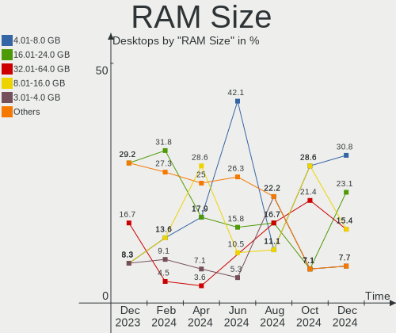
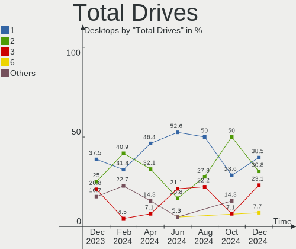

Xubuntu Hardware Trends (Desktops)
----------------------------------

A project to identify most popular hardware characteristics and track their change
over time based on data collected by Xubuntu users at https://Linux-Hardware.org.

Anyone can contribute to this report by the [hw-probe](https://github.com/linuxhw/hw-probe) tool:

    sudo -E hw-probe -all -upload

Full-feature report is available here: https://linux-hardware.org/?view=trends

Period: Mar, 2022.

Contents
--------

* [ System ](#system)
  - [ OS                       ](#os)
  - [ OS Family                ](#os-family)
  - [ Kernel                   ](#kernel)
  - [ Kernel Family            ](#kernel-family)
  - [ Kernel Major Ver.        ](#kernel-major-ver)
  - [ Arch                     ](#arch)
  - [ DE                       ](#de)
  - [ Display Server           ](#display-server)
  - [ Display Manager          ](#display-manager)
  - [ OS Lang                  ](#os-lang)
  - [ Boot Mode                ](#boot-mode)
  - [ Filesystem               ](#filesystem)
  - [ Part. scheme             ](#part-scheme)
  - [ Dual Boot with Linux/BSD ](#dual-boot-with-linuxbsd)
  - [ Dual Boot (Win)          ](#dual-boot-win)

* [ Board ](#board)
  - [ Vendor                   ](#vendor)
  - [ Model                    ](#model)
  - [ Model Family             ](#model-family)
  - [ MFG Year                 ](#mfg-year)
  - [ Form Factor              ](#form-factor)
  - [ Secure Boot              ](#secure-boot)
  - [ Coreboot                 ](#coreboot)
  - [ RAM Size                 ](#ram-size)
  - [ RAM Used                 ](#ram-used)
  - [ Total Drives             ](#total-drives)
  - [ Has CD-ROM               ](#has-cd-rom)
  - [ Has Ethernet             ](#has-ethernet)
  - [ Has WiFi                 ](#has-wifi)
  - [ Has Bluetooth            ](#has-bluetooth)

* [ Location ](#location)
  - [ Country                  ](#country)
  - [ City                     ](#city)

* [ Drives ](#drives)
  - [ Drive Vendor             ](#drive-vendor)
  - [ Drive Model              ](#drive-model)
  - [ HDD Vendor               ](#hdd-vendor)
  - [ SSD Vendor               ](#ssd-vendor)
  - [ Drive Kind               ](#drive-kind)
  - [ Drive Connector          ](#drive-connector)
  - [ Drive Size               ](#drive-size)
  - [ Space Total              ](#space-total)
  - [ Space Used               ](#space-used)
  - [ Malfunc. Drives          ](#malfunc-drives)
  - [ Malfunc. Drive Vendor    ](#malfunc-drive-vendor)
  - [ Malfunc. HDD Vendor      ](#malfunc-hdd-vendor)
  - [ Malfunc. Drive Kind      ](#malfunc-drive-kind)
  - [ Failed Drives            ](#failed-drives)
  - [ Failed Drive Vendor      ](#failed-drive-vendor)
  - [ Drive Status             ](#drive-status)

* [ Storage controller ](#storage-controller)
  - [ Storage Vendor           ](#storage-vendor)
  - [ Storage Model            ](#storage-model)
  - [ Storage Kind             ](#storage-kind)

* [ Processor ](#processor)
  - [ CPU Vendor               ](#cpu-vendor)
  - [ CPU Model                ](#cpu-model)
  - [ CPU Model Family         ](#cpu-model-family)
  - [ CPU Cores                ](#cpu-cores)
  - [ CPU Sockets              ](#cpu-sockets)
  - [ CPU Threads              ](#cpu-threads)
  - [ CPU Op-Modes             ](#cpu-op-modes)
  - [ CPU Microcode            ](#cpu-microcode)
  - [ CPU Microarch            ](#cpu-microarch)

* [ Graphics ](#graphics)
  - [ GPU Vendor               ](#gpu-vendor)
  - [ GPU Model                ](#gpu-model)
  - [ GPU Combo                ](#gpu-combo)
  - [ GPU Driver               ](#gpu-driver)
  - [ GPU Memory               ](#gpu-memory)

* [ Monitor ](#monitor)
  - [ Monitor Vendor           ](#monitor-vendor)
  - [ Monitor Model            ](#monitor-model)
  - [ Monitor Resolution       ](#monitor-resolution)
  - [ Monitor Diagonal         ](#monitor-diagonal)
  - [ Monitor Width            ](#monitor-width)
  - [ Aspect Ratio             ](#aspect-ratio)
  - [ Monitor Area             ](#monitor-area)
  - [ Pixel Density            ](#pixel-density)
  - [ Multiple Monitors        ](#multiple-monitors)

* [ Network ](#network)
  - [ Net Controller Vendor    ](#net-controller-vendor)
  - [ Net Controller Model     ](#net-controller-model)
  - [ Wireless Vendor          ](#wireless-vendor)
  - [ Wireless Model           ](#wireless-model)
  - [ Ethernet Vendor          ](#ethernet-vendor)
  - [ Ethernet Model           ](#ethernet-model)
  - [ Net Controller Kind      ](#net-controller-kind)
  - [ Used Controller          ](#used-controller)
  - [ NICs                     ](#nics)
  - [ IPv6                     ](#ipv6)

* [ Bluetooth ](#bluetooth)
  - [ Bluetooth Vendor         ](#bluetooth-vendor)
  - [ Bluetooth Model          ](#bluetooth-model)

* [ Sound ](#sound)
  - [ Sound Vendor             ](#sound-vendor)
  - [ Sound Model              ](#sound-model)

* [ Memory ](#memory)
  - [ Memory Vendor            ](#memory-vendor)
  - [ Memory Model             ](#memory-model)
  - [ Memory Kind              ](#memory-kind)
  - [ Memory Form Factor       ](#memory-form-factor)
  - [ Memory Size              ](#memory-size)
  - [ Memory Speed             ](#memory-speed)

* [ Printers & scanners ](#printers--scanners)
  - [ Printer Vendor           ](#printer-vendor)
  - [ Printer Model            ](#printer-model)
  - [ Scanner Vendor           ](#scanner-vendor)
  - [ Scanner Model            ](#scanner-model)

* [ Camera ](#camera)
  - [ Camera Vendor            ](#camera-vendor)
  - [ Camera Model             ](#camera-model)

* [ Security ](#security)
  - [ Fingerprint Vendor       ](#fingerprint-vendor)
  - [ Fingerprint Model        ](#fingerprint-model)
  - [ Chipcard Vendor          ](#chipcard-vendor)
  - [ Chipcard Model           ](#chipcard-model)

* [ Unsupported ](#unsupported)
  - [ Unsupported Devices      ](#unsupported-devices)
  - [ Unsupported Device Types ](#unsupported-device-types)

System
------

OS
--

Installed operating systems

| Name          | Desktops | Percent |
|---------------|----------|---------|
| Xubuntu 20.04 | 19       | 76%     |
| Xubuntu 21.10 | 3        | 12%     |
| Xubuntu 18.04 | 3        | 12%     |

OS Family
---------

OS without a version

| Name    | Desktops | Percent |
|---------|----------|---------|
| Xubuntu | 25       | 100%    |

Kernel
------

Version of the Linux kernel

| Version                | Desktops | Percent |
|------------------------|----------|---------|
| 5.13.0-37-generic      | 4        | 16%     |
| 5.4.0-100-generic      | 3        | 12%     |
| 5.4.0-105-generic      | 2        | 8%      |
| 5.4.0-104-generic      | 2        | 8%      |
| 5.13.0-35-generic      | 2        | 8%      |
| 5.13.0-30-generic      | 2        | 8%      |
| 5.4.0-67-lowlatency    | 1        | 4%      |
| 5.4.0-52-generic       | 1        | 4%      |
| 5.4.0-104-lowlatency   | 1        | 4%      |
| 5.4.0-100-lowlatency   | 1        | 4%      |
| 5.16.9-051609-generic  | 1        | 4%      |
| 5.16.0-amdgpu-znver2c+ | 1        | 4%      |
| 5.13.0-39-generic      | 1        | 4%      |
| 5.13.0-32-generic      | 1        | 4%      |
| 5.13.0-30-lowlatency   | 1        | 4%      |
| 4.15.0-171-generic     | 1        | 4%      |

Kernel Family
-------------

Linux kernel without a distro release

| Version | Desktops | Percent |
|---------|----------|---------|
| 5.4.0   | 11       | 44%     |
| 5.13.0  | 11       | 44%     |
| 5.16.9  | 1        | 4%      |
| 5.16.0  | 1        | 4%      |
| 4.15.0  | 1        | 4%      |

Kernel Major Ver.
-----------------

Linux kernel major version

| Version | Desktops | Percent |
|---------|----------|---------|
| 5.4     | 11       | 44%     |
| 5.13    | 11       | 44%     |
| 5.16    | 2        | 8%      |
| 4.15    | 1        | 4%      |

Arch
----

OS architecture (x86_64, i586, etc.)

| Name   | Desktops | Percent |
|--------|----------|---------|
| x86_64 | 24       | 96%     |
| i686   | 1        | 4%      |

DE
--

Desktop Environment

| Name  | Desktops | Percent |
|-------|----------|---------|
| XFCE  | 24       | 96%     |
| GNOME | 1        | 4%      |

Display Server
--------------

X11 or Wayland

| Name | Desktops | Percent |
|------|----------|---------|
| X11  | 24       | 96%     |
| Tty  | 1        | 4%      |

Display Manager
---------------

SDDM, LightDM, etc.

| Name    | Desktops | Percent |
|---------|----------|---------|
| LightDM | 18       | 72%     |
| Unknown | 4        | 16%     |
| GDM3    | 2        | 8%      |
| GDM     | 1        | 4%      |

OS Lang
-------

Language

| Lang  | Desktops | Percent |
|-------|----------|---------|
| en_US | 12       | 48%     |
| it_IT | 2        | 8%      |
| en_GB | 2        | 8%      |
| en_CA | 2        | 8%      |
| sv_SE | 1        | 4%      |
| ja_JP | 1        | 4%      |
| fr_FR | 1        | 4%      |
| fr_CH | 1        | 4%      |
| fr_CA | 1        | 4%      |
| es_ES | 1        | 4%      |
| cs_CZ | 1        | 4%      |

Boot Mode
---------

EFI or BIOS

| Mode | Desktops | Percent |
|------|----------|---------|
| BIOS | 14       | 56%     |
| EFI  | 11       | 44%     |

Filesystem
----------

Type of filesystem

| Type | Desktops | Percent |
|------|----------|---------|
| Ext4 | 25       | 100%    |

Part. scheme
------------

Scheme of partitioning

| Type    | Desktops | Percent |
|---------|----------|---------|
| Unknown | 19       | 76%     |
| GPT     | 5        | 20%     |
| MBR     | 1        | 4%      |

Dual Boot with Linux/BSD
------------------------

Hosting more than one Linux/BSD

| Dual boot | Desktops | Percent |
|-----------|----------|---------|
| No        | 18       | 72%     |
| Yes       | 7        | 28%     |

Dual Boot (Win)
---------------

Hosting Linux and Windows

| Dual boot | Desktops | Percent |
|-----------|----------|---------|
| No        | 17       | 68%     |
| Yes       | 8        | 32%     |

Board
-----

Vendor
------

Motherboard manufacturer

| Name                | Desktops | Percent |
|---------------------|----------|---------|
| ASUSTek Computer    | 7        | 28%     |
| Gigabyte Technology | 4        | 16%     |
| Dell                | 3        | 12%     |
| Acer                | 3        | 12%     |
| Hewlett-Packard     | 2        | 8%      |
| ASRock              | 2        | 8%      |
| Pegatron            | 1        | 4%      |
| MSI                 | 1        | 4%      |
| ECS                 | 1        | 4%      |
| Unknown             | 1        | 4%      |

Model
-----

Motherboard model

| Name                             | Desktops | Percent |
|----------------------------------|----------|---------|
| Pegatron KJ307AA-A2L a6452f      | 1        | 4%      |
| MSI MS-7A34                      | 1        | 4%      |
| HP t620 Quad Core TC             | 1        | 4%      |
| HP EliteDesk 800 G1 USDT         | 1        | 4%      |
| Gigabyte H310M H 2.0             | 1        | 4%      |
| Gigabyte GA-MA78GM-S2H           | 1        | 4%      |
| Gigabyte E350N WIN8              | 1        | 4%      |
| Gigabyte 8IPE775/-G              | 1        | 4%      |
| ECS H87H3-M                      | 1        | 4%      |
| Dell Precision WorkStation T7400 | 1        | 4%      |
| Dell OptiPlex 9020               | 1        | 4%      |
| Dell OptiPlex 760                | 1        | 4%      |
| ASUS Z170I PRO GAMING            | 1        | 4%      |
| ASUS TUF GAMING X570-PRO         | 1        | 4%      |
| ASUS ROG STRIX B450-F GAMING II  | 1        | 4%      |
| ASUS PRIME X370-PRO              | 1        | 4%      |
| ASUS PRIME H270M-PLUS            | 1        | 4%      |
| ASUS P8H61/USB3 R2.0             | 1        | 4%      |
| ASUS A68HM-K                     | 1        | 4%      |
| ASRock B550 Phantom Gaming 4     | 1        | 4%      |
| ASRock B450 Steel Legend         | 1        | 4%      |
| Acer Veriton M4610G              | 1        | 4%      |
| Acer Aspire X1920                | 1        | 4%      |
| Acer Aspire R3700                | 1        | 4%      |
| Unknown                          | 1        | 4%      |

Model Family
------------

Motherboard model prefix

| Name                   | Desktops | Percent |
|------------------------|----------|---------|
| Dell OptiPlex          | 2        | 8%      |
| ASUS PRIME             | 2        | 8%      |
| Acer Aspire            | 2        | 8%      |
| Pegatron KJ307AA-A2L   | 1        | 4%      |
| MSI MS-7A34            | 1        | 4%      |
| HP t620                | 1        | 4%      |
| HP EliteDesk           | 1        | 4%      |
| Gigabyte H310M         | 1        | 4%      |
| Gigabyte GA-MA78GM-S2H | 1        | 4%      |
| Gigabyte E350N         | 1        | 4%      |
| Gigabyte 8IPE775       | 1        | 4%      |
| ECS H87H3-M            | 1        | 4%      |
| Dell Precision         | 1        | 4%      |
| ASUS Z170I             | 1        | 4%      |
| ASUS TUF               | 1        | 4%      |
| ASUS ROG               | 1        | 4%      |
| ASUS P8H61             | 1        | 4%      |
| ASUS A68HM-K           | 1        | 4%      |
| ASRock B550            | 1        | 4%      |
| ASRock B450            | 1        | 4%      |
| Acer Veriton           | 1        | 4%      |
| Unknown                | 1        | 4%      |

MFG Year
--------

Motherboard manufacture year

| Year | Desktops | Percent |
|------|----------|---------|
| 2013 | 5        | 20%     |
| 2020 | 3        | 12%     |
| 2011 | 3        | 12%     |
| 2008 | 3        | 12%     |
| 2019 | 2        | 8%      |
| 2017 | 2        | 8%      |
| 2014 | 2        | 8%      |
| 2018 | 1        | 4%      |
| 2016 | 1        | 4%      |
| 2015 | 1        | 4%      |
| 2012 | 1        | 4%      |
| 2005 | 1        | 4%      |

Form Factor
-----------

Physical design of the computer

| Name    | Desktops | Percent |
|---------|----------|---------|
| Desktop | 25       | 100%    |

Secure Boot
-----------

Enabled or disabled

| State    | Desktops | Percent |
|----------|----------|---------|
| Disabled | 25       | 100%    |

Coreboot
--------

Have coreboot on board

| Used | Desktops | Percent |
|------|----------|---------|
| No   | 25       | 100%    |

RAM Size
--------

Total RAM memory

| Size in GB  | Desktops | Percent |
|-------------|----------|---------|
| 3.01-4.0    | 5        | 20%     |
| 16.01-24.0  | 5        | 20%     |
| 8.01-16.0   | 5        | 20%     |
| 4.01-8.0    | 3        | 12%     |
| 32.01-64.0  | 3        | 12%     |
| 64.01-256.0 | 2        | 8%      |
| 24.01-32.0  | 1        | 4%      |
| 0.51-1.0    | 1        | 4%      |

RAM Used
--------

Used RAM memory

| Used GB   | Desktops | Percent |
|-----------|----------|---------|
| 1.01-2.0  | 9        | 36%     |
| 4.01-8.0  | 5        | 20%     |
| 3.01-4.0  | 3        | 12%     |
| 2.01-3.0  | 3        | 12%     |
| 0.51-1.0  | 3        | 12%     |
| 8.01-16.0 | 1        | 4%      |
| 0.01-0.5  | 1        | 4%      |

Total Drives
------------

Number of drives on board

| Drives | Desktops | Percent |
|--------|----------|---------|
| 1      | 11       | 44%     |
| 2      | 8        | 32%     |
| 3      | 4        | 16%     |
| 9      | 1        | 4%      |
| 6      | 1        | 4%      |

Has CD-ROM
----------

Has CD-ROM on board

| Presented | Desktops | Percent |
|-----------|----------|---------|
| Yes       | 16       | 64%     |
| No        | 9        | 36%     |

Has Ethernet
------------

Has Ethernet on board

| Presented | Desktops | Percent |
|-----------|----------|---------|
| Yes       | 24       | 96%     |
| No        | 1        | 4%      |

Has WiFi
--------

Has WiFi module

| Presented | Desktops | Percent |
|-----------|----------|---------|
| No        | 13       | 52%     |
| Yes       | 12       | 48%     |

Has Bluetooth
-------------

Has Bluetooth module

| Presented | Desktops | Percent |
|-----------|----------|---------|
| No        | 19       | 76%     |
| Yes       | 6        | 24%     |

Location
--------

Country
-------

Geographic location (country)

| Country     | Desktops | Percent |
|-------------|----------|---------|
| USA         | 10       | 40%     |
| Canada      | 3        | 12%     |
| UK          | 2        | 8%      |
| Italy       | 2        | 8%      |
| Thailand    | 1        | 4%      |
| Switzerland | 1        | 4%      |
| Sweden      | 1        | 4%      |
| Spain       | 1        | 4%      |
| Japan       | 1        | 4%      |
| Germany     | 1        | 4%      |
| France      | 1        | 4%      |
| Czechia     | 1        | 4%      |

City
----

Geographic location (city)

| City             | Desktops | Percent |
|------------------|----------|---------|
| Yabu             | 1        | 4%      |
| Winnipeg         | 1        | 4%      |
| Wickford         | 1        | 4%      |
| Washington       | 1        | 4%      |
| Toronto          | 1        | 4%      |
| Sept-Iles        | 1        | 4%      |
| Roseville        | 1        | 4%      |
| Roseburg         | 1        | 4%      |
| Pittsfield       | 1        | 4%      |
| Peine            | 1        | 4%      |
| Pardubice        | 1        | 4%      |
| Morganton        | 1        | 4%      |
| Milan            | 1        | 4%      |
| Madrid           | 1        | 4%      |
| La Tour-de-Peilz | 1        | 4%      |
| Knoxville        | 1        | 4%      |
| Jefferson        | 1        | 4%      |
| Jamestown        | 1        | 4%      |
| Houston          | 1        | 4%      |
| Gothenburg       | 1        | 4%      |
| Diss             | 1        | 4%      |
| Chula Vista      | 1        | 4%      |
| Bourgbarre       | 1        | 4%      |
| Bitonto          | 1        | 4%      |
| Bangkok          | 1        | 4%      |

Drives
------

Drive Vendor
------------

Hard drive vendors

| Vendor              | Desktops | Drives | Percent |
|---------------------|----------|--------|---------|
| WDC                 | 11       | 13     | 27.5%   |
| Seagate             | 10       | 18     | 25%     |
| Samsung Electronics | 4        | 4      | 10%     |
| SanDisk             | 3        | 3      | 7.5%    |
| MAXTOR              | 2        | 2      | 5%      |
| Hitachi             | 2        | 3      | 5%      |
| A-DATA Technology   | 2        | 2      | 5%      |
| Verbatim            | 1        | 1      | 2.5%    |
| Unknown             | 1        | 1      | 2.5%    |
| Toshiba             | 1        | 1      | 2.5%    |
| Super Talent        | 1        | 1      | 2.5%    |
| Patriot             | 1        | 1      | 2.5%    |
| CHN25SATAS1         | 1        | 1      | 2.5%    |

Drive Model
-----------

Hard drive models

| Model                                       | Desktops | Percent |
|---------------------------------------------|----------|---------|
| WDC WDS240G2G0B-00EPW0 240GB SSD            | 1        | 2.04%   |
| WDC WDS200T2B0B-00YS70 2TB SSD              | 1        | 2.04%   |
| WDC WDS100T2G0A-00JH30 1TB SSD              | 1        | 2.04%   |
| WDC WD800JD-00LSA0 80GB                     | 1        | 2.04%   |
| WDC WD5000AAKS-00YGA0 500GB                 | 1        | 2.04%   |
| WDC WD40EZRZ-00GXCB0 4TB                    | 1        | 2.04%   |
| WDC WD3200AAKS-75SBA0 320GB                 | 1        | 2.04%   |
| WDC WD10JPVX-22JC3T0 1TB                    | 1        | 2.04%   |
| WDC WD10EVDS-63N5B1 1TB                     | 1        | 2.04%   |
| WDC WD10EADX-22TDHB0 1TB                    | 1        | 2.04%   |
| WDC WD10EADS-11P8B1 1TB                     | 1        | 2.04%   |
| WDC WD1002FAEX-00Z3A0 1TB                   | 1        | 2.04%   |
| Verbatim Vi550 S3 128GB SSD                 | 1        | 2.04%   |
| Unknown 128G32  128GB                       | 1        | 2.04%   |
| Toshiba MQ01ABD100V 1TB                     | 1        | 2.04%   |
| Super Talent FTM51N325H 512GB SSD           | 1        | 2.04%   |
| Seagate ST500VT000-1DK142 500GB             | 1        | 2.04%   |
| Seagate ST500LT012-9WS142 500GB             | 1        | 2.04%   |
| Seagate ST500LT012-1DG142 500GB             | 1        | 2.04%   |
| Seagate ST500LM030-2E717D 500GB             | 1        | 2.04%   |
| Seagate ST500LM012 HN-M500MBB 500GB         | 1        | 2.04%   |
| Seagate ST5000NM0084 00FN169 00FN172IBM 5TB | 1        | 2.04%   |
| Seagate ST4000LM024-2AN17V 4TB              | 1        | 2.04%   |
| Seagate ST4000DM000-1F2168 4TB              | 1        | 2.04%   |
| Seagate ST3500418AS 500GB                   | 1        | 2.04%   |
| Seagate ST2000VX008-2E3164 2TB              | 1        | 2.04%   |
| Seagate ST2000LM007-1R8174 2TB              | 1        | 2.04%   |
| Seagate ST2000DM006-2DM164 2TB              | 1        | 2.04%   |
| Seagate ST2000DL003-9VT166 2TB              | 1        | 2.04%   |
| Seagate ST1000LM035-1RK172 1TB              | 1        | 2.04%   |
| Seagate ST1000DM003-1ER162 1TB              | 1        | 2.04%   |
| Seagate ST1000DM003-1CH162 1TB              | 1        | 2.04%   |
| Seagate BUP Ultra Touch 2TB                 | 1        | 2.04%   |
| SanDisk Ultra II 250GB SSD                  | 1        | 2.04%   |
| SanDisk SSD PLUS 1000GB                     | 1        | 2.04%   |
| SanDisk SD8SNAT064G1011 64GB SSD            | 1        | 2.04%   |
| Samsung SSD 870 EVO 500GB                   | 1        | 2.04%   |
| Samsung SSD 850 PRO 256GB                   | 1        | 2.04%   |
| Samsung Portable SSD T3 500GB               | 1        | 2.04%   |
| Samsung HD502HI 500GB                       | 1        | 2.04%   |
| Patriot Burst 120GB SSD                     | 1        | 2.04%   |
| MAXTOR 6L250S0 256GB                        | 1        | 2.04%   |
| MAXTOR 6L160M0 163GB                        | 1        | 2.04%   |
| Hitachi HTS725016A9A364 160GB               | 1        | 2.04%   |
| Hitachi HTS545050B9SA08 500GB               | 1        | 2.04%   |
| Hitachi HTS545032B9SA08 320GB               | 1        | 2.04%   |
| CHN25SATAS1 032 32GB                        | 1        | 2.04%   |
| A-DATA SX8200PNP 512GB                      | 1        | 2.04%   |
| A-DATA SX8200PNP 1TB                        | 1        | 2.04%   |

HDD Vendor
----------

Hard disk drive vendors

| Vendor              | Desktops | Drives | Percent |
|---------------------|----------|--------|---------|
| Seagate             | 10       | 18     | 41.67%  |
| WDC                 | 8        | 9      | 33.33%  |
| MAXTOR              | 2        | 2      | 8.33%   |
| Hitachi             | 2        | 3      | 8.33%   |
| Toshiba             | 1        | 1      | 4.17%   |
| Samsung Electronics | 1        | 1      | 4.17%   |

SSD Vendor
----------

Solid state drive vendors

| Vendor              | Desktops | Drives | Percent |
|---------------------|----------|--------|---------|
| WDC                 | 3        | 4      | 25%     |
| SanDisk             | 3        | 3      | 25%     |
| Samsung Electronics | 3        | 3      | 25%     |
| Verbatim            | 1        | 1      | 8.33%   |
| Super Talent        | 1        | 1      | 8.33%   |
| Patriot             | 1        | 1      | 8.33%   |

Drive Kind
----------

HDD or SSD

| Kind    | Desktops | Drives | Percent |
|---------|----------|--------|---------|
| HDD     | 17       | 34     | 53.13%  |
| SSD     | 11       | 13     | 34.38%  |
| NVMe    | 2        | 2      | 6.25%   |
| MMC     | 1        | 1      | 3.13%   |
| Unknown | 1        | 1      | 3.13%   |

Drive Connector
---------------

SATA, SAS, NVMe, etc.

| Type | Desktops | Drives | Percent |
|------|----------|--------|---------|
| SATA | 23       | 46     | 82.14%  |
| SAS  | 2        | 2      | 7.14%   |
| NVMe | 2        | 2      | 7.14%   |
| MMC  | 1        | 1      | 3.57%   |

Drive Size
----------

Size of hard drive

| Size in TB | Desktops | Drives | Percent |
|------------|----------|--------|---------|
| 0.01-0.5   | 17       | 23     | 48.57%  |
| 0.51-1.0   | 9        | 13     | 25.71%  |
| 1.01-2.0   | 5        | 7      | 14.29%  |
| 3.01-4.0   | 3        | 3      | 8.57%   |
| 4.01-10.0  | 1        | 1      | 2.86%   |

Space Total
-----------

Amount of disk space available on the file system

| Size in GB     | Desktops | Percent |
|----------------|----------|---------|
| More than 3000 | 6        | 24%     |
| 251-500        | 6        | 24%     |
| 101-250        | 4        | 16%     |
| 1001-2000      | 3        | 12%     |
| 501-1000       | 3        | 12%     |
| 21-50          | 2        | 8%      |
| 51-100         | 1        | 4%      |

Space Used
----------

Amount of used disk space

| Used GB        | Desktops | Percent |
|----------------|----------|---------|
| 1-20           | 6        | 24%     |
| 101-250        | 5        | 20%     |
| 21-50          | 3        | 12%     |
| More than 3000 | 2        | 8%      |
| 251-500        | 2        | 8%      |
| 1001-2000      | 2        | 8%      |
| 501-1000       | 2        | 8%      |
| 51-100         | 2        | 8%      |
| 2001-3000      | 1        | 4%      |

Malfunc. Drives
---------------

Drive models with a malfunction

Zero info for selected period =(

Malfunc. Drive Vendor
---------------------

Vendors of faulty drives

Zero info for selected period =(

Malfunc. HDD Vendor
-------------------

Vendors of faulty HDD drives

Zero info for selected period =(

Malfunc. Drive Kind
-------------------

Kinds of faulty drives

Zero info for selected period =(

Failed Drives
-------------

Failed drive models

Zero info for selected period =(

Failed Drive Vendor
-------------------

Failed drive vendors

Zero info for selected period =(

Drive Status
------------

Number of failed and malfunc. drives

| Status   | Desktops | Drives | Percent |
|----------|----------|--------|---------|
| Detected | 20       | 37     | 80%     |
| Works    | 5        | 14     | 20%     |

Storage controller
------------------

Storage Vendor
--------------

Storage controller vendors

| Vendor                    | Desktops | Percent |
|---------------------------|----------|---------|
| Intel                     | 14       | 50%     |
| AMD                       | 9        | 32.14%  |
| ASMedia Technology        | 2        | 7.14%   |
| ADATA Technology          | 2        | 7.14%   |
| LSI Logic / Symbios Logic | 1        | 3.57%   |

Storage Model
-------------

Storage controller models

| Model                                                                                   | Desktops | Percent |
|-----------------------------------------------------------------------------------------|----------|---------|
| AMD FCH SATA Controller [AHCI mode]                                                     | 5        | 13.89%  |
| Intel 8 Series/C220 Series Chipset Family 6-port SATA Controller 1 [AHCI mode]          | 3        | 8.33%   |
| Intel 200 Series PCH SATA controller [AHCI mode]                                        | 2        | 5.56%   |
| ADATA XPG SX8200 Pro PCIe Gen3x4 M.2 2280 Solid State Drive                             | 2        | 5.56%   |
| LSI Logic / Symbios Logic SAS1068E PCI-Express Fusion-MPT SAS                           | 1        | 2.78%   |
| Intel SATA Controller [RAID mode]                                                       | 1        | 2.78%   |
| Intel Q170/Q150/B150/H170/H110/Z170/CM236 Chipset SATA Controller [AHCI Mode]           | 1        | 2.78%   |
| Intel NM10/ICH7 Family SATA Controller [IDE mode]                                       | 1        | 2.78%   |
| Intel NM10/ICH7 Family SATA Controller [AHCI mode]                                      | 1        | 2.78%   |
| Intel 82801JD/DO (ICH10 Family) SATA AHCI Controller                                    | 1        | 2.78%   |
| Intel 82801G (ICH7 Family) IDE Controller                                               | 1        | 2.78%   |
| Intel 82801EB (ICH5) SATA Controller                                                    | 1        | 2.78%   |
| Intel 631xESB/632xESB SATA AHCI Controller                                              | 1        | 2.78%   |
| Intel 631xESB/632xESB IDE Controller                                                    | 1        | 2.78%   |
| Intel 6 Series/C200 Series Chipset Family IDE-r Controller                              | 1        | 2.78%   |
| Intel 6 Series/C200 Series Chipset Family Desktop SATA Controller (IDE mode, ports 4-5) | 1        | 2.78%   |
| Intel 6 Series/C200 Series Chipset Family Desktop SATA Controller (IDE mode, ports 0-3) | 1        | 2.78%   |
| Intel 6 Series/C200 Series Chipset Family 6 port Desktop SATA AHCI Controller           | 1        | 2.78%   |
| Intel 4 Series Chipset PT IDER Controller                                               | 1        | 2.78%   |
| ASMedia SATA controller                                                                 | 1        | 2.78%   |
| ASMedia ASM1062 Serial ATA Controller                                                   | 1        | 2.78%   |
| AMD X370 Series Chipset SATA Controller                                                 | 1        | 2.78%   |
| AMD SB7x0/SB8x0/SB9x0 SATA Controller [IDE mode]                                        | 1        | 2.78%   |
| AMD SB7x0/SB8x0/SB9x0 SATA Controller [AHCI mode]                                       | 1        | 2.78%   |
| AMD SB7x0/SB8x0/SB9x0 IDE Controller                                                    | 1        | 2.78%   |
| AMD 500 Series Chipset SATA Controller                                                  | 1        | 2.78%   |
| AMD 400 Series Chipset SATA Controller                                                  | 1        | 2.78%   |
| AMD 300 Series Chipset SATA Controller                                                  | 1        | 2.78%   |

Storage Kind
------------

Kind of storage controller (IDE, SATA, NVMe, SAS, ...)

| Kind | Desktops | Percent |
|------|----------|---------|
| SATA | 19       | 63.33%  |
| IDE  | 7        | 23.33%  |
| NVMe | 2        | 6.67%   |
| RAID | 1        | 3.33%   |
| SCSI | 1        | 3.33%   |

Processor
---------

CPU Vendor
----------

Processor vendors

| Vendor | Desktops | Percent |
|--------|----------|---------|
| Intel  | 15       | 60%     |
| AMD    | 10       | 40%     |

CPU Model
---------

Processor models

| Model                                       | Desktops | Percent |
|---------------------------------------------|----------|---------|
| AMD Ryzen 7 1700 Eight-Core Processor       | 2        | 8%      |
| Intel Xeon CPU E5420 @ 2.50GHz              | 1        | 4%      |
| Intel Pentium Dual-Core CPU E6700 @ 3.20GHz | 1        | 4%      |
| Intel Pentium 4 CPU 3.00GHz                 | 1        | 4%      |
| Intel Core i7-6700K CPU @ 4.00GHz           | 1        | 4%      |
| Intel Core i7-3770 CPU @ 3.40GHz            | 1        | 4%      |
| Intel Core i5-9500 CPU @ 3.00GHz            | 1        | 4%      |
| Intel Core i5-7500 CPU @ 3.40GHz            | 1        | 4%      |
| Intel Core i5-4590 CPU @ 3.30GHz            | 1        | 4%      |
| Intel Core i5-4570S CPU @ 2.90GHz           | 1        | 4%      |
| Intel Core i5-4440 CPU @ 3.10GHz            | 1        | 4%      |
| Intel Core i5-2500 CPU @ 3.30GHz            | 1        | 4%      |
| Intel Core 2 Quad CPU Q6600 @ 2.40GHz       | 1        | 4%      |
| Intel Core 2 Duo CPU E8400 @ 3.00GHz        | 1        | 4%      |
| Intel Atom x5-Z8350 CPU @ 1.44GHz           | 1        | 4%      |
| Intel Atom CPU D525 @ 1.80GHz               | 1        | 4%      |
| AMD Ryzen 9 3900X 12-Core Processor         | 1        | 4%      |
| AMD Ryzen 7 5800X 8-Core Processor          | 1        | 4%      |
| AMD Ryzen 7 5700G with Radeon Graphics      | 1        | 4%      |
| AMD Ryzen 5 3500 6-Core Processor           | 1        | 4%      |
| AMD Phenom 9950 Quad-Core Processor         | 1        | 4%      |
| AMD GX-415GA SOC with Radeon HD Graphics    | 1        | 4%      |
| AMD E-350D APU with Radeon HD Graphics      | 1        | 4%      |
| AMD A10-5800K APU with Radeon HD Graphics   | 1        | 4%      |

CPU Model Family
----------------

Processor model prefix

| Model                   | Desktops | Percent |
|-------------------------|----------|---------|
| Intel Core i5           | 6        | 24%     |
| AMD Ryzen 7             | 4        | 16%     |
| Intel Core i7           | 2        | 8%      |
| Intel Atom              | 2        | 8%      |
| Intel Xeon              | 1        | 4%      |
| Intel Pentium Dual-Core | 1        | 4%      |
| Intel Pentium 4         | 1        | 4%      |
| Intel Core 2 Quad       | 1        | 4%      |
| Intel Core 2 Duo        | 1        | 4%      |
| AMD Ryzen 9             | 1        | 4%      |
| AMD Ryzen 5             | 1        | 4%      |
| AMD Phenom              | 1        | 4%      |
| AMD GX                  | 1        | 4%      |
| AMD E                   | 1        | 4%      |
| AMD A10                 | 1        | 4%      |

CPU Cores
---------

Number of processor cores

| Number | Desktops | Percent |
|--------|----------|---------|
| 4      | 11       | 44%     |
| 8      | 5        | 20%     |
| 2      | 5        | 20%     |
| 6      | 2        | 8%      |
| 12     | 1        | 4%      |
| 1      | 1        | 4%      |

CPU Sockets
-----------

Number of sockets

| Number | Desktops | Percent |
|--------|----------|---------|
| 1      | 24       | 96%     |
| 2      | 1        | 4%      |

CPU Threads
-----------

Threads per core (Hyper-Threading)

| Number | Desktops | Percent |
|--------|----------|---------|
| 1      | 15       | 60%     |
| 2      | 10       | 40%     |

CPU Op-Modes
------------

CPU Operation Modes (32-bit, 64-bit)

| Op mode        | Desktops | Percent |
|----------------|----------|---------|
| 32-bit, 64-bit | 25       | 100%    |

CPU Microcode
-------------

Microcode number

| Number     | Desktops | Percent |
|------------|----------|---------|
| Unknown    | 4        | 16%     |
| 0x306c3    | 3        | 12%     |
| 0x1067a    | 2        | 8%      |
| 0x906ea    | 1        | 4%      |
| 0x906e9    | 1        | 4%      |
| 0x6fb      | 1        | 4%      |
| 0x506e3    | 1        | 4%      |
| 0x406c4    | 1        | 4%      |
| 0x206a7    | 1        | 4%      |
| 0x106ca    | 1        | 4%      |
| 0x10676    | 1        | 4%      |
| 0x0a50000c | 1        | 4%      |
| 0x0a201016 | 1        | 4%      |
| 0x08701021 | 1        | 4%      |
| 0x08001137 | 1        | 4%      |
| 0x0700010f | 1        | 4%      |
| 0x06001119 | 1        | 4%      |
| 0x05000119 | 1        | 4%      |
| 0x01000095 | 1        | 4%      |

CPU Microarch
-------------

Microarchitecture

| Name        | Desktops | Percent |
|-------------|----------|---------|
| Penryn      | 3        | 12%     |
| Haswell     | 3        | 12%     |
| Zen 3       | 2        | 8%      |
| Zen 2       | 2        | 8%      |
| Zen         | 2        | 8%      |
| KabyLake    | 2        | 8%      |
| Skylake     | 1        | 4%      |
| Silvermont  | 1        | 4%      |
| SandyBridge | 1        | 4%      |
| Piledriver  | 1        | 4%      |
| NetBurst    | 1        | 4%      |
| K10         | 1        | 4%      |
| Jaguar      | 1        | 4%      |
| IvyBridge   | 1        | 4%      |
| Core        | 1        | 4%      |
| Bonnell     | 1        | 4%      |
| Bobcat      | 1        | 4%      |

Graphics
--------

GPU Vendor
----------

Vendors of graphics cards

| Vendor | Desktops | Percent |
|--------|----------|---------|
| AMD    | 9        | 37.5%   |
| Intel  | 8        | 33.33%  |
| Nvidia | 7        | 29.17%  |

GPU Model
---------

Graphics card models

| Model                                                                                    | Desktops | Percent |
|------------------------------------------------------------------------------------------|----------|---------|
| Intel Xeon E3-1200 v3/4th Gen Core Processor Integrated Graphics Controller              | 3        | 12%     |
| Intel 4 Series Chipset Integrated Graphics Controller                                    | 2        | 8%      |
| Nvidia GT218 [ION]                                                                       | 1        | 4%      |
| Nvidia GT216 [GeForce GT 220]                                                            | 1        | 4%      |
| Nvidia GP107 [GeForce GTX 1050 Ti]                                                       | 1        | 4%      |
| Nvidia GP106 [GeForce GTX 1060 6GB]                                                      | 1        | 4%      |
| Nvidia GP104 [GeForce GTX 1070]                                                          | 1        | 4%      |
| Nvidia GF119 [GeForce GT 520]                                                            | 1        | 4%      |
| Nvidia G86 [GeForce 8500 GT]                                                             | 1        | 4%      |
| Intel CoffeeLake-S GT2 [UHD Graphics 630]                                                | 1        | 4%      |
| Intel Atom/Celeron/Pentium Processor x5-E8000/J3xxx/N3xxx Integrated Graphics Controller | 1        | 4%      |
| Intel 2nd Generation Core Processor Family Integrated Graphics Controller                | 1        | 4%      |
| AMD Wrestler [Radeon HD 6310]                                                            | 1        | 4%      |
| AMD Vega 10 XL/XT [Radeon RX Vega 56/64]                                                 | 1        | 4%      |
| AMD Trinity [Radeon HD 7660D]                                                            | 1        | 4%      |
| AMD RV280 [Radeon 9200 PRO] (Secondary)                                                  | 1        | 4%      |
| AMD RV280 [Radeon 9200 PRO / 9250]                                                       | 1        | 4%      |
| AMD RS780 [Radeon HD 3200]                                                               | 1        | 4%      |
| AMD Kabini [Radeon HD 8330E]                                                             | 1        | 4%      |
| AMD Juniper XT [Radeon HD 6770]                                                          | 1        | 4%      |
| AMD Ellesmere [Radeon RX 470/480/570/570X/580/580X/590]                                  | 1        | 4%      |
| AMD Cezanne                                                                              | 1        | 4%      |

GPU Combo
---------

Combinations of graphics cards

| Name       | Desktops | Percent |
|------------|----------|---------|
| 1 x AMD    | 9        | 36%     |
| 1 x Intel  | 8        | 32%     |
| 1 x Nvidia | 7        | 28%     |
| 2 x AMD    | 1        | 4%      |

GPU Driver
----------

Free vs proprietary

| Driver      | Desktops | Percent |
|-------------|----------|---------|
| Free        | 21       | 84%     |
| Proprietary | 3        | 12%     |
| Unknown     | 1        | 4%      |

GPU Memory
----------

Total video memory

| Size in GB | Desktops | Percent |
|------------|----------|---------|
| Unknown    | 12       | 48%     |
| 0.01-0.5   | 6        | 24%     |
| 3.01-4.0   | 2        | 8%      |
| 0.51-1.0   | 2        | 8%      |
| 7.01-8.0   | 1        | 4%      |
| 5.01-6.0   | 1        | 4%      |
| 1.01-2.0   | 1        | 4%      |

Monitor
-------

Monitor Vendor
--------------

Monitor vendors

| Vendor               | Desktops | Percent |
|----------------------|----------|---------|
| Dell                 | 4        | 13.79%  |
| Samsung Electronics  | 3        | 10.34%  |
| Goldstar             | 3        | 10.34%  |
| Hewlett-Packard      | 2        | 6.9%    |
| BenQ                 | 2        | 6.9%    |
| Acer                 | 2        | 6.9%    |
| Vizio                | 1        | 3.45%   |
| ViewSonic            | 1        | 3.45%   |
| Philips              | 1        | 3.45%   |
| Panasonic            | 1        | 3.45%   |
| Nixeus               | 1        | 3.45%   |
| Lenovo               | 1        | 3.45%   |
| IOD                  | 1        | 3.45%   |
| Impression           | 1        | 3.45%   |
| HannStar             | 1        | 3.45%   |
| Fujitsu Siemens      | 1        | 3.45%   |
| Fujitsu              | 1        | 3.45%   |
| AOC                  | 1        | 3.45%   |
| Ancor Communications | 1        | 3.45%   |

Monitor Model
-------------

Monitor models

| Model                                                                | Desktops | Percent |
|----------------------------------------------------------------------|----------|---------|
| Vizio M322i-B1 VIZ1005 1920x1080 698x392mm 31.5-inch                 | 1        | 3.03%   |
| ViewSonic VX2757 VSCF931 1920x1080 598x336mm 27.0-inch               | 1        | 3.03%   |
| Samsung Electronics S22D390 SAM0B63 1920x1080 477x268mm 21.5-inch    | 1        | 3.03%   |
| Samsung Electronics LS32R75 SAM0F92 3840x2160 697x392mm 31.5-inch    | 1        | 3.03%   |
| Samsung Electronics LCD Monitor SAM07BB 1360x768 410x256mm 19.0-inch | 1        | 3.03%   |
| Philips 19PFL3403DEU PHLD056 1600x1200 410x260mm 19.1-inch           | 1        | 3.03%   |
| Panasonic TV MEIA296 3840x2160 698x392mm 31.5-inch                   | 1        | 3.03%   |
| Nixeus NX-VUE24 NIX2415 1920x1080 477x268mm 21.5-inch                | 1        | 3.03%   |
| Lenovo LT1952p Wide LEN0990 1440x900 408x255mm 18.9-inch             | 1        | 3.03%   |
| IOD LCD-MF235XD IOD17C8 1920x1080 510x287mm 23.0-inch                | 1        | 3.03%   |
| Impression R19W11 IMP1911 1440x900 410x260mm 19.1-inch               | 1        | 3.03%   |
| Hewlett-Packard W2082a HWP325E 1600x900 443x249mm 20.0-inch          | 1        | 3.03%   |
| Hewlett-Packard LA2306 HWP294A 1920x1080 509x286mm 23.0-inch         | 1        | 3.03%   |
| HannStar HF225 HSP18BB 1920x1080 477x268mm 21.5-inch                 | 1        | 3.03%   |
| Goldstar W1952 GSM4B78 1440x900 408x255mm 18.9-inch                  | 1        | 3.03%   |
| Goldstar LG 32 FHD GSM7700 1920x1080 700x390mm 31.5-inch             | 1        | 3.03%   |
| Goldstar 19M35 GSM4C24 1366x768 410x230mm 18.5-inch                  | 1        | 3.03%   |
| Fujitsu VL-221SSWL FUJ4211 1680x1050 474x296mm 22.0-inch             | 1        | 3.03%   |
| Fujitsu Siemens A19W-3 FUS077D 1440x900 410x256mm 19.0-inch          | 1        | 3.03%   |
| Dell SE198WFP DELF004 1440x900 408x255mm 18.9-inch                   | 1        | 3.03%   |
| Dell S2418H/HX DEL4120 1920x1080 527x296mm 23.8-inch                 | 1        | 3.03%   |
| Dell S199WFP DELF00A 1440x900 408x255mm 18.9-inch                    | 1        | 3.03%   |
| Dell P2219H DELA115 1920x1080 476x267mm 21.5-inch                    | 1        | 3.03%   |
| Dell E198WFP DELF006 1440x900 410x260mm 19.1-inch                    | 1        | 3.03%   |
| Dell E198WFP DELF005 1440x900 410x260mm 19.1-inch                    | 1        | 3.03%   |
| Dell 2407WFP DELA016 1920x1200 519x324mm 24.1-inch                   | 1        | 3.03%   |
| Dell 1909W DELA03D 1440x900 408x255mm 18.9-inch                      | 1        | 3.03%   |
| BenQ G2420HD BNQ783F 1920x1080 531x299mm 24.0-inch                   | 1        | 3.03%   |
| BenQ EX3210U BNQ7FA6 3840x2160 708x399mm 32.0-inch                   | 1        | 3.03%   |
| AOC Q27G2WG4 AOC2702 2560x1440 597x336mm 27.0-inch                   | 1        | 3.03%   |
| Ancor Communications LCD Monitor ASUS VW224                          | 1        | 3.03%   |
| Acer P186H ACR019B 1366x768 410x230mm 18.5-inch                      | 1        | 3.03%   |
| Acer LCD Monitor AL1917 2960x1050                                    | 1        | 3.03%   |

Monitor Resolution
------------------

Monitor screen resolution

| Resolution         | Desktops | Percent |
|--------------------|----------|---------|
| 1920x1080 (FHD)    | 10       | 35.71%  |
| 1440x900 (WXGA+)   | 6        | 21.43%  |
| 3840x2160 (4K)     | 3        | 10.71%  |
| 1366x768 (WXGA)    | 2        | 7.14%   |
| 2960x1050          | 1        | 3.57%   |
| 1920x1200 (WUXGA)  | 1        | 3.57%   |
| 1680x1050 (WSXGA+) | 1        | 3.57%   |
| 1600x900 (HD+)     | 1        | 3.57%   |
| 1600x1200          | 1        | 3.57%   |
| 1360x768           | 1        | 3.57%   |
| Unknown            | 1        | 3.57%   |

Monitor Diagonal
----------------

Diagonal size in inches

| Inches  | Desktops | Percent |
|---------|----------|---------|
| 19      | 8        | 26.67%  |
| 21      | 4        | 13.33%  |
| 31      | 3        | 10%     |
| 23      | 3        | 10%     |
| 18      | 3        | 10%     |
| 27      | 2        | 6.67%   |
| 24      | 2        | 6.67%   |
| 84      | 1        | 3.33%   |
| 32      | 1        | 3.33%   |
| 22      | 1        | 3.33%   |
| 20      | 1        | 3.33%   |
| Unknown | 1        | 3.33%   |

Monitor Width
-------------

Physical width

| Width in mm | Desktops | Percent |
|-------------|----------|---------|
| 401-500     | 14       | 51.85%  |
| 501-600     | 7        | 25.93%  |
| 601-700     | 3        | 11.11%  |
| 701-800     | 1        | 3.7%    |
| 1501-2000   | 1        | 3.7%    |
| Unknown     | 1        | 3.7%    |

Aspect Ratio
------------

Proportional relationship between the width and the height

| Ratio   | Desktops | Percent |
|---------|----------|---------|
| 16/9    | 16       | 59.26%  |
| 16/10   | 10       | 37.04%  |
| Unknown | 1        | 3.7%    |

Monitor Area
------------

Area in inch

| Area in inch | Desktops | Percent |
|----------------|----------|---------|
| 151-200        | 9        | 33.33%  |
| 201-250        | 8        | 29.63%  |
| 351-500        | 3        | 11.11%  |
| 301-350        | 2        | 7.41%   |
| 141-150        | 2        | 7.41%   |
| More than 1000 | 1        | 3.7%    |
| 251-300        | 1        | 3.7%    |
| Unknown        | 1        | 3.7%    |

Pixel Density
-------------

Pixels per inch

| Density | Desktops | Percent |
|---------|----------|---------|
| 51-100  | 19       | 73.08%  |
| 101-120 | 5        | 19.23%  |
| 121-160 | 1        | 3.85%   |
| Unknown | 1        | 3.85%   |

Multiple Monitors
-----------------

Total monitors connected

| Total | Desktops | Percent |
|-------|----------|---------|
| 1     | 20       | 80%     |
| 2     | 3        | 12%     |
| 4     | 1        | 4%      |
| 3     | 1        | 4%      |

Network
-------

Net Controller Vendor
---------------------

Controller vendors

| Vendor                   | Desktops | Percent |
|--------------------------|----------|---------|
| Realtek Semiconductor    | 16       | 43.24%  |
| Intel                    | 8        | 21.62%  |
| Broadcom                 | 3        | 8.11%   |
| Qualcomm Atheros         | 2        | 5.41%   |
| TP-Link                  | 1        | 2.7%    |
| Ralink                   | 1        | 2.7%    |
| MEDIATEK                 | 1        | 2.7%    |
| Marvell Technology Group | 1        | 2.7%    |
| Manta                    | 1        | 2.7%    |
| DisplayLink              | 1        | 2.7%    |
| D-Link                   | 1        | 2.7%    |
| Broadcom Limited         | 1        | 2.7%    |

Net Controller Model
--------------------

Controller models

| Model                                                                                         | Desktops | Percent |
|-----------------------------------------------------------------------------------------------|----------|---------|
| Realtek RTL8111/8168/8411 PCI Express Gigabit Ethernet Controller                             | 13       | 33.33%  |
| Intel Ethernet Connection I217-LM                                                             | 2        | 5.13%   |
| Intel Ethernet Connection (2) I219-V                                                          | 2        | 5.13%   |
| TP-Link Archer T2U PLUS [RTL8821AU]                                                           | 1        | 2.56%   |
| Realtek RTL8723BE PCIe Wireless Network Adapter                                               | 1        | 2.56%   |
| Realtek RTL8169 PCI Gigabit Ethernet Controller                                               | 1        | 2.56%   |
| Realtek Realtek 8812AU/8821AU 802.11ac WLAN Adapter [USB Wireless Dual-Band Adapter 2.4/5Ghz] | 1        | 2.56%   |
| Realtek 802.11ac NIC                                                                          | 1        | 2.56%   |
| Ralink RT3090 Wireless 802.11n 1T/1R PCIe                                                     | 1        | 2.56%   |
| Qualcomm Atheros AR9485 Wireless Network Adapter                                              | 1        | 2.56%   |
| Qualcomm Atheros AR922X Wireless Network Adapter                                              | 1        | 2.56%   |
| MEDIATEK MT7921 802.11ax PCI Express Wireless Network Adapter                                 | 1        | 2.56%   |
| Marvell Group 88E8001 Gigabit Ethernet Controller                                             | 1        | 2.56%   |
| Manta MM812                                                                                   | 1        | 2.56%   |
| Intel Wi-Fi 6 AX200                                                                           | 1        | 2.56%   |
| Intel I211 Gigabit Network Connection                                                         | 1        | 2.56%   |
| Intel Ethernet Controller I225-V                                                              | 1        | 2.56%   |
| Intel 82579LM Gigabit Network Connection (Lewisville)                                         | 1        | 2.56%   |
| Intel 82567LM-3 Gigabit Network Connection                                                    | 1        | 2.56%   |
| DisplayLink Dell D3100 Docking Station                                                        | 1        | 2.56%   |
| D-Link DWA-121 802.11n Wireless N 150 Pico Adapter [Realtek RTL8188CUS]                       | 1        | 2.56%   |
| Broadcom NetXtreme BCM5754 Gigabit Ethernet PCI Express                                       | 1        | 2.56%   |
| Broadcom Limited BCM4352 802.11ac Wireless Network Adapter                                    | 1        | 2.56%   |
| Broadcom BCM4360 802.11ac Wireless Network Adapter                                            | 1        | 2.56%   |
| Broadcom BCM4352 802.11ac Wireless Network Adapter                                            | 1        | 2.56%   |

Wireless Vendor
---------------

Wireless vendors

| Vendor                | Desktops | Percent |
|-----------------------|----------|---------|
| Realtek Semiconductor | 3        | 23.08%  |
| Qualcomm Atheros      | 2        | 15.38%  |
| Broadcom              | 2        | 15.38%  |
| TP-Link               | 1        | 7.69%   |
| Ralink                | 1        | 7.69%   |
| MEDIATEK              | 1        | 7.69%   |
| Intel                 | 1        | 7.69%   |
| D-Link                | 1        | 7.69%   |
| Broadcom Limited      | 1        | 7.69%   |

Wireless Model
--------------

Wireless models

| Model                                                                                         | Desktops | Percent |
|-----------------------------------------------------------------------------------------------|----------|---------|
| TP-Link Archer T2U PLUS [RTL8821AU]                                                           | 1        | 7.69%   |
| Realtek RTL8723BE PCIe Wireless Network Adapter                                               | 1        | 7.69%   |
| Realtek Realtek 8812AU/8821AU 802.11ac WLAN Adapter [USB Wireless Dual-Band Adapter 2.4/5Ghz] | 1        | 7.69%   |
| Realtek 802.11ac NIC                                                                          | 1        | 7.69%   |
| Ralink RT3090 Wireless 802.11n 1T/1R PCIe                                                     | 1        | 7.69%   |
| Qualcomm Atheros AR9485 Wireless Network Adapter                                              | 1        | 7.69%   |
| Qualcomm Atheros AR922X Wireless Network Adapter                                              | 1        | 7.69%   |
| MEDIATEK MT7921 802.11ax PCI Express Wireless Network Adapter                                 | 1        | 7.69%   |
| Intel Wi-Fi 6 AX200                                                                           | 1        | 7.69%   |
| D-Link DWA-121 802.11n Wireless N 150 Pico Adapter [Realtek RTL8188CUS]                       | 1        | 7.69%   |
| Broadcom Limited BCM4352 802.11ac Wireless Network Adapter                                    | 1        | 7.69%   |
| Broadcom BCM4360 802.11ac Wireless Network Adapter                                            | 1        | 7.69%   |
| Broadcom BCM4352 802.11ac Wireless Network Adapter                                            | 1        | 7.69%   |

Ethernet Vendor
---------------

Ethernet vendors

| Vendor                   | Desktops | Percent |
|--------------------------|----------|---------|
| Realtek Semiconductor    | 14       | 56%     |
| Intel                    | 8        | 32%     |
| Marvell Technology Group | 1        | 4%      |
| DisplayLink              | 1        | 4%      |
| Broadcom                 | 1        | 4%      |

Ethernet Model
--------------

Ethernet models

| Model                                                             | Desktops | Percent |
|-------------------------------------------------------------------|----------|---------|
| Realtek RTL8111/8168/8411 PCI Express Gigabit Ethernet Controller | 13       | 52%     |
| Intel Ethernet Connection I217-LM                                 | 2        | 8%      |
| Intel Ethernet Connection (2) I219-V                              | 2        | 8%      |
| Realtek RTL8169 PCI Gigabit Ethernet Controller                   | 1        | 4%      |
| Marvell Group 88E8001 Gigabit Ethernet Controller                 | 1        | 4%      |
| Intel I211 Gigabit Network Connection                             | 1        | 4%      |
| Intel Ethernet Controller I225-V                                  | 1        | 4%      |
| Intel 82579LM Gigabit Network Connection (Lewisville)             | 1        | 4%      |
| Intel 82567LM-3 Gigabit Network Connection                        | 1        | 4%      |
| DisplayLink Dell D3100 Docking Station                            | 1        | 4%      |
| Broadcom NetXtreme BCM5754 Gigabit Ethernet PCI Express           | 1        | 4%      |

Net Controller Kind
-------------------

Ethernet, WiFi or modem

| Kind     | Desktops | Percent |
|----------|----------|---------|
| Ethernet | 23       | 63.89%  |
| WiFi     | 12       | 33.33%  |
| Unknown  | 1        | 2.78%   |

Used Controller
---------------

Currently used network controller

| Kind     | Desktops | Percent |
|----------|----------|---------|
| Ethernet | 22       | 78.57%  |
| WiFi     | 6        | 21.43%  |

NICs
----

Total network controllers on board

| Total | Desktops | Percent |
|-------|----------|---------|
| 1     | 14       | 56%     |
| 2     | 10       | 40%     |
| 0     | 1        | 4%      |

IPv6
----

IPv6 vs IPv4

| Used | Desktops | Percent |
|------|----------|---------|
| No   | 18       | 72%     |
| Yes  | 7        | 28%     |

Bluetooth
---------

Bluetooth Vendor
----------------

Controller vendors

| Vendor                  | Desktops | Percent |
|-------------------------|----------|---------|
| Cambridge Silicon Radio | 2        | 28.57%  |
| Realtek Semiconductor   | 1        | 14.29%  |
| MediaTek                | 1        | 14.29%  |
| Intel                   | 1        | 14.29%  |
| Broadcom                | 1        | 14.29%  |
| Unknown                 | 1        | 14.29%  |

Bluetooth Model
---------------

Controller models

| Model                                               | Desktops | Percent |
|-----------------------------------------------------|----------|---------|
| Cambridge Silicon Radio Bluetooth Dongle (HCI mode) | 2        | 28.57%  |
| Realtek Bluetooth Radio                             | 1        | 14.29%  |
| MediaTek Wireless_Device                            | 1        | 14.29%  |
| Intel AX200 Bluetooth                               | 1        | 14.29%  |
| Broadcom BCM20702A0                                 | 1        | 14.29%  |
| Unknown                                             | 1        | 14.29%  |

Sound
-----

Sound Vendor
------------

Sound card vendors

| Vendor                                          | Desktops | Percent |
|-------------------------------------------------|----------|---------|
| Intel                                           | 13       | 38.24%  |
| AMD                                             | 10       | 29.41%  |
| Nvidia                                          | 6        | 17.65%  |
| Creative Labs                                   | 2        | 5.88%   |
| Yamaha                                          | 1        | 2.94%   |
| Philips (or NXP)                                | 1        | 2.94%   |
| Licensed by Sony Computer Entertainment America | 1        | 2.94%   |

Sound Model
-----------

Sound card models

| Model                                                                      | Desktops | Percent |
|----------------------------------------------------------------------------|----------|---------|
| Intel Xeon E3-1200 v3/4th Gen Core Processor HD Audio Controller           | 3        | 7.14%   |
| Intel 8 Series/C220 Series Chipset High Definition Audio Controller        | 3        | 7.14%   |
| Intel NM10/ICH7 Family High Definition Audio Controller                    | 2        | 4.76%   |
| Intel 6 Series/C200 Series Chipset Family High Definition Audio Controller | 2        | 4.76%   |
| Intel 200 Series PCH HD Audio                                              | 2        | 4.76%   |
| AMD Starship/Matisse HD Audio Controller                                   | 2        | 4.76%   |
| AMD SBx00 Azalia (Intel HDA)                                               | 2        | 4.76%   |
| AMD FCH Azalia Controller                                                  | 2        | 4.76%   |
| Yamaha MG-XU                                                               | 1        | 2.38%   |
| Philips (or NXP) DSS330 Digital Speaker System [uda1321]                   | 1        | 2.38%   |
| Nvidia High Definition Audio Controller                                    | 1        | 2.38%   |
| Nvidia GT216 HDMI Audio Controller                                         | 1        | 2.38%   |
| Nvidia GP107GL High Definition Audio Controller                            | 1        | 2.38%   |
| Nvidia GP106 High Definition Audio Controller                              | 1        | 2.38%   |
| Nvidia GP104 High Definition Audio Controller                              | 1        | 2.38%   |
| Nvidia GF119 HDMI Audio Controller                                         | 1        | 2.38%   |
| Licensed by Sony Computer Entertainment America Wireless Stereo Headset    | 1        | 2.38%   |
| Intel 82801JD/DO (ICH10 Family) HD Audio Controller                        | 1        | 2.38%   |
| Intel 82801I (ICH9 Family) HD Audio Controller                             | 1        | 2.38%   |
| Intel 631xESB/632xESB High Definition Audio Controller                     | 1        | 2.38%   |
| Intel 100 Series/C230 Series Chipset Family HD Audio Controller            | 1        | 2.38%   |
| Creative Labs EMU10k2/CA0100/CA0102/CA10200 [Sound Blaster Audigy Series]  | 1        | 2.38%   |
| Creative Labs EMU10k1 [Sound Blaster Live! Series]                         | 1        | 2.38%   |
| AMD Wrestler HDMI Audio                                                    | 1        | 2.38%   |
| AMD Vega 10 HDMI Audio [Radeon Vega 56/64]                                 | 1        | 2.38%   |
| AMD RS780 HDMI Audio [Radeon 3000/3100 / HD 3200/3300]                     | 1        | 2.38%   |
| AMD Renoir Radeon High Definition Audio Controller                         | 1        | 2.38%   |
| AMD Kabini HDMI/DP Audio                                                   | 1        | 2.38%   |
| AMD Juniper HDMI Audio [Radeon HD 5700 Series]                             | 1        | 2.38%   |
| AMD Family 17h/19h HD Audio Controller                                     | 1        | 2.38%   |
| AMD Family 17h (Models 00h-0fh) HD Audio Controller                        | 1        | 2.38%   |
| AMD Ellesmere HDMI Audio [Radeon RX 470/480 / 570/580/590]                 | 1        | 2.38%   |

Memory
------

Memory Vendor
-------------

Memory module vendors

| Vendor   | Desktops | Percent |
|----------|----------|---------|
| SK Hynix | 2        | 25%     |
| Corsair  | 2        | 25%     |
| Sesame   | 1        | 12.5%   |
| G.Skill  | 1        | 12.5%   |
| Elpida   | 1        | 12.5%   |
| Crucial  | 1        | 12.5%   |

Memory Model
------------

Memory module models

| Model                                                    | Desktops | Percent |
|----------------------------------------------------------|----------|---------|
| SK Hynix RAM Module 8192MB DIMM DDR3 1066MT/s            | 1        | 12.5%   |
| SK Hynix RAM Module 2GB DIMM DDR3 1333MT/s               | 1        | 12.5%   |
| Sesame RAM S939A2UGS-ITR 8192MB DIMM DDR3 1600MT/s       | 1        | 12.5%   |
| G.Skill RAM F4-3200C16-16GVK 16GB DIMM DDR4 3600MT/s     | 1        | 12.5%   |
| Elpida RAM Module 2048MB DIMM DDR3 1066MT/s              | 1        | 12.5%   |
| Crucial RAM CT4G4DFS6266.C4FJ 4096MB DIMM DDR4 2666MT/s  | 1        | 12.5%   |
| Corsair RAM CMK32GX4M2A2400C16 16GB DIMM DDR4 2400MT/s   | 1        | 12.5%   |
| Corsair RAM CMK16GX4M2B3200C16 8192MB DIMM DDR4 3600MT/s | 1        | 12.5%   |

Memory Kind
-----------

Memory module kinds

| Kind | Desktops | Percent |
|------|----------|---------|
| DDR4 | 4        | 50%     |
| DDR3 | 4        | 50%     |

Memory Form Factor
------------------

Physical design of the memory module

| Name | Desktops | Percent |
|------|----------|---------|
| DIMM | 8        | 100%    |

Memory Size
-----------

Memory module size

| Size  | Desktops | Percent |
|-------|----------|---------|
| 8192  | 3        | 37.5%   |
| 16384 | 2        | 25%     |
| 2048  | 2        | 25%     |
| 4096  | 1        | 12.5%   |

Memory Speed
------------

Memory module speed

| Speed | Desktops | Percent |
|-------|----------|---------|
| 3600  | 2        | 25%     |
| 1066  | 2        | 25%     |
| 2666  | 1        | 12.5%   |
| 2400  | 1        | 12.5%   |
| 1600  | 1        | 12.5%   |
| 1333  | 1        | 12.5%   |

Printers & scanners
-------------------

Printer Vendor
--------------

Printer device vendors

| Vendor             | Desktops | Percent |
|--------------------|----------|---------|
| Hewlett-Packard    | 1        | 33.33%  |
| Dymo-CoStar        | 1        | 33.33%  |
| Brother Industries | 1        | 33.33%  |

Printer Model
-------------

Printer device models

| Model                                  | Desktops | Percent |
|----------------------------------------|----------|---------|
| HP OfficeJet Pro 7730 series           | 1        | 33.33%  |
| Dymo-CoStar DYMO LabelWriter 450 Turbo | 1        | 33.33%  |
| Brother HL-5340 series                 | 1        | 33.33%  |

Scanner Vendor
--------------

Scanner device vendors

Zero info for selected period =(

Scanner Model
-------------

Scanner device models

Zero info for selected period =(

Camera
------

Camera Vendor
-------------

Camera device vendors

| Vendor                        | Desktops | Percent |
|-------------------------------|----------|---------|
| Samsung Electronics           | 2        | 25%     |
| Logitech                      | 2        | 25%     |
| Sunplus Innovation Technology | 1        | 12.5%   |
| Razer USA                     | 1        | 12.5%   |
| Generalplus Technology        | 1        | 12.5%   |
| Apple                         | 1        | 12.5%   |

Camera Model
------------

Camera device models

| Model                                   | Desktops | Percent |
|-----------------------------------------|----------|---------|
| Samsung Galaxy series, misc. (MTP mode) | 2        | 25%     |
| Sunplus FULL HD webcam                  | 1        | 12.5%   |
| Razer USA Razer Kiyo Pro                | 1        | 12.5%   |
| Logitech Webcam C270                    | 1        | 12.5%   |
| Logitech Webcam B500                    | 1        | 12.5%   |
| Generalplus GENERAL WEBCAM              | 1        | 12.5%   |
| Apple iPhone 5/5C/5S/6/SE               | 1        | 12.5%   |

Security
--------

Fingerprint Vendor
------------------

Fingerprint sensor vendors

Zero info for selected period =(

Fingerprint Model
-----------------

Fingerprint sensor models

Zero info for selected period =(

Chipcard Vendor
---------------

Chipcard module vendors

Zero info for selected period =(

Chipcard Model
--------------

Chipcard module models

Zero info for selected period =(

Unsupported
-----------

Unsupported Devices
-------------------

Total unsupported devices on board

| Total | Desktops | Percent |
|-------|----------|---------|
| 0     | 23       | 92%     |
| 4     | 1        | 4%      |
| 1     | 1        | 4%      |

Unsupported Device Types
------------------------

Types of unsupported devices

| Type                  | Desktops | Percent |
|-----------------------|----------|---------|
| Multimedia controller | 1        | 50%     |
| Graphics card         | 1        | 50%     |

