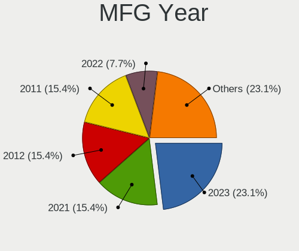
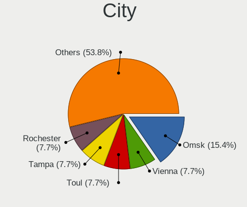
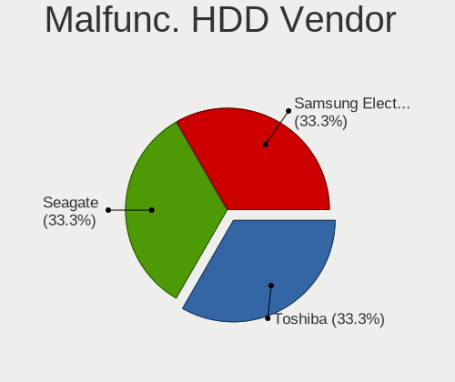
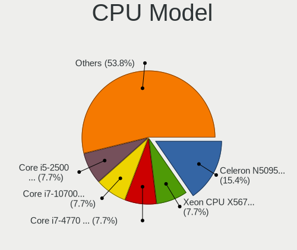
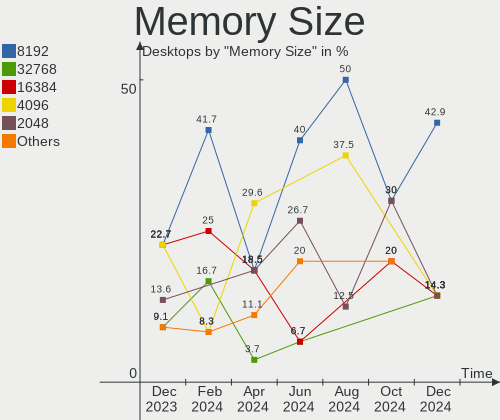

Xubuntu - Hardware Trends (Desktops)
------------------------------------

A project to identify most popular hardware characteristics and track their change
over time based on data collected by Linux users at https://Linux-Hardware.org.

Anyone can contribute to this report by the [hw-probe](https://github.com/linuxhw/hw-probe) tool:

    sudo -E hw-probe -all -upload

This report is for one last month. Overall report since the beginning of time: [TestDays](https://github.com/linuxhw/TestDays)

Period: Apr, 2023.

Contents
--------

* [ System ](#system)
  - [ OS                       ](#os)
  - [ OS Family                ](#os-family)
  - [ Kernel                   ](#kernel)
  - [ Kernel Family            ](#kernel-family)
  - [ Kernel Major Ver.        ](#kernel-major-ver)
  - [ Arch                     ](#arch)
  - [ DE                       ](#de)
  - [ Display Server           ](#display-server)
  - [ Display Manager          ](#display-manager)
  - [ OS Lang                  ](#os-lang)
  - [ Boot Mode                ](#boot-mode)
  - [ Filesystem               ](#filesystem)
  - [ Part. scheme             ](#part-scheme)
  - [ Dual Boot with Linux/BSD ](#dual-boot-with-linuxbsd)
  - [ Dual Boot (Win)          ](#dual-boot-win)

* [ Board ](#board)
  - [ Vendor                   ](#vendor)
  - [ Model                    ](#model)
  - [ Model Family             ](#model-family)
  - [ MFG Year                 ](#mfg-year)
  - [ Form Factor              ](#form-factor)
  - [ Secure Boot              ](#secure-boot)
  - [ Coreboot                 ](#coreboot)
  - [ RAM Size                 ](#ram-size)
  - [ RAM Used                 ](#ram-used)
  - [ Total Drives             ](#total-drives)
  - [ Has CD-ROM               ](#has-cd-rom)
  - [ Has Ethernet             ](#has-ethernet)
  - [ Has WiFi                 ](#has-wifi)
  - [ Has Bluetooth            ](#has-bluetooth)

* [ Location ](#location)
  - [ Country                  ](#country)
  - [ City                     ](#city)

* [ Drives ](#drives)
  - [ Drive Vendor             ](#drive-vendor)
  - [ Drive Model              ](#drive-model)
  - [ HDD Vendor               ](#hdd-vendor)
  - [ SSD Vendor               ](#ssd-vendor)
  - [ Drive Kind               ](#drive-kind)
  - [ Drive Connector          ](#drive-connector)
  - [ Drive Size               ](#drive-size)
  - [ Space Total              ](#space-total)
  - [ Space Used               ](#space-used)
  - [ Malfunc. Drives          ](#malfunc-drives)
  - [ Malfunc. Drive Vendor    ](#malfunc-drive-vendor)
  - [ Malfunc. HDD Vendor      ](#malfunc-hdd-vendor)
  - [ Malfunc. Drive Kind      ](#malfunc-drive-kind)
  - [ Failed Drives            ](#failed-drives)
  - [ Failed Drive Vendor      ](#failed-drive-vendor)
  - [ Drive Status             ](#drive-status)

* [ Storage controller ](#storage-controller)
  - [ Storage Vendor           ](#storage-vendor)
  - [ Storage Model            ](#storage-model)
  - [ Storage Kind             ](#storage-kind)

* [ Processor ](#processor)
  - [ CPU Vendor               ](#cpu-vendor)
  - [ CPU Model                ](#cpu-model)
  - [ CPU Model Family         ](#cpu-model-family)
  - [ CPU Cores                ](#cpu-cores)
  - [ CPU Sockets              ](#cpu-sockets)
  - [ CPU Threads              ](#cpu-threads)
  - [ CPU Op-Modes             ](#cpu-op-modes)
  - [ CPU Microcode            ](#cpu-microcode)
  - [ CPU Microarch            ](#cpu-microarch)

* [ Graphics ](#graphics)
  - [ GPU Vendor               ](#gpu-vendor)
  - [ GPU Model                ](#gpu-model)
  - [ GPU Combo                ](#gpu-combo)
  - [ GPU Driver               ](#gpu-driver)
  - [ GPU Memory               ](#gpu-memory)

* [ Monitor ](#monitor)
  - [ Monitor Vendor           ](#monitor-vendor)
  - [ Monitor Model            ](#monitor-model)
  - [ Monitor Resolution       ](#monitor-resolution)
  - [ Monitor Diagonal         ](#monitor-diagonal)
  - [ Monitor Width            ](#monitor-width)
  - [ Aspect Ratio             ](#aspect-ratio)
  - [ Monitor Area             ](#monitor-area)
  - [ Pixel Density            ](#pixel-density)
  - [ Multiple Monitors        ](#multiple-monitors)

* [ Network ](#network)
  - [ Net Controller Vendor    ](#net-controller-vendor)
  - [ Net Controller Model     ](#net-controller-model)
  - [ Wireless Vendor          ](#wireless-vendor)
  - [ Wireless Model           ](#wireless-model)
  - [ Ethernet Vendor          ](#ethernet-vendor)
  - [ Ethernet Model           ](#ethernet-model)
  - [ Net Controller Kind      ](#net-controller-kind)
  - [ Used Controller          ](#used-controller)
  - [ NICs                     ](#nics)
  - [ IPv6                     ](#ipv6)

* [ Bluetooth ](#bluetooth)
  - [ Bluetooth Vendor         ](#bluetooth-vendor)
  - [ Bluetooth Model          ](#bluetooth-model)

* [ Sound ](#sound)
  - [ Sound Vendor             ](#sound-vendor)
  - [ Sound Model              ](#sound-model)

* [ Memory ](#memory)
  - [ Memory Vendor            ](#memory-vendor)
  - [ Memory Model             ](#memory-model)
  - [ Memory Kind              ](#memory-kind)
  - [ Memory Form Factor       ](#memory-form-factor)
  - [ Memory Size              ](#memory-size)
  - [ Memory Speed             ](#memory-speed)

* [ Printers & scanners ](#printers--scanners)
  - [ Printer Vendor           ](#printer-vendor)
  - [ Printer Model            ](#printer-model)
  - [ Scanner Vendor           ](#scanner-vendor)
  - [ Scanner Model            ](#scanner-model)

* [ Camera ](#camera)
  - [ Camera Vendor            ](#camera-vendor)
  - [ Camera Model             ](#camera-model)

* [ Security ](#security)
  - [ Fingerprint Vendor       ](#fingerprint-vendor)
  - [ Fingerprint Model        ](#fingerprint-model)
  - [ Chipcard Vendor          ](#chipcard-vendor)
  - [ Chipcard Model           ](#chipcard-model)

* [ Unsupported ](#unsupported)
  - [ Unsupported Devices      ](#unsupported-devices)
  - [ Unsupported Device Types ](#unsupported-device-types)

System
------

OS
--

Installed operating systems

| Name          | Desktops | Percent |
|---------------|----------|---------|
| Xubuntu 22.04 | 8        | 44.44%  |
| Xubuntu 20.04 | 7        | 38.89%  |
| Xubuntu 22.10 | 2        | 11.11%  |
| Xubuntu 18.04 | 1        | 5.56%   |

OS Family
---------

OS without a version

| Name    | Desktops | Percent |
|---------|----------|---------|
| Xubuntu | 18       | 100%    |

Kernel
------

Version of the Linux kernel

| Version               | Desktops | Percent |
|-----------------------|----------|---------|
| 5.4.0-146-generic     | 3        | 16.67%  |
| 5.19.0-41-generic     | 2        | 11.11%  |
| 5.15.0-70-generic     | 2        | 11.11%  |
| 5.15.0-69-lowlatency  | 2        | 11.11%  |
| 6.3.0                 | 1        | 5.56%   |
| 5.4.0-131-generic     | 1        | 5.56%   |
| 5.19.0-38-generic     | 1        | 5.56%   |
| 5.19.0-21-generic     | 1        | 5.56%   |
| 5.15.0-70-lowlatency  | 1        | 5.56%   |
| 5.15.0-69-generic     | 1        | 5.56%   |
| 5.15.0-67-generic     | 1        | 5.56%   |
| 5.15.0-56-generic     | 1        | 5.56%   |
| 4.15.0-209-lowlatency | 1        | 5.56%   |

Kernel Family
-------------

Linux kernel without a distro release

| Version | Desktops | Percent |
|---------|----------|---------|
| 5.15.0  | 8        | 44.44%  |
| 5.4.0   | 4        | 22.22%  |
| 5.19.0  | 4        | 22.22%  |
| 6.3.0   | 1        | 5.56%   |
| 4.15.0  | 1        | 5.56%   |

Kernel Major Ver.
-----------------

Linux kernel major version

| Version | Desktops | Percent |
|---------|----------|---------|
| 5.15    | 8        | 44.44%  |
| 5.4     | 4        | 22.22%  |
| 5.19    | 4        | 22.22%  |
| 6.3     | 1        | 5.56%   |
| 4.15    | 1        | 5.56%   |

Arch
----

OS architecture (x86_64, i586, etc.)

| Name   | Desktops | Percent |
|--------|----------|---------|
| x86_64 | 17       | 94.44%  |
| i686   | 1        | 5.56%   |

DE
--

Desktop Environment

| Name     | Desktops | Percent |
|----------|----------|---------|
| XFCE     | 16       | 88.89%  |
| i3       | 1        | 5.56%   |
| Cinnamon | 1        | 5.56%   |

Display Server
--------------

X11 or Wayland

| Name | Desktops | Percent |
|------|----------|---------|
| X11  | 18       | 100%    |

Display Manager
---------------

SDDM, LightDM, etc.

| Name    | Desktops | Percent |
|---------|----------|---------|
| LightDM | 17       | 94.44%  |
| SDDM    | 1        | 5.56%   |

OS Lang
-------

Language

| Lang  | Desktops | Percent |
|-------|----------|---------|
| en_US | 7        | 38.89%  |
| de_DE | 3        | 16.67%  |
| en_GB | 2        | 11.11%  |
| en_CA | 2        | 11.11%  |
| ja_JP | 1        | 5.56%   |
| it_IT | 1        | 5.56%   |
| fr_BE | 1        | 5.56%   |
| es_MX | 1        | 5.56%   |

Boot Mode
---------

EFI or BIOS

| Mode | Desktops | Percent |
|------|----------|---------|
| BIOS | 9        | 50%     |
| EFI  | 9        | 50%     |

Filesystem
----------

Type of filesystem

| Type  | Desktops | Percent |
|-------|----------|---------|
| Ext4  | 17       | 94.44%  |
| Tmpfs | 1        | 5.56%   |

Part. scheme
------------

Scheme of partitioning

| Type    | Desktops | Percent |
|---------|----------|---------|
| GPT     | 11       | 61.11%  |
| MBR     | 6        | 33.33%  |
| Unknown | 1        | 5.56%   |

Dual Boot with Linux/BSD
------------------------

Hosting more than one Linux/BSD

| Dual boot | Desktops | Percent |
|-----------|----------|---------|
| No        | 12       | 66.67%  |
| Yes       | 6        | 33.33%  |

Dual Boot (Win)
---------------

Hosting Linux and Windows

| Dual boot | Desktops | Percent |
|-----------|----------|---------|
| No        | 11       | 61.11%  |
| Yes       | 7        | 38.89%  |

Board
-----

Vendor
------

Motherboard manufacturer

| Name                | Desktops | Percent |
|---------------------|----------|---------|
| ASRock              | 4        | 22.22%  |
| Hewlett-Packard     | 3        | 16.67%  |
| ASUSTek Computer    | 3        | 16.67%  |
| Gigabyte Technology | 2        | 11.11%  |
| Fujitsu             | 2        | 11.11%  |
| MSI                 | 1        | 5.56%   |
| Medion              | 1        | 5.56%   |
| eMachines           | 1        | 5.56%   |
| Acer                | 1        | 5.56%   |

Model
-----

Motherboard model

| Name                              | Desktops | Percent |
|-----------------------------------|----------|---------|
| MSI MS-7758                       | 1        | 5.56%   |
| Medion MS-7848                    | 1        | 5.56%   |
| HP Z800 Workstation               | 1        | 5.56%   |
| HP Z620 Workstation               | 1        | 5.56%   |
| HP rp5800                         | 1        | 5.56%   |
| Gigabyte P55A-UD4P                | 1        | 5.56%   |
| Gigabyte M68MT-S2                 | 1        | 5.56%   |
| Fujitsu ESPRIMO Q958              | 1        | 5.56%   |
| Fujitsu CELSIUS W380              | 1        | 5.56%   |
| eMachines EL1852G                 | 1        | 5.56%   |
| ASUS ROG CROSSHAIR VIII DARK HERO | 1        | 5.56%   |
| ASUS P5Q                          | 1        | 5.56%   |
| ASUS M5A78L-M LX PLUS             | 1        | 5.56%   |
| ASRock Z77 Pro4                   | 1        | 5.56%   |
| ASRock Z170 Extreme4              | 1        | 5.56%   |
| ASRock X370 Killer SLI            | 1        | 5.56%   |
| ASRock N3700-ITX                  | 1        | 5.56%   |
| Acer Aspire TC-885                | 1        | 5.56%   |

Model Family
------------

Motherboard model prefix

| Name               | Desktops | Percent |
|--------------------|----------|---------|
| MSI MS-7758        | 1        | 5.56%   |
| Medion MS-7848     | 1        | 5.56%   |
| HP Z800            | 1        | 5.56%   |
| HP Z620            | 1        | 5.56%   |
| HP rp5800          | 1        | 5.56%   |
| Gigabyte P55A-UD4P | 1        | 5.56%   |
| Gigabyte M68MT-S2  | 1        | 5.56%   |
| Fujitsu ESPRIMO    | 1        | 5.56%   |
| Fujitsu CELSIUS    | 1        | 5.56%   |
| eMachines EL1852G  | 1        | 5.56%   |
| ASUS ROG           | 1        | 5.56%   |
| ASUS P5Q           | 1        | 5.56%   |
| ASUS M5A78L-M      | 1        | 5.56%   |
| ASRock Z77         | 1        | 5.56%   |
| ASRock Z170        | 1        | 5.56%   |
| ASRock X370        | 1        | 5.56%   |
| ASRock N3700-ITX   | 1        | 5.56%   |
| Acer Aspire        | 1        | 5.56%   |

MFG Year
--------

Motherboard manufacture year

| Year | Desktops | Percent |
|------|----------|---------|
| 2012 | 3        | 16.67%  |
| 2011 | 3        | 16.67%  |
| 2010 | 3        | 16.67%  |
| 2021 | 1        | 5.56%   |
| 2020 | 1        | 5.56%   |
| 2018 | 1        | 5.56%   |
| 2017 | 1        | 5.56%   |
| 2016 | 1        | 5.56%   |
| 2015 | 1        | 5.56%   |
| 2013 | 1        | 5.56%   |
| 2009 | 1        | 5.56%   |
| 2008 | 1        | 5.56%   |

Form Factor
-----------

Physical design of the computer

| Name    | Desktops | Percent |
|---------|----------|---------|
| Desktop | 18       | 100%    |

Secure Boot
-----------

Enabled or disabled

| State    | Desktops | Percent |
|----------|----------|---------|
| Disabled | 17       | 94.44%  |
| Enabled  | 1        | 5.56%   |

Coreboot
--------

Have coreboot on board

| Used | Desktops | Percent |
|------|----------|---------|
| No   | 18       | 100%    |

RAM Size
--------

Total RAM memory

| Size in GB  | Desktops | Percent |
|-------------|----------|---------|
| 16.01-24.0  | 4        | 22.22%  |
| 8.01-16.0   | 4        | 22.22%  |
| 4.01-8.0    | 3        | 16.67%  |
| 32.01-64.0  | 2        | 11.11%  |
| 3.01-4.0    | 2        | 11.11%  |
| 64.01-256.0 | 2        | 11.11%  |
| 24.01-32.0  | 1        | 5.56%   |

RAM Used
--------

Used RAM memory

| Used GB   | Desktops | Percent |
|-----------|----------|---------|
| 2.01-3.0  | 7        | 38.89%  |
| 4.01-8.0  | 3        | 16.67%  |
| 3.01-4.0  | 3        | 16.67%  |
| 1.01-2.0  | 3        | 16.67%  |
| 8.01-16.0 | 1        | 5.56%   |
| 0.51-1.0  | 1        | 5.56%   |

Total Drives
------------

Number of drives on board

| Drives | Desktops | Percent |
|--------|----------|---------|
| 2      | 7        | 38.89%  |
| 3      | 5        | 27.78%  |
| 1      | 4        | 22.22%  |
| 5      | 1        | 5.56%   |
| 4      | 1        | 5.56%   |

Has CD-ROM
----------

Has CD-ROM on board

| Presented | Desktops | Percent |
|-----------|----------|---------|
| Yes       | 13       | 72.22%  |
| No        | 5        | 27.78%  |

Has Ethernet
------------

Has Ethernet on board

| Presented | Desktops | Percent |
|-----------|----------|---------|
| Yes       | 18       | 100%    |

Has WiFi
--------

Has WiFi module

| Presented | Desktops | Percent |
|-----------|----------|---------|
| Yes       | 13       | 72.22%  |
| No        | 5        | 27.78%  |

Has Bluetooth
-------------

Has Bluetooth module

| Presented | Desktops | Percent |
|-----------|----------|---------|
| No        | 11       | 61.11%  |
| Yes       | 7        | 38.89%  |

Location
--------

Country
-------

Geographic location (country)

| Country   | Desktops | Percent |
|-----------|----------|---------|
| Germany   | 4        | 22.22%  |
| USA       | 3        | 16.67%  |
| Italy     | 2        | 11.11%  |
| Canada    | 2        | 11.11%  |
| UK        | 1        | 5.56%   |
| Poland    | 1        | 5.56%   |
| Mexico    | 1        | 5.56%   |
| Japan     | 1        | 5.56%   |
| France    | 1        | 5.56%   |
| Belgium   | 1        | 5.56%   |
| Argentina | 1        | 5.56%   |

City
----

Geographic location (city)

| City                  | Desktops | Percent |
|-----------------------|----------|---------|
| Winnipeg              | 1        | 5.56%   |
| San Antonio de Areco  | 1        | 5.56%   |
| Plymouth              | 1        | 5.56%   |
| Osaka                 | 1        | 5.56%   |
| Orléans              | 1        | 5.56%   |
| Newcastle             | 1        | 5.56%   |
| Münster              | 1        | 5.56%   |
| Milan                 | 1        | 5.56%   |
| Mexicali              | 1        | 5.56%   |
| Ludwigshafen am Rhein | 1        | 5.56%   |
| Liège                | 1        | 5.56%   |
| Legnaro               | 1        | 5.56%   |
| Hamburg               | 1        | 5.56%   |
| Freiberg              | 1        | 5.56%   |
| Exeter                | 1        | 5.56%   |
| Cincinnati            | 1        | 5.56%   |
| Chorzów              | 1        | 5.56%   |
| Bridgewater           | 1        | 5.56%   |

Drives
------

Drive Vendor
------------

Hard drive vendors

| Vendor              | Desktops | Drives | Percent |
|---------------------|----------|--------|---------|
| WDC                 | 7        | 7      | 21.21%  |
| Samsung Electronics | 6        | 6      | 18.18%  |
| Seagate             | 4        | 7      | 12.12%  |
| Toshiba             | 3        | 4      | 9.09%   |
| Kingston            | 2        | 2      | 6.06%   |
| Intel               | 2        | 2      | 6.06%   |
| Corsair             | 2        | 2      | 6.06%   |
| Unknown             | 1        | 1      | 3.03%   |
| SanDisk             | 1        | 1      | 3.03%   |
| Phison              | 1        | 2      | 3.03%   |
| HGST                | 1        | 1      | 3.03%   |
| Hewlett-Packard     | 1        | 2      | 3.03%   |
| Crucial             | 1        | 1      | 3.03%   |
| China               | 1        | 1      | 3.03%   |

Drive Model
-----------

Hard drive models

| Model                                             | Desktops | Percent |
|---------------------------------------------------|----------|---------|
| Seagate ST31000524AS 1TB                          | 2        | 5.71%   |
| WDC WD5003ABYZ-011FA0 500GB                       | 1        | 2.86%   |
| WDC WD5000AZLX-60K2TA0 500GB                      | 1        | 2.86%   |
| WDC WD5000AZLX-00K2TA0 500GB                      | 1        | 2.86%   |
| WDC WD5000AAKX-22ERMA0 500GB                      | 1        | 2.86%   |
| WDC WD5000AAKX-00ERMA0 500GB                      | 1        | 2.86%   |
| WDC WD5000AADS-00S9B0 500GB                       | 1        | 2.86%   |
| WDC WD20NPVX-00EA4T0 2TB                          | 1        | 2.86%   |
| Unknown SD/MMC/MS PRO 249GB                       | 1        | 2.86%   |
| Toshiba MK1655GSX H 120GB                         | 1        | 2.86%   |
| Toshiba DT01ACA200 2TB                            | 1        | 2.86%   |
| Toshiba DT01ACA100 1TB                            | 1        | 2.86%   |
| Seagate ST31000528AS 1TB                          | 1        | 2.86%   |
| Seagate ST31000340AS 1TB                          | 1        | 2.86%   |
| Seagate ST2000DM001-1CH164 2TB                    | 1        | 2.86%   |
| Seagate OneTouch HDD 5TB                          | 1        | 2.86%   |
| SanDisk SDSSDP128G 128GB                          | 1        | 2.86%   |
| Samsung SSD 970 EVO Plus 2TB                      | 1        | 2.86%   |
| Samsung SSD 860 EVO 500GB                         | 1        | 2.86%   |
| Samsung SSD 860 EVO 250GB                         | 1        | 2.86%   |
| Samsung SSD 860 EVO 1TB                           | 1        | 2.86%   |
| Samsung SSD 850 EVO 250GB                         | 1        | 2.86%   |
| Samsung NVMe SSD Controller SM981/PM981/PM983 1TB | 1        | 2.86%   |
| Phison Sabrent Rocket 4.0 Plus 1TB                | 1        | 2.86%   |
| Kingston SV300S37A120G 120GB SSD                  | 1        | 2.86%   |
| Kingston RBUSNS8154P3128GJ1 128GB                 | 1        | 2.86%   |
| Intel SSDSA2BW120G3H 120GB                        | 1        | 2.86%   |
| Intel SSD 600P Series 256GB                       | 1        | 2.86%   |
| HGST HUS724020ALA640 2TB                          | 1        | 2.86%   |
| HP MB1000EBNCF 1TB                                | 1        | 2.86%   |
| Crucial CT480BX500SSD1 480GB                      | 1        | 2.86%   |
| Corsair Force MP500 240GB                         | 1        | 2.86%   |
| Corsair Force 3 SSD 64GB                          | 1        | 2.86%   |
| China SATA SSD 120GB                              | 1        | 2.86%   |

HDD Vendor
----------

Hard disk drive vendors

| Vendor          | Desktops | Drives | Percent |
|-----------------|----------|--------|---------|
| WDC             | 7        | 7      | 41.18%  |
| Seagate         | 4        | 7      | 23.53%  |
| Toshiba         | 3        | 4      | 17.65%  |
| Unknown         | 1        | 1      | 5.88%   |
| HGST            | 1        | 1      | 5.88%   |
| Hewlett-Packard | 1        | 2      | 5.88%   |

SSD Vendor
----------

Solid state drive vendors

| Vendor              | Desktops | Drives | Percent |
|---------------------|----------|--------|---------|
| Samsung Electronics | 4        | 4      | 40%     |
| SanDisk             | 1        | 1      | 10%     |
| Kingston            | 1        | 1      | 10%     |
| Intel               | 1        | 1      | 10%     |
| Crucial             | 1        | 1      | 10%     |
| Corsair             | 1        | 1      | 10%     |
| China               | 1        | 1      | 10%     |

Drive Kind
----------

HDD or SSD

| Kind | Desktops | Drives | Percent |
|------|----------|--------|---------|
| HDD  | 13       | 22     | 46.43%  |
| SSD  | 10       | 10     | 35.71%  |
| NVMe | 5        | 7      | 17.86%  |

Drive Connector
---------------

SATA, SAS, NVMe, etc.

| Type | Desktops | Drives | Percent |
|------|----------|--------|---------|
| SATA | 16       | 29     | 69.57%  |
| NVMe | 5        | 7      | 21.74%  |
| SAS  | 2        | 3      | 8.7%    |

Drive Size
----------

Size of hard drive

| Size in TB | Desktops | Drives | Percent |
|------------|----------|--------|---------|
| 0.01-0.5   | 14       | 17     | 53.85%  |
| 0.51-1.0   | 7        | 8      | 26.92%  |
| 1.01-2.0   | 4        | 5      | 15.38%  |
| 4.01-10.0  | 1        | 2      | 3.85%   |

Space Total
-----------

Amount of disk space available on the file system

| Size in GB     | Desktops | Percent |
|----------------|----------|---------|
| 101-250        | 4        | 22.22%  |
| 2001-3000      | 3        | 16.67%  |
| 1001-2000      | 3        | 16.67%  |
| 501-1000       | 3        | 16.67%  |
| More than 3000 | 2        | 11.11%  |
| 251-500        | 1        | 5.56%   |
| 21-50          | 1        | 5.56%   |
| 51-100         | 1        | 5.56%   |

Space Used
----------

Amount of used disk space

| Used GB        | Desktops | Percent |
|----------------|----------|---------|
| 51-100         | 5        | 27.78%  |
| 1-20           | 4        | 22.22%  |
| 101-250        | 3        | 16.67%  |
| 251-500        | 2        | 11.11%  |
| 1001-2000      | 2        | 11.11%  |
| More than 3000 | 1        | 5.56%   |
| 501-1000       | 1        | 5.56%   |

Malfunc. Drives
---------------

Drive models with a malfunction

| Model                          | Desktops | Drives | Percent |
|--------------------------------|----------|--------|---------|
| Seagate ST2000DM001-1CH164 2TB | 1        | 1      | 100%    |

Malfunc. Drive Vendor
---------------------

Vendors of faulty drives

| Vendor  | Desktops | Drives | Percent |
|---------|----------|--------|---------|
| Seagate | 1        | 1      | 100%    |

Malfunc. HDD Vendor
-------------------

Vendors of faulty HDD drives

| Vendor  | Desktops | Drives | Percent |
|---------|----------|--------|---------|
| Seagate | 1        | 1      | 100%    |

Malfunc. Drive Kind
-------------------

Kinds of faulty drives

| Kind | Desktops | Drives | Percent |
|------|----------|--------|---------|
| HDD  | 1        | 1      | 100%    |

Failed Drives
-------------

Failed drive models

Zero info for selected period =(

Failed Drive Vendor
-------------------

Failed drive vendors

Zero info for selected period =(

Drive Status
------------

Number of failed and malfunc. drives

| Status   | Desktops | Drives | Percent |
|----------|----------|--------|---------|
| Works    | 12       | 24     | 60%     |
| Detected | 7        | 14     | 35%     |
| Malfunc  | 1        | 1      | 5%      |

Storage controller
------------------

Storage Vendor
--------------

Storage controller vendors

| Vendor                        | Desktops | Percent |
|-------------------------------|----------|---------|
| Intel                         | 13       | 43.33%  |
| AMD                           | 3        | 10%     |
| Samsung Electronics           | 2        | 6.67%   |
| Phison Electronics            | 2        | 6.67%   |
| Marvell Technology Group      | 2        | 6.67%   |
| ASMedia Technology            | 2        | 6.67%   |
| Nvidia                        | 1        | 3.33%   |
| LSI Logic / Symbios Logic     | 1        | 3.33%   |
| Kingston Technology Company   | 1        | 3.33%   |
| JMicron Technology            | 1        | 3.33%   |
| Integrated Technology Express | 1        | 3.33%   |
| Broadcom / LSI                | 1        | 3.33%   |

Storage Model
-------------

Storage controller models

| Model                                                                          | Desktops | Percent |
|--------------------------------------------------------------------------------|----------|---------|
| Samsung NVMe SSD Controller SM981/PM981/PM983                                  | 2        | 5.13%   |
| Intel SATA Controller [RAID mode]                                              | 2        | 5.13%   |
| Intel Cannon Lake PCH SATA AHCI Controller                                     | 2        | 5.13%   |
| Intel 7 Series/C210 Series Chipset Family 6-port SATA Controller [AHCI mode]   | 2        | 5.13%   |
| ASMedia ASM1062 Serial ATA Controller                                          | 2        | 5.13%   |
| AMD FCH SATA Controller [AHCI mode]                                            | 2        | 5.13%   |
| Phison E7 NVMe Controller                                                      | 1        | 2.56%   |
| Phison E18 PCIe4 NVMe Controller                                               | 1        | 2.56%   |
| Nvidia MCP61 SATA Controller                                                   | 1        | 2.56%   |
| Marvell Group 88SE9230 PCIe 2.0 x2 4-port SATA 6 Gb/s RAID Controller          | 1        | 2.56%   |
| Marvell Group 88SE91A3 SATA-600 Controller                                     | 1        | 2.56%   |
| Marvell Group 88SE6111/6121 SATA II / PATA Controller                          | 1        | 2.56%   |
| LSI Logic / Symbios Logic SAS1068E PCI-Express Fusion-MPT SAS                  | 1        | 2.56%   |
| Kingston Company U-SNS8154P3 NVMe SSD                                          | 1        | 2.56%   |
| JMicron JMB363 SATA/IDE Controller                                             | 1        | 2.56%   |
| Intel SSD 600P Series                                                          | 1        | 2.56%   |
| Intel Q170/Q150/B150/H170/H110/Z170/CM236 Chipset SATA Controller [AHCI Mode]  | 1        | 2.56%   |
| Intel NM10/ICH7 Family SATA Controller [IDE mode]                              | 1        | 2.56%   |
| Intel C602 chipset 4-Port SATA Storage Control Unit                            | 1        | 2.56%   |
| Intel C600/X79 series chipset SATA RAID Controller                             | 1        | 2.56%   |
| Intel C600/X79 series chipset IDE-r Controller                                 | 1        | 2.56%   |
| Intel 82801JI (ICH10 Family) 4 port SATA IDE Controller #1                     | 1        | 2.56%   |
| Intel 82801JI (ICH10 Family) 2 port SATA IDE Controller #2                     | 1        | 2.56%   |
| Intel 82801G (ICH7 Family) IDE Controller                                      | 1        | 2.56%   |
| Intel 8 Series/C220 Series Chipset Family 6-port SATA Controller 1 [AHCI mode] | 1        | 2.56%   |
| Intel 6 Series/C200 Series Chipset Family 6 port Desktop SATA AHCI Controller  | 1        | 2.56%   |
| Intel 5 Series/3400 Series Chipset PT IDER Controller                          | 1        | 2.56%   |
| Intel 5 Series/3400 Series Chipset 6 port SATA AHCI Controller                 | 1        | 2.56%   |
| Integrated Express IT8213 IDE Controller                                       | 1        | 2.56%   |
| Broadcom / LSI MegaRAID SAS 2208 [Thunderbolt]                                 | 1        | 2.56%   |
| AMD X370 Series Chipset SATA Controller                                        | 1        | 2.56%   |
| AMD SB7x0/SB8x0/SB9x0 SATA Controller [AHCI mode]                              | 1        | 2.56%   |
| AMD SB7x0/SB8x0/SB9x0 IDE Controller                                           | 1        | 2.56%   |

Storage Kind
------------

Kind of storage controller (IDE, SATA, NVMe, SAS, ...)

| Kind | Desktops | Percent |
|------|----------|---------|
| SATA | 13       | 43.33%  |
| IDE  | 7        | 23.33%  |
| NVMe | 5        | 16.67%  |
| RAID | 3        | 10%     |
| SAS  | 1        | 3.33%   |
| SCSI | 1        | 3.33%   |

Processor
---------

CPU Vendor
----------

Processor vendors

| Vendor | Desktops | Percent |
|--------|----------|---------|
| Intel  | 14       | 77.78%  |
| AMD    | 4        | 22.22%  |

CPU Model
---------

Processor models

| Model                                       | Desktops | Percent |
|---------------------------------------------|----------|---------|
| Intel Xeon CPU X5687 @ 3.60GHz              | 1        | 5.56%   |
| Intel Xeon CPU E5-2697 v2 @ 2.70GHz         | 1        | 5.56%   |
| Intel Pentium Dual-Core CPU E5800 @ 3.20GHz | 1        | 5.56%   |
| Intel Pentium CPU N3700 @ 1.60GHz           | 1        | 5.56%   |
| Intel Core i7-9700T CPU @ 2.00GHz           | 1        | 5.56%   |
| Intel Core i7-6700 CPU @ 3.40GHz            | 1        | 5.56%   |
| Intel Core i7-4790 CPU @ 3.60GHz            | 1        | 5.56%   |
| Intel Core i7 CPU 870 @ 2.93GHz             | 1        | 5.56%   |
| Intel Core i5-9400 CPU @ 2.90GHz            | 1        | 5.56%   |
| Intel Core i5-3570 CPU @ 3.40GHz            | 1        | 5.56%   |
| Intel Core i5-2500K CPU @ 3.30GHz           | 1        | 5.56%   |
| Intel Core i5 CPU 660 @ 3.33GHz             | 1        | 5.56%   |
| Intel Core 2 Duo CPU E8200 @ 2.66GHz        | 1        | 5.56%   |
| Intel Celeron CPU G540 @ 2.50GHz            | 1        | 5.56%   |
| AMD Ryzen 9 5950X 16-Core Processor         | 1        | 5.56%   |
| AMD Ryzen 5 3600 6-Core Processor           | 1        | 5.56%   |
| AMD FX-8300 Eight-Core Processor            | 1        | 5.56%   |
| AMD Athlon II X2 240 Processor              | 1        | 5.56%   |

CPU Model Family
----------------

Processor model prefix

| Model                   | Desktops | Percent |
|-------------------------|----------|---------|
| Intel Core i7           | 4        | 22.22%  |
| Intel Core i5           | 4        | 22.22%  |
| Intel Xeon              | 2        | 11.11%  |
| Intel Pentium Dual-Core | 1        | 5.56%   |
| Intel Pentium           | 1        | 5.56%   |
| Intel Core 2 Duo        | 1        | 5.56%   |
| Intel Celeron           | 1        | 5.56%   |
| AMD Ryzen 9             | 1        | 5.56%   |
| AMD Ryzen 5             | 1        | 5.56%   |
| AMD FX                  | 1        | 5.56%   |
| AMD Athlon II X2        | 1        | 5.56%   |

CPU Cores
---------

Number of processor cores

| Number | Desktops | Percent |
|--------|----------|---------|
| 4      | 8        | 44.44%  |
| 2      | 5        | 27.78%  |
| 6      | 2        | 11.11%  |
| 24     | 1        | 5.56%   |
| 16     | 1        | 5.56%   |
| 8      | 1        | 5.56%   |

CPU Sockets
-----------

Number of sockets

| Number | Desktops | Percent |
|--------|----------|---------|
| 1      | 17       | 94.44%  |
| 2      | 1        | 5.56%   |

CPU Threads
-----------

Threads per core (Hyper-Threading)

| Number | Desktops | Percent |
|--------|----------|---------|
| 2      | 9        | 50%     |
| 1      | 9        | 50%     |

CPU Op-Modes
------------

CPU Operation Modes (32-bit, 64-bit)

| Op mode        | Desktops | Percent |
|----------------|----------|---------|
| 32-bit, 64-bit | 18       | 100%    |

CPU Microcode
-------------

Microcode number

| Number     | Desktops | Percent |
|------------|----------|---------|
| 0x206a7    | 2        | 11.11%  |
| 0x906ed    | 1        | 5.56%   |
| 0x906ea    | 1        | 5.56%   |
| 0x506e3    | 1        | 5.56%   |
| 0x406c3    | 1        | 5.56%   |
| 0x306e4    | 1        | 5.56%   |
| 0x306c3    | 1        | 5.56%   |
| 0x306a9    | 1        | 5.56%   |
| 0x206c2    | 1        | 5.56%   |
| 0x106e5    | 1        | 5.56%   |
| 0x1067a    | 1        | 5.56%   |
| 0x10676    | 1        | 5.56%   |
| 0x0a201025 | 1        | 5.56%   |
| 0x08701013 | 1        | 5.56%   |
| 0x06000852 | 1        | 5.56%   |
| 0x010000c7 | 1        | 5.56%   |
| Unknown    | 1        | 5.56%   |

CPU Microarch
-------------

Microarchitecture

| Name        | Desktops | Percent |
|-------------|----------|---------|
| Westmere    | 2        | 11.11%  |
| SandyBridge | 2        | 11.11%  |
| Penryn      | 2        | 11.11%  |
| KabyLake    | 2        | 11.11%  |
| IvyBridge   | 2        | 11.11%  |
| Zen 3       | 1        | 5.56%   |
| Zen 2       | 1        | 5.56%   |
| Skylake     | 1        | 5.56%   |
| Silvermont  | 1        | 5.56%   |
| Piledriver  | 1        | 5.56%   |
| Nehalem     | 1        | 5.56%   |
| K10         | 1        | 5.56%   |
| Haswell     | 1        | 5.56%   |

Graphics
--------

GPU Vendor
----------

Vendors of graphics cards

| Vendor | Desktops | Percent |
|--------|----------|---------|
| Nvidia | 8        | 42.11%  |
| Intel  | 7        | 36.84%  |
| AMD    | 4        | 21.05%  |

GPU Model
---------

Graphics card models

| Model                                                                                    | Desktops | Percent |
|------------------------------------------------------------------------------------------|----------|---------|
| Intel CoffeeLake-S GT2 [UHD Graphics 630]                                                | 2        | 10.53%  |
| Intel 2nd Generation Core Processor Family Integrated Graphics Controller                | 2        | 10.53%  |
| Nvidia GP106 [GeForce GTX 1060 6GB]                                                      | 1        | 5.26%   |
| Nvidia GM107 [GeForce GTX 750 Ti]                                                        | 1        | 5.26%   |
| Nvidia GK208B [GeForce GT 730]                                                           | 1        | 5.26%   |
| Nvidia GK208B [GeForce GT 710]                                                           | 1        | 5.26%   |
| Nvidia GK104GL [Quadro K5000]                                                            | 1        | 5.26%   |
| Nvidia GF119 [GeForce GT 610]                                                            | 1        | 5.26%   |
| Nvidia GF100GL [Quadro 5000]                                                             | 1        | 5.26%   |
| Nvidia G96C [GeForce 9500 GT]                                                            | 1        | 5.26%   |
| Intel HD Graphics 530                                                                    | 1        | 5.26%   |
| Intel Atom/Celeron/Pentium Processor x5-E8000/J3xxx/N3xxx Integrated Graphics Controller | 1        | 5.26%   |
| Intel 4 Series Chipset Integrated Graphics Controller                                    | 1        | 5.26%   |
| AMD Pitcairn PRO [Radeon HD 7850 / R7 265 / R9 270 1024SP]                               | 1        | 5.26%   |
| AMD Navi 21 [Radeon RX 6800/6800 XT / 6900 XT]                                           | 1        | 5.26%   |
| AMD Ellesmere [Radeon RX 470/480/570/570X/580/580X/590]                                  | 1        | 5.26%   |
| AMD Cape Verde XT [Radeon HD 7770/8760 / R7 250X]                                        | 1        | 5.26%   |

GPU Combo
---------

Combinations of graphics cards

| Name       | Desktops | Percent |
|------------|----------|---------|
| 1 x Nvidia | 8        | 44.44%  |
| 1 x Intel  | 6        | 33.33%  |
| 1 x AMD    | 4        | 22.22%  |

GPU Driver
----------

Free vs proprietary

| Driver      | Desktops | Percent |
|-------------|----------|---------|
| Free        | 12       | 66.67%  |
| Proprietary | 6        | 33.33%  |

GPU Memory
----------

Total video memory

| Size in GB | Desktops | Percent |
|------------|----------|---------|
| Unknown    | 6        | 33.33%  |
| 1.01-2.0   | 5        | 27.78%  |
| 0.51-1.0   | 2        | 11.11%  |
| 7.01-8.0   | 1        | 5.56%   |
| 5.01-6.0   | 1        | 5.56%   |
| 3.01-4.0   | 1        | 5.56%   |
| 2.01-3.0   | 1        | 5.56%   |
| 8.01-16.0  | 1        | 5.56%   |

Monitor
-------

Monitor Vendor
--------------

Monitor vendors

| Vendor               | Desktops | Percent |
|----------------------|----------|---------|
| Hewlett-Packard      | 3        | 15%     |
| Samsung Electronics  | 2        | 10%     |
| Iiyama               | 2        | 10%     |
| Dell                 | 2        | 10%     |
| Ancor Communications | 2        | 10%     |
| Unknown (AAA)        | 1        | 5%      |
| Sony                 | 1        | 5%      |
| RTK                  | 1        | 5%      |
| Philips              | 1        | 5%      |
| LG Electronics       | 1        | 5%      |
| Goldstar             | 1        | 5%      |
| Eizo                 | 1        | 5%      |
| AOC                  | 1        | 5%      |
| Unknown              | 1        | 5%      |

Monitor Model
-------------

Monitor models

| Model                                                                 | Desktops | Percent |
|-----------------------------------------------------------------------|----------|---------|
| Unknown (AAA) LCDTV AAA3393 1360x768 890x500mm 40.2-inch              | 1        | 4.17%   |
| Sony TV SNYAB03 1920x1080                                             | 1        | 4.17%   |
| Samsung Electronics SyncMaster SAM01AE 1600x1200 408x306mm 20.1-inch  | 1        | 4.17%   |
| Samsung Electronics LCD Monitor SyncMaster 1280x1024                  | 1        | 4.17%   |
| RTK 32V3H-H6A RTK4C54 1280x1024 697x392mm 31.5-inch                   | 1        | 4.17%   |
| Philips PHL 258B6QJEB PHL08E9 2560x1440 553x311mm 25.0-inch           | 1        | 4.17%   |
| LG Electronics LCD Monitor LG ULTRAWIDE 7680x1080                     | 1        | 4.17%   |
| LG Electronics LCD Monitor LG ULTRAWIDE                               | 1        | 4.17%   |
| Iiyama PL2377 IVM561D 1920x1080 510x287mm 23.0-inch                   | 1        | 4.17%   |
| Iiyama PL2209HD IVM560B 1920x1080 478x269mm 21.6-inch                 | 1        | 4.17%   |
| Hewlett-Packard vs15 HWP2646 1024x768 300x220mm 14.6-inch             | 1        | 4.17%   |
| Hewlett-Packard LP2065 HWP0A72 1600x1200 408x306mm 20.1-inch          | 1        | 4.17%   |
| Hewlett-Packard LCD Monitor ZR2440w 7360x1200                         | 1        | 4.17%   |
| Hewlett-Packard LCD Monitor ZR2440w 5440x1200                         | 1        | 4.17%   |
| Hewlett-Packard LCD Monitor ZR2440w                                   | 1        | 4.17%   |
| Hewlett-Packard LCD Monitor P201                                      | 1        | 4.17%   |
| Goldstar HDR WQHD+ GSM774D 3840x1600 879x366mm 37.5-inch              | 1        | 4.17%   |
| Eizo EV2436W ENC2384 1920x1200 519x324mm 24.1-inch                    | 1        | 4.17%   |
| Dell P2210 DEL404E 1680x1050 474x296mm 22.0-inch                      | 1        | 4.17%   |
| Dell LCD Monitor U2312HM 1920x1080                                    | 1        | 4.17%   |
| AOC L22W931 AOC2231 1360x768 708x398mm 32.0-inch                      | 1        | 4.17%   |
| Ancor Communications PB248 ACI24A3 1920x1200 518x324mm 24.1-inch      | 1        | 4.17%   |
| Ancor Communications ASUS MG278 ACI27A8 2560x1440 597x336mm 27.0-inch | 1        | 4.17%   |
| Unknown                                                               | 1        | 4.17%   |

Monitor Resolution
------------------

Monitor screen resolution

| Resolution         | Desktops | Percent |
|--------------------|----------|---------|
| 1920x1080 (FHD)    | 6        | 26.09%  |
| 2560x1440 (QHD)    | 2        | 8.7%    |
| 1920x1200 (WUXGA)  | 2        | 8.7%    |
| 1600x1200          | 2        | 8.7%    |
| 1280x1024 (SXGA)   | 2        | 8.7%    |
| Unknown            | 2        | 8.7%    |
| 7680x1080          | 1        | 4.35%   |
| 7360x1200          | 1        | 4.35%   |
| 5440x1200          | 1        | 4.35%   |
| 3840x1600          | 1        | 4.35%   |
| 1680x1050 (WSXGA+) | 1        | 4.35%   |
| 1360x768           | 1        | 4.35%   |
| 1024x768 (XGA)     | 1        | 4.35%   |

Monitor Diagonal
----------------

Diagonal size in inches

| Inches  | Desktops | Percent |
|---------|----------|---------|
| Unknown | 5        | 25%     |
| 24      | 2        | 10%     |
| 20      | 2        | 10%     |
| 72      | 1        | 5%      |
| 40      | 1        | 5%      |
| 37      | 1        | 5%      |
| 32      | 1        | 5%      |
| 31      | 1        | 5%      |
| 27      | 1        | 5%      |
| 25      | 1        | 5%      |
| 23      | 1        | 5%      |
| 22      | 1        | 5%      |
| 21      | 1        | 5%      |
| 15      | 1        | 5%      |

Monitor Width
-------------

Physical width

| Width in mm | Desktops | Percent |
|-------------|----------|---------|
| 501-600     | 5        | 25%     |
| Unknown     | 5        | 25%     |
| 401-500     | 4        | 20%     |
| 801-900     | 2        | 10%     |
| 701-800     | 1        | 5%      |
| 601-700     | 1        | 5%      |
| 301-350     | 1        | 5%      |
| 1501-2000   | 1        | 5%      |

Aspect Ratio
------------

Proportional relationship between the width and the height

| Ratio   | Desktops | Percent |
|---------|----------|---------|
| 16/9    | 6        | 33.33%  |
| Unknown | 5        | 27.78%  |
| 4/3     | 3        | 16.67%  |
| 16/10   | 3        | 16.67%  |
| 21/9    | 1        | 5.56%   |

Monitor Area
------------

Area in inch²

| Area in inch² | Desktops | Percent |
|----------------|----------|---------|
| Unknown        | 5        | 25%     |
| 351-500        | 3        | 15%     |
| 251-300        | 3        | 15%     |
| 201-250        | 3        | 15%     |
| 151-200        | 2        | 10%     |
| More than 1000 | 1        | 5%      |
| 301-350        | 1        | 5%      |
| 101-110        | 1        | 5%      |
| 501-1000       | 1        | 5%      |

Pixel Density
-------------

Pixels per inch

| Density | Desktops | Percent |
|---------|----------|---------|
| 51-100  | 6        | 33.33%  |
| Unknown | 5        | 27.78%  |
| 101-120 | 4        | 22.22%  |
| 1-50    | 3        | 16.67%  |

Multiple Monitors
-----------------

Total monitors connected

| Total | Desktops | Percent |
|-------|----------|---------|
| 1     | 13       | 72.22%  |
| 2     | 3        | 16.67%  |
| 3     | 2        | 11.11%  |

Network
-------

Net Controller Vendor
---------------------

Controller vendors

| Vendor                | Desktops | Percent |
|-----------------------|----------|---------|
| Realtek Semiconductor | 10       | 33.33%  |
| Intel                 | 9        | 30%     |
| TP-Link               | 2        | 6.67%   |
| Qualcomm Atheros      | 2        | 6.67%   |
| Ralink Technology     | 1        | 3.33%   |
| Ralink                | 1        | 3.33%   |
| Nvidia                | 1        | 3.33%   |
| Linksys               | 1        | 3.33%   |
| D-Link                | 1        | 3.33%   |
| Broadcom              | 1        | 3.33%   |
| ASUSTek Computer      | 1        | 3.33%   |

Net Controller Model
--------------------

Controller models

| Model                                                                         | Desktops | Percent |
|-------------------------------------------------------------------------------|----------|---------|
| Realtek RTL8111/8168/8411 PCI Express Gigabit Ethernet Controller             | 8        | 24.24%  |
| Intel I211 Gigabit Network Connection                                         | 2        | 6.06%   |
| Intel 82579LM Gigabit Network Connection (Lewisville)                         | 2        | 6.06%   |
| TP-Link TL-WN722N v2/v3 [Realtek RTL8188EUS]                                  | 1        | 3.03%   |
| TP-Link AC600 wireless Realtek RTL8811AU [Archer T2U Nano]                    | 1        | 3.03%   |
| Realtek RTL8188FTV 802.11b/g/n 1T1R 2.4G WLAN Adapter                         | 1        | 3.03%   |
| Realtek RTL8125 2.5GbE Controller                                             | 1        | 3.03%   |
| Ralink MT7601U Wireless Adapter                                               | 1        | 3.03%   |
| Ralink RT2790 Wireless 802.11n 1T/2R PCIe                                     | 1        | 3.03%   |
| Qualcomm Atheros AR8121/AR8113/AR8114 Gigabit or Fast Ethernet                | 1        | 3.03%   |
| Qualcomm Atheros AR2413/AR2414 Wireless Network Adapter [AR5005G(S) 802.11bg] | 1        | 3.03%   |
| Nvidia MCP61 Ethernet                                                         | 1        | 3.03%   |
| Linksys WUSB54GC v1 802.11g Adapter [Ralink RT73]                             | 1        | 3.03%   |
| Intel Wireless-AC 9260                                                        | 1        | 3.03%   |
| Intel Wi-Fi 6 AX200                                                           | 1        | 3.03%   |
| Intel PRO/Wireless 5100 AGN [Shiloh] Network Connection                       | 1        | 3.03%   |
| Intel Ethernet Connection (7) I219-LM                                         | 1        | 3.03%   |
| Intel Ethernet Connection (2) I219-V                                          | 1        | 3.03%   |
| Intel Cannon Lake PCH CNVi WiFi                                               | 1        | 3.03%   |
| Intel 82578DM Gigabit Network Connection                                      | 1        | 3.03%   |
| Intel 82574L Gigabit Network Connection                                       | 1        | 3.03%   |
| D-Link DWA-131 802.11n Wireless N Nano Adapter (rev.B1) [Realtek RTL8192CU]   | 1        | 3.03%   |
| Broadcom NetXtreme BCM5764M Gigabit Ethernet PCIe                             | 1        | 3.03%   |
| ASUS ASUS USB-AC58 USB Wireless adapter                                       | 1        | 3.03%   |

Wireless Vendor
---------------

Wireless vendors

| Vendor                | Desktops | Percent |
|-----------------------|----------|---------|
| Intel                 | 4        | 30.77%  |
| TP-Link               | 2        | 15.38%  |
| Realtek Semiconductor | 1        | 7.69%   |
| Ralink Technology     | 1        | 7.69%   |
| Ralink                | 1        | 7.69%   |
| Qualcomm Atheros      | 1        | 7.69%   |
| Linksys               | 1        | 7.69%   |
| D-Link                | 1        | 7.69%   |
| ASUSTek Computer      | 1        | 7.69%   |

Wireless Model
--------------

Wireless models

| Model                                                                         | Desktops | Percent |
|-------------------------------------------------------------------------------|----------|---------|
| TP-Link TL-WN722N v2/v3 [Realtek RTL8188EUS]                                  | 1        | 7.69%   |
| TP-Link AC600 wireless Realtek RTL8811AU [Archer T2U Nano]                    | 1        | 7.69%   |
| Realtek RTL8188FTV 802.11b/g/n 1T1R 2.4G WLAN Adapter                         | 1        | 7.69%   |
| Ralink MT7601U Wireless Adapter                                               | 1        | 7.69%   |
| Ralink RT2790 Wireless 802.11n 1T/2R PCIe                                     | 1        | 7.69%   |
| Qualcomm Atheros AR2413/AR2414 Wireless Network Adapter [AR5005G(S) 802.11bg] | 1        | 7.69%   |
| Linksys WUSB54GC v1 802.11g Adapter [Ralink RT73]                             | 1        | 7.69%   |
| Intel Wireless-AC 9260                                                        | 1        | 7.69%   |
| Intel Wi-Fi 6 AX200                                                           | 1        | 7.69%   |
| Intel PRO/Wireless 5100 AGN [Shiloh] Network Connection                       | 1        | 7.69%   |
| Intel Cannon Lake PCH CNVi WiFi                                               | 1        | 7.69%   |
| D-Link DWA-131 802.11n Wireless N Nano Adapter (rev.B1) [Realtek RTL8192CU]   | 1        | 7.69%   |
| ASUS ASUS USB-AC58 USB Wireless adapter                                       | 1        | 7.69%   |

Ethernet Vendor
---------------

Ethernet vendors

| Vendor                | Desktops | Percent |
|-----------------------|----------|---------|
| Realtek Semiconductor | 9        | 47.37%  |
| Intel                 | 7        | 36.84%  |
| Qualcomm Atheros      | 1        | 5.26%   |
| Nvidia                | 1        | 5.26%   |
| Broadcom              | 1        | 5.26%   |

Ethernet Model
--------------

Ethernet models

| Model                                                             | Desktops | Percent |
|-------------------------------------------------------------------|----------|---------|
| Realtek RTL8111/8168/8411 PCI Express Gigabit Ethernet Controller | 8        | 40%     |
| Intel I211 Gigabit Network Connection                             | 2        | 10%     |
| Intel 82579LM Gigabit Network Connection (Lewisville)             | 2        | 10%     |
| Realtek RTL8125 2.5GbE Controller                                 | 1        | 5%      |
| Qualcomm Atheros AR8121/AR8113/AR8114 Gigabit or Fast Ethernet    | 1        | 5%      |
| Nvidia MCP61 Ethernet                                             | 1        | 5%      |
| Intel Ethernet Connection (7) I219-LM                             | 1        | 5%      |
| Intel Ethernet Connection (2) I219-V                              | 1        | 5%      |
| Intel 82578DM Gigabit Network Connection                          | 1        | 5%      |
| Intel 82574L Gigabit Network Connection                           | 1        | 5%      |
| Broadcom NetXtreme BCM5764M Gigabit Ethernet PCIe                 | 1        | 5%      |

Net Controller Kind
-------------------

Ethernet, WiFi or modem

| Kind     | Desktops | Percent |
|----------|----------|---------|
| Ethernet | 18       | 58.06%  |
| WiFi     | 13       | 41.94%  |

Used Controller
---------------

Currently used network controller

| Kind     | Desktops | Percent |
|----------|----------|---------|
| WiFi     | 9        | 50%     |
| Ethernet | 9        | 50%     |

NICs
----

Total network controllers on board

| Total | Desktops | Percent |
|-------|----------|---------|
| 1     | 10       | 55.56%  |
| 2     | 6        | 33.33%  |
| 3     | 2        | 11.11%  |

IPv6
----

IPv6 vs IPv4

| Used | Desktops | Percent |
|------|----------|---------|
| No   | 12       | 66.67%  |
| Yes  | 6        | 33.33%  |

Bluetooth
---------

Bluetooth Vendor
----------------

Controller vendors

| Vendor                  | Desktops | Percent |
|-------------------------|----------|---------|
| Intel                   | 3        | 42.86%  |
| TP-Link                 | 1        | 14.29%  |
| Realtek Semiconductor   | 1        | 14.29%  |
| Cambridge Silicon Radio | 1        | 14.29%  |
| Broadcom                | 1        | 14.29%  |

Bluetooth Model
---------------

Controller models

| Model                                               | Desktops | Percent |
|-----------------------------------------------------|----------|---------|
| TP-Link UB500 Adapter                               | 1        | 14.29%  |
| Realtek Bluetooth Radio                             | 1        | 14.29%  |
| Intel Wireless-AC 9260 Bluetooth Adapter            | 1        | 14.29%  |
| Intel Bluetooth 9460/9560 Jefferson Peak (JfP)      | 1        | 14.29%  |
| Intel AX200 Bluetooth                               | 1        | 14.29%  |
| Cambridge Silicon Radio Bluetooth Dongle (HCI mode) | 1        | 14.29%  |
| Broadcom BCM20702A0 Bluetooth 4.0                   | 1        | 14.29%  |

Sound
-----

Sound Vendor
------------

Sound card vendors

| Vendor              | Desktops | Percent |
|---------------------|----------|---------|
| Intel               | 14       | 38.89%  |
| Nvidia              | 7        | 19.44%  |
| AMD                 | 6        | 16.67%  |
| Creative Labs       | 2        | 5.56%   |
| Yamaha              | 1        | 2.78%   |
| VIA Technologies    | 1        | 2.78%   |
| Texas Instruments   | 1        | 2.78%   |
| Razer USA           | 1        | 2.78%   |
| MAG Technology      | 1        | 2.78%   |
| Creative Technology | 1        | 2.78%   |
| C-Media Electronics | 1        | 2.78%   |

Sound Model
-----------

Sound card models

| Model                                                                                             | Desktops | Percent |
|---------------------------------------------------------------------------------------------------|----------|---------|
| Nvidia GK208 HDMI/DP Audio Controller                                                             | 2        | 5.26%   |
| Intel Cannon Lake PCH cAVS                                                                        | 2        | 5.26%   |
| Intel 82801JI (ICH10 Family) HD Audio Controller                                                  | 2        | 5.26%   |
| Intel 7 Series/C216 Chipset Family High Definition Audio Controller                               | 2        | 5.26%   |
| Intel 5 Series/3400 Series Chipset High Definition Audio                                          | 2        | 5.26%   |
| AMD Starship/Matisse HD Audio Controller                                                          | 2        | 5.26%   |
| AMD Oland/Hainan/Cape Verde/Pitcairn HDMI Audio [Radeon HD 7000 Series]                           | 2        | 5.26%   |
| Yamaha Steinberg UR44C                                                                            | 1        | 2.63%   |
| VIA Technologies VT1720/24 [Envy24PT/HT] PCI Multi-Channel Audio Controller                       | 1        | 2.63%   |
| Texas Instruments PCM2704 16-bit stereo audio DAC                                                 | 1        | 2.63%   |
| Razer USA Razer Kraken V3                                                                         | 1        | 2.63%   |
| Nvidia MCP61 High Definition Audio                                                                | 1        | 2.63%   |
| Nvidia GP106 High Definition Audio Controller                                                     | 1        | 2.63%   |
| Nvidia GM107 High Definition Audio Controller [GeForce 940MX]                                     | 1        | 2.63%   |
| Nvidia GK104 HDMI Audio Controller                                                                | 1        | 2.63%   |
| Nvidia GF119 HDMI Audio Controller                                                                | 1        | 2.63%   |
| Nvidia GF100 High Definition Audio Controller                                                     | 1        | 2.63%   |
| MAG Technology ARC AMP DAC                                                                        | 1        | 2.63%   |
| Intel NM10/ICH7 Family High Definition Audio Controller                                           | 1        | 2.63%   |
| Intel C600/X79 series chipset High Definition Audio Controller                                    | 1        | 2.63%   |
| Intel Atom/Celeron/Pentium Processor x5-E8000/J3xxx/N3xxx Series High Definition Audio Controller | 1        | 2.63%   |
| Intel 8 Series/C220 Series Chipset High Definition Audio Controller                               | 1        | 2.63%   |
| Intel 6 Series/C200 Series Chipset Family High Definition Audio Controller                        | 1        | 2.63%   |
| Intel 100 Series/C230 Series Chipset Family HD Audio Controller                                   | 1        | 2.63%   |
| Creative Technology Sound BlasterX Katana                                                         | 1        | 2.63%   |
| Creative Labs EMU10k2/CA0100/CA0102/CA10200 [Sound Blaster Audigy Series]                         | 1        | 2.63%   |
| Creative Labs CA0132 Sound Core3D [Sound Blaster Recon3D / Z-Series / Sound BlasterX AE-5 Plus]   | 1        | 2.63%   |
| C-Media Electronics Audio Adapter (Unitek Y-247A)                                                 | 1        | 2.63%   |
| AMD SBx00 Azalia (Intel HDA)                                                                      | 1        | 2.63%   |
| AMD Navi 21/23 HDMI/DP Audio Controller                                                           | 1        | 2.63%   |
| AMD Ellesmere HDMI Audio [Radeon RX 470/480 / 570/580/590]                                        | 1        | 2.63%   |

Memory
------

Memory Vendor
-------------

Memory module vendors

| Vendor              | Desktops | Percent |
|---------------------|----------|---------|
| Kingston            | 3        | 25%     |
| Unknown             | 2        | 16.67%  |
| Samsung Electronics | 2        | 16.67%  |
| G.Skill             | 2        | 16.67%  |
| SK hynix            | 1        | 8.33%   |
| Nanya Technology    | 1        | 8.33%   |
| Corsair             | 1        | 8.33%   |

Memory Model
------------

Memory module models

| Model                                                     | Desktops | Percent |
|-----------------------------------------------------------|----------|---------|
| Unknown RAM Module 4GB DIMM 1066MT/s                      | 1        | 7.14%   |
| Unknown RAM Module 2048MB DIMM DDR2 800MT/s               | 1        | 7.14%   |
| SK hynix RAM HMT31GR7BFR4C-H9 8GB DIMM DDR3 1333MT/s      | 1        | 7.14%   |
| SK hynix RAM HMT31GR7AFR4C-H9 8GB DIMM DDR3 1333MT/s      | 1        | 7.14%   |
| Samsung RAM Module 4GB DIMM DDR3 1067MT/s                 | 1        | 7.14%   |
| Samsung RAM M471A2K43CB1-CTD 16384MB SODIMM DDR4 8400MT/s | 1        | 7.14%   |
| Nanya RAM M2F8G64CB8HD5N-DI 8GB DIMM DDR3 1600MT/s        | 1        | 7.14%   |
| Kingston RAM Module 8192MB DIMM DDR4 2666MT/s             | 1        | 7.14%   |
| Kingston RAM Module 4096MB DIMM DDR4 2666MT/s             | 1        | 7.14%   |
| Kingston RAM KHX1600C9S3L/4G 4GB DIMM DDR3 1600MT/s       | 1        | 7.14%   |
| Kingston RAM 99U5402-034.A00LF 4096MB DIMM DDR3 1333MT/s  | 1        | 7.14%   |
| G.Skill RAM F4-3600C16-32GTRS 32GB DIMM DDR4 3600MT/s     | 1        | 7.14%   |
| G.Skill RAM F4-3200C16-16GIS 16GB DIMM DDR4 3600MT/s      | 1        | 7.14%   |
| Corsair RAM CMZ8GX3M2A1600C9 4GB DIMM 1600MT/s            | 1        | 7.14%   |

Memory Kind
-----------

Memory module kinds

| Kind    | Desktops | Percent |
|---------|----------|---------|
| DDR3    | 6        | 50%     |
| DDR4    | 4        | 33.33%  |
| DDR2    | 1        | 8.33%   |
| Unknown | 1        | 8.33%   |

Memory Form Factor
------------------

Physical design of the memory module

| Name   | Desktops | Percent |
|--------|----------|---------|
| DIMM   | 11       | 91.67%  |
| SODIMM | 1        | 8.33%   |

Memory Size
-----------

Memory module size

| Size  | Desktops | Percent |
|-------|----------|---------|
| 4096  | 6        | 46.15%  |
| 8192  | 3        | 23.08%  |
| 16384 | 2        | 15.38%  |
| 32768 | 1        | 7.69%   |
| 2048  | 1        | 7.69%   |

Memory Speed
------------

Memory module speed

| Speed | Desktops | Percent |
|-------|----------|---------|
| 1600  | 3        | 25%     |
| 3600  | 2        | 16.67%  |
| 1333  | 2        | 16.67%  |
| 8400  | 1        | 8.33%   |
| 2666  | 1        | 8.33%   |
| 1067  | 1        | 8.33%   |
| 1066  | 1        | 8.33%   |
| 800   | 1        | 8.33%   |

Printers & scanners
-------------------

Printer Vendor
--------------

Printer device vendors

| Vendor             | Desktops | Percent |
|--------------------|----------|---------|
| Hewlett-Packard    | 1        | 50%     |
| Brother Industries | 1        | 50%     |

Printer Model
-------------

Printer device models

| Model                  | Desktops | Percent |
|------------------------|----------|---------|
| HP DeskJet 3700 series | 1        | 50%     |
| Brother MFC-J460DW     | 1        | 50%     |

Scanner Vendor
--------------

Scanner device vendors

Zero info for selected period =(

Scanner Model
-------------

Scanner device models

Zero info for selected period =(

Camera
------

Camera Vendor
-------------

Camera device vendors

| Vendor                      | Desktops | Percent |
|-----------------------------|----------|---------|
| Logitech                    | 3        | 33.33%  |
| 2M UVC CAMERA               | 2        | 22.22%  |
| Silicon Motion              | 1        | 11.11%  |
| Microdia                    | 1        | 11.11%  |
| KYE Systems (Mouse Systems) | 1        | 11.11%  |
| Generalplus Technology      | 1        | 11.11%  |

Camera Model
------------

Camera device models

| Model                                          | Desktops | Percent |
|------------------------------------------------|----------|---------|
| 2M UVC CAMERA NexiGo N60 FHD Webcam            | 2        | 22.22%  |
| Silicon Motion 300k Pixel Camera               | 1        | 11.11%  |
| Microdia Webcam Vitade AF                      | 1        | 11.11%  |
| Logitech Webcam C110                           | 1        | 11.11%  |
| Logitech C922 Pro Stream Webcam                | 1        | 11.11%  |
| Logitech BRIO Ultra HD Webcam                  | 1        | 11.11%  |
| KYE Systems (Mouse Systems) Genius FaceCam 320 | 1        | 11.11%  |
| Generalplus GENERAL WEBCAM                     | 1        | 11.11%  |

Security
--------

Fingerprint Vendor
------------------

Fingerprint sensor vendors

Zero info for selected period =(

Fingerprint Model
-----------------

Fingerprint sensor models

Zero info for selected period =(

Chipcard Vendor
---------------

Chipcard module vendors

Zero info for selected period =(

Chipcard Model
--------------

Chipcard module models

Zero info for selected period =(

Unsupported
-----------

Unsupported Devices
-------------------

Total unsupported devices on board

| Total | Desktops | Percent |
|-------|----------|---------|
| 0     | 15       | 83.33%  |
| 1     | 3        | 16.67%  |

Unsupported Device Types
------------------------

Types of unsupported devices

| Type         | Desktops | Percent |
|--------------|----------|---------|
| Net/wireless | 2        | 66.67%  |
| Dvb card     | 1        | 33.33%  |

