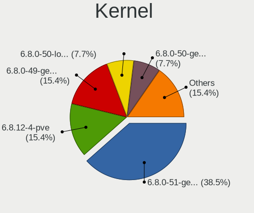
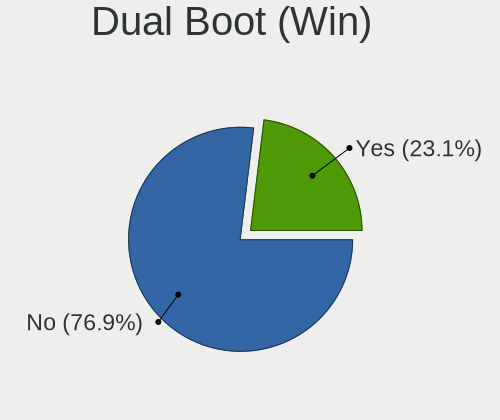
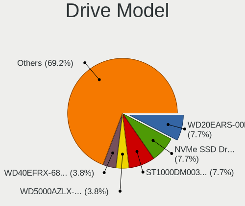

Xubuntu - Hardware Trends (Desktops)
------------------------------------

A project to identify most popular hardware characteristics and track their change
over time based on data collected by Linux users at https://Linux-Hardware.org.

Anyone can contribute to this report by the [hw-probe](https://github.com/linuxhw/hw-probe) tool:

    sudo -E hw-probe -all -upload

This report is for one last month. Overall report since the beginning of time: [TestCoverage](https://github.com/linuxhw/TestCoverage)

Period: Oct, 2022.

Contents
--------

* [ System ](#system)
  - [ OS                       ](#os)
  - [ OS Family                ](#os-family)
  - [ Kernel                   ](#kernel)
  - [ Kernel Family            ](#kernel-family)
  - [ Kernel Major Ver.        ](#kernel-major-ver)
  - [ Arch                     ](#arch)
  - [ DE                       ](#de)
  - [ Display Server           ](#display-server)
  - [ Display Manager          ](#display-manager)
  - [ OS Lang                  ](#os-lang)
  - [ Boot Mode                ](#boot-mode)
  - [ Filesystem               ](#filesystem)
  - [ Part. scheme             ](#part-scheme)
  - [ Dual Boot with Linux/BSD ](#dual-boot-with-linuxbsd)
  - [ Dual Boot (Win)          ](#dual-boot-win)

* [ Board ](#board)
  - [ Vendor                   ](#vendor)
  - [ Model                    ](#model)
  - [ Model Family             ](#model-family)
  - [ MFG Year                 ](#mfg-year)
  - [ Form Factor              ](#form-factor)
  - [ Secure Boot              ](#secure-boot)
  - [ Coreboot                 ](#coreboot)
  - [ RAM Size                 ](#ram-size)
  - [ RAM Used                 ](#ram-used)
  - [ Total Drives             ](#total-drives)
  - [ Has CD-ROM               ](#has-cd-rom)
  - [ Has Ethernet             ](#has-ethernet)
  - [ Has WiFi                 ](#has-wifi)
  - [ Has Bluetooth            ](#has-bluetooth)

* [ Location ](#location)
  - [ Country                  ](#country)
  - [ City                     ](#city)

* [ Drives ](#drives)
  - [ Drive Vendor             ](#drive-vendor)
  - [ Drive Model              ](#drive-model)
  - [ HDD Vendor               ](#hdd-vendor)
  - [ SSD Vendor               ](#ssd-vendor)
  - [ Drive Kind               ](#drive-kind)
  - [ Drive Connector          ](#drive-connector)
  - [ Drive Size               ](#drive-size)
  - [ Space Total              ](#space-total)
  - [ Space Used               ](#space-used)
  - [ Malfunc. Drives          ](#malfunc-drives)
  - [ Malfunc. Drive Vendor    ](#malfunc-drive-vendor)
  - [ Malfunc. HDD Vendor      ](#malfunc-hdd-vendor)
  - [ Malfunc. Drive Kind      ](#malfunc-drive-kind)
  - [ Failed Drives            ](#failed-drives)
  - [ Failed Drive Vendor      ](#failed-drive-vendor)
  - [ Drive Status             ](#drive-status)

* [ Storage controller ](#storage-controller)
  - [ Storage Vendor           ](#storage-vendor)
  - [ Storage Model            ](#storage-model)
  - [ Storage Kind             ](#storage-kind)

* [ Processor ](#processor)
  - [ CPU Vendor               ](#cpu-vendor)
  - [ CPU Model                ](#cpu-model)
  - [ CPU Model Family         ](#cpu-model-family)
  - [ CPU Cores                ](#cpu-cores)
  - [ CPU Sockets              ](#cpu-sockets)
  - [ CPU Threads              ](#cpu-threads)
  - [ CPU Op-Modes             ](#cpu-op-modes)
  - [ CPU Microcode            ](#cpu-microcode)
  - [ CPU Microarch            ](#cpu-microarch)

* [ Graphics ](#graphics)
  - [ GPU Vendor               ](#gpu-vendor)
  - [ GPU Model                ](#gpu-model)
  - [ GPU Combo                ](#gpu-combo)
  - [ GPU Driver               ](#gpu-driver)
  - [ GPU Memory               ](#gpu-memory)

* [ Monitor ](#monitor)
  - [ Monitor Vendor           ](#monitor-vendor)
  - [ Monitor Model            ](#monitor-model)
  - [ Monitor Resolution       ](#monitor-resolution)
  - [ Monitor Diagonal         ](#monitor-diagonal)
  - [ Monitor Width            ](#monitor-width)
  - [ Aspect Ratio             ](#aspect-ratio)
  - [ Monitor Area             ](#monitor-area)
  - [ Pixel Density            ](#pixel-density)
  - [ Multiple Monitors        ](#multiple-monitors)

* [ Network ](#network)
  - [ Net Controller Vendor    ](#net-controller-vendor)
  - [ Net Controller Model     ](#net-controller-model)
  - [ Wireless Vendor          ](#wireless-vendor)
  - [ Wireless Model           ](#wireless-model)
  - [ Ethernet Vendor          ](#ethernet-vendor)
  - [ Ethernet Model           ](#ethernet-model)
  - [ Net Controller Kind      ](#net-controller-kind)
  - [ Used Controller          ](#used-controller)
  - [ NICs                     ](#nics)
  - [ IPv6                     ](#ipv6)

* [ Bluetooth ](#bluetooth)
  - [ Bluetooth Vendor         ](#bluetooth-vendor)
  - [ Bluetooth Model          ](#bluetooth-model)

* [ Sound ](#sound)
  - [ Sound Vendor             ](#sound-vendor)
  - [ Sound Model              ](#sound-model)

* [ Memory ](#memory)
  - [ Memory Vendor            ](#memory-vendor)
  - [ Memory Model             ](#memory-model)
  - [ Memory Kind              ](#memory-kind)
  - [ Memory Form Factor       ](#memory-form-factor)
  - [ Memory Size              ](#memory-size)
  - [ Memory Speed             ](#memory-speed)

* [ Printers & scanners ](#printers--scanners)
  - [ Printer Vendor           ](#printer-vendor)
  - [ Printer Model            ](#printer-model)
  - [ Scanner Vendor           ](#scanner-vendor)
  - [ Scanner Model            ](#scanner-model)

* [ Camera ](#camera)
  - [ Camera Vendor            ](#camera-vendor)
  - [ Camera Model             ](#camera-model)

* [ Security ](#security)
  - [ Fingerprint Vendor       ](#fingerprint-vendor)
  - [ Fingerprint Model        ](#fingerprint-model)
  - [ Chipcard Vendor          ](#chipcard-vendor)
  - [ Chipcard Model           ](#chipcard-model)

* [ Unsupported ](#unsupported)
  - [ Unsupported Devices      ](#unsupported-devices)
  - [ Unsupported Device Types ](#unsupported-device-types)

System
------

OS
--

Installed operating systems

| Name          | Desktops | Percent |
|---------------|----------|---------|
| Xubuntu 22.04 | 17       | 56.67%  |
| Xubuntu 20.04 | 5        | 16.67%  |
| Xubuntu 22.10 | 3        | 10%     |
| Xubuntu 18.04 | 3        | 10%     |
| Xubuntu 16.04 | 2        | 6.67%   |

OS Family
---------

OS without a version

| Name    | Desktops | Percent |
|---------|----------|---------|
| Xubuntu | 30       | 100%    |

Kernel
------

Version of the Linux kernel

| Version                    | Desktops | Percent |
|----------------------------|----------|---------|
| 5.15.0-52-generic          | 5        | 16.67%  |
| 5.15.0-48-generic          | 4        | 13.33%  |
| 5.19.0-23-generic          | 3        | 10%     |
| 5.15.0-50-generic          | 3        | 10%     |
| 4.4.0-210-generic          | 2        | 6.67%   |
| 6.0.0                      | 1        | 3.33%   |
| 5.4.0-131-generic          | 1        | 3.33%   |
| 5.4.0-126-lowlatency       | 1        | 3.33%   |
| 5.19.0-7.1-liquorix-amd64  | 1        | 3.33%   |
| 5.19.0-15.2-liquorix-amd64 | 1        | 3.33%   |
| 5.15.0-52-lowlatency       | 1        | 3.33%   |
| 5.15.0-50-lowlatency       | 1        | 3.33%   |
| 5.15.0-48-lowlatency       | 1        | 3.33%   |
| 5.15.0-47-generic          | 1        | 3.33%   |
| 5.15.0-42-lowlatency       | 1        | 3.33%   |
| 5.15.0-39-generic          | 1        | 3.33%   |
| 5.11.0-43-lowlatency       | 1        | 3.33%   |
| 4.15.0-193-generic         | 1        | 3.33%   |

Kernel Family
-------------

Linux kernel without a distro release

| Version | Desktops | Percent |
|---------|----------|---------|
| 5.15.0  | 18       | 60%     |
| 5.19.0  | 5        | 16.67%  |
| 5.4.0   | 2        | 6.67%   |
| 4.4.0   | 2        | 6.67%   |
| 6.0.0   | 1        | 3.33%   |
| 5.11.0  | 1        | 3.33%   |
| 4.15.0  | 1        | 3.33%   |

Kernel Major Ver.
-----------------

Linux kernel major version

| Version | Desktops | Percent |
|---------|----------|---------|
| 5.15    | 18       | 60%     |
| 5.19    | 5        | 16.67%  |
| 5.4     | 2        | 6.67%   |
| 4.4     | 2        | 6.67%   |
| 6.0     | 1        | 3.33%   |
| 5.11    | 1        | 3.33%   |
| 4.15    | 1        | 3.33%   |

Arch
----

OS architecture (x86_64, i586, etc.)

| Name   | Desktops | Percent |
|--------|----------|---------|
| x86_64 | 30       | 100%    |

DE
--

Desktop Environment

| Name | Desktops | Percent |
|------|----------|---------|
| XFCE | 29       | 96.67%  |
| i3   | 1        | 3.33%   |

Display Server
--------------

X11 or Wayland

| Name | Desktops | Percent |
|------|----------|---------|
| X11  | 28       | 93.33%  |
| Tty  | 2        | 6.67%   |

Display Manager
---------------

SDDM, LightDM, etc.

| Name    | Desktops | Percent |
|---------|----------|---------|
| LightDM | 26       | 86.67%  |
| Unknown | 3        | 10%     |
| GDM3    | 1        | 3.33%   |

OS Lang
-------

Language

| Lang  | Desktops | Percent |
|-------|----------|---------|
| it_IT | 8        | 26.67%  |
| en_US | 8        | 26.67%  |
| de_DE | 4        | 13.33%  |
| fr_FR | 3        | 10%     |
| pt_BR | 2        | 6.67%   |
| nl_NL | 1        | 3.33%   |
| es_ES | 1        | 3.33%   |
| en_ZA | 1        | 3.33%   |
| en_AU | 1        | 3.33%   |
| bs_BA | 1        | 3.33%   |

Boot Mode
---------

EFI or BIOS

| Mode | Desktops | Percent |
|------|----------|---------|
| BIOS | 19       | 63.33%  |
| EFI  | 11       | 36.67%  |

Filesystem
----------

Type of filesystem

| Type | Desktops | Percent |
|------|----------|---------|
| Ext4 | 30       | 100%    |

Part. scheme
------------

Scheme of partitioning

| Type    | Desktops | Percent |
|---------|----------|---------|
| GPT     | 19       | 63.33%  |
| MBR     | 8        | 26.67%  |
| Unknown | 3        | 10%     |

Dual Boot with Linux/BSD
------------------------

Hosting more than one Linux/BSD

| Dual boot | Desktops | Percent |
|-----------|----------|---------|
| No        | 25       | 83.33%  |
| Yes       | 5        | 16.67%  |

Dual Boot (Win)
---------------

Hosting Linux and Windows

| Dual boot | Desktops | Percent |
|-----------|----------|---------|
| No        | 22       | 73.33%  |
| Yes       | 8        | 26.67%  |

Board
-----

Vendor
------

Motherboard manufacturer

| Name                | Desktops | Percent |
|---------------------|----------|---------|
| ASUSTek Computer    | 10       | 33.33%  |
| Dell                | 4        | 13.33%  |
| MSI                 | 2        | 6.67%   |
| Lenovo              | 2        | 6.67%   |
| Hewlett-Packard     | 2        | 6.67%   |
| Gigabyte Technology | 2        | 6.67%   |
| Itautec             | 1        | 3.33%   |
| Intel               | 1        | 3.33%   |
| Hardkernel          | 1        | 3.33%   |
| Fujitsu             | 1        | 3.33%   |
| Foxconn             | 1        | 3.33%   |
| ECS                 | 1        | 3.33%   |
| ASRock              | 1        | 3.33%   |
| Acer                | 1        | 3.33%   |

Model
-----

Motherboard model

| Name                              | Desktops | Percent |
|-----------------------------------|----------|---------|
| Dell OptiPlex 7010                | 2        | 6.67%   |
| MSI MS-7C52                       | 1        | 3.33%   |
| MSI MS-7309                       | 1        | 3.33%   |
| Lenovo ThinkCentre M58p 6234CZ6   | 1        | 3.33%   |
| Lenovo ThinkCentre M58 7373A5G    | 1        | 3.33%   |
| Itautec Infoway ST-4273           | 1        | 3.33%   |
| Intel DH61AG AAG23736-507         | 1        | 3.33%   |
| HP Z420 Workstation               | 1        | 3.33%   |
| HP ProDesk 400 G2 MT (TPM DP)     | 1        | 3.33%   |
| Hardkernel ODROID-H2              | 1        | 3.33%   |
| Gigabyte H370HD3                  | 1        | 3.33%   |
| Gigabyte G33M-DS2R                | 1        | 3.33%   |
| Fujitsu ESPRIMO E710              | 1        | 3.33%   |
| Foxconn Pro 3300 Series MT        | 1        | 3.33%   |
| ECS H81H3-M4                      | 1        | 3.33%   |
| Dell OptiPlex 745                 | 1        | 3.33%   |
| Dell OptiPlex 7050                | 1        | 3.33%   |
| ASUS TUF Gaming B550M-PLUS        | 1        | 3.33%   |
| ASUS ROG CROSSHAIR VIII DARK HERO | 1        | 3.33%   |
| ASUS PRIME H310M-R R2.0           | 1        | 3.33%   |
| ASUS P9X79                        | 1        | 3.33%   |
| ASUS P8H67                        | 1        | 3.33%   |
| ASUS P5KPL-CM                     | 1        | 3.33%   |
| ASUS M5A97 EVO R2.0               | 1        | 3.33%   |
| ASUS K30AD_M31AD_M51AD            | 1        | 3.33%   |
| ASUS ET1612I                      | 1        | 3.33%   |
| ASUS All Series                   | 1        | 3.33%   |
| ASRock B450M Pro4                 | 1        | 3.33%   |
| Acer Veriton T/M/S661_461         | 1        | 3.33%   |

Model Family
------------

Motherboard model prefix

| Name                 | Desktops | Percent |
|----------------------|----------|---------|
| Dell OptiPlex        | 4        | 13.33%  |
| Lenovo ThinkCentre   | 2        | 6.67%   |
| MSI MS-7C52          | 1        | 3.33%   |
| MSI MS-7309          | 1        | 3.33%   |
| Itautec Infoway      | 1        | 3.33%   |
| Intel DH61AG         | 1        | 3.33%   |
| HP Z420              | 1        | 3.33%   |
| HP ProDesk           | 1        | 3.33%   |
| Hardkernel ODROID-H2 | 1        | 3.33%   |
| Gigabyte H370HD3     | 1        | 3.33%   |
| Gigabyte G33M-DS2R   | 1        | 3.33%   |
| Fujitsu ESPRIMO      | 1        | 3.33%   |
| Foxconn Pro          | 1        | 3.33%   |
| ECS H81H3-M4         | 1        | 3.33%   |
| ASUS TUF             | 1        | 3.33%   |
| ASUS ROG             | 1        | 3.33%   |
| ASUS PRIME           | 1        | 3.33%   |
| ASUS P9X79           | 1        | 3.33%   |
| ASUS P8H67           | 1        | 3.33%   |
| ASUS P5KPL-CM        | 1        | 3.33%   |
| ASUS M5A97           | 1        | 3.33%   |
| ASUS K30AD           | 1        | 3.33%   |
| ASUS ET1612I         | 1        | 3.33%   |
| ASUS All             | 1        | 3.33%   |
| ASRock B450M         | 1        | 3.33%   |
| Acer Veriton         | 1        | 3.33%   |

MFG Year
--------

Motherboard manufacture year

| Year | Desktops | Percent |
|------|----------|---------|
| 2012 | 6        | 20%     |
| 2018 | 4        | 13.33%  |
| 2014 | 4        | 13.33%  |
| 2008 | 4        | 13.33%  |
| 2013 | 3        | 10%     |
| 2020 | 2        | 6.67%   |
| 2006 | 2        | 6.67%   |
| 2021 | 1        | 3.33%   |
| 2017 | 1        | 3.33%   |
| 2011 | 1        | 3.33%   |
| 2010 | 1        | 3.33%   |
| 2007 | 1        | 3.33%   |

Form Factor
-----------

Physical design of the computer

| Name    | Desktops | Percent |
|---------|----------|---------|
| Desktop | 30       | 100%    |

Secure Boot
-----------

Enabled or disabled

| State    | Desktops | Percent |
|----------|----------|---------|
| Disabled | 30       | 100%    |

Coreboot
--------

Have coreboot on board

| Used | Desktops | Percent |
|------|----------|---------|
| No   | 30       | 100%    |

RAM Size
--------

Total RAM memory

| Size in GB  | Desktops | Percent |
|-------------|----------|---------|
| 4.01-8.0    | 7        | 23.33%  |
| 3.01-4.0    | 7        | 23.33%  |
| 8.01-16.0   | 6        | 20%     |
| 16.01-24.0  | 4        | 13.33%  |
| 32.01-64.0  | 3        | 10%     |
| 64.01-256.0 | 2        | 6.67%   |
| 1.01-2.0    | 1        | 3.33%   |

RAM Used
--------

Used RAM memory

| Used GB   | Desktops | Percent |
|-----------|----------|---------|
| 1.01-2.0  | 12       | 40%     |
| 3.01-4.0  | 7        | 23.33%  |
| 2.01-3.0  | 4        | 13.33%  |
| 0.51-1.0  | 3        | 10%     |
| 4.01-8.0  | 2        | 6.67%   |
| 8.01-16.0 | 1        | 3.33%   |
| 0.01-0.5  | 1        | 3.33%   |

Total Drives
------------

Number of drives on board

| Drives | Desktops | Percent |
|--------|----------|---------|
| 1      | 15       | 50%     |
| 3      | 6        | 20%     |
| 2      | 6        | 20%     |
| 4      | 3        | 10%     |

Has CD-ROM
----------

Has CD-ROM on board

| Presented | Desktops | Percent |
|-----------|----------|---------|
| Yes       | 15       | 50%     |
| No        | 15       | 50%     |

Has Ethernet
------------

Has Ethernet on board

| Presented | Desktops | Percent |
|-----------|----------|---------|
| Yes       | 30       | 100%    |

Has WiFi
--------

Has WiFi module

| Presented | Desktops | Percent |
|-----------|----------|---------|
| No        | 19       | 63.33%  |
| Yes       | 11       | 36.67%  |

Has Bluetooth
-------------

Has Bluetooth module

| Presented | Desktops | Percent |
|-----------|----------|---------|
| No        | 26       | 86.67%  |
| Yes       | 4        | 13.33%  |

Location
--------

Country
-------

Geographic location (country)

| Country      | Desktops | Percent |
|--------------|----------|---------|
| Italy        | 8        | 26.67%  |
| Germany      | 6        | 20%     |
| France       | 3        | 10%     |
| USA          | 2        | 6.67%   |
| Brazil       | 2        | 6.67%   |
| Taiwan       | 1        | 3.33%   |
| Sweden       | 1        | 3.33%   |
| Spain        | 1        | 3.33%   |
| South Africa | 1        | 3.33%   |
| Norway       | 1        | 3.33%   |
| Netherlands  | 1        | 3.33%   |
| Hungary      | 1        | 3.33%   |
| Australia    | 1        | 3.33%   |
| Argentina    | 1        | 3.33%   |

City
----

Geographic location (city)

| City             | Desktops | Percent |
|------------------|----------|---------|
| Paris            | 2        | 6.67%   |
| Biella           | 2        | 6.67%   |
| Wuppertal        | 1        | 3.33%   |
| Washington       | 1        | 3.33%   |
| Västerås       | 1        | 3.33%   |
| Tulsa            | 1        | 3.33%   |
| The Hague        | 1        | 3.33%   |
| Taichung         | 1        | 3.33%   |
| Szeged           | 1        | 3.33%   |
| Stuttgart        | 1        | 3.33%   |
| Schmitten        | 1        | 3.33%   |
| Sassari          | 1        | 3.33%   |
| Rio de Janeiro   | 1        | 3.33%   |
| Rho              | 1        | 3.33%   |
| Pescara          | 1        | 3.33%   |
| Nettetal         | 1        | 3.33%   |
| Munich           | 1        | 3.33%   |
| Madrid           | 1        | 3.33%   |
| Johannesburg     | 1        | 3.33%   |
| Guarulhos        | 1        | 3.33%   |
| Genoa            | 1        | 3.33%   |
| Fornebu          | 1        | 3.33%   |
| Caselle Torinese | 1        | 3.33%   |
| Buenos Aires     | 1        | 3.33%   |
| Brest            | 1        | 3.33%   |
| Bolzano          | 1        | 3.33%   |
| Berwick          | 1        | 3.33%   |
| Berlin           | 1        | 3.33%   |

Drives
------

Drive Vendor
------------

Hard drive vendors

| Vendor              | Desktops | Drives | Percent |
|---------------------|----------|--------|---------|
| Seagate             | 11       | 13     | 22.92%  |
| WDC                 | 7        | 9      | 14.58%  |
| Samsung Electronics | 6        | 7      | 12.5%   |
| Kingston            | 5        | 6      | 10.42%  |
| Toshiba             | 4        | 5      | 8.33%   |
| Unknown             | 2        | 2      | 4.17%   |
| SanDisk             | 2        | 3      | 4.17%   |
| Hitachi             | 2        | 2      | 4.17%   |
| HGST                | 2        | 2      | 4.17%   |
| Phison              | 1        | 2      | 2.08%   |
| Maxtor              | 1        | 1      | 2.08%   |
| KingFast            | 1        | 1      | 2.08%   |
| Intel               | 1        | 1      | 2.08%   |
| Emtec               | 1        | 1      | 2.08%   |
| Crucial             | 1        | 1      | 2.08%   |
| China               | 1        | 1      | 2.08%   |

Drive Model
-----------

Hard drive models

| Model                                               | Desktops | Percent |
|-----------------------------------------------------|----------|---------|
| Seagate ST500DM002-1BD142 500GB                     | 2        | 3.64%   |
| Seagate ST4000DM004-2CV104 4TB                      | 2        | 3.64%   |
| Kingston SA400S37240G 240GB SSD                     | 2        | 3.64%   |
| WDC WDS500G2B0A-00SM50 500GB SSD                    | 1        | 1.82%   |
| WDC WD6400AAKS-22A7B0 640GB                         | 1        | 1.82%   |
| WDC WD5000AAKX-75U6AA0 500GB                        | 1        | 1.82%   |
| WDC WD40PURX-78AKYY0 4TB                            | 1        | 1.82%   |
| WDC WD3200AAJS-08L7A0 320GB                         | 1        | 1.82%   |
| WDC WD20EARX-00PASB0 2TB                            | 1        | 1.82%   |
| WDC WD1600AAJS-00PSA0 160GB                         | 1        | 1.82%   |
| WDC WD10EARS-00MVWB0 1TB                            | 1        | 1.82%   |
| Unknown SDU1  64GB                                  | 1        | 1.82%   |
| Unknown CJTD4R  64GB                                | 1        | 1.82%   |
| Toshiba TR200 240GB SSD                             | 1        | 1.82%   |
| Toshiba HDWD130 3TB                                 | 1        | 1.82%   |
| Toshiba HDWD120 2TB                                 | 1        | 1.82%   |
| Toshiba HDWD110 1TB                                 | 1        | 1.82%   |
| Toshiba DT01ACA050 500GB                            | 1        | 1.82%   |
| Seagate ST9500420AS 500GB                           | 1        | 1.82%   |
| Seagate ST500LM000-1EJ162 500GB                     | 1        | 1.82%   |
| Seagate ST5000LM000-2U8170 5TB                      | 1        | 1.82%   |
| Seagate ST3500413AS 500GB                           | 1        | 1.82%   |
| Seagate ST3500312CS 500GB                           | 1        | 1.82%   |
| Seagate ST3320620AS 320GB                           | 1        | 1.82%   |
| Seagate ST31000528AS 1TB                            | 1        | 1.82%   |
| Seagate ST3000DM001-1CH166 3TB                      | 1        | 1.82%   |
| Seagate ST1000VM002-1CT162 1TB                      | 1        | 1.82%   |
| SanDisk SSD PLUS 1000GB                             | 1        | 1.82%   |
| SanDisk SDSSDH3512G 512GB                           | 1        | 1.82%   |
| SanDisk SD8SN8U-256G-1006 256GB SSD                 | 1        | 1.82%   |
| Samsung SSD PM871b 2.5 7mm 256GB                    | 1        | 1.82%   |
| Samsung SSD 970 EVO Plus 500GB                      | 1        | 1.82%   |
| Samsung SSD 850 EVO 500GB                           | 1        | 1.82%   |
| Samsung SSD 850 EVO 250GB                           | 1        | 1.82%   |
| Samsung SSD 840 EVO 1TB                             | 1        | 1.82%   |
| Samsung NVMe SSD Controller SM981/PM981/PM983 500GB | 1        | 1.82%   |
| Samsung HM321HI 320GB                               | 1        | 1.82%   |
| Phison Sabrent Rocket 4.0 Plus 1TB                  | 1        | 1.82%   |
| Maxtor 6Y160M0 164GB                                | 1        | 1.82%   |
| Kingston SUV400S37120G 120GB SSD                    | 1        | 1.82%   |

HDD Vendor
----------

Hard disk drive vendors

| Vendor              | Desktops | Drives | Percent |
|---------------------|----------|--------|---------|
| Seagate             | 11       | 13     | 42.31%  |
| WDC                 | 6        | 8      | 23.08%  |
| Toshiba             | 3        | 4      | 11.54%  |
| Hitachi             | 2        | 2      | 7.69%   |
| HGST                | 2        | 2      | 7.69%   |
| Samsung Electronics | 1        | 1      | 3.85%   |
| Maxtor              | 1        | 1      | 3.85%   |

SSD Vendor
----------

Solid state drive vendors

| Vendor              | Desktops | Drives | Percent |
|---------------------|----------|--------|---------|
| Samsung Electronics | 4        | 4      | 23.53%  |
| Kingston            | 4        | 4      | 23.53%  |
| SanDisk             | 2        | 3      | 11.76%  |
| WDC                 | 1        | 1      | 5.88%   |
| Toshiba             | 1        | 1      | 5.88%   |
| KingFast            | 1        | 1      | 5.88%   |
| Intel               | 1        | 1      | 5.88%   |
| Emtec               | 1        | 1      | 5.88%   |
| Crucial             | 1        | 1      | 5.88%   |
| China               | 1        | 1      | 5.88%   |

Drive Kind
----------

HDD or SSD

| Kind | Desktops | Drives | Percent |
|------|----------|--------|---------|
| HDD  | 21       | 31     | 50%     |
| SSD  | 15       | 18     | 35.71%  |
| NVMe | 4        | 6      | 9.52%   |
| MMC  | 2        | 2      | 4.76%   |

Drive Connector
---------------

SATA, SAS, NVMe, etc.

| Type | Desktops | Drives | Percent |
|------|----------|--------|---------|
| SATA | 29       | 48     | 80.56%  |
| NVMe | 4        | 6      | 11.11%  |
| MMC  | 2        | 2      | 5.56%   |
| SAS  | 1        | 1      | 2.78%   |

Drive Size
----------

Size of hard drive

| Size in TB | Desktops | Drives | Percent |
|------------|----------|--------|---------|
| 0.01-0.5   | 23       | 30     | 57.5%   |
| 0.51-1.0   | 9        | 10     | 22.5%   |
| 3.01-4.0   | 3        | 4      | 7.5%    |
| 2.01-3.0   | 2        | 2      | 5%      |
| 1.01-2.0   | 2        | 2      | 5%      |
| 4.01-10.0  | 1        | 1      | 2.5%    |

Space Total
-----------

Amount of disk space available on the file system

| Size in GB     | Desktops | Percent |
|----------------|----------|---------|
| 251-500        | 9        | 30%     |
| 101-250        | 8        | 26.67%  |
| 501-1000       | 5        | 16.67%  |
| 2001-3000      | 3        | 10%     |
| 1001-2000      | 3        | 10%     |
| More than 3000 | 2        | 6.67%   |

Space Used
----------

Amount of used disk space

| Used GB        | Desktops | Percent |
|----------------|----------|---------|
| 251-500        | 8        | 26.67%  |
| 1-20           | 6        | 20%     |
| 21-50          | 5        | 16.67%  |
| 101-250        | 4        | 13.33%  |
| 2001-3000      | 2        | 6.67%   |
| 51-100         | 2        | 6.67%   |
| More than 3000 | 1        | 3.33%   |
| 1001-2000      | 1        | 3.33%   |
| 501-1000       | 1        | 3.33%   |

Malfunc. Drives
---------------

Drive models with a malfunction

| Model                             | Desktops | Drives | Percent |
|-----------------------------------|----------|--------|---------|
| Seagate ST500DM002-1BD142 500GB   | 1        | 1      | 33.33%  |
| Samsung Electronics HM321HI 320GB | 1        | 1      | 33.33%  |
| Maxtor 6Y160M0 164GB              | 1        | 1      | 33.33%  |

Malfunc. Drive Vendor
---------------------

Vendors of faulty drives

| Vendor              | Desktops | Drives | Percent |
|---------------------|----------|--------|---------|
| Seagate             | 1        | 1      | 33.33%  |
| Samsung Electronics | 1        | 1      | 33.33%  |
| Maxtor              | 1        | 1      | 33.33%  |

Malfunc. HDD Vendor
-------------------

Vendors of faulty HDD drives

| Vendor              | Desktops | Drives | Percent |
|---------------------|----------|--------|---------|
| Seagate             | 1        | 1      | 33.33%  |
| Samsung Electronics | 1        | 1      | 33.33%  |
| Maxtor              | 1        | 1      | 33.33%  |

Malfunc. Drive Kind
-------------------

Kinds of faulty drives

| Kind | Desktops | Drives | Percent |
|------|----------|--------|---------|
| HDD  | 3        | 3      | 100%    |

Failed Drives
-------------

Failed drive models

Zero info for selected period =(

Failed Drive Vendor
-------------------

Failed drive vendors

Zero info for selected period =(

Drive Status
------------

Number of failed and malfunc. drives

| Status   | Desktops | Drives | Percent |
|----------|----------|--------|---------|
| Detected | 17       | 27     | 51.52%  |
| Works    | 13       | 27     | 39.39%  |
| Malfunc  | 3        | 3      | 9.09%   |

Storage controller
------------------

Storage Vendor
--------------

Storage controller vendors

| Vendor                      | Desktops | Percent |
|-----------------------------|----------|---------|
| Intel                       | 24       | 60%     |
| AMD                         | 5        | 12.5%   |
| Samsung Electronics         | 2        | 5%      |
| ASMedia Technology          | 2        | 5%      |
| VIA Technologies            | 1        | 2.5%    |
| Promise Technology          | 1        | 2.5%    |
| Phison Electronics          | 1        | 2.5%    |
| Nvidia                      | 1        | 2.5%    |
| Kingston Technology Company | 1        | 2.5%    |
| JMicron Technology          | 1        | 2.5%    |
| Adaptec                     | 1        | 2.5%    |

Storage Model
-------------

Storage controller models

| Model                                                                                   | Desktops | Percent |
|-----------------------------------------------------------------------------------------|----------|---------|
| Intel 7 Series/C210 Series Chipset Family 6-port SATA Controller [AHCI mode]            | 4        | 7.69%   |
| Intel 8 Series/C220 Series Chipset Family 6-port SATA Controller 1 [AHCI mode]          | 3        | 5.77%   |
| AMD FCH SATA Controller [AHCI mode]                                                     | 3        | 5.77%   |
| Samsung NVMe SSD Controller SM981/PM981/PM983                                           | 2        | 3.85%   |
| Intel 82801JD/DO (ICH10 Family) SATA AHCI Controller                                    | 2        | 3.85%   |
| Intel 6 Series/C200 Series Chipset Family 6 port Desktop SATA AHCI Controller           | 2        | 3.85%   |
| Intel 4 Series Chipset PT IDER Controller                                               | 2        | 3.85%   |
| Intel 200 Series PCH SATA controller [AHCI mode]                                        | 2        | 3.85%   |
| ASMedia ASM1062 Serial ATA Controller                                                   | 2        | 3.85%   |
| VIA VT6415 PATA IDE Host Controller                                                     | 1        | 1.92%   |
| Promise PDC20378 (FastTrak 378/SATA 378)                                                | 1        | 1.92%   |
| Phison E18 PCIe4 NVMe Controller                                                        | 1        | 1.92%   |
| Nvidia MCP61 SATA Controller                                                            | 1        | 1.92%   |
| Nvidia MCP61 IDE                                                                        | 1        | 1.92%   |
| Kingston Company A2000 NVMe SSD                                                         | 1        | 1.92%   |
| JMicron JMB368 IDE controller                                                           | 1        | 1.92%   |
| Intel NM10/ICH7 Family SATA Controller [IDE mode]                                       | 1        | 1.92%   |
| Intel Celeron/Pentium Silver Processor SATA Controller                                  | 1        | 1.92%   |
| Intel Cannon Lake PCH SATA AHCI Controller                                              | 1        | 1.92%   |
| Intel C602 chipset 4-Port SATA Storage Control Unit                                     | 1        | 1.92%   |
| Intel C600/X79 series chipset SATA RAID Controller                                      | 1        | 1.92%   |
| Intel C600/X79 series chipset IDE-r Controller                                          | 1        | 1.92%   |
| Intel C600/X79 series chipset 6-Port SATA AHCI Controller                               | 1        | 1.92%   |
| Intel 9 Series Chipset Family SATA Controller [AHCI Mode]                               | 1        | 1.92%   |
| Intel 82Q35 Express PT IDER Controller                                                  | 1        | 1.92%   |
| Intel 82801IR/IO/IH (ICH9R/DO/DH) 6 port SATA Controller [AHCI mode]                    | 1        | 1.92%   |
| Intel 82801IR/IO/IH (ICH9R/DO/DH) 4 port SATA Controller [IDE mode]                     | 1        | 1.92%   |
| Intel 82801I (ICH9 Family) 2 port SATA Controller [IDE mode]                            | 1        | 1.92%   |
| Intel 82801HR/HO/HH (ICH8R/DO/DH) 2 port SATA Controller [IDE mode]                     | 1        | 1.92%   |
| Intel 82801H (ICH8 Family) 4 port SATA Controller [IDE mode]                            | 1        | 1.92%   |
| Intel 82801G (ICH7 Family) IDE Controller                                               | 1        | 1.92%   |
| Intel 7 Series Chipset Family 6-port SATA Controller [AHCI mode]                        | 1        | 1.92%   |
| Intel 6 Series/C200 Series Chipset Family Desktop SATA Controller (IDE mode, ports 4-5) | 1        | 1.92%   |
| Intel 6 Series/C200 Series Chipset Family Desktop SATA Controller (IDE mode, ports 0-3) | 1        | 1.92%   |
| AMD SB7x0/SB8x0/SB9x0 SATA Controller [AHCI mode]                                       | 1        | 1.92%   |
| AMD FCH SATA Controller D                                                               | 1        | 1.92%   |
| AMD 500 Series Chipset SATA Controller                                                  | 1        | 1.92%   |
| AMD 400 Series Chipset SATA Controller                                                  | 1        | 1.92%   |
| Adaptec AHA-2930CU                                                                      | 1        | 1.92%   |

Storage Kind
------------

Kind of storage controller (IDE, SATA, NVMe, SAS, ...)

| Kind | Desktops | Percent |
|------|----------|---------|
| SATA | 24       | 58.54%  |
| IDE  | 9        | 21.95%  |
| NVMe | 4        | 9.76%   |
| RAID | 2        | 4.88%   |
| SAS  | 1        | 2.44%   |
| SCSI | 1        | 2.44%   |

Processor
---------

CPU Vendor
----------

Processor vendors

| Vendor | Desktops | Percent |
|--------|----------|---------|
| Intel  | 24       | 80%     |
| AMD    | 6        | 20%     |

CPU Model
---------

Processor models

| Model                                       | Desktops | Percent |
|---------------------------------------------|----------|---------|
| Intel Core i3-3240 CPU @ 3.40GHz            | 2        | 6.67%   |
| Intel Xeon CPU E5-1650 0 @ 3.20GHz          | 1        | 3.33%   |
| Intel Pentium Dual-Core CPU E5200 @ 2.50GHz | 1        | 3.33%   |
| Intel Pentium D CPU 3.40GHz                 | 1        | 3.33%   |
| Intel Pentium CPU G3220 @ 3.00GHz           | 1        | 3.33%   |
| Intel Core i9-9900 CPU @ 3.10GHz            | 1        | 3.33%   |
| Intel Core i7-4930K CPU @ 3.40GHz           | 1        | 3.33%   |
| Intel Core i7-4770 CPU @ 3.40GHz            | 1        | 3.33%   |
| Intel Core i7-2600K CPU @ 3.40GHz           | 1        | 3.33%   |
| Intel Core i5-7500 CPU @ 3.40GHz            | 1        | 3.33%   |
| Intel Core i5-4690K CPU @ 3.50GHz           | 1        | 3.33%   |
| Intel Core i5-4590S CPU @ 3.00GHz           | 1        | 3.33%   |
| Intel Core i5-3570 CPU @ 3.40GHz            | 1        | 3.33%   |
| Intel Core i5-3470 CPU @ 3.20GHz            | 1        | 3.33%   |
| Intel Core i5-2400S CPU @ 2.50GHz           | 1        | 3.33%   |
| Intel Core i3-9100F CPU @ 3.60GHz           | 1        | 3.33%   |
| Intel Core i3-2100 CPU @ 3.10GHz            | 1        | 3.33%   |
| Intel Core 2 Quad CPU Q9550 @ 2.83GHz       | 1        | 3.33%   |
| Intel Core 2 Quad CPU Q8200 @ 2.33GHz       | 1        | 3.33%   |
| Intel Core 2 Quad CPU Q6600 @ 2.40GHz       | 1        | 3.33%   |
| Intel Core 2 Duo CPU E7300 @ 2.66GHz        | 1        | 3.33%   |
| Intel Celeron J4105 CPU @ 1.50GHz           | 1        | 3.33%   |
| Intel Celeron CPU 847 @ 1.10GHz             | 1        | 3.33%   |
| AMD Ryzen 9 5950X 16-Core Processor         | 1        | 3.33%   |
| AMD Ryzen 5 3600XT 6-Core Processor         | 1        | 3.33%   |
| AMD Ryzen 5 2600 Six-Core Processor         | 1        | 3.33%   |
| AMD Athlon II X2 270 Processor              | 1        | 3.33%   |
| AMD Athlon 64 X2 Dual Core Processor 4800+  | 1        | 3.33%   |
| AMD Athlon 200GE with Radeon Vega Graphics  | 1        | 3.33%   |

CPU Model Family
----------------

Processor model prefix

| Model                   | Desktops | Percent |
|-------------------------|----------|---------|
| Intel Core i5           | 6        | 20%     |
| Intel Core i3           | 4        | 13.33%  |
| Intel Core i7           | 3        | 10%     |
| Intel Core 2 Quad       | 3        | 10%     |
| Intel Celeron           | 2        | 6.67%   |
| AMD Ryzen 5             | 2        | 6.67%   |
| Intel Xeon              | 1        | 3.33%   |
| Intel Pentium Dual-Core | 1        | 3.33%   |
| Intel Pentium D         | 1        | 3.33%   |
| Intel Pentium           | 1        | 3.33%   |
| Intel Core i9           | 1        | 3.33%   |
| Intel Core 2 Duo        | 1        | 3.33%   |
| AMD Ryzen 9             | 1        | 3.33%   |
| AMD Athlon II X2        | 1        | 3.33%   |
| AMD Athlon 64 X2        | 1        | 3.33%   |
| AMD Athlon              | 1        | 3.33%   |

CPU Cores
---------

Number of processor cores

| Number | Desktops | Percent |
|--------|----------|---------|
| 4      | 13       | 43.33%  |
| 2      | 11       | 36.67%  |
| 6      | 4        | 13.33%  |
| 16     | 1        | 3.33%   |
| 8      | 1        | 3.33%   |

CPU Sockets
-----------

Number of sockets

| Number | Desktops | Percent |
|--------|----------|---------|
| 1      | 30       | 100%    |

CPU Threads
-----------

Threads per core (Hyper-Threading)

| Number | Desktops | Percent |
|--------|----------|---------|
| 1      | 18       | 60%     |
| 2      | 12       | 40%     |

CPU Op-Modes
------------

CPU Operation Modes (32-bit, 64-bit)

| Op mode        | Desktops | Percent |
|----------------|----------|---------|
| 32-bit, 64-bit | 30       | 100%    |

CPU Microcode
-------------

Microcode number

| Number     | Desktops | Percent |
|------------|----------|---------|
| Unknown    | 7        | 23.33%  |
| 0x306c3    | 3        | 10%     |
| 0x306a9    | 2        | 6.67%   |
| 0x206a7    | 2        | 6.67%   |
| 0x10676    | 2        | 6.67%   |
| 0xf65      | 1        | 3.33%   |
| 0x906ed    | 1        | 3.33%   |
| 0x906ea    | 1        | 3.33%   |
| 0x906e9    | 1        | 3.33%   |
| 0x706a1    | 1        | 3.33%   |
| 0x6fb      | 1        | 3.33%   |
| 0x306e4    | 1        | 3.33%   |
| 0x206d7    | 1        | 3.33%   |
| 0x1067a    | 1        | 3.33%   |
| 0x0a201016 | 1        | 3.33%   |
| 0x08701021 | 1        | 3.33%   |
| 0x08101016 | 1        | 3.33%   |
| 0x0800820d | 1        | 3.33%   |
| 0x010000c8 | 1        | 3.33%   |

CPU Microarch
-------------

Microarchitecture

| Name          | Desktops | Percent |
|---------------|----------|---------|
| SandyBridge   | 5        | 16.67%  |
| IvyBridge     | 5        | 16.67%  |
| Penryn        | 4        | 13.33%  |
| Haswell       | 4        | 13.33%  |
| KabyLake      | 3        | 10%     |
| Zen+          | 1        | 3.33%   |
| Zen 3         | 1        | 3.33%   |
| Zen 2         | 1        | 3.33%   |
| Zen           | 1        | 3.33%   |
| NetBurst      | 1        | 3.33%   |
| K8 Hammer     | 1        | 3.33%   |
| K10           | 1        | 3.33%   |
| Goldmont plus | 1        | 3.33%   |
| Core          | 1        | 3.33%   |

Graphics
--------

GPU Vendor
----------

Vendors of graphics cards

| Vendor | Desktops | Percent |
|--------|----------|---------|
| Intel  | 14       | 46.67%  |
| Nvidia | 9        | 30%     |
| AMD    | 7        | 23.33%  |

GPU Model
---------

Graphics card models

| Model                                                                       | Desktops | Percent |
|-----------------------------------------------------------------------------|----------|---------|
| Intel Xeon E3-1200 v2/3rd Gen Core processor Graphics Controller            | 4        | 12.9%   |
| Nvidia TU106 [GeForce RTX 2060 SUPER]                                       | 2        | 6.45%   |
| Intel Xeon E3-1200 v3/4th Gen Core Processor Integrated Graphics Controller | 2        | 6.45%   |
| Intel 4 Series Chipset Integrated Graphics Controller                       | 2        | 6.45%   |
| Intel 2nd Generation Core Processor Family Integrated Graphics Controller   | 2        | 6.45%   |
| Nvidia TU117 [GeForce GTX 1650]                                             | 1        | 3.23%   |
| Nvidia GP108 [GeForce GT 1030]                                              | 1        | 3.23%   |
| Nvidia GP107 [GeForce GTX 1050 Ti]                                          | 1        | 3.23%   |
| Nvidia GM204 [GeForce GTX 980]                                              | 1        | 3.23%   |
| Nvidia GK110 [GeForce GTX TITAN]                                            | 1        | 3.23%   |
| Nvidia GF114 [GeForce GTX 560]                                              | 1        | 3.23%   |
| Nvidia G98 [GeForce 8400 GS Rev. 2]                                         | 1        | 3.23%   |
| Intel HD Graphics 630                                                       | 1        | 3.23%   |
| Intel GeminiLake [UHD Graphics 600]                                         | 1        | 3.23%   |
| Intel 82Q963/Q965 Integrated Graphics Controller                            | 1        | 3.23%   |
| Intel 82Q35 Express Integrated Graphics Controller                          | 1        | 3.23%   |
| AMD Turks XT [Radeon HD 6670/7670]                                          | 1        | 3.23%   |
| AMD RV410 [Radeon X700]                                                     | 1        | 3.23%   |
| AMD RV410 [Radeon X700 SE Secondary]                                        | 1        | 3.23%   |
| AMD Redwood XT [Radeon HD 5670/5690/5730]                                   | 1        | 3.23%   |
| AMD Raven Ridge [Radeon Vega Series / Radeon Vega Mobile Series]            | 1        | 3.23%   |
| AMD Oland [Radeon HD 8570 / R5 430 OEM / R7 240/340 / Radeon 520 OEM]       | 1        | 3.23%   |
| AMD Navi 21 [Radeon RX 6800/6800 XT / 6900 XT]                              | 1        | 3.23%   |
| AMD Curacao PRO [Radeon R7 370 / R9 270/370 OEM]                            | 1        | 3.23%   |

GPU Combo
---------

Combinations of graphics cards

| Name       | Desktops | Percent |
|------------|----------|---------|
| 1 x Intel  | 13       | 43.33%  |
| 1 x Nvidia | 9        | 30%     |
| 1 x AMD    | 6        | 20%     |
| 2 x Intel  | 1        | 3.33%   |
| 2 x AMD    | 1        | 3.33%   |

GPU Driver
----------

Free vs proprietary

| Driver      | Desktops | Percent |
|-------------|----------|---------|
| Free        | 21       | 70%     |
| Proprietary | 8        | 26.67%  |
| Unknown     | 1        | 3.33%   |

GPU Memory
----------

Total video memory

| Size in GB | Desktops | Percent |
|------------|----------|---------|
| Unknown    | 15       | 50%     |
| 0.01-0.5   | 4        | 13.33%  |
| 3.01-4.0   | 3        | 10%     |
| 1.01-2.0   | 3        | 10%     |
| 0.51-1.0   | 2        | 6.67%   |
| 7.01-8.0   | 1        | 3.33%   |
| 5.01-6.0   | 1        | 3.33%   |
| 8.01-16.0  | 1        | 3.33%   |

Monitor
-------

Monitor Vendor
--------------

Monitor vendors

| Vendor                  | Desktops | Percent |
|-------------------------|----------|---------|
| Hewlett-Packard         | 7        | 21.21%  |
| Goldstar                | 4        | 12.12%  |
| Dell                    | 4        | 12.12%  |
| Philips                 | 2        | 6.06%   |
| AOC                     | 2        | 6.06%   |
| Acer                    | 2        | 6.06%   |
| ___                     | 1        | 3.03%   |
| Vestel Elektronik       | 1        | 3.03%   |
| Unknown                 | 1        | 3.03%   |
| Samsung Electronics     | 1        | 3.03%   |
| Medion                  | 1        | 3.03%   |
| LG Electronics          | 1        | 3.03%   |
| Lenovo                  | 1        | 3.03%   |
| Denver                  | 1        | 3.03%   |
| Chi Mei Optoelectronics | 1        | 3.03%   |
| BenQ                    | 1        | 3.03%   |
| Ancor Communications    | 1        | 3.03%   |
| Unknown                 | 1        | 3.03%   |

Monitor Model
-------------

Monitor models

| Model                                                                    | Desktops | Percent |
|--------------------------------------------------------------------------|----------|---------|
| Hewlett-Packard L1706 HWP265C 1280x1024 337x270mm 17.0-inch              | 2        | 6.06%   |
| ___ LCD Monitor ___1BBC 1920x540 140x90mm 6.6-inch                       | 1        | 3.03%   |
| Vestel Elektronik 50UHD_LCD_TV VES3700 3840x2160 1872x1053mm 84.6-inch   | 1        | 3.03%   |
| Unknown LCD Monitor SAMSUNG 3840x1080                                    | 1        | 3.03%   |
| Samsung Electronics SyncMaster SAM01AE 1600x1200 408x306mm 20.1-inch     | 1        | 3.03%   |
| Philips LCD Monitor PHL 242E2F                                           | 1        | 3.03%   |
| Philips 227EL PHLC079 1920x1080 480x268mm 21.6-inch                      | 1        | 3.03%   |
| Medion MD20429 MED36E4 1920x1080 521x293mm 23.5-inch                     | 1        | 3.03%   |
| LG Electronics LCD Monitor IPS224 6400x1440                              | 1        | 3.03%   |
| Lenovo L2251p Wide LEN0A0C 1680x1050 474x296mm 22.0-inch                 | 1        | 3.03%   |
| Hewlett-Packard ZR24w HWP286A 1920x1200 540x350mm 25.3-inch              | 1        | 3.03%   |
| Hewlett-Packard LCD Monitor 23xi                                         | 1        | 3.03%   |
| Hewlett-Packard E240 HWP3264 1920x1080 530x300mm 24.0-inch               | 1        | 3.03%   |
| Hewlett-Packard E201 HWP305F 1600x900 443x249mm 20.0-inch                | 1        | 3.03%   |
| Hewlett-Packard 27f HPN354A 1920x1080 598x336mm 27.0-inch                | 1        | 3.03%   |
| Goldstar HDR WQHD+ GSM774D 3840x1600 879x366mm 37.5-inch                 | 1        | 3.03%   |
| Goldstar FULL HD GSM5B55 1920x1080 480x270mm 21.7-inch                   | 1        | 3.03%   |
| Goldstar FULL HD GSM5ABA 1920x1080 480x270mm 21.7-inch                   | 1        | 3.03%   |
| Goldstar 19M35 GSM4C24 1366x768 410x230mm 18.5-inch                      | 1        | 3.03%   |
| Denver MD27PRO LHC2700 2560x1440 600x340mm 27.2-inch                     | 1        | 3.03%   |
| Dell LCD Monitor U2715H                                                  | 1        | 3.03%   |
| Dell LCD Monitor P3421W 3440x1440                                        | 1        | 3.03%   |
| Dell E2216H DELF069 1920x1080 476x268mm 21.5-inch                        | 1        | 3.03%   |
| Dell E198WFP DELF005 1440x900 408x255mm 18.9-inch                        | 1        | 3.03%   |
| Chi Mei Optoelectronics LCD Monitor CMO15A7 1366x768 344x193mm 15.5-inch | 1        | 3.03%   |
| BenQ FP91G+ BNQ76A5 1280x1024 376x301mm 19.0-inch                        | 1        | 3.03%   |
| AOC 1970W AOC1970 1366x768 410x230mm 18.5-inch                           | 1        | 3.03%   |
| AOC 1943W AOC1943 1366x768 410x230mm 18.5-inch                           | 1        | 3.03%   |
| Ancor Communications ASUS VW193S ACI19D4 1440x900 408x255mm 18.9-inch    | 1        | 3.03%   |
| Acer SB271 ACR0956 1920x1080 598x336mm 27.0-inch                         | 1        | 3.03%   |
| Acer K222HQL ACR040D 1920x1080 477x268mm 21.5-inch                       | 1        | 3.03%   |
| Unknown                                                                  | 1        | 3.03%   |

Monitor Resolution
------------------

Monitor screen resolution

| Resolution         | Desktops | Percent |
|--------------------|----------|---------|
| 1920x1080 (FHD)    | 8        | 25.81%  |
| 1366x768 (WXGA)    | 4        | 12.9%   |
| 3840x2160 (4K)     | 3        | 9.68%   |
| 1280x1024 (SXGA)   | 3        | 9.68%   |
| 1440x900 (WXGA+)   | 2        | 6.45%   |
| Unknown            | 2        | 6.45%   |
| 6400x1440          | 1        | 3.23%   |
| 3840x1600          | 1        | 3.23%   |
| 3840x1080          | 1        | 3.23%   |
| 3440x1440          | 1        | 3.23%   |
| 1920x540           | 1        | 3.23%   |
| 1920x1200 (WUXGA)  | 1        | 3.23%   |
| 1680x1050 (WSXGA+) | 1        | 3.23%   |
| 1600x900 (HD+)     | 1        | 3.23%   |
| 1600x1200          | 1        | 3.23%   |

Monitor Diagonal
----------------

Diagonal size in inches

| Inches  | Desktops | Percent |
|---------|----------|---------|
| 21      | 4        | 13.79%  |
| 27      | 3        | 10.34%  |
| 19      | 3        | 10.34%  |
| 18      | 3        | 10.34%  |
| Unknown | 3        | 10.34%  |
| 20      | 2        | 6.9%    |
| 17      | 2        | 6.9%    |
| 84      | 1        | 3.45%   |
| 37      | 1        | 3.45%   |
| 26      | 1        | 3.45%   |
| 25      | 1        | 3.45%   |
| 24      | 1        | 3.45%   |
| 23      | 1        | 3.45%   |
| 22      | 1        | 3.45%   |
| 15      | 1        | 3.45%   |
| 6       | 1        | 3.45%   |

Monitor Width
-------------

Physical width

| Width in mm | Desktops | Percent |
|-------------|----------|---------|
| 401-500     | 11       | 40.74%  |
| 501-600     | 6        | 22.22%  |
| 301-350     | 3        | 11.11%  |
| Unknown     | 3        | 11.11%  |
| 801-900     | 1        | 3.7%    |
| 351-400     | 1        | 3.7%    |
| 1501-2000   | 1        | 3.7%    |
| 101-200     | 1        | 3.7%    |

Aspect Ratio
------------

Proportional relationship between the width and the height

| Ratio   | Desktops | Percent |
|---------|----------|---------|
| 16/9    | 14       | 51.85%  |
| 16/10   | 4        | 14.81%  |
| 5/4     | 3        | 11.11%  |
| Unknown | 3        | 11.11%  |
| 4/3     | 2        | 7.41%   |
| 21/9    | 1        | 3.7%    |

Monitor Area
------------

Area in inch²

| Area in inch² | Desktops | Percent |
|----------------|----------|---------|
| 201-250        | 7        | 24.14%  |
| 151-200        | 5        | 17.24%  |
| 141-150        | 5        | 17.24%  |
| 301-350        | 4        | 13.79%  |
| Unknown        | 3        | 10.34%  |
| More than 1000 | 1        | 3.45%   |
| 351-500        | 1        | 3.45%   |
| 1-40           | 1        | 3.45%   |
| 251-300        | 1        | 3.45%   |
| 101-110        | 1        | 3.45%   |

Pixel Density
-------------

Pixels per inch

| Density       | Desktops | Percent |
|---------------|----------|---------|
| 51-100        | 18       | 64.29%  |
| 101-120       | 6        | 21.43%  |
| Unknown       | 3        | 10.71%  |
| More than 240 | 1        | 3.57%   |

Multiple Monitors
-----------------

Total monitors connected

| Total | Desktops | Percent |
|-------|----------|---------|
| 1     | 22       | 73.33%  |
| 2     | 4        | 13.33%  |
| 3     | 2        | 6.67%   |
| 0     | 2        | 6.67%   |

Network
-------

Net Controller Vendor
---------------------

Controller vendors

| Vendor                | Desktops | Percent |
|-----------------------|----------|---------|
| Realtek Semiconductor | 15       | 34.88%  |
| Intel                 | 15       | 34.88%  |
| Qualcomm Atheros      | 4        | 9.3%    |
| TP-Link               | 2        | 4.65%   |
| Ralink Technology     | 1        | 2.33%   |
| Nvidia                | 1        | 2.33%   |
| NetGear               | 1        | 2.33%   |
| Microsoft             | 1        | 2.33%   |
| D-Link System         | 1        | 2.33%   |
| Broadcom              | 1        | 2.33%   |
| Aquantia              | 1        | 2.33%   |

Net Controller Model
--------------------

Controller models

| Model                                                                          | Desktops | Percent |
|--------------------------------------------------------------------------------|----------|---------|
| Realtek RTL8111/8168/8411 PCI Express Gigabit Ethernet Controller              | 12       | 25.53%  |
| Intel 82579LM Gigabit Network Connection (Lewisville)                          | 4        | 8.51%   |
| Realtek RTL8125 2.5GbE Controller                                              | 3        | 6.38%   |
| Intel 82579V Gigabit Network Connection                                        | 3        | 6.38%   |
| Intel Wi-Fi 6 AX200                                                            | 2        | 4.26%   |
| Intel 82567LM-3 Gigabit Network Connection                                     | 2        | 4.26%   |
| TP-Link TL-WN823N v2/v3 [Realtek RTL8192EU]                                    | 1        | 2.13%   |
| TP-Link TL-WN821N v5/v6 [RTL8192EU]                                            | 1        | 2.13%   |
| Realtek RTL88x2bu [AC1200 Techkey]                                             | 1        | 2.13%   |
| Realtek RTL8192CE PCIe Wireless Network Adapter                                | 1        | 2.13%   |
| Ralink RT2501/RT2573 Wireless Adapter                                          | 1        | 2.13%   |
| Qualcomm Atheros AR9485 Wireless Network Adapter                               | 1        | 2.13%   |
| Qualcomm Atheros AR9462 Wireless Network Adapter                               | 1        | 2.13%   |
| Qualcomm Atheros AR8121/AR8113/AR8114 Gigabit or Fast Ethernet                 | 1        | 2.13%   |
| Qualcomm Atheros AR5413/AR5414 Wireless Network Adapter [AR5006X(S) 802.11abg] | 1        | 2.13%   |
| Nvidia MCP61 Ethernet                                                          | 1        | 2.13%   |
| NetGear WG111v3 54 Mbps Wireless [realtek RTL8187B]                            | 1        | 2.13%   |
| Microsoft Xbox 360 Wireless Adapter                                            | 1        | 2.13%   |
| Intel I350 Gigabit Network Connection                                          | 1        | 2.13%   |
| Intel I211 Gigabit Network Connection                                          | 1        | 2.13%   |
| Intel Ethernet Connection I217-V                                               | 1        | 2.13%   |
| Intel Ethernet Connection (7) I219-V                                           | 1        | 2.13%   |
| Intel Ethernet Connection (5) I219-LM                                          | 1        | 2.13%   |
| Intel 82566DM-2 Gigabit Network Connection                                     | 1        | 2.13%   |
| D-Link System DGE-528T Gigabit Ethernet Adapter                                | 1        | 2.13%   |
| Broadcom NetXtreme BCM5754 Gigabit Ethernet PCI Express                        | 1        | 2.13%   |
| Aquantia AQC107 NBase-T/IEEE 802.3bz Ethernet Controller [AQtion]              | 1        | 2.13%   |

Wireless Vendor
---------------

Wireless vendors

| Vendor                | Desktops | Percent |
|-----------------------|----------|---------|
| Qualcomm Atheros      | 3        | 25%     |
| TP-Link               | 2        | 16.67%  |
| Realtek Semiconductor | 2        | 16.67%  |
| Intel                 | 2        | 16.67%  |
| Ralink Technology     | 1        | 8.33%   |
| NetGear               | 1        | 8.33%   |
| Microsoft             | 1        | 8.33%   |

Wireless Model
--------------

Wireless models

| Model                                                                          | Desktops | Percent |
|--------------------------------------------------------------------------------|----------|---------|
| Intel Wi-Fi 6 AX200                                                            | 2        | 16.67%  |
| TP-Link TL-WN823N v2/v3 [Realtek RTL8192EU]                                    | 1        | 8.33%   |
| TP-Link TL-WN821N v5/v6 [RTL8192EU]                                            | 1        | 8.33%   |
| Realtek RTL88x2bu [AC1200 Techkey]                                             | 1        | 8.33%   |
| Realtek RTL8192CE PCIe Wireless Network Adapter                                | 1        | 8.33%   |
| Ralink RT2501/RT2573 Wireless Adapter                                          | 1        | 8.33%   |
| Qualcomm Atheros AR9485 Wireless Network Adapter                               | 1        | 8.33%   |
| Qualcomm Atheros AR9462 Wireless Network Adapter                               | 1        | 8.33%   |
| Qualcomm Atheros AR5413/AR5414 Wireless Network Adapter [AR5006X(S) 802.11abg] | 1        | 8.33%   |
| NetGear WG111v3 54 Mbps Wireless [realtek RTL8187B]                            | 1        | 8.33%   |
| Microsoft Xbox 360 Wireless Adapter                                            | 1        | 8.33%   |

Ethernet Vendor
---------------

Ethernet vendors

| Vendor                | Desktops | Percent |
|-----------------------|----------|---------|
| Realtek Semiconductor | 14       | 42.42%  |
| Intel                 | 14       | 42.42%  |
| Qualcomm Atheros      | 1        | 3.03%   |
| Nvidia                | 1        | 3.03%   |
| D-Link System         | 1        | 3.03%   |
| Broadcom              | 1        | 3.03%   |
| Aquantia              | 1        | 3.03%   |

Ethernet Model
--------------

Ethernet models

| Model                                                             | Desktops | Percent |
|-------------------------------------------------------------------|----------|---------|
| Realtek RTL8111/8168/8411 PCI Express Gigabit Ethernet Controller | 12       | 34.29%  |
| Intel 82579LM Gigabit Network Connection (Lewisville)             | 4        | 11.43%  |
| Realtek RTL8125 2.5GbE Controller                                 | 3        | 8.57%   |
| Intel 82579V Gigabit Network Connection                           | 3        | 8.57%   |
| Intel 82567LM-3 Gigabit Network Connection                        | 2        | 5.71%   |
| Qualcomm Atheros AR8121/AR8113/AR8114 Gigabit or Fast Ethernet    | 1        | 2.86%   |
| Nvidia MCP61 Ethernet                                             | 1        | 2.86%   |
| Intel I350 Gigabit Network Connection                             | 1        | 2.86%   |
| Intel I211 Gigabit Network Connection                             | 1        | 2.86%   |
| Intel Ethernet Connection I217-V                                  | 1        | 2.86%   |
| Intel Ethernet Connection (7) I219-V                              | 1        | 2.86%   |
| Intel Ethernet Connection (5) I219-LM                             | 1        | 2.86%   |
| Intel 82566DM-2 Gigabit Network Connection                        | 1        | 2.86%   |
| D-Link System DGE-528T Gigabit Ethernet Adapter                   | 1        | 2.86%   |
| Broadcom NetXtreme BCM5754 Gigabit Ethernet PCI Express           | 1        | 2.86%   |
| Aquantia AQC107 NBase-T/IEEE 802.3bz Ethernet Controller [AQtion] | 1        | 2.86%   |

Net Controller Kind
-------------------

Ethernet, WiFi or modem

| Kind     | Desktops | Percent |
|----------|----------|---------|
| Ethernet | 30       | 73.17%  |
| WiFi     | 11       | 26.83%  |

Used Controller
---------------

Currently used network controller

| Kind     | Desktops | Percent |
|----------|----------|---------|
| Ethernet | 22       | 73.33%  |
| WiFi     | 8        | 26.67%  |

NICs
----

Total network controllers on board

| Total | Desktops | Percent |
|-------|----------|---------|
| 1     | 20       | 66.67%  |
| 2     | 7        | 23.33%  |
| 3     | 2        | 6.67%   |
| 5     | 1        | 3.33%   |

IPv6
----

IPv6 vs IPv4

| Used | Desktops | Percent |
|------|----------|---------|
| No   | 18       | 60%     |
| Yes  | 12       | 40%     |

Bluetooth
---------

Bluetooth Vendor
----------------

Controller vendors

| Vendor                  | Desktops | Percent |
|-------------------------|----------|---------|
| Intel                   | 2        | 50%     |
| Fujitsu                 | 1        | 25%     |
| Cambridge Silicon Radio | 1        | 25%     |

Bluetooth Model
---------------

Controller models

| Model                                               | Desktops | Percent |
|-----------------------------------------------------|----------|---------|
| Intel AX200 Bluetooth                               | 2        | 50%     |
| Fujitsu Bluetooth Device                            | 1        | 25%     |
| Cambridge Silicon Radio Bluetooth Dongle (HCI mode) | 1        | 25%     |

Sound
-----

Sound Vendor
------------

Sound card vendors

| Vendor              | Desktops | Percent |
|---------------------|----------|---------|
| Intel               | 24       | 50%     |
| Nvidia              | 9        | 18.75%  |
| AMD                 | 8        | 16.67%  |
| Samson Technologies | 2        | 4.17%   |
| Medeli Electronics  | 1        | 2.08%   |
| MAG Technology      | 1        | 2.08%   |
| Kingston Technology | 1        | 2.08%   |
| C-Media Electronics | 1        | 2.08%   |
| Blue Microphones    | 1        | 2.08%   |

Sound Model
-----------

Sound card models

| Model                                                                      | Desktops | Percent |
|----------------------------------------------------------------------------|----------|---------|
| Intel 7 Series/C216 Chipset Family High Definition Audio Controller        | 5        | 9.62%   |
| Intel 8 Series/C220 Series Chipset High Definition Audio Controller        | 3        | 5.77%   |
| Intel 6 Series/C200 Series Chipset Family High Definition Audio Controller | 3        | 5.77%   |
| Nvidia TU106 High Definition Audio Controller                              | 2        | 3.85%   |
| Intel Xeon E3-1200 v3/4th Gen Core Processor HD Audio Controller           | 2        | 3.85%   |
| Intel C600/X79 series chipset High Definition Audio Controller             | 2        | 3.85%   |
| Intel 82801JD/DO (ICH10 Family) HD Audio Controller                        | 2        | 3.85%   |
| Intel 82801I (ICH9 Family) HD Audio Controller                             | 2        | 3.85%   |
| Intel 200 Series PCH HD Audio                                              | 2        | 3.85%   |
| AMD Starship/Matisse HD Audio Controller                                   | 2        | 3.85%   |
| AMD Oland/Hainan/Cape Verde/Pitcairn HDMI Audio [Radeon HD 7000 Series]    | 2        | 3.85%   |
| Samson Technologies Q1U dynamic microphone                                 | 1        | 1.92%   |
| Samson Technologies Meteor condenser microphone                            | 1        | 1.92%   |
| Nvidia TU107 GeForce GTX 1650 High Definition Audio Controller             | 1        | 1.92%   |
| Nvidia MCP61 High Definition Audio                                         | 1        | 1.92%   |
| Nvidia GP108 High Definition Audio Controller                              | 1        | 1.92%   |
| Nvidia GP107GL High Definition Audio Controller                            | 1        | 1.92%   |
| Nvidia GM204 High Definition Audio Controller                              | 1        | 1.92%   |
| Nvidia GK110 High Definition Audio Controller                              | 1        | 1.92%   |
| Nvidia GF114 HDMI Audio Controller                                         | 1        | 1.92%   |
| Medeli Electronics USB Audio Device                                        | 1        | 1.92%   |
| MAG Technology ARC AMP DAC                                                 | 1        | 1.92%   |
| Kingston Technology HyperX 7.1 Audio                                       | 1        | 1.92%   |
| Intel NM10/ICH7 Family High Definition Audio Controller                    | 1        | 1.92%   |
| Intel Celeron/Pentium Silver Processor High Definition Audio               | 1        | 1.92%   |
| Intel Cannon Lake PCH cAVS                                                 | 1        | 1.92%   |
| Intel 9 Series Chipset Family HD Audio Controller                          | 1        | 1.92%   |
| Intel 82801H (ICH8 Family) HD Audio Controller                             | 1        | 1.92%   |
| C-Media Electronics Audio Adapter (Unitek Y-247A)                          | 1        | 1.92%   |
| Blue Microphones Yeti Stereo Microphone                                    | 1        | 1.92%   |
| AMD Turks HDMI Audio [Radeon HD 6500/6600 / 6700M Series]                  | 1        | 1.92%   |
| AMD SBx00 Azalia (Intel HDA)                                               | 1        | 1.92%   |
| AMD Redwood HDMI Audio [Radeon HD 5000 Series]                             | 1        | 1.92%   |
| AMD Raven/Raven2/Fenghuang HDMI/DP Audio Controller                        | 1        | 1.92%   |
| AMD Navi 21/23 HDMI/DP Audio Controller                                    | 1        | 1.92%   |
| AMD Family 17h (Models 00h-0fh) HD Audio Controller                        | 1        | 1.92%   |

Memory
------

Memory Vendor
-------------

Memory module vendors

| Vendor              | Desktops | Percent |
|---------------------|----------|---------|
| Unknown             | 4        | 20%     |
| SK hynix            | 2        | 10%     |
| Samsung Electronics | 2        | 10%     |
| Crucial             | 2        | 10%     |
| Unknown             | 2        | 10%     |
| Unknown (ABCD)      | 1        | 5%      |
| Nanya Technology    | 1        | 5%      |
| Micron Technology   | 1        | 5%      |
| Kingston            | 1        | 5%      |
| G.Skill             | 1        | 5%      |
| Corsair             | 1        | 5%      |
| ASint Technology    | 1        | 5%      |
| 9?02                | 1        | 5%      |

Memory Model
------------

Memory module models

| Model                                                        | Desktops | Percent |
|--------------------------------------------------------------|----------|---------|
| Unknown RAM Module 2GB DIMM DDR2 800MT/s                     | 2        | 10%     |
| Unknown RAM Module 2GB DIMM DDR2 1067MT/s                    | 2        | 10%     |
| Unknown                                                      | 2        | 10%     |
| Unknown (ABCD) RAM 123456789012345678 8GB DIMM DDR4 2400MT/s | 1        | 5%      |
| SK hynix RAM HMT351U7EFR8C-PB 4GB DIMM DDR3 1600MT/s         | 1        | 5%      |
| SK hynix RAM HMT351S6CFR8C-H9 4GB DIMM DDR3 1333MT/s         | 1        | 5%      |
| Samsung RAM M391B5773DH0-CK0 2GB DIMM DDR3 1600MT/s          | 1        | 5%      |
| Samsung RAM M378B1G73EB0-YK0 8GB DIMM DDR3 1600MT/s          | 1        | 5%      |
| Nanya RAM 16G3200CL16RGB 16GB DIMM DDR4 3400MT/s             | 1        | 5%      |
| Micron RAM 8ATF1G64AZ-2G3H1 8GB DIMM DDR4 2400MT/s           | 1        | 5%      |
| Kingston RAM 99U5471-020.A00LF 4GB DIMM DDR3 1600MT/s        | 1        | 5%      |
| G.Skill RAM F4-3600C16-32GTRS 32GB DIMM DDR4 3600MT/s        | 1        | 5%      |
| Crucial RAM CT102464BA1339.C16 8GB DIMM DDR3 1333MT/s        | 1        | 5%      |
| Crucial RAM BL8G26C16U4W.8FE 8GB DIMM DDR4 2667MT/s          | 1        | 5%      |
| Corsair RAM CML16GX3M2A1600C10 8GB DIMM DDR3 1600MT/s        | 1        | 5%      |
| ASint RAM SLB304G08-GGNHM 8GB DIMM DDR3 1600MT/s             | 1        | 5%      |
| 9?02 RAM CMK64GX4M4E3200C16 16384MB DIMM DDR4 2134MT/s       | 1        | 5%      |

Memory Kind
-----------

Memory module kinds

| Kind   | Desktops | Percent |
|--------|----------|---------|
| DDR3   | 7        | 41.18%  |
| DDR4   | 5        | 29.41%  |
| DDR2   | 4        | 23.53%  |
| LPDDR4 | 1        | 5.88%   |

Memory Form Factor
------------------

Physical design of the memory module

| Name | Desktops | Percent |
|------|----------|---------|
| DIMM | 17       | 100%    |

Memory Size
-----------

Memory module size

| Size  | Desktops | Percent |
|-------|----------|---------|
| 8192  | 6        | 28.57%  |
| 2048  | 5        | 23.81%  |
| 4096  | 4        | 19.05%  |
| 16384 | 3        | 14.29%  |
| 1024  | 2        | 9.52%   |
| 32768 | 1        | 4.76%   |

Memory Speed
------------

Memory module speed

| Speed | Desktops | Percent |
|-------|----------|---------|
| 1600  | 5        | 29.41%  |
| 2400  | 2        | 11.76%  |
| 1333  | 2        | 11.76%  |
| 1067  | 2        | 11.76%  |
| 800   | 2        | 11.76%  |
| 3600  | 1        | 5.88%   |
| 3400  | 1        | 5.88%   |
| 2667  | 1        | 5.88%   |
| 2134  | 1        | 5.88%   |

Printers & scanners
-------------------

Printer Vendor
--------------

Printer device vendors

Zero info for selected period =(

Printer Model
-------------

Printer device models

Zero info for selected period =(

Scanner Vendor
--------------

Scanner device vendors

Zero info for selected period =(

Scanner Model
-------------

Scanner device models

Zero info for selected period =(

Camera
------

Camera Vendor
-------------

Camera device vendors

| Vendor                      | Desktops | Percent |
|-----------------------------|----------|---------|
| Logitech                    | 2        | 28.57%  |
| Xiaomi                      | 1        | 14.29%  |
| Microsoft                   | 1        | 14.29%  |
| KYE Systems (Mouse Systems) | 1        | 14.29%  |
| IMC Networks                | 1        | 14.29%  |
| Apple                       | 1        | 14.29%  |

Camera Model
------------

Camera device models

| Model                                          | Desktops | Percent |
|------------------------------------------------|----------|---------|
| Xiaomi Mi/Redmi series (PTP)                   | 1        | 14.29%  |
| Microsoft Microsoft LifeCam Studio           | 1        | 14.29%  |
| Logitech C922 Pro Stream Webcam                | 1        | 14.29%  |
| Logitech BRIO Ultra HD Webcam                  | 1        | 14.29%  |
| KYE Systems (Mouse Systems) Genius FaceCam 320 | 1        | 14.29%  |
| IMC Networks USB2.0 UVC HD Webcam              | 1        | 14.29%  |
| Apple iPhone 5/5C/5S/6/SE                      | 1        | 14.29%  |

Security
--------

Fingerprint Vendor
------------------

Fingerprint sensor vendors

Zero info for selected period =(

Fingerprint Model
-----------------

Fingerprint sensor models

Zero info for selected period =(

Chipcard Vendor
---------------

Chipcard module vendors

| Vendor                | Desktops | Percent |
|-----------------------|----------|---------|
| Gemalto (was Gemplus) | 1        | 100%    |

Chipcard Model
--------------

Chipcard module models

| Model                                            | Desktops | Percent |
|--------------------------------------------------|----------|---------|
| Gemalto (was Gemplus) GemPC Key SmartCard Reader | 1        | 100%    |

Unsupported
-----------

Unsupported Devices
-------------------

Total unsupported devices on board

| Total | Desktops | Percent |
|-------|----------|---------|
| 0     | 26       | 86.67%  |
| 1     | 4        | 13.33%  |

Unsupported Device Types
------------------------

Types of unsupported devices

| Type          | Desktops | Percent |
|---------------|----------|---------|
| Graphics card | 2        | 50%     |
| Chipcard      | 1        | 25%     |
| Camera        | 1        | 25%     |

