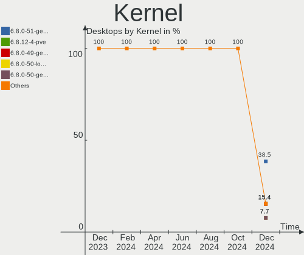
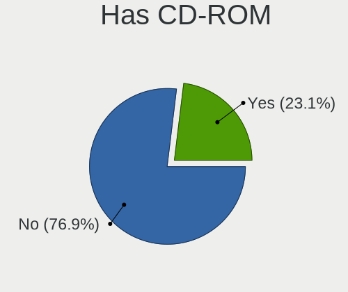
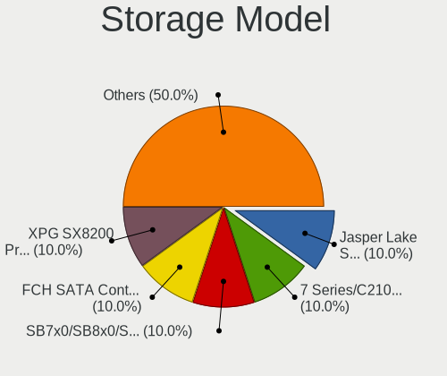
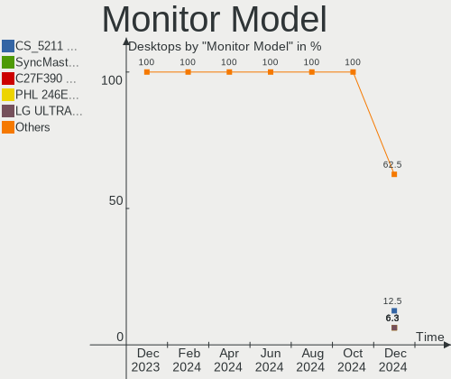

Xubuntu Hardware Trends (Desktops)
----------------------------------

A project to identify most popular hardware characteristics and track their change
over time based on data collected by Xubuntu users at https://Linux-Hardware.org.

Anyone can contribute to this report by the [hw-probe](https://github.com/linuxhw/hw-probe) tool:

    sudo -E hw-probe -all -upload

Full-feature report is available here: https://linux-hardware.org/?view=trends

Period: Dec, 2021.

Contents
--------

* [ System ](#system)
  - [ OS                       ](#os)
  - [ OS Family                ](#os-family)
  - [ Kernel                   ](#kernel)
  - [ Kernel Family            ](#kernel-family)
  - [ Kernel Major Ver.        ](#kernel-major-ver)
  - [ Arch                     ](#arch)
  - [ DE                       ](#de)
  - [ Display Server           ](#display-server)
  - [ Display Manager          ](#display-manager)
  - [ OS Lang                  ](#os-lang)
  - [ Boot Mode                ](#boot-mode)
  - [ Filesystem               ](#filesystem)
  - [ Part. scheme             ](#part-scheme)
  - [ Dual Boot with Linux/BSD ](#dual-boot-with-linuxbsd)
  - [ Dual Boot (Win)          ](#dual-boot-win)

* [ Board ](#board)
  - [ Vendor                   ](#vendor)
  - [ Model                    ](#model)
  - [ Model Family             ](#model-family)
  - [ MFG Year                 ](#mfg-year)
  - [ Form Factor              ](#form-factor)
  - [ Secure Boot              ](#secure-boot)
  - [ Coreboot                 ](#coreboot)
  - [ RAM Size                 ](#ram-size)
  - [ RAM Used                 ](#ram-used)
  - [ Total Drives             ](#total-drives)
  - [ Has CD-ROM               ](#has-cd-rom)
  - [ Has Ethernet             ](#has-ethernet)
  - [ Has WiFi                 ](#has-wifi)
  - [ Has Bluetooth            ](#has-bluetooth)

* [ Location ](#location)
  - [ Country                  ](#country)
  - [ City                     ](#city)

* [ Drives ](#drives)
  - [ Drive Vendor             ](#drive-vendor)
  - [ Drive Model              ](#drive-model)
  - [ HDD Vendor               ](#hdd-vendor)
  - [ SSD Vendor               ](#ssd-vendor)
  - [ Drive Kind               ](#drive-kind)
  - [ Drive Connector          ](#drive-connector)
  - [ Drive Size               ](#drive-size)
  - [ Space Total              ](#space-total)
  - [ Space Used               ](#space-used)
  - [ Malfunc. Drives          ](#malfunc-drives)
  - [ Malfunc. Drive Vendor    ](#malfunc-drive-vendor)
  - [ Malfunc. HDD Vendor      ](#malfunc-hdd-vendor)
  - [ Malfunc. Drive Kind      ](#malfunc-drive-kind)
  - [ Failed Drives            ](#failed-drives)
  - [ Failed Drive Vendor      ](#failed-drive-vendor)
  - [ Drive Status             ](#drive-status)

* [ Storage controller ](#storage-controller)
  - [ Storage Vendor           ](#storage-vendor)
  - [ Storage Model            ](#storage-model)
  - [ Storage Kind             ](#storage-kind)

* [ Processor ](#processor)
  - [ CPU Vendor               ](#cpu-vendor)
  - [ CPU Model                ](#cpu-model)
  - [ CPU Model Family         ](#cpu-model-family)
  - [ CPU Cores                ](#cpu-cores)
  - [ CPU Sockets              ](#cpu-sockets)
  - [ CPU Threads              ](#cpu-threads)
  - [ CPU Op-Modes             ](#cpu-op-modes)
  - [ CPU Microcode            ](#cpu-microcode)
  - [ CPU Microarch            ](#cpu-microarch)

* [ Graphics ](#graphics)
  - [ GPU Vendor               ](#gpu-vendor)
  - [ GPU Model                ](#gpu-model)
  - [ GPU Combo                ](#gpu-combo)
  - [ GPU Driver               ](#gpu-driver)
  - [ GPU Memory               ](#gpu-memory)

* [ Monitor ](#monitor)
  - [ Monitor Vendor           ](#monitor-vendor)
  - [ Monitor Model            ](#monitor-model)
  - [ Monitor Resolution       ](#monitor-resolution)
  - [ Monitor Diagonal         ](#monitor-diagonal)
  - [ Monitor Width            ](#monitor-width)
  - [ Aspect Ratio             ](#aspect-ratio)
  - [ Monitor Area             ](#monitor-area)
  - [ Pixel Density            ](#pixel-density)
  - [ Multiple Monitors        ](#multiple-monitors)

* [ Network ](#network)
  - [ Net Controller Vendor    ](#net-controller-vendor)
  - [ Net Controller Model     ](#net-controller-model)
  - [ Wireless Vendor          ](#wireless-vendor)
  - [ Wireless Model           ](#wireless-model)
  - [ Ethernet Vendor          ](#ethernet-vendor)
  - [ Ethernet Model           ](#ethernet-model)
  - [ Net Controller Kind      ](#net-controller-kind)
  - [ Used Controller          ](#used-controller)
  - [ NICs                     ](#nics)
  - [ IPv6                     ](#ipv6)

* [ Bluetooth ](#bluetooth)
  - [ Bluetooth Vendor         ](#bluetooth-vendor)
  - [ Bluetooth Model          ](#bluetooth-model)

* [ Sound ](#sound)
  - [ Sound Vendor             ](#sound-vendor)
  - [ Sound Model              ](#sound-model)

* [ Memory ](#memory)
  - [ Memory Vendor            ](#memory-vendor)
  - [ Memory Model             ](#memory-model)
  - [ Memory Kind              ](#memory-kind)
  - [ Memory Form Factor       ](#memory-form-factor)
  - [ Memory Size              ](#memory-size)
  - [ Memory Speed             ](#memory-speed)

* [ Printers & scanners ](#printers--scanners)
  - [ Printer Vendor           ](#printer-vendor)
  - [ Printer Model            ](#printer-model)
  - [ Scanner Vendor           ](#scanner-vendor)
  - [ Scanner Model            ](#scanner-model)

* [ Camera ](#camera)
  - [ Camera Vendor            ](#camera-vendor)
  - [ Camera Model             ](#camera-model)

* [ Security ](#security)
  - [ Fingerprint Vendor       ](#fingerprint-vendor)
  - [ Fingerprint Model        ](#fingerprint-model)
  - [ Chipcard Vendor          ](#chipcard-vendor)
  - [ Chipcard Model           ](#chipcard-model)

* [ Unsupported ](#unsupported)
  - [ Unsupported Devices      ](#unsupported-devices)
  - [ Unsupported Device Types ](#unsupported-device-types)

System
------

OS
--

Installed operating systems

| Name          | Desktops | Percent |
|---------------|----------|---------|
| Xubuntu 20.04 | 30       | 73.17%  |
| Xubuntu 21.10 | 6        | 14.63%  |
| Xubuntu 21.04 | 2        | 4.88%   |
| Xubuntu 18.04 | 2        | 4.88%   |
| Xubuntu 16.04 | 1        | 2.44%   |

OS Family
---------

OS without a version

| Name    | Desktops | Percent |
|---------|----------|---------|
| Xubuntu | 41       | 100%    |

Kernel
------

Version of the Linux kernel

| Version              | Desktops | Percent |
|----------------------|----------|---------|
| 5.4.0-91-generic     | 9        | 21.95%  |
| 5.11.0-41-generic    | 7        | 17.07%  |
| 5.4.0-91-lowlatency  | 5        | 12.2%   |
| 5.13.0-22-generic    | 5        | 12.2%   |
| 5.11.0-43-generic    | 2        | 4.88%   |
| 5.11.0-41-lowlatency | 2        | 4.88%   |
| 5.4.0-90-lowlatency  | 1        | 2.44%   |
| 5.4.0-89-generic     | 1        | 2.44%   |
| 5.4.0-77-lowlatency  | 1        | 2.44%   |
| 5.4.0-29-generic     | 1        | 2.44%   |
| 5.11.0-44-lowlatency | 1        | 2.44%   |
| 5.11.0-43-lowlatency | 1        | 2.44%   |
| 5.11.0-42-generic    | 1        | 2.44%   |
| 5.11.0-40-generic    | 1        | 2.44%   |
| 5.11.0-27-generic    | 1        | 2.44%   |
| 4.4.0-210-generic    | 1        | 2.44%   |
| 4.15.0-163-generic   | 1        | 2.44%   |

Kernel Family
-------------

Linux kernel without a distro release

| Version | Desktops | Percent |
|---------|----------|---------|
| 5.4.0   | 18       | 43.9%   |
| 5.11.0  | 16       | 39.02%  |
| 5.13.0  | 5        | 12.2%   |
| 4.4.0   | 1        | 2.44%   |
| 4.15.0  | 1        | 2.44%   |

Kernel Major Ver.
-----------------

Linux kernel major version

| Version | Desktops | Percent |
|---------|----------|---------|
| 5.4     | 18       | 43.9%   |
| 5.11    | 16       | 39.02%  |
| 5.13    | 5        | 12.2%   |
| 4.4     | 1        | 2.44%   |
| 4.15    | 1        | 2.44%   |

Arch
----

OS architecture (x86_64, i586, etc.)

| Name   | Desktops | Percent |
|--------|----------|---------|
| x86_64 | 40       | 97.56%  |
| i686   | 1        | 2.44%   |

DE
--

Desktop Environment

| Name  | Desktops | Percent |
|-------|----------|---------|
| XFCE  | 38       | 92.68%  |
| GNOME | 2        | 4.88%   |
| LXQt  | 1        | 2.44%   |

Display Server
--------------

X11 or Wayland

| Name | Desktops | Percent |
|------|----------|---------|
| X11  | 39       | 95.12%  |
| Web  | 2        | 4.88%   |

Display Manager
---------------

SDDM, LightDM, etc.

| Name    | Desktops | Percent |
|---------|----------|---------|
| LightDM | 37       | 90.24%  |
| Unknown | 3        | 7.32%   |
| SDDM    | 1        | 2.44%   |

OS Lang
-------

Language

| Lang  | Desktops | Percent |
|-------|----------|---------|
| en_US | 14       | 34.15%  |
| fr_FR | 7        | 17.07%  |
| de_DE | 7        | 17.07%  |
| ro_RO | 2        | 4.88%   |
| pl_PL | 2        | 4.88%   |
| nl_NL | 2        | 4.88%   |
| it_IT | 2        | 4.88%   |
| ru_RU | 1        | 2.44%   |
| pt_PT | 1        | 2.44%   |
| fr_BE | 1        | 2.44%   |
| es_MX | 1        | 2.44%   |
| es_AR | 1        | 2.44%   |

Boot Mode
---------

EFI or BIOS

| Mode | Desktops | Percent |
|------|----------|---------|
| BIOS | 33       | 80.49%  |
| EFI  | 8        | 19.51%  |

Filesystem
----------

Type of filesystem

| Type    | Desktops | Percent |
|---------|----------|---------|
| Ext4    | 37       | 90.24%  |
| Xfs     | 1        | 2.44%   |
| Overlay | 1        | 2.44%   |
| Ext3    | 1        | 2.44%   |
| Btrfs   | 1        | 2.44%   |

Part. scheme
------------

Scheme of partitioning

| Type    | Desktops | Percent |
|---------|----------|---------|
| Unknown | 27       | 65.85%  |
| MBR     | 9        | 21.95%  |
| GPT     | 5        | 12.2%   |

Dual Boot with Linux/BSD
------------------------

Hosting more than one Linux/BSD

| Dual boot | Desktops | Percent |
|-----------|----------|---------|
| No        | 31       | 75.61%  |
| Yes       | 10       | 24.39%  |

Dual Boot (Win)
---------------

Hosting Linux and Windows

| Dual boot | Desktops | Percent |
|-----------|----------|---------|
| No        | 25       | 60.98%  |
| Yes       | 16       | 39.02%  |

Board
-----

Vendor
------

Motherboard manufacturer

| Name                | Desktops | Percent |
|---------------------|----------|---------|
| ASUSTek Computer    | 8        | 19.51%  |
| Dell                | 7        | 17.07%  |
| Gigabyte Technology | 6        | 14.63%  |
| MSI                 | 5        | 12.2%   |
| Hewlett-Packard     | 5        | 12.2%   |
| ECS                 | 2        | 4.88%   |
| ASRock              | 2        | 4.88%   |
| Quanta              | 1        | 2.44%   |
| Medion              | 1        | 2.44%   |
| Lenovo              | 1        | 2.44%   |
| Foxconn             | 1        | 2.44%   |
| Biostar             | 1        | 2.44%   |
| Acer                | 1        | 2.44%   |

Model
-----

Motherboard model

| Name                                 | Desktops | Percent |
|--------------------------------------|----------|---------|
| Quanta 120-1026la                    | 1        | 2.44%   |
| MSI MS-B05011                        | 1        | 2.44%   |
| MSI MS-7C90                          | 1        | 2.44%   |
| MSI MS-7B89                          | 1        | 2.44%   |
| MSI MS-7255                          | 1        | 2.44%   |
| MSI KY779AA-AKL CQ3070L              | 1        | 2.44%   |
| Medion Pentino H-Series              | 1        | 2.44%   |
| Lenovo ThinkCentre A70 7844H9G       | 1        | 2.44%   |
| HP ProDesk 600 G2 DM                 | 1        | 2.44%   |
| HP ProDesk 600 G1 SFF                | 1        | 2.44%   |
| HP OMEN by Desktop PC 880-p0xx       | 1        | 2.44%   |
| HP Compaq Elite 8300 USDT            | 1        | 2.44%   |
| HP Compaq dc7800p Ultra-slim Desktop | 1        | 2.44%   |
| Gigabyte X99-UD4-CF                  | 1        | 2.44%   |
| Gigabyte GA-MA78LMT-US2H             | 1        | 2.44%   |
| Gigabyte GA-E350N                    | 1        | 2.44%   |
| Gigabyte EX58-UD4P                   | 1        | 2.44%   |
| Gigabyte B450M DS3H                  | 1        | 2.44%   |
| Gigabyte B150M-D3H-CF                | 1        | 2.44%   |
| Foxconn Pro 3300 Series MT           | 1        | 2.44%   |
| ECS G41T-M2                          | 1        | 2.44%   |
| ECS D5468AT-ABA ALONPAV              | 1        | 2.44%   |
| Dell Vostro 3671                     | 1        | 2.44%   |
| Dell Precision T1700                 | 1        | 2.44%   |
| Dell PowerEdge T20                   | 1        | 2.44%   |
| Dell OptiPlex 990                    | 1        | 2.44%   |
| Dell OptiPlex 7020                   | 1        | 2.44%   |
| Dell OptiPlex 390                    | 1        | 2.44%   |
| Dell OptiPlex 360                    | 1        | 2.44%   |
| Biostar H110MHC                      | 1        | 2.44%   |
| ASUS TUF GAMING B550M-PLUS           | 1        | 2.44%   |
| ASUS PRIME H310M-R R2.0              | 1        | 2.44%   |
| ASUS PRIME A320M-K                   | 1        | 2.44%   |
| ASUS P8H61-M LX3 PLUS R2.0           | 1        | 2.44%   |
| ASUS P5K-E                           | 1        | 2.44%   |
| ASUS P5GC-MX                         | 1        | 2.44%   |
| ASUS P5G41T-M LX                     | 1        | 2.44%   |
| ASUS M5A97 PLUS                      | 1        | 2.44%   |
| ASRock X570M Pro4                    | 1        | 2.44%   |
| ASRock A75M-ITX                      | 1        | 2.44%   |
| Acer Veriton E430                    | 1        | 2.44%   |

Model Family
------------

Motherboard model prefix

| Name                     | Desktops | Percent |
|--------------------------|----------|---------|
| Dell OptiPlex            | 4        | 9.76%   |
| HP ProDesk               | 2        | 4.88%   |
| HP Compaq                | 2        | 4.88%   |
| ASUS PRIME               | 2        | 4.88%   |
| Quanta 120-1026la        | 1        | 2.44%   |
| MSI MS-B05011            | 1        | 2.44%   |
| MSI MS-7C90              | 1        | 2.44%   |
| MSI MS-7B89              | 1        | 2.44%   |
| MSI MS-7255              | 1        | 2.44%   |
| MSI KY779AA-AKL          | 1        | 2.44%   |
| Medion Pentino           | 1        | 2.44%   |
| Lenovo ThinkCentre       | 1        | 2.44%   |
| HP OMEN                  | 1        | 2.44%   |
| Gigabyte X99-UD4-CF      | 1        | 2.44%   |
| Gigabyte GA-MA78LMT-US2H | 1        | 2.44%   |
| Gigabyte GA-E350N        | 1        | 2.44%   |
| Gigabyte EX58-UD4P       | 1        | 2.44%   |
| Gigabyte B450M           | 1        | 2.44%   |
| Gigabyte B150M-D3H-CF    | 1        | 2.44%   |
| Foxconn Pro              | 1        | 2.44%   |
| ECS G41T-M2              | 1        | 2.44%   |
| ECS D5468AT-ABA          | 1        | 2.44%   |
| Dell Vostro              | 1        | 2.44%   |
| Dell Precision           | 1        | 2.44%   |
| Dell PowerEdge           | 1        | 2.44%   |
| Biostar H110MHC          | 1        | 2.44%   |
| ASUS TUF                 | 1        | 2.44%   |
| ASUS P8H61-M             | 1        | 2.44%   |
| ASUS P5K-E               | 1        | 2.44%   |
| ASUS P5GC-MX             | 1        | 2.44%   |
| ASUS P5G41T-M            | 1        | 2.44%   |
| ASUS M5A97               | 1        | 2.44%   |
| ASRock X570M             | 1        | 2.44%   |
| ASRock A75M-ITX          | 1        | 2.44%   |
| Acer Veriton             | 1        | 2.44%   |

MFG Year
--------

Motherboard manufacture year

| Year | Desktops | Percent |
|------|----------|---------|
| 2012 | 6        | 14.63%  |
| 2020 | 5        | 12.2%   |
| 2019 | 4        | 9.76%   |
| 2015 | 4        | 9.76%   |
| 2013 | 4        | 9.76%   |
| 2011 | 4        | 9.76%   |
| 2009 | 4        | 9.76%   |
| 2007 | 3        | 7.32%   |
| 2018 | 2        | 4.88%   |
| 2016 | 2        | 4.88%   |
| 2014 | 1        | 2.44%   |
| 2010 | 1        | 2.44%   |
| 2008 | 1        | 2.44%   |

Form Factor
-----------

Physical design of the computer

| Name    | Desktops | Percent |
|---------|----------|---------|
| Desktop | 41       | 100%    |

Secure Boot
-----------

Enabled or disabled

| State    | Desktops | Percent |
|----------|----------|---------|
| Disabled | 40       | 97.56%  |
| Enabled  | 1        | 2.44%   |

Coreboot
--------

Have coreboot on board

| Used | Desktops | Percent |
|------|----------|---------|
| No   | 41       | 100%    |

RAM Size
--------

Total RAM memory

| Size in GB  | Desktops | Percent |
|-------------|----------|---------|
| 8.01-16.0   | 11       | 26.83%  |
| 4.01-8.0    | 10       | 24.39%  |
| 3.01-4.0    | 7        | 17.07%  |
| 16.01-24.0  | 4        | 9.76%   |
| 2.01-3.0    | 3        | 7.32%   |
| 64.01-256.0 | 3        | 7.32%   |
| 32.01-64.0  | 2        | 4.88%   |
| 1.01-2.0    | 1        | 2.44%   |

RAM Used
--------

Used RAM memory

| Used GB    | Desktops | Percent |
|------------|----------|---------|
| 1.01-2.0   | 20       | 48.78%  |
| 0.51-1.0   | 8        | 19.51%  |
| 4.01-8.0   | 5        | 12.2%   |
| 2.01-3.0   | 3        | 7.32%   |
| 8.01-16.0  | 3        | 7.32%   |
| 3.01-4.0   | 1        | 2.44%   |
| 16.01-24.0 | 1        | 2.44%   |

Total Drives
------------

Number of drives on board

| Drives | Desktops | Percent |
|--------|----------|---------|
| 1      | 27       | 65.85%  |
| 2      | 6        | 14.63%  |
| 5      | 3        | 7.32%   |
| 3      | 3        | 7.32%   |
| 4      | 2        | 4.88%   |

Has CD-ROM
----------

Has CD-ROM on board

| Presented | Desktops | Percent |
|-----------|----------|---------|
| Yes       | 30       | 73.17%  |
| No        | 11       | 26.83%  |

Has Ethernet
------------

Has Ethernet on board

| Presented | Desktops | Percent |
|-----------|----------|---------|
| Yes       | 41       | 100%    |

Has WiFi
--------

Has WiFi module

| Presented | Desktops | Percent |
|-----------|----------|---------|
| No        | 21       | 51.22%  |
| Yes       | 20       | 48.78%  |

Has Bluetooth
-------------

Has Bluetooth module

| Presented | Desktops | Percent |
|-----------|----------|---------|
| No        | 33       | 80.49%  |
| Yes       | 8        | 19.51%  |

Location
--------

Country
-------

Geographic location (country)

| Country     | Desktops | Percent |
|-------------|----------|---------|
| USA         | 10       | 24.39%  |
| Germany     | 7        | 17.07%  |
| France      | 7        | 17.07%  |
| Romania     | 2        | 4.88%   |
| Poland      | 2        | 4.88%   |
| Netherlands | 2        | 4.88%   |
| Mexico      | 2        | 4.88%   |
| Italy       | 2        | 4.88%   |
| Thailand    | 1        | 2.44%   |
| Singapore   | 1        | 2.44%   |
| Russia      | 1        | 2.44%   |
| Portugal    | 1        | 2.44%   |
| Belgium     | 1        | 2.44%   |
| Australia   | 1        | 2.44%   |
| Argentina   | 1        | 2.44%   |

City
----

Geographic location (city)

| City                  | Desktops | Percent |
|-----------------------|----------|---------|
| The Hague             | 2        | 4.88%   |
| Suwanee               | 2        | 4.88%   |
| Berlin                | 2        | 4.88%   |
| Vashon                | 1        | 2.44%   |
| Vado Ligure           | 1        | 2.44%   |
| Uelzen                | 1        | 2.44%   |
| Turin                 | 1        | 2.44%   |
| Torun                 | 1        | 2.44%   |
| Thionville            | 1        | 2.44%   |
| Sydney                | 1        | 2.44%   |
| Strejnicu             | 1        | 2.44%   |
| Singapore             | 1        | 2.44%   |
| Saint-Martin-d'H??res | 1        | 2.44%   |
| Saint Paul            | 1        | 2.44%   |
| Rio Rancho            | 1        | 2.44%   |
| Piscataway            | 1        | 2.44%   |
| Phoenixville          | 1        | 2.44%   |
| Pascani               | 1        | 2.44%   |
| Paris                 | 1        | 2.44%   |
| Oryol                 | 1        | 2.44%   |
| Orbais                | 1        | 2.44%   |
| Oaxaca City           | 1        | 2.44%   |
| Manson                | 1        | 2.44%   |
| Lebach                | 1        | 2.44%   |
| Le Kremlin-Bicetre    | 1        | 2.44%   |
| Las Vegas             | 1        | 2.44%   |
| Kwidzyn               | 1        | 2.44%   |
| Kurort Oybin          | 1        | 2.44%   |
| Foncine-le-Haut       | 1        | 2.44%   |
| Ferrel                | 1        | 2.44%   |
| Esse                  | 1        | 2.44%   |
| Elmshorn              | 1        | 2.44%   |
| Ebersdorf bei Coburg  | 1        | 2.44%   |
| Chihuahua City        | 1        | 2.44%   |
| C??rdoba              | 1        | 2.44%   |
| Bruguieres            | 1        | 2.44%   |
| Brentwood             | 1        | 2.44%   |
| Ayutthaya             | 1        | 2.44%   |

Drives
------

Drive Vendor
------------

Hard drive vendors

| Vendor              | Desktops | Drives | Percent |
|---------------------|----------|--------|---------|
| Seagate             | 18       | 25     | 30%     |
| WDC                 | 11       | 12     | 18.33%  |
| Samsung Electronics | 9        | 13     | 15%     |
| SanDisk             | 4        | 4      | 6.67%   |
| Kingston            | 4        | 4      | 6.67%   |
| Toshiba             | 3        | 3      | 5%      |
| Hitachi             | 3        | 3      | 5%      |
| Intel               | 2        | 2      | 3.33%   |
| XPG                 | 1        | 1      | 1.67%   |
| Unknown             | 1        | 1      | 1.67%   |
| Patriot             | 1        | 1      | 1.67%   |
| Intenso             | 1        | 1      | 1.67%   |
| GOODRAM             | 1        | 1      | 1.67%   |
| Crucial             | 1        | 1      | 1.67%   |

Drive Model
-----------

Hard drive models

| Model                                | Desktops | Percent |
|--------------------------------------|----------|---------|
| Samsung SSD 850 EVO 250GB            | 3        | 4.35%   |
| Toshiba DT01ACA100 1TB               | 2        | 2.9%    |
| Seagate ST500DM002-1BD142 500GB      | 2        | 2.9%    |
| Seagate ST1000DM003-1ER162 1TB       | 2        | 2.9%    |
| Kingston SA400S37240G 240GB SSD      | 2        | 2.9%    |
| XPG NVMe SSD Drive 1024GB            | 1        | 1.45%   |
| WDC WDS120G2G0A-00JH30 120GB SSD     | 1        | 1.45%   |
| WDC WD5000AAKX-75U6AA0 500GB         | 1        | 1.45%   |
| WDC WD5000AADS-00M2B0 500GB          | 1        | 1.45%   |
| WDC WD4000FYYZ-01UL1B1 4TB           | 1        | 1.45%   |
| WDC WD2500AAJS-08L7A0 250GB          | 1        | 1.45%   |
| WDC WD2003FZEX-00Z4SA0 2TB           | 1        | 1.45%   |
| WDC WD1600BEVS-08RST2 160GB          | 1        | 1.45%   |
| WDC WD10EZEX-00MFCA0 1TB             | 1        | 1.45%   |
| WDC WD10EARX-00PASB0 1TB             | 1        | 1.45%   |
| WDC WD10EARS-00Y5B1 1TB              | 1        | 1.45%   |
| WDC WD10EALX-759BA0 1TB              | 1        | 1.45%   |
| WDC WD10EACS-00D6B0 1TB              | 1        | 1.45%   |
| Unknown SD/MMC/MS PRO 7GB            | 1        | 1.45%   |
| Toshiba HDWD110 1TB                  | 1        | 1.45%   |
| Seagate ST8000DM004-2CX188 8TB       | 1        | 1.45%   |
| Seagate ST6000VN0033-2EE110 6TB      | 1        | 1.45%   |
| Seagate ST6000VN0033 6TB             | 1        | 1.45%   |
| Seagate ST500LT032-1E9142 500GB      | 1        | 1.45%   |
| Seagate ST500LT012-1DG142 500GB      | 1        | 1.45%   |
| Seagate ST500DM002-1BC142 500GB      | 1        | 1.45%   |
| Seagate ST3500413AS 500GB            | 1        | 1.45%   |
| Seagate ST3400832AS 400GB            | 1        | 1.45%   |
| Seagate ST3320813AS 320GB            | 1        | 1.45%   |
| Seagate ST3320620A 320GB             | 1        | 1.45%   |
| Seagate ST3250318AS 250GB            | 1        | 1.45%   |
| Seagate ST3160318AS 160GB            | 1        | 1.45%   |
| Seagate ST3160215A 160GB             | 1        | 1.45%   |
| Seagate ST2000DM006-2DM164 2TB       | 1        | 1.45%   |
| Seagate ST2000DM001-1CH164 2TB       | 1        | 1.45%   |
| Seagate ST1000DM003-1SB102 1TB       | 1        | 1.45%   |
| Seagate M3 1TB                       | 1        | 1.45%   |
| Seagate Expansion 1TB                | 1        | 1.45%   |
| Seagate BUP Ultra Touch 2TB          | 1        | 1.45%   |
| SanDisk SSD PLUS 1000GB              | 1        | 1.45%   |
| SanDisk SDSSDX240GG25 240GB          | 1        | 1.45%   |
| SanDisk SDSSDH31000G 1TB             | 1        | 1.45%   |
| SanDisk SD8SBAT-032G-1006 32GB SSD   | 1        | 1.45%   |
| Samsung SSD 970 EVO 1TB              | 1        | 1.45%   |
| Samsung SSD 870 EVO 1TB              | 1        | 1.45%   |
| Samsung SSD 860 PRO 256GB            | 1        | 1.45%   |
| Samsung SSD 860 EVO 500GB            | 1        | 1.45%   |
| Samsung SSD 860 EVO 250GB            | 1        | 1.45%   |
| Samsung SP2504C 250GB                | 1        | 1.45%   |
| Samsung MZ7LN256HAJQ-000H1 256GB SSD | 1        | 1.45%   |
| Samsung HD501LJ 500GB                | 1        | 1.45%   |
| Samsung HD160JJ 160GB                | 1        | 1.45%   |
| Patriot Burst 120GB SSD              | 1        | 1.45%   |
| Kingston SV300S37A120G 120GB SSD     | 1        | 1.45%   |
| Kingston SA400S37480G 480GB SSD      | 1        | 1.45%   |
| Intenso 128GB                        | 1        | 1.45%   |
| Intel SSDSA2CW160G3 160GB            | 1        | 1.45%   |
| Intel NVMe SSD Drive 512GB           | 1        | 1.45%   |
| Hitachi HTS727550A9E364 500GB        | 1        | 1.45%   |
| Hitachi HDS721616PLAT80 165GB        | 1        | 1.45%   |

HDD Vendor
----------

Hard disk drive vendors

| Vendor              | Desktops | Drives | Percent |
|---------------------|----------|--------|---------|
| Seagate             | 17       | 24     | 45.95%  |
| WDC                 | 10       | 11     | 27.03%  |
| Toshiba             | 3        | 3      | 8.11%   |
| Samsung Electronics | 3        | 3      | 8.11%   |
| Hitachi             | 3        | 3      | 8.11%   |
| Unknown             | 1        | 1      | 2.7%    |

SSD Vendor
----------

Solid state drive vendors

| Vendor              | Desktops | Drives | Percent |
|---------------------|----------|--------|---------|
| Samsung Electronics | 6        | 8      | 33.33%  |
| SanDisk             | 4        | 4      | 22.22%  |
| Kingston            | 4        | 4      | 22.22%  |
| WDC                 | 1        | 1      | 5.56%   |
| Patriot             | 1        | 1      | 5.56%   |
| Intel               | 1        | 1      | 5.56%   |
| GOODRAM             | 1        | 1      | 5.56%   |

Drive Kind
----------

HDD or SSD

| Kind    | Desktops | Drives | Percent |
|---------|----------|--------|---------|
| HDD     | 32       | 45     | 60.38%  |
| SSD     | 15       | 20     | 28.3%   |
| NVMe    | 4        | 5      | 7.55%   |
| Unknown | 2        | 2      | 3.77%   |

Drive Connector
---------------

SATA, SAS, NVMe, etc.

| Type | Desktops | Drives | Percent |
|------|----------|--------|---------|
| SATA | 41       | 63     | 85.42%  |
| NVMe | 4        | 5      | 8.33%   |
| SAS  | 3        | 4      | 6.25%   |

Drive Size
----------

Size of hard drive

| Size in TB | Desktops | Drives | Percent |
|------------|----------|--------|---------|
| 0.01-0.5   | 32       | 40     | 62.75%  |
| 0.51-1.0   | 13       | 16     | 25.49%  |
| 1.01-2.0   | 3        | 4      | 5.88%   |
| 4.01-10.0  | 2        | 4      | 3.92%   |
| 3.01-4.0   | 1        | 1      | 1.96%   |

Space Total
-----------

Amount of disk space available on the file system

| Size in GB     | Desktops | Percent |
|----------------|----------|---------|
| 101-250        | 14       | 34.15%  |
| 251-500        | 10       | 24.39%  |
| 501-1000       | 7        | 17.07%  |
| More than 3000 | 4        | 9.76%   |
| 51-100         | 3        | 7.32%   |
| 21-50          | 1        | 2.44%   |
| 2001-3000      | 1        | 2.44%   |
| 1001-2000      | 1        | 2.44%   |

Space Used
----------

Amount of used disk space

| Used GB        | Desktops | Percent |
|----------------|----------|---------|
| 1-20           | 15       | 36.59%  |
| 21-50          | 8        | 19.51%  |
| 101-250        | 6        | 14.63%  |
| 251-500        | 3        | 7.32%   |
| 1001-2000      | 3        | 7.32%   |
| 51-100         | 3        | 7.32%   |
| 501-1000       | 2        | 4.88%   |
| More than 3000 | 1        | 2.44%   |

Malfunc. Drives
---------------

Drive models with a malfunction

| Model                     | Desktops | Drives | Percent |
|---------------------------|----------|--------|---------|
| Seagate ST3250318AS 250GB | 1        | 1      | 100%    |

Malfunc. Drive Vendor
---------------------

Vendors of faulty drives

| Vendor  | Desktops | Drives | Percent |
|---------|----------|--------|---------|
| Seagate | 1        | 1      | 100%    |

Malfunc. HDD Vendor
-------------------

Vendors of faulty HDD drives

| Vendor  | Desktops | Drives | Percent |
|---------|----------|--------|---------|
| Seagate | 1        | 1      | 100%    |

Malfunc. Drive Kind
-------------------

Kinds of faulty drives

| Kind | Desktops | Drives | Percent |
|------|----------|--------|---------|
| HDD  | 1        | 1      | 100%    |

Failed Drives
-------------

Failed drive models

Zero info for selected period =(

Failed Drive Vendor
-------------------

Failed drive vendors

Zero info for selected period =(

Drive Status
------------

Number of failed and malfunc. drives

| Status   | Desktops | Drives | Percent |
|----------|----------|--------|---------|
| Detected | 28       | 47     | 66.67%  |
| Works    | 13       | 24     | 30.95%  |
| Malfunc  | 1        | 1      | 2.38%   |

Storage controller
------------------

Storage Vendor
--------------

Storage controller vendors

| Vendor                    | Desktops | Percent |
|---------------------------|----------|---------|
| Intel                     | 30       | 61.22%  |
| AMD                       | 10       | 20.41%  |
| JMicron Technology        | 2        | 4.08%   |
| VIA Technologies          | 1        | 2.04%   |
| Samsung Electronics       | 1        | 2.04%   |
| Nvidia                    | 1        | 2.04%   |
| Micron/Crucial Technology | 1        | 2.04%   |
| Marvell Technology Group  | 1        | 2.04%   |
| HighPoint Technologies    | 1        | 2.04%   |
| ADATA Technology          | 1        | 2.04%   |

Storage Model
-------------

Storage controller models

| Model                                                                                   | Desktops | Percent |
|-----------------------------------------------------------------------------------------|----------|---------|
| Intel NM10/ICH7 Family SATA Controller [IDE mode]                                       | 6        | 8.57%   |
| Intel SATA Controller [RAID mode]                                                       | 4        | 5.71%   |
| Intel 82801G (ICH7 Family) IDE Controller                                               | 4        | 5.71%   |
| Intel 6 Series/C200 Series Chipset Family 6 port Desktop SATA AHCI Controller           | 4        | 5.71%   |
| AMD FCH SATA Controller [AHCI mode]                                                     | 4        | 5.71%   |
| Intel Q170/Q150/B150/H170/H110/Z170/CM236 Chipset SATA Controller [AHCI Mode]           | 3        | 4.29%   |
| Intel 82801IR/IO/IH (ICH9R/DO/DH) 4 port SATA Controller [IDE mode]                     | 3        | 4.29%   |
| Intel 82801I (ICH9 Family) 2 port SATA Controller [IDE mode]                            | 3        | 4.29%   |
| Intel 8 Series/C220 Series Chipset Family 6-port SATA Controller 1 [AHCI mode]          | 3        | 4.29%   |
| AMD SB7x0/SB8x0/SB9x0 SATA Controller [AHCI mode]                                       | 3        | 4.29%   |
| JMicron JMB363 SATA/IDE Controller                                                      | 2        | 2.86%   |
| Intel 6 Series/C200 Series Chipset Family Desktop SATA Controller (IDE mode, ports 4-5) | 2        | 2.86%   |
| Intel 6 Series/C200 Series Chipset Family Desktop SATA Controller (IDE mode, ports 0-3) | 2        | 2.86%   |
| Intel 200 Series PCH SATA controller [AHCI mode]                                        | 2        | 2.86%   |
| AMD Starship/Matisse Chipset SATA Controller [AHCI mode]                                | 2        | 2.86%   |
| AMD SB7x0/SB8x0/SB9x0 IDE Controller                                                    | 2        | 2.86%   |
| AMD 400 Series Chipset SATA Controller                                                  | 2        | 2.86%   |
| VIA VT82C586A/B/VT82C686/A/B/VT823x/A/C PIPC Bus Master IDE                             | 1        | 1.43%   |
| VIA VT8237A SATA 2-Port Controller                                                      | 1        | 1.43%   |
| Samsung NVMe SSD Controller SM981/PM981/PM983                                           | 1        | 1.43%   |
| Nvidia MCP61 SATA Controller                                                            | 1        | 1.43%   |
| Nvidia MCP61 IDE                                                                        | 1        | 1.43%   |
| Micron/Crucial P1 NVMe PCIe SSD                                                         | 1        | 1.43%   |
| Marvell Group 88SE912x IDE Controller                                                   | 1        | 1.43%   |
| Intel SSD 660P Series                                                                   | 1        | 1.43%   |
| Intel C610/X99 series chipset sSATA Controller [AHCI mode]                              | 1        | 1.43%   |
| Intel C610/X99 series chipset 6-Port SATA Controller [AHCI mode]                        | 1        | 1.43%   |
| Intel 82Q35 Express PT IDER Controller                                                  | 1        | 1.43%   |
| Intel 82801JI (ICH10 Family) 4 port SATA IDE Controller #1                              | 1        | 1.43%   |
| Intel 82801JI (ICH10 Family) 2 port SATA IDE Controller #2                              | 1        | 1.43%   |
| Intel 7 Series/C210 Series Chipset Family 6-port SATA Controller [AHCI mode]            | 1        | 1.43%   |
| HighPoint RocketRAID 620 2 Port SATA-III Controller                                     | 1        | 1.43%   |
| AMD FCH SATA Controller [IDE mode]                                                      | 1        | 1.43%   |
| AMD FCH SATA Controller D                                                               | 1        | 1.43%   |
| AMD FCH IDE Controller                                                                  | 1        | 1.43%   |
| ADATA XPG SX8200 Pro PCIe Gen3x4 M.2 2280 Solid State Drive                             | 1        | 1.43%   |

Storage Kind
------------

Kind of storage controller (IDE, SATA, NVMe, SAS, ...)

| Kind | Desktops | Percent |
|------|----------|---------|
| SATA | 24       | 47.06%  |
| IDE  | 18       | 35.29%  |
| RAID | 5        | 9.8%    |
| NVMe | 4        | 7.84%   |

Processor
---------

CPU Vendor
----------

Processor vendors

| Vendor | Desktops | Percent |
|--------|----------|---------|
| Intel  | 30       | 73.17%  |
| AMD    | 11       | 26.83%  |

CPU Model
---------

Processor models

| Model                                       | Desktops | Percent |
|---------------------------------------------|----------|---------|
| Intel Core i3-3220 CPU @ 3.30GHz            | 2        | 4.88%   |
| Intel Core i3-2100 CPU @ 3.10GHz            | 2        | 4.88%   |
| Intel Core 2 Duo CPU E6550 @ 2.33GHz        | 2        | 4.88%   |
| Intel Xeon CPU E5420 @ 2.50GHz              | 1        | 2.44%   |
| Intel Xeon CPU E3-1270 v3 @ 3.50GHz         | 1        | 2.44%   |
| Intel Xeon CPU E3-1225 v3 @ 3.20GHz         | 1        | 2.44%   |
| Intel Pentium Dual-Core CPU E6300 @ 2.80GHz | 1        | 2.44%   |
| Intel Pentium Dual-Core CPU E5300 @ 2.60GHz | 1        | 2.44%   |
| Intel Pentium CPU G4400 @ 3.30GHz           | 1        | 2.44%   |
| Intel Pentium CPU G3440 @ 3.30GHz           | 1        | 2.44%   |
| Intel Pentium CPU G2030 @ 3.00GHz           | 1        | 2.44%   |
| Intel Core i7-7700K CPU @ 4.20GHz           | 1        | 2.44%   |
| Intel Core i7-5820K CPU @ 3.30GHz           | 1        | 2.44%   |
| Intel Core i7-2600 CPU @ 3.40GHz            | 1        | 2.44%   |
| Intel Core i7 CPU 960 @ 3.20GHz             | 1        | 2.44%   |
| Intel Core i5-6500 CPU @ 3.20GHz            | 1        | 2.44%   |
| Intel Core i5-4590 CPU @ 3.30GHz            | 1        | 2.44%   |
| Intel Core i5-4570 CPU @ 3.20GHz            | 1        | 2.44%   |
| Intel Core i5-3470S CPU @ 2.90GHz           | 1        | 2.44%   |
| Intel Core i3-9100F CPU @ 3.60GHz           | 1        | 2.44%   |
| Intel Core i3-9100 CPU @ 3.60GHz            | 1        | 2.44%   |
| Intel Core i3-6100T CPU @ 3.20GHz           | 1        | 2.44%   |
| Intel Core i3-2120 CPU @ 3.30GHz            | 1        | 2.44%   |
| Intel Core 2 Quad CPU Q6600 @ 2.40GHz       | 1        | 2.44%   |
| Intel Core 2 Duo CPU E8400 @ 3.00GHz        | 1        | 2.44%   |
| Intel Core 2 Duo CPU E7500 @ 2.93GHz        | 1        | 2.44%   |
| Intel Core 2 CPU 4300 @ 1.80GHz             | 1        | 2.44%   |
| AMD Ryzen 9 3950X 16-Core Processor         | 1        | 2.44%   |
| AMD Ryzen 9 3900X 12-Core Processor         | 1        | 2.44%   |
| AMD Ryzen 7 3800X 8-Core Processor          | 1        | 2.44%   |
| AMD Ryzen 7 2700 Eight-Core Processor       | 1        | 2.44%   |
| AMD Ryzen 5 3400G with Radeon Vega Graphics | 1        | 2.44%   |
| AMD Ryzen 3 2200G with Radeon Vega Graphics | 1        | 2.44%   |
| AMD FX-8350 Eight-Core Processor            | 1        | 2.44%   |
| AMD E-350 Processor                         | 1        | 2.44%   |
| AMD Athlon II X3 450 Processor              | 1        | 2.44%   |
| AMD Athlon 64 X2 Dual Core Processor 4400+  | 1        | 2.44%   |
| AMD A4-3400 APU with Radeon HD Graphics     | 1        | 2.44%   |

CPU Model Family
----------------

Processor model prefix

| Model                   | Desktops | Percent |
|-------------------------|----------|---------|
| Intel Core i3           | 8        | 19.51%  |
| Intel Core i7           | 4        | 9.76%   |
| Intel Core i5           | 4        | 9.76%   |
| Intel Core 2 Duo        | 4        | 9.76%   |
| Intel Xeon              | 3        | 7.32%   |
| Intel Pentium           | 3        | 7.32%   |
| Intel Pentium Dual-Core | 2        | 4.88%   |
| AMD Ryzen 9             | 2        | 4.88%   |
| AMD Ryzen 7             | 2        | 4.88%   |
| Intel Core 2 Quad       | 1        | 2.44%   |
| Intel Core 2            | 1        | 2.44%   |
| AMD Ryzen 5             | 1        | 2.44%   |
| AMD Ryzen 3             | 1        | 2.44%   |
| AMD FX                  | 1        | 2.44%   |
| AMD E                   | 1        | 2.44%   |
| AMD Athlon II X3        | 1        | 2.44%   |
| AMD Athlon 64 X2        | 1        | 2.44%   |
| AMD A4                  | 1        | 2.44%   |

CPU Cores
---------

Number of processor cores

| Number | Desktops | Percent |
|--------|----------|---------|
| 2      | 19       | 46.34%  |
| 4      | 16       | 39.02%  |
| 8      | 2        | 4.88%   |
| 16     | 1        | 2.44%   |
| 12     | 1        | 2.44%   |
| 6      | 1        | 2.44%   |
| 3      | 1        | 2.44%   |

CPU Sockets
-----------

Number of sockets

| Number | Desktops | Percent |
|--------|----------|---------|
| 1      | 41       | 100%    |

CPU Threads
-----------

Threads per core (Hyper-Threading)

| Number | Desktops | Percent |
|--------|----------|---------|
| 1      | 24       | 58.54%  |
| 2      | 17       | 41.46%  |

CPU Op-Modes
------------

CPU Operation Modes (32-bit, 64-bit)

| Op mode        | Desktops | Percent |
|----------------|----------|---------|
| 32-bit, 64-bit | 41       | 100%    |

CPU Microcode
-------------

Microcode number

| Number     | Desktops | Percent |
|------------|----------|---------|
| Unknown    | 9        | 21.95%  |
| 0x306c3    | 5        | 12.2%   |
| 0x306a9    | 4        | 9.76%   |
| 0x6fb      | 3        | 7.32%   |
| 0x506e3    | 3        | 7.32%   |
| 0x206a7    | 3        | 7.32%   |
| 0x1067a    | 3        | 7.32%   |
| 0x08701021 | 2        | 4.88%   |
| 0x906eb    | 1        | 2.44%   |
| 0x6f2      | 1        | 2.44%   |
| 0x106a5    | 1        | 2.44%   |
| 0x10676    | 1        | 2.44%   |
| 0x08108109 | 1        | 2.44%   |
| 0x06000852 | 1        | 2.44%   |
| 0x05000029 | 1        | 2.44%   |
| 0x03000027 | 1        | 2.44%   |
| 0x010000c8 | 1        | 2.44%   |

CPU Microarch
-------------

Microarchitecture

| Name        | Desktops | Percent |
|-------------|----------|---------|
| Haswell     | 6        | 14.63%  |
| Penryn      | 5        | 12.2%   |
| SandyBridge | 4        | 9.76%   |
| IvyBridge   | 4        | 9.76%   |
| Core        | 4        | 9.76%   |
| Zen 2       | 3        | 7.32%   |
| Skylake     | 3        | 7.32%   |
| KabyLake    | 3        | 7.32%   |
| Zen+        | 2        | 4.88%   |
| Zen         | 1        | 2.44%   |
| Piledriver  | 1        | 2.44%   |
| Nehalem     | 1        | 2.44%   |
| K8 Hammer   | 1        | 2.44%   |
| K10 Llano   | 1        | 2.44%   |
| K10         | 1        | 2.44%   |
| Bobcat      | 1        | 2.44%   |

Graphics
--------

GPU Vendor
----------

Vendors of graphics cards

| Vendor | Desktops | Percent |
|--------|----------|---------|
| Nvidia | 16       | 39.02%  |
| Intel  | 15       | 36.59%  |
| AMD    | 10       | 24.39%  |

GPU Model
---------

Graphics card models

| Model                                                                       | Desktops | Percent |
|-----------------------------------------------------------------------------|----------|---------|
| Intel Xeon E3-1200 v3/4th Gen Core Processor Integrated Graphics Controller | 3        | 7.32%   |
| Intel Xeon E3-1200 v2/3rd Gen Core processor Graphics Controller            | 2        | 4.88%   |
| Intel 4 Series Chipset Integrated Graphics Controller                       | 2        | 4.88%   |
| Intel 2nd Generation Core Processor Family Integrated Graphics Controller   | 2        | 4.88%   |
| Nvidia TU116 [GeForce GTX 1650 SUPER]                                       | 1        | 2.44%   |
| Nvidia TU102 [GeForce RTX 2080 Ti]                                          | 1        | 2.44%   |
| Nvidia GT218 [GeForce 310]                                                  | 1        | 2.44%   |
| Nvidia GT216 [GeForce GT 220]                                               | 1        | 2.44%   |
| Nvidia GT215 [GeForce GT 240]                                               | 1        | 2.44%   |
| Nvidia GP108 [GeForce GT 1030]                                              | 1        | 2.44%   |
| Nvidia GP107 [GeForce GTX 1050 Ti]                                          | 1        | 2.44%   |
| Nvidia GM204 [GeForce GTX 970]                                              | 1        | 2.44%   |
| Nvidia GM107 [GeForce GTX 750 Ti]                                           | 1        | 2.44%   |
| Nvidia GK208B [GeForce GT 720]                                              | 1        | 2.44%   |
| Nvidia GK208B [GeForce GT 710]                                              | 1        | 2.44%   |
| Nvidia GK106GL [Quadro K4000]                                               | 1        | 2.44%   |
| Nvidia GF119 [GeForce GT 610]                                               | 1        | 2.44%   |
| Nvidia GF108 [GeForce GT 620]                                               | 1        | 2.44%   |
| Nvidia G96C [GeForce 9500 GT]                                               | 1        | 2.44%   |
| Nvidia C61 [GeForce 6150SE nForce 430]                                      | 1        | 2.44%   |
| Intel Xeon E3-1200 v3 Processor Integrated Graphics Controller              | 1        | 2.44%   |
| Intel HD Graphics 530                                                       | 1        | 2.44%   |
| Intel HD Graphics 510                                                       | 1        | 2.44%   |
| Intel CoffeeLake-S GT2 [UHD Graphics 630]                                   | 1        | 2.44%   |
| Intel 82Q35 Express Integrated Graphics Controller                          | 1        | 2.44%   |
| Intel 82G33/G31 Express Integrated Graphics Controller                      | 1        | 2.44%   |
| AMD Wrestler [Radeon HD 6310]                                               | 1        | 2.44%   |
| AMD SuperSumo [Radeon HD 6410D]                                             | 1        | 2.44%   |
| AMD Redwood XT [Radeon HD 5670/5690/5730]                                   | 1        | 2.44%   |
| AMD Redwood PRO GL [FirePro V3800]                                          | 1        | 2.44%   |
| AMD Raven Ridge [Radeon Vega Series / Radeon Vega Mobile Series]            | 1        | 2.44%   |
| AMD Picasso/Raven 2 [Radeon Vega Series / Radeon Vega Mobile Series]        | 1        | 2.44%   |
| AMD Hawaii PRO [Radeon R9 290/390]                                          | 1        | 2.44%   |
| AMD Ellesmere [Radeon RX 470/480/570/570X/580/580X/590]                     | 1        | 2.44%   |
| AMD Cedar [Radeon HD 5000/6000/7350/8350 Series]                            | 1        | 2.44%   |
| AMD Cayman PRO [Radeon HD 6950]                                             | 1        | 2.44%   |

GPU Combo
---------

Combinations of graphics cards

| Name       | Desktops | Percent |
|------------|----------|---------|
| 1 x Nvidia | 16       | 39.02%  |
| 1 x Intel  | 15       | 36.59%  |
| 1 x AMD    | 10       | 24.39%  |

GPU Driver
----------

Free vs proprietary

| Driver      | Desktops | Percent |
|-------------|----------|---------|
| Free        | 29       | 70.73%  |
| Proprietary | 10       | 24.39%  |
| Unknown     | 2        | 4.88%   |

GPU Memory
----------

Total video memory

| Size in GB | Desktops | Percent |
|------------|----------|---------|
| Unknown    | 21       | 51.22%  |
| 1.01-2.0   | 8        | 19.51%  |
| 0.01-0.5   | 6        | 14.63%  |
| 0.51-1.0   | 3        | 7.32%   |
| 3.01-4.0   | 2        | 4.88%   |
| 8.01-16.0  | 1        | 2.44%   |

Monitor
-------

Monitor Vendor
--------------

Monitor vendors

| Vendor               | Desktops | Percent |
|----------------------|----------|---------|
| Samsung Electronics  | 8        | 21.05%  |
| Hewlett-Packard      | 6        | 15.79%  |
| Dell                 | 5        | 13.16%  |
| Philips              | 3        | 7.89%   |
| Medion               | 2        | 5.26%   |
| ASUSTek Computer     | 2        | 5.26%   |
| Vizio                | 1        | 2.63%   |
| Vestel Elektronik    | 1        | 2.63%   |
| Unknown              | 1        | 2.63%   |
| Packard Bell         | 1        | 2.63%   |
| NEC Computers        | 1        | 2.63%   |
| MSI                  | 1        | 2.63%   |
| Lenovo Group Limited | 1        | 2.63%   |
| IBM                  | 1        | 2.63%   |
| Goldstar             | 1        | 2.63%   |
| Fujitsu Siemens      | 1        | 2.63%   |
| CAL                  | 1        | 2.63%   |
| AOC                  | 1        | 2.63%   |

Monitor Model
-------------

Monitor models

| Model                                                                  | Desktops | Percent |
|------------------------------------------------------------------------|----------|---------|
| Vizio V505-G9 VIZ1033 3840x2160 1096x616mm 49.5-inch                   | 1        | 2.56%   |
| Vestel Elektronik 50UHD_LCD_TV VES3700 3840x2160 1872x1053mm 84.6-inch | 1        | 2.56%   |
| Unknown LCD Monitor SAMSUNG 3840x1080                                  | 1        | 2.56%   |
| Samsung Electronics SyncMaster SAM0248 1280x1024 376x301mm 19.0-inch   | 1        | 2.56%   |
| Samsung Electronics SM2333T SAM0736 1920x1080 510x290mm 23.1-inch      | 1        | 2.56%   |
| Samsung Electronics S24E450 SAM0C9A 1920x1080 521x293mm 23.5-inch      | 1        | 2.56%   |
| Samsung Electronics S24C450 SAM0A03 1920x1080 521x293mm 23.5-inch      | 1        | 2.56%   |
| Samsung Electronics S22C450 SAM09C7 1680x1050 473x291mm 21.9-inch      | 1        | 2.56%   |
| Samsung Electronics LCD SAM0256 1440x900 408x225mm 18.3-inch           | 1        | 2.56%   |
| Samsung Electronics LCD Monitor SME1920W 1440x900                      | 1        | 2.56%   |
| Samsung Electronics LCD Monitor S24E510C 1920x1080                     | 1        | 2.56%   |
| Samsung Electronics C32F391 SAM0D34 1920x1080 698x393mm 31.5-inch      | 1        | 2.56%   |
| Philips LCD Monitor PHL 242E2F                                         | 1        | 2.56%   |
| Philips 190C PHL0849 1280x1024 376x301mm 19.0-inch                     | 1        | 2.56%   |
| Philips 170S PHL0839 1280x1024 338x270mm 17.0-inch                     | 1        | 2.56%   |
| Packard Bell Viseo 230Ws PKB00C1 1920x1080 509x286mm 23.0-inch         | 1        | 2.56%   |
| NEC Computers LCD1970NXp NEC668E 1280x1024 376x301mm 19.0-inch         | 1        | 2.56%   |
| MSI G32CQ4 MSI3DB5 2560x1440 700x390mm 31.5-inch                       | 1        | 2.56%   |
| Medion MD20346 MED3931 1600x900 442x249mm 20.0-inch                    | 1        | 2.56%   |
| Medion MD 20144 MED3634 1920x1080 521x293mm 23.5-inch                  | 1        | 2.56%   |
| Lenovo Group Limited LCD Monitor LEN D32q-20B 2560x1440                | 1        | 2.56%   |
| IBM T860 IBM2516 1280x1024 359x287mm 18.1-inch                         | 1        | 2.56%   |
| Hewlett-Packard w19b/w19e HWP26A0 1440x900 410x256mm 19.0-inch         | 1        | 2.56%   |
| Hewlett-Packard vs17 HWP2647 1280x1024 340x270mm 17.1-inch             | 1        | 2.56%   |
| Hewlett-Packard v185w HWP2820 1366x768 410x230mm 18.5-inch             | 1        | 2.56%   |
| Hewlett-Packard Omni / Pro HWP4219 1600x900 440x250mm 19.9-inch        | 1        | 2.56%   |
| Hewlett-Packard L1740 HWP2648 1280x1024 337x270mm 17.0-inch            | 1        | 2.56%   |
| Hewlett-Packard E243i HPN3463 1920x1200 518x324mm 24.1-inch            | 1        | 2.56%   |
| Goldstar ULTRAWIDE GSM76E4 3440x1440 800x335mm 34.1-inch               | 1        | 2.56%   |
| Fujitsu Siemens E19-6 LED FUS07F6 1280x1024 376x301mm 19.0-inch        | 1        | 2.56%   |
| Dell S2721DS DELA19D 2560x1440 597x336mm 27.0-inch                     | 1        | 2.56%   |
| Dell P190S DEL405B 1280x1024 380x300mm 19.1-inch                       | 1        | 2.56%   |
| Dell LCD Monitor U2717D 2560x1440                                      | 1        | 2.56%   |
| Dell 2009W DEL4042 1680x1050 433x270mm 20.1-inch                       | 1        | 2.56%   |
| Dell 1800FP DELE000 1280x1024 360x290mm 18.2-inch                      | 1        | 2.56%   |
| CAL L15CX CAL1502 1024x768 304x228mm 15.0-inch                         | 1        | 2.56%   |
| ASUSTek Computer VG245 AUS24A1 1920x1080 531x299mm 24.0-inch           | 1        | 2.56%   |
| ASUSTek Computer VA27EHE AUS27D2 1920x1080 598x336mm 27.0-inch         | 1        | 2.56%   |
| AOC 2280W AOC2280 1920x1080 477x268mm 21.5-inch                        | 1        | 2.56%   |

Monitor Resolution
------------------

Monitor screen resolution

| Resolution         | Desktops | Percent |
|--------------------|----------|---------|
| 1920x1080 (FHD)    | 10       | 26.32%  |
| 1280x1024 (SXGA)   | 10       | 26.32%  |
| 2560x1440 (QHD)    | 4        | 10.53%  |
| 1440x900 (WXGA+)   | 3        | 7.89%   |
| 3840x2160 (4K)     | 2        | 5.26%   |
| 1680x1050 (WSXGA+) | 2        | 5.26%   |
| 1600x900 (HD+)     | 2        | 5.26%   |
| 3840x1080          | 1        | 2.63%   |
| 3440x1440          | 1        | 2.63%   |
| 1366x768 (WXGA)    | 1        | 2.63%   |
| 1024x768 (XGA)     | 1        | 2.63%   |
| Unknown            | 1        | 2.63%   |

Monitor Diagonal
----------------

Diagonal size in inches

| Inches  | Desktops | Percent |
|---------|----------|---------|
| 19      | 7        | 18.92%  |
| Unknown | 5        | 13.51%  |
| 23      | 4        | 10.81%  |
| 20      | 3        | 8.11%   |
| 18      | 3        | 8.11%   |
| 17      | 3        | 8.11%   |
| 31      | 2        | 5.41%   |
| 27      | 2        | 5.41%   |
| 24      | 2        | 5.41%   |
| 21      | 2        | 5.41%   |
| 84      | 1        | 2.7%    |
| 69      | 1        | 2.7%    |
| 34      | 1        | 2.7%    |
| 15      | 1        | 2.7%    |

Monitor Width
-------------

Physical width

| Width in mm | Desktops | Percent |
|-------------|----------|---------|
| 501-600     | 8        | 21.62%  |
| 401-500     | 8        | 21.62%  |
| 351-400     | 7        | 18.92%  |
| Unknown     | 5        | 13.51%  |
| 301-350     | 4        | 10.81%  |
| 601-700     | 2        | 5.41%   |
| 1501-2000   | 2        | 5.41%   |
| 701-800     | 1        | 2.7%    |

Aspect Ratio
------------

Proportional relationship between the width and the height

| Ratio   | Desktops | Percent |
|---------|----------|---------|
| 16/9    | 15       | 40.54%  |
| 5/4     | 9        | 24.32%  |
| 16/10   | 5        | 13.51%  |
| Unknown | 5        | 13.51%  |
| 6/5     | 1        | 2.7%    |
| 4/3     | 1        | 2.7%    |
| 21/9    | 1        | 2.7%    |

Monitor Area
------------

Area in inch

| Area in inch | Desktops | Percent |
|----------------|----------|---------|
| 151-200        | 13       | 35.14%  |
| 201-250        | 6        | 16.22%  |
| Unknown        | 5        | 13.51%  |
| 141-150        | 4        | 10.81%  |
| 351-500        | 3        | 8.11%   |
| More than 1000 | 2        | 5.41%   |
| 301-350        | 2        | 5.41%   |
| 251-300        | 1        | 2.7%    |
| 101-110        | 1        | 2.7%    |

Pixel Density
-------------

Pixels per inch

| Density | Desktops | Percent |
|---------|----------|---------|
| 51-100  | 29       | 78.38%  |
| Unknown | 5        | 13.51%  |
| 101-120 | 3        | 8.11%   |

Multiple Monitors
-----------------

Total monitors connected

| Total | Desktops | Percent |
|-------|----------|---------|
| 1     | 36       | 87.8%   |
| 0     | 3        | 7.32%   |
| 2     | 2        | 4.88%   |

Network
-------

Net Controller Vendor
---------------------

Controller vendors

| Vendor                          | Desktops | Percent |
|---------------------------------|----------|---------|
| Realtek Semiconductor           | 28       | 47.46%  |
| Intel                           | 13       | 22.03%  |
| Qualcomm Atheros                | 3        | 5.08%   |
| Qualcomm Atheros Communications | 2        | 3.39%   |
| D-Link System                   | 2        | 3.39%   |
| VIA Technologies                | 1        | 1.69%   |
| TP-Link                         | 1        | 1.69%   |
| Ralink Technology               | 1        | 1.69%   |
| Ralink                          | 1        | 1.69%   |
| Nvidia                          | 1        | 1.69%   |
| NetGear                         | 1        | 1.69%   |
| MediaTek                        | 1        | 1.69%   |
| Marvell Technology Group        | 1        | 1.69%   |
| Broadcom                        | 1        | 1.69%   |
| Belkin Components               | 1        | 1.69%   |
| AVM                             | 1        | 1.69%   |

Net Controller Model
--------------------

Controller models

| Model                                                                             | Desktops | Percent |
|-----------------------------------------------------------------------------------|----------|---------|
| Realtek RTL8111/8168/8411 PCI Express Gigabit Ethernet Controller                 | 21       | 32.81%  |
| Intel Ethernet Connection I217-LM                                                 | 4        | 6.25%   |
| Realtek RTL8188EUS 802.11n Wireless Network Adapter                               | 2        | 3.13%   |
| Realtek RTL8125 2.5GbE Controller                                                 | 2        | 3.13%   |
| Qualcomm Atheros AR9271 802.11n                                                   | 2        | 3.13%   |
| Intel Wi-Fi 6 AX200                                                               | 2        | 3.13%   |
| Intel 82579LM Gigabit Network Connection (Lewisville)                             | 2        | 3.13%   |
| VIA VT6102/VT6103 [Rhine-II]                                                      | 1        | 1.56%   |
| TP-Link TL-WN823N v2/v3 [Realtek RTL8192EU]                                       | 1        | 1.56%   |
| Realtek RTL88x2bu [AC1200 Techkey]                                                | 1        | 1.56%   |
| Realtek RTL8822BE 802.11a/b/g/n/ac WiFi adapter                                   | 1        | 1.56%   |
| Realtek RTL8188CUS 802.11n WLAN Adapter                                           | 1        | 1.56%   |
| Realtek RTL8187 Wireless Adapter                                                  | 1        | 1.56%   |
| Realtek RTL810xE PCI Express Fast Ethernet controller                             | 1        | 1.56%   |
| Realtek RTL-8100/8101L/8139 PCI Fast Ethernet Adapter                             | 1        | 1.56%   |
| Realtek 802.11ac NIC                                                              | 1        | 1.56%   |
| Ralink MT7601U Wireless Adapter                                                   | 1        | 1.56%   |
| Ralink RT5390 Wireless 802.11n 1T/1R PCIe                                         | 1        | 1.56%   |
| Qualcomm Atheros QCA9565 / AR9565 Wireless Network Adapter                        | 1        | 1.56%   |
| Qualcomm Atheros Attansic L2 Fast Ethernet                                        | 1        | 1.56%   |
| Qualcomm Atheros AR8151 v2.0 Gigabit Ethernet                                     | 1        | 1.56%   |
| Nvidia MCP61 Ethernet                                                             | 1        | 1.56%   |
| NetGear WN111(v2) RangeMax Next Wireless [Atheros AR9170+AR9101]                  | 1        | 1.56%   |
| MediaTek MT7612U 802.11a/b/g/n/ac Wireless Adapter                                | 1        | 1.56%   |
| Marvell Group 88E8056 PCI-E Gigabit Ethernet Controller                           | 1        | 1.56%   |
| Intel Wireless 7265                                                               | 1        | 1.56%   |
| Intel I211 Gigabit Network Connection                                             | 1        | 1.56%   |
| Intel Ethernet Connection (2) I219-V                                              | 1        | 1.56%   |
| Intel Ethernet Connection (2) I219-LM                                             | 1        | 1.56%   |
| Intel Ethernet Connection (2) I218-V                                              | 1        | 1.56%   |
| Intel 82566DM-2 Gigabit Network Connection                                        | 1        | 1.56%   |
| D-Link System DWA-131 802.11n Wireless N Nano Adapter(rev.A1) [Realtek RTL8192SU] | 1        | 1.56%   |
| D-Link System DWA-125 Wireless N 150 Adapter(rev.A2) [Ralink RT3070]              | 1        | 1.56%   |
| Broadcom NetLink BCM5784M Gigabit Ethernet PCIe                                   | 1        | 1.56%   |
| Belkin Components F5D8053 N Wireless USB Adapter v3000 [Ralink RT2870]            | 1        | 1.56%   |
| AVM FRITZ!WLAN AC 860                                                             | 1        | 1.56%   |

Wireless Vendor
---------------

Wireless vendors

| Vendor                          | Desktops | Percent |
|---------------------------------|----------|---------|
| Realtek Semiconductor           | 7        | 31.82%  |
| Intel                           | 3        | 13.64%  |
| Qualcomm Atheros Communications | 2        | 9.09%   |
| D-Link System                   | 2        | 9.09%   |
| TP-Link                         | 1        | 4.55%   |
| Ralink Technology               | 1        | 4.55%   |
| Ralink                          | 1        | 4.55%   |
| Qualcomm Atheros                | 1        | 4.55%   |
| NetGear                         | 1        | 4.55%   |
| MediaTek                        | 1        | 4.55%   |
| Belkin Components               | 1        | 4.55%   |
| AVM                             | 1        | 4.55%   |

Wireless Model
--------------

Wireless models

| Model                                                                             | Desktops | Percent |
|-----------------------------------------------------------------------------------|----------|---------|
| Realtek RTL8188EUS 802.11n Wireless Network Adapter                               | 2        | 9.09%   |
| Qualcomm Atheros AR9271 802.11n                                                   | 2        | 9.09%   |
| Intel Wi-Fi 6 AX200                                                               | 2        | 9.09%   |
| TP-Link TL-WN823N v2/v3 [Realtek RTL8192EU]                                       | 1        | 4.55%   |
| Realtek RTL88x2bu [AC1200 Techkey]                                                | 1        | 4.55%   |
| Realtek RTL8822BE 802.11a/b/g/n/ac WiFi adapter                                   | 1        | 4.55%   |
| Realtek RTL8188CUS 802.11n WLAN Adapter                                           | 1        | 4.55%   |
| Realtek RTL8187 Wireless Adapter                                                  | 1        | 4.55%   |
| Realtek 802.11ac NIC                                                              | 1        | 4.55%   |
| Ralink MT7601U Wireless Adapter                                                   | 1        | 4.55%   |
| Ralink RT5390 Wireless 802.11n 1T/1R PCIe                                         | 1        | 4.55%   |
| Qualcomm Atheros QCA9565 / AR9565 Wireless Network Adapter                        | 1        | 4.55%   |
| NetGear WN111(v2) RangeMax Next Wireless [Atheros AR9170+AR9101]                  | 1        | 4.55%   |
| MediaTek MT7612U 802.11a/b/g/n/ac Wireless Adapter                                | 1        | 4.55%   |
| Intel Wireless 7265                                                               | 1        | 4.55%   |
| D-Link System DWA-131 802.11n Wireless N Nano Adapter(rev.A1) [Realtek RTL8192SU] | 1        | 4.55%   |
| D-Link System DWA-125 Wireless N 150 Adapter(rev.A2) [Ralink RT3070]              | 1        | 4.55%   |
| Belkin Components F5D8053 N Wireless USB Adapter v3000 [Ralink RT2870]            | 1        | 4.55%   |
| AVM FRITZ!WLAN AC 860                                                             | 1        | 4.55%   |

Ethernet Vendor
---------------

Ethernet vendors

| Vendor                   | Desktops | Percent |
|--------------------------|----------|---------|
| Realtek Semiconductor    | 24       | 58.54%  |
| Intel                    | 11       | 26.83%  |
| Qualcomm Atheros         | 2        | 4.88%   |
| VIA Technologies         | 1        | 2.44%   |
| Nvidia                   | 1        | 2.44%   |
| Marvell Technology Group | 1        | 2.44%   |
| Broadcom                 | 1        | 2.44%   |

Ethernet Model
--------------

Ethernet models

| Model                                                             | Desktops | Percent |
|-------------------------------------------------------------------|----------|---------|
| Realtek RTL8111/8168/8411 PCI Express Gigabit Ethernet Controller | 21       | 50%     |
| Intel Ethernet Connection I217-LM                                 | 4        | 9.52%   |
| Realtek RTL8125 2.5GbE Controller                                 | 2        | 4.76%   |
| Intel 82579LM Gigabit Network Connection (Lewisville)             | 2        | 4.76%   |
| VIA VT6102/VT6103 [Rhine-II]                                      | 1        | 2.38%   |
| Realtek RTL810xE PCI Express Fast Ethernet controller             | 1        | 2.38%   |
| Realtek RTL-8100/8101L/8139 PCI Fast Ethernet Adapter             | 1        | 2.38%   |
| Qualcomm Atheros Attansic L2 Fast Ethernet                        | 1        | 2.38%   |
| Qualcomm Atheros AR8151 v2.0 Gigabit Ethernet                     | 1        | 2.38%   |
| Nvidia MCP61 Ethernet                                             | 1        | 2.38%   |
| Marvell Group 88E8056 PCI-E Gigabit Ethernet Controller           | 1        | 2.38%   |
| Intel I211 Gigabit Network Connection                             | 1        | 2.38%   |
| Intel Ethernet Connection (2) I219-V                              | 1        | 2.38%   |
| Intel Ethernet Connection (2) I219-LM                             | 1        | 2.38%   |
| Intel Ethernet Connection (2) I218-V                              | 1        | 2.38%   |
| Intel 82566DM-2 Gigabit Network Connection                        | 1        | 2.38%   |
| Broadcom NetLink BCM5784M Gigabit Ethernet PCIe                   | 1        | 2.38%   |

Net Controller Kind
-------------------

Ethernet, WiFi or modem

| Kind     | Desktops | Percent |
|----------|----------|---------|
| Ethernet | 41       | 67.21%  |
| WiFi     | 20       | 32.79%  |

Used Controller
---------------

Currently used network controller

| Kind     | Desktops | Percent |
|----------|----------|---------|
| Ethernet | 40       | 70.18%  |
| WiFi     | 17       | 29.82%  |

NICs
----

Total network controllers on board

| Total | Desktops | Percent |
|-------|----------|---------|
| 1     | 34       | 82.93%  |
| 2     | 7        | 17.07%  |

IPv6
----

IPv6 vs IPv4

| Used | Desktops | Percent |
|------|----------|---------|
| No   | 29       | 70.73%  |
| Yes  | 12       | 29.27%  |

Bluetooth
---------

Bluetooth Vendor
----------------

Controller vendors

| Vendor                          | Desktops | Percent |
|---------------------------------|----------|---------|
| Intel                           | 3        | 37.5%   |
| Sitecom Europe                  | 1        | 12.5%   |
| Realtek Semiconductor           | 1        | 12.5%   |
| Qualcomm Atheros Communications | 1        | 12.5%   |
| Cambridge Silicon Radio         | 1        | 12.5%   |
| Broadcom                        | 1        | 12.5%   |

Bluetooth Model
---------------

Controller models

| Model                                                     | Desktops | Percent |
|-----------------------------------------------------------|----------|---------|
| Intel AX200 Bluetooth                                     | 2        | 25%     |
| Sitecom Europe Sitecom bluetooth2.0 class 2 dongle CN-512 | 1        | 12.5%   |
| Realtek  Bluetooth 4.2 Adapter                            | 1        | 12.5%   |
| Qualcomm Atheros  Bluetooth Device                        | 1        | 12.5%   |
| Intel Bluetooth wireless interface                        | 1        | 12.5%   |
| Cambridge Silicon Radio Bluetooth Dongle (HCI mode)       | 1        | 12.5%   |
| Broadcom BCM20702A0 Bluetooth 4.0                         | 1        | 12.5%   |

Sound
-----

Sound Vendor
------------

Sound card vendors

| Vendor                  | Desktops | Percent |
|-------------------------|----------|---------|
| Intel                   | 29       | 43.28%  |
| Nvidia                  | 15       | 22.39%  |
| AMD                     | 12       | 17.91%  |
| ThrustMaster            | 1        | 1.49%   |
| Tenx Technology         | 1        | 1.49%   |
| TEAC                    | 1        | 1.49%   |
| Sony                    | 1        | 1.49%   |
| M-Audio                 | 1        | 1.49%   |
| Logitech                | 1        | 1.49%   |
| Google                  | 1        | 1.49%   |
| Creative Technology     | 1        | 1.49%   |
| Creative Labs           | 1        | 1.49%   |
| Cambridge Silicon Radio | 1        | 1.49%   |
| C-Media Electronics     | 1        | 1.49%   |

Sound Model
-----------

Sound card models

| Model                                                                      | Desktops | Percent |
|----------------------------------------------------------------------------|----------|---------|
| Intel 6 Series/C200 Series Chipset Family High Definition Audio Controller | 7        | 9.33%   |
| Intel NM10/ICH7 Family High Definition Audio Controller                    | 6        | 8%      |
| Intel 8 Series/C220 Series Chipset High Definition Audio Controller        | 5        | 6.67%   |
| Intel 200 Series PCH HD Audio                                              | 3        | 4%      |
| Intel 100 Series/C230 Series Chipset Family HD Audio Controller            | 3        | 4%      |
| AMD SBx00 Azalia (Intel HDA)                                               | 3        | 4%      |
| Nvidia High Definition Audio Controller                                    | 2        | 2.67%   |
| Nvidia GK208 HDMI/DP Audio Controller                                      | 2        | 2.67%   |
| Intel Xeon E3-1200 v3/4th Gen Core Processor HD Audio Controller           | 2        | 2.67%   |
| Intel 82801I (ICH9 Family) HD Audio Controller                             | 2        | 2.67%   |
| AMD Starship/Matisse HD Audio Controller                                   | 2        | 2.67%   |
| AMD Redwood HDMI Audio [Radeon HD 5000 Series]                             | 2        | 2.67%   |
| AMD Raven/Raven2/Fenghuang HDMI/DP Audio Controller                        | 2        | 2.67%   |
| AMD Family 17h (Models 10h-1fh) HD Audio Controller                        | 2        | 2.67%   |
| ThrustMaster Y-300CPX                                                      | 1        | 1.33%   |
| Tenx Technology USB AUDIO                                                  | 1        | 1.33%   |
| TEAC US-16x08                                                              | 1        | 1.33%   |
| Sony WALKMAN                                                               | 1        | 1.33%   |
| Nvidia TU116 High Definition Audio Controller                              | 1        | 1.33%   |
| Nvidia TU102 High Definition Audio Controller                              | 1        | 1.33%   |
| Nvidia MCP61 High Definition Audio                                         | 1        | 1.33%   |
| Nvidia GT216 HDMI Audio Controller                                         | 1        | 1.33%   |
| Nvidia GP108 High Definition Audio Controller                              | 1        | 1.33%   |
| Nvidia GP107GL High Definition Audio Controller                            | 1        | 1.33%   |
| Nvidia GM204 High Definition Audio Controller                              | 1        | 1.33%   |
| Nvidia GM107 High Definition Audio Controller [GeForce 940MX]              | 1        | 1.33%   |
| Nvidia GK106 HDMI Audio Controller                                         | 1        | 1.33%   |
| Nvidia GF119 HDMI Audio Controller                                         | 1        | 1.33%   |
| Nvidia GF108 High Definition Audio Controller                              | 1        | 1.33%   |
| M-Audio Black Box                                                          | 1        | 1.33%   |
| Logitech H600 [Wireless Headset]                                           | 1        | 1.33%   |
| Intel C610/X99 series chipset HD Audio Controller                          | 1        | 1.33%   |
| Intel 82801JI (ICH10 Family) HD Audio Controller                           | 1        | 1.33%   |
| Intel 7 Series/C216 Chipset Family High Definition Audio Controller        | 1        | 1.33%   |
| Google Exynos                                                              | 1        | 1.33%   |
| Creative Technology SoundBlaster Live! 24-bit External SB0490              | 1        | 1.33%   |
| Creative Labs CA0106/CA0111 [SB Live!/Audigy/X-Fi Series]                  | 1        | 1.33%   |
| Cambridge Silicon Radio Avantree DG60                                      | 1        | 1.33%   |
| C-Media Electronics Audio Adapter (Unitek Y-247A)                          | 1        | 1.33%   |
| AMD Wrestler HDMI Audio                                                    | 1        | 1.33%   |
| AMD Hawaii HDMI Audio [Radeon R9 290/290X / 390/390X]                      | 1        | 1.33%   |
| AMD FCH Azalia Controller                                                  | 1        | 1.33%   |
| AMD Family 17h (Models 00h-0fh) HD Audio Controller                        | 1        | 1.33%   |
| AMD Ellesmere HDMI Audio [Radeon RX 470/480 / 570/580/590]                 | 1        | 1.33%   |
| AMD Cayman/Antilles HDMI Audio [Radeon HD 6930/6950/6970/6990]             | 1        | 1.33%   |
| AMD BeaverCreek HDMI Audio [Radeon HD 6500D and 6400G-6600G series]        | 1        | 1.33%   |

Memory
------

Memory Vendor
-------------

Memory module vendors

| Vendor              | Desktops | Percent |
|---------------------|----------|---------|
| Unknown             | 4        | 20%     |
| SK Hynix            | 4        | 20%     |
| Samsung Electronics | 2        | 10%     |
| Micron Technology   | 2        | 10%     |
| Kingston            | 2        | 10%     |
| G.Skill             | 2        | 10%     |
| Hikvision           | 1        | 5%      |
| Crucial             | 1        | 5%      |
| Corsair             | 1        | 5%      |
| Axiom               | 1        | 5%      |

Memory Model
------------

Memory module models

| Model                                                     | Desktops | Percent |
|-----------------------------------------------------------|----------|---------|
| Unknown RAM Module 2048MB DIMM DDR3 1333MT/s              | 1        | 4.35%   |
| Unknown RAM Module 2048MB DIMM DDR2 800MT/s               | 1        | 4.35%   |
| Unknown RAM Module 2048MB DIMM DDR2 333MT/s               | 1        | 4.35%   |
| Unknown RAM Module 2048MB DIMM DDR 800MT/s                | 1        | 4.35%   |
| Unknown RAM Module 1024MB DIMM DDR2 800MT/s               | 1        | 4.35%   |
| Unknown RAM Module 1024MB DIMM DDR 800MT/s                | 1        | 4.35%   |
| SK Hynix RAM Module 8GB SODIMM DDR4 2133MT/s              | 1        | 4.35%   |
| SK Hynix RAM HMT451U7AFR8A-PB 4096MB DIMM DDR3 1600MT/s   | 1        | 4.35%   |
| SK Hynix RAM HMT351U6CFR8C-PB 4GB DIMM DDR3 1800MT/s      | 1        | 4.35%   |
| SK Hynix RAM HMT351U6CFR8C-H9 4GB DIMM DDR3 1600MT/s      | 1        | 4.35%   |
| SK Hynix RAM HMA851U6JJR6N-VK 4096MB DIMM DDR4 2666MT/s   | 1        | 4.35%   |
| Samsung RAM M378B5273DH0-CH9 4096MB DIMM DDR3 2133MT/s    | 1        | 4.35%   |
| Samsung RAM M378B5173QH0-CK0 4096MB DIMM DDR3 1866MT/s    | 1        | 4.35%   |
| Micron RAM 8JTF51264AZ-1G6E1 4GB DIMM DDR3 1600MT/s       | 1        | 4.35%   |
| Micron RAM 16JSF51264HZ-1G4D1 4GB DIMM DDR3 1333MT/s      | 1        | 4.35%   |
| Kingston RAM KHX1866C10D3/8G 8GB DIMM DDR3 1867MT/s       | 1        | 4.35%   |
| Kingston RAM HP698650-154-MCN 4096MB DIMM DDR3 1600MT/s   | 1        | 4.35%   |
| Hikvision RAM HKED3042AAB2H3HA1 4GB DIMM DDR3 1333MT/s    | 1        | 4.35%   |
| G.Skill RAM F4-3600C16-16GTZNC 16384MB DIMM DDR4 3600MT/s | 1        | 4.35%   |
| G.Skill RAM F4-2133C15-8GRR 8192MB DIMM DDR4 2133MT/s     | 1        | 4.35%   |
| Crucial RAM BLS4G4D26BFSB.8FE 4096MB DIMM DDR4 2667MT/s   | 1        | 4.35%   |
| Corsair RAM VS2GB1333D4 2048MB DIMM DDR3 1600MT/s         | 1        | 4.35%   |
| Axiom RAM 51264Y133IHYN 4GB DIMM DDR3 1333MT/s            | 1        | 4.35%   |

Memory Kind
-----------

Memory module kinds

| Kind | Desktops | Percent |
|------|----------|---------|
| DDR3 | 9        | 56.25%  |
| DDR4 | 4        | 25%     |
| DDR2 | 2        | 12.5%   |
| DDR  | 1        | 6.25%   |

Memory Form Factor
------------------

Physical design of the memory module

| Name   | Desktops | Percent |
|--------|----------|---------|
| DIMM   | 15       | 93.75%  |
| SODIMM | 1        | 6.25%   |

Memory Size
-----------

Memory module size

| Size  | Desktops | Percent |
|-------|----------|---------|
| 4096  | 9        | 47.37%  |
| 2048  | 4        | 21.05%  |
| 8192  | 3        | 15.79%  |
| 1024  | 2        | 10.53%  |
| 16384 | 1        | 5.26%   |

Memory Speed
------------

Memory module speed

| Speed | Desktops | Percent |
|-------|----------|---------|
| 2133  | 4        | 21.05%  |
| 1600  | 4        | 21.05%  |
| 1333  | 3        | 15.79%  |
| 800   | 2        | 10.53%  |
| 3600  | 1        | 5.26%   |
| 2667  | 1        | 5.26%   |
| 2666  | 1        | 5.26%   |
| 1866  | 1        | 5.26%   |
| 1800  | 1        | 5.26%   |
| 333   | 1        | 5.26%   |

Printers & scanners
-------------------

Printer Vendor
--------------

Printer device vendors

| Vendor             | Desktops | Percent |
|--------------------|----------|---------|
| Zebra              | 2        | 50%     |
| Hewlett-Packard    | 1        | 25%     |
| Brother Industries | 1        | 25%     |

Printer Model
-------------

Printer device models

| Model                  | Desktops | Percent |
|------------------------|----------|---------|
| Zebra ZTC ZP 500 (ZPL) | 1        | 25%     |
| Zebra ZP 450 Printer   | 1        | 25%     |
| HP LaserJet 400 M401n  | 1        | 25%     |
| Brother HL-1110 series | 1        | 25%     |

Scanner Vendor
--------------

Scanner device vendors

| Vendor | Desktops | Percent |
|--------|----------|---------|
| Canon  | 1        | 100%    |

Scanner Model
-------------

Scanner device models

| Model                                  | Desktops | Percent |
|----------------------------------------|----------|---------|
| Canon CanoScan LiDE 50/LiDE 35/LiDE 40 | 1        | 100%    |

Camera
------

Camera Vendor
-------------

Camera device vendors

| Vendor              | Desktops | Percent |
|---------------------|----------|---------|
| Microdia            | 1        | 25%     |
| Logitech            | 1        | 25%     |
| GEMBIRD             | 1        | 25%     |
| Chicony Electronics | 1        | 25%     |

Camera Model
------------

Camera device models

| Model                                             | Desktops | Percent |
|---------------------------------------------------|----------|---------|
| Microdia Webcam Vitade AF                         | 1        | 25%     |
| Logitech HD Pro Webcam C920                       | 1        | 25%     |
| GEMBIRD Generic UVC 1.00 camera [AppoTech AX2311] | 1        | 25%     |
| Chicony HP 0.3MP Webcam                           | 1        | 25%     |

Security
--------

Fingerprint Vendor
------------------

Fingerprint sensor vendors

Zero info for selected period =(

Fingerprint Model
-----------------

Fingerprint sensor models

Zero info for selected period =(

Chipcard Vendor
---------------

Chipcard module vendors

Zero info for selected period =(

Chipcard Model
--------------

Chipcard module models

Zero info for selected period =(

Unsupported
-----------

Unsupported Devices
-------------------

Total unsupported devices on board

| Total | Desktops | Percent |
|-------|----------|---------|
| 0     | 35       | 85.37%  |
| 1     | 4        | 9.76%   |
| 2     | 2        | 4.88%   |

Unsupported Device Types
------------------------

Types of unsupported devices

| Type                     | Desktops | Percent |
|--------------------------|----------|---------|
| Net/wireless             | 2        | 28.57%  |
| Graphics card            | 2        | 28.57%  |
| Unassigned class         | 1        | 14.29%  |
| Storage/raid             | 1        | 14.29%  |
| Communication controller | 1        | 14.29%  |

