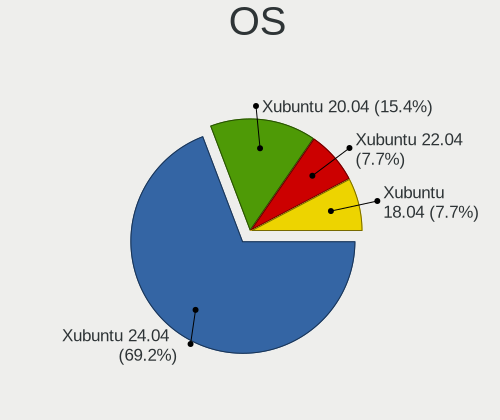
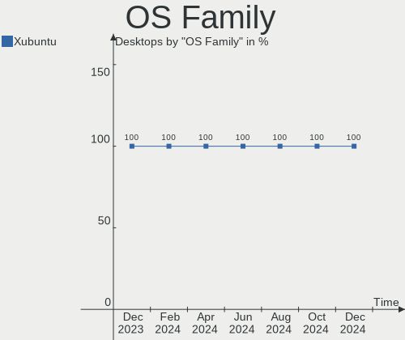
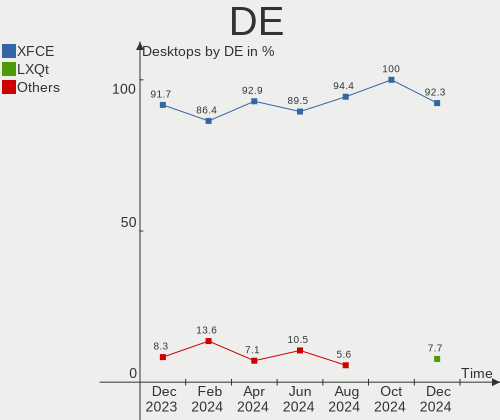
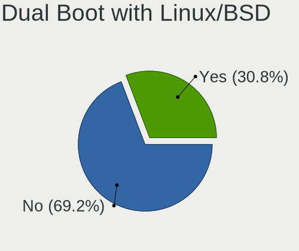
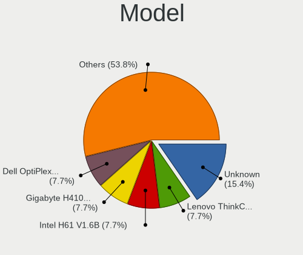
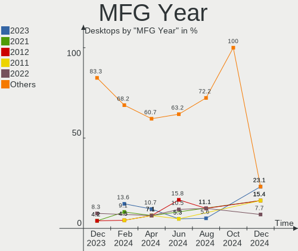
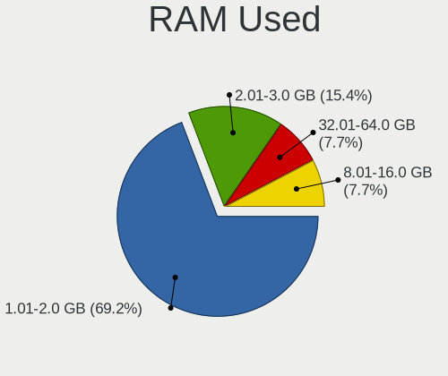
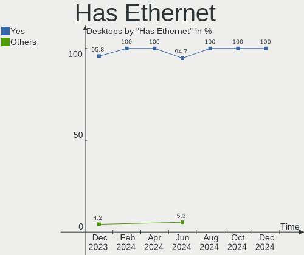
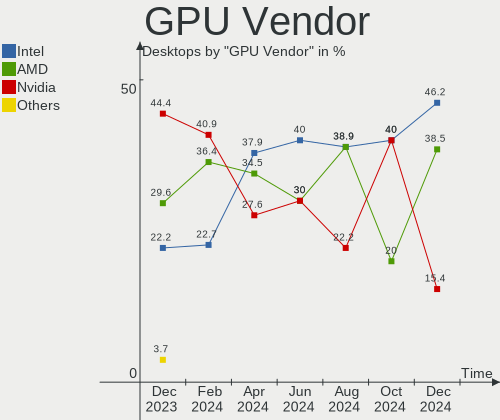

Xubuntu - Hardware Trends (Desktops)
------------------------------------

A project to identify most popular hardware characteristics and track their change
over time based on data collected by Linux users at https://Linux-Hardware.org.

Anyone can contribute to this report by the [hw-probe](https://github.com/linuxhw/hw-probe) tool:

    sudo -E hw-probe -all -upload

This report is for one last month. Overall report since the beginning of time: [TestDays](https://github.com/linuxhw/TestDays)

Period: Dec, 2024.

Contents
--------

* [ System ](#system)
  - [ OS                       ](#os)
  - [ OS Family                ](#os-family)
  - [ Kernel                   ](#kernel)
  - [ Kernel Family            ](#kernel-family)
  - [ Kernel Major Ver.        ](#kernel-major-ver)
  - [ Arch                     ](#arch)
  - [ DE                       ](#de)
  - [ Display Server           ](#display-server)
  - [ Display Manager          ](#display-manager)
  - [ OS Lang                  ](#os-lang)
  - [ Boot Mode                ](#boot-mode)
  - [ Filesystem               ](#filesystem)
  - [ Part. scheme             ](#part-scheme)
  - [ Dual Boot with Linux/BSD ](#dual-boot-with-linuxbsd)
  - [ Dual Boot (Win)          ](#dual-boot-win)

* [ Board ](#board)
  - [ Vendor                   ](#vendor)
  - [ Model                    ](#model)
  - [ Model Family             ](#model-family)
  - [ MFG Year                 ](#mfg-year)
  - [ Form Factor              ](#form-factor)
  - [ Secure Boot              ](#secure-boot)
  - [ Coreboot                 ](#coreboot)
  - [ RAM Size                 ](#ram-size)
  - [ RAM Used                 ](#ram-used)
  - [ Total Drives             ](#total-drives)
  - [ Has CD-ROM               ](#has-cd-rom)
  - [ Has Ethernet             ](#has-ethernet)
  - [ Has WiFi                 ](#has-wifi)
  - [ Has Bluetooth            ](#has-bluetooth)

* [ Location ](#location)
  - [ Country                  ](#country)
  - [ City                     ](#city)

* [ Drives ](#drives)
  - [ Drive Vendor             ](#drive-vendor)
  - [ Drive Model              ](#drive-model)
  - [ HDD Vendor               ](#hdd-vendor)
  - [ SSD Vendor               ](#ssd-vendor)
  - [ Drive Kind               ](#drive-kind)
  - [ Drive Connector          ](#drive-connector)
  - [ Drive Size               ](#drive-size)
  - [ Space Total              ](#space-total)
  - [ Space Used               ](#space-used)
  - [ Malfunc. Drives          ](#malfunc-drives)
  - [ Malfunc. Drive Vendor    ](#malfunc-drive-vendor)
  - [ Malfunc. HDD Vendor      ](#malfunc-hdd-vendor)
  - [ Malfunc. Drive Kind      ](#malfunc-drive-kind)
  - [ Failed Drives            ](#failed-drives)
  - [ Failed Drive Vendor      ](#failed-drive-vendor)
  - [ Drive Status             ](#drive-status)

* [ Storage controller ](#storage-controller)
  - [ Storage Vendor           ](#storage-vendor)
  - [ Storage Model            ](#storage-model)
  - [ Storage Kind             ](#storage-kind)

* [ Processor ](#processor)
  - [ CPU Vendor               ](#cpu-vendor)
  - [ CPU Model                ](#cpu-model)
  - [ CPU Model Family         ](#cpu-model-family)
  - [ CPU Cores                ](#cpu-cores)
  - [ CPU Sockets              ](#cpu-sockets)
  - [ CPU Threads              ](#cpu-threads)
  - [ CPU Op-Modes             ](#cpu-op-modes)
  - [ CPU Microcode            ](#cpu-microcode)
  - [ CPU Microarch            ](#cpu-microarch)

* [ Graphics ](#graphics)
  - [ GPU Vendor               ](#gpu-vendor)
  - [ GPU Model                ](#gpu-model)
  - [ GPU Combo                ](#gpu-combo)
  - [ GPU Driver               ](#gpu-driver)
  - [ GPU Memory               ](#gpu-memory)

* [ Monitor ](#monitor)
  - [ Monitor Vendor           ](#monitor-vendor)
  - [ Monitor Model            ](#monitor-model)
  - [ Monitor Resolution       ](#monitor-resolution)
  - [ Monitor Diagonal         ](#monitor-diagonal)
  - [ Monitor Width            ](#monitor-width)
  - [ Aspect Ratio             ](#aspect-ratio)
  - [ Monitor Area             ](#monitor-area)
  - [ Pixel Density            ](#pixel-density)
  - [ Multiple Monitors        ](#multiple-monitors)

* [ Network ](#network)
  - [ Net Controller Vendor    ](#net-controller-vendor)
  - [ Net Controller Model     ](#net-controller-model)
  - [ Wireless Vendor          ](#wireless-vendor)
  - [ Wireless Model           ](#wireless-model)
  - [ Ethernet Vendor          ](#ethernet-vendor)
  - [ Ethernet Model           ](#ethernet-model)
  - [ Net Controller Kind      ](#net-controller-kind)
  - [ Used Controller          ](#used-controller)
  - [ NICs                     ](#nics)
  - [ IPv6                     ](#ipv6)

* [ Bluetooth ](#bluetooth)
  - [ Bluetooth Vendor         ](#bluetooth-vendor)
  - [ Bluetooth Model          ](#bluetooth-model)

* [ Sound ](#sound)
  - [ Sound Vendor             ](#sound-vendor)
  - [ Sound Model              ](#sound-model)

* [ Memory ](#memory)
  - [ Memory Vendor            ](#memory-vendor)
  - [ Memory Model             ](#memory-model)
  - [ Memory Kind              ](#memory-kind)
  - [ Memory Form Factor       ](#memory-form-factor)
  - [ Memory Size              ](#memory-size)
  - [ Memory Speed             ](#memory-speed)

* [ Printers & scanners ](#printers--scanners)
  - [ Printer Vendor           ](#printer-vendor)
  - [ Printer Model            ](#printer-model)
  - [ Scanner Vendor           ](#scanner-vendor)
  - [ Scanner Model            ](#scanner-model)

* [ Camera ](#camera)
  - [ Camera Vendor            ](#camera-vendor)
  - [ Camera Model             ](#camera-model)

* [ Security ](#security)
  - [ Fingerprint Vendor       ](#fingerprint-vendor)
  - [ Fingerprint Model        ](#fingerprint-model)
  - [ Chipcard Vendor          ](#chipcard-vendor)
  - [ Chipcard Model           ](#chipcard-model)

* [ Unsupported ](#unsupported)
  - [ Unsupported Devices      ](#unsupported-devices)
  - [ Unsupported Device Types ](#unsupported-device-types)

System
------

OS
--

Installed operating systems

| Name          | Desktops | Percent |
|---------------|----------|---------|
| Xubuntu 24.04 | 9        | 69.23%  |
| Xubuntu 20.04 | 2        | 15.38%  |
| Xubuntu 22.04 | 1        | 7.69%   |
| Xubuntu 18.04 | 1        | 7.69%   |

OS Family
---------

OS without a version

| Name    | Desktops | Percent |
|---------|----------|---------|
| Xubuntu | 13       | 100%    |

Kernel
------

Version of the Linux kernel

| Version             | Desktops | Percent |
|---------------------|----------|---------|
| 6.8.0-51-generic    | 5        | 38.46%  |
| 6.8.12-4-pve        | 2        | 15.38%  |
| 6.8.0-49-generic    | 2        | 15.38%  |
| 6.8.0-50-lowlatency | 1        | 7.69%   |
| 6.8.0-50-generic    | 1        | 7.69%   |
| 6.8.0-45-generic    | 1        | 7.69%   |
| 4.15.0-202-generic  | 1        | 7.69%   |

Kernel Family
-------------

Linux kernel without a distro release

| Version | Desktops | Percent |
|---------|----------|---------|
| 6.8.0   | 10       | 76.92%  |
| 6.8.12  | 2        | 15.38%  |
| 4.15.0  | 1        | 7.69%   |

Kernel Major Ver.
-----------------

Linux kernel major version

| Version | Desktops | Percent |
|---------|----------|---------|
| 6.8     | 12       | 92.31%  |
| 4.15    | 1        | 7.69%   |

Arch
----

OS architecture (x86_64, i586, etc.)

| Name   | Desktops | Percent |
|--------|----------|---------|
| x86_64 | 13       | 100%    |

DE
--

Desktop Environment

| Name | Desktops | Percent |
|------|----------|---------|
| XFCE | 12       | 92.31%  |
| LXQt | 1        | 7.69%   |

Display Server
--------------

X11 or Wayland

| Name | Desktops | Percent |
|------|----------|---------|
| X11  | 12       | 92.31%  |
| Tty  | 1        | 7.69%   |

Display Manager
---------------

SDDM, LightDM, etc.

| Name    | Desktops | Percent |
|---------|----------|---------|
| LightDM | 12       | 92.31%  |
| SDDM    | 1        | 7.69%   |

OS Lang
-------

Language

| Lang    | Desktops | Percent |
|---------|----------|---------|
| en_US   | 5        | 38.46%  |
| C       | 3        | 23.08%  |
| pt_BR   | 1        | 7.69%   |
| it_IT   | 1        | 7.69%   |
| fr_FR   | 1        | 7.69%   |
| eu_ES   | 1        | 7.69%   |
| Unknown | 1        | 7.69%   |

Boot Mode
---------

EFI or BIOS

| Mode | Desktops | Percent |
|------|----------|---------|
| BIOS | 9        | 69.23%  |
| EFI  | 4        | 30.77%  |

Filesystem
----------

Type of filesystem

| Type  | Desktops | Percent |
|-------|----------|---------|
| Tmpfs | 8        | 61.54%  |
| Ext4  | 5        | 38.46%  |

Part. scheme
------------

Scheme of partitioning

| Type    | Desktops | Percent |
|---------|----------|---------|
| GPT     | 9        | 69.23%  |
| MBR     | 2        | 15.38%  |
| Unknown | 2        | 15.38%  |

Dual Boot with Linux/BSD
------------------------

Hosting more than one Linux/BSD

| Dual boot | Desktops | Percent |
|-----------|----------|---------|
| No        | 9        | 69.23%  |
| Yes       | 4        | 30.77%  |

Dual Boot (Win)
---------------

Hosting Linux and Windows

| Dual boot | Desktops | Percent |
|-----------|----------|---------|
| No        | 10       | 76.92%  |
| Yes       | 3        | 23.08%  |

Board
-----

Vendor
------

Motherboard manufacturer

| Name                | Desktops | Percent |
|---------------------|----------|---------|
| ASUSTek Computer    | 3        | 23.08%  |
| ASRock              | 2        | 15.38%  |
| Unknown             | 2        | 15.38%  |
| Lenovo              | 1        | 7.69%   |
| Intel               | 1        | 7.69%   |
| Gigabyte Technology | 1        | 7.69%   |
| Dell                | 1        | 7.69%   |
| BESSTAR Tech        | 1        | 7.69%   |
| Apple               | 1        | 7.69%   |

Model
-----

Motherboard model

| Name                              | Desktops | Percent |
|-----------------------------------|----------|---------|
| Unknown                           | 2        | 15.38%  |
| Lenovo ThinkCentre M83 10AM0009US | 1        | 7.69%   |
| Intel H61 V1.6B                   | 1        | 7.69%   |
| Gigabyte H410M H V3               | 1        | 7.69%   |
| Dell OptiPlex 790                 | 1        | 7.69%   |
| BESSTAR Tech HX90                 | 1        | 7.69%   |
| ASUS MINIPC PB50                  | 1        | 7.69%   |
| ASUS M5A78L-M LX3                 | 1        | 7.69%   |
| ASUS M5A78L-M LX PLUS             | 1        | 7.69%   |
| ASRock G31M-GS                    | 1        | 7.69%   |
| ASRock B75M                       | 1        | 7.69%   |
| Apple MacPro5,1                   | 1        | 7.69%   |

Model Family
------------

Motherboard model prefix

| Name               | Desktops | Percent |
|--------------------|----------|---------|
| ASUS M5A78L-M      | 2        | 15.38%  |
| Unknown            | 2        | 15.38%  |
| Lenovo ThinkCentre | 1        | 7.69%   |
| Intel H61          | 1        | 7.69%   |
| Gigabyte H410M     | 1        | 7.69%   |
| Dell OptiPlex      | 1        | 7.69%   |
| BESSTAR Tech HX90  | 1        | 7.69%   |
| ASUS MINIPC        | 1        | 7.69%   |
| ASRock G31M-GS     | 1        | 7.69%   |
| ASRock B75M        | 1        | 7.69%   |
| Apple MacPro5      | 1        | 7.69%   |

MFG Year
--------

Motherboard manufacture year

| Year | Desktops | Percent |
|------|----------|---------|
| 2023 | 3        | 23.08%  |
| 2021 | 2        | 15.38%  |
| 2012 | 2        | 15.38%  |
| 2011 | 2        | 15.38%  |
| 2022 | 1        | 7.69%   |
| 2013 | 1        | 7.69%   |
| 2010 | 1        | 7.69%   |
| 2008 | 1        | 7.69%   |

Form Factor
-----------

Physical design of the computer

| Name    | Desktops | Percent |
|---------|----------|---------|
| Desktop | 13       | 100%    |

Secure Boot
-----------

Enabled or disabled

| State    | Desktops | Percent |
|----------|----------|---------|
| Disabled | 13       | 100%    |

Coreboot
--------

Have coreboot on board

| Used | Desktops | Percent |
|------|----------|---------|
| No   | 13       | 100%    |

RAM Size
--------

Total RAM memory

| Size in GB  | Desktops | Percent |
|-------------|----------|---------|
| 4.01-8.0    | 4        | 30.77%  |
| 16.01-24.0  | 3        | 23.08%  |
| 32.01-64.0  | 2        | 15.38%  |
| 8.01-16.0   | 2        | 15.38%  |
| 3.01-4.0    | 1        | 7.69%   |
| 64.01-256.0 | 1        | 7.69%   |

RAM Used
--------

Used RAM memory

| Used GB    | Desktops | Percent |
|------------|----------|---------|
| 1.01-2.0   | 9        | 69.23%  |
| 2.01-3.0   | 2        | 15.38%  |
| 32.01-64.0 | 1        | 7.69%   |
| 8.01-16.0  | 1        | 7.69%   |

Total Drives
------------

Number of drives on board

| Drives | Desktops | Percent |
|--------|----------|---------|
| 1      | 5        | 38.46%  |
| 2      | 4        | 30.77%  |
| 3      | 3        | 23.08%  |
| 6      | 1        | 7.69%   |

Has CD-ROM
----------

Has CD-ROM on board

| Presented | Desktops | Percent |
|-----------|----------|---------|
| No        | 10       | 76.92%  |
| Yes       | 3        | 23.08%  |

Has Ethernet
------------

Has Ethernet on board

| Presented | Desktops | Percent |
|-----------|----------|---------|
| Yes       | 13       | 100%    |

Has WiFi
--------

Has WiFi module

| Presented | Desktops | Percent |
|-----------|----------|---------|
| No        | 7        | 53.85%  |
| Yes       | 6        | 46.15%  |

Has Bluetooth
-------------

Has Bluetooth module

| Presented | Desktops | Percent |
|-----------|----------|---------|
| No        | 7        | 53.85%  |
| Yes       | 6        | 46.15%  |

Location
--------

Country
-------

Geographic location (country)

| Country | Desktops | Percent |
|---------|----------|---------|
| USA     | 5        | 38.46%  |
| Russia  | 2        | 15.38%  |
| Ukraine | 1        | 7.69%   |
| Spain   | 1        | 7.69%   |
| Italy   | 1        | 7.69%   |
| France  | 1        | 7.69%   |
| Brazil  | 1        | 7.69%   |
| Austria | 1        | 7.69%   |

City
----

Geographic location (city)

| City      | Desktops | Percent |
|-----------|----------|---------|
| Omsk      | 2        | 15.38%  |
| Vienna    | 1        | 7.69%   |
| Toul      | 1        | 7.69%   |
| Tampa     | 1        | 7.69%   |
| Rochester | 1        | 7.69%   |
| Reno      | 1        | 7.69%   |
| Manassas  | 1        | 7.69%   |
| Lviv      | 1        | 7.69%   |
| Hyannis   | 1        | 7.69%   |
| Ferrara   | 1        | 7.69%   |
| Eibar     | 1        | 7.69%   |
| Curitiba  | 1        | 7.69%   |

Drives
------

Drive Vendor
------------

Hard drive vendors

| Vendor              | Desktops | Drives | Percent |
|---------------------|----------|--------|---------|
| Samsung Electronics | 6        | 6      | 26.09%  |
| WDC                 | 4        | 7      | 17.39%  |
| Seagate             | 3        | 4      | 13.04%  |
| Unknown             | 2        | 2      | 8.7%    |
| Kingston            | 2        | 2      | 8.7%    |
| Toshiba             | 1        | 1      | 4.35%   |
| SanDisk             | 1        | 1      | 4.35%   |
| Intel               | 1        | 2      | 4.35%   |
| HUSKY               | 1        | 1      | 4.35%   |
| Hitachi             | 1        | 1      | 4.35%   |
| ASMT                | 1        | 1      | 4.35%   |

Drive Model
-----------

Hard drive models

| Model                                 | Desktops | Percent |
|---------------------------------------|----------|---------|
| WDC WD20EARS-00M                      | 2        | 7.69%   |
| Unknown NVMe SSD Drive 512GB          | 2        | 7.69%   |
| Seagate ST1000DM003-1CH162 1TB        | 2        | 7.69%   |
| WDC WD5000AZLX-00K2TA0 500GB          | 1        | 3.85%   |
| WDC WD40EFRX-68N32N0 4TB              | 1        | 3.85%   |
| WDC WD30EFRX-68EUZN0 3TB              | 1        | 3.85%   |
| Toshiba HDWD130 3TB                   | 1        | 3.85%   |
| Seagate ST500DM002-1BD142 500GB       | 1        | 3.85%   |
| Seagate ST3500413AS 500GB             | 1        | 3.85%   |
| SanDisk Z400s 2.5 7MM 256GB SSD       | 1        | 3.85%   |
| Samsung SSD 980 500GB                 | 1        | 3.85%   |
| Samsung SSD 870 EVO 2TB               | 1        | 3.85%   |
| Samsung SSD 860 EVO 1TB               | 1        | 3.85%   |
| Samsung SSD 840 EVO 250GB             | 1        | 3.85%   |
| Samsung SP2004C 200GB                 | 1        | 3.85%   |
| Samsung HD161GJ 160GB                 | 1        | 3.85%   |
| Kingston SA400S37480G 480GB SSD       | 1        | 3.85%   |
| Kingston RBUSNS8180DS3128GJ 128GB SSD | 1        | 3.85%   |
| Intel SSDSA2M160G2GC 160GB            | 1        | 3.85%   |
| Intel SSDSA2CW160G3 160GB             | 1        | 3.85%   |
| HUSKY SSD 128GB                       | 1        | 3.85%   |
| Hitachi HDS721075CLA332 752GB         | 1        | 3.85%   |
| ASMT 2115 320GB                       | 1        | 3.85%   |

HDD Vendor
----------

Hard disk drive vendors

| Vendor              | Desktops | Drives | Percent |
|---------------------|----------|--------|---------|
| WDC                 | 4        | 7      | 33.33%  |
| Seagate             | 3        | 4      | 25%     |
| Samsung Electronics | 2        | 2      | 16.67%  |
| Toshiba             | 1        | 1      | 8.33%   |
| Hitachi             | 1        | 1      | 8.33%   |
| ASMT                | 1        | 1      | 8.33%   |

SSD Vendor
----------

Solid state drive vendors

| Vendor              | Desktops | Drives | Percent |
|---------------------|----------|--------|---------|
| Samsung Electronics | 3        | 3      | 37.5%   |
| Kingston            | 2        | 2      | 25%     |
| SanDisk             | 1        | 1      | 12.5%   |
| Intel               | 1        | 2      | 12.5%   |
| HUSKY               | 1        | 1      | 12.5%   |

Drive Kind
----------

HDD or SSD

| Kind | Desktops | Drives | Percent |
|------|----------|--------|---------|
| SSD  | 8        | 9      | 42.11%  |
| HDD  | 8        | 16     | 42.11%  |
| NVMe | 3        | 3      | 15.79%  |

Drive Connector
---------------

SATA, SAS, NVMe, etc.

| Type | Desktops | Drives | Percent |
|------|----------|--------|---------|
| SATA | 12       | 24     | 75%     |
| NVMe | 3        | 3      | 18.75%  |
| SAS  | 1        | 1      | 6.25%   |

Drive Size
----------

Size of hard drive

| Size in TB | Desktops | Drives | Percent |
|------------|----------|--------|---------|
| 0.01-0.5   | 10       | 13     | 50%     |
| 0.51-1.0   | 4        | 4      | 20%     |
| 1.01-2.0   | 3        | 3      | 15%     |
| 2.01-3.0   | 2        | 3      | 10%     |
| 3.01-4.0   | 1        | 2      | 5%      |

Space Total
-----------

Amount of disk space available on the file system

| Size in GB     | Desktops | Percent |
|----------------|----------|---------|
| 101-250        | 3        | 23.08%  |
| More than 3000 | 2        | 15.38%  |
| 251-500        | 2        | 15.38%  |
| 21-50          | 2        | 15.38%  |
| 1001-2000      | 2        | 15.38%  |
| 501-1000       | 1        | 7.69%   |
| 51-100         | 1        | 7.69%   |

Space Used
----------

Amount of used disk space

| Used GB   | Desktops | Percent |
|-----------|----------|---------|
| 1-20      | 3        | 23.08%  |
| 251-500   | 2        | 15.38%  |
| 21-50     | 2        | 15.38%  |
| 101-250   | 2        | 15.38%  |
| 2001-3000 | 1        | 7.69%   |
| 1001-2000 | 1        | 7.69%   |
| 501-1000  | 1        | 7.69%   |
| 51-100    | 1        | 7.69%   |

Malfunc. Drives
---------------

Drive models with a malfunction

| Model                             | Desktops | Drives | Percent |
|-----------------------------------|----------|--------|---------|
| Toshiba HDWD130 3TB               | 1        | 1      | 25%     |
| Seagate ST500DM002-1BD142 500GB   | 1        | 1      | 25%     |
| Samsung Electronics SP2004C 200GB | 1        | 1      | 25%     |
| Intel SSDSA2M160G2GC 160GB        | 1        | 1      | 25%     |

Malfunc. Drive Vendor
---------------------

Vendors of faulty drives

| Vendor              | Desktops | Drives | Percent |
|---------------------|----------|--------|---------|
| Toshiba             | 1        | 1      | 25%     |
| Seagate             | 1        | 1      | 25%     |
| Samsung Electronics | 1        | 1      | 25%     |
| Intel               | 1        | 1      | 25%     |

Malfunc. HDD Vendor
-------------------

Vendors of faulty HDD drives

| Vendor              | Desktops | Drives | Percent |
|---------------------|----------|--------|---------|
| Toshiba             | 1        | 1      | 33.33%  |
| Seagate             | 1        | 1      | 33.33%  |
| Samsung Electronics | 1        | 1      | 33.33%  |

Malfunc. Drive Kind
-------------------

Kinds of faulty drives

| Kind | Desktops | Drives | Percent |
|------|----------|--------|---------|
| SSD  | 1        | 1      | 50%     |
| HDD  | 1        | 3      | 50%     |

Failed Drives
-------------

Failed drive models

Zero info for selected period =(

Failed Drive Vendor
-------------------

Failed drive vendors

Zero info for selected period =(

Drive Status
------------

Number of failed and malfunc. drives

| Status   | Desktops | Drives | Percent |
|----------|----------|--------|---------|
| Detected | 10       | 18     | 71.43%  |
| Malfunc  | 2        | 4      | 14.29%  |
| Works    | 2        | 6      | 14.29%  |

Storage controller
------------------

Storage Vendor
--------------

Storage controller vendors

| Vendor              | Desktops | Percent |
|---------------------|----------|---------|
| Intel               | 9        | 52.94%  |
| AMD                 | 4        | 23.53%  |
| ADATA Technology    | 2        | 11.76%  |
| Samsung Electronics | 1        | 5.88%   |
| ASMedia Technology  | 1        | 5.88%   |

Storage Model
-------------

Storage controller models

| Model                                                                          | Desktops | Percent |
|--------------------------------------------------------------------------------|----------|---------|
| Intel Jasper Lake SATA AHCI Controller                                         | 2        | 10%     |
| Intel 7 Series/C210 Series Chipset Family 6-port SATA Controller [AHCI mode]   | 2        | 10%     |
| AMD SB7x0/SB8x0/SB9x0 IDE Controller                                           | 2        | 10%     |
| AMD FCH SATA Controller [AHCI mode]                                            | 2        | 10%     |
| ADATA XPG SX8200 Pro PCIe Gen3x4 M.2 2280 Solid State Drive                    | 2        | 10%     |
| Samsung NVMe SSD Controller 980 (DRAM-less)                                    | 1        | 5%      |
| Intel NM10/ICH7 Family SATA Controller [IDE mode]                              | 1        | 5%      |
| Intel 82801JI (ICH10 Family) SATA AHCI Controller                              | 1        | 5%      |
| Intel 82801G (ICH7 Family) IDE Controller                                      | 1        | 5%      |
| Intel 8 Series/C220 Series Chipset Family 6-port SATA Controller 1 [AHCI mode] | 1        | 5%      |
| Intel 6 Series/C200 Series Chipset Family 6 port Desktop SATA AHCI Controller  | 1        | 5%      |
| Intel 500 Series Chipset Family SATA AHCI Controller                           | 1        | 5%      |
| ASMedia ASM1061/ASM1062 Serial ATA Controller                                  | 1        | 5%      |
| AMD SB7x0/SB8x0/SB9x0 SATA Controller [IDE mode]                               | 1        | 5%      |
| AMD SB7x0/SB8x0/SB9x0 SATA Controller [AHCI mode]                              | 1        | 5%      |

Storage Kind
------------

Kind of storage controller (IDE, SATA, NVMe, SAS, ...)

| Kind | Desktops | Percent |
|------|----------|---------|
| SATA | 12       | 66.67%  |
| NVMe | 3        | 16.67%  |
| IDE  | 3        | 16.67%  |

Processor
---------

CPU Vendor
----------

Processor vendors

| Vendor | Desktops | Percent |
|--------|----------|---------|
| Intel  | 9        | 69.23%  |
| AMD    | 4        | 30.77%  |

CPU Model
---------

Processor models

| Model                                         | Desktops | Percent |
|-----------------------------------------------|----------|---------|
| Intel Celeron N5095 @ 2.00GHz                 | 2        | 15.38%  |
| Intel Xeon CPU X5675 @ 3.07GHz                | 1        | 7.69%   |
| Intel Core i7-4770 CPU @ 3.40GHz              | 1        | 7.69%   |
| Intel Core i7-10700F CPU @ 2.90GHz            | 1        | 7.69%   |
| Intel Core i5-2500 CPU @ 3.30GHz              | 1        | 7.69%   |
| Intel Core i3-3245 CPU @ 3.40GHz              | 1        | 7.69%   |
| Intel Core i3-3240 CPU @ 3.40GHz              | 1        | 7.69%   |
| Intel Celeron CPU E3300 @ 2.50GHz             | 1        | 7.69%   |
| AMD Ryzen 9 5900HX with Radeon Graphics       | 1        | 7.69%   |
| AMD Ryzen 5 3550H with Radeon Vega Mobile Gfx | 1        | 7.69%   |
| AMD FX-8300 Eight-Core Processor              | 1        | 7.69%   |
| AMD FX-4300 Quad-Core Processor               | 1        | 7.69%   |

CPU Model Family
----------------

Processor model prefix

| Model         | Desktops | Percent |
|---------------|----------|---------|
| Intel Celeron | 3        | 23.08%  |
| Intel Core i7 | 2        | 15.38%  |
| Intel Core i3 | 2        | 15.38%  |
| AMD FX        | 2        | 15.38%  |
| Intel Xeon    | 1        | 7.69%   |
| Intel Core i5 | 1        | 7.69%   |
| AMD Ryzen 9   | 1        | 7.69%   |
| AMD Ryzen 5   | 1        | 7.69%   |

CPU Cores
---------

Number of processor cores

| Number | Desktops | Percent |
|--------|----------|---------|
| 4      | 6        | 46.15%  |
| 2      | 4        | 30.77%  |
| 8      | 2        | 15.38%  |
| 12     | 1        | 7.69%   |

CPU Sockets
-----------

Number of sockets

| Number | Desktops | Percent |
|--------|----------|---------|
| 1      | 12       | 92.31%  |
| 2      | 1        | 7.69%   |

CPU Threads
-----------

Threads per core (Hyper-Threading)

| Number | Desktops | Percent |
|--------|----------|---------|
| 2      | 9        | 69.23%  |
| 1      | 4        | 30.77%  |

CPU Op-Modes
------------

CPU Operation Modes (32-bit, 64-bit)

| Op mode        | Desktops | Percent |
|----------------|----------|---------|
| 32-bit, 64-bit | 13       | 100%    |

CPU Microcode
-------------

Microcode number

| Number  | Desktops | Percent |
|---------|----------|---------|
| Unknown | 13       | 100%    |

CPU Microarch
-------------

Microarchitecture

| Name        | Desktops | Percent |
|-------------|----------|---------|
| Tremont     | 2        | 15.38%  |
| Piledriver  | 2        | 15.38%  |
| IvyBridge   | 2        | 15.38%  |
| Zen+        | 1        | 7.69%   |
| Zen 3       | 1        | 7.69%   |
| Westmere    | 1        | 7.69%   |
| SandyBridge | 1        | 7.69%   |
| Penryn      | 1        | 7.69%   |
| Haswell     | 1        | 7.69%   |
| CometLake   | 1        | 7.69%   |

Graphics
--------

GPU Vendor
----------

Vendors of graphics cards

| Vendor | Desktops | Percent |
|--------|----------|---------|
| Intel  | 6        | 46.15%  |
| AMD    | 5        | 38.46%  |
| Nvidia | 2        | 15.38%  |

GPU Model
---------

Graphics card models

| Model                                                                       | Desktops | Percent |
|-----------------------------------------------------------------------------|----------|---------|
| Intel JasperLake [UHD Graphics]                                             | 2        | 15.38%  |
| AMD Juniper XT [Radeon HD 5770]                                             | 2        | 15.38%  |
| Nvidia GK208B [GeForce GT 730]                                              | 1        | 7.69%   |
| Nvidia GA104 [GeForce RTX 3060 Ti Lite Hash Rate]                           | 1        | 7.69%   |
| Intel Xeon E3-1200 v3/4th Gen Core Processor Integrated Graphics Controller | 1        | 7.69%   |
| Intel IvyBridge GT2 [HD Graphics 4000]                                      | 1        | 7.69%   |
| Intel 82G33/G31 Express Integrated Graphics Controller                      | 1        | 7.69%   |
| Intel 2nd Generation Core Processor Family Integrated Graphics Controller   | 1        | 7.69%   |
| AMD RS780L [Radeon 3000]                                                    | 1        | 7.69%   |
| AMD Picasso/Raven 2 [Radeon Vega Series / Radeon Vega Mobile Series]        | 1        | 7.69%   |
| AMD Cezanne [Radeon Vega Series / Radeon Vega Mobile Series]                | 1        | 7.69%   |

GPU Combo
---------

Combinations of graphics cards

| Name       | Desktops | Percent |
|------------|----------|---------|
| 1 x Intel  | 6        | 46.15%  |
| 1 x AMD    | 5        | 38.46%  |
| 1 x Nvidia | 2        | 15.38%  |

GPU Driver
----------

Free vs proprietary

| Driver      | Desktops | Percent |
|-------------|----------|---------|
| Free        | 11       | 84.62%  |
| Proprietary | 2        | 15.38%  |

GPU Memory
----------

Total video memory

| Size in GB | Desktops | Percent |
|------------|----------|---------|
| Unknown    | 9        | 69.23%  |
| 0.01-0.5   | 2        | 15.38%  |
| 7.01-8.0   | 1        | 7.69%   |
| 1.01-2.0   | 1        | 7.69%   |

Monitor
-------

Monitor Vendor
--------------

Monitor vendors

| Vendor               | Desktops | Percent |
|----------------------|----------|---------|
| Samsung Electronics  | 2        | 13.33%  |
| Hewlett-Packard      | 2        | 13.33%  |
| CS_                  | 2        | 13.33%  |
| BenQ                 | 2        | 13.33%  |
| Philips              | 1        | 6.67%   |
| LG Electronics       | 1        | 6.67%   |
| HannStar             | 1        | 6.67%   |
| Goldstar             | 1        | 6.67%   |
| Dell                 | 1        | 6.67%   |
| AOC                  | 1        | 6.67%   |
| Ancor Communications | 1        | 6.67%   |

Monitor Model
-------------

Monitor models

| Model                                                                | Desktops | Percent |
|----------------------------------------------------------------------|----------|---------|
| CS_ LCD Monitor CS_5211 1920x1080 519x324mm 24.1-inch                | 2        | 12.5%   |
| Samsung Electronics SyncMaster SAM0375 1680x1050 494x320mm 23.2-inch | 1        | 6.25%   |
| Samsung Electronics C27F390 SAM0D32 1920x1080 600x340mm 27.2-inch    | 1        | 6.25%   |
| Philips LCD Monitor PHL 246E9Q 1920x1080                             | 1        | 6.25%   |
| LG Electronics LCD Monitor LG ULTRAWIDE 7680x1080                    | 1        | 6.25%   |
| LG Electronics LCD Monitor LG ULTRAWIDE                              | 1        | 6.25%   |
| Hewlett-Packard w2408 HWP26CF 1920x1200 518x324mm 24.1-inch          | 1        | 6.25%   |
| Hewlett-Packard P242va HWP3238 1920x1080 531x299mm 24.0-inch         | 1        | 6.25%   |
| HannStar HL205DPB HSD62E0 1600x900 430x240mm 19.4-inch               | 1        | 6.25%   |
| Goldstar E2242 GSM58BE 1920x1080 477x268mm 21.5-inch                 | 1        | 6.25%   |
| Dell U2711 DELA055 2560x1440 597x336mm 27.0-inch                     | 1        | 6.25%   |
| BenQ GL2055 BNQ78B8 1600x900 443x249mm 20.0-inch                     | 1        | 6.25%   |
| BenQ BenQG2110W BNQ7811 1680x1050 474x296mm 22.0-inch                | 1        | 6.25%   |
| AOC F22 AOC2200 1920x1080 470x260mm 21.1-inch                        | 1        | 6.25%   |
| Ancor Communications VE247 ACI2493 1920x1080 531x299mm 24.0-inch     | 1        | 6.25%   |

Monitor Resolution
------------------

Monitor screen resolution

| Resolution         | Desktops | Percent |
|--------------------|----------|---------|
| 1920x1080 (FHD)    | 8        | 50%     |
| 1680x1050 (WSXGA+) | 2        | 12.5%   |
| 1600x900 (HD+)     | 2        | 12.5%   |
| 7680x1080          | 1        | 6.25%   |
| 2560x1440 (QHD)    | 1        | 6.25%   |
| 1920x1200 (WUXGA)  | 1        | 6.25%   |
| Unknown            | 1        | 6.25%   |

Monitor Diagonal
----------------

Diagonal size in inches

| Inches  | Desktops | Percent |
|---------|----------|---------|
| 24      | 6        | 40%     |
| Unknown | 2        | 13.33%  |
| 40      | 1        | 6.67%   |
| 27      | 1        | 6.67%   |
| 23      | 1        | 6.67%   |
| 22      | 1        | 6.67%   |
| 21      | 1        | 6.67%   |
| 20      | 1        | 6.67%   |
| 19      | 1        | 6.67%   |

Monitor Width
-------------

Physical width

| Width in mm | Desktops | Percent |
|-------------|----------|---------|
| 501-600     | 7        | 50%     |
| 401-500     | 4        | 28.57%  |
| Unknown     | 2        | 14.29%  |
| 801-900     | 1        | 7.14%   |

Aspect Ratio
------------

Proportional relationship between the width and the height

| Ratio   | Desktops | Percent |
|---------|----------|---------|
| 16/9    | 7        | 50%     |
| 16/10   | 4        | 28.57%  |
| Unknown | 2        | 14.29%  |
| 3/2     | 1        | 7.14%   |

Monitor Area
------------

Area in inch²

| Area in inch² | Desktops | Percent |
|----------------|----------|---------|
| 201-250        | 5        | 35.71%  |
| 251-300        | 3        | 21.43%  |
| 151-200        | 2        | 14.29%  |
| Unknown        | 2        | 14.29%  |
| 301-350        | 1        | 7.14%   |
| 501-1000       | 1        | 7.14%   |

Pixel Density
-------------

Pixels per inch

| Density | Desktops | Percent |
|---------|----------|---------|
| 51-100  | 9        | 69.23%  |
| 101-120 | 2        | 15.38%  |
| Unknown | 2        | 15.38%  |

Multiple Monitors
-----------------

Total monitors connected

| Total | Desktops | Percent |
|-------|----------|---------|
| 1     | 11       | 84.62%  |
| 3     | 1        | 7.69%   |
| 2     | 1        | 7.69%   |

Network
-------

Net Controller Vendor
---------------------

Controller vendors

| Vendor                          | Desktops | Percent |
|---------------------------------|----------|---------|
| Realtek Semiconductor           | 8        | 40%     |
| Intel                           | 5        | 25%     |
| Qualcomm Atheros                | 2        | 10%     |
| QinHeng Electronics             | 2        | 10%     |
| Qualcomm Atheros Communications | 1        | 5%      |
| MediaTek                        | 1        | 5%      |
| Broadcom                        | 1        | 5%      |

Net Controller Model
--------------------

Controller models

| Model                                                                         | Desktops | Percent |
|-------------------------------------------------------------------------------|----------|---------|
| Realtek RTL8111/8168/8211/8411 PCI Express Gigabit Ethernet Controller        | 6        | 27.27%  |
| QinHeng SONOFF Zigbee 3.0 USB Dongle Plus V2                                  | 2        | 9.09%   |
| Realtek RTL8814AU 802.11a/b/g/n/ac Wireless Adapter                           | 1        | 4.55%   |
| Realtek RTL810xE PCI Express Fast Ethernet controller                         | 1        | 4.55%   |
| Realtek 802.11ac NIC                                                          | 1        | 4.55%   |
| Qualcomm Atheros QCA8171 Gigabit Ethernet                                     | 1        | 4.55%   |
| Qualcomm Atheros AR9271 802.11n                                               | 1        | 4.55%   |
| Qualcomm Atheros AR2413/AR2414 Wireless Network Adapter [AR5005G(S) 802.11bg] | 1        | 4.55%   |
| MediaTek MT7921K (RZ608) Wi-Fi 6E 80MHz                                       | 1        | 4.55%   |
| Intel Wireless 8265 / 8275                                                    | 1        | 4.55%   |
| Intel I211 Gigabit Network Connection                                         | 1        | 4.55%   |
| Intel Ethernet Controller I226-V                                              | 1        | 4.55%   |
| Intel Ethernet Connection I217-LM                                             | 1        | 4.55%   |
| Intel 82579LM Gigabit Network Connection (Lewisville)                         | 1        | 4.55%   |
| Intel 82574L Gigabit Network Connection                                       | 1        | 4.55%   |
| Broadcom BCM4322 802.11a/b/g/n Wireless LAN Controller                        | 1        | 4.55%   |

Wireless Vendor
---------------

Wireless vendors

| Vendor                          | Desktops | Percent |
|---------------------------------|----------|---------|
| Realtek Semiconductor           | 1        | 16.67%  |
| Qualcomm Atheros Communications | 1        | 16.67%  |
| Qualcomm Atheros                | 1        | 16.67%  |
| MediaTek                        | 1        | 16.67%  |
| Intel                           | 1        | 16.67%  |
| Broadcom                        | 1        | 16.67%  |

Wireless Model
--------------

Wireless models

| Model                                                                         | Desktops | Percent |
|-------------------------------------------------------------------------------|----------|---------|
| Realtek RTL8814AU 802.11a/b/g/n/ac Wireless Adapter                           | 1        | 14.29%  |
| Realtek 802.11ac NIC                                                          | 1        | 14.29%  |
| Qualcomm Atheros AR9271 802.11n                                               | 1        | 14.29%  |
| Qualcomm Atheros AR2413/AR2414 Wireless Network Adapter [AR5005G(S) 802.11bg] | 1        | 14.29%  |
| MediaTek MT7921K (RZ608) Wi-Fi 6E 80MHz                                       | 1        | 14.29%  |
| Intel Wireless 8265 / 8275                                                    | 1        | 14.29%  |
| Broadcom BCM4322 802.11a/b/g/n Wireless LAN Controller                        | 1        | 14.29%  |

Ethernet Vendor
---------------

Ethernet vendors

| Vendor                | Desktops | Percent |
|-----------------------|----------|---------|
| Realtek Semiconductor | 7        | 53.85%  |
| Intel                 | 5        | 38.46%  |
| Qualcomm Atheros      | 1        | 7.69%   |

Ethernet Model
--------------

Ethernet models

| Model                                                                  | Desktops | Percent |
|------------------------------------------------------------------------|----------|---------|
| Realtek RTL8111/8168/8211/8411 PCI Express Gigabit Ethernet Controller | 6        | 46.15%  |
| Realtek RTL810xE PCI Express Fast Ethernet controller                  | 1        | 7.69%   |
| Qualcomm Atheros QCA8171 Gigabit Ethernet                              | 1        | 7.69%   |
| Intel I211 Gigabit Network Connection                                  | 1        | 7.69%   |
| Intel Ethernet Controller I226-V                                       | 1        | 7.69%   |
| Intel Ethernet Connection I217-LM                                      | 1        | 7.69%   |
| Intel 82579LM Gigabit Network Connection (Lewisville)                  | 1        | 7.69%   |
| Intel 82574L Gigabit Network Connection                                | 1        | 7.69%   |

Net Controller Kind
-------------------

Ethernet, WiFi or modem

| Kind     | Desktops | Percent |
|----------|----------|---------|
| Ethernet | 13       | 61.9%   |
| WiFi     | 6        | 28.57%  |
| Modem    | 2        | 9.52%   |

Used Controller
---------------

Currently used network controller

| Kind     | Desktops | Percent |
|----------|----------|---------|
| Ethernet | 10       | 71.43%  |
| WiFi     | 4        | 28.57%  |

NICs
----

Total network controllers on board

| Total | Desktops | Percent |
|-------|----------|---------|
| 1     | 9        | 69.23%  |
| 2     | 3        | 23.08%  |
| 3     | 1        | 7.69%   |

IPv6
----

IPv6 vs IPv4

| Used | Desktops | Percent |
|------|----------|---------|
| No   | 10       | 76.92%  |
| Yes  | 3        | 23.08%  |

Bluetooth
---------

Bluetooth Vendor
----------------

Controller vendors

| Vendor                  | Desktops | Percent |
|-------------------------|----------|---------|
| Cambridge Silicon Radio | 2        | 33.33%  |
| MediaTek                | 1        | 16.67%  |
| Intel                   | 1        | 16.67%  |
| Broadcom                | 1        | 16.67%  |
| Apple                   | 1        | 16.67%  |

Bluetooth Model
---------------

Controller models

| Model                                               | Desktops | Percent |
|-----------------------------------------------------|----------|---------|
| Cambridge Silicon Radio Bluetooth Dongle (HCI mode) | 2        | 33.33%  |
| MediaTek Wireless_Device                            | 1        | 16.67%  |
| Intel Bluetooth wireless interface                  | 1        | 16.67%  |
| Broadcom BCM20702A0 Bluetooth 4.0                   | 1        | 16.67%  |
| Apple Built-in Bluetooth 2.0+EDR HCI                | 1        | 16.67%  |

Sound
-----

Sound Vendor
------------

Sound card vendors

| Vendor              | Desktops | Percent |
|---------------------|----------|---------|
| Intel               | 9        | 45%     |
| AMD                 | 6        | 30%     |
| Nvidia              | 2        | 10%     |
| Texas Instruments   | 1        | 5%      |
| Jieli Technology    | 1        | 5%      |
| C-Media Electronics | 1        | 5%      |

Sound Model
-----------

Sound card models

| Model                                                                      | Desktops | Percent |
|----------------------------------------------------------------------------|----------|---------|
| Intel Jasper Lake HD Audio                                                 | 2        | 8.7%    |
| Intel 7 Series/C216 Chipset Family High Definition Audio Controller        | 2        | 8.7%    |
| AMD SBx00 Azalia (Intel HDA)                                               | 2        | 8.7%    |
| AMD Juniper HDMI Audio [Radeon HD 5700 Series]                             | 2        | 8.7%    |
| AMD Family 17h/19h/1ah HD Audio Controller                                 | 2        | 8.7%    |
| Texas Instruments PCM2704 16-bit stereo audio DAC                          | 1        | 4.35%   |
| Nvidia GK208 HDMI/DP Audio Controller                                      | 1        | 4.35%   |
| Nvidia GA104 High Definition Audio Controller                              | 1        | 4.35%   |
| Jieli Technology GO Work USB                                               | 1        | 4.35%   |
| Intel Xeon E3-1200 v3/4th Gen Core Processor HD Audio Controller           | 1        | 4.35%   |
| Intel Smart Sound Technology (SST) Audio Controller                        | 1        | 4.35%   |
| Intel NM10/ICH7 Family High Definition Audio Controller                    | 1        | 4.35%   |
| Intel 82801JI (ICH10 Family) HD Audio Controller                           | 1        | 4.35%   |
| Intel 8 Series/C220 Series Chipset High Definition Audio Controller        | 1        | 4.35%   |
| Intel 6 Series/C200 Series Chipset Family High Definition Audio Controller | 1        | 4.35%   |
| C-Media Electronics Audio Adapter (Unitek Y-247A)                          | 1        | 4.35%   |
| AMD Renoir Radeon High Definition Audio Controller                         | 1        | 4.35%   |
| AMD Raven/Raven2/Fenghuang HDMI/DP Audio Controller                        | 1        | 4.35%   |

Memory
------

Memory Vendor
-------------

Memory module vendors

| Vendor              | Desktops | Percent |
|---------------------|----------|---------|
| Unknown             | 2        | 33.33%  |
| Crucial             | 2        | 33.33%  |
| Team                | 1        | 16.67%  |
| Samsung Electronics | 1        | 16.67%  |

Memory Model
------------

Memory module models

| Model                                                  | Desktops | Percent |
|--------------------------------------------------------|----------|---------|
| Crucial RAM CT8G4SFS832A.M8FR 8GB SODIMM DDR4 3200MT/s | 2        | 28.57%  |
| Unknown RAM Module 8GB DIMM 667MT/s                    | 1        | 14.29%  |
| Unknown RAM Module 4GB DIMM 667MT/s                    | 1        | 14.29%  |
| Unknown RAM Module 2GB DIMM SDRAM                      | 1        | 14.29%  |
| Team RAM TEAMGROUP-SD4-3200 16GB SODIMM DDR4 3200MT/s  | 1        | 14.29%  |
| Samsung RAM Module 16384MB DIMM DDR3 1333MT/s          | 1        | 14.29%  |

Memory Kind
-----------

Memory module kinds

| Kind    | Desktops | Percent |
|---------|----------|---------|
| DDR4    | 3        | 50%     |
| SDRAM   | 1        | 16.67%  |
| DDR3    | 1        | 16.67%  |
| Unknown | 1        | 16.67%  |

Memory Form Factor
------------------

Physical design of the memory module

| Name   | Desktops | Percent |
|--------|----------|---------|
| SODIMM | 3        | 50%     |
| DIMM   | 3        | 50%     |

Memory Size
-----------

Memory module size

| Size  | Desktops | Percent |
|-------|----------|---------|
| 8192  | 3        | 42.86%  |
| 32768 | 1        | 14.29%  |
| 16384 | 1        | 14.29%  |
| 4096  | 1        | 14.29%  |
| 2048  | 1        | 14.29%  |

Memory Speed
------------

Memory module speed

| Speed   | Desktops | Percent |
|---------|----------|---------|
| 3200    | 3        | 50%     |
| 1333    | 1        | 16.67%  |
| 667     | 1        | 16.67%  |
| Unknown | 1        | 16.67%  |

Printers & scanners
-------------------

Printer Vendor
--------------

Printer device vendors

Zero info for selected period =(

Printer Model
-------------

Printer device models

Zero info for selected period =(

Scanner Vendor
--------------

Scanner device vendors

Zero info for selected period =(

Scanner Model
-------------

Scanner device models

Zero info for selected period =(

Camera
------

Camera Vendor
-------------

Camera device vendors

| Vendor   | Desktops | Percent |
|----------|----------|---------|
| Logitech | 1        | 100%    |

Camera Model
------------

Camera device models

| Model                           | Desktops | Percent |
|---------------------------------|----------|---------|
| Logitech C922 Pro Stream Webcam | 1        | 100%    |

Security
--------

Fingerprint Vendor
------------------

Fingerprint sensor vendors

Zero info for selected period =(

Fingerprint Model
-----------------

Fingerprint sensor models

Zero info for selected period =(

Chipcard Vendor
---------------

Chipcard module vendors

Zero info for selected period =(

Chipcard Model
--------------

Chipcard module models

Zero info for selected period =(

Unsupported
-----------

Unsupported Devices
-------------------

Total unsupported devices on board

| Total | Desktops | Percent |
|-------|----------|---------|
| 0     | 12       | 92.31%  |
| 2     | 1        | 7.69%   |

Unsupported Device Types
------------------------

Types of unsupported devices

| Type          | Desktops | Percent |
|---------------|----------|---------|
| Sound         | 1        | 50%     |
| Graphics card | 1        | 50%     |

