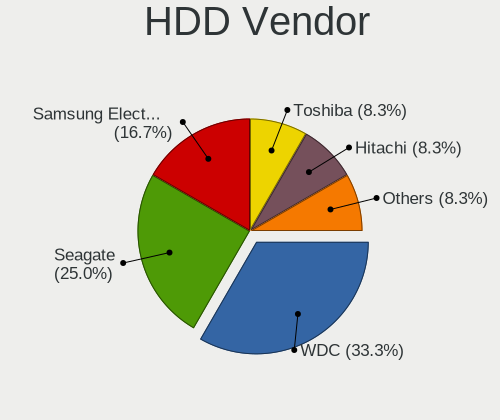
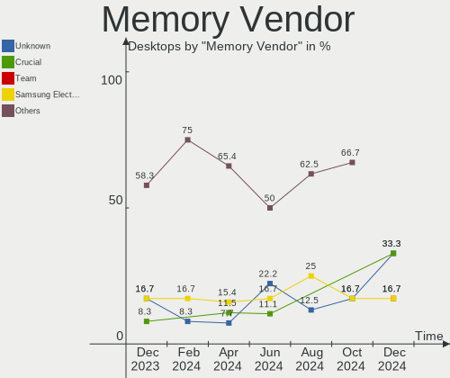

Xubuntu Hardware Trends (Desktop)
---------------------------------

A project to identify most popular hardware characteristics and track their change
over time based on data collected by Xubuntu users at https://Linux-Hardware.org.

Anyone can contribute to the study by uploading probes of their computers by
the [hw-probe](https://github.com/linuxhw/hw-probe) tool:

    sudo -E hw-probe -all -upload

Full-feature report is available here: https://linux-hardware.org/?view=trends&formfactor=desktop

Period: Apr, 2021.

Contents
--------

- [ OS                       ](#os)
- [ OS Family                ](#os-family)
- [ Kernel                   ](#kernel)
- [ Kernel Family            ](#kernel-family)
- [ Kernel Major Ver.        ](#kernel-major-ver)
- [ Arch                     ](#arch)
- [ DE                       ](#de)
- [ Display Server           ](#display-server)
- [ Display Manager          ](#display-manager)
- [ OS Lang                  ](#os-lang)
- [ Boot Mode                ](#boot-mode)
- [ Filesystem               ](#filesystem)
- [ Part. scheme             ](#part-scheme)
- [ Dual Boot with Linux/BSD ](#dual-boot-with-linux/bsd)
- [ Dual Boot (Win)          ](#dual-boot-win)
- [ Country                  ](#country)
- [ City                     ](#city)
- [ Vendor                   ](#vendor)
- [ Model                    ](#model)
- [ Model Family             ](#model-family)
- [ MFG Year                 ](#mfg-year)
- [ Form Factor              ](#form-factor)
- [ Secure Boot              ](#secure-boot)
- [ Coreboot                 ](#coreboot)
- [ RAM Size                 ](#ram-size)
- [ RAM Used                 ](#ram-used)
- [ Has CD-ROM               ](#has-cd-rom)
- [ Total Drives             ](#total-drives)
- [ Has Ethernet             ](#has-ethernet)
- [ Has WiFi                 ](#has-wifi)
- [ Has Bluetooth            ](#has-bluetooth)
- [ Drive Vendor             ](#drive-vendor)
- [ Drive Model              ](#drive-model)
- [ HDD Vendor               ](#hdd-vendor)
- [ SSD Vendor               ](#ssd-vendor)
- [ Drive Kind               ](#drive-kind)
- [ Drive Connector          ](#drive-connector)
- [ Drive Size               ](#drive-size)
- [ Space Total              ](#space-total)
- [ Space Used               ](#space-used)
- [ Malfunc. Drives          ](#malfunc-drives)
- [ Malfunc. Drive Vendor    ](#malfunc-drive-vendor)
- [ Malfunc. HDD Vendor      ](#malfunc-hdd-vendor)
- [ Malfunc. Drive Kind      ](#malfunc-drive-kind)
- [ Failed Drives            ](#failed-drives)
- [ Failed Drive Vendor      ](#failed-drive-vendor)
- [ Drive Status             ](#drive-status)
- [ Storage Vendor           ](#storage-vendor)
- [ Storage Model            ](#storage-model)
- [ Storage Kind             ](#storage-kind)
- [ CPU Vendor               ](#cpu-vendor)
- [ CPU Model                ](#cpu-model)
- [ CPU Model Family         ](#cpu-model-family)
- [ CPU Cores                ](#cpu-cores)
- [ CPU Sockets              ](#cpu-sockets)
- [ CPU Threads              ](#cpu-threads)
- [ CPU Op-Modes             ](#cpu-op-modes)
- [ CPU Microcode            ](#cpu-microcode)
- [ CPU Microarch            ](#cpu-microarch)
- [ GPU Vendor               ](#gpu-vendor)
- [ GPU Model                ](#gpu-model)
- [ GPU Combo                ](#gpu-combo)
- [ GPU Driver               ](#gpu-driver)
- [ GPU Memory               ](#gpu-memory)
- [ Monitor Vendor           ](#monitor-vendor)
- [ Monitor Model            ](#monitor-model)
- [ Monitor Resolution       ](#monitor-resolution)
- [ Monitor Diagonal         ](#monitor-diagonal)
- [ Monitor Width            ](#monitor-width)
- [ Aspect Ratio             ](#aspect-ratio)
- [ Monitor Area             ](#monitor-area)
- [ Pixel Density            ](#pixel-density)
- [ Multiple Monitors        ](#multiple-monitors)
- [ Net Controller Vendor    ](#net-controller-vendor)
- [ Net Controller Model     ](#net-controller-model)
- [ Wireless Vendor          ](#wireless-vendor)
- [ Wireless Model           ](#wireless-model)
- [ Ethernet Vendor          ](#ethernet-vendor)
- [ Ethernet Model           ](#ethernet-model)
- [ Net Controller Kind      ](#net-controller-kind)
- [ Used Controller          ](#used-controller)
- [ NICs                     ](#nics)
- [ IPv6                     ](#ipv6)
- [ Memory Vendor            ](#memory-vendor)
- [ Memory Model             ](#memory-model)
- [ Memory Kind              ](#memory-kind)
- [ Memory Form Factor       ](#memory-form-factor)
- [ Memory Size              ](#memory-size)
- [ Memory Speed             ](#memory-speed)
- [ Sound Vendor             ](#sound-vendor)
- [ Sound Model              ](#sound-model)
- [ Camera Vendor            ](#camera-vendor)
- [ Camera Model             ](#camera-model)
- [ Fingerprint Vendor       ](#fingerprint-vendor)
- [ Fingerprint Model        ](#fingerprint-model)
- [ Chipcard Vendor          ](#chipcard-vendor)
- [ Chipcard Model           ](#chipcard-model)
- [ Printer Vendor           ](#printer-vendor)
- [ Printer Model            ](#printer-model)
- [ Scanner Vendor           ](#scanner-vendor)
- [ Scanner Model            ](#scanner-model)
- [ Bluetooth Vendor         ](#bluetooth-vendor)
- [ Bluetooth Model          ](#bluetooth-model)
- [ Unsupported Devices      ](#unsupported-devices)
- [ Unsupported Device Types ](#unsupported-device-types)

OS
--

Installed operating systems

| Name          | Desktops | Percent |
|---------------|----------|---------|
| Xubuntu 20.04 | 40       | 76.92%  |
| Xubuntu 18.04 | 5        | 9.62%   |
| Xubuntu 20.10 | 4        | 7.69%   |
| Xubuntu 21.04 | 2        | 3.85%   |
| Xubuntu 16.04 | 1        | 1.92%   |

OS Family
---------

OS without a version

| Name    | Desktops | Percent |
|---------|----------|---------|
| Xubuntu | 52       | 100%    |

Kernel
------

Version of the Linux kernel

| Version                | Desktops | Percent |
|------------------------|----------|---------|
| 5.4.0-72-generic       | 9        | 17.31%  |
| 5.4.0-70-generic       | 8        | 15.38%  |
| 5.8.0-48-generic       | 4        | 7.69%   |
| 5.4.0-70-lowlatency    | 4        | 7.69%   |
| 5.8.0-49-generic       | 3        | 5.77%   |
| 5.8.0-48-lowlatency    | 3        | 5.77%   |
| 5.4.0-71-lowlatency    | 3        | 5.77%   |
| 5.8.0-50-generic       | 2        | 3.85%   |
| 5.11.0-16-generic      | 2        | 3.85%   |
| 4.15.0-140-generic     | 2        | 3.85%   |
| 5.8.0-50-lowlatency    | 1        | 1.92%   |
| 5.8.0-49-lowlatency    | 1        | 1.92%   |
| 5.8.0-45-generic       | 1        | 1.92%   |
| 5.8.0-36-generic       | 1        | 1.92%   |
| 5.4.0-72-lowlatency    | 1        | 1.92%   |
| 5.4.0-71-generic       | 1        | 1.92%   |
| 5.4.0-65-generic       | 1        | 1.92%   |
| 5.11.16-xanmod1        | 1        | 1.92%   |
| 5.11.16-051116-generic | 1        | 1.92%   |
| 5.10.27-051027-generic | 1        | 1.92%   |
| 4.15.0-45-generic      | 1        | 1.92%   |
| 4.15.0-140-lowlatency  | 1        | 1.92%   |

Kernel Family
-------------

Linux kernel without a distro release

| Version | Desktops | Percent |
|---------|----------|---------|
| 5.4.0   | 27       | 51.92%  |
| 5.8.0   | 16       | 30.77%  |
| 4.15.0  | 4        | 7.69%   |
| 5.11.16 | 2        | 3.85%   |
| 5.11.0  | 2        | 3.85%   |
| 5.10.27 | 1        | 1.92%   |

Kernel Major Ver.
-----------------

Linux kernel major version

| Version | Desktops | Percent |
|---------|----------|---------|
| 5.4     | 27       | 51.92%  |
| 5.8     | 16       | 30.77%  |
| 5.11    | 4        | 7.69%   |
| 4.15    | 4        | 7.69%   |
| 5.10    | 1        | 1.92%   |

Arch
----

OS architecture (x86_64, i586, etc.)

| Name   | Desktops | Percent |
|--------|----------|---------|
| x86_64 | 48       | 92.31%  |
| i686   | 4        | 7.69%   |

DE
--

Desktop Environment

| Name | Desktops | Percent |
|------|----------|---------|
| XFCE | 52       | 100%    |

Display Server
--------------

X11 or Wayland

| Name | Desktops | Percent |
|------|----------|---------|
| X11  | 51       | 98.08%  |
| Tty  | 1        | 1.92%   |

Display Manager
---------------

SDDM, LightDM, etc.

| Name    | Desktops | Percent |
|---------|----------|---------|
| Unknown | 32       | 61.54%  |
| TDM     | 20       | 38.46%  |

OS Lang
-------

Language

| Lang  | Desktops | Percent |
|-------|----------|---------|
| en_US | 12       | 23.08%  |
| fr_FR | 10       | 19.23%  |
| de_DE | 7        | 13.46%  |
| en_GB | 4        | 7.69%   |
| pt_BR | 3        | 5.77%   |
| ru_RU | 2        | 3.85%   |
| hu_HU | 2        | 3.85%   |
| en_CA | 2        | 3.85%   |
| pl_PL | 1        | 1.92%   |
| nl_NL | 1        | 1.92%   |
| lv_LV | 1        | 1.92%   |
| ja_JP | 1        | 1.92%   |
| it_IT | 1        | 1.92%   |
| es_MX | 1        | 1.92%   |
| es_ES | 1        | 1.92%   |
| en_ZA | 1        | 1.92%   |
| en_AU | 1        | 1.92%   |
| de_AT | 1        | 1.92%   |

Boot Mode
---------

EFI or BIOS

| Mode | Desktops | Percent |
|------|----------|---------|
| BIOS | 40       | 76.92%  |
| EFI  | 12       | 23.08%  |

Filesystem
----------

Type of filesystem

| Type    | Desktops | Percent |
|---------|----------|---------|
| Ext4    | 49       | 94.23%  |
| Btrfs   | 2        | 3.85%   |
| Overlay | 1        | 1.92%   |

Part. scheme
------------

Scheme of partitioning

| Type    | Desktops | Percent |
|---------|----------|---------|
| Unknown | 32       | 61.54%  |
| MBR     | 10       | 19.23%  |
| GPT     | 10       | 19.23%  |

Dual Boot with Linux/BSD
------------------------

Hosting more than one Linux/BSD

| Dual boot | Desktops | Percent |
|-----------|----------|---------|
| No        | 46       | 88.46%  |
| Yes       | 6        | 11.54%  |

Dual Boot (Win)
---------------

Hosting Linux and Windows

| Dual boot | Desktops | Percent |
|-----------|----------|---------|
| No        | 40       | 76.92%  |
| Yes       | 12       | 23.08%  |

Country
-------

Geographic location (country)

| Country      | Desktops | Percent |
|--------------|----------|---------|
| France       | 10       | 19.23%  |
| USA          | 7        | 13.46%  |
| Germany      | 7        | 13.46%  |
| UK           | 4        | 7.69%   |
| Canada       | 3        | 5.77%   |
| Brazil       | 3        | 5.77%   |
| Italy        | 2        | 3.85%   |
| Hungary      | 2        | 3.85%   |
| Venezuela    | 1        | 1.92%   |
| Ukraine      | 1        | 1.92%   |
| Switzerland  | 1        | 1.92%   |
| Spain        | 1        | 1.92%   |
| South Africa | 1        | 1.92%   |
| Russia       | 1        | 1.92%   |
| Poland       | 1        | 1.92%   |
| Peru         | 1        | 1.92%   |
| Netherlands  | 1        | 1.92%   |
| Latvia       | 1        | 1.92%   |
| Japan        | 1        | 1.92%   |
| Belgium      | 1        | 1.92%   |
| Austria      | 1        | 1.92%   |
| Australia    | 1        | 1.92%   |

City
----

Geographic location (city)

| City                       | Desktops | Percent |
|----------------------------|----------|---------|
| Hanover                    | 3        | 5.77%   |
| Paris                      | 2        | 3.85%   |
| Ōtsu                      | 1        | 1.92%   |
| Wrexham                    | 1        | 1.92%   |
| Wilrijk                    | 1        | 1.92%   |
| Warsaw                     | 1        | 1.92%   |
| Vlaardingen                | 1        | 1.92%   |
| Vienna                     | 1        | 1.92%   |
| Verdun                     | 1        | 1.92%   |
| Utrera                     | 1        | 1.92%   |
| São Paulo                 | 1        | 1.92%   |
| Sydney                     | 1        | 1.92%   |
| Springfield                | 1        | 1.92%   |
| Southminster               | 1        | 1.92%   |
| Seattle                    | 1        | 1.92%   |
| Santa Isabel do Para       | 1        | 1.92%   |
| San Cristóbal             | 1        | 1.92%   |
| Saint-Martin-de-Valgalgues | 1        | 1.92%   |
| Saint-Marcellin-en-Forez   | 1        | 1.92%   |
| Ronchin                    | 1        | 1.92%   |
| Pécs                      | 1        | 1.92%   |
| Parsberg                   | 1        | 1.92%   |
| Palis                      | 1        | 1.92%   |
| Opfikon                    | 1        | 1.92%   |
| Oldenburg                  | 1        | 1.92%   |
| Moose Jaw                  | 1        | 1.92%   |
| Montreal                   | 1        | 1.92%   |
| Montgeron                  | 1        | 1.92%   |
| Modesto                    | 1        | 1.92%   |
| Milan                      | 1        | 1.92%   |
| Lima                       | 1        | 1.92%   |
| Leverkusen                 | 1        | 1.92%   |
| La Charité-sur-Loire      | 1        | 1.92%   |
| Kamensk-Shakhtinsky        | 1        | 1.92%   |
| Jūrmala                   | 1        | 1.92%   |
| Jugenheim                  | 1        | 1.92%   |
| Hamburg                    | 1        | 1.92%   |
| Haldensleben I             | 1        | 1.92%   |
| Gourock                    | 1        | 1.92%   |
| Fort St. John              | 1        | 1.92%   |
| Dinan                      | 1        | 1.92%   |
| Cranston                   | 1        | 1.92%   |
| Chemnitz                   | 1        | 1.92%   |
| Cape Town                  | 1        | 1.92%   |
| Budapest                   | 1        | 1.92%   |
| Brotas                     | 1        | 1.92%   |
| Bolton                     | 1        | 1.92%   |
| Bologna                    | 1        | 1.92%   |
| Bila Tserkva               | 1        | 1.92%   |

Vendor
------

Motherboard manufacturer

| Name                | Desktops | Percent |
|---------------------|----------|---------|
| Gigabyte Technology | 7        | 13.46%  |
| ASUSTek Computer    | 7        | 13.46%  |
| MSI                 | 6        | 11.54%  |
| ASRock              | 6        | 11.54%  |
| Hewlett-Packard     | 5        | 9.62%   |
| Dell                | 4        | 7.69%   |
| Acer                | 4        | 7.69%   |
| Lenovo              | 2        | 3.85%   |
| Intel               | 2        | 3.85%   |
| Fujitsu             | 2        | 3.85%   |
| Foxconn             | 2        | 3.85%   |
| Semp Toshiba        | 1        | 1.92%   |
| Pegatron            | 1        | 1.92%   |
| Huanan              | 1        | 1.92%   |
| Fujitsu Siemens     | 1        | 1.92%   |
| Biostar             | 1        | 1.92%   |

Model
-----

Motherboard model

| Name                               | Desktops | Percent |
|------------------------------------|----------|---------|
| ASUS All Series                    | 2        | 3.85%   |
| Semp Toshiba STI                   | 1        | 1.92%   |
| Pegatron p7-1030                   | 1        | 1.92%   |
| MSI MS-7B89                        | 1        | 1.92%   |
| MSI MS-7758                        | 1        | 1.92%   |
| MSI MS-7693                        | 1        | 1.92%   |
| MSI MS-7599                        | 1        | 1.92%   |
| MSI MS-7519                        | 1        | 1.92%   |
| MSI FZ079AA-ABF a6625fr            | 1        | 1.92%   |
| Lenovo ThinkCentre M93p 10A8S45S00 | 1        | 1.92%   |
| Lenovo ThinkCentre A70 7844H9G     | 1        | 1.92%   |
| Intel DH61WW AAG23116-203          | 1        | 1.92%   |
| Intel DG31PR AAD97573-302          | 1        | 1.92%   |
| Huanan Thurley                     | 1        | 1.92%   |
| HP t620 Quad Core TC               | 1        | 1.92%   |
| HP ProLiant ML110 G4               | 1        | 1.92%   |
| HP EG157AA-ABF m1260.fr            | 1        | 1.92%   |
| HP Compaq Pro 6300 SFF             | 1        | 1.92%   |
| HP Compaq 6005 Pro MT PC           | 1        | 1.92%   |
| Gigabyte Z68MA-D2H-B3              | 1        | 1.92%   |
| Gigabyte X99-UD4-CF                | 1        | 1.92%   |
| Gigabyte X570 AORUS MASTER         | 1        | 1.92%   |
| Gigabyte H270-HD3                  | 1        | 1.92%   |
| Gigabyte G31M-ES2C                 | 1        | 1.92%   |
| Gigabyte B450M DS3H                | 1        | 1.92%   |
| Gigabyte A320M-S2H                 | 1        | 1.92%   |
| Fujitsu Siemens ESPRIMO E5730      | 1        | 1.92%   |
| Fujitsu ESPRIMO G558               | 1        | 1.92%   |
| Fujitsu ESPRIMO E720               | 1        | 1.92%   |
| Foxconn Pro3500 Series             | 1        | 1.92%   |
| Foxconn Pro 3305 Series            | 1        | 1.92%   |
| Dell OptiPlex 990                  | 1        | 1.92%   |
| Dell OptiPlex 755                  | 1        | 1.92%   |
| Dell OptiPlex 7010                 | 1        | 1.92%   |
| Dell OptiPlex 390                  | 1        | 1.92%   |
| Biostar TB250-BTC                  | 1        | 1.92%   |
| ASUS PRIME Z390-A                  | 1        | 1.92%   |
| ASUS P8P67 EVO                     | 1        | 1.92%   |
| ASUS P5VD2-VM SE                   | 1        | 1.92%   |
| ASUS B206                          | 1        | 1.92%   |
| ASUS B150I PRO GAMING/AURA         | 1        | 1.92%   |
| ASRock Z170 Gaming K4              | 1        | 1.92%   |
| ASRock X300M-STX                   | 1        | 1.92%   |
| ASRock H270M-ITX/ac                | 1        | 1.92%   |
| ASRock B550 Taichi                 | 1        | 1.92%   |
| ASRock B450M/ac                    | 1        | 1.92%   |
| ASRock B450 Pro4                   | 1        | 1.92%   |
| Acer Veriton M420                  | 1        | 1.92%   |
| Acer Aspire X1430                  | 1        | 1.92%   |
| Acer Aspire T160                   | 1        | 1.92%   |
| Acer Aspire R3700                  | 1        | 1.92%   |

Model Family
------------

Motherboard model prefix

| Name                    | Desktops | Percent |
|-------------------------|----------|---------|
| Dell OptiPlex           | 4        | 7.69%   |
| Acer Aspire             | 3        | 5.77%   |
| Lenovo ThinkCentre      | 2        | 3.85%   |
| HP Compaq               | 2        | 3.85%   |
| Fujitsu ESPRIMO         | 2        | 3.85%   |
| ASUS All                | 2        | 3.85%   |
| Semp Toshiba STI        | 1        | 1.92%   |
| Pegatron p7-1030        | 1        | 1.92%   |
| MSI MS-7B89             | 1        | 1.92%   |
| MSI MS-7758             | 1        | 1.92%   |
| MSI MS-7693             | 1        | 1.92%   |
| MSI MS-7599             | 1        | 1.92%   |
| MSI MS-7519             | 1        | 1.92%   |
| MSI FZ079AA-ABF         | 1        | 1.92%   |
| Intel DH61WW            | 1        | 1.92%   |
| Intel DG31PR            | 1        | 1.92%   |
| Huanan Thurley          | 1        | 1.92%   |
| HP t620                 | 1        | 1.92%   |
| HP ProLiant             | 1        | 1.92%   |
| HP EG157AA-ABF          | 1        | 1.92%   |
| Gigabyte Z68MA-D2H-B3   | 1        | 1.92%   |
| Gigabyte X99-UD4-CF     | 1        | 1.92%   |
| Gigabyte X570           | 1        | 1.92%   |
| Gigabyte H270-HD3       | 1        | 1.92%   |
| Gigabyte G31M-ES2C      | 1        | 1.92%   |
| Gigabyte B450M          | 1        | 1.92%   |
| Gigabyte A320M-S2H      | 1        | 1.92%   |
| Fujitsu Siemens ESPRIMO | 1        | 1.92%   |
| Foxconn Pro3500         | 1        | 1.92%   |
| Foxconn Pro             | 1        | 1.92%   |
| Biostar TB250-BTC       | 1        | 1.92%   |
| ASUS PRIME              | 1        | 1.92%   |
| ASUS P8P67              | 1        | 1.92%   |
| ASUS P5VD2-VM           | 1        | 1.92%   |
| ASUS B206               | 1        | 1.92%   |
| ASUS B150I              | 1        | 1.92%   |
| ASRock Z170             | 1        | 1.92%   |
| ASRock X300M-STX        | 1        | 1.92%   |
| ASRock H270M-ITX        | 1        | 1.92%   |
| ASRock B550             | 1        | 1.92%   |
| ASRock B450M            | 1        | 1.92%   |
| ASRock B450             | 1        | 1.92%   |
| Acer Veriton            | 1        | 1.92%   |

MFG Year
--------

Motherboard manufacture year

| Year | Desktops | Percent |
|------|----------|---------|
| 2018 | 7        | 13.46%  |
| 2011 | 7        | 13.46%  |
| 2019 | 4        | 7.69%   |
| 2013 | 4        | 7.69%   |
| 2012 | 4        | 7.69%   |
| 2008 | 4        | 7.69%   |
| 2021 | 3        | 5.77%   |
| 2020 | 3        | 5.77%   |
| 2016 | 3        | 5.77%   |
| 2010 | 3        | 5.77%   |
| 2009 | 3        | 5.77%   |
| 2015 | 2        | 3.85%   |
| 2005 | 2        | 3.85%   |
| 2014 | 1        | 1.92%   |
| 2007 | 1        | 1.92%   |
| 2006 | 1        | 1.92%   |

Form Factor
-----------

Physical design of the computer

| Name    | Desktops | Percent |
|---------|----------|---------|
| Desktop | 52       | 100%    |

Secure Boot
-----------

Enabled or disabled

| State    | Desktops | Percent |
|----------|----------|---------|
| Disabled | 52       | 100%    |

Coreboot
--------

Have coreboot on board

| Used | Desktops | Percent |
|------|----------|---------|
| No   | 52       | 100%    |

RAM Size
--------

Total RAM memory

| Size in GB | Desktops | Percent |
|------------|----------|---------|
| 4.01-8.0   | 11       | 21.15%  |
| 3.01-4.0   | 10       | 19.23%  |
| 8.01-16.0  | 10       | 19.23%  |
| 32.01-64.0 | 6        | 11.54%  |
| 16.01-24.0 | 6        | 11.54%  |
| 2.01-3.0   | 4        | 7.69%   |
| 1.01-2.0   | 4        | 7.69%   |
| 0.51-1.0   | 1        | 1.92%   |

RAM Used
--------

Used RAM memory

| Used GB    | Desktops | Percent |
|------------|----------|---------|
| 1.01-2.0   | 19       | 36.54%  |
| 2.01-3.0   | 12       | 23.08%  |
| 0.51-1.0   | 9        | 17.31%  |
| 4.01-8.0   | 8        | 15.38%  |
| 0.01-0.5   | 2        | 3.85%   |
| 32.01-64.0 | 1        | 1.92%   |
| 3.01-4.0   | 1        | 1.92%   |

Has CD-ROM
----------

Has CD-ROM on board

| Presented | Desktops | Percent |
|-----------|----------|---------|
| No        | 31       | 59.62%  |
| Yes       | 21       | 40.38%  |

Total Drives
------------

Number of drives on board

| Drives | Desktops | Percent |
|--------|----------|---------|
| 1      | 28       | 53.85%  |
| 2      | 11       | 21.15%  |
| 4      | 5        | 9.62%   |
| 3      | 5        | 9.62%   |
| 5      | 3        | 5.77%   |

Has Ethernet
------------

Has Ethernet on board

| Presented | Desktops | Percent |
|-----------|----------|---------|
| Yes       | 52       | 100%    |

Has WiFi
--------

Has WiFi module

| Presented | Desktops | Percent |
|-----------|----------|---------|
| Yes       | 26       | 50%     |
| No        | 26       | 50%     |

Has Bluetooth
-------------

Has Bluetooth module

| Presented | Desktops | Percent |
|-----------|----------|---------|
| No        | 41       | 78.85%  |
| Yes       | 11       | 21.15%  |

Drive Vendor
------------

Hard drive vendors

| Vendor              | Desktops | Drives | Percent |
|---------------------|----------|--------|---------|
| WDC                 | 17       | 23     | 20.73%  |
| Seagate             | 16       | 18     | 19.51%  |
| Samsung Electronics | 14       | 20     | 17.07%  |
| Hitachi             | 5        | 5      | 6.1%    |
| SanDisk             | 4        | 4      | 4.88%   |
| Toshiba             | 3        | 3      | 3.66%   |
| XPG                 | 2        | 2      | 2.44%   |
| Patriot             | 2        | 2      | 2.44%   |
| Maxtor              | 2        | 3      | 2.44%   |
| Kingston            | 2        | 3      | 2.44%   |
| A-DATA Technology   | 2        | 2      | 2.44%   |
| Vaseky              | 1        | 1      | 1.22%   |
| SK Hynix            | 1        | 1      | 1.22%   |
| PNY                 | 1        | 1      | 1.22%   |
| OCZ                 | 1        | 1      | 1.22%   |
| KingDian            | 1        | 1      | 1.22%   |
| Intenso             | 1        | 1      | 1.22%   |
| INTEL SS            | 1        | 1      | 1.22%   |
| IBM/Hitachi         | 1        | 1      | 1.22%   |
| Hewlett-Packard     | 1        | 1      | 1.22%   |
| DREVO               | 1        | 1      | 1.22%   |
| Crucial             | 1        | 1      | 1.22%   |
| Corsair             | 1        | 1      | 1.22%   |
| China               | 1        | 1      | 1.22%   |

Drive Model
-----------

Hard drive models

| Model                                 | Desktops | Percent |
|---------------------------------------|----------|---------|
| WDC WDS500G2B0C-00PXH0 500GB          | 2        | 2.13%   |
| WDC WD80EFAX-68KNBN0 8TB              | 2        | 2.13%   |
| SanDisk SDSSDA240G 240GB              | 2        | 2.13%   |
| Samsung SSD 850 EVO 500GB             | 2        | 2.13%   |
| Samsung HD204UI 2TB                   | 2        | 2.13%   |
| Patriot Burst 120GB SSD               | 2        | 2.13%   |
| XPG NVMe SSD Drive 2TB                | 1        | 1.06%   |
| XPG NVMe SSD Drive 1024GB             | 1        | 1.06%   |
| WDC WDS250G2B0C-00PXH0 250GB          | 1        | 1.06%   |
| WDC WD5000LUCT-62RC2Y0 500GB          | 1        | 1.06%   |
| WDC WD5000BEVT-22ZAT0 500GB           | 1        | 1.06%   |
| WDC WD5000AZLX-75K2TA0 500GB          | 1        | 1.06%   |
| WDC WD5000AAKS-40V6A0 500GB           | 1        | 1.06%   |
| WDC WD4000FYYZ-01UL1B1 4TB            | 1        | 1.06%   |
| WDC WD30EZRX-00MMMB0 3TB              | 1        | 1.06%   |
| WDC WD2500JS-75NCB2 250GB             | 1        | 1.06%   |
| WDC WD2500JS-60MHB1 250GB             | 1        | 1.06%   |
| WDC WD2500AAJS-60M0A0 250GB           | 1        | 1.06%   |
| WDC WD20PURX-64PFUY0 2TB              | 1        | 1.06%   |
| WDC WD20EARX-00PASB0 2TB              | 1        | 1.06%   |
| WDC WD20EARS-00MVWB0 2TB              | 1        | 1.06%   |
| WDC WD2003FZEX-00Z4SA0 2TB            | 1        | 1.06%   |
| WDC WD2003FZEX-00SRLA0 2TB            | 1        | 1.06%   |
| WDC WD1600BJKT-00F4T0 160GB           | 1        | 1.06%   |
| WDC WD1600AAJS-22L7A0 160GB           | 1        | 1.06%   |
| WDC WD10EZEX-08WN4A0 1TB              | 1        | 1.06%   |
| Vaseky V900/256G 256GB                | 1        | 1.06%   |
| Toshiba MQ04ABD200 2TB                | 1        | 1.06%   |
| Toshiba MQ01ABD100 1TB                | 1        | 1.06%   |
| Toshiba DT01ACA050 500GB              | 1        | 1.06%   |
| SK Hynix HFS128G39MNC-2300A 128GB SSD | 1        | 1.06%   |
| Seagate STM3500418AS 500GB            | 1        | 1.06%   |
| Seagate ST9750420AS 752GB             | 1        | 1.06%   |
| Seagate ST500LM012 HN-M500MBB 500GB   | 1        | 1.06%   |
| Seagate ST500DM002-1BD142 500GB       | 1        | 1.06%   |
| Seagate ST4000DM005-2DP166 4TB        | 1        | 1.06%   |
| Seagate ST4000DM004-2CV104 4TB        | 1        | 1.06%   |
| Seagate ST4000DM000-1F2168 4TB        | 1        | 1.06%   |
| Seagate ST380815AS 80GB               | 1        | 1.06%   |
| Seagate ST3360320AS 360GB             | 1        | 1.06%   |
| Seagate ST3320413AS 320GB             | 1        | 1.06%   |
| Seagate ST3250410AS 250GB             | 1        | 1.06%   |
| Seagate ST320LM001 HN-M320MBB 320GB   | 1        | 1.06%   |
| Seagate ST3160318AS 160GB             | 1        | 1.06%   |
| Seagate ST3000DM001-1CH166 3TB        | 1        | 1.06%   |
| Seagate ST2000LX001-1RG174 2TB        | 1        | 1.06%   |
| Seagate ST2000DM001-9YN164 2TB        | 1        | 1.06%   |
| Seagate ST1000DM003-1CH162 1TB        | 1        | 1.06%   |
| SanDisk SDSA6MM-016G-1006 16GB SSD    | 1        | 1.06%   |
| Sandisk NVMe SSD Drive 1TB            | 1        | 1.06%   |
| Samsung SSD 980 PRO 500GB             | 1        | 1.06%   |
| Samsung SSD 970 EVO Plus 500GB        | 1        | 1.06%   |
| Samsung SSD 970 EVO Plus 1TB          | 1        | 1.06%   |
| Samsung SSD 870 EVO 500GB             | 1        | 1.06%   |
| Samsung SSD 860 PRO 256GB             | 1        | 1.06%   |
| Samsung SSD 860 EVO 500GB             | 1        | 1.06%   |
| Samsung SSD 840 EVO 250GB             | 1        | 1.06%   |
| Samsung NVMe SSD Drive 500GB          | 1        | 1.06%   |
| Samsung NVMe SSD Drive 1TB            | 1        | 1.06%   |
| Samsung MZVLB256HAHQ-00000 256GB      | 1        | 1.06%   |

HDD Vendor
----------

Hard disk drive vendors

| Vendor              | Desktops | Drives | Percent |
|---------------------|----------|--------|---------|
| Seagate             | 16       | 18     | 33.33%  |
| WDC                 | 15       | 20     | 31.25%  |
| Samsung Electronics | 6        | 6      | 12.5%   |
| Hitachi             | 5        | 5      | 10.42%  |
| Toshiba             | 3        | 3      | 6.25%   |
| MAXTOR              | 2        | 3      | 4.17%   |
| IBM/Hitachi         | 1        | 1      | 2.08%   |

SSD Vendor
----------

Solid state drive vendors

| Vendor              | Desktops | Drives | Percent |
|---------------------|----------|--------|---------|
| Samsung Electronics | 6        | 7      | 25%     |
| SanDisk             | 3        | 3      | 12.5%   |
| Patriot             | 2        | 2      | 8.33%   |
| Kingston            | 2        | 2      | 8.33%   |
| SK Hynix            | 1        | 1      | 4.17%   |
| PNY                 | 1        | 1      | 4.17%   |
| OCZ                 | 1        | 1      | 4.17%   |
| KingDian            | 1        | 1      | 4.17%   |
| INTEL SS            | 1        | 1      | 4.17%   |
| Hewlett-Packard     | 1        | 1      | 4.17%   |
| DREVO               | 1        | 1      | 4.17%   |
| Crucial             | 1        | 1      | 4.17%   |
| Corsair             | 1        | 1      | 4.17%   |
| China               | 1        | 1      | 4.17%   |
| A-DATA Technology   | 1        | 1      | 4.17%   |

Drive Kind
----------

HDD or SSD

| Kind    | Desktops | Drives | Percent |
|---------|----------|--------|---------|
| HDD     | 39       | 56     | 52%     |
| SSD     | 22       | 25     | 29.33%  |
| NVMe    | 12       | 15     | 16%     |
| Unknown | 2        | 2      | 2.67%   |

Drive Connector
---------------

SATA, SAS, NVMe, etc.

| Type | Desktops | Drives | Percent |
|------|----------|--------|---------|
| SATA | 50       | 82     | 79.37%  |
| NVMe | 12       | 15     | 19.05%  |
| SAS  | 1        | 1      | 1.59%   |

Drive Size
----------

Size of hard drive

| Size in TB | Desktops | Drives | Percent |
|------------|----------|--------|---------|
| 0.01-0.5   | 40       | 55     | 65.57%  |
| 1.01-2.0   | 10       | 12     | 16.39%  |
| 0.51-1.0   | 4        | 4      | 6.56%   |
| 3.01-4.0   | 3        | 5      | 4.92%   |
| 2.01-3.0   | 2        | 2      | 3.28%   |
| 4.01-10.0  | 2        | 3      | 3.28%   |

Space Total
-----------

Amount of disk space available on the file system

| Size in GB     | Desktops | Percent |
|----------------|----------|---------|
| 101-250        | 17       | 32.69%  |
| 251-500        | 9        | 17.31%  |
| More than 3000 | 7        | 13.46%  |
| 1001-2000      | 6        | 11.54%  |
| 51-100         | 4        | 7.69%   |
| 21-50          | 3        | 5.77%   |
| 501-1000       | 3        | 5.77%   |
| 1-20           | 2        | 3.85%   |
| 2001-3000      | 1        | 1.92%   |

Space Used
----------

Amount of used disk space

| Used GB        | Desktops | Percent |
|----------------|----------|---------|
| 1-20           | 20       | 38.46%  |
| 21-50          | 9        | 17.31%  |
| 101-250        | 7        | 13.46%  |
| 51-100         | 5        | 9.62%   |
| More than 3000 | 3        | 5.77%   |
| 1001-2000      | 3        | 5.77%   |
| 501-1000       | 3        | 5.77%   |
| 251-500        | 1        | 1.92%   |
| 2001-3000      | 1        | 1.92%   |

Malfunc. Drives
---------------

Drive models with a malfunction

| Model                                 | Desktops | Drives | Percent |
|---------------------------------------|----------|--------|---------|
| SK Hynix HFS128G39MNC-2300A 128GB SSD | 1        | 1      | 25%     |
| Seagate ST500DM002-1BD142 500GB       | 1        | 1      | 25%     |
| Hitachi HDT725025VLA380 250GB         | 1        | 1      | 25%     |
| Hitachi HDS722020ALA330 2TB           | 1        | 1      | 25%     |

Malfunc. Drive Vendor
---------------------

Vendors of faulty drives

| Vendor   | Desktops | Drives | Percent |
|----------|----------|--------|---------|
| Hitachi  | 2        | 2      | 50%     |
| SK Hynix | 1        | 1      | 25%     |
| Seagate  | 1        | 1      | 25%     |

Malfunc. HDD Vendor
-------------------

Vendors of faulty HDD drives

| Vendor  | Desktops | Drives | Percent |
|---------|----------|--------|---------|
| Hitachi | 2        | 2      | 66.67%  |
| Seagate | 1        | 1      | 33.33%  |

Malfunc. Drive Kind
-------------------

Kinds of faulty drives

| Kind | Desktops | Drives | Percent |
|------|----------|--------|---------|
| HDD  | 3        | 3      | 75%     |
| SSD  | 1        | 1      | 25%     |

Failed Drives
-------------

Failed drive models

Zero info for selected period =(

Failed Drive Vendor
-------------------

Failed drive vendors

Zero info for selected period =(

Drive Status
------------

Number of failed and malfunc. drives

| Status   | Desktops | Drives | Percent |
|----------|----------|--------|---------|
| Detected | 29       | 52     | 53.7%   |
| Works    | 21       | 42     | 38.89%  |
| Malfunc  | 4        | 4      | 7.41%   |

Storage Vendor
--------------

Storage controller vendors

| Vendor                      | Desktops | Percent |
|-----------------------------|----------|---------|
| Intel                       | 33       | 46.48%  |
| AMD                         | 17       | 23.94%  |
| Samsung Electronics         | 5        | 7.04%   |
| Sandisk                     | 4        | 5.63%   |
| ADATA Technology            | 3        | 4.23%   |
| JMicron Technology          | 2        | 2.82%   |
| ASMedia Technology          | 2        | 2.82%   |
| VIA Technologies            | 1        | 1.41%   |
| Nvidia                      | 1        | 1.41%   |
| Marvell Technology Group    | 1        | 1.41%   |
| Kingston Technology Company | 1        | 1.41%   |
| Adaptec                     | 1        | 1.41%   |

Storage Model
-------------

Storage controller models

| Model                                                                                   | Desktops | Percent |
|-----------------------------------------------------------------------------------------|----------|---------|
| AMD FCH SATA Controller [AHCI mode]                                                     | 7        | 7.61%   |
| Intel NM10/ICH7 Family SATA Controller [IDE mode]                                       | 6        | 6.52%   |
| Intel 6 Series/C200 Series Chipset Family 6 port Desktop SATA AHCI Controller           | 6        | 6.52%   |
| Sandisk WD Blue SN550 NVMe SSD                                                          | 4        | 4.35%   |
| Samsung NVMe SSD Controller SM981/PM981/PM983                                           | 4        | 4.35%   |
| Intel 82801G (ICH7 Family) IDE Controller                                               | 4        | 4.35%   |
| AMD SB7x0/SB8x0/SB9x0 SATA Controller [AHCI mode]                                       | 4        | 4.35%   |
| AMD SB7x0/SB8x0/SB9x0 IDE Controller                                                    | 4        | 4.35%   |
| AMD 400 Series Chipset SATA Controller                                                  | 4        | 4.35%   |
| Intel 8 Series/C220 Series Chipset Family 6-port SATA Controller 1 [AHCI mode]          | 3        | 3.26%   |
| Intel 7 Series/C210 Series Chipset Family 6-port SATA Controller [AHCI mode]            | 3        | 3.26%   |
| Intel 200 Series PCH SATA controller [AHCI mode]                                        | 3        | 3.26%   |
| ADATA XPG SX8200 Pro PCIe Gen3x4 M.2 2280 Solid State Drive                             | 3        | 3.26%   |
| Intel Q170/Q150/B150/H170/H110/Z170/CM236 Chipset SATA Controller [AHCI Mode]           | 2        | 2.17%   |
| Intel Cannon Lake PCH SATA AHCI Controller                                              | 2        | 2.17%   |
| Intel 82801JI (ICH10 Family) 4 port SATA IDE Controller #1                              | 2        | 2.17%   |
| Intel 82801JI (ICH10 Family) 2 port SATA IDE Controller #2                              | 2        | 2.17%   |
| ASMedia ASM1062 Serial ATA Controller                                                   | 2        | 2.17%   |
| AMD SB7x0/SB8x0/SB9x0 SATA Controller [IDE mode]                                        | 2        | 2.17%   |
| VIA VT82C586A/B/VT82C686/A/B/VT823x/A/C PIPC Bus Master IDE                             | 1        | 1.09%   |
| VIA VT8237/8251 Serial ATA Controller                                                   | 1        | 1.09%   |
| Samsung NVMe SSD Controller PM9A1/980PRO                                                | 1        | 1.09%   |
| Nvidia MCP51 Serial ATA Controller                                                      | 1        | 1.09%   |
| Nvidia MCP51 IDE                                                                        | 1        | 1.09%   |
| Marvell Group 88SE9172 SATA 6Gb/s Controller                                            | 1        | 1.09%   |
| Kingston Company A2000 NVMe SSD                                                         | 1        | 1.09%   |
| JMicron JMB368 IDE controller                                                           | 1        | 1.09%   |
| JMicron JMB362 SATA Controller                                                          | 1        | 1.09%   |
| Intel NM10/ICH7 Family SATA Controller [AHCI mode]                                      | 1        | 1.09%   |
| Intel C610/X99 series chipset sSATA Controller [AHCI mode]                              | 1        | 1.09%   |
| Intel C610/X99 series chipset 6-Port SATA Controller [AHCI mode]                        | 1        | 1.09%   |
| Intel 82Q35 Express PT IDER Controller                                                  | 1        | 1.09%   |
| Intel 82801JD/DO (ICH10 Family) SATA AHCI Controller                                    | 1        | 1.09%   |
| Intel 82801IR/IO/IH (ICH9R/DO/DH) 6 port SATA Controller [AHCI mode]                    | 1        | 1.09%   |
| Intel 82801GBM/GHM (ICH7-M Family) SATA Controller [IDE mode]                           | 1        | 1.09%   |
| Intel 6 Series/C200 Series Chipset Family Desktop SATA Controller (IDE mode, ports 4-5) | 1        | 1.09%   |
| Intel 6 Series/C200 Series Chipset Family Desktop SATA Controller (IDE mode, ports 0-3) | 1        | 1.09%   |
| Intel 4 Series Chipset PT IDER Controller                                               | 1        | 1.09%   |
| AMD Starship/Matisse Chipset SATA Controller [AHCI mode]                                | 1        | 1.09%   |
| AMD IXP SB4x0 Serial ATA Controller                                                     | 1        | 1.09%   |
| AMD IXP SB4x0 IDE Controller                                                            | 1        | 1.09%   |
| AMD IXP SB400 Serial ATA Controller                                                     | 1        | 1.09%   |
| AMD FCH SATA Controller D                                                               | 1        | 1.09%   |
| Adaptec AIC-7850T/7856T [AVA-2902/4/6 / AHA-2910]                                       | 1        | 1.09%   |

Storage Kind
------------

Kind of storage controller (IDE, SATA, NVMe, SAS, ...)

| Kind | Desktops | Percent |
|------|----------|---------|
| SATA | 39       | 54.93%  |
| IDE  | 19       | 26.76%  |
| NVMe | 12       | 16.9%   |
| SCSI | 1        | 1.41%   |

CPU Vendor
----------

Processor vendors

| Vendor | Desktops | Percent |
|--------|----------|---------|
| Intel  | 34       | 65.38%  |
| AMD    | 18       | 34.62%  |

CPU Model
---------

Processor models

| Model                                         | Desktops | Percent |
|-----------------------------------------------|----------|---------|
| Intel Pentium Dual CPU E2200 @ 2.20GHz        | 2        | 3.85%   |
| Intel Core i5-3470 CPU @ 3.20GHz              | 2        | 3.85%   |
| Intel Core i5-2500K CPU @ 3.30GHz             | 2        | 3.85%   |
| Intel Core i3-2120 CPU @ 3.30GHz              | 2        | 3.85%   |
| Intel Core i3-2100 CPU @ 3.10GHz              | 2        | 3.85%   |
| AMD Ryzen 5 2600 Six-Core Processor           | 2        | 3.85%   |
| Intel Xeon CPU 3040 @ 1.86GHz                 | 1        | 1.92%   |
| Intel Pentium Dual-Core CPU E5300 @ 2.60GHz   | 1        | 1.92%   |
| Intel Pentium Dual CPU E2160 @ 1.80GHz        | 1        | 1.92%   |
| Intel Pentium CPU G4560 @ 3.50GHz             | 1        | 1.92%   |
| Intel Pentium CPU G3220 @ 3.00GHz             | 1        | 1.92%   |
| Intel Core i9-9900K CPU @ 3.60GHz             | 1        | 1.92%   |
| Intel Core i7-7700K CPU @ 4.20GHz             | 1        | 1.92%   |
| Intel Core i7-5820K CPU @ 3.30GHz             | 1        | 1.92%   |
| Intel Core i7-4790 CPU @ 3.60GHz              | 1        | 1.92%   |
| Intel Core i7 CPU 975 @ 3.33GHz               | 1        | 1.92%   |
| Intel Core i5-9400T CPU @ 1.80GHz             | 1        | 1.92%   |
| Intel Core i5-6600K CPU @ 3.50GHz             | 1        | 1.92%   |
| Intel Core i5-6400 CPU @ 2.70GHz              | 1        | 1.92%   |
| Intel Core i5-4440 CPU @ 3.10GHz              | 1        | 1.92%   |
| Intel Core i5-2500 CPU @ 3.30GHz              | 1        | 1.92%   |
| Intel Core i3-3220 CPU @ 3.30GHz              | 1        | 1.92%   |
| Intel Core 2 Quad CPU Q6600 @ 2.40GHz         | 1        | 1.92%   |
| Intel Core 2 Duo CPU E8500 @ 3.16GHz          | 1        | 1.92%   |
| Intel Core 2 Duo CPU E8400 @ 3.00GHz          | 1        | 1.92%   |
| Intel Core 2 Duo CPU E7500 @ 2.93GHz          | 1        | 1.92%   |
| Intel Celeron CPU G3930 @ 2.90GHz             | 1        | 1.92%   |
| Intel Celeron CPU 450 @ 2.20GHz               | 1        | 1.92%   |
| Intel Atom CPU N270 @ 1.60GHz                 | 1        | 1.92%   |
| Intel Atom CPU D525 @ 1.80GHz                 | 1        | 1.92%   |
| AMD Ryzen 9 3900X 12-Core Processor           | 1        | 1.92%   |
| AMD Ryzen 7 PRO 4750G with Radeon Graphics    | 1        | 1.92%   |
| AMD Ryzen 5 PRO 4650G with Radeon Graphics    | 1        | 1.92%   |
| AMD Ryzen 5 5600X 6-Core Processor            | 1        | 1.92%   |
| AMD Ryzen 5 3600 6-Core Processor             | 1        | 1.92%   |
| AMD Phenom II X4 955 Processor                | 1        | 1.92%   |
| AMD GX-415GA SOC with Radeon HD Graphics      | 1        | 1.92%   |
| AMD FX-8350 Eight-Core Processor              | 1        | 1.92%   |
| AMD E-300 APU with Radeon HD Graphics         | 1        | 1.92%   |
| AMD Athlon II X2 B22 Processor                | 1        | 1.92%   |
| AMD Athlon II X2 260 Processor                | 1        | 1.92%   |
| AMD Athlon Dual Core Processor 4850B          | 1        | 1.92%   |
| AMD Athlon 64 Processor 3400+                 | 1        | 1.92%   |
| AMD Athlon 64 Processor 3200+                 | 1        | 1.92%   |
| AMD Athlon 5350 APU with Radeon R3            | 1        | 1.92%   |
| AMD A8-9600 RADEON R7, 10 COMPUTE CORES 4C+6G | 1        | 1.92%   |

CPU Model Family
----------------

Processor model prefix

| Model                   | Desktops | Percent |
|-------------------------|----------|---------|
| Intel Core i5           | 9        | 17.31%  |
| Intel Core i3           | 5        | 9.62%   |
| Intel Core i7           | 4        | 7.69%   |
| AMD Ryzen 5             | 4        | 7.69%   |
| Intel Pentium Dual      | 3        | 5.77%   |
| Intel Core 2 Duo        | 3        | 5.77%   |
| Intel Pentium           | 2        | 3.85%   |
| Intel Celeron           | 2        | 3.85%   |
| Intel Atom              | 2        | 3.85%   |
| AMD Athlon II X2        | 2        | 3.85%   |
| AMD Athlon 64           | 2        | 3.85%   |
| Intel Xeon              | 1        | 1.92%   |
| Intel Pentium Dual-Core | 1        | 1.92%   |
| Intel Core i9           | 1        | 1.92%   |
| Intel Core 2 Quad       | 1        | 1.92%   |
| AMD Ryzen 9             | 1        | 1.92%   |
| AMD Ryzen 7 PRO         | 1        | 1.92%   |
| AMD Ryzen 5 PRO         | 1        | 1.92%   |
| AMD Phenom II X4        | 1        | 1.92%   |
| AMD GX                  | 1        | 1.92%   |
| AMD FX                  | 1        | 1.92%   |
| AMD E                   | 1        | 1.92%   |
| AMD Athlon Dual Core    | 1        | 1.92%   |
| AMD Athlon              | 1        | 1.92%   |
| AMD A8                  | 1        | 1.92%   |

CPU Cores
---------

Number of processor cores

| Number | Desktops | Percent |
|--------|----------|---------|
| 2      | 21       | 40.38%  |
| 4      | 16       | 30.77%  |
| 6      | 7        | 13.46%  |
| 1      | 5        | 9.62%   |
| 8      | 2        | 3.85%   |
| 12     | 1        | 1.92%   |

CPU Sockets
-----------

Number of sockets

| Number | Desktops | Percent |
|--------|----------|---------|
| 1      | 52       | 100%    |

CPU Threads
-----------

Threads per core (Hyper-Threading)

| Number | Desktops | Percent |
|--------|----------|---------|
| 1      | 30       | 57.69%  |
| 2      | 22       | 42.31%  |

CPU Op-Modes
------------

CPU Operation Modes (32-bit, 64-bit)

| Op mode        | Desktops | Percent |
|----------------|----------|---------|
| 32-bit, 64-bit | 51       | 98.08%  |
| 32-bit         | 1        | 1.92%   |

CPU Microcode
-------------

Microcode number

| Number     | Desktops | Percent |
|------------|----------|---------|
| Unknown    | 10       | 19.23%  |
| 0x206a7    | 7        | 13.46%  |
| 0x906e9    | 3        | 5.77%   |
| 0x6fd      | 3        | 5.77%   |
| 0x306a9    | 3        | 5.77%   |
| 0x1067a    | 3        | 5.77%   |
| 0x306c3    | 2        | 3.85%   |
| 0x0800820d | 2        | 3.85%   |
| 0x0700010f | 2        | 3.85%   |
| 0x010000c8 | 2        | 3.85%   |
| 0x906ea    | 1        | 1.92%   |
| 0x6fb      | 1        | 1.92%   |
| 0x6f6      | 1        | 1.92%   |
| 0x506e3    | 1        | 1.92%   |
| 0x306f2    | 1        | 1.92%   |
| 0x106ca    | 1        | 1.92%   |
| 0x106c2    | 1        | 1.92%   |
| 0x106a5    | 1        | 1.92%   |
| 0x10661    | 1        | 1.92%   |
| 0x0a201009 | 1        | 1.92%   |
| 0x08701021 | 1        | 1.92%   |
| 0x08600103 | 1        | 1.92%   |
| 0x0600611a | 1        | 1.92%   |
| 0x06000852 | 1        | 1.92%   |
| 0x05000119 | 1        | 1.92%   |

CPU Microarch
-------------

Microarchitecture

| Name        | Desktops | Percent |
|-------------|----------|---------|
| SandyBridge | 7        | 13.46%  |
| Core        | 6        | 11.54%  |
| KabyLake    | 5        | 9.62%   |
| Zen 2       | 4        | 7.69%   |
| Penryn      | 4        | 7.69%   |
| Haswell     | 4        | 7.69%   |
| K8 Hammer   | 3        | 5.77%   |
| K10         | 3        | 5.77%   |
| IvyBridge   | 3        | 5.77%   |
| Zen+        | 2        | 3.85%   |
| Skylake     | 2        | 3.85%   |
| Jaguar      | 2        | 3.85%   |
| Bonnell     | 2        | 3.85%   |
| Zen 3       | 1        | 1.92%   |
| Piledriver  | 1        | 1.92%   |
| Nehalem     | 1        | 1.92%   |
| Excavator   | 1        | 1.92%   |
| Bobcat      | 1        | 1.92%   |

GPU Vendor
----------

Vendors of graphics cards

| Vendor                     | Desktops | Percent |
|----------------------------|----------|---------|
| Nvidia                     | 21       | 38.18%  |
| Intel                      | 16       | 29.09%  |
| AMD                        | 16       | 29.09%  |
| VIA Technologies           | 1        | 1.82%   |
| Matrox Electronics Systems | 1        | 1.82%   |

GPU Model
---------

Graphics card models

| Model                                                                       | Desktops | Percent |
|-----------------------------------------------------------------------------|----------|---------|
| Intel 2nd Generation Core Processor Family Integrated Graphics Controller   | 5        | 8.62%   |
| AMD Ellesmere [Radeon RX 470/480/570/570X/580/580X/590]                     | 5        | 8.62%   |
| Nvidia GP107 [GeForce GTX 1050 Ti]                                          | 2        | 3.45%   |
| Nvidia G96C [GeForce 9500 GT]                                               | 2        | 3.45%   |
| Intel Xeon E3-1200 v3/4th Gen Core Processor Integrated Graphics Controller | 2        | 3.45%   |
| Intel 82G33/G31 Express Integrated Graphics Controller                      | 2        | 3.45%   |
| VIA Technologies CN896/VN896/P4M900 [Chrome 9 HC]                           | 1        | 1.72%   |
| Nvidia TU106 [GeForce RTX 2060 Rev. A]                                      | 1        | 1.72%   |
| Nvidia TU104 [GeForce RTX 2070 SUPER]                                       | 1        | 1.72%   |
| Nvidia GT218 [ION]                                                          | 1        | 1.72%   |
| Nvidia GT218 [GeForce 210]                                                  | 1        | 1.72%   |
| Nvidia GP104 [GeForce GTX 1070]                                             | 1        | 1.72%   |
| Nvidia GP104 [GeForce GTX 1070 Ti]                                          | 1        | 1.72%   |
| Nvidia GP102 [GeForce GTX 1080 Ti]                                          | 1        | 1.72%   |
| Nvidia GM200 [GeForce GTX 980 Ti]                                           | 1        | 1.72%   |
| Nvidia GK208B [GeForce GT 720]                                              | 1        | 1.72%   |
| Nvidia GK208 [GeForce GT 720]                                               | 1        | 1.72%   |
| Nvidia GK208 [GeForce GT 635]                                               | 1        | 1.72%   |
| Nvidia GK104 [GeForce GTX 760]                                              | 1        | 1.72%   |
| Nvidia GF116 [GeForce GTX 550 Ti]                                           | 1        | 1.72%   |
| Nvidia G98 [GeForce 8400 GS Rev. 2]                                         | 1        | 1.72%   |
| Nvidia G96CGL [Quadro FX 580]                                               | 1        | 1.72%   |
| Nvidia G84 [GeForce 8400 GS]                                                | 1        | 1.72%   |
| Nvidia G72 [GeForce 7300 LE]                                                | 1        | 1.72%   |
| Matrox Electronics Systems MGA G200e [Pilot] ServerEngines (SEP1)           | 1        | 1.72%   |
| Intel Xeon E3-1200 v2/3rd Gen Core processor Graphics Controller            | 1        | 1.72%   |
| Intel HD Graphics 610                                                       | 1        | 1.72%   |
| Intel HD Graphics 530                                                       | 1        | 1.72%   |
| Intel CometLake-S GT2 [UHD Graphics 630]                                    | 1        | 1.72%   |
| Intel 82Q35 Express Integrated Graphics Controller                          | 1        | 1.72%   |
| Intel 82945G/GZ Integrated Graphics Controller                              | 1        | 1.72%   |
| Intel 4 Series Chipset Integrated Graphics Controller                       | 1        | 1.72%   |
| AMD Wrestler [Radeon HD 6310]                                               | 1        | 1.72%   |
| AMD Wani [Radeon R5/R6/R7 Graphics]                                         | 1        | 1.72%   |
| AMD RV710 [Radeon HD 4350/4550]                                             | 1        | 1.72%   |
| AMD RV635 [Radeon HD 3650/3750/4570/4580]                                   | 1        | 1.72%   |
| AMD RV620/M82 [Mobility Radeon HD 3450/3470]                                | 1        | 1.72%   |
| AMD RV370 [Radeon X300/X550/X1050 Series] (Secondary)                       | 1        | 1.72%   |
| AMD RV370 [Radeon X300/X550/X1050 Series]                                   | 1        | 1.72%   |
| AMD RS880 [Radeon HD 4200]                                                  | 1        | 1.72%   |
| AMD RS780 [Radeon HD 3200]                                                  | 1        | 1.72%   |
| AMD Renoir                                                                  | 1        | 1.72%   |
| AMD Navi 10 [Radeon RX 5600 OEM/5600 XT / 5700/5700 XT]                     | 1        | 1.72%   |
| AMD Kabini [Radeon HD 8400 / R3 Series]                                     | 1        | 1.72%   |
| AMD Kabini [Radeon HD 8330E]                                                | 1        | 1.72%   |
| AMD Juniper XT [Radeon HD 5770]                                             | 1        | 1.72%   |

GPU Combo
---------

Combinations of graphics cards

| Name                     | Desktops | Percent |
|--------------------------|----------|---------|
| 1 x Nvidia               | 19       | 36.54%  |
| 1 x Intel                | 14       | 26.92%  |
| 1 x AMD                  | 13       | 25%     |
| 3 x AMD                  | 1        | 1.92%   |
| 2 x AMD                  | 1        | 1.92%   |
| 1 x VIA                  | 1        | 1.92%   |
| 1 x Matrox               | 1        | 1.92%   |
| Intel + Nvidia           | 1        | 1.92%   |
| Intel + AMD + 1 x Nvidia | 1        | 1.92%   |

GPU Driver
----------

Free vs proprietary

| Driver      | Desktops | Percent |
|-------------|----------|---------|
| Free        | 36       | 69.23%  |
| Proprietary | 15       | 28.85%  |
| Unknown     | 1        | 1.92%   |

GPU Memory
----------

Total video memory

| Size in GB | Desktops | Percent |
|------------|----------|---------|
| Unknown    | 16       | 30.77%  |
| 0.01-0.5   | 14       | 26.92%  |
| 7.01-8.0   | 6        | 11.54%  |
| 0.51-1.0   | 6        | 11.54%  |
| 1.01-2.0   | 5        | 9.62%   |
| 5.01-6.0   | 2        | 3.85%   |
| 3.01-4.0   | 2        | 3.85%   |
| 8.01-16.0  | 1        | 1.92%   |

Monitor Vendor
--------------

Monitor vendors

| Vendor               | Desktops | Percent |
|----------------------|----------|---------|
| Goldstar             | 6        | 11.76%  |
| Samsung Electronics  | 5        | 9.8%    |
| Acer                 | 4        | 7.84%   |
| Hewlett-Packard      | 3        | 5.88%   |
| HannStar             | 3        | 5.88%   |
| Dell                 | 3        | 5.88%   |
| BenQ                 | 3        | 5.88%   |
| AOC                  | 3        | 5.88%   |
| Unknown              | 2        | 3.92%   |
| Philips              | 2        | 3.92%   |
| NEC Computers        | 2        | 3.92%   |
| Iiyama               | 2        | 3.92%   |
| Ancor Communications | 2        | 3.92%   |
| SENSY                | 1        | 1.96%   |
| PKB                  | 1        | 1.96%   |
| Panasonic            | 1        | 1.96%   |
| ONN                  | 1        | 1.96%   |
| Medion               | 1        | 1.96%   |
| LG Electronics       | 1        | 1.96%   |
| Lenovo Group Limited | 1        | 1.96%   |
| Lenovo               | 1        | 1.96%   |
| Idek Iiyama          | 1        | 1.96%   |
| Fujitsu Siemens      | 1        | 1.96%   |
| BOE                  | 1        | 1.96%   |

Monitor Model
-------------

Monitor models

| Model                                                                 | Desktops | Percent |
|-----------------------------------------------------------------------|----------|---------|
| Unknown LCD Monitor SAMSUNG 3840x2160                                 | 1        | 1.85%   |
| Unknown LCD Monitor Dell S2418H/HX 1920x1080                          | 1        | 1.85%   |
| SENSY LCD22JET-M PCK2206 1680x1050 433x270mm 20.1-inch                | 1        | 1.85%   |
| Samsung Electronics SyncMaster SAM0253 1280x1024 376x301mm 19.0-inch  | 1        | 1.85%   |
| Samsung Electronics SMB1930N SAM0632 1366x768 410x230mm 18.5-inch     | 1        | 1.85%   |
| Samsung Electronics SA300/SA350 SAM0789 1366x768 410x230mm 18.5-inch  | 1        | 1.85%   |
| Samsung Electronics S24F350 SAM0D21 1680x1050 520x290mm 23.4-inch     | 1        | 1.85%   |
| Samsung Electronics S24D330 SAM0D92 1920x1080 531x299mm 24.0-inch     | 1        | 1.85%   |
| Samsung Electronics LS32R75 SAM0F92 3840x2160 697x392mm 31.5-inch     | 1        | 1.85%   |
| PKB LCD Monitor Maestro236D                                           | 1        | 1.85%   |
| Philips 227E4LH PHLC0AC 1920x1080 477x268mm 21.5-inch                 | 1        | 1.85%   |
| Philips 170S PHL081E 1280x1024 338x270mm 17.0-inch                    | 1        | 1.85%   |
| Panasonic TV MEIA296 1920x1080 1280x720mm 57.8-inch                   | 1        | 1.85%   |
| ONN ONA18HO015 ONN0101 1920x1080 698x393mm 31.5-inch                  | 1        | 1.85%   |
| NEC Computers LCD1990SX NEC66DB 1280x1024 376x301mm 19.0-inch         | 1        | 1.85%   |
| NEC Computers EA244WMi NEC68D7 1920x1200 519x324mm 24.1-inch          | 1        | 1.85%   |
| Medion MD 20144 MED3634 1920x1080 521x293mm 23.5-inch                 | 1        | 1.85%   |
| LG Electronics LCD Monitor LG TV                                      | 1        | 1.85%   |
| Lenovo LEN L171 LEN240B 1280x1024 337x270mm 17.0-inch                 | 1        | 1.85%   |
| Lenovo Group Limited LCD Monitor LEN Q27h-10 5120x1440                | 1        | 1.85%   |
| Lenovo Group Limited LCD Monitor LEN Q27h-10                          | 1        | 1.85%   |
| Iiyama PLE485S IVM4822 1280x1024 376x301mm 19.0-inch                  | 1        | 1.85%   |
| Iiyama PLE2483H IVM6113 1920x1080 531x299mm 24.0-inch                 | 1        | 1.85%   |
| Idek Iiyama LCD Monitor PL2792Q 5120x1440                             | 1        | 1.85%   |
| Hewlett-Packard P19A HWP3087 1280x1024 338x270mm 17.0-inch            | 1        | 1.85%   |
| Hewlett-Packard HP2159 HWP282A 1920x1080 477x268mm 21.5-inch          | 1        | 1.85%   |
| Hewlett-Packard Compaq S1922 HWP290B 1366x768 413x234mm 18.7-inch     | 1        | 1.85%   |
| HannStar HW223 HSD5B10 1680x1050 433x271mm 20.1-inch                  | 1        | 1.85%   |
| HannStar Hanns.G HW191 HSD8991 1440x900 408x255mm 18.9-inch           | 1        | 1.85%   |
| HannStar AG172 HSDC017 1280x1024 340x270mm 17.1-inch                  | 1        | 1.85%   |
| Goldstar W1942 GSM4B6F 1440x900 408x255mm 18.9-inch                   | 1        | 1.85%   |
| Goldstar TV GSMC3A2 1920x1080 700x392mm 31.6-inch                     | 1        | 1.85%   |
| Goldstar L1918S GSM4B31 1280x1024 376x301mm 19.0-inch                 | 1        | 1.85%   |
| Goldstar L1730S GSM438D 1280x1024 338x270mm 17.0-inch                 | 1        | 1.85%   |
| Goldstar FULL HD GSM5B55 1920x1080 480x270mm 21.7-inch                | 1        | 1.85%   |
| Goldstar E2360 GSM57E3 1920x1080 510x290mm 23.1-inch                  | 1        | 1.85%   |
| Fujitsu Siemens B22W-6 LED FUS07F4 1680x1050 474x296mm 22.0-inch      | 1        | 1.85%   |
| Dell S2419H DELD0D2 1920x1080 527x296mm 23.8-inch                     | 1        | 1.85%   |
| Dell P190S DEL405A 1280x1024 376x301mm 19.0-inch                      | 1        | 1.85%   |
| Dell E2214H DELA09D 1920x1080 477x268mm 21.5-inch                     | 1        | 1.85%   |
| BOE CHHWJT CHHWJT BOE3393 1920x1080 380x300mm 19.1-inch               | 1        | 1.85%   |
| BenQ RL2455 BNQ7F1C 1920x1080 531x298mm 24.0-inch                     | 1        | 1.85%   |
| BenQ LCD Monitor GW2765                                               | 1        | 1.85%   |
| BenQ FP91G+ BNQ76A5 1280x1024 376x301mm 19.0-inch                     | 1        | 1.85%   |
| AOC PD271F AOC2710 1920x1080 598x336mm 27.0-inch                      | 1        | 1.85%   |
| AOC 2963 AOC2963 1920x1080 670x280mm 28.6-inch                        | 1        | 1.85%   |
| AOC 2369M AOC2369 1920x1080 509x286mm 23.0-inch                       | 1        | 1.85%   |
| Ancor Communications ASUS VS238 ACI23FA 1920x1080 509x286mm 23.0-inch | 1        | 1.85%   |
| Ancor Communications ASUS VS228 ACI22FD 1920x1080 476x268mm 21.5-inch | 1        | 1.85%   |
| Acer Monitor API7602 1024x768 300x230mm 14.9-inch                     | 1        | 1.85%   |
| Acer LCD Monitor XB253Q 3840x1080                                     | 1        | 1.85%   |
| Acer LCD Monitor XB253Q                                               | 1        | 1.85%   |
| Acer LCD Monitor S242HL 3280x1080                                     | 1        | 1.85%   |
| Acer CB281HK ACR0477 3840x2160 621x341mm 27.9-inch                    | 1        | 1.85%   |

Monitor Resolution
------------------

Monitor screen resolution

| Resolution         | Desktops | Percent |
|--------------------|----------|---------|
| 1920x1080 (FHD)    | 16       | 30.19%  |
| 1280x1024 (SXGA)   | 9        | 16.98%  |
| 3840x2160 (4K)     | 5        | 9.43%   |
| Unknown            | 5        | 9.43%   |
| 1680x1050 (WSXGA+) | 4        | 7.55%   |
| 5120x1440          | 2        | 3.77%   |
| 1366x768 (WXGA)    | 2        | 3.77%   |
| 3840x1080          | 1        | 1.89%   |
| 3280x1080          | 1        | 1.89%   |
| 2560x1440 (QHD)    | 1        | 1.89%   |
| 2560x1080          | 1        | 1.89%   |
| 2288x1287          | 1        | 1.89%   |
| 1920x1200 (WUXGA)  | 1        | 1.89%   |
| 1440x900 (WXGA+)   | 1        | 1.89%   |
| 1360x768           | 1        | 1.89%   |
| 1280x720 (HD)      | 1        | 1.89%   |
| 1024x768 (XGA)     | 1        | 1.89%   |

Monitor Diagonal
----------------

Diagonal size in inches

| Inches  | Desktops | Percent |
|---------|----------|---------|
| 19      | 8        | 16.33%  |
| Unknown | 7        | 14.29%  |
| 23      | 6        | 12.24%  |
| 21      | 5        | 10.2%   |
| 17      | 5        | 10.2%   |
| 24      | 4        | 8.16%   |
| 31      | 3        | 6.12%   |
| 27      | 2        | 4.08%   |
| 22      | 2        | 4.08%   |
| 20      | 2        | 4.08%   |
| 18      | 2        | 4.08%   |
| 84      | 1        | 2.04%   |
| 28      | 1        | 2.04%   |
| 14      | 1        | 2.04%   |

Monitor Width
-------------

Physical width

| Width in mm | Desktops | Percent |
|-------------|----------|---------|
| 401-500     | 12       | 24.49%  |
| 501-600     | 11       | 22.45%  |
| 351-400     | 7        | 14.29%  |
| Unknown     | 7        | 14.29%  |
| 601-700     | 5        | 10.2%   |
| 301-350     | 5        | 10.2%   |
| 201-300     | 1        | 2.04%   |
| 1501-2000   | 1        | 2.04%   |

Aspect Ratio
------------

Proportional relationship between the width and the height

| Ratio   | Desktops | Percent |
|---------|----------|---------|
| 16/9    | 22       | 44.9%   |
| 5/4     | 12       | 24.49%  |
| Unknown | 7        | 14.29%  |
| 16/10   | 6        | 12.24%  |
| 4/3     | 1        | 2.04%   |
| 21/9    | 1        | 2.04%   |

Monitor Area
------------

Area in inch²

| Area in inch² | Desktops | Percent |
|----------------|----------|---------|
| 201-250        | 14       | 28.57%  |
| 151-200        | 12       | 24.49%  |
| 141-150        | 7        | 14.29%  |
| Unknown        | 7        | 14.29%  |
| 351-500        | 3        | 6.12%   |
| 301-350        | 2        | 4.08%   |
| 251-300        | 2        | 4.08%   |
| More than 1000 | 1        | 2.04%   |
| 101-110        | 1        | 2.04%   |

Pixel Density
-------------

Pixels per inch

| Density | Desktops | Percent |
|---------|----------|---------|
| 51-100  | 33       | 70.21%  |
| Unknown | 7        | 14.89%  |
| 101-120 | 5        | 10.64%  |
| 121-160 | 2        | 4.26%   |

Multiple Monitors
-----------------

Total monitors connected

| Total | Desktops | Percent |
|-------|----------|---------|
| 1     | 42       | 80.77%  |
| 2     | 7        | 13.46%  |
| 0     | 3        | 5.77%   |

Net Controller Vendor
---------------------

Controller vendors

| Vendor                   | Desktops | Percent |
|--------------------------|----------|---------|
| Realtek Semiconductor    | 31       | 39.24%  |
| Intel                    | 22       | 27.85%  |
| Qualcomm Atheros         | 6        | 7.59%   |
| D-Link                   | 4        | 5.06%   |
| Ralink                   | 3        | 3.8%    |
| Broadcom                 | 3        | 3.8%    |
| TP-Link                  | 2        | 2.53%   |
| VIA Technologies         | 1        | 1.27%   |
| Ralink Technology        | 1        | 1.27%   |
| Nvidia                   | 1        | 1.27%   |
| NetGear                  | 1        | 1.27%   |
| Microsoft                | 1        | 1.27%   |
| Marvell Technology Group | 1        | 1.27%   |
| D-Link System            | 1        | 1.27%   |
| ASUSTek Computer         | 1        | 1.27%   |

Net Controller Model
--------------------

Controller models

| Model                                                                        | Desktops | Percent |
|------------------------------------------------------------------------------|----------|---------|
| Realtek RTL8111/8168/8411 PCI Express Gigabit Ethernet Controller            | 24       | 27.91%  |
| Intel Wi-Fi 6 AX200                                                          | 4        | 4.65%   |
| Realtek RTL810xE PCI Express Fast Ethernet controller                        | 3        | 3.49%   |
| Intel Ethernet Connection (2) I219-V                                         | 3        | 3.49%   |
| Intel 82579LM Gigabit Network Connection (Lewisville)                        | 3        | 3.49%   |
| Realtek RTL-8100/8101L/8139 PCI Fast Ethernet Adapter                        | 2        | 2.33%   |
| Intel Wireless 7260                                                          | 2        | 2.33%   |
| Intel I211 Gigabit Network Connection                                        | 2        | 2.33%   |
| Intel 82579V Gigabit Network Connection                                      | 2        | 2.33%   |
| VIA VT6102/VT6103 [Rhine-II]                                                 | 1        | 1.16%   |
| TP-Link TL-WN821N v5/v6 [RTL8192EU]                                          | 1        | 1.16%   |
| TP-Link TL-WN722N v2                                                         | 1        | 1.16%   |
| Realtek RTL8812AE 802.11ac PCIe Wireless Network Adapter                     | 1        | 1.16%   |
| Realtek RTL8811AU 802.11a/b/g/n/ac WLAN Adapter                              | 1        | 1.16%   |
| Realtek RTL8723BU 802.11b/g/n WLAN Adapter                                   | 1        | 1.16%   |
| Realtek RTL8125 2.5GbE Controller                                            | 1        | 1.16%   |
| Realtek RTL-8110SC/8169SC Gigabit Ethernet                                   | 1        | 1.16%   |
| Ralink MT7601U Wireless Adapter                                              | 1        | 1.16%   |
| Ralink RT3090 Wireless 802.11n 1T/1R PCIe                                    | 1        | 1.16%   |
| Ralink RT3060 Wireless 802.11n 1T/1R                                         | 1        | 1.16%   |
| Ralink RT2561/RT61 802.11g PCI                                               | 1        | 1.16%   |
| Qualcomm Atheros Killer E2400 Gigabit Ethernet Controller                    | 1        | 1.16%   |
| Qualcomm Atheros AR9287 Wireless Network Adapter (PCI-Express)               | 1        | 1.16%   |
| Qualcomm Atheros AR9285 Wireless Network Adapter (PCI-Express)               | 1        | 1.16%   |
| Qualcomm Atheros AR9227 Wireless Network Adapter                             | 1        | 1.16%   |
| Qualcomm Atheros AR8131 Gigabit Ethernet                                     | 1        | 1.16%   |
| Qualcomm Atheros AR5212/5213/2414 Wireless Network Adapter                   | 1        | 1.16%   |
| Nvidia MCP51 Ethernet Controller                                             | 1        | 1.16%   |
| NetGear WNA3100M(v1) Wireless-N 300 [Realtek RTL8192CU]                      | 1        | 1.16%   |
| Microsoft Xbox 360 Wireless Adapter                                          | 1        | 1.16%   |
| Marvell Group 88E8071 PCI-E Gigabit Ethernet Controller                      | 1        | 1.16%   |
| Intel Wireless 7265                                                          | 1        | 1.16%   |
| Intel Wireless 3160                                                          | 1        | 1.16%   |
| Intel Ethernet Controller I225-V                                             | 1        | 1.16%   |
| Intel Ethernet Connection I217-V                                             | 1        | 1.16%   |
| Intel Ethernet Connection I217-LM                                            | 1        | 1.16%   |
| Intel Ethernet Connection (7) I219-V                                         | 1        | 1.16%   |
| Intel Ethernet Connection (2) I218-V                                         | 1        | 1.16%   |
| Intel Dual Band Wireless-AC 3168NGW [Stone Peak]                             | 1        | 1.16%   |
| Intel 82567LF-3 Gigabit Network Connection                                   | 1        | 1.16%   |
| Intel 82566DM-2 Gigabit Network Connection                                   | 1        | 1.16%   |
| D-Link System DWA-110 Wireless G Adapter(rev.A1) [Ralink RT2571W]            | 1        | 1.16%   |
| D-Link DWA-160 Xtreme N Dual Band USB Adapter(rev.C1)                        | 1        | 1.16%   |
| D-Link DWA-160 802.11abgn Xtreme N Dual Band Adapter(rev.B2) [Ralink RT5572] | 1        | 1.16%   |
| D-Link DWA-131 802.11n Wireless N Nano Adapter (rev.B1) [Realtek RTL8192CU]  | 1        | 1.16%   |
| D-Link DWA-121 802.11n Wireless N 150 Pico Adapter [Realtek RTL8188CUS]      | 1        | 1.16%   |
| Broadcom NetXtreme BCM5761 Gigabit Ethernet PCIe                             | 1        | 1.16%   |
| Broadcom NetXtreme BCM5721 Gigabit Ethernet PCI Express                      | 1        | 1.16%   |
| Broadcom BCM4319 802.11bgn Wireless Adapter                                  | 1        | 1.16%   |
| ASUS WL-167G v2 802.11g Adapter [Ralink RT2571W]                             | 1        | 1.16%   |

Wireless Vendor
---------------

Wireless vendors

| Vendor                | Desktops | Percent |
|-----------------------|----------|---------|
| Intel                 | 9        | 30%     |
| Qualcomm Atheros      | 4        | 13.33%  |
| D-Link                | 4        | 13.33%  |
| Ralink                | 3        | 10%     |
| TP-Link               | 2        | 6.67%   |
| Realtek Semiconductor | 2        | 6.67%   |
| Ralink Technology     | 1        | 3.33%   |
| NetGear               | 1        | 3.33%   |
| Microsoft             | 1        | 3.33%   |
| D-Link System         | 1        | 3.33%   |
| Broadcom              | 1        | 3.33%   |
| ASUSTek Computer      | 1        | 3.33%   |

Wireless Model
--------------

Wireless models

| Model                                                                        | Desktops | Percent |
|------------------------------------------------------------------------------|----------|---------|
| Intel Wi-Fi 6 AX200                                                          | 4        | 12.9%   |
| Intel Wireless 7260                                                          | 2        | 6.45%   |
| TP-Link TL-WN821N v5/v6 [RTL8192EU]                                          | 1        | 3.23%   |
| TP-Link TL-WN722N v2                                                         | 1        | 3.23%   |
| Realtek RTL8812AE 802.11ac PCIe Wireless Network Adapter                     | 1        | 3.23%   |
| Realtek RTL8811AU 802.11a/b/g/n/ac WLAN Adapter                              | 1        | 3.23%   |
| Realtek RTL8723BU 802.11b/g/n WLAN Adapter                                   | 1        | 3.23%   |
| Ralink MT7601U Wireless Adapter                                              | 1        | 3.23%   |
| Ralink RT3090 Wireless 802.11n 1T/1R PCIe                                    | 1        | 3.23%   |
| Ralink RT3060 Wireless 802.11n 1T/1R                                         | 1        | 3.23%   |
| Ralink RT2561/RT61 802.11g PCI                                               | 1        | 3.23%   |
| Qualcomm Atheros AR9287 Wireless Network Adapter (PCI-Express)               | 1        | 3.23%   |
| Qualcomm Atheros AR9285 Wireless Network Adapter (PCI-Express)               | 1        | 3.23%   |
| Qualcomm Atheros AR9227 Wireless Network Adapter                             | 1        | 3.23%   |
| Qualcomm Atheros AR5212/5213/2414 Wireless Network Adapter                   | 1        | 3.23%   |
| NetGear WNA3100M(v1) Wireless-N 300 [Realtek RTL8192CU]                      | 1        | 3.23%   |
| Microsoft Xbox 360 Wireless Adapter                                          | 1        | 3.23%   |
| Intel Wireless 7265                                                          | 1        | 3.23%   |
| Intel Wireless 3160                                                          | 1        | 3.23%   |
| Intel Dual Band Wireless-AC 3168NGW [Stone Peak]                             | 1        | 3.23%   |
| D-Link System DWA-110 Wireless G Adapter(rev.A1) [Ralink RT2571W]            | 1        | 3.23%   |
| D-Link DWA-160 Xtreme N Dual Band USB Adapter(rev.C1)                        | 1        | 3.23%   |
| D-Link DWA-160 802.11abgn Xtreme N Dual Band Adapter(rev.B2) [Ralink RT5572] | 1        | 3.23%   |
| D-Link DWA-131 802.11n Wireless N Nano Adapter (rev.B1) [Realtek RTL8192CU]  | 1        | 3.23%   |
| D-Link DWA-121 802.11n Wireless N 150 Pico Adapter [Realtek RTL8188CUS]      | 1        | 3.23%   |
| Broadcom BCM4319 802.11bgn Wireless Adapter                                  | 1        | 3.23%   |
| ASUS WL-167G v2 802.11g Adapter [Ralink RT2571W]                             | 1        | 3.23%   |

Ethernet Vendor
---------------

Ethernet vendors

| Vendor                   | Desktops | Percent |
|--------------------------|----------|---------|
| Realtek Semiconductor    | 31       | 57.41%  |
| Intel                    | 16       | 29.63%  |
| Qualcomm Atheros         | 2        | 3.7%    |
| Broadcom                 | 2        | 3.7%    |
| VIA Technologies         | 1        | 1.85%   |
| Nvidia                   | 1        | 1.85%   |
| Marvell Technology Group | 1        | 1.85%   |

Ethernet Model
--------------

Ethernet models

| Model                                                             | Desktops | Percent |
|-------------------------------------------------------------------|----------|---------|
| Realtek RTL8111/8168/8411 PCI Express Gigabit Ethernet Controller | 24       | 43.64%  |
| Realtek RTL810xE PCI Express Fast Ethernet controller             | 3        | 5.45%   |
| Intel Ethernet Connection (2) I219-V                              | 3        | 5.45%   |
| Intel 82579LM Gigabit Network Connection (Lewisville)             | 3        | 5.45%   |
| Realtek RTL-8100/8101L/8139 PCI Fast Ethernet Adapter             | 2        | 3.64%   |
| Intel I211 Gigabit Network Connection                             | 2        | 3.64%   |
| Intel 82579V Gigabit Network Connection                           | 2        | 3.64%   |
| VIA VT6102/VT6103 [Rhine-II]                                      | 1        | 1.82%   |
| Realtek RTL8125 2.5GbE Controller                                 | 1        | 1.82%   |
| Realtek RTL-8110SC/8169SC Gigabit Ethernet                        | 1        | 1.82%   |
| Qualcomm Atheros Killer E2400 Gigabit Ethernet Controller         | 1        | 1.82%   |
| Qualcomm Atheros AR8131 Gigabit Ethernet                          | 1        | 1.82%   |
| Nvidia MCP51 Ethernet Controller                                  | 1        | 1.82%   |
| Marvell Group 88E8071 PCI-E Gigabit Ethernet Controller           | 1        | 1.82%   |
| Intel Ethernet Controller I225-V                                  | 1        | 1.82%   |
| Intel Ethernet Connection I217-V                                  | 1        | 1.82%   |
| Intel Ethernet Connection I217-LM                                 | 1        | 1.82%   |
| Intel Ethernet Connection (7) I219-V                              | 1        | 1.82%   |
| Intel Ethernet Connection (2) I218-V                              | 1        | 1.82%   |
| Intel 82567LF-3 Gigabit Network Connection                        | 1        | 1.82%   |
| Intel 82566DM-2 Gigabit Network Connection                        | 1        | 1.82%   |
| Broadcom NetXtreme BCM5761 Gigabit Ethernet PCIe                  | 1        | 1.82%   |
| Broadcom NetXtreme BCM5721 Gigabit Ethernet PCI Express           | 1        | 1.82%   |

Net Controller Kind
-------------------

Ethernet, WiFi or modem

| Kind     | Desktops | Percent |
|----------|----------|---------|
| Ethernet | 52       | 66.67%  |
| WiFi     | 26       | 33.33%  |

Used Controller
---------------

Currently used network controller

| Kind     | Desktops | Percent |
|----------|----------|---------|
| Ethernet | 41       | 65.08%  |
| WiFi     | 22       | 34.92%  |

NICs
----

Total network controllers on board

| Total | Desktops | Percent |
|-------|----------|---------|
| 1     | 33       | 63.46%  |
| 2     | 17       | 32.69%  |
| 3     | 2        | 3.85%   |

IPv6
----

IPv6 vs IPv4

| Used | Desktops | Percent |
|------|----------|---------|
| No   | 34       | 65.38%  |
| Yes  | 18       | 34.62%  |

Memory Vendor
-------------

Memory module vendors

| Vendor              | Desktops | Percent |
|---------------------|----------|---------|
| Samsung Electronics | 7        | 23.33%  |
| Unknown             | 5        | 16.67%  |
| Kingston            | 5        | 16.67%  |
| Crucial             | 5        | 16.67%  |
| SK Hynix            | 3        | 10%     |
| G.Skill             | 2        | 6.67%   |
| Unknown (02B5)      | 1        | 3.33%   |
| Micron Technology   | 1        | 3.33%   |
| Corsair             | 1        | 3.33%   |

Memory Model
------------

Memory module models

| Model                                                      | Desktops | Percent |
|------------------------------------------------------------|----------|---------|
| Unknown RAM Module 512MB DIMM DDR2 667MT/s                 | 1        | 3.03%   |
| Unknown RAM Module 512MB DIMM DDR 400MT/s                  | 1        | 3.03%   |
| Unknown RAM Module 512MB DIMM                              | 1        | 3.03%   |
| Unknown RAM Module 2GB DIMM DDR 800MT/s                    | 1        | 3.03%   |
| Unknown RAM Module 2048MB DIMM DDR2 667MT/s                | 1        | 3.03%   |
| Unknown RAM Module 2048MB DIMM DDR2 533MT/s                | 1        | 3.03%   |
| Unknown RAM Module 1024MB DIMM DDR 400MT/s                 | 1        | 3.03%   |
| Unknown (02B5) RAM Module 4096MB DIMM DDR3 1333MT/s        | 1        | 3.03%   |
| SK Hynix RAM TMT41GU6BFR8C-PBSC 8192MB DIMM DDR3 1600MT/s  | 1        | 3.03%   |
| SK Hynix RAM HMT451S6AFR8A-PB 4GB SODIMM DDR3 1600MT/s     | 1        | 3.03%   |
| SK Hynix RAM HMT112U6BFR8C-H9 1GB DIMM DDR3 1333MT/s       | 1        | 3.03%   |
| Samsung RAM M471B5173EB0-YK0 4GB SODIMM DDR3 1600MT/s      | 1        | 3.03%   |
| Samsung RAM M471A1G44AB0-CWE 8GB SODIMM DDR4 3200MT/s      | 1        | 3.03%   |
| Samsung RAM M378B5773QB0-CK0 2048MB DIMM DDR3 1600MT/s     | 1        | 3.03%   |
| Samsung RAM M378B5273DH0-CK0 4096MB DIMM DDR3 2200MT/s     | 1        | 3.03%   |
| Samsung RAM M378B5273DH0-CH9 4GB DIMM DDR3 2133MT/s        | 1        | 3.03%   |
| Samsung RAM M378B5173DB0-CK0 4096MB DIMM DDR3 1600MT/s     | 1        | 3.03%   |
| Samsung RAM M3 78T5663QZ3-CF7 2048MB DIMM DDR2 1639MT/s    | 1        | 3.03%   |
| Micron RAM 8ATF1G64HZ-2G6E1 8GB SODIMM DDR4 2667MT/s       | 1        | 3.03%   |
| Kingston RAM KHX2400C15D4/8G 8GB DIMM DDR4 2400MT/s        | 1        | 3.03%   |
| Kingston RAM 99U5474-020.A00LF 4GB DIMM DDR3 1333MT/s      | 1        | 3.03%   |
| Kingston RAM 99U5471-012.A00LF 4GB DIMM DDR3 1600MT/s      | 1        | 3.03%   |
| Kingston RAM 99U5458-035.A00LF 8192MB DIMM DDR3 1333MT/s   | 1        | 3.03%   |
| Kingston RAM 9905403-173.A00LF 2048MB DIMM DDR3 1333MT/s   | 1        | 3.03%   |
| G.Skill RAM F4-4000C19-16GTZR 16GB DIMM DDR4 2133MT/s      | 1        | 3.03%   |
| G.Skill RAM F4-2400C15-16GIS 16384MB DIMM DDR4 2400MT/s    | 1        | 3.03%   |
| Crucial RAM CT8G4DFS8266.M8FE 8192MB DIMM DDR4 2667MT/s    | 1        | 3.03%   |
| Crucial RAM CT8G4DFS8266.M8FD 8192MB DIMM DDR4 2667MT/s    | 1        | 3.03%   |
| Crucial RAM CT8G4DFD824A.C16FBD2 8192MB DIMM DDR4 2400MT/s | 1        | 3.03%   |
| Crucial RAM CT4G4DFS8213.M8FB 4096MB DIMM DDR4 2133MT/s    | 1        | 3.03%   |
| Crucial RAM CT25664BA1339.D8F 2GB DIMM DDR3 1333MT/s       | 1        | 3.03%   |
| Crucial RAM BLS8G3D1609DS1S00. 8192MB DIMM DDR3 1600MT/s   | 1        | 3.03%   |
| Corsair RAM CMK32GX4M2B3200C16 16384MB DIMM DDR4 3400MT/s  | 1        | 3.03%   |

Memory Kind
-----------

Memory module kinds

| Kind    | Desktops | Percent |
|---------|----------|---------|
| DDR3    | 10       | 40%     |
| DDR4    | 9        | 36%     |
| DDR2    | 2        | 8%      |
| DDR     | 2        | 8%      |
| SDRAM   | 1        | 4%      |
| Unknown | 1        | 4%      |

Memory Form Factor
------------------

Physical design of the memory module

| Name   | Desktops | Percent |
|--------|----------|---------|
| DIMM   | 22       | 88%     |
| SODIMM | 3        | 12%     |

Memory Size
-----------

Memory module size

| Size  | Desktops | Percent |
|-------|----------|---------|
| 8192  | 8        | 27.59%  |
| 2048  | 7        | 24.14%  |
| 4096  | 6        | 20.69%  |
| 16384 | 3        | 10.34%  |
| 512   | 3        | 10.34%  |
| 1024  | 2        | 6.9%    |

Memory Speed
------------

Memory module speed

| Speed   | Desktops | Percent |
|---------|----------|---------|
| 1600    | 6        | 22.22%  |
| 1333    | 4        | 14.81%  |
| 2400    | 3        | 11.11%  |
| 2133    | 3        | 11.11%  |
| 2667    | 2        | 7.41%   |
| 3400    | 1        | 3.7%    |
| 3200    | 1        | 3.7%    |
| 2200    | 1        | 3.7%    |
| 1639    | 1        | 3.7%    |
| 800     | 1        | 3.7%    |
| 667     | 1        | 3.7%    |
| 533     | 1        | 3.7%    |
| 400     | 1        | 3.7%    |
| Unknown | 1        | 3.7%    |

Sound Vendor
------------

Sound card vendors

| Vendor                            | Desktops | Percent |
|-----------------------------------|----------|---------|
| Intel                             | 32       | 40%     |
| AMD                               | 21       | 26.25%  |
| Nvidia                            | 16       | 20%     |
| C-Media Electronics               | 3        | 3.75%   |
| VIA Technologies                  | 2        | 2.5%    |
| ZOOM                              | 1        | 1.25%   |
| Yamaha                            | 1        | 1.25%   |
| M-Audio                           | 1        | 1.25%   |
| JMTek                             | 1        | 1.25%   |
| Elitegroup Computer Systems (ECS) | 1        | 1.25%   |
| Creative Labs                     | 1        | 1.25%   |

Sound Model
-----------

Sound card models

| Model                                                                      | Desktops | Percent |
|----------------------------------------------------------------------------|----------|---------|
| Intel NM10/ICH7 Family High Definition Audio Controller                    | 7        | 7.45%   |
| Intel 6 Series/C200 Series Chipset Family High Definition Audio Controller | 7        | 7.45%   |
| AMD SBx00 Azalia (Intel HDA)                                               | 6        | 6.38%   |
| AMD Ellesmere HDMI Audio [Radeon RX 470/480 / 570/580/590]                 | 5        | 5.32%   |
| Nvidia GK208 HDMI/DP Audio Controller                                      | 3        | 3.19%   |
| Intel 8 Series/C220 Series Chipset High Definition Audio Controller        | 3        | 3.19%   |
| Intel 7 Series/C216 Chipset Family High Definition Audio Controller        | 3        | 3.19%   |
| Intel 200 Series PCH HD Audio                                              | 3        | 3.19%   |
| AMD Starship/Matisse HD Audio Controller                                   | 3        | 3.19%   |
| AMD Kabini HDMI/DP Audio                                                   | 3        | 3.19%   |
| Nvidia High Definition Audio Controller                                    | 2        | 2.13%   |
| Nvidia GP104 High Definition Audio Controller                              | 2        | 2.13%   |
| Nvidia GF116 High Definition Audio Controller                              | 2        | 2.13%   |
| Intel Xeon E3-1200 v3/4th Gen Core Processor HD Audio Controller           | 2        | 2.13%   |
| Intel Cannon Lake PCH cAVS                                                 | 2        | 2.13%   |
| Intel 82801JI (ICH10 Family) HD Audio Controller                           | 2        | 2.13%   |
| Intel 100 Series/C230 Series Chipset Family HD Audio Controller            | 2        | 2.13%   |
| AMD Renoir Radeon High Definition Audio Controller                         | 2        | 2.13%   |
| AMD FCH Azalia Controller                                                  | 2        | 2.13%   |
| AMD Family 17h (Models 00h-0fh) HD Audio Controller                        | 2        | 2.13%   |
| ZOOM H1n                                                                   | 1        | 1.06%   |
| Yamaha AG06/AG03                                                           | 1        | 1.06%   |
| VIA Technologies VX900/VT8xxx High Definition Audio Controller             | 1        | 1.06%   |
| VIA Technologies ICE1712 [Envy24] PCI Multi-Channel I/O Controller         | 1        | 1.06%   |
| Nvidia TU106 High Definition Audio Controller                              | 1        | 1.06%   |
| Nvidia TU104 HD Audio Controller                                           | 1        | 1.06%   |
| Nvidia MCP51 AC97 Audio Controller                                         | 1        | 1.06%   |
| Nvidia GP107GL High Definition Audio Controller                            | 1        | 1.06%   |
| Nvidia GP102 HDMI Audio Controller                                         | 1        | 1.06%   |
| Nvidia GM200 High Definition Audio                                         | 1        | 1.06%   |
| Nvidia GK104 HDMI Audio Controller                                         | 1        | 1.06%   |
| M-Audio M-Audio Uno                                                        | 1        | 1.06%   |
| JMTek USB PnP Audio Device                                                 | 1        | 1.06%   |
| Intel C610/X99 series chipset HD Audio Controller                          | 1        | 1.06%   |
| Intel 82801JD/DO (ICH10 Family) HD Audio Controller                        | 1        | 1.06%   |
| Intel 82801I (ICH9 Family) HD Audio Controller                             | 1        | 1.06%   |
| Elitegroup Computer Systems (ECS) VOLUME CONTROLLER                        | 1        | 1.06%   |
| Creative Labs EMU10k2/CA0100/CA0102/CA10200 [Sound Blaster Audigy Series]  | 1        | 1.06%   |
| C-Media Electronics CMI8788 [Oxygen HD Audio]                              | 1        | 1.06%   |
| C-Media Electronics CMI8738/CMI8768 PCI Audio                              | 1        | 1.06%   |
| C-Media Electronics Audio Adapter (Unitek Y-247A)                          | 1        | 1.06%   |
| AMD Wrestler HDMI Audio                                                    | 1        | 1.06%   |
| AMD RV710/730 HDMI Audio [Radeon HD 4000 series]                           | 1        | 1.06%   |
| AMD RV635 HDMI Audio [Radeon HD 3650/3730/3750]                            | 1        | 1.06%   |
| AMD RV620 HDMI Audio [Radeon HD 3450/3470/3550/3570]                       | 1        | 1.06%   |
| AMD RS880 HDMI Audio [Radeon HD 4200 Series]                               | 1        | 1.06%   |
| AMD Navi 10 HDMI Audio                                                     | 1        | 1.06%   |
| AMD Juniper HDMI Audio [Radeon HD 5700 Series]                             | 1        | 1.06%   |
| AMD IXP SB400 AC'97 Audio Controller                                       | 1        | 1.06%   |
| AMD Family 17h (Models 10h-1fh) HD Audio Controller                        | 1        | 1.06%   |
| AMD Family 15h (Models 60h-6fh) Audio Controller                           | 1        | 1.06%   |

Camera Vendor
-------------

Camera device vendors

| Vendor   | Desktops | Percent |
|----------|----------|---------|
| Logitech | 7        | 100%    |

Camera Model
------------

Camera device models

| Model                           | Desktops | Percent |
|---------------------------------|----------|---------|
| Logitech Webcam C270            | 2        | 28.57%  |
| Logitech C922 Pro Stream Webcam | 2        | 28.57%  |
| Logitech Webcam B500            | 1        | 14.29%  |
| Logitech Portable Webcam C905   | 1        | 14.29%  |
| Logitech HD Webcam C525         | 1        | 14.29%  |

Fingerprint Vendor
------------------

Fingerprint sensor vendors

Zero info for selected period =(

Fingerprint Model
-----------------

Fingerprint sensor models

Zero info for selected period =(

Chipcard Vendor
---------------

Chipcard module vendors

Zero info for selected period =(

Chipcard Model
--------------

Chipcard module models

Zero info for selected period =(

Printer Vendor
--------------

Printer device vendors

| Vendor              | Desktops | Percent |
|---------------------|----------|---------|
| Brother Industries  | 2        | 50%     |
| QinHeng Electronics | 1        | 25%     |
| Hewlett-Packard     | 1        | 25%     |

Printer Model
-------------

Printer device models

| Model                        | Desktops | Percent |
|------------------------------|----------|---------|
| QinHeng CH340S               | 1        | 25%     |
| HP OfficeJet Pro 7730 series | 1        | 25%     |
| Brother HL-5370DW series     | 1        | 25%     |
| Brother HL-1210W series      | 1        | 25%     |

Scanner Vendor
--------------

Scanner device vendors

Zero info for selected period =(

Scanner Model
-------------

Scanner device models

Zero info for selected period =(

Bluetooth Vendor
----------------

Controller vendors

| Vendor                          | Desktops | Percent |
|---------------------------------|----------|---------|
| Intel                           | 6        | 54.55%  |
| Cambridge Silicon Radio         | 3        | 27.27%  |
| Realtek Semiconductor           | 1        | 9.09%   |
| Qualcomm Atheros Communications | 1        | 9.09%   |

Bluetooth Model
---------------

Controller models

| Model                                               | Desktops | Percent |
|-----------------------------------------------------|----------|---------|
| Intel Bluetooth Device                              | 5        | 45.45%  |
| Cambridge Silicon Radio Bluetooth Dongle (HCI mode) | 3        | 27.27%  |
| Realtek Bluetooth Radio                             | 1        | 9.09%   |
| Qualcomm Atheros AR3011 Bluetooth                   | 1        | 9.09%   |
| Intel Wireless-AC 3168 Bluetooth                    | 1        | 9.09%   |

Unsupported Devices
-------------------

Total unsupported devices on board

| Total | Desktops | Percent |
|-------|----------|---------|
| 0     | 47       | 90.38%  |
| 1     | 4        | 7.69%   |
| 2     | 1        | 1.92%   |

Unsupported Device Types
------------------------

Types of unsupported devices

| Type             | Desktops | Percent |
|------------------|----------|---------|
| Unassigned class | 1        | 25%     |
| Sound            | 1        | 25%     |
| Net/wireless     | 1        | 25%     |
| Graphics card    | 1        | 25%     |

