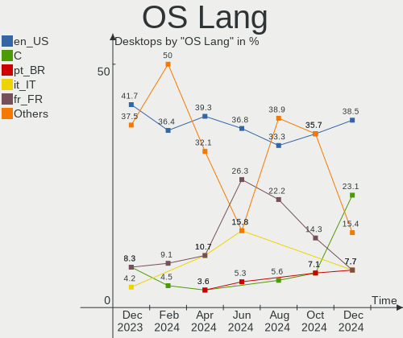
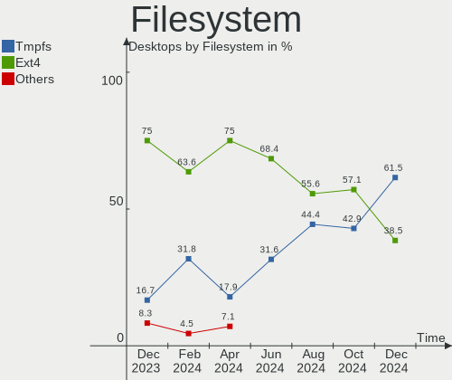
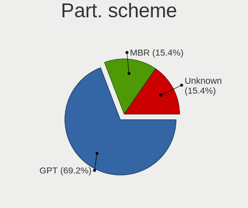
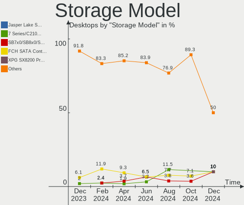
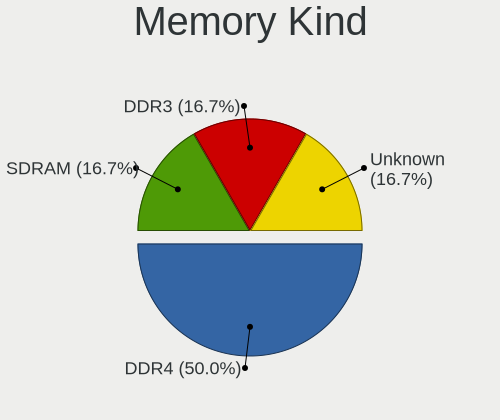

Xubuntu - Hardware Trends (Desktops)
------------------------------------

A project to identify most popular hardware characteristics and track their change
over time based on data collected by Linux users at https://Linux-Hardware.org.

Anyone can contribute to this report by the [hw-probe](https://github.com/linuxhw/hw-probe) tool:

    sudo -E hw-probe -all -upload

This report is for one last month. Overall report since the beginning of time: [TestDays](https://github.com/linuxhw/TestDays)

Period: May, 2023.

Contents
--------

* [ System ](#system)
  - [ OS                       ](#os)
  - [ OS Family                ](#os-family)
  - [ Kernel                   ](#kernel)
  - [ Kernel Family            ](#kernel-family)
  - [ Kernel Major Ver.        ](#kernel-major-ver)
  - [ Arch                     ](#arch)
  - [ DE                       ](#de)
  - [ Display Server           ](#display-server)
  - [ Display Manager          ](#display-manager)
  - [ OS Lang                  ](#os-lang)
  - [ Boot Mode                ](#boot-mode)
  - [ Filesystem               ](#filesystem)
  - [ Part. scheme             ](#part-scheme)
  - [ Dual Boot with Linux/BSD ](#dual-boot-with-linuxbsd)
  - [ Dual Boot (Win)          ](#dual-boot-win)

* [ Board ](#board)
  - [ Vendor                   ](#vendor)
  - [ Model                    ](#model)
  - [ Model Family             ](#model-family)
  - [ MFG Year                 ](#mfg-year)
  - [ Form Factor              ](#form-factor)
  - [ Secure Boot              ](#secure-boot)
  - [ Coreboot                 ](#coreboot)
  - [ RAM Size                 ](#ram-size)
  - [ RAM Used                 ](#ram-used)
  - [ Total Drives             ](#total-drives)
  - [ Has CD-ROM               ](#has-cd-rom)
  - [ Has Ethernet             ](#has-ethernet)
  - [ Has WiFi                 ](#has-wifi)
  - [ Has Bluetooth            ](#has-bluetooth)

* [ Location ](#location)
  - [ Country                  ](#country)
  - [ City                     ](#city)

* [ Drives ](#drives)
  - [ Drive Vendor             ](#drive-vendor)
  - [ Drive Model              ](#drive-model)
  - [ HDD Vendor               ](#hdd-vendor)
  - [ SSD Vendor               ](#ssd-vendor)
  - [ Drive Kind               ](#drive-kind)
  - [ Drive Connector          ](#drive-connector)
  - [ Drive Size               ](#drive-size)
  - [ Space Total              ](#space-total)
  - [ Space Used               ](#space-used)
  - [ Malfunc. Drives          ](#malfunc-drives)
  - [ Malfunc. Drive Vendor    ](#malfunc-drive-vendor)
  - [ Malfunc. HDD Vendor      ](#malfunc-hdd-vendor)
  - [ Malfunc. Drive Kind      ](#malfunc-drive-kind)
  - [ Failed Drives            ](#failed-drives)
  - [ Failed Drive Vendor      ](#failed-drive-vendor)
  - [ Drive Status             ](#drive-status)

* [ Storage controller ](#storage-controller)
  - [ Storage Vendor           ](#storage-vendor)
  - [ Storage Model            ](#storage-model)
  - [ Storage Kind             ](#storage-kind)

* [ Processor ](#processor)
  - [ CPU Vendor               ](#cpu-vendor)
  - [ CPU Model                ](#cpu-model)
  - [ CPU Model Family         ](#cpu-model-family)
  - [ CPU Cores                ](#cpu-cores)
  - [ CPU Sockets              ](#cpu-sockets)
  - [ CPU Threads              ](#cpu-threads)
  - [ CPU Op-Modes             ](#cpu-op-modes)
  - [ CPU Microcode            ](#cpu-microcode)
  - [ CPU Microarch            ](#cpu-microarch)

* [ Graphics ](#graphics)
  - [ GPU Vendor               ](#gpu-vendor)
  - [ GPU Model                ](#gpu-model)
  - [ GPU Combo                ](#gpu-combo)
  - [ GPU Driver               ](#gpu-driver)
  - [ GPU Memory               ](#gpu-memory)

* [ Monitor ](#monitor)
  - [ Monitor Vendor           ](#monitor-vendor)
  - [ Monitor Model            ](#monitor-model)
  - [ Monitor Resolution       ](#monitor-resolution)
  - [ Monitor Diagonal         ](#monitor-diagonal)
  - [ Monitor Width            ](#monitor-width)
  - [ Aspect Ratio             ](#aspect-ratio)
  - [ Monitor Area             ](#monitor-area)
  - [ Pixel Density            ](#pixel-density)
  - [ Multiple Monitors        ](#multiple-monitors)

* [ Network ](#network)
  - [ Net Controller Vendor    ](#net-controller-vendor)
  - [ Net Controller Model     ](#net-controller-model)
  - [ Wireless Vendor          ](#wireless-vendor)
  - [ Wireless Model           ](#wireless-model)
  - [ Ethernet Vendor          ](#ethernet-vendor)
  - [ Ethernet Model           ](#ethernet-model)
  - [ Net Controller Kind      ](#net-controller-kind)
  - [ Used Controller          ](#used-controller)
  - [ NICs                     ](#nics)
  - [ IPv6                     ](#ipv6)

* [ Bluetooth ](#bluetooth)
  - [ Bluetooth Vendor         ](#bluetooth-vendor)
  - [ Bluetooth Model          ](#bluetooth-model)

* [ Sound ](#sound)
  - [ Sound Vendor             ](#sound-vendor)
  - [ Sound Model              ](#sound-model)

* [ Memory ](#memory)
  - [ Memory Vendor            ](#memory-vendor)
  - [ Memory Model             ](#memory-model)
  - [ Memory Kind              ](#memory-kind)
  - [ Memory Form Factor       ](#memory-form-factor)
  - [ Memory Size              ](#memory-size)
  - [ Memory Speed             ](#memory-speed)

* [ Printers & scanners ](#printers--scanners)
  - [ Printer Vendor           ](#printer-vendor)
  - [ Printer Model            ](#printer-model)
  - [ Scanner Vendor           ](#scanner-vendor)
  - [ Scanner Model            ](#scanner-model)

* [ Camera ](#camera)
  - [ Camera Vendor            ](#camera-vendor)
  - [ Camera Model             ](#camera-model)

* [ Security ](#security)
  - [ Fingerprint Vendor       ](#fingerprint-vendor)
  - [ Fingerprint Model        ](#fingerprint-model)
  - [ Chipcard Vendor          ](#chipcard-vendor)
  - [ Chipcard Model           ](#chipcard-model)

* [ Unsupported ](#unsupported)
  - [ Unsupported Devices      ](#unsupported-devices)
  - [ Unsupported Device Types ](#unsupported-device-types)

System
------

OS
--

Installed operating systems

| Name          | Desktops | Percent |
|---------------|----------|---------|
| Xubuntu 22.04 | 16       | 57.14%  |
| Xubuntu 23.04 | 5        | 17.86%  |
| Xubuntu 20.04 | 5        | 17.86%  |
| Xubuntu 22.10 | 2        | 7.14%   |

OS Family
---------

OS without a version

| Name    | Desktops | Percent |
|---------|----------|---------|
| Xubuntu | 28       | 100%    |

Kernel
------

Version of the Linux kernel

| Version                | Desktops | Percent |
|------------------------|----------|---------|
| 6.2.0-20-generic       | 4        | 14.29%  |
| 5.19.0-41-generic      | 4        | 14.29%  |
| 5.15.0-71-lowlatency   | 3        | 10.71%  |
| 5.15.0-71-generic      | 2        | 7.14%   |
| 6.3.3-060303-generic   | 1        | 3.57%   |
| 6.3.1-x64v2-xanmod1    | 1        | 3.57%   |
| 6.2.10-060210-generic  | 1        | 3.57%   |
| 6.2.0-10005-tuxedo     | 1        | 3.57%   |
| 5.4.0-149-generic      | 1        | 3.57%   |
| 5.4.0-148-generic      | 1        | 3.57%   |
| 5.19.0-42-generic      | 1        | 3.57%   |
| 5.19.0-1024-lowlatency | 1        | 3.57%   |
| 5.15.0-72-generic      | 1        | 3.57%   |
| 5.15.0-69-generic      | 1        | 3.57%   |
| 5.15.0-60-generic      | 1        | 3.57%   |
| 5.15.0-57-generic      | 1        | 3.57%   |
| 5.15.0-56-generic      | 1        | 3.57%   |
| 5.15.0-46-generic      | 1        | 3.57%   |
| 5.13.0-40-generic      | 1        | 3.57%   |

Kernel Family
-------------

Linux kernel without a distro release

| Version | Desktops | Percent |
|---------|----------|---------|
| 5.15.0  | 11       | 39.29%  |
| 5.19.0  | 6        | 21.43%  |
| 6.2.0   | 5        | 17.86%  |
| 5.4.0   | 2        | 7.14%   |
| 6.3.3   | 1        | 3.57%   |
| 6.3.1   | 1        | 3.57%   |
| 6.2.10  | 1        | 3.57%   |
| 5.13.0  | 1        | 3.57%   |

Kernel Major Ver.
-----------------

Linux kernel major version

| Version | Desktops | Percent |
|---------|----------|---------|
| 5.15    | 11       | 39.29%  |
| 6.2     | 6        | 21.43%  |
| 5.19    | 6        | 21.43%  |
| 6.3     | 2        | 7.14%   |
| 5.4     | 2        | 7.14%   |
| 5.13    | 1        | 3.57%   |

Arch
----

OS architecture (x86_64, i586, etc.)

| Name   | Desktops | Percent |
|--------|----------|---------|
| x86_64 | 28       | 100%    |

DE
--

Desktop Environment

| Name | Desktops | Percent |
|------|----------|---------|
| XFCE | 28       | 100%    |

Display Server
--------------

X11 or Wayland

| Name | Desktops | Percent |
|------|----------|---------|
| X11  | 27       | 96.43%  |
| Tty  | 1        | 3.57%   |

Display Manager
---------------

SDDM, LightDM, etc.

| Name    | Desktops | Percent |
|---------|----------|---------|
| LightDM | 24       | 85.71%  |
| Unknown | 4        | 14.29%  |

OS Lang
-------

Language

| Lang  | Desktops | Percent |
|-------|----------|---------|
| en_US | 12       | 42.86%  |
| fr_FR | 5        | 17.86%  |
| de_DE | 3        | 10.71%  |
| en_GB | 2        | 7.14%   |
| en_AU | 2        | 7.14%   |
| pt_BR | 1        | 3.57%   |
| it_IT | 1        | 3.57%   |
| en_CA | 1        | 3.57%   |
| C     | 1        | 3.57%   |

Boot Mode
---------

EFI or BIOS

| Mode | Desktops | Percent |
|------|----------|---------|
| BIOS | 21       | 75%     |
| EFI  | 7        | 25%     |

Filesystem
----------

Type of filesystem

| Type    | Desktops | Percent |
|---------|----------|---------|
| Ext4    | 18       | 64.29%  |
| Tmpfs   | 9        | 32.14%  |
| Overlay | 1        | 3.57%   |

Part. scheme
------------

Scheme of partitioning

| Type    | Desktops | Percent |
|---------|----------|---------|
| GPT     | 14       | 50%     |
| MBR     | 10       | 35.71%  |
| Unknown | 4        | 14.29%  |

Dual Boot with Linux/BSD
------------------------

Hosting more than one Linux/BSD

| Dual boot | Desktops | Percent |
|-----------|----------|---------|
| No        | 20       | 71.43%  |
| Yes       | 8        | 28.57%  |

Dual Boot (Win)
---------------

Hosting Linux and Windows

| Dual boot | Desktops | Percent |
|-----------|----------|---------|
| No        | 18       | 64.29%  |
| Yes       | 10       | 35.71%  |

Board
-----

Vendor
------

Motherboard manufacturer

| Name                | Desktops | Percent |
|---------------------|----------|---------|
| MSI                 | 6        | 21.43%  |
| Gigabyte Technology | 5        | 17.86%  |
| ASUSTek Computer    | 4        | 14.29%  |
| Lenovo              | 3        | 10.71%  |
| Hewlett-Packard     | 2        | 7.14%   |
| Dell                | 2        | 7.14%   |
| ASRock              | 2        | 7.14%   |
| Pegatron            | 1        | 3.57%   |
| Intel               | 1        | 3.57%   |
| Acer                | 1        | 3.57%   |
| Unknown             | 1        | 3.57%   |

Model
-----

Motherboard model

| Name                               | Desktops | Percent |
|------------------------------------|----------|---------|
| Pegatron FZ132AA-ABF m9456fr       | 1        | 3.57%   |
| MSI MS-7D40                        | 1        | 3.57%   |
| MSI MS-7D04                        | 1        | 3.57%   |
| MSI MS-7C51                        | 1        | 3.57%   |
| MSI MS-7C08                        | 1        | 3.57%   |
| MSI MS-7C02                        | 1        | 3.57%   |
| MSI MS-7721                        | 1        | 3.57%   |
| Lenovo ThinkCentre M92P 3227BD2    | 1        | 3.57%   |
| Lenovo ThinkCentre M83 10AGS17E00  | 1        | 3.57%   |
| Lenovo ThinkCentre M82 2756AT9     | 1        | 3.57%   |
| Intel DP55WB AAE64798-205          | 1        | 3.57%   |
| HP xw8400 Workstation              | 1        | 3.57%   |
| HP Compaq dc7600 Small Form Factor | 1        | 3.57%   |
| Gigabyte X58A-UD3R                 | 1        | 3.57%   |
| Gigabyte M68MT-S2                  | 1        | 3.57%   |
| Gigabyte H510M S2H V2              | 1        | 3.57%   |
| Gigabyte H270-HD3                  | 1        | 3.57%   |
| Gigabyte B550 AORUS ELITE          | 1        | 3.57%   |
| Dell OptiPlex 7010                 | 1        | 3.57%   |
| Dell OptiPlex 3020                 | 1        | 3.57%   |
| ASUS TUF Gaming X570-PLUS          | 1        | 3.57%   |
| ASUS P5Q SE2                       | 1        | 3.57%   |
| ASUS P5B-Deluxe                    | 1        | 3.57%   |
| ASUS M5A78L-M LX PLUS              | 1        | 3.57%   |
| ASRock Z590M-ITX/ax                | 1        | 3.57%   |
| ASRock A520M Phantom Gaming 4      | 1        | 3.57%   |
| Acer Veriton N4620G                | 1        | 3.57%   |
| Unknown                            | 1        | 3.57%   |

Model Family
------------

Motherboard model prefix

| Name                 | Desktops | Percent |
|----------------------|----------|---------|
| Lenovo ThinkCentre   | 3        | 10.71%  |
| Dell OptiPlex        | 2        | 7.14%   |
| Pegatron FZ132AA-ABF | 1        | 3.57%   |
| MSI MS-7D40          | 1        | 3.57%   |
| MSI MS-7D04          | 1        | 3.57%   |
| MSI MS-7C51          | 1        | 3.57%   |
| MSI MS-7C08          | 1        | 3.57%   |
| MSI MS-7C02          | 1        | 3.57%   |
| MSI MS-7721          | 1        | 3.57%   |
| Intel DP55WB         | 1        | 3.57%   |
| HP xw8400            | 1        | 3.57%   |
| HP Compaq            | 1        | 3.57%   |
| Gigabyte X58A-UD3R   | 1        | 3.57%   |
| Gigabyte M68MT-S2    | 1        | 3.57%   |
| Gigabyte H510M       | 1        | 3.57%   |
| Gigabyte H270-HD3    | 1        | 3.57%   |
| Gigabyte B550        | 1        | 3.57%   |
| ASUS TUF             | 1        | 3.57%   |
| ASUS P5Q             | 1        | 3.57%   |
| ASUS P5B-Deluxe      | 1        | 3.57%   |
| ASUS M5A78L-M        | 1        | 3.57%   |
| ASRock Z590M-ITX     | 1        | 3.57%   |
| ASRock A520M         | 1        | 3.57%   |
| Acer Veriton         | 1        | 3.57%   |
| Unknown              | 1        | 3.57%   |

MFG Year
--------

Motherboard manufacture year

| Year | Desktops | Percent |
|------|----------|---------|
| 2013 | 4        | 14.29%  |
| 2021 | 3        | 10.71%  |
| 2019 | 3        | 10.71%  |
| 2022 | 2        | 7.14%   |
| 2018 | 2        | 7.14%   |
| 2009 | 2        | 7.14%   |
| 2008 | 2        | 7.14%   |
| 2023 | 1        | 3.57%   |
| 2020 | 1        | 3.57%   |
| 2016 | 1        | 3.57%   |
| 2015 | 1        | 3.57%   |
| 2014 | 1        | 3.57%   |
| 2011 | 1        | 3.57%   |
| 2010 | 1        | 3.57%   |
| 2007 | 1        | 3.57%   |
| 2006 | 1        | 3.57%   |
| 2005 | 1        | 3.57%   |

Form Factor
-----------

Physical design of the computer

| Name    | Desktops | Percent |
|---------|----------|---------|
| Desktop | 28       | 100%    |

Secure Boot
-----------

Enabled or disabled

| State    | Desktops | Percent |
|----------|----------|---------|
| Disabled | 27       | 96.43%  |
| Enabled  | 1        | 3.57%   |

Coreboot
--------

Have coreboot on board

| Used | Desktops | Percent |
|------|----------|---------|
| No   | 28       | 100%    |

RAM Size
--------

Total RAM memory

| Size in GB  | Desktops | Percent |
|-------------|----------|---------|
| 16.01-24.0  | 6        | 21.43%  |
| 8.01-16.0   | 6        | 21.43%  |
| 32.01-64.0  | 5        | 17.86%  |
| 3.01-4.0    | 4        | 14.29%  |
| 64.01-256.0 | 3        | 10.71%  |
| 4.01-8.0    | 2        | 7.14%   |
| 24.01-32.0  | 1        | 3.57%   |
| 1.01-2.0    | 1        | 3.57%   |

RAM Used
--------

Used RAM memory

| Used GB    | Desktops | Percent |
|------------|----------|---------|
| 1.01-2.0   | 8        | 28.57%  |
| 4.01-8.0   | 6        | 21.43%  |
| 2.01-3.0   | 5        | 17.86%  |
| 3.01-4.0   | 3        | 10.71%  |
| 0.51-1.0   | 3        | 10.71%  |
| 16.01-24.0 | 2        | 7.14%   |
| 8.01-16.0  | 1        | 3.57%   |

Total Drives
------------

Number of drives on board

| Drives | Desktops | Percent |
|--------|----------|---------|
| 1      | 12       | 42.86%  |
| 2      | 7        | 25%     |
| 5      | 4        | 14.29%  |
| 6      | 2        | 7.14%   |
| 3      | 2        | 7.14%   |
| 7      | 1        | 3.57%   |

Has CD-ROM
----------

Has CD-ROM on board

| Presented | Desktops | Percent |
|-----------|----------|---------|
| Yes       | 15       | 53.57%  |
| No        | 13       | 46.43%  |

Has Ethernet
------------

Has Ethernet on board

| Presented | Desktops | Percent |
|-----------|----------|---------|
| Yes       | 28       | 100%    |

Has WiFi
--------

Has WiFi module

| Presented | Desktops | Percent |
|-----------|----------|---------|
| No        | 17       | 60.71%  |
| Yes       | 11       | 39.29%  |

Has Bluetooth
-------------

Has Bluetooth module

| Presented | Desktops | Percent |
|-----------|----------|---------|
| No        | 18       | 64.29%  |
| Yes       | 10       | 35.71%  |

Location
--------

Country
-------

Geographic location (country)

| Country     | Desktops | Percent |
|-------------|----------|---------|
| USA         | 5        | 17.86%  |
| France      | 4        | 14.29%  |
| Germany     | 3        | 10.71%  |
| Sweden      | 2        | 7.14%   |
| Netherlands | 2        | 7.14%   |
| Australia   | 2        | 7.14%   |
| Argentina   | 2        | 7.14%   |
| UK          | 1        | 3.57%   |
| Spain       | 1        | 3.57%   |
| Pakistan    | 1        | 3.57%   |
| Italy       | 1        | 3.57%   |
| Guadeloupe  | 1        | 3.57%   |
| Denmark     | 1        | 3.57%   |
| Canada      | 1        | 3.57%   |
| Brazil      | 1        | 3.57%   |

City
----

Geographic location (city)

| City                    | Desktops | Percent |
|-------------------------|----------|---------|
| Sydney                  | 2        | 7.14%   |
| Sannazzaro de' Burgondi | 1        | 3.57%   |
| San Antonio de Areco    | 1        | 3.57%   |
| Saint-Nazaire           | 1        | 3.57%   |
| Rotterdam               | 1        | 3.57%   |
| Realmont                | 1        | 3.57%   |
| Pointe-à-Pitre         | 1        | 3.57%   |
| Oelsnitz                | 1        | 3.57%   |
| Nykvarn                 | 1        | 3.57%   |
| Nyköping               | 1        | 3.57%   |
| Muncie                  | 1        | 3.57%   |
| Melvindale              | 1        | 3.57%   |
| Manises                 | 1        | 3.57%   |
| Longueuil               | 1        | 3.57%   |
| London                  | 1        | 3.57%   |
| Les Andelys             | 1        | 3.57%   |
| Lahore                  | 1        | 3.57%   |
| Inzinzac-Lochrist       | 1        | 3.57%   |
| Hengelo                 | 1        | 3.57%   |
| Hanover                 | 1        | 3.57%   |
| DeLand                  | 1        | 3.57%   |
| Darby                   | 1        | 3.57%   |
| Copenhagen              | 1        | 3.57%   |
| Campinas                | 1        | 3.57%   |
| Buenos Aires            | 1        | 3.57%   |
| Brockton                | 1        | 3.57%   |
| Berlin                  | 1        | 3.57%   |

Drives
------

Drive Vendor
------------

Hard drive vendors

| Vendor                      | Desktops | Drives | Percent |
|-----------------------------|----------|--------|---------|
| WDC                         | 16       | 21     | 29.63%  |
| Samsung Electronics         | 8        | 15     | 14.81%  |
| Seagate                     | 6        | 9      | 11.11%  |
| Kingston                    | 5        | 5      | 9.26%   |
| SanDisk                     | 3        | 3      | 5.56%   |
| PNY                         | 3        | 3      | 5.56%   |
| Unknown                     | 2        | 2      | 3.7%    |
| Toshiba                     | 2        | 3      | 3.7%    |
| Hitachi                     | 2        | 3      | 3.7%    |
| WDC WDS1                    | 1        | 1      | 1.85%   |
| Kingston Technology Company | 1        | 1      | 1.85%   |
| JMicron Technology          | 1        | 1      | 1.85%   |
| Crucial                     | 1        | 1      | 1.85%   |
| China                       | 1        | 1      | 1.85%   |
| ASMT                        | 1        | 1      | 1.85%   |
| A-DATA Technology           | 1        | 1      | 1.85%   |

Drive Model
-----------

Hard drive models

| Model                                   | Desktops | Percent |
|-----------------------------------------|----------|---------|
| Samsung SSD 860 EVO 500GB               | 3        | 4.62%   |
| Seagate ST4000DM004-2CV104 4TB          | 2        | 3.08%   |
| Kingston SNVS1000G 1TB                  | 2        | 3.08%   |
| WDC WDS500G2B0A-00SM50 500GB SSD        | 1        | 1.54%   |
| WDC WDS1 20G1G0A-00SS50 120GB SSD       | 1        | 1.54%   |
| WDC WDBNCE0010PNC 1TB SSD               | 1        | 1.54%   |
| WDC WD80EFBX-68AZZN0 8TB                | 1        | 1.54%   |
| WDC WD80EFAX-68KNBN0 8TB                | 1        | 1.54%   |
| WDC WD800JB-00FMA0 80GB                 | 1        | 1.54%   |
| WDC WD7500BPVX-22JC3T0 752GB            | 1        | 1.54%   |
| WDC WD5000LPLX-22ZNTT0 500GB            | 1        | 1.54%   |
| WDC WD5000BPVX-00JC3T0 500GB            | 1        | 1.54%   |
| WDC WD5000AZLX-00K2TA0 500GB            | 1        | 1.54%   |
| WDC WD5000AAKX-22ERMA0 500GB            | 1        | 1.54%   |
| WDC WD5000AAKS-00V1A0 500GB             | 1        | 1.54%   |
| WDC WD5000AADS-00L4B1 500GB             | 1        | 1.54%   |
| WDC WD40EFRX-68WT0N0 4TB                | 1        | 1.54%   |
| WDC WD40EFAX-68JH4N0 4TB                | 1        | 1.54%   |
| WDC WD4005FZBX-00K5WB0 4TB              | 1        | 1.54%   |
| WDC WD3200AAKS-00B3A0 320GB             | 1        | 1.54%   |
| WDC WD3200AAJS-56M0A0 320GB             | 1        | 1.54%   |
| WDC WD2500AAJS-75M0A0 250GB             | 1        | 1.54%   |
| WDC WD10JPVT-00A1YT0 1TB                | 1        | 1.54%   |
| WDC WD10EZEX-08M2NA0 1TB                | 1        | 1.54%   |
| Unknown MMC Card  64GB                  | 1        | 1.54%   |
| Unknown CKTM4R  64GB                    | 1        | 1.54%   |
| Toshiba MK7559GSXF 752GB                | 1        | 1.54%   |
| Toshiba KSG60ZMV256G M.2 2280 256GB SSD | 1        | 1.54%   |
| Seagate ST9500420AS 500GB               | 1        | 1.54%   |
| Seagate ST4000DM005-2DP166 4TB          | 1        | 1.54%   |
| Seagate ST3250310NS 250GB               | 1        | 1.54%   |
| Seagate ST31000528AS 1TB                | 1        | 1.54%   |
| Seagate ST1500LM006 HN-M151RAD 1TB      | 1        | 1.54%   |
| Seagate ST1000DM003-1ER162 1TB          | 1        | 1.54%   |
| SanDisk SDSSDH3512G 512GB               | 1        | 1.54%   |
| SanDisk SDSSDH31000G 1TB                | 1        | 1.54%   |
| SanDisk SD7TB3Q-256G-1006 256GB SSD     | 1        | 1.54%   |
| Samsung SSD 980 PRO 1TB                 | 1        | 1.54%   |
| Samsung SSD 980 1TB                     | 1        | 1.54%   |
| Samsung SSD 870 QVO 1TB                 | 1        | 1.54%   |

HDD Vendor
----------

Hard disk drive vendors

| Vendor  | Desktops | Drives | Percent |
|---------|----------|--------|---------|
| WDC     | 14       | 19     | 58.33%  |
| Seagate | 6        | 9      | 25%     |
| Hitachi | 2        | 3      | 8.33%   |
| Toshiba | 1        | 2      | 4.17%   |
| ASMT    | 1        | 1      | 4.17%   |

SSD Vendor
----------

Solid state drive vendors

| Vendor              | Desktops | Drives | Percent |
|---------------------|----------|--------|---------|
| Samsung Electronics | 7        | 11     | 30.43%  |
| SanDisk             | 3        | 3      | 13.04%  |
| PNY                 | 3        | 3      | 13.04%  |
| Kingston            | 3        | 3      | 13.04%  |
| WDC                 | 2        | 2      | 8.7%    |
| WDC WDS1            | 1        | 1      | 4.35%   |
| Toshiba             | 1        | 1      | 4.35%   |
| Crucial             | 1        | 1      | 4.35%   |
| China               | 1        | 1      | 4.35%   |
| A-DATA Technology   | 1        | 1      | 4.35%   |

Drive Kind
----------

HDD or SSD

| Kind    | Desktops | Drives | Percent |
|---------|----------|--------|---------|
| SSD     | 20       | 27     | 43.48%  |
| HDD     | 17       | 34     | 36.96%  |
| NVMe    | 6        | 7      | 13.04%  |
| MMC     | 2        | 2      | 4.35%   |
| Unknown | 1        | 1      | 2.17%   |

Drive Connector
---------------

SATA, SAS, NVMe, etc.

| Type | Desktops | Drives | Percent |
|------|----------|--------|---------|
| SATA | 26       | 59     | 70.27%  |
| NVMe | 6        | 7      | 16.22%  |
| SAS  | 3        | 3      | 8.11%   |
| MMC  | 2        | 2      | 5.41%   |

Drive Size
----------

Size of hard drive

| Size in TB | Desktops | Drives | Percent |
|------------|----------|--------|---------|
| 0.01-0.5   | 21       | 33     | 53.85%  |
| 0.51-1.0   | 12       | 15     | 30.77%  |
| 3.01-4.0   | 3        | 8      | 7.69%   |
| 4.01-10.0  | 2        | 2      | 5.13%   |
| 1.01-2.0   | 1        | 3      | 2.56%   |

Space Total
-----------

Amount of disk space available on the file system

| Size in GB     | Desktops | Percent |
|----------------|----------|---------|
| 251-500        | 8        | 28.57%  |
| 101-250        | 7        | 25%     |
| More than 3000 | 4        | 14.29%  |
| 501-1000       | 4        | 14.29%  |
| 1001-2000      | 2        | 7.14%   |
| 21-50          | 1        | 3.57%   |
| 1-20           | 1        | 3.57%   |
| 51-100         | 1        | 3.57%   |

Space Used
----------

Amount of used disk space

| Used GB        | Desktops | Percent |
|----------------|----------|---------|
| 1-20           | 9        | 32.14%  |
| 501-1000       | 4        | 14.29%  |
| More than 3000 | 3        | 10.71%  |
| 21-50          | 3        | 10.71%  |
| 101-250        | 3        | 10.71%  |
| 51-100         | 3        | 10.71%  |
| 251-500        | 2        | 7.14%   |
| 2001-3000      | 1        | 3.57%   |

Malfunc. Drives
---------------

Drive models with a malfunction

| Model                          | Desktops | Drives | Percent |
|--------------------------------|----------|--------|---------|
| Seagate ST1000DM003-1ER162 1TB | 1        | 1      | 100%    |

Malfunc. Drive Vendor
---------------------

Vendors of faulty drives

| Vendor  | Desktops | Drives | Percent |
|---------|----------|--------|---------|
| Seagate | 1        | 1      | 100%    |

Malfunc. HDD Vendor
-------------------

Vendors of faulty HDD drives

| Vendor  | Desktops | Drives | Percent |
|---------|----------|--------|---------|
| Seagate | 1        | 1      | 100%    |

Malfunc. Drive Kind
-------------------

Kinds of faulty drives

| Kind | Desktops | Drives | Percent |
|------|----------|--------|---------|
| HDD  | 1        | 1      | 100%    |

Failed Drives
-------------

Failed drive models

Zero info for selected period =(

Failed Drive Vendor
-------------------

Failed drive vendors

Zero info for selected period =(

Drive Status
------------

Number of failed and malfunc. drives

| Status   | Desktops | Drives | Percent |
|----------|----------|--------|---------|
| Detected | 16       | 42     | 55.17%  |
| Works    | 12       | 28     | 41.38%  |
| Malfunc  | 1        | 1      | 3.45%   |

Storage controller
------------------

Storage Vendor
--------------

Storage controller vendors

| Vendor                      | Desktops | Percent |
|-----------------------------|----------|---------|
| Intel                       | 20       | 48.78%  |
| AMD                         | 7        | 17.07%  |
| Samsung Electronics         | 3        | 7.32%   |
| Kingston Technology Company | 3        | 7.32%   |
| Marvell Technology Group    | 2        | 4.88%   |
| JMicron Technology          | 2        | 4.88%   |
| Silicon Image               | 1        | 2.44%   |
| Nvidia                      | 1        | 2.44%   |
| Broadcom / LSI              | 1        | 2.44%   |
| ASMedia Technology          | 1        | 2.44%   |

Storage Model
-------------

Storage controller models

| Model                                                                          | Desktops | Percent |
|--------------------------------------------------------------------------------|----------|---------|
| Intel 7 Series/C210 Series Chipset Family 6-port SATA Controller [AHCI mode]   | 3        | 6%      |
| Intel 500 Series Chipset Family SATA AHCI Controller                           | 3        | 6%      |
| AMD FCH SATA Controller [AHCI mode]                                            | 3        | 6%      |
| Samsung NVMe SSD Controller PM9A1/PM9A3/980PRO                                 | 2        | 4%      |
| Kingston Company SNVS2000G [NV1 NVMe PCIe SSD 2TB]                             | 2        | 4%      |
| JMicron JMB363 SATA/IDE Controller                                             | 2        | 4%      |
| Intel 82801JI (ICH10 Family) 4 port SATA IDE Controller #1                     | 2        | 4%      |
| Intel 82801JI (ICH10 Family) 2 port SATA IDE Controller #2                     | 2        | 4%      |
| Intel 8 Series/C220 Series Chipset Family 6-port SATA Controller 1 [AHCI mode] | 2        | 4%      |
| Intel 200 Series PCH SATA controller [AHCI mode]                               | 2        | 4%      |
| AMD 500 Series Chipset SATA Controller                                         | 2        | 4%      |
| Silicon Image SiI 3114 [SATALink/SATARaid] Serial ATA Controller               | 1        | 2%      |
| Samsung NVMe SSD Controller SM981/PM981/PM983                                  | 1        | 2%      |
| Samsung NVMe SSD Controller 980                                                | 1        | 2%      |
| Nvidia MCP61 SATA Controller                                                   | 1        | 2%      |
| Marvell Group 88SE91A3 SATA-600 Controller                                     | 1        | 2%      |
| Marvell Group 88SE6101/6102 single-port PATA133 interface                      | 1        | 2%      |
| Kingston Company Company Non-Volatile memory controller                        | 1        | 2%      |
| Intel SATA Controller [RAID mode]                                              | 1        | 2%      |
| Intel NM10/ICH7 Family SATA Controller [IDE mode]                              | 1        | 2%      |
| Intel Celeron N3350/Pentium N4200/Atom E3900 Series SATA AHCI Controller       | 1        | 2%      |
| Intel 82801HR/HO/HH (ICH8R/DO/DH) 2 port SATA Controller [IDE mode]            | 1        | 2%      |
| Intel 82801H (ICH8 Family) 4 port SATA Controller [IDE mode]                   | 1        | 2%      |
| Intel 82801G (ICH7 Family) IDE Controller                                      | 1        | 2%      |
| Intel 700 Series Chipset Family SATA AHCI Controller                           | 1        | 2%      |
| Intel 7 Series Chipset Family 6-port SATA Controller [AHCI mode]               | 1        | 2%      |
| Intel 631xESB/632xESB SATA RAID Controller                                     | 1        | 2%      |
| Intel 631xESB/632xESB IDE Controller                                           | 1        | 2%      |
| Intel 5 Series/3400 Series Chipset 4 port SATA IDE Controller                  | 1        | 2%      |
| Intel 5 Series/3400 Series Chipset 2 port SATA IDE Controller                  | 1        | 2%      |
| Broadcom / LSI SAS1064 PCI-X Fusion-MPT SAS                                    | 1        | 2%      |
| ASMedia 1064 SATA Controller                                                   | 1        | 2%      |
| AMD SB7x0/SB8x0/SB9x0 SATA Controller [AHCI mode]                              | 1        | 2%      |
| AMD SB7x0/SB8x0/SB9x0 IDE Controller                                           | 1        | 2%      |
| AMD FCH SATA Controller D                                                      | 1        | 2%      |
| AMD 400 Series Chipset SATA Controller                                         | 1        | 2%      |

Storage Kind
------------

Kind of storage controller (IDE, SATA, NVMe, SAS, ...)

| Kind | Desktops | Percent |
|------|----------|---------|
| SATA | 20       | 52.63%  |
| IDE  | 8        | 21.05%  |
| NVMe | 6        | 15.79%  |
| RAID | 3        | 7.89%   |
| SCSI | 1        | 2.63%   |

Processor
---------

CPU Vendor
----------

Processor vendors

| Vendor | Desktops | Percent |
|--------|----------|---------|
| Intel  | 20       | 71.43%  |
| AMD    | 8        | 28.57%  |

CPU Model
---------

Processor models

| Model                                       | Desktops | Percent |
|---------------------------------------------|----------|---------|
| Intel Xeon CPU 5150 @ 2.66GHz               | 1        | 3.57%   |
| Intel Pentium 4 CPU 3.00GHz                 | 1        | 3.57%   |
| Intel Core i7-7700K CPU @ 4.20GHz           | 1        | 3.57%   |
| Intel Core i7-3770 CPU @ 3.40GHz            | 1        | 3.57%   |
| Intel Core i7 CPU 930 @ 2.80GHz             | 1        | 3.57%   |
| Intel Core i5-4590 CPU @ 3.30GHz            | 1        | 3.57%   |
| Intel Core i5-4570 CPU @ 3.20GHz            | 1        | 3.57%   |
| Intel Core i5-3470 CPU @ 3.20GHz            | 1        | 3.57%   |
| Intel Core i3-9100 CPU @ 3.60GHz            | 1        | 3.57%   |
| Intel Core i3-2377M CPU @ 1.50GHz           | 1        | 3.57%   |
| Intel Core i3-2100 CPU @ 3.10GHz            | 1        | 3.57%   |
| Intel Core i3-10105 CPU @ 3.70GHz           | 1        | 3.57%   |
| Intel Core i3-10100T CPU @ 3.00GHz          | 1        | 3.57%   |
| Intel Core i3 CPU 530 @ 2.93GHz             | 1        | 3.57%   |
| Intel Core 2 Quad CPU Q9400 @ 2.66GHz       | 1        | 3.57%   |
| Intel Core 2 Quad CPU Q8200 @ 2.33GHz       | 1        | 3.57%   |
| Intel Core 2 Duo CPU E8400 @ 3.00GHz        | 1        | 3.57%   |
| Intel Celeron CPU N3350 @ 1.10GHz           | 1        | 3.57%   |
| Intel 13th Gen Core i9-13900K               | 1        | 3.57%   |
| Intel 11th Gen Core i9-11900K @ 3.50GHz     | 1        | 3.57%   |
| AMD Ryzen 9 3900XT 12-Core Processor        | 1        | 3.57%   |
| AMD Ryzen 5 5600G with Radeon Graphics      | 1        | 3.57%   |
| AMD Ryzen 5 3600XT 6-Core Processor         | 1        | 3.57%   |
| AMD Ryzen 5 3600 6-Core Processor           | 1        | 3.57%   |
| AMD Ryzen 5 3400G with Radeon Vega Graphics | 1        | 3.57%   |
| AMD FX-8300 Eight-Core Processor            | 1        | 3.57%   |
| AMD Athlon II X2 240 Processor              | 1        | 3.57%   |
| AMD A8-5500 APU with Radeon HD Graphics     | 1        | 3.57%   |

CPU Model Family
----------------

Processor model prefix

| Model             | Desktops | Percent |
|-------------------|----------|---------|
| Intel Core i3     | 6        | 21.43%  |
| AMD Ryzen 5       | 4        | 14.29%  |
| Intel Core i7     | 3        | 10.71%  |
| Intel Core i5     | 3        | 10.71%  |
| Other             | 2        | 7.14%   |
| Intel Core 2 Quad | 2        | 7.14%   |
| Intel Xeon        | 1        | 3.57%   |
| Intel Pentium 4   | 1        | 3.57%   |
| Intel Core 2 Duo  | 1        | 3.57%   |
| Intel Celeron     | 1        | 3.57%   |
| AMD Ryzen 9       | 1        | 3.57%   |
| AMD FX            | 1        | 3.57%   |
| AMD Athlon II X2  | 1        | 3.57%   |
| AMD A8            | 1        | 3.57%   |

CPU Cores
---------

Number of processor cores

| Number | Desktops | Percent |
|--------|----------|---------|
| 4      | 14       | 50%     |
| 2      | 7        | 25%     |
| 6      | 3        | 10.71%  |
| 24     | 1        | 3.57%   |
| 12     | 1        | 3.57%   |
| 8      | 1        | 3.57%   |
| 1      | 1        | 3.57%   |

CPU Sockets
-----------

Number of sockets

| Number | Desktops | Percent |
|--------|----------|---------|
| 1      | 27       | 96.43%  |
| 2      | 1        | 3.57%   |

CPU Threads
-----------

Threads per core (Hyper-Threading)

| Number | Desktops | Percent |
|--------|----------|---------|
| 2      | 18       | 64.29%  |
| 1      | 10       | 35.71%  |

CPU Op-Modes
------------

CPU Operation Modes (32-bit, 64-bit)

| Op mode        | Desktops | Percent |
|----------------|----------|---------|
| 32-bit, 64-bit | 28       | 100%    |

CPU Microcode
-------------

Microcode number

| Number     | Desktops | Percent |
|------------|----------|---------|
| Unknown    | 16       | 57.14%  |
| 0xb0671    | 1        | 3.57%   |
| 0xa0671    | 1        | 3.57%   |
| 0xa0653    | 1        | 3.57%   |
| 0x506c9    | 1        | 3.57%   |
| 0x306c3    | 1        | 3.57%   |
| 0x306a9    | 1        | 3.57%   |
| 0x20652    | 1        | 3.57%   |
| 0x1067a    | 1        | 3.57%   |
| 0x10677    | 1        | 3.57%   |
| 0x08108109 | 1        | 3.57%   |
| 0x06000852 | 1        | 3.57%   |
| 0x010000c7 | 1        | 3.57%   |

CPU Microarch
-------------

Microarchitecture

| Name        | Desktops | Percent |
|-------------|----------|---------|
| Zen 2       | 3        | 10.71%  |
| Penryn      | 3        | 10.71%  |
| SandyBridge | 2        | 7.14%   |
| Piledriver  | 2        | 7.14%   |
| KabyLake    | 2        | 7.14%   |
| IvyBridge   | 2        | 7.14%   |
| Haswell     | 2        | 7.14%   |
| CometLake   | 2        | 7.14%   |
| Zen+        | 1        | 3.57%   |
| Zen 3       | 1        | 3.57%   |
| Westmere    | 1        | 3.57%   |
| NetBurst    | 1        | 3.57%   |
| Nehalem     | 1        | 3.57%   |
| K10         | 1        | 3.57%   |
| Icelake     | 1        | 3.57%   |
| Goldmont    | 1        | 3.57%   |
| Core        | 1        | 3.57%   |
| Unknown     | 1        | 3.57%   |

Graphics
--------

GPU Vendor
----------

Vendors of graphics cards

| Vendor | Desktops | Percent |
|--------|----------|---------|
| Nvidia | 14       | 48.28%  |
| Intel  | 10       | 34.48%  |
| AMD    | 5        | 17.24%  |

GPU Model
---------

Graphics card models

| Model                                                                       | Desktops | Percent |
|-----------------------------------------------------------------------------|----------|---------|
| Nvidia GK208B [GeForce GT 710]                                              | 2        | 6.9%    |
| Nvidia G86 [GeForce 8500 GT]                                                | 2        | 6.9%    |
| Intel Xeon E3-1200 v3/4th Gen Core Processor Integrated Graphics Controller | 2        | 6.9%    |
| Intel CometLake-S GT2 [UHD Graphics 630]                                    | 2        | 6.9%    |
| Intel 2nd Generation Core Processor Family Integrated Graphics Controller   | 2        | 6.9%    |
| Nvidia TU117GL [T600]                                                       | 1        | 3.45%   |
| Nvidia TU116 [GeForce GTX 1660]                                             | 1        | 3.45%   |
| Nvidia TU116 [GeForce GTX 1660 SUPER]                                       | 1        | 3.45%   |
| Nvidia TU106 [GeForce RTX 2060 SUPER]                                       | 1        | 3.45%   |
| Nvidia GP104 [GeForce GTX 1070]                                             | 1        | 3.45%   |
| Nvidia GM107GL [Quadro K620]                                                | 1        | 3.45%   |
| Nvidia GK208B [GeForce GT 730]                                              | 1        | 3.45%   |
| Nvidia GF100 [GeForce GTX 465]                                              | 1        | 3.45%   |
| Nvidia G96 [GeForce 9500 GS]                                                | 1        | 3.45%   |
| Nvidia G92 [GeForce 9800 GT]                                                | 1        | 3.45%   |
| Intel Raptor Lake-S GT1 [UHD Graphics 770]                                  | 1        | 3.45%   |
| Intel HD Graphics 500                                                       | 1        | 3.45%   |
| Intel CoffeeLake-S GT2 [UHD Graphics 630]                                   | 1        | 3.45%   |
| Intel 82945G/GZ Integrated Graphics Controller                              | 1        | 3.45%   |
| AMD Picasso/Raven 2 [Radeon Vega Series / Radeon Vega Mobile Series]        | 1        | 3.45%   |
| AMD Oland XT [Radeon HD 8670 / R5 340X OEM / R7 250/350/350X OEM]           | 1        | 3.45%   |
| AMD Lexa PRO [Radeon 540/540X/550/550X / RX 540X/550/550X]                  | 1        | 3.45%   |
| AMD Juniper PRO [Radeon HD 5750]                                            | 1        | 3.45%   |
| AMD Cezanne [Radeon Vega Series / Radeon Vega Mobile Series]                | 1        | 3.45%   |

GPU Combo
---------

Combinations of graphics cards

| Name           | Desktops | Percent |
|----------------|----------|---------|
| 1 x Nvidia     | 13       | 46.43%  |
| 1 x Intel      | 9        | 32.14%  |
| 1 x AMD        | 5        | 17.86%  |
| Intel + Nvidia | 1        | 3.57%   |

GPU Driver
----------

Free vs proprietary

| Driver      | Desktops | Percent |
|-------------|----------|---------|
| Free        | 19       | 67.86%  |
| Proprietary | 7        | 25%     |
| Unknown     | 2        | 7.14%   |

GPU Memory
----------

Total video memory

| Size in GB | Desktops | Percent |
|------------|----------|---------|
| Unknown    | 16       | 57.14%  |
| 1.01-2.0   | 3        | 10.71%  |
| 0.51-1.0   | 3        | 10.71%  |
| 7.01-8.0   | 2        | 7.14%   |
| 0.01-0.5   | 2        | 7.14%   |
| 5.01-6.0   | 1        | 3.57%   |
| 3.01-4.0   | 1        | 3.57%   |

Monitor
-------

Monitor Vendor
--------------

Monitor vendors

| Vendor               | Desktops | Percent |
|----------------------|----------|---------|
| Dell                 | 5        | 18.52%  |
| Samsung Electronics  | 3        | 11.11%  |
| Acer                 | 3        | 11.11%  |
| Hewlett-Packard      | 2        | 7.41%   |
| Goldstar             | 2        | 7.41%   |
| Ancor Communications | 2        | 7.41%   |
| Westinghouse         | 1        | 3.7%    |
| UGD                  | 1        | 3.7%    |
| Tech Concepts        | 1        | 3.7%    |
| TCL                  | 1        | 3.7%    |
| RGT                  | 1        | 3.7%    |
| LG Electronics       | 1        | 3.7%    |
| JINGLITAI            | 1        | 3.7%    |
| Iiyama               | 1        | 3.7%    |
| BenQ                 | 1        | 3.7%    |
| AOC                  | 1        | 3.7%    |

Monitor Model
-------------

Monitor models

| Model                                                                 | Desktops | Percent |
|-----------------------------------------------------------------------|----------|---------|
| Acer CB281HK ACR0477 3840x2160 621x341mm 27.9-inch                    | 2        | 6.67%   |
| Westinghouse VR-3225 WDT6400 1920x1080 710x400mm 32.1-inch            | 1        | 3.33%   |
| UGD CD220F (H) UGD2210 1920x1080 527x296mm 23.8-inch                  | 1        | 3.33%   |
| Tech Concepts LCD Monitor 32S327 1280x720                             | 1        | 3.33%   |
| TCL LCD TV TCL0030 1920x1080 708x398mm 32.0-inch                      | 1        | 3.33%   |
| Samsung Electronics SyncMaster SAM05C4 1920x1080 510x290mm 23.1-inch  | 1        | 3.33%   |
| Samsung Electronics SE790C SAM0BFD 3440x1440 797x333mm 34.0-inch      | 1        | 3.33%   |
| Samsung Electronics LCD Monitor SAM03BB 1920x1080 886x498mm 40.0-inch | 1        | 3.33%   |
| RGT LCD Monitor RGT1352 1920x1080 480x270mm 21.7-inch                 | 1        | 3.33%   |
| LG Electronics LCD Monitor LG ULTRAWIDE 7680x1080                     | 1        | 3.33%   |
| LG Electronics LCD Monitor LG ULTRAWIDE                               | 1        | 3.33%   |
| JINGLITAI JRP7003 JRP7003 1280x1024 476x268mm 21.5-inch               | 1        | 3.33%   |
| Iiyama PL3271Q IVM761C 2560x1440 698x393mm 31.5-inch                  | 1        | 3.33%   |
| Hewlett-Packard w1907 HWP26A2 1440x900 408x255mm 18.9-inch            | 1        | 3.33%   |
| Hewlett-Packard E231i HWP3151 1920x1080 509x286mm 23.0-inch           | 1        | 3.33%   |
| Goldstar W2261 GSM56CE 1920x1080 477x268mm 21.5-inch                  | 1        | 3.33%   |
| Goldstar 22EN33 GSM597C 1920x1080 480x270mm 21.7-inch                 | 1        | 3.33%   |
| Dell U2719DC DEL417C 2560x1440 597x336mm 27.0-inch                    | 1        | 3.33%   |
| Dell U2312HM DEL4072 1920x1080 510x287mm 23.0-inch                    | 1        | 3.33%   |
| Dell SE2719HR DELF115 1920x1080 598x336mm 27.0-inch                   | 1        | 3.33%   |
| Dell S2719DGF DELD0E4 2560x1440 597x336mm 27.0-inch                   | 1        | 3.33%   |
| Dell P2312H DEL4077 1920x1080 510x287mm 23.0-inch                     | 1        | 3.33%   |
| Dell 1907FP DEL4015 1280x1024 376x301mm 19.0-inch                     | 1        | 3.33%   |
| BenQ GL2460 BNQ78CE 1920x1080 531x299mm 24.0-inch                     | 1        | 3.33%   |
| AOC 1950W AOC1950 1366x768 410x230mm 18.5-inch                        | 1        | 3.33%   |
| Ancor Communications ASUS VW192S ACI19A6 1440x900 410x256mm 19.0-inch | 1        | 3.33%   |
| Ancor Communications ASUS VS229 ACI22C2 1920x1080 477x268mm 21.5-inch | 1        | 3.33%   |
| Acer R240Y ACR071D 1920x1080 527x296mm 23.8-inch                      | 1        | 3.33%   |
| Acer QG241Y ACR06F9 1920x1080 527x296mm 23.8-inch                     | 1        | 3.33%   |

Monitor Resolution
------------------

Monitor screen resolution

| Resolution       | Desktops | Percent |
|------------------|----------|---------|
| 1920x1080 (FHD)  | 14       | 50%     |
| 2560x1440 (QHD)  | 3        | 10.71%  |
| 3840x2160 (4K)   | 2        | 7.14%   |
| 1440x900 (WXGA+) | 2        | 7.14%   |
| 1280x1024 (SXGA) | 2        | 7.14%   |
| 7680x1080        | 1        | 3.57%   |
| 3440x1440        | 1        | 3.57%   |
| 1366x768 (WXGA)  | 1        | 3.57%   |
| 1280x720 (HD)    | 1        | 3.57%   |
| Unknown          | 1        | 3.57%   |

Monitor Diagonal
----------------

Diagonal size in inches

| Inches  | Desktops | Percent |
|---------|----------|---------|
| 23      | 6        | 20.69%  |
| 27      | 5        | 17.24%  |
| 21      | 5        | 17.24%  |
| 32      | 2        | 6.9%    |
| 24      | 2        | 6.9%    |
| 19      | 2        | 6.9%    |
| Unknown | 2        | 6.9%    |
| 40      | 1        | 3.45%   |
| 34      | 1        | 3.45%   |
| 31      | 1        | 3.45%   |
| 20      | 1        | 3.45%   |
| 18      | 1        | 3.45%   |

Monitor Width
-------------

Physical width

| Width in mm | Desktops | Percent |
|-------------|----------|---------|
| 501-600     | 10       | 35.71%  |
| 401-500     | 8        | 28.57%  |
| 701-800     | 3        | 10.71%  |
| 601-700     | 3        | 10.71%  |
| Unknown     | 2        | 7.14%   |
| 801-900     | 1        | 3.57%   |
| 351-400     | 1        | 3.57%   |

Aspect Ratio
------------

Proportional relationship between the width and the height

| Ratio   | Desktops | Percent |
|---------|----------|---------|
| 16/9    | 19       | 76%     |
| 16/10   | 2        | 8%      |
| Unknown | 2        | 8%      |
| 5/4     | 1        | 4%      |
| 21/9    | 1        | 4%      |

Monitor Area
------------

Area in inch²

| Area in inch² | Desktops | Percent |
|----------------|----------|---------|
| 201-250        | 11       | 39.29%  |
| 301-350        | 5        | 17.86%  |
| 351-500        | 4        | 14.29%  |
| 151-200        | 4        | 14.29%  |
| Unknown        | 2        | 7.14%   |
| 141-150        | 1        | 3.57%   |
| 501-1000       | 1        | 3.57%   |

Pixel Density
-------------

Pixels per inch

| Density | Desktops | Percent |
|---------|----------|---------|
| 51-100  | 17       | 60.71%  |
| 101-120 | 7        | 25%     |
| 121-160 | 2        | 7.14%   |
| Unknown | 2        | 7.14%   |

Multiple Monitors
-----------------

Total monitors connected

| Total | Desktops | Percent |
|-------|----------|---------|
| 1     | 21       | 75%     |
| 2     | 6        | 21.43%  |
| 0     | 1        | 3.57%   |

Network
-------

Net Controller Vendor
---------------------

Controller vendors

| Vendor                   | Desktops | Percent |
|--------------------------|----------|---------|
| Realtek Semiconductor    | 16       | 39.02%  |
| Intel                    | 13       | 31.71%  |
| Zoom Telephonics         | 1        | 2.44%   |
| TP-Link                  | 1        | 2.44%   |
| Ralink                   | 1        | 2.44%   |
| Qualcomm Atheros         | 1        | 2.44%   |
| Nvidia                   | 1        | 2.44%   |
| Marvell Technology Group | 1        | 2.44%   |
| DisplayLink              | 1        | 2.44%   |
| Dell                     | 1        | 2.44%   |
| Broadcom Limited         | 1        | 2.44%   |
| Broadcom                 | 1        | 2.44%   |
| Belkin Components        | 1        | 2.44%   |
| Accton Technology        | 1        | 2.44%   |

Net Controller Model
--------------------

Controller models

| Model                                                                                 | Desktops | Percent |
|---------------------------------------------------------------------------------------|----------|---------|
| Realtek RTL8111/8168/8411 PCI Express Gigabit Ethernet Controller                     | 12       | 26.09%  |
| Realtek RTL8125 2.5GbE Controller                                                     | 3        | 6.52%   |
| Intel 82579LM Gigabit Network Connection (Lewisville)                                 | 3        | 6.52%   |
| Intel Wi-Fi 6 AX210/AX211/AX411 160MHz                                                | 2        | 4.35%   |
| Intel Ethernet Controller I225-V                                                      | 2        | 4.35%   |
| Intel Ethernet Connection (2) I219-V                                                  | 2        | 4.35%   |
| Zoom Telephonics V.92 56K Mini External Modem Model 3095                              | 1        | 2.17%   |
| TP-Link TL-WN722N v2/v3 [Realtek RTL8188EUS]                                          | 1        | 2.17%   |
| Realtek RTL8821CE 802.11ac PCIe Wireless Network Adapter                              | 1        | 2.17%   |
| Realtek RTL8812AE 802.11ac PCIe Wireless Network Adapter                              | 1        | 2.17%   |
| Realtek RTL-8100/8101L/8139 PCI Fast Ethernet Adapter                                 | 1        | 2.17%   |
| Ralink RT2790 Wireless 802.11n 1T/2R PCIe                                             | 1        | 2.17%   |
| Qualcomm Atheros AR2413/AR2414 Wireless Network Adapter [AR5005G(S) 802.11bg]         | 1        | 2.17%   |
| Nvidia MCP61 Ethernet                                                                 | 1        | 2.17%   |
| Marvell Group 88E8056 PCI-E Gigabit Ethernet Controller                               | 1        | 2.17%   |
| Marvell Group 88E8001 Gigabit Ethernet Controller                                     | 1        | 2.17%   |
| Intel Wireless 7260                                                                   | 1        | 2.17%   |
| Intel Ethernet Controller 10-Gigabit X540-AT2                                         | 1        | 2.17%   |
| Intel Ethernet Connection I217-LM                                                     | 1        | 2.17%   |
| Intel Ethernet Connection (14) I219-V                                                 | 1        | 2.17%   |
| Intel 82546GB Gigabit Ethernet Controller (Copper)                                    | 1        | 2.17%   |
| Intel 700 Series Chipset Family Wi-Fi                                                 | 1        | 2.17%   |
| DisplayLink Plugable UD_6950H                                                         | 1        | 2.17%   |
| Dell Wireless 1450 Dual-band (802.11a/b/g) Adapter [Intersil ISL3887]                 | 1        | 2.17%   |
| Broadcom NetXtreme BCM5752 Gigabit Ethernet PCI Express                               | 1        | 2.17%   |
| Broadcom Limited NetXtreme BCM5752 Gigabit Ethernet PCI Express                       | 1        | 2.17%   |
| Belkin Components F7D1102 N150/Surf Micro Wireless Adapter v1000 [Realtek RTL8188CUS] | 1        | 2.17%   |
| Accton SMC2-1211TX                                                                    | 1        | 2.17%   |

Wireless Vendor
---------------

Wireless vendors

| Vendor                | Desktops | Percent |
|-----------------------|----------|---------|
| Intel                 | 4        | 36.36%  |
| Realtek Semiconductor | 2        | 18.18%  |
| TP-Link               | 1        | 9.09%   |
| Ralink                | 1        | 9.09%   |
| Qualcomm Atheros      | 1        | 9.09%   |
| Dell                  | 1        | 9.09%   |
| Belkin Components     | 1        | 9.09%   |

Wireless Model
--------------

Wireless models

| Model                                                                                 | Desktops | Percent |
|---------------------------------------------------------------------------------------|----------|---------|
| Intel Wi-Fi 6 AX210/AX211/AX411 160MHz                                                | 2        | 18.18%  |
| TP-Link TL-WN722N v2/v3 [Realtek RTL8188EUS]                                          | 1        | 9.09%   |
| Realtek RTL8821CE 802.11ac PCIe Wireless Network Adapter                              | 1        | 9.09%   |
| Realtek RTL8812AE 802.11ac PCIe Wireless Network Adapter                              | 1        | 9.09%   |
| Ralink RT2790 Wireless 802.11n 1T/2R PCIe                                             | 1        | 9.09%   |
| Qualcomm Atheros AR2413/AR2414 Wireless Network Adapter [AR5005G(S) 802.11bg]         | 1        | 9.09%   |
| Intel Wireless 7260                                                                   | 1        | 9.09%   |
| Intel 700 Series Chipset Family Wi-Fi                                                 | 1        | 9.09%   |
| Dell Wireless 1450 Dual-band (802.11a/b/g) Adapter [Intersil ISL3887]                 | 1        | 9.09%   |
| Belkin Components F7D1102 N150/Surf Micro Wireless Adapter v1000 [Realtek RTL8188CUS] | 1        | 9.09%   |

Ethernet Vendor
---------------

Ethernet vendors

| Vendor                   | Desktops | Percent |
|--------------------------|----------|---------|
| Realtek Semiconductor    | 15       | 46.88%  |
| Intel                    | 11       | 34.38%  |
| Nvidia                   | 1        | 3.13%   |
| Marvell Technology Group | 1        | 3.13%   |
| DisplayLink              | 1        | 3.13%   |
| Broadcom Limited         | 1        | 3.13%   |
| Broadcom                 | 1        | 3.13%   |
| Accton Technology        | 1        | 3.13%   |

Ethernet Model
--------------

Ethernet models

| Model                                                             | Desktops | Percent |
|-------------------------------------------------------------------|----------|---------|
| Realtek RTL8111/8168/8411 PCI Express Gigabit Ethernet Controller | 12       | 35.29%  |
| Realtek RTL8125 2.5GbE Controller                                 | 3        | 8.82%   |
| Intel 82579LM Gigabit Network Connection (Lewisville)             | 3        | 8.82%   |
| Intel Ethernet Controller I225-V                                  | 2        | 5.88%   |
| Intel Ethernet Connection (2) I219-V                              | 2        | 5.88%   |
| Realtek RTL-8100/8101L/8139 PCI Fast Ethernet Adapter             | 1        | 2.94%   |
| Nvidia MCP61 Ethernet                                             | 1        | 2.94%   |
| Marvell Group 88E8056 PCI-E Gigabit Ethernet Controller           | 1        | 2.94%   |
| Marvell Group 88E8001 Gigabit Ethernet Controller                 | 1        | 2.94%   |
| Intel Ethernet Controller 10-Gigabit X540-AT2                     | 1        | 2.94%   |
| Intel Ethernet Connection I217-LM                                 | 1        | 2.94%   |
| Intel Ethernet Connection (14) I219-V                             | 1        | 2.94%   |
| Intel 82546GB Gigabit Ethernet Controller (Copper)                | 1        | 2.94%   |
| DisplayLink Plugable UD_6950H                                     | 1        | 2.94%   |
| Broadcom NetXtreme BCM5752 Gigabit Ethernet PCI Express           | 1        | 2.94%   |
| Broadcom Limited NetXtreme BCM5752 Gigabit Ethernet PCI Express   | 1        | 2.94%   |
| Accton SMC2-1211TX                                                | 1        | 2.94%   |

Net Controller Kind
-------------------

Ethernet, WiFi or modem

| Kind     | Desktops | Percent |
|----------|----------|---------|
| Ethernet | 28       | 70%     |
| WiFi     | 11       | 27.5%   |
| Modem    | 1        | 2.5%    |

Used Controller
---------------

Currently used network controller

| Kind     | Desktops | Percent |
|----------|----------|---------|
| Ethernet | 22       | 75.86%  |
| WiFi     | 7        | 24.14%  |

NICs
----

Total network controllers on board

| Total | Desktops | Percent |
|-------|----------|---------|
| 1     | 16       | 57.14%  |
| 2     | 9        | 32.14%  |
| 3     | 2        | 7.14%   |
| 5     | 1        | 3.57%   |

IPv6
----

IPv6 vs IPv4

| Used | Desktops | Percent |
|------|----------|---------|
| No   | 20       | 71.43%  |
| Yes  | 8        | 28.57%  |

Bluetooth
---------

Bluetooth Vendor
----------------

Controller vendors

| Vendor                  | Desktops | Percent |
|-------------------------|----------|---------|
| Intel                   | 4        | 40%     |
| Cambridge Silicon Radio | 3        | 30%     |
| Realtek Semiconductor   | 2        | 20%     |
| ASUSTek Computer        | 1        | 10%     |

Bluetooth Model
---------------

Controller models

| Model                                               | Desktops | Percent |
|-----------------------------------------------------|----------|---------|
| Cambridge Silicon Radio Bluetooth Dongle (HCI mode) | 3        | 30%     |
| Realtek Bluetooth Radio                             | 2        | 20%     |
| Intel AX210 Bluetooth                               | 2        | 20%     |
| Intel Bluetooth wireless interface                  | 1        | 10%     |
| Intel Bluetooth Device                              | 1        | 10%     |
| ASUS Broadcom BCM20702A0 Bluetooth                  | 1        | 10%     |

Sound
-----

Sound Vendor
------------

Sound card vendors

| Vendor                     | Desktops | Percent |
|----------------------------|----------|---------|
| Intel                      | 19       | 43.18%  |
| Nvidia                     | 10       | 22.73%  |
| AMD                        | 8        | 18.18%  |
| Texas Instruments          | 1        | 2.27%   |
| PreSonus Audio Electronics | 1        | 2.27%   |
| Micro Star International   | 1        | 2.27%   |
| GN Netcom                  | 1        | 2.27%   |
| DigiTech                   | 1        | 2.27%   |
| Creative Technology        | 1        | 2.27%   |
| BEHRINGER International    | 1        | 2.27%   |

Sound Model
-----------

Sound card models

| Model                                                                   | Desktops | Percent |
|-------------------------------------------------------------------------|----------|---------|
| Intel 7 Series/C216 Chipset Family High Definition Audio Controller     | 4        | 7.84%   |
| Nvidia GK208 HDMI/DP Audio Controller                                   | 3        | 5.88%   |
| AMD Starship/Matisse HD Audio Controller                                | 3        | 5.88%   |
| Nvidia TU116 High Definition Audio Controller                           | 2        | 3.92%   |
| Intel Xeon E3-1200 v3/4th Gen Core Processor HD Audio Controller        | 2        | 3.92%   |
| Intel Smart Sound Technology (SST) Audio Controller                     | 2        | 3.92%   |
| Intel 82801JI (ICH10 Family) HD Audio Controller                        | 2        | 3.92%   |
| Intel 8 Series/C220 Series Chipset High Definition Audio Controller     | 2        | 3.92%   |
| Intel 200 Series PCH HD Audio                                           | 2        | 3.92%   |
| AMD Family 17h/19h HD Audio Controller                                  | 2        | 3.92%   |
| Texas Instruments PCM2704 16-bit stereo audio DAC                       | 1        | 1.96%   |
| PreSonus Audio Electronics Studio 24c                                   | 1        | 1.96%   |
| Nvidia TU107 GeForce GTX 1650 High Definition Audio Controller          | 1        | 1.96%   |
| Nvidia TU106 High Definition Audio Controller                           | 1        | 1.96%   |
| Nvidia MCP61 High Definition Audio                                      | 1        | 1.96%   |
| Nvidia GP104 High Definition Audio Controller                           | 1        | 1.96%   |
| Nvidia GM107 High Definition Audio Controller [GeForce 940MX]           | 1        | 1.96%   |
| Nvidia GF100 High Definition Audio Controller                           | 1        | 1.96%   |
| Micro Star International USB Audio                                      | 1        | 1.96%   |
| Intel Tiger Lake-H HD Audio Controller                                  | 1        | 1.96%   |
| Intel NM10/ICH7 Family High Definition Audio Controller                 | 1        | 1.96%   |
| Intel Celeron N3350/Pentium N4200/Atom E3900 Series Audio Cluster       | 1        | 1.96%   |
| Intel 82801I (ICH9 Family) HD Audio Controller                          | 1        | 1.96%   |
| Intel 82801H (ICH8 Family) HD Audio Controller                          | 1        | 1.96%   |
| Intel 700 Series Chipset Family Precise Touch and Stylus Port #1        | 1        | 1.96%   |
| Intel 5 Series/3400 Series Chipset High Definition Audio                | 1        | 1.96%   |
| GN Netcom Jabra Link 370                                                | 1        | 1.96%   |
| DigiTech Lexicon Omega                                                  | 1        | 1.96%   |
| Creative Technology Sound BlasterX Katana                               | 1        | 1.96%   |
| BEHRINGER International UMC404HD 192k                                   | 1        | 1.96%   |
| AMD SBx00 Azalia (Intel HDA)                                            | 1        | 1.96%   |
| AMD Renoir Radeon High Definition Audio Controller                      | 1        | 1.96%   |
| AMD Raven/Raven2/Fenghuang HDMI/DP Audio Controller                     | 1        | 1.96%   |
| AMD Oland/Hainan/Cape Verde/Pitcairn HDMI Audio [Radeon HD 7000 Series] | 1        | 1.96%   |
| AMD Juniper HDMI Audio [Radeon HD 5700 Series]                          | 1        | 1.96%   |
| AMD FCH Azalia Controller                                               | 1        | 1.96%   |
| AMD Baffin HDMI/DP Audio [Radeon RX 550 640SP / RX 560/560X]            | 1        | 1.96%   |

Memory
------

Memory Vendor
-------------

Memory module vendors

| Vendor              | Desktops | Percent |
|---------------------|----------|---------|
| Kingston            | 4        | 19.05%  |
| Samsung Electronics | 3        | 14.29%  |
| Crucial             | 3        | 14.29%  |
| Corsair             | 3        | 14.29%  |
| Unknown             | 2        | 9.52%   |
| Unknown (ABCD)      | 1        | 4.76%   |
| Unknown (AB)        | 1        | 4.76%   |
| Unknown (0x053E)    | 1        | 4.76%   |
| Qimonda             | 1        | 4.76%   |
| Kreton              | 1        | 4.76%   |
| G.Skill             | 1        | 4.76%   |

Memory Model
------------

Memory module models

| Model                                                          | Desktops | Percent |
|----------------------------------------------------------------|----------|---------|
| Unknown RAM Module 4GB DIMM 1066MT/s                           | 1        | 4.76%   |
| Unknown RAM Module 2GB DIMM DDR2 800MT/s                       | 1        | 4.76%   |
| Unknown (ABCD) RAM 123456789012345678 2GB DIMM LPDDR4 2400MT/s | 1        | 4.76%   |
| Unknown (AB) RAM Module 2GB DIMM LPDDR3 1333MT/s               | 1        | 4.76%   |
| Unknown (0x053E) RAM Module 2048MB DIMM DDR3 1333MT/s          | 1        | 4.76%   |
| Samsung RAM M395T5160QZ4-CE66 4GB FB-DIMM DDR2 667MT/s         | 1        | 4.76%   |
| Samsung RAM M378B5273CH0-CK0 4GB DIMM DDR3 2000MT/s            | 1        | 4.76%   |
| Samsung RAM M3 78T5663QZ3-CF7 2048MB DIMM DDR2 800MT/s         | 1        | 4.76%   |
| Qimonda RAM 72T512920EFA3SC 4GB FB-DIMM DDR2 667MT/s           | 1        | 4.76%   |
| Kreton RAM Module 2048MB DIMM DDR3 1333MT/s                    | 1        | 4.76%   |
| Kingston RAM Module 4GB FB-DIMM DDR2 667MT/s                   | 1        | 4.76%   |
| Kingston RAM Module 4096MB DIMM DDR3 1333MT/s                  | 1        | 4.76%   |
| Kingston RAM KF3600C18D4/16GX 16GB DIMM DDR4 3600MT/s          | 1        | 4.76%   |
| Kingston RAM KF3200C16D4/8GX 8GB DIMM DDR4 3600MT/s            | 1        | 4.76%   |
| G.Skill RAM F4-2400C15-16GIS 16GB DIMM DDR4 2400MT/s           | 1        | 4.76%   |
| Crucial RAM CT16G4DFD8266.C16FE 16GB DIMM DDR4 3200MT/s        | 1        | 4.76%   |
| Crucial RAM CT102464BD186D.M16 8GB DIMM DDR3 1333MT/s          | 1        | 4.76%   |
| Crucial RAM BL8G24C16U4B.8FB 8192MB DIMM DDR4 2400MT/s         | 1        | 4.76%   |
| Corsair RAM CMV8GX3M1A1333C9 8GB DIMM DDR3 1600MT/s            | 1        | 4.76%   |
| Corsair RAM CMK32GX4M2A2133C13 16GB DIMM DDR4 2133MT/s         | 1        | 4.76%   |
| Corsair RAM CMH128GX4M4E3200C16 32GB DIMM DDR4 3200MT/s        | 1        | 4.76%   |

Memory Kind
-----------

Memory module kinds

| Kind    | Desktops | Percent |
|---------|----------|---------|
| DDR4    | 6        | 40%     |
| DDR3    | 3        | 20%     |
| DDR2    | 2        | 13.33%  |
| SDRAM   | 1        | 6.67%   |
| LPDDR4  | 1        | 6.67%   |
| LPDDR3  | 1        | 6.67%   |
| Unknown | 1        | 6.67%   |

Memory Form Factor
------------------

Physical design of the memory module

| Name    | Desktops | Percent |
|---------|----------|---------|
| DIMM    | 13       | 92.86%  |
| FB-DIMM | 1        | 7.14%   |

Memory Size
-----------

Memory module size

| Size  | Desktops | Percent |
|-------|----------|---------|
| 16384 | 4        | 25%     |
| 4096  | 4        | 25%     |
| 2048  | 4        | 25%     |
| 8192  | 3        | 18.75%  |
| 32768 | 1        | 6.25%   |

Memory Speed
------------

Memory module speed

| Speed | Desktops | Percent |
|-------|----------|---------|
| 2400  | 3        | 17.65%  |
| 1333  | 3        | 17.65%  |
| 3600  | 2        | 11.76%  |
| 3200  | 2        | 11.76%  |
| 2133  | 1        | 5.88%   |
| 2000  | 1        | 5.88%   |
| 1639  | 1        | 5.88%   |
| 1600  | 1        | 5.88%   |
| 1066  | 1        | 5.88%   |
| 800   | 1        | 5.88%   |
| 667   | 1        | 5.88%   |

Printers & scanners
-------------------

Printer Vendor
--------------

Printer device vendors

| Vendor          | Desktops | Percent |
|-----------------|----------|---------|
| Hewlett-Packard | 1        | 100%    |

Printer Model
-------------

Printer device models

| Model                | Desktops | Percent |
|----------------------|----------|---------|
| HP DeskJet 810c/812c | 1        | 100%    |

Scanner Vendor
--------------

Scanner device vendors

| Vendor | Desktops | Percent |
|--------|----------|---------|
| Canon  | 1        | 100%    |

Scanner Model
-------------

Scanner device models

| Model                   | Desktops | Percent |
|-------------------------|----------|---------|
| Canon CanoScan LiDE 110 | 1        | 100%    |

Camera
------

Camera Vendor
-------------

Camera device vendors

| Vendor                      | Desktops | Percent |
|-----------------------------|----------|---------|
| Logitech                    | 2        | 40%     |
| Razer USA                   | 1        | 20%     |
| Microsoft                   | 1        | 20%     |
| KYE Systems (Mouse Systems) | 1        | 20%     |

Camera Model
------------

Camera device models

| Model                                          | Desktops | Percent |
|------------------------------------------------|----------|---------|
| Razer USA Gaming Webcam [Kiyo]                 | 1        | 20%     |
| Microsoft LifeCam Studio                       | 1        | 20%     |
| Logitech Webcam C170                           | 1        | 20%     |
| Logitech C922 Pro Stream Webcam                | 1        | 20%     |
| KYE Systems (Mouse Systems) Genius FaceCam 320 | 1        | 20%     |

Security
--------

Fingerprint Vendor
------------------

Fingerprint sensor vendors

Zero info for selected period =(

Fingerprint Model
-----------------

Fingerprint sensor models

Zero info for selected period =(

Chipcard Vendor
---------------

Chipcard module vendors

Zero info for selected period =(

Chipcard Model
--------------

Chipcard module models

Zero info for selected period =(

Unsupported
-----------

Unsupported Devices
-------------------

Total unsupported devices on board

| Total | Desktops | Percent |
|-------|----------|---------|
| 0     | 26       | 92.86%  |
| 2     | 1        | 3.57%   |
| 1     | 1        | 3.57%   |

Unsupported Device Types
------------------------

Types of unsupported devices

| Type          | Desktops | Percent |
|---------------|----------|---------|
| Graphics card | 2        | 66.67%  |
| Sound         | 1        | 33.33%  |

