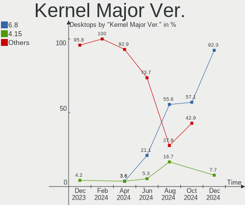
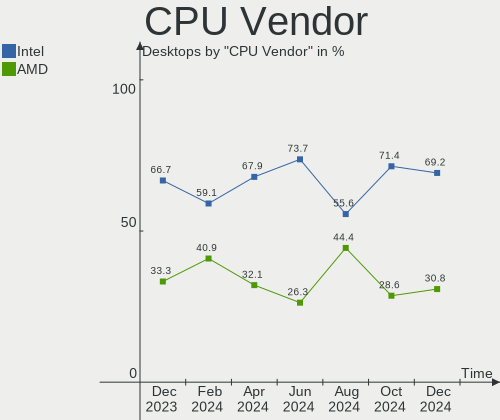
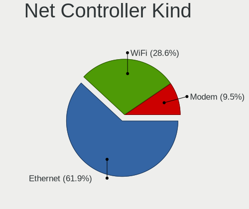
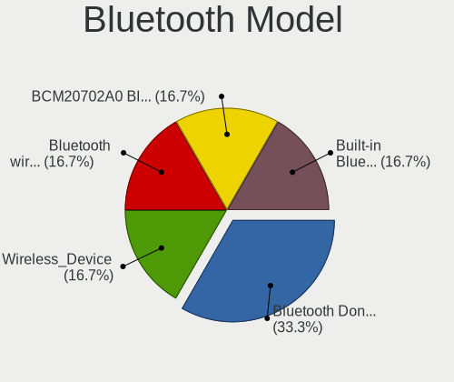
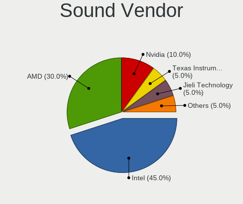
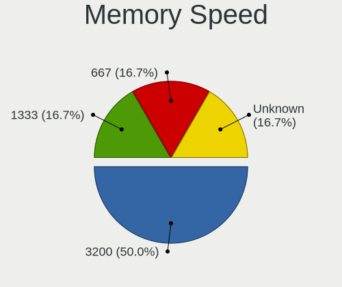
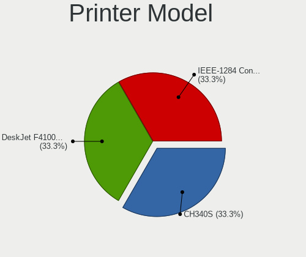
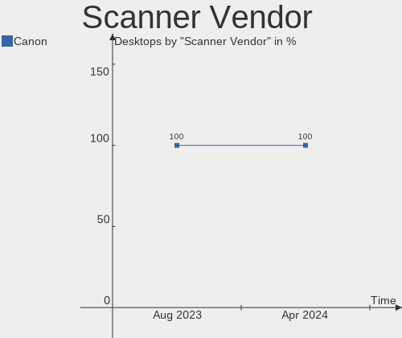
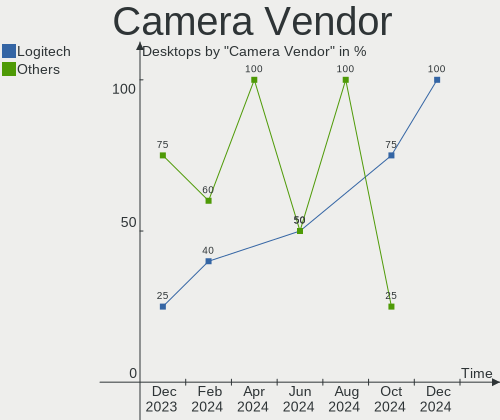

Xubuntu - Hardware Trends (Desktops)
------------------------------------

A project to identify most popular hardware characteristics and track their change
over time based on data collected by Linux users at https://Linux-Hardware.org.

Anyone can contribute to this report by the [hw-probe](https://github.com/linuxhw/hw-probe) tool:

    sudo -E hw-probe -all -upload

This report is for one last month. Overall report since the beginning of time: [TestCoverage](https://github.com/linuxhw/TestCoverage)

Period: Nov, 2022.

Contents
--------

* [ System ](#system)
  - [ OS                       ](#os)
  - [ OS Family                ](#os-family)
  - [ Kernel                   ](#kernel)
  - [ Kernel Family            ](#kernel-family)
  - [ Kernel Major Ver.        ](#kernel-major-ver)
  - [ Arch                     ](#arch)
  - [ DE                       ](#de)
  - [ Display Server           ](#display-server)
  - [ Display Manager          ](#display-manager)
  - [ OS Lang                  ](#os-lang)
  - [ Boot Mode                ](#boot-mode)
  - [ Filesystem               ](#filesystem)
  - [ Part. scheme             ](#part-scheme)
  - [ Dual Boot with Linux/BSD ](#dual-boot-with-linuxbsd)
  - [ Dual Boot (Win)          ](#dual-boot-win)

* [ Board ](#board)
  - [ Vendor                   ](#vendor)
  - [ Model                    ](#model)
  - [ Model Family             ](#model-family)
  - [ MFG Year                 ](#mfg-year)
  - [ Form Factor              ](#form-factor)
  - [ Secure Boot              ](#secure-boot)
  - [ Coreboot                 ](#coreboot)
  - [ RAM Size                 ](#ram-size)
  - [ RAM Used                 ](#ram-used)
  - [ Total Drives             ](#total-drives)
  - [ Has CD-ROM               ](#has-cd-rom)
  - [ Has Ethernet             ](#has-ethernet)
  - [ Has WiFi                 ](#has-wifi)
  - [ Has Bluetooth            ](#has-bluetooth)

* [ Location ](#location)
  - [ Country                  ](#country)
  - [ City                     ](#city)

* [ Drives ](#drives)
  - [ Drive Vendor             ](#drive-vendor)
  - [ Drive Model              ](#drive-model)
  - [ HDD Vendor               ](#hdd-vendor)
  - [ SSD Vendor               ](#ssd-vendor)
  - [ Drive Kind               ](#drive-kind)
  - [ Drive Connector          ](#drive-connector)
  - [ Drive Size               ](#drive-size)
  - [ Space Total              ](#space-total)
  - [ Space Used               ](#space-used)
  - [ Malfunc. Drives          ](#malfunc-drives)
  - [ Malfunc. Drive Vendor    ](#malfunc-drive-vendor)
  - [ Malfunc. HDD Vendor      ](#malfunc-hdd-vendor)
  - [ Malfunc. Drive Kind      ](#malfunc-drive-kind)
  - [ Failed Drives            ](#failed-drives)
  - [ Failed Drive Vendor      ](#failed-drive-vendor)
  - [ Drive Status             ](#drive-status)

* [ Storage controller ](#storage-controller)
  - [ Storage Vendor           ](#storage-vendor)
  - [ Storage Model            ](#storage-model)
  - [ Storage Kind             ](#storage-kind)

* [ Processor ](#processor)
  - [ CPU Vendor               ](#cpu-vendor)
  - [ CPU Model                ](#cpu-model)
  - [ CPU Model Family         ](#cpu-model-family)
  - [ CPU Cores                ](#cpu-cores)
  - [ CPU Sockets              ](#cpu-sockets)
  - [ CPU Threads              ](#cpu-threads)
  - [ CPU Op-Modes             ](#cpu-op-modes)
  - [ CPU Microcode            ](#cpu-microcode)
  - [ CPU Microarch            ](#cpu-microarch)

* [ Graphics ](#graphics)
  - [ GPU Vendor               ](#gpu-vendor)
  - [ GPU Model                ](#gpu-model)
  - [ GPU Combo                ](#gpu-combo)
  - [ GPU Driver               ](#gpu-driver)
  - [ GPU Memory               ](#gpu-memory)

* [ Monitor ](#monitor)
  - [ Monitor Vendor           ](#monitor-vendor)
  - [ Monitor Model            ](#monitor-model)
  - [ Monitor Resolution       ](#monitor-resolution)
  - [ Monitor Diagonal         ](#monitor-diagonal)
  - [ Monitor Width            ](#monitor-width)
  - [ Aspect Ratio             ](#aspect-ratio)
  - [ Monitor Area             ](#monitor-area)
  - [ Pixel Density            ](#pixel-density)
  - [ Multiple Monitors        ](#multiple-monitors)

* [ Network ](#network)
  - [ Net Controller Vendor    ](#net-controller-vendor)
  - [ Net Controller Model     ](#net-controller-model)
  - [ Wireless Vendor          ](#wireless-vendor)
  - [ Wireless Model           ](#wireless-model)
  - [ Ethernet Vendor          ](#ethernet-vendor)
  - [ Ethernet Model           ](#ethernet-model)
  - [ Net Controller Kind      ](#net-controller-kind)
  - [ Used Controller          ](#used-controller)
  - [ NICs                     ](#nics)
  - [ IPv6                     ](#ipv6)

* [ Bluetooth ](#bluetooth)
  - [ Bluetooth Vendor         ](#bluetooth-vendor)
  - [ Bluetooth Model          ](#bluetooth-model)

* [ Sound ](#sound)
  - [ Sound Vendor             ](#sound-vendor)
  - [ Sound Model              ](#sound-model)

* [ Memory ](#memory)
  - [ Memory Vendor            ](#memory-vendor)
  - [ Memory Model             ](#memory-model)
  - [ Memory Kind              ](#memory-kind)
  - [ Memory Form Factor       ](#memory-form-factor)
  - [ Memory Size              ](#memory-size)
  - [ Memory Speed             ](#memory-speed)

* [ Printers & scanners ](#printers--scanners)
  - [ Printer Vendor           ](#printer-vendor)
  - [ Printer Model            ](#printer-model)
  - [ Scanner Vendor           ](#scanner-vendor)
  - [ Scanner Model            ](#scanner-model)

* [ Camera ](#camera)
  - [ Camera Vendor            ](#camera-vendor)
  - [ Camera Model             ](#camera-model)

* [ Security ](#security)
  - [ Fingerprint Vendor       ](#fingerprint-vendor)
  - [ Fingerprint Model        ](#fingerprint-model)
  - [ Chipcard Vendor          ](#chipcard-vendor)
  - [ Chipcard Model           ](#chipcard-model)

* [ Unsupported ](#unsupported)
  - [ Unsupported Devices      ](#unsupported-devices)
  - [ Unsupported Device Types ](#unsupported-device-types)

System
------

OS
--

Installed operating systems

| Name          | Desktops | Percent |
|---------------|----------|---------|
| Xubuntu 22.04 | 19       | 55.88%  |
| Xubuntu 20.04 | 11       | 32.35%  |
| Xubuntu 22.10 | 3        | 8.82%   |
| Xubuntu 18.04 | 1        | 2.94%   |

OS Family
---------

OS without a version

| Name    | Desktops | Percent |
|---------|----------|---------|
| Xubuntu | 34       | 100%    |

Kernel
------

Version of the Linux kernel

| Version                | Desktops | Percent |
|------------------------|----------|---------|
| 5.15.0-52-generic      | 15       | 44.12%  |
| 5.4.0-131-generic      | 6        | 17.65%  |
| 5.15.0-53-generic      | 4        | 11.76%  |
| 5.8.0-41-generic       | 1        | 2.94%   |
| 5.4.0-131-lowlatency   | 1        | 2.94%   |
| 5.4.0-124-generic      | 1        | 2.94%   |
| 5.19.0-23-generic      | 1        | 2.94%   |
| 5.19.0-21-generic      | 1        | 2.94%   |
| 5.19.0-1009-lowlatency | 1        | 2.94%   |
| 5.15.0-53-lowlatency   | 1        | 2.94%   |
| 5.15.0-50-generic      | 1        | 2.94%   |
| 5.15.0-43-generic      | 1        | 2.94%   |

Kernel Family
-------------

Linux kernel without a distro release

| Version | Desktops | Percent |
|---------|----------|---------|
| 5.15.0  | 22       | 64.71%  |
| 5.4.0   | 8        | 23.53%  |
| 5.19.0  | 3        | 8.82%   |
| 5.8.0   | 1        | 2.94%   |

Kernel Major Ver.
-----------------

Linux kernel major version

| Version | Desktops | Percent |
|---------|----------|---------|
| 5.15    | 22       | 64.71%  |
| 5.4     | 8        | 23.53%  |
| 5.19    | 3        | 8.82%   |
| 5.8     | 1        | 2.94%   |

Arch
----

OS architecture (x86_64, i586, etc.)

| Name   | Desktops | Percent |
|--------|----------|---------|
| x86_64 | 34       | 100%    |

DE
--

Desktop Environment

| Name | Desktops | Percent |
|------|----------|---------|
| XFCE | 34       | 100%    |

Display Server
--------------

X11 or Wayland

| Name | Desktops | Percent |
|------|----------|---------|
| X11  | 34       | 100%    |

Display Manager
---------------

SDDM, LightDM, etc.

| Name    | Desktops | Percent |
|---------|----------|---------|
| LightDM | 29       | 85.29%  |
| GDM3    | 4        | 11.76%  |
| Unknown | 1        | 2.94%   |

OS Lang
-------

Language

| Lang  | Desktops | Percent |
|-------|----------|---------|
| en_US | 13       | 38.24%  |
| fr_FR | 6        | 17.65%  |
| de_DE | 4        | 11.76%  |
| it_IT | 3        | 8.82%   |
| en_GB | 2        | 5.88%   |
| pt_BR | 1        | 2.94%   |
| fr_CA | 1        | 2.94%   |
| fr_BE | 1        | 2.94%   |
| es_CO | 1        | 2.94%   |
| en_AU | 1        | 2.94%   |
| de_AT | 1        | 2.94%   |

Boot Mode
---------

EFI or BIOS

| Mode | Desktops | Percent |
|------|----------|---------|
| BIOS | 22       | 64.71%  |
| EFI  | 12       | 35.29%  |

Filesystem
----------

Type of filesystem

| Type  | Desktops | Percent |
|-------|----------|---------|
| Ext4  | 31       | 91.18%  |
| Btrfs | 2        | 5.88%   |
| Zfs   | 1        | 2.94%   |

Part. scheme
------------

Scheme of partitioning

| Type | Desktops | Percent |
|------|----------|---------|
| GPT  | 23       | 67.65%  |
| MBR  | 11       | 32.35%  |

Dual Boot with Linux/BSD
------------------------

Hosting more than one Linux/BSD

| Dual boot | Desktops | Percent |
|-----------|----------|---------|
| No        | 23       | 67.65%  |
| Yes       | 11       | 32.35%  |

Dual Boot (Win)
---------------

Hosting Linux and Windows

| Dual boot | Desktops | Percent |
|-----------|----------|---------|
| No        | 19       | 55.88%  |
| Yes       | 15       | 44.12%  |

Board
-----

Vendor
------

Motherboard manufacturer

| Name                | Desktops | Percent |
|---------------------|----------|---------|
| ASUSTek Computer    | 9        | 26.47%  |
| MSI                 | 8        | 23.53%  |
| Gigabyte Technology | 5        | 14.71%  |
| Lenovo              | 2        | 5.88%   |
| Hewlett-Packard     | 2        | 5.88%   |
| ASRock              | 2        | 5.88%   |
| MACHINIST           | 1        | 2.94%   |
| Intel               | 1        | 2.94%   |
| Fujitsu             | 1        | 2.94%   |
| eMachines           | 1        | 2.94%   |
| Dell                | 1        | 2.94%   |
| BCM                 | 1        | 2.94%   |

Model
-----

Motherboard model

| Name                            | Desktops | Percent |
|---------------------------------|----------|---------|
| MSI MS-7D46                     | 2        | 5.88%   |
| MSI MS-7D25                     | 1        | 2.94%   |
| MSI MS-7C52                     | 1        | 2.94%   |
| MSI MS-7B89                     | 1        | 2.94%   |
| MSI MS-7A32                     | 1        | 2.94%   |
| MSI MS-7823                     | 1        | 2.94%   |
| MSI MS-7309                     | 1        | 2.94%   |
| MACHINIST X99-RS9 V2.0          | 1        | 2.94%   |
| Lenovo ThinkCentre M90p 3282A9G | 1        | 2.94%   |
| Lenovo ThinkCentre M70e 0830AC4 | 1        | 2.94%   |
| Intel D525MW AAE93082-401       | 1        | 2.94%   |
| HP EliteDesk 800 G2 SFF         | 1        | 2.94%   |
| HP Compaq 8200 Elite SFF PC     | 1        | 2.94%   |
| Gigabyte Z77-DS3H               | 1        | 2.94%   |
| Gigabyte Z390 AORUS ELITE       | 1        | 2.94%   |
| Gigabyte H97-HD3                | 1        | 2.94%   |
| Gigabyte A320M-S2H              | 1        | 2.94%   |
| Gigabyte 970A-DS3P              | 1        | 2.94%   |
| Fujitsu CELSIUS W380            | 1        | 2.94%   |
| eMachines EL1358G               | 1        | 2.94%   |
| Dell OptiPlex 390               | 1        | 2.94%   |
| BCM MX110HD                     | 1        | 2.94%   |
| ASUS VM40B                      | 1        | 2.94%   |
| ASUS ROG STRIX B450-F GAMING    | 1        | 2.94%   |
| ASUS P8H61-M LX3                | 1        | 2.94%   |
| ASUS P8H61-M LX PLUS R2.0       | 1        | 2.94%   |
| ASUS M4A88TD-M/USB3             | 1        | 2.94%   |
| ASUS B150M-C                    | 1        | 2.94%   |
| ASUS All Series                 | 1        | 2.94%   |
| ASUS A0000001                   | 1        | 2.94%   |
| ASUS 142779a                    | 1        | 2.94%   |
| ASRock Z68 Extreme3 Gen3        | 1        | 2.94%   |
| ASRock H270M-ITX/ac             | 1        | 2.94%   |

Model Family
------------

Motherboard model prefix

| Name               | Desktops | Percent |
|--------------------|----------|---------|
| MSI MS-7D46        | 2        | 5.88%   |
| Lenovo ThinkCentre | 2        | 5.88%   |
| ASUS P8H61-M       | 2        | 5.88%   |
| MSI MS-7D25        | 1        | 2.94%   |
| MSI MS-7C52        | 1        | 2.94%   |
| MSI MS-7B89        | 1        | 2.94%   |
| MSI MS-7A32        | 1        | 2.94%   |
| MSI MS-7823        | 1        | 2.94%   |
| MSI MS-7309        | 1        | 2.94%   |
| MACHINIST X99-RS9  | 1        | 2.94%   |
| Intel D525MW       | 1        | 2.94%   |
| HP EliteDesk       | 1        | 2.94%   |
| HP Compaq          | 1        | 2.94%   |
| Gigabyte Z77-DS3H  | 1        | 2.94%   |
| Gigabyte Z390      | 1        | 2.94%   |
| Gigabyte H97-HD3   | 1        | 2.94%   |
| Gigabyte A320M-S2H | 1        | 2.94%   |
| Gigabyte 970A-DS3P | 1        | 2.94%   |
| Fujitsu CELSIUS    | 1        | 2.94%   |
| eMachines EL1358G  | 1        | 2.94%   |
| Dell OptiPlex      | 1        | 2.94%   |
| BCM MX110HD        | 1        | 2.94%   |
| ASUS VM40B         | 1        | 2.94%   |
| ASUS ROG           | 1        | 2.94%   |
| ASUS M4A88TD-M     | 1        | 2.94%   |
| ASUS B150M-C       | 1        | 2.94%   |
| ASUS All           | 1        | 2.94%   |
| ASUS A0000001      | 1        | 2.94%   |
| ASUS 142779a       | 1        | 2.94%   |
| ASRock Z68         | 1        | 2.94%   |
| ASRock H270M-ITX   | 1        | 2.94%   |

MFG Year
--------

Motherboard manufacture year

| Year | Desktops | Percent |
|------|----------|---------|
| 2011 | 5        | 14.71%  |
| 2010 | 4        | 11.76%  |
| 2021 | 3        | 8.82%   |
| 2017 | 3        | 8.82%   |
| 2014 | 3        | 8.82%   |
| 2013 | 3        | 8.82%   |
| 2022 | 2        | 5.88%   |
| 2019 | 2        | 5.88%   |
| 2018 | 2        | 5.88%   |
| 2015 | 2        | 5.88%   |
| 2012 | 2        | 5.88%   |
| 2020 | 1        | 2.94%   |
| 2016 | 1        | 2.94%   |
| 2006 | 1        | 2.94%   |

Form Factor
-----------

Physical design of the computer

| Name    | Desktops | Percent |
|---------|----------|---------|
| Desktop | 34       | 100%    |

Secure Boot
-----------

Enabled or disabled

| State    | Desktops | Percent |
|----------|----------|---------|
| Disabled | 31       | 91.18%  |
| Enabled  | 3        | 8.82%   |

Coreboot
--------

Have coreboot on board

| Used | Desktops | Percent |
|------|----------|---------|
| No   | 34       | 100%    |

RAM Size
--------

Total RAM memory

| Size in GB | Desktops | Percent |
|------------|----------|---------|
| 4.01-8.0   | 9        | 26.47%  |
| 16.01-24.0 | 7        | 20.59%  |
| 32.01-64.0 | 5        | 14.71%  |
| 3.01-4.0   | 4        | 11.76%  |
| 2.01-3.0   | 3        | 8.82%   |
| 24.01-32.0 | 2        | 5.88%   |
| 1.01-2.0   | 2        | 5.88%   |
| 8.01-16.0  | 2        | 5.88%   |

RAM Used
--------

Used RAM memory

| Used GB   | Desktops | Percent |
|-----------|----------|---------|
| 1.01-2.0  | 14       | 41.18%  |
| 2.01-3.0  | 8        | 23.53%  |
| 4.01-8.0  | 6        | 17.65%  |
| 8.01-16.0 | 3        | 8.82%   |
| 3.01-4.0  | 2        | 5.88%   |
| 0.51-1.0  | 1        | 2.94%   |

Total Drives
------------

Number of drives on board

| Drives | Desktops | Percent |
|--------|----------|---------|
| 1      | 10       | 29.41%  |
| 4      | 7        | 20.59%  |
| 2      | 7        | 20.59%  |
| 3      | 5        | 14.71%  |
| 6      | 2        | 5.88%   |
| 5      | 2        | 5.88%   |
| 10     | 1        | 2.94%   |

Has CD-ROM
----------

Has CD-ROM on board

| Presented | Desktops | Percent |
|-----------|----------|---------|
| Yes       | 17       | 50%     |
| No        | 17       | 50%     |

Has Ethernet
------------

Has Ethernet on board

| Presented | Desktops | Percent |
|-----------|----------|---------|
| Yes       | 34       | 100%    |

Has WiFi
--------

Has WiFi module

| Presented | Desktops | Percent |
|-----------|----------|---------|
| No        | 25       | 73.53%  |
| Yes       | 9        | 26.47%  |

Has Bluetooth
-------------

Has Bluetooth module

| Presented | Desktops | Percent |
|-----------|----------|---------|
| No        | 27       | 79.41%  |
| Yes       | 7        | 20.59%  |

Location
--------

Country
-------

Geographic location (country)

| Country   | Desktops | Percent |
|-----------|----------|---------|
| USA       | 7        | 20.59%  |
| France    | 6        | 17.65%  |
| Germany   | 4        | 11.76%  |
| Italy     | 3        | 8.82%   |
| UK        | 2        | 5.88%   |
| Greece    | 2        | 5.88%   |
| Belgium   | 2        | 5.88%   |
| Taiwan    | 1        | 2.94%   |
| Russia    | 1        | 2.94%   |
| Poland    | 1        | 2.94%   |
| Colombia  | 1        | 2.94%   |
| Canada    | 1        | 2.94%   |
| Brazil    | 1        | 2.94%   |
| Austria   | 1        | 2.94%   |
| Australia | 1        | 2.94%   |

City
----

Geographic location (city)

| City                | Desktops | Percent |
|---------------------|----------|---------|
| Żywiec             | 1        | 2.94%   |
| Woellersdorf        | 1        | 2.94%   |
| Wettringen          | 1        | 2.94%   |
| Tinley Park         | 1        | 2.94%   |
| Taichung            | 1        | 2.94%   |
| Sydney              | 1        | 2.94%   |
| Springfield         | 1        | 2.94%   |
| Southampton         | 1        | 2.94%   |
| San Antonio         | 1        | 2.94%   |
| Saint-Eustache      | 1        | 2.94%   |
| Saint-Denis         | 1        | 2.94%   |
| Rouvray-Saint-Denis | 1        | 2.94%   |
| Rome                | 1        | 2.94%   |
| Quartucciu          | 1        | 2.94%   |
| Pocatello           | 1        | 2.94%   |
| North Augusta       | 1        | 2.94%   |
| Newton Abbot        | 1        | 2.94%   |
| Münster            | 1        | 2.94%   |
| Medellín           | 1        | 2.94%   |
| Korolyov            | 1        | 2.94%   |
| Karditsa            | 1        | 2.94%   |
| Kamp-Lintfort       | 1        | 2.94%   |
| Jeffersonville      | 1        | 2.94%   |
| Hannut              | 1        | 2.94%   |
| Foulayronnes        | 1        | 2.94%   |
| Everett             | 1        | 2.94%   |
| Edegem              | 1        | 2.94%   |
| Dole                | 1        | 2.94%   |
| Cidade Ocidental    | 1        | 2.94%   |
| Carrara             | 1        | 2.94%   |
| Bruchsal            | 1        | 2.94%   |
| Beaumont-sur-Oise   | 1        | 2.94%   |
| Athens              | 1        | 2.94%   |
| Asnieres-sur-Seine  | 1        | 2.94%   |

Drives
------

Drive Vendor
------------

Hard drive vendors

| Vendor              | Desktops | Drives | Percent |
|---------------------|----------|--------|---------|
| WDC                 | 15       | 25     | 21.43%  |
| Samsung Electronics | 10       | 16     | 14.29%  |
| Seagate             | 9        | 12     | 12.86%  |
| Crucial             | 6        | 7      | 8.57%   |
| Toshiba             | 5        | 5      | 7.14%   |
| Hitachi             | 4        | 6      | 5.71%   |
| Kingston            | 3        | 5      | 4.29%   |
| SanDisk             | 2        | 2      | 2.86%   |
| PNY                 | 2        | 2      | 2.86%   |
| Phison Electronics  | 2        | 2      | 2.86%   |
| XPG                 | 1        | 1      | 1.43%   |
| Vaseky              | 1        | 1      | 1.43%   |
| USB3.0              | 1        | 2      | 1.43%   |
| SPCC                | 1        | 1      | 1.43%   |
| Patriot             | 1        | 1      | 1.43%   |
| OCZ                 | 1        | 1      | 1.43%   |
| KIOXIA              | 1        | 1      | 1.43%   |
| Intenso             | 1        | 1      | 1.43%   |
| HGST HUS            | 1        | 1      | 1.43%   |
| HGST                | 1        | 2      | 1.43%   |
| Fujitsu             | 1        | 1      | 1.43%   |
| ASMT                | 1        | 4      | 1.43%   |

Drive Model
-----------

Hard drive models

| Model                            | Desktops | Percent |
|----------------------------------|----------|---------|
| Crucial CT480BX500SSD1 480GB     | 3        | 3.37%   |
| Samsung SSD 970 EVO Plus 1TB     | 2        | 2.25%   |
| Crucial CT1000MX500SSD1 1TB      | 2        | 2.25%   |
| XPG GAMMIX S11L 256GB            | 1        | 1.12%   |
| WDC WUH721816ALE6L4 16TB         | 1        | 1.12%   |
| WDC WDS250G2B0B-00YS70 250GB SSD | 1        | 1.12%   |
| WDC WD5003AZEX-00S3DA0 500GB     | 1        | 1.12%   |
| WDC WD5000AZLX-60K2TA0 500GB     | 1        | 1.12%   |
| WDC WD5000AVDS-63U7B1 500GB      | 1        | 1.12%   |
| WDC WD5000AAVS-00ZTB0 500GB      | 1        | 1.12%   |
| WDC WD5000AAKX-22ERMA0 500GB     | 1        | 1.12%   |
| WDC WD5000AAKX-00ERMA0 500GB     | 1        | 1.12%   |
| WDC WD5000AAKS-00A7B2 500GB      | 1        | 1.12%   |
| WDC WD40PURX-78AKYY0 4TB         | 1        | 1.12%   |
| WDC WD40EFAX-68JH4N1 4TB         | 1        | 1.12%   |
| WDC WD4003FRYZ-01F0DB0 4TB       | 1        | 1.12%   |
| WDC WD3200AAKS-00L9A0 320GB      | 1        | 1.12%   |
| WDC WD3200AAJS-08L7A0 320GB      | 1        | 1.12%   |
| WDC WD30EFRX-68EUZN0 3TB         | 1        | 1.12%   |
| WDC WD20EFRX-68EUZN0 2TB         | 1        | 1.12%   |
| WDC WD20EFRX-68AX9N0 2TB         | 1        | 1.12%   |
| WDC WD20EARX-00PASB0 2TB         | 1        | 1.12%   |
| WDC WD10JPVX-22JC3T0 1TB         | 1        | 1.12%   |
| WDC WD10EZEX-60WN4A1 1TB         | 1        | 1.12%   |
| WDC WD10EZEX-00BN5A0 1TB         | 1        | 1.12%   |
| WDC WD10EARS-00Y5B1 1TB          | 1        | 1.12%   |
| WDC WD1003FBYX-01Y7B1 1TB        | 1        | 1.12%   |
| Vaseky V800/64G 64GB             | 1        | 1.12%   |
| USB3.0 Disk 3TB                  | 1        | 1.12%   |
| Toshiba MQ01ABF050 500GB         | 1        | 1.12%   |
| Toshiba HDWQ140 4TB              | 1        | 1.12%   |
| Toshiba HDWD110 1TB              | 1        | 1.12%   |
| Toshiba DT01ACA100 1TB           | 1        | 1.12%   |
| Toshiba DT01ACA050 500GB         | 1        | 1.12%   |
| SPCC Solid State Disk 1TB        | 1        | 1.12%   |
| Seagate ST500DM0 02-1BD142 500GB | 1        | 1.12%   |
| Seagate ST4000NM0033 4TB         | 1        | 1.12%   |
| Seagate ST4000NE001-2MA101 4TB   | 1        | 1.12%   |
| Seagate ST31000340AS 1TB         | 1        | 1.12%   |
| Seagate ST2000DM001-1CH164 2TB   | 1        | 1.12%   |

HDD Vendor
----------

Hard disk drive vendors

| Vendor              | Desktops | Drives | Percent |
|---------------------|----------|--------|---------|
| WDC                 | 15       | 24     | 36.59%  |
| Seagate             | 9        | 12     | 21.95%  |
| Toshiba             | 5        | 5      | 12.2%   |
| Samsung Electronics | 4        | 5      | 9.76%   |
| Hitachi             | 4        | 6      | 9.76%   |
| USB3.0              | 1        | 2      | 2.44%   |
| HGST                | 1        | 2      | 2.44%   |
| Fujitsu             | 1        | 1      | 2.44%   |
| ASMT                | 1        | 4      | 2.44%   |

SSD Vendor
----------

Solid state drive vendors

| Vendor              | Desktops | Drives | Percent |
|---------------------|----------|--------|---------|
| Crucial             | 6        | 7      | 26.09%  |
| Samsung Electronics | 5        | 6      | 21.74%  |
| Kingston            | 3        | 4      | 13.04%  |
| PNY                 | 2        | 2      | 8.7%    |
| WDC                 | 1        | 1      | 4.35%   |
| Vaseky              | 1        | 1      | 4.35%   |
| SPCC                | 1        | 1      | 4.35%   |
| SanDisk             | 1        | 1      | 4.35%   |
| Patriot             | 1        | 1      | 4.35%   |
| OCZ                 | 1        | 1      | 4.35%   |
| Intenso             | 1        | 1      | 4.35%   |

Drive Kind
----------

HDD or SSD

| Kind    | Desktops | Drives | Percent |
|---------|----------|--------|---------|
| HDD     | 26       | 61     | 46.43%  |
| SSD     | 19       | 26     | 33.93%  |
| NVMe    | 10       | 11     | 17.86%  |
| Unknown | 1        | 1      | 1.79%   |

Drive Connector
---------------

SATA, SAS, NVMe, etc.

| Type | Desktops | Drives | Percent |
|------|----------|--------|---------|
| SATA | 33       | 74     | 68.75%  |
| NVMe | 10       | 11     | 20.83%  |
| SAS  | 5        | 14     | 10.42%  |

Drive Size
----------

Size of hard drive

| Size in TB | Desktops | Drives | Percent |
|------------|----------|--------|---------|
| 0.01-0.5   | 28       | 42     | 50%     |
| 0.51-1.0   | 12       | 19     | 21.43%  |
| 3.01-4.0   | 7        | 10     | 12.5%   |
| 1.01-2.0   | 5        | 6      | 8.93%   |
| 2.01-3.0   | 2        | 8      | 3.57%   |
| 10.01-20.0 | 1        | 1      | 1.79%   |
| 4.01-10.0  | 1        | 1      | 1.79%   |

Space Total
-----------

Amount of disk space available on the file system

| Size in GB     | Desktops | Percent |
|----------------|----------|---------|
| More than 3000 | 9        | 26.47%  |
| 101-250        | 7        | 20.59%  |
| 251-500        | 5        | 14.71%  |
| 1001-2000      | 4        | 11.76%  |
| 501-1000       | 4        | 11.76%  |
| 2001-3000      | 3        | 8.82%   |
| 21-50          | 2        | 5.88%   |

Space Used
----------

Amount of used disk space

| Used GB        | Desktops | Percent |
|----------------|----------|---------|
| 101-250        | 7        | 20.59%  |
| 21-50          | 6        | 17.65%  |
| More than 3000 | 4        | 11.76%  |
| 251-500        | 4        | 11.76%  |
| 1001-2000      | 4        | 11.76%  |
| 1-20           | 4        | 11.76%  |
| 2001-3000      | 2        | 5.88%   |
| 501-1000       | 2        | 5.88%   |
| 51-100         | 1        | 2.94%   |

Malfunc. Drives
---------------

Drive models with a malfunction

| Model                             | Desktops | Drives | Percent |
|-----------------------------------|----------|--------|---------|
| WDC WD5000AAKX-00ERMA0 500GB      | 1        | 1      | 11.11%  |
| WDC WD3200AAKS-00L9A0 320GB       | 1        | 1      | 11.11%  |
| WDC WD30EFRX-68EUZN0 3TB          | 1        | 1      | 11.11%  |
| WDC WD20EFRX-68AX9N0 2TB          | 1        | 1      | 11.11%  |
| WDC WD1003FBYX-01Y7B1 1TB         | 1        | 1      | 11.11%  |
| Samsung Electronics HM321HI 320GB | 1        | 1      | 11.11%  |
| Samsung Electronics HD753LJ 752GB | 1        | 1      | 11.11%  |
| Samsung Electronics HD103SJ 1TB   | 1        | 1      | 11.11%  |
| ASMT ASMT105x 3TB                 | 1        | 4      | 11.11%  |

Malfunc. Drive Vendor
---------------------

Vendors of faulty drives

| Vendor              | Desktops | Drives | Percent |
|---------------------|----------|--------|---------|
| WDC                 | 5        | 5      | 62.5%   |
| Samsung Electronics | 2        | 3      | 25%     |
| ASMT                | 1        | 4      | 12.5%   |

Malfunc. HDD Vendor
-------------------

Vendors of faulty HDD drives

| Vendor              | Desktops | Drives | Percent |
|---------------------|----------|--------|---------|
| WDC                 | 5        | 5      | 62.5%   |
| Samsung Electronics | 2        | 3      | 25%     |
| ASMT                | 1        | 4      | 12.5%   |

Malfunc. Drive Kind
-------------------

Kinds of faulty drives

| Kind | Desktops | Drives | Percent |
|------|----------|--------|---------|
| HDD  | 7        | 12     | 100%    |

Failed Drives
-------------

Failed drive models

Zero info for selected period =(

Failed Drive Vendor
-------------------

Failed drive vendors

Zero info for selected period =(

Drive Status
------------

Number of failed and malfunc. drives

| Status   | Desktops | Drives | Percent |
|----------|----------|--------|---------|
| Works    | 20       | 50     | 46.51%  |
| Detected | 16       | 37     | 37.21%  |
| Malfunc  | 7        | 12     | 16.28%  |

Storage controller
------------------

Storage Vendor
--------------

Storage controller vendors

| Vendor                      | Desktops | Percent |
|-----------------------------|----------|---------|
| Intel                       | 22       | 46.81%  |
| AMD                         | 9        | 19.15%  |
| Samsung Electronics         | 4        | 8.51%   |
| Phison Electronics          | 2        | 4.26%   |
| Nvidia                      | 2        | 4.26%   |
| VIA Technologies            | 1        | 2.13%   |
| SanDisk                     | 1        | 2.13%   |
| Realtek Semiconductor       | 1        | 2.13%   |
| Marvell Technology Group    | 1        | 2.13%   |
| KIOXIA                      | 1        | 2.13%   |
| Kingston Technology Company | 1        | 2.13%   |
| ASMedia Technology          | 1        | 2.13%   |
| Adaptec                     | 1        | 2.13%   |

Storage Model
-------------

Storage controller models

| Model                                                                                   | Desktops | Percent |
|-----------------------------------------------------------------------------------------|----------|---------|
| AMD FCH SATA Controller [AHCI mode]                                                     | 6        | 9.84%   |
| Intel 6 Series/C200 Series Chipset Family Desktop SATA Controller (IDE mode, ports 4-5) | 4        | 6.56%   |
| Intel 6 Series/C200 Series Chipset Family Desktop SATA Controller (IDE mode, ports 0-3) | 4        | 6.56%   |
| Samsung NVMe SSD Controller SM981/PM981/PM983                                           | 3        | 4.92%   |
| Intel Q170/Q150/B150/H170/H110/Z170/CM236 Chipset SATA Controller [AHCI Mode]           | 3        | 4.92%   |
| Intel Alder Lake-S PCH SATA Controller [AHCI Mode]                                      | 3        | 4.92%   |
| Intel 8 Series/C220 Series Chipset Family 6-port SATA Controller 1 [AHCI mode]          | 3        | 4.92%   |
| AMD 400 Series Chipset SATA Controller                                                  | 3        | 4.92%   |
| Nvidia MCP61 SATA Controller                                                            | 2        | 3.28%   |
| Intel 5 Series/3400 Series Chipset 6 port SATA AHCI Controller                          | 2        | 3.28%   |
| AMD SB7x0/SB8x0/SB9x0 IDE Controller                                                    | 2        | 3.28%   |
| AMD FCH SATA Controller D                                                               | 2        | 3.28%   |
| VIA VT6415 PATA IDE Host Controller                                                     | 1        | 1.64%   |
| SanDisk WD Black SN750 / PC SN730 NVMe SSD                                              | 1        | 1.64%   |
| Samsung NVMe SSD Controller PM9A1/PM9A3/980PRO                                          | 1        | 1.64%   |
| Realtek Realtek Non-Volatile memory controller                                          | 1        | 1.64%   |
| Phison E16 PCIe4 NVMe Controller                                                        | 1        | 1.64%   |
| Phison E12 NVMe Controller                                                              | 1        | 1.64%   |
| Nvidia MCP61 IDE                                                                        | 1        | 1.64%   |
| Marvell Group 88SE9215 PCIe 2.0 x1 4-port SATA 6 Gb/s Controller                        | 1        | 1.64%   |
| KIOXIA NVMe SSD Controller BG4                                                          | 1        | 1.64%   |
| Kingston Company Company Non-Volatile memory controller                                 | 1        | 1.64%   |
| Intel NM10/ICH7 Family SATA Controller [IDE mode]                                       | 1        | 1.64%   |
| Intel NM10/ICH7 Family SATA Controller [AHCI mode]                                      | 1        | 1.64%   |
| Intel 9 Series Chipset Family SATA Controller [AHCI Mode]                               | 1        | 1.64%   |
| Intel 82801G (ICH7 Family) IDE Controller                                               | 1        | 1.64%   |
| Intel 7 Series/C210 Series Chipset Family 6-port SATA Controller [AHCI mode]            | 1        | 1.64%   |
| Intel 7 Series Chipset Family 6-port SATA Controller [AHCI mode]                        | 1        | 1.64%   |
| Intel 6 Series/C200 Series Chipset Family 6 port Desktop SATA AHCI Controller           | 1        | 1.64%   |
| Intel 5 Series/3400 Series Chipset PT IDER Controller                                   | 1        | 1.64%   |
| Intel 200 Series PCH SATA controller [AHCI mode]                                        | 1        | 1.64%   |
| ASMedia ASM1062 Serial ATA Controller                                                   | 1        | 1.64%   |
| AMD X370 Series Chipset SATA Controller                                                 | 1        | 1.64%   |
| AMD SB7x0/SB8x0/SB9x0 SATA Controller [IDE mode]                                        | 1        | 1.64%   |
| AMD SB7x0/SB8x0/SB9x0 SATA Controller [AHCI mode]                                       | 1        | 1.64%   |
| Adaptec Series 7 6G SAS/PCIe 3                                                          | 1        | 1.64%   |

Storage Kind
------------

Kind of storage controller (IDE, SATA, NVMe, SAS, ...)

| Kind | Desktops | Percent |
|------|----------|---------|
| SATA | 26       | 55.32%  |
| NVMe | 10       | 21.28%  |
| IDE  | 10       | 21.28%  |
| RAID | 1        | 2.13%   |

Processor
---------

CPU Vendor
----------

Processor vendors

| Vendor | Desktops | Percent |
|--------|----------|---------|
| Intel  | 23       | 67.65%  |
| AMD    | 11       | 32.35%  |

CPU Model
---------

Processor models

| Model                                      | Desktops | Percent |
|--------------------------------------------|----------|---------|
| Intel Core i5-6500 CPU @ 3.20GHz           | 2        | 5.88%   |
| Intel Core i5-4460 CPU @ 3.20GHz           | 2        | 5.88%   |
| Intel Core i5-3570K CPU @ 3.40GHz          | 2        | 5.88%   |
| Intel Core i5-2400 CPU @ 3.10GHz           | 2        | 5.88%   |
| Intel 12th Gen Core i3-12100               | 2        | 5.88%   |
| Intel Xeon CPU E5-2666 v3 @ 2.90GHz        | 1        | 2.94%   |
| Intel Pentium CPU G4560 @ 3.50GHz          | 1        | 2.94%   |
| Intel Core i7-2600K CPU @ 3.40GHz          | 1        | 2.94%   |
| Intel Core i5-9600K CPU @ 3.70GHz          | 1        | 2.94%   |
| Intel Core i5-4670 CPU @ 3.40GHz           | 1        | 2.94%   |
| Intel Core i5 CPU 750 @ 2.67GHz            | 1        | 2.94%   |
| Intel Core i5 CPU 660 @ 3.33GHz            | 1        | 2.94%   |
| Intel Core i3-7300 CPU @ 4.00GHz           | 1        | 2.94%   |
| Intel Core i3-2120 CPU @ 3.30GHz           | 1        | 2.94%   |
| Intel Core 2 Duo CPU E7500 @ 2.93GHz       | 1        | 2.94%   |
| Intel Celeron CPU 1007U @ 1.50GHz          | 1        | 2.94%   |
| Intel Atom CPU D525 @ 1.80GHz              | 1        | 2.94%   |
| Intel 13th Gen Core i5-13600K              | 1        | 2.94%   |
| AMD Ryzen 9 3900X 12-Core Processor        | 1        | 2.94%   |
| AMD Ryzen 7 3800X 8-Core Processor         | 1        | 2.94%   |
| AMD Ryzen 7 2700X Eight-Core Processor     | 1        | 2.94%   |
| AMD Ryzen 5 4500 6-Core Processor          | 1        | 2.94%   |
| AMD Ryzen 5 3600 6-Core Processor          | 1        | 2.94%   |
| AMD Ryzen 5 2600X Six-Core Processor       | 1        | 2.94%   |
| AMD Phenom II X6 1055T Processor           | 1        | 2.94%   |
| AMD FX-6300 Six-Core Processor             | 1        | 2.94%   |
| AMD Athlon II X2 220 Processor             | 1        | 2.94%   |
| AMD Athlon 64 X2 Dual Core Processor 4800+ | 1        | 2.94%   |
| AMD Athlon 200GE with Radeon Vega Graphics | 1        | 2.94%   |

CPU Model Family
----------------

Processor model prefix

| Model            | Desktops | Percent |
|------------------|----------|---------|
| Intel Core i5    | 12       | 35.29%  |
| Other            | 3        | 8.82%   |
| AMD Ryzen 5      | 3        | 8.82%   |
| Intel Core i3    | 2        | 5.88%   |
| AMD Ryzen 7      | 2        | 5.88%   |
| Intel Xeon       | 1        | 2.94%   |
| Intel Pentium    | 1        | 2.94%   |
| Intel Core i7    | 1        | 2.94%   |
| Intel Core 2 Duo | 1        | 2.94%   |
| Intel Celeron    | 1        | 2.94%   |
| Intel Atom       | 1        | 2.94%   |
| AMD Ryzen 9      | 1        | 2.94%   |
| AMD Phenom II X6 | 1        | 2.94%   |
| AMD FX           | 1        | 2.94%   |
| AMD Athlon II X2 | 1        | 2.94%   |
| AMD Athlon 64 X2 | 1        | 2.94%   |
| AMD Athlon       | 1        | 2.94%   |

CPU Cores
---------

Number of processor cores

| Number | Desktops | Percent |
|--------|----------|---------|
| 4      | 13       | 38.24%  |
| 2      | 10       | 29.41%  |
| 6      | 5        | 14.71%  |
| 8      | 2        | 5.88%   |
| 14     | 1        | 2.94%   |
| 12     | 1        | 2.94%   |
| 10     | 1        | 2.94%   |
| 3      | 1        | 2.94%   |

CPU Sockets
-----------

Number of sockets

| Number | Desktops | Percent |
|--------|----------|---------|
| 1      | 34       | 100%    |

CPU Threads
-----------

Threads per core (Hyper-Threading)

| Number | Desktops | Percent |
|--------|----------|---------|
| 2      | 18       | 52.94%  |
| 1      | 16       | 47.06%  |

CPU Op-Modes
------------

CPU Operation Modes (32-bit, 64-bit)

| Op mode        | Desktops | Percent |
|----------------|----------|---------|
| 32-bit, 64-bit | 34       | 100%    |

CPU Microcode
-------------

Microcode number

| Number     | Desktops | Percent |
|------------|----------|---------|
| Unknown    | 11       | 32.35%  |
| 0x306c3    | 3        | 8.82%   |
| 0x506e3    | 2        | 5.88%   |
| 0x306a9    | 2        | 5.88%   |
| 0x206a7    | 2        | 5.88%   |
| 0x08701021 | 2        | 5.88%   |
| 0xb0671    | 1        | 2.94%   |
| 0x906ec    | 1        | 2.94%   |
| 0x906e9    | 1        | 2.94%   |
| 0x306f2    | 1        | 2.94%   |
| 0x106e5    | 1        | 2.94%   |
| 0x106ca    | 1        | 2.94%   |
| 0x1067a    | 1        | 2.94%   |
| 0x08600106 | 1        | 2.94%   |
| 0x08101016 | 1        | 2.94%   |
| 0x0800820d | 1        | 2.94%   |
| 0x06000852 | 1        | 2.94%   |
| 0x010000c8 | 1        | 2.94%   |

CPU Microarch
-------------

Microarchitecture

| Name        | Desktops | Percent |
|-------------|----------|---------|
| Zen 2       | 4        | 11.76%  |
| SandyBridge | 4        | 11.76%  |
| Haswell     | 4        | 11.76%  |
| KabyLake    | 3        | 8.82%   |
| IvyBridge   | 3        | 8.82%   |
| Unknown     | 3        | 8.82%   |
| Zen+        | 2        | 5.88%   |
| Skylake     | 2        | 5.88%   |
| K10         | 2        | 5.88%   |
| Zen         | 1        | 2.94%   |
| Westmere    | 1        | 2.94%   |
| Piledriver  | 1        | 2.94%   |
| Penryn      | 1        | 2.94%   |
| Nehalem     | 1        | 2.94%   |
| K8 Hammer   | 1        | 2.94%   |
| Bonnell     | 1        | 2.94%   |

Graphics
--------

GPU Vendor
----------

Vendors of graphics cards

| Vendor | Desktops | Percent |
|--------|----------|---------|
| Intel  | 16       | 43.24%  |
| Nvidia | 15       | 40.54%  |
| AMD    | 6        | 16.22%  |

GPU Model
---------

Graphics card models

| Model                                                                       | Desktops | Percent |
|-----------------------------------------------------------------------------|----------|---------|
| Intel 2nd Generation Core Processor Family Integrated Graphics Controller   | 4        | 10.81%  |
| Nvidia GK208B [GeForce GT 730]                                              | 2        | 5.41%   |
| Nvidia GK208B [GeForce GT 710]                                              | 2        | 5.41%   |
| Nvidia GF108 [GeForce GT 730]                                               | 2        | 5.41%   |
| Intel Xeon E3-1200 v3/4th Gen Core Processor Integrated Graphics Controller | 2        | 5.41%   |
| Intel Alder Lake-S GT1 [UHD Graphics 730]                                   | 2        | 5.41%   |
| AMD Baffin [Radeon RX 550 640SP / RX 560/560X]                              | 2        | 5.41%   |
| Nvidia TU106 [GeForce RTX 2060 SUPER]                                       | 1        | 2.7%    |
| Nvidia TU106 [GeForce RTX 2060 Rev. A]                                      | 1        | 2.7%    |
| Nvidia GT218 [GeForce 210]                                                  | 1        | 2.7%    |
| Nvidia GP106GL [Quadro P2000]                                               | 1        | 2.7%    |
| Nvidia GP104 [GeForce GTX 1070]                                             | 1        | 2.7%    |
| Nvidia GM107 [GeForce GTX 750]                                              | 1        | 2.7%    |
| Nvidia G98 [GeForce 8400 GS Rev. 2]                                         | 1        | 2.7%    |
| Nvidia G96C [GeForce 9500 GT]                                               | 1        | 2.7%    |
| Nvidia C61 [GeForce 6150SE nForce 430]                                      | 1        | 2.7%    |
| Intel Raptor Lake-S UHD Graphics                                            | 1        | 2.7%    |
| Intel IvyBridge GT2 [HD Graphics 4000]                                      | 1        | 2.7%    |
| Intel HD Graphics 630                                                       | 1        | 2.7%    |
| Intel HD Graphics 610                                                       | 1        | 2.7%    |
| Intel HD Graphics 530                                                       | 1        | 2.7%    |
| Intel Atom Processor D4xx/D5xx/N4xx/N5xx Integrated Graphics Controller     | 1        | 2.7%    |
| Intel 4 Series Chipset Integrated Graphics Controller                       | 1        | 2.7%    |
| Intel 3rd Gen Core processor Graphics Controller                            | 1        | 2.7%    |
| AMD RS880 [Radeon HD 4250]                                                  | 1        | 2.7%    |
| AMD Raven Ridge [Radeon Vega Series / Radeon Vega Mobile Series]            | 1        | 2.7%    |
| AMD Ellesmere [Radeon RX 470/480/570/570X/580/580X/590]                     | 1        | 2.7%    |
| AMD Cedar [Radeon HD 5000/6000/7350/8350 Series]                            | 1        | 2.7%    |

GPU Combo
---------

Combinations of graphics cards

| Name       | Desktops | Percent |
|------------|----------|---------|
| 1 x Nvidia | 15       | 44.12%  |
| 1 x Intel  | 13       | 38.24%  |
| 1 x AMD    | 6        | 17.65%  |

GPU Driver
----------

Free vs proprietary

| Driver      | Desktops | Percent |
|-------------|----------|---------|
| Free        | 24       | 70.59%  |
| Proprietary | 9        | 26.47%  |
| Unknown     | 1        | 2.94%   |

GPU Memory
----------

Total video memory

| Size in GB | Desktops | Percent |
|------------|----------|---------|
| Unknown    | 19       | 55.88%  |
| 1.01-2.0   | 4        | 11.76%  |
| 0.51-1.0   | 4        | 11.76%  |
| 7.01-8.0   | 2        | 5.88%   |
| 0.01-0.5   | 2        | 5.88%   |
| 5.01-6.0   | 1        | 2.94%   |
| 4.01-5.0   | 1        | 2.94%   |
| 3.01-4.0   | 1        | 2.94%   |

Monitor
-------

Monitor Vendor
--------------

Monitor vendors

| Vendor               | Desktops | Percent |
|----------------------|----------|---------|
| Samsung Electronics  | 5        | 12.82%  |
| Dell                 | 5        | 12.82%  |
| ViewSonic            | 3        | 7.69%   |
| Goldstar             | 3        | 7.69%   |
| Acer                 | 3        | 7.69%   |
| Philips              | 2        | 5.13%   |
| Hewlett-Packard      | 2        | 5.13%   |
| Eizo                 | 2        | 5.13%   |
| ASUSTek Computer     | 2        | 5.13%   |
| Vestel Elektronik    | 1        | 2.56%   |
| Unknown              | 1        | 2.56%   |
| ONN                  | 1        | 2.56%   |
| Mi                   | 1        | 2.56%   |
| Iiyama               | 1        | 2.56%   |
| Gateway              | 1        | 2.56%   |
| eMachines            | 1        | 2.56%   |
| Elo Touch            | 1        | 2.56%   |
| BenQ                 | 1        | 2.56%   |
| AOC                  | 1        | 2.56%   |
| Ancor Communications | 1        | 2.56%   |
| AGO                  | 1        | 2.56%   |

Monitor Model
-------------

Monitor models

| Model                                                                  | Desktops | Percent |
|------------------------------------------------------------------------|----------|---------|
| ViewSonic VX2457 VSCB931 1920x1080 521x293mm 23.5-inch                 | 2        | 4.76%   |
| ViewSonic VP2468 Series VSCB032 1920x1080 527x296mm 23.8-inch          | 1        | 2.38%   |
| Vestel Elektronik 55UHD_LCD_TV VES3700 3840x2160 1872x1053mm 84.6-inch | 1        | 2.38%   |
| Unknown LCD Monitor SAMSUNG 1920x1080                                  | 1        | 2.38%   |
| Samsung Electronics SyncMaster SAM050B 1920x1080 477x268mm 21.5-inch   | 1        | 2.38%   |
| Samsung Electronics SMBX2331 SAM076F 1920x1080 510x290mm 23.1-inch     | 1        | 2.38%   |
| Samsung Electronics S24B300 SAM08CC 1920x1080 521x293mm 23.5-inch      | 1        | 2.38%   |
| Samsung Electronics LCD Monitor S22E450 1920x1080                      | 1        | 2.38%   |
| Samsung Electronics C27R500 SAM0F9E 1920x1080 598x336mm 27.0-inch      | 1        | 2.38%   |
| Philips PHL 274E5 PHLC0C8 1920x1080 598x336mm 27.0-inch                | 1        | 2.38%   |
| Philips PHL 243V7 PHLC155 1920x1080 527x296mm 23.8-inch                | 1        | 2.38%   |
| ONN ONA18HO015 ONN0101 1920x1080 470x290mm 21.7-inch                   | 1        | 2.38%   |
| Mi Monitor XMI23C3 1920x1080 527x293mm 23.7-inch                       | 1        | 2.38%   |
| Iiyama PLE2483H IVM6113 1920x1080 531x299mm 24.0-inch                  | 1        | 2.38%   |
| Hewlett-Packard E201 HWP305F 1600x900 443x249mm 20.0-inch              | 1        | 2.38%   |
| Hewlett-Packard E201 HWP305C 1600x900 443x249mm 20.0-inch              | 1        | 2.38%   |
| Goldstar W1953 GSM4BA6 1360x768 406x229mm 18.4-inch                    | 1        | 2.38%   |
| Goldstar W1943 GSM4BAD 1360x768 406x229mm 18.4-inch                    | 1        | 2.38%   |
| Goldstar E2750 GSM57DB 1920x1080 510x290mm 23.1-inch                   | 1        | 2.38%   |
| Gateway FPD1530 GWY05FF 1024x768 304x228mm 15.0-inch                   | 1        | 2.38%   |
| eMachines E180HV EMA0211 1366x768 409x230mm 18.5-inch                  | 1        | 2.38%   |
| Elo Touch Monitor ELO3239 1680x1050 697x392mm 31.5-inch                | 1        | 2.38%   |
| Eizo S2431W ENC1888 1920x1200 519x324mm 24.1-inch                      | 1        | 2.38%   |
| Eizo EV2730Q ENC2651 1920x1920 480x480mm 26.7-inch                     | 1        | 2.38%   |
| Dell U3219Q DELA124 3840x2160 697x392mm 31.5-inch                      | 1        | 2.38%   |
| Dell U2412M DELA07A 1920x1200 518x324mm 24.1-inch                      | 1        | 2.38%   |
| Dell SE2416H DELD082 1920x1080 527x296mm 23.8-inch                     | 1        | 2.38%   |
| Dell P2212H DELA07E 1920x1080 531x299mm 24.0-inch                      | 1        | 2.38%   |
| Dell P2210 DEL404E 1680x1050 474x296mm 22.0-inch                       | 1        | 2.38%   |
| BenQ LCD Monitor GL2450H 3840x1080                                     | 1        | 2.38%   |
| BenQ LCD Monitor GL2450H                                               | 1        | 2.38%   |
| BenQ GL2450H BNQ78A7 1920x1080 531x298mm 24.0-inch                     | 1        | 2.38%   |
| BenQ GL2450H BNQ78A6 1920x1080 530x300mm 24.0-inch                     | 1        | 2.38%   |
| ASUSTek Computer VP247 AUS24CA 1920x1080 520x290mm 23.4-inch           | 1        | 2.38%   |
| ASUSTek Computer VG289 AUS28BA 3840x2160 621x341mm 27.9-inch           | 1        | 2.38%   |
| AOC 2369M AOC2369 1920x1080 509x286mm 23.0-inch                        | 1        | 2.38%   |
| Ancor Communications ROG PG278Q ACI27B1 2560x1440 598x336mm 27.0-inch  | 1        | 2.38%   |
| AGO LCD Monitor AGO0001 1920x1080 256x192mm 12.6-inch                  | 1        | 2.38%   |
| Acer G246HL ACR02FF 1920x1080 531x299mm 24.0-inch                      | 1        | 2.38%   |
| Acer G236HL ACR02EB 1920x1080 510x290mm 23.1-inch                      | 1        | 2.38%   |

Monitor Resolution
------------------

Monitor screen resolution

| Resolution         | Desktops | Percent |
|--------------------|----------|---------|
| 1920x1080 (FHD)    | 19       | 55.88%  |
| 3840x2160 (4K)     | 2        | 5.88%   |
| 1920x1200 (WUXGA)  | 2        | 5.88%   |
| 1680x1050 (WSXGA+) | 2        | 5.88%   |
| 1600x900 (HD+)     | 2        | 5.88%   |
| 1360x768           | 2        | 5.88%   |
| 3840x1080          | 1        | 2.94%   |
| 2560x1440 (QHD)    | 1        | 2.94%   |
| 1366x768 (WXGA)    | 1        | 2.94%   |
| 1024x768 (XGA)     | 1        | 2.94%   |
| Unknown            | 1        | 2.94%   |

Monitor Diagonal
----------------

Diagonal size in inches

| Inches  | Desktops | Percent |
|---------|----------|---------|
| 24      | 9        | 23.68%  |
| 23      | 9        | 23.68%  |
| 27      | 4        | 10.53%  |
| 18      | 3        | 7.89%   |
| Unknown | 3        | 7.89%   |
| 31      | 2        | 5.26%   |
| 20      | 2        | 5.26%   |
| 84      | 1        | 2.63%   |
| 26      | 1        | 2.63%   |
| 22      | 1        | 2.63%   |
| 21      | 1        | 2.63%   |
| 15      | 1        | 2.63%   |
| 12      | 1        | 2.63%   |

Monitor Width
-------------

Physical width

| Width in mm | Desktops | Percent |
|-------------|----------|---------|
| 501-600     | 18       | 52.94%  |
| 401-500     | 8        | 23.53%  |
| Unknown     | 3        | 8.82%   |
| 601-700     | 2        | 5.88%   |
| 301-350     | 1        | 2.94%   |
| 201-300     | 1        | 2.94%   |
| 1501-2000   | 1        | 2.94%   |

Aspect Ratio
------------

Proportional relationship between the width and the height

| Ratio   | Desktops | Percent |
|---------|----------|---------|
| 16/9    | 23       | 69.7%   |
| 16/10   | 4        | 12.12%  |
| Unknown | 3        | 9.09%   |
| 4/3     | 2        | 6.06%   |
| 1.00    | 1        | 3.03%   |

Monitor Area
------------

Area in inch²

| Area in inch² | Desktops | Percent |
|----------------|----------|---------|
| 201-250        | 15       | 41.67%  |
| 301-350        | 4        | 11.11%  |
| 351-500        | 3        | 8.33%   |
| 251-300        | 3        | 8.33%   |
| 141-150        | 3        | 8.33%   |
| Unknown        | 3        | 8.33%   |
| 151-200        | 2        | 5.56%   |
| More than 1000 | 1        | 2.78%   |
| 71-80          | 1        | 2.78%   |
| 101-110        | 1        | 2.78%   |

Pixel Density
-------------

Pixels per inch

| Density | Desktops | Percent |
|---------|----------|---------|
| 51-100  | 25       | 75.76%  |
| 101-120 | 3        | 9.09%   |
| Unknown | 3        | 9.09%   |
| 161-240 | 1        | 3.03%   |
| 121-160 | 1        | 3.03%   |

Multiple Monitors
-----------------

Total monitors connected

| Total | Desktops | Percent |
|-------|----------|---------|
| 1     | 24       | 70.59%  |
| 2     | 7        | 20.59%  |
| 0     | 2        | 5.88%   |
| 3     | 1        | 2.94%   |

Network
-------

Net Controller Vendor
---------------------

Controller vendors

| Vendor                          | Desktops | Percent |
|---------------------------------|----------|---------|
| Realtek Semiconductor           | 20       | 47.62%  |
| Intel                           | 14       | 33.33%  |
| Nvidia                          | 2        | 4.76%   |
| Broadcom                        | 2        | 4.76%   |
| Ralink                          | 1        | 2.38%   |
| Qualcomm Atheros Communications | 1        | 2.38%   |
| NetGear                         | 1        | 2.38%   |
| Marvell Technology Group        | 1        | 2.38%   |

Net Controller Model
--------------------

Controller models

| Model                                                             | Desktops | Percent |
|-------------------------------------------------------------------|----------|---------|
| Realtek RTL8111/8168/8411 PCI Express Gigabit Ethernet Controller | 17       | 33.33%  |
| Intel I211 Gigabit Network Connection                             | 4        | 7.84%   |
| Realtek RTL8188EUS 802.11n Wireless Network Adapter               | 2        | 3.92%   |
| Realtek RTL8153 Gigabit Ethernet Adapter                          | 2        | 3.92%   |
| Nvidia MCP61 Ethernet                                             | 2        | 3.92%   |
| Intel Ethernet Connection (2) I219-LM                             | 2        | 3.92%   |
| Intel Ethernet Connection (17) I219-V                             | 2        | 3.92%   |
| Intel 82578DM Gigabit Network Connection                          | 2        | 3.92%   |
| Realtek RTL8821AE 802.11ac PCIe Wireless Network Adapter          | 1        | 1.96%   |
| Realtek RTL8811AU 802.11a/b/g/n/ac WLAN Adapter                   | 1        | 1.96%   |
| Realtek RTL8152 Fast Ethernet Adapter                             | 1        | 1.96%   |
| Realtek RTL8125 2.5GbE Controller                                 | 1        | 1.96%   |
| Realtek 802.11ac NIC                                              | 1        | 1.96%   |
| Ralink RT2561/RT61 rev B 802.11g                                  | 1        | 1.96%   |
| Qualcomm Atheros AR9271 802.11n                                   | 1        | 1.96%   |
| NetGear WG111v3 54 Mbps Wireless [realtek RTL8187B]               | 1        | 1.96%   |
| Marvell Group 88E8057 PCI-E Gigabit Ethernet Controller           | 1        | 1.96%   |
| Intel Wireless 3160                                               | 1        | 1.96%   |
| Intel I210 Gigabit Network Connection                             | 1        | 1.96%   |
| Intel Ethernet Controller I225-V                                  | 1        | 1.96%   |
| Intel Ethernet Connection (7) I219-V                              | 1        | 1.96%   |
| Intel Ethernet Connection (2) I219-V                              | 1        | 1.96%   |
| Intel 82579LM Gigabit Network Connection (Lewisville)             | 1        | 1.96%   |
| Intel 82541GI Gigabit Ethernet Controller                         | 1        | 1.96%   |
| Broadcom NetXtreme BCM5704 Gigabit Ethernet                       | 1        | 1.96%   |
| Broadcom NetXtreme BCM5700 Gigabit Ethernet                       | 1        | 1.96%   |

Wireless Vendor
---------------

Wireless vendors

| Vendor                          | Desktops | Percent |
|---------------------------------|----------|---------|
| Realtek Semiconductor           | 5        | 55.56%  |
| Ralink                          | 1        | 11.11%  |
| Qualcomm Atheros Communications | 1        | 11.11%  |
| NetGear                         | 1        | 11.11%  |
| Intel                           | 1        | 11.11%  |

Wireless Model
--------------

Wireless models

| Model                                                    | Desktops | Percent |
|----------------------------------------------------------|----------|---------|
| Realtek RTL8188EUS 802.11n Wireless Network Adapter      | 2        | 22.22%  |
| Realtek RTL8821AE 802.11ac PCIe Wireless Network Adapter | 1        | 11.11%  |
| Realtek RTL8811AU 802.11a/b/g/n/ac WLAN Adapter          | 1        | 11.11%  |
| Realtek 802.11ac NIC                                     | 1        | 11.11%  |
| Ralink RT2561/RT61 rev B 802.11g                         | 1        | 11.11%  |
| Qualcomm Atheros AR9271 802.11n                          | 1        | 11.11%  |
| NetGear WG111v3 54 Mbps Wireless [realtek RTL8187B]      | 1        | 11.11%  |
| Intel Wireless 3160                                      | 1        | 11.11%  |

Ethernet Vendor
---------------

Ethernet vendors

| Vendor                   | Desktops | Percent |
|--------------------------|----------|---------|
| Realtek Semiconductor    | 18       | 48.65%  |
| Intel                    | 14       | 37.84%  |
| Nvidia                   | 2        | 5.41%   |
| Broadcom                 | 2        | 5.41%   |
| Marvell Technology Group | 1        | 2.7%    |

Ethernet Model
--------------

Ethernet models

| Model                                                             | Desktops | Percent |
|-------------------------------------------------------------------|----------|---------|
| Realtek RTL8111/8168/8411 PCI Express Gigabit Ethernet Controller | 17       | 40.48%  |
| Intel I211 Gigabit Network Connection                             | 4        | 9.52%   |
| Realtek RTL8153 Gigabit Ethernet Adapter                          | 2        | 4.76%   |
| Nvidia MCP61 Ethernet                                             | 2        | 4.76%   |
| Intel Ethernet Connection (2) I219-LM                             | 2        | 4.76%   |
| Intel Ethernet Connection (17) I219-V                             | 2        | 4.76%   |
| Intel 82578DM Gigabit Network Connection                          | 2        | 4.76%   |
| Realtek RTL8152 Fast Ethernet Adapter                             | 1        | 2.38%   |
| Realtek RTL8125 2.5GbE Controller                                 | 1        | 2.38%   |
| Marvell Group 88E8057 PCI-E Gigabit Ethernet Controller           | 1        | 2.38%   |
| Intel I210 Gigabit Network Connection                             | 1        | 2.38%   |
| Intel Ethernet Controller I225-V                                  | 1        | 2.38%   |
| Intel Ethernet Connection (7) I219-V                              | 1        | 2.38%   |
| Intel Ethernet Connection (2) I219-V                              | 1        | 2.38%   |
| Intel 82579LM Gigabit Network Connection (Lewisville)             | 1        | 2.38%   |
| Intel 82541GI Gigabit Ethernet Controller                         | 1        | 2.38%   |
| Broadcom NetXtreme BCM5704 Gigabit Ethernet                       | 1        | 2.38%   |
| Broadcom NetXtreme BCM5700 Gigabit Ethernet                       | 1        | 2.38%   |

Net Controller Kind
-------------------

Ethernet, WiFi or modem

| Kind     | Desktops | Percent |
|----------|----------|---------|
| Ethernet | 34       | 79.07%  |
| WiFi     | 9        | 20.93%  |

Used Controller
---------------

Currently used network controller

| Kind     | Desktops | Percent |
|----------|----------|---------|
| Ethernet | 29       | 85.29%  |
| WiFi     | 5        | 14.71%  |

NICs
----

Total network controllers on board

| Total | Desktops | Percent |
|-------|----------|---------|
| 1     | 25       | 73.53%  |
| 2     | 7        | 20.59%  |
| 3     | 2        | 5.88%   |

IPv6
----

IPv6 vs IPv4

| Used | Desktops | Percent |
|------|----------|---------|
| No   | 18       | 52.94%  |
| Yes  | 16       | 47.06%  |

Bluetooth
---------

Bluetooth Vendor
----------------

Controller vendors

| Vendor                  | Desktops | Percent |
|-------------------------|----------|---------|
| Cambridge Silicon Radio | 4        | 50%     |
| Realtek Semiconductor   | 2        | 25%     |
| Intel                   | 1        | 12.5%   |
| ASUSTek Computer        | 1        | 12.5%   |

Bluetooth Model
---------------

Controller models

| Model                                               | Desktops | Percent |
|-----------------------------------------------------|----------|---------|
| Cambridge Silicon Radio Bluetooth Dongle (HCI mode) | 4        | 50%     |
| Realtek Bluetooth Radio                             | 2        | 25%     |
| Intel Bluetooth wireless interface                  | 1        | 12.5%   |
| ASUS Bluetooth Radio                                | 1        | 12.5%   |

Sound
-----

Sound Vendor
------------

Sound card vendors

| Vendor              | Desktops | Percent |
|---------------------|----------|---------|
| Intel               | 23       | 45.1%   |
| Nvidia              | 14       | 27.45%  |
| AMD                 | 10       | 19.61%  |
| TerraTec Electronic | 1        | 1.96%   |
| SAVITECH            | 1        | 1.96%   |
| Logitech            | 1        | 1.96%   |
| GN Netcom           | 1        | 1.96%   |

Sound Model
-----------

Sound card models

| Model                                                                      | Desktops | Percent |
|----------------------------------------------------------------------------|----------|---------|
| Intel 6 Series/C200 Series Chipset Family High Definition Audio Controller | 5        | 8.62%   |
| Nvidia GK208 HDMI/DP Audio Controller                                      | 4        | 6.9%    |
| Intel Alder Lake-S HD Audio Controller                                     | 3        | 5.17%   |
| Intel 8 Series/C220 Series Chipset High Definition Audio Controller        | 3        | 5.17%   |
| Intel 100 Series/C230 Series Chipset Family HD Audio Controller            | 3        | 5.17%   |
| AMD Starship/Matisse HD Audio Controller                                   | 3        | 5.17%   |
| Nvidia TU106 High Definition Audio Controller                              | 2        | 3.45%   |
| Nvidia MCP61 High Definition Audio                                         | 2        | 3.45%   |
| Nvidia GF108 High Definition Audio Controller                              | 2        | 3.45%   |
| Intel Xeon E3-1200 v3/4th Gen Core Processor HD Audio Controller           | 2        | 3.45%   |
| Intel NM10/ICH7 Family High Definition Audio Controller                    | 2        | 3.45%   |
| Intel 7 Series/C216 Chipset Family High Definition Audio Controller        | 2        | 3.45%   |
| Intel 5 Series/3400 Series Chipset High Definition Audio                   | 2        | 3.45%   |
| AMD SBx00 Azalia (Intel HDA)                                               | 2        | 3.45%   |
| AMD Family 17h (Models 00h-0fh) HD Audio Controller                        | 2        | 3.45%   |
| AMD Baffin HDMI/DP Audio [Radeon RX 550 640SP / RX 560/560X]               | 2        | 3.45%   |
| TerraTec Electronic Aureon Dual USB                                        | 1        | 1.72%   |
| SAVITECH ODAC-revB                                                         | 1        | 1.72%   |
| Nvidia High Definition Audio Controller                                    | 1        | 1.72%   |
| Nvidia GP106 High Definition Audio Controller                              | 1        | 1.72%   |
| Nvidia GP104 High Definition Audio Controller                              | 1        | 1.72%   |
| Nvidia GM107 High Definition Audio Controller [GeForce 940MX]              | 1        | 1.72%   |
| Logitech G430 Surround Sound Gaming Headset                                | 1        | 1.72%   |
| Intel Cannon Lake PCH cAVS                                                 | 1        | 1.72%   |
| Intel 9 Series Chipset Family HD Audio Controller                          | 1        | 1.72%   |
| Intel 200 Series PCH HD Audio                                              | 1        | 1.72%   |
| GN Netcom Jabra EVOLVE 20 MS                                               | 1        | 1.72%   |
| AMD RS880 HDMI Audio [Radeon HD 4200 Series]                               | 1        | 1.72%   |
| AMD Renoir Radeon High Definition Audio Controller                         | 1        | 1.72%   |
| AMD Raven/Raven2/Fenghuang HDMI/DP Audio Controller                        | 1        | 1.72%   |
| AMD Family 17h/19h HD Audio Controller                                     | 1        | 1.72%   |
| AMD Ellesmere HDMI Audio [Radeon RX 470/480 / 570/580/590]                 | 1        | 1.72%   |
| AMD Cedar HDMI Audio [Radeon HD 5400/6300/7300 Series]                     | 1        | 1.72%   |

Memory
------

Memory Vendor
-------------

Memory module vendors

| Vendor              | Desktops | Percent |
|---------------------|----------|---------|
| Kingston            | 6        | 25%     |
| Crucial             | 4        | 16.67%  |
| Unknown             | 3        | 12.5%   |
| G.Skill             | 3        | 12.5%   |
| Corsair             | 2        | 8.33%   |
| Transcend           | 1        | 4.17%   |
| Samsung Electronics | 1        | 4.17%   |
| Patriot             | 1        | 4.17%   |
| Micron Technology   | 1        | 4.17%   |
| Elpida              | 1        | 4.17%   |
| Unknown             | 1        | 4.17%   |

Memory Model
------------

Memory module models

| Model                                                    | Desktops | Percent |
|----------------------------------------------------------|----------|---------|
| Unknown RAM Module 8GB DIMM DDR4 2667MT/s                | 1        | 4.17%   |
| Unknown RAM Module 8GB DIMM DDR3 1333MT/s                | 1        | 4.17%   |
| Unknown RAM Module 2GB DIMM DDR3 800MT/s                 | 1        | 4.17%   |
| Transcend RAM Module 2GB DIMM DDR3 1333MT/s              | 1        | 4.17%   |
| Samsung RAM Module 2GB DIMM DDR3 1333MT/s                | 1        | 4.17%   |
| Patriot RAM PSD34G160081 4096MB DIMM DDR3 1600MT/s       | 1        | 4.17%   |
| Micron RAM 8JTF25664AZ-1G4M1 2GB DIMM DDR3 1333MT/s      | 1        | 4.17%   |
| Kingston RAM KHX3200C16D4/8GX 8192MB DIMM DDR4 3600MT/s  | 1        | 4.17%   |
| Kingston RAM KHX2666C15D4/4G 4GB DIMM DDR4 3200MT/s      | 1        | 4.17%   |
| Kingston RAM KHX2400C12D4/16GX 16GB DIMM DDR4 2400MT/s   | 1        | 4.17%   |
| Kingston RAM KF3200C16D4/16GX 16GB DIMM DDR4 3200MT/s    | 1        | 4.17%   |
| Kingston RAM 9905599-029.A00G 4096MB DIMM DDR4 2133MT/s  | 1        | 4.17%   |
| Kingston RAM 9905584-014.A 4GB DIMM DDR3 1600MT/s        | 1        | 4.17%   |
| G.Skill RAM F4-3000C15-8GRBB 8GB DIMM DDR4 3000MT/s      | 1        | 4.17%   |
| G.Skill RAM F4-2400C15-8GVR 8GB DIMM DDR4 3200MT/s       | 1        | 4.17%   |
| G.Skill RAM F3-12800CL9-4GBXL 4GB DIMM DDR3 1867MT/s     | 1        | 4.17%   |
| Elpida RAM EBJ21UE8BDF0-DJ-F 2GB DIMM 1333MT/s           | 1        | 4.17%   |
| Crucial RAM CT4G4DFS824A.C8FF 4GB DIMM DDR4 2667MT/s     | 1        | 4.17%   |
| Crucial RAM CT102464BA160B.C16 8192MB DIMM DDR3 1600MT/s | 1        | 4.17%   |
| Crucial RAM BLS4G3D1609DS1S00. 4GB DIMM DDR3 1600MT/s    | 1        | 4.17%   |
| Crucial RAM BL8G26C16U4W.8FE 8GB DIMM DDR4 2667MT/s      | 1        | 4.17%   |
| Corsair RAM CMK32GX4M2B3200C16 16GB DIMM DDR4 3400MT/s   | 1        | 4.17%   |
| Corsair RAM CMK16GX4M2B3200C16 8GB DIMM DDR4 3600MT/s    | 1        | 4.17%   |
| Unknown                                                  | 1        | 4.17%   |

Memory Kind
-----------

Memory module kinds

| Kind  | Desktops | Percent |
|-------|----------|---------|
| DDR4  | 11       | 52.38%  |
| DDR3  | 9        | 42.86%  |
| SDRAM | 1        | 4.76%   |

Memory Form Factor
------------------

Physical design of the memory module

| Name | Desktops | Percent |
|------|----------|---------|
| DIMM | 20       | 100%    |

Memory Size
-----------

Memory module size

| Size  | Desktops | Percent |
|-------|----------|---------|
| 8192  | 8        | 36.36%  |
| 4096  | 7        | 31.82%  |
| 16384 | 3        | 13.64%  |
| 2048  | 3        | 13.64%  |
| 1024  | 1        | 4.55%   |

Memory Speed
------------

Memory module speed

| Speed | Desktops | Percent |
|-------|----------|---------|
| 1600  | 4        | 19.05%  |
| 3200  | 3        | 14.29%  |
| 2667  | 3        | 14.29%  |
| 1333  | 3        | 14.29%  |
| 3600  | 2        | 9.52%   |
| 3400  | 1        | 4.76%   |
| 3000  | 1        | 4.76%   |
| 2400  | 1        | 4.76%   |
| 2133  | 1        | 4.76%   |
| 1867  | 1        | 4.76%   |
| 800   | 1        | 4.76%   |

Printers & scanners
-------------------

Printer Vendor
--------------

Printer device vendors

| Vendor             | Desktops | Percent |
|--------------------|----------|---------|
| Hewlett-Packard    | 1        | 50%     |
| Brother Industries | 1        | 50%     |

Printer Model
-------------

Printer device models

| Model                | Desktops | Percent |
|----------------------|----------|---------|
| HP Deskjet 2050 J510 | 1        | 50%     |
| Brother DCP-7040     | 1        | 50%     |

Scanner Vendor
--------------

Scanner device vendors

| Vendor      | Desktops | Percent |
|-------------|----------|---------|
| Seiko Epson | 1        | 100%    |

Scanner Model
-------------

Scanner device models

| Model                                  | Desktops | Percent |
|----------------------------------------|----------|---------|
| Seiko Epson GT-9800F [Perfection 3200] | 1        | 100%    |

Camera
------

Camera Vendor
-------------

Camera device vendors

| Vendor                | Desktops | Percent |
|-----------------------|----------|---------|
| Realtek Semiconductor | 1        | 33.33%  |
| Logitech              | 1        | 33.33%  |
| Linux Foundation      | 1        | 33.33%  |

Camera Model
------------

Camera device models

| Model                       | Desktops | Percent |
|-----------------------------|----------|---------|
| Realtek HD webcam           | 1        | 33.33%  |
| Logitech Webcam C300        | 1        | 33.33%  |
| Linux Foundation EEM Gadget | 1        | 33.33%  |

Security
--------

Fingerprint Vendor
------------------

Fingerprint sensor vendors

Zero info for selected period =(

Fingerprint Model
-----------------

Fingerprint sensor models

Zero info for selected period =(

Chipcard Vendor
---------------

Chipcard module vendors

Zero info for selected period =(

Chipcard Model
--------------

Chipcard module models

Zero info for selected period =(

Unsupported
-----------

Unsupported Devices
-------------------

Total unsupported devices on board

| Total | Desktops | Percent |
|-------|----------|---------|
| 0     | 29       | 85.29%  |
| 1     | 4        | 11.76%  |
| 3     | 1        | 2.94%   |

Unsupported Device Types
------------------------

Types of unsupported devices

| Type                     | Desktops | Percent |
|--------------------------|----------|---------|
| Graphics card            | 2        | 33.33%  |
| Sound                    | 1        | 16.67%  |
| Net/wireless             | 1        | 16.67%  |
| Multimedia controller    | 1        | 16.67%  |
| Communication controller | 1        | 16.67%  |

