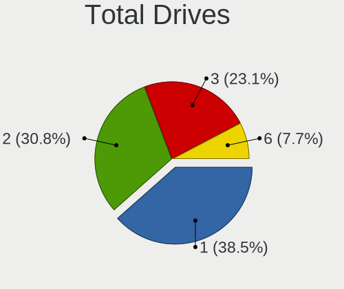
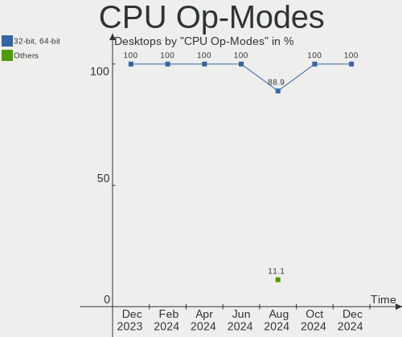
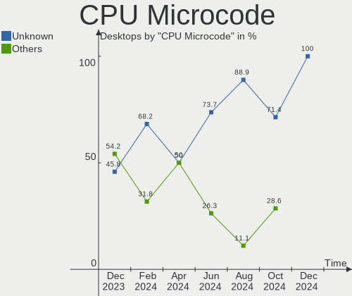
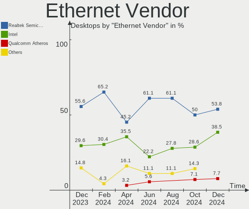
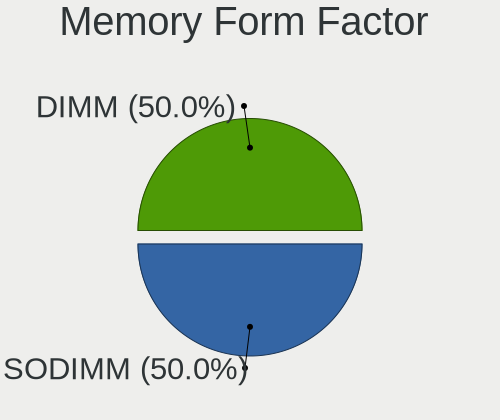

Xubuntu - Hardware Trends (Desktops)
------------------------------------

A project to identify most popular hardware characteristics and track their change
over time based on data collected by Linux users at https://Linux-Hardware.org.

Anyone can contribute to this report by the [hw-probe](https://github.com/linuxhw/hw-probe) tool:

    sudo -E hw-probe -all -upload

This report is for one last month. Overall report since the beginning of time: [TestCoverage](https://github.com/linuxhw/TestCoverage)

Period: May, 2022.

Contents
--------

* [ System ](#system)
  - [ OS                       ](#os)
  - [ OS Family                ](#os-family)
  - [ Kernel                   ](#kernel)
  - [ Kernel Family            ](#kernel-family)
  - [ Kernel Major Ver.        ](#kernel-major-ver)
  - [ Arch                     ](#arch)
  - [ DE                       ](#de)
  - [ Display Server           ](#display-server)
  - [ Display Manager          ](#display-manager)
  - [ OS Lang                  ](#os-lang)
  - [ Boot Mode                ](#boot-mode)
  - [ Filesystem               ](#filesystem)
  - [ Part. scheme             ](#part-scheme)
  - [ Dual Boot with Linux/BSD ](#dual-boot-with-linuxbsd)
  - [ Dual Boot (Win)          ](#dual-boot-win)

* [ Board ](#board)
  - [ Vendor                   ](#vendor)
  - [ Model                    ](#model)
  - [ Model Family             ](#model-family)
  - [ MFG Year                 ](#mfg-year)
  - [ Form Factor              ](#form-factor)
  - [ Secure Boot              ](#secure-boot)
  - [ Coreboot                 ](#coreboot)
  - [ RAM Size                 ](#ram-size)
  - [ RAM Used                 ](#ram-used)
  - [ Total Drives             ](#total-drives)
  - [ Has CD-ROM               ](#has-cd-rom)
  - [ Has Ethernet             ](#has-ethernet)
  - [ Has WiFi                 ](#has-wifi)
  - [ Has Bluetooth            ](#has-bluetooth)

* [ Location ](#location)
  - [ Country                  ](#country)
  - [ City                     ](#city)

* [ Drives ](#drives)
  - [ Drive Vendor             ](#drive-vendor)
  - [ Drive Model              ](#drive-model)
  - [ HDD Vendor               ](#hdd-vendor)
  - [ SSD Vendor               ](#ssd-vendor)
  - [ Drive Kind               ](#drive-kind)
  - [ Drive Connector          ](#drive-connector)
  - [ Drive Size               ](#drive-size)
  - [ Space Total              ](#space-total)
  - [ Space Used               ](#space-used)
  - [ Malfunc. Drives          ](#malfunc-drives)
  - [ Malfunc. Drive Vendor    ](#malfunc-drive-vendor)
  - [ Malfunc. HDD Vendor      ](#malfunc-hdd-vendor)
  - [ Malfunc. Drive Kind      ](#malfunc-drive-kind)
  - [ Failed Drives            ](#failed-drives)
  - [ Failed Drive Vendor      ](#failed-drive-vendor)
  - [ Drive Status             ](#drive-status)

* [ Storage controller ](#storage-controller)
  - [ Storage Vendor           ](#storage-vendor)
  - [ Storage Model            ](#storage-model)
  - [ Storage Kind             ](#storage-kind)

* [ Processor ](#processor)
  - [ CPU Vendor               ](#cpu-vendor)
  - [ CPU Model                ](#cpu-model)
  - [ CPU Model Family         ](#cpu-model-family)
  - [ CPU Cores                ](#cpu-cores)
  - [ CPU Sockets              ](#cpu-sockets)
  - [ CPU Threads              ](#cpu-threads)
  - [ CPU Op-Modes             ](#cpu-op-modes)
  - [ CPU Microcode            ](#cpu-microcode)
  - [ CPU Microarch            ](#cpu-microarch)

* [ Graphics ](#graphics)
  - [ GPU Vendor               ](#gpu-vendor)
  - [ GPU Model                ](#gpu-model)
  - [ GPU Combo                ](#gpu-combo)
  - [ GPU Driver               ](#gpu-driver)
  - [ GPU Memory               ](#gpu-memory)

* [ Monitor ](#monitor)
  - [ Monitor Vendor           ](#monitor-vendor)
  - [ Monitor Model            ](#monitor-model)
  - [ Monitor Resolution       ](#monitor-resolution)
  - [ Monitor Diagonal         ](#monitor-diagonal)
  - [ Monitor Width            ](#monitor-width)
  - [ Aspect Ratio             ](#aspect-ratio)
  - [ Monitor Area             ](#monitor-area)
  - [ Pixel Density            ](#pixel-density)
  - [ Multiple Monitors        ](#multiple-monitors)

* [ Network ](#network)
  - [ Net Controller Vendor    ](#net-controller-vendor)
  - [ Net Controller Model     ](#net-controller-model)
  - [ Wireless Vendor          ](#wireless-vendor)
  - [ Wireless Model           ](#wireless-model)
  - [ Ethernet Vendor          ](#ethernet-vendor)
  - [ Ethernet Model           ](#ethernet-model)
  - [ Net Controller Kind      ](#net-controller-kind)
  - [ Used Controller          ](#used-controller)
  - [ NICs                     ](#nics)
  - [ IPv6                     ](#ipv6)

* [ Bluetooth ](#bluetooth)
  - [ Bluetooth Vendor         ](#bluetooth-vendor)
  - [ Bluetooth Model          ](#bluetooth-model)

* [ Sound ](#sound)
  - [ Sound Vendor             ](#sound-vendor)
  - [ Sound Model              ](#sound-model)

* [ Memory ](#memory)
  - [ Memory Vendor            ](#memory-vendor)
  - [ Memory Model             ](#memory-model)
  - [ Memory Kind              ](#memory-kind)
  - [ Memory Form Factor       ](#memory-form-factor)
  - [ Memory Size              ](#memory-size)
  - [ Memory Speed             ](#memory-speed)

* [ Printers & scanners ](#printers--scanners)
  - [ Printer Vendor           ](#printer-vendor)
  - [ Printer Model            ](#printer-model)
  - [ Scanner Vendor           ](#scanner-vendor)
  - [ Scanner Model            ](#scanner-model)

* [ Camera ](#camera)
  - [ Camera Vendor            ](#camera-vendor)
  - [ Camera Model             ](#camera-model)

* [ Security ](#security)
  - [ Fingerprint Vendor       ](#fingerprint-vendor)
  - [ Fingerprint Model        ](#fingerprint-model)
  - [ Chipcard Vendor          ](#chipcard-vendor)
  - [ Chipcard Model           ](#chipcard-model)

* [ Unsupported ](#unsupported)
  - [ Unsupported Devices      ](#unsupported-devices)
  - [ Unsupported Device Types ](#unsupported-device-types)

System
------

OS
--

Installed operating systems

| Name          | Desktops | Percent |
|---------------|----------|---------|
| Xubuntu 20.04 | 16       | 53.33%  |
| Xubuntu 22.04 | 10       | 33.33%  |
| Xubuntu 21.10 | 1        | 3.33%   |
| Xubuntu 21.04 | 1        | 3.33%   |
| Xubuntu 18.04 | 1        | 3.33%   |
| Xubuntu 16.04 | 1        | 3.33%   |

OS Family
---------

OS without a version

| Name    | Desktops | Percent |
|---------|----------|---------|
| Xubuntu | 30       | 100%    |

Kernel
------

Version of the Linux kernel

| Version              | Desktops | Percent |
|----------------------|----------|---------|
| 5.13.0-41-generic    | 6        | 20%     |
| 5.15.0-27-generic    | 5        | 16.67%  |
| 5.4.0-110-generic    | 2        | 6.67%   |
| 5.15.0-33-generic    | 2        | 6.67%   |
| 5.15.0-30-generic    | 2        | 6.67%   |
| 5.13.0-41-lowlatency | 2        | 6.67%   |
| 5.13.0-40-lowlatency | 2        | 6.67%   |
| 5.4.0-58-generic     | 1        | 3.33%   |
| 5.4.0-113-generic    | 1        | 3.33%   |
| 5.4.0-110-lowlatency | 1        | 3.33%   |
| 5.18.0               | 1        | 3.33%   |
| 5.13.0-44-generic    | 1        | 3.33%   |
| 5.13.0-40-generic    | 1        | 3.33%   |
| 5.13.0-39-lowlatency | 1        | 3.33%   |
| 5.11.0-49-generic    | 1        | 3.33%   |
| 4.4.0-224-generic    | 1        | 3.33%   |

Kernel Family
-------------

Linux kernel without a distro release

| Version | Desktops | Percent |
|---------|----------|---------|
| 5.13.0  | 13       | 43.33%  |
| 5.15.0  | 9        | 30%     |
| 5.4.0   | 5        | 16.67%  |
| 5.18.0  | 1        | 3.33%   |
| 5.11.0  | 1        | 3.33%   |
| 4.4.0   | 1        | 3.33%   |

Kernel Major Ver.
-----------------

Linux kernel major version

| Version | Desktops | Percent |
|---------|----------|---------|
| 5.13    | 13       | 43.33%  |
| 5.15    | 9        | 30%     |
| 5.4     | 5        | 16.67%  |
| 5.18    | 1        | 3.33%   |
| 5.11    | 1        | 3.33%   |
| 4.4     | 1        | 3.33%   |

Arch
----

OS architecture (x86_64, i586, etc.)

| Name   | Desktops | Percent |
|--------|----------|---------|
| x86_64 | 30       | 100%    |

DE
--

Desktop Environment

| Name       | Desktops | Percent |
|------------|----------|---------|
| XFCE       | 28       | 93.33%  |
| X-Cinnamon | 1        | 3.33%   |
| i3         | 1        | 3.33%   |

Display Server
--------------

X11 or Wayland

| Name | Desktops | Percent |
|------|----------|---------|
| X11  | 30       | 100%    |

Display Manager
---------------

SDDM, LightDM, etc.

| Name    | Desktops | Percent |
|---------|----------|---------|
| LightDM | 28       | 93.33%  |
| GDM3    | 1        | 3.33%   |
| Unknown | 1        | 3.33%   |

OS Lang
-------

Language

| Lang  | Desktops | Percent |
|-------|----------|---------|
| en_US | 12       | 40%     |
| fr_FR | 5        | 16.67%  |
| de_DE | 4        | 13.33%  |
| ja_JP | 2        | 6.67%   |
| en_CA | 2        | 6.67%   |
| en_AU | 2        | 6.67%   |
| sv_SE | 1        | 3.33%   |
| es_ES | 1        | 3.33%   |
| cs_CZ | 1        | 3.33%   |

Boot Mode
---------

EFI or BIOS

| Mode | Desktops | Percent |
|------|----------|---------|
| BIOS | 17       | 56.67%  |
| EFI  | 13       | 43.33%  |

Filesystem
----------

Type of filesystem

| Type  | Desktops | Percent |
|-------|----------|---------|
| Ext4  | 27       | 90%     |
| Btrfs | 3        | 10%     |

Part. scheme
------------

Scheme of partitioning

| Type    | Desktops | Percent |
|---------|----------|---------|
| Unknown | 16       | 53.33%  |
| GPT     | 11       | 36.67%  |
| MBR     | 3        | 10%     |

Dual Boot with Linux/BSD
------------------------

Hosting more than one Linux/BSD

| Dual boot | Desktops | Percent |
|-----------|----------|---------|
| No        | 17       | 56.67%  |
| Yes       | 13       | 43.33%  |

Dual Boot (Win)
---------------

Hosting Linux and Windows

| Dual boot | Desktops | Percent |
|-----------|----------|---------|
| No        | 18       | 60%     |
| Yes       | 12       | 40%     |

Board
-----

Vendor
------

Motherboard manufacturer

| Name                | Desktops | Percent |
|---------------------|----------|---------|
| ASUSTek Computer    | 8        | 26.67%  |
| Gigabyte Technology | 6        | 20%     |
| Hewlett-Packard     | 5        | 16.67%  |
| MSI                 | 2        | 6.67%   |
| ASRock              | 2        | 6.67%   |
| Acer                | 2        | 6.67%   |
| Pegatron            | 1        | 3.33%   |
| Lenovo              | 1        | 3.33%   |
| Fujitsu             | 1        | 3.33%   |
| ECS                 | 1        | 3.33%   |
| Dell                | 1        | 3.33%   |

Model
-----

Motherboard model

| Name                              | Desktops | Percent |
|-----------------------------------|----------|---------|
| Pegatron NY802AV-ABA p6110t       | 1        | 3.33%   |
| MSI MS-7C91                       | 1        | 3.33%   |
| MSI MS-7865                       | 1        | 3.33%   |
| Lenovo ThinkCentre M72e 32675L2   | 1        | 3.33%   |
| HP Z620 Workstation               | 1        | 3.33%   |
| HP ProDesk 600 G3 SFF             | 1        | 3.33%   |
| HP Compaq Elite 8300 SFF          | 1        | 3.33%   |
| HP Compaq 6200 Pro MT PC          | 1        | 3.33%   |
| HP 550-a114                       | 1        | 3.33%   |
| Gigabyte Z97X-UD3H                | 1        | 3.33%   |
| Gigabyte Z68A-D3-B3               | 1        | 3.33%   |
| Gigabyte X570S AORUS MASTER       | 1        | 3.33%   |
| Gigabyte X48-DS5                  | 1        | 3.33%   |
| Gigabyte G33M-DS2R                | 1        | 3.33%   |
| Gigabyte 970A-DS3P                | 1        | 3.33%   |
| Fujitsu CELSIUS W380              | 1        | 3.33%   |
| ECS EP175AA-ABE SR1797ES ES610    | 1        | 3.33%   |
| Dell OptiPlex 360                 | 1        | 3.33%   |
| ASUS VM60                         | 1        | 3.33%   |
| ASUS TUF Gaming B550-PLUS         | 1        | 3.33%   |
| ASUS TUF B450M-PRO GAMING         | 1        | 3.33%   |
| ASUS ROG CROSSHAIR VIII DARK HERO | 1        | 3.33%   |
| ASUS PRIME X470-PRO               | 1        | 3.33%   |
| ASUS P5KC                         | 1        | 3.33%   |
| ASUS B150-PLUS                    | 1        | 3.33%   |
| ASUS All Series                   | 1        | 3.33%   |
| ASRock X570 Phantom Gaming 4      | 1        | 3.33%   |
| ASRock P55 Pro                    | 1        | 3.33%   |
| Acer Veriton M490G                | 1        | 3.33%   |
| Acer Aspire G7750                 | 1        | 3.33%   |

Model Family
------------

Motherboard model prefix

| Name                 | Desktops | Percent |
|----------------------|----------|---------|
| HP Compaq            | 2        | 6.67%   |
| ASUS TUF             | 2        | 6.67%   |
| Pegatron NY802AV-ABA | 1        | 3.33%   |
| MSI MS-7C91          | 1        | 3.33%   |
| MSI MS-7865          | 1        | 3.33%   |
| Lenovo ThinkCentre   | 1        | 3.33%   |
| HP Z620              | 1        | 3.33%   |
| HP ProDesk           | 1        | 3.33%   |
| HP 550-a114          | 1        | 3.33%   |
| Gigabyte Z97X-UD3H   | 1        | 3.33%   |
| Gigabyte Z68A-D3-B3  | 1        | 3.33%   |
| Gigabyte X570S       | 1        | 3.33%   |
| Gigabyte X48-DS5     | 1        | 3.33%   |
| Gigabyte G33M-DS2R   | 1        | 3.33%   |
| Gigabyte 970A-DS3P   | 1        | 3.33%   |
| Fujitsu CELSIUS      | 1        | 3.33%   |
| ECS EP175AA-ABE      | 1        | 3.33%   |
| Dell OptiPlex        | 1        | 3.33%   |
| ASUS VM60            | 1        | 3.33%   |
| ASUS ROG             | 1        | 3.33%   |
| ASUS PRIME           | 1        | 3.33%   |
| ASUS P5KC            | 1        | 3.33%   |
| ASUS B150-PLUS       | 1        | 3.33%   |
| ASUS All             | 1        | 3.33%   |
| ASRock X570          | 1        | 3.33%   |
| ASRock P55           | 1        | 3.33%   |
| Acer Veriton         | 1        | 3.33%   |
| Acer Aspire          | 1        | 3.33%   |

MFG Year
--------

Motherboard manufacture year

| Year | Desktops | Percent |
|------|----------|---------|
| 2013 | 3        | 10%     |
| 2012 | 3        | 10%     |
| 2009 | 3        | 10%     |
| 2007 | 3        | 10%     |
| 2021 | 2        | 6.67%   |
| 2020 | 2        | 6.67%   |
| 2019 | 2        | 6.67%   |
| 2015 | 2        | 6.67%   |
| 2014 | 2        | 6.67%   |
| 2010 | 2        | 6.67%   |
| 2008 | 2        | 6.67%   |
| 2018 | 1        | 3.33%   |
| 2017 | 1        | 3.33%   |
| 2016 | 1        | 3.33%   |
| 2011 | 1        | 3.33%   |

Form Factor
-----------

Physical design of the computer

| Name    | Desktops | Percent |
|---------|----------|---------|
| Desktop | 30       | 100%    |

Secure Boot
-----------

Enabled or disabled

| State    | Desktops | Percent |
|----------|----------|---------|
| Disabled | 30       | 100%    |

Coreboot
--------

Have coreboot on board

| Used | Desktops | Percent |
|------|----------|---------|
| No   | 30       | 100%    |

RAM Size
--------

Total RAM memory

| Size in GB  | Desktops | Percent |
|-------------|----------|---------|
| 16.01-24.0  | 7        | 23.33%  |
| 8.01-16.0   | 7        | 23.33%  |
| 4.01-8.0    | 5        | 16.67%  |
| 32.01-64.0  | 3        | 10%     |
| 3.01-4.0    | 3        | 10%     |
| 64.01-256.0 | 3        | 10%     |
| 24.01-32.0  | 1        | 3.33%   |
| 1.01-2.0    | 1        | 3.33%   |

RAM Used
--------

Used RAM memory

| Used GB    | Desktops | Percent |
|------------|----------|---------|
| 1.01-2.0   | 12       | 40%     |
| 3.01-4.0   | 6        | 20%     |
| 2.01-3.0   | 5        | 16.67%  |
| 4.01-8.0   | 3        | 10%     |
| 0.51-1.0   | 3        | 10%     |
| 24.01-32.0 | 1        | 3.33%   |

Total Drives
------------

Number of drives on board

| Drives | Desktops | Percent |
|--------|----------|---------|
| 3      | 13       | 43.33%  |
| 2      | 6        | 20%     |
| 1      | 6        | 20%     |
| 5      | 3        | 10%     |
| 4      | 1        | 3.33%   |
| 0      | 1        | 3.33%   |

Has CD-ROM
----------

Has CD-ROM on board

| Presented | Desktops | Percent |
|-----------|----------|---------|
| Yes       | 20       | 66.67%  |
| No        | 10       | 33.33%  |

Has Ethernet
------------

Has Ethernet on board

| Presented | Desktops | Percent |
|-----------|----------|---------|
| Yes       | 30       | 100%    |

Has WiFi
--------

Has WiFi module

| Presented | Desktops | Percent |
|-----------|----------|---------|
| No        | 20       | 66.67%  |
| Yes       | 10       | 33.33%  |

Has Bluetooth
-------------

Has Bluetooth module

| Presented | Desktops | Percent |
|-----------|----------|---------|
| No        | 21       | 70%     |
| Yes       | 9        | 30%     |

Location
--------

Country
-------

Geographic location (country)

| Country     | Desktops | Percent |
|-------------|----------|---------|
| Germany     | 6        | 20%     |
| USA         | 5        | 16.67%  |
| France      | 5        | 16.67%  |
| Spain       | 2        | 6.67%   |
| Japan       | 2        | 6.67%   |
| Canada      | 2        | 6.67%   |
| Australia   | 2        | 6.67%   |
| Sweden      | 1        | 3.33%   |
| Romania     | 1        | 3.33%   |
| Netherlands | 1        | 3.33%   |
| Italy       | 1        | 3.33%   |
| Hungary     | 1        | 3.33%   |
| Czechia     | 1        | 3.33%   |

City
----

Geographic location (city)

| City               | Desktops | Percent |
|--------------------|----------|---------|
| Paris              | 3        | 10%     |
| Berlin             | 2        | 6.67%   |
| Vohenstrauss       | 1        | 3.33%   |
| Vinaros            | 1        | 3.33%   |
| Villenave-d'Ornon  | 1        | 3.33%   |
| Sulzbach-Rosenberg | 1        | 3.33%   |
| Subiaco            | 1        | 3.33%   |
| Santa Maria        | 1        | 3.33%   |
| Porzuna            | 1        | 3.33%   |
| Pilsen             | 1        | 3.33%   |
| Overveen           | 1        | 3.33%   |
| Ottawa             | 1        | 3.33%   |
| Osaka              | 1        | 3.33%   |
| Münster           | 1        | 3.33%   |
| Montreal           | 1        | 3.33%   |
| Mito               | 1        | 3.33%   |
| Marignane          | 1        | 3.33%   |
| Malmo              | 1        | 3.33%   |
| Lancaster          | 1        | 3.33%   |
| Hamburg            | 1        | 3.33%   |
| Dothan             | 1        | 3.33%   |
| Denver             | 1        | 3.33%   |
| Buffalo            | 1        | 3.33%   |
| Budapest           | 1        | 3.33%   |
| Bucharest          | 1        | 3.33%   |
| Bolzano            | 1        | 3.33%   |
| Adelaide           | 1        | 3.33%   |

Drives
------

Drive Vendor
------------

Hard drive vendors

| Vendor              | Desktops | Drives | Percent |
|---------------------|----------|--------|---------|
| Seagate             | 14       | 21     | 23.33%  |
| WDC                 | 12       | 17     | 20%     |
| Samsung Electronics | 10       | 12     | 16.67%  |
| Toshiba             | 3        | 3      | 5%      |
| Intel               | 3        | 3      | 5%      |
| Crucial             | 3        | 4      | 5%      |
| Patriot             | 2        | 2      | 3.33%   |
| Kingston            | 2        | 2      | 3.33%   |
| Hitachi             | 2        | 2      | 3.33%   |
| Unknown             | 1        | 1      | 1.67%   |
| SanDisk             | 1        | 1      | 1.67%   |
| PNY                 | 1        | 1      | 1.67%   |
| Phison              | 1        | 2      | 1.67%   |
| OCZ                 | 1        | 1      | 1.67%   |
| Gigabyte Technology | 1        | 1      | 1.67%   |
| China               | 1        | 1      | 1.67%   |
| BUFFALO             | 1        | 1      | 1.67%   |
| ASMT                | 1        | 1      | 1.67%   |

Drive Model
-----------

Hard drive models

| Model                                | Desktops | Percent |
|--------------------------------------|----------|---------|
| Seagate ST3000DM008-2DM166 3TB       | 2        | 2.86%   |
| WDC WD800JD-22MSA1 80GB              | 1        | 1.43%   |
| WDC WD6400BPVT-80HXZT1 640GB         | 1        | 1.43%   |
| WDC WD6400BEVT-80A0RT0 640GB         | 1        | 1.43%   |
| WDC WD6000HLHX-01JJPV0 600GB         | 1        | 1.43%   |
| WDC WD5000AZLX-60K2TA0 500GB         | 1        | 1.43%   |
| WDC WD5000AAVS-22G9B1 500GB          | 1        | 1.43%   |
| WDC WD5000AAKS-00UU3A0 500GB         | 1        | 1.43%   |
| WDC WD50 00LPVX-80V0TT0 500GB        | 1        | 1.43%   |
| WDC WD20EZRZ-22Z5HB0 2TB             | 1        | 1.43%   |
| WDC WD2002FAEX-007BA0 2TB            | 1        | 1.43%   |
| WDC WD10EZRZ-00HTKB0 1TB             | 1        | 1.43%   |
| WDC WD10EZRX-00D8PB0 1TB             | 1        | 1.43%   |
| WDC WD10EZEX-08WN4A0 1TB             | 1        | 1.43%   |
| WDC WD10EZEX-00ZF5A0 1TB             | 1        | 1.43%   |
| WDC WD10EZEX-00BN5A0 1TB             | 1        | 1.43%   |
| WDC WD10EAVS-00D7B1 1TB              | 1        | 1.43%   |
| WDC WD10EARS-22Y5B1 1TB              | 1        | 1.43%   |
| Unknown SD/MMC/MS PRO 999GB          | 1        | 1.43%   |
| Toshiba HDWD120 2TB                  | 1        | 1.43%   |
| Toshiba HDWD110 1TB                  | 1        | 1.43%   |
| Toshiba DT01ACA200 2TB               | 1        | 1.43%   |
| Seagate ST750LM022 HN-M750MBB 752GB  | 1        | 1.43%   |
| Seagate ST6000VN001-2BB186 6TB       | 1        | 1.43%   |
| Seagate ST500LT012-1DG142 500GB      | 1        | 1.43%   |
| Seagate ST500LM000-1EJ162-SSHD 500GB | 1        | 1.43%   |
| Seagate ST500DM002-1BD142 500GB      | 1        | 1.43%   |
| Seagate ST3500413AS 500GB            | 1        | 1.43%   |
| Seagate ST3320418AS 320GB            | 1        | 1.43%   |
| Seagate ST3160318AS 160GB            | 1        | 1.43%   |
| Seagate ST31000340AS 1TB             | 1        | 1.43%   |
| Seagate ST2000DM008-2FR102 2TB       | 1        | 1.43%   |
| Seagate ST2000DM001-9YN164 2TB       | 1        | 1.43%   |
| Seagate ST2000DM001-1CH164 2TB       | 1        | 1.43%   |
| Seagate ST2000DL003-9VT166 2TB       | 1        | 1.43%   |
| Seagate ST1000LX015-1U7172 1TB       | 1        | 1.43%   |
| Seagate ST1000DM003-1SB10C 1TB       | 1        | 1.43%   |
| Seagate OneTouch HDD 5TB             | 1        | 1.43%   |
| SanDisk SDSSDA240G 240GB             | 1        | 1.43%   |
| Samsung SSD 980 PRO 2TB              | 1        | 1.43%   |
| Samsung SSD 970 EVO Plus 500GB       | 1        | 1.43%   |
| Samsung SSD 860 EVO 500GB            | 1        | 1.43%   |
| Samsung SSD 850 EVO 120GB            | 1        | 1.43%   |
| Samsung SSD 840 Series 250GB         | 1        | 1.43%   |
| Samsung SSD 840 Series 120GB         | 1        | 1.43%   |
| Samsung NVMe SSD Drive 512GB         | 1        | 1.43%   |
| Samsung MZVLW256HEHP-000H1 256GB     | 1        | 1.43%   |
| Samsung MZNLN256HMHQ-000H1 256GB SSD | 1        | 1.43%   |
| Samsung HD501LJ 500GB                | 1        | 1.43%   |
| Samsung HD160JJ 160GB                | 1        | 1.43%   |
| PNY EU SSD CS1311 120GB              | 1        | 1.43%   |
| Phison Sabrent Rocket 4.0 Plus 4TB   | 1        | 1.43%   |
| Patriot Burst Elite 120GB SSD        | 1        | 1.43%   |
| Patriot Burst 480GB SSD              | 1        | 1.43%   |
| OCZ TRION150 240GB SSD               | 1        | 1.43%   |
| Kingston SUV400S37240G 240GB SSD     | 1        | 1.43%   |
| Kingston SH103S3120G 120GB SSD       | 1        | 1.43%   |
| Intel SSDSA2M040G2GC 40GB            | 1        | 1.43%   |
| Intel SSDPEKNW020T8 2TB              | 1        | 1.43%   |
| Intel NVMe SSD Drive 512GB           | 1        | 1.43%   |

HDD Vendor
----------

Hard disk drive vendors

| Vendor              | Desktops | Drives | Percent |
|---------------------|----------|--------|---------|
| Seagate             | 14       | 21     | 40%     |
| WDC                 | 12       | 17     | 34.29%  |
| Toshiba             | 3        | 3      | 8.57%   |
| Samsung Electronics | 2        | 3      | 5.71%   |
| Hitachi             | 2        | 2      | 5.71%   |
| Unknown             | 1        | 1      | 2.86%   |
| ASMT                | 1        | 1      | 2.86%   |

SSD Vendor
----------

Solid state drive vendors

| Vendor              | Desktops | Drives | Percent |
|---------------------|----------|--------|---------|
| Samsung Electronics | 5        | 5      | 27.78%  |
| Crucial             | 3        | 4      | 16.67%  |
| Patriot             | 2        | 2      | 11.11%  |
| Kingston            | 2        | 2      | 11.11%  |
| SanDisk             | 1        | 1      | 5.56%   |
| PNY                 | 1        | 1      | 5.56%   |
| OCZ                 | 1        | 1      | 5.56%   |
| Intel               | 1        | 1      | 5.56%   |
| China               | 1        | 1      | 5.56%   |
| BUFFALO             | 1        | 1      | 5.56%   |

Drive Kind
----------

HDD or SSD

| Kind | Desktops | Drives | Percent |
|------|----------|--------|---------|
| HDD  | 24       | 48     | 53.33%  |
| SSD  | 14       | 19     | 31.11%  |
| NVMe | 7        | 9      | 15.56%  |

Drive Connector
---------------

SATA, SAS, NVMe, etc.

| Type | Desktops | Drives | Percent |
|------|----------|--------|---------|
| SATA | 28       | 62     | 71.79%  |
| NVMe | 7        | 9      | 17.95%  |
| SAS  | 4        | 5      | 10.26%  |

Drive Size
----------

Size of hard drive

| Size in TB | Desktops | Drives | Percent |
|------------|----------|--------|---------|
| 0.01-0.5   | 21       | 33     | 44.68%  |
| 0.51-1.0   | 13       | 18     | 27.66%  |
| 1.01-2.0   | 8        | 10     | 17.02%  |
| 2.01-3.0   | 3        | 3      | 6.38%   |
| 4.01-10.0  | 2        | 3      | 4.26%   |

Space Total
-----------

Amount of disk space available on the file system

| Size in GB     | Desktops | Percent |
|----------------|----------|---------|
| 101-250        | 8        | 26.67%  |
| More than 3000 | 6        | 20%     |
| 1001-2000      | 6        | 20%     |
| 251-500        | 3        | 10%     |
| 2001-3000      | 3        | 10%     |
| 501-1000       | 2        | 6.67%   |
| 51-100         | 2        | 6.67%   |

Space Used
----------

Amount of used disk space

| Used GB        | Desktops | Percent |
|----------------|----------|---------|
| 21-50          | 7        | 23.33%  |
| 501-1000       | 6        | 20%     |
| 2001-3000      | 3        | 10%     |
| 101-250        | 3        | 10%     |
| 1-20           | 3        | 10%     |
| More than 3000 | 2        | 6.67%   |
| 251-500        | 2        | 6.67%   |
| 1001-2000      | 2        | 6.67%   |
| 51-100         | 2        | 6.67%   |

Malfunc. Drives
---------------

Drive models with a malfunction

| Model                          | Desktops | Drives | Percent |
|--------------------------------|----------|--------|---------|
| WDC WD10EAVS-00D7B1 1TB        | 1        | 1      | 33.33%  |
| Seagate ST2000DM001-1CH164 2TB | 1        | 2      | 33.33%  |
| Seagate ST2000DL003-9VT166 2TB | 1        | 1      | 33.33%  |

Malfunc. Drive Vendor
---------------------

Vendors of faulty drives

| Vendor  | Desktops | Drives | Percent |
|---------|----------|--------|---------|
| Seagate | 2        | 3      | 66.67%  |
| WDC     | 1        | 1      | 33.33%  |

Malfunc. HDD Vendor
-------------------

Vendors of faulty HDD drives

| Vendor  | Desktops | Drives | Percent |
|---------|----------|--------|---------|
| Seagate | 2        | 3      | 66.67%  |
| WDC     | 1        | 1      | 33.33%  |

Malfunc. Drive Kind
-------------------

Kinds of faulty drives

| Kind | Desktops | Drives | Percent |
|------|----------|--------|---------|
| HDD  | 3        | 4      | 100%    |

Failed Drives
-------------

Failed drive models

Zero info for selected period =(

Failed Drive Vendor
-------------------

Failed drive vendors

Zero info for selected period =(

Drive Status
------------

Number of failed and malfunc. drives

| Status   | Desktops | Drives | Percent |
|----------|----------|--------|---------|
| Detected | 15       | 39     | 46.88%  |
| Works    | 14       | 33     | 43.75%  |
| Malfunc  | 3        | 4      | 9.38%   |

Storage controller
------------------

Storage Vendor
--------------

Storage controller vendors

| Vendor              | Desktops | Percent |
|---------------------|----------|---------|
| Intel               | 20       | 45.45%  |
| AMD                 | 11       | 25%     |
| JMicron Technology  | 5        | 11.36%  |
| Samsung Electronics | 4        | 9.09%   |
| Phison Electronics  | 2        | 4.55%   |
| Silicon Image       | 1        | 2.27%   |
| Broadcom / LSI      | 1        | 2.27%   |

Storage Model
-------------

Storage controller models

| Model                                                                         | Desktops | Percent |
|-------------------------------------------------------------------------------|----------|---------|
| AMD FCH SATA Controller [AHCI mode]                                           | 7        | 11.29%  |
| JMicron JMB363 SATA/IDE Controller                                            | 4        | 6.45%   |
| Intel SATA Controller [RAID mode]                                             | 3        | 4.84%   |
| Intel 82801I (ICH9 Family) 2 port SATA Controller [IDE mode]                  | 3        | 4.84%   |
| Intel 82801IR/IO/IH (ICH9R/DO/DH) 4 port SATA Controller [IDE mode]           | 2        | 3.23%   |
| Intel 6 Series/C200 Series Chipset Family 6 port Desktop SATA AHCI Controller | 2        | 3.23%   |
| Intel 5 Series/3400 Series Chipset PT IDER Controller                         | 2        | 3.23%   |
| Intel 5 Series/3400 Series Chipset 4 port SATA IDE Controller                 | 2        | 3.23%   |
| Intel 5 Series/3400 Series Chipset 2 port SATA IDE Controller                 | 2        | 3.23%   |
| AMD 500 Series Chipset SATA Controller                                        | 2        | 3.23%   |
| AMD 400 Series Chipset SATA Controller                                        | 2        | 3.23%   |
| Silicon Image SiI 3114 [SATALink/SATARaid] Serial ATA Controller              | 1        | 1.61%   |
| Samsung NVMe SSD Controller SM981/PM981/PM983                                 | 1        | 1.61%   |
| Samsung NVMe SSD Controller SM961/PM961/SM963                                 | 1        | 1.61%   |
| Samsung NVMe SSD Controller SM951/PM951                                       | 1        | 1.61%   |
| Samsung NVMe SSD Controller PM9A1/PM9A3/980PRO                                | 1        | 1.61%   |
| Phison E18 PCIe4 NVMe Controller                                              | 1        | 1.61%   |
| Phison E16 PCIe4 NVMe Controller                                              | 1        | 1.61%   |
| JMicron JMB368 IDE controller                                                 | 1        | 1.61%   |
| Intel SSD 660P Series                                                         | 1        | 1.61%   |
| Intel SSD 600P Series                                                         | 1        | 1.61%   |
| Intel Q170/Q150/B150/H170/H110/Z170/CM236 Chipset SATA Controller [AHCI Mode] | 1        | 1.61%   |
| Intel NM10/ICH7 Family SATA Controller [IDE mode]                             | 1        | 1.61%   |
| Intel C610/X99 series chipset sSATA Controller [AHCI mode]                    | 1        | 1.61%   |
| Intel C602 chipset 4-Port SATA Storage Control Unit                           | 1        | 1.61%   |
| Intel C600/X79 series chipset SATA RAID Controller                            | 1        | 1.61%   |
| Intel C600/X79 series chipset IDE-r Controller                                | 1        | 1.61%   |
| Intel 9 Series Chipset Family SATA Controller [AHCI Mode]                     | 1        | 1.61%   |
| Intel 82801JI (ICH10 Family) SATA AHCI Controller                             | 1        | 1.61%   |
| Intel 82801IB (ICH9) 2 port SATA Controller [IDE mode]                        | 1        | 1.61%   |
| Intel 82801G (ICH7 Family) IDE Controller                                     | 1        | 1.61%   |
| Intel 7 Series/C210 Series Chipset Family 4-port SATA Controller [IDE mode]   | 1        | 1.61%   |
| Intel 7 Series/C210 Series Chipset Family 2-port SATA Controller [IDE mode]   | 1        | 1.61%   |
| Intel 7 Series Chipset Family 6-port SATA Controller [AHCI mode]              | 1        | 1.61%   |
| Intel 5 Series/3400 Series Chipset 6 port SATA AHCI Controller                | 1        | 1.61%   |
| Intel 200 Series PCH SATA controller [AHCI mode]                              | 1        | 1.61%   |
| Broadcom / LSI MegaRAID SAS 2208 [Thunderbolt]                                | 1        | 1.61%   |
| AMD SB7x0/SB8x0/SB9x0 SATA Controller [IDE mode]                              | 1        | 1.61%   |
| AMD SB7x0/SB8x0/SB9x0 IDE Controller                                          | 1        | 1.61%   |
| AMD IXP SB4x0 Serial ATA Controller                                           | 1        | 1.61%   |
| AMD IXP SB4x0 IDE Controller                                                  | 1        | 1.61%   |
| AMD IXP SB400 Serial ATA Controller                                           | 1        | 1.61%   |

Storage Kind
------------

Kind of storage controller (IDE, SATA, NVMe, SAS, ...)

| Kind | Desktops | Percent |
|------|----------|---------|
| SATA | 19       | 43.18%  |
| IDE  | 12       | 27.27%  |
| NVMe | 7        | 15.91%  |
| RAID | 5        | 11.36%  |
| SAS  | 1        | 2.27%   |

Processor
---------

CPU Vendor
----------

Processor vendors

| Vendor | Desktops | Percent |
|--------|----------|---------|
| Intel  | 20       | 66.67%  |
| AMD    | 10       | 33.33%  |

CPU Model
---------

Processor models

| Model                                       | Desktops | Percent |
|---------------------------------------------|----------|---------|
| AMD Ryzen 9 5950X 16-Core Processor         | 2        | 6.67%   |
| Intel Xeon CPU E5450 @ 3.00GHz              | 1        | 3.33%   |
| Intel Xeon CPU E5-4650 v2 @ 2.40GHz         | 1        | 3.33%   |
| Intel Pentium Dual-Core CPU E5200 @ 2.50GHz | 1        | 3.33%   |
| Intel Pentium Dual CPU E2180 @ 2.00GHz      | 1        | 3.33%   |
| Intel Pentium D CPU 3.40GHz                 | 1        | 3.33%   |
| Intel Core i7-7700 CPU @ 3.60GHz            | 1        | 3.33%   |
| Intel Core i7-6800K CPU @ 3.40GHz           | 1        | 3.33%   |
| Intel Core i7-3770 CPU @ 3.40GHz            | 1        | 3.33%   |
| Intel Core i7-2600 CPU @ 3.40GHz            | 1        | 3.33%   |
| Intel Core i7 CPU 920 @ 2.67GHz             | 1        | 3.33%   |
| Intel Core i7 CPU 870 @ 2.93GHz             | 1        | 3.33%   |
| Intel Core i5-6600 CPU @ 3.30GHz            | 1        | 3.33%   |
| Intel Core i5-4690K CPU @ 3.50GHz           | 1        | 3.33%   |
| Intel Core i5-3470T CPU @ 2.90GHz           | 1        | 3.33%   |
| Intel Core i5-3337U CPU @ 1.80GHz           | 1        | 3.33%   |
| Intel Core i5 CPU 760 @ 2.80GHz             | 1        | 3.33%   |
| Intel Core i5 CPU 660 @ 3.33GHz             | 1        | 3.33%   |
| Intel Core i3-2100 CPU @ 3.10GHz            | 1        | 3.33%   |
| Intel Core 2 Quad CPU Q8200 @ 2.33GHz       | 1        | 3.33%   |
| Intel Core 2 Quad CPU Q6600 @ 2.40GHz       | 1        | 3.33%   |
| AMD Ryzen 9 5900X 12-Core Processor         | 1        | 3.33%   |
| AMD Ryzen 9 3900X 12-Core Processor         | 1        | 3.33%   |
| AMD Ryzen 5 3600 6-Core Processor           | 1        | 3.33%   |
| AMD Ryzen 5 3400G with Radeon Vega Graphics | 1        | 3.33%   |
| AMD Ryzen 5 2600 Six-Core Processor         | 1        | 3.33%   |
| AMD FX-8320 Eight-Core Processor            | 1        | 3.33%   |
| AMD Athlon 5350 APU with Radeon R3          | 1        | 3.33%   |
| AMD A8-6410 APU with AMD Radeon R5 Graphics | 1        | 3.33%   |

CPU Model Family
----------------

Processor model prefix

| Model                   | Desktops | Percent |
|-------------------------|----------|---------|
| Intel Core i7           | 6        | 20%     |
| Intel Core i5           | 6        | 20%     |
| AMD Ryzen 9             | 4        | 13.33%  |
| AMD Ryzen 5             | 3        | 10%     |
| Intel Xeon              | 2        | 6.67%   |
| Intel Core 2 Quad       | 2        | 6.67%   |
| Intel Pentium Dual-Core | 1        | 3.33%   |
| Intel Pentium Dual      | 1        | 3.33%   |
| Intel Pentium D         | 1        | 3.33%   |
| Intel Core i3           | 1        | 3.33%   |
| AMD FX                  | 1        | 3.33%   |
| AMD Athlon              | 1        | 3.33%   |
| AMD A8                  | 1        | 3.33%   |

CPU Cores
---------

Number of processor cores

| Number | Desktops | Percent |
|--------|----------|---------|
| 4      | 15       | 50%     |
| 2      | 7        | 23.33%  |
| 6      | 3        | 10%     |
| 16     | 2        | 6.67%   |
| 12     | 2        | 6.67%   |
| 20     | 1        | 3.33%   |

CPU Sockets
-----------

Number of sockets

| Number | Desktops | Percent |
|--------|----------|---------|
| 1      | 29       | 96.67%  |
| 2      | 1        | 3.33%   |

CPU Threads
-----------

Threads per core (Hyper-Threading)

| Number | Desktops | Percent |
|--------|----------|---------|
| 2      | 19       | 63.33%  |
| 1      | 11       | 36.67%  |

CPU Op-Modes
------------

CPU Operation Modes (32-bit, 64-bit)

| Op mode        | Desktops | Percent |
|----------------|----------|---------|
| 32-bit, 64-bit | 30       | 100%    |

CPU Microcode
-------------

Microcode number

| Number     | Desktops | Percent |
|------------|----------|---------|
| Unknown    | 4        | 13.33%  |
| 0x306a9    | 3        | 10%     |
| 0x106e5    | 2        | 6.67%   |
| 0xf64      | 1        | 3.33%   |
| 0x906e9    | 1        | 3.33%   |
| 0x6fd      | 1        | 3.33%   |
| 0x6fb      | 1        | 3.33%   |
| 0x506e3    | 1        | 3.33%   |
| 0x306e4    | 1        | 3.33%   |
| 0x306c3    | 1        | 3.33%   |
| 0x206a7    | 1        | 3.33%   |
| 0x20652    | 1        | 3.33%   |
| 0x106a5    | 1        | 3.33%   |
| 0x1067a    | 1        | 3.33%   |
| 0x10677    | 1        | 3.33%   |
| 0x10676    | 1        | 3.33%   |
| 0x0a201016 | 1        | 3.33%   |
| 0x08701021 | 1        | 3.33%   |
| 0x08701013 | 1        | 3.33%   |
| 0x08108109 | 1        | 3.33%   |
| 0x0800820d | 1        | 3.33%   |
| 0x0700010f | 1        | 3.33%   |
| 0x06000852 | 1        | 3.33%   |
| 0x00000000 | 1        | 3.33%   |

CPU Microarch
-------------

Microarchitecture

| Name        | Desktops | Percent |
|-------------|----------|---------|
| IvyBridge   | 4        | 13.33%  |
| Zen 3       | 3        | 10%     |
| Penryn      | 3        | 10%     |
| Nehalem     | 3        | 10%     |
| Zen+        | 2        | 6.67%   |
| Zen 2       | 2        | 6.67%   |
| SandyBridge | 2        | 6.67%   |
| Core        | 2        | 6.67%   |
| Westmere    | 1        | 3.33%   |
| Skylake     | 1        | 3.33%   |
| Puma        | 1        | 3.33%   |
| Piledriver  | 1        | 3.33%   |
| NetBurst    | 1        | 3.33%   |
| KabyLake    | 1        | 3.33%   |
| Jaguar      | 1        | 3.33%   |
| Haswell     | 1        | 3.33%   |
| Broadwell   | 1        | 3.33%   |

Graphics
--------

GPU Vendor
----------

Vendors of graphics cards

| Vendor | Desktops | Percent |
|--------|----------|---------|
| Nvidia | 17       | 53.13%  |
| AMD    | 9        | 28.13%  |
| Intel  | 6        | 18.75%  |

GPU Model
---------

Graphics card models

| Model                                                                       | Desktops | Percent |
|-----------------------------------------------------------------------------|----------|---------|
| Nvidia GM206 [GeForce GTX 960]                                              | 2        | 6.25%   |
| AMD Ellesmere [Radeon RX 470/480/570/570X/580/580X/590]                     | 2        | 6.25%   |
| AMD Caicos [Radeon HD 6450/7450/8450 / R5 230 OEM]                          | 2        | 6.25%   |
| Nvidia TU104 [GeForce RTX 2080]                                             | 1        | 3.13%   |
| Nvidia TU104 [GeForce RTX 2060]                                             | 1        | 3.13%   |
| Nvidia GT218 [GeForce 8400 GS Rev. 3]                                       | 1        | 3.13%   |
| Nvidia GP108 [GeForce GT 1030]                                              | 1        | 3.13%   |
| Nvidia GM206 [GeForce GTX 950]                                              | 1        | 3.13%   |
| Nvidia GK208B [GeForce GT 710]                                              | 1        | 3.13%   |
| Nvidia GK107 [GeForce GTX 650]                                              | 1        | 3.13%   |
| Nvidia GK104GL [Quadro K5000]                                               | 1        | 3.13%   |
| Nvidia GF108 [GeForce GT 420]                                               | 1        | 3.13%   |
| Nvidia GA106 [GeForce RTX 3060 Lite Hash Rate]                              | 1        | 3.13%   |
| Nvidia GA104 [GeForce RTX 3070 Ti]                                          | 1        | 3.13%   |
| Nvidia G96C [GeForce 9500 GT]                                               | 1        | 3.13%   |
| Nvidia G92 [GeForce GTS 250]                                                | 1        | 3.13%   |
| Nvidia G92 [GeForce 9800 GT]                                                | 1        | 3.13%   |
| Nvidia G84 [GeForce 8600 GT]                                                | 1        | 3.13%   |
| Intel Xeon E3-1200 v3/4th Gen Core Processor Integrated Graphics Controller | 1        | 3.13%   |
| Intel Xeon E3-1200 v2/3rd Gen Core processor Graphics Controller            | 1        | 3.13%   |
| Intel IvyBridge GT2 [HD Graphics 4000]                                      | 1        | 3.13%   |
| Intel HD Graphics 630                                                       | 1        | 3.13%   |
| Intel 82G33/G31 Express Integrated Graphics Controller                      | 1        | 3.13%   |
| Intel 3rd Gen Core processor Graphics Controller                            | 1        | 3.13%   |
| AMD Tobago PRO [Radeon R7 360 / R9 360 OEM]                                 | 1        | 3.13%   |
| AMD RC410 [Radeon Xpress 200/1100]                                          | 1        | 3.13%   |
| AMD Navi 21 [Radeon RX 6800/6800 XT / 6900 XT]                              | 1        | 3.13%   |
| AMD Mullins [Radeon R4/R5 Graphics]                                         | 1        | 3.13%   |
| AMD Kabini [Radeon HD 8400 / R3 Series]                                     | 1        | 3.13%   |

GPU Combo
---------

Combinations of graphics cards

| Name         | Desktops | Percent |
|--------------|----------|---------|
| 1 x Nvidia   | 15       | 50%     |
| 1 x AMD      | 7        | 23.33%  |
| 1 x Intel    | 6        | 20%     |
| AMD + Nvidia | 2        | 6.67%   |

GPU Driver
----------

Free vs proprietary

| Driver      | Desktops | Percent |
|-------------|----------|---------|
| Free        | 15       | 50%     |
| Proprietary | 14       | 46.67%  |
| Unknown     | 1        | 3.33%   |

GPU Memory
----------

Total video memory

| Size in GB | Desktops | Percent |
|------------|----------|---------|
| Unknown    | 8        | 26.67%  |
| 1.01-2.0   | 5        | 16.67%  |
| 0.01-0.5   | 5        | 16.67%  |
| 3.01-4.0   | 4        | 13.33%  |
| 0.51-1.0   | 3        | 10%     |
| 7.01-8.0   | 2        | 6.67%   |
| 8.01-16.0  | 2        | 6.67%   |
| 5.01-6.0   | 1        | 3.33%   |

Monitor
-------

Monitor Vendor
--------------

Monitor vendors

| Vendor              | Desktops | Percent |
|---------------------|----------|---------|
| Hewlett-Packard     | 6        | 19.35%  |
| Dell                | 5        | 16.13%  |
| Samsung Electronics | 3        | 9.68%   |
| ViewSonic           | 2        | 6.45%   |
| Eizo                | 2        | 6.45%   |
| BenQ                | 2        | 6.45%   |
| Vestel Elektronik   | 1        | 3.23%   |
| Unknown             | 1        | 3.23%   |
| Philips             | 1        | 3.23%   |
| Packard Bell        | 1        | 3.23%   |
| Idek Iiyama         | 1        | 3.23%   |
| HannStar            | 1        | 3.23%   |
| Goldstar            | 1        | 3.23%   |
| Fujitsu Siemens     | 1        | 3.23%   |
| Denver              | 1        | 3.23%   |
| AOC                 | 1        | 3.23%   |
| Acer                | 1        | 3.23%   |

Monitor Model
-------------

Monitor models

| Model                                                                | Desktops | Percent |
|----------------------------------------------------------------------|----------|---------|
| ViewSonic XG2401 SERIES VSCBB31 1920x1080 531x299mm 24.0-inch        | 1        | 3.03%   |
| ViewSonic VG2448 VSC3B35 1920x1080 530x300mm 24.0-inch               | 1        | 3.03%   |
| Vestel Elektronik 22W_LCD_TV VES3700 1920x540                        | 1        | 3.03%   |
| Unknown LCD Monitor SAMSUNG 1920x1080                                | 1        | 3.03%   |
| Samsung Electronics SyncMaster SAM0653 1920x1080                     | 1        | 3.03%   |
| Samsung Electronics SyncMaster SAM00E5 1280x1024 338x270mm 17.0-inch | 1        | 3.03%   |
| Samsung Electronics S24R35x SAM100E 1920x1080 530x300mm 24.0-inch    | 1        | 3.03%   |
| Philips PHL 328P6V PHL090B 3840x2160 700x400mm 31.7-inch             | 1        | 3.03%   |
| Packard Bell Viseo 230Ws PKB00C1 1920x1080 509x286mm 23.0-inch       | 1        | 3.03%   |
| Idek Iiyama LCD Monitor PLE2607WS                                    | 1        | 3.03%   |
| Hewlett-Packard w1858 HWP2835 1366x768 413x234mm 18.7-inch           | 1        | 3.03%   |
| Hewlett-Packard vs17 HWP2647 1280x1024 337x270mm 17.0-inch           | 1        | 3.03%   |
| Hewlett-Packard N270 HPN340C 1920x1080 598x336mm 27.0-inch           | 1        | 3.03%   |
| Hewlett-Packard LCD Monitor ZR2440w 5760x1200                        | 1        | 3.03%   |
| Hewlett-Packard LCD Monitor ZR2440w                                  | 1        | 3.03%   |
| Hewlett-Packard LCD Monitor 2159 1920x1080                           | 1        | 3.03%   |
| Hewlett-Packard 2009 HWP2827 1600x900 443x250mm 20.0-inch            | 1        | 3.03%   |
| HannStar Hanns.G HX191 HSD0013 1280x1024 376x301mm 19.0-inch         | 1        | 3.03%   |
| Goldstar IPS235 GSM587E 1920x1080 510x290mm 23.1-inch                | 1        | 3.03%   |
| Fujitsu Siemens W19-1 FUS0594 1440x900 410x256mm 19.0-inch           | 1        | 3.03%   |
| Eizo FS2434 ENC2635 1920x1080 528x297mm 23.9-inch                    | 1        | 3.03%   |
| Eizo CS2410 ENC3115 1920x1200 519x324mm 24.1-inch                    | 1        | 3.03%   |
| Denver Essentiel+ LHC2150 1920x1080 476x268mm 21.5-inch              | 1        | 3.03%   |
| Dell U3818DW DELA0F0 3840x1600 880x367mm 37.5-inch                   | 1        | 3.03%   |
| Dell U2415 DELA0B9 1920x1200 518x324mm 24.1-inch                     | 1        | 3.03%   |
| Dell P2210 DEL404E 1680x1050 474x296mm 22.0-inch                     | 1        | 3.03%   |
| Dell DELL3007WFPHC DEL4016 2560x1600 646x406mm 30.0-inch             | 1        | 3.03%   |
| Dell 1707FP DEL4013 1280x1024 338x270mm 17.0-inch                    | 1        | 3.03%   |
| Dell 1707FP DEL4012 1280x1024 338x270mm 17.0-inch                    | 1        | 3.03%   |
| BenQ LCD Monitor G2220HD 1920x1080                                   | 1        | 3.03%   |
| BenQ GL2460 BNQ78CE 1920x1080 531x299mm 24.0-inch                    | 1        | 3.03%   |
| AOC 2252W AOC2252 1920x1080 477x268mm 21.5-inch                      | 1        | 3.03%   |
| Acer K242HL ACR03E3 1920x1080 531x299mm 24.0-inch                    | 1        | 3.03%   |

Monitor Resolution
------------------

Monitor screen resolution

| Resolution         | Desktops | Percent |
|--------------------|----------|---------|
| 1920x1080 (FHD)    | 16       | 51.61%  |
| 1280x1024 (SXGA)   | 3        | 9.68%   |
| 3840x2160 (4K)     | 2        | 6.45%   |
| 1440x900 (WXGA+)   | 2        | 6.45%   |
| Unknown            | 2        | 6.45%   |
| 5760x1200          | 1        | 3.23%   |
| 3840x1600          | 1        | 3.23%   |
| 2560x1600          | 1        | 3.23%   |
| 1680x1050 (WSXGA+) | 1        | 3.23%   |
| 1600x900 (HD+)     | 1        | 3.23%   |
| 1366x768 (WXGA)    | 1        | 3.23%   |

Monitor Diagonal
----------------

Diagonal size in inches

| Inches  | Desktops | Percent |
|---------|----------|---------|
| 24      | 7        | 22.58%  |
| Unknown | 6        | 19.35%  |
| 23      | 3        | 9.68%   |
| 17      | 3        | 9.68%   |
| 21      | 2        | 6.45%   |
| 19      | 2        | 6.45%   |
| 84      | 1        | 3.23%   |
| 37      | 1        | 3.23%   |
| 31      | 1        | 3.23%   |
| 30      | 1        | 3.23%   |
| 27      | 1        | 3.23%   |
| 22      | 1        | 3.23%   |
| 20      | 1        | 3.23%   |
| 18      | 1        | 3.23%   |

Monitor Width
-------------

Physical width

| Width in mm | Desktops | Percent |
|-------------|----------|---------|
| 501-600     | 11       | 35.48%  |
| 401-500     | 6        | 19.35%  |
| Unknown     | 6        | 19.35%  |
| 301-350     | 3        | 9.68%   |
| 601-700     | 2        | 6.45%   |
| 801-900     | 1        | 3.23%   |
| 351-400     | 1        | 3.23%   |
| 1501-2000   | 1        | 3.23%   |

Aspect Ratio
------------

Proportional relationship between the width and the height

| Ratio   | Desktops | Percent |
|---------|----------|---------|
| 16/9    | 14       | 48.28%  |
| 16/10   | 5        | 17.24%  |
| Unknown | 5        | 17.24%  |
| 5/4     | 4        | 13.79%  |
| 21/9    | 1        | 3.45%   |

Monitor Area
------------

Area in inch²

| Area in inch² | Desktops | Percent |
|----------------|----------|---------|
| 201-250        | 9        | 29.03%  |
| Unknown        | 6        | 19.35%  |
| 151-200        | 5        | 16.13%  |
| 141-150        | 4        | 12.9%   |
| 351-500        | 2        | 6.45%   |
| 251-300        | 2        | 6.45%   |
| More than 1000 | 1        | 3.23%   |
| 301-350        | 1        | 3.23%   |
| 501-1000       | 1        | 3.23%   |

Pixel Density
-------------

Pixels per inch

| Density | Desktops | Percent |
|---------|----------|---------|
| 51-100  | 19       | 63.33%  |
| Unknown | 6        | 20%     |
| 101-120 | 4        | 13.33%  |
| 121-160 | 1        | 3.33%   |

Multiple Monitors
-----------------

Total monitors connected

| Total | Desktops | Percent |
|-------|----------|---------|
| 1     | 24       | 80%     |
| 2     | 5        | 16.67%  |
| 0     | 1        | 3.33%   |

Network
-------

Net Controller Vendor
---------------------

Controller vendors

| Vendor                | Desktops | Percent |
|-----------------------|----------|---------|
| Realtek Semiconductor | 18       | 45%     |
| Intel                 | 13       | 32.5%   |
| Qualcomm Atheros      | 2        | 5%      |
| Broadcom              | 2        | 5%      |
| ASUSTek Computer      | 2        | 5%      |
| Qualcomm              | 1        | 2.5%    |
| NetGear               | 1        | 2.5%    |
| D-Link System         | 1        | 2.5%    |

Net Controller Model
--------------------

Controller models

| Model                                                                             | Desktops | Percent |
|-----------------------------------------------------------------------------------|----------|---------|
| Realtek RTL8111/8168/8411 PCI Express Gigabit Ethernet Controller                 | 12       | 27.27%  |
| Realtek RTL8125 2.5GbE Controller                                                 | 3        | 6.82%   |
| Intel I211 Gigabit Network Connection                                             | 3        | 6.82%   |
| Intel 82579LM Gigabit Network Connection (Lewisville)                             | 3        | 6.82%   |
| Intel Wi-Fi 6 AX200                                                               | 2        | 4.55%   |
| Realtek RTL8169 PCI Gigabit Ethernet Controller                                   | 1        | 2.27%   |
| Realtek RTL810xE PCI Express Fast Ethernet controller                             | 1        | 2.27%   |
| Realtek RTL-8100/8101L/8139 PCI Fast Ethernet Adapter                             | 1        | 2.27%   |
| Qualcomm Redmi Note 9S                                                            | 1        | 2.27%   |
| Qualcomm Atheros Attansic L1 Gigabit Ethernet                                     | 1        | 2.27%   |
| Qualcomm Atheros AR93xx Wireless Network Adapter                                  | 1        | 2.27%   |
| NetGear A6150                                                                     | 1        | 2.27%   |
| Intel Wi-Fi 6 AX210/AX211/AX411 160MHz                                            | 1        | 2.27%   |
| Intel Ethernet Controller I225-V                                                  | 1        | 2.27%   |
| Intel Ethernet Connection I217-V                                                  | 1        | 2.27%   |
| Intel Ethernet Connection (5) I219-LM                                             | 1        | 2.27%   |
| Intel Ethernet Connection (2) I218-V                                              | 1        | 2.27%   |
| Intel Dual Band Wireless-AC 3168NGW [Stone Peak]                                  | 1        | 2.27%   |
| Intel 82578DM Gigabit Network Connection                                          | 1        | 2.27%   |
| Intel 82578DC Gigabit Network Connection                                          | 1        | 2.27%   |
| Intel 82574L Gigabit Network Connection                                           | 1        | 2.27%   |
| D-Link System DWA-131 802.11n Wireless N Nano Adapter(rev.A1) [Realtek RTL8192SU] | 1        | 2.27%   |
| Broadcom NetLink BCM5784M Gigabit Ethernet PCIe                                   | 1        | 2.27%   |
| Broadcom BCM43142 802.11b/g/n                                                     | 1        | 2.27%   |
| ASUS USB-N13 802.11n Network Adapter (rev. B1) [Realtek RTL8192CU]                | 1        | 2.27%   |
| ASUS AC51 802.11a/b/g/n/ac Wireless Adapter [Mediatek MT7610U]                    | 1        | 2.27%   |

Wireless Vendor
---------------

Wireless vendors

| Vendor           | Desktops | Percent |
|------------------|----------|---------|
| Intel            | 4        | 40%     |
| ASUSTek Computer | 2        | 20%     |
| Qualcomm Atheros | 1        | 10%     |
| NetGear          | 1        | 10%     |
| D-Link System    | 1        | 10%     |
| Broadcom         | 1        | 10%     |

Wireless Model
--------------

Wireless models

| Model                                                                             | Desktops | Percent |
|-----------------------------------------------------------------------------------|----------|---------|
| Intel Wi-Fi 6 AX200                                                               | 2        | 20%     |
| Qualcomm Atheros AR93xx Wireless Network Adapter                                  | 1        | 10%     |
| NetGear A6150                                                                     | 1        | 10%     |
| Intel Wi-Fi 6 AX210/AX211/AX411 160MHz                                            | 1        | 10%     |
| Intel Dual Band Wireless-AC 3168NGW [Stone Peak]                                  | 1        | 10%     |
| D-Link System DWA-131 802.11n Wireless N Nano Adapter(rev.A1) [Realtek RTL8192SU] | 1        | 10%     |
| Broadcom BCM43142 802.11b/g/n                                                     | 1        | 10%     |
| ASUS USB-N13 802.11n Network Adapter (rev. B1) [Realtek RTL8192CU]                | 1        | 10%     |
| ASUS AC51 802.11a/b/g/n/ac Wireless Adapter [Mediatek MT7610U]                    | 1        | 10%     |

Ethernet Vendor
---------------

Ethernet vendors

| Vendor                | Desktops | Percent |
|-----------------------|----------|---------|
| Realtek Semiconductor | 18       | 54.55%  |
| Intel                 | 12       | 36.36%  |
| Qualcomm Atheros      | 1        | 3.03%   |
| Qualcomm              | 1        | 3.03%   |
| Broadcom              | 1        | 3.03%   |

Ethernet Model
--------------

Ethernet models

| Model                                                             | Desktops | Percent |
|-------------------------------------------------------------------|----------|---------|
| Realtek RTL8111/8168/8411 PCI Express Gigabit Ethernet Controller | 12       | 35.29%  |
| Realtek RTL8125 2.5GbE Controller                                 | 3        | 8.82%   |
| Intel I211 Gigabit Network Connection                             | 3        | 8.82%   |
| Intel 82579LM Gigabit Network Connection (Lewisville)             | 3        | 8.82%   |
| Realtek RTL8169 PCI Gigabit Ethernet Controller                   | 1        | 2.94%   |
| Realtek RTL810xE PCI Express Fast Ethernet controller             | 1        | 2.94%   |
| Realtek RTL-8100/8101L/8139 PCI Fast Ethernet Adapter             | 1        | 2.94%   |
| Qualcomm Redmi Note 9S                                            | 1        | 2.94%   |
| Qualcomm Atheros Attansic L1 Gigabit Ethernet                     | 1        | 2.94%   |
| Intel Ethernet Controller I225-V                                  | 1        | 2.94%   |
| Intel Ethernet Connection I217-V                                  | 1        | 2.94%   |
| Intel Ethernet Connection (5) I219-LM                             | 1        | 2.94%   |
| Intel Ethernet Connection (2) I218-V                              | 1        | 2.94%   |
| Intel 82578DM Gigabit Network Connection                          | 1        | 2.94%   |
| Intel 82578DC Gigabit Network Connection                          | 1        | 2.94%   |
| Intel 82574L Gigabit Network Connection                           | 1        | 2.94%   |
| Broadcom NetLink BCM5784M Gigabit Ethernet PCIe                   | 1        | 2.94%   |

Net Controller Kind
-------------------

Ethernet, WiFi or modem

| Kind     | Desktops | Percent |
|----------|----------|---------|
| Ethernet | 30       | 75%     |
| WiFi     | 10       | 25%     |

Used Controller
---------------

Currently used network controller

| Kind     | Desktops | Percent |
|----------|----------|---------|
| Ethernet | 24       | 80%     |
| WiFi     | 6        | 20%     |

NICs
----

Total network controllers on board

| Total | Desktops | Percent |
|-------|----------|---------|
| 1     | 19       | 63.33%  |
| 2     | 9        | 30%     |
| 3     | 1        | 3.33%   |
| 0     | 1        | 3.33%   |

IPv6
----

IPv6 vs IPv4

| Used | Desktops | Percent |
|------|----------|---------|
| Yes  | 16       | 53.33%  |
| No   | 14       | 46.67%  |

Bluetooth
---------

Bluetooth Vendor
----------------

Controller vendors

| Vendor                  | Desktops | Percent |
|-------------------------|----------|---------|
| Intel                   | 4        | 44.44%  |
| Cambridge Silicon Radio | 2        | 22.22%  |
| Broadcom                | 2        | 22.22%  |
| TP-Link                 | 1        | 11.11%  |

Bluetooth Model
---------------

Controller models

| Model                                               | Desktops | Percent |
|-----------------------------------------------------|----------|---------|
| Intel AX200 Bluetooth                               | 2        | 22.22%  |
| Cambridge Silicon Radio Bluetooth Dongle (HCI mode) | 2        | 22.22%  |
| TP-Link UB500 Adapter                               | 1        | 11.11%  |
| Intel Wireless-AC 3168 Bluetooth                    | 1        | 11.11%  |
| Intel AX210 Bluetooth                               | 1        | 11.11%  |
| Broadcom BCM43142A0 Bluetooth Device                | 1        | 11.11%  |
| Broadcom BCM20702A0 Bluetooth 4.0                   | 1        | 11.11%  |

Sound
-----

Sound Vendor
------------

Sound card vendors

| Vendor                      | Desktops | Percent |
|-----------------------------|----------|---------|
| Intel                       | 18       | 31.03%  |
| AMD                         | 15       | 25.86%  |
| Nvidia                      | 13       | 22.41%  |
| Texas Instruments           | 2        | 3.45%   |
| SAVITECH                    | 2        | 3.45%   |
| Creative Labs               | 2        | 3.45%   |
| Yamaha                      | 1        | 1.72%   |
| VIA Technologies            | 1        | 1.72%   |
| RODE Microphones            | 1        | 1.72%   |
| MAG Technology              | 1        | 1.72%   |
| FiiO Electronics Technology | 1        | 1.72%   |
| Corsair                     | 1        | 1.72%   |

Sound Model
-----------

Sound card models

| Model                                                                             | Desktops | Percent |
|-----------------------------------------------------------------------------------|----------|---------|
| AMD Starship/Matisse HD Audio Controller                                          | 5        | 7.94%   |
| Nvidia GM206 High Definition Audio Controller                                     | 3        | 4.76%   |
| Intel 82801I (ICH9 Family) HD Audio Controller                                    | 3        | 4.76%   |
| Intel 6 Series/C200 Series Chipset Family High Definition Audio Controller        | 3        | 4.76%   |
| Intel 5 Series/3400 Series Chipset High Definition Audio                          | 3        | 4.76%   |
| Nvidia TU104 HD Audio Controller                                                  | 2        | 3.17%   |
| Intel 7 Series/C216 Chipset Family High Definition Audio Controller               | 2        | 3.17%   |
| AMD Kabini HDMI/DP Audio                                                          | 2        | 3.17%   |
| AMD FCH Azalia Controller                                                         | 2        | 3.17%   |
| AMD Ellesmere HDMI Audio [Radeon RX 470/480 / 570/580/590]                        | 2        | 3.17%   |
| AMD Caicos HDMI Audio [Radeon HD 6450 / 7450/8450/8490 OEM / R5 230/235/235X OEM] | 2        | 3.17%   |
| Yamaha Steinberg UR22mkII                                                         | 1        | 1.59%   |
| VIA Technologies VT1720/24 [Envy24PT/HT] PCI Multi-Channel Audio Controller       | 1        | 1.59%   |
| Texas Instruments PCM2902 Audio Codec                                             | 1        | 1.59%   |
| Texas Instruments PCM2900C Audio CODEC                                            | 1        | 1.59%   |
| SAVITECH SA9023 audio controller                                                  | 1        | 1.59%   |
| SAVITECH PHIREE D1                                                                | 1        | 1.59%   |
| RODE Microphones RODE NT-USB                                                      | 1        | 1.59%   |
| Nvidia High Definition Audio Controller                                           | 1        | 1.59%   |
| Nvidia GP108 High Definition Audio Controller                                     | 1        | 1.59%   |
| Nvidia GK208 HDMI/DP Audio Controller                                             | 1        | 1.59%   |
| Nvidia GK107 HDMI Audio Controller                                                | 1        | 1.59%   |
| Nvidia GK104 HDMI Audio Controller                                                | 1        | 1.59%   |
| Nvidia GF108 High Definition Audio Controller                                     | 1        | 1.59%   |
| Nvidia GA104 High Definition Audio Controller                                     | 1        | 1.59%   |
| Nvidia Audio device                                                               | 1        | 1.59%   |
| MAG Technology ARC AMP DAC                                                        | 1        | 1.59%   |
| Intel Xeon E3-1200 v3/4th Gen Core Processor HD Audio Controller                  | 1        | 1.59%   |
| Intel NM10/ICH7 Family High Definition Audio Controller                           | 1        | 1.59%   |
| Intel C610/X99 series chipset HD Audio Controller                                 | 1        | 1.59%   |
| Intel C600/X79 series chipset High Definition Audio Controller                    | 1        | 1.59%   |
| Intel 9 Series Chipset Family HD Audio Controller                                 | 1        | 1.59%   |
| Intel 82801JI (ICH10 Family) HD Audio Controller                                  | 1        | 1.59%   |
| Intel 200 Series PCH HD Audio                                                     | 1        | 1.59%   |
| Intel 100 Series/C230 Series Chipset Family HD Audio Controller                   | 1        | 1.59%   |
| FiiO Electronics Technology FiiO K3                                               | 1        | 1.59%   |
| Creative Labs Sound Core3D [Sound Blaster Recon3D / Z-Series]                     | 1        | 1.59%   |
| Creative Labs EMU20k1 [Sound Blaster X-Fi Series]                                 | 1        | 1.59%   |
| Corsair HS70 Pro Wireless Gaming Headset                                          | 1        | 1.59%   |
| AMD Tobago HDMI Audio [Radeon R7 360 / R9 360 OEM]                                | 1        | 1.59%   |
| AMD SBx00 Azalia (Intel HDA)                                                      | 1        | 1.59%   |
| AMD Navi 21/23 HDMI/DP Audio Controller                                           | 1        | 1.59%   |
| AMD IXP SB4x0 High Definition Audio Controller                                    | 1        | 1.59%   |
| AMD Family 17h/19h HD Audio Controller                                            | 1        | 1.59%   |
| AMD Family 17h (Models 00h-0fh) HD Audio Controller                               | 1        | 1.59%   |

Memory
------

Memory Vendor
-------------

Memory module vendors

| Vendor              | Desktops | Percent |
|---------------------|----------|---------|
| Corsair             | 4        | 20%     |
| Unknown             | 3        | 15%     |
| Samsung Electronics | 3        | 15%     |
| Kingston            | 3        | 15%     |
| G.Skill             | 3        | 15%     |
| SK Hynix            | 2        | 10%     |
| Transcend           | 1        | 5%      |
| Crucial             | 1        | 5%      |

Memory Model
------------

Memory module models

| Model                                                    | Desktops | Percent |
|----------------------------------------------------------|----------|---------|
| Unknown RAM Module 4GB DIMM SDRAM                        | 1        | 4.35%   |
| Unknown RAM Module 2GB DIMM DDR2 800MT/s                 | 1        | 4.35%   |
| Unknown RAM 2400 C16 Series 8192MB DIMM DDR4 1200MT/s    | 1        | 4.35%   |
| Transcend RAM JM1600KSN-4G 4096MB SODIMM DDR3 1600MT/s   | 1        | 4.35%   |
| SK Hynix RAM Module 8192MB DIMM DDR4 2400MT/s            | 1        | 4.35%   |
| SK Hynix RAM HMT325U6CFR8C-H9 2GB DIMM DDR3 1600MT/s     | 1        | 4.35%   |
| Samsung RAM M471B5273DH0-CK0 4096MB SODIMM DDR3 1600MT/s | 1        | 4.35%   |
| Samsung RAM M471B1G73BH0-CK0 8GB SODIMM DDR3 1600MT/s    | 1        | 4.35%   |
| Samsung RAM M378B5773DH0-CH9 2GB DIMM DDR3 1333MT/s      | 1        | 4.35%   |
| Kingston RAM KHX1866C10D3/ 4096MB DIMM DDR3 1866MT/s     | 1        | 4.35%   |
| Kingston RAM 99U5471-049.A00LF 8GB DIMM DDR3 800MT/s     | 1        | 4.35%   |
| Kingston RAM 99U5471-002.A01LF 2GB DIMM DDR3 1334MT/s    | 1        | 4.35%   |
| Kingston RAM 99U5471-002.A00LF 2GB DIMM DDR3 1334MT/s    | 1        | 4.35%   |
| Kingston RAM 99U5471-001.A00LF 2GB DIMM DDR3 1334MT/s    | 1        | 4.35%   |
| Kingston RAM 9905471-001.A01LF 2GB DIMM DDR3 1600MT/s    | 1        | 4.35%   |
| G.Skill RAM F4-3600C16-32GTRS 32GB DIMM DDR4 3600MT/s    | 1        | 4.35%   |
| G.Skill RAM F4-3200C16-8GFX 8GB DIMM DDR4 3200MT/s       | 1        | 4.35%   |
| G.Skill RAM F3-10666CL9-4GBXL 4GB DIMM DDR3 1333MT/s     | 1        | 4.35%   |
| Crucial RAM CT102464BA1339.M16 8GB DIMM DDR3 1333MT/s    | 1        | 4.35%   |
| Corsair RAM CMW16GX4M2C3200C16 8GB DIMM DDR4 3266MT/s    | 1        | 4.35%   |
| Corsair RAM CMT64GX4M4Z3600C16 16GB DIMM DDR4 3600MT/s   | 1        | 4.35%   |
| Corsair RAM CMK8GX4M1A2666C16 8GB DIMM DDR4 3000MT/s     | 1        | 4.35%   |
| Corsair RAM CMK16GX4M2B3200C16 8GB DIMM DDR4 3600MT/s    | 1        | 4.35%   |

Memory Kind
-----------

Memory module kinds

| Kind  | Desktops | Percent |
|-------|----------|---------|
| DDR4  | 8        | 44.44%  |
| DDR3  | 7        | 38.89%  |
| SDRAM | 2        | 11.11%  |
| DDR2  | 1        | 5.56%   |

Memory Form Factor
------------------

Physical design of the memory module

| Name   | Desktops | Percent |
|--------|----------|---------|
| DIMM   | 15       | 88.24%  |
| SODIMM | 2        | 11.76%  |

Memory Size
-----------

Memory module size

| Size  | Desktops | Percent |
|-------|----------|---------|
| 8192  | 9        | 50%     |
| 4096  | 3        | 16.67%  |
| 2048  | 3        | 16.67%  |
| 16384 | 2        | 11.11%  |
| 32768 | 1        | 5.56%   |

Memory Speed
------------

Memory module speed

| Speed   | Desktops | Percent |
|---------|----------|---------|
| 1600    | 4        | 21.05%  |
| 3600    | 3        | 15.79%  |
| 2400    | 2        | 10.53%  |
| 1333    | 2        | 10.53%  |
| 800     | 2        | 10.53%  |
| 3266    | 1        | 5.26%   |
| 3200    | 1        | 5.26%   |
| 3000    | 1        | 5.26%   |
| 1866    | 1        | 5.26%   |
| 1334    | 1        | 5.26%   |
| Unknown | 1        | 5.26%   |

Printers & scanners
-------------------

Printer Vendor
--------------

Printer device vendors

| Vendor              | Desktops | Percent |
|---------------------|----------|---------|
| Seiko Epson         | 1        | 33.33%  |
| Samsung Electronics | 1        | 33.33%  |
| Hewlett-Packard     | 1        | 33.33%  |

Printer Model
-------------

Printer device models

| Model                      | Desktops | Percent |
|----------------------------|----------|---------|
| Seiko Epson ET-2720 Series | 1        | 33.33%  |
| Samsung SF-760 Series      | 1        | 33.33%  |
| HP DeskJet D1360           | 1        | 33.33%  |

Scanner Vendor
--------------

Scanner device vendors

Zero info for selected period =(

Scanner Model
-------------

Scanner device models

Zero info for selected period =(

Camera
------

Camera Vendor
-------------

Camera device vendors

| Vendor              | Desktops | Percent |
|---------------------|----------|---------|
| Logitech            | 3        | 50%     |
| Microdia            | 1        | 16.67%  |
| Creative Technology | 1        | 16.67%  |
| ARC International   | 1        | 16.67%  |

Camera Model
------------

Camera device models

| Model                         | Desktops | Percent |
|-------------------------------|----------|---------|
| Logitech HD Pro Webcam C920   | 2        | 33.33%  |
| Microdia Webcam Vitade AF     | 1        | 16.67%  |
| Logitech BRIO Ultra HD Webcam | 1        | 16.67%  |
| Creative Live! Cam Sync 1080p | 1        | 16.67%  |
| ARC International Camera      | 1        | 16.67%  |

Security
--------

Fingerprint Vendor
------------------

Fingerprint sensor vendors

Zero info for selected period =(

Fingerprint Model
-----------------

Fingerprint sensor models

Zero info for selected period =(

Chipcard Vendor
---------------

Chipcard module vendors

| Vendor                   | Desktops | Percent |
|--------------------------|----------|---------|
| Reiner SCT Kartensysteme | 1        | 100%    |

Chipcard Model
--------------

Chipcard module models

| Model                                  | Desktops | Percent |
|----------------------------------------|----------|---------|
| Reiner SCT Kartensysteme cyberJack one | 1        | 100%    |

Unsupported
-----------

Unsupported Devices
-------------------

Total unsupported devices on board

| Total | Desktops | Percent |
|-------|----------|---------|
| 0     | 26       | 86.67%  |
| 1     | 3        | 10%     |
| 5     | 1        | 3.33%   |

Unsupported Device Types
------------------------

Types of unsupported devices

| Type                     | Desktops | Percent |
|--------------------------|----------|---------|
| Graphics card            | 2        | 25%     |
| Unassigned class         | 1        | 12.5%   |
| Sound                    | 1        | 12.5%   |
| Dvb card                 | 1        | 12.5%   |
| Communication controller | 1        | 12.5%   |
| Chipcard                 | 1        | 12.5%   |
| Camera                   | 1        | 12.5%   |

