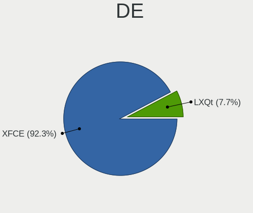
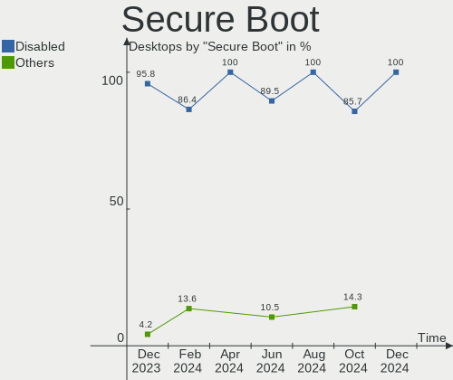
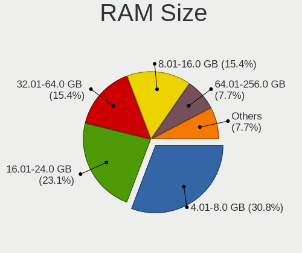
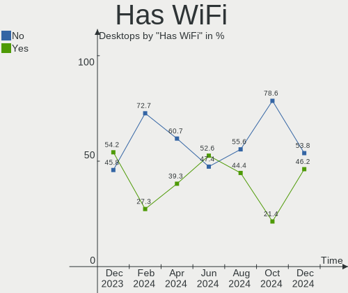
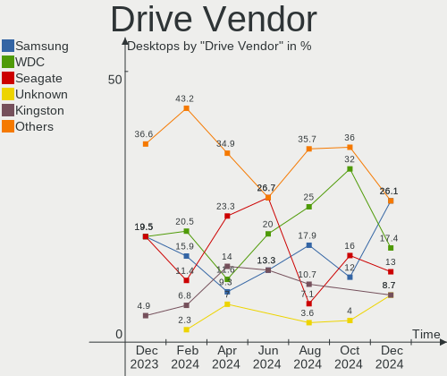
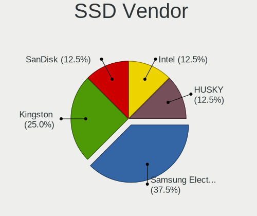
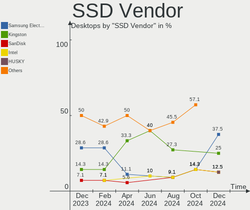
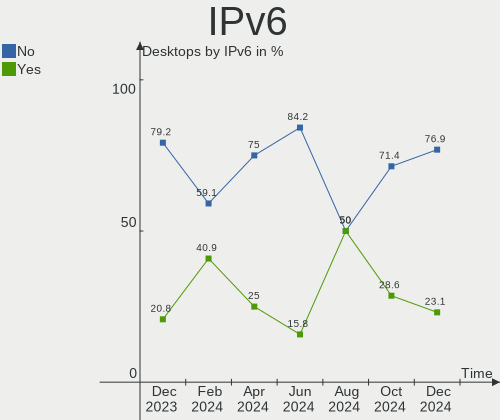
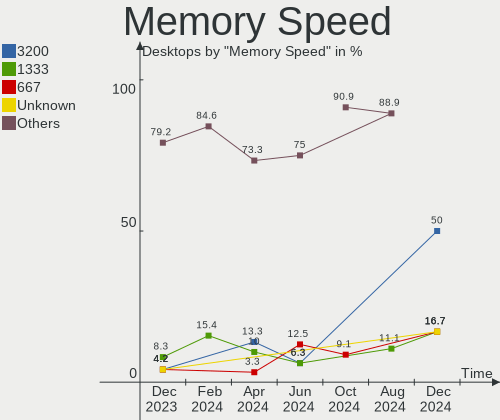

Xubuntu - Hardware Trends (Desktops)
------------------------------------

A project to identify most popular hardware characteristics and track their change
over time based on data collected by Linux users at https://Linux-Hardware.org.

Anyone can contribute to this report by the [hw-probe](https://github.com/linuxhw/hw-probe) tool:

    sudo -E hw-probe -all -upload

This report is for one last month. Overall report since the beginning of time: [TestDays](https://github.com/linuxhw/TestDays)

Period: Oct, 2023.

Contents
--------

* [ System ](#system)
  - [ OS                       ](#os)
  - [ OS Family                ](#os-family)
  - [ Kernel                   ](#kernel)
  - [ Kernel Family            ](#kernel-family)
  - [ Kernel Major Ver.        ](#kernel-major-ver)
  - [ Arch                     ](#arch)
  - [ DE                       ](#de)
  - [ Display Server           ](#display-server)
  - [ Display Manager          ](#display-manager)
  - [ OS Lang                  ](#os-lang)
  - [ Boot Mode                ](#boot-mode)
  - [ Filesystem               ](#filesystem)
  - [ Part. scheme             ](#part-scheme)
  - [ Dual Boot with Linux/BSD ](#dual-boot-with-linuxbsd)
  - [ Dual Boot (Win)          ](#dual-boot-win)

* [ Board ](#board)
  - [ Vendor                   ](#vendor)
  - [ Model                    ](#model)
  - [ Model Family             ](#model-family)
  - [ MFG Year                 ](#mfg-year)
  - [ Form Factor              ](#form-factor)
  - [ Secure Boot              ](#secure-boot)
  - [ Coreboot                 ](#coreboot)
  - [ RAM Size                 ](#ram-size)
  - [ RAM Used                 ](#ram-used)
  - [ Total Drives             ](#total-drives)
  - [ Has CD-ROM               ](#has-cd-rom)
  - [ Has Ethernet             ](#has-ethernet)
  - [ Has WiFi                 ](#has-wifi)
  - [ Has Bluetooth            ](#has-bluetooth)

* [ Location ](#location)
  - [ Country                  ](#country)
  - [ City                     ](#city)

* [ Drives ](#drives)
  - [ Drive Vendor             ](#drive-vendor)
  - [ Drive Model              ](#drive-model)
  - [ HDD Vendor               ](#hdd-vendor)
  - [ SSD Vendor               ](#ssd-vendor)
  - [ Drive Kind               ](#drive-kind)
  - [ Drive Connector          ](#drive-connector)
  - [ Drive Size               ](#drive-size)
  - [ Space Total              ](#space-total)
  - [ Space Used               ](#space-used)
  - [ Malfunc. Drives          ](#malfunc-drives)
  - [ Malfunc. Drive Vendor    ](#malfunc-drive-vendor)
  - [ Malfunc. HDD Vendor      ](#malfunc-hdd-vendor)
  - [ Malfunc. Drive Kind      ](#malfunc-drive-kind)
  - [ Failed Drives            ](#failed-drives)
  - [ Failed Drive Vendor      ](#failed-drive-vendor)
  - [ Drive Status             ](#drive-status)

* [ Storage controller ](#storage-controller)
  - [ Storage Vendor           ](#storage-vendor)
  - [ Storage Model            ](#storage-model)
  - [ Storage Kind             ](#storage-kind)

* [ Processor ](#processor)
  - [ CPU Vendor               ](#cpu-vendor)
  - [ CPU Model                ](#cpu-model)
  - [ CPU Model Family         ](#cpu-model-family)
  - [ CPU Cores                ](#cpu-cores)
  - [ CPU Sockets              ](#cpu-sockets)
  - [ CPU Threads              ](#cpu-threads)
  - [ CPU Op-Modes             ](#cpu-op-modes)
  - [ CPU Microcode            ](#cpu-microcode)
  - [ CPU Microarch            ](#cpu-microarch)

* [ Graphics ](#graphics)
  - [ GPU Vendor               ](#gpu-vendor)
  - [ GPU Model                ](#gpu-model)
  - [ GPU Combo                ](#gpu-combo)
  - [ GPU Driver               ](#gpu-driver)
  - [ GPU Memory               ](#gpu-memory)

* [ Monitor ](#monitor)
  - [ Monitor Vendor           ](#monitor-vendor)
  - [ Monitor Model            ](#monitor-model)
  - [ Monitor Resolution       ](#monitor-resolution)
  - [ Monitor Diagonal         ](#monitor-diagonal)
  - [ Monitor Width            ](#monitor-width)
  - [ Aspect Ratio             ](#aspect-ratio)
  - [ Monitor Area             ](#monitor-area)
  - [ Pixel Density            ](#pixel-density)
  - [ Multiple Monitors        ](#multiple-monitors)

* [ Network ](#network)
  - [ Net Controller Vendor    ](#net-controller-vendor)
  - [ Net Controller Model     ](#net-controller-model)
  - [ Wireless Vendor          ](#wireless-vendor)
  - [ Wireless Model           ](#wireless-model)
  - [ Ethernet Vendor          ](#ethernet-vendor)
  - [ Ethernet Model           ](#ethernet-model)
  - [ Net Controller Kind      ](#net-controller-kind)
  - [ Used Controller          ](#used-controller)
  - [ NICs                     ](#nics)
  - [ IPv6                     ](#ipv6)

* [ Bluetooth ](#bluetooth)
  - [ Bluetooth Vendor         ](#bluetooth-vendor)
  - [ Bluetooth Model          ](#bluetooth-model)

* [ Sound ](#sound)
  - [ Sound Vendor             ](#sound-vendor)
  - [ Sound Model              ](#sound-model)

* [ Memory ](#memory)
  - [ Memory Vendor            ](#memory-vendor)
  - [ Memory Model             ](#memory-model)
  - [ Memory Kind              ](#memory-kind)
  - [ Memory Form Factor       ](#memory-form-factor)
  - [ Memory Size              ](#memory-size)
  - [ Memory Speed             ](#memory-speed)

* [ Printers & scanners ](#printers--scanners)
  - [ Printer Vendor           ](#printer-vendor)
  - [ Printer Model            ](#printer-model)
  - [ Scanner Vendor           ](#scanner-vendor)
  - [ Scanner Model            ](#scanner-model)

* [ Camera ](#camera)
  - [ Camera Vendor            ](#camera-vendor)
  - [ Camera Model             ](#camera-model)

* [ Security ](#security)
  - [ Fingerprint Vendor       ](#fingerprint-vendor)
  - [ Fingerprint Model        ](#fingerprint-model)
  - [ Chipcard Vendor          ](#chipcard-vendor)
  - [ Chipcard Model           ](#chipcard-model)

* [ Unsupported ](#unsupported)
  - [ Unsupported Devices      ](#unsupported-devices)
  - [ Unsupported Device Types ](#unsupported-device-types)

System
------

OS
--

Installed operating systems

| Name           | Desktops | Percent |
|----------------|----------|---------|
| Xubuntu 22.04  | 11       | 52.38%  |
| Xubuntu 18.04  | 4        | 19.05%  |
| Xubuntu 23.04  | 3        | 14.29%  |
| Xubuntu 23.10  | 1        | 4.76%   |
| Xubuntu 2023.3 | 1        | 4.76%   |
| Xubuntu 20.04  | 1        | 4.76%   |

OS Family
---------

OS without a version

| Name    | Desktops | Percent |
|---------|----------|---------|
| Xubuntu | 21       | 100%    |

Kernel
------

Version of the Linux kernel

| Version              | Desktops | Percent |
|----------------------|----------|---------|
| 6.2.0-34-generic     | 3        | 14.29%  |
| 6.2.0-33-generic     | 2        | 9.52%   |
| 5.15.0-84-generic    | 2        | 9.52%   |
| 4.15.0-213-generic   | 2        | 9.52%   |
| 6.6.0                | 1        | 4.76%   |
| 6.5.1-060501-generic | 1        | 4.76%   |
| 6.5.0-9-generic      | 1        | 4.76%   |
| 6.2.0-35-generic     | 1        | 4.76%   |
| 6.2.0-20-generic     | 1        | 4.76%   |
| 6.2.0-060200-generic | 1        | 4.76%   |
| 5.4.0-164-generic    | 1        | 4.76%   |
| 5.15.0-87-generic    | 1        | 4.76%   |
| 5.15.0-74-generic    | 1        | 4.76%   |
| 5.15.0-25-generic    | 1        | 4.76%   |
| 5.13.0-40-generic    | 1        | 4.76%   |
| 4.15.0-70-generic    | 1        | 4.76%   |

Kernel Family
-------------

Linux kernel without a distro release

| Version | Desktops | Percent |
|---------|----------|---------|
| 6.2.0   | 8        | 38.1%   |
| 5.15.0  | 5        | 23.81%  |
| 4.15.0  | 3        | 14.29%  |
| 6.6.0   | 1        | 4.76%   |
| 6.5.1   | 1        | 4.76%   |
| 6.5.0   | 1        | 4.76%   |
| 5.4.0   | 1        | 4.76%   |
| 5.13.0  | 1        | 4.76%   |

Kernel Major Ver.
-----------------

Linux kernel major version

| Version | Desktops | Percent |
|---------|----------|---------|
| 6.2     | 8        | 38.1%   |
| 5.15    | 5        | 23.81%  |
| 4.15    | 3        | 14.29%  |
| 6.5     | 2        | 9.52%   |
| 6.6     | 1        | 4.76%   |
| 5.4     | 1        | 4.76%   |
| 5.13    | 1        | 4.76%   |

Arch
----

OS architecture (x86_64, i586, etc.)

| Name   | Desktops | Percent |
|--------|----------|---------|
| x86_64 | 20       | 95.24%  |
| i686   | 1        | 4.76%   |

DE
--

Desktop Environment

| Name         | Desktops | Percent |
|--------------|----------|---------|
| XFCE         | 19       | 90.48%  |
| Unicorn:XFCE | 1        | 4.76%   |
| i3           | 1        | 4.76%   |

Display Server
--------------

X11 or Wayland

| Name | Desktops | Percent |
|------|----------|---------|
| X11  | 20       | 95.24%  |
| Tty  | 1        | 4.76%   |

Display Manager
---------------

SDDM, LightDM, etc.

| Name    | Desktops | Percent |
|---------|----------|---------|
| LightDM | 18       | 85.71%  |
| SDDM    | 1        | 4.76%   |
| GDM3    | 1        | 4.76%   |
| Unknown | 1        | 4.76%   |

OS Lang
-------

Language

| Lang  | Desktops | Percent |
|-------|----------|---------|
| en_US | 9        | 42.86%  |
| it_IT | 3        | 14.29%  |
| fr_FR | 3        | 14.29%  |
| pl_PL | 1        | 4.76%   |
| fr_CH | 1        | 4.76%   |
| es_ES | 1        | 4.76%   |
| en_GB | 1        | 4.76%   |
| de_DE | 1        | 4.76%   |
| C     | 1        | 4.76%   |

Boot Mode
---------

EFI or BIOS

| Mode | Desktops | Percent |
|------|----------|---------|
| BIOS | 15       | 71.43%  |
| EFI  | 6        | 28.57%  |

Filesystem
----------

Type of filesystem

| Type    | Desktops | Percent |
|---------|----------|---------|
| Ext4    | 12       | 57.14%  |
| Tmpfs   | 8        | 38.1%   |
| Overlay | 1        | 4.76%   |

Part. scheme
------------

Scheme of partitioning

| Type    | Desktops | Percent |
|---------|----------|---------|
| GPT     | 13       | 61.9%   |
| MBR     | 6        | 28.57%  |
| Unknown | 2        | 9.52%   |

Dual Boot with Linux/BSD
------------------------

Hosting more than one Linux/BSD

| Dual boot | Desktops | Percent |
|-----------|----------|---------|
| No        | 19       | 90.48%  |
| Yes       | 2        | 9.52%   |

Dual Boot (Win)
---------------

Hosting Linux and Windows

| Dual boot | Desktops | Percent |
|-----------|----------|---------|
| No        | 13       | 61.9%   |
| Yes       | 8        | 38.1%   |

Board
-----

Vendor
------

Motherboard manufacturer

| Name                | Desktops | Percent |
|---------------------|----------|---------|
| ASUSTek Computer    | 6        | 28.57%  |
| Hewlett-Packard     | 4        | 19.05%  |
| Gigabyte Technology | 4        | 19.05%  |
| MSI                 | 3        | 14.29%  |
| Intel               | 1        | 4.76%   |
| Foxconn             | 1        | 4.76%   |
| Dell                | 1        | 4.76%   |
| Unknown             | 1        | 4.76%   |

Model
-----

Motherboard model

| Name                               | Desktops | Percent |
|------------------------------------|----------|---------|
| MSI MS-7C95                        | 1        | 4.76%   |
| MSI MS-7B89                        | 1        | 4.76%   |
| MSI MS-7B86                        | 1        | 4.76%   |
| Intel DB75EN                       | 1        | 4.76%   |
| HP xw4400 Workstation              | 1        | 4.76%   |
| HP EliteDesk 800 G1 USDT           | 1        | 4.76%   |
| HP Compaq Pro 6300 SFF             | 1        | 4.76%   |
| HP Compaq dc7600 Small Form Factor | 1        | 4.76%   |
| Gigabyte H97M-D3H                  | 1        | 4.76%   |
| Gigabyte H77M-D3H                  | 1        | 4.76%   |
| Gigabyte G1.Sniper B5              | 1        | 4.76%   |
| Gigabyte 965P-DS3                  | 1        | 4.76%   |
| Foxconn Pro 3300 Series MT         | 1        | 4.76%   |
| Dell Inspiron 3020 S               | 1        | 4.76%   |
| ASUS ROG STRIX B550-F GAMING       | 1        | 4.76%   |
| ASUS ROG STRIX B450-F GAMING II    | 1        | 4.76%   |
| ASUS ROG CROSSHAIR VIII HERO       | 1        | 4.76%   |
| ASUS ROG CROSSHAIR VIII DARK HERO  | 1        | 4.76%   |
| ASUS P5Q SE2                       | 1        | 4.76%   |
| ASUS F2A85-M PRO                   | 1        | 4.76%   |
| Unknown                            | 1        | 4.76%   |

Model Family
------------

Motherboard model prefix

| Name               | Desktops | Percent |
|--------------------|----------|---------|
| ASUS ROG           | 4        | 19.05%  |
| HP Compaq          | 2        | 9.52%   |
| MSI MS-7C95        | 1        | 4.76%   |
| MSI MS-7B89        | 1        | 4.76%   |
| MSI MS-7B86        | 1        | 4.76%   |
| Intel DB75EN       | 1        | 4.76%   |
| HP xw4400          | 1        | 4.76%   |
| HP EliteDesk       | 1        | 4.76%   |
| Gigabyte H97M-D3H  | 1        | 4.76%   |
| Gigabyte H77M-D3H  | 1        | 4.76%   |
| Gigabyte G1.Sniper | 1        | 4.76%   |
| Gigabyte 965P-DS3  | 1        | 4.76%   |
| Foxconn Pro        | 1        | 4.76%   |
| Dell Inspiron      | 1        | 4.76%   |
| ASUS P5Q           | 1        | 4.76%   |
| ASUS F2A85-M       | 1        | 4.76%   |
| Unknown            | 1        | 4.76%   |

MFG Year
--------

Motherboard manufacture year

| Year | Desktops | Percent |
|------|----------|---------|
| 2012 | 4        | 19.05%  |
| 2023 | 3        | 14.29%  |
| 2020 | 3        | 14.29%  |
| 2014 | 3        | 14.29%  |
| 2006 | 2        | 9.52%   |
| 2022 | 1        | 4.76%   |
| 2021 | 1        | 4.76%   |
| 2013 | 1        | 4.76%   |
| 2011 | 1        | 4.76%   |
| 2008 | 1        | 4.76%   |
| 2005 | 1        | 4.76%   |

Form Factor
-----------

Physical design of the computer

| Name    | Desktops | Percent |
|---------|----------|---------|
| Desktop | 21       | 100%    |

Secure Boot
-----------

Enabled or disabled

| State    | Desktops | Percent |
|----------|----------|---------|
| Disabled | 21       | 100%    |

Coreboot
--------

Have coreboot on board

| Used | Desktops | Percent |
|------|----------|---------|
| No   | 21       | 100%    |

RAM Size
--------

Total RAM memory

| Size in GB  | Desktops | Percent |
|-------------|----------|---------|
| 32.01-64.0  | 5        | 23.81%  |
| 8.01-16.0   | 4        | 19.05%  |
| 64.01-256.0 | 3        | 14.29%  |
| 16.01-24.0  | 3        | 14.29%  |
| 4.01-8.0    | 2        | 9.52%   |
| 1.01-2.0    | 2        | 9.52%   |
| 3.01-4.0    | 1        | 4.76%   |
| 2.01-3.0    | 1        | 4.76%   |

RAM Used
--------

Used RAM memory

| Used GB   | Desktops | Percent |
|-----------|----------|---------|
| 4.01-8.0  | 6        | 28.57%  |
| 2.01-3.0  | 6        | 28.57%  |
| 1.01-2.0  | 5        | 23.81%  |
| 8.01-16.0 | 2        | 9.52%   |
| 0.51-1.0  | 2        | 9.52%   |

Total Drives
------------

Number of drives on board

| Drives | Desktops | Percent |
|--------|----------|---------|
| 1      | 13       | 61.9%   |
| 2      | 5        | 23.81%  |
| 3      | 2        | 9.52%   |
| 5      | 1        | 4.76%   |

Has CD-ROM
----------

Has CD-ROM on board

| Presented | Desktops | Percent |
|-----------|----------|---------|
| Yes       | 14       | 66.67%  |
| No        | 7        | 33.33%  |

Has Ethernet
------------

Has Ethernet on board

| Presented | Desktops | Percent |
|-----------|----------|---------|
| Yes       | 21       | 100%    |

Has WiFi
--------

Has WiFi module

| Presented | Desktops | Percent |
|-----------|----------|---------|
| No        | 12       | 57.14%  |
| Yes       | 9        | 42.86%  |

Has Bluetooth
-------------

Has Bluetooth module

| Presented | Desktops | Percent |
|-----------|----------|---------|
| No        | 14       | 66.67%  |
| Yes       | 7        | 33.33%  |

Location
--------

Country
-------

Geographic location (country)

| Country     | Desktops | Percent |
|-------------|----------|---------|
| USA         | 5        | 23.81%  |
| Italy       | 3        | 14.29%  |
| France      | 3        | 14.29%  |
| Turkey      | 1        | 4.76%   |
| Switzerland | 1        | 4.76%   |
| Spain       | 1        | 4.76%   |
| Russia      | 1        | 4.76%   |
| Poland      | 1        | 4.76%   |
| Netherlands | 1        | 4.76%   |
| Mexico      | 1        | 4.76%   |
| Germany     | 1        | 4.76%   |
| China       | 1        | 4.76%   |
| Belgium     | 1        | 4.76%   |

City
----

Geographic location (city)

| City                    | Desktops | Percent |
|-------------------------|----------|---------|
| Winkelhaid              | 1        | 4.76%   |
| Warsaw                  | 1        | 4.76%   |
| Vise                    | 1        | 4.76%   |
| Vanves                  | 1        | 4.76%   |
| Santa Maria             | 1        | 4.76%   |
| Sannazzaro de' Burgondi | 1        | 4.76%   |
| Saint-Nazaire           | 1        | 4.76%   |
| Oberwangen              | 1        | 4.76%   |
| Legnaro                 | 1        | 4.76%   |
| Lake Placid             | 1        | 4.76%   |
| Lake Elsinore           | 1        | 4.76%   |
| Kursk                   | 1        | 4.76%   |
| Istanbul                | 1        | 4.76%   |
| Harrisonburg            | 1        | 4.76%   |
| Gustavo Adolfo Madero   | 1        | 4.76%   |
| Fort Thomas             | 1        | 4.76%   |
| Cologno Monzese         | 1        | 4.76%   |
| Chengdu                 | 1        | 4.76%   |
| Bourgbarre              | 1        | 4.76%   |
| Bilbao                  | 1        | 4.76%   |
| Amsterdam               | 1        | 4.76%   |

Drives
------

Drive Vendor
------------

Hard drive vendors

| Vendor              | Desktops | Drives | Percent |
|---------------------|----------|--------|---------|
| Seagate             | 8        | 9      | 26.67%  |
| Crucial             | 5        | 5      | 16.67%  |
| WDC                 | 4        | 6      | 13.33%  |
| Kingston            | 4        | 4      | 13.33%  |
| SanDisk             | 2        | 2      | 6.67%   |
| Unknown             | 1        | 1      | 3.33%   |
| Samsung Electronics | 1        | 1      | 3.33%   |
| PNY                 | 1        | 1      | 3.33%   |
| Phison              | 1        | 2      | 3.33%   |
| Hitachi             | 1        | 1      | 3.33%   |
| Hewlett-Packard     | 1        | 1      | 3.33%   |
| A-DATA Technology   | 1        | 1      | 3.33%   |

Drive Model
-----------

Hard drive models

| Model                              | Desktops | Percent |
|------------------------------------|----------|---------|
| WDC WD5000AADS-00S9B0 500GB        | 1        | 3.13%   |
| WDC WD4000AAJS-00YFA0 400GB        | 1        | 3.13%   |
| WDC WD30EZRZ-00GXCB0 3TB           | 1        | 3.13%   |
| WDC WD30EFRX-68EUZN0 3TB           | 1        | 3.13%   |
| WDC WD10EZEX-08M2NA0 1TB           | 1        | 3.13%   |
| Unknown NVMe SSD Drive 1TB         | 1        | 3.13%   |
| Seagate ST500LM030-2E717D 500GB    | 1        | 3.13%   |
| Seagate ST4000DM004-2CV104 4TB     | 1        | 3.13%   |
| Seagate ST3500413AS 500GB          | 1        | 3.13%   |
| Seagate ST3320620AS 320GB          | 1        | 3.13%   |
| Seagate ST3250620AS 250GB          | 1        | 3.13%   |
| Seagate ST31500341AS 1TB           | 1        | 3.13%   |
| Seagate ST31000528AS 1TB           | 1        | 3.13%   |
| Seagate ST2000DM006-2DM164 2TB     | 1        | 3.13%   |
| Seagate Expansion HDD 8TB          | 1        | 3.13%   |
| SanDisk SDSSDHP128G 128GB          | 1        | 3.13%   |
| SanDisk SDSSDA240G 240GB           | 1        | 3.13%   |
| Samsung SSD 860 EVO 500GB          | 1        | 3.13%   |
| PNY CS900 250GB SSD                | 1        | 3.13%   |
| Phison Sabrent Rocket 4.0 Plus 4TB | 1        | 3.13%   |
| Kingston SUV400S37240G 240GB SSD   | 1        | 3.13%   |
| Kingston SNVS500G 500GB            | 1        | 3.13%   |
| Kingston SA400S37240G 240GB SSD    | 1        | 3.13%   |
| Kingston SA2000M81000G 1TB         | 1        | 3.13%   |
| Hitachi HDS723020BLA642 2TB        | 1        | 3.13%   |
| HP SSD S600 120GB                  | 1        | 3.13%   |
| Crucial CT480BX500SSD1 480GB       | 1        | 3.13%   |
| Crucial CT256MX100SSD1 256GB       | 1        | 3.13%   |
| Crucial CT250MX500SSD1 250GB       | 1        | 3.13%   |
| Crucial CT2000MX500SSD1 2TB        | 1        | 3.13%   |
| Crucial CT1000MX500SSD1 1TB        | 1        | 3.13%   |
| A-DATA SWORDFISH 1TB               | 1        | 3.13%   |

HDD Vendor
----------

Hard disk drive vendors

| Vendor  | Desktops | Drives | Percent |
|---------|----------|--------|---------|
| Seagate | 8        | 9      | 61.54%  |
| WDC     | 4        | 6      | 30.77%  |
| Hitachi | 1        | 1      | 7.69%   |

SSD Vendor
----------

Solid state drive vendors

| Vendor              | Desktops | Drives | Percent |
|---------------------|----------|--------|---------|
| Crucial             | 5        | 5      | 41.67%  |
| SanDisk             | 2        | 2      | 16.67%  |
| Kingston            | 2        | 2      | 16.67%  |
| Samsung Electronics | 1        | 1      | 8.33%   |
| PNY                 | 1        | 1      | 8.33%   |
| Hewlett-Packard     | 1        | 1      | 8.33%   |

Drive Kind
----------

HDD or SSD

| Kind | Desktops | Drives | Percent |
|------|----------|--------|---------|
| HDD  | 12       | 16     | 46.15%  |
| SSD  | 9        | 12     | 34.62%  |
| NVMe | 5        | 6      | 19.23%  |

Drive Connector
---------------

SATA, SAS, NVMe, etc.

| Type | Desktops | Drives | Percent |
|------|----------|--------|---------|
| SATA | 19       | 27     | 76%     |
| NVMe | 5        | 6      | 20%     |
| SAS  | 1        | 1      | 4%      |

Drive Size
----------

Size of hard drive

| Size in TB | Desktops | Drives | Percent |
|------------|----------|--------|---------|
| 0.01-0.5   | 14       | 16     | 58.33%  |
| 0.51-1.0   | 4        | 4      | 16.67%  |
| 1.01-2.0   | 3        | 3      | 12.5%   |
| 3.01-4.0   | 1        | 1      | 4.17%   |
| 2.01-3.0   | 1        | 3      | 4.17%   |
| 4.01-10.0  | 1        | 1      | 4.17%   |

Space Total
-----------

Amount of disk space available on the file system

| Size in GB     | Desktops | Percent |
|----------------|----------|---------|
| 251-500        | 5        | 23.81%  |
| 101-250        | 5        | 23.81%  |
| 1001-2000      | 4        | 19.05%  |
| More than 3000 | 3        | 14.29%  |
| 501-1000       | 3        | 14.29%  |
| 2001-3000      | 1        | 4.76%   |

Space Used
----------

Amount of used disk space

| Used GB        | Desktops | Percent |
|----------------|----------|---------|
| 251-500        | 4        | 19.05%  |
| 51-100         | 4        | 19.05%  |
| 21-50          | 3        | 14.29%  |
| 1-20           | 3        | 14.29%  |
| 501-1000       | 3        | 14.29%  |
| More than 3000 | 2        | 9.52%   |
| 101-250        | 1        | 4.76%   |
| 1001-2000      | 1        | 4.76%   |

Malfunc. Drives
---------------

Drive models with a malfunction

| Model                           | Desktops | Drives | Percent |
|---------------------------------|----------|--------|---------|
| A-DATA Technology SWORDFISH 1TB | 1        | 1      | 100%    |

Malfunc. Drive Vendor
---------------------

Vendors of faulty drives

| Vendor            | Desktops | Drives | Percent |
|-------------------|----------|--------|---------|
| A-DATA Technology | 1        | 1      | 100%    |

Malfunc. HDD Vendor
-------------------

Vendors of faulty HDD drives

Zero info for selected period =(

Malfunc. Drive Kind
-------------------

Kinds of faulty drives

| Kind | Desktops | Drives | Percent |
|------|----------|--------|---------|
| NVMe | 1        | 1      | 100%    |

Failed Drives
-------------

Failed drive models

Zero info for selected period =(

Failed Drive Vendor
-------------------

Failed drive vendors

Zero info for selected period =(

Drive Status
------------

Number of failed and malfunc. drives

| Status   | Desktops | Drives | Percent |
|----------|----------|--------|---------|
| Detected | 12       | 14     | 52.17%  |
| Works    | 10       | 19     | 43.48%  |
| Malfunc  | 1        | 1      | 4.35%   |

Storage controller
------------------

Storage Vendor
--------------

Storage controller vendors

| Vendor                      | Desktops | Percent |
|-----------------------------|----------|---------|
| Intel                       | 12       | 44.44%  |
| AMD                         | 8        | 29.63%  |
| Kingston Technology Company | 2        | 7.41%   |
| Realtek Semiconductor       | 1        | 3.7%    |
| Phison Electronics          | 1        | 3.7%    |
| MAXIO Technology (Hangzhou) | 1        | 3.7%    |
| Marvell Technology Group    | 1        | 3.7%    |
| JMicron Technology          | 1        | 3.7%    |

Storage Model
-------------

Storage controller models

| Model                                                                          | Desktops | Percent |
|--------------------------------------------------------------------------------|----------|---------|
| AMD FCH SATA Controller [AHCI mode]                                            | 3        | 9.09%   |
| AMD 500 Series Chipset SATA Controller                                         | 3        | 9.09%   |
| Intel 82801G (ICH7 Family) IDE Controller                                      | 2        | 6.06%   |
| Intel 8 Series/C220 Series Chipset Family 6-port SATA Controller 1 [AHCI mode] | 2        | 6.06%   |
| Intel 7 Series/C210 Series Chipset Family 6-port SATA Controller [AHCI mode]   | 2        | 6.06%   |
| AMD 400 Series Chipset SATA Controller                                         | 2        | 6.06%   |
| Realtek RTS5763DL NVMe SSD Controller (DRAM-less)                              | 1        | 3.03%   |
| Phison E18 PCIe4 NVMe Controller                                               | 1        | 3.03%   |
| MAXIO (Hangzhou) NVMe SSD Controller MAP1202                                   | 1        | 3.03%   |
| Marvell Group 88SE6101/6102 single-port PATA133 interface                      | 1        | 3.03%   |
| Kingston Company NV1 NVMe SSD SM2263XT                                         | 1        | 3.03%   |
| Kingston Company A2000 NVMe SSD SM2263EN                                       | 1        | 3.03%   |
| JMicron JMB363 SATA/IDE Controller                                             | 1        | 3.03%   |
| Intel Volume Management Device NVMe RAID Controller                            | 1        | 3.03%   |
| Intel NM10/ICH7 Family SATA Controller [IDE mode]                              | 1        | 3.03%   |
| Intel Alder Lake-S PCH SATA Controller [AHCI Mode]                             | 1        | 3.03%   |
| Intel 9 Series Chipset Family SATA Controller [AHCI Mode]                      | 1        | 3.03%   |
| Intel 82801JI (ICH10 Family) 4 port SATA IDE Controller #1                     | 1        | 3.03%   |
| Intel 82801JI (ICH10 Family) 2 port SATA IDE Controller #2                     | 1        | 3.03%   |
| Intel 82801HR/HO/HH (ICH8R/DO/DH) 2 port SATA Controller [IDE mode]            | 1        | 3.03%   |
| Intel 82801H (ICH8 Family) 4 port SATA Controller [IDE mode]                   | 1        | 3.03%   |
| Intel 82801GR/GDH (ICH7R/ICH7DH) SATA Controller [RAID mode]                   | 1        | 3.03%   |
| Intel 7 Series/C210 Series Chipset Family 4-port SATA Controller [IDE mode]    | 1        | 3.03%   |
| Intel 7 Series/C210 Series Chipset Family 2-port SATA Controller [IDE mode]    | 1        | 3.03%   |
| Intel 6 Series/C200 Series Chipset Family 6 port Desktop SATA AHCI Controller  | 1        | 3.03%   |

Storage Kind
------------

Kind of storage controller (IDE, SATA, NVMe, SAS, ...)

| Kind | Desktops | Percent |
|------|----------|---------|
| SATA | 15       | 55.56%  |
| NVMe | 5        | 18.52%  |
| IDE  | 5        | 18.52%  |
| RAID | 2        | 7.41%   |

Processor
---------

CPU Vendor
----------

Processor vendors

| Vendor | Desktops | Percent |
|--------|----------|---------|
| Intel  | 12       | 57.14%  |
| AMD    | 9        | 42.86%  |

CPU Model
---------

Processor models

| Model                                       | Desktops | Percent |
|---------------------------------------------|----------|---------|
| Intel Pentium 4 CPU 3.00GHz                 | 1        | 4.76%   |
| Intel Core i7-4790 CPU @ 3.60GHz            | 1        | 4.76%   |
| Intel Core i5-4570S CPU @ 2.90GHz           | 1        | 4.76%   |
| Intel Core i5-4460 CPU @ 3.20GHz            | 1        | 4.76%   |
| Intel Core i5-3450 CPU @ 3.10GHz            | 1        | 4.76%   |
| Intel Core i5-3330 CPU @ 3.00GHz            | 1        | 4.76%   |
| Intel Core i3-3220 CPU @ 3.30GHz            | 1        | 4.76%   |
| Intel Core i3-2100 CPU @ 3.10GHz            | 1        | 4.76%   |
| Intel Core 2 Quad CPU Q9400 @ 2.66GHz       | 1        | 4.76%   |
| Intel Core 2 CPU 6700 @ 2.66GHz             | 1        | 4.76%   |
| Intel Core 2 CPU 6300 @ 1.86GHz             | 1        | 4.76%   |
| Intel 13th Gen Core i5-13400                | 1        | 4.76%   |
| AMD Ryzen 9 5950X 16-Core Processor         | 1        | 4.76%   |
| AMD Ryzen 9 5900X 12-Core Processor         | 1        | 4.76%   |
| AMD Ryzen 7 7730U with Radeon Graphics      | 1        | 4.76%   |
| AMD Ryzen 7 5700G with Radeon Graphics      | 1        | 4.76%   |
| AMD Ryzen 7 3800X 8-Core Processor          | 1        | 4.76%   |
| AMD Ryzen 5 5600X 6-Core Processor          | 1        | 4.76%   |
| AMD Ryzen 5 3600 6-Core Processor           | 1        | 4.76%   |
| AMD Ryzen 3 3200G with Radeon Vega Graphics | 1        | 4.76%   |
| AMD A8-5600K APU with Radeon HD Graphics    | 1        | 4.76%   |

CPU Model Family
----------------

Processor model prefix

| Model             | Desktops | Percent |
|-------------------|----------|---------|
| Intel Core i5     | 4        | 19.05%  |
| AMD Ryzen 7       | 3        | 14.29%  |
| Intel Core i3     | 2        | 9.52%   |
| Intel Core 2      | 2        | 9.52%   |
| AMD Ryzen 9       | 2        | 9.52%   |
| AMD Ryzen 5       | 2        | 9.52%   |
| Other             | 1        | 4.76%   |
| Intel Pentium 4   | 1        | 4.76%   |
| Intel Core i7     | 1        | 4.76%   |
| Intel Core 2 Quad | 1        | 4.76%   |
| AMD Ryzen 3       | 1        | 4.76%   |
| AMD A8            | 1        | 4.76%   |

CPU Cores
---------

Number of processor cores

| Number | Desktops | Percent |
|--------|----------|---------|
| 4      | 7        | 33.33%  |
| 2      | 5        | 23.81%  |
| 8      | 3        | 14.29%  |
| 6      | 2        | 9.52%   |
| 16     | 1        | 4.76%   |
| 12     | 1        | 4.76%   |
| 10     | 1        | 4.76%   |
| 1      | 1        | 4.76%   |

CPU Sockets
-----------

Number of sockets

| Number | Desktops | Percent |
|--------|----------|---------|
| 1      | 21       | 100%    |

CPU Threads
-----------

Threads per core (Hyper-Threading)

| Number | Desktops | Percent |
|--------|----------|---------|
| 2      | 13       | 61.9%   |
| 1      | 8        | 38.1%   |

CPU Op-Modes
------------

CPU Operation Modes (32-bit, 64-bit)

| Op mode        | Desktops | Percent |
|----------------|----------|---------|
| 32-bit, 64-bit | 21       | 100%    |

CPU Microcode
-------------

Microcode number

| Number     | Desktops | Percent |
|------------|----------|---------|
| Unknown    | 10       | 47.62%  |
| 0x6f6      | 2        | 9.52%   |
| 0x306a9    | 2        | 9.52%   |
| 0x0a201025 | 2        | 9.52%   |
| 0x08701021 | 2        | 9.52%   |
| 0x0a50000d | 1        | 4.76%   |
| 0x08108109 | 1        | 4.76%   |
| 0x06001116 | 1        | 4.76%   |

CPU Microarch
-------------

Microarchitecture

| Name        | Desktops | Percent |
|-------------|----------|---------|
| Zen 3       | 5        | 23.81%  |
| IvyBridge   | 3        | 14.29%  |
| Haswell     | 3        | 14.29%  |
| Zen 2       | 2        | 9.52%   |
| Core        | 2        | 9.52%   |
| Zen+        | 1        | 4.76%   |
| SandyBridge | 1        | 4.76%   |
| Piledriver  | 1        | 4.76%   |
| Penryn      | 1        | 4.76%   |
| NetBurst    | 1        | 4.76%   |
| Unknown     | 1        | 4.76%   |

Graphics
--------

GPU Vendor
----------

Vendors of graphics cards

| Vendor | Desktops | Percent |
|--------|----------|---------|
| AMD    | 11       | 47.83%  |
| Nvidia | 6        | 26.09%  |
| Intel  | 6        | 26.09%  |

GPU Model
---------

Graphics card models

| Model                                                                       | Desktops | Percent |
|-----------------------------------------------------------------------------|----------|---------|
| Intel Xeon E3-1200 v3/4th Gen Core Processor Integrated Graphics Controller | 3        | 12.5%   |
| Nvidia GP107 [GeForce GTX 1050 Ti]                                          | 1        | 4.17%   |
| Nvidia GM206 [GeForce GTX 950]                                              | 1        | 4.17%   |
| Nvidia GM107 [GeForce GTX 750 Ti]                                           | 1        | 4.17%   |
| Nvidia GK208B [GeForce GT 710]                                              | 1        | 4.17%   |
| Nvidia GK107 [GeForce GTX 650]                                              | 1        | 4.17%   |
| Nvidia G71GL [Quadro FX 1500]                                               | 1        | 4.17%   |
| Intel Xeon E3-1200 v2/3rd Gen Core processor Graphics Controller            | 1        | 4.17%   |
| Intel Alder Lake-S GT1 [UHD Graphics 730]                                   | 1        | 4.17%   |
| Intel 82945G/GZ Integrated Graphics Controller                              | 1        | 4.17%   |
| AMD Trinity [Radeon HD 7560D]                                               | 1        | 4.17%   |
| AMD Thames [Radeon HD 7670M]                                                | 1        | 4.17%   |
| AMD Tahiti PRO [Radeon HD 7950/8950 OEM / R9 280]                           | 1        | 4.17%   |
| AMD RV710 [Radeon HD 4350/4550]                                             | 1        | 4.17%   |
| AMD Redwood XT [Radeon HD 5670/5690/5730]                                   | 1        | 4.17%   |
| AMD Oland PRO [Radeon R7 240/340 / Radeon 520]                              | 1        | 4.17%   |
| AMD Navi 21 [Radeon RX 6800/6800 XT / 6900 XT]                              | 1        | 4.17%   |
| AMD Ellesmere [Radeon RX 470/480/570/570X/580/580X/590]                     | 1        | 4.17%   |
| AMD Cezanne [Radeon Vega Series / Radeon Vega Mobile Series]                | 1        | 4.17%   |
| AMD Cape Verde PRO [Radeon HD 7750/8740 / R7 250E]                          | 1        | 4.17%   |
| AMD Barcelo                                                                 | 1        | 4.17%   |
| AMD Baffin [Radeon RX 550 640SP / RX 560/560X]                              | 1        | 4.17%   |

GPU Combo
---------

Combinations of graphics cards

| Name        | Desktops | Percent |
|-------------|----------|---------|
| 1 x AMD     | 8        | 38.1%   |
| 1 x Nvidia  | 6        | 28.57%  |
| 1 x Intel   | 4        | 19.05%  |
| Intel + AMD | 2        | 9.52%   |
| 2 x AMD     | 1        | 4.76%   |

GPU Driver
----------

Free vs proprietary

| Driver      | Desktops | Percent |
|-------------|----------|---------|
| Free        | 17       | 80.95%  |
| Proprietary | 2        | 9.52%   |
| Unknown     | 2        | 9.52%   |

GPU Memory
----------

Total video memory

| Size in GB | Desktops | Percent |
|------------|----------|---------|
| Unknown    | 10       | 47.62%  |
| 0.01-0.5   | 4        | 19.05%  |
| 1.01-2.0   | 3        | 14.29%  |
| 3.01-4.0   | 2        | 9.52%   |
| 8.01-16.0  | 1        | 4.76%   |
| 0.51-1.0   | 1        | 4.76%   |

Monitor
-------

Monitor Vendor
--------------

Monitor vendors

| Vendor               | Desktops | Percent |
|----------------------|----------|---------|
| Samsung Electronics  | 4        | 17.39%  |
| Philips              | 3        | 13.04%  |
| Goldstar             | 3        | 13.04%  |
| Hewlett-Packard      | 2        | 8.7%    |
| Ancor Communications | 2        | 8.7%    |
| ViewSonic            | 1        | 4.35%   |
| Vestel Elektronik    | 1        | 4.35%   |
| NEC Computers        | 1        | 4.35%   |
| Lenovo               | 1        | 4.35%   |
| Iiyama               | 1        | 4.35%   |
| Dell                 | 1        | 4.35%   |
| BOE                  | 1        | 4.35%   |
| ASUSTek Computer     | 1        | 4.35%   |
| AOC                  | 1        | 4.35%   |

Monitor Model
-------------

Monitor models

| Model                                                                 | Desktops | Percent |
|-----------------------------------------------------------------------|----------|---------|
| ViewSonic VX2250 SERIES VSCCB25 1920x1080 477x268mm 21.5-inch         | 1        | 4%      |
| Vestel Elektronik 42 FHD_LCD-TV VES3700 1920x540                      | 1        | 4%      |
| Samsung Electronics SyncMaster SAM05C4 1920x1080 510x290mm 23.1-inch  | 1        | 4%      |
| Samsung Electronics S27F350 SAM0D22 1920x1080 598x336mm 27.0-inch     | 1        | 4%      |
| Samsung Electronics LU28R55 SAM1018 3840x2160 632x360mm 28.6-inch     | 1        | 4%      |
| Samsung Electronics C27F390 SAM0D32 1920x1080 598x336mm 27.0-inch     | 1        | 4%      |
| Philips PHL 246E9Q PHLC17C 1920x1080 527x296mm 23.8-inch              | 1        | 4%      |
| Philips 226V4 PHLC0B1 1920x1080 477x268mm 21.5-inch                   | 1        | 4%      |
| Philips 19PFL3403DEU PHLD056 1600x1200 410x260mm 19.1-inch            | 1        | 4%      |
| NEC Computers EA244WMi NEC68D5 1920x1200 519x324mm 24.1-inch          | 1        | 4%      |
| NEC Computers EA244WMi NEC68D4 1920x1200 519x324mm 24.1-inch          | 1        | 4%      |
| Lenovo LEN D32q-20B LEN65F7 2560x1440 698x393mm 31.5-inch             | 1        | 4%      |
| Iiyama PL2792H IVM6638 1920x1080 598x336mm 27.0-inch                  | 1        | 4%      |
| Hewlett-Packard w1907 HWP26A2 1440x900 408x255mm 18.9-inch            | 1        | 4%      |
| Hewlett-Packard 24fw HPN3605 1920x1080 530x300mm 24.0-inch            | 1        | 4%      |
| Goldstar LG ULTRAWIDE GSM59F1 2560x1080 800x340mm 34.2-inch           | 1        | 4%      |
| Goldstar HDR WQHD+ GSM774D 3840x1600 879x366mm 37.5-inch              | 1        | 4%      |
| Goldstar HDR WFHD GSM7714 2560x1080 798x334mm 34.1-inch               | 1        | 4%      |
| Goldstar E2240 GSM57A3 1920x1080 477x268mm 21.5-inch                  | 1        | 4%      |
| Dell S199WFP DELF00A 1440x900 408x255mm 18.9-inch                     | 1        | 4%      |
| BOE Display BOE1080 1920x1080 309x174mm 14.0-inch                     | 1        | 4%      |
| ASUSTek Computer VA27EHE AUS27D2 1920x1080 598x336mm 27.0-inch        | 1        | 4%      |
| AOC 2343 AOC2343 1920x1080 509x286mm 23.0-inch                        | 1        | 4%      |
| Ancor Communications MX25AQ ACI25A2 2560x1440 553x311mm 25.0-inch     | 1        | 4%      |
| Ancor Communications ASUS PB277 ACI27B5 1920x1080 597x336mm 27.0-inch | 1        | 4%      |

Monitor Resolution
------------------

Monitor screen resolution

| Resolution        | Desktops | Percent |
|-------------------|----------|---------|
| 1920x1080 (FHD)   | 10       | 47.62%  |
| 2560x1440 (QHD)   | 3        | 14.29%  |
| 3840x2160 (4K)    | 2        | 9.52%   |
| 1440x900 (WXGA+)  | 2        | 9.52%   |
| 3840x1600         | 1        | 4.76%   |
| 2560x1080         | 1        | 4.76%   |
| 1920x1200 (WUXGA) | 1        | 4.76%   |
| 1600x1200         | 1        | 4.76%   |

Monitor Diagonal
----------------

Diagonal size in inches

| Inches | Desktops | Percent |
|--------|----------|---------|
| 27     | 4        | 17.39%  |
| 24     | 3        | 13.04%  |
| 21     | 3        | 13.04%  |
| 19     | 3        | 13.04%  |
| 23     | 2        | 8.7%    |
| 84     | 1        | 4.35%   |
| 40     | 1        | 4.35%   |
| 37     | 1        | 4.35%   |
| 34     | 1        | 4.35%   |
| 31     | 1        | 4.35%   |
| 28     | 1        | 4.35%   |
| 25     | 1        | 4.35%   |
| 14     | 1        | 4.35%   |

Monitor Width
-------------

Physical width

| Width in mm | Desktops | Percent |
|-------------|----------|---------|
| 501-600     | 10       | 43.48%  |
| 401-500     | 6        | 26.09%  |
| 801-900     | 2        | 8.7%    |
| 601-700     | 2        | 8.7%    |
| 701-800     | 1        | 4.35%   |
| 301-350     | 1        | 4.35%   |
| 1501-2000   | 1        | 4.35%   |

Aspect Ratio
------------

Proportional relationship between the width and the height

| Ratio | Desktops | Percent |
|-------|----------|---------|
| 16/9  | 14       | 70%     |
| 16/10 | 4        | 20%     |
| 21/9  | 2        | 10%     |

Monitor Area
------------

Area in inch²

| Area in inch² | Desktops | Percent |
|----------------|----------|---------|
| 201-250        | 7        | 30.43%  |
| 351-500        | 4        | 17.39%  |
| 301-350        | 4        | 17.39%  |
| 151-200        | 3        | 13.04%  |
| 251-300        | 2        | 8.7%    |
| More than 1000 | 1        | 4.35%   |
| 81-90          | 1        | 4.35%   |
| 501-1000       | 1        | 4.35%   |

Pixel Density
-------------

Pixels per inch

| Density | Desktops | Percent |
|---------|----------|---------|
| 51-100  | 13       | 59.09%  |
| 101-120 | 7        | 31.82%  |
| 121-160 | 2        | 9.09%   |

Multiple Monitors
-----------------

Total monitors connected

| Total | Desktops | Percent |
|-------|----------|---------|
| 1     | 15       | 71.43%  |
| 2     | 4        | 19.05%  |
| 3     | 1        | 4.76%   |
| 0     | 1        | 4.76%   |

Network
-------

Net Controller Vendor
---------------------

Controller vendors

| Vendor                   | Desktops | Percent |
|--------------------------|----------|---------|
| Realtek Semiconductor    | 14       | 45.16%  |
| Intel                    | 8        | 25.81%  |
| Broadcom                 | 2        | 6.45%   |
| Ralink Technology        | 1        | 3.23%   |
| Qualcomm Atheros         | 1        | 3.23%   |
| MediaTek                 | 1        | 3.23%   |
| Marvell Technology Group | 1        | 3.23%   |
| Broadcom Limited         | 1        | 3.23%   |
| Belkin Components        | 1        | 3.23%   |
| ASIX Electronics         | 1        | 3.23%   |

Net Controller Model
--------------------

Controller models

| Model                                                              | Desktops | Percent |
|--------------------------------------------------------------------|----------|---------|
| Realtek RTL8111/8168/8411 PCI Express Gigabit Ethernet Controller  | 9        | 25%     |
| Intel I211 Gigabit Network Connection                              | 3        | 8.33%   |
| Realtek RTL8188EUS 802.11n Wireless Network Adapter                | 2        | 5.56%   |
| Realtek RTL8125 2.5GbE Controller                                  | 2        | 5.56%   |
| Realtek RTL-8100/8101L/8139 PCI Fast Ethernet Adapter              | 2        | 5.56%   |
| Intel Wi-Fi 6 AX200                                                | 2        | 5.56%   |
| Realtek RTL8852BE PCIe 802.11ax Wireless Network Controller        | 1        | 2.78%   |
| Realtek RTL8821CE 802.11ac PCIe Wireless Network Adapter           | 1        | 2.78%   |
| Ralink RT2870/RT3070 Wireless Adapter                              | 1        | 2.78%   |
| Qualcomm Atheros AR8151 v2.0 Gigabit Ethernet                      | 1        | 2.78%   |
| MediaTek MT7922 802.11ax PCI Express Wireless Network Adapter      | 1        | 2.78%   |
| Marvell Group 88E8053 PCI-E Gigabit Ethernet Controller            | 1        | 2.78%   |
| Intel Ethernet Controller I225-V                                   | 1        | 2.78%   |
| Intel Ethernet Connection I217-V                                   | 1        | 2.78%   |
| Intel Ethernet Connection I217-LM                                  | 1        | 2.78%   |
| Intel 82579V Gigabit Network Connection                            | 1        | 2.78%   |
| Intel 82579LM Gigabit Network Connection (Lewisville)              | 1        | 2.78%   |
| Broadcom NetXtreme BCM5755 Gigabit Ethernet PCI Express            | 1        | 2.78%   |
| Broadcom Limited NetXtreme BCM5752 Gigabit Ethernet PCI Express    | 1        | 2.78%   |
| Broadcom BCM4306 802.11b/g Wireless LAN Controller                 | 1        | 2.78%   |
| Belkin Components F5D7050 Wireless G Adapter v4000 [Zydas ZD1211B] | 1        | 2.78%   |
| ASIX AX88179 Gigabit Ethernet                                      | 1        | 2.78%   |

Wireless Vendor
---------------

Wireless vendors

| Vendor                | Desktops | Percent |
|-----------------------|----------|---------|
| Realtek Semiconductor | 4        | 40%     |
| Intel                 | 2        | 20%     |
| Ralink Technology     | 1        | 10%     |
| MediaTek              | 1        | 10%     |
| Broadcom              | 1        | 10%     |
| Belkin Components     | 1        | 10%     |

Wireless Model
--------------

Wireless models

| Model                                                              | Desktops | Percent |
|--------------------------------------------------------------------|----------|---------|
| Realtek RTL8188EUS 802.11n Wireless Network Adapter                | 2        | 20%     |
| Intel Wi-Fi 6 AX200                                                | 2        | 20%     |
| Realtek RTL8852BE PCIe 802.11ax Wireless Network Controller        | 1        | 10%     |
| Realtek RTL8821CE 802.11ac PCIe Wireless Network Adapter           | 1        | 10%     |
| Ralink RT2870/RT3070 Wireless Adapter                              | 1        | 10%     |
| MediaTek MT7922 802.11ax PCI Express Wireless Network Adapter      | 1        | 10%     |
| Broadcom BCM4306 802.11b/g Wireless LAN Controller                 | 1        | 10%     |
| Belkin Components F5D7050 Wireless G Adapter v4000 [Zydas ZD1211B] | 1        | 10%     |

Ethernet Vendor
---------------

Ethernet vendors

| Vendor                   | Desktops | Percent |
|--------------------------|----------|---------|
| Realtek Semiconductor    | 12       | 48%     |
| Intel                    | 8        | 32%     |
| Qualcomm Atheros         | 1        | 4%      |
| Marvell Technology Group | 1        | 4%      |
| Broadcom Limited         | 1        | 4%      |
| Broadcom                 | 1        | 4%      |
| ASIX Electronics         | 1        | 4%      |

Ethernet Model
--------------

Ethernet models

| Model                                                             | Desktops | Percent |
|-------------------------------------------------------------------|----------|---------|
| Realtek RTL8111/8168/8411 PCI Express Gigabit Ethernet Controller | 9        | 34.62%  |
| Intel I211 Gigabit Network Connection                             | 3        | 11.54%  |
| Realtek RTL8125 2.5GbE Controller                                 | 2        | 7.69%   |
| Realtek RTL-8100/8101L/8139 PCI Fast Ethernet Adapter             | 2        | 7.69%   |
| Qualcomm Atheros AR8151 v2.0 Gigabit Ethernet                     | 1        | 3.85%   |
| Marvell Group 88E8053 PCI-E Gigabit Ethernet Controller           | 1        | 3.85%   |
| Intel Ethernet Controller I225-V                                  | 1        | 3.85%   |
| Intel Ethernet Connection I217-V                                  | 1        | 3.85%   |
| Intel Ethernet Connection I217-LM                                 | 1        | 3.85%   |
| Intel 82579V Gigabit Network Connection                           | 1        | 3.85%   |
| Intel 82579LM Gigabit Network Connection (Lewisville)             | 1        | 3.85%   |
| Broadcom NetXtreme BCM5755 Gigabit Ethernet PCI Express           | 1        | 3.85%   |
| Broadcom Limited NetXtreme BCM5752 Gigabit Ethernet PCI Express   | 1        | 3.85%   |
| ASIX AX88179 Gigabit Ethernet                                     | 1        | 3.85%   |

Net Controller Kind
-------------------

Ethernet, WiFi or modem

| Kind     | Desktops | Percent |
|----------|----------|---------|
| Ethernet | 21       | 70%     |
| WiFi     | 9        | 30%     |

Used Controller
---------------

Currently used network controller

| Kind     | Desktops | Percent |
|----------|----------|---------|
| Ethernet | 17       | 70.83%  |
| WiFi     | 7        | 29.17%  |

NICs
----

Total network controllers on board

| Total | Desktops | Percent |
|-------|----------|---------|
| 1     | 12       | 57.14%  |
| 2     | 8        | 38.1%   |
| 3     | 1        | 4.76%   |

IPv6
----

IPv6 vs IPv4

| Used | Desktops | Percent |
|------|----------|---------|
| No   | 13       | 61.9%   |
| Yes  | 8        | 38.1%   |

Bluetooth
---------

Bluetooth Vendor
----------------

Controller vendors

| Vendor                  | Desktops | Percent |
|-------------------------|----------|---------|
| Realtek Semiconductor   | 2        | 28.57%  |
| Intel                   | 2        | 28.57%  |
| TP-Link                 | 1        | 14.29%  |
| MediaTek                | 1        | 14.29%  |
| Cambridge Silicon Radio | 1        | 14.29%  |

Bluetooth Model
---------------

Controller models

| Model                                               | Desktops | Percent |
|-----------------------------------------------------|----------|---------|
| Realtek Bluetooth Radio                             | 2        | 28.57%  |
| Intel AX200 Bluetooth                               | 2        | 28.57%  |
| TP-Link UB500 Adapter                               | 1        | 14.29%  |
| MediaTek Wireless_Device                            | 1        | 14.29%  |
| Cambridge Silicon Radio Bluetooth Dongle (HCI mode) | 1        | 14.29%  |

Sound
-----

Sound Vendor
------------

Sound card vendors

| Vendor                                       | Desktops | Percent |
|----------------------------------------------|----------|---------|
| Intel                                        | 12       | 33.33%  |
| AMD                                          | 12       | 33.33%  |
| Nvidia                                       | 5        | 13.89%  |
| Creative Labs                                | 2        | 5.56%   |
| Zoran Co. Personal Media Division (Nogatech) | 1        | 2.78%   |
| Tenx Technology                              | 1        | 2.78%   |
| Razer USA                                    | 1        | 2.78%   |
| MAG Technology                               | 1        | 2.78%   |
| Creative Technology                          | 1        | 2.78%   |

Sound Model
-----------

Sound card models

| Model                                                                                           | Desktops | Percent |
|-------------------------------------------------------------------------------------------------|----------|---------|
| AMD Starship/Matisse HD Audio Controller                                                        | 4        | 8.51%   |
| Intel Xeon E3-1200 v3/4th Gen Core Processor HD Audio Controller                                | 3        | 6.38%   |
| Intel 7 Series/C216 Chipset Family High Definition Audio Controller                             | 3        | 6.38%   |
| AMD Family 17h/19h HD Audio Controller                                                          | 3        | 6.38%   |
| Intel NM10/ICH7 Family High Definition Audio Controller                                         | 2        | 4.26%   |
| Intel 8 Series/C220 Series Chipset High Definition Audio Controller                             | 2        | 4.26%   |
| AMD Renoir Radeon High Definition Audio Controller                                              | 2        | 4.26%   |
| AMD Oland/Hainan/Cape Verde/Pitcairn HDMI Audio [Radeon HD 7000 Series]                         | 2        | 4.26%   |
| Zoran Co. Personal Media Division (Nogatech) USB Audio and HID                                  | 1        | 2.13%   |
| Tenx Technology USB AUDIO                                                                       | 1        | 2.13%   |
| Razer USA RZ19-0229 Gaming Microphone                                                           | 1        | 2.13%   |
| Nvidia GP107GL High Definition Audio Controller                                                 | 1        | 2.13%   |
| Nvidia GM206 High Definition Audio Controller                                                   | 1        | 2.13%   |
| Nvidia GM107 High Definition Audio Controller [GeForce 940MX]                                   | 1        | 2.13%   |
| Nvidia GK208 HDMI/DP Audio Controller                                                           | 1        | 2.13%   |
| Nvidia GK107 HDMI Audio Controller                                                              | 1        | 2.13%   |
| MAG Technology ARC AMP DAC                                                                      | 1        | 2.13%   |
| Intel Alder Lake-S HD Audio Controller                                                          | 1        | 2.13%   |
| Intel 9 Series Chipset Family HD Audio Controller                                               | 1        | 2.13%   |
| Intel 82801JI (ICH10 Family) HD Audio Controller                                                | 1        | 2.13%   |
| Intel 82801H (ICH8 Family) HD Audio Controller                                                  | 1        | 2.13%   |
| Intel 6 Series/C200 Series Chipset Family High Definition Audio Controller                      | 1        | 2.13%   |
| Creative Technology SoundBlaster Live! 24-bit External SB0490                                   | 1        | 2.13%   |
| Creative Labs CA0132 Sound Core3D [Sound Blaster Recon3D / Z-Series / Sound BlasterX AE-5 Plus] | 1        | 2.13%   |
| Creative Labs CA0106/CA0111 [SB Live!/Audigy/X-Fi Series]                                       | 1        | 2.13%   |
| AMD Turks HDMI Audio [Radeon HD 6500/6600 / 6700M Series]                                       | 1        | 2.13%   |
| AMD Trinity HDMI Audio Controller                                                               | 1        | 2.13%   |
| AMD Tahiti HDMI Audio [Radeon HD 7870 XT / 7950/7970]                                           | 1        | 2.13%   |
| AMD RV710/730 HDMI Audio [Radeon HD 4000 series]                                                | 1        | 2.13%   |
| AMD Redwood HDMI Audio [Radeon HD 5000 Series]                                                  | 1        | 2.13%   |
| AMD Navi 21/23 HDMI/DP Audio Controller                                                         | 1        | 2.13%   |
| AMD FCH Azalia Controller                                                                       | 1        | 2.13%   |
| AMD Ellesmere HDMI Audio [Radeon RX 470/480 / 570/580/590]                                      | 1        | 2.13%   |
| AMD Baffin HDMI/DP Audio [Radeon RX 550 640SP / RX 560/560X]                                    | 1        | 2.13%   |

Memory
------

Memory Vendor
-------------

Memory module vendors

| Vendor              | Desktops | Percent |
|---------------------|----------|---------|
| Kingston            | 3        | 18.75%  |
| Samsung Electronics | 2        | 12.5%   |
| Micron Technology   | 2        | 12.5%   |
| Unknown             | 1        | 6.25%   |
| SK hynix            | 1        | 6.25%   |
| Silicon Power       | 1        | 6.25%   |
| Patriot             | 1        | 6.25%   |
| OCZ                 | 1        | 6.25%   |
| G.Skill             | 1        | 6.25%   |
| Crucial             | 1        | 6.25%   |
| Corsair             | 1        | 6.25%   |
| A-DATA Technology   | 1        | 6.25%   |

Memory Model
------------

Memory module models

| Model                                                   | Desktops | Percent |
|---------------------------------------------------------|----------|---------|
| Unknown RAM Module 2GB DIMM DDR2 800MT/s                | 1        | 5.88%   |
| SK hynix RAM HMA82GU6DJR8N-VK 16GB DIMM DDR4 2666MT/s   | 1        | 5.88%   |
| Silicon Power RAM DBLT4GN128S 4GB DIMM DDR3 1333MT/s    | 1        | 5.88%   |
| Samsung RAM M471A1K43CB1-CWE 8GB SODIMM DDR4 3200MT/s   | 1        | 5.88%   |
| Samsung RAM M378B5173QH0-CK0 4GB DIMM DDR3 1600MT/s     | 1        | 5.88%   |
| Samsung RAM M378B5173DB0-CK0 4GB DIMM DDR3 1600MT/s     | 1        | 5.88%   |
| Patriot RAM 1600EL Series 4GB DIMM DDR3 1600MT/s        | 1        | 5.88%   |
| OCZ RAM OCZ3V1333LV2G_SYX2 2048MB DIMM DDR3 1333MT/s    | 1        | 5.88%   |
| Micron RAM F6451U64F9333G 4096MB DIMM DDR3 1333MT/s     | 1        | 5.88%   |
| Micron RAM 18HTF12872AY-667D4 1GB DIMM DDR2 667MT/s     | 1        | 5.88%   |
| Kingston RAM KF3200C16D4/16GX 16GB DIMM DDR4 3200MT/s   | 1        | 5.88%   |
| Kingston RAM ASU16D3LU1KBG/4G 4096MB DIMM DDR3 3200MT/s | 1        | 5.88%   |
| Kingston RAM 99U5458-005.A01LF 4GB DIMM DDR3 1333MT/s   | 1        | 5.88%   |
| G.Skill RAM F4-3600C16-32GTRS 32GB DIMM DDR4 3600MT/s   | 1        | 5.88%   |
| Crucial RAM CT16G4DFRA32A.C8FF 16GB DIMM DDR4 3200MT/s  | 1        | 5.88%   |
| Corsair RAM CMK32GX4M2D3000C16 16GB DIMM DDR4 3200MT/s  | 1        | 5.88%   |
| A-DATA RAM DDR3 1600 4GB DIMM DDR3 1600MT/s             | 1        | 5.88%   |

Memory Kind
-----------

Memory module kinds

| Kind | Desktops | Percent |
|------|----------|---------|
| DDR4 | 6        | 50%     |
| DDR3 | 4        | 33.33%  |
| DDR2 | 2        | 16.67%  |

Memory Form Factor
------------------

Physical design of the memory module

| Name   | Desktops | Percent |
|--------|----------|---------|
| DIMM   | 11       | 91.67%  |
| SODIMM | 1        | 8.33%   |

Memory Size
-----------

Memory module size

| Size  | Desktops | Percent |
|-------|----------|---------|
| 16384 | 5        | 35.71%  |
| 4096  | 4        | 28.57%  |
| 2048  | 2        | 14.29%  |
| 32768 | 1        | 7.14%   |
| 8192  | 1        | 7.14%   |
| 1024  | 1        | 7.14%   |

Memory Speed
------------

Memory module speed

| Speed | Desktops | Percent |
|-------|----------|---------|
| 3200  | 5        | 35.71%  |
| 1600  | 2        | 14.29%  |
| 1333  | 2        | 14.29%  |
| 3600  | 1        | 7.14%   |
| 2666  | 1        | 7.14%   |
| 1866  | 1        | 7.14%   |
| 800   | 1        | 7.14%   |
| 667   | 1        | 7.14%   |

Printers & scanners
-------------------

Printer Vendor
--------------

Printer device vendors

| Vendor          | Desktops | Percent |
|-----------------|----------|---------|
| Hewlett-Packard | 1        | 100%    |

Printer Model
-------------

Printer device models

| Model                    | Desktops | Percent |
|--------------------------|----------|---------|
| HP LaserJet P2055 series | 1        | 100%    |

Scanner Vendor
--------------

Scanner device vendors

Zero info for selected period =(

Scanner Model
-------------

Scanner device models

Zero info for selected period =(

Camera
------

Camera Vendor
-------------

Camera device vendors

| Vendor           | Desktops | Percent |
|------------------|----------|---------|
| Logitech         | 3        | 50%     |
| Microdia         | 1        | 16.67%  |
| Jieli Technology | 1        | 16.67%  |
| GEMBIRD          | 1        | 16.67%  |

Camera Model
------------

Camera device models

| Model                         | Desktops | Percent |
|-------------------------------|----------|---------|
| Logitech BRIO Ultra HD Webcam | 2        | 33.33%  |
| Microdia Sonix USB 2.0 Camera | 1        | 16.67%  |
| Logitech Webcam C270          | 1        | 16.67%  |
| Jieli USB PHY 2.0             | 1        | 16.67%  |
| GEMBIRD USB2.0 PC CAMERA      | 1        | 16.67%  |

Security
--------

Fingerprint Vendor
------------------

Fingerprint sensor vendors

Zero info for selected period =(

Fingerprint Model
-----------------

Fingerprint sensor models

Zero info for selected period =(

Chipcard Vendor
---------------

Chipcard module vendors

Zero info for selected period =(

Chipcard Model
--------------

Chipcard module models

Zero info for selected period =(

Unsupported
-----------

Unsupported Devices
-------------------

Total unsupported devices on board

| Total | Desktops | Percent |
|-------|----------|---------|
| 0     | 18       | 85.71%  |
| 2     | 2        | 9.52%   |
| 1     | 1        | 4.76%   |

Unsupported Device Types
------------------------

Types of unsupported devices

| Type          | Desktops | Percent |
|---------------|----------|---------|
| Graphics card | 2        | 50%     |
| Network       | 1        | 25%     |
| Net/ethernet  | 1        | 25%     |

