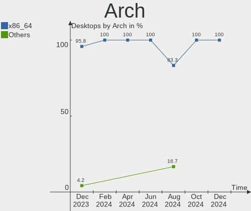
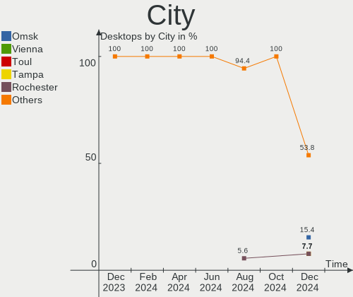
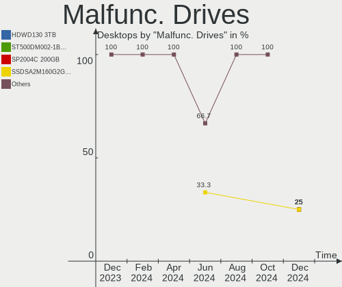
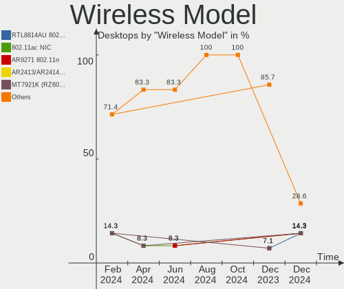
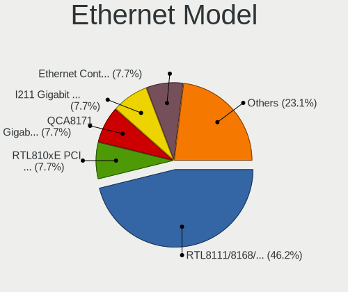

Xubuntu - Hardware Trends (Desktops)
------------------------------------

A project to identify most popular hardware characteristics and track their change
over time based on data collected by Linux users at https://Linux-Hardware.org.

Anyone can contribute to this report by the [hw-probe](https://github.com/linuxhw/hw-probe) tool:

    sudo -E hw-probe -all -upload

This report is for one last month. Overall report since the beginning of time: [TestDays](https://github.com/linuxhw/TestDays)

Period: Jul, 2023.

Contents
--------

* [ System ](#system)
  - [ OS                       ](#os)
  - [ OS Family                ](#os-family)
  - [ Kernel                   ](#kernel)
  - [ Kernel Family            ](#kernel-family)
  - [ Kernel Major Ver.        ](#kernel-major-ver)
  - [ Arch                     ](#arch)
  - [ DE                       ](#de)
  - [ Display Server           ](#display-server)
  - [ Display Manager          ](#display-manager)
  - [ OS Lang                  ](#os-lang)
  - [ Boot Mode                ](#boot-mode)
  - [ Filesystem               ](#filesystem)
  - [ Part. scheme             ](#part-scheme)
  - [ Dual Boot with Linux/BSD ](#dual-boot-with-linuxbsd)
  - [ Dual Boot (Win)          ](#dual-boot-win)

* [ Board ](#board)
  - [ Vendor                   ](#vendor)
  - [ Model                    ](#model)
  - [ Model Family             ](#model-family)
  - [ MFG Year                 ](#mfg-year)
  - [ Form Factor              ](#form-factor)
  - [ Secure Boot              ](#secure-boot)
  - [ Coreboot                 ](#coreboot)
  - [ RAM Size                 ](#ram-size)
  - [ RAM Used                 ](#ram-used)
  - [ Total Drives             ](#total-drives)
  - [ Has CD-ROM               ](#has-cd-rom)
  - [ Has Ethernet             ](#has-ethernet)
  - [ Has WiFi                 ](#has-wifi)
  - [ Has Bluetooth            ](#has-bluetooth)

* [ Location ](#location)
  - [ Country                  ](#country)
  - [ City                     ](#city)

* [ Drives ](#drives)
  - [ Drive Vendor             ](#drive-vendor)
  - [ Drive Model              ](#drive-model)
  - [ HDD Vendor               ](#hdd-vendor)
  - [ SSD Vendor               ](#ssd-vendor)
  - [ Drive Kind               ](#drive-kind)
  - [ Drive Connector          ](#drive-connector)
  - [ Drive Size               ](#drive-size)
  - [ Space Total              ](#space-total)
  - [ Space Used               ](#space-used)
  - [ Malfunc. Drives          ](#malfunc-drives)
  - [ Malfunc. Drive Vendor    ](#malfunc-drive-vendor)
  - [ Malfunc. HDD Vendor      ](#malfunc-hdd-vendor)
  - [ Malfunc. Drive Kind      ](#malfunc-drive-kind)
  - [ Failed Drives            ](#failed-drives)
  - [ Failed Drive Vendor      ](#failed-drive-vendor)
  - [ Drive Status             ](#drive-status)

* [ Storage controller ](#storage-controller)
  - [ Storage Vendor           ](#storage-vendor)
  - [ Storage Model            ](#storage-model)
  - [ Storage Kind             ](#storage-kind)

* [ Processor ](#processor)
  - [ CPU Vendor               ](#cpu-vendor)
  - [ CPU Model                ](#cpu-model)
  - [ CPU Model Family         ](#cpu-model-family)
  - [ CPU Cores                ](#cpu-cores)
  - [ CPU Sockets              ](#cpu-sockets)
  - [ CPU Threads              ](#cpu-threads)
  - [ CPU Op-Modes             ](#cpu-op-modes)
  - [ CPU Microcode            ](#cpu-microcode)
  - [ CPU Microarch            ](#cpu-microarch)

* [ Graphics ](#graphics)
  - [ GPU Vendor               ](#gpu-vendor)
  - [ GPU Model                ](#gpu-model)
  - [ GPU Combo                ](#gpu-combo)
  - [ GPU Driver               ](#gpu-driver)
  - [ GPU Memory               ](#gpu-memory)

* [ Monitor ](#monitor)
  - [ Monitor Vendor           ](#monitor-vendor)
  - [ Monitor Model            ](#monitor-model)
  - [ Monitor Resolution       ](#monitor-resolution)
  - [ Monitor Diagonal         ](#monitor-diagonal)
  - [ Monitor Width            ](#monitor-width)
  - [ Aspect Ratio             ](#aspect-ratio)
  - [ Monitor Area             ](#monitor-area)
  - [ Pixel Density            ](#pixel-density)
  - [ Multiple Monitors        ](#multiple-monitors)

* [ Network ](#network)
  - [ Net Controller Vendor    ](#net-controller-vendor)
  - [ Net Controller Model     ](#net-controller-model)
  - [ Wireless Vendor          ](#wireless-vendor)
  - [ Wireless Model           ](#wireless-model)
  - [ Ethernet Vendor          ](#ethernet-vendor)
  - [ Ethernet Model           ](#ethernet-model)
  - [ Net Controller Kind      ](#net-controller-kind)
  - [ Used Controller          ](#used-controller)
  - [ NICs                     ](#nics)
  - [ IPv6                     ](#ipv6)

* [ Bluetooth ](#bluetooth)
  - [ Bluetooth Vendor         ](#bluetooth-vendor)
  - [ Bluetooth Model          ](#bluetooth-model)

* [ Sound ](#sound)
  - [ Sound Vendor             ](#sound-vendor)
  - [ Sound Model              ](#sound-model)

* [ Memory ](#memory)
  - [ Memory Vendor            ](#memory-vendor)
  - [ Memory Model             ](#memory-model)
  - [ Memory Kind              ](#memory-kind)
  - [ Memory Form Factor       ](#memory-form-factor)
  - [ Memory Size              ](#memory-size)
  - [ Memory Speed             ](#memory-speed)

* [ Printers & scanners ](#printers--scanners)
  - [ Printer Vendor           ](#printer-vendor)
  - [ Printer Model            ](#printer-model)
  - [ Scanner Vendor           ](#scanner-vendor)
  - [ Scanner Model            ](#scanner-model)

* [ Camera ](#camera)
  - [ Camera Vendor            ](#camera-vendor)
  - [ Camera Model             ](#camera-model)

* [ Security ](#security)
  - [ Fingerprint Vendor       ](#fingerprint-vendor)
  - [ Fingerprint Model        ](#fingerprint-model)
  - [ Chipcard Vendor          ](#chipcard-vendor)
  - [ Chipcard Model           ](#chipcard-model)

* [ Unsupported ](#unsupported)
  - [ Unsupported Devices      ](#unsupported-devices)
  - [ Unsupported Device Types ](#unsupported-device-types)

System
------

OS
--

Installed operating systems

| Name          | Desktops | Percent |
|---------------|----------|---------|
| Xubuntu 20.04 | 14       | 42.42%  |
| Xubuntu 22.04 | 9        | 27.27%  |
| Xubuntu 23.04 | 8        | 24.24%  |
| Xubuntu 22.10 | 1        | 3.03%   |
| Xubuntu 18.04 | 1        | 3.03%   |

OS Family
---------

OS without a version

| Name    | Desktops | Percent |
|---------|----------|---------|
| Xubuntu | 33       | 100%    |

Kernel
------

Version of the Linux kernel

| Version               | Desktops | Percent |
|-----------------------|----------|---------|
| 5.4.0-156-generic     | 9        | 27.27%  |
| 5.19.0-46-generic     | 4        | 12.12%  |
| 5.15.0-76-generic     | 4        | 12.12%  |
| 6.2.0-24-generic      | 3        | 9.09%   |
| 5.15.0-78-generic     | 3        | 9.09%   |
| 6.2.0-25-generic      | 2        | 6.06%   |
| 6.4.1                 | 1        | 3.03%   |
| 6.2.0-26-generic      | 1        | 3.03%   |
| 6.2.0-23-generic      | 1        | 3.03%   |
| 5.4.0-153-lowlatency  | 1        | 3.03%   |
| 5.19.0-50-generic     | 1        | 3.03%   |
| 5.15.0-76-lowlatency  | 1        | 3.03%   |
| 5.15.0-69-generic     | 1        | 3.03%   |
| 4.15.0-213-lowlatency | 1        | 3.03%   |

Kernel Family
-------------

Linux kernel without a distro release

| Version | Desktops | Percent |
|---------|----------|---------|
| 5.4.0   | 10       | 30.3%   |
| 5.15.0  | 9        | 27.27%  |
| 6.2.0   | 7        | 21.21%  |
| 5.19.0  | 5        | 15.15%  |
| 6.4.1   | 1        | 3.03%   |
| 4.15.0  | 1        | 3.03%   |

Kernel Major Ver.
-----------------

Linux kernel major version

| Version | Desktops | Percent |
|---------|----------|---------|
| 5.4     | 10       | 30.3%   |
| 5.15    | 9        | 27.27%  |
| 6.2     | 7        | 21.21%  |
| 5.19    | 5        | 15.15%  |
| 6.4     | 1        | 3.03%   |
| 4.15    | 1        | 3.03%   |

Arch
----

OS architecture (x86_64, i586, etc.)

| Name   | Desktops | Percent |
|--------|----------|---------|
| x86_64 | 33       | 100%    |

DE
--

Desktop Environment

| Name  | Desktops | Percent |
|-------|----------|---------|
| XFCE  | 31       | 93.94%  |
| i3    | 1        | 3.03%   |
| GNOME | 1        | 3.03%   |

Display Server
--------------

X11 or Wayland

| Name | Desktops | Percent |
|------|----------|---------|
| X11  | 33       | 100%    |

Display Manager
---------------

SDDM, LightDM, etc.

| Name    | Desktops | Percent |
|---------|----------|---------|
| LightDM | 29       | 87.88%  |
| Unknown | 3        | 9.09%   |
| GDM3    | 1        | 3.03%   |

OS Lang
-------

Language

| Lang  | Desktops | Percent |
|-------|----------|---------|
| en_US | 10       | 30.3%   |
| ru_RU | 9        | 27.27%  |
| de_DE | 4        | 12.12%  |
| pt_BR | 2        | 6.06%   |
| ja_JP | 2        | 6.06%   |
| fr_FR | 2        | 6.06%   |
| it_IT | 1        | 3.03%   |
| fr_BE | 1        | 3.03%   |
| en_IE | 1        | 3.03%   |
| en_CA | 1        | 3.03%   |

Boot Mode
---------

EFI or BIOS

| Mode | Desktops | Percent |
|------|----------|---------|
| BIOS | 23       | 69.7%   |
| EFI  | 10       | 30.3%   |

Filesystem
----------

Type of filesystem

| Type  | Desktops | Percent |
|-------|----------|---------|
| Ext4  | 24       | 72.73%  |
| Tmpfs | 9        | 27.27%  |

Part. scheme
------------

Scheme of partitioning

| Type    | Desktops | Percent |
|---------|----------|---------|
| MBR     | 15       | 45.45%  |
| GPT     | 15       | 45.45%  |
| Unknown | 3        | 9.09%   |

Dual Boot with Linux/BSD
------------------------

Hosting more than one Linux/BSD

| Dual boot | Desktops | Percent |
|-----------|----------|---------|
| No        | 26       | 78.79%  |
| Yes       | 7        | 21.21%  |

Dual Boot (Win)
---------------

Hosting Linux and Windows

| Dual boot | Desktops | Percent |
|-----------|----------|---------|
| No        | 27       | 81.82%  |
| Yes       | 6        | 18.18%  |

Board
-----

Vendor
------

Motherboard manufacturer

| Name                | Desktops | Percent |
|---------------------|----------|---------|
| Gigabyte Technology | 12       | 36.36%  |
| MSI                 | 5        | 15.15%  |
| ASRock              | 5        | 15.15%  |
| ASUSTek Computer    | 4        | 12.12%  |
| Dell                | 3        | 9.09%   |
| Semp Toshiba        | 1        | 3.03%   |
| Pegatron            | 1        | 3.03%   |
| Hewlett-Packard     | 1        | 3.03%   |
| Foxconn             | 1        | 3.03%   |

Model
-----

Motherboard model

| Name                                   | Desktops | Percent |
|----------------------------------------|----------|---------|
| Gigabyte H81M-S2V                      | 9        | 27.27%  |
| Semp Toshiba STI                       | 1        | 3.03%   |
| Pegatron KOUZIRODT                     | 1        | 3.03%   |
| MSI MS-7C56                            | 1        | 3.03%   |
| MSI MS-7C08                            | 1        | 3.03%   |
| MSI MS-7B89                            | 1        | 3.03%   |
| MSI MS-7846                            | 1        | 3.03%   |
| MSI 5860                               | 1        | 3.03%   |
| HP Z620 Workstation                    | 1        | 3.03%   |
| Gigabyte Z97X-UD3H                     | 1        | 3.03%   |
| Gigabyte F2A88XM-D3H                   | 1        | 3.03%   |
| Gigabyte B550 AORUS ELITE              | 1        | 3.03%   |
| Foxconn nT-iBT18/nT-iBT19/nT-iBT29 FAB | 1        | 3.03%   |
| Dell Precision T3610                   | 1        | 3.03%   |
| Dell OptiPlex 790                      | 1        | 3.03%   |
| Dell OptiPlex 5050                     | 1        | 3.03%   |
| ASUS TUF Gaming B650M-PLUS WIFI        | 1        | 3.03%   |
| ASUS ROG CROSSHAIR VIII DARK HERO      | 1        | 3.03%   |
| ASUS PRIME H670-PLUS D4                | 1        | 3.03%   |
| ASUS A0000001                          | 1        | 3.03%   |
| ASRock Z370 Gaming K6                  | 1        | 3.03%   |
| ASRock Z170 Extreme4                   | 1        | 3.03%   |
| ASRock TRX40 Creator                   | 1        | 3.03%   |
| ASRock A320M-HD                        | 1        | 3.03%   |
| ASRock 960GC-GS FX                     | 1        | 3.03%   |

Model Family
------------

Motherboard model prefix

| Name                 | Desktops | Percent |
|----------------------|----------|---------|
| Gigabyte H81M-S2V    | 9        | 27.27%  |
| Dell OptiPlex        | 2        | 6.06%   |
| Semp Toshiba STI     | 1        | 3.03%   |
| Pegatron KOUZIRODT   | 1        | 3.03%   |
| MSI MS-7C56          | 1        | 3.03%   |
| MSI MS-7C08          | 1        | 3.03%   |
| MSI MS-7B89          | 1        | 3.03%   |
| MSI MS-7846          | 1        | 3.03%   |
| MSI 5860             | 1        | 3.03%   |
| HP Z620              | 1        | 3.03%   |
| Gigabyte Z97X-UD3H   | 1        | 3.03%   |
| Gigabyte F2A88XM-D3H | 1        | 3.03%   |
| Gigabyte B550        | 1        | 3.03%   |
| Foxconn nT-iBT18     | 1        | 3.03%   |
| Dell Precision       | 1        | 3.03%   |
| ASUS TUF             | 1        | 3.03%   |
| ASUS ROG             | 1        | 3.03%   |
| ASUS PRIME           | 1        | 3.03%   |
| ASUS A0000001        | 1        | 3.03%   |
| ASRock Z370          | 1        | 3.03%   |
| ASRock Z170          | 1        | 3.03%   |
| ASRock TRX40         | 1        | 3.03%   |
| ASRock A320M-HD      | 1        | 3.03%   |
| ASRock 960GC-GS      | 1        | 3.03%   |

MFG Year
--------

Motherboard manufacture year

| Year | Desktops | Percent |
|------|----------|---------|
| 2014 | 11       | 33.33%  |
| 2013 | 4        | 12.12%  |
| 2018 | 3        | 9.09%   |
| 2022 | 2        | 6.06%   |
| 2021 | 2        | 6.06%   |
| 2020 | 2        | 6.06%   |
| 2019 | 2        | 6.06%   |
| 2017 | 2        | 6.06%   |
| 2009 | 2        | 6.06%   |
| 2016 | 1        | 3.03%   |
| 2012 | 1        | 3.03%   |
| 2011 | 1        | 3.03%   |

Form Factor
-----------

Physical design of the computer

| Name    | Desktops | Percent |
|---------|----------|---------|
| Desktop | 33       | 100%    |

Secure Boot
-----------

Enabled or disabled

| State    | Desktops | Percent |
|----------|----------|---------|
| Disabled | 33       | 100%    |

Coreboot
--------

Have coreboot on board

| Used | Desktops | Percent |
|------|----------|---------|
| No   | 33       | 100%    |

RAM Size
--------

Total RAM memory

| Size in GB  | Desktops | Percent |
|-------------|----------|---------|
| 16.01-24.0  | 10       | 30.3%   |
| 3.01-4.0    | 8        | 24.24%  |
| 4.01-8.0    | 6        | 18.18%  |
| 8.01-16.0   | 3        | 9.09%   |
| 32.01-64.0  | 2        | 6.06%   |
| 24.01-32.0  | 2        | 6.06%   |
| 64.01-256.0 | 2        | 6.06%   |

RAM Used
--------

Used RAM memory

| Used GB   | Desktops | Percent |
|-----------|----------|---------|
| 0.51-1.0  | 9        | 27.27%  |
| 1.01-2.0  | 8        | 24.24%  |
| 4.01-8.0  | 6        | 18.18%  |
| 2.01-3.0  | 6        | 18.18%  |
| 3.01-4.0  | 2        | 6.06%   |
| 8.01-16.0 | 2        | 6.06%   |

Total Drives
------------

Number of drives on board

| Drives | Desktops | Percent |
|--------|----------|---------|
| 1      | 16       | 48.48%  |
| 2      | 7        | 21.21%  |
| 4      | 4        | 12.12%  |
| 3      | 4        | 12.12%  |
| 6      | 1        | 3.03%   |
| 5      | 1        | 3.03%   |

Has CD-ROM
----------

Has CD-ROM on board

| Presented | Desktops | Percent |
|-----------|----------|---------|
| No        | 20       | 60.61%  |
| Yes       | 13       | 39.39%  |

Has Ethernet
------------

Has Ethernet on board

| Presented | Desktops | Percent |
|-----------|----------|---------|
| Yes       | 32       | 96.97%  |
| No        | 1        | 3.03%   |

Has WiFi
--------

Has WiFi module

| Presented | Desktops | Percent |
|-----------|----------|---------|
| No        | 22       | 66.67%  |
| Yes       | 11       | 33.33%  |

Has Bluetooth
-------------

Has Bluetooth module

| Presented | Desktops | Percent |
|-----------|----------|---------|
| No        | 24       | 72.73%  |
| Yes       | 9        | 27.27%  |

Location
--------

Country
-------

Geographic location (country)

| Country    | Desktops | Percent |
|------------|----------|---------|
| Russia     | 9        | 27.27%  |
| Germany    | 4        | 12.12%  |
| Brazil     | 3        | 9.09%   |
| USA        | 2        | 6.06%   |
| Japan      | 2        | 6.06%   |
| Italy      | 2        | 6.06%   |
| Belgium    | 2        | 6.06%   |
| Poland     | 1        | 3.03%   |
| Norway     | 1        | 3.03%   |
| Latvia     | 1        | 3.03%   |
| Ireland    | 1        | 3.03%   |
| Guadeloupe | 1        | 3.03%   |
| France     | 1        | 3.03%   |
| Costa Rica | 1        | 3.03%   |
| Canada     | 1        | 3.03%   |
| Austria    | 1        | 3.03%   |

City
----

Geographic location (city)

| City             | Desktops | Percent |
|------------------|----------|---------|
| Voronezh         | 9        | 27.27%  |
| Stockach         | 1        | 3.03%   |
| Seattle          | 1        | 3.03%   |
| Sao Paulo        | 1        | 3.03%   |
| Sandnes          | 1        | 3.03%   |
| Riga             | 1        | 3.03%   |
| Rho              | 1        | 3.03%   |
| Puntarenas       | 1        | 3.03%   |
| Pointe-à-Pitre  | 1        | 3.03%   |
| Osaka            | 1        | 3.03%   |
| Nova Iguaçu     | 1        | 3.03%   |
| Mortsel          | 1        | 3.03%   |
| Minatomirai      | 1        | 3.03%   |
| Ludwigsburg      | 1        | 3.03%   |
| Louvain-la-Neuve | 1        | 3.03%   |
| London           | 1        | 3.03%   |
| Legnaro          | 1        | 3.03%   |
| Hanover          | 1        | 3.03%   |
| Dublin           | 1        | 3.03%   |
| Dothan           | 1        | 3.03%   |
| Diadema          | 1        | 3.03%   |
| Compiègne       | 1        | 3.03%   |
| Chorzów         | 1        | 3.03%   |
| Bruchsal         | 1        | 3.03%   |
| Ansfelden        | 1        | 3.03%   |

Drives
------

Drive Vendor
------------

Hard drive vendors

| Vendor                      | Desktops | Drives | Percent |
|-----------------------------|----------|--------|---------|
| Seagate                     | 15       | 17     | 25.86%  |
| Samsung Electronics         | 12       | 15     | 20.69%  |
| WDC                         | 8        | 10     | 13.79%  |
| Hitachi                     | 5        | 6      | 8.62%   |
| SanDisk                     | 3        | 3      | 5.17%   |
| Kingston                    | 2        | 2      | 3.45%   |
| Teclast                     | 1        | 1      | 1.72%   |
| SK hynix                    | 1        | 1      | 1.72%   |
| Realtek Semiconductor       | 1        | 1      | 1.72%   |
| PNY                         | 1        | 1      | 1.72%   |
| Phison                      | 1        | 2      | 1.72%   |
| OCZ                         | 1        | 1      | 1.72%   |
| Maxtor                      | 1        | 1      | 1.72%   |
| Kingston Technology Company | 1        | 1      | 1.72%   |
| Intel                       | 1        | 1      | 1.72%   |
| Hjwdz                       | 1        | 1      | 1.72%   |
| HGST                        | 1        | 1      | 1.72%   |
| Hewlett-Packard             | 1        | 2      | 1.72%   |
| Crucial                     | 1        | 2      | 1.72%   |

Drive Model
-----------

Hard drive models

| Model                                               | Desktops | Percent |
|-----------------------------------------------------|----------|---------|
| Seagate ST1000DM003-1ER162 1TB                      | 9        | 14.29%  |
| Samsung NVMe SSD Controller SM981/PM981/PM983 500GB | 3        | 4.76%   |
| Seagate ST1000DM003-1CH162 1TB                      | 2        | 3.17%   |
| SanDisk SSD PLUS 480GB                              | 2        | 3.17%   |
| Samsung SSD 980 1TB                                 | 2        | 3.17%   |
| Samsung HD160JJ/ 160GB                              | 2        | 3.17%   |
| Hitachi HDE721010SLA330 1TB                         | 2        | 3.17%   |
| WDC WD7500BPVX-22JC3T0 752GB                        | 1        | 1.59%   |
| WDC WD6003FZBX-00K5WB0 6TB                          | 1        | 1.59%   |
| WDC WD5000AZLX-60K2TA0 500GB                        | 1        | 1.59%   |
| WDC WD5000AADS-00S9B0 500GB                         | 1        | 1.59%   |
| WDC WD20EARX-00PASB0 2TB                            | 1        | 1.59%   |
| WDC WD10EZEX-08WN4A0 1TB                            | 1        | 1.59%   |
| WDC WD10EZEX-00WN4A0 1TB                            | 1        | 1.59%   |
| WDC WD10EZEX-00BN5A0 1TB                            | 1        | 1.59%   |
| WDC WD10EARS-00Y5B1 1TB                             | 1        | 1.59%   |
| Teclast 120GB SSD                                   | 1        | 1.59%   |
| SK hynix SC311 SATA 256GB SSD                       | 1        | 1.59%   |
| Seagate ST4000DM004-2CV104 4TB                      | 1        | 1.59%   |
| Seagate ST2000LM015-2E8174 2TB                      | 1        | 1.59%   |
| Seagate ST1000LM048-2E7172 1TB                      | 1        | 1.59%   |
| Seagate ST1000DM010-2EP102 1TB                      | 1        | 1.59%   |
| Seagate Expansion 1TB                               | 1        | 1.59%   |
| SanDisk SDSSDH31000G 1TB                            | 1        | 1.59%   |
| Samsung SSD 870 QVO 1TB                             | 1        | 1.59%   |
| Samsung SSD 870 EVO 500GB                           | 1        | 1.59%   |
| Samsung SSD 860 EVO 500GB                           | 1        | 1.59%   |
| Samsung SSD 850 PRO 512GB                           | 1        | 1.59%   |
| Samsung SSD 840 EVO 250GB                           | 1        | 1.59%   |
| Samsung NVMe SSD Controller PM9A1/PM9A3/980PRO 1TB  | 1        | 1.59%   |
| Samsung HD203WI 2TB                                 | 1        | 1.59%   |
| Realtek RTS5763DL NVMe SSD Controller 1TB           | 1        | 1.59%   |
| PNY CS3030 250GB SSD                                | 1        | 1.59%   |
| Phison Sabrent Rocket 4.0 Plus 2TB                  | 1        | 1.59%   |
| OCZ AGILITY3 64GB SSD                               | 1        | 1.59%   |
| Maxtor 6L160M0 160GB                                | 1        | 1.59%   |
| Kingston Company SNV2S1000G 1TB                     | 1        | 1.59%   |
| Kingston SV300S37A60G 64GB SSD                      | 1        | 1.59%   |
| Kingston SA400S37240G 240GB SSD                     | 1        | 1.59%   |
| Intel SSD 600P Series 512GB                         | 1        | 1.59%   |

HDD Vendor
----------

Hard disk drive vendors

| Vendor              | Desktops | Drives | Percent |
|---------------------|----------|--------|---------|
| Seagate             | 15       | 17     | 44.12%  |
| WDC                 | 8        | 10     | 23.53%  |
| Hitachi             | 5        | 6      | 14.71%  |
| Samsung Electronics | 3        | 3      | 8.82%   |
| Maxtor              | 1        | 1      | 2.94%   |
| HGST                | 1        | 1      | 2.94%   |
| Hewlett-Packard     | 1        | 2      | 2.94%   |

SSD Vendor
----------

Solid state drive vendors

| Vendor              | Desktops | Drives | Percent |
|---------------------|----------|--------|---------|
| Samsung Electronics | 5        | 6      | 35.71%  |
| SanDisk             | 3        | 3      | 21.43%  |
| Kingston            | 2        | 2      | 14.29%  |
| Teclast             | 1        | 1      | 7.14%   |
| SK hynix            | 1        | 1      | 7.14%   |
| OCZ                 | 1        | 1      | 7.14%   |
| Crucial             | 1        | 2      | 7.14%   |

Drive Kind
----------

HDD or SSD

| Kind    | Desktops | Drives | Percent |
|---------|----------|--------|---------|
| HDD     | 26       | 40     | 50.98%  |
| SSD     | 13       | 16     | 25.49%  |
| NVMe    | 11       | 12     | 21.57%  |
| Unknown | 1        | 1      | 1.96%   |

Drive Connector
---------------

SATA, SAS, NVMe, etc.

| Type | Desktops | Drives | Percent |
|------|----------|--------|---------|
| SATA | 30       | 55     | 71.43%  |
| NVMe | 11       | 12     | 26.19%  |
| SAS  | 1        | 2      | 2.38%   |

Drive Size
----------

Size of hard drive

| Size in TB | Desktops | Drives | Percent |
|------------|----------|--------|---------|
| 0.51-1.0   | 21       | 28     | 50%     |
| 0.01-0.5   | 15       | 21     | 35.71%  |
| 1.01-2.0   | 3        | 4      | 7.14%   |
| 3.01-4.0   | 2        | 2      | 4.76%   |
| 4.01-10.0  | 1        | 1      | 2.38%   |

Space Total
-----------

Amount of disk space available on the file system

| Size in GB     | Desktops | Percent |
|----------------|----------|---------|
| 501-1000       | 12       | 36.36%  |
| 2001-3000      | 5        | 15.15%  |
| 1001-2000      | 5        | 15.15%  |
| More than 3000 | 4        | 12.12%  |
| 101-250        | 4        | 12.12%  |
| 251-500        | 2        | 6.06%   |
| 51-100         | 1        | 3.03%   |

Space Used
----------

Amount of used disk space

| Used GB   | Desktops | Percent |
|-----------|----------|---------|
| 1-20      | 11       | 33.33%  |
| 251-500   | 4        | 12.12%  |
| 21-50     | 4        | 12.12%  |
| 1001-2000 | 4        | 12.12%  |
| 501-1000  | 4        | 12.12%  |
| 101-250   | 3        | 9.09%   |
| 2001-3000 | 2        | 6.06%   |
| 51-100    | 1        | 3.03%   |

Malfunc. Drives
---------------

Drive models with a malfunction

| Model                          | Desktops | Drives | Percent |
|--------------------------------|----------|--------|---------|
| WDC WD10EARS-00Y5B1 1TB        | 1        | 1      | 25%     |
| Seagate ST1000DM010-2EP102 1TB | 1        | 1      | 25%     |
| Maxtor 6L160M0 160GB           | 1        | 1      | 25%     |
| Hitachi HTS723216L9A360 160GB  | 1        | 1      | 25%     |

Malfunc. Drive Vendor
---------------------

Vendors of faulty drives

| Vendor  | Desktops | Drives | Percent |
|---------|----------|--------|---------|
| WDC     | 1        | 1      | 25%     |
| Seagate | 1        | 1      | 25%     |
| Maxtor  | 1        | 1      | 25%     |
| Hitachi | 1        | 1      | 25%     |

Malfunc. HDD Vendor
-------------------

Vendors of faulty HDD drives

| Vendor  | Desktops | Drives | Percent |
|---------|----------|--------|---------|
| WDC     | 1        | 1      | 25%     |
| Seagate | 1        | 1      | 25%     |
| Maxtor  | 1        | 1      | 25%     |
| Hitachi | 1        | 1      | 25%     |

Malfunc. Drive Kind
-------------------

Kinds of faulty drives

| Kind | Desktops | Drives | Percent |
|------|----------|--------|---------|
| HDD  | 4        | 4      | 100%    |

Failed Drives
-------------

Failed drive models

Zero info for selected period =(

Failed Drive Vendor
-------------------

Failed drive vendors

Zero info for selected period =(

Drive Status
------------

Number of failed and malfunc. drives

| Status   | Desktops | Drives | Percent |
|----------|----------|--------|---------|
| Works    | 20       | 35     | 54.05%  |
| Detected | 13       | 30     | 35.14%  |
| Malfunc  | 4        | 4      | 10.81%  |

Storage controller
------------------

Storage Vendor
--------------

Storage controller vendors

| Vendor                      | Desktops | Percent |
|-----------------------------|----------|---------|
| Intel                       | 22       | 47.83%  |
| AMD                         | 11       | 23.91%  |
| Samsung Electronics         | 6        | 13.04%  |
| Phison Electronics          | 2        | 4.35%   |
| Silicon Image               | 1        | 2.17%   |
| Realtek Semiconductor       | 1        | 2.17%   |
| Kingston Technology Company | 1        | 2.17%   |
| Broadcom / LSI              | 1        | 2.17%   |
| ASMedia Technology          | 1        | 2.17%   |

Storage Model
-------------

Storage controller models

| Model                                                                          | Desktops | Percent |
|--------------------------------------------------------------------------------|----------|---------|
| Intel 8 Series/C220 Series Chipset Family 6-port SATA Controller 1 [AHCI mode] | 9        | 16.36%  |
| AMD FCH SATA Controller [AHCI mode]                                            | 6        | 10.91%  |
| Samsung NVMe SSD Controller SM981/PM981/PM983                                  | 3        | 5.45%   |
| AMD 500 Series Chipset SATA Controller                                         | 3        | 5.45%   |
| Samsung NVMe SSD Controller 980                                                | 2        | 3.64%   |
| Intel NM10/ICH7 Family SATA Controller [IDE mode]                              | 2        | 3.64%   |
| Intel 82801G (ICH7 Family) IDE Controller                                      | 2        | 3.64%   |
| Intel 200 Series PCH SATA controller [AHCI mode]                               | 2        | 3.64%   |
| AMD 400 Series Chipset SATA Controller                                         | 2        | 3.64%   |
| Silicon Image SiI 3114 [SATALink/SATARaid] Serial ATA Controller               | 1        | 1.82%   |
| Samsung NVMe SSD Controller PM9A1/PM9A3/980PRO                                 | 1        | 1.82%   |
| Realtek RTS5763DL NVMe SSD Controller                                          | 1        | 1.82%   |
| Phison E18 PCIe4 NVMe Controller                                               | 1        | 1.82%   |
| Phison E12 NVMe Controller                                                     | 1        | 1.82%   |
| Kingston Company Company Non-Volatile memory controller                        | 1        | 1.82%   |
| Intel SSD 600P Series                                                          | 1        | 1.82%   |
| Intel SATA Controller [RAID mode]                                              | 1        | 1.82%   |
| Intel Q170/Q150/B150/H170/H110/Z170/CM236 Chipset SATA Controller [AHCI Mode]  | 1        | 1.82%   |
| Intel C602 chipset 4-Port SATA Storage Control Unit                            | 1        | 1.82%   |
| Intel C600/X79 series chipset SATA RAID Controller                             | 1        | 1.82%   |
| Intel C600/X79 series chipset IDE-r Controller                                 | 1        | 1.82%   |
| Intel C600/X79 series chipset 6-Port SATA AHCI Controller                      | 1        | 1.82%   |
| Intel Atom Processor E3800 Series SATA AHCI Controller                         | 1        | 1.82%   |
| Intel Alder Lake-S PCH SATA Controller [AHCI Mode]                             | 1        | 1.82%   |
| Intel 9 Series Chipset Family SATA Controller [AHCI Mode]                      | 1        | 1.82%   |
| Intel 8 Series/C220 Series Chipset Family 4-port SATA Controller 1 [IDE mode]  | 1        | 1.82%   |
| Intel 8 Series/C220 Series Chipset Family 2-port SATA Controller 2 [IDE mode]  | 1        | 1.82%   |
| Intel 6 Series/C200 Series Chipset Family 6 port Desktop SATA AHCI Controller  | 1        | 1.82%   |
| Broadcom / LSI MegaRAID SAS 2208 [Thunderbolt]                                 | 1        | 1.82%   |
| ASMedia ASM1062 Serial ATA Controller                                          | 1        | 1.82%   |
| AMD SB7x0/SB8x0/SB9x0 SATA Controller [AHCI mode]                              | 1        | 1.82%   |
| AMD SB7x0/SB8x0/SB9x0 IDE Controller                                           | 1        | 1.82%   |
| AMD FCH SATA Controller D                                                      | 1        | 1.82%   |

Storage Kind
------------

Kind of storage controller (IDE, SATA, NVMe, SAS, ...)

| Kind | Desktops | Percent |
|------|----------|---------|
| SATA | 28       | 58.33%  |
| NVMe | 11       | 22.92%  |
| IDE  | 5        | 10.42%  |
| RAID | 3        | 6.25%   |
| SAS  | 1        | 2.08%   |

Processor
---------

CPU Vendor
----------

Processor vendors

| Vendor | Desktops | Percent |
|--------|----------|---------|
| Intel  | 22       | 66.67%  |
| AMD    | 11       | 33.33%  |

CPU Model
---------

Processor models

| Model                                          | Desktops | Percent |
|------------------------------------------------|----------|---------|
| Intel Core i3-4130 CPU @ 3.40GHz               | 9        | 27.27%  |
| AMD Ryzen 5 3600 6-Core Processor              | 2        | 6.06%   |
| Intel Xeon CPU E5-2697 v2 @ 2.70GHz            | 1        | 3.03%   |
| Intel Xeon CPU E5-1607 v2 @ 3.00GHz            | 1        | 3.03%   |
| Intel Pentium Dual-Core CPU E5500 @ 2.80GHz    | 1        | 3.03%   |
| Intel Core i7-8700K CPU @ 3.70GHz              | 1        | 3.03%   |
| Intel Core i7-7700 CPU @ 3.60GHz               | 1        | 3.03%   |
| Intel Core i7-6700 CPU @ 3.40GHz               | 1        | 3.03%   |
| Intel Core i7-4790 CPU @ 3.60GHz               | 1        | 3.03%   |
| Intel Core i7-2600 CPU @ 3.40GHz               | 1        | 3.03%   |
| Intel Core i5-4690K CPU @ 3.50GHz              | 1        | 3.03%   |
| Intel Core i3-9100 CPU @ 3.60GHz               | 1        | 3.03%   |
| Intel Core 2 Duo CPU E7500 @ 2.93GHz           | 1        | 3.03%   |
| Intel Celeron CPU J1800 @ 2.41GHz              | 1        | 3.03%   |
| Intel 12th Gen Core i5-12400                   | 1        | 3.03%   |
| AMD Ryzen Threadripper 3960X 24-Core Processor | 1        | 3.03%   |
| AMD Ryzen 9 5950X 16-Core Processor            | 1        | 3.03%   |
| AMD Ryzen 7 7700X 8-Core Processor             | 1        | 3.03%   |
| AMD Ryzen 7 5700X 8-Core Processor             | 1        | 3.03%   |
| AMD Ryzen 5 PRO 4650G with Radeon Graphics     | 1        | 3.03%   |
| AMD Ryzen 5 2600X Six-Core Processor           | 1        | 3.03%   |
| AMD Ryzen 5 2400G with Radeon Vega Graphics    | 1        | 3.03%   |
| AMD Phenom II X4 955 Processor                 | 1        | 3.03%   |
| AMD A8-6600K APU with Radeon HD Graphics       | 1        | 3.03%   |

CPU Model Family
----------------

Processor model prefix

| Model                   | Desktops | Percent |
|-------------------------|----------|---------|
| Intel Core i3           | 10       | 30.3%   |
| Intel Core i7           | 5        | 15.15%  |
| AMD Ryzen 5             | 4        | 12.12%  |
| Intel Xeon              | 2        | 6.06%   |
| AMD Ryzen 7             | 2        | 6.06%   |
| Other                   | 1        | 3.03%   |
| Intel Pentium Dual-Core | 1        | 3.03%   |
| Intel Core i5           | 1        | 3.03%   |
| Intel Core 2 Duo        | 1        | 3.03%   |
| Intel Celeron           | 1        | 3.03%   |
| AMD Ryzen Threadripper  | 1        | 3.03%   |
| AMD Ryzen 9             | 1        | 3.03%   |
| AMD Ryzen 5 PRO         | 1        | 3.03%   |
| AMD Phenom II X4        | 1        | 3.03%   |
| AMD A8                  | 1        | 3.03%   |

CPU Cores
---------

Number of processor cores

| Number | Desktops | Percent |
|--------|----------|---------|
| 2      | 12       | 36.36%  |
| 4      | 9        | 27.27%  |
| 6      | 6        | 18.18%  |
| 24     | 2        | 6.06%   |
| 8      | 2        | 6.06%   |
| 16     | 1        | 3.03%   |
| 1      | 1        | 3.03%   |

CPU Sockets
-----------

Number of sockets

| Number | Desktops | Percent |
|--------|----------|---------|
| 1      | 32       | 96.97%  |
| 2      | 1        | 3.03%   |

CPU Threads
-----------

Threads per core (Hyper-Threading)

| Number | Desktops | Percent |
|--------|----------|---------|
| 2      | 26       | 78.79%  |
| 1      | 7        | 21.21%  |

CPU Op-Modes
------------

CPU Operation Modes (32-bit, 64-bit)

| Op mode        | Desktops | Percent |
|----------------|----------|---------|
| 32-bit, 64-bit | 33       | 100%    |

CPU Microcode
-------------

Microcode number

| Number     | Desktops | Percent |
|------------|----------|---------|
| 0x306c3    | 10       | 30.3%   |
| Unknown    | 8        | 24.24%  |
| 0x306e4    | 2        | 6.06%   |
| 0x1067a    | 2        | 6.06%   |
| 0x906ea    | 1        | 3.03%   |
| 0x906e9    | 1        | 3.03%   |
| 0x506e3    | 1        | 3.03%   |
| 0x30678    | 1        | 3.03%   |
| 0x206a7    | 1        | 3.03%   |
| 0x0a201205 | 1        | 3.03%   |
| 0x0a201025 | 1        | 3.03%   |
| 0x08701030 | 1        | 3.03%   |
| 0x08301039 | 1        | 3.03%   |
| 0x0800820d | 1        | 3.03%   |
| 0x010000c8 | 1        | 3.03%   |

CPU Microarch
-------------

Microarchitecture

| Name             | Desktops | Percent |
|------------------|----------|---------|
| Haswell          | 11       | 33.33%  |
| Zen 2            | 4        | 12.12%  |
| KabyLake         | 3        | 9.09%   |
| Zen 3            | 2        | 6.06%   |
| Penryn           | 2        | 6.06%   |
| IvyBridge        | 2        | 6.06%   |
| Zen+             | 1        | 3.03%   |
| Zen              | 1        | 3.03%   |
| Skylake          | 1        | 3.03%   |
| Silvermont       | 1        | 3.03%   |
| SandyBridge      | 1        | 3.03%   |
| Piledriver       | 1        | 3.03%   |
| K10              | 1        | 3.03%   |
| Alderlake Hybrid | 1        | 3.03%   |
| Unknown          | 1        | 3.03%   |

Graphics
--------

GPU Vendor
----------

Vendors of graphics cards

| Vendor | Desktops | Percent |
|--------|----------|---------|
| Intel  | 18       | 39.13%  |
| Nvidia | 16       | 34.78%  |
| AMD    | 12       | 26.09%  |

GPU Model
---------

Graphics card models

| Model                                                                       | Desktops | Percent |
|-----------------------------------------------------------------------------|----------|---------|
| Nvidia GF108 [GeForce GT 730]                                               | 9        | 19.57%  |
| Intel 4th Generation Core Processor Family Integrated Graphics Controller   | 9        | 19.57%  |
| AMD Ellesmere [Radeon RX 470/480/570/570X/580/580X/590]                     | 3        | 6.52%   |
| Nvidia GK208B [GeForce GT 710]                                              | 2        | 4.35%   |
| Intel CoffeeLake-S GT2 [UHD Graphics 630]                                   | 2        | 4.35%   |
| Nvidia GP106 [GeForce GTX 1060 3GB]                                         | 1        | 2.17%   |
| Nvidia GK208B [GeForce GT 730]                                              | 1        | 2.17%   |
| Nvidia GK107GL [Quadro K2000]                                               | 1        | 2.17%   |
| Nvidia GK104GL [Quadro K5000]                                               | 1        | 2.17%   |
| Nvidia GF119 [GeForce GT 610]                                               | 1        | 2.17%   |
| Intel Xeon E3-1200 v3/4th Gen Core Processor Integrated Graphics Controller | 1        | 2.17%   |
| Intel HD Graphics 630                                                       | 1        | 2.17%   |
| Intel HD Graphics 530                                                       | 1        | 2.17%   |
| Intel Atom Processor Z36xxx/Z37xxx Series Graphics & Display                | 1        | 2.17%   |
| Intel Alder Lake-S GT1 [UHD Graphics 730]                                   | 1        | 2.17%   |
| Intel 82G33/G31 Express Integrated Graphics Controller                      | 1        | 2.17%   |
| Intel 2nd Generation Core Processor Family Integrated Graphics Controller   | 1        | 2.17%   |
| AMD RS780L [Radeon 3000]                                                    | 1        | 2.17%   |
| AMD Richland [Radeon HD 8570D]                                              | 1        | 2.17%   |
| AMD Renoir                                                                  | 1        | 2.17%   |
| AMD Raven Ridge [Radeon Vega Series / Radeon Vega Mobile Series]            | 1        | 2.17%   |
| AMD Raphael                                                                 | 1        | 2.17%   |
| AMD Oland [Radeon HD 8570 / R5 430 OEM / R7 240/340 / Radeon 520 OEM]       | 1        | 2.17%   |
| AMD Navi 21 [Radeon RX 6800/6800 XT / 6900 XT]                              | 1        | 2.17%   |
| AMD Lexa PRO [Radeon 540/540X/550/550X / RX 540X/550/550X]                  | 1        | 2.17%   |
| AMD Caicos PRO [Radeon HD 7450]                                             | 1        | 2.17%   |

GPU Combo
---------

Combinations of graphics cards

| Name           | Desktops | Percent |
|----------------|----------|---------|
| Intel + Nvidia | 10       | 30.3%   |
| 1 x AMD        | 9        | 27.27%  |
| 1 x Intel      | 6        | 18.18%  |
| 1 x Nvidia     | 5        | 15.15%  |
| Intel + AMD    | 2        | 6.06%   |
| AMD + Nvidia   | 1        | 3.03%   |

GPU Driver
----------

Free vs proprietary

| Driver      | Desktops | Percent |
|-------------|----------|---------|
| Free        | 17       | 51.52%  |
| Proprietary | 16       | 48.48%  |

GPU Memory
----------

Total video memory

| Size in GB | Desktops | Percent |
|------------|----------|---------|
| 1.01-2.0   | 14       | 42.42%  |
| Unknown    | 12       | 36.36%  |
| 7.01-8.0   | 3        | 9.09%   |
| 0.51-1.0   | 2        | 6.06%   |
| 3.01-4.0   | 1        | 3.03%   |
| 8.01-16.0  | 1        | 3.03%   |

Monitor
-------

Monitor Vendor
--------------

Monitor vendors

| Vendor               | Desktops | Percent |
|----------------------|----------|---------|
| PKB                  | 9        | 18.75%  |
| Packard Bell         | 8        | 16.67%  |
| Goldstar             | 6        | 12.5%   |
| Samsung Electronics  | 4        | 8.33%   |
| Philips              | 4        | 8.33%   |
| Dell                 | 3        | 6.25%   |
| BenQ                 | 3        | 6.25%   |
| Unknown              | 1        | 2.08%   |
| UGD                  | 1        | 2.08%   |
| TCL                  | 1        | 2.08%   |
| Sony                 | 1        | 2.08%   |
| RS                   | 1        | 2.08%   |
| Iiyama               | 1        | 2.08%   |
| Hewlett-Packard      | 1        | 2.08%   |
| Fujitsu Siemens      | 1        | 2.08%   |
| AOC                  | 1        | 2.08%   |
| Ancor Communications | 1        | 2.08%   |
| Acer                 | 1        | 2.08%   |

Monitor Model
-------------

Monitor models

| Model                                                                 | Desktops | Percent |
|-----------------------------------------------------------------------|----------|---------|
| PKB LCD Monitor Viseo223DX 1920x1080                                  | 9        | 17.65%  |
| Packard Bell Viseo223DX PKB0385 1920x1080 477x268mm 21.5-inch         | 8        | 15.69%  |
| BenQ GL2460 BNQ78CE 1920x1080 531x299mm 24.0-inch                     | 2        | 3.92%   |
| Unknown LCD Monitor IODATA EX-LD4K271D 2048x1152                      | 1        | 1.96%   |
| UGD CD220F (H) UGD2210 1920x1080 527x296mm 23.8-inch                  | 1        | 1.96%   |
| TCL LCD TV TCL0030 1920x1080 708x398mm 32.0-inch                      | 1        | 1.96%   |
| Sony TV SNYAB03 1920x1080                                             | 1        | 1.96%   |
| Samsung Electronics T27B350 SAM0943 1920x1080 598x336mm 27.0-inch     | 1        | 1.96%   |
| Samsung Electronics SyncMaster SAM0598 1360x768 410x230mm 18.5-inch   | 1        | 1.96%   |
| Samsung Electronics SyncMaster SAM01D0 1600x1200 430x320mm 21.1-inch  | 1        | 1.96%   |
| Samsung Electronics S24D330 SAM0D92 1920x1080 531x299mm 24.0-inch     | 1        | 1.96%   |
| RS Vw19B2 BTC19C1 1440x900 410x256mm 19.0-inch                        | 1        | 1.96%   |
| Philips PHL 258B6QJEB PHL08E9 2560x1440 553x311mm 25.0-inch           | 1        | 1.96%   |
| Philips PHL 246E9Q PHLC17C 1920x1080 527x296mm 23.8-inch              | 1        | 1.96%   |
| Philips PHL 193V5 PHLC0CD 1366x768 410x230mm 18.5-inch                | 1        | 1.96%   |
| Philips 191V PHL0887 1366x768 409x230mm 18.5-inch                     | 1        | 1.96%   |
| Iiyama PL2783Q IVM661E 2560x1440 597x336mm 27.0-inch                  | 1        | 1.96%   |
| Hewlett-Packard LCD Monitor ZR2440w 7360x1200                         | 1        | 1.96%   |
| Hewlett-Packard LCD Monitor ZR2440w                                   | 1        | 1.96%   |
| Hewlett-Packard LCD Monitor P201                                      | 1        | 1.96%   |
| Goldstar W2261 GSM56CE 1920x1080 477x268mm 21.5-inch                  | 1        | 1.96%   |
| Goldstar ULTRAWIDE GSM59F1 2560x1080 673x284mm 28.8-inch              | 1        | 1.96%   |
| Goldstar LG HDR 5K GSM7720 3440x1440 800x330mm 34.1-inch              | 1        | 1.96%   |
| Goldstar HDR WQHD+ GSM774D 3840x1600 879x366mm 37.5-inch              | 1        | 1.96%   |
| Goldstar E2750 GSM57DC 1920x1080 510x290mm 23.1-inch                  | 1        | 1.96%   |
| Goldstar E2750 GSM57DB 1920x1080 510x290mm 23.1-inch                  | 1        | 1.96%   |
| Goldstar 22EN43 GSM59D9 1920x1080 477x268mm 21.5-inch                 | 1        | 1.96%   |
| Fujitsu Siemens LL3200T FUS07BE 1600x900 440x250mm 19.9-inch          | 1        | 1.96%   |
| Dell ST2310 DELF01C 1920x1080 510x290mm 23.1-inch                     | 1        | 1.96%   |
| Dell E173FP DELA00B 1280x1024 338x270mm 17.0-inch                     | 1        | 1.96%   |
| Dell E172FP DELA00A 1280x1024 338x270mm 17.0-inch                     | 1        | 1.96%   |
| BenQ V2400Eco BNQ7D02 1920x1080 531x299mm 24.0-inch                   | 1        | 1.96%   |
| AOC 2369M AOC2369 1920x1080 509x286mm 23.0-inch                       | 1        | 1.96%   |
| Ancor Communications ASUS VS247 ACI249A 1920x1080 521x293mm 23.5-inch | 1        | 1.96%   |
| Acer V226HQL ACR032D 1920x1080 477x268mm 21.5-inch                    | 1        | 1.96%   |

Monitor Resolution
------------------

Monitor screen resolution

| Resolution       | Desktops | Percent |
|------------------|----------|---------|
| 1920x1080 (FHD)  | 22       | 57.89%  |
| 2560x1440 (QHD)  | 2        | 5.26%   |
| 1366x768 (WXGA)  | 2        | 5.26%   |
| 1280x1024 (SXGA) | 2        | 5.26%   |
| 7360x1200        | 1        | 2.63%   |
| 3840x2160 (4K)   | 1        | 2.63%   |
| 3840x1600        | 1        | 2.63%   |
| 2560x1080        | 1        | 2.63%   |
| 2048x1152        | 1        | 2.63%   |
| 1600x900 (HD+)   | 1        | 2.63%   |
| 1600x1200        | 1        | 2.63%   |
| 1440x900 (WXGA+) | 1        | 2.63%   |
| 1360x768         | 1        | 2.63%   |
| Unknown          | 1        | 2.63%   |

Monitor Diagonal
----------------

Diagonal size in inches

| Inches  | Desktops | Percent |
|---------|----------|---------|
| 21      | 12       | 25%     |
| Unknown | 11       | 22.92%  |
| 24      | 5        | 10.42%  |
| 23      | 5        | 10.42%  |
| 18      | 3        | 6.25%   |
| 34      | 2        | 4.17%   |
| 27      | 2        | 4.17%   |
| 17      | 2        | 4.17%   |
| 72      | 1        | 2.08%   |
| 37      | 1        | 2.08%   |
| 32      | 1        | 2.08%   |
| 25      | 1        | 2.08%   |
| 20      | 1        | 2.08%   |
| 19      | 1        | 2.08%   |

Monitor Width
-------------

Physical width

| Width in mm | Desktops | Percent |
|-------------|----------|---------|
| 401-500     | 17       | 36.17%  |
| 501-600     | 12       | 25.53%  |
| Unknown     | 11       | 23.4%   |
| 701-800     | 3        | 6.38%   |
| 301-350     | 2        | 4.26%   |
| 801-900     | 1        | 2.13%   |
| 1501-2000   | 1        | 2.13%   |

Aspect Ratio
------------

Proportional relationship between the width and the height

| Ratio   | Desktops | Percent |
|---------|----------|---------|
| 16/9    | 25       | 58.14%  |
| Unknown | 11       | 25.58%  |
| 21/9    | 3        | 6.98%   |
| 5/4     | 2        | 4.65%   |
| 4/3     | 1        | 2.33%   |
| 16/10   | 1        | 2.33%   |

Monitor Area
------------

Area in inch²

| Area in inch² | Desktops | Percent |
|----------------|----------|---------|
| 151-200        | 11       | 24.44%  |
| Unknown        | 11       | 24.44%  |
| 201-250        | 10       | 22.22%  |
| 141-150        | 5        | 11.11%  |
| 351-500        | 4        | 8.89%   |
| 301-350        | 2        | 4.44%   |
| More than 1000 | 1        | 2.22%   |
| 251-300        | 1        | 2.22%   |

Pixel Density
-------------

Pixels per inch

| Density | Desktops | Percent |
|---------|----------|---------|
| 51-100  | 17       | 38.64%  |
| 101-120 | 15       | 34.09%  |
| Unknown | 11       | 25%     |
| 1-50    | 1        | 2.27%   |

Multiple Monitors
-----------------

Total monitors connected

| Total | Desktops | Percent |
|-------|----------|---------|
| 1     | 23       | 69.7%   |
| 2     | 7        | 21.21%  |
| 3     | 2        | 6.06%   |
| 0     | 1        | 3.03%   |

Network
-------

Net Controller Vendor
---------------------

Controller vendors

| Vendor                | Desktops | Percent |
|-----------------------|----------|---------|
| Realtek Semiconductor | 26       | 63.41%  |
| Intel                 | 10       | 24.39%  |
| Ralink Technology     | 2        | 4.88%   |
| MicroPython           | 1        | 2.44%   |
| Dell                  | 1        | 2.44%   |
| Aquantia              | 1        | 2.44%   |

Net Controller Model
--------------------

Controller models

| Model                                                                 | Desktops | Percent |
|-----------------------------------------------------------------------|----------|---------|
| Realtek RTL8111/8168/8411 PCI Express Gigabit Ethernet Controller     | 19       | 38.78%  |
| Realtek RTL8125 2.5GbE Controller                                     | 5        | 10.2%   |
| Intel Ethernet Connection (2) I219-V                                  | 3        | 6.12%   |
| Intel 82579LM Gigabit Network Connection (Lewisville)                 | 3        | 6.12%   |
| Realtek RTL8188EUS 802.11n Wireless Network Adapter                   | 2        | 4.08%   |
| Ralink MT7601U Wireless Adapter                                       | 2        | 4.08%   |
| Intel Wi-Fi 6 AX200                                                   | 2        | 4.08%   |
| Intel I211 Gigabit Network Connection                                 | 2        | 4.08%   |
| Realtek RTL8852BE PCIe 802.11ax Wireless Network Controller           | 1        | 2.04%   |
| Realtek RTL8811AU 802.11a/b/g/n/ac WLAN Adapter                       | 1        | 2.04%   |
| Realtek RTL8187 Wireless Adapter                                      | 1        | 2.04%   |
| Realtek RTL8153 Gigabit Ethernet Adapter                              | 1        | 2.04%   |
| MicroPython Board in FS mode                                          | 1        | 2.04%   |
| Intel Wireless 8260                                                   | 1        | 2.04%   |
| Intel Ethernet Connection I217-V                                      | 1        | 2.04%   |
| Intel Ethernet Connection (5) I219-V                                  | 1        | 2.04%   |
| Intel 82574L Gigabit Network Connection                               | 1        | 2.04%   |
| Dell Wireless 1450 Dual-band (802.11a/b/g) Adapter [Intersil ISL3887] | 1        | 2.04%   |
| Aquantia AQC107 NBase-T/IEEE 802.3bz Ethernet Controller [AQtion]     | 1        | 2.04%   |

Wireless Vendor
---------------

Wireless vendors

| Vendor                | Desktops | Percent |
|-----------------------|----------|---------|
| Realtek Semiconductor | 5        | 45.45%  |
| Intel                 | 3        | 27.27%  |
| Ralink Technology     | 2        | 18.18%  |
| Dell                  | 1        | 9.09%   |

Wireless Model
--------------

Wireless models

| Model                                                                 | Desktops | Percent |
|-----------------------------------------------------------------------|----------|---------|
| Realtek RTL8188EUS 802.11n Wireless Network Adapter                   | 2        | 18.18%  |
| Ralink MT7601U Wireless Adapter                                       | 2        | 18.18%  |
| Intel Wi-Fi 6 AX200                                                   | 2        | 18.18%  |
| Realtek RTL8852BE PCIe 802.11ax Wireless Network Controller           | 1        | 9.09%   |
| Realtek RTL8811AU 802.11a/b/g/n/ac WLAN Adapter                       | 1        | 9.09%   |
| Realtek RTL8187 Wireless Adapter                                      | 1        | 9.09%   |
| Intel Wireless 8260                                                   | 1        | 9.09%   |
| Dell Wireless 1450 Dual-band (802.11a/b/g) Adapter [Intersil ISL3887] | 1        | 9.09%   |

Ethernet Vendor
---------------

Ethernet vendors

| Vendor                | Desktops | Percent |
|-----------------------|----------|---------|
| Realtek Semiconductor | 24       | 70.59%  |
| Intel                 | 9        | 26.47%  |
| Aquantia              | 1        | 2.94%   |

Ethernet Model
--------------

Ethernet models

| Model                                                             | Desktops | Percent |
|-------------------------------------------------------------------|----------|---------|
| Realtek RTL8111/8168/8411 PCI Express Gigabit Ethernet Controller | 19       | 51.35%  |
| Realtek RTL8125 2.5GbE Controller                                 | 5        | 13.51%  |
| Intel Ethernet Connection (2) I219-V                              | 3        | 8.11%   |
| Intel 82579LM Gigabit Network Connection (Lewisville)             | 3        | 8.11%   |
| Intel I211 Gigabit Network Connection                             | 2        | 5.41%   |
| Realtek RTL8153 Gigabit Ethernet Adapter                          | 1        | 2.7%    |
| Intel Ethernet Connection I217-V                                  | 1        | 2.7%    |
| Intel Ethernet Connection (5) I219-V                              | 1        | 2.7%    |
| Intel 82574L Gigabit Network Connection                           | 1        | 2.7%    |
| Aquantia AQC107 NBase-T/IEEE 802.3bz Ethernet Controller [AQtion] | 1        | 2.7%    |

Net Controller Kind
-------------------

Ethernet, WiFi or modem

| Kind     | Desktops | Percent |
|----------|----------|---------|
| Ethernet | 32       | 72.73%  |
| WiFi     | 11       | 25%     |
| Modem    | 1        | 2.27%   |

Used Controller
---------------

Currently used network controller

| Kind     | Desktops | Percent |
|----------|----------|---------|
| Ethernet | 31       | 77.5%   |
| WiFi     | 9        | 22.5%   |

NICs
----

Total network controllers on board

| Total | Desktops | Percent |
|-------|----------|---------|
| 1     | 26       | 78.79%  |
| 3     | 3        | 9.09%   |
| 2     | 3        | 9.09%   |
| 0     | 1        | 3.03%   |

IPv6
----

IPv6 vs IPv4

| Used | Desktops | Percent |
|------|----------|---------|
| No   | 22       | 66.67%  |
| Yes  | 11       | 33.33%  |

Bluetooth
---------

Bluetooth Vendor
----------------

Controller vendors

| Vendor                  | Desktops | Percent |
|-------------------------|----------|---------|
| Cambridge Silicon Radio | 4        | 44.44%  |
| Intel                   | 3        | 33.33%  |
| TP-Link                 | 1        | 11.11%  |
| IMC Networks            | 1        | 11.11%  |

Bluetooth Model
---------------

Controller models

| Model                                               | Desktops | Percent |
|-----------------------------------------------------|----------|---------|
| Cambridge Silicon Radio Bluetooth Dongle (HCI mode) | 4        | 44.44%  |
| Intel AX200 Bluetooth                               | 2        | 22.22%  |
| TP-Link UB500 Adapter                               | 1        | 11.11%  |
| Intel Bluetooth wireless interface                  | 1        | 11.11%  |
| IMC Networks Bluetooth Radio                        | 1        | 11.11%  |

Sound
-----

Sound Vendor
------------

Sound card vendors

| Vendor                  | Desktops | Percent |
|-------------------------|----------|---------|
| Intel                   | 21       | 33.87%  |
| Nvidia                  | 16       | 25.81%  |
| AMD                     | 14       | 22.58%  |
| Texas Instruments       | 2        | 3.23%   |
| VIA Technologies        | 1        | 1.61%   |
| Roland                  | 1        | 1.61%   |
| MAG Technology          | 1        | 1.61%   |
| Logitech                | 1        | 1.61%   |
| JMTek                   | 1        | 1.61%   |
| Generalplus Technology  | 1        | 1.61%   |
| Focusrite-Novation      | 1        | 1.61%   |
| BEHRINGER International | 1        | 1.61%   |
| ASRock                  | 1        | 1.61%   |

Sound Model
-----------

Sound card models

| Model                                                                             | Desktops | Percent |
|-----------------------------------------------------------------------------------|----------|---------|
| Nvidia GF108 High Definition Audio Controller                                     | 10       | 12.5%   |
| Intel Xeon E3-1200 v3/4th Gen Core Processor HD Audio Controller                  | 10       | 12.5%   |
| Intel 8 Series/C220 Series Chipset High Definition Audio Controller               | 10       | 12.5%   |
| AMD Starship/Matisse HD Audio Controller                                          | 5        | 6.25%   |
| Nvidia GK208 HDMI/DP Audio Controller                                             | 3        | 3.75%   |
| AMD Family 17h/19h HD Audio Controller                                            | 3        | 3.75%   |
| AMD Ellesmere HDMI Audio [Radeon RX 470/480 / 570/580/590]                        | 3        | 3.75%   |
| Intel NM10/ICH7 Family High Definition Audio Controller                           | 2        | 2.5%    |
| Intel C600/X79 series chipset High Definition Audio Controller                    | 2        | 2.5%    |
| Intel 200 Series PCH HD Audio                                                     | 2        | 2.5%    |
| VIA Technologies VT1720/24 [Envy24PT/HT] PCI Multi-Channel Audio Controller       | 1        | 1.25%   |
| Texas Instruments PCM2902 Audio Codec                                             | 1        | 1.25%   |
| Texas Instruments PCM2900C Audio CODEC                                            | 1        | 1.25%   |
| Roland EDIROL PC-50                                                               | 1        | 1.25%   |
| Nvidia GP106 High Definition Audio Controller                                     | 1        | 1.25%   |
| Nvidia GK107 HDMI Audio Controller                                                | 1        | 1.25%   |
| Nvidia GK104 HDMI Audio Controller                                                | 1        | 1.25%   |
| MAG Technology ARC AMP DAC                                                        | 1        | 1.25%   |
| Logitech H390 headset with microphone                                             | 1        | 1.25%   |
| JMTek USB audio                                                                   | 1        | 1.25%   |
| Intel Atom Processor Z36xxx/Z37xxx Series High Definition Audio Controller        | 1        | 1.25%   |
| Intel Alder Lake-S HD Audio Controller                                            | 1        | 1.25%   |
| Intel 9 Series Chipset Family HD Audio Controller                                 | 1        | 1.25%   |
| Intel 6 Series/C200 Series Chipset Family High Definition Audio Controller        | 1        | 1.25%   |
| Intel 100 Series/C230 Series Chipset Family HD Audio Controller                   | 1        | 1.25%   |
| Generalplus Technology USB Audio Device                                           | 1        | 1.25%   |
| Focusrite-Novation Scarlett 18i20 3rd Gen                                         | 1        | 1.25%   |
| BEHRINGER International UMX 610                                                   | 1        | 1.25%   |
| ASRock USB Audio                                                                  | 1        | 1.25%   |
| AMD Trinity HDMI Audio Controller                                                 | 1        | 1.25%   |
| AMD SBx00 Azalia (Intel HDA)                                                      | 1        | 1.25%   |
| AMD Renoir Radeon High Definition Audio Controller                                | 1        | 1.25%   |
| AMD Rembrandt Radeon High Definition Audio Controller                             | 1        | 1.25%   |
| AMD Raven/Raven2/Fenghuang HDMI/DP Audio Controller                               | 1        | 1.25%   |
| AMD Oland/Hainan/Cape Verde/Pitcairn HDMI Audio [Radeon HD 7000 Series]           | 1        | 1.25%   |
| AMD Navi 21/23 HDMI/DP Audio Controller                                           | 1        | 1.25%   |
| AMD FCH Azalia Controller                                                         | 1        | 1.25%   |
| AMD Family 17h (Models 00h-0fh) HD Audio Controller                               | 1        | 1.25%   |
| AMD Caicos HDMI Audio [Radeon HD 6450 / 7450/8450/8490 OEM / R5 230/235/235X OEM] | 1        | 1.25%   |
| AMD Baffin HDMI/DP Audio [Radeon RX 550 640SP / RX 560/560X]                      | 1        | 1.25%   |

Memory
------

Memory Vendor
-------------

Memory module vendors

| Vendor            | Desktops | Percent |
|-------------------|----------|---------|
| Kingston          | 5        | 20.83%  |
| Patriot           | 4        | 16.67%  |
| SK hynix          | 3        | 12.5%   |
| Crucial           | 3        | 12.5%   |
| Corsair           | 3        | 12.5%   |
| V-Color           | 1        | 4.17%   |
| Unknown           | 1        | 4.17%   |
| Micron Technology | 1        | 4.17%   |
| G.Skill           | 1        | 4.17%   |
| BiNFUL            | 1        | 4.17%   |
| Unknown           | 1        | 4.17%   |

Memory Model
------------

Memory module models

| Model                                                     | Desktops | Percent |
|-----------------------------------------------------------|----------|---------|
| Patriot RAM PSD38G13332 8GB DIMM DDR3 1333MT/s            | 4        | 16.67%  |
| Kingston RAM 99U5584-010.A00LF 4GB DIMM 1866MT/s          | 4        | 16.67%  |
| V-Color RAM TN4G8C11-H11 4GB DIMM DDR3 1600MT/s           | 1        | 4.17%   |
| Unknown RAM Module 2GB DIMM SDRAM                         | 1        | 4.17%   |
| SK hynix RAM HMT451R7AFR8C-RD 4GB DIMM DDR3 1866MT/s      | 1        | 4.17%   |
| SK hynix RAM HMA81GU6AFR8N-UH 8GB DIMM DDR4 2400MT/s      | 1        | 4.17%   |
| SK hynix RAM 4GBPC1600 PB N0 4GB DIMM DDR3 1600MT/s       | 1        | 4.17%   |
| Micron RAM 16JTF51264AZ-1G6M1 4GB DIMM DDR3 1600MT/s      | 1        | 4.17%   |
| Kingston RAM KF3600C17D4/8GX 8GB DIMM DDR4 3600MT/s       | 1        | 4.17%   |
| G.Skill RAM F4-3600C16-32GTRS 32GB DIMM DDR4 3600MT/s     | 1        | 4.17%   |
| Crucial RAM CT8G4DFS8266.M8FE 8GB DIMM DDR4 2667MT/s      | 1        | 4.17%   |
| Crucial RAM BLS8G4D26BFSEK.8FBD 8GB DIMM DDR4 2666MT/s    | 1        | 4.17%   |
| Crucial RAM BLS8G3D1609DS1S00. 8GB DIMM DDR3 1800MT/s     | 1        | 4.17%   |
| Corsair RAM CMK8GX4M1A2666C16 8GB DIMM DDR4 3000MT/s      | 1        | 4.17%   |
| Corsair RAM CMK32GX4M2B3200C16 16384MB DIMM DDR4 3400MT/s | 1        | 4.17%   |
| Corsair RAM CMK16GX4M1D3000C16 16GB DIMM DDR4 3000MT/s    | 1        | 4.17%   |
| BiNFUL RAM 4G 1333 4GB DIMM DDR3 1333MT/s                 | 1        | 4.17%   |
| Unknown                                                   | 1        | 4.17%   |

Memory Kind
-----------

Memory module kinds

| Kind    | Desktops | Percent |
|---------|----------|---------|
| DDR3    | 13       | 59.09%  |
| DDR4    | 6        | 27.27%  |
| SDRAM   | 1        | 4.55%   |
| DDR2    | 1        | 4.55%   |
| Unknown | 1        | 4.55%   |

Memory Form Factor
------------------

Physical design of the memory module

| Name | Desktops | Percent |
|------|----------|---------|
| DIMM | 21       | 100%    |

Memory Size
-----------

Memory module size

| Size  | Desktops | Percent |
|-------|----------|---------|
| 8192  | 10       | 45.45%  |
| 4096  | 8        | 36.36%  |
| 16384 | 2        | 9.09%   |
| 32768 | 1        | 4.55%   |
| 2048  | 1        | 4.55%   |

Memory Speed
------------

Memory module speed

| Speed   | Desktops | Percent |
|---------|----------|---------|
| 1866    | 5        | 20.83%  |
| 1333    | 5        | 20.83%  |
| 1600    | 3        | 12.5%   |
| 3600    | 2        | 8.33%   |
| 3000    | 2        | 8.33%   |
| 52217   | 1        | 4.17%   |
| 3400    | 1        | 4.17%   |
| 2667    | 1        | 4.17%   |
| 2666    | 1        | 4.17%   |
| 2400    | 1        | 4.17%   |
| 1800    | 1        | 4.17%   |
| Unknown | 1        | 4.17%   |

Printers & scanners
-------------------

Printer Vendor
--------------

Printer device vendors

| Vendor          | Desktops | Percent |
|-----------------|----------|---------|
| Kyocera         | 1        | 50%     |
| Hewlett-Packard | 1        | 50%     |

Printer Model
-------------

Printer device models

| Model               | Desktops | Percent |
|---------------------|----------|---------|
| Kyocera FS-1300D    | 1        | 50%     |
| HP ENVY 6400 series | 1        | 50%     |

Scanner Vendor
--------------

Scanner device vendors

Zero info for selected period =(

Scanner Model
-------------

Scanner device models

Zero info for selected period =(

Camera
------

Camera Vendor
-------------

Camera device vendors

| Vendor   | Desktops | Percent |
|----------|----------|---------|
| Logitech | 3        | 75%     |
| BUFFALO  | 1        | 25%     |

Camera Model
------------

Camera device models

| Model                           | Desktops | Percent |
|---------------------------------|----------|---------|
| Logitech QuickCam Pro 9000      | 1        | 25%     |
| Logitech C922 Pro Stream Webcam | 1        | 25%     |
| Logitech BRIO Ultra HD Webcam   | 1        | 25%     |
| BUFFALO USB 2.0 Camera          | 1        | 25%     |

Security
--------

Fingerprint Vendor
------------------

Fingerprint sensor vendors

Zero info for selected period =(

Fingerprint Model
-----------------

Fingerprint sensor models

Zero info for selected period =(

Chipcard Vendor
---------------

Chipcard module vendors

Zero info for selected period =(

Chipcard Model
--------------

Chipcard module models

Zero info for selected period =(

Unsupported
-----------

Unsupported Devices
-------------------

Total unsupported devices on board

| Total | Desktops | Percent |
|-------|----------|---------|
| 0     | 31       | 93.94%  |
| 1     | 2        | 6.06%   |

Unsupported Device Types
------------------------

Types of unsupported devices

| Type                     | Desktops | Percent |
|--------------------------|----------|---------|
| Graphics card            | 1        | 50%     |
| Communication controller | 1        | 50%     |

