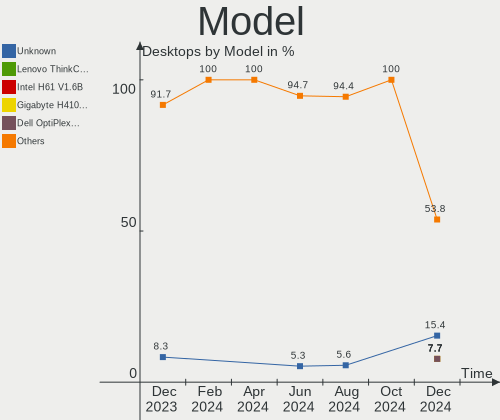
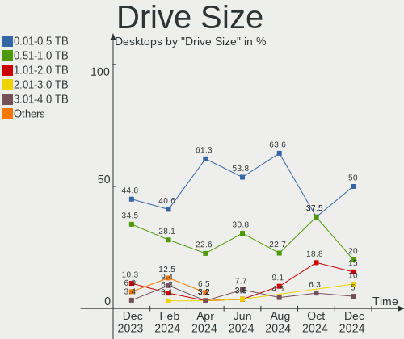
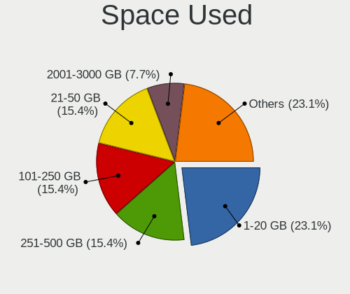
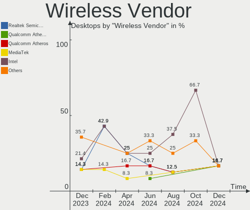

Xubuntu Hardware Trends (Desktops)
----------------------------------

A project to identify most popular hardware characteristics and track their change
over time based on data collected by Xubuntu users at https://Linux-Hardware.org.

Anyone can contribute to this report by the [hw-probe](https://github.com/linuxhw/hw-probe) tool:

    sudo -E hw-probe -all -upload

Full-feature report is available here: https://linux-hardware.org/?view=trends

Period: Jan, 2022.

Contents
--------

* [ System ](#system)
  - [ OS                       ](#os)
  - [ OS Family                ](#os-family)
  - [ Kernel                   ](#kernel)
  - [ Kernel Family            ](#kernel-family)
  - [ Kernel Major Ver.        ](#kernel-major-ver)
  - [ Arch                     ](#arch)
  - [ DE                       ](#de)
  - [ Display Server           ](#display-server)
  - [ Display Manager          ](#display-manager)
  - [ OS Lang                  ](#os-lang)
  - [ Boot Mode                ](#boot-mode)
  - [ Filesystem               ](#filesystem)
  - [ Part. scheme             ](#part-scheme)
  - [ Dual Boot with Linux/BSD ](#dual-boot-with-linuxbsd)
  - [ Dual Boot (Win)          ](#dual-boot-win)

* [ Board ](#board)
  - [ Vendor                   ](#vendor)
  - [ Model                    ](#model)
  - [ Model Family             ](#model-family)
  - [ MFG Year                 ](#mfg-year)
  - [ Form Factor              ](#form-factor)
  - [ Secure Boot              ](#secure-boot)
  - [ Coreboot                 ](#coreboot)
  - [ RAM Size                 ](#ram-size)
  - [ RAM Used                 ](#ram-used)
  - [ Total Drives             ](#total-drives)
  - [ Has CD-ROM               ](#has-cd-rom)
  - [ Has Ethernet             ](#has-ethernet)
  - [ Has WiFi                 ](#has-wifi)
  - [ Has Bluetooth            ](#has-bluetooth)

* [ Location ](#location)
  - [ Country                  ](#country)
  - [ City                     ](#city)

* [ Drives ](#drives)
  - [ Drive Vendor             ](#drive-vendor)
  - [ Drive Model              ](#drive-model)
  - [ HDD Vendor               ](#hdd-vendor)
  - [ SSD Vendor               ](#ssd-vendor)
  - [ Drive Kind               ](#drive-kind)
  - [ Drive Connector          ](#drive-connector)
  - [ Drive Size               ](#drive-size)
  - [ Space Total              ](#space-total)
  - [ Space Used               ](#space-used)
  - [ Malfunc. Drives          ](#malfunc-drives)
  - [ Malfunc. Drive Vendor    ](#malfunc-drive-vendor)
  - [ Malfunc. HDD Vendor      ](#malfunc-hdd-vendor)
  - [ Malfunc. Drive Kind      ](#malfunc-drive-kind)
  - [ Failed Drives            ](#failed-drives)
  - [ Failed Drive Vendor      ](#failed-drive-vendor)
  - [ Drive Status             ](#drive-status)

* [ Storage controller ](#storage-controller)
  - [ Storage Vendor           ](#storage-vendor)
  - [ Storage Model            ](#storage-model)
  - [ Storage Kind             ](#storage-kind)

* [ Processor ](#processor)
  - [ CPU Vendor               ](#cpu-vendor)
  - [ CPU Model                ](#cpu-model)
  - [ CPU Model Family         ](#cpu-model-family)
  - [ CPU Cores                ](#cpu-cores)
  - [ CPU Sockets              ](#cpu-sockets)
  - [ CPU Threads              ](#cpu-threads)
  - [ CPU Op-Modes             ](#cpu-op-modes)
  - [ CPU Microcode            ](#cpu-microcode)
  - [ CPU Microarch            ](#cpu-microarch)

* [ Graphics ](#graphics)
  - [ GPU Vendor               ](#gpu-vendor)
  - [ GPU Model                ](#gpu-model)
  - [ GPU Combo                ](#gpu-combo)
  - [ GPU Driver               ](#gpu-driver)
  - [ GPU Memory               ](#gpu-memory)

* [ Monitor ](#monitor)
  - [ Monitor Vendor           ](#monitor-vendor)
  - [ Monitor Model            ](#monitor-model)
  - [ Monitor Resolution       ](#monitor-resolution)
  - [ Monitor Diagonal         ](#monitor-diagonal)
  - [ Monitor Width            ](#monitor-width)
  - [ Aspect Ratio             ](#aspect-ratio)
  - [ Monitor Area             ](#monitor-area)
  - [ Pixel Density            ](#pixel-density)
  - [ Multiple Monitors        ](#multiple-monitors)

* [ Network ](#network)
  - [ Net Controller Vendor    ](#net-controller-vendor)
  - [ Net Controller Model     ](#net-controller-model)
  - [ Wireless Vendor          ](#wireless-vendor)
  - [ Wireless Model           ](#wireless-model)
  - [ Ethernet Vendor          ](#ethernet-vendor)
  - [ Ethernet Model           ](#ethernet-model)
  - [ Net Controller Kind      ](#net-controller-kind)
  - [ Used Controller          ](#used-controller)
  - [ NICs                     ](#nics)
  - [ IPv6                     ](#ipv6)

* [ Bluetooth ](#bluetooth)
  - [ Bluetooth Vendor         ](#bluetooth-vendor)
  - [ Bluetooth Model          ](#bluetooth-model)

* [ Sound ](#sound)
  - [ Sound Vendor             ](#sound-vendor)
  - [ Sound Model              ](#sound-model)

* [ Memory ](#memory)
  - [ Memory Vendor            ](#memory-vendor)
  - [ Memory Model             ](#memory-model)
  - [ Memory Kind              ](#memory-kind)
  - [ Memory Form Factor       ](#memory-form-factor)
  - [ Memory Size              ](#memory-size)
  - [ Memory Speed             ](#memory-speed)

* [ Printers & scanners ](#printers--scanners)
  - [ Printer Vendor           ](#printer-vendor)
  - [ Printer Model            ](#printer-model)
  - [ Scanner Vendor           ](#scanner-vendor)
  - [ Scanner Model            ](#scanner-model)

* [ Camera ](#camera)
  - [ Camera Vendor            ](#camera-vendor)
  - [ Camera Model             ](#camera-model)

* [ Security ](#security)
  - [ Fingerprint Vendor       ](#fingerprint-vendor)
  - [ Fingerprint Model        ](#fingerprint-model)
  - [ Chipcard Vendor          ](#chipcard-vendor)
  - [ Chipcard Model           ](#chipcard-model)

* [ Unsupported ](#unsupported)
  - [ Unsupported Devices      ](#unsupported-devices)
  - [ Unsupported Device Types ](#unsupported-device-types)

System
------

OS
--

Installed operating systems

| Name          | Desktops | Percent |
|---------------|----------|---------|
| Xubuntu 20.04 | 20       | 58.82%  |
| Xubuntu 21.10 | 7        | 20.59%  |
| Xubuntu 18.04 | 5        | 14.71%  |
| Xubuntu 20.10 | 1        | 2.94%   |
| Xubuntu 16.04 | 1        | 2.94%   |

OS Family
---------

OS without a version

| Name    | Desktops | Percent |
|---------|----------|---------|
| Xubuntu | 34       | 100%    |

Kernel
------

Version of the Linux kernel

| Version               | Desktops | Percent |
|-----------------------|----------|---------|
| 5.13.0-27-generic     | 5        | 14.71%  |
| 5.11.0-44-generic     | 4        | 11.76%  |
| 5.4.0-92-generic      | 2        | 5.88%   |
| 5.4.0-91-generic      | 2        | 5.88%   |
| 5.13.0-25-generic     | 2        | 5.88%   |
| 5.13.0-23-generic     | 2        | 5.88%   |
| 5.11.0-43-generic     | 2        | 5.88%   |
| 4.15.0-166-generic    | 2        | 5.88%   |
| 5.8.0-63-generic      | 1        | 2.94%   |
| 5.4.0-96-lowlatency   | 1        | 2.94%   |
| 5.4.0-96-generic      | 1        | 2.94%   |
| 5.4.0-94-lowlatency   | 1        | 2.94%   |
| 5.4.0-94-generic      | 1        | 2.94%   |
| 5.4.0-92-lowlatency   | 1        | 2.94%   |
| 5.13.0-28-lowlatency  | 1        | 2.94%   |
| 5.11.0-46-lowlatency  | 1        | 2.94%   |
| 5.11.0-46-generic     | 1        | 2.94%   |
| 5.11.0-44-lowlatency  | 1        | 2.94%   |
| 5.11.0-43-lowlatency  | 1        | 2.94%   |
| 4.15.0-142-generic    | 1        | 2.94%   |
| 4.15.0-122-lowlatency | 1        | 2.94%   |

Kernel Family
-------------

Linux kernel without a distro release

| Version | Desktops | Percent |
|---------|----------|---------|
| 5.13.0  | 10       | 29.41%  |
| 5.11.0  | 10       | 29.41%  |
| 5.4.0   | 9        | 26.47%  |
| 4.15.0  | 4        | 11.76%  |
| 5.8.0   | 1        | 2.94%   |

Kernel Major Ver.
-----------------

Linux kernel major version

| Version | Desktops | Percent |
|---------|----------|---------|
| 5.13    | 10       | 29.41%  |
| 5.11    | 10       | 29.41%  |
| 5.4     | 9        | 26.47%  |
| 4.15    | 4        | 11.76%  |
| 5.8     | 1        | 2.94%   |

Arch
----

OS architecture (x86_64, i586, etc.)

| Name   | Desktops | Percent |
|--------|----------|---------|
| x86_64 | 31       | 91.18%  |
| i686   | 3        | 8.82%   |

DE
--

Desktop Environment

| Name | Desktops | Percent |
|------|----------|---------|
| XFCE | 34       | 100%    |

Display Server
--------------

X11 or Wayland

| Name | Desktops | Percent |
|------|----------|---------|
| X11  | 33       | 97.06%  |
| Tty  | 1        | 2.94%   |

Display Manager
---------------

SDDM, LightDM, etc.

| Name    | Desktops | Percent |
|---------|----------|---------|
| LightDM | 30       | 88.24%  |
| Unknown | 3        | 8.82%   |
| GDM     | 1        | 2.94%   |

OS Lang
-------

Language

| Lang  | Desktops | Percent |
|-------|----------|---------|
| en_US | 12       | 35.29%  |
| de_DE | 5        | 14.71%  |
| it_IT | 4        | 11.76%  |
| ru_RU | 3        | 8.82%   |
| fr_FR | 2        | 5.88%   |
| es_UY | 2        | 5.88%   |
| en_GB | 2        | 5.88%   |
| pt_BR | 1        | 2.94%   |
| pl_PL | 1        | 2.94%   |
| hu_HU | 1        | 2.94%   |
| fr_CH | 1        | 2.94%   |

Boot Mode
---------

EFI or BIOS

| Mode | Desktops | Percent |
|------|----------|---------|
| BIOS | 28       | 82.35%  |
| EFI  | 6        | 17.65%  |

Filesystem
----------

Type of filesystem

| Type  | Desktops | Percent |
|-------|----------|---------|
| Ext4  | 31       | 91.18%  |
| Zfs   | 2        | 5.88%   |
| Btrfs | 1        | 2.94%   |

Part. scheme
------------

Scheme of partitioning

| Type    | Desktops | Percent |
|---------|----------|---------|
| Unknown | 22       | 64.71%  |
| GPT     | 7        | 20.59%  |
| MBR     | 5        | 14.71%  |

Dual Boot with Linux/BSD
------------------------

Hosting more than one Linux/BSD

| Dual boot | Desktops | Percent |
|-----------|----------|---------|
| No        | 24       | 70.59%  |
| Yes       | 10       | 29.41%  |

Dual Boot (Win)
---------------

Hosting Linux and Windows

| Dual boot | Desktops | Percent |
|-----------|----------|---------|
| No        | 18       | 52.94%  |
| Yes       | 16       | 47.06%  |

Board
-----

Vendor
------

Motherboard manufacturer

| Name                | Desktops | Percent |
|---------------------|----------|---------|
| Gigabyte Technology | 8        | 23.53%  |
| Lenovo              | 5        | 14.71%  |
| ASUSTek Computer    | 5        | 14.71%  |
| Hewlett-Packard     | 4        | 11.76%  |
| ASRock              | 4        | 11.76%  |
| Dell                | 2        | 5.88%   |
| VIA Technologies    | 1        | 2.94%   |
| Pegatron            | 1        | 2.94%   |
| MSI                 | 1        | 2.94%   |
| Intel               | 1        | 2.94%   |
| Foxconn             | 1        | 2.94%   |
| Chuwi               | 1        | 2.94%   |

Model
-----

Motherboard model

| Name                                   | Desktops | Percent |
|----------------------------------------|----------|---------|
| VIA VT8366-8233/5                      | 1        | 2.94%   |
| Pegatron NY802AV-ABA p6110t            | 1        | 2.94%   |
| MSI MS-7680                            | 1        | 2.94%   |
| Lenovo ThinkCentre M91p 4518A13        | 1        | 2.94%   |
| Lenovo ThinkCentre A70 7099A5G         | 1        | 2.94%   |
| Lenovo IdeaCentre 700-25ISH 90ED0009US | 1        | 2.94%   |
| Lenovo IdeaCentre 510-15ABR 90G7002RGE | 1        | 2.94%   |
| Lenovo IdeaCentre 510-15ABR 90G7000QUK | 1        | 2.94%   |
| Intel DP35DP AAD81073-209              | 1        | 2.94%   |
| HP Compaq dc7900 Small Form Factor     | 1        | 2.94%   |
| HP Compaq dc7800p Small Form Factor    | 1        | 2.94%   |
| HP Compaq dc7600 Small Form Factor     | 1        | 2.94%   |
| HP Compaq 6200 Pro MT PC               | 1        | 2.94%   |
| Gigabyte Z97X-UD3H-BK                  | 1        | 2.94%   |
| Gigabyte Z170-HD3P                     | 1        | 2.94%   |
| Gigabyte M68MT-S2P                     | 1        | 2.94%   |
| Gigabyte GB-BMPD-6005                  | 1        | 2.94%   |
| Gigabyte GB-BACE-3150                  | 1        | 2.94%   |
| Gigabyte GA-970A-D3                    | 1        | 2.94%   |
| Gigabyte EX58-UD4P                     | 1        | 2.94%   |
| Gigabyte EP43-DS3                      | 1        | 2.94%   |
| Foxconn Pro 3300 Series MT             | 1        | 2.94%   |
| Dell XPS 630i                          | 1        | 2.94%   |
| Dell Precision T1700                   | 1        | 2.94%   |
| Chuwi RZBOX                            | 1        | 2.94%   |
| ASUS P9X79                             | 1        | 2.94%   |
| ASUS M4A88T-M                          | 1        | 2.94%   |
| ASUS M4A78L-M                          | 1        | 2.94%   |
| ASUS K8V-MXG                           | 1        | 2.94%   |
| ASUS All Series                        | 1        | 2.94%   |
| ASRock N68-VS3 UCC                     | 1        | 2.94%   |
| ASRock N68-S3 UCC                      | 1        | 2.94%   |
| ASRock M3A UCC                         | 1        | 2.94%   |
| ASRock ALiveNF6G-GLAN                  | 1        | 2.94%   |

Model Family
------------

Motherboard model prefix

| Name                  | Desktops | Percent |
|-----------------------|----------|---------|
| HP Compaq             | 4        | 11.76%  |
| Lenovo IdeaCentre     | 3        | 8.82%   |
| Lenovo ThinkCentre    | 2        | 5.88%   |
| VIA VT8366-8233       | 1        | 2.94%   |
| Pegatron NY802AV-ABA  | 1        | 2.94%   |
| MSI MS-7680           | 1        | 2.94%   |
| Intel DP35DP          | 1        | 2.94%   |
| Gigabyte Z97X-UD3H-BK | 1        | 2.94%   |
| Gigabyte Z170-HD3P    | 1        | 2.94%   |
| Gigabyte M68MT-S2P    | 1        | 2.94%   |
| Gigabyte GB-BMPD-6005 | 1        | 2.94%   |
| Gigabyte GB-BACE-3150 | 1        | 2.94%   |
| Gigabyte GA-970A-D3   | 1        | 2.94%   |
| Gigabyte EX58-UD4P    | 1        | 2.94%   |
| Gigabyte EP43-DS3     | 1        | 2.94%   |
| Foxconn Pro           | 1        | 2.94%   |
| Dell XPS              | 1        | 2.94%   |
| Dell Precision        | 1        | 2.94%   |
| Chuwi RZBOX           | 1        | 2.94%   |
| ASUS P9X79            | 1        | 2.94%   |
| ASUS M4A88T-M         | 1        | 2.94%   |
| ASUS M4A78L-M         | 1        | 2.94%   |
| ASUS K8V-MXG          | 1        | 2.94%   |
| ASUS All              | 1        | 2.94%   |
| ASRock N68-VS3        | 1        | 2.94%   |
| ASRock N68-S3         | 1        | 2.94%   |
| ASRock M3A            | 1        | 2.94%   |
| ASRock ALiveNF6G-GLAN | 1        | 2.94%   |

MFG Year
--------

Motherboard manufacture year

| Year | Desktops | Percent |
|------|----------|---------|
| 2011 | 5        | 14.71%  |
| 2010 | 5        | 14.71%  |
| 2008 | 4        | 11.76%  |
| 2021 | 3        | 8.82%   |
| 2014 | 3        | 8.82%   |
| 2009 | 3        | 8.82%   |
| 2015 | 2        | 5.88%   |
| 2007 | 2        | 5.88%   |
| 2019 | 1        | 2.94%   |
| 2017 | 1        | 2.94%   |
| 2013 | 1        | 2.94%   |
| 2012 | 1        | 2.94%   |
| 2006 | 1        | 2.94%   |
| 2005 | 1        | 2.94%   |
| 2003 | 1        | 2.94%   |

Form Factor
-----------

Physical design of the computer

| Name    | Desktops | Percent |
|---------|----------|---------|
| Desktop | 34       | 100%    |

Secure Boot
-----------

Enabled or disabled

| State    | Desktops | Percent |
|----------|----------|---------|
| Disabled | 34       | 100%    |

Coreboot
--------

Have coreboot on board

| Used | Desktops | Percent |
|------|----------|---------|
| No   | 34       | 100%    |

RAM Size
--------

Total RAM memory

| Size in GB  | Desktops | Percent |
|-------------|----------|---------|
| 3.01-4.0    | 10       | 29.41%  |
| 8.01-16.0   | 9        | 26.47%  |
| 4.01-8.0    | 6        | 17.65%  |
| 16.01-24.0  | 4        | 11.76%  |
| 1.01-2.0    | 3        | 8.82%   |
| 24.01-32.0  | 1        | 2.94%   |
| 64.01-256.0 | 1        | 2.94%   |

RAM Used
--------

Used RAM memory

| Used GB   | Desktops | Percent |
|-----------|----------|---------|
| 1.01-2.0  | 18       | 52.94%  |
| 0.51-1.0  | 6        | 17.65%  |
| 2.01-3.0  | 5        | 14.71%  |
| 3.01-4.0  | 2        | 5.88%   |
| 8.01-16.0 | 2        | 5.88%   |
| 4.01-8.0  | 1        | 2.94%   |

Total Drives
------------

Number of drives on board

| Drives | Desktops | Percent |
|--------|----------|---------|
| 1      | 18       | 52.94%  |
| 3      | 9        | 26.47%  |
| 2      | 6        | 17.65%  |
| 5      | 1        | 2.94%   |

Has CD-ROM
----------

Has CD-ROM on board

| Presented | Desktops | Percent |
|-----------|----------|---------|
| Yes       | 27       | 79.41%  |
| No        | 7        | 20.59%  |

Has Ethernet
------------

Has Ethernet on board

| Presented | Desktops | Percent |
|-----------|----------|---------|
| Yes       | 34       | 100%    |

Has WiFi
--------

Has WiFi module

| Presented | Desktops | Percent |
|-----------|----------|---------|
| No        | 22       | 64.71%  |
| Yes       | 12       | 35.29%  |

Has Bluetooth
-------------

Has Bluetooth module

| Presented | Desktops | Percent |
|-----------|----------|---------|
| No        | 25       | 73.53%  |
| Yes       | 9        | 26.47%  |

Location
--------

Country
-------

Geographic location (country)

| Country     | Desktops | Percent |
|-------------|----------|---------|
| USA         | 8        | 23.53%  |
| Germany     | 5        | 14.71%  |
| Italy       | 4        | 11.76%  |
| Uruguay     | 2        | 5.88%   |
| UK          | 2        | 5.88%   |
| Russia      | 2        | 5.88%   |
| France      | 2        | 5.88%   |
| Switzerland | 1        | 2.94%   |
| Slovenia    | 1        | 2.94%   |
| Poland      | 1        | 2.94%   |
| Malta       | 1        | 2.94%   |
| Hungary     | 1        | 2.94%   |
| Greece      | 1        | 2.94%   |
| Brazil      | 1        | 2.94%   |
| Belarus     | 1        | 2.94%   |
| Australia   | 1        | 2.94%   |

City
----

Geographic location (city)

| City                    | Desktops | Percent |
|-------------------------|----------|---------|
| Vohenstrauss            | 1        | 2.94%   |
| Vitebsk                 | 1        | 2.94%   |
| Villefranche-sur-Sa??ne | 1        | 2.94%   |
| Stuttgart               | 1        | 2.94%   |
| Sliema                  | 1        | 2.94%   |
| Santa Barbara           | 1        | 2.94%   |
| Saint Paul              | 1        | 2.94%   |
| Rome                    | 1        | 2.94%   |
| Quedlinburg             | 1        | 2.94%   |
| Pinneberg               | 1        | 2.94%   |
| Oakland                 | 1        | 2.94%   |
| Oak Ridge               | 1        | 2.94%   |
| Nowy Targ               | 1        | 2.94%   |
| Naples                  | 1        | 2.94%   |
| Montevideo              | 1        | 2.94%   |
| Maldonado               | 1        | 2.94%   |
| Ljubljana               | 1        | 2.94%   |
| Le Kremlin-Bicetre      | 1        | 2.94%   |
| La Tour-de-Peilz        | 1        | 2.94%   |
| La Jolla                | 1        | 2.94%   |
| Kopeysk                 | 1        | 2.94%   |
| Kaliningrad             | 1        | 2.94%   |
| Gubbio                  | 1        | 2.94%   |
| Dresden                 | 1        | 2.94%   |
| Doncaster               | 1        | 2.94%   |
| Denver                  | 1        | 2.94%   |
| Covington               | 1        | 2.94%   |
| Cambridge               | 1        | 2.94%   |
| Budapest                | 1        | 2.94%   |
| Brembilla               | 1        | 2.94%   |
| Bellingham              | 1        | 2.94%   |
| Balne??rio Cambori??    | 1        | 2.94%   |
| Athens                  | 1        | 2.94%   |
| Alfreton                | 1        | 2.94%   |

Drives
------

Drive Vendor
------------

Hard drive vendors

| Vendor              | Desktops | Drives | Percent |
|---------------------|----------|--------|---------|
| WDC                 | 17       | 21     | 34%     |
| Seagate             | 14       | 20     | 28%     |
| Samsung Electronics | 9        | 9      | 18%     |
| Toshiba             | 2        | 2      | 4%      |
| MAXTOR              | 2        | 2      | 4%      |
| Mushkin             | 1        | 1      | 2%      |
| Kingston            | 1        | 1      | 2%      |
| Intel               | 1        | 1      | 2%      |
| Hitachi             | 1        | 1      | 2%      |
| HGST                | 1        | 1      | 2%      |
| Crucial             | 1        | 1      | 2%      |

Drive Model
-----------

Hard drive models

| Model                            | Desktops | Percent |
|----------------------------------|----------|---------|
| Seagate ST3500413AS 500GB        | 3        | 5.26%   |
| Seagate ST1000DM010-2EP102 1TB   | 2        | 3.51%   |
| WDC WDS480G2G0A-00JH30 480GB SSD | 1        | 1.75%   |
| WDC WDS250G2B0A-00SM50 250GB SSD | 1        | 1.75%   |
| WDC WD5000AZRX-00A8LB0 500GB     | 1        | 1.75%   |
| WDC WD5000AAKS-75A7B0 500GB      | 1        | 1.75%   |
| WDC WD5000AAKS-22V1A0 500GB      | 1        | 1.75%   |
| WDC WD5000AACS-00G8B0 500GB      | 1        | 1.75%   |
| WDC WD3200AAKX-753CA0 320GB      | 1        | 1.75%   |
| WDC WD3200AAJS-08L7A0 320GB      | 1        | 1.75%   |
| WDC WD30EZRZ-00Z5HB0 3TB         | 1        | 1.75%   |
| WDC WD2500AAKX-753CA1 250GB      | 1        | 1.75%   |
| WDC WD20EZRZ-22Z5HB0 2TB         | 1        | 1.75%   |
| WDC WD2003FZEX-00SRLA0 2TB       | 1        | 1.75%   |
| WDC WD1600AAJB-00PVA0 160GB      | 1        | 1.75%   |
| WDC WD10EZRZ-00HTKB0 1TB         | 1        | 1.75%   |
| WDC WD10EZRX-00D8PB0 1TB         | 1        | 1.75%   |
| WDC WD10EZEX-22RKKA0 1TB         | 1        | 1.75%   |
| WDC WD10EZEX-08WN4A0 1TB         | 1        | 1.75%   |
| WDC WD10EZEX-00BN5A0 1TB         | 1        | 1.75%   |
| WDC WD10EARS-00Y5B1 1TB          | 1        | 1.75%   |
| WDC WD1003FZEX-00MK2A0 1TB       | 1        | 1.75%   |
| WDC WD1003FBYX-18Y7B0 1TB        | 1        | 1.75%   |
| Toshiba Q300. 240GB SSD          | 1        | 1.75%   |
| Toshiba DT01ACA100 1TB           | 1        | 1.75%   |
| Seagate ST500DM002-1BD142 500GB  | 1        | 1.75%   |
| Seagate ST4000DM004-2CV104 4TB   | 1        | 1.75%   |
| Seagate ST380817AS 80GB          | 1        | 1.75%   |
| Seagate ST380811AS 80GB          | 1        | 1.75%   |
| Seagate ST3320418AS 320GB        | 1        | 1.75%   |
| Seagate ST3250310AS 250GB        | 1        | 1.75%   |
| Seagate ST3160815AS 160GB        | 1        | 1.75%   |
| Seagate ST3160318AS 160GB        | 1        | 1.75%   |
| Seagate ST31000528AS 1TB         | 1        | 1.75%   |
| Seagate ST2000DM008-2FR102 2TB   | 1        | 1.75%   |
| Seagate ST2000DM001-1ER164 2TB   | 1        | 1.75%   |
| Seagate ST1000DX001-SSHD-8GB     | 1        | 1.75%   |
| Samsung SSD 870 EVO 500GB        | 1        | 1.75%   |
| Samsung SSD 840 EVO 500GB        | 1        | 1.75%   |
| Samsung SSD 830 Series 128GB     | 1        | 1.75%   |
| Samsung SSD 750 EVO 250GB        | 1        | 1.75%   |
| Samsung SP2504C 250GB            | 1        | 1.75%   |
| Samsung SP0411N 40GB             | 1        | 1.75%   |
| Samsung HD502HI 500GB            | 1        | 1.75%   |
| Samsung HD321KJ 320GB            | 1        | 1.75%   |
| Samsung HD160JJ 160GB            | 1        | 1.75%   |
| Mushkin MKNSSDHL250GB-D8         | 1        | 1.75%   |
| MAXTOR 6L200M0 208GB             | 1        | 1.75%   |
| MAXTOR 6K040L0 41GB              | 1        | 1.75%   |
| Kingston OM8PDP3512B-A01 512GB   | 1        | 1.75%   |
| Intel SSDSC2BW180A4 180GB        | 1        | 1.75%   |
| Hitachi HDS721010CLA332 1TB      | 1        | 1.75%   |
| HGST HTS541010A9E680 1TB         | 1        | 1.75%   |
| Crucial CT1000P2SSD8 1TB         | 1        | 1.75%   |

HDD Vendor
----------

Hard disk drive vendors

| Vendor              | Desktops | Drives | Percent |
|---------------------|----------|--------|---------|
| WDC                 | 16       | 19     | 40%     |
| Seagate             | 14       | 20     | 35%     |
| Samsung Electronics | 5        | 5      | 12.5%   |
| MAXTOR              | 2        | 2      | 5%      |
| Toshiba             | 1        | 1      | 2.5%    |
| Hitachi             | 1        | 1      | 2.5%    |
| HGST                | 1        | 1      | 2.5%    |

SSD Vendor
----------

Solid state drive vendors

| Vendor              | Desktops | Drives | Percent |
|---------------------|----------|--------|---------|
| Samsung Electronics | 4        | 4      | 50%     |
| WDC                 | 2        | 2      | 25%     |
| Toshiba             | 1        | 1      | 12.5%   |
| Intel               | 1        | 1      | 12.5%   |

Drive Kind
----------

HDD or SSD

| Kind | Desktops | Drives | Percent |
|------|----------|--------|---------|
| HDD  | 31       | 49     | 77.5%   |
| SSD  | 7        | 8      | 17.5%   |
| NVMe | 2        | 3      | 5%      |

Drive Connector
---------------

SATA, SAS, NVMe, etc.

| Type | Desktops | Drives | Percent |
|------|----------|--------|---------|
| SATA | 33       | 57     | 94.29%  |
| NVMe | 2        | 3      | 5.71%   |

Drive Size
----------

Size of hard drive

| Size in TB | Desktops | Drives | Percent |
|------------|----------|--------|---------|
| 0.01-0.5   | 24       | 33     | 55.81%  |
| 0.51-1.0   | 13       | 15     | 30.23%  |
| 1.01-2.0   | 4        | 4      | 9.3%    |
| 3.01-4.0   | 1        | 4      | 2.33%   |
| 2.01-3.0   | 1        | 1      | 2.33%   |

Space Total
-----------

Amount of disk space available on the file system

| Size in GB     | Desktops | Percent |
|----------------|----------|---------|
| 101-250        | 10       | 29.41%  |
| 251-500        | 7        | 20.59%  |
| 501-1000       | 5        | 14.71%  |
| More than 3000 | 3        | 8.82%   |
| 21-50          | 2        | 5.88%   |
| 2001-3000      | 2        | 5.88%   |
| 1001-2000      | 2        | 5.88%   |
| 51-100         | 2        | 5.88%   |
| 1-20           | 1        | 2.94%   |

Space Used
----------

Amount of used disk space

| Used GB        | Desktops | Percent |
|----------------|----------|---------|
| 1-20           | 12       | 35.29%  |
| 21-50          | 8        | 23.53%  |
| 51-100         | 4        | 11.76%  |
| 251-500        | 3        | 8.82%   |
| 101-250        | 3        | 8.82%   |
| 2001-3000      | 2        | 5.88%   |
| More than 3000 | 1        | 2.94%   |
| 501-1000       | 1        | 2.94%   |

Malfunc. Drives
---------------

Drive models with a malfunction

| Model                             | Desktops | Drives | Percent |
|-----------------------------------|----------|--------|---------|
| WDC WDS480G2G0A-00JH30 480GB SSD  | 1        | 1      | 14.29%  |
| WDC WD5000AAKS-22V1A0 500GB       | 1        | 1      | 14.29%  |
| WDC WD3200AAJS-08L7A0 320GB       | 1        | 1      | 14.29%  |
| Toshiba Q300. 240GB SSD           | 1        | 1      | 14.29%  |
| Seagate ST380811AS 80GB           | 1        | 1      | 14.29%  |
| Samsung Electronics SP2504C 250GB | 1        | 1      | 14.29%  |
| Hitachi HDS721010CLA332 1TB       | 1        | 1      | 14.29%  |

Malfunc. Drive Vendor
---------------------

Vendors of faulty drives

| Vendor              | Desktops | Drives | Percent |
|---------------------|----------|--------|---------|
| WDC                 | 3        | 3      | 42.86%  |
| Toshiba             | 1        | 1      | 14.29%  |
| Seagate             | 1        | 1      | 14.29%  |
| Samsung Electronics | 1        | 1      | 14.29%  |
| Hitachi             | 1        | 1      | 14.29%  |

Malfunc. HDD Vendor
-------------------

Vendors of faulty HDD drives

| Vendor              | Desktops | Drives | Percent |
|---------------------|----------|--------|---------|
| WDC                 | 2        | 2      | 40%     |
| Seagate             | 1        | 1      | 20%     |
| Samsung Electronics | 1        | 1      | 20%     |
| Hitachi             | 1        | 1      | 20%     |

Malfunc. Drive Kind
-------------------

Kinds of faulty drives

| Kind | Desktops | Drives | Percent |
|------|----------|--------|---------|
| HDD  | 5        | 5      | 83.33%  |
| SSD  | 1        | 2      | 16.67%  |

Failed Drives
-------------

Failed drive models

Zero info for selected period =(

Failed Drive Vendor
-------------------

Failed drive vendors

Zero info for selected period =(

Drive Status
------------

Number of failed and malfunc. drives

| Status   | Desktops | Drives | Percent |
|----------|----------|--------|---------|
| Detected | 22       | 33     | 57.89%  |
| Works    | 10       | 20     | 26.32%  |
| Malfunc  | 6        | 7      | 15.79%  |

Storage controller
------------------

Storage Vendor
--------------

Storage controller vendors

| Vendor                        | Desktops | Percent |
|-------------------------------|----------|---------|
| Intel                         | 20       | 48.78%  |
| AMD                           | 7        | 17.07%  |
| Nvidia                        | 5        | 12.2%   |
| VIA Technologies              | 2        | 4.88%   |
| Silicon Motion                | 1        | 2.44%   |
| Micron/Crucial Technology     | 1        | 2.44%   |
| Marvell Technology Group      | 1        | 2.44%   |
| Kingston Technology Company   | 1        | 2.44%   |
| JMicron Technology            | 1        | 2.44%   |
| Integrated Technology Express | 1        | 2.44%   |
| ASMedia Technology            | 1        | 2.44%   |

Storage Model
-------------

Storage controller models

| Model                                                                                   | Desktops | Percent |
|-----------------------------------------------------------------------------------------|----------|---------|
| Nvidia MCP61 SATA Controller                                                            | 4        | 7.02%   |
| Nvidia MCP61 IDE                                                                        | 3        | 5.26%   |
| Intel 6 Series/C200 Series Chipset Family 6 port Desktop SATA AHCI Controller           | 3        | 5.26%   |
| AMD SB7x0/SB8x0/SB9x0 IDE Controller                                                    | 3        | 5.26%   |
| AMD FCH SATA Controller [AHCI mode]                                                     | 3        | 5.26%   |
| VIA VT82C586A/B/VT82C686/A/B/VT823x/A/C PIPC Bus Master IDE                             | 2        | 3.51%   |
| Intel Q170/Q150/B150/H170/H110/Z170/CM236 Chipset SATA Controller [AHCI Mode]           | 2        | 3.51%   |
| Intel NM10/ICH7 Family SATA Controller [IDE mode]                                       | 2        | 3.51%   |
| Intel 82801IR/IO/IH (ICH9R/DO/DH) 4 port SATA Controller [IDE mode]                     | 2        | 3.51%   |
| Intel 82801I (ICH9 Family) 2 port SATA Controller [IDE mode]                            | 2        | 3.51%   |
| Intel 8 Series/C220 Series Chipset Family 6-port SATA Controller 1 [AHCI mode]          | 2        | 3.51%   |
| AMD SB7x0/SB8x0/SB9x0 SATA Controller [IDE mode]                                        | 2        | 3.51%   |
| VIA VIA VT6420 SATA RAID Controller                                                     | 1        | 1.75%   |
| Silicon Motion SM2263EN/SM2263XT SSD Controller                                         | 1        | 1.75%   |
| Nvidia MCP51 Serial ATA Controller                                                      | 1        | 1.75%   |
| Nvidia MCP51 IDE                                                                        | 1        | 1.75%   |
| Micron/Crucial P2 NVMe PCIe SSD                                                         | 1        | 1.75%   |
| Marvell Group 88SE6101/6102 single-port PATA133 interface                               | 1        | 1.75%   |
| Kingston Company OM3PDP3 NVMe SSD                                                       | 1        | 1.75%   |
| JMicron JMB363 SATA/IDE Controller                                                      | 1        | 1.75%   |
| Intel SATA Controller [RAID mode]                                                       | 1        | 1.75%   |
| Intel Jasper Lake SATA AHCI Controller                                                  | 1        | 1.75%   |
| Intel C600/X79 series chipset 6-Port SATA AHCI Controller                               | 1        | 1.75%   |
| Intel Atom/Celeron/Pentium Processor x5-E8000/J3xxx/N3xxx Series SATA Controller        | 1        | 1.75%   |
| Intel 9 Series Chipset Family SATA Controller [AHCI Mode]                               | 1        | 1.75%   |
| Intel 82Q35 Express PT IDER Controller                                                  | 1        | 1.75%   |
| Intel 82801JI (ICH10 Family) SATA AHCI Controller                                       | 1        | 1.75%   |
| Intel 82801JI (ICH10 Family) 4 port SATA IDE Controller #1                              | 1        | 1.75%   |
| Intel 82801JI (ICH10 Family) 2 port SATA IDE Controller #2                              | 1        | 1.75%   |
| Intel 82801JD/DO (ICH10 Family) SATA AHCI Controller                                    | 1        | 1.75%   |
| Intel 82801G (ICH7 Family) IDE Controller                                               | 1        | 1.75%   |
| Intel 6 Series/C200 Series Chipset Family Desktop SATA Controller (IDE mode, ports 4-5) | 1        | 1.75%   |
| Intel 6 Series/C200 Series Chipset Family Desktop SATA Controller (IDE mode, ports 0-3) | 1        | 1.75%   |
| Intel 4 Series Chipset PT IDER Controller                                               | 1        | 1.75%   |
| Integrated Express IT8213 IDE Controller                                                | 1        | 1.75%   |
| ASMedia ASM1062 Serial ATA Controller                                                   | 1        | 1.75%   |
| AMD SB7x0/SB8x0/SB9x0 SATA Controller [AHCI mode]                                       | 1        | 1.75%   |
| AMD SB600 Non-Raid-5 SATA                                                               | 1        | 1.75%   |
| AMD SB600 IDE                                                                           | 1        | 1.75%   |

Storage Kind
------------

Kind of storage controller (IDE, SATA, NVMe, SAS, ...)

| Kind | Desktops | Percent |
|------|----------|---------|
| SATA | 20       | 45.45%  |
| IDE  | 19       | 43.18%  |
| RAID | 3        | 6.82%   |
| NVMe | 2        | 4.55%   |

Processor
---------

CPU Vendor
----------

Processor vendors

| Vendor | Desktops | Percent |
|--------|----------|---------|
| Intel  | 21       | 61.76%  |
| AMD    | 13       | 38.24%  |

CPU Model
---------

Processor models

| Model                                          | Desktops | Percent |
|------------------------------------------------|----------|---------|
| Intel Core i3-2100 CPU @ 3.10GHz               | 2        | 5.88%   |
| Intel Core 2 Duo CPU E8400 @ 3.00GHz           | 2        | 5.88%   |
| AMD A10-9700 RADEON R7, 10 COMPUTE CORES 4C+6G | 2        | 5.88%   |
| Intel Xeon CPU L5420 @ 2.50GHz                 | 1        | 2.94%   |
| Intel Pentium Silver N6005 @ 2.00GHz           | 1        | 2.94%   |
| Intel Pentium Dual-Core CPU E5200 @ 2.50GHz    | 1        | 2.94%   |
| Intel Pentium 4 CPU 3.00GHz                    | 1        | 2.94%   |
| Intel Core i7-4930K CPU @ 3.40GHz              | 1        | 2.94%   |
| Intel Core i7-4770 CPU @ 3.40GHz               | 1        | 2.94%   |
| Intel Core i7 CPU 960 @ 3.20GHz                | 1        | 2.94%   |
| Intel Core i5-6500 CPU @ 3.20GHz               | 1        | 2.94%   |
| Intel Core i5-6400 CPU @ 2.70GHz               | 1        | 2.94%   |
| Intel Core i5-4690K CPU @ 3.50GHz              | 1        | 2.94%   |
| Intel Core i5-4440 CPU @ 3.10GHz               | 1        | 2.94%   |
| Intel Core i5-2500 CPU @ 3.30GHz               | 1        | 2.94%   |
| Intel Core i5-2400 CPU @ 3.10GHz               | 1        | 2.94%   |
| Intel Core 2 Quad CPU Q9550 @ 2.83GHz          | 1        | 2.94%   |
| Intel Core 2 Duo CPU E8300 @ 2.83GHz           | 1        | 2.94%   |
| Intel Core 2 Duo CPU E7500 @ 2.93GHz           | 1        | 2.94%   |
| Intel Celeron CPU N3150 @ 1.60GHz              | 1        | 2.94%   |
| AMD Sempron Processor 3400+                    | 1        | 2.94%   |
| AMD Ryzen 9 4900H with Radeon Graphics         | 1        | 2.94%   |
| AMD Phenom II X4 B55 Processor                 | 1        | 2.94%   |
| AMD FX-8300 Eight-Core Processor               | 1        | 2.94%   |
| AMD Athlon XP 2000+                            | 1        | 2.94%   |
| AMD Athlon II X4 640 Processor                 | 1        | 2.94%   |
| AMD Athlon II X3 450 Processor                 | 1        | 2.94%   |
| AMD Athlon II X2 270 Processor                 | 1        | 2.94%   |
| AMD Athlon II X2 245 Processor                 | 1        | 2.94%   |
| AMD Athlon II X2 240 Processor                 | 1        | 2.94%   |
| AMD Athlon Dual Core Processor 5000B           | 1        | 2.94%   |

CPU Model Family
----------------

Processor model prefix

| Model                   | Desktops | Percent |
|-------------------------|----------|---------|
| Intel Core i5           | 6        | 17.65%  |
| Intel Core 2 Duo        | 4        | 11.76%  |
| Intel Core i7           | 3        | 8.82%   |
| AMD Athlon II X2        | 3        | 8.82%   |
| Intel Core i3           | 2        | 5.88%   |
| AMD A10                 | 2        | 5.88%   |
| Intel Xeon              | 1        | 2.94%   |
| Intel Pentium Silver    | 1        | 2.94%   |
| Intel Pentium Dual-Core | 1        | 2.94%   |
| Intel Pentium 4         | 1        | 2.94%   |
| Intel Core 2 Quad       | 1        | 2.94%   |
| Intel Celeron           | 1        | 2.94%   |
| AMD Sempron             | 1        | 2.94%   |
| AMD Ryzen 9             | 1        | 2.94%   |
| AMD Phenom II X4        | 1        | 2.94%   |
| AMD FX                  | 1        | 2.94%   |
| AMD Athlon XP           | 1        | 2.94%   |
| AMD Athlon II X4        | 1        | 2.94%   |
| AMD Athlon II X3        | 1        | 2.94%   |
| AMD Athlon Dual Core    | 1        | 2.94%   |

CPU Cores
---------

Number of processor cores

| Number | Desktops | Percent |
|--------|----------|---------|
| 4      | 15       | 44.12%  |
| 2      | 13       | 38.24%  |
| 1      | 3        | 8.82%   |
| 8      | 1        | 2.94%   |
| 6      | 1        | 2.94%   |
| 3      | 1        | 2.94%   |

CPU Sockets
-----------

Number of sockets

| Number | Desktops | Percent |
|--------|----------|---------|
| 1      | 34       | 100%    |

CPU Threads
-----------

Threads per core (Hyper-Threading)

| Number | Desktops | Percent |
|--------|----------|---------|
| 1      | 24       | 70.59%  |
| 2      | 10       | 29.41%  |

CPU Op-Modes
------------

CPU Operation Modes (32-bit, 64-bit)

| Op mode        | Desktops | Percent |
|----------------|----------|---------|
| 32-bit, 64-bit | 33       | 97.06%  |
| 32-bit         | 1        | 2.94%   |

CPU Microcode
-------------

Microcode number

| Number     | Desktops | Percent |
|------------|----------|---------|
| Unknown    | 12       | 35.29%  |
| 0x1067a    | 4        | 11.76%  |
| 0x010000c8 | 4        | 11.76%  |
| 0x306c3    | 3        | 8.82%   |
| 0x506e3    | 2        | 5.88%   |
| 0x10676    | 2        | 5.88%   |
| 0x906c0    | 1        | 2.94%   |
| 0x406c3    | 1        | 2.94%   |
| 0x206a7    | 1        | 2.94%   |
| 0x10677    | 1        | 2.94%   |
| 0x08600106 | 1        | 2.94%   |
| 0x0600611a | 1        | 2.94%   |
| 0x06000852 | 1        | 2.94%   |

CPU Microarch
-------------

Microarchitecture

| Name        | Desktops | Percent |
|-------------|----------|---------|
| Penryn      | 7        | 20.59%  |
| K10         | 6        | 17.65%  |
| SandyBridge | 4        | 11.76%  |
| Haswell     | 3        | 8.82%   |
| Skylake     | 2        | 5.88%   |
| K8 Hammer   | 2        | 5.88%   |
| Excavator   | 2        | 5.88%   |
| Zen 2       | 1        | 2.94%   |
| Tremont     | 1        | 2.94%   |
| Silvermont  | 1        | 2.94%   |
| Piledriver  | 1        | 2.94%   |
| NetBurst    | 1        | 2.94%   |
| Nehalem     | 1        | 2.94%   |
| K6          | 1        | 2.94%   |
| IvyBridge   | 1        | 2.94%   |

Graphics
--------

GPU Vendor
----------

Vendors of graphics cards

| Vendor           | Desktops | Percent |
|------------------|----------|---------|
| AMD              | 13       | 36.11%  |
| Nvidia           | 12       | 33.33%  |
| Intel            | 10       | 27.78%  |
| VIA Technologies | 1        | 2.78%   |

GPU Model
---------

Graphics card models

| Model                                                                                    | Desktops | Percent |
|------------------------------------------------------------------------------------------|----------|---------|
| Nvidia GF108 [GeForce GT 630]                                                            | 2        | 5.56%   |
| Intel Xeon E3-1200 v3/4th Gen Core Processor Integrated Graphics Controller              | 2        | 5.56%   |
| Intel 4 Series Chipset Integrated Graphics Controller                                    | 2        | 5.56%   |
| AMD Cedar [Radeon HD 5000/6000/7350/8350 Series]                                         | 2        | 5.56%   |
| VIA Technologies K8M800/K8N800/K8N800A [S3 UniChrome Pro]                                | 1        | 2.78%   |
| Nvidia GT218 [GeForce 210]                                                               | 1        | 2.78%   |
| Nvidia GP104 [GeForce GTX 1080]                                                          | 1        | 2.78%   |
| Nvidia GM204 [GeForce GTX 970]                                                           | 1        | 2.78%   |
| Nvidia GM107 [GeForce GTX 750 Ti]                                                        | 1        | 2.78%   |
| Nvidia GK208B [GeForce GT 730]                                                           | 1        | 2.78%   |
| Nvidia GK107GL [Quadro K600]                                                             | 1        | 2.78%   |
| Nvidia GF116 [GeForce GTX 550 Ti]                                                        | 1        | 2.78%   |
| Nvidia GF108 [GeForce GT 730]                                                            | 1        | 2.78%   |
| Nvidia G92 [GeForce 9800 GT]                                                             | 1        | 2.78%   |
| Nvidia C61 [GeForce 6150SE nForce 430]                                                   | 1        | 2.78%   |
| Intel JasperLake [UHD Graphics]                                                          | 1        | 2.78%   |
| Intel Atom/Celeron/Pentium Processor x5-E8000/J3xxx/N3xxx Integrated Graphics Controller | 1        | 2.78%   |
| Intel 82Q35 Express Integrated Graphics Controller                                       | 1        | 2.78%   |
| Intel 82G33/G31 Express Integrated Graphics Controller                                   | 1        | 2.78%   |
| Intel 82945G/GZ Integrated Graphics Controller                                           | 1        | 2.78%   |
| Intel 2nd Generation Core Processor Family Integrated Graphics Controller                | 1        | 2.78%   |
| AMD Wani [Radeon R5/R6/R7 Graphics]                                                      | 1        | 2.78%   |
| AMD RV635 [Radeon HD 3650/3750/4570/4580]                                                | 1        | 2.78%   |
| AMD RV620 LE [Radeon HD 3450 AGP]                                                        | 1        | 2.78%   |
| AMD Renoir                                                                               | 1        | 2.78%   |
| AMD Redwood XT [Radeon HD 5670/5690/5730]                                                | 1        | 2.78%   |
| AMD Juniper XT [Radeon HD 5770]                                                          | 1        | 2.78%   |
| AMD Ellesmere [Radeon RX 470/480/570/570X/580/580X/590]                                  | 1        | 2.78%   |
| AMD Cayman PRO [Radeon HD 6950]                                                          | 1        | 2.78%   |
| AMD Caicos [Radeon HD 6450/7450/8450 / R5 230 OEM]                                       | 1        | 2.78%   |
| AMD Bonaire XTX [Radeon R7 260X/360]                                                     | 1        | 2.78%   |
| AMD Barts PRO [Radeon HD 6850]                                                           | 1        | 2.78%   |

GPU Combo
---------

Combinations of graphics cards

| Name         | Desktops | Percent |
|--------------|----------|---------|
| 1 x Nvidia   | 11       | 32.35%  |
| 1 x AMD      | 11       | 32.35%  |
| 1 x Intel    | 9        | 26.47%  |
| 1 x VIA      | 1        | 2.94%   |
| Intel + AMD  | 1        | 2.94%   |
| AMD + Nvidia | 1        | 2.94%   |

GPU Driver
----------

Free vs proprietary

| Driver      | Desktops | Percent |
|-------------|----------|---------|
| Free        | 23       | 67.65%  |
| Proprietary | 9        | 26.47%  |
| Unknown     | 2        | 5.88%   |

GPU Memory
----------

Total video memory

| Size in GB | Desktops | Percent |
|------------|----------|---------|
| Unknown    | 15       | 44.12%  |
| 0.01-0.5   | 6        | 17.65%  |
| 1.01-2.0   | 5        | 14.71%  |
| 0.51-1.0   | 5        | 14.71%  |
| 7.01-8.0   | 2        | 5.88%   |
| 3.01-4.0   | 1        | 2.94%   |

Monitor
-------

Monitor Vendor
--------------

Monitor vendors

| Vendor               | Desktops | Percent |
|----------------------|----------|---------|
| Samsung Electronics  | 5        | 15.63%  |
| Acer                 | 5        | 15.63%  |
| Hewlett-Packard      | 4        | 12.5%   |
| Unknown              | 2        | 6.25%   |
| CVT                  | 2        | 6.25%   |
| AOC                  | 2        | 6.25%   |
| ViewSonic            | 1        | 3.13%   |
| Vestel Elektronik    | 1        | 3.13%   |
| Philips              | 1        | 3.13%   |
| Panasonic            | 1        | 3.13%   |
| Packard Bell         | 1        | 3.13%   |
| HannStar             | 1        | 3.13%   |
| Haier                | 1        | 3.13%   |
| FUS                  | 1        | 3.13%   |
| Dell                 | 1        | 3.13%   |
| ASUSTek Computer     | 1        | 3.13%   |
| Ancor Communications | 1        | 3.13%   |
| Unknown              | 1        | 3.13%   |

Monitor Model
-------------

Monitor models

| Model                                                                 | Desktops | Percent |
|-----------------------------------------------------------------------|----------|---------|
| ViewSonic VA926 Series VSC7D20 1280x1024 376x301mm 19.0-inch          | 1        | 2.78%   |
| Vestel Elektronik LCD Monitor VES3700 1920x540                        | 1        | 2.78%   |
| Unknown LCD Monitor QMX Q24 1920x1080                                 | 1        | 2.78%   |
| Unknown LCD Monitor FFFF 2288x1287 2550x2550mm 142.0-inch             | 1        | 2.78%   |
| Samsung Electronics SyncMaster SAM041E 2048x1152 510x287mm 23.0-inch  | 1        | 2.78%   |
| Samsung Electronics S24E450 SAM0C9A 1920x1080 521x293mm 23.5-inch     | 1        | 2.78%   |
| Samsung Electronics S24C450 SAM0A03 1920x1080 521x293mm 23.5-inch     | 1        | 2.78%   |
| Samsung Electronics LS32R75 SAM0F92 3840x2160 697x392mm 31.5-inch     | 1        | 2.78%   |
| Samsung Electronics LCD Monitor SyncMaster 1920x1080                  | 1        | 2.78%   |
| Samsung Electronics LCD Monitor SAM07C5 1920x1080 890x500mm 40.2-inch | 1        | 2.78%   |
| Philips PHL 276E9Q PHLC17B 1920x1080 598x336mm 27.0-inch              | 1        | 2.78%   |
| Panasonic TV MEIA045 1920x540 920x518mm 41.6-inch                     | 1        | 2.78%   |
| Packard Bell Viseo 230Ws PKB00C1 1920x1080 509x286mm 23.0-inch        | 1        | 2.78%   |
| Hewlett-Packard w1858 HWP2835 1366x768 413x234mm 18.7-inch            | 1        | 2.78%   |
| Hewlett-Packard P19A HWP3087 1280x1024 338x270mm 17.0-inch            | 1        | 2.78%   |
| Hewlett-Packard L1755 HWP264A 1280x1024 376x301mm 19.0-inch           | 1        | 2.78%   |
| Hewlett-Packard E233 HPN3460 1920x1080 510x290mm 23.1-inch            | 1        | 2.78%   |
| HannStar HL273HPB HSD6542 1920x1080 597x336mm 27.0-inch               | 1        | 2.78%   |
| HannStar HL272HPB HSD6537 1920x1080 597x336mm 27.0-inch               | 1        | 2.78%   |
| Haier LED39C800F HAI17FC 1920x1080 1150x650mm 52.0-inch               | 1        | 2.78%   |
| FUS LCD Monitor L20T-2 LED 1600x900                                   | 1        | 2.78%   |
| Dell P2412H DELA07C 1920x1080 530x300mm 24.0-inch                     | 1        | 2.78%   |
| CVT Monitor CVT4668 1440x900 360x290mm 18.2-inch                      | 1        | 2.78%   |
| CVT LCD CVT001A 1920x1080 330x210mm 15.4-inch                         | 1        | 2.78%   |
| ASUSTek Computer BE24D AUS24A5 1920x1080 527x296mm 23.8-inch          | 1        | 2.78%   |
| AOC 2369M AOC2369 1920x1080 510x290mm 23.1-inch                       | 1        | 2.78%   |
| AOC 1941W AOC1941 1366x768 410x230mm 18.5-inch                        | 1        | 2.78%   |
| Ancor Communications ASUS VH198 ACI19E7 1440x900 410x256mm 19.0-inch  | 1        | 2.78%   |
| Acer X233H ACR0093 1920x1080 510x290mm 23.1-inch                      | 1        | 2.78%   |
| Acer LCD Monitor X171                                                 | 1        | 2.78%   |
| Acer LCD Monitor V246HL                                               | 1        | 2.78%   |
| Acer LCD Monitor K242HYL 3840x1080                                    | 1        | 2.78%   |
| Acer LCD Monitor G235H 3200x1080                                      | 1        | 2.78%   |
| Acer KA242Y ACR0743 1920x1080 527x296mm 23.8-inch                     | 1        | 2.78%   |
| Acer A221HQV ACR01C9 1920x1080 477x268mm 21.5-inch                    | 1        | 2.78%   |
| Unknown                                                               | 1        | 2.78%   |

Monitor Resolution
------------------

Monitor screen resolution

| Resolution       | Desktops | Percent |
|------------------|----------|---------|
| 1920x1080 (FHD)  | 16       | 48.48%  |
| 3840x2160 (4K)   | 2        | 6.06%   |
| 1366x768 (WXGA)  | 2        | 6.06%   |
| 1280x1024 (SXGA) | 2        | 6.06%   |
| Unknown          | 2        | 6.06%   |
| 3840x1080        | 1        | 3.03%   |
| 3200x1080        | 1        | 3.03%   |
| 2288x1287        | 1        | 3.03%   |
| 2048x1152        | 1        | 3.03%   |
| 1920x540         | 1        | 3.03%   |
| 1600x900 (HD+)   | 1        | 3.03%   |
| 1600x1200        | 1        | 3.03%   |
| 1440x900 (WXGA+) | 1        | 3.03%   |
| 1280x720 (HD)    | 1        | 3.03%   |

Monitor Diagonal
----------------

Diagonal size in inches

| Inches  | Desktops | Percent |
|---------|----------|---------|
| 23      | 7        | 22.58%  |
| Unknown | 6        | 19.35%  |
| 19      | 3        | 9.68%   |
| 18      | 3        | 9.68%   |
| 27      | 2        | 6.45%   |
| 142     | 1        | 3.23%   |
| 84      | 1        | 3.23%   |
| 54      | 1        | 3.23%   |
| 52      | 1        | 3.23%   |
| 41      | 1        | 3.23%   |
| 31      | 1        | 3.23%   |
| 24      | 1        | 3.23%   |
| 21      | 1        | 3.23%   |
| 17      | 1        | 3.23%   |
| 15      | 1        | 3.23%   |

Monitor Width
-------------

Physical width

| Width in mm    | Desktops | Percent |
|----------------|----------|---------|
| 501-600        | 10       | 32.26%  |
| Unknown        | 6        | 19.35%  |
| 401-500        | 4        | 12.9%   |
| 351-400        | 3        | 9.68%   |
| 301-350        | 2        | 6.45%   |
| 1001-1500      | 2        | 6.45%   |
| More than 2000 | 1        | 3.23%   |
| 601-700        | 1        | 3.23%   |
| 1501-2000      | 1        | 3.23%   |
| 901-1000       | 1        | 3.23%   |

Aspect Ratio
------------

Proportional relationship between the width and the height

| Ratio   | Desktops | Percent |
|---------|----------|---------|
| 16/9    | 18       | 58.06%  |
| Unknown | 6        | 19.35%  |
| 5/4     | 3        | 9.68%   |
| 16/10   | 2        | 6.45%   |
| 6/5     | 1        | 3.23%   |
| 1.00    | 1        | 3.23%   |

Monitor Area
------------

Area in inch

| Area in inch | Desktops | Percent |
|----------------|----------|---------|
| 201-250        | 8        | 25.81%  |
| Unknown        | 6        | 19.35%  |
| 151-200        | 5        | 16.13%  |
| More than 1000 | 4        | 12.9%   |
| 141-150        | 3        | 9.68%   |
| 301-350        | 2        | 6.45%   |
| 351-500        | 1        | 3.23%   |
| 101-110        | 1        | 3.23%   |
| 501-1000       | 1        | 3.23%   |

Pixel Density
-------------

Pixels per inch

| Density | Desktops | Percent |
|---------|----------|---------|
| 51-100  | 17       | 54.84%  |
| Unknown | 6        | 19.35%  |
| 1-50    | 4        | 12.9%   |
| 121-160 | 2        | 6.45%   |
| 101-120 | 2        | 6.45%   |

Multiple Monitors
-----------------

Total monitors connected

| Total | Desktops | Percent |
|-------|----------|---------|
| 1     | 28       | 82.35%  |
| 2     | 5        | 14.71%  |
| 0     | 1        | 2.94%   |

Network
-------

Net Controller Vendor
---------------------

Controller vendors

| Vendor                          | Desktops | Percent |
|---------------------------------|----------|---------|
| Realtek Semiconductor           | 18       | 38.3%   |
| Intel                           | 11       | 23.4%   |
| Nvidia                          | 5        | 10.64%  |
| Ralink Technology               | 3        | 6.38%   |
| VIA Technologies                | 2        | 4.26%   |
| Ralink                          | 2        | 4.26%   |
| Qualcomm Atheros                | 2        | 4.26%   |
| Qualcomm                        | 2        | 4.26%   |
| Qualcomm Atheros Communications | 1        | 2.13%   |
| Broadcom Limited                | 1        | 2.13%   |

Net Controller Model
--------------------

Controller models

| Model                                                             | Desktops | Percent |
|-------------------------------------------------------------------|----------|---------|
| Realtek RTL8111/8168/8411 PCI Express Gigabit Ethernet Controller | 16       | 30.77%  |
| Nvidia MCP61 Ethernet                                             | 4        | 7.69%   |
| VIA VT6102/VT6103 [Rhine-II]                                      | 2        | 3.85%   |
| Realtek RTL8153 Gigabit Ethernet Adapter                          | 2        | 3.85%   |
| Ralink MT7601U Wireless Adapter                                   | 2        | 3.85%   |
| Ralink RT2561/RT61 802.11g PCI                                    | 2        | 3.85%   |
| Qualcomm U673C                                                    | 2        | 3.85%   |
| Intel 82579LM Gigabit Network Connection (Lewisville)             | 2        | 3.85%   |
| VIA AC'97 Modem Controller                                        | 1        | 1.92%   |
| Realtek RTL88x2bu [AC1200 Techkey]                                | 1        | 1.92%   |
| Realtek RTL8821CE 802.11ac PCIe Wireless Network Adapter          | 1        | 1.92%   |
| Ralink RT5372 Wireless Adapter                                    | 1        | 1.92%   |
| Ralink RT2870/RT3070 Wireless Adapter                             | 1        | 1.92%   |
| Qualcomm Atheros QCA9377 802.11ac Wireless Network Adapter        | 1        | 1.92%   |
| Qualcomm Atheros AR9271 802.11n                                   | 1        | 1.92%   |
| Qualcomm Atheros AR8151 v2.0 Gigabit Ethernet                     | 1        | 1.92%   |
| Nvidia MCP51 Ethernet Controller                                  | 1        | 1.92%   |
| Intel Wireless 8260                                               | 1        | 1.92%   |
| Intel Wireless 3160                                               | 1        | 1.92%   |
| Intel Wi-Fi 6 AX210/AX211/AX411 160MHz                            | 1        | 1.92%   |
| Intel Ethernet Connection I217-V                                  | 1        | 1.92%   |
| Intel Ethernet Connection I217-LM                                 | 1        | 1.92%   |
| Intel Ethernet Connection (2) I219-LM                             | 1        | 1.92%   |
| Intel 82579V Gigabit Network Connection                           | 1        | 1.92%   |
| Intel 82567LM-3 Gigabit Network Connection                        | 1        | 1.92%   |
| Intel 82566DM-2 Gigabit Network Connection                        | 1        | 1.92%   |
| Intel 82566DC-2 Gigabit Network Connection                        | 1        | 1.92%   |
| Broadcom Limited NetXtreme BCM5752 Gigabit Ethernet PCI Express   | 1        | 1.92%   |

Wireless Vendor
---------------

Wireless vendors

| Vendor                          | Desktops | Percent |
|---------------------------------|----------|---------|
| Ralink Technology               | 3        | 25%     |
| Intel                           | 3        | 25%     |
| Realtek Semiconductor           | 2        | 16.67%  |
| Ralink                          | 2        | 16.67%  |
| Qualcomm Atheros Communications | 1        | 8.33%   |
| Qualcomm Atheros                | 1        | 8.33%   |

Wireless Model
--------------

Wireless models

| Model                                                      | Desktops | Percent |
|------------------------------------------------------------|----------|---------|
| Ralink MT7601U Wireless Adapter                            | 2        | 15.38%  |
| Ralink RT2561/RT61 802.11g PCI                             | 2        | 15.38%  |
| Realtek RTL88x2bu [AC1200 Techkey]                         | 1        | 7.69%   |
| Realtek RTL8821CE 802.11ac PCIe Wireless Network Adapter   | 1        | 7.69%   |
| Ralink RT5372 Wireless Adapter                             | 1        | 7.69%   |
| Ralink RT2870/RT3070 Wireless Adapter                      | 1        | 7.69%   |
| Qualcomm Atheros QCA9377 802.11ac Wireless Network Adapter | 1        | 7.69%   |
| Qualcomm Atheros AR9271 802.11n                            | 1        | 7.69%   |
| Intel Wireless 8260                                        | 1        | 7.69%   |
| Intel Wireless 3160                                        | 1        | 7.69%   |
| Intel Wi-Fi 6 AX210/AX211/AX411 160MHz                     | 1        | 7.69%   |

Ethernet Vendor
---------------

Ethernet vendors

| Vendor                | Desktops | Percent |
|-----------------------|----------|---------|
| Realtek Semiconductor | 17       | 45.95%  |
| Intel                 | 9        | 24.32%  |
| Nvidia                | 5        | 13.51%  |
| VIA Technologies      | 2        | 5.41%   |
| Qualcomm              | 2        | 5.41%   |
| Qualcomm Atheros      | 1        | 2.7%    |
| Broadcom Limited      | 1        | 2.7%    |

Ethernet Model
--------------

Ethernet models

| Model                                                             | Desktops | Percent |
|-------------------------------------------------------------------|----------|---------|
| Realtek RTL8111/8168/8411 PCI Express Gigabit Ethernet Controller | 16       | 42.11%  |
| Nvidia MCP61 Ethernet                                             | 4        | 10.53%  |
| VIA VT6102/VT6103 [Rhine-II]                                      | 2        | 5.26%   |
| Realtek RTL8153 Gigabit Ethernet Adapter                          | 2        | 5.26%   |
| Qualcomm U673C                                                    | 2        | 5.26%   |
| Intel 82579LM Gigabit Network Connection (Lewisville)             | 2        | 5.26%   |
| Qualcomm Atheros AR8151 v2.0 Gigabit Ethernet                     | 1        | 2.63%   |
| Nvidia MCP51 Ethernet Controller                                  | 1        | 2.63%   |
| Intel Ethernet Connection I217-V                                  | 1        | 2.63%   |
| Intel Ethernet Connection I217-LM                                 | 1        | 2.63%   |
| Intel Ethernet Connection (2) I219-LM                             | 1        | 2.63%   |
| Intel 82579V Gigabit Network Connection                           | 1        | 2.63%   |
| Intel 82567LM-3 Gigabit Network Connection                        | 1        | 2.63%   |
| Intel 82566DM-2 Gigabit Network Connection                        | 1        | 2.63%   |
| Intel 82566DC-2 Gigabit Network Connection                        | 1        | 2.63%   |
| Broadcom Limited NetXtreme BCM5752 Gigabit Ethernet PCI Express   | 1        | 2.63%   |

Net Controller Kind
-------------------

Ethernet, WiFi or modem

| Kind     | Desktops | Percent |
|----------|----------|---------|
| Ethernet | 34       | 73.91%  |
| WiFi     | 11       | 23.91%  |
| Modem    | 1        | 2.17%   |

Used Controller
---------------

Currently used network controller

| Kind     | Desktops | Percent |
|----------|----------|---------|
| Ethernet | 32       | 76.19%  |
| WiFi     | 10       | 23.81%  |

NICs
----

Total network controllers on board

| Total | Desktops | Percent |
|-------|----------|---------|
| 1     | 24       | 70.59%  |
| 2     | 8        | 23.53%  |
| 3     | 1        | 2.94%   |
| 0     | 1        | 2.94%   |

IPv6
----

IPv6 vs IPv4

| Used | Desktops | Percent |
|------|----------|---------|
| No   | 21       | 61.76%  |
| Yes  | 13       | 38.24%  |

Bluetooth
---------

Bluetooth Vendor
----------------

Controller vendors

| Vendor                          | Desktops | Percent |
|---------------------------------|----------|---------|
| Intel                           | 3        | 33.33%  |
| Cambridge Silicon Radio         | 2        | 22.22%  |
| Realtek Semiconductor           | 1        | 11.11%  |
| Qualcomm Atheros Communications | 1        | 11.11%  |
| IMC Networks                    | 1        | 11.11%  |
| Broadcom                        | 1        | 11.11%  |

Bluetooth Model
---------------

Controller models

| Model                                               | Desktops | Percent |
|-----------------------------------------------------|----------|---------|
| Cambridge Silicon Radio Bluetooth Dongle (HCI mode) | 2        | 22.22%  |
| Realtek RTL8821A Bluetooth                          | 1        | 11.11%  |
| Qualcomm Atheros  Bluetooth Device                  | 1        | 11.11%  |
| Intel Bluetooth wireless interface                  | 1        | 11.11%  |
| Intel Bluetooth Device                              | 1        | 11.11%  |
| Intel AX210 Bluetooth                               | 1        | 11.11%  |
| IMC Networks Bluetooth Radio                        | 1        | 11.11%  |
| Broadcom BCM20702A0 Bluetooth 4.0                   | 1        | 11.11%  |

Sound
-----

Sound Vendor
------------

Sound card vendors

| Vendor                  | Desktops | Percent |
|-------------------------|----------|---------|
| Intel                   | 20       | 33.33%  |
| AMD                     | 14       | 23.33%  |
| Nvidia                  | 12       | 20%     |
| Creative Labs           | 4        | 6.67%   |
| C-Media Electronics     | 3        | 5%      |
| VIA Technologies        | 1        | 1.67%   |
| TEAC                    | 1        | 1.67%   |
| Logitech                | 1        | 1.67%   |
| JMTek                   | 1        | 1.67%   |
| Generalplus Technology  | 1        | 1.67%   |
| Ensoniq                 | 1        | 1.67%   |
| BEHRINGER International | 1        | 1.67%   |

Sound Model
-----------

Sound card models

| Model                                                                                             | Desktops | Percent |
|---------------------------------------------------------------------------------------------------|----------|---------|
| Intel 6 Series/C200 Series Chipset Family High Definition Audio Controller                        | 4        | 5.8%    |
| AMD SBx00 Azalia (Intel HDA)                                                                      | 4        | 5.8%    |
| Nvidia MCP61 High Definition Audio                                                                | 3        | 4.35%   |
| Nvidia GF108 High Definition Audio Controller                                                     | 3        | 4.35%   |
| Intel 82801I (ICH9 Family) HD Audio Controller                                                    | 3        | 4.35%   |
| Intel Xeon E3-1200 v3/4th Gen Core Processor HD Audio Controller                                  | 2        | 2.9%    |
| Intel NM10/ICH7 Family High Definition Audio Controller                                           | 2        | 2.9%    |
| Intel 82801JI (ICH10 Family) HD Audio Controller                                                  | 2        | 2.9%    |
| Intel 8 Series/C220 Series Chipset High Definition Audio Controller                               | 2        | 2.9%    |
| Intel 100 Series/C230 Series Chipset Family HD Audio Controller                                   | 2        | 2.9%    |
| AMD Family 15h (Models 60h-6fh) Audio Controller                                                  | 2        | 2.9%    |
| AMD Cedar HDMI Audio [Radeon HD 5400/6300/7300 Series]                                            | 2        | 2.9%    |
| VIA Technologies VT8233/A/8235/8237 AC97 Audio Controller                                         | 1        | 1.45%   |
| TEAC US-16x08                                                                                     | 1        | 1.45%   |
| Nvidia MCP51 High Definition Audio                                                                | 1        | 1.45%   |
| Nvidia High Definition Audio Controller                                                           | 1        | 1.45%   |
| Nvidia GP104 High Definition Audio Controller                                                     | 1        | 1.45%   |
| Nvidia GM204 High Definition Audio Controller                                                     | 1        | 1.45%   |
| Nvidia GM107 High Definition Audio Controller [GeForce 940MX]                                     | 1        | 1.45%   |
| Nvidia GK208 HDMI/DP Audio Controller                                                             | 1        | 1.45%   |
| Nvidia GK107 HDMI Audio Controller                                                                | 1        | 1.45%   |
| Nvidia GF116 High Definition Audio Controller                                                     | 1        | 1.45%   |
| Logitech Clear Chat Comfort USB Headset                                                           | 1        | 1.45%   |
| JMTek USB Speaker                                                                                 | 1        | 1.45%   |
| Intel Jasper Lake HD Audio                                                                        | 1        | 1.45%   |
| Intel C600/X79 series chipset High Definition Audio Controller                                    | 1        | 1.45%   |
| Intel Atom/Celeron/Pentium Processor x5-E8000/J3xxx/N3xxx Series High Definition Audio Controller | 1        | 1.45%   |
| Intel 9 Series Chipset Family HD Audio Controller                                                 | 1        | 1.45%   |
| Intel 82801JD/DO (ICH10 Family) HD Audio Controller                                               | 1        | 1.45%   |
| Generalplus Technology Usb Audio Device                                                           | 1        | 1.45%   |
| Ensoniq 5880B / Creative Labs CT5880                                                              | 1        | 1.45%   |
| Creative Labs EMU20k2 [Sound Blaster X-Fi Titanium Series]                                        | 1        | 1.45%   |
| Creative Labs EMU20k1 [Sound Blaster X-Fi Series]                                                 | 1        | 1.45%   |
| Creative Labs EMU10k1 [Sound Blaster Live! Series]                                                | 1        | 1.45%   |
| Creative Labs CA0110 [Sound Blaster X-Fi Xtreme Audio]                                            | 1        | 1.45%   |
| C-Media Electronics USB Audio Device                                                              | 1        | 1.45%   |
| C-Media Electronics CMI8788 [Oxygen HD Audio]                                                     | 1        | 1.45%   |
| C-Media Electronics CMI8738/CMI8768 PCI Audio                                                     | 1        | 1.45%   |
| BEHRINGER International UMC204HD 192k                                                             | 1        | 1.45%   |
| AMD Tobago HDMI Audio [Radeon R7 360 / R9 360 OEM]                                                | 1        | 1.45%   |
| AMD RV635 HDMI Audio [Radeon HD 3650/3730/3750]                                                   | 1        | 1.45%   |
| AMD Renoir Radeon High Definition Audio Controller                                                | 1        | 1.45%   |
| AMD Redwood HDMI Audio [Radeon HD 5000 Series]                                                    | 1        | 1.45%   |
| AMD Kabini HDMI/DP Audio                                                                          | 1        | 1.45%   |
| AMD Juniper HDMI Audio [Radeon HD 5700 Series]                                                    | 1        | 1.45%   |
| AMD Family 17h (Models 10h-1fh) HD Audio Controller                                               | 1        | 1.45%   |
| AMD Ellesmere HDMI Audio [Radeon RX 470/480 / 570/580/590]                                        | 1        | 1.45%   |
| AMD Cayman/Antilles HDMI Audio [Radeon HD 6930/6950/6970/6990]                                    | 1        | 1.45%   |
| AMD Caicos HDMI Audio [Radeon HD 6450 / 7450/8450/8490 OEM / R5 230/235/235X OEM]                 | 1        | 1.45%   |
| AMD Barts HDMI Audio [Radeon HD 6790/6850/6870 / 7720 OEM]                                        | 1        | 1.45%   |

Memory
------

Memory Vendor
-------------

Memory module vendors

| Vendor              | Desktops | Percent |
|---------------------|----------|---------|
| Unknown             | 4        | 23.53%  |
| Samsung Electronics | 4        | 23.53%  |
| Kingston            | 4        | 23.53%  |
| SK Hynix            | 1        | 5.88%   |
| Patriot             | 1        | 5.88%   |
| Elpida              | 1        | 5.88%   |
| Avant               | 1        | 5.88%   |
| Unknown             | 1        | 5.88%   |

Memory Model
------------

Memory module models

| Model                                                    | Desktops | Percent |
|----------------------------------------------------------|----------|---------|
| Samsung RAM M3 78T5663QZ3-CF7 2048MB DIMM DDR2 1639MT/s  | 2        | 10.53%  |
| Unknown RAM Module 4096MB DIMM SDRAM 1066MT/s            | 1        | 5.26%   |
| Unknown RAM Module 4096MB DIMM 400MT/s                   | 1        | 5.26%   |
| Unknown RAM Module 2048MB DIMM 400MT/s                   | 1        | 5.26%   |
| Unknown RAM Module 2048MB DIMM 1333MT/s                  | 1        | 5.26%   |
| Unknown RAM Module 1GB DIMM                              | 1        | 5.26%   |
| SK Hynix RAM HMA81GU6AFR8N-UH 8GB DIMM DDR4 2400MT/s     | 1        | 5.26%   |
| Samsung RAM M378B5173DB0-CK0 4096MB DIMM DDR3 1600MT/s   | 1        | 5.26%   |
| Samsung RAM M378A1K43BB1-CPB 8GB DIMM DDR4 2733MT/s      | 1        | 5.26%   |
| Patriot RAM PSD34G160081 4096MB DIMM DDR3 1600MT/s       | 1        | 5.26%   |
| Kingston RAM 99U5584-005.A00LF 4096MB DIMM DDR3 1600MT/s | 1        | 5.26%   |
| Kingston RAM 99U5584-003.A00LF 4096MB DIMM DDR3 1600MT/s | 1        | 5.26%   |
| Kingston RAM 99U5471-056.A00LF 8192MB DIMM DDR3 1600MT/s | 1        | 5.26%   |
| Kingston RAM 99U5403-123.A00LF 8192MB DIMM DDR3 1600MT/s | 1        | 5.26%   |
| Kingston RAM 9905622-058.A00G 8GB DIMM DDR4 2133MT/s     | 1        | 5.26%   |
| Elpida RAM EBE21UE8AFFA-8G-F 2GB DIMM DDR2 800MT/s       | 1        | 5.26%   |
| Avant RAM J641GU42J2320NN 8GB SODIMM DDR4 3200MT/s       | 1        | 5.26%   |
| Unknown                                                  | 1        | 5.26%   |

Memory Kind
-----------

Memory module kinds

| Kind    | Desktops | Percent |
|---------|----------|---------|
| DDR4    | 5        | 29.41%  |
| DDR3    | 5        | 29.41%  |
| SDRAM   | 3        | 17.65%  |
| Unknown | 3        | 17.65%  |
| DDR2    | 1        | 5.88%   |

Memory Form Factor
------------------

Physical design of the memory module

| Name   | Desktops | Percent |
|--------|----------|---------|
| DIMM   | 14       | 87.5%   |
| SODIMM | 2        | 12.5%   |

Memory Size
-----------

Memory module size

| Size | Desktops | Percent |
|------|----------|---------|
| 8192 | 7        | 41.18%  |
| 4096 | 5        | 29.41%  |
| 2048 | 4        | 23.53%  |
| 1024 | 1        | 5.88%   |

Memory Speed
------------

Memory module speed

| Speed   | Desktops | Percent |
|---------|----------|---------|
| 1600    | 5        | 29.41%  |
| 3200    | 2        | 11.76%  |
| 1639    | 2        | 11.76%  |
| 2733    | 1        | 5.88%   |
| 2400    | 1        | 5.88%   |
| 2133    | 1        | 5.88%   |
| 1333    | 1        | 5.88%   |
| 1066    | 1        | 5.88%   |
| 800     | 1        | 5.88%   |
| 400     | 1        | 5.88%   |
| Unknown | 1        | 5.88%   |

Printers & scanners
-------------------

Printer Vendor
--------------

Printer device vendors

| Vendor              | Desktops | Percent |
|---------------------|----------|---------|
| Zebra               | 1        | 25%     |
| Samsung Electronics | 1        | 25%     |
| Pantum              | 1        | 25%     |
| Hewlett-Packard     | 1        | 25%     |

Printer Model
-------------

Printer device models

| Model                   | Desktops | Percent |
|-------------------------|----------|---------|
| Zebra ZP 450 Printer    | 1        | 25%     |
| Samsung SF-760 Series   | 1        | 25%     |
| Pantum P2000 Series     | 1        | 25%     |
| HP LaserJet 400 M401dne | 1        | 25%     |

Scanner Vendor
--------------

Scanner device vendors

Zero info for selected period =(

Scanner Model
-------------

Scanner device models

Zero info for selected period =(

Camera
------

Camera Vendor
-------------

Camera device vendors

| Vendor           | Desktops | Percent |
|------------------|----------|---------|
| Sunplus IT       | 1        | 25%     |
| Logitech         | 1        | 25%     |
| Jieli Technology | 1        | 25%     |
| Cubeternet       | 1        | 25%     |

Camera Model
------------

Camera device models

| Model                              | Desktops | Percent |
|------------------------------------|----------|---------|
| Sunplus IT AUKEY PC-LM1 USB Camera | 1        | 25%     |
| Logitech Webcam C270               | 1        | 25%     |
| Jieli USB PHY 2.0                  | 1        | 25%     |
| Cubeternet GL-UPC822 UVC WebCam    | 1        | 25%     |

Security
--------

Fingerprint Vendor
------------------

Fingerprint sensor vendors

Zero info for selected period =(

Fingerprint Model
-----------------

Fingerprint sensor models

Zero info for selected period =(

Chipcard Vendor
---------------

Chipcard module vendors

| Vendor                   | Desktops | Percent |
|--------------------------|----------|---------|
| Reiner SCT Kartensysteme | 1        | 100%    |

Chipcard Model
--------------

Chipcard module models

| Model                                  | Desktops | Percent |
|----------------------------------------|----------|---------|
| Reiner SCT Kartensysteme cyberJack one | 1        | 100%    |

Unsupported
-----------

Unsupported Devices
-------------------

Total unsupported devices on board

| Total | Desktops | Percent |
|-------|----------|---------|
| 0     | 30       | 88.24%  |
| 1     | 4        | 11.76%  |

Unsupported Device Types
------------------------

Types of unsupported devices

| Type          | Desktops | Percent |
|---------------|----------|---------|
| Graphics card | 2        | 50%     |
| Net/wireless  | 1        | 25%     |
| Chipcard      | 1        | 25%     |

