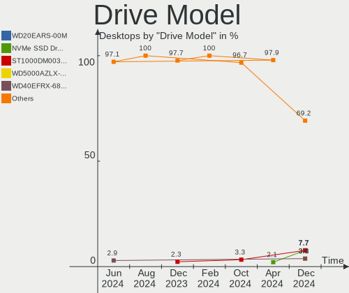
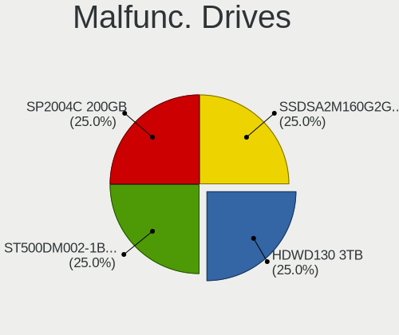
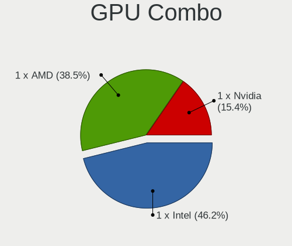
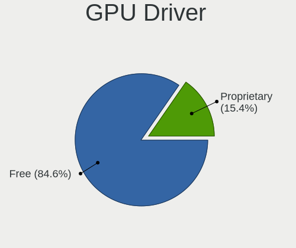
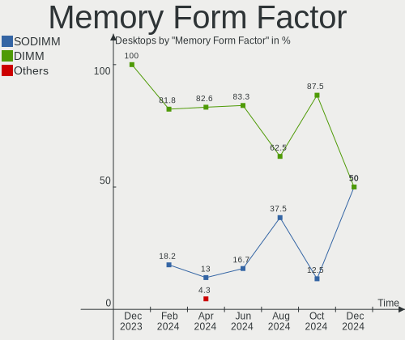

Xubuntu - Hardware Trends (Desktops)
------------------------------------

A project to identify most popular hardware characteristics and track their change
over time based on data collected by Linux users at https://Linux-Hardware.org.

Anyone can contribute to this report by the [hw-probe](https://github.com/linuxhw/hw-probe) tool:

    sudo -E hw-probe -all -upload

This report is for one last month. Overall report since the beginning of time: [TestCoverage](https://github.com/linuxhw/TestCoverage)

Period: Dec, 2022.

Contents
--------

* [ System ](#system)
  - [ OS                       ](#os)
  - [ OS Family                ](#os-family)
  - [ Kernel                   ](#kernel)
  - [ Kernel Family            ](#kernel-family)
  - [ Kernel Major Ver.        ](#kernel-major-ver)
  - [ Arch                     ](#arch)
  - [ DE                       ](#de)
  - [ Display Server           ](#display-server)
  - [ Display Manager          ](#display-manager)
  - [ OS Lang                  ](#os-lang)
  - [ Boot Mode                ](#boot-mode)
  - [ Filesystem               ](#filesystem)
  - [ Part. scheme             ](#part-scheme)
  - [ Dual Boot with Linux/BSD ](#dual-boot-with-linuxbsd)
  - [ Dual Boot (Win)          ](#dual-boot-win)

* [ Board ](#board)
  - [ Vendor                   ](#vendor)
  - [ Model                    ](#model)
  - [ Model Family             ](#model-family)
  - [ MFG Year                 ](#mfg-year)
  - [ Form Factor              ](#form-factor)
  - [ Secure Boot              ](#secure-boot)
  - [ Coreboot                 ](#coreboot)
  - [ RAM Size                 ](#ram-size)
  - [ RAM Used                 ](#ram-used)
  - [ Total Drives             ](#total-drives)
  - [ Has CD-ROM               ](#has-cd-rom)
  - [ Has Ethernet             ](#has-ethernet)
  - [ Has WiFi                 ](#has-wifi)
  - [ Has Bluetooth            ](#has-bluetooth)

* [ Location ](#location)
  - [ Country                  ](#country)
  - [ City                     ](#city)

* [ Drives ](#drives)
  - [ Drive Vendor             ](#drive-vendor)
  - [ Drive Model              ](#drive-model)
  - [ HDD Vendor               ](#hdd-vendor)
  - [ SSD Vendor               ](#ssd-vendor)
  - [ Drive Kind               ](#drive-kind)
  - [ Drive Connector          ](#drive-connector)
  - [ Drive Size               ](#drive-size)
  - [ Space Total              ](#space-total)
  - [ Space Used               ](#space-used)
  - [ Malfunc. Drives          ](#malfunc-drives)
  - [ Malfunc. Drive Vendor    ](#malfunc-drive-vendor)
  - [ Malfunc. HDD Vendor      ](#malfunc-hdd-vendor)
  - [ Malfunc. Drive Kind      ](#malfunc-drive-kind)
  - [ Failed Drives            ](#failed-drives)
  - [ Failed Drive Vendor      ](#failed-drive-vendor)
  - [ Drive Status             ](#drive-status)

* [ Storage controller ](#storage-controller)
  - [ Storage Vendor           ](#storage-vendor)
  - [ Storage Model            ](#storage-model)
  - [ Storage Kind             ](#storage-kind)

* [ Processor ](#processor)
  - [ CPU Vendor               ](#cpu-vendor)
  - [ CPU Model                ](#cpu-model)
  - [ CPU Model Family         ](#cpu-model-family)
  - [ CPU Cores                ](#cpu-cores)
  - [ CPU Sockets              ](#cpu-sockets)
  - [ CPU Threads              ](#cpu-threads)
  - [ CPU Op-Modes             ](#cpu-op-modes)
  - [ CPU Microcode            ](#cpu-microcode)
  - [ CPU Microarch            ](#cpu-microarch)

* [ Graphics ](#graphics)
  - [ GPU Vendor               ](#gpu-vendor)
  - [ GPU Model                ](#gpu-model)
  - [ GPU Combo                ](#gpu-combo)
  - [ GPU Driver               ](#gpu-driver)
  - [ GPU Memory               ](#gpu-memory)

* [ Monitor ](#monitor)
  - [ Monitor Vendor           ](#monitor-vendor)
  - [ Monitor Model            ](#monitor-model)
  - [ Monitor Resolution       ](#monitor-resolution)
  - [ Monitor Diagonal         ](#monitor-diagonal)
  - [ Monitor Width            ](#monitor-width)
  - [ Aspect Ratio             ](#aspect-ratio)
  - [ Monitor Area             ](#monitor-area)
  - [ Pixel Density            ](#pixel-density)
  - [ Multiple Monitors        ](#multiple-monitors)

* [ Network ](#network)
  - [ Net Controller Vendor    ](#net-controller-vendor)
  - [ Net Controller Model     ](#net-controller-model)
  - [ Wireless Vendor          ](#wireless-vendor)
  - [ Wireless Model           ](#wireless-model)
  - [ Ethernet Vendor          ](#ethernet-vendor)
  - [ Ethernet Model           ](#ethernet-model)
  - [ Net Controller Kind      ](#net-controller-kind)
  - [ Used Controller          ](#used-controller)
  - [ NICs                     ](#nics)
  - [ IPv6                     ](#ipv6)

* [ Bluetooth ](#bluetooth)
  - [ Bluetooth Vendor         ](#bluetooth-vendor)
  - [ Bluetooth Model          ](#bluetooth-model)

* [ Sound ](#sound)
  - [ Sound Vendor             ](#sound-vendor)
  - [ Sound Model              ](#sound-model)

* [ Memory ](#memory)
  - [ Memory Vendor            ](#memory-vendor)
  - [ Memory Model             ](#memory-model)
  - [ Memory Kind              ](#memory-kind)
  - [ Memory Form Factor       ](#memory-form-factor)
  - [ Memory Size              ](#memory-size)
  - [ Memory Speed             ](#memory-speed)

* [ Printers & scanners ](#printers--scanners)
  - [ Printer Vendor           ](#printer-vendor)
  - [ Printer Model            ](#printer-model)
  - [ Scanner Vendor           ](#scanner-vendor)
  - [ Scanner Model            ](#scanner-model)

* [ Camera ](#camera)
  - [ Camera Vendor            ](#camera-vendor)
  - [ Camera Model             ](#camera-model)

* [ Security ](#security)
  - [ Fingerprint Vendor       ](#fingerprint-vendor)
  - [ Fingerprint Model        ](#fingerprint-model)
  - [ Chipcard Vendor          ](#chipcard-vendor)
  - [ Chipcard Model           ](#chipcard-model)

* [ Unsupported ](#unsupported)
  - [ Unsupported Devices      ](#unsupported-devices)
  - [ Unsupported Device Types ](#unsupported-device-types)

System
------

OS
--

Installed operating systems

| Name          | Desktops | Percent |
|---------------|----------|---------|
| Xubuntu 22.04 | 18       | 56.25%  |
| Xubuntu 20.04 | 10       | 31.25%  |
| Xubuntu 22.10 | 4        | 12.5%   |

OS Family
---------

OS without a version

| Name    | Desktops | Percent |
|---------|----------|---------|
| Xubuntu | 32       | 100%    |

Kernel
------

Version of the Linux kernel

| Version           | Desktops | Percent |
|-------------------|----------|---------|
| 5.15.0-56-generic | 15       | 46.88%  |
| 5.4.0-135-generic | 5        | 15.63%  |
| 5.15.0-25-generic | 3        | 9.38%   |
| 5.4.0-132-generic | 2        | 6.25%   |
| 5.19.0-26-generic | 2        | 6.25%   |
| 5.19.13-xanmod1   | 1        | 3.13%   |
| 5.19.0-27-generic | 1        | 3.13%   |
| 5.19.0-23-generic | 1        | 3.13%   |
| 5.15.0-57-generic | 1        | 3.13%   |
| 5.15.0-52-generic | 1        | 3.13%   |

Kernel Family
-------------

Linux kernel without a distro release

| Version | Desktops | Percent |
|---------|----------|---------|
| 5.15.0  | 20       | 62.5%   |
| 5.4.0   | 7        | 21.88%  |
| 5.19.0  | 4        | 12.5%   |
| 5.19.13 | 1        | 3.13%   |

Kernel Major Ver.
-----------------

Linux kernel major version

| Version | Desktops | Percent |
|---------|----------|---------|
| 5.15    | 20       | 62.5%   |
| 5.4     | 7        | 21.88%  |
| 5.19    | 5        | 15.63%  |

Arch
----

OS architecture (x86_64, i586, etc.)

| Name   | Desktops | Percent |
|--------|----------|---------|
| x86_64 | 32       | 100%    |

DE
--

Desktop Environment

| Name  | Desktops | Percent |
|-------|----------|---------|
| XFCE  | 30       | 93.75%  |
| GNOME | 2        | 6.25%   |

Display Server
--------------

X11 or Wayland

| Name | Desktops | Percent |
|------|----------|---------|
| X11  | 32       | 100%    |

Display Manager
---------------

SDDM, LightDM, etc.

| Name    | Desktops | Percent |
|---------|----------|---------|
| LightDM | 26       | 81.25%  |
| Unknown | 3        | 9.38%   |
| GDM3    | 2        | 6.25%   |
| GDM     | 1        | 3.13%   |

OS Lang
-------

Language

| Lang  | Desktops | Percent |
|-------|----------|---------|
| fr_FR | 8        | 25%     |
| en_US | 8        | 25%     |
| de_DE | 5        | 15.63%  |
| ru_RU | 4        | 12.5%   |
| en_GB | 2        | 6.25%   |
| pt_BR | 1        | 3.13%   |
| pl_PL | 1        | 3.13%   |
| nl_NL | 1        | 3.13%   |
| it_IT | 1        | 3.13%   |
| cs_CZ | 1        | 3.13%   |

Boot Mode
---------

EFI or BIOS

| Mode | Desktops | Percent |
|------|----------|---------|
| BIOS | 20       | 62.5%   |
| EFI  | 12       | 37.5%   |

Filesystem
----------

Type of filesystem

| Type    | Desktops | Percent |
|---------|----------|---------|
| Ext4    | 29       | 90.63%  |
| Overlay | 2        | 6.25%   |
| Btrfs   | 1        | 3.13%   |

Part. scheme
------------

Scheme of partitioning

| Type    | Desktops | Percent |
|---------|----------|---------|
| GPT     | 19       | 59.38%  |
| MBR     | 10       | 31.25%  |
| Unknown | 3        | 9.38%   |

Dual Boot with Linux/BSD
------------------------

Hosting more than one Linux/BSD

| Dual boot | Desktops | Percent |
|-----------|----------|---------|
| No        | 22       | 68.75%  |
| Yes       | 10       | 31.25%  |

Dual Boot (Win)
---------------

Hosting Linux and Windows

| Dual boot | Desktops | Percent |
|-----------|----------|---------|
| No        | 22       | 68.75%  |
| Yes       | 10       | 31.25%  |

Board
-----

Vendor
------

Motherboard manufacturer

| Name                | Desktops | Percent |
|---------------------|----------|---------|
| ASUSTek Computer    | 9        | 28.13%  |
| Hewlett-Packard     | 5        | 15.63%  |
| MSI                 | 4        | 12.5%   |
| ASRock              | 3        | 9.38%   |
| Lenovo              | 2        | 6.25%   |
| Gigabyte Technology | 2        | 6.25%   |
| Dell                | 2        | 6.25%   |
| PCWare              | 1        | 3.13%   |
| Packard Bell        | 1        | 3.13%   |
| Intel               | 1        | 3.13%   |
| Acer                | 1        | 3.13%   |
| Unknown             | 1        | 3.13%   |

Model
-----

Motherboard model

| Name                                                           | Desktops | Percent |
|----------------------------------------------------------------|----------|---------|
| PCWare IPMH81G1                                                | 1        | 3.13%   |
| Packard Bell IMEDIA X9305                                      | 1        | 3.13%   |
| MSI MS-7D70                                                    | 1        | 3.13%   |
| MSI MS-7D25                                                    | 1        | 3.13%   |
| MSI MS-7B98                                                    | 1        | 3.13%   |
| MSI MS-7798                                                    | 1        | 3.13%   |
| Lenovo V530S-07ICB 10TX0010PB                                  | 1        | 3.13%   |
| Lenovo ThinkCentre M32 10BV000CMD                              | 1        | 3.13%   |
| Intel X79 (INTEL Xeon E5/Corei7 DMI2 - C600/C200 Cipset V5.33B | 1        | 3.13%   |
| HP Pavilion Wave Desktop 600-a0xx                              | 1        | 3.13%   |
| HP EliteDesk 800 G5 Desktop Mini                               | 1        | 3.13%   |
| HP EliteDesk 800 G1 SFF                                        | 1        | 3.13%   |
| HP Compaq 6200 Pro MT PC                                       | 1        | 3.13%   |
| HP 280 G1 MT                                                   | 1        | 3.13%   |
| Gigabyte GA-880GM-UD2H                                         | 1        | 3.13%   |
| Gigabyte B360M-D3H                                             | 1        | 3.13%   |
| Dell XPS 8500                                                  | 1        | 3.13%   |
| Dell OptiPlex 3020                                             | 1        | 3.13%   |
| ASUS ROG STRIX B450-F GAMING                                   | 1        | 3.13%   |
| ASUS PRIME H310M-E R2.0/BR                                     | 1        | 3.13%   |
| ASUS PRIME B450M-K                                             | 1        | 3.13%   |
| ASUS PRIME B450M-A                                             | 1        | 3.13%   |
| ASUS PRIME A320M-K                                             | 1        | 3.13%   |
| ASUS P8H61-M LX3 PLUS R2.0                                     | 1        | 3.13%   |
| ASUS P5G41T-M LX                                               | 1        | 3.13%   |
| ASUS M4A88T-M/USB3                                             | 1        | 3.13%   |
| ASUS A0000001                                                  | 1        | 3.13%   |
| ASRock N3700-ITX                                               | 1        | 3.13%   |
| ASRock H61M-ITX                                                | 1        | 3.13%   |
| ASRock A320M-HDV R4.0                                          | 1        | 3.13%   |
| Acer Veriton NBU                                               | 1        | 3.13%   |
| Unknown                                                        | 1        | 3.13%   |

Model Family
------------

Motherboard model prefix

| Name                   | Desktops | Percent |
|------------------------|----------|---------|
| ASUS PRIME             | 4        | 12.5%   |
| HP EliteDesk           | 2        | 6.25%   |
| PCWare IPMH81G1        | 1        | 3.13%   |
| Packard Bell IMEDIA    | 1        | 3.13%   |
| MSI MS-7D70            | 1        | 3.13%   |
| MSI MS-7D25            | 1        | 3.13%   |
| MSI MS-7B98            | 1        | 3.13%   |
| MSI MS-7798            | 1        | 3.13%   |
| Lenovo V530S-07ICB     | 1        | 3.13%   |
| Lenovo ThinkCentre     | 1        | 3.13%   |
| Intel X79              | 1        | 3.13%   |
| HP Pavilion            | 1        | 3.13%   |
| HP Compaq              | 1        | 3.13%   |
| HP 280                 | 1        | 3.13%   |
| Gigabyte GA-880GM-UD2H | 1        | 3.13%   |
| Gigabyte B360M-D3H     | 1        | 3.13%   |
| Dell XPS               | 1        | 3.13%   |
| Dell OptiPlex          | 1        | 3.13%   |
| ASUS ROG               | 1        | 3.13%   |
| ASUS P8H61-M           | 1        | 3.13%   |
| ASUS P5G41T-M          | 1        | 3.13%   |
| ASUS M4A88T-M          | 1        | 3.13%   |
| ASUS A0000001          | 1        | 3.13%   |
| ASRock N3700-ITX       | 1        | 3.13%   |
| ASRock H61M-ITX        | 1        | 3.13%   |
| ASRock A320M-HDV       | 1        | 3.13%   |
| Acer Veriton           | 1        | 3.13%   |
| Unknown                | 1        | 3.13%   |

MFG Year
--------

Motherboard manufacture year

| Year | Desktops | Percent |
|------|----------|---------|
| 2018 | 9        | 28.13%  |
| 2012 | 4        | 12.5%   |
| 2019 | 3        | 9.38%   |
| 2014 | 3        | 9.38%   |
| 2010 | 3        | 9.38%   |
| 2021 | 2        | 6.25%   |
| 2015 | 2        | 6.25%   |
| 2022 | 1        | 3.13%   |
| 2017 | 1        | 3.13%   |
| 2016 | 1        | 3.13%   |
| 2013 | 1        | 3.13%   |
| 2011 | 1        | 3.13%   |
| 2007 | 1        | 3.13%   |

Form Factor
-----------

Physical design of the computer

| Name    | Desktops | Percent |
|---------|----------|---------|
| Desktop | 32       | 100%    |

Secure Boot
-----------

Enabled or disabled

| State    | Desktops | Percent |
|----------|----------|---------|
| Disabled | 31       | 96.88%  |
| Enabled  | 1        | 3.13%   |

Coreboot
--------

Have coreboot on board

| Used | Desktops | Percent |
|------|----------|---------|
| No   | 32       | 100%    |

RAM Size
--------

Total RAM memory

| Size in GB | Desktops | Percent |
|------------|----------|---------|
| 4.01-8.0   | 10       | 31.25%  |
| 16.01-24.0 | 7        | 21.88%  |
| 3.01-4.0   | 5        | 15.63%  |
| 8.01-16.0  | 4        | 12.5%   |
| 32.01-64.0 | 3        | 9.38%   |
| 24.01-32.0 | 2        | 6.25%   |
| 2.01-3.0   | 1        | 3.13%   |

RAM Used
--------

Used RAM memory

| Used GB   | Desktops | Percent |
|-----------|----------|---------|
| 1.01-2.0  | 14       | 43.75%  |
| 2.01-3.0  | 9        | 28.13%  |
| 4.01-8.0  | 4        | 12.5%   |
| 3.01-4.0  | 3        | 9.38%   |
| 8.01-16.0 | 2        | 6.25%   |

Total Drives
------------

Number of drives on board

| Drives | Desktops | Percent |
|--------|----------|---------|
| 1      | 13       | 40.63%  |
| 2      | 11       | 34.38%  |
| 4      | 4        | 12.5%   |
| 3      | 3        | 9.38%   |
| 5      | 1        | 3.13%   |

Has CD-ROM
----------

Has CD-ROM on board

| Presented | Desktops | Percent |
|-----------|----------|---------|
| Yes       | 16       | 50%     |
| No        | 16       | 50%     |

Has Ethernet
------------

Has Ethernet on board

| Presented | Desktops | Percent |
|-----------|----------|---------|
| Yes       | 32       | 100%    |

Has WiFi
--------

Has WiFi module

| Presented | Desktops | Percent |
|-----------|----------|---------|
| No        | 24       | 75%     |
| Yes       | 8        | 25%     |

Has Bluetooth
-------------

Has Bluetooth module

| Presented | Desktops | Percent |
|-----------|----------|---------|
| No        | 26       | 81.25%  |
| Yes       | 6        | 18.75%  |

Location
--------

Country
-------

Geographic location (country)

| Country     | Desktops | Percent |
|-------------|----------|---------|
| France      | 8        | 25%     |
| Germany     | 5        | 15.63%  |
| Russia      | 3        | 9.38%   |
| UK          | 2        | 6.25%   |
| Sweden      | 2        | 6.25%   |
| Brazil      | 2        | 6.25%   |
| Belarus     | 2        | 6.25%   |
| USA         | 1        | 3.13%   |
| Slovenia    | 1        | 3.13%   |
| Poland      | 1        | 3.13%   |
| Netherlands | 1        | 3.13%   |
| Libya       | 1        | 3.13%   |
| Italy       | 1        | 3.13%   |
| Czechia     | 1        | 3.13%   |
| Belgium     | 1        | 3.13%   |

City
----

Geographic location (city)

| City                 | Desktops | Percent |
|----------------------|----------|---------|
| Waghausel            | 1        | 3.13%   |
| Voronezh             | 1        | 3.13%   |
| Vohenstrauss         | 1        | 3.13%   |
| Vohburg an der Donau | 1        | 3.13%   |
| Uppsala              | 1        | 3.13%   |
| Unstone              | 1        | 3.13%   |
| Tripoli              | 1        | 3.13%   |
| Tomsk                | 1        | 3.13%   |
| Stuttgart            | 1        | 3.13%   |
| Springfield          | 1        | 3.13%   |
| Sölvesborg          | 1        | 3.13%   |
| Roubaix              | 1        | 3.13%   |
| Rotterdam            | 1        | 3.13%   |
| Rio de Janeiro       | 1        | 3.13%   |
| Rennes               | 1        | 3.13%   |
| Poitiers             | 1        | 3.13%   |
| Paris                | 1        | 3.13%   |
| Novosibirsk          | 1        | 3.13%   |
| Newton Abbot         | 1        | 3.13%   |
| Minsk                | 1        | 3.13%   |
| Milan                | 1        | 3.13%   |
| Ljubljana            | 1        | 3.13%   |
| Leyme                | 1        | 3.13%   |
| Jacareí             | 1        | 3.13%   |
| Gomel                | 1        | 3.13%   |
| Gdansk               | 1        | 3.13%   |
| Evron                | 1        | 3.13%   |
| Clichy-sous-Bois     | 1        | 3.13%   |
| Brussels             | 1        | 3.13%   |
| Brno                 | 1        | 3.13%   |
| Berlin               | 1        | 3.13%   |
| Ambazac              | 1        | 3.13%   |

Drives
------

Drive Vendor
------------

Hard drive vendors

| Vendor              | Desktops | Drives | Percent |
|---------------------|----------|--------|---------|
| WDC                 | 13       | 15     | 22.41%  |
| Samsung Electronics | 11       | 13     | 18.97%  |
| Seagate             | 8        | 9      | 13.79%  |
| Hitachi             | 4        | 5      | 6.9%    |
| Toshiba             | 3        | 3      | 5.17%   |
| Crucial             | 3        | 4      | 5.17%   |
| Silicon Motion      | 2        | 2      | 3.45%   |
| SanDisk             | 2        | 2      | 3.45%   |
| KIOXIA              | 2        | 2      | 3.45%   |
| Unknown             | 1        | 1      | 1.72%   |
| SPCC                | 1        | 1      | 1.72%   |
| Phison Electronics  | 1        | 1      | 1.72%   |
| PHD 3.0             | 1        | 1      | 1.72%   |
| Kingston            | 1        | 1      | 1.72%   |
| KingSpec            | 1        | 1      | 1.72%   |
| KingDian            | 1        | 1      | 1.72%   |
| Apacer              | 1        | 1      | 1.72%   |
| AMD                 | 1        | 1      | 1.72%   |
| A-DATA Technology   | 1        | 1      | 1.72%   |

Drive Model
-----------

Hard drive models

| Model                                             | Desktops | Percent |
|---------------------------------------------------|----------|---------|
| Seagate ST3500418AS 500GB                         | 2        | 3.17%   |
| Samsung HD103SJ 1TB                               | 2        | 3.17%   |
| WDC WDS120G2G0A-00JH30 120GB SSD                  | 1        | 1.59%   |
| WDC WD5000AAKX-60U6AA0 500GB                      | 1        | 1.59%   |
| WDC WD40PURZ-85TTDY0 4TB                          | 1        | 1.59%   |
| WDC WD30EZRZ-00GXCB0 3TB                          | 1        | 1.59%   |
| WDC WD30EURS-63SPKY0 3TB                          | 1        | 1.59%   |
| WDC WD20EZRZ-22Z5HB0 2TB                          | 1        | 1.59%   |
| WDC WD20EFRX-68EUZN0 2TB                          | 1        | 1.59%   |
| WDC WD20EFRX-68AX9N0 2TB                          | 1        | 1.59%   |
| WDC WD20EARS-00J99B0 2TB                          | 1        | 1.59%   |
| WDC WD10JPVX-60JC3T1 1TB                          | 1        | 1.59%   |
| WDC WD10EZRX-00D8PB0 1TB                          | 1        | 1.59%   |
| WDC WD10EZEX-00BN5A0 1TB                          | 1        | 1.59%   |
| WDC WD10EUCX-73YZ1Y0 1TB                          | 1        | 1.59%   |
| WDC WD10EARX-00PASB0 1TB                          | 1        | 1.59%   |
| WDC WD10EARS-00Y5B1 1TB                           | 1        | 1.59%   |
| Unknown SD/MMC/MS PRO 64GB                        | 1        | 1.59%   |
| Toshiba DT01ACA200 2TB                            | 1        | 1.59%   |
| Toshiba DT01ACA100 1TB                            | 1        | 1.59%   |
| Toshiba A100 120GB SSD                            | 1        | 1.59%   |
| SPCC Solid State Disk 1TB                         | 1        | 1.59%   |
| Silicon Motion SM2262/SM2262EN SSD Controller 2TB | 1        | 1.59%   |
| Silicon Motion NE-256 256GB                       | 1        | 1.59%   |
| Seagate ST9250410AS 250GB                         | 1        | 1.59%   |
| Seagate ST500LM000-1EJ162 500GB                   | 1        | 1.59%   |
| Seagate ST4000DM004-2CV104 4TB                    | 1        | 1.59%   |
| Seagate ST3160318AS 160GB                         | 1        | 1.59%   |
| Seagate ST31000524AS 1TB                          | 1        | 1.59%   |
| Seagate ST1000VM002-1SD102 1TB                    | 1        | 1.59%   |
| Seagate M3 Portable 4TB                           | 1        | 1.59%   |
| SanDisk SDSSDA120G 120GB                          | 1        | 1.59%   |
| SanDisk NVMe SSD Drive 2TB                        | 1        | 1.59%   |
| Samsung SSD 980 250GB                             | 1        | 1.59%   |
| Samsung SSD 970 EVO Plus 1TB                      | 1        | 1.59%   |
| Samsung SSD 870 EVO 1TB                           | 1        | 1.59%   |
| Samsung SSD 860 EVO 500GB                         | 1        | 1.59%   |
| Samsung SSD 850 PRO 512GB                         | 1        | 1.59%   |
| Samsung SSD 850 EVO M.2 120GB                     | 1        | 1.59%   |
| Samsung SSD 850 EVO 250GB                         | 1        | 1.59%   |

HDD Vendor
----------

Hard disk drive vendors

| Vendor              | Desktops | Drives | Percent |
|---------------------|----------|--------|---------|
| WDC                 | 12       | 14     | 37.5%   |
| Seagate             | 8        | 8      | 25%     |
| Samsung Electronics | 4        | 5      | 12.5%   |
| Hitachi             | 4        | 5      | 12.5%   |
| Toshiba             | 2        | 2      | 6.25%   |
| Unknown             | 1        | 1      | 3.13%   |
| PHD 3.0             | 1        | 1      | 3.13%   |

SSD Vendor
----------

Solid state drive vendors

| Vendor              | Desktops | Drives | Percent |
|---------------------|----------|--------|---------|
| Samsung Electronics | 6        | 6      | 33.33%  |
| Crucial             | 3        | 4      | 16.67%  |
| WDC                 | 1        | 1      | 5.56%   |
| Toshiba             | 1        | 1      | 5.56%   |
| SPCC                | 1        | 1      | 5.56%   |
| SanDisk             | 1        | 1      | 5.56%   |
| Kingston            | 1        | 1      | 5.56%   |
| KingSpec            | 1        | 1      | 5.56%   |
| KingDian            | 1        | 1      | 5.56%   |
| Apacer              | 1        | 1      | 5.56%   |
| A-DATA Technology   | 1        | 1      | 5.56%   |

Drive Kind
----------

HDD or SSD

| Kind    | Desktops | Drives | Percent |
|---------|----------|--------|---------|
| HDD     | 24       | 36     | 48.98%  |
| SSD     | 15       | 19     | 30.61%  |
| NVMe    | 9        | 9      | 18.37%  |
| Unknown | 1        | 1      | 2.04%   |

Drive Connector
---------------

SATA, SAS, NVMe, etc.

| Type | Desktops | Drives | Percent |
|------|----------|--------|---------|
| SATA | 30       | 53     | 71.43%  |
| NVMe | 9        | 9      | 21.43%  |
| SAS  | 3        | 3      | 7.14%   |

Drive Size
----------

Size of hard drive

| Size in TB | Desktops | Drives | Percent |
|------------|----------|--------|---------|
| 0.01-0.5   | 21       | 28     | 50%     |
| 0.51-1.0   | 13       | 17     | 30.95%  |
| 1.01-2.0   | 5        | 6      | 11.9%   |
| 2.01-3.0   | 2        | 2      | 4.76%   |
| 3.01-4.0   | 1        | 2      | 2.38%   |

Space Total
-----------

Amount of disk space available on the file system

| Size in GB     | Desktops | Percent |
|----------------|----------|---------|
| 251-500        | 9        | 28.13%  |
| 101-250        | 7        | 21.88%  |
| More than 3000 | 4        | 12.5%   |
| 501-1000       | 4        | 12.5%   |
| 2001-3000      | 2        | 6.25%   |
| 1001-2000      | 2        | 6.25%   |
| 1-20           | 2        | 6.25%   |
| 21-50          | 1        | 3.13%   |
| 51-100         | 1        | 3.13%   |

Space Used
----------

Amount of used disk space

| Used GB   | Desktops | Percent |
|-----------|----------|---------|
| 51-100    | 7        | 21.88%  |
| 21-50     | 6        | 18.75%  |
| 101-250   | 5        | 15.63%  |
| 1-20      | 4        | 12.5%   |
| 251-500   | 3        | 9.38%   |
| 2001-3000 | 3        | 9.38%   |
| 1001-2000 | 3        | 9.38%   |
| 501-1000  | 1        | 3.13%   |

Malfunc. Drives
---------------

Drive models with a malfunction

| Model                             | Desktops | Drives | Percent |
|-----------------------------------|----------|--------|---------|
| WDC WD5000AAKX-60U6AA0 500GB      | 1        | 1      | 11.11%  |
| Toshiba DT01ACA200 2TB            | 1        | 1      | 11.11%  |
| Toshiba DT01ACA100 1TB            | 1        | 1      | 11.11%  |
| Seagate ST9250410AS 250GB         | 1        | 1      | 11.11%  |
| Samsung Electronics SP2514N 250GB | 1        | 1      | 11.11%  |
| Samsung Electronics HD753LJ 752GB | 1        | 1      | 11.11%  |
| Samsung Electronics HD250HJ 250GB | 1        | 1      | 11.11%  |
| Samsung Electronics HD103SJ 1TB   | 1        | 1      | 11.11%  |
| Hitachi HDS722540VLAT20 40GB      | 1        | 1      | 11.11%  |

Malfunc. Drive Vendor
---------------------

Vendors of faulty drives

| Vendor              | Desktops | Drives | Percent |
|---------------------|----------|--------|---------|
| Samsung Electronics | 3        | 4      | 37.5%   |
| Toshiba             | 2        | 2      | 25%     |
| WDC                 | 1        | 1      | 12.5%   |
| Seagate             | 1        | 1      | 12.5%   |
| Hitachi             | 1        | 1      | 12.5%   |

Malfunc. HDD Vendor
-------------------

Vendors of faulty HDD drives

| Vendor              | Desktops | Drives | Percent |
|---------------------|----------|--------|---------|
| Samsung Electronics | 3        | 4      | 37.5%   |
| Toshiba             | 2        | 2      | 25%     |
| WDC                 | 1        | 1      | 12.5%   |
| Seagate             | 1        | 1      | 12.5%   |
| Hitachi             | 1        | 1      | 12.5%   |

Malfunc. Drive Kind
-------------------

Kinds of faulty drives

| Kind | Desktops | Drives | Percent |
|------|----------|--------|---------|
| HDD  | 8        | 9      | 100%    |

Failed Drives
-------------

Failed drive models

| Model                    | Desktops | Drives | Percent |
|--------------------------|----------|--------|---------|
| WDC WD20EARS-00J99B0 2TB | 1        | 1      | 100%    |

Failed Drive Vendor
-------------------

Failed drive vendors

| Vendor | Desktops | Drives | Percent |
|--------|----------|--------|---------|
| WDC    | 1        | 1      | 100%    |

Drive Status
------------

Number of failed and malfunc. drives

| Status   | Desktops | Drives | Percent |
|----------|----------|--------|---------|
| Detected | 15       | 29     | 38.46%  |
| Works    | 15       | 26     | 38.46%  |
| Malfunc  | 8        | 9      | 20.51%  |
| Failed   | 1        | 1      | 2.56%   |

Storage controller
------------------

Storage Vendor
--------------

Storage controller vendors

| Vendor              | Desktops | Percent |
|---------------------|----------|---------|
| Intel               | 21       | 51.22%  |
| AMD                 | 9        | 21.95%  |
| Silicon Motion      | 3        | 7.32%   |
| Samsung Electronics | 2        | 4.88%   |
| KIOXIA              | 2        | 4.88%   |
| VIA Technologies    | 1        | 2.44%   |
| SanDisk             | 1        | 2.44%   |
| Phison Electronics  | 1        | 2.44%   |
| ASMedia Technology  | 1        | 2.44%   |

Storage Model
-------------

Storage controller models

| Model                                                                                   | Desktops | Percent |
|-----------------------------------------------------------------------------------------|----------|---------|
| AMD FCH SATA Controller [AHCI mode]                                                     | 5        | 9.8%    |
| Intel Cannon Lake PCH SATA AHCI Controller                                              | 4        | 7.84%   |
| Intel 8 Series/C220 Series Chipset Family 6-port SATA Controller 1 [AHCI mode]          | 4        | 7.84%   |
| AMD 400 Series Chipset SATA Controller                                                  | 4        | 7.84%   |
| Intel 7 Series/C210 Series Chipset Family 6-port SATA Controller [AHCI mode]            | 3        | 5.88%   |
| Intel 6 Series/C200 Series Chipset Family 6 port Desktop SATA AHCI Controller           | 3        | 5.88%   |
| Silicon Motion SM2263EN/SM2263XT SSD Controller                                         | 2        | 3.92%   |
| KIOXIA NVMe SSD Controller BG4                                                          | 2        | 3.92%   |
| Intel Q170/Q150/B150/H170/H110/Z170/CM236 Chipset SATA Controller [AHCI Mode]           | 2        | 3.92%   |
| AMD SB7x0/SB8x0/SB9x0 IDE Controller                                                    | 2        | 3.92%   |
| AMD FCH SATA Controller D                                                               | 2        | 3.92%   |
| VIA VT82C586A/B/VT82C686/A/B/VT823x/A/C PIPC Bus Master IDE                             | 1        | 1.96%   |
| VIA Serial ATA Controller                                                               | 1        | 1.96%   |
| Silicon Motion SM2262/SM2262EN SSD Controller                                           | 1        | 1.96%   |
| SanDisk Non-Volatile memory controller                                                  | 1        | 1.96%   |
| Samsung NVMe SSD Controller SM981/PM981/PM983                                           | 1        | 1.96%   |
| Samsung NVMe SSD Controller 980                                                         | 1        | 1.96%   |
| Phison E12 NVMe Controller                                                              | 1        | 1.96%   |
| Intel NM10/ICH7 Family SATA Controller [IDE mode]                                       | 1        | 1.96%   |
| Intel Alder Lake-S PCH SATA Controller [AHCI Mode]                                      | 1        | 1.96%   |
| Intel 82801G (ICH7 Family) IDE Controller                                               | 1        | 1.96%   |
| Intel 7 Series Chipset Family 6-port SATA Controller [AHCI mode]                        | 1        | 1.96%   |
| Intel 6 Series/C200 Series Chipset Family Desktop SATA Controller (IDE mode, ports 4-5) | 1        | 1.96%   |
| Intel 6 Series/C200 Series Chipset Family Desktop SATA Controller (IDE mode, ports 0-3) | 1        | 1.96%   |
| Intel 200 Series PCH SATA controller [AHCI mode]                                        | 1        | 1.96%   |
| ASMedia ASM1062 Serial ATA Controller                                                   | 1        | 1.96%   |
| AMD SB7x0/SB8x0/SB9x0 SATA Controller [IDE mode]                                        | 1        | 1.96%   |
| AMD SB7x0/SB8x0/SB9x0 SATA Controller [AHCI mode]                                       | 1        | 1.96%   |
| AMD SATA controller                                                                     | 1        | 1.96%   |

Storage Kind
------------

Kind of storage controller (IDE, SATA, NVMe, SAS, ...)

| Kind | Desktops | Percent |
|------|----------|---------|
| SATA | 29       | 67.44%  |
| NVMe | 9        | 20.93%  |
| IDE  | 5        | 11.63%  |

Processor
---------

CPU Vendor
----------

Processor vendors

| Vendor | Desktops | Percent |
|--------|----------|---------|
| Intel  | 23       | 71.88%  |
| AMD    | 9        | 28.13%  |

CPU Model
---------

Processor models

| Model                                       | Desktops | Percent |
|---------------------------------------------|----------|---------|
| Intel Core i5-8400 CPU @ 2.80GHz            | 2        | 6.25%   |
| Intel Core i5-4590 CPU @ 3.30GHz            | 2        | 6.25%   |
| Intel Xeon CPU E5-2689 0 @ 2.60GHz          | 1        | 3.13%   |
| Intel Xeon CPU E5-2470 0 @ 2.30GHz          | 1        | 3.13%   |
| Intel Pentium Gold G5420 CPU @ 3.80GHz      | 1        | 3.13%   |
| Intel Pentium Dual-Core CPU E5700 @ 3.00GHz | 1        | 3.13%   |
| Intel Pentium CPU N3700 @ 1.60GHz           | 1        | 3.13%   |
| Intel Pentium CPU G860 @ 3.00GHz            | 1        | 3.13%   |
| Intel Core i7-3770 CPU @ 3.40GHz            | 1        | 3.13%   |
| Intel Core i5-9600K CPU @ 3.70GHz           | 1        | 3.13%   |
| Intel Core i5-6400T CPU @ 2.20GHz           | 1        | 3.13%   |
| Intel Core i5-4460 CPU @ 3.20GHz            | 1        | 3.13%   |
| Intel Core i3-9100 CPU @ 3.60GHz            | 1        | 3.13%   |
| Intel Core i3-6100T CPU @ 3.20GHz           | 1        | 3.13%   |
| Intel Core i3-3220 CPU @ 3.30GHz            | 1        | 3.13%   |
| Intel Core i3-2130 CPU @ 3.40GHz            | 1        | 3.13%   |
| Intel Core i3-2100 CPU @ 3.10GHz            | 1        | 3.13%   |
| Intel Core 2 Quad CPU Q6600 @ 2.40GHz       | 1        | 3.13%   |
| Intel Celeron CPU G1840 @ 2.80GHz           | 1        | 3.13%   |
| Intel Celeron CPU 847 @ 1.10GHz             | 1        | 3.13%   |
| Intel 13th Gen Core i5-13600K               | 1        | 3.13%   |
| AMD Ryzen 9 7950X 16-Core Processor         | 1        | 3.13%   |
| AMD Ryzen 9 5900X 12-Core Processor         | 1        | 3.13%   |
| AMD Ryzen 7 2700X Eight-Core Processor      | 1        | 3.13%   |
| AMD Ryzen 5 3400G with Radeon Vega Graphics | 1        | 3.13%   |
| AMD Ryzen 5 2600X Six-Core Processor        | 1        | 3.13%   |
| AMD Ryzen 5 1600 Six-Core Processor         | 1        | 3.13%   |
| AMD Ryzen 3 3200G with Radeon Vega Graphics | 1        | 3.13%   |
| AMD Phenom II X4 955 Processor              | 1        | 3.13%   |
| AMD Athlon II X4 640 Processor              | 1        | 3.13%   |

CPU Model Family
----------------

Processor model prefix

| Model                   | Desktops | Percent |
|-------------------------|----------|---------|
| Intel Core i5           | 7        | 21.88%  |
| Intel Core i3           | 5        | 15.63%  |
| AMD Ryzen 5             | 3        | 9.38%   |
| Intel Xeon              | 2        | 6.25%   |
| Intel Pentium           | 2        | 6.25%   |
| Intel Celeron           | 2        | 6.25%   |
| AMD Ryzen 9             | 2        | 6.25%   |
| Other                   | 1        | 3.13%   |
| Intel Pentium Gold      | 1        | 3.13%   |
| Intel Pentium Dual-Core | 1        | 3.13%   |
| Intel Core i7           | 1        | 3.13%   |
| Intel Core 2 Quad       | 1        | 3.13%   |
| AMD Ryzen 7             | 1        | 3.13%   |
| AMD Ryzen 3             | 1        | 3.13%   |
| AMD Phenom II X4        | 1        | 3.13%   |
| AMD Athlon II X4        | 1        | 3.13%   |

CPU Cores
---------

Number of processor cores

| Number | Desktops | Percent |
|--------|----------|---------|
| 4      | 12       | 37.5%   |
| 2      | 9        | 28.13%  |
| 6      | 5        | 15.63%  |
| 8      | 3        | 9.38%   |
| 16     | 1        | 3.13%   |
| 14     | 1        | 3.13%   |
| 12     | 1        | 3.13%   |

CPU Sockets
-----------

Number of sockets

| Number | Desktops | Percent |
|--------|----------|---------|
| 1      | 32       | 100%    |

CPU Threads
-----------

Threads per core (Hyper-Threading)

| Number | Desktops | Percent |
|--------|----------|---------|
| 1      | 17       | 53.13%  |
| 2      | 15       | 46.88%  |

CPU Op-Modes
------------

CPU Operation Modes (32-bit, 64-bit)

| Op mode        | Desktops | Percent |
|----------------|----------|---------|
| 32-bit, 64-bit | 32       | 100%    |

CPU Microcode
-------------

Microcode number

| Number     | Desktops | Percent |
|------------|----------|---------|
| Unknown    | 8        | 25%     |
| 0x306c3    | 3        | 9.38%   |
| 0x206a7    | 3        | 9.38%   |
| 0x906ea    | 2        | 6.25%   |
| 0x306a9    | 2        | 6.25%   |
| 0x206d7    | 2        | 6.25%   |
| 0x0800820d | 2        | 6.25%   |
| 0x010000c8 | 2        | 6.25%   |
| 0xb0671    | 1        | 3.13%   |
| 0x906eb    | 1        | 3.13%   |
| 0x6fb      | 1        | 3.13%   |
| 0x506e3    | 1        | 3.13%   |
| 0x406c3    | 1        | 3.13%   |
| 0x1067a    | 1        | 3.13%   |
| 0x0a601201 | 1        | 3.13%   |
| 0x08108109 | 1        | 3.13%   |

CPU Microarch
-------------

Microarchitecture

| Name             | Desktops | Percent |
|------------------|----------|---------|
| SandyBridge      | 6        | 18.75%  |
| Zen+             | 5        | 15.63%  |
| KabyLake         | 5        | 15.63%  |
| Haswell          | 4        | 12.5%   |
| Skylake          | 2        | 6.25%   |
| K10              | 2        | 6.25%   |
| IvyBridge        | 2        | 6.25%   |
| Zen 3            | 1        | 3.13%   |
| Silvermont       | 1        | 3.13%   |
| Penryn           | 1        | 3.13%   |
| Core             | 1        | 3.13%   |
| Alderlake Hybrid | 1        | 3.13%   |
| Unknown          | 1        | 3.13%   |

Graphics
--------

GPU Vendor
----------

Vendors of graphics cards

| Vendor | Desktops | Percent |
|--------|----------|---------|
| Intel  | 15       | 45.45%  |
| Nvidia | 10       | 30.3%   |
| AMD    | 8        | 24.24%  |

GPU Model
---------

Graphics card models

| Model                                                                                    | Desktops | Percent |
|------------------------------------------------------------------------------------------|----------|---------|
| Intel Xeon E3-1200 v3/4th Gen Core Processor Integrated Graphics Controller              | 4        | 11.76%  |
| Intel 2nd Generation Core Processor Family Integrated Graphics Controller                | 3        | 8.82%   |
| Nvidia GP108 [GeForce GT 1030]                                                           | 2        | 5.88%   |
| Nvidia GK208B [GeForce GT 710]                                                           | 2        | 5.88%   |
| Intel HD Graphics 530                                                                    | 2        | 5.88%   |
| Intel CoffeeLake-S GT2 [UHD Graphics 630]                                                | 2        | 5.88%   |
| AMD RS880 [Radeon HD 4250]                                                               | 2        | 5.88%   |
| AMD Picasso/Raven 2 [Radeon Vega Series / Radeon Vega Mobile Series]                     | 2        | 5.88%   |
| Nvidia GP107 [GeForce GTX 1050 Ti]                                                       | 1        | 2.94%   |
| Nvidia GM206 [GeForce GTX 950]                                                           | 1        | 2.94%   |
| Nvidia GM204 [GeForce GTX 970]                                                           | 1        | 2.94%   |
| Nvidia GM107 [GeForce GTX 750]                                                           | 1        | 2.94%   |
| Nvidia GF108 [GeForce GT 620]                                                            | 1        | 2.94%   |
| Nvidia G84 [GeForce 8600 GS]                                                             | 1        | 2.94%   |
| Intel Raptor Lake-S UHD Graphics                                                         | 1        | 2.94%   |
| Intel CoffeeLake-S GT1 [UHD Graphics 610]                                                | 1        | 2.94%   |
| Intel Atom/Celeron/Pentium Processor x5-E8000/J3xxx/N3xxx Integrated Graphics Controller | 1        | 2.94%   |
| Intel 4 Series Chipset Integrated Graphics Controller                                    | 1        | 2.94%   |
| AMD Turks PRO [Radeon HD 7570]                                                           | 1        | 2.94%   |
| AMD Saturn PRO/XT [Radeon R9 M270X/M280X]                                                | 1        | 2.94%   |
| AMD Raphael                                                                              | 1        | 2.94%   |
| AMD Navi 23 [Radeon RX 6600/6600 XT/6600M]                                               | 1        | 2.94%   |
| AMD Caicos [Radeon HD 6450/7450/8450 / R5 230 OEM]                                       | 1        | 2.94%   |

GPU Combo
---------

Combinations of graphics cards

| Name        | Desktops | Percent |
|-------------|----------|---------|
| 1 x Intel   | 14       | 43.75%  |
| 1 x Nvidia  | 10       | 31.25%  |
| 1 x AMD     | 6        | 18.75%  |
| 2 x AMD     | 1        | 3.13%   |
| Intel + AMD | 1        | 3.13%   |

GPU Driver
----------

Free vs proprietary

| Driver      | Desktops | Percent |
|-------------|----------|---------|
| Free        | 26       | 81.25%  |
| Proprietary | 6        | 18.75%  |

GPU Memory
----------

Total video memory

| Size in GB | Desktops | Percent |
|------------|----------|---------|
| Unknown    | 21       | 65.63%  |
| 1.01-2.0   | 3        | 9.38%   |
| 0.01-0.5   | 3        | 9.38%   |
| 3.01-4.0   | 2        | 6.25%   |
| 0.51-1.0   | 2        | 6.25%   |
| 7.01-8.0   | 1        | 3.13%   |

Monitor
-------

Monitor Vendor
--------------

Monitor vendors

| Vendor               | Desktops | Percent |
|----------------------|----------|---------|
| Dell                 | 6        | 17.65%  |
| AOC                  | 4        | 11.76%  |
| Hewlett-Packard      | 3        | 8.82%   |
| Goldstar             | 3        | 8.82%   |
| Acer                 | 3        | 8.82%   |
| Samsung Electronics  | 2        | 5.88%   |
| BenQ                 | 2        | 5.88%   |
| ViewSonic            | 1        | 2.94%   |
| Philips              | 1        | 2.94%   |
| Packard Bell         | 1        | 2.94%   |
| ONN                  | 1        | 2.94%   |
| Microstep            | 1        | 2.94%   |
| Lenovo               | 1        | 2.94%   |
| Iiyama               | 1        | 2.94%   |
| Hitachi              | 1        | 2.94%   |
| Fujitsu Siemens      | 1        | 2.94%   |
| Envision Peripherals | 1        | 2.94%   |
| ASUSTek Computer     | 1        | 2.94%   |

Monitor Model
-------------

Monitor models

| Model                                                                | Desktops | Percent |
|----------------------------------------------------------------------|----------|---------|
| BenQ GW2270 BNQ78DB 1920x1080 480x270mm 21.7-inch                    | 2        | 5.56%   |
| ViewSonic VA702 SERIES VSC231C 1280x1024 338x270mm 17.0-inch         | 1        | 2.78%   |
| Samsung Electronics SyncMaster SAM03E3 1680x1050 433x271mm 20.1-inch | 1        | 2.78%   |
| Samsung Electronics C27FG7x SAM0E41 1920x1080 598x337mm 27.0-inch    | 1        | 2.78%   |
| Philips 170S PHL082B 1280x1024 338x270mm 17.0-inch                   | 1        | 2.78%   |
| Packard Bell Viseo 230Ws PKB00C1 1920x1080 509x286mm 23.0-inch       | 1        | 2.78%   |
| ONN ONA18HO015 ONN0101 1920x1080 470x290mm 21.7-inch                 | 1        | 2.78%   |
| Microstep LCD Monitor MSI G273Q 2560x1440                            | 1        | 2.78%   |
| Lenovo LCD Monitor LEN60A0 1600x900 430x240mm 19.4-inch              | 1        | 2.78%   |
| Iiyama X2483_2480-DP IVM6129 1920x1080 527x296mm 23.8-inch           | 1        | 2.78%   |
| Hitachi HISENSE HEC002F 3840x2160 1872x1053mm 84.6-inch              | 1        | 2.78%   |
| Hewlett-Packard LE1901w HWP2842 1440x900 410x256mm 19.0-inch         | 1        | 2.78%   |
| Hewlett-Packard LA2006 HWP2944 1600x900 443x249mm 20.0-inch          | 1        | 2.78%   |
| Hewlett-Packard E243i HPN3463 1920x1200 518x324mm 24.1-inch          | 1        | 2.78%   |
| Hewlett-Packard E243 HPN3468 1920x1080 527x296mm 23.8-inch           | 1        | 2.78%   |
| Goldstar E2750 GSM57DB 1920x1080 510x290mm 23.1-inch                 | 1        | 2.78%   |
| Goldstar E2240 GSM57A3 1920x1080 480x270mm 21.7-inch                 | 1        | 2.78%   |
| Goldstar E2210 GSM57FB 1680x1050 474x296mm 22.0-inch                 | 1        | 2.78%   |
| Fujitsu Siemens L24T-1 LED FUS0832 1920x1080 531x298mm 24.0-inch     | 1        | 2.78%   |
| Envision Peripherals LCD1971w ENV1971 1366x768 410x230mm 18.5-inch   | 1        | 2.78%   |
| Dell U3219Q DELA124 3840x2160 697x392mm 31.5-inch                    | 1        | 2.78%   |
| Dell ST2320L DELF024 1920x1080 509x286mm 23.0-inch                   | 1        | 2.78%   |
| Dell P2419H DELD0D9 1920x1080 527x296mm 23.8-inch                    | 1        | 2.78%   |
| Dell P2418D DELD0C1 2560x1440 526x296mm 23.8-inch                    | 1        | 2.78%   |
| Dell E1916He DELF066 1366x768 410x230mm 18.5-inch                    | 1        | 2.78%   |
| Dell E1913S DELD050 1280x1024 376x301mm 19.0-inch                    | 1        | 2.78%   |
| ASUSTek Computer VG289 AUS28BA 3840x2160 621x341mm 27.9-inch         | 1        | 2.78%   |
| AOC 32G2WG3 AOC3202 1920x1080 698x393mm 31.5-inch                    | 1        | 2.78%   |
| AOC 27B1 AOC2701 1920x1080 598x336mm 27.0-inch                       | 1        | 2.78%   |
| AOC 24G2W1G5 AOC2402 1920x1080 527x296mm 23.8-inch                   | 1        | 2.78%   |
| AOC 2270W AOC2270 1920x1080 477x268mm 21.5-inch                      | 1        | 2.78%   |
| AOC 2260WG5 AOC2260 1920x1080 477x268mm 21.5-inch                    | 1        | 2.78%   |
| Acer V193 ACR004C 1280x1024 376x301mm 19.0-inch                      | 1        | 2.78%   |
| Acer LCD Monitor S242HL 1920x1080                                    | 1        | 2.78%   |
| Acer G236HL ACR02EB 1920x1080 510x290mm 23.1-inch                    | 1        | 2.78%   |

Monitor Resolution
------------------

Monitor screen resolution

| Resolution         | Desktops | Percent |
|--------------------|----------|---------|
| 1920x1080 (FHD)    | 16       | 48.48%  |
| 3840x2160 (4K)     | 4        | 12.12%  |
| 1280x1024 (SXGA)   | 4        | 12.12%  |
| 2560x1440 (QHD)    | 2        | 6.06%   |
| 1680x1050 (WSXGA+) | 2        | 6.06%   |
| 1600x900 (HD+)     | 2        | 6.06%   |
| 1366x768 (WXGA)    | 2        | 6.06%   |
| 1440x900 (WXGA+)   | 1        | 3.03%   |

Monitor Diagonal
----------------

Diagonal size in inches

| Inches  | Desktops | Percent |
|---------|----------|---------|
| 24      | 6        | 17.14%  |
| 23      | 5        | 14.29%  |
| 21      | 4        | 11.43%  |
| 19      | 4        | 11.43%  |
| 27      | 3        | 8.57%   |
| 31      | 2        | 5.71%   |
| 22      | 2        | 5.71%   |
| 20      | 2        | 5.71%   |
| 18      | 2        | 5.71%   |
| 17      | 2        | 5.71%   |
| Unknown | 2        | 5.71%   |
| 84      | 1        | 2.86%   |

Monitor Width
-------------

Physical width

| Width in mm | Desktops | Percent |
|-------------|----------|---------|
| 501-600     | 11       | 35.48%  |
| 401-500     | 11       | 35.48%  |
| 601-700     | 2        | 6.45%   |
| 351-400     | 2        | 6.45%   |
| 301-350     | 2        | 6.45%   |
| Unknown     | 2        | 6.45%   |
| 1501-2000   | 1        | 3.23%   |

Aspect Ratio
------------

Proportional relationship between the width and the height

| Ratio   | Desktops | Percent |
|---------|----------|---------|
| 16/9    | 20       | 62.5%   |
| 16/10   | 6        | 18.75%  |
| 5/4     | 4        | 12.5%   |
| Unknown | 2        | 6.25%   |

Monitor Area
------------

Area in inch²

| Area in inch² | Desktops | Percent |
|----------------|----------|---------|
| 201-250        | 14       | 41.18%  |
| 151-200        | 6        | 17.65%  |
| 141-150        | 4        | 11.76%  |
| 301-350        | 3        | 8.82%   |
| 351-500        | 2        | 5.88%   |
| 251-300        | 2        | 5.88%   |
| Unknown        | 2        | 5.88%   |
| More than 1000 | 1        | 2.94%   |

Pixel Density
-------------

Pixels per inch

| Density | Desktops | Percent |
|---------|----------|---------|
| 51-100  | 23       | 74.19%  |
| 101-120 | 4        | 12.9%   |
| 121-160 | 2        | 6.45%   |
| Unknown | 2        | 6.45%   |

Multiple Monitors
-----------------

Total monitors connected

| Total | Desktops | Percent |
|-------|----------|---------|
| 1     | 26       | 81.25%  |
| 2     | 6        | 18.75%  |

Network
-------

Net Controller Vendor
---------------------

Controller vendors

| Vendor                | Desktops | Percent |
|-----------------------|----------|---------|
| Realtek Semiconductor | 26       | 60.47%  |
| Intel                 | 9        | 20.93%  |
| Qualcomm Atheros      | 4        | 9.3%    |
| TP-Link               | 1        | 2.33%   |
| Microchip Technology  | 1        | 2.33%   |
| MediaTek              | 1        | 2.33%   |
| D-Link System         | 1        | 2.33%   |

Net Controller Model
--------------------

Controller models

| Model                                                             | Desktops | Percent |
|-------------------------------------------------------------------|----------|---------|
| Realtek RTL8111/8168/8411 PCI Express Gigabit Ethernet Controller | 23       | 51.11%  |
| Intel Ethernet Connection (7) I219-V                              | 2        | 4.44%   |
| TP-Link TL-WN823N v2/v3 [Realtek RTL8192EU]                       | 1        | 2.22%   |
| Realtek USB 10/100/1G/2.5G LAN                                    | 1        | 2.22%   |
| Realtek RTL8192CU 802.11n WLAN Adapter                            | 1        | 2.22%   |
| Realtek RTL8125 2.5GbE Controller                                 | 1        | 2.22%   |
| Realtek RTL-8100/8101L/8139 PCI Fast Ethernet Adapter             | 1        | 2.22%   |
| Qualcomm Atheros AR9485 Wireless Network Adapter                  | 1        | 2.22%   |
| Qualcomm Atheros AR9287 Wireless Network Adapter (PCI-Express)    | 1        | 2.22%   |
| Qualcomm Atheros AR8131 Gigabit Ethernet                          | 1        | 2.22%   |
| Qualcomm Atheros AR5212/5213/2414 Wireless Network Adapter        | 1        | 2.22%   |
| Microchip TrueRNG                                                 | 1        | 2.22%   |
| MediaTek MT7922 802.11ax PCI Express Wireless Network Adapter     | 1        | 2.22%   |
| Intel Wireless 7265                                               | 1        | 2.22%   |
| Intel Wi-Fi 6 AX200                                               | 1        | 2.22%   |
| Intel I211 Gigabit Network Connection                             | 1        | 2.22%   |
| Intel Ethernet Controller I225-V                                  | 1        | 2.22%   |
| Intel Ethernet Connection I217-LM                                 | 1        | 2.22%   |
| Intel Ethernet Connection (7) I219-LM                             | 1        | 2.22%   |
| Intel Dual Band Wireless-AC 3168NGW [Stone Peak]                  | 1        | 2.22%   |
| Intel 82579LM Gigabit Network Connection (Lewisville)             | 1        | 2.22%   |
| D-Link System RTL8139 Ethernet                                    | 1        | 2.22%   |

Wireless Vendor
---------------

Wireless vendors

| Vendor                | Desktops | Percent |
|-----------------------|----------|---------|
| Qualcomm Atheros      | 3        | 33.33%  |
| Intel                 | 3        | 33.33%  |
| TP-Link               | 1        | 11.11%  |
| Realtek Semiconductor | 1        | 11.11%  |
| MediaTek              | 1        | 11.11%  |

Wireless Model
--------------

Wireless models

| Model                                                          | Desktops | Percent |
|----------------------------------------------------------------|----------|---------|
| TP-Link TL-WN823N v2/v3 [Realtek RTL8192EU]                    | 1        | 11.11%  |
| Realtek RTL8192CU 802.11n WLAN Adapter                         | 1        | 11.11%  |
| Qualcomm Atheros AR9485 Wireless Network Adapter               | 1        | 11.11%  |
| Qualcomm Atheros AR9287 Wireless Network Adapter (PCI-Express) | 1        | 11.11%  |
| Qualcomm Atheros AR5212/5213/2414 Wireless Network Adapter     | 1        | 11.11%  |
| MediaTek MT7922 802.11ax PCI Express Wireless Network Adapter  | 1        | 11.11%  |
| Intel Wireless 7265                                            | 1        | 11.11%  |
| Intel Wi-Fi 6 AX200                                            | 1        | 11.11%  |
| Intel Dual Band Wireless-AC 3168NGW [Stone Peak]               | 1        | 11.11%  |

Ethernet Vendor
---------------

Ethernet vendors

| Vendor                | Desktops | Percent |
|-----------------------|----------|---------|
| Realtek Semiconductor | 26       | 74.29%  |
| Intel                 | 7        | 20%     |
| Qualcomm Atheros      | 1        | 2.86%   |
| D-Link System         | 1        | 2.86%   |

Ethernet Model
--------------

Ethernet models

| Model                                                             | Desktops | Percent |
|-------------------------------------------------------------------|----------|---------|
| Realtek RTL8111/8168/8411 PCI Express Gigabit Ethernet Controller | 23       | 65.71%  |
| Intel Ethernet Connection (7) I219-V                              | 2        | 5.71%   |
| Realtek USB 10/100/1G/2.5G LAN                                    | 1        | 2.86%   |
| Realtek RTL8125 2.5GbE Controller                                 | 1        | 2.86%   |
| Realtek RTL-8100/8101L/8139 PCI Fast Ethernet Adapter             | 1        | 2.86%   |
| Qualcomm Atheros AR8131 Gigabit Ethernet                          | 1        | 2.86%   |
| Intel I211 Gigabit Network Connection                             | 1        | 2.86%   |
| Intel Ethernet Controller I225-V                                  | 1        | 2.86%   |
| Intel Ethernet Connection I217-LM                                 | 1        | 2.86%   |
| Intel Ethernet Connection (7) I219-LM                             | 1        | 2.86%   |
| Intel 82579LM Gigabit Network Connection (Lewisville)             | 1        | 2.86%   |
| D-Link System RTL8139 Ethernet                                    | 1        | 2.86%   |

Net Controller Kind
-------------------

Ethernet, WiFi or modem

| Kind     | Desktops | Percent |
|----------|----------|---------|
| Ethernet | 32       | 78.05%  |
| WiFi     | 8        | 19.51%  |
| Modem    | 1        | 2.44%   |

Used Controller
---------------

Currently used network controller

| Kind     | Desktops | Percent |
|----------|----------|---------|
| Ethernet | 28       | 84.85%  |
| WiFi     | 5        | 15.15%  |

NICs
----

Total network controllers on board

| Total | Desktops | Percent |
|-------|----------|---------|
| 1     | 24       | 75%     |
| 2     | 8        | 25%     |

IPv6
----

IPv6 vs IPv4

| Used | Desktops | Percent |
|------|----------|---------|
| No   | 23       | 71.88%  |
| Yes  | 9        | 28.13%  |

Bluetooth
---------

Bluetooth Vendor
----------------

Controller vendors

| Vendor                          | Desktops | Percent |
|---------------------------------|----------|---------|
| Intel                           | 3        | 50%     |
| Realtek Semiconductor           | 1        | 16.67%  |
| Qualcomm Atheros Communications | 1        | 16.67%  |
| MediaTek                        | 1        | 16.67%  |

Bluetooth Model
---------------

Controller models

| Model                                          | Desktops | Percent |
|------------------------------------------------|----------|---------|
| Realtek Bluetooth Radio                        | 1        | 16.67%  |
| Qualcomm Atheros Bluetooth USB Host Controller | 1        | 16.67%  |
| MediaTek Wireless_Device                       | 1        | 16.67%  |
| Intel Wireless-AC 3168 Bluetooth               | 1        | 16.67%  |
| Intel Bluetooth wireless interface             | 1        | 16.67%  |
| Intel AX200 Bluetooth                          | 1        | 16.67%  |

Sound
-----

Sound Vendor
------------

Sound card vendors

| Vendor                   | Desktops | Percent |
|--------------------------|----------|---------|
| Intel                    | 23       | 50%     |
| AMD                      | 10       | 21.74%  |
| Nvidia                   | 9        | 19.57%  |
| VIA Technologies         | 1        | 2.17%   |
| Micro Star International | 1        | 2.17%   |
| Creative Labs            | 1        | 2.17%   |
| C-Media Electronics      | 1        | 2.17%   |

Sound Model
-----------

Sound card models

| Model                                                                                             | Desktops | Percent |
|---------------------------------------------------------------------------------------------------|----------|---------|
| Intel Cannon Lake PCH cAVS                                                                        | 4        | 7.27%   |
| Intel 8 Series/C220 Series Chipset High Definition Audio Controller                               | 4        | 7.27%   |
| Intel 7 Series/C216 Chipset Family High Definition Audio Controller                               | 4        | 7.27%   |
| Intel 6 Series/C200 Series Chipset Family High Definition Audio Controller                        | 4        | 7.27%   |
| Intel Xeon E3-1200 v3/4th Gen Core Processor HD Audio Controller                                  | 3        | 5.45%   |
| AMD Family 17h/19h HD Audio Controller                                                            | 3        | 5.45%   |
| Nvidia GP108 High Definition Audio Controller                                                     | 2        | 3.64%   |
| Nvidia GK208 HDMI/DP Audio Controller                                                             | 2        | 3.64%   |
| Intel 100 Series/C230 Series Chipset Family HD Audio Controller                                   | 2        | 3.64%   |
| AMD SBx00 Azalia (Intel HDA)                                                                      | 2        | 3.64%   |
| AMD RS880 HDMI Audio [Radeon HD 4200 Series]                                                      | 2        | 3.64%   |
| AMD Raven/Raven2/Fenghuang HDMI/DP Audio Controller                                               | 2        | 3.64%   |
| AMD Family 17h (Models 00h-0fh) HD Audio Controller                                               | 2        | 3.64%   |
| VIA Technologies VX900/VT8xxx High Definition Audio Controller                                    | 1        | 1.82%   |
| Nvidia GP107GL High Definition Audio Controller                                                   | 1        | 1.82%   |
| Nvidia GM206 High Definition Audio Controller                                                     | 1        | 1.82%   |
| Nvidia GM204 High Definition Audio Controller                                                     | 1        | 1.82%   |
| Nvidia GM107 High Definition Audio Controller [GeForce 940MX]                                     | 1        | 1.82%   |
| Nvidia GF108 High Definition Audio Controller                                                     | 1        | 1.82%   |
| Micro Star International USB Audio                                                                | 1        | 1.82%   |
| Intel USB PnP Sound Device                                                                        | 1        | 1.82%   |
| Intel NM10/ICH7 Family High Definition Audio Controller                                           | 1        | 1.82%   |
| Intel Atom/Celeron/Pentium Processor x5-E8000/J3xxx/N3xxx Series High Definition Audio Controller | 1        | 1.82%   |
| Intel Alder Lake-S HD Audio Controller                                                            | 1        | 1.82%   |
| Intel 200 Series PCH HD Audio                                                                     | 1        | 1.82%   |
| Creative Labs EMU20k1 [Sound Blaster X-Fi Series]                                                 | 1        | 1.82%   |
| C-Media Electronics USB Audio Device                                                              | 1        | 1.82%   |
| AMD Turks HDMI Audio [Radeon HD 6500/6600 / 6700M Series]                                         | 1        | 1.82%   |
| AMD Starship/Matisse HD Audio Controller                                                          | 1        | 1.82%   |
| AMD Rembrandt Radeon High Definition Audio Controller                                             | 1        | 1.82%   |
| AMD Navi 21/23 HDMI/DP Audio Controller                                                           | 1        | 1.82%   |
| AMD Caicos HDMI Audio [Radeon HD 6450 / 7450/8450/8490 OEM / R5 230/235/235X OEM]                 | 1        | 1.82%   |

Memory
------

Memory Vendor
-------------

Memory module vendors

| Vendor              | Desktops | Percent |
|---------------------|----------|---------|
| Kingston            | 5        | 19.23%  |
| Unknown             | 4        | 15.38%  |
| Samsung Electronics | 4        | 15.38%  |
| Micron Technology   | 3        | 11.54%  |
| Crucial             | 3        | 11.54%  |
| Ramaxel Technology  | 2        | 7.69%   |
| Corsair             | 2        | 7.69%   |
| SK hynix            | 1        | 3.85%   |
| Nanya Technology    | 1        | 3.85%   |
| Elpida              | 1        | 3.85%   |

Memory Model
------------

Memory module models

| Model                                                     | Desktops | Percent |
|-----------------------------------------------------------|----------|---------|
| Samsung RAM M393B1K70DH0 8GB DIMM DDR3 1866MT/s           | 2        | 6.45%   |
| Unknown RAM Module 4GB DIMM DDR3 1333MT/s                 | 1        | 3.23%   |
| Unknown RAM Module 4GB DIMM 1600MT/s                      | 1        | 3.23%   |
| Unknown RAM Module 2GB DIMM DDR2                          | 1        | 3.23%   |
| Unknown RAM Module 2GB DIMM 800MT/s                       | 1        | 3.23%   |
| Unknown RAM Module 1GB DIMM DDR2                          | 1        | 3.23%   |
| Unknown RAM Module 1GB DIMM 800MT/s                       | 1        | 3.23%   |
| SK hynix RAM Module 8GB SODIMM DDR4 3200MT/s              | 1        | 3.23%   |
| Samsung RAM M391B5673GB0-CH9 2GB DIMM DDR3 1333MT/s       | 1        | 3.23%   |
| Samsung RAM M378A2G43MX3-CTD 16GB DIMM DDR4 3466MT/s      | 1        | 3.23%   |
| Ramaxel RAM RMUA5120ME86H9F-2666 4GB DIMM DDR4 2667MT/s   | 1        | 3.23%   |
| Ramaxel RAM RMUA5120MB86H9F-2400 4GB DIMM DDR4 2400MT/s   | 1        | 3.23%   |
| Nanya RAM NT4GC64B8HG0NF-DI 4GB DIMM DDR3 1600MT/s        | 1        | 3.23%   |
| Micron RAM 8KTF51264HZ-1G6E1 4GB SODIMM DDR3 1600MT/s     | 1        | 3.23%   |
| Micron RAM 8JTF51264AZ-1G6E1 4GB DIMM DDR3 1600MT/s       | 1        | 3.23%   |
| Micron RAM 8ATF1G64AZ-3G2J1 8192MB DIMM DDR4 3200MT/s     | 1        | 3.23%   |
| Kingston RAM KHX1600C9S3L/4G 4GB DIMM DDR3 1600MT/s       | 1        | 3.23%   |
| Kingston RAM KF548C38-16 16GB DIMM DDR5 4800MT/s          | 1        | 3.23%   |
| Kingston RAM KF3200C16D4/16GX 16GB DIMM DDR4 3200MT/s     | 1        | 3.23%   |
| Kingston RAM HP669237-071-HYE 2GB DIMM DDR3 1600MT/s      | 1        | 3.23%   |
| Kingston RAM HP669237-071-HYC 2GB DIMM DDR3 1600MT/s      | 1        | 3.23%   |
| Kingston RAM 9905471-017.A00LF 4GB DIMM DDR3 1333MT/s     | 1        | 3.23%   |
| Elpida RAM EBJ20UF8BCF0-DJ-F 2048MB DIMM DDR3 1333MT/s    | 1        | 3.23%   |
| Crucial RAM CT8G4SFS824A.C8FAD1 8GB SODIMM DDR4 2400MT/s  | 1        | 3.23%   |
| Crucial RAM CT8G4SFD8213.C16FBD1 8GB SODIMM DDR4 2133MT/s | 1        | 3.23%   |
| Crucial RAM BLS8G4D26BFSE.16FD2 8GB DIMM DDR4 3000MT/s    | 1        | 3.23%   |
| Crucial RAM BLS8G4D26BFSE.16FBD2 8GB DIMM DDR4 2666MT/s   | 1        | 3.23%   |
| Crucial RAM BL8G26C16U4R.8FD 8GB DIMM DDR4 2666MT/s       | 1        | 3.23%   |
| Corsair RAM CMV4GX3M1A1333C9 4096MB DIMM DDR3 1600MT/s    | 1        | 3.23%   |
| Corsair RAM CMK16GX4M2B3200C16 8GB DIMM DDR4 3600MT/s     | 1        | 3.23%   |

Memory Kind
-----------

Memory module kinds

| Kind    | Desktops | Percent |
|---------|----------|---------|
| DDR4    | 9        | 40.91%  |
| DDR3    | 8        | 36.36%  |
| Unknown | 2        | 9.09%   |
| SDRAM   | 1        | 4.55%   |
| DDR5    | 1        | 4.55%   |
| DDR2    | 1        | 4.55%   |

Memory Form Factor
------------------

Physical design of the memory module

| Name   | Desktops | Percent |
|--------|----------|---------|
| DIMM   | 19       | 86.36%  |
| SODIMM | 3        | 13.64%  |

Memory Size
-----------

Memory module size

| Size  | Desktops | Percent |
|-------|----------|---------|
| 8192  | 8        | 32%     |
| 4096  | 8        | 32%     |
| 2048  | 4        | 16%     |
| 16384 | 3        | 12%     |
| 1024  | 2        | 8%      |

Memory Speed
------------

Memory module speed

| Speed   | Desktops | Percent |
|---------|----------|---------|
| 1600    | 7        | 26.92%  |
| 3200    | 3        | 11.54%  |
| 1333    | 3        | 11.54%  |
| 2400    | 2        | 7.69%   |
| 1866    | 2        | 7.69%   |
| 4800    | 1        | 3.85%   |
| 3600    | 1        | 3.85%   |
| 3466    | 1        | 3.85%   |
| 3000    | 1        | 3.85%   |
| 2667    | 1        | 3.85%   |
| 2666    | 1        | 3.85%   |
| 2133    | 1        | 3.85%   |
| 800     | 1        | 3.85%   |
| Unknown | 1        | 3.85%   |

Printers & scanners
-------------------

Printer Vendor
--------------

Printer device vendors

| Vendor              | Desktops | Percent |
|---------------------|----------|---------|
| Hewlett-Packard     | 2        | 50%     |
| Samsung Electronics | 1        | 25%     |
| Brother Industries  | 1        | 25%     |

Printer Model
-------------

Printer device models

| Model                         | Desktops | Percent |
|-------------------------------|----------|---------|
| Samsung SF-760 Series         | 1        | 25%     |
| HP LaserJet 1015              | 1        | 25%     |
| HP ENVY 4520 series           | 1        | 25%     |
| Brother HL-2030 Laser Printer | 1        | 25%     |

Scanner Vendor
--------------

Scanner device vendors

Zero info for selected period =(

Scanner Model
-------------

Scanner device models

Zero info for selected period =(

Camera
------

Camera Vendor
-------------

Camera device vendors

| Vendor   | Desktops | Percent |
|----------|----------|---------|
| Microdia | 3        | 100%    |

Camera Model
------------

Camera device models

| Model                     | Desktops | Percent |
|---------------------------|----------|---------|
| Microdia Webcam Vitade AF | 1        | 33.33%  |
| Microdia USB 2.0 Camera   | 1        | 33.33%  |
| Microdia Camera           | 1        | 33.33%  |

Security
--------

Fingerprint Vendor
------------------

Fingerprint sensor vendors

Zero info for selected period =(

Fingerprint Model
-----------------

Fingerprint sensor models

Zero info for selected period =(

Chipcard Vendor
---------------

Chipcard module vendors

| Vendor                   | Desktops | Percent |
|--------------------------|----------|---------|
| Reiner SCT Kartensysteme | 1        | 100%    |

Chipcard Model
--------------

Chipcard module models

| Model                                  | Desktops | Percent |
|----------------------------------------|----------|---------|
| Reiner SCT Kartensysteme cyberJack one | 1        | 100%    |

Unsupported
-----------

Unsupported Devices
-------------------

Total unsupported devices on board

| Total | Desktops | Percent |
|-------|----------|---------|
| 0     | 31       | 96.88%  |
| 1     | 1        | 3.13%   |

Unsupported Device Types
------------------------

Types of unsupported devices

| Type     | Desktops | Percent |
|----------|----------|---------|
| Chipcard | 1        | 100%    |

