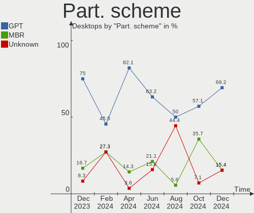
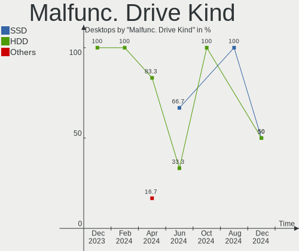
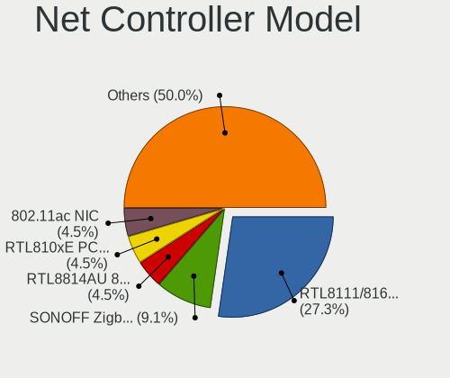
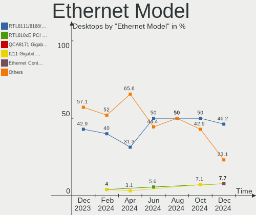
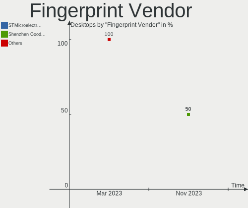

Xubuntu Hardware Trends (Desktops)
----------------------------------

A project to identify most popular hardware characteristics and track their change
over time based on data collected by Xubuntu users at https://Linux-Hardware.org.

Anyone can contribute to this report by the [hw-probe](https://github.com/linuxhw/hw-probe) tool:

    sudo -E hw-probe -all -upload

This report is for one last month. Overall report since the beginning of time: [TestCoverage](https://github.com/linuxhw/TestCoverage)

Period: Apr, 2022.

Contents
--------

* [ System ](#system)
  - [ OS                       ](#os)
  - [ OS Family                ](#os-family)
  - [ Kernel                   ](#kernel)
  - [ Kernel Family            ](#kernel-family)
  - [ Kernel Major Ver.        ](#kernel-major-ver)
  - [ Arch                     ](#arch)
  - [ DE                       ](#de)
  - [ Display Server           ](#display-server)
  - [ Display Manager          ](#display-manager)
  - [ OS Lang                  ](#os-lang)
  - [ Boot Mode                ](#boot-mode)
  - [ Filesystem               ](#filesystem)
  - [ Part. scheme             ](#part-scheme)
  - [ Dual Boot with Linux/BSD ](#dual-boot-with-linuxbsd)
  - [ Dual Boot (Win)          ](#dual-boot-win)

* [ Board ](#board)
  - [ Vendor                   ](#vendor)
  - [ Model                    ](#model)
  - [ Model Family             ](#model-family)
  - [ MFG Year                 ](#mfg-year)
  - [ Form Factor              ](#form-factor)
  - [ Secure Boot              ](#secure-boot)
  - [ Coreboot                 ](#coreboot)
  - [ RAM Size                 ](#ram-size)
  - [ RAM Used                 ](#ram-used)
  - [ Total Drives             ](#total-drives)
  - [ Has CD-ROM               ](#has-cd-rom)
  - [ Has Ethernet             ](#has-ethernet)
  - [ Has WiFi                 ](#has-wifi)
  - [ Has Bluetooth            ](#has-bluetooth)

* [ Location ](#location)
  - [ Country                  ](#country)
  - [ City                     ](#city)

* [ Drives ](#drives)
  - [ Drive Vendor             ](#drive-vendor)
  - [ Drive Model              ](#drive-model)
  - [ HDD Vendor               ](#hdd-vendor)
  - [ SSD Vendor               ](#ssd-vendor)
  - [ Drive Kind               ](#drive-kind)
  - [ Drive Connector          ](#drive-connector)
  - [ Drive Size               ](#drive-size)
  - [ Space Total              ](#space-total)
  - [ Space Used               ](#space-used)
  - [ Malfunc. Drives          ](#malfunc-drives)
  - [ Malfunc. Drive Vendor    ](#malfunc-drive-vendor)
  - [ Malfunc. HDD Vendor      ](#malfunc-hdd-vendor)
  - [ Malfunc. Drive Kind      ](#malfunc-drive-kind)
  - [ Failed Drives            ](#failed-drives)
  - [ Failed Drive Vendor      ](#failed-drive-vendor)
  - [ Drive Status             ](#drive-status)

* [ Storage controller ](#storage-controller)
  - [ Storage Vendor           ](#storage-vendor)
  - [ Storage Model            ](#storage-model)
  - [ Storage Kind             ](#storage-kind)

* [ Processor ](#processor)
  - [ CPU Vendor               ](#cpu-vendor)
  - [ CPU Model                ](#cpu-model)
  - [ CPU Model Family         ](#cpu-model-family)
  - [ CPU Cores                ](#cpu-cores)
  - [ CPU Sockets              ](#cpu-sockets)
  - [ CPU Threads              ](#cpu-threads)
  - [ CPU Op-Modes             ](#cpu-op-modes)
  - [ CPU Microcode            ](#cpu-microcode)
  - [ CPU Microarch            ](#cpu-microarch)

* [ Graphics ](#graphics)
  - [ GPU Vendor               ](#gpu-vendor)
  - [ GPU Model                ](#gpu-model)
  - [ GPU Combo                ](#gpu-combo)
  - [ GPU Driver               ](#gpu-driver)
  - [ GPU Memory               ](#gpu-memory)

* [ Monitor ](#monitor)
  - [ Monitor Vendor           ](#monitor-vendor)
  - [ Monitor Model            ](#monitor-model)
  - [ Monitor Resolution       ](#monitor-resolution)
  - [ Monitor Diagonal         ](#monitor-diagonal)
  - [ Monitor Width            ](#monitor-width)
  - [ Aspect Ratio             ](#aspect-ratio)
  - [ Monitor Area             ](#monitor-area)
  - [ Pixel Density            ](#pixel-density)
  - [ Multiple Monitors        ](#multiple-monitors)

* [ Network ](#network)
  - [ Net Controller Vendor    ](#net-controller-vendor)
  - [ Net Controller Model     ](#net-controller-model)
  - [ Wireless Vendor          ](#wireless-vendor)
  - [ Wireless Model           ](#wireless-model)
  - [ Ethernet Vendor          ](#ethernet-vendor)
  - [ Ethernet Model           ](#ethernet-model)
  - [ Net Controller Kind      ](#net-controller-kind)
  - [ Used Controller          ](#used-controller)
  - [ NICs                     ](#nics)
  - [ IPv6                     ](#ipv6)

* [ Bluetooth ](#bluetooth)
  - [ Bluetooth Vendor         ](#bluetooth-vendor)
  - [ Bluetooth Model          ](#bluetooth-model)

* [ Sound ](#sound)
  - [ Sound Vendor             ](#sound-vendor)
  - [ Sound Model              ](#sound-model)

* [ Memory ](#memory)
  - [ Memory Vendor            ](#memory-vendor)
  - [ Memory Model             ](#memory-model)
  - [ Memory Kind              ](#memory-kind)
  - [ Memory Form Factor       ](#memory-form-factor)
  - [ Memory Size              ](#memory-size)
  - [ Memory Speed             ](#memory-speed)

* [ Printers & scanners ](#printers--scanners)
  - [ Printer Vendor           ](#printer-vendor)
  - [ Printer Model            ](#printer-model)
  - [ Scanner Vendor           ](#scanner-vendor)
  - [ Scanner Model            ](#scanner-model)

* [ Camera ](#camera)
  - [ Camera Vendor            ](#camera-vendor)
  - [ Camera Model             ](#camera-model)

* [ Security ](#security)
  - [ Fingerprint Vendor       ](#fingerprint-vendor)
  - [ Fingerprint Model        ](#fingerprint-model)
  - [ Chipcard Vendor          ](#chipcard-vendor)
  - [ Chipcard Model           ](#chipcard-model)

* [ Unsupported ](#unsupported)
  - [ Unsupported Devices      ](#unsupported-devices)
  - [ Unsupported Device Types ](#unsupported-device-types)

System
------

OS
--

Installed operating systems

| Name          | Desktops | Percent |
|---------------|----------|---------|
| Xubuntu 20.04 | 21       | 75%     |
| Xubuntu 21.10 | 5        | 17.86%  |
| Xubuntu 22.04 | 1        | 3.57%   |
| Xubuntu 18.04 | 1        | 3.57%   |

OS Family
---------

OS without a version

| Name    | Desktops | Percent |
|---------|----------|---------|
| Xubuntu | 28       | 100%    |

Kernel
------

Version of the Linux kernel

| Version              | Desktops | Percent |
|----------------------|----------|---------|
| 5.4.0-107-generic    | 7        | 25%     |
| 5.13.0-39-generic    | 7        | 25%     |
| 5.4.0-107-lowlatency | 2        | 7.14%   |
| 5.13.0-39-lowlatency | 2        | 7.14%   |
| 5.4.0-77-lowlatency  | 1        | 3.57%   |
| 5.4.0-109-generic    | 1        | 3.57%   |
| 5.4.0-105-generic    | 1        | 3.57%   |
| 5.4.0-100-lowlatency | 1        | 3.57%   |
| 5.15.0-27-generic    | 1        | 3.57%   |
| 5.13.0-40-lowlatency | 1        | 3.57%   |
| 5.13.0-40-generic    | 1        | 3.57%   |
| 5.13.0-37-generic    | 1        | 3.57%   |
| 5.13.0-35-generic    | 1        | 3.57%   |
| 4.15.0-176-generic   | 1        | 3.57%   |

Kernel Family
-------------

Linux kernel without a distro release

| Version | Desktops | Percent |
|---------|----------|---------|
| 5.4.0   | 13       | 46.43%  |
| 5.13.0  | 13       | 46.43%  |
| 5.15.0  | 1        | 3.57%   |
| 4.15.0  | 1        | 3.57%   |

Kernel Major Ver.
-----------------

Linux kernel major version

| Version | Desktops | Percent |
|---------|----------|---------|
| 5.4     | 13       | 46.43%  |
| 5.13    | 13       | 46.43%  |
| 5.15    | 1        | 3.57%   |
| 4.15    | 1        | 3.57%   |

Arch
----

OS architecture (x86_64, i586, etc.)

| Name   | Desktops | Percent |
|--------|----------|---------|
| x86_64 | 28       | 100%    |

DE
--

Desktop Environment

| Name | Desktops | Percent |
|------|----------|---------|
| XFCE | 27       | 96.43%  |
| KDE5 | 1        | 3.57%   |

Display Server
--------------

X11 or Wayland

| Name | Desktops | Percent |
|------|----------|---------|
| X11  | 27       | 96.43%  |
| Tty  | 1        | 3.57%   |

Display Manager
---------------

SDDM, LightDM, etc.

| Name    | Desktops | Percent |
|---------|----------|---------|
| LightDM | 24       | 85.71%  |
| Unknown | 2        | 7.14%   |
| GDM3    | 1        | 3.57%   |
| GDM     | 1        | 3.57%   |

OS Lang
-------

Language

| Lang  | Desktops | Percent |
|-------|----------|---------|
| en_US | 13       | 46.43%  |
| de_DE | 6        | 21.43%  |
| it_IT | 3        | 10.71%  |
| fr_FR | 2        | 7.14%   |
| pt_PT | 1        | 3.57%   |
| pt_BR | 1        | 3.57%   |
| hu_HU | 1        | 3.57%   |
| en_CA | 1        | 3.57%   |

Boot Mode
---------

EFI or BIOS

| Mode | Desktops | Percent |
|------|----------|---------|
| BIOS | 21       | 75%     |
| EFI  | 7        | 25%     |

Filesystem
----------

Type of filesystem

| Type | Desktops | Percent |
|------|----------|---------|
| Ext4 | 26       | 92.86%  |
| Zfs  | 1        | 3.57%   |
| Ext3 | 1        | 3.57%   |

Part. scheme
------------

Scheme of partitioning

| Type    | Desktops | Percent |
|---------|----------|---------|
| Unknown | 16       | 57.14%  |
| GPT     | 9        | 32.14%  |
| MBR     | 3        | 10.71%  |

Dual Boot with Linux/BSD
------------------------

Hosting more than one Linux/BSD

| Dual boot | Desktops | Percent |
|-----------|----------|---------|
| No        | 19       | 67.86%  |
| Yes       | 9        | 32.14%  |

Dual Boot (Win)
---------------

Hosting Linux and Windows

| Dual boot | Desktops | Percent |
|-----------|----------|---------|
| No        | 16       | 57.14%  |
| Yes       | 12       | 42.86%  |

Board
-----

Vendor
------

Motherboard manufacturer

| Name                | Desktops | Percent |
|---------------------|----------|---------|
| ASUSTek Computer    | 5        | 17.86%  |
| MSI                 | 4        | 14.29%  |
| Gigabyte Technology | 4        | 14.29%  |
| Dell                | 4        | 14.29%  |
| Hewlett-Packard     | 3        | 10.71%  |
| Fujitsu             | 2        | 7.14%   |
| Shuttle             | 1        | 3.57%   |
| Lenovo              | 1        | 3.57%   |
| eMachines           | 1        | 3.57%   |
| Apple               | 1        | 3.57%   |
| Acer                | 1        | 3.57%   |
| Unknown             | 1        | 3.57%   |

Model
-----

Motherboard model

| Name                               | Desktops | Percent |
|------------------------------------|----------|---------|
| MSI MS-7C56                        | 2        | 7.14%   |
| Dell OptiPlex 7010                 | 2        | 7.14%   |
| Shuttle XH61V                      | 1        | 3.57%   |
| MSI MS-7B89                        | 1        | 3.57%   |
| MSI MS-7752                        | 1        | 3.57%   |
| Lenovo ThinkCentre M83 10AGS03400  | 1        | 3.57%   |
| HP t620 Quad Core TC               | 1        | 3.57%   |
| HP EliteDesk 800 G1 USDT           | 1        | 3.57%   |
| HP Compaq dc7600 Small Form Factor | 1        | 3.57%   |
| Gigabyte P55A-UD3                  | 1        | 3.57%   |
| Gigabyte H97-D3H                   | 1        | 3.57%   |
| Gigabyte H310M S2H 2.0             | 1        | 3.57%   |
| Gigabyte G33M-DS2R                 | 1        | 3.57%   |
| Fujitsu ESPRIMO E710               | 1        | 3.57%   |
| Fujitsu ESPRIMO E705               | 1        | 3.57%   |
| eMachines ET1331G                  | 1        | 3.57%   |
| Dell OptiPlex 9020                 | 1        | 3.57%   |
| Dell OptiPlex 760                  | 1        | 3.57%   |
| ASUS TUF Gaming X570-PRO           | 1        | 3.57%   |
| ASUS P8Z77-V                       | 1        | 3.57%   |
| ASUS P8Z68 DELUXE                  | 1        | 3.57%   |
| ASUS P5G41T-M LX                   | 1        | 3.57%   |
| ASUS Maximus V EXTREME             | 1        | 3.57%   |
| Apple MacPro5,1                    | 1        | 3.57%   |
| Acer Nitro N50-610                 | 1        | 3.57%   |
| Unknown                            | 1        | 3.57%   |

Model Family
------------

Motherboard model prefix

| Name               | Desktops | Percent |
|--------------------|----------|---------|
| Dell OptiPlex      | 4        | 14.29%  |
| MSI MS-7C56        | 2        | 7.14%   |
| Fujitsu ESPRIMO    | 2        | 7.14%   |
| Shuttle XH61V      | 1        | 3.57%   |
| MSI MS-7B89        | 1        | 3.57%   |
| MSI MS-7752        | 1        | 3.57%   |
| Lenovo ThinkCentre | 1        | 3.57%   |
| HP t620            | 1        | 3.57%   |
| HP EliteDesk       | 1        | 3.57%   |
| HP Compaq          | 1        | 3.57%   |
| Gigabyte P55A-UD3  | 1        | 3.57%   |
| Gigabyte H97-D3H   | 1        | 3.57%   |
| Gigabyte H310M     | 1        | 3.57%   |
| Gigabyte G33M-DS2R | 1        | 3.57%   |
| eMachines ET1331G  | 1        | 3.57%   |
| ASUS TUF           | 1        | 3.57%   |
| ASUS P8Z77-V       | 1        | 3.57%   |
| ASUS P8Z68         | 1        | 3.57%   |
| ASUS P5G41T-M      | 1        | 3.57%   |
| ASUS Maximus       | 1        | 3.57%   |
| Apple MacPro5      | 1        | 3.57%   |
| Acer Nitro         | 1        | 3.57%   |
| Unknown            | 1        | 3.57%   |

MFG Year
--------

Motherboard manufacture year

| Year | Desktops | Percent |
|------|----------|---------|
| 2013 | 6        | 21.43%  |
| 2012 | 4        | 14.29%  |
| 2020 | 3        | 10.71%  |
| 2014 | 3        | 10.71%  |
| 2018 | 2        | 7.14%   |
| 2011 | 2        | 7.14%   |
| 2010 | 2        | 7.14%   |
| 2009 | 2        | 7.14%   |
| 2021 | 1        | 3.57%   |
| 2019 | 1        | 3.57%   |
| 2007 | 1        | 3.57%   |
| 2005 | 1        | 3.57%   |

Form Factor
-----------

Physical design of the computer

| Name    | Desktops | Percent |
|---------|----------|---------|
| Desktop | 28       | 100%    |

Secure Boot
-----------

Enabled or disabled

| State    | Desktops | Percent |
|----------|----------|---------|
| Disabled | 28       | 100%    |

Coreboot
--------

Have coreboot on board

| Used | Desktops | Percent |
|------|----------|---------|
| No   | 28       | 100%    |

RAM Size
--------

Total RAM memory

| Size in GB  | Desktops | Percent |
|-------------|----------|---------|
| 16.01-24.0  | 10       | 35.71%  |
| 4.01-8.0    | 6        | 21.43%  |
| 8.01-16.0   | 5        | 17.86%  |
| 32.01-64.0  | 3        | 10.71%  |
| 3.01-4.0    | 2        | 7.14%   |
| 64.01-256.0 | 1        | 3.57%   |
| 1.01-2.0    | 1        | 3.57%   |

RAM Used
--------

Used RAM memory

| Used GB    | Desktops | Percent |
|------------|----------|---------|
| 4.01-8.0   | 7        | 25%     |
| 1.01-2.0   | 6        | 21.43%  |
| 3.01-4.0   | 5        | 17.86%  |
| 0.51-1.0   | 5        | 17.86%  |
| 2.01-3.0   | 3        | 10.71%  |
| 24.01-32.0 | 1        | 3.57%   |
| 16.01-24.0 | 1        | 3.57%   |

Total Drives
------------

Number of drives on board

| Drives | Desktops | Percent |
|--------|----------|---------|
| 1      | 11       | 39.29%  |
| 3      | 7        | 25%     |
| 2      | 7        | 25%     |
| 6      | 1        | 3.57%   |
| 5      | 1        | 3.57%   |
| 4      | 1        | 3.57%   |

Has CD-ROM
----------

Has CD-ROM on board

| Presented | Desktops | Percent |
|-----------|----------|---------|
| Yes       | 18       | 64.29%  |
| No        | 10       | 35.71%  |

Has Ethernet
------------

Has Ethernet on board

| Presented | Desktops | Percent |
|-----------|----------|---------|
| Yes       | 28       | 100%    |

Has WiFi
--------

Has WiFi module

| Presented | Desktops | Percent |
|-----------|----------|---------|
| No        | 18       | 64.29%  |
| Yes       | 10       | 35.71%  |

Has Bluetooth
-------------

Has Bluetooth module

| Presented | Desktops | Percent |
|-----------|----------|---------|
| No        | 19       | 67.86%  |
| Yes       | 9        | 32.14%  |

Location
--------

Country
-------

Geographic location (country)

| Country     | Desktops | Percent |
|-------------|----------|---------|
| USA         | 10       | 35.71%  |
| Germany     | 6        | 21.43%  |
| Italy       | 3        | 10.71%  |
| France      | 2        | 7.14%   |
| Spain       | 1        | 3.57%   |
| Portugal    | 1        | 3.57%   |
| Netherlands | 1        | 3.57%   |
| Hungary     | 1        | 3.57%   |
| Croatia     | 1        | 3.57%   |
| Canada      | 1        | 3.57%   |
| Brazil      | 1        | 3.57%   |

City
----

Geographic location (city)

| City               | Desktops | Percent |
|--------------------|----------|---------|
| Zagreb             | 1        | 3.57%   |
| Wake Forest        | 1        | 3.57%   |
| Venice             | 1        | 3.57%   |
| Sulzbach-Rosenberg | 1        | 3.57%   |
| Schmitten          | 1        | 3.57%   |
| Schiffweiler       | 1        | 3.57%   |
| Salamanca          | 1        | 3.57%   |
| Roswell            | 1        | 3.57%   |
| Roseville          | 1        | 3.57%   |
| Roseburg           | 1        | 3.57%   |
| Puygouzon          | 1        | 3.57%   |
| Powell             | 1        | 3.57%   |
| Piacenza           | 1        | 3.57%   |
| Ottawa             | 1        | 3.57%   |
| Niterói           | 1        | 3.57%   |
| Melvindale         | 1        | 3.57%   |
| Hockessin          | 1        | 3.57%   |
| Hamburg            | 1        | 3.57%   |
| Eugene             | 1        | 3.57%   |
| Ericeira           | 1        | 3.57%   |
| Denver             | 1        | 3.57%   |
| Chula Vista        | 1        | 3.57%   |
| Budapest           | 1        | 3.57%   |
| Bourgbarre         | 1        | 3.57%   |
| Bochum             | 1        | 3.57%   |
| Bad Duerrenberg    | 1        | 3.57%   |
| Amsterdam          | 1        | 3.57%   |
| Altopascio         | 1        | 3.57%   |

Drives
------

Drive Vendor
------------

Hard drive vendors

| Vendor              | Desktops | Drives | Percent |
|---------------------|----------|--------|---------|
| WDC                 | 12       | 18     | 23.08%  |
| Seagate             | 9        | 12     | 17.31%  |
| Samsung Electronics | 7        | 9      | 13.46%  |
| SanDisk             | 6        | 6      | 11.54%  |
| Crucial             | 3        | 3      | 5.77%   |
| Transcend           | 2        | 3      | 3.85%   |
| OCZ                 | 2        | 2      | 3.85%   |
| Kingston            | 2        | 3      | 3.85%   |
| Hitachi             | 2        | 2      | 3.85%   |
| Toshiba             | 1        | 1      | 1.92%   |
| SK Hynix            | 1        | 1      | 1.92%   |
| PNY                 | 1        | 1      | 1.92%   |
| Phison              | 1        | 1      | 1.92%   |
| Mercury             | 1        | 1      | 1.92%   |
| KIOXIA              | 1        | 1      | 1.92%   |
| A-DATA Technology   | 1        | 1      | 1.92%   |

Drive Model
-----------

Hard drive models

| Model                                   | Desktops | Percent |
|-----------------------------------------|----------|---------|
| Seagate ST2000DM008-2FR102 2TB          | 2        | 3.23%   |
| Seagate ST1000DM010-2EP102 1TB          | 2        | 3.23%   |
| SanDisk SDSSDH3512G 512GB               | 2        | 3.23%   |
| Samsung SSD 860 EVO 500GB               | 2        | 3.23%   |
| OCZ AGILITY3 64GB SSD                   | 2        | 3.23%   |
| WDC WDS250G2B0B-00YS70 250GB SSD        | 1        | 1.61%   |
| WDC WDS200T2B0B-00YS70 2TB SSD          | 1        | 1.61%   |
| WDC WD60EFAX-68JH4N1 6TB                | 1        | 1.61%   |
| WDC WD40EFRX-68WT0N0 4TB                | 1        | 1.61%   |
| WDC WD3200AAKS-75SBA0 320GB             | 1        | 1.61%   |
| WDC WD3200AAKS-00B3A0 320GB             | 1        | 1.61%   |
| WDC WD30EZRX-00MMMB0 3TB                | 1        | 1.61%   |
| WDC WD2500HHTZ-04N21V0 250GB            | 1        | 1.61%   |
| WDC WD2500BEVT-22A23T0 250GB            | 1        | 1.61%   |
| WDC WD2500AAJS-08L7A0 250GB             | 1        | 1.61%   |
| WDC WD15EARS-60MVWB0 1TB                | 1        | 1.61%   |
| WDC WD10EARX-00N0YB0 1TB                | 1        | 1.61%   |
| WDC WD10EARS-22Y5B1 1TB                 | 1        | 1.61%   |
| WDC WD1002FAEX-00Z3A0 1TB               | 1        | 1.61%   |
| WDC WD10 EFRX-68PJCN0 1TB               | 1        | 1.61%   |
| WDC PC SN520 SDAPNUW-512G-1014 512GB    | 1        | 1.61%   |
| Transcend TS512GMTE220S 512GB           | 1        | 1.61%   |
| Transcend TS128GSSD370 128GB            | 1        | 1.61%   |
| Toshiba KSG60ZMV256G M.2 2280 256GB SSD | 1        | 1.61%   |
| SK Hynix SH920 2.5 7MM 256GB SSD        | 1        | 1.61%   |
| Seagate ST500LT012-9WS142 500GB         | 1        | 1.61%   |
| Seagate ST500LM030-2E717D 500GB         | 1        | 1.61%   |
| Seagate ST500LM012 HN-M500MBB 500GB     | 1        | 1.61%   |
| Seagate ST500DM002-1BD142 500GB         | 1        | 1.61%   |
| Seagate ST4000DM004-2CV104 4TB          | 1        | 1.61%   |
| Seagate ST3500418AS 500GB               | 1        | 1.61%   |
| Seagate ST31000528AS 1TB                | 1        | 1.61%   |
| Seagate ST1000DM003-1SB10C 1TB          | 1        | 1.61%   |
| SanDisk Ultra II 480GB SSD              | 1        | 1.61%   |
| SanDisk SSD PLUS 480GB                  | 1        | 1.61%   |
| SanDisk SDSSDP128G 128GB                | 1        | 1.61%   |
| SanDisk SD8SNAT064G1011 64GB SSD        | 1        | 1.61%   |
| Samsung SSD 870 EVO 500GB               | 1        | 1.61%   |
| Samsung SSD 850 EVO mSATA 500GB         | 1        | 1.61%   |
| Samsung SSD 850 EVO 500GB               | 1        | 1.61%   |
| Samsung SSD 850 EVO 250GB               | 1        | 1.61%   |
| Samsung SSD 840 Series 250GB            | 1        | 1.61%   |
| Samsung SSD 840 Series 120GB            | 1        | 1.61%   |
| Samsung HD502IJ 500GB                   | 1        | 1.61%   |
| PNY CS900 480GB SSD                     | 1        | 1.61%   |
| Phison NVMe SSD Drive 1024GB            | 1        | 1.61%   |
| Mercury Electra 3G SSD                  | 1        | 1.61%   |
| KIOXIA KBG40ZNS256G NVMe 256GB          | 1        | 1.61%   |
| Kingston SA400S37240G 240GB SSD         | 1        | 1.61%   |
| Kingston SA2000M8250G 250GB             | 1        | 1.61%   |
| Kingston SA2000M81000G 1TB              | 1        | 1.61%   |
| Hitachi HDT721032SLA380 320GB           | 1        | 1.61%   |
| Hitachi HDS721025CLA382 250GB           | 1        | 1.61%   |
| Crucial CT500P5SSD8 500GB               | 1        | 1.61%   |
| Crucial CT240M500SSD1 240GB             | 1        | 1.61%   |
| Crucial CT1000MX500SSD1 1TB             | 1        | 1.61%   |
| A-DATA SSD DP900 128GB-DL3              | 1        | 1.61%   |

HDD Vendor
----------

Hard disk drive vendors

| Vendor              | Desktops | Drives | Percent |
|---------------------|----------|--------|---------|
| WDC                 | 9        | 15     | 42.86%  |
| Seagate             | 9        | 12     | 42.86%  |
| Hitachi             | 2        | 2      | 9.52%   |
| Samsung Electronics | 1        | 1      | 4.76%   |

SSD Vendor
----------

Solid state drive vendors

| Vendor              | Desktops | Drives | Percent |
|---------------------|----------|--------|---------|
| Samsung Electronics | 7        | 8      | 26.92%  |
| SanDisk             | 6        | 6      | 23.08%  |
| WDC                 | 2        | 2      | 7.69%   |
| OCZ                 | 2        | 2      | 7.69%   |
| Crucial             | 2        | 2      | 7.69%   |
| Transcend           | 1        | 1      | 3.85%   |
| Toshiba             | 1        | 1      | 3.85%   |
| SK Hynix            | 1        | 1      | 3.85%   |
| PNY                 | 1        | 1      | 3.85%   |
| Mercury             | 1        | 1      | 3.85%   |
| Kingston            | 1        | 1      | 3.85%   |
| A-DATA Technology   | 1        | 1      | 3.85%   |

Drive Kind
----------

HDD or SSD

| Kind | Desktops | Drives | Percent |
|------|----------|--------|---------|
| SSD  | 19       | 27     | 45.24%  |
| HDD  | 18       | 30     | 42.86%  |
| NVMe | 5        | 8      | 11.9%   |

Drive Connector
---------------

SATA, SAS, NVMe, etc.

| Type | Desktops | Drives | Percent |
|------|----------|--------|---------|
| SATA | 26       | 56     | 81.25%  |
| NVMe | 5        | 8      | 15.63%  |
| SAS  | 1        | 1      | 3.13%   |

Drive Size
----------

Size of hard drive

| Size in TB | Desktops | Drives | Percent |
|------------|----------|--------|---------|
| 0.01-0.5   | 21       | 35     | 55.26%  |
| 0.51-1.0   | 10       | 13     | 26.32%  |
| 1.01-2.0   | 3        | 3      | 7.89%   |
| 3.01-4.0   | 2        | 2      | 5.26%   |
| 2.01-3.0   | 1        | 3      | 2.63%   |
| 4.01-10.0  | 1        | 1      | 2.63%   |

Space Total
-----------

Amount of disk space available on the file system

| Size in GB     | Desktops | Percent |
|----------------|----------|---------|
| 251-500        | 10       | 35.71%  |
| 501-1000       | 6        | 21.43%  |
| 1001-2000      | 5        | 17.86%  |
| 101-250        | 4        | 14.29%  |
| More than 3000 | 2        | 7.14%   |
| Unknown        | 1        | 3.57%   |

Space Used
----------

Amount of used disk space

| Used GB        | Desktops | Percent |
|----------------|----------|---------|
| 101-250        | 9        | 32.14%  |
| 251-500        | 5        | 17.86%  |
| 21-50          | 4        | 14.29%  |
| 501-1000       | 3        | 10.71%  |
| More than 3000 | 2        | 7.14%   |
| 1-20           | 2        | 7.14%   |
| 1001-2000      | 1        | 3.57%   |
| 51-100         | 1        | 3.57%   |
| Unknown        | 1        | 3.57%   |

Malfunc. Drives
---------------

Drive models with a malfunction

| Model                            | Desktops | Drives | Percent |
|----------------------------------|----------|--------|---------|
| WDC WD1002FAEX-00Z3A0 1TB        | 1        | 1      | 25%     |
| SK Hynix SH920 2.5 7MM 256GB SSD | 1        | 1      | 25%     |
| Seagate ST500DM002-1BD142 500GB  | 1        | 1      | 25%     |
| Seagate ST3500418AS 500GB        | 1        | 1      | 25%     |

Malfunc. Drive Vendor
---------------------

Vendors of faulty drives

| Vendor   | Desktops | Drives | Percent |
|----------|----------|--------|---------|
| Seagate  | 2        | 2      | 50%     |
| WDC      | 1        | 1      | 25%     |
| SK Hynix | 1        | 1      | 25%     |

Malfunc. HDD Vendor
-------------------

Vendors of faulty HDD drives

| Vendor  | Desktops | Drives | Percent |
|---------|----------|--------|---------|
| Seagate | 2        | 2      | 66.67%  |
| WDC     | 1        | 1      | 33.33%  |

Malfunc. Drive Kind
-------------------

Kinds of faulty drives

| Kind | Desktops | Drives | Percent |
|------|----------|--------|---------|
| HDD  | 3        | 3      | 75%     |
| SSD  | 1        | 1      | 25%     |

Failed Drives
-------------

Failed drive models

Zero info for selected period =(

Failed Drive Vendor
-------------------

Failed drive vendors

Zero info for selected period =(

Drive Status
------------

Number of failed and malfunc. drives

| Status   | Desktops | Drives | Percent |
|----------|----------|--------|---------|
| Detected | 18       | 32     | 52.94%  |
| Works    | 13       | 29     | 38.24%  |
| Malfunc  | 3        | 4      | 8.82%   |

Storage controller
------------------

Storage Vendor
--------------

Storage controller vendors

| Vendor                        | Desktops | Percent |
|-------------------------------|----------|---------|
| Intel                         | 21       | 52.5%   |
| AMD                           | 6        | 15%     |
| ASMedia Technology            | 3        | 7.5%    |
| Marvell Technology Group      | 2        | 5%      |
| JMicron Technology            | 2        | 5%      |
| Silicon Motion                | 1        | 2.5%    |
| Sandisk                       | 1        | 2.5%    |
| Phison Electronics            | 1        | 2.5%    |
| Nvidia                        | 1        | 2.5%    |
| Micron Technology             | 1        | 2.5%    |
| Integrated Technology Express | 1        | 2.5%    |

Storage Model
-------------

Storage controller models

| Model                                                                          | Desktops | Percent |
|--------------------------------------------------------------------------------|----------|---------|
| Intel 7 Series/C210 Series Chipset Family 6-port SATA Controller [AHCI mode]   | 7        | 15.22%  |
| Intel 8 Series/C220 Series Chipset Family 6-port SATA Controller 1 [AHCI mode] | 3        | 6.52%   |
| ASMedia ASM1062 Serial ATA Controller                                          | 3        | 6.52%   |
| AMD FCH SATA Controller [AHCI mode]                                            | 3        | 6.52%   |
| Intel NM10/ICH7 Family SATA Controller [IDE mode]                              | 2        | 4.35%   |
| Intel 82801G (ICH7 Family) IDE Controller                                      | 2        | 4.35%   |
| Intel 6 Series/C200 Series Chipset Family 6 port Desktop SATA AHCI Controller  | 2        | 4.35%   |
| AMD 500 Series Chipset SATA Controller                                         | 2        | 4.35%   |
| Silicon Motion SM2262/SM2262EN SSD Controller                                  | 1        | 2.17%   |
| Sandisk WD Blue SN500 / PC SN520 NVMe SSD                                      | 1        | 2.17%   |
| Phison PS5013 E13 NVMe Controller                                              | 1        | 2.17%   |
| Nvidia MCP61 SATA Controller                                                   | 1        | 2.17%   |
| Micron Non-Volatile memory controller                                          | 1        | 2.17%   |
| Marvell Group 88SE9128 PCIe SATA 6 Gb/s RAID controller with HyperDuo          | 1        | 2.17%   |
| Marvell Group 88SE9128 PCIe SATA 6 Gb/s RAID controller                        | 1        | 2.17%   |
| JMicron JMB368 IDE controller                                                  | 1        | 2.17%   |
| JMicron JMB362 SATA Controller                                                 | 1        | 2.17%   |
| Intel Comet Lake SATA AHCI Controller                                          | 1        | 2.17%   |
| Intel 9 Series Chipset Family SATA Controller [AHCI Mode]                      | 1        | 2.17%   |
| Intel 82801JI (ICH10 Family) SATA AHCI Controller                              | 1        | 2.17%   |
| Intel 82801JD/DO (ICH10 Family) SATA AHCI Controller                           | 1        | 2.17%   |
| Intel 82801IR/IO/IH (ICH9R/DO/DH) 4 port SATA Controller [IDE mode]            | 1        | 2.17%   |
| Intel 82801I (ICH9 Family) 2 port SATA Controller [IDE mode]                   | 1        | 2.17%   |
| Intel 5 Series/3400 Series Chipset 4 port SATA IDE Controller                  | 1        | 2.17%   |
| Intel 5 Series/3400 Series Chipset 2 port SATA IDE Controller                  | 1        | 2.17%   |
| Intel 4 Series Chipset PT IDER Controller                                      | 1        | 2.17%   |
| Intel 200 Series PCH SATA controller [AHCI mode]                               | 1        | 2.17%   |
| Integrated Express IT8213 IDE Controller                                       | 1        | 2.17%   |
| AMD SB7x0/SB8x0/SB9x0 SATA Controller [AHCI mode]                              | 1        | 2.17%   |
| AMD 400 Series Chipset SATA Controller                                         | 1        | 2.17%   |

Storage Kind
------------

Kind of storage controller (IDE, SATA, NVMe, SAS, ...)

| Kind | Desktops | Percent |
|------|----------|---------|
| SATA | 24       | 70.59%  |
| IDE  | 6        | 17.65%  |
| NVMe | 4        | 11.76%  |

Processor
---------

CPU Vendor
----------

Processor vendors

| Vendor | Desktops | Percent |
|--------|----------|---------|
| Intel  | 21       | 75%     |
| AMD    | 7        | 25%     |

CPU Model
---------

Processor models

| Model                                    | Desktops | Percent |
|------------------------------------------|----------|---------|
| Intel Core i7-3770K CPU @ 3.50GHz        | 2        | 7.14%   |
| Intel Core i7-3770 CPU @ 3.40GHz         | 2        | 7.14%   |
| Intel Xeon CPU X5690 @ 3.47GHz           | 1        | 3.57%   |
| Intel Xeon CPU E5-2630 v2 @ 2.60GHz      | 1        | 3.57%   |
| Intel Pentium Dual CPU E2180 @ 2.00GHz   | 1        | 3.57%   |
| Intel Pentium 4 CPU 3.00GHz              | 1        | 3.57%   |
| Intel Core i7-4770 CPU @ 3.40GHz         | 1        | 3.57%   |
| Intel Core i7-3770S CPU @ 3.10GHz        | 1        | 3.57%   |
| Intel Core i7-2600K CPU @ 3.40GHz        | 1        | 3.57%   |
| Intel Core i5-9400 CPU @ 2.90GHz         | 1        | 3.57%   |
| Intel Core i5-4570S CPU @ 2.90GHz        | 1        | 3.57%   |
| Intel Core i5-4460 CPU @ 3.20GHz         | 1        | 3.57%   |
| Intel Core i5-3570 CPU @ 3.40GHz         | 1        | 3.57%   |
| Intel Core i5-3470 CPU @ 3.20GHz         | 1        | 3.57%   |
| Intel Core i5-10400F CPU @ 2.90GHz       | 1        | 3.57%   |
| Intel Core i5 CPU 760 @ 2.80GHz          | 1        | 3.57%   |
| Intel Core i3-4160 CPU @ 3.60GHz         | 1        | 3.57%   |
| Intel Core 2 Quad CPU Q9550 @ 2.83GHz    | 1        | 3.57%   |
| Intel Core 2 Duo CPU E8400 @ 3.00GHz     | 1        | 3.57%   |
| AMD Ryzen 7 5800X 8-Core Processor       | 1        | 3.57%   |
| AMD Ryzen 7 5700G with Radeon Graphics   | 1        | 3.57%   |
| AMD Ryzen 5 5600X 6-Core Processor       | 1        | 3.57%   |
| AMD Ryzen 5 3600 6-Core Processor        | 1        | 3.57%   |
| AMD Phenom 9600B Quad-Core Processor     | 1        | 3.57%   |
| AMD GX-415GA SOC with Radeon HD Graphics | 1        | 3.57%   |
| AMD Athlon II X2 265 Processor           | 1        | 3.57%   |

CPU Model Family
----------------

Processor model prefix

| Model              | Desktops | Percent |
|--------------------|----------|---------|
| Intel Core i7      | 7        | 25%     |
| Intel Core i5      | 7        | 25%     |
| Intel Xeon         | 2        | 7.14%   |
| AMD Ryzen 7        | 2        | 7.14%   |
| AMD Ryzen 5        | 2        | 7.14%   |
| Intel Pentium Dual | 1        | 3.57%   |
| Intel Pentium 4    | 1        | 3.57%   |
| Intel Core i3      | 1        | 3.57%   |
| Intel Core 2 Quad  | 1        | 3.57%   |
| Intel Core 2 Duo   | 1        | 3.57%   |
| AMD Phenom         | 1        | 3.57%   |
| AMD GX             | 1        | 3.57%   |
| AMD Athlon II X2   | 1        | 3.57%   |

CPU Cores
---------

Number of processor cores

| Number | Desktops | Percent |
|--------|----------|---------|
| 4      | 15       | 53.57%  |
| 6      | 5        | 17.86%  |
| 2      | 4        | 14.29%  |
| 8      | 2        | 7.14%   |
| 12     | 1        | 3.57%   |
| 1      | 1        | 3.57%   |

CPU Sockets
-----------

Number of sockets

| Number | Desktops | Percent |
|--------|----------|---------|
| 1      | 27       | 96.43%  |
| 2      | 1        | 3.57%   |

CPU Threads
-----------

Threads per core (Hyper-Threading)

| Number | Desktops | Percent |
|--------|----------|---------|
| 2      | 16       | 57.14%  |
| 1      | 12       | 42.86%  |

CPU Op-Modes
------------

CPU Operation Modes (32-bit, 64-bit)

| Op mode        | Desktops | Percent |
|----------------|----------|---------|
| 32-bit, 64-bit | 28       | 100%    |

CPU Microcode
-------------

Microcode number

| Number     | Desktops | Percent |
|------------|----------|---------|
| 0x306a9    | 7        | 25%     |
| Unknown    | 5        | 17.86%  |
| 0x306c3    | 3        | 10.71%  |
| 0x1067a    | 2        | 7.14%   |
| 0x0a201016 | 2        | 7.14%   |
| 0xa0653    | 1        | 3.57%   |
| 0x906ed    | 1        | 3.57%   |
| 0x6fd      | 1        | 3.57%   |
| 0x306e4    | 1        | 3.57%   |
| 0x206a7    | 1        | 3.57%   |
| 0x106e5    | 1        | 3.57%   |
| 0x08701013 | 1        | 3.57%   |
| 0x0700010f | 1        | 3.57%   |
| 0x01000095 | 1        | 3.57%   |

CPU Microarch
-------------

Microarchitecture

| Name        | Desktops | Percent |
|-------------|----------|---------|
| IvyBridge   | 8        | 28.57%  |
| Haswell     | 4        | 14.29%  |
| Zen 3       | 3        | 10.71%  |
| Penryn      | 2        | 7.14%   |
| K10         | 2        | 7.14%   |
| Zen 2       | 1        | 3.57%   |
| Westmere    | 1        | 3.57%   |
| SandyBridge | 1        | 3.57%   |
| NetBurst    | 1        | 3.57%   |
| Nehalem     | 1        | 3.57%   |
| KabyLake    | 1        | 3.57%   |
| Jaguar      | 1        | 3.57%   |
| Core        | 1        | 3.57%   |
| CometLake   | 1        | 3.57%   |

Graphics
--------

GPU Vendor
----------

Vendors of graphics cards

| Vendor | Desktops | Percent |
|--------|----------|---------|
| Nvidia | 13       | 44.83%  |
| Intel  | 11       | 37.93%  |
| AMD    | 5        | 17.24%  |

GPU Model
---------

Graphics card models

| Model                                                                       | Desktops | Percent |
|-----------------------------------------------------------------------------|----------|---------|
| Intel Xeon E3-1200 v3/4th Gen Core Processor Integrated Graphics Controller | 3        | 10.34%  |
| Intel IvyBridge GT2 [HD Graphics 4000]                                      | 3        | 10.34%  |
| Nvidia GP107 [GeForce GTX 1050 Ti]                                          | 2        | 6.9%    |
| Nvidia TU117GL [T600]                                                       | 1        | 3.45%   |
| Nvidia TU117 [GeForce GTX 1650]                                             | 1        | 3.45%   |
| Nvidia TU104 [GeForce RTX 2060]                                             | 1        | 3.45%   |
| Nvidia GP108 [GeForce GT 1030]                                              | 1        | 3.45%   |
| Nvidia GP106 [GeForce GTX 1060 6GB]                                         | 1        | 3.45%   |
| Nvidia GK104 [GeForce GTX 660 Ti]                                           | 1        | 3.45%   |
| Nvidia GF119 [GeForce GT 610]                                               | 1        | 3.45%   |
| Nvidia GA104 [GeForce RTX 3060 Ti Lite Hash Rate]                           | 1        | 3.45%   |
| Nvidia G94 [GeForce GT 130]                                                 | 1        | 3.45%   |
| Nvidia G84 [GeForce 8600 GT]                                                | 1        | 3.45%   |
| Nvidia C61 [GeForce 6150SE nForce 430]                                      | 1        | 3.45%   |
| Intel Xeon E3-1200 v2/3rd Gen Core processor Graphics Controller            | 1        | 3.45%   |
| Intel 82945G/GZ Integrated Graphics Controller                              | 1        | 3.45%   |
| Intel 4th Generation Core Processor Family Integrated Graphics Controller   | 1        | 3.45%   |
| Intel 4 Series Chipset Integrated Graphics Controller                       | 1        | 3.45%   |
| Intel 2nd Generation Core Processor Family Integrated Graphics Controller   | 1        | 3.45%   |
| AMD Tobago PRO [Radeon R7 360 / R9 360 OEM]                                 | 1        | 3.45%   |
| AMD RS880 [Radeon HD 4250]                                                  | 1        | 3.45%   |
| AMD Kabini [Radeon HD 8330E]                                                | 1        | 3.45%   |
| AMD Ellesmere [Radeon Pro WX 5100]                                          | 1        | 3.45%   |
| AMD Cezanne                                                                 | 1        | 3.45%   |

GPU Combo
---------

Combinations of graphics cards

| Name       | Desktops | Percent |
|------------|----------|---------|
| 1 x Nvidia | 13       | 46.43%  |
| 1 x Intel  | 10       | 35.71%  |
| 1 x AMD    | 5        | 17.86%  |

GPU Driver
----------

Free vs proprietary

| Driver      | Desktops | Percent |
|-------------|----------|---------|
| Free        | 18       | 64.29%  |
| Proprietary | 9        | 32.14%  |
| Unknown     | 1        | 3.57%   |

GPU Memory
----------

Total video memory

| Size in GB | Desktops | Percent |
|------------|----------|---------|
| Unknown    | 14       | 50%     |
| 3.01-4.0   | 4        | 14.29%  |
| 1.01-2.0   | 3        | 10.71%  |
| 0.01-0.5   | 3        | 10.71%  |
| 5.01-6.0   | 2        | 7.14%   |
| 7.01-8.0   | 1        | 3.57%   |
| 0.51-1.0   | 1        | 3.57%   |

Monitor
-------

Monitor Vendor
--------------

Monitor vendors

| Vendor              | Desktops | Percent |
|---------------------|----------|---------|
| Goldstar            | 5        | 17.86%  |
| LG Electronics      | 3        | 10.71%  |
| Hewlett-Packard     | 3        | 10.71%  |
| Dell                | 3        | 10.71%  |
| Samsung Electronics | 2        | 7.14%   |
| HannStar            | 2        | 7.14%   |
| Vizio               | 1        | 3.57%   |
| Vestel Elektronik   | 1        | 3.57%   |
| Skyworth            | 1        | 3.57%   |
| Sangyo              | 1        | 3.57%   |
| Philips             | 1        | 3.57%   |
| MSI                 | 1        | 3.57%   |
| Lenovo              | 1        | 3.57%   |
| HKC                 | 1        | 3.57%   |
| Fujitsu Siemens     | 1        | 3.57%   |
| Acer                | 1        | 3.57%   |

Monitor Model
-------------

Monitor models

| Model                                                                | Desktops | Percent |
|----------------------------------------------------------------------|----------|---------|
| Vizio D32x-D1 VIZ1005 1920x1080 700x390mm 31.5-inch                  | 1        | 3.45%   |
| Vestel Elektronik 40UHD_LCD_TV VES3700 3840x2160 890x500mm 40.2-inch | 1        | 3.45%   |
| Skyworth SII SPRT RPT SII9575 1920x1080 698x392mm 31.5-inch          | 1        | 3.45%   |
| Sangyo LCD Monitor 2560x1440                                         | 1        | 3.45%   |
| Samsung Electronics T24B350 SAM0940 1920x1080 520x290mm 23.4-inch    | 1        | 3.45%   |
| Samsung Electronics LCD Monitor SyncMaster                           | 1        | 3.45%   |
| Philips 19PFL3403DEU PHLD056 1600x1200 410x260mm 19.1-inch           | 1        | 3.45%   |
| MSI Optix G27C2 MSI1462 1920x1080 600x340mm 27.2-inch                | 1        | 3.45%   |
| LG Electronics LCD Monitor LG TV SSCR2 3840x2160                     | 1        | 3.45%   |
| LG Electronics LCD Monitor LG FULL HD 1920x1080                      | 1        | 3.45%   |
| LG Electronics LCD Monitor L1900E 3200x1080                          | 1        | 3.45%   |
| Lenovo L2250p Wide LEN0A0C 1680x1050 474x296mm 22.0-inch             | 1        | 3.45%   |
| HKC LCDTV HKC3393 1920x1080 520x290mm 23.4-inch                      | 1        | 3.45%   |
| Hewlett-Packard w1907 HWP26A2 1440x900 408x255mm 18.9-inch           | 1        | 3.45%   |
| Hewlett-Packard LV2311 HWP3006 1920x1080 510x287mm 23.0-inch         | 1        | 3.45%   |
| Hewlett-Packard 27fw HPN354B 1920x1080 598x336mm 27.0-inch           | 1        | 3.45%   |
| HannStar JC199D HSD13C6 1280x1024 376x301mm 19.0-inch                | 1        | 3.45%   |
| HannStar Hanns.G HX191 HSD0013 1280x1024 376x301mm 19.0-inch         | 1        | 3.45%   |
| Goldstar LG HDR 4K GSM7707 3840x2160 600x340mm 27.2-inch             | 1        | 3.45%   |
| Goldstar L1953TR GSM4B43 1280x1024 376x301mm 19.0-inch               | 1        | 3.45%   |
| Goldstar HDR 4K GSM7750 3840x2160 697x392mm 31.5-inch                | 1        | 3.45%   |
| Goldstar 32 FHD GSM7700 1920x1080 698x392mm 31.5-inch                | 1        | 3.45%   |
| Goldstar 24MB35 GSM5A49 1920x1080 510x290mm 23.1-inch                | 1        | 3.45%   |
| Fujitsu Siemens LSL 3230T FUS07A6 1920x1080 509x286mm 23.0-inch      | 1        | 3.45%   |
| Dell U2419H DEL415D 1920x1080 527x296mm 23.8-inch                    | 1        | 3.45%   |
| Dell SE198WFP DELF004 1440x900 408x255mm 18.9-inch                   | 1        | 3.45%   |
| Dell S199WFP DELF00A 1440x900 408x255mm 18.9-inch                    | 1        | 3.45%   |
| Dell LCD Monitor 1907FP                                              | 1        | 3.45%   |
| Acer P186H ACR019B 1366x768 410x230mm 18.5-inch                      | 1        | 3.45%   |

Monitor Resolution
------------------

Monitor screen resolution

| Resolution         | Desktops | Percent |
|--------------------|----------|---------|
| 1920x1080 (FHD)    | 9        | 34.62%  |
| 3840x2160 (4K)     | 5        | 19.23%  |
| 1440x900 (WXGA+)   | 3        | 11.54%  |
| Unknown            | 2        | 7.69%   |
| 3440x1440          | 1        | 3.85%   |
| 3200x1080          | 1        | 3.85%   |
| 2560x1440 (QHD)    | 1        | 3.85%   |
| 1680x1050 (WSXGA+) | 1        | 3.85%   |
| 1600x1200          | 1        | 3.85%   |
| 1366x768 (WXGA)    | 1        | 3.85%   |
| 1280x1024 (SXGA)   | 1        | 3.85%   |

Monitor Diagonal
----------------

Diagonal size in inches

| Inches  | Desktops | Percent |
|---------|----------|---------|
| 19      | 5        | 18.52%  |
| Unknown | 5        | 18.52%  |
| 23      | 4        | 14.81%  |
| 31      | 3        | 11.11%  |
| 27      | 2        | 7.41%   |
| 18      | 2        | 7.41%   |
| 84      | 1        | 3.7%    |
| 57      | 1        | 3.7%    |
| 40      | 1        | 3.7%    |
| 34      | 1        | 3.7%    |
| 24      | 1        | 3.7%    |
| 22      | 1        | 3.7%    |

Monitor Width
-------------

Physical width

| Width in mm | Desktops | Percent |
|-------------|----------|---------|
| 501-600     | 7        | 26.92%  |
| 401-500     | 5        | 19.23%  |
| Unknown     | 5        | 19.23%  |
| 601-700     | 3        | 11.54%  |
| 351-400     | 2        | 7.69%   |
| 801-900     | 1        | 3.85%   |
| 701-800     | 1        | 3.85%   |
| 1501-2000   | 1        | 3.85%   |
| 1001-1500   | 1        | 3.85%   |

Aspect Ratio
------------

Proportional relationship between the width and the height

| Ratio   | Desktops | Percent |
|---------|----------|---------|
| 16/9    | 12       | 50%     |
| Unknown | 5        | 20.83%  |
| 16/10   | 4        | 16.67%  |
| 5/4     | 2        | 8.33%   |
| 21/9    | 1        | 4.17%   |

Monitor Area
------------

Area in inch²

| Area in inch² | Desktops | Percent |
|----------------|----------|---------|
| 201-250        | 6        | 23.08%  |
| 151-200        | 5        | 19.23%  |
| Unknown        | 5        | 19.23%  |
| 351-500        | 4        | 15.38%  |
| More than 1000 | 2        | 7.69%   |
| 301-350        | 2        | 7.69%   |
| 141-150        | 1        | 3.85%   |
| 501-1000       | 1        | 3.85%   |

Pixel Density
-------------

Pixels per inch

| Density | Desktops | Percent |
|---------|----------|---------|
| 51-100  | 15       | 60%     |
| Unknown | 5        | 20%     |
| 101-120 | 2        | 8%      |
| 1-50    | 1        | 4%      |
| 161-240 | 1        | 4%      |
| 121-160 | 1        | 4%      |

Multiple Monitors
-----------------

Total monitors connected

| Total | Desktops | Percent |
|-------|----------|---------|
| 1     | 20       | 71.43%  |
| 2     | 6        | 21.43%  |
| 0     | 2        | 7.14%   |

Network
-------

Net Controller Vendor
---------------------

Controller vendors

| Vendor                | Desktops | Percent |
|-----------------------|----------|---------|
| Intel                 | 16       | 39.02%  |
| Realtek Semiconductor | 14       | 34.15%  |
| Qualcomm Atheros      | 2        | 4.88%   |
| Broadcom Limited      | 2        | 4.88%   |
| Broadcom              | 2        | 4.88%   |
| TP-Link               | 1        | 2.44%   |
| Samsung Electronics   | 1        | 2.44%   |
| Nvidia                | 1        | 2.44%   |
| ASUSTek Computer      | 1        | 2.44%   |
| ASIX Electronics      | 1        | 2.44%   |

Net Controller Model
--------------------

Controller models

| Model                                                             | Desktops | Percent |
|-------------------------------------------------------------------|----------|---------|
| Realtek RTL8111/8168/8411 PCI Express Gigabit Ethernet Controller | 11       | 25.58%  |
| Intel 82579V Gigabit Network Connection                           | 4        | 9.3%    |
| Intel Ethernet Connection I217-LM                                 | 3        | 6.98%   |
| Intel Wi-Fi 6 AX200                                               | 2        | 4.65%   |
| Intel 82579LM Gigabit Network Connection (Lewisville)             | 2        | 4.65%   |
| Intel 82574L Gigabit Network Connection                           | 2        | 4.65%   |
| TP-Link TL-WN722N v2/v3 [Realtek RTL8188EUS]                      | 1        | 2.33%   |
| Samsung GT-I9070 (network tethering, USB debugging enabled)       | 1        | 2.33%   |
| Realtek RTL8812AU 802.11a/b/g/n/ac 2T2R DB WLAN Adapter           | 1        | 2.33%   |
| Realtek RTL8192EU 802.11b/g/n WLAN Adapter                        | 1        | 2.33%   |
| Realtek RTL8188CUS 802.11n WLAN Adapter                           | 1        | 2.33%   |
| Realtek RTL8153 Gigabit Ethernet Adapter                          | 1        | 2.33%   |
| Qualcomm Atheros Killer E220x Gigabit Ethernet Controller         | 1        | 2.33%   |
| Qualcomm Atheros AR8151 v2.0 Gigabit Ethernet                     | 1        | 2.33%   |
| Nvidia MCP61 Ethernet                                             | 1        | 2.33%   |
| Intel Ethernet Controller I225-V                                  | 1        | 2.33%   |
| Intel Ethernet Connection I217-V                                  | 1        | 2.33%   |
| Intel Comet Lake PCH CNVi WiFi                                    | 1        | 2.33%   |
| Intel 82567LM-3 Gigabit Network Connection                        | 1        | 2.33%   |
| Broadcom NetLink BCM57780 Gigabit Ethernet PCIe                   | 1        | 2.33%   |
| Broadcom Limited NetXtreme BCM5752 Gigabit Ethernet PCI Express   | 1        | 2.33%   |
| Broadcom Limited BCM4352 802.11ac Wireless Network Adapter        | 1        | 2.33%   |
| Broadcom BCM4352 802.11ac Wireless Network Adapter                | 1        | 2.33%   |
| ASUS AC51 802.11a/b/g/n/ac Wireless Adapter [Mediatek MT7610U]    | 1        | 2.33%   |
| ASIX AX88179 Gigabit Ethernet                                     | 1        | 2.33%   |

Wireless Vendor
---------------

Wireless vendors

| Vendor                | Desktops | Percent |
|-----------------------|----------|---------|
| Realtek Semiconductor | 3        | 30%     |
| Intel                 | 3        | 30%     |
| TP-Link               | 1        | 10%     |
| Broadcom Limited      | 1        | 10%     |
| Broadcom              | 1        | 10%     |
| ASUSTek Computer      | 1        | 10%     |

Wireless Model
--------------

Wireless models

| Model                                                          | Desktops | Percent |
|----------------------------------------------------------------|----------|---------|
| Intel Wi-Fi 6 AX200                                            | 2        | 20%     |
| TP-Link TL-WN722N v2/v3 [Realtek RTL8188EUS]                   | 1        | 10%     |
| Realtek RTL8812AU 802.11a/b/g/n/ac 2T2R DB WLAN Adapter        | 1        | 10%     |
| Realtek RTL8192EU 802.11b/g/n WLAN Adapter                     | 1        | 10%     |
| Realtek RTL8188CUS 802.11n WLAN Adapter                        | 1        | 10%     |
| Intel Comet Lake PCH CNVi WiFi                                 | 1        | 10%     |
| Broadcom Limited BCM4352 802.11ac Wireless Network Adapter     | 1        | 10%     |
| Broadcom BCM4352 802.11ac Wireless Network Adapter             | 1        | 10%     |
| ASUS AC51 802.11a/b/g/n/ac Wireless Adapter [Mediatek MT7610U] | 1        | 10%     |

Ethernet Vendor
---------------

Ethernet vendors

| Vendor                | Desktops | Percent |
|-----------------------|----------|---------|
| Intel                 | 14       | 43.75%  |
| Realtek Semiconductor | 11       | 34.38%  |
| Qualcomm Atheros      | 2        | 6.25%   |
| Samsung Electronics   | 1        | 3.13%   |
| Nvidia                | 1        | 3.13%   |
| Broadcom Limited      | 1        | 3.13%   |
| Broadcom              | 1        | 3.13%   |
| ASIX Electronics      | 1        | 3.13%   |

Ethernet Model
--------------

Ethernet models

| Model                                                             | Desktops | Percent |
|-------------------------------------------------------------------|----------|---------|
| Realtek RTL8111/8168/8411 PCI Express Gigabit Ethernet Controller | 11       | 33.33%  |
| Intel 82579V Gigabit Network Connection                           | 4        | 12.12%  |
| Intel Ethernet Connection I217-LM                                 | 3        | 9.09%   |
| Intel 82579LM Gigabit Network Connection (Lewisville)             | 2        | 6.06%   |
| Intel 82574L Gigabit Network Connection                           | 2        | 6.06%   |
| Samsung GT-I9070 (network tethering, USB debugging enabled)       | 1        | 3.03%   |
| Realtek RTL8153 Gigabit Ethernet Adapter                          | 1        | 3.03%   |
| Qualcomm Atheros Killer E220x Gigabit Ethernet Controller         | 1        | 3.03%   |
| Qualcomm Atheros AR8151 v2.0 Gigabit Ethernet                     | 1        | 3.03%   |
| Nvidia MCP61 Ethernet                                             | 1        | 3.03%   |
| Intel Ethernet Controller I225-V                                  | 1        | 3.03%   |
| Intel Ethernet Connection I217-V                                  | 1        | 3.03%   |
| Intel 82567LM-3 Gigabit Network Connection                        | 1        | 3.03%   |
| Broadcom NetLink BCM57780 Gigabit Ethernet PCIe                   | 1        | 3.03%   |
| Broadcom Limited NetXtreme BCM5752 Gigabit Ethernet PCI Express   | 1        | 3.03%   |
| ASIX AX88179 Gigabit Ethernet                                     | 1        | 3.03%   |

Net Controller Kind
-------------------

Ethernet, WiFi or modem

| Kind     | Desktops | Percent |
|----------|----------|---------|
| Ethernet | 28       | 73.68%  |
| WiFi     | 10       | 26.32%  |

Used Controller
---------------

Currently used network controller

| Kind     | Desktops | Percent |
|----------|----------|---------|
| Ethernet | 24       | 82.76%  |
| WiFi     | 5        | 17.24%  |

NICs
----

Total network controllers on board

| Total | Desktops | Percent |
|-------|----------|---------|
| 1     | 19       | 67.86%  |
| 2     | 9        | 32.14%  |

IPv6
----

IPv6 vs IPv4

| Used | Desktops | Percent |
|------|----------|---------|
| No   | 18       | 64.29%  |
| Yes  | 10       | 35.71%  |

Bluetooth
---------

Bluetooth Vendor
----------------

Controller vendors

| Vendor                          | Desktops | Percent |
|---------------------------------|----------|---------|
| Intel                           | 3        | 30%     |
| Cambridge Silicon Radio         | 3        | 30%     |
| Broadcom                        | 2        | 20%     |
| Qualcomm Atheros Communications | 1        | 10%     |
| Apple                           | 1        | 10%     |

Bluetooth Model
---------------

Controller models

| Model                                               | Desktops | Percent |
|-----------------------------------------------------|----------|---------|
| Cambridge Silicon Radio Bluetooth Dongle (HCI mode) | 3        | 30%     |
| Intel AX200 Bluetooth                               | 2        | 20%     |
| Qualcomm Atheros AR3011 Bluetooth                   | 1        | 10%     |
| Intel Bluetooth Device                              | 1        | 10%     |
| Broadcom BCM20702A0                                 | 1        | 10%     |
| Broadcom ANYCOM Blue USB-UHE 200/250                | 1        | 10%     |
| Apple Built-in Bluetooth 2.0+EDR HCI                | 1        | 10%     |

Sound
-----

Sound Vendor
------------

Sound card vendors

| Vendor              | Desktops | Percent |
|---------------------|----------|---------|
| Intel               | 21       | 47.73%  |
| Nvidia              | 11       | 25%     |
| AMD                 | 8        | 18.18%  |
| Yamaha              | 1        | 2.27%   |
| Logitech            | 1        | 2.27%   |
| Creative Labs       | 1        | 2.27%   |
| C-Media Electronics | 1        | 2.27%   |

Sound Model
-----------

Sound card models

| Model                                                                      | Desktops | Percent |
|----------------------------------------------------------------------------|----------|---------|
| Intel 7 Series/C216 Chipset Family High Definition Audio Controller        | 7        | 13.73%  |
| Intel Xeon E3-1200 v3/4th Gen Core Processor HD Audio Controller           | 4        | 7.84%   |
| Intel 8 Series/C220 Series Chipset High Definition Audio Controller        | 3        | 5.88%   |
| AMD Starship/Matisse HD Audio Controller                                   | 3        | 5.88%   |
| Nvidia TU107 GeForce GTX 1650 High Definition Audio Controller             | 2        | 3.92%   |
| Nvidia GP107GL High Definition Audio Controller                            | 2        | 3.92%   |
| Intel NM10/ICH7 Family High Definition Audio Controller                    | 2        | 3.92%   |
| Intel 6 Series/C200 Series Chipset Family High Definition Audio Controller | 2        | 3.92%   |
| Yamaha MG-XU                                                               | 1        | 1.96%   |
| Nvidia TU104 HD Audio Controller                                           | 1        | 1.96%   |
| Nvidia MCP61 High Definition Audio                                         | 1        | 1.96%   |
| Nvidia GP108 High Definition Audio Controller                              | 1        | 1.96%   |
| Nvidia GP106 High Definition Audio Controller                              | 1        | 1.96%   |
| Nvidia GK104 HDMI Audio Controller                                         | 1        | 1.96%   |
| Nvidia GF119 HDMI Audio Controller                                         | 1        | 1.96%   |
| Nvidia GA104 High Definition Audio Controller                              | 1        | 1.96%   |
| Logitech Blue Microphones                                                  | 1        | 1.96%   |
| Intel Comet Lake PCH cAVS                                                  | 1        | 1.96%   |
| Intel 9 Series Chipset Family HD Audio Controller                          | 1        | 1.96%   |
| Intel 82801JI (ICH10 Family) HD Audio Controller                           | 1        | 1.96%   |
| Intel 82801JD/DO (ICH10 Family) HD Audio Controller                        | 1        | 1.96%   |
| Intel 82801I (ICH9 Family) HD Audio Controller                             | 1        | 1.96%   |
| Intel 5 Series/3400 Series Chipset High Definition Audio                   | 1        | 1.96%   |
| Intel 200 Series PCH HD Audio                                              | 1        | 1.96%   |
| Creative Labs CA0106/CA0111 [SB Live!/Audigy/X-Fi Series]                  | 1        | 1.96%   |
| C-Media Electronics Audio Adapter (Unitek Y-247A)                          | 1        | 1.96%   |
| AMD Tobago HDMI Audio [Radeon R7 360 / R9 360 OEM]                         | 1        | 1.96%   |
| AMD SBx00 Azalia (Intel HDA)                                               | 1        | 1.96%   |
| AMD RS880 HDMI Audio [Radeon HD 4200 Series]                               | 1        | 1.96%   |
| AMD Renoir Radeon High Definition Audio Controller                         | 1        | 1.96%   |
| AMD Kabini HDMI/DP Audio                                                   | 1        | 1.96%   |
| AMD FCH Azalia Controller                                                  | 1        | 1.96%   |
| AMD Family 17h/19h HD Audio Controller                                     | 1        | 1.96%   |
| AMD Ellesmere HDMI Audio [Radeon RX 470/480 / 570/580/590]                 | 1        | 1.96%   |

Memory
------

Memory Vendor
-------------

Memory module vendors

| Vendor              | Desktops | Percent |
|---------------------|----------|---------|
| Corsair             | 3        | 21.43%  |
| Micron Technology   | 2        | 14.29%  |
| Crucial             | 2        | 14.29%  |
| Unknown             | 1        | 7.14%   |
| Team                | 1        | 7.14%   |
| SK Hynix            | 1        | 7.14%   |
| Samsung Electronics | 1        | 7.14%   |
| Kingston            | 1        | 7.14%   |
| G.Skill             | 1        | 7.14%   |
| A-DATA Technology   | 1        | 7.14%   |

Memory Model
------------

Memory module models

| Model                                                      | Desktops | Percent |
|------------------------------------------------------------|----------|---------|
| Unknown RAM Module 4096MB DIMM 1333MT/s                    | 1        | 5.56%   |
| Team RAM Xteem-LV-1866 4GB DIMM DDR3 1600MT/s              | 1        | 5.56%   |
| SK Hynix RAM HMT351U6EFR8C-PB 4096MB DIMM DDR3 1800MT/s    | 1        | 5.56%   |
| SK Hynix RAM HMT351U6CFR8C-PB 4GB DIMM DDR3 1800MT/s       | 1        | 5.56%   |
| Samsung RAM M378A1K43DB2-CTD 8192MB DIMM DDR4 4333MT/s     | 1        | 5.56%   |
| Micron RAM 8JTF51264AZ-1G6E1 4GB DIMM DDR3 1600MT/s        | 1        | 5.56%   |
| Micron RAM 16HTF25664AY-800J1 2GB DIMM DDR2 800MT/s        | 1        | 5.56%   |
| Kingston RAM ACR16D3LU1NGG/4G 4096MB DIMM DDR3 1600MT/s    | 1        | 5.56%   |
| G.Skill RAM F4-3000C16-16GISB 16GB DIMM DDR4 3000MT/s      | 1        | 5.56%   |
| Crucial RAM CT51264BA160BJ.M8F 4096MB DIMM DDR3 1600MT/s   | 1        | 5.56%   |
| Crucial RAM CT51264BA160BJ.C8F 4GB DIMM DDR3 1600MT/s      | 1        | 5.56%   |
| Crucial RAM CT51264BA160BJ.C8 4GB DIMM DDR3 1600MT/s       | 1        | 5.56%   |
| Crucial RAM CT16G4DFD824A.C16FE 16384MB DIMM DDR4 2400MT/s | 1        | 5.56%   |
| Corsair RAM CMZ8GX3M2A1600C9 4096MB DIMM DDR3 1600MT/s     | 1        | 5.56%   |
| Corsair RAM CMZ4GX3M1A1600C9 4096MB DIMM DDR3 1600MT/s     | 1        | 5.56%   |
| Corsair RAM CMSO8GX3M1A1333C9 8GB SODIMM DDR3 1334MT/s     | 1        | 5.56%   |
| Corsair RAM CMK16GX4M2D3600C18 8GB DIMM DDR4 3600MT/s      | 1        | 5.56%   |
| A-DATA RAM DDR4 3200 16GB DIMM DDR4 3200MT/s               | 1        | 5.56%   |

Memory Kind
-----------

Memory module kinds

| Kind    | Desktops | Percent |
|---------|----------|---------|
| DDR3    | 7        | 50%     |
| DDR4    | 5        | 35.71%  |
| DDR2    | 1        | 7.14%   |
| Unknown | 1        | 7.14%   |

Memory Form Factor
------------------

Physical design of the memory module

| Name   | Desktops | Percent |
|--------|----------|---------|
| DIMM   | 13       | 92.86%  |
| SODIMM | 1        | 7.14%   |

Memory Size
-----------

Memory module size

| Size  | Desktops | Percent |
|-------|----------|---------|
| 4096  | 7        | 46.67%  |
| 8192  | 4        | 26.67%  |
| 16384 | 2        | 13.33%  |
| 32768 | 1        | 6.67%   |
| 2048  | 1        | 6.67%   |

Memory Speed
------------

Memory module speed

| Speed | Desktops | Percent |
|-------|----------|---------|
| 1600  | 5        | 35.71%  |
| 4333  | 1        | 7.14%   |
| 3600  | 1        | 7.14%   |
| 3200  | 1        | 7.14%   |
| 3000  | 1        | 7.14%   |
| 2400  | 1        | 7.14%   |
| 1800  | 1        | 7.14%   |
| 1334  | 1        | 7.14%   |
| 1333  | 1        | 7.14%   |
| 800   | 1        | 7.14%   |

Printers & scanners
-------------------

Printer Vendor
--------------

Printer device vendors

| Vendor             | Desktops | Percent |
|--------------------|----------|---------|
| Dymo-CoStar        | 1        | 33.33%  |
| Canon              | 1        | 33.33%  |
| Brother Industries | 1        | 33.33%  |

Printer Model
-------------

Printer device models

| Model                                  | Desktops | Percent |
|----------------------------------------|----------|---------|
| Dymo-CoStar DYMO LabelWriter 450 Turbo | 1        | 33.33%  |
| Canon PIXMA MP190                      | 1        | 33.33%  |
| Brother DCP-7030                       | 1        | 33.33%  |

Scanner Vendor
--------------

Scanner device vendors

Zero info for selected period =(

Scanner Model
-------------

Scanner device models

Zero info for selected period =(

Camera
------

Camera Vendor
-------------

Camera device vendors

| Vendor                | Desktops | Percent |
|-----------------------|----------|---------|
| Logitech              | 3        | 33.33%  |
| MacroSilicon          | 2        | 22.22%  |
| Trust                 | 1        | 11.11%  |
| Realtek Semiconductor | 1        | 11.11%  |
| Razer USA             | 1        | 11.11%  |
| Microdia              | 1        | 11.11%  |

Camera Model
------------

Camera device models

| Model                        | Desktops | Percent |
|------------------------------|----------|---------|
| MacroSilicon USB Video       | 2        | 22.22%  |
| Trust USB Camera             | 1        | 11.11%  |
| Realtek FULL HD 1080P Webcam | 1        | 11.11%  |
| Razer USA Razer Kiyo Pro     | 1        | 11.11%  |
| Microdia USB 2.0 Camera      | 1        | 11.11%  |
| Logitech Webcam C270         | 1        | 11.11%  |
| Logitech Webcam B500         | 1        | 11.11%  |
| Logitech Acer Camera         | 1        | 11.11%  |

Security
--------

Fingerprint Vendor
------------------

Fingerprint sensor vendors

| Vendor         | Desktops | Percent |
|----------------|----------|---------|
| DigitalPersona | 1        | 100%    |

Fingerprint Model
-----------------

Fingerprint sensor models

| Model                             | Desktops | Percent |
|-----------------------------------|----------|---------|
| DigitalPersona Fingerprint Reader | 1        | 100%    |

Chipcard Vendor
---------------

Chipcard module vendors

Zero info for selected period =(

Chipcard Model
--------------

Chipcard module models

Zero info for selected period =(

Unsupported
-----------

Unsupported Devices
-------------------

Total unsupported devices on board

| Total | Desktops | Percent |
|-------|----------|---------|
| 0     | 25       | 89.29%  |
| 1     | 2        | 7.14%   |
| 4     | 1        | 3.57%   |

Unsupported Device Types
------------------------

Types of unsupported devices

| Type                  | Desktops | Percent |
|-----------------------|----------|---------|
| Multimedia controller | 1        | 33.33%  |
| Graphics card         | 1        | 33.33%  |
| Fingerprint reader    | 1        | 33.33%  |

