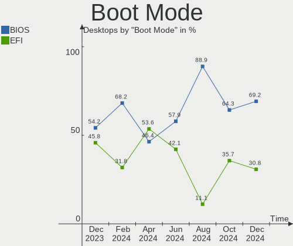
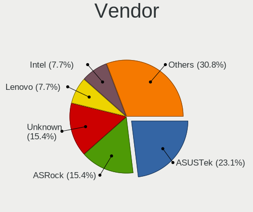
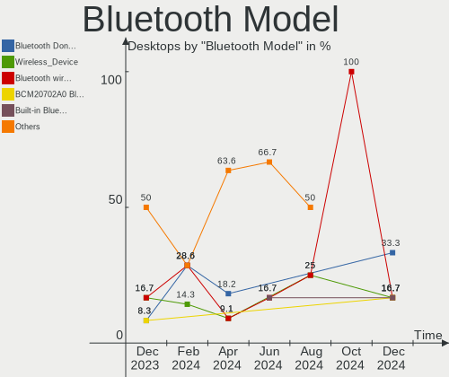
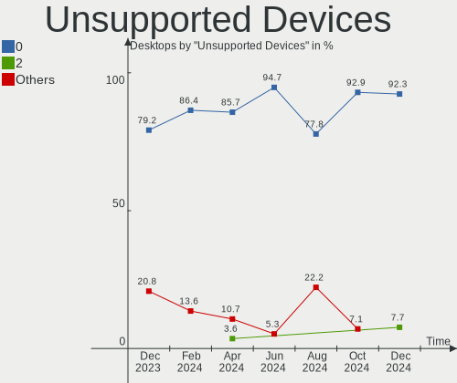

Xubuntu Hardware Trends (Desktop)
---------------------------------

A project to identify most popular hardware characteristics and track their change
over time based on data collected by Xubuntu users at https://Linux-Hardware.org.

Anyone can contribute to the study by uploading probes of their computers by
the [hw-probe](https://github.com/linuxhw/hw-probe) tool:

    sudo -E hw-probe -all -upload

Full-feature report is available here: https://linux-hardware.org/?view=trends&formfactor=desktop

Period: Jun, 2021.

Contents
--------

- [ OS                       ](#os)
- [ OS Family                ](#os-family)
- [ Kernel                   ](#kernel)
- [ Kernel Family            ](#kernel-family)
- [ Kernel Major Ver.        ](#kernel-major-ver)
- [ Arch                     ](#arch)
- [ DE                       ](#de)
- [ Display Server           ](#display-server)
- [ Display Manager          ](#display-manager)
- [ OS Lang                  ](#os-lang)
- [ Boot Mode                ](#boot-mode)
- [ Filesystem               ](#filesystem)
- [ Part. scheme             ](#part-scheme)
- [ Dual Boot with Linux/BSD ](#dual-boot-with-linux/bsd)
- [ Dual Boot (Win)          ](#dual-boot-win)
- [ Country                  ](#country)
- [ City                     ](#city)
- [ Vendor                   ](#vendor)
- [ Model                    ](#model)
- [ Model Family             ](#model-family)
- [ MFG Year                 ](#mfg-year)
- [ Form Factor              ](#form-factor)
- [ Secure Boot              ](#secure-boot)
- [ Coreboot                 ](#coreboot)
- [ RAM Size                 ](#ram-size)
- [ RAM Used                 ](#ram-used)
- [ Has CD-ROM               ](#has-cd-rom)
- [ Total Drives             ](#total-drives)
- [ Has Ethernet             ](#has-ethernet)
- [ Has WiFi                 ](#has-wifi)
- [ Has Bluetooth            ](#has-bluetooth)
- [ Drive Vendor             ](#drive-vendor)
- [ Drive Model              ](#drive-model)
- [ HDD Vendor               ](#hdd-vendor)
- [ SSD Vendor               ](#ssd-vendor)
- [ Drive Kind               ](#drive-kind)
- [ Drive Connector          ](#drive-connector)
- [ Drive Size               ](#drive-size)
- [ Space Total              ](#space-total)
- [ Space Used               ](#space-used)
- [ Malfunc. Drives          ](#malfunc-drives)
- [ Malfunc. Drive Vendor    ](#malfunc-drive-vendor)
- [ Malfunc. HDD Vendor      ](#malfunc-hdd-vendor)
- [ Malfunc. Drive Kind      ](#malfunc-drive-kind)
- [ Failed Drives            ](#failed-drives)
- [ Failed Drive Vendor      ](#failed-drive-vendor)
- [ Drive Status             ](#drive-status)
- [ Storage Vendor           ](#storage-vendor)
- [ Storage Model            ](#storage-model)
- [ Storage Kind             ](#storage-kind)
- [ CPU Vendor               ](#cpu-vendor)
- [ CPU Model                ](#cpu-model)
- [ CPU Model Family         ](#cpu-model-family)
- [ CPU Cores                ](#cpu-cores)
- [ CPU Sockets              ](#cpu-sockets)
- [ CPU Threads              ](#cpu-threads)
- [ CPU Op-Modes             ](#cpu-op-modes)
- [ CPU Microcode            ](#cpu-microcode)
- [ CPU Microarch            ](#cpu-microarch)
- [ GPU Vendor               ](#gpu-vendor)
- [ GPU Model                ](#gpu-model)
- [ GPU Combo                ](#gpu-combo)
- [ GPU Driver               ](#gpu-driver)
- [ GPU Memory               ](#gpu-memory)
- [ Monitor Vendor           ](#monitor-vendor)
- [ Monitor Model            ](#monitor-model)
- [ Monitor Resolution       ](#monitor-resolution)
- [ Monitor Diagonal         ](#monitor-diagonal)
- [ Monitor Width            ](#monitor-width)
- [ Aspect Ratio             ](#aspect-ratio)
- [ Monitor Area             ](#monitor-area)
- [ Pixel Density            ](#pixel-density)
- [ Multiple Monitors        ](#multiple-monitors)
- [ Net Controller Vendor    ](#net-controller-vendor)
- [ Net Controller Model     ](#net-controller-model)
- [ Wireless Vendor          ](#wireless-vendor)
- [ Wireless Model           ](#wireless-model)
- [ Ethernet Vendor          ](#ethernet-vendor)
- [ Ethernet Model           ](#ethernet-model)
- [ Net Controller Kind      ](#net-controller-kind)
- [ Used Controller          ](#used-controller)
- [ NICs                     ](#nics)
- [ IPv6                     ](#ipv6)
- [ Memory Vendor            ](#memory-vendor)
- [ Memory Model             ](#memory-model)
- [ Memory Kind              ](#memory-kind)
- [ Memory Form Factor       ](#memory-form-factor)
- [ Memory Size              ](#memory-size)
- [ Memory Speed             ](#memory-speed)
- [ Sound Vendor             ](#sound-vendor)
- [ Sound Model              ](#sound-model)
- [ Camera Vendor            ](#camera-vendor)
- [ Camera Model             ](#camera-model)
- [ Fingerprint Vendor       ](#fingerprint-vendor)
- [ Fingerprint Model        ](#fingerprint-model)
- [ Chipcard Vendor          ](#chipcard-vendor)
- [ Chipcard Model           ](#chipcard-model)
- [ Printer Vendor           ](#printer-vendor)
- [ Printer Model            ](#printer-model)
- [ Scanner Vendor           ](#scanner-vendor)
- [ Scanner Model            ](#scanner-model)
- [ Bluetooth Vendor         ](#bluetooth-vendor)
- [ Bluetooth Model          ](#bluetooth-model)
- [ Unsupported Devices      ](#unsupported-devices)
- [ Unsupported Device Types ](#unsupported-device-types)

OS
--

Installed operating systems

| Name          | Desktops | Percent |
|---------------|----------|---------|
| Xubuntu 20.04 | 30       | 78.95%  |
| Xubuntu 21.04 | 4        | 10.53%  |
| Xubuntu 18.04 | 3        | 7.89%   |
| Xubuntu 18.10 | 1        | 2.63%   |

OS Family
---------

OS without a version

| Name    | Desktops | Percent |
|---------|----------|---------|
| Xubuntu | 38       | 100%    |

Kernel
------

Version of the Linux kernel

| Version                | Desktops | Percent |
|------------------------|----------|---------|
| 5.4.0-74-generic       | 9        | 23.68%  |
| 5.4.0-74-lowlatency    | 4        | 10.53%  |
| 5.8.0-55-generic       | 3        | 7.89%   |
| 5.8.0-53-generic       | 3        | 7.89%   |
| 5.4.0-73-generic       | 3        | 7.89%   |
| 5.11.0-18-generic      | 3        | 7.89%   |
| 5.8.0-55-lowlatency    | 2        | 5.26%   |
| 5.4.0-77-generic       | 2        | 5.26%   |
| 5.8.0-59-lowlatency    | 1        | 2.63%   |
| 5.8.0-57-generic       | 1        | 2.63%   |
| 5.3.0-050300-generic   | 1        | 2.63%   |
| 5.12.12-051212-generic | 1        | 2.63%   |
| 5.12.10-xanmod1        | 1        | 2.63%   |
| 5.11.0-22-generic      | 1        | 2.63%   |
| 4.18.0-25-generic      | 1        | 2.63%   |
| 4.15.0-144-generic     | 1        | 2.63%   |
| 4.15.0-133-lowlatency  | 1        | 2.63%   |

Kernel Family
-------------

Linux kernel without a distro release

| Version | Desktops | Percent |
|---------|----------|---------|
| 5.4.0   | 18       | 47.37%  |
| 5.8.0   | 10       | 26.32%  |
| 5.11.0  | 4        | 10.53%  |
| 4.15.0  | 2        | 5.26%   |
| 5.3.0   | 1        | 2.63%   |
| 5.12.12 | 1        | 2.63%   |
| 5.12.10 | 1        | 2.63%   |
| 4.18.0  | 1        | 2.63%   |

Kernel Major Ver.
-----------------

Linux kernel major version

| Version | Desktops | Percent |
|---------|----------|---------|
| 5.4     | 18       | 47.37%  |
| 5.8     | 10       | 26.32%  |
| 5.11    | 4        | 10.53%  |
| 5.12    | 2        | 5.26%   |
| 4.15    | 2        | 5.26%   |
| 5.3     | 1        | 2.63%   |
| 4.18    | 1        | 2.63%   |

Arch
----

OS architecture (x86_64, i586, etc.)

| Name   | Desktops | Percent |
|--------|----------|---------|
| x86_64 | 38       | 100%    |

DE
--

Desktop Environment

| Name  | Desktops | Percent |
|-------|----------|---------|
| XFCE  | 36       | 94.74%  |
| GNOME | 2        | 5.26%   |

Display Server
--------------

X11 or Wayland

| Name    | Desktops | Percent |
|---------|----------|---------|
| X11     | 36       | 94.74%  |
| Wayland | 1        | 2.63%   |
| Tty     | 1        | 2.63%   |

Display Manager
---------------

SDDM, LightDM, etc.

| Name    | Desktops | Percent |
|---------|----------|---------|
| Unknown | 23       | 60.53%  |
| TDM     | 13       | 34.21%  |
| GDM     | 2        | 5.26%   |

OS Lang
-------

Language

| Lang  | Desktops | Percent |
|-------|----------|---------|
| en_US | 8        | 21.05%  |
| fr_FR | 7        | 18.42%  |
| de_DE | 7        | 18.42%  |
| nl_NL | 2        | 5.26%   |
| fr_BE | 2        | 5.26%   |
| en_GB | 2        | 5.26%   |
| tr_TR | 1        | 2.63%   |
| pt_BR | 1        | 2.63%   |
| pl_PL | 1        | 2.63%   |
| ja_JP | 1        | 2.63%   |
| it_IT | 1        | 2.63%   |
| es_CO | 1        | 2.63%   |
| en_IN | 1        | 2.63%   |
| en_CA | 1        | 2.63%   |
| de_CH | 1        | 2.63%   |
| cs_CZ | 1        | 2.63%   |

Boot Mode
---------

EFI or BIOS

| Mode | Desktops | Percent |
|------|----------|---------|
| BIOS | 22       | 57.89%  |
| EFI  | 16       | 42.11%  |

Filesystem
----------

Type of filesystem

| Type  | Desktops | Percent |
|-------|----------|---------|
| Ext4  | 36       | 94.74%  |
| Zfs   | 1        | 2.63%   |
| Btrfs | 1        | 2.63%   |

Part. scheme
------------

Scheme of partitioning

| Type    | Desktops | Percent |
|---------|----------|---------|
| Unknown | 23       | 60.53%  |
| GPT     | 10       | 26.32%  |
| MBR     | 5        | 13.16%  |

Dual Boot with Linux/BSD
------------------------

Hosting more than one Linux/BSD

| Dual boot | Desktops | Percent |
|-----------|----------|---------|
| No        | 34       | 89.47%  |
| Yes       | 4        | 10.53%  |

Dual Boot (Win)
---------------

Hosting Linux and Windows

| Dual boot | Desktops | Percent |
|-----------|----------|---------|
| No        | 23       | 60.53%  |
| Yes       | 15       | 39.47%  |

Country
-------

Geographic location (country)

| Country     | Desktops | Percent |
|-------------|----------|---------|
| USA         | 7        | 18.42%  |
| Germany     | 7        | 18.42%  |
| France      | 7        | 18.42%  |
| Belgium     | 3        | 7.89%   |
| Italy       | 2        | 5.26%   |
| UK          | 1        | 2.63%   |
| Turkey      | 1        | 2.63%   |
| Switzerland | 1        | 2.63%   |
| Serbia      | 1        | 2.63%   |
| Poland      | 1        | 2.63%   |
| Netherlands | 1        | 2.63%   |
| Japan       | 1        | 2.63%   |
| Czechia     | 1        | 2.63%   |
| Colombia    | 1        | 2.63%   |
| Canada      | 1        | 2.63%   |
| Brazil      | 1        | 2.63%   |
| Australia   | 1        | 2.63%   |

City
----

Geographic location (city)

| City                      | Desktops | Percent |
|---------------------------|----------|---------|
| Ōtsu                     | 1        | 2.63%   |
| Wettingen                 | 1        | 2.63%   |
| Toulouse                  | 1        | 2.63%   |
| Tolleson                  | 1        | 2.63%   |
| Tilburg                   | 1        | 2.63%   |
| Thouars                   | 1        | 2.63%   |
| Taverny                   | 1        | 2.63%   |
| Springfield               | 1        | 2.63%   |
| Saint-Jacques-de-la-Lande | 1        | 2.63%   |
| Radebeul                  | 1        | 2.63%   |
| Quesnel                   | 1        | 2.63%   |
| Prato                     | 1        | 2.63%   |
| Poznan                    | 1        | 2.63%   |
| Paris                     | 1        | 2.63%   |
| Oxnard                    | 1        | 2.63%   |
| Orange City               | 1        | 2.63%   |
| Nieuwpoort                | 1        | 2.63%   |
| Nienburg                  | 1        | 2.63%   |
| Munich                    | 1        | 2.63%   |
| Marseille                 | 1        | 2.63%   |
| Manosque                  | 1        | 2.63%   |
| Malmedy                   | 1        | 2.63%   |
| Lovosice                  | 1        | 2.63%   |
| Longmont                  | 1        | 2.63%   |
| Jugenheim                 | 1        | 2.63%   |
| Hamilton                  | 1        | 2.63%   |
| Gelsenkirchen             | 1        | 2.63%   |
| East Malvern              | 1        | 2.63%   |
| Düsseldorf               | 1        | 2.63%   |
| Curitiba                  | 1        | 2.63%   |
| Cranston                  | 1        | 2.63%   |
| Court-Saint-Etienne       | 1        | 2.63%   |
| Chelmsford                | 1        | 2.63%   |
| Bogotá                   | 1        | 2.63%   |
| Belgrade                  | 1        | 2.63%   |
| Barletta                  | 1        | 2.63%   |
| Bad Bibra                 | 1        | 2.63%   |
| Antalya                   | 1        | 2.63%   |

Vendor
------

Motherboard manufacturer

| Name                | Desktops | Percent |
|---------------------|----------|---------|
| Gigabyte Technology | 8        | 21.05%  |
| Dell                | 6        | 15.79%  |
| Hewlett-Packard     | 5        | 13.16%  |
| ASUSTek Computer    | 5        | 13.16%  |
| MSI                 | 4        | 10.53%  |
| Packard Bell        | 2        | 5.26%   |
| Intel               | 2        | 5.26%   |
| ASRock              | 2        | 5.26%   |
| QTQD                | 1        | 2.63%   |
| Lenovo              | 1        | 2.63%   |
| Gateway             | 1        | 2.63%   |
| Foxconn             | 1        | 2.63%   |

Model
-----

Motherboard model

| Name                                   | Desktops | Percent |
|----------------------------------------|----------|---------|
| Dell OptiPlex 760                      | 2        | 5.26%   |
| QTQD Board                             | 1        | 2.63%   |
| Packard Bell imedia S3220              | 1        | 2.63%   |
| Packard Bell imedia S2110              | 1        | 2.63%   |
| MSI MS-7C94                            | 1        | 2.63%   |
| MSI MS-7B93                            | 1        | 2.63%   |
| MSI MS-7B79                            | 1        | 2.63%   |
| MSI MS-7A38                            | 1        | 2.63%   |
| Lenovo ThinkCentre A70 7844H9G         | 1        | 2.63%   |
| Intel H61                              | 1        | 2.63%   |
| Intel DH61WW AAG23116-204              | 1        | 2.63%   |
| HP Z420 Workstation                    | 1        | 2.63%   |
| HP EliteDesk 800 G1 USDT               | 1        | 2.63%   |
| HP Compaq Elite 8300 SFF               | 1        | 2.63%   |
| HP Compaq dc7900 Convertible Minitower | 1        | 2.63%   |
| HP Compaq dc7800p Small Form Factor    | 1        | 2.63%   |
| Gigabyte X58A-UD3R                     | 1        | 2.63%   |
| Gigabyte X470 AORUS ULTRA GAMING       | 1        | 2.63%   |
| Gigabyte TERRA_PC                      | 1        | 2.63%   |
| Gigabyte P31-DS3L                      | 1        | 2.63%   |
| Gigabyte H55M-USB3                     | 1        | 2.63%   |
| Gigabyte B450M DS3H                    | 1        | 2.63%   |
| Gigabyte A320M-S2H V2                  | 1        | 2.63%   |
| Gigabyte 945PL-S3                      | 1        | 2.63%   |
| Gateway SX2185                         | 1        | 2.63%   |
| Foxconn Pro 3300 Series MT             | 1        | 2.63%   |
| Dell Precision Tower 3620              | 1        | 2.63%   |
| Dell Precision 5820 Tower X-Series     | 1        | 2.63%   |
| Dell OptiPlex 7010                     | 1        | 2.63%   |
| Dell DXP061                            | 1        | 2.63%   |
| ASUS Z170 PRO GAMING/AURA              | 1        | 2.63%   |
| ASUS TUF GAMING X570-PLUS              | 1        | 2.63%   |
| ASUS TUF GAMING B550M-PLUS             | 1        | 2.63%   |
| ASUS ROG STRIX X570-E GAMING           | 1        | 2.63%   |
| ASUS P8H61/USB3 R2.0                   | 1        | 2.63%   |
| ASRock X300M-STX                       | 1        | 2.63%   |
| ASRock A320M-DVS R4.0                  | 1        | 2.63%   |

Model Family
------------

Motherboard model prefix

| Name                | Desktops | Percent |
|---------------------|----------|---------|
| HP Compaq           | 3        | 7.89%   |
| Dell OptiPlex       | 3        | 7.89%   |
| Packard Bell imedia | 2        | 5.26%   |
| Dell Precision      | 2        | 5.26%   |
| ASUS TUF            | 2        | 5.26%   |
| QTQD Board          | 1        | 2.63%   |
| MSI MS-7C94         | 1        | 2.63%   |
| MSI MS-7B93         | 1        | 2.63%   |
| MSI MS-7B79         | 1        | 2.63%   |
| MSI MS-7A38         | 1        | 2.63%   |
| Lenovo ThinkCentre  | 1        | 2.63%   |
| Intel H61           | 1        | 2.63%   |
| Intel DH61WW        | 1        | 2.63%   |
| HP Z420             | 1        | 2.63%   |
| HP EliteDesk        | 1        | 2.63%   |
| Gigabyte X58A-UD3R  | 1        | 2.63%   |
| Gigabyte X470       | 1        | 2.63%   |
| Gigabyte TERRA      | 1        | 2.63%   |
| Gigabyte P31-DS3L   | 1        | 2.63%   |
| Gigabyte H55M-USB3  | 1        | 2.63%   |
| Gigabyte B450M      | 1        | 2.63%   |
| Gigabyte A320M-S2H  | 1        | 2.63%   |
| Gigabyte 945PL-S3   | 1        | 2.63%   |
| Gateway SX2185      | 1        | 2.63%   |
| Foxconn Pro         | 1        | 2.63%   |
| Dell DXP061         | 1        | 2.63%   |
| ASUS Z170           | 1        | 2.63%   |
| ASUS ROG            | 1        | 2.63%   |
| ASUS P8H61          | 1        | 2.63%   |
| ASRock X300M-STX    | 1        | 2.63%   |
| ASRock A320M-DVS    | 1        | 2.63%   |

MFG Year
--------

Motherboard manufacture year

| Year | Desktops | Percent |
|------|----------|---------|
| 2020 | 7        | 18.42%  |
| 2013 | 6        | 15.79%  |
| 2010 | 4        | 10.53%  |
| 2019 | 3        | 7.89%   |
| 2021 | 2        | 5.26%   |
| 2018 | 2        | 5.26%   |
| 2017 | 2        | 5.26%   |
| 2014 | 2        | 5.26%   |
| 2012 | 2        | 5.26%   |
| 2011 | 2        | 5.26%   |
| 2006 | 2        | 5.26%   |
| 2016 | 1        | 2.63%   |
| 2009 | 1        | 2.63%   |
| 2008 | 1        | 2.63%   |
| 2007 | 1        | 2.63%   |

Form Factor
-----------

Physical design of the computer

| Name    | Desktops | Percent |
|---------|----------|---------|
| Desktop | 38       | 100%    |

Secure Boot
-----------

Enabled or disabled

| State    | Desktops | Percent |
|----------|----------|---------|
| Disabled | 37       | 97.37%  |
| Enabled  | 1        | 2.63%   |

Coreboot
--------

Have coreboot on board

| Used | Desktops | Percent |
|------|----------|---------|
| No   | 38       | 100%    |

RAM Size
--------

Total RAM memory

| Size in GB  | Desktops | Percent |
|-------------|----------|---------|
| 8.01-16.0   | 10       | 26.32%  |
| 3.01-4.0    | 7        | 18.42%  |
| 16.01-24.0  | 7        | 18.42%  |
| 32.01-64.0  | 4        | 10.53%  |
| 4.01-8.0    | 3        | 7.89%   |
| 24.01-32.0  | 3        | 7.89%   |
| 2.01-3.0    | 1        | 2.63%   |
| 64.01-256.0 | 1        | 2.63%   |
| 1.01-2.0    | 1        | 2.63%   |
| 0.51-1.0    | 1        | 2.63%   |

RAM Used
--------

Used RAM memory

| Used GB   | Desktops | Percent |
|-----------|----------|---------|
| 1.01-2.0  | 17       | 44.74%  |
| 2.01-3.0  | 8        | 21.05%  |
| 0.51-1.0  | 5        | 13.16%  |
| 3.01-4.0  | 4        | 10.53%  |
| 4.01-8.0  | 2        | 5.26%   |
| 8.01-16.0 | 2        | 5.26%   |

Has CD-ROM
----------

Has CD-ROM on board

| Presented | Desktops | Percent |
|-----------|----------|---------|
| Yes       | 21       | 55.26%  |
| No        | 17       | 44.74%  |

Total Drives
------------

Number of drives on board

| Drives | Desktops | Percent |
|--------|----------|---------|
| 1      | 21       | 55.26%  |
| 2      | 9        | 23.68%  |
| 4      | 4        | 10.53%  |
| 3      | 2        | 5.26%   |
| 6      | 1        | 2.63%   |
| 5      | 1        | 2.63%   |

Has Ethernet
------------

Has Ethernet on board

| Presented | Desktops | Percent |
|-----------|----------|---------|
| Yes       | 38       | 100%    |

Has WiFi
--------

Has WiFi module

| Presented | Desktops | Percent |
|-----------|----------|---------|
| No        | 27       | 71.05%  |
| Yes       | 11       | 28.95%  |

Has Bluetooth
-------------

Has Bluetooth module

| Presented | Desktops | Percent |
|-----------|----------|---------|
| No        | 29       | 76.32%  |
| Yes       | 9        | 23.68%  |

Drive Vendor
------------

Hard drive vendors

| Vendor                | Desktops | Drives | Percent |
|-----------------------|----------|--------|---------|
| WDC                   | 12       | 14     | 20.69%  |
| Seagate               | 9        | 11     | 15.52%  |
| Samsung Electronics   | 9        | 16     | 15.52%  |
| Toshiba               | 6        | 6      | 10.34%  |
| Crucial               | 3        | 3      | 5.17%   |
| SanDisk               | 2        | 2      | 3.45%   |
| Kingston              | 2        | 2      | 3.45%   |
| Intel                 | 2        | 2      | 3.45%   |
| Hitachi               | 2        | 2      | 3.45%   |
| XPG                   | 1        | 1      | 1.72%   |
| WD MediaMax           | 1        | 1      | 1.72%   |
| Realtek Semiconductor | 1        | 2      | 1.72%   |
| PLEXTOR               | 1        | 1      | 1.72%   |
| Micron Technology     | 1        | 1      | 1.72%   |
| Maxtor                | 1        | 1      | 1.72%   |
| KingDian              | 1        | 1      | 1.72%   |
| Intenso               | 1        | 1      | 1.72%   |
| Gigabyte Technology   | 1        | 1      | 1.72%   |
| Fujitsu               | 1        | 1      | 1.72%   |
| A-DATA Technology     | 1        | 1      | 1.72%   |

Drive Model
-----------

Hard drive models

| Model                                         | Desktops | Percent |
|-----------------------------------------------|----------|---------|
| Seagate ST500DM002-1BD142 500GB               | 2        | 3.13%   |
| XPG NVMe SSD Drive 2TB                        | 1        | 1.56%   |
| WDC WDS500G2B0A 500GB SSD                     | 1        | 1.56%   |
| WDC WDS250G2B0C-00PXH0 250GB                  | 1        | 1.56%   |
| WDC WDBNCE0010PNC 1TB SSD                     | 1        | 1.56%   |
| WDC WD800JD-60LSA5 80GB                       | 1        | 1.56%   |
| WDC WD7502ABYS-02A6B0 752GB                   | 1        | 1.56%   |
| WDC WD5000BEVT-22ZAT0 500GB                   | 1        | 1.56%   |
| WDC WD5000AURX-63UY4Y0 500GB                  | 1        | 1.56%   |
| WDC WD5000AAKS-00UU3A0 500GB                  | 1        | 1.56%   |
| WDC WD3200AAJS-00B4A0 320GB                   | 1        | 1.56%   |
| WDC WD30EZRX-00SPEB0 3TB                      | 1        | 1.56%   |
| WDC WD2500JS-75NCB3 250GB                     | 1        | 1.56%   |
| WDC WD20EZRZ-00Z5HB0 2TB                      | 1        | 1.56%   |
| WDC WD10JUCX-63WPNY0 1TB                      | 1        | 1.56%   |
| WDC WD10JPVX-22JC3T0 1TB                      | 1        | 1.56%   |
| WD MediaMax WL1000GSA6454G 992GB              | 1        | 1.56%   |
| Toshiba NVMe SSD Drive 1024GB                 | 1        | 1.56%   |
| Toshiba MQ04ABD200 2TB                        | 1        | 1.56%   |
| Toshiba MQ01ABD032 320GB                      | 1        | 1.56%   |
| Toshiba KXG60PNV512G NVMe KIOXIA 512GB        | 1        | 1.56%   |
| Toshiba HDWD120 2TB                           | 1        | 1.56%   |
| Toshiba DT01ACA100 1TB                        | 1        | 1.56%   |
| Seagate ST980310AS 80GB                       | 1        | 1.56%   |
| Seagate ST8000NM0055-1RM112 8TB               | 1        | 1.56%   |
| Seagate ST6000DX000-1H217Z 6TB                | 1        | 1.56%   |
| Seagate ST500LM030-2E717D 500GB               | 1        | 1.56%   |
| Seagate ST3500413AS 500GB                     | 1        | 1.56%   |
| Seagate ST31000528AS 1TB                      | 1        | 1.56%   |
| Seagate ST3000DM001-1ER166 3TB                | 1        | 1.56%   |
| Seagate ST1000VM 002-1SD102 1TB               | 1        | 1.56%   |
| Seagate IronWolf510 ZP960NM30001-2S9302 960GB | 1        | 1.56%   |
| SanDisk SSD i100 16GB                         | 1        | 1.56%   |
| Sandisk NVMe SSD Drive 250GB                  | 1        | 1.56%   |
| Samsung SSD PM871b 2.5 7mm 512GB              | 1        | 1.56%   |
| Samsung SSD PM830 2.5 7mm 128GB               | 1        | 1.56%   |
| Samsung SSD 970 PRO 512GB                     | 1        | 1.56%   |
| Samsung SSD 970 EVO Plus 2TB                  | 1        | 1.56%   |
| Samsung SSD 970 EVO Plus 250GB                | 1        | 1.56%   |
| Samsung SSD 960 EVO 500GB                     | 1        | 1.56%   |
| Samsung SSD 860 QVO 1TB                       | 1        | 1.56%   |
| Samsung SSD 860 EVO 4TB                       | 1        | 1.56%   |
| Samsung SSD 840 Series 120GB                  | 1        | 1.56%   |
| Samsung Portable SSD T5 1TB                   | 1        | 1.56%   |
| Samsung HD501LJ 500GB                         | 1        | 1.56%   |
| Realtek NVMe SSD Drive 1024GB                 | 1        | 1.56%   |
| PLEXTOR PX-128M5S 128GB SSD                   | 1        | 1.56%   |
| Micron MTFDDAK256MAM-1K1 256GB SSD            | 1        | 1.56%   |
| Maxtor 6Y120M0 122GB                          | 1        | 1.56%   |
| Kingston SA400S37480G 480GB SSD               | 1        | 1.56%   |
| Kingston SA400S37120G 120GB SSD               | 1        | 1.56%   |
| KingDian M200 60GB SSD                        | 1        | 1.56%   |
| Intenso 128GB                                 | 1        | 1.56%   |
| Intel SSDSC2BB120G7R 120GB                    | 1        | 1.56%   |
| Intel NVMe SSD Drive 1024GB                   | 1        | 1.56%   |
| Hitachi HUA721075KLA330 752GB                 | 1        | 1.56%   |
| Hitachi HTS725032A9A364 320GB                 | 1        | 1.56%   |
| Gigabyte GP-GSM2NE3256GNTD 256GB              | 1        | 1.56%   |
| Fujitsu MHW2080BH 80GB                        | 1        | 1.56%   |
| Crucial CT500MX500SSD1 500GB                  | 1        | 1.56%   |

HDD Vendor
----------

Hard disk drive vendors

| Vendor              | Desktops | Drives | Percent |
|---------------------|----------|--------|---------|
| WDC                 | 10       | 11     | 35.71%  |
| Seagate             | 8        | 10     | 28.57%  |
| Toshiba             | 4        | 4      | 14.29%  |
| Hitachi             | 2        | 2      | 7.14%   |
| WD MediaMax         | 1        | 1      | 3.57%   |
| Samsung Electronics | 1        | 2      | 3.57%   |
| Maxtor              | 1        | 1      | 3.57%   |
| Fujitsu             | 1        | 1      | 3.57%   |

SSD Vendor
----------

Solid state drive vendors

| Vendor              | Desktops | Drives | Percent |
|---------------------|----------|--------|---------|
| Samsung Electronics | 5        | 10     | 29.41%  |
| WDC                 | 2        | 2      | 11.76%  |
| Kingston            | 2        | 2      | 11.76%  |
| Crucial             | 2        | 2      | 11.76%  |
| SanDisk             | 1        | 1      | 5.88%   |
| PLEXTOR             | 1        | 1      | 5.88%   |
| Micron Technology   | 1        | 1      | 5.88%   |
| KingDian            | 1        | 1      | 5.88%   |
| Intel               | 1        | 1      | 5.88%   |
| A-DATA Technology   | 1        | 1      | 5.88%   |

Drive Kind
----------

HDD or SSD

| Kind    | Desktops | Drives | Percent |
|---------|----------|--------|---------|
| HDD     | 23       | 32     | 45.1%   |
| SSD     | 16       | 22     | 31.37%  |
| NVMe    | 11       | 15     | 21.57%  |
| Unknown | 1        | 1      | 1.96%   |

Drive Connector
---------------

SATA, SAS, NVMe, etc.

| Type | Desktops | Drives | Percent |
|------|----------|--------|---------|
| SATA | 32       | 51     | 71.11%  |
| NVMe | 11       | 15     | 24.44%  |
| SAS  | 2        | 4      | 4.44%   |

Drive Size
----------

Size of hard drive

| Size in TB | Desktops | Drives | Percent |
|------------|----------|--------|---------|
| 0.01-0.5   | 19       | 29     | 48.72%  |
| 0.51-1.0   | 12       | 14     | 30.77%  |
| 1.01-2.0   | 3        | 3      | 7.69%   |
| 2.01-3.0   | 2        | 2      | 5.13%   |
| 4.01-10.0  | 2        | 2      | 5.13%   |
| 3.01-4.0   | 1        | 4      | 2.56%   |

Space Total
-----------

Amount of disk space available on the file system

| Size in GB     | Desktops | Percent |
|----------------|----------|---------|
| 251-500        | 12       | 31.58%  |
| 101-250        | 9        | 23.68%  |
| 501-1000       | 6        | 15.79%  |
| More than 3000 | 3        | 7.89%   |
| 2001-3000      | 2        | 5.26%   |
| 1001-2000      | 2        | 5.26%   |
| 51-100         | 2        | 5.26%   |
| 1-20           | 1        | 2.63%   |
| Unknown        | 1        | 2.63%   |

Space Used
----------

Amount of used disk space

| Used GB        | Desktops | Percent |
|----------------|----------|---------|
| 21-50          | 10       | 26.32%  |
| 1-20           | 10       | 26.32%  |
| 101-250        | 7        | 18.42%  |
| 51-100         | 4        | 10.53%  |
| More than 3000 | 2        | 5.26%   |
| 251-500        | 1        | 2.63%   |
| 2001-3000      | 1        | 2.63%   |
| 1001-2000      | 1        | 2.63%   |
| 501-1000       | 1        | 2.63%   |
| Unknown        | 1        | 2.63%   |

Malfunc. Drives
---------------

Drive models with a malfunction

| Model                             | Desktops | Drives | Percent |
|-----------------------------------|----------|--------|---------|
| WDC WD5000BEVT-22ZAT0 500GB       | 1        | 1      | 33.33%  |
| Samsung Electronics HD501LJ 500GB | 1        | 2      | 33.33%  |
| Hitachi HTS725032A9A364 320GB     | 1        | 1      | 33.33%  |

Malfunc. Drive Vendor
---------------------

Vendors of faulty drives

| Vendor              | Desktops | Drives | Percent |
|---------------------|----------|--------|---------|
| WDC                 | 1        | 1      | 33.33%  |
| Samsung Electronics | 1        | 2      | 33.33%  |
| Hitachi             | 1        | 1      | 33.33%  |

Malfunc. HDD Vendor
-------------------

Vendors of faulty HDD drives

| Vendor              | Desktops | Drives | Percent |
|---------------------|----------|--------|---------|
| WDC                 | 1        | 1      | 33.33%  |
| Samsung Electronics | 1        | 2      | 33.33%  |
| Hitachi             | 1        | 1      | 33.33%  |

Malfunc. Drive Kind
-------------------

Kinds of faulty drives

| Kind | Desktops | Drives | Percent |
|------|----------|--------|---------|
| HDD  | 2        | 4      | 100%    |

Failed Drives
-------------

Failed drive models

Zero info for selected period =(

Failed Drive Vendor
-------------------

Failed drive vendors

Zero info for selected period =(

Drive Status
------------

Number of failed and malfunc. drives

| Status   | Desktops | Drives | Percent |
|----------|----------|--------|---------|
| Detected | 24       | 40     | 58.54%  |
| Works    | 15       | 26     | 36.59%  |
| Malfunc  | 2        | 4      | 4.88%   |

Storage Vendor
--------------

Storage controller vendors

| Vendor                       | Desktops | Percent |
|------------------------------|----------|---------|
| Intel                        | 24       | 42.86%  |
| AMD                          | 14       | 25%     |
| Samsung Electronics          | 4        | 7.14%   |
| Toshiba America Info Systems | 2        | 3.57%   |
| Sandisk                      | 2        | 3.57%   |
| JMicron Technology           | 2        | 3.57%   |
| Seagate Technology           | 1        | 1.79%   |
| Realtek Semiconductor        | 1        | 1.79%   |
| Phison Electronics           | 1        | 1.79%   |
| Nvidia                       | 1        | 1.79%   |
| Micron Technology            | 1        | 1.79%   |
| Marvell Technology Group     | 1        | 1.79%   |
| ASMedia Technology           | 1        | 1.79%   |
| ADATA Technology             | 1        | 1.79%   |

Storage Model
-------------

Storage controller models

| Model                                                                                   | Desktops | Percent |
|-----------------------------------------------------------------------------------------|----------|---------|
| AMD FCH SATA Controller [AHCI mode]                                                     | 9        | 11.84%  |
| Samsung NVMe SSD Controller SM981/PM981/PM983                                           | 3        | 3.95%   |
| Intel NM10/ICH7 Family SATA Controller [IDE mode]                                       | 3        | 3.95%   |
| Intel 4 Series Chipset PT IDER Controller                                               | 3        | 3.95%   |
| AMD 400 Series Chipset SATA Controller                                                  | 3        | 3.95%   |
| JMicron JMB363 SATA/IDE Controller                                                      | 2        | 2.63%   |
| Intel Q170/Q150/B150/H170/H110/Z170/CM236 Chipset SATA Controller [AHCI Mode]           | 2        | 2.63%   |
| Intel 82801JD/DO (ICH10 Family) SATA AHCI Controller                                    | 2        | 2.63%   |
| Intel 8 Series/C220 Series Chipset Family 6-port SATA Controller 1 [AHCI mode]          | 2        | 2.63%   |
| Intel 7 Series/C210 Series Chipset Family 6-port SATA Controller [AHCI mode]            | 2        | 2.63%   |
| Intel 6 Series/C200 Series Chipset Family Desktop SATA Controller (IDE mode, ports 4-5) | 2        | 2.63%   |
| Intel 6 Series/C200 Series Chipset Family Desktop SATA Controller (IDE mode, ports 0-3) | 2        | 2.63%   |
| Intel 6 Series/C200 Series Chipset Family 6 port Desktop SATA AHCI Controller           | 2        | 2.63%   |
| AMD Starship/Matisse Chipset SATA Controller [AHCI mode]                                | 2        | 2.63%   |
| AMD 300 Series Chipset SATA Controller                                                  | 2        | 2.63%   |
| Toshiba America Info Systems XG6 NVMe SSD Controller                                    | 1        | 1.32%   |
| Toshiba America Info Systems Toshiba America Info Non-Volatile memory controller        | 1        | 1.32%   |
| Seagate Nytro PCIe Flash Storage                                                        | 1        | 1.32%   |
| Seagate FireCuda 510 SSD                                                                | 1        | 1.32%   |
| Sandisk WD Blue SN550 NVMe SSD                                                          | 1        | 1.32%   |
| Sandisk WD Blue SN500 / PC SN520 NVMe SSD                                               | 1        | 1.32%   |
| Samsung NVMe SSD Controller SM961/PM961/SM963                                           | 1        | 1.32%   |
| Realtek RTS5763DL NVMe SSD Controller                                                   | 1        | 1.32%   |
| Phison PS5013 E13 NVMe Controller                                                       | 1        | 1.32%   |
| Nvidia MCP78S [GeForce 8200] IDE                                                        | 1        | 1.32%   |
| Nvidia MCP78S [GeForce 8200] AHCI Controller                                            | 1        | 1.32%   |
| Micron Non-Volatile memory controller                                                   | 1        | 1.32%   |
| Marvell Group 88SE91A3 SATA-600 Controller                                              | 1        | 1.32%   |
| Intel Non-Volatile memory controller                                                    | 1        | 1.32%   |
| Intel C602 chipset 4-Port SATA Storage Control Unit                                     | 1        | 1.32%   |
| Intel C600/X79 series chipset SATA RAID Controller                                      | 1        | 1.32%   |
| Intel C600/X79 series chipset IDE-r Controller                                          | 1        | 1.32%   |
| Intel 82Q35 Express PT IDER Controller                                                  | 1        | 1.32%   |
| Intel 82801JI (ICH10 Family) 4 port SATA IDE Controller #1                              | 1        | 1.32%   |
| Intel 82801JI (ICH10 Family) 2 port SATA IDE Controller #2                              | 1        | 1.32%   |
| Intel 82801JD/DO (ICH10 Family) 4-port SATA IDE Controller                              | 1        | 1.32%   |
| Intel 82801JD/DO (ICH10 Family) 2-port SATA IDE Controller                              | 1        | 1.32%   |
| Intel 82801IR/IO/IH (ICH9R/DO/DH) 4 port SATA Controller [IDE mode]                     | 1        | 1.32%   |
| Intel 82801I (ICH9 Family) 2 port SATA Controller [IDE mode]                            | 1        | 1.32%   |
| Intel 82801HR/HO/HH (ICH8R/DO/DH) 2 port SATA Controller [IDE mode]                     | 1        | 1.32%   |
| Intel 82801H (ICH8 Family) 4 port SATA Controller [IDE mode]                            | 1        | 1.32%   |
| Intel 7 Series Chipset Family 6-port SATA Controller [AHCI mode]                        | 1        | 1.32%   |
| Intel 5 Series/3400 Series Chipset 4 port SATA IDE Controller                           | 1        | 1.32%   |
| Intel 5 Series/3400 Series Chipset 2 port SATA IDE Controller                           | 1        | 1.32%   |
| Intel 200 Series PCH SATA controller [AHCI mode]                                        | 1        | 1.32%   |
| ASMedia ASM1062 Serial ATA Controller                                                   | 1        | 1.32%   |
| AMD SB7x0/SB8x0/SB9x0 SATA Controller [AHCI mode]                                       | 1        | 1.32%   |
| AMD SB7x0/SB8x0/SB9x0 IDE Controller                                                    | 1        | 1.32%   |
| AMD FCH SATA Controller D                                                               | 1        | 1.32%   |
| ADATA XPG SX8200 Pro PCIe Gen3x4 M.2 2280 Solid State Drive                             | 1        | 1.32%   |

Storage Kind
------------

Kind of storage controller (IDE, SATA, NVMe, SAS, ...)

| Kind | Desktops | Percent |
|------|----------|---------|
| SATA | 27       | 49.09%  |
| IDE  | 15       | 27.27%  |
| NVMe | 11       | 20%     |
| RAID | 1        | 1.82%   |
| SAS  | 1        | 1.82%   |

CPU Vendor
----------

Processor vendors

| Vendor | Desktops | Percent |
|--------|----------|---------|
| Intel  | 23       | 60.53%  |
| AMD    | 15       | 39.47%  |

CPU Model
---------

Processor models

| Model                                       | Desktops | Percent |
|---------------------------------------------|----------|---------|
| Intel Core i3-2100 CPU @ 3.10GHz            | 2        | 5.26%   |
| Intel Core 2 Quad CPU Q9650 @ 3.00GHz       | 2        | 5.26%   |
| AMD Ryzen 9 3900X 12-Core Processor         | 2        | 5.26%   |
| AMD Ryzen 7 3800X 8-Core Processor          | 2        | 5.26%   |
| Intel Xeon CPU E5405 @ 2.00GHz              | 1        | 2.63%   |
| Intel Xeon CPU E5-1620 0 @ 3.60GHz          | 1        | 2.63%   |
| Intel Pentium D CPU 3.00GHz                 | 1        | 2.63%   |
| Intel Pentium CPU G870 @ 3.10GHz            | 1        | 2.63%   |
| Intel Core i9-10900X CPU @ 3.70GHz          | 1        | 2.63%   |
| Intel Core i7-7700 CPU @ 3.60GHz            | 1        | 2.63%   |
| Intel Core i7-3770 CPU @ 3.40GHz            | 1        | 2.63%   |
| Intel Core i7 CPU 930 @ 2.80GHz             | 1        | 2.63%   |
| Intel Core i5-6600K CPU @ 3.50GHz           | 1        | 2.63%   |
| Intel Core i5-4570S CPU @ 2.90GHz           | 1        | 2.63%   |
| Intel Core i5-3570 CPU @ 3.40GHz            | 1        | 2.63%   |
| Intel Core i5-2400 CPU @ 3.10GHz            | 1        | 2.63%   |
| Intel Core i5 CPU 660 @ 3.33GHz             | 1        | 2.63%   |
| Intel Core i3-4130 CPU @ 3.40GHz            | 1        | 2.63%   |
| Intel Core 2 Duo CPU E8400 @ 3.00GHz        | 1        | 2.63%   |
| Intel Core 2 Duo CPU E7500 @ 2.93GHz        | 1        | 2.63%   |
| Intel Core 2 Duo CPU E6550 @ 2.33GHz        | 1        | 2.63%   |
| Intel Core 2 CPU 6600 @ 2.40GHz             | 1        | 2.63%   |
| Intel Celeron CPU 1037U @ 1.80GHz           | 1        | 2.63%   |
| AMD Ryzen 9 5900X 12-Core Processor         | 1        | 2.63%   |
| AMD Ryzen 7 3700X 8-Core Processor          | 1        | 2.63%   |
| AMD Ryzen 7 1800X Eight-Core Processor      | 1        | 2.63%   |
| AMD Ryzen 5 PRO 4650G with Radeon Graphics  | 1        | 2.63%   |
| AMD Ryzen 5 3400G with Radeon Vega Graphics | 1        | 2.63%   |
| AMD Ryzen 5 2600 Six-Core Processor         | 1        | 2.63%   |
| AMD Ryzen 3 2200G with Radeon Vega Graphics | 1        | 2.63%   |
| AMD Ryzen 3 1200 Quad-Core Processor        | 1        | 2.63%   |
| AMD E1-2500 APU with Radeon HD Graphics     | 1        | 2.63%   |
| AMD E1-1200 APU with Radeon HD Graphics     | 1        | 2.63%   |
| AMD Athlon II X2 240 Processor              | 1        | 2.63%   |

CPU Model Family
----------------

Processor model prefix

| Model             | Desktops | Percent |
|-------------------|----------|---------|
| Intel Core i5     | 5        | 13.16%  |
| AMD Ryzen 7       | 4        | 10.53%  |
| Intel Core i7     | 3        | 7.89%   |
| Intel Core i3     | 3        | 7.89%   |
| Intel Core 2 Duo  | 3        | 7.89%   |
| AMD Ryzen 9       | 3        | 7.89%   |
| Intel Xeon        | 2        | 5.26%   |
| Intel Core 2 Quad | 2        | 5.26%   |
| AMD Ryzen 5       | 2        | 5.26%   |
| AMD Ryzen 3       | 2        | 5.26%   |
| AMD E1            | 2        | 5.26%   |
| Intel Pentium D   | 1        | 2.63%   |
| Intel Pentium     | 1        | 2.63%   |
| Intel Core i9     | 1        | 2.63%   |
| Intel Core 2      | 1        | 2.63%   |
| Intel Celeron     | 1        | 2.63%   |
| AMD Ryzen 5 PRO   | 1        | 2.63%   |
| AMD Athlon II X2  | 1        | 2.63%   |

CPU Cores
---------

Number of processor cores

| Number | Desktops | Percent |
|--------|----------|---------|
| 4      | 14       | 36.84%  |
| 2      | 14       | 36.84%  |
| 8      | 4        | 10.53%  |
| 12     | 3        | 7.89%   |
| 6      | 2        | 5.26%   |
| 10     | 1        | 2.63%   |

CPU Sockets
-----------

Number of sockets

| Number | Desktops | Percent |
|--------|----------|---------|
| 1      | 38       | 100%    |

CPU Threads
-----------

Threads per core (Hyper-Threading)

| Number | Desktops | Percent |
|--------|----------|---------|
| 2      | 19       | 50%     |
| 1      | 19       | 50%     |

CPU Op-Modes
------------

CPU Operation Modes (32-bit, 64-bit)

| Op mode        | Desktops | Percent |
|----------------|----------|---------|
| 32-bit, 64-bit | 38       | 100%    |

CPU Microcode
-------------

Microcode number

| Number     | Desktops | Percent |
|------------|----------|---------|
| Unknown    | 5        | 13.16%  |
| 0x08701021 | 4        | 10.53%  |
| 0x206a7    | 3        | 7.89%   |
| 0x1067a    | 3        | 7.89%   |
| 0x306c3    | 2        | 5.26%   |
| 0x306a9    | 2        | 5.26%   |
| 0x08001137 | 2        | 5.26%   |
| 0xf65      | 1        | 2.63%   |
| 0x906e9    | 1        | 2.63%   |
| 0x6fb      | 1        | 2.63%   |
| 0x6f6      | 1        | 2.63%   |
| 0x50657    | 1        | 2.63%   |
| 0x206d7    | 1        | 2.63%   |
| 0x20655    | 1        | 2.63%   |
| 0x106a5    | 1        | 2.63%   |
| 0x10676    | 1        | 2.63%   |
| 0x0a201009 | 1        | 2.63%   |
| 0x08600106 | 1        | 2.63%   |
| 0x08108109 | 1        | 2.63%   |
| 0x08101013 | 1        | 2.63%   |
| 0x0800820d | 1        | 2.63%   |
| 0x0700010f | 1        | 2.63%   |
| 0x05000119 | 1        | 2.63%   |
| 0x010000c7 | 1        | 2.63%   |

CPU Microarch
-------------

Microarchitecture

| Name        | Desktops | Percent |
|-------------|----------|---------|
| Zen 2       | 6        | 15.79%  |
| SandyBridge | 5        | 13.16%  |
| Penryn      | 5        | 13.16%  |
| Zen         | 3        | 7.89%   |
| IvyBridge   | 3        | 7.89%   |
| Zen+        | 2        | 5.26%   |
| Skylake     | 2        | 5.26%   |
| Haswell     | 2        | 5.26%   |
| Core        | 2        | 5.26%   |
| Zen 3       | 1        | 2.63%   |
| Westmere    | 1        | 2.63%   |
| NetBurst    | 1        | 2.63%   |
| Nehalem     | 1        | 2.63%   |
| KabyLake    | 1        | 2.63%   |
| K10         | 1        | 2.63%   |
| Jaguar      | 1        | 2.63%   |
| Bobcat      | 1        | 2.63%   |

GPU Vendor
----------

Vendors of graphics cards

| Vendor | Desktops | Percent |
|--------|----------|---------|
| Nvidia | 17       | 44.74%  |
| AMD    | 13       | 34.21%  |
| Intel  | 8        | 21.05%  |

GPU Model
---------

Graphics card models

| Model                                                                       | Desktops | Percent |
|-----------------------------------------------------------------------------|----------|---------|
| Nvidia GK208B [GeForce GT 710]                                              | 3        | 7.5%    |
| Intel 4 Series Chipset Integrated Graphics Controller                       | 2        | 5%      |
| Intel 2nd Generation Core Processor Family Integrated Graphics Controller   | 2        | 5%      |
| AMD Ellesmere [Radeon RX 470/480/570/570X/580/580X/590]                     | 2        | 5%      |
| Nvidia TU104 [GeForce RTX 2080 SUPER]                                       | 1        | 2.5%    |
| Nvidia TU104 [GeForce RTX 2070 SUPER]                                       | 1        | 2.5%    |
| Nvidia GT216 [GeForce GT 220]                                               | 1        | 2.5%    |
| Nvidia GP106 [GeForce GTX 1060 3GB]                                         | 1        | 2.5%    |
| Nvidia GP104 [GeForce GTX 1070 Ti]                                          | 1        | 2.5%    |
| Nvidia GK208B [GeForce GT 730]                                              | 1        | 2.5%    |
| Nvidia GK208B [GeForce GT 720]                                              | 1        | 2.5%    |
| Nvidia GK208 [GeForce GT 630 Rev. 2]                                        | 1        | 2.5%    |
| Nvidia GK106GL [Quadro K4000]                                               | 1        | 2.5%    |
| Nvidia GF119 [GeForce GT 610]                                               | 1        | 2.5%    |
| Nvidia GF108 [GeForce GT 630]                                               | 1        | 2.5%    |
| Nvidia GF106 [GeForce GTS 450]                                              | 1        | 2.5%    |
| Nvidia GF100 [GeForce GTX 465]                                              | 1        | 2.5%    |
| Nvidia GA102 [GeForce RTX 3080]                                             | 1        | 2.5%    |
| Intel Xeon E3-1200 v3/4th Gen Core Processor Integrated Graphics Controller | 1        | 2.5%    |
| Intel HD Graphics 530                                                       | 1        | 2.5%    |
| Intel 82Q35 Express Integrated Graphics Controller                          | 1        | 2.5%    |
| Intel 3rd Gen Core processor Graphics Controller                            | 1        | 2.5%    |
| AMD Wrestler [Radeon HD 7310]                                               | 1        | 2.5%    |
| AMD RV516 [Radeon X1300/X1550 Series] (Secondary)                           | 1        | 2.5%    |
| AMD RV516 [Radeon X1300/X1550 Series]                                       | 1        | 2.5%    |
| AMD RV515 PRO [Radeon X1300/X1550 Series] (Secondary)                       | 1        | 2.5%    |
| AMD RV515 PRO [Radeon X1300/X1550 Series]                                   | 1        | 2.5%    |
| AMD Renoir                                                                  | 1        | 2.5%    |
| AMD Redwood XT [Radeon HD 5670/5690/5730]                                   | 1        | 2.5%    |
| AMD Picasso                                                                 | 1        | 2.5%    |
| AMD Oland GL [FirePro W2100]                                                | 1        | 2.5%    |
| AMD Kabini [Radeon HD 8240 / R3 Series]                                     | 1        | 2.5%    |
| AMD Cedar [Radeon HD 5000/6000/7350/8350 Series]                            | 1        | 2.5%    |
| AMD Caicos [Radeon HD 6450/7450/8450 / R5 230 OEM]                          | 1        | 2.5%    |
| AMD Baffin [Radeon RX 550 640SP / RX 560/560X]                              | 1        | 2.5%    |

GPU Combo
---------

Combinations of graphics cards

| Name       | Desktops | Percent |
|------------|----------|---------|
| 1 x Nvidia | 17       | 44.74%  |
| 1 x AMD    | 11       | 28.95%  |
| 1 x Intel  | 8        | 21.05%  |
| 2 x AMD    | 2        | 5.26%   |

GPU Driver
----------

Free vs proprietary

| Driver      | Desktops | Percent |
|-------------|----------|---------|
| Free        | 24       | 63.16%  |
| Proprietary | 13       | 34.21%  |
| Unknown     | 1        | 2.63%   |

GPU Memory
----------

Total video memory

| Size in GB | Desktops | Percent |
|------------|----------|---------|
| Unknown    | 12       | 31.58%  |
| 1.01-2.0   | 8        | 21.05%  |
| 0.51-1.0   | 6        | 15.79%  |
| 7.01-8.0   | 4        | 10.53%  |
| 0.01-0.5   | 4        | 10.53%  |
| 2.01-3.0   | 2        | 5.26%   |
| 3.01-4.0   | 1        | 2.63%   |
| 8.01-16.0  | 1        | 2.63%   |

Monitor Vendor
--------------

Monitor vendors

| Vendor               | Desktops | Percent |
|----------------------|----------|---------|
| Philips              | 4        | 11.43%  |
| Goldstar             | 4        | 11.43%  |
| Dell                 | 4        | 11.43%  |
| Samsung Electronics  | 3        | 8.57%   |
| Medion               | 3        | 8.57%   |
| Sony                 | 2        | 5.71%   |
| LG Electronics       | 2        | 5.71%   |
| Idek Iiyama          | 2        | 5.71%   |
| Acer                 | 2        | 5.71%   |
| ViewSonic            | 1        | 2.86%   |
| Vestel Elektronik    | 1        | 2.86%   |
| Vestel               | 1        | 2.86%   |
| Panasonic            | 1        | 2.86%   |
| NEC Computers        | 1        | 2.86%   |
| Lenovo Group Limited | 1        | 2.86%   |
| Hewlett-Packard      | 1        | 2.86%   |
| Belinea              | 1        | 2.86%   |
| Ancor Communications | 1        | 2.86%   |

Monitor Model
-------------

Monitor models

| Model                                                                  | Desktops | Percent |
|------------------------------------------------------------------------|----------|---------|
| Medion MD 20144 MED3634 1920x1080 521x293mm 23.5-inch                  | 2        | 5.41%   |
| ViewSonic VX3276-UHD VSC5138 3840x2160 697x392mm 31.5-inch             | 1        | 2.7%    |
| Vestel LCD Monitor 43FHD_LCD_TV 1920x1080                              | 1        | 2.7%    |
| Vestel Elektronik 50UHD_LCD_TV VES3700 3840x2160 1872x1053mm 84.6-inch | 1        | 2.7%    |
| Sony TV SNY3002 1920x1080 708x398mm 32.0-inch                          | 1        | 2.7%    |
| Sony LCD Monitor TV 1920x1080                                          | 1        | 2.7%    |
| Samsung Electronics SyncMaster SAM022E 1024x768 267x200mm 13.1-inch    | 1        | 2.7%    |
| Samsung Electronics S27E510 SAM0C5F 1920x1080 598x336mm 27.0-inch      | 1        | 2.7%    |
| Samsung Electronics LCD Monitor SAM0B60 1920x1080 1060x590mm 47.8-inch | 1        | 2.7%    |
| Philips PHL 499P9 PHL092A 3840x1080 1193x336mm 48.8-inch               | 1        | 2.7%    |
| Philips 272P4 PHL08C5 2560x1440 597x336mm 27.0-inch                    | 1        | 2.7%    |
| Philips 19PFL3403DEU PHLD056 1440x900 410x256mm 19.0-inch              | 1        | 2.7%    |
| Philips 190P PHL0831 1280x1024 376x301mm 19.0-inch                     | 1        | 2.7%    |
| Panasonic TV MEIA296 1920x1080 1280x720mm 57.8-inch                    | 1        | 2.7%    |
| NEC Computers LCD2090UXi NEC66B0 1600x1200 408x306mm 20.1-inch         | 1        | 2.7%    |
| Medion MD20433 MED36B4 1920x1080 521x293mm 23.5-inch                   | 1        | 2.7%    |
| LG Electronics LCD Monitor M237WDP 1920x1080                           | 1        | 2.7%    |
| LG Electronics LCD Monitor IPS236 1920x1080                            | 1        | 2.7%    |
| Lenovo Group Limited LCD Monitor LEN Q27h-10 5120x1440                 | 1        | 2.7%    |
| Lenovo Group Limited LCD Monitor LEN Q27h-10                           | 1        | 2.7%    |
| Idek Iiyama LCD Monitor PL2473H 1920x1080                              | 1        | 2.7%    |
| Idek Iiyama LCD Monitor PL2290 3840x1080                               | 1        | 2.7%    |
| Idek Iiyama LCD Monitor PL2290                                         | 1        | 2.7%    |
| Hewlett-Packard 19ka HWP3328 1366x768 410x230mm 18.5-inch              | 1        | 2.7%    |
| Goldstar W2241 GSM56B3 1680x1050 474x296mm 22.0-inch                   | 1        | 2.7%    |
| Goldstar E2242 GSM58BE 1680x1050 480x270mm 21.7-inch                   | 1        | 2.7%    |
| Goldstar BK550Y GSM5B41 1920x1080 480x270mm 21.7-inch                  | 1        | 2.7%    |
| Goldstar 19M35 GSM4C24 1366x768 410x230mm 18.5-inch                    | 1        | 2.7%    |
| Dell P2418D DELD0C1 2560x1440 526x296mm 23.8-inch                      | 1        | 2.7%    |
| Dell P2217H DELA0D9 1920x1080 476x267mm 21.5-inch                      | 1        | 2.7%    |
| Dell 2709W DELA02F 1920x1200 582x364mm 27.0-inch                       | 1        | 2.7%    |
| Dell 2007WFP DELA018 1680x1050 434x270mm 20.1-inch                     | 1        | 2.7%    |
| Belinea 1705 S1 MAX06DA 1280x1024 337x270mm 17.0-inch                  | 1        | 2.7%    |
| Ancor Communications ASUS MG279 ACI27A7 2560x1440 597x336mm 27.0-inch  | 1        | 2.7%    |
| Acer LCD Monitor S242HL 1920x1080                                      | 1        | 2.7%    |
| Acer AL1917 ACR57AD 1280x1024 376x301mm 19.0-inch                      | 1        | 2.7%    |

Monitor Resolution
------------------

Monitor screen resolution

| Resolution         | Desktops | Percent |
|--------------------|----------|---------|
| 1920x1080 (FHD)    | 14       | 38.89%  |
| 3840x2160 (4K)     | 3        | 8.33%   |
| 2560x1440 (QHD)    | 3        | 8.33%   |
| 1280x1024 (SXGA)   | 3        | 8.33%   |
| 3840x1080          | 2        | 5.56%   |
| 1680x1050 (WSXGA+) | 2        | 5.56%   |
| 1600x1200          | 2        | 5.56%   |
| 1366x768 (WXGA)    | 2        | 5.56%   |
| Unknown            | 2        | 5.56%   |
| 5120x1440          | 1        | 2.78%   |
| 1920x1200 (WUXGA)  | 1        | 2.78%   |
| 1024x768 (XGA)     | 1        | 2.78%   |

Monitor Diagonal
----------------

Diagonal size in inches

| Inches  | Desktops | Percent |
|---------|----------|---------|
| Unknown | 8        | 23.53%  |
| 27      | 4        | 11.76%  |
| 23      | 4        | 11.76%  |
| 19      | 3        | 8.82%   |
| 84      | 2        | 5.88%   |
| 21      | 2        | 5.88%   |
| 20      | 2        | 5.88%   |
| 18      | 2        | 5.88%   |
| 54      | 1        | 2.94%   |
| 48      | 1        | 2.94%   |
| 40      | 1        | 2.94%   |
| 31      | 1        | 2.94%   |
| 24      | 1        | 2.94%   |
| 17      | 1        | 2.94%   |
| 13      | 1        | 2.94%   |

Monitor Width
-------------

Physical width

| Width in mm | Desktops | Percent |
|-------------|----------|---------|
| 501-600     | 8        | 23.53%  |
| 401-500     | 8        | 23.53%  |
| Unknown     | 8        | 23.53%  |
| 351-400     | 2        | 5.88%   |
| 1501-2000   | 2        | 5.88%   |
| 1001-1500   | 2        | 5.88%   |
| 801-900     | 1        | 2.94%   |
| 601-700     | 1        | 2.94%   |
| 301-350     | 1        | 2.94%   |
| 201-300     | 1        | 2.94%   |

Aspect Ratio
------------

Proportional relationship between the width and the height

| Ratio   | Desktops | Percent |
|---------|----------|---------|
| 16/9    | 16       | 47.06%  |
| Unknown | 8        | 23.53%  |
| 5/4     | 3        | 8.82%   |
| 16/10   | 3        | 8.82%   |
| 4/3     | 2        | 5.88%   |
| 32/9    | 1        | 2.94%   |
| 3/2     | 1        | 2.94%   |

Monitor Area
------------

Area in inch²

| Area in inch² | Desktops | Percent |
|----------------|----------|---------|
| Unknown        | 8        | 23.53%  |
| 201-250        | 7        | 20.59%  |
| 151-200        | 5        | 14.71%  |
| 301-350        | 4        | 11.76%  |
| More than 1000 | 3        | 8.82%   |
| 141-150        | 3        | 8.82%   |
| 501-1000       | 2        | 5.88%   |
| 81-90          | 1        | 2.94%   |
| 351-500        | 1        | 2.94%   |

Pixel Density
-------------

Pixels per inch

| Density | Desktops | Percent |
|---------|----------|---------|
| 51-100  | 18       | 52.94%  |
| Unknown | 8        | 23.53%  |
| 101-120 | 5        | 14.71%  |
| 121-160 | 2        | 5.88%   |
| 1-50    | 1        | 2.94%   |

Multiple Monitors
-----------------

Total monitors connected

| Total | Desktops | Percent |
|-------|----------|---------|
| 1     | 34       | 89.47%  |
| 2     | 2        | 5.26%   |
| 0     | 2        | 5.26%   |

Net Controller Vendor
---------------------

Controller vendors

| Vendor                | Desktops | Percent |
|-----------------------|----------|---------|
| Realtek Semiconductor | 23       | 46.94%  |
| Intel                 | 20       | 40.82%  |
| Ralink Technology     | 1        | 2.04%   |
| Nvidia                | 1        | 2.04%   |
| NetGear               | 1        | 2.04%   |
| LSI                   | 1        | 2.04%   |
| D-Link System         | 1        | 2.04%   |
| Broadcom Limited      | 1        | 2.04%   |

Net Controller Model
--------------------

Controller models

| Model                                                                       | Desktops | Percent |
|-----------------------------------------------------------------------------|----------|---------|
| Realtek RTL8111/8168/8411 PCI Express Gigabit Ethernet Controller           | 18       | 34.62%  |
| Intel Wi-Fi 6 AX200                                                         | 5        | 9.62%   |
| Realtek RTL8125 2.5GbE Controller                                           | 3        | 5.77%   |
| Intel I211 Gigabit Network Connection                                       | 3        | 5.77%   |
| Intel 82579LM Gigabit Network Connection (Lewisville)                       | 3        | 5.77%   |
| Intel 82567LM-3 Gigabit Network Connection                                  | 3        | 5.77%   |
| Realtek RTL8192EE PCIe Wireless Network Adapter                             | 1        | 1.92%   |
| Realtek RTL8192CU 802.11n WLAN Adapter                                      | 1        | 1.92%   |
| Realtek RTL8153 Gigabit Ethernet Adapter                                    | 1        | 1.92%   |
| Realtek RTL810xE PCI Express Fast Ethernet controller                       | 1        | 1.92%   |
| Ralink MT7601U Wireless Adapter                                             | 1        | 1.92%   |
| Nvidia MCP77 Ethernet                                                       | 1        | 1.92%   |
| NetGear A6100 AC600 DB Wireless Adapter [Realtek RTL8811AU]                 | 1        | 1.92%   |
| LSI LT WinModem                                                             | 1        | 1.92%   |
| Intel Ethernet Connection I217-LM                                           | 1        | 1.92%   |
| Intel Ethernet Connection (5) I219-LM                                       | 1        | 1.92%   |
| Intel Ethernet Connection (2) I219-V                                        | 1        | 1.92%   |
| Intel Ethernet Connection (2) I219-LM                                       | 1        | 1.92%   |
| Intel 82579V Gigabit Network Connection                                     | 1        | 1.92%   |
| Intel 82566DM-2 Gigabit Network Connection                                  | 1        | 1.92%   |
| Intel 82566DC Gigabit Network Connection                                    | 1        | 1.92%   |
| D-Link System DWA-130 802.11n Wireless N Adapter(rev.E) [Realtek RTL8191SU] | 1        | 1.92%   |
| Broadcom Limited BCM43225 802.11b/g/n                                       | 1        | 1.92%   |

Wireless Vendor
---------------

Wireless vendors

| Vendor                | Desktops | Percent |
|-----------------------|----------|---------|
| Intel                 | 5        | 45.45%  |
| Realtek Semiconductor | 2        | 18.18%  |
| Ralink Technology     | 1        | 9.09%   |
| NetGear               | 1        | 9.09%   |
| D-Link System         | 1        | 9.09%   |
| Broadcom Limited      | 1        | 9.09%   |

Wireless Model
--------------

Wireless models

| Model                                                                       | Desktops | Percent |
|-----------------------------------------------------------------------------|----------|---------|
| Intel Wi-Fi 6 AX200                                                         | 5        | 45.45%  |
| Realtek RTL8192EE PCIe Wireless Network Adapter                             | 1        | 9.09%   |
| Realtek RTL8192CU 802.11n WLAN Adapter                                      | 1        | 9.09%   |
| Ralink MT7601U Wireless Adapter                                             | 1        | 9.09%   |
| NetGear A6100 AC600 DB Wireless Adapter [Realtek RTL8811AU]                 | 1        | 9.09%   |
| D-Link System DWA-130 802.11n Wireless N Adapter(rev.E) [Realtek RTL8191SU] | 1        | 9.09%   |
| Broadcom Limited BCM43225 802.11b/g/n                                       | 1        | 9.09%   |

Ethernet Vendor
---------------

Ethernet vendors

| Vendor                | Desktops | Percent |
|-----------------------|----------|---------|
| Realtek Semiconductor | 23       | 57.5%   |
| Intel                 | 16       | 40%     |
| Nvidia                | 1        | 2.5%    |

Ethernet Model
--------------

Ethernet models

| Model                                                             | Desktops | Percent |
|-------------------------------------------------------------------|----------|---------|
| Realtek RTL8111/8168/8411 PCI Express Gigabit Ethernet Controller | 18       | 45%     |
| Realtek RTL8125 2.5GbE Controller                                 | 3        | 7.5%    |
| Intel I211 Gigabit Network Connection                             | 3        | 7.5%    |
| Intel 82579LM Gigabit Network Connection (Lewisville)             | 3        | 7.5%    |
| Intel 82567LM-3 Gigabit Network Connection                        | 3        | 7.5%    |
| Realtek RTL8153 Gigabit Ethernet Adapter                          | 1        | 2.5%    |
| Realtek RTL810xE PCI Express Fast Ethernet controller             | 1        | 2.5%    |
| Nvidia MCP77 Ethernet                                             | 1        | 2.5%    |
| Intel Ethernet Connection I217-LM                                 | 1        | 2.5%    |
| Intel Ethernet Connection (5) I219-LM                             | 1        | 2.5%    |
| Intel Ethernet Connection (2) I219-V                              | 1        | 2.5%    |
| Intel Ethernet Connection (2) I219-LM                             | 1        | 2.5%    |
| Intel 82579V Gigabit Network Connection                           | 1        | 2.5%    |
| Intel 82566DM-2 Gigabit Network Connection                        | 1        | 2.5%    |
| Intel 82566DC Gigabit Network Connection                          | 1        | 2.5%    |

Net Controller Kind
-------------------

Ethernet, WiFi or modem

| Kind     | Desktops | Percent |
|----------|----------|---------|
| Ethernet | 38       | 76%     |
| WiFi     | 11       | 22%     |
| Modem    | 1        | 2%      |

Used Controller
---------------

Currently used network controller

| Kind     | Desktops | Percent |
|----------|----------|---------|
| Ethernet | 36       | 78.26%  |
| WiFi     | 10       | 21.74%  |

NICs
----

Total network controllers on board

| Total | Desktops | Percent |
|-------|----------|---------|
| 1     | 31       | 81.58%  |
| 2     | 6        | 15.79%  |
| 3     | 1        | 2.63%   |

IPv6
----

IPv6 vs IPv4

| Used | Desktops | Percent |
|------|----------|---------|
| No   | 24       | 63.16%  |
| Yes  | 14       | 36.84%  |

Memory Vendor
-------------

Memory module vendors

| Vendor              | Desktops | Percent |
|---------------------|----------|---------|
| G.Skill             | 3        | 18.75%  |
| Unknown             | 2        | 12.5%   |
| Samsung Electronics | 2        | 12.5%   |
| Micron Technology   | 2        | 12.5%   |
| Kingston            | 2        | 12.5%   |
| Team                | 1        | 6.25%   |
| Nanya Technology    | 1        | 6.25%   |
| Elpida              | 1        | 6.25%   |
| Crucial             | 1        | 6.25%   |
| A-DATA Technology   | 1        | 6.25%   |

Memory Model
------------

Memory module models

| Model                                                    | Desktops | Percent |
|----------------------------------------------------------|----------|---------|
| Unknown RAM Module 8192MB DIMM DDR3 1066MT/s             | 1        | 5.88%   |
| Unknown RAM Module 2048MB DIMM 1333MT/s                  | 1        | 5.88%   |
| Team RAM TEAMGROUP-UD4-2666 16384MB DIMM DDR4 2667MT/s   | 1        | 5.88%   |
| Samsung RAM M471B5173QH0-YK0 4096MB SODIMM DDR3 1600MT/s | 1        | 5.88%   |
| Samsung RAM M471A1G44AB0-CWE 8GB SODIMM DDR4 3200MT/s    | 1        | 5.88%   |
| Nanya RAM Module 4096MB DIMM DDR3 1066MT/s               | 1        | 5.88%   |
| Micron RAM 8ATF1G64AZ-2G3H1 8192MB DIMM DDR4 2400MT/s    | 1        | 5.88%   |
| Micron RAM 16ATF2G64AZ-2G6E1 16GB DIMM DDR4 2667MT/s     | 1        | 5.88%   |
| Kingston RAM KHX3200C16D4/16GX 16GB DIMM DDR4 3600MT/s   | 1        | 5.88%   |
| Kingston RAM KC6844-ELG37 1GB DIMM DDR 533MT/s           | 1        | 5.88%   |
| G.Skill RAM F4-3200C16-8GVKB 8GB DIMM DDR4 3200MT/s      | 1        | 5.88%   |
| G.Skill RAM F4-3000C16-8GISB 8192MB DIMM DDR4 3200MT/s   | 1        | 5.88%   |
| G.Skill RAM F4-3000C15-8GTZ 8192MB DIMM DDR4 3000MT/s    | 1        | 5.88%   |
| G.Skill RAM F4-3000C15-4GTZ 4096MB DIMM DDR4 3000MT/s    | 1        | 5.88%   |
| Elpida RAM Module 4096MB DIMM DDR3 1600MT/s              | 1        | 5.88%   |
| Crucial RAM CT8G4DFD824A.C16FF 8192MB DIMM DDR4 2733MT/s | 1        | 5.88%   |
| A-DATA RAM DDR4 3000 2OZ 8192MB DIMM DDR4 3000MT/s       | 1        | 5.88%   |

Memory Kind
-----------

Memory module kinds

| Kind    | Desktops | Percent |
|---------|----------|---------|
| DDR4    | 10       | 62.5%   |
| DDR3    | 4        | 25%     |
| DDR     | 1        | 6.25%   |
| Unknown | 1        | 6.25%   |

Memory Form Factor
------------------

Physical design of the memory module

| Name   | Desktops | Percent |
|--------|----------|---------|
| DIMM   | 14       | 87.5%   |
| SODIMM | 2        | 12.5%   |

Memory Size
-----------

Memory module size

| Size  | Desktops | Percent |
|-------|----------|---------|
| 8192  | 7        | 41.18%  |
| 16384 | 4        | 23.53%  |
| 4096  | 4        | 23.53%  |
| 2048  | 1        | 5.88%   |
| 1024  | 1        | 5.88%   |

Memory Speed
------------

Memory module speed

| Speed | Desktops | Percent |
|-------|----------|---------|
| 3200  | 3        | 18.75%  |
| 3000  | 2        | 12.5%   |
| 2667  | 2        | 12.5%   |
| 1600  | 2        | 12.5%   |
| 1066  | 2        | 12.5%   |
| 3600  | 1        | 6.25%   |
| 2733  | 1        | 6.25%   |
| 2400  | 1        | 6.25%   |
| 1333  | 1        | 6.25%   |
| 533   | 1        | 6.25%   |

Sound Vendor
------------

Sound card vendors

| Vendor                            | Desktops | Percent |
|-----------------------------------|----------|---------|
| Intel                             | 23       | 35.38%  |
| Nvidia                            | 17       | 26.15%  |
| AMD                               | 17       | 26.15%  |
| Xilinx                            | 1        | 1.54%   |
| Texas Instruments                 | 1        | 1.54%   |
| Realtek Semiconductor             | 1        | 1.54%   |
| Logitech                          | 1        | 1.54%   |
| KORG                              | 1        | 1.54%   |
| Elitegroup Computer Systems (ECS) | 1        | 1.54%   |
| Creative Technology               | 1        | 1.54%   |
| C-Media Electronics               | 1        | 1.54%   |

Sound Model
-----------

Sound card models

| Model                                                                             | Desktops | Percent |
|-----------------------------------------------------------------------------------|----------|---------|
| Nvidia GK208 HDMI/DP Audio Controller                                             | 6        | 8.11%   |
| AMD Starship/Matisse HD Audio Controller                                          | 6        | 8.11%   |
| Intel 6 Series/C200 Series Chipset Family High Definition Audio Controller        | 4        | 5.41%   |
| Intel NM10/ICH7 Family High Definition Audio Controller                           | 3        | 4.05%   |
| Intel 82801JD/DO (ICH10 Family) HD Audio Controller                               | 3        | 4.05%   |
| Intel 7 Series/C216 Chipset Family High Definition Audio Controller               | 3        | 4.05%   |
| AMD Family 17h (Models 10h-1fh) HD Audio Controller                               | 3        | 4.05%   |
| Nvidia TU104 HD Audio Controller                                                  | 2        | 2.7%    |
| Intel 8 Series/C220 Series Chipset High Definition Audio Controller               | 2        | 2.7%    |
| Intel 100 Series/C230 Series Chipset Family HD Audio Controller                   | 2        | 2.7%    |
| AMD Family 17h (Models 00h-0fh) HD Audio Controller                               | 2        | 2.7%    |
| AMD Ellesmere HDMI Audio [Radeon RX 470/480 / 570/580/590]                        | 2        | 2.7%    |
| Xilinx RME Digi9652 (Hammerfall)                                                  | 1        | 1.35%   |
| Texas Instruments PCM2902 Audio Codec                                             | 1        | 1.35%   |
| Realtek Semiconductor USB Audio                                                   | 1        | 1.35%   |
| Nvidia MCP72XE/MCP72P/MCP78U/MCP78S High Definition Audio                         | 1        | 1.35%   |
| Nvidia GT216 HDMI Audio Controller                                                | 1        | 1.35%   |
| Nvidia GP106 High Definition Audio Controller                                     | 1        | 1.35%   |
| Nvidia GP104 High Definition Audio Controller                                     | 1        | 1.35%   |
| Nvidia GK106 HDMI Audio Controller                                                | 1        | 1.35%   |
| Nvidia GF119 HDMI Audio Controller                                                | 1        | 1.35%   |
| Nvidia GF108 High Definition Audio Controller                                     | 1        | 1.35%   |
| Nvidia GF106 High Definition Audio Controller                                     | 1        | 1.35%   |
| Nvidia GF100 High Definition Audio Controller                                     | 1        | 1.35%   |
| Nvidia GA102 High Definition Audio Controller                                     | 1        | 1.35%   |
| Logitech H600 [Wireless Headset]                                                  | 1        | 1.35%   |
| KORG Pa700                                                                        | 1        | 1.35%   |
| Intel Xeon E3-1200 v3/4th Gen Core Processor HD Audio Controller                  | 1        | 1.35%   |
| Intel C600/X79 series chipset High Definition Audio Controller                    | 1        | 1.35%   |
| Intel 82801JI (ICH10 Family) HD Audio Controller                                  | 1        | 1.35%   |
| Intel 82801I (ICH9 Family) HD Audio Controller                                    | 1        | 1.35%   |
| Intel 82801H (ICH8 Family) HD Audio Controller                                    | 1        | 1.35%   |
| Intel 5 Series/3400 Series Chipset High Definition Audio                          | 1        | 1.35%   |
| Intel 200 Series PCH HD Audio                                                     | 1        | 1.35%   |
| Elitegroup Computer Systems (ECS) VOLUME CONTROLLER                               | 1        | 1.35%   |
| Creative Technology BT-W3                                                         | 1        | 1.35%   |
| C-Media Electronics CMI8738/CMI8768 PCI Audio                                     | 1        | 1.35%   |
| AMD Wrestler HDMI Audio                                                           | 1        | 1.35%   |
| AMD SBx00 Azalia (Intel HDA)                                                      | 1        | 1.35%   |
| AMD Renoir Radeon High Definition Audio Controller                                | 1        | 1.35%   |
| AMD Redwood HDMI Audio [Radeon HD 5000 Series]                                    | 1        | 1.35%   |
| AMD Raven/Raven2/Fenghuang HDMI/DP Audio Controller                               | 1        | 1.35%   |
| AMD Oland/Hainan/Cape Verde/Pitcairn HDMI Audio [Radeon HD 7000 Series]           | 1        | 1.35%   |
| AMD Kabini HDMI/DP Audio                                                          | 1        | 1.35%   |
| AMD FCH Azalia Controller                                                         | 1        | 1.35%   |
| AMD Cedar HDMI Audio [Radeon HD 5400/6300/7300 Series]                            | 1        | 1.35%   |
| AMD Caicos HDMI Audio [Radeon HD 6450 / 7450/8450/8490 OEM / R5 230/235/235X OEM] | 1        | 1.35%   |
| AMD Baffin HDMI/DP Audio [Radeon RX 550 640SP / RX 560/560X]                      | 1        | 1.35%   |

Camera Vendor
-------------

Camera device vendors

| Vendor                | Desktops | Percent |
|-----------------------|----------|---------|
| Logitech              | 2        | 50%     |
| Realtek Semiconductor | 1        | 25%     |
| Chicony Electronics   | 1        | 25%     |

Camera Model
------------

Camera device models

| Model                           | Desktops | Percent |
|---------------------------------|----------|---------|
| Logitech C922 Pro Stream Webcam | 2        | 50%     |
| Realtek USB Video device        | 1        | 25%     |
| Chicony USB2.0 FHD UVC WebCam   | 1        | 25%     |

Fingerprint Vendor
------------------

Fingerprint sensor vendors

Zero info for selected period =(

Fingerprint Model
-----------------

Fingerprint sensor models

Zero info for selected period =(

Chipcard Vendor
---------------

Chipcard module vendors

Zero info for selected period =(

Chipcard Model
--------------

Chipcard module models

Zero info for selected period =(

Printer Vendor
--------------

Printer device vendors

| Vendor          | Desktops | Percent |
|-----------------|----------|---------|
| Hewlett-Packard | 1        | 100%    |

Printer Model
-------------

Printer device models

| Model            | Desktops | Percent |
|------------------|----------|---------|
| HP LaserJet 1018 | 1        | 100%    |

Scanner Vendor
--------------

Scanner device vendors

Zero info for selected period =(

Scanner Model
-------------

Scanner device models

Zero info for selected period =(

Bluetooth Vendor
----------------

Controller vendors

| Vendor                  | Desktops | Percent |
|-------------------------|----------|---------|
| Intel                   | 7        | 70%     |
| Cambridge Silicon Radio | 2        | 20%     |
| Realtek Semiconductor   | 1        | 10%     |

Bluetooth Model
---------------

Controller models

| Model                                               | Desktops | Percent |
|-----------------------------------------------------|----------|---------|
| Intel AX200 Bluetooth                               | 6        | 60%     |
| Cambridge Silicon Radio Bluetooth Dongle (HCI mode) | 2        | 20%     |
| Realtek Bluetooth Radio                             | 1        | 10%     |
| Intel Wireless-AC 9260 Bluetooth Adapter            | 1        | 10%     |

Unsupported Devices
-------------------

Total unsupported devices on board

| Total | Desktops | Percent |
|-------|----------|---------|
| 0     | 35       | 92.11%  |
| 1     | 3        | 7.89%   |

Unsupported Device Types
------------------------

Types of unsupported devices

| Type          | Desktops | Percent |
|---------------|----------|---------|
| Net/wireless  | 1        | 33.33%  |
| Modem         | 1        | 33.33%  |
| Graphics card | 1        | 33.33%  |

