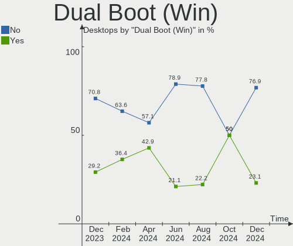
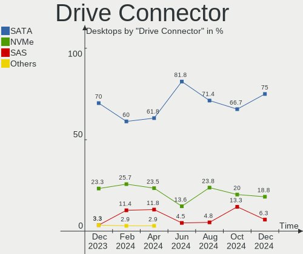
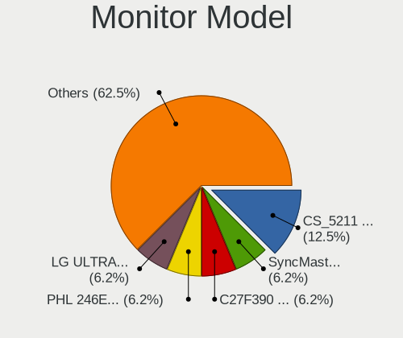
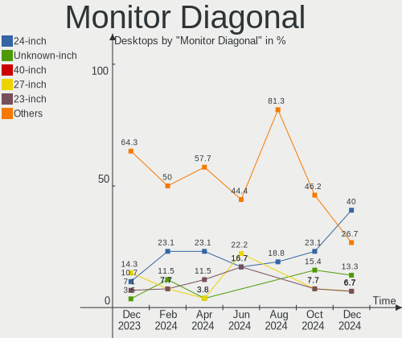

Xubuntu Hardware Trends (Desktops)
----------------------------------

A project to identify most popular hardware characteristics and track their change
over time based on data collected by Linux users at https://Linux-Hardware.org.

Anyone can contribute to this report by the [hw-probe](https://github.com/linuxhw/hw-probe) tool:

    sudo -E hw-probe -all -upload

Full-feature report is available here: https://linux-hardware.org/?view=trends&formfactor=desktop

Period: Jul, 2021.

Contents
--------

* [ System ](#system)
  - [ OS                       ](#os)
  - [ OS Family                ](#os-family)
  - [ Kernel                   ](#kernel)
  - [ Kernel Family            ](#kernel-family)
  - [ Kernel Major Ver.        ](#kernel-major-ver)
  - [ Arch                     ](#arch)
  - [ DE                       ](#de)
  - [ Display Server           ](#display-server)
  - [ Display Manager          ](#display-manager)
  - [ OS Lang                  ](#os-lang)
  - [ Boot Mode                ](#boot-mode)
  - [ Filesystem               ](#filesystem)
  - [ Part. scheme             ](#part-scheme)
  - [ Dual Boot with Linux/BSD ](#dual-boot-with-linuxbsd)
  - [ Dual Boot (Win)          ](#dual-boot-win)

* [ Board ](#board)
  - [ Vendor                   ](#vendor)
  - [ Model                    ](#model)
  - [ Model Family             ](#model-family)
  - [ MFG Year                 ](#mfg-year)
  - [ Form Factor              ](#form-factor)
  - [ Secure Boot              ](#secure-boot)
  - [ Coreboot                 ](#coreboot)
  - [ RAM Size                 ](#ram-size)
  - [ RAM Used                 ](#ram-used)
  - [ Total Drives             ](#total-drives)
  - [ Has CD-ROM               ](#has-cd-rom)
  - [ Has Ethernet             ](#has-ethernet)
  - [ Has WiFi                 ](#has-wifi)
  - [ Has Bluetooth            ](#has-bluetooth)

* [ Location ](#location)
  - [ Country                  ](#country)
  - [ City                     ](#city)

* [ Drives ](#drives)
  - [ Drive Vendor             ](#drive-vendor)
  - [ Drive Model              ](#drive-model)
  - [ HDD Vendor               ](#hdd-vendor)
  - [ SSD Vendor               ](#ssd-vendor)
  - [ Drive Kind               ](#drive-kind)
  - [ Drive Connector          ](#drive-connector)
  - [ Drive Size               ](#drive-size)
  - [ Space Total              ](#space-total)
  - [ Space Used               ](#space-used)
  - [ Malfunc. Drives          ](#malfunc-drives)
  - [ Malfunc. Drive Vendor    ](#malfunc-drive-vendor)
  - [ Malfunc. HDD Vendor      ](#malfunc-hdd-vendor)
  - [ Malfunc. Drive Kind      ](#malfunc-drive-kind)
  - [ Failed Drives            ](#failed-drives)
  - [ Failed Drive Vendor      ](#failed-drive-vendor)
  - [ Drive Status             ](#drive-status)

* [ Storage controller ](#storage-controller)
  - [ Storage Vendor           ](#storage-vendor)
  - [ Storage Model            ](#storage-model)
  - [ Storage Kind             ](#storage-kind)

* [ Processor ](#processor)
  - [ CPU Vendor               ](#cpu-vendor)
  - [ CPU Model                ](#cpu-model)
  - [ CPU Model Family         ](#cpu-model-family)
  - [ CPU Cores                ](#cpu-cores)
  - [ CPU Sockets              ](#cpu-sockets)
  - [ CPU Threads              ](#cpu-threads)
  - [ CPU Op-Modes             ](#cpu-op-modes)
  - [ CPU Microcode            ](#cpu-microcode)
  - [ CPU Microarch            ](#cpu-microarch)

* [ Graphics ](#graphics)
  - [ GPU Vendor               ](#gpu-vendor)
  - [ GPU Model                ](#gpu-model)
  - [ GPU Combo                ](#gpu-combo)
  - [ GPU Driver               ](#gpu-driver)
  - [ GPU Memory               ](#gpu-memory)

* [ Monitor ](#monitor)
  - [ Monitor Vendor           ](#monitor-vendor)
  - [ Monitor Model            ](#monitor-model)
  - [ Monitor Resolution       ](#monitor-resolution)
  - [ Monitor Diagonal         ](#monitor-diagonal)
  - [ Monitor Width            ](#monitor-width)
  - [ Aspect Ratio             ](#aspect-ratio)
  - [ Monitor Area             ](#monitor-area)
  - [ Pixel Density            ](#pixel-density)
  - [ Multiple Monitors        ](#multiple-monitors)

* [ Network ](#network)
  - [ Net Controller Vendor    ](#net-controller-vendor)
  - [ Net Controller Model     ](#net-controller-model)
  - [ Wireless Vendor          ](#wireless-vendor)
  - [ Wireless Model           ](#wireless-model)
  - [ Ethernet Vendor          ](#ethernet-vendor)
  - [ Ethernet Model           ](#ethernet-model)
  - [ Net Controller Kind      ](#net-controller-kind)
  - [ Used Controller          ](#used-controller)
  - [ NICs                     ](#nics)
  - [ IPv6                     ](#ipv6)

* [ Bluetooth ](#bluetooth)
  - [ Bluetooth Vendor         ](#bluetooth-vendor)
  - [ Bluetooth Model          ](#bluetooth-model)

* [ Sound ](#sound)
  - [ Sound Vendor             ](#sound-vendor)
  - [ Sound Model              ](#sound-model)

* [ Memory ](#memory)
  - [ Memory Vendor            ](#memory-vendor)
  - [ Memory Model             ](#memory-model)
  - [ Memory Kind              ](#memory-kind)
  - [ Memory Form Factor       ](#memory-form-factor)
  - [ Memory Size              ](#memory-size)
  - [ Memory Speed             ](#memory-speed)

* [ Printers & scanners ](#printers-&-scanners)
  - [ Printer Vendor           ](#printer-vendor)
  - [ Printer Model            ](#printer-model)
  - [ Scanner Vendor           ](#scanner-vendor)
  - [ Scanner Model            ](#scanner-model)

* [ Camera ](#camera)
  - [ Camera Vendor            ](#camera-vendor)
  - [ Camera Model             ](#camera-model)

* [ Security ](#security)
  - [ Fingerprint Vendor       ](#fingerprint-vendor)
  - [ Fingerprint Model        ](#fingerprint-model)
  - [ Chipcard Vendor          ](#chipcard-vendor)
  - [ Chipcard Model           ](#chipcard-model)

* [ Unsupported ](#unsupported)
  - [ Unsupported Devices      ](#unsupported-devices)
  - [ Unsupported Device Types ](#unsupported-device-types)

System
------

OS
--

Installed operating systems

| Name          | Desktops | Percent |
|---------------|----------|---------|
| Xubuntu 20.04 | 21       | 65.63%  |
| Xubuntu 18.04 | 6        | 18.75%  |
| Xubuntu 21.04 | 2        | 6.25%   |
| Xubuntu 16.04 | 2        | 6.25%   |
| Xubuntu 20.10 | 1        | 3.13%   |

OS Family
---------

OS without a version

| Name    | Desktops | Percent |
|---------|----------|---------|
| Xubuntu | 32       | 100%    |

Kernel
------

Version of the Linux kernel

| Version                  | Desktops | Percent |
|--------------------------|----------|---------|
| 5.4.0-77-generic         | 7        | 21.88%  |
| 5.8.0-59-generic         | 3        | 9.38%   |
| 5.4.0-80-generic         | 3        | 9.38%   |
| 5.4.0-77-lowlatency      | 3        | 9.38%   |
| 5.8.0-63-generic         | 2        | 6.25%   |
| 5.8.0-43-generic         | 2        | 6.25%   |
| 5.8.0-63-lowlatency      | 1        | 3.13%   |
| 5.8.0-55-generic         | 1        | 3.13%   |
| 5.4.0-74-generic         | 1        | 3.13%   |
| 5.4.0-72-generic         | 1        | 3.13%   |
| 5.13.4-051304-lowlatency | 1        | 3.13%   |
| 5.12.17-xanmod1          | 1        | 3.13%   |
| 5.11.0-22-generic        | 1        | 3.13%   |
| 4.4.0-210-generic        | 1        | 3.13%   |
| 4.4.0-112-generic        | 1        | 3.13%   |
| 4.15.0-151-generic       | 1        | 3.13%   |
| 4.15.0-147-lowlatency    | 1        | 3.13%   |
| 4.15.0-147-generic       | 1        | 3.13%   |

Kernel Family
-------------

Linux kernel without a distro release

| Version | Desktops | Percent |
|---------|----------|---------|
| 5.4.0   | 15       | 46.88%  |
| 5.8.0   | 9        | 28.13%  |
| 4.15.0  | 3        | 9.38%   |
| 4.4.0   | 2        | 6.25%   |
| 5.13.4  | 1        | 3.13%   |
| 5.12.17 | 1        | 3.13%   |
| 5.11.0  | 1        | 3.13%   |

Kernel Major Ver.
-----------------

Linux kernel major version

| Version | Desktops | Percent |
|---------|----------|---------|
| 5.4     | 15       | 46.88%  |
| 5.8     | 9        | 28.13%  |
| 4.15    | 3        | 9.38%   |
| 4.4     | 2        | 6.25%   |
| 5.13    | 1        | 3.13%   |
| 5.12    | 1        | 3.13%   |
| 5.11    | 1        | 3.13%   |

Arch
----

OS architecture (x86_64, i586, etc.)

| Name   | Desktops | Percent |
|--------|----------|---------|
| x86_64 | 29       | 90.63%  |
| i686   | 3        | 9.38%   |

DE
--

Desktop Environment

| Name  | Desktops | Percent |
|-------|----------|---------|
| XFCE  | 30       | 93.75%  |
| GNOME | 2        | 6.25%   |

Display Server
--------------

X11 or Wayland

| Name    | Desktops | Percent |
|---------|----------|---------|
| X11     | 31       | 96.88%  |
| Wayland | 1        | 3.13%   |

Display Manager
---------------

SDDM, LightDM, etc.

| Name    | Desktops | Percent |
|---------|----------|---------|
| Unknown | 17       | 53.13%  |
| TDM     | 13       | 40.63%  |
| GDM     | 2        | 6.25%   |

OS Lang
-------

Language

| Lang  | Desktops | Percent |
|-------|----------|---------|
| en_US | 13       | 40.63%  |
| fr_FR | 4        | 12.5%   |
| C     | 3        | 9.38%   |
| ja_JP | 2        | 6.25%   |
| en_CA | 2        | 6.25%   |
| de_DE | 2        | 6.25%   |
| ru_UA | 1        | 3.13%   |
| ru_RU | 1        | 3.13%   |
| fr_CA | 1        | 3.13%   |
| fr_BE | 1        | 3.13%   |
| es_MX | 1        | 3.13%   |
| en_GB | 1        | 3.13%   |

Boot Mode
---------

EFI or BIOS

| Mode | Desktops | Percent |
|------|----------|---------|
| BIOS | 25       | 78.13%  |
| EFI  | 7        | 21.88%  |

Filesystem
----------

Type of filesystem

| Type    | Desktops | Percent |
|---------|----------|---------|
| Ext4    | 28       | 87.5%   |
| Overlay | 3        | 9.38%   |
| Xfs     | 1        | 3.13%   |

Part. scheme
------------

Scheme of partitioning

| Type    | Desktops | Percent |
|---------|----------|---------|
| Unknown | 17       | 53.13%  |
| MBR     | 10       | 31.25%  |
| GPT     | 5        | 15.63%  |

Dual Boot with Linux/BSD
------------------------

Hosting more than one Linux/BSD

| Dual boot | Desktops | Percent |
|-----------|----------|---------|
| No        | 23       | 71.88%  |
| Yes       | 9        | 28.13%  |

Dual Boot (Win)
---------------

Hosting Linux and Windows

| Dual boot | Desktops | Percent |
|-----------|----------|---------|
| No        | 21       | 65.63%  |
| Yes       | 11       | 34.38%  |

Board
-----

Vendor
------

Motherboard manufacturer

| Name                | Desktops | Percent |
|---------------------|----------|---------|
| ASUSTek Computer    | 7        | 21.88%  |
| ASRock              | 7        | 21.88%  |
| Hewlett-Packard     | 5        | 15.63%  |
| Gigabyte Technology | 4        | 12.5%   |
| MSI                 | 3        | 9.38%   |
| WinFast             | 1        | 3.13%   |
| Lenovo              | 1        | 3.13%   |
| Intel               | 1        | 3.13%   |
| Dell                | 1        | 3.13%   |
| Apple               | 1        | 3.13%   |
| Unknown             | 1        | 3.13%   |

Model
-----

Motherboard model

| Name                               | Desktops | Percent |
|------------------------------------|----------|---------|
| WinFast 6100M2MA                   | 1        | 3.13%   |
| MSI VT493AA-ABA s5212y             | 1        | 3.13%   |
| MSI MS-7B48                        | 1        | 3.13%   |
| MSI MS-7181                        | 1        | 3.13%   |
| Lenovo 4518-a12                    | 1        | 3.13%   |
| Intel DQ67SW AAG12527-310          | 1        | 3.13%   |
| HP Z600 Workstation                | 1        | 3.13%   |
| HP Z420 Workstation                | 1        | 3.13%   |
| HP xw8600 Workstation              | 1        | 3.13%   |
| HP DC5750                          | 1        | 3.13%   |
| HP Compaq dc7700 Small Form Factor | 1        | 3.13%   |
| Gigabyte H55M-UD2H                 | 1        | 3.13%   |
| Gigabyte GA-MA74GM-S2H             | 1        | 3.13%   |
| Gigabyte F2A78M-HD2                | 1        | 3.13%   |
| Gigabyte AB350-Gaming 3            | 1        | 3.13%   |
| Dell OptiPlex 990                  | 1        | 3.13%   |
| ASUS ROG STRIX Z590-A GAMING WIFI  | 1        | 3.13%   |
| ASUS PRIME Z390-A                  | 1        | 3.13%   |
| ASUS PRIME B350-PLUS               | 1        | 3.13%   |
| ASUS M5A99X EVO R2.0               | 1        | 3.13%   |
| ASUS M3A-H/HDMI                    | 1        | 3.13%   |
| ASUS GL310AA-ABA SR5109NX          | 1        | 3.13%   |
| ASUS A68HM-K                       | 1        | 3.13%   |
| ASRock Z490 Phantom Gaming 4       | 1        | 3.13%   |
| ASRock X300M-STX                   | 1        | 3.13%   |
| ASRock J4105M                      | 1        | 3.13%   |
| ASRock H81M-HDS R2.0               | 1        | 3.13%   |
| ASRock B85M-HDS                    | 1        | 3.13%   |
| ASRock B450 Pro4                   | 1        | 3.13%   |
| ASRock 880GM-LE                    | 1        | 3.13%   |
| Apple MacPro1,1                    | 1        | 3.13%   |
| Unknown                            | 1        | 3.13%   |

Model Family
------------

Motherboard model prefix

| Name                   | Desktops | Percent |
|------------------------|----------|---------|
| ASUS PRIME             | 2        | 6.25%   |
| WinFast 6100M2MA       | 1        | 3.13%   |
| MSI VT493AA-ABA        | 1        | 3.13%   |
| MSI MS-7B48            | 1        | 3.13%   |
| MSI MS-7181            | 1        | 3.13%   |
| Lenovo 4518-a12        | 1        | 3.13%   |
| Intel DQ67SW           | 1        | 3.13%   |
| HP Z600                | 1        | 3.13%   |
| HP Z420                | 1        | 3.13%   |
| HP xw8600              | 1        | 3.13%   |
| HP DC5750              | 1        | 3.13%   |
| HP Compaq              | 1        | 3.13%   |
| Gigabyte H55M-UD2H     | 1        | 3.13%   |
| Gigabyte GA-MA74GM-S2H | 1        | 3.13%   |
| Gigabyte F2A78M-HD2    | 1        | 3.13%   |
| Gigabyte AB350-Gaming  | 1        | 3.13%   |
| Dell OptiPlex          | 1        | 3.13%   |
| ASUS ROG               | 1        | 3.13%   |
| ASUS M5A99X            | 1        | 3.13%   |
| ASUS M3A-H             | 1        | 3.13%   |
| ASUS GL310AA-ABA       | 1        | 3.13%   |
| ASUS A68HM-K           | 1        | 3.13%   |
| ASRock Z490            | 1        | 3.13%   |
| ASRock X300M-STX       | 1        | 3.13%   |
| ASRock J4105M          | 1        | 3.13%   |
| ASRock H81M-HDS        | 1        | 3.13%   |
| ASRock B85M-HDS        | 1        | 3.13%   |
| ASRock B450            | 1        | 3.13%   |
| ASRock 880GM-LE        | 1        | 3.13%   |
| Apple MacPro1          | 1        | 3.13%   |
| Unknown                | 1        | 3.13%   |

MFG Year
--------

Motherboard manufacture year

| Year | Desktops | Percent |
|------|----------|---------|
| 2011 | 5        | 15.63%  |
| 2018 | 4        | 12.5%   |
| 2020 | 3        | 9.38%   |
| 2019 | 3        | 9.38%   |
| 2009 | 3        | 9.38%   |
| 2007 | 3        | 9.38%   |
| 2014 | 2        | 6.25%   |
| 2013 | 2        | 6.25%   |
| 2006 | 2        | 6.25%   |
| 2021 | 1        | 3.13%   |
| 2016 | 1        | 3.13%   |
| 2012 | 1        | 3.13%   |
| 2010 | 1        | 3.13%   |
| 2008 | 1        | 3.13%   |

Form Factor
-----------

Physical design of the computer

| Name    | Desktops | Percent |
|---------|----------|---------|
| Desktop | 32       | 100%    |

Secure Boot
-----------

Enabled or disabled

| State    | Desktops | Percent |
|----------|----------|---------|
| Disabled | 32       | 100%    |

Coreboot
--------

Have coreboot on board

| Used | Desktops | Percent |
|------|----------|---------|
| No   | 32       | 100%    |

RAM Size
--------

Total RAM memory

| Size in GB  | Desktops | Percent |
|-------------|----------|---------|
| 8.01-16.0   | 8        | 25%     |
| 32.01-64.0  | 5        | 15.63%  |
| 3.01-4.0    | 5        | 15.63%  |
| 16.01-24.0  | 5        | 15.63%  |
| 4.01-8.0    | 3        | 9.38%   |
| 1.01-2.0    | 2        | 6.25%   |
| 0.51-1.0    | 2        | 6.25%   |
| 24.01-32.0  | 1        | 3.13%   |
| 64.01-256.0 | 1        | 3.13%   |

RAM Used
--------

Used RAM memory

| Used GB   | Desktops | Percent |
|-----------|----------|---------|
| 1.01-2.0  | 16       | 50%     |
| 0.51-1.0  | 5        | 15.63%  |
| 4.01-8.0  | 4        | 12.5%   |
| 3.01-4.0  | 4        | 12.5%   |
| 8.01-16.0 | 2        | 6.25%   |
| 2.01-3.0  | 1        | 3.13%   |

Total Drives
------------

Number of drives on board

| Drives | Desktops | Percent |
|--------|----------|---------|
| 1      | 14       | 43.75%  |
| 3      | 8        | 25%     |
| 2      | 5        | 15.63%  |
| 5      | 2        | 6.25%   |
| 10     | 1        | 3.13%   |
| 6      | 1        | 3.13%   |
| 4      | 1        | 3.13%   |

Has CD-ROM
----------

Has CD-ROM on board

| Presented | Desktops | Percent |
|-----------|----------|---------|
| Yes       | 17       | 53.13%  |
| No        | 15       | 46.88%  |

Has Ethernet
------------

Has Ethernet on board

| Presented | Desktops | Percent |
|-----------|----------|---------|
| Yes       | 32       | 100%    |

Has WiFi
--------

Has WiFi module

| Presented | Desktops | Percent |
|-----------|----------|---------|
| No        | 22       | 68.75%  |
| Yes       | 10       | 31.25%  |

Has Bluetooth
-------------

Has Bluetooth module

| Presented | Desktops | Percent |
|-----------|----------|---------|
| No        | 26       | 81.25%  |
| Yes       | 6        | 18.75%  |

Location
--------

Country
-------

Geographic location (country)

| Country     | Desktops | Percent |
|-------------|----------|---------|
| USA         | 8        | 25%     |
| Germany     | 5        | 15.63%  |
| France      | 4        | 12.5%   |
| Canada      | 3        | 9.38%   |
| Japan       | 2        | 6.25%   |
| Ukraine     | 1        | 3.13%   |
| UK          | 1        | 3.13%   |
| Thailand    | 1        | 3.13%   |
| Russia      | 1        | 3.13%   |
| Netherlands | 1        | 3.13%   |
| Ireland     | 1        | 3.13%   |
| Guatemala   | 1        | 3.13%   |
| Egypt       | 1        | 3.13%   |
| Brazil      | 1        | 3.13%   |
| Belgium     | 1        | 3.13%   |

City
----

Geographic location (city)

| City                 | Desktops | Percent |
|----------------------|----------|---------|
| Frankfurt am Main    | 2        | 6.25%   |
| Youngstown           | 1        | 3.13%   |
| Villefranche-sur-Mer | 1        | 3.13%   |
| Vaassen              | 1        | 3.13%   |
| Toulon               | 1        | 3.13%   |
| St Helens            | 1        | 3.13%   |
| Ridgecrest           | 1        | 3.13%   |
| Portland             | 1        | 3.13%   |
| North Vancouver      | 1        | 3.13%   |
| Nashville            | 1        | 3.13%   |
| Munich               | 1        | 3.13%   |
| Moscow               | 1        | 3.13%   |
| Montreal             | 1        | 3.13%   |
| Mons                 | 1        | 3.13%   |
| Mariupol             | 1        | 3.13%   |
| Lannion              | 1        | 3.13%   |
| Kanoya               | 1        | 3.13%   |
| Indaiatuba           | 1        | 3.13%   |
| Guatemala City       | 1        | 3.13%   |
| G?¶ttingen           | 1        | 3.13%   |
| Galway               | 1        | 3.13%   |
| Etobicoke            | 1        | 3.13%   |
| Cottage Grove        | 1        | 3.13%   |
| Colorado Springs     | 1        | 3.13%   |
| Cairo                | 1        | 3.13%   |
| Berlin               | 1        | 3.13%   |
| Bangkok              | 1        | 3.13%   |
| ??tsu                | 1        | 3.13%   |
| Atlanta              | 1        | 3.13%   |
| Amiens               | 1        | 3.13%   |
| Alpine               | 1        | 3.13%   |

Drives
------

Drive Vendor
------------

Hard drive vendors

| Vendor              | Desktops | Drives | Percent |
|---------------------|----------|--------|---------|
| Seagate             | 16       | 20     | 26.67%  |
| WDC                 | 12       | 15     | 20%     |
| Samsung Electronics | 8        | 12     | 13.33%  |
| Toshiba             | 3        | 7      | 5%      |
| Hitachi             | 3        | 4      | 5%      |
| Kingston            | 2        | 2      | 3.33%   |
| Crucial             | 2        | 2      | 3.33%   |
| A-DATA Technology   | 2        | 2      | 3.33%   |
| XPG                 | 1        | 1      | 1.67%   |
| Transcend           | 1        | 1      | 1.67%   |
| Team                | 1        | 1      | 1.67%   |
| SPCC                | 1        | 1      | 1.67%   |
| SMI                 | 1        | 1      | 1.67%   |
| Silicon Motion      | 1        | 1      | 1.67%   |
| PNY                 | 1        | 1      | 1.67%   |
| Micron Technology   | 1        | 1      | 1.67%   |
| Maxtor              | 1        | 1      | 1.67%   |
| Lite-On             | 1        | 1      | 1.67%   |
| Intel               | 1        | 1      | 1.67%   |
| Hewlett-Packard     | 1        | 1      | 1.67%   |

Drive Model
-----------

Hard drive models

| Model                                | Desktops | Percent |
|--------------------------------------|----------|---------|
| Seagate ST380815AS 80GB              | 3        | 4.35%   |
| Samsung SSD 850 EVO 250GB            | 2        | 2.9%    |
| Samsung SSD 840 EVO 250GB            | 2        | 2.9%    |
| XPG NVMe SSD Drive 1024GB            | 1        | 1.45%   |
| WDC WDS250G2B0C-00PXH0 250GB         | 1        | 1.45%   |
| WDC WDS200T2B0B-00YS70 2TB SSD       | 1        | 1.45%   |
| WDC WDS100T2B0A-00SM50 1TB SSD       | 1        | 1.45%   |
| WDC WD80EZAZ-11TDBA0 8TB             | 1        | 1.45%   |
| WDC WD7502ABYS-02A6B0 752GB          | 1        | 1.45%   |
| WDC WD5000AAKS-00UU3A0 500GB         | 1        | 1.45%   |
| WDC WD5000AACS-00ZUB0 500GB          | 1        | 1.45%   |
| WDC WD400BD-60LTA0 40GB              | 1        | 1.45%   |
| WDC WD2500JS-60NCB2 250GB            | 1        | 1.45%   |
| WDC WD20EZRZ-22Z5HB0 2TB             | 1        | 1.45%   |
| WDC WD20EURX-25T0FY0 2TB             | 1        | 1.45%   |
| WDC WD10EZEX-08WN4A0 1TB             | 1        | 1.45%   |
| WDC WD10EZEX-00BN5A0 1TB             | 1        | 1.45%   |
| WDC WD10EARS-00MVWB0 1TB             | 1        | 1.45%   |
| WDC WD1002FBYS-18W8B1 1TB            | 1        | 1.45%   |
| Transcend SSD 4GB                    | 1        | 1.45%   |
| Toshiba MQ04ABD200 2TB               | 1        | 1.45%   |
| Toshiba HDWE160 6TB                  | 1        | 1.45%   |
| Toshiba HDWE150 5TB                  | 1        | 1.45%   |
| Toshiba HDWD120 2TB                  | 1        | 1.45%   |
| Team TEAML5Lite3D1T 1TB SSD          | 1        | 1.45%   |
| SPCC Solid State Disk 240GB          | 1        | 1.45%   |
| SMI DISK 506GB                       | 1        | 1.45%   |
| Silicon Motion NVMe SSD Drive 512GB  | 1        | 1.45%   |
| Seagate ST98823AS 80GB               | 1        | 1.45%   |
| Seagate ST8000DM004-2CX188 8TB       | 1        | 1.45%   |
| Seagate ST8000DM004-2CX1 8TB         | 1        | 1.45%   |
| Seagate ST4000DM004-2CV104 4TB       | 1        | 1.45%   |
| Seagate ST3500418ASQ 500GB           | 1        | 1.45%   |
| Seagate ST3500418AS 500GB            | 1        | 1.45%   |
| Seagate ST3500414CS 500GB            | 1        | 1.45%   |
| Seagate ST3250820AS 250GB            | 1        | 1.45%   |
| Seagate ST3250310AS 250GB            | 1        | 1.45%   |
| Seagate ST31000528AS 1TB             | 1        | 1.45%   |
| Seagate ST31000524AS 1TB             | 1        | 1.45%   |
| Seagate ST16000NM001G-2KK103 16TB    | 1        | 1.45%   |
| Seagate ST1000DX001-1NS162-SSHD 1TB  | 1        | 1.45%   |
| Seagate ST1000DM010-2EP102 1TB       | 1        | 1.45%   |
| Samsung SSD 860 EVO 1TB              | 1        | 1.45%   |
| Samsung SSD 850 EVO 500GB            | 1        | 1.45%   |
| Samsung SSD 840 Series 120GB         | 1        | 1.45%   |
| Samsung NVMe SSD Drive 500GB         | 1        | 1.45%   |
| Samsung NVMe SSD Drive 1TB           | 1        | 1.45%   |
| Samsung MZ7PD128HCFV-000H1 128GB SSD | 1        | 1.45%   |
| Samsung HD252HJ 250GB                | 1        | 1.45%   |
| Samsung HD204UI 2TB                  | 1        | 1.45%   |
| PNY CS900 500GB SSD                  | 1        | 1.45%   |
| Micron MTFDDAK256MAM-1K1 256GB SSD   | 1        | 1.45%   |
| Maxtor 6Y120M0 122GB                 | 1        | 1.45%   |
| Lite-On NVMe SSD Drive 128GB         | 1        | 1.45%   |
| Kingston SV300S37A120G 120GB SSD     | 1        | 1.45%   |
| Kingston SA400S37480G 480GB SSD      | 1        | 1.45%   |
| Intel SSDSC2BB080G4 80GB             | 1        | 1.45%   |
| Hitachi HUA723030ALA641 3TB          | 1        | 1.45%   |
| Hitachi HUA723020ALA641 2TB          | 1        | 1.45%   |
| Hitachi HDS721010CLA332 1TB          | 1        | 1.45%   |

HDD Vendor
----------

Hard disk drive vendors

| Vendor              | Desktops | Drives | Percent |
|---------------------|----------|--------|---------|
| Seagate             | 16       | 20     | 45.71%  |
| WDC                 | 10       | 12     | 28.57%  |
| Toshiba             | 3        | 7      | 8.57%   |
| Hitachi             | 3        | 4      | 8.57%   |
| Samsung Electronics | 2        | 2      | 5.71%   |
| Maxtor              | 1        | 1      | 2.86%   |

SSD Vendor
----------

Solid state drive vendors

| Vendor              | Desktops | Drives | Percent |
|---------------------|----------|--------|---------|
| Samsung Electronics | 5        | 8      | 27.78%  |
| Kingston            | 2        | 2      | 11.11%  |
| Crucial             | 2        | 2      | 11.11%  |
| WDC                 | 1        | 2      | 5.56%   |
| Transcend           | 1        | 1      | 5.56%   |
| Team                | 1        | 1      | 5.56%   |
| SPCC                | 1        | 1      | 5.56%   |
| PNY                 | 1        | 1      | 5.56%   |
| Micron Technology   | 1        | 1      | 5.56%   |
| Intel               | 1        | 1      | 5.56%   |
| Hewlett-Packard     | 1        | 1      | 5.56%   |
| A-DATA Technology   | 1        | 1      | 5.56%   |

Drive Kind
----------

HDD or SSD

| Kind    | Desktops | Drives | Percent |
|---------|----------|--------|---------|
| HDD     | 26       | 46     | 54.17%  |
| SSD     | 15       | 22     | 31.25%  |
| NVMe    | 6        | 7      | 12.5%   |
| Unknown | 1        | 1      | 2.08%   |

Drive Connector
---------------

SATA, SAS, NVMe, etc.

| Type | Desktops | Drives | Percent |
|------|----------|--------|---------|
| SATA | 31       | 69     | 83.78%  |
| NVMe | 6        | 7      | 16.22%  |

Drive Size
----------

Size of hard drive

| Size in TB | Desktops | Drives | Percent |
|------------|----------|--------|---------|
| 0.01-0.5   | 21       | 31     | 47.73%  |
| 0.51-1.0   | 11       | 15     | 25%     |
| 1.01-2.0   | 6        | 7      | 13.64%  |
| 4.01-10.0  | 3        | 11     | 6.82%   |
| 3.01-4.0   | 1        | 1      | 2.27%   |
| 2.01-3.0   | 1        | 2      | 2.27%   |
| 10.01-20.0 | 1        | 1      | 2.27%   |

Space Total
-----------

Amount of disk space available on the file system

| Size in GB     | Desktops | Percent |
|----------------|----------|---------|
| 251-500        | 7        | 21.88%  |
| 101-250        | 5        | 15.63%  |
| 1001-2000      | 4        | 12.5%   |
| More than 3000 | 3        | 9.38%   |
| 2001-3000      | 3        | 9.38%   |
| 501-1000       | 3        | 9.38%   |
| 51-100         | 3        | 9.38%   |
| Unknown        | 2        | 6.25%   |
| 21-50          | 1        | 3.13%   |
| 1-20           | 1        | 3.13%   |

Space Used
----------

Amount of used disk space

| Used GB        | Desktops | Percent |
|----------------|----------|---------|
| 21-50          | 7        | 21.88%  |
| 501-1000       | 5        | 15.63%  |
| 101-250        | 4        | 12.5%   |
| 1-20           | 4        | 12.5%   |
| More than 3000 | 3        | 9.38%   |
| 51-100         | 3        | 9.38%   |
| 251-500        | 2        | 6.25%   |
| Unknown        | 2        | 6.25%   |
| 2001-3000      | 1        | 3.13%   |
| 1001-2000      | 1        | 3.13%   |

Malfunc. Drives
---------------

Drive models with a malfunction

| Model                    | Desktops | Drives | Percent |
|--------------------------|----------|--------|---------|
| WDC WD10EARS-00MVWB0 1TB | 1        | 1      | 50%     |
| Seagate ST380815AS 80GB  | 1        | 1      | 50%     |

Malfunc. Drive Vendor
---------------------

Vendors of faulty drives

| Vendor  | Desktops | Drives | Percent |
|---------|----------|--------|---------|
| WDC     | 1        | 1      | 50%     |
| Seagate | 1        | 1      | 50%     |

Malfunc. HDD Vendor
-------------------

Vendors of faulty HDD drives

| Vendor  | Desktops | Drives | Percent |
|---------|----------|--------|---------|
| WDC     | 1        | 1      | 50%     |
| Seagate | 1        | 1      | 50%     |

Malfunc. Drive Kind
-------------------

Kinds of faulty drives

| Kind | Desktops | Drives | Percent |
|------|----------|--------|---------|
| HDD  | 2        | 2      | 100%    |

Failed Drives
-------------

Failed drive models

Zero info for selected period =(

Failed Drive Vendor
-------------------

Failed drive vendors

Zero info for selected period =(

Drive Status
------------

Number of failed and malfunc. drives

| Status   | Desktops | Drives | Percent |
|----------|----------|--------|---------|
| Detected | 19       | 45     | 57.58%  |
| Works    | 12       | 29     | 36.36%  |
| Malfunc  | 2        | 2      | 6.06%   |

Storage controller
------------------

Storage Vendor
--------------

Storage controller vendors

| Vendor                    | Desktops | Percent |
|---------------------------|----------|---------|
| Intel                     | 19       | 40.43%  |
| AMD                       | 11       | 23.4%   |
| Samsung Electronics       | 2        | 4.26%   |
| LSI Logic / Symbios Logic | 2        | 4.26%   |
| Broadcom / LSI            | 2        | 4.26%   |
| ASMedia Technology        | 2        | 4.26%   |
| ADATA Technology          | 2        | 4.26%   |
| VIA Technologies          | 1        | 2.13%   |
| Silicon Motion            | 1        | 2.13%   |
| Sandisk                   | 1        | 2.13%   |
| Nvidia                    | 1        | 2.13%   |
| Marvell Technology Group  | 1        | 2.13%   |
| Lite-On Technology        | 1        | 2.13%   |
| JMicron Technology        | 1        | 2.13%   |

Storage Model
-------------

Storage controller models

| Model                                                                          | Desktops | Percent |
|--------------------------------------------------------------------------------|----------|---------|
| AMD FCH SATA Controller [AHCI mode]                                            | 6        | 9.68%   |
| Intel SATA Controller [RAID mode]                                              | 3        | 4.84%   |
| AMD SB7x0/SB8x0/SB9x0 SATA Controller [IDE mode]                               | 3        | 4.84%   |
| AMD SB7x0/SB8x0/SB9x0 IDE Controller                                           | 3        | 4.84%   |
| Samsung NVMe SSD Controller SM981/PM981/PM983                                  | 2        | 3.23%   |
| Intel NM10/ICH7 Family SATA Controller [IDE mode]                              | 2        | 3.23%   |
| Intel 8 Series/C220 Series Chipset Family 6-port SATA Controller 1 [AHCI mode] | 2        | 3.23%   |
| Intel 631xESB/632xESB/3100 Chipset SATA IDE Controller                         | 2        | 3.23%   |
| Intel 631xESB/632xESB IDE Controller                                           | 2        | 3.23%   |
| Intel 6 Series/C200 Series Chipset Family 6 port Desktop SATA AHCI Controller  | 2        | 3.23%   |
| ASMedia ASM1062 Serial ATA Controller                                          | 2        | 3.23%   |
| AMD 300 Series Chipset SATA Controller                                         | 2        | 3.23%   |
| ADATA XPG SX8200 Pro PCIe Gen3x4 M.2 2280 Solid State Drive                    | 2        | 3.23%   |
| VIA VT82C586A/B/VT82C686/A/B/VT823x/A/C PIPC Bus Master IDE                    | 1        | 1.61%   |
| VIA VIA VT6420 SATA RAID Controller                                            | 1        | 1.61%   |
| Silicon Motion SM2263EN/SM2263XT SSD Controller                                | 1        | 1.61%   |
| Sandisk WD Blue SN550 NVMe SSD                                                 | 1        | 1.61%   |
| Nvidia MCP51 Serial ATA Controller                                             | 1        | 1.61%   |
| Nvidia MCP51 IDE                                                               | 1        | 1.61%   |
| Marvell Group 88SE9215 PCIe 2.0 x1 4-port SATA 6 Gb/s Controller               | 1        | 1.61%   |
| LSI Logic / Symbios Logic 53c810                                               | 1        | 1.61%   |
| LSI Logic / Symbios Logic 53c1030 PCI-X Fusion-MPT Dual Ultra320 SCSI          | 1        | 1.61%   |
| Lite-On M8Pe Series NVMe SSD                                                   | 1        | 1.61%   |
| JMicron JMB368 IDE controller                                                  | 1        | 1.61%   |
| Intel Comet Lake SATA AHCI Controller                                          | 1        | 1.61%   |
| Intel Celeron/Pentium Silver Processor SATA Controller                         | 1        | 1.61%   |
| Intel C602 chipset 4-Port SATA Storage Control Unit                            | 1        | 1.61%   |
| Intel C600/X79 series chipset SATA RAID Controller                             | 1        | 1.61%   |
| Intel C600/X79 series chipset IDE-r Controller                                 | 1        | 1.61%   |
| Intel 82801H (ICH8 Family) 4 port SATA Controller [IDE mode]                   | 1        | 1.61%   |
| Intel 82801G (ICH7 Family) IDE Controller                                      | 1        | 1.61%   |
| Intel 82801EB (ICH5) SATA Controller                                           | 1        | 1.61%   |
| Intel 6 Series/C200 Series Chipset Family IDE-r Controller                     | 1        | 1.61%   |
| Intel 500 Series Chipset Family SATA AHCI Controller                           | 1        | 1.61%   |
| Intel 5 Series/3400 Series Chipset 6 port SATA AHCI Controller                 | 1        | 1.61%   |
| Intel 200 Series PCH SATA controller [AHCI mode]                               | 1        | 1.61%   |
| Broadcom / LSI SAS2008 PCI-Express Fusion-MPT SAS-2 [Falcon]                   | 1        | 1.61%   |
| Broadcom / LSI SAS1068 PCI-X Fusion-MPT SAS                                    | 1        | 1.61%   |
| AMD SB7x0/SB8x0/SB9x0 SATA Controller [AHCI mode]                              | 1        | 1.61%   |
| AMD SB600 Non-Raid-5 SATA                                                      | 1        | 1.61%   |
| AMD SB600 IDE                                                                  | 1        | 1.61%   |
| AMD 400 Series Chipset SATA Controller                                         | 1        | 1.61%   |

Storage Kind
------------

Kind of storage controller (IDE, SATA, NVMe, SAS, ...)

| Kind | Desktops | Percent |
|------|----------|---------|
| SATA | 21       | 42%     |
| IDE  | 15       | 30%     |
| NVMe | 6        | 12%     |
| RAID | 5        | 10%     |
| SCSI | 2        | 4%      |
| SAS  | 1        | 2%      |

Processor
---------

CPU Vendor
----------

Processor vendors

| Vendor | Desktops | Percent |
|--------|----------|---------|
| Intel  | 19       | 59.38%  |
| AMD    | 13       | 40.63%  |

CPU Model
---------

Processor models

| Model                                       | Desktops | Percent |
|---------------------------------------------|----------|---------|
| AMD Phenom II X4 955 Processor              | 2        | 6.25%   |
| Intel Xeon CPU X5670 @ 2.93GHz              | 1        | 3.13%   |
| Intel Xeon CPU E5410 @ 2.33GHz              | 1        | 3.13%   |
| Intel Xeon CPU E5-1620 0 @ 3.60GHz          | 1        | 3.13%   |
| Intel Xeon CPU 5150 @ 2.66GHz               | 1        | 3.13%   |
| Intel Pentium Dual-Core CPU E5200 @ 2.50GHz | 1        | 3.13%   |
| Intel Pentium D CPU 3.00GHz                 | 1        | 3.13%   |
| Intel Pentium CPU G850 @ 2.90GHz            | 1        | 3.13%   |
| Intel Pentium 4 CPU 3.20GHz                 | 1        | 3.13%   |
| Intel Pentium 4 CPU 3.00GHz                 | 1        | 3.13%   |
| Intel Core i9-9900K CPU @ 3.60GHz           | 1        | 3.13%   |
| Intel Core i7-8700K CPU @ 3.70GHz           | 1        | 3.13%   |
| Intel Core i7-4790 CPU @ 3.60GHz            | 1        | 3.13%   |
| Intel Core i5-4440 CPU @ 3.10GHz            | 1        | 3.13%   |
| Intel Core i5-2500 CPU @ 3.30GHz            | 1        | 3.13%   |
| Intel Core i5-2400 CPU @ 3.10GHz            | 1        | 3.13%   |
| Intel Core i5-10400 CPU @ 2.90GHz           | 1        | 3.13%   |
| Intel Core i3 CPU 530 @ 2.93GHz             | 1        | 3.13%   |
| Intel Celeron J4105 CPU @ 1.50GHz           | 1        | 3.13%   |
| Intel 11th Gen Core i9-11900K @ 3.50GHz     | 1        | 3.13%   |
| AMD Ryzen 5 PRO 4650G with Radeon Graphics  | 1        | 3.13%   |
| AMD Ryzen 5 2600 Six-Core Processor         | 1        | 3.13%   |
| AMD Ryzen 5 2400G with Radeon Vega Graphics | 1        | 3.13%   |
| AMD Ryzen 5 1600 Six-Core Processor         | 1        | 3.13%   |
| AMD FX-6350 Six-Core Processor              | 1        | 3.13%   |
| AMD Athlon X4 845 Quad Core Processor       | 1        | 3.13%   |
| AMD Athlon II X2 240 Processor              | 1        | 3.13%   |
| AMD Athlon Dual Core Processor 4850e        | 1        | 3.13%   |
| AMD Athlon 64 X2 Dual Core Processor 3800+  | 1        | 3.13%   |
| AMD Athlon 64 Processor 3400+               | 1        | 3.13%   |
| AMD A6 PRO-7400B R5, 6 Compute Cores 2C+4G  | 1        | 3.13%   |

CPU Model Family
----------------

Processor model prefix

| Model                   | Desktops | Percent |
|-------------------------|----------|---------|
| Intel Xeon              | 4        | 12.5%   |
| Intel Core i5           | 4        | 12.5%   |
| AMD Ryzen 5             | 3        | 9.38%   |
| Intel Pentium 4         | 2        | 6.25%   |
| Intel Core i7           | 2        | 6.25%   |
| AMD Phenom II X4        | 2        | 6.25%   |
| Other                   | 1        | 3.13%   |
| Intel Pentium Dual-Core | 1        | 3.13%   |
| Intel Pentium D         | 1        | 3.13%   |
| Intel Pentium           | 1        | 3.13%   |
| Intel Core i9           | 1        | 3.13%   |
| Intel Core i3           | 1        | 3.13%   |
| Intel Celeron           | 1        | 3.13%   |
| AMD Ryzen 5 PRO         | 1        | 3.13%   |
| AMD FX                  | 1        | 3.13%   |
| AMD Athlon X4           | 1        | 3.13%   |
| AMD Athlon II X2        | 1        | 3.13%   |
| AMD Athlon Dual Core    | 1        | 3.13%   |
| AMD Athlon 64 X2        | 1        | 3.13%   |
| AMD Athlon 64           | 1        | 3.13%   |
| AMD A6                  | 1        | 3.13%   |

CPU Cores
---------

Number of processor cores

| Number | Desktops | Percent |
|--------|----------|---------|
| 4      | 10       | 31.25%  |
| 2      | 8        | 25%     |
| 6      | 5        | 15.63%  |
| 1      | 4        | 12.5%   |
| 8      | 3        | 9.38%   |
| 12     | 1        | 3.13%   |
| 3      | 1        | 3.13%   |

CPU Sockets
-----------

Number of sockets

| Number | Desktops | Percent |
|--------|----------|---------|
| 1      | 29       | 90.63%  |
| 2      | 3        | 9.38%   |

CPU Threads
-----------

Threads per core (Hyper-Threading)

| Number | Desktops | Percent |
|--------|----------|---------|
| 2      | 17       | 53.13%  |
| 1      | 15       | 46.88%  |

CPU Op-Modes
------------

CPU Operation Modes (32-bit, 64-bit)

| Op mode        | Desktops | Percent |
|----------------|----------|---------|
| 32-bit, 64-bit | 32       | 100%    |

CPU Microcode
-------------

Microcode number

| Number     | Desktops | Percent |
|------------|----------|---------|
| Unknown    | 8        | 25%     |
| 0x206a7    | 3        | 9.38%   |
| 0xf65      | 2        | 6.25%   |
| 0x306c3    | 2        | 6.25%   |
| 0x1067a    | 2        | 6.25%   |
| 0x010000c8 | 2        | 6.25%   |
| 0xa0671    | 1        | 3.13%   |
| 0xa0653    | 1        | 3.13%   |
| 0x906ed    | 1        | 3.13%   |
| 0x6f6      | 1        | 3.13%   |
| 0x206d7    | 1        | 3.13%   |
| 0x206c2    | 1        | 3.13%   |
| 0x20652    | 1        | 3.13%   |
| 0x08600106 | 1        | 3.13%   |
| 0x0800820d | 1        | 3.13%   |
| 0x08001138 | 1        | 3.13%   |
| 0x06006113 | 1        | 3.13%   |
| 0x06003106 | 1        | 3.13%   |
| 0x06000852 | 1        | 3.13%   |

CPU Microarch
-------------

Microarchitecture

| Name          | Desktops | Percent |
|---------------|----------|---------|
| SandyBridge   | 4        | 12.5%   |
| NetBurst      | 3        | 9.38%   |
| K8 Hammer     | 3        | 9.38%   |
| K10           | 3        | 9.38%   |
| Zen           | 2        | 6.25%   |
| Westmere      | 2        | 6.25%   |
| Penryn        | 2        | 6.25%   |
| KabyLake      | 2        | 6.25%   |
| Haswell       | 2        | 6.25%   |
| Zen+          | 1        | 3.13%   |
| Zen 2         | 1        | 3.13%   |
| Steamroller   | 1        | 3.13%   |
| Piledriver    | 1        | 3.13%   |
| Goldmont plus | 1        | 3.13%   |
| Excavator     | 1        | 3.13%   |
| Core          | 1        | 3.13%   |
| CometLake     | 1        | 3.13%   |
| Unknown       | 1        | 3.13%   |

Graphics
--------

GPU Vendor
----------

Vendors of graphics cards

| Vendor | Desktops | Percent |
|--------|----------|---------|
| Nvidia | 15       | 45.45%  |
| Intel  | 11       | 33.33%  |
| AMD    | 7        | 21.21%  |

GPU Model
---------

Graphics card models

| Model                                                                       | Desktops | Percent |
|-----------------------------------------------------------------------------|----------|---------|
| Nvidia GK208B [GeForce GT 710]                                              | 2        | 6.06%   |
| Intel Xeon E3-1200 v3/4th Gen Core Processor Integrated Graphics Controller | 2        | 6.06%   |
| Intel 2nd Generation Core Processor Family Integrated Graphics Controller   | 2        | 6.06%   |
| Nvidia TU106 [GeForce RTX 2060 SUPER]                                       | 1        | 3.03%   |
| Nvidia TU102 [GeForce RTX 2080 Ti Rev. A]                                   | 1        | 3.03%   |
| Nvidia NV31 [GeForce FX 5600]                                               | 1        | 3.03%   |
| Nvidia GT218 [GeForce 210]                                                  | 1        | 3.03%   |
| Nvidia GP108 [GeForce GT 1030]                                              | 1        | 3.03%   |
| Nvidia GP106 [GeForce GTX 1060 6GB]                                         | 1        | 3.03%   |
| Nvidia GP106 [GeForce GTX 1060 3GB]                                         | 1        | 3.03%   |
| Nvidia GM206 [GeForce GTX 950]                                              | 1        | 3.03%   |
| Nvidia GK208 [GeForce GT 630 Rev. 2]                                        | 1        | 3.03%   |
| Nvidia GK106GL [Quadro K4000]                                               | 1        | 3.03%   |
| Nvidia GK104 [GeForce GTX 670]                                              | 1        | 3.03%   |
| Nvidia G86 [GeForce 8500 GT]                                                | 1        | 3.03%   |
| Nvidia G84GL [Quadro FX 1700]                                               | 1        | 3.03%   |
| Intel GeminiLake [UHD Graphics 600]                                         | 1        | 3.03%   |
| Intel Core Processor Integrated Graphics Controller                         | 1        | 3.03%   |
| Intel CometLake-S GT2 [UHD Graphics 630]                                    | 1        | 3.03%   |
| Intel 82Q963/Q965 Integrated Graphics Controller                            | 1        | 3.03%   |
| Intel 82G33/G31 Express Integrated Graphics Controller                      | 1        | 3.03%   |
| Intel 82945G/GZ Integrated Graphics Controller                              | 1        | 3.03%   |
| Intel 82865G Integrated Graphics Controller                                 | 1        | 3.03%   |
| AMD Turks XT [Radeon HD 6670/7670]                                          | 1        | 3.03%   |
| AMD RS780 [Radeon HD 3200]                                                  | 1        | 3.03%   |
| AMD RS740 [Radeon 2100]                                                     | 1        | 3.03%   |
| AMD Renoir                                                                  | 1        | 3.03%   |
| AMD Juniper XT [Radeon HD 5770]                                             | 1        | 3.03%   |
| AMD Curacao PRO [Radeon R7 370 / R9 270/370 OEM]                            | 1        | 3.03%   |
| AMD Baffin [Radeon RX 460/560D / Pro 450/455/460/555/555X/560/560X]         | 1        | 3.03%   |

GPU Combo
---------

Combinations of graphics cards

| Name       | Desktops | Percent |
|------------|----------|---------|
| 1 x Nvidia | 15       | 46.88%  |
| 1 x Intel  | 10       | 31.25%  |
| 1 x AMD    | 7        | 21.88%  |

GPU Driver
----------

Free vs proprietary

| Driver      | Desktops | Percent |
|-------------|----------|---------|
| Free        | 25       | 78.13%  |
| Proprietary | 5        | 15.63%  |
| Unknown     | 2        | 6.25%   |

GPU Memory
----------

Total video memory

| Size in GB | Desktops | Percent |
|------------|----------|---------|
| Unknown    | 11       | 34.38%  |
| 1.01-2.0   | 6        | 18.75%  |
| 0.51-1.0   | 5        | 15.63%  |
| 0.01-0.5   | 5        | 15.63%  |
| 2.01-3.0   | 2        | 6.25%   |
| 5.01-6.0   | 1        | 3.13%   |
| 3.01-4.0   | 1        | 3.13%   |
| 8.01-16.0  | 1        | 3.13%   |

Monitor
-------

Monitor Vendor
--------------

Monitor vendors

| Vendor               | Desktops | Percent |
|----------------------|----------|---------|
| Dell                 | 5        | 15.15%  |
| Samsung Electronics  | 4        | 12.12%  |
| Hewlett-Packard      | 3        | 9.09%   |
| HannStar             | 3        | 9.09%   |
| Goldstar             | 3        | 9.09%   |
| Panasonic            | 2        | 6.06%   |
| NEC Computers        | 2        | 6.06%   |
| Iiyama               | 2        | 6.06%   |
| ViewSonic            | 1        | 3.03%   |
| Unknown (XXX)        | 1        | 3.03%   |
| Toshiba              | 1        | 3.03%   |
| Seiki                | 1        | 3.03%   |
| Philips              | 1        | 3.03%   |
| IOD                  | 1        | 3.03%   |
| BenQ                 | 1        | 3.03%   |
| Ancor Communications | 1        | 3.03%   |
| Acer                 | 1        | 3.03%   |

Monitor Model
-------------

Monitor models

| Model                                                                | Desktops | Percent |
|----------------------------------------------------------------------|----------|---------|
| HannStar Hanns.G Hi221 HSD2469 1680x1050 474x297mm 22.0-inch         | 2        | 5.88%   |
| ViewSonic VX3211 SERIES VSCF534 1920x1080 698x392mm 31.5-inch        | 1        | 2.94%   |
| Unknown (XXX) 1772ED XXX1772 1280x1024 320x250mm 16.0-inch           | 1        | 2.94%   |
| Toshiba LCD Monitor LCD1775 1280x1024 338x270mm 17.0-inch            | 1        | 2.94%   |
| Seiki SE29HY34 SEK9333 1366x768 700x390mm 31.5-inch                  | 1        | 2.94%   |
| Samsung Electronics SyncMaster SAM00A1 1280x1024 340x270mm 17.1-inch | 1        | 2.94%   |
| Samsung Electronics S22F350 SAM0D1A 1920x1080 480x270mm 21.7-inch    | 1        | 2.94%   |
| Samsung Electronics LCD Monitor SAM029D 1360x768                     | 1        | 2.94%   |
| Samsung Electronics C27R504 SAM0F9D 1920x1080 598x336mm 27.0-inch    | 1        | 2.94%   |
| Philips 201E PHLC033 1600x900 443x249mm 20.0-inch                    | 1        | 2.94%   |
| Panasonic TV MEIC13D 1920x540 708x398mm 32.0-inch                    | 1        | 2.94%   |
| Panasonic TV MEIA296 1920x1080 1280x720mm 57.8-inch                  | 1        | 2.94%   |
| NEC Computers LCD2090UXi NEC66B0 1600x1200 408x306mm 20.1-inch       | 1        | 2.94%   |
| NEC Computers LCD1990SXi NEC66AC 1280x1024 376x301mm 19.0-inch       | 1        | 2.94%   |
| IOD LCD-A176G IOD1150 1280x1024 338x270mm 17.0-inch                  | 1        | 2.94%   |
| Iiyama PLE2003WS IVM5398 1680x1050 434x270mm 20.1-inch               | 1        | 2.94%   |
| Iiyama PL2492H IVM612F 1920x1080 530x300mm 24.0-inch                 | 1        | 2.94%   |
| Hewlett-Packard V24b HPN353F 1920x1080 530x300mm 24.0-inch           | 1        | 2.94%   |
| Hewlett-Packard LP2065 HWP0A72 1600x1200 408x306mm 20.1-inch         | 1        | 2.94%   |
| Hewlett-Packard 27o HPN342B 1920x1080 600x340mm 27.2-inch            | 1        | 2.94%   |
| HannStar Hanns.G HW191 HSD8991 1440x900 408x255mm 18.9-inch          | 1        | 2.94%   |
| Goldstar W2252 GSM567E 1680x1050 474x296mm 22.0-inch                 | 1        | 2.94%   |
| Goldstar 27EA53 GSM59AD 1920x1080 600x340mm 27.2-inch                | 1        | 2.94%   |
| Goldstar 23EA63 GSM598C 1920x1080 510x290mm 23.1-inch                | 1        | 2.94%   |
| Dell U2312HM DEL4072 1920x1080 510x290mm 23.1-inch                   | 1        | 2.94%   |
| Dell S2721DS DELA19D 2560x1440 597x336mm 27.0-inch                   | 1        | 2.94%   |
| Dell LCD Monitor U2715H 5120x1440                                    | 1        | 2.94%   |
| Dell LCD Monitor U2715H                                              | 1        | 2.94%   |
| Dell LCD Monitor E2414H 1920x1080                                    | 1        | 2.94%   |
| Dell 1908WFP DELF007 1440x900 408x255mm 18.9-inch                    | 1        | 2.94%   |
| BenQ SE2241 BNQ08C1 1920x1080 480x270mm 21.7-inch                    | 1        | 2.94%   |
| Ancor Communications ASUS VK193 ACI19E2 1440x900 410x256mm 19.0-inch | 1        | 2.94%   |
| Acer P224W ACR005D 1680x1050 474x296mm 22.0-inch                     | 1        | 2.94%   |

Monitor Resolution
------------------

Monitor screen resolution

| Resolution         | Desktops | Percent |
|--------------------|----------|---------|
| 1920x1080 (FHD)    | 11       | 32.35%  |
| 1680x1050 (WSXGA+) | 5        | 14.71%  |
| 1280x1024 (SXGA)   | 5        | 14.71%  |
| 1440x900 (WXGA+)   | 3        | 8.82%   |
| 1600x1200          | 2        | 5.88%   |
| 5120x1440          | 1        | 2.94%   |
| 3840x2160 (4K)     | 1        | 2.94%   |
| 2560x1440 (QHD)    | 1        | 2.94%   |
| 1920x540           | 1        | 2.94%   |
| 1600x900 (HD+)     | 1        | 2.94%   |
| 1366x768 (WXGA)    | 1        | 2.94%   |
| 1360x768           | 1        | 2.94%   |
| Unknown            | 1        | 2.94%   |

Monitor Diagonal
----------------

Diagonal size in inches

| Inches  | Desktops | Percent |
|---------|----------|---------|
| 27      | 4        | 12.12%  |
| 20      | 4        | 12.12%  |
| 23      | 3        | 9.09%   |
| 22      | 3        | 9.09%   |
| 19      | 3        | 9.09%   |
| 17      | 3        | 9.09%   |
| Unknown | 3        | 9.09%   |
| 31      | 2        | 6.06%   |
| 24      | 2        | 6.06%   |
| 21      | 2        | 6.06%   |
| 84      | 1        | 3.03%   |
| 32      | 1        | 3.03%   |
| 18      | 1        | 3.03%   |
| 16      | 1        | 3.03%   |

Monitor Width
-------------

Physical width

| Width in mm | Desktops | Percent |
|-------------|----------|---------|
| 401-500     | 12       | 37.5%   |
| 501-600     | 8        | 25%     |
| 301-350     | 4        | 12.5%   |
| Unknown     | 3        | 9.38%   |
| 601-700     | 2        | 6.25%   |
| 701-800     | 1        | 3.13%   |
| 351-400     | 1        | 3.13%   |
| 1501-2000   | 1        | 3.13%   |

Aspect Ratio
------------

Proportional relationship between the width and the height

| Ratio   | Desktops | Percent |
|---------|----------|---------|
| 16/9    | 15       | 46.88%  |
| 16/10   | 7        | 21.88%  |
| 5/4     | 5        | 15.63%  |
| 4/3     | 2        | 6.25%   |
| Unknown | 2        | 6.25%   |
| 3/2     | 1        | 3.13%   |

Monitor Area
------------

Area in inch²

| Area in inch² | Desktops | Percent |
|----------------|----------|---------|
| 201-250        | 10       | 30.3%   |
| 151-200        | 8        | 24.24%  |
| 301-350        | 4        | 12.12%  |
| 351-500        | 3        | 9.09%   |
| 141-150        | 3        | 9.09%   |
| Unknown        | 3        | 9.09%   |
| More than 1000 | 1        | 3.03%   |
| 121-130        | 1        | 3.03%   |

Pixel Density
-------------

Pixels per inch

| Density | Desktops | Percent |
|---------|----------|---------|
| 51-100  | 25       | 75.76%  |
| 101-120 | 4        | 12.12%  |
| Unknown | 3        | 9.09%   |
| 1-50    | 1        | 3.03%   |

Multiple Monitors
-----------------

Total monitors connected

| Total | Desktops | Percent |
|-------|----------|---------|
| 1     | 27       | 84.38%  |
| 2     | 4        | 12.5%   |
| 0     | 1        | 3.13%   |

Network
-------

Net Controller Vendor
---------------------

Controller vendors

| Vendor                          | Desktops | Percent |
|---------------------------------|----------|---------|
| Realtek Semiconductor           | 20       | 40.82%  |
| Intel                           | 13       | 26.53%  |
| Qualcomm Atheros                | 2        | 4.08%   |
| D-Link System                   | 2        | 4.08%   |
| Broadcom                        | 2        | 4.08%   |
| VIA Technologies                | 1        | 2.04%   |
| TP-Link                         | 1        | 2.04%   |
| T & A Mobile Phones             | 1        | 2.04%   |
| Samsung Electronics             | 1        | 2.04%   |
| Qualcomm Atheros Communications | 1        | 2.04%   |
| Nvidia                          | 1        | 2.04%   |
| NetGear                         | 1        | 2.04%   |
| Lenovo                          | 1        | 2.04%   |
| Broadcom Limited                | 1        | 2.04%   |
| ASIX Electronics                | 1        | 2.04%   |

Net Controller Model
--------------------

Controller models

| Model                                                                         | Desktops | Percent |
|-------------------------------------------------------------------------------|----------|---------|
| Realtek RTL8111/8168/8411 PCI Express Gigabit Ethernet Controller             | 16       | 30.77%  |
| Intel 82579LM Gigabit Network Connection (Lewisville)                         | 4        | 7.69%   |
| Realtek RTL810xE PCI Express Fast Ethernet controller                         | 2        | 3.85%   |
| Intel Wi-Fi 6 AX200                                                           | 2        | 3.85%   |
| Intel 82557/8/9/0/1 Ethernet Pro 100                                          | 2        | 3.85%   |
| VIA VT6102/VT6103 [Rhine-II]                                                  | 1        | 1.92%   |
| TP-Link TL-WN822N Version 4 RTL8192EU                                         | 1        | 1.92%   |
| T & A Mobile Phones ALCATEL ONETOUCH POP D1                                   | 1        | 1.92%   |
| Samsung Galaxy series, misc. (tethering mode)                                 | 1        | 1.92%   |
| Realtek RTL88x2bu [AC1200 Techkey]                                            | 1        | 1.92%   |
| Realtek RTL8192EE PCIe Wireless Network Adapter                               | 1        | 1.92%   |
| Realtek RTL8188EUS 802.11n Wireless Network Adapter                           | 1        | 1.92%   |
| Realtek RTL-8100/8101L/8139 PCI Fast Ethernet Adapter                         | 1        | 1.92%   |
| Qualcomm Atheros AR9271 802.11n                                               | 1        | 1.92%   |
| Qualcomm Atheros Attansic L1 Gigabit Ethernet                                 | 1        | 1.92%   |
| Qualcomm Atheros AR9287 Wireless Network Adapter (PCI-Express)                | 1        | 1.92%   |
| Nvidia MCP51 Ethernet Controller                                              | 1        | 1.92%   |
| NetGear WNA3100(v1) Wireless-N 300 [Broadcom BCM43231]                        | 1        | 1.92%   |
| Lenovo Lenovo                                                                 | 1        | 1.92%   |
| Intel Ethernet Controller I225-V                                              | 1        | 1.92%   |
| Intel Ethernet Connection (7) I219-V                                          | 1        | 1.92%   |
| Intel Ethernet Connection (11) I219-V                                         | 1        | 1.92%   |
| Intel 82571EB/82571GB Gigabit Ethernet Controller D0/D1 (copper applications) | 1        | 1.92%   |
| Intel 82566DM Gigabit Network Connection                                      | 1        | 1.92%   |
| Intel 80003ES2LAN Gigabit Ethernet Controller (Copper)                        | 1        | 1.92%   |
| D-Link System DGE-528T Gigabit Ethernet Adapter                               | 1        | 1.92%   |
| D-Link System AirPlus G DWL-G122 Wireless Adapter(rev.E1) [Ralink RT2070]     | 1        | 1.92%   |
| Broadcom NetXtreme BCM5764M Gigabit Ethernet PCIe                             | 1        | 1.92%   |
| Broadcom NetXtreme BCM5755 Gigabit Ethernet PCI Express                       | 1        | 1.92%   |
| Broadcom Limited NetXtreme BCM5755 Gigabit Ethernet PCI Express               | 1        | 1.92%   |
| ASIX AX88179 Gigabit Ethernet                                                 | 1        | 1.92%   |

Wireless Vendor
---------------

Wireless vendors

| Vendor                          | Desktops | Percent |
|---------------------------------|----------|---------|
| Realtek Semiconductor           | 3        | 30%     |
| Intel                           | 2        | 20%     |
| TP-Link                         | 1        | 10%     |
| Qualcomm Atheros Communications | 1        | 10%     |
| Qualcomm Atheros                | 1        | 10%     |
| NetGear                         | 1        | 10%     |
| D-Link System                   | 1        | 10%     |

Wireless Model
--------------

Wireless models

| Model                                                                     | Desktops | Percent |
|---------------------------------------------------------------------------|----------|---------|
| Intel Wi-Fi 6 AX200                                                       | 2        | 20%     |
| TP-Link TL-WN822N Version 4 RTL8192EU                                     | 1        | 10%     |
| Realtek RTL88x2bu [AC1200 Techkey]                                        | 1        | 10%     |
| Realtek RTL8192EE PCIe Wireless Network Adapter                           | 1        | 10%     |
| Realtek RTL8188EUS 802.11n Wireless Network Adapter                       | 1        | 10%     |
| Qualcomm Atheros AR9271 802.11n                                           | 1        | 10%     |
| Qualcomm Atheros AR9287 Wireless Network Adapter (PCI-Express)            | 1        | 10%     |
| NetGear WNA3100(v1) Wireless-N 300 [Broadcom BCM43231]                    | 1        | 10%     |
| D-Link System AirPlus G DWL-G122 Wireless Adapter(rev.E1) [Ralink RT2070] | 1        | 10%     |

Ethernet Vendor
---------------

Ethernet vendors

| Vendor                | Desktops | Percent |
|-----------------------|----------|---------|
| Realtek Semiconductor | 19       | 45.24%  |
| Intel                 | 12       | 28.57%  |
| Broadcom              | 2        | 4.76%   |
| VIA Technologies      | 1        | 2.38%   |
| T & A Mobile Phones   | 1        | 2.38%   |
| Samsung Electronics   | 1        | 2.38%   |
| Qualcomm Atheros      | 1        | 2.38%   |
| Nvidia                | 1        | 2.38%   |
| Lenovo                | 1        | 2.38%   |
| D-Link System         | 1        | 2.38%   |
| Broadcom Limited      | 1        | 2.38%   |
| ASIX Electronics      | 1        | 2.38%   |

Ethernet Model
--------------

Ethernet models

| Model                                                                         | Desktops | Percent |
|-------------------------------------------------------------------------------|----------|---------|
| Realtek RTL8111/8168/8411 PCI Express Gigabit Ethernet Controller             | 16       | 38.1%   |
| Intel 82579LM Gigabit Network Connection (Lewisville)                         | 4        | 9.52%   |
| Realtek RTL810xE PCI Express Fast Ethernet controller                         | 2        | 4.76%   |
| Intel 82557/8/9/0/1 Ethernet Pro 100                                          | 2        | 4.76%   |
| VIA VT6102/VT6103 [Rhine-II]                                                  | 1        | 2.38%   |
| T & A Mobile Phones ALCATEL ONETOUCH POP D1                                   | 1        | 2.38%   |
| Samsung Galaxy series, misc. (tethering mode)                                 | 1        | 2.38%   |
| Realtek RTL-8100/8101L/8139 PCI Fast Ethernet Adapter                         | 1        | 2.38%   |
| Qualcomm Atheros Attansic L1 Gigabit Ethernet                                 | 1        | 2.38%   |
| Nvidia MCP51 Ethernet Controller                                              | 1        | 2.38%   |
| Lenovo Lenovo                                                                 | 1        | 2.38%   |
| Intel Ethernet Controller I225-V                                              | 1        | 2.38%   |
| Intel Ethernet Connection (7) I219-V                                          | 1        | 2.38%   |
| Intel Ethernet Connection (11) I219-V                                         | 1        | 2.38%   |
| Intel 82571EB/82571GB Gigabit Ethernet Controller D0/D1 (copper applications) | 1        | 2.38%   |
| Intel 82566DM Gigabit Network Connection                                      | 1        | 2.38%   |
| Intel 80003ES2LAN Gigabit Ethernet Controller (Copper)                        | 1        | 2.38%   |
| D-Link System DGE-528T Gigabit Ethernet Adapter                               | 1        | 2.38%   |
| Broadcom NetXtreme BCM5764M Gigabit Ethernet PCIe                             | 1        | 2.38%   |
| Broadcom NetXtreme BCM5755 Gigabit Ethernet PCI Express                       | 1        | 2.38%   |
| Broadcom Limited NetXtreme BCM5755 Gigabit Ethernet PCI Express               | 1        | 2.38%   |
| ASIX AX88179 Gigabit Ethernet                                                 | 1        | 2.38%   |

Net Controller Kind
-------------------

Ethernet, WiFi or modem

| Kind     | Desktops | Percent |
|----------|----------|---------|
| Ethernet | 32       | 76.19%  |
| WiFi     | 10       | 23.81%  |

Used Controller
---------------

Currently used network controller

| Kind     | Desktops | Percent |
|----------|----------|---------|
| Ethernet | 30       | 81.08%  |
| WiFi     | 7        | 18.92%  |

NICs
----

Total network controllers on board

| Total | Desktops | Percent |
|-------|----------|---------|
| 1     | 23       | 71.88%  |
| 2     | 6        | 18.75%  |
| 3     | 2        | 6.25%   |
| 4     | 1        | 3.13%   |

IPv6
----

IPv6 vs IPv4

| Used | Desktops | Percent |
|------|----------|---------|
| No   | 19       | 59.38%  |
| Yes  | 13       | 40.63%  |

Bluetooth
---------

Bluetooth Vendor
----------------

Controller vendors

| Vendor                  | Desktops | Percent |
|-------------------------|----------|---------|
| Intel                   | 2        | 33.33%  |
| Cambridge Silicon Radio | 2        | 33.33%  |
| Broadcom                | 1        | 16.67%  |
| ASUSTek Computer        | 1        | 16.67%  |

Bluetooth Model
---------------

Controller models

| Model                                               | Desktops | Percent |
|-----------------------------------------------------|----------|---------|
| Intel AX200 Bluetooth                               | 2        | 33.33%  |
| Cambridge Silicon Radio Bluetooth Dongle (HCI mode) | 2        | 33.33%  |
| Broadcom BCM20702A0 Bluetooth 4.0                   | 1        | 16.67%  |
| ASUS Broadcom BCM20702A0 Bluetooth                  | 1        | 16.67%  |

Sound
-----

Sound Vendor
------------

Sound card vendors

| Vendor                            | Desktops | Percent |
|-----------------------------------|----------|---------|
| Intel                             | 19       | 34.55%  |
| Nvidia                            | 13       | 23.64%  |
| AMD                               | 11       | 20%     |
| C-Media Electronics               | 2        | 3.64%   |
| Yamaha                            | 1        | 1.82%   |
| Xilinx                            | 1        | 1.82%   |
| VIA Technologies                  | 1        | 1.82%   |
| Pioneer DJ                        | 1        | 1.82%   |
| Nordic Semiconductor ASA          | 1        | 1.82%   |
| JMTek                             | 1        | 1.82%   |
| Generalplus Technology            | 1        | 1.82%   |
| Elitegroup Computer Systems (ECS) | 1        | 1.82%   |
| Creative Technology               | 1        | 1.82%   |
| ASUSTek Computer                  | 1        | 1.82%   |

Sound Model
-----------

Sound card models

| Model                                                                      | Desktops | Percent |
|----------------------------------------------------------------------------|----------|---------|
| AMD SBx00 Azalia (Intel HDA)                                               | 5        | 7.94%   |
| Nvidia GK208 HDMI/DP Audio Controller                                      | 3        | 4.76%   |
| Intel 6 Series/C200 Series Chipset Family High Definition Audio Controller | 3        | 4.76%   |
| Nvidia GP106 High Definition Audio Controller                              | 2        | 3.17%   |
| Intel Xeon E3-1200 v3/4th Gen Core Processor HD Audio Controller           | 2        | 3.17%   |
| Intel NM10/ICH7 Family High Definition Audio Controller                    | 2        | 3.17%   |
| Intel 8 Series/C220 Series Chipset High Definition Audio Controller        | 2        | 3.17%   |
| Intel 631xESB/632xESB High Definition Audio Controller                     | 2        | 3.17%   |
| AMD FCH Azalia Controller                                                  | 2        | 3.17%   |
| AMD Family 17h (Models 00h-0fh) HD Audio Controller                        | 2        | 3.17%   |
| Yamaha YMF-724                                                             | 1        | 1.59%   |
| Xilinx RME Digi9652 (Hammerfall)                                           | 1        | 1.59%   |
| VIA Technologies VT8233/A/8235/8237 AC97 Audio Controller                  | 1        | 1.59%   |
| Pioneer DJ DDJ-SX3                                                         | 1        | 1.59%   |
| Nvidia TU106 High Definition Audio Controller                              | 1        | 1.59%   |
| Nvidia TU102 High Definition Audio Controller                              | 1        | 1.59%   |
| Nvidia MCP51 AC97 Audio Controller                                         | 1        | 1.59%   |
| Nvidia High Definition Audio Controller                                    | 1        | 1.59%   |
| Nvidia GP108 High Definition Audio Controller                              | 1        | 1.59%   |
| Nvidia GM206 High Definition Audio Controller                              | 1        | 1.59%   |
| Nvidia GK106 HDMI Audio Controller                                         | 1        | 1.59%   |
| Nvidia GK104 HDMI Audio Controller                                         | 1        | 1.59%   |
| Nordic Semiconductor ASA SG Control Mic                                    | 1        | 1.59%   |
| JMTek USB PnP Audio Device                                                 | 1        | 1.59%   |
| Intel Tiger Lake-H HD Audio Controller                                     | 1        | 1.59%   |
| Intel Comet Lake PCH cAVS                                                  | 1        | 1.59%   |
| Intel Celeron/Pentium Silver Processor High Definition Audio               | 1        | 1.59%   |
| Intel Cannon Lake PCH cAVS                                                 | 1        | 1.59%   |
| Intel C600/X79 series chipset High Definition Audio Controller             | 1        | 1.59%   |
| Intel 82801JI (ICH10 Family) HD Audio Controller                           | 1        | 1.59%   |
| Intel 82801H (ICH8 Family) HD Audio Controller                             | 1        | 1.59%   |
| Intel 82801EB/ER (ICH5/ICH5R) AC'97 Audio Controller                       | 1        | 1.59%   |
| Intel 5 Series/3400 Series Chipset High Definition Audio                   | 1        | 1.59%   |
| Intel 200 Series PCH HD Audio                                              | 1        | 1.59%   |
| Generalplus Technology USB Audio Device                                    | 1        | 1.59%   |
| Elitegroup Computer Systems (ECS) VOLUME CONTROLLER                        | 1        | 1.59%   |
| Creative Technology Sound Blaster Play! 3                                  | 1        | 1.59%   |
| C-Media Electronics CMI8738/CMI8768 PCI Audio                              | 1        | 1.59%   |
| C-Media Electronics Blue Snowball                                          | 1        | 1.59%   |
| ASUSTek Computer USB Audio                                                 | 1        | 1.59%   |
| AMD Turks HDMI Audio [Radeon HD 6500/6600 / 6700M Series]                  | 1        | 1.59%   |
| AMD RS780 HDMI Audio [Radeon 3000/3100 / HD 3200/3300]                     | 1        | 1.59%   |
| AMD RS690 HDMI Audio [Radeon Xpress 1200 Series]                           | 1        | 1.59%   |
| AMD Renoir Radeon High Definition Audio Controller                         | 1        | 1.59%   |
| AMD Oland/Hainan/Cape Verde/Pitcairn HDMI Audio [Radeon HD 7000 Series]    | 1        | 1.59%   |
| AMD Juniper HDMI Audio [Radeon HD 5700 Series]                             | 1        | 1.59%   |
| AMD Family 17h (Models 10h-1fh) HD Audio Controller                        | 1        | 1.59%   |
| AMD Baffin HDMI/DP Audio [Radeon RX 550 640SP / RX 560/560X]               | 1        | 1.59%   |

Memory
------

Memory Vendor
-------------

Memory module vendors

| Vendor              | Desktops | Percent |
|---------------------|----------|---------|
| Unknown             | 8        | 40%     |
| Samsung Electronics | 2        | 10%     |
| Toshiba             | 1        | 5%      |
| Team                | 1        | 5%      |
| Kingston            | 1        | 5%      |
| G.Skill             | 1        | 5%      |
| Elpida              | 1        | 5%      |
| Crucial             | 1        | 5%      |
| 2C0C1121390963FE    | 1        | 5%      |
| 2C0C1121390963FD    | 1        | 5%      |
| 2C0C1121390963F9    | 1        | 5%      |
| 2C0C1121390963F8    | 1        | 5%      |

Memory Model
------------

Memory module models

| Model                                                               | Desktops | Percent |
|---------------------------------------------------------------------|----------|---------|
| Unknown RAM Module 1024MB DIMM                                      | 2        | 9.52%   |
| Unknown RAM Module 4096MB DIMM DDR3 1333MT/s                        | 1        | 4.76%   |
| Unknown RAM Module 2048MB DIMM DDR2 667MT/s                         | 1        | 4.76%   |
| Unknown RAM Module 2048MB DIMM 1333MT/s                             | 1        | 4.76%   |
| Unknown RAM Module 1GB DIMM SDRAM                                   | 1        | 4.76%   |
| Unknown RAM Module 16384MB DIMM DDR4 3200MT/s                       | 1        | 4.76%   |
| Unknown RAM Module 1024MB DIMM DDR2 800MT/s                         | 1        | 4.76%   |
| Unknown RAM Module 1024MB DIMM DDR2 667MT/s                         | 1        | 4.76%   |
| Toshiba RAM 99U5702-094.A00G 8192MB DIMM DDR4 2400MT/s              | 1        | 4.76%   |
| Team RAM TEAMGROUP-UD4-3600 16384MB DIMM DDR4 3600MT/s              | 1        | 4.76%   |
| Samsung RAM M471A1G44AB0-CWE 8GB SODIMM DDR4 3200MT/s               | 1        | 4.76%   |
| Samsung RAM M378B5173DB0-CK0 4096MB DIMM DDR3 1600MT/s              | 1        | 4.76%   |
| Kingston RAM KHX1600C10D3/8G 8GB DIMM DDR3 1867MT/s                 | 1        | 4.76%   |
| G.Skill RAM F3-1600C9-4GAB 4GB DIMM DDR3 1600MT/s                   | 1        | 4.76%   |
| Elpida RAM EBE21UE8AFFA-8G-F 2048MB DIMM DDR2 800MT/s               | 1        | 4.76%   |
| Crucial RAM BLS4G4D240FSB.8FBD 4096MB DIMM DDR4 2400MT/s            | 1        | 4.76%   |
| 2C0C1121390963FE RAM 36HTF25672F667G1N8 2048MB FB-DIMM DDR2 667MT/s | 1        | 4.76%   |
| 2C0C1121390963FD RAM 36HTF25672F667G1N8 2048MB FB-DIMM DDR2 667MT/s | 1        | 4.76%   |
| 2C0C1121390963F9 RAM 36HTF25672F667G1N8 2048MB FB-DIMM DDR2 667MT/s | 1        | 4.76%   |
| 2C0C1121390963F8 RAM 36HTF25672F667G1N8 2048MB FB-DIMM DDR2 667MT/s | 1        | 4.76%   |

Memory Kind
-----------

Memory module kinds

| Kind    | Desktops | Percent |
|---------|----------|---------|
| DDR4    | 5        | 29.41%  |
| DDR3    | 4        | 23.53%  |
| DDR2    | 4        | 23.53%  |
| Unknown | 3        | 17.65%  |
| SDRAM   | 1        | 5.88%   |

Memory Form Factor
------------------

Physical design of the memory module

| Name    | Desktops | Percent |
|---------|----------|---------|
| DIMM    | 15       | 88.24%  |
| SODIMM  | 1        | 5.88%   |
| FB-DIMM | 1        | 5.88%   |

Memory Size
-----------

Memory module size

| Size  | Desktops | Percent |
|-------|----------|---------|
| 1024  | 5        | 27.78%  |
| 4096  | 4        | 22.22%  |
| 2048  | 4        | 22.22%  |
| 8192  | 3        | 16.67%  |
| 16384 | 2        | 11.11%  |

Memory Speed
------------

Memory module speed

| Speed   | Desktops | Percent |
|---------|----------|---------|
| Unknown | 3        | 17.65%  |
| 3200    | 2        | 11.76%  |
| 2400    | 2        | 11.76%  |
| 1600    | 2        | 11.76%  |
| 1333    | 2        | 11.76%  |
| 800     | 2        | 11.76%  |
| 667     | 2        | 11.76%  |
| 3600    | 1        | 5.88%   |
| 1867    | 1        | 5.88%   |

Printers & scanners
-------------------

Printer Vendor
--------------

Printer device vendors

Zero info for selected period =(

Printer Model
-------------

Printer device models

Zero info for selected period =(

Scanner Vendor
--------------

Scanner device vendors

Zero info for selected period =(

Scanner Model
-------------

Scanner device models

Zero info for selected period =(

Camera
------

Camera Vendor
-------------

Camera device vendors

| Vendor   | Desktops | Percent |
|----------|----------|---------|
| Logitech | 2        | 66.67%  |
| Microdia | 1        | 33.33%  |

Camera Model
------------

Camera device models

| Model                         | Desktops | Percent |
|-------------------------------|----------|---------|
| Microdia Sonix USB 2.0 Camera | 1        | 33.33%  |
| Logitech StreamCam            | 1        | 33.33%  |
| Logitech HD Pro Webcam C920   | 1        | 33.33%  |

Security
--------

Fingerprint Vendor
------------------

Fingerprint sensor vendors

Zero info for selected period =(

Fingerprint Model
-----------------

Fingerprint sensor models

Zero info for selected period =(

Chipcard Vendor
---------------

Chipcard module vendors

Zero info for selected period =(

Chipcard Model
--------------

Chipcard module models

Zero info for selected period =(

Unsupported
-----------

Unsupported Devices
-------------------

Total unsupported devices on board

| Total | Desktops | Percent |
|-------|----------|---------|
| 0     | 27       | 84.38%  |
| 1     | 5        | 15.63%  |

Unsupported Device Types
------------------------

Types of unsupported devices

| Type             | Desktops | Percent |
|------------------|----------|---------|
| Net/wireless     | 2        | 40%     |
| Graphics card    | 2        | 40%     |
| Unassigned class | 1        | 20%     |

