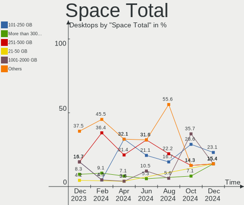
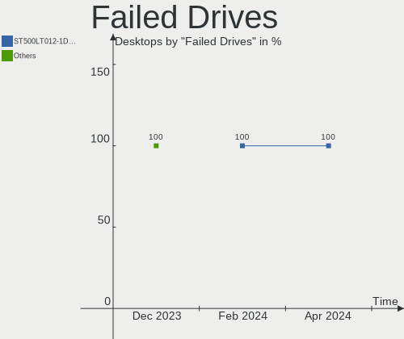
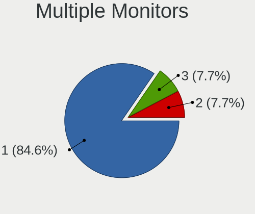

Xubuntu Hardware Trends (Desktops)
----------------------------------

A project to identify most popular hardware characteristics and track their change
over time based on data collected by Xubuntu users at https://Linux-Hardware.org.

Anyone can contribute to this report by the [hw-probe](https://github.com/linuxhw/hw-probe) tool:

    sudo -E hw-probe -all -upload

Full-feature report is available here: https://linux-hardware.org/?view=trends&formfactor=desktop

Period: Aug, 2021.

Contents
--------

* [ System ](#system)
  - [ OS                       ](#os)
  - [ OS Family                ](#os-family)
  - [ Kernel                   ](#kernel)
  - [ Kernel Family            ](#kernel-family)
  - [ Kernel Major Ver.        ](#kernel-major-ver)
  - [ Arch                     ](#arch)
  - [ DE                       ](#de)
  - [ Display Server           ](#display-server)
  - [ Display Manager          ](#display-manager)
  - [ OS Lang                  ](#os-lang)
  - [ Boot Mode                ](#boot-mode)
  - [ Filesystem               ](#filesystem)
  - [ Part. scheme             ](#part-scheme)
  - [ Dual Boot with Linux/BSD ](#dual-boot-with-linuxbsd)
  - [ Dual Boot (Win)          ](#dual-boot-win)

* [ Board ](#board)
  - [ Vendor                   ](#vendor)
  - [ Model                    ](#model)
  - [ Model Family             ](#model-family)
  - [ MFG Year                 ](#mfg-year)
  - [ Form Factor              ](#form-factor)
  - [ Secure Boot              ](#secure-boot)
  - [ Coreboot                 ](#coreboot)
  - [ RAM Size                 ](#ram-size)
  - [ RAM Used                 ](#ram-used)
  - [ Total Drives             ](#total-drives)
  - [ Has CD-ROM               ](#has-cd-rom)
  - [ Has Ethernet             ](#has-ethernet)
  - [ Has WiFi                 ](#has-wifi)
  - [ Has Bluetooth            ](#has-bluetooth)

* [ Location ](#location)
  - [ Country                  ](#country)
  - [ City                     ](#city)

* [ Drives ](#drives)
  - [ Drive Vendor             ](#drive-vendor)
  - [ Drive Model              ](#drive-model)
  - [ HDD Vendor               ](#hdd-vendor)
  - [ SSD Vendor               ](#ssd-vendor)
  - [ Drive Kind               ](#drive-kind)
  - [ Drive Connector          ](#drive-connector)
  - [ Drive Size               ](#drive-size)
  - [ Space Total              ](#space-total)
  - [ Space Used               ](#space-used)
  - [ Malfunc. Drives          ](#malfunc-drives)
  - [ Malfunc. Drive Vendor    ](#malfunc-drive-vendor)
  - [ Malfunc. HDD Vendor      ](#malfunc-hdd-vendor)
  - [ Malfunc. Drive Kind      ](#malfunc-drive-kind)
  - [ Failed Drives            ](#failed-drives)
  - [ Failed Drive Vendor      ](#failed-drive-vendor)
  - [ Drive Status             ](#drive-status)

* [ Storage controller ](#storage-controller)
  - [ Storage Vendor           ](#storage-vendor)
  - [ Storage Model            ](#storage-model)
  - [ Storage Kind             ](#storage-kind)

* [ Processor ](#processor)
  - [ CPU Vendor               ](#cpu-vendor)
  - [ CPU Model                ](#cpu-model)
  - [ CPU Model Family         ](#cpu-model-family)
  - [ CPU Cores                ](#cpu-cores)
  - [ CPU Sockets              ](#cpu-sockets)
  - [ CPU Threads              ](#cpu-threads)
  - [ CPU Op-Modes             ](#cpu-op-modes)
  - [ CPU Microcode            ](#cpu-microcode)
  - [ CPU Microarch            ](#cpu-microarch)

* [ Graphics ](#graphics)
  - [ GPU Vendor               ](#gpu-vendor)
  - [ GPU Model                ](#gpu-model)
  - [ GPU Combo                ](#gpu-combo)
  - [ GPU Driver               ](#gpu-driver)
  - [ GPU Memory               ](#gpu-memory)

* [ Monitor ](#monitor)
  - [ Monitor Vendor           ](#monitor-vendor)
  - [ Monitor Model            ](#monitor-model)
  - [ Monitor Resolution       ](#monitor-resolution)
  - [ Monitor Diagonal         ](#monitor-diagonal)
  - [ Monitor Width            ](#monitor-width)
  - [ Aspect Ratio             ](#aspect-ratio)
  - [ Monitor Area             ](#monitor-area)
  - [ Pixel Density            ](#pixel-density)
  - [ Multiple Monitors        ](#multiple-monitors)

* [ Network ](#network)
  - [ Net Controller Vendor    ](#net-controller-vendor)
  - [ Net Controller Model     ](#net-controller-model)
  - [ Wireless Vendor          ](#wireless-vendor)
  - [ Wireless Model           ](#wireless-model)
  - [ Ethernet Vendor          ](#ethernet-vendor)
  - [ Ethernet Model           ](#ethernet-model)
  - [ Net Controller Kind      ](#net-controller-kind)
  - [ Used Controller          ](#used-controller)
  - [ NICs                     ](#nics)
  - [ IPv6                     ](#ipv6)

* [ Bluetooth ](#bluetooth)
  - [ Bluetooth Vendor         ](#bluetooth-vendor)
  - [ Bluetooth Model          ](#bluetooth-model)

* [ Sound ](#sound)
  - [ Sound Vendor             ](#sound-vendor)
  - [ Sound Model              ](#sound-model)

* [ Memory ](#memory)
  - [ Memory Vendor            ](#memory-vendor)
  - [ Memory Model             ](#memory-model)
  - [ Memory Kind              ](#memory-kind)
  - [ Memory Form Factor       ](#memory-form-factor)
  - [ Memory Size              ](#memory-size)
  - [ Memory Speed             ](#memory-speed)

* [ Printers & scanners ](#printers--scanners)
  - [ Printer Vendor           ](#printer-vendor)
  - [ Printer Model            ](#printer-model)
  - [ Scanner Vendor           ](#scanner-vendor)
  - [ Scanner Model            ](#scanner-model)

* [ Camera ](#camera)
  - [ Camera Vendor            ](#camera-vendor)
  - [ Camera Model             ](#camera-model)

* [ Security ](#security)
  - [ Fingerprint Vendor       ](#fingerprint-vendor)
  - [ Fingerprint Model        ](#fingerprint-model)
  - [ Chipcard Vendor          ](#chipcard-vendor)
  - [ Chipcard Model           ](#chipcard-model)

* [ Unsupported ](#unsupported)
  - [ Unsupported Devices      ](#unsupported-devices)
  - [ Unsupported Device Types ](#unsupported-device-types)

System
------

OS
--

Installed operating systems

| Name          | Desktops | Percent |
|---------------|----------|---------|
| Xubuntu 20.04 | 24       | 58.54%  |
| Xubuntu 18.04 | 12       | 29.27%  |
| Xubuntu 21.04 | 4        | 9.76%   |
| Xubuntu 16.04 | 1        | 2.44%   |

OS Family
---------

OS without a version

| Name    | Desktops | Percent |
|---------|----------|---------|
| Xubuntu | 41       | 100%    |

Kernel
------

Version of the Linux kernel

| Version               | Desktops | Percent |
|-----------------------|----------|---------|
| 5.4.0-81-generic      | 10       | 24.39%  |
| 5.4.0-80-generic      | 7        | 17.07%  |
| 5.4.0-80-lowlatency   | 3        | 7.32%   |
| 5.11.0-31-generic     | 3        | 7.32%   |
| 5.11.0-25-generic     | 3        | 7.32%   |
| 5.11.0-27-generic     | 2        | 4.88%   |
| 5.11.0-25-lowlatency  | 2        | 4.88%   |
| 4.15.0-154-generic    | 2        | 4.88%   |
| 4.15.0-153-generic    | 2        | 4.88%   |
| 5.8.0-63-generic      | 1        | 2.44%   |
| 5.4.0-81-lowlatency   | 1        | 2.44%   |
| 5.13.7-051307-generic | 1        | 2.44%   |
| 5.11.0-27-lowlatency  | 1        | 2.44%   |
| 4.4.0-210-generic     | 1        | 2.44%   |
| 4.15.0-153-lowlatency | 1        | 2.44%   |
| 4.15.0-111-generic    | 1        | 2.44%   |

Kernel Family
-------------

Linux kernel without a distro release

| Version | Desktops | Percent |
|---------|----------|---------|
| 5.4.0   | 21       | 51.22%  |
| 5.11.0  | 11       | 26.83%  |
| 4.15.0  | 6        | 14.63%  |
| 5.8.0   | 1        | 2.44%   |
| 5.13.7  | 1        | 2.44%   |
| 4.4.0   | 1        | 2.44%   |

Kernel Major Ver.
-----------------

Linux kernel major version

| Version | Desktops | Percent |
|---------|----------|---------|
| 5.4     | 21       | 51.22%  |
| 5.11    | 11       | 26.83%  |
| 4.15    | 6        | 14.63%  |
| 5.8     | 1        | 2.44%   |
| 5.13    | 1        | 2.44%   |
| 4.4     | 1        | 2.44%   |

Arch
----

OS architecture (x86_64, i586, etc.)

| Name   | Desktops | Percent |
|--------|----------|---------|
| x86_64 | 39       | 95.12%  |
| i686   | 2        | 4.88%   |

DE
--

Desktop Environment

| Name     | Desktops | Percent |
|----------|----------|---------|
| XFCE     | 40       | 97.56%  |
| Cinnamon | 1        | 2.44%   |

Display Server
--------------

X11 or Wayland

| Name | Desktops | Percent |
|------|----------|---------|
| X11  | 39       | 95.12%  |
| Tty  | 2        | 4.88%   |

Display Manager
---------------

SDDM, LightDM, etc.

| Name    | Desktops | Percent |
|---------|----------|---------|
| Unknown | 25       | 60.98%  |
| TDM     | 10       | 24.39%  |
| LightDM | 5        | 12.2%   |
| XDM     | 1        | 2.44%   |

OS Lang
-------

Language

| Lang  | Desktops | Percent |
|-------|----------|---------|
| en_US | 14       | 34.15%  |
| fr_FR | 6        | 14.63%  |
| it_IT | 3        | 7.32%   |
| pt_BR | 2        | 4.88%   |
| fr_CA | 2        | 4.88%   |
| en_CA | 2        | 4.88%   |
| en_AU | 2        | 4.88%   |
| zh_TW | 1        | 2.44%   |
| zh_CN | 1        | 2.44%   |
| sv_SE | 1        | 2.44%   |
| sv_FI | 1        | 2.44%   |
| ru_RU | 1        | 2.44%   |
| nl_BE | 1        | 2.44%   |
| fr_BE | 1        | 2.44%   |
| es_AR | 1        | 2.44%   |
| de_DE | 1        | 2.44%   |
| C     | 1        | 2.44%   |

Boot Mode
---------

EFI or BIOS

| Mode | Desktops | Percent |
|------|----------|---------|
| BIOS | 29       | 70.73%  |
| EFI  | 12       | 29.27%  |

Filesystem
----------

Type of filesystem

| Type | Desktops | Percent |
|------|----------|---------|
| Ext4 | 41       | 100%    |

Part. scheme
------------

Scheme of partitioning

| Type    | Desktops | Percent |
|---------|----------|---------|
| Unknown | 25       | 60.98%  |
| GPT     | 11       | 26.83%  |
| MBR     | 5        | 12.2%   |

Dual Boot with Linux/BSD
------------------------

Hosting more than one Linux/BSD

| Dual boot | Desktops | Percent |
|-----------|----------|---------|
| No        | 35       | 85.37%  |
| Yes       | 6        | 14.63%  |

Dual Boot (Win)
---------------

Hosting Linux and Windows

| Dual boot | Desktops | Percent |
|-----------|----------|---------|
| Yes       | 22       | 53.66%  |
| No        | 19       | 46.34%  |

Board
-----

Vendor
------

Motherboard manufacturer

| Name                | Desktops | Percent |
|---------------------|----------|---------|
| ASUSTek Computer    | 7        | 17.07%  |
| Lenovo              | 4        | 9.76%   |
| Hewlett-Packard     | 4        | 9.76%   |
| Gigabyte Technology | 4        | 9.76%   |
| Dell                | 4        | 9.76%   |
| ASRock              | 4        | 9.76%   |
| Acer                | 3        | 7.32%   |
| MSI                 | 2        | 4.88%   |
| Intel               | 2        | 4.88%   |
| Foxconn             | 2        | 4.88%   |
| NEC Computers       | 1        | 2.44%   |
| Medion              | 1        | 2.44%   |
| Gateway             | 1        | 2.44%   |
| Fujitsu             | 1        | 2.44%   |
| Alienware           | 1        | 2.44%   |

Model
-----

Motherboard model

| Name                                | Desktops | Percent |
|-------------------------------------|----------|---------|
| ASUS All Series                     | 2        | 4.88%   |
| NEC Computers IMEDIA 5204           | 1        | 2.44%   |
| MSI VT493AA-ABA s5212y              | 1        | 2.44%   |
| MSI Compaq dx2420 Microtower        | 1        | 2.44%   |
| Medion Akoya P2120 D MD8836/2452    | 1        | 2.44%   |
| Lenovo ThinkStation P620 30E0S0E000 | 1        | 2.44%   |
| Lenovo ThinkCentre M93p 10A8000WUS  | 1        | 2.44%   |
| Lenovo ThinkCentre M83 10AJCTO1WW   | 1        | 2.44%   |
| Lenovo ThinkCentre M58 7627AA9      | 1        | 2.44%   |
| Intel DH67BL AAG10189-206           | 1        | 2.44%   |
| Intel D945GNT AAC96315-402          | 1        | 2.44%   |
| HP Z600 Workstation                 | 1        | 2.44%   |
| HP EliteDesk 800 G1 SFF             | 1        | 2.44%   |
| HP Compaq 8000 Elite SFF PC         | 1        | 2.44%   |
| HP 550-a114                         | 1        | 2.44%   |
| Gigabyte X99-UD4-CF                 | 1        | 2.44%   |
| Gigabyte H81M-H                     | 1        | 2.44%   |
| Gigabyte F2A88XM-HD3                | 1        | 2.44%   |
| Gigabyte B450M DS3H                 | 1        | 2.44%   |
| Gateway SX2185                      | 1        | 2.44%   |
| Fujitsu ESPRIMO E910                | 1        | 2.44%   |
| Foxconn s5-1014                     | 1        | 2.44%   |
| Foxconn Pro 3300 Series MT          | 1        | 2.44%   |
| Dell XPS 8500                       | 1        | 2.44%   |
| Dell OptiPlex 3020                  | 1        | 2.44%   |
| Dell Inspiron 660s                  | 1        | 2.44%   |
| Dell DXP051                         | 1        | 2.44%   |
| ASUS Z170-A                         | 1        | 2.44%   |
| ASUS ROG STRIX B450-F GAMING        | 1        | 2.44%   |
| ASUS P6T                            | 1        | 2.44%   |
| ASUS M4A89GTD-PRO                   | 1        | 2.44%   |
| ASUS GL310AA-ABA SR5109NX           | 1        | 2.44%   |
| ASRock X399M Taichi                 | 1        | 2.44%   |
| ASRock Q1900M                       | 1        | 2.44%   |
| ASRock B450 Steel Legend            | 1        | 2.44%   |
| ASRock A320M-HDV                    | 1        | 2.44%   |
| Alienware Area-51 R5                | 1        | 2.44%   |
| Acer Aspire XC-603G                 | 1        | 2.44%   |
| Acer Aspire X1470                   | 1        | 2.44%   |
| Acer Aspire TC-885                  | 1        | 2.44%   |

Model Family
------------

Motherboard model prefix

| Name                 | Desktops | Percent |
|----------------------|----------|---------|
| Lenovo ThinkCentre   | 3        | 7.32%   |
| Acer Aspire          | 3        | 7.32%   |
| ASUS All             | 2        | 4.88%   |
| NEC Computers IMEDIA | 1        | 2.44%   |
| MSI VT493AA-ABA      | 1        | 2.44%   |
| MSI Compaq           | 1        | 2.44%   |
| Medion Akoya         | 1        | 2.44%   |
| Lenovo ThinkStation  | 1        | 2.44%   |
| Intel DH67BL         | 1        | 2.44%   |
| Intel D945GNT        | 1        | 2.44%   |
| HP Z600              | 1        | 2.44%   |
| HP EliteDesk         | 1        | 2.44%   |
| HP Compaq            | 1        | 2.44%   |
| HP 550-a114          | 1        | 2.44%   |
| Gigabyte X99-UD4-CF  | 1        | 2.44%   |
| Gigabyte H81M-H      | 1        | 2.44%   |
| Gigabyte F2A88XM-HD3 | 1        | 2.44%   |
| Gigabyte B450M       | 1        | 2.44%   |
| Gateway SX2185       | 1        | 2.44%   |
| Fujitsu ESPRIMO      | 1        | 2.44%   |
| Foxconn s5-1014      | 1        | 2.44%   |
| Foxconn Pro          | 1        | 2.44%   |
| Dell XPS             | 1        | 2.44%   |
| Dell OptiPlex        | 1        | 2.44%   |
| Dell Inspiron        | 1        | 2.44%   |
| Dell DXP051          | 1        | 2.44%   |
| ASUS Z170-A          | 1        | 2.44%   |
| ASUS ROG             | 1        | 2.44%   |
| ASUS P6T             | 1        | 2.44%   |
| ASUS M4A89GTD-PRO    | 1        | 2.44%   |
| ASUS GL310AA-ABA     | 1        | 2.44%   |
| ASRock X399M         | 1        | 2.44%   |
| ASRock Q1900M        | 1        | 2.44%   |
| ASRock B450          | 1        | 2.44%   |
| ASRock A320M-HDV     | 1        | 2.44%   |
| Alienware Area-51    | 1        | 2.44%   |

MFG Year
--------

Motherboard manufacture year

| Year | Desktops | Percent |
|------|----------|---------|
| 2018 | 5        | 12.2%   |
| 2013 | 5        | 12.2%   |
| 2011 | 5        | 12.2%   |
| 2009 | 5        | 12.2%   |
| 2019 | 4        | 9.76%   |
| 2015 | 4        | 9.76%   |
| 2014 | 3        | 7.32%   |
| 2020 | 2        | 4.88%   |
| 2016 | 2        | 4.88%   |
| 2007 | 2        | 4.88%   |
| 2021 | 1        | 2.44%   |
| 2012 | 1        | 2.44%   |
| 2010 | 1        | 2.44%   |
| 2006 | 1        | 2.44%   |

Form Factor
-----------

Physical design of the computer

| Name    | Desktops | Percent |
|---------|----------|---------|
| Desktop | 41       | 100%    |

Secure Boot
-----------

Enabled or disabled

| State    | Desktops | Percent |
|----------|----------|---------|
| Disabled | 38       | 92.68%  |
| Enabled  | 3        | 7.32%   |

Coreboot
--------

Have coreboot on board

| Used | Desktops | Percent |
|------|----------|---------|
| No   | 41       | 100%    |

RAM Size
--------

Total RAM memory

| Size in GB  | Desktops | Percent |
|-------------|----------|---------|
| 8.01-16.0   | 10       | 24.39%  |
| 3.01-4.0    | 9        | 21.95%  |
| 16.01-24.0  | 7        | 17.07%  |
| 4.01-8.0    | 5        | 12.2%   |
| 32.01-64.0  | 5        | 12.2%   |
| 64.01-256.0 | 3        | 7.32%   |
| 1.01-2.0    | 1        | 2.44%   |
| 0.51-1.0    | 1        | 2.44%   |

RAM Used
--------

Used RAM memory

| Used GB    | Desktops | Percent |
|------------|----------|---------|
| 1.01-2.0   | 16       | 39.02%  |
| 0.51-1.0   | 8        | 19.51%  |
| 4.01-8.0   | 6        | 14.63%  |
| 2.01-3.0   | 6        | 14.63%  |
| 3.01-4.0   | 3        | 7.32%   |
| 24.01-32.0 | 1        | 2.44%   |
| 0.01-0.5   | 1        | 2.44%   |

Total Drives
------------

Number of drives on board

| Drives | Desktops | Percent |
|--------|----------|---------|
| 1      | 16       | 39.02%  |
| 2      | 12       | 29.27%  |
| 3      | 7        | 17.07%  |
| 5      | 2        | 4.88%   |
| 4      | 2        | 4.88%   |
| 9      | 1        | 2.44%   |
| 7      | 1        | 2.44%   |

Has CD-ROM
----------

Has CD-ROM on board

| Presented | Desktops | Percent |
|-----------|----------|---------|
| Yes       | 24       | 58.54%  |
| No        | 17       | 41.46%  |

Has Ethernet
------------

Has Ethernet on board

| Presented | Desktops | Percent |
|-----------|----------|---------|
| Yes       | 39       | 95.12%  |
| No        | 2        | 4.88%   |

Has WiFi
--------

Has WiFi module

| Presented | Desktops | Percent |
|-----------|----------|---------|
| No        | 24       | 58.54%  |
| Yes       | 17       | 41.46%  |

Has Bluetooth
-------------

Has Bluetooth module

| Presented | Desktops | Percent |
|-----------|----------|---------|
| No        | 29       | 70.73%  |
| Yes       | 12       | 29.27%  |

Location
--------

Country
-------

Geographic location (country)

| Country     | Desktops | Percent |
|-------------|----------|---------|
| USA         | 10       | 24.39%  |
| France      | 5        | 12.2%   |
| Canada      | 4        | 9.76%   |
| Italy       | 3        | 7.32%   |
| Sweden      | 2        | 4.88%   |
| Finland     | 2        | 4.88%   |
| Brazil      | 2        | 4.88%   |
| Belgium     | 2        | 4.88%   |
| Australia   | 2        | 4.88%   |
| Ukraine     | 1        | 2.44%   |
| Taiwan      | 1        | 2.44%   |
| Switzerland | 1        | 2.44%   |
| Netherlands | 1        | 2.44%   |
| Malaysia    | 1        | 2.44%   |
| Japan       | 1        | 2.44%   |
| Germany     | 1        | 2.44%   |
| China       | 1        | 2.44%   |
| Argentina   | 1        | 2.44%   |

City
----

Geographic location (city)

| City             | Desktops | Percent |
|------------------|----------|---------|
| Springfield      | 2        | 4.88%   |
| S??o Paulo       | 2        | 4.88%   |
| Youngstown       | 1        | 2.44%   |
| Vesilahti        | 1        | 2.44%   |
| Vernier          | 1        | 2.44%   |
| Uzhhorod         | 1        | 2.44%   |
| Tempe            | 1        | 2.44%   |
| Sydney           | 1        | 2.44%   |
| Shah Alam        | 1        | 2.44%   |
| Seattle          | 1        | 2.44%   |
| Saint-Ambroise   | 1        | 2.44%   |
| Rome             | 1        | 2.44%   |
| Rolla            | 1        | 2.44%   |
| Reno             | 1        | 2.44%   |
| Rennes           | 1        | 2.44%   |
| Pipriac          | 1        | 2.44%   |
| Paris            | 1        | 2.44%   |
| Oulu             | 1        | 2.44%   |
| Newcastle        | 1        | 2.44%   |
| New Taipei       | 1        | 2.44%   |
| Neuqu?©n         | 1        | 2.44%   |
| Montreal         | 1        | 2.44%   |
| Mitcham          | 1        | 2.44%   |
| Milan            | 1        | 2.44%   |
| Laval            | 1        | 2.44%   |
| Landskrona       | 1        | 2.44%   |
| Kortrijk         | 1        | 2.44%   |
| Jefferson City   | 1        | 2.44%   |
| Hatfield         | 1        | 2.44%   |
| Hangzhou         | 1        | 2.44%   |
| Genoa            | 1        | 2.44%   |
| Freiberg         | 1        | 2.44%   |
| Farciennes       | 1        | 2.44%   |
| Ena              | 1        | 2.44%   |
| Colorado Springs | 1        | 2.44%   |
| Castelsarrasin   | 1        | 2.44%   |
| Cachan           | 1        | 2.44%   |
| Arjaeng          | 1        | 2.44%   |
| Amsterdam        | 1        | 2.44%   |

Drives
------

Drive Vendor
------------

Hard drive vendors

| Vendor              | Desktops | Drives | Percent |
|---------------------|----------|--------|---------|
| Seagate             | 20       | 31     | 27.03%  |
| WDC                 | 18       | 21     | 24.32%  |
| Toshiba             | 4        | 4      | 5.41%   |
| Kingston            | 4        | 5      | 5.41%   |
| Hitachi             | 4        | 5      | 5.41%   |
| Unknown             | 3        | 3      | 4.05%   |
| Samsung Electronics | 3        | 3      | 4.05%   |
| Maxtor              | 3        | 3      | 4.05%   |
| Sandisk             | 2        | 2      | 2.7%    |
| Crucial             | 2        | 2      | 2.7%    |
| XPG                 | 1        | 1      | 1.35%   |
| SUNEAST             | 1        | 1      | 1.35%   |
| SPCC                | 1        | 1      | 1.35%   |
| PNY                 | 1        | 1      | 1.35%   |
| MX                  | 1        | 1      | 1.35%   |
| MAXIO               | 1        | 1      | 1.35%   |
| Lite-On             | 1        | 1      | 1.35%   |
| KIOXIA              | 1        | 1      | 1.35%   |
| Intenso             | 1        | 2      | 1.35%   |
| Intel               | 1        | 1      | 1.35%   |
| Hewlett-Packard     | 1        | 1      | 1.35%   |

Drive Model
-----------

Hard drive models

| Model                                | Desktops | Percent |
|--------------------------------------|----------|---------|
| WDC WD2003FZEX-00SRLA0 2TB           | 2        | 2.41%   |
| Unknown SD/MMC/MS PRO 128GB          | 2        | 2.41%   |
| Toshiba DT01ACA100 1TB               | 2        | 2.41%   |
| Seagate ST3000DM008-2DM166 3TB       | 2        | 2.41%   |
| Seagate ST1000DM003-1SB102 1TB       | 2        | 2.41%   |
| XPG GAMMIX S11 Pro 512GB             | 1        | 1.2%    |
| WDC WDS240G2G0B-00EPW0 240GB SSD     | 1        | 1.2%    |
| WDC WD800JB-00JJC0 80GB              | 1        | 1.2%    |
| WDC WD5000AZRX-00L4HB0 500GB         | 1        | 1.2%    |
| WDC WD5000AAKX-22ERMA0 500GB         | 1        | 1.2%    |
| WDC WD5000AAKS-22V1A0 500GB          | 1        | 1.2%    |
| WDC WD5000AAKS-07YGA0 500GB          | 1        | 1.2%    |
| WDC WD5000AAKS-00TMA0 500GB          | 1        | 1.2%    |
| WDC WD4000FYYZ-01UL1B1 4TB           | 1        | 1.2%    |
| WDC WD2500JS-60NCB2 250GB            | 1        | 1.2%    |
| WDC WD2500BEVS-22UST0 250GB          | 1        | 1.2%    |
| WDC WD20EFRX-68EUZN0 2TB             | 1        | 1.2%    |
| WDC WD20EARS-00J99B0 2TB             | 1        | 1.2%    |
| WDC WD2003FZEX-00Z4SA0 2TB           | 1        | 1.2%    |
| WDC WD1600AAJS-08L7A0 160GB          | 1        | 1.2%    |
| WDC WD1600AAJS-00L7A0 160GB          | 1        | 1.2%    |
| WDC WD10EZEX-00BN5A0 1TB             | 1        | 1.2%    |
| WDC WD10EARX-22N0YB0 1TB             | 1        | 1.2%    |
| WDC WD10EADS-22M2B0 1TB              | 1        | 1.2%    |
| WDC PC SN730 SDBQNTY-256G-1001 256GB | 1        | 1.2%    |
| Unknown NVMe SSD Drive 256GB         | 1        | 1.2%    |
| Toshiba NVMe SSD Drive 2TB           | 1        | 1.2%    |
| Toshiba MQ01ABD100 1TB               | 1        | 1.2%    |
| SUNEAST SSD SE800 1TB                | 1        | 1.2%    |
| SPCC Solid State Disk 1TB            | 1        | 1.2%    |
| Seagate ST980310AS 80GB              | 1        | 1.2%    |
| Seagate ST500LT012-1DG142 500GB      | 1        | 1.2%    |
| Seagate ST500LM000-SSHD-8GB          | 1        | 1.2%    |
| Seagate ST500DM002-1BD142 500GB      | 1        | 1.2%    |
| Seagate ST4000DM004-2CV104 4TB       | 1        | 1.2%    |
| Seagate ST3500413AS 500GB            | 1        | 1.2%    |
| Seagate ST3250310AS 250GB            | 1        | 1.2%    |
| Seagate ST3200827AS 200GB            | 1        | 1.2%    |
| Seagate ST31000528AS 1TB             | 1        | 1.2%    |
| Seagate ST31000524AS 1TB             | 1        | 1.2%    |
| Seagate ST3000DM001-1ER166 3TB       | 1        | 1.2%    |
| Seagate ST2000VX008-2E3164 2TB       | 1        | 1.2%    |
| Seagate ST2000DM008-2FR102 2TB       | 1        | 1.2%    |
| Seagate ST2000DM006-2DM164 2TB       | 1        | 1.2%    |
| Seagate ST2000DM001-1ER164 2TB       | 1        | 1.2%    |
| Seagate ST1000VM002-1SD102 1TB       | 1        | 1.2%    |
| Seagate ST1000LM035-1RK172 1TB       | 1        | 1.2%    |
| Seagate ST1000DM010-2EP102 1TB       | 1        | 1.2%    |
| Seagate ST1000DM003-1CH162 1TB       | 1        | 1.2%    |
| Seagate Expansion Desk 8TB           | 1        | 1.2%    |
| Seagate Backup+ Hub BK 10TB          | 1        | 1.2%    |
| SanDisk SSD PLUS 240 GB              | 1        | 1.2%    |
| Sandisk NVMe SSD Drive 1TB           | 1        | 1.2%    |
| Samsung SSD 870 QVO 1TB              | 1        | 1.2%    |
| Samsung SSD 860 PRO 256GB            | 1        | 1.2%    |
| Samsung MZNLF128HCHP-00000 128GB SSD | 1        | 1.2%    |
| PNY CS900 500GB SSD                  | 1        | 1.2%    |
| MX MAS090x SSD 240GB                 | 1        | 1.2%    |
| Maxtor 6Y080M0 81GB                  | 1        | 1.2%    |
| Maxtor 6L300S0 304GB                 | 1        | 1.2%    |

HDD Vendor
----------

Hard disk drive vendors

| Vendor  | Desktops | Drives | Percent |
|---------|----------|--------|---------|
| Seagate | 20       | 30     | 43.48%  |
| WDC     | 16       | 19     | 34.78%  |
| Hitachi | 4        | 5      | 8.7%    |
| Toshiba | 3        | 3      | 6.52%   |
| Maxtor  | 3        | 3      | 6.52%   |

SSD Vendor
----------

Solid state drive vendors

| Vendor              | Desktops | Drives | Percent |
|---------------------|----------|--------|---------|
| Samsung Electronics | 3        | 3      | 17.65%  |
| Kingston            | 2        | 3      | 11.76%  |
| Crucial             | 2        | 2      | 11.76%  |
| WDC                 | 1        | 1      | 5.88%   |
| SUNEAST             | 1        | 1      | 5.88%   |
| SPCC                | 1        | 1      | 5.88%   |
| SanDisk             | 1        | 1      | 5.88%   |
| PNY                 | 1        | 1      | 5.88%   |
| MX                  | 1        | 1      | 5.88%   |
| MAXIO               | 1        | 1      | 5.88%   |
| Intenso             | 1        | 2      | 5.88%   |
| Intel               | 1        | 1      | 5.88%   |
| Hewlett-Packard     | 1        | 1      | 5.88%   |

Drive Kind
----------

HDD or SSD

| Kind    | Desktops | Drives | Percent |
|---------|----------|--------|---------|
| HDD     | 35       | 60     | 56.45%  |
| SSD     | 15       | 19     | 24.19%  |
| NVMe    | 9        | 9      | 14.52%  |
| Unknown | 3        | 3      | 4.84%   |

Drive Connector
---------------

SATA, SAS, NVMe, etc.

| Type | Desktops | Drives | Percent |
|------|----------|--------|---------|
| SATA | 39       | 78     | 76.47%  |
| NVMe | 9        | 9      | 17.65%  |
| SAS  | 3        | 4      | 5.88%   |

Drive Size
----------

Size of hard drive

| Size in TB | Desktops | Drives | Percent |
|------------|----------|--------|---------|
| 0.01-0.5   | 25       | 36     | 46.3%   |
| 0.51-1.0   | 14       | 20     | 25.93%  |
| 1.01-2.0   | 9        | 9      | 16.67%  |
| 2.01-3.0   | 3        | 11     | 5.56%   |
| 3.01-4.0   | 2        | 2      | 3.7%    |
| 4.01-10.0  | 1        | 1      | 1.85%   |

Space Total
-----------

Amount of disk space available on the file system

| Size in GB     | Desktops | Percent |
|----------------|----------|---------|
| 101-250        | 12       | 29.27%  |
| 1001-2000      | 9        | 21.95%  |
| 251-500        | 7        | 17.07%  |
| 501-1000       | 4        | 9.76%   |
| More than 3000 | 3        | 7.32%   |
| 51-100         | 3        | 7.32%   |
| 2001-3000      | 2        | 4.88%   |
| 21-50          | 1        | 2.44%   |

Space Used
----------

Amount of used disk space

| Used GB   | Desktops | Percent |
|-----------|----------|---------|
| 21-50     | 9        | 21.95%  |
| 1-20      | 9        | 21.95%  |
| 501-1000  | 5        | 12.2%   |
| 51-100    | 5        | 12.2%   |
| 251-500   | 4        | 9.76%   |
| 1001-2000 | 4        | 9.76%   |
| 101-250   | 3        | 7.32%   |
| 2001-3000 | 2        | 4.88%   |

Malfunc. Drives
---------------

Drive models with a malfunction

| Model                          | Desktops | Drives | Percent |
|--------------------------------|----------|--------|---------|
| WDC WD4000FYYZ-01UL1B1 4TB     | 1        | 1      | 25%     |
| WDC WD10EADS-22M2B0 1TB        | 1        | 1      | 25%     |
| Seagate ST500LM000-SSHD-8GB    | 1        | 1      | 25%     |
| Seagate ST1000DM003-1SB102 1TB | 1        | 1      | 25%     |

Malfunc. Drive Vendor
---------------------

Vendors of faulty drives

| Vendor  | Desktops | Drives | Percent |
|---------|----------|--------|---------|
| WDC     | 2        | 2      | 50%     |
| Seagate | 2        | 2      | 50%     |

Malfunc. HDD Vendor
-------------------

Vendors of faulty HDD drives

| Vendor  | Desktops | Drives | Percent |
|---------|----------|--------|---------|
| WDC     | 2        | 2      | 50%     |
| Seagate | 2        | 2      | 50%     |

Malfunc. Drive Kind
-------------------

Kinds of faulty drives

| Kind | Desktops | Drives | Percent |
|------|----------|--------|---------|
| HDD  | 4        | 4      | 100%    |

Failed Drives
-------------

Failed drive models

| Model                    | Desktops | Drives | Percent |
|--------------------------|----------|--------|---------|
| WDC WD20EARS-00J99B0 2TB | 1        | 1      | 100%    |

Failed Drive Vendor
-------------------

Failed drive vendors

| Vendor | Desktops | Drives | Percent |
|--------|----------|--------|---------|
| WDC    | 1        | 1      | 100%    |

Drive Status
------------

Number of failed and malfunc. drives

| Status   | Desktops | Drives | Percent |
|----------|----------|--------|---------|
| Detected | 27       | 57     | 56.25%  |
| Works    | 16       | 29     | 33.33%  |
| Malfunc  | 4        | 4      | 8.33%   |
| Failed   | 1        | 1      | 2.08%   |

Storage controller
------------------

Storage Vendor
--------------

Storage controller vendors

| Vendor                       | Desktops | Percent |
|------------------------------|----------|---------|
| Intel                        | 29       | 54.72%  |
| AMD                          | 12       | 22.64%  |
| Kingston Technology Company  | 2        | 3.77%   |
| JMicron Technology           | 2        | 3.77%   |
| Toshiba America Info Systems | 1        | 1.89%   |
| Sandisk                      | 1        | 1.89%   |
| MAXIO Technology (Hangzhou)  | 1        | 1.89%   |
| Marvell Technology Group     | 1        | 1.89%   |
| Lite-On Technology           | 1        | 1.89%   |
| KIOXIA                       | 1        | 1.89%   |
| ASMedia Technology           | 1        | 1.89%   |
| ADATA Technology             | 1        | 1.89%   |

Storage Model
-------------

Storage controller models

| Model                                                                                   | Desktops | Percent |
|-----------------------------------------------------------------------------------------|----------|---------|
| AMD FCH SATA Controller [AHCI mode]                                                     | 8        | 11.27%  |
| Intel 8 Series/C220 Series Chipset Family 6-port SATA Controller 1 [AHCI mode]          | 6        | 8.45%   |
| Intel NM10/ICH7 Family SATA Controller [IDE mode]                                       | 5        | 7.04%   |
| Intel 82801G (ICH7 Family) IDE Controller                                               | 4        | 5.63%   |
| Intel 7 Series/C210 Series Chipset Family 6-port SATA Controller [AHCI mode]            | 3        | 4.23%   |
| AMD 400 Series Chipset SATA Controller                                                  | 3        | 4.23%   |
| Intel SATA Controller [RAID mode]                                                       | 2        | 2.82%   |
| Intel Q170/Q150/B150/H170/H110/Z170/CM236 Chipset SATA Controller [AHCI Mode]           | 2        | 2.82%   |
| Intel Atom Processor E3800 Series SATA AHCI Controller                                  | 2        | 2.82%   |
| Intel 82801JD/DO (ICH10 Family) 4-port SATA IDE Controller                              | 2        | 2.82%   |
| Intel 82801JD/DO (ICH10 Family) 2-port SATA IDE Controller                              | 2        | 2.82%   |
| Toshiba America Info Systems Toshiba America Info Non-Volatile memory controller        | 1        | 1.41%   |
| Sandisk WD Black SN750 / PC SN730 NVMe SSD                                              | 1        | 1.41%   |
| MAXIO (Hangzhou) NVMe SSD Controller MAP1202                                            | 1        | 1.41%   |
| Marvell Group 88SE9215 PCIe 2.0 x1 4-port SATA 6 Gb/s Controller                        | 1        | 1.41%   |
| Lite-On M8Pe Series NVMe SSD                                                            | 1        | 1.41%   |
| KIOXIA Non-Volatile memory controller                                                   | 1        | 1.41%   |
| Kingston Company U-SNS8154P3 NVMe SSD                                                   | 1        | 1.41%   |
| Kingston Company KC2000 NVMe SSD                                                        | 1        | 1.41%   |
| JMicron JMB363 SATA/IDE Controller                                                      | 1        | 1.41%   |
| JMicron JMB361 AHCI/IDE                                                                 | 1        | 1.41%   |
| Intel NM10/ICH7 Family SATA Controller [AHCI mode]                                      | 1        | 1.41%   |
| Intel Cannon Lake PCH SATA AHCI Controller                                              | 1        | 1.41%   |
| Intel C610/X99 series chipset sSATA Controller [AHCI mode]                              | 1        | 1.41%   |
| Intel C610/X99 series chipset 6-Port SATA Controller [AHCI mode]                        | 1        | 1.41%   |
| Intel 82801JI (ICH10 Family) SATA AHCI Controller                                       | 1        | 1.41%   |
| Intel 8 Series/C220 Series Chipset Family 4-port SATA Controller 1 [IDE mode]           | 1        | 1.41%   |
| Intel 8 Series/C220 Series Chipset Family 2-port SATA Controller 2 [IDE mode]           | 1        | 1.41%   |
| Intel 6 Series/C200 Series Chipset Family Desktop SATA Controller (IDE mode, ports 4-5) | 1        | 1.41%   |
| Intel 6 Series/C200 Series Chipset Family Desktop SATA Controller (IDE mode, ports 0-3) | 1        | 1.41%   |
| Intel 6 Series/C200 Series Chipset Family 6 port Desktop SATA AHCI Controller           | 1        | 1.41%   |
| Intel 4 Series Chipset PT IDER Controller                                               | 1        | 1.41%   |
| ASMedia ASM1062 Serial ATA Controller                                                   | 1        | 1.41%   |
| AMD X399 Series Chipset SATA Controller                                                 | 1        | 1.41%   |
| AMD SB7x0/SB8x0/SB9x0 SATA Controller [IDE mode]                                        | 1        | 1.41%   |
| AMD SB7x0/SB8x0/SB9x0 IDE Controller                                                    | 1        | 1.41%   |
| AMD IXP SB4x0 Serial ATA Controller                                                     | 1        | 1.41%   |
| AMD IXP SB4x0 IDE Controller                                                            | 1        | 1.41%   |
| AMD IXP SB400 Serial ATA Controller                                                     | 1        | 1.41%   |
| AMD FCH SATA Controller [IDE mode]                                                      | 1        | 1.41%   |
| AMD FCH SATA Controller D                                                               | 1        | 1.41%   |
| AMD FCH IDE Controller                                                                  | 1        | 1.41%   |
| ADATA XPG SX8200 Pro PCIe Gen3x4 M.2 2280 Solid State Drive                             | 1        | 1.41%   |

Storage Kind
------------

Kind of storage controller (IDE, SATA, NVMe, SAS, ...)

| Kind | Desktops | Percent |
|------|----------|---------|
| SATA | 29       | 54.72%  |
| IDE  | 14       | 26.42%  |
| NVMe | 8        | 15.09%  |
| RAID | 2        | 3.77%   |

Processor
---------

CPU Vendor
----------

Processor vendors

| Vendor | Desktops | Percent |
|--------|----------|---------|
| Intel  | 30       | 73.17%  |
| AMD    | 11       | 26.83%  |

CPU Model
---------

Processor models

| Model                                          | Desktops | Percent |
|------------------------------------------------|----------|---------|
| Intel Pentium Dual-Core CPU E5200 @ 2.50GHz    | 2        | 4.88%   |
| Intel Core i5-4440 CPU @ 3.10GHz               | 2        | 4.88%   |
| Intel Core i3-6100 CPU @ 3.70GHz               | 2        | 4.88%   |
| Intel Core i3-4130 CPU @ 3.40GHz               | 2        | 4.88%   |
| Intel Celeron CPU J1900 @ 1.99GHz              | 2        | 4.88%   |
| Intel Xeon CPU X5670 @ 2.93GHz                 | 1        | 2.44%   |
| Intel Pentium Dual-Core CPU E5800 @ 3.20GHz    | 1        | 2.44%   |
| Intel Pentium CPU G860 @ 3.00GHz               | 1        | 2.44%   |
| Intel Pentium CPU G2020 @ 2.90GHz              | 1        | 2.44%   |
| Intel Pentium 4 CPU 3.40GHz                    | 1        | 2.44%   |
| Intel Pentium 4 CPU 3.20GHz                    | 1        | 2.44%   |
| Intel Pentium 4 CPU 3.06GHz                    | 1        | 2.44%   |
| Intel Pentium 4 CPU 3.00GHz                    | 1        | 2.44%   |
| Intel Core i9-9920X CPU @ 3.50GHz              | 1        | 2.44%   |
| Intel Core i7-5820K CPU @ 3.30GHz              | 1        | 2.44%   |
| Intel Core i7-4790 CPU @ 3.60GHz               | 1        | 2.44%   |
| Intel Core i7-3770 CPU @ 3.40GHz               | 1        | 2.44%   |
| Intel Core i7 CPU 920 @ 2.67GHz                | 1        | 2.44%   |
| Intel Core i5-9400 CPU @ 2.90GHz               | 1        | 2.44%   |
| Intel Core i5-4590 CPU @ 3.30GHz               | 1        | 2.44%   |
| Intel Core i5-4570 CPU @ 3.20GHz               | 1        | 2.44%   |
| Intel Core i5-2400 CPU @ 3.10GHz               | 1        | 2.44%   |
| Intel Core i3-2100 CPU @ 3.10GHz               | 1        | 2.44%   |
| Intel Core 2 Quad CPU Q8400 @ 2.66GHz          | 1        | 2.44%   |
| Intel Core 2 Duo CPU E7300 @ 2.66GHz           | 1        | 2.44%   |
| AMD Ryzen Threadripper PRO 3945WX 12-Cores     | 1        | 2.44%   |
| AMD Ryzen Threadripper 1920X 12-Core Processor | 1        | 2.44%   |
| AMD Ryzen 7 2700X Eight-Core Processor         | 1        | 2.44%   |
| AMD Ryzen 7 2700 Eight-Core Processor          | 1        | 2.44%   |
| AMD Ryzen 5 3500 6-Core Processor              | 1        | 2.44%   |
| AMD Ryzen 3 3200G with Radeon Vega Graphics    | 1        | 2.44%   |
| AMD Phenom II X4 960T Processor                | 1        | 2.44%   |
| AMD E1-2500 APU with Radeon HD Graphics        | 1        | 2.44%   |
| AMD A8-6410 APU with AMD Radeon R5 Graphics    | 1        | 2.44%   |
| AMD A8-3820 APU with Radeon HD Graphics        | 1        | 2.44%   |
| AMD A4-6300 APU with Radeon HD Graphics        | 1        | 2.44%   |

CPU Model Family
----------------

Processor model prefix

| Model                   | Desktops | Percent |
|-------------------------|----------|---------|
| Intel Core i5           | 6        | 14.63%  |
| Intel Core i3           | 5        | 12.2%   |
| Intel Pentium 4         | 4        | 9.76%   |
| Intel Core i7           | 4        | 9.76%   |
| Intel Pentium Dual-Core | 3        | 7.32%   |
| Intel Pentium           | 2        | 4.88%   |
| Intel Celeron           | 2        | 4.88%   |
| AMD Ryzen Threadripper  | 2        | 4.88%   |
| AMD Ryzen 7             | 2        | 4.88%   |
| AMD A8                  | 2        | 4.88%   |
| Intel Xeon              | 1        | 2.44%   |
| Intel Core i9           | 1        | 2.44%   |
| Intel Core 2 Quad       | 1        | 2.44%   |
| Intel Core 2 Duo        | 1        | 2.44%   |
| AMD Ryzen 5             | 1        | 2.44%   |
| AMD Ryzen 3             | 1        | 2.44%   |
| AMD Phenom II X4        | 1        | 2.44%   |
| AMD E1                  | 1        | 2.44%   |
| AMD A4                  | 1        | 2.44%   |

CPU Cores
---------

Number of processor cores

| Number | Desktops | Percent |
|--------|----------|---------|
| 4      | 15       | 36.59%  |
| 2      | 12       | 29.27%  |
| 1      | 5        | 12.2%   |
| 12     | 4        | 9.76%   |
| 6      | 3        | 7.32%   |
| 8      | 2        | 4.88%   |

CPU Sockets
-----------

Number of sockets

| Number | Desktops | Percent |
|--------|----------|---------|
| 1      | 40       | 97.56%  |
| 2      | 1        | 2.44%   |

CPU Threads
-----------

Threads per core (Hyper-Threading)

| Number | Desktops | Percent |
|--------|----------|---------|
| 1      | 21       | 51.22%  |
| 2      | 20       | 48.78%  |

CPU Op-Modes
------------

CPU Operation Modes (32-bit, 64-bit)

| Op mode        | Desktops | Percent |
|----------------|----------|---------|
| 32-bit, 64-bit | 41       | 100%    |

CPU Microcode
-------------

Microcode number

| Number     | Desktops | Percent |
|------------|----------|---------|
| 0x306c3    | 7        | 17.07%  |
| Unknown    | 5        | 12.2%   |
| 0x1067a    | 3        | 7.32%   |
| 0xf43      | 2        | 4.88%   |
| 0x506e3    | 2        | 4.88%   |
| 0x306a9    | 2        | 4.88%   |
| 0x206a7    | 2        | 4.88%   |
| 0x10676    | 2        | 4.88%   |
| 0x0800820d | 2        | 4.88%   |
| 0xf65      | 1        | 2.44%   |
| 0xf49      | 1        | 2.44%   |
| 0x906ea    | 1        | 2.44%   |
| 0x306f2    | 1        | 2.44%   |
| 0x30673    | 1        | 2.44%   |
| 0x206c2    | 1        | 2.44%   |
| 0x106a5    | 1        | 2.44%   |
| 0x08301039 | 1        | 2.44%   |
| 0x08108109 | 1        | 2.44%   |
| 0x08001137 | 1        | 2.44%   |
| 0x0700010f | 1        | 2.44%   |
| 0x06001119 | 1        | 2.44%   |
| 0x03000027 | 1        | 2.44%   |
| 0x010000dc | 1        | 2.44%   |

CPU Microarch
-------------

Microarchitecture

| Name        | Desktops | Percent |
|-------------|----------|---------|
| Haswell     | 8        | 19.51%  |
| Penryn      | 5        | 12.2%   |
| NetBurst    | 4        | 9.76%   |
| Zen+        | 3        | 7.32%   |
| Skylake     | 3        | 7.32%   |
| SandyBridge | 3        | 7.32%   |
| Zen 2       | 2        | 4.88%   |
| Silvermont  | 2        | 4.88%   |
| IvyBridge   | 2        | 4.88%   |
| Zen         | 1        | 2.44%   |
| Westmere    | 1        | 2.44%   |
| Puma        | 1        | 2.44%   |
| Piledriver  | 1        | 2.44%   |
| Nehalem     | 1        | 2.44%   |
| KabyLake    | 1        | 2.44%   |
| K10 Llano   | 1        | 2.44%   |
| K10         | 1        | 2.44%   |
| Jaguar      | 1        | 2.44%   |

Graphics
--------

GPU Vendor
----------

Vendors of graphics cards

| Vendor | Desktops | Percent |
|--------|----------|---------|
| Intel  | 18       | 40%     |
| Nvidia | 17       | 37.78%  |
| AMD    | 10       | 22.22%  |

GPU Model
---------

Graphics card models

| Model                                                                       | Desktops | Percent |
|-----------------------------------------------------------------------------|----------|---------|
| Intel Xeon E3-1200 v3/4th Gen Core Processor Integrated Graphics Controller | 4        | 8.7%    |
| Intel 4 Series Chipset Integrated Graphics Controller                       | 3        | 6.52%   |
| Nvidia GM204 [GeForce GTX 970]                                              | 2        | 4.35%   |
| Intel HD Graphics 530                                                       | 2        | 4.35%   |
| Intel Atom Processor Z36xxx/Z37xxx Series Graphics & Display                | 2        | 4.35%   |
| Intel 82G33/G31 Express Integrated Graphics Controller                      | 2        | 4.35%   |
| Intel 2nd Generation Core Processor Family Integrated Graphics Controller   | 2        | 4.35%   |
| AMD Picasso                                                                 | 2        | 4.35%   |
| Nvidia TU106 [GeForce GTX 1650]                                             | 1        | 2.17%   |
| Nvidia TU102 [GeForce RTX 2080 Ti Rev. A]                                   | 1        | 2.17%   |
| Nvidia GP107GL [Quadro P1000]                                               | 1        | 2.17%   |
| Nvidia GP107 [GeForce GTX 1050 Ti]                                          | 1        | 2.17%   |
| Nvidia GP104 [GeForce GTX 1070]                                             | 1        | 2.17%   |
| Nvidia GP104 [GeForce GTX 1070 Ti]                                          | 1        | 2.17%   |
| Nvidia GM107 [GeForce GTX 750]                                              | 1        | 2.17%   |
| Nvidia GK208B [GeForce GT 710]                                              | 1        | 2.17%   |
| Nvidia GK106 [GeForce GTX 650 Ti]                                           | 1        | 2.17%   |
| Nvidia GK104 [GeForce GTX 670]                                              | 1        | 2.17%   |
| Nvidia GF119 [GeForce GT 520]                                               | 1        | 2.17%   |
| Nvidia GF116 [GeForce GTX 550 Ti]                                           | 1        | 2.17%   |
| Nvidia GF108 [GeForce GT 630]                                               | 1        | 2.17%   |
| Nvidia G96C [GeForce GT 120]                                                | 1        | 2.17%   |
| Nvidia G72 [GeForce 7300 GS]                                                | 1        | 2.17%   |
| Intel Xeon E3-1200 v2/3rd Gen Core processor Graphics Controller            | 1        | 2.17%   |
| Intel CometLake-S GT2 [UHD Graphics 630]                                    | 1        | 2.17%   |
| Intel 82945G/GZ Integrated Graphics Controller                              | 1        | 2.17%   |
| AMD Turks PRO [Radeon HD 7570]                                              | 1        | 2.17%   |
| AMD Richland [Radeon HD 8370D]                                              | 1        | 2.17%   |
| AMD Redwood XT [Radeon HD 5670/5690/5730]                                   | 1        | 2.17%   |
| AMD R423 [Radeon X800 GT] (Secondary)                                       | 1        | 2.17%   |
| AMD R423 [Radeon X800 GT/SE]                                                | 1        | 2.17%   |
| AMD Mullins [Radeon R4/R5 Graphics]                                         | 1        | 2.17%   |
| AMD Ellesmere [Radeon RX 470/480/570/570X/580/580X/590]                     | 1        | 2.17%   |
| AMD Cape Verde PRO [Radeon HD 7750/8740 / R7 250E]                          | 1        | 2.17%   |
| AMD Baffin [Radeon RX 550 640SP / RX 560/560X]                              | 1        | 2.17%   |

GPU Combo
---------

Combinations of graphics cards

| Name        | Desktops | Percent |
|-------------|----------|---------|
| 1 x Nvidia  | 17       | 41.46%  |
| 1 x Intel   | 16       | 39.02%  |
| 1 x AMD     | 6        | 14.63%  |
| 2 x AMD     | 1        | 2.44%   |
| Intel + AMD | 1        | 2.44%   |

GPU Driver
----------

Free vs proprietary

| Driver      | Desktops | Percent |
|-------------|----------|---------|
| Free        | 29       | 70.73%  |
| Proprietary | 11       | 26.83%  |
| Unknown     | 1        | 2.44%   |

GPU Memory
----------

Total video memory

| Size in GB | Desktops | Percent |
|------------|----------|---------|
| Unknown    | 17       | 41.46%  |
| 0.51-1.0   | 8        | 19.51%  |
| 1.01-2.0   | 6        | 14.63%  |
| 3.01-4.0   | 5        | 12.2%   |
| 7.01-8.0   | 2        | 4.88%   |
| 0.01-0.5   | 2        | 4.88%   |
| 8.01-16.0  | 1        | 2.44%   |

Monitor
-------

Monitor Vendor
--------------

Monitor vendors

| Vendor               | Desktops | Percent |
|----------------------|----------|---------|
| Samsung Electronics  | 7        | 15.22%  |
| Acer                 | 6        | 13.04%  |
| Hewlett-Packard      | 4        | 8.7%    |
| Dell                 | 3        | 6.52%   |
| AOC                  | 3        | 6.52%   |
| Philips              | 2        | 4.35%   |
| BenQ                 | 2        | 4.35%   |
| Ancor Communications | 2        | 4.35%   |
| Westinghouse         | 1        | 2.17%   |
| Vizio                | 1        | 2.17%   |
| Vestel Elektronik    | 1        | 2.17%   |
| Unknown (AAA)        | 1        | 2.17%   |
| Unknown              | 1        | 2.17%   |
| Toshiba              | 1        | 2.17%   |
| Seiki                | 1        | 2.17%   |
| Sceptre Tech         | 1        | 2.17%   |
| ONN                  | 1        | 2.17%   |
| MOT                  | 1        | 2.17%   |
| Medion               | 1        | 2.17%   |
| Lenovo               | 1        | 2.17%   |
| Insignia             | 1        | 2.17%   |
| Goldstar             | 1        | 2.17%   |
| Fujitsu Siemens      | 1        | 2.17%   |
| Fujitsu              | 1        | 2.17%   |
| DENON                | 1        | 2.17%   |

Monitor Model
-------------

Monitor models

| Model                                                                  | Desktops | Percent |
|------------------------------------------------------------------------|----------|---------|
| Westinghouse SK-32H640G WDE6040 1440x900 710x400mm 32.1-inch           | 1        | 2.17%   |
| Vizio D32h-D1 VIZ1002 1360x768 697x392mm 31.5-inch                     | 1        | 2.17%   |
| Vestel Elektronik 50UHD_LCD_TV VES3700 3840x2160 1872x1053mm 84.6-inch | 1        | 2.17%   |
| Unknown LCD Monitor SAMSUNG 3840x2160                                  | 1        | 2.17%   |
| Unknown (AAA) LCDTV AAA3393 1360x768 890x500mm 40.2-inch               | 1        | 2.17%   |
| Toshiba LCD Monitor LCD1775 1280x1024 338x270mm 17.0-inch              | 1        | 2.17%   |
| Seiki SE29HY34 SEK9333 1366x768 700x390mm 31.5-inch                    | 1        | 2.17%   |
| Sceptre Tech E205W-1600 SPT080D 1600x900 477x268mm 21.5-inch           | 1        | 2.17%   |
| Samsung Electronics SyncMaster SAM0226 1440x900 410x257mm 19.1-inch    | 1        | 2.17%   |
| Samsung Electronics SMB2230H SAM0646 1920x1080 477x268mm 21.5-inch     | 1        | 2.17%   |
| Samsung Electronics S22F350 SAM0D1A 1920x1080 480x270mm 21.7-inch      | 1        | 2.17%   |
| Samsung Electronics S22D390 SAM0B63 1920x1080 477x268mm 21.5-inch      | 1        | 2.17%   |
| Samsung Electronics LS32R75 SAM0F92 3840x2160 697x392mm 31.5-inch      | 1        | 2.17%   |
| Samsung Electronics LCD Monitor SAM03D3 1360x768 410x256mm 19.0-inch   | 1        | 2.17%   |
| Samsung Electronics LCD Monitor LU28R55                                | 1        | 2.17%   |
| Philips PHL 273V5 PHLC0D2 1920x1080 600x340mm 27.2-inch                | 1        | 2.17%   |
| Philips 220AW PHL0855 1680x1050 434x270mm 20.1-inch                    | 1        | 2.17%   |
| ONN ONA18HO015 ONN0101 1920x1080 698x393mm 31.5-inch                   | 1        | 2.17%   |
| MOT MotoAttach MOT3DC4 1366x768 256x144mm 11.6-inch                    | 1        | 2.17%   |
| Medion MD20435 MED36D5 1920x1080 521x293mm 23.5-inch                   | 1        | 2.17%   |
| Lenovo P24h-10 LEN61AE 2560x1440 527x296mm 23.8-inch                   | 1        | 2.17%   |
| Insignia NS-19E320A13 BBY0032 1680x1050 640x384mm 29.4-inch            | 1        | 2.17%   |
| Hewlett-Packard LCD Monitor E232 1920x1080                             | 1        | 2.17%   |
| Hewlett-Packard LA2405x HWP301F 1920x1200 518x324mm 24.1-inch          | 1        | 2.17%   |
| Hewlett-Packard 27x HPN3580 1920x1080 598x336mm 27.0-inch              | 1        | 2.17%   |
| Hewlett-Packard 2009 HWP2827 1600x900 442x249mm 20.0-inch              | 1        | 2.17%   |
| Goldstar W2243 GSM56FE 1920x1080 477x269mm 21.6-inch                   | 1        | 2.17%   |
| Fujitsu VL-221SSWL FUJ4211 1680x1050 474x296mm 22.0-inch               | 1        | 2.17%   |
| Fujitsu Siemens L24W-2 FUS077A 1920x1200 518x324mm 24.1-inch           | 1        | 2.17%   |
| DENON AVAMP DON002B 1920x1080 880x490mm 39.7-inch                      | 1        | 2.17%   |
| Dell ST2320L DELF024 1920x1080 509x286mm 23.0-inch                     | 1        | 2.17%   |
| Dell LCD Monitor P2719H 1920x1080                                      | 1        | 2.17%   |
| Dell E2316H DELF06A 1920x1080 509x286mm 23.0-inch                      | 1        | 2.17%   |
| BenQ FP731 BNQ7659 1280x1024 304x228mm 15.0-inch                       | 1        | 2.17%   |
| BenQ E2420HD BNQ7916 1920x1080 531x299mm 24.0-inch                     | 1        | 2.17%   |
| AOC 28E850 AOC0CCD 2560x1600 480x270mm 21.7-inch                       | 1        | 2.17%   |
| AOC 27G2G4 AOC2702 1920x1080 598x336mm 27.0-inch                       | 1        | 2.17%   |
| AOC 2470W AOC2470 1920x1080 520x290mm 23.4-inch                        | 1        | 2.17%   |
| Ancor Communications ASUS VS247 ACI249A 1920x1080 521x293mm 23.5-inch  | 1        | 2.17%   |
| Ancor Communications ASUS VS207 ACI20F2 1600x900 432x240mm 19.5-inch   | 1        | 2.17%   |
| Acer LCD Monitor X243HQ 3840x1080                                      | 1        | 2.17%   |
| Acer G276HL ACR0300 1920x1080 600x340mm 27.2-inch                      | 1        | 2.17%   |
| Acer G236HL ACR02EB 1920x1080 509x286mm 23.0-inch                      | 1        | 2.17%   |
| Acer EB210HQ ACR0465 1920x1080 460x260mm 20.8-inch                     | 1        | 2.17%   |
| Acer AL1922 ACRAD25 1280x1024 376x301mm 19.0-inch                      | 1        | 2.17%   |
| Acer AL171 ACRAD18 1280x1024 338x270mm 17.0-inch                       | 1        | 2.17%   |

Monitor Resolution
------------------

Monitor screen resolution

| Resolution         | Desktops | Percent |
|--------------------|----------|---------|
| 1920x1080 (FHD)    | 19       | 43.18%  |
| 3840x2160 (4K)     | 4        | 9.09%   |
| 1366x768 (WXGA)    | 4        | 9.09%   |
| 1600x900 (HD+)     | 3        | 6.82%   |
| 1280x1024 (SXGA)   | 3        | 6.82%   |
| 2560x1440 (QHD)    | 2        | 4.55%   |
| 1920x1200 (WUXGA)  | 2        | 4.55%   |
| 1680x1050 (WSXGA+) | 2        | 4.55%   |
| 3840x1080          | 1        | 2.27%   |
| 1920x540           | 1        | 2.27%   |
| 1440x900 (WXGA+)   | 1        | 2.27%   |
| 1360x768           | 1        | 2.27%   |
| Unknown            | 1        | 2.27%   |

Monitor Diagonal
----------------

Diagonal size in inches

| Inches  | Desktops | Percent |
|---------|----------|---------|
| 23      | 7        | 15.91%  |
| 21      | 6        | 13.64%  |
| 27      | 4        | 9.09%   |
| 19      | 4        | 9.09%   |
| Unknown | 4        | 9.09%   |
| 31      | 3        | 6.82%   |
| 24      | 3        | 6.82%   |
| 22      | 2        | 4.55%   |
| 20      | 2        | 4.55%   |
| 17      | 2        | 4.55%   |
| 84      | 1        | 2.27%   |
| 48      | 1        | 2.27%   |
| 40      | 1        | 2.27%   |
| 39      | 1        | 2.27%   |
| 38      | 1        | 2.27%   |
| 32      | 1        | 2.27%   |
| 11      | 1        | 2.27%   |

Monitor Width
-------------

Physical width

| Width in mm | Desktops | Percent |
|-------------|----------|---------|
| 501-600     | 13       | 30.95%  |
| 401-500     | 12       | 28.57%  |
| Unknown     | 4        | 9.52%   |
| 801-900     | 3        | 7.14%   |
| 601-700     | 3        | 7.14%   |
| 301-350     | 2        | 4.76%   |
| 701-800     | 1        | 2.38%   |
| 351-400     | 1        | 2.38%   |
| 201-300     | 1        | 2.38%   |
| 1501-2000   | 1        | 2.38%   |
| 1001-1500   | 1        | 2.38%   |

Aspect Ratio
------------

Proportional relationship between the width and the height

| Ratio   | Desktops | Percent |
|---------|----------|---------|
| 16/9    | 26       | 65%     |
| 16/10   | 6        | 15%     |
| Unknown | 4        | 10%     |
| 5/4     | 3        | 7.5%    |
| 1.96    | 1        | 2.5%    |

Monitor Area
------------

Area in inch²

| Area in inch² | Desktops | Percent |
|----------------|----------|---------|
| 201-250        | 14       | 33.33%  |
| 151-200        | 7        | 16.67%  |
| 351-500        | 4        | 9.52%   |
| 301-350        | 4        | 9.52%   |
| Unknown        | 4        | 9.52%   |
| 501-1000       | 3        | 7.14%   |
| 251-300        | 2        | 4.76%   |
| 141-150        | 2        | 4.76%   |
| More than 1000 | 1        | 2.38%   |
| 51-60          | 1        | 2.38%   |

Pixel Density
-------------

Pixels per inch

| Density | Desktops | Percent |
|---------|----------|---------|
| 51-100  | 25       | 59.52%  |
| 1-50    | 5        | 11.9%   |
| 101-120 | 5        | 11.9%   |
| Unknown | 4        | 9.52%   |
| 121-160 | 3        | 7.14%   |

Multiple Monitors
-----------------

Total monitors connected

| Total | Desktops | Percent |
|-------|----------|---------|
| 1     | 32       | 78.05%  |
| 2     | 6        | 14.63%  |
| 0     | 2        | 4.88%   |
| 3     | 1        | 2.44%   |

Network
-------

Net Controller Vendor
---------------------

Controller vendors

| Vendor                          | Desktops | Percent |
|---------------------------------|----------|---------|
| Realtek Semiconductor           | 26       | 47.27%  |
| Intel                           | 13       | 23.64%  |
| Qualcomm Atheros                | 4        | 7.27%   |
| TP-Link                         | 2        | 3.64%   |
| Ralink Technology               | 2        | 3.64%   |
| D-Link System                   | 2        | 3.64%   |
| Broadcom                        | 2        | 3.64%   |
| Qualcomm Atheros Communications | 1        | 1.82%   |
| HTC (High Tech Computer)        | 1        | 1.82%   |
| Aquantia                        | 1        | 1.82%   |
| AboCom Systems                  | 1        | 1.82%   |

Net Controller Model
--------------------

Controller models

| Model                                                             | Desktops | Percent |
|-------------------------------------------------------------------|----------|---------|
| Realtek RTL8111/8168/8411 PCI Express Gigabit Ethernet Controller | 19       | 31.67%  |
| Realtek RTL810xE PCI Express Fast Ethernet controller             | 5        | 8.33%   |
| Intel Ethernet Connection I217-LM                                 | 3        | 5%      |
| Qualcomm Atheros AR9485 Wireless Network Adapter                  | 2        | 3.33%   |
| Intel Wireless-AC 9260                                            | 2        | 3.33%   |
| Intel I211 Gigabit Network Connection                             | 2        | 3.33%   |
| D-Link System DGE-528T Gigabit Ethernet Adapter                   | 2        | 3.33%   |
| TP-Link TL-WN821N Version 5 RTL8192EU                             | 1        | 1.67%   |
| TP-Link 802.11ac WLAN Adapter                                     | 1        | 1.67%   |
| Realtek RTL8192EE PCIe Wireless Network Adapter                   | 1        | 1.67%   |
| Realtek RTL8188FTV 802.11b/g/n 1T1R 2.4G WLAN Adapter             | 1        | 1.67%   |
| Realtek RTL-8100/8101L/8139 PCI Fast Ethernet Adapter             | 1        | 1.67%   |
| Realtek 802.11ac WLAN Adapter                                     | 1        | 1.67%   |
| Ralink RT2870/RT3070 Wireless Adapter                             | 1        | 1.67%   |
| Ralink MT7601U Wireless Adapter                                   | 1        | 1.67%   |
| Qualcomm Atheros QCA6174 802.11ac Wireless Network Adapter        | 1        | 1.67%   |
| Qualcomm Atheros Killer E2500 Gigabit Ethernet Controller         | 1        | 1.67%   |
| Qualcomm Atheros AR9271 802.11n                                   | 1        | 1.67%   |
| Qualcomm Atheros AR9462 Wireless Network Adapter                  | 1        | 1.67%   |
| Intel NM10/ICH7 Family LAN Controller                             | 1        | 1.67%   |
| Intel Ethernet Connection (2) I219-V                              | 1        | 1.67%   |
| Intel Ethernet Connection (2) I218-V                              | 1        | 1.67%   |
| Intel Dual Band Wireless-AC 3168NGW [Stone Peak]                  | 1        | 1.67%   |
| Intel Cannon Lake PCH CNVi WiFi                                   | 1        | 1.67%   |
| Intel 82579V Gigabit Network Connection                           | 1        | 1.67%   |
| Intel 82579LM Gigabit Network Connection (Lewisville)             | 1        | 1.67%   |
| Intel 82567LM-3 Gigabit Network Connection                        | 1        | 1.67%   |
| HTC (High Tech Computer) Desire HD (modem mode)                   | 1        | 1.67%   |
| Broadcom NetXtreme BCM5764M Gigabit Ethernet PCIe                 | 1        | 1.67%   |
| Broadcom BCM43142 802.11b/g/n                                     | 1        | 1.67%   |
| Aquantia AQC107 NBase-T/IEEE 802.3bz Ethernet Controller [AQtion] | 1        | 1.67%   |
| AboCom Systems RT2573                                             | 1        | 1.67%   |

Wireless Vendor
---------------

Wireless vendors

| Vendor                          | Desktops | Percent |
|---------------------------------|----------|---------|
| Qualcomm Atheros                | 4        | 22.22%  |
| Intel                           | 4        | 22.22%  |
| Realtek Semiconductor           | 3        | 16.67%  |
| TP-Link                         | 2        | 11.11%  |
| Ralink Technology               | 2        | 11.11%  |
| Qualcomm Atheros Communications | 1        | 5.56%   |
| Broadcom                        | 1        | 5.56%   |
| AboCom Systems                  | 1        | 5.56%   |

Wireless Model
--------------

Wireless models

| Model                                                      | Desktops | Percent |
|------------------------------------------------------------|----------|---------|
| Qualcomm Atheros AR9485 Wireless Network Adapter           | 2        | 11.11%  |
| Intel Wireless-AC 9260                                     | 2        | 11.11%  |
| TP-Link TL-WN821N Version 5 RTL8192EU                      | 1        | 5.56%   |
| TP-Link 802.11ac WLAN Adapter                              | 1        | 5.56%   |
| Realtek RTL8192EE PCIe Wireless Network Adapter            | 1        | 5.56%   |
| Realtek RTL8188FTV 802.11b/g/n 1T1R 2.4G WLAN Adapter      | 1        | 5.56%   |
| Realtek 802.11ac WLAN Adapter                              | 1        | 5.56%   |
| Ralink RT2870/RT3070 Wireless Adapter                      | 1        | 5.56%   |
| Ralink MT7601U Wireless Adapter                            | 1        | 5.56%   |
| Qualcomm Atheros QCA6174 802.11ac Wireless Network Adapter | 1        | 5.56%   |
| Qualcomm Atheros AR9271 802.11n                            | 1        | 5.56%   |
| Qualcomm Atheros AR9462 Wireless Network Adapter           | 1        | 5.56%   |
| Intel Dual Band Wireless-AC 3168NGW [Stone Peak]           | 1        | 5.56%   |
| Intel Cannon Lake PCH CNVi WiFi                            | 1        | 5.56%   |
| Broadcom BCM43142 802.11b/g/n                              | 1        | 5.56%   |
| AboCom Systems RT2573                                      | 1        | 5.56%   |

Ethernet Vendor
---------------

Ethernet vendors

| Vendor                   | Desktops | Percent |
|--------------------------|----------|---------|
| Realtek Semiconductor    | 25       | 59.52%  |
| Intel                    | 11       | 26.19%  |
| D-Link System            | 2        | 4.76%   |
| Qualcomm Atheros         | 1        | 2.38%   |
| HTC (High Tech Computer) | 1        | 2.38%   |
| Broadcom                 | 1        | 2.38%   |
| Aquantia                 | 1        | 2.38%   |

Ethernet Model
--------------

Ethernet models

| Model                                                             | Desktops | Percent |
|-------------------------------------------------------------------|----------|---------|
| Realtek RTL8111/8168/8411 PCI Express Gigabit Ethernet Controller | 19       | 45.24%  |
| Realtek RTL810xE PCI Express Fast Ethernet controller             | 5        | 11.9%   |
| Intel Ethernet Connection I217-LM                                 | 3        | 7.14%   |
| Intel I211 Gigabit Network Connection                             | 2        | 4.76%   |
| D-Link System DGE-528T Gigabit Ethernet Adapter                   | 2        | 4.76%   |
| Realtek RTL-8100/8101L/8139 PCI Fast Ethernet Adapter             | 1        | 2.38%   |
| Qualcomm Atheros Killer E2500 Gigabit Ethernet Controller         | 1        | 2.38%   |
| Intel NM10/ICH7 Family LAN Controller                             | 1        | 2.38%   |
| Intel Ethernet Connection (2) I219-V                              | 1        | 2.38%   |
| Intel Ethernet Connection (2) I218-V                              | 1        | 2.38%   |
| Intel 82579V Gigabit Network Connection                           | 1        | 2.38%   |
| Intel 82579LM Gigabit Network Connection (Lewisville)             | 1        | 2.38%   |
| Intel 82567LM-3 Gigabit Network Connection                        | 1        | 2.38%   |
| HTC (High Tech Computer) Desire HD (modem mode)                   | 1        | 2.38%   |
| Broadcom NetXtreme BCM5764M Gigabit Ethernet PCIe                 | 1        | 2.38%   |
| Aquantia AQC107 NBase-T/IEEE 802.3bz Ethernet Controller [AQtion] | 1        | 2.38%   |

Net Controller Kind
-------------------

Ethernet, WiFi or modem

| Kind     | Desktops | Percent |
|----------|----------|---------|
| Ethernet | 39       | 69.64%  |
| WiFi     | 17       | 30.36%  |

Used Controller
---------------

Currently used network controller

| Kind     | Desktops | Percent |
|----------|----------|---------|
| Ethernet | 31       | 72.09%  |
| WiFi     | 12       | 27.91%  |

NICs
----

Total network controllers on board

| Total | Desktops | Percent |
|-------|----------|---------|
| 1     | 28       | 68.29%  |
| 2     | 8        | 19.51%  |
| 3     | 3        | 7.32%   |
| 0     | 2        | 4.88%   |

IPv6
----

IPv6 vs IPv4

| Used | Desktops | Percent |
|------|----------|---------|
| No   | 32       | 78.05%  |
| Yes  | 9        | 21.95%  |

Bluetooth
---------

Bluetooth Vendor
----------------

Controller vendors

| Vendor                          | Desktops | Percent |
|---------------------------------|----------|---------|
| Cambridge Silicon Radio         | 4        | 33.33%  |
| Qualcomm Atheros Communications | 2        | 16.67%  |
| Intel                           | 2        | 16.67%  |
| Realtek Semiconductor           | 1        | 8.33%   |
| Lite-On Technology              | 1        | 8.33%   |
| Broadcom                        | 1        | 8.33%   |
| ASUSTek Computer                | 1        | 8.33%   |

Bluetooth Model
---------------

Controller models

| Model                                               | Desktops | Percent |
|-----------------------------------------------------|----------|---------|
| Cambridge Silicon Radio Bluetooth Dongle (HCI mode) | 4        | 33.33%  |
| Realtek Bluetooth Radio                             | 1        | 8.33%   |
| Qualcomm Atheros  Bluetooth Device                  | 1        | 8.33%   |
| Qualcomm Atheros Bluetooth USB Host Controller      | 1        | 8.33%   |
| Lite-On Bluetooth Device                            | 1        | 8.33%   |
| Intel Wireless-AC 3168 Bluetooth                    | 1        | 8.33%   |
| Intel Bluetooth 9460/9560 Jefferson Peak (JfP)      | 1        | 8.33%   |
| Broadcom BCM43142A0 Bluetooth Device                | 1        | 8.33%   |
| ASUS Broadcom BCM20702A0 Bluetooth                  | 1        | 8.33%   |

Sound
-----

Sound Vendor
------------

Sound card vendors

| Vendor              | Desktops | Percent |
|---------------------|----------|---------|
| Intel               | 29       | 43.94%  |
| AMD                 | 16       | 24.24%  |
| Nvidia              | 15       | 22.73%  |
| Unknown             | 1        | 1.52%   |
| M-Audio             | 1        | 1.52%   |
| Focusrite-Novation  | 1        | 1.52%   |
| Elite Silicon       | 1        | 1.52%   |
| Creative Labs       | 1        | 1.52%   |
| C-Media Electronics | 1        | 1.52%   |

Sound Model
-----------

Sound card models

| Model                                                                      | Desktops | Percent |
|----------------------------------------------------------------------------|----------|---------|
| Intel 8 Series/C220 Series Chipset High Definition Audio Controller        | 7        | 9.46%   |
| Intel NM10/ICH7 Family High Definition Audio Controller                    | 6        | 8.11%   |
| Intel Xeon E3-1200 v3/4th Gen Core Processor HD Audio Controller           | 4        | 5.41%   |
| AMD FCH Azalia Controller                                                  | 4        | 5.41%   |
| Intel 7 Series/C216 Chipset Family High Definition Audio Controller        | 3        | 4.05%   |
| AMD Family 17h (Models 00h-0fh) HD Audio Controller                        | 3        | 4.05%   |
| Nvidia GP107GL High Definition Audio Controller                            | 2        | 2.7%    |
| Nvidia GP104 High Definition Audio Controller                              | 2        | 2.7%    |
| Nvidia GM204 High Definition Audio Controller                              | 2        | 2.7%    |
| Intel Atom Processor Z36xxx/Z37xxx Series High Definition Audio Controller | 2        | 2.7%    |
| Intel 82801JI (ICH10 Family) HD Audio Controller                           | 2        | 2.7%    |
| Intel 82801JD/DO (ICH10 Family) HD Audio Controller                        | 2        | 2.7%    |
| Intel 6 Series/C200 Series Chipset Family High Definition Audio Controller | 2        | 2.7%    |
| Intel 100 Series/C230 Series Chipset Family HD Audio Controller            | 2        | 2.7%    |
| AMD Raven/Raven2/Fenghuang HDMI/DP Audio Controller                        | 2        | 2.7%    |
| Unknown Realtek USB Audio Rear                                             | 1        | 1.35%   |
| Unknown Realtek USB Audio Front                                            | 1        | 1.35%   |
| Nvidia TU106 High Definition Audio Controller                              | 1        | 1.35%   |
| Nvidia TU102 High Definition Audio Controller                              | 1        | 1.35%   |
| Nvidia GM107 High Definition Audio Controller [GeForce 940MX]              | 1        | 1.35%   |
| Nvidia GK208 HDMI/DP Audio Controller                                      | 1        | 1.35%   |
| Nvidia GK106 HDMI Audio Controller                                         | 1        | 1.35%   |
| Nvidia GK104 HDMI Audio Controller                                         | 1        | 1.35%   |
| Nvidia GF119 HDMI Audio Controller                                         | 1        | 1.35%   |
| Nvidia GF116 High Definition Audio Controller                              | 1        | 1.35%   |
| Nvidia GF108 High Definition Audio Controller                              | 1        | 1.35%   |
| M-Audio KeyStudio                                                          | 1        | 1.35%   |
| Intel Cannon Lake PCH cAVS                                                 | 1        | 1.35%   |
| Intel C610/X99 series chipset HD Audio Controller                          | 1        | 1.35%   |
| Intel 200 Series PCH HD Audio                                              | 1        | 1.35%   |
| Focusrite-Novation Scarlett Solo USB                                       | 1        | 1.35%   |
| Elite Silicon USB Audio Device                                             | 1        | 1.35%   |
| Creative Labs EMU10k1 [Sound Blaster Live! Series]                         | 1        | 1.35%   |
| C-Media Electronics CMI8788 [Oxygen HD Audio]                              | 1        | 1.35%   |
| AMD Turks HDMI Audio [Radeon HD 6500/6600 / 6700M Series]                  | 1        | 1.35%   |
| AMD Trinity HDMI Audio Controller                                          | 1        | 1.35%   |
| AMD Starship/Matisse HD Audio Controller                                   | 1        | 1.35%   |
| AMD Redwood HDMI Audio [Radeon HD 5000 Series]                             | 1        | 1.35%   |
| AMD Oland/Hainan/Cape Verde/Pitcairn HDMI Audio [Radeon HD 7000 Series]    | 1        | 1.35%   |
| AMD Kabini HDMI/DP Audio                                                   | 1        | 1.35%   |
| AMD IXP SB4x0 High Definition Audio Controller                             | 1        | 1.35%   |
| AMD Family 17h (Models 10h-1fh) HD Audio Controller                        | 1        | 1.35%   |
| AMD Ellesmere HDMI Audio [Radeon RX 470/480 / 570/580/590]                 | 1        | 1.35%   |
| AMD Baffin HDMI/DP Audio [Radeon RX 550 640SP / RX 560/560X]               | 1        | 1.35%   |

Memory
------

Memory Vendor
-------------

Memory module vendors

| Vendor              | Desktops | Percent |
|---------------------|----------|---------|
| Kingston            | 7        | 26.92%  |
| Corsair             | 6        | 23.08%  |
| SK Hynix            | 3        | 11.54%  |
| Nanya Technology    | 3        | 11.54%  |
| Samsung Electronics | 2        | 7.69%   |
| Micron Technology   | 2        | 7.69%   |
| Unifosa             | 1        | 3.85%   |
| Elpida              | 1        | 3.85%   |
| A-DATA Technology   | 1        | 3.85%   |

Memory Model
------------

Memory module models

| Model                                                     | Desktops | Percent |
|-----------------------------------------------------------|----------|---------|
| Unifosa RAM HU564403EP0200 4096MB DIMM DDR3 1333MT/s      | 1        | 3.33%   |
| SK Hynix RAM HMT41GU6BFR8C-PB 8192MB DIMM DDR3 1600MT/s   | 1        | 3.33%   |
| SK Hynix RAM HMT41GU6BFR8A-PB 8192MB DIMM DDR3 2000MT/s   | 1        | 3.33%   |
| SK Hynix RAM HMA84GR7CJR4N-XN 32GB DIMM DDR4 3200MT/s     | 1        | 3.33%   |
| Samsung RAM M378B1G73QH0-YK0 8192MB DIMM DDR3 1600MT/s    | 1        | 3.33%   |
| Samsung RAM M378B1G73EB0-YK0 8GB DIMM DDR3 1600MT/s       | 1        | 3.33%   |
| Samsung RAM M378B1G73DB0-CK0 8192MB DIMM DDR3 2133MT/s    | 1        | 3.33%   |
| Nanya RAM NT4GC64B8HG0NF-DI 4GB DIMM DDR3 1600MT/s        | 1        | 3.33%   |
| Nanya RAM NT2GT64U8HD0BY-AD 2048MB DIMM DDR2 2048MT/s     | 1        | 3.33%   |
| Nanya RAM Module 4096MB DIMM DDR3 1333MT/s                | 1        | 3.33%   |
| Micron RAM 8JTF51264AZ-1G6E1 4096MB DIMM DDR3 1600MT/s    | 1        | 3.33%   |
| Micron RAM 16JTF1G64AZ-1G6E1 8GB DIMM DDR3 1600MT/s       | 1        | 3.33%   |
| Kingston RAM Module 8192MB DIMM DDR4 2666MT/s             | 1        | 3.33%   |
| Kingston RAM Module 4096MB DIMM DDR4 2666MT/s             | 1        | 3.33%   |
| Kingston RAM Module 16GB DIMM DDR4 2666MT/s               | 1        | 3.33%   |
| Kingston RAM KHX1600C9D3/4GX 4096MB DIMM DDR3 2400MT/s    | 1        | 3.33%   |
| Kingston RAM KHX1600C9D3/4 4GB DIMM DDR3 1600MT/s         | 1        | 3.33%   |
| Kingston RAM 99P5723-014.A00G 4GB DIMM DDR4 2187MT/s      | 1        | 3.33%   |
| Kingston RAM 9905678-041.A00G 4GB DIMM DDR4 2187MT/s      | 1        | 3.33%   |
| Kingston RAM 9905471-084.A01LF 8192MB DIMM DDR3 1600MT/s  | 1        | 3.33%   |
| Kingston RAM 9905471-074.A00LF 8192MB DIMM DDR3 1600MT/s  | 1        | 3.33%   |
| Kingston RAM 9905471-001.A01LF 2GB DIMM DDR3 1600MT/s     | 1        | 3.33%   |
| Elpida RAM Module 4096MB DIMM DDR3 1600MT/s               | 1        | 3.33%   |
| Corsair RAM CMV8GX3M1A1600C11 8GB DIMM DDR3 1600MT/s      | 1        | 3.33%   |
| Corsair RAM CMK8GX4M1A2400C16 8192MB DIMM DDR4 2800MT/s   | 1        | 3.33%   |
| Corsair RAM CMK64GX4M4C3000C15 16GB DIMM DDR4 3000MT/s    | 1        | 3.33%   |
| Corsair RAM CMK32GX4M2A2400C16 16384MB DIMM DDR4 2400MT/s | 1        | 3.33%   |
| Corsair RAM CMK16GX4M2Z3200C16 8GB DIMM DDR4 3200MT/s     | 1        | 3.33%   |
| Corsair RAM CMK16GX4M2B3200C16 8GB DIMM DDR4 3600MT/s     | 1        | 3.33%   |
| A-DATA RAM Module 4GB DIMM DDR4 2187MT/s                  | 1        | 3.33%   |

Memory Kind
-----------

Memory module kinds

| Kind | Desktops | Percent |
|------|----------|---------|
| DDR3 | 10       | 50%     |
| DDR4 | 9        | 45%     |
| DDR2 | 1        | 5%      |

Memory Form Factor
------------------

Physical design of the memory module

| Name | Desktops | Percent |
|------|----------|---------|
| DIMM | 20       | 100%    |

Memory Size
-----------

Memory module size

| Size  | Desktops | Percent |
|-------|----------|---------|
| 4096  | 8        | 38.1%   |
| 8192  | 7        | 33.33%  |
| 16384 | 3        | 14.29%  |
| 2048  | 2        | 9.52%   |
| 32768 | 1        | 4.76%   |

Memory Speed
------------

Memory module speed

| Speed | Desktops | Percent |
|-------|----------|---------|
| 1600  | 8        | 34.78%  |
| 3200  | 2        | 8.7%    |
| 2666  | 2        | 8.7%    |
| 2400  | 2        | 8.7%    |
| 1333  | 2        | 8.7%    |
| 3600  | 1        | 4.35%   |
| 3000  | 1        | 4.35%   |
| 2800  | 1        | 4.35%   |
| 2187  | 1        | 4.35%   |
| 2133  | 1        | 4.35%   |
| 2048  | 1        | 4.35%   |
| 2000  | 1        | 4.35%   |

Printers & scanners
-------------------

Printer Vendor
--------------

Printer device vendors

| Vendor          | Desktops | Percent |
|-----------------|----------|---------|
| Hewlett-Packard | 1        | 100%    |

Printer Model
-------------

Printer device models

| Model               | Desktops | Percent |
|---------------------|----------|---------|
| HP ENVY 4520 series | 1        | 100%    |

Scanner Vendor
--------------

Scanner device vendors

| Vendor      | Desktops | Percent |
|-------------|----------|---------|
| Seiko Epson | 1        | 50%     |
| Canon       | 1        | 50%     |

Scanner Model
-------------

Scanner device models

| Model                                   | Desktops | Percent |
|-----------------------------------------|----------|---------|
| Seiko Epson GT-7700U [Perfection 1240U] | 1        | 50%     |
| Canon CanoScan N650U/N656U              | 1        | 50%     |

Camera
------

Camera Vendor
-------------

Camera device vendors

| Vendor    | Desktops | Percent |
|-----------|----------|---------|
| Logitech  | 5        | 83.33%  |
| Microsoft | 1        | 16.67%  |

Camera Model
------------

Camera device models

| Model                       | Desktops | Percent |
|-----------------------------|----------|---------|
| Logitech Webcam C270        | 3        | 50%     |
| Microsoft LifeCam Cinema    | 1        | 16.67%  |
| Logitech HD Webcam C525     | 1        | 16.67%  |
| Logitech HD Pro Webcam C920 | 1        | 16.67%  |

Security
--------

Fingerprint Vendor
------------------

Fingerprint sensor vendors

Zero info for selected period =(

Fingerprint Model
-----------------

Fingerprint sensor models

Zero info for selected period =(

Chipcard Vendor
---------------

Chipcard module vendors

| Vendor                    | Desktops | Percent |
|---------------------------|----------|---------|
| Fujitsu Siemens Computers | 1        | 100%    |

Chipcard Model
--------------

Chipcard module models

| Model                                         | Desktops | Percent |
|-----------------------------------------------|----------|---------|
| Fujitsu Siemens Computers SmartCard Reader 2A | 1        | 100%    |

Unsupported
-----------

Unsupported Devices
-------------------

Total unsupported devices on board

| Total | Desktops | Percent |
|-------|----------|---------|
| 0     | 33       | 80.49%  |
| 1     | 7        | 17.07%  |
| 3     | 1        | 2.44%   |

Unsupported Device Types
------------------------

Types of unsupported devices

| Type                  | Desktops | Percent |
|-----------------------|----------|---------|
| Graphics card         | 3        | 33.33%  |
| Net/wireless          | 2        | 22.22%  |
| Unassigned class      | 1        | 11.11%  |
| Sound                 | 1        | 11.11%  |
| Multimedia controller | 1        | 11.11%  |
| Chipcard              | 1        | 11.11%  |

