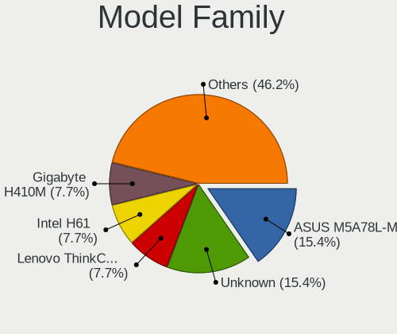
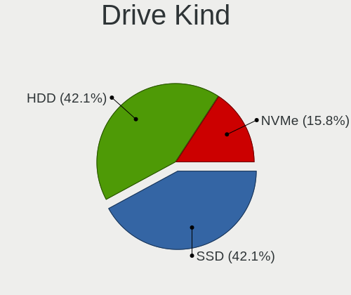
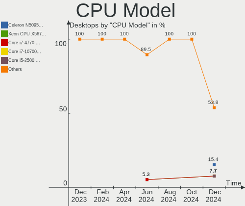
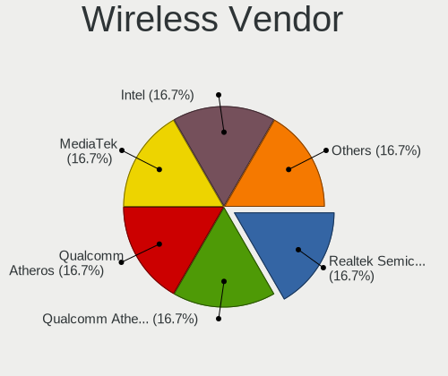
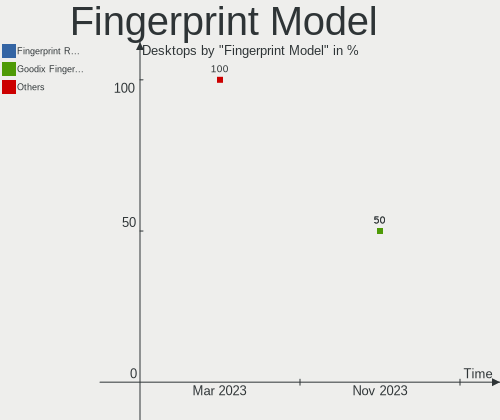

Xubuntu - Hardware Trends (Desktops)
------------------------------------

A project to identify most popular hardware characteristics and track their change
over time based on data collected by Linux users at https://Linux-Hardware.org.

Anyone can contribute to this report by the [hw-probe](https://github.com/linuxhw/hw-probe) tool:

    sudo -E hw-probe -all -upload

This report is for one last month. Overall report since the beginning of time: [TestDays](https://github.com/linuxhw/TestDays)

Period: Mar, 2023.

Contents
--------

* [ System ](#system)
  - [ OS                       ](#os)
  - [ OS Family                ](#os-family)
  - [ Kernel                   ](#kernel)
  - [ Kernel Family            ](#kernel-family)
  - [ Kernel Major Ver.        ](#kernel-major-ver)
  - [ Arch                     ](#arch)
  - [ DE                       ](#de)
  - [ Display Server           ](#display-server)
  - [ Display Manager          ](#display-manager)
  - [ OS Lang                  ](#os-lang)
  - [ Boot Mode                ](#boot-mode)
  - [ Filesystem               ](#filesystem)
  - [ Part. scheme             ](#part-scheme)
  - [ Dual Boot with Linux/BSD ](#dual-boot-with-linuxbsd)
  - [ Dual Boot (Win)          ](#dual-boot-win)

* [ Board ](#board)
  - [ Vendor                   ](#vendor)
  - [ Model                    ](#model)
  - [ Model Family             ](#model-family)
  - [ MFG Year                 ](#mfg-year)
  - [ Form Factor              ](#form-factor)
  - [ Secure Boot              ](#secure-boot)
  - [ Coreboot                 ](#coreboot)
  - [ RAM Size                 ](#ram-size)
  - [ RAM Used                 ](#ram-used)
  - [ Total Drives             ](#total-drives)
  - [ Has CD-ROM               ](#has-cd-rom)
  - [ Has Ethernet             ](#has-ethernet)
  - [ Has WiFi                 ](#has-wifi)
  - [ Has Bluetooth            ](#has-bluetooth)

* [ Location ](#location)
  - [ Country                  ](#country)
  - [ City                     ](#city)

* [ Drives ](#drives)
  - [ Drive Vendor             ](#drive-vendor)
  - [ Drive Model              ](#drive-model)
  - [ HDD Vendor               ](#hdd-vendor)
  - [ SSD Vendor               ](#ssd-vendor)
  - [ Drive Kind               ](#drive-kind)
  - [ Drive Connector          ](#drive-connector)
  - [ Drive Size               ](#drive-size)
  - [ Space Total              ](#space-total)
  - [ Space Used               ](#space-used)
  - [ Malfunc. Drives          ](#malfunc-drives)
  - [ Malfunc. Drive Vendor    ](#malfunc-drive-vendor)
  - [ Malfunc. HDD Vendor      ](#malfunc-hdd-vendor)
  - [ Malfunc. Drive Kind      ](#malfunc-drive-kind)
  - [ Failed Drives            ](#failed-drives)
  - [ Failed Drive Vendor      ](#failed-drive-vendor)
  - [ Drive Status             ](#drive-status)

* [ Storage controller ](#storage-controller)
  - [ Storage Vendor           ](#storage-vendor)
  - [ Storage Model            ](#storage-model)
  - [ Storage Kind             ](#storage-kind)

* [ Processor ](#processor)
  - [ CPU Vendor               ](#cpu-vendor)
  - [ CPU Model                ](#cpu-model)
  - [ CPU Model Family         ](#cpu-model-family)
  - [ CPU Cores                ](#cpu-cores)
  - [ CPU Sockets              ](#cpu-sockets)
  - [ CPU Threads              ](#cpu-threads)
  - [ CPU Op-Modes             ](#cpu-op-modes)
  - [ CPU Microcode            ](#cpu-microcode)
  - [ CPU Microarch            ](#cpu-microarch)

* [ Graphics ](#graphics)
  - [ GPU Vendor               ](#gpu-vendor)
  - [ GPU Model                ](#gpu-model)
  - [ GPU Combo                ](#gpu-combo)
  - [ GPU Driver               ](#gpu-driver)
  - [ GPU Memory               ](#gpu-memory)

* [ Monitor ](#monitor)
  - [ Monitor Vendor           ](#monitor-vendor)
  - [ Monitor Model            ](#monitor-model)
  - [ Monitor Resolution       ](#monitor-resolution)
  - [ Monitor Diagonal         ](#monitor-diagonal)
  - [ Monitor Width            ](#monitor-width)
  - [ Aspect Ratio             ](#aspect-ratio)
  - [ Monitor Area             ](#monitor-area)
  - [ Pixel Density            ](#pixel-density)
  - [ Multiple Monitors        ](#multiple-monitors)

* [ Network ](#network)
  - [ Net Controller Vendor    ](#net-controller-vendor)
  - [ Net Controller Model     ](#net-controller-model)
  - [ Wireless Vendor          ](#wireless-vendor)
  - [ Wireless Model           ](#wireless-model)
  - [ Ethernet Vendor          ](#ethernet-vendor)
  - [ Ethernet Model           ](#ethernet-model)
  - [ Net Controller Kind      ](#net-controller-kind)
  - [ Used Controller          ](#used-controller)
  - [ NICs                     ](#nics)
  - [ IPv6                     ](#ipv6)

* [ Bluetooth ](#bluetooth)
  - [ Bluetooth Vendor         ](#bluetooth-vendor)
  - [ Bluetooth Model          ](#bluetooth-model)

* [ Sound ](#sound)
  - [ Sound Vendor             ](#sound-vendor)
  - [ Sound Model              ](#sound-model)

* [ Memory ](#memory)
  - [ Memory Vendor            ](#memory-vendor)
  - [ Memory Model             ](#memory-model)
  - [ Memory Kind              ](#memory-kind)
  - [ Memory Form Factor       ](#memory-form-factor)
  - [ Memory Size              ](#memory-size)
  - [ Memory Speed             ](#memory-speed)

* [ Printers & scanners ](#printers--scanners)
  - [ Printer Vendor           ](#printer-vendor)
  - [ Printer Model            ](#printer-model)
  - [ Scanner Vendor           ](#scanner-vendor)
  - [ Scanner Model            ](#scanner-model)

* [ Camera ](#camera)
  - [ Camera Vendor            ](#camera-vendor)
  - [ Camera Model             ](#camera-model)

* [ Security ](#security)
  - [ Fingerprint Vendor       ](#fingerprint-vendor)
  - [ Fingerprint Model        ](#fingerprint-model)
  - [ Chipcard Vendor          ](#chipcard-vendor)
  - [ Chipcard Model           ](#chipcard-model)

* [ Unsupported ](#unsupported)
  - [ Unsupported Devices      ](#unsupported-devices)
  - [ Unsupported Device Types ](#unsupported-device-types)

System
------

OS
--

Installed operating systems

| Name          | Desktops | Percent |
|---------------|----------|---------|
| Xubuntu 22.04 | 19       | 59.38%  |
| Xubuntu 20.04 | 7        | 21.88%  |
| Xubuntu 22.10 | 4        | 12.5%   |
| Xubuntu 18.04 | 2        | 6.25%   |

OS Family
---------

OS without a version

| Name    | Desktops | Percent |
|---------|----------|---------|
| Xubuntu | 32       | 100%    |

Kernel
------

Version of the Linux kernel

| Version               | Desktops | Percent |
|-----------------------|----------|---------|
| 5.15.0-67-generic     | 9        | 28.13%  |
| 5.19.0-35-generic     | 7        | 21.88%  |
| 5.19.0-32-generic     | 2        | 6.25%   |
| 5.15.0-69-generic     | 2        | 6.25%   |
| 6.2.7-060207-generic  | 1        | 3.13%   |
| 6.2.2-060202-generic  | 1        | 3.13%   |
| 5.4.0-144-lowlatency  | 1        | 3.13%   |
| 5.4.0-144-generic     | 1        | 3.13%   |
| 5.4.0-139-generic     | 1        | 3.13%   |
| 5.4.0-110-generic     | 1        | 3.13%   |
| 5.19.0-38-generic     | 1        | 3.13%   |
| 5.19.0-21-generic     | 1        | 3.13%   |
| 5.15.0-69-lowlatency  | 1        | 3.13%   |
| 5.15.0-67-lowlatency  | 1        | 3.13%   |
| 5.15.0-60-generic     | 1        | 3.13%   |
| 4.15.0-206-lowlatency | 1        | 3.13%   |

Kernel Family
-------------

Linux kernel without a distro release

| Version | Desktops | Percent |
|---------|----------|---------|
| 5.15.0  | 14       | 43.75%  |
| 5.19.0  | 11       | 34.38%  |
| 5.4.0   | 4        | 12.5%   |
| 6.2.7   | 1        | 3.13%   |
| 6.2.2   | 1        | 3.13%   |
| 4.15.0  | 1        | 3.13%   |

Kernel Major Ver.
-----------------

Linux kernel major version

| Version | Desktops | Percent |
|---------|----------|---------|
| 5.15    | 14       | 43.75%  |
| 5.19    | 11       | 34.38%  |
| 5.4     | 4        | 12.5%   |
| 6.2     | 2        | 6.25%   |
| 4.15    | 1        | 3.13%   |

Arch
----

OS architecture (x86_64, i586, etc.)

| Name   | Desktops | Percent |
|--------|----------|---------|
| x86_64 | 31       | 96.88%  |
| i686   | 1        | 3.13%   |

DE
--

Desktop Environment

| Name    | Desktops | Percent |
|---------|----------|---------|
| XFCE    | 29       | 90.63%  |
| KDE5    | 1        | 3.13%   |
| GNUstep | 1        | 3.13%   |
| GNOME   | 1        | 3.13%   |

Display Server
--------------

X11 or Wayland

| Name    | Desktops | Percent |
|---------|----------|---------|
| X11     | 30       | 93.75%  |
| Wayland | 1        | 3.13%   |
| Tty     | 1        | 3.13%   |

Display Manager
---------------

SDDM, LightDM, etc.

| Name    | Desktops | Percent |
|---------|----------|---------|
| LightDM | 24       | 75%     |
| Unknown | 7        | 21.88%  |
| GDM     | 1        | 3.13%   |

OS Lang
-------

Language

| Lang    | Desktops | Percent |
|---------|----------|---------|
| en_US   | 11       | 34.38%  |
| de_DE   | 5        | 15.63%  |
| pt_BR   | 3        | 9.38%   |
| ja_JP   | 2        | 6.25%   |
| fr_FR   | 2        | 6.25%   |
| en_GB   | 2        | 6.25%   |
| en_CA   | 2        | 6.25%   |
| tr_TR   | 1        | 3.13%   |
| ru_RU   | 1        | 3.13%   |
| it_IT   | 1        | 3.13%   |
| en_ZA   | 1        | 3.13%   |
| Unknown | 1        | 3.13%   |

Boot Mode
---------

EFI or BIOS

| Mode | Desktops | Percent |
|------|----------|---------|
| BIOS | 20       | 62.5%   |
| EFI  | 12       | 37.5%   |

Filesystem
----------

Type of filesystem

| Type    | Desktops | Percent |
|---------|----------|---------|
| Ext4    | 28       | 87.5%   |
| Btrfs   | 3        | 9.38%   |
| Overlay | 1        | 3.13%   |

Part. scheme
------------

Scheme of partitioning

| Type    | Desktops | Percent |
|---------|----------|---------|
| GPT     | 16       | 50%     |
| MBR     | 9        | 28.13%  |
| Unknown | 7        | 21.88%  |

Dual Boot with Linux/BSD
------------------------

Hosting more than one Linux/BSD

| Dual boot | Desktops | Percent |
|-----------|----------|---------|
| No        | 20       | 62.5%   |
| Yes       | 12       | 37.5%   |

Dual Boot (Win)
---------------

Hosting Linux and Windows

| Dual boot | Desktops | Percent |
|-----------|----------|---------|
| No        | 25       | 78.13%  |
| Yes       | 7        | 21.88%  |

Board
-----

Vendor
------

Motherboard manufacturer

| Name                | Desktops | Percent |
|---------------------|----------|---------|
| ASUSTek Computer    | 7        | 21.88%  |
| Gigabyte Technology | 5        | 15.63%  |
| MSI                 | 4        | 12.5%   |
| Hewlett-Packard     | 3        | 9.38%   |
| ASRock              | 3        | 9.38%   |
| Lenovo              | 2        | 6.25%   |
| Fujitsu             | 2        | 6.25%   |
| Dell                | 2        | 6.25%   |
| Packard Bell        | 1        | 3.13%   |
| OEM                 | 1        | 3.13%   |
| Foxconn             | 1        | 3.13%   |
| Biostar             | 1        | 3.13%   |

Model
-----

Motherboard model

| Name                                   | Desktops | Percent |
|----------------------------------------|----------|---------|
| MSI MS-7817                            | 2        | 6.25%   |
| Packard Bell IXTREME M5800             | 1        | 3.13%   |
| MSI MS-7E07                            | 1        | 3.13%   |
| MSI MS-7D13                            | 1        | 3.13%   |
| Lenovo ThinkCentre M710e 10UR001LUS    | 1        | 3.13%   |
| Lenovo IdeaCentre 720-18APR 90HY002EIX | 1        | 3.13%   |
| HP Z620 Workstation                    | 1        | 3.13%   |
| HP ProLiant MicroServer                | 1        | 3.13%   |
| HP Compaq dc5750 Small Form Factor     | 1        | 3.13%   |
| Gigabyte X570 AORUS ELITE              | 1        | 3.13%   |
| Gigabyte H81M-H                        | 1        | 3.13%   |
| Gigabyte F2A88XM-D3H                   | 1        | 3.13%   |
| Gigabyte B550 AORUS ELITE              | 1        | 3.13%   |
| Gigabyte 8IR533                        | 1        | 3.13%   |
| Fujitsu ESPRIMO Q520                   | 1        | 3.13%   |
| Fujitsu CELSIUS W380                   | 1        | 3.13%   |
| Foxconn WE144AA-ABU CQ5305UK           | 1        | 3.13%   |
| Dell XPS 8700                          | 1        | 3.13%   |
| Dell OptiPlex 9020                     | 1        | 3.13%   |
| Biostar TZ77A                          | 1        | 3.13%   |
| ASUS Z170-P                            | 1        | 3.13%   |
| ASUS ROG STRIX B360-F GAMING           | 1        | 3.13%   |
| ASUS PRIME Z270-A                      | 1        | 3.13%   |
| ASUS PRIME H270M-PLUS                  | 1        | 3.13%   |
| ASUS P8H61-I R2.0                      | 1        | 3.13%   |
| ASUS P5B-Deluxe                        | 1        | 3.13%   |
| ASUS M5A78L-M LX PLUS                  | 1        | 3.13%   |
| ASRock Z390M-ITX/ac                    | 1        | 3.13%   |
| ASRock H270 Pro4                       | 1        | 3.13%   |
| ASRock FM2A68M-DG3+                    | 1        | 3.13%   |
| Unknown                                | 1        | 3.13%   |

Model Family
------------

Motherboard model prefix

| Name                 | Desktops | Percent |
|----------------------|----------|---------|
| MSI MS-7817          | 2        | 6.25%   |
| ASUS PRIME           | 2        | 6.25%   |
| Packard Bell IXTREME | 1        | 3.13%   |
| MSI MS-7E07          | 1        | 3.13%   |
| MSI MS-7D13          | 1        | 3.13%   |
| Lenovo ThinkCentre   | 1        | 3.13%   |
| Lenovo IdeaCentre    | 1        | 3.13%   |
| HP Z620              | 1        | 3.13%   |
| HP ProLiant          | 1        | 3.13%   |
| HP Compaq            | 1        | 3.13%   |
| Gigabyte X570        | 1        | 3.13%   |
| Gigabyte H81M-H      | 1        | 3.13%   |
| Gigabyte F2A88XM-D3H | 1        | 3.13%   |
| Gigabyte B550        | 1        | 3.13%   |
| Gigabyte 8IR533      | 1        | 3.13%   |
| Fujitsu ESPRIMO      | 1        | 3.13%   |
| Fujitsu CELSIUS      | 1        | 3.13%   |
| Foxconn WE144AA-ABU  | 1        | 3.13%   |
| Dell XPS             | 1        | 3.13%   |
| Dell OptiPlex        | 1        | 3.13%   |
| Biostar TZ77A        | 1        | 3.13%   |
| ASUS Z170-P          | 1        | 3.13%   |
| ASUS ROG             | 1        | 3.13%   |
| ASUS P8H61-I         | 1        | 3.13%   |
| ASUS P5B-Deluxe      | 1        | 3.13%   |
| ASUS M5A78L-M        | 1        | 3.13%   |
| ASRock Z390M-ITX     | 1        | 3.13%   |
| ASRock H270          | 1        | 3.13%   |
| ASRock FM2A68M-DG3+  | 1        | 3.13%   |
| Unknown              | 1        | 3.13%   |

MFG Year
--------

Motherboard manufacture year

| Year | Desktops | Percent |
|------|----------|---------|
| 2013 | 6        | 18.75%  |
| 2010 | 4        | 12.5%   |
| 2019 | 3        | 9.38%   |
| 2018 | 2        | 6.25%   |
| 2016 | 2        | 6.25%   |
| 2015 | 2        | 6.25%   |
| 2014 | 2        | 6.25%   |
| 2012 | 2        | 6.25%   |
| 2011 | 2        | 6.25%   |
| 2022 | 1        | 3.13%   |
| 2021 | 1        | 3.13%   |
| 2020 | 1        | 3.13%   |
| 2017 | 1        | 3.13%   |
| 2007 | 1        | 3.13%   |
| 2006 | 1        | 3.13%   |
| 2002 | 1        | 3.13%   |

Form Factor
-----------

Physical design of the computer

| Name    | Desktops | Percent |
|---------|----------|---------|
| Desktop | 32       | 100%    |

Secure Boot
-----------

Enabled or disabled

| State    | Desktops | Percent |
|----------|----------|---------|
| Disabled | 32       | 100%    |

Coreboot
--------

Have coreboot on board

| Used | Desktops | Percent |
|------|----------|---------|
| No   | 32       | 100%    |

RAM Size
--------

Total RAM memory

| Size in GB  | Desktops | Percent |
|-------------|----------|---------|
| 16.01-24.0  | 11       | 34.38%  |
| 4.01-8.0    | 6        | 18.75%  |
| 3.01-4.0    | 4        | 12.5%   |
| 8.01-16.0   | 4        | 12.5%   |
| 64.01-256.0 | 3        | 9.38%   |
| 32.01-64.0  | 2        | 6.25%   |
| 2.01-3.0    | 1        | 3.13%   |
| 0.51-1.0    | 1        | 3.13%   |

RAM Used
--------

Used RAM memory

| Used GB   | Desktops | Percent |
|-----------|----------|---------|
| 4.01-8.0  | 9        | 28.13%  |
| 2.01-3.0  | 7        | 21.88%  |
| 1.01-2.0  | 7        | 21.88%  |
| 3.01-4.0  | 6        | 18.75%  |
| 8.01-16.0 | 1        | 3.13%   |
| 0.51-1.0  | 1        | 3.13%   |
| 0.01-0.5  | 1        | 3.13%   |

Total Drives
------------

Number of drives on board

| Drives | Desktops | Percent |
|--------|----------|---------|
| 2      | 10       | 31.25%  |
| 1      | 10       | 31.25%  |
| 3      | 6        | 18.75%  |
| 5      | 3        | 9.38%   |
| 4      | 2        | 6.25%   |
| 6      | 1        | 3.13%   |

Has CD-ROM
----------

Has CD-ROM on board

| Presented | Desktops | Percent |
|-----------|----------|---------|
| Yes       | 18       | 56.25%  |
| No        | 14       | 43.75%  |

Has Ethernet
------------

Has Ethernet on board

| Presented | Desktops | Percent |
|-----------|----------|---------|
| Yes       | 32       | 100%    |

Has WiFi
--------

Has WiFi module

| Presented | Desktops | Percent |
|-----------|----------|---------|
| Yes       | 16       | 50%     |
| No        | 16       | 50%     |

Has Bluetooth
-------------

Has Bluetooth module

| Presented | Desktops | Percent |
|-----------|----------|---------|
| No        | 21       | 65.63%  |
| Yes       | 11       | 34.38%  |

Location
--------

Country
-------

Geographic location (country)

| Country      | Desktops | Percent |
|--------------|----------|---------|
| USA          | 9        | 28.13%  |
| Germany      | 4        | 12.5%   |
| Brazil       | 3        | 9.38%   |
| Japan        | 2        | 6.25%   |
| France       | 2        | 6.25%   |
| Canada       | 2        | 6.25%   |
| UK           | 1        | 3.13%   |
| Turkey       | 1        | 3.13%   |
| Switzerland  | 1        | 3.13%   |
| South Africa | 1        | 3.13%   |
| Russia       | 1        | 3.13%   |
| Norway       | 1        | 3.13%   |
| Netherlands  | 1        | 3.13%   |
| Italy        | 1        | 3.13%   |
| Colombia     | 1        | 3.13%   |
| Bulgaria     | 1        | 3.13%   |

City
----

Geographic location (city)

| City               | Desktops | Percent |
|--------------------|----------|---------|
| Garland            | 2        | 6.25%   |
| Zaltbommel         | 1        | 3.13%   |
| Terrace            | 1        | 3.13%   |
| Takamatsu          | 1        | 3.13%   |
| Sofia              | 1        | 3.13%   |
| Santiago de Cali   | 1        | 3.13%   |
| Santa Cruz         | 1        | 3.13%   |
| Salisbury          | 1        | 3.13%   |
| Saint Augustine    | 1        | 3.13%   |
| Rio de Janeiro     | 1        | 3.13%   |
| Pretoria           | 1        | 3.13%   |
| Osaka              | 1        | 3.13%   |
| Olathe             | 1        | 3.13%   |
| Novosibirsk        | 1        | 3.13%   |
| Münster           | 1        | 3.13%   |
| Mo i Rana          | 1        | 3.13%   |
| Miami              | 1        | 3.13%   |
| La Motte-Servolex  | 1        | 3.13%   |
| Izmir              | 1        | 3.13%   |
| Iguatu             | 1        | 3.13%   |
| Hanover            | 1        | 3.13%   |
| Guaratingueta      | 1        | 3.13%   |
| Grenoble           | 1        | 3.13%   |
| Gebenstorf         | 1        | 3.13%   |
| Gambrills          | 1        | 3.13%   |
| Freiberg am Neckar | 1        | 3.13%   |
| Fort Worth         | 1        | 3.13%   |
| Fort Vermilion     | 1        | 3.13%   |
| Casoria            | 1        | 3.13%   |
| Bridgewater        | 1        | 3.13%   |
| Berlin             | 1        | 3.13%   |

Drives
------

Drive Vendor
------------

Hard drive vendors

| Vendor                      | Desktops | Drives | Percent |
|-----------------------------|----------|--------|---------|
| Seagate                     | 13       | 18     | 22.03%  |
| WDC                         | 10       | 15     | 16.95%  |
| Samsung Electronics         | 10       | 10     | 16.95%  |
| Crucial                     | 5        | 5      | 8.47%   |
| SanDisk                     | 3        | 3      | 5.08%   |
| Toshiba                     | 2        | 2      | 3.39%   |
| Intel                       | 2        | 2      | 3.39%   |
| HGST                        | 2        | 4      | 3.39%   |
| Hewlett-Packard             | 2        | 3      | 3.39%   |
| China                       | 2        | 2      | 3.39%   |
| Unknown                     | 1        | 2      | 1.69%   |
| SPCC                        | 1        | 2      | 1.69%   |
| PNY                         | 1        | 1      | 1.69%   |
| Patriot                     | 1        | 1      | 1.69%   |
| Micron Technology           | 1        | 1      | 1.69%   |
| Kingston Technology Company | 1        | 1      | 1.69%   |
| Kingston                    | 1        | 1      | 1.69%   |
| A-DATA Technology           | 1        | 1      | 1.69%   |

Drive Model
-----------

Hard drive models

| Model                                 | Desktops | Percent |
|---------------------------------------|----------|---------|
| Toshiba DT01ACA100 1TB                | 2        | 2.94%   |
| Seagate ST2000DM001-1CH164 2TB        | 2        | 2.94%   |
| Seagate ST1000DM003-1SB102 1TB        | 2        | 2.94%   |
| Seagate ST1000DM003-1ER162 1TB        | 2        | 2.94%   |
| Samsung SSD 840 EVO 250GB             | 2        | 2.94%   |
| WDC WDS240G2G0A-00JH30 240GB SSD      | 1        | 1.47%   |
| WDC WD80EAZZ-00BKLB0 8TB              | 1        | 1.47%   |
| WDC WD800JB-00FMA0 80GB               | 1        | 1.47%   |
| WDC WD5000AZLX-60K2TA0 500GB          | 1        | 1.47%   |
| WDC WD5000AZLX-00K2TA0 500GB          | 1        | 1.47%   |
| WDC WD5000AAKX-603CA0 500GB           | 1        | 1.47%   |
| WDC WD5000AAKS-00V1A0 500GB           | 1        | 1.47%   |
| WDC WD5000AADS-00L4B1 500GB           | 1        | 1.47%   |
| WDC WD30EZRX-00D8PB0 3TB              | 1        | 1.47%   |
| WDC WD2500AAKX-753CA1 250GB           | 1        | 1.47%   |
| WDC WD20EARX-00PASB0 2TB              | 1        | 1.47%   |
| WDC WD20EARS-00MVWB0 2TB              | 1        | 1.47%   |
| WDC WD10EZRZ-00HTKB0 1TB              | 1        | 1.47%   |
| WDC WD10EZEX-07WN4A0 1TB              | 1        | 1.47%   |
| Unknown SD/MMC 2GB                    | 1        | 1.47%   |
| Unknown M.S./M.S.Pro/HG 16GB          | 1        | 1.47%   |
| SPCC Solid State Disk 512GB           | 1        | 1.47%   |
| Seagate USB 160GB                     | 1        | 1.47%   |
| Seagate ST9500420AS 500GB             | 1        | 1.47%   |
| Seagate ST8000DM004-2CX188 8TB        | 1        | 1.47%   |
| Seagate ST380011A 80GB                | 1        | 1.47%   |
| Seagate ST3500418AS 500GB             | 1        | 1.47%   |
| Seagate ST3250823AS 250GB             | 1        | 1.47%   |
| Seagate ST31000340AS 1TB              | 1        | 1.47%   |
| Seagate ST2000DM001-1ER164 2TB        | 1        | 1.47%   |
| Seagate OneTouch HDD 2TB              | 1        | 1.47%   |
| Seagate Expansion+ 2TB                | 1        | 1.47%   |
| Seagate BUP Slim BK 2TB               | 1        | 1.47%   |
| SanDisk Ultra II 250GB SSD            | 1        | 1.47%   |
| SanDisk SDSSDH31000G 1TB              | 1        | 1.47%   |
| SanDisk NVMe SSD Drive 2TB            | 1        | 1.47%   |
| Samsung SSD 980 PRO with Heatsink 2TB | 1        | 1.47%   |
| Samsung SSD 980 1TB                   | 1        | 1.47%   |
| Samsung SSD 860 EVO 500GB             | 1        | 1.47%   |
| Samsung SSD 860 EVO 1TB               | 1        | 1.47%   |

HDD Vendor
----------

Hard disk drive vendors

| Vendor              | Desktops | Drives | Percent |
|---------------------|----------|--------|---------|
| Seagate             | 13       | 17     | 44.83%  |
| WDC                 | 9        | 14     | 31.03%  |
| Toshiba             | 2        | 2      | 6.9%    |
| HGST                | 2        | 4      | 6.9%    |
| Hewlett-Packard     | 2        | 3      | 6.9%    |
| Samsung Electronics | 1        | 1      | 3.45%   |

SSD Vendor
----------

Solid state drive vendors

| Vendor              | Desktops | Drives | Percent |
|---------------------|----------|--------|---------|
| Samsung Electronics | 5        | 5      | 22.73%  |
| Crucial             | 5        | 5      | 22.73%  |
| SanDisk             | 2        | 2      | 9.09%   |
| China               | 2        | 2      | 9.09%   |
| WDC                 | 1        | 1      | 4.55%   |
| SPCC                | 1        | 2      | 4.55%   |
| PNY                 | 1        | 1      | 4.55%   |
| Patriot             | 1        | 1      | 4.55%   |
| Micron Technology   | 1        | 1      | 4.55%   |
| Kingston            | 1        | 1      | 4.55%   |
| Intel               | 1        | 1      | 4.55%   |
| A-DATA Technology   | 1        | 1      | 4.55%   |

Drive Kind
----------

HDD or SSD

| Kind    | Desktops | Drives | Percent |
|---------|----------|--------|---------|
| HDD     | 25       | 41     | 46.3%   |
| SSD     | 20       | 23     | 37.04%  |
| NVMe    | 7        | 7      | 12.96%  |
| Unknown | 2        | 3      | 3.7%    |

Drive Connector
---------------

SATA, SAS, NVMe, etc.

| Type | Desktops | Drives | Percent |
|------|----------|--------|---------|
| SATA | 31       | 60     | 72.09%  |
| NVMe | 7        | 7      | 16.28%  |
| SAS  | 5        | 7      | 11.63%  |

Drive Size
----------

Size of hard drive

| Size in TB | Desktops | Drives | Percent |
|------------|----------|--------|---------|
| 0.01-0.5   | 22       | 27     | 42.31%  |
| 0.51-1.0   | 16       | 19     | 30.77%  |
| 1.01-2.0   | 10       | 13     | 19.23%  |
| 2.01-3.0   | 2        | 3      | 3.85%   |
| 4.01-10.0  | 2        | 2      | 3.85%   |

Space Total
-----------

Amount of disk space available on the file system

| Size in GB     | Desktops | Percent |
|----------------|----------|---------|
| 1001-2000      | 7        | 21.88%  |
| 501-1000       | 6        | 18.75%  |
| More than 3000 | 5        | 15.63%  |
| 101-250        | 5        | 15.63%  |
| 251-500        | 4        | 12.5%   |
| 2001-3000      | 3        | 9.38%   |
| 1-20           | 1        | 3.13%   |
| 51-100         | 1        | 3.13%   |

Space Used
----------

Amount of used disk space

| Used GB        | Desktops | Percent |
|----------------|----------|---------|
| 1-20           | 7        | 21.88%  |
| 1001-2000      | 6        | 18.75%  |
| 251-500        | 4        | 12.5%   |
| 51-100         | 4        | 12.5%   |
| 21-50          | 3        | 9.38%   |
| 501-1000       | 3        | 9.38%   |
| 2001-3000      | 2        | 6.25%   |
| 101-250        | 2        | 6.25%   |
| More than 3000 | 1        | 3.13%   |

Malfunc. Drives
---------------

Drive models with a malfunction

| Model                             | Desktops | Drives | Percent |
|-----------------------------------|----------|--------|---------|
| WDC WD30EZRX-00D8PB0 3TB          | 1        | 1      | 20%     |
| Seagate ST2000DM001-1CH164 2TB    | 1        | 1      | 20%     |
| Seagate ST1000DM003-1ER162 1TB    | 1        | 1      | 20%     |
| Intel SSDSC2BW120A4 120GB         | 1        | 1      | 20%     |
| Hewlett-Packard VB0250EAVER 250GB | 1        | 1      | 20%     |

Malfunc. Drive Vendor
---------------------

Vendors of faulty drives

| Vendor          | Desktops | Drives | Percent |
|-----------------|----------|--------|---------|
| Seagate         | 2        | 2      | 40%     |
| WDC             | 1        | 1      | 20%     |
| Intel           | 1        | 1      | 20%     |
| Hewlett-Packard | 1        | 1      | 20%     |

Malfunc. HDD Vendor
-------------------

Vendors of faulty HDD drives

| Vendor          | Desktops | Drives | Percent |
|-----------------|----------|--------|---------|
| Seagate         | 2        | 2      | 50%     |
| WDC             | 1        | 1      | 25%     |
| Hewlett-Packard | 1        | 1      | 25%     |

Malfunc. Drive Kind
-------------------

Kinds of faulty drives

| Kind | Desktops | Drives | Percent |
|------|----------|--------|---------|
| HDD  | 3        | 4      | 75%     |
| SSD  | 1        | 1      | 25%     |

Failed Drives
-------------

Failed drive models

Zero info for selected period =(

Failed Drive Vendor
-------------------

Failed drive vendors

Zero info for selected period =(

Drive Status
------------

Number of failed and malfunc. drives

| Status   | Desktops | Drives | Percent |
|----------|----------|--------|---------|
| Detected | 21       | 43     | 53.85%  |
| Works    | 14       | 26     | 35.9%   |
| Malfunc  | 4        | 5      | 10.26%  |

Storage controller
------------------

Storage Vendor
--------------

Storage controller vendors

| Vendor                      | Desktops | Percent |
|-----------------------------|----------|---------|
| Intel                       | 23       | 57.5%   |
| AMD                         | 9        | 22.5%   |
| Samsung Electronics         | 4        | 10%     |
| SanDisk                     | 1        | 2.5%    |
| Kingston Technology Company | 1        | 2.5%    |
| JMicron Technology          | 1        | 2.5%    |
| Broadcom / LSI              | 1        | 2.5%    |

Storage Model
-------------

Storage controller models

| Model                                                                          | Desktops | Percent |
|--------------------------------------------------------------------------------|----------|---------|
| Intel 8 Series/C220 Series Chipset Family 6-port SATA Controller 1 [AHCI mode] | 4        | 7.55%   |
| Intel 200 Series PCH SATA controller [AHCI mode]                               | 4        | 7.55%   |
| AMD FCH SATA Controller [AHCI mode]                                            | 3        | 5.66%   |
| Intel NM10/ICH7 Family SATA Controller [IDE mode]                              | 2        | 3.77%   |
| Intel Cannon Lake PCH SATA AHCI Controller                                     | 2        | 3.77%   |
| Intel 82801G (ICH7 Family) IDE Controller                                      | 2        | 3.77%   |
| Intel 5 Series/3400 Series Chipset 6 port SATA AHCI Controller                 | 2        | 3.77%   |
| AMD SB7x0/SB8x0/SB9x0 SATA Controller [AHCI mode]                              | 2        | 3.77%   |
| AMD SB7x0/SB8x0/SB9x0 IDE Controller                                           | 2        | 3.77%   |
| AMD 500 Series Chipset SATA Controller                                         | 2        | 3.77%   |
| SanDisk NVMe Controller                                                        | 1        | 1.89%   |
| Samsung NVMe SSD Controller SM981/PM981/PM983                                  | 1        | 1.89%   |
| Samsung NVMe SSD Controller SM951/PM951                                        | 1        | 1.89%   |
| Samsung NVMe SSD Controller PM9A1/PM9A3/980PRO                                 | 1        | 1.89%   |
| Samsung NVMe SSD Controller 980                                                | 1        | 1.89%   |
| Kingston Company A2000 NVMe SSD                                                | 1        | 1.89%   |
| JMicron JMB363 SATA/IDE Controller                                             | 1        | 1.89%   |
| Intel SATA Controller [RAID mode]                                              | 1        | 1.89%   |
| Intel Q170/Q150/B150/H170/H110/Z170/CM236 Chipset SATA Controller [AHCI Mode]  | 1        | 1.89%   |
| Intel Non-Volatile memory controller                                           | 1        | 1.89%   |
| Intel C602 chipset 4-Port SATA Storage Control Unit                            | 1        | 1.89%   |
| Intel C600/X79 series chipset SATA RAID Controller                             | 1        | 1.89%   |
| Intel C600/X79 series chipset IDE-r Controller                                 | 1        | 1.89%   |
| Intel 82801HR/HO/HH (ICH8R/DO/DH) 2 port SATA Controller [IDE mode]            | 1        | 1.89%   |
| Intel 82801H (ICH8 Family) 4 port SATA Controller [IDE mode]                   | 1        | 1.89%   |
| Intel 82801BA IDE U100 Controller                                              | 1        | 1.89%   |
| Intel 8 Series/C220 Series Chipset Family 4-port SATA Controller 1 [IDE mode]  | 1        | 1.89%   |
| Intel 8 Series/C220 Series Chipset Family 2-port SATA Controller 2 [IDE mode]  | 1        | 1.89%   |
| Intel 700 Series Chipset Family SATA AHCI Controller                           | 1        | 1.89%   |
| Intel 7 Series/C210 Series Chipset Family 4-port SATA Controller [IDE mode]    | 1        | 1.89%   |
| Intel 7 Series/C210 Series Chipset Family 2-port SATA Controller [IDE mode]    | 1        | 1.89%   |
| Intel 6 Series/C200 Series Chipset Family 6 port Desktop SATA AHCI Controller  | 1        | 1.89%   |
| Intel 5 Series/3400 Series Chipset PT IDER Controller                          | 1        | 1.89%   |
| Broadcom / LSI MegaRAID SAS 2208 [Thunderbolt]                                 | 1        | 1.89%   |
| AMD SB600 Non-Raid-5 SATA                                                      | 1        | 1.89%   |
| AMD SB600 IDE                                                                  | 1        | 1.89%   |
| AMD FCH SATA Controller [RAID mode]                                            | 1        | 1.89%   |
| AMD 400 Series Chipset SATA Controller                                         | 1        | 1.89%   |

Storage Kind
------------

Kind of storage controller (IDE, SATA, NVMe, SAS, ...)

| Kind | Desktops | Percent |
|------|----------|---------|
| SATA | 23       | 51.11%  |
| IDE  | 11       | 24.44%  |
| NVMe | 7        | 15.56%  |
| RAID | 3        | 6.67%   |
| SAS  | 1        | 2.22%   |

Processor
---------

CPU Vendor
----------

Processor vendors

| Vendor | Desktops | Percent |
|--------|----------|---------|
| Intel  | 23       | 71.88%  |
| AMD    | 9        | 28.13%  |

CPU Model
---------

Processor models

| Model                                         | Desktops | Percent |
|-----------------------------------------------|----------|---------|
| Intel Core i5-4460 CPU @ 3.20GHz              | 2        | 6.25%   |
| Intel Xeon CPU E5-4650 v2 @ 2.40GHz           | 1        | 3.13%   |
| Intel Pentium Dual-Core CPU E5400 @ 2.70GHz   | 1        | 3.13%   |
| Intel Pentium Dual-Core CPU E5300 @ 2.60GHz   | 1        | 3.13%   |
| Intel Core i7-7700K CPU @ 4.20GHz             | 1        | 3.13%   |
| Intel Core i7-7700 CPU @ 3.60GHz              | 1        | 3.13%   |
| Intel Core i7-6700 CPU @ 3.40GHz              | 1        | 3.13%   |
| Intel Core i7-4790 CPU @ 3.60GHz              | 1        | 3.13%   |
| Intel Core i7-3770K CPU @ 3.50GHz             | 1        | 3.13%   |
| Intel Core i7-3770 CPU @ 3.40GHz              | 1        | 3.13%   |
| Intel Core i7 CPU 870 @ 2.93GHz               | 1        | 3.13%   |
| Intel Core i5-9600K CPU @ 3.70GHz             | 1        | 3.13%   |
| Intel Core i5-9400F CPU @ 2.90GHz             | 1        | 3.13%   |
| Intel Core i5-7500 CPU @ 3.40GHz              | 1        | 3.13%   |
| Intel Core i5-7400 CPU @ 3.00GHz              | 1        | 3.13%   |
| Intel Core i5-4590T CPU @ 2.00GHz             | 1        | 3.13%   |
| Intel Core i5-4570T CPU @ 2.90GHz             | 1        | 3.13%   |
| Intel Core i5 CPU 660 @ 3.33GHz               | 1        | 3.13%   |
| Intel Core i3-4150 CPU @ 3.50GHz              | 1        | 3.13%   |
| Intel Core 2 Duo CPU E8400 @ 3.00GHz          | 1        | 3.13%   |
| Intel Celeron CPU 2.20GHz                     | 1        | 3.13%   |
| Intel 13th Gen Core i7-13700KF                | 1        | 3.13%   |
| AMD Turion II Neo N40L Dual-Core Processor    | 1        | 3.13%   |
| AMD Ryzen 7 5700G with Radeon Graphics        | 1        | 3.13%   |
| AMD Ryzen 7 2700X Eight-Core Processor        | 1        | 3.13%   |
| AMD Ryzen 5 3600 6-Core Processor             | 1        | 3.13%   |
| AMD Ryzen 5 2400G with Radeon Vega Graphics   | 1        | 3.13%   |
| AMD FX-8300 Eight-Core Processor              | 1        | 3.13%   |
| AMD Athlon 64 X2 Dual Core Processor 4000+    | 1        | 3.13%   |
| AMD A8-7680 Radeon R7, 10 Compute Cores 4C+6G | 1        | 3.13%   |
| AMD A8-6600K APU with Radeon HD Graphics      | 1        | 3.13%   |

CPU Model Family
----------------

Processor model prefix

| Model                   | Desktops | Percent |
|-------------------------|----------|---------|
| Intel Core i5           | 9        | 28.13%  |
| Intel Core i7           | 7        | 21.88%  |
| Intel Pentium Dual-Core | 2        | 6.25%   |
| AMD Ryzen 7             | 2        | 6.25%   |
| AMD Ryzen 5             | 2        | 6.25%   |
| AMD A8                  | 2        | 6.25%   |
| Other                   | 1        | 3.13%   |
| Intel Xeon              | 1        | 3.13%   |
| Intel Core i3           | 1        | 3.13%   |
| Intel Core 2 Duo        | 1        | 3.13%   |
| Intel Celeron           | 1        | 3.13%   |
| AMD Turion II Neo       | 1        | 3.13%   |
| AMD FX                  | 1        | 3.13%   |
| AMD Athlon 64 X2        | 1        | 3.13%   |

CPU Cores
---------

Number of processor cores

| Number | Desktops | Percent |
|--------|----------|---------|
| 4      | 14       | 43.75%  |
| 2      | 10       | 31.25%  |
| 6      | 3        | 9.38%   |
| 8      | 2        | 6.25%   |
| 20     | 1        | 3.13%   |
| 16     | 1        | 3.13%   |
| 1      | 1        | 3.13%   |

CPU Sockets
-----------

Number of sockets

| Number | Desktops | Percent |
|--------|----------|---------|
| 1      | 31       | 96.88%  |
| 2      | 1        | 3.13%   |

CPU Threads
-----------

Threads per core (Hyper-Threading)

| Number | Desktops | Percent |
|--------|----------|---------|
| 2      | 19       | 59.38%  |
| 1      | 13       | 40.63%  |

CPU Op-Modes
------------

CPU Operation Modes (32-bit, 64-bit)

| Op mode        | Desktops | Percent |
|----------------|----------|---------|
| 32-bit, 64-bit | 31       | 96.88%  |
| 32-bit         | 1        | 3.13%   |

CPU Microcode
-------------

Microcode number

| Number     | Desktops | Percent |
|------------|----------|---------|
| Unknown    | 12       | 37.5%   |
| 0x306c3    | 4        | 12.5%   |
| 0x906e9    | 3        | 9.38%   |
| 0x306a9    | 2        | 6.25%   |
| 0xf27      | 1        | 3.13%   |
| 0xb0671    | 1        | 3.13%   |
| 0x906ea    | 1        | 3.13%   |
| 0x506e3    | 1        | 3.13%   |
| 0x306e4    | 1        | 3.13%   |
| 0x106e5    | 1        | 3.13%   |
| 0x1067a    | 1        | 3.13%   |
| 0x0600611a | 1        | 3.13%   |
| 0x06001119 | 1        | 3.13%   |
| 0x06000852 | 1        | 3.13%   |
| 0x010000c8 | 1        | 3.13%   |

CPU Microarch
-------------

Microarchitecture

| Name       | Desktops | Percent |
|------------|----------|---------|
| KabyLake   | 6        | 18.75%  |
| Haswell    | 6        | 18.75%  |
| Penryn     | 3        | 9.38%   |
| IvyBridge  | 3        | 9.38%   |
| Piledriver | 2        | 6.25%   |
| Zen+       | 1        | 3.13%   |
| Zen 3      | 1        | 3.13%   |
| Zen 2      | 1        | 3.13%   |
| Zen        | 1        | 3.13%   |
| Westmere   | 1        | 3.13%   |
| Skylake    | 1        | 3.13%   |
| NetBurst   | 1        | 3.13%   |
| Nehalem    | 1        | 3.13%   |
| K8 Hammer  | 1        | 3.13%   |
| K10        | 1        | 3.13%   |
| Excavator  | 1        | 3.13%   |
| Unknown    | 1        | 3.13%   |

Graphics
--------

GPU Vendor
----------

Vendors of graphics cards

| Vendor | Desktops | Percent |
|--------|----------|---------|
| AMD    | 13       | 36.11%  |
| Intel  | 12       | 33.33%  |
| Nvidia | 11       | 30.56%  |

GPU Model
---------

Graphics card models

| Model                                                                       | Desktops | Percent |
|-----------------------------------------------------------------------------|----------|---------|
| Intel Xeon E3-1200 v3/4th Gen Core Processor Integrated Graphics Controller | 3        | 7.89%   |
| Nvidia GK208B [GeForce GT 730]                                              | 2        | 5.26%   |
| Intel IvyBridge GT2 [HD Graphics 4000]                                      | 2        | 5.26%   |
| Intel HD Graphics 630                                                       | 2        | 5.26%   |
| AMD Ellesmere [Radeon RX 470/480/570/570X/580/580X/590]                     | 2        | 5.26%   |
| Nvidia GP107 [GeForce GTX 1050 Ti]                                          | 1        | 2.63%   |
| Nvidia GP106 [GeForce GTX 1060 6GB]                                         | 1        | 2.63%   |
| Nvidia GM107 [GeForce GTX 745]                                              | 1        | 2.63%   |
| Nvidia GK208B [GeForce GT 710]                                              | 1        | 2.63%   |
| Nvidia GK104GL [Quadro K5000]                                               | 1        | 2.63%   |
| Nvidia GF119 [GeForce GT 520]                                               | 1        | 2.63%   |
| Nvidia G96C [GeForce 9500 GT]                                               | 1        | 2.63%   |
| Nvidia G92 [GeForce 9800 GT]                                                | 1        | 2.63%   |
| Nvidia AD104 [GeForce RTX 4070 Ti]                                          | 1        | 2.63%   |
| Intel HD Graphics 530                                                       | 1        | 2.63%   |
| Intel DG2 [Arc A770]                                                        | 1        | 2.63%   |
| Intel 82G33/G31 Express Integrated Graphics Controller                      | 1        | 2.63%   |
| Intel 4th Generation Core Processor Family Integrated Graphics Controller   | 1        | 2.63%   |
| Intel 4 Series Chipset Integrated Graphics Controller                       | 1        | 2.63%   |
| AMD Wani [Radeon R5/R6/R7 Graphics]                                         | 1        | 2.63%   |
| AMD RV620 LE [Radeon HD 3450]                                               | 1        | 2.63%   |
| AMD RV360 [Radeon 9600/X1050 Series]                                        | 1        | 2.63%   |
| AMD RV350 [Radeon 9600/X1050 Series] (Secondary)                            | 1        | 2.63%   |
| AMD RS880M [Mobility Radeon HD 4225/4250]                                   | 1        | 2.63%   |
| AMD RS482/RS485 [Radeon Xpress 1100/1150]                                   | 1        | 2.63%   |
| AMD RS480 [Radeon Xpress 1150] (Secondary)                                  | 1        | 2.63%   |
| AMD Richland [Radeon HD 8570D]                                              | 1        | 2.63%   |
| AMD Raven Ridge [Radeon Vega Series / Radeon Vega Mobile Series]            | 1        | 2.63%   |
| AMD Oland [Radeon HD 8570 / R5 430 OEM / R7 240/340 / Radeon 520 OEM]       | 1        | 2.63%   |
| AMD Lexa PRO [Radeon 540/540X/550/550X / RX 540X/550/550X]                  | 1        | 2.63%   |
| AMD Cezanne [Radeon Vega Series / Radeon Vega Mobile Series]                | 1        | 2.63%   |
| AMD Baffin [Radeon RX 460/560D / Pro 450/455/460/555/555X/560/560X]         | 1        | 2.63%   |

GPU Combo
---------

Combinations of graphics cards

| Name         | Desktops | Percent |
|--------------|----------|---------|
| 1 x Nvidia   | 10       | 31.25%  |
| 1 x Intel    | 9        | 28.13%  |
| 1 x AMD      | 8        | 25%     |
| 2 x AMD      | 2        | 6.25%   |
| Intel + AMD  | 2        | 6.25%   |
| AMD + Nvidia | 1        | 3.13%   |

GPU Driver
----------

Free vs proprietary

| Driver      | Desktops | Percent |
|-------------|----------|---------|
| Free        | 24       | 75%     |
| Proprietary | 7        | 21.88%  |
| Unknown     | 1        | 3.13%   |

GPU Memory
----------

Total video memory

| Size in GB | Desktops | Percent |
|------------|----------|---------|
| Unknown    | 20       | 62.5%   |
| 1.01-2.0   | 3        | 9.38%   |
| 0.51-1.0   | 3        | 9.38%   |
| 0.01-0.5   | 3        | 9.38%   |
| 3.01-4.0   | 2        | 6.25%   |
| 8.01-16.0  | 1        | 3.13%   |

Monitor
-------

Monitor Vendor
--------------

Monitor vendors

| Vendor               | Desktops | Percent |
|----------------------|----------|---------|
| Dell                 | 5        | 17.86%  |
| Goldstar             | 4        | 14.29%  |
| BenQ                 | 3        | 10.71%  |
| Samsung Electronics  | 2        | 7.14%   |
| LG Electronics       | 2        | 7.14%   |
| Acer                 | 2        | 7.14%   |
| Unknown              | 1        | 3.57%   |
| SNC                  | 1        | 3.57%   |
| RTK                  | 1        | 3.57%   |
| Lenovo               | 1        | 3.57%   |
| INNOCN               | 1        | 3.57%   |
| Hewlett-Packard      | 1        | 3.57%   |
| Fujitsu Siemens      | 1        | 3.57%   |
| Eizo                 | 1        | 3.57%   |
| AOC                  | 1        | 3.57%   |
| Ancor Communications | 1        | 3.57%   |

Monitor Model
-------------

Monitor models

| Model                                                                 | Desktops | Percent |
|-----------------------------------------------------------------------|----------|---------|
| Unknown LCD Monitor FFFF 2288x1287 2550x2550mm 142.0-inch             | 1        | 3.23%   |
| SNC SKP_E20-27 SNC2700 2560x1440 597x336mm 27.0-inch                  | 1        | 3.23%   |
| Samsung Electronics SyncMaster SAM0576 1280x1024 338x270mm 17.0-inch  | 1        | 3.23%   |
| Samsung Electronics LCD Monitor SAM094E 1920x1080 890x500mm 40.2-inch | 1        | 3.23%   |
| RTK FHD HDR RTK3B3A 1920x1080 344x195mm 15.6-inch                     | 1        | 3.23%   |
| LG Electronics LCD Monitor W2452 1920x1200                            | 1        | 3.23%   |
| LG Electronics LCD Monitor LG ULTRAWIDE 7680x1080                     | 1        | 3.23%   |
| LG Electronics LCD Monitor LG ULTRAWIDE                               | 1        | 3.23%   |
| Lenovo LEN L22e-20 LEN65DE 1920x1080 476x268mm 21.5-inch              | 1        | 3.23%   |
| INNOCN 27C1U-D IOCFFFF 3840x2160 597x336mm 27.0-inch                  | 1        | 3.23%   |
| Hewlett-Packard LCD Monitor ZR2440w 7360x1200                         | 1        | 3.23%   |
| Hewlett-Packard LCD Monitor ZR2440w                                   | 1        | 3.23%   |
| Hewlett-Packard LCD Monitor P201                                      | 1        | 3.23%   |
| Goldstar W2261 GSM56CE 1920x1080 477x268mm 21.5-inch                  | 1        | 3.23%   |
| Goldstar Ultra HD GSM5B09 3840x2160 600x340mm 27.2-inch               | 1        | 3.23%   |
| Goldstar 22EN43 GSM59D9 1920x1080 477x268mm 21.5-inch                 | 1        | 3.23%   |
| Goldstar 20M35 GSM4EED 1600x900 433x236mm 19.4-inch                   | 1        | 3.23%   |
| Fujitsu Siemens P19-1A FUS0491 1280x1024 376x301mm 19.0-inch          | 1        | 3.23%   |
| Eizo EV2456 ENC2796 1920x1080 519x324mm 24.1-inch                     | 1        | 3.23%   |
| Dell U4919DW DELA107 3840x1080 1198x337mm 49.0-inch                   | 1        | 3.23%   |
| Dell ST2210 DELA059 1920x1080 477x268mm 21.5-inch                     | 1        | 3.23%   |
| Dell P2317H DEL40F4 1920x1080 509x286mm 23.0-inch                     | 1        | 3.23%   |
| Dell P2222H DEL423D 1920x1080 476x268mm 21.5-inch                     | 1        | 3.23%   |
| Dell P2210 DEL404E 1680x1050 474x296mm 22.0-inch                      | 1        | 3.23%   |
| BenQ RL2755 BNQ7F41 1920x1080 598x336mm 27.0-inch                     | 1        | 3.23%   |
| BenQ LCD Monitor GW2470 1920x1080                                     | 1        | 3.23%   |
| BenQ GL2460 BNQ78CE 1920x1080 531x299mm 24.0-inch                     | 1        | 3.23%   |
| AOC 1970W AOC1970 1366x768 410x230mm 18.5-inch                        | 1        | 3.23%   |
| Ancor Communications ASUS VW192S ACI19A6 1440x900 410x256mm 19.0-inch | 1        | 3.23%   |
| Acer X223W ACR0050 1680x1050 474x296mm 22.0-inch                      | 1        | 3.23%   |
| Acer LCD Monitor AL1917 1280x1024                                     | 1        | 3.23%   |

Monitor Resolution
------------------

Monitor screen resolution

| Resolution         | Desktops | Percent |
|--------------------|----------|---------|
| 1920x1080 (FHD)    | 11       | 37.93%  |
| 1280x1024 (SXGA)   | 3        | 10.34%  |
| 3840x2160 (4K)     | 2        | 6.9%    |
| 1680x1050 (WSXGA+) | 2        | 6.9%    |
| Unknown            | 2        | 6.9%    |
| 7680x1080          | 1        | 3.45%   |
| 7360x1200          | 1        | 3.45%   |
| 3840x1080          | 1        | 3.45%   |
| 2560x1440 (QHD)    | 1        | 3.45%   |
| 2288x1287          | 1        | 3.45%   |
| 1920x1200 (WUXGA)  | 1        | 3.45%   |
| 1600x900 (HD+)     | 1        | 3.45%   |
| 1440x900 (WXGA+)   | 1        | 3.45%   |
| 1366x768 (WXGA)    | 1        | 3.45%   |

Monitor Diagonal
----------------

Diagonal size in inches

| Inches  | Desktops | Percent |
|---------|----------|---------|
| 21      | 5        | 17.86%  |
| Unknown | 5        | 17.86%  |
| 27      | 4        | 14.29%  |
| 24      | 2        | 7.14%   |
| 22      | 2        | 7.14%   |
| 19      | 2        | 7.14%   |
| 142     | 1        | 3.57%   |
| 54      | 1        | 3.57%   |
| 49      | 1        | 3.57%   |
| 23      | 1        | 3.57%   |
| 20      | 1        | 3.57%   |
| 18      | 1        | 3.57%   |
| 17      | 1        | 3.57%   |
| 15      | 1        | 3.57%   |

Monitor Width
-------------

Physical width

| Width in mm    | Desktops | Percent |
|----------------|----------|---------|
| 401-500        | 10       | 35.71%  |
| 501-600        | 7        | 25%     |
| Unknown        | 5        | 17.86%  |
| 301-350        | 2        | 7.14%   |
| 1001-1500      | 2        | 7.14%   |
| More than 2000 | 1        | 3.57%   |
| 351-400        | 1        | 3.57%   |

Aspect Ratio
------------

Proportional relationship between the width and the height

| Ratio   | Desktops | Percent |
|---------|----------|---------|
| 16/9    | 13       | 48.15%  |
| 16/10   | 5        | 18.52%  |
| Unknown | 5        | 18.52%  |
| 5/4     | 2        | 7.41%   |
| 32/9    | 1        | 3.7%    |
| 1.00    | 1        | 3.7%    |

Monitor Area
------------

Area in inch²

| Area in inch² | Desktops | Percent |
|----------------|----------|---------|
| 151-200        | 6        | 22.22%  |
| 201-250        | 5        | 18.52%  |
| Unknown        | 5        | 18.52%  |
| 301-350        | 4        | 14.81%  |
| More than 1000 | 2        | 7.41%   |
| 141-150        | 2        | 7.41%   |
| 251-300        | 1        | 3.7%    |
| 101-110        | 1        | 3.7%    |
| 501-1000       | 1        | 3.7%    |

Pixel Density
-------------

Pixels per inch

| Density | Desktops | Percent |
|---------|----------|---------|
| 51-100  | 12       | 44.44%  |
| 101-120 | 6        | 22.22%  |
| Unknown | 5        | 18.52%  |
| 1-50    | 2        | 7.41%   |
| 161-240 | 1        | 3.7%    |
| 121-160 | 1        | 3.7%    |

Multiple Monitors
-----------------

Total monitors connected

| Total | Desktops | Percent |
|-------|----------|---------|
| 1     | 26       | 81.25%  |
| 2     | 3        | 9.38%   |
| 0     | 2        | 6.25%   |
| 3     | 1        | 3.13%   |

Network
-------

Net Controller Vendor
---------------------

Controller vendors

| Vendor                   | Desktops | Percent |
|--------------------------|----------|---------|
| Realtek Semiconductor    | 19       | 40.43%  |
| Intel                    | 13       | 27.66%  |
| Qualcomm Atheros         | 4        | 8.51%   |
| VIA Technologies         | 1        | 2.13%   |
| TP-Link                  | 1        | 2.13%   |
| Ralink Technology        | 1        | 2.13%   |
| Ralink                   | 1        | 2.13%   |
| OPPO Electronics         | 1        | 2.13%   |
| Mellanox Technologies    | 1        | 2.13%   |
| Marvell Technology Group | 1        | 2.13%   |
| Broadcom Limited         | 1        | 2.13%   |
| Broadcom                 | 1        | 2.13%   |
| Belkin Components        | 1        | 2.13%   |
| Aquantia                 | 1        | 2.13%   |

Net Controller Model
--------------------

Controller models

| Model                                                                                                                  | Desktops | Percent |
|------------------------------------------------------------------------------------------------------------------------|----------|---------|
| Realtek RTL8111/8168/8411 PCI Express Gigabit Ethernet Controller                                                      | 15       | 27.27%  |
| Intel Ethernet Connection (2) I219-V                                                                                   | 3        | 5.45%   |
| Realtek RTL8125 2.5GbE Controller                                                                                      | 2        | 3.64%   |
| Qualcomm Atheros AR9485 Wireless Network Adapter                                                                       | 2        | 3.64%   |
| Intel Wi-Fi 6 AX200                                                                                                    | 2        | 3.64%   |
| Intel I211 Gigabit Network Connection                                                                                  | 2        | 3.64%   |
| Intel Ethernet Connection (7) I219-V                                                                                   | 2        | 3.64%   |
| VIA VT6105/VT6106S [Rhine-III]                                                                                         | 1        | 1.82%   |
| TP-Link TL-WN823N v2/v3 [Realtek RTL8192EU]                                                                            | 1        | 1.82%   |
| Realtek RTL8821CE 802.11ac PCIe Wireless Network Adapter                                                               | 1        | 1.82%   |
| Realtek RTL8821AE 802.11ac PCIe Wireless Network Adapter                                                               | 1        | 1.82%   |
| Realtek RTL8153 Gigabit Ethernet Adapter                                                                               | 1        | 1.82%   |
| Realtek RTL810xE PCI Express Fast Ethernet controller                                                                  | 1        | 1.82%   |
| Realtek 802.11ac NIC                                                                                                   | 1        | 1.82%   |
| Ralink MT7601U Wireless Adapter                                                                                        | 1        | 1.82%   |
| Ralink RT2561/RT61 802.11g PCI                                                                                         | 1        | 1.82%   |
| Qualcomm Atheros AR9287 Wireless Network Adapter (PCI-Express)                                                         | 1        | 1.82%   |
| Qualcomm Atheros AR2413/AR2414 Wireless Network Adapter [AR5005G(S) 802.11bg]                                          | 1        | 1.82%   |
| OPPO RMX3263                                                                                                           | 1        | 1.82%   |
| Mellanox MT25408A0-FCC-QI ConnectX, Dual Port 40Gb/s InfiniBand / 10GigE Adapter IC with PCIe 2.0 x8 5.0GT/s Interface | 1        | 1.82%   |
| Marvell Group 88E8056 PCI-E Gigabit Ethernet Controller                                                                | 1        | 1.82%   |
| Marvell Group 88E8001 Gigabit Ethernet Controller                                                                      | 1        | 1.82%   |
| Intel Ethernet Controller I225-V                                                                                       | 1        | 1.82%   |
| Intel Ethernet Connection I217-V                                                                                       | 1        | 1.82%   |
| Intel Ethernet Connection I217-LM                                                                                      | 1        | 1.82%   |
| Intel Dual Band Wireless-AC 3168NGW [Stone Peak]                                                                       | 1        | 1.82%   |
| Intel 82579LM Gigabit Network Connection (Lewisville)                                                                  | 1        | 1.82%   |
| Intel 82578DM Gigabit Network Connection                                                                               | 1        | 1.82%   |
| Intel 82574L Gigabit Network Connection                                                                                | 1        | 1.82%   |
| Intel 700 Series Chipset Family Wi-Fi                                                                                  | 1        | 1.82%   |
| Broadcom NetXtreme BCM5723 Gigabit Ethernet PCIe                                                                       | 1        | 1.82%   |
| Broadcom Limited NetXtreme BCM5755 Gigabit Ethernet PCI Express                                                        | 1        | 1.82%   |
| Belkin Components F7D1102 N150/Surf Micro Wireless Adapter v1000 [Realtek RTL8188CUS]                                  | 1        | 1.82%   |
| Aquantia AQC107 NBase-T/IEEE 802.3bz Ethernet Controller [AQtion]                                                      | 1        | 1.82%   |

Wireless Vendor
---------------

Wireless vendors

| Vendor                | Desktops | Percent |
|-----------------------|----------|---------|
| Qualcomm Atheros      | 4        | 26.67%  |
| Intel                 | 4        | 26.67%  |
| Realtek Semiconductor | 3        | 20%     |
| TP-Link               | 1        | 6.67%   |
| Ralink Technology     | 1        | 6.67%   |
| Ralink                | 1        | 6.67%   |
| Belkin Components     | 1        | 6.67%   |

Wireless Model
--------------

Wireless models

| Model                                                                                 | Desktops | Percent |
|---------------------------------------------------------------------------------------|----------|---------|
| Qualcomm Atheros AR9485 Wireless Network Adapter                                      | 2        | 13.33%  |
| Intel Wi-Fi 6 AX200                                                                   | 2        | 13.33%  |
| TP-Link TL-WN823N v2/v3 [Realtek RTL8192EU]                                           | 1        | 6.67%   |
| Realtek RTL8821CE 802.11ac PCIe Wireless Network Adapter                              | 1        | 6.67%   |
| Realtek RTL8821AE 802.11ac PCIe Wireless Network Adapter                              | 1        | 6.67%   |
| Realtek 802.11ac NIC                                                                  | 1        | 6.67%   |
| Ralink MT7601U Wireless Adapter                                                       | 1        | 6.67%   |
| Ralink RT2561/RT61 802.11g PCI                                                        | 1        | 6.67%   |
| Qualcomm Atheros AR9287 Wireless Network Adapter (PCI-Express)                        | 1        | 6.67%   |
| Qualcomm Atheros AR2413/AR2414 Wireless Network Adapter [AR5005G(S) 802.11bg]         | 1        | 6.67%   |
| Intel Dual Band Wireless-AC 3168NGW [Stone Peak]                                      | 1        | 6.67%   |
| Intel 700 Series Chipset Family Wi-Fi                                                 | 1        | 6.67%   |
| Belkin Components F7D1102 N150/Surf Micro Wireless Adapter v1000 [Realtek RTL8188CUS] | 1        | 6.67%   |

Ethernet Vendor
---------------

Ethernet vendors

| Vendor                   | Desktops | Percent |
|--------------------------|----------|---------|
| Realtek Semiconductor    | 18       | 51.43%  |
| Intel                    | 11       | 31.43%  |
| VIA Technologies         | 1        | 2.86%   |
| OPPO Electronics         | 1        | 2.86%   |
| Marvell Technology Group | 1        | 2.86%   |
| Broadcom Limited         | 1        | 2.86%   |
| Broadcom                 | 1        | 2.86%   |
| Aquantia                 | 1        | 2.86%   |

Ethernet Model
--------------

Ethernet models

| Model                                                             | Desktops | Percent |
|-------------------------------------------------------------------|----------|---------|
| Realtek RTL8111/8168/8411 PCI Express Gigabit Ethernet Controller | 15       | 38.46%  |
| Intel Ethernet Connection (2) I219-V                              | 3        | 7.69%   |
| Realtek RTL8125 2.5GbE Controller                                 | 2        | 5.13%   |
| Intel I211 Gigabit Network Connection                             | 2        | 5.13%   |
| Intel Ethernet Connection (7) I219-V                              | 2        | 5.13%   |
| VIA VT6105/VT6106S [Rhine-III]                                    | 1        | 2.56%   |
| Realtek RTL8153 Gigabit Ethernet Adapter                          | 1        | 2.56%   |
| Realtek RTL810xE PCI Express Fast Ethernet controller             | 1        | 2.56%   |
| OPPO RMX3263                                                      | 1        | 2.56%   |
| Marvell Group 88E8056 PCI-E Gigabit Ethernet Controller           | 1        | 2.56%   |
| Marvell Group 88E8001 Gigabit Ethernet Controller                 | 1        | 2.56%   |
| Intel Ethernet Controller I225-V                                  | 1        | 2.56%   |
| Intel Ethernet Connection I217-V                                  | 1        | 2.56%   |
| Intel Ethernet Connection I217-LM                                 | 1        | 2.56%   |
| Intel 82579LM Gigabit Network Connection (Lewisville)             | 1        | 2.56%   |
| Intel 82578DM Gigabit Network Connection                          | 1        | 2.56%   |
| Intel 82574L Gigabit Network Connection                           | 1        | 2.56%   |
| Broadcom NetXtreme BCM5723 Gigabit Ethernet PCIe                  | 1        | 2.56%   |
| Broadcom Limited NetXtreme BCM5755 Gigabit Ethernet PCI Express   | 1        | 2.56%   |
| Aquantia AQC107 NBase-T/IEEE 802.3bz Ethernet Controller [AQtion] | 1        | 2.56%   |

Net Controller Kind
-------------------

Ethernet, WiFi or modem

| Kind     | Desktops | Percent |
|----------|----------|---------|
| Ethernet | 32       | 66.67%  |
| WiFi     | 15       | 31.25%  |
| Unknown  | 1        | 2.08%   |

Used Controller
---------------

Currently used network controller

| Kind     | Desktops | Percent |
|----------|----------|---------|
| Ethernet | 28       | 80%     |
| WiFi     | 7        | 20%     |

NICs
----

Total network controllers on board

| Total | Desktops | Percent |
|-------|----------|---------|
| 1     | 17       | 53.13%  |
| 2     | 13       | 40.63%  |
| 3     | 2        | 6.25%   |

IPv6
----

IPv6 vs IPv4

| Used | Desktops | Percent |
|------|----------|---------|
| No   | 18       | 56.25%  |
| Yes  | 14       | 43.75%  |

Bluetooth
---------

Bluetooth Vendor
----------------

Controller vendors

| Vendor                          | Desktops | Percent |
|---------------------------------|----------|---------|
| Intel                           | 4        | 33.33%  |
| Cambridge Silicon Radio         | 2        | 16.67%  |
| TP-Link                         | 1        | 8.33%   |
| Realtek Semiconductor           | 1        | 8.33%   |
| Qualcomm Atheros Communications | 1        | 8.33%   |
| Integrated System Solution      | 1        | 8.33%   |
| IMC Networks                    | 1        | 8.33%   |
| Actions                         | 1        | 8.33%   |

Bluetooth Model
---------------

Controller models

| Model                                               | Desktops | Percent |
|-----------------------------------------------------|----------|---------|
| Intel AX200 Bluetooth                               | 2        | 16.67%  |
| Cambridge Silicon Radio Bluetooth Dongle (HCI mode) | 2        | 16.67%  |
| TP-Link UB500 Adapter                               | 1        | 8.33%   |
| Realtek Bluetooth Radio                             | 1        | 8.33%   |
| Qualcomm Atheros Bluetooth USB Host Controller      | 1        | 8.33%   |
| Intel Wireless-AC 3168 Bluetooth                    | 1        | 8.33%   |
| Intel Bluetooth Device                              | 1        | 8.33%   |
| Integrated System Solution Bluetooth Device         | 1        | 8.33%   |
| IMC Networks Bluetooth Radio                        | 1        | 8.33%   |
| Actions general adapter                             | 1        | 8.33%   |

Sound
-----

Sound Vendor
------------

Sound card vendors

| Vendor                   | Desktops | Percent |
|--------------------------|----------|---------|
| Intel                    | 23       | 46%     |
| AMD                      | 11       | 22%     |
| Nvidia                   | 9        | 18%     |
| Texas Instruments        | 2        | 4%      |
| XMOS                     | 1        | 2%      |
| VIA Technologies         | 1        | 2%      |
| STMicroelectronics       | 1        | 2%      |
| Micro Star International | 1        | 2%      |
| C-Media Electronics      | 1        | 2%      |

Sound Model
-----------

Sound card models

| Model                                                                       | Desktops | Percent |
|-----------------------------------------------------------------------------|----------|---------|
| Intel 8 Series/C220 Series Chipset High Definition Audio Controller         | 5        | 8.47%   |
| Intel Xeon E3-1200 v3/4th Gen Core Processor HD Audio Controller            | 4        | 6.78%   |
| Intel 200 Series PCH HD Audio                                               | 4        | 6.78%   |
| Nvidia GK208 HDMI/DP Audio Controller                                       | 3        | 5.08%   |
| Texas Instruments PCM2704 16-bit stereo audio DAC                           | 2        | 3.39%   |
| Intel NM10/ICH7 Family High Definition Audio Controller                     | 2        | 3.39%   |
| Intel 5 Series/3400 Series Chipset High Definition Audio                    | 2        | 3.39%   |
| AMD SBx00 Azalia (Intel HDA)                                                | 2        | 3.39%   |
| AMD FCH Azalia Controller                                                   | 2        | 3.39%   |
| AMD Family 17h/19h HD Audio Controller                                      | 2        | 3.39%   |
| AMD Ellesmere HDMI Audio [Radeon RX 470/480 / 570/580/590]                  | 2        | 3.39%   |
| AMD Baffin HDMI/DP Audio [Radeon RX 550 640SP / RX 560/560X]                | 2        | 3.39%   |
| XMOS iFi (by AMR) HD USB Audio                                              | 1        | 1.69%   |
| VIA Technologies VT1720/24 [Envy24PT/HT] PCI Multi-Channel Audio Controller | 1        | 1.69%   |
| STMicroelectronics Prime P1                                                 | 1        | 1.69%   |
| Nvidia GP107GL High Definition Audio Controller                             | 1        | 1.69%   |
| Nvidia GP106 High Definition Audio Controller                               | 1        | 1.69%   |
| Nvidia GM107 High Definition Audio Controller [GeForce 940MX]               | 1        | 1.69%   |
| Nvidia GK104 HDMI Audio Controller                                          | 1        | 1.69%   |
| Nvidia GF119 HDMI Audio Controller                                          | 1        | 1.69%   |
| Nvidia Audio device                                                         | 1        | 1.69%   |
| Micro Star International USB Audio                                          | 1        | 1.69%   |
| Intel DG2 Audio Controller                                                  | 1        | 1.69%   |
| Intel Cannon Lake PCH cAVS                                                  | 1        | 1.69%   |
| Intel C600/X79 series chipset High Definition Audio Controller              | 1        | 1.69%   |
| Intel 82801H (ICH8 Family) HD Audio Controller                              | 1        | 1.69%   |
| Intel 82801BA/BAM AC'97 Audio Controller                                    | 1        | 1.69%   |
| Intel 700 Series Chipset Family Precise Touch and Stylus Port #1            | 1        | 1.69%   |
| Intel 7 Series/C216 Chipset Family High Definition Audio Controller         | 1        | 1.69%   |
| Intel 6 Series/C200 Series Chipset Family High Definition Audio Controller  | 1        | 1.69%   |
| Intel 100 Series/C230 Series Chipset Family HD Audio Controller             | 1        | 1.69%   |
| C-Media Electronics CM102-A+/102S+ Audio Controller                         | 1        | 1.69%   |
| AMD Trinity HDMI Audio Controller                                           | 1        | 1.69%   |
| AMD Starship/Matisse HD Audio Controller                                    | 1        | 1.69%   |
| AMD Renoir Radeon High Definition Audio Controller                          | 1        | 1.69%   |
| AMD Raven/Raven2/Fenghuang HDMI/DP Audio Controller                         | 1        | 1.69%   |
| AMD Oland/Hainan/Cape Verde/Pitcairn HDMI Audio [Radeon HD 7000 Series]     | 1        | 1.69%   |
| AMD Kabini HDMI/DP Audio                                                    | 1        | 1.69%   |
| AMD Family 17h (Models 00h-0fh) HD Audio Controller                         | 1        | 1.69%   |

Memory
------

Memory Vendor
-------------

Memory module vendors

| Vendor              | Desktops | Percent |
|---------------------|----------|---------|
| Corsair             | 4        | 22.22%  |
| Unknown             | 3        | 16.67%  |
| Kingston            | 3        | 16.67%  |
| SK hynix            | 2        | 11.11%  |
| Elpida              | 2        | 11.11%  |
| Samsung Electronics | 1        | 5.56%   |
| Ramaxel Technology  | 1        | 5.56%   |
| GeIL                | 1        | 5.56%   |
| G.Skill             | 1        | 5.56%   |

Memory Model
------------

Memory module models

| Model                                                   | Desktops | Percent |
|---------------------------------------------------------|----------|---------|
| Unknown RAM Module 512MB DIMM                           | 1        | 5.56%   |
| Unknown RAM Module 4GB DIMM 1333MT/s                    | 1        | 5.56%   |
| Unknown RAM Module 2GB DIMM 5354MT/s                    | 1        | 5.56%   |
| SK hynix RAM HMT451U6BFR8C-PB 4GB DIMM DDR3 1600MT/s    | 1        | 5.56%   |
| SK hynix RAM DMT451E6AFR8C-PB 4GB DIMM DDR3 1600MT/s    | 1        | 5.56%   |
| Samsung RAM M471B1G73DB0-YK0 8GB SODIMM DDR3 1600MT/s   | 1        | 5.56%   |
| Ramaxel RAM RMUA5120ME86H9F-2666 4GB DIMM DDR4 2667MT/s | 1        | 5.56%   |
| Kingston RAM KHX2666C16/8G 8GB DIMM DDR4 3466MT/s       | 1        | 5.56%   |
| Kingston RAM KF560C36-32 32GB DIMM DDR5 4800MT/s        | 1        | 5.56%   |
| Kingston RAM 9905471-02X.A00LF 4GB DIMM DDR3 1333MT/s   | 1        | 5.56%   |
| GeIL RAM CL15-15-15 D4-2133 8192MB DIMM DDR4 2666MT/s   | 1        | 5.56%   |
| G.Skill RAM F4-3600C16-8GVKC 8GB DIMM DDR4 3600MT/s     | 1        | 5.56%   |
| Elpida RAM EBJ81UG8EFU0-GN-F 8GB SODIMM DDR3 1600MT/s   | 1        | 5.56%   |
| Elpida RAM EBJ41UF8BOW0-DJ-F 4GB DIMM DDR3 1333MT/s     | 1        | 5.56%   |
| Corsair RAM CMZ16GX3M2A1600C10 8GB DIMM DDR3 1600MT/s   | 1        | 5.56%   |
| Corsair RAM CMV8GX4M1A2400C16 8GB DIMM DDR4 2400MT/s    | 1        | 5.56%   |
| Corsair RAM CMV4GX3M1A1333C9 4GB DIMM DDR3 1600MT/s     | 1        | 5.56%   |
| Corsair RAM CMK64GX4M2E3200C16 32GB DIMM DDR4 3200MT/s  | 1        | 5.56%   |

Memory Kind
-----------

Memory module kinds

| Kind    | Desktops | Percent |
|---------|----------|---------|
| DDR4    | 6        | 37.5%   |
| DDR3    | 5        | 31.25%  |
| Unknown | 3        | 18.75%  |
| SDRAM   | 1        | 6.25%   |
| DDR5    | 1        | 6.25%   |

Memory Form Factor
------------------

Physical design of the memory module

| Name   | Desktops | Percent |
|--------|----------|---------|
| DIMM   | 15       | 93.75%  |
| SODIMM | 1        | 6.25%   |

Memory Size
-----------

Memory module size

| Size  | Desktops | Percent |
|-------|----------|---------|
| 8192  | 7        | 43.75%  |
| 4096  | 5        | 31.25%  |
| 32768 | 2        | 12.5%   |
| 2048  | 1        | 6.25%   |
| 512   | 1        | 6.25%   |

Memory Speed
------------

Memory module speed

| Speed   | Desktops | Percent |
|---------|----------|---------|
| 1600    | 5        | 31.25%  |
| 1333    | 2        | 12.5%   |
| 5354    | 1        | 6.25%   |
| 4800    | 1        | 6.25%   |
| 3600    | 1        | 6.25%   |
| 3466    | 1        | 6.25%   |
| 3200    | 1        | 6.25%   |
| 2667    | 1        | 6.25%   |
| 2666    | 1        | 6.25%   |
| 2400    | 1        | 6.25%   |
| Unknown | 1        | 6.25%   |

Printers & scanners
-------------------

Printer Vendor
--------------

Printer device vendors

Zero info for selected period =(

Printer Model
-------------

Printer device models

Zero info for selected period =(

Scanner Vendor
--------------

Scanner device vendors

Zero info for selected period =(

Scanner Model
-------------

Scanner device models

Zero info for selected period =(

Camera
------

Camera Vendor
-------------

Camera device vendors

| Vendor    | Desktops | Percent |
|-----------|----------|---------|
| Logitech  | 2        | 50%     |
| SunplusIT | 1        | 25%     |
| Quanta    | 1        | 25%     |

Camera Model
------------

Camera device models

| Model                           | Desktops | Percent |
|---------------------------------|----------|---------|
| SunplusIT USB 2.0 Camera        | 1        | 25%     |
| Quanta HP HD Camera             | 1        | 25%     |
| Logitech Webcam C270            | 1        | 25%     |
| Logitech C922 Pro Stream Webcam | 1        | 25%     |

Security
--------

Fingerprint Vendor
------------------

Fingerprint sensor vendors

| Vendor    | Desktops | Percent |
|-----------|----------|---------|
| Synaptics | 1        | 100%    |

Fingerprint Model
-----------------

Fingerprint sensor models

| Model                                        | Desktops | Percent |
|----------------------------------------------|----------|---------|
| Synaptics  WBDI Fingerprint Reader - USB 052 | 1        | 100%    |

Chipcard Vendor
---------------

Chipcard module vendors

Zero info for selected period =(

Chipcard Model
--------------

Chipcard module models

Zero info for selected period =(

Unsupported
-----------

Unsupported Devices
-------------------

Total unsupported devices on board

| Total | Desktops | Percent |
|-------|----------|---------|
| 0     | 25       | 78.13%  |
| 1     | 7        | 21.88%  |

Unsupported Device Types
------------------------

Types of unsupported devices

| Type               | Desktops | Percent |
|--------------------|----------|---------|
| Graphics card      | 3        | 50%     |
| Net/wireless       | 1        | 16.67%  |
| Net/ethernet       | 1        | 16.67%  |
| Fingerprint reader | 1        | 16.67%  |

