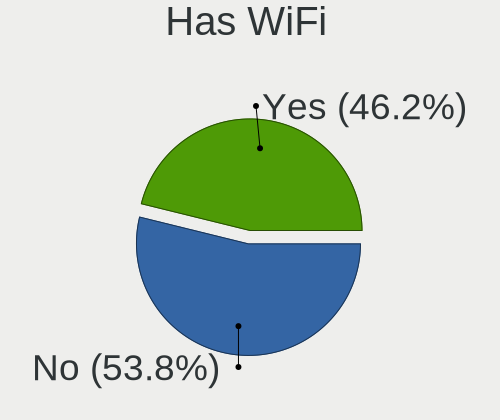
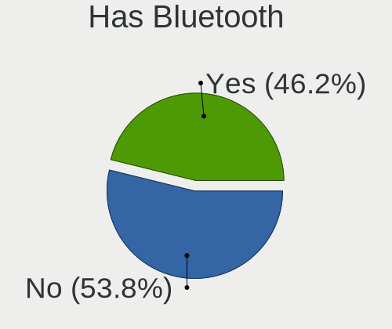

Xubuntu Hardware Trends (Desktop)
---------------------------------

A project to identify most popular hardware characteristics and track their change
over time based on data collected by Xubuntu users at https://Linux-Hardware.org.

Anyone can contribute to the study by uploading probes of their computers by
the [hw-probe](https://github.com/linuxhw/hw-probe) tool:

    sudo -E hw-probe -all -upload

Full-feature report is available here: https://linux-hardware.org/?view=trends&formfactor=desktop

Period: May, 2021.

Contents
--------

- [ OS                       ](#os)
- [ OS Family                ](#os-family)
- [ Kernel                   ](#kernel)
- [ Kernel Family            ](#kernel-family)
- [ Kernel Major Ver.        ](#kernel-major-ver)
- [ Arch                     ](#arch)
- [ DE                       ](#de)
- [ Display Server           ](#display-server)
- [ Display Manager          ](#display-manager)
- [ OS Lang                  ](#os-lang)
- [ Boot Mode                ](#boot-mode)
- [ Filesystem               ](#filesystem)
- [ Part. scheme             ](#part-scheme)
- [ Dual Boot with Linux/BSD ](#dual-boot-with-linux/bsd)
- [ Dual Boot (Win)          ](#dual-boot-win)
- [ Country                  ](#country)
- [ City                     ](#city)
- [ Vendor                   ](#vendor)
- [ Model                    ](#model)
- [ Model Family             ](#model-family)
- [ MFG Year                 ](#mfg-year)
- [ Form Factor              ](#form-factor)
- [ Secure Boot              ](#secure-boot)
- [ Coreboot                 ](#coreboot)
- [ RAM Size                 ](#ram-size)
- [ RAM Used                 ](#ram-used)
- [ Has CD-ROM               ](#has-cd-rom)
- [ Total Drives             ](#total-drives)
- [ Has Ethernet             ](#has-ethernet)
- [ Has WiFi                 ](#has-wifi)
- [ Has Bluetooth            ](#has-bluetooth)
- [ Drive Vendor             ](#drive-vendor)
- [ Drive Model              ](#drive-model)
- [ HDD Vendor               ](#hdd-vendor)
- [ SSD Vendor               ](#ssd-vendor)
- [ Drive Kind               ](#drive-kind)
- [ Drive Connector          ](#drive-connector)
- [ Drive Size               ](#drive-size)
- [ Space Total              ](#space-total)
- [ Space Used               ](#space-used)
- [ Malfunc. Drives          ](#malfunc-drives)
- [ Malfunc. Drive Vendor    ](#malfunc-drive-vendor)
- [ Malfunc. HDD Vendor      ](#malfunc-hdd-vendor)
- [ Malfunc. Drive Kind      ](#malfunc-drive-kind)
- [ Failed Drives            ](#failed-drives)
- [ Failed Drive Vendor      ](#failed-drive-vendor)
- [ Drive Status             ](#drive-status)
- [ Storage Vendor           ](#storage-vendor)
- [ Storage Model            ](#storage-model)
- [ Storage Kind             ](#storage-kind)
- [ CPU Vendor               ](#cpu-vendor)
- [ CPU Model                ](#cpu-model)
- [ CPU Model Family         ](#cpu-model-family)
- [ CPU Cores                ](#cpu-cores)
- [ CPU Sockets              ](#cpu-sockets)
- [ CPU Threads              ](#cpu-threads)
- [ CPU Op-Modes             ](#cpu-op-modes)
- [ CPU Microcode            ](#cpu-microcode)
- [ CPU Microarch            ](#cpu-microarch)
- [ GPU Vendor               ](#gpu-vendor)
- [ GPU Model                ](#gpu-model)
- [ GPU Combo                ](#gpu-combo)
- [ GPU Driver               ](#gpu-driver)
- [ GPU Memory               ](#gpu-memory)
- [ Monitor Vendor           ](#monitor-vendor)
- [ Monitor Model            ](#monitor-model)
- [ Monitor Resolution       ](#monitor-resolution)
- [ Monitor Diagonal         ](#monitor-diagonal)
- [ Monitor Width            ](#monitor-width)
- [ Aspect Ratio             ](#aspect-ratio)
- [ Monitor Area             ](#monitor-area)
- [ Pixel Density            ](#pixel-density)
- [ Multiple Monitors        ](#multiple-monitors)
- [ Net Controller Vendor    ](#net-controller-vendor)
- [ Net Controller Model     ](#net-controller-model)
- [ Wireless Vendor          ](#wireless-vendor)
- [ Wireless Model           ](#wireless-model)
- [ Ethernet Vendor          ](#ethernet-vendor)
- [ Ethernet Model           ](#ethernet-model)
- [ Net Controller Kind      ](#net-controller-kind)
- [ Used Controller          ](#used-controller)
- [ NICs                     ](#nics)
- [ IPv6                     ](#ipv6)
- [ Memory Vendor            ](#memory-vendor)
- [ Memory Model             ](#memory-model)
- [ Memory Kind              ](#memory-kind)
- [ Memory Form Factor       ](#memory-form-factor)
- [ Memory Size              ](#memory-size)
- [ Memory Speed             ](#memory-speed)
- [ Sound Vendor             ](#sound-vendor)
- [ Sound Model              ](#sound-model)
- [ Camera Vendor            ](#camera-vendor)
- [ Camera Model             ](#camera-model)
- [ Fingerprint Vendor       ](#fingerprint-vendor)
- [ Fingerprint Model        ](#fingerprint-model)
- [ Chipcard Vendor          ](#chipcard-vendor)
- [ Chipcard Model           ](#chipcard-model)
- [ Printer Vendor           ](#printer-vendor)
- [ Printer Model            ](#printer-model)
- [ Scanner Vendor           ](#scanner-vendor)
- [ Scanner Model            ](#scanner-model)
- [ Bluetooth Vendor         ](#bluetooth-vendor)
- [ Bluetooth Model          ](#bluetooth-model)
- [ Unsupported Devices      ](#unsupported-devices)
- [ Unsupported Device Types ](#unsupported-device-types)

OS
--

Installed operating systems

| Name          | Desktops | Percent |
|---------------|----------|---------|
| Xubuntu 20.04 | 32       | 62.75%  |
| Xubuntu 18.04 | 8        | 15.69%  |
| Xubuntu 20.10 | 5        | 9.8%    |
| Xubuntu 21.04 | 3        | 5.88%   |
| Xubuntu 19.04 | 1        | 1.96%   |
| Xubuntu 18.10 | 1        | 1.96%   |
| Xubuntu 16.04 | 1        | 1.96%   |

OS Family
---------

OS without a version

| Name    | Desktops | Percent |
|---------|----------|---------|
| Xubuntu | 51       | 100%    |

Kernel
------

Version of the Linux kernel

| Version               | Desktops | Percent |
|-----------------------|----------|---------|
| 5.4.0-73-generic      | 7        | 13.73%  |
| 5.8.0-50-generic      | 6        | 11.76%  |
| 5.4.0-72-lowlatency   | 5        | 9.8%    |
| 5.4.0-72-generic      | 5        | 9.8%    |
| 5.8.0-53-generic      | 4        | 7.84%   |
| 5.4.0-73-lowlatency   | 3        | 5.88%   |
| 5.8.0-50-lowlatency   | 2        | 3.92%   |
| 5.9.16-050916-generic | 1        | 1.96%   |
| 5.8.0-53-lowlatency   | 1        | 1.96%   |
| 5.8.0-52-generic      | 1        | 1.96%   |
| 5.8.0-51-generic      | 1        | 1.96%   |
| 5.8.0-49-generic      | 1        | 1.96%   |
| 5.8.0-48-lowlatency   | 1        | 1.96%   |
| 5.4.0-70-generic      | 1        | 1.96%   |
| 5.4.0-66-generic      | 1        | 1.96%   |
| 5.4.0-45-generic      | 1        | 1.96%   |
| 5.4.0-26-lowlatency   | 1        | 1.96%   |
| 5.12.2-xanmod1        | 1        | 1.96%   |
| 5.11.0-18-generic     | 1        | 1.96%   |
| 5.11.0-17-generic     | 1        | 1.96%   |
| 5.11.0-16-generic     | 1        | 1.96%   |
| 5.0.0-13-lowlatency   | 1        | 1.96%   |
| 4.4.0-210-generic     | 1        | 1.96%   |
| 4.18.0-25-generic     | 1        | 1.96%   |
| 4.15.0-144-lowlatency | 1        | 1.96%   |
| 4.15.0-133-lowlatency | 1        | 1.96%   |

Kernel Family
-------------

Linux kernel without a distro release

| Version | Desktops | Percent |
|---------|----------|---------|
| 5.4.0   | 24       | 47.06%  |
| 5.8.0   | 17       | 33.33%  |
| 5.11.0  | 3        | 5.88%   |
| 4.15.0  | 2        | 3.92%   |
| 5.9.16  | 1        | 1.96%   |
| 5.12.2  | 1        | 1.96%   |
| 5.0.0   | 1        | 1.96%   |
| 4.4.0   | 1        | 1.96%   |
| 4.18.0  | 1        | 1.96%   |

Kernel Major Ver.
-----------------

Linux kernel major version

| Version | Desktops | Percent |
|---------|----------|---------|
| 5.4     | 24       | 47.06%  |
| 5.8     | 17       | 33.33%  |
| 5.11    | 3        | 5.88%   |
| 4.15    | 2        | 3.92%   |
| 5.9     | 1        | 1.96%   |
| 5.12    | 1        | 1.96%   |
| 5.0     | 1        | 1.96%   |
| 4.4     | 1        | 1.96%   |
| 4.18    | 1        | 1.96%   |

Arch
----

OS architecture (x86_64, i586, etc.)

| Name   | Desktops | Percent |
|--------|----------|---------|
| x86_64 | 46       | 90.2%   |
| i686   | 5        | 9.8%    |

DE
--

Desktop Environment

| Name  | Desktops | Percent |
|-------|----------|---------|
| XFCE  | 50       | 98.04%  |
| GNOME | 1        | 1.96%   |

Display Server
--------------

X11 or Wayland

| Name | Desktops | Percent |
|------|----------|---------|
| X11  | 51       | 100%    |

Display Manager
---------------

SDDM, LightDM, etc.

| Name    | Desktops | Percent |
|---------|----------|---------|
| Unknown | 37       | 72.55%  |
| TDM     | 13       | 25.49%  |
| GDM     | 1        | 1.96%   |

OS Lang
-------

Language

| Lang  | Desktops | Percent |
|-------|----------|---------|
| en_US | 12       | 23.53%  |
| de_DE | 7        | 13.73%  |
| pt_BR | 4        | 7.84%   |
| fr_FR | 4        | 7.84%   |
| en_CA | 4        | 7.84%   |
| en_GB | 3        | 5.88%   |
| zh_TW | 1        | 1.96%   |
| ru_UA | 1        | 1.96%   |
| nl_NL | 1        | 1.96%   |
| nl_BE | 1        | 1.96%   |
| ja_JP | 1        | 1.96%   |
| it_IT | 1        | 1.96%   |
| id_ID | 1        | 1.96%   |
| hu_HU | 1        | 1.96%   |
| fr_CH | 1        | 1.96%   |
| fr_CA | 1        | 1.96%   |
| es_MX | 1        | 1.96%   |
| es_AR | 1        | 1.96%   |
| en_ZA | 1        | 1.96%   |
| en_HK | 1        | 1.96%   |
| en_AU | 1        | 1.96%   |
| de_CH | 1        | 1.96%   |
| bs_BA | 1        | 1.96%   |

Boot Mode
---------

EFI or BIOS

| Mode | Desktops | Percent |
|------|----------|---------|
| BIOS | 35       | 68.63%  |
| EFI  | 16       | 31.37%  |

Filesystem
----------

Type of filesystem

| Type    | Desktops | Percent |
|---------|----------|---------|
| Ext4    | 48       | 94.12%  |
| Xfs     | 2        | 3.92%   |
| Overlay | 1        | 1.96%   |

Part. scheme
------------

Scheme of partitioning

| Type    | Desktops | Percent |
|---------|----------|---------|
| Unknown | 37       | 72.55%  |
| MBR     | 7        | 13.73%  |
| GPT     | 7        | 13.73%  |

Dual Boot with Linux/BSD
------------------------

Hosting more than one Linux/BSD

| Dual boot | Desktops | Percent |
|-----------|----------|---------|
| No        | 40       | 78.43%  |
| Yes       | 11       | 21.57%  |

Dual Boot (Win)
---------------

Hosting Linux and Windows

| Dual boot | Desktops | Percent |
|-----------|----------|---------|
| No        | 30       | 58.82%  |
| Yes       | 21       | 41.18%  |

Country
-------

Geographic location (country)

| Country      | Desktops | Percent |
|--------------|----------|---------|
| Germany      | 7        | 13.73%  |
| USA          | 6        | 11.76%  |
| Canada       | 5        | 9.8%    |
| France       | 4        | 7.84%   |
| Netherlands  | 3        | 5.88%   |
| Brazil       | 3        | 5.88%   |
| UK           | 2        | 3.92%   |
| Switzerland  | 2        | 3.92%   |
| Japan        | 2        | 3.92%   |
| Indonesia    | 2        | 3.92%   |
| Belgium      | 2        | 3.92%   |
| Ukraine      | 1        | 1.96%   |
| Taiwan       | 1        | 1.96%   |
| Sweden       | 1        | 1.96%   |
| South Africa | 1        | 1.96%   |
| Mexico       | 1        | 1.96%   |
| Italy        | 1        | 1.96%   |
| Iraq         | 1        | 1.96%   |
| India        | 1        | 1.96%   |
| Hungary      | 1        | 1.96%   |
| Hong Kong    | 1        | 1.96%   |
| Austria      | 1        | 1.96%   |
| Australia    | 1        | 1.96%   |
| Argentina    | 1        | 1.96%   |

City
----

Geographic location (city)

| City                | Desktops | Percent |
|---------------------|----------|---------|
| Berlin              | 2        | 3.92%   |
| Amsterdam           | 2        | 3.92%   |
| Wilrijk             | 1        | 1.96%   |
| Wettingen           | 1        | 1.96%   |
| Toronto             | 1        | 1.96%   |
| Tolleson            | 1        | 1.96%   |
| Taverny             | 1        | 1.96%   |
| Tapachula           | 1        | 1.96%   |
| Strasbourg          | 1        | 1.96%   |
| Spokane             | 1        | 1.96%   |
| Southminster        | 1        | 1.96%   |
| Sollentuna          | 1        | 1.96%   |
| Seto                | 1        | 1.96%   |
| Schkopau            | 1        | 1.96%   |
| San Antonio         | 1        | 1.96%   |
| Sai Kung            | 1        | 1.96%   |
| Rome                | 1        | 1.96%   |
| Potsdam             | 1        | 1.96%   |
| Paris               | 1        | 1.96%   |
| Paarl               | 1        | 1.96%   |
| North Vancouver     | 1        | 1.96%   |
| Nogent-sur-Oise     | 1        | 1.96%   |
| New Taipei          | 1        | 1.96%   |
| New Glasgow         | 1        | 1.96%   |
| Nanaimo             | 1        | 1.96%   |
| Melbourne           | 1        | 1.96%   |
| Mariupol            | 1        | 1.96%   |
| Malang              | 1        | 1.96%   |
| Kortrijk            | 1        | 1.96%   |
| Huerm               | 1        | 1.96%   |
| Geneva              | 1        | 1.96%   |
| Fukuoka             | 1        | 1.96%   |
| Essen               | 1        | 1.96%   |
| Eindhoven           | 1        | 1.96%   |
| Eagle Creek         | 1        | 1.96%   |
| Dollard-des-Ormeaux | 1        | 1.96%   |
| Dermbach            | 1        | 1.96%   |
| Curitiba            | 1        | 1.96%   |
| Cologne             | 1        | 1.96%   |
| Cipolletti          | 1        | 1.96%   |
| Cilegon             | 1        | 1.96%   |
| Chennai             | 1        | 1.96%   |
| Budapest            | 1        | 1.96%   |
| Brotas              | 1        | 1.96%   |
| Brooklyn            | 1        | 1.96%   |
| Bolton              | 1        | 1.96%   |
| Belo Horizonte      | 1        | 1.96%   |
| Baghdad             | 1        | 1.96%   |
| Amarillo            | 1        | 1.96%   |

Vendor
------

Motherboard manufacturer

| Name                | Desktops | Percent |
|---------------------|----------|---------|
| Gigabyte Technology | 9        | 17.65%  |
| MSI                 | 7        | 13.73%  |
| Hewlett-Packard     | 6        | 11.76%  |
| Dell                | 6        | 11.76%  |
| ASUSTek Computer    | 5        | 9.8%    |
| Intel               | 4        | 7.84%   |
| Acer                | 3        | 5.88%   |
| Medion              | 2        | 3.92%   |
| Lenovo              | 2        | 3.92%   |
| ASRock              | 2        | 3.92%   |
| Pegatron            | 1        | 1.96%   |
| NCR                 | 1        | 1.96%   |
| Huanan              | 1        | 1.96%   |
| Fujitsu             | 1        | 1.96%   |
| ECS                 | 1        | 1.96%   |

Model
-----

Motherboard model

| Name                                   | Desktops | Percent |
|----------------------------------------|----------|---------|
| Pegatron FL368AA-UUZ SR5612CH          | 1        | 1.96%   |
| NCR xxxx-xxxx-xxxx                     | 1        | 1.96%   |
| MSI MS-7C91                            | 1        | 1.96%   |
| MSI MS-7B89                            | 1        | 1.96%   |
| MSI MS-7B86                            | 1        | 1.96%   |
| MSI MS-7B84                            | 1        | 1.96%   |
| MSI MS-7A74                            | 1        | 1.96%   |
| MSI MS-7721                            | 1        | 1.96%   |
| MSI MEG Z490 Infinite X (MS-B916)      | 1        | 1.96%   |
| Medion Akoya P5320 E MD8875/2432       | 1        | 1.96%   |
| Medion Akoya P2120 D MD8836/2452       | 1        | 1.96%   |
| Lenovo ThinkStation D30 4223B35        | 1        | 1.96%   |
| Lenovo ThinkCentre M82 2756AT9         | 1        | 1.96%   |
| Intel DH61WW AAG23116-204              | 1        | 1.96%   |
| Intel D945GNT AAC96315-402             | 1        | 1.96%   |
| Intel D945GCPE AAD97209-201            | 1        | 1.96%   |
| Intel BTC-T37                          | 1        | 1.96%   |
| Huanan Thurley                         | 1        | 1.96%   |
| HP Z620 Workstation                    | 1        | 1.96%   |
| HP ProDesk 400 G1 MT                   | 1        | 1.96%   |
| HP Compaq Elite 8300 SFF               | 1        | 1.96%   |
| HP Compaq dc7900 Convertible Minitower | 1        | 1.96%   |
| HP Compaq dc7800 Small Form Factor     | 1        | 1.96%   |
| HP 500-a60                             | 1        | 1.96%   |
| Gigabyte X570 AORUS MASTER             | 1        | 1.96%   |
| Gigabyte H81M-DS2                      | 1        | 1.96%   |
| Gigabyte H110N                         | 1        | 1.96%   |
| Gigabyte EP45-UD3R                     | 1        | 1.96%   |
| Gigabyte C847N                         | 1        | 1.96%   |
| Gigabyte B150M-D3H-CF                  | 1        | 1.96%   |
| Gigabyte AB350-Gaming 3                | 1        | 1.96%   |
| Gigabyte A520I AC                      | 1        | 1.96%   |
| Gigabyte A320M-S2H                     | 1        | 1.96%   |
| Fujitsu ESPRIMO E705                   | 1        | 1.96%   |
| ECS H61H2-M2                           | 1        | 1.96%   |
| Dell Vostro 200                        | 1        | 1.96%   |
| Dell OptiPlex GX620                    | 1        | 1.96%   |
| Dell OptiPlex 760                      | 1        | 1.96%   |
| Dell OptiPlex 745                      | 1        | 1.96%   |
| Dell Inspiron 531s                     | 1        | 1.96%   |
| Dell Inspiron 3647                     | 1        | 1.96%   |
| ASUS Z170-P                            | 1        | 1.96%   |
| ASUS P8Z77-V LK                        | 1        | 1.96%   |
| ASUS M4A78-VM                          | 1        | 1.96%   |
| ASUS A68HM-K                           | 1        | 1.96%   |
| ASUS A0000001                          | 1        | 1.96%   |
| ASRock H110M-ITX/ac                    | 1        | 1.96%   |
| ASRock A75M-HVS                        | 1        | 1.96%   |
| Acer Veriton X270                      | 1        | 1.96%   |
| Acer Aspire R3700                      | 1        | 1.96%   |
| Acer Aspire M5811                      | 1        | 1.96%   |

Model Family
------------

Motherboard model prefix

| Name                  | Desktops | Percent |
|-----------------------|----------|---------|
| HP Compaq             | 3        | 5.88%   |
| Dell OptiPlex         | 3        | 5.88%   |
| Medion Akoya          | 2        | 3.92%   |
| Dell Inspiron         | 2        | 3.92%   |
| Acer Aspire           | 2        | 3.92%   |
| Pegatron FL368AA-UUZ  | 1        | 1.96%   |
| NCR xxxx-xxxx-xxxx    | 1        | 1.96%   |
| MSI MS-7C91           | 1        | 1.96%   |
| MSI MS-7B89           | 1        | 1.96%   |
| MSI MS-7B86           | 1        | 1.96%   |
| MSI MS-7B84           | 1        | 1.96%   |
| MSI MS-7A74           | 1        | 1.96%   |
| MSI MS-7721           | 1        | 1.96%   |
| MSI MEG               | 1        | 1.96%   |
| Lenovo ThinkStation   | 1        | 1.96%   |
| Lenovo ThinkCentre    | 1        | 1.96%   |
| Intel DH61WW          | 1        | 1.96%   |
| Intel D945GNT         | 1        | 1.96%   |
| Intel D945GCPE        | 1        | 1.96%   |
| Intel BTC-T37         | 1        | 1.96%   |
| Huanan Thurley        | 1        | 1.96%   |
| HP Z620               | 1        | 1.96%   |
| HP ProDesk            | 1        | 1.96%   |
| HP 500-a60            | 1        | 1.96%   |
| Gigabyte X570         | 1        | 1.96%   |
| Gigabyte H81M-DS2     | 1        | 1.96%   |
| Gigabyte H110N        | 1        | 1.96%   |
| Gigabyte EP45-UD3R    | 1        | 1.96%   |
| Gigabyte C847N        | 1        | 1.96%   |
| Gigabyte B150M-D3H-CF | 1        | 1.96%   |
| Gigabyte AB350-Gaming | 1        | 1.96%   |
| Gigabyte A520I        | 1        | 1.96%   |
| Gigabyte A320M-S2H    | 1        | 1.96%   |
| Fujitsu ESPRIMO       | 1        | 1.96%   |
| ECS H61H2-M2          | 1        | 1.96%   |
| Dell Vostro           | 1        | 1.96%   |
| ASUS Z170-P           | 1        | 1.96%   |
| ASUS P8Z77-V          | 1        | 1.96%   |
| ASUS M4A78-VM         | 1        | 1.96%   |
| ASUS A68HM-K          | 1        | 1.96%   |
| ASUS A0000001         | 1        | 1.96%   |
| ASRock H110M-ITX      | 1        | 1.96%   |
| ASRock A75M-HVS       | 1        | 1.96%   |
| Acer Veriton          | 1        | 1.96%   |

MFG Year
--------

Motherboard manufacture year

| Year | Desktops | Percent |
|------|----------|---------|
| 2011 | 6        | 11.76%  |
| 2020 | 5        | 9.8%    |
| 2018 | 5        | 9.8%    |
| 2021 | 4        | 7.84%   |
| 2019 | 4        | 7.84%   |
| 2014 | 4        | 7.84%   |
| 2009 | 4        | 7.84%   |
| 2017 | 3        | 5.88%   |
| 2012 | 3        | 5.88%   |
| 2008 | 3        | 5.88%   |
| 2016 | 2        | 3.92%   |
| 2015 | 2        | 3.92%   |
| 2013 | 2        | 3.92%   |
| 2010 | 2        | 3.92%   |
| 2007 | 1        | 1.96%   |
| 2006 | 1        | 1.96%   |

Form Factor
-----------

Physical design of the computer

| Name    | Desktops | Percent |
|---------|----------|---------|
| Desktop | 51       | 100%    |

Secure Boot
-----------

Enabled or disabled

| State    | Desktops | Percent |
|----------|----------|---------|
| Disabled | 50       | 98.04%  |
| Enabled  | 1        | 1.96%   |

Coreboot
--------

Have coreboot on board

| Used | Desktops | Percent |
|------|----------|---------|
| No   | 51       | 100%    |

RAM Size
--------

Total RAM memory

| Size in GB  | Desktops | Percent |
|-------------|----------|---------|
| 4.01-8.0    | 10       | 19.61%  |
| 8.01-16.0   | 9        | 17.65%  |
| 3.01-4.0    | 8        | 15.69%  |
| 32.01-64.0  | 7        | 13.73%  |
| 16.01-24.0  | 6        | 11.76%  |
| 1.01-2.0    | 5        | 9.8%    |
| 64.01-256.0 | 2        | 3.92%   |
| 24.01-32.0  | 1        | 1.96%   |
| 2.01-3.0    | 1        | 1.96%   |
| 0.51-1.0    | 1        | 1.96%   |
| 0.01-0.5    | 1        | 1.96%   |

RAM Used
--------

Used RAM memory

| Used GB    | Desktops | Percent |
|------------|----------|---------|
| 1.01-2.0   | 20       | 39.22%  |
| 2.01-3.0   | 9        | 17.65%  |
| 4.01-8.0   | 7        | 13.73%  |
| 3.01-4.0   | 7        | 13.73%  |
| 0.51-1.0   | 5        | 9.8%    |
| 0.01-0.5   | 2        | 3.92%   |
| 32.01-64.0 | 1        | 1.96%   |

Has CD-ROM
----------

Has CD-ROM on board

| Presented | Desktops | Percent |
|-----------|----------|---------|
| Yes       | 28       | 54.9%   |
| No        | 23       | 45.1%   |

Total Drives
------------

Number of drives on board

| Drives | Desktops | Percent |
|--------|----------|---------|
| 1      | 24       | 47.06%  |
| 2      | 11       | 21.57%  |
| 3      | 8        | 15.69%  |
| 4      | 6        | 11.76%  |
| 7      | 1        | 1.96%   |
| 0      | 1        | 1.96%   |

Has Ethernet
------------

Has Ethernet on board

| Presented | Desktops | Percent |
|-----------|----------|---------|
| Yes       | 51       | 100%    |

Has WiFi
--------

Has WiFi module

| Presented | Desktops | Percent |
|-----------|----------|---------|
| No        | 30       | 58.82%  |
| Yes       | 21       | 41.18%  |

Has Bluetooth
-------------

Has Bluetooth module

| Presented | Desktops | Percent |
|-----------|----------|---------|
| No        | 40       | 78.43%  |
| Yes       | 11       | 21.57%  |

Drive Vendor
------------

Hard drive vendors

| Vendor              | Desktops | Drives | Percent |
|---------------------|----------|--------|---------|
| Seagate             | 22       | 24     | 25.58%  |
| WDC                 | 19       | 19     | 22.09%  |
| Samsung Electronics | 15       | 22     | 17.44%  |
| Kingston            | 4        | 5      | 4.65%   |
| Hitachi             | 4        | 4      | 4.65%   |
| Toshiba             | 3        | 3      | 3.49%   |
| A-DATA Technology   | 3        | 3      | 3.49%   |
| PNY                 | 2        | 2      | 2.33%   |
| Lexar               | 2        | 2      | 2.33%   |
| Crucial             | 2        | 2      | 2.33%   |
| XPG                 | 1        | 1      | 1.16%   |
| Unknown             | 1        | 1      | 1.16%   |
| Transcend           | 1        | 1      | 1.16%   |
| SanDisk             | 1        | 1      | 1.16%   |
| Patriot             | 1        | 1      | 1.16%   |
| KIOXIA-EXCERIA      | 1        | 1      | 1.16%   |
| Intenso             | 1        | 1      | 1.16%   |
| Intel               | 1        | 1      | 1.16%   |
| HGST                | 1        | 1      | 1.16%   |
| China               | 1        | 1      | 1.16%   |

Drive Model
-----------

Hard drive models

| Model                                       | Desktops | Percent |
|---------------------------------------------|----------|---------|
| WDC WD10EZEX-00WN4A0 1TB                    | 2        | 2.15%   |
| WDC WD10EZEX-00BN5A0 1TB                    | 2        | 2.15%   |
| Seagate ST500DM002-1BD142 500GB             | 2        | 2.15%   |
| Seagate ST3160815AS 160GB                   | 2        | 2.15%   |
| Seagate ST2000DM008-2FR102 2TB              | 2        | 2.15%   |
| Seagate ST2000DM001-1ER164 2TB              | 2        | 2.15%   |
| Seagate ST1000DM003-1CH162 1TB              | 2        | 2.15%   |
| Samsung SSD 860 QVO 1TB                     | 2        | 2.15%   |
| Samsung SSD 860 EVO 500GB                   | 2        | 2.15%   |
| Samsung SSD 850 EVO 500GB                   | 2        | 2.15%   |
| XPG NVMe SSD Drive 1024GB                   | 1        | 1.08%   |
| WDC WDS120G2G0B-00EPW0 120GB SSD            | 1        | 1.08%   |
| WDC WDS120G1G0A-00SS50 120GB SSD            | 1        | 1.08%   |
| WDC WD6402AAEX-00Z3A0 640GB                 | 1        | 1.08%   |
| WDC WD5000AAKX-00U6AA0 500GB                | 1        | 1.08%   |
| WDC WD5000AAKX-003CA0 500GB                 | 1        | 1.08%   |
| WDC WD5000AAKS-75TMA0 500GB                 | 1        | 1.08%   |
| WDC WD30EFRX-68EUZN0 3TB                    | 1        | 1.08%   |
| WDC WD2500JS-60MHB1 250GB                   | 1        | 1.08%   |
| WDC WD2500BEVT-22A23T0 250GB                | 1        | 1.08%   |
| WDC WD2002FAEX-007BA0 2TB                   | 1        | 1.08%   |
| WDC WD1600AAJS-00PSA0 160GB                 | 1        | 1.08%   |
| WDC WD10JPVT-00A1YT0 1TB                    | 1        | 1.08%   |
| WDC WD10EZEX-75WN4A0 1TB                    | 1        | 1.08%   |
| WDC WD10EZEX-08WN4A0 1TB                    | 1        | 1.08%   |
| WDC WD1001FALS-00J7B0 1TB                   | 1        | 1.08%   |
| Unknown NVMe SSD Drive 250GB                | 1        | 1.08%   |
| Transcend TS240GSSD220S 240GB               | 1        | 1.08%   |
| Toshiba MQ01ABD100 1TB                      | 1        | 1.08%   |
| Toshiba MQ01ABD032 320GB                    | 1        | 1.08%   |
| Toshiba DT01ACA200 2TB                      | 1        | 1.08%   |
| Seagate ST9500420AS 500GB                   | 1        | 1.08%   |
| Seagate ST6000DM003-2CY186 6TB              | 1        | 1.08%   |
| Seagate ST500LM021-1KJ152 500GB             | 1        | 1.08%   |
| Seagate ST4000VN008-2DR166 4TB              | 1        | 1.08%   |
| Seagate ST4000DM004-2CV104 4TB              | 1        | 1.08%   |
| Seagate ST3320613AS 320GB                   | 1        | 1.08%   |
| Seagate ST3250410AS 250GB                   | 1        | 1.08%   |
| Seagate ST3250310AS 250GB                   | 1        | 1.08%   |
| Seagate ST3160215AS 160GB                   | 1        | 1.08%   |
| Seagate ST2000DX001-1NS164 2TB              | 1        | 1.08%   |
| Seagate ST1500LM006 HN-M151RAD 1TB          | 1        | 1.08%   |
| Seagate ST1000NM0011 43W7625 42C0400IBM 1TB | 1        | 1.08%   |
| Seagate Slim 4GB                            | 1        | 1.08%   |
| Seagate BUP Portable 5TB                    | 1        | 1.08%   |
| SanDisk SSD PLUS 480GB                      | 1        | 1.08%   |
| Samsung SSD 970 EVO Plus 500GB              | 1        | 1.08%   |
| Samsung SSD 860 PRO 512GB                   | 1        | 1.08%   |
| Samsung SSD 850 EVO 250GB                   | 1        | 1.08%   |
| Samsung SSD 840 Series 120GB                | 1        | 1.08%   |
| Samsung SSD 840 PRO Series 256GB            | 1        | 1.08%   |
| Samsung SSD 840 PRO Series 128GB            | 1        | 1.08%   |
| Samsung MZNLF128HCHP-00000 128GB SSD        | 1        | 1.08%   |
| Samsung HM321HI 320GB                       | 1        | 1.08%   |
| Samsung HD252KJ 250GB                       | 1        | 1.08%   |
| Samsung HD204UI 2TB                         | 1        | 1.08%   |
| Samsung HD203WI 2TB                         | 1        | 1.08%   |
| Samsung HD103UJ 1TB                         | 1        | 1.08%   |
| Samsung HD103SI 1TB                         | 1        | 1.08%   |
| Samsung HD080HJ 80GB                        | 1        | 1.08%   |

HDD Vendor
----------

Hard disk drive vendors

| Vendor              | Desktops | Drives | Percent |
|---------------------|----------|--------|---------|
| Seagate             | 21       | 23     | 39.62%  |
| WDC                 | 17       | 17     | 32.08%  |
| Samsung Electronics | 6        | 7      | 11.32%  |
| Hitachi             | 4        | 4      | 7.55%   |
| Toshiba             | 3        | 3      | 5.66%   |
| Intenso             | 1        | 1      | 1.89%   |
| HGST                | 1        | 1      | 1.89%   |

SSD Vendor
----------

Solid state drive vendors

| Vendor              | Desktops | Drives | Percent |
|---------------------|----------|--------|---------|
| Samsung Electronics | 10       | 14     | 35.71%  |
| A-DATA Technology   | 3        | 3      | 10.71%  |
| WDC                 | 2        | 2      | 7.14%   |
| PNY                 | 2        | 2      | 7.14%   |
| Lexar               | 2        | 2      | 7.14%   |
| Crucial             | 2        | 2      | 7.14%   |
| Transcend           | 1        | 1      | 3.57%   |
| SanDisk             | 1        | 1      | 3.57%   |
| Patriot             | 1        | 1      | 3.57%   |
| KIOXIA-EXCERIA      | 1        | 1      | 3.57%   |
| Kingston            | 1        | 1      | 3.57%   |
| Intel               | 1        | 1      | 3.57%   |
| China               | 1        | 1      | 3.57%   |

Drive Kind
----------

HDD or SSD

| Kind    | Desktops | Drives | Percent |
|---------|----------|--------|---------|
| HDD     | 40       | 56     | 55.56%  |
| SSD     | 25       | 32     | 34.72%  |
| NVMe    | 6        | 7      | 8.33%   |
| Unknown | 1        | 1      | 1.39%   |

Drive Connector
---------------

SATA, SAS, NVMe, etc.

| Type | Desktops | Drives | Percent |
|------|----------|--------|---------|
| SATA | 48       | 85     | 84.21%  |
| NVMe | 6        | 7      | 10.53%  |
| SAS  | 3        | 4      | 5.26%   |

Drive Size
----------

Size of hard drive

| Size in TB | Desktops | Drives | Percent |
|------------|----------|--------|---------|
| 0.01-0.5   | 37       | 48     | 50%     |
| 0.51-1.0   | 21       | 23     | 28.38%  |
| 1.01-2.0   | 10       | 10     | 13.51%  |
| 4.01-10.0  | 3        | 4      | 4.05%   |
| 3.01-4.0   | 2        | 2      | 2.7%    |
| 2.01-3.0   | 1        | 1      | 1.35%   |

Space Total
-----------

Amount of disk space available on the file system

| Size in GB     | Desktops | Percent |
|----------------|----------|---------|
| 101-250        | 14       | 27.45%  |
| 251-500        | 12       | 23.53%  |
| 501-1000       | 9        | 17.65%  |
| More than 3000 | 6        | 11.76%  |
| 1001-2000      | 4        | 7.84%   |
| 2001-3000      | 2        | 3.92%   |
| 1-20           | 2        | 3.92%   |
| 51-100         | 2        | 3.92%   |

Space Used
----------

Amount of used disk space

| Used GB        | Desktops | Percent |
|----------------|----------|---------|
| 1-20           | 16       | 31.37%  |
| 251-500        | 8        | 15.69%  |
| 21-50          | 7        | 13.73%  |
| 101-250        | 6        | 11.76%  |
| 51-100         | 4        | 7.84%   |
| More than 3000 | 3        | 5.88%   |
| 1001-2000      | 3        | 5.88%   |
| 501-1000       | 3        | 5.88%   |
| 2001-3000      | 1        | 1.96%   |

Malfunc. Drives
---------------

Drive models with a malfunction

| Model                           | Desktops | Drives | Percent |
|---------------------------------|----------|--------|---------|
| Seagate ST500DM002-1BD142 500GB | 1        | 1      | 100%    |

Malfunc. Drive Vendor
---------------------

Vendors of faulty drives

| Vendor  | Desktops | Drives | Percent |
|---------|----------|--------|---------|
| Seagate | 1        | 1      | 100%    |

Malfunc. HDD Vendor
-------------------

Vendors of faulty HDD drives

| Vendor  | Desktops | Drives | Percent |
|---------|----------|--------|---------|
| Seagate | 1        | 1      | 100%    |

Malfunc. Drive Kind
-------------------

Kinds of faulty drives

| Kind | Desktops | Drives | Percent |
|------|----------|--------|---------|
| HDD  | 1        | 1      | 100%    |

Failed Drives
-------------

Failed drive models

Zero info for selected period =(

Failed Drive Vendor
-------------------

Failed drive vendors

Zero info for selected period =(

Drive Status
------------

Number of failed and malfunc. drives

| Status   | Desktops | Drives | Percent |
|----------|----------|--------|---------|
| Detected | 37       | 70     | 74%     |
| Works    | 12       | 25     | 24%     |
| Malfunc  | 1        | 1      | 2%      |

Storage Vendor
--------------

Storage controller vendors

| Vendor                       | Desktops | Percent |
|------------------------------|----------|---------|
| Intel                        | 33       | 53.23%  |
| AMD                          | 15       | 24.19%  |
| Nvidia                       | 3        | 4.84%   |
| Kingston Technology Company  | 3        | 4.84%   |
| JMicron Technology           | 3        | 4.84%   |
| Shenzhen Longsys Electronics | 1        | 1.61%   |
| Samsung Electronics          | 1        | 1.61%   |
| Promise Technology           | 1        | 1.61%   |
| Marvell Technology Group     | 1        | 1.61%   |
| ADATA Technology             | 1        | 1.61%   |

Storage Model
-------------

Storage controller models

| Model                                                                                   | Desktops | Percent |
|-----------------------------------------------------------------------------------------|----------|---------|
| AMD FCH SATA Controller [AHCI mode]                                                     | 10       | 11.24%  |
| Intel Q170/Q150/B150/H170/H110/Z170/CM236 Chipset SATA Controller [AHCI Mode]           | 6        | 6.74%   |
| Kingston Company A2000 NVMe SSD                                                         | 3        | 3.37%   |
| Intel NM10/ICH7 Family SATA Controller [IDE mode]                                       | 3        | 3.37%   |
| Intel 82801G (ICH7 Family) IDE Controller                                               | 3        | 3.37%   |
| Intel 7 Series/C210 Series Chipset Family 6-port SATA Controller [AHCI mode]            | 3        | 3.37%   |
| AMD 400 Series Chipset SATA Controller                                                  | 3        | 3.37%   |
| Nvidia MCP61 SATA Controller                                                            | 2        | 2.25%   |
| Nvidia MCP61 IDE                                                                        | 2        | 2.25%   |
| JMicron JMB363 SATA/IDE Controller                                                      | 2        | 2.25%   |
| Intel C602 chipset 4-Port SATA Storage Control Unit                                     | 2        | 2.25%   |
| Intel C600/X79 series chipset IDE-r Controller                                          | 2        | 2.25%   |
| Intel 82801JI (ICH10 Family) 4 port SATA IDE Controller #1                              | 2        | 2.25%   |
| Intel 82801JI (ICH10 Family) 2 port SATA IDE Controller #2                              | 2        | 2.25%   |
| Intel 82801JD/DO (ICH10 Family) SATA AHCI Controller                                    | 2        | 2.25%   |
| Intel 82801IR/IO/IH (ICH9R/DO/DH) 4 port SATA Controller [IDE mode]                     | 2        | 2.25%   |
| Intel 82801I (ICH9 Family) 2 port SATA Controller [IDE mode]                            | 2        | 2.25%   |
| Intel 8 Series/C220 Series Chipset Family 6-port SATA Controller 1 [AHCI mode]          | 2        | 2.25%   |
| Intel 6 Series/C200 Series Chipset Family Desktop SATA Controller (IDE mode, ports 4-5) | 2        | 2.25%   |
| Intel 6 Series/C200 Series Chipset Family Desktop SATA Controller (IDE mode, ports 0-3) | 2        | 2.25%   |
| Intel 4 Series Chipset PT IDER Controller                                               | 2        | 2.25%   |
| AMD Starship/Matisse Chipset SATA Controller [AHCI mode]                                | 2        | 2.25%   |
| Shenzhen Longsys SM2263EN/SM2263XT-based OEM SSD                                        | 1        | 1.12%   |
| Samsung NVMe SSD Controller SM981/PM981/PM983                                           | 1        | 1.12%   |
| Promise PDC20378 (FastTrak 378/SATA 378)                                                | 1        | 1.12%   |
| Nvidia MCP73 SATA Controller (IDE mode)                                                 | 1        | 1.12%   |
| Nvidia MCP73 IDE Controller                                                             | 1        | 1.12%   |
| Marvell Group 88SE9215 PCIe 2.0 x1 4-port SATA 6 Gb/s Controller                        | 1        | 1.12%   |
| JMicron JMB368 IDE controller                                                           | 1        | 1.12%   |
| Intel SATA Controller [RAID mode]                                                       | 1        | 1.12%   |
| Intel NM10/ICH7 Family SATA Controller [AHCI mode]                                      | 1        | 1.12%   |
| Intel C600/X79 series chipset SATA RAID Controller                                      | 1        | 1.12%   |
| Intel C600/X79 series chipset 6-Port SATA AHCI Controller                               | 1        | 1.12%   |
| Intel 82Q35 Express PT IDER Controller                                                  | 1        | 1.12%   |
| Intel 82801HR/HO/HH (ICH8R/DO/DH) 2 port SATA Controller [IDE mode]                     | 1        | 1.12%   |
| Intel 82801H (ICH8 Family) 4 port SATA Controller [IDE mode]                            | 1        | 1.12%   |
| Intel 8 Series/C220 Series Chipset Family 4-port SATA Controller 1 [IDE mode]           | 1        | 1.12%   |
| Intel 8 Series/C220 Series Chipset Family 2-port SATA Controller 2 [IDE mode]           | 1        | 1.12%   |
| Intel 7 Series Chipset Family 6-port SATA Controller [AHCI mode]                        | 1        | 1.12%   |
| Intel 6 Series/C200 Series Chipset Family 6 port Mobile SATA AHCI Controller            | 1        | 1.12%   |
| Intel 6 Series/C200 Series Chipset Family 6 port Desktop SATA AHCI Controller           | 1        | 1.12%   |
| Intel 400 Series Chipset Family SATA RAID Controller                                    | 1        | 1.12%   |
| Intel 200 Series PCH SATA controller [AHCI mode]                                        | 1        | 1.12%   |
| AMD SB7x0/SB8x0/SB9x0 SATA Controller [IDE mode]                                        | 1        | 1.12%   |
| AMD SB7x0/SB8x0/SB9x0 SATA Controller [AHCI mode]                                       | 1        | 1.12%   |
| AMD SB7x0/SB8x0/SB9x0 IDE Controller                                                    | 1        | 1.12%   |
| AMD FCH SATA Controller D                                                               | 1        | 1.12%   |
| AMD FCH IDE Controller                                                                  | 1        | 1.12%   |
| AMD 300 Series Chipset SATA Controller                                                  | 1        | 1.12%   |
| ADATA XPG SX8200 Pro PCIe Gen3x4 M.2 2280 Solid State Drive                             | 1        | 1.12%   |

Storage Kind
------------

Kind of storage controller (IDE, SATA, NVMe, SAS, ...)

| Kind | Desktops | Percent |
|------|----------|---------|
| SATA | 34       | 50%     |
| IDE  | 22       | 32.35%  |
| NVMe | 6        | 8.82%   |
| RAID | 4        | 5.88%   |
| SAS  | 2        | 2.94%   |

CPU Vendor
----------

Processor vendors

| Vendor | Desktops | Percent |
|--------|----------|---------|
| Intel  | 34       | 66.67%  |
| AMD    | 17       | 33.33%  |

CPU Model
---------

Processor models

| Model                                         | Desktops | Percent |
|-----------------------------------------------|----------|---------|
| Intel Core i3-4130 CPU @ 3.40GHz              | 3        | 5.88%   |
| Intel Core i5-6400 CPU @ 2.70GHz              | 2        | 3.92%   |
| AMD Ryzen 7 3700X 8-Core Processor            | 2        | 3.92%   |
| Intel Xeon CPU E5-2670 0 @ 2.60GHz            | 1        | 1.96%   |
| Intel Xeon CPU E5-1620 0 @ 3.60GHz            | 1        | 1.96%   |
| Intel Pentium Dual CPU E2220 @ 2.40GHz        | 1        | 1.96%   |
| Intel Pentium D CPU 3.40GHz                   | 1        | 1.96%   |
| Intel Pentium CPU G870 @ 3.10GHz              | 1        | 1.96%   |
| Intel Pentium CPU G620 @ 2.60GHz              | 1        | 1.96%   |
| Intel Pentium CPU G4620 @ 3.70GHz             | 1        | 1.96%   |
| Intel Pentium CPU G4560 @ 3.50GHz             | 1        | 1.96%   |
| Intel Pentium 4 CPU 3.40GHz                   | 1        | 1.96%   |
| Intel Pentium 4 CPU 2.80GHz                   | 1        | 1.96%   |
| Intel Core i9-10900KF CPU @ 3.70GHz           | 1        | 1.96%   |
| Intel Core i7-7700T CPU @ 2.90GHz             | 1        | 1.96%   |
| Intel Core i7-3770K CPU @ 3.50GHz             | 1        | 1.96%   |
| Intel Core i7 CPU 975 @ 3.33GHz               | 1        | 1.96%   |
| Intel Core i7 CPU 860 @ 2.80GHz               | 1        | 1.96%   |
| Intel Core i5-6600K CPU @ 3.50GHz             | 1        | 1.96%   |
| Intel Core i5-2500K CPU @ 3.30GHz             | 1        | 1.96%   |
| Intel Core i5-2400 CPU @ 3.10GHz              | 1        | 1.96%   |
| Intel Core i3-6100 CPU @ 3.70GHz              | 1        | 1.96%   |
| Intel Core i3-2100 CPU @ 3.10GHz              | 1        | 1.96%   |
| Intel Core 2 Quad CPU Q9650 @ 3.00GHz         | 1        | 1.96%   |
| Intel Core 2 Quad CPU Q9550 @ 2.83GHz         | 1        | 1.96%   |
| Intel Core 2 Duo CPU E8400 @ 3.00GHz          | 1        | 1.96%   |
| Intel Core 2 Duo CPU E6550 @ 2.33GHz          | 1        | 1.96%   |
| Intel Core 2 Duo CPU E4500 @ 2.20GHz          | 1        | 1.96%   |
| Intel Core 2 CPU 4400 @ 2.00GHz               | 1        | 1.96%   |
| Intel Celeron CPU 847 @ 1.10GHz               | 1        | 1.96%   |
| Intel Celeron CPU 1037U @ 1.80GHz             | 1        | 1.96%   |
| Intel Atom CPU D525 @ 1.80GHz                 | 1        | 1.96%   |
| AMD Ryzen 7 2700X Eight-Core Processor        | 1        | 1.96%   |
| AMD Ryzen 5 5600X 6-Core Processor            | 1        | 1.96%   |
| AMD Ryzen 5 3600 6-Core Processor             | 1        | 1.96%   |
| AMD Ryzen 5 2400G with Radeon Vega Graphics   | 1        | 1.96%   |
| AMD Ryzen 3 4300GE with Radeon Graphics       | 1        | 1.96%   |
| AMD Ryzen 3 2200G with Radeon Vega Graphics   | 1        | 1.96%   |
| AMD Phenom II X4 945 Processor                | 1        | 1.96%   |
| AMD Athlon II X2 265 Processor                | 1        | 1.96%   |
| AMD Athlon Dual Core Processor 4450e          | 1        | 1.96%   |
| AMD Athlon 64 X2 Dual Core Processor 3600+    | 1        | 1.96%   |
| AMD A8-9600 RADEON R7, 10 COMPUTE CORES 4C+6G | 1        | 1.96%   |
| AMD A8-3850 APU with Radeon HD Graphics       | 1        | 1.96%   |
| AMD A6-5200 APU with Radeon HD Graphics       | 1        | 1.96%   |
| AMD A6 PRO-7400B R5, 6 Compute Cores 2C+4G    | 1        | 1.96%   |
| AMD A4-7300 APU with Radeon HD Graphics       | 1        | 1.96%   |

CPU Model Family
----------------

Processor model prefix

| Model                | Desktops | Percent |
|----------------------|----------|---------|
| Intel Core i5        | 5        | 9.8%    |
| Intel Core i3        | 5        | 9.8%    |
| Intel Pentium        | 4        | 7.84%   |
| Intel Core i7        | 4        | 7.84%   |
| Intel Core 2 Duo     | 3        | 5.88%   |
| AMD Ryzen 7          | 3        | 5.88%   |
| AMD Ryzen 5          | 3        | 5.88%   |
| Intel Xeon           | 2        | 3.92%   |
| Intel Pentium 4      | 2        | 3.92%   |
| Intel Core 2 Quad    | 2        | 3.92%   |
| Intel Celeron        | 2        | 3.92%   |
| AMD Ryzen 3          | 2        | 3.92%   |
| AMD A8               | 2        | 3.92%   |
| AMD A6               | 2        | 3.92%   |
| Intel Pentium Dual   | 1        | 1.96%   |
| Intel Pentium D      | 1        | 1.96%   |
| Intel Core i9        | 1        | 1.96%   |
| Intel Core 2         | 1        | 1.96%   |
| Intel Atom           | 1        | 1.96%   |
| AMD Phenom II X4     | 1        | 1.96%   |
| AMD Athlon II X2     | 1        | 1.96%   |
| AMD Athlon Dual Core | 1        | 1.96%   |
| AMD Athlon 64 X2     | 1        | 1.96%   |
| AMD A4               | 1        | 1.96%   |

CPU Cores
---------

Number of processor cores

| Number | Desktops | Percent |
|--------|----------|---------|
| 2      | 22       | 43.14%  |
| 4      | 18       | 35.29%  |
| 1      | 4        | 7.84%   |
| 8      | 3        | 5.88%   |
| 6      | 2        | 3.92%   |
| 16     | 1        | 1.96%   |
| 10     | 1        | 1.96%   |

CPU Sockets
-----------

Number of sockets

| Number | Desktops | Percent |
|--------|----------|---------|
| 1      | 50       | 98.04%  |
| 2      | 1        | 1.96%   |

CPU Threads
-----------

Threads per core (Hyper-Threading)

| Number | Desktops | Percent |
|--------|----------|---------|
| 2      | 27       | 52.94%  |
| 1      | 24       | 47.06%  |

CPU Op-Modes
------------

CPU Operation Modes (32-bit, 64-bit)

| Op mode        | Desktops | Percent |
|----------------|----------|---------|
| 32-bit, 64-bit | 51       | 100%    |

CPU Microcode
-------------

Microcode number

| Number     | Desktops | Percent |
|------------|----------|---------|
| Unknown    | 13       | 25.49%  |
| 0x206a7    | 5        | 9.8%    |
| 0x906e9    | 3        | 5.88%   |
| 0x506e3    | 3        | 5.88%   |
| 0x306c3    | 3        | 5.88%   |
| 0x206d7    | 2        | 3.92%   |
| 0x1067a    | 2        | 3.92%   |
| 0x08701021 | 2        | 3.92%   |
| 0xf65      | 1        | 1.96%   |
| 0xf49      | 1        | 1.96%   |
| 0xa0655    | 1        | 1.96%   |
| 0x6fd      | 1        | 1.96%   |
| 0x6fb      | 1        | 1.96%   |
| 0x6f2      | 1        | 1.96%   |
| 0x306a9    | 1        | 1.96%   |
| 0x106e5    | 1        | 1.96%   |
| 0x106ca    | 1        | 1.96%   |
| 0x106a5    | 1        | 1.96%   |
| 0x0a201009 | 1        | 1.96%   |
| 0x08600106 | 1        | 1.96%   |
| 0x08101016 | 1        | 1.96%   |
| 0x0800820d | 1        | 1.96%   |
| 0x0700010f | 1        | 1.96%   |
| 0x0600611a | 1        | 1.96%   |
| 0x06003106 | 1        | 1.96%   |
| 0x010000c8 | 1        | 1.96%   |

CPU Microarch
-------------

Microarchitecture

| Name        | Desktops | Percent |
|-------------|----------|---------|
| SandyBridge | 8        | 15.69%  |
| Zen 2       | 4        | 7.84%   |
| Skylake     | 4        | 7.84%   |
| Core        | 4        | 7.84%   |
| Penryn      | 3        | 5.88%   |
| NetBurst    | 3        | 5.88%   |
| KabyLake    | 3        | 5.88%   |
| Haswell     | 3        | 5.88%   |
| Zen         | 2        | 3.92%   |
| Nehalem     | 2        | 3.92%   |
| K8 Hammer   | 2        | 3.92%   |
| K10         | 2        | 3.92%   |
| IvyBridge   | 2        | 3.92%   |
| Zen+        | 1        | 1.96%   |
| Zen 3       | 1        | 1.96%   |
| Steamroller | 1        | 1.96%   |
| Piledriver  | 1        | 1.96%   |
| K10 Llano   | 1        | 1.96%   |
| Jaguar      | 1        | 1.96%   |
| Excavator   | 1        | 1.96%   |
| CometLake   | 1        | 1.96%   |
| Bonnell     | 1        | 1.96%   |

GPU Vendor
----------

Vendors of graphics cards

| Vendor | Desktops | Percent |
|--------|----------|---------|
| Nvidia | 26       | 47.27%  |
| Intel  | 20       | 36.36%  |
| AMD    | 9        | 16.36%  |

GPU Model
---------

Graphics card models

| Model                                                                     | Desktops | Percent |
|---------------------------------------------------------------------------|----------|---------|
| Intel 2nd Generation Core Processor Family Integrated Graphics Controller | 5        | 8.93%   |
| Intel 82945G/GZ Integrated Graphics Controller                            | 3        | 5.36%   |
| Intel 4th Generation Core Processor Family Integrated Graphics Controller | 3        | 5.36%   |
| Nvidia GP107 [GeForce GTX 1050 Ti]                                        | 2        | 3.57%   |
| Nvidia GM204 [GeForce GTX 970]                                            | 2        | 3.57%   |
| Nvidia C61 [GeForce 6150SE nForce 430]                                    | 2        | 3.57%   |
| Intel HD Graphics 530                                                     | 2        | 3.57%   |
| AMD Ellesmere [Radeon RX 470/480/570/570X/580/580X/590]                   | 2        | 3.57%   |
| Nvidia TU116 [GeForce GTX 1660 SUPER]                                     | 1        | 1.79%   |
| Nvidia TU106 [GeForce RTX 2060 SUPER]                                     | 1        | 1.79%   |
| Nvidia GT218 [ION]                                                        | 1        | 1.79%   |
| Nvidia GT218 [GeForce 210]                                                | 1        | 1.79%   |
| Nvidia GP108 [GeForce GT 1030]                                            | 1        | 1.79%   |
| Nvidia GP107GL [Quadro P400]                                              | 1        | 1.79%   |
| Nvidia GP104 [GeForce GTX 1080]                                           | 1        | 1.79%   |
| Nvidia GM206 [GeForce GTX 960]                                            | 1        | 1.79%   |
| Nvidia GM206 [GeForce GTX 950]                                            | 1        | 1.79%   |
| Nvidia GM107 [GeForce GTX 750 Ti]                                         | 1        | 1.79%   |
| Nvidia GK208B [GeForce GT 730]                                            | 1        | 1.79%   |
| Nvidia GK208B [GeForce GT 710]                                            | 1        | 1.79%   |
| Nvidia GK106GL [Quadro K4000]                                             | 1        | 1.79%   |
| Nvidia GK106 [GeForce GTX 650 Ti]                                         | 1        | 1.79%   |
| Nvidia GF119 [GeForce GT 520]                                             | 1        | 1.79%   |
| Nvidia GF108 [GeForce GT 730]                                             | 1        | 1.79%   |
| Nvidia GF108 [GeForce GT 630]                                             | 1        | 1.79%   |
| Nvidia GF108 [GeForce GT 440]                                             | 1        | 1.79%   |
| Nvidia GA102 [GeForce RTX 3080]                                           | 1        | 1.79%   |
| Nvidia C73 [GeForce 7100 / nForce 630i]                                   | 1        | 1.79%   |
| Intel HD Graphics 630                                                     | 1        | 1.79%   |
| Intel HD Graphics 610                                                     | 1        | 1.79%   |
| Intel 82Q963/Q965 Integrated Graphics Controller                          | 1        | 1.79%   |
| Intel 82Q35 Express Integrated Graphics Controller                        | 1        | 1.79%   |
| Intel 82G33/G31 Express Integrated Graphics Controller                    | 1        | 1.79%   |
| Intel 4 Series Chipset Integrated Graphics Controller                     | 1        | 1.79%   |
| Intel 3rd Gen Core processor Graphics Controller                          | 1        | 1.79%   |
| AMD Wani [Radeon R5/R6/R7 Graphics]                                       | 1        | 1.79%   |
| AMD Sumo [Radeon HD 6550D]                                                | 1        | 1.79%   |
| AMD RS880 [Radeon HD 4250]                                                | 1        | 1.79%   |
| AMD RS780 [Radeon HD 3200]                                                | 1        | 1.79%   |
| AMD Richland [Radeon HD 8470D]                                            | 1        | 1.79%   |
| AMD Renoir                                                                | 1        | 1.79%   |
| AMD Raven Ridge [Radeon Vega Series / Radeon Vega Mobile Series]          | 1        | 1.79%   |
| AMD Kabini [Radeon HD 8400 / R3 Series]                                   | 1        | 1.79%   |

GPU Combo
---------

Combinations of graphics cards

| Name           | Desktops | Percent |
|----------------|----------|---------|
| 1 x Nvidia     | 23       | 45.1%   |
| 1 x Intel      | 17       | 33.33%  |
| 1 x AMD        | 8        | 15.69%  |
| Intel + Nvidia | 2        | 3.92%   |
| 2 x AMD        | 1        | 1.96%   |

GPU Driver
----------

Free vs proprietary

| Driver      | Desktops | Percent |
|-------------|----------|---------|
| Free        | 33       | 64.71%  |
| Proprietary | 15       | 29.41%  |
| Unknown     | 3        | 5.88%   |

GPU Memory
----------

Total video memory

| Size in GB | Desktops | Percent |
|------------|----------|---------|
| Unknown    | 24       | 47.06%  |
| 1.01-2.0   | 7        | 13.73%  |
| 0.01-0.5   | 7        | 13.73%  |
| 0.51-1.0   | 5        | 9.8%    |
| 3.01-4.0   | 4        | 7.84%   |
| 7.01-8.0   | 3        | 5.88%   |
| 2.01-3.0   | 1        | 1.96%   |

Monitor Vendor
--------------

Monitor vendors

| Vendor              | Desktops | Percent |
|---------------------|----------|---------|
| Samsung Electronics | 8        | 15.69%  |
| Goldstar            | 7        | 13.73%  |
| Dell                | 6        | 11.76%  |
| Acer                | 5        | 9.8%    |
| Philips             | 4        | 7.84%   |
| ViewSonic           | 3        | 5.88%   |
| BenQ                | 3        | 5.88%   |
| Hewlett-Packard     | 2        | 3.92%   |
| Eizo                | 2        | 3.92%   |
| AOC                 | 2        | 3.92%   |
| Vestel              | 1        | 1.96%   |
| Unknown             | 1        | 1.96%   |
| Sony                | 1        | 1.96%   |
| Panasonic           | 1        | 1.96%   |
| Medion              | 1        | 1.96%   |
| LG Electronics      | 1        | 1.96%   |
| Lenovo              | 1        | 1.96%   |
| HannStar            | 1        | 1.96%   |
| Haier               | 1        | 1.96%   |

Monitor Model
-------------

Monitor models

| Model                                                                  | Desktops | Percent |
|------------------------------------------------------------------------|----------|---------|
| ViewSonic VX2263 Series VSC692F 1920x1080 476x268mm 21.5-inch          | 1        | 1.89%   |
| ViewSonic VP2000s VSC231A 1600x1200 408x306mm 20.1-inch                | 1        | 1.89%   |
| ViewSonic VA1931 Series VSC5826 1366x768 410x230mm 18.5-inch           | 1        | 1.89%   |
| Vestel LCD Monitor 43FHD_LCD_TV 1920x1080                              | 1        | 1.89%   |
| Unknown LCD Monitor Dell S2418H/HX 1920x1080                           | 1        | 1.89%   |
| Sony TV SNYE903 1920x1080 1600x900mm 72.3-inch                         | 1        | 1.89%   |
| Samsung Electronics SyncMaster SAM03C2 1680x1050 459x296mm 21.5-inch   | 1        | 1.89%   |
| Samsung Electronics S19B150 SAM08A2 1366x768 410x230mm 18.5-inch       | 1        | 1.89%   |
| Samsung Electronics LCD Monitor U28E510 4480x1441                      | 1        | 1.89%   |
| Samsung Electronics LCD Monitor SAM0D4D 1366x768 609x347mm 27.6-inch   | 1        | 1.89%   |
| Samsung Electronics LCD Monitor SAM0A7D 1920x1080 1060x626mm 48.5-inch | 1        | 1.89%   |
| Samsung Electronics LCD Monitor SAM03D4 1920x1080                      | 1        | 1.89%   |
| Samsung Electronics LCD Monitor SA300/SA350 1920x1080                  | 1        | 1.89%   |
| Samsung Electronics C27R504 SAM0F9D 1920x1080 598x336mm 27.0-inch      | 1        | 1.89%   |
| Philips PHL 244E5 PHLC0C0 1920x1080 530x300mm 24.0-inch                | 1        | 1.89%   |
| Philips 220CW PHLC024 1680x1050 474x296mm 22.0-inch                    | 1        | 1.89%   |
| Philips 190SL1 PHL08C6 1440x900 408x255mm 18.9-inch                    | 1        | 1.89%   |
| Philips 190S PHL085A 1280x1024 376x301mm 19.0-inch                     | 1        | 1.89%   |
| Panasonic TV MEIA296 1920x1080 1280x720mm 57.8-inch                    | 1        | 1.89%   |
| Medion MD20435 MED36D5 1920x1080 521x293mm 23.5-inch                   | 1        | 1.89%   |
| LG Electronics LCD Monitor LG 32 FHD 1920x1080                         | 1        | 1.89%   |
| Lenovo D185wA LEN183F 1366x768 410x230mm 18.5-inch                     | 1        | 1.89%   |
| Hewlett-Packard LCD Monitor ZR2440w                                    | 1        | 1.89%   |
| Hewlett-Packard LCD Monitor LA2405 3840x1200                           | 1        | 1.89%   |
| Hewlett-Packard 19ka HWP3328 1366x768 410x230mm 18.5-inch              | 1        | 1.89%   |
| HannStar HSG1206 HSP1A38 1920x1080 521x293mm 23.5-inch                 | 1        | 1.89%   |
| Haier SG7 HAI0503 1024x768 360x290mm 18.2-inch                         | 1        | 1.89%   |
| Goldstar W1942 GSM4B6F 1440x900 408x255mm 18.9-inch                    | 1        | 1.89%   |
| Goldstar TV GSMC3A2 1920x1080 700x392mm 31.6-inch                      | 1        | 1.89%   |
| Goldstar L1954 GSM4B64 1280x1024 338x270mm 17.0-inch                   | 1        | 1.89%   |
| Goldstar L192WS GSM4B32 1440x900 410x256mm 19.0-inch                   | 1        | 1.89%   |
| Goldstar HD GSM5ACB 1366x768 410x230mm 18.5-inch                       | 1        | 1.89%   |
| Goldstar E2242 GSM58BE 1680x1050 480x270mm 21.7-inch                   | 1        | 1.89%   |
| Goldstar E2240 GSM57A3 1920x1080 477x268mm 21.5-inch                   | 1        | 1.89%   |
| Eizo S2231W ENC1918 1680x1050 480x300mm 22.3-inch                      | 1        | 1.89%   |
| Eizo EV2456 ENC2797 1920x1200 519x324mm 24.1-inch                      | 1        | 1.89%   |
| Dell U3219Q DELA120 3840x2160 697x392mm 31.5-inch                      | 1        | 1.89%   |
| Dell U2312HM DEL4073 1920x1080 510x287mm 23.0-inch                     | 1        | 1.89%   |
| Dell U2312HM DEL4072 1920x1080 510x290mm 23.1-inch                     | 1        | 1.89%   |
| Dell LCD Monitor 2407WFP 4480x1441                                     | 1        | 1.89%   |
| Dell LCD Monitor 2407WFP                                               | 1        | 1.89%   |
| Dell D1918H DEL2005 1366x768 410x230mm 18.5-inch                       | 1        | 1.89%   |
| Dell 1908FP DEL4026 1280x1024 376x301mm 19.0-inch                      | 1        | 1.89%   |
| BenQ ZOWIE XL LCD BNQ7F3D 1920x1080 531x298mm 24.0-inch                | 1        | 1.89%   |
| BenQ G2220HDA BNQ7820 1920x1080 477x268mm 21.5-inch                    | 1        | 1.89%   |
| BenQ FP91G+ BNQ76A5 1280x1024 376x301mm 19.0-inch                      | 1        | 1.89%   |
| AOC 2436 AOC2436 1920x1080 521x293mm 23.5-inch                         | 1        | 1.89%   |
| AOC 2369M AOC2369 1920x1080 509x286mm 23.0-inch                        | 1        | 1.89%   |
| Acer LCD Monitor K242HQL 1920x1080                                     | 1        | 1.89%   |
| Acer LCD Monitor AL1714 1280x1024                                      | 1        | 1.89%   |
| Acer K202HQL ACR03E0 1600x900 432x240mm 19.5-inch                      | 1        | 1.89%   |
| Acer H233H ACR00A0 1920x1080 510x287mm 23.0-inch                       | 1        | 1.89%   |
| Acer AL1717 A ACRAD46 1280x1024 338x270mm 17.0-inch                    | 1        | 1.89%   |

Monitor Resolution
------------------

Monitor screen resolution

| Resolution         | Desktops | Percent |
|--------------------|----------|---------|
| 1920x1080 (FHD)    | 22       | 44%     |
| 1366x768 (WXGA)    | 6        | 12%     |
| 1280x1024 (SXGA)   | 6        | 12%     |
| 1680x1050 (WSXGA+) | 4        | 8%      |
| 3840x2160 (4K)     | 2        | 4%      |
| 1440x900 (WXGA+)   | 2        | 4%      |
| Unknown            | 2        | 4%      |
| 4480x1441          | 1        | 2%      |
| 3840x1200          | 1        | 2%      |
| 1600x900 (HD+)     | 1        | 2%      |
| 1600x1200          | 1        | 2%      |
| 1360x768           | 1        | 2%      |
| 1024x768 (XGA)     | 1        | 2%      |

Monitor Diagonal
----------------

Diagonal size in inches

| Inches  | Desktops | Percent |
|---------|----------|---------|
| Unknown | 9        | 18.37%  |
| 23      | 7        | 14.29%  |
| 18      | 7        | 14.29%  |
| 21      | 5        | 10.2%   |
| 19      | 5        | 10.2%   |
| 31      | 3        | 6.12%   |
| 24      | 3        | 6.12%   |
| 22      | 3        | 6.12%   |
| 17      | 2        | 4.08%   |
| 84      | 1        | 2.04%   |
| 72      | 1        | 2.04%   |
| 48      | 1        | 2.04%   |
| 27      | 1        | 2.04%   |
| 20      | 1        | 2.04%   |

Monitor Width
-------------

Physical width

| Width in mm | Desktops | Percent |
|-------------|----------|---------|
| 401-500     | 17       | 34.69%  |
| 501-600     | 11       | 22.45%  |
| Unknown     | 9        | 18.37%  |
| 351-400     | 4        | 8.16%   |
| 601-700     | 3        | 6.12%   |
| 301-350     | 2        | 4.08%   |
| 1501-2000   | 2        | 4.08%   |
| 1001-1500   | 1        | 2.04%   |

Aspect Ratio
------------

Proportional relationship between the width and the height

| Ratio   | Desktops | Percent |
|---------|----------|---------|
| 16/9    | 26       | 54.17%  |
| Unknown | 8        | 16.67%  |
| 16/10   | 7        | 14.58%  |
| 5/4     | 5        | 10.42%  |
| 6/5     | 1        | 2.08%   |
| 4/3     | 1        | 2.08%   |

Monitor Area
------------

Area in inch

| Area in inch | Desktops | Percent |
|----------------|----------|---------|
| 201-250        | 15       | 31.91%  |
| Unknown        | 9        | 19.15%  |
| 151-200        | 8        | 17.02%  |
| 141-150        | 7        | 14.89%  |
| More than 1000 | 3        | 6.38%   |
| 351-500        | 3        | 6.38%   |
| 301-350        | 1        | 2.13%   |
| 251-300        | 1        | 2.13%   |

Pixel Density
-------------

Pixels per inch

| Density | Desktops | Percent |
|---------|----------|---------|
| 51-100  | 29       | 63.04%  |
| Unknown | 9        | 19.57%  |
| 101-120 | 4        | 8.7%    |
| 1-50    | 3        | 6.52%   |
| 121-160 | 1        | 2.17%   |

Multiple Monitors
-----------------

Total monitors connected

| Total | Desktops | Percent |
|-------|----------|---------|
| 1     | 40       | 78.43%  |
| 2     | 7        | 13.73%  |
| 0     | 4        | 7.84%   |

Net Controller Vendor
---------------------

Controller vendors

| Vendor                   | Desktops | Percent |
|--------------------------|----------|---------|
| Realtek Semiconductor    | 34       | 47.22%  |
| Intel                    | 20       | 27.78%  |
| Qualcomm Atheros         | 4        | 5.56%   |
| Broadcom                 | 3        | 4.17%   |
| Nvidia                   | 2        | 2.78%   |
| Microsoft                | 2        | 2.78%   |
| TP-Link                  | 1        | 1.39%   |
| Ralink Technology        | 1        | 1.39%   |
| Ralink                   | 1        | 1.39%   |
| Marvell Technology Group | 1        | 1.39%   |
| HTC (High Tech Computer) | 1        | 1.39%   |
| D-Link                   | 1        | 1.39%   |
| Arduino SA               | 1        | 1.39%   |

Net Controller Model
--------------------

Controller models

| Model                                                                         | Desktops | Percent |
|-------------------------------------------------------------------------------|----------|---------|
| Realtek RTL8111/8168/8411 PCI Express Gigabit Ethernet Controller             | 26       | 32.1%   |
| Intel 82579LM Gigabit Network Connection (Lewisville)                         | 5        | 6.17%   |
| Realtek RTL8192CU 802.11n WLAN Adapter                                        | 2        | 2.47%   |
| Realtek RTL8125 2.5GbE Controller                                             | 2        | 2.47%   |
| Realtek RTL810xE PCI Express Fast Ethernet controller                         | 2        | 2.47%   |
| Intel Wi-Fi 6 AX200                                                           | 2        | 2.47%   |
| Intel I211 Gigabit Network Connection                                         | 2        | 2.47%   |
| Intel Ethernet Connection (2) I219-V                                          | 2        | 2.47%   |
| Intel 82574L Gigabit Network Connection                                       | 2        | 2.47%   |
| Intel 82567LM-3 Gigabit Network Connection                                    | 2        | 2.47%   |
| TP-Link TL-WN822N Version 4 RTL8192EU                                         | 1        | 1.23%   |
| Realtek RTL8811AU 802.11a/b/g/n/ac WLAN Adapter                               | 1        | 1.23%   |
| Realtek RTL8192EE PCIe Wireless Network Adapter                               | 1        | 1.23%   |
| Realtek RTL8188CUS 802.11n WLAN Adapter                                       | 1        | 1.23%   |
| Realtek RTL8187B Wireless 802.11g 54Mbps Network Adapter                      | 1        | 1.23%   |
| Realtek RTL8153 Gigabit Ethernet Adapter                                      | 1        | 1.23%   |
| Realtek 802.11ac WLAN Adapter                                                 | 1        | 1.23%   |
| Ralink MT7601U Wireless Adapter                                               | 1        | 1.23%   |
| Ralink RT3090 Wireless 802.11n 1T/1R PCIe                                     | 1        | 1.23%   |
| Qualcomm Atheros QCA9565 / AR9565 Wireless Network Adapter                    | 1        | 1.23%   |
| Qualcomm Atheros AR9485 Wireless Network Adapter                              | 1        | 1.23%   |
| Qualcomm Atheros AR8152 v2.0 Fast Ethernet                                    | 1        | 1.23%   |
| Qualcomm Atheros AR2413/AR2414 Wireless Network Adapter [AR5005G(S) 802.11bg] | 1        | 1.23%   |
| Nvidia MCP73 Ethernet                                                         | 1        | 1.23%   |
| Nvidia MCP61 Ethernet                                                         | 1        | 1.23%   |
| Microsoft XBOX ACC                                                            | 1        | 1.23%   |
| Microsoft Xbox 360 Wireless Adapter                                           | 1        | 1.23%   |
| Marvell Group Marvell W8300 802.11 Adapter                                    | 1        | 1.23%   |
| Intel Wireless 7265                                                           | 1        | 1.23%   |
| Intel Wireless 3160                                                           | 1        | 1.23%   |
| Intel NM10/ICH7 Family LAN Controller                                         | 1        | 1.23%   |
| Intel Ethernet Connection (11) I219-V                                         | 1        | 1.23%   |
| Intel Dual Band Wireless-AC 3168NGW [Stone Peak]                              | 1        | 1.23%   |
| Intel Comet Lake PCH CNVi WiFi                                                | 1        | 1.23%   |
| Intel 82579V Gigabit Network Connection                                       | 1        | 1.23%   |
| Intel 82578DC Gigabit Network Connection                                      | 1        | 1.23%   |
| Intel 82566DM-2 Gigabit Network Connection                                    | 1        | 1.23%   |
| Intel 82562V-2 10/100 Network Connection                                      | 1        | 1.23%   |
| HTC (High Tech Computer) Desire HD (modem mode)                               | 1        | 1.23%   |
| D-Link DWA-121 802.11n Wireless N 150 Pico Adapter [Realtek RTL8188CUS]       | 1        | 1.23%   |
| Broadcom NetXtreme BCM5754 Gigabit Ethernet PCI Express                       | 1        | 1.23%   |
| Broadcom NetXtreme BCM5751 Gigabit Ethernet PCI Express                       | 1        | 1.23%   |
| Broadcom NetLink BCM57780 Gigabit Ethernet PCIe                               | 1        | 1.23%   |
| Arduino SA Uno R3 (CDC ACM)                                                   | 1        | 1.23%   |

Wireless Vendor
---------------

Wireless vendors

| Vendor                   | Desktops | Percent |
|--------------------------|----------|---------|
| Realtek Semiconductor    | 7        | 30.43%  |
| Intel                    | 6        | 26.09%  |
| Qualcomm Atheros         | 3        | 13.04%  |
| Microsoft                | 2        | 8.7%    |
| TP-Link                  | 1        | 4.35%   |
| Ralink Technology        | 1        | 4.35%   |
| Ralink                   | 1        | 4.35%   |
| Marvell Technology Group | 1        | 4.35%   |
| D-Link                   | 1        | 4.35%   |

Wireless Model
--------------

Wireless models

| Model                                                                         | Desktops | Percent |
|-------------------------------------------------------------------------------|----------|---------|
| Realtek RTL8192CU 802.11n WLAN Adapter                                        | 2        | 8.7%    |
| Intel Wi-Fi 6 AX200                                                           | 2        | 8.7%    |
| TP-Link TL-WN822N Version 4 RTL8192EU                                         | 1        | 4.35%   |
| Realtek RTL8811AU 802.11a/b/g/n/ac WLAN Adapter                               | 1        | 4.35%   |
| Realtek RTL8192EE PCIe Wireless Network Adapter                               | 1        | 4.35%   |
| Realtek RTL8188CUS 802.11n WLAN Adapter                                       | 1        | 4.35%   |
| Realtek RTL8187B Wireless 802.11g 54Mbps Network Adapter                      | 1        | 4.35%   |
| Realtek 802.11ac WLAN Adapter                                                 | 1        | 4.35%   |
| Ralink MT7601U Wireless Adapter                                               | 1        | 4.35%   |
| Ralink RT3090 Wireless 802.11n 1T/1R PCIe                                     | 1        | 4.35%   |
| Qualcomm Atheros QCA9565 / AR9565 Wireless Network Adapter                    | 1        | 4.35%   |
| Qualcomm Atheros AR9485 Wireless Network Adapter                              | 1        | 4.35%   |
| Qualcomm Atheros AR2413/AR2414 Wireless Network Adapter [AR5005G(S) 802.11bg] | 1        | 4.35%   |
| Microsoft XBOX ACC                                                            | 1        | 4.35%   |
| Microsoft Xbox 360 Wireless Adapter                                           | 1        | 4.35%   |
| Marvell Group Marvell W8300 802.11 Adapter                                    | 1        | 4.35%   |
| Intel Wireless 7265                                                           | 1        | 4.35%   |
| Intel Wireless 3160                                                           | 1        | 4.35%   |
| Intel Dual Band Wireless-AC 3168NGW [Stone Peak]                              | 1        | 4.35%   |
| Intel Comet Lake PCH CNVi WiFi                                                | 1        | 4.35%   |
| D-Link DWA-121 802.11n Wireless N 150 Pico Adapter [Realtek RTL8188CUS]       | 1        | 4.35%   |

Ethernet Vendor
---------------

Ethernet vendors

| Vendor                   | Desktops | Percent |
|--------------------------|----------|---------|
| Realtek Semiconductor    | 29       | 54.72%  |
| Intel                    | 17       | 32.08%  |
| Broadcom                 | 3        | 5.66%   |
| Nvidia                   | 2        | 3.77%   |
| Qualcomm Atheros         | 1        | 1.89%   |
| HTC (High Tech Computer) | 1        | 1.89%   |

Ethernet Model
--------------

Ethernet models

| Model                                                             | Desktops | Percent |
|-------------------------------------------------------------------|----------|---------|
| Realtek RTL8111/8168/8411 PCI Express Gigabit Ethernet Controller | 26       | 45.61%  |
| Intel 82579LM Gigabit Network Connection (Lewisville)             | 5        | 8.77%   |
| Realtek RTL8125 2.5GbE Controller                                 | 2        | 3.51%   |
| Realtek RTL810xE PCI Express Fast Ethernet controller             | 2        | 3.51%   |
| Intel I211 Gigabit Network Connection                             | 2        | 3.51%   |
| Intel Ethernet Connection (2) I219-V                              | 2        | 3.51%   |
| Intel 82574L Gigabit Network Connection                           | 2        | 3.51%   |
| Intel 82567LM-3 Gigabit Network Connection                        | 2        | 3.51%   |
| Realtek RTL8153 Gigabit Ethernet Adapter                          | 1        | 1.75%   |
| Qualcomm Atheros AR8152 v2.0 Fast Ethernet                        | 1        | 1.75%   |
| Nvidia MCP73 Ethernet                                             | 1        | 1.75%   |
| Nvidia MCP61 Ethernet                                             | 1        | 1.75%   |
| Intel NM10/ICH7 Family LAN Controller                             | 1        | 1.75%   |
| Intel Ethernet Connection (11) I219-V                             | 1        | 1.75%   |
| Intel 82579V Gigabit Network Connection                           | 1        | 1.75%   |
| Intel 82578DC Gigabit Network Connection                          | 1        | 1.75%   |
| Intel 82566DM-2 Gigabit Network Connection                        | 1        | 1.75%   |
| Intel 82562V-2 10/100 Network Connection                          | 1        | 1.75%   |
| HTC (High Tech Computer) Desire HD (modem mode)                   | 1        | 1.75%   |
| Broadcom NetXtreme BCM5754 Gigabit Ethernet PCI Express           | 1        | 1.75%   |
| Broadcom NetXtreme BCM5751 Gigabit Ethernet PCI Express           | 1        | 1.75%   |
| Broadcom NetLink BCM57780 Gigabit Ethernet PCIe                   | 1        | 1.75%   |

Net Controller Kind
-------------------

Ethernet, WiFi or modem

| Kind     | Desktops | Percent |
|----------|----------|---------|
| Ethernet | 51       | 69.86%  |
| WiFi     | 21       | 28.77%  |
| Modem    | 1        | 1.37%   |

Used Controller
---------------

Currently used network controller

| Kind     | Desktops | Percent |
|----------|----------|---------|
| Ethernet | 44       | 77.19%  |
| WiFi     | 13       | 22.81%  |

NICs
----

Total network controllers on board

| Total | Desktops | Percent |
|-------|----------|---------|
| 1     | 33       | 64.71%  |
| 2     | 16       | 31.37%  |
| 3     | 1        | 1.96%   |
| 0     | 1        | 1.96%   |

IPv6
----

IPv6 vs IPv4

| Used | Desktops | Percent |
|------|----------|---------|
| No   | 31       | 60.78%  |
| Yes  | 20       | 39.22%  |

Memory Vendor
-------------

Memory module vendors

| Vendor              | Desktops | Percent |
|---------------------|----------|---------|
| SK Hynix            | 3        | 14.29%  |
| Samsung Electronics | 3        | 14.29%  |
| Kingston            | 3        | 14.29%  |
| Crucial             | 3        | 14.29%  |
| Micron Technology   | 2        | 9.52%   |
| Corsair             | 2        | 9.52%   |
| Apacer              | 2        | 9.52%   |
| Unknown             | 1        | 4.76%   |
| Transcend           | 1        | 4.76%   |
| Elpida              | 1        | 4.76%   |

Memory Model
------------

Memory module models

| Model                                                      | Desktops | Percent |
|------------------------------------------------------------|----------|---------|
| Unknown RAM Module 4096MB DIMM DDR2 800MT/s                | 1        | 4%      |
| Transcend RAM JM800QLU-2G 2GB DIMM DDR 2048MT/s            | 1        | 4%      |
| Transcend RAM JM4GDDR2-8K 2GB DIMM DDR 667MT/s             | 1        | 4%      |
| SK Hynix RAM HMT351U7CFR8C-PB 4096MB DIMM DDR3 1600MT/s    | 1        | 4%      |
| SK Hynix RAM HMT351U6EFR8C-PB 4096MB DIMM DDR3 1800MT/s    | 1        | 4%      |
| SK Hynix RAM HMT325U7CFR8C-PB 2GB DIMM DDR3 1600MT/s       | 1        | 4%      |
| SK Hynix RAM HMAA2GU6AJR8N-XN 16384MB DIMM DDR4 3200MT/s   | 1        | 4%      |
| Samsung RAM M393B1K70CH0 8192MB DIMM DDR3 1866MT/s         | 1        | 4%      |
| Samsung RAM M378B5173EB0-CK0 4GB DIMM DDR3 1600MT/s        | 1        | 4%      |
| Samsung RAM M3 78T2953EZ3-CF7 1024MB DIMM DDR2 800MT/s     | 1        | 4%      |
| Micron RAM 36JSF1G72PZ-1 8192MB DIMM DDR3 1600MT/s         | 1        | 4%      |
| Micron RAM 18JSF51272AZ-1G9K 4096MB DIMM DDR3 1866MT/s     | 1        | 4%      |
| Micron RAM 18JSF1G72AZ-1G6E1 8192MB DIMM DDR3 1600MT/s     | 1        | 4%      |
| Kingston RAM Module 2GB DIMM DDR 667MT/s                   | 1        | 4%      |
| Kingston RAM KHX3600C18D4/16GX 16GB DIMM DDR4 3600MT/s     | 1        | 4%      |
| Kingston RAM 9965525-033.A00LF 4096MB DIMM DDR3 1333MT/s   | 1        | 4%      |
| Elpida RAM EBJ81RF4BCFD 8192MB DIMM DDR3 1333MT/s          | 1        | 4%      |
| Crucial RAM CT8G4DFS824A.C8FDD1 8192MB DIMM DDR4 3200MT/s  | 1        | 4%      |
| Crucial RAM CT8G4DFS8213.C8FDD1 8192MB DIMM DDR4 2133MT/s  | 1        | 4%      |
| Crucial RAM CT51272BD160B.M18 4096MB DIMM DDR3 1600MT/s    | 1        | 4%      |
| Crucial RAM CT16G4DFD832A.C16FP 16384MB DIMM DDR4 3200MT/s | 1        | 4%      |
| Corsair RAM CMK32GX4M2B3200C16 16GB DIMM DDR4 3400MT/s     | 1        | 4%      |
| Corsair RAM CMK16GX4M2A2400C14 8GB DIMM DDR4 2800MT/s      | 1        | 4%      |
| Apacer RAM Module 4096MB DIMM DDR3 1333MT/s                | 1        | 4%      |
| Apacer RAM 78.A1GAR.9K40C 2GB DIMM DDR 667MT/s             | 1        | 4%      |

Memory Kind
-----------

Memory module kinds

| Kind | Desktops | Percent |
|------|----------|---------|
| DDR4 | 6        | 40%     |
| DDR3 | 5        | 33.33%  |
| DDR2 | 3        | 20%     |
| DDR  | 1        | 6.67%   |

Memory Form Factor
------------------

Physical design of the memory module

| Name | Desktops | Percent |
|------|----------|---------|
| DIMM | 14       | 100%    |

Memory Size
-----------

Memory module size

| Size  | Desktops | Percent |
|-------|----------|---------|
| 4096  | 5        | 31.25%  |
| 16384 | 4        | 25%     |
| 8192  | 4        | 25%     |
| 2048  | 2        | 12.5%   |
| 1024  | 1        | 6.25%   |

Memory Speed
------------

Memory module speed

| Speed | Desktops | Percent |
|-------|----------|---------|
| 3200  | 3        | 15%     |
| 1600  | 3        | 15%     |
| 1333  | 3        | 15%     |
| 1866  | 2        | 10%     |
| 800   | 2        | 10%     |
| 3600  | 1        | 5%      |
| 3400  | 1        | 5%      |
| 2800  | 1        | 5%      |
| 2133  | 1        | 5%      |
| 2048  | 1        | 5%      |
| 1800  | 1        | 5%      |
| 667   | 1        | 5%      |

Sound Vendor
------------

Sound card vendors

| Vendor                               | Desktops | Percent |
|--------------------------------------|----------|---------|
| Intel                                | 33       | 38.82%  |
| Nvidia                               | 26       | 30.59%  |
| AMD                                  | 15       | 17.65%  |
| Creative Labs                        | 2        | 2.35%   |
| C-Media Electronics                  | 2        | 2.35%   |
| Thesycon Systemsoftware & Consulting | 1        | 1.18%   |
| Texas Instruments                    | 1        | 1.18%   |
| Sennheiser Communications            | 1        | 1.18%   |
| Plantronics                          | 1        | 1.18%   |
| Creative Technology                  | 1        | 1.18%   |
| AudioQuest                           | 1        | 1.18%   |
| Antlion Audio                        | 1        | 1.18%   |

Sound Model
-----------

Sound card models

| Model                                                                      | Desktops | Percent |
|----------------------------------------------------------------------------|----------|---------|
| Intel 100 Series/C230 Series Chipset Family HD Audio Controller            | 6        | 6.19%   |
| Intel 7 Series/C216 Chipset Family High Definition Audio Controller        | 4        | 4.12%   |
| Intel 6 Series/C200 Series Chipset Family High Definition Audio Controller | 4        | 4.12%   |
| AMD Starship/Matisse HD Audio Controller                                   | 4        | 4.12%   |
| AMD FCH Azalia Controller                                                  | 4        | 4.12%   |
| Nvidia GF108 High Definition Audio Controller                              | 3        | 3.09%   |
| Intel NM10/ICH7 Family High Definition Audio Controller                    | 3        | 3.09%   |
| Intel 8 Series/C220 Series Chipset High Definition Audio Controller        | 3        | 3.09%   |
| AMD Family 17h (Models 10h-1fh) HD Audio Controller                        | 3        | 3.09%   |
| Nvidia MCP61 High Definition Audio                                         | 2        | 2.06%   |
| Nvidia High Definition Audio Controller                                    | 2        | 2.06%   |
| Nvidia GP107GL High Definition Audio Controller                            | 2        | 2.06%   |
| Nvidia GM206 High Definition Audio Controller                              | 2        | 2.06%   |
| Nvidia GM204 High Definition Audio Controller                              | 2        | 2.06%   |
| Nvidia GK208 HDMI/DP Audio Controller                                      | 2        | 2.06%   |
| Nvidia GK106 HDMI Audio Controller                                         | 2        | 2.06%   |
| Intel Xeon E3-1200 v3/4th Gen Core Processor HD Audio Controller           | 2        | 2.06%   |
| Intel C600/X79 series chipset High Definition Audio Controller             | 2        | 2.06%   |
| Intel 82801JI (ICH10 Family) HD Audio Controller                           | 2        | 2.06%   |
| Intel 82801JD/DO (ICH10 Family) HD Audio Controller                        | 2        | 2.06%   |
| Intel 82801I (ICH9 Family) HD Audio Controller                             | 2        | 2.06%   |
| AMD SBx00 Azalia (Intel HDA)                                               | 2        | 2.06%   |
| AMD Kabini HDMI/DP Audio                                                   | 2        | 2.06%   |
| AMD Ellesmere HDMI Audio [Radeon RX 470/480 / 570/580/590]                 | 2        | 2.06%   |
| Thesycon Systemsoftware & Consulting E30                                   | 1        | 1.03%   |
| Texas Instruments PCM2902 Audio Codec                                      | 1        | 1.03%   |
| Sennheiser Communications SC5x5 MS                                         | 1        | 1.03%   |
| Plantronics Savi 8200 Office Series                                        | 1        | 1.03%   |
| Nvidia TU116 High Definition Audio Controller                              | 1        | 1.03%   |
| Nvidia TU106 High Definition Audio Controller                              | 1        | 1.03%   |
| Nvidia MCP73 High Definition Audio                                         | 1        | 1.03%   |
| Nvidia GP108 High Definition Audio Controller                              | 1        | 1.03%   |
| Nvidia GP104 High Definition Audio Controller                              | 1        | 1.03%   |
| Nvidia GM107 High Definition Audio Controller [GeForce 940MX]              | 1        | 1.03%   |
| Nvidia GF119 HDMI Audio Controller                                         | 1        | 1.03%   |
| Nvidia GF116 High Definition Audio Controller                              | 1        | 1.03%   |
| Nvidia GA102 High Definition Audio Controller                              | 1        | 1.03%   |
| Intel Comet Lake PCH cAVS                                                  | 1        | 1.03%   |
| Intel 82801H (ICH8 Family) HD Audio Controller                             | 1        | 1.03%   |
| Intel 82801G (ICH7 Family) AC'97 Audio Controller                          | 1        | 1.03%   |
| Intel 5 Series/3400 Series Chipset High Definition Audio                   | 1        | 1.03%   |
| Intel 200 Series PCH HD Audio                                              | 1        | 1.03%   |
| Creative Technology E-Mu Xmidi 1x1                                         | 1        | 1.03%   |
| Creative Labs Sound Core3D [Sound Blaster Recon3D / Z-Series]              | 1        | 1.03%   |
| Creative Labs EMU10k1 [Sound Blaster Live! Series]                         | 1        | 1.03%   |
| C-Media Electronics CMI8738/CMI8768 PCI Audio                              | 1        | 1.03%   |
| C-Media Electronics Audio Adapter (Unitek Y-247A)                          | 1        | 1.03%   |
| AudioQuest DragonFly Black v1.5                                            | 1        | 1.03%   |
| Antlion Audio Antlion USB Microphone                                       | 1        | 1.03%   |
| AMD Trinity HDMI Audio Controller                                          | 1        | 1.03%   |
| AMD RS880 HDMI Audio [Radeon HD 4200 Series]                               | 1        | 1.03%   |
| AMD RS780 HDMI Audio [Radeon 3000/3100 / HD 3200/3300]                     | 1        | 1.03%   |
| AMD Renoir Radeon High Definition Audio Controller                         | 1        | 1.03%   |
| AMD Raven/Raven2/Fenghuang HDMI/DP Audio Controller                        | 1        | 1.03%   |
| AMD Family 17h (Models 00h-0fh) HD Audio Controller                        | 1        | 1.03%   |
| AMD Family 15h (Models 60h-6fh) Audio Controller                           | 1        | 1.03%   |
| AMD BeaverCreek HDMI Audio [Radeon HD 6500D and 6400G-6600G series]        | 1        | 1.03%   |

Camera Vendor
-------------

Camera device vendors

| Vendor                        | Desktops | Percent |
|-------------------------------|----------|---------|
| Logitech                      | 3        | 33.33%  |
| Trust                         | 1        | 11.11%  |
| Sunplus Innovation Technology | 1        | 11.11%  |
| Microdia                      | 1        | 11.11%  |
| Linux Foundation              | 1        | 11.11%  |
| Jieli Technology              | 1        | 11.11%  |
| Aveo Technology               | 1        | 11.11%  |

Camera Model
------------

Camera device models

| Model                       | Desktops | Percent |
|-----------------------------|----------|---------|
| Trust USB Camera            | 1        | 11.11%  |
| Sunplus Full HD webcam      | 1        | 11.11%  |
| Microdia Integrated Camera  | 1        | 11.11%  |
| Logitech Webcam Pro 9000    | 1        | 11.11%  |
| Logitech Webcam C270        | 1        | 11.11%  |
| Logitech HD Pro Webcam C920 | 1        | 11.11%  |
| Linux Foundation EEM Gadget | 1        | 11.11%  |
| Jieli USB PHY 2.0           | 1        | 11.11%  |
| Aveo USB2.0 Camera          | 1        | 11.11%  |

Fingerprint Vendor
------------------

Fingerprint sensor vendors

Zero info for selected period =(

Fingerprint Model
-----------------

Fingerprint sensor models

Zero info for selected period =(

Chipcard Vendor
---------------

Chipcard module vendors

| Vendor      | Desktops | Percent |
|-------------|----------|---------|
| Alcor Micro | 1        | 100%    |

Chipcard Model
--------------

Chipcard module models

| Model                               | Desktops | Percent |
|-------------------------------------|----------|---------|
| Alcor Micro AU9540 Smartcard Reader | 1        | 100%    |

Printer Vendor
--------------

Printer device vendors

| Vendor | Desktops | Percent |
|--------|----------|---------|
| Canon  | 1        | 100%    |

Printer Model
-------------

Printer device models

| Model                    | Desktops | Percent |
|--------------------------|----------|---------|
| Canon PIXMA MX530 Series | 1        | 100%    |

Scanner Vendor
--------------

Scanner device vendors

| Vendor | Desktops | Percent |
|--------|----------|---------|
| Canon  | 4        | 100%    |

Scanner Model
-------------

Scanner device models

| Model                                  | Desktops | Percent |
|----------------------------------------|----------|---------|
| Canon CanoScan LiDE 90                 | 1        | 25%     |
| Canon CanoScan LiDE 50/LiDE 35/LiDE 40 | 1        | 25%     |
| Canon CanoScan LiDE 220                | 1        | 25%     |
| Canon CanoScan LiDE 120                | 1        | 25%     |

Bluetooth Vendor
----------------

Controller vendors

| Vendor                          | Desktops | Percent |
|---------------------------------|----------|---------|
| Intel                           | 5        | 45.45%  |
| Broadcom                        | 4        | 36.36%  |
| Qualcomm Atheros Communications | 1        | 9.09%   |
| Cambridge Silicon Radio         | 1        | 9.09%   |

Bluetooth Model
---------------

Controller models

| Model                                               | Desktops | Percent |
|-----------------------------------------------------|----------|---------|
| Intel AX200 Bluetooth                               | 2        | 18.18%  |
| Broadcom BCM20702A0 Bluetooth 4.0                   | 2        | 18.18%  |
| Qualcomm Atheros AR9462 Bluetooth                   | 1        | 9.09%   |
| Intel Wireless-AC 3168 Bluetooth                    | 1        | 9.09%   |
| Intel Bluetooth wireless interface                  | 1        | 9.09%   |
| Intel Bluetooth Device                              | 1        | 9.09%   |
| Cambridge Silicon Radio Bluetooth Dongle (HCI mode) | 1        | 9.09%   |
| Broadcom BCM2045 Bluetooth                          | 1        | 9.09%   |
| Broadcom ANYCOM Blue USB-UHE 200/250                | 1        | 9.09%   |

Unsupported Devices
-------------------

Total unsupported devices on board

| Total | Desktops | Percent |
|-------|----------|---------|
| 0     | 46       | 90.2%   |
| 1     | 4        | 7.84%   |
| 2     | 1        | 1.96%   |

Unsupported Device Types
------------------------

Types of unsupported devices

| Type          | Desktops | Percent |
|---------------|----------|---------|
| Graphics card | 3        | 50%     |
| Storage/raid  | 1        | 16.67%  |
| Net/wireless  | 1        | 16.67%  |
| Chipcard      | 1        | 16.67%  |

