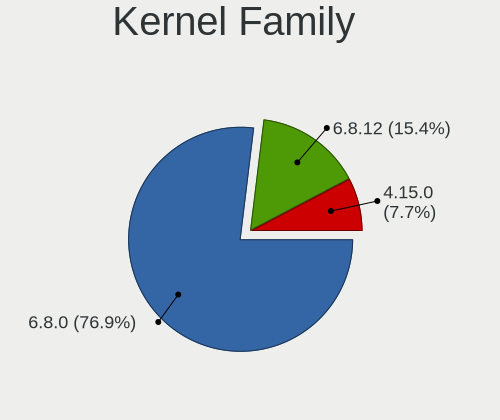
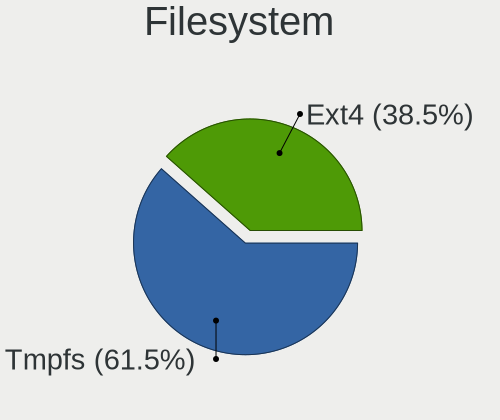
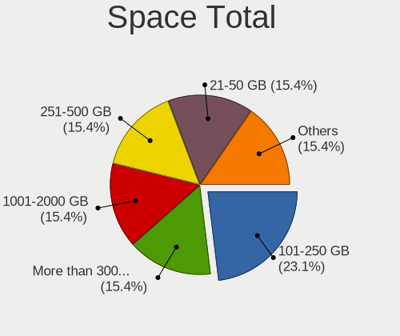
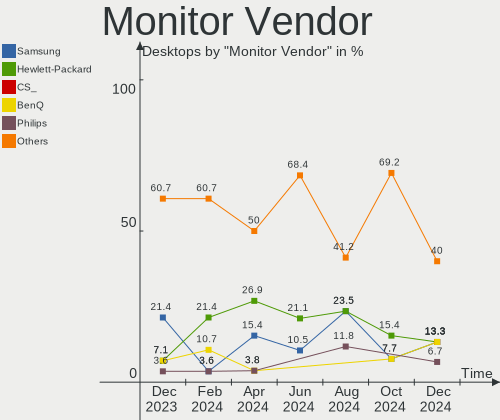
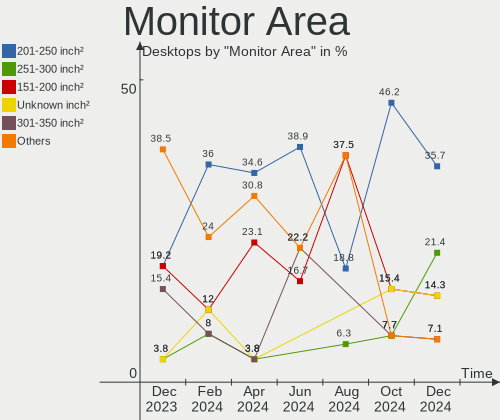
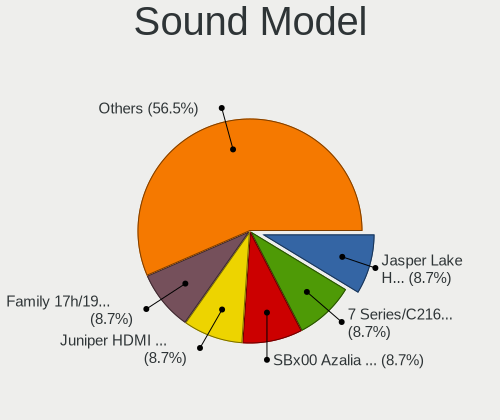

Xubuntu - Hardware Trends (Desktops)
------------------------------------

A project to identify most popular hardware characteristics and track their change
over time based on data collected by Linux users at https://Linux-Hardware.org.

Anyone can contribute to this report by the [hw-probe](https://github.com/linuxhw/hw-probe) tool:

    sudo -E hw-probe -all -upload

This report is for one last month. Overall report since the beginning of time: [TestDays](https://github.com/linuxhw/TestDays)

Period: Apr, 2024.

Contents
--------

* [ System ](#system)
  - [ OS                       ](#os)
  - [ OS Family                ](#os-family)
  - [ Kernel                   ](#kernel)
  - [ Kernel Family            ](#kernel-family)
  - [ Kernel Major Ver.        ](#kernel-major-ver)
  - [ Arch                     ](#arch)
  - [ DE                       ](#de)
  - [ Display Server           ](#display-server)
  - [ Display Manager          ](#display-manager)
  - [ OS Lang                  ](#os-lang)
  - [ Boot Mode                ](#boot-mode)
  - [ Filesystem               ](#filesystem)
  - [ Part. scheme             ](#part-scheme)
  - [ Dual Boot with Linux/BSD ](#dual-boot-with-linuxbsd)
  - [ Dual Boot (Win)          ](#dual-boot-win)

* [ Board ](#board)
  - [ Vendor                   ](#vendor)
  - [ Model                    ](#model)
  - [ Model Family             ](#model-family)
  - [ MFG Year                 ](#mfg-year)
  - [ Form Factor              ](#form-factor)
  - [ Secure Boot              ](#secure-boot)
  - [ Coreboot                 ](#coreboot)
  - [ RAM Size                 ](#ram-size)
  - [ RAM Used                 ](#ram-used)
  - [ Total Drives             ](#total-drives)
  - [ Has CD-ROM               ](#has-cd-rom)
  - [ Has Ethernet             ](#has-ethernet)
  - [ Has WiFi                 ](#has-wifi)
  - [ Has Bluetooth            ](#has-bluetooth)

* [ Location ](#location)
  - [ Country                  ](#country)
  - [ City                     ](#city)

* [ Drives ](#drives)
  - [ Drive Vendor             ](#drive-vendor)
  - [ Drive Model              ](#drive-model)
  - [ HDD Vendor               ](#hdd-vendor)
  - [ SSD Vendor               ](#ssd-vendor)
  - [ Drive Kind               ](#drive-kind)
  - [ Drive Connector          ](#drive-connector)
  - [ Drive Size               ](#drive-size)
  - [ Space Total              ](#space-total)
  - [ Space Used               ](#space-used)
  - [ Malfunc. Drives          ](#malfunc-drives)
  - [ Malfunc. Drive Vendor    ](#malfunc-drive-vendor)
  - [ Malfunc. HDD Vendor      ](#malfunc-hdd-vendor)
  - [ Malfunc. Drive Kind      ](#malfunc-drive-kind)
  - [ Failed Drives            ](#failed-drives)
  - [ Failed Drive Vendor      ](#failed-drive-vendor)
  - [ Drive Status             ](#drive-status)

* [ Storage controller ](#storage-controller)
  - [ Storage Vendor           ](#storage-vendor)
  - [ Storage Model            ](#storage-model)
  - [ Storage Kind             ](#storage-kind)

* [ Processor ](#processor)
  - [ CPU Vendor               ](#cpu-vendor)
  - [ CPU Model                ](#cpu-model)
  - [ CPU Model Family         ](#cpu-model-family)
  - [ CPU Cores                ](#cpu-cores)
  - [ CPU Sockets              ](#cpu-sockets)
  - [ CPU Threads              ](#cpu-threads)
  - [ CPU Op-Modes             ](#cpu-op-modes)
  - [ CPU Microcode            ](#cpu-microcode)
  - [ CPU Microarch            ](#cpu-microarch)

* [ Graphics ](#graphics)
  - [ GPU Vendor               ](#gpu-vendor)
  - [ GPU Model                ](#gpu-model)
  - [ GPU Combo                ](#gpu-combo)
  - [ GPU Driver               ](#gpu-driver)
  - [ GPU Memory               ](#gpu-memory)

* [ Monitor ](#monitor)
  - [ Monitor Vendor           ](#monitor-vendor)
  - [ Monitor Model            ](#monitor-model)
  - [ Monitor Resolution       ](#monitor-resolution)
  - [ Monitor Diagonal         ](#monitor-diagonal)
  - [ Monitor Width            ](#monitor-width)
  - [ Aspect Ratio             ](#aspect-ratio)
  - [ Monitor Area             ](#monitor-area)
  - [ Pixel Density            ](#pixel-density)
  - [ Multiple Monitors        ](#multiple-monitors)

* [ Network ](#network)
  - [ Net Controller Vendor    ](#net-controller-vendor)
  - [ Net Controller Model     ](#net-controller-model)
  - [ Wireless Vendor          ](#wireless-vendor)
  - [ Wireless Model           ](#wireless-model)
  - [ Ethernet Vendor          ](#ethernet-vendor)
  - [ Ethernet Model           ](#ethernet-model)
  - [ Net Controller Kind      ](#net-controller-kind)
  - [ Used Controller          ](#used-controller)
  - [ NICs                     ](#nics)
  - [ IPv6                     ](#ipv6)

* [ Bluetooth ](#bluetooth)
  - [ Bluetooth Vendor         ](#bluetooth-vendor)
  - [ Bluetooth Model          ](#bluetooth-model)

* [ Sound ](#sound)
  - [ Sound Vendor             ](#sound-vendor)
  - [ Sound Model              ](#sound-model)

* [ Memory ](#memory)
  - [ Memory Vendor            ](#memory-vendor)
  - [ Memory Model             ](#memory-model)
  - [ Memory Kind              ](#memory-kind)
  - [ Memory Form Factor       ](#memory-form-factor)
  - [ Memory Size              ](#memory-size)
  - [ Memory Speed             ](#memory-speed)

* [ Printers & scanners ](#printers--scanners)
  - [ Printer Vendor           ](#printer-vendor)
  - [ Printer Model            ](#printer-model)
  - [ Scanner Vendor           ](#scanner-vendor)
  - [ Scanner Model            ](#scanner-model)

* [ Camera ](#camera)
  - [ Camera Vendor            ](#camera-vendor)
  - [ Camera Model             ](#camera-model)

* [ Security ](#security)
  - [ Fingerprint Vendor       ](#fingerprint-vendor)
  - [ Fingerprint Model        ](#fingerprint-model)
  - [ Chipcard Vendor          ](#chipcard-vendor)
  - [ Chipcard Model           ](#chipcard-model)

* [ Unsupported ](#unsupported)
  - [ Unsupported Devices      ](#unsupported-devices)
  - [ Unsupported Device Types ](#unsupported-device-types)

System
------

OS
--

Installed operating systems

| Name          | Desktops | Percent |
|---------------|----------|---------|
| Xubuntu 22.04 | 17       | 60.71%  |
| Xubuntu 20.04 | 5        | 17.86%  |
| Xubuntu 23.10 | 4        | 14.29%  |
| Xubuntu 24.04 | 1        | 3.57%   |
| Xubuntu 23.04 | 1        | 3.57%   |

OS Family
---------

OS without a version

| Name    | Desktops | Percent |
|---------|----------|---------|
| Xubuntu | 28       | 100%    |

Kernel
------

Version of the Linux kernel

| Version                   | Desktops | Percent |
|---------------------------|----------|---------|
| 6.5.0-26-generic          | 6        | 21.43%  |
| 5.15.0-102-generic        | 4        | 14.29%  |
| 6.5.0-28-generic          | 3        | 10.71%  |
| 6.5.0-27-generic          | 3        | 10.71%  |
| 5.15.0-105-generic        | 3        | 10.71%  |
| 5.15.0-101-generic        | 2        | 7.14%   |
| 6.8.0-22-generic          | 1        | 3.57%   |
| 6.5.0-21-generic          | 1        | 3.57%   |
| 6.5.0-18-generic          | 1        | 3.57%   |
| 6.2.0-39-generic          | 1        | 3.57%   |
| 5.4.0-174-generic         | 1        | 3.57%   |
| 5.15.0-43-generic         | 1        | 3.57%   |
| 4.15.18-041518-lowlatency | 1        | 3.57%   |

Kernel Family
-------------

Linux kernel without a distro release

| Version | Desktops | Percent |
|---------|----------|---------|
| 6.5.0   | 14       | 50%     |
| 5.15.0  | 10       | 35.71%  |
| 6.8.0   | 1        | 3.57%   |
| 6.2.0   | 1        | 3.57%   |
| 5.4.0   | 1        | 3.57%   |
| 4.15.18 | 1        | 3.57%   |

Kernel Major Ver.
-----------------

Linux kernel major version

| Version | Desktops | Percent |
|---------|----------|---------|
| 6.5     | 14       | 50%     |
| 5.15    | 10       | 35.71%  |
| 6.8     | 1        | 3.57%   |
| 6.2     | 1        | 3.57%   |
| 5.4     | 1        | 3.57%   |
| 4.15    | 1        | 3.57%   |

Arch
----

OS architecture (x86_64, i586, etc.)

| Name   | Desktops | Percent |
|--------|----------|---------|
| x86_64 | 28       | 100%    |

DE
--

Desktop Environment

| Name       | Desktops | Percent |
|------------|----------|---------|
| XFCE       | 26       | 92.86%  |
| X-Cinnamon | 1        | 3.57%   |
| GNOME      | 1        | 3.57%   |

Display Server
--------------

X11 or Wayland

| Name    | Desktops | Percent |
|---------|----------|---------|
| X11     | 26       | 92.86%  |
| Wayland | 1        | 3.57%   |
| Tty     | 1        | 3.57%   |

Display Manager
---------------

SDDM, LightDM, etc.

| Name    | Desktops | Percent |
|---------|----------|---------|
| LightDM | 24       | 85.71%  |
| GDM3    | 3        | 10.71%  |
| Unknown | 1        | 3.57%   |

OS Lang
-------

Language

| Lang  | Desktops | Percent |
|-------|----------|---------|
| en_US | 11       | 39.29%  |
| it_IT | 3        | 10.71%  |
| fr_FR | 3        | 10.71%  |
| ru_RU | 2        | 7.14%   |
| de_DE | 2        | 7.14%   |
| pt_BR | 1        | 3.57%   |
| nl_BE | 1        | 3.57%   |
| fr_CA | 1        | 3.57%   |
| es_ES | 1        | 3.57%   |
| eo    | 1        | 3.57%   |
| en_IE | 1        | 3.57%   |
| C     | 1        | 3.57%   |

Boot Mode
---------

EFI or BIOS

| Mode | Desktops | Percent |
|------|----------|---------|
| EFI  | 15       | 53.57%  |
| BIOS | 13       | 46.43%  |

Filesystem
----------

Type of filesystem

| Type    | Desktops | Percent |
|---------|----------|---------|
| Ext4    | 21       | 75%     |
| Tmpfs   | 5        | 17.86%  |
| Zfs     | 1        | 3.57%   |
| Overlay | 1        | 3.57%   |

Part. scheme
------------

Scheme of partitioning

| Type    | Desktops | Percent |
|---------|----------|---------|
| GPT     | 23       | 82.14%  |
| MBR     | 4        | 14.29%  |
| Unknown | 1        | 3.57%   |

Dual Boot with Linux/BSD
------------------------

Hosting more than one Linux/BSD

| Dual boot | Desktops | Percent |
|-----------|----------|---------|
| No        | 21       | 75%     |
| Yes       | 7        | 25%     |

Dual Boot (Win)
---------------

Hosting Linux and Windows

| Dual boot | Desktops | Percent |
|-----------|----------|---------|
| No        | 16       | 57.14%  |
| Yes       | 12       | 42.86%  |

Board
-----

Vendor
------

Motherboard manufacturer

| Name                                 | Desktops | Percent |
|--------------------------------------|----------|---------|
| ASUSTek Computer                     | 10       | 35.71%  |
| Dell                                 | 5        | 17.86%  |
| Gigabyte Technology                  | 3        | 10.71%  |
| Lenovo                               | 2        | 7.14%   |
| Shenzhen Meigao Electronic Equipment | 1        | 3.57%   |
| MSI                                  | 1        | 3.57%   |
| Hewlett-Packard                      | 1        | 3.57%   |
| Hardkernel                           | 1        | 3.57%   |
| Fujitsu                              | 1        | 3.57%   |
| AZW                                  | 1        | 3.57%   |
| ASRock                               | 1        | 3.57%   |
| AMI                                  | 1        | 3.57%   |

Model
-----

Motherboard model

| Name                                            | Desktops | Percent |
|-------------------------------------------------|----------|---------|
| ASUS PRIME A320M-K                              | 2        | 7.14%   |
| Shenzhen Meigao Electronic Equipment UM773 Lite | 1        | 3.57%   |
| MSI MS-7522                                     | 1        | 3.57%   |
| Lenovo ThinkStation S30 43512E6                 | 1        | 3.57%   |
| Lenovo ThinkCentre M900 10FLS0SJ00              | 1        | 3.57%   |
| HP Compaq dc7600 Small Form Factor              | 1        | 3.57%   |
| Hardkernel ODROID-H2                            | 1        | 3.57%   |
| Gigabyte M68M-S2P                               | 1        | 3.57%   |
| Gigabyte H110M-S2                               | 1        | 3.57%   |
| Gigabyte B150-HD3 DDR3-CF                       | 1        | 3.57%   |
| Fujitsu FujitsuTP7000                           | 1        | 3.57%   |
| Dell Studio XPS 7100                            | 1        | 3.57%   |
| Dell OptiPlex 7020                              | 1        | 3.57%   |
| Dell OptiPlex 7010                              | 1        | 3.57%   |
| Dell Inspiron 3847                              | 1        | 3.57%   |
| Dell DM061                                      | 1        | 3.57%   |
| AZW EQ                                          | 1        | 3.57%   |
| ASUS TUF Gaming B550M-PLUS                      | 1        | 3.57%   |
| ASUS Studio Extreme                             | 1        | 3.57%   |
| ASUS PRIME Z790-P WIFI                          | 1        | 3.57%   |
| ASUS PRIME H770-PLUS D4                         | 1        | 3.57%   |
| ASUS P8P67 LE                                   | 1        | 3.57%   |
| ASUS P8H61-M LX R2.0                            | 1        | 3.57%   |
| ASUS P5Q                                        | 1        | 3.57%   |
| ASUS Crosshair IV Formula                       | 1        | 3.57%   |
| ASRock A75M-HVS                                 | 1        | 3.57%   |
| AMI Intel                                       | 1        | 3.57%   |

Model Family
------------

Motherboard model prefix

| Name                                       | Desktops | Percent |
|--------------------------------------------|----------|---------|
| ASUS PRIME                                 | 4        | 14.29%  |
| Dell OptiPlex                              | 2        | 7.14%   |
| Shenzhen Meigao Electronic Equipment UM773 | 1        | 3.57%   |
| MSI MS-7522                                | 1        | 3.57%   |
| Lenovo ThinkStation                        | 1        | 3.57%   |
| Lenovo ThinkCentre                         | 1        | 3.57%   |
| HP Compaq                                  | 1        | 3.57%   |
| Hardkernel ODROID-H2                       | 1        | 3.57%   |
| Gigabyte M68M-S2P                          | 1        | 3.57%   |
| Gigabyte H110M-S2                          | 1        | 3.57%   |
| Gigabyte B150-HD3                          | 1        | 3.57%   |
| Fujitsu FujitsuTP7000                      | 1        | 3.57%   |
| Dell Studio                                | 1        | 3.57%   |
| Dell Inspiron                              | 1        | 3.57%   |
| Dell DM061                                 | 1        | 3.57%   |
| AZW EQ                                     | 1        | 3.57%   |
| ASUS TUF                                   | 1        | 3.57%   |
| ASUS Studio                                | 1        | 3.57%   |
| ASUS P8P67                                 | 1        | 3.57%   |
| ASUS P8H61-M                               | 1        | 3.57%   |
| ASUS P5Q                                   | 1        | 3.57%   |
| ASUS Crosshair                             | 1        | 3.57%   |
| ASRock A75M-HVS                            | 1        | 3.57%   |
| AMI Intel                                  | 1        | 3.57%   |

MFG Year
--------

Motherboard manufacture year

| Year | Desktops | Percent |
|------|----------|---------|
| 2023 | 3        | 10.71%  |
| 2022 | 2        | 7.14%   |
| 2021 | 2        | 7.14%   |
| 2017 | 2        | 7.14%   |
| 2015 | 2        | 7.14%   |
| 2013 | 2        | 7.14%   |
| 2012 | 2        | 7.14%   |
| 2011 | 2        | 7.14%   |
| 2010 | 2        | 7.14%   |
| 2009 | 2        | 7.14%   |
| 2020 | 1        | 3.57%   |
| 2018 | 1        | 3.57%   |
| 2016 | 1        | 3.57%   |
| 2014 | 1        | 3.57%   |
| 2008 | 1        | 3.57%   |
| 2006 | 1        | 3.57%   |
| 2005 | 1        | 3.57%   |

Form Factor
-----------

Physical design of the computer

| Name    | Desktops | Percent |
|---------|----------|---------|
| Desktop | 28       | 100%    |

Secure Boot
-----------

Enabled or disabled

| State    | Desktops | Percent |
|----------|----------|---------|
| Disabled | 28       | 100%    |

Coreboot
--------

Have coreboot on board

| Used | Desktops | Percent |
|------|----------|---------|
| No   | 28       | 100%    |

RAM Size
--------

Total RAM memory

| Size in GB  | Desktops | Percent |
|-------------|----------|---------|
| 8.01-16.0   | 8        | 28.57%  |
| 4.01-8.0    | 5        | 17.86%  |
| 16.01-24.0  | 5        | 17.86%  |
| 1.01-2.0    | 3        | 10.71%  |
| 3.01-4.0    | 2        | 7.14%   |
| 24.01-32.0  | 2        | 7.14%   |
| 64.01-256.0 | 2        | 7.14%   |
| 32.01-64.0  | 1        | 3.57%   |

RAM Used
--------

Used RAM memory

| Used GB    | Desktops | Percent |
|------------|----------|---------|
| 1.01-2.0   | 10       | 35.71%  |
| 2.01-3.0   | 6        | 21.43%  |
| 4.01-8.0   | 4        | 14.29%  |
| 0.51-1.0   | 3        | 10.71%  |
| 3.01-4.0   | 2        | 7.14%   |
| 8.01-16.0  | 2        | 7.14%   |
| 32.01-64.0 | 1        | 3.57%   |

Total Drives
------------

Number of drives on board

| Drives | Desktops | Percent |
|--------|----------|---------|
| 1      | 13       | 46.43%  |
| 2      | 9        | 32.14%  |
| 4      | 3        | 10.71%  |
| 3      | 2        | 7.14%   |
| 0      | 1        | 3.57%   |

Has CD-ROM
----------

Has CD-ROM on board

| Presented | Desktops | Percent |
|-----------|----------|---------|
| No        | 18       | 64.29%  |
| Yes       | 10       | 35.71%  |

Has Ethernet
------------

Has Ethernet on board

| Presented | Desktops | Percent |
|-----------|----------|---------|
| Yes       | 28       | 100%    |

Has WiFi
--------

Has WiFi module

| Presented | Desktops | Percent |
|-----------|----------|---------|
| No        | 16       | 57.14%  |
| Yes       | 12       | 42.86%  |

Has Bluetooth
-------------

Has Bluetooth module

| Presented | Desktops | Percent |
|-----------|----------|---------|
| No        | 17       | 60.71%  |
| Yes       | 11       | 39.29%  |

Location
--------

Country
-------

Geographic location (country)

| Country  | Desktops | Percent |
|----------|----------|---------|
| USA      | 5        | 17.86%  |
| Russia   | 3        | 10.71%  |
| Italy    | 3        | 10.71%  |
| France   | 3        | 10.71%  |
| Spain    | 2        | 7.14%   |
| Serbia   | 2        | 7.14%   |
| Germany  | 2        | 7.14%   |
| Canada   | 2        | 7.14%   |
| Slovakia | 1        | 3.57%   |
| Hungary  | 1        | 3.57%   |
| Finland  | 1        | 3.57%   |
| Bulgaria | 1        | 3.57%   |
| Brazil   | 1        | 3.57%   |
| Belgium  | 1        | 3.57%   |

City
----

Geographic location (city)

| City                    | Desktops | Percent |
|-------------------------|----------|---------|
| Zrenjanin               | 2        | 7.14%   |
| Munich                  | 2        | 7.14%   |
| Vanves                  | 1        | 3.57%   |
| Toronto                 | 1        | 3.57%   |
| Springfield             | 1        | 3.57%   |
| Sofia                   | 1        | 3.57%   |
| Sao Paulo               | 1        | 3.57%   |
| Sannazzaro de' Burgondi | 1        | 3.57%   |
| Saint-Eustache          | 1        | 3.57%   |
| Rennes                  | 1        | 3.57%   |
| Novokuznetsk            | 1        | 3.57%   |
| Naples                  | 1        | 3.57%   |
| Moscow                  | 1        | 3.57%   |
| Mason                   | 1        | 3.57%   |
| Madrid                  | 1        | 3.57%   |
| Le Petit-Quevilly       | 1        | 3.57%   |
| Keene                   | 1        | 3.57%   |
| Kandalaksha             | 1        | 3.57%   |
| Helsinki                | 1        | 3.57%   |
| Harrisonburg            | 1        | 3.57%   |
| Giussano                | 1        | 3.57%   |
| Dunn                    | 1        | 3.57%   |
| Budapest                | 1        | 3.57%   |
| Bruges                  | 1        | 3.57%   |
| Banská Bystrica        | 1        | 3.57%   |
| Arona                   | 1        | 3.57%   |

Drives
------

Drive Vendor
------------

Hard drive vendors

| Vendor                      | Desktops | Drives | Percent |
|-----------------------------|----------|--------|---------|
| Seagate                     | 10       | 12     | 23.26%  |
| Kingston                    | 6        | 6      | 13.95%  |
| WDC                         | 5        | 6      | 11.63%  |
| Samsung Electronics         | 4        | 5      | 9.3%    |
| Unknown                     | 3        | 3      | 6.98%   |
| Kingston Technology Company | 3        | 3      | 6.98%   |
| A-DATA Technology           | 2        | 3      | 4.65%   |
| Transcend                   | 1        | 1      | 2.33%   |
| SanDisk                     | 1        | 1      | 2.33%   |
| Realtek Semiconductor       | 1        | 1      | 2.33%   |
| PNY                         | 1        | 1      | 2.33%   |
| PHD 3.0                     | 1        | 1      | 2.33%   |
| OCZ                         | 1        | 1      | 2.33%   |
| Micron/Crucial Technology   | 1        | 1      | 2.33%   |
| Intenso                     | 1        | 1      | 2.33%   |
| Hitachi                     | 1        | 1      | 2.33%   |
| Fanxiang                    | 1        | 1      | 2.33%   |

Drive Model
-----------

Hard drive models

| Model                                       | Desktops | Percent |
|---------------------------------------------|----------|---------|
| Kingston SA400S37240G 240GB SSD             | 2        | 4.26%   |
| WDC WDS240G2G0A-00JH30 240GB SSD            | 1        | 2.13%   |
| WDC WD800JD-08MSA1 80GB                     | 1        | 2.13%   |
| WDC WD5000LPLX-75ZNTT1 500GB                | 1        | 2.13%   |
| WDC WD4000AAJS-00YFA0 400GB                 | 1        | 2.13%   |
| WDC WD1600AAJS-07PSA0 160GB                 | 1        | 2.13%   |
| WDC WD1001FAES-75W7A0 1TB                   | 1        | 2.13%   |
| Unknown SD/MMC/MS PRO 128GB                 | 1        | 2.13%   |
| Unknown NVMe SSD Drive 512GB                | 1        | 2.13%   |
| Unknown CJTD4R  64GB                        | 1        | 2.13%   |
| Transcend TS1TSSD225S 1TB                   | 1        | 2.13%   |
| Seagate ST8000DM004-2CX188 8TB              | 1        | 2.13%   |
| Seagate ST500LT012-1DG142 500GB             | 1        | 2.13%   |
| Seagate ST5000LM000-2U8170 5TB              | 1        | 2.13%   |
| Seagate ST3750528AS 752GB                   | 1        | 2.13%   |
| Seagate ST3500630AS 500GB                   | 1        | 2.13%   |
| Seagate ST3500413AS 500GB                   | 1        | 2.13%   |
| Seagate ST3320620NS 320GB                   | 1        | 2.13%   |
| Seagate ST3250312AS 250GB                   | 1        | 2.13%   |
| Seagate ST31000528AS 1TB                    | 1        | 2.13%   |
| Seagate ST3000DM008-2DM166 3TB              | 1        | 2.13%   |
| Seagate FireCuda 530 ZP1000GM30013 1TB      | 1        | 2.13%   |
| SanDisk SDSSDH3 512G                        | 1        | 2.13%   |
| Samsung SSD 980 PRO 2TB                     | 1        | 2.13%   |
| Samsung SSD 980 1TB                         | 1        | 2.13%   |
| Samsung SSD 860 EVO 250GB                   | 1        | 2.13%   |
| Samsung SSD 850 EVO 250GB                   | 1        | 2.13%   |
| Samsung MZ7LN128HAHQ-000H1 128GB SSD        | 1        | 2.13%   |
| Realtek NVMe SSD Drive 1TB                  | 1        | 2.13%   |
| PNY ELITE PSSD 480GB                        | 1        | 2.13%   |
| PHD 3.0 Silicon-Power 1TB                   | 1        | 2.13%   |
| OCZ VERTEX460A 240GB SSD                    | 1        | 2.13%   |
| Micron/Crucial CT1000T500SSD8 1TB           | 1        | 2.13%   |
| Kingston Company U-SNS8154P3 NVMe SSD 128GB | 1        | 2.13%   |
| Kingston Company SNV2S1000G 1TB             | 1        | 2.13%   |
| Kingston Company OM8PGP4512Q-A0 512GB       | 1        | 2.13%   |
| Kingston SV300S37A120G 120GB SSD            | 1        | 2.13%   |
| Kingston SKC6001024G 1TB SSD                | 1        | 2.13%   |
| Kingston SKC300S37A60G 64GB SSD             | 1        | 2.13%   |
| Kingston RBUSC180DS37256GJ 256GB SSD        | 1        | 2.13%   |

HDD Vendor
----------

Hard disk drive vendors

| Vendor  | Desktops | Drives | Percent |
|---------|----------|--------|---------|
| Seagate | 9        | 11     | 60%     |
| WDC     | 4        | 5      | 26.67%  |
| Unknown | 1        | 1      | 6.67%   |
| Hitachi | 1        | 1      | 6.67%   |

SSD Vendor
----------

Solid state drive vendors

| Vendor              | Desktops | Drives | Percent |
|---------------------|----------|--------|---------|
| Kingston            | 6        | 6      | 33.33%  |
| Samsung Electronics | 2        | 3      | 11.11%  |
| A-DATA Technology   | 2        | 3      | 11.11%  |
| WDC                 | 1        | 1      | 5.56%   |
| Transcend           | 1        | 1      | 5.56%   |
| SanDisk             | 1        | 1      | 5.56%   |
| PNY                 | 1        | 1      | 5.56%   |
| PHD 3.0             | 1        | 1      | 5.56%   |
| OCZ                 | 1        | 1      | 5.56%   |
| Intenso             | 1        | 1      | 5.56%   |
| Fanxiang            | 1        | 1      | 5.56%   |

Drive Kind
----------

HDD or SSD

| Kind | Desktops | Drives | Percent |
|------|----------|--------|---------|
| SSD  | 14       | 20     | 37.84%  |
| HDD  | 14       | 18     | 37.84%  |
| NVMe | 8        | 9      | 21.62%  |
| MMC  | 1        | 1      | 2.7%    |

Drive Connector
---------------

SATA, SAS, NVMe, etc.

| Type | Desktops | Drives | Percent |
|------|----------|--------|---------|
| SATA | 21       | 34     | 61.76%  |
| NVMe | 8        | 9      | 23.53%  |
| SAS  | 4        | 4      | 11.76%  |
| MMC  | 1        | 1      | 2.94%   |

Drive Size
----------

Size of hard drive

| Size in TB | Desktops | Drives | Percent |
|------------|----------|--------|---------|
| 0.01-0.5   | 19       | 27     | 65.52%  |
| 0.51-1.0   | 7        | 8      | 24.14%  |
| 4.01-10.0  | 2        | 2      | 6.9%    |
| 2.01-3.0   | 1        | 1      | 3.45%   |

Space Total
-----------

Amount of disk space available on the file system

| Size in GB     | Desktops | Percent |
|----------------|----------|---------|
| 101-250        | 9        | 32.14%  |
| 251-500        | 6        | 21.43%  |
| 501-1000       | 5        | 17.86%  |
| More than 3000 | 2        | 7.14%   |
| 1-20           | 2        | 7.14%   |
| 21-50          | 1        | 3.57%   |
| 2001-3000      | 1        | 3.57%   |
| 1001-2000      | 1        | 3.57%   |
| 51-100         | 1        | 3.57%   |

Space Used
----------

Amount of used disk space

| Used GB   | Desktops | Percent |
|-----------|----------|---------|
| 1-20      | 8        | 28.57%  |
| 251-500   | 4        | 14.29%  |
| 21-50     | 4        | 14.29%  |
| 101-250   | 4        | 14.29%  |
| 501-1000  | 3        | 10.71%  |
| 51-100    | 3        | 10.71%  |
| 2001-3000 | 1        | 3.57%   |
| 1001-2000 | 1        | 3.57%   |

Malfunc. Drives
---------------

Drive models with a malfunction

| Model                               | Desktops | Drives | Percent |
|-------------------------------------|----------|--------|---------|
| WDC WD5000LPLX-75ZNTT1 500GB        | 1        | 1      | 16.67%  |
| Seagate ST3750528AS 752GB           | 1        | 1      | 16.67%  |
| Seagate ST3500630AS 500GB           | 1        | 1      | 16.67%  |
| Seagate ST3250312AS 250GB           | 1        | 1      | 16.67%  |
| Seagate ST3000DM008-2DM166 3TB      | 1        | 1      | 16.67%  |
| Samsung Electronics SSD 980 PRO 2TB | 1        | 1      | 16.67%  |

Malfunc. Drive Vendor
---------------------

Vendors of faulty drives

| Vendor              | Desktops | Drives | Percent |
|---------------------|----------|--------|---------|
| Seagate             | 4        | 4      | 66.67%  |
| WDC                 | 1        | 1      | 16.67%  |
| Samsung Electronics | 1        | 1      | 16.67%  |

Malfunc. HDD Vendor
-------------------

Vendors of faulty HDD drives

| Vendor  | Desktops | Drives | Percent |
|---------|----------|--------|---------|
| Seagate | 4        | 4      | 80%     |
| WDC     | 1        | 1      | 20%     |

Malfunc. Drive Kind
-------------------

Kinds of faulty drives

| Kind | Desktops | Drives | Percent |
|------|----------|--------|---------|
| HDD  | 5        | 5      | 83.33%  |
| NVMe | 1        | 1      | 16.67%  |

Failed Drives
-------------

Failed drive models

| Model                           | Desktops | Drives | Percent |
|---------------------------------|----------|--------|---------|
| Seagate ST500LT012-1DG142 500GB | 1        | 1      | 100%    |

Failed Drive Vendor
-------------------

Failed drive vendors

| Vendor  | Desktops | Drives | Percent |
|---------|----------|--------|---------|
| Seagate | 1        | 1      | 100%    |

Drive Status
------------

Number of failed and malfunc. drives

| Status   | Desktops | Drives | Percent |
|----------|----------|--------|---------|
| Works    | 16       | 26     | 44.44%  |
| Detected | 13       | 15     | 36.11%  |
| Malfunc  | 6        | 6      | 16.67%  |
| Failed   | 1        | 1      | 2.78%   |

Storage controller
------------------

Storage Vendor
--------------

Storage controller vendors

| Vendor                      | Desktops | Percent |
|-----------------------------|----------|---------|
| Intel                       | 18       | 45%     |
| AMD                         | 8        | 20%     |
| Kingston Technology Company | 3        | 7.5%    |
| Samsung Electronics         | 2        | 5%      |
| Marvell Technology Group    | 2        | 5%      |
| JMicron Technology          | 2        | 5%      |
| Seagate Technology          | 1        | 2.5%    |
| Realtek Semiconductor       | 1        | 2.5%    |
| Nvidia                      | 1        | 2.5%    |
| Micron/Crucial Technology   | 1        | 2.5%    |
| MAXIO Technology (Hangzhou) | 1        | 2.5%    |

Storage Model
-------------

Storage controller models

| Model                                                                                   | Desktops | Percent |
|-----------------------------------------------------------------------------------------|----------|---------|
| AMD FCH SATA Controller [AHCI mode]                                                     | 5        | 9.26%   |
| Intel Q170/Q150/B150/H170/H110/Z170/CM236 Chipset SATA Controller [AHCI Mode]           | 3        | 5.56%   |
| JMicron JMB363 SATA/IDE Controller                                                      | 2        | 3.7%    |
| Intel SATA Controller [RAID mode]                                                       | 2        | 3.7%    |
| Intel Raptor Lake SATA AHCI Controller                                                  | 2        | 3.7%    |
| Intel 82801JI (ICH10 Family) 4 port SATA IDE Controller #1                              | 2        | 3.7%    |
| Intel 82801JI (ICH10 Family) 2 port SATA IDE Controller #2                              | 2        | 3.7%    |
| Intel 8 Series/C220 Series Chipset Family 6-port SATA Controller 1 [AHCI mode]          | 2        | 3.7%    |
| AMD SB7x0/SB8x0/SB9x0 IDE Controller                                                    | 2        | 3.7%    |
| AMD FCH SATA Controller D                                                               | 2        | 3.7%    |
| Seagate FireCuda 530 SSD                                                                | 1        | 1.85%   |
| Samsung NVMe SSD Controller PM9A1/PM9A3/980PRO                                          | 1        | 1.85%   |
| Samsung NVMe SSD Controller 980 (DRAM-less)                                             | 1        | 1.85%   |
| Realtek RTS5765DL NVMe SSD Controller (DRAM-less)                                       | 1        | 1.85%   |
| Nvidia MCP61 SATA Controller                                                            | 1        | 1.85%   |
| Nvidia MCP61 IDE                                                                        | 1        | 1.85%   |
| Micron/Crucial T500 NVMe PCIe SSD                                                       | 1        | 1.85%   |
| MAXIO (Hangzhou) NVMe SSD Controller MAP1202 (DRAM-less)                                | 1        | 1.85%   |
| Marvell Group 88SE912x SATA 6Gb/s Controller [IDE mode]                                 | 1        | 1.85%   |
| Marvell Group 88SE912x IDE Controller                                                   | 1        | 1.85%   |
| Marvell Group 88SE6111/6121 SATA II / PATA Controller                                   | 1        | 1.85%   |
| Kingston Company OM8PGP4 NVMe PCIe SSD (DRAM-less)                                      | 1        | 1.85%   |
| Kingston Company NV2 NVMe SSD SM2267XT (DRAM-less)                                      | 1        | 1.85%   |
| Kingston Company A1000/U-SNS8154P3 x2 NVMe SSD                                          | 1        | 1.85%   |
| Intel Volume Management Device NVMe RAID Controller                                     | 1        | 1.85%   |
| Intel SATA controller                                                                   | 1        | 1.85%   |
| Intel NM10/ICH7 Family SATA Controller [IDE mode]                                       | 1        | 1.85%   |
| Intel Celeron/Pentium Silver Processor SATA Controller                                  | 1        | 1.85%   |
| Intel C602 chipset 4-Port SATA Storage Control Unit                                     | 1        | 1.85%   |
| Intel C600/X79 series chipset IDE-r Controller                                          | 1        | 1.85%   |
| Intel C600/X79 series chipset 6-Port SATA AHCI Controller                               | 1        | 1.85%   |
| Intel 82801G (ICH7 Family) IDE Controller                                               | 1        | 1.85%   |
| Intel 7 Series/C210 Series Chipset Family 6-port SATA Controller [AHCI mode]            | 1        | 1.85%   |
| Intel 6 Series/C200 Series Chipset Family IDE-r Controller                              | 1        | 1.85%   |
| Intel 6 Series/C200 Series Chipset Family Desktop SATA Controller (IDE mode, ports 4-5) | 1        | 1.85%   |
| Intel 6 Series/C200 Series Chipset Family Desktop SATA Controller (IDE mode, ports 0-3) | 1        | 1.85%   |
| Intel 6 Series/C200 Series Chipset Family 6 port Desktop SATA AHCI Controller           | 1        | 1.85%   |
| AMD SB7x0/SB8x0/SB9x0 SATA Controller [IDE mode]                                        | 1        | 1.85%   |
| AMD SB7x0/SB8x0/SB9x0 SATA Controller [AHCI mode]                                       | 1        | 1.85%   |
| AMD 500 Series Chipset SATA Controller                                                  | 1        | 1.85%   |

Storage Kind
------------

Kind of storage controller (IDE, SATA, NVMe, SAS, ...)

| Kind | Desktops | Percent |
|------|----------|---------|
| SATA | 21       | 48.84%  |
| IDE  | 10       | 23.26%  |
| NVMe | 8        | 18.6%   |
| RAID | 3        | 6.98%   |
| SAS  | 1        | 2.33%   |

Processor
---------

CPU Vendor
----------

Processor vendors

| Vendor | Desktops | Percent |
|--------|----------|---------|
| Intel  | 19       | 67.86%  |
| AMD    | 9        | 32.14%  |

CPU Model
---------

Processor models

| Model                                       | Desktops | Percent |
|---------------------------------------------|----------|---------|
| Intel Xeon CPU E5-1620 v2 @ 3.70GHz         | 1        | 3.57%   |
| Intel Pentium D CPU 2.80GHz                 | 1        | 3.57%   |
| Intel Pentium CPU G870 @ 3.10GHz            | 1        | 3.57%   |
| Intel Pentium CPU G4400 @ 3.30GHz           | 1        | 3.57%   |
| Intel Pentium 4 CPU 3.00GHz                 | 1        | 3.57%   |
| Intel N100                                  | 1        | 3.57%   |
| Intel Core i7-4790 CPU @ 3.60GHz            | 1        | 3.57%   |
| Intel Core i7-1060NG7 CPU @ 1.20GHz         | 1        | 3.57%   |
| Intel Core i7 CPU 920 @ 2.67GHz             | 1        | 3.57%   |
| Intel Core i5-6500T CPU @ 2.50GHz           | 1        | 3.57%   |
| Intel Core i5-4440 CPU @ 3.10GHz            | 1        | 3.57%   |
| Intel Core i5-3470S CPU @ 2.90GHz           | 1        | 3.57%   |
| Intel Core i5-2400 CPU @ 3.10GHz            | 1        | 3.57%   |
| Intel Core i3-6300 CPU @ 3.80GHz            | 1        | 3.57%   |
| Intel Core i3-2100 CPU @ 3.10GHz            | 1        | 3.57%   |
| Intel Core 2 Quad CPU Q8200 @ 2.33GHz       | 1        | 3.57%   |
| Intel Celeron J4105 CPU @ 1.50GHz           | 1        | 3.57%   |
| Intel 13th Gen Core i7-13700K               | 1        | 3.57%   |
| Intel 13th Gen Core i5-13500                | 1        | 3.57%   |
| AMD Ryzen 9 5950X 16-Core Processor         | 1        | 3.57%   |
| AMD Ryzen 7 7735HS with Radeon Graphics     | 1        | 3.57%   |
| AMD Ryzen 5 PRO 4650G with Radeon Graphics  | 1        | 3.57%   |
| AMD Ryzen 5 5600GT with Radeon Graphics     | 1        | 3.57%   |
| AMD Ryzen 3 3200G with Radeon Vega Graphics | 1        | 3.57%   |
| AMD Phenom II X6 1100T Processor            | 1        | 3.57%   |
| AMD Phenom II X6 1055T Processor            | 1        | 3.57%   |
| AMD Athlon II X2 250 Processor              | 1        | 3.57%   |
| AMD A4-3300 APU with Radeon HD Graphics     | 1        | 3.57%   |

CPU Model Family
----------------

Processor model prefix

| Model             | Desktops | Percent |
|-------------------|----------|---------|
| Intel Core i5     | 4        | 14.29%  |
| Other             | 3        | 10.71%  |
| Intel Core i7     | 3        | 10.71%  |
| Intel Pentium     | 2        | 7.14%   |
| Intel Core i3     | 2        | 7.14%   |
| AMD Phenom II X6  | 2        | 7.14%   |
| Intel Xeon        | 1        | 3.57%   |
| Intel Pentium D   | 1        | 3.57%   |
| Intel Pentium 4   | 1        | 3.57%   |
| Intel Core 2 Quad | 1        | 3.57%   |
| Intel Celeron     | 1        | 3.57%   |
| AMD Ryzen 9       | 1        | 3.57%   |
| AMD Ryzen 7       | 1        | 3.57%   |
| AMD Ryzen 5 PRO   | 1        | 3.57%   |
| AMD Ryzen 5       | 1        | 3.57%   |
| AMD Ryzen 3       | 1        | 3.57%   |
| AMD Athlon II X2  | 1        | 3.57%   |
| AMD A4            | 1        | 3.57%   |

CPU Cores
---------

Number of processor cores

| Number | Desktops | Percent |
|--------|----------|---------|
| 4      | 12       | 42.86%  |
| 2      | 7        | 25%     |
| 6      | 3        | 10.71%  |
| 16     | 2        | 7.14%   |
| 14     | 1        | 3.57%   |
| 8      | 1        | 3.57%   |
| 5      | 1        | 3.57%   |
| 1      | 1        | 3.57%   |

CPU Sockets
-----------

Number of sockets

| Number | Desktops | Percent |
|--------|----------|---------|
| 1      | 28       | 100%    |

CPU Threads
-----------

Threads per core (Hyper-Threading)

| Number | Desktops | Percent |
|--------|----------|---------|
| 1      | 16       | 57.14%  |
| 2      | 12       | 42.86%  |

CPU Op-Modes
------------

CPU Operation Modes (32-bit, 64-bit)

| Op mode        | Desktops | Percent |
|----------------|----------|---------|
| 32-bit, 64-bit | 28       | 100%    |

CPU Microcode
-------------

Microcode number

| Number     | Desktops | Percent |
|------------|----------|---------|
| Unknown    | 14       | 50%     |
| 0x206a7    | 3        | 10.71%  |
| 0x506e3    | 2        | 7.14%   |
| 0x010000dc | 2        | 7.14%   |
| 0xb06e0    | 1        | 3.57%   |
| 0x706a1    | 1        | 3.57%   |
| 0x0a201204 | 1        | 3.57%   |
| 0x08600109 | 1        | 3.57%   |
| 0x08108109 | 1        | 3.57%   |
| 0x03000027 | 1        | 3.57%   |
| 0x010000c8 | 1        | 3.57%   |

CPU Microarch
-------------

Microarchitecture

| Name             | Desktops | Percent |
|------------------|----------|---------|
| Skylake          | 3        | 10.71%  |
| SandyBridge      | 3        | 10.71%  |
| K10              | 3        | 10.71%  |
| Unknown          | 3        | 10.71%  |
| Zen 3            | 2        | 7.14%   |
| NetBurst         | 2        | 7.14%   |
| IvyBridge        | 2        | 7.14%   |
| Haswell          | 2        | 7.14%   |
| Zen+             | 1        | 3.57%   |
| Zen 2            | 1        | 3.57%   |
| Penryn           | 1        | 3.57%   |
| Nehalem          | 1        | 3.57%   |
| K10 Llano        | 1        | 3.57%   |
| IceLake          | 1        | 3.57%   |
| Goldmont plus    | 1        | 3.57%   |
| Alderlake Hybrid | 1        | 3.57%   |

Graphics
--------

GPU Vendor
----------

Vendors of graphics cards

| Vendor | Desktops | Percent |
|--------|----------|---------|
| Intel  | 11       | 37.93%  |
| AMD    | 10       | 34.48%  |
| Nvidia | 8        | 27.59%  |

GPU Model
---------

Graphics card models

| Model                                                                       | Desktops | Percent |
|-----------------------------------------------------------------------------|----------|---------|
| Nvidia GA106 [GeForce RTX 3060 Lite Hash Rate]                              | 2        | 6.45%   |
| Intel HD Graphics 530                                                       | 2        | 6.45%   |
| AMD Ellesmere [Radeon RX 470/480/570/570X/580/580X/590]                     | 2        | 6.45%   |
| Nvidia TU116 [GeForce GTX 1660 SUPER]                                       | 1        | 3.23%   |
| Nvidia GK107GL [Quadro K2000]                                               | 1        | 3.23%   |
| Nvidia GK107 [GeForce GTX 650]                                              | 1        | 3.23%   |
| Nvidia GA104 [GeForce RTX 3060]                                             | 1        | 3.23%   |
| Nvidia G72 [GeForce 7300 LE]                                                | 1        | 3.23%   |
| Nvidia C61 [GeForce 7025 / nForce 630a]                                     | 1        | 3.23%   |
| Intel Xeon E3-1200 v3/4th Gen Core Processor Integrated Graphics Controller | 1        | 3.23%   |
| Intel Xeon E3-1200 v2/3rd Gen Core processor Graphics Controller            | 1        | 3.23%   |
| Intel Raptor Lake-S GT1 [UHD Graphics 770]                                  | 1        | 3.23%   |
| Intel Iris Plus Graphics G7 (Ice Lake)                                      | 1        | 3.23%   |
| Intel HD Graphics 510                                                       | 1        | 3.23%   |
| Intel GeminiLake [UHD Graphics 600]                                         | 1        | 3.23%   |
| Intel Alder Lake-N [UHD Graphics]                                           | 1        | 3.23%   |
| Intel 82945G/GZ Integrated Graphics Controller                              | 1        | 3.23%   |
| Intel 2nd Generation Core Processor Family Integrated Graphics Controller   | 1        | 3.23%   |
| AMD Turks PRO [Radeon HD 6570/7570/8550 / R5 230]                           | 1        | 3.23%   |
| AMD SuperSumo [Radeon HD 6410D]                                             | 1        | 3.23%   |
| AMD RV620 LE [Radeon HD 3450]                                               | 1        | 3.23%   |
| AMD RV515 [Radeon X1300/X1550]                                              | 1        | 3.23%   |
| AMD RV515 [Radeon X1300/X1550 Series] (Secondary)                           | 1        | 3.23%   |
| AMD Renoir [Radeon RX Vega 6 (Ryzen 4000/5000 Mobile Series)]               | 1        | 3.23%   |
| AMD Rembrandt [Radeon 680M]                                                 | 1        | 3.23%   |
| AMD Pitcairn PRO [Radeon HD 7850 / R7 265 / R9 270 1024SP]                  | 1        | 3.23%   |
| AMD Picasso/Raven 2 [Radeon Vega Series / Radeon Vega Mobile Series]        | 1        | 3.23%   |
| AMD Cezanne [Radeon Vega Series / Radeon Vega Mobile Series]                | 1        | 3.23%   |

GPU Combo
---------

Combinations of graphics cards

| Name           | Desktops | Percent |
|----------------|----------|---------|
| 1 x Intel      | 10       | 35.71%  |
| 1 x AMD        | 9        | 32.14%  |
| 1 x Nvidia     | 7        | 25%     |
| 2 x AMD        | 1        | 3.57%   |
| Intel + Nvidia | 1        | 3.57%   |

GPU Driver
----------

Free vs proprietary

| Driver      | Desktops | Percent |
|-------------|----------|---------|
| Free        | 22       | 78.57%  |
| Proprietary | 5        | 17.86%  |
| Unknown     | 1        | 3.57%   |

GPU Memory
----------

Total video memory

| Size in GB | Desktops | Percent |
|------------|----------|---------|
| Unknown    | 13       | 46.43%  |
| 0.01-0.5   | 5        | 17.86%  |
| 1.01-2.0   | 4        | 14.29%  |
| 8.01-16.0  | 2        | 7.14%   |
| 0.51-1.0   | 2        | 7.14%   |
| 7.01-8.0   | 1        | 3.57%   |
| 5.01-6.0   | 1        | 3.57%   |

Monitor
-------

Monitor Vendor
--------------

Monitor vendors

| Vendor              | Desktops | Percent |
|---------------------|----------|---------|
| Hewlett-Packard     | 7        | 26.92%  |
| Samsung Electronics | 4        | 15.38%  |
| Goldstar            | 3        | 11.54%  |
| Dell                | 2        | 7.69%   |
| AOC                 | 2        | 7.69%   |
| ViewSonic           | 1        | 3.85%   |
| Vestel              | 1        | 3.85%   |
| Sony                | 1        | 3.85%   |
| Philips             | 1        | 3.85%   |
| NEC Computers       | 1        | 3.85%   |
| MiTAC               | 1        | 3.85%   |
| CTC                 | 1        | 3.85%   |
| BenQ                | 1        | 3.85%   |

Monitor Model
-------------

Monitor models

| Model                                                               | Desktops | Percent |
|---------------------------------------------------------------------|----------|---------|
| Hewlett-Packard V24i HPN36AC 1920x1080 527x296mm 23.8-inch          | 2        | 7.14%   |
| ViewSonic VE710b-2 VSC3919 1280x1024 338x270mm 17.0-inch            | 1        | 3.57%   |
| Vestel LCD Monitor 55UHD_LCD_TV 1920x1080                           | 1        | 3.57%   |
| Sony TV SNY5803 1360x768                                            | 1        | 3.57%   |
| Samsung Electronics SMEX2220 SAM0685 1920x1080 477x268mm 21.5-inch  | 1        | 3.57%   |
| Samsung Electronics S22E390 SAM0C18 1920x1080 477x268mm 21.5-inch   | 1        | 3.57%   |
| Samsung Electronics S22E200 SAM0C6E 1920x1080 477x268mm 21.5-inch   | 1        | 3.57%   |
| Samsung Electronics LU28R55 SAM1016 3840x2160 632x360mm 28.6-inch   | 1        | 3.57%   |
| Samsung Electronics LF24T450F SAM7094 1920x1080 527x296mm 23.8-inch | 1        | 3.57%   |
| Philips 247ELH PHLC085 1920x1080 521x293mm 23.5-inch                | 1        | 3.57%   |
| NEC Computers LCD72VM NEC6659 1280x1024 338x270mm 17.0-inch         | 1        | 3.57%   |
| MiTAC MON-SIS289 MTC0289 1920x1080 930x530mm 42.1-inch              | 1        | 3.57%   |
| Hewlett-Packard w19b/w19e HWP26A1 1440x900 410x256mm 19.0-inch      | 1        | 3.57%   |
| Hewlett-Packard w1907 HWP26A3 1440x900 408x255mm 18.9-inch          | 1        | 3.57%   |
| Hewlett-Packard w1907 HWP26A2 1440x900 408x255mm 18.9-inch          | 1        | 3.57%   |
| Hewlett-Packard V24e HPN36AE 1920x1080 527x296mm 23.8-inch          | 1        | 3.57%   |
| Hewlett-Packard E243 HPN3469 1920x1080 527x296mm 23.8-inch          | 1        | 3.57%   |
| Hewlett-Packard 24uh HWP3220 1920x1080 531x299mm 24.0-inch          | 1        | 3.57%   |
| Goldstar ULTRAWIDE GSM59F1 2560x1080 673x284mm 28.8-inch            | 1        | 3.57%   |
| Goldstar L1952S GSM4AE0 1280x1024 376x301mm 19.0-inch               | 1        | 3.57%   |
| Goldstar L192WS GSM4B32 1440x900 410x256mm 19.0-inch                | 1        | 3.57%   |
| Dell S199WFP DELF00A 1440x900 408x255mm 18.9-inch                   | 1        | 3.57%   |
| Dell P2314H DEL409A 1920x1080 509x286mm 23.0-inch                   | 1        | 3.57%   |
| CTC KD02909-8770A CTC0770 1024x768 304x228mm 15.0-inch              | 1        | 3.57%   |
| BenQ GW2455 BNQ78D8 1920x1080 521x293mm 23.5-inch                   | 1        | 3.57%   |
| AOC 24B2W1 AOC2402 1920x1080 527x296mm 23.8-inch                    | 1        | 3.57%   |
| AOC 1950W AOC1950 1366x768 410x230mm 18.5-inch                      | 1        | 3.57%   |

Monitor Resolution
------------------

Monitor screen resolution

| Resolution       | Desktops | Percent |
|------------------|----------|---------|
| 1920x1080 (FHD)  | 13       | 50%     |
| 1440x900 (WXGA+) | 4        | 15.38%  |
| 1280x1024 (SXGA) | 3        | 11.54%  |
| 3840x2160 (4K)   | 1        | 3.85%   |
| 2560x1440 (QHD)  | 1        | 3.85%   |
| 2560x1080        | 1        | 3.85%   |
| 1366x768 (WXGA)  | 1        | 3.85%   |
| 1360x768         | 1        | 3.85%   |
| 1024x768 (XGA)   | 1        | 3.85%   |

Monitor Diagonal
----------------

Diagonal size in inches

| Inches  | Desktops | Percent |
|---------|----------|---------|
| 24      | 6        | 22.22%  |
| 19      | 5        | 18.52%  |
| 23      | 4        | 14.81%  |
| 21      | 3        | 11.11%  |
| 17      | 2        | 7.41%   |
| 72      | 1        | 3.7%    |
| 42      | 1        | 3.7%    |
| 34      | 1        | 3.7%    |
| 28      | 1        | 3.7%    |
| 18      | 1        | 3.7%    |
| 15      | 1        | 3.7%    |
| Unknown | 1        | 3.7%    |

Monitor Width
-------------

Physical width

| Width in mm | Desktops | Percent |
|-------------|----------|---------|
| 501-600     | 9        | 34.62%  |
| 401-500     | 8        | 30.77%  |
| 301-350     | 3        | 11.54%  |
| 701-800     | 1        | 3.85%   |
| 601-700     | 1        | 3.85%   |
| 351-400     | 1        | 3.85%   |
| 1501-2000   | 1        | 3.85%   |
| 901-1000    | 1        | 3.85%   |
| Unknown     | 1        | 3.85%   |

Aspect Ratio
------------

Proportional relationship between the width and the height

| Ratio   | Desktops | Percent |
|---------|----------|---------|
| 16/9    | 15       | 60%     |
| 16/10   | 4        | 16%     |
| 5/4     | 3        | 12%     |
| 4/3     | 1        | 4%      |
| 21/9    | 1        | 4%      |
| Unknown | 1        | 4%      |

Monitor Area
------------

Area in inch²

| Area in inch² | Desktops | Percent |
|----------------|----------|---------|
| 201-250        | 10       | 38.46%  |
| 151-200        | 6        | 23.08%  |
| 141-150        | 3        | 11.54%  |
| 351-500        | 2        | 7.69%   |
| More than 1000 | 1        | 3.85%   |
| 251-300        | 1        | 3.85%   |
| 101-110        | 1        | 3.85%   |
| 501-1000       | 1        | 3.85%   |
| Unknown        | 1        | 3.85%   |

Pixel Density
-------------

Pixels per inch

| Density | Desktops | Percent |
|---------|----------|---------|
| 51-100  | 19       | 76%     |
| 101-120 | 3        | 12%     |
| 1-50    | 1        | 4%      |
| 121-160 | 1        | 4%      |
| Unknown | 1        | 4%      |

Multiple Monitors
-----------------

Total monitors connected

| Total | Desktops | Percent |
|-------|----------|---------|
| 1     | 22       | 78.57%  |
| 2     | 4        | 14.29%  |
| 0     | 2        | 7.14%   |

Network
-------

Net Controller Vendor
---------------------

Controller vendors

| Vendor                   | Desktops | Percent |
|--------------------------|----------|---------|
| Realtek Semiconductor    | 15       | 37.5%   |
| Intel                    | 13       | 32.5%   |
| Qualcomm Atheros         | 3        | 7.5%    |
| Broadcom                 | 2        | 5%      |
| Xiaomi                   | 1        | 2.5%    |
| Ralink Technology        | 1        | 2.5%    |
| Nvidia                   | 1        | 2.5%    |
| MediaTek                 | 1        | 2.5%    |
| Marvell Technology Group | 1        | 2.5%    |
| D-Link System            | 1        | 2.5%    |
| Broadcom Limited         | 1        | 2.5%    |

Net Controller Model
--------------------

Controller models

| Model                                                                             | Desktops | Percent |
|-----------------------------------------------------------------------------------|----------|---------|
| Realtek RTL8111/8168/8211/8411 PCI Express Gigabit Ethernet Controller            | 10       | 22.73%  |
| Realtek RTL8125 2.5GbE Controller                                                 | 4        | 9.09%   |
| Intel 82579LM Gigabit Network Connection (Lewisville)                             | 3        | 6.82%   |
| Intel Ethernet Controller I225-V                                                  | 2        | 4.55%   |
| Xiaomi Mi/Redmi series (RNDIS + ADB)                                              | 1        | 2.27%   |
| Realtek RTL8852BE PCIe 802.11ax Wireless Network Controller                       | 1        | 2.27%   |
| Realtek RTL8192CU 802.11n WLAN Adapter                                            | 1        | 2.27%   |
| Realtek 802.11ac NIC                                                              | 1        | 2.27%   |
| Ralink MT7601U Wireless Adapter                                                   | 1        | 2.27%   |
| Qualcomm Atheros AR9227 Wireless Network Adapter                                  | 1        | 2.27%   |
| Qualcomm Atheros AR8121/AR8113/AR8114 Gigabit or Fast Ethernet                    | 1        | 2.27%   |
| Qualcomm Atheros AR5212/5213/2414 Wireless Network Adapter                        | 1        | 2.27%   |
| Nvidia MCP61 Ethernet                                                             | 1        | 2.27%   |
| MediaTek MT7921K (RZ608) Wi-Fi 6E 80MHz                                           | 1        | 2.27%   |
| Marvell Group Yukon Optima 88E8059 [PCIe Gigabit Ethernet Controller with AVB]    | 1        | 2.27%   |
| Intel Wi-Fi 6E(802.11ax) AX210/AX1675* 2x2 [Typhoon Peak]                         | 1        | 2.27%   |
| Intel Wi-Fi 6 AX200                                                               | 1        | 2.27%   |
| Intel Raptor Lake-S PCH CNVi WiFi                                                 | 1        | 2.27%   |
| Intel I211 Gigabit Network Connection                                             | 1        | 2.27%   |
| Intel Ethernet Connection I217-LM                                                 | 1        | 2.27%   |
| Intel Ethernet Connection (2) I219-V                                              | 1        | 2.27%   |
| Intel Ethernet Connection (2) I219-LM                                             | 1        | 2.27%   |
| Intel CNVi: Wi-Fi                                                                 | 1        | 2.27%   |
| Intel 82574L Gigabit Network Connection                                           | 1        | 2.27%   |
| Intel 82562V 10/100 Network Connection                                            | 1        | 2.27%   |
| D-Link System DWA-131 802.11n Wireless N Nano Adapter(rev.A1) [Realtek RTL8192SU] | 1        | 2.27%   |
| Broadcom NetLink BCM57788 Gigabit Ethernet PCIe                                   | 1        | 2.27%   |
| Broadcom Limited NetXtreme BCM5752 Gigabit Ethernet PCI Express                   | 1        | 2.27%   |
| Broadcom BCM43228 802.11a/b/g/n                                                   | 1        | 2.27%   |

Wireless Vendor
---------------

Wireless vendors

| Vendor                | Desktops | Percent |
|-----------------------|----------|---------|
| Intel                 | 4        | 30.77%  |
| Realtek Semiconductor | 3        | 23.08%  |
| Qualcomm Atheros      | 2        | 15.38%  |
| Ralink Technology     | 1        | 7.69%   |
| MediaTek              | 1        | 7.69%   |
| D-Link System         | 1        | 7.69%   |
| Broadcom              | 1        | 7.69%   |

Wireless Model
--------------

Wireless models

| Model                                                                             | Desktops | Percent |
|-----------------------------------------------------------------------------------|----------|---------|
| Realtek RTL8852BE PCIe 802.11ax Wireless Network Controller                       | 1        | 7.69%   |
| Realtek RTL8192CU 802.11n WLAN Adapter                                            | 1        | 7.69%   |
| Realtek 802.11ac NIC                                                              | 1        | 7.69%   |
| Ralink MT7601U Wireless Adapter                                                   | 1        | 7.69%   |
| Qualcomm Atheros AR9227 Wireless Network Adapter                                  | 1        | 7.69%   |
| Qualcomm Atheros AR5212/5213/2414 Wireless Network Adapter                        | 1        | 7.69%   |
| MediaTek MT7921K (RZ608) Wi-Fi 6E 80MHz                                           | 1        | 7.69%   |
| Intel Wi-Fi 6E(802.11ax) AX210/AX1675* 2x2 [Typhoon Peak]                         | 1        | 7.69%   |
| Intel Wi-Fi 6 AX200                                                               | 1        | 7.69%   |
| Intel Raptor Lake-S PCH CNVi WiFi                                                 | 1        | 7.69%   |
| Intel CNVi: Wi-Fi                                                                 | 1        | 7.69%   |
| D-Link System DWA-131 802.11n Wireless N Nano Adapter(rev.A1) [Realtek RTL8192SU] | 1        | 7.69%   |
| Broadcom BCM43228 802.11a/b/g/n                                                   | 1        | 7.69%   |

Ethernet Vendor
---------------

Ethernet vendors

| Vendor                   | Desktops | Percent |
|--------------------------|----------|---------|
| Realtek Semiconductor    | 14       | 45.16%  |
| Intel                    | 11       | 35.48%  |
| Xiaomi                   | 1        | 3.23%   |
| Qualcomm Atheros         | 1        | 3.23%   |
| Nvidia                   | 1        | 3.23%   |
| Marvell Technology Group | 1        | 3.23%   |
| Broadcom Limited         | 1        | 3.23%   |
| Broadcom                 | 1        | 3.23%   |

Ethernet Model
--------------

Ethernet models

| Model                                                                          | Desktops | Percent |
|--------------------------------------------------------------------------------|----------|---------|
| Realtek RTL8111/8168/8211/8411 PCI Express Gigabit Ethernet Controller         | 10       | 32.26%  |
| Realtek RTL8125 2.5GbE Controller                                              | 4        | 12.9%   |
| Intel 82579LM Gigabit Network Connection (Lewisville)                          | 3        | 9.68%   |
| Intel Ethernet Controller I225-V                                               | 2        | 6.45%   |
| Xiaomi Mi/Redmi series (RNDIS + ADB)                                           | 1        | 3.23%   |
| Qualcomm Atheros AR8121/AR8113/AR8114 Gigabit or Fast Ethernet                 | 1        | 3.23%   |
| Nvidia MCP61 Ethernet                                                          | 1        | 3.23%   |
| Marvell Group Yukon Optima 88E8059 [PCIe Gigabit Ethernet Controller with AVB] | 1        | 3.23%   |
| Intel I211 Gigabit Network Connection                                          | 1        | 3.23%   |
| Intel Ethernet Connection I217-LM                                              | 1        | 3.23%   |
| Intel Ethernet Connection (2) I219-V                                           | 1        | 3.23%   |
| Intel Ethernet Connection (2) I219-LM                                          | 1        | 3.23%   |
| Intel 82574L Gigabit Network Connection                                        | 1        | 3.23%   |
| Intel 82562V 10/100 Network Connection                                         | 1        | 3.23%   |
| Broadcom NetLink BCM57788 Gigabit Ethernet PCIe                                | 1        | 3.23%   |
| Broadcom Limited NetXtreme BCM5752 Gigabit Ethernet PCI Express                | 1        | 3.23%   |

Net Controller Kind
-------------------

Ethernet, WiFi or modem

| Kind     | Desktops | Percent |
|----------|----------|---------|
| Ethernet | 28       | 70%     |
| WiFi     | 12       | 30%     |

Used Controller
---------------

Currently used network controller

| Kind     | Desktops | Percent |
|----------|----------|---------|
| Ethernet | 21       | 72.41%  |
| WiFi     | 8        | 27.59%  |

NICs
----

Total network controllers on board

| Total | Desktops | Percent |
|-------|----------|---------|
| 1     | 17       | 60.71%  |
| 2     | 9        | 32.14%  |
| 3     | 2        | 7.14%   |

IPv6
----

IPv6 vs IPv4

| Used | Desktops | Percent |
|------|----------|---------|
| No   | 21       | 75%     |
| Yes  | 7        | 25%     |

Bluetooth
---------

Bluetooth Vendor
----------------

Controller vendors

| Vendor                  | Desktops | Percent |
|-------------------------|----------|---------|
| Intel                   | 4        | 36.36%  |
| Cambridge Silicon Radio | 2        | 18.18%  |
| Realtek Semiconductor   | 1        | 9.09%   |
| MediaTek                | 1        | 9.09%   |
| Broadcom                | 1        | 9.09%   |
| ASUSTek Computer        | 1        | 9.09%   |
| Unknown                 | 1        | 9.09%   |

Bluetooth Model
---------------

Controller models

| Model                                               | Desktops | Percent |
|-----------------------------------------------------|----------|---------|
| Intel AX201 Bluetooth                               | 2        | 18.18%  |
| Cambridge Silicon Radio Bluetooth Dongle (HCI mode) | 2        | 18.18%  |
| Realtek Bluetooth Radio                             | 1        | 9.09%   |
| MediaTek Wireless_Device                            | 1        | 9.09%   |
| Intel Bluetooth Device                              | 1        | 9.09%   |
| Intel AX210 Bluetooth                               | 1        | 9.09%   |
| Broadcom HP Portable Bumble Bee                     | 1        | 9.09%   |
| ASUS ASUS USB-BT500                                 | 1        | 9.09%   |
| Unknown                                             | 1        | 9.09%   |

Sound
-----

Sound Vendor
------------

Sound card vendors

| Vendor                 | Desktops | Percent |
|------------------------|----------|---------|
| Intel                  | 19       | 50%     |
| AMD                    | 10       | 26.32%  |
| Nvidia                 | 7        | 18.42%  |
| Generalplus Technology | 1        | 2.63%   |
| ASUSTek Computer       | 1        | 2.63%   |

Sound Model
-----------

Sound card models

| Model                                                                      | Desktops | Percent |
|----------------------------------------------------------------------------|----------|---------|
| AMD Family 17h/19h HD Audio Controller                                     | 4        | 8.7%    |
| Intel 6 Series/C200 Series Chipset Family High Definition Audio Controller | 3        | 6.52%   |
| Intel 100 Series/C230 Series Chipset Family HD Audio Controller            | 3        | 6.52%   |
| Nvidia GK107 HDMI Audio Controller                                         | 2        | 4.35%   |
| Nvidia GA106 High Definition Audio Controller                              | 2        | 4.35%   |
| Intel Raptor Lake High Definition Audio Controller                         | 2        | 4.35%   |
| Intel 82801JI (ICH10 Family) HD Audio Controller                           | 2        | 4.35%   |
| Intel 8 Series/C220 Series Chipset High Definition Audio Controller        | 2        | 4.35%   |
| AMD SBx00 Azalia (Intel HDA)                                               | 2        | 4.35%   |
| AMD Renoir Radeon High Definition Audio Controller                         | 2        | 4.35%   |
| AMD Ellesmere HDMI Audio [Radeon RX 470/480 / 570/580/590]                 | 2        | 4.35%   |
| Nvidia TU116 High Definition Audio Controller                              | 1        | 2.17%   |
| Nvidia MCP61 High Definition Audio                                         | 1        | 2.17%   |
| Nvidia GA104 High Definition Audio Controller                              | 1        | 2.17%   |
| Intel Xeon E3-1200 v3/4th Gen Core Processor HD Audio Controller           | 1        | 2.17%   |
| Intel Smart Sound Technology Audio Controller                              | 1        | 2.17%   |
| Intel NM10/ICH7 Family High Definition Audio Controller                    | 1        | 2.17%   |
| Intel Celeron/Pentium Silver Processor High Definition Audio               | 1        | 2.17%   |
| Intel C600/X79 series chipset High Definition Audio Controller             | 1        | 2.17%   |
| Intel Alder Lake-N PCH High Definition Audio Controller                    | 1        | 2.17%   |
| Intel 82801H (ICH8 Family) HD Audio Controller                             | 1        | 2.17%   |
| Intel 7 Series/C216 Chipset Family High Definition Audio Controller        | 1        | 2.17%   |
| Generalplus Technology USB Audio Device                                    | 1        | 2.17%   |
| ASUSTek Computer Xonar SoundCard                                           | 1        | 2.17%   |
| AMD Turks HDMI Audio [Radeon HD 6500/6600 / 6700M Series]                  | 1        | 2.17%   |
| AMD Starship/Matisse HD Audio Controller                                   | 1        | 2.17%   |
| AMD RV620 HDMI Audio [Radeon HD 3450/3470/3550/3570]                       | 1        | 2.17%   |
| AMD Rembrandt Radeon High Definition Audio Controller                      | 1        | 2.17%   |
| AMD Raven/Raven2/Fenghuang HDMI/DP Audio Controller                        | 1        | 2.17%   |
| AMD Oland/Hainan/Cape Verde/Pitcairn HDMI Audio [Radeon HD 7000 Series]    | 1        | 2.17%   |
| AMD FCH Azalia Controller                                                  | 1        | 2.17%   |

Memory
------

Memory Vendor
-------------

Memory module vendors

| Vendor              | Desktops | Percent |
|---------------------|----------|---------|
| Kingston            | 5        | 19.23%  |
| SK hynix            | 4        | 15.38%  |
| Samsung Electronics | 4        | 15.38%  |
| Crucial             | 3        | 11.54%  |
| Unknown             | 2        | 7.69%   |
| Corsair             | 2        | 7.69%   |
| Unknown (ABCD)      | 1        | 3.85%   |
| Mushkin             | 1        | 3.85%   |
| KETECH              | 1        | 3.85%   |
| GeIL                | 1        | 3.85%   |
| G.Skill             | 1        | 3.85%   |
| A-DATA Technology   | 1        | 3.85%   |

Memory Model
------------

Memory module models

| Model                                                            | Desktops | Percent |
|------------------------------------------------------------------|----------|---------|
| SK hynix RAM HMT451U6AFR8C-PB 4GB DIMM DDR3 1600MT/s             | 2        | 6.06%   |
| Unknown RAM Module 2GB DIMM DDR2 800MT/s                         | 1        | 3.03%   |
| Unknown RAM Module 1GB DIMM 800MT/s                              | 1        | 3.03%   |
| Unknown (ABCD) RAM 123456789012345678 4GB DIMM DDR4 2400MT/s     | 1        | 3.03%   |
| SK hynix RAM HMT41GU6MFR8C-PB 8GB DIMM DDR3 1600MT/s             | 1        | 3.03%   |
| SK hynix RAM HMT41GU6BFR8A-PB 8GB DIMM DDR3 2000MT/s             | 1        | 3.03%   |
| SK hynix RAM HMT351S6CFR8C-PB 4GB DIMM DDR3 1600MT/s             | 1        | 3.03%   |
| Samsung RAM MT53D512M64D4RQ-046 8GB Row Of Chips LPDDR4 3733MT/s | 1        | 3.03%   |
| Samsung RAM M471A1K43CB1-CRC 8GB SODIMM DDR4 2667MT/s            | 1        | 3.03%   |
| Samsung RAM M378B5673FH0-CH9 2GB DIMM DDR3 1600MT/s              | 1        | 3.03%   |
| Samsung RAM M3 78T6553CZ3-CE6 512MB DIMM DDR 667MT/s             | 1        | 3.03%   |
| Mushkin RAM 991558 (996558) 2GB DIMM DDR 667MT/s                 | 1        | 3.03%   |
| Mushkin RAM 991529 (996529) 1GB DIMM DDR 800MT/s                 | 1        | 3.03%   |
| Kingston RAM KHX2666C16/16G 16GB DIMM DDR4 3200MT/s              | 1        | 3.03%   |
| Kingston RAM KHX1600C10D3/4G 4GB DIMM DDR3 1600MT/s              | 1        | 3.03%   |
| Kingston RAM KF3200C16D4/8GX 8192MB DIMM DDR4 3600MT/s           | 1        | 3.03%   |
| Kingston RAM 99U5584-005.A00LF 4GB DIMM DDR3 1600MT/s            | 1        | 3.03%   |
| Kingston RAM 99U5471-002.A00LF 2GB DIMM DDR3 1334MT/s            | 1        | 3.03%   |
| Kingston RAM 9905743-151.A00G 8GB DIMM DDR4 3200MT/s             | 1        | 3.03%   |
| Kingston RAM 9905713-044.A00G 8GB DIMM DDR4 2667MT/s             | 1        | 3.03%   |
| Kingston RAM 9905713-035.A00G 8GB DIMM DDR4 2667MT/s             | 1        | 3.03%   |
| Kingston RAM 9905471-006.A02LF 4096MB DIMM DDR3 1333MT/s         | 1        | 3.03%   |
| KETECH RAM Module 16GB DIMM DDR4 2666MT/s                        | 1        | 3.03%   |
| GeIL RAM CL9-9-9 DDR3-1333 2GB DIMM DDR3 1333MT/s                | 1        | 3.03%   |
| G.Skill RAM F3-1333C9-4GIS 4GB DIMM 1333MT/s                     | 1        | 3.03%   |
| G.Skill RAM F3-10666CL9-2GBNQ 2GB DIMM 1333MT/s                  | 1        | 3.03%   |
| Crucial RAM CT51264BD160BJ.C8F 4GB DIMM DDR3 1600MT/s            | 1        | 3.03%   |
| Crucial RAM CT16G56C46S5.M8G1 16GB SODIMM DDR5 5600MT/s          | 1        | 3.03%   |
| Crucial RAM CP32G4DFRA32A.M16FF 32GB DIMM DDR4 3200MT/s          | 1        | 3.03%   |
| Corsair RAM CML8GX3M2A1600C9 4GB DIMM DDR3 1867MT/s              | 1        | 3.03%   |
| Corsair RAM CM4X16GC3200C16K4 16GB DIMM DDR4 3200MT/s            | 1        | 3.03%   |
| A-DATA RAM AD5S480016G-B 16GB SODIMM DDR5 4800MT/s               | 1        | 3.03%   |

Memory Kind
-----------

Memory module kinds

| Kind    | Desktops | Percent |
|---------|----------|---------|
| DDR3    | 9        | 37.5%   |
| DDR4    | 6        | 25%     |
| LPDDR4  | 2        | 8.33%   |
| DDR5    | 2        | 8.33%   |
| DDR2    | 2        | 8.33%   |
| SDRAM   | 1        | 4.17%   |
| DDR     | 1        | 4.17%   |
| Unknown | 1        | 4.17%   |

Memory Form Factor
------------------

Physical design of the memory module

| Name         | Desktops | Percent |
|--------------|----------|---------|
| DIMM         | 19       | 82.61%  |
| SODIMM       | 3        | 13.04%  |
| Row Of Chips | 1        | 4.35%   |

Memory Size
-----------

Memory module size

| Size  | Desktops | Percent |
|-------|----------|---------|
| 4096  | 8        | 29.63%  |
| 16384 | 5        | 18.52%  |
| 8192  | 5        | 18.52%  |
| 2048  | 5        | 18.52%  |
| 1024  | 2        | 7.41%   |
| 32768 | 1        | 3.7%    |
| 512   | 1        | 3.7%    |

Memory Speed
------------

Memory module speed

| Speed | Desktops | Percent |
|-------|----------|---------|
| 1600  | 7        | 23.33%  |
| 3200  | 4        | 13.33%  |
| 1333  | 3        | 10%     |
| 800   | 3        | 10%     |
| 2667  | 2        | 6.67%   |
| 5600  | 1        | 3.33%   |
| 4800  | 1        | 3.33%   |
| 3733  | 1        | 3.33%   |
| 3600  | 1        | 3.33%   |
| 2666  | 1        | 3.33%   |
| 2400  | 1        | 3.33%   |
| 2000  | 1        | 3.33%   |
| 1867  | 1        | 3.33%   |
| 1866  | 1        | 3.33%   |
| 1334  | 1        | 3.33%   |
| 667   | 1        | 3.33%   |

Printers & scanners
-------------------

Printer Vendor
--------------

Printer device vendors

Zero info for selected period =(

Printer Model
-------------

Printer device models

Zero info for selected period =(

Scanner Vendor
--------------

Scanner device vendors

| Vendor | Desktops | Percent |
|--------|----------|---------|
| Canon  | 1        | 100%    |

Scanner Model
-------------

Scanner device models

| Model                   | Desktops | Percent |
|-------------------------|----------|---------|
| Canon CanoScan LiDE 220 | 1        | 100%    |

Camera
------

Camera Vendor
-------------

Camera device vendors

| Vendor                      | Desktops | Percent |
|-----------------------------|----------|---------|
| Z-Star Microelectronics     | 2        | 40%     |
| KYE Systems (Mouse Systems) | 1        | 20%     |
| Huawei Technologies         | 1        | 20%     |
| Blackmagic Design           | 1        | 20%     |

Camera Model
------------

Camera device models

| Model                                     | Desktops | Percent |
|-------------------------------------------|----------|---------|
| Z-Star Vimicro USB2.0 Camera              | 1        | 20%     |
| Z-Star Vimicro USB Camera (Altair)        | 1        | 20%     |
| KYE Systems (Mouse Systems) FaceCam 1000X | 1        | 20%     |
| Huawei HiCamera                           | 1        | 20%     |
| Blackmagic Design                         | 1        | 20%     |

Security
--------

Fingerprint Vendor
------------------

Fingerprint sensor vendors

Zero info for selected period =(

Fingerprint Model
-----------------

Fingerprint sensor models

Zero info for selected period =(

Chipcard Vendor
---------------

Chipcard module vendors

Zero info for selected period =(

Chipcard Model
--------------

Chipcard module models

Zero info for selected period =(

Unsupported
-----------

Unsupported Devices
-------------------

Total unsupported devices on board

| Total | Desktops | Percent |
|-------|----------|---------|
| 0     | 24       | 85.71%  |
| 1     | 3        | 10.71%  |
| 2     | 1        | 3.57%   |

Unsupported Device Types
------------------------

Types of unsupported devices

| Type          | Desktops | Percent |
|---------------|----------|---------|
| Graphics card | 3        | 60%     |
| Net/wireless  | 1        | 20%     |
| Camera        | 1        | 20%     |

