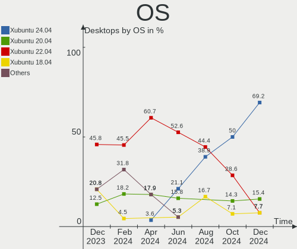
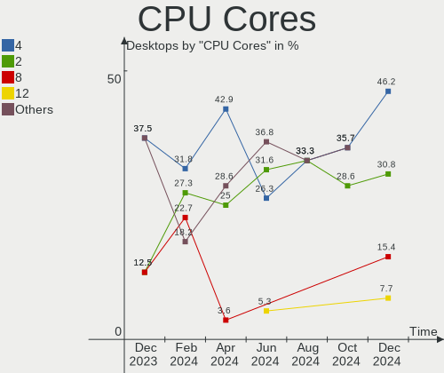
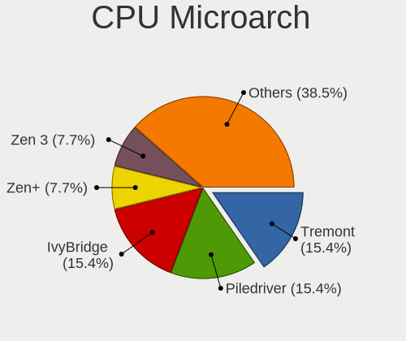
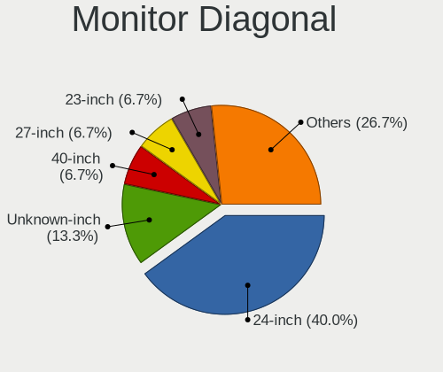
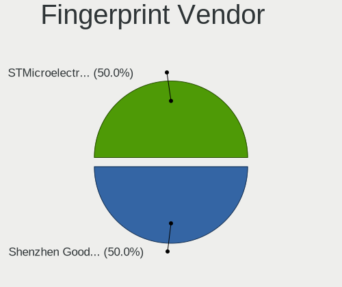

Xubuntu - Hardware Trends (Desktops)
------------------------------------

A project to identify most popular hardware characteristics and track their change
over time based on data collected by Linux users at https://Linux-Hardware.org.

Anyone can contribute to this report by the [hw-probe](https://github.com/linuxhw/hw-probe) tool:

    sudo -E hw-probe -all -upload

This report is for one last month. Overall report since the beginning of time: [TestDays](https://github.com/linuxhw/TestDays)

Period: Nov, 2023.

Contents
--------

* [ System ](#system)
  - [ OS                       ](#os)
  - [ OS Family                ](#os-family)
  - [ Kernel                   ](#kernel)
  - [ Kernel Family            ](#kernel-family)
  - [ Kernel Major Ver.        ](#kernel-major-ver)
  - [ Arch                     ](#arch)
  - [ DE                       ](#de)
  - [ Display Server           ](#display-server)
  - [ Display Manager          ](#display-manager)
  - [ OS Lang                  ](#os-lang)
  - [ Boot Mode                ](#boot-mode)
  - [ Filesystem               ](#filesystem)
  - [ Part. scheme             ](#part-scheme)
  - [ Dual Boot with Linux/BSD ](#dual-boot-with-linuxbsd)
  - [ Dual Boot (Win)          ](#dual-boot-win)

* [ Board ](#board)
  - [ Vendor                   ](#vendor)
  - [ Model                    ](#model)
  - [ Model Family             ](#model-family)
  - [ MFG Year                 ](#mfg-year)
  - [ Form Factor              ](#form-factor)
  - [ Secure Boot              ](#secure-boot)
  - [ Coreboot                 ](#coreboot)
  - [ RAM Size                 ](#ram-size)
  - [ RAM Used                 ](#ram-used)
  - [ Total Drives             ](#total-drives)
  - [ Has CD-ROM               ](#has-cd-rom)
  - [ Has Ethernet             ](#has-ethernet)
  - [ Has WiFi                 ](#has-wifi)
  - [ Has Bluetooth            ](#has-bluetooth)

* [ Location ](#location)
  - [ Country                  ](#country)
  - [ City                     ](#city)

* [ Drives ](#drives)
  - [ Drive Vendor             ](#drive-vendor)
  - [ Drive Model              ](#drive-model)
  - [ HDD Vendor               ](#hdd-vendor)
  - [ SSD Vendor               ](#ssd-vendor)
  - [ Drive Kind               ](#drive-kind)
  - [ Drive Connector          ](#drive-connector)
  - [ Drive Size               ](#drive-size)
  - [ Space Total              ](#space-total)
  - [ Space Used               ](#space-used)
  - [ Malfunc. Drives          ](#malfunc-drives)
  - [ Malfunc. Drive Vendor    ](#malfunc-drive-vendor)
  - [ Malfunc. HDD Vendor      ](#malfunc-hdd-vendor)
  - [ Malfunc. Drive Kind      ](#malfunc-drive-kind)
  - [ Failed Drives            ](#failed-drives)
  - [ Failed Drive Vendor      ](#failed-drive-vendor)
  - [ Drive Status             ](#drive-status)

* [ Storage controller ](#storage-controller)
  - [ Storage Vendor           ](#storage-vendor)
  - [ Storage Model            ](#storage-model)
  - [ Storage Kind             ](#storage-kind)

* [ Processor ](#processor)
  - [ CPU Vendor               ](#cpu-vendor)
  - [ CPU Model                ](#cpu-model)
  - [ CPU Model Family         ](#cpu-model-family)
  - [ CPU Cores                ](#cpu-cores)
  - [ CPU Sockets              ](#cpu-sockets)
  - [ CPU Threads              ](#cpu-threads)
  - [ CPU Op-Modes             ](#cpu-op-modes)
  - [ CPU Microcode            ](#cpu-microcode)
  - [ CPU Microarch            ](#cpu-microarch)

* [ Graphics ](#graphics)
  - [ GPU Vendor               ](#gpu-vendor)
  - [ GPU Model                ](#gpu-model)
  - [ GPU Combo                ](#gpu-combo)
  - [ GPU Driver               ](#gpu-driver)
  - [ GPU Memory               ](#gpu-memory)

* [ Monitor ](#monitor)
  - [ Monitor Vendor           ](#monitor-vendor)
  - [ Monitor Model            ](#monitor-model)
  - [ Monitor Resolution       ](#monitor-resolution)
  - [ Monitor Diagonal         ](#monitor-diagonal)
  - [ Monitor Width            ](#monitor-width)
  - [ Aspect Ratio             ](#aspect-ratio)
  - [ Monitor Area             ](#monitor-area)
  - [ Pixel Density            ](#pixel-density)
  - [ Multiple Monitors        ](#multiple-monitors)

* [ Network ](#network)
  - [ Net Controller Vendor    ](#net-controller-vendor)
  - [ Net Controller Model     ](#net-controller-model)
  - [ Wireless Vendor          ](#wireless-vendor)
  - [ Wireless Model           ](#wireless-model)
  - [ Ethernet Vendor          ](#ethernet-vendor)
  - [ Ethernet Model           ](#ethernet-model)
  - [ Net Controller Kind      ](#net-controller-kind)
  - [ Used Controller          ](#used-controller)
  - [ NICs                     ](#nics)
  - [ IPv6                     ](#ipv6)

* [ Bluetooth ](#bluetooth)
  - [ Bluetooth Vendor         ](#bluetooth-vendor)
  - [ Bluetooth Model          ](#bluetooth-model)

* [ Sound ](#sound)
  - [ Sound Vendor             ](#sound-vendor)
  - [ Sound Model              ](#sound-model)

* [ Memory ](#memory)
  - [ Memory Vendor            ](#memory-vendor)
  - [ Memory Model             ](#memory-model)
  - [ Memory Kind              ](#memory-kind)
  - [ Memory Form Factor       ](#memory-form-factor)
  - [ Memory Size              ](#memory-size)
  - [ Memory Speed             ](#memory-speed)

* [ Printers & scanners ](#printers--scanners)
  - [ Printer Vendor           ](#printer-vendor)
  - [ Printer Model            ](#printer-model)
  - [ Scanner Vendor           ](#scanner-vendor)
  - [ Scanner Model            ](#scanner-model)

* [ Camera ](#camera)
  - [ Camera Vendor            ](#camera-vendor)
  - [ Camera Model             ](#camera-model)

* [ Security ](#security)
  - [ Fingerprint Vendor       ](#fingerprint-vendor)
  - [ Fingerprint Model        ](#fingerprint-model)
  - [ Chipcard Vendor          ](#chipcard-vendor)
  - [ Chipcard Model           ](#chipcard-model)

* [ Unsupported ](#unsupported)
  - [ Unsupported Devices      ](#unsupported-devices)
  - [ Unsupported Device Types ](#unsupported-device-types)

System
------

OS
--

Installed operating systems

| Name          | Desktops | Percent |
|---------------|----------|---------|
| Xubuntu 22.04 | 11       | 37.93%  |
| Xubuntu 23.10 | 7        | 24.14%  |
| Xubuntu 20.04 | 6        | 20.69%  |
| Xubuntu 23.04 | 2        | 6.9%    |
| Xubuntu 18.04 | 2        | 6.9%    |
| Xubuntu 22.10 | 1        | 3.45%   |

OS Family
---------

OS without a version

| Name    | Desktops | Percent |
|---------|----------|---------|
| Xubuntu | 29       | 100%    |

Kernel
------

Version of the Linux kernel

| Version               | Desktops | Percent |
|-----------------------|----------|---------|
| 6.5.0-10-generic      | 7        | 24.14%  |
| 6.2.0-36-generic      | 6        | 20.69%  |
| 6.2.0-37-generic      | 3        | 10.34%  |
| 5.15.0-88-generic     | 3        | 10.34%  |
| 6.5.0-10006-tuxedo    | 1        | 3.45%   |
| 6.2.0-1013-lowlatency | 1        | 3.45%   |
| 6.2.0-060200-generic  | 1        | 3.45%   |
| 5.4.0-166-generic     | 1        | 3.45%   |
| 5.4.0-165-generic     | 1        | 3.45%   |
| 5.4.0-164-generic     | 1        | 3.45%   |
| 5.4.0-159-generic     | 1        | 3.45%   |
| 5.19.0-50-generic     | 1        | 3.45%   |
| 5.19.0-46-generic     | 1        | 3.45%   |
| 5.15.0-87-lowlatency  | 1        | 3.45%   |

Kernel Family
-------------

Linux kernel without a distro release

| Version | Desktops | Percent |
|---------|----------|---------|
| 6.2.0   | 11       | 37.93%  |
| 6.5.0   | 8        | 27.59%  |
| 5.4.0   | 4        | 13.79%  |
| 5.15.0  | 4        | 13.79%  |
| 5.19.0  | 2        | 6.9%    |

Kernel Major Ver.
-----------------

Linux kernel major version

| Version | Desktops | Percent |
|---------|----------|---------|
| 6.2     | 11       | 37.93%  |
| 6.5     | 8        | 27.59%  |
| 5.4     | 4        | 13.79%  |
| 5.15    | 4        | 13.79%  |
| 5.19    | 2        | 6.9%    |

Arch
----

OS architecture (x86_64, i586, etc.)

| Name   | Desktops | Percent |
|--------|----------|---------|
| x86_64 | 28       | 96.55%  |
| i686   | 1        | 3.45%   |

DE
--

Desktop Environment

| Name | Desktops | Percent |
|------|----------|---------|
| XFCE | 29       | 100%    |

Display Server
--------------

X11 or Wayland

| Name | Desktops | Percent |
|------|----------|---------|
| X11  | 28       | 96.55%  |
| Tty  | 1        | 3.45%   |

Display Manager
---------------

SDDM, LightDM, etc.

| Name    | Desktops | Percent |
|---------|----------|---------|
| LightDM | 23       | 79.31%  |
| Unknown | 5        | 17.24%  |
| GDM3    | 1        | 3.45%   |

OS Lang
-------

Language

| Lang  | Desktops | Percent |
|-------|----------|---------|
| en_US | 9        | 31.03%  |
| pt_BR | 3        | 10.34%  |
| fr_FR | 3        | 10.34%  |
| en_GB | 3        | 10.34%  |
| de_DE | 3        | 10.34%  |
| en_CA | 2        | 6.9%    |
| zh_TW | 1        | 3.45%   |
| it_IT | 1        | 3.45%   |
| hu_HU | 1        | 3.45%   |
| es_ES | 1        | 3.45%   |
| en_IE | 1        | 3.45%   |
| C     | 1        | 3.45%   |

Boot Mode
---------

EFI or BIOS

| Mode | Desktops | Percent |
|------|----------|---------|
| EFI  | 15       | 51.72%  |
| BIOS | 14       | 48.28%  |

Filesystem
----------

Type of filesystem

| Type  | Desktops | Percent |
|-------|----------|---------|
| Ext4  | 21       | 72.41%  |
| Tmpfs | 8        | 27.59%  |

Part. scheme
------------

Scheme of partitioning

| Type    | Desktops | Percent |
|---------|----------|---------|
| GPT     | 19       | 65.52%  |
| MBR     | 5        | 17.24%  |
| Unknown | 5        | 17.24%  |

Dual Boot with Linux/BSD
------------------------

Hosting more than one Linux/BSD

| Dual boot | Desktops | Percent |
|-----------|----------|---------|
| No        | 24       | 82.76%  |
| Yes       | 5        | 17.24%  |

Dual Boot (Win)
---------------

Hosting Linux and Windows

| Dual boot | Desktops | Percent |
|-----------|----------|---------|
| No        | 19       | 65.52%  |
| Yes       | 10       | 34.48%  |

Board
-----

Vendor
------

Motherboard manufacturer

| Name                | Desktops | Percent |
|---------------------|----------|---------|
| ASUSTek Computer    | 6        | 20.69%  |
| Gigabyte Technology | 5        | 17.24%  |
| ASRock              | 5        | 17.24%  |
| MSI                 | 3        | 10.34%  |
| Dell                | 2        | 6.9%    |
| Acer                | 2        | 6.9%    |
| Pegatron            | 1        | 3.45%   |
| Itautec             | 1        | 3.45%   |
| Intel               | 1        | 3.45%   |
| Hewlett-Packard     | 1        | 3.45%   |
| Fujitsu             | 1        | 3.45%   |
| Unknown             | 1        | 3.45%   |

Model
-----

Motherboard model

| Name                               | Desktops | Percent |
|------------------------------------|----------|---------|
| Pegatron 20-b010                   | 1        | 3.45%   |
| MSI MS-7A74                        | 1        | 3.45%   |
| MSI MS-7A38                        | 1        | 3.45%   |
| MSI MS-7798                        | 1        | 3.45%   |
| Itautec Infoway                    | 1        | 3.45%   |
| Intel DH55TC AAG26116-302          | 1        | 3.45%   |
| HP t620 Quad Core TC               | 1        | 3.45%   |
| Gigabyte Z390 M GAMING             | 1        | 3.45%   |
| Gigabyte H81M-DS2                  | 1        | 3.45%   |
| Gigabyte B560M DS3H                | 1        | 3.45%   |
| Gigabyte B450M DS3H                | 1        | 3.45%   |
| Gigabyte 970A-D3                   | 1        | 3.45%   |
| Fujitsu ESPRIMO Q958               | 1        | 3.45%   |
| Dell OptiPlex 390                  | 1        | 3.45%   |
| Dell ASM100                        | 1        | 3.45%   |
| ASUS ROG STRIX X570-F GAMING       | 1        | 3.45%   |
| ASUS ROG STRIX B650E-F GAMING WIFI | 1        | 3.45%   |
| ASUS ROG STRIX B450-F GAMING       | 1        | 3.45%   |
| ASUS P8Z68-M PRO                   | 1        | 3.45%   |
| ASUS P5K                           | 1        | 3.45%   |
| ASUS K30AD_M31AD_M51AD             | 1        | 3.45%   |
| ASRock Z590M-ITX/ax                | 1        | 3.45%   |
| ASRock X570M Pro4                  | 1        | 3.45%   |
| ASRock X399 Taichi                 | 1        | 3.45%   |
| ASRock P67 Pro3 SE                 | 1        | 3.45%   |
| ASRock G41C-GS                     | 1        | 3.45%   |
| Acer Veriton L480                  | 1        | 3.45%   |
| Acer Aspire TC-885                 | 1        | 3.45%   |
| Unknown                            | 1        | 3.45%   |

Model Family
------------

Motherboard model prefix

| Name              | Desktops | Percent |
|-------------------|----------|---------|
| ASUS ROG          | 3        | 10.34%  |
| Pegatron 20-b010  | 1        | 3.45%   |
| MSI MS-7A74       | 1        | 3.45%   |
| MSI MS-7A38       | 1        | 3.45%   |
| MSI MS-7798       | 1        | 3.45%   |
| Itautec Infoway   | 1        | 3.45%   |
| Intel DH55TC      | 1        | 3.45%   |
| HP t620           | 1        | 3.45%   |
| Gigabyte Z390     | 1        | 3.45%   |
| Gigabyte H81M-DS2 | 1        | 3.45%   |
| Gigabyte B560M    | 1        | 3.45%   |
| Gigabyte B450M    | 1        | 3.45%   |
| Gigabyte 970A-D3  | 1        | 3.45%   |
| Fujitsu ESPRIMO   | 1        | 3.45%   |
| Dell OptiPlex     | 1        | 3.45%   |
| Dell ASM100       | 1        | 3.45%   |
| ASUS P8Z68-M      | 1        | 3.45%   |
| ASUS P5K          | 1        | 3.45%   |
| ASUS K30AD        | 1        | 3.45%   |
| ASRock Z590M-ITX  | 1        | 3.45%   |
| ASRock X570M      | 1        | 3.45%   |
| ASRock X399       | 1        | 3.45%   |
| ASRock P67        | 1        | 3.45%   |
| ASRock G41C-GS    | 1        | 3.45%   |
| Acer Veriton      | 1        | 3.45%   |
| Acer Aspire       | 1        | 3.45%   |
| Unknown           | 1        | 3.45%   |

MFG Year
--------

Motherboard manufacture year

| Year | Desktops | Percent |
|------|----------|---------|
| 2018 | 4        | 13.79%  |
| 2021 | 3        | 10.34%  |
| 2012 | 3        | 10.34%  |
| 2011 | 3        | 10.34%  |
| 2009 | 3        | 10.34%  |
| 2019 | 2        | 6.9%    |
| 2017 | 2        | 6.9%    |
| 2014 | 2        | 6.9%    |
| 2022 | 1        | 3.45%   |
| 2020 | 1        | 3.45%   |
| 2016 | 1        | 3.45%   |
| 2015 | 1        | 3.45%   |
| 2013 | 1        | 3.45%   |
| 2010 | 1        | 3.45%   |
| 2007 | 1        | 3.45%   |

Form Factor
-----------

Physical design of the computer

| Name    | Desktops | Percent |
|---------|----------|---------|
| Desktop | 29       | 100%    |

Secure Boot
-----------

Enabled or disabled

| State    | Desktops | Percent |
|----------|----------|---------|
| Disabled | 25       | 86.21%  |
| Enabled  | 4        | 13.79%  |

Coreboot
--------

Have coreboot on board

| Used | Desktops | Percent |
|------|----------|---------|
| No   | 29       | 100%    |

RAM Size
--------

Total RAM memory

| Size in GB  | Desktops | Percent |
|-------------|----------|---------|
| 4.01-8.0    | 7        | 24.14%  |
| 3.01-4.0    | 5        | 17.24%  |
| 64.01-256.0 | 5        | 17.24%  |
| 16.01-24.0  | 5        | 17.24%  |
| 8.01-16.0   | 4        | 13.79%  |
| 32.01-64.0  | 2        | 6.9%    |
| 24.01-32.0  | 1        | 3.45%   |

RAM Used
--------

Used RAM memory

| Used GB   | Desktops | Percent |
|-----------|----------|---------|
| 1.01-2.0  | 9        | 31.03%  |
| 4.01-8.0  | 6        | 20.69%  |
| 3.01-4.0  | 6        | 20.69%  |
| 2.01-3.0  | 4        | 13.79%  |
| 8.01-16.0 | 3        | 10.34%  |
| 0.51-1.0  | 1        | 3.45%   |

Total Drives
------------

Number of drives on board

| Drives | Desktops | Percent |
|--------|----------|---------|
| 1      | 12       | 41.38%  |
| 2      | 7        | 24.14%  |
| 3      | 5        | 17.24%  |
| 4      | 4        | 13.79%  |
| 11     | 1        | 3.45%   |

Has CD-ROM
----------

Has CD-ROM on board

| Presented | Desktops | Percent |
|-----------|----------|---------|
| No        | 19       | 65.52%  |
| Yes       | 10       | 34.48%  |

Has Ethernet
------------

Has Ethernet on board

| Presented | Desktops | Percent |
|-----------|----------|---------|
| Yes       | 29       | 100%    |

Has WiFi
--------

Has WiFi module

| Presented | Desktops | Percent |
|-----------|----------|---------|
| Yes       | 16       | 55.17%  |
| No        | 13       | 44.83%  |

Has Bluetooth
-------------

Has Bluetooth module

| Presented | Desktops | Percent |
|-----------|----------|---------|
| No        | 18       | 62.07%  |
| Yes       | 11       | 37.93%  |

Location
--------

Country
-------

Geographic location (country)

| Country    | Desktops | Percent |
|------------|----------|---------|
| USA        | 6        | 20.69%  |
| Brazil     | 4        | 13.79%  |
| UK         | 3        | 10.34%  |
| Germany    | 3        | 10.34%  |
| France     | 3        | 10.34%  |
| Canada     | 2        | 6.9%    |
| Taiwan     | 1        | 3.45%   |
| Spain      | 1        | 3.45%   |
| Russia     | 1        | 3.45%   |
| Madagascar | 1        | 3.45%   |
| Italy      | 1        | 3.45%   |
| Ireland    | 1        | 3.45%   |
| Iran       | 1        | 3.45%   |
| Hungary    | 1        | 3.45%   |

City
----

Geographic location (city)

| City               | Desktops | Percent |
|--------------------|----------|---------|
| Stowmarket         | 3        | 10.34%  |
| Springfield        | 2        | 6.9%    |
| Toulon             | 1        | 3.45%   |
| Tehran             | 1        | 3.45%   |
| Santo André       | 1        | 3.45%   |
| Saint Clair Shores | 1        | 3.45%   |
| Rio de Janeiro     | 1        | 3.45%   |
| Port Huron         | 1        | 3.45%   |
| Paris              | 1        | 3.45%   |
| Oelsnitz           | 1        | 3.45%   |
| Newcastle          | 1        | 3.45%   |
| New Taipei         | 1        | 3.45%   |
| Lugo               | 1        | 3.45%   |
| Krasnodar          | 1        | 3.45%   |
| Jundiaí           | 1        | 3.45%   |
| Hollywood          | 1        | 3.45%   |
| Hemmingen          | 1        | 3.45%   |
| Harrisonburg       | 1        | 3.45%   |
| Greater Sudbury    | 1        | 3.45%   |
| Freiberg           | 1        | 3.45%   |
| Florence           | 1        | 3.45%   |
| Farroupilha        | 1        | 3.45%   |
| Csepreg            | 1        | 3.45%   |
| Cork               | 1        | 3.45%   |
| Antananarivo       | 1        | 3.45%   |
| Amiens             | 1        | 3.45%   |

Drives
------

Drive Vendor
------------

Hard drive vendors

| Vendor                | Desktops | Drives | Percent |
|-----------------------|----------|--------|---------|
| Seagate               | 12       | 14     | 21.43%  |
| WDC                   | 9        | 10     | 16.07%  |
| Samsung Electronics   | 9        | 12     | 16.07%  |
| Kingston              | 4        | 4      | 7.14%   |
| Toshiba               | 3        | 3      | 5.36%   |
| Unknown               | 2        | 2      | 3.57%   |
| Hitachi               | 2        | 2      | 3.57%   |
| WALRAM                | 1        | 6      | 1.79%   |
| SPCC                  | 1        | 1      | 1.79%   |
| Realtek Semiconductor | 1        | 1      | 1.79%   |
| PNY                   | 1        | 1      | 1.79%   |
| Phison                | 1        | 1      | 1.79%   |
| LITEON                | 1        | 1      | 1.79%   |
| Lexar                 | 1        | 1      | 1.79%   |
| KIOXIA-EXCERIA        | 1        | 1      | 1.79%   |
| KIOXIA                | 1        | 1      | 1.79%   |
| KingSpec              | 1        | 1      | 1.79%   |
| JMicron Technology    | 1        | 1      | 1.79%   |
| Hikvision             | 1        | 1      | 1.79%   |
| HGST                  | 1        | 1      | 1.79%   |
| External              | 1        | 2      | 1.79%   |
| China                 | 1        | 1      | 1.79%   |

Drive Model
-----------

Hard drive models

| Model                                               | Desktops | Percent |
|-----------------------------------------------------|----------|---------|
| Toshiba DT01ACA100 1TB                              | 2        | 3.17%   |
| WDC WDS250G2B0B-00YS70 250GB SSD                    | 1        | 1.59%   |
| WDC WD5000BEVT-22A0RT0 500GB                        | 1        | 1.59%   |
| WDC WD3200AAKS-75B3A0 320GB                         | 1        | 1.59%   |
| WDC WD2500AVVS-98L2B0 250GB                         | 1        | 1.59%   |
| WDC WD20EZAZ-00GGJB0 2TB                            | 1        | 1.59%   |
| WDC WD2003FZEX-00SRLA0 2TB                          | 1        | 1.59%   |
| WDC WD1600AABS-00PRA0 160GB                         | 1        | 1.59%   |
| WDC WD10EZEX-75WN4A0 1TB                            | 1        | 1.59%   |
| WDC WD10EZEX-00BN5A0 1TB                            | 1        | 1.59%   |
| WDC WD Blue SA510 2.5 500GB                         | 1        | 1.59%   |
| WALRAM SSD 2TB                                      | 1        | 1.59%   |
| WALRAM SSD 1TB                                      | 1        | 1.59%   |
| WALRAM 1TB                                          | 1        | 1.59%   |
| Unknown SD/MMC/MS PRO 128GB                         | 1        | 1.59%   |
| Unknown NVMe SSD Drive 500GB                        | 1        | 1.59%   |
| Toshiba DT01ACA050 500GB                            | 1        | 1.59%   |
| SPCC Solid State Disk 1TB                           | 1        | 1.59%   |
| Seagate Ultra Slim PL 1TB                           | 1        | 1.59%   |
| Seagate ST500DM002-1BD142 500GB                     | 1        | 1.59%   |
| Seagate ST3320418AS 320GB                           | 1        | 1.59%   |
| Seagate ST33000651NS 3TB                            | 1        | 1.59%   |
| Seagate ST3200822AS 200GB                           | 1        | 1.59%   |
| Seagate ST2000LX001-1RG174 2TB                      | 1        | 1.59%   |
| Seagate ST2000DM001-1CH164 2TB                      | 1        | 1.59%   |
| Seagate ST1000VM002-1SD102 1TB                      | 1        | 1.59%   |
| Seagate ST1000LM014-1EJ164 1TB                      | 1        | 1.59%   |
| Seagate ST1000DM010-2EP102 1TB                      | 1        | 1.59%   |
| Seagate ST1000DM003-1ER162 1TB                      | 1        | 1.59%   |
| Seagate ST1000DM003-1CH162 1TB                      | 1        | 1.59%   |
| Seagate Expansion HDD 2TB                           | 1        | 1.59%   |
| Samsung SSD 980 1TB S649NF0RB05264X                 | 1        | 1.59%   |
| Samsung SSD 970 PRO 512GB                           | 1        | 1.59%   |
| Samsung SSD 970 EVO 500GB                           | 1        | 1.59%   |
| Samsung SSD 870 QVO 1TB                             | 1        | 1.59%   |
| Samsung SSD 870 EVO 500GB                           | 1        | 1.59%   |
| Samsung SSD 860 EVO M.2 250GB                       | 1        | 1.59%   |
| Samsung SSD 860 EVO 500GB                           | 1        | 1.59%   |
| Samsung SSD 850 EVO 500GB                           | 1        | 1.59%   |
| Samsung NVMe SSD Controller SM981/PM981/PM983 250GB | 1        | 1.59%   |

HDD Vendor
----------

Hard disk drive vendors

| Vendor              | Desktops | Drives | Percent |
|---------------------|----------|--------|---------|
| Seagate             | 11       | 13     | 39.29%  |
| WDC                 | 8        | 8      | 28.57%  |
| Toshiba             | 3        | 3      | 10.71%  |
| Hitachi             | 2        | 2      | 7.14%   |
| Unknown             | 1        | 1      | 3.57%   |
| Samsung Electronics | 1        | 1      | 3.57%   |
| HGST                | 1        | 1      | 3.57%   |
| External            | 1        | 2      | 3.57%   |

SSD Vendor
----------

Solid state drive vendors

| Vendor              | Desktops | Drives | Percent |
|---------------------|----------|--------|---------|
| Samsung Electronics | 4        | 5      | 23.53%  |
| Kingston            | 3        | 3      | 17.65%  |
| WDC                 | 2        | 2      | 11.76%  |
| WALRAM              | 1        | 5      | 5.88%   |
| SPCC                | 1        | 1      | 5.88%   |
| PNY                 | 1        | 1      | 5.88%   |
| LITEON              | 1        | 1      | 5.88%   |
| Lexar               | 1        | 1      | 5.88%   |
| KIOXIA-EXCERIA      | 1        | 1      | 5.88%   |
| KingSpec            | 1        | 1      | 5.88%   |
| China               | 1        | 1      | 5.88%   |

Drive Kind
----------

HDD or SSD

| Kind    | Desktops | Drives | Percent |
|---------|----------|--------|---------|
| HDD     | 22       | 31     | 44.9%   |
| SSD     | 14       | 22     | 28.57%  |
| NVMe    | 11       | 13     | 22.45%  |
| Unknown | 2        | 2      | 4.08%   |

Drive Connector
---------------

SATA, SAS, NVMe, etc.

| Type | Desktops | Drives | Percent |
|------|----------|--------|---------|
| SATA | 27       | 49     | 62.79%  |
| NVMe | 11       | 13     | 25.58%  |
| SAS  | 5        | 6      | 11.63%  |

Drive Size
----------

Size of hard drive

| Size in TB | Desktops | Drives | Percent |
|------------|----------|--------|---------|
| 0.01-0.5   | 22       | 26     | 55%     |
| 0.51-1.0   | 11       | 15     | 27.5%   |
| 1.01-2.0   | 6        | 11     | 15%     |
| 2.01-3.0   | 1        | 1      | 2.5%    |

Space Total
-----------

Amount of disk space available on the file system

| Size in GB     | Desktops | Percent |
|----------------|----------|---------|
| 101-250        | 7        | 24.14%  |
| More than 3000 | 5        | 17.24%  |
| 251-500        | 5        | 17.24%  |
| 1001-2000      | 5        | 17.24%  |
| 501-1000       | 5        | 17.24%  |
| 2001-3000      | 1        | 3.45%   |
| 51-100         | 1        | 3.45%   |

Space Used
----------

Amount of used disk space

| Used GB        | Desktops | Percent |
|----------------|----------|---------|
| 51-100         | 6        | 20.69%  |
| 101-250        | 5        | 17.24%  |
| 1-20           | 5        | 17.24%  |
| 501-1000       | 5        | 17.24%  |
| 21-50          | 2        | 6.9%    |
| 2001-3000      | 2        | 6.9%    |
| 1001-2000      | 2        | 6.9%    |
| More than 3000 | 1        | 3.45%   |
| 251-500        | 1        | 3.45%   |

Malfunc. Drives
---------------

Drive models with a malfunction

| Model                                 | Desktops | Drives | Percent |
|---------------------------------------|----------|--------|---------|
| WDC WD5000BEVT-22A0RT0 500GB          | 1        | 1      | 33.33%  |
| WDC WD3200AAKS-75B3A0 320GB           | 1        | 1      | 33.33%  |
| Samsung Electronics SSD 870 EVO 500GB | 1        | 1      | 33.33%  |

Malfunc. Drive Vendor
---------------------

Vendors of faulty drives

| Vendor              | Desktops | Drives | Percent |
|---------------------|----------|--------|---------|
| WDC                 | 2        | 2      | 66.67%  |
| Samsung Electronics | 1        | 1      | 33.33%  |

Malfunc. HDD Vendor
-------------------

Vendors of faulty HDD drives

| Vendor | Desktops | Drives | Percent |
|--------|----------|--------|---------|
| WDC    | 2        | 2      | 100%    |

Malfunc. Drive Kind
-------------------

Kinds of faulty drives

| Kind | Desktops | Drives | Percent |
|------|----------|--------|---------|
| HDD  | 2        | 2      | 66.67%  |
| SSD  | 1        | 1      | 33.33%  |

Failed Drives
-------------

Failed drive models

Zero info for selected period =(

Failed Drive Vendor
-------------------

Failed drive vendors

Zero info for selected period =(

Drive Status
------------

Number of failed and malfunc. drives

| Status   | Desktops | Drives | Percent |
|----------|----------|--------|---------|
| Detected | 16       | 26     | 45.71%  |
| Works    | 16       | 39     | 45.71%  |
| Malfunc  | 3        | 3      | 8.57%   |

Storage controller
------------------

Storage Vendor
--------------

Storage controller vendors

| Vendor                      | Desktops | Percent |
|-----------------------------|----------|---------|
| Intel                       | 17       | 39.53%  |
| AMD                         | 12       | 27.91%  |
| Samsung Electronics         | 6        | 13.95%  |
| TenaFe                      | 1        | 2.33%   |
| Realtek Semiconductor       | 1        | 2.33%   |
| Phison Electronics          | 1        | 2.33%   |
| MAXIO Technology (Hangzhou) | 1        | 2.33%   |
| KIOXIA                      | 1        | 2.33%   |
| Kingston Technology Company | 1        | 2.33%   |
| JMicron Technology          | 1        | 2.33%   |
| ASMedia Technology          | 1        | 2.33%   |

Storage Model
-------------

Storage controller models

| Model                                                                                   | Desktops | Percent |
|-----------------------------------------------------------------------------------------|----------|---------|
| AMD FCH SATA Controller [AHCI mode]                                                     | 10       | 17.86%  |
| Samsung NVMe SSD Controller SM981/PM981/PM983                                           | 4        | 7.14%   |
| Intel Cannon Lake PCH SATA AHCI Controller                                              | 3        | 5.36%   |
| Intel 8 Series/C220 Series Chipset Family 6-port SATA Controller 1 [AHCI mode]          | 3        | 5.36%   |
| Intel 6 Series/C200 Series Chipset Family Desktop SATA Controller (IDE mode, ports 4-5) | 2        | 3.57%   |
| Intel 6 Series/C200 Series Chipset Family Desktop SATA Controller (IDE mode, ports 0-3) | 2        | 3.57%   |
| Intel 500 Series Chipset Family SATA AHCI Controller                                    | 2        | 3.57%   |
| AMD SB7x0/SB8x0/SB9x0 SATA Controller [IDE mode]                                        | 2        | 3.57%   |
| AMD SB7x0/SB8x0/SB9x0 IDE Controller                                                    | 2        | 3.57%   |
| AMD 400 Series Chipset SATA Controller                                                  | 2        | 3.57%   |
| TenaFe TC2200/TC2201 NVMe Controller (DRAM-less)                                        | 1        | 1.79%   |
| Samsung NVMe SSD Controller PM9A1/PM9A3/980PRO                                          | 1        | 1.79%   |
| Samsung NVMe SSD Controller 980 (DRAM-less)                                             | 1        | 1.79%   |
| Realtek RTS5763DL NVMe SSD Controller (DRAM-less)                                       | 1        | 1.79%   |
| Phison PS5013-E13 PCIe3 NVMe Controller (DRAM-less)                                     | 1        | 1.79%   |
| MAXIO (Hangzhou) NVMe SSD Controller MAP1602                                            | 1        | 1.79%   |
| KIOXIA NVMe SSD Controller BG4 (DRAM-less)                                              | 1        | 1.79%   |
| Kingston Company A1000/U-SNS8154P3 x2 NVMe SSD                                          | 1        | 1.79%   |
| JMicron JMB363 SATA/IDE Controller                                                      | 1        | 1.79%   |
| Intel NM10/ICH7 Family SATA Controller [IDE mode]                                       | 1        | 1.79%   |
| Intel 82801JI (ICH10 Family) 4 port SATA IDE Controller #1                              | 1        | 1.79%   |
| Intel 82801JI (ICH10 Family) 2 port SATA IDE Controller #2                              | 1        | 1.79%   |
| Intel 82801IB (ICH9) 2 port SATA Controller [IDE mode]                                  | 1        | 1.79%   |
| Intel 82801I (ICH9 Family) 2 port SATA Controller [IDE mode]                            | 1        | 1.79%   |
| Intel 82801G (ICH7 Family) IDE Controller                                               | 1        | 1.79%   |
| Intel 7 Series/C210 Series Chipset Family 6-port SATA Controller [AHCI mode]            | 1        | 1.79%   |
| Intel 6 Series/C200 Series Chipset Family 6 port Desktop SATA AHCI Controller           | 1        | 1.79%   |
| Intel 5 Series/3400 Series Chipset PT IDER Controller                                   | 1        | 1.79%   |
| Intel 5 Series/3400 Series Chipset 4 port SATA IDE Controller                           | 1        | 1.79%   |
| Intel 5 Series/3400 Series Chipset 2 port SATA IDE Controller                           | 1        | 1.79%   |
| Intel 200 Series PCH SATA controller [AHCI mode]                                        | 1        | 1.79%   |
| ASMedia ASM1062 Serial ATA Controller                                                   | 1        | 1.79%   |
| AMD X399 Series Chipset SATA Controller                                                 | 1        | 1.79%   |
| AMD 300 Series Chipset SATA Controller                                                  | 1        | 1.79%   |

Storage Kind
------------

Kind of storage controller (IDE, SATA, NVMe, SAS, ...)

| Kind | Desktops | Percent |
|------|----------|---------|
| SATA | 23       | 54.76%  |
| NVMe | 11       | 26.19%  |
| IDE  | 8        | 19.05%  |

Processor
---------

CPU Vendor
----------

Processor vendors

| Vendor | Desktops | Percent |
|--------|----------|---------|
| Intel  | 17       | 58.62%  |
| AMD    | 12       | 41.38%  |

CPU Model
---------

Processor models

| Model                                          | Desktops | Percent |
|------------------------------------------------|----------|---------|
| Intel Core 2 Quad CPU Q6600 @ 2.40GHz          | 2        | 6.9%    |
| Intel Pentium CPU G4620 @ 3.70GHz              | 1        | 3.45%   |
| Intel Core i7-9700T CPU @ 2.00GHz              | 1        | 3.45%   |
| Intel Core i7-9700K CPU @ 3.60GHz              | 1        | 3.45%   |
| Intel Core i7-2600K CPU @ 3.40GHz              | 1        | 3.45%   |
| Intel Core i5-9400 CPU @ 2.90GHz               | 1        | 3.45%   |
| Intel Core i5-4590T CPU @ 2.00GHz              | 1        | 3.45%   |
| Intel Core i5-2405S CPU @ 2.50GHz              | 1        | 3.45%   |
| Intel Core i3-4170T CPU @ 3.20GHz              | 1        | 3.45%   |
| Intel Core i3-3220 CPU @ 3.30GHz               | 1        | 3.45%   |
| Intel Core i3-2120 CPU @ 3.30GHz               | 1        | 3.45%   |
| Intel Core i3-10100T CPU @ 3.00GHz             | 1        | 3.45%   |
| Intel Core i3 CPU 550 @ 3.20GHz                | 1        | 3.45%   |
| Intel Core 2 Quad CPU Q9300 @ 2.50GHz          | 1        | 3.45%   |
| Intel Celeron CPU G1820 @ 2.70GHz              | 1        | 3.45%   |
| Intel 11th Gen Core i7-11700F @ 2.50GHz        | 1        | 3.45%   |
| AMD Ryzen Threadripper 2950X 16-Core Processor | 1        | 3.45%   |
| AMD Ryzen 9 7900X 12-Core Processor            | 1        | 3.45%   |
| AMD Ryzen 9 5950X 16-Core Processor            | 1        | 3.45%   |
| AMD Ryzen 9 5900X 12-Core Processor            | 1        | 3.45%   |
| AMD Ryzen 9 5900HX with Radeon Graphics        | 1        | 3.45%   |
| AMD Ryzen 9 3900X 12-Core Processor            | 1        | 3.45%   |
| AMD Ryzen 7 2700X Eight-Core Processor         | 1        | 3.45%   |
| AMD Ryzen 5 2600X Six-Core Processor           | 1        | 3.45%   |
| AMD GX-415GA SOC with Radeon HD Graphics       | 1        | 3.45%   |
| AMD FX-6300 Six-Core Processor                 | 1        | 3.45%   |
| AMD E1-1200 APU with Radeon HD Graphics        | 1        | 3.45%   |
| AMD Athlon II X2 240 Processor                 | 1        | 3.45%   |

CPU Model Family
----------------

Processor model prefix

| Model                  | Desktops | Percent |
|------------------------|----------|---------|
| Intel Core i3          | 5        | 17.24%  |
| AMD Ryzen 9            | 5        | 17.24%  |
| Intel Core i7          | 3        | 10.34%  |
| Intel Core i5          | 3        | 10.34%  |
| Intel Core 2 Quad      | 3        | 10.34%  |
| Other                  | 1        | 3.45%   |
| Intel Pentium          | 1        | 3.45%   |
| Intel Celeron          | 1        | 3.45%   |
| AMD Ryzen Threadripper | 1        | 3.45%   |
| AMD Ryzen 7            | 1        | 3.45%   |
| AMD Ryzen 5            | 1        | 3.45%   |
| AMD GX                 | 1        | 3.45%   |
| AMD FX                 | 1        | 3.45%   |
| AMD E1                 | 1        | 3.45%   |
| AMD Athlon II X2       | 1        | 3.45%   |

CPU Cores
---------

Number of processor cores

| Number | Desktops | Percent |
|--------|----------|---------|
| 4      | 8        | 27.59%  |
| 2      | 8        | 27.59%  |
| 8      | 5        | 17.24%  |
| 12     | 3        | 10.34%  |
| 16     | 2        | 6.9%    |
| 6      | 2        | 6.9%    |
| 3      | 1        | 3.45%   |

CPU Sockets
-----------

Number of sockets

| Number | Desktops | Percent |
|--------|----------|---------|
| 1      | 29       | 100%    |

CPU Threads
-----------

Threads per core (Hyper-Threading)

| Number | Desktops | Percent |
|--------|----------|---------|
| 2      | 17       | 58.62%  |
| 1      | 12       | 41.38%  |

CPU Op-Modes
------------

CPU Operation Modes (32-bit, 64-bit)

| Op mode        | Desktops | Percent |
|----------------|----------|---------|
| 32-bit, 64-bit | 29       | 100%    |

CPU Microcode
-------------

Microcode number

| Number     | Desktops | Percent |
|------------|----------|---------|
| Unknown    | 18       | 62.07%  |
| 0xa0671    | 1        | 3.45%   |
| 0x906ed    | 1        | 3.45%   |
| 0x906ea    | 1        | 3.45%   |
| 0x206a7    | 1        | 3.45%   |
| 0x10677    | 1        | 3.45%   |
| 0x0a201205 | 1        | 3.45%   |
| 0x08701021 | 1        | 3.45%   |
| 0x0800820d | 1        | 3.45%   |
| 0x0700010f | 1        | 3.45%   |
| 0x06000852 | 1        | 3.45%   |
| 0x05000119 | 1        | 3.45%   |

CPU Microarch
-------------

Microarchitecture

| Name        | Desktops | Percent |
|-------------|----------|---------|
| KabyLake    | 4        | 13.79%  |
| Zen+        | 3        | 10.34%  |
| Zen 3       | 3        | 10.34%  |
| SandyBridge | 3        | 10.34%  |
| Haswell     | 3        | 10.34%  |
| Core        | 2        | 6.9%    |
| Unknown     | 2        | 6.9%    |
| Zen 2       | 1        | 3.45%   |
| Westmere    | 1        | 3.45%   |
| Piledriver  | 1        | 3.45%   |
| Penryn      | 1        | 3.45%   |
| K10         | 1        | 3.45%   |
| Jaguar      | 1        | 3.45%   |
| IvyBridge   | 1        | 3.45%   |
| CometLake   | 1        | 3.45%   |
| Bobcat      | 1        | 3.45%   |

Graphics
--------

GPU Vendor
----------

Vendors of graphics cards

| Vendor | Desktops | Percent |
|--------|----------|---------|
| Intel  | 13       | 41.94%  |
| AMD    | 12       | 38.71%  |
| Nvidia | 6        | 19.35%  |

GPU Model
---------

Graphics card models

| Model                                                                       | Desktops | Percent |
|-----------------------------------------------------------------------------|----------|---------|
| Intel CoffeeLake-S GT2 [UHD Graphics 630]                                   | 3        | 9.09%   |
| Intel Xeon E3-1200 v3/4th Gen Core Processor Integrated Graphics Controller | 2        | 6.06%   |
| Intel 4 Series Chipset Integrated Graphics Controller                       | 2        | 6.06%   |
| Intel 2nd Generation Core Processor Family Integrated Graphics Controller   | 2        | 6.06%   |
| Nvidia GM206GL [Quadro M2000]                                               | 1        | 3.03%   |
| Nvidia GM107M [GeForce GTX 860M]                                            | 1        | 3.03%   |
| Nvidia GM107 [GeForce GTX 750]                                              | 1        | 3.03%   |
| Nvidia GK208B [GeForce GT 710]                                              | 1        | 3.03%   |
| Nvidia GA104 [GeForce RTX 3070]                                             | 1        | 3.03%   |
| Nvidia G84 [GeForce 8600 GT]                                                | 1        | 3.03%   |
| Intel Xeon E3-1200 v2/3rd Gen Core processor Graphics Controller            | 1        | 3.03%   |
| Intel HD Graphics 630                                                       | 1        | 3.03%   |
| Intel Core Processor Integrated Graphics Controller                         | 1        | 3.03%   |
| Intel CometLake-S GT2 [UHD Graphics 630]                                    | 1        | 3.03%   |
| AMD Wrestler [Radeon HD 7310]                                               | 1        | 3.03%   |
| AMD Vega 10 XL/XT [Radeon RX Vega 56/64]                                    | 1        | 3.03%   |
| AMD RV530 [Radeon X1600] (Secondary)                                        | 1        | 3.03%   |
| AMD RV530 [Radeon X1600 PRO]                                                | 1        | 3.03%   |
| AMD RS780C [Radeon 3100]                                                    | 1        | 3.03%   |
| AMD Raphael                                                                 | 1        | 3.03%   |
| AMD Polaris 20 XL [Radeon RX 580 2048SP]                                    | 1        | 3.03%   |
| AMD Navi 23 WKS-XL [Radeon PRO W6600]                                       | 1        | 3.03%   |
| AMD Navi 22 [Radeon RX 6700/6700 XT/6750 XT / 6800M/6850M XT]               | 1        | 3.03%   |
| AMD Navi 21 [Radeon RX 6800/6800 XT / 6900 XT]                              | 1        | 3.03%   |
| AMD Kabini [Radeon HD 8330E]                                                | 1        | 3.03%   |
| AMD Ellesmere [Radeon RX 470/480/570/570X/580/580X/590]                     | 1        | 3.03%   |
| AMD Cezanne [Radeon Vega Series / Radeon Vega Mobile Series]                | 1        | 3.03%   |
| AMD Cape Verde XT [Radeon HD 7770/8760 / R7 250X]                           | 1        | 3.03%   |

GPU Combo
---------

Combinations of graphics cards

| Name           | Desktops | Percent |
|----------------|----------|---------|
| 1 x Intel      | 11       | 37.93%  |
| 1 x AMD        | 10       | 34.48%  |
| 1 x Nvidia     | 5        | 17.24%  |
| 2 x AMD        | 2        | 6.9%    |
| Intel + Nvidia | 1        | 3.45%   |

GPU Driver
----------

Free vs proprietary

| Driver      | Desktops | Percent |
|-------------|----------|---------|
| Free        | 25       | 86.21%  |
| Proprietary | 4        | 13.79%  |

GPU Memory
----------

Total video memory

| Size in GB | Desktops | Percent |
|------------|----------|---------|
| Unknown    | 17       | 58.62%  |
| 7.01-8.0   | 3        | 10.34%  |
| 0.01-0.5   | 3        | 10.34%  |
| 1.01-2.0   | 2        | 6.9%    |
| 0.51-1.0   | 2        | 6.9%    |
| 3.01-4.0   | 1        | 3.45%   |
| 8.01-16.0  | 1        | 3.45%   |

Monitor
-------

Monitor Vendor
--------------

Monitor vendors

| Vendor              | Desktops | Percent |
|---------------------|----------|---------|
| Dell                | 5        | 15.63%  |
| Samsung Electronics | 4        | 12.5%   |
| Acer                | 4        | 12.5%   |
| Hewlett-Packard     | 3        | 9.38%   |
| Goldstar            | 3        | 9.38%   |
| Lenovo              | 2        | 6.25%   |
| AOC                 | 2        | 6.25%   |
| Unknown (AAA)       | 1        | 3.13%   |
| Sceptre Tech        | 1        | 3.13%   |
| Philips             | 1        | 3.13%   |
| NTS                 | 1        | 3.13%   |
| NEC Computers       | 1        | 3.13%   |
| LG Electronics      | 1        | 3.13%   |
| Iiyama              | 1        | 3.13%   |
| Eizo                | 1        | 3.13%   |
| BenQ                | 1        | 3.13%   |

Monitor Model
-------------

Monitor models

| Model                                                                | Desktops | Percent |
|----------------------------------------------------------------------|----------|---------|
| Unknown (AAA) LCDTV AAA3393 1360x768 890x500mm 40.2-inch             | 1        | 2.86%   |
| Sceptre Tech Sceptre Y27 SPT0AB9 2560x1440 597x336mm 27.0-inch       | 1        | 2.86%   |
| Samsung Electronics SyncMaster SAM01AE 1600x1200 408x306mm 20.1-inch | 1        | 2.86%   |
| Samsung Electronics S22E390 SAM0C18 1920x1080 477x268mm 21.5-inch    | 1        | 2.86%   |
| Samsung Electronics S22B300 SAM08A9 1600x900 443x249mm 20.0-inch     | 1        | 2.86%   |
| Samsung Electronics LU28R55 SAM1015 3840x2160 632x360mm 28.6-inch    | 1        | 2.86%   |
| Philips PHL 193V5 PHLC0CD 1366x768 410x230mm 18.5-inch               | 1        | 2.86%   |
| NTS MAW-SERIAL NTS0007 1680x1050 433x271mm 20.1-inch                 | 1        | 2.86%   |
| NEC Computers LCD1701 NEC65EF 1280x1024 338x270mm 17.0-inch          | 1        | 2.86%   |
| LG Electronics LCD Monitor LG ULTRAWIDE 2560x1080                    | 1        | 2.86%   |
| Lenovo T2224pD LEN60CA 1920x1080 476x267mm 21.5-inch                 | 1        | 2.86%   |
| Lenovo LEN T24i-20 LEN61F7 1920x1080 527x296mm 23.8-inch             | 1        | 2.86%   |
| Iiyama X2483/2481 IVM6128 1920x1080 527x296mm 23.8-inch              | 1        | 2.86%   |
| Hewlett-Packard w19b/w19e HWP26A0 1440x900 410x256mm 19.0-inch       | 1        | 2.86%   |
| Hewlett-Packard V214a HPN348C 1920x1080 458x258mm 20.7-inch          | 1        | 2.86%   |
| Hewlett-Packard TouchSmart HWP4218 1600x900 440x240mm 19.7-inch      | 1        | 2.86%   |
| Goldstar ULTRAWIDE GSM7767 3440x1440 800x334mm 34.1-inch             | 1        | 2.86%   |
| Goldstar ULTRAWIDE GSM59F1 2560x1080 798x334mm 34.1-inch             | 1        | 2.86%   |
| Goldstar HDR 4K GSM7707 3840x2160 600x340mm 27.2-inch                | 1        | 2.86%   |
| Goldstar HD GSM5ACB 1366x768 410x230mm 18.5-inch                     | 1        | 2.86%   |
| Eizo EV2436W ENC2384 1920x1200 519x324mm 24.1-inch                   | 1        | 2.86%   |
| Dell U2720Q DEL41B3 3840x2160 597x336mm 27.0-inch                    | 1        | 2.86%   |
| Dell U2718Q DELA0EC 3840x2160 609x349mm 27.6-inch                    | 1        | 2.86%   |
| Dell U2518D DEL413A 2560x1440 553x311mm 25.0-inch                    | 1        | 2.86%   |
| Dell P2815Q DELF05A 3840x2160 620x340mm 27.8-inch                    | 1        | 2.86%   |
| Dell P2210 DEL404D 1680x1050 474x296mm 22.0-inch                     | 1        | 2.86%   |
| Dell E173FP DELA00B 1280x1024 338x270mm 17.0-inch                    | 1        | 2.86%   |
| Dell E157FPT DEL7400 1024x768 300x230mm 14.9-inch                    | 1        | 2.86%   |
| BenQ GL2580 BNQ78E5 1920x1080 544x303mm 24.5-inch                    | 1        | 2.86%   |
| AOC LM722 AOCA722 1280x1024 340x270mm 17.1-inch                      | 1        | 2.86%   |
| AOC 2470W AOC2470 1920x1080 520x290mm 23.4-inch                      | 1        | 2.86%   |
| Acer V193W ACR0025 1440x900 408x255mm 18.9-inch                      | 1        | 2.86%   |
| Acer R240Y ACR071D 1920x1080 527x296mm 23.8-inch                     | 1        | 2.86%   |
| Acer K222HQL ACR03E1 1920x1080 477x268mm 21.5-inch                   | 1        | 2.86%   |
| Acer G236HL ACR02EB 1920x1080 509x286mm 23.0-inch                    | 1        | 2.86%   |

Monitor Resolution
------------------

Monitor screen resolution

| Resolution         | Desktops | Percent |
|--------------------|----------|---------|
| 1920x1080 (FHD)    | 11       | 33.33%  |
| 3840x2160 (4K)     | 3        | 9.09%   |
| 1280x1024 (SXGA)   | 3        | 9.09%   |
| 2560x1440 (QHD)    | 2        | 6.06%   |
| 2560x1080          | 2        | 6.06%   |
| 1680x1050 (WSXGA+) | 2        | 6.06%   |
| 1600x900 (HD+)     | 2        | 6.06%   |
| 1440x900 (WXGA+)   | 2        | 6.06%   |
| 1366x768 (WXGA)    | 2        | 6.06%   |
| 3440x1440          | 1        | 3.03%   |
| 1920x1200 (WUXGA)  | 1        | 3.03%   |
| 1600x1200          | 1        | 3.03%   |
| 1024x768 (XGA)     | 1        | 3.03%   |

Monitor Diagonal
----------------

Diagonal size in inches

| Inches  | Desktops | Percent |
|---------|----------|---------|
| 20      | 5        | 15.15%  |
| 24      | 4        | 12.12%  |
| 27      | 3        | 9.09%   |
| 23      | 3        | 9.09%   |
| 21      | 3        | 9.09%   |
| 18      | 3        | 9.09%   |
| 17      | 3        | 9.09%   |
| 34      | 2        | 6.06%   |
| 40      | 1        | 3.03%   |
| 28      | 1        | 3.03%   |
| 25      | 1        | 3.03%   |
| 22      | 1        | 3.03%   |
| 19      | 1        | 3.03%   |
| 14      | 1        | 3.03%   |
| Unknown | 1        | 3.03%   |

Monitor Width
-------------

Physical width

| Width in mm | Desktops | Percent |
|-------------|----------|---------|
| 401-500     | 12       | 37.5%   |
| 501-600     | 10       | 31.25%  |
| 301-350     | 3        | 9.38%   |
| 701-800     | 2        | 6.25%   |
| 601-700     | 2        | 6.25%   |
| 801-900     | 1        | 3.13%   |
| 201-300     | 1        | 3.13%   |
| Unknown     | 1        | 3.13%   |

Aspect Ratio
------------

Proportional relationship between the width and the height

| Ratio   | Desktops | Percent |
|---------|----------|---------|
| 16/9    | 17       | 56.67%  |
| 16/10   | 5        | 16.67%  |
| 5/4     | 3        | 10%     |
| 4/3     | 2        | 6.67%   |
| 21/9    | 2        | 6.67%   |
| Unknown | 1        | 3.33%   |

Monitor Area
------------

Area in inch²

| Area in inch² | Desktops | Percent |
|----------------|----------|---------|
| 201-250        | 9        | 27.27%  |
| 151-200        | 7        | 21.21%  |
| 141-150        | 5        | 15.15%  |
| 351-500        | 3        | 9.09%   |
| 301-350        | 3        | 9.09%   |
| 251-300        | 3        | 9.09%   |
| 101-110        | 1        | 3.03%   |
| 501-1000       | 1        | 3.03%   |
| Unknown        | 1        | 3.03%   |

Pixel Density
-------------

Pixels per inch

| Density | Desktops | Percent |
|---------|----------|---------|
| 51-100  | 19       | 59.38%  |
| 101-120 | 7        | 21.88%  |
| 161-240 | 2        | 6.25%   |
| 121-160 | 2        | 6.25%   |
| 1-50    | 1        | 3.13%   |
| Unknown | 1        | 3.13%   |

Multiple Monitors
-----------------

Total monitors connected

| Total | Desktops | Percent |
|-------|----------|---------|
| 1     | 23       | 79.31%  |
| 2     | 4        | 13.79%  |
| 3     | 2        | 6.9%    |

Network
-------

Net Controller Vendor
---------------------

Controller vendors

| Vendor                          | Desktops | Percent |
|---------------------------------|----------|---------|
| Realtek Semiconductor           | 19       | 43.18%  |
| Intel                           | 14       | 31.82%  |
| Qualcomm Atheros                | 3        | 6.82%   |
| MediaTek                        | 2        | 4.55%   |
| Qualcomm Atheros Communications | 1        | 2.27%   |
| Marvell Technology Group        | 1        | 2.27%   |
| D-Link System                   | 1        | 2.27%   |
| D-Link                          | 1        | 2.27%   |
| Broadcom Limited                | 1        | 2.27%   |
| Broadcom                        | 1        | 2.27%   |

Net Controller Model
--------------------

Controller models

| Model                                                                       | Desktops | Percent |
|-----------------------------------------------------------------------------|----------|---------|
| Realtek RTL8111/8168/8411 PCI Express Gigabit Ethernet Controller           | 14       | 29.17%  |
| Intel I211 Gigabit Network Connection                                       | 4        | 8.33%   |
| Realtek RTL8188EUS 802.11n Wireless Network Adapter                         | 2        | 4.17%   |
| Realtek RTL8125 2.5GbE Controller                                           | 2        | 4.17%   |
| MediaTek MT7921K (RZ608) Wi-Fi 6E 80MHz                                     | 2        | 4.17%   |
| Intel Ethernet Controller I225-V                                            | 2        | 4.17%   |
| Realtek RTL8812AU 802.11a/b/g/n/ac 2T2R DB WLAN Adapter                     | 1        | 2.08%   |
| Realtek RTL810xE PCI Express Fast Ethernet controller                       | 1        | 2.08%   |
| Qualcomm Atheros QCA9565 / AR9565 Wireless Network Adapter                  | 1        | 2.08%   |
| Qualcomm Atheros AR9271 802.11n                                             | 1        | 2.08%   |
| Qualcomm Atheros Attansic L1 Gigabit Ethernet                               | 1        | 2.08%   |
| Qualcomm Atheros AR8151 v2.0 Gigabit Ethernet                               | 1        | 2.08%   |
| Marvell Group 88E8071 PCI-E Gigabit Ethernet Controller                     | 1        | 2.08%   |
| Intel Wireless-AC 9260                                                      | 1        | 2.08%   |
| Intel Wireless 3160                                                         | 1        | 2.08%   |
| Intel Wi-Fi 6 AX210/AX211/AX411 160MHz                                      | 1        | 2.08%   |
| Intel Ethernet Connection I217-V                                            | 1        | 2.08%   |
| Intel Ethernet Connection (7) I219-V                                        | 1        | 2.08%   |
| Intel Ethernet Connection (7) I219-LM                                       | 1        | 2.08%   |
| Intel Ethernet Connection (14) I219-V                                       | 1        | 2.08%   |
| Intel Dual Band Wireless-AC 3168NGW [Stone Peak]                            | 1        | 2.08%   |
| Intel Cannon Lake PCH CNVi WiFi                                             | 1        | 2.08%   |
| Intel 82578DC Gigabit Network Connection                                    | 1        | 2.08%   |
| Intel 82557/8/9/0/1 Ethernet Pro 100                                        | 1        | 2.08%   |
| D-Link System DWA-130 802.11n Wireless N Adapter(rev.E) [Realtek RTL8191SU] | 1        | 2.08%   |
| D-Link DWA-125 Wireless N 150 Adapter(rev.A3) [Ralink RT5370]               | 1        | 2.08%   |
| Broadcom Limited BCM4352 802.11ac Dual Band Wireless Network Adapter        | 1        | 2.08%   |
| Broadcom BCM4318 [AirForce One 54g] 802.11g Wireless LAN Controller         | 1        | 2.08%   |

Wireless Vendor
---------------

Wireless vendors

| Vendor                          | Desktops | Percent |
|---------------------------------|----------|---------|
| Intel                           | 5        | 31.25%  |
| Realtek Semiconductor           | 3        | 18.75%  |
| MediaTek                        | 2        | 12.5%   |
| Qualcomm Atheros Communications | 1        | 6.25%   |
| Qualcomm Atheros                | 1        | 6.25%   |
| D-Link System                   | 1        | 6.25%   |
| D-Link                          | 1        | 6.25%   |
| Broadcom Limited                | 1        | 6.25%   |
| Broadcom                        | 1        | 6.25%   |

Wireless Model
--------------

Wireless models

| Model                                                                       | Desktops | Percent |
|-----------------------------------------------------------------------------|----------|---------|
| Realtek RTL8188EUS 802.11n Wireless Network Adapter                         | 2        | 12.5%   |
| MediaTek MT7921K (RZ608) Wi-Fi 6E 80MHz                                     | 2        | 12.5%   |
| Realtek RTL8812AU 802.11a/b/g/n/ac 2T2R DB WLAN Adapter                     | 1        | 6.25%   |
| Qualcomm Atheros QCA9565 / AR9565 Wireless Network Adapter                  | 1        | 6.25%   |
| Qualcomm Atheros AR9271 802.11n                                             | 1        | 6.25%   |
| Intel Wireless-AC 9260                                                      | 1        | 6.25%   |
| Intel Wireless 3160                                                         | 1        | 6.25%   |
| Intel Wi-Fi 6 AX210/AX211/AX411 160MHz                                      | 1        | 6.25%   |
| Intel Dual Band Wireless-AC 3168NGW [Stone Peak]                            | 1        | 6.25%   |
| Intel Cannon Lake PCH CNVi WiFi                                             | 1        | 6.25%   |
| D-Link System DWA-130 802.11n Wireless N Adapter(rev.E) [Realtek RTL8191SU] | 1        | 6.25%   |
| D-Link DWA-125 Wireless N 150 Adapter(rev.A3) [Ralink RT5370]               | 1        | 6.25%   |
| Broadcom Limited BCM4352 802.11ac Dual Band Wireless Network Adapter        | 1        | 6.25%   |
| Broadcom BCM4318 [AirForce One 54g] 802.11g Wireless LAN Controller         | 1        | 6.25%   |

Ethernet Vendor
---------------

Ethernet vendors

| Vendor                   | Desktops | Percent |
|--------------------------|----------|---------|
| Realtek Semiconductor    | 17       | 53.13%  |
| Intel                    | 12       | 37.5%   |
| Qualcomm Atheros         | 2        | 6.25%   |
| Marvell Technology Group | 1        | 3.13%   |

Ethernet Model
--------------

Ethernet models

| Model                                                             | Desktops | Percent |
|-------------------------------------------------------------------|----------|---------|
| Realtek RTL8111/8168/8411 PCI Express Gigabit Ethernet Controller | 14       | 43.75%  |
| Intel I211 Gigabit Network Connection                             | 4        | 12.5%   |
| Realtek RTL8125 2.5GbE Controller                                 | 2        | 6.25%   |
| Intel Ethernet Controller I225-V                                  | 2        | 6.25%   |
| Realtek RTL810xE PCI Express Fast Ethernet controller             | 1        | 3.13%   |
| Qualcomm Atheros Attansic L1 Gigabit Ethernet                     | 1        | 3.13%   |
| Qualcomm Atheros AR8151 v2.0 Gigabit Ethernet                     | 1        | 3.13%   |
| Marvell Group 88E8071 PCI-E Gigabit Ethernet Controller           | 1        | 3.13%   |
| Intel Ethernet Connection I217-V                                  | 1        | 3.13%   |
| Intel Ethernet Connection (7) I219-V                              | 1        | 3.13%   |
| Intel Ethernet Connection (7) I219-LM                             | 1        | 3.13%   |
| Intel Ethernet Connection (14) I219-V                             | 1        | 3.13%   |
| Intel 82578DC Gigabit Network Connection                          | 1        | 3.13%   |
| Intel 82557/8/9/0/1 Ethernet Pro 100                              | 1        | 3.13%   |

Net Controller Kind
-------------------

Ethernet, WiFi or modem

| Kind     | Desktops | Percent |
|----------|----------|---------|
| Ethernet | 29       | 64.44%  |
| WiFi     | 16       | 35.56%  |

Used Controller
---------------

Currently used network controller

| Kind     | Desktops | Percent |
|----------|----------|---------|
| Ethernet | 22       | 73.33%  |
| WiFi     | 8        | 26.67%  |

NICs
----

Total network controllers on board

| Total | Desktops | Percent |
|-------|----------|---------|
| 1     | 16       | 55.17%  |
| 2     | 10       | 34.48%  |
| 3     | 3        | 10.34%  |

IPv6
----

IPv6 vs IPv4

| Used | Desktops | Percent |
|------|----------|---------|
| No   | 21       | 72.41%  |
| Yes  | 8        | 27.59%  |

Bluetooth
---------

Bluetooth Vendor
----------------

Controller vendors

| Vendor                          | Desktops | Percent |
|---------------------------------|----------|---------|
| Intel                           | 5        | 38.46%  |
| Realtek Semiconductor           | 2        | 15.38%  |
| MediaTek                        | 2        | 15.38%  |
| Qualcomm Atheros Communications | 1        | 7.69%   |
| Dynex                           | 1        | 7.69%   |
| Cambridge Silicon Radio         | 1        | 7.69%   |
| Broadcom                        | 1        | 7.69%   |

Bluetooth Model
---------------

Controller models

| Model                                                    | Desktops | Percent |
|----------------------------------------------------------|----------|---------|
| Realtek Bluetooth Radio                                  | 2        | 15.38%  |
| MediaTek Wireless_Device                                 | 2        | 15.38%  |
| Qualcomm Atheros AR9462 Bluetooth                        | 1        | 7.69%   |
| Intel Wireless-AC 9260 Bluetooth Adapter                 | 1        | 7.69%   |
| Intel Wireless-AC 3168 Bluetooth                         | 1        | 7.69%   |
| Intel Bluetooth wireless interface                       | 1        | 7.69%   |
| Intel Bluetooth 9460/9560 Jefferson Peak (JfP)           | 1        | 7.69%   |
| Intel AX210 Bluetooth                                    | 1        | 7.69%   |
| Dynex Bluetooth 4.0 Adapter [Broadcom, 1.12, BCM20702A0] | 1        | 7.69%   |
| Cambridge Silicon Radio Bluetooth Dongle (HCI mode)      | 1        | 7.69%   |
| Broadcom BCM20702A0                                      | 1        | 7.69%   |

Sound
-----

Sound Vendor
------------

Sound card vendors

| Vendor              | Desktops | Percent |
|---------------------|----------|---------|
| Intel               | 17       | 36.96%  |
| AMD                 | 13       | 28.26%  |
| Nvidia              | 5        | 10.87%  |
| C-Media Electronics | 3        | 6.52%   |
| Yamaha              | 2        | 4.35%   |
| VIA Technologies    | 1        | 2.17%   |
| RODE Microphones    | 1        | 2.17%   |
| DSEA A/S            | 1        | 2.17%   |
| Dell                | 1        | 2.17%   |
| ASUSTek Computer    | 1        | 2.17%   |
| ARCAM               | 1        | 2.17%   |

Sound Model
-----------

Sound card models

| Model                                                                      | Desktops | Percent |
|----------------------------------------------------------------------------|----------|---------|
| Intel Cannon Lake PCH cAVS                                                 | 3        | 5.26%   |
| Intel 8 Series/C220 Series Chipset High Definition Audio Controller        | 3        | 5.26%   |
| Intel 6 Series/C200 Series Chipset Family High Definition Audio Controller | 3        | 5.26%   |
| AMD Starship/Matisse HD Audio Controller                                   | 3        | 5.26%   |
| AMD Navi 21/23 HDMI/DP Audio Controller                                    | 3        | 5.26%   |
| AMD Family 17h (Models 00h-0fh) HD Audio Controller                        | 3        | 5.26%   |
| Nvidia GM107 High Definition Audio Controller [GeForce 940MX]              | 2        | 3.51%   |
| Intel Xeon E3-1200 v3/4th Gen Core Processor HD Audio Controller           | 2        | 3.51%   |
| C-Media Electronics Audio Adapter (Unitek Y-247A)                          | 2        | 3.51%   |
| AMD SBx00 Azalia (Intel HDA)                                               | 2        | 3.51%   |
| AMD FCH Azalia Controller                                                  | 2        | 3.51%   |
| AMD Ellesmere HDMI Audio [Radeon RX 470/480 / 570/580/590]                 | 2        | 3.51%   |
| Yamaha Steinberg UR44C                                                     | 1        | 1.75%   |
| Yamaha MG-XU                                                               | 1        | 1.75%   |
| VIA Technologies D2 MiNi                                                   | 1        | 1.75%   |
| RODE Microphones RODE NT-USB Mini                                          | 1        | 1.75%   |
| Nvidia GM206 High Definition Audio Controller                              | 1        | 1.75%   |
| Nvidia GK208 HDMI/DP Audio Controller                                      | 1        | 1.75%   |
| Nvidia GA104 High Definition Audio Controller                              | 1        | 1.75%   |
| Intel Tiger Lake-H HD Audio Controller                                     | 1        | 1.75%   |
| Intel Smart Sound Technology (SST) Audio Controller                        | 1        | 1.75%   |
| Intel NM10/ICH7 Family High Definition Audio Controller                    | 1        | 1.75%   |
| Intel 82801JI (ICH10 Family) HD Audio Controller                           | 1        | 1.75%   |
| Intel 82801I (ICH9 Family) HD Audio Controller                             | 1        | 1.75%   |
| Intel 7 Series/C216 Chipset Family High Definition Audio Controller        | 1        | 1.75%   |
| Intel 5 Series/3400 Series Chipset High Definition Audio                   | 1        | 1.75%   |
| Intel 200 Series PCH HD Audio                                              | 1        | 1.75%   |
| DSEA A/S Headset [PC 8]                                                    | 1        | 1.75%   |
| Dell AC511 Sound Bar                                                       | 1        | 1.75%   |
| C-Media Electronics USB Audio Device                                       | 1        | 1.75%   |
| C-Media Electronics CM8888 [Oxygen Express]                                | 1        | 1.75%   |
| ASUSTek Computer USB Audio                                                 | 1        | 1.75%   |
| ARCAM USB Audio 2.0                                                        | 1        | 1.75%   |
| AMD Vega 10 HDMI Audio [Radeon Vega 56/64]                                 | 1        | 1.75%   |
| AMD Renoir Radeon High Definition Audio Controller                         | 1        | 1.75%   |
| AMD Rembrandt Radeon High Definition Audio Controller                      | 1        | 1.75%   |
| AMD Oland/Hainan/Cape Verde/Pitcairn HDMI Audio [Radeon HD 7000 Series]    | 1        | 1.75%   |
| AMD Kabini HDMI/DP Audio                                                   | 1        | 1.75%   |
| AMD Family 17h/19h HD Audio Controller                                     | 1        | 1.75%   |

Memory
------

Memory Vendor
-------------

Memory module vendors

| Vendor              | Desktops | Percent |
|---------------------|----------|---------|
| Kingston            | 7        | 30.43%  |
| SK hynix            | 4        | 17.39%  |
| Crucial             | 4        | 17.39%  |
| Corsair             | 4        | 17.39%  |
| Unknown             | 1        | 4.35%   |
| Samsung Electronics | 1        | 4.35%   |
| Nanya Technology    | 1        | 4.35%   |
| Micron Technology   | 1        | 4.35%   |

Memory Model
------------

Memory module models

| Model                                                     | Desktops | Percent |
|-----------------------------------------------------------|----------|---------|
| Unknown RAM Module 4GB DIMM SDRAM                         | 1        | 3.57%   |
| SK hynix RAM HMT451S6BFR8A-PB 4GB SODIMM DDR3 1600MT/s    | 1        | 3.57%   |
| SK hynix RAM HMT41GU6BFR8A-PB 8GB DIMM DDR3 2000MT/s      | 1        | 3.57%   |
| SK hynix RAM HMT351S6CFR8C-PB 4GB SODIMM DDR3 1600MT/s    | 1        | 3.57%   |
| SK hynix RAM HMAA4GS6AJR8N-XN 32GB SODIMM DDR4 3200MT/s   | 1        | 3.57%   |
| Samsung RAM M471B5173DB0-YK0 4GB SODIMM DDR3 1600MT/s     | 1        | 3.57%   |
| Nanya RAM NT4GC64B8HG0NF-DI 4GB DIMM DDR3 1600MT/s        | 1        | 3.57%   |
| Micron RAM 8ATF1G64AZ-2G3E1 8GB DIMM DDR4 2400MT/s        | 1        | 3.57%   |
| Kingston RAM Module 8GB DIMM DDR4 2666MT/s                | 1        | 3.57%   |
| Kingston RAM Module 4GB DIMM DDR4 2666MT/s                | 1        | 3.57%   |
| Kingston RAM KHX2400C12D4/16GX 16384MB DIMM DDR4 2400MT/s | 1        | 3.57%   |
| Kingston RAM KF3200C16D4/32GX 32GB DIMM DDR4 3933MT/s     | 1        | 3.57%   |
| Kingston RAM K1N7HK-ELC 2GB DIMM DDR3 1333MT/s            | 1        | 3.57%   |
| Kingston RAM ASU16D3LU1KBG/8G 8GB DIMM DDR3 1600MT/s      | 1        | 3.57%   |
| Kingston RAM 99U5474-024.A00LF 2GB DIMM DDR3 1600MT/s     | 1        | 3.57%   |
| Kingston RAM 99U5474-022.A00LF 2GB DIMM DDR3 1600MT/s     | 1        | 3.57%   |
| Kingston RAM 9905702-137.A00G 8192MB DIMM DDR4 2400MT/s   | 1        | 3.57%   |
| Kingston RAM 9905474-051.A00LF 2GB DIMM DDR3 1600MT/s     | 1        | 3.57%   |
| Crucial RAM CT8G4DFS824A.M8FR 8GB DIMM DDR4 2400MT/s      | 1        | 3.57%   |
| Crucial RAM CT8G4DFS824A.C8FE 8192MB DIMM DDR4 3000MT/s   | 1        | 3.57%   |
| Crucial RAM CT102464BF160B.C16 8GB SODIMM DDR3 1600MT/s   | 1        | 3.57%   |
| Crucial RAM BLS4G4D240FSE.8FBD 4GB DIMM DDR4 2667MT/s     | 1        | 3.57%   |
| Corsair RAM CMK32GX4M4C3000C15 8GB DIMM DDR4 3000MT/s     | 1        | 3.57%   |
| Corsair RAM CMK32GX4M4B3200C16 8GB DIMM DDR4 3600MT/s     | 1        | 3.57%   |
| Corsair RAM CMK32GX4M2E3200C16 16GB DIMM DDR4 3534MT/s    | 1        | 3.57%   |
| Corsair RAM CMK32GX4M2B3200C16 16GB DIMM DDR4 3400MT/s    | 1        | 3.57%   |
| Corsair RAM CMK32GX4M2B3000C15 16GB DIMM DDR4 3000MT/s    | 1        | 3.57%   |
| Corsair RAM CMK16GX4M2B3200C16 8GB DIMM DDR4 3600MT/s     | 1        | 3.57%   |

Memory Kind
-----------

Memory module kinds

| Kind  | Desktops | Percent |
|-------|----------|---------|
| DDR4  | 9        | 52.94%  |
| DDR3  | 7        | 41.18%  |
| SDRAM | 1        | 5.88%   |

Memory Form Factor
------------------

Physical design of the memory module

| Name   | Desktops | Percent |
|--------|----------|---------|
| DIMM   | 13       | 76.47%  |
| SODIMM | 4        | 23.53%  |

Memory Size
-----------

Memory module size

| Size  | Desktops | Percent |
|-------|----------|---------|
| 8192  | 7        | 35%     |
| 4096  | 6        | 30%     |
| 16384 | 3        | 15%     |
| 32768 | 2        | 10%     |
| 2048  | 2        | 10%     |

Memory Speed
------------

Memory module speed

| Speed   | Desktops | Percent |
|---------|----------|---------|
| 1600    | 6        | 27.27%  |
| 3000    | 3        | 13.64%  |
| 3600    | 2        | 9.09%   |
| 2400    | 2        | 9.09%   |
| 3933    | 1        | 4.55%   |
| 3534    | 1        | 4.55%   |
| 3400    | 1        | 4.55%   |
| 3200    | 1        | 4.55%   |
| 2667    | 1        | 4.55%   |
| 2666    | 1        | 4.55%   |
| 2000    | 1        | 4.55%   |
| 1333    | 1        | 4.55%   |
| Unknown | 1        | 4.55%   |

Printers & scanners
-------------------

Printer Vendor
--------------

Printer device vendors

Zero info for selected period =(

Printer Model
-------------

Printer device models

Zero info for selected period =(

Scanner Vendor
--------------

Scanner device vendors

Zero info for selected period =(

Scanner Model
-------------

Scanner device models

Zero info for selected period =(

Camera
------

Camera Vendor
-------------

Camera device vendors

| Vendor              | Desktops | Percent |
|---------------------|----------|---------|
| Razer USA           | 1        | 25%     |
| Microsoft           | 1        | 25%     |
| Logitech            | 1        | 25%     |
| Chicony Electronics | 1        | 25%     |

Camera Model
------------

Camera device models

| Model                                 | Desktops | Percent |
|---------------------------------------|----------|---------|
| Razer USA Razer Kiyo Pro              | 1        | 25%     |
| Microsoft Microsoft LifeCam Cinema  | 1        | 25%     |
| Logitech HD Pro Webcam C920           | 1        | 25%     |
| Chicony HP High Definition 1MP Webcam | 1        | 25%     |

Security
--------

Fingerprint Vendor
------------------

Fingerprint sensor vendors

| Vendor                     | Desktops | Percent |
|----------------------------|----------|---------|
| STMicroelectronics         | 1        | 50%     |
| Shenzhen Goodix Technology | 1        | 50%     |

Fingerprint Model
-----------------

Fingerprint sensor models

| Model                                 | Desktops | Percent |
|---------------------------------------|----------|---------|
| STMicroelectronics Fingerprint Reader | 1        | 50%     |
| Shenzhen Goodix  Fingerprint Device   | 1        | 50%     |

Chipcard Vendor
---------------

Chipcard module vendors

Zero info for selected period =(

Chipcard Model
--------------

Chipcard module models

Zero info for selected period =(

Unsupported
-----------

Unsupported Devices
-------------------

Total unsupported devices on board

| Total | Desktops | Percent |
|-------|----------|---------|
| 0     | 26       | 89.66%  |
| 1     | 3        | 10.34%  |

Unsupported Device Types
------------------------

Types of unsupported devices

| Type                     | Desktops | Percent |
|--------------------------|----------|---------|
| Net/wireless             | 1        | 33.33%  |
| Fingerprint reader       | 1        | 33.33%  |
| Communication controller | 1        | 33.33%  |

