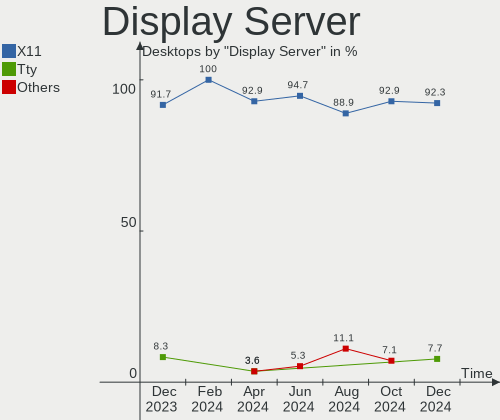
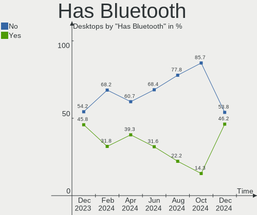
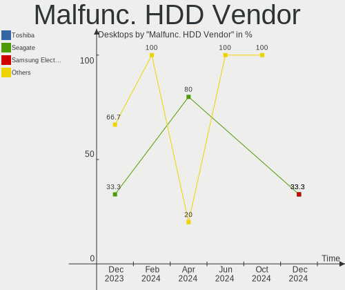
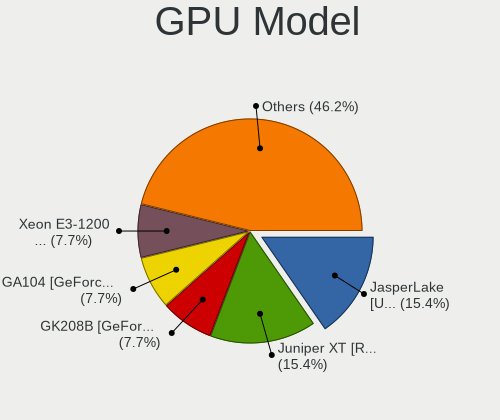
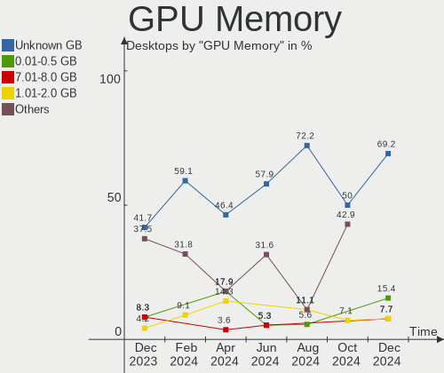
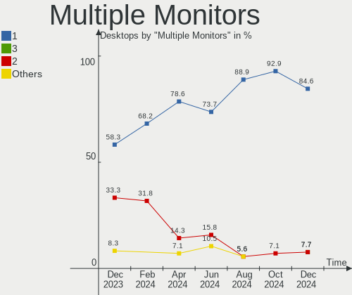
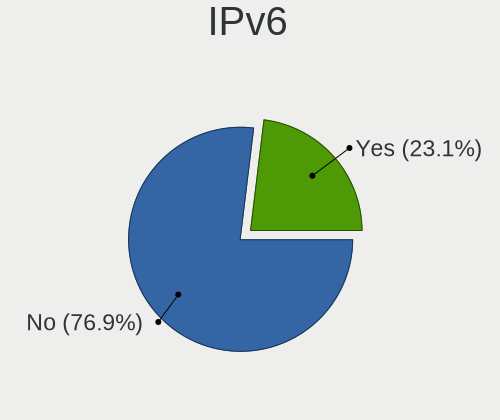

Xubuntu - Hardware Trends (Desktops)
------------------------------------

A project to identify most popular hardware characteristics and track their change
over time based on data collected by Linux users at https://Linux-Hardware.org.

Anyone can contribute to this report by the [hw-probe](https://github.com/linuxhw/hw-probe) tool:

    sudo -E hw-probe -all -upload

This report is for one last month. Overall report since the beginning of time: [TestCoverage](https://github.com/linuxhw/TestCoverage)

Period: Jun, 2022.

Contents
--------

* [ System ](#system)
  - [ OS                       ](#os)
  - [ OS Family                ](#os-family)
  - [ Kernel                   ](#kernel)
  - [ Kernel Family            ](#kernel-family)
  - [ Kernel Major Ver.        ](#kernel-major-ver)
  - [ Arch                     ](#arch)
  - [ DE                       ](#de)
  - [ Display Server           ](#display-server)
  - [ Display Manager          ](#display-manager)
  - [ OS Lang                  ](#os-lang)
  - [ Boot Mode                ](#boot-mode)
  - [ Filesystem               ](#filesystem)
  - [ Part. scheme             ](#part-scheme)
  - [ Dual Boot with Linux/BSD ](#dual-boot-with-linuxbsd)
  - [ Dual Boot (Win)          ](#dual-boot-win)

* [ Board ](#board)
  - [ Vendor                   ](#vendor)
  - [ Model                    ](#model)
  - [ Model Family             ](#model-family)
  - [ MFG Year                 ](#mfg-year)
  - [ Form Factor              ](#form-factor)
  - [ Secure Boot              ](#secure-boot)
  - [ Coreboot                 ](#coreboot)
  - [ RAM Size                 ](#ram-size)
  - [ RAM Used                 ](#ram-used)
  - [ Total Drives             ](#total-drives)
  - [ Has CD-ROM               ](#has-cd-rom)
  - [ Has Ethernet             ](#has-ethernet)
  - [ Has WiFi                 ](#has-wifi)
  - [ Has Bluetooth            ](#has-bluetooth)

* [ Location ](#location)
  - [ Country                  ](#country)
  - [ City                     ](#city)

* [ Drives ](#drives)
  - [ Drive Vendor             ](#drive-vendor)
  - [ Drive Model              ](#drive-model)
  - [ HDD Vendor               ](#hdd-vendor)
  - [ SSD Vendor               ](#ssd-vendor)
  - [ Drive Kind               ](#drive-kind)
  - [ Drive Connector          ](#drive-connector)
  - [ Drive Size               ](#drive-size)
  - [ Space Total              ](#space-total)
  - [ Space Used               ](#space-used)
  - [ Malfunc. Drives          ](#malfunc-drives)
  - [ Malfunc. Drive Vendor    ](#malfunc-drive-vendor)
  - [ Malfunc. HDD Vendor      ](#malfunc-hdd-vendor)
  - [ Malfunc. Drive Kind      ](#malfunc-drive-kind)
  - [ Failed Drives            ](#failed-drives)
  - [ Failed Drive Vendor      ](#failed-drive-vendor)
  - [ Drive Status             ](#drive-status)

* [ Storage controller ](#storage-controller)
  - [ Storage Vendor           ](#storage-vendor)
  - [ Storage Model            ](#storage-model)
  - [ Storage Kind             ](#storage-kind)

* [ Processor ](#processor)
  - [ CPU Vendor               ](#cpu-vendor)
  - [ CPU Model                ](#cpu-model)
  - [ CPU Model Family         ](#cpu-model-family)
  - [ CPU Cores                ](#cpu-cores)
  - [ CPU Sockets              ](#cpu-sockets)
  - [ CPU Threads              ](#cpu-threads)
  - [ CPU Op-Modes             ](#cpu-op-modes)
  - [ CPU Microcode            ](#cpu-microcode)
  - [ CPU Microarch            ](#cpu-microarch)

* [ Graphics ](#graphics)
  - [ GPU Vendor               ](#gpu-vendor)
  - [ GPU Model                ](#gpu-model)
  - [ GPU Combo                ](#gpu-combo)
  - [ GPU Driver               ](#gpu-driver)
  - [ GPU Memory               ](#gpu-memory)

* [ Monitor ](#monitor)
  - [ Monitor Vendor           ](#monitor-vendor)
  - [ Monitor Model            ](#monitor-model)
  - [ Monitor Resolution       ](#monitor-resolution)
  - [ Monitor Diagonal         ](#monitor-diagonal)
  - [ Monitor Width            ](#monitor-width)
  - [ Aspect Ratio             ](#aspect-ratio)
  - [ Monitor Area             ](#monitor-area)
  - [ Pixel Density            ](#pixel-density)
  - [ Multiple Monitors        ](#multiple-monitors)

* [ Network ](#network)
  - [ Net Controller Vendor    ](#net-controller-vendor)
  - [ Net Controller Model     ](#net-controller-model)
  - [ Wireless Vendor          ](#wireless-vendor)
  - [ Wireless Model           ](#wireless-model)
  - [ Ethernet Vendor          ](#ethernet-vendor)
  - [ Ethernet Model           ](#ethernet-model)
  - [ Net Controller Kind      ](#net-controller-kind)
  - [ Used Controller          ](#used-controller)
  - [ NICs                     ](#nics)
  - [ IPv6                     ](#ipv6)

* [ Bluetooth ](#bluetooth)
  - [ Bluetooth Vendor         ](#bluetooth-vendor)
  - [ Bluetooth Model          ](#bluetooth-model)

* [ Sound ](#sound)
  - [ Sound Vendor             ](#sound-vendor)
  - [ Sound Model              ](#sound-model)

* [ Memory ](#memory)
  - [ Memory Vendor            ](#memory-vendor)
  - [ Memory Model             ](#memory-model)
  - [ Memory Kind              ](#memory-kind)
  - [ Memory Form Factor       ](#memory-form-factor)
  - [ Memory Size              ](#memory-size)
  - [ Memory Speed             ](#memory-speed)

* [ Printers & scanners ](#printers--scanners)
  - [ Printer Vendor           ](#printer-vendor)
  - [ Printer Model            ](#printer-model)
  - [ Scanner Vendor           ](#scanner-vendor)
  - [ Scanner Model            ](#scanner-model)

* [ Camera ](#camera)
  - [ Camera Vendor            ](#camera-vendor)
  - [ Camera Model             ](#camera-model)

* [ Security ](#security)
  - [ Fingerprint Vendor       ](#fingerprint-vendor)
  - [ Fingerprint Model        ](#fingerprint-model)
  - [ Chipcard Vendor          ](#chipcard-vendor)
  - [ Chipcard Model           ](#chipcard-model)

* [ Unsupported ](#unsupported)
  - [ Unsupported Devices      ](#unsupported-devices)
  - [ Unsupported Device Types ](#unsupported-device-types)

System
------

OS
--

Installed operating systems

| Name          | Desktops | Percent |
|---------------|----------|---------|
| Xubuntu 20.04 | 14       | 63.64%  |
| Xubuntu 22.04 | 3        | 13.64%  |
| Xubuntu 18.04 | 3        | 13.64%  |
| Xubuntu 20.10 | 1        | 4.55%   |
| Xubuntu 19.10 | 1        | 4.55%   |

OS Family
---------

OS without a version

| Name    | Desktops | Percent |
|---------|----------|---------|
| Xubuntu | 22       | 100%    |

Kernel
------

Version of the Linux kernel

| Version                    | Desktops | Percent |
|----------------------------|----------|---------|
| 5.4.0-117-generic          | 4        | 18.18%  |
| 5.4.0-120-generic          | 3        | 13.64%  |
| 5.8.0-63-generic           | 1        | 4.55%   |
| 5.4.0-99-generic           | 1        | 4.55%   |
| 5.4.0-97-lowlatency        | 1        | 4.55%   |
| 5.4.0-73-generic           | 1        | 4.55%   |
| 5.4.0-121-lowlatency       | 1        | 4.55%   |
| 5.4.0-113-generic          | 1        | 4.55%   |
| 5.3.0-61-generic           | 1        | 4.55%   |
| 5.17.0-8-generic           | 1        | 4.55%   |
| 5.15.0-39-lowlatency       | 1        | 4.55%   |
| 5.15.0-37-generic          | 1        | 4.55%   |
| 5.15.0-14.1-liquorix-amd64 | 1        | 4.55%   |
| 5.13.0-52-generic          | 1        | 4.55%   |
| 5.13.0-51-generic          | 1        | 4.55%   |
| 5.13.0-44-generic          | 1        | 4.55%   |
| 5.13.0-40-generic          | 1        | 4.55%   |

Kernel Family
-------------

Linux kernel without a distro release

| Version | Desktops | Percent |
|---------|----------|---------|
| 5.4.0   | 12       | 54.55%  |
| 5.13.0  | 4        | 18.18%  |
| 5.15.0  | 3        | 13.64%  |
| 5.8.0   | 1        | 4.55%   |
| 5.3.0   | 1        | 4.55%   |
| 5.17.0  | 1        | 4.55%   |

Kernel Major Ver.
-----------------

Linux kernel major version

| Version | Desktops | Percent |
|---------|----------|---------|
| 5.4     | 12       | 54.55%  |
| 5.13    | 4        | 18.18%  |
| 5.15    | 3        | 13.64%  |
| 5.8     | 1        | 4.55%   |
| 5.3     | 1        | 4.55%   |
| 5.17    | 1        | 4.55%   |

Arch
----

OS architecture (x86_64, i586, etc.)

| Name   | Desktops | Percent |
|--------|----------|---------|
| x86_64 | 20       | 90.91%  |
| i686   | 2        | 9.09%   |

DE
--

Desktop Environment

| Name | Desktops | Percent |
|------|----------|---------|
| XFCE | 22       | 100%    |

Display Server
--------------

X11 or Wayland

| Name | Desktops | Percent |
|------|----------|---------|
| X11  | 21       | 95.45%  |
| Tty  | 1        | 4.55%   |

Display Manager
---------------

SDDM, LightDM, etc.

| Name    | Desktops | Percent |
|---------|----------|---------|
| LightDM | 19       | 86.36%  |
| Unknown | 2        | 9.09%   |
| GDM3    | 1        | 4.55%   |

OS Lang
-------

Language

| Lang  | Desktops | Percent |
|-------|----------|---------|
| ru_RU | 4        | 18.18%  |
| en_US | 4        | 18.18%  |
| de_DE | 3        | 13.64%  |
| fr_FR | 2        | 9.09%   |
| en_CA | 2        | 9.09%   |
| ru_UA | 1        | 4.55%   |
| pt_BR | 1        | 4.55%   |
| it_IT | 1        | 4.55%   |
| hu_HU | 1        | 4.55%   |
| es_PE | 1        | 4.55%   |
| es_MX | 1        | 4.55%   |
| es_CO | 1        | 4.55%   |

Boot Mode
---------

EFI or BIOS

| Mode | Desktops | Percent |
|------|----------|---------|
| BIOS | 16       | 72.73%  |
| EFI  | 6        | 27.27%  |

Filesystem
----------

Type of filesystem

| Type    | Desktops | Percent |
|---------|----------|---------|
| Ext4    | 18       | 81.82%  |
| Zfs     | 1        | 4.55%   |
| Overlay | 1        | 4.55%   |
| Ext3    | 1        | 4.55%   |
| Btrfs   | 1        | 4.55%   |

Part. scheme
------------

Scheme of partitioning

| Type    | Desktops | Percent |
|---------|----------|---------|
| Unknown | 14       | 63.64%  |
| GPT     | 5        | 22.73%  |
| MBR     | 3        | 13.64%  |

Dual Boot with Linux/BSD
------------------------

Hosting more than one Linux/BSD

| Dual boot | Desktops | Percent |
|-----------|----------|---------|
| No        | 16       | 72.73%  |
| Yes       | 6        | 27.27%  |

Dual Boot (Win)
---------------

Hosting Linux and Windows

| Dual boot | Desktops | Percent |
|-----------|----------|---------|
| No        | 16       | 72.73%  |
| Yes       | 6        | 27.27%  |

Board
-----

Vendor
------

Motherboard manufacturer

| Name                | Desktops | Percent |
|---------------------|----------|---------|
| ASUSTek Computer    | 8        | 36.36%  |
| MSI                 | 3        | 13.64%  |
| Lenovo              | 2        | 9.09%   |
| Intel               | 2        | 9.09%   |
| Gigabyte Technology | 2        | 9.09%   |
| Dell                | 2        | 9.09%   |
| Hewlett-Packard     | 1        | 4.55%   |
| ASRockRack          | 1        | 4.55%   |
| ASRock              | 1        | 4.55%   |

Model
-----

Motherboard model

| Name                            | Desktops | Percent |
|---------------------------------|----------|---------|
| MSI MS-7C52                     | 1        | 4.55%   |
| MSI MS-7C37                     | 1        | 4.55%   |
| MSI MS-7529                     | 1        | 4.55%   |
| Lenovo ThinkCentre M71e 5033AR1 | 1        | 4.55%   |
| Lenovo ThinkCentre A70 7844H9G  | 1        | 4.55%   |
| Intel DG33BU AAD79951-407       | 1        | 4.55%   |
| Intel D102GGC2 AAD42789-204     | 1        | 4.55%   |
| HP Compaq Elite 8300 SFF        | 1        | 4.55%   |
| Gigabyte H97-HD3                | 1        | 4.55%   |
| Gigabyte H61M-S2PV              | 1        | 4.55%   |
| Dell OptiPlex 380               | 1        | 4.55%   |
| Dell OptiPlex 3020              | 1        | 4.55%   |
| ASUS TUF Gaming X570-PLUS       | 1        | 4.55%   |
| ASUS ROG STRIX B450-F GAMING II | 1        | 4.55%   |
| ASUS P8Z77-V                    | 1        | 4.55%   |
| ASUS P8H67-M LE                 | 1        | 4.55%   |
| ASUS M5A97 R2.0                 | 1        | 4.55%   |
| ASUS M5A78L-M/USB3              | 1        | 4.55%   |
| ASUS M2N-E                      | 1        | 4.55%   |
| ASUS All Series                 | 1        | 4.55%   |
| ASRockRack ROMED8-2T            | 1        | 4.55%   |
| ASRock N68-S3 UCC               | 1        | 4.55%   |

Model Family
------------

Motherboard model prefix

| Name                 | Desktops | Percent |
|----------------------|----------|---------|
| Lenovo ThinkCentre   | 2        | 9.09%   |
| Dell OptiPlex        | 2        | 9.09%   |
| MSI MS-7C52          | 1        | 4.55%   |
| MSI MS-7C37          | 1        | 4.55%   |
| MSI MS-7529          | 1        | 4.55%   |
| Intel DG33BU         | 1        | 4.55%   |
| Intel D102GGC2       | 1        | 4.55%   |
| HP Compaq            | 1        | 4.55%   |
| Gigabyte H97-HD3     | 1        | 4.55%   |
| Gigabyte H61M-S2PV   | 1        | 4.55%   |
| ASUS TUF             | 1        | 4.55%   |
| ASUS ROG             | 1        | 4.55%   |
| ASUS P8Z77-V         | 1        | 4.55%   |
| ASUS P8H67-M         | 1        | 4.55%   |
| ASUS M5A97           | 1        | 4.55%   |
| ASUS M5A78L-M        | 1        | 4.55%   |
| ASUS M2N-E           | 1        | 4.55%   |
| ASUS All             | 1        | 4.55%   |
| ASRockRack ROMED8-2T | 1        | 4.55%   |
| ASRock N68-S3        | 1        | 4.55%   |

MFG Year
--------

Motherboard manufacture year

| Year | Desktops | Percent |
|------|----------|---------|
| 2012 | 4        | 18.18%  |
| 2019 | 3        | 13.64%  |
| 2011 | 3        | 13.64%  |
| 2020 | 2        | 9.09%   |
| 2014 | 2        | 9.09%   |
| 2010 | 2        | 9.09%   |
| 2009 | 2        | 9.09%   |
| 2007 | 2        | 9.09%   |
| 2015 | 1        | 4.55%   |
| 2006 | 1        | 4.55%   |

Form Factor
-----------

Physical design of the computer

| Name    | Desktops | Percent |
|---------|----------|---------|
| Desktop | 22       | 100%    |

Secure Boot
-----------

Enabled or disabled

| State    | Desktops | Percent |
|----------|----------|---------|
| Disabled | 22       | 100%    |

Coreboot
--------

Have coreboot on board

| Used | Desktops | Percent |
|------|----------|---------|
| No   | 22       | 100%    |

RAM Size
--------

Total RAM memory

| Size in GB      | Desktops | Percent |
|-----------------|----------|---------|
| 3.01-4.0        | 6        | 27.27%  |
| 4.01-8.0        | 4        | 18.18%  |
| 8.01-16.0       | 4        | 18.18%  |
| 16.01-24.0      | 3        | 13.64%  |
| More than 256.0 | 1        | 4.55%   |
| 32.01-64.0      | 1        | 4.55%   |
| 24.01-32.0      | 1        | 4.55%   |
| 64.01-256.0     | 1        | 4.55%   |
| 0.51-1.0        | 1        | 4.55%   |

RAM Used
--------

Used RAM memory

| Used GB   | Desktops | Percent |
|-----------|----------|---------|
| 1.01-2.0  | 7        | 31.82%  |
| 2.01-3.0  | 4        | 18.18%  |
| 4.01-8.0  | 3        | 13.64%  |
| 3.01-4.0  | 3        | 13.64%  |
| 0.51-1.0  | 3        | 13.64%  |
| 8.01-16.0 | 2        | 9.09%   |

Total Drives
------------

Number of drives on board

| Drives | Desktops | Percent |
|--------|----------|---------|
| 1      | 9        | 40.91%  |
| 2      | 5        | 22.73%  |
| 5      | 3        | 13.64%  |
| 4      | 3        | 13.64%  |
| 3      | 2        | 9.09%   |

Has CD-ROM
----------

Has CD-ROM on board

| Presented | Desktops | Percent |
|-----------|----------|---------|
| Yes       | 12       | 54.55%  |
| No        | 10       | 45.45%  |

Has Ethernet
------------

Has Ethernet on board

| Presented | Desktops | Percent |
|-----------|----------|---------|
| Yes       | 22       | 100%    |

Has WiFi
--------

Has WiFi module

| Presented | Desktops | Percent |
|-----------|----------|---------|
| No        | 18       | 81.82%  |
| Yes       | 4        | 18.18%  |

Has Bluetooth
-------------

Has Bluetooth module

| Presented | Desktops | Percent |
|-----------|----------|---------|
| No        | 20       | 90.91%  |
| Yes       | 2        | 9.09%   |

Location
--------

Country
-------

Geographic location (country)

| Country  | Desktops | Percent |
|----------|----------|---------|
| Russia   | 4        | 18.18%  |
| Germany  | 3        | 13.64%  |
| USA      | 2        | 9.09%   |
| Ukraine  | 2        | 9.09%   |
| France   | 2        | 9.09%   |
| Canada   | 2        | 9.09%   |
| Sweden   | 1        | 4.55%   |
| Peru     | 1        | 4.55%   |
| Mexico   | 1        | 4.55%   |
| Italy    | 1        | 4.55%   |
| Hungary  | 1        | 4.55%   |
| Colombia | 1        | 4.55%   |
| Brazil   | 1        | 4.55%   |

City
----

Geographic location (city)

| City                | Desktops | Percent |
|---------------------|----------|---------|
| Ottawa              | 2        | 9.09%   |
| Zelenogorsk         | 1        | 4.55%   |
| Vicenza             | 1        | 4.55%   |
| Tucson              | 1        | 4.55%   |
| Trimport            | 1        | 4.55%   |
| Tholey              | 1        | 4.55%   |
| Székesfehérvár   | 1        | 4.55%   |
| St Petersburg       | 1        | 4.55%   |
| Santiago de Cali    | 1        | 4.55%   |
| Paris Crossing      | 1        | 4.55%   |
| Odessa              | 1        | 4.55%   |
| Novopskov           | 1        | 4.55%   |
| Nizhniy Novgorod    | 1        | 4.55%   |
| Mexico City         | 1        | 4.55%   |
| Linköping          | 1        | 4.55%   |
| Lima                | 1        | 4.55%   |
| Lavras              | 1        | 4.55%   |
| Kamensk-Shakhtinsky | 1        | 4.55%   |
| Habsheim            | 1        | 4.55%   |
| Dresden             | 1        | 4.55%   |
| Asnieres-sur-Seine  | 1        | 4.55%   |

Drives
------

Drive Vendor
------------

Hard drive vendors

| Vendor                    | Desktops | Drives | Percent |
|---------------------------|----------|--------|---------|
| Samsung Electronics       | 10       | 15     | 25.64%  |
| WDC                       | 6        | 11     | 15.38%  |
| Seagate                   | 6        | 9      | 15.38%  |
| Toshiba                   | 3        | 3      | 7.69%   |
| Crucial                   | 3        | 3      | 7.69%   |
| PNY                       | 1        | 1      | 2.56%   |
| Phison                    | 1        | 1      | 2.56%   |
| Micron/Crucial Technology | 1        | 1      | 2.56%   |
| Maxtor                    | 1        | 1      | 2.56%   |
| Kingston                  | 1        | 1      | 2.56%   |
| JMicron Technology        | 1        | 1      | 2.56%   |
| Intenso                   | 1        | 1      | 2.56%   |
| Goodram                   | 1        | 1      | 2.56%   |
| Fujitsu                   | 1        | 1      | 2.56%   |
| EMTEC                     | 1        | 1      | 2.56%   |
| A-DATA Technology         | 1        | 1      | 2.56%   |

Drive Model
-----------

Hard drive models

| Model                              | Desktops | Percent |
|------------------------------------|----------|---------|
| Samsung SSD 860 EVO 500GB          | 2        | 4.08%   |
| WDC WDS250G2B0A-00SM50 250GB SSD   | 1        | 2.04%   |
| WDC WDS240G2G0B-00EPW0 240GB SSD   | 1        | 2.04%   |
| WDC WD60EFAX-68JH4N1 6TB           | 1        | 2.04%   |
| WDC WD5000AAKX-08ERMA0 500GB       | 1        | 2.04%   |
| WDC WD5000AAKS-00UU3A0 500GB       | 1        | 2.04%   |
| WDC WD5000AAKS-00A7B0 500GB        | 1        | 2.04%   |
| WDC WD360ADFD-00NLR1 37GB          | 1        | 2.04%   |
| WDC WD30EZRX-00MMMB0 3TB           | 1        | 2.04%   |
| WDC WD2500HHTZ-04N21V0 250GB       | 1        | 2.04%   |
| Toshiba MQ01ABD032 320GB           | 1        | 2.04%   |
| Toshiba DT01ACA200 2TB             | 1        | 2.04%   |
| Toshiba DT01ACA100 1TB             | 1        | 2.04%   |
| Seagate ST3500413AS 500GB          | 1        | 2.04%   |
| Seagate ST3250318AS 250GB          | 1        | 2.04%   |
| Seagate ST3250312AS 250GB          | 1        | 2.04%   |
| Seagate ST3250310AS 250GB          | 1        | 2.04%   |
| Seagate ST31000528AS 1TB           | 1        | 2.04%   |
| Seagate ST250DM000-1BD141 250GB    | 1        | 2.04%   |
| Seagate ST2000LM003 HN-M201RAD 2TB | 1        | 2.04%   |
| Seagate ST1000DM010-2EP102 1TB     | 1        | 2.04%   |
| Seagate ST1000DL002-9TT153 1TB     | 1        | 2.04%   |
| Samsung SSD 970 EVO Plus 1TB       | 1        | 2.04%   |
| Samsung SSD 870 EVO 1TB            | 1        | 2.04%   |
| Samsung SSD 850 PRO 256GB          | 1        | 2.04%   |
| Samsung SSD 850 EVO 250GB          | 1        | 2.04%   |
| Samsung SP0411N 40GB               | 1        | 2.04%   |
| Samsung NVMe SSD Drive 1024GB      | 1        | 2.04%   |
| Samsung M3 Portable 1TB            | 1        | 2.04%   |
| Samsung HD322HJ 320GB              | 1        | 2.04%   |
| Samsung HD250HJ 250GB              | 1        | 2.04%   |
| Samsung HD161HJ 160GB              | 1        | 2.04%   |
| Samsung HD160JJ 160GB              | 1        | 2.04%   |
| Samsung HD103SI 1TB                | 1        | 2.04%   |
| PNY CS900 240GB SSD                | 1        | 2.04%   |
| Phison NVMe SSD Drive 1024GB       | 1        | 2.04%   |
| Micron/Crucial NVMe SSD Drive 1TB  | 1        | 2.04%   |
| Maxtor STM3160215AS 160GB          | 1        | 2.04%   |
| Kingston SA400S37240G 240GB SSD    | 1        | 2.04%   |
| JMicron Tech 250GB                 | 1        | 2.04%   |
| Intenso 128GB                      | 1        | 2.04%   |
| Goodram SSDPR-CL100-120-G3 120GB   | 1        | 2.04%   |
| Fujitsu MJA2500BH FFS G1 500GB     | 1        | 2.04%   |
| EMTEC X150 480GB SSD               | 1        | 2.04%   |
| Crucial CT525MX300SSD1 528GB       | 1        | 2.04%   |
| Crucial CT128MX100SSD1 128GB       | 1        | 2.04%   |
| Crucial CT120BX500SSD1 120GB       | 1        | 2.04%   |
| A-DATA SU800 256GB SSD             | 1        | 2.04%   |

HDD Vendor
----------

Hard disk drive vendors

| Vendor              | Desktops | Drives | Percent |
|---------------------|----------|--------|---------|
| Seagate             | 6        | 9      | 30%     |
| Samsung Electronics | 5        | 7      | 25%     |
| WDC                 | 4        | 9      | 20%     |
| Toshiba             | 3        | 3      | 15%     |
| Maxtor              | 1        | 1      | 5%      |
| Fujitsu             | 1        | 1      | 5%      |

SSD Vendor
----------

Solid state drive vendors

| Vendor              | Desktops | Drives | Percent |
|---------------------|----------|--------|---------|
| Samsung Electronics | 4        | 5      | 28.57%  |
| Crucial             | 3        | 3      | 21.43%  |
| WDC                 | 2        | 2      | 14.29%  |
| PNY                 | 1        | 1      | 7.14%   |
| Kingston            | 1        | 1      | 7.14%   |
| Goodram             | 1        | 1      | 7.14%   |
| EMTEC               | 1        | 1      | 7.14%   |
| A-DATA Technology   | 1        | 1      | 7.14%   |

Drive Kind
----------

HDD or SSD

| Kind    | Desktops | Drives | Percent |
|---------|----------|--------|---------|
| HDD     | 14       | 30     | 46.67%  |
| SSD     | 11       | 15     | 36.67%  |
| NVMe    | 3        | 5      | 10%     |
| Unknown | 2        | 2      | 6.67%   |

Drive Connector
---------------

SATA, SAS, NVMe, etc.

| Type | Desktops | Drives | Percent |
|------|----------|--------|---------|
| SATA | 21       | 45     | 80.77%  |
| NVMe | 3        | 5      | 11.54%  |
| SAS  | 2        | 2      | 7.69%   |

Drive Size
----------

Size of hard drive

| Size in TB | Desktops | Drives | Percent |
|------------|----------|--------|---------|
| 0.01-0.5   | 18       | 31     | 64.29%  |
| 0.51-1.0   | 6        | 8      | 21.43%  |
| 1.01-2.0   | 2        | 2      | 7.14%   |
| 2.01-3.0   | 1        | 3      | 3.57%   |
| 4.01-10.0  | 1        | 1      | 3.57%   |

Space Total
-----------

Amount of disk space available on the file system

| Size in GB     | Desktops | Percent |
|----------------|----------|---------|
| 101-250        | 7        | 31.82%  |
| 1001-2000      | 5        | 22.73%  |
| 251-500        | 3        | 13.64%  |
| 501-1000       | 3        | 13.64%  |
| More than 3000 | 2        | 9.09%   |
| 21-50          | 1        | 4.55%   |
| 1-20           | 1        | 4.55%   |

Space Used
----------

Amount of used disk space

| Used GB        | Desktops | Percent |
|----------------|----------|---------|
| 21-50          | 5        | 22.73%  |
| 251-500        | 4        | 18.18%  |
| 501-1000       | 3        | 13.64%  |
| 51-100         | 3        | 13.64%  |
| 101-250        | 2        | 9.09%   |
| 1001-2000      | 2        | 9.09%   |
| 1-20           | 2        | 9.09%   |
| More than 3000 | 1        | 4.55%   |

Malfunc. Drives
---------------

Drive models with a malfunction

| Model                               | Desktops | Drives | Percent |
|-------------------------------------|----------|--------|---------|
| WDC WDS240G2G0B-00EPW0 240GB SSD    | 1        | 1      | 9.09%   |
| WDC WD5000AAKX-08ERMA0 500GB        | 1        | 1      | 9.09%   |
| WDC WD5000AAKS-00A7B0 500GB         | 1        | 1      | 9.09%   |
| Toshiba DT01ACA100 1TB              | 1        | 1      | 9.09%   |
| Seagate ST3250318AS 250GB           | 1        | 1      | 9.09%   |
| Seagate ST3250310AS 250GB           | 1        | 1      | 9.09%   |
| Seagate ST1000DL002-9TT153 1TB      | 1        | 1      | 9.09%   |
| Samsung Electronics SSD 870 EVO 1TB | 1        | 1      | 9.09%   |
| Samsung Electronics HD103SI 1TB     | 1        | 1      | 9.09%   |
| Maxtor STM3160215AS 160GB           | 1        | 1      | 9.09%   |
| Crucial CT128MX100SSD1 128GB        | 1        | 1      | 9.09%   |

Malfunc. Drive Vendor
---------------------

Vendors of faulty drives

| Vendor              | Desktops | Drives | Percent |
|---------------------|----------|--------|---------|
| WDC                 | 2        | 3      | 22.22%  |
| Seagate             | 2        | 3      | 22.22%  |
| Samsung Electronics | 2        | 2      | 22.22%  |
| Toshiba             | 1        | 1      | 11.11%  |
| Maxtor              | 1        | 1      | 11.11%  |
| Crucial             | 1        | 1      | 11.11%  |

Malfunc. HDD Vendor
-------------------

Vendors of faulty HDD drives

| Vendor              | Desktops | Drives | Percent |
|---------------------|----------|--------|---------|
| Seagate             | 2        | 3      | 33.33%  |
| WDC                 | 1        | 2      | 16.67%  |
| Toshiba             | 1        | 1      | 16.67%  |
| Samsung Electronics | 1        | 1      | 16.67%  |
| Maxtor              | 1        | 1      | 16.67%  |

Malfunc. Drive Kind
-------------------

Kinds of faulty drives

| Kind | Desktops | Drives | Percent |
|------|----------|--------|---------|
| HDD  | 3        | 8      | 60%     |
| SSD  | 2        | 3      | 40%     |

Failed Drives
-------------

Failed drive models

Zero info for selected period =(

Failed Drive Vendor
-------------------

Failed drive vendors

Zero info for selected period =(

Drive Status
------------

Number of failed and malfunc. drives

| Status   | Desktops | Drives | Percent |
|----------|----------|--------|---------|
| Detected | 14       | 30     | 58.33%  |
| Works    | 6        | 11     | 25%     |
| Malfunc  | 4        | 11     | 16.67%  |

Storage controller
------------------

Storage Vendor
--------------

Storage controller vendors

| Vendor                    | Desktops | Percent |
|---------------------------|----------|---------|
| Intel                     | 12       | 40%     |
| AMD                       | 8        | 26.67%  |
| ASMedia Technology        | 3        | 10%     |
| Samsung Electronics       | 2        | 6.67%   |
| Nvidia                    | 2        | 6.67%   |
| Phison Electronics        | 1        | 3.33%   |
| Micron/Crucial Technology | 1        | 3.33%   |
| Marvell Technology Group  | 1        | 3.33%   |

Storage Model
-------------

Storage controller models

| Model                                                                                   | Desktops | Percent |
|-----------------------------------------------------------------------------------------|----------|---------|
| AMD FCH SATA Controller [AHCI mode]                                                     | 5        | 12.2%   |
| Intel NM10/ICH7 Family SATA Controller [IDE mode]                                       | 3        | 7.32%   |
| ASMedia ASM1062 Serial ATA Controller                                                   | 3        | 7.32%   |
| Samsung NVMe SSD Controller SM981/PM981/PM983                                           | 2        | 4.88%   |
| Intel 9 Series Chipset Family SATA Controller [AHCI Mode]                               | 2        | 4.88%   |
| Intel 82801G (ICH7 Family) IDE Controller                                               | 2        | 4.88%   |
| Intel 6 Series/C200 Series Chipset Family 6 port Desktop SATA AHCI Controller           | 2        | 4.88%   |
| AMD 400 Series Chipset SATA Controller                                                  | 2        | 4.88%   |
| Phison E12 NVMe Controller                                                              | 1        | 2.44%   |
| Nvidia MCP61 SATA Controller                                                            | 1        | 2.44%   |
| Nvidia MCP61 IDE                                                                        | 1        | 2.44%   |
| Nvidia MCP55 SATA Controller                                                            | 1        | 2.44%   |
| Nvidia MCP55 IDE                                                                        | 1        | 2.44%   |
| Micron/Crucial Non-Volatile memory controller                                           | 1        | 2.44%   |
| Marvell Group 88SE6101/6102 single-port PATA133 interface                               | 1        | 2.44%   |
| Intel 82801IR/IO/IH (ICH9R/DO/DH) 6 port SATA Controller [AHCI mode]                    | 1        | 2.44%   |
| Intel 8 Series/C220 Series Chipset Family 6-port SATA Controller 1 [AHCI mode]          | 1        | 2.44%   |
| Intel 7 Series/C210 Series Chipset Family 6-port SATA Controller [AHCI mode]            | 1        | 2.44%   |
| Intel 7 Series/C210 Series Chipset Family 4-port SATA Controller [IDE mode]             | 1        | 2.44%   |
| Intel 7 Series/C210 Series Chipset Family 2-port SATA Controller [IDE mode]             | 1        | 2.44%   |
| Intel 6 Series/C200 Series Chipset Family Desktop SATA Controller (IDE mode, ports 4-5) | 1        | 2.44%   |
| Intel 6 Series/C200 Series Chipset Family Desktop SATA Controller (IDE mode, ports 0-3) | 1        | 2.44%   |
| AMD SB7x0/SB8x0/SB9x0 SATA Controller [IDE mode]                                        | 1        | 2.44%   |
| AMD SB7x0/SB8x0/SB9x0 SATA Controller [AHCI mode]                                       | 1        | 2.44%   |
| AMD SB7x0/SB8x0/SB9x0 IDE Controller                                                    | 1        | 2.44%   |
| AMD IXP SB4x0 Serial ATA Controller                                                     | 1        | 2.44%   |
| AMD IXP SB4x0 IDE Controller                                                            | 1        | 2.44%   |
| AMD IXP SB400 Serial ATA Controller                                                     | 1        | 2.44%   |

Storage Kind
------------

Kind of storage controller (IDE, SATA, NVMe, SAS, ...)

| Kind | Desktops | Percent |
|------|----------|---------|
| SATA | 14       | 51.85%  |
| IDE  | 10       | 37.04%  |
| NVMe | 3        | 11.11%  |

Processor
---------

CPU Vendor
----------

Processor vendors

| Vendor | Desktops | Percent |
|--------|----------|---------|
| Intel  | 13       | 59.09%  |
| AMD    | 9        | 40.91%  |

CPU Model
---------

Processor models

| Model                                       | Desktops | Percent |
|---------------------------------------------|----------|---------|
| AMD FX-8350 Eight-Core Processor            | 2        | 9.09%   |
| Intel Pentium Dual-Core CPU E5300 @ 2.60GHz | 1        | 4.55%   |
| Intel Pentium CPU G2020 @ 2.90GHz           | 1        | 4.55%   |
| Intel Pentium 4 CPU 3.20GHz                 | 1        | 4.55%   |
| Intel Core i7-4771 CPU @ 3.50GHz            | 1        | 4.55%   |
| Intel Core i7-3770K CPU @ 3.50GHz           | 1        | 4.55%   |
| Intel Core i7-3770 CPU @ 3.40GHz            | 1        | 4.55%   |
| Intel Core i5-4460 CPU @ 3.20GHz            | 1        | 4.55%   |
| Intel Core i3-4160 CPU @ 3.60GHz            | 1        | 4.55%   |
| Intel Core i3-2100 CPU @ 3.10GHz            | 1        | 4.55%   |
| Intel Core 2 Quad CPU Q9500 @ 2.83GHz       | 1        | 4.55%   |
| Intel Core 2 Duo CPU E7500 @ 2.93GHz        | 1        | 4.55%   |
| Intel Core 2 Duo CPU E7300 @ 2.66GHz        | 1        | 4.55%   |
| Intel Celeron CPU G530 @ 2.40GHz            | 1        | 4.55%   |
| AMD Ryzen 7 PRO 5750G with Radeon Graphics  | 1        | 4.55%   |
| AMD Ryzen 7 2700 Eight-Core Processor       | 1        | 4.55%   |
| AMD Ryzen 5 5600X 6-Core Processor          | 1        | 4.55%   |
| AMD Ryzen 5 3600X 6-Core Processor          | 1        | 4.55%   |
| AMD EPYC 7302 16-Core Processor             | 1        | 4.55%   |
| AMD Athlon II X4 640 Processor              | 1        | 4.55%   |
| AMD Athlon 64 X2 Dual Core Processor 4800+  | 1        | 4.55%   |

CPU Model Family
----------------

Processor model prefix

| Model                   | Desktops | Percent |
|-------------------------|----------|---------|
| Intel Core i7           | 3        | 13.64%  |
| Intel Core i3           | 2        | 9.09%   |
| Intel Core 2 Duo        | 2        | 9.09%   |
| AMD Ryzen 5             | 2        | 9.09%   |
| AMD FX                  | 2        | 9.09%   |
| Intel Pentium Dual-Core | 1        | 4.55%   |
| Intel Pentium 4         | 1        | 4.55%   |
| Intel Pentium           | 1        | 4.55%   |
| Intel Core i5           | 1        | 4.55%   |
| Intel Core 2 Quad       | 1        | 4.55%   |
| Intel Celeron           | 1        | 4.55%   |
| AMD Ryzen 7 PRO         | 1        | 4.55%   |
| AMD Ryzen 7             | 1        | 4.55%   |
| AMD EPYC                | 1        | 4.55%   |
| AMD Athlon II X4        | 1        | 4.55%   |
| AMD Athlon 64 X2        | 1        | 4.55%   |

CPU Cores
---------

Number of processor cores

| Number | Desktops | Percent |
|--------|----------|---------|
| 4      | 8        | 36.36%  |
| 2      | 8        | 36.36%  |
| 8      | 2        | 9.09%   |
| 6      | 2        | 9.09%   |
| 16     | 1        | 4.55%   |
| 1      | 1        | 4.55%   |

CPU Sockets
-----------

Number of sockets

| Number | Desktops | Percent |
|--------|----------|---------|
| 1      | 22       | 100%    |

CPU Threads
-----------

Threads per core (Hyper-Threading)

| Number | Desktops | Percent |
|--------|----------|---------|
| 2      | 13       | 59.09%  |
| 1      | 9        | 40.91%  |

CPU Op-Modes
------------

CPU Operation Modes (32-bit, 64-bit)

| Op mode        | Desktops | Percent |
|----------------|----------|---------|
| 32-bit, 64-bit | 22       | 100%    |

CPU Microcode
-------------

Microcode number

| Number     | Desktops | Percent |
|------------|----------|---------|
| Unknown    | 4        | 18.18%  |
| 0x306c3    | 3        | 13.64%  |
| 0x306a9    | 3        | 13.64%  |
| 0x206a7    | 2        | 9.09%   |
| 0x1067a    | 2        | 9.09%   |
| 0x06000852 | 2        | 9.09%   |
| 0xf49      | 1        | 4.55%   |
| 0x10676    | 1        | 4.55%   |
| 0x0a50000c | 1        | 4.55%   |
| 0x0a201016 | 1        | 4.55%   |
| 0x08701021 | 1        | 4.55%   |
| 0x0800820d | 1        | 4.55%   |

CPU Microarch
-------------

Microarchitecture

| Name        | Desktops | Percent |
|-------------|----------|---------|
| Penryn      | 4        | 18.18%  |
| IvyBridge   | 3        | 13.64%  |
| Haswell     | 3        | 13.64%  |
| Zen 3       | 2        | 9.09%   |
| Zen 2       | 2        | 9.09%   |
| SandyBridge | 2        | 9.09%   |
| Piledriver  | 2        | 9.09%   |
| Zen+        | 1        | 4.55%   |
| NetBurst    | 1        | 4.55%   |
| K8 Hammer   | 1        | 4.55%   |
| K10         | 1        | 4.55%   |

Graphics
--------

GPU Vendor
----------

Vendors of graphics cards

| Vendor            | Desktops | Percent |
|-------------------|----------|---------|
| Intel             | 9        | 37.5%   |
| Nvidia            | 8        | 33.33%  |
| AMD               | 6        | 25%     |
| ASPEED Technology | 1        | 4.17%   |

GPU Model
---------

Graphics card models

| Model                                                                       | Desktops | Percent |
|-----------------------------------------------------------------------------|----------|---------|
| Intel IvyBridge GT2 [HD Graphics 4000]                                      | 2        | 8%      |
| Intel 82G33/G31 Express Integrated Graphics Controller                      | 2        | 8%      |
| Intel 2nd Generation Core Processor Family Integrated Graphics Controller   | 2        | 8%      |
| Nvidia GP108 [GeForce GT 1030]                                              | 1        | 4%      |
| Nvidia GM206 [GeForce GTX 960]                                              | 1        | 4%      |
| Nvidia GK208B [GeForce GT 720]                                              | 1        | 4%      |
| Nvidia GK208B [GeForce GT 710]                                              | 1        | 4%      |
| Nvidia GK104 [GeForce GTX 690]                                              | 1        | 4%      |
| Nvidia GF116 [GeForce GTX 550 Ti]                                           | 1        | 4%      |
| Nvidia GA106 [GeForce RTX 3060]                                             | 1        | 4%      |
| Nvidia GA102 [GeForce RTX 3090]                                             | 1        | 4%      |
| Intel Xeon E3-1200 v3/4th Gen Core Processor Integrated Graphics Controller | 1        | 4%      |
| Intel Xeon E3-1200 v2/3rd Gen Core processor Graphics Controller            | 1        | 4%      |
| Intel 4th Generation Core Processor Family Integrated Graphics Controller   | 1        | 4%      |
| ASPEED Technology ASPEED Graphics Family                                    | 1        | 4%      |
| AMD RV570 [Radeon X1950 PRO] (Secondary)                                    | 1        | 4%      |
| AMD RV570 [Radeon X1950 PRO]                                                | 1        | 4%      |
| AMD RS780L [Radeon 3000]                                                    | 1        | 4%      |
| AMD RC410 [Radeon Xpress 200/1100]                                          | 1        | 4%      |
| AMD Lexa PRO [Radeon 540/540X/550/550X / RX 540X/550/550X]                  | 1        | 4%      |
| AMD Cezanne                                                                 | 1        | 4%      |
| AMD Barts XT [Radeon HD 6870]                                               | 1        | 4%      |

GPU Combo
---------

Combinations of graphics cards

| Name            | Desktops | Percent |
|-----------------|----------|---------|
| 1 x Intel       | 8        | 36.36%  |
| 1 x Nvidia      | 7        | 31.82%  |
| 1 x AMD         | 5        | 22.73%  |
| 2 x AMD         | 1        | 4.55%   |
| Nvidia + ASPEED | 1        | 4.55%   |

GPU Driver
----------

Free vs proprietary

| Driver      | Desktops | Percent |
|-------------|----------|---------|
| Free        | 15       | 68.18%  |
| Proprietary | 6        | 27.27%  |
| Unknown     | 1        | 4.55%   |

GPU Memory
----------

Total video memory

| Size in GB | Desktops | Percent |
|------------|----------|---------|
| Unknown    | 8        | 36.36%  |
| 1.01-2.0   | 5        | 22.73%  |
| 0.51-1.0   | 4        | 18.18%  |
| 0.01-0.5   | 3        | 13.64%  |
| 16.01-24.0 | 1        | 4.55%   |
| 8.01-16.0  | 1        | 4.55%   |

Monitor
-------

Monitor Vendor
--------------

Monitor vendors

| Vendor              | Desktops | Percent |
|---------------------|----------|---------|
| Goldstar            | 4        | 19.05%  |
| Samsung Electronics | 3        | 14.29%  |
| Philips             | 2        | 9.52%   |
| Hewlett-Packard     | 2        | 9.52%   |
| Toshiba             | 1        | 4.76%   |
| Medion              | 1        | 4.76%   |
| LG Electronics      | 1        | 4.76%   |
| Lenovo              | 1        | 4.76%   |
| Iiyama              | 1        | 4.76%   |
| HKC                 | 1        | 4.76%   |
| FUS                 | 1        | 4.76%   |
| Dell                | 1        | 4.76%   |
| Compaq Computer     | 1        | 4.76%   |
| Acer                | 1        | 4.76%   |

Monitor Model
-------------

Monitor models

| Model                                                             | Desktops | Percent |
|-------------------------------------------------------------------|----------|---------|
| Toshiba TV TSB0109 1920x1080                                      | 1        | 4.17%   |
| Samsung Electronics U28E590 SAM0C4D 3840x2160 607x345mm 27.5-inch | 1        | 4.17%   |
| Samsung Electronics U28E590 SAM0C4C 3840x2160 608x345mm 27.5-inch | 1        | 4.17%   |
| Samsung Electronics SME1920N SAM06A3 1360x768 410x230mm 18.5-inch | 1        | 4.17%   |
| Samsung Electronics LCD Monitor S20B300 3200x900                  | 1        | 4.17%   |
| Samsung Electronics LCD Monitor S20B300                           | 1        | 4.17%   |
| Philips PHL 246V5 PHLC0C5 1920x1080 531x299mm 24.0-inch           | 1        | 4.17%   |
| Philips LCD Monitor PHLC014 1440x900 400x250mm 18.6-inch          | 1        | 4.17%   |
| Philips 221TE PHLC062 1920x1080 476x268mm 21.5-inch               | 1        | 4.17%   |
| Medion MD 20144 MED3634 1920x1080 521x293mm 23.5-inch             | 1        | 4.17%   |
| LG Electronics LCD Monitor L1753T 1024x768                        | 1        | 4.17%   |
| Lenovo D27-30 LEN66B8 1920x1080 597x336mm 27.0-inch               | 1        | 4.17%   |
| Iiyama PL2377 IVM561D 1920x1080 510x287mm 23.0-inch               | 1        | 4.17%   |
| HKC LCDTV HKC3393 1920x1080 520x290mm 23.4-inch                   | 1        | 4.17%   |
| Hewlett-Packard LV2311 HWP3006 1920x1080 510x287mm 23.0-inch      | 1        | 4.17%   |
| Hewlett-Packard L1925 HWP259A 1280x1024 376x301mm 19.0-inch       | 1        | 4.17%   |
| Goldstar L1970HR GSM4AE8 1280x1024 376x301mm 19.0-inch            | 1        | 4.17%   |
| Goldstar FULL HD GSM5B55 1920x1080 480x270mm 21.7-inch            | 1        | 4.17%   |
| Goldstar E2051 GSM4ED1 1600x900 440x250mm 19.9-inch               | 1        | 4.17%   |
| Goldstar 2D HD TV GSM59C8 1366x768 509x286mm 23.0-inch            | 1        | 4.17%   |
| FUS LCD Monitor L20T-2 LED 1600x900                               | 1        | 4.17%   |
| Dell P2414H DELA09B 1920x1080 527x297mm 23.8-inch                 | 1        | 4.17%   |
| Compaq Computer Q1859 CPQ2826 1366x768 410x230mm 18.5-inch        | 1        | 4.17%   |
| Acer G246HL ACR02FF 1920x1080 531x299mm 24.0-inch                 | 1        | 4.17%   |

Monitor Resolution
------------------

Monitor screen resolution

| Resolution       | Desktops | Percent |
|------------------|----------|---------|
| 1920x1080 (FHD)  | 7        | 35%     |
| 1366x768 (WXGA)  | 3        | 15%     |
| 3840x2160 (4K)   | 2        | 10%     |
| 1600x900 (HD+)   | 2        | 10%     |
| 1280x1024 (SXGA) | 2        | 10%     |
| 3200x900         | 1        | 5%      |
| 1440x900 (WXGA+) | 1        | 5%      |
| 1024x768 (XGA)   | 1        | 5%      |
| Unknown          | 1        | 5%      |

Monitor Diagonal
----------------

Diagonal size in inches

| Inches  | Desktops | Percent |
|---------|----------|---------|
| 24      | 3        | 13.64%  |
| 23      | 3        | 13.64%  |
| 18      | 3        | 13.64%  |
| Unknown | 3        | 13.64%  |
| 27      | 2        | 9.09%   |
| 21      | 2        | 9.09%   |
| 19      | 2        | 9.09%   |
| 72      | 1        | 4.55%   |
| 40      | 1        | 4.55%   |
| 26      | 1        | 4.55%   |
| 20      | 1        | 4.55%   |

Monitor Width
-------------

Physical width

| Width in mm | Desktops | Percent |
|-------------|----------|---------|
| 501-600     | 8        | 36.36%  |
| 401-500     | 6        | 27.27%  |
| Unknown     | 3        | 13.64%  |
| 351-400     | 2        | 9.09%   |
| 801-900     | 1        | 4.55%   |
| 601-700     | 1        | 4.55%   |
| 1501-2000   | 1        | 4.55%   |

Aspect Ratio
------------

Proportional relationship between the width and the height

| Ratio   | Desktops | Percent |
|---------|----------|---------|
| 16/9    | 13       | 68.42%  |
| Unknown | 3        | 15.79%  |
| 5/4     | 2        | 10.53%  |
| 16/10   | 1        | 5.26%   |

Monitor Area
------------

Area in inch²

| Area in inch² | Desktops | Percent |
|----------------|----------|---------|
| 201-250        | 7        | 33.33%  |
| 151-200        | 4        | 19.05%  |
| Unknown        | 3        | 14.29%  |
| 301-350        | 2        | 9.52%   |
| 141-150        | 2        | 9.52%   |
| More than 1000 | 1        | 4.76%   |
| 251-300        | 1        | 4.76%   |
| 501-1000       | 1        | 4.76%   |

Pixel Density
-------------

Pixels per inch

| Density | Desktops | Percent |
|---------|----------|---------|
| 51-100  | 14       | 63.64%  |
| Unknown | 3        | 13.64%  |
| 1-50    | 2        | 9.09%   |
| 101-120 | 2        | 9.09%   |
| 121-160 | 1        | 4.55%   |

Multiple Monitors
-----------------

Total monitors connected

| Total | Desktops | Percent |
|-------|----------|---------|
| 1     | 16       | 72.73%  |
| 2     | 3        | 13.64%  |
| 0     | 2        | 9.09%   |
| 3     | 1        | 4.55%   |

Network
-------

Net Controller Vendor
---------------------

Controller vendors

| Vendor                          | Desktops | Percent |
|---------------------------------|----------|---------|
| Realtek Semiconductor           | 13       | 48.15%  |
| Intel                           | 8        | 29.63%  |
| Nvidia                          | 2        | 7.41%   |
| TP-Link                         | 1        | 3.7%    |
| Qualcomm Atheros Communications | 1        | 3.7%    |
| Qualcomm Atheros                | 1        | 3.7%    |
| Broadcom                        | 1        | 3.7%    |

Net Controller Model
--------------------

Controller models

| Model                                                                         | Desktops | Percent |
|-------------------------------------------------------------------------------|----------|---------|
| Realtek RTL8111/8168/8411 PCI Express Gigabit Ethernet Controller             | 11       | 40.74%  |
| TP-Link TL-WN823N v2/v3 [Realtek RTL8192EU]                                   | 1        | 3.7%    |
| Realtek RTL810xE PCI Express Fast Ethernet controller                         | 1        | 3.7%    |
| Realtek RTL-8100/8101L/8139 PCI Fast Ethernet Adapter                         | 1        | 3.7%    |
| Qualcomm Atheros AR9271 802.11n                                               | 1        | 3.7%    |
| Qualcomm Atheros AR9227 Wireless Network Adapter                              | 1        | 3.7%    |
| Nvidia MCP61 Ethernet                                                         | 1        | 3.7%    |
| Nvidia MCP55 Ethernet                                                         | 1        | 3.7%    |
| Intel Wireless-AC 9260                                                        | 1        | 3.7%    |
| Intel I211 Gigabit Network Connection                                         | 1        | 3.7%    |
| Intel Ethernet Controller X550                                                | 1        | 3.7%    |
| Intel Ethernet Connection (2) I218-V                                          | 1        | 3.7%    |
| Intel 82579V Gigabit Network Connection                                       | 1        | 3.7%    |
| Intel 82579LM Gigabit Network Connection (Lewisville)                         | 1        | 3.7%    |
| Intel 82571EB/82571GB Gigabit Ethernet Controller D0/D1 (copper applications) | 1        | 3.7%    |
| Intel 82566DC-2 Gigabit Network Connection                                    | 1        | 3.7%    |
| Broadcom NetLink BCM57780 Gigabit Ethernet PCIe                               | 1        | 3.7%    |

Wireless Vendor
---------------

Wireless vendors

| Vendor                          | Desktops | Percent |
|---------------------------------|----------|---------|
| TP-Link                         | 1        | 25%     |
| Qualcomm Atheros Communications | 1        | 25%     |
| Qualcomm Atheros                | 1        | 25%     |
| Intel                           | 1        | 25%     |

Wireless Model
--------------

Wireless models

| Model                                            | Desktops | Percent |
|--------------------------------------------------|----------|---------|
| TP-Link TL-WN823N v2/v3 [Realtek RTL8192EU]      | 1        | 25%     |
| Qualcomm Atheros AR9271 802.11n                  | 1        | 25%     |
| Qualcomm Atheros AR9227 Wireless Network Adapter | 1        | 25%     |
| Intel Wireless-AC 9260                           | 1        | 25%     |

Ethernet Vendor
---------------

Ethernet vendors

| Vendor                | Desktops | Percent |
|-----------------------|----------|---------|
| Realtek Semiconductor | 13       | 56.52%  |
| Intel                 | 7        | 30.43%  |
| Nvidia                | 2        | 8.7%    |
| Broadcom              | 1        | 4.35%   |

Ethernet Model
--------------

Ethernet models

| Model                                                                         | Desktops | Percent |
|-------------------------------------------------------------------------------|----------|---------|
| Realtek RTL8111/8168/8411 PCI Express Gigabit Ethernet Controller             | 11       | 47.83%  |
| Realtek RTL810xE PCI Express Fast Ethernet controller                         | 1        | 4.35%   |
| Realtek RTL-8100/8101L/8139 PCI Fast Ethernet Adapter                         | 1        | 4.35%   |
| Nvidia MCP61 Ethernet                                                         | 1        | 4.35%   |
| Nvidia MCP55 Ethernet                                                         | 1        | 4.35%   |
| Intel I211 Gigabit Network Connection                                         | 1        | 4.35%   |
| Intel Ethernet Controller X550                                                | 1        | 4.35%   |
| Intel Ethernet Connection (2) I218-V                                          | 1        | 4.35%   |
| Intel 82579V Gigabit Network Connection                                       | 1        | 4.35%   |
| Intel 82579LM Gigabit Network Connection (Lewisville)                         | 1        | 4.35%   |
| Intel 82571EB/82571GB Gigabit Ethernet Controller D0/D1 (copper applications) | 1        | 4.35%   |
| Intel 82566DC-2 Gigabit Network Connection                                    | 1        | 4.35%   |
| Broadcom NetLink BCM57780 Gigabit Ethernet PCIe                               | 1        | 4.35%   |

Net Controller Kind
-------------------

Ethernet, WiFi or modem

| Kind     | Desktops | Percent |
|----------|----------|---------|
| Ethernet | 22       | 84.62%  |
| WiFi     | 4        | 15.38%  |

Used Controller
---------------

Currently used network controller

| Kind     | Desktops | Percent |
|----------|----------|---------|
| Ethernet | 20       | 90.91%  |
| WiFi     | 2        | 9.09%   |

NICs
----

Total network controllers on board

| Total | Desktops | Percent |
|-------|----------|---------|
| 1     | 18       | 81.82%  |
| 2     | 3        | 13.64%  |
| 3     | 1        | 4.55%   |

IPv6
----

IPv6 vs IPv4

| Used | Desktops | Percent |
|------|----------|---------|
| No   | 13       | 59.09%  |
| Yes  | 9        | 40.91%  |

Bluetooth
---------

Bluetooth Vendor
----------------

Controller vendors

| Vendor                  | Desktops | Percent |
|-------------------------|----------|---------|
| Intel                   | 1        | 50%     |
| Cambridge Silicon Radio | 1        | 50%     |

Bluetooth Model
---------------

Controller models

| Model                                               | Desktops | Percent |
|-----------------------------------------------------|----------|---------|
| Intel Wireless-AC 9260 Bluetooth Adapter            | 1        | 50%     |
| Cambridge Silicon Radio Bluetooth Dongle (HCI mode) | 1        | 50%     |

Sound
-----

Sound Vendor
------------

Sound card vendors

| Vendor              | Desktops | Percent |
|---------------------|----------|---------|
| Intel               | 12       | 35.29%  |
| Nvidia              | 9        | 26.47%  |
| AMD                 | 7        | 20.59%  |
| Texas Instruments   | 2        | 5.88%   |
| VIA Technologies    | 1        | 2.94%   |
| TerraTec Electronic | 1        | 2.94%   |
| SAVITECH            | 1        | 2.94%   |
| GN Netcom           | 1        | 2.94%   |

Sound Model
-----------

Sound card models

| Model                                                                      | Desktops | Percent |
|----------------------------------------------------------------------------|----------|---------|
| Intel NM10/ICH7 Family High Definition Audio Controller                    | 3        | 7.5%    |
| Intel 6 Series/C200 Series Chipset Family High Definition Audio Controller | 3        | 7.5%    |
| Nvidia GK208 HDMI/DP Audio Controller                                      | 2        | 5%      |
| Intel Xeon E3-1200 v3/4th Gen Core Processor HD Audio Controller           | 2        | 5%      |
| Intel 9 Series Chipset Family HD Audio Controller                          | 2        | 5%      |
| Intel 7 Series/C216 Chipset Family High Definition Audio Controller        | 2        | 5%      |
| AMD Starship/Matisse HD Audio Controller                                   | 2        | 5%      |
| VIA Technologies ICE1712 [Envy24] PCI Multi-Channel I/O Controller         | 1        | 2.5%    |
| Texas Instruments PCM2900C Audio CODEC                                     | 1        | 2.5%    |
| Texas Instruments PCM2900 Audio Codec                                      | 1        | 2.5%    |
| TerraTec Electronic Aureon Dual USB                                        | 1        | 2.5%    |
| SAVITECH SA9023 audio controller                                           | 1        | 2.5%    |
| Nvidia MCP61 High Definition Audio                                         | 1        | 2.5%    |
| Nvidia MCP55 High Definition Audio                                         | 1        | 2.5%    |
| Nvidia GP108 High Definition Audio Controller                              | 1        | 2.5%    |
| Nvidia GM206 High Definition Audio Controller                              | 1        | 2.5%    |
| Nvidia GK104 HDMI Audio Controller                                         | 1        | 2.5%    |
| Nvidia GF116 High Definition Audio Controller                              | 1        | 2.5%    |
| Nvidia GA102 High Definition Audio Controller                              | 1        | 2.5%    |
| Nvidia Audio device                                                        | 1        | 2.5%    |
| Intel 82801I (ICH9 Family) HD Audio Controller                             | 1        | 2.5%    |
| Intel 8 Series/C220 Series Chipset High Definition Audio Controller        | 1        | 2.5%    |
| GN Netcom Jabra EVOLVE 20 MS                                               | 1        | 2.5%    |
| AMD SBx00 Azalia (Intel HDA)                                               | 1        | 2.5%    |
| AMD RS780 HDMI Audio [Radeon 3000/3100 / HD 3200/3300]                     | 1        | 2.5%    |
| AMD Renoir Radeon High Definition Audio Controller                         | 1        | 2.5%    |
| AMD IXP SB4x0 High Definition Audio Controller                             | 1        | 2.5%    |
| AMD Family 17h/19h HD Audio Controller                                     | 1        | 2.5%    |
| AMD Family 17h (Models 00h-0fh) HD Audio Controller                        | 1        | 2.5%    |
| AMD Barts HDMI Audio [Radeon HD 6790/6850/6870 / 7720 OEM]                 | 1        | 2.5%    |
| AMD Baffin HDMI/DP Audio [Radeon RX 550 640SP / RX 560/560X]               | 1        | 2.5%    |

Memory
------

Memory Vendor
-------------

Memory module vendors

| Vendor                       | Desktops | Percent |
|------------------------------|----------|---------|
| Unknown                      | 4        | 22.22%  |
| Samsung Electronics          | 3        | 16.67%  |
| Transcend                    | 2        | 11.11%  |
| SK hynix                     | 2        | 11.11%  |
| Kingston                     | 2        | 11.11%  |
| Unknown (0x7FA8000000000000) | 1        | 5.56%   |
| Unknown (0x7F7FB5FFFFFFFFFF) | 1        | 5.56%   |
| G.Skill                      | 1        | 5.56%   |
| Crucial                      | 1        | 5.56%   |
| Corsair                      | 1        | 5.56%   |

Memory Model
------------

Memory module models

| Model                                                           | Desktops | Percent |
|-----------------------------------------------------------------|----------|---------|
| Samsung RAM M378B5773DH0-CH9 2048MB DIMM DDR3 1333MT/s          | 2        | 10.53%  |
| Unknown RAM Module 8192MB DIMM 1600MT/s                         | 1        | 5.26%   |
| Unknown RAM Module 2GB DIMM SDRAM                               | 1        | 5.26%   |
| Unknown RAM Module 2048MB DIMM DDR3 1333MT/s                    | 1        | 5.26%   |
| Unknown RAM Module 2048MB DIMM DDR2 800MT/s                     | 1        | 5.26%   |
| Unknown RAM Module 2048MB DIMM 1600MT/s                         | 1        | 5.26%   |
| Unknown (0x7FA8000000000000) RAM Module 512MB DIMM DDR2 533MT/s | 1        | 5.26%   |
| Unknown (0x7F7FB5FFFFFFFFFF) RAM Module 512MB DIMM DDR2 533MT/s | 1        | 5.26%   |
| Transcend RAM Module 2048MB DIMM DDR2 800MT/s                   | 1        | 5.26%   |
| Transcend RAM JM1333KLN-2G 2048MB DIMM DDR3 1333MT/s            | 1        | 5.26%   |
| SK hynix RAM HMT325U6CFR8C-H9 2GB DIMM DDR3 1600MT/s            | 1        | 5.26%   |
| SK hynix RAM HMA41GU6AFR8N-TF 8192MB DIMM DDR4 2465MT/s         | 1        | 5.26%   |
| Samsung RAM M378B5173BH0-CH9 4096MB DIMM DDR3 1867MT/s          | 1        | 5.26%   |
| Kingston RAM KHX3200C16D4/8GX 8192MB DIMM DDR4 3533MT/s         | 1        | 5.26%   |
| Kingston RAM 9965745-020.A00G 32GB DIMM DDR4 3600MT/s           | 1        | 5.26%   |
| G.Skill RAM F3-12800CL9-4GBXL 4GB DIMM DDR3 1867MT/s            | 1        | 5.26%   |
| Crucial RAM CT102464BA1339.M16 8GB DIMM DDR3 1333MT/s           | 1        | 5.26%   |
| Corsair RAM CMK16GX4M2D3600C18 8192MB DIMM DDR4 3600MT/s        | 1        | 5.26%   |

Memory Kind
-----------

Memory module kinds

| Kind    | Desktops | Percent |
|---------|----------|---------|
| DDR3    | 4        | 30.77%  |
| SDRAM   | 3        | 23.08%  |
| DDR4    | 3        | 23.08%  |
| DDR2    | 2        | 15.38%  |
| Unknown | 1        | 7.69%   |

Memory Form Factor
------------------

Physical design of the memory module

| Name | Desktops | Percent |
|------|----------|---------|
| DIMM | 11       | 100%    |

Memory Size
-----------

Memory module size

| Size  | Desktops | Percent |
|-------|----------|---------|
| 2048  | 6        | 42.86%  |
| 8192  | 4        | 28.57%  |
| 4096  | 2        | 14.29%  |
| 32768 | 1        | 7.14%   |
| 512   | 1        | 7.14%   |

Memory Speed
------------

Memory module speed

| Speed   | Desktops | Percent |
|---------|----------|---------|
| 1333    | 3        | 21.43%  |
| 3600    | 2        | 14.29%  |
| 1867    | 2        | 14.29%  |
| 1600    | 2        | 14.29%  |
| 3533    | 1        | 7.14%   |
| 2465    | 1        | 7.14%   |
| 800     | 1        | 7.14%   |
| 533     | 1        | 7.14%   |
| Unknown | 1        | 7.14%   |

Printers & scanners
-------------------

Printer Vendor
--------------

Printer device vendors

| Vendor              | Desktops | Percent |
|---------------------|----------|---------|
| Samsung Electronics | 1        | 33.33%  |
| Canon               | 1        | 33.33%  |
| Brother Industries  | 1        | 33.33%  |

Printer Model
-------------

Printer device models

| Model                                   | Desktops | Percent |
|-----------------------------------------|----------|---------|
| Samsung Xerox Phaser 3117 Laser Printer | 1        | 33.33%  |
| Canon PIXMA MP190                       | 1        | 33.33%  |
| Brother DCP-7030                        | 1        | 33.33%  |

Scanner Vendor
--------------

Scanner device vendors

Zero info for selected period =(

Scanner Model
-------------

Scanner device models

Zero info for selected period =(

Camera
------

Camera Vendor
-------------

Camera device vendors

| Vendor                      | Desktops | Percent |
|-----------------------------|----------|---------|
| Z-Star Microelectronics     | 1        | 16.67%  |
| Microsoft                   | 1        | 16.67%  |
| Microdia                    | 1        | 16.67%  |
| Logitech                    | 1        | 16.67%  |
| KYE Systems (Mouse Systems) | 1        | 16.67%  |
| ARC International           | 1        | 16.67%  |

Camera Model
------------

Camera device models

| Model                                    | Desktops | Percent |
|------------------------------------------|----------|---------|
| Z-Star A4 tech USB2.0 Camera             | 1        | 16.67%  |
| Microsoft LifeCam VX-2000                | 1        | 16.67%  |
| Microdia Sonix USB 2.0 Camera            | 1        | 16.67%  |
| Logitech Webcam C270                     | 1        | 16.67%  |
| KYE Systems (Mouse Systems) iSlim 2020AF | 1        | 16.67%  |
| ARC International Camera                 | 1        | 16.67%  |

Security
--------

Fingerprint Vendor
------------------

Fingerprint sensor vendors

Zero info for selected period =(

Fingerprint Model
-----------------

Fingerprint sensor models

Zero info for selected period =(

Chipcard Vendor
---------------

Chipcard module vendors

Zero info for selected period =(

Chipcard Model
--------------

Chipcard module models

Zero info for selected period =(

Unsupported
-----------

Unsupported Devices
-------------------

Total unsupported devices on board

| Total | Desktops | Percent |
|-------|----------|---------|
| 0     | 21       | 95.45%  |
| 4     | 1        | 4.55%   |

Unsupported Device Types
------------------------

Types of unsupported devices

| Type                     | Desktops | Percent |
|--------------------------|----------|---------|
| Sound                    | 1        | 25%     |
| Graphics card            | 1        | 25%     |
| Communication controller | 1        | 25%     |
| Camera                   | 1        | 25%     |

