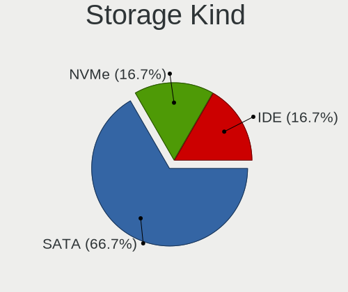
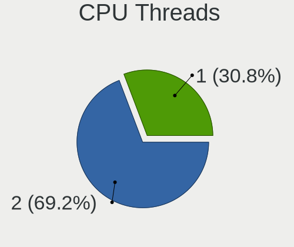
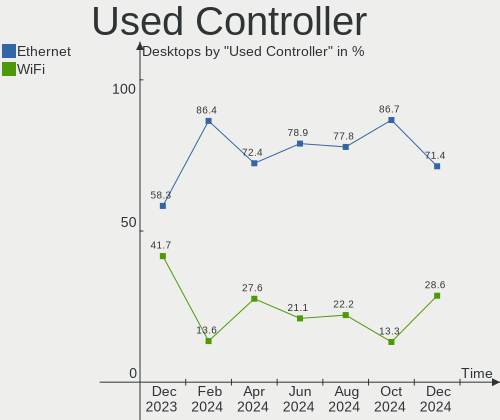

Xubuntu - Hardware Trends (Desktops)
------------------------------------

A project to identify most popular hardware characteristics and track their change
over time based on data collected by Linux users at https://Linux-Hardware.org.

Anyone can contribute to this report by the [hw-probe](https://github.com/linuxhw/hw-probe) tool:

    sudo -E hw-probe -all -upload

This report is for one last month. Overall report since the beginning of time: [TestCoverage](https://github.com/linuxhw/TestCoverage)

Period: Jul, 2022.

Contents
--------

* [ System ](#system)
  - [ OS                       ](#os)
  - [ OS Family                ](#os-family)
  - [ Kernel                   ](#kernel)
  - [ Kernel Family            ](#kernel-family)
  - [ Kernel Major Ver.        ](#kernel-major-ver)
  - [ Arch                     ](#arch)
  - [ DE                       ](#de)
  - [ Display Server           ](#display-server)
  - [ Display Manager          ](#display-manager)
  - [ OS Lang                  ](#os-lang)
  - [ Boot Mode                ](#boot-mode)
  - [ Filesystem               ](#filesystem)
  - [ Part. scheme             ](#part-scheme)
  - [ Dual Boot with Linux/BSD ](#dual-boot-with-linuxbsd)
  - [ Dual Boot (Win)          ](#dual-boot-win)

* [ Board ](#board)
  - [ Vendor                   ](#vendor)
  - [ Model                    ](#model)
  - [ Model Family             ](#model-family)
  - [ MFG Year                 ](#mfg-year)
  - [ Form Factor              ](#form-factor)
  - [ Secure Boot              ](#secure-boot)
  - [ Coreboot                 ](#coreboot)
  - [ RAM Size                 ](#ram-size)
  - [ RAM Used                 ](#ram-used)
  - [ Total Drives             ](#total-drives)
  - [ Has CD-ROM               ](#has-cd-rom)
  - [ Has Ethernet             ](#has-ethernet)
  - [ Has WiFi                 ](#has-wifi)
  - [ Has Bluetooth            ](#has-bluetooth)

* [ Location ](#location)
  - [ Country                  ](#country)
  - [ City                     ](#city)

* [ Drives ](#drives)
  - [ Drive Vendor             ](#drive-vendor)
  - [ Drive Model              ](#drive-model)
  - [ HDD Vendor               ](#hdd-vendor)
  - [ SSD Vendor               ](#ssd-vendor)
  - [ Drive Kind               ](#drive-kind)
  - [ Drive Connector          ](#drive-connector)
  - [ Drive Size               ](#drive-size)
  - [ Space Total              ](#space-total)
  - [ Space Used               ](#space-used)
  - [ Malfunc. Drives          ](#malfunc-drives)
  - [ Malfunc. Drive Vendor    ](#malfunc-drive-vendor)
  - [ Malfunc. HDD Vendor      ](#malfunc-hdd-vendor)
  - [ Malfunc. Drive Kind      ](#malfunc-drive-kind)
  - [ Failed Drives            ](#failed-drives)
  - [ Failed Drive Vendor      ](#failed-drive-vendor)
  - [ Drive Status             ](#drive-status)

* [ Storage controller ](#storage-controller)
  - [ Storage Vendor           ](#storage-vendor)
  - [ Storage Model            ](#storage-model)
  - [ Storage Kind             ](#storage-kind)

* [ Processor ](#processor)
  - [ CPU Vendor               ](#cpu-vendor)
  - [ CPU Model                ](#cpu-model)
  - [ CPU Model Family         ](#cpu-model-family)
  - [ CPU Cores                ](#cpu-cores)
  - [ CPU Sockets              ](#cpu-sockets)
  - [ CPU Threads              ](#cpu-threads)
  - [ CPU Op-Modes             ](#cpu-op-modes)
  - [ CPU Microcode            ](#cpu-microcode)
  - [ CPU Microarch            ](#cpu-microarch)

* [ Graphics ](#graphics)
  - [ GPU Vendor               ](#gpu-vendor)
  - [ GPU Model                ](#gpu-model)
  - [ GPU Combo                ](#gpu-combo)
  - [ GPU Driver               ](#gpu-driver)
  - [ GPU Memory               ](#gpu-memory)

* [ Monitor ](#monitor)
  - [ Monitor Vendor           ](#monitor-vendor)
  - [ Monitor Model            ](#monitor-model)
  - [ Monitor Resolution       ](#monitor-resolution)
  - [ Monitor Diagonal         ](#monitor-diagonal)
  - [ Monitor Width            ](#monitor-width)
  - [ Aspect Ratio             ](#aspect-ratio)
  - [ Monitor Area             ](#monitor-area)
  - [ Pixel Density            ](#pixel-density)
  - [ Multiple Monitors        ](#multiple-monitors)

* [ Network ](#network)
  - [ Net Controller Vendor    ](#net-controller-vendor)
  - [ Net Controller Model     ](#net-controller-model)
  - [ Wireless Vendor          ](#wireless-vendor)
  - [ Wireless Model           ](#wireless-model)
  - [ Ethernet Vendor          ](#ethernet-vendor)
  - [ Ethernet Model           ](#ethernet-model)
  - [ Net Controller Kind      ](#net-controller-kind)
  - [ Used Controller          ](#used-controller)
  - [ NICs                     ](#nics)
  - [ IPv6                     ](#ipv6)

* [ Bluetooth ](#bluetooth)
  - [ Bluetooth Vendor         ](#bluetooth-vendor)
  - [ Bluetooth Model          ](#bluetooth-model)

* [ Sound ](#sound)
  - [ Sound Vendor             ](#sound-vendor)
  - [ Sound Model              ](#sound-model)

* [ Memory ](#memory)
  - [ Memory Vendor            ](#memory-vendor)
  - [ Memory Model             ](#memory-model)
  - [ Memory Kind              ](#memory-kind)
  - [ Memory Form Factor       ](#memory-form-factor)
  - [ Memory Size              ](#memory-size)
  - [ Memory Speed             ](#memory-speed)

* [ Printers & scanners ](#printers--scanners)
  - [ Printer Vendor           ](#printer-vendor)
  - [ Printer Model            ](#printer-model)
  - [ Scanner Vendor           ](#scanner-vendor)
  - [ Scanner Model            ](#scanner-model)

* [ Camera ](#camera)
  - [ Camera Vendor            ](#camera-vendor)
  - [ Camera Model             ](#camera-model)

* [ Security ](#security)
  - [ Fingerprint Vendor       ](#fingerprint-vendor)
  - [ Fingerprint Model        ](#fingerprint-model)
  - [ Chipcard Vendor          ](#chipcard-vendor)
  - [ Chipcard Model           ](#chipcard-model)

* [ Unsupported ](#unsupported)
  - [ Unsupported Devices      ](#unsupported-devices)
  - [ Unsupported Device Types ](#unsupported-device-types)

System
------

OS
--

Installed operating systems

| Name          | Desktops | Percent |
|---------------|----------|---------|
| Xubuntu 20.04 | 16       | 55.17%  |
| Xubuntu 22.04 | 10       | 34.48%  |
| Xubuntu 20.10 | 1        | 3.45%   |
| Xubuntu 18.04 | 1        | 3.45%   |
| Xubuntu 16.04 | 1        | 3.45%   |

OS Family
---------

OS without a version

| Name    | Desktops | Percent |
|---------|----------|---------|
| Xubuntu | 29       | 100%    |

Kernel
------

Version of the Linux kernel

| Version              | Desktops | Percent |
|----------------------|----------|---------|
| 5.15.0-41-generic    | 9        | 31.03%  |
| 5.4.0-121-generic    | 3        | 10.34%  |
| 5.15.0-40-generic    | 3        | 10.34%  |
| 5.13.0-52-lowlatency | 2        | 6.9%    |
| 5.8.0-63-generic     | 1        | 3.45%   |
| 5.4.0-122-generic    | 1        | 3.45%   |
| 5.4.0-121-lowlatency | 1        | 3.45%   |
| 5.4.0-120-generic    | 1        | 3.45%   |
| 5.4.0-117-generic    | 1        | 3.45%   |
| 5.15.0-43-generic    | 1        | 3.45%   |
| 5.15.0-18-generic    | 1        | 3.45%   |
| 5.13.0-52-generic    | 1        | 3.45%   |
| 5.13.0-51-generic    | 1        | 3.45%   |
| 5.11.0-27-generic    | 1        | 3.45%   |
| 4.4.0-87-generic     | 1        | 3.45%   |
| 4.15.0-189-generic   | 1        | 3.45%   |

Kernel Family
-------------

Linux kernel without a distro release

| Version | Desktops | Percent |
|---------|----------|---------|
| 5.15.0  | 14       | 48.28%  |
| 5.4.0   | 7        | 24.14%  |
| 5.13.0  | 4        | 13.79%  |
| 5.8.0   | 1        | 3.45%   |
| 5.11.0  | 1        | 3.45%   |
| 4.4.0   | 1        | 3.45%   |
| 4.15.0  | 1        | 3.45%   |

Kernel Major Ver.
-----------------

Linux kernel major version

| Version | Desktops | Percent |
|---------|----------|---------|
| 5.15    | 14       | 48.28%  |
| 5.4     | 7        | 24.14%  |
| 5.13    | 4        | 13.79%  |
| 5.8     | 1        | 3.45%   |
| 5.11    | 1        | 3.45%   |
| 4.4     | 1        | 3.45%   |
| 4.15    | 1        | 3.45%   |

Arch
----

OS architecture (x86_64, i586, etc.)

| Name   | Desktops | Percent |
|--------|----------|---------|
| x86_64 | 28       | 96.55%  |
| i686   | 1        | 3.45%   |

DE
--

Desktop Environment

| Name  | Desktops | Percent |
|-------|----------|---------|
| XFCE  | 28       | 96.55%  |
| GNOME | 1        | 3.45%   |

Display Server
--------------

X11 or Wayland

| Name | Desktops | Percent |
|------|----------|---------|
| X11  | 28       | 96.55%  |
| Tty  | 1        | 3.45%   |

Display Manager
---------------

SDDM, LightDM, etc.

| Name    | Desktops | Percent |
|---------|----------|---------|
| LightDM | 23       | 79.31%  |
| Unknown | 4        | 13.79%  |
| GDM3    | 2        | 6.9%    |

OS Lang
-------

Language

| Lang  | Desktops | Percent |
|-------|----------|---------|
| en_US | 11       | 37.93%  |
| fr_FR | 7        | 24.14%  |
| pt_BR | 2        | 6.9%    |
| en_CA | 2        | 6.9%    |
| de_DE | 2        | 6.9%    |
| ru_RU | 1        | 3.45%   |
| ja_JP | 1        | 3.45%   |
| it_IT | 1        | 3.45%   |
| en_AU | 1        | 3.45%   |
| de_AT | 1        | 3.45%   |

Boot Mode
---------

EFI or BIOS

| Mode | Desktops | Percent |
|------|----------|---------|
| BIOS | 20       | 68.97%  |
| EFI  | 9        | 31.03%  |

Filesystem
----------

Type of filesystem

| Type    | Desktops | Percent |
|---------|----------|---------|
| Ext4    | 28       | 96.55%  |
| Overlay | 1        | 3.45%   |

Part. scheme
------------

Scheme of partitioning

| Type    | Desktops | Percent |
|---------|----------|---------|
| Unknown | 15       | 51.72%  |
| GPT     | 11       | 37.93%  |
| MBR     | 3        | 10.34%  |

Dual Boot with Linux/BSD
------------------------

Hosting more than one Linux/BSD

| Dual boot | Desktops | Percent |
|-----------|----------|---------|
| No        | 18       | 62.07%  |
| Yes       | 11       | 37.93%  |

Dual Boot (Win)
---------------

Hosting Linux and Windows

| Dual boot | Desktops | Percent |
|-----------|----------|---------|
| No        | 18       | 62.07%  |
| Yes       | 11       | 37.93%  |

Board
-----

Vendor
------

Motherboard manufacturer

| Name                | Desktops | Percent |
|---------------------|----------|---------|
| ASUSTek Computer    | 13       | 44.83%  |
| Gigabyte Technology | 4        | 13.79%  |
| Dell                | 4        | 13.79%  |
| MSI                 | 3        | 10.34%  |
| Hewlett-Packard     | 2        | 6.9%    |
| PCWare              | 1        | 3.45%   |
| Lenovo              | 1        | 3.45%   |
| Intel               | 1        | 3.45%   |

Model
-----

Motherboard model

| Name                              | Desktops | Percent |
|-----------------------------------|----------|---------|
| MSI MS-7D43                       | 2        | 6.9%    |
| Dell OptiPlex 7010                | 2        | 6.9%    |
| PCWare IPX1800E2                  | 1        | 3.45%   |
| MSI Hyrican PC A320M PRO-E        | 1        | 3.45%   |
| Lenovo ThinkCentre M83 10AM0010US | 1        | 3.45%   |
| Intel SHARKBAY                    | 1        | 3.45%   |
| HP Z620 Workstation               | 1        | 3.45%   |
| HP Compaq 8200 Elite USDT PC      | 1        | 3.45%   |
| Gigabyte X470 AORUS ULTRA GAMING  | 1        | 3.45%   |
| Gigabyte GA-MA78GM-S2H            | 1        | 3.45%   |
| Gigabyte GA-MA785GM-US2H          | 1        | 3.45%   |
| Gigabyte G41M-ES2L                | 1        | 3.45%   |
| Dell PowerEdge T30                | 1        | 3.45%   |
| Dell OptiPlex 390                 | 1        | 3.45%   |
| ASUS TUF Gaming X570-PLUS         | 1        | 3.45%   |
| ASUS TUF Gaming B550M-E WIFI      | 1        | 3.45%   |
| ASUS PRIME H670-PLUS D4           | 1        | 3.45%   |
| ASUS PRIME B450M-A                | 1        | 3.45%   |
| ASUS PRIME A320M-K                | 1        | 3.45%   |
| ASUS P8Z77-M PRO                  | 1        | 3.45%   |
| ASUS P8H67-M LE                   | 1        | 3.45%   |
| ASUS P5QL/EPU                     | 1        | 3.45%   |
| ASUS P5P43TD PRO                  | 1        | 3.45%   |
| ASUS P5KC                         | 1        | 3.45%   |
| ASUS P4B-M                        | 1        | 3.45%   |
| ASUS M5A78L-M PLUS/USB3           | 1        | 3.45%   |
| ASUS M51BC                        | 1        | 3.45%   |

Model Family
------------

Motherboard model prefix

| Name                     | Desktops | Percent |
|--------------------------|----------|---------|
| Dell OptiPlex            | 3        | 10.34%  |
| ASUS PRIME               | 3        | 10.34%  |
| MSI MS-7D43              | 2        | 6.9%    |
| ASUS TUF                 | 2        | 6.9%    |
| PCWare IPX1800E2         | 1        | 3.45%   |
| MSI Hyrican              | 1        | 3.45%   |
| Lenovo ThinkCentre       | 1        | 3.45%   |
| Intel SHARKBAY           | 1        | 3.45%   |
| HP Z620                  | 1        | 3.45%   |
| HP Compaq                | 1        | 3.45%   |
| Gigabyte X470            | 1        | 3.45%   |
| Gigabyte GA-MA78GM-S2H   | 1        | 3.45%   |
| Gigabyte GA-MA785GM-US2H | 1        | 3.45%   |
| Gigabyte G41M-ES2L       | 1        | 3.45%   |
| Dell PowerEdge           | 1        | 3.45%   |
| ASUS P8Z77-M             | 1        | 3.45%   |
| ASUS P8H67-M             | 1        | 3.45%   |
| ASUS P5QL                | 1        | 3.45%   |
| ASUS P5P43TD             | 1        | 3.45%   |
| ASUS P5KC                | 1        | 3.45%   |
| ASUS P4B-M               | 1        | 3.45%   |
| ASUS M5A78L-M            | 1        | 3.45%   |
| ASUS M51BC               | 1        | 3.45%   |

MFG Year
--------

Motherboard manufacture year

| Year | Desktops | Percent |
|------|----------|---------|
| 2021 | 4        | 13.79%  |
| 2009 | 4        | 13.79%  |
| 2018 | 3        | 10.34%  |
| 2017 | 3        | 10.34%  |
| 2012 | 3        | 10.34%  |
| 2011 | 3        | 10.34%  |
| 2019 | 2        | 6.9%    |
| 2013 | 2        | 6.9%    |
| 2016 | 1        | 3.45%   |
| 2014 | 1        | 3.45%   |
| 2008 | 1        | 3.45%   |
| 2007 | 1        | 3.45%   |
| 2001 | 1        | 3.45%   |

Form Factor
-----------

Physical design of the computer

| Name    | Desktops | Percent |
|---------|----------|---------|
| Desktop | 29       | 100%    |

Secure Boot
-----------

Enabled or disabled

| State    | Desktops | Percent |
|----------|----------|---------|
| Disabled | 29       | 100%    |

Coreboot
--------

Have coreboot on board

| Used | Desktops | Percent |
|------|----------|---------|
| No   | 29       | 100%    |

RAM Size
--------

Total RAM memory

| Size in GB  | Desktops | Percent |
|-------------|----------|---------|
| 4.01-8.0    | 8        | 27.59%  |
| 16.01-24.0  | 8        | 27.59%  |
| 3.01-4.0    | 5        | 17.24%  |
| 8.01-16.0   | 3        | 10.34%  |
| 64.01-256.0 | 2        | 6.9%    |
| 32.01-64.0  | 1        | 3.45%   |
| 24.01-32.0  | 1        | 3.45%   |
| 0.01-0.5    | 1        | 3.45%   |

RAM Used
--------

Used RAM memory

| Used GB   | Desktops | Percent |
|-----------|----------|---------|
| 1.01-2.0  | 19       | 65.52%  |
| 3.01-4.0  | 6        | 20.69%  |
| 2.01-3.0  | 2        | 6.9%    |
| 8.01-16.0 | 1        | 3.45%   |
| 0.01-0.5  | 1        | 3.45%   |

Total Drives
------------

Number of drives on board

| Drives | Desktops | Percent |
|--------|----------|---------|
| 2      | 9        | 31.03%  |
| 1      | 7        | 24.14%  |
| 3      | 6        | 20.69%  |
| 5      | 3        | 10.34%  |
| 6      | 2        | 6.9%    |
| 4      | 1        | 3.45%   |
| 0      | 1        | 3.45%   |

Has CD-ROM
----------

Has CD-ROM on board

| Presented | Desktops | Percent |
|-----------|----------|---------|
| Yes       | 18       | 62.07%  |
| No        | 11       | 37.93%  |

Has Ethernet
------------

Has Ethernet on board

| Presented | Desktops | Percent |
|-----------|----------|---------|
| Yes       | 29       | 100%    |

Has WiFi
--------

Has WiFi module

| Presented | Desktops | Percent |
|-----------|----------|---------|
| No        | 19       | 65.52%  |
| Yes       | 10       | 34.48%  |

Has Bluetooth
-------------

Has Bluetooth module

| Presented | Desktops | Percent |
|-----------|----------|---------|
| No        | 22       | 75.86%  |
| Yes       | 7        | 24.14%  |

Location
--------

Country
-------

Geographic location (country)

| Country     | Desktops | Percent |
|-------------|----------|---------|
| France      | 7        | 24.14%  |
| USA         | 5        | 17.24%  |
| Germany     | 3        | 10.34%  |
| Russia      | 2        | 6.9%    |
| Italy       | 2        | 6.9%    |
| Canada      | 2        | 6.9%    |
| Brazil      | 2        | 6.9%    |
| Romania     | 1        | 3.45%   |
| Netherlands | 1        | 3.45%   |
| Japan       | 1        | 3.45%   |
| Guernsey    | 1        | 3.45%   |
| Austria     | 1        | 3.45%   |
| Australia   | 1        | 3.45%   |

City
----

Geographic location (city)

| City                | Desktops | Percent |
|---------------------|----------|---------|
| Clermont-Ferrand    | 2        | 6.9%    |
| Waarder             | 1        | 3.45%   |
| Valparaiso de Goias | 1        | 3.45%   |
| Toulon              | 1        | 3.45%   |
| Teresina            | 1        | 3.45%   |
| Sydney              | 1        | 3.45%   |
| St Peter Port       | 1        | 3.45%   |
| Salzgitter          | 1        | 3.45%   |
| Peterborough        | 1        | 3.45%   |
| Peronne             | 1        | 3.45%   |
| Paris Crossing      | 1        | 3.45%   |
| Osaka               | 1        | 3.45%   |
| Moscow              | 1        | 3.45%   |
| Milan               | 1        | 3.45%   |
| Melvindale          | 1        | 3.45%   |
| Landshut            | 1        | 3.45%   |
| Kamensk-Shakhtinsky | 1        | 3.45%   |
| Graz                | 1        | 3.45%   |
| Gera                | 1        | 3.45%   |
| Gennes              | 1        | 3.45%   |
| Fort St. John       | 1        | 3.45%   |
| Dalton              | 1        | 3.45%   |
| Creutzwald          | 1        | 3.45%   |
| Centerton           | 1        | 3.45%   |
| Casalecchio di Reno | 1        | 3.45%   |
| Bucharest           | 1        | 3.45%   |
| Boulder             | 1        | 3.45%   |
| Belz                | 1        | 3.45%   |

Drives
------

Drive Vendor
------------

Hard drive vendors

| Vendor              | Desktops | Drives | Percent |
|---------------------|----------|--------|---------|
| WDC                 | 11       | 12     | 17.46%  |
| Seagate             | 11       | 17     | 17.46%  |
| Samsung Electronics | 11       | 12     | 17.46%  |
| Toshiba             | 4        | 4      | 6.35%   |
| Hitachi             | 4        | 6      | 6.35%   |
| Crucial             | 3        | 3      | 4.76%   |
| TEXTORM             | 2        | 2      | 3.17%   |
| SanDisk             | 2        | 2      | 3.17%   |
| OCZ                 | 2        | 2      | 3.17%   |
| Maxtor              | 2        | 2      | 3.17%   |
| Kingston            | 2        | 2      | 3.17%   |
| PNY                 | 1        | 1      | 1.59%   |
| Mushkin             | 1        | 1      | 1.59%   |
| LaCie               | 1        | 1      | 1.59%   |
| KingFast            | 1        | 1      | 1.59%   |
| Intenso             | 1        | 1      | 1.59%   |
| Intel               | 1        | 1      | 1.59%   |
| HGST                | 1        | 1      | 1.59%   |
| Apple               | 1        | 1      | 1.59%   |
| Unknown             | 1        | 1      | 1.59%   |

Drive Model
-----------

Hard drive models

| Model                                | Desktops | Percent |
|--------------------------------------|----------|---------|
| WDC WD10EZEX-00BBHA0 1TB             | 2        | 2.82%   |
| Toshiba DT01ACA200 2TB               | 2        | 2.82%   |
| TEXTORM BM5 240GB SSD                | 2        | 2.82%   |
| Seagate ST3500413AS 500GB            | 2        | 2.82%   |
| Hitachi HDS721010CLA332 1TB          | 2        | 2.82%   |
| WDC WDS500G2B0A-00SM50 500GB SSD     | 1        | 1.41%   |
| WDC WDS100T2B0B-00YS70 1TB SSD       | 1        | 1.41%   |
| WDC WD800JD-00LSA0 80GB              | 1        | 1.41%   |
| WDC WD5000AZLX-60K2TA0 500GB         | 1        | 1.41%   |
| WDC WD40EFRX-68N32N0 4TB             | 1        | 1.41%   |
| WDC WD3200AAKS-00B3A0 320GB          | 1        | 1.41%   |
| WDC WD30EFRX-68EUZN0 3TB             | 1        | 1.41%   |
| WDC WD20EZRZ-00Z5HB0 2TB             | 1        | 1.41%   |
| WDC WD10EADS-00M2B0 1TB              | 1        | 1.41%   |
| Toshiba MK5065GSX 500GB              | 1        | 1.41%   |
| Toshiba DT01ACA100 1TB               | 1        | 1.41%   |
| Seagate ST9500420AS 500GB            | 1        | 1.41%   |
| Seagate ST750LM022 HN-M750MBB 752GB  | 1        | 1.41%   |
| Seagate ST500LT012-1DG142 500GB      | 1        | 1.41%   |
| Seagate ST500DM002-1BD142 500GB      | 1        | 1.41%   |
| Seagate ST3500630AS 500GB            | 1        | 1.41%   |
| Seagate ST340014A 40GB               | 1        | 1.41%   |
| Seagate ST3250318AS 250GB            | 1        | 1.41%   |
| Seagate ST31000528AS 1TB             | 1        | 1.41%   |
| Seagate ST250DM000-1BD141 250GB      | 1        | 1.41%   |
| Seagate ST2000LM003 HN-M201RAD 2TB   | 1        | 1.41%   |
| Seagate ST2000DM008-2FR102 2TB       | 1        | 1.41%   |
| Seagate ST2000DM001-9YN164 2TB       | 1        | 1.41%   |
| Seagate ST2000DM001-1CH164 2TB       | 1        | 1.41%   |
| Seagate ST1000LX015-1U7172 1TB       | 1        | 1.41%   |
| Seagate ST1000DM010-2EP102 1TB       | 1        | 1.41%   |
| SanDisk SDSSDP064G 64GB              | 1        | 1.41%   |
| SanDisk SDSSDH3512G 512GB            | 1        | 1.41%   |
| Samsung SSD 870 QVO 1TB              | 1        | 1.41%   |
| Samsung SSD 870 EVO 1TB              | 1        | 1.41%   |
| Samsung SSD 860 QVO 1TB              | 1        | 1.41%   |
| Samsung SSD 860 EVO 500GB            | 1        | 1.41%   |
| Samsung SSD 860 EVO 250GB            | 1        | 1.41%   |
| Samsung SSD 850 EVO 250GB            | 1        | 1.41%   |
| Samsung SSD 840 Series 250GB         | 1        | 1.41%   |
| Samsung NVMe SSD Drive 250GB         | 1        | 1.41%   |
| Samsung MZ7LF192HCGS-000L1 192GB SSD | 1        | 1.41%   |
| Samsung HD502IJ 500GB                | 1        | 1.41%   |
| Samsung HD502HJ 500GB                | 1        | 1.41%   |
| Samsung HD103UJ 1TB                  | 1        | 1.41%   |
| PNY CS900 240GB SSD                  | 1        | 1.41%   |
| OCZ VERTEX4 128GB SSD                | 1        | 1.41%   |
| OCZ TRION150 240GB SSD               | 1        | 1.41%   |
| Mushkin MKNSSDEC480GB                | 1        | 1.41%   |
| Maxtor Z1 SSD 240GB                  | 1        | 1.41%   |
| Maxtor 6L160M0 163GB                 | 1        | 1.41%   |
| LaCie P9223 2TB                      | 1        | 1.41%   |
| Kingston SA400S37240G 240GB SSD      | 1        | 1.41%   |
| Kingston NVMe SSD Drive 250GB        | 1        | 1.41%   |
| KingFast SSD 128GB                   | 1        | 1.41%   |
| Intenso SSD Sata III 120GB           | 1        | 1.41%   |
| Intel NVMe SSD Drive 512GB           | 1        | 1.41%   |
| Hitachi HTS725050A9A364 500GB        | 1        | 1.41%   |
| Hitachi HTS547575A9E384 752GB        | 1        | 1.41%   |
| Hitachi HTS547550A9E384 500GB        | 1        | 1.41%   |

HDD Vendor
----------

Hard disk drive vendors

| Vendor              | Desktops | Drives | Percent |
|---------------------|----------|--------|---------|
| Seagate             | 11       | 17     | 31.43%  |
| WDC                 | 9        | 10     | 25.71%  |
| Toshiba             | 4        | 4      | 11.43%  |
| Hitachi             | 4        | 6      | 11.43%  |
| Samsung Electronics | 3        | 3      | 8.57%   |
| Maxtor              | 1        | 1      | 2.86%   |
| LaCie               | 1        | 1      | 2.86%   |
| HGST                | 1        | 1      | 2.86%   |
| Apple               | 1        | 1      | 2.86%   |

SSD Vendor
----------

Solid state drive vendors

| Vendor              | Desktops | Drives | Percent |
|---------------------|----------|--------|---------|
| Samsung Electronics | 7        | 8      | 28%     |
| Crucial             | 3        | 3      | 12%     |
| WDC                 | 2        | 2      | 8%      |
| TEXTORM             | 2        | 2      | 8%      |
| SanDisk             | 2        | 2      | 8%      |
| OCZ                 | 2        | 2      | 8%      |
| PNY                 | 1        | 1      | 4%      |
| Mushkin             | 1        | 1      | 4%      |
| Maxtor              | 1        | 1      | 4%      |
| Kingston            | 1        | 1      | 4%      |
| KingFast            | 1        | 1      | 4%      |
| Intenso             | 1        | 1      | 4%      |
| Unknown             | 1        | 1      | 4%      |

Drive Kind
----------

HDD or SSD

| Kind | Desktops | Drives | Percent |
|------|----------|--------|---------|
| HDD  | 21       | 44     | 50%     |
| SSD  | 18       | 26     | 42.86%  |
| NVMe | 3        | 3      | 7.14%   |

Drive Connector
---------------

SATA, SAS, NVMe, etc.

| Type | Desktops | Drives | Percent |
|------|----------|--------|---------|
| SATA | 27       | 68     | 84.38%  |
| NVMe | 3        | 3      | 9.38%   |
| SAS  | 2        | 2      | 6.25%   |

Drive Size
----------

Size of hard drive

| Size in TB | Desktops | Drives | Percent |
|------------|----------|--------|---------|
| 0.01-0.5   | 22       | 40     | 47.83%  |
| 0.51-1.0   | 15       | 18     | 32.61%  |
| 1.01-2.0   | 7        | 9      | 15.22%  |
| 3.01-4.0   | 1        | 1      | 2.17%   |
| 2.01-3.0   | 1        | 2      | 2.17%   |

Space Total
-----------

Amount of disk space available on the file system

| Size in GB     | Desktops | Percent |
|----------------|----------|---------|
| 1001-2000      | 7        | 24.14%  |
| 101-250        | 6        | 20.69%  |
| 251-500        | 3        | 10.34%  |
| 2001-3000      | 3        | 10.34%  |
| 501-1000       | 3        | 10.34%  |
| More than 3000 | 2        | 6.9%    |
| 1-20           | 2        | 6.9%    |
| 51-100         | 2        | 6.9%    |
| 21-50          | 1        | 3.45%   |

Space Used
----------

Amount of used disk space

| Used GB        | Desktops | Percent |
|----------------|----------|---------|
| 251-500        | 6        | 20.69%  |
| 51-100         | 6        | 20.69%  |
| 1-20           | 5        | 17.24%  |
| 21-50          | 3        | 10.34%  |
| 1001-2000      | 3        | 10.34%  |
| 501-1000       | 3        | 10.34%  |
| 101-250        | 2        | 6.9%    |
| More than 3000 | 1        | 3.45%   |

Malfunc. Drives
---------------

Drive models with a malfunction

| Model                               | Desktops | Drives | Percent |
|-------------------------------------|----------|--------|---------|
| Seagate ST3250318AS 250GB           | 1        | 1      | 33.33%  |
| Seagate ST2000DM001-1CH164 2TB      | 1        | 1      | 33.33%  |
| Samsung Electronics SSD 870 EVO 1TB | 1        | 1      | 33.33%  |

Malfunc. Drive Vendor
---------------------

Vendors of faulty drives

| Vendor              | Desktops | Drives | Percent |
|---------------------|----------|--------|---------|
| Seagate             | 2        | 2      | 66.67%  |
| Samsung Electronics | 1        | 1      | 33.33%  |

Malfunc. HDD Vendor
-------------------

Vendors of faulty HDD drives

| Vendor  | Desktops | Drives | Percent |
|---------|----------|--------|---------|
| Seagate | 2        | 2      | 100%    |

Malfunc. Drive Kind
-------------------

Kinds of faulty drives

| Kind | Desktops | Drives | Percent |
|------|----------|--------|---------|
| HDD  | 2        | 2      | 66.67%  |
| SSD  | 1        | 1      | 33.33%  |

Failed Drives
-------------

Failed drive models

Zero info for selected period =(

Failed Drive Vendor
-------------------

Failed drive vendors

Zero info for selected period =(

Drive Status
------------

Number of failed and malfunc. drives

| Status   | Desktops | Drives | Percent |
|----------|----------|--------|---------|
| Detected | 16       | 44     | 50%     |
| Works    | 13       | 26     | 40.63%  |
| Malfunc  | 3        | 3      | 9.38%   |

Storage controller
------------------

Storage Vendor
--------------

Storage controller vendors

| Vendor                      | Desktops | Percent |
|-----------------------------|----------|---------|
| Intel                       | 19       | 51.35%  |
| AMD                         | 10       | 27.03%  |
| JMicron Technology          | 3        | 8.11%   |
| Silicon Image               | 1        | 2.7%    |
| Samsung Electronics         | 1        | 2.7%    |
| Kingston Technology Company | 1        | 2.7%    |
| Broadcom / LSI              | 1        | 2.7%    |
| ASMedia Technology          | 1        | 2.7%    |

Storage Model
-------------

Storage controller models

| Model                                                                                   | Desktops | Percent |
|-----------------------------------------------------------------------------------------|----------|---------|
| AMD SB7x0/SB8x0/SB9x0 SATA Controller [AHCI mode]                                       | 4        | 7.84%   |
| AMD FCH SATA Controller [AHCI mode]                                                     | 4        | 7.84%   |
| Intel Alder Lake-S PCH SATA Controller [AHCI Mode]                                      | 3        | 5.88%   |
| Intel 7 Series/C210 Series Chipset Family 6-port SATA Controller [AHCI mode]            | 3        | 5.88%   |
| AMD SB7x0/SB8x0/SB9x0 IDE Controller                                                    | 3        | 5.88%   |
| Intel 82801JI (ICH10 Family) 4 port SATA IDE Controller #1                              | 2        | 3.92%   |
| Intel 82801JI (ICH10 Family) 2 port SATA IDE Controller #2                              | 2        | 3.92%   |
| Intel 6 Series/C200 Series Chipset Family 6 port Desktop SATA AHCI Controller           | 2        | 3.92%   |
| AMD FCH SATA Controller D                                                               | 2        | 3.92%   |
| AMD 400 Series Chipset SATA Controller                                                  | 2        | 3.92%   |
| Silicon Image SiI 3114 [SATALink/SATARaid] Serial ATA Controller                        | 1        | 1.96%   |
| Samsung NVMe SSD Controller 980                                                         | 1        | 1.96%   |
| Kingston Company A2000 NVMe SSD                                                         | 1        | 1.96%   |
| JMicron JMB368 IDE controller                                                           | 1        | 1.96%   |
| JMicron JMB363 SATA/IDE Controller                                                      | 1        | 1.96%   |
| JMicron JMB361 AHCI/IDE                                                                 | 1        | 1.96%   |
| Intel Volume Management Device NVMe RAID Controller                                     | 1        | 1.96%   |
| Intel SSD 600P Series                                                                   | 1        | 1.96%   |
| Intel SATA Controller [RAID mode]                                                       | 1        | 1.96%   |
| Intel NM10/ICH7 Family SATA Controller [IDE mode]                                       | 1        | 1.96%   |
| Intel C602 chipset 4-Port SATA Storage Control Unit                                     | 1        | 1.96%   |
| Intel C600/X79 series chipset SATA RAID Controller                                      | 1        | 1.96%   |
| Intel C600/X79 series chipset IDE-r Controller                                          | 1        | 1.96%   |
| Intel Atom Processor E3800 Series SATA AHCI Controller                                  | 1        | 1.96%   |
| Intel 82801IB (ICH9) 2 port SATA Controller [IDE mode]                                  | 1        | 1.96%   |
| Intel 82801I (ICH9 Family) 2 port SATA Controller [IDE mode]                            | 1        | 1.96%   |
| Intel 82801BA IDE U100 Controller                                                       | 1        | 1.96%   |
| Intel 8 Series/C220 Series Chipset Family 6-port SATA Controller 1 [AHCI mode]          | 1        | 1.96%   |
| Intel 8 Series SATA Controller 1 [AHCI mode]                                            | 1        | 1.96%   |
| Intel 6 Series/C200 Series Chipset Family Desktop SATA Controller (IDE mode, ports 4-5) | 1        | 1.96%   |
| Intel 6 Series/C200 Series Chipset Family Desktop SATA Controller (IDE mode, ports 0-3) | 1        | 1.96%   |
| Broadcom / LSI MegaRAID SAS 2208 [Thunderbolt]                                          | 1        | 1.96%   |
| ASMedia ASM1062 Serial ATA Controller                                                   | 1        | 1.96%   |
| AMD 500 Series Chipset SATA Controller                                                  | 1        | 1.96%   |

Storage Kind
------------

Kind of storage controller (IDE, SATA, NVMe, SAS, ...)

| Kind | Desktops | Percent |
|------|----------|---------|
| SATA | 21       | 53.85%  |
| IDE  | 10       | 25.64%  |
| RAID | 4        | 10.26%  |
| NVMe | 3        | 7.69%   |
| SAS  | 1        | 2.56%   |

Processor
---------

CPU Vendor
----------

Processor vendors

| Vendor | Desktops | Percent |
|--------|----------|---------|
| Intel  | 19       | 65.52%  |
| AMD    | 10       | 34.48%  |

CPU Model
---------

Processor models

| Model                                  | Desktops | Percent |
|----------------------------------------|----------|---------|
| Intel Core 2 Quad CPU Q6600 @ 2.40GHz  | 2        | 6.9%    |
| Intel 12th Gen Core i7-12700           | 2        | 6.9%    |
| AMD Ryzen 5 3600 6-Core Processor      | 2        | 6.9%    |
| Intel Xeon CPU E5-4650 v2 @ 2.40GHz    | 1        | 3.45%   |
| Intel Xeon CPU E3-1225 v5 @ 3.30GHz    | 1        | 3.45%   |
| Intel Pentium 4 CPU 1.80GHz            | 1        | 3.45%   |
| Intel Core i7-3770K CPU @ 3.50GHz      | 1        | 3.45%   |
| Intel Core i7-3770 CPU @ 3.40GHz       | 1        | 3.45%   |
| Intel Core i7-2600 CPU @ 3.40GHz       | 1        | 3.45%   |
| Intel Core i5-4690 CPU @ 3.50GHz       | 1        | 3.45%   |
| Intel Core i5-2400S CPU @ 2.50GHz      | 1        | 3.45%   |
| Intel Core i3-4020Y CPU @ 1.50GHz      | 1        | 3.45%   |
| Intel Core i3-2120 CPU @ 3.30GHz       | 1        | 3.45%   |
| Intel Core i3-2100 CPU @ 3.10GHz       | 1        | 3.45%   |
| Intel Core 2 Duo CPU E7300 @ 2.66GHz   | 1        | 3.45%   |
| Intel Celeron CPU J1800 @ 2.41GHz      | 1        | 3.45%   |
| Intel Celeron CPU E3300 @ 2.50GHz      | 1        | 3.45%   |
| Intel 12th Gen Core i5-12600K          | 1        | 3.45%   |
| AMD Ryzen 7 2700X Eight-Core Processor | 1        | 3.45%   |
| AMD Ryzen 7 2700 Eight-Core Processor  | 1        | 3.45%   |
| AMD Ryzen 5 5600X 6-Core Processor     | 1        | 3.45%   |
| AMD Ryzen 3 3100 4-Core Processor      | 1        | 3.45%   |
| AMD Phenom 9950 Quad-Core Processor    | 1        | 3.45%   |
| AMD FX-8350 Eight-Core Processor       | 1        | 3.45%   |
| AMD FX-8300 Eight-Core Processor       | 1        | 3.45%   |
| AMD Athlon II X2 240 Processor         | 1        | 3.45%   |

CPU Model Family
----------------

Processor model prefix

| Model             | Desktops | Percent |
|-------------------|----------|---------|
| Other             | 3        | 10.34%  |
| Intel Core i7     | 3        | 10.34%  |
| Intel Core i3     | 3        | 10.34%  |
| AMD Ryzen 5       | 3        | 10.34%  |
| Intel Xeon        | 2        | 6.9%    |
| Intel Core i5     | 2        | 6.9%    |
| Intel Core 2 Quad | 2        | 6.9%    |
| Intel Celeron     | 2        | 6.9%    |
| AMD Ryzen 7       | 2        | 6.9%    |
| AMD FX            | 2        | 6.9%    |
| Intel Pentium 4   | 1        | 3.45%   |
| Intel Core 2 Duo  | 1        | 3.45%   |
| AMD Ryzen 3       | 1        | 3.45%   |
| AMD Phenom        | 1        | 3.45%   |
| AMD Athlon II X2  | 1        | 3.45%   |

CPU Cores
---------

Number of processor cores

| Number | Desktops | Percent |
|--------|----------|---------|
| 4      | 12       | 41.38%  |
| 2      | 7        | 24.14%  |
| 6      | 3        | 10.34%  |
| 12     | 2        | 6.9%    |
| 8      | 2        | 6.9%    |
| 20     | 1        | 3.45%   |
| 10     | 1        | 3.45%   |
| 1      | 1        | 3.45%   |

CPU Sockets
-----------

Number of sockets

| Number | Desktops | Percent |
|--------|----------|---------|
| 1      | 28       | 96.55%  |
| 2      | 1        | 3.45%   |

CPU Threads
-----------

Threads per core (Hyper-Threading)

| Number | Desktops | Percent |
|--------|----------|---------|
| 2      | 18       | 62.07%  |
| 1      | 11       | 37.93%  |

CPU Op-Modes
------------

CPU Operation Modes (32-bit, 64-bit)

| Op mode        | Desktops | Percent |
|----------------|----------|---------|
| 32-bit, 64-bit | 28       | 96.55%  |
| 32-bit         | 1        | 3.45%   |

CPU Microcode
-------------

Microcode number

| Number     | Desktops | Percent |
|------------|----------|---------|
| Unknown    | 5        | 17.24%  |
| 0x206a7    | 4        | 13.79%  |
| 0x90672    | 3        | 10.34%  |
| 0x6fb      | 2        | 6.9%    |
| 0x306a9    | 2        | 6.9%    |
| 0x06000852 | 2        | 6.9%    |
| 0xf24      | 1        | 3.45%   |
| 0x506e3    | 1        | 3.45%   |
| 0x40651    | 1        | 3.45%   |
| 0x306e4    | 1        | 3.45%   |
| 0x306c3    | 1        | 3.45%   |
| 0x1067a    | 1        | 3.45%   |
| 0x10676    | 1        | 3.45%   |
| 0x0a201016 | 1        | 3.45%   |
| 0x08701021 | 1        | 3.45%   |
| 0x0800820d | 1        | 3.45%   |
| 0x01000095 | 1        | 3.45%   |

CPU Microarch
-------------

Microarchitecture

| Name             | Desktops | Percent |
|------------------|----------|---------|
| SandyBridge      | 4        | 13.79%  |
| Zen 2            | 3        | 10.34%  |
| IvyBridge        | 3        | 10.34%  |
| Alderlake Hybrid | 3        | 10.34%  |
| Zen+             | 2        | 6.9%    |
| Piledriver       | 2        | 6.9%    |
| Penryn           | 2        | 6.9%    |
| K10              | 2        | 6.9%    |
| Haswell          | 2        | 6.9%    |
| Core             | 2        | 6.9%    |
| Zen 3            | 1        | 3.45%   |
| Skylake          | 1        | 3.45%   |
| Silvermont       | 1        | 3.45%   |
| NetBurst         | 1        | 3.45%   |

Graphics
--------

GPU Vendor
----------

Vendors of graphics cards

| Vendor | Desktops | Percent |
|--------|----------|---------|
| Nvidia | 13       | 41.94%  |
| Intel  | 11       | 35.48%  |
| AMD    | 7        | 22.58%  |

GPU Model
---------

Graphics card models

| Model                                                                       | Desktops | Percent |
|-----------------------------------------------------------------------------|----------|---------|
| Intel 2nd Generation Core Processor Family Integrated Graphics Controller   | 4        | 12.5%   |
| AMD Ellesmere [Radeon RX 470/480/570/570X/580/580X/590]                     | 3        | 9.38%   |
| Nvidia GT216 [GeForce GT 220]                                               | 2        | 6.25%   |
| Nvidia GK208B [GeForce GT 710]                                              | 2        | 6.25%   |
| Intel AlderLake-S GT1                                                       | 2        | 6.25%   |
| Nvidia TU117GL [T600]                                                       | 1        | 3.13%   |
| Nvidia NV5 [Riva TNT2 Model 64 / Model 64 Pro]                              | 1        | 3.13%   |
| Nvidia GT200 [GeForce GTX 260]                                              | 1        | 3.13%   |
| Nvidia GP108 [GeForce GT 1030]                                              | 1        | 3.13%   |
| Nvidia GP107 [GeForce GTX 1050 Ti]                                          | 1        | 3.13%   |
| Nvidia GP104 [GeForce GTX 1070 Ti]                                          | 1        | 3.13%   |
| Nvidia GK104GL [Quadro K5000]                                               | 1        | 3.13%   |
| Nvidia GA106 [GeForce RTX 3060]                                             | 1        | 3.13%   |
| Nvidia G92 [GeForce GTS 250]                                                | 1        | 3.13%   |
| Nvidia G84GL [Quadro FX 1700]                                               | 1        | 3.13%   |
| Intel Xeon E3-1200 v3/4th Gen Core Processor Integrated Graphics Controller | 1        | 3.13%   |
| Intel HD Graphics P530                                                      | 1        | 3.13%   |
| Intel Haswell-ULT High Definition Audio Controller [HD Graphics]            | 1        | 3.13%   |
| Intel Atom Processor Z36xxx/Z37xxx Series Graphics & Display                | 1        | 3.13%   |
| Intel 4 Series Chipset Integrated Graphics Controller                       | 1        | 3.13%   |
| AMD Turks XT [Radeon HD 6670/7670]                                          | 1        | 3.13%   |
| AMD RS880 [Radeon HD 4200]                                                  | 1        | 3.13%   |
| AMD RS780 [Radeon HD 3200]                                                  | 1        | 3.13%   |
| AMD Pitcairn XT [Radeon HD 7870 GHz Edition]                                | 1        | 3.13%   |

GPU Combo
---------

Combinations of graphics cards

| Name       | Desktops | Percent |
|------------|----------|---------|
| 1 x Nvidia | 13       | 44.83%  |
| 1 x Intel  | 9        | 31.03%  |
| 1 x AMD    | 7        | 24.14%  |

GPU Driver
----------

Free vs proprietary

| Driver      | Desktops | Percent |
|-------------|----------|---------|
| Free        | 21       | 72.41%  |
| Proprietary | 7        | 24.14%  |
| Unknown     | 1        | 3.45%   |

GPU Memory
----------

Total video memory

| Size in GB | Desktops | Percent |
|------------|----------|---------|
| Unknown    | 13       | 44.83%  |
| 3.01-4.0   | 4        | 13.79%  |
| 0.51-1.0   | 4        | 13.79%  |
| 0.01-0.5   | 3        | 10.34%  |
| 7.01-8.0   | 2        | 6.9%    |
| 1.01-2.0   | 2        | 6.9%    |
| 8.01-16.0  | 1        | 3.45%   |

Monitor
-------

Monitor Vendor
--------------

Monitor vendors

| Vendor              | Desktops | Percent |
|---------------------|----------|---------|
| Samsung Electronics | 5        | 17.24%  |
| Iiyama              | 3        | 10.34%  |
| Hewlett-Packard     | 3        | 10.34%  |
| Unknown             | 2        | 6.9%    |
| BenQ                | 2        | 6.9%    |
| Acer                | 2        | 6.9%    |
| ViewSonic           | 1        | 3.45%   |
| Vestel Elektronik   | 1        | 3.45%   |
| Sharp               | 1        | 3.45%   |
| Philips             | 1        | 3.45%   |
| Lenovo              | 1        | 3.45%   |
| HannStar            | 1        | 3.45%   |
| Goldstar            | 1        | 3.45%   |
| Fujitsu Siemens     | 1        | 3.45%   |
| Dell                | 1        | 3.45%   |
| Compaq Computer     | 1        | 3.45%   |
| AOC                 | 1        | 3.45%   |
| Unknown             | 1        | 3.45%   |

Monitor Model
-------------

Monitor models

| Model                                                                 | Desktops | Percent |
|-----------------------------------------------------------------------|----------|---------|
| Unknown LCD Monitor SAMSUNG 1920x1080                                 | 2        | 6.45%   |
| Hewlett-Packard 2309 HWP2821 1920x1080 510x287mm 23.0-inch            | 2        | 6.45%   |
| ViewSonic VX3276-UHD VSC5138 3840x2160 697x392mm 31.5-inch            | 1        | 3.23%   |
| Vestel Elektronik 39FHD_LCD_TV VES3700 1920x1080 1280x720mm 57.8-inch | 1        | 3.23%   |
| Sharp HDMI SHP1053 1920x1080 820x460mm 37.0-inch                      | 1        | 3.23%   |
| Samsung Electronics S24E650 SAM0C86 1920x1200 518x324mm 24.1-inch     | 1        | 3.23%   |
| Samsung Electronics S24D332 SAM0F5E 1920x1080 531x299mm 24.0-inch     | 1        | 3.23%   |
| Samsung Electronics S24C650 SAM0B13 1920x1200 518x324mm 24.1-inch     | 1        | 3.23%   |
| Samsung Electronics C32F391 SAM0D34 1920x1080 698x393mm 31.5-inch     | 1        | 3.23%   |
| Samsung Electronics C27F390 SAM0D32 1920x1080 598x336mm 27.0-inch     | 1        | 3.23%   |
| Philips 170S PHL086A 1280x1024 337x270mm 17.0-inch                    | 1        | 3.23%   |
| Lenovo T2224zD LEN60CB 1920x1080 476x267mm 21.5-inch                  | 1        | 3.23%   |
| Iiyama X2483_2480-DP IVM6129 1920x1080 527x296mm 23.8-inch            | 1        | 3.23%   |
| Iiyama PL2530H IVM6133 1920x1080 540x300mm 24.3-inch                  | 1        | 3.23%   |
| Iiyama PL2530H IVM6132 1920x1080 544x303mm 24.5-inch                  | 1        | 3.23%   |
| Iiyama PL2377 IVM561D 1920x1080 510x287mm 23.0-inch                   | 1        | 3.23%   |
| Hewlett-Packard LCD Monitor ZR2440w 5760x1200                         | 1        | 3.23%   |
| Hewlett-Packard LCD Monitor ZR2440w                                   | 1        | 3.23%   |
| HannStar LCD Monitor HSD0011 1440x900 370x230mm 17.2-inch             | 1        | 3.23%   |
| Goldstar 2D HD TV GSM59C8 1366x768 509x286mm 23.0-inch                | 1        | 3.23%   |
| Fujitsu Siemens A19W-3 FUS077D 1440x900 410x256mm 19.0-inch           | 1        | 3.23%   |
| Dell LCD Monitor 1907FP                                               | 1        | 3.23%   |
| Compaq Computer Q1859 CPQ2826 1366x768 410x230mm 18.5-inch            | 1        | 3.23%   |
| BenQ RL2755 BNQ7F41 1920x1080 598x336mm 27.0-inch                     | 1        | 3.23%   |
| BenQ EW3270U BNQ7950 3840x2160 698x393mm 31.5-inch                    | 1        | 3.23%   |
| AOC 2460G5 AOC246A 1920x1080 531x299mm 24.0-inch                      | 1        | 3.23%   |
| Acer S242HL ACR0216 1920x1080 531x299mm 24.0-inch                     | 1        | 3.23%   |
| Acer AL1716 ACR06B4 1280x1024 338x271mm 17.1-inch                     | 1        | 3.23%   |
| Unknown                                                               | 1        | 3.23%   |

Monitor Resolution
------------------

Monitor screen resolution

| Resolution        | Desktops | Percent |
|-------------------|----------|---------|
| 1920x1080 (FHD)   | 15       | 50%     |
| 3840x2160 (4K)    | 3        | 10%     |
| 1920x1200 (WUXGA) | 2        | 6.67%   |
| 1440x900 (WXGA+)  | 2        | 6.67%   |
| 1366x768 (WXGA)   | 2        | 6.67%   |
| 1280x1024 (SXGA)  | 2        | 6.67%   |
| Unknown           | 2        | 6.67%   |
| 5760x1200         | 1        | 3.33%   |
| 3200x1024         | 1        | 3.33%   |

Monitor Diagonal
----------------

Diagonal size in inches

| Inches  | Desktops | Percent |
|---------|----------|---------|
| 24      | 7        | 25%     |
| Unknown | 4        | 14.29%  |
| 31      | 3        | 10.71%  |
| 23      | 3        | 10.71%  |
| 27      | 2        | 7.14%   |
| 18      | 2        | 7.14%   |
| 17      | 2        | 7.14%   |
| 84      | 1        | 3.57%   |
| 37      | 1        | 3.57%   |
| 26      | 1        | 3.57%   |
| 21      | 1        | 3.57%   |
| 19      | 1        | 3.57%   |

Monitor Width
-------------

Physical width

| Width in mm | Desktops | Percent |
|-------------|----------|---------|
| 501-600     | 13       | 46.43%  |
| 401-500     | 4        | 14.29%  |
| Unknown     | 4        | 14.29%  |
| 601-700     | 3        | 10.71%  |
| 301-350     | 2        | 7.14%   |
| 801-900     | 1        | 3.57%   |
| 1501-2000   | 1        | 3.57%   |

Aspect Ratio
------------

Proportional relationship between the width and the height

| Ratio   | Desktops | Percent |
|---------|----------|---------|
| 16/9    | 17       | 60.71%  |
| 16/10   | 5        | 17.86%  |
| Unknown | 4        | 14.29%  |
| 5/4     | 2        | 7.14%   |

Monitor Area
------------

Area in inch

| Area in inch | Desktops | Percent |
|----------------|----------|---------|
| 201-250        | 6        | 21.43%  |
| 251-300        | 5        | 17.86%  |
| Unknown        | 4        | 14.29%  |
| 351-500        | 3        | 10.71%  |
| 151-200        | 3        | 10.71%  |
| 141-150        | 3        | 10.71%  |
| 301-350        | 2        | 7.14%   |
| More than 1000 | 1        | 3.57%   |
| 501-1000       | 1        | 3.57%   |

Pixel Density
-------------

Pixels per inch

| Density | Desktops | Percent |
|---------|----------|---------|
| 51-100  | 21       | 75%     |
| Unknown | 4        | 14.29%  |
| 121-160 | 2        | 7.14%   |
| 101-120 | 1        | 3.57%   |

Multiple Monitors
-----------------

Total monitors connected

| Total | Desktops | Percent |
|-------|----------|---------|
| 1     | 25       | 86.21%  |
| 2     | 3        | 10.34%  |
| 0     | 1        | 3.45%   |

Network
-------

Net Controller Vendor
---------------------

Controller vendors

| Vendor                | Desktops | Percent |
|-----------------------|----------|---------|
| Realtek Semiconductor | 22       | 56.41%  |
| Intel                 | 9        | 23.08%  |
| Qualcomm Atheros      | 4        | 10.26%  |
| NetGear               | 1        | 2.56%   |
| D-Link System         | 1        | 2.56%   |
| D-Link                | 1        | 2.56%   |
| ASUSTek Computer      | 1        | 2.56%   |

Net Controller Model
--------------------

Controller models

| Model                                                                        | Desktops | Percent |
|------------------------------------------------------------------------------|----------|---------|
| Realtek RTL8111/8168/8411 PCI Express Gigabit Ethernet Controller            | 17       | 39.53%  |
| Intel 82579LM Gigabit Network Connection (Lewisville)                        | 4        | 9.3%    |
| Realtek RTL8125 2.5GbE Controller                                            | 3        | 6.98%   |
| Realtek RTL8812AE 802.11ac PCIe Wireless Network Adapter                     | 1        | 2.33%   |
| Realtek RTL8723BE PCIe Wireless Network Adapter                              | 1        | 2.33%   |
| Realtek RTL8192EU 802.11b/g/n WLAN Adapter                                   | 1        | 2.33%   |
| Realtek RTL8152 Fast Ethernet Adapter                                        | 1        | 2.33%   |
| Realtek RTL-8100/8101L/8139 PCI Fast Ethernet Adapter                        | 1        | 2.33%   |
| Qualcomm Atheros Attansic L1 Gigabit Ethernet                                | 1        | 2.33%   |
| Qualcomm Atheros AR9462 Wireless Network Adapter                             | 1        | 2.33%   |
| Qualcomm Atheros AR8121/AR8113/AR8114 Gigabit or Fast Ethernet               | 1        | 2.33%   |
| Qualcomm Atheros AR5212/5213/2414 Wireless Network Adapter                   | 1        | 2.33%   |
| NetGear A6210                                                                | 1        | 2.33%   |
| Intel Wireless-AC 9260                                                       | 1        | 2.33%   |
| Intel Wi-Fi 6 AX200                                                          | 1        | 2.33%   |
| Intel I211 Gigabit Network Connection                                        | 1        | 2.33%   |
| Intel Ethernet Connection I217-LM                                            | 1        | 2.33%   |
| Intel Ethernet Connection (2) I219-LM                                        | 1        | 2.33%   |
| Intel 82574L Gigabit Network Connection                                      | 1        | 2.33%   |
| D-Link System AirPlus G DWL-G122 Wireless Adapter(rev.C1) [Ralink RT2571W]   | 1        | 2.33%   |
| D-Link DWA-160 802.11abgn Xtreme N Dual Band Adapter(rev.B2) [Ralink RT5572] | 1        | 2.33%   |
| ASUS 802.11ac NIC                                                            | 1        | 2.33%   |

Wireless Vendor
---------------

Wireless vendors

| Vendor                | Desktops | Percent |
|-----------------------|----------|---------|
| Realtek Semiconductor | 3        | 27.27%  |
| Qualcomm Atheros      | 2        | 18.18%  |
| Intel                 | 2        | 18.18%  |
| NetGear               | 1        | 9.09%   |
| D-Link System         | 1        | 9.09%   |
| D-Link                | 1        | 9.09%   |
| ASUSTek Computer      | 1        | 9.09%   |

Wireless Model
--------------

Wireless models

| Model                                                                        | Desktops | Percent |
|------------------------------------------------------------------------------|----------|---------|
| Realtek RTL8812AE 802.11ac PCIe Wireless Network Adapter                     | 1        | 9.09%   |
| Realtek RTL8723BE PCIe Wireless Network Adapter                              | 1        | 9.09%   |
| Realtek RTL8192EU 802.11b/g/n WLAN Adapter                                   | 1        | 9.09%   |
| Qualcomm Atheros AR9462 Wireless Network Adapter                             | 1        | 9.09%   |
| Qualcomm Atheros AR5212/5213/2414 Wireless Network Adapter                   | 1        | 9.09%   |
| NetGear A6210                                                                | 1        | 9.09%   |
| Intel Wireless-AC 9260                                                       | 1        | 9.09%   |
| Intel Wi-Fi 6 AX200                                                          | 1        | 9.09%   |
| D-Link System AirPlus G DWL-G122 Wireless Adapter(rev.C1) [Ralink RT2571W]   | 1        | 9.09%   |
| D-Link DWA-160 802.11abgn Xtreme N Dual Band Adapter(rev.B2) [Ralink RT5572] | 1        | 9.09%   |
| ASUS 802.11ac NIC                                                            | 1        | 9.09%   |

Ethernet Vendor
---------------

Ethernet vendors

| Vendor                | Desktops | Percent |
|-----------------------|----------|---------|
| Realtek Semiconductor | 21       | 70%     |
| Intel                 | 7        | 23.33%  |
| Qualcomm Atheros      | 2        | 6.67%   |

Ethernet Model
--------------

Ethernet models

| Model                                                             | Desktops | Percent |
|-------------------------------------------------------------------|----------|---------|
| Realtek RTL8111/8168/8411 PCI Express Gigabit Ethernet Controller | 17       | 53.13%  |
| Intel 82579LM Gigabit Network Connection (Lewisville)             | 4        | 12.5%   |
| Realtek RTL8125 2.5GbE Controller                                 | 3        | 9.38%   |
| Realtek RTL8152 Fast Ethernet Adapter                             | 1        | 3.13%   |
| Realtek RTL-8100/8101L/8139 PCI Fast Ethernet Adapter             | 1        | 3.13%   |
| Qualcomm Atheros Attansic L1 Gigabit Ethernet                     | 1        | 3.13%   |
| Qualcomm Atheros AR8121/AR8113/AR8114 Gigabit or Fast Ethernet    | 1        | 3.13%   |
| Intel I211 Gigabit Network Connection                             | 1        | 3.13%   |
| Intel Ethernet Connection I217-LM                                 | 1        | 3.13%   |
| Intel Ethernet Connection (2) I219-LM                             | 1        | 3.13%   |
| Intel 82574L Gigabit Network Connection                           | 1        | 3.13%   |

Net Controller Kind
-------------------

Ethernet, WiFi or modem

| Kind     | Desktops | Percent |
|----------|----------|---------|
| Ethernet | 29       | 74.36%  |
| WiFi     | 10       | 25.64%  |

Used Controller
---------------

Currently used network controller

| Kind     | Desktops | Percent |
|----------|----------|---------|
| Ethernet | 28       | 90.32%  |
| WiFi     | 3        | 9.68%   |

NICs
----

Total network controllers on board

| Total | Desktops | Percent |
|-------|----------|---------|
| 1     | 21       | 72.41%  |
| 2     | 8        | 27.59%  |

IPv6
----

IPv6 vs IPv4

| Used | Desktops | Percent |
|------|----------|---------|
| No   | 16       | 55.17%  |
| Yes  | 13       | 44.83%  |

Bluetooth
---------

Bluetooth Vendor
----------------

Controller vendors

| Vendor                  | Desktops | Percent |
|-------------------------|----------|---------|
| Cambridge Silicon Radio | 4        | 57.14%  |
| Intel                   | 1        | 14.29%  |
| Fujitsu                 | 1        | 14.29%  |
| Broadcom                | 1        | 14.29%  |

Bluetooth Model
---------------

Controller models

| Model                                               | Desktops | Percent |
|-----------------------------------------------------|----------|---------|
| Cambridge Silicon Radio Bluetooth Dongle (HCI mode) | 4        | 57.14%  |
| Intel AX200 Bluetooth                               | 1        | 14.29%  |
| Fujitsu Bluetooth Device                            | 1        | 14.29%  |
| Broadcom BCM20702A0 Bluetooth 4.0                   | 1        | 14.29%  |

Sound
-----

Sound Vendor
------------

Sound card vendors

| Vendor              | Desktops | Percent |
|---------------------|----------|---------|
| Intel               | 18       | 39.13%  |
| AMD                 | 11       | 23.91%  |
| Nvidia              | 10       | 21.74%  |
| C-Media Electronics | 3        | 6.52%   |
| VIA Technologies    | 1        | 2.17%   |
| Texas Instruments   | 1        | 2.17%   |
| Lenovo              | 1        | 2.17%   |
| Kingston Technology | 1        | 2.17%   |

Sound Model
-----------

Sound card models

| Model                                                                       | Desktops | Percent |
|-----------------------------------------------------------------------------|----------|---------|
| AMD SBx00 Azalia (Intel HDA)                                                | 4        | 7.55%   |
| Intel Alder Lake-S HD Audio Controller                                      | 3        | 5.66%   |
| Intel 7 Series/C216 Chipset Family High Definition Audio Controller         | 3        | 5.66%   |
| Intel 6 Series/C200 Series Chipset Family High Definition Audio Controller  | 3        | 5.66%   |
| AMD Starship/Matisse HD Audio Controller                                    | 3        | 5.66%   |
| AMD Ellesmere HDMI Audio [Radeon RX 470/480 / 570/580/590]                  | 3        | 5.66%   |
| Nvidia GT216 HDMI Audio Controller                                          | 2        | 3.77%   |
| Nvidia GK208 HDMI/DP Audio Controller                                       | 2        | 3.77%   |
| Intel 82801JI (ICH10 Family) HD Audio Controller                            | 2        | 3.77%   |
| C-Media Electronics CMI8738/CMI8768 PCI Audio                               | 2        | 3.77%   |
| AMD Family 17h (Models 00h-0fh) HD Audio Controller                         | 2        | 3.77%   |
| VIA Technologies VT1720/24 [Envy24PT/HT] PCI Multi-Channel Audio Controller | 1        | 1.89%   |
| Texas Instruments PCM2902 Audio Codec                                       | 1        | 1.89%   |
| Nvidia TU107 GeForce GTX 1650 High Definition Audio Controller              | 1        | 1.89%   |
| Nvidia GP108 High Definition Audio Controller                               | 1        | 1.89%   |
| Nvidia GP107GL High Definition Audio Controller                             | 1        | 1.89%   |
| Nvidia GP104 High Definition Audio Controller                               | 1        | 1.89%   |
| Nvidia GK104 HDMI Audio Controller                                          | 1        | 1.89%   |
| Nvidia GA106 High Definition Audio Controller                               | 1        | 1.89%   |
| Lenovo T2224zD                                                              | 1        | 1.89%   |
| Kingston Technology HyperX SoloCast                                         | 1        | 1.89%   |
| Intel Xeon E3-1200 v3/4th Gen Core Processor HD Audio Controller            | 1        | 1.89%   |
| Intel NM10/ICH7 Family High Definition Audio Controller                     | 1        | 1.89%   |
| Intel Haswell-ULT HD Audio Controller                                       | 1        | 1.89%   |
| Intel C600/X79 series chipset High Definition Audio Controller              | 1        | 1.89%   |
| Intel Atom Processor Z36xxx/Z37xxx Series High Definition Audio Controller  | 1        | 1.89%   |
| Intel 82801I (ICH9 Family) HD Audio Controller                              | 1        | 1.89%   |
| Intel 8 Series/C220 Series Chipset High Definition Audio Controller         | 1        | 1.89%   |
| Intel 8 Series HD Audio Controller                                          | 1        | 1.89%   |
| Intel 100 Series/C230 Series Chipset Family HD Audio Controller             | 1        | 1.89%   |
| C-Media Electronics CMI8788 [Oxygen HD Audio]                               | 1        | 1.89%   |
| AMD Turks HDMI Audio [Radeon HD 6500/6600 / 6700M Series]                   | 1        | 1.89%   |
| AMD RS880 HDMI Audio [Radeon HD 4200 Series]                                | 1        | 1.89%   |
| AMD RS780 HDMI Audio [Radeon 3000/3100 / HD 3200/3300]                      | 1        | 1.89%   |
| AMD Oland/Hainan/Cape Verde/Pitcairn HDMI Audio [Radeon HD 7000 Series]     | 1        | 1.89%   |

Memory
------

Memory Vendor
-------------

Memory module vendors

| Vendor              | Desktops | Percent |
|---------------------|----------|---------|
| Unknown             | 3        | 18.75%  |
| Kingston            | 3        | 18.75%  |
| Corsair             | 3        | 18.75%  |
| SK hynix            | 2        | 12.5%   |
| Samsung Electronics | 2        | 12.5%   |
| Ramaxel Technology  | 1        | 6.25%   |
| Nanya Technology    | 1        | 6.25%   |
| GLOWAY              | 1        | 6.25%   |

Memory Model
------------

Memory module models

| Model                                                    | Desktops | Percent |
|----------------------------------------------------------|----------|---------|
| Kingston RAM 9905713-026.A00G 4GB DIMM DDR4 2667MT/s     | 2        | 11.76%  |
| Unknown RAM Module 2GB DIMM DDR3 1333MT/s                | 1        | 5.88%   |
| Unknown RAM Module 2GB DIMM 800MT/s                      | 1        | 5.88%   |
| Unknown RAM Module 2048MB DIMM 1066MT/s                  | 1        | 5.88%   |
| Unknown RAM Module 1GB DIMM 800MT/s                      | 1        | 5.88%   |
| SK hynix RAM HMA81GU7AFR8N-UH 8GB DIMM DDR4 2400MT/s     | 1        | 5.88%   |
| SK hynix RAM HMA41GU6AFR8N-TF 8192MB DIMM DDR4 2465MT/s  | 1        | 5.88%   |
| Samsung RAM M378B5173EB0-CK0 4GB DIMM DDR3 1600MT/s      | 1        | 5.88%   |
| Samsung RAM M378B5173BH0-CH9 4GB DIMM DDR3 1867MT/s      | 1        | 5.88%   |
| Ramaxel RAM RMR5030MN68F9F1600 4096MB DIMM DDR3 1600MT/s | 1        | 5.88%   |
| Nanya RAM NT2GC64B88G0NF-CG 2GB DIMM DDR3 1333MT/s       | 1        | 5.88%   |
| Kingston RAM KHX1600C10D3/8G 4096MB DIMM DDR3 1600MT/s   | 1        | 5.88%   |
| GLOWAY RAM TAC4U3200E16081C 8GB DIMM DDR4 2400MT/s       | 1        | 5.88%   |
| Corsair RAM Module 8192MB SODIMM DDR3 1333MT/s           | 1        | 5.88%   |
| Corsair RAM CMK16GX4M2D3600C18 8GB DIMM DDR4 3600MT/s    | 1        | 5.88%   |
| Corsair RAM CMK16GX4M2B3000C15 8GB DIMM DDR4 3000MT/s    | 1        | 5.88%   |

Memory Kind
-----------

Memory module kinds

| Kind    | Desktops | Percent |
|---------|----------|---------|
| DDR4    | 6        | 46.15%  |
| DDR3    | 5        | 38.46%  |
| Unknown | 2        | 15.38%  |

Memory Form Factor
------------------

Physical design of the memory module

| Name   | Desktops | Percent |
|--------|----------|---------|
| DIMM   | 12       | 92.31%  |
| SODIMM | 1        | 7.69%   |

Memory Size
-----------

Memory module size

| Size | Desktops | Percent |
|------|----------|---------|
| 8192 | 6        | 40%     |
| 4096 | 4        | 26.67%  |
| 2048 | 4        | 26.67%  |
| 1024 | 1        | 6.67%   |

Memory Speed
------------

Memory module speed

| Speed | Desktops | Percent |
|-------|----------|---------|
| 1333  | 3        | 20%     |
| 2667  | 2        | 13.33%  |
| 2400  | 2        | 13.33%  |
| 1867  | 2        | 13.33%  |
| 3600  | 1        | 6.67%   |
| 3466  | 1        | 6.67%   |
| 2465  | 1        | 6.67%   |
| 1600  | 1        | 6.67%   |
| 1066  | 1        | 6.67%   |
| 800   | 1        | 6.67%   |

Printers & scanners
-------------------

Printer Vendor
--------------

Printer device vendors

| Vendor             | Desktops | Percent |
|--------------------|----------|---------|
| Hewlett-Packard    | 1        | 33.33%  |
| Canon              | 1        | 33.33%  |
| Brother Industries | 1        | 33.33%  |

Printer Model
-------------

Printer device models

| Model                    | Desktops | Percent |
|--------------------------|----------|---------|
| HP DeskJet 840c          | 1        | 33.33%  |
| Canon PIXMA MX530 Series | 1        | 33.33%  |
| Brother HL-5370DW series | 1        | 33.33%  |

Scanner Vendor
--------------

Scanner device vendors

Zero info for selected period =(

Scanner Model
-------------

Scanner device models

Zero info for selected period =(

Camera
------

Camera Vendor
-------------

Camera device vendors

| Vendor                      | Desktops | Percent |
|-----------------------------|----------|---------|
| Realtek Semiconductor       | 1        | 33.33%  |
| Logitech                    | 1        | 33.33%  |
| KYE Systems (Mouse Systems) | 1        | 33.33%  |

Camera Model
------------

Camera device models

| Model                                    | Desktops | Percent |
|------------------------------------------|----------|---------|
| Realtek FULL HD 1080P Webcam             | 1        | 33.33%  |
| Logitech HD Webcam C525                  | 1        | 33.33%  |
| KYE Systems (Mouse Systems) iSlim 2020AF | 1        | 33.33%  |

Security
--------

Fingerprint Vendor
------------------

Fingerprint sensor vendors

Zero info for selected period =(

Fingerprint Model
-----------------

Fingerprint sensor models

Zero info for selected period =(

Chipcard Vendor
---------------

Chipcard module vendors

Zero info for selected period =(

Chipcard Model
--------------

Chipcard module models

Zero info for selected period =(

Unsupported
-----------

Unsupported Devices
-------------------

Total unsupported devices on board

| Total | Desktops | Percent |
|-------|----------|---------|
| 0     | 25       | 86.21%  |
| 1     | 4        | 13.79%  |

Unsupported Device Types
------------------------

Types of unsupported devices

| Type          | Desktops | Percent |
|---------------|----------|---------|
| Graphics card | 2        | 66.67%  |
| Net/wireless  | 1        | 33.33%  |

