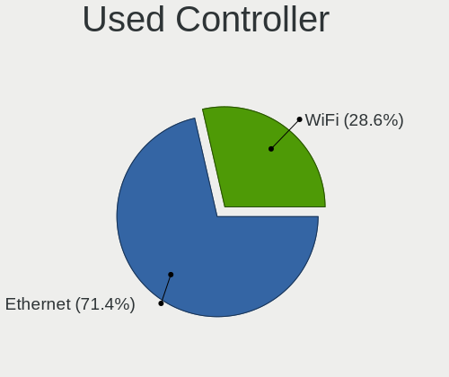

Xubuntu - Hardware Trends (Desktops)
------------------------------------

A project to identify most popular hardware characteristics and track their change
over time based on data collected by Linux users at https://Linux-Hardware.org.

Anyone can contribute to this report by the [hw-probe](https://github.com/linuxhw/hw-probe) tool:

    sudo -E hw-probe -all -upload

This report is for one last month. Overall report since the beginning of time: [TestDays](https://github.com/linuxhw/TestDays)

Period: Sep, 2023.

Contents
--------

* [ System ](#system)
  - [ OS                       ](#os)
  - [ OS Family                ](#os-family)
  - [ Kernel                   ](#kernel)
  - [ Kernel Family            ](#kernel-family)
  - [ Kernel Major Ver.        ](#kernel-major-ver)
  - [ Arch                     ](#arch)
  - [ DE                       ](#de)
  - [ Display Server           ](#display-server)
  - [ Display Manager          ](#display-manager)
  - [ OS Lang                  ](#os-lang)
  - [ Boot Mode                ](#boot-mode)
  - [ Filesystem               ](#filesystem)
  - [ Part. scheme             ](#part-scheme)
  - [ Dual Boot with Linux/BSD ](#dual-boot-with-linuxbsd)
  - [ Dual Boot (Win)          ](#dual-boot-win)

* [ Board ](#board)
  - [ Vendor                   ](#vendor)
  - [ Model                    ](#model)
  - [ Model Family             ](#model-family)
  - [ MFG Year                 ](#mfg-year)
  - [ Form Factor              ](#form-factor)
  - [ Secure Boot              ](#secure-boot)
  - [ Coreboot                 ](#coreboot)
  - [ RAM Size                 ](#ram-size)
  - [ RAM Used                 ](#ram-used)
  - [ Total Drives             ](#total-drives)
  - [ Has CD-ROM               ](#has-cd-rom)
  - [ Has Ethernet             ](#has-ethernet)
  - [ Has WiFi                 ](#has-wifi)
  - [ Has Bluetooth            ](#has-bluetooth)

* [ Location ](#location)
  - [ Country                  ](#country)
  - [ City                     ](#city)

* [ Drives ](#drives)
  - [ Drive Vendor             ](#drive-vendor)
  - [ Drive Model              ](#drive-model)
  - [ HDD Vendor               ](#hdd-vendor)
  - [ SSD Vendor               ](#ssd-vendor)
  - [ Drive Kind               ](#drive-kind)
  - [ Drive Connector          ](#drive-connector)
  - [ Drive Size               ](#drive-size)
  - [ Space Total              ](#space-total)
  - [ Space Used               ](#space-used)
  - [ Malfunc. Drives          ](#malfunc-drives)
  - [ Malfunc. Drive Vendor    ](#malfunc-drive-vendor)
  - [ Malfunc. HDD Vendor      ](#malfunc-hdd-vendor)
  - [ Malfunc. Drive Kind      ](#malfunc-drive-kind)
  - [ Failed Drives            ](#failed-drives)
  - [ Failed Drive Vendor      ](#failed-drive-vendor)
  - [ Drive Status             ](#drive-status)

* [ Storage controller ](#storage-controller)
  - [ Storage Vendor           ](#storage-vendor)
  - [ Storage Model            ](#storage-model)
  - [ Storage Kind             ](#storage-kind)

* [ Processor ](#processor)
  - [ CPU Vendor               ](#cpu-vendor)
  - [ CPU Model                ](#cpu-model)
  - [ CPU Model Family         ](#cpu-model-family)
  - [ CPU Cores                ](#cpu-cores)
  - [ CPU Sockets              ](#cpu-sockets)
  - [ CPU Threads              ](#cpu-threads)
  - [ CPU Op-Modes             ](#cpu-op-modes)
  - [ CPU Microcode            ](#cpu-microcode)
  - [ CPU Microarch            ](#cpu-microarch)

* [ Graphics ](#graphics)
  - [ GPU Vendor               ](#gpu-vendor)
  - [ GPU Model                ](#gpu-model)
  - [ GPU Combo                ](#gpu-combo)
  - [ GPU Driver               ](#gpu-driver)
  - [ GPU Memory               ](#gpu-memory)

* [ Monitor ](#monitor)
  - [ Monitor Vendor           ](#monitor-vendor)
  - [ Monitor Model            ](#monitor-model)
  - [ Monitor Resolution       ](#monitor-resolution)
  - [ Monitor Diagonal         ](#monitor-diagonal)
  - [ Monitor Width            ](#monitor-width)
  - [ Aspect Ratio             ](#aspect-ratio)
  - [ Monitor Area             ](#monitor-area)
  - [ Pixel Density            ](#pixel-density)
  - [ Multiple Monitors        ](#multiple-monitors)

* [ Network ](#network)
  - [ Net Controller Vendor    ](#net-controller-vendor)
  - [ Net Controller Model     ](#net-controller-model)
  - [ Wireless Vendor          ](#wireless-vendor)
  - [ Wireless Model           ](#wireless-model)
  - [ Ethernet Vendor          ](#ethernet-vendor)
  - [ Ethernet Model           ](#ethernet-model)
  - [ Net Controller Kind      ](#net-controller-kind)
  - [ Used Controller          ](#used-controller)
  - [ NICs                     ](#nics)
  - [ IPv6                     ](#ipv6)

* [ Bluetooth ](#bluetooth)
  - [ Bluetooth Vendor         ](#bluetooth-vendor)
  - [ Bluetooth Model          ](#bluetooth-model)

* [ Sound ](#sound)
  - [ Sound Vendor             ](#sound-vendor)
  - [ Sound Model              ](#sound-model)

* [ Memory ](#memory)
  - [ Memory Vendor            ](#memory-vendor)
  - [ Memory Model             ](#memory-model)
  - [ Memory Kind              ](#memory-kind)
  - [ Memory Form Factor       ](#memory-form-factor)
  - [ Memory Size              ](#memory-size)
  - [ Memory Speed             ](#memory-speed)

* [ Printers & scanners ](#printers--scanners)
  - [ Printer Vendor           ](#printer-vendor)
  - [ Printer Model            ](#printer-model)
  - [ Scanner Vendor           ](#scanner-vendor)
  - [ Scanner Model            ](#scanner-model)

* [ Camera ](#camera)
  - [ Camera Vendor            ](#camera-vendor)
  - [ Camera Model             ](#camera-model)

* [ Security ](#security)
  - [ Fingerprint Vendor       ](#fingerprint-vendor)
  - [ Fingerprint Model        ](#fingerprint-model)
  - [ Chipcard Vendor          ](#chipcard-vendor)
  - [ Chipcard Model           ](#chipcard-model)

* [ Unsupported ](#unsupported)
  - [ Unsupported Devices      ](#unsupported-devices)
  - [ Unsupported Device Types ](#unsupported-device-types)

System
------

OS
--

Installed operating systems

| Name              | Desktops | Percent |
|-------------------|----------|---------|
| Xubuntu 22.04     | 15       | 53.57%  |
| Xubuntu 20.04     | 5        | 17.86%  |
| Xubuntu 23.04     | 4        | 14.29%  |
| Xubuntu 18.04     | 2        | 7.14%   |
| Xubuntu 22.10     | 1        | 3.57%   |
| Xubuntu 2023.3~rc | 1        | 3.57%   |

OS Family
---------

OS without a version

| Name    | Desktops | Percent |
|---------|----------|---------|
| Xubuntu | 28       | 100%    |

Kernel
------

Version of the Linux kernel

| Version                | Desktops | Percent |
|------------------------|----------|---------|
| 6.2.0-32-generic       | 4        | 14.29%  |
| 6.2.0-31-generic       | 3        | 10.71%  |
| 5.15.0-83-generic      | 3        | 10.71%  |
| 6.2.0-33-generic       | 2        | 7.14%   |
| 5.15.0-82-generic      | 2        | 7.14%   |
| 6.5.1-060501-generic   | 1        | 3.57%   |
| 6.5.1                  | 1        | 3.57%   |
| 6.3.5-1-liquorix-amd64 | 1        | 3.57%   |
| 5.4.0-162-lowlatency   | 1        | 3.57%   |
| 5.4.0-150-generic      | 1        | 3.57%   |
| 5.4.0-148-generic      | 1        | 3.57%   |
| 5.15.0-86-generic      | 1        | 3.57%   |
| 5.15.0-84-generic      | 1        | 3.57%   |
| 5.15.0-83-lowlatency   | 1        | 3.57%   |
| 5.15.0-82-lowlatency   | 1        | 3.57%   |
| 5.15.0-72-generic      | 1        | 3.57%   |
| 5.15.0-67-generic      | 1        | 3.57%   |
| 5.15.0-58-generic      | 1        | 3.57%   |
| 4.15.0-213-lowlatency  | 1        | 3.57%   |

Kernel Family
-------------

Linux kernel without a distro release

| Version | Desktops | Percent |
|---------|----------|---------|
| 5.15.0  | 12       | 42.86%  |
| 6.2.0   | 9        | 32.14%  |
| 5.4.0   | 3        | 10.71%  |
| 6.5.1   | 2        | 7.14%   |
| 6.3.5   | 1        | 3.57%   |
| 4.15.0  | 1        | 3.57%   |

Kernel Major Ver.
-----------------

Linux kernel major version

| Version | Desktops | Percent |
|---------|----------|---------|
| 5.15    | 12       | 42.86%  |
| 6.2     | 9        | 32.14%  |
| 5.4     | 3        | 10.71%  |
| 6.5     | 2        | 7.14%   |
| 6.3     | 1        | 3.57%   |
| 4.15    | 1        | 3.57%   |

Arch
----

OS architecture (x86_64, i586, etc.)

| Name   | Desktops | Percent |
|--------|----------|---------|
| x86_64 | 27       | 96.43%  |
| i686   | 1        | 3.57%   |

DE
--

Desktop Environment

| Name         | Desktops | Percent |
|--------------|----------|---------|
| XFCE         | 25       | 89.29%  |
| Unicorn:XFCE | 1        | 3.57%   |
| i3           | 1        | 3.57%   |
| GNOME        | 1        | 3.57%   |

Display Server
--------------

X11 or Wayland

| Name | Desktops | Percent |
|------|----------|---------|
| X11  | 26       | 92.86%  |
| Tty  | 2        | 7.14%   |

Display Manager
---------------

SDDM, LightDM, etc.

| Name    | Desktops | Percent |
|---------|----------|---------|
| LightDM | 20       | 71.43%  |
| Unknown | 5        | 17.86%  |
| SLiM    | 1        | 3.57%   |
| SDDM    | 1        | 3.57%   |
| GDM3    | 1        | 3.57%   |

OS Lang
-------

Language

| Lang  | Desktops | Percent |
|-------|----------|---------|
| en_US | 15       | 53.57%  |
| fr_FR | 4        | 14.29%  |
| en_GB | 2        | 7.14%   |
| de_DE | 2        | 7.14%   |
| it_IT | 1        | 3.57%   |
| hu_HU | 1        | 3.57%   |
| es_MX | 1        | 3.57%   |
| en_SG | 1        | 3.57%   |
| C     | 1        | 3.57%   |

Boot Mode
---------

EFI or BIOS

| Mode | Desktops | Percent |
|------|----------|---------|
| BIOS | 17       | 60.71%  |
| EFI  | 11       | 39.29%  |

Filesystem
----------

Type of filesystem

| Type  | Desktops | Percent |
|-------|----------|---------|
| Ext4  | 20       | 71.43%  |
| Tmpfs | 8        | 28.57%  |

Part. scheme
------------

Scheme of partitioning

| Type    | Desktops | Percent |
|---------|----------|---------|
| GPT     | 17       | 60.71%  |
| MBR     | 6        | 21.43%  |
| Unknown | 5        | 17.86%  |

Dual Boot with Linux/BSD
------------------------

Hosting more than one Linux/BSD

| Dual boot | Desktops | Percent |
|-----------|----------|---------|
| No        | 19       | 67.86%  |
| Yes       | 9        | 32.14%  |

Dual Boot (Win)
---------------

Hosting Linux and Windows

| Dual boot | Desktops | Percent |
|-----------|----------|---------|
| No        | 18       | 64.29%  |
| Yes       | 10       | 35.71%  |

Board
-----

Vendor
------

Motherboard manufacturer

| Name                | Desktops | Percent |
|---------------------|----------|---------|
| ASUSTek Computer    | 8        | 28.57%  |
| Hewlett-Packard     | 4        | 14.29%  |
| Gigabyte Technology | 4        | 14.29%  |
| Dell                | 4        | 14.29%  |
| Medion              | 2        | 7.14%   |
| Fujitsu             | 2        | 7.14%   |
| Packard Bell        | 1        | 3.57%   |
| Lenovo              | 1        | 3.57%   |
| eMachines           | 1        | 3.57%   |
| AMD                 | 1        | 3.57%   |

Model
-----

Motherboard model

| Name                              | Desktops | Percent |
|-----------------------------------|----------|---------|
| Packard Bell IXTREME M5800        | 1        | 3.57%   |
| Medion MS-7848                    | 1        | 3.57%   |
| Medion MD34805                    | 1        | 3.57%   |
| Lenovo H535 10117                 | 1        | 3.57%   |
| HP ProDesk 400 G2 MT              | 1        | 3.57%   |
| HP Desktop Pro 300 G3             | 1        | 3.57%   |
| HP 8433 11                        | 1        | 3.57%   |
| HP 550-179nf                      | 1        | 3.57%   |
| Gigabyte H61M-D2-B3               | 1        | 3.57%   |
| Gigabyte F2A68HM-H                | 1        | 3.57%   |
| Gigabyte EX58-UD5                 | 1        | 3.57%   |
| Gigabyte B85M-D3H                 | 1        | 3.57%   |
| Fujitsu ESPRIMO_D956              | 1        | 3.57%   |
| Fujitsu CELSIUS M470              | 1        | 3.57%   |
| eMachines EL1852G                 | 1        | 3.57%   |
| Dell XPS 8500                     | 1        | 3.57%   |
| Dell Vostro 220s Series           | 1        | 3.57%   |
| Dell OptiPlex 7010                | 1        | 3.57%   |
| Dell OptiPlex 3010                | 1        | 3.57%   |
| ASUS TUF Gaming X570-PRO          | 1        | 3.57%   |
| ASUS TUF Gaming B450-PLUS II      | 1        | 3.57%   |
| ASUS ROG CROSSHAIR VIII DARK HERO | 1        | 3.57%   |
| ASUS PRIME H270M-PLUS             | 1        | 3.57%   |
| ASUS P9X79 PRO                    | 1        | 3.57%   |
| ASUS M5A97 R2.0                   | 1        | 3.57%   |
| ASUS M5A78L-M/USB3                | 1        | 3.57%   |
| ASUS F2A85-M PRO                  | 1        | 3.57%   |
| AMD A88K                          | 1        | 3.57%   |

Model Family
------------

Motherboard model prefix

| Name                 | Desktops | Percent |
|----------------------|----------|---------|
| Dell OptiPlex        | 2        | 7.14%   |
| ASUS TUF             | 2        | 7.14%   |
| Packard Bell IXTREME | 1        | 3.57%   |
| Medion MS-7848       | 1        | 3.57%   |
| Medion MD34805       | 1        | 3.57%   |
| Lenovo H535          | 1        | 3.57%   |
| HP ProDesk           | 1        | 3.57%   |
| HP Desktop           | 1        | 3.57%   |
| HP 8433              | 1        | 3.57%   |
| HP 550-179nf         | 1        | 3.57%   |
| Gigabyte H61M-D2-B3  | 1        | 3.57%   |
| Gigabyte F2A68HM-H   | 1        | 3.57%   |
| Gigabyte EX58-UD5    | 1        | 3.57%   |
| Gigabyte B85M-D3H    | 1        | 3.57%   |
| Fujitsu ESPRIMO      | 1        | 3.57%   |
| Fujitsu CELSIUS      | 1        | 3.57%   |
| eMachines EL1852G    | 1        | 3.57%   |
| Dell XPS             | 1        | 3.57%   |
| Dell Vostro          | 1        | 3.57%   |
| ASUS ROG             | 1        | 3.57%   |
| ASUS PRIME           | 1        | 3.57%   |
| ASUS P9X79           | 1        | 3.57%   |
| ASUS M5A97           | 1        | 3.57%   |
| ASUS M5A78L-M        | 1        | 3.57%   |
| ASUS F2A85-M         | 1        | 3.57%   |
| AMD A88K             | 1        | 3.57%   |

MFG Year
--------

Motherboard manufacture year

| Year | Desktops | Percent |
|------|----------|---------|
| 2012 | 5        | 17.86%  |
| 2013 | 4        | 14.29%  |
| 2018 | 3        | 10.71%  |
| 2011 | 3        | 10.71%  |
| 2020 | 2        | 7.14%   |
| 2014 | 2        | 7.14%   |
| 2010 | 2        | 7.14%   |
| 2008 | 2        | 7.14%   |
| 2022 | 1        | 3.57%   |
| 2021 | 1        | 3.57%   |
| 2019 | 1        | 3.57%   |
| 2016 | 1        | 3.57%   |
| 2015 | 1        | 3.57%   |

Form Factor
-----------

Physical design of the computer

| Name    | Desktops | Percent |
|---------|----------|---------|
| Desktop | 28       | 100%    |

Secure Boot
-----------

Enabled or disabled

| State    | Desktops | Percent |
|----------|----------|---------|
| Disabled | 23       | 82.14%  |
| Enabled  | 5        | 17.86%  |

Coreboot
--------

Have coreboot on board

| Used | Desktops | Percent |
|------|----------|---------|
| No   | 28       | 100%    |

RAM Size
--------

Total RAM memory

| Size in GB  | Desktops | Percent |
|-------------|----------|---------|
| 8.01-16.0   | 7        | 25%     |
| 4.01-8.0    | 6        | 21.43%  |
| 3.01-4.0    | 4        | 14.29%  |
| 24.01-32.0  | 3        | 10.71%  |
| 16.01-24.0  | 3        | 10.71%  |
| 32.01-64.0  | 2        | 7.14%   |
| 64.01-256.0 | 2        | 7.14%   |
| 1.01-2.0    | 1        | 3.57%   |

RAM Used
--------

Used RAM memory

| Used GB    | Desktops | Percent |
|------------|----------|---------|
| 2.01-3.0   | 9        | 32.14%  |
| 4.01-8.0   | 6        | 21.43%  |
| 1.01-2.0   | 5        | 17.86%  |
| 3.01-4.0   | 3        | 10.71%  |
| 0.51-1.0   | 3        | 10.71%  |
| 16.01-24.0 | 1        | 3.57%   |
| 8.01-16.0  | 1        | 3.57%   |

Total Drives
------------

Number of drives on board

| Drives | Desktops | Percent |
|--------|----------|---------|
| 2      | 12       | 42.86%  |
| 3      | 7        | 25%     |
| 1      | 7        | 25%     |
| 8      | 1        | 3.57%   |
| 4      | 1        | 3.57%   |

Has CD-ROM
----------

Has CD-ROM on board

| Presented | Desktops | Percent |
|-----------|----------|---------|
| Yes       | 14       | 50%     |
| No        | 14       | 50%     |

Has Ethernet
------------

Has Ethernet on board

| Presented | Desktops | Percent |
|-----------|----------|---------|
| Yes       | 27       | 96.43%  |
| No        | 1        | 3.57%   |

Has WiFi
--------

Has WiFi module

| Presented | Desktops | Percent |
|-----------|----------|---------|
| Yes       | 14       | 50%     |
| No        | 14       | 50%     |

Has Bluetooth
-------------

Has Bluetooth module

| Presented | Desktops | Percent |
|-----------|----------|---------|
| No        | 19       | 67.86%  |
| Yes       | 9        | 32.14%  |

Location
--------

Country
-------

Geographic location (country)

| Country     | Desktops | Percent |
|-------------|----------|---------|
| USA         | 6        | 21.43%  |
| Germany     | 5        | 17.86%  |
| France      | 3        | 10.71%  |
| Serbia      | 2        | 7.14%   |
| Italy       | 2        | 7.14%   |
| UK          | 1        | 3.57%   |
| Switzerland | 1        | 3.57%   |
| Slovakia    | 1        | 3.57%   |
| Singapore   | 1        | 3.57%   |
| Peru        | 1        | 3.57%   |
| Mexico      | 1        | 3.57%   |
| Ireland     | 1        | 3.57%   |
| Hungary     | 1        | 3.57%   |
| Guadeloupe  | 1        | 3.57%   |
| Brazil      | 1        | 3.57%   |

City
----

Geographic location (city)

| City               | Desktops | Percent |
|--------------------|----------|---------|
| Toul               | 2        | 7.14%   |
| Berlin             | 2        | 7.14%   |
| Svilajnac          | 1        | 3.57%   |
| Singapore          | 1        | 3.57%   |
| Selongey           | 1        | 3.57%   |
| Saint Clair Shores | 1        | 3.57%   |
| Recife             | 1        | 3.57%   |
| Peterborough       | 1        | 3.57%   |
| Milan              | 1        | 3.57%   |
| Mexicali           | 1        | 3.57%   |
| Melvindale         | 1        | 3.57%   |
| Lima               | 1        | 3.57%   |
| Les Abymes         | 1        | 3.57%   |
| Legnaro            | 1        | 3.57%   |
| Lansdale           | 1        | 3.57%   |
| Lake Placid        | 1        | 3.57%   |
| Heilbronn          | 1        | 3.57%   |
| Hanover            | 1        | 3.57%   |
| Geneva             | 1        | 3.57%   |
| Ehingen            | 1        | 3.57%   |
| Dublin             | 1        | 3.57%   |
| Dallas             | 1        | 3.57%   |
| Budapest           | 1        | 3.57%   |
| Belgrade           | 1        | 3.57%   |
| Banská Bystrica   | 1        | 3.57%   |
| Alamo              | 1        | 3.57%   |

Drives
------

Drive Vendor
------------

Hard drive vendors

| Vendor              | Desktops | Drives | Percent |
|---------------------|----------|--------|---------|
| WDC                 | 11       | 12     | 20.37%  |
| Toshiba             | 6        | 8      | 11.11%  |
| Seagate             | 6        | 8      | 11.11%  |
| Samsung Electronics | 6        | 7      | 11.11%  |
| Sandisk             | 4        | 4      | 7.41%   |
| Crucial             | 4        | 4      | 7.41%   |
| Transcend           | 2        | 2      | 3.7%    |
| PNY                 | 2        | 2      | 3.7%    |
| Kingston            | 2        | 2      | 3.7%    |
| Intenso             | 2        | 2      | 3.7%    |
| Unknown             | 1        | 1      | 1.85%   |
| Phison              | 1        | 2      | 1.85%   |
| Micron Technology   | 1        | 1      | 1.85%   |
| Intel               | 1        | 2      | 1.85%   |
| ICY BOX             | 1        | 1      | 1.85%   |
| Hewlett-Packard     | 1        | 1      | 1.85%   |
| Gigabyte Technology | 1        | 1      | 1.85%   |
| China               | 1        | 1      | 1.85%   |
| ASMT                | 1        | 1      | 1.85%   |

Drive Model
-----------

Hard drive models

| Model                                               | Desktops | Percent |
|-----------------------------------------------------|----------|---------|
| Toshiba DT01ACA100 1TB                              | 2        | 3.33%   |
| Samsung SSD 860 EVO 500GB                           | 2        | 3.33%   |
| WDC WDS200T2B0B-00YS70 2TB SSD                      | 1        | 1.67%   |
| WDC WDBNCE5000PNC 500GB SSD                         | 1        | 1.67%   |
| WDC WD5000AAKX-60U6AA0 500GB                        | 1        | 1.67%   |
| WDC WD5000AAKS-75A7B2 500GB                         | 1        | 1.67%   |
| WDC WD40EZRZ-00GXCB0 4TB                            | 1        | 1.67%   |
| WDC WD40EFZX-68AWUN0 4TB                            | 1        | 1.67%   |
| WDC WD3200AAKS-00L9A0 320GB                         | 1        | 1.67%   |
| WDC WD3200AAKS-00B3A0 320GB                         | 1        | 1.67%   |
| WDC WD20NPVX-00EA4T0 2TB                            | 1        | 1.67%   |
| WDC WD10EZEX-60M2NA0 1TB                            | 1        | 1.67%   |
| WDC WD10EZEX-08M2NA0 1TB                            | 1        | 1.67%   |
| WDC WD10EZEX-07WN4A0 1TB                            | 1        | 1.67%   |
| Unknown SD/MMC/MS PRO 128GB                         | 1        | 1.67%   |
| Transcend TS256GSSD320 256GB                        | 1        | 1.67%   |
| Transcend TS240GSSD220S 240GB                       | 1        | 1.67%   |
| Toshiba MK1655GSX H 120GB                           | 1        | 1.67%   |
| Toshiba HDWD240 4TB                                 | 1        | 1.67%   |
| Toshiba DT01ACA300 3TB                              | 1        | 1.67%   |
| Toshiba DT01ACA200 2TB                              | 1        | 1.67%   |
| Toshiba DT01ACA050 500GB                            | 1        | 1.67%   |
| Seagate ST500DM002-1BD142 500GB                     | 1        | 1.67%   |
| Seagate ST3500418AS 500GB                           | 1        | 1.67%   |
| Seagate ST3500312CS 500GB                           | 1        | 1.67%   |
| Seagate ST2000DM008-2FR102 2TB                      | 1        | 1.67%   |
| Seagate ST2000DM001-1ER164 2TB                      | 1        | 1.67%   |
| Seagate ST2000DM001-1CH164 2TB                      | 1        | 1.67%   |
| Seagate ST1000DM003-1ER162 1TB                      | 1        | 1.67%   |
| Seagate Basic 1TB                                   | 1        | 1.67%   |
| Sandisk WD Green SN350 2TB                          | 1        | 1.67%   |
| Sandisk WD Blue SN570 2TB                           | 1        | 1.67%   |
| SanDisk Ultra II 250GB SSD                          | 1        | 1.67%   |
| SanDisk SDSSDH3512G 512GB                           | 1        | 1.67%   |
| Samsung SSD 860 PRO 512GB                           | 1        | 1.67%   |
| Samsung SSD 850 PRO 256GB                           | 1        | 1.67%   |
| Samsung SSD 850 EVO 120GB                           | 1        | 1.67%   |
| Samsung SSD 840 EVO 250GB                           | 1        | 1.67%   |
| Samsung NVMe SSD Controller SM981/PM981/PM983 256GB | 1        | 1.67%   |
| PNY CS900 250GB SSD                                 | 1        | 1.67%   |

HDD Vendor
----------

Hard disk drive vendors

| Vendor  | Desktops | Drives | Percent |
|---------|----------|--------|---------|
| WDC     | 10       | 10     | 41.67%  |
| Toshiba | 6        | 8      | 25%     |
| Seagate | 5        | 7      | 20.83%  |
| Unknown | 1        | 1      | 4.17%   |
| Intenso | 1        | 1      | 4.17%   |
| ICY BOX | 1        | 1      | 4.17%   |

SSD Vendor
----------

Solid state drive vendors

| Vendor              | Desktops | Drives | Percent |
|---------------------|----------|--------|---------|
| Samsung Electronics | 6        | 6      | 24%     |
| Crucial             | 3        | 3      | 12%     |
| WDC                 | 2        | 2      | 8%      |
| Transcend           | 2        | 2      | 8%      |
| SanDisk             | 2        | 2      | 8%      |
| PNY                 | 2        | 2      | 8%      |
| Kingston            | 2        | 2      | 8%      |
| Micron Technology   | 1        | 1      | 4%      |
| Intenso             | 1        | 1      | 4%      |
| Hewlett-Packard     | 1        | 1      | 4%      |
| Gigabyte Technology | 1        | 1      | 4%      |
| China               | 1        | 1      | 4%      |
| ASMT                | 1        | 1      | 4%      |

Drive Kind
----------

HDD or SSD

| Kind    | Desktops | Drives | Percent |
|---------|----------|--------|---------|
| HDD     | 19       | 28     | 45.24%  |
| SSD     | 17       | 25     | 40.48%  |
| NVMe    | 5        | 8      | 11.9%   |
| Unknown | 1        | 1      | 2.38%   |

Drive Connector
---------------

SATA, SAS, NVMe, etc.

| Type | Desktops | Drives | Percent |
|------|----------|--------|---------|
| SATA | 27       | 49     | 75%     |
| NVMe | 5        | 8      | 13.89%  |
| SAS  | 4        | 5      | 11.11%  |

Drive Size
----------

Size of hard drive

| Size in TB | Desktops | Drives | Percent |
|------------|----------|--------|---------|
| 0.01-0.5   | 18       | 28     | 46.15%  |
| 0.51-1.0   | 10       | 12     | 25.64%  |
| 1.01-2.0   | 6        | 7      | 15.38%  |
| 3.01-4.0   | 3        | 3      | 7.69%   |
| 2.01-3.0   | 2        | 3      | 5.13%   |

Space Total
-----------

Amount of disk space available on the file system

| Size in GB     | Desktops | Percent |
|----------------|----------|---------|
| 101-250        | 6        | 21.43%  |
| 251-500        | 5        | 17.86%  |
| 2001-3000      | 5        | 17.86%  |
| 501-1000       | 4        | 14.29%  |
| 1001-2000      | 3        | 10.71%  |
| More than 3000 | 2        | 7.14%   |
| 51-100         | 2        | 7.14%   |
| 21-50          | 1        | 3.57%   |

Space Used
----------

Amount of used disk space

| Used GB   | Desktops | Percent |
|-----------|----------|---------|
| 1001-2000 | 6        | 21.43%  |
| 251-500   | 5        | 17.86%  |
| 101-250   | 4        | 14.29%  |
| 21-50     | 3        | 10.71%  |
| 2001-3000 | 3        | 10.71%  |
| 1-20      | 3        | 10.71%  |
| 51-100    | 3        | 10.71%  |
| 501-1000  | 1        | 3.57%   |

Malfunc. Drives
---------------

Drive models with a malfunction

| Model                           | Desktops | Drives | Percent |
|---------------------------------|----------|--------|---------|
| WDC WD5000AAKX-60U6AA0 500GB    | 1        | 1      | 25%     |
| Toshiba DT01ACA100 1TB          | 1        | 1      | 25%     |
| Seagate ST500DM002-1BD142 500GB | 1        | 1      | 25%     |
| ICY BOX IB-250StU3+BH15 2TB     | 1        | 1      | 25%     |

Malfunc. Drive Vendor
---------------------

Vendors of faulty drives

| Vendor  | Desktops | Drives | Percent |
|---------|----------|--------|---------|
| WDC     | 1        | 1      | 25%     |
| Toshiba | 1        | 1      | 25%     |
| Seagate | 1        | 1      | 25%     |
| ICY BOX | 1        | 1      | 25%     |

Malfunc. HDD Vendor
-------------------

Vendors of faulty HDD drives

| Vendor  | Desktops | Drives | Percent |
|---------|----------|--------|---------|
| WDC     | 1        | 1      | 25%     |
| Toshiba | 1        | 1      | 25%     |
| Seagate | 1        | 1      | 25%     |
| ICY BOX | 1        | 1      | 25%     |

Malfunc. Drive Kind
-------------------

Kinds of faulty drives

| Kind | Desktops | Drives | Percent |
|------|----------|--------|---------|
| HDD  | 3        | 4      | 100%    |

Failed Drives
-------------

Failed drive models

Zero info for selected period =(

Failed Drive Vendor
-------------------

Failed drive vendors

Zero info for selected period =(

Drive Status
------------

Number of failed and malfunc. drives

| Status   | Desktops | Drives | Percent |
|----------|----------|--------|---------|
| Works    | 15       | 26     | 46.88%  |
| Detected | 14       | 32     | 43.75%  |
| Malfunc  | 3        | 4      | 9.38%   |

Storage controller
------------------

Storage Vendor
--------------

Storage controller vendors

| Vendor                    | Desktops | Percent |
|---------------------------|----------|---------|
| Intel                     | 18       | 50%     |
| AMD                       | 10       | 27.78%  |
| SanDisk                   | 2        | 5.56%   |
| Samsung Electronics       | 1        | 2.78%   |
| Phison Electronics        | 1        | 2.78%   |
| Micron/Crucial Technology | 1        | 2.78%   |
| Marvell Technology Group  | 1        | 2.78%   |
| JMicron Technology        | 1        | 2.78%   |
| ASMedia Technology        | 1        | 2.78%   |

Storage Model
-------------

Storage controller models

| Model                                                                          | Desktops | Percent |
|--------------------------------------------------------------------------------|----------|---------|
| AMD FCH SATA Controller [AHCI mode]                                            | 7        | 16.28%  |
| Intel 8 Series/C220 Series Chipset Family 6-port SATA Controller 1 [AHCI mode] | 4        | 9.3%    |
| Intel 82801JI (ICH10 Family) SATA AHCI Controller                              | 2        | 4.65%   |
| Intel 7 Series/C210 Series Chipset Family 6-port SATA Controller [AHCI mode]   | 2        | 4.65%   |
| Intel 6 Series/C200 Series Chipset Family 6 port Desktop SATA AHCI Controller  | 2        | 4.65%   |
| Intel 200 Series PCH SATA controller [AHCI mode]                               | 2        | 4.65%   |
| SanDisk WD Green SN350 NVMe SSD 1 TB (DRAM-less)                               | 1        | 2.33%   |
| SanDisk WD Blue SN570 NVMe SSD 2TB                                             | 1        | 2.33%   |
| Samsung NVMe SSD Controller SM981/PM981/PM983                                  | 1        | 2.33%   |
| Phison E18 PCIe4 NVMe Controller                                               | 1        | 2.33%   |
| Micron/Crucial P1 NVMe PCIe SSD[Frampton2]                                     | 1        | 2.33%   |
| Marvell Group 88SE9128 PCIe SATA 6 Gb/s RAID controller with HyperDuo          | 1        | 2.33%   |
| JMicron JMB363 SATA/IDE Controller                                             | 1        | 2.33%   |
| Intel Volume Management Device NVMe RAID Controller                            | 1        | 2.33%   |
| Intel Q170/Q150/B150/H170/H110/Z170/CM236 Chipset SATA Controller [AHCI Mode]  | 1        | 2.33%   |
| Intel Optane NVME SSD H10 with Solid State Storage [Teton Glacier]             | 1        | 2.33%   |
| Intel NM10/ICH7 Family SATA Controller [IDE mode]                              | 1        | 2.33%   |
| Intel C600/X79 series chipset 6-Port SATA AHCI Controller                      | 1        | 2.33%   |
| Intel Alder Lake-S PCH SATA Controller [AHCI Mode]                             | 1        | 2.33%   |
| Intel 82801JI (ICH10 Family) 4 port SATA IDE Controller #1                     | 1        | 2.33%   |
| Intel 82801JI (ICH10 Family) 2 port SATA IDE Controller #2                     | 1        | 2.33%   |
| Intel 82801G (ICH7 Family) IDE Controller                                      | 1        | 2.33%   |
| Intel 5 Series/3400 Series Chipset 6 port SATA AHCI Controller                 | 1        | 2.33%   |
| ASMedia ASM1062 Serial ATA Controller                                          | 1        | 2.33%   |
| AMD SB7x0/SB8x0/SB9x0 SATA Controller [IDE mode]                               | 1        | 2.33%   |
| AMD SB7x0/SB8x0/SB9x0 SATA Controller [AHCI mode]                              | 1        | 2.33%   |
| AMD SB7x0/SB8x0/SB9x0 IDE Controller                                           | 1        | 2.33%   |
| AMD FCH IDE Controller                                                         | 1        | 2.33%   |
| AMD 400 Series Chipset SATA Controller                                         | 1        | 2.33%   |
| AMD 300 Series Chipset SATA Controller                                         | 1        | 2.33%   |

Storage Kind
------------

Kind of storage controller (IDE, SATA, NVMe, SAS, ...)

| Kind | Desktops | Percent |
|------|----------|---------|
| SATA | 26       | 72.22%  |
| NVMe | 5        | 13.89%  |
| IDE  | 4        | 11.11%  |
| RAID | 1        | 2.78%   |

Processor
---------

CPU Vendor
----------

Processor vendors

| Vendor | Desktops | Percent |
|--------|----------|---------|
| Intel  | 18       | 64.29%  |
| AMD    | 10       | 35.71%  |

CPU Model
---------

Processor models

| Model                                         | Desktops | Percent |
|-----------------------------------------------|----------|---------|
| Intel Core i7-3770 CPU @ 3.40GHz              | 2        | 7.14%   |
| Intel Xeon CPU W3520 @ 2.67GHz                | 1        | 3.57%   |
| Intel Pentium Dual-Core CPU E5800 @ 3.20GHz   | 1        | 3.57%   |
| Intel Core i7-4790 CPU @ 3.60GHz              | 1        | 3.57%   |
| Intel Core i7-3960X CPU @ 3.30GHz             | 1        | 3.57%   |
| Intel Core i7-2600 CPU @ 3.40GHz              | 1        | 3.57%   |
| Intel Core i7 CPU 950 @ 3.07GHz               | 1        | 3.57%   |
| Intel Core i7 CPU 870 @ 2.93GHz               | 1        | 3.57%   |
| Intel Core i5-7500 CPU @ 3.40GHz              | 1        | 3.57%   |
| Intel Core i5-6500 CPU @ 3.20GHz              | 1        | 3.57%   |
| Intel Core i5-4590S CPU @ 3.00GHz             | 1        | 3.57%   |
| Intel Core i5-4460S CPU @ 2.90GHz             | 1        | 3.57%   |
| Intel Core i5-4460 CPU @ 3.20GHz              | 1        | 3.57%   |
| Intel Core i5-2500 CPU @ 3.30GHz              | 1        | 3.57%   |
| Intel Core i3-9100 CPU @ 3.60GHz              | 1        | 3.57%   |
| Intel Core 2 Duo CPU E8400 @ 3.00GHz          | 1        | 3.57%   |
| Intel 12th Gen Core i5-12400                  | 1        | 3.57%   |
| AMD Ryzen 9 5950X 16-Core Processor           | 1        | 3.57%   |
| AMD Ryzen 7 5700G with Radeon Graphics        | 1        | 3.57%   |
| AMD Ryzen 7 3800X 8-Core Processor            | 1        | 3.57%   |
| AMD Ryzen 5 2400G with Radeon Vega Graphics   | 1        | 3.57%   |
| AMD FX-8320 Eight-Core Processor              | 1        | 3.57%   |
| AMD FX-6100 Six-Core Processor                | 1        | 3.57%   |
| AMD A8-5600K APU with Radeon HD Graphics      | 1        | 3.57%   |
| AMD A6-7480 Radeon R5, 8 Compute Cores 2C+6G  | 1        | 3.57%   |
| AMD A6-7400K Radeon R5, 6 Compute Cores 2C+4G | 1        | 3.57%   |
| AMD A10-6700 APU with Radeon HD Graphics      | 1        | 3.57%   |

CPU Model Family
----------------

Processor model prefix

| Model                   | Desktops | Percent |
|-------------------------|----------|---------|
| Intel Core i7           | 7        | 25%     |
| Intel Core i5           | 6        | 21.43%  |
| AMD Ryzen 7             | 2        | 7.14%   |
| AMD FX                  | 2        | 7.14%   |
| AMD A6                  | 2        | 7.14%   |
| Other                   | 1        | 3.57%   |
| Intel Xeon              | 1        | 3.57%   |
| Intel Pentium Dual-Core | 1        | 3.57%   |
| Intel Core i3           | 1        | 3.57%   |
| Intel Core 2 Duo        | 1        | 3.57%   |
| AMD Ryzen 9             | 1        | 3.57%   |
| AMD Ryzen 5             | 1        | 3.57%   |
| AMD A8                  | 1        | 3.57%   |
| AMD A10                 | 1        | 3.57%   |

CPU Cores
---------

Number of processor cores

| Number | Desktops | Percent |
|--------|----------|---------|
| 4      | 16       | 57.14%  |
| 2      | 4        | 14.29%  |
| 8      | 2        | 7.14%   |
| 6      | 2        | 7.14%   |
| 1      | 2        | 7.14%   |
| 16     | 1        | 3.57%   |
| 3      | 1        | 3.57%   |

CPU Sockets
-----------

Number of sockets

| Number | Desktops | Percent |
|--------|----------|---------|
| 1      | 28       | 100%    |

CPU Threads
-----------

Threads per core (Hyper-Threading)

| Number | Desktops | Percent |
|--------|----------|---------|
| 2      | 19       | 67.86%  |
| 1      | 9        | 32.14%  |

CPU Op-Modes
------------

CPU Operation Modes (32-bit, 64-bit)

| Op mode        | Desktops | Percent |
|----------------|----------|---------|
| 32-bit, 64-bit | 28       | 100%    |

CPU Microcode
-------------

Microcode number

| Number     | Desktops | Percent |
|------------|----------|---------|
| Unknown    | 12       | 42.86%  |
| 0x306c3    | 2        | 7.14%   |
| 0x206a7    | 2        | 7.14%   |
| 0x1067a    | 2        | 7.14%   |
| 0x906eb    | 1        | 3.57%   |
| 0x906e9    | 1        | 3.57%   |
| 0x206d6    | 1        | 3.57%   |
| 0x106e5    | 1        | 3.57%   |
| 0x106a5    | 1        | 3.57%   |
| 0x0a201025 | 1        | 3.57%   |
| 0x0810100b | 1        | 3.57%   |
| 0x06001116 | 1        | 3.57%   |
| 0x06000852 | 1        | 3.57%   |
| 0x0600063e | 1        | 3.57%   |

CPU Microarch
-------------

Microarchitecture

| Name             | Desktops | Percent |
|------------------|----------|---------|
| Haswell          | 4        | 14.29%  |
| SandyBridge      | 3        | 10.71%  |
| Piledriver       | 3        | 10.71%  |
| Nehalem          | 3        | 10.71%  |
| Zen 3            | 2        | 7.14%   |
| Penryn           | 2        | 7.14%   |
| KabyLake         | 2        | 7.14%   |
| IvyBridge        | 2        | 7.14%   |
| Zen 2            | 1        | 3.57%   |
| Zen              | 1        | 3.57%   |
| Steamroller      | 1        | 3.57%   |
| Skylake          | 1        | 3.57%   |
| Excavator        | 1        | 3.57%   |
| Bulldozer        | 1        | 3.57%   |
| Alderlake Hybrid | 1        | 3.57%   |

Graphics
--------

GPU Vendor
----------

Vendors of graphics cards

| Vendor | Desktops | Percent |
|--------|----------|---------|
| AMD    | 12       | 40%     |
| Nvidia | 11       | 36.67%  |
| Intel  | 7        | 23.33%  |

GPU Model
---------

Graphics card models

| Model                                                                       | Desktops | Percent |
|-----------------------------------------------------------------------------|----------|---------|
| Intel Xeon E3-1200 v3/4th Gen Core Processor Integrated Graphics Controller | 2        | 6.06%   |
| Intel 4 Series Chipset Integrated Graphics Controller                       | 2        | 6.06%   |
| Nvidia TU117GL [T600]                                                       | 1        | 3.03%   |
| Nvidia GP107 [GeForce GTX 1050 Ti]                                          | 1        | 3.03%   |
| Nvidia GP106 [GeForce GTX 1060 6GB]                                         | 1        | 3.03%   |
| Nvidia GM107 [GeForce GTX 745]                                              | 1        | 3.03%   |
| Nvidia GK208B [GeForce GT 730]                                              | 1        | 3.03%   |
| Nvidia GK208B [GeForce GT 710]                                              | 1        | 3.03%   |
| Nvidia GF119 [GeForce GT 520]                                               | 1        | 3.03%   |
| Nvidia GF100GL [Quadro 4000]                                                | 1        | 3.03%   |
| Nvidia GA104 [GeForce RTX 3060 Ti Lite Hash Rate]                           | 1        | 3.03%   |
| Nvidia GA102 [GeForce RTX 3080]                                             | 1        | 3.03%   |
| Nvidia G96C [GeForce 9400 GT]                                               | 1        | 3.03%   |
| Intel HD Graphics 530                                                       | 1        | 3.03%   |
| Intel CoffeeLake-S GT2 [UHD Graphics 630]                                   | 1        | 3.03%   |
| Intel 2nd Generation Core Processor Family Integrated Graphics Controller   | 1        | 3.03%   |
| AMD Wani [Radeon R5/R6/R7 Graphics]                                         | 1        | 3.03%   |
| AMD Trinity [Radeon HD 7560D]                                               | 1        | 3.03%   |
| AMD RS780L [Radeon 3000]                                                    | 1        | 3.03%   |
| AMD Richland [Radeon HD 8670D]                                              | 1        | 3.03%   |
| AMD Raven Ridge [Radeon Vega Series / Radeon Vega Mobile Series]            | 1        | 3.03%   |
| AMD R430 [Radeon X800] (Secondary)                                          | 1        | 3.03%   |
| AMD R430 [Radeon X800]                                                      | 1        | 3.03%   |
| AMD Navi 22 [Radeon RX 6700/6700 XT/6750 XT / 6800M/6850M XT]               | 1        | 3.03%   |
| AMD Navi 21 [Radeon RX 6800/6800 XT / 6900 XT]                              | 1        | 3.03%   |
| AMD Kaveri [Radeon R7 Graphics]                                             | 1        | 3.03%   |
| AMD Kaveri [Radeon R5 Graphics]                                             | 1        | 3.03%   |
| AMD Ellesmere [Radeon RX 470/480/570/570X/580/580X/590]                     | 1        | 3.03%   |
| AMD Cezanne [Radeon Vega Series / Radeon Vega Mobile Series]                | 1        | 3.03%   |
| AMD Cape Verde PRO [Radeon HD 7750/8740 / R7 250E]                          | 1        | 3.03%   |
| AMD Caicos [Radeon HD 6450/7450/8450 / R5 230 OEM]                          | 1        | 3.03%   |

GPU Combo
---------

Combinations of graphics cards

| Name         | Desktops | Percent |
|--------------|----------|---------|
| 1 x Nvidia   | 10       | 35.71%  |
| 1 x AMD      | 9        | 32.14%  |
| 1 x Intel    | 6        | 21.43%  |
| 2 x AMD      | 2        | 7.14%   |
| AMD + Nvidia | 1        | 3.57%   |

GPU Driver
----------

Free vs proprietary

| Driver      | Desktops | Percent |
|-------------|----------|---------|
| Free        | 20       | 71.43%  |
| Proprietary | 8        | 28.57%  |

GPU Memory
----------

Total video memory

| Size in GB | Desktops | Percent |
|------------|----------|---------|
| Unknown    | 12       | 42.86%  |
| 1.01-2.0   | 6        | 21.43%  |
| 3.01-4.0   | 3        | 10.71%  |
| 7.01-8.0   | 2        | 7.14%   |
| 8.01-16.0  | 2        | 7.14%   |
| 0.01-0.5   | 2        | 7.14%   |
| 5.01-6.0   | 1        | 3.57%   |

Monitor
-------

Monitor Vendor
--------------

Monitor vendors

| Vendor               | Desktops | Percent |
|----------------------|----------|---------|
| Samsung Electronics  | 5        | 14.29%  |
| Goldstar             | 4        | 11.43%  |
| AOC                  | 4        | 11.43%  |
| Dell                 | 3        | 8.57%   |
| Ancor Communications | 3        | 8.57%   |
| Acer                 | 3        | 8.57%   |
| Hewlett-Packard      | 2        | 5.71%   |
| HannStar             | 2        | 5.71%   |
| Sceptre Tech         | 1        | 2.86%   |
| RGT                  | 1        | 2.86%   |
| NEC Computers        | 1        | 2.86%   |
| MStar                | 1        | 2.86%   |
| LG Electronics       | 1        | 2.86%   |
| JRY                  | 1        | 2.86%   |
| Fujitsu Siemens      | 1        | 2.86%   |
| Chimei Innolux       | 1        | 2.86%   |
| BenQ                 | 1        | 2.86%   |

Monitor Model
-------------

Monitor models

| Model                                                                  | Desktops | Percent |
|------------------------------------------------------------------------|----------|---------|
| HannStar HL205DPB HSD62E0 1600x900 432x240mm 19.5-inch                 | 2        | 5.26%   |
| Goldstar ULTRAWIDE GSM59F1 2560x1080 673x284mm 28.8-inch               | 2        | 5.26%   |
| Sceptre Tech Sceptre Y27 SPT0AB9 2560x1440 597x336mm 27.0-inch         | 1        | 2.63%   |
| Samsung Electronics U32J59x SAM0F35 3840x2160 697x392mm 31.5-inch      | 1        | 2.63%   |
| Samsung Electronics SyncMaster SAM0273 1440x900 410x257mm 19.1-inch    | 1        | 2.63%   |
| Samsung Electronics SMS22A450 SAM0836 1680x1050 470x300mm 22.0-inch    | 1        | 2.63%   |
| Samsung Electronics SMS22A450 SAM0835 1680x1050 470x300mm 22.0-inch    | 1        | 2.63%   |
| Samsung Electronics LCD Monitor SAM0A7D 1920x1080 1060x626mm 48.5-inch | 1        | 2.63%   |
| Samsung Electronics C27F390 SAM0D32 1920x1080 598x336mm 27.0-inch      | 1        | 2.63%   |
| RGT LCD Monitor RGT1352 1920x1080 480x270mm 21.7-inch                  | 1        | 2.63%   |
| NEC Computers EA244WMi NEC68D5 1920x1200 519x324mm 24.1-inch           | 1        | 2.63%   |
| NEC Computers EA244WMi NEC68D4 1920x1200 519x324mm 24.1-inch           | 1        | 2.63%   |
| MStar Demo MST0030 1360x765 1150x650mm 52.0-inch                       | 1        | 2.63%   |
| LG Electronics LCD Monitor W2452 1920x1200                             | 1        | 2.63%   |
| JRY HDMI JRY1900 1440x900 410x230mm 18.5-inch                          | 1        | 2.63%   |
| Hewlett-Packard E220t HWP3253 1920x1080 434x238mm 19.5-inch            | 1        | 2.63%   |
| Hewlett-Packard 24o HPN337C 1920x1080 531x299mm 24.0-inch              | 1        | 2.63%   |
| Goldstar IPS236 GSM580D 1920x1080 510x290mm 23.1-inch                  | 1        | 2.63%   |
| Goldstar HDR WQHD+ GSM774D 3840x1600 879x366mm 37.5-inch               | 1        | 2.63%   |
| Goldstar HDR WFHD GSM7714 2560x1080 798x334mm 34.1-inch                | 1        | 2.63%   |
| Fujitsu Siemens L24W-2 FUS077A 1920x1200 518x324mm 24.1-inch           | 1        | 2.63%   |
| Dell U2412M DELA079 1920x1200 520x320mm 24.0-inch                      | 1        | 2.63%   |
| Dell U2311H DELA05F 1920x1080 509x286mm 23.0-inch                      | 1        | 2.63%   |
| Dell 1907FP DEL4015 1280x1024 376x301mm 19.0-inch                      | 1        | 2.63%   |
| Chimei Innolux LCD Monitor CMN1343 1920x1080 280x160mm 12.7-inch       | 1        | 2.63%   |
| BenQ GL2460 BNQ78CE 1920x1080 531x299mm 24.0-inch                      | 1        | 2.63%   |
| AOC F22 AOC2200 1920x1080 476x268mm 21.5-inch                          | 1        | 2.63%   |
| AOC F22 AOC2200 1920x1080 470x260mm 21.1-inch                          | 1        | 2.63%   |
| AOC 27B2 AOC2702 1920x1080 598x336mm 27.0-inch                         | 1        | 2.63%   |
| AOC 2470W AOC2470 1920x1080 521x293mm 23.5-inch                        | 1        | 2.63%   |
| Ancor Communications PB248 ACI24A3 1920x1200 518x324mm 24.1-inch       | 1        | 2.63%   |
| Ancor Communications ASUS VS197 ACI19F2 1366x768 410x230mm 18.5-inch   | 1        | 2.63%   |
| Ancor Communications ASUS PB278 ACI27A3 2560x1440 597x336mm 27.0-inch  | 1        | 2.63%   |
| Acer P196HQV ACR01DF 1366x768 410x230mm 18.5-inch                      | 1        | 2.63%   |
| Acer LCD Monitor AL1917 1280x1024                                      | 1        | 2.63%   |
| Acer KW272U ACR099D 2560x1440 597x336mm 27.0-inch                      | 1        | 2.63%   |

Monitor Resolution
------------------

Monitor screen resolution

| Resolution         | Desktops | Percent |
|--------------------|----------|---------|
| 1920x1080 (FHD)    | 12       | 34.29%  |
| 1920x1200 (WUXGA)  | 5        | 14.29%  |
| 3840x2160 (4K)     | 3        | 8.57%   |
| 2560x1440 (QHD)    | 3        | 8.57%   |
| 2560x1080          | 2        | 5.71%   |
| 1600x900 (HD+)     | 2        | 5.71%   |
| 1440x900 (WXGA+)   | 2        | 5.71%   |
| 1366x768 (WXGA)    | 2        | 5.71%   |
| 1280x1024 (SXGA)   | 2        | 5.71%   |
| 3840x1600          | 1        | 2.86%   |
| 1680x1050 (WSXGA+) | 1        | 2.86%   |

Monitor Diagonal
----------------

Diagonal size in inches

| Inches  | Desktops | Percent |
|---------|----------|---------|
| 24      | 7        | 20.59%  |
| 27      | 4        | 11.76%  |
| 23      | 4        | 11.76%  |
| 19      | 4        | 11.76%  |
| 18      | 3        | 8.82%   |
| 34      | 2        | 5.88%   |
| Unknown | 2        | 5.88%   |
| 52      | 1        | 2.94%   |
| 48      | 1        | 2.94%   |
| 40      | 1        | 2.94%   |
| 37      | 1        | 2.94%   |
| 31      | 1        | 2.94%   |
| 22      | 1        | 2.94%   |
| 21      | 1        | 2.94%   |
| 13      | 1        | 2.94%   |

Monitor Width
-------------

Physical width

| Width in mm | Desktops | Percent |
|-------------|----------|---------|
| 501-600     | 15       | 44.12%  |
| 401-500     | 8        | 23.53%  |
| 801-900     | 2        | 5.88%   |
| 701-800     | 2        | 5.88%   |
| 1001-1500   | 2        | 5.88%   |
| Unknown     | 2        | 5.88%   |
| 601-700     | 1        | 2.94%   |
| 351-400     | 1        | 2.94%   |
| 201-300     | 1        | 2.94%   |

Aspect Ratio
------------

Proportional relationship between the width and the height

| Ratio   | Desktops | Percent |
|---------|----------|---------|
| 16/9    | 20       | 62.5%   |
| 16/10   | 6        | 18.75%  |
| 21/9    | 3        | 9.38%   |
| Unknown | 2        | 6.25%   |
| 5/4     | 1        | 3.13%   |

Monitor Area
------------

Area in inch²

| Area in inch² | Desktops | Percent |
|----------------|----------|---------|
| 201-250        | 9        | 26.47%  |
| 351-500        | 4        | 11.76%  |
| 301-350        | 4        | 11.76%  |
| 251-300        | 4        | 11.76%  |
| 151-200        | 4        | 11.76%  |
| 141-150        | 3        | 8.82%   |
| More than 1000 | 2        | 5.88%   |
| Unknown        | 2        | 5.88%   |
| 71-80          | 1        | 2.94%   |
| 501-1000       | 1        | 2.94%   |

Pixel Density
-------------

Pixels per inch

| Density | Desktops | Percent |
|---------|----------|---------|
| 51-100  | 19       | 61.29%  |
| 101-120 | 6        | 19.35%  |
| 1-50    | 2        | 6.45%   |
| Unknown | 2        | 6.45%   |
| 161-240 | 1        | 3.23%   |
| 121-160 | 1        | 3.23%   |

Multiple Monitors
-----------------

Total monitors connected

| Total | Desktops | Percent |
|-------|----------|---------|
| 1     | 19       | 67.86%  |
| 2     | 6        | 21.43%  |
| 3     | 3        | 10.71%  |

Network
-------

Net Controller Vendor
---------------------

Controller vendors

| Vendor                          | Desktops | Percent |
|---------------------------------|----------|---------|
| Realtek Semiconductor           | 23       | 60.53%  |
| Intel                           | 7        | 18.42%  |
| Ralink Technology               | 2        | 5.26%   |
| TP-Link                         | 1        | 2.63%   |
| Ralink                          | 1        | 2.63%   |
| Qualcomm Atheros Communications | 1        | 2.63%   |
| Qualcomm Atheros                | 1        | 2.63%   |
| D-Link                          | 1        | 2.63%   |
| Broadcom Limited                | 1        | 2.63%   |

Net Controller Model
--------------------

Controller models

| Model                                                             | Desktops | Percent |
|-------------------------------------------------------------------|----------|---------|
| Realtek RTL8111/8168/8411 PCI Express Gigabit Ethernet Controller | 20       | 45.45%  |
| Realtek RTL8125 2.5GbE Controller                                 | 2        | 4.55%   |
| Ralink MT7601U Wireless Adapter                                   | 2        | 4.55%   |
| Intel Wi-Fi 6 AX200                                               | 2        | 4.55%   |
| TP-Link 802.11ac WLAN Adapter                                     | 1        | 2.27%   |
| Realtek RTL8821CE 802.11ac PCIe Wireless Network Adapter          | 1        | 2.27%   |
| Realtek RTL8188EE Wireless Network Adapter                        | 1        | 2.27%   |
| Realtek RTL8188CUS 802.11n WLAN Adapter                           | 1        | 2.27%   |
| Realtek RTL8169 PCI Gigabit Ethernet Controller                   | 1        | 2.27%   |
| Ralink RT2790 Wireless 802.11n 1T/2R PCIe                         | 1        | 2.27%   |
| Qualcomm Atheros AR9271 802.11n                                   | 1        | 2.27%   |
| Qualcomm Atheros AR9485 Wireless Network Adapter                  | 1        | 2.27%   |
| Intel I211 Gigabit Network Connection                             | 1        | 2.27%   |
| Intel Ethernet Controller I225-V                                  | 1        | 2.27%   |
| Intel Ethernet Connection (2) I219-V                              | 1        | 2.27%   |
| Intel Ethernet Connection (2) I219-LM                             | 1        | 2.27%   |
| Intel Alder Lake-S PCH CNVi WiFi                                  | 1        | 2.27%   |
| Intel 82599ES 10-Gigabit SFI/SFP+ Network Connection              | 1        | 2.27%   |
| Intel 82579V Gigabit Network Connection                           | 1        | 2.27%   |
| Intel 82579LM Gigabit Network Connection (Lewisville)             | 1        | 2.27%   |
| D-Link 11ac adapter                                               | 1        | 2.27%   |
| Broadcom Limited BCM4321 802.11a/b/g/n                            | 1        | 2.27%   |

Wireless Vendor
---------------

Wireless vendors

| Vendor                          | Desktops | Percent |
|---------------------------------|----------|---------|
| Realtek Semiconductor           | 3        | 21.43%  |
| Intel                           | 3        | 21.43%  |
| Ralink Technology               | 2        | 14.29%  |
| TP-Link                         | 1        | 7.14%   |
| Ralink                          | 1        | 7.14%   |
| Qualcomm Atheros Communications | 1        | 7.14%   |
| Qualcomm Atheros                | 1        | 7.14%   |
| D-Link                          | 1        | 7.14%   |
| Broadcom Limited                | 1        | 7.14%   |

Wireless Model
--------------

Wireless models

| Model                                                    | Desktops | Percent |
|----------------------------------------------------------|----------|---------|
| Ralink MT7601U Wireless Adapter                          | 2        | 14.29%  |
| Intel Wi-Fi 6 AX200                                      | 2        | 14.29%  |
| TP-Link 802.11ac WLAN Adapter                            | 1        | 7.14%   |
| Realtek RTL8821CE 802.11ac PCIe Wireless Network Adapter | 1        | 7.14%   |
| Realtek RTL8188EE Wireless Network Adapter               | 1        | 7.14%   |
| Realtek RTL8188CUS 802.11n WLAN Adapter                  | 1        | 7.14%   |
| Ralink RT2790 Wireless 802.11n 1T/2R PCIe                | 1        | 7.14%   |
| Qualcomm Atheros AR9271 802.11n                          | 1        | 7.14%   |
| Qualcomm Atheros AR9485 Wireless Network Adapter         | 1        | 7.14%   |
| Intel Alder Lake-S PCH CNVi WiFi                         | 1        | 7.14%   |
| D-Link 11ac adapter                                      | 1        | 7.14%   |
| Broadcom Limited BCM4321 802.11a/b/g/n                   | 1        | 7.14%   |

Ethernet Vendor
---------------

Ethernet vendors

| Vendor                | Desktops | Percent |
|-----------------------|----------|---------|
| Realtek Semiconductor | 22       | 78.57%  |
| Intel                 | 6        | 21.43%  |

Ethernet Model
--------------

Ethernet models

| Model                                                             | Desktops | Percent |
|-------------------------------------------------------------------|----------|---------|
| Realtek RTL8111/8168/8411 PCI Express Gigabit Ethernet Controller | 20       | 66.67%  |
| Realtek RTL8125 2.5GbE Controller                                 | 2        | 6.67%   |
| Realtek RTL8169 PCI Gigabit Ethernet Controller                   | 1        | 3.33%   |
| Intel I211 Gigabit Network Connection                             | 1        | 3.33%   |
| Intel Ethernet Controller I225-V                                  | 1        | 3.33%   |
| Intel Ethernet Connection (2) I219-V                              | 1        | 3.33%   |
| Intel Ethernet Connection (2) I219-LM                             | 1        | 3.33%   |
| Intel 82599ES 10-Gigabit SFI/SFP+ Network Connection              | 1        | 3.33%   |
| Intel 82579V Gigabit Network Connection                           | 1        | 3.33%   |
| Intel 82579LM Gigabit Network Connection (Lewisville)             | 1        | 3.33%   |

Net Controller Kind
-------------------

Ethernet, WiFi or modem

| Kind     | Desktops | Percent |
|----------|----------|---------|
| Ethernet | 27       | 65.85%  |
| WiFi     | 14       | 34.15%  |

Used Controller
---------------

Currently used network controller

| Kind     | Desktops | Percent |
|----------|----------|---------|
| Ethernet | 23       | 71.88%  |
| WiFi     | 9        | 28.13%  |

NICs
----

Total network controllers on board

| Total | Desktops | Percent |
|-------|----------|---------|
| 1     | 17       | 60.71%  |
| 2     | 8        | 28.57%  |
| 3     | 2        | 7.14%   |
| 0     | 1        | 3.57%   |

IPv6
----

IPv6 vs IPv4

| Used | Desktops | Percent |
|------|----------|---------|
| No   | 20       | 71.43%  |
| Yes  | 8        | 28.57%  |

Bluetooth
---------

Bluetooth Vendor
----------------

Controller vendors

| Vendor                          | Desktops | Percent |
|---------------------------------|----------|---------|
| Intel                           | 3        | 33.33%  |
| Qualcomm Atheros Communications | 2        | 22.22%  |
| Realtek Semiconductor           | 1        | 11.11%  |
| Integrated System Solution      | 1        | 11.11%  |
| Cambridge Silicon Radio         | 1        | 11.11%  |
| ASUSTek Computer                | 1        | 11.11%  |

Bluetooth Model
---------------

Controller models

| Model                                               | Desktops | Percent |
|-----------------------------------------------------|----------|---------|
| Intel AX200 Bluetooth                               | 2        | 22.22%  |
| Realtek  Bluetooth 4.2 Adapter                      | 1        | 11.11%  |
| Qualcomm Atheros Bluetooth USB Host Controller      | 1        | 11.11%  |
| Qualcomm Atheros AR3011 Bluetooth                   | 1        | 11.11%  |
| Intel AX201 Bluetooth                               | 1        | 11.11%  |
| Integrated System Solution Bluetooth Device         | 1        | 11.11%  |
| Cambridge Silicon Radio Bluetooth Dongle (HCI mode) | 1        | 11.11%  |
| ASUS ASUS USB-BT500                                 | 1        | 11.11%  |

Sound
-----

Sound Vendor
------------

Sound card vendors

| Vendor              | Desktops | Percent |
|---------------------|----------|---------|
| Intel               | 18       | 36.73%  |
| AMD                 | 12       | 24.49%  |
| Nvidia              | 10       | 20.41%  |
| C-Media Electronics | 3        | 6.12%   |
| Tenx Technology     | 1        | 2.04%   |
| MAG Technology      | 1        | 2.04%   |
| M-Audio             | 1        | 2.04%   |
| JMTek               | 1        | 2.04%   |
| Creative Labs       | 1        | 2.04%   |
| BR23                | 1        | 2.04%   |

Sound Model
-----------

Sound card models

| Model                                                                      | Desktops | Percent |
|----------------------------------------------------------------------------|----------|---------|
| Intel 8 Series/C220 Series Chipset High Definition Audio Controller        | 4        | 6.67%   |
| AMD FCH Azalia Controller                                                  | 4        | 6.67%   |
| Intel 82801JI (ICH10 Family) HD Audio Controller                           | 3        | 5%      |
| Nvidia GK208 HDMI/DP Audio Controller                                      | 2        | 3.33%   |
| Intel 7 Series/C216 Chipset Family High Definition Audio Controller        | 2        | 3.33%   |
| Intel 6 Series/C200 Series Chipset Family High Definition Audio Controller | 2        | 3.33%   |
| Intel 200 Series PCH HD Audio                                              | 2        | 3.33%   |
| AMD Trinity HDMI Audio Controller                                          | 2        | 3.33%   |
| AMD Starship/Matisse HD Audio Controller                                   | 2        | 3.33%   |
| AMD SBx00 Azalia (Intel HDA)                                               | 2        | 3.33%   |
| AMD Navi 21/23 HDMI/DP Audio Controller                                    | 2        | 3.33%   |
| AMD Family 17h/19h HD Audio Controller                                     | 2        | 3.33%   |
| Tenx Technology USB AUDIO                                                  | 1        | 1.67%   |
| Nvidia TU107 GeForce GTX 1650 High Definition Audio Controller             | 1        | 1.67%   |
| Nvidia GP107GL High Definition Audio Controller                            | 1        | 1.67%   |
| Nvidia GP106 High Definition Audio Controller                              | 1        | 1.67%   |
| Nvidia GM107 High Definition Audio Controller [GeForce 940MX]              | 1        | 1.67%   |
| Nvidia GF119 HDMI Audio Controller                                         | 1        | 1.67%   |
| Nvidia GF100 High Definition Audio Controller                              | 1        | 1.67%   |
| Nvidia GA104 High Definition Audio Controller                              | 1        | 1.67%   |
| Nvidia GA102 High Definition Audio Controller                              | 1        | 1.67%   |
| MAG Technology ARC AMP DAC                                                 | 1        | 1.67%   |
| M-Audio M-Audio 1x1                                                        | 1        | 1.67%   |
| JMTek USB PnP Audio Device                                                 | 1        | 1.67%   |
| Intel Xeon E3-1200 v3/4th Gen Core Processor HD Audio Controller           | 1        | 1.67%   |
| Intel NM10/ICH7 Family High Definition Audio Controller                    | 1        | 1.67%   |
| Intel C600/X79 series chipset High Definition Audio Controller             | 1        | 1.67%   |
| Intel Alder Lake-S HD Audio Controller                                     | 1        | 1.67%   |
| Intel 5 Series/3400 Series Chipset High Definition Audio                   | 1        | 1.67%   |
| Intel 100 Series/C230 Series Chipset Family HD Audio Controller            | 1        | 1.67%   |
| Creative Labs EMU10k1 [Sound Blaster Live! Series]                         | 1        | 1.67%   |
| C-Media Electronics USB Audio Device                                       | 1        | 1.67%   |
| C-Media Electronics CMI8738                                                | 1        | 1.67%   |
| C-Media Electronics Blue Snowball                                          | 1        | 1.67%   |
| BR23 USB Composite Device                                                  | 1        | 1.67%   |
| AMD RS780 HDMI Audio [Radeon 3000/3100 / HD 3200/3300]                     | 1        | 1.67%   |
| AMD Renoir Radeon High Definition Audio Controller                         | 1        | 1.67%   |
| AMD Raven/Raven2/Fenghuang HDMI/DP Audio Controller                        | 1        | 1.67%   |
| AMD Oland/Hainan/Cape Verde/Pitcairn HDMI Audio [Radeon HD 7000 Series]    | 1        | 1.67%   |
| AMD Kaveri HDMI/DP Audio Controller                                        | 1        | 1.67%   |

Memory
------

Memory Vendor
-------------

Memory module vendors

| Vendor              | Desktops | Percent |
|---------------------|----------|---------|
| Nanya Technology    | 4        | 19.05%  |
| SK hynix            | 3        | 14.29%  |
| Unknown             | 2        | 9.52%   |
| Samsung Electronics | 2        | 9.52%   |
| Kingston            | 2        | 9.52%   |
| Corsair             | 2        | 9.52%   |
| Unknown (0x0B15)    | 1        | 4.76%   |
| Patriot             | 1        | 4.76%   |
| Micron Technology   | 1        | 4.76%   |
| G.Skill             | 1        | 4.76%   |
| Crucial             | 1        | 4.76%   |
| A-DATA Technology   | 1        | 4.76%   |

Memory Model
------------

Memory module models

| Model                                                     | Desktops | Percent |
|-----------------------------------------------------------|----------|---------|
| Nanya RAM NT4GC64B8HG0NF-DI 4GB DIMM DDR3 1600MT/s        | 2        | 9.09%   |
| Unknown RAM Module 4096MB DIMM 1333MT/s                   | 1        | 4.55%   |
| Unknown RAM Module 2GB DIMM 1600MT/s                      | 1        | 4.55%   |
| Unknown (0x0B15) RAM JAD3200U1816 16GB DIMM DDR4 2667MT/s | 1        | 4.55%   |
| SK hynix RAM Module 8GB DIMM DDR4 2133MT/s                | 1        | 4.55%   |
| SK hynix RAM HMT351U6CFR8C-PB 4GB DIMM DDR3 1800MT/s      | 1        | 4.55%   |
| SK hynix RAM HMA81GU6DJR8N-XN 8GB DIMM DDR4 3200MT/s      | 1        | 4.55%   |
| SK hynix RAM HMA81GU6AFR8N-UH 8GB DIMM DDR4 2400MT/s      | 1        | 4.55%   |
| Samsung RAM M378B5273DH0-CK0 4GB DIMM DDR3 2200MT/s       | 1        | 4.55%   |
| Samsung RAM M378B5173EB0-YK0 4GB DIMM DDR3 1600MT/s       | 1        | 4.55%   |
| Patriot RAM 1600EL Series 4GB DIMM DDR3 1600MT/s          | 1        | 4.55%   |
| Nanya RAM NT2GT64U8HD0BY-AD 2048MB DIMM DDR2 2048MT/s     | 1        | 4.55%   |
| Nanya RAM M2F8G64CB8HD5N-DI 8GB DIMM DDR3 1600MT/s        | 1        | 4.55%   |
| Micron RAM 18KSF1G72AZ-1G6E1 8GB DIMM DDR2 1600MT/s       | 1        | 4.55%   |
| Kingston RAM KHX2666C16/8G 8GB DIMM DDR4 3466MT/s         | 1        | 4.55%   |
| Kingston RAM 99U5471-012.A00LF 4GB DIMM 1600MT/s          | 1        | 4.55%   |
| G.Skill RAM F4-3600C16-32GTRS 32GB DIMM DDR4 3600MT/s     | 1        | 4.55%   |
| Crucial RAM CT102464BA160B.C16 8GB DIMM DDR3 1600MT/s     | 1        | 4.55%   |
| Corsair RAM CMW32GX4M2C3200C16 16GB DIMM DDR4 3200MT/s    | 1        | 4.55%   |
| Corsair RAM CML16GX3M4X1600C8 4GB DIMM DDR3 1333MT/s      | 1        | 4.55%   |
| A-DATA RAM AM2L16BC4R1-B0ES 4GB DIMM DDR3 1600MT/s        | 1        | 4.55%   |

Memory Kind
-----------

Memory module kinds

| Kind    | Desktops | Percent |
|---------|----------|---------|
| DDR3    | 10       | 58.82%  |
| DDR4    | 4        | 23.53%  |
| Unknown | 2        | 11.76%  |
| SDRAM   | 1        | 5.88%   |

Memory Form Factor
------------------

Physical design of the memory module

| Name | Desktops | Percent |
|------|----------|---------|
| DIMM | 17       | 100%    |

Memory Size
-----------

Memory module size

| Size  | Desktops | Percent |
|-------|----------|---------|
| 4096  | 8        | 44.44%  |
| 8192  | 6        | 33.33%  |
| 2048  | 2        | 11.11%  |
| 32768 | 1        | 5.56%   |
| 16384 | 1        | 5.56%   |

Memory Speed
------------

Memory module speed

| Speed | Desktops | Percent |
|-------|----------|---------|
| 1600  | 9        | 45%     |
| 1333  | 2        | 10%     |
| 3600  | 1        | 5%      |
| 3466  | 1        | 5%      |
| 3200  | 1        | 5%      |
| 2667  | 1        | 5%      |
| 2400  | 1        | 5%      |
| 2200  | 1        | 5%      |
| 2133  | 1        | 5%      |
| 2048  | 1        | 5%      |
| 1800  | 1        | 5%      |

Printers & scanners
-------------------

Printer Vendor
--------------

Printer device vendors

| Vendor              | Desktops | Percent |
|---------------------|----------|---------|
| Samsung Electronics | 1        | 50%     |
| Hewlett-Packard     | 1        | 50%     |

Printer Model
-------------

Printer device models

| Model             | Desktops | Percent |
|-------------------|----------|---------|
| Samsung ML-1865   | 1        | 50%     |
| HP LaserJet P1102 | 1        | 50%     |

Scanner Vendor
--------------

Scanner device vendors

Zero info for selected period =(

Scanner Model
-------------

Scanner device models

Zero info for selected period =(

Camera
------

Camera Vendor
-------------

Camera device vendors

| Vendor              | Desktops | Percent |
|---------------------|----------|---------|
| Logitech            | 3        | 60%     |
| Samsung Electronics | 1        | 20%     |
| Jieli Technology    | 1        | 20%     |

Camera Model
------------

Camera device models

| Model                                   | Desktops | Percent |
|-----------------------------------------|----------|---------|
| Samsung Galaxy series, misc. (MTP mode) | 1        | 20%     |
| Logitech Webcam C270                    | 1        | 20%     |
| Logitech Logi Webcam C920e              | 1        | 20%     |
| Logitech BRIO                           | 1        | 20%     |
| Jieli USB Composite Device              | 1        | 20%     |

Security
--------

Fingerprint Vendor
------------------

Fingerprint sensor vendors

Zero info for selected period =(

Fingerprint Model
-----------------

Fingerprint sensor models

Zero info for selected period =(

Chipcard Vendor
---------------

Chipcard module vendors

Zero info for selected period =(

Chipcard Model
--------------

Chipcard module models

Zero info for selected period =(

Unsupported
-----------

Unsupported Devices
-------------------

Total unsupported devices on board

| Total | Desktops | Percent |
|-------|----------|---------|
| 0     | 25       | 89.29%  |
| 1     | 3        | 10.71%  |

Unsupported Device Types
------------------------

Types of unsupported devices

| Type         | Desktops | Percent |
|--------------|----------|---------|
| Sound        | 1        | 33.33%  |
| Net/wireless | 1        | 33.33%  |
| Bluetooth    | 1        | 33.33%  |

