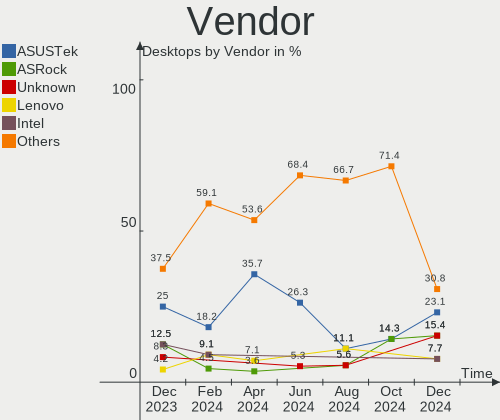
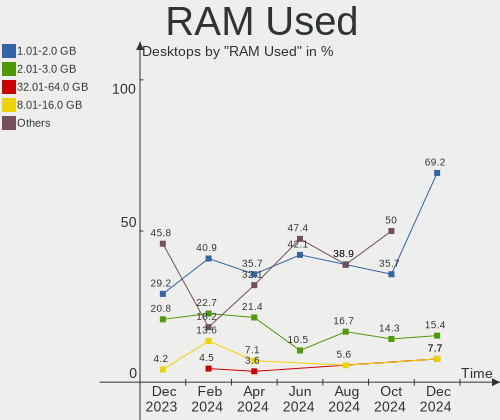
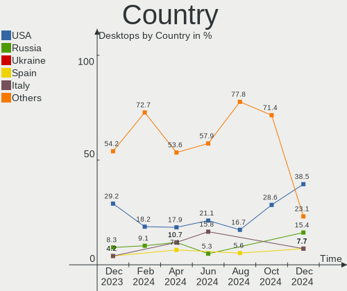
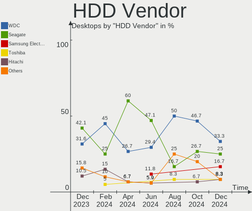
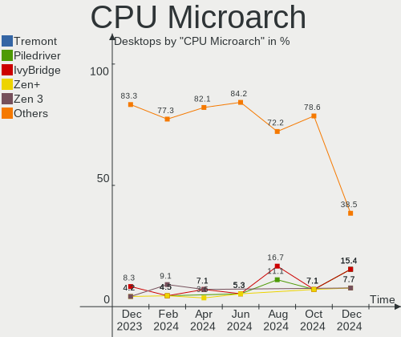
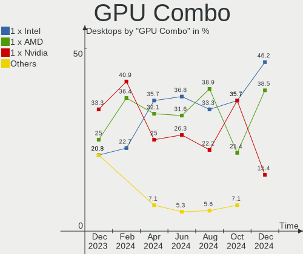
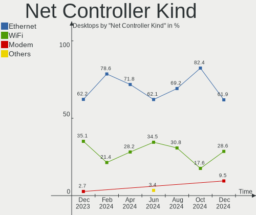
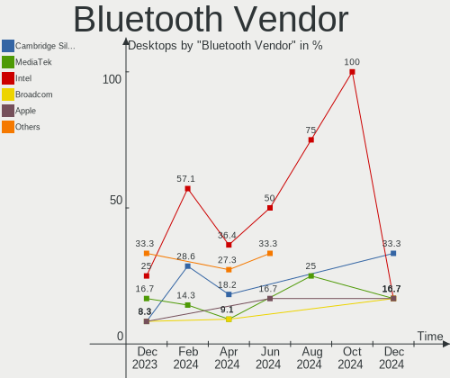
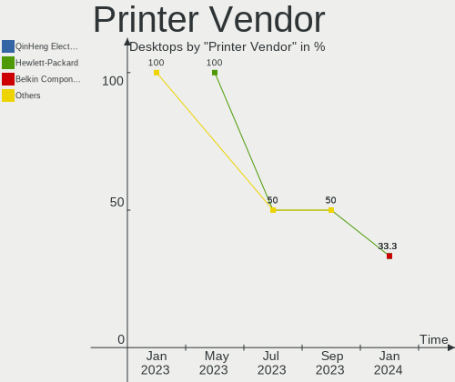
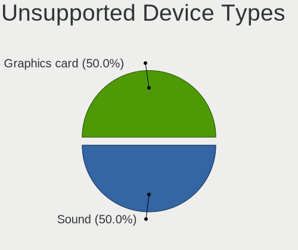

Xubuntu - Hardware Trends (Desktops)
------------------------------------

A project to identify most popular hardware characteristics and track their change
over time based on data collected by Linux users at https://Linux-Hardware.org.

Anyone can contribute to this report by the [hw-probe](https://github.com/linuxhw/hw-probe) tool:

    sudo -E hw-probe -all -upload

This report is for one last month. Overall report since the beginning of time: [TestCoverage](https://github.com/linuxhw/TestCoverage)

Period: Jan, 2023.

Contents
--------

* [ System ](#system)
  - [ OS                       ](#os)
  - [ OS Family                ](#os-family)
  - [ Kernel                   ](#kernel)
  - [ Kernel Family            ](#kernel-family)
  - [ Kernel Major Ver.        ](#kernel-major-ver)
  - [ Arch                     ](#arch)
  - [ DE                       ](#de)
  - [ Display Server           ](#display-server)
  - [ Display Manager          ](#display-manager)
  - [ OS Lang                  ](#os-lang)
  - [ Boot Mode                ](#boot-mode)
  - [ Filesystem               ](#filesystem)
  - [ Part. scheme             ](#part-scheme)
  - [ Dual Boot with Linux/BSD ](#dual-boot-with-linuxbsd)
  - [ Dual Boot (Win)          ](#dual-boot-win)

* [ Board ](#board)
  - [ Vendor                   ](#vendor)
  - [ Model                    ](#model)
  - [ Model Family             ](#model-family)
  - [ MFG Year                 ](#mfg-year)
  - [ Form Factor              ](#form-factor)
  - [ Secure Boot              ](#secure-boot)
  - [ Coreboot                 ](#coreboot)
  - [ RAM Size                 ](#ram-size)
  - [ RAM Used                 ](#ram-used)
  - [ Total Drives             ](#total-drives)
  - [ Has CD-ROM               ](#has-cd-rom)
  - [ Has Ethernet             ](#has-ethernet)
  - [ Has WiFi                 ](#has-wifi)
  - [ Has Bluetooth            ](#has-bluetooth)

* [ Location ](#location)
  - [ Country                  ](#country)
  - [ City                     ](#city)

* [ Drives ](#drives)
  - [ Drive Vendor             ](#drive-vendor)
  - [ Drive Model              ](#drive-model)
  - [ HDD Vendor               ](#hdd-vendor)
  - [ SSD Vendor               ](#ssd-vendor)
  - [ Drive Kind               ](#drive-kind)
  - [ Drive Connector          ](#drive-connector)
  - [ Drive Size               ](#drive-size)
  - [ Space Total              ](#space-total)
  - [ Space Used               ](#space-used)
  - [ Malfunc. Drives          ](#malfunc-drives)
  - [ Malfunc. Drive Vendor    ](#malfunc-drive-vendor)
  - [ Malfunc. HDD Vendor      ](#malfunc-hdd-vendor)
  - [ Malfunc. Drive Kind      ](#malfunc-drive-kind)
  - [ Failed Drives            ](#failed-drives)
  - [ Failed Drive Vendor      ](#failed-drive-vendor)
  - [ Drive Status             ](#drive-status)

* [ Storage controller ](#storage-controller)
  - [ Storage Vendor           ](#storage-vendor)
  - [ Storage Model            ](#storage-model)
  - [ Storage Kind             ](#storage-kind)

* [ Processor ](#processor)
  - [ CPU Vendor               ](#cpu-vendor)
  - [ CPU Model                ](#cpu-model)
  - [ CPU Model Family         ](#cpu-model-family)
  - [ CPU Cores                ](#cpu-cores)
  - [ CPU Sockets              ](#cpu-sockets)
  - [ CPU Threads              ](#cpu-threads)
  - [ CPU Op-Modes             ](#cpu-op-modes)
  - [ CPU Microcode            ](#cpu-microcode)
  - [ CPU Microarch            ](#cpu-microarch)

* [ Graphics ](#graphics)
  - [ GPU Vendor               ](#gpu-vendor)
  - [ GPU Model                ](#gpu-model)
  - [ GPU Combo                ](#gpu-combo)
  - [ GPU Driver               ](#gpu-driver)
  - [ GPU Memory               ](#gpu-memory)

* [ Monitor ](#monitor)
  - [ Monitor Vendor           ](#monitor-vendor)
  - [ Monitor Model            ](#monitor-model)
  - [ Monitor Resolution       ](#monitor-resolution)
  - [ Monitor Diagonal         ](#monitor-diagonal)
  - [ Monitor Width            ](#monitor-width)
  - [ Aspect Ratio             ](#aspect-ratio)
  - [ Monitor Area             ](#monitor-area)
  - [ Pixel Density            ](#pixel-density)
  - [ Multiple Monitors        ](#multiple-monitors)

* [ Network ](#network)
  - [ Net Controller Vendor    ](#net-controller-vendor)
  - [ Net Controller Model     ](#net-controller-model)
  - [ Wireless Vendor          ](#wireless-vendor)
  - [ Wireless Model           ](#wireless-model)
  - [ Ethernet Vendor          ](#ethernet-vendor)
  - [ Ethernet Model           ](#ethernet-model)
  - [ Net Controller Kind      ](#net-controller-kind)
  - [ Used Controller          ](#used-controller)
  - [ NICs                     ](#nics)
  - [ IPv6                     ](#ipv6)

* [ Bluetooth ](#bluetooth)
  - [ Bluetooth Vendor         ](#bluetooth-vendor)
  - [ Bluetooth Model          ](#bluetooth-model)

* [ Sound ](#sound)
  - [ Sound Vendor             ](#sound-vendor)
  - [ Sound Model              ](#sound-model)

* [ Memory ](#memory)
  - [ Memory Vendor            ](#memory-vendor)
  - [ Memory Model             ](#memory-model)
  - [ Memory Kind              ](#memory-kind)
  - [ Memory Form Factor       ](#memory-form-factor)
  - [ Memory Size              ](#memory-size)
  - [ Memory Speed             ](#memory-speed)

* [ Printers & scanners ](#printers--scanners)
  - [ Printer Vendor           ](#printer-vendor)
  - [ Printer Model            ](#printer-model)
  - [ Scanner Vendor           ](#scanner-vendor)
  - [ Scanner Model            ](#scanner-model)

* [ Camera ](#camera)
  - [ Camera Vendor            ](#camera-vendor)
  - [ Camera Model             ](#camera-model)

* [ Security ](#security)
  - [ Fingerprint Vendor       ](#fingerprint-vendor)
  - [ Fingerprint Model        ](#fingerprint-model)
  - [ Chipcard Vendor          ](#chipcard-vendor)
  - [ Chipcard Model           ](#chipcard-model)

* [ Unsupported ](#unsupported)
  - [ Unsupported Devices      ](#unsupported-devices)
  - [ Unsupported Device Types ](#unsupported-device-types)

System
------

OS
--

Installed operating systems

| Name          | Desktops | Percent |
|---------------|----------|---------|
| Xubuntu 22.04 | 15       | 40.54%  |
| Xubuntu 20.04 | 15       | 40.54%  |
| Xubuntu 22.10 | 4        | 10.81%  |
| Xubuntu 18.04 | 2        | 5.41%   |
| Xubuntu 16.04 | 1        | 2.7%    |

OS Family
---------

OS without a version

| Name    | Desktops | Percent |
|---------|----------|---------|
| Xubuntu | 37       | 100%    |

Kernel
------

Version of the Linux kernel

| Version                | Desktops | Percent |
|------------------------|----------|---------|
| 5.4.0-138-generic      | 9        | 24.32%  |
| 5.15.0-58-generic      | 7        | 18.92%  |
| 5.15.0-56-generic      | 5        | 13.51%  |
| 5.4.0-137-generic      | 4        | 10.81%  |
| 5.15.0-57-generic      | 2        | 5.41%   |
| 4.15.0-200-generic     | 2        | 5.41%   |
| 6.1.7-060107-generic   | 1        | 2.7%    |
| 5.4.0-135-generic      | 1        | 2.7%    |
| 5.19.0-31-generic      | 1        | 2.7%    |
| 5.19.0-21-generic      | 1        | 2.7%    |
| 5.19.0-1015-lowlatency | 1        | 2.7%    |
| 5.15.0-57-lowlatency   | 1        | 2.7%    |
| 5.15.0-25-generic      | 1        | 2.7%    |
| 4.15.0-142-generic     | 1        | 2.7%    |

Kernel Family
-------------

Linux kernel without a distro release

| Version | Desktops | Percent |
|---------|----------|---------|
| 5.15.0  | 16       | 43.24%  |
| 5.4.0   | 14       | 37.84%  |
| 5.19.0  | 3        | 8.11%   |
| 4.15.0  | 3        | 8.11%   |
| 6.1.7   | 1        | 2.7%    |

Kernel Major Ver.
-----------------

Linux kernel major version

| Version | Desktops | Percent |
|---------|----------|---------|
| 5.15    | 16       | 43.24%  |
| 5.4     | 14       | 37.84%  |
| 5.19    | 3        | 8.11%   |
| 4.15    | 3        | 8.11%   |
| 6.1     | 1        | 2.7%    |

Arch
----

OS architecture (x86_64, i586, etc.)

| Name   | Desktops | Percent |
|--------|----------|---------|
| x86_64 | 35       | 94.59%  |
| i686   | 2        | 5.41%   |

DE
--

Desktop Environment

| Name  | Desktops | Percent |
|-------|----------|---------|
| XFCE  | 35       | 94.59%  |
| GNOME | 2        | 5.41%   |

Display Server
--------------

X11 or Wayland

| Name    | Desktops | Percent |
|---------|----------|---------|
| X11     | 34       | 91.89%  |
| Tty     | 2        | 5.41%   |
| Wayland | 1        | 2.7%    |

Display Manager
---------------

SDDM, LightDM, etc.

| Name    | Desktops | Percent |
|---------|----------|---------|
| LightDM | 33       | 89.19%  |
| GDM3    | 2        | 5.41%   |
| Unknown | 2        | 5.41%   |

OS Lang
-------

Language

| Lang  | Desktops | Percent |
|-------|----------|---------|
| ru_RU | 12       | 32.43%  |
| en_US | 11       | 29.73%  |
| fr_FR | 4        | 10.81%  |
| de_DE | 4        | 10.81%  |
| it_IT | 2        | 5.41%   |
| nl_NL | 1        | 2.7%    |
| es_AR | 1        | 2.7%    |
| en_CA | 1        | 2.7%    |
| cs_CZ | 1        | 2.7%    |

Boot Mode
---------

EFI or BIOS

| Mode | Desktops | Percent |
|------|----------|---------|
| BIOS | 24       | 64.86%  |
| EFI  | 13       | 35.14%  |

Filesystem
----------

Type of filesystem

| Type    | Desktops | Percent |
|---------|----------|---------|
| Ext4    | 35       | 94.59%  |
| Overlay | 1        | 2.7%    |
| Btrfs   | 1        | 2.7%    |

Part. scheme
------------

Scheme of partitioning

| Type    | Desktops | Percent |
|---------|----------|---------|
| MBR     | 19       | 51.35%  |
| GPT     | 15       | 40.54%  |
| Unknown | 3        | 8.11%   |

Dual Boot with Linux/BSD
------------------------

Hosting more than one Linux/BSD

| Dual boot | Desktops | Percent |
|-----------|----------|---------|
| No        | 33       | 89.19%  |
| Yes       | 4        | 10.81%  |

Dual Boot (Win)
---------------

Hosting Linux and Windows

| Dual boot | Desktops | Percent |
|-----------|----------|---------|
| No        | 23       | 62.16%  |
| Yes       | 14       | 37.84%  |

Board
-----

Vendor
------

Motherboard manufacturer

| Name                | Desktops | Percent |
|---------------------|----------|---------|
| ASUSTek Computer    | 14       | 37.84%  |
| Gigabyte Technology | 12       | 32.43%  |
| MSI                 | 4        | 10.81%  |
| Hewlett-Packard     | 2        | 5.41%   |
| Dell                | 2        | 5.41%   |
| Medion              | 1        | 2.7%    |
| Lenovo              | 1        | 2.7%    |
| Acer                | 1        | 2.7%    |

Model
-----

Motherboard model

| Name                             | Desktops | Percent |
|----------------------------------|----------|---------|
| ASUS All Series                  | 9        | 24.32%  |
| MSI T3114                        | 1        | 2.7%    |
| MSI MS-7D43                      | 1        | 2.7%    |
| MSI MS-7C84                      | 1        | 2.7%    |
| MSI MS-7C56                      | 1        | 2.7%    |
| Medion H61H2-LM3                 | 1        | 2.7%    |
| Lenovo ThinkCentre M58 7373A5G   | 1        | 2.7%    |
| HP xw8400 Workstation            | 1        | 2.7%    |
| HP Compaq Pro 6300 MT            | 1        | 2.7%    |
| Gigabyte Z87N-WIFI               | 1        | 2.7%    |
| Gigabyte X670 GAMING X AX        | 1        | 2.7%    |
| Gigabyte X470 AORUS ULTRA GAMING | 1        | 2.7%    |
| Gigabyte J1800N-D2H              | 1        | 2.7%    |
| Gigabyte H310M S2H 2.0           | 1        | 2.7%    |
| Gigabyte GA-790XT-USB3           | 1        | 2.7%    |
| Gigabyte B550M DS3H              | 1        | 2.7%    |
| Gigabyte B550 GAMING X V2        | 1        | 2.7%    |
| Gigabyte B550 AORUS ELITE        | 1        | 2.7%    |
| Gigabyte B450M S2H               | 1        | 2.7%    |
| Gigabyte B365 M AORUS ELITE      | 1        | 2.7%    |
| Gigabyte 8I945GMF                | 1        | 2.7%    |
| Dell OptiPlex 790                | 1        | 2.7%    |
| Dell Inspiron 620                | 1        | 2.7%    |
| ASUS SABERTOOTH 990FX            | 1        | 2.7%    |
| ASUS ROG STRIX B450-F GAMING     | 1        | 2.7%    |
| ASUS PRIME A320M-K               | 1        | 2.7%    |
| ASUS P5K-E                       | 1        | 2.7%    |
| ASUS P5GD2-VM                    | 1        | 2.7%    |
| Acer Veriton N2620G              | 1        | 2.7%    |

Model Family
------------

Motherboard model prefix

| Name                   | Desktops | Percent |
|------------------------|----------|---------|
| ASUS All               | 9        | 24.32%  |
| Gigabyte B550          | 2        | 5.41%   |
| MSI T3114              | 1        | 2.7%    |
| MSI MS-7D43            | 1        | 2.7%    |
| MSI MS-7C84            | 1        | 2.7%    |
| MSI MS-7C56            | 1        | 2.7%    |
| Medion H61H2-LM3       | 1        | 2.7%    |
| Lenovo ThinkCentre     | 1        | 2.7%    |
| HP xw8400              | 1        | 2.7%    |
| HP Compaq              | 1        | 2.7%    |
| Gigabyte Z87N-WIFI     | 1        | 2.7%    |
| Gigabyte X670          | 1        | 2.7%    |
| Gigabyte X470          | 1        | 2.7%    |
| Gigabyte J1800N-D2H    | 1        | 2.7%    |
| Gigabyte H310M         | 1        | 2.7%    |
| Gigabyte GA-790XT-USB3 | 1        | 2.7%    |
| Gigabyte B550M         | 1        | 2.7%    |
| Gigabyte B450M         | 1        | 2.7%    |
| Gigabyte B365          | 1        | 2.7%    |
| Gigabyte 8I945GMF      | 1        | 2.7%    |
| Dell OptiPlex          | 1        | 2.7%    |
| Dell Inspiron          | 1        | 2.7%    |
| ASUS SABERTOOTH        | 1        | 2.7%    |
| ASUS ROG               | 1        | 2.7%    |
| ASUS PRIME             | 1        | 2.7%    |
| ASUS P5K-E             | 1        | 2.7%    |
| ASUS P5GD2-VM          | 1        | 2.7%    |
| Acer Veriton           | 1        | 2.7%    |

MFG Year
--------

Motherboard manufacture year

| Year | Desktops | Percent |
|------|----------|---------|
| 2014 | 10       | 27.03%  |
| 2020 | 5        | 13.51%  |
| 2018 | 3        | 8.11%   |
| 2012 | 3        | 8.11%   |
| 2011 | 3        | 8.11%   |
| 2005 | 3        | 8.11%   |
| 2021 | 2        | 5.41%   |
| 2007 | 2        | 5.41%   |
| 2022 | 1        | 2.7%    |
| 2019 | 1        | 2.7%    |
| 2017 | 1        | 2.7%    |
| 2013 | 1        | 2.7%    |
| 2009 | 1        | 2.7%    |
| 2008 | 1        | 2.7%    |

Form Factor
-----------

Physical design of the computer

| Name    | Desktops | Percent |
|---------|----------|---------|
| Desktop | 37       | 100%    |

Secure Boot
-----------

Enabled or disabled

| State    | Desktops | Percent |
|----------|----------|---------|
| Disabled | 37       | 100%    |

Coreboot
--------

Have coreboot on board

| Used | Desktops | Percent |
|------|----------|---------|
| No   | 37       | 100%    |

RAM Size
--------

Total RAM memory

| Size in GB | Desktops | Percent |
|------------|----------|---------|
| 3.01-4.0   | 12       | 32.43%  |
| 16.01-24.0 | 8        | 21.62%  |
| 32.01-64.0 | 6        | 16.22%  |
| 8.01-16.0  | 6        | 16.22%  |
| 4.01-8.0   | 4        | 10.81%  |
| 1.01-2.0   | 1        | 2.7%    |

RAM Used
--------

Used RAM memory

| Used GB    | Desktops | Percent |
|------------|----------|---------|
| 0.51-1.0   | 10       | 27.03%  |
| 1.01-2.0   | 9        | 24.32%  |
| 2.01-3.0   | 8        | 21.62%  |
| 3.01-4.0   | 4        | 10.81%  |
| 8.01-16.0  | 3        | 8.11%   |
| 4.01-8.0   | 1        | 2.7%    |
| 16.01-24.0 | 1        | 2.7%    |
| 0.01-0.5   | 1        | 2.7%    |

Total Drives
------------

Number of drives on board

| Drives | Desktops | Percent |
|--------|----------|---------|
| 1      | 17       | 45.95%  |
| 2      | 11       | 29.73%  |
| 3      | 5        | 13.51%  |
| 4      | 3        | 8.11%   |
| 5      | 1        | 2.7%    |

Has CD-ROM
----------

Has CD-ROM on board

| Presented | Desktops | Percent |
|-----------|----------|---------|
| No        | 27       | 72.97%  |
| Yes       | 10       | 27.03%  |

Has Ethernet
------------

Has Ethernet on board

| Presented | Desktops | Percent |
|-----------|----------|---------|
| Yes       | 37       | 100%    |

Has WiFi
--------

Has WiFi module

| Presented | Desktops | Percent |
|-----------|----------|---------|
| No        | 29       | 78.38%  |
| Yes       | 8        | 21.62%  |

Has Bluetooth
-------------

Has Bluetooth module

| Presented | Desktops | Percent |
|-----------|----------|---------|
| No        | 33       | 89.19%  |
| Yes       | 4        | 10.81%  |

Location
--------

Country
-------

Geographic location (country)

| Country     | Desktops | Percent |
|-------------|----------|---------|
| Russia      | 12       | 32.43%  |
| USA         | 8        | 21.62%  |
| Germany     | 4        | 10.81%  |
| Netherlands | 3        | 8.11%   |
| France      | 3        | 8.11%   |
| Italy       | 2        | 5.41%   |
| Mexico      | 1        | 2.7%    |
| Czechia     | 1        | 2.7%    |
| Canada      | 1        | 2.7%    |
| Belgium     | 1        | 2.7%    |
| Argentina   | 1        | 2.7%    |

City
----

Geographic location (city)

| City                | Desktops | Percent |
|---------------------|----------|---------|
| Voronezh            | 9        | 24.32%  |
| Louisville          | 2        | 5.41%   |
| White House         | 1        | 2.7%    |
| Tijuana             | 1        | 2.7%    |
| Thouars             | 1        | 2.7%    |
| The Hague           | 1        | 2.7%    |
| St Petersburg       | 1        | 2.7%    |
| Springfield         | 1        | 2.7%    |
| San-Martino-di-Lota | 1        | 2.7%    |
| San Luis Obispo     | 1        | 2.7%    |
| Palermo             | 1        | 2.7%    |
| Norden              | 1        | 2.7%    |
| Munich              | 1        | 2.7%    |
| Moscow              | 1        | 2.7%    |
| Milan               | 1        | 2.7%    |
| Marseille           | 1        | 2.7%    |
| Litoměřice        | 1        | 2.7%    |
| La Mesa             | 1        | 2.7%    |
| Kingston            | 1        | 2.7%    |
| Indio               | 1        | 2.7%    |
| Hanover             | 1        | 2.7%    |
| Halle               | 1        | 2.7%    |
| Fleurus             | 1        | 2.7%    |
| Emmeloord           | 1        | 2.7%    |
| Contoocook          | 1        | 2.7%    |
| Avellaneda          | 1        | 2.7%    |
| Almere Stad         | 1        | 2.7%    |
| Aleksandrovka       | 1        | 2.7%    |

Drives
------

Drive Vendor
------------

Hard drive vendors

| Vendor                      | Desktops | Drives | Percent |
|-----------------------------|----------|--------|---------|
| WDC                         | 22       | 25     | 34.92%  |
| Seagate                     | 11       | 11     | 17.46%  |
| Samsung Electronics         | 8        | 9      | 12.7%   |
| PNY                         | 3        | 3      | 4.76%   |
| Toshiba                     | 2        | 2      | 3.17%   |
| SanDisk                     | 2        | 2      | 3.17%   |
| Kingston                    | 2        | 2      | 3.17%   |
| Hitachi                     | 2        | 3      | 3.17%   |
| Gigabyte Technology         | 2        | 2      | 3.17%   |
| SPCC                        | 1        | 1      | 1.59%   |
| SK hynix                    | 1        | 1      | 1.59%   |
| Realtek Semiconductor       | 1        | 1      | 1.59%   |
| Mushkin                     | 1        | 1      | 1.59%   |
| KIOXIA                      | 1        | 1      | 1.59%   |
| Kingston Technology Company | 1        | 1      | 1.59%   |
| Intel                       | 1        | 1      | 1.59%   |
| HGST                        | 1        | 3      | 1.59%   |
| Crucial                     | 1        | 2      | 1.59%   |

Drive Model
-----------

Hard drive models

| Model                               | Desktops | Percent |
|-------------------------------------|----------|---------|
| WDC WD5000AZLX-07K2TA0 500GB        | 9        | 13.64%  |
| Seagate ST1000DM003-1CH162 1TB      | 2        | 3.03%   |
| Samsung SSD 970 EVO Plus 250GB      | 2        | 3.03%   |
| Samsung SSD 860 EVO 500GB           | 2        | 3.03%   |
| PNY CS900 480GB SSD                 | 2        | 3.03%   |
| WDC WDS250G3X0C-00SJG0 250GB        | 1        | 1.52%   |
| WDC WDS100T3X0C-00SJG0 1TB          | 1        | 1.52%   |
| WDC WD3200BUCT-63TWBY0 320GB        | 1        | 1.52%   |
| WDC WD3200BJKT-75F4T0 320GB         | 1        | 1.52%   |
| WDC WD3200AAJS-65B4A0 320GB         | 1        | 1.52%   |
| WDC WD3200AAJS-56M0A0 320GB         | 1        | 1.52%   |
| WDC WD3200AAJS-08L7A0 320GB         | 1        | 1.52%   |
| WDC WD20EZRX-19D8PB0 2TB            | 1        | 1.52%   |
| WDC WD20EZRX-00D8PB0 2TB            | 1        | 1.52%   |
| WDC WD2005FBYZ-01YCBB3 2TB          | 1        | 1.52%   |
| WDC WD1600BEVS-22RST0 160GB         | 1        | 1.52%   |
| WDC WD1600BEVS-07RST0 160GB         | 1        | 1.52%   |
| WDC WD10EZEX-21M2NA0 1TB            | 1        | 1.52%   |
| WDC WD10EZEX-08WN4A0 1TB            | 1        | 1.52%   |
| WDC WD10EZEX-00BN5A0 1TB            | 1        | 1.52%   |
| Toshiba HDWD130 3TB                 | 1        | 1.52%   |
| Toshiba DT01ACA050 500GB            | 1        | 1.52%   |
| SPCC Solid State Disk 1TB           | 1        | 1.52%   |
| SK hynix SHGP31-1000GM 1TB          | 1        | 1.52%   |
| Seagate ST380011A 80GB              | 1        | 1.52%   |
| Seagate ST3250620AS 250GB           | 1        | 1.52%   |
| Seagate ST3250310NS 250GB           | 1        | 1.52%   |
| Seagate ST3000DM008-2DM166 3TB      | 1        | 1.52%   |
| Seagate ST2000DM008-2FR102 2TB      | 1        | 1.52%   |
| Seagate ST1000VM002-1SD102 1TB      | 1        | 1.52%   |
| Seagate ST1000LM024 HN-M101MBB 1TB  | 1        | 1.52%   |
| Seagate ST1000DM010-2EP102 1TB      | 1        | 1.52%   |
| Seagate ST1000DM003-1ER162 1TB      | 1        | 1.52%   |
| SanDisk SDSSDH31000G 1TB            | 1        | 1.52%   |
| SanDisk SD8SB8U-128G-1016 128GB SSD | 1        | 1.52%   |
| Samsung SSD SM841N mSATA 128GB      | 1        | 1.52%   |
| Samsung SSD PM830 2.5 7mm 512GB     | 1        | 1.52%   |
| Samsung SSD 860 EVO 1TB             | 1        | 1.52%   |
| Samsung SSD 850 EVO 500GB           | 1        | 1.52%   |
| Samsung SSD 850 EVO 250GB           | 1        | 1.52%   |

HDD Vendor
----------

Hard disk drive vendors

| Vendor  | Desktops | Drives | Percent |
|---------|----------|--------|---------|
| WDC     | 21       | 23     | 56.76%  |
| Seagate | 11       | 11     | 29.73%  |
| Toshiba | 2        | 2      | 5.41%   |
| Hitachi | 2        | 3      | 5.41%   |
| HGST    | 1        | 3      | 2.7%    |

SSD Vendor
----------

Solid state drive vendors

| Vendor              | Desktops | Drives | Percent |
|---------------------|----------|--------|---------|
| Samsung Electronics | 6        | 7      | 42.86%  |
| PNY                 | 3        | 3      | 21.43%  |
| SanDisk             | 2        | 2      | 14.29%  |
| SPCC                | 1        | 1      | 7.14%   |
| Kingston            | 1        | 1      | 7.14%   |
| Crucial             | 1        | 2      | 7.14%   |

Drive Kind
----------

HDD or SSD

| Kind | Desktops | Drives | Percent |
|------|----------|--------|---------|
| HDD  | 27       | 42     | 57.45%  |
| SSD  | 11       | 16     | 23.4%   |
| NVMe | 9        | 13     | 19.15%  |

Drive Connector
---------------

SATA, SAS, NVMe, etc.

| Type | Desktops | Drives | Percent |
|------|----------|--------|---------|
| SATA | 33       | 58     | 78.57%  |
| NVMe | 9        | 13     | 21.43%  |

Drive Size
----------

Size of hard drive

| Size in TB | Desktops | Drives | Percent |
|------------|----------|--------|---------|
| 0.01-0.5   | 27       | 34     | 58.7%   |
| 0.51-1.0   | 12       | 15     | 26.09%  |
| 1.01-2.0   | 4        | 4      | 8.7%    |
| 2.01-3.0   | 2        | 2      | 4.35%   |
| 3.01-4.0   | 1        | 3      | 2.17%   |

Space Total
-----------

Amount of disk space available on the file system

| Size in GB     | Desktops | Percent |
|----------------|----------|---------|
| 251-500        | 13       | 35.14%  |
| 101-250        | 7        | 18.92%  |
| 501-1000       | 5        | 13.51%  |
| 21-50          | 3        | 8.11%   |
| 2001-3000      | 3        | 8.11%   |
| 1001-2000      | 3        | 8.11%   |
| More than 3000 | 1        | 2.7%    |
| 1-20           | 1        | 2.7%    |
| 51-100         | 1        | 2.7%    |

Space Used
----------

Amount of used disk space

| Used GB        | Desktops | Percent |
|----------------|----------|---------|
| 21-50          | 17       | 45.95%  |
| 1-20           | 8        | 21.62%  |
| 251-500        | 4        | 10.81%  |
| 101-250        | 4        | 10.81%  |
| More than 3000 | 1        | 2.7%    |
| 1001-2000      | 1        | 2.7%    |
| 501-1000       | 1        | 2.7%    |
| 51-100         | 1        | 2.7%    |

Malfunc. Drives
---------------

Drive models with a malfunction

| Model                              | Desktops | Drives | Percent |
|------------------------------------|----------|--------|---------|
| WDC WD1600BEVS-22RST0 160GB        | 1        | 1      | 16.67%  |
| WDC WD10EZEX-08WN4A0 1TB           | 1        | 1      | 16.67%  |
| Seagate ST1000LM024 HN-M101MBB 1TB | 1        | 1      | 16.67%  |
| Seagate ST1000DM010-2EP102 1TB     | 1        | 1      | 16.67%  |
| PNY 69D03094-T 40GB SSD            | 1        | 1      | 16.67%  |
| HGST HUS724040ALA640 4TB           | 1        | 3      | 16.67%  |

Malfunc. Drive Vendor
---------------------

Vendors of faulty drives

| Vendor  | Desktops | Drives | Percent |
|---------|----------|--------|---------|
| WDC     | 2        | 2      | 33.33%  |
| Seagate | 2        | 2      | 33.33%  |
| PNY     | 1        | 1      | 16.67%  |
| HGST    | 1        | 3      | 16.67%  |

Malfunc. HDD Vendor
-------------------

Vendors of faulty HDD drives

| Vendor  | Desktops | Drives | Percent |
|---------|----------|--------|---------|
| WDC     | 2        | 2      | 40%     |
| Seagate | 2        | 2      | 40%     |
| HGST    | 1        | 3      | 20%     |

Malfunc. Drive Kind
-------------------

Kinds of faulty drives

| Kind | Desktops | Drives | Percent |
|------|----------|--------|---------|
| HDD  | 5        | 7      | 83.33%  |
| SSD  | 1        | 1      | 16.67%  |

Failed Drives
-------------

Failed drive models

Zero info for selected period =(

Failed Drive Vendor
-------------------

Failed drive vendors

Zero info for selected period =(

Drive Status
------------

Number of failed and malfunc. drives

| Status   | Desktops | Drives | Percent |
|----------|----------|--------|---------|
| Works    | 27       | 44     | 62.79%  |
| Detected | 10       | 19     | 23.26%  |
| Malfunc  | 6        | 8      | 13.95%  |

Storage controller
------------------

Storage Vendor
--------------

Storage controller vendors

| Vendor                      | Desktops | Percent |
|-----------------------------|----------|---------|
| Intel                       | 24       | 47.06%  |
| AMD                         | 11       | 21.57%  |
| SanDisk                     | 2        | 3.92%   |
| Samsung Electronics         | 2        | 3.92%   |
| Phison Electronics          | 2        | 3.92%   |
| Kingston Technology Company | 2        | 3.92%   |
| VIA Technologies            | 1        | 1.96%   |
| SK hynix                    | 1        | 1.96%   |
| Realtek Semiconductor       | 1        | 1.96%   |
| KIOXIA                      | 1        | 1.96%   |
| JMicron Technology          | 1        | 1.96%   |
| INNOGRIT                    | 1        | 1.96%   |
| Broadcom / LSI              | 1        | 1.96%   |
| ASMedia Technology          | 1        | 1.96%   |

Storage Model
-------------

Storage controller models

| Model                                                                                   | Desktops | Percent |
|-----------------------------------------------------------------------------------------|----------|---------|
| Intel Atom Processor E3800 Series SATA AHCI Controller                                  | 10       | 15.87%  |
| AMD FCH SATA Controller [AHCI mode]                                                     | 5        | 7.94%   |
| AMD 500 Series Chipset SATA Controller                                                  | 4        | 6.35%   |
| AMD 400 Series Chipset SATA Controller                                                  | 3        | 4.76%   |
| SanDisk WD Black SN750 / PC SN730 NVMe SSD                                              | 2        | 3.17%   |
| Samsung NVMe SSD Controller SM981/PM981/PM983                                           | 2        | 3.17%   |
| Kingston Company A2000 NVMe SSD                                                         | 2        | 3.17%   |
| Intel 6 Series/C200 Series Chipset Family 6 port Desktop SATA AHCI Controller           | 2        | 3.17%   |
| Intel 200 Series PCH SATA controller [AHCI mode]                                        | 2        | 3.17%   |
| VIA VT82C586A/B/VT82C686/A/B/VT823x/A/C PIPC Bus Master IDE                             | 1        | 1.59%   |
| VIA VIA VT6420 SATA RAID Controller                                                     | 1        | 1.59%   |
| SK hynix Gold P31/PC711 NVMe Solid State Drive                                          | 1        | 1.59%   |
| Realtek RTS5763DL NVMe SSD Controller                                                   | 1        | 1.59%   |
| Phison PS5013 E13 NVMe Controller                                                       | 1        | 1.59%   |
| Phison E18 PCIe4 NVMe Controller                                                        | 1        | 1.59%   |
| KIOXIA NVMe SSD Controller BG4                                                          | 1        | 1.59%   |
| JMicron JMB363 SATA/IDE Controller                                                      | 1        | 1.59%   |
| Intel Non-Volatile memory controller                                                    | 1        | 1.59%   |
| Intel NM10/ICH7 Family SATA Controller [IDE mode]                                       | 1        | 1.59%   |
| Intel Alder Lake-S PCH SATA Controller [AHCI Mode]                                      | 1        | 1.59%   |
| Intel 82801JD/DO (ICH10 Family) SATA AHCI Controller                                    | 1        | 1.59%   |
| Intel 82801IR/IO/IH (ICH9R/DO/DH) 4 port SATA Controller [IDE mode]                     | 1        | 1.59%   |
| Intel 82801I (ICH9 Family) 2 port SATA Controller [IDE mode]                            | 1        | 1.59%   |
| Intel 82801FB/FW (ICH6/ICH6W) SATA Controller                                           | 1        | 1.59%   |
| Intel 82801FB/FBM/FR/FW/FRW (ICH6 Family) IDE Controller                                | 1        | 1.59%   |
| Intel 8 Series/C220 Series Chipset Family 6-port SATA Controller 1 [AHCI mode]          | 1        | 1.59%   |
| Intel 7 Series/C210 Series Chipset Family 6-port SATA Controller [AHCI mode]            | 1        | 1.59%   |
| Intel 7 Series Chipset Family 6-port SATA Controller [AHCI mode]                        | 1        | 1.59%   |
| Intel 631xESB/632xESB SATA RAID Controller                                              | 1        | 1.59%   |
| Intel 631xESB/632xESB IDE Controller                                                    | 1        | 1.59%   |
| Intel 6 Series/C200 Series Chipset Family Desktop SATA Controller (IDE mode, ports 4-5) | 1        | 1.59%   |
| Intel 6 Series/C200 Series Chipset Family Desktop SATA Controller (IDE mode, ports 0-3) | 1        | 1.59%   |
| Intel 4 Series Chipset PT IDER Controller                                               | 1        | 1.59%   |
| INNOGRIT Non-Volatile memory controller                                                 | 1        | 1.59%   |
| Broadcom / LSI SAS1064 PCI-X Fusion-MPT SAS                                             | 1        | 1.59%   |
| ASMedia 106x SATA/RAID Controller                                                       | 1        | 1.59%   |
| AMD SB7x0/SB8x0/SB9x0 SATA Controller [RAID5 mode]                                      | 1        | 1.59%   |
| AMD SB7x0/SB8x0/SB9x0 IDE Controller                                                    | 1        | 1.59%   |
| AMD SATA controller                                                                     | 1        | 1.59%   |
| AMD FCH SATA Controller D                                                               | 1        | 1.59%   |

Storage Kind
------------

Kind of storage controller (IDE, SATA, NVMe, SAS, ...)

| Kind | Desktops | Percent |
|------|----------|---------|
| SATA | 30       | 60%     |
| NVMe | 9        | 18%     |
| IDE  | 8        | 16%     |
| RAID | 2        | 4%      |
| SCSI | 1        | 2%      |

Processor
---------

CPU Vendor
----------

Processor vendors

| Vendor | Desktops | Percent |
|--------|----------|---------|
| Intel  | 24       | 64.86%  |
| AMD    | 13       | 35.14%  |

CPU Model
---------

Processor models

| Model                                       | Desktops | Percent |
|---------------------------------------------|----------|---------|
| Intel Celeron CPU J1800 @ 2.41GHz           | 10       | 27.03%  |
| Intel Pentium 4 CPU 3.00GHz                 | 2        | 5.41%   |
| Intel Core i5-2320 CPU @ 3.00GHz            | 2        | 5.41%   |
| Intel Xeon CPU 5150 @ 2.66GHz               | 1        | 2.7%    |
| Intel Core i7-9700KF CPU @ 3.60GHz          | 1        | 2.7%    |
| Intel Core i5-9600K CPU @ 3.70GHz           | 1        | 2.7%    |
| Intel Core i5-3570 CPU @ 3.40GHz            | 1        | 2.7%    |
| Intel Core i5-2400 CPU @ 3.10GHz            | 1        | 2.7%    |
| Intel Core i3-4340 CPU @ 3.60GHz            | 1        | 2.7%    |
| Intel Core 2 Quad CPU Q6600 @ 2.40GHz       | 1        | 2.7%    |
| Intel Core 2 Duo CPU E7300 @ 2.66GHz        | 1        | 2.7%    |
| Intel Celeron CPU 1017U @ 1.60GHz           | 1        | 2.7%    |
| Intel 12th Gen Core i3-12100F               | 1        | 2.7%    |
| AMD Sempron Processor 3100+                 | 1        | 2.7%    |
| AMD Ryzen 7 5700X 8-Core Processor          | 1        | 2.7%    |
| AMD Ryzen 7 3800X 8-Core Processor          | 1        | 2.7%    |
| AMD Ryzen 7 3700X 8-Core Processor          | 1        | 2.7%    |
| AMD Ryzen 7 2700X Eight-Core Processor      | 1        | 2.7%    |
| AMD Ryzen 5 7600X 6-Core Processor          | 1        | 2.7%    |
| AMD Ryzen 5 5600X 6-Core Processor          | 1        | 2.7%    |
| AMD Ryzen 5 3600 6-Core Processor           | 1        | 2.7%    |
| AMD Ryzen 5 3400G with Radeon Vega Graphics | 1        | 2.7%    |
| AMD Ryzen 5 2600 Six-Core Processor         | 1        | 2.7%    |
| AMD Ryzen 3 2200G with Radeon Vega Graphics | 1        | 2.7%    |
| AMD FX-8370 Eight-Core Processor            | 1        | 2.7%    |
| AMD Athlon II X4 640 Processor              | 1        | 2.7%    |

CPU Model Family
----------------

Processor model prefix

| Model             | Desktops | Percent |
|-------------------|----------|---------|
| Intel Celeron     | 11       | 29.73%  |
| Intel Core i5     | 5        | 13.51%  |
| AMD Ryzen 5       | 5        | 13.51%  |
| AMD Ryzen 7       | 4        | 10.81%  |
| Intel Pentium 4   | 2        | 5.41%   |
| Other             | 1        | 2.7%    |
| Intel Xeon        | 1        | 2.7%    |
| Intel Core i7     | 1        | 2.7%    |
| Intel Core i3     | 1        | 2.7%    |
| Intel Core 2 Quad | 1        | 2.7%    |
| Intel Core 2 Duo  | 1        | 2.7%    |
| AMD Sempron       | 1        | 2.7%    |
| AMD Ryzen 3       | 1        | 2.7%    |
| AMD FX            | 1        | 2.7%    |
| AMD Athlon II X4  | 1        | 2.7%    |

CPU Cores
---------

Number of processor cores

| Number | Desktops | Percent |
|--------|----------|---------|
| 2      | 13       | 35.14%  |
| 4      | 11       | 29.73%  |
| 8      | 5        | 13.51%  |
| 6      | 5        | 13.51%  |
| 1      | 3        | 8.11%   |

CPU Sockets
-----------

Number of sockets

| Number | Desktops | Percent |
|--------|----------|---------|
| 1      | 36       | 97.3%   |
| 2      | 1        | 2.7%    |

CPU Threads
-----------

Threads per core (Hyper-Threading)

| Number | Desktops | Percent |
|--------|----------|---------|
| 1      | 23       | 62.16%  |
| 2      | 14       | 37.84%  |

CPU Op-Modes
------------

CPU Operation Modes (32-bit, 64-bit)

| Op mode        | Desktops | Percent |
|----------------|----------|---------|
| 32-bit, 64-bit | 37       | 100%    |

CPU Microcode
-------------

Microcode number

| Number     | Desktops | Percent |
|------------|----------|---------|
| 0x30679    | 10       | 27.03%  |
| Unknown    | 10       | 27.03%  |
| 0x206a7    | 3        | 8.11%   |
| 0x306a9    | 2        | 5.41%   |
| 0xf43      | 1        | 2.7%    |
| 0x6fb      | 1        | 2.7%    |
| 0x306c3    | 1        | 2.7%    |
| 0x10676    | 1        | 2.7%    |
| 0x0a601201 | 1        | 2.7%    |
| 0x0a20120a | 1        | 2.7%    |
| 0x0a201016 | 1        | 2.7%    |
| 0x08701021 | 1        | 2.7%    |
| 0x08108109 | 1        | 2.7%    |
| 0x08101016 | 1        | 2.7%    |
| 0x0800820d | 1        | 2.7%    |
| 0x010000c8 | 1        | 2.7%    |

CPU Microarch
-------------

Microarchitecture

| Name        | Desktops | Percent |
|-------------|----------|---------|
| Silvermont  | 10       | 27.03%  |
| Zen+        | 3        | 8.11%   |
| Zen 2       | 3        | 8.11%   |
| SandyBridge | 3        | 8.11%   |
| Zen 3       | 2        | 5.41%   |
| NetBurst    | 2        | 5.41%   |
| KabyLake    | 2        | 5.41%   |
| IvyBridge   | 2        | 5.41%   |
| Core        | 2        | 5.41%   |
| Unknown     | 2        | 5.41%   |
| Zen         | 1        | 2.7%    |
| Piledriver  | 1        | 2.7%    |
| Penryn      | 1        | 2.7%    |
| K8 Hammer   | 1        | 2.7%    |
| K10         | 1        | 2.7%    |
| Haswell     | 1        | 2.7%    |

Graphics
--------

GPU Vendor
----------

Vendors of graphics cards

| Vendor           | Desktops | Percent |
|------------------|----------|---------|
| Intel            | 15       | 39.47%  |
| Nvidia           | 11       | 28.95%  |
| AMD              | 11       | 28.95%  |
| VIA Technologies | 1        | 2.63%   |

GPU Model
---------

Graphics card models

| Model                                                                       | Desktops | Percent |
|-----------------------------------------------------------------------------|----------|---------|
| Intel Atom Processor Z36xxx/Z37xxx Series Graphics & Display                | 10       | 26.32%  |
| Nvidia GM107 [GeForce GTX 750 Ti]                                           | 2        | 5.26%   |
| AMD Caicos PRO [Radeon HD 7450]                                             | 2        | 5.26%   |
| VIA Technologies K8M800/K8N800/K8N800A [S3 UniChrome Pro]                   | 1        | 2.63%   |
| Nvidia TU104 [GeForce RTX 2070 SUPER]                                       | 1        | 2.63%   |
| Nvidia GP108 [GeForce GT 1030]                                              | 1        | 2.63%   |
| Nvidia GP107 [GeForce GTX 1050 Ti]                                          | 1        | 2.63%   |
| Nvidia GP106 [GeForce GTX 1060 3GB]                                         | 1        | 2.63%   |
| Nvidia GM107 [GeForce GTX 750]                                              | 1        | 2.63%   |
| Nvidia GK208B [GeForce GT 710]                                              | 1        | 2.63%   |
| Nvidia GK104 [GeForce GTX 770]                                              | 1        | 2.63%   |
| Nvidia GF110 [GeForce GTX 570]                                              | 1        | 2.63%   |
| Nvidia GF108 [GeForce GT 620]                                               | 1        | 2.63%   |
| Intel Xeon E3-1200 v3/4th Gen Core Processor Integrated Graphics Controller | 1        | 2.63%   |
| Intel Xeon E3-1200 v2/3rd Gen Core processor Graphics Controller            | 1        | 2.63%   |
| Intel CoffeeLake-S GT2 [UHD Graphics 630]                                   | 1        | 2.63%   |
| Intel 4 Series Chipset Integrated Graphics Controller                       | 1        | 2.63%   |
| Intel 3rd Gen Core processor Graphics Controller                            | 1        | 2.63%   |
| AMD RV610 [Radeon HD 2400 PRO/XT]                                           | 1        | 2.63%   |
| AMD Raven Ridge [Radeon Vega Series / Radeon Vega Mobile Series]            | 1        | 2.63%   |
| AMD Picasso/Raven 2 [Radeon Vega Series / Radeon Vega Mobile Series]        | 1        | 2.63%   |
| AMD Navi 21 [Radeon RX 6950 XT]                                             | 1        | 2.63%   |
| AMD Navi 10 [Radeon RX 5600 OEM/5600 XT / 5700/5700 XT]                     | 1        | 2.63%   |
| AMD Lexa PRO [Radeon 540/540X/550/550X / RX 540X/550/550X]                  | 1        | 2.63%   |
| AMD Juniper PRO [Radeon HD 5750]                                            | 1        | 2.63%   |
| AMD Cedar [Radeon HD 5000/6000/7350/8350 Series]                            | 1        | 2.63%   |
| AMD Baffin [Radeon RX 460/560D / Pro 450/455/460/555/555X/560/560X]         | 1        | 2.63%   |

GPU Combo
---------

Combinations of graphics cards

| Name       | Desktops | Percent |
|------------|----------|---------|
| 1 x Intel  | 14       | 37.84%  |
| 1 x Nvidia | 11       | 29.73%  |
| 1 x AMD    | 11       | 29.73%  |
| 1 x VIA    | 1        | 2.7%    |

GPU Driver
----------

Free vs proprietary

| Driver      | Desktops | Percent |
|-------------|----------|---------|
| Free        | 27       | 72.97%  |
| Proprietary | 9        | 24.32%  |
| Unknown     | 1        | 2.7%    |

GPU Memory
----------

Total video memory

| Size in GB | Desktops | Percent |
|------------|----------|---------|
| Unknown    | 19       | 51.35%  |
| 1.01-2.0   | 8        | 21.62%  |
| 0.51-1.0   | 6        | 16.22%  |
| 7.01-8.0   | 2        | 5.41%   |
| 2.01-3.0   | 1        | 2.7%    |
| 8.01-16.0  | 1        | 2.7%    |

Monitor
-------

Monitor Vendor
--------------

Monitor vendors

| Vendor               | Desktops | Percent |
|----------------------|----------|---------|
| Ancor Communications | 9        | 24.32%  |
| Dell                 | 8        | 21.62%  |
| Acer                 | 6        | 16.22%  |
| Samsung Electronics  | 4        | 10.81%  |
| ViewSonic            | 2        | 5.41%   |
| Goldstar             | 2        | 5.41%   |
| RTK                  | 1        | 2.7%    |
| NECCI                | 1        | 2.7%    |
| MiTAC                | 1        | 2.7%    |
| Gateway              | 1        | 2.7%    |
| BenQ                 | 1        | 2.7%    |
| AOC                  | 1        | 2.7%    |

Monitor Model
-------------

Monitor models

| Model                                                                 | Desktops | Percent |
|-----------------------------------------------------------------------|----------|---------|
| Ancor Communications ASUS VS197 ACI19F2 1366x768 410x230mm 18.5-inch  | 8        | 20%     |
| ViewSonic VP2365 SERIES VSC7C28 1920x1080 509x286mm 23.0-inch         | 2        | 5%      |
| Samsung Electronics S24F350 SAM0D20 1920x1080 521x293mm 23.5-inch     | 1        | 2.5%    |
| Samsung Electronics S22F350 SAM0D1A 1920x1080 477x268mm 21.5-inch     | 1        | 2.5%    |
| Samsung Electronics LCD Monitor SAM07C0 1920x1080 890x500mm 40.2-inch | 1        | 2.5%    |
| Samsung Electronics LC34G55T SAM711A 3440x1440 798x334mm 34.1-inch    | 1        | 2.5%    |
| Samsung Electronics C27F390 SAM0D32 1920x1080 598x336mm 27.0-inch     | 1        | 2.5%    |
| RTK LCD Monitor RTK1D1A 1920x1080 1020x570mm 46.0-inch                | 1        | 2.5%    |
| NECCI MAE190W NCI5050 1440x900 410x256mm 19.0-inch                    | 1        | 2.5%    |
| MiTAC MTC26T42 MTC0B01 1920x540 708x398mm 32.0-inch                   | 1        | 2.5%    |
| Goldstar W2261 GSM56CE 1920x1080 477x268mm 21.5-inch                  | 1        | 2.5%    |
| Goldstar 22EN33 GSM597C 1920x1080 480x270mm 21.7-inch                 | 1        | 2.5%    |
| Gateway FHX2300 GWY00BF 1920x1080 509x286mm 23.0-inch                 | 1        | 2.5%    |
| Dell U3011 DEL4065 2560x1600 641x401mm 29.8-inch                      | 1        | 2.5%    |
| Dell U2722D DEL422D 2560x1440 597x336mm 27.0-inch                     | 1        | 2.5%    |
| Dell U2715H DELD067 2560x1440 597x336mm 27.0-inch                     | 1        | 2.5%    |
| Dell U2415 DELA0BC 1920x1200 518x324mm 24.1-inch                      | 1        | 2.5%    |
| Dell S2721DS DELA19D 2560x1440 597x336mm 27.0-inch                    | 1        | 2.5%    |
| Dell S2721DS DELA19C 2560x1440 590x330mm 26.6-inch                    | 1        | 2.5%    |
| Dell IN2030M DELF03D 1600x900 443x249mm 20.0-inch                     | 1        | 2.5%    |
| Dell E198WFP DELF005 1440x900 408x255mm 18.9-inch                     | 1        | 2.5%    |
| Dell 2209WA DELF011 1680x1050 474x296mm 22.0-inch                     | 1        | 2.5%    |
| Dell 2001FP DELA008 1600x1200 367x275mm 18.1-inch                     | 1        | 2.5%    |
| BenQ GL2460 BNQ78CE 1920x1080 531x299mm 24.0-inch                     | 1        | 2.5%    |
| AOC U34G2G4R3 AOC3402 3440x1440 797x334mm 34.0-inch                   | 1        | 2.5%    |
| Ancor Communications ASUS VE278 ACI27F6 1920x1080 598x336mm 27.0-inch | 1        | 2.5%    |
| Acer V173 ACR0019 1280x1024 338x270mm 17.0-inch                       | 1        | 2.5%    |
| Acer SA240Y ACR057F 1920x1080 527x296mm 23.8-inch                     | 1        | 2.5%    |
| Acer S240HL ACR0289 1920x1080 531x299mm 24.0-inch                     | 1        | 2.5%    |
| Acer S231HL ACR0308 1920x1080 510x287mm 23.0-inch                     | 1        | 2.5%    |
| Acer G236HL ACR02EB 1920x1080 509x286mm 23.0-inch                     | 1        | 2.5%    |
| Acer AL1923 ACR0783 1280x1024 370x300mm 18.8-inch                     | 1        | 2.5%    |

Monitor Resolution
------------------

Monitor screen resolution

| Resolution         | Desktops | Percent |
|--------------------|----------|---------|
| 1920x1080 (FHD)    | 15       | 40.54%  |
| 1366x768 (WXGA)    | 8        | 21.62%  |
| 2560x1440 (QHD)    | 3        | 8.11%   |
| 3440x1440          | 2        | 5.41%   |
| 1440x900 (WXGA+)   | 2        | 5.41%   |
| 1280x1024 (SXGA)   | 2        | 5.41%   |
| 2560x1600          | 1        | 2.7%    |
| 1920x540           | 1        | 2.7%    |
| 1680x1050 (WSXGA+) | 1        | 2.7%    |
| 1600x900 (HD+)     | 1        | 2.7%    |
| 1600x1200          | 1        | 2.7%    |

Monitor Diagonal
----------------

Diagonal size in inches

| Inches | Desktops | Percent |
|--------|----------|---------|
| 18     | 9        | 23.08%  |
| 23     | 6        | 15.38%  |
| 27     | 4        | 10.26%  |
| 24     | 3        | 7.69%   |
| 21     | 3        | 7.69%   |
| 46     | 2        | 5.13%   |
| 40     | 2        | 5.13%   |
| 34     | 2        | 5.13%   |
| 20     | 2        | 5.13%   |
| 19     | 2        | 5.13%   |
| 32     | 1        | 2.56%   |
| 29     | 1        | 2.56%   |
| 22     | 1        | 2.56%   |
| 17     | 1        | 2.56%   |

Monitor Width
-------------

Physical width

| Width in mm | Desktops | Percent |
|-------------|----------|---------|
| 401-500     | 16       | 42.11%  |
| 501-600     | 12       | 31.58%  |
| 701-800     | 3        | 7.89%   |
| 801-900     | 2        | 5.26%   |
| 1001-1500   | 2        | 5.26%   |
| 601-700     | 1        | 2.63%   |
| 351-400     | 1        | 2.63%   |
| 301-350     | 1        | 2.63%   |

Aspect Ratio
------------

Proportional relationship between the width and the height

| Ratio | Desktops | Percent |
|-------|----------|---------|
| 16/9  | 28       | 75.68%  |
| 16/10 | 4        | 10.81%  |
| 21/9  | 2        | 5.41%   |
| 6/5   | 1        | 2.7%    |
| 5/4   | 1        | 2.7%    |
| 4/3   | 1        | 2.7%    |

Monitor Area
------------

Area in inch²

| Area in inch² | Desktops | Percent |
|----------------|----------|---------|
| 201-250        | 11       | 29.73%  |
| 141-150        | 9        | 24.32%  |
| 151-200        | 5        | 13.51%  |
| 351-500        | 4        | 10.81%  |
| 301-350        | 4        | 10.81%  |
| 501-1000       | 4        | 10.81%  |

Pixel Density
-------------

Pixels per inch

| Density | Desktops | Percent |
|---------|----------|---------|
| 51-100  | 27       | 75%     |
| 101-120 | 7        | 19.44%  |
| 1-50    | 2        | 5.56%   |

Multiple Monitors
-----------------

Total monitors connected

| Total | Desktops | Percent |
|-------|----------|---------|
| 1     | 30       | 81.08%  |
| 2     | 6        | 16.22%  |
| 0     | 1        | 2.7%    |

Network
-------

Net Controller Vendor
---------------------

Controller vendors

| Vendor                   | Desktops | Percent |
|--------------------------|----------|---------|
| Realtek Semiconductor    | 25       | 54.35%  |
| Intel                    | 10       | 21.74%  |
| Qualcomm Atheros         | 4        | 8.7%    |
| Marvell Technology Group | 3        | 6.52%   |
| ZyDAS                    | 1        | 2.17%   |
| VIA Technologies         | 1        | 2.17%   |
| MediaTek                 | 1        | 2.17%   |
| Broadcom                 | 1        | 2.17%   |

Net Controller Model
--------------------

Controller models

| Model                                                                  | Desktops | Percent |
|------------------------------------------------------------------------|----------|---------|
| Realtek RTL8111/8168/8411 PCI Express Gigabit Ethernet Controller      | 20       | 40.82%  |
| Realtek RTL8125 2.5GbE Controller                                      | 4        | 8.16%   |
| Qualcomm Atheros AR9462 Wireless Network Adapter                       | 2        | 4.08%   |
| Marvell Group 88E8053 PCI-E Gigabit Ethernet Controller                | 2        | 4.08%   |
| Intel I211 Gigabit Network Connection                                  | 2        | 4.08%   |
| Intel 82579LM Gigabit Network Connection (Lewisville)                  | 2        | 4.08%   |
| ZyDAS ZD1211B 802.11g                                                  | 1        | 2.04%   |
| VIA VT6102/VT6103 [Rhine-II]                                           | 1        | 2.04%   |
| Realtek RTL-8100/8101L/8139 PCI Fast Ethernet Adapter                  | 1        | 2.04%   |
| Realtek 802.11ac NIC                                                   | 1        | 2.04%   |
| Qualcomm Atheros AR93xx Wireless Network Adapter                       | 1        | 2.04%   |
| Qualcomm Atheros AR8161 Gigabit Ethernet                               | 1        | 2.04%   |
| Qualcomm Atheros AR5416 Wireless Network Adapter [AR5008 802.11(a)bgn] | 1        | 2.04%   |
| MediaTek MT7922 802.11ax PCI Express Wireless Network Adapter          | 1        | 2.04%   |
| Marvell Group 88E8056 PCI-E Gigabit Ethernet Controller                | 1        | 2.04%   |
| Intel Wireless 7260                                                    | 1        | 2.04%   |
| Intel Wi-Fi 6 AX200                                                    | 1        | 2.04%   |
| Intel Ethernet Connection I217-V                                       | 1        | 2.04%   |
| Intel Ethernet Connection (2) I219-V                                   | 1        | 2.04%   |
| Intel 82579V Gigabit Network Connection                                | 1        | 2.04%   |
| Intel 82567LM-3 Gigabit Network Connection                             | 1        | 2.04%   |
| Intel 82546GB Gigabit Ethernet Controller (Copper)                     | 1        | 2.04%   |
| Broadcom NetXtreme BCM5752 Gigabit Ethernet PCI Express                | 1        | 2.04%   |

Wireless Vendor
---------------

Wireless vendors

| Vendor                | Desktops | Percent |
|-----------------------|----------|---------|
| Qualcomm Atheros      | 4        | 44.44%  |
| Intel                 | 2        | 22.22%  |
| ZyDAS                 | 1        | 11.11%  |
| Realtek Semiconductor | 1        | 11.11%  |
| MediaTek              | 1        | 11.11%  |

Wireless Model
--------------

Wireless models

| Model                                                                  | Desktops | Percent |
|------------------------------------------------------------------------|----------|---------|
| Qualcomm Atheros AR9462 Wireless Network Adapter                       | 2        | 22.22%  |
| ZyDAS ZD1211B 802.11g                                                  | 1        | 11.11%  |
| Realtek 802.11ac NIC                                                   | 1        | 11.11%  |
| Qualcomm Atheros AR93xx Wireless Network Adapter                       | 1        | 11.11%  |
| Qualcomm Atheros AR5416 Wireless Network Adapter [AR5008 802.11(a)bgn] | 1        | 11.11%  |
| MediaTek MT7922 802.11ax PCI Express Wireless Network Adapter          | 1        | 11.11%  |
| Intel Wireless 7260                                                    | 1        | 11.11%  |
| Intel Wi-Fi 6 AX200                                                    | 1        | 11.11%  |

Ethernet Vendor
---------------

Ethernet vendors

| Vendor                   | Desktops | Percent |
|--------------------------|----------|---------|
| Realtek Semiconductor    | 25       | 62.5%   |
| Intel                    | 9        | 22.5%   |
| Marvell Technology Group | 3        | 7.5%    |
| VIA Technologies         | 1        | 2.5%    |
| Qualcomm Atheros         | 1        | 2.5%    |
| Broadcom                 | 1        | 2.5%    |

Ethernet Model
--------------

Ethernet models

| Model                                                             | Desktops | Percent |
|-------------------------------------------------------------------|----------|---------|
| Realtek RTL8111/8168/8411 PCI Express Gigabit Ethernet Controller | 20       | 50%     |
| Realtek RTL8125 2.5GbE Controller                                 | 4        | 10%     |
| Marvell Group 88E8053 PCI-E Gigabit Ethernet Controller           | 2        | 5%      |
| Intel I211 Gigabit Network Connection                             | 2        | 5%      |
| Intel 82579LM Gigabit Network Connection (Lewisville)             | 2        | 5%      |
| VIA VT6102/VT6103 [Rhine-II]                                      | 1        | 2.5%    |
| Realtek RTL-8100/8101L/8139 PCI Fast Ethernet Adapter             | 1        | 2.5%    |
| Qualcomm Atheros AR8161 Gigabit Ethernet                          | 1        | 2.5%    |
| Marvell Group 88E8056 PCI-E Gigabit Ethernet Controller           | 1        | 2.5%    |
| Intel Ethernet Connection I217-V                                  | 1        | 2.5%    |
| Intel Ethernet Connection (2) I219-V                              | 1        | 2.5%    |
| Intel 82579V Gigabit Network Connection                           | 1        | 2.5%    |
| Intel 82567LM-3 Gigabit Network Connection                        | 1        | 2.5%    |
| Intel 82546GB Gigabit Ethernet Controller (Copper)                | 1        | 2.5%    |
| Broadcom NetXtreme BCM5752 Gigabit Ethernet PCI Express           | 1        | 2.5%    |

Net Controller Kind
-------------------

Ethernet, WiFi or modem

| Kind     | Desktops | Percent |
|----------|----------|---------|
| Ethernet | 37       | 84.09%  |
| WiFi     | 7        | 15.91%  |

Used Controller
---------------

Currently used network controller

| Kind     | Desktops | Percent |
|----------|----------|---------|
| Ethernet | 34       | 91.89%  |
| WiFi     | 3        | 8.11%   |

NICs
----

Total network controllers on board

| Total | Desktops | Percent |
|-------|----------|---------|
| 1     | 29       | 78.38%  |
| 2     | 6        | 16.22%  |
| 5     | 1        | 2.7%    |
| 4     | 1        | 2.7%    |

IPv6
----

IPv6 vs IPv4

| Used | Desktops | Percent |
|------|----------|---------|
| No   | 25       | 67.57%  |
| Yes  | 12       | 32.43%  |

Bluetooth
---------

Bluetooth Vendor
----------------

Controller vendors

| Vendor                  | Desktops | Percent |
|-------------------------|----------|---------|
| Intel                   | 2        | 40%     |
| MediaTek                | 1        | 20%     |
| Lite-On Technology      | 1        | 20%     |
| Cambridge Silicon Radio | 1        | 20%     |

Bluetooth Model
---------------

Controller models

| Model                                               | Desktops | Percent |
|-----------------------------------------------------|----------|---------|
| MediaTek Wireless_Device                            | 1        | 20%     |
| Lite-On Bluetooth Device                            | 1        | 20%     |
| Intel Bluetooth wireless interface                  | 1        | 20%     |
| Intel AX200 Bluetooth                               | 1        | 20%     |
| Cambridge Silicon Radio Bluetooth Dongle (HCI mode) | 1        | 20%     |

Sound
-----

Sound Vendor
------------

Sound card vendors

| Vendor              | Desktops | Percent |
|---------------------|----------|---------|
| Intel               | 22       | 40%     |
| AMD                 | 16       | 29.09%  |
| Nvidia              | 11       | 20%     |
| VIA Technologies    | 1        | 1.82%   |
| Hewlett-Packard     | 1        | 1.82%   |
| Focusrite-Novation  | 1        | 1.82%   |
| DigiTech            | 1        | 1.82%   |
| Creative Technology | 1        | 1.82%   |
| C-Media Electronics | 1        | 1.82%   |

Sound Model
-----------

Sound card models

| Model                                                                             | Desktops | Percent |
|-----------------------------------------------------------------------------------|----------|---------|
| Intel Atom Processor Z36xxx/Z37xxx Series High Definition Audio Controller        | 10       | 16.13%  |
| AMD Starship/Matisse HD Audio Controller                                          | 5        | 8.06%   |
| Nvidia GM107 High Definition Audio Controller [GeForce 940MX]                     | 3        | 4.84%   |
| AMD Family 17h/19h HD Audio Controller                                            | 3        | 4.84%   |
| Intel 7 Series/C216 Chipset Family High Definition Audio Controller               | 2        | 3.23%   |
| Intel 6 Series/C200 Series Chipset Family High Definition Audio Controller        | 2        | 3.23%   |
| Intel 200 Series PCH HD Audio                                                     | 2        | 3.23%   |
| AMD SBx00 Azalia (Intel HDA)                                                      | 2        | 3.23%   |
| AMD Raven/Raven2/Fenghuang HDMI/DP Audio Controller                               | 2        | 3.23%   |
| AMD Family 17h (Models 00h-0fh) HD Audio Controller                               | 2        | 3.23%   |
| AMD Caicos HDMI Audio [Radeon HD 6450 / 7450/8450/8490 OEM / R5 230/235/235X OEM] | 2        | 3.23%   |
| AMD Baffin HDMI/DP Audio [Radeon RX 550 640SP / RX 560/560X]                      | 2        | 3.23%   |
| VIA Technologies VT8233/A/8235/8237 AC97 Audio Controller                         | 1        | 1.61%   |
| Nvidia TU104 HD Audio Controller                                                  | 1        | 1.61%   |
| Nvidia GP108 High Definition Audio Controller                                     | 1        | 1.61%   |
| Nvidia GP107GL High Definition Audio Controller                                   | 1        | 1.61%   |
| Nvidia GP106 High Definition Audio Controller                                     | 1        | 1.61%   |
| Nvidia GK208 HDMI/DP Audio Controller                                             | 1        | 1.61%   |
| Nvidia GK104 HDMI Audio Controller                                                | 1        | 1.61%   |
| Nvidia GF110 High Definition Audio Controller                                     | 1        | 1.61%   |
| Nvidia GF108 High Definition Audio Controller                                     | 1        | 1.61%   |
| Intel Xeon E3-1200 v3/4th Gen Core Processor HD Audio Controller                  | 1        | 1.61%   |
| Intel NM10/ICH7 Family High Definition Audio Controller                           | 1        | 1.61%   |
| Intel Alder Lake-S HD Audio Controller                                            | 1        | 1.61%   |
| Intel 82801JD/DO (ICH10 Family) HD Audio Controller                               | 1        | 1.61%   |
| Intel 82801I (ICH9 Family) HD Audio Controller                                    | 1        | 1.61%   |
| Intel 82801FB/FBM/FR/FW/FRW (ICH6 Family) High Definition Audio Controller        | 1        | 1.61%   |
| Intel 8 Series/C220 Series Chipset High Definition Audio Controller               | 1        | 1.61%   |
| Hewlett-Packard HyperX Cloud II Wireless                                          | 1        | 1.61%   |
| Focusrite-Novation Scarlett Solo USB                                              | 1        | 1.61%   |
| DigiTech Lexicon Omega                                                            | 1        | 1.61%   |
| Creative Technology Sound Blaster Play!                                           | 1        | 1.61%   |
| C-Media Electronics CM108 Audio Controller                                        | 1        | 1.61%   |
| AMD Navi 21/23 HDMI/DP Audio Controller                                           | 1        | 1.61%   |
| AMD Navi 10 HDMI Audio                                                            | 1        | 1.61%   |
| AMD Juniper HDMI Audio [Radeon HD 5700 Series]                                    | 1        | 1.61%   |
| AMD Cedar HDMI Audio [Radeon HD 5400/6300/7300 Series]                            | 1        | 1.61%   |

Memory
------

Memory Vendor
-------------

Memory module vendors

| Vendor              | Desktops | Percent |
|---------------------|----------|---------|
| Kingston            | 14       | 40%     |
| Unknown             | 4        | 11.43%  |
| G.Skill             | 3        | 8.57%   |
| SK hynix            | 2        | 5.71%   |
| Micron Technology   | 2        | 5.71%   |
| Crucial             | 2        | 5.71%   |
| Corsair             | 2        | 5.71%   |
| Timetec             | 1        | 2.86%   |
| Samsung Electronics | 1        | 2.86%   |
| Ramaxel Technology  | 1        | 2.86%   |
| Qumo                | 1        | 2.86%   |
| A-DATA Technology   | 1        | 2.86%   |
| Unknown             | 1        | 2.86%   |

Memory Model
------------

Memory module models

| Model                                                     | Desktops | Percent |
|-----------------------------------------------------------|----------|---------|
| Kingston RAM 99U5469-069.A00LF 4GB DIMM DDR3 1600MT/s     | 4        | 10.81%  |
| Kingston RAM 99U5469-045.A00LF 4GB DIMM DDR3 1600MT/s     | 4        | 10.81%  |
| Unknown RAM Module 8GB DIMM DDR3 1333MT/s                 | 1        | 2.7%    |
| Unknown RAM Module 4GB DIMM DDR4 2400MT/s                 | 1        | 2.7%    |
| Unknown RAM Module 2GB DIMM DDR2 1067MT/s                 | 1        | 2.7%    |
| Unknown RAM Module 2048MB DIMM 1800MT/s                   | 1        | 2.7%    |
| Timetec RAM UD3-1333 4GB DIMM DDR3 1333MT/s               | 1        | 2.7%    |
| SK hynix RAM Module 2GB SODIMM DDR3 1600MT/s              | 1        | 2.7%    |
| SK hynix RAM HMT451S6BFR8A-PB 4GB DIMM DDR3 1600MT/s      | 1        | 2.7%    |
| Samsung RAM M378B5273DH0-CH9 4GB DIMM DDR3 2133MT/s       | 1        | 2.7%    |
| Ramaxel RAM Module 4GB SODIMM DDR3 1600MT/s               | 1        | 2.7%    |
| Qumo RAM QUM3S-4G1333C9 4GB DIMM DDR3 1333MT/s            | 1        | 2.7%    |
| Micron RAM Module 2048MB DIMM DDR3 1333MT/s               | 1        | 2.7%    |
| Micron RAM 8JTF25664AZ-1G6M1 2GB DIMM DDR3 1600MT/s       | 1        | 2.7%    |
| Kingston RAM Module 4096MB DIMM DDR3 1333MT/s             | 1        | 2.7%    |
| Kingston RAM KHX2666C16D4/16GX 16384MB DIMM DDR4 2667MT/s | 1        | 2.7%    |
| Kingston RAM KHX2666C16/8G 8GB DIMM DDR4 3466MT/s         | 1        | 2.7%    |
| Kingston RAM KF560C36-16 16GB DIMM DDR5 5600MT/s          | 1        | 2.7%    |
| Kingston RAM ACR512X64D3U13C9G 4096MB DIMM DDR3 1333MT/s  | 1        | 2.7%    |
| Kingston RAM ACR16D3LU1KFG/4G 4096MB DIMM DDR3 1600MT/s   | 1        | 2.7%    |
| Kingston RAM 99U5469-070.A00LF 4GB DIMM DDR3 1600MT/s     | 1        | 2.7%    |
| G.Skill RAM F4-4000C18-16GVK 16GB DIMM DDR4 4000MT/s      | 1        | 2.7%    |
| G.Skill RAM F4-3200C16-8GVKB 8GB DIMM DDR4 3866MT/s       | 1        | 2.7%    |
| G.Skill RAM F3-12800CL9-4GBXL 4GB DIMM DDR3 1867MT/s      | 1        | 2.7%    |
| G.Skill RAM F3-10666CL9-4GBNT 4GB DIMM DDR3 1600MT/s      | 1        | 2.7%    |
| Crucial RAM CT16G4DFD8266.C16FN 16GB DIMM DDR4 2667MT/s   | 1        | 2.7%    |
| Crucial RAM BL16G32C16U4B.16FE 16GB DIMM DDR4 3200MT/s    | 1        | 2.7%    |
| Corsair RAM CMZ8GX3M2A1600C9 4GB DIMM DDR3 1600MT/s       | 1        | 2.7%    |
| Corsair RAM CMK16GX4M2B3200C16 8GB DIMM DDR4 3600MT/s     | 1        | 2.7%    |
| A-DATA RAM DDR4 3000 2OZ 8GB DIMM DDR4 3000MT/s           | 1        | 2.7%    |
| Unknown                                                   | 1        | 2.7%    |

Memory Kind
-----------

Memory module kinds

| Kind    | Desktops | Percent |
|---------|----------|---------|
| DDR3    | 17       | 58.62%  |
| DDR4    | 9        | 31.03%  |
| DDR5    | 1        | 3.45%   |
| DDR2    | 1        | 3.45%   |
| Unknown | 1        | 3.45%   |

Memory Form Factor
------------------

Physical design of the memory module

| Name   | Desktops | Percent |
|--------|----------|---------|
| DIMM   | 28       | 96.55%  |
| SODIMM | 1        | 3.45%   |

Memory Size
-----------

Memory module size

| Size  | Desktops | Percent |
|-------|----------|---------|
| 4096  | 16       | 48.48%  |
| 16384 | 6        | 18.18%  |
| 8192  | 6        | 18.18%  |
| 2048  | 4        | 12.12%  |
| 1024  | 1        | 3.03%   |

Memory Speed
------------

Memory module speed

| Speed | Desktops | Percent |
|-------|----------|---------|
| 1600  | 14       | 42.42%  |
| 1333  | 5        | 15.15%  |
| 2667  | 2        | 6.06%   |
| 5600  | 1        | 3.03%   |
| 4000  | 1        | 3.03%   |
| 3866  | 1        | 3.03%   |
| 3600  | 1        | 3.03%   |
| 3466  | 1        | 3.03%   |
| 3200  | 1        | 3.03%   |
| 3000  | 1        | 3.03%   |
| 2400  | 1        | 3.03%   |
| 2133  | 1        | 3.03%   |
| 1867  | 1        | 3.03%   |
| 1800  | 1        | 3.03%   |
| 1067  | 1        | 3.03%   |

Printers & scanners
-------------------

Printer Vendor
--------------

Printer device vendors

| Vendor | Desktops | Percent |
|--------|----------|---------|
| Canon  | 1        | 100%    |

Printer Model
-------------

Printer device models

| Model               | Desktops | Percent |
|---------------------|----------|---------|
| Canon MG2100 series | 1        | 100%    |

Scanner Vendor
--------------

Scanner device vendors

| Vendor          | Desktops | Percent |
|-----------------|----------|---------|
| Hewlett-Packard | 1        | 100%    |

Scanner Model
-------------

Scanner device models

| Model            | Desktops | Percent |
|------------------|----------|---------|
| HP ScanJet 7400c | 1        | 100%    |

Camera
------

Camera Vendor
-------------

Camera device vendors

| Vendor          | Desktops | Percent |
|-----------------|----------|---------|
| Logitech        | 2        | 50%     |
| Guillemot       | 1        | 25%     |
| Aveo Technology | 1        | 25%     |

Camera Model
------------

Camera device models

| Model                          | Desktops | Percent |
|--------------------------------|----------|---------|
| Logitech Webcam C170           | 1        | 25%     |
| Logitech HD Webcam C525        | 1        | 25%     |
| Guillemot Deluxe Optical Glass | 1        | 25%     |
| Aveo Camera                    | 1        | 25%     |

Security
--------

Fingerprint Vendor
------------------

Fingerprint sensor vendors

Zero info for selected period =(

Fingerprint Model
-----------------

Fingerprint sensor models

Zero info for selected period =(

Chipcard Vendor
---------------

Chipcard module vendors

Zero info for selected period =(

Chipcard Model
--------------

Chipcard module models

Zero info for selected period =(

Unsupported
-----------

Unsupported Devices
-------------------

Total unsupported devices on board

| Total | Desktops | Percent |
|-------|----------|---------|
| 0     | 36       | 97.3%   |
| 2     | 1        | 2.7%    |

Unsupported Device Types
------------------------

Types of unsupported devices

| Type                     | Desktops | Percent |
|--------------------------|----------|---------|
| Graphics card            | 1        | 50%     |
| Communication controller | 1        | 50%     |

