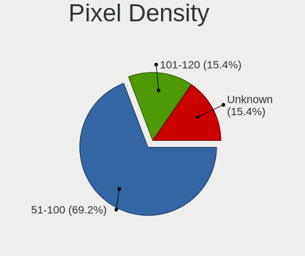
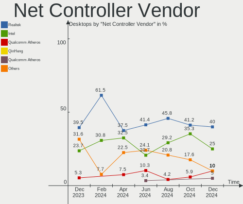
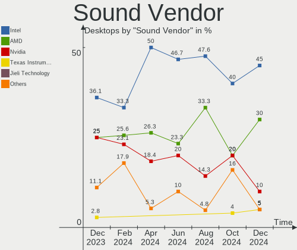
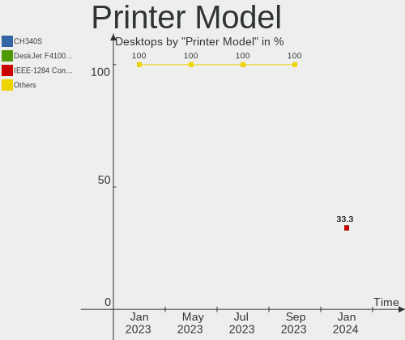
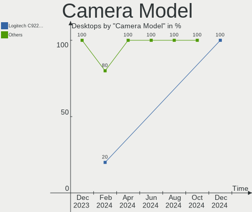
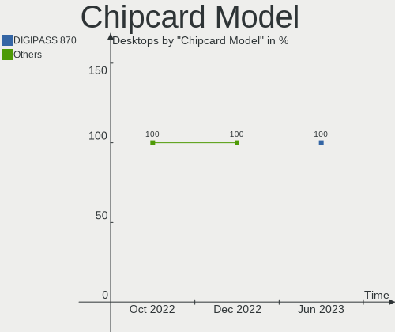

Xubuntu Hardware Trends (Desktops)
----------------------------------

A project to identify most popular hardware characteristics and track their change
over time based on data collected by Xubuntu users at https://Linux-Hardware.org.

Anyone can contribute to this report by the [hw-probe](https://github.com/linuxhw/hw-probe) tool:

    sudo -E hw-probe -all -upload

Full-feature report is available here: https://linux-hardware.org/?view=trends

Period: Feb, 2022.

Contents
--------

* [ System ](#system)
  - [ OS                       ](#os)
  - [ OS Family                ](#os-family)
  - [ Kernel                   ](#kernel)
  - [ Kernel Family            ](#kernel-family)
  - [ Kernel Major Ver.        ](#kernel-major-ver)
  - [ Arch                     ](#arch)
  - [ DE                       ](#de)
  - [ Display Server           ](#display-server)
  - [ Display Manager          ](#display-manager)
  - [ OS Lang                  ](#os-lang)
  - [ Boot Mode                ](#boot-mode)
  - [ Filesystem               ](#filesystem)
  - [ Part. scheme             ](#part-scheme)
  - [ Dual Boot with Linux/BSD ](#dual-boot-with-linuxbsd)
  - [ Dual Boot (Win)          ](#dual-boot-win)

* [ Board ](#board)
  - [ Vendor                   ](#vendor)
  - [ Model                    ](#model)
  - [ Model Family             ](#model-family)
  - [ MFG Year                 ](#mfg-year)
  - [ Form Factor              ](#form-factor)
  - [ Secure Boot              ](#secure-boot)
  - [ Coreboot                 ](#coreboot)
  - [ RAM Size                 ](#ram-size)
  - [ RAM Used                 ](#ram-used)
  - [ Total Drives             ](#total-drives)
  - [ Has CD-ROM               ](#has-cd-rom)
  - [ Has Ethernet             ](#has-ethernet)
  - [ Has WiFi                 ](#has-wifi)
  - [ Has Bluetooth            ](#has-bluetooth)

* [ Location ](#location)
  - [ Country                  ](#country)
  - [ City                     ](#city)

* [ Drives ](#drives)
  - [ Drive Vendor             ](#drive-vendor)
  - [ Drive Model              ](#drive-model)
  - [ HDD Vendor               ](#hdd-vendor)
  - [ SSD Vendor               ](#ssd-vendor)
  - [ Drive Kind               ](#drive-kind)
  - [ Drive Connector          ](#drive-connector)
  - [ Drive Size               ](#drive-size)
  - [ Space Total              ](#space-total)
  - [ Space Used               ](#space-used)
  - [ Malfunc. Drives          ](#malfunc-drives)
  - [ Malfunc. Drive Vendor    ](#malfunc-drive-vendor)
  - [ Malfunc. HDD Vendor      ](#malfunc-hdd-vendor)
  - [ Malfunc. Drive Kind      ](#malfunc-drive-kind)
  - [ Failed Drives            ](#failed-drives)
  - [ Failed Drive Vendor      ](#failed-drive-vendor)
  - [ Drive Status             ](#drive-status)

* [ Storage controller ](#storage-controller)
  - [ Storage Vendor           ](#storage-vendor)
  - [ Storage Model            ](#storage-model)
  - [ Storage Kind             ](#storage-kind)

* [ Processor ](#processor)
  - [ CPU Vendor               ](#cpu-vendor)
  - [ CPU Model                ](#cpu-model)
  - [ CPU Model Family         ](#cpu-model-family)
  - [ CPU Cores                ](#cpu-cores)
  - [ CPU Sockets              ](#cpu-sockets)
  - [ CPU Threads              ](#cpu-threads)
  - [ CPU Op-Modes             ](#cpu-op-modes)
  - [ CPU Microcode            ](#cpu-microcode)
  - [ CPU Microarch            ](#cpu-microarch)

* [ Graphics ](#graphics)
  - [ GPU Vendor               ](#gpu-vendor)
  - [ GPU Model                ](#gpu-model)
  - [ GPU Combo                ](#gpu-combo)
  - [ GPU Driver               ](#gpu-driver)
  - [ GPU Memory               ](#gpu-memory)

* [ Monitor ](#monitor)
  - [ Monitor Vendor           ](#monitor-vendor)
  - [ Monitor Model            ](#monitor-model)
  - [ Monitor Resolution       ](#monitor-resolution)
  - [ Monitor Diagonal         ](#monitor-diagonal)
  - [ Monitor Width            ](#monitor-width)
  - [ Aspect Ratio             ](#aspect-ratio)
  - [ Monitor Area             ](#monitor-area)
  - [ Pixel Density            ](#pixel-density)
  - [ Multiple Monitors        ](#multiple-monitors)

* [ Network ](#network)
  - [ Net Controller Vendor    ](#net-controller-vendor)
  - [ Net Controller Model     ](#net-controller-model)
  - [ Wireless Vendor          ](#wireless-vendor)
  - [ Wireless Model           ](#wireless-model)
  - [ Ethernet Vendor          ](#ethernet-vendor)
  - [ Ethernet Model           ](#ethernet-model)
  - [ Net Controller Kind      ](#net-controller-kind)
  - [ Used Controller          ](#used-controller)
  - [ NICs                     ](#nics)
  - [ IPv6                     ](#ipv6)

* [ Bluetooth ](#bluetooth)
  - [ Bluetooth Vendor         ](#bluetooth-vendor)
  - [ Bluetooth Model          ](#bluetooth-model)

* [ Sound ](#sound)
  - [ Sound Vendor             ](#sound-vendor)
  - [ Sound Model              ](#sound-model)

* [ Memory ](#memory)
  - [ Memory Vendor            ](#memory-vendor)
  - [ Memory Model             ](#memory-model)
  - [ Memory Kind              ](#memory-kind)
  - [ Memory Form Factor       ](#memory-form-factor)
  - [ Memory Size              ](#memory-size)
  - [ Memory Speed             ](#memory-speed)

* [ Printers & scanners ](#printers--scanners)
  - [ Printer Vendor           ](#printer-vendor)
  - [ Printer Model            ](#printer-model)
  - [ Scanner Vendor           ](#scanner-vendor)
  - [ Scanner Model            ](#scanner-model)

* [ Camera ](#camera)
  - [ Camera Vendor            ](#camera-vendor)
  - [ Camera Model             ](#camera-model)

* [ Security ](#security)
  - [ Fingerprint Vendor       ](#fingerprint-vendor)
  - [ Fingerprint Model        ](#fingerprint-model)
  - [ Chipcard Vendor          ](#chipcard-vendor)
  - [ Chipcard Model           ](#chipcard-model)

* [ Unsupported ](#unsupported)
  - [ Unsupported Devices      ](#unsupported-devices)
  - [ Unsupported Device Types ](#unsupported-device-types)

System
------

OS
--

Installed operating systems

| Name          | Desktops | Percent |
|---------------|----------|---------|
| Xubuntu 20.04 | 19       | 61.29%  |
| Xubuntu 21.10 | 8        | 25.81%  |
| Xubuntu 18.04 | 2        | 6.45%   |
| Xubuntu 16.04 | 2        | 6.45%   |

OS Family
---------

OS without a version

| Name    | Desktops | Percent |
|---------|----------|---------|
| Xubuntu | 31       | 100%    |

Kernel
------

Version of the Linux kernel

| Version                  | Desktops | Percent |
|--------------------------|----------|---------|
| 5.13.0-28-generic        | 7        | 22.58%  |
| 5.13.0-30-generic        | 6        | 19.35%  |
| 5.13.0-27-generic        | 3        | 9.68%   |
| 5.4.0-99-lowlatency      | 2        | 6.45%   |
| 5.13.0-28-lowlatency     | 2        | 6.45%   |
| 4.4.0-210-generic        | 2        | 6.45%   |
| 4.15.0-167-generic       | 2        | 6.45%   |
| 5.8.0-48-generic         | 1        | 3.23%   |
| 5.4.0-99-generic         | 1        | 3.23%   |
| 5.4.0-74-generic         | 1        | 3.23%   |
| 5.4.0-42-generic         | 1        | 3.23%   |
| 5.15.0-051500rc7-generic | 1        | 3.23%   |
| 5.13.0-27-lowlatency     | 1        | 3.23%   |
| 5.11.0-27-generic        | 1        | 3.23%   |

Kernel Family
-------------

Linux kernel without a distro release

| Version | Desktops | Percent |
|---------|----------|---------|
| 5.13.0  | 19       | 61.29%  |
| 5.4.0   | 5        | 16.13%  |
| 4.4.0   | 2        | 6.45%   |
| 4.15.0  | 2        | 6.45%   |
| 5.8.0   | 1        | 3.23%   |
| 5.15.0  | 1        | 3.23%   |
| 5.11.0  | 1        | 3.23%   |

Kernel Major Ver.
-----------------

Linux kernel major version

| Version | Desktops | Percent |
|---------|----------|---------|
| 5.13    | 19       | 61.29%  |
| 5.4     | 5        | 16.13%  |
| 4.4     | 2        | 6.45%   |
| 4.15    | 2        | 6.45%   |
| 5.8     | 1        | 3.23%   |
| 5.15    | 1        | 3.23%   |
| 5.11    | 1        | 3.23%   |

Arch
----

OS architecture (x86_64, i586, etc.)

| Name   | Desktops | Percent |
|--------|----------|---------|
| x86_64 | 29       | 93.55%  |
| i686   | 2        | 6.45%   |

DE
--

Desktop Environment

| Name       | Desktops | Percent |
|------------|----------|---------|
| XFCE       | 27       | 87.1%   |
| GNOME      | 3        | 9.68%   |
| X-Cinnamon | 1        | 3.23%   |

Display Server
--------------

X11 or Wayland

| Name | Desktops | Percent |
|------|----------|---------|
| X11  | 30       | 96.77%  |
| Tty  | 1        | 3.23%   |

Display Manager
---------------

SDDM, LightDM, etc.

| Name    | Desktops | Percent |
|---------|----------|---------|
| LightDM | 27       | 87.1%   |
| Unknown | 3        | 9.68%   |
| GDM3    | 1        | 3.23%   |

OS Lang
-------

Language

| Lang  | Desktops | Percent |
|-------|----------|---------|
| en_US | 11       | 35.48%  |
| fr_FR | 5        | 16.13%  |
| de_DE | 5        | 16.13%  |
| sk_SK | 2        | 6.45%   |
| sv_SE | 1        | 3.23%   |
| pt_BR | 1        | 3.23%   |
| es_MX | 1        | 3.23%   |
| es_ES | 1        | 3.23%   |
| es_AR | 1        | 3.23%   |
| en_ZA | 1        | 3.23%   |
| en_GB | 1        | 3.23%   |
| en_CA | 1        | 3.23%   |

Boot Mode
---------

EFI or BIOS

| Mode | Desktops | Percent |
|------|----------|---------|
| BIOS | 21       | 67.74%  |
| EFI  | 10       | 32.26%  |

Filesystem
----------

Type of filesystem

| Type  | Desktops | Percent |
|-------|----------|---------|
| Ext4  | 29       | 93.55%  |
| Xfs   | 1        | 3.23%   |
| Btrfs | 1        | 3.23%   |

Part. scheme
------------

Scheme of partitioning

| Type    | Desktops | Percent |
|---------|----------|---------|
| Unknown | 19       | 61.29%  |
| GPT     | 7        | 22.58%  |
| MBR     | 5        | 16.13%  |

Dual Boot with Linux/BSD
------------------------

Hosting more than one Linux/BSD

| Dual boot | Desktops | Percent |
|-----------|----------|---------|
| No        | 21       | 67.74%  |
| Yes       | 10       | 32.26%  |

Dual Boot (Win)
---------------

Hosting Linux and Windows

| Dual boot | Desktops | Percent |
|-----------|----------|---------|
| No        | 19       | 61.29%  |
| Yes       | 12       | 38.71%  |

Board
-----

Vendor
------

Motherboard manufacturer

| Name                | Desktops | Percent |
|---------------------|----------|---------|
| ASUSTek Computer    | 8        | 25.81%  |
| Dell                | 7        | 22.58%  |
| MSI                 | 4        | 12.9%   |
| Hewlett-Packard     | 2        | 6.45%   |
| Gigabyte Technology | 2        | 6.45%   |
| ASRock              | 2        | 6.45%   |
| Pegatron            | 1        | 3.23%   |
| Lenovo              | 1        | 3.23%   |
| Fujitsu Siemens     | 1        | 3.23%   |
| Fujitsu             | 1        | 3.23%   |
| Acer                | 1        | 3.23%   |
| Unknown             | 1        | 3.23%   |

Model
-----

Motherboard model

| Name                               | Desktops | Percent |
|------------------------------------|----------|---------|
| Pegatron h8-1207eo                 | 1        | 3.23%   |
| MSI MS-7C35                        | 1        | 3.23%   |
| MSI MS-7850                        | 1        | 3.23%   |
| MSI MS-7786                        | 1        | 3.23%   |
| MSI MS-7592                        | 1        | 3.23%   |
| Lenovo ThinkCentre M72e 35951A1    | 1        | 3.23%   |
| HP Compaq dc7900 Small Form Factor | 1        | 3.23%   |
| HP Compaq 6200 Pro MT PC           | 1        | 3.23%   |
| Gigabyte X570 AORUS MASTER         | 1        | 3.23%   |
| Gigabyte GA-870A-UD3               | 1        | 3.23%   |
| Fujitsu Siemens D1784              | 1        | 3.23%   |
| Fujitsu ESPRIMO Q958               | 1        | 3.23%   |
| Dell OptiPlex GX620                | 1        | 3.23%   |
| Dell OptiPlex 960                  | 1        | 3.23%   |
| Dell OptiPlex 9020                 | 1        | 3.23%   |
| Dell OptiPlex 9010                 | 1        | 3.23%   |
| Dell OptiPlex 7010                 | 1        | 3.23%   |
| Dell OptiPlex 3040                 | 1        | 3.23%   |
| Dell OptiPlex 3010                 | 1        | 3.23%   |
| ASUS Z170-K                        | 1        | 3.23%   |
| ASUS TUF GAMING X570-PRO           | 1        | 3.23%   |
| ASUS ROG STRIX X570-E GAMING       | 1        | 3.23%   |
| ASUS PRIME H570M-PLUS              | 1        | 3.23%   |
| ASUS PRIME B550M-K                 | 1        | 3.23%   |
| ASUS P5Q-PRO                       | 1        | 3.23%   |
| ASUS M5A97 R2.0                    | 1        | 3.23%   |
| ASUS M4A87TD EVO                   | 1        | 3.23%   |
| ASRock K10N78M                     | 1        | 3.23%   |
| ASRock 960GM-GS3 FX                | 1        | 3.23%   |
| Acer Aspire R3700                  | 1        | 3.23%   |
| Unknown                            | 1        | 3.23%   |

Model Family
------------

Motherboard model prefix

| Name                  | Desktops | Percent |
|-----------------------|----------|---------|
| Dell OptiPlex         | 7        | 22.58%  |
| HP Compaq             | 2        | 6.45%   |
| ASUS PRIME            | 2        | 6.45%   |
| Pegatron h8-1207eo    | 1        | 3.23%   |
| MSI MS-7C35           | 1        | 3.23%   |
| MSI MS-7850           | 1        | 3.23%   |
| MSI MS-7786           | 1        | 3.23%   |
| MSI MS-7592           | 1        | 3.23%   |
| Lenovo ThinkCentre    | 1        | 3.23%   |
| Gigabyte X570         | 1        | 3.23%   |
| Gigabyte GA-870A-UD3  | 1        | 3.23%   |
| Fujitsu Siemens D1784 | 1        | 3.23%   |
| Fujitsu ESPRIMO       | 1        | 3.23%   |
| ASUS Z170-K           | 1        | 3.23%   |
| ASUS TUF              | 1        | 3.23%   |
| ASUS ROG              | 1        | 3.23%   |
| ASUS P5Q-PRO          | 1        | 3.23%   |
| ASUS M5A97            | 1        | 3.23%   |
| ASUS M4A87TD          | 1        | 3.23%   |
| ASRock K10N78M        | 1        | 3.23%   |
| ASRock 960GM-GS3      | 1        | 3.23%   |
| Acer Aspire           | 1        | 3.23%   |
| Unknown               | 1        | 3.23%   |

MFG Year
--------

Motherboard manufacture year

| Year | Desktops | Percent |
|------|----------|---------|
| 2020 | 4        | 12.9%   |
| 2012 | 4        | 12.9%   |
| 2019 | 3        | 9.68%   |
| 2013 | 3        | 9.68%   |
| 2011 | 3        | 9.68%   |
| 2008 | 3        | 9.68%   |
| 2010 | 2        | 6.45%   |
| 2009 | 2        | 6.45%   |
| 2006 | 2        | 6.45%   |
| 2021 | 1        | 3.23%   |
| 2018 | 1        | 3.23%   |
| 2016 | 1        | 3.23%   |
| 2015 | 1        | 3.23%   |
| 2014 | 1        | 3.23%   |

Form Factor
-----------

Physical design of the computer

| Name    | Desktops | Percent |
|---------|----------|---------|
| Desktop | 31       | 100%    |

Secure Boot
-----------

Enabled or disabled

| State    | Desktops | Percent |
|----------|----------|---------|
| Disabled | 29       | 93.55%  |
| Enabled  | 2        | 6.45%   |

Coreboot
--------

Have coreboot on board

| Used | Desktops | Percent |
|------|----------|---------|
| No   | 31       | 100%    |

RAM Size
--------

Total RAM memory

| Size in GB  | Desktops | Percent |
|-------------|----------|---------|
| 3.01-4.0    | 7        | 22.58%  |
| 8.01-16.0   | 6        | 19.35%  |
| 4.01-8.0    | 4        | 12.9%   |
| 32.01-64.0  | 4        | 12.9%   |
| 16.01-24.0  | 4        | 12.9%   |
| 24.01-32.0  | 2        | 6.45%   |
| 64.01-256.0 | 2        | 6.45%   |
| 2.01-3.0    | 1        | 3.23%   |
| 1.01-2.0    | 1        | 3.23%   |

RAM Used
--------

Used RAM memory

| Used GB    | Desktops | Percent |
|------------|----------|---------|
| 1.01-2.0   | 10       | 32.26%  |
| 3.01-4.0   | 8        | 25.81%  |
| 2.01-3.0   | 5        | 16.13%  |
| 0.51-1.0   | 4        | 12.9%   |
| 4.01-8.0   | 2        | 6.45%   |
| 16.01-24.0 | 1        | 3.23%   |
| 8.01-16.0  | 1        | 3.23%   |

Total Drives
------------

Number of drives on board

| Drives | Desktops | Percent |
|--------|----------|---------|
| 1      | 12       | 38.71%  |
| 2      | 9        | 29.03%  |
| 3      | 6        | 19.35%  |
| 10     | 1        | 3.23%   |
| 7      | 1        | 3.23%   |
| 6      | 1        | 3.23%   |
| 4      | 1        | 3.23%   |

Has CD-ROM
----------

Has CD-ROM on board

| Presented | Desktops | Percent |
|-----------|----------|---------|
| Yes       | 20       | 64.52%  |
| No        | 11       | 35.48%  |

Has Ethernet
------------

Has Ethernet on board

| Presented | Desktops | Percent |
|-----------|----------|---------|
| Yes       | 31       | 100%    |

Has WiFi
--------

Has WiFi module

| Presented | Desktops | Percent |
|-----------|----------|---------|
| No        | 20       | 64.52%  |
| Yes       | 11       | 35.48%  |

Has Bluetooth
-------------

Has Bluetooth module

| Presented | Desktops | Percent |
|-----------|----------|---------|
| No        | 23       | 74.19%  |
| Yes       | 8        | 25.81%  |

Location
--------

Country
-------

Geographic location (country)

| Country      | Desktops | Percent |
|--------------|----------|---------|
| Germany      | 6        | 19.35%  |
| USA          | 4        | 12.9%   |
| Slovakia     | 2        | 6.45%   |
| France       | 2        | 6.45%   |
| Finland      | 2        | 6.45%   |
| Belgium      | 2        | 6.45%   |
| UK           | 1        | 3.23%   |
| Thailand     | 1        | 3.23%   |
| Sweden       | 1        | 3.23%   |
| Spain        | 1        | 3.23%   |
| South Africa | 1        | 3.23%   |
| Portugal     | 1        | 3.23%   |
| Netherlands  | 1        | 3.23%   |
| Mexico       | 1        | 3.23%   |
| Czechia      | 1        | 3.23%   |
| Canada       | 1        | 3.23%   |
| Bulgaria     | 1        | 3.23%   |
| Brazil       | 1        | 3.23%   |
| Argentina    | 1        | 3.23%   |

City
----

Geographic location (city)

| City                | Desktops | Percent |
|---------------------|----------|---------|
| Tampere             | 2        | 6.45%   |
| Bardejov            | 2        | 6.45%   |
| Wickford            | 1        | 3.23%   |
| Vohenstrauss        | 1        | 3.23%   |
| Västerås      | 1        | 3.23%   |
| Tours               | 1        | 3.23%   |
| Surrey              | 1        | 3.23%   |
| Sokolov             | 1        | 3.23%   |
| Sofia               | 1        | 3.23%   |
| Saint-Ouen-l'Aumone | 1        | 3.23%   |
| Roseville           | 1        | 3.23%   |
| Phuket              | 1        | 3.23%   |
| Philadelphia        | 1        | 3.23%   |
| Münster            | 1        | 3.23%   |
| Mexico City         | 1        | 3.23%   |
| Madrid              | 1        | 3.23%   |
| Liège            | 1        | 3.23%   |
| Leiden              | 1        | 3.23%   |
| La Plata            | 1        | 3.23%   |
| Katy                | 1        | 3.23%   |
| Ixelles-Elsene      | 1        | 3.23%   |
| Guaíba             | 1        | 3.23%   |
| Freiberg            | 1        | 3.23%   |
| Eppingen            | 1        | 3.23%   |
| Decatur             | 1        | 3.23%   |
| Cologne             | 1        | 3.23%   |
| Cape Town           | 1        | 3.23%   |
| Belas               | 1        | 3.23%   |
| Beckum              | 1        | 3.23%   |

Drives
------

Drive Vendor
------------

Hard drive vendors

| Vendor              | Desktops | Drives | Percent |
|---------------------|----------|--------|---------|
| Seagate             | 14       | 16     | 25.45%  |
| WDC                 | 13       | 21     | 23.64%  |
| Samsung Electronics | 12       | 18     | 21.82%  |
| Kingston            | 3        | 4      | 5.45%   |
| A-DATA Technology   | 3        | 3      | 5.45%   |
| Toshiba             | 2        | 4      | 3.64%   |
| Hitachi             | 2        | 2      | 3.64%   |
| USB3.0              | 1        | 1      | 1.82%   |
| Patriot             | 1        | 1      | 1.82%   |
| OCZ-VERTEX3         | 1        | 1      | 1.82%   |
| HGST                | 1        | 1      | 1.82%   |
| Crucial             | 1        | 2      | 1.82%   |
| China               | 1        | 1      | 1.82%   |

Drive Model
-----------

Hard drive models

| Model                                | Desktops | Percent |
|--------------------------------------|----------|---------|
| Kingston SA400S37240G 240GB SSD      | 3        | 4.69%   |
| Seagate ST3808110AS 80GB             | 2        | 3.13%   |
| Seagate ST3160318AS 160GB            | 2        | 3.13%   |
| WDC WDS500G2B0A 500GB SSD            | 1        | 1.56%   |
| WDC WDS200T2B0B-00YS70 2TB SSD       | 1        | 1.56%   |
| WDC WDS100T2B0A-00SM50 1TB SSD       | 1        | 1.56%   |
| WDC WD800JD-75MSA3 80GB              | 1        | 1.56%   |
| WDC WD5000AAKX-08ERMA0 500GB         | 1        | 1.56%   |
| WDC WD40EZRZ-22GXCB0 4TB             | 1        | 1.56%   |
| WDC WD30EZRZ-00Z5HB0 3TB             | 1        | 1.56%   |
| WDC WD2500KS-00MJB0 250GB            | 1        | 1.56%   |
| WDC WD20EZRZ-22Z5HB0 2TB             | 1        | 1.56%   |
| WDC WD20EARX-00PASB0 2TB             | 1        | 1.56%   |
| WDC WD10EZRX-00D8PB0 1TB             | 1        | 1.56%   |
| WDC WD10EZEX-60WN4A1 1TB             | 1        | 1.56%   |
| WDC WD10EACS-32ZJB0 1TB              | 1        | 1.56%   |
| WDC WD1002FAEX-00Z3A0 1TB            | 1        | 1.56%   |
| WDC WD My Passport 264F 2TB          | 1        | 1.56%   |
| USB3.0 Super Speed 256GB             | 1        | 1.56%   |
| Toshiba HDWD130 3TB                  | 1        | 1.56%   |
| Toshiba DT01ACA300 3TB               | 1        | 1.56%   |
| Seagate ST8000DM004-2U9188 8TB       | 1        | 1.56%   |
| Seagate ST500DM002-1BD142 500GB      | 1        | 1.56%   |
| Seagate ST380815AS 80GB              | 1        | 1.56%   |
| Seagate ST380215A 80GB               | 1        | 1.56%   |
| Seagate ST3750641NS EIT 752GB        | 1        | 1.56%   |
| Seagate ST31000524AS 1TB             | 1        | 1.56%   |
| Seagate ST2000DM008-2FR102 2TB       | 1        | 1.56%   |
| Seagate ST2000DM001-1CH164 2TB       | 1        | 1.56%   |
| Seagate ST1000DM010-2EP102 1TB       | 1        | 1.56%   |
| Seagate ST1000DM003-1SB102 1TB       | 1        | 1.56%   |
| Seagate Expansion Desk 8TB           | 1        | 1.56%   |
| Samsung SSD 980 1TB                  | 1        | 1.56%   |
| Samsung SSD 970 PRO 512GB            | 1        | 1.56%   |
| Samsung SSD 970 EVO Plus 1TB         | 1        | 1.56%   |
| Samsung SSD 860 EVO 500GB            | 1        | 1.56%   |
| Samsung SSD 860 EVO 2TB              | 1        | 1.56%   |
| Samsung SSD 850 EVO 250GB            | 1        | 1.56%   |
| Samsung SSD 840 Series 250GB         | 1        | 1.56%   |
| Samsung SSD 840 EVO 250GB            | 1        | 1.56%   |
| Samsung NVMe SSD Drive 512GB         | 1        | 1.56%   |
| Samsung NVMe SSD Drive 500GB         | 1        | 1.56%   |
| Samsung NVMe SSD Drive 1TB           | 1        | 1.56%   |
| Samsung MZ7LN128HAHQ-000L2 128GB SSD | 1        | 1.56%   |
| Samsung HE160HJ 160GB                | 1        | 1.56%   |
| Samsung HD753LJ 752GB                | 1        | 1.56%   |
| Samsung HD321HJ 320GB                | 1        | 1.56%   |
| Samsung HD080HJ/ 80GB                | 1        | 1.56%   |
| Patriot Burst 120GB SSD              | 1        | 1.56%   |
| OCZ-VERTEX3 MI 120GB SSD             | 1        | 1.56%   |
| Kingston SA400S37120G 120GB SSD      | 1        | 1.56%   |
| Hitachi HDS721010CLA632 1TB          | 1        | 1.56%   |
| Hitachi HDP725025GLA380 250GB        | 1        | 1.56%   |
| HGST HTS545032A7E680 320GB           | 1        | 1.56%   |
| Crucial CT2000BX500SSD1 2TB          | 1        | 1.56%   |
| Crucial CT1000MX500SSD1 1TB          | 1        | 1.56%   |
| China SSD 256GB                      | 1        | 1.56%   |
| A-DATA SX8200PNP 1TB                 | 1        | 1.56%   |
| A-DATA SU800 256GB SSD               | 1        | 1.56%   |
| A-DATA SP550 120GB SSD               | 1        | 1.56%   |

HDD Vendor
----------

Hard disk drive vendors

| Vendor              | Desktops | Drives | Percent |
|---------------------|----------|--------|---------|
| Seagate             | 14       | 16     | 42.42%  |
| WDC                 | 9        | 12     | 27.27%  |
| Samsung Electronics | 4        | 4      | 12.12%  |
| Toshiba             | 2        | 4      | 6.06%   |
| Hitachi             | 2        | 2      | 6.06%   |
| USB3.0              | 1        | 1      | 3.03%   |
| HGST                | 1        | 1      | 3.03%   |

SSD Vendor
----------

Solid state drive vendors

| Vendor              | Desktops | Drives | Percent |
|---------------------|----------|--------|---------|
| Samsung Electronics | 5        | 6      | 29.41%  |
| WDC                 | 3        | 8      | 17.65%  |
| Kingston            | 3        | 4      | 17.65%  |
| A-DATA Technology   | 2        | 2      | 11.76%  |
| Patriot             | 1        | 1      | 5.88%   |
| OCZ-VERTEX3         | 1        | 1      | 5.88%   |
| Crucial             | 1        | 2      | 5.88%   |
| China               | 1        | 1      | 5.88%   |

Drive Kind
----------

HDD or SSD

| Kind    | Desktops | Drives | Percent |
|---------|----------|--------|---------|
| HDD     | 24       | 40     | 51.06%  |
| SSD     | 16       | 25     | 34.04%  |
| NVMe    | 6        | 9      | 12.77%  |
| Unknown | 1        | 1      | 2.13%   |

Drive Connector
---------------

SATA, SAS, NVMe, etc.

| Type | Desktops | Drives | Percent |
|------|----------|--------|---------|
| SATA | 29       | 61     | 74.36%  |
| NVMe | 6        | 9      | 15.38%  |
| SAS  | 4        | 5      | 10.26%  |

Drive Size
----------

Size of hard drive

| Size in TB | Desktops | Drives | Percent |
|------------|----------|--------|---------|
| 0.01-0.5   | 23       | 31     | 48.94%  |
| 0.51-1.0   | 11       | 17     | 23.4%   |
| 1.01-2.0   | 7        | 9      | 14.89%  |
| 2.01-3.0   | 3        | 5      | 6.38%   |
| 4.01-10.0  | 2        | 2      | 4.26%   |
| 3.01-4.0   | 1        | 1      | 2.13%   |

Space Total
-----------

Amount of disk space available on the file system

| Size in GB     | Desktops | Percent |
|----------------|----------|---------|
| 101-250        | 6        | 19.35%  |
| 51-100         | 5        | 16.13%  |
| More than 3000 | 4        | 12.9%   |
| 251-500        | 4        | 12.9%   |
| 1001-2000      | 4        | 12.9%   |
| 501-1000       | 4        | 12.9%   |
| 2001-3000      | 3        | 9.68%   |
| 1-20           | 1        | 3.23%   |

Space Used
----------

Amount of used disk space

| Used GB        | Desktops | Percent |
|----------------|----------|---------|
| 1-20           | 6        | 19.35%  |
| 21-50          | 5        | 16.13%  |
| 51-100         | 5        | 16.13%  |
| 101-250        | 4        | 12.9%   |
| 501-1000       | 3        | 9.68%   |
| More than 3000 | 2        | 6.45%   |
| 251-500        | 2        | 6.45%   |
| 2001-3000      | 2        | 6.45%   |
| 1001-2000      | 2        | 6.45%   |

Malfunc. Drives
---------------

Drive models with a malfunction

| Model                           | Desktops | Drives | Percent |
|---------------------------------|----------|--------|---------|
| WDC WD1002FAEX-00Z3A0 1TB       | 1        | 1      | 50%     |
| Kingston SA400S37240G 240GB SSD | 1        | 1      | 50%     |

Malfunc. Drive Vendor
---------------------

Vendors of faulty drives

| Vendor   | Desktops | Drives | Percent |
|----------|----------|--------|---------|
| WDC      | 1        | 1      | 50%     |
| Kingston | 1        | 1      | 50%     |

Malfunc. HDD Vendor
-------------------

Vendors of faulty HDD drives

| Vendor | Desktops | Drives | Percent |
|--------|----------|--------|---------|
| WDC    | 1        | 1      | 100%    |

Malfunc. Drive Kind
-------------------

Kinds of faulty drives

| Kind | Desktops | Drives | Percent |
|------|----------|--------|---------|
| SSD  | 1        | 1      | 50%     |
| HDD  | 1        | 1      | 50%     |

Failed Drives
-------------

Failed drive models

Zero info for selected period =(

Failed Drive Vendor
-------------------

Failed drive vendors

Zero info for selected period =(

Drive Status
------------

Number of failed and malfunc. drives

| Status   | Desktops | Drives | Percent |
|----------|----------|--------|---------|
| Detected | 20       | 50     | 60.61%  |
| Works    | 11       | 23     | 33.33%  |
| Malfunc  | 2        | 2      | 6.06%   |

Storage controller
------------------

Storage Vendor
--------------

Storage controller vendors

| Vendor                   | Desktops | Percent |
|--------------------------|----------|---------|
| Intel                    | 20       | 47.62%  |
| AMD                      | 10       | 23.81%  |
| Samsung Electronics      | 6        | 14.29%  |
| JMicron Technology       | 2        | 4.76%   |
| Nvidia                   | 1        | 2.38%   |
| Marvell Technology Group | 1        | 2.38%   |
| ASMedia Technology       | 1        | 2.38%   |
| ADATA Technology         | 1        | 2.38%   |

Storage Model
-------------

Storage controller models

| Model                                                                         | Desktops | Percent |
|-------------------------------------------------------------------------------|----------|---------|
| Samsung NVMe SSD Controller SM981/PM981/PM983                                 | 4        | 7.41%   |
| Intel 6 Series/C200 Series Chipset Family 6 port Desktop SATA AHCI Controller | 4        | 7.41%   |
| AMD FCH SATA Controller [AHCI mode]                                           | 4        | 7.41%   |
| AMD SB7x0/SB8x0/SB9x0 SATA Controller [IDE mode]                              | 3        | 5.56%   |
| AMD SB7x0/SB8x0/SB9x0 IDE Controller                                          | 3        | 5.56%   |
| Intel SATA Controller [RAID mode]                                             | 2        | 3.7%    |
| Intel Q170/Q150/B150/H170/H110/Z170/CM236 Chipset SATA Controller [AHCI Mode] | 2        | 3.7%    |
| Intel NM10/ICH7 Family SATA Controller [IDE mode]                             | 2        | 3.7%    |
| Intel 82801G (ICH7 Family) IDE Controller                                     | 2        | 3.7%    |
| Intel 7 Series/C210 Series Chipset Family 6-port SATA Controller [AHCI mode]  | 2        | 3.7%    |
| Intel 4 Series Chipset PT IDER Controller                                     | 2        | 3.7%    |
| Samsung NVMe SSD Controller SM961/PM961/SM963                                 | 1        | 1.85%   |
| Samsung NVMe SSD Controller PM9A1/PM9A3/980PRO                                | 1        | 1.85%   |
| Samsung NVMe SSD Controller 980                                               | 1        | 1.85%   |
| Nvidia MCP78S [GeForce 8200] SATA Controller (non-AHCI mode)                  | 1        | 1.85%   |
| Nvidia MCP78S [GeForce 8200] IDE                                              | 1        | 1.85%   |
| Marvell Group 88SE6111/6121 SATA II / PATA Controller                         | 1        | 1.85%   |
| JMicron JMB363 SATA/IDE Controller                                            | 1        | 1.85%   |
| JMicron JMB361 AHCI/IDE                                                       | 1        | 1.85%   |
| Intel NM10/ICH7 Family SATA Controller [AHCI mode]                            | 1        | 1.85%   |
| Intel Cannon Lake PCH SATA AHCI Controller                                    | 1        | 1.85%   |
| Intel C600/X79 series chipset 6-Port SATA AHCI Controller                     | 1        | 1.85%   |
| Intel 9 Series Chipset Family SATA Controller [AHCI Mode]                     | 1        | 1.85%   |
| Intel 82801JI (ICH10 Family) 4 port SATA IDE Controller #1                    | 1        | 1.85%   |
| Intel 82801JI (ICH10 Family) 2 port SATA IDE Controller #2                    | 1        | 1.85%   |
| Intel 82801JD/DO (ICH10 Family) SATA AHCI Controller                          | 1        | 1.85%   |
| Intel 82801FB/FW (ICH6/ICH6W) SATA Controller                                 | 1        | 1.85%   |
| Intel 82801FB/FBM/FR/FW/FRW (ICH6 Family) IDE Controller                      | 1        | 1.85%   |
| Intel 500 Series Chipset Family SATA AHCI Controller                          | 1        | 1.85%   |
| ASMedia SATA controller                                                       | 1        | 1.85%   |
| AMD Starship/Matisse Chipset SATA Controller [AHCI mode]                      | 1        | 1.85%   |
| AMD SB7x0/SB8x0/SB9x0 SATA Controller [AHCI mode]                             | 1        | 1.85%   |
| AMD FCH SATA Controller [IDE mode]                                            | 1        | 1.85%   |
| AMD FCH IDE Controller                                                        | 1        | 1.85%   |
| ADATA XPG SX8200 Pro PCIe Gen3x4 M.2 2280 Solid State Drive                   | 1        | 1.85%   |

Storage Kind
------------

Kind of storage controller (IDE, SATA, NVMe, SAS, ...)

| Kind | Desktops | Percent |
|------|----------|---------|
| SATA | 24       | 55.81%  |
| IDE  | 11       | 25.58%  |
| NVMe | 6        | 13.95%  |
| RAID | 2        | 4.65%   |

Processor
---------

CPU Vendor
----------

Processor vendors

| Vendor | Desktops | Percent |
|--------|----------|---------|
| Intel  | 20       | 64.52%  |
| AMD    | 11       | 35.48%  |

CPU Model
---------

Processor models

| Model                                       | Desktops | Percent |
|---------------------------------------------|----------|---------|
| Intel Pentium 4 CPU 3.00GHz                 | 2        | 6.45%   |
| Intel Core i5-3470 CPU @ 3.20GHz            | 2        | 6.45%   |
| AMD Ryzen 7 5700G with Radeon Graphics      | 2        | 6.45%   |
| AMD Phenom II X4 955 Processor              | 2        | 6.45%   |
| Intel Xeon CPU E5-2640 v2 @ 2.00GHz         | 1        | 3.23%   |
| Intel Pentium Dual-Core CPU E5700 @ 3.00GHz | 1        | 3.23%   |
| Intel Core i9-10900 CPU @ 2.80GHz           | 1        | 3.23%   |
| Intel Core i7-9700T CPU @ 2.00GHz           | 1        | 3.23%   |
| Intel Core i7-4790 CPU @ 3.60GHz            | 1        | 3.23%   |
| Intel Core i7-4770 CPU @ 3.40GHz            | 1        | 3.23%   |
| Intel Core i7-3770 CPU @ 3.40GHz            | 1        | 3.23%   |
| Intel Core i7-2600 CPU @ 3.40GHz            | 1        | 3.23%   |
| Intel Core i5-6600 CPU @ 3.30GHz            | 1        | 3.23%   |
| Intel Core i5-6500 CPU @ 3.20GHz            | 1        | 3.23%   |
| Intel Core i3-3240 CPU @ 3.40GHz            | 1        | 3.23%   |
| Intel Core i3-2100 CPU @ 3.10GHz            | 1        | 3.23%   |
| Intel Core 2 Quad CPU Q9400 @ 2.66GHz       | 1        | 3.23%   |
| Intel Core 2 Quad CPU Q9300 @ 2.50GHz       | 1        | 3.23%   |
| Intel Core 2 Duo CPU E8400 @ 3.00GHz        | 1        | 3.23%   |
| Intel Atom CPU D525 @ 1.80GHz               | 1        | 3.23%   |
| AMD Ryzen 9 5950X 16-Core Processor         | 1        | 3.23%   |
| AMD Ryzen 9 3950X 16-Core Processor         | 1        | 3.23%   |
| AMD Ryzen 9 3900X 12-Core Processor         | 1        | 3.23%   |
| AMD FX-8350 Eight-Core Processor            | 1        | 3.23%   |
| AMD FX-8300 Eight-Core Processor            | 1        | 3.23%   |
| AMD Athlon II X4 620 Processor              | 1        | 3.23%   |
| AMD A4-3400 APU with Radeon HD Graphics     | 1        | 3.23%   |

CPU Model Family
----------------

Processor model prefix

| Model                   | Desktops | Percent |
|-------------------------|----------|---------|
| Intel Core i7           | 5        | 16.13%  |
| Intel Core i5           | 4        | 12.9%   |
| AMD Ryzen 9             | 3        | 9.68%   |
| Intel Pentium 4         | 2        | 6.45%   |
| Intel Core i3           | 2        | 6.45%   |
| Intel Core 2 Quad       | 2        | 6.45%   |
| AMD Ryzen 7             | 2        | 6.45%   |
| AMD Phenom II X4        | 2        | 6.45%   |
| AMD FX                  | 2        | 6.45%   |
| Intel Xeon              | 1        | 3.23%   |
| Intel Pentium Dual-Core | 1        | 3.23%   |
| Intel Core i9           | 1        | 3.23%   |
| Intel Core 2 Duo        | 1        | 3.23%   |
| Intel Atom              | 1        | 3.23%   |
| AMD Athlon II X4        | 1        | 3.23%   |
| AMD A4                  | 1        | 3.23%   |

CPU Cores
---------

Number of processor cores

| Number | Desktops | Percent |
|--------|----------|---------|
| 4      | 15       | 48.39%  |
| 2      | 6        | 19.35%  |
| 8      | 4        | 12.9%   |
| 16     | 2        | 6.45%   |
| 1      | 2        | 6.45%   |
| 12     | 1        | 3.23%   |
| 10     | 1        | 3.23%   |

CPU Sockets
-----------

Number of sockets

| Number | Desktops | Percent |
|--------|----------|---------|
| 1      | 31       | 100%    |

CPU Threads
-----------

Threads per core (Hyper-Threading)

| Number | Desktops | Percent |
|--------|----------|---------|
| 2      | 17       | 54.84%  |
| 1      | 14       | 45.16%  |

CPU Op-Modes
------------

CPU Operation Modes (32-bit, 64-bit)

| Op mode        | Desktops | Percent |
|----------------|----------|---------|
| 32-bit, 64-bit | 31       | 100%    |

CPU Microcode
-------------

Microcode number

| Number     | Desktops | Percent |
|------------|----------|---------|
| 0x306a9    | 4        | 12.9%   |
| 0x1067a    | 3        | 9.68%   |
| Unknown    | 3        | 9.68%   |
| 0xf43      | 2        | 6.45%   |
| 0x506e3    | 2        | 6.45%   |
| 0x306c3    | 2        | 6.45%   |
| 0x0a50000c | 2        | 6.45%   |
| 0x08701021 | 2        | 6.45%   |
| 0x010000c8 | 2        | 6.45%   |
| 0xa0655    | 1        | 3.23%   |
| 0x906ed    | 1        | 3.23%   |
| 0x206a7    | 1        | 3.23%   |
| 0x106ca    | 1        | 3.23%   |
| 0x10677    | 1        | 3.23%   |
| 0x0a201009 | 1        | 3.23%   |
| 0x06000852 | 1        | 3.23%   |
| 0x03000027 | 1        | 3.23%   |
| 0x010000db | 1        | 3.23%   |

CPU Microarch
-------------

Microarchitecture

| Name        | Desktops | Percent |
|-------------|----------|---------|
| IvyBridge   | 5        | 16.13%  |
| Penryn      | 4        | 12.9%   |
| Zen 3       | 3        | 9.68%   |
| K10         | 3        | 9.68%   |
| Zen 2       | 2        | 6.45%   |
| Skylake     | 2        | 6.45%   |
| SandyBridge | 2        | 6.45%   |
| Piledriver  | 2        | 6.45%   |
| NetBurst    | 2        | 6.45%   |
| Haswell     | 2        | 6.45%   |
| KabyLake    | 1        | 3.23%   |
| K10 Llano   | 1        | 3.23%   |
| CometLake   | 1        | 3.23%   |
| Bonnell     | 1        | 3.23%   |

Graphics
--------

GPU Vendor
----------

Vendors of graphics cards

| Vendor | Desktops | Percent |
|--------|----------|---------|
| Intel  | 11       | 35.48%  |
| Nvidia | 10       | 32.26%  |
| AMD    | 10       | 32.26%  |

GPU Model
---------

Graphics card models

| Model                                                            | Desktops | Percent |
|------------------------------------------------------------------|----------|---------|
| Intel Xeon E3-1200 v2/3rd Gen Core processor Graphics Controller | 3        | 9.38%   |
| Intel 4 Series Chipset Integrated Graphics Controller            | 3        | 9.38%   |
| Nvidia GT218 [GeForce 210]                                       | 2        | 6.25%   |
| Nvidia GK208B [GeForce GT 710]                                   | 2        | 6.25%   |
| AMD Cezanne                                                      | 2        | 6.25%   |
| Nvidia TU104 [GeForce RTX 2070 SUPER]                            | 1        | 3.13%   |
| Nvidia GT218 [ION]                                               | 1        | 3.13%   |
| Nvidia GP106GL [Quadro P2000]                                    | 1        | 3.13%   |
| Nvidia GP104 [GeForce GTX 1070 Ti]                               | 1        | 3.13%   |
| Nvidia G92 [GeForce 8800 GT]                                     | 1        | 3.13%   |
| Nvidia C77 [GeForce 8100 / nForce 720a]                          | 1        | 3.13%   |
| Intel IvyBridge GT2 [HD Graphics 4000]                           | 1        | 3.13%   |
| Intel HD Graphics 530                                            | 1        | 3.13%   |
| Intel CometLake-S GT2 [UHD Graphics 630]                         | 1        | 3.13%   |
| Intel CoffeeLake-S GT2 [UHD Graphics 630]                        | 1        | 3.13%   |
| Intel 82915G/GV/910GL Integrated Graphics Controller             | 1        | 3.13%   |
| AMD SuperSumo [Radeon HD 6410D]                                  | 1        | 3.13%   |
| AMD RS780L [Radeon 3000]                                         | 1        | 3.13%   |
| AMD Pitcairn PRO [Radeon HD 7850 / R7 265 / R9 270 1024SP]       | 1        | 3.13%   |
| AMD Lexa PRO [Radeon 540/540X/550/550X / RX 540X/550/550X]       | 1        | 3.13%   |
| AMD Ellesmere [Radeon RX 470/480/570/570X/580/580X/590]          | 1        | 3.13%   |
| AMD Curacao PRO [Radeon R7 370 / R9 270/370 OEM]                 | 1        | 3.13%   |
| AMD Cape Verde XT [Radeon HD 7770/8760 / R7 250X]                | 1        | 3.13%   |
| AMD Caicos [Radeon HD 6450/7450/8450 / R5 230 OEM]               | 1        | 3.13%   |
| AMD Caicos XT [Radeon HD 7470/8470 / R5 235/310 OEM]             | 1        | 3.13%   |

GPU Combo
---------

Combinations of graphics cards

| Name       | Desktops | Percent |
|------------|----------|---------|
| 1 x Intel  | 11       | 35.48%  |
| 1 x Nvidia | 10       | 32.26%  |
| 1 x AMD    | 9        | 29.03%  |
| 2 x AMD    | 1        | 3.23%   |

GPU Driver
----------

Free vs proprietary

| Driver      | Desktops | Percent |
|-------------|----------|---------|
| Free        | 25       | 80.65%  |
| Proprietary | 5        | 16.13%  |
| Unknown     | 1        | 3.23%   |

GPU Memory
----------

Total video memory

| Size in GB | Desktops | Percent |
|------------|----------|---------|
| Unknown    | 13       | 41.94%  |
| 0.01-0.5   | 9        | 29.03%  |
| 1.01-2.0   | 4        | 12.9%   |
| 7.01-8.0   | 2        | 6.45%   |
| 4.01-5.0   | 1        | 3.23%   |
| 3.01-4.0   | 1        | 3.23%   |
| 0.51-1.0   | 1        | 3.23%   |

Monitor
-------

Monitor Vendor
--------------

Monitor vendors

| Vendor               | Desktops | Percent |
|----------------------|----------|---------|
| Dell                 | 7        | 20%     |
| Samsung Electronics  | 4        | 11.43%  |
| Hewlett-Packard      | 4        | 11.43%  |
| Goldstar             | 4        | 11.43%  |
| AOC                  | 3        | 8.57%   |
| Unknown              | 2        | 5.71%   |
| Philips              | 2        | 5.71%   |
| ViewSonic            | 1        | 2.86%   |
| Packard Bell         | 1        | 2.86%   |
| OEM                  | 1        | 2.86%   |
| Gigabyte Technology  | 1        | 2.86%   |
| Fujitsu Siemens      | 1        | 2.86%   |
| BenQ                 | 1        | 2.86%   |
| Ancor Communications | 1        | 2.86%   |
| AGO                  | 1        | 2.86%   |
| Acer                 | 1        | 2.86%   |

Monitor Model
-------------

Monitor models

| Model                                                                 | Desktops | Percent |
|-----------------------------------------------------------------------|----------|---------|
| Hewlett-Packard LA1951 HWP285A 1280x1024 380x300mm 19.1-inch          | 2        | 5%      |
| ViewSonic VA1948 SERIES VSCE827 1440x900 408x255mm 18.9-inch          | 1        | 2.5%    |
| Unknown LCD Monitor FFFF 2288x1287 2550x2550mm 142.0-inch             | 1        | 2.5%    |
| Unknown LCD Monitor Dell S2418H/HX 1920x1080                          | 1        | 2.5%    |
| Samsung Electronics T24D391 SAM0B73 1920x1080 521x293mm 23.5-inch     | 1        | 2.5%    |
| Samsung Electronics SyncMaster SAM027F 1680x1050 474x296mm 22.0-inch  | 1        | 2.5%    |
| Samsung Electronics SMB2030N SAM0634 1600x900 443x249mm 20.0-inch     | 1        | 2.5%    |
| Samsung Electronics LF27T35 SAM707F 1920x1080 598x337mm 27.0-inch     | 1        | 2.5%    |
| Samsung Electronics LCD Monitor C27FG7x 1920x1080                     | 1        | 2.5%    |
| Philips PHL 243V5 PHLC0D1 1920x1080 521x293mm 23.5-inch               | 1        | 2.5%    |
| Philips 239CQH PHLC0A0 1920x1080 509x286mm 23.0-inch                  | 1        | 2.5%    |
| Packard Bell Viseo 230Ws PKB00C1 1920x1080 509x286mm 23.0-inch        | 1        | 2.5%    |
| OEM 22_LCD_TV OEM3700 1920x540                                        | 1        | 2.5%    |
| Hewlett-Packard W2371d HWP3027 1920x1080 510x287mm 23.0-inch          | 1        | 2.5%    |
| Hewlett-Packard LE1901w HWP2842 1440x900 410x256mm 19.0-inch          | 1        | 2.5%    |
| Hewlett-Packard L1908w HWP26F0 1440x900 410x256mm 19.0-inch           | 1        | 2.5%    |
| Goldstar LG FULL HD GSM5B55 1920x1080 480x270mm 21.7-inch             | 1        | 2.5%    |
| Goldstar L194W GSM4B6A 1440x900 408x255mm 18.9-inch                   | 1        | 2.5%    |
| Goldstar L1715S GSM436F 1280x1024 338x270mm 17.0-inch                 | 1        | 2.5%    |
| Goldstar HD GSM5ACB 1366x768 410x230mm 18.5-inch                      | 1        | 2.5%    |
| Gigabyte Technology G34WQC GBT3400 3440x1440 800x330mm 34.1-inch      | 1        | 2.5%    |
| Fujitsu Siemens B22W-7 LED FUS0837 1680x1050 474x296mm 22.0-inch      | 1        | 2.5%    |
| Dell U2913WM DEL4089 2560x1080 670x280mm 28.6-inch                    | 1        | 2.5%    |
| Dell U2415 DELA0BA 1920x1200 520x320mm 24.0-inch                      | 1        | 2.5%    |
| Dell P2717H DEL40F6 1920x1080 598x336mm 27.0-inch                     | 1        | 2.5%    |
| Dell P2421D DELD0FE 2560x1440 527x296mm 23.8-inch                     | 1        | 2.5%    |
| Dell LCD Monitor E1909W 1440x900                                      | 1        | 2.5%    |
| Dell E198WFP DELF006 1440x900 410x260mm 19.1-inch                     | 1        | 2.5%    |
| Dell E198WFP DELF005 1440x900 410x260mm 19.1-inch                     | 1        | 2.5%    |
| Dell E178FP DELA027 1280x1024 340x270mm 17.1-inch                     | 1        | 2.5%    |
| Dell E176FP DELA014 1280x1024 338x270mm 17.0-inch                     | 1        | 2.5%    |
| Dell 1909W DELA03D 1440x900 408x255mm 18.9-inch                       | 1        | 2.5%    |
| BenQ EW3270U BNQ7950 3840x2160 698x393mm 31.5-inch                    | 1        | 2.5%    |
| AOC LM914/LM919 AOCA980 1280x1024 380x305mm 19.2-inch                 | 1        | 2.5%    |
| AOC AG322FWG4 AOC3220 1920x1080 700x390mm 31.5-inch                   | 1        | 2.5%    |
| AOC 1950w AOC1950 1366x768 410x230mm 18.5-inch                        | 1        | 2.5%    |
| Ancor Communications ASUS VS247 ACI249A 1920x1080 521x293mm 23.5-inch | 1        | 2.5%    |
| AGO LCD Monitor AGO0001 1920x1080 300x230mm 14.9-inch                 | 1        | 2.5%    |
| Acer AL2423W ACR0977 1920x1200 518x324mm 24.1-inch                    | 1        | 2.5%    |

Monitor Resolution
------------------

Monitor screen resolution

| Resolution         | Desktops | Percent |
|--------------------|----------|---------|
| 1920x1080 (FHD)    | 14       | 36.84%  |
| 1440x900 (WXGA+)   | 6        | 15.79%  |
| 1280x1024 (SXGA)   | 4        | 10.53%  |
| 3840x2160 (4K)     | 2        | 5.26%   |
| 2560x1440 (QHD)    | 2        | 5.26%   |
| 1680x1050 (WSXGA+) | 2        | 5.26%   |
| 1366x768 (WXGA)    | 2        | 5.26%   |
| 3440x1440          | 1        | 2.63%   |
| 2560x1080          | 1        | 2.63%   |
| 2288x1287          | 1        | 2.63%   |
| 1920x540           | 1        | 2.63%   |
| 1920x1200 (WUXGA)  | 1        | 2.63%   |
| 1600x900 (HD+)     | 1        | 2.63%   |

Monitor Diagonal
----------------

Diagonal size in inches

| Inches  | Desktops | Percent |
|---------|----------|---------|
| 23      | 6        | 15.79%  |
| 19      | 6        | 15.79%  |
| 24      | 4        | 10.53%  |
| 21      | 3        | 7.89%   |
| 17      | 3        | 7.89%   |
| Unknown | 3        | 7.89%   |
| 31      | 2        | 5.26%   |
| 27      | 2        | 5.26%   |
| 22      | 2        | 5.26%   |
| 18      | 2        | 5.26%   |
| 142     | 1        | 2.63%   |
| 34      | 1        | 2.63%   |
| 28      | 1        | 2.63%   |
| 20      | 1        | 2.63%   |
| 14      | 1        | 2.63%   |

Monitor Width
-------------

Physical width

| Width in mm    | Desktops | Percent |
|----------------|----------|---------|
| 501-600        | 12       | 32.43%  |
| 401-500        | 12       | 32.43%  |
| 601-700        | 3        | 8.11%   |
| 301-350        | 3        | 8.11%   |
| Unknown        | 3        | 8.11%   |
| More than 2000 | 1        | 2.7%    |
| 701-800        | 1        | 2.7%    |
| 351-400        | 1        | 2.7%    |
| 201-300        | 1        | 2.7%    |

Aspect Ratio
------------

Proportional relationship between the width and the height

| Ratio   | Desktops | Percent |
|---------|----------|---------|
| 16/9    | 18       | 47.37%  |
| 16/10   | 9        | 23.68%  |
| 5/4     | 4        | 10.53%  |
| Unknown | 3        | 7.89%   |
| 21/9    | 2        | 5.26%   |
| 4/3     | 1        | 2.63%   |
| 1.00    | 1        | 2.63%   |

Monitor Area
------------

Area in inch²

| Area in inch² | Desktops | Percent |
|----------------|----------|---------|
| 201-250        | 11       | 30.56%  |
| 151-200        | 8        | 22.22%  |
| 141-150        | 5        | 13.89%  |
| 351-500        | 3        | 8.33%   |
| Unknown        | 3        | 8.33%   |
| 301-350        | 2        | 5.56%   |
| 251-300        | 2        | 5.56%   |
| More than 1000 | 1        | 2.78%   |
| 101-110        | 1        | 2.78%   |

Pixel Density
-------------

Pixels per inch

| Density | Desktops | Percent |
|---------|----------|---------|
| 51-100  | 23       | 67.65%  |
| 101-120 | 4        | 11.76%  |
| 121-160 | 3        | 8.82%   |
| Unknown | 3        | 8.82%   |
| 1-50    | 1        | 2.94%   |

Multiple Monitors
-----------------

Total monitors connected

| Total | Desktops | Percent |
|-------|----------|---------|
| 1     | 23       | 74.19%  |
| 2     | 7        | 22.58%  |
| 4     | 1        | 3.23%   |

Network
-------

Net Controller Vendor
---------------------

Controller vendors

| Vendor                | Desktops | Percent |
|-----------------------|----------|---------|
| Realtek Semiconductor | 20       | 45.45%  |
| Intel                 | 13       | 29.55%  |
| Ralink Technology     | 3        | 6.82%   |
| Qualcomm Atheros      | 2        | 4.55%   |
| Ralink                | 1        | 2.27%   |
| Nvidia                | 1        | 2.27%   |
| DisplayLink           | 1        | 2.27%   |
| D-Link                | 1        | 2.27%   |
| Broadcom Limited      | 1        | 2.27%   |
| Broadcom              | 1        | 2.27%   |

Net Controller Model
--------------------

Controller models

| Model                                                                   | Desktops | Percent |
|-------------------------------------------------------------------------|----------|---------|
| Realtek RTL8111/8168/8411 PCI Express Gigabit Ethernet Controller       | 16       | 31.37%  |
| Realtek RTL8125 2.5GbE Controller                                       | 3        | 5.88%   |
| Intel Wi-Fi 6 AX200                                                     | 3        | 5.88%   |
| Intel I211 Gigabit Network Connection                                   | 3        | 5.88%   |
| Intel 82579LM Gigabit Network Connection (Lewisville)                   | 3        | 5.88%   |
| Intel 82567LM-3 Gigabit Network Connection                              | 2        | 3.92%   |
| Realtek RTL8812AU 802.11a/b/g/n/ac 2T2R DB WLAN Adapter                 | 1        | 1.96%   |
| Realtek RTL8188EUS 802.11n Wireless Network Adapter                     | 1        | 1.96%   |
| Realtek RTL8153 Gigabit Ethernet Adapter                                | 1        | 1.96%   |
| Realtek 802.11n WLAN Adapter                                            | 1        | 1.96%   |
| Ralink RT5370 Wireless Adapter                                          | 1        | 1.96%   |
| Ralink RT2870/RT3070 Wireless Adapter                                   | 1        | 1.96%   |
| Ralink MT7601U Wireless Adapter                                         | 1        | 1.96%   |
| Ralink RT3090 Wireless 802.11n 1T/1R PCIe                               | 1        | 1.96%   |
| Qualcomm Atheros AR8121/AR8113/AR8114 Gigabit or Fast Ethernet          | 1        | 1.96%   |
| Qualcomm Atheros AR5212/5213/2414 Wireless Network Adapter              | 1        | 1.96%   |
| Nvidia MCP77 Ethernet                                                   | 1        | 1.96%   |
| Intel Wireless-AC 9260                                                  | 1        | 1.96%   |
| Intel Ethernet Controller I225-V                                        | 1        | 1.96%   |
| Intel Ethernet Connection I217-LM                                       | 1        | 1.96%   |
| Intel Ethernet Connection (7) I219-LM                                   | 1        | 1.96%   |
| Intel Ethernet Connection (14) I219-V                                   | 1        | 1.96%   |
| Intel 82541PI Gigabit Ethernet Controller                               | 1        | 1.96%   |
| DisplayLink Dell D3100 USB3.0 Dock                                      | 1        | 1.96%   |
| D-Link DWA-121 802.11n Wireless N 150 Pico Adapter [Realtek RTL8188CUS] | 1        | 1.96%   |
| Broadcom NetXtreme BCM5751 Gigabit Ethernet PCI Express                 | 1        | 1.96%   |
| Broadcom Limited NetXtreme BCM5751 Gigabit Ethernet PCI Express         | 1        | 1.96%   |

Wireless Vendor
---------------

Wireless vendors

| Vendor                | Desktops | Percent |
|-----------------------|----------|---------|
| Intel                 | 4        | 30.77%  |
| Realtek Semiconductor | 3        | 23.08%  |
| Ralink Technology     | 3        | 23.08%  |
| Ralink                | 1        | 7.69%   |
| Qualcomm Atheros      | 1        | 7.69%   |
| D-Link                | 1        | 7.69%   |

Wireless Model
--------------

Wireless models

| Model                                                                   | Desktops | Percent |
|-------------------------------------------------------------------------|----------|---------|
| Intel Wi-Fi 6 AX200                                                     | 3        | 23.08%  |
| Realtek RTL8812AU 802.11a/b/g/n/ac 2T2R DB WLAN Adapter                 | 1        | 7.69%   |
| Realtek RTL8188EUS 802.11n Wireless Network Adapter                     | 1        | 7.69%   |
| Realtek 802.11n WLAN Adapter                                            | 1        | 7.69%   |
| Ralink RT5370 Wireless Adapter                                          | 1        | 7.69%   |
| Ralink RT2870/RT3070 Wireless Adapter                                   | 1        | 7.69%   |
| Ralink MT7601U Wireless Adapter                                         | 1        | 7.69%   |
| Ralink RT3090 Wireless 802.11n 1T/1R PCIe                               | 1        | 7.69%   |
| Qualcomm Atheros AR5212/5213/2414 Wireless Network Adapter              | 1        | 7.69%   |
| Intel Wireless-AC 9260                                                  | 1        | 7.69%   |
| D-Link DWA-121 802.11n Wireless N 150 Pico Adapter [Realtek RTL8188CUS] | 1        | 7.69%   |

Ethernet Vendor
---------------

Ethernet vendors

| Vendor                | Desktops | Percent |
|-----------------------|----------|---------|
| Realtek Semiconductor | 19       | 51.35%  |
| Intel                 | 13       | 35.14%  |
| Qualcomm Atheros      | 1        | 2.7%    |
| Nvidia                | 1        | 2.7%    |
| DisplayLink           | 1        | 2.7%    |
| Broadcom Limited      | 1        | 2.7%    |
| Broadcom              | 1        | 2.7%    |

Ethernet Model
--------------

Ethernet models

| Model                                                             | Desktops | Percent |
|-------------------------------------------------------------------|----------|---------|
| Realtek RTL8111/8168/8411 PCI Express Gigabit Ethernet Controller | 16       | 42.11%  |
| Realtek RTL8125 2.5GbE Controller                                 | 3        | 7.89%   |
| Intel I211 Gigabit Network Connection                             | 3        | 7.89%   |
| Intel 82579LM Gigabit Network Connection (Lewisville)             | 3        | 7.89%   |
| Intel 82567LM-3 Gigabit Network Connection                        | 2        | 5.26%   |
| Realtek RTL8153 Gigabit Ethernet Adapter                          | 1        | 2.63%   |
| Qualcomm Atheros AR8121/AR8113/AR8114 Gigabit or Fast Ethernet    | 1        | 2.63%   |
| Nvidia MCP77 Ethernet                                             | 1        | 2.63%   |
| Intel Ethernet Controller I225-V                                  | 1        | 2.63%   |
| Intel Ethernet Connection I217-LM                                 | 1        | 2.63%   |
| Intel Ethernet Connection (7) I219-LM                             | 1        | 2.63%   |
| Intel Ethernet Connection (14) I219-V                             | 1        | 2.63%   |
| Intel 82541PI Gigabit Ethernet Controller                         | 1        | 2.63%   |
| DisplayLink Dell D3100 USB3.0 Dock                                | 1        | 2.63%   |
| Broadcom NetXtreme BCM5751 Gigabit Ethernet PCI Express           | 1        | 2.63%   |
| Broadcom Limited NetXtreme BCM5751 Gigabit Ethernet PCI Express   | 1        | 2.63%   |

Net Controller Kind
-------------------

Ethernet, WiFi or modem

| Kind     | Desktops | Percent |
|----------|----------|---------|
| Ethernet | 31       | 73.81%  |
| WiFi     | 11       | 26.19%  |

Used Controller
---------------

Currently used network controller

| Kind     | Desktops | Percent |
|----------|----------|---------|
| Ethernet | 30       | 76.92%  |
| WiFi     | 9        | 23.08%  |

NICs
----

Total network controllers on board

| Total | Desktops | Percent |
|-------|----------|---------|
| 1     | 22       | 70.97%  |
| 2     | 7        | 22.58%  |
| 3     | 2        | 6.45%   |

IPv6
----

IPv6 vs IPv4

| Used | Desktops | Percent |
|------|----------|---------|
| No   | 18       | 58.06%  |
| Yes  | 13       | 41.94%  |

Bluetooth
---------

Bluetooth Vendor
----------------

Controller vendors

| Vendor                  | Desktops | Percent |
|-------------------------|----------|---------|
| Intel                   | 5        | 62.5%   |
| Cambridge Silicon Radio | 3        | 37.5%   |

Bluetooth Model
---------------

Controller models

| Model                                               | Desktops | Percent |
|-----------------------------------------------------|----------|---------|
| Intel AX200 Bluetooth                               | 4        | 50%     |
| Cambridge Silicon Radio Bluetooth Dongle (HCI mode) | 3        | 37.5%   |
| Intel Wireless-AC 9260 Bluetooth Adapter            | 1        | 12.5%   |

Sound
-----

Sound Vendor
------------

Sound card vendors

| Vendor                    | Desktops | Percent |
|---------------------------|----------|---------|
| Intel                     | 20       | 37.74%  |
| AMD                       | 14       | 26.42%  |
| Nvidia                    | 9        | 16.98%  |
| Creative Labs             | 3        | 5.66%   |
| Yamaha                    | 1        | 1.89%   |
| VIA Technologies          | 1        | 1.89%   |
| Sennheiser Communications | 1        | 1.89%   |
| M-Audio                   | 1        | 1.89%   |
| Logitech                  | 1        | 1.89%   |
| HiFimeDIY Audio           | 1        | 1.89%   |
| Focusrite-Novation        | 1        | 1.89%   |

Sound Model
-----------

Sound card models

| Model                                                                             | Desktops | Percent |
|-----------------------------------------------------------------------------------|----------|---------|
| Intel 6 Series/C200 Series Chipset Family High Definition Audio Controller        | 4        | 7.02%   |
| Nvidia High Definition Audio Controller                                           | 3        | 5.26%   |
| AMD Starship/Matisse HD Audio Controller                                          | 3        | 5.26%   |
| AMD Oland/Hainan/Cape Verde/Pitcairn HDMI Audio [Radeon HD 7000 Series]           | 3        | 5.26%   |
| Nvidia GK208 HDMI/DP Audio Controller                                             | 2        | 3.51%   |
| Intel NM10/ICH7 Family High Definition Audio Controller                           | 2        | 3.51%   |
| Intel 82801JD/DO (ICH10 Family) HD Audio Controller                               | 2        | 3.51%   |
| Intel 7 Series/C216 Chipset Family High Definition Audio Controller               | 2        | 3.51%   |
| Intel 100 Series/C230 Series Chipset Family HD Audio Controller                   | 2        | 3.51%   |
| Creative Labs EMU20k1 [Sound Blaster X-Fi Series]                                 | 2        | 3.51%   |
| AMD SBx00 Azalia (Intel HDA)                                                      | 2        | 3.51%   |
| AMD Renoir Radeon High Definition Audio Controller                                | 2        | 3.51%   |
| AMD Family 17h/19h HD Audio Controller                                            | 2        | 3.51%   |
| AMD Caicos HDMI Audio [Radeon HD 6450 / 7450/8450/8490 OEM / R5 230/235/235X OEM] | 2        | 3.51%   |
| Yamaha MG-XU                                                                      | 1        | 1.75%   |
| VIA Technologies ICE1712 [Envy24] PCI Multi-Channel I/O Controller                | 1        | 1.75%   |
| Sennheiser Communications SC60 Control                                            | 1        | 1.75%   |
| Nvidia TU104 HD Audio Controller                                                  | 1        | 1.75%   |
| Nvidia MCP72XE/MCP72P/MCP78U/MCP78S High Definition Audio                         | 1        | 1.75%   |
| Nvidia GP106 High Definition Audio Controller                                     | 1        | 1.75%   |
| Nvidia GP104 High Definition Audio Controller                                     | 1        | 1.75%   |
| M-Audio M-Audio Fast Track Pro                                                    | 1        | 1.75%   |
| Logitech H390 headset with microphone                                             | 1        | 1.75%   |
| Intel Cannon Lake PCH cAVS                                                        | 1        | 1.75%   |
| Intel C600/X79 series chipset High Definition Audio Controller                    | 1        | 1.75%   |
| Intel Audio device                                                                | 1        | 1.75%   |
| Intel 9 Series Chipset Family HD Audio Controller                                 | 1        | 1.75%   |
| Intel 82801JI (ICH10 Family) HD Audio Controller                                  | 1        | 1.75%   |
| Intel 82801G (ICH7 Family) AC'97 Audio Controller                                 | 1        | 1.75%   |
| Intel 82801FB/FBM/FR/FW/FRW (ICH6 Family) AC'97 Audio Controller                  | 1        | 1.75%   |
| Intel 8 Series/C220 Series Chipset High Definition Audio Controller               | 1        | 1.75%   |
| HiFimeDIY Audio SA9023 USB Audio                                                  | 1        | 1.75%   |
| Focusrite-Novation Scarlett Solo (3rd Gen.)                                       | 1        | 1.75%   |
| Creative Labs EMU10k1 [Sound Blaster Live! Series]                                | 1        | 1.75%   |
| AMD FCH Azalia Controller                                                         | 1        | 1.75%   |
| AMD Ellesmere HDMI Audio [Radeon RX 470/480 / 570/580/590]                        | 1        | 1.75%   |
| AMD BeaverCreek HDMI Audio [Radeon HD 6500D and 6400G-6600G series]               | 1        | 1.75%   |
| AMD Baffin HDMI/DP Audio [Radeon RX 550 640SP / RX 560/560X]                      | 1        | 1.75%   |

Memory
------

Memory Vendor
-------------

Memory module vendors

| Vendor             | Desktops | Percent |
|--------------------|----------|---------|
| Crucial            | 3        | 20%     |
| Unknown            | 2        | 13.33%  |
| Kingston           | 2        | 13.33%  |
| G.Skill            | 2        | 13.33%  |
| Smart              | 1        | 6.67%   |
| SK Hynix           | 1        | 6.67%   |
| Ramaxel Technology | 1        | 6.67%   |
| Micron Technology  | 1        | 6.67%   |
| Corsair            | 1        | 6.67%   |
| A-DATA Technology  | 1        | 6.67%   |

Memory Model
------------

Memory module models

| Model                                                    | Desktops | Percent |
|----------------------------------------------------------|----------|---------|
| Unknown RAM Module 8192MB DIMM 1333MT/s                  | 1        | 6.67%   |
| Unknown RAM Module 2048MB DIMM SDRAM 800MT/s             | 1        | 6.67%   |
| Smart RAM SH564128FH8N0TNSDG 4096MB DIMM DDR3 1600MT/s   | 1        | 6.67%   |
| SK Hynix RAM HMT451U6BFR8A-PB 4GB DIMM DDR3 1600MT/s     | 1        | 6.67%   |
| Ramaxel RAM RMR1870EC58E9F1333 4GB DIMM DDR3 1333MT/s    | 1        | 6.67%   |
| Micron RAM 8HTF12864AY-800J1 1GB DIMM DDR2 800MT/s       | 1        | 6.67%   |
| Kingston RAM 99U5402-461.A00LF 4GB DIMM DDR3 1866MT/s    | 1        | 6.67%   |
| Kingston RAM 9905474-023.A00LF 2048MB DIMM DDR3 1333MT/s | 1        | 6.67%   |
| G.Skill RAM F4-2400C15-8GRK . 8GB DIMM DDR4 2400MT/s     | 1        | 6.67%   |
| G.Skill RAM F3-10666CL7-2GBRH0 2GB DIMM 667MT/s          | 1        | 6.67%   |
| Crucial RAM CT25664AA800.K16F 2GB DIMM DDR2 800MT/s      | 1        | 6.67%   |
| Crucial RAM CT102464BA160B.C16 8192MB DIMM DDR3 1600MT/s | 1        | 6.67%   |
| Crucial RAM BL8G32C16U4B.M8FE1 8GB DIMM DDR4 3600MT/s    | 1        | 6.67%   |
| Corsair RAM CMH32GX4M2Z3600C18 16GB DIMM DDR4 3600MT/s   | 1        | 6.67%   |
| A-DATA RAM Module 4GB DIMM 333MT/s                       | 1        | 6.67%   |

Memory Kind
-----------

Memory module kinds

| Kind    | Desktops | Percent |
|---------|----------|---------|
| DDR3    | 6        | 42.86%  |
| DDR4    | 3        | 21.43%  |
| Unknown | 3        | 21.43%  |
| SDRAM   | 1        | 7.14%   |
| DDR2    | 1        | 7.14%   |

Memory Form Factor
------------------

Physical design of the memory module

| Name | Desktops | Percent |
|------|----------|---------|
| DIMM | 14       | 100%    |

Memory Size
-----------

Memory module size

| Size  | Desktops | Percent |
|-------|----------|---------|
| 4096  | 5        | 33.33%  |
| 8192  | 4        | 26.67%  |
| 2048  | 4        | 26.67%  |
| 16384 | 1        | 6.67%   |
| 1024  | 1        | 6.67%   |

Memory Speed
------------

Memory module speed

| Speed | Desktops | Percent |
|-------|----------|---------|
| 1600  | 3        | 21.43%  |
| 1333  | 3        | 21.43%  |
| 3600  | 2        | 14.29%  |
| 800   | 2        | 14.29%  |
| 2400  | 1        | 7.14%   |
| 1866  | 1        | 7.14%   |
| 667   | 1        | 7.14%   |
| 333   | 1        | 7.14%   |

Printers & scanners
-------------------

Printer Vendor
--------------

Printer device vendors

| Vendor              | Desktops | Percent |
|---------------------|----------|---------|
| Samsung Electronics | 3        | 60%     |
| Hewlett-Packard     | 1        | 20%     |
| Brother Industries  | 1        | 20%     |

Printer Model
-------------

Printer device models

| Model                                   | Desktops | Percent |
|-----------------------------------------|----------|---------|
| Samsung Xerox Phaser 3117 Laser Printer | 1        | 20%     |
| Samsung SF-760 Series                   | 1        | 20%     |
| Samsung M2020 Series                    | 1        | 20%     |
| HP LaserJet 1150                        | 1        | 20%     |
| Brother HL-2270DW Laser Printer         | 1        | 20%     |

Scanner Vendor
--------------

Scanner device vendors

| Vendor      | Desktops | Percent |
|-------------|----------|---------|
| Seiko Epson | 1        | 100%    |

Scanner Model
-------------

Scanner device models

| Model                                                       | Desktops | Percent |
|-------------------------------------------------------------|----------|---------|
| Seiko Epson GT-8200U/GT-8200UF [Perfection 1650/1650 PHOTO] | 1        | 100%    |

Camera
------

Camera Vendor
-------------

Camera device vendors

| Vendor                      | Desktops | Percent |
|-----------------------------|----------|---------|
| Logitech                    | 2        | 28.57%  |
| Realtek Semiconductor       | 1        | 14.29%  |
| Razer USA                   | 1        | 14.29%  |
| Microdia                    | 1        | 14.29%  |
| KYE Systems (Mouse Systems) | 1        | 14.29%  |
| Generalplus Technology      | 1        | 14.29%  |

Camera Model
------------

Camera device models

| Model                                     | Desktops | Percent |
|-------------------------------------------|----------|---------|
| Realtek FULL HD 1080P Webcam              | 1        | 14.29%  |
| Razer USA Razer Kiyo Pro                  | 1        | 14.29%  |
| Microdia MSI Starcam Racer                | 1        | 14.29%  |
| Logitech Webcam Pro 9000                  | 1        | 14.29%  |
| Logitech HD Pro Webcam C920               | 1        | 14.29%  |
| KYE Systems (Mouse Systems) FaceCam 1000X | 1        | 14.29%  |
| Generalplus GENERAL WEBCAM                | 1        | 14.29%  |

Security
--------

Fingerprint Vendor
------------------

Fingerprint sensor vendors

Zero info for selected period =(

Fingerprint Model
-----------------

Fingerprint sensor models

Zero info for selected period =(

Chipcard Vendor
---------------

Chipcard module vendors

| Vendor                   | Desktops | Percent |
|--------------------------|----------|---------|
| Reiner SCT Kartensysteme | 1        | 100%    |

Chipcard Model
--------------

Chipcard module models

| Model                                  | Desktops | Percent |
|----------------------------------------|----------|---------|
| Reiner SCT Kartensysteme cyberJack one | 1        | 100%    |

Unsupported
-----------

Unsupported Devices
-------------------

Total unsupported devices on board

| Total | Desktops | Percent |
|-------|----------|---------|
| 0     | 25       | 80.65%  |
| 1     | 5        | 16.13%  |
| 3     | 1        | 3.23%   |

Unsupported Device Types
------------------------

Types of unsupported devices

| Type                     | Desktops | Percent |
|--------------------------|----------|---------|
| Net/wireless             | 2        | 28.57%  |
| Communication controller | 2        | 28.57%  |
| Sound                    | 1        | 14.29%  |
| Graphics card            | 1        | 14.29%  |
| Chipcard                 | 1        | 14.29%  |

