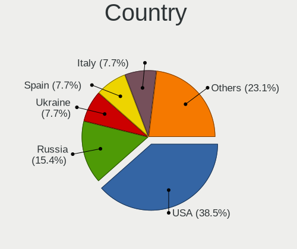
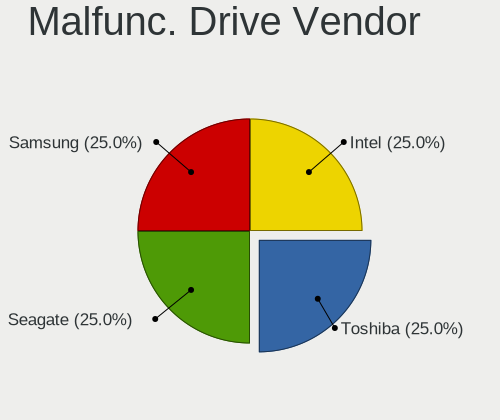
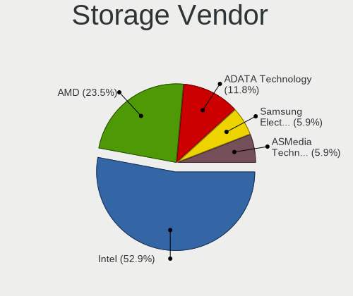
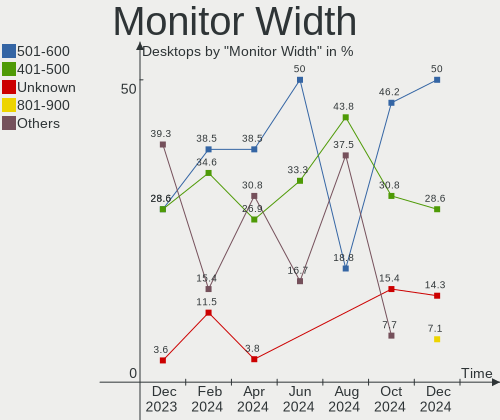
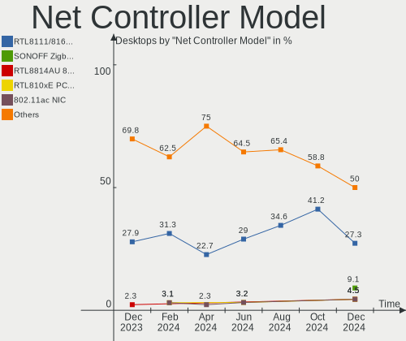
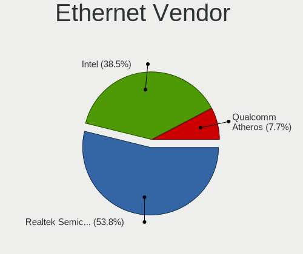

Xubuntu - Hardware Trends (Desktops)
------------------------------------

A project to identify most popular hardware characteristics and track their change
over time based on data collected by Linux users at https://Linux-Hardware.org.

Anyone can contribute to this report by the [hw-probe](https://github.com/linuxhw/hw-probe) tool:

    sudo -E hw-probe -all -upload

This report is for one last month. Overall report since the beginning of time: [TestCoverage](https://github.com/linuxhw/TestCoverage)

Period: Sep, 2022.

Contents
--------

* [ System ](#system)
  - [ OS                       ](#os)
  - [ OS Family                ](#os-family)
  - [ Kernel                   ](#kernel)
  - [ Kernel Family            ](#kernel-family)
  - [ Kernel Major Ver.        ](#kernel-major-ver)
  - [ Arch                     ](#arch)
  - [ DE                       ](#de)
  - [ Display Server           ](#display-server)
  - [ Display Manager          ](#display-manager)
  - [ OS Lang                  ](#os-lang)
  - [ Boot Mode                ](#boot-mode)
  - [ Filesystem               ](#filesystem)
  - [ Part. scheme             ](#part-scheme)
  - [ Dual Boot with Linux/BSD ](#dual-boot-with-linuxbsd)
  - [ Dual Boot (Win)          ](#dual-boot-win)

* [ Board ](#board)
  - [ Vendor                   ](#vendor)
  - [ Model                    ](#model)
  - [ Model Family             ](#model-family)
  - [ MFG Year                 ](#mfg-year)
  - [ Form Factor              ](#form-factor)
  - [ Secure Boot              ](#secure-boot)
  - [ Coreboot                 ](#coreboot)
  - [ RAM Size                 ](#ram-size)
  - [ RAM Used                 ](#ram-used)
  - [ Total Drives             ](#total-drives)
  - [ Has CD-ROM               ](#has-cd-rom)
  - [ Has Ethernet             ](#has-ethernet)
  - [ Has WiFi                 ](#has-wifi)
  - [ Has Bluetooth            ](#has-bluetooth)

* [ Location ](#location)
  - [ Country                  ](#country)
  - [ City                     ](#city)

* [ Drives ](#drives)
  - [ Drive Vendor             ](#drive-vendor)
  - [ Drive Model              ](#drive-model)
  - [ HDD Vendor               ](#hdd-vendor)
  - [ SSD Vendor               ](#ssd-vendor)
  - [ Drive Kind               ](#drive-kind)
  - [ Drive Connector          ](#drive-connector)
  - [ Drive Size               ](#drive-size)
  - [ Space Total              ](#space-total)
  - [ Space Used               ](#space-used)
  - [ Malfunc. Drives          ](#malfunc-drives)
  - [ Malfunc. Drive Vendor    ](#malfunc-drive-vendor)
  - [ Malfunc. HDD Vendor      ](#malfunc-hdd-vendor)
  - [ Malfunc. Drive Kind      ](#malfunc-drive-kind)
  - [ Failed Drives            ](#failed-drives)
  - [ Failed Drive Vendor      ](#failed-drive-vendor)
  - [ Drive Status             ](#drive-status)

* [ Storage controller ](#storage-controller)
  - [ Storage Vendor           ](#storage-vendor)
  - [ Storage Model            ](#storage-model)
  - [ Storage Kind             ](#storage-kind)

* [ Processor ](#processor)
  - [ CPU Vendor               ](#cpu-vendor)
  - [ CPU Model                ](#cpu-model)
  - [ CPU Model Family         ](#cpu-model-family)
  - [ CPU Cores                ](#cpu-cores)
  - [ CPU Sockets              ](#cpu-sockets)
  - [ CPU Threads              ](#cpu-threads)
  - [ CPU Op-Modes             ](#cpu-op-modes)
  - [ CPU Microcode            ](#cpu-microcode)
  - [ CPU Microarch            ](#cpu-microarch)

* [ Graphics ](#graphics)
  - [ GPU Vendor               ](#gpu-vendor)
  - [ GPU Model                ](#gpu-model)
  - [ GPU Combo                ](#gpu-combo)
  - [ GPU Driver               ](#gpu-driver)
  - [ GPU Memory               ](#gpu-memory)

* [ Monitor ](#monitor)
  - [ Monitor Vendor           ](#monitor-vendor)
  - [ Monitor Model            ](#monitor-model)
  - [ Monitor Resolution       ](#monitor-resolution)
  - [ Monitor Diagonal         ](#monitor-diagonal)
  - [ Monitor Width            ](#monitor-width)
  - [ Aspect Ratio             ](#aspect-ratio)
  - [ Monitor Area             ](#monitor-area)
  - [ Pixel Density            ](#pixel-density)
  - [ Multiple Monitors        ](#multiple-monitors)

* [ Network ](#network)
  - [ Net Controller Vendor    ](#net-controller-vendor)
  - [ Net Controller Model     ](#net-controller-model)
  - [ Wireless Vendor          ](#wireless-vendor)
  - [ Wireless Model           ](#wireless-model)
  - [ Ethernet Vendor          ](#ethernet-vendor)
  - [ Ethernet Model           ](#ethernet-model)
  - [ Net Controller Kind      ](#net-controller-kind)
  - [ Used Controller          ](#used-controller)
  - [ NICs                     ](#nics)
  - [ IPv6                     ](#ipv6)

* [ Bluetooth ](#bluetooth)
  - [ Bluetooth Vendor         ](#bluetooth-vendor)
  - [ Bluetooth Model          ](#bluetooth-model)

* [ Sound ](#sound)
  - [ Sound Vendor             ](#sound-vendor)
  - [ Sound Model              ](#sound-model)

* [ Memory ](#memory)
  - [ Memory Vendor            ](#memory-vendor)
  - [ Memory Model             ](#memory-model)
  - [ Memory Kind              ](#memory-kind)
  - [ Memory Form Factor       ](#memory-form-factor)
  - [ Memory Size              ](#memory-size)
  - [ Memory Speed             ](#memory-speed)

* [ Printers & scanners ](#printers--scanners)
  - [ Printer Vendor           ](#printer-vendor)
  - [ Printer Model            ](#printer-model)
  - [ Scanner Vendor           ](#scanner-vendor)
  - [ Scanner Model            ](#scanner-model)

* [ Camera ](#camera)
  - [ Camera Vendor            ](#camera-vendor)
  - [ Camera Model             ](#camera-model)

* [ Security ](#security)
  - [ Fingerprint Vendor       ](#fingerprint-vendor)
  - [ Fingerprint Model        ](#fingerprint-model)
  - [ Chipcard Vendor          ](#chipcard-vendor)
  - [ Chipcard Model           ](#chipcard-model)

* [ Unsupported ](#unsupported)
  - [ Unsupported Devices      ](#unsupported-devices)
  - [ Unsupported Device Types ](#unsupported-device-types)

System
------

OS
--

Installed operating systems

| Name          | Desktops | Percent |
|---------------|----------|---------|
| Xubuntu 20.04 | 39       | 68.42%  |
| Xubuntu 22.04 | 14       | 24.56%  |
| Xubuntu 18.04 | 2        | 3.51%   |
| Xubuntu 20.10 | 1        | 1.75%   |
| Xubuntu 16.04 | 1        | 1.75%   |

OS Family
---------

OS without a version

| Name    | Desktops | Percent |
|---------|----------|---------|
| Xubuntu | 57       | 100%    |

Kernel
------

Version of the Linux kernel

| Version                   | Desktops | Percent |
|---------------------------|----------|---------|
| 5.4.0-126-generic         | 17       | 29.82%  |
| 5.4.0-125-generic         | 13       | 22.81%  |
| 5.15.0-47-generic         | 8        | 14.04%  |
| 5.15.0-48-generic         | 5        | 8.77%   |
| 5.15.0-46-lowlatency      | 2        | 3.51%   |
| 5.15.0-46-generic         | 2        | 3.51%   |
| 5.8.0-63-generic          | 1        | 1.75%   |
| 5.4.0-72-generic          | 1        | 1.75%   |
| 5.4.0-125-lowlatency      | 1        | 1.75%   |
| 5.4.0-124-generic         | 1        | 1.75%   |
| 5.4.0-122-generic         | 1        | 1.75%   |
| 5.19.0-8.2-liquorix-amd64 | 1        | 1.75%   |
| 5.17.0-1003-oem           | 1        | 1.75%   |
| 5.13.0-51-generic         | 1        | 1.75%   |
| 5.11.0-46-generic         | 1        | 1.75%   |
| 4.4.0-210-generic         | 1        | 1.75%   |

Kernel Family
-------------

Linux kernel without a distro release

| Version | Desktops | Percent |
|---------|----------|---------|
| 5.4.0   | 34       | 59.65%  |
| 5.15.0  | 17       | 29.82%  |
| 5.8.0   | 1        | 1.75%   |
| 5.19.0  | 1        | 1.75%   |
| 5.17.0  | 1        | 1.75%   |
| 5.13.0  | 1        | 1.75%   |
| 5.11.0  | 1        | 1.75%   |
| 4.4.0   | 1        | 1.75%   |

Kernel Major Ver.
-----------------

Linux kernel major version

| Version | Desktops | Percent |
|---------|----------|---------|
| 5.4     | 34       | 59.65%  |
| 5.15    | 17       | 29.82%  |
| 5.8     | 1        | 1.75%   |
| 5.19    | 1        | 1.75%   |
| 5.17    | 1        | 1.75%   |
| 5.13    | 1        | 1.75%   |
| 5.11    | 1        | 1.75%   |
| 4.4     | 1        | 1.75%   |

Arch
----

OS architecture (x86_64, i586, etc.)

| Name   | Desktops | Percent |
|--------|----------|---------|
| x86_64 | 55       | 96.49%  |
| i686   | 2        | 3.51%   |

DE
--

Desktop Environment

| Name  | Desktops | Percent |
|-------|----------|---------|
| XFCE  | 56       | 98.25%  |
| GNOME | 1        | 1.75%   |

Display Server
--------------

X11 or Wayland

| Name | Desktops | Percent |
|------|----------|---------|
| X11  | 57       | 100%    |

Display Manager
---------------

SDDM, LightDM, etc.

| Name    | Desktops | Percent |
|---------|----------|---------|
| LightDM | 54       | 94.74%  |
| GDM3    | 2        | 3.51%   |
| Unknown | 1        | 1.75%   |

OS Lang
-------

Language

| Lang  | Desktops | Percent |
|-------|----------|---------|
| ru_RU | 24       | 42.11%  |
| en_US | 10       | 17.54%  |
| en_CA | 4        | 7.02%   |
| it_IT | 3        | 5.26%   |
| fr_FR | 3        | 5.26%   |
| en_AU | 2        | 3.51%   |
| de_DE | 2        | 3.51%   |
| zh_CN | 1        | 1.75%   |
| pt_BR | 1        | 1.75%   |
| nl_BE | 1        | 1.75%   |
| hu_HU | 1        | 1.75%   |
| fr_CH | 1        | 1.75%   |
| fr_BE | 1        | 1.75%   |
| fi_FI | 1        | 1.75%   |
| es_AR | 1        | 1.75%   |
| C     | 1        | 1.75%   |

Boot Mode
---------

EFI or BIOS

| Mode | Desktops | Percent |
|------|----------|---------|
| BIOS | 49       | 85.96%  |
| EFI  | 8        | 14.04%  |

Filesystem
----------

Type of filesystem

| Type | Desktops | Percent |
|------|----------|---------|
| Ext4 | 57       | 100%    |

Part. scheme
------------

Scheme of partitioning

| Type    | Desktops | Percent |
|---------|----------|---------|
| MBR     | 28       | 49.12%  |
| Unknown | 20       | 35.09%  |
| GPT     | 9        | 15.79%  |

Dual Boot with Linux/BSD
------------------------

Hosting more than one Linux/BSD

| Dual boot | Desktops | Percent |
|-----------|----------|---------|
| No        | 51       | 89.47%  |
| Yes       | 6        | 10.53%  |

Dual Boot (Win)
---------------

Hosting Linux and Windows

| Dual boot | Desktops | Percent |
|-----------|----------|---------|
| No        | 46       | 80.7%   |
| Yes       | 11       | 19.3%   |

Board
-----

Vendor
------

Motherboard manufacturer

| Name                | Desktops | Percent |
|---------------------|----------|---------|
| Gigabyte Technology | 17       | 29.82%  |
| ASUSTek Computer    | 16       | 28.07%  |
| ECS                 | 9        | 15.79%  |
| MSI                 | 5        | 8.77%   |
| Dell                | 5        | 8.77%   |
| ASRock              | 4        | 7.02%   |
| Medion              | 1        | 1.75%   |

Model
-----

Motherboard model

| Name                             | Desktops | Percent |
|----------------------------------|----------|---------|
| Gigabyte H410M S2H               | 15       | 26.32%  |
| ECS G31T-M9                      | 9        | 15.79%  |
| Dell OptiPlex 755                | 2        | 3.51%   |
| ASUS All Series                  | 2        | 3.51%   |
| ASRock N68-S3 UCC                | 2        | 3.51%   |
| MSI MS-7C37                      | 1        | 1.75%   |
| MSI MS-7982                      | 1        | 1.75%   |
| MSI MS-7758                      | 1        | 1.75%   |
| MSI MS-7721                      | 1        | 1.75%   |
| MSI MS-7387                      | 1        | 1.75%   |
| Medion Akoya P2120 D MD8836/2452 | 1        | 1.75%   |
| Gigabyte TERRA_PC                | 1        | 1.75%   |
| Gigabyte H510M S2H               | 1        | 1.75%   |
| Dell OptiPlex 780                | 1        | 1.75%   |
| Dell OptiPlex 3060               | 1        | 1.75%   |
| Dell OptiPlex 3010               | 1        | 1.75%   |
| ASUS TUF Gaming B450-PLUS II     | 1        | 1.75%   |
| ASUS ROG STRIX B450-F GAMING II  | 1        | 1.75%   |
| ASUS PRIME H310M-D R2.0          | 1        | 1.75%   |
| ASUS PRIME H270M-PLUS            | 1        | 1.75%   |
| ASUS PRIME B560-PLUS             | 1        | 1.75%   |
| ASUS PRIME A320M-K               | 1        | 1.75%   |
| ASUS PRIME A320M-C R2.0          | 1        | 1.75%   |
| ASUS P6T                         | 1        | 1.75%   |
| ASUS M4A78T-E                    | 1        | 1.75%   |
| ASUS M2N-E                       | 1        | 1.75%   |
| ASUS K30BD                       | 1        | 1.75%   |
| ASUS H61M-C                      | 1        | 1.75%   |
| ASUS ET1612I                     | 1        | 1.75%   |
| ASUS A68HM-K                     | 1        | 1.75%   |
| ASRock Q1900-ITX                 | 1        | 1.75%   |
| ASRock 775Dual-VSTA              | 1        | 1.75%   |

Model Family
------------

Motherboard model prefix

| Name                | Desktops | Percent |
|---------------------|----------|---------|
| Gigabyte H410M      | 15       | 26.32%  |
| ECS G31T-M9         | 9        | 15.79%  |
| Dell OptiPlex       | 5        | 8.77%   |
| ASUS PRIME          | 5        | 8.77%   |
| ASUS All            | 2        | 3.51%   |
| ASRock N68-S3       | 2        | 3.51%   |
| MSI MS-7C37         | 1        | 1.75%   |
| MSI MS-7982         | 1        | 1.75%   |
| MSI MS-7758         | 1        | 1.75%   |
| MSI MS-7721         | 1        | 1.75%   |
| MSI MS-7387         | 1        | 1.75%   |
| Medion Akoya        | 1        | 1.75%   |
| Gigabyte TERRA      | 1        | 1.75%   |
| Gigabyte H510M      | 1        | 1.75%   |
| ASUS TUF            | 1        | 1.75%   |
| ASUS ROG            | 1        | 1.75%   |
| ASUS P6T            | 1        | 1.75%   |
| ASUS M4A78T-E       | 1        | 1.75%   |
| ASUS M2N-E          | 1        | 1.75%   |
| ASUS K30BD          | 1        | 1.75%   |
| ASUS H61M-C         | 1        | 1.75%   |
| ASUS ET1612I        | 1        | 1.75%   |
| ASUS A68HM-K        | 1        | 1.75%   |
| ASRock Q1900-ITX    | 1        | 1.75%   |
| ASRock 775Dual-VSTA | 1        | 1.75%   |

MFG Year
--------

Motherboard manufacture year

| Year | Desktops | Percent |
|------|----------|---------|
| 2020 | 17       | 29.82%  |
| 2009 | 11       | 19.3%   |
| 2015 | 4        | 7.02%   |
| 2014 | 3        | 5.26%   |
| 2013 | 3        | 5.26%   |
| 2012 | 3        | 5.26%   |
| 2021 | 2        | 3.51%   |
| 2019 | 2        | 3.51%   |
| 2017 | 2        | 3.51%   |
| 2010 | 2        | 3.51%   |
| 2008 | 2        | 3.51%   |
| 2007 | 2        | 3.51%   |
| 2006 | 2        | 3.51%   |
| 2018 | 1        | 1.75%   |
| 2016 | 1        | 1.75%   |

Form Factor
-----------

Physical design of the computer

| Name    | Desktops | Percent |
|---------|----------|---------|
| Desktop | 57       | 100%    |

Secure Boot
-----------

Enabled or disabled

| State    | Desktops | Percent |
|----------|----------|---------|
| Disabled | 56       | 98.25%  |
| Enabled  | 1        | 1.75%   |

Coreboot
--------

Have coreboot on board

| Used | Desktops | Percent |
|------|----------|---------|
| No   | 57       | 100%    |

RAM Size
--------

Total RAM memory

| Size in GB  | Desktops | Percent |
|-------------|----------|---------|
| 16.01-24.0  | 20       | 35.09%  |
| 3.01-4.0    | 11       | 19.3%   |
| 1.01-2.0    | 10       | 17.54%  |
| 8.01-16.0   | 6        | 10.53%  |
| 4.01-8.0    | 5        | 8.77%   |
| 32.01-64.0  | 3        | 5.26%   |
| 2.01-3.0    | 1        | 1.75%   |
| 64.01-256.0 | 1        | 1.75%   |

RAM Used
--------

Used RAM memory

| Used GB   | Desktops | Percent |
|-----------|----------|---------|
| 1.01-2.0  | 32       | 56.14%  |
| 0.51-1.0  | 12       | 21.05%  |
| 2.01-3.0  | 5        | 8.77%   |
| 4.01-8.0  | 3        | 5.26%   |
| 3.01-4.0  | 2        | 3.51%   |
| 8.01-16.0 | 2        | 3.51%   |
| 0.01-0.5  | 1        | 1.75%   |

Total Drives
------------

Number of drives on board

| Drives | Desktops | Percent |
|--------|----------|---------|
| 1      | 40       | 70.18%  |
| 2      | 9        | 15.79%  |
| 3      | 5        | 8.77%   |
| 10     | 1        | 1.75%   |
| 5      | 1        | 1.75%   |
| 4      | 1        | 1.75%   |

Has CD-ROM
----------

Has CD-ROM on board

| Presented | Desktops | Percent |
|-----------|----------|---------|
| No        | 38       | 66.67%  |
| Yes       | 19       | 33.33%  |

Has Ethernet
------------

Has Ethernet on board

| Presented | Desktops | Percent |
|-----------|----------|---------|
| Yes       | 57       | 100%    |

Has WiFi
--------

Has WiFi module

| Presented | Desktops | Percent |
|-----------|----------|---------|
| No        | 46       | 80.7%   |
| Yes       | 11       | 19.3%   |

Has Bluetooth
-------------

Has Bluetooth module

| Presented | Desktops | Percent |
|-----------|----------|---------|
| No        | 55       | 96.49%  |
| Yes       | 2        | 3.51%   |

Location
--------

Country
-------

Geographic location (country)

| Country     | Desktops | Percent |
|-------------|----------|---------|
| Russia      | 25       | 43.86%  |
| Canada      | 4        | 7.02%   |
| USA         | 3        | 5.26%   |
| Italy       | 3        | 5.26%   |
| Germany     | 3        | 5.26%   |
| France      | 3        | 5.26%   |
| Iran        | 2        | 3.51%   |
| Belgium     | 2        | 3.51%   |
| Australia   | 2        | 3.51%   |
| Switzerland | 1        | 1.75%   |
| New Zealand | 1        | 1.75%   |
| Netherlands | 1        | 1.75%   |
| Indonesia   | 1        | 1.75%   |
| Hungary     | 1        | 1.75%   |
| Finland     | 1        | 1.75%   |
| Egypt       | 1        | 1.75%   |
| China       | 1        | 1.75%   |
| Brazil      | 1        | 1.75%   |
| Argentina   | 1        | 1.75%   |

City
----

Geographic location (city)

| City             | Desktops | Percent |
|------------------|----------|---------|
| Voronezh         | 24       | 42.11%  |
| Tehran           | 2        | 3.51%   |
| Melbourne        | 2        | 3.51%   |
| Zurich           | 1        | 1.75%   |
| Vancouver        | 1        | 1.75%   |
| Tourouvre        | 1        | 1.75%   |
| Toronto          | 1        | 1.75%   |
| Surrey           | 1        | 1.75%   |
| Perth-Andover    | 1        | 1.75%   |
| Muncie           | 1        | 1.75%   |
| Mayenne          | 1        | 1.75%   |
| Lavras           | 1        | 1.75%   |
| La Plata         | 1        | 1.75%   |
| Kortrijk         | 1        | 1.75%   |
| Kassel           | 1        | 1.75%   |
| Jakarta          | 1        | 1.75%   |
| Hefei            | 1        | 1.75%   |
| Hanret           | 1        | 1.75%   |
| Genoa            | 1        | 1.75%   |
| Fulda            | 1        | 1.75%   |
| Espoo            | 1        | 1.75%   |
| Dresden          | 1        | 1.75%   |
| Columbus         | 1        | 1.75%   |
| Colmar           | 1        | 1.75%   |
| Cincinnati       | 1        | 1.75%   |
| Caselle Torinese | 1        | 1.75%   |
| Cairo            | 1        | 1.75%   |
| Budapest         | 1        | 1.75%   |
| Biella           | 1        | 1.75%   |
| Auckland         | 1        | 1.75%   |
| Amsterdam        | 1        | 1.75%   |
| Unknown          | 1        | 1.75%   |

Drives
------

Drive Vendor
------------

Hard drive vendors

| Vendor              | Desktops | Drives | Percent |
|---------------------|----------|--------|---------|
| Kingston            | 20       | 20     | 24.39%  |
| Seagate             | 11       | 17     | 13.41%  |
| WDC                 | 10       | 10     | 12.2%   |
| Toshiba             | 9        | 10     | 10.98%  |
| Samsung Electronics | 7        | 10     | 8.54%   |
| Hitachi             | 7        | 7      | 8.54%   |
| SanDisk             | 4        | 4      | 4.88%   |
| Maxtor              | 3        | 3      | 3.66%   |
| Crucial             | 2        | 2      | 2.44%   |
| SAGE                | 1        | 1      | 1.22%   |
| S3+                 | 1        | 1      | 1.22%   |
| Phison              | 1        | 1      | 1.22%   |
| LITEON              | 1        | 1      | 1.22%   |
| Lexar               | 1        | 1      | 1.22%   |
| Corsair             | 1        | 1      | 1.22%   |
| CHN25SATAS1         | 1        | 1      | 1.22%   |
| Avant               | 1        | 1      | 1.22%   |
| A-DATA Technology   | 1        | 1      | 1.22%   |

Drive Model
-----------

Hard drive models

| Model                               | Desktops | Percent |
|-------------------------------------|----------|---------|
| Kingston SA400S37240G 240GB SSD     | 17       | 18.68%  |
| Hitachi HDS721050CLA362 500GB       | 6        | 6.59%   |
| Toshiba DT01ACA050 500GB            | 3        | 3.3%    |
| Seagate ST500LM012 HN-M500MBB 500GB | 2        | 2.2%    |
| Seagate ST500DM002-1BD142 500GB     | 2        | 2.2%    |
| Seagate ST4000DM004-2CV104 4TB      | 2        | 2.2%    |
| SanDisk SDSSDA240G 240GB            | 2        | 2.2%    |
| Kingston SA400S37480G 480GB SSD     | 2        | 2.2%    |
| WDC WDS250G2B0A-00SM50 250GB SSD    | 1        | 1.1%    |
| WDC WD800JD-75MSA3 80GB             | 1        | 1.1%    |
| WDC WD60EFZX-68B3FN0 6TB            | 1        | 1.1%    |
| WDC WD5000AVCS-612DY1 500GB         | 1        | 1.1%    |
| WDC WD5000AAKX-60U6AA0 500GB        | 1        | 1.1%    |
| WDC WD5000AAKX-00ERMA0 500GB        | 1        | 1.1%    |
| WDC WD4003FRYZ-01F0DB0 4TB          | 1        | 1.1%    |
| WDC WD30EFRX-68EUZN0 3TB            | 1        | 1.1%    |
| WDC WD2003FZEX-00SRLA0 2TB          | 1        | 1.1%    |
| WDC WD10SPZX-08Z10 1TB              | 1        | 1.1%    |
| Toshiba TR150 120GB SSD             | 1        | 1.1%    |
| Toshiba MQ01ABF050 500GB            | 1        | 1.1%    |
| Toshiba MQ01ABF032 320GB            | 1        | 1.1%    |
| Toshiba MQ01ABD032 320GB            | 1        | 1.1%    |
| Toshiba MK7559GSXF 752GB            | 1        | 1.1%    |
| Toshiba MK2555GSXF 250GB            | 1        | 1.1%    |
| Toshiba DT01ACA300 3TB              | 1        | 1.1%    |
| Seagate ST9500420AS 500GB           | 1        | 1.1%    |
| Seagate ST4000VN008-2DR166 4TB      | 1        | 1.1%    |
| Seagate ST3500413AS 500GB           | 1        | 1.1%    |
| Seagate ST31000524AS 1TB            | 1        | 1.1%    |
| Seagate ST2000LX001-1RG174 2TB      | 1        | 1.1%    |
| Seagate ST2000DM001-1ER164 2TB      | 1        | 1.1%    |
| Seagate ST2000DM001-1CH164 2TB      | 1        | 1.1%    |
| Seagate ST1000DM010-2EP102 1TB      | 1        | 1.1%    |
| Seagate ST1000DM010-2DM162 1TB      | 1        | 1.1%    |
| Seagate M3 Portable 2TB             | 1        | 1.1%    |
| SanDisk SSD U110 128GB              | 1        | 1.1%    |
| SanDisk SDSSDHP128G 128GB           | 1        | 1.1%    |
| Samsung SSD 980 250GB               | 1        | 1.1%    |
| Samsung SSD 860 QVO 1TB             | 1        | 1.1%    |
| Samsung SSD 860 EVO 500GB           | 1        | 1.1%    |

HDD Vendor
----------

Hard disk drive vendors

| Vendor              | Desktops | Drives | Percent |
|---------------------|----------|--------|---------|
| Seagate             | 10       | 16     | 25%     |
| WDC                 | 9        | 9      | 22.5%   |
| Toshiba             | 8        | 9      | 20%     |
| Hitachi             | 7        | 7      | 17.5%   |
| Maxtor              | 3        | 3      | 7.5%    |
| Samsung Electronics | 2        | 4      | 5%      |
| SAGE                | 1        | 1      | 2.5%    |

SSD Vendor
----------

Solid state drive vendors

| Vendor              | Desktops | Drives | Percent |
|---------------------|----------|--------|---------|
| Kingston            | 20       | 20     | 55.56%  |
| SanDisk             | 4        | 4      | 11.11%  |
| Samsung Electronics | 4        | 5      | 11.11%  |
| WDC                 | 1        | 1      | 2.78%   |
| Toshiba             | 1        | 1      | 2.78%   |
| S3+                 | 1        | 1      | 2.78%   |
| LITEON              | 1        | 1      | 2.78%   |
| Crucial             | 1        | 1      | 2.78%   |
| Corsair             | 1        | 1      | 2.78%   |
| Avant               | 1        | 1      | 2.78%   |
| A-DATA Technology   | 1        | 1      | 2.78%   |

Drive Kind
----------

HDD or SSD

| Kind    | Desktops | Drives | Percent |
|---------|----------|--------|---------|
| SSD     | 35       | 37     | 46.67%  |
| HDD     | 34       | 49     | 45.33%  |
| NVMe    | 4        | 4      | 5.33%   |
| Unknown | 2        | 2      | 2.67%   |

Drive Connector
---------------

SATA, SAS, NVMe, etc.

| Type | Desktops | Drives | Percent |
|------|----------|--------|---------|
| SATA | 56       | 85     | 88.89%  |
| NVMe | 4        | 4      | 6.35%   |
| SAS  | 3        | 3      | 4.76%   |

Drive Size
----------

Size of hard drive

| Size in TB | Desktops | Drives | Percent |
|------------|----------|--------|---------|
| 0.01-0.5   | 51       | 66     | 76.12%  |
| 0.51-1.0   | 6        | 8      | 8.96%   |
| 1.01-2.0   | 4        | 5      | 5.97%   |
| 3.01-4.0   | 3        | 4      | 4.48%   |
| 2.01-3.0   | 2        | 2      | 2.99%   |
| 4.01-10.0  | 1        | 1      | 1.49%   |

Space Total
-----------

Amount of disk space available on the file system

| Size in GB     | Desktops | Percent |
|----------------|----------|---------|
| 101-250        | 26       | 45.61%  |
| 251-500        | 14       | 24.56%  |
| 501-1000       | 6        | 10.53%  |
| 2001-3000      | 3        | 5.26%   |
| 1001-2000      | 3        | 5.26%   |
| More than 3000 | 2        | 3.51%   |
| 21-50          | 2        | 3.51%   |
| 51-100         | 1        | 1.75%   |

Space Used
----------

Amount of used disk space

| Used GB        | Desktops | Percent |
|----------------|----------|---------|
| 51-100         | 30       | 52.63%  |
| 21-50          | 8        | 14.04%  |
| 101-250        | 5        | 8.77%   |
| 251-500        | 4        | 7.02%   |
| 1-20           | 4        | 7.02%   |
| 501-1000       | 3        | 5.26%   |
| More than 3000 | 2        | 3.51%   |
| 1001-2000      | 1        | 1.75%   |

Malfunc. Drives
---------------

Drive models with a malfunction

| Model                          | Desktops | Drives | Percent |
|--------------------------------|----------|--------|---------|
| Hitachi HDS721050CLA362 500GB  | 3        | 3      | 42.86%  |
| Toshiba MQ01ABF050 500GB       | 1        | 1      | 14.29%  |
| Seagate ST2000DM001-1CH164 2TB | 1        | 1      | 14.29%  |
| Maxtor 6Y120L0 128GB           | 1        | 1      | 14.29%  |
| Avant 60GB Client SSD          | 1        | 1      | 14.29%  |

Malfunc. Drive Vendor
---------------------

Vendors of faulty drives

| Vendor  | Desktops | Drives | Percent |
|---------|----------|--------|---------|
| Hitachi | 3        | 3      | 42.86%  |
| Toshiba | 1        | 1      | 14.29%  |
| Seagate | 1        | 1      | 14.29%  |
| Maxtor  | 1        | 1      | 14.29%  |
| Avant   | 1        | 1      | 14.29%  |

Malfunc. HDD Vendor
-------------------

Vendors of faulty HDD drives

| Vendor  | Desktops | Drives | Percent |
|---------|----------|--------|---------|
| Hitachi | 3        | 3      | 50%     |
| Toshiba | 1        | 1      | 16.67%  |
| Seagate | 1        | 1      | 16.67%  |
| Maxtor  | 1        | 1      | 16.67%  |

Malfunc. Drive Kind
-------------------

Kinds of faulty drives

| Kind | Desktops | Drives | Percent |
|------|----------|--------|---------|
| HDD  | 6        | 6      | 85.71%  |
| SSD  | 1        | 1      | 14.29%  |

Failed Drives
-------------

Failed drive models

Zero info for selected period =(

Failed Drive Vendor
-------------------

Failed drive vendors

Zero info for selected period =(

Drive Status
------------

Number of failed and malfunc. drives

| Status   | Desktops | Drives | Percent |
|----------|----------|--------|---------|
| Works    | 32       | 40     | 54.24%  |
| Detected | 20       | 45     | 33.9%   |
| Malfunc  | 7        | 7      | 11.86%  |

Storage controller
------------------

Storage Vendor
--------------

Storage controller vendors

| Vendor                       | Desktops | Percent |
|------------------------------|----------|---------|
| Intel                        | 43       | 63.24%  |
| AMD                          | 9        | 13.24%  |
| Nvidia                       | 3        | 4.41%   |
| ASMedia Technology           | 3        | 4.41%   |
| VIA Technologies             | 2        | 2.94%   |
| JMicron Technology           | 2        | 2.94%   |
| Silicon Image                | 1        | 1.47%   |
| Shenzhen Longsys Electronics | 1        | 1.47%   |
| Samsung Electronics          | 1        | 1.47%   |
| Phison Electronics           | 1        | 1.47%   |
| Micron/Crucial Technology    | 1        | 1.47%   |
| Marvell Technology Group     | 1        | 1.47%   |

Storage Model
-------------

Storage controller models

| Model                                                                          | Desktops | Percent |
|--------------------------------------------------------------------------------|----------|---------|
| Intel 400 Series Chipset Family SATA AHCI Controller                           | 15       | 16.85%  |
| Intel NM10/ICH7 Family SATA Controller [IDE mode]                              | 9        | 10.11%  |
| Intel 82801G (ICH7 Family) IDE Controller                                      | 9        | 10.11%  |
| AMD FCH SATA Controller [AHCI mode]                                            | 5        | 5.62%   |
| Intel SATA Controller [RAID mode]                                              | 3        | 3.37%   |
| ASMedia ASM1062 Serial ATA Controller                                          | 3        | 3.37%   |
| VIA VT82C586A/B/VT82C686/A/B/VT823x/A/C PIPC Bus Master IDE                    | 2        | 2.25%   |
| Nvidia MCP61 SATA Controller                                                   | 2        | 2.25%   |
| Nvidia MCP61 IDE                                                               | 2        | 2.25%   |
| JMicron JMB363 SATA/IDE Controller                                             | 2        | 2.25%   |
| Intel Q170/Q150/B150/H170/H110/Z170/CM236 Chipset SATA Controller [AHCI Mode]  | 2        | 2.25%   |
| Intel 82Q35 Express PT IDER Controller                                         | 2        | 2.25%   |
| Intel 82801IR/IO/IH (ICH9R/DO/DH) 6 port SATA Controller [AHCI mode]           | 2        | 2.25%   |
| Intel 8 Series/C220 Series Chipset Family 6-port SATA Controller 1 [AHCI mode] | 2        | 2.25%   |
| Intel 6 Series/C200 Series Chipset Family 6 port Desktop SATA AHCI Controller  | 2        | 2.25%   |
| Intel 500 Series Chipset Family SATA AHCI Controller                           | 2        | 2.25%   |
| AMD FCH SATA Controller D                                                      | 2        | 2.25%   |
| AMD 400 Series Chipset SATA Controller                                         | 2        | 2.25%   |
| VIA VT8237A SATA 2-Port Controller                                             | 1        | 1.12%   |
| VIA VT8237/8251 Serial ATA Controller                                          | 1        | 1.12%   |
| Silicon Image SiI 3114 [SATALink/SATARaid] Serial ATA Controller               | 1        | 1.12%   |
| Shenzhen Longsys SM2263EN/SM2263XT-based OEM SSD                               | 1        | 1.12%   |
| Samsung NVMe SSD Controller 980                                                | 1        | 1.12%   |
| Phison E16 PCIe4 NVMe Controller                                               | 1        | 1.12%   |
| Nvidia MCP55 SATA Controller                                                   | 1        | 1.12%   |
| Nvidia MCP55 IDE                                                               | 1        | 1.12%   |
| Micron/Crucial P2 NVMe PCIe SSD                                                | 1        | 1.12%   |
| Marvell Group 88SE9215 PCIe 2.0 x1 4-port SATA 6 Gb/s Controller               | 1        | 1.12%   |
| JMicron JMB368 IDE controller                                                  | 1        | 1.12%   |
| Intel Atom Processor E3800 Series SATA IDE Controller                          | 1        | 1.12%   |
| Intel 9 Series Chipset Family SATA Controller [AHCI Mode]                      | 1        | 1.12%   |
| Intel 82801JI (ICH10 Family) SATA AHCI Controller                              | 1        | 1.12%   |
| Intel 7 Series/C210 Series Chipset Family 6-port SATA Controller [AHCI mode]   | 1        | 1.12%   |
| Intel 7 Series Chipset Family 6-port SATA Controller [AHCI mode]               | 1        | 1.12%   |
| Intel 4 Series Chipset PT IDER Controller                                      | 1        | 1.12%   |
| Intel 200 Series PCH SATA controller [AHCI mode]                               | 1        | 1.12%   |
| AMD SB7x0/SB8x0/SB9x0 SATA Controller [IDE mode]                               | 1        | 1.12%   |
| AMD SB7x0/SB8x0/SB9x0 IDE Controller                                           | 1        | 1.12%   |
| AMD FCH SATA Controller [IDE mode]                                             | 1        | 1.12%   |

Storage Kind
------------

Kind of storage controller (IDE, SATA, NVMe, SAS, ...)

| Kind | Desktops | Percent |
|------|----------|---------|
| SATA | 40       | 58.82%  |
| IDE  | 20       | 29.41%  |
| RAID | 4        | 5.88%   |
| NVMe | 4        | 5.88%   |

Processor
---------

CPU Vendor
----------

Processor vendors

| Vendor | Desktops | Percent |
|--------|----------|---------|
| Intel  | 45       | 78.95%  |
| AMD    | 12       | 21.05%  |

CPU Model
---------

Processor models

| Model                                       | Desktops | Percent |
|---------------------------------------------|----------|---------|
| Intel Core i3-10100 CPU @ 3.60GHz           | 15       | 26.32%  |
| Intel Pentium Dual-Core CPU E6500 @ 2.93GHz | 6        | 10.53%  |
| Intel Core i3-3240 CPU @ 3.40GHz            | 2        | 3.51%   |
| Intel Celeron CPU E3300 @ 2.50GHz           | 2        | 3.51%   |
| AMD Athlon II X2 250 Processor              | 2        | 3.51%   |
| Intel Pentium Dual CPU E2200 @ 2.20GHz      | 1        | 1.75%   |
| Intel Pentium D CPU 3.40GHz                 | 1        | 1.75%   |
| Intel Core i7-4771 CPU @ 3.50GHz            | 1        | 1.75%   |
| Intel Core i7 CPU 920 @ 2.67GHz             | 1        | 1.75%   |
| Intel Core i5-9400 CPU @ 2.90GHz            | 1        | 1.75%   |
| Intel Core i5-8500T CPU @ 2.10GHz           | 1        | 1.75%   |
| Intel Core i5-6500 CPU @ 3.20GHz            | 1        | 1.75%   |
| Intel Core i5-4690 CPU @ 3.50GHz            | 1        | 1.75%   |
| Intel Core i5-3570 CPU @ 3.40GHz            | 1        | 1.75%   |
| Intel Core i5-10400 CPU @ 2.90GHz           | 1        | 1.75%   |
| Intel Core i3-7100 CPU @ 3.90GHz            | 1        | 1.75%   |
| Intel Core i3-6100 CPU @ 3.70GHz            | 1        | 1.75%   |
| Intel Core i3-4170 CPU @ 3.70GHz            | 1        | 1.75%   |
| Intel Core 2 Duo CPU E8400 @ 3.00GHz        | 1        | 1.75%   |
| Intel Core 2 Duo CPU E6550 @ 2.33GHz        | 1        | 1.75%   |
| Intel Core 2 Duo CPU E4600 @ 2.40GHz        | 1        | 1.75%   |
| Intel Core 2 Duo CPU E4500 @ 2.20GHz        | 1        | 1.75%   |
| Intel Celeron CPU J1900 @ 1.99GHz           | 1        | 1.75%   |
| Intel Celeron CPU 847 @ 1.10GHz             | 1        | 1.75%   |
| Intel 11th Gen Core i5-11400 @ 2.60GHz      | 1        | 1.75%   |
| AMD Sempron 3850 APU with Radeon R3         | 1        | 1.75%   |
| AMD Ryzen 9 5900X 12-Core Processor         | 1        | 1.75%   |
| AMD Ryzen 9 3900X 12-Core Processor         | 1        | 1.75%   |
| AMD Ryzen 7 5800X 8-Core Processor          | 1        | 1.75%   |
| AMD Ryzen 5 5500                            | 1        | 1.75%   |
| AMD Ryzen 5 1400 Quad-Core Processor        | 1        | 1.75%   |
| AMD Athlon II X4 640 Processor              | 1        | 1.75%   |
| AMD Athlon 64 X2 Dual Core Processor 5400+  | 1        | 1.75%   |
| AMD A8-5500 APU with Radeon HD Graphics     | 1        | 1.75%   |
| AMD A10-5800K APU with Radeon HD Graphics   | 1        | 1.75%   |

CPU Model Family
----------------

Processor model prefix

| Model                   | Desktops | Percent |
|-------------------------|----------|---------|
| Intel Core i3           | 20       | 35.09%  |
| Intel Pentium Dual-Core | 6        | 10.53%  |
| Intel Core i5           | 6        | 10.53%  |
| Intel Core 2 Duo        | 4        | 7.02%   |
| Intel Celeron           | 4        | 7.02%   |
| Intel Core i7           | 2        | 3.51%   |
| AMD Ryzen 9             | 2        | 3.51%   |
| AMD Ryzen 5             | 2        | 3.51%   |
| AMD Athlon II X2        | 2        | 3.51%   |
| Other                   | 1        | 1.75%   |
| Intel Pentium Dual      | 1        | 1.75%   |
| Intel Pentium D         | 1        | 1.75%   |
| AMD Sempron             | 1        | 1.75%   |
| AMD Ryzen 7             | 1        | 1.75%   |
| AMD Athlon II X4        | 1        | 1.75%   |
| AMD Athlon 64 X2        | 1        | 1.75%   |
| AMD A8                  | 1        | 1.75%   |
| AMD A10                 | 1        | 1.75%   |

CPU Cores
---------

Number of processor cores

| Number | Desktops | Percent |
|--------|----------|---------|
| 2      | 25       | 43.86%  |
| 4      | 24       | 42.11%  |
| 6      | 5        | 8.77%   |
| 12     | 2        | 3.51%   |
| 8      | 1        | 1.75%   |

CPU Sockets
-----------

Number of sockets

| Number | Desktops | Percent |
|--------|----------|---------|
| 1      | 57       | 100%    |

CPU Threads
-----------

Threads per core (Hyper-Threading)

| Number | Desktops | Percent |
|--------|----------|---------|
| 2      | 30       | 52.63%  |
| 1      | 27       | 47.37%  |

CPU Op-Modes
------------

CPU Operation Modes (32-bit, 64-bit)

| Op mode        | Desktops | Percent |
|----------------|----------|---------|
| 32-bit, 64-bit | 57       | 100%    |

CPU Microcode
-------------

Microcode number

| Number     | Desktops | Percent |
|------------|----------|---------|
| 0xa0653    | 16       | 28.07%  |
| Unknown    | 12       | 21.05%  |
| 0x1067a    | 9        | 15.79%  |
| 0x306a9    | 3        | 5.26%   |
| 0x906ea    | 2        | 3.51%   |
| 0x6fd      | 2        | 3.51%   |
| 0x306c3    | 2        | 3.51%   |
| 0xf64      | 1        | 1.75%   |
| 0xa0671    | 1        | 1.75%   |
| 0x6fb      | 1        | 1.75%   |
| 0x506e3    | 1        | 1.75%   |
| 0x30673    | 1        | 1.75%   |
| 0x106a5    | 1        | 1.75%   |
| 0x0a50000c | 1        | 1.75%   |
| 0x0a201016 | 1        | 1.75%   |
| 0x08001137 | 1        | 1.75%   |
| 0x0700010f | 1        | 1.75%   |
| 0x06001119 | 1        | 1.75%   |

CPU Microarch
-------------

Microarchitecture

| Name        | Desktops | Percent |
|-------------|----------|---------|
| CometLake   | 16       | 28.07%  |
| Penryn      | 9        | 15.79%  |
| Core        | 4        | 7.02%   |
| Zen 3       | 3        | 5.26%   |
| KabyLake    | 3        | 5.26%   |
| K10         | 3        | 5.26%   |
| IvyBridge   | 3        | 5.26%   |
| Haswell     | 3        | 5.26%   |
| Skylake     | 2        | 3.51%   |
| Piledriver  | 2        | 3.51%   |
| Zen 2       | 1        | 1.75%   |
| Zen         | 1        | 1.75%   |
| Silvermont  | 1        | 1.75%   |
| SandyBridge | 1        | 1.75%   |
| NetBurst    | 1        | 1.75%   |
| Nehalem     | 1        | 1.75%   |
| K8 Hammer   | 1        | 1.75%   |
| Jaguar      | 1        | 1.75%   |
| Icelake     | 1        | 1.75%   |

Graphics
--------

GPU Vendor
----------

Vendors of graphics cards

| Vendor | Desktops | Percent |
|--------|----------|---------|
| Intel  | 37       | 62.71%  |
| Nvidia | 15       | 25.42%  |
| AMD    | 7        | 11.86%  |

GPU Model
---------

Graphics card models

| Model                                                                       | Desktops | Percent |
|-----------------------------------------------------------------------------|----------|---------|
| Intel CometLake-S GT2 [UHD Graphics 630]                                    | 16       | 26.67%  |
| Intel 82G33/G31 Express Integrated Graphics Controller                      | 6        | 10%     |
| Nvidia GK208B [GeForce GT 710]                                              | 3        | 5%      |
| Nvidia G86 [GeForce 8500 GT]                                                | 2        | 3.33%   |
| Nvidia C61 [GeForce 7025 / nForce 630a]                                     | 2        | 3.33%   |
| Intel Xeon E3-1200 v2/3rd Gen Core processor Graphics Controller            | 2        | 3.33%   |
| Intel HD Graphics 530                                                       | 2        | 3.33%   |
| Intel CoffeeLake-S GT2 [UHD Graphics 630]                                   | 2        | 3.33%   |
| Intel 82Q35 Express Integrated Graphics Controller                          | 2        | 3.33%   |
| Nvidia TU116 [GeForce GTX 1660 SUPER]                                       | 1        | 1.67%   |
| Nvidia TU104 [GeForce RTX 2060]                                             | 1        | 1.67%   |
| Nvidia GT218 [GeForce 310]                                                  | 1        | 1.67%   |
| Nvidia GP107 [GeForce GTX 1050]                                             | 1        | 1.67%   |
| Nvidia GP106 [GeForce GTX 1060 3GB]                                         | 1        | 1.67%   |
| Nvidia GK104 [GeForce GTX 690]                                              | 1        | 1.67%   |
| Nvidia GF116 [GeForce GTX 550 Ti]                                           | 1        | 1.67%   |
| Nvidia GF108 [GeForce GT 730]                                               | 1        | 1.67%   |
| Nvidia G84 [GeForce 8600 GT]                                                | 1        | 1.67%   |
| Intel Xeon E3-1200 v3/4th Gen Core Processor Integrated Graphics Controller | 1        | 1.67%   |
| Intel RocketLake-S GT1 [UHD Graphics 730]                                   | 1        | 1.67%   |
| Intel HD Graphics 630                                                       | 1        | 1.67%   |
| Intel Atom Processor Z36xxx/Z37xxx Series Graphics & Display                | 1        | 1.67%   |
| Intel 4th Generation Core Processor Family Integrated Graphics Controller   | 1        | 1.67%   |
| Intel 4 Series Chipset Integrated Graphics Controller                       | 1        | 1.67%   |
| Intel 2nd Generation Core Processor Family Integrated Graphics Controller   | 1        | 1.67%   |
| AMD Trinity [Radeon HD 7660D]                                               | 1        | 1.67%   |
| AMD RV730 PRO [Radeon HD 4650]                                              | 1        | 1.67%   |
| AMD RV635 [Radeon HD 3650/3750/4570/4580]                                   | 1        | 1.67%   |
| AMD RS780D [Radeon HD 3300]                                                 | 1        | 1.67%   |
| AMD Kabini [Radeon HD 8280 / R3 Series]                                     | 1        | 1.67%   |
| AMD Ellesmere [Radeon RX 470/480/570/570X/580/580X/590]                     | 1        | 1.67%   |
| AMD Cape Verde XT [Radeon HD 7770/8760 / R7 250X]                           | 1        | 1.67%   |

GPU Combo
---------

Combinations of graphics cards

| Name           | Desktops | Percent |
|----------------|----------|---------|
| 1 x Intel      | 35       | 61.4%   |
| 1 x Nvidia     | 13       | 22.81%  |
| 1 x AMD        | 7        | 12.28%  |
| Intel + Nvidia | 2        | 3.51%   |

GPU Driver
----------

Free vs proprietary

| Driver      | Desktops | Percent |
|-------------|----------|---------|
| Free        | 47       | 82.46%  |
| Proprietary | 10       | 17.54%  |

GPU Memory
----------

Total video memory

| Size in GB | Desktops | Percent |
|------------|----------|---------|
| Unknown    | 43       | 75.44%  |
| 0.01-0.5   | 5        | 8.77%   |
| 1.01-2.0   | 3        | 5.26%   |
| 0.51-1.0   | 3        | 5.26%   |
| 7.01-8.0   | 1        | 1.75%   |
| 5.01-6.0   | 1        | 1.75%   |
| 2.01-3.0   | 1        | 1.75%   |

Monitor
-------

Monitor Vendor
--------------

Monitor vendors

| Vendor                  | Desktops | Percent |
|-------------------------|----------|---------|
| AOC                     | 17       | 30.91%  |
| Goldstar                | 6        | 10.91%  |
| Samsung Electronics     | 5        | 9.09%   |
| Acer                    | 4        | 7.27%   |
| Iiyama                  | 3        | 5.45%   |
| Hewlett-Packard         | 3        | 5.45%   |
| Dell                    | 3        | 5.45%   |
| Ancor Communications    | 3        | 5.45%   |
| Philips                 | 2        | 3.64%   |
| ViewSonic               | 1        | 1.82%   |
| Panasonic               | 1        | 1.82%   |
| Medion                  | 1        | 1.82%   |
| LG Electronics          | 1        | 1.82%   |
| Hyundai ImageQuest      | 1        | 1.82%   |
| HannStar                | 1        | 1.82%   |
| FUS                     | 1        | 1.82%   |
| Chi Mei Optoelectronics | 1        | 1.82%   |
| BenQ                    | 1        | 1.82%   |

Monitor Model
-------------

Monitor models

| Model                                                                    | Desktops | Percent |
|--------------------------------------------------------------------------|----------|---------|
| AOC 24B2W1G5 AOC2402 1920x1080 527x296mm 23.8-inch                       | 15       | 27.27%  |
| Goldstar W1943 GSM4BAD 1360x768 406x229mm 18.4-inch                      | 6        | 10.91%  |
| ViewSonic VA1948 SERIES VSCE827 1440x900 408x255mm 18.9-inch             | 1        | 1.82%   |
| Samsung Electronics SyncMaster SAM05B0 1920x1080                         | 1        | 1.82%   |
| Samsung Electronics SM2333TN SAM06FC 1920x1080 477x268mm 21.5-inch       | 1        | 1.82%   |
| Samsung Electronics S19C150 SAM0AE6 1366x768 410x230mm 18.5-inch         | 1        | 1.82%   |
| Samsung Electronics LCD Monitor SAM07BB 1360x768 410x256mm 19.0-inch     | 1        | 1.82%   |
| Samsung Electronics LCD Monitor LU28R55                                  | 1        | 1.82%   |
| Philips LCD Monitor 170C4 1280x1024                                      | 1        | 1.82%   |
| Philips 170S PHL082B 1280x1024 338x270mm 17.0-inch                       | 1        | 1.82%   |
| Panasonic TV MEIA296 1920x1080 698x392mm 31.5-inch                       | 1        | 1.82%   |
| Medion MD20435 MED36D5 1920x1080 521x293mm 23.5-inch                     | 1        | 1.82%   |
| LG Electronics LCD Monitor W1943 1360x768                                | 1        | 1.82%   |
| Iiyama X2483_2480-DP IVM6129 1920x1080 527x296mm 23.8-inch               | 1        | 1.82%   |
| Iiyama PL2530H IVM6132 1920x1080 540x300mm 24.3-inch                     | 1        | 1.82%   |
| Iiyama PL2377 IVM561D 1920x1080 510x287mm 23.0-inch                      | 1        | 1.82%   |
| Hyundai ImageQuest HIQ T91D HIQ6D0B 1280x1024 304x228mm 15.0-inch        | 1        | 1.82%   |
| Hewlett-Packard LCD Monitor L185b 1024x768                               | 1        | 1.82%   |
| Hewlett-Packard Compaq WF1907 HWP26A4 1440x900 408x255mm 18.9-inch       | 1        | 1.82%   |
| Hewlett-Packard 2009 HWP2827 1600x900 443x250mm 20.0-inch                | 1        | 1.82%   |
| HannStar Hanns.G HH191 HSD213F 1280x1024 376x301mm 19.0-inch             | 1        | 1.82%   |
| FUS LCD Monitor L20T-2 LED 1600x900                                      | 1        | 1.82%   |
| Dell P2213 DELF043 1680x1050 473x296mm 22.0-inch                         | 1        | 1.82%   |
| Dell E176FP DELA014 1280x1024 338x270mm 17.0-inch                        | 1        | 1.82%   |
| Dell 23" AIO DELB123 1920x1080 510x287mm 23.0-inch                       | 1        | 1.82%   |
| Chi Mei Optoelectronics LCD Monitor CMO15A7 1366x768 344x193mm 15.5-inch | 1        | 1.82%   |
| BenQ EX3210U BNQ7FA6 3840x2160 708x399mm 32.0-inch                       | 1        | 1.82%   |
| AOC 27B1 AOC2701 1920x1080 598x336mm 27.0-inch                           | 1        | 1.82%   |
| AOC 2367 AOC2367 1920x1080 509x286mm 23.0-inch                           | 1        | 1.82%   |
| Ancor Communications LCD Monitor ROG PG279Q 2560x1440                    | 1        | 1.82%   |
| Ancor Communications ASUS VH192 ACI19E4 1366x768 410x230mm 18.5-inch     | 1        | 1.82%   |
| Ancor Communications ASUS VB175 ACI17B8 1280x1024 340x270mm 17.1-inch    | 1        | 1.82%   |
| Acer X193W ACR000C 1440x900 410x256mm 19.0-inch                          | 1        | 1.82%   |
| Acer V226HQL ACR03F3 1920x1080 477x268mm 21.5-inch                       | 1        | 1.82%   |
| Acer LCD Monitor X243HQ 3840x1080                                        | 1        | 1.82%   |
| Acer AL1716 ACR06B4 1280x1024 338x271mm 17.1-inch                        | 1        | 1.82%   |

Monitor Resolution
------------------

Monitor screen resolution

| Resolution         | Desktops | Percent |
|--------------------|----------|---------|
| 1920x1080 (FHD)    | 24       | 43.64%  |
| 1360x768           | 8        | 14.55%  |
| 1280x1024 (SXGA)   | 6        | 10.91%  |
| 3840x2160 (4K)     | 3        | 5.45%   |
| 1440x900 (WXGA+)   | 3        | 5.45%   |
| 1366x768 (WXGA)    | 3        | 5.45%   |
| 1600x900 (HD+)     | 2        | 3.64%   |
| 3840x1080          | 1        | 1.82%   |
| 2560x1440 (QHD)    | 1        | 1.82%   |
| 1680x1050 (WSXGA+) | 1        | 1.82%   |
| 1280x720 (HD)      | 1        | 1.82%   |
| 1024x768 (XGA)     | 1        | 1.82%   |
| Unknown            | 1        | 1.82%   |

Monitor Diagonal
----------------

Diagonal size in inches

| Inches  | Desktops | Percent |
|---------|----------|---------|
| 23      | 20       | 37.04%  |
| 18      | 8        | 14.81%  |
| Unknown | 7        | 12.96%  |
| 19      | 5        | 9.26%   |
| 17      | 4        | 7.41%   |
| 24      | 2        | 3.7%    |
| 15      | 2        | 3.7%    |
| 84      | 1        | 1.85%   |
| 32      | 1        | 1.85%   |
| 27      | 1        | 1.85%   |
| 22      | 1        | 1.85%   |
| 21      | 1        | 1.85%   |
| 20      | 1        | 1.85%   |

Monitor Width
-------------

Physical width

| Width in mm | Desktops | Percent |
|-------------|----------|---------|
| 501-600     | 23       | 42.59%  |
| 401-500     | 15       | 27.78%  |
| Unknown     | 7        | 12.96%  |
| 301-350     | 6        | 11.11%  |
| 701-800     | 1        | 1.85%   |
| 351-400     | 1        | 1.85%   |
| 1501-2000   | 1        | 1.85%   |

Aspect Ratio
------------

Proportional relationship between the width and the height

| Ratio   | Desktops | Percent |
|---------|----------|---------|
| 16/9    | 37       | 68.52%  |
| Unknown | 6        | 11.11%  |
| 5/4     | 5        | 9.26%   |
| 16/10   | 5        | 9.26%   |
| 4/3     | 1        | 1.85%   |

Monitor Area
------------

Area in inch

| Area in inch | Desktops | Percent |
|----------------|----------|---------|
| 201-250        | 23       | 42.59%  |
| 141-150        | 12       | 22.22%  |
| Unknown        | 7        | 12.96%  |
| 151-200        | 6        | 11.11%  |
| 101-110        | 2        | 3.7%    |
| More than 1000 | 1        | 1.85%   |
| 351-500        | 1        | 1.85%   |
| 301-350        | 1        | 1.85%   |
| 251-300        | 1        | 1.85%   |

Pixel Density
-------------

Pixels per inch

| Density | Desktops | Percent |
|---------|----------|---------|
| 51-100  | 42       | 80.77%  |
| Unknown | 7        | 13.46%  |
| 101-120 | 2        | 3.85%   |
| 121-160 | 1        | 1.92%   |

Multiple Monitors
-----------------

Total monitors connected

| Total | Desktops | Percent |
|-------|----------|---------|
| 1     | 52       | 91.23%  |
| 2     | 3        | 5.26%   |
| 0     | 2        | 3.51%   |

Network
-------

Net Controller Vendor
---------------------

Controller vendors

| Vendor                          | Desktops | Percent |
|---------------------------------|----------|---------|
| Realtek Semiconductor           | 46       | 67.65%  |
| Intel                           | 8        | 11.76%  |
| Qualcomm Atheros                | 3        | 4.41%   |
| Nvidia                          | 3        | 4.41%   |
| VIA Technologies                | 2        | 2.94%   |
| Ralink Technology               | 1        | 1.47%   |
| Qualcomm Atheros Communications | 1        | 1.47%   |
| NetGear                         | 1        | 1.47%   |
| Microchip Technology            | 1        | 1.47%   |
| Edimax Technology               | 1        | 1.47%   |
| Broadcom                        | 1        | 1.47%   |

Net Controller Model
--------------------

Controller models

| Model                                                             | Desktops | Percent |
|-------------------------------------------------------------------|----------|---------|
| Realtek RTL8111/8168/8411 PCI Express Gigabit Ethernet Controller | 35       | 50%     |
| Realtek RTL810xE PCI Express Fast Ethernet controller             | 9        | 12.86%  |
| VIA VT6102/VT6103 [Rhine-II]                                      | 2        | 2.86%   |
| Nvidia MCP61 Ethernet                                             | 2        | 2.86%   |
| Intel 82566DM-2 Gigabit Network Connection                        | 2        | 2.86%   |
| Realtek RTL8812AE 802.11ac PCIe Wireless Network Adapter          | 1        | 1.43%   |
| Realtek RTL8153 Gigabit Ethernet Adapter                          | 1        | 1.43%   |
| Realtek B1690189192                                               | 1        | 1.43%   |
| Realtek 802.11ac NIC                                              | 1        | 1.43%   |
| Ralink MT7601U Wireless Adapter                                   | 1        | 1.43%   |
| Qualcomm Atheros QCA9377 802.11ac Wireless Network Adapter        | 1        | 1.43%   |
| Qualcomm Atheros AR9271 802.11n                                   | 1        | 1.43%   |
| Qualcomm Atheros AR9485 Wireless Network Adapter                  | 1        | 1.43%   |
| Qualcomm Atheros AR8121/AR8113/AR8114 Gigabit or Fast Ethernet    | 1        | 1.43%   |
| Nvidia MCP55 Ethernet                                             | 1        | 1.43%   |
| NetGear WG111v2 54 Mbps Wireless [RealTek RTL8187L]               | 1        | 1.43%   |
| Microchip TrueRNG                                                 | 1        | 1.43%   |
| Intel I211 Gigabit Network Connection                             | 1        | 1.43%   |
| Intel Ethernet Connection (2) I219-V                              | 1        | 1.43%   |
| Intel Ethernet Connection (2) I218-V                              | 1        | 1.43%   |
| Intel Ethernet Connection (14) I219-V                             | 1        | 1.43%   |
| Intel Dual Band Wireless-AC 3168NGW [Stone Peak]                  | 1        | 1.43%   |
| Intel 82567LM-3 Gigabit Network Connection                        | 1        | 1.43%   |
| Edimax EW-7811Un 802.11n Wireless Adapter [Realtek RTL8188CUS]    | 1        | 1.43%   |
| Broadcom BCM4360 802.11ac Wireless Network Adapter                | 1        | 1.43%   |

Wireless Vendor
---------------

Wireless vendors

| Vendor                          | Desktops | Percent |
|---------------------------------|----------|---------|
| Realtek Semiconductor           | 3        | 27.27%  |
| Qualcomm Atheros                | 2        | 18.18%  |
| Ralink Technology               | 1        | 9.09%   |
| Qualcomm Atheros Communications | 1        | 9.09%   |
| NetGear                         | 1        | 9.09%   |
| Intel                           | 1        | 9.09%   |
| Edimax Technology               | 1        | 9.09%   |
| Broadcom                        | 1        | 9.09%   |

Wireless Model
--------------

Wireless models

| Model                                                          | Desktops | Percent |
|----------------------------------------------------------------|----------|---------|
| Realtek RTL8812AE 802.11ac PCIe Wireless Network Adapter       | 1        | 9.09%   |
| Realtek B1690189192                                            | 1        | 9.09%   |
| Realtek 802.11ac NIC                                           | 1        | 9.09%   |
| Ralink MT7601U Wireless Adapter                                | 1        | 9.09%   |
| Qualcomm Atheros QCA9377 802.11ac Wireless Network Adapter     | 1        | 9.09%   |
| Qualcomm Atheros AR9271 802.11n                                | 1        | 9.09%   |
| Qualcomm Atheros AR9485 Wireless Network Adapter               | 1        | 9.09%   |
| NetGear WG111v2 54 Mbps Wireless [RealTek RTL8187L]            | 1        | 9.09%   |
| Intel Dual Band Wireless-AC 3168NGW [Stone Peak]               | 1        | 9.09%   |
| Edimax EW-7811Un 802.11n Wireless Adapter [Realtek RTL8188CUS] | 1        | 9.09%   |
| Broadcom BCM4360 802.11ac Wireless Network Adapter             | 1        | 9.09%   |

Ethernet Vendor
---------------

Ethernet vendors

| Vendor                | Desktops | Percent |
|-----------------------|----------|---------|
| Realtek Semiconductor | 45       | 77.59%  |
| Intel                 | 7        | 12.07%  |
| Nvidia                | 3        | 5.17%   |
| VIA Technologies      | 2        | 3.45%   |
| Qualcomm Atheros      | 1        | 1.72%   |

Ethernet Model
--------------

Ethernet models

| Model                                                             | Desktops | Percent |
|-------------------------------------------------------------------|----------|---------|
| Realtek RTL8111/8168/8411 PCI Express Gigabit Ethernet Controller | 35       | 60.34%  |
| Realtek RTL810xE PCI Express Fast Ethernet controller             | 9        | 15.52%  |
| VIA VT6102/VT6103 [Rhine-II]                                      | 2        | 3.45%   |
| Nvidia MCP61 Ethernet                                             | 2        | 3.45%   |
| Intel 82566DM-2 Gigabit Network Connection                        | 2        | 3.45%   |
| Realtek RTL8153 Gigabit Ethernet Adapter                          | 1        | 1.72%   |
| Qualcomm Atheros AR8121/AR8113/AR8114 Gigabit or Fast Ethernet    | 1        | 1.72%   |
| Nvidia MCP55 Ethernet                                             | 1        | 1.72%   |
| Intel I211 Gigabit Network Connection                             | 1        | 1.72%   |
| Intel Ethernet Connection (2) I219-V                              | 1        | 1.72%   |
| Intel Ethernet Connection (2) I218-V                              | 1        | 1.72%   |
| Intel Ethernet Connection (14) I219-V                             | 1        | 1.72%   |
| Intel 82567LM-3 Gigabit Network Connection                        | 1        | 1.72%   |

Net Controller Kind
-------------------

Ethernet, WiFi or modem

| Kind     | Desktops | Percent |
|----------|----------|---------|
| Ethernet | 57       | 82.61%  |
| WiFi     | 11       | 15.94%  |
| Modem    | 1        | 1.45%   |

Used Controller
---------------

Currently used network controller

| Kind     | Desktops | Percent |
|----------|----------|---------|
| Ethernet | 51       | 87.93%  |
| WiFi     | 7        | 12.07%  |

NICs
----

Total network controllers on board

| Total | Desktops | Percent |
|-------|----------|---------|
| 1     | 52       | 91.23%  |
| 2     | 5        | 8.77%   |

IPv6
----

IPv6 vs IPv4

| Used | Desktops | Percent |
|------|----------|---------|
| No   | 42       | 73.68%  |
| Yes  | 15       | 26.32%  |

Bluetooth
---------

Bluetooth Vendor
----------------

Controller vendors

| Vendor                          | Desktops | Percent |
|---------------------------------|----------|---------|
| Qualcomm Atheros Communications | 1        | 33.33%  |
| Intel                           | 1        | 33.33%  |
| Cambridge Silicon Radio         | 1        | 33.33%  |

Bluetooth Model
---------------

Controller models

| Model                                               | Desktops | Percent |
|-----------------------------------------------------|----------|---------|
| Qualcomm Atheros  Bluetooth Device                  | 1        | 33.33%  |
| Intel Wireless-AC 3168 Bluetooth                    | 1        | 33.33%  |
| Cambridge Silicon Radio Bluetooth Dongle (HCI mode) | 1        | 33.33%  |

Sound
-----

Sound Vendor
------------

Sound card vendors

| Vendor              | Desktops | Percent |
|---------------------|----------|---------|
| Intel               | 42       | 60%     |
| Nvidia              | 13       | 18.57%  |
| AMD                 | 10       | 14.29%  |
| VIA Technologies    | 2        | 2.86%   |
| Creative Labs       | 2        | 2.86%   |
| C-Media Electronics | 1        | 1.43%   |

Sound Model
-----------

Sound card models

| Model                                                                      | Desktops | Percent |
|----------------------------------------------------------------------------|----------|---------|
| Intel Comet Lake PCH-V cAVS                                                | 15       | 19.48%  |
| Intel NM10/ICH7 Family High Definition Audio Controller                    | 9        | 11.69%  |
| Nvidia GK208 HDMI/DP Audio Controller                                      | 3        | 3.9%    |
| AMD FCH Azalia Controller                                                  | 3        | 3.9%    |
| VIA Technologies VX900/VT8xxx High Definition Audio Controller             | 2        | 2.6%    |
| Nvidia MCP61 High Definition Audio                                         | 2        | 2.6%    |
| Intel 82801I (ICH9 Family) HD Audio Controller                             | 2        | 2.6%    |
| Intel 8 Series/C220 Series Chipset High Definition Audio Controller        | 2        | 2.6%    |
| Intel 7 Series/C216 Chipset Family High Definition Audio Controller        | 2        | 2.6%    |
| Intel 200 Series PCH HD Audio                                              | 2        | 2.6%    |
| Intel 100 Series/C230 Series Chipset Family HD Audio Controller            | 2        | 2.6%    |
| AMD Starship/Matisse HD Audio Controller                                   | 2        | 2.6%    |
| Nvidia TU116 High Definition Audio Controller                              | 1        | 1.3%    |
| Nvidia TU104 HD Audio Controller                                           | 1        | 1.3%    |
| Nvidia MCP55 High Definition Audio                                         | 1        | 1.3%    |
| Nvidia High Definition Audio Controller                                    | 1        | 1.3%    |
| Nvidia GP107GL High Definition Audio Controller                            | 1        | 1.3%    |
| Nvidia GP106 High Definition Audio Controller                              | 1        | 1.3%    |
| Nvidia GK104 HDMI Audio Controller                                         | 1        | 1.3%    |
| Nvidia GF116 High Definition Audio Controller                              | 1        | 1.3%    |
| Nvidia GF108 High Definition Audio Controller                              | 1        | 1.3%    |
| Intel Xeon E3-1200 v3/4th Gen Core Processor HD Audio Controller           | 1        | 1.3%    |
| Intel Tiger Lake-H HD Audio Controller                                     | 1        | 1.3%    |
| Intel Cannon Lake PCH cAVS                                                 | 1        | 1.3%    |
| Intel Audio device                                                         | 1        | 1.3%    |
| Intel Atom Processor Z36xxx/Z37xxx Series High Definition Audio Controller | 1        | 1.3%    |
| Intel 9 Series Chipset Family HD Audio Controller                          | 1        | 1.3%    |
| Intel 82801JI (ICH10 Family) HD Audio Controller                           | 1        | 1.3%    |
| Intel 82801JD/DO (ICH10 Family) HD Audio Controller                        | 1        | 1.3%    |
| Intel 6 Series/C200 Series Chipset Family High Definition Audio Controller | 1        | 1.3%    |
| Creative Labs EMU10k1 [Sound Blaster Live! Series]                         | 1        | 1.3%    |
| Creative Labs Creative Audio device                                        | 1        | 1.3%    |
| C-Media Electronics Audio Adapter (Unitek Y-247A)                          | 1        | 1.3%    |
| AMD SBx00 Azalia (Intel HDA)                                               | 1        | 1.3%    |
| AMD RV710/730 HDMI Audio [Radeon HD 4000 series]                           | 1        | 1.3%    |
| AMD RV635 HDMI Audio [Radeon HD 3650/3730/3750]                            | 1        | 1.3%    |
| AMD RS780 HDMI Audio [Radeon 3000/3100 / HD 3200/3300]                     | 1        | 1.3%    |
| AMD Renoir Radeon High Definition Audio Controller                         | 1        | 1.3%    |
| AMD Oland/Hainan/Cape Verde/Pitcairn HDMI Audio [Radeon HD 7000 Series]    | 1        | 1.3%    |
| AMD Kabini HDMI/DP Audio                                                   | 1        | 1.3%    |

Memory
------

Memory Vendor
-------------

Memory module vendors

| Vendor              | Desktops | Percent |
|---------------------|----------|---------|
| SK hynix            | 16       | 38.1%   |
| Unknown             | 11       | 26.19%  |
| Kingston            | 4        | 9.52%   |
| Crucial             | 4        | 9.52%   |
| Corsair             | 3        | 7.14%   |
| Micron Technology   | 2        | 4.76%   |
| Samsung Electronics | 1        | 2.38%   |
| G.Skill             | 1        | 2.38%   |

Memory Model
------------

Memory module models

| Model                                                     | Desktops | Percent |
|-----------------------------------------------------------|----------|---------|
| SK hynix RAM HMA82GU6JJR8N-VK 16GB DIMM DDR4 2667MT/s     | 15       | 35.71%  |
| Unknown RAM Module 2GB DIMM SDRAM                         | 8        | 19.05%  |
| Unknown RAM Module 4GB DIMM DDR3 1333MT/s                 | 1        | 2.38%   |
| Unknown RAM Module 1GB DIMM SDRAM                         | 1        | 2.38%   |
| Unknown RAM CL17-17-17 D4-2400 16384MB DIMM DDR4 2400MT/s | 1        | 2.38%   |
| SK hynix RAM HMT351U6CFR8C-PB 4GB DIMM DDR3 1800MT/s      | 1        | 2.38%   |
| Samsung RAM M471A5244CB0-CTD 4GB SODIMM DDR4 3266MT/s     | 1        | 2.38%   |
| Micron RAM 4ATF51264HZ-2G6E1 4GB SODIMM DDR4 2667MT/s     | 1        | 2.38%   |
| Micron RAM 16HTF25664AY-667E1 2048MB DIMM DDR2 667MT/s    | 1        | 2.38%   |
| Kingston RAM Module 2048MB DIMM DDR2 667MT/s              | 1        | 2.38%   |
| Kingston RAM KP223C-ELD 2GB DIMM DDR3 1600MT/s            | 1        | 2.38%   |
| Kingston RAM 99U5702-085.A00G 8GB DIMM DDR4 2666MT/s      | 1        | 2.38%   |
| Kingston RAM 99U5469-046.A00LF 4096MB DIMM DDR3 1600MT/s  | 1        | 2.38%   |
| G.Skill RAM F4-3200C16-8GIS 8192MB DIMM DDR4 3200MT/s     | 1        | 2.38%   |
| Crucial RAM CT51264BA160BJ.C8F 4GB DIMM DDR3 1600MT/s     | 1        | 2.38%   |
| Crucial RAM CB16GU2666.C8ET 16GB DIMM DDR4 2666MT/s       | 1        | 2.38%   |
| Crucial RAM BLT8G3D1608DT2TXRG 8192MB DIMM DDR3 1333MT/s  | 1        | 2.38%   |
| Crucial RAM BL8G26C16U4B.8FD 8GB DIMM DDR4 2667MT/s       | 1        | 2.38%   |
| Corsair RAM CMZ8GX3M2A1600C9 4096MB DIMM DDR3 1600MT/s    | 1        | 2.38%   |
| Corsair RAM CMV8GX4M1A2400C16 8GB DIMM DDR4 2400MT/s      | 1        | 2.38%   |
| Corsair RAM CMK8GX4M2A2400C16 4GB DIMM DDR4 3020MT/s      | 1        | 2.38%   |

Memory Kind
-----------

Memory module kinds

| Kind  | Desktops | Percent |
|-------|----------|---------|
| DDR4  | 23       | 58.97%  |
| SDRAM | 9        | 23.08%  |
| DDR3  | 6        | 15.38%  |
| DDR2  | 1        | 2.56%   |

Memory Form Factor
------------------

Physical design of the memory module

| Name   | Desktops | Percent |
|--------|----------|---------|
| DIMM   | 38       | 97.44%  |
| SODIMM | 1        | 2.56%   |

Memory Size
-----------

Memory module size

| Size  | Desktops | Percent |
|-------|----------|---------|
| 16384 | 17       | 43.59%  |
| 2048  | 10       | 25.64%  |
| 8192  | 6        | 15.38%  |
| 4096  | 5        | 12.82%  |
| 1024  | 1        | 2.56%   |

Memory Speed
------------

Memory module speed

| Speed   | Desktops | Percent |
|---------|----------|---------|
| 2667    | 17       | 41.46%  |
| Unknown | 9        | 21.95%  |
| 1600    | 4        | 9.76%   |
| 2666    | 2        | 4.88%   |
| 1333    | 2        | 4.88%   |
| 3266    | 1        | 2.44%   |
| 3200    | 1        | 2.44%   |
| 3020    | 1        | 2.44%   |
| 2800    | 1        | 2.44%   |
| 2400    | 1        | 2.44%   |
| 1800    | 1        | 2.44%   |
| 667     | 1        | 2.44%   |

Printers & scanners
-------------------

Printer Vendor
--------------

Printer device vendors

| Vendor              | Desktops | Percent |
|---------------------|----------|---------|
| QinHeng Electronics | 1        | 33.33%  |
| Hewlett-Packard     | 1        | 33.33%  |
| Canon               | 1        | 33.33%  |

Printer Model
-------------

Printer device models

| Model                        | Desktops | Percent |
|------------------------------|----------|---------|
| QinHeng CH340S               | 1        | 33.33%  |
| HP OfficeJet Pro 7730 series | 1        | 33.33%  |
| Canon TS3500 series          | 1        | 33.33%  |

Scanner Vendor
--------------

Scanner device vendors

| Vendor | Desktops | Percent |
|--------|----------|---------|
| Canon  | 1        | 100%    |

Scanner Model
-------------

Scanner device models

| Model                                  | Desktops | Percent |
|----------------------------------------|----------|---------|
| Canon CanoScan LiDE 50/LiDE 35/LiDE 40 | 1        | 100%    |

Camera
------

Camera Vendor
-------------

Camera device vendors

| Vendor              | Desktops | Percent |
|---------------------|----------|---------|
| Logitech            | 2        | 50%     |
| Samsung Electronics | 1        | 25%     |
| IMC Networks        | 1        | 25%     |

Camera Model
------------

Camera device models

| Model                             | Desktops | Percent |
|-----------------------------------|----------|---------|
| Samsung Galaxy A5 (MTP)           | 1        | 25%     |
| Logitech Webcam C270              | 1        | 25%     |
| Logitech Webcam C170              | 1        | 25%     |
| IMC Networks USB2.0 UVC HD Webcam | 1        | 25%     |

Security
--------

Fingerprint Vendor
------------------

Fingerprint sensor vendors

Zero info for selected period =(

Fingerprint Model
-----------------

Fingerprint sensor models

Zero info for selected period =(

Chipcard Vendor
---------------

Chipcard module vendors

| Vendor           | Desktops | Percent |
|------------------|----------|---------|
| In Focus Systems | 1        | 100%    |

Chipcard Model
--------------

Chipcard module models

| Model                                 | Desktops | Percent |
|---------------------------------------|----------|---------|
| In Focus Systems EMV Smartcard Reader | 1        | 100%    |

Unsupported
-----------

Unsupported Devices
-------------------

Total unsupported devices on board

| Total | Desktops | Percent |
|-------|----------|---------|
| 0     | 42       | 73.68%  |
| 1     | 12       | 21.05%  |
| 2     | 2        | 3.51%   |
| 3     | 1        | 1.75%   |

Unsupported Device Types
------------------------

Types of unsupported devices

| Type                     | Desktops | Percent |
|--------------------------|----------|---------|
| Graphics card            | 4        | 40%     |
| Sound                    | 1        | 10%     |
| Net/wireless             | 1        | 10%     |
| Multimedia controller    | 1        | 10%     |
| Communication controller | 1        | 10%     |
| Chipcard                 | 1        | 10%     |
| Camera                   | 1        | 10%     |

