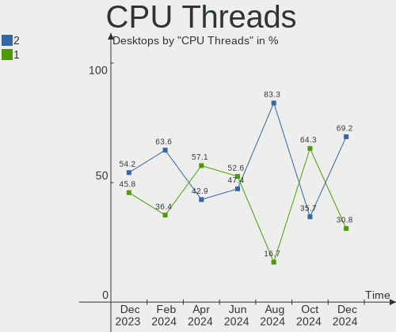
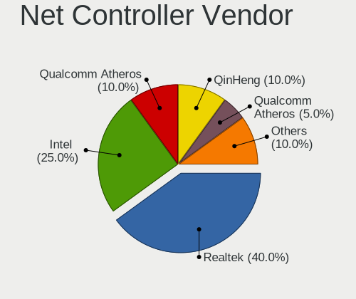
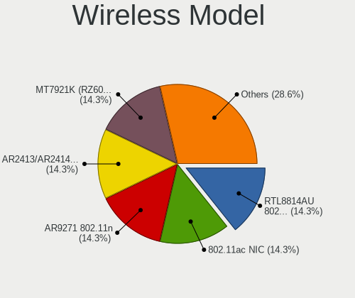
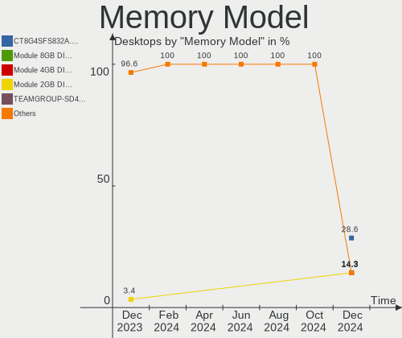

Xubuntu Hardware Trends (Desktops)
----------------------------------

A project to identify most popular hardware characteristics and track their change
over time based on data collected by Xubuntu users at https://Linux-Hardware.org.

Anyone can contribute to this report by the [hw-probe](https://github.com/linuxhw/hw-probe) tool:

    sudo -E hw-probe -all -upload

Full-feature report is available here: https://linux-hardware.org/?view=trends&formfactor=desktop

Period: Sep, 2021.

Contents
--------

* [ System ](#system)
  - [ OS                       ](#os)
  - [ OS Family                ](#os-family)
  - [ Kernel                   ](#kernel)
  - [ Kernel Family            ](#kernel-family)
  - [ Kernel Major Ver.        ](#kernel-major-ver)
  - [ Arch                     ](#arch)
  - [ DE                       ](#de)
  - [ Display Server           ](#display-server)
  - [ Display Manager          ](#display-manager)
  - [ OS Lang                  ](#os-lang)
  - [ Boot Mode                ](#boot-mode)
  - [ Filesystem               ](#filesystem)
  - [ Part. scheme             ](#part-scheme)
  - [ Dual Boot with Linux/BSD ](#dual-boot-with-linuxbsd)
  - [ Dual Boot (Win)          ](#dual-boot-win)

* [ Board ](#board)
  - [ Vendor                   ](#vendor)
  - [ Model                    ](#model)
  - [ Model Family             ](#model-family)
  - [ MFG Year                 ](#mfg-year)
  - [ Form Factor              ](#form-factor)
  - [ Secure Boot              ](#secure-boot)
  - [ Coreboot                 ](#coreboot)
  - [ RAM Size                 ](#ram-size)
  - [ RAM Used                 ](#ram-used)
  - [ Total Drives             ](#total-drives)
  - [ Has CD-ROM               ](#has-cd-rom)
  - [ Has Ethernet             ](#has-ethernet)
  - [ Has WiFi                 ](#has-wifi)
  - [ Has Bluetooth            ](#has-bluetooth)

* [ Location ](#location)
  - [ Country                  ](#country)
  - [ City                     ](#city)

* [ Drives ](#drives)
  - [ Drive Vendor             ](#drive-vendor)
  - [ Drive Model              ](#drive-model)
  - [ HDD Vendor               ](#hdd-vendor)
  - [ SSD Vendor               ](#ssd-vendor)
  - [ Drive Kind               ](#drive-kind)
  - [ Drive Connector          ](#drive-connector)
  - [ Drive Size               ](#drive-size)
  - [ Space Total              ](#space-total)
  - [ Space Used               ](#space-used)
  - [ Malfunc. Drives          ](#malfunc-drives)
  - [ Malfunc. Drive Vendor    ](#malfunc-drive-vendor)
  - [ Malfunc. HDD Vendor      ](#malfunc-hdd-vendor)
  - [ Malfunc. Drive Kind      ](#malfunc-drive-kind)
  - [ Failed Drives            ](#failed-drives)
  - [ Failed Drive Vendor      ](#failed-drive-vendor)
  - [ Drive Status             ](#drive-status)

* [ Storage controller ](#storage-controller)
  - [ Storage Vendor           ](#storage-vendor)
  - [ Storage Model            ](#storage-model)
  - [ Storage Kind             ](#storage-kind)

* [ Processor ](#processor)
  - [ CPU Vendor               ](#cpu-vendor)
  - [ CPU Model                ](#cpu-model)
  - [ CPU Model Family         ](#cpu-model-family)
  - [ CPU Cores                ](#cpu-cores)
  - [ CPU Sockets              ](#cpu-sockets)
  - [ CPU Threads              ](#cpu-threads)
  - [ CPU Op-Modes             ](#cpu-op-modes)
  - [ CPU Microcode            ](#cpu-microcode)
  - [ CPU Microarch            ](#cpu-microarch)

* [ Graphics ](#graphics)
  - [ GPU Vendor               ](#gpu-vendor)
  - [ GPU Model                ](#gpu-model)
  - [ GPU Combo                ](#gpu-combo)
  - [ GPU Driver               ](#gpu-driver)
  - [ GPU Memory               ](#gpu-memory)

* [ Monitor ](#monitor)
  - [ Monitor Vendor           ](#monitor-vendor)
  - [ Monitor Model            ](#monitor-model)
  - [ Monitor Resolution       ](#monitor-resolution)
  - [ Monitor Diagonal         ](#monitor-diagonal)
  - [ Monitor Width            ](#monitor-width)
  - [ Aspect Ratio             ](#aspect-ratio)
  - [ Monitor Area             ](#monitor-area)
  - [ Pixel Density            ](#pixel-density)
  - [ Multiple Monitors        ](#multiple-monitors)

* [ Network ](#network)
  - [ Net Controller Vendor    ](#net-controller-vendor)
  - [ Net Controller Model     ](#net-controller-model)
  - [ Wireless Vendor          ](#wireless-vendor)
  - [ Wireless Model           ](#wireless-model)
  - [ Ethernet Vendor          ](#ethernet-vendor)
  - [ Ethernet Model           ](#ethernet-model)
  - [ Net Controller Kind      ](#net-controller-kind)
  - [ Used Controller          ](#used-controller)
  - [ NICs                     ](#nics)
  - [ IPv6                     ](#ipv6)

* [ Bluetooth ](#bluetooth)
  - [ Bluetooth Vendor         ](#bluetooth-vendor)
  - [ Bluetooth Model          ](#bluetooth-model)

* [ Sound ](#sound)
  - [ Sound Vendor             ](#sound-vendor)
  - [ Sound Model              ](#sound-model)

* [ Memory ](#memory)
  - [ Memory Vendor            ](#memory-vendor)
  - [ Memory Model             ](#memory-model)
  - [ Memory Kind              ](#memory-kind)
  - [ Memory Form Factor       ](#memory-form-factor)
  - [ Memory Size              ](#memory-size)
  - [ Memory Speed             ](#memory-speed)

* [ Printers & scanners ](#printers--scanners)
  - [ Printer Vendor           ](#printer-vendor)
  - [ Printer Model            ](#printer-model)
  - [ Scanner Vendor           ](#scanner-vendor)
  - [ Scanner Model            ](#scanner-model)

* [ Camera ](#camera)
  - [ Camera Vendor            ](#camera-vendor)
  - [ Camera Model             ](#camera-model)

* [ Security ](#security)
  - [ Fingerprint Vendor       ](#fingerprint-vendor)
  - [ Fingerprint Model        ](#fingerprint-model)
  - [ Chipcard Vendor          ](#chipcard-vendor)
  - [ Chipcard Model           ](#chipcard-model)

* [ Unsupported ](#unsupported)
  - [ Unsupported Devices      ](#unsupported-devices)
  - [ Unsupported Device Types ](#unsupported-device-types)

System
------

OS
--

Installed operating systems

| Name          | Desktops | Percent |
|---------------|----------|---------|
| Xubuntu 20.04 | 21       | 60%     |
| Xubuntu 18.04 | 7        | 20%     |
| Xubuntu 21.04 | 5        | 14.29%  |
| Xubuntu 21.10 | 1        | 2.86%   |
| Xubuntu 20.10 | 1        | 2.86%   |

OS Family
---------

OS without a version

| Name    | Desktops | Percent |
|---------|----------|---------|
| Xubuntu | 35       | 100%    |

Kernel
------

Version of the Linux kernel

| Version              | Desktops | Percent |
|----------------------|----------|---------|
| 5.11.0-34-generic    | 6        | 17.14%  |
| 5.4.0-86-generic     | 3        | 8.57%   |
| 5.4.0-84-generic     | 3        | 8.57%   |
| 5.4.0-81-generic     | 3        | 8.57%   |
| 5.11.0-36-generic    | 3        | 8.57%   |
| 5.4.0-42-generic     | 2        | 5.71%   |
| 5.11.0-27-generic    | 2        | 5.71%   |
| 5.8.0-63-generic     | 1        | 2.86%   |
| 5.8.0-59-lowlatency  | 1        | 2.86%   |
| 5.8.0-43-generic     | 1        | 2.86%   |
| 5.4.0-88-generic     | 1        | 2.86%   |
| 5.4.0-84-lowlatency  | 1        | 2.86%   |
| 5.4.0-81-lowlatency  | 1        | 2.86%   |
| 5.4.0-80-generic     | 1        | 2.86%   |
| 5.13.0-14-generic    | 1        | 2.86%   |
| 5.11.0-36-lowlatency | 1        | 2.86%   |
| 5.11.0-34-lowlatency | 1        | 2.86%   |
| 5.11.0-31-generic    | 1        | 2.86%   |
| 4.15.0-145-generic   | 1        | 2.86%   |
| 4.15.0-142-generic   | 1        | 2.86%   |

Kernel Family
-------------

Linux kernel without a distro release

| Version | Desktops | Percent |
|---------|----------|---------|
| 5.4.0   | 15       | 42.86%  |
| 5.11.0  | 14       | 40%     |
| 5.8.0   | 3        | 8.57%   |
| 4.15.0  | 2        | 5.71%   |
| 5.13.0  | 1        | 2.86%   |

Kernel Major Ver.
-----------------

Linux kernel major version

| Version | Desktops | Percent |
|---------|----------|---------|
| 5.4     | 15       | 42.86%  |
| 5.11    | 14       | 40%     |
| 5.8     | 3        | 8.57%   |
| 4.15    | 2        | 5.71%   |
| 5.13    | 1        | 2.86%   |

Arch
----

OS architecture (x86_64, i586, etc.)

| Name   | Desktops | Percent |
|--------|----------|---------|
| x86_64 | 32       | 91.43%  |
| i686   | 3        | 8.57%   |

DE
--

Desktop Environment

| Name  | Desktops | Percent |
|-------|----------|---------|
| XFCE  | 34       | 97.14%  |
| GNOME | 1        | 2.86%   |

Display Server
--------------

X11 or Wayland

| Name | Desktops | Percent |
|------|----------|---------|
| X11  | 33       | 94.29%  |
| Web  | 1        | 2.86%   |
| Tty  | 1        | 2.86%   |

Display Manager
---------------

SDDM, LightDM, etc.

| Name    | Desktops | Percent |
|---------|----------|---------|
| LightDM | 19       | 54.29%  |
| Unknown | 14       | 40%     |
| XDM     | 1        | 2.86%   |
| GDM3    | 1        | 2.86%   |

OS Lang
-------

Language

| Lang  | Desktops | Percent |
|-------|----------|---------|
| en_US | 11       | 31.43%  |
| de_DE | 5        | 14.29%  |
| en_CA | 3        | 8.57%   |
| fr_FR | 2        | 5.71%   |
| C     | 2        | 5.71%   |
| zh_CN | 1        | 2.86%   |
| sv_SE | 1        | 2.86%   |
| ru_RU | 1        | 2.86%   |
| pt_PT | 1        | 2.86%   |
| pt_BR | 1        | 2.86%   |
| nl_BE | 1        | 2.86%   |
| it_IT | 1        | 2.86%   |
| hu_HU | 1        | 2.86%   |
| fr_CA | 1        | 2.86%   |
| en_AU | 1        | 2.86%   |
| de_CH | 1        | 2.86%   |
| de_AT | 1        | 2.86%   |

Boot Mode
---------

EFI or BIOS

| Mode | Desktops | Percent |
|------|----------|---------|
| BIOS | 26       | 74.29%  |
| EFI  | 9        | 25.71%  |

Filesystem
----------

Type of filesystem

| Type    | Desktops | Percent |
|---------|----------|---------|
| Ext4    | 32       | 91.43%  |
| Overlay | 2        | 5.71%   |
| Zfs     | 1        | 2.86%   |

Part. scheme
------------

Scheme of partitioning

| Type    | Desktops | Percent |
|---------|----------|---------|
| Unknown | 21       | 60%     |
| MBR     | 7        | 20%     |
| GPT     | 7        | 20%     |

Dual Boot with Linux/BSD
------------------------

Hosting more than one Linux/BSD

| Dual boot | Desktops | Percent |
|-----------|----------|---------|
| No        | 28       | 80%     |
| Yes       | 7        | 20%     |

Dual Boot (Win)
---------------

Hosting Linux and Windows

| Dual boot | Desktops | Percent |
|-----------|----------|---------|
| No        | 23       | 65.71%  |
| Yes       | 12       | 34.29%  |

Board
-----

Vendor
------

Motherboard manufacturer

| Name                | Desktops | Percent |
|---------------------|----------|---------|
| ASUSTek Computer    | 11       | 31.43%  |
| Hewlett-Packard     | 5        | 14.29%  |
| Gigabyte Technology | 4        | 11.43%  |
| Foxconn             | 3        | 8.57%   |
| ASRock              | 3        | 8.57%   |
| Dell                | 2        | 5.71%   |
| OEM                 | 1        | 2.86%   |
| NCR                 | 1        | 2.86%   |
| MSI                 | 1        | 2.86%   |
| Medion              | 1        | 2.86%   |
| Insyde              | 1        | 2.86%   |
| Acer                | 1        | 2.86%   |
| AAEON               | 1        | 2.86%   |

Model
-----

Motherboard model

| Name                                   | Desktops | Percent |
|----------------------------------------|----------|---------|
| OEM BayTrail JHS365                    | 1        | 2.86%   |
| NCR xxxx-xxxx-xxxx                     | 1        | 2.86%   |
| MSI MS-7A38                            | 1        | 2.86%   |
| Medion Akoya P2120 D MD8836/2452       | 1        | 2.86%   |
| Insyde Harrisonville                   | 1        | 2.86%   |
| HP Z230 Tower Workstation              | 1        | 2.86%   |
| HP RP5 Retail System Model 5810        | 1        | 2.86%   |
| HP ProDesk 490 G2 MT                   | 1        | 2.86%   |
| HP Compaq Elite 8300 CMT               | 1        | 2.86%   |
| HP Compaq dc7900 Convertible Minitower | 1        | 2.86%   |
| Gigabyte GA-970A-UD3                   | 1        | 2.86%   |
| Gigabyte G41M-ES2L                     | 1        | 2.86%   |
| Gigabyte F2A88XM-D3H                   | 1        | 2.86%   |
| Gigabyte B550 AORUS PRO AC             | 1        | 2.86%   |
| Foxconn s5-1014                        | 1        | 2.86%   |
| Foxconn Pro 3300 Series MT             | 1        | 2.86%   |
| Foxconn M61PMV                         | 1        | 2.86%   |
| Dell OptiPlex 7050                     | 1        | 2.86%   |
| Dell Inspiron 545                      | 1        | 2.86%   |
| ASUS V-M3N8200                         | 1        | 2.86%   |
| ASUS PRIME H510M-K                     | 1        | 2.86%   |
| ASUS P8Z68-V LX                        | 1        | 2.86%   |
| ASUS P8Z68 DELUXE                      | 1        | 2.86%   |
| ASUS P8H67                             | 1        | 2.86%   |
| ASUS P5Q-PRO                           | 1        | 2.86%   |
| ASUS P5L-MX                            | 1        | 2.86%   |
| ASUS MaestroII 24                      | 1        | 2.86%   |
| ASUS M5A78L LE                         | 1        | 2.86%   |
| ASUS M3N18L T-M3N8200                  | 1        | 2.86%   |
| ASUS H170M-PLUS                        | 1        | 2.86%   |
| ASRock Z170 Gaming K4                  | 1        | 2.86%   |
| ASRock X570 Taichi                     | 1        | 2.86%   |
| ASRock HM55-MXM                        | 1        | 2.86%   |
| Acer Aspire XC-603G                    | 1        | 2.86%   |
| AAEON GENE-APL5                        | 1        | 2.86%   |

Model Family
------------

Motherboard model prefix

| Name                 | Desktops | Percent |
|----------------------|----------|---------|
| HP Compaq            | 2        | 5.71%   |
| OEM BayTrail         | 1        | 2.86%   |
| NCR xxxx-xxxx-xxxx   | 1        | 2.86%   |
| MSI MS-7A38          | 1        | 2.86%   |
| Medion Akoya         | 1        | 2.86%   |
| Insyde Harrisonville | 1        | 2.86%   |
| HP Z230              | 1        | 2.86%   |
| HP RP5               | 1        | 2.86%   |
| HP ProDesk           | 1        | 2.86%   |
| Gigabyte GA-970A-UD3 | 1        | 2.86%   |
| Gigabyte G41M-ES2L   | 1        | 2.86%   |
| Gigabyte F2A88XM-D3H | 1        | 2.86%   |
| Gigabyte B550        | 1        | 2.86%   |
| Foxconn s5-1014      | 1        | 2.86%   |
| Foxconn Pro          | 1        | 2.86%   |
| Foxconn M61PMV       | 1        | 2.86%   |
| Dell OptiPlex        | 1        | 2.86%   |
| Dell Inspiron        | 1        | 2.86%   |
| ASUS V-M3N8200       | 1        | 2.86%   |
| ASUS PRIME           | 1        | 2.86%   |
| ASUS P8Z68-V         | 1        | 2.86%   |
| ASUS P8Z68           | 1        | 2.86%   |
| ASUS P8H67           | 1        | 2.86%   |
| ASUS P5Q-PRO         | 1        | 2.86%   |
| ASUS P5L-MX          | 1        | 2.86%   |
| ASUS MaestroII       | 1        | 2.86%   |
| ASUS M5A78L          | 1        | 2.86%   |
| ASUS M3N18L          | 1        | 2.86%   |
| ASUS H170M-PLUS      | 1        | 2.86%   |
| ASRock Z170          | 1        | 2.86%   |
| ASRock X570          | 1        | 2.86%   |
| ASRock HM55-MXM      | 1        | 2.86%   |
| Acer Aspire          | 1        | 2.86%   |
| AAEON GENE-APL5      | 1        | 2.86%   |

MFG Year
--------

Motherboard manufacture year

| Year | Desktops | Percent |
|------|----------|---------|
| 2012 | 5        | 14.29%  |
| 2020 | 4        | 11.43%  |
| 2015 | 4        | 11.43%  |
| 2009 | 4        | 11.43%  |
| 2021 | 3        | 8.57%   |
| 2014 | 3        | 8.57%   |
| 2011 | 3        | 8.57%   |
| 2008 | 3        | 8.57%   |
| 2018 | 2        | 5.71%   |
| 2013 | 2        | 5.71%   |
| 2016 | 1        | 2.86%   |
| 2007 | 1        | 2.86%   |

Form Factor
-----------

Physical design of the computer

| Name    | Desktops | Percent |
|---------|----------|---------|
| Desktop | 35       | 100%    |

Secure Boot
-----------

Enabled or disabled

| State    | Desktops | Percent |
|----------|----------|---------|
| Disabled | 35       | 100%    |

Coreboot
--------

Have coreboot on board

| Used | Desktops | Percent |
|------|----------|---------|
| No   | 35       | 100%    |

RAM Size
--------

Total RAM memory

| Size in GB  | Desktops | Percent |
|-------------|----------|---------|
| 3.01-4.0    | 10       | 28.57%  |
| 8.01-16.0   | 8        | 22.86%  |
| 4.01-8.0    | 5        | 14.29%  |
| 32.01-64.0  | 5        | 14.29%  |
| 16.01-24.0  | 4        | 11.43%  |
| 1.01-2.0    | 2        | 5.71%   |
| 64.01-256.0 | 1        | 2.86%   |

RAM Used
--------

Used RAM memory

| Used GB  | Desktops | Percent |
|----------|----------|---------|
| 1.01-2.0 | 16       | 45.71%  |
| 4.01-8.0 | 8        | 22.86%  |
| 2.01-3.0 | 7        | 20%     |
| 0.51-1.0 | 3        | 8.57%   |
| 3.01-4.0 | 1        | 2.86%   |

Total Drives
------------

Number of drives on board

| Drives | Desktops | Percent |
|--------|----------|---------|
| 1      | 16       | 45.71%  |
| 3      | 7        | 20%     |
| 2      | 6        | 17.14%  |
| 4      | 5        | 14.29%  |
| 6      | 1        | 2.86%   |

Has CD-ROM
----------

Has CD-ROM on board

| Presented | Desktops | Percent |
|-----------|----------|---------|
| Yes       | 23       | 65.71%  |
| No        | 12       | 34.29%  |

Has Ethernet
------------

Has Ethernet on board

| Presented | Desktops | Percent |
|-----------|----------|---------|
| Yes       | 35       | 100%    |

Has WiFi
--------

Has WiFi module

| Presented | Desktops | Percent |
|-----------|----------|---------|
| No        | 20       | 57.14%  |
| Yes       | 15       | 42.86%  |

Has Bluetooth
-------------

Has Bluetooth module

| Presented | Desktops | Percent |
|-----------|----------|---------|
| No        | 27       | 77.14%  |
| Yes       | 8        | 22.86%  |

Location
--------

Country
-------

Geographic location (country)

| Country     | Desktops | Percent |
|-------------|----------|---------|
| USA         | 7        | 20%     |
| Germany     | 6        | 17.14%  |
| Canada      | 5        | 14.29%  |
| Sweden      | 3        | 8.57%   |
| Russia      | 2        | 5.71%   |
| Italy       | 2        | 5.71%   |
| France      | 2        | 5.71%   |
| Venezuela   | 1        | 2.86%   |
| Switzerland | 1        | 2.86%   |
| Portugal    | 1        | 2.86%   |
| Hungary     | 1        | 2.86%   |
| Brazil      | 1        | 2.86%   |
| Belgium     | 1        | 2.86%   |
| Austria     | 1        | 2.86%   |
| Australia   | 1        | 2.86%   |

City
----

Geographic location (city)

| City                  | Desktops | Percent |
|-----------------------|----------|---------|
| Wuppertal             | 1        | 2.86%   |
| Whitinsville          | 1        | 2.86%   |
| Vienna                | 1        | 2.86%   |
| Vancouver             | 1        | 2.86%   |
| Valenza               | 1        | 2.86%   |
| Tularosa              | 1        | 2.86%   |
| Sydney                | 1        | 2.86%   |
| Suwanee               | 1        | 2.86%   |
| Sulz am Neckar        | 1        | 2.86%   |
| Saint-Raphael         | 1        | 2.86%   |
| Reutlingen            | 1        | 2.86%   |
| Pushkino              | 1        | 2.86%   |
| Porto Velho           | 1        | 2.86%   |
| Paris                 | 1        | 2.86%   |
| Nuremberg             | 1        | 2.86%   |
| Naples                | 1        | 2.86%   |
| Nanaimo               | 1        | 2.86%   |
| Murr                  | 1        | 2.86%   |
| Moscow                | 1        | 2.86%   |
| Montgeron             | 1        | 2.86%   |
| Milan                 | 1        | 2.86%   |
| Matur?­n              | 1        | 2.86%   |
| Manchester-by-the-Sea | 1        | 2.86%   |
| Kortrijk              | 1        | 2.86%   |
| Kaposv??r             | 1        | 2.86%   |
| Jefferson City        | 1        | 2.86%   |
| Helsingborg           | 1        | 2.86%   |
| Hatfield              | 1        | 2.86%   |
| Grabs                 | 1        | 2.86%   |
| Gothenburg            | 1        | 2.86%   |
| Fort St. John         | 1        | 2.86%   |
| Denver                | 1        | 2.86%   |
| Delta                 | 1        | 2.86%   |
| Budingen              | 1        | 2.86%   |
| ?–rnsk?¶ldsvik        | 1        | 2.86%   |

Drives
------

Drive Vendor
------------

Hard drive vendors

| Vendor                | Desktops | Drives | Percent |
|-----------------------|----------|--------|---------|
| WDC                   | 14       | 18     | 22.22%  |
| Samsung Electronics   | 12       | 16     | 19.05%  |
| Seagate               | 11       | 13     | 17.46%  |
| Hitachi               | 6        | 7      | 9.52%   |
| Toshiba               | 5        | 5      | 7.94%   |
| Intel                 | 4        | 4      | 6.35%   |
| Crucial               | 2        | 2      | 3.17%   |
| Transcend             | 1        | 1      | 1.59%   |
| SanDisk               | 1        | 1      | 1.59%   |
| Realtek Semiconductor | 1        | 1      | 1.59%   |
| Qumox                 | 1        | 1      | 1.59%   |
| OCZ                   | 1        | 1      | 1.59%   |
| HGST                  | 1        | 1      | 1.59%   |
| FORESEE               | 1        | 1      | 1.59%   |
| A-DATA Technology     | 1        | 1      | 1.59%   |
| Unknown               | 1        | 1      | 1.59%   |

Drive Model
-----------

Hard drive models

| Model                                | Desktops | Percent |
|--------------------------------------|----------|---------|
| Seagate ST3500418AS 500GB            | 3        | 4.17%   |
| WDC WD20EARX-00PASB0 2TB             | 2        | 2.78%   |
| Toshiba DT01ACA050 500GB             | 2        | 2.78%   |
| WDC WDS120G2G0A-00JH30 120GB SSD     | 1        | 1.39%   |
| WDC WD5000LPLX-08ZNTT0 500GB         | 1        | 1.39%   |
| WDC WD5000BPVT-22HXZT3 500GB         | 1        | 1.39%   |
| WDC WD5000AZLX-75K2TA0 500GB         | 1        | 1.39%   |
| WDC WD5000AAKX-22ERMA0 500GB         | 1        | 1.39%   |
| WDC WD5000AAKX-001CA0 500GB          | 1        | 1.39%   |
| WDC WD3200AVVS-62L2B0 320GB          | 1        | 1.39%   |
| WDC WD2500BEVS-60UST0 250GB          | 1        | 1.39%   |
| WDC WD20EZAZ-00GGJB0 2TB             | 1        | 1.39%   |
| WDC WD1600AAJS-56M0A0 160GB          | 1        | 1.39%   |
| WDC WD10EARX-00N0YB0 1TB             | 1        | 1.39%   |
| WDC WD10EARS-22Y5B1 1TB              | 1        | 1.39%   |
| WDC WD10EARS-00MVWB0 1TB             | 1        | 1.39%   |
| WDC WD10EADS-65M2B0 1TB              | 1        | 1.39%   |
| Transcend TS32GMSA370 32GB SSD       | 1        | 1.39%   |
| Toshiba MK8034GSX 80GB               | 1        | 1.39%   |
| Toshiba MK2565GSX 250GB              | 1        | 1.39%   |
| Toshiba KXG50ZNV512G NVMe 512GB      | 1        | 1.39%   |
| Seagate ST4000DM004-2CV104 4TB       | 1        | 1.39%   |
| Seagate ST4000DM000-1F2168 4TB       | 1        | 1.39%   |
| Seagate ST380815AS 80GB              | 1        | 1.39%   |
| Seagate ST3500413AS 500GB            | 1        | 1.39%   |
| Seagate ST2000DM001-9YN164 2TB       | 1        | 1.39%   |
| Seagate ST2000DM001-1ER164 2TB       | 1        | 1.39%   |
| Seagate ST2000DM001-1CH164 2TB       | 1        | 1.39%   |
| Seagate ST1000DM003-1ER162 1TB       | 1        | 1.39%   |
| Seagate ST1000DM003-1CH162 1TB       | 1        | 1.39%   |
| Seagate M3 Portable 2TB              | 1        | 1.39%   |
| SanDisk SD8SB8U512G1122 512GB SSD    | 1        | 1.39%   |
| Samsung SSD 970 EVO Plus 500GB       | 1        | 1.39%   |
| Samsung SSD 970 EVO 500GB            | 1        | 1.39%   |
| Samsung SSD 870 EVO 500GB            | 1        | 1.39%   |
| Samsung SSD 860 EVO 500GB            | 1        | 1.39%   |
| Samsung SSD 850 PRO 256GB            | 1        | 1.39%   |
| Samsung SSD 850 EVO M.2 500GB        | 1        | 1.39%   |
| Samsung SSD 850 EVO 500GB            | 1        | 1.39%   |
| Samsung SSD 850 EVO 250GB            | 1        | 1.39%   |
| Samsung SSD 840 Series 250GB         | 1        | 1.39%   |
| Samsung SSD 840 EVO 250GB            | 1        | 1.39%   |
| Samsung Portable SSD T5 250GB        | 1        | 1.39%   |
| Samsung NVMe SSD Drive 1TB           | 1        | 1.39%   |
| Samsung MZNLF128HCHP-00000 128GB SSD | 1        | 1.39%   |
| Samsung HD754JJ 752GB                | 1        | 1.39%   |
| Samsung HD753LJ 752GB                | 1        | 1.39%   |
| Samsung HD103SI 1TB                  | 1        | 1.39%   |
| Realtek NVMe SSD Drive 256GB         | 1        | 1.39%   |
| Qumox 120GB SSD                      | 1        | 1.39%   |
| OCZ AGILITY3 64GB SSD                | 1        | 1.39%   |
| Intel SSDSC2KW256G8 256GB            | 1        | 1.39%   |
| Intel SSDSC2CW180A3 180GB            | 1        | 1.39%   |
| Intel SSDSA2CW080G3 80GB             | 1        | 1.39%   |
| Intel NVMe SSD Drive 1024GB          | 1        | 1.39%   |
| Hitachi HDT725040VLA380 400GB        | 1        | 1.39%   |
| Hitachi HDT721050SLA360 500GB        | 1        | 1.39%   |
| Hitachi HDS728080PLA380 82GB         | 1        | 1.39%   |
| Hitachi HDS721075CLA332 752GB        | 1        | 1.39%   |
| Hitachi HDS721050CLA660 500GB        | 1        | 1.39%   |

HDD Vendor
----------

Hard disk drive vendors

| Vendor              | Desktops | Drives | Percent |
|---------------------|----------|--------|---------|
| WDC                 | 13       | 16     | 34.21%  |
| Seagate             | 11       | 12     | 28.95%  |
| Hitachi             | 6        | 7      | 15.79%  |
| Toshiba             | 4        | 4      | 10.53%  |
| Samsung Electronics | 3        | 3      | 7.89%   |
| HGST                | 1        | 1      | 2.63%   |

SSD Vendor
----------

Solid state drive vendors

| Vendor              | Desktops | Drives | Percent |
|---------------------|----------|--------|---------|
| Samsung Electronics | 8        | 10     | 38.1%   |
| Intel               | 3        | 3      | 14.29%  |
| Crucial             | 2        | 2      | 9.52%   |
| WDC                 | 1        | 2      | 4.76%   |
| Transcend           | 1        | 1      | 4.76%   |
| SanDisk             | 1        | 1      | 4.76%   |
| Qumox               | 1        | 1      | 4.76%   |
| OCZ                 | 1        | 1      | 4.76%   |
| FORESEE             | 1        | 1      | 4.76%   |
| A-DATA Technology   | 1        | 1      | 4.76%   |
| Unknown             | 1        | 1      | 4.76%   |

Drive Kind
----------

HDD or SSD

| Kind    | Desktops | Drives | Percent |
|---------|----------|--------|---------|
| HDD     | 27       | 43     | 50.94%  |
| SSD     | 20       | 24     | 37.74%  |
| NVMe    | 5        | 6      | 9.43%   |
| Unknown | 1        | 1      | 1.89%   |

Drive Connector
---------------

SATA, SAS, NVMe, etc.

| Type | Desktops | Drives | Percent |
|------|----------|--------|---------|
| SATA | 35       | 66     | 83.33%  |
| NVMe | 5        | 6      | 11.9%   |
| SAS  | 2        | 2      | 4.76%   |

Drive Size
----------

Size of hard drive

| Size in TB | Desktops | Drives | Percent |
|------------|----------|--------|---------|
| 0.01-0.5   | 31       | 45     | 64.58%  |
| 0.51-1.0   | 9        | 13     | 18.75%  |
| 1.01-2.0   | 6        | 7      | 12.5%   |
| 3.01-4.0   | 2        | 2      | 4.17%   |

Space Total
-----------

Amount of disk space available on the file system

| Size in GB     | Desktops | Percent |
|----------------|----------|---------|
| 101-250        | 8        | 22.86%  |
| 251-500        | 6        | 17.14%  |
| 2001-3000      | 4        | 11.43%  |
| 1001-2000      | 4        | 11.43%  |
| 501-1000       | 4        | 11.43%  |
| 21-50          | 3        | 8.57%   |
| More than 3000 | 2        | 5.71%   |
| 1-20           | 2        | 5.71%   |
| 51-100         | 2        | 5.71%   |

Space Used
----------

Amount of used disk space

| Used GB        | Desktops | Percent |
|----------------|----------|---------|
| 1-20           | 12       | 34.29%  |
| 501-1000       | 5        | 14.29%  |
| 21-50          | 4        | 11.43%  |
| 101-250        | 4        | 11.43%  |
| 251-500        | 3        | 8.57%   |
| 2001-3000      | 2        | 5.71%   |
| 1001-2000      | 2        | 5.71%   |
| 51-100         | 2        | 5.71%   |
| More than 3000 | 1        | 2.86%   |

Malfunc. Drives
---------------

Drive models with a malfunction

| Model                         | Desktops | Drives | Percent |
|-------------------------------|----------|--------|---------|
| Toshiba DT01ACA050 500GB      | 1        | 1      | 25%     |
| Seagate ST3500418AS 500GB     | 1        | 1      | 25%     |
| Hitachi HDS721050CLA360 500GB | 1        | 1      | 25%     |
| FORESEE 64GB SSD              | 1        | 1      | 25%     |

Malfunc. Drive Vendor
---------------------

Vendors of faulty drives

| Vendor  | Desktops | Drives | Percent |
|---------|----------|--------|---------|
| Toshiba | 1        | 1      | 25%     |
| Seagate | 1        | 1      | 25%     |
| Hitachi | 1        | 1      | 25%     |
| FORESEE | 1        | 1      | 25%     |

Malfunc. HDD Vendor
-------------------

Vendors of faulty HDD drives

| Vendor  | Desktops | Drives | Percent |
|---------|----------|--------|---------|
| Toshiba | 1        | 1      | 33.33%  |
| Seagate | 1        | 1      | 33.33%  |
| Hitachi | 1        | 1      | 33.33%  |

Malfunc. Drive Kind
-------------------

Kinds of faulty drives

| Kind | Desktops | Drives | Percent |
|------|----------|--------|---------|
| HDD  | 3        | 3      | 75%     |
| SSD  | 1        | 1      | 25%     |

Failed Drives
-------------

Failed drive models

Zero info for selected period =(

Failed Drive Vendor
-------------------

Failed drive vendors

Zero info for selected period =(

Drive Status
------------

Number of failed and malfunc. drives

| Status   | Desktops | Drives | Percent |
|----------|----------|--------|---------|
| Detected | 19       | 39     | 50%     |
| Works    | 15       | 31     | 39.47%  |
| Malfunc  | 4        | 4      | 10.53%  |

Storage controller
------------------

Storage Vendor
--------------

Storage controller vendors

| Vendor                       | Desktops | Percent |
|------------------------------|----------|---------|
| Intel                        | 27       | 62.79%  |
| AMD                          | 6        | 13.95%  |
| Nvidia                       | 3        | 6.98%   |
| Samsung Electronics          | 2        | 4.65%   |
| VIA Technologies             | 1        | 2.33%   |
| Toshiba America Info Systems | 1        | 2.33%   |
| Realtek Semiconductor        | 1        | 2.33%   |
| Marvell Technology Group     | 1        | 2.33%   |
| JMicron Technology           | 1        | 2.33%   |

Storage Model
-------------

Storage controller models

| Model                                                                                   | Desktops | Percent |
|-----------------------------------------------------------------------------------------|----------|---------|
| Intel Q170/Q150/B150/H170/H110/Z170/CM236 Chipset SATA Controller [AHCI Mode]           | 3        | 5.08%   |
| Intel NM10/ICH7 Family SATA Controller [IDE mode]                                       | 3        | 5.08%   |
| Intel 6 Series/C200 Series Chipset Family Desktop SATA Controller (IDE mode, ports 4-5) | 3        | 5.08%   |
| Intel 6 Series/C200 Series Chipset Family Desktop SATA Controller (IDE mode, ports 0-3) | 3        | 5.08%   |
| Samsung NVMe SSD Controller SM981/PM981/PM983                                           | 2        | 3.39%   |
| Nvidia MCP78S [GeForce 8200] SATA Controller (non-AHCI mode)                            | 2        | 3.39%   |
| Nvidia MCP78S [GeForce 8200] IDE                                                        | 2        | 3.39%   |
| Intel Atom Processor E3800 Series SATA AHCI Controller                                  | 2        | 3.39%   |
| Intel 82801G (ICH7 Family) IDE Controller                                               | 2        | 3.39%   |
| Intel 6 Series/C200 Series Chipset Family 6 port Desktop SATA AHCI Controller           | 2        | 3.39%   |
| AMD SB7x0/SB8x0/SB9x0 SATA Controller [IDE mode]                                        | 2        | 3.39%   |
| AMD SB7x0/SB8x0/SB9x0 IDE Controller                                                    | 2        | 3.39%   |
| AMD FCH SATA Controller [AHCI mode]                                                     | 2        | 3.39%   |
| VIA VT6415 PATA IDE Host Controller                                                     | 1        | 1.69%   |
| Toshiba America Info Systems Toshiba America Info Non-Volatile memory controller        | 1        | 1.69%   |
| Realtek Realtek Non-Volatile memory controller                                          | 1        | 1.69%   |
| Nvidia MCP61 SATA Controller                                                            | 1        | 1.69%   |
| Nvidia MCP61 IDE                                                                        | 1        | 1.69%   |
| Marvell Group 88SE9128 PCIe SATA 6 Gb/s RAID controller with HyperDuo                   | 1        | 1.69%   |
| JMicron JMB362 SATA Controller                                                          | 1        | 1.69%   |
| Intel SSD 600P Series                                                                   | 1        | 1.69%   |
| Intel SATA Controller [RAID mode]                                                       | 1        | 1.69%   |
| Intel Celeron N3350/Pentium N4200/Atom E3900 Series SATA AHCI Controller                | 1        | 1.69%   |
| Intel Cannon Lake PCH SATA AHCI Controller                                              | 1        | 1.69%   |
| Intel Atom Processor C3000 Series SATA Controller 1                                     | 1        | 1.69%   |
| Intel Atom Processor C3000 Series SATA Controller 0                                     | 1        | 1.69%   |
| Intel 9 Series Chipset Family SATA Controller [AHCI Mode]                               | 1        | 1.69%   |
| Intel 82801JI (ICH10 Family) 4 port SATA IDE Controller #1                              | 1        | 1.69%   |
| Intel 82801JI (ICH10 Family) 2 port SATA IDE Controller #2                              | 1        | 1.69%   |
| Intel 82801JD/DO (ICH10 Family) 4-port SATA IDE Controller                              | 1        | 1.69%   |
| Intel 82801JD/DO (ICH10 Family) 2-port SATA IDE Controller                              | 1        | 1.69%   |
| Intel 82801IR/IO/IH (ICH9R/DO/DH) 4 port SATA Controller [IDE mode]                     | 1        | 1.69%   |
| Intel 82801I (ICH9 Family) 2 port SATA Controller [IDE mode]                            | 1        | 1.69%   |
| Intel 8 Series/C220 Series Chipset Family 6-port SATA Controller 1 [AHCI mode]          | 1        | 1.69%   |
| Intel 7 Series/C210 Series Chipset Family 6-port SATA Controller [AHCI mode]            | 1        | 1.69%   |
| Intel 500 Series Chipset Family SATA AHCI Controller                                    | 1        | 1.69%   |
| Intel 5 Series/3400 Series Chipset 4 port SATA AHCI Controller                          | 1        | 1.69%   |
| Intel 4 Series Chipset PT IDER Controller                                               | 1        | 1.69%   |
| Intel 200 Series PCH SATA controller [AHCI mode]                                        | 1        | 1.69%   |
| AMD Starship/Matisse Chipset SATA Controller [AHCI mode]                                | 1        | 1.69%   |
| AMD FCH SATA Controller [RAID mode]                                                     | 1        | 1.69%   |
| AMD 300 Series Chipset SATA Controller                                                  | 1        | 1.69%   |

Storage Kind
------------

Kind of storage controller (IDE, SATA, NVMe, SAS, ...)

| Kind | Desktops | Percent |
|------|----------|---------|
| SATA | 21       | 50%     |
| IDE  | 14       | 33.33%  |
| NVMe | 5        | 11.9%   |
| RAID | 2        | 4.76%   |

Processor
---------

CPU Vendor
----------

Processor vendors

| Vendor | Desktops | Percent |
|--------|----------|---------|
| Intel  | 26       | 74.29%  |
| AMD    | 9        | 25.71%  |

CPU Model
---------

Processor models

| Model                                       | Desktops | Percent |
|---------------------------------------------|----------|---------|
| Intel Core i7-4790 CPU @ 3.60GHz            | 2        | 5.71%   |
| Intel Core i7-2600K CPU @ 3.40GHz           | 2        | 5.71%   |
| Intel Celeron CPU J1900 @ 1.99GHz           | 2        | 5.71%   |
| Intel Pentium Dual-Core CPU E5800 @ 3.20GHz | 1        | 2.86%   |
| Intel Pentium D CPU 3.40GHz                 | 1        | 2.86%   |
| Intel Pentium CPU N4200 @ 1.10GHz           | 1        | 2.86%   |
| Intel Core i7-8700 CPU @ 3.20GHz            | 1        | 2.86%   |
| Intel Core i7-7700 CPU @ 3.60GHz            | 1        | 2.86%   |
| Intel Core i7-2700K CPU @ 3.50GHz           | 1        | 2.86%   |
| Intel Core i5-6600K CPU @ 3.50GHz           | 1        | 2.86%   |
| Intel Core i5-6500 CPU @ 3.20GHz            | 1        | 2.86%   |
| Intel Core i5-4570S CPU @ 2.90GHz           | 1        | 2.86%   |
| Intel Core i5-3570 CPU @ 3.40GHz            | 1        | 2.86%   |
| Intel Core i5-2400 CPU @ 3.10GHz            | 1        | 2.86%   |
| Intel Core i3-6100 CPU @ 3.70GHz            | 1        | 2.86%   |
| Intel Core i3-2100 CPU @ 3.10GHz            | 1        | 2.86%   |
| Intel Core i3 CPU M 370 @ 2.40GHz           | 1        | 2.86%   |
| Intel Core 2 Quad CPU Q8300 @ 2.50GHz       | 1        | 2.86%   |
| Intel Core 2 Duo CPU E8400 @ 3.00GHz        | 1        | 2.86%   |
| Intel Core 2 Duo CPU E7300 @ 2.66GHz        | 1        | 2.86%   |
| Intel Core 2 Duo CPU E4500 @ 2.20GHz        | 1        | 2.86%   |
| Intel Atom CPU C3508 @ 1.60GHz              | 1        | 2.86%   |
| Intel 11th Gen Core i5-11600 @ 2.80GHz      | 1        | 2.86%   |
| AMD Ryzen 9 3900X 12-Core Processor         | 1        | 2.86%   |
| AMD Ryzen 7 5700G with Radeon Graphics      | 1        | 2.86%   |
| AMD Ryzen 7 3700X 8-Core Processor          | 1        | 2.86%   |
| AMD FX-4300 Quad-Core Processor             | 1        | 2.86%   |
| AMD FX-4100 Quad-Core Processor             | 1        | 2.86%   |
| AMD Athlon Processor 2650e                  | 1        | 2.86%   |
| AMD Athlon Dual Core Processor 5050e        | 1        | 2.86%   |
| AMD Athlon 64 X2 Dual Core Processor 5000+  | 1        | 2.86%   |
| AMD A8-6600K APU with Radeon HD Graphics    | 1        | 2.86%   |

CPU Model Family
----------------

Processor model prefix

| Model                   | Desktops | Percent |
|-------------------------|----------|---------|
| Intel Core i7           | 7        | 20%     |
| Intel Core i5           | 5        | 14.29%  |
| Intel Core i3           | 3        | 8.57%   |
| Intel Core 2 Duo        | 3        | 8.57%   |
| Intel Celeron           | 2        | 5.71%   |
| AMD Ryzen 7             | 2        | 5.71%   |
| AMD FX                  | 2        | 5.71%   |
| Other                   | 1        | 2.86%   |
| Intel Pentium Dual-Core | 1        | 2.86%   |
| Intel Pentium D         | 1        | 2.86%   |
| Intel Pentium           | 1        | 2.86%   |
| Intel Core 2 Quad       | 1        | 2.86%   |
| Intel Atom              | 1        | 2.86%   |
| AMD Ryzen 9             | 1        | 2.86%   |
| AMD Athlon Dual Core    | 1        | 2.86%   |
| AMD Athlon 64 X2        | 1        | 2.86%   |
| AMD Athlon              | 1        | 2.86%   |
| AMD A8                  | 1        | 2.86%   |

CPU Cores
---------

Number of processor cores

| Number | Desktops | Percent |
|--------|----------|---------|
| 4      | 16       | 45.71%  |
| 2      | 13       | 37.14%  |
| 8      | 2        | 5.71%   |
| 6      | 2        | 5.71%   |
| 12     | 1        | 2.86%   |
| 1      | 1        | 2.86%   |

CPU Sockets
-----------

Number of sockets

| Number | Desktops | Percent |
|--------|----------|---------|
| 1      | 35       | 100%    |

CPU Threads
-----------

Threads per core (Hyper-Threading)

| Number | Desktops | Percent |
|--------|----------|---------|
| 1      | 18       | 51.43%  |
| 2      | 17       | 48.57%  |

CPU Op-Modes
------------

CPU Operation Modes (32-bit, 64-bit)

| Op mode        | Desktops | Percent |
|----------------|----------|---------|
| 32-bit, 64-bit | 35       | 100%    |

CPU Microcode
-------------

Microcode number

| Number     | Desktops | Percent |
|------------|----------|---------|
| Unknown    | 8        | 22.86%  |
| 0x206a7    | 4        | 11.43%  |
| 0x506e3    | 3        | 8.57%   |
| 0x306c3    | 3        | 8.57%   |
| 0x1067a    | 3        | 8.57%   |
| 0x08701021 | 2        | 5.71%   |
| 0xa0671    | 1        | 2.86%   |
| 0x906ea    | 1        | 2.86%   |
| 0x906e9    | 1        | 2.86%   |
| 0x6fd      | 1        | 2.86%   |
| 0x506f1    | 1        | 2.86%   |
| 0x506ca    | 1        | 2.86%   |
| 0x30678    | 1        | 2.86%   |
| 0x20655    | 1        | 2.86%   |
| 0x10676    | 1        | 2.86%   |
| 0x0a50000c | 1        | 2.86%   |
| 0x06001119 | 1        | 2.86%   |
| 0x06000852 | 1        | 2.86%   |

CPU Microarch
-------------

Microarchitecture

| Name        | Desktops | Percent |
|-------------|----------|---------|
| SandyBridge | 5        | 14.29%  |
| Penryn      | 4        | 11.43%  |
| Skylake     | 3        | 8.57%   |
| K8 Hammer   | 3        | 8.57%   |
| Haswell     | 3        | 8.57%   |
| Zen 2       | 2        | 5.71%   |
| Silvermont  | 2        | 5.71%   |
| Piledriver  | 2        | 5.71%   |
| KabyLake    | 2        | 5.71%   |
| Goldmont    | 2        | 5.71%   |
| Zen 3       | 1        | 2.86%   |
| Westmere    | 1        | 2.86%   |
| NetBurst    | 1        | 2.86%   |
| IvyBridge   | 1        | 2.86%   |
| Core        | 1        | 2.86%   |
| Bulldozer   | 1        | 2.86%   |
| Unknown     | 1        | 2.86%   |

Graphics
--------

GPU Vendor
----------

Vendors of graphics cards

| Vendor | Desktops | Percent |
|--------|----------|---------|
| Nvidia | 15       | 41.67%  |
| Intel  | 12       | 33.33%  |
| AMD    | 9        | 25%     |

GPU Model
---------

Graphics card models

| Model                                                                              | Desktops | Percent |
|------------------------------------------------------------------------------------|----------|---------|
| Nvidia GP107 [GeForce GTX 1050 Ti]                                                 | 3        | 8.11%   |
| Intel Xeon E3-1200 v3/4th Gen Core Processor Integrated Graphics Controller        | 2        | 5.41%   |
| Intel Atom Processor Z36xxx/Z37xxx Series Graphics & Display                       | 2        | 5.41%   |
| Nvidia GT218 [GeForce 210]                                                         | 1        | 2.7%    |
| Nvidia GP106 [GeForce GTX 1060 6GB]                                                | 1        | 2.7%    |
| Nvidia GP102 [GeForce GTX 1080 Ti]                                                 | 1        | 2.7%    |
| Nvidia GK208B [GeForce GT 710]                                                     | 1        | 2.7%    |
| Nvidia GF119 [GeForce GT 610]                                                      | 1        | 2.7%    |
| Nvidia GF114 [GeForce GTX 560]                                                     | 1        | 2.7%    |
| Nvidia GF108M [GeForce GT 425M]                                                    | 1        | 2.7%    |
| Nvidia GF108 [GeForce GT 630]                                                      | 1        | 2.7%    |
| Nvidia GF108 [GeForce GT 530]                                                      | 1        | 2.7%    |
| Nvidia G84 [GeForce 8600 GS]                                                       | 1        | 2.7%    |
| Nvidia C77 [GeForce 8200]                                                          | 1        | 2.7%    |
| Nvidia C61 [GeForce 6150SE nForce 430]                                             | 1        | 2.7%    |
| Intel Xeon E3-1200 v2/3rd Gen Core processor Graphics Controller                   | 1        | 2.7%    |
| Intel HD Graphics 630                                                              | 1        | 2.7%    |
| Intel HD Graphics 530                                                              | 1        | 2.7%    |
| Intel CometLake-S GT2 [UHD Graphics 630]                                           | 1        | 2.7%    |
| Intel Celeron N3350/Pentium N4200/Atom E3900 Series Integrated Graphics Controller | 1        | 2.7%    |
| Intel 82945G/GZ Integrated Graphics Controller                                     | 1        | 2.7%    |
| Intel 4 Series Chipset Integrated Graphics Controller                              | 1        | 2.7%    |
| Intel 2nd Generation Core Processor Family Integrated Graphics Controller          | 1        | 2.7%    |
| AMD RV770 [Radeon HD 4870]                                                         | 1        | 2.7%    |
| AMD RV370 [Radeon X300]                                                            | 1        | 2.7%    |
| AMD RV370 [Radeon X300 SE]                                                         | 1        | 2.7%    |
| AMD Richland [Radeon HD 8570D]                                                     | 1        | 2.7%    |
| AMD Redwood XT [Radeon HD 5670/5690/5730]                                          | 1        | 2.7%    |
| AMD Oland [Radeon HD 8570 / R5 430 OEM / R7 240/340 / Radeon 520 OEM]              | 1        | 2.7%    |
| AMD Juniper XT [Radeon HD 5770]                                                    | 1        | 2.7%    |
| AMD Cezanne                                                                        | 1        | 2.7%    |
| AMD Cedar [Radeon HD 5000/6000/7350/8350 Series]                                   | 1        | 2.7%    |
| AMD Cape Verde PRO / Venus LE / Tropo PRO-L [Radeon HD 8830M / R7 250 / R7 M465X]  | 1        | 2.7%    |

GPU Combo
---------

Combinations of graphics cards

| Name       | Desktops | Percent |
|------------|----------|---------|
| 1 x Nvidia | 15       | 42.86%  |
| 1 x Intel  | 10       | 28.57%  |
| 1 x AMD    | 8        | 22.86%  |
| Other      | 1        | 2.86%   |
| 2 x AMD    | 1        | 2.86%   |

GPU Driver
----------

Free vs proprietary

| Driver      | Desktops | Percent |
|-------------|----------|---------|
| Free        | 23       | 65.71%  |
| Proprietary | 10       | 28.57%  |
| Unknown     | 2        | 5.71%   |

GPU Memory
----------

Total video memory

| Size in GB | Desktops | Percent |
|------------|----------|---------|
| Unknown    | 13       | 37.14%  |
| 0.51-1.0   | 7        | 20%     |
| 0.01-0.5   | 5        | 14.29%  |
| 3.01-4.0   | 4        | 11.43%  |
| 1.01-2.0   | 4        | 11.43%  |
| 5.01-6.0   | 1        | 2.86%   |
| 8.01-16.0  | 1        | 2.86%   |

Monitor
-------

Monitor Vendor
--------------

Monitor vendors

| Vendor               | Desktops | Percent |
|----------------------|----------|---------|
| Samsung Electronics  | 7        | 20.59%  |
| Goldstar             | 4        | 11.76%  |
| Hewlett-Packard      | 3        | 8.82%   |
| Dell                 | 3        | 8.82%   |
| Acer                 | 3        | 8.82%   |
| Unknown              | 2        | 5.88%   |
| Vestel Elektronik    | 1        | 2.94%   |
| Sceptre Tech         | 1        | 2.94%   |
| Panasonic            | 1        | 2.94%   |
| MStar                | 1        | 2.94%   |
| MSI                  | 1        | 2.94%   |
| Medion               | 1        | 2.94%   |
| LG Electronics       | 1        | 2.94%   |
| Idek Iiyama          | 1        | 2.94%   |
| Fujitsu Siemens      | 1        | 2.94%   |
| CHR                  | 1        | 2.94%   |
| BenQ                 | 1        | 2.94%   |
| Ancor Communications | 1        | 2.94%   |

Monitor Model
-------------

Monitor models

| Model                                                                  | Desktops | Percent |
|------------------------------------------------------------------------|----------|---------|
| Vestel Elektronik 50UHD_LCD_TV VES3700 3840x2160 1872x1053mm 84.6-inch | 1        | 2.78%   |
| Unknown LCD Monitor SAMSUNG 1440x900                                   | 1        | 2.78%   |
| Unknown LCD Monitor SAMSUNG                                            | 1        | 2.78%   |
| Sceptre Tech E205W-1600 SPT080D 1600x900 477x268mm 21.5-inch           | 1        | 2.78%   |
| Samsung Electronics U28E510 SAM0D68 3840x2160 608x345mm 27.5-inch      | 1        | 2.78%   |
| Samsung Electronics SyncMaster SAM0582 1680x1050 480x270mm 21.7-inch   | 1        | 2.78%   |
| Samsung Electronics SyncMaster SAM03EF 1680x1050 433x271mm 20.1-inch   | 1        | 2.78%   |
| Samsung Electronics S19C300 SAM0A13 1366x768 410x230mm 18.5-inch       | 1        | 2.78%   |
| Samsung Electronics LCD Monitor SMB2340 5760x1080                      | 1        | 2.78%   |
| Samsung Electronics LCD Monitor SMB2340                                | 1        | 2.78%   |
| Samsung Electronics LCD Monitor SAM0C28 1920x1080 1209x680mm 54.6-inch | 1        | 2.78%   |
| Samsung Electronics LCD Monitor SAM07C0 1920x1080 700x390mm 31.5-inch  | 1        | 2.78%   |
| Panasonic TV MEIA08E 1920x540 698x392mm 31.5-inch                      | 1        | 2.78%   |
| MStar TV_MONITOR MST0030 1440x900 1150x650mm 52.0-inch                 | 1        | 2.78%   |
| MSI Optix AG32C MSI1462 1920x1080 700x390mm 31.5-inch                  | 1        | 2.78%   |
| Medion MD20435 MED36D5 1920x1080 521x293mm 23.5-inch                   | 1        | 2.78%   |
| LG Electronics LCD Monitor LG HDR QHD 4480x1440                        | 1        | 2.78%   |
| Idek Iiyama LCD Monitor PL2792Q 5120x1440                              | 1        | 2.78%   |
| Hewlett-Packard ZR24w HWP286A 1920x1200 546x352mm 25.6-inch            | 1        | 2.78%   |
| Hewlett-Packard P19A HWP3087 1280x1024 338x270mm 17.0-inch             | 1        | 2.78%   |
| Hewlett-Packard LE1901w HWP2842 1440x900 410x256mm 19.0-inch           | 1        | 2.78%   |
| Goldstar L194WT GSM4B05 1440x900 408x255mm 18.9-inch                   | 1        | 2.78%   |
| Goldstar HDR 4K GSM7707 3840x2160 600x340mm 27.2-inch                  | 1        | 2.78%   |
| Goldstar FULL HD GSM5B55 1920x1080 480x270mm 21.7-inch                 | 1        | 2.78%   |
| Goldstar 22EN43 GSM59D9 1920x1080 477x268mm 21.5-inch                  | 1        | 2.78%   |
| Fujitsu Siemens P27T-7 LED FUS0821 2560x1440 596x335mm 26.9-inch       | 1        | 2.78%   |
| Dell U2415 DELA0BC 1920x1080 518x324mm 24.1-inch                       | 1        | 2.78%   |
| Dell ST2310 DELF01B 1920x1080 510x290mm 23.1-inch                      | 1        | 2.78%   |
| Dell P2815Q DELF05C 3840x2160 621x341mm 27.9-inch                      | 1        | 2.78%   |
| Dell E173FP DELA00B 1280x1024 338x270mm 17.0-inch                      | 1        | 2.78%   |
| CHR AIO-21.5"-10 CHR7511 1920x1080 476x268mm 21.5-inch                 | 1        | 2.78%   |
| BenQ LCD Monitor GW2765                                                | 1        | 2.78%   |
| Ancor Communications LCD Monitor ASUS VS239                            | 1        | 2.78%   |
| Acer S242HL ACR0216 1920x1080 531x299mm 24.0-inch                      | 1        | 2.78%   |
| Acer S201HL ACR01A5 1600x900 443x249mm 20.0-inch                       | 1        | 2.78%   |
| Acer LCD Monitor K242HQL 1920x1080                                     | 1        | 2.78%   |

Monitor Resolution
------------------

Monitor screen resolution

| Resolution         | Desktops | Percent |
|--------------------|----------|---------|
| 1920x1080 (FHD)    | 10       | 28.57%  |
| 3840x2160 (4K)     | 6        | 17.14%  |
| 1440x900 (WXGA+)   | 3        | 8.57%   |
| Unknown            | 3        | 8.57%   |
| 1600x900 (HD+)     | 2        | 5.71%   |
| 5760x1080          | 1        | 2.86%   |
| 5120x1440          | 1        | 2.86%   |
| 4480x1440          | 1        | 2.86%   |
| 3440x1440          | 1        | 2.86%   |
| 2560x1440 (QHD)    | 1        | 2.86%   |
| 1920x540           | 1        | 2.86%   |
| 1920x1200 (WUXGA)  | 1        | 2.86%   |
| 1680x1050 (WSXGA+) | 1        | 2.86%   |
| 1366x768 (WXGA)    | 1        | 2.86%   |
| 1280x720 (HD)      | 1        | 2.86%   |
| 1280x1024 (SXGA)   | 1        | 2.86%   |

Monitor Diagonal
----------------

Diagonal size in inches

| Inches  | Desktops | Percent |
|---------|----------|---------|
| Unknown | 5        | 15.63%  |
| 21      | 4        | 12.5%   |
| 27      | 3        | 9.38%   |
| 40      | 2        | 6.25%   |
| 24      | 2        | 6.25%   |
| 23      | 2        | 6.25%   |
| 20      | 2        | 6.25%   |
| 19      | 2        | 6.25%   |
| 17      | 2        | 6.25%   |
| 84      | 1        | 3.13%   |
| 54      | 1        | 3.13%   |
| 52      | 1        | 3.13%   |
| 34      | 1        | 3.13%   |
| 31      | 1        | 3.13%   |
| 26      | 1        | 3.13%   |
| 25      | 1        | 3.13%   |
| 18      | 1        | 3.13%   |

Monitor Width
-------------

Physical width

| Width in mm | Desktops | Percent |
|-------------|----------|---------|
| 401-500     | 8        | 25.81%  |
| 501-600     | 7        | 22.58%  |
| Unknown     | 5        | 16.13%  |
| 601-700     | 3        | 9.68%   |
| 801-900     | 2        | 6.45%   |
| 301-350     | 2        | 6.45%   |
| 1001-1500   | 2        | 6.45%   |
| 701-800     | 1        | 3.23%   |
| 1501-2000   | 1        | 3.23%   |

Aspect Ratio
------------

Proportional relationship between the width and the height

| Ratio   | Desktops | Percent |
|---------|----------|---------|
| 16/9    | 16       | 55.17%  |
| 16/10   | 5        | 17.24%  |
| Unknown | 5        | 17.24%  |
| 5/4     | 2        | 6.9%    |
| 21/9    | 1        | 3.45%   |

Monitor Area
------------

Area in inch²

| Area in inch² | Desktops | Percent |
|----------------|----------|---------|
| 151-200        | 6        | 18.75%  |
| 201-250        | 5        | 15.63%  |
| Unknown        | 5        | 15.63%  |
| 301-350        | 4        | 12.5%   |
| More than 1000 | 3        | 9.38%   |
| 141-150        | 3        | 9.38%   |
| 351-500        | 2        | 6.25%   |
| 251-300        | 2        | 6.25%   |
| 501-1000       | 2        | 6.25%   |

Pixel Density
-------------

Pixels per inch

| Density | Desktops | Percent |
|---------|----------|---------|
| 51-100  | 16       | 51.61%  |
| 101-120 | 5        | 16.13%  |
| Unknown | 5        | 16.13%  |
| 1-50    | 2        | 6.45%   |
| 121-160 | 2        | 6.45%   |
| 161-240 | 1        | 3.23%   |

Multiple Monitors
-----------------

Total monitors connected

| Total | Desktops | Percent |
|-------|----------|---------|
| 1     | 23       | 65.71%  |
| 2     | 7        | 20%     |
| 0     | 4        | 11.43%  |
| 3     | 1        | 2.86%   |

Network
-------

Net Controller Vendor
---------------------

Controller vendors

| Vendor                          | Desktops | Percent |
|---------------------------------|----------|---------|
| Realtek Semiconductor           | 20       | 37.04%  |
| Intel                           | 15       | 27.78%  |
| Qualcomm Atheros                | 5        | 9.26%   |
| Ralink Technology               | 3        | 5.56%   |
| D-Link                          | 2        | 3.7%    |
| TP-Link                         | 1        | 1.85%   |
| Qualcomm Atheros Communications | 1        | 1.85%   |
| Nvidia                          | 1        | 1.85%   |
| NetGear                         | 1        | 1.85%   |
| Marvell Technology Group        | 1        | 1.85%   |
| Hangzhou Silan Microelectronics | 1        | 1.85%   |
| D-Link System                   | 1        | 1.85%   |
| Broadcom                        | 1        | 1.85%   |
| Arduino SA                      | 1        | 1.85%   |

Net Controller Model
--------------------

Controller models

| Model                                                                          | Desktops | Percent |
|--------------------------------------------------------------------------------|----------|---------|
| Realtek RTL8111/8168/8411 PCI Express Gigabit Ethernet Controller              | 15       | 26.79%  |
| Realtek RTL810xE PCI Express Fast Ethernet controller                          | 2        | 3.57%   |
| Ralink MT7601U Wireless Adapter                                                | 2        | 3.57%   |
| Intel Wireless-AC 9260                                                         | 2        | 3.57%   |
| Intel I211 Gigabit Network Connection                                          | 2        | 3.57%   |
| Intel Ethernet Connection I217-LM                                              | 2        | 3.57%   |
| Intel 82579LM Gigabit Network Connection (Lewisville)                          | 2        | 3.57%   |
| TP-Link TL-WN722N v2                                                           | 1        | 1.79%   |
| Realtek USB 10/100 LAN                                                         | 1        | 1.79%   |
| Realtek RTL8125 2.5GbE Controller                                              | 1        | 1.79%   |
| Realtek 802.11ac WLAN Adapter                                                  | 1        | 1.79%   |
| Realtek 802.11ac NIC                                                           | 1        | 1.79%   |
| Ralink RT2501/RT2573 Wireless Adapter                                          | 1        | 1.79%   |
| Qualcomm Atheros Killer E2400 Gigabit Ethernet Controller                      | 1        | 1.79%   |
| Qualcomm Atheros AR9271 802.11n                                                | 1        | 1.79%   |
| Qualcomm Atheros Attansic L1 Gigabit Ethernet                                  | 1        | 1.79%   |
| Qualcomm Atheros AR9462 Wireless Network Adapter                               | 1        | 1.79%   |
| Qualcomm Atheros AR8121/AR8113/AR8114 Gigabit or Fast Ethernet                 | 1        | 1.79%   |
| Qualcomm Atheros AR5413/AR5414 Wireless Network Adapter [AR5006X(S) 802.11abg] | 1        | 1.79%   |
| Nvidia MCP61 Ethernet                                                          | 1        | 1.79%   |
| NetGear A6210                                                                  | 1        | 1.79%   |
| Marvell Group 88E8056 PCI-E Gigabit Ethernet Controller                        | 1        | 1.79%   |
| Intel Wireless 7260                                                            | 1        | 1.79%   |
| Intel Wi-Fi 6 AX200                                                            | 1        | 1.79%   |
| Intel I210 Gigabit Network Connection                                          | 1        | 1.79%   |
| Intel Ethernet Connection (5) I219-LM                                          | 1        | 1.79%   |
| Intel Ethernet Connection (2) I219-V                                           | 1        | 1.79%   |
| Intel Ethernet Connection (14) I219-V                                          | 1        | 1.79%   |
| Intel 82579V Gigabit Network Connection                                        | 1        | 1.79%   |
| Intel 82567LM-3 Gigabit Network Connection                                     | 1        | 1.79%   |
| Hangzhou Silan RTL8139D [Realtek] PCI 10/100BaseTX ethernet adaptor            | 1        | 1.79%   |
| D-Link System DGE-528T Gigabit Ethernet Adapter                                | 1        | 1.79%   |
| D-Link DWA-160 802.11abgn Xtreme N Dual Band Adapter(rev.B2) [Ralink RT5572]   | 1        | 1.79%   |
| D-Link 802.11 n WLAN                                                           | 1        | 1.79%   |
| Broadcom Ethernet controller                                                   | 1        | 1.79%   |
| Arduino SA Uno R3 (CDC ACM)                                                    | 1        | 1.79%   |

Wireless Vendor
---------------

Wireless vendors

| Vendor                          | Desktops | Percent |
|---------------------------------|----------|---------|
| Intel                           | 4        | 25%     |
| Ralink Technology               | 3        | 18.75%  |
| Realtek Semiconductor           | 2        | 12.5%   |
| Qualcomm Atheros                | 2        | 12.5%   |
| D-Link                          | 2        | 12.5%   |
| TP-Link                         | 1        | 6.25%   |
| Qualcomm Atheros Communications | 1        | 6.25%   |
| NetGear                         | 1        | 6.25%   |

Wireless Model
--------------

Wireless models

| Model                                                                          | Desktops | Percent |
|--------------------------------------------------------------------------------|----------|---------|
| Ralink MT7601U Wireless Adapter                                                | 2        | 12.5%   |
| Intel Wireless-AC 9260                                                         | 2        | 12.5%   |
| TP-Link TL-WN722N v2                                                           | 1        | 6.25%   |
| Realtek 802.11ac WLAN Adapter                                                  | 1        | 6.25%   |
| Realtek 802.11ac NIC                                                           | 1        | 6.25%   |
| Ralink RT2501/RT2573 Wireless Adapter                                          | 1        | 6.25%   |
| Qualcomm Atheros AR9271 802.11n                                                | 1        | 6.25%   |
| Qualcomm Atheros AR9462 Wireless Network Adapter                               | 1        | 6.25%   |
| Qualcomm Atheros AR5413/AR5414 Wireless Network Adapter [AR5006X(S) 802.11abg] | 1        | 6.25%   |
| NetGear A6210                                                                  | 1        | 6.25%   |
| Intel Wireless 7260                                                            | 1        | 6.25%   |
| Intel Wi-Fi 6 AX200                                                            | 1        | 6.25%   |
| D-Link DWA-160 802.11abgn Xtreme N Dual Band Adapter(rev.B2) [Ralink RT5572]   | 1        | 6.25%   |
| D-Link 802.11 n WLAN                                                           | 1        | 6.25%   |

Ethernet Vendor
---------------

Ethernet vendors

| Vendor                          | Desktops | Percent |
|---------------------------------|----------|---------|
| Realtek Semiconductor           | 19       | 48.72%  |
| Intel                           | 12       | 30.77%  |
| Qualcomm Atheros                | 3        | 7.69%   |
| Nvidia                          | 1        | 2.56%   |
| Marvell Technology Group        | 1        | 2.56%   |
| Hangzhou Silan Microelectronics | 1        | 2.56%   |
| D-Link System                   | 1        | 2.56%   |
| Broadcom                        | 1        | 2.56%   |

Ethernet Model
--------------

Ethernet models

| Model                                                               | Desktops | Percent |
|---------------------------------------------------------------------|----------|---------|
| Realtek RTL8111/8168/8411 PCI Express Gigabit Ethernet Controller   | 15       | 38.46%  |
| Realtek RTL810xE PCI Express Fast Ethernet controller               | 2        | 5.13%   |
| Intel I211 Gigabit Network Connection                               | 2        | 5.13%   |
| Intel Ethernet Connection I217-LM                                   | 2        | 5.13%   |
| Intel 82579LM Gigabit Network Connection (Lewisville)               | 2        | 5.13%   |
| Realtek USB 10/100 LAN                                              | 1        | 2.56%   |
| Realtek RTL8125 2.5GbE Controller                                   | 1        | 2.56%   |
| Qualcomm Atheros Killer E2400 Gigabit Ethernet Controller           | 1        | 2.56%   |
| Qualcomm Atheros Attansic L1 Gigabit Ethernet                       | 1        | 2.56%   |
| Qualcomm Atheros AR8121/AR8113/AR8114 Gigabit or Fast Ethernet      | 1        | 2.56%   |
| Nvidia MCP61 Ethernet                                               | 1        | 2.56%   |
| Marvell Group 88E8056 PCI-E Gigabit Ethernet Controller             | 1        | 2.56%   |
| Intel I210 Gigabit Network Connection                               | 1        | 2.56%   |
| Intel Ethernet Connection (5) I219-LM                               | 1        | 2.56%   |
| Intel Ethernet Connection (2) I219-V                                | 1        | 2.56%   |
| Intel Ethernet Connection (14) I219-V                               | 1        | 2.56%   |
| Intel 82579V Gigabit Network Connection                             | 1        | 2.56%   |
| Intel 82567LM-3 Gigabit Network Connection                          | 1        | 2.56%   |
| Hangzhou Silan RTL8139D [Realtek] PCI 10/100BaseTX ethernet adaptor | 1        | 2.56%   |
| D-Link System DGE-528T Gigabit Ethernet Adapter                     | 1        | 2.56%   |
| Broadcom Ethernet controller                                        | 1        | 2.56%   |

Net Controller Kind
-------------------

Ethernet, WiFi or modem

| Kind     | Desktops | Percent |
|----------|----------|---------|
| Ethernet | 35       | 68.63%  |
| WiFi     | 15       | 29.41%  |
| Modem    | 1        | 1.96%   |

Used Controller
---------------

Currently used network controller

| Kind     | Desktops | Percent |
|----------|----------|---------|
| Ethernet | 28       | 68.29%  |
| WiFi     | 13       | 31.71%  |

NICs
----

Total network controllers on board

| Total | Desktops | Percent |
|-------|----------|---------|
| 1     | 26       | 74.29%  |
| 2     | 6        | 17.14%  |
| 3     | 3        | 8.57%   |

IPv6
----

IPv6 vs IPv4

| Used | Desktops | Percent |
|------|----------|---------|
| No   | 26       | 74.29%  |
| Yes  | 9        | 25.71%  |

Bluetooth
---------

Bluetooth Vendor
----------------

Controller vendors

| Vendor                          | Desktops | Percent |
|---------------------------------|----------|---------|
| Intel                           | 4        | 44.44%  |
| Cambridge Silicon Radio         | 2        | 22.22%  |
| Qualcomm Atheros Communications | 1        | 11.11%  |
| Lite-On Technology              | 1        | 11.11%  |
| ASUSTek Computer                | 1        | 11.11%  |

Bluetooth Model
---------------

Controller models

| Model                                               | Desktops | Percent |
|-----------------------------------------------------|----------|---------|
| Intel Bluetooth Device                              | 2        | 22.22%  |
| Cambridge Silicon Radio Bluetooth Dongle (HCI mode) | 2        | 22.22%  |
| Qualcomm Atheros AR3011 Bluetooth                   | 1        | 11.11%  |
| Lite-On Bluetooth Device                            | 1        | 11.11%  |
| Intel Bluetooth wireless interface                  | 1        | 11.11%  |
| Intel AX200 Bluetooth                               | 1        | 11.11%  |
| ASUS ASUS USB-BT500                                 | 1        | 11.11%  |

Sound
-----

Sound Vendor
------------

Sound card vendors

| Vendor              | Desktops | Percent |
|---------------------|----------|---------|
| Intel               | 25       | 42.37%  |
| Nvidia              | 15       | 25.42%  |
| AMD                 | 11       | 18.64%  |
| Creative Labs       | 2        | 3.39%   |
| ZOOM                | 1        | 1.69%   |
| Texas Instruments   | 1        | 1.69%   |
| Samson Technologies | 1        | 1.69%   |
| Plantronics         | 1        | 1.69%   |
| Logitech            | 1        | 1.69%   |
| Creative Technology | 1        | 1.69%   |

Sound Model
-----------

Sound card models

| Model                                                                      | Desktops | Percent |
|----------------------------------------------------------------------------|----------|---------|
| Intel 6 Series/C200 Series Chipset Family High Definition Audio Controller | 5        | 7.81%   |
| Nvidia GP107GL High Definition Audio Controller                            | 3        | 4.69%   |
| Nvidia GF108 High Definition Audio Controller                              | 3        | 4.69%   |
| Intel NM10/ICH7 Family High Definition Audio Controller                    | 3        | 4.69%   |
| Intel 100 Series/C230 Series Chipset Family HD Audio Controller            | 3        | 4.69%   |
| Nvidia MCP72XE/MCP72P/MCP78U/MCP78S High Definition Audio                  | 2        | 3.13%   |
| Intel Xeon E3-1200 v3/4th Gen Core Processor HD Audio Controller           | 2        | 3.13%   |
| Intel Atom Processor Z36xxx/Z37xxx Series High Definition Audio Controller | 2        | 3.13%   |
| Intel 8 Series/C220 Series Chipset High Definition Audio Controller        | 2        | 3.13%   |
| Creative Labs EMU10k1 [Sound Blaster Live! Series]                         | 2        | 3.13%   |
| AMD Starship/Matisse HD Audio Controller                                   | 2        | 3.13%   |
| AMD SBx00 Azalia (Intel HDA)                                               | 2        | 3.13%   |
| AMD Oland/Hainan/Cape Verde/Pitcairn HDMI Audio [Radeon HD 7000 Series]    | 2        | 3.13%   |
| ZOOM H1n                                                                   | 1        | 1.56%   |
| Texas Instruments PCM2902 Audio Codec                                      | 1        | 1.56%   |
| Samson Technologies Q1U dynamic microphone                                 | 1        | 1.56%   |
| Plantronics USB DSP v4 Audio Interface                                     | 1        | 1.56%   |
| Nvidia MCP61 High Definition Audio                                         | 1        | 1.56%   |
| Nvidia High Definition Audio Controller                                    | 1        | 1.56%   |
| Nvidia GP106 High Definition Audio Controller                              | 1        | 1.56%   |
| Nvidia GP102 HDMI Audio Controller                                         | 1        | 1.56%   |
| Nvidia GK208 HDMI/DP Audio Controller                                      | 1        | 1.56%   |
| Nvidia GF119 HDMI Audio Controller                                         | 1        | 1.56%   |
| Nvidia GF114 HDMI Audio Controller                                         | 1        | 1.56%   |
| Logitech G733 Gaming Headset                                               | 1        | 1.56%   |
| Intel Tiger Lake-H HD Audio Controller                                     | 1        | 1.56%   |
| Intel Celeron N3350/Pentium N4200/Atom E3900 Series Audio Cluster          | 1        | 1.56%   |
| Intel Cannon Lake PCH cAVS                                                 | 1        | 1.56%   |
| Intel 9 Series Chipset Family HD Audio Controller                          | 1        | 1.56%   |
| Intel 82801JI (ICH10 Family) HD Audio Controller                           | 1        | 1.56%   |
| Intel 82801JD/DO (ICH10 Family) HD Audio Controller                        | 1        | 1.56%   |
| Intel 82801I (ICH9 Family) HD Audio Controller                             | 1        | 1.56%   |
| Intel 7 Series/C216 Chipset Family High Definition Audio Controller        | 1        | 1.56%   |
| Intel 5 Series/3400 Series Chipset High Definition Audio                   | 1        | 1.56%   |
| Intel 200 Series PCH HD Audio                                              | 1        | 1.56%   |
| Creative Technology E-Mu Xmidi 1x1                                         | 1        | 1.56%   |
| AMD Trinity HDMI Audio Controller                                          | 1        | 1.56%   |
| AMD RV770 HDMI Audio [Radeon HD 4850/4870]                                 | 1        | 1.56%   |
| AMD Renoir Radeon High Definition Audio Controller                         | 1        | 1.56%   |
| AMD Redwood HDMI Audio [Radeon HD 5000 Series]                             | 1        | 1.56%   |
| AMD Juniper HDMI Audio [Radeon HD 5700 Series]                             | 1        | 1.56%   |
| AMD FCH Azalia Controller                                                  | 1        | 1.56%   |
| AMD Family 17h (Models 10h-1fh) HD Audio Controller                        | 1        | 1.56%   |
| AMD Cedar HDMI Audio [Radeon HD 5400/6300/7300 Series]                     | 1        | 1.56%   |

Memory
------

Memory Vendor
-------------

Memory module vendors

| Vendor              | Desktops | Percent |
|---------------------|----------|---------|
| Unknown             | 6        | 27.27%  |
| SK Hynix            | 3        | 13.64%  |
| Kingston            | 3        | 13.64%  |
| Team                | 2        | 9.09%   |
| Samsung Electronics | 2        | 9.09%   |
| Transcend           | 1        | 4.55%   |
| Micron Technology   | 1        | 4.55%   |
| G.Skill             | 1        | 4.55%   |
| Crucial             | 1        | 4.55%   |
| Corsair             | 1        | 4.55%   |
| AMD                 | 1        | 4.55%   |

Memory Model
------------

Memory module models

| Model                                                    | Desktops | Percent |
|----------------------------------------------------------|----------|---------|
| Unknown RAM Module 8192MB SODIMM DDR4 2400MT/s           | 1        | 4.17%   |
| Unknown RAM Module 8192MB DIMM 1600MT/s                  | 1        | 4.17%   |
| Unknown RAM Module 4GB DIMM 1333MT/s                     | 1        | 4.17%   |
| Unknown RAM Module 2048MB DIMM DDR2 400MT/s              | 1        | 4.17%   |
| Unknown RAM Module 2048MB DIMM 800MT/s                   | 1        | 4.17%   |
| Unknown RAM Module 1GB DIMM DDR 800MT/s                  | 1        | 4.17%   |
| Unknown RAM Module 1024MB DIMM DDR2 400MT/s              | 1        | 4.17%   |
| Transcend RAM TS256MSK64W8N 2048MB SODIMM DDR3 1866MT/s  | 1        | 4.17%   |
| Team RAM Xteem-LV-1866 4GB DIMM DDR3 1600MT/s            | 1        | 4.17%   |
| Team RAM TEAMGROUP-UD4-2666 8192MB DIMM DDR4 2667MT/s    | 1        | 4.17%   |
| SK Hynix RAM HMT451U6BFR8A-PB 4096MB DIMM DDR3 1600MT/s  | 1        | 4.17%   |
| SK Hynix RAM HMT451U6AFR8C-PB 4096MB DIMM DDR3 1600MT/s  | 1        | 4.17%   |
| SK Hynix RAM HMT451S6AFR8A-PB 4096MB DIMM DDR3 1600MT/s  | 1        | 4.17%   |
| Samsung RAM M378A2K43CB1-CRC 16GB DIMM DDR4 2400MT/s     | 1        | 4.17%   |
| Samsung RAM M378A1G43EB1-CPB 8192MB DIMM DDR4 2133MT/s   | 1        | 4.17%   |
| Micron RAM 8ATF1G64AZ-2G3E1 8GB DIMM DDR4 2400MT/s       | 1        | 4.17%   |
| Kingston RAM TCM633-ELF 1024MB DIMM DDR2 667MT/s         | 1        | 4.17%   |
| Kingston RAM KHX2400C12D4/16GX 16GB DIMM DDR4 2400MT/s   | 1        | 4.17%   |
| Kingston RAM 99U5471-020.A00LF 4096MB DIMM DDR3 1600MT/s | 1        | 4.17%   |
| Kingston RAM 99U5316-010.A00LF 1024MB DIMM DDR2 667MT/s  | 1        | 4.17%   |
| G.Skill RAM F4-3333C16-8GTZKW 8GB DIMM DDR4 3600MT/s     | 1        | 4.17%   |
| Crucial RAM CT8G4DFS824A.C8FE 8GB DIMM DDR4 3000MT/s     | 1        | 4.17%   |
| Corsair RAM CMK32GX4M2D3600C18 16GB DIMM DDR4 3600MT/s   | 1        | 4.17%   |
| AMD RAM R532G1601U1S-UGO 2GB DIMM DDR3 1600MT/s          | 1        | 4.17%   |

Memory Kind
-----------

Memory module kinds

| Kind    | Desktops | Percent |
|---------|----------|---------|
| DDR4    | 7        | 36.84%  |
| DDR3    | 6        | 31.58%  |
| Unknown | 3        | 15.79%  |
| DDR2    | 2        | 10.53%  |
| DDR     | 1        | 5.26%   |

Memory Form Factor
------------------

Physical design of the memory module

| Name   | Desktops | Percent |
|--------|----------|---------|
| DIMM   | 17       | 89.47%  |
| SODIMM | 2        | 10.53%  |

Memory Size
-----------

Memory module size

| Size  | Desktops | Percent |
|-------|----------|---------|
| 8192  | 6        | 27.27%  |
| 4096  | 6        | 27.27%  |
| 2048  | 4        | 18.18%  |
| 16384 | 3        | 13.64%  |
| 1024  | 3        | 13.64%  |

Memory Speed
------------

Memory module speed

| Speed | Desktops | Percent |
|-------|----------|---------|
| 1600  | 6        | 30%     |
| 2400  | 3        | 15%     |
| 3600  | 2        | 10%     |
| 800   | 2        | 10%     |
| 3000  | 1        | 5%      |
| 2667  | 1        | 5%      |
| 2133  | 1        | 5%      |
| 1866  | 1        | 5%      |
| 1333  | 1        | 5%      |
| 667   | 1        | 5%      |
| 400   | 1        | 5%      |

Printers & scanners
-------------------

Printer Vendor
--------------

Printer device vendors

| Vendor             | Desktops | Percent |
|--------------------|----------|---------|
| Canon              | 2        | 33.33%  |
| Brother Industries | 2        | 33.33%  |
| Zebra              | 1        | 16.67%  |
| Hewlett-Packard    | 1        | 16.67%  |

Printer Model
-------------

Printer device models

| Model                    | Desktops | Percent |
|--------------------------|----------|---------|
| Zebra ZP 450 Printer     | 1        | 16.67%  |
| HP LaserJet 400 M401n    | 1        | 16.67%  |
| Canon PIXMA MX530 Series | 1        | 16.67%  |
| Canon G6000 series       | 1        | 16.67%  |
| Brother MFC-J480DW       | 1        | 16.67%  |
| Brother HL-5370DW series | 1        | 16.67%  |

Scanner Vendor
--------------

Scanner device vendors

Zero info for selected period =(

Scanner Model
-------------

Scanner device models

Zero info for selected period =(

Camera
------

Camera Vendor
-------------

Camera device vendors

| Vendor          | Desktops | Percent |
|-----------------|----------|---------|
| Logitech        | 5        | 55.56%  |
| Microdia        | 2        | 22.22%  |
| Hewlett-Packard | 1        | 11.11%  |
| A4Tech          | 1        | 11.11%  |

Camera Model
------------

Camera device models

| Model                       | Desktops | Percent |
|-----------------------------|----------|---------|
| Logitech Webcam C270        | 2        | 22.22%  |
| Logitech HD Pro Webcam C920 | 2        | 22.22%  |
| Microdia USB 2.0 Camera     | 1        | 11.11%  |
| Microdia Integrated Webcam  | 1        | 11.11%  |
| Logitech Webcam C170        | 1        | 11.11%  |
| HP Webcam HD 2300           | 1        | 11.11%  |
| A4Tech USB Live camera      | 1        | 11.11%  |

Security
--------

Fingerprint Vendor
------------------

Fingerprint sensor vendors

Zero info for selected period =(

Fingerprint Model
-----------------

Fingerprint sensor models

Zero info for selected period =(

Chipcard Vendor
---------------

Chipcard module vendors

Zero info for selected period =(

Chipcard Model
--------------

Chipcard module models

Zero info for selected period =(

Unsupported
-----------

Unsupported Devices
-------------------

Total unsupported devices on board

| Total | Desktops | Percent |
|-------|----------|---------|
| 0     | 32       | 91.43%  |
| 2     | 2        | 5.71%   |
| 1     | 1        | 2.86%   |

Unsupported Device Types
------------------------

Types of unsupported devices

| Type                     | Desktops | Percent |
|--------------------------|----------|---------|
| Net/ethernet             | 2        | 40%     |
| Communication controller | 2        | 40%     |
| Graphics card            | 1        | 20%     |

