Xubuntu - Hardware Trends (Notebooks)
-------------------------------------

A project to identify most popular hardware characteristics and track their change
over time based on data collected by Linux users at https://Linux-Hardware.org.

Anyone can contribute to this report by the [hw-probe](https://github.com/linuxhw/hw-probe) tool:

    sudo -E hw-probe -all -upload

This report is for one last month. Overall report since the beginning of time: [TestDays](https://github.com/linuxhw/TestDays)

Period: Dec, 2025.

Contents
--------

* [ System ](#system)
  - [ OS                       ](#os)
  - [ OS Family                ](#os-family)
  - [ Kernel                   ](#kernel)
  - [ Kernel Family            ](#kernel-family)
  - [ Kernel Major Ver.        ](#kernel-major-ver)
  - [ Arch                     ](#arch)
  - [ DE                       ](#de)
  - [ Display Server           ](#display-server)
  - [ Display Manager          ](#display-manager)
  - [ OS Lang                  ](#os-lang)
  - [ Boot Mode                ](#boot-mode)
  - [ Filesystem               ](#filesystem)
  - [ Part. scheme             ](#part-scheme)
  - [ Dual Boot with Linux/BSD ](#dual-boot-with-linuxbsd)
  - [ Dual Boot (Win)          ](#dual-boot-win)

* [ Board ](#board)
  - [ Vendor                   ](#vendor)
  - [ Model                    ](#model)
  - [ Model Family             ](#model-family)
  - [ MFG Year                 ](#mfg-year)
  - [ Form Factor              ](#form-factor)
  - [ Secure Boot              ](#secure-boot)
  - [ Coreboot                 ](#coreboot)
  - [ RAM Size                 ](#ram-size)
  - [ RAM Used                 ](#ram-used)
  - [ Total Drives             ](#total-drives)
  - [ Has CD-ROM               ](#has-cd-rom)
  - [ Has Ethernet             ](#has-ethernet)
  - [ Has WiFi                 ](#has-wifi)
  - [ Has Bluetooth            ](#has-bluetooth)

* [ Location ](#location)
  - [ Country                  ](#country)
  - [ City                     ](#city)

* [ Drives ](#drives)
  - [ Drive Vendor             ](#drive-vendor)
  - [ Drive Model              ](#drive-model)
  - [ HDD Vendor               ](#hdd-vendor)
  - [ SSD Vendor               ](#ssd-vendor)
  - [ Drive Kind               ](#drive-kind)
  - [ Drive Connector          ](#drive-connector)
  - [ Drive Size               ](#drive-size)
  - [ Space Total              ](#space-total)
  - [ Space Used               ](#space-used)
  - [ Malfunc. Drives          ](#malfunc-drives)
  - [ Malfunc. Drive Vendor    ](#malfunc-drive-vendor)
  - [ Malfunc. HDD Vendor      ](#malfunc-hdd-vendor)
  - [ Malfunc. Drive Kind      ](#malfunc-drive-kind)
  - [ Failed Drives            ](#failed-drives)
  - [ Failed Drive Vendor      ](#failed-drive-vendor)
  - [ Drive Status             ](#drive-status)

* [ Storage controller ](#storage-controller)
  - [ Storage Vendor           ](#storage-vendor)
  - [ Storage Model            ](#storage-model)
  - [ Storage Kind             ](#storage-kind)

* [ Processor ](#processor)
  - [ CPU Vendor               ](#cpu-vendor)
  - [ CPU Model                ](#cpu-model)
  - [ CPU Model Family         ](#cpu-model-family)
  - [ CPU Cores                ](#cpu-cores)
  - [ CPU Sockets              ](#cpu-sockets)
  - [ CPU Threads              ](#cpu-threads)
  - [ CPU Op-Modes             ](#cpu-op-modes)
  - [ CPU Microcode            ](#cpu-microcode)
  - [ CPU Microarch            ](#cpu-microarch)

* [ Graphics ](#graphics)
  - [ GPU Vendor               ](#gpu-vendor)
  - [ GPU Model                ](#gpu-model)
  - [ GPU Combo                ](#gpu-combo)
  - [ GPU Driver               ](#gpu-driver)
  - [ GPU Memory               ](#gpu-memory)

* [ Monitor ](#monitor)
  - [ Monitor Vendor           ](#monitor-vendor)
  - [ Monitor Model            ](#monitor-model)
  - [ Monitor Resolution       ](#monitor-resolution)
  - [ Monitor Diagonal         ](#monitor-diagonal)
  - [ Monitor Width            ](#monitor-width)
  - [ Aspect Ratio             ](#aspect-ratio)
  - [ Monitor Area             ](#monitor-area)
  - [ Pixel Density            ](#pixel-density)
  - [ Multiple Monitors        ](#multiple-monitors)

* [ Network ](#network)
  - [ Net Controller Vendor    ](#net-controller-vendor)
  - [ Net Controller Model     ](#net-controller-model)
  - [ Wireless Vendor          ](#wireless-vendor)
  - [ Wireless Model           ](#wireless-model)
  - [ Ethernet Vendor          ](#ethernet-vendor)
  - [ Ethernet Model           ](#ethernet-model)
  - [ Net Controller Kind      ](#net-controller-kind)
  - [ Used Controller          ](#used-controller)
  - [ NICs                     ](#nics)
  - [ IPv6                     ](#ipv6)

* [ Bluetooth ](#bluetooth)
  - [ Bluetooth Vendor         ](#bluetooth-vendor)
  - [ Bluetooth Model          ](#bluetooth-model)

* [ Sound ](#sound)
  - [ Sound Vendor             ](#sound-vendor)
  - [ Sound Model              ](#sound-model)

* [ Memory ](#memory)
  - [ Memory Vendor            ](#memory-vendor)
  - [ Memory Model             ](#memory-model)
  - [ Memory Kind              ](#memory-kind)
  - [ Memory Form Factor       ](#memory-form-factor)
  - [ Memory Size              ](#memory-size)
  - [ Memory Speed             ](#memory-speed)

* [ Printers & scanners ](#printers--scanners)
  - [ Printer Vendor           ](#printer-vendor)
  - [ Printer Model            ](#printer-model)
  - [ Scanner Vendor           ](#scanner-vendor)
  - [ Scanner Model            ](#scanner-model)

* [ Camera ](#camera)
  - [ Camera Vendor            ](#camera-vendor)
  - [ Camera Model             ](#camera-model)

* [ Security ](#security)
  - [ Fingerprint Vendor       ](#fingerprint-vendor)
  - [ Fingerprint Model        ](#fingerprint-model)
  - [ Chipcard Vendor          ](#chipcard-vendor)
  - [ Chipcard Model           ](#chipcard-model)

* [ Unsupported ](#unsupported)
  - [ Unsupported Devices      ](#unsupported-devices)
  - [ Unsupported Device Types ](#unsupported-device-types)

System
------

OS
--

Installed operating systems

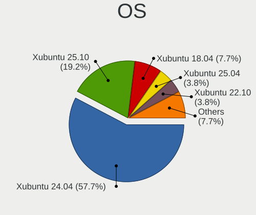

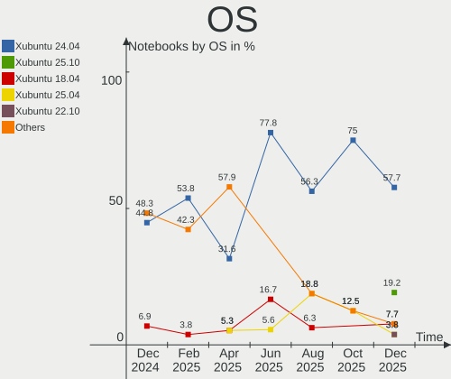

| Name          | Notebooks | Percent |
|---------------|-----------|---------|
| Xubuntu 24.04 | 15        | 57.69%  |
| Xubuntu 25.10 | 5         | 19.23%  |
| Xubuntu 18.04 | 2         | 7.69%   |
| Xubuntu 25.04 | 1         | 3.85%   |
| Xubuntu 22.10 | 1         | 3.85%   |
| Xubuntu 22.04 | 1         | 3.85%   |
| Xubuntu 20.04 | 1         | 3.85%   |

OS Family
---------

OS without a version

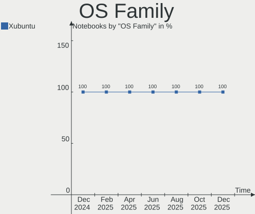

| Name    | Notebooks | Percent |
|---------|-----------|---------|
| Xubuntu | 26        | 100%    |

Kernel
------

Version of the Linux kernel

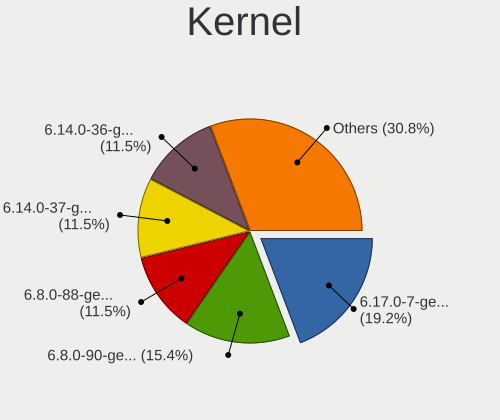

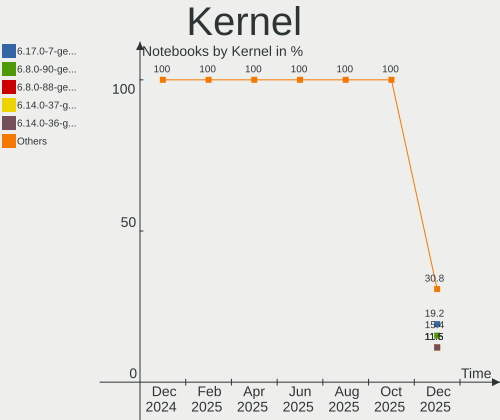

| Version               | Notebooks | Percent |
|-----------------------|-----------|---------|
| 6.17.0-7-generic      | 5         | 19.23%  |
| 6.8.0-90-generic      | 4         | 15.38%  |
| 6.8.0-88-generic      | 3         | 11.54%  |
| 6.14.0-37-generic     | 3         | 11.54%  |
| 6.14.0-36-generic     | 3         | 11.54%  |
| 4.15.0-213-generic    | 2         | 7.69%   |
| 6.8.0-41-generic      | 1         | 3.85%   |
| 6.17.6-061706-generic | 1         | 3.85%   |
| 6.14.0-15-generic     | 1         | 3.85%   |
| 5.4.0-216-generic     | 1         | 3.85%   |
| 5.19.0-46-generic     | 1         | 3.85%   |
| 5.15.0-163-generic    | 1         | 3.85%   |

Kernel Family
-------------

Linux kernel without a distro release

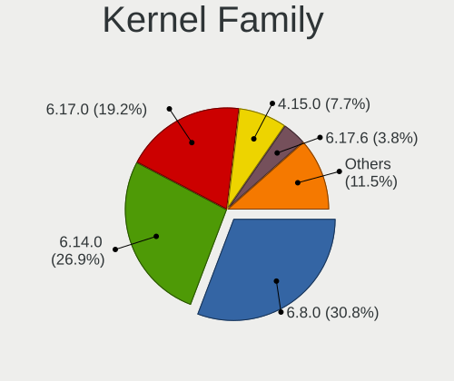

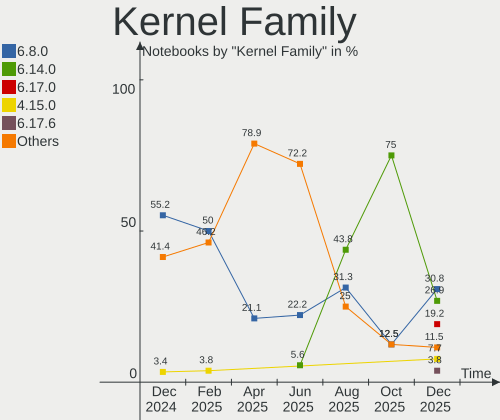

| Version | Notebooks | Percent |
|---------|-----------|---------|
| 6.8.0   | 8         | 30.77%  |
| 6.14.0  | 7         | 26.92%  |
| 6.17.0  | 5         | 19.23%  |
| 4.15.0  | 2         | 7.69%   |
| 6.17.6  | 1         | 3.85%   |
| 5.4.0   | 1         | 3.85%   |
| 5.19.0  | 1         | 3.85%   |
| 5.15.0  | 1         | 3.85%   |

Kernel Major Ver.
-----------------

Linux kernel major version

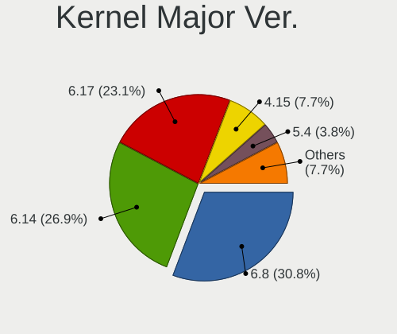

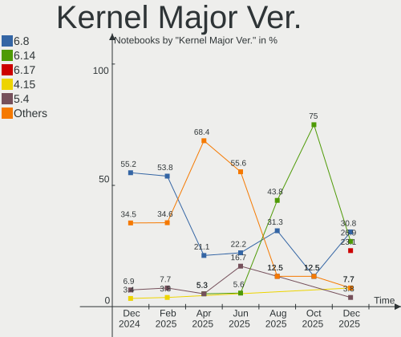

| Version | Notebooks | Percent |
|---------|-----------|---------|
| 6.8     | 8         | 30.77%  |
| 6.14    | 7         | 26.92%  |
| 6.17    | 6         | 23.08%  |
| 4.15    | 2         | 7.69%   |
| 5.4     | 1         | 3.85%   |
| 5.19    | 1         | 3.85%   |
| 5.15    | 1         | 3.85%   |

Arch
----

OS architecture (x86_64, i586, etc.)

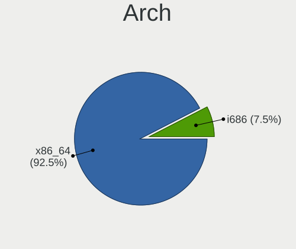

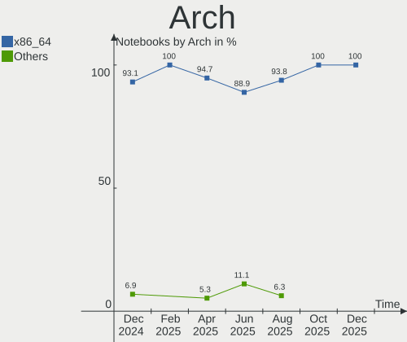

| Name   | Notebooks | Percent |
|--------|-----------|---------|
| x86_64 | 26        | 100%    |

DE
--

Desktop Environment

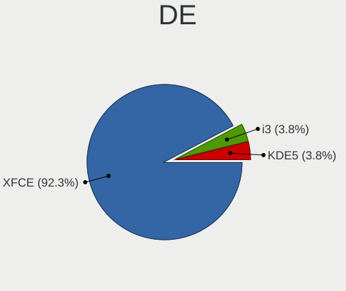

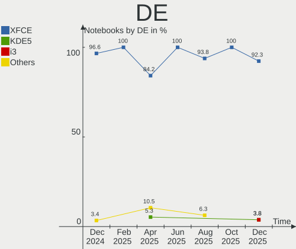

| Name | Notebooks | Percent |
|------|-----------|---------|
| XFCE | 24        | 92.31%  |
| KDE5 | 1         | 3.85%   |
| i3   | 1         | 3.85%   |

Display Server
--------------

X11 or Wayland

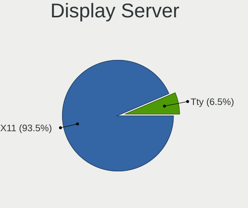

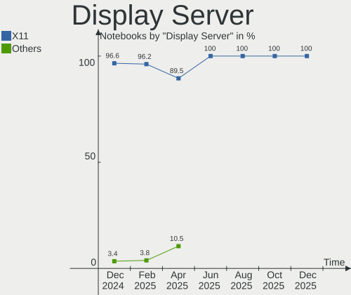

| Name | Notebooks | Percent |
|------|-----------|---------|
| X11  | 26        | 100%    |

Display Manager
---------------

SDDM, LightDM, etc.

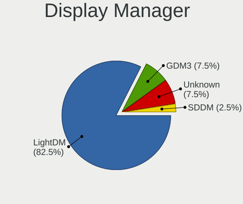

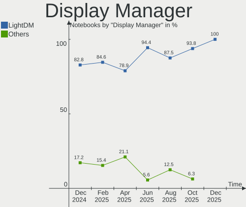

| Name    | Notebooks | Percent |
|---------|-----------|---------|
| LightDM | 26        | 100%    |

OS Lang
-------

Language

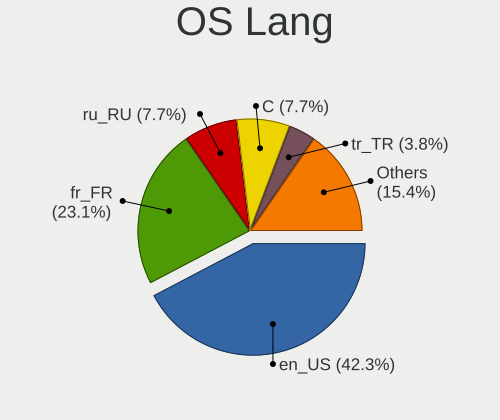

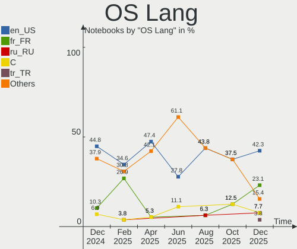

| Lang  | Notebooks | Percent |
|-------|-----------|---------|
| en_US | 11        | 42.31%  |
| fr_FR | 6         | 23.08%  |
| ru_RU | 2         | 7.69%   |
| C     | 2         | 7.69%   |
| tr_TR | 1         | 3.85%   |
| pl_PL | 1         | 3.85%   |
| nl_NL | 1         | 3.85%   |
| ja_JP | 1         | 3.85%   |
| de_DE | 1         | 3.85%   |

Boot Mode
---------

EFI or BIOS

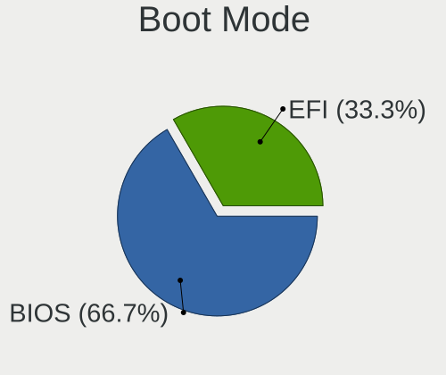

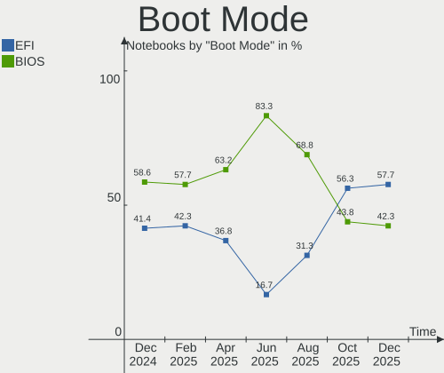

| Mode | Notebooks | Percent |
|------|-----------|---------|
| EFI  | 15        | 57.69%  |
| BIOS | 11        | 42.31%  |

Filesystem
----------

Type of filesystem

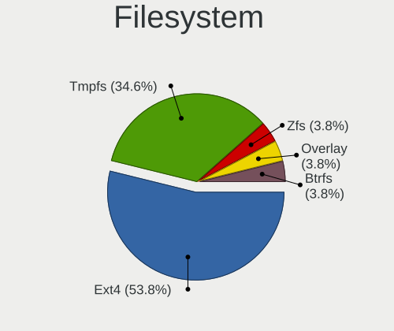

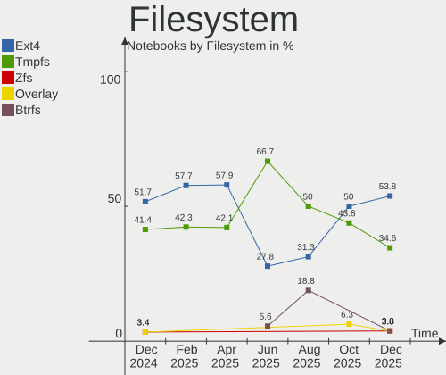

| Type    | Notebooks | Percent |
|---------|-----------|---------|
| Ext4    | 14        | 53.85%  |
| Tmpfs   | 9         | 34.62%  |
| Zfs     | 1         | 3.85%   |
| Overlay | 1         | 3.85%   |
| Btrfs   | 1         | 3.85%   |

Part. scheme
------------

Scheme of partitioning

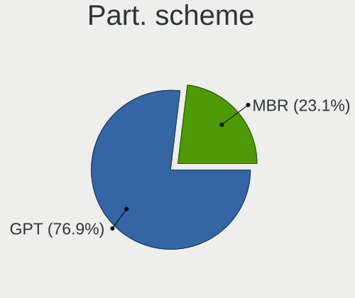

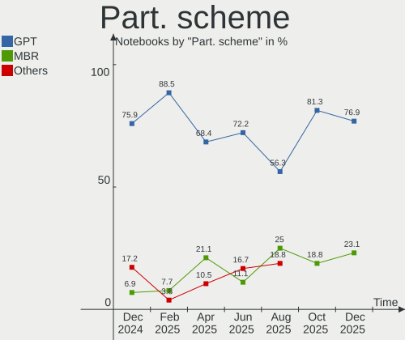

| Type | Notebooks | Percent |
|------|-----------|---------|
| GPT  | 20        | 76.92%  |
| MBR  | 6         | 23.08%  |

Dual Boot with Linux/BSD
------------------------

Hosting more than one Linux/BSD

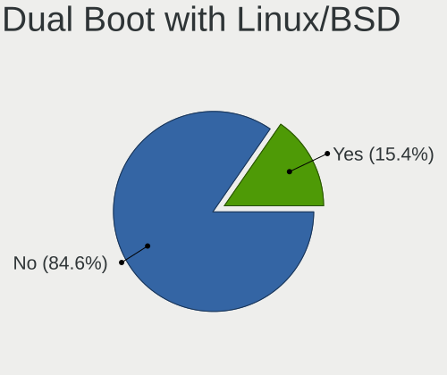

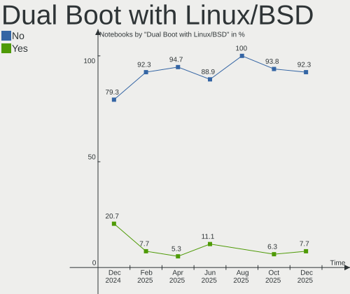

| Dual boot | Notebooks | Percent |
|-----------|-----------|---------|
| No        | 24        | 92.31%  |
| Yes       | 2         | 7.69%   |

Dual Boot (Win)
---------------

Hosting Linux and Windows

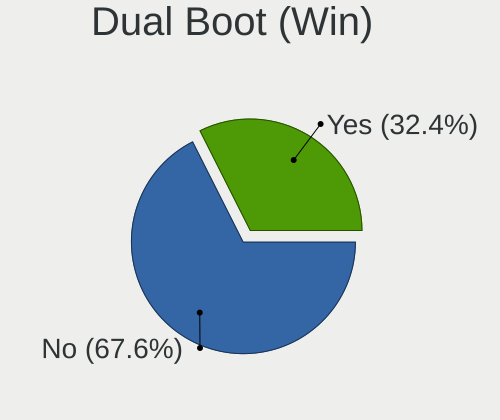

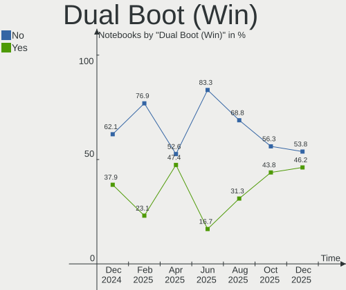

| Dual boot | Notebooks | Percent |
|-----------|-----------|---------|
| No        | 14        | 53.85%  |
| Yes       | 12        | 46.15%  |

Board
-----

Vendor
------

Motherboard manufacturer

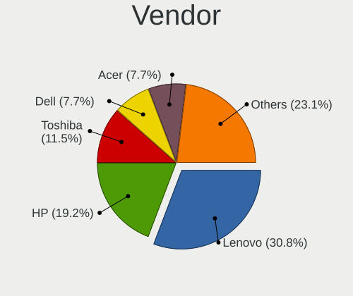

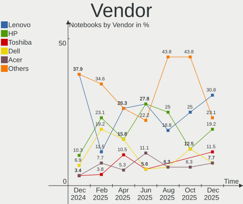

| Name             | Notebooks | Percent |
|------------------|-----------|---------|
| Lenovo           | 8         | 30.77%  |
| Hewlett-Packard  | 5         | 19.23%  |
| Toshiba          | 3         | 11.54%  |
| Dell             | 2         | 7.69%   |
| Acer             | 2         | 7.69%   |
| TongFang         | 1         | 3.85%   |
| MSI              | 1         | 3.85%   |
| Google           | 1         | 3.85%   |
| Framework        | 1         | 3.85%   |
| Chuwi            | 1         | 3.85%   |
| ASUSTek Computer | 1         | 3.85%   |

Model
-----

Motherboard model

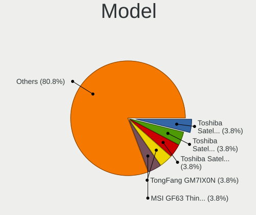

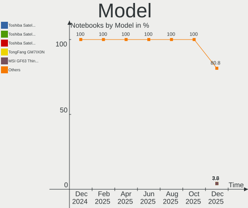

| Name                                          | Notebooks | Percent |
|-----------------------------------------------|-----------|---------|
| Toshiba Satellite L55-C                       | 1         | 3.85%   |
| Toshiba Satellite L300                        | 1         | 3.85%   |
| Toshiba Satellite C855-2DG                    | 1         | 3.85%   |
| TongFang GM7IX0N                              | 1         | 3.85%   |
| MSI GF63 Thin 11UC                            | 1         | 3.85%   |
| Lenovo ThinkPad X220 42912WG                  | 1         | 3.85%   |
| Lenovo ThinkPad T480 20L6SE5A00               | 1         | 3.85%   |
| Lenovo ThinkPad P16 Gen 3 21RQCTO1WW          | 1         | 3.85%   |
| Lenovo ThinkPad P15 Gen 1 20SUS6TY0B          | 1         | 3.85%   |
| Lenovo ThinkBook 14 G6 ABP 21KJ               | 1         | 3.85%   |
| Lenovo IdeaPad Slim 3 15ABR8 82XM             | 1         | 3.85%   |
| Lenovo IdeaPad 3 17ADA05 81W2                 | 1         | 3.85%   |
| Lenovo IdeaPad 100-15IBD 80QQ                 | 1         | 3.85%   |
| HP ProBook 6570b                              | 1         | 3.85%   |
| HP ProBook 4520s                              | 1         | 3.85%   |
| HP OmniBook 5 Laptop 16-af1xxx                | 1         | 3.85%   |
| HP EliteBook 8570p                            | 1         | 3.85%   |
| HP EliteBook 640 14 inch G9 Notebook PC       | 1         | 3.85%   |
| Google Swanky                                 | 1         | 3.85%   |
| Framework Laptop 13 (AMD Ryzen AI 300 Series) | 1         | 3.85%   |
| Dell Precision M6500                          | 1         | 3.85%   |
| Dell Latitude 5431                            | 1         | 3.85%   |
| Chuwi CoreBook X                              | 1         | 3.85%   |
| ASUS TUF Gaming FX505DT_FX505DT               | 1         | 3.85%   |
| Acer Swift SF114-32                           | 1         | 3.85%   |
| Acer Aspire E5-771G                           | 1         | 3.85%   |

Model Family
------------

Motherboard model prefix

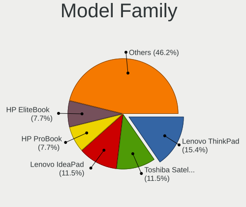

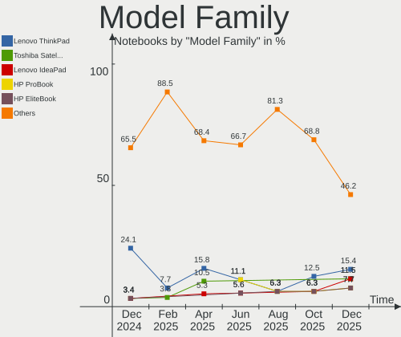

| Name              | Notebooks | Percent |
|-------------------|-----------|---------|
| Lenovo ThinkPad   | 4         | 15.38%  |
| Toshiba Satellite | 3         | 11.54%  |
| Lenovo IdeaPad    | 3         | 11.54%  |
| HP ProBook        | 2         | 7.69%   |
| HP EliteBook      | 2         | 7.69%   |
| TongFang GM7IX0N  | 1         | 3.85%   |
| MSI GF63          | 1         | 3.85%   |
| Lenovo ThinkBook  | 1         | 3.85%   |
| HP OmniBook       | 1         | 3.85%   |
| Google Swanky     | 1         | 3.85%   |
| Framework Laptop  | 1         | 3.85%   |
| Dell Precision    | 1         | 3.85%   |
| Dell Latitude     | 1         | 3.85%   |
| Chuwi CoreBook    | 1         | 3.85%   |
| ASUS TUF          | 1         | 3.85%   |
| Acer Swift        | 1         | 3.85%   |
| Acer Aspire       | 1         | 3.85%   |

MFG Year
--------

Motherboard manufacture year

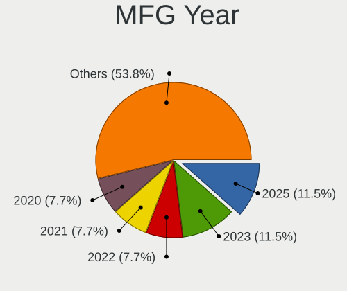

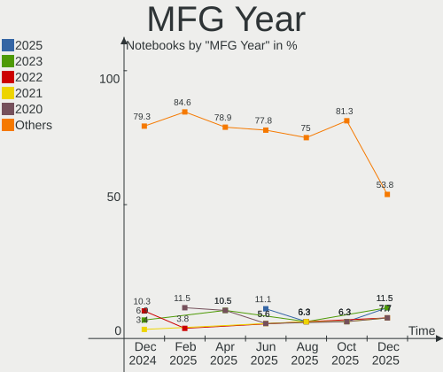

| Year | Notebooks | Percent |
|------|-----------|---------|
| 2025 | 3         | 11.54%  |
| 2023 | 3         | 11.54%  |
| 2022 | 2         | 7.69%   |
| 2021 | 2         | 7.69%   |
| 2020 | 2         | 7.69%   |
| 2018 | 2         | 7.69%   |
| 2015 | 2         | 7.69%   |
| 2012 | 2         | 7.69%   |
| 2010 | 2         | 7.69%   |
| 2024 | 1         | 3.85%   |
| 2019 | 1         | 3.85%   |
| 2014 | 1         | 3.85%   |
| 2013 | 1         | 3.85%   |
| 2011 | 1         | 3.85%   |
| 2008 | 1         | 3.85%   |

Form Factor
-----------

Physical design of the computer

| Name     | Notebooks | Percent |
|----------|-----------|---------|
| Notebook | 26        | 100%    |

Secure Boot
-----------

Enabled or disabled

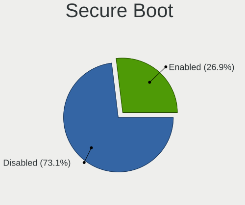

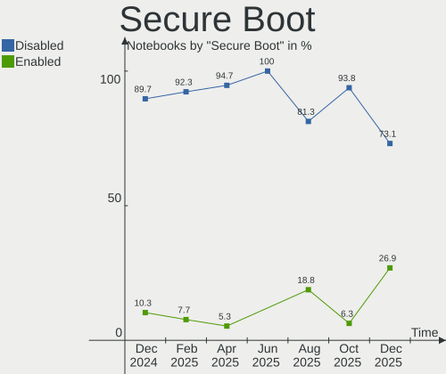

| State    | Notebooks | Percent |
|----------|-----------|---------|
| Disabled | 19        | 73.08%  |
| Enabled  | 7         | 26.92%  |

Coreboot
--------

Have coreboot on board

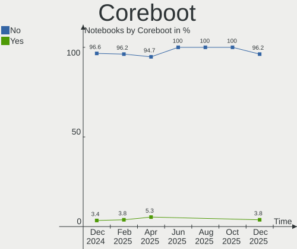

| Used | Notebooks | Percent |
|------|-----------|---------|
| No   | 25        | 96.15%  |
| Yes  | 1         | 3.85%   |

RAM Size
--------

Total RAM memory

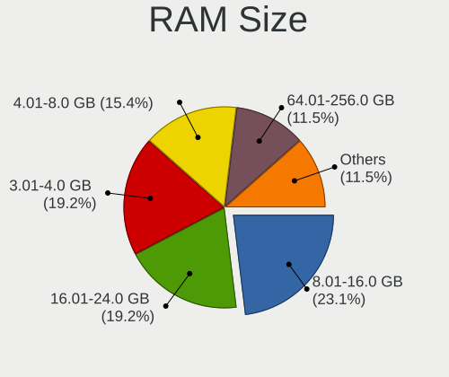

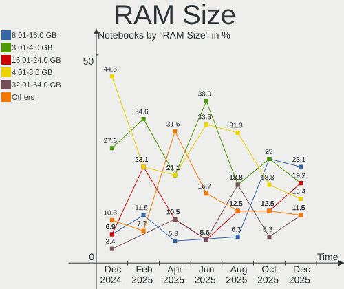

| Size in GB  | Notebooks | Percent |
|-------------|-----------|---------|
| 8.01-16.0   | 6         | 23.08%  |
| 3.01-4.0    | 5         | 19.23%  |
| 16.01-24.0  | 5         | 19.23%  |
| 4.01-8.0    | 4         | 15.38%  |
| 32.01-64.0  | 3         | 11.54%  |
| 64.01-256.0 | 3         | 11.54%  |

RAM Used
--------

Used RAM memory

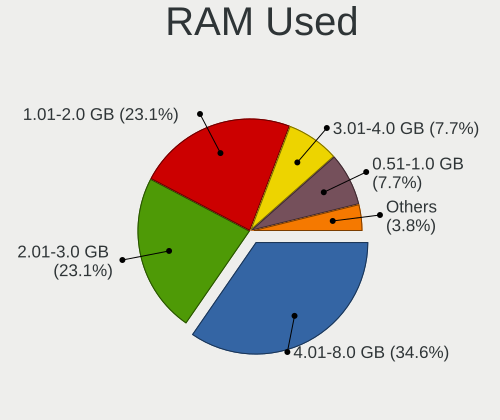

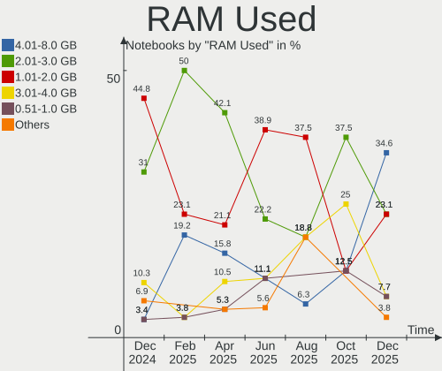

| Used GB   | Notebooks | Percent |
|-----------|-----------|---------|
| 4.01-8.0  | 9         | 34.62%  |
| 2.01-3.0  | 6         | 23.08%  |
| 1.01-2.0  | 6         | 23.08%  |
| 3.01-4.0  | 2         | 7.69%   |
| 0.51-1.0  | 2         | 7.69%   |
| 8.01-16.0 | 1         | 3.85%   |

Total Drives
------------

Number of drives on board

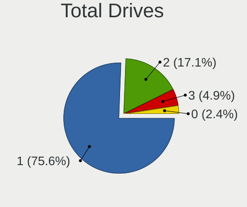

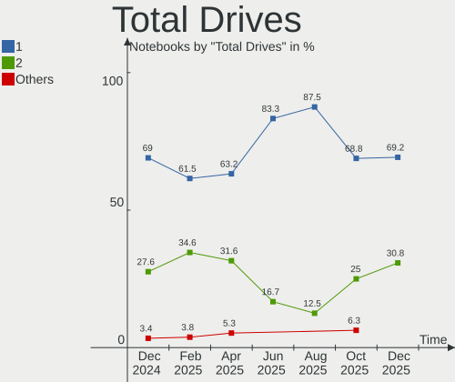

| Drives | Notebooks | Percent |
|--------|-----------|---------|
| 1      | 18        | 69.23%  |
| 2      | 8         | 30.77%  |

Has CD-ROM
----------

Has CD-ROM on board

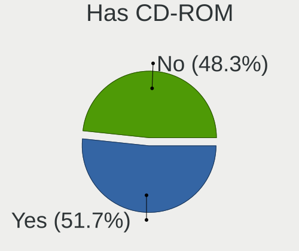

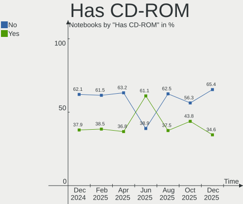

| Presented | Notebooks | Percent |
|-----------|-----------|---------|
| No        | 17        | 65.38%  |
| Yes       | 9         | 34.62%  |

Has Ethernet
------------

Has Ethernet on board

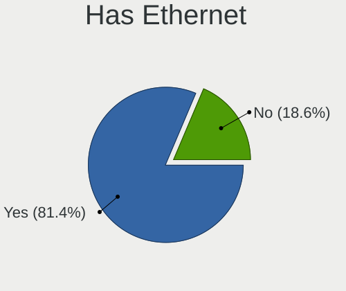

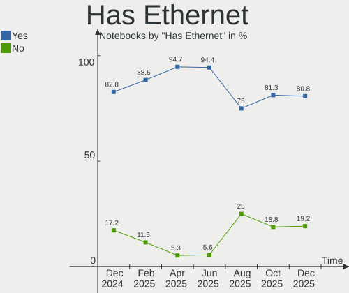

| Presented | Notebooks | Percent |
|-----------|-----------|---------|
| Yes       | 21        | 80.77%  |
| No        | 5         | 19.23%  |

Has WiFi
--------

Has WiFi module

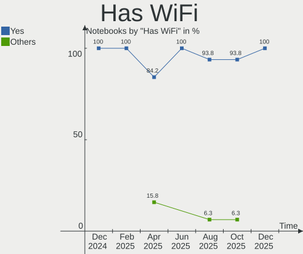

| Presented | Notebooks | Percent |
|-----------|-----------|---------|
| Yes       | 26        | 100%    |

Has Bluetooth
-------------

Has Bluetooth module

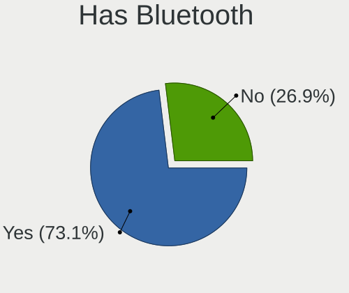

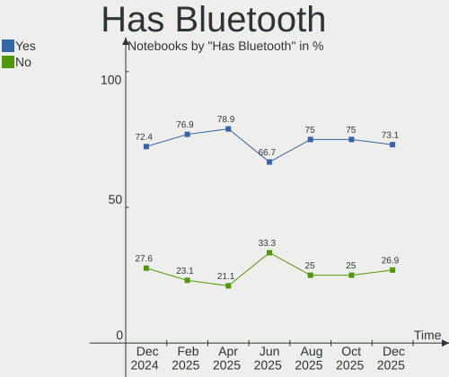

| Presented | Notebooks | Percent |
|-----------|-----------|---------|
| Yes       | 19        | 73.08%  |
| No        | 7         | 26.92%  |

Location
--------

Country
-------

Geographic location (country)

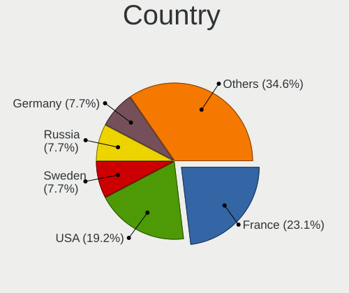

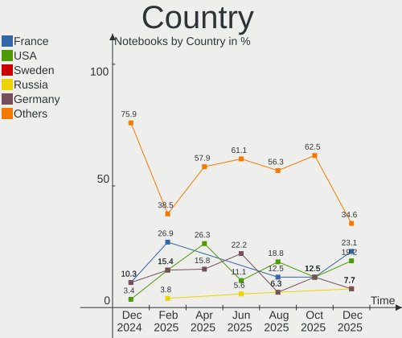

| Country     | Notebooks | Percent |
|-------------|-----------|---------|
| France      | 6         | 23.08%  |
| USA         | 5         | 19.23%  |
| Sweden      | 2         | 7.69%   |
| Russia      | 2         | 7.69%   |
| Germany     | 2         | 7.69%   |
| Canada      | 2         | 7.69%   |
| UK          | 1         | 3.85%   |
| Turkey      | 1         | 3.85%   |
| Poland      | 1         | 3.85%   |
| Norway      | 1         | 3.85%   |
| New Zealand | 1         | 3.85%   |
| Italy       | 1         | 3.85%   |
| Belgium     | 1         | 3.85%   |

City
----

Geographic location (city)

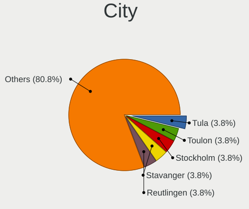

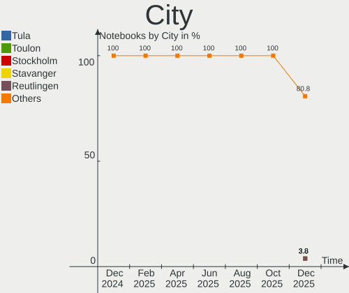

| City                    | Notebooks | Percent |
|-------------------------|-----------|---------|
| Tula                    | 1         | 3.85%   |
| Toulon                  | 1         | 3.85%   |
| Stockholm               | 1         | 3.85%   |
| Stavanger               | 1         | 3.85%   |
| Reutlingen              | 1         | 3.85%   |
| Paris                   | 1         | 3.85%   |
| Moscow                  | 1         | 3.85%   |
| Lower Hutt              | 1         | 3.85%   |
| Lincoln                 | 1         | 3.85%   |
| Lansdowne               | 1         | 3.85%   |
| La Croix-de-la-Rochette | 1         | 3.85%   |
| Kitchener               | 1         | 3.85%   |
| Kernersville            | 1         | 3.85%   |
| Grasse                  | 1         | 3.85%   |
| Gothenburg              | 1         | 3.85%   |
| Gdansk                  | 1         | 3.85%   |
| Decatur                 | 1         | 3.85%   |
| Dallas                  | 1         | 3.85%   |
| Colorado Springs        | 1         | 3.85%   |
| Busto Arsizio           | 1         | 3.85%   |
| Bingley                 | 1         | 3.85%   |
| Berlin                  | 1         | 3.85%   |
| Azay-sur-Cher           | 1         | 3.85%   |
| Aumagne                 | 1         | 3.85%   |
| Atasehir                | 1         | 3.85%   |
| Antwerp                 | 1         | 3.85%   |

Drives
------

Drive Vendor
------------

Hard drive vendors

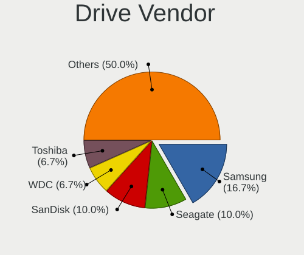

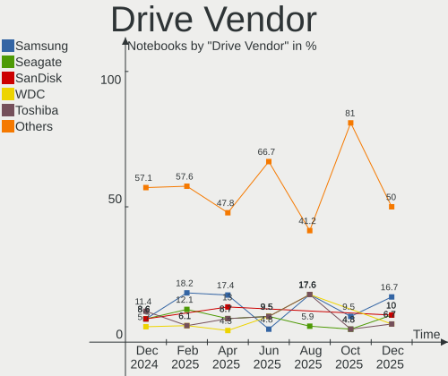

| Vendor                      | Notebooks | Drives | Percent |
|-----------------------------|-----------|--------|---------|
| Samsung Electronics         | 5         | 6      | 16.67%  |
| Seagate                     | 3         | 3      | 10%     |
| SanDisk                     | 3         | 3      | 10%     |
| WDC                         | 2         | 2      | 6.67%   |
| Toshiba                     | 2         | 2      | 6.67%   |
| Micron Technology           | 2         | 2      | 6.67%   |
| KIOXIA                      | 2         | 2      | 6.67%   |
| Hitachi                     | 2         | 3      | 6.67%   |
| Unknown                     | 1         | 1      | 3.33%   |
| Phison Electronics          | 1         | 1      | 3.33%   |
| MAXIO Technology (Hangzhou) | 1         | 1      | 3.33%   |
| Kingston Technology Company | 1         | 2      | 3.33%   |
| Kingston                    | 1         | 1      | 3.33%   |
| KingSpec                    | 1         | 1      | 3.33%   |
| Intel                       | 1         | 1      | 3.33%   |
| EDILOCA                     | 1         | 1      | 3.33%   |
| Crucial                     | 1         | 1      | 3.33%   |

Drive Model
-----------

Hard drive models

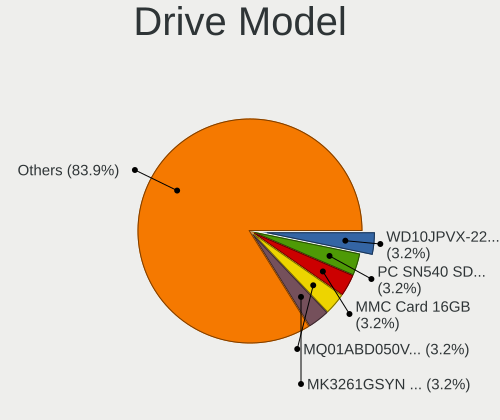

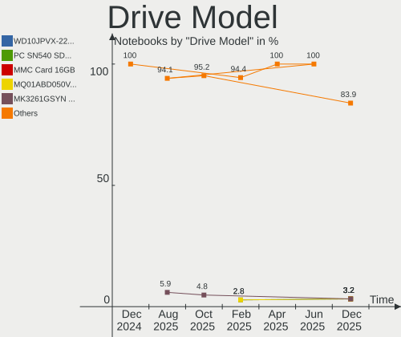

| Model                                             | Notebooks | Percent |
|---------------------------------------------------|-----------|---------|
| WDC WD10JPVX-22JC3T0 1TB                          | 1         | 3.23%   |
| WDC PC SN540 SDDPNPF-512G-1032 512GB              | 1         | 3.23%   |
| Unknown MMC Card  16GB                            | 1         | 3.23%   |
| Toshiba MQ01ABD050V 500GB                         | 1         | 3.23%   |
| Toshiba MK3261GSYN 320GB                          | 1         | 3.23%   |
| Seagate ST500LT012-9WS142 500GB                   | 1         | 3.23%   |
| Seagate ST250LM004 HN-M250MBB 250GB               | 1         | 3.23%   |
| Seagate ST1000LM035-1RK172 1TB                    | 1         | 3.23%   |
| SanDisk SD9SN8W256G1014 256GB SSD                 | 1         | 3.23%   |
| SanDisk NVMe SSD Drive 2TB                        | 1         | 3.23%   |
| SanDisk NVMe SSD Drive 256GB                      | 1         | 3.23%   |
| Samsung SSD 870 EVO 1TB                           | 1         | 3.23%   |
| Samsung SSD 850 EVO 250GB                         | 1         | 3.23%   |
| Samsung NVMe SSD Controller SM981/PM981/PM983 1TB | 1         | 3.23%   |
| Samsung MZVLC2T0HBLD-00BLL 2TB                    | 1         | 3.23%   |
| Samsung MZVLC1T0HFLU-00BLL 1TB                    | 1         | 3.23%   |
| Samsung MZ7PC128HAFU-000H1 128GB SSD              | 1         | 3.23%   |
| Phison PSENN001TA87QC0 1024GB                     | 1         | 3.23%   |
| Micron MTFDKCD512QGN-1BN1AABLA 512GB              | 1         | 3.23%   |
| Micron 2200V_MTFDHBA512TCK 512GB                  | 1         | 3.23%   |
| MAXIO (Hangzhou) NVMe SSD Drive 1TB               | 1         | 3.23%   |
| KIOXIA KXG80ZNV1T02 1TB                           | 1         | 3.23%   |
| KIOXIA KBG50ZNS512G NVMe 512GB                    | 1         | 3.23%   |
| Kingston Company SNV2S1000G 1TB                   | 1         | 3.23%   |
| Kingston SKC400S37512G 512GB SSD                  | 1         | 3.23%   |
| KingSpec NT-2TB SSD                               | 1         | 3.23%   |
| Intel SSDPEKKF256G8L BTHH8502135X256B 256GB       | 1         | 3.23%   |
| Hitachi HTS725050A9A362 500GB                     | 1         | 3.23%   |
| Hitachi HTS723232A7A364 320GB                     | 1         | 3.23%   |
| EDILOCA EN705 2TB                                 | 1         | 3.23%   |
| Crucial CT1000BX500SSD1 1TB                       | 1         | 3.23%   |

HDD Vendor
----------

Hard disk drive vendors

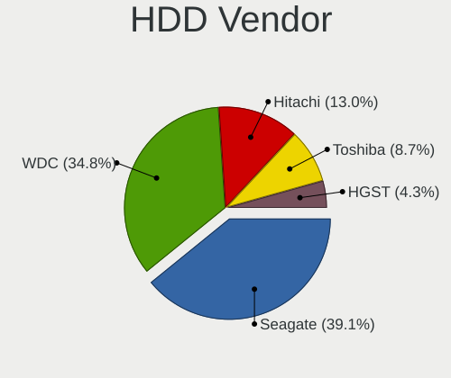

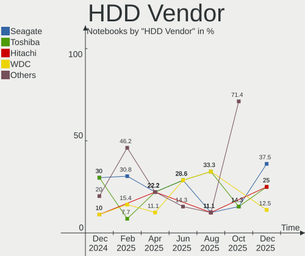

| Vendor  | Notebooks | Drives | Percent |
|---------|-----------|--------|---------|
| Seagate | 3         | 3      | 37.5%   |
| Toshiba | 2         | 2      | 25%     |
| Hitachi | 2         | 3      | 25%     |
| WDC     | 1         | 1      | 12.5%   |

SSD Vendor
----------

Solid state drive vendors

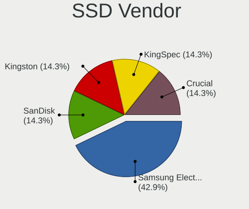

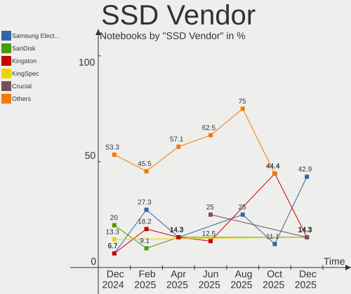

| Vendor              | Notebooks | Drives | Percent |
|---------------------|-----------|--------|---------|
| Samsung Electronics | 3         | 3      | 42.86%  |
| SanDisk             | 1         | 1      | 14.29%  |
| Kingston            | 1         | 1      | 14.29%  |
| KingSpec            | 1         | 1      | 14.29%  |
| Crucial             | 1         | 1      | 14.29%  |

Drive Kind
----------

HDD or SSD

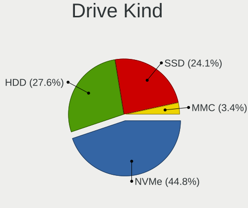

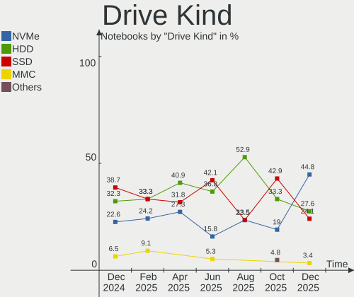

| Kind | Notebooks | Drives | Percent |
|------|-----------|--------|---------|
| NVMe | 13        | 16     | 44.83%  |
| HDD  | 8         | 9      | 27.59%  |
| SSD  | 7         | 7      | 24.14%  |
| MMC  | 1         | 1      | 3.45%   |

Drive Connector
---------------

SATA, SAS, NVMe, etc.

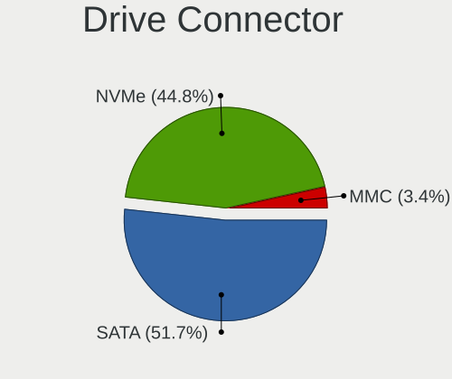

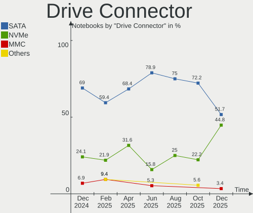

| Type | Notebooks | Drives | Percent |
|------|-----------|--------|---------|
| SATA | 15        | 16     | 51.72%  |
| NVMe | 13        | 16     | 44.83%  |
| MMC  | 1         | 1      | 3.45%   |

Drive Size
----------

Size of hard drive

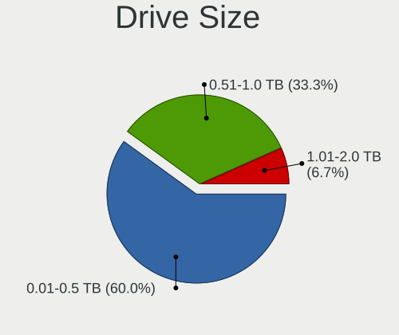

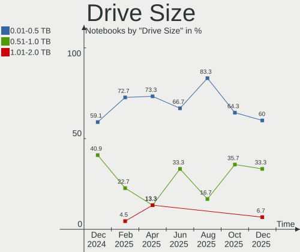

| Size in TB | Notebooks | Drives | Percent |
|------------|-----------|--------|---------|
| 0.01-0.5   | 9         | 10     | 60%     |
| 0.51-1.0   | 5         | 5      | 33.33%  |
| 1.01-2.0   | 1         | 1      | 6.67%   |

Space Total
-----------

Amount of disk space available on the file system

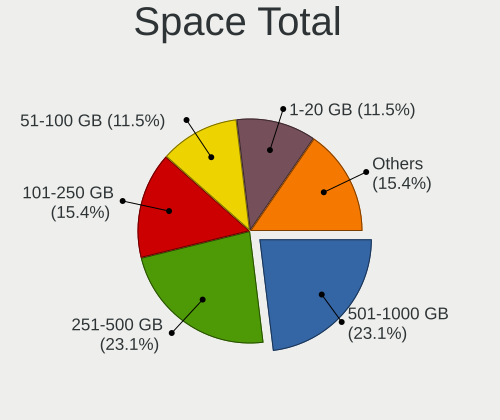

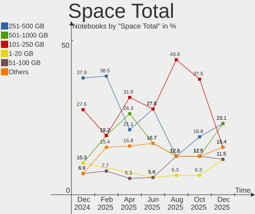

| Size in GB     | Notebooks | Percent |
|----------------|-----------|---------|
| 251-500        | 6         | 23.08%  |
| 501-1000       | 6         | 23.08%  |
| 101-250        | 4         | 15.38%  |
| 1-20           | 3         | 11.54%  |
| 51-100         | 3         | 11.54%  |
| 1001-2000      | 2         | 7.69%   |
| More than 3000 | 1         | 3.85%   |
| Unknown        | 1         | 3.85%   |

Space Used
----------

Amount of used disk space

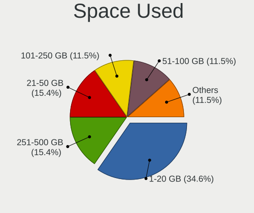

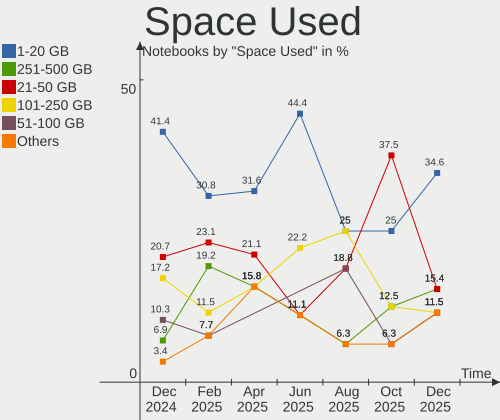

| Used GB   | Notebooks | Percent |
|-----------|-----------|---------|
| 1-20      | 9         | 34.62%  |
| 251-500   | 4         | 15.38%  |
| 21-50     | 4         | 15.38%  |
| 101-250   | 3         | 11.54%  |
| 51-100    | 3         | 11.54%  |
| 2001-3000 | 1         | 3.85%   |
| 501-1000  | 1         | 3.85%   |
| Unknown   | 1         | 3.85%   |

Malfunc. Drives
---------------

Drive models with a malfunction

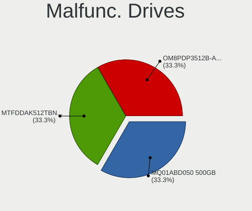

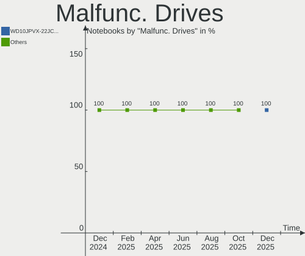

| Model                    | Notebooks | Drives | Percent |
|--------------------------|-----------|--------|---------|
| WDC WD10JPVX-22JC3T0 1TB | 1         | 1      | 100%    |

Malfunc. Drive Vendor
---------------------

Vendors of faulty drives

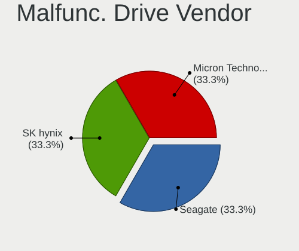

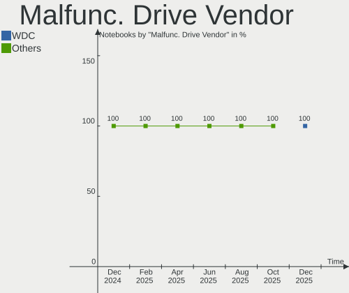

| Vendor | Notebooks | Drives | Percent |
|--------|-----------|--------|---------|
| WDC    | 1         | 1      | 100%    |

Malfunc. HDD Vendor
-------------------

Vendors of faulty HDD drives

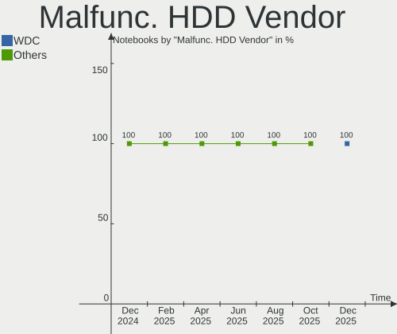

| Vendor | Notebooks | Drives | Percent |
|--------|-----------|--------|---------|
| WDC    | 1         | 1      | 100%    |

Malfunc. Drive Kind
-------------------

Kinds of faulty drives

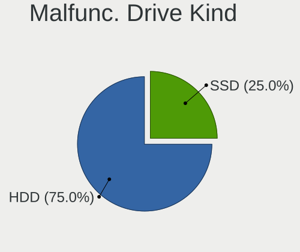

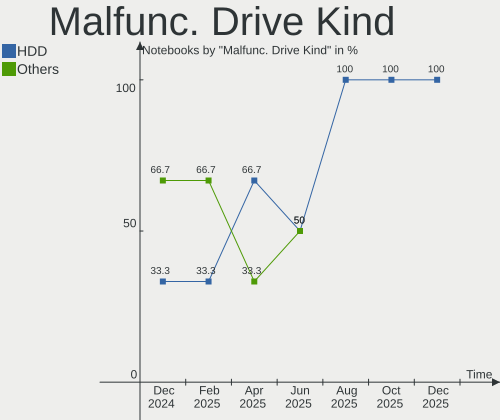

| Kind | Notebooks | Drives | Percent |
|------|-----------|--------|---------|
| HDD  | 1         | 1      | 100%    |

Failed Drives
-------------

Failed drive models

Zero info for selected period =(

Failed Drive Vendor
-------------------

Failed drive vendors

Zero info for selected period =(

Drive Status
------------

Number of failed and malfunc. drives

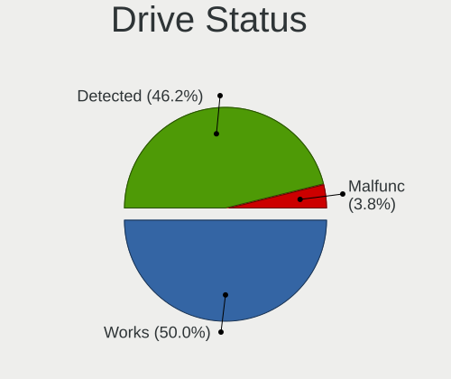

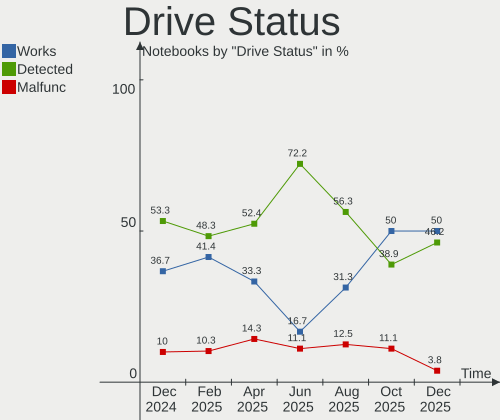

| Status   | Notebooks | Drives | Percent |
|----------|-----------|--------|---------|
| Works    | 13        | 18     | 50%     |
| Detected | 12        | 14     | 46.15%  |
| Malfunc  | 1         | 1      | 3.85%   |

Storage controller
------------------

Storage Vendor
--------------

Storage controller vendors

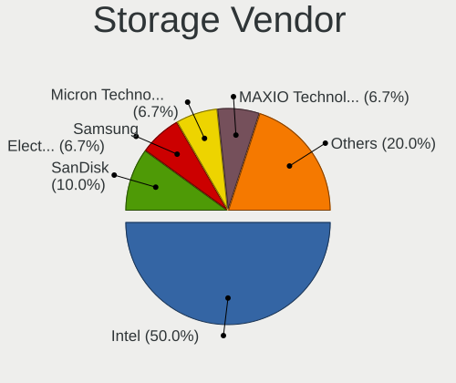

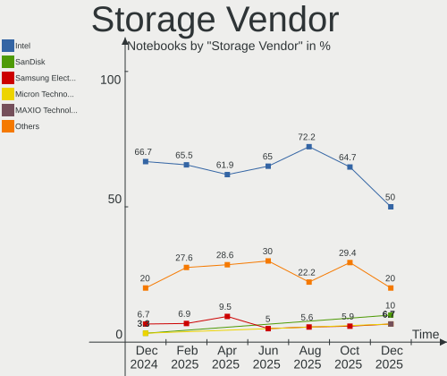

| Vendor                      | Notebooks | Percent |
|-----------------------------|-----------|---------|
| Intel                       | 15        | 50%     |
| SanDisk                     | 3         | 10%     |
| Samsung Electronics         | 2         | 6.67%   |
| Micron Technology           | 2         | 6.67%   |
| MAXIO Technology (Hangzhou) | 2         | 6.67%   |
| KIOXIA                      | 2         | 6.67%   |
| AMD                         | 2         | 6.67%   |
| Phison Electronics          | 1         | 3.33%   |
| Kingston Technology Company | 1         | 3.33%   |

Storage Model
-------------

Storage controller models

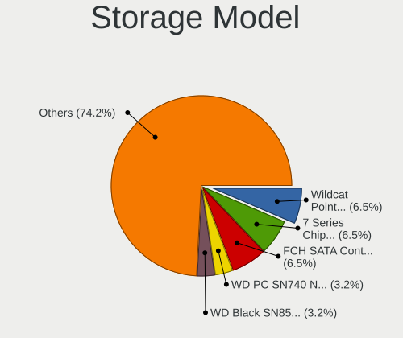

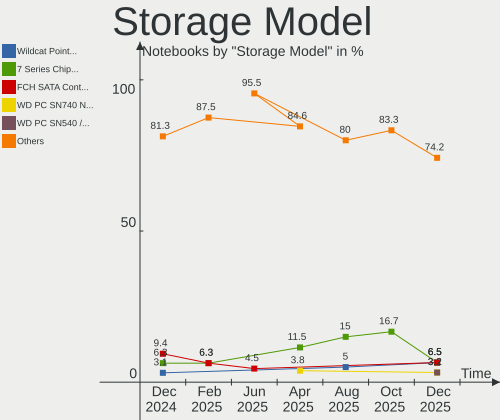

| Model                                                                        | Notebooks | Percent |
|------------------------------------------------------------------------------|-----------|---------|
| Intel Wildcat Point-LP SATA Controller [AHCI Mode]                           | 2         | 6.45%   |
| Intel 7 Series Chipset Family 6-port SATA Controller [AHCI mode]             | 2         | 6.45%   |
| AMD FCH SATA Controller [AHCI mode]                                          | 2         | 6.45%   |
| Sandisk WD PC SN740 NVMe SSD 512GB (DRAM-less)                               | 1         | 3.23%   |
| SanDisk WD PC SN540 / Green SN350 NVMe SSD 1 TB (DRAM-less)                  | 1         | 3.23%   |
| Sandisk WD Black SN850X NVMe SSD                                             | 1         | 3.23%   |
| Samsung NVMe SSD Controller SM981/PM981/PM983                                | 1         | 3.23%   |
| Samsung NVMe SSD 9100 PRO [PM9E1]                                            | 1         | 3.23%   |
| Phison PS5027-E27T PCIe4 NVMe Controller (DRAM-less)                         | 1         | 3.23%   |
| Micron 2500 NVMe SSD (DRAM-less)                                             | 1         | 3.23%   |
| Micron 2200S NVMe SSD [Cassandra]                                            | 1         | 3.23%   |
| MAXIO (Hangzhou) NVMe SSD Controller MAP1602 (DRAM-less)                     | 1         | 3.23%   |
| MAXIO (Hangzhou) NVMe SSD Controller MAP1202 (DRAM-less)                     | 1         | 3.23%   |
| KIOXIA NVMe SSD Controller XG8                                               | 1         | 3.23%   |
| KIOXIA NVMe SSD Controller BG5 (DRAM-less)                                   | 1         | 3.23%   |
| Kingston Company NV2 NVMe SSD [E21T] (DRAM-less)                             | 1         | 3.23%   |
| Intel Volume Management Device NVMe RAID Controller                          | 1         | 3.23%   |
| Intel Tiger Lake SATA AHCI Controller                                        | 1         | 3.23%   |
| Intel SSD DC P4101/Pro 7600p/760p/E 6100p Series                             | 1         | 3.23%   |
| Intel Celeron/Pentium Silver Processor SATA Controller                       | 1         | 3.23%   |
| Intel Cannon Point-LP SATA Controller [AHCI Mode]                            | 1         | 3.23%   |
| Intel 82801IBM/IEM (ICH9M/ICH9M-E) 4 port SATA Controller [AHCI mode]        | 1         | 3.23%   |
| Intel 82801 Mobile SATA Controller [RAID mode]                               | 1         | 3.23%   |
| Intel 8 Series SATA Controller 1 [AHCI mode]                                 | 1         | 3.23%   |
| Intel 7 Series Chipset Family 4-port SATA Controller [IDE mode]              | 1         | 3.23%   |
| Intel 7 Series Chipset Family 2-port SATA Controller [IDE mode]              | 1         | 3.23%   |
| Intel 6 Series/C200 Series Chipset Family 6 port Mobile SATA AHCI Controller | 1         | 3.23%   |
| Intel 5 Series/3400 Series Chipset 6 port SATA AHCI Controller               | 1         | 3.23%   |

Storage Kind
------------

Kind of storage controller (IDE, SATA, NVMe, SAS, ...)

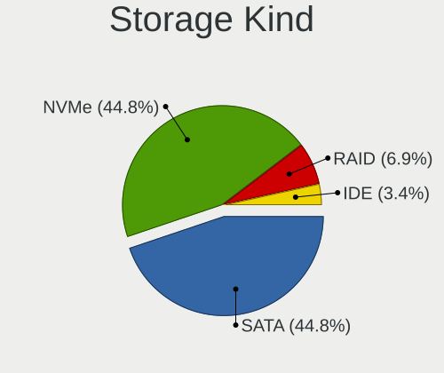

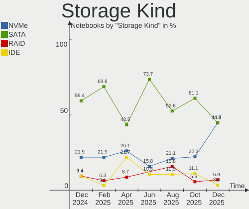

| Kind | Notebooks | Percent |
|------|-----------|---------|
| NVMe | 13        | 44.83%  |
| SATA | 13        | 44.83%  |
| RAID | 2         | 6.9%    |
| IDE  | 1         | 3.45%   |

Processor
---------

CPU Vendor
----------

Processor vendors

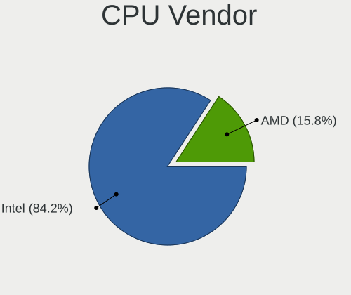

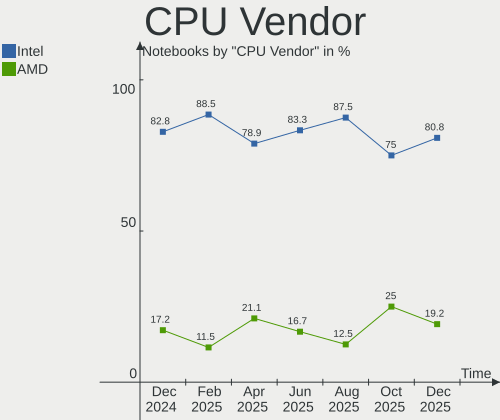

| Vendor | Notebooks | Percent |
|--------|-----------|---------|
| Intel  | 21        | 80.77%  |
| AMD    | 5         | 19.23%  |

CPU Model
---------

Processor models

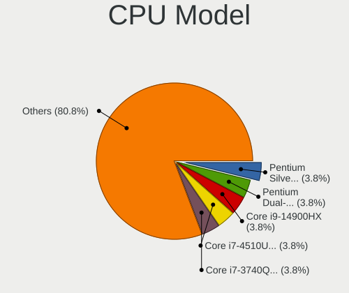

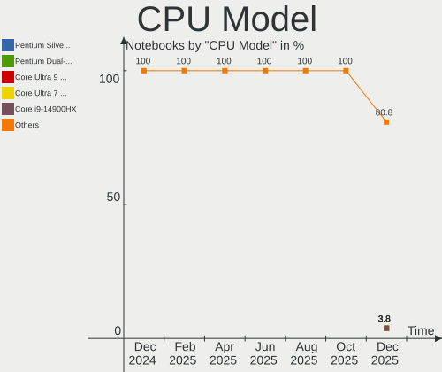

| Model                                         | Notebooks | Percent |
|-----------------------------------------------|-----------|---------|
| Intel Pentium Silver N5000 CPU @ 1.10GHz      | 1         | 3.85%   |
| Intel Pentium Dual-Core CPU T4200 @ 2.00GHz   | 1         | 3.85%   |
| Intel Core Ultra 9 285HX                      | 1         | 3.85%   |
| Intel Core Ultra 7 255U                       | 1         | 3.85%   |
| Intel Core i9-14900HX                         | 1         | 3.85%   |
| Intel Core i7-4510U CPU @ 2.00GHz             | 1         | 3.85%   |
| Intel Core i7-3740QM CPU @ 2.70GHz            | 1         | 3.85%   |
| Intel Core i7-3520M CPU @ 2.90GHz             | 1         | 3.85%   |
| Intel Core i7-10850H CPU @ 2.70GHz            | 1         | 3.85%   |
| Intel Core i7 CPU X 940 @ 2.13GHz             | 1         | 3.85%   |
| Intel Core i5-8259U CPU @ 2.30GHz             | 1         | 3.85%   |
| Intel Core i5-7200U CPU @ 2.50GHz             | 1         | 3.85%   |
| Intel Core i5-5200U CPU @ 2.20GHz             | 1         | 3.85%   |
| Intel Core i5-2540M CPU @ 2.60GHz             | 1         | 3.85%   |
| Intel Core i3-5005U CPU @ 2.00GHz             | 1         | 3.85%   |
| Intel Core i3-2348M CPU @ 2.30GHz             | 1         | 3.85%   |
| Intel Core i3 CPU M 370 @ 2.40GHz             | 1         | 3.85%   |
| Intel Celeron CPU N2840 @ 2.16GHz             | 1         | 3.85%   |
| Intel 12th Gen Core i7-1270P                  | 1         | 3.85%   |
| Intel 12th Gen Core i7-1265U                  | 1         | 3.85%   |
| Intel 11th Gen Core i7-11800H @ 2.30GHz       | 1         | 3.85%   |
| AMD Ryzen AI 9 HX 370 w/ Radeon 890M          | 1         | 3.85%   |
| AMD Ryzen 7 5825U with Radeon Graphics        | 1         | 3.85%   |
| AMD Ryzen 7 3750H with Radeon Vega Mobile Gfx | 1         | 3.85%   |
| AMD Ryzen 5 7530U with Radeon Graphics        | 1         | 3.85%   |
| AMD Athlon Silver 3050U with Radeon Graphics  | 1         | 3.85%   |

CPU Model Family
----------------

Processor model prefix

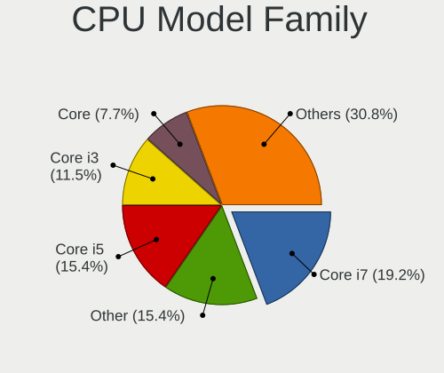

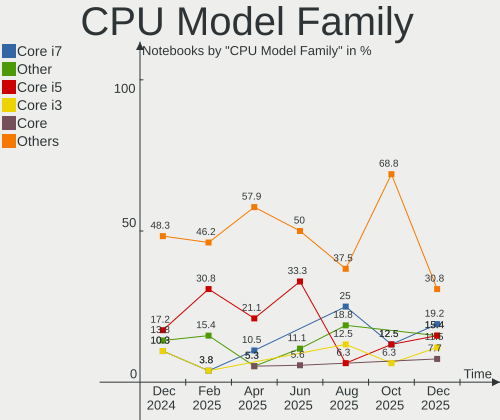

| Model                   | Notebooks | Percent |
|-------------------------|-----------|---------|
| Intel Core i7           | 5         | 19.23%  |
| Other                   | 4         | 15.38%  |
| Intel Core i5           | 4         | 15.38%  |
| Intel Core i3           | 3         | 11.54%  |
| Intel Core              | 2         | 7.69%   |
| AMD Ryzen 7             | 2         | 7.69%   |
| Intel Pentium Silver    | 1         | 3.85%   |
| Intel Pentium Dual-Core | 1         | 3.85%   |
| Intel Core i9           | 1         | 3.85%   |
| Intel Celeron           | 1         | 3.85%   |
| AMD Ryzen 5             | 1         | 3.85%   |
| AMD Athlon              | 1         | 3.85%   |

CPU Cores
---------

Number of processor cores

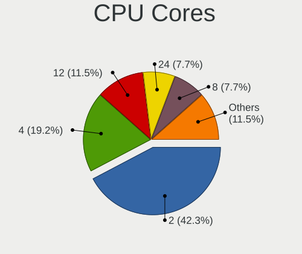

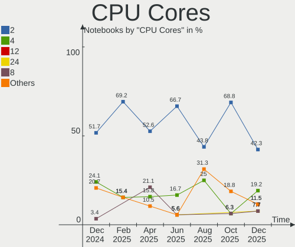

| Number | Notebooks | Percent |
|--------|-----------|---------|
| 2      | 11        | 42.31%  |
| 4      | 5         | 19.23%  |
| 12     | 3         | 11.54%  |
| 24     | 2         | 7.69%   |
| 8      | 2         | 7.69%   |
| 6      | 2         | 7.69%   |
| 10     | 1         | 3.85%   |

CPU Sockets
-----------

Number of sockets

| Number | Notebooks | Percent |
|--------|-----------|---------|
| 1      | 26        | 100%    |

CPU Threads
-----------

Threads per core (Hyper-Threading)

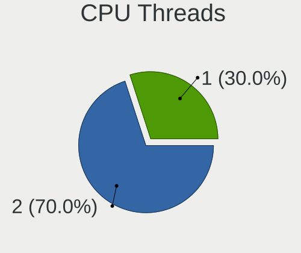

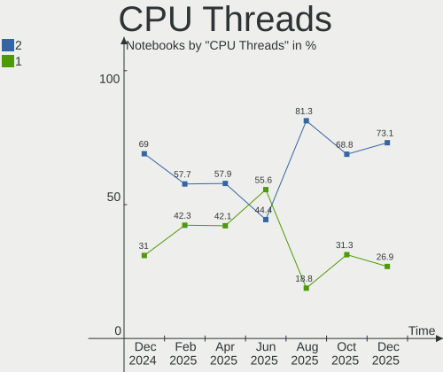

| Number | Notebooks | Percent |
|--------|-----------|---------|
| 2      | 19        | 73.08%  |
| 1      | 7         | 26.92%  |

CPU Op-Modes
------------

CPU Operation Modes (32-bit, 64-bit)

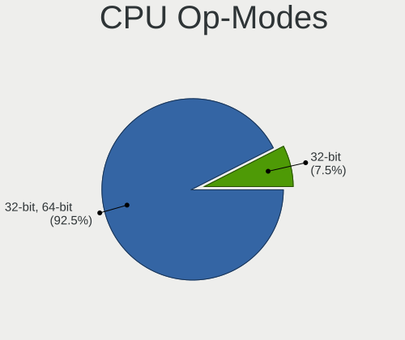

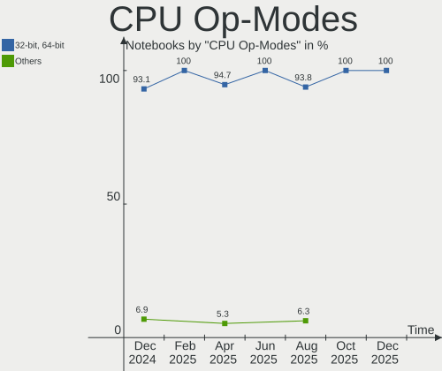

| Op mode        | Notebooks | Percent |
|----------------|-----------|---------|
| 32-bit, 64-bit | 26        | 100%    |

CPU Microcode
-------------

Microcode number

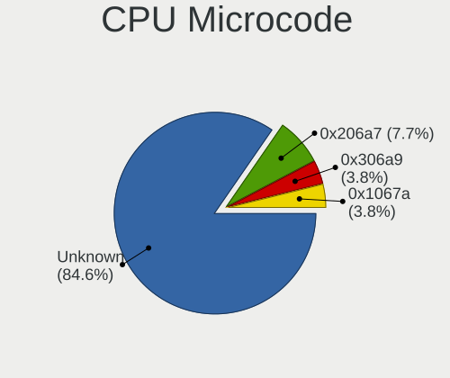

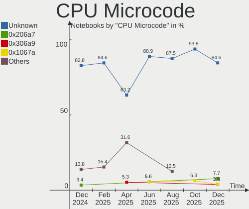

| Number  | Notebooks | Percent |
|---------|-----------|---------|
| Unknown | 22        | 84.62%  |
| 0x206a7 | 2         | 7.69%   |
| 0x306a9 | 1         | 3.85%   |
| 0x1067a | 1         | 3.85%   |

CPU Microarch
-------------

Microarchitecture

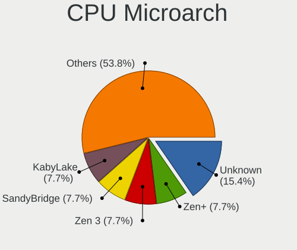

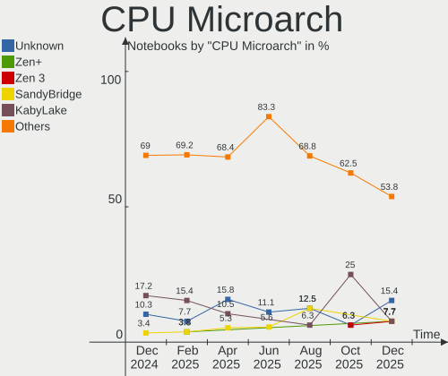

| Name              | Notebooks | Percent |
|-------------------|-----------|---------|
| Unknown           | 4         | 15.38%  |
| Zen+              | 2         | 7.69%   |
| Zen 3             | 2         | 7.69%   |
| SandyBridge       | 2         | 7.69%   |
| KabyLake          | 2         | 7.69%   |
| IvyBridge         | 2         | 7.69%   |
| Broadwell         | 2         | 7.69%   |
| Westmere          | 1         | 3.85%   |
| Silvermont        | 1         | 3.85%   |
| Penryn            | 1         | 3.85%   |
| Nehalem           | 1         | 3.85%   |
| Meteorlake Hybrid | 1         | 3.85%   |
| Lunarlake Hybrid  | 1         | 3.85%   |
| Icelake           | 1         | 3.85%   |
| Haswell           | 1         | 3.85%   |
| Goldmont plus     | 1         | 3.85%   |
| CometLake         | 1         | 3.85%   |

Graphics
--------

GPU Vendor
----------

Vendors of graphics cards

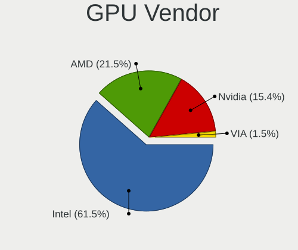

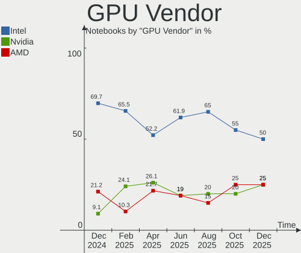

| Vendor | Notebooks | Percent |
|--------|-----------|---------|
| Intel  | 16        | 50%     |
| Nvidia | 8         | 25%     |
| AMD    | 8         | 25%     |

GPU Model
---------

Graphics card models

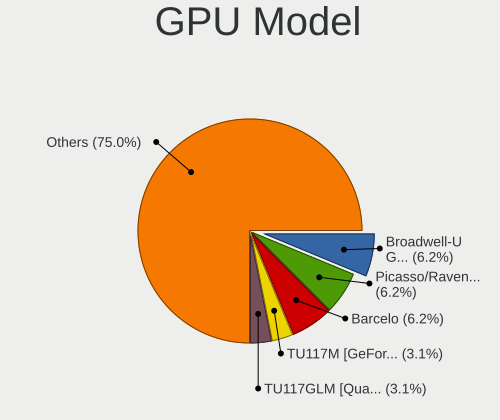

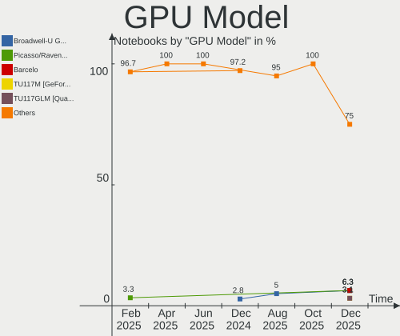

| Model                                                                     | Notebooks | Percent |
|---------------------------------------------------------------------------|-----------|---------|
| Intel Broadwell-U GT2 [HD Graphics 5500]                                  | 2         | 6.25%   |
| AMD Picasso/Raven 2 [Radeon Vega Series / Radeon Vega Mobile Series]      | 2         | 6.25%   |
| AMD Barcelo                                                               | 2         | 6.25%   |
| Nvidia TU117M [GeForce GTX 1650 Mobile / Max-Q]                           | 1         | 3.13%   |
| Nvidia TU117GLM [Quadro T1000 Mobile]                                     | 1         | 3.13%   |
| Nvidia GK208BM [GeForce 920M]                                             | 1         | 3.13%   |
| Nvidia GF117M [GeForce 610M/710M/810M/820M / GT 620M/625M/630M/720M]      | 1         | 3.13%   |
| Nvidia GB206GLM [RTX PRO 2000 Blackwell Generation Laptop GPU]            | 1         | 3.13%   |
| Nvidia GA107M [GeForce RTX 3050 Mobile]                                   | 1         | 3.13%   |
| Nvidia G92GLM [Quadro FX 3800M]                                           | 1         | 3.13%   |
| Nvidia AD107M [GeForce RTX 4060 Max-Q / Mobile]                           | 1         | 3.13%   |
| Intel TigerLake-H GT1 [UHD Graphics]                                      | 1         | 3.13%   |
| Intel Raptor Lake-S UHD Graphics                                          | 1         | 3.13%   |
| Intel Mobile 4 Series Chipset Integrated Graphics Controller              | 1         | 3.13%   |
| Intel Kaby Lake-U GT2 [HD Graphics 620]                                   | 1         | 3.13%   |
| Intel Haswell-ULT Integrated Graphics Controller                          | 1         | 3.13%   |
| Intel GeminiLake [UHD Graphics 605]                                       | 1         | 3.13%   |
| Intel CoffeeLake-U GT3e [Iris Plus Graphics 655]                          | 1         | 3.13%   |
| Intel Atom Processor Z36xxx/Z37xxx Series Graphics & Display              | 1         | 3.13%   |
| Intel Arrow Lake-U [Intel Graphics]                                       | 1         | 3.13%   |
| Intel Arrow Lake-S [Intel Graphics]                                       | 1         | 3.13%   |
| Intel Alder Lake-UP3 GT2 [Iris Xe Graphics]                               | 1         | 3.13%   |
| Intel Alder Lake-P Integrated Graphics Controller                         | 1         | 3.13%   |
| Intel 3rd Gen Core processor Graphics Controller                          | 1         | 3.13%   |
| Intel 2nd Generation Core Processor Family Integrated Graphics Controller | 1         | 3.13%   |
| AMD Whistler LE [Radeon HD 6610M/7610M]                                   | 1         | 3.13%   |
| AMD Thames [Radeon HD 7550M/7570M/7650M]                                  | 1         | 3.13%   |
| AMD Strix [Radeon 880M / 890M]                                            | 1         | 3.13%   |
| AMD Park [Mobility Radeon HD 5430/5450/5470]                              | 1         | 3.13%   |

GPU Combo
---------

Combinations of graphics cards

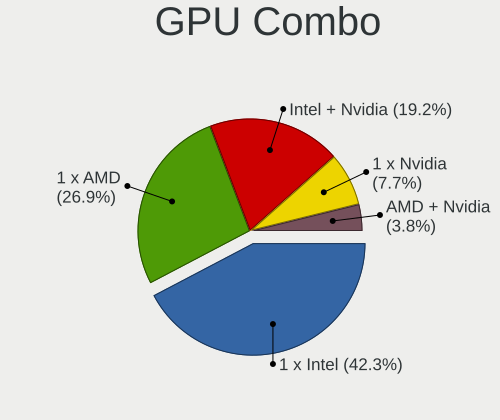

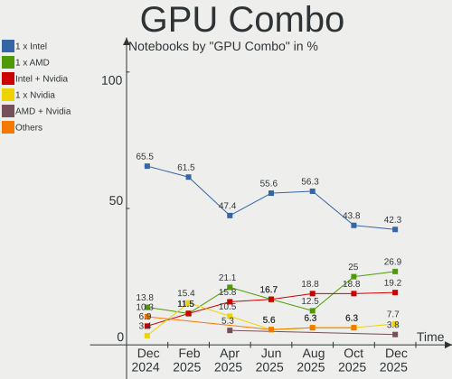

| Name           | Notebooks | Percent |
|----------------|-----------|---------|
| 1 x Intel      | 11        | 42.31%  |
| 1 x AMD        | 7         | 26.92%  |
| Intel + Nvidia | 5         | 19.23%  |
| 1 x Nvidia     | 2         | 7.69%   |
| AMD + Nvidia   | 1         | 3.85%   |

GPU Driver
----------

Free vs proprietary

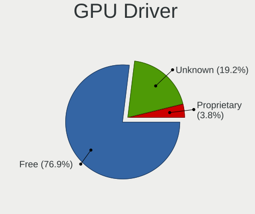

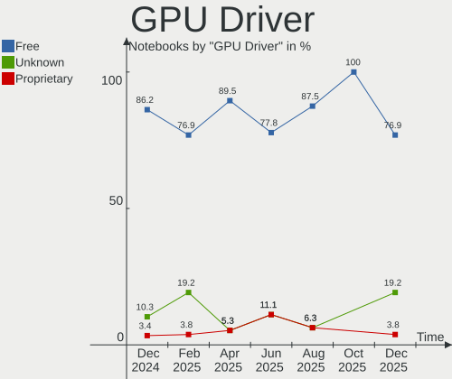

| Driver      | Notebooks | Percent |
|-------------|-----------|---------|
| Free        | 20        | 76.92%  |
| Unknown     | 5         | 19.23%  |
| Proprietary | 1         | 3.85%   |

GPU Memory
----------

Total video memory

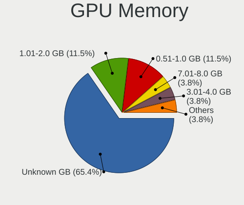

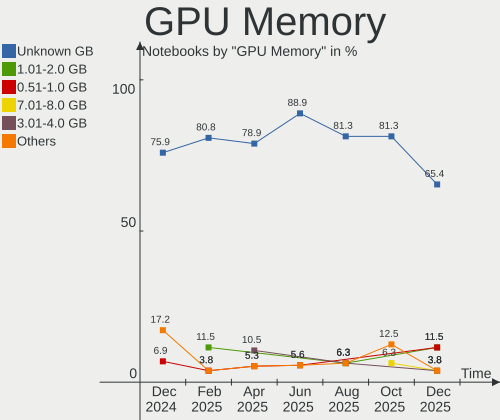

| Size in GB | Notebooks | Percent |
|------------|-----------|---------|
| Unknown    | 17        | 65.38%  |
| 1.01-2.0   | 3         | 11.54%  |
| 0.51-1.0   | 3         | 11.54%  |
| 7.01-8.0   | 1         | 3.85%   |
| 3.01-4.0   | 1         | 3.85%   |
| 0.01-0.5   | 1         | 3.85%   |

Monitor
-------

Monitor Vendor
--------------

Monitor vendors

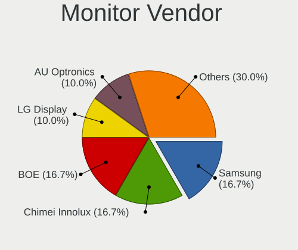

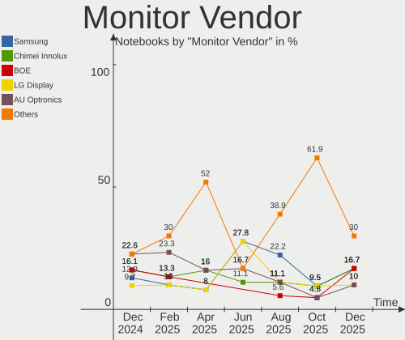

| Vendor              | Notebooks | Percent |
|---------------------|-----------|---------|
| Samsung Electronics | 5         | 16.67%  |
| Chimei Innolux      | 5         | 16.67%  |
| BOE                 | 5         | 16.67%  |
| LG Display          | 3         | 10%     |
| AU Optronics        | 3         | 10%     |
| Lenovo              | 2         | 6.67%   |
| NEC Computers       | 1         | 3.33%   |
| LG Philips          | 1         | 3.33%   |
| Hewlett-Packard     | 1         | 3.33%   |
| DPL                 | 1         | 3.33%   |
| Dell                | 1         | 3.33%   |
| CSOT                | 1         | 3.33%   |
| Acer                | 1         | 3.33%   |

Monitor Model
-------------

Monitor models

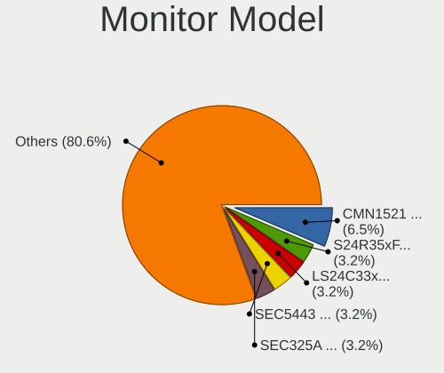

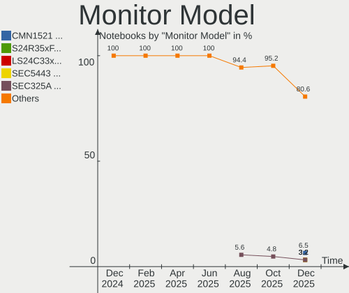

| Model                                                                 | Notebooks | Percent |
|-----------------------------------------------------------------------|-----------|---------|
| Chimei Innolux LCD Monitor CMN1521 1920x1080 344x193mm 15.5-inch      | 2         | 6.45%   |
| Samsung Electronics S24R35xFZ SAM71A8 1920x1080 521x293mm 23.5-inch   | 1         | 3.23%   |
| Samsung Electronics LS24C33xG SAM7435 1920x1080 527x296mm 23.8-inch   | 1         | 3.23%   |
| Samsung Electronics LCD Monitor SEC5443 1920x1200 367x230mm 17.1-inch | 1         | 3.23%   |
| Samsung Electronics LCD Monitor SEC325A 1366x768 344x194mm 15.5-inch  | 1         | 3.23%   |
| Samsung Electronics LCD Monitor SDC4A52 1366x768 344x194mm 15.5-inch  | 1         | 3.23%   |
| Samsung Electronics LCD Monitor SDC4214 1920x1200 344x215mm 16.0-inch | 1         | 3.23%   |
| NEC Computers E224Wi NEC6950 1920x1080 476x267mm 21.5-inch            | 1         | 3.23%   |
| LG Philips LCD Monitor LPLA101 1440x900 367x230mm 17.1-inch           | 1         | 3.23%   |
| LG Display LCD Monitor LGD0456 1366x768 344x194mm 15.5-inch           | 1         | 3.23%   |
| LG Display LCD Monitor LGD042D 1920x1080 294x165mm 13.3-inch          | 1         | 3.23%   |
| LG Display LCD Monitor LGD02D8 1366x768 277x156mm 12.5-inch           | 1         | 3.23%   |
| Lenovo LEN P27h-10 LEN61AF 2560x1440 597x336mm 27.0-inch              | 1         | 3.23%   |
| Lenovo LCD Monitor LEN9052 1920x1080 344x194mm 15.5-inch              | 1         | 3.23%   |
| Hewlett-Packard E243i HPN3462 1920x1200 518x324mm 24.1-inch           | 1         | 3.23%   |
| DPL HDMI DPL2700 2560x1440 597x336mm 27.0-inch                        | 1         | 3.23%   |
| Dell U2412M DELA07B 1920x1200 518x324mm 24.1-inch                     | 1         | 3.23%   |
| CSOT LCD Monitor CSO1423 1920x1200 302x189mm 14.0-inch                | 1         | 3.23%   |
| Chimei Innolux P140ZKA-BZ1 CMN8C02 2160x1440 296x197mm 14.0-inch      | 1         | 3.23%   |
| Chimei Innolux LCD Monitor CMN14C9 1920x1080 309x173mm 13.9-inch      | 1         | 3.23%   |
| Chimei Innolux LCD Monitor CMN1416 1920x1080 309x173mm 13.9-inch      | 1         | 3.23%   |
| BOE NE135A1M-NY1 BOE0CB4 2880x1920 285x190mm 13.5-inch                | 1         | 3.23%   |
| BOE LCD Monitor BOE0D43 3840x2400 345x215mm 16.0-inch                 | 1         | 3.23%   |
| BOE LCD Monitor BOE0A99 2560x1600 366x229mm 17.0-inch                 | 1         | 3.23%   |
| BOE LCD Monitor BOE08E4 1600x900 382x215mm 17.3-inch                  | 1         | 3.23%   |
| BOE LCD Monitor BOE079B 1920x1080 309x173mm 13.9-inch                 | 1         | 3.23%   |
| AU Optronics LCD Monitor AUO229E 1600x900 382x214mm 17.2-inch         | 1         | 3.23%   |
| AU Optronics LCD Monitor AUO13ED 1920x1080 344x193mm 15.5-inch        | 1         | 3.23%   |
| AU Optronics LCD Monitor AUO119E 1600x900 382x214mm 17.2-inch         | 1         | 3.23%   |
| Acer AL2216W ACRADA1 1680x1050 474x296mm 22.0-inch                    | 1         | 3.23%   |

Monitor Resolution
------------------

Monitor screen resolution

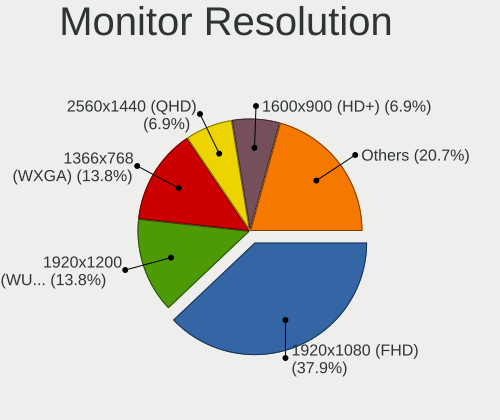

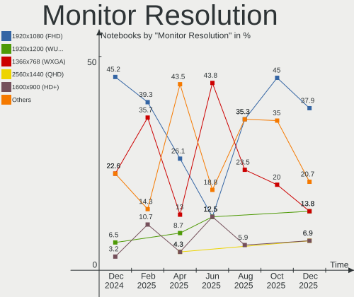

| Resolution         | Notebooks | Percent |
|--------------------|-----------|---------|
| 1920x1080 (FHD)    | 11        | 37.93%  |
| 1920x1200 (WUXGA)  | 4         | 13.79%  |
| 1366x768 (WXGA)    | 4         | 13.79%  |
| 2560x1440 (QHD)    | 2         | 6.9%    |
| 1600x900 (HD+)     | 2         | 6.9%    |
| 3840x2400          | 1         | 3.45%   |
| 2880x1920          | 1         | 3.45%   |
| 2560x1600          | 1         | 3.45%   |
| 2160x1440          | 1         | 3.45%   |
| 1680x1050 (WSXGA+) | 1         | 3.45%   |
| 1440x900 (WXGA+)   | 1         | 3.45%   |

Monitor Diagonal
----------------

Diagonal size in inches

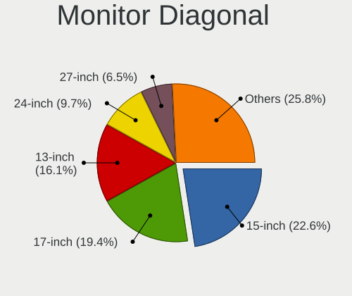

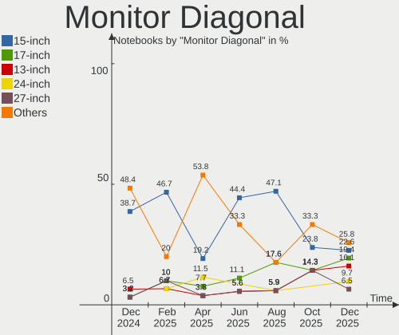

| Inches | Notebooks | Percent |
|--------|-----------|---------|
| 15     | 7         | 22.58%  |
| 17     | 6         | 19.35%  |
| 13     | 5         | 16.13%  |
| 24     | 3         | 9.68%   |
| 27     | 2         | 6.45%   |
| 16     | 2         | 6.45%   |
| 14     | 2         | 6.45%   |
| 23     | 1         | 3.23%   |
| 22     | 1         | 3.23%   |
| 21     | 1         | 3.23%   |
| 12     | 1         | 3.23%   |

Monitor Width
-------------

Physical width

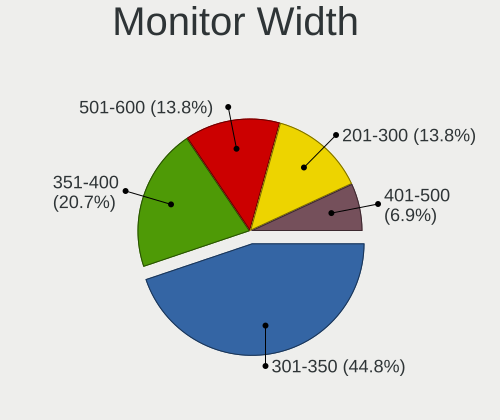

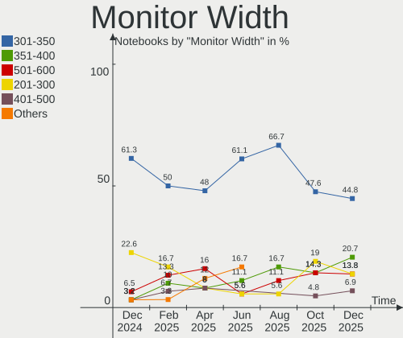

| Width in mm | Notebooks | Percent |
|-------------|-----------|---------|
| 301-350     | 13        | 44.83%  |
| 351-400     | 6         | 20.69%  |
| 501-600     | 4         | 13.79%  |
| 201-300     | 4         | 13.79%  |
| 401-500     | 2         | 6.9%    |

Aspect Ratio
------------

Proportional relationship between the width and the height

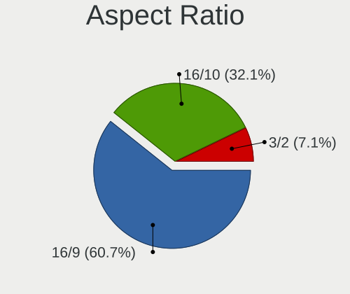

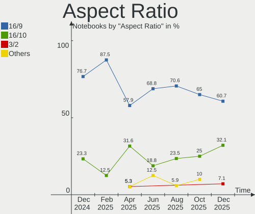

| Ratio | Notebooks | Percent |
|-------|-----------|---------|
| 16/9  | 17        | 60.71%  |
| 16/10 | 9         | 32.14%  |
| 3/2   | 2         | 7.14%   |

Monitor Area
------------

Area in inch²

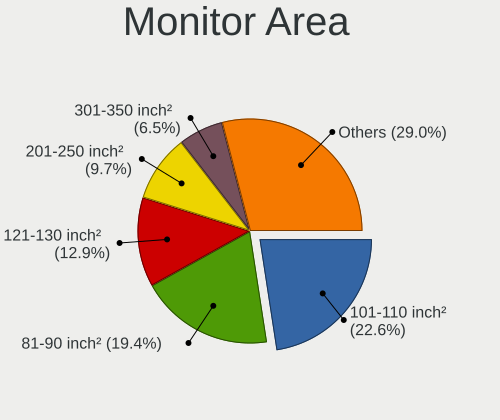

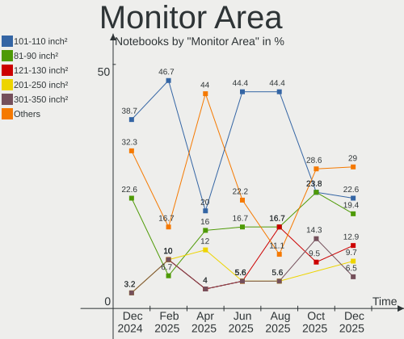

| Area in inch² | Notebooks | Percent |
|----------------|-----------|---------|
| 101-110        | 7         | 22.58%  |
| 81-90          | 6         | 19.35%  |
| 121-130        | 4         | 12.9%   |
| 201-250        | 3         | 9.68%   |
| 301-350        | 2         | 6.45%   |
| 251-300        | 2         | 6.45%   |
| 131-140        | 2         | 6.45%   |
| 111-120        | 2         | 6.45%   |
| 71-80          | 1         | 3.23%   |
| 61-70          | 1         | 3.23%   |
| 151-200        | 1         | 3.23%   |

Pixel Density
-------------

Pixels per inch

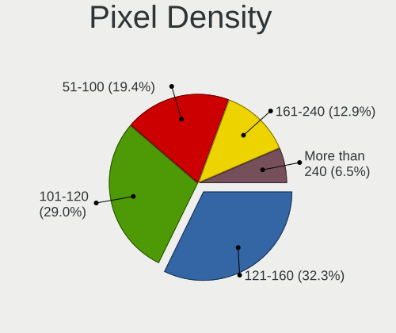

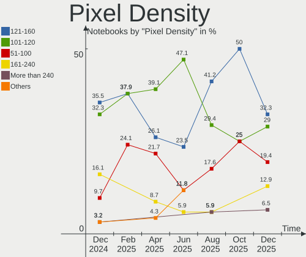

| Density       | Notebooks | Percent |
|---------------|-----------|---------|
| 121-160       | 10        | 32.26%  |
| 101-120       | 9         | 29.03%  |
| 51-100        | 6         | 19.35%  |
| 161-240       | 4         | 12.9%   |
| More than 240 | 2         | 6.45%   |

Multiple Monitors
-----------------

Total monitors connected

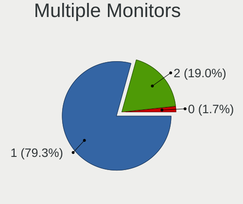

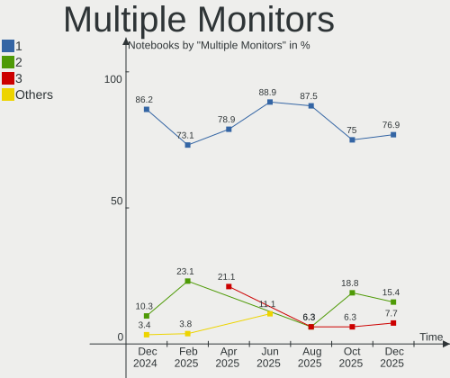

| Total | Notebooks | Percent |
|-------|-----------|---------|
| 1     | 20        | 76.92%  |
| 2     | 4         | 15.38%  |
| 3     | 2         | 7.69%   |

Network
-------

Net Controller Vendor
---------------------

Controller vendors

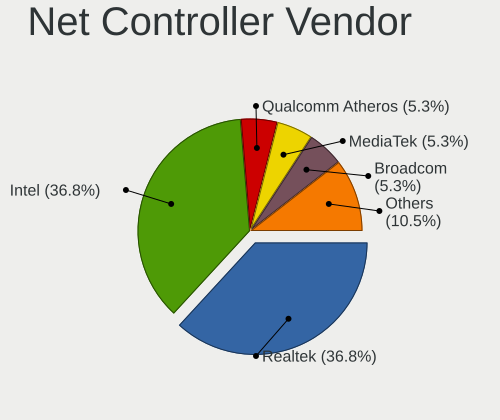

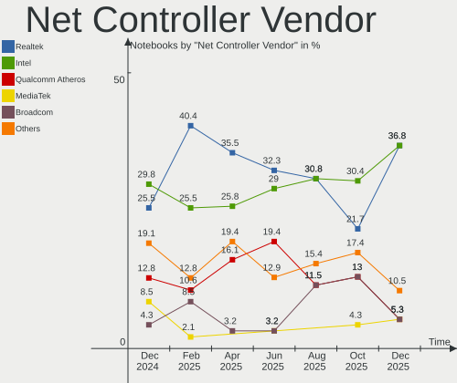

| Vendor                                 | Notebooks | Percent |
|----------------------------------------|-----------|---------|
| Realtek Semiconductor                  | 14        | 36.84%  |
| Intel                                  | 14        | 36.84%  |
| Qualcomm Atheros                       | 2         | 5.26%   |
| MediaTek                               | 2         | 5.26%   |
| Broadcom                               | 2         | 5.26%   |
| Suzhou Motorcomm Electronic Technology | 1         | 2.63%   |
| Ralink                                 | 1         | 2.63%   |
| Ericsson Business Mobile Networks      | 1         | 2.63%   |
| D-Link System                          | 1         | 2.63%   |

Net Controller Model
--------------------

Controller models

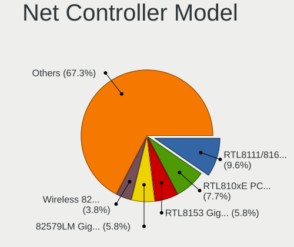

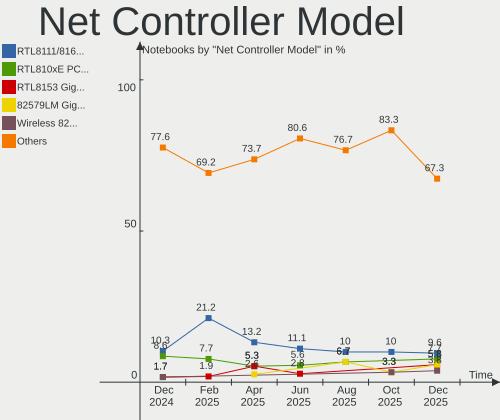

| Model                                                                   | Notebooks | Percent |
|-------------------------------------------------------------------------|-----------|---------|
| Realtek RTL8111/8168/8211/8411 PCI Express Gigabit Ethernet Controller  | 5         | 9.62%   |
| Realtek RTL810xE PCI Express Fast Ethernet controller                   | 4         | 7.69%   |
| Realtek RTL8153 Gigabit Ethernet Adapter                                | 3         | 5.77%   |
| Intel 82579LM Gigabit Network Connection (Lewisville)                   | 3         | 5.77%   |
| Intel Wireless 8265 / 8275                                              | 2         | 3.85%   |
| Intel Ethernet Connection (16) I219-LM                                  | 2         | 3.85%   |
| Intel Centrino Advanced-N 6205 [Taylor Peak]                            | 2         | 3.85%   |
| Suzhou Motorcomm Electronic YT6801 Gigabit Ethernet Controller          | 1         | 1.92%   |
| Realtek USB 10/100/1G/2.5G/5G LAN                                       | 1         | 1.92%   |
| Realtek RTL8852BE-VT PCIe 802.11ax Wireless Network Controller          | 1         | 1.92%   |
| Realtek RTL8852BE PCIe 802.11ax Wireless Network Controller             | 1         | 1.92%   |
| Realtek RTL8822CE 802.11ac PCIe Wireless Network Adapter                | 1         | 1.92%   |
| Realtek RTL8821CE 802.11ac PCIe Wireless Network Adapter                | 1         | 1.92%   |
| Realtek RTL8812AU 802.11a/b/g/n/ac 2T2R DB WLAN Adapter                 | 1         | 1.92%   |
| Realtek RTL8723BE PCIe Wireless Network Adapter                         | 1         | 1.92%   |
| Realtek RTL8723AE PCIe Wireless Network Adapter                         | 1         | 1.92%   |
| Realtek RTL8188EE Wireless Network Adapter                              | 1         | 1.92%   |
| Ralink RT3090 Wireless 802.11n 1T/1R PCIe                               | 1         | 1.92%   |
| Qualcomm Atheros AR9285 Wireless Network Adapter (PCI-Express)          | 1         | 1.92%   |
| Qualcomm Atheros AR242x / AR542x Wireless Network Adapter (PCI-Express) | 1         | 1.92%   |
| MediaTek Wi-Fi 6 MT7920 Wireless Network Adapter                        | 1         | 1.92%   |
| MediaTek MT7925 (RZ717) Wi-Fi 7 160MHz                                  | 1         | 1.92%   |
| Intel Wireless 7265                                                     | 1         | 1.92%   |
| Intel Wireless 7260                                                     | 1         | 1.92%   |
| Intel Wi-Fi 7(802.11be) AX1775*/AX1790*/BE20*/BE401/BE1750* 2x2         | 1         | 1.92%   |
| Intel Tiger Lake PCH CNVi WiFi                                          | 1         | 1.92%   |
| Intel Gemini Lake PCH CNVi WiFi                                         | 1         | 1.92%   |
| Intel Ethernet Controller I226-LM                                       | 1         | 1.92%   |
| Intel Ethernet Connection (4) I219-V                                    | 1         | 1.92%   |
| Intel Ethernet Connection (11) I219-LM                                  | 1         | 1.92%   |
| Intel Comet Lake PCH CNVi WiFi                                          | 1         | 1.92%   |
| Intel Centrino Ultimate-N 6300                                          | 1         | 1.92%   |
| Intel Alder Lake-P PCH CNVi WiFi                                        | 1         | 1.92%   |
| Intel 700 Series Chipset CNVi WiFi                                      | 1         | 1.92%   |
| Ericsson Business Mobile Networks F5521gw                               | 1         | 1.92%   |
| D-Link System DWA-110 Wireless G Adapter(rev.A1) [Ralink RT2571W]       | 1         | 1.92%   |
| Broadcom NetXtreme BCM5761e Gigabit Ethernet PCIe                       | 1         | 1.92%   |
| Broadcom BCM43142 802.11b/g/n                                           | 1         | 1.92%   |

Wireless Vendor
---------------

Wireless vendors

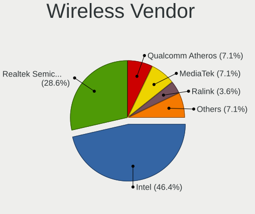

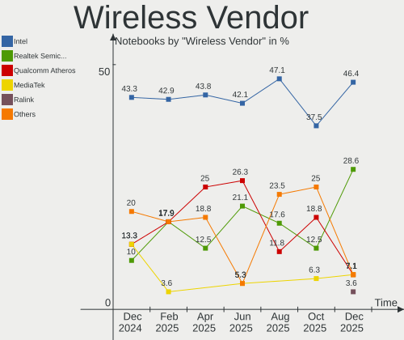

| Vendor                | Notebooks | Percent |
|-----------------------|-----------|---------|
| Intel                 | 13        | 46.43%  |
| Realtek Semiconductor | 8         | 28.57%  |
| Qualcomm Atheros      | 2         | 7.14%   |
| MediaTek              | 2         | 7.14%   |
| Ralink                | 1         | 3.57%   |
| D-Link System         | 1         | 3.57%   |
| Broadcom              | 1         | 3.57%   |

Wireless Model
--------------

Wireless models

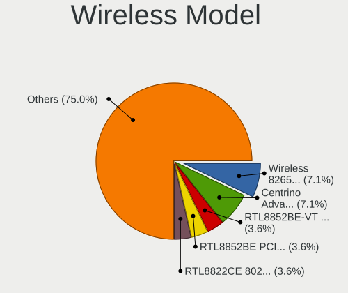

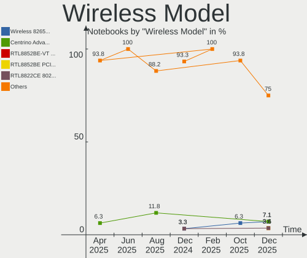

| Model                                                                   | Notebooks | Percent |
|-------------------------------------------------------------------------|-----------|---------|
| Intel Wireless 8265 / 8275                                              | 2         | 7.14%   |
| Intel Centrino Advanced-N 6205 [Taylor Peak]                            | 2         | 7.14%   |
| Realtek RTL8852BE-VT PCIe 802.11ax Wireless Network Controller          | 1         | 3.57%   |
| Realtek RTL8852BE PCIe 802.11ax Wireless Network Controller             | 1         | 3.57%   |
| Realtek RTL8822CE 802.11ac PCIe Wireless Network Adapter                | 1         | 3.57%   |
| Realtek RTL8821CE 802.11ac PCIe Wireless Network Adapter                | 1         | 3.57%   |
| Realtek RTL8812AU 802.11a/b/g/n/ac 2T2R DB WLAN Adapter                 | 1         | 3.57%   |
| Realtek RTL8723BE PCIe Wireless Network Adapter                         | 1         | 3.57%   |
| Realtek RTL8723AE PCIe Wireless Network Adapter                         | 1         | 3.57%   |
| Realtek RTL8188EE Wireless Network Adapter                              | 1         | 3.57%   |
| Ralink RT3090 Wireless 802.11n 1T/1R PCIe                               | 1         | 3.57%   |
| Qualcomm Atheros AR9285 Wireless Network Adapter (PCI-Express)          | 1         | 3.57%   |
| Qualcomm Atheros AR242x / AR542x Wireless Network Adapter (PCI-Express) | 1         | 3.57%   |
| MediaTek Wi-Fi 6 MT7920 Wireless Network Adapter                        | 1         | 3.57%   |
| MediaTek MT7925 (RZ717) Wi-Fi 7 160MHz                                  | 1         | 3.57%   |
| Intel Wireless 7265                                                     | 1         | 3.57%   |
| Intel Wireless 7260                                                     | 1         | 3.57%   |
| Intel Wi-Fi 7(802.11be) AX1775*/AX1790*/BE20*/BE401/BE1750* 2x2         | 1         | 3.57%   |
| Intel Tiger Lake PCH CNVi WiFi                                          | 1         | 3.57%   |
| Intel Gemini Lake PCH CNVi WiFi                                         | 1         | 3.57%   |
| Intel Comet Lake PCH CNVi WiFi                                          | 1         | 3.57%   |
| Intel Centrino Ultimate-N 6300                                          | 1         | 3.57%   |
| Intel Alder Lake-P PCH CNVi WiFi                                        | 1         | 3.57%   |
| Intel 700 Series Chipset CNVi WiFi                                      | 1         | 3.57%   |
| D-Link System DWA-110 Wireless G Adapter(rev.A1) [Ralink RT2571W]       | 1         | 3.57%   |
| Broadcom BCM43142 802.11b/g/n                                           | 1         | 3.57%   |

Ethernet Vendor
---------------

Ethernet vendors

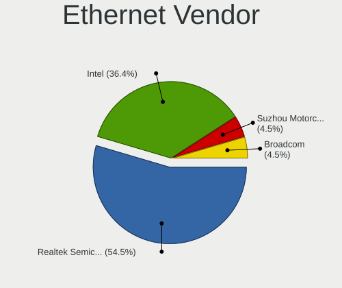

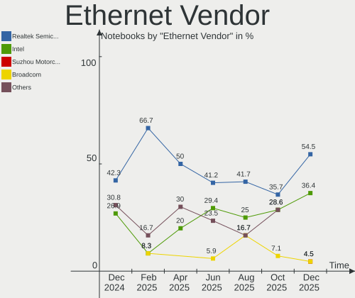

| Vendor                                 | Notebooks | Percent |
|----------------------------------------|-----------|---------|
| Realtek Semiconductor                  | 12        | 54.55%  |
| Intel                                  | 8         | 36.36%  |
| Suzhou Motorcomm Electronic Technology | 1         | 4.55%   |
| Broadcom                               | 1         | 4.55%   |

Ethernet Model
--------------

Ethernet models

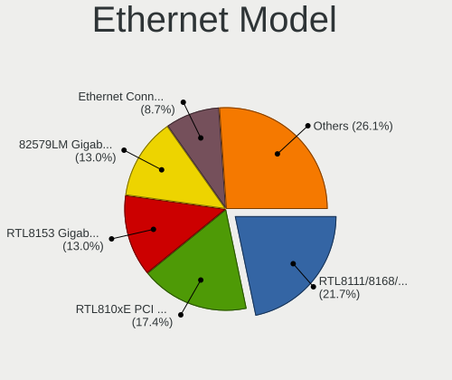

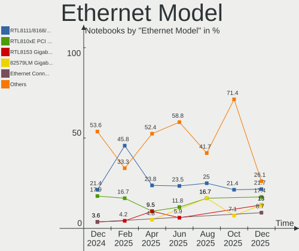

| Model                                                                  | Notebooks | Percent |
|------------------------------------------------------------------------|-----------|---------|
| Realtek RTL8111/8168/8211/8411 PCI Express Gigabit Ethernet Controller | 5         | 21.74%  |
| Realtek RTL810xE PCI Express Fast Ethernet controller                  | 4         | 17.39%  |
| Realtek RTL8153 Gigabit Ethernet Adapter                               | 3         | 13.04%  |
| Intel 82579LM Gigabit Network Connection (Lewisville)                  | 3         | 13.04%  |
| Intel Ethernet Connection (16) I219-LM                                 | 2         | 8.7%    |
| Suzhou Motorcomm Electronic YT6801 Gigabit Ethernet Controller         | 1         | 4.35%   |
| Realtek USB 10/100/1G/2.5G/5G LAN                                      | 1         | 4.35%   |
| Intel Ethernet Controller I226-LM                                      | 1         | 4.35%   |
| Intel Ethernet Connection (4) I219-V                                   | 1         | 4.35%   |
| Intel Ethernet Connection (11) I219-LM                                 | 1         | 4.35%   |
| Broadcom NetXtreme BCM5761e Gigabit Ethernet PCIe                      | 1         | 4.35%   |

Net Controller Kind
-------------------

Ethernet, WiFi or modem

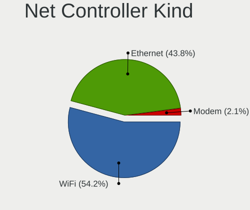

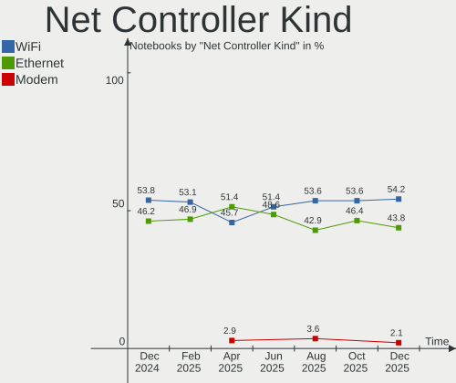

| Kind     | Notebooks | Percent |
|----------|-----------|---------|
| WiFi     | 26        | 54.17%  |
| Ethernet | 21        | 43.75%  |
| Modem    | 1         | 2.08%   |

Used Controller
---------------

Currently used network controller

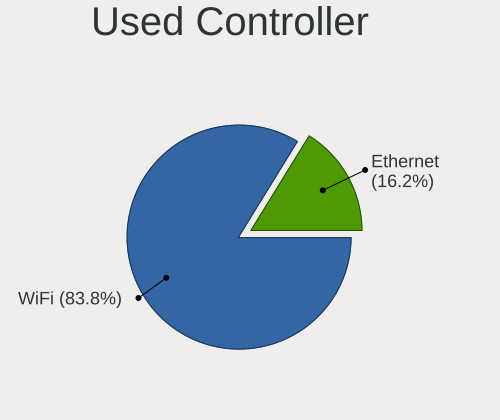

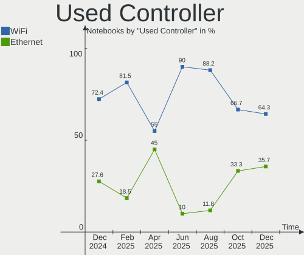

| Kind     | Notebooks | Percent |
|----------|-----------|---------|
| WiFi     | 18        | 64.29%  |
| Ethernet | 10        | 35.71%  |

NICs
----

Total network controllers on board

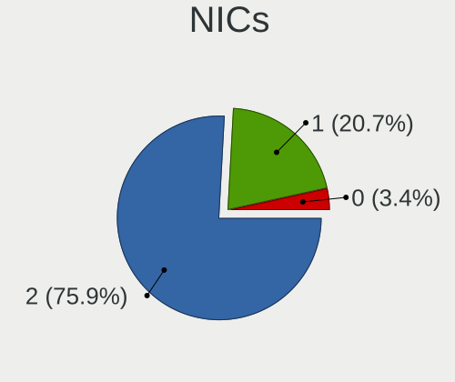

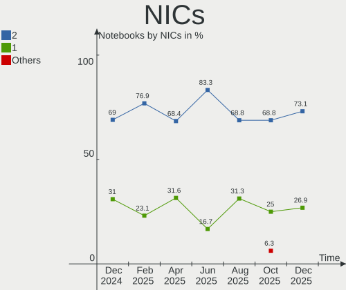

| Total | Notebooks | Percent |
|-------|-----------|---------|
| 2     | 19        | 73.08%  |
| 1     | 7         | 26.92%  |

IPv6
----

IPv6 vs IPv4

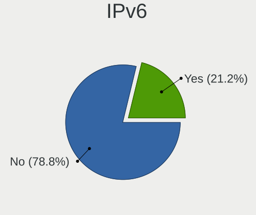

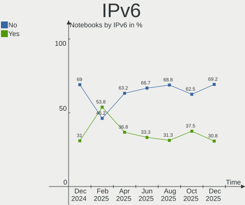

| Used | Notebooks | Percent |
|------|-----------|---------|
| No   | 18        | 69.23%  |
| Yes  | 8         | 30.77%  |

Bluetooth
---------

Bluetooth Vendor
----------------

Controller vendors

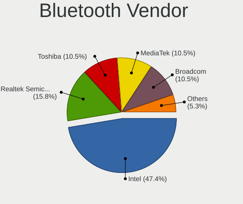

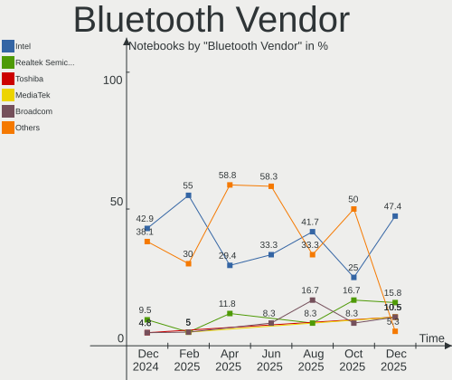

| Vendor                | Notebooks | Percent |
|-----------------------|-----------|---------|
| Intel                 | 9         | 47.37%  |
| Realtek Semiconductor | 3         | 15.79%  |
| Toshiba               | 2         | 10.53%  |
| MediaTek              | 2         | 10.53%  |
| Broadcom              | 2         | 10.53%  |
| IMC Networks          | 1         | 5.26%   |

Bluetooth Model
---------------

Controller models

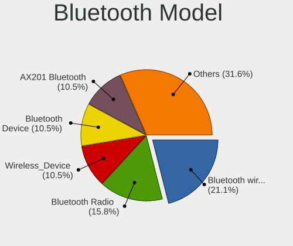

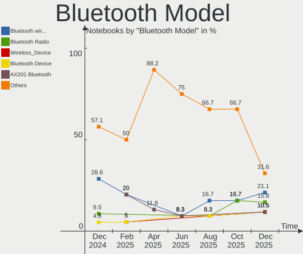

| Model                                          | Notebooks | Percent |
|------------------------------------------------|-----------|---------|
| Intel Bluetooth wireless interface             | 4         | 21.05%  |
| Realtek Bluetooth Radio                        | 3         | 15.79%  |
| MediaTek Wireless_Device                       | 2         | 10.53%  |
| Intel Bluetooth Device                         | 2         | 10.53%  |
| Intel AX201 Bluetooth                          | 2         | 10.53%  |
| Toshiba RT Bluetooth Radio                     | 1         | 5.26%   |
| Toshiba BCM43142A0                             | 1         | 5.26%   |
| Intel Bluetooth 9460/9560 Jefferson Peak (JfP) | 1         | 5.26%   |
| IMC Networks Bluetooth Radio                   | 1         | 5.26%   |
| Broadcom HP Portable SoftSailing               | 1         | 5.26%   |
| Broadcom BCM2045B (BDC-2.1)                    | 1         | 5.26%   |

Sound
-----

Sound Vendor
------------

Sound card vendors

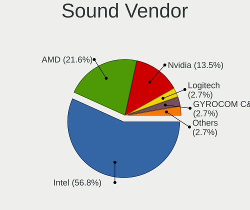

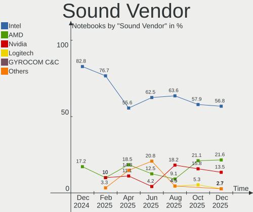

| Vendor      | Notebooks | Percent |
|-------------|-----------|---------|
| Intel       | 21        | 56.76%  |
| AMD         | 8         | 21.62%  |
| Nvidia      | 5         | 13.51%  |
| Logitech    | 1         | 2.7%    |
| GYROCOM C&C | 1         | 2.7%    |
| DSEA A/S    | 1         | 2.7%    |

Sound Model
-----------

Sound card models

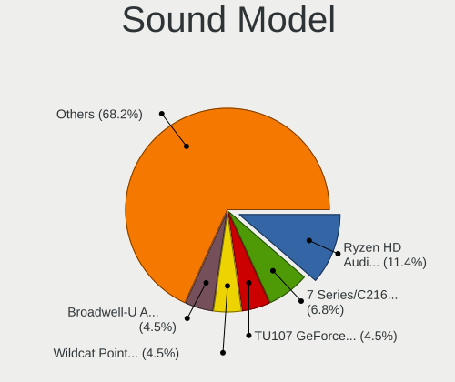

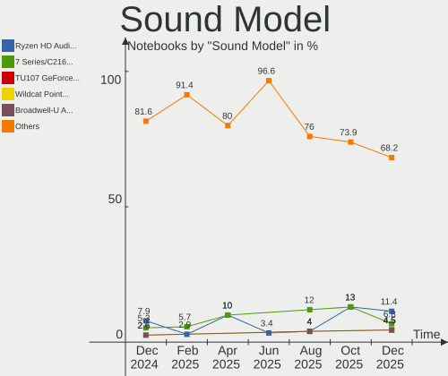

| Model                                                                      | Notebooks | Percent |
|----------------------------------------------------------------------------|-----------|---------|
| AMD Ryzen HD Audio Controller                                              | 5         | 11.36%  |
| Intel 7 Series/C216 Chipset Family High Definition Audio Controller        | 3         | 6.82%   |
| Nvidia TU107 GeForce GTX 1650 High Definition Audio Controller             | 2         | 4.55%   |
| Intel Wildcat Point-LP High Definition Audio Controller                    | 2         | 4.55%   |
| Intel Broadwell-U Audio Controller                                         | 2         | 4.55%   |
| Intel Alder Lake PCH-P High Definition Audio Controller                    | 2         | 4.55%   |
| Intel 5 Series/3400 Series Chipset High Definition Audio                   | 2         | 4.55%   |
| AMD Turks HDMI Audio [Radeon HD 6500/6600 / 6700M Series]                  | 2         | 4.55%   |
| AMD Renoir/Cezanne HDMI/DP Audio Controller                                | 2         | 4.55%   |
| Nvidia GK208 HDMI/DP Audio Controller                                      | 1         | 2.27%   |
| Nvidia GB206 High Definition Audio Controller                              | 1         | 2.27%   |
| Nvidia AD107 High Definition Audio Controller                              | 1         | 2.27%   |
| Logitech V20 portable speakers (USB powered)                               | 1         | 2.27%   |
| Intel Tiger Lake-H HD Audio Controller                                     | 1         | 2.27%   |
| Intel Sunrise Point-LP HD Audio                                            | 1         | 2.27%   |
| Intel Raptor Lake High Definition Audio Controller                         | 1         | 2.27%   |
| Intel Haswell-ULT HD Audio Controller                                      | 1         | 2.27%   |
| Intel Comet Lake PCH cAVS                                                  | 1         | 2.27%   |
| Intel Celeron/Pentium Silver Processor High Definition Audio               | 1         | 2.27%   |
| Intel Cannon Point-LP High Definition Audio Controller                     | 1         | 2.27%   |
| Intel Atom Processor Z36xxx/Z37xxx Series High Definition Audio Controller | 1         | 2.27%   |
| Intel Arrow Lake cAVS                                                      | 1         | 2.27%   |
| Intel 82801I (ICH9 Family) HD Audio Controller                             | 1         | 2.27%   |
| Intel 800 Series ACE (Audio Context Engine)                                | 1         | 2.27%   |
| Intel 8 Series HD Audio Controller                                         | 1         | 2.27%   |
| Intel 6 Series/C200 Series Chipset Family High Definition Audio Controller | 1         | 2.27%   |
| GYROCOM C&C FiiO USB DAC-E07K                                              | 1         | 2.27%   |
| DSEA A/S Sennheiser SC 660 ANC USB                                         | 1         | 2.27%   |
| AMD Raven/Raven2/Fenghuang HDMI/DP Audio Controller                        | 1         | 2.27%   |
| AMD Radeon High Definition Audio Controller                                | 1         | 2.27%   |
| AMD Cedar HDMI Audio [Radeon HD 5400/6300/7300 Series]                     | 1         | 2.27%   |

Memory
------

Memory Vendor
-------------

Memory module vendors

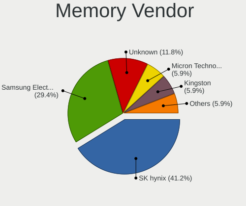

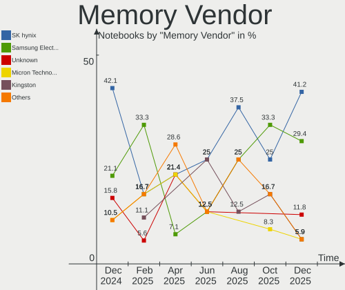

| Vendor              | Notebooks | Percent |
|---------------------|-----------|---------|
| SK hynix            | 7         | 41.18%  |
| Samsung Electronics | 5         | 29.41%  |
| Unknown             | 2         | 11.76%  |
| Micron Technology   | 1         | 5.88%   |
| Kingston            | 1         | 5.88%   |
| A-DATA Technology   | 1         | 5.88%   |

Memory Model
------------

Memory module models

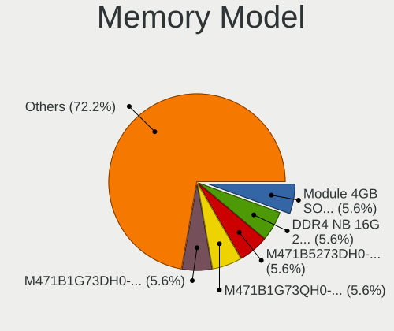

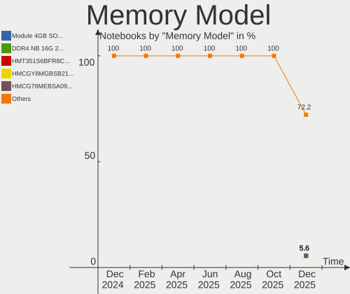

| Model                                                         | Notebooks | Percent |
|---------------------------------------------------------------|-----------|---------|
| Unknown RAM Module 4GB SODIMM DDR4 2400MT/s                   | 1         | 5.56%   |
| Unknown RAM DDR4 NB 16G 2666 16384MB SODIMM DDR4 2667MT/s     | 1         | 5.56%   |
| SK hynix RAM HMT351S6BFR8C-H9 4GB SODIMM 1334MT/s             | 1         | 5.56%   |
| SK hynix RAM HMCGY8MGBSB212N 48GB SODIMM DDR5 5600MT/s        | 1         | 5.56%   |
| SK hynix RAM HMCG78MEBSA092N 16GB SODIMM DDR5 4800MT/s        | 1         | 5.56%   |
| SK hynix RAM HMA81GS6JJR8N-VK 8GB SODIMM DDR4 2667MT/s        | 1         | 5.56%   |
| SK hynix RAM HMA81GS6DJR8N-XN 8GB SODIMM DDR4 3200MT/s        | 1         | 5.56%   |
| SK hynix RAM HMA81GS6AFR8N-UH 8GB SODIMM DDR4 2667MT/s        | 1         | 5.56%   |
| SK hynix RAM H58G66CK8BX147 16GB Row Of Chips LPDDR5 8533MT/s | 1         | 5.56%   |
| Samsung RAM M471B5273DH0-CH9 4GB SODIMM DDR3 1600MT/s         | 1         | 5.56%   |
| Samsung RAM M471B1G73QH0-YK0 8GB SODIMM DDR3 1600MT/s         | 1         | 5.56%   |
| Samsung RAM M471B1G73DH0-YK0 8GB SODIMM DDR3 1600MT/s         | 1         | 5.56%   |
| Samsung RAM M471A4G43AB1-CWE 32GB SODIMM DDR4 3200MT/s        | 1         | 5.56%   |
| Samsung RAM M471A1G44CB0-CWE 8GB Row Of Chips DDR4 3200MT/s   | 1         | 5.56%   |
| Samsung RAM M471A1G44BB0-CWE 8GB Row Of Chips DDR4 3200MT/s   | 1         | 5.56%   |
| Micron RAM 4ATF51264HZ-2G6E! 4GB SODIMM DDR4 2400MT/s         | 1         | 5.56%   |
| Kingston RAM HP16D3LS1KFG/4G 4GB SODIMM DDR3 1600MT/s         | 1         | 5.56%   |
| A-DATA RAM AD5S560032G-SFW 32GB SODIMM DDR5 5600MT/s          | 1         | 5.56%   |

Memory Kind
-----------

Memory module kinds

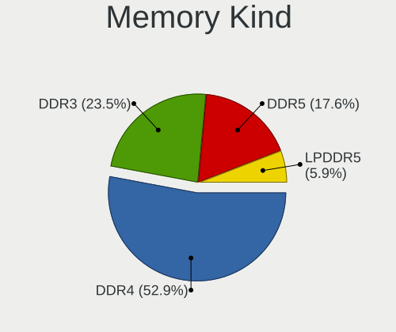

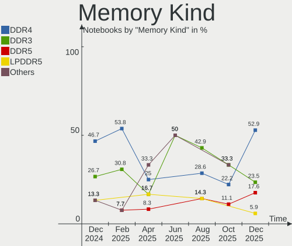

| Kind   | Notebooks | Percent |
|--------|-----------|---------|
| DDR4   | 9         | 52.94%  |
| DDR3   | 4         | 23.53%  |
| DDR5   | 3         | 17.65%  |
| LPDDR5 | 1         | 5.88%   |

Memory Form Factor
------------------

Physical design of the memory module

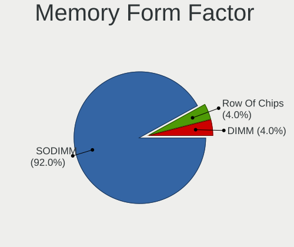

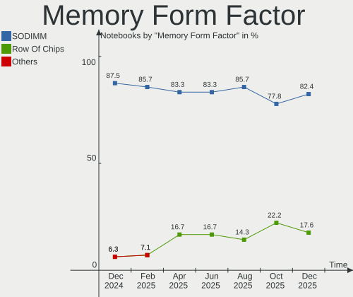

| Name         | Notebooks | Percent |
|--------------|-----------|---------|
| SODIMM       | 14        | 82.35%  |
| Row Of Chips | 3         | 17.65%  |

Memory Size
-----------

Memory module size

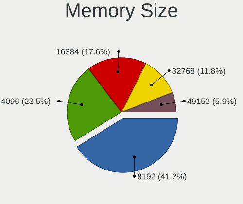

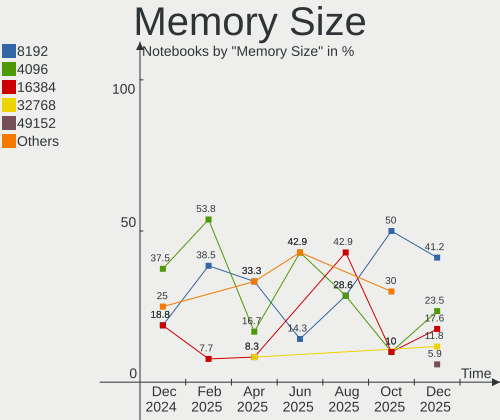

| Size  | Notebooks | Percent |
|-------|-----------|---------|
| 8192  | 7         | 41.18%  |
| 4096  | 4         | 23.53%  |
| 16384 | 3         | 17.65%  |
| 32768 | 2         | 11.76%  |
| 49152 | 1         | 5.88%   |

Memory Speed
------------

Memory module speed

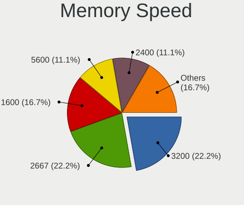

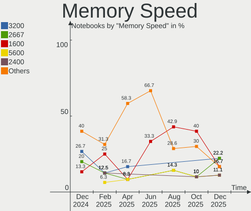

| Speed | Notebooks | Percent |
|-------|-----------|---------|
| 3200  | 4         | 22.22%  |
| 2667  | 4         | 22.22%  |
| 1600  | 3         | 16.67%  |
| 5600  | 2         | 11.11%  |
| 2400  | 2         | 11.11%  |
| 8533  | 1         | 5.56%   |
| 4800  | 1         | 5.56%   |
| 1334  | 1         | 5.56%   |

Printers & scanners
-------------------

Printer Vendor
--------------

Printer device vendors

Zero info for selected period =(

Printer Model
-------------

Printer device models

Zero info for selected period =(

Scanner Vendor
--------------

Scanner device vendors

Zero info for selected period =(

Scanner Model
-------------

Scanner device models

Zero info for selected period =(

Camera
------

Camera Vendor
-------------

Camera device vendors

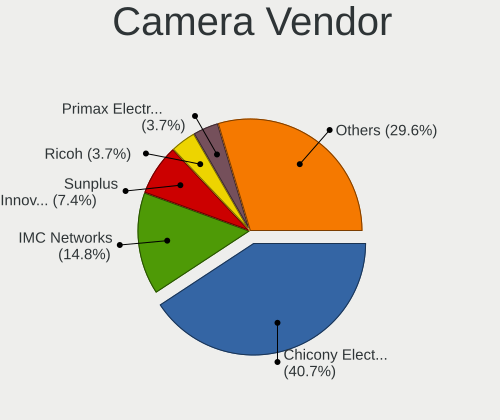

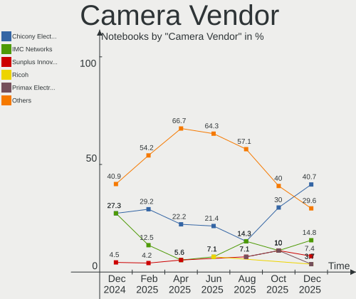

| Vendor                        | Notebooks | Percent |
|-------------------------------|-----------|---------|
| Chicony Electronics           | 11        | 40.74%  |
| IMC Networks                  | 4         | 14.81%  |
| Sunplus Innovation Technology | 2         | 7.41%   |
| Ricoh                         | 1         | 3.7%    |
| Primax Electronics            | 1         | 3.7%    |
| Microdia                      | 1         | 3.7%    |
| Luxvisions Innotech Limited   | 1         | 3.7%    |
| Logitech                      | 1         | 3.7%    |
| Genesys Logic                 | 1         | 3.7%    |
| Generalplus Technology        | 1         | 3.7%    |
| Framework                     | 1         | 3.7%    |
| Cubeternet                    | 1         | 3.7%    |
| Bison Electronics             | 1         | 3.7%    |

Camera Model
------------

Camera device models

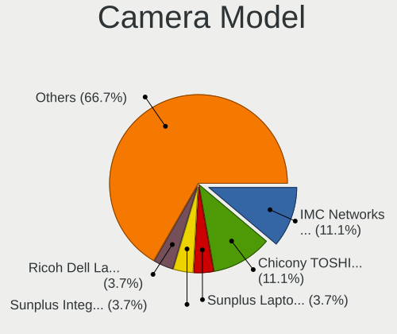

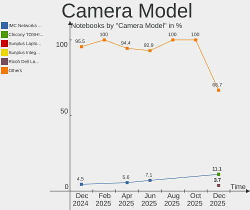

| Model                                                 | Notebooks | Percent |
|-------------------------------------------------------|-----------|---------|
| IMC Networks Integrated Camera                        | 3         | 11.11%  |
| Chicony TOSHIBA Web Camera - HD                       | 3         | 11.11%  |
| Sunplus Laptop Integrated WebCam HD                   | 1         | 3.7%    |
| Sunplus Integrated_Webcam_FHD                         | 1         | 3.7%    |
| Ricoh Dell Laptop Integrated Webcam                   | 1         | 3.7%    |
| Primax HP HD Webcam [Fixed]                           | 1         | 3.7%    |
| Microdia USB 2.0 Camera                               | 1         | 3.7%    |
| Luxvisions Innotech Limited HP True Vision FHD Camera | 1         | 3.7%    |
| Logitech QuickCam Pro 5000                            | 1         | 3.7%    |
| IMC Networks USB2.0 HD UVC WebCam                     | 1         | 3.7%    |
| Genesys Logic Camera                                  | 1         | 3.7%    |
| Generalplus 808 Camera #9 (web-cam mode)              | 1         | 3.7%    |
| Framework Laptop Webcam Module (2nd Gen)              | 1         | 3.7%    |
| Cubeternet USB2.0 Camera                              | 1         | 3.7%    |
| Chicony Lenovo Integrated Camera (0.3MP)              | 1         | 3.7%    |
| Chicony Integrated Camera                             | 1         | 3.7%    |
| Chicony HP Laptop Integrated Webcam [2 MP Fixed]      | 1         | 3.7%    |
| Chicony HP HD Webcam [Fixed]                          | 1         | 3.7%    |
| Chicony HP HD Camera                                  | 1         | 3.7%    |
| Chicony HD WebCam                                     | 1         | 3.7%    |
| Chicony FHD Webcam                                    | 1         | 3.7%    |
| Chicony Camera                                        | 1         | 3.7%    |
| Bison SunplusIT Integrated Camera                     | 1         | 3.7%    |

Security
--------

Fingerprint Vendor
------------------

Fingerprint sensor vendors

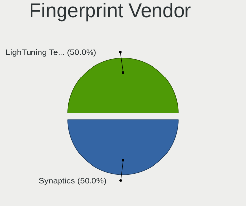

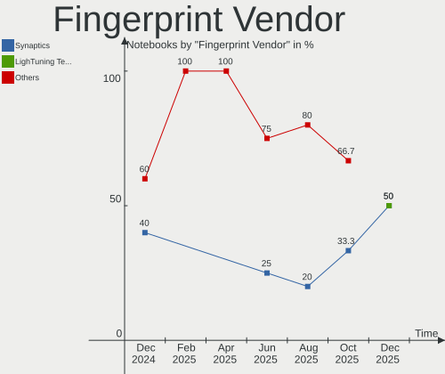

| Vendor                | Notebooks | Percent |
|-----------------------|-----------|---------|
| Synaptics             | 1         | 50%     |
| LighTuning Technology | 1         | 50%     |

Fingerprint Model
-----------------

Fingerprint sensor models

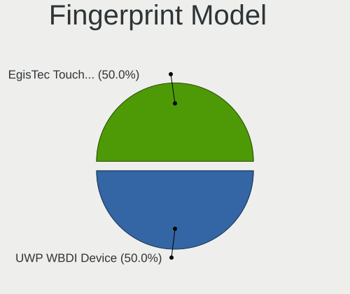

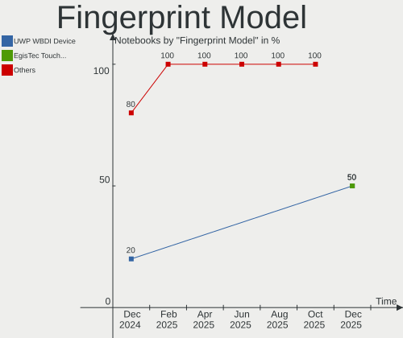

| Model                                       | Notebooks | Percent |
|---------------------------------------------|-----------|---------|
| Synaptics UWP WBDI Device                   | 1         | 50%     |
| LighTuning EgisTec Touch Fingerprint Sensor | 1         | 50%     |

Chipcard Vendor
---------------

Chipcard module vendors

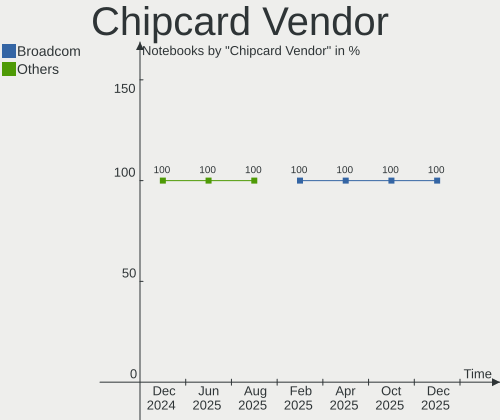

| Vendor   | Notebooks | Percent |
|----------|-----------|---------|
| Broadcom | 2         | 100%    |

Chipcard Model
--------------

Chipcard module models

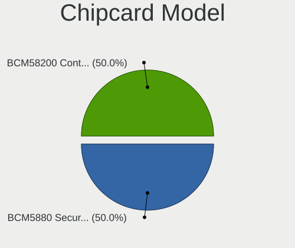

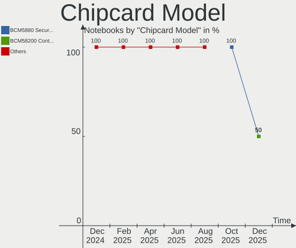

| Model                                                                       | Notebooks | Percent |
|-----------------------------------------------------------------------------|-----------|---------|
| Broadcom BCM5880 Secure Applications Processor                              | 1         | 50%     |
| Broadcom BCM58200 ControlVault 3 (FingerPrint sensor + Contacted SmartCard) | 1         | 50%     |

Unsupported
-----------

Unsupported Devices
-------------------

Total unsupported devices on board

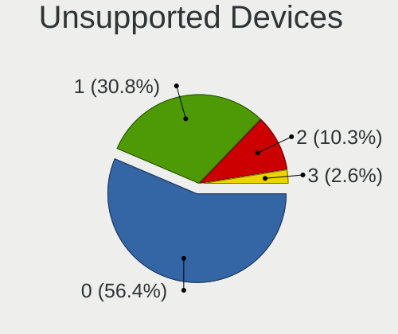

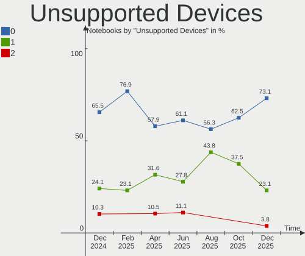

| Total | Notebooks | Percent |
|-------|-----------|---------|
| 0     | 19        | 73.08%  |
| 1     | 6         | 23.08%  |
| 2     | 1         | 3.85%   |

Unsupported Device Types
------------------------

Types of unsupported devices

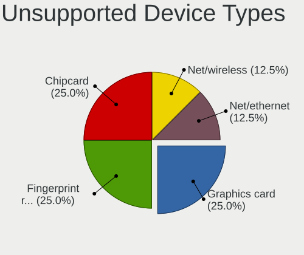

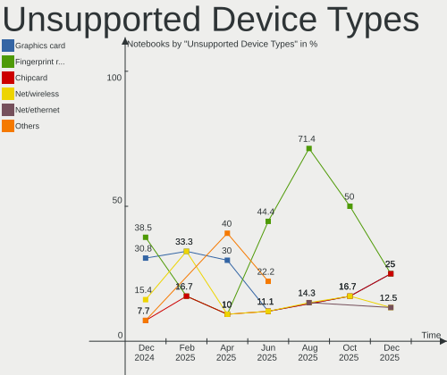

| Type               | Notebooks | Percent |
|--------------------|-----------|---------|
| Graphics card      | 2         | 25%     |
| Fingerprint reader | 2         | 25%     |
| Chipcard           | 2         | 25%     |
| Net/wireless       | 1         | 12.5%   |
| Net/ethernet       | 1         | 12.5%   |

