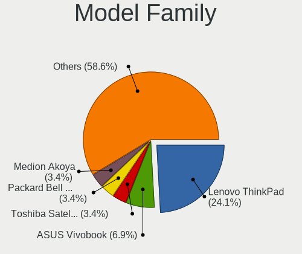
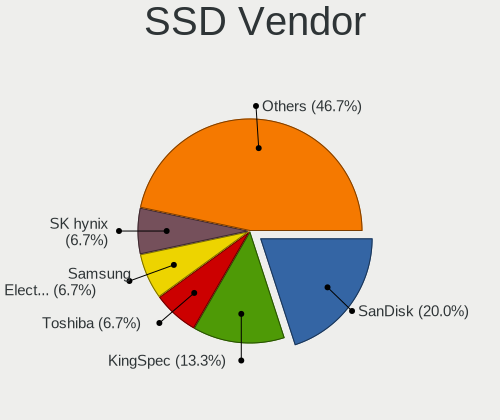
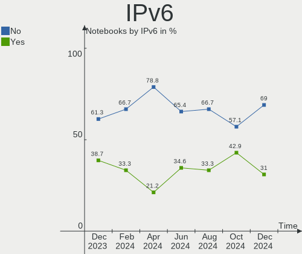
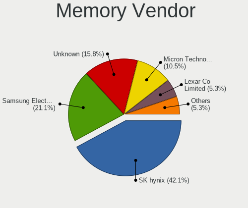
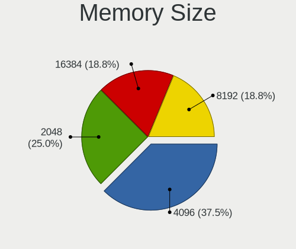

Xubuntu - Hardware Trends (Notebooks)
-------------------------------------

A project to identify most popular hardware characteristics and track their change
over time based on data collected by Linux users at https://Linux-Hardware.org.

Anyone can contribute to this report by the [hw-probe](https://github.com/linuxhw/hw-probe) tool:

    sudo -E hw-probe -all -upload

This report is for one last month. Overall report since the beginning of time: [TestCoverage](https://github.com/linuxhw/TestCoverage)

Period: Aug, 2022.

Contents
--------

* [ System ](#system)
  - [ OS                       ](#os)
  - [ OS Family                ](#os-family)
  - [ Kernel                   ](#kernel)
  - [ Kernel Family            ](#kernel-family)
  - [ Kernel Major Ver.        ](#kernel-major-ver)
  - [ Arch                     ](#arch)
  - [ DE                       ](#de)
  - [ Display Server           ](#display-server)
  - [ Display Manager          ](#display-manager)
  - [ OS Lang                  ](#os-lang)
  - [ Boot Mode                ](#boot-mode)
  - [ Filesystem               ](#filesystem)
  - [ Part. scheme             ](#part-scheme)
  - [ Dual Boot with Linux/BSD ](#dual-boot-with-linuxbsd)
  - [ Dual Boot (Win)          ](#dual-boot-win)

* [ Board ](#board)
  - [ Vendor                   ](#vendor)
  - [ Model                    ](#model)
  - [ Model Family             ](#model-family)
  - [ MFG Year                 ](#mfg-year)
  - [ Form Factor              ](#form-factor)
  - [ Secure Boot              ](#secure-boot)
  - [ Coreboot                 ](#coreboot)
  - [ RAM Size                 ](#ram-size)
  - [ RAM Used                 ](#ram-used)
  - [ Total Drives             ](#total-drives)
  - [ Has CD-ROM               ](#has-cd-rom)
  - [ Has Ethernet             ](#has-ethernet)
  - [ Has WiFi                 ](#has-wifi)
  - [ Has Bluetooth            ](#has-bluetooth)

* [ Location ](#location)
  - [ Country                  ](#country)
  - [ City                     ](#city)

* [ Drives ](#drives)
  - [ Drive Vendor             ](#drive-vendor)
  - [ Drive Model              ](#drive-model)
  - [ HDD Vendor               ](#hdd-vendor)
  - [ SSD Vendor               ](#ssd-vendor)
  - [ Drive Kind               ](#drive-kind)
  - [ Drive Connector          ](#drive-connector)
  - [ Drive Size               ](#drive-size)
  - [ Space Total              ](#space-total)
  - [ Space Used               ](#space-used)
  - [ Malfunc. Drives          ](#malfunc-drives)
  - [ Malfunc. Drive Vendor    ](#malfunc-drive-vendor)
  - [ Malfunc. HDD Vendor      ](#malfunc-hdd-vendor)
  - [ Malfunc. Drive Kind      ](#malfunc-drive-kind)
  - [ Failed Drives            ](#failed-drives)
  - [ Failed Drive Vendor      ](#failed-drive-vendor)
  - [ Drive Status             ](#drive-status)

* [ Storage controller ](#storage-controller)
  - [ Storage Vendor           ](#storage-vendor)
  - [ Storage Model            ](#storage-model)
  - [ Storage Kind             ](#storage-kind)

* [ Processor ](#processor)
  - [ CPU Vendor               ](#cpu-vendor)
  - [ CPU Model                ](#cpu-model)
  - [ CPU Model Family         ](#cpu-model-family)
  - [ CPU Cores                ](#cpu-cores)
  - [ CPU Sockets              ](#cpu-sockets)
  - [ CPU Threads              ](#cpu-threads)
  - [ CPU Op-Modes             ](#cpu-op-modes)
  - [ CPU Microcode            ](#cpu-microcode)
  - [ CPU Microarch            ](#cpu-microarch)

* [ Graphics ](#graphics)
  - [ GPU Vendor               ](#gpu-vendor)
  - [ GPU Model                ](#gpu-model)
  - [ GPU Combo                ](#gpu-combo)
  - [ GPU Driver               ](#gpu-driver)
  - [ GPU Memory               ](#gpu-memory)

* [ Monitor ](#monitor)
  - [ Monitor Vendor           ](#monitor-vendor)
  - [ Monitor Model            ](#monitor-model)
  - [ Monitor Resolution       ](#monitor-resolution)
  - [ Monitor Diagonal         ](#monitor-diagonal)
  - [ Monitor Width            ](#monitor-width)
  - [ Aspect Ratio             ](#aspect-ratio)
  - [ Monitor Area             ](#monitor-area)
  - [ Pixel Density            ](#pixel-density)
  - [ Multiple Monitors        ](#multiple-monitors)

* [ Network ](#network)
  - [ Net Controller Vendor    ](#net-controller-vendor)
  - [ Net Controller Model     ](#net-controller-model)
  - [ Wireless Vendor          ](#wireless-vendor)
  - [ Wireless Model           ](#wireless-model)
  - [ Ethernet Vendor          ](#ethernet-vendor)
  - [ Ethernet Model           ](#ethernet-model)
  - [ Net Controller Kind      ](#net-controller-kind)
  - [ Used Controller          ](#used-controller)
  - [ NICs                     ](#nics)
  - [ IPv6                     ](#ipv6)

* [ Bluetooth ](#bluetooth)
  - [ Bluetooth Vendor         ](#bluetooth-vendor)
  - [ Bluetooth Model          ](#bluetooth-model)

* [ Sound ](#sound)
  - [ Sound Vendor             ](#sound-vendor)
  - [ Sound Model              ](#sound-model)

* [ Memory ](#memory)
  - [ Memory Vendor            ](#memory-vendor)
  - [ Memory Model             ](#memory-model)
  - [ Memory Kind              ](#memory-kind)
  - [ Memory Form Factor       ](#memory-form-factor)
  - [ Memory Size              ](#memory-size)
  - [ Memory Speed             ](#memory-speed)

* [ Printers & scanners ](#printers--scanners)
  - [ Printer Vendor           ](#printer-vendor)
  - [ Printer Model            ](#printer-model)
  - [ Scanner Vendor           ](#scanner-vendor)
  - [ Scanner Model            ](#scanner-model)

* [ Camera ](#camera)
  - [ Camera Vendor            ](#camera-vendor)
  - [ Camera Model             ](#camera-model)

* [ Security ](#security)
  - [ Fingerprint Vendor       ](#fingerprint-vendor)
  - [ Fingerprint Model        ](#fingerprint-model)
  - [ Chipcard Vendor          ](#chipcard-vendor)
  - [ Chipcard Model           ](#chipcard-model)

* [ Unsupported ](#unsupported)
  - [ Unsupported Devices      ](#unsupported-devices)
  - [ Unsupported Device Types ](#unsupported-device-types)

System
------

OS
--

Installed operating systems

| Name          | Notebooks | Percent |
|---------------|-----------|---------|
| Xubuntu 22.04 | 16        | 45.71%  |
| Xubuntu 20.04 | 13        | 37.14%  |
| Xubuntu 18.04 | 5         | 14.29%  |
| Xubuntu 21.10 | 1         | 2.86%   |

OS Family
---------

OS without a version

| Name    | Notebooks | Percent |
|---------|-----------|---------|
| Xubuntu | 35        | 100%    |

Kernel
------

Version of the Linux kernel

| Version                    | Notebooks | Percent |
|----------------------------|-----------|---------|
| 5.15.0-46-generic          | 10        | 28.57%  |
| 5.4.0-124-generic          | 4         | 11.43%  |
| 5.15.0-43-generic          | 4         | 11.43%  |
| 5.4.0-122-lowlatency       | 3         | 8.57%   |
| 5.4.0-122-generic          | 2         | 5.71%   |
| 5.15.0-47-generic          | 2         | 5.71%   |
| 5.4.0-124-lowlatency       | 1         | 2.86%   |
| 5.18.0-14.2-liquorix-amd64 | 1         | 2.86%   |
| 5.17.0-1015-oem            | 1         | 2.86%   |
| 5.15.0-46-lowlatency       | 1         | 2.86%   |
| 5.15.0-42-lowlatency       | 1         | 2.86%   |
| 5.15.0-41-generic          | 1         | 2.86%   |
| 5.15.0-25-generic          | 1         | 2.86%   |
| 5.13.0-52-generic          | 1         | 2.86%   |
| 5.13.0-35-generic          | 1         | 2.86%   |
| 4.15.0-191-lowlatency      | 1         | 2.86%   |

Kernel Family
-------------

Linux kernel without a distro release

| Version | Notebooks | Percent |
|---------|-----------|---------|
| 5.15.0  | 20        | 57.14%  |
| 5.4.0   | 10        | 28.57%  |
| 5.13.0  | 2         | 5.71%   |
| 5.18.0  | 1         | 2.86%   |
| 5.17.0  | 1         | 2.86%   |
| 4.15.0  | 1         | 2.86%   |

Kernel Major Ver.
-----------------

Linux kernel major version

| Version | Notebooks | Percent |
|---------|-----------|---------|
| 5.15    | 20        | 57.14%  |
| 5.4     | 10        | 28.57%  |
| 5.13    | 2         | 5.71%   |
| 5.18    | 1         | 2.86%   |
| 5.17    | 1         | 2.86%   |
| 4.15    | 1         | 2.86%   |

Arch
----

OS architecture (x86_64, i586, etc.)

| Name   | Notebooks | Percent |
|--------|-----------|---------|
| x86_64 | 32        | 91.43%  |
| i686   | 3         | 8.57%   |

DE
--

Desktop Environment

| Name  | Notebooks | Percent |
|-------|-----------|---------|
| XFCE  | 34        | 97.14%  |
| GNOME | 1         | 2.86%   |

Display Server
--------------

X11 or Wayland

| Name | Notebooks | Percent |
|------|-----------|---------|
| X11  | 35        | 100%    |

Display Manager
---------------

SDDM, LightDM, etc.

| Name    | Notebooks | Percent |
|---------|-----------|---------|
| LightDM | 33        | 94.29%  |
| SLiM    | 1         | 2.86%   |
| Unknown | 1         | 2.86%   |

OS Lang
-------

Language

| Lang  | Notebooks | Percent |
|-------|-----------|---------|
| en_US | 10        | 28.57%  |
| de_DE | 6         | 17.14%  |
| fr_FR | 5         | 14.29%  |
| pt_BR | 2         | 5.71%   |
| it_IT | 2         | 5.71%   |
| ru_RU | 1         | 2.86%   |
| nl_BE | 1         | 2.86%   |
| ja_JP | 1         | 2.86%   |
| hu_HU | 1         | 2.86%   |
| es_CL | 1         | 2.86%   |
| en_IN | 1         | 2.86%   |
| en_GB | 1         | 2.86%   |
| cs_CZ | 1         | 2.86%   |
| C     | 1         | 2.86%   |
| bg_BG | 1         | 2.86%   |

Boot Mode
---------

EFI or BIOS

| Mode | Notebooks | Percent |
|------|-----------|---------|
| BIOS | 21        | 60%     |
| EFI  | 14        | 40%     |

Filesystem
----------

Type of filesystem

| Type  | Notebooks | Percent |
|-------|-----------|---------|
| Ext4  | 33        | 94.29%  |
| Btrfs | 2         | 5.71%   |

Part. scheme
------------

Scheme of partitioning

| Type    | Notebooks | Percent |
|---------|-----------|---------|
| Unknown | 18        | 51.43%  |
| GPT     | 13        | 37.14%  |
| MBR     | 4         | 11.43%  |

Dual Boot with Linux/BSD
------------------------

Hosting more than one Linux/BSD

| Dual boot | Notebooks | Percent |
|-----------|-----------|---------|
| No        | 30        | 85.71%  |
| Yes       | 5         | 14.29%  |

Dual Boot (Win)
---------------

Hosting Linux and Windows

| Dual boot | Notebooks | Percent |
|-----------|-----------|---------|
| No        | 25        | 71.43%  |
| Yes       | 10        | 28.57%  |

Board
-----

Vendor
------

Motherboard manufacturer

| Name             | Notebooks | Percent |
|------------------|-----------|---------|
| Lenovo           | 11        | 31.43%  |
| ASUSTek Computer | 6         | 17.14%  |
| Dell             | 5         | 14.29%  |
| Acer             | 4         | 11.43%  |
| Hewlett-Packard  | 2         | 5.71%   |
| Toshiba          | 1         | 2.86%   |
| Sony             | 1         | 2.86%   |
| Render           | 1         | 2.86%   |
| Panasonic        | 1         | 2.86%   |
| Packard Bell     | 1         | 2.86%   |
| Mediacom         | 1         | 2.86%   |
| Unknown          | 1         | 2.86%   |

Model
-----

Motherboard model

| Name                                     | Notebooks | Percent |
|------------------------------------------|-----------|---------|
| Unknown                                  | 2         | 5.71%   |
| Toshiba PT10F                            | 1         | 2.86%   |
| Sony VPCSB1V9R                           | 1         | 2.86%   |
| Render NOTEBOOK                          | 1         | 2.86%   |
| Panasonic CF-31XEUAXMF                   | 1         | 2.86%   |
| Packard Bell EasyNote TJ66               | 1         | 2.86%   |
| Mediacom SmartBook 14 FullHD - SB14UC    | 1         | 2.86%   |
| Lenovo V340-17IWL 81RG                   | 1         | 2.86%   |
| Lenovo ThinkPad X220 4291V1C             | 1         | 2.86%   |
| Lenovo ThinkPad T480 20L5000BGE          | 1         | 2.86%   |
| Lenovo ThinkPad T460s 20FAS6JY00         | 1         | 2.86%   |
| Lenovo ThinkPad T460s 20FAS0Q900         | 1         | 2.86%   |
| Lenovo ThinkPad T430 23501K1             | 1         | 2.86%   |
| Lenovo ThinkPad P70 20ERCTO1WW           | 1         | 2.86%   |
| Lenovo ThinkPad E590 20NB002AMH          | 1         | 2.86%   |
| Lenovo IdeaPad 330S-15IKB 81F5           | 1         | 2.86%   |
| Lenovo IdeaPad 330-15IKB 81FE            | 1         | 2.86%   |
| Lenovo 14w 81MQ000JUS                    | 1         | 2.86%   |
| HP Pavilion Laptop 14-dv0xxx             | 1         | 2.86%   |
| HP EliteBook 8540p                       | 1         | 2.86%   |
| Dell XPS 13 9380                         | 1         | 2.86%   |
| Dell System XPS L502X                    | 1         | 2.86%   |
| Dell Latitude E5530 non-vPro             | 1         | 2.86%   |
| Dell Inspiron N5010                      | 1         | 2.86%   |
| Dell Inspiron 5748                       | 1         | 2.86%   |
| ASUS X101CH                              | 1         | 2.86%   |
| ASUS K84C                                | 1         | 2.86%   |
| ASUS K53TA                               | 1         | 2.86%   |
| ASUS K53SC                               | 1         | 2.86%   |
| ASUS ASUS TUF Gaming A15 FA507RE_FA507RE | 1         | 2.86%   |
| ASUS 1015CX                              | 1         | 2.86%   |
| Acer Aspire V3-551G                      | 1         | 2.86%   |
| Acer Aspire E5-771G                      | 1         | 2.86%   |
| Acer Aspire 5740                         | 1         | 2.86%   |

Model Family
------------

Motherboard model prefix

| Name                   | Notebooks | Percent |
|------------------------|-----------|---------|
| Lenovo ThinkPad        | 7         | 20%     |
| Acer Aspire            | 3         | 8.57%   |
| Lenovo IdeaPad         | 2         | 5.71%   |
| Dell Inspiron          | 2         | 5.71%   |
| Unknown                | 2         | 5.71%   |
| Toshiba PT10F          | 1         | 2.86%   |
| Sony VPCSB1V9R         | 1         | 2.86%   |
| Render NOTEBOOK        | 1         | 2.86%   |
| Panasonic CF-31XEUAXMF | 1         | 2.86%   |
| Packard Bell EasyNote  | 1         | 2.86%   |
| Mediacom SmartBook     | 1         | 2.86%   |
| Lenovo V340-17IWL      | 1         | 2.86%   |
| Lenovo 14w             | 1         | 2.86%   |
| HP Pavilion            | 1         | 2.86%   |
| HP EliteBook           | 1         | 2.86%   |
| Dell XPS               | 1         | 2.86%   |
| Dell System            | 1         | 2.86%   |
| Dell Latitude          | 1         | 2.86%   |
| ASUS X101CH            | 1         | 2.86%   |
| ASUS K84C              | 1         | 2.86%   |
| ASUS K53TA             | 1         | 2.86%   |
| ASUS K53SC             | 1         | 2.86%   |
| ASUS ASUS              | 1         | 2.86%   |
| ASUS 1015CX            | 1         | 2.86%   |

MFG Year
--------

Motherboard manufacture year

| Year | Notebooks | Percent |
|------|-----------|---------|
| 2011 | 8         | 22.86%  |
| 2012 | 5         | 14.29%  |
| 2018 | 4         | 11.43%  |
| 2019 | 3         | 8.57%   |
| 2016 | 3         | 8.57%   |
| 2014 | 3         | 8.57%   |
| 2010 | 3         | 8.57%   |
| 2009 | 2         | 5.71%   |
| 2022 | 1         | 2.86%   |
| 2021 | 1         | 2.86%   |
| 2015 | 1         | 2.86%   |
| 2013 | 1         | 2.86%   |

Form Factor
-----------

Physical design of the computer

| Name     | Notebooks | Percent |
|----------|-----------|---------|
| Notebook | 35        | 100%    |

Secure Boot
-----------

Enabled or disabled

| State    | Notebooks | Percent |
|----------|-----------|---------|
| Disabled | 32        | 91.43%  |
| Enabled  | 3         | 8.57%   |

Coreboot
--------

Have coreboot on board

| Used | Notebooks | Percent |
|------|-----------|---------|
| No   | 35        | 100%    |

RAM Size
--------

Total RAM memory

| Size in GB | Notebooks | Percent |
|------------|-----------|---------|
| 4.01-8.0   | 11        | 31.43%  |
| 3.01-4.0   | 10        | 28.57%  |
| 16.01-24.0 | 4         | 11.43%  |
| 1.01-2.0   | 3         | 8.57%   |
| 8.01-16.0  | 3         | 8.57%   |
| 32.01-64.0 | 2         | 5.71%   |
| 2.01-3.0   | 1         | 2.86%   |
| 0.51-1.0   | 1         | 2.86%   |

RAM Used
--------

Used RAM memory

| Used GB  | Notebooks | Percent |
|----------|-----------|---------|
| 1.01-2.0 | 16        | 45.71%  |
| 2.01-3.0 | 9         | 25.71%  |
| 0.51-1.0 | 6         | 17.14%  |
| 4.01-8.0 | 3         | 8.57%   |
| 3.01-4.0 | 1         | 2.86%   |

Total Drives
------------

Number of drives on board

| Drives | Notebooks | Percent |
|--------|-----------|---------|
| 1      | 30        | 85.71%  |
| 2      | 5         | 14.29%  |

Has CD-ROM
----------

Has CD-ROM on board

| Presented | Notebooks | Percent |
|-----------|-----------|---------|
| Yes       | 18        | 51.43%  |
| No        | 17        | 48.57%  |

Has Ethernet
------------

Has Ethernet on board

| Presented | Notebooks | Percent |
|-----------|-----------|---------|
| Yes       | 32        | 91.43%  |
| No        | 3         | 8.57%   |

Has WiFi
--------

Has WiFi module

| Presented | Notebooks | Percent |
|-----------|-----------|---------|
| Yes       | 32        | 91.43%  |
| No        | 3         | 8.57%   |

Has Bluetooth
-------------

Has Bluetooth module

| Presented | Notebooks | Percent |
|-----------|-----------|---------|
| Yes       | 20        | 57.14%  |
| No        | 15        | 42.86%  |

Location
--------

Country
-------

Geographic location (country)

| Country     | Notebooks | Percent |
|-------------|-----------|---------|
| Germany     | 6         | 17.14%  |
| France      | 5         | 14.29%  |
| Brazil      | 4         | 11.43%  |
| Russia      | 3         | 8.57%   |
| Italy       | 3         | 8.57%   |
| USA         | 2         | 5.71%   |
| UK          | 1         | 2.86%   |
| Netherlands | 1         | 2.86%   |
| Japan       | 1         | 2.86%   |
| Iran        | 1         | 2.86%   |
| India       | 1         | 2.86%   |
| Hungary     | 1         | 2.86%   |
| Ecuador     | 1         | 2.86%   |
| Czechia     | 1         | 2.86%   |
| Chile       | 1         | 2.86%   |
| Bulgaria    | 1         | 2.86%   |
| Belgium     | 1         | 2.86%   |
| Austria     | 1         | 2.86%   |

City
----

Geographic location (city)

| City                    | Notebooks | Percent |
|-------------------------|-----------|---------|
| Moscow                  | 2         | 5.71%   |
| Yokohama                | 1         | 2.86%   |
| Vidin                   | 1         | 2.86%   |
| Treviso                 | 1         | 2.86%   |
| Tehran                  | 1         | 2.86%   |
| St Petersburg           | 1         | 2.86%   |
| Schmalkalden            | 1         | 2.86%   |
| Saint-Gilles            | 1         | 2.86%   |
| Renca                   | 1         | 2.86%   |
| Porto Alegre            | 1         | 2.86%   |
| Pontault-Combault       | 1         | 2.86%   |
| Pilsen                  | 1         | 2.86%   |
| Paris                   | 1         | 2.86%   |
| Munich                  | 1         | 2.86%   |
| Linz                    | 1         | 2.86%   |
| Lindlar                 | 1         | 2.86%   |
| Leipzig                 | 1         | 2.86%   |
| Le Château-d’Oléron | 1         | 2.86%   |
| Islington               | 1         | 2.86%   |
| Indianapolis            | 1         | 2.86%   |
| Indaiatuba              | 1         | 2.86%   |
| Hennebont               | 1         | 2.86%   |
| Hauzenberg              | 1         | 2.86%   |
| Haarlem                 | 1         | 2.86%   |
| Gunupur                 | 1         | 2.86%   |
| Genoa                   | 1         | 2.86%   |
| Farmington              | 1         | 2.86%   |
| Effiat                  | 1         | 2.86%   |
| Darmstadt               | 1         | 2.86%   |
| Cuenca                  | 1         | 2.86%   |
| Chapecó                | 1         | 2.86%   |
| Carapicuiba             | 1         | 2.86%   |
| Budapest                | 1         | 2.86%   |
| Biella                  | 1         | 2.86%   |

Drives
------

Drive Vendor
------------

Hard drive vendors

| Vendor              | Notebooks | Drives | Percent |
|---------------------|-----------|--------|---------|
| Samsung Electronics | 10        | 11     | 25.64%  |
| WDC                 | 6         | 6      | 15.38%  |
| Seagate             | 4         | 4      | 10.26%  |
| Unknown             | 3         | 3      | 7.69%   |
| SK hynix            | 2         | 2      | 5.13%   |
| Phison              | 2         | 2      | 5.13%   |
| Hitachi             | 2         | 2      | 5.13%   |
| Crucial             | 2         | 2      | 5.13%   |
| USB3.0              | 1         | 1      | 2.56%   |
| Toshiba             | 1         | 1      | 2.56%   |
| Micron Technology   | 1         | 1      | 2.56%   |
| Kingston            | 1         | 1      | 2.56%   |
| KingSpec            | 1         | 1      | 2.56%   |
| Intel               | 1         | 1      | 2.56%   |
| China               | 1         | 1      | 2.56%   |
| A-DATA Technology   | 1         | 1      | 2.56%   |

Drive Model
-----------

Hard drive models

| Model                                | Notebooks | Percent |
|--------------------------------------|-----------|---------|
| WDC WD5000BEKT-75KA9T0 500GB         | 1         | 2.5%    |
| WDC WD3200BPVT-80JJ5T0 320GB         | 1         | 2.5%    |
| WDC WD10SPZX-24Z10T0 1TB             | 1         | 2.5%    |
| WDC WD10SPZX-24Z10 1TB               | 1         | 2.5%    |
| WDC WD10JUCT-63CYNY0 1TB             | 1         | 2.5%    |
| WDC WD10JPVX-22JC3T0 1TB             | 1         | 2.5%    |
| USB3.0 Super Speed 128GB             | 1         | 2.5%    |
| Unknown NCard  32GB                  | 1         | 2.5%    |
| Unknown GE8QT  256GB                 | 1         | 2.5%    |
| Unknown DA4064  64GB                 | 1         | 2.5%    |
| Toshiba MQ01ABF050 500GB             | 1         | 2.5%    |
| SK hynix PC401 NVMe 256GB            | 1         | 2.5%    |
| SK hynix HFM512GDHTNG-8710B 512GB    | 1         | 2.5%    |
| Seagate ST9750420AS 752GB            | 1         | 2.5%    |
| Seagate ST9320325AS 320GB            | 1         | 2.5%    |
| Seagate ST2000LM015-2E8174 2TB       | 1         | 2.5%    |
| Seagate ST1000LM014-1EJ164 1TB       | 1         | 2.5%    |
| Samsung SSD 870 EVO 250GB            | 1         | 2.5%    |
| Samsung SSD 850 EVO 500GB            | 1         | 2.5%    |
| Samsung NVMe SSD Drive 2TB           | 1         | 2.5%    |
| Samsung NVMe SSD Drive 256GB         | 1         | 2.5%    |
| Samsung MZVLQ512HALU-000H1 512GB     | 1         | 2.5%    |
| Samsung MZVKW512HMJP-000L7 512GB     | 1         | 2.5%    |
| Samsung MZVKV512HAJH-000L1 512GB     | 1         | 2.5%    |
| Samsung MZALQ256HAJD-000L2 256GB     | 1         | 2.5%    |
| Samsung MZ7TE256HMHP-000L7 256GB SSD | 1         | 2.5%    |
| Samsung MZ7PA128HMCD-010L1 128GB SSD | 1         | 2.5%    |
| Samsung HM320JI 320GB                | 1         | 2.5%    |
| Phison Sabrent 2TB                   | 1         | 2.5%    |
| Phison NVMe SSD Drive 480GB          | 1         | 2.5%    |
| Micron MTFDBAK128MAG-1G1 128GB SSD   | 1         | 2.5%    |
| Kingston SV300S37A120G 120GB SSD     | 1         | 2.5%    |
| KingSpec KSM-SMP.5-032MJ 32GB SSD    | 1         | 2.5%    |
| Intel SSDPEKNU512GZ 512GB            | 1         | 2.5%    |
| Hitachi HTS547550A9E384 500GB        | 1         | 2.5%    |
| Hitachi HTS543212L9A300 120GB        | 1         | 2.5%    |
| Crucial M4-CT128M4SSD2 128GB         | 1         | 2.5%    |
| Crucial CT120BX500SSD1 120GB         | 1         | 2.5%    |
| China SSD 120GB                      | 1         | 2.5%    |
| A-DATA SP900 128GB SSD               | 1         | 2.5%    |

HDD Vendor
----------

Hard disk drive vendors

| Vendor              | Notebooks | Drives | Percent |
|---------------------|-----------|--------|---------|
| WDC                 | 6         | 6      | 40%     |
| Seagate             | 4         | 4      | 26.67%  |
| Hitachi             | 2         | 2      | 13.33%  |
| USB3.0              | 1         | 1      | 6.67%   |
| Toshiba             | 1         | 1      | 6.67%   |
| Samsung Electronics | 1         | 1      | 6.67%   |

SSD Vendor
----------

Solid state drive vendors

| Vendor              | Notebooks | Drives | Percent |
|---------------------|-----------|--------|---------|
| Samsung Electronics | 4         | 4      | 36.36%  |
| Crucial             | 2         | 2      | 18.18%  |
| Micron Technology   | 1         | 1      | 9.09%   |
| Kingston            | 1         | 1      | 9.09%   |
| KingSpec            | 1         | 1      | 9.09%   |
| China               | 1         | 1      | 9.09%   |
| A-DATA Technology   | 1         | 1      | 9.09%   |

Drive Kind
----------

HDD or SSD

| Kind | Notebooks | Drives | Percent |
|------|-----------|--------|---------|
| HDD  | 15        | 15     | 38.46%  |
| SSD  | 11        | 11     | 28.21%  |
| NVMe | 10        | 11     | 25.64%  |
| MMC  | 3         | 3      | 7.69%   |

Drive Connector
---------------

SATA, SAS, NVMe, etc.

| Type | Notebooks | Drives | Percent |
|------|-----------|--------|---------|
| SATA | 24        | 25     | 63.16%  |
| NVMe | 10        | 11     | 26.32%  |
| MMC  | 3         | 3      | 7.89%   |
| SAS  | 1         | 1      | 2.63%   |

Drive Size
----------

Size of hard drive

| Size in TB | Notebooks | Drives | Percent |
|------------|-----------|--------|---------|
| 0.01-0.5   | 19        | 19     | 73.08%  |
| 0.51-1.0   | 6         | 6      | 23.08%  |
| 1.01-2.0   | 1         | 1      | 3.85%   |

Space Total
-----------

Amount of disk space available on the file system

| Size in GB     | Notebooks | Percent |
|----------------|-----------|---------|
| 101-250        | 12        | 34.29%  |
| 251-500        | 10        | 28.57%  |
| 21-50          | 3         | 8.57%   |
| 1001-2000      | 3         | 8.57%   |
| 501-1000       | 3         | 8.57%   |
| 51-100         | 2         | 5.71%   |
| More than 3000 | 1         | 2.86%   |
| 1-20           | 1         | 2.86%   |

Space Used
----------

Amount of used disk space

| Used GB   | Notebooks | Percent |
|-----------|-----------|---------|
| 21-50     | 10        | 28.57%  |
| 1-20      | 9         | 25.71%  |
| 101-250   | 6         | 17.14%  |
| 51-100    | 5         | 14.29%  |
| 251-500   | 3         | 8.57%   |
| 1001-2000 | 1         | 2.86%   |
| 501-1000  | 1         | 2.86%   |

Malfunc. Drives
---------------

Drive models with a malfunction

| Model                             | Notebooks | Drives | Percent |
|-----------------------------------|-----------|--------|---------|
| WDC WD5000BEKT-75KA9T0 500GB      | 1         | 1      | 33.33%  |
| Samsung Electronics HM320JI 320GB | 1         | 1      | 33.33%  |
| Hitachi HTS543212L9A300 120GB     | 1         | 1      | 33.33%  |

Malfunc. Drive Vendor
---------------------

Vendors of faulty drives

| Vendor              | Notebooks | Drives | Percent |
|---------------------|-----------|--------|---------|
| WDC                 | 1         | 1      | 33.33%  |
| Samsung Electronics | 1         | 1      | 33.33%  |
| Hitachi             | 1         | 1      | 33.33%  |

Malfunc. HDD Vendor
-------------------

Vendors of faulty HDD drives

| Vendor              | Notebooks | Drives | Percent |
|---------------------|-----------|--------|---------|
| WDC                 | 1         | 1      | 33.33%  |
| Samsung Electronics | 1         | 1      | 33.33%  |
| Hitachi             | 1         | 1      | 33.33%  |

Malfunc. Drive Kind
-------------------

Kinds of faulty drives

| Kind | Notebooks | Drives | Percent |
|------|-----------|--------|---------|
| HDD  | 3         | 3      | 100%    |

Failed Drives
-------------

Failed drive models

Zero info for selected period =(

Failed Drive Vendor
-------------------

Failed drive vendors

Zero info for selected period =(

Drive Status
------------

Number of failed and malfunc. drives

| Status   | Notebooks | Drives | Percent |
|----------|-----------|--------|---------|
| Detected | 22        | 24     | 57.89%  |
| Works    | 13        | 13     | 34.21%  |
| Malfunc  | 3         | 3      | 7.89%   |

Storage controller
------------------

Storage Vendor
--------------

Storage controller vendors

| Vendor              | Notebooks | Percent |
|---------------------|-----------|---------|
| Intel               | 26        | 68.42%  |
| Samsung Electronics | 5         | 13.16%  |
| AMD                 | 3         | 7.89%   |
| SK hynix            | 2         | 5.26%   |
| Phison Electronics  | 2         | 5.26%   |

Storage Model
-------------

Storage controller models

| Model                                                                         | Notebooks | Percent |
|-------------------------------------------------------------------------------|-----------|---------|
| Intel 6 Series/C200 Series Chipset Family 6 port Mobile SATA AHCI Controller  | 5         | 12.82%  |
| Intel NM10/ICH7 Family SATA Controller [AHCI mode]                            | 3         | 7.69%   |
| Intel 7 Series Chipset Family 6-port SATA Controller [AHCI mode]              | 3         | 7.69%   |
| Samsung NVMe SSD Controller 980                                               | 2         | 5.13%   |
| Phison E12 NVMe Controller                                                    | 2         | 5.13%   |
| Intel Sunrise Point-LP SATA Controller [AHCI mode]                            | 2         | 5.13%   |
| Intel 82801IBM/IEM (ICH9M/ICH9M-E) 4 port SATA Controller [AHCI mode]         | 2         | 5.13%   |
| Intel 8 Series SATA Controller 1 [AHCI mode]                                  | 2         | 5.13%   |
| Intel 5 Series/3400 Series Chipset 6 port SATA AHCI Controller                | 2         | 5.13%   |
| Intel 5 Series/3400 Series Chipset 4 port SATA AHCI Controller                | 2         | 5.13%   |
| AMD FCH SATA Controller [AHCI mode]                                           | 2         | 5.13%   |
| SK hynix PC401 NVMe Solid State Drive 256GB                                   | 1         | 2.56%   |
| SK hynix BC501 NVMe Solid State Drive                                         | 1         | 2.56%   |
| Samsung NVMe SSD Controller SM981/PM981/PM983                                 | 1         | 2.56%   |
| Samsung NVMe SSD Controller SM961/PM961/SM963                                 | 1         | 2.56%   |
| Samsung NVMe SSD Controller SM951/PM951                                       | 1         | 2.56%   |
| Intel Volume Management Device NVMe RAID Controller                           | 1         | 2.56%   |
| Intel Q170/Q150/B150/H170/H110/Z170/CM236 Chipset SATA Controller [AHCI Mode] | 1         | 2.56%   |
| Intel Non-Volatile memory controller                                          | 1         | 2.56%   |
| Intel Cannon Point-LP SATA Controller [AHCI Mode]                             | 1         | 2.56%   |
| Intel 7 Series Chipset Family 4-port SATA Controller [IDE mode]               | 1         | 2.56%   |
| Intel 7 Series Chipset Family 2-port SATA Controller [IDE mode]               | 1         | 2.56%   |
| AMD FCH SATA Controller [IDE mode]                                            | 1         | 2.56%   |

Storage Kind
------------

Kind of storage controller (IDE, SATA, NVMe, SAS, ...)

| Kind | Notebooks | Percent |
|------|-----------|---------|
| SATA | 26        | 68.42%  |
| NVMe | 10        | 26.32%  |
| RAID | 1         | 2.63%   |
| IDE  | 1         | 2.63%   |

Processor
---------

CPU Vendor
----------

Processor vendors

| Vendor | Notebooks | Percent |
|--------|-----------|---------|
| Intel  | 31        | 88.57%  |
| AMD    | 4         | 11.43%  |

CPU Model
---------

Processor models

| Model                                         | Notebooks | Percent |
|-----------------------------------------------|-----------|---------|
| Intel Core i7-8565U CPU @ 1.80GHz             | 2         | 5.71%   |
| Intel Core i7-2670QM CPU @ 2.20GHz            | 2         | 5.71%   |
| Intel Core i5-8250U CPU @ 1.60GHz             | 2         | 5.71%   |
| Intel Core i5-6300U CPU @ 2.40GHz             | 2         | 5.71%   |
| Intel Core i5-3320M CPU @ 2.60GHz             | 2         | 5.71%   |
| Intel Atom CPU N2600 @ 1.60GHz                | 2         | 5.71%   |
| Intel Xeon CPU E3-1505M v5 @ 2.80GHz          | 1         | 2.86%   |
| Intel Pentium Dual-Core CPU T4300 @ 2.10GHz   | 1         | 2.86%   |
| Intel Pentium CPU P6000 @ 1.87GHz             | 1         | 2.86%   |
| Intel Pentium CPU B950 @ 2.10GHz              | 1         | 2.86%   |
| Intel Pentium CPU 5405U @ 2.30GHz             | 1         | 2.86%   |
| Intel Core i7-8550U CPU @ 1.80GHz             | 1         | 2.86%   |
| Intel Core i7-4510U CPU @ 2.00GHz             | 1         | 2.86%   |
| Intel Core i5-4210U CPU @ 1.70GHz             | 1         | 2.86%   |
| Intel Core i5-3380M CPU @ 2.90GHz             | 1         | 2.86%   |
| Intel Core i5-2540M CPU @ 2.60GHz             | 1         | 2.86%   |
| Intel Core i5-2410M CPU @ 2.30GHz             | 1         | 2.86%   |
| Intel Core i5 CPU M 520 @ 2.40GHz             | 1         | 2.86%   |
| Intel Core i3 CPU M 380 @ 2.53GHz             | 1         | 2.86%   |
| Intel Core i3 CPU M 330 @ 2.13GHz             | 1         | 2.86%   |
| Intel Core 2 Duo CPU T7500 @ 2.20GHz          | 1         | 2.86%   |
| Intel Celeron CPU 1005M @ 1.90GHz             | 1         | 2.86%   |
| Intel Atom x5-Z8300 CPU @ 1.44GHz             | 1         | 2.86%   |
| Intel Atom CPU N570 @ 1.66GHz                 | 1         | 2.86%   |
| Intel 11th Gen Core i5-1135G7 @ 2.40GHz       | 1         | 2.86%   |
| AMD Ryzen 7 6800H with Radeon Graphics        | 1         | 2.86%   |
| AMD A6-9220C RADEON R5, 5 COMPUTE CORES 2C+3G | 1         | 2.86%   |
| AMD A6-4400M APU with Radeon HD Graphics      | 1         | 2.86%   |
| AMD A6-3400M APU with Radeon HD Graphics      | 1         | 2.86%   |

CPU Model Family
----------------

Processor model prefix

| Model                   | Notebooks | Percent |
|-------------------------|-----------|---------|
| Intel Core i5           | 11        | 31.43%  |
| Intel Core i7           | 6         | 17.14%  |
| Intel Atom              | 4         | 11.43%  |
| Intel Pentium           | 3         | 8.57%   |
| AMD A6                  | 3         | 8.57%   |
| Intel Core i3           | 2         | 5.71%   |
| Other                   | 1         | 2.86%   |
| Intel Xeon              | 1         | 2.86%   |
| Intel Pentium Dual-Core | 1         | 2.86%   |
| Intel Core 2 Duo        | 1         | 2.86%   |
| Intel Celeron           | 1         | 2.86%   |
| AMD Ryzen 7             | 1         | 2.86%   |

CPU Cores
---------

Number of processor cores

| Number | Notebooks | Percent |
|--------|-----------|---------|
| 2      | 22        | 62.86%  |
| 4      | 11        | 31.43%  |
| 8      | 1         | 2.86%   |
| 1      | 1         | 2.86%   |

CPU Sockets
-----------

Number of sockets

| Number | Notebooks | Percent |
|--------|-----------|---------|
| 1      | 35        | 100%    |

CPU Threads
-----------

Threads per core (Hyper-Threading)

| Number | Notebooks | Percent |
|--------|-----------|---------|
| 2      | 27        | 77.14%  |
| 1      | 8         | 22.86%  |

CPU Op-Modes
------------

CPU Operation Modes (32-bit, 64-bit)

| Op mode        | Notebooks | Percent |
|----------------|-----------|---------|
| 32-bit, 64-bit | 34        | 97.14%  |
| 32-bit         | 1         | 2.86%   |

CPU Microcode
-------------

Microcode number

| Number     | Notebooks | Percent |
|------------|-----------|---------|
| Unknown    | 9         | 25.71%  |
| 0x206a7    | 4         | 11.43%  |
| 0x306a9    | 3         | 8.57%   |
| 0x806ec    | 2         | 5.71%   |
| 0x406e3    | 2         | 5.71%   |
| 0x30661    | 2         | 5.71%   |
| 0x806eb    | 1         | 2.86%   |
| 0x806ea    | 1         | 2.86%   |
| 0x806c1    | 1         | 2.86%   |
| 0x6fb      | 1         | 2.86%   |
| 0x506e3    | 1         | 2.86%   |
| 0x406c3    | 1         | 2.86%   |
| 0x40651    | 1         | 2.86%   |
| 0x20655    | 1         | 2.86%   |
| 0x20652    | 1         | 2.86%   |
| 0x106ca    | 1         | 2.86%   |
| 0x1067a    | 1         | 2.86%   |
| 0x0a404101 | 1         | 2.86%   |
| 0x03000027 | 1         | 2.86%   |

CPU Microarch
-------------

Microarchitecture

| Name        | Notebooks | Percent |
|-------------|-----------|---------|
| KabyLake    | 6         | 17.14%  |
| SandyBridge | 5         | 14.29%  |
| Westmere    | 4         | 11.43%  |
| IvyBridge   | 4         | 11.43%  |
| Skylake     | 3         | 8.57%   |
| Bonnell     | 3         | 8.57%   |
| Haswell     | 2         | 5.71%   |
| TigerLake   | 1         | 2.86%   |
| Silvermont  | 1         | 2.86%   |
| Piledriver  | 1         | 2.86%   |
| Penryn      | 1         | 2.86%   |
| K10 Llano   | 1         | 2.86%   |
| Excavator   | 1         | 2.86%   |
| Core        | 1         | 2.86%   |
| Unknown     | 1         | 2.86%   |

Graphics
--------

GPU Vendor
----------

Vendors of graphics cards

| Vendor | Notebooks | Percent |
|--------|-----------|---------|
| Intel  | 29        | 65.91%  |
| Nvidia | 8         | 18.18%  |
| AMD    | 7         | 15.91%  |

GPU Model
---------

Graphics card models

| Model                                                                                    | Notebooks | Percent |
|------------------------------------------------------------------------------------------|-----------|---------|
| Intel 2nd Generation Core Processor Family Integrated Graphics Controller                | 5         | 10.87%  |
| Intel 3rd Gen Core processor Graphics Controller                                         | 4         | 8.7%    |
| Intel UHD Graphics 620                                                                   | 3         | 6.52%   |
| Nvidia GM108M [GeForce 840M]                                                             | 2         | 4.35%   |
| Intel WhiskeyLake-U GT2 [UHD Graphics 620]                                               | 2         | 4.35%   |
| Intel Skylake GT2 [HD Graphics 520]                                                      | 2         | 4.35%   |
| Intel Mobile 4 Series Chipset Integrated Graphics Controller                             | 2         | 4.35%   |
| Intel Haswell-ULT Integrated Graphics Controller                                         | 2         | 4.35%   |
| Intel Core Processor Integrated Graphics Controller                                      | 2         | 4.35%   |
| Intel Atom Processor D2xxx/N2xxx Integrated Graphics Controller                          | 2         | 4.35%   |
| Nvidia GT216M [NVS 5100M]                                                                | 1         | 2.17%   |
| Nvidia GP108M [GeForce MX150]                                                            | 1         | 2.17%   |
| Nvidia GM204GLM [Quadro M4000M]                                                          | 1         | 2.17%   |
| Nvidia GF119M [GeForce GT 520MX]                                                         | 1         | 2.17%   |
| Nvidia GF108M [GeForce GT 525M]                                                          | 1         | 2.17%   |
| Nvidia GA107M [GeForce RTX 3050 Ti Mobile]                                               | 1         | 2.17%   |
| Intel TigerLake-LP GT2 [Iris Xe Graphics]                                                | 1         | 2.17%   |
| Intel HD Graphics P530                                                                   | 1         | 2.17%   |
| Intel Coffee Lake UHD 610 Graphics Controller                                            | 1         | 2.17%   |
| Intel Atom/Celeron/Pentium Processor x5-E8000/J3xxx/N3xxx Integrated Graphics Controller | 1         | 2.17%   |
| Intel Atom Processor D4xx/D5xx/N4xx/N5xx Integrated Graphics Controller                  | 1         | 2.17%   |
| AMD Whistler [Radeon HD 6630M/6650M/6750M/7670M/7690M]                                   | 1         | 2.17%   |
| AMD Trinity 2 [Radeon HD 7520G]                                                          | 1         | 2.17%   |
| AMD Thames [Radeon HD 7500M/7600M Series]                                                | 1         | 2.17%   |
| AMD Sumo [Radeon HD 6520G]                                                               | 1         | 2.17%   |
| AMD Stoney [Radeon R2/R3/R4/R5 Graphics]                                                 | 1         | 2.17%   |
| AMD Seymour [Radeon HD 6400M/7400M Series]                                               | 1         | 2.17%   |
| AMD Rembrandt [Radeon 680M]                                                              | 1         | 2.17%   |
| AMD Park [Mobility Radeon HD 5430/5450/5470]                                             | 1         | 2.17%   |
| AMD Chelsea LP [Radeon HD 7730M]                                                         | 1         | 2.17%   |

GPU Combo
---------

Combinations of graphics cards

| Name           | Notebooks | Percent |
|----------------|-----------|---------|
| 1 x Intel      | 21        | 60%     |
| Intel + Nvidia | 6         | 17.14%  |
| 2 x AMD        | 2         | 5.71%   |
| Intel + AMD    | 2         | 5.71%   |
| 1 x AMD        | 2         | 5.71%   |
| 1 x Nvidia     | 1         | 2.86%   |
| AMD + Nvidia   | 1         | 2.86%   |

GPU Driver
----------

Free vs proprietary

| Driver      | Notebooks | Percent |
|-------------|-----------|---------|
| Free        | 30        | 85.71%  |
| Proprietary | 3         | 8.57%   |
| Unknown     | 2         | 5.71%   |

GPU Memory
----------

Total video memory

| Size in GB | Notebooks | Percent |
|------------|-----------|---------|
| Unknown    | 27        | 77.14%  |
| 0.51-1.0   | 3         | 8.57%   |
| 0.01-0.5   | 3         | 8.57%   |
| 3.01-4.0   | 1         | 2.86%   |
| 1.01-2.0   | 1         | 2.86%   |

Monitor
-------

Monitor Vendor
--------------

Monitor vendors

| Vendor                  | Notebooks | Percent |
|-------------------------|-----------|---------|
| LG Display              | 7         | 22.58%  |
| Chimei Innolux          | 7         | 22.58%  |
| AU Optronics            | 5         | 16.13%  |
| Samsung Electronics     | 3         | 9.68%   |
| Chi Mei Optoelectronics | 3         | 9.68%   |
| HannStar                | 2         | 6.45%   |
| BOE                     | 2         | 6.45%   |
| Panasonic               | 1         | 3.23%   |
| InnoLux Display         | 1         | 3.23%   |

Monitor Model
-------------

Monitor models

| Model                                                                    | Notebooks | Percent |
|--------------------------------------------------------------------------|-----------|---------|
| LG Display LCD Monitor LGD02DC 1366x768 344x194mm 15.5-inch              | 2         | 6.45%   |
| Chi Mei Optoelectronics LCD Monitor CMO15A7 1366x768 344x193mm 15.5-inch | 2         | 6.45%   |
| Samsung Electronics LCD Monitor SEC5441 1366x768 344x194mm 15.5-inch     | 1         | 3.23%   |
| Samsung Electronics LCD Monitor SEC3047 1366x768 277x156mm 12.5-inch     | 1         | 3.23%   |
| Samsung Electronics LCD Monitor SAM0530 1360x768                         | 1         | 3.23%   |
| Panasonic LCD Monitor MEI96A2 3840x2160 382x215mm 17.3-inch              | 1         | 3.23%   |
| LG Display LCD Monitor LGD058B 2560x1440 309x174mm 14.0-inch             | 1         | 3.23%   |
| LG Display LCD Monitor LGD0551 1920x1080 309x174mm 14.0-inch             | 1         | 3.23%   |
| LG Display LCD Monitor LGD0514 1920x1080 309x174mm 14.0-inch             | 1         | 3.23%   |
| LG Display LCD Monitor LGD0362 1600x900 309x174mm 14.0-inch              | 1         | 3.23%   |
| LG Display LCD Monitor LGD0266 1366x768 344x194mm 15.5-inch              | 1         | 3.23%   |
| InnoLux Display LCD Monitor CMI001B 1366x768 309x174mm 14.0-inch         | 1         | 3.23%   |
| HannStar HSD101PFW4A HSD03ED 1024x600 223x125mm 10.1-inch                | 1         | 3.23%   |
| HannStar HSD100IFW4A HSD03EE 1024x600 220x129mm 10.0-inch                | 1         | 3.23%   |
| Chimei Innolux LCD Monitor CMN1735 1920x1080 382x215mm 17.3-inch         | 1         | 3.23%   |
| Chimei Innolux LCD Monitor CMN1734 1600x900 382x214mm 17.2-inch          | 1         | 3.23%   |
| Chimei Innolux LCD Monitor CMN15DB 1366x768 344x193mm 15.5-inch          | 1         | 3.23%   |
| Chimei Innolux LCD Monitor CMN15B4 1366x768 344x193mm 15.5-inch          | 1         | 3.23%   |
| Chimei Innolux LCD Monitor CMN153D 1920x1080 344x193mm 15.5-inch         | 1         | 3.23%   |
| Chimei Innolux LCD Monitor CMN153C 1920x1080 344x193mm 15.5-inch         | 1         | 3.23%   |
| Chimei Innolux LCD Monitor CMN14E5 1920x1080 309x173mm 13.9-inch         | 1         | 3.23%   |
| Chi Mei Optoelectronics LCD Monitor CMO1444 1366x768 309x174mm 14.0-inch | 1         | 3.23%   |
| BOE LCD Monitor BOE09D1 1920x1080 309x174mm 14.0-inch                    | 1         | 3.23%   |
| BOE LCD Monitor BOE0637 1920x1080 309x173mm 13.9-inch                    | 1         | 3.23%   |
| AU Optronics LCD Monitor AUO282B 3840x2160 293x165mm 13.2-inch           | 1         | 3.23%   |
| AU Optronics LCD Monitor AUO22EC 1366x768 344x193mm 15.5-inch            | 1         | 3.23%   |
| AU Optronics LCD Monitor AUO21ED 1920x1080 344x193mm 15.5-inch           | 1         | 3.23%   |
| AU Optronics LCD Monitor AUO219E 1600x900 382x214mm 17.2-inch            | 1         | 3.23%   |
| AU Optronics LCD Monitor AUO183C 1366x768 309x173mm 13.9-inch            | 1         | 3.23%   |

Monitor Resolution
------------------

Monitor screen resolution

| Resolution      | Notebooks | Percent |
|-----------------|-----------|---------|
| 1366x768 (WXGA) | 13        | 41.94%  |
| 1920x1080 (FHD) | 9         | 29.03%  |
| 1600x900 (HD+)  | 3         | 9.68%   |
| 3840x2160 (4K)  | 2         | 6.45%   |
| 1024x600        | 2         | 6.45%   |
| 2560x1440 (QHD) | 1         | 3.23%   |
| 1360x768        | 1         | 3.23%   |

Monitor Diagonal
----------------

Diagonal size in inches

| Inches  | Notebooks | Percent |
|---------|-----------|---------|
| 15      | 12        | 38.71%  |
| 14      | 7         | 22.58%  |
| 17      | 4         | 12.9%   |
| 13      | 4         | 12.9%   |
| 10      | 2         | 6.45%   |
| 12      | 1         | 3.23%   |
| Unknown | 1         | 3.23%   |

Monitor Width
-------------

Physical width

| Width in mm | Notebooks | Percent |
|-------------|-----------|---------|
| 301-350     | 21        | 67.74%  |
| 351-400     | 5         | 16.13%  |
| 201-300     | 4         | 12.9%   |
| Unknown     | 1         | 3.23%   |

Aspect Ratio
------------

Proportional relationship between the width and the height

| Ratio | Notebooks | Percent |
|-------|-----------|---------|
| 16/9  | 30        | 100%    |

Monitor Area
------------

Area in inch²

| Area in inch² | Notebooks | Percent |
|----------------|-----------|---------|
| 101-110        | 12        | 38.71%  |
| 81-90          | 10        | 32.26%  |
| 121-130        | 4         | 12.9%   |
| 41-50          | 2         | 6.45%   |
| 71-80          | 1         | 3.23%   |
| 61-70          | 1         | 3.23%   |
| Unknown        | 1         | 3.23%   |

Pixel Density
-------------

Pixels per inch

| Density       | Notebooks | Percent |
|---------------|-----------|---------|
| 101-120       | 12        | 38.71%  |
| 121-160       | 11        | 35.48%  |
| 51-100        | 4         | 12.9%   |
| More than 240 | 2         | 6.45%   |
| 161-240       | 1         | 3.23%   |
| Unknown       | 1         | 3.23%   |

Multiple Monitors
-----------------

Total monitors connected

| Total | Notebooks | Percent |
|-------|-----------|---------|
| 1     | 33        | 94.29%  |
| 2     | 1         | 2.86%   |
| 0     | 1         | 2.86%   |

Network
-------

Net Controller Vendor
---------------------

Controller vendors

| Vendor                | Notebooks | Percent |
|-----------------------|-----------|---------|
| Intel                 | 15        | 26.79%  |
| Realtek Semiconductor | 14        | 25%     |
| Qualcomm Atheros      | 11        | 19.64%  |
| Broadcom              | 7         | 12.5%   |
| Attansic Technology   | 2         | 3.57%   |
| Xiaomi                | 1         | 1.79%   |
| TP-Link               | 1         | 1.79%   |
| Sierra Wireless       | 1         | 1.79%   |
| MediaTek              | 1         | 1.79%   |
| JMicron Technology    | 1         | 1.79%   |
| Huawei Technologies   | 1         | 1.79%   |
| BUFFALO               | 1         | 1.79%   |

Net Controller Model
--------------------

Controller models

| Model                                                             | Notebooks | Percent |
|-------------------------------------------------------------------|-----------|---------|
| Realtek RTL8111/8168/8411 PCI Express Gigabit Ethernet Controller | 10        | 14.71%  |
| Intel Wireless 8260                                               | 3         | 4.41%   |
| Intel Centrino Advanced-N 6205 [Taylor Peak]                      | 3         | 4.41%   |
| Intel 82579LM Gigabit Network Connection (Lewisville)             | 3         | 4.41%   |
| Broadcom BCM4313 802.11bgn Wireless Network Adapter               | 3         | 4.41%   |
| Realtek RTL810xE PCI Express Fast Ethernet controller             | 2         | 2.94%   |
| Qualcomm Atheros QCA9565 / AR9565 Wireless Network Adapter        | 2         | 2.94%   |
| Qualcomm Atheros QCA6174 802.11ac Wireless Network Adapter        | 2         | 2.94%   |
| Qualcomm Atheros AR928X Wireless Network Adapter (PCI-Express)    | 2         | 2.94%   |
| Qualcomm Atheros AR9285 Wireless Network Adapter (PCI-Express)    | 2         | 2.94%   |
| Intel Ethernet Connection I219-LM                                 | 2         | 2.94%   |
| Intel Dual Band Wireless-AC 3165 Plus Bluetooth                   | 2         | 2.94%   |
| Broadcom NetLink BCM57780 Gigabit Ethernet PCIe                   | 2         | 2.94%   |
| Attansic AR8152 v2.0 Fast Ethernet                                | 2         | 2.94%   |
| Xiaomi Mi/Redmi series (RNDIS + ADB)                              | 1         | 1.47%   |
| TP-Link UE300 10/100/1000 LAN (ethernet mode) [Realtek RTL8153]   | 1         | 1.47%   |
| Sierra Wireless EM7455                                            | 1         | 1.47%   |
| Realtek RTL8822CE 802.11ac PCIe Wireless Network Adapter          | 1         | 1.47%   |
| Realtek RTL8821CE 802.11ac PCIe Wireless Network Adapter          | 1         | 1.47%   |
| Realtek RTL8723BE PCIe Wireless Network Adapter                   | 1         | 1.47%   |
| Realtek RTL8188EUS 802.11n Wireless Network Adapter               | 1         | 1.47%   |
| Qualcomm Atheros QCA8172 Fast Ethernet                            | 1         | 1.47%   |
| Qualcomm Atheros AR9485 Wireless Network Adapter                  | 1         | 1.47%   |
| Qualcomm Atheros AR9462 Wireless Network Adapter                  | 1         | 1.47%   |
| Qualcomm Atheros AR9287 Wireless Network Adapter (PCI-Express)    | 1         | 1.47%   |
| Qualcomm Atheros AR8151 v2.0 Gigabit Ethernet                     | 1         | 1.47%   |
| MediaTek MT7921 802.11ax PCI Express Wireless Network Adapter     | 1         | 1.47%   |
| JMicron JMC260 PCI Express Fast Ethernet Controller               | 1         | 1.47%   |
| Intel Wireless-AC 9260                                            | 1         | 1.47%   |
| Intel WiMAX Connection 2400m                                      | 1         | 1.47%   |
| Intel Ethernet Connection (4) I219-V                              | 1         | 1.47%   |
| Intel Ethernet Connection (2) I219-LM                             | 1         | 1.47%   |
| Intel Centrino Wireless-N 100                                     | 1         | 1.47%   |
| Intel Centrino Advanced-N 6235                                    | 1         | 1.47%   |
| Intel Centrino Advanced-N 6230 [Rainbow Peak]                     | 1         | 1.47%   |
| Intel Centrino Advanced-N 6200                                    | 1         | 1.47%   |
| Intel Centrino Advanced-N + WiMAX 6250 [Kilmer Peak]              | 1         | 1.47%   |
| Intel 82577LM Gigabit Network Connection                          | 1         | 1.47%   |
| Huawei JNY-LX1                                                    | 1         | 1.47%   |
| BUFFALO 802.11ac WLAN Adapter                                     | 1         | 1.47%   |
| Broadcom NetXtreme BCM5761 Gigabit Ethernet PCIe                  | 1         | 1.47%   |
| Broadcom NetLink BCM5784M Gigabit Ethernet PCIe                   | 1         | 1.47%   |

Wireless Vendor
---------------

Wireless vendors

| Vendor                | Notebooks | Percent |
|-----------------------|-----------|---------|
| Intel                 | 14        | 40%     |
| Qualcomm Atheros      | 11        | 31.43%  |
| Realtek Semiconductor | 4         | 11.43%  |
| Broadcom              | 3         | 8.57%   |
| Sierra Wireless       | 1         | 2.86%   |
| MediaTek              | 1         | 2.86%   |
| BUFFALO               | 1         | 2.86%   |

Wireless Model
--------------

Wireless models

| Model                                                          | Notebooks | Percent |
|----------------------------------------------------------------|-----------|---------|
| Intel Wireless 8260                                            | 3         | 8.57%   |
| Intel Centrino Advanced-N 6205 [Taylor Peak]                   | 3         | 8.57%   |
| Broadcom BCM4313 802.11bgn Wireless Network Adapter            | 3         | 8.57%   |
| Qualcomm Atheros QCA9565 / AR9565 Wireless Network Adapter     | 2         | 5.71%   |
| Qualcomm Atheros QCA6174 802.11ac Wireless Network Adapter     | 2         | 5.71%   |
| Qualcomm Atheros AR928X Wireless Network Adapter (PCI-Express) | 2         | 5.71%   |
| Qualcomm Atheros AR9285 Wireless Network Adapter (PCI-Express) | 2         | 5.71%   |
| Intel Dual Band Wireless-AC 3165 Plus Bluetooth                | 2         | 5.71%   |
| Sierra Wireless EM7455                                         | 1         | 2.86%   |
| Realtek RTL8822CE 802.11ac PCIe Wireless Network Adapter       | 1         | 2.86%   |
| Realtek RTL8821CE 802.11ac PCIe Wireless Network Adapter       | 1         | 2.86%   |
| Realtek RTL8723BE PCIe Wireless Network Adapter                | 1         | 2.86%   |
| Realtek RTL8188EUS 802.11n Wireless Network Adapter            | 1         | 2.86%   |
| Qualcomm Atheros AR9485 Wireless Network Adapter               | 1         | 2.86%   |
| Qualcomm Atheros AR9462 Wireless Network Adapter               | 1         | 2.86%   |
| Qualcomm Atheros AR9287 Wireless Network Adapter (PCI-Express) | 1         | 2.86%   |
| MediaTek MT7921 802.11ax PCI Express Wireless Network Adapter  | 1         | 2.86%   |
| Intel Wireless-AC 9260                                         | 1         | 2.86%   |
| Intel Centrino Wireless-N 100                                  | 1         | 2.86%   |
| Intel Centrino Advanced-N 6235                                 | 1         | 2.86%   |
| Intel Centrino Advanced-N 6230 [Rainbow Peak]                  | 1         | 2.86%   |
| Intel Centrino Advanced-N 6200                                 | 1         | 2.86%   |
| Intel Centrino Advanced-N + WiMAX 6250 [Kilmer Peak]           | 1         | 2.86%   |
| BUFFALO 802.11ac WLAN Adapter                                  | 1         | 2.86%   |

Ethernet Vendor
---------------

Ethernet vendors

| Vendor                | Notebooks | Percent |
|-----------------------|-----------|---------|
| Realtek Semiconductor | 12        | 36.36%  |
| Intel                 | 9         | 27.27%  |
| Broadcom              | 4         | 12.12%  |
| Qualcomm Atheros      | 2         | 6.06%   |
| Attansic Technology   | 2         | 6.06%   |
| Xiaomi                | 1         | 3.03%   |
| TP-Link               | 1         | 3.03%   |
| JMicron Technology    | 1         | 3.03%   |
| Huawei Technologies   | 1         | 3.03%   |

Ethernet Model
--------------

Ethernet models

| Model                                                             | Notebooks | Percent |
|-------------------------------------------------------------------|-----------|---------|
| Realtek RTL8111/8168/8411 PCI Express Gigabit Ethernet Controller | 10        | 30.3%   |
| Intel 82579LM Gigabit Network Connection (Lewisville)             | 3         | 9.09%   |
| Realtek RTL810xE PCI Express Fast Ethernet controller             | 2         | 6.06%   |
| Intel Ethernet Connection I219-LM                                 | 2         | 6.06%   |
| Broadcom NetLink BCM57780 Gigabit Ethernet PCIe                   | 2         | 6.06%   |
| Attansic AR8152 v2.0 Fast Ethernet                                | 2         | 6.06%   |
| Xiaomi Mi/Redmi series (RNDIS + ADB)                              | 1         | 3.03%   |
| TP-Link UE300 10/100/1000 LAN (ethernet mode) [Realtek RTL8153]   | 1         | 3.03%   |
| Qualcomm Atheros QCA8172 Fast Ethernet                            | 1         | 3.03%   |
| Qualcomm Atheros AR8151 v2.0 Gigabit Ethernet                     | 1         | 3.03%   |
| JMicron JMC260 PCI Express Fast Ethernet Controller               | 1         | 3.03%   |
| Intel WiMAX Connection 2400m                                      | 1         | 3.03%   |
| Intel Ethernet Connection (4) I219-V                              | 1         | 3.03%   |
| Intel Ethernet Connection (2) I219-LM                             | 1         | 3.03%   |
| Intel 82577LM Gigabit Network Connection                          | 1         | 3.03%   |
| Huawei JNY-LX1                                                    | 1         | 3.03%   |
| Broadcom NetXtreme BCM5761 Gigabit Ethernet PCIe                  | 1         | 3.03%   |
| Broadcom NetLink BCM5784M Gigabit Ethernet PCIe                   | 1         | 3.03%   |

Net Controller Kind
-------------------

Ethernet, WiFi or modem

| Kind     | Notebooks | Percent |
|----------|-----------|---------|
| WiFi     | 32        | 50%     |
| Ethernet | 32        | 50%     |

Used Controller
---------------

Currently used network controller

| Kind     | Notebooks | Percent |
|----------|-----------|---------|
| WiFi     | 26        | 74.29%  |
| Ethernet | 9         | 25.71%  |

NICs
----

Total network controllers on board

| Total | Notebooks | Percent |
|-------|-----------|---------|
| 2     | 28        | 80%     |
| 1     | 5         | 14.29%  |
| 0     | 2         | 5.71%   |

IPv6
----

IPv6 vs IPv4

| Used | Notebooks | Percent |
|------|-----------|---------|
| No   | 21        | 60%     |
| Yes  | 14        | 40%     |

Bluetooth
---------

Bluetooth Vendor
----------------

Controller vendors

| Vendor                          | Notebooks | Percent |
|---------------------------------|-----------|---------|
| Intel                           | 6         | 30%     |
| Foxconn / Hon Hai               | 3         | 15%     |
| Realtek Semiconductor           | 2         | 10%     |
| Qualcomm Atheros Communications | 2         | 10%     |
| IMC Networks                    | 2         | 10%     |
| Broadcom                        | 2         | 10%     |
| Toshiba                         | 1         | 5%      |
| Hewlett-Packard                 | 1         | 5%      |
| Dell                            | 1         | 5%      |

Bluetooth Model
---------------

Controller models

| Model                                                                               | Notebooks | Percent |
|-------------------------------------------------------------------------------------|-----------|---------|
| Intel Bluetooth wireless interface                                                  | 3         | 15%     |
| Realtek Bluetooth Radio                                                             | 2         | 10%     |
| Foxconn / Hon Hai Bluetooth Device                                                  | 2         | 10%     |
| Toshiba Bluetooth Device                                                            | 1         | 5%      |
| Qualcomm Atheros QCA61x4 Bluetooth 4.0                                              | 1         | 5%      |
| Qualcomm Atheros AR9462 Bluetooth                                                   | 1         | 5%      |
| Intel Wireless-AC 9260 Bluetooth Adapter                                            | 1         | 5%      |
| Intel Centrino Bluetooth Wireless Transceiver                                       | 1         | 5%      |
| Intel Centrino Advanced-N 6230 Bluetooth adapter                                    | 1         | 5%      |
| IMC Networks Wireless_Device                                                        | 1         | 5%      |
| IMC Networks Bluetooth module                                                       | 1         | 5%      |
| HP Broadcom 2070 Bluetooth Combo                                                    | 1         | 5%      |
| Foxconn / Hon Hai Foxconn T77H114 BCM2070 [Single-Chip Bluetooth 2.1 + EDR Adapter] | 1         | 5%      |
| Dell BCM20702A0 Bluetooth Module                                                    | 1         | 5%      |
| Broadcom BCM20702 Bluetooth 4.0 [ThinkPad]                                          | 1         | 5%      |
| Broadcom BCM2045B (BDC-2.1)                                                         | 1         | 5%      |

Sound
-----

Sound Vendor
------------

Sound card vendors

| Vendor           | Notebooks | Percent |
|------------------|-----------|---------|
| Intel            | 30        | 75%     |
| Nvidia           | 4         | 10%     |
| AMD              | 4         | 10%     |
| JMTek            | 1         | 2.5%    |
| ASUSTek Computer | 1         | 2.5%    |

Sound Model
-----------

Sound card models

| Model                                                                      | Notebooks | Percent |
|----------------------------------------------------------------------------|-----------|---------|
| Intel Sunrise Point-LP HD Audio                                            | 5         | 11.11%  |
| Intel 6 Series/C200 Series Chipset Family High Definition Audio Controller | 5         | 11.11%  |
| Intel 7 Series/C216 Chipset Family High Definition Audio Controller        | 4         | 8.89%   |
| Intel 5 Series/3400 Series Chipset High Definition Audio                   | 4         | 8.89%   |
| Intel NM10/ICH7 Family High Definition Audio Controller                    | 3         | 6.67%   |
| Intel Cannon Point-LP High Definition Audio Controller                     | 3         | 6.67%   |
| Intel Haswell-ULT HD Audio Controller                                      | 2         | 4.44%   |
| Intel 82801I (ICH9 Family) HD Audio Controller                             | 2         | 4.44%   |
| Intel 8 Series HD Audio Controller                                         | 2         | 4.44%   |
| AMD FCH Azalia Controller                                                  | 2         | 4.44%   |
| Nvidia GT216 HDMI Audio Controller                                         | 1         | 2.22%   |
| Nvidia GM204 High Definition Audio Controller                              | 1         | 2.22%   |
| Nvidia GF108 High Definition Audio Controller                              | 1         | 2.22%   |
| Nvidia Audio device                                                        | 1         | 2.22%   |
| JMTek USB Audio Device                                                     | 1         | 2.22%   |
| Intel Tiger Lake-LP Smart Sound Technology Audio Controller                | 1         | 2.22%   |
| Intel 100 Series/C230 Series Chipset Family HD Audio Controller            | 1         | 2.22%   |
| ASUSTek Computer C-Media Audio                                             | 1         | 2.22%   |
| AMD Trinity HDMI Audio Controller                                          | 1         | 2.22%   |
| AMD High Definition Audio Controller                                       | 1         | 2.22%   |
| AMD Family 15h (Models 60h-6fh) Audio Controller                           | 1         | 2.22%   |
| AMD Cedar HDMI Audio [Radeon HD 5400/6300/7300 Series]                     | 1         | 2.22%   |
| AMD BeaverCreek HDMI Audio [Radeon HD 6500D and 6400G-6600G series]        | 1         | 2.22%   |

Memory
------

Memory Vendor
-------------

Memory module vendors

| Vendor              | Notebooks | Percent |
|---------------------|-----------|---------|
| Samsung Electronics | 6         | 27.27%  |
| SK hynix            | 4         | 18.18%  |
| Micron Technology   | 4         | 18.18%  |
| Unknown             | 3         | 13.64%  |
| Kingston            | 2         | 9.09%   |
| Crucial             | 1         | 4.55%   |
| A-DATA Technology   | 1         | 4.55%   |
| 48spaces            | 1         | 4.55%   |

Memory Model
------------

Memory module models

| Model                                                                        | Notebooks | Percent |
|------------------------------------------------------------------------------|-----------|---------|
| Unknown RAM Module 4GB Chip DDR4 2133MT/s                                    | 2         | 9.09%   |
| Samsung RAM M471B5273DH0-CH9 4096MB SODIMM DDR3 1334MT/s                     | 2         | 9.09%   |
| Unknown RAM Module 2GB SODIMM DDR3 1066MT/s                                  | 1         | 4.55%   |
| SK hynix RAM HMT351S6BFR8C-H9 4096MB SODIMM DDR3 1333MT/s                    | 1         | 4.55%   |
| SK hynix RAM HMA82GS7MFR8N-TF 16GB SODIMM DDR4 2133MT/s                      | 1         | 4.55%   |
| SK hynix RAM HMA81GS6JJR8N-VK 8GB SODIMM DDR4 2667MT/s                       | 1         | 4.55%   |
| SK hynix RAM H9CCNNNBJTALAR-NVD 4GB Row Of Chips LPDDR3 2133MT/s             | 1         | 4.55%   |
| Samsung RAM M471B5673FH0-CH9 2GB SODIMM DDR3 1334MT/s                        | 1         | 4.55%   |
| Samsung RAM M471B5173QH0-YK0 4GB SODIMM DDR3 1600MT/s                        | 1         | 4.55%   |
| Samsung RAM M471B5173BH0-CK0 4GB SODIMM DDR3 1600MT/s                        | 1         | 4.55%   |
| Samsung RAM M471A5143EB0-CPB 4GB SODIMM DDR4 2133MT/s                        | 1         | 4.55%   |
| Micron RAM MTC4C10163S1SC48BA1 8GB SODIMM 4800MT/s                           | 1         | 4.55%   |
| Micron RAM 8ATF1G64HZ-3G2R1 8GB SODIMM DDR4 3200MT/s                         | 1         | 4.55%   |
| Micron RAM 16KTF51264HZ-1G6M1 4GB SODIMM DDR3 1600MT/s                       | 1         | 4.55%   |
| Micron RAM 16ATF2G64HZ-2G6E1 16GB SODIMM DDR4 2667MT/s                       | 1         | 4.55%   |
| Kingston RAM Module 2048MB SODIMM DDR2 667MT/s                               | 1         | 4.55%   |
| Kingston RAM ACR256X64D3S1333C9 2GB SODIMM DDR3 1334MT/s                     | 1         | 4.55%   |
| Crucial RAM CT16G4SFRA266.C8FB 16GB SODIMM DDR4 2667MT/s                     | 1         | 4.55%   |
| A-DATA RAM AM1L16BC4R1-B1GS 4GB SODIMM DDR3 1600MT/s                         | 1         | 4.55%   |
| 48spaces RAM 012345678901234567890123456789012345 2048MB SODIMM DDR2 667MT/s | 1         | 4.55%   |

Memory Kind
-----------

Memory module kinds

| Kind    | Notebooks | Percent |
|---------|-----------|---------|
| DDR3    | 9         | 50%     |
| DDR4    | 6         | 33.33%  |
| LPDDR3  | 1         | 5.56%   |
| DDR2    | 1         | 5.56%   |
| Unknown | 1         | 5.56%   |

Memory Form Factor
------------------

Physical design of the memory module

| Name         | Notebooks | Percent |
|--------------|-----------|---------|
| SODIMM       | 17        | 85%     |
| Chip         | 2         | 10%     |
| Row Of Chips | 1         | 5%      |

Memory Size
-----------

Memory module size

| Size  | Notebooks | Percent |
|-------|-----------|---------|
| 4096  | 8         | 42.11%  |
| 2048  | 5         | 26.32%  |
| 16384 | 3         | 15.79%  |
| 8192  | 3         | 15.79%  |

Memory Speed
------------

Memory module speed

| Speed | Notebooks | Percent |
|-------|-----------|---------|
| 2133  | 4         | 20%     |
| 1334  | 4         | 20%     |
| 2667  | 3         | 15%     |
| 1600  | 3         | 15%     |
| 667   | 2         | 10%     |
| 4800  | 1         | 5%      |
| 3200  | 1         | 5%      |
| 1333  | 1         | 5%      |
| 1066  | 1         | 5%      |

Printers & scanners
-------------------

Printer Vendor
--------------

Printer device vendors

Zero info for selected period =(

Printer Model
-------------

Printer device models

Zero info for selected period =(

Scanner Vendor
--------------

Scanner device vendors

Zero info for selected period =(

Scanner Model
-------------

Scanner device models

Zero info for selected period =(

Camera
------

Camera Vendor
-------------

Camera device vendors

| Vendor                        | Notebooks | Percent |
|-------------------------------|-----------|---------|
| Chicony Electronics           | 13        | 43.33%  |
| Microdia                      | 3         | 10%     |
| Alcor Micro                   | 3         | 10%     |
| Realtek Semiconductor         | 2         | 6.67%   |
| Acer                          | 2         | 6.67%   |
| Syntek                        | 1         | 3.33%   |
| Suyin                         | 1         | 3.33%   |
| Sunplus Innovation Technology | 1         | 3.33%   |
| Sonix Technology              | 1         | 3.33%   |
| Quanta                        | 1         | 3.33%   |
| IMC Networks                  | 1         | 3.33%   |
| ALi                           | 1         | 3.33%   |

Camera Model
------------

Camera device models

| Model                                    | Notebooks | Percent |
|------------------------------------------|-----------|---------|
| Chicony Integrated Camera                | 4         | 13.33%  |
| Chicony Acer CrystalEye Webcam           | 2         | 6.67%   |
| Syntek Integrated Camera                 | 1         | 3.33%   |
| Suyin 1.3M HD WebCam                     | 1         | 3.33%   |
| Sunplus Integrated_Webcam_HD             | 1         | 3.33%   |
| Sonix USB2.0 HD UVC WebCam               | 1         | 3.33%   |
| Realtek USB Camera                       | 1         | 3.33%   |
| Realtek EasyCamera                       | 1         | 3.33%   |
| Quanta Laptop_Integrated_Webcam_2HDM     | 1         | 3.33%   |
| Microdia Laptop_Integrated_Webcam_E4HD   | 1         | 3.33%   |
| Microdia Integrated_Webcam_HD            | 1         | 3.33%   |
| Microdia 1.3 MPixel Integrated Webcam    | 1         | 3.33%   |
| IMC Networks USB 2.0 UVC VGA WebCam      | 1         | 3.33%   |
| Chicony USB2.0 0.3M UVC WebCam           | 1         | 3.33%   |
| Chicony TOSHIBA Web Camera - HD          | 1         | 3.33%   |
| Chicony thinkpad t430s camera            | 1         | 3.33%   |
| Chicony Lenovo Integrated Camera (0.3MP) | 1         | 3.33%   |
| Chicony HP Wide Vision HD Camera         | 1         | 3.33%   |
| Chicony HP Webcam [2 MP Macro]           | 1         | 3.33%   |
| Chicony HD WebCam                        | 1         | 3.33%   |
| ALi Gateway Webcam                       | 1         | 3.33%   |
| Alcor Micro USB 2.0 Camera               | 1         | 3.33%   |
| Alcor Micro ASUS USB2.0 WebCam           | 1         | 3.33%   |
| Alcor Micro Asus Integrated Webcam       | 1         | 3.33%   |
| Acer ThinkPad P50 Integrated Camera      | 1         | 3.33%   |
| Acer SunplusIT Integrated Camera         | 1         | 3.33%   |

Security
--------

Fingerprint Vendor
------------------

Fingerprint sensor vendors

| Vendor                | Notebooks | Percent |
|-----------------------|-----------|---------|
| Validity Sensors      | 4         | 50%     |
| Upek                  | 1         | 12.5%   |
| Synaptics             | 1         | 12.5%   |
| Elan Microelectronics | 1         | 12.5%   |
| AuthenTec             | 1         | 12.5%   |

Fingerprint Model
-----------------

Fingerprint sensor models

| Model                                                  | Notebooks | Percent |
|--------------------------------------------------------|-----------|---------|
| Validity Sensors VFS7500 Touch Fingerprint Sensor      | 3         | 37.5%   |
| Validity Sensors VFS451 Fingerprint Reader             | 1         | 12.5%   |
| Upek Biometric Touchchip/Touchstrip Fingerprint Sensor | 1         | 12.5%   |
| Synaptics Metallica MOH Touch Fingerprint Reader       | 1         | 12.5%   |
| Elan ELAN:ARM-M4                                       | 1         | 12.5%   |
| AuthenTec AES1660 Fingerprint Sensor                   | 1         | 12.5%   |

Chipcard Vendor
---------------

Chipcard module vendors

| Vendor      | Notebooks | Percent |
|-------------|-----------|---------|
| Lenovo      | 1         | 50%     |
| Alcor Micro | 1         | 50%     |

Chipcard Model
--------------

Chipcard module models

| Model                               | Notebooks | Percent |
|-------------------------------------|-----------|---------|
| Lenovo Integrated Smart Card Reader | 1         | 50%     |
| Alcor Micro AU9540 Smartcard Reader | 1         | 50%     |

Unsupported
-----------

Unsupported Devices
-------------------

Total unsupported devices on board

| Total | Notebooks | Percent |
|-------|-----------|---------|
| 0     | 23        | 65.71%  |
| 1     | 9         | 25.71%  |
| 2     | 3         | 8.57%   |

Unsupported Device Types
------------------------

Types of unsupported devices

| Type               | Notebooks | Percent |
|--------------------|-----------|---------|
| Fingerprint reader | 7         | 53.85%  |
| Graphics card      | 3         | 23.08%  |
| Chipcard           | 2         | 15.38%  |
| Net/wireless       | 1         | 7.69%   |

