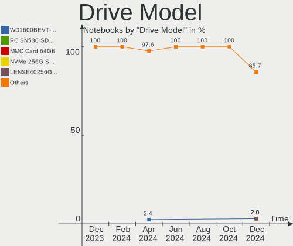
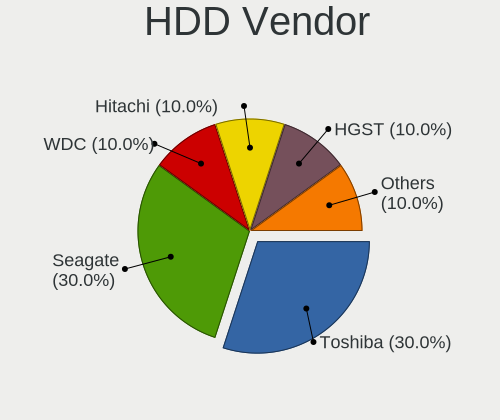
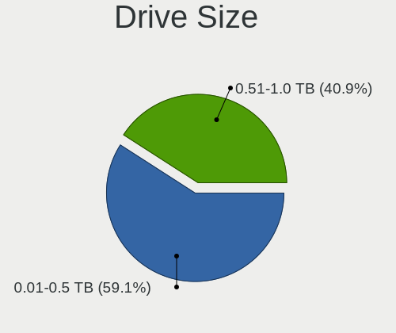
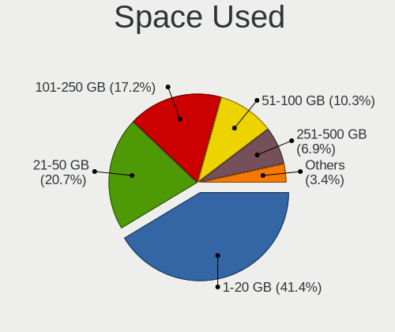
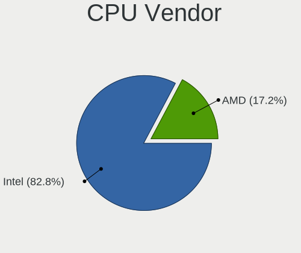
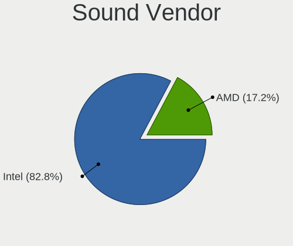
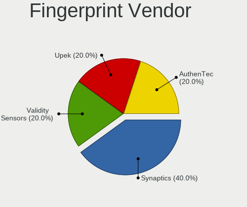
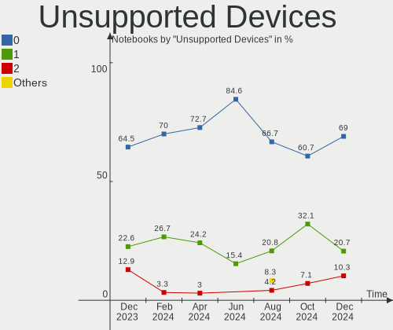

Xubuntu - Hardware Trends (Notebooks)
-------------------------------------

A project to identify most popular hardware characteristics and track their change
over time based on data collected by Linux users at https://Linux-Hardware.org.

Anyone can contribute to this report by the [hw-probe](https://github.com/linuxhw/hw-probe) tool:

    sudo -E hw-probe -all -upload

This report is for one last month. Overall report since the beginning of time: [TestDays](https://github.com/linuxhw/TestDays)

Period: Jan, 2024.

Contents
--------

* [ System ](#system)
  - [ OS                       ](#os)
  - [ OS Family                ](#os-family)
  - [ Kernel                   ](#kernel)
  - [ Kernel Family            ](#kernel-family)
  - [ Kernel Major Ver.        ](#kernel-major-ver)
  - [ Arch                     ](#arch)
  - [ DE                       ](#de)
  - [ Display Server           ](#display-server)
  - [ Display Manager          ](#display-manager)
  - [ OS Lang                  ](#os-lang)
  - [ Boot Mode                ](#boot-mode)
  - [ Filesystem               ](#filesystem)
  - [ Part. scheme             ](#part-scheme)
  - [ Dual Boot with Linux/BSD ](#dual-boot-with-linuxbsd)
  - [ Dual Boot (Win)          ](#dual-boot-win)

* [ Board ](#board)
  - [ Vendor                   ](#vendor)
  - [ Model                    ](#model)
  - [ Model Family             ](#model-family)
  - [ MFG Year                 ](#mfg-year)
  - [ Form Factor              ](#form-factor)
  - [ Secure Boot              ](#secure-boot)
  - [ Coreboot                 ](#coreboot)
  - [ RAM Size                 ](#ram-size)
  - [ RAM Used                 ](#ram-used)
  - [ Total Drives             ](#total-drives)
  - [ Has CD-ROM               ](#has-cd-rom)
  - [ Has Ethernet             ](#has-ethernet)
  - [ Has WiFi                 ](#has-wifi)
  - [ Has Bluetooth            ](#has-bluetooth)

* [ Location ](#location)
  - [ Country                  ](#country)
  - [ City                     ](#city)

* [ Drives ](#drives)
  - [ Drive Vendor             ](#drive-vendor)
  - [ Drive Model              ](#drive-model)
  - [ HDD Vendor               ](#hdd-vendor)
  - [ SSD Vendor               ](#ssd-vendor)
  - [ Drive Kind               ](#drive-kind)
  - [ Drive Connector          ](#drive-connector)
  - [ Drive Size               ](#drive-size)
  - [ Space Total              ](#space-total)
  - [ Space Used               ](#space-used)
  - [ Malfunc. Drives          ](#malfunc-drives)
  - [ Malfunc. Drive Vendor    ](#malfunc-drive-vendor)
  - [ Malfunc. HDD Vendor      ](#malfunc-hdd-vendor)
  - [ Malfunc. Drive Kind      ](#malfunc-drive-kind)
  - [ Failed Drives            ](#failed-drives)
  - [ Failed Drive Vendor      ](#failed-drive-vendor)
  - [ Drive Status             ](#drive-status)

* [ Storage controller ](#storage-controller)
  - [ Storage Vendor           ](#storage-vendor)
  - [ Storage Model            ](#storage-model)
  - [ Storage Kind             ](#storage-kind)

* [ Processor ](#processor)
  - [ CPU Vendor               ](#cpu-vendor)
  - [ CPU Model                ](#cpu-model)
  - [ CPU Model Family         ](#cpu-model-family)
  - [ CPU Cores                ](#cpu-cores)
  - [ CPU Sockets              ](#cpu-sockets)
  - [ CPU Threads              ](#cpu-threads)
  - [ CPU Op-Modes             ](#cpu-op-modes)
  - [ CPU Microcode            ](#cpu-microcode)
  - [ CPU Microarch            ](#cpu-microarch)

* [ Graphics ](#graphics)
  - [ GPU Vendor               ](#gpu-vendor)
  - [ GPU Model                ](#gpu-model)
  - [ GPU Combo                ](#gpu-combo)
  - [ GPU Driver               ](#gpu-driver)
  - [ GPU Memory               ](#gpu-memory)

* [ Monitor ](#monitor)
  - [ Monitor Vendor           ](#monitor-vendor)
  - [ Monitor Model            ](#monitor-model)
  - [ Monitor Resolution       ](#monitor-resolution)
  - [ Monitor Diagonal         ](#monitor-diagonal)
  - [ Monitor Width            ](#monitor-width)
  - [ Aspect Ratio             ](#aspect-ratio)
  - [ Monitor Area             ](#monitor-area)
  - [ Pixel Density            ](#pixel-density)
  - [ Multiple Monitors        ](#multiple-monitors)

* [ Network ](#network)
  - [ Net Controller Vendor    ](#net-controller-vendor)
  - [ Net Controller Model     ](#net-controller-model)
  - [ Wireless Vendor          ](#wireless-vendor)
  - [ Wireless Model           ](#wireless-model)
  - [ Ethernet Vendor          ](#ethernet-vendor)
  - [ Ethernet Model           ](#ethernet-model)
  - [ Net Controller Kind      ](#net-controller-kind)
  - [ Used Controller          ](#used-controller)
  - [ NICs                     ](#nics)
  - [ IPv6                     ](#ipv6)

* [ Bluetooth ](#bluetooth)
  - [ Bluetooth Vendor         ](#bluetooth-vendor)
  - [ Bluetooth Model          ](#bluetooth-model)

* [ Sound ](#sound)
  - [ Sound Vendor             ](#sound-vendor)
  - [ Sound Model              ](#sound-model)

* [ Memory ](#memory)
  - [ Memory Vendor            ](#memory-vendor)
  - [ Memory Model             ](#memory-model)
  - [ Memory Kind              ](#memory-kind)
  - [ Memory Form Factor       ](#memory-form-factor)
  - [ Memory Size              ](#memory-size)
  - [ Memory Speed             ](#memory-speed)

* [ Printers & scanners ](#printers--scanners)
  - [ Printer Vendor           ](#printer-vendor)
  - [ Printer Model            ](#printer-model)
  - [ Scanner Vendor           ](#scanner-vendor)
  - [ Scanner Model            ](#scanner-model)

* [ Camera ](#camera)
  - [ Camera Vendor            ](#camera-vendor)
  - [ Camera Model             ](#camera-model)

* [ Security ](#security)
  - [ Fingerprint Vendor       ](#fingerprint-vendor)
  - [ Fingerprint Model        ](#fingerprint-model)
  - [ Chipcard Vendor          ](#chipcard-vendor)
  - [ Chipcard Model           ](#chipcard-model)

* [ Unsupported ](#unsupported)
  - [ Unsupported Devices      ](#unsupported-devices)
  - [ Unsupported Device Types ](#unsupported-device-types)

System
------

OS
--

Installed operating systems

| Name          | Notebooks | Percent |
|---------------|-----------|---------|
| Xubuntu 22.04 | 19        | 48.72%  |
| Xubuntu 23.10 | 7         | 17.95%  |
| Xubuntu 20.04 | 5         | 12.82%  |
| Xubuntu 18.04 | 5         | 12.82%  |
| Xubuntu 16.04 | 2         | 5.13%   |
| Xubuntu 21.04 | 1         | 2.56%   |

OS Family
---------

OS without a version

| Name    | Notebooks | Percent |
|---------|-----------|---------|
| Xubuntu | 39        | 100%    |

Kernel
------

Version of the Linux kernel

| Version               | Notebooks | Percent |
|-----------------------|-----------|---------|
| 6.5.0-14-generic      | 9         | 23.08%  |
| 6.5.0-15-generic      | 4         | 10.26%  |
| 6.2.0-39-generic      | 4         | 10.26%  |
| 5.15.0-91-generic     | 3         | 7.69%   |
| 6.2.0-26-generic      | 2         | 5.13%   |
| 5.4.0-170-generic     | 2         | 5.13%   |
| 5.15.0-92-generic     | 2         | 5.13%   |
| 6.2.0-37-generic      | 1         | 2.56%   |
| 5.4.0-26-generic      | 1         | 2.56%   |
| 5.4.0-150-generic     | 1         | 2.56%   |
| 5.15.0-94-generic     | 1         | 2.56%   |
| 5.15.0-71-generic     | 1         | 2.56%   |
| 5.15.0-25-generic     | 1         | 2.56%   |
| 5.11.0-44-lowlatency  | 1         | 2.56%   |
| 4.4.0-210-generic     | 1         | 2.56%   |
| 4.15.13-pf6           | 1         | 2.56%   |
| 4.15.0-213-generic    | 1         | 2.56%   |
| 4.15.0-212-generic    | 1         | 2.56%   |
| 4.15.0-209-lowlatency | 1         | 2.56%   |
| 4.15.0-142-lowlatency | 1         | 2.56%   |

Kernel Family
-------------

Linux kernel without a distro release

| Version | Notebooks | Percent |
|---------|-----------|---------|
| 6.5.0   | 13        | 33.33%  |
| 5.15.0  | 8         | 20.51%  |
| 6.2.0   | 7         | 17.95%  |
| 5.4.0   | 4         | 10.26%  |
| 4.15.0  | 4         | 10.26%  |
| 5.11.0  | 1         | 2.56%   |
| 4.4.0   | 1         | 2.56%   |
| 4.15.13 | 1         | 2.56%   |

Kernel Major Ver.
-----------------

Linux kernel major version

| Version | Notebooks | Percent |
|---------|-----------|---------|
| 6.5     | 13        | 33.33%  |
| 5.15    | 8         | 20.51%  |
| 6.2     | 7         | 17.95%  |
| 4.15    | 5         | 12.82%  |
| 5.4     | 4         | 10.26%  |
| 5.11    | 1         | 2.56%   |
| 4.4     | 1         | 2.56%   |

Arch
----

OS architecture (x86_64, i586, etc.)

| Name   | Notebooks | Percent |
|--------|-----------|---------|
| x86_64 | 37        | 94.87%  |
| i686   | 2         | 5.13%   |

DE
--

Desktop Environment

| Name | Notebooks | Percent |
|------|-----------|---------|
| XFCE | 38        | 97.44%  |
| MATE | 1         | 2.56%   |

Display Server
--------------

X11 or Wayland

| Name | Notebooks | Percent |
|------|-----------|---------|
| X11  | 39        | 100%    |

Display Manager
---------------

SDDM, LightDM, etc.

| Name    | Notebooks | Percent |
|---------|-----------|---------|
| LightDM | 37        | 94.87%  |
| GDM3    | 1         | 2.56%   |
| Unknown | 1         | 2.56%   |

OS Lang
-------

Language

| Lang  | Notebooks | Percent |
|-------|-----------|---------|
| fr_FR | 10        | 25.64%  |
| en_US | 10        | 25.64%  |
| de_DE | 6         | 15.38%  |
| it_IT | 3         | 7.69%   |
| ru_RU | 2         | 5.13%   |
| en_GB | 2         | 5.13%   |
| pt_BR | 1         | 2.56%   |
| pl_PL | 1         | 2.56%   |
| es_ES | 1         | 2.56%   |
| es_CL | 1         | 2.56%   |
| en_PH | 1         | 2.56%   |
| C     | 1         | 2.56%   |

Boot Mode
---------

EFI or BIOS

| Mode | Notebooks | Percent |
|------|-----------|---------|
| BIOS | 21        | 53.85%  |
| EFI  | 18        | 46.15%  |

Filesystem
----------

Type of filesystem

| Type    | Notebooks | Percent |
|---------|-----------|---------|
| Tmpfs   | 19        | 48.72%  |
| Ext4    | 17        | 43.59%  |
| Overlay | 3         | 7.69%   |

Part. scheme
------------

Scheme of partitioning

| Type    | Notebooks | Percent |
|---------|-----------|---------|
| GPT     | 27        | 69.23%  |
| MBR     | 9         | 23.08%  |
| Unknown | 3         | 7.69%   |

Dual Boot with Linux/BSD
------------------------

Hosting more than one Linux/BSD

| Dual boot | Notebooks | Percent |
|-----------|-----------|---------|
| No        | 36        | 92.31%  |
| Yes       | 3         | 7.69%   |

Dual Boot (Win)
---------------

Hosting Linux and Windows

| Dual boot | Notebooks | Percent |
|-----------|-----------|---------|
| No        | 23        | 58.97%  |
| Yes       | 16        | 41.03%  |

Board
-----

Vendor
------

Motherboard manufacturer

| Name             | Notebooks | Percent |
|------------------|-----------|---------|
| Dell             | 9         | 23.08%  |
| Lenovo           | 8         | 20.51%  |
| Hewlett-Packard  | 6         | 15.38%  |
| ASUSTek Computer | 5         | 12.82%  |
| Acer             | 5         | 12.82%  |
| Apple            | 2         | 5.13%   |
| Toshiba          | 1         | 2.56%   |
| PC Specialist    | 1         | 2.56%   |
| MSI              | 1         | 2.56%   |
| Gigazone         | 1         | 2.56%   |

Model
-----

Motherboard model

| Name                                     | Notebooks | Percent |
|------------------------------------------|-----------|---------|
| Toshiba Satellite L300                   | 1         | 2.56%   |
| PC Specialist NH5x_7xDPx                 | 1         | 2.56%   |
| MSI GF63 Thin 11UC                       | 1         | 2.56%   |
| Lenovo V560                              | 1         | 2.56%   |
| Lenovo ThinkPad X260 20F5S0KE00          | 1         | 2.56%   |
| Lenovo ThinkPad X240 20AMS00100          | 1         | 2.56%   |
| Lenovo ThinkPad T570 20HAS0NU00          | 1         | 2.56%   |
| Lenovo ThinkPad T400 6474AW6             | 1         | 2.56%   |
| Lenovo ThinkPad P53 20QNS00X00           | 1         | 2.56%   |
| Lenovo IdeaPad 510S-13ISK 80SJ           | 1         | 2.56%   |
| Lenovo G500 20236                        | 1         | 2.56%   |
| HP Pavilion g6                           | 1         | 2.56%   |
| HP Pavilion dv7                          | 1         | 2.56%   |
| HP Pavilion dv6                          | 1         | 2.56%   |
| HP EliteBook 860 16 inch G10 Notebook PC | 1         | 2.56%   |
| HP EliteBook 840 G1                      | 1         | 2.56%   |
| HP Compaq Presario CQ60                  | 1         | 2.56%   |
| Gigazone X107(B-B)                       | 1         | 2.56%   |
| Dell Precision M6800                     | 1         | 2.56%   |
| Dell Latitude E5530 non-vPro             | 1         | 2.56%   |
| Dell Latitude 7340                       | 1         | 2.56%   |
| Dell Latitude 5511                       | 1         | 2.56%   |
| Dell Latitude 5510                       | 1         | 2.56%   |
| Dell Inspiron 5567                       | 1         | 2.56%   |
| Dell Inspiron 1525                       | 1         | 2.56%   |
| Dell Inspiron 1501                       | 1         | 2.56%   |
| Dell Inspiron 14-3452                    | 1         | 2.56%   |
| ASUS X540SAA                             | 1         | 2.56%   |
| ASUS X205TA                              | 1         | 2.56%   |
| ASUS T100HAN                             | 1         | 2.56%   |
| ASUS ROG Strix G733PZ_G733PZ             | 1         | 2.56%   |
| ASUS K55VM                               | 1         | 2.56%   |
| Apple MacBook5,2                         | 1         | 2.56%   |
| Apple MacBook5,1                         | 1         | 2.56%   |
| Acer Swift SF314-43                      | 1         | 2.56%   |
| Acer Aspire A517-52                      | 1         | 2.56%   |
| Acer Aspire A315-58                      | 1         | 2.56%   |
| Acer Aspire A315-51                      | 1         | 2.56%   |
| Acer Aspire 5735                         | 1         | 2.56%   |

Model Family
------------

Motherboard model prefix

| Name               | Notebooks | Percent |
|--------------------|-----------|---------|
| Lenovo ThinkPad    | 5         | 12.82%  |
| Dell Latitude      | 4         | 10.26%  |
| Dell Inspiron      | 4         | 10.26%  |
| Acer Aspire        | 4         | 10.26%  |
| HP Pavilion        | 3         | 7.69%   |
| HP EliteBook       | 2         | 5.13%   |
| Apple MacBook5     | 2         | 5.13%   |
| Toshiba Satellite  | 1         | 2.56%   |
| PC Specialist NH5x | 1         | 2.56%   |
| MSI GF63           | 1         | 2.56%   |
| Lenovo V560        | 1         | 2.56%   |
| Lenovo IdeaPad     | 1         | 2.56%   |
| Lenovo G500        | 1         | 2.56%   |
| HP Compaq          | 1         | 2.56%   |
| Gigazone X107(B-B) | 1         | 2.56%   |
| Dell Precision     | 1         | 2.56%   |
| ASUS X540SAA       | 1         | 2.56%   |
| ASUS X205TA        | 1         | 2.56%   |
| ASUS T100HAN       | 1         | 2.56%   |
| ASUS ROG           | 1         | 2.56%   |
| ASUS K55VM         | 1         | 2.56%   |
| Acer Swift         | 1         | 2.56%   |

MFG Year
--------

Motherboard manufacture year

| Year | Notebooks | Percent |
|------|-----------|---------|
| 2008 | 7         | 17.95%  |
| 2021 | 4         | 10.26%  |
| 2016 | 4         | 10.26%  |
| 2013 | 4         | 10.26%  |
| 2023 | 3         | 7.69%   |
| 2020 | 3         | 7.69%   |
| 2009 | 3         | 7.69%   |
| 2017 | 2         | 5.13%   |
| 2015 | 2         | 5.13%   |
| 2012 | 2         | 5.13%   |
| 2019 | 1         | 2.56%   |
| 2014 | 1         | 2.56%   |
| 2011 | 1         | 2.56%   |
| 2010 | 1         | 2.56%   |
| 2006 | 1         | 2.56%   |

Form Factor
-----------

Physical design of the computer

| Name     | Notebooks | Percent |
|----------|-----------|---------|
| Notebook | 39        | 100%    |

Secure Boot
-----------

Enabled or disabled

| State    | Notebooks | Percent |
|----------|-----------|---------|
| Disabled | 34        | 87.18%  |
| Enabled  | 5         | 12.82%  |

Coreboot
--------

Have coreboot on board

| Used | Notebooks | Percent |
|------|-----------|---------|
| No   | 39        | 100%    |

RAM Size
--------

Total RAM memory

| Size in GB | Notebooks | Percent |
|------------|-----------|---------|
| 3.01-4.0   | 11        | 28.21%  |
| 4.01-8.0   | 7         | 17.95%  |
| 8.01-16.0  | 7         | 17.95%  |
| 1.01-2.0   | 5         | 12.82%  |
| 16.01-24.0 | 4         | 10.26%  |
| 32.01-64.0 | 2         | 5.13%   |
| 2.01-3.0   | 2         | 5.13%   |
| 24.01-32.0 | 1         | 2.56%   |

RAM Used
--------

Used RAM memory

| Used GB    | Notebooks | Percent |
|------------|-----------|---------|
| 1.01-2.0   | 17        | 43.59%  |
| 2.01-3.0   | 7         | 17.95%  |
| 4.01-8.0   | 5         | 12.82%  |
| 0.51-1.0   | 5         | 12.82%  |
| 3.01-4.0   | 2         | 5.13%   |
| 8.01-16.0  | 2         | 5.13%   |
| 16.01-24.0 | 1         | 2.56%   |

Total Drives
------------

Number of drives on board

| Drives | Notebooks | Percent |
|--------|-----------|---------|
| 1      | 32        | 82.05%  |
| 2      | 7         | 17.95%  |

Has CD-ROM
----------

Has CD-ROM on board

| Presented | Notebooks | Percent |
|-----------|-----------|---------|
| No        | 21        | 53.85%  |
| Yes       | 18        | 46.15%  |

Has Ethernet
------------

Has Ethernet on board

| Presented | Notebooks | Percent |
|-----------|-----------|---------|
| Yes       | 35        | 89.74%  |
| No        | 4         | 10.26%  |

Has WiFi
--------

Has WiFi module

| Presented | Notebooks | Percent |
|-----------|-----------|---------|
| Yes       | 37        | 94.87%  |
| No        | 2         | 5.13%   |

Has Bluetooth
-------------

Has Bluetooth module

| Presented | Notebooks | Percent |
|-----------|-----------|---------|
| Yes       | 24        | 61.54%  |
| No        | 15        | 38.46%  |

Location
--------

Country
-------

Geographic location (country)

| Country     | Notebooks | Percent |
|-------------|-----------|---------|
| France      | 10        | 25.64%  |
| Germany     | 6         | 15.38%  |
| USA         | 4         | 10.26%  |
| Italy       | 4         | 10.26%  |
| Russia      | 3         | 7.69%   |
| Spain       | 2         | 5.13%   |
| Poland      | 2         | 5.13%   |
| UK          | 1         | 2.56%   |
| Thailand    | 1         | 2.56%   |
| Philippines | 1         | 2.56%   |
| Greece      | 1         | 2.56%   |
| Chile       | 1         | 2.56%   |
| Brazil      | 1         | 2.56%   |
| Belgium     | 1         | 2.56%   |
| Argentina   | 1         | 2.56%   |

City
----

Geographic location (city)

| City                          | Notebooks | Percent |
|-------------------------------|-----------|---------|
| Milano                        | 2         | 5.13%   |
| Wroclaw                       | 1         | 2.56%   |
| Wiesbaden                     | 1         | 2.56%   |
| Ulyanovsk                     | 1         | 2.56%   |
| Toulouse                      | 1         | 2.56%   |
| Terni                         | 1         | 2.56%   |
| Stuttgart                     | 1         | 2.56%   |
| St Petersburg                 | 1         | 2.56%   |
| Spanish Fork                  | 1         | 2.56%   |
| South Shields                 | 1         | 2.56%   |
| Soave                         | 1         | 2.56%   |
| Salvador                      | 1         | 2.56%   |
| Saint-Maximin-la-Sainte-Baume | 1         | 2.56%   |
| Rafal                         | 1         | 2.56%   |
| Poskwitow                     | 1         | 2.56%   |
| Perpignan                     | 1         | 2.56%   |
| Ostercappeln                  | 1         | 2.56%   |
| Orsay                         | 1         | 2.56%   |
| Moron                         | 1         | 2.56%   |
| Montbéliard                  | 1         | 2.56%   |
| Minneapolis                   | 1         | 2.56%   |
| Manila                        | 1         | 2.56%   |
| Louisville                    | 1         | 2.56%   |
| Las Gabias                    | 1         | 2.56%   |
| La Louvière                  | 1         | 2.56%   |
| Kamatero                      | 1         | 2.56%   |
| Juvignac                      | 1         | 2.56%   |
| Grisolles                     | 1         | 2.56%   |
| Grenoble                      | 1         | 2.56%   |
| Donetsk                       | 1         | 2.56%   |
| Couhe                         | 1         | 2.56%   |
| Concepción                   | 1         | 2.56%   |
| Bremen                        | 1         | 2.56%   |
| Biederitz                     | 1         | 2.56%   |
| Berlin                        | 1         | 2.56%   |
| Bangkok                       | 1         | 2.56%   |
| Baltimore                     | 1         | 2.56%   |
| Azay-sur-Cher                 | 1         | 2.56%   |

Drives
------

Drive Vendor
------------

Hard drive vendors

| Vendor              | Notebooks | Drives | Percent |
|---------------------|-----------|--------|---------|
| Samsung Electronics | 9         | 10     | 20.93%  |
| Seagate             | 5         | 5      | 11.63%  |
| SanDisk             | 5         | 5      | 11.63%  |
| Toshiba             | 4         | 4      | 9.3%    |
| WDC                 | 3         | 3      | 6.98%   |
| Unknown             | 3         | 3      | 6.98%   |
| Micron Technology   | 2         | 2      | 4.65%   |
| HGST                | 2         | 2      | 4.65%   |
| USB3.0              | 1         | 1      | 2.33%   |
| SK hynix            | 1         | 1      | 2.33%   |
| KIOXIA              | 1         | 1      | 2.33%   |
| Kingston            | 1         | 1      | 2.33%   |
| Hitachi             | 1         | 1      | 2.33%   |
| GOODRAM             | 1         | 1      | 2.33%   |
| Fujitsu             | 1         | 1      | 2.33%   |
| Crucial             | 1         | 1      | 2.33%   |
| China               | 1         | 1      | 2.33%   |
| ASMT                | 1         | 1      | 2.33%   |

Drive Model
-----------

Hard drive models

| Model                                               | Notebooks | Percent |
|-----------------------------------------------------|-----------|---------|
| WDC WDS240G2G0A-00JH30 240GB SSD                    | 1         | 2.33%   |
| WDC WD1600BEVS-08VAT1 160GB                         | 1         | 2.33%   |
| WDC PC SN540 SDDPNPF-512G-1032 512GB                | 1         | 2.33%   |
| USB3.0 Super Speed 500GB SSD                        | 1         | 2.33%   |
| Unknown MBG4GC  32GB                                | 1         | 2.33%   |
| Unknown DS2032  32GB                                | 1         | 2.33%   |
| Unknown BGND3R  32GB                                | 1         | 2.33%   |
| Toshiba MQ01ABD100 1TB                              | 1         | 2.33%   |
| Toshiba MQ01ABD050 500GB                            | 1         | 2.33%   |
| Toshiba MK5065GSXF 500GB                            | 1         | 2.33%   |
| Toshiba MK1059GSM 1TB                               | 1         | 2.33%   |
| SK hynix BC511 NVMe 512GB                           | 1         | 2.33%   |
| Seagate ST9750423AS 752GB                           | 1         | 2.33%   |
| Seagate ST500LM021-1KJ152 500GB                     | 1         | 2.33%   |
| Seagate ST250LM004 HN-M250MBB 250GB                 | 1         | 2.33%   |
| Seagate ST1000LM035-1RK172 1TB                      | 1         | 2.33%   |
| Seagate ST1000LM014-SSHD-8GB                        | 1         | 2.33%   |
| Sandisk WD Blue SN550 NVMe SSD 512GB                | 1         | 2.33%   |
| SanDisk Ultra II 240GB SSD                          | 1         | 2.33%   |
| SanDisk SD8SB8U-256G-1006 256GB SSD                 | 1         | 2.33%   |
| Sandisk PC SN530 NVMe WDC 512GB                     | 1         | 2.33%   |
| SanDisk NVMe SSD Drive 512GB                        | 1         | 2.33%   |
| Samsung SSD 970 EVO Plus 500GB S4EVNZ0R113376K      | 1         | 2.33%   |
| Samsung SSD 860 EVO 500GB                           | 1         | 2.33%   |
| Samsung SSD 850 EVO 2TB                             | 1         | 2.33%   |
| Samsung SSD 850 EVO 250GB                           | 1         | 2.33%   |
| Samsung NVMe SSD Controller SM981/PM981/PM983 1TB   | 1         | 2.33%   |
| Samsung NVMe SSD Controller SM961/PM961/SM963 256GB | 1         | 2.33%   |
| Samsung NVMe SSD Controller PM9A1/PM9A3/980PRO 2TB  | 1         | 2.33%   |
| Samsung MZYLF128HCHP-000L2 128GB SSD                | 1         | 2.33%   |
| Samsung HM160HI 160GB                               | 1         | 2.33%   |
| Micron MTFDDAK512TBN-1AR1ZABHA 512GB SSD            | 1         | 2.33%   |
| Micron 2210_MTFDHBA1T0QFD 1TB                       | 1         | 2.33%   |
| KIOXIA KBG50ZNS512G NVMe 512GB                      | 1         | 2.33%   |
| Kingston OM8PDP3512B-AA1 512GB                      | 1         | 2.33%   |
| Hitachi HTS543225L9A300 250GB                       | 1         | 2.33%   |
| HGST HTS725050A7E630 500GB                          | 1         | 2.33%   |
| HGST HTS725032A7E630 320GB                          | 1         | 2.33%   |
| GOODRAM C40 120GB SSD                               | 1         | 2.33%   |
| Fujitsu MHZ2250BH FFS G1 250GB                      | 1         | 2.33%   |

HDD Vendor
----------

Hard disk drive vendors

| Vendor              | Notebooks | Drives | Percent |
|---------------------|-----------|--------|---------|
| Seagate             | 5         | 5      | 33.33%  |
| Toshiba             | 4         | 4      | 26.67%  |
| HGST                | 2         | 2      | 13.33%  |
| WDC                 | 1         | 1      | 6.67%   |
| Samsung Electronics | 1         | 1      | 6.67%   |
| Hitachi             | 1         | 1      | 6.67%   |
| Fujitsu             | 1         | 1      | 6.67%   |

SSD Vendor
----------

Solid state drive vendors

| Vendor              | Notebooks | Drives | Percent |
|---------------------|-----------|--------|---------|
| Samsung Electronics | 4         | 4      | 30.77%  |
| SanDisk             | 2         | 2      | 15.38%  |
| WDC                 | 1         | 1      | 7.69%   |
| USB3.0              | 1         | 1      | 7.69%   |
| Micron Technology   | 1         | 1      | 7.69%   |
| GOODRAM             | 1         | 1      | 7.69%   |
| Crucial             | 1         | 1      | 7.69%   |
| China               | 1         | 1      | 7.69%   |
| ASMT                | 1         | 1      | 7.69%   |

Drive Kind
----------

HDD or SSD

| Kind | Notebooks | Drives | Percent |
|------|-----------|--------|---------|
| HDD  | 15        | 15     | 34.88%  |
| SSD  | 13        | 13     | 30.23%  |
| NVMe | 12        | 13     | 27.91%  |
| MMC  | 3         | 3      | 6.98%   |

Drive Connector
---------------

SATA, SAS, NVMe, etc.

| Type | Notebooks | Drives | Percent |
|------|-----------|--------|---------|
| SATA | 25        | 26     | 59.52%  |
| NVMe | 12        | 13     | 28.57%  |
| MMC  | 3         | 3      | 7.14%   |
| SAS  | 2         | 2      | 4.76%   |

Drive Size
----------

Size of hard drive

| Size in TB | Notebooks | Drives | Percent |
|------------|-----------|--------|---------|
| 0.01-0.5   | 19        | 19     | 67.86%  |
| 0.51-1.0   | 7         | 7      | 25%     |
| 1.01-2.0   | 2         | 2      | 7.14%   |

Space Total
-----------

Amount of disk space available on the file system

| Size in GB | Notebooks | Percent |
|------------|-----------|---------|
| 101-250    | 15        | 38.46%  |
| 251-500    | 11        | 28.21%  |
| 51-100     | 5         | 12.82%  |
| 501-1000   | 3         | 7.69%   |
| 21-50      | 2         | 5.13%   |
| 1-20       | 2         | 5.13%   |
| 1001-2000  | 1         | 2.56%   |

Space Used
----------

Amount of used disk space

| Used GB  | Notebooks | Percent |
|----------|-----------|---------|
| 1-20     | 16        | 41.03%  |
| 21-50    | 8         | 20.51%  |
| 101-250  | 7         | 17.95%  |
| 51-100   | 4         | 10.26%  |
| 251-500  | 3         | 7.69%   |
| 501-1000 | 1         | 2.56%   |

Malfunc. Drives
---------------

Drive models with a malfunction

| Model                                               | Notebooks | Drives | Percent |
|-----------------------------------------------------|-----------|--------|---------|
| Toshiba MQ01ABD050 500GB                            | 1         | 1      | 33.33%  |
| Micron Technology MTFDDAK512TBN-1AR1ZABHA 512GB SSD | 1         | 1      | 33.33%  |
| Kingston OM8PDP3512B-AA1 512GB                      | 1         | 1      | 33.33%  |

Malfunc. Drive Vendor
---------------------

Vendors of faulty drives

| Vendor            | Notebooks | Drives | Percent |
|-------------------|-----------|--------|---------|
| Toshiba           | 1         | 1      | 33.33%  |
| Micron Technology | 1         | 1      | 33.33%  |
| Kingston          | 1         | 1      | 33.33%  |

Malfunc. HDD Vendor
-------------------

Vendors of faulty HDD drives

| Vendor  | Notebooks | Drives | Percent |
|---------|-----------|--------|---------|
| Toshiba | 1         | 1      | 100%    |

Malfunc. Drive Kind
-------------------

Kinds of faulty drives

| Kind | Notebooks | Drives | Percent |
|------|-----------|--------|---------|
| NVMe | 1         | 1      | 33.33%  |
| SSD  | 1         | 1      | 33.33%  |
| HDD  | 1         | 1      | 33.33%  |

Failed Drives
-------------

Failed drive models

Zero info for selected period =(

Failed Drive Vendor
-------------------

Failed drive vendors

Zero info for selected period =(

Drive Status
------------

Number of failed and malfunc. drives

| Status   | Notebooks | Drives | Percent |
|----------|-----------|--------|---------|
| Detected | 24        | 26     | 60%     |
| Works    | 13        | 15     | 32.5%   |
| Malfunc  | 3         | 3      | 7.5%    |

Storage controller
------------------

Storage Vendor
--------------

Storage controller vendors

| Vendor                      | Notebooks | Percent |
|-----------------------------|-----------|---------|
| Intel                       | 27        | 61.36%  |
| SanDisk                     | 4         | 9.09%   |
| Samsung Electronics         | 4         | 9.09%   |
| AMD                         | 3         | 6.82%   |
| Nvidia                      | 2         | 4.55%   |
| SK hynix                    | 1         | 2.27%   |
| Micron Technology           | 1         | 2.27%   |
| KIOXIA                      | 1         | 2.27%   |
| Kingston Technology Company | 1         | 2.27%   |

Storage Model
-------------

Storage controller models

| Model                                                                            | Notebooks | Percent |
|----------------------------------------------------------------------------------|-----------|---------|
| Intel Sunrise Point-LP SATA Controller [AHCI mode]                               | 4         | 7.84%   |
| Intel 82801IBM/IEM (ICH9M/ICH9M-E) 4 port SATA Controller [AHCI mode]            | 4         | 7.84%   |
| Intel 7 Series Chipset Family 6-port SATA Controller [AHCI mode]                 | 4         | 7.84%   |
| Samsung NVMe SSD Controller SM981/PM981/PM983                                    | 2         | 3.92%   |
| Nvidia MCP79 AHCI Controller                                                     | 2         | 3.92%   |
| Intel Volume Management Device NVMe RAID Controller                              | 2         | 3.92%   |
| Intel Tiger Lake-LP SATA Controller                                              | 2         | 3.92%   |
| Intel 82801 Mobile SATA Controller [RAID mode]                                   | 2         | 3.92%   |
| Intel 8 Series SATA Controller 1 [AHCI mode]                                     | 2         | 3.92%   |
| Intel 400 Series Chipset Family SATA AHCI Controller                             | 2         | 3.92%   |
| AMD FCH SATA Controller [AHCI mode]                                              | 2         | 3.92%   |
| SK hynix BC511 NVMe SSD                                                          | 1         | 1.96%   |
| SanDisk WD PC SN540 / Green SN350 NVMe SSD 1 TB (DRAM-less)                      | 1         | 1.96%   |
| SanDisk WD Black SN770 / PC SN740 256GB / PC SN560 (DRAM-less) NVMe SSD          | 1         | 1.96%   |
| SanDisk Ultra 3D / WD Blue SN550 NVMe SSD                                        | 1         | 1.96%   |
| SanDisk IX SN530 NVMe SSD (DRAM-less)                                            | 1         | 1.96%   |
| Samsung NVMe SSD Controller SM961/PM961/SM963                                    | 1         | 1.96%   |
| Samsung NVMe SSD Controller PM9A1/PM9A3/980PRO                                   | 1         | 1.96%   |
| Micron 2210 NVMe SSD [Cobain]                                                    | 1         | 1.96%   |
| KIOXIA NVMe SSD Controller BG5 (DRAM-less)                                       | 1         | 1.96%   |
| Kingston Company OM3PDP3 NVMe SSD                                                | 1         | 1.96%   |
| Intel Volume Management Device NVMe RAID Controller Intel Corporation            | 1         | 1.96%   |
| Intel Tiger Lake SATA AHCI Controller                                            | 1         | 1.96%   |
| Intel Mobile 4 Series Chipset PT IDER Controller                                 | 1         | 1.96%   |
| Intel Comet Lake SATA AHCI Controller                                            | 1         | 1.96%   |
| Intel Atom/Celeron/Pentium Processor x5-E8000/J3xxx/N3xxx Series SATA Controller | 1         | 1.96%   |
| Intel 82801HM/HEM (ICH8M/ICH8M-E) SATA Controller [AHCI mode]                    | 1         | 1.96%   |
| Intel 82801HM/HEM (ICH8M/ICH8M-E) IDE Controller                                 | 1         | 1.96%   |
| Intel 82801GBM/GHM (ICH7-M Family) SATA Controller [IDE mode]                    | 1         | 1.96%   |
| Intel 6 Series/C200 Series Chipset Family 6 port Mobile SATA AHCI Controller     | 1         | 1.96%   |
| Intel 5 Series/3400 Series Chipset 4 port SATA AHCI Controller                   | 1         | 1.96%   |
| AMD SB600 Non-Raid-5 SATA                                                        | 1         | 1.96%   |
| AMD SB600 IDE                                                                    | 1         | 1.96%   |
| AMD FCH IDE Controller                                                           | 1         | 1.96%   |

Storage Kind
------------

Kind of storage controller (IDE, SATA, NVMe, SAS, ...)

| Kind | Notebooks | Percent |
|------|-----------|---------|
| SATA | 29        | 56.86%  |
| NVMe | 12        | 23.53%  |
| RAID | 5         | 9.8%    |
| IDE  | 5         | 9.8%    |

Processor
---------

CPU Vendor
----------

Processor vendors

| Vendor | Notebooks | Percent |
|--------|-----------|---------|
| Intel  | 35        | 89.74%  |
| AMD    | 4         | 10.26%  |

CPU Model
---------

Processor models

| Model                                       | Notebooks | Percent |
|---------------------------------------------|-----------|---------|
| Intel Core i5-7200U CPU @ 2.50GHz           | 2         | 5.13%   |
| Intel Core i5-3210M CPU @ 2.50GHz           | 2         | 5.13%   |
| Intel Core 2 Duo CPU P8600 @ 2.40GHz        | 2         | 5.13%   |
| Intel Pentium Dual-Core CPU T4200 @ 2.00GHz | 1         | 2.56%   |
| Intel Core i7-9750H CPU @ 2.60GHz           | 1         | 2.56%   |
| Intel Core i7-4900MQ CPU @ 2.80GHz          | 1         | 2.56%   |
| Intel Core i7-3540M CPU @ 3.00GHz           | 1         | 2.56%   |
| Intel Core i7-2670QM CPU @ 2.20GHz          | 1         | 2.56%   |
| Intel Core i7-10870H CPU @ 2.20GHz          | 1         | 2.56%   |
| Intel Core i7-10850H CPU @ 2.70GHz          | 1         | 2.56%   |
| Intel Core i5-6300U CPU @ 2.40GHz           | 1         | 2.56%   |
| Intel Core i5-4310U CPU @ 2.00GHz           | 1         | 2.56%   |
| Intel Core i5-4200U CPU @ 1.60GHz           | 1         | 2.56%   |
| Intel Core i5-10310U CPU @ 1.70GHz          | 1         | 2.56%   |
| Intel Core i5 CPU M 460 @ 2.53GHz           | 1         | 2.56%   |
| Intel Core i3-6100U CPU @ 2.30GHz           | 1         | 2.56%   |
| Intel Core i3-6006U CPU @ 2.00GHz           | 1         | 2.56%   |
| Intel Core i3-3110M CPU @ 2.40GHz           | 1         | 2.56%   |
| Intel Core 2 Duo CPU T7250 @ 2.00GHz        | 1         | 2.56%   |
| Intel Core 2 Duo CPU T6500 @ 2.10GHz        | 1         | 2.56%   |
| Intel Core 2 Duo CPU T5800 @ 2.00GHz        | 1         | 2.56%   |
| Intel Core 2 Duo CPU P7350 @ 2.00GHz        | 1         | 2.56%   |
| Intel Celeron CPU N3060 @ 1.60GHz           | 1         | 2.56%   |
| Intel Celeron CPU N3050 @ 1.60GHz           | 1         | 2.56%   |
| Intel Atom x5-Z8500 CPU @ 1.44GHz           | 1         | 2.56%   |
| Intel Atom CPU Z3735F @ 1.33GHz             | 1         | 2.56%   |
| Intel Atom CPU N270 @ 1.60GHz               | 1         | 2.56%   |
| Intel 13th Gen Core i5-1345U                | 1         | 2.56%   |
| Intel 13th Gen Core i5-1335U                | 1         | 2.56%   |
| Intel 11th Gen Core i7-11800H @ 2.30GHz     | 1         | 2.56%   |
| Intel 11th Gen Core i7-1165G7 @ 2.80GHz     | 1         | 2.56%   |
| Intel 11th Gen Core i5-1135G7 @ 2.40GHz     | 1         | 2.56%   |
| AMD Turion 64 X2 Mobile Technology TL-50    | 1         | 2.56%   |
| AMD Ryzen 9 7945HX with Radeon Graphics     | 1         | 2.56%   |
| AMD Ryzen 7 5700U with Radeon Graphics      | 1         | 2.56%   |
| AMD A8-3510MX APU with Radeon HD Graphics   | 1         | 2.56%   |

CPU Model Family
----------------

Processor model prefix

| Model                   | Notebooks | Percent |
|-------------------------|-----------|---------|
| Intel Core i5           | 9         | 23.08%  |
| Intel Core i7           | 6         | 15.38%  |
| Intel Core 2 Duo        | 6         | 15.38%  |
| Other                   | 5         | 12.82%  |
| Intel Core i3           | 3         | 7.69%   |
| Intel Atom              | 3         | 7.69%   |
| Intel Celeron           | 2         | 5.13%   |
| Intel Pentium Dual-Core | 1         | 2.56%   |
| AMD Turion 64 X2 Mobile | 1         | 2.56%   |
| AMD Ryzen 9             | 1         | 2.56%   |
| AMD Ryzen 7             | 1         | 2.56%   |
| AMD A8                  | 1         | 2.56%   |

CPU Cores
---------

Number of processor cores

| Number | Notebooks | Percent |
|--------|-----------|---------|
| 2      | 21        | 53.85%  |
| 4      | 8         | 20.51%  |
| 8      | 3         | 7.69%   |
| 10     | 2         | 5.13%   |
| 6      | 2         | 5.13%   |
| 1      | 2         | 5.13%   |
| 16     | 1         | 2.56%   |

CPU Sockets
-----------

Number of sockets

| Number | Notebooks | Percent |
|--------|-----------|---------|
| 1      | 39        | 100%    |

CPU Threads
-----------

Threads per core (Hyper-Threading)

| Number | Notebooks | Percent |
|--------|-----------|---------|
| 2      | 26        | 66.67%  |
| 1      | 13        | 33.33%  |

CPU Op-Modes
------------

CPU Operation Modes (32-bit, 64-bit)

| Op mode        | Notebooks | Percent |
|----------------|-----------|---------|
| 32-bit, 64-bit | 38        | 97.44%  |
| 32-bit         | 1         | 2.56%   |

CPU Microcode
-------------

Microcode number

| Number     | Notebooks | Percent |
|------------|-----------|---------|
| Unknown    | 22        | 56.41%  |
| 0xa0652    | 2         | 5.13%   |
| 0x406e3    | 2         | 5.13%   |
| 0x306a9    | 2         | 5.13%   |
| 0x806ec    | 1         | 2.56%   |
| 0x806e9    | 1         | 2.56%   |
| 0x406c3    | 1         | 2.56%   |
| 0x40651    | 1         | 2.56%   |
| 0x306c3    | 1         | 2.56%   |
| 0x20655    | 1         | 2.56%   |
| 0x106c2    | 1         | 2.56%   |
| 0x1067a    | 1         | 2.56%   |
| 0x0a601203 | 1         | 2.56%   |
| 0x08608102 | 1         | 2.56%   |
| 0x03000027 | 1         | 2.56%   |

CPU Microarch
-------------

Microarchitecture

| Name             | Notebooks | Percent |
|------------------|-----------|---------|
| Penryn           | 5         | 12.82%  |
| Silvermont       | 4         | 10.26%  |
| KabyLake         | 4         | 10.26%  |
| IvyBridge        | 4         | 10.26%  |
| Skylake          | 3         | 7.69%   |
| Haswell          | 3         | 7.69%   |
| TigerLake        | 2         | 5.13%   |
| Core             | 2         | 5.13%   |
| CometLake        | 2         | 5.13%   |
| Alderlake Hybrid | 2         | 5.13%   |
| Unknown          | 2         | 5.13%   |
| Westmere         | 1         | 2.56%   |
| SandyBridge      | 1         | 2.56%   |
| K8 Hammer        | 1         | 2.56%   |
| K10 Llano        | 1         | 2.56%   |
| Icelake          | 1         | 2.56%   |
| Bonnell          | 1         | 2.56%   |

Graphics
--------

GPU Vendor
----------

Vendors of graphics cards

| Vendor | Notebooks | Percent |
|--------|-----------|---------|
| Intel  | 32        | 62.75%  |
| Nvidia | 10        | 19.61%  |
| AMD    | 9         | 17.65%  |

GPU Model
---------

Graphics card models

| Model                                                                                    | Notebooks | Percent |
|------------------------------------------------------------------------------------------|-----------|---------|
| Intel 3rd Gen Core processor Graphics Controller                                         | 4         | 7.41%   |
| Intel Skylake GT2 [HD Graphics 520]                                                      | 3         | 5.56%   |
| Intel Mobile 4 Series Chipset Integrated Graphics Controller                             | 3         | 5.56%   |
| Intel Atom/Celeron/Pentium Processor x5-E8000/J3xxx/N3xxx Integrated Graphics Controller | 3         | 5.56%   |
| Intel TigerLake-LP GT2 [Iris Xe Graphics]                                                | 2         | 3.7%    |
| Intel HD Graphics 620                                                                    | 2         | 3.7%    |
| Intel Haswell-ULT Integrated Graphics Controller                                         | 2         | 3.7%    |
| Intel CometLake-H GT2 [UHD Graphics]                                                     | 2         | 3.7%    |
| Nvidia TU117GLM [Quadro T2000 Mobile / Max-Q]                                            | 1         | 1.85%   |
| Nvidia GT218M [GeForce 310M]                                                             | 1         | 1.85%   |
| Nvidia GP107M [GeForce MX150]                                                            | 1         | 1.85%   |
| Nvidia GF108M [GeForce GT 620M/630M/635M/640M LE]                                        | 1         | 1.85%   |
| Nvidia GA107M [GeForce RTX 3050 Mobile]                                                  | 1         | 1.85%   |
| Nvidia GA106M [GeForce RTX 3060 Mobile / Max-Q]                                          | 1         | 1.85%   |
| Nvidia G98M [GeForce 9200M GS]                                                           | 1         | 1.85%   |
| Nvidia C79 [GeForce 9400M]                                                               | 1         | 1.85%   |
| Nvidia C79 [GeForce 9400M G]                                                             | 1         | 1.85%   |
| Nvidia AD104M [GeForce RTX 4080 Max-Q / Mobile]                                          | 1         | 1.85%   |
| Intel TigerLake-H GT1 [UHD Graphics]                                                     | 1         | 1.85%   |
| Intel Raptor Lake-P [UHD Graphics]                                                       | 1         | 1.85%   |
| Intel Raptor Lake-P [Iris Xe Graphics]                                                   | 1         | 1.85%   |
| Intel Mobile GM965/GL960 Integrated Graphics Controller (secondary)                      | 1         | 1.85%   |
| Intel Mobile GM965/GL960 Integrated Graphics Controller (primary)                        | 1         | 1.85%   |
| Intel Mobile 945GSE Express Integrated Graphics Controller                               | 1         | 1.85%   |
| Intel Mobile 945GM/GMS/GME, 943/940GML Express Integrated Graphics Controller            | 1         | 1.85%   |
| Intel Core Processor Integrated Graphics Controller                                      | 1         | 1.85%   |
| Intel CometLake-U GT2 [UHD Graphics]                                                     | 1         | 1.85%   |
| Intel CoffeeLake-H GT2 [UHD Graphics 630]                                                | 1         | 1.85%   |
| Intel Atom Processor Z36xxx/Z37xxx Series Graphics & Display                             | 1         | 1.85%   |
| Intel 4th Gen Core Processor Integrated Graphics Controller                              | 1         | 1.85%   |
| Intel 2nd Generation Core Processor Family Integrated Graphics Controller                | 1         | 1.85%   |
| AMD Topaz XT [Radeon R7 M260/M265 / M340/M360 / M440/M445 / 530/535 / 620/625 Mobile]    | 1         | 1.85%   |
| AMD Thames [Radeon HD 7500M/7600M Series]                                                | 1         | 1.85%   |
| AMD Sun PRO [Radeon HD 8570A/8570M]                                                      | 1         | 1.85%   |
| AMD Sumo [Radeon HD 6620G]                                                               | 1         | 1.85%   |
| AMD Seymour [Radeon HD 6400M/7400M Series]                                               | 1         | 1.85%   |
| AMD Saturn XT [FirePro M6100]                                                            | 1         | 1.85%   |
| AMD RS482M [Mobility Radeon Xpress 200]                                                  | 1         | 1.85%   |
| AMD Raphael                                                                              | 1         | 1.85%   |
| AMD Mars [Radeon HD 8730M]                                                               | 1         | 1.85%   |

GPU Combo
---------

Combinations of graphics cards

| Name           | Notebooks | Percent |
|----------------|-----------|---------|
| 1 x Intel      | 20        | 51.28%  |
| Intel + Nvidia | 6         | 15.38%  |
| Intel + AMD    | 5         | 12.82%  |
| 1 x Nvidia     | 3         | 7.69%   |
| 1 x AMD        | 2         | 5.13%   |
| 2 x Intel      | 1         | 2.56%   |
| 2 x AMD        | 1         | 2.56%   |
| AMD + Nvidia   | 1         | 2.56%   |

GPU Driver
----------

Free vs proprietary

| Driver      | Notebooks | Percent |
|-------------|-----------|---------|
| Free        | 35        | 89.74%  |
| Proprietary | 4         | 10.26%  |

GPU Memory
----------

Total video memory

| Size in GB | Notebooks | Percent |
|------------|-----------|---------|
| Unknown    | 26        | 66.67%  |
| 0.01-0.5   | 4         | 10.26%  |
| 3.01-4.0   | 3         | 7.69%   |
| 0.51-1.0   | 3         | 7.69%   |
| 1.01-2.0   | 2         | 5.13%   |
| 5.01-6.0   | 1         | 2.56%   |

Monitor
-------

Monitor Vendor
--------------

Monitor vendors

| Vendor              | Notebooks | Percent |
|---------------------|-----------|---------|
| AU Optronics        | 11        | 24.44%  |
| BOE                 | 9         | 20%     |
| LG Display          | 3         | 6.67%   |
| InfoVision          | 3         | 6.67%   |
| Chimei Innolux      | 3         | 6.67%   |
| Samsung Electronics | 2         | 4.44%   |
| Lenovo              | 2         | 4.44%   |
| Iiyama              | 2         | 4.44%   |
| CPT                 | 2         | 4.44%   |
| Apple               | 2         | 4.44%   |
| Philips             | 1         | 2.22%   |
| PANDA               | 1         | 2.22%   |
| LG Philips          | 1         | 2.22%   |
| HUAWEI              | 1         | 2.22%   |
| Goldstar            | 1         | 2.22%   |
| Dell                | 1         | 2.22%   |

Monitor Model
-------------

Monitor models

| Model                                                                | Notebooks | Percent |
|----------------------------------------------------------------------|-----------|---------|
| AU Optronics LCD Monitor AUO22EC 1366x768 344x193mm 15.5-inch        | 3         | 6.67%   |
| AU Optronics LCD Monitor AUO10EC 1366x768 344x193mm 15.5-inch        | 2         | 4.44%   |
| Samsung Electronics LCD Monitor SEC5441 1366x768 344x194mm 15.5-inch | 1         | 2.22%   |
| Samsung Electronics LCD Monitor SEC4251 1366x768 344x194mm 15.5-inch | 1         | 2.22%   |
| Philips PHL 241S4 PHL08D3 1920x1080 531x299mm 24.0-inch              | 1         | 2.22%   |
| PANDA LCD Monitor NCP0036 1920x1080 344x194mm 15.5-inch              | 1         | 2.22%   |
| LG Philips LCD Monitor LPLA101 1440x900 367x230mm 17.1-inch          | 1         | 2.22%   |
| LG Display LCD Monitor LGD05E6 1920x1080 344x194mm 15.5-inch         | 1         | 2.22%   |
| LG Display LCD Monitor LGD04BE 1366x768 344x194mm 15.5-inch          | 1         | 2.22%   |
| LG Display LCD Monitor LGD02DA 1920x1080 382x215mm 17.3-inch         | 1         | 2.22%   |
| Lenovo LEN LT2452pwC LEN1144 1920x1200 518x324mm 24.1-inch           | 1         | 2.22%   |
| Lenovo LCD Monitor LEN4031 1280x800 304x190mm 14.1-inch              | 1         | 2.22%   |
| InfoVision LCD Monitor IVO3E94 1920x1200 345x215mm 16.0-inch         | 1         | 2.22%   |
| InfoVision LCD Monitor IVO0533 1366x768 293x165mm 13.2-inch          | 1         | 2.22%   |
| InfoVision LCD Monitor IVO04E5 1366x768 276x155mm 12.5-inch          | 1         | 2.22%   |
| Iiyama PL2888UH IVM7103 3840x2160 621x341mm 27.9-inch                | 1         | 2.22%   |
| Iiyama PL2792Q IVM6630 2560x1440 597x336mm 27.0-inch                 | 1         | 2.22%   |
| HUAWEI AD80HW HWV2402 1920x1080 527x296mm 23.8-inch                  | 1         | 2.22%   |
| Goldstar FULL HD GSM5AB9 1920x1080 480x270mm 21.7-inch               | 1         | 2.22%   |
| Dell U2312HM DEL4072 1920x1080 510x287mm 23.0-inch                   | 1         | 2.22%   |
| CPT LCD Monitor CPT141F 1280x800 331x207mm 15.4-inch                 | 1         | 2.22%   |
| CPT LCD Monitor CPT13A6 1280x800 331x207mm 15.4-inch                 | 1         | 2.22%   |
| Chimei Innolux LCD Monitor CMN1521 1920x1080 344x193mm 15.5-inch     | 1         | 2.22%   |
| Chimei Innolux LCD Monitor CMN14D4 1920x1080 309x173mm 13.9-inch     | 1         | 2.22%   |
| Chimei Innolux LCD Monitor CMN1495 1366x768 309x173mm 13.9-inch      | 1         | 2.22%   |
| BOE NE173QHM-NZ2 BOE0B69 2560x1440 381x214mm 17.2-inch               | 1         | 2.22%   |
| BOE LCD Monitor BOE0B0F 1920x1200 286x179mm 13.3-inch                | 1         | 2.22%   |
| BOE LCD Monitor BOE0869 1920x1080 344x194mm 15.5-inch                | 1         | 2.22%   |
| BOE LCD Monitor BOE0853 1920x1080 344x194mm 15.5-inch                | 1         | 2.22%   |
| BOE LCD Monitor BOE084E 1920x1080 382x215mm 17.3-inch                | 1         | 2.22%   |
| BOE LCD Monitor BOE07CB 1920x1080 344x193mm 15.5-inch                | 1         | 2.22%   |
| BOE LCD Monitor BOE06D2 1920x1080 344x194mm 15.5-inch                | 1         | 2.22%   |
| BOE LCD Monitor BOE066E 1366x768 344x194mm 15.5-inch                 | 1         | 2.22%   |
| BOE LCD Monitor BOE0629 1366x768 309x173mm 13.9-inch                 | 1         | 2.22%   |
| AU Optronics LCD Monitor AUO38ED 1920x1080 344x193mm 15.5-inch       | 1         | 2.22%   |
| AU Optronics LCD Monitor AUO30D2 1024x600 223x125mm 10.1-inch        | 1         | 2.22%   |
| AU Optronics LCD Monitor AUO26EC 1366x768 344x193mm 15.5-inch        | 1         | 2.22%   |
| AU Optronics LCD Monitor AUO235C 1366x768 256x144mm 11.6-inch        | 1         | 2.22%   |
| AU Optronics LCD Monitor AUO139E 1600x900 382x214mm 17.2-inch        | 1         | 2.22%   |
| AU Optronics LCD Monitor AUO106C 1366x768 276x155mm 12.5-inch        | 1         | 2.22%   |

Monitor Resolution
------------------

Monitor screen resolution

| Resolution        | Notebooks | Percent |
|-------------------|-----------|---------|
| 1366x768 (WXGA)   | 16        | 38.1%   |
| 1920x1080 (FHD)   | 13        | 30.95%  |
| 1280x800 (WXGA)   | 5         | 11.9%   |
| 2560x1440 (QHD)   | 2         | 4.76%   |
| 1920x1200 (WUXGA) | 2         | 4.76%   |
| 3840x2160 (4K)    | 1         | 2.38%   |
| 1600x900 (HD+)    | 1         | 2.38%   |
| 1440x900 (WXGA+)  | 1         | 2.38%   |
| 1024x600          | 1         | 2.38%   |

Monitor Diagonal
----------------

Diagonal size in inches

| Inches | Notebooks | Percent |
|--------|-----------|---------|
| 15     | 20        | 44.44%  |
| 13     | 6         | 13.33%  |
| 17     | 5         | 11.11%  |
| 24     | 3         | 6.67%   |
| 27     | 2         | 4.44%   |
| 14     | 2         | 4.44%   |
| 12     | 2         | 4.44%   |
| 23     | 1         | 2.22%   |
| 21     | 1         | 2.22%   |
| 16     | 1         | 2.22%   |
| 11     | 1         | 2.22%   |
| 10     | 1         | 2.22%   |

Monitor Width
-------------

Physical width

| Width in mm | Notebooks | Percent |
|-------------|-----------|---------|
| 301-350     | 24        | 53.33%  |
| 201-300     | 8         | 17.78%  |
| 351-400     | 6         | 13.33%  |
| 501-600     | 5         | 11.11%  |
| 601-700     | 1         | 2.22%   |
| 401-500     | 1         | 2.22%   |

Aspect Ratio
------------

Proportional relationship between the width and the height

| Ratio | Notebooks | Percent |
|-------|-----------|---------|
| 16/9  | 32        | 78.05%  |
| 16/10 | 9         | 21.95%  |

Monitor Area
------------

Area in inch²

| Area in inch² | Notebooks | Percent |
|----------------|-----------|---------|
| 101-110        | 20        | 44.44%  |
| 81-90          | 5         | 11.11%  |
| 201-250        | 4         | 8.89%   |
| 121-130        | 4         | 8.89%   |
| 71-80          | 3         | 6.67%   |
| 61-70          | 2         | 4.44%   |
| 301-350        | 2         | 4.44%   |
| 51-60          | 1         | 2.22%   |
| 41-50          | 1         | 2.22%   |
| 251-300        | 1         | 2.22%   |
| 131-140        | 1         | 2.22%   |
| 111-120        | 1         | 2.22%   |

Pixel Density
-------------

Pixels per inch

| Density | Notebooks | Percent |
|---------|-----------|---------|
| 101-120 | 19        | 43.18%  |
| 121-160 | 15        | 34.09%  |
| 51-100  | 8         | 18.18%  |
| 161-240 | 2         | 4.55%   |

Multiple Monitors
-----------------

Total monitors connected

| Total | Notebooks | Percent |
|-------|-----------|---------|
| 1     | 32        | 82.05%  |
| 2     | 7         | 17.95%  |

Network
-------

Net Controller Vendor
---------------------

Controller vendors

| Vendor                   | Notebooks | Percent |
|--------------------------|-----------|---------|
| Realtek Semiconductor    | 20        | 30.77%  |
| Intel                    | 17        | 26.15%  |
| Qualcomm Atheros         | 9         | 13.85%  |
| Broadcom                 | 7         | 10.77%  |
| MediaTek                 | 4         | 6.15%   |
| Nvidia                   | 2         | 3.08%   |
| Marvell Technology Group | 2         | 3.08%   |
| Sierra Wireless          | 1         | 1.54%   |
| Samsung Electronics      | 1         | 1.54%   |
| Lenovo                   | 1         | 1.54%   |
| D-Link                   | 1         | 1.54%   |

Net Controller Model
--------------------

Controller models

| Model                                                                   | Notebooks | Percent |
|-------------------------------------------------------------------------|-----------|---------|
| Realtek RTL8111/8168/8211/8411 PCI Express Gigabit Ethernet Controller  | 9         | 11.69%  |
| Realtek RTL810xE PCI Express Fast Ethernet controller                   | 6         | 7.79%   |
| Qualcomm Atheros AR9485 Wireless Network Adapter                        | 2         | 2.6%    |
| Qualcomm Atheros AR242x / AR542x Wireless Network Adapter (PCI-Express) | 2         | 2.6%    |
| Nvidia MCP79 Ethernet                                                   | 2         | 2.6%    |
| MediaTek MT7921 802.11ax PCI Express Wireless Network Adapter           | 2         | 2.6%    |
| Intel Wireless 7260                                                     | 2         | 2.6%    |
| Intel Wi-Fi 6 AX200                                                     | 2         | 2.6%    |
| Intel Ethernet Connection I218-LM                                       | 2         | 2.6%    |
| Broadcom BCM4322 802.11a/b/g/n Wireless LAN Controller                  | 2         | 2.6%    |
| Broadcom BCM4313 802.11bgn Wireless Network Adapter                     | 2         | 2.6%    |
| Sierra Wireless EM7355 Qualcomm Gobi 4G LTE/HSPA+/EVDO                  | 1         | 1.3%    |
| Samsung Galaxy series, misc. (tethering mode)                           | 1         | 1.3%    |
| Realtek RTL8723BE PCIe Wireless Network Adapter                         | 1         | 1.3%    |
| Realtek RTL8192CU 802.11n WLAN Adapter                                  | 1         | 1.3%    |
| Realtek RTL8153 Gigabit Ethernet Adapter                                | 1         | 1.3%    |
| Realtek RTL8152 Fast Ethernet Adapter                                   | 1         | 1.3%    |
| Realtek RTL8125 2.5GbE Controller                                       | 1         | 1.3%    |
| Qualcomm Atheros QCA9565 / AR9565 Wireless Network Adapter              | 1         | 1.3%    |
| Qualcomm Atheros QCA9377 802.11ac Wireless Network Adapter              | 1         | 1.3%    |
| Qualcomm Atheros QCA8172 Fast Ethernet                                  | 1         | 1.3%    |
| Qualcomm Atheros AR928X Wireless Network Adapter (PCI-Express)          | 1         | 1.3%    |
| Qualcomm Atheros AR9285 Wireless Network Adapter (PCI-Express)          | 1         | 1.3%    |
| Qualcomm Atheros AR8131 Gigabit Ethernet                                | 1         | 1.3%    |
| MediaTek MT7922 802.11ax PCI Express Wireless Network Adapter           | 1         | 1.3%    |
| MediaTek moto e22                                                       | 1         | 1.3%    |
| Marvell Group 88E8071 PCI-E Gigabit Ethernet Controller                 | 1         | 1.3%    |
| Marvell Group 88E8040 PCI-E Fast Ethernet Controller                    | 1         | 1.3%    |
| Lenovo Powered Hub                                                      | 1         | 1.3%    |
| Intel Wireless 8265 / 8275                                              | 1         | 1.3%    |
| Intel Wireless 8260                                                     | 1         | 1.3%    |
| Intel Wireless 3165                                                     | 1         | 1.3%    |
| Intel WiMAX/WiFi Link 5150                                              | 1         | 1.3%    |
| Intel WiMAX Connection 2400m                                            | 1         | 1.3%    |
| Intel Wi-Fi 6 AX201                                                     | 1         | 1.3%    |
| Intel Tiger Lake PCH CNVi WiFi                                          | 1         | 1.3%    |
| Intel Raptor Lake PCH CNVi WiFi                                         | 1         | 1.3%    |
| Intel PRO/Wireless 5100 AGN [Shiloh] Network Connection                 | 1         | 1.3%    |
| Intel Ethernet Connection I219-LM                                       | 1         | 1.3%    |
| Intel Ethernet Connection I217-LM                                       | 1         | 1.3%    |

Wireless Vendor
---------------

Wireless vendors

| Vendor                | Notebooks | Percent |
|-----------------------|-----------|---------|
| Intel                 | 17        | 44.74%  |
| Qualcomm Atheros      | 8         | 21.05%  |
| Broadcom              | 6         | 15.79%  |
| MediaTek              | 3         | 7.89%   |
| Realtek Semiconductor | 2         | 5.26%   |
| Sierra Wireless       | 1         | 2.63%   |
| D-Link                | 1         | 2.63%   |

Wireless Model
--------------

Wireless models

| Model                                                                   | Notebooks | Percent |
|-------------------------------------------------------------------------|-----------|---------|
| Qualcomm Atheros AR9485 Wireless Network Adapter                        | 2         | 5.26%   |
| Qualcomm Atheros AR242x / AR542x Wireless Network Adapter (PCI-Express) | 2         | 5.26%   |
| MediaTek MT7921 802.11ax PCI Express Wireless Network Adapter           | 2         | 5.26%   |
| Intel Wireless 7260                                                     | 2         | 5.26%   |
| Intel Wi-Fi 6 AX200                                                     | 2         | 5.26%   |
| Broadcom BCM4322 802.11a/b/g/n Wireless LAN Controller                  | 2         | 5.26%   |
| Broadcom BCM4313 802.11bgn Wireless Network Adapter                     | 2         | 5.26%   |
| Sierra Wireless EM7355 Qualcomm Gobi 4G LTE/HSPA+/EVDO                  | 1         | 2.63%   |
| Realtek RTL8723BE PCIe Wireless Network Adapter                         | 1         | 2.63%   |
| Realtek RTL8192CU 802.11n WLAN Adapter                                  | 1         | 2.63%   |
| Qualcomm Atheros QCA9565 / AR9565 Wireless Network Adapter              | 1         | 2.63%   |
| Qualcomm Atheros QCA9377 802.11ac Wireless Network Adapter              | 1         | 2.63%   |
| Qualcomm Atheros AR928X Wireless Network Adapter (PCI-Express)          | 1         | 2.63%   |
| Qualcomm Atheros AR9285 Wireless Network Adapter (PCI-Express)          | 1         | 2.63%   |
| MediaTek MT7922 802.11ax PCI Express Wireless Network Adapter           | 1         | 2.63%   |
| Intel Wireless 8265 / 8275                                              | 1         | 2.63%   |
| Intel Wireless 8260                                                     | 1         | 2.63%   |
| Intel Wireless 3165                                                     | 1         | 2.63%   |
| Intel WiMAX/WiFi Link 5150                                              | 1         | 2.63%   |
| Intel Wi-Fi 6 AX201                                                     | 1         | 2.63%   |
| Intel Tiger Lake PCH CNVi WiFi                                          | 1         | 2.63%   |
| Intel Raptor Lake PCH CNVi WiFi                                         | 1         | 2.63%   |
| Intel PRO/Wireless 5100 AGN [Shiloh] Network Connection                 | 1         | 2.63%   |
| Intel Dual Band Wireless-AC 3168NGW [Stone Peak]                        | 1         | 2.63%   |
| Intel Comet Lake PCH-LP CNVi WiFi                                       | 1         | 2.63%   |
| Intel Comet Lake PCH CNVi WiFi                                          | 1         | 2.63%   |
| Intel Centrino Ultimate-N 6300                                          | 1         | 2.63%   |
| Intel Centrino Advanced-N 6235                                          | 1         | 2.63%   |
| D-Link Wireless N Nano USB Adapter                                      | 1         | 2.63%   |
| Broadcom BCM4312 802.11b/g LP-PHY                                       | 1         | 2.63%   |
| Broadcom BCM4311 802.11b/g WLAN                                         | 1         | 2.63%   |

Ethernet Vendor
---------------

Ethernet vendors

| Vendor                   | Notebooks | Percent |
|--------------------------|-----------|---------|
| Realtek Semiconductor    | 18        | 46.15%  |
| Intel                    | 10        | 25.64%  |
| Qualcomm Atheros         | 2         | 5.13%   |
| Nvidia                   | 2         | 5.13%   |
| Marvell Technology Group | 2         | 5.13%   |
| Broadcom                 | 2         | 5.13%   |
| Samsung Electronics      | 1         | 2.56%   |
| MediaTek                 | 1         | 2.56%   |
| Lenovo                   | 1         | 2.56%   |

Ethernet Model
--------------

Ethernet models

| Model                                                                  | Notebooks | Percent |
|------------------------------------------------------------------------|-----------|---------|
| Realtek RTL8111/8168/8211/8411 PCI Express Gigabit Ethernet Controller | 9         | 23.08%  |
| Realtek RTL810xE PCI Express Fast Ethernet controller                  | 6         | 15.38%  |
| Nvidia MCP79 Ethernet                                                  | 2         | 5.13%   |
| Intel Ethernet Connection I218-LM                                      | 2         | 5.13%   |
| Samsung Galaxy series, misc. (tethering mode)                          | 1         | 2.56%   |
| Realtek RTL8153 Gigabit Ethernet Adapter                               | 1         | 2.56%   |
| Realtek RTL8152 Fast Ethernet Adapter                                  | 1         | 2.56%   |
| Realtek RTL8125 2.5GbE Controller                                      | 1         | 2.56%   |
| Qualcomm Atheros QCA8172 Fast Ethernet                                 | 1         | 2.56%   |
| Qualcomm Atheros AR8131 Gigabit Ethernet                               | 1         | 2.56%   |
| MediaTek moto e22                                                      | 1         | 2.56%   |
| Marvell Group 88E8071 PCI-E Gigabit Ethernet Controller                | 1         | 2.56%   |
| Marvell Group 88E8040 PCI-E Fast Ethernet Controller                   | 1         | 2.56%   |
| Lenovo Powered Hub                                                     | 1         | 2.56%   |
| Intel WiMAX Connection 2400m                                           | 1         | 2.56%   |
| Intel Ethernet Connection I219-LM                                      | 1         | 2.56%   |
| Intel Ethernet Connection I217-LM                                      | 1         | 2.56%   |
| Intel Ethernet Connection (7) I219-V                                   | 1         | 2.56%   |
| Intel Ethernet Connection (4) I219-V                                   | 1         | 2.56%   |
| Intel Ethernet Connection (11) I219-LM                                 | 1         | 2.56%   |
| Intel Ethernet Connection (10) I219-LM                                 | 1         | 2.56%   |
| Intel 82567LM Gigabit Network Connection                               | 1         | 2.56%   |
| Broadcom NetXtreme BCM5761 Gigabit Ethernet PCIe                       | 1         | 2.56%   |
| Broadcom BCM4401-B0 100Base-TX                                         | 1         | 2.56%   |

Net Controller Kind
-------------------

Ethernet, WiFi or modem

| Kind     | Notebooks | Percent |
|----------|-----------|---------|
| WiFi     | 37        | 51.39%  |
| Ethernet | 35        | 48.61%  |

Used Controller
---------------

Currently used network controller

| Kind     | Notebooks | Percent |
|----------|-----------|---------|
| WiFi     | 31        | 79.49%  |
| Ethernet | 8         | 20.51%  |

NICs
----

Total network controllers on board

| Total | Notebooks | Percent |
|-------|-----------|---------|
| 2     | 32        | 82.05%  |
| 1     | 4         | 10.26%  |
| 0     | 3         | 7.69%   |

IPv6
----

IPv6 vs IPv4

| Used | Notebooks | Percent |
|------|-----------|---------|
| No   | 24        | 61.54%  |
| Yes  | 15        | 38.46%  |

Bluetooth
---------

Bluetooth Vendor
----------------

Controller vendors

| Vendor                          | Notebooks | Percent |
|---------------------------------|-----------|---------|
| Intel                           | 13        | 54.17%  |
| Qualcomm Atheros Communications | 2         | 8.33%   |
| Lite-On Technology              | 2         | 8.33%   |
| Foxconn / Hon Hai               | 2         | 8.33%   |
| Apple                           | 2         | 8.33%   |
| Realtek Semiconductor           | 1         | 4.17%   |
| IMC Networks                    | 1         | 4.17%   |
| Cambridge Silicon Radio         | 1         | 4.17%   |

Bluetooth Model
---------------

Controller models

| Model                                               | Notebooks | Percent |
|-----------------------------------------------------|-----------|---------|
| Intel Bluetooth wireless interface                  | 4         | 16.67%  |
| Intel AX201 Bluetooth                               | 3         | 12.5%   |
| Lite-On Wireless_Device                             | 2         | 8.33%   |
| Intel AX200 Bluetooth                               | 2         | 8.33%   |
| Realtek Bluetooth Radio                             | 1         | 4.17%   |
| Qualcomm Atheros  Bluetooth Device                  | 1         | 4.17%   |
| Qualcomm Atheros AR3012 Bluetooth 4.0               | 1         | 4.17%   |
| Intel Wireless-AC 3168 Bluetooth                    | 1         | 4.17%   |
| Intel Centrino Bluetooth Wireless Transceiver       | 1         | 4.17%   |
| Intel Bluetooth Device                              | 1         | 4.17%   |
| Intel Bluetooth 9460/9560 Jefferson Peak (JfP)      | 1         | 4.17%   |
| IMC Networks Bluetooth Device                       | 1         | 4.17%   |
| Foxconn / Hon Hai Wireless_Device                   | 1         | 4.17%   |
| Foxconn / Hon Hai Broadcom Bluetooth 2.1 Device     | 1         | 4.17%   |
| Cambridge Silicon Radio Bluetooth Dongle (HCI mode) | 1         | 4.17%   |
| Apple Built-in Bluetooth 2.0+EDR HCI                | 1         | 4.17%   |
| Apple Bluetooth Host Controller                     | 1         | 4.17%   |

Sound
-----

Sound Vendor
------------

Sound card vendors

| Vendor                      | Notebooks | Percent |
|-----------------------------|-----------|---------|
| Intel                       | 31        | 63.27%  |
| Nvidia                      | 7         | 14.29%  |
| AMD                         | 6         | 12.24%  |
| Plantronics                 | 1         | 2.04%   |
| Hewlett-Packard             | 1         | 2.04%   |
| Generalplus Technology      | 1         | 2.04%   |
| Earth Computer Technologies | 1         | 2.04%   |
| Digidesign                  | 1         | 2.04%   |

Sound Model
-----------

Sound card models

| Model                                                                                             | Notebooks | Percent |
|---------------------------------------------------------------------------------------------------|-----------|---------|
| Intel Sunrise Point-LP HD Audio                                                                   | 5         | 9.26%   |
| Intel 82801I (ICH9 Family) HD Audio Controller                                                    | 4         | 7.41%   |
| Intel 7 Series/C216 Chipset Family High Definition Audio Controller                               | 4         | 7.41%   |
| Nvidia MCP79 High Definition Audio                                                                | 2         | 3.7%    |
| Intel Tiger Lake-LP Smart Sound Technology Audio Controller                                       | 2         | 3.7%    |
| Intel Raptor Lake-P/U/H cAVS                                                                      | 2         | 3.7%    |
| Intel Haswell-ULT HD Audio Controller                                                             | 2         | 3.7%    |
| Intel Comet Lake PCH cAVS                                                                         | 2         | 3.7%    |
| Intel Atom/Celeron/Pentium Processor x5-E8000/J3xxx/N3xxx Series High Definition Audio Controller | 2         | 3.7%    |
| Intel 8 Series HD Audio Controller                                                                | 2         | 3.7%    |
| AMD Family 17h/19h HD Audio Controller                                                            | 2         | 3.7%    |
| Plantronics BT600                                                                                 | 1         | 1.85%   |
| Nvidia TU107 GeForce GTX 1650 High Definition Audio Controller                                    | 1         | 1.85%   |
| Nvidia High Definition Audio Controller                                                           | 1         | 1.85%   |
| Nvidia GF108 High Definition Audio Controller                                                     | 1         | 1.85%   |
| Nvidia GA106 High Definition Audio Controller                                                     | 1         | 1.85%   |
| Nvidia Audio device                                                                               | 1         | 1.85%   |
| Intel Xeon E3-1200 v3/4th Gen Core Processor HD Audio Controller                                  | 1         | 1.85%   |
| Intel Tiger Lake-H HD Audio Controller                                                            | 1         | 1.85%   |
| Intel NM10/ICH7 Family High Definition Audio Controller                                           | 1         | 1.85%   |
| Intel Comet Lake PCH-LP cAVS                                                                      | 1         | 1.85%   |
| Intel Cannon Lake PCH cAVS                                                                        | 1         | 1.85%   |
| Intel 82801H (ICH8 Family) HD Audio Controller                                                    | 1         | 1.85%   |
| Intel 8 Series/C220 Series Chipset High Definition Audio Controller                               | 1         | 1.85%   |
| Intel 6 Series/C200 Series Chipset Family High Definition Audio Controller                        | 1         | 1.85%   |
| Intel 5 Series/3400 Series Chipset High Definition Audio                                          | 1         | 1.85%   |
| Hewlett-Packard USB Audio                                                                         | 1         | 1.85%   |
| Generalplus Technology USB Audio Device                                                           | 1         | 1.85%   |
| Earth Computer Technologies USB Microphone                                                        | 1         | 1.85%   |
| Digidesign Mbox 2                                                                                 | 1         | 1.85%   |
| AMD Tobago HDMI Audio [Radeon R7 360 / R9 360 OEM]                                                | 1         | 1.85%   |
| AMD SBx00 Azalia (Intel HDA)                                                                      | 1         | 1.85%   |
| AMD Renoir Radeon High Definition Audio Controller                                                | 1         | 1.85%   |
| AMD Oland/Hainan/Cape Verde/Pitcairn HDMI Audio [Radeon HD 7000 Series]                           | 1         | 1.85%   |
| AMD FCH Azalia Controller                                                                         | 1         | 1.85%   |
| AMD BeaverCreek HDMI Audio [Radeon HD 6500D and 6400G-6600G series]                               | 1         | 1.85%   |

Memory
------

Memory Vendor
-------------

Memory module vendors

| Vendor              | Notebooks | Percent |
|---------------------|-----------|---------|
| SK hynix            | 8         | 28.57%  |
| Samsung Electronics | 6         | 21.43%  |
| Unknown             | 5         | 17.86%  |
| Micron Technology   | 2         | 7.14%   |
| Ramaxel Technology  | 1         | 3.57%   |
| Nanya Technology    | 1         | 3.57%   |
| Kingston            | 1         | 3.57%   |
| Crucial             | 1         | 3.57%   |
| Corsair             | 1         | 3.57%   |
| A-DATA Technology   | 1         | 3.57%   |
| Unknown             | 1         | 3.57%   |

Memory Model
------------

Memory module models

| Model                                                                     | Notebooks | Percent |
|---------------------------------------------------------------------------|-----------|---------|
| Samsung RAM M471B5773DH0-CH9 2GB SODIMM DDR3 1600MT/s                     | 2         | 6.67%   |
| Unknown RAM Module 4GB SODIMM DDR4 2133MT/s                               | 1         | 3.33%   |
| Unknown RAM Module 2GB SODIMM DDR3 1333MT/s                               | 1         | 3.33%   |
| Unknown RAM Module 2GB SODIMM DDR2 667MT/s                                | 1         | 3.33%   |
| Unknown RAM Module 2GB DIMM SDRAM                                         | 1         | 3.33%   |
| Unknown RAM Module 1GB SODIMM DDR3 1600MT/s                               | 1         | 3.33%   |
| SK hynix RAM Module 1GB SODIMM DDR3 1067MT/s                              | 1         | 3.33%   |
| SK hynix RAM HMT351S6CFR8C-H9 4GB SODIMM DDR3 1334MT/s                    | 1         | 3.33%   |
| SK hynix RAM HMT351S6BFR8C-H9 4GB SODIMM DDR3 1334MT/s                    | 1         | 3.33%   |
| SK hynix RAM HMT351S6BFR8C-H9 4GB SODIMM DDR3 1333MT/s                    | 1         | 3.33%   |
| SK hynix RAM HMA82GS6DJR8N-XN 16GB SODIMM DDR4 3200MT/s                   | 1         | 3.33%   |
| SK hynix RAM HMA81GS6DJR8N-XN 8GB SODIMM DDR4 3200MT/s                    | 1         | 3.33%   |
| SK hynix RAM HMA81GS6AFR8N-UH 8GB SODIMM DDR4 2667MT/s                    | 1         | 3.33%   |
| SK hynix RAM H9HCNNNCPMMLXR-NEE 8192MB SODIMM LPDDR4 4266MT/s             | 1         | 3.33%   |
| SK hynix RAM 3B3B3B3B3B3B3B3B3B3B3B3B3B3B3B3B3B3B 2GB SODIMM DDR2 800MT/s | 1         | 3.33%   |
| Samsung RAM Module 16GB SODIMM DDR5 5600MT/s                              | 1         | 3.33%   |
| Samsung RAM M471B5173EB0-YK0 4GB SODIMM DDR3 1600MT/s                     | 1         | 3.33%   |
| Samsung RAM M425R2GA3BB0-CQKOL 16GB SODIMM DDR5 4800MT/s                  | 1         | 3.33%   |
| Samsung RAM M4 70T5663QZ3-CF7 2GB SODIMM DDR 2048MT/s                     | 1         | 3.33%   |
| Samsung RAM M4 70T5663EH3-CF7 2GB SODIMM DDR 975MT/s                      | 1         | 3.33%   |
| Ramaxel RAM RMSA3230KE68H9F2133 4GB SODIMM DDR4 2133MT/s                  | 1         | 3.33%   |
| Nanya RAM 141414141414141414141414141414141414 2GB SODIMM DDR2 800MT/s    | 1         | 3.33%   |
| Micron RAM 8KTF51264HZ-1G6P1 4096MB SODIMM DDR3 1600MT/s                  | 1         | 3.33%   |
| Micron RAM 16KTF1G64HZ-1G6E1 8GB SODIMM DDR3 1600MT/s                     | 1         | 3.33%   |
| Kingston RAM 9905428-417.A00LF 8GB SODIMM DDR3 1600MT/s                   | 1         | 3.33%   |
| Crucial RAM CT102464BF160B.M16 8GB SODIMM DDR3 1600MT/s                   | 1         | 3.33%   |
| Corsair RAM CM4X8GF2666C18S2 8GB SODIMM DDR4 3000MT/s                     | 1         | 3.33%   |
| A-DATA RAM AM1U16BC4P2-B19H 4096MB SODIMM DDR3 1600MT/s                   | 1         | 3.33%   |
| Unknown                                                                   | 1         | 3.33%   |

Memory Kind
-----------

Memory module kinds

| Kind   | Notebooks | Percent |
|--------|-----------|---------|
| DDR3   | 11        | 44%     |
| DDR4   | 6         | 24%     |
| SDRAM  | 2         | 8%      |
| DDR5   | 2         | 8%      |
| DDR2   | 2         | 8%      |
| LPDDR5 | 1         | 4%      |
| LPDDR4 | 1         | 4%      |

Memory Form Factor
------------------

Physical design of the memory module

| Name         | Notebooks | Percent |
|--------------|-----------|---------|
| SODIMM       | 23        | 92%     |
| Row Of Chips | 1         | 4%      |
| DIMM         | 1         | 4%      |

Memory Size
-----------

Memory module size

| Size  | Notebooks | Percent |
|-------|-----------|---------|
| 4096  | 8         | 32%     |
| 8192  | 6         | 24%     |
| 2048  | 6         | 24%     |
| 16384 | 3         | 12%     |
| 1024  | 2         | 8%      |

Memory Speed
------------

Memory module speed

| Speed   | Notebooks | Percent |
|---------|-----------|---------|
| 1600    | 8         | 30.77%  |
| 3200    | 2         | 7.69%   |
| 2133    | 2         | 7.69%   |
| 1333    | 2         | 7.69%   |
| 6400    | 1         | 3.85%   |
| 5600    | 1         | 3.85%   |
| 4800    | 1         | 3.85%   |
| 4266    | 1         | 3.85%   |
| 3000    | 1         | 3.85%   |
| 2667    | 1         | 3.85%   |
| 2048    | 1         | 3.85%   |
| 1334    | 1         | 3.85%   |
| 1067    | 1         | 3.85%   |
| 800     | 1         | 3.85%   |
| 667     | 1         | 3.85%   |
| Unknown | 1         | 3.85%   |

Printers & scanners
-------------------

Printer Vendor
--------------

Printer device vendors

Zero info for selected period =(

Printer Model
-------------

Printer device models

Zero info for selected period =(

Scanner Vendor
--------------

Scanner device vendors

Zero info for selected period =(

Scanner Model
-------------

Scanner device models

Zero info for selected period =(

Camera
------

Camera Vendor
-------------

Camera device vendors

| Vendor                                 | Notebooks | Percent |
|----------------------------------------|-----------|---------|
| Chicony Electronics                    | 7         | 24.14%  |
| Microdia                               | 3         | 10.34%  |
| IMC Networks                           | 3         | 10.34%  |
| Suyin                                  | 2         | 6.9%    |
| Realtek Semiconductor                  | 2         | 6.9%    |
| Quanta                                 | 2         | 6.9%    |
| Bison Electronics                      | 2         | 6.9%    |
| Z-Star Microelectronics                | 1         | 3.45%   |
| Sunplus Innovation Technology          | 1         | 3.45%   |
| Luxvisions Innotech Limited            | 1         | 3.45%   |
| Lite-On Technology                     | 1         | 3.45%   |
| Goertek Electronics                    | 1         | 3.45%   |
| Cheng Uei Precision Industry (Foxlink) | 1         | 3.45%   |
| Apple                                  | 1         | 3.45%   |
| Acer                                   | 1         | 3.45%   |

Camera Model
------------

Camera device models

| Model                                                   | Notebooks | Percent |
|---------------------------------------------------------|-----------|---------|
| Quanta HD User Facing                                   | 2         | 6.67%   |
| Microdia Integrated_Webcam_HD                           | 2         | 6.67%   |
| Chicony Integrated Camera                               | 2         | 6.67%   |
| Z-Star Venus USB2.0 Camera                              | 1         | 3.33%   |
| Suyin Acer/Lenovo Webcam [CN0316]                       | 1         | 3.33%   |
| Suyin Acer/HP Integrated Webcam [CN0314]                | 1         | 3.33%   |
| Sunplus Integrated_Webcam_HD                            | 1         | 3.33%   |
| Realtek Lenovo EasyCamera                               | 1         | 3.33%   |
| Realtek Integrated_Webcam_HD                            | 1         | 3.33%   |
| Microdia Laptop_Integrated_Webcam_HD                    | 1         | 3.33%   |
| Luxvisions Innotech Limited HP 5MP Camera               | 1         | 3.33%   |
| Lite-On HP HD Webcam                                    | 1         | 3.33%   |
| IMC Networks UVC VGA Webcam                             | 1         | 3.33%   |
| IMC Networks USB2.0 HD UVC WebCam                       | 1         | 3.33%   |
| IMC Networks Integrated Camera                          | 1         | 3.33%   |
| Goertek USB2.0 VGA UVC WebCam                           | 1         | 3.33%   |
| Chicony VGA WebCam                                      | 1         | 3.33%   |
| Chicony USB2.0 VGA UVC WebCam                           | 1         | 3.33%   |
| Chicony Integrated IR Camera                            | 1         | 3.33%   |
| Chicony HP TrueVision HD                                | 1         | 3.33%   |
| Chicony HD User Facing                                  | 1         | 3.33%   |
| Chicony Camera                                          | 1         | 3.33%   |
| Cheng Uei Precision Industry (Foxlink) HP Truevision HD | 1         | 3.33%   |
| Bison Lenovo EasyCamera                                 | 1         | 3.33%   |
| Bison BisonCam,NB Pro                                   | 1         | 3.33%   |
| Apple Built-in iSight                                   | 1         | 3.33%   |
| Acer EasyCamera                                         | 1         | 3.33%   |

Security
--------

Fingerprint Vendor
------------------

Fingerprint sensor vendors

| Vendor                | Notebooks | Percent |
|-----------------------|-----------|---------|
| Validity Sensors      | 2         | 50%     |
| Synaptics             | 1         | 25%     |
| LighTuning Technology | 1         | 25%     |

Fingerprint Model
-----------------

Fingerprint sensor models

| Model                                             | Notebooks | Percent |
|---------------------------------------------------|-----------|---------|
| Validity Sensors Synaptics WBDI                   | 1         | 25%     |
| Validity Sensors Fingerprint scanner              | 1         | 25%     |
| Synaptics Prometheus MIS Touch Fingerprint Reader | 1         | 25%     |
| LighTuning Fingerprint Reader                     | 1         | 25%     |

Chipcard Vendor
---------------

Chipcard module vendors

| Vendor   | Notebooks | Percent |
|----------|-----------|---------|
| Broadcom | 4         | 100%    |

Chipcard Model
--------------

Chipcard module models

| Model                                          | Notebooks | Percent |
|------------------------------------------------|-----------|---------|
| Broadcom 58200                                 | 3         | 75%     |
| Broadcom BCM5880 Secure Applications Processor | 1         | 25%     |

Unsupported
-----------

Unsupported Devices
-------------------

Total unsupported devices on board

| Total | Notebooks | Percent |
|-------|-----------|---------|
| 0     | 28        | 71.79%  |
| 1     | 10        | 25.64%  |
| 2     | 1         | 2.56%   |

Unsupported Device Types
------------------------

Types of unsupported devices

| Type               | Notebooks | Percent |
|--------------------|-----------|---------|
| Graphics card      | 4         | 33.33%  |
| Fingerprint reader | 4         | 33.33%  |
| Chipcard           | 4         | 33.33%  |

