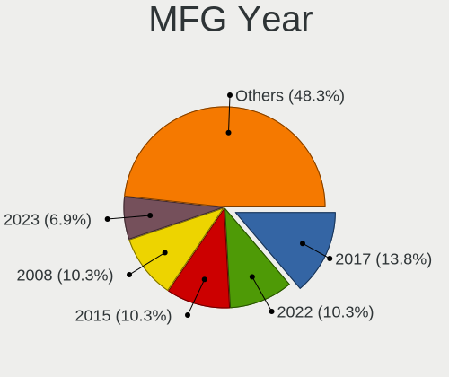
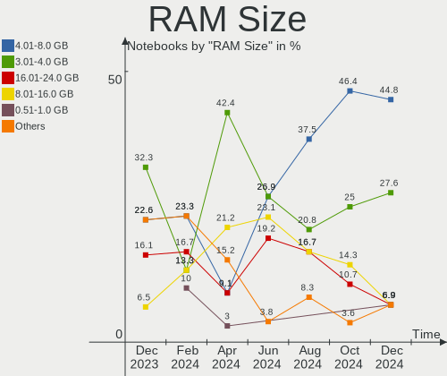
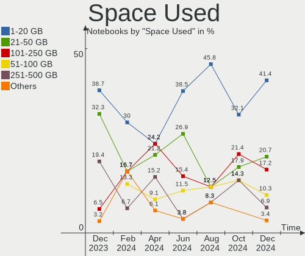
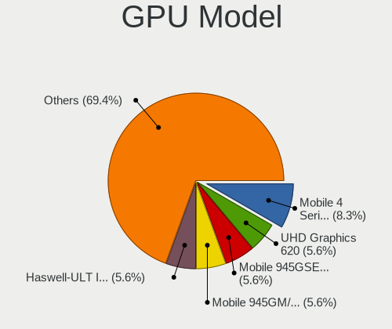
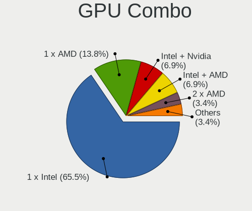
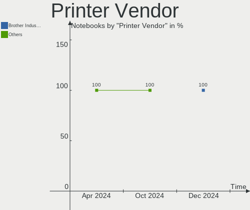

Xubuntu Hardware Trends (Notebook)
----------------------------------

A project to identify most popular hardware characteristics and track their change
over time based on data collected by Xubuntu users at https://Linux-Hardware.org.

Anyone can contribute to the study by uploading probes of their computers by
the [hw-probe](https://github.com/linuxhw/hw-probe) tool:

    sudo -E hw-probe -all -upload

Full-feature report is available here: https://linux-hardware.org/?view=trends&formfactor=notebook

Period: Jun, 2021.

Contents
--------

- [ OS                       ](#os)
- [ OS Family                ](#os-family)
- [ Kernel                   ](#kernel)
- [ Kernel Family            ](#kernel-family)
- [ Kernel Major Ver.        ](#kernel-major-ver)
- [ Arch                     ](#arch)
- [ DE                       ](#de)
- [ Display Server           ](#display-server)
- [ Display Manager          ](#display-manager)
- [ OS Lang                  ](#os-lang)
- [ Boot Mode                ](#boot-mode)
- [ Filesystem               ](#filesystem)
- [ Part. scheme             ](#part-scheme)
- [ Dual Boot with Linux/BSD ](#dual-boot-with-linux/bsd)
- [ Dual Boot (Win)          ](#dual-boot-win)
- [ Country                  ](#country)
- [ City                     ](#city)
- [ Vendor                   ](#vendor)
- [ Model                    ](#model)
- [ Model Family             ](#model-family)
- [ MFG Year                 ](#mfg-year)
- [ Form Factor              ](#form-factor)
- [ Secure Boot              ](#secure-boot)
- [ Coreboot                 ](#coreboot)
- [ RAM Size                 ](#ram-size)
- [ RAM Used                 ](#ram-used)
- [ Has CD-ROM               ](#has-cd-rom)
- [ Total Drives             ](#total-drives)
- [ Has Ethernet             ](#has-ethernet)
- [ Has WiFi                 ](#has-wifi)
- [ Has Bluetooth            ](#has-bluetooth)
- [ Drive Vendor             ](#drive-vendor)
- [ Drive Model              ](#drive-model)
- [ HDD Vendor               ](#hdd-vendor)
- [ SSD Vendor               ](#ssd-vendor)
- [ Drive Kind               ](#drive-kind)
- [ Drive Connector          ](#drive-connector)
- [ Drive Size               ](#drive-size)
- [ Space Total              ](#space-total)
- [ Space Used               ](#space-used)
- [ Malfunc. Drives          ](#malfunc-drives)
- [ Malfunc. Drive Vendor    ](#malfunc-drive-vendor)
- [ Malfunc. HDD Vendor      ](#malfunc-hdd-vendor)
- [ Malfunc. Drive Kind      ](#malfunc-drive-kind)
- [ Failed Drives            ](#failed-drives)
- [ Failed Drive Vendor      ](#failed-drive-vendor)
- [ Drive Status             ](#drive-status)
- [ Storage Vendor           ](#storage-vendor)
- [ Storage Model            ](#storage-model)
- [ Storage Kind             ](#storage-kind)
- [ CPU Vendor               ](#cpu-vendor)
- [ CPU Model                ](#cpu-model)
- [ CPU Model Family         ](#cpu-model-family)
- [ CPU Cores                ](#cpu-cores)
- [ CPU Sockets              ](#cpu-sockets)
- [ CPU Threads              ](#cpu-threads)
- [ CPU Op-Modes             ](#cpu-op-modes)
- [ CPU Microcode            ](#cpu-microcode)
- [ CPU Microarch            ](#cpu-microarch)
- [ GPU Vendor               ](#gpu-vendor)
- [ GPU Model                ](#gpu-model)
- [ GPU Combo                ](#gpu-combo)
- [ GPU Driver               ](#gpu-driver)
- [ GPU Memory               ](#gpu-memory)
- [ Monitor Vendor           ](#monitor-vendor)
- [ Monitor Model            ](#monitor-model)
- [ Monitor Resolution       ](#monitor-resolution)
- [ Monitor Diagonal         ](#monitor-diagonal)
- [ Monitor Width            ](#monitor-width)
- [ Aspect Ratio             ](#aspect-ratio)
- [ Monitor Area             ](#monitor-area)
- [ Pixel Density            ](#pixel-density)
- [ Multiple Monitors        ](#multiple-monitors)
- [ Net Controller Vendor    ](#net-controller-vendor)
- [ Net Controller Model     ](#net-controller-model)
- [ Wireless Vendor          ](#wireless-vendor)
- [ Wireless Model           ](#wireless-model)
- [ Ethernet Vendor          ](#ethernet-vendor)
- [ Ethernet Model           ](#ethernet-model)
- [ Net Controller Kind      ](#net-controller-kind)
- [ Used Controller          ](#used-controller)
- [ NICs                     ](#nics)
- [ IPv6                     ](#ipv6)
- [ Memory Vendor            ](#memory-vendor)
- [ Memory Model             ](#memory-model)
- [ Memory Kind              ](#memory-kind)
- [ Memory Form Factor       ](#memory-form-factor)
- [ Memory Size              ](#memory-size)
- [ Memory Speed             ](#memory-speed)
- [ Sound Vendor             ](#sound-vendor)
- [ Sound Model              ](#sound-model)
- [ Camera Vendor            ](#camera-vendor)
- [ Camera Model             ](#camera-model)
- [ Fingerprint Vendor       ](#fingerprint-vendor)
- [ Fingerprint Model        ](#fingerprint-model)
- [ Chipcard Vendor          ](#chipcard-vendor)
- [ Chipcard Model           ](#chipcard-model)
- [ Printer Vendor           ](#printer-vendor)
- [ Printer Model            ](#printer-model)
- [ Scanner Vendor           ](#scanner-vendor)
- [ Scanner Model            ](#scanner-model)
- [ Bluetooth Vendor         ](#bluetooth-vendor)
- [ Bluetooth Model          ](#bluetooth-model)
- [ Unsupported Devices      ](#unsupported-devices)
- [ Unsupported Device Types ](#unsupported-device-types)

OS
--

Installed operating systems

| Name          | Notebooks | Percent |
|---------------|-----------|---------|
| Xubuntu 20.04 | 44        | 75.86%  |
| Xubuntu 18.04 | 10        | 17.24%  |
| Xubuntu 21.04 | 4         | 6.9%    |

OS Family
---------

OS without a version

| Name    | Notebooks | Percent |
|---------|-----------|---------|
| Xubuntu | 58        | 100%    |

Kernel
------

Version of the Linux kernel

| Version                | Notebooks | Percent |
|------------------------|-----------|---------|
| 5.4.0-74-generic       | 11        | 18.97%  |
| 5.8.0-55-generic       | 9         | 15.52%  |
| 5.8.0-53-generic       | 4         | 6.9%    |
| 5.4.0-77-generic       | 4         | 6.9%    |
| 5.8.0-59-generic       | 3         | 5.17%   |
| 5.8.0-43-generic       | 3         | 5.17%   |
| 5.8.0-55-lowlatency    | 2         | 3.45%   |
| 5.4.0-73-lowlatency    | 2         | 3.45%   |
| 5.4.0-73-generic       | 2         | 3.45%   |
| 5.4.0-42-generic       | 2         | 3.45%   |
| 5.8.0-7630-generic     | 1         | 1.72%   |
| 5.8.0-59-lowlatency    | 1         | 1.72%   |
| 5.8.0-45-generic       | 1         | 1.72%   |
| 5.4.0-74-lowlatency    | 1         | 1.72%   |
| 5.4.0-66-generic       | 1         | 1.72%   |
| 5.4.0-51-generic       | 1         | 1.72%   |
| 5.12.12-oma            | 1         | 1.72%   |
| 5.12.10-xanmod1-edge   | 1         | 1.72%   |
| 5.11.16-051116-generic | 1         | 1.72%   |
| 5.11.0-22-generic      | 1         | 1.72%   |
| 5.11.0-18-generic      | 1         | 1.72%   |
| 5.11.0-16-generic      | 1         | 1.72%   |
| 5.10.0-1026-oem        | 1         | 1.72%   |
| 4.18.0-15-generic      | 1         | 1.72%   |
| 4.16.18-galliumos      | 1         | 1.72%   |
| 4.15.0-142-generic     | 1         | 1.72%   |

Kernel Family
-------------

Linux kernel without a distro release

| Version | Notebooks | Percent |
|---------|-----------|---------|
| 5.8.0   | 24        | 41.38%  |
| 5.4.0   | 24        | 41.38%  |
| 5.11.0  | 3         | 5.17%   |
| 5.12.12 | 1         | 1.72%   |
| 5.12.10 | 1         | 1.72%   |
| 5.11.16 | 1         | 1.72%   |
| 5.10.0  | 1         | 1.72%   |
| 4.18.0  | 1         | 1.72%   |
| 4.16.18 | 1         | 1.72%   |
| 4.15.0  | 1         | 1.72%   |

Kernel Major Ver.
-----------------

Linux kernel major version

| Version | Notebooks | Percent |
|---------|-----------|---------|
| 5.8     | 24        | 41.38%  |
| 5.4     | 24        | 41.38%  |
| 5.11    | 4         | 6.9%    |
| 5.12    | 2         | 3.45%   |
| 5.10    | 1         | 1.72%   |
| 4.18    | 1         | 1.72%   |
| 4.16    | 1         | 1.72%   |
| 4.15    | 1         | 1.72%   |

Arch
----

OS architecture (x86_64, i586, etc.)

| Name   | Notebooks | Percent |
|--------|-----------|---------|
| x86_64 | 51        | 87.93%  |
| i686   | 7         | 12.07%  |

DE
--

Desktop Environment

| Name            | Notebooks | Percent |
|-----------------|-----------|---------|
| XFCE            | 57        | 98.28%  |
| GNOME Flashback | 1         | 1.72%   |

Display Server
--------------

X11 or Wayland

| Name | Notebooks | Percent |
|------|-----------|---------|
| X11  | 56        | 96.55%  |
| Tty  | 2         | 3.45%   |

Display Manager
---------------

SDDM, LightDM, etc.

| Name    | Notebooks | Percent |
|---------|-----------|---------|
| Unknown | 29        | 50%     |
| TDM     | 28        | 48.28%  |
| LXDM    | 1         | 1.72%   |

OS Lang
-------

Language

| Lang  | Notebooks | Percent |
|-------|-----------|---------|
| en_US | 18        | 31.03%  |
| fr_FR | 8         | 13.79%  |
| pt_BR | 7         | 12.07%  |
| it_IT | 4         | 6.9%    |
| de_DE | 4         | 6.9%    |
| en_GB | 3         | 5.17%   |
| C     | 3         | 5.17%   |
| es_ES | 2         | 3.45%   |
| pt_PT | 1         | 1.72%   |
| pl_PL | 1         | 1.72%   |
| hu_HU | 1         | 1.72%   |
| fr_BE | 1         | 1.72%   |
| es_AR | 1         | 1.72%   |
| en_ZA | 1         | 1.72%   |
| en_SG | 1         | 1.72%   |
| en_AU | 1         | 1.72%   |
| cs_CZ | 1         | 1.72%   |

Boot Mode
---------

EFI or BIOS

| Mode | Notebooks | Percent |
|------|-----------|---------|
| BIOS | 29        | 50%     |
| EFI  | 29        | 50%     |

Filesystem
----------

Type of filesystem

| Type    | Notebooks | Percent |
|---------|-----------|---------|
| Ext4    | 51        | 87.93%  |
| Overlay | 4         | 6.9%    |
| Zfs     | 2         | 3.45%   |
| Ext2    | 1         | 1.72%   |

Part. scheme
------------

Scheme of partitioning

| Type    | Notebooks | Percent |
|---------|-----------|---------|
| Unknown | 29        | 50%     |
| GPT     | 21        | 36.21%  |
| MBR     | 8         | 13.79%  |

Dual Boot with Linux/BSD
------------------------

Hosting more than one Linux/BSD

| Dual boot | Notebooks | Percent |
|-----------|-----------|---------|
| No        | 47        | 81.03%  |
| Yes       | 11        | 18.97%  |

Dual Boot (Win)
---------------

Hosting Linux and Windows

| Dual boot | Notebooks | Percent |
|-----------|-----------|---------|
| No        | 35        | 60.34%  |
| Yes       | 23        | 39.66%  |

Country
-------

Geographic location (country)

| Country     | Notebooks | Percent |
|-------------|-----------|---------|
| USA         | 8         | 13.79%  |
| France      | 7         | 12.07%  |
| Brazil      | 7         | 12.07%  |
| Germany     | 6         | 10.34%  |
| Italy       | 4         | 6.9%    |
| UK          | 3         | 5.17%   |
| Spain       | 2         | 3.45%   |
| Poland      | 2         | 3.45%   |
| Netherlands | 2         | 3.45%   |
| Czechia     | 2         | 3.45%   |
| Belgium     | 2         | 3.45%   |
| Zimbabwe    | 1         | 1.72%   |
| Ukraine     | 1         | 1.72%   |
| Sri Lanka   | 1         | 1.72%   |
| Singapore   | 1         | 1.72%   |
| Portugal    | 1         | 1.72%   |
| Mexico      | 1         | 1.72%   |
| Indonesia   | 1         | 1.72%   |
| Hungary     | 1         | 1.72%   |
| Greece      | 1         | 1.72%   |
| Finland     | 1         | 1.72%   |
| Canada      | 1         | 1.72%   |
| Australia   | 1         | 1.72%   |
| Argentina   | 1         | 1.72%   |

City
----

Geographic location (city)

| City                   | Notebooks | Percent |
|------------------------|-----------|---------|
| Prague                 | 2         | 3.45%   |
| Zero Branco            | 1         | 1.72%   |
| Zehdenick              | 1         | 1.72%   |
| Waynesboro             | 1         | 1.72%   |
| Waterford              | 1         | 1.72%   |
| Warrior                | 1         | 1.72%   |
| Walthamstow            | 1         | 1.72%   |
| Uruguaiana             | 1         | 1.72%   |
| Tuusula                | 1         | 1.72%   |
| Torrent                | 1         | 1.72%   |
| Tonnoy                 | 1         | 1.72%   |
| St. Petersburg         | 1         | 1.72%   |
| Singapore              | 1         | 1.72%   |
| Schwalbach am Taunus   | 1         | 1.72%   |
| Sarapui                | 1         | 1.72%   |
| Sainte-Marie           | 1         | 1.72%   |
| Ryglice                | 1         | 1.72%   |
| Rome                   | 1         | 1.72%   |
| Rio de Janeiro         | 1         | 1.72%   |
| Rezé                  | 1         | 1.72%   |
| Queluz                 | 1         | 1.72%   |
| Orange                 | 1         | 1.72%   |
| Nantes                 | 1         | 1.72%   |
| Morangis               | 1         | 1.72%   |
| Monte Grande           | 1         | 1.72%   |
| Milton Keynes          | 1         | 1.72%   |
| Malmedy                | 1         | 1.72%   |
| Lorient                | 1         | 1.72%   |
| León                  | 1         | 1.72%   |
| Launceston             | 1         | 1.72%   |
| Kyiv                   | 1         | 1.72%   |
| Jefferson City         | 1         | 1.72%   |
| Heerlen                | 1         | 1.72%   |
| Havre de Grace         | 1         | 1.72%   |
| Harare                 | 1         | 1.72%   |
| Haltern am See         | 1         | 1.72%   |
| Great Yarmouth         | 1         | 1.72%   |
| Ghent                  | 1         | 1.72%   |
| Genoa                  | 1         | 1.72%   |
| Galle                  | 1         | 1.72%   |
| Frankfurt am Main      | 1         | 1.72%   |
| Elmira                 | 1         | 1.72%   |
| Dunaharaszti           | 1         | 1.72%   |
| Dingolfing             | 1         | 1.72%   |
| Corte Franca           | 1         | 1.72%   |
| Concord                | 1         | 1.72%   |
| Charleville-Mézières | 1         | 1.72%   |
| Candeias               | 1         | 1.72%   |
| Brummen                | 1         | 1.72%   |
| Botucatu               | 1         | 1.72%   |
| Bolesławiec           | 1         | 1.72%   |
| Blumenau               | 1         | 1.72%   |
| Bietigheim-Bissingen   | 1         | 1.72%   |
| Belo Horizonte         | 1         | 1.72%   |
| Barcelona              | 1         | 1.72%   |
| Bandung                | 1         | 1.72%   |
| Athens                 | 1         | 1.72%   |

Vendor
------

Motherboard manufacturer

| Name                 | Notebooks | Percent |
|----------------------|-----------|---------|
| Hewlett-Packard      | 15        | 25.86%  |
| Dell                 | 8         | 13.79%  |
| Lenovo               | 7         | 12.07%  |
| ASUSTek Computer     | 5         | 8.62%   |
| Acer                 | 4         | 6.9%    |
| Sony                 | 2         | 3.45%   |
| Apple                | 2         | 3.45%   |
| TUXEDO               | 1         | 1.72%   |
| Toshiba              | 1         | 1.72%   |
| Samsung Electronics  | 1         | 1.72%   |
| Quanta               | 1         | 1.72%   |
| Positivo             | 1         | 1.72%   |
| PLAISIO COMPUTERS SA | 1         | 1.72%   |
| Packard Bell         | 1         | 1.72%   |
| MSI                  | 1         | 1.72%   |
| Medion               | 1         | 1.72%   |
| Login Inform.tica    | 1         | 1.72%   |
| Intel Client Systems | 1         | 1.72%   |
| Google               | 1         | 1.72%   |
| Fujitsu Siemens      | 1         | 1.72%   |
| Fujitsu              | 1         | 1.72%   |
| Unknown              | 1         | 1.72%   |

Model
-----

Motherboard model

| Name                                  | Notebooks | Percent |
|---------------------------------------|-----------|---------|
| Unknown                               | 2         | 3.45%   |
| Toshiba PORTEGE R930                  | 1         | 1.72%   |
| Sony VPCF236FM                        | 1         | 1.72%   |
| Sony VPCEB12FD                        | 1         | 1.72%   |
| Samsung 300E5K/300E5Q                 | 1         | 1.72%   |
| Quanta R480-L.BA34P1                  | 1         | 1.72%   |
| Positivo Mobile                       | 1         | 1.72%   |
| PLAISIO COMPUTERS SA TURBO-X          | 1         | 1.72%   |
| Packard Bell DOTS E2                  | 1         | 1.72%   |
| MSI GL63 8RD                          | 1         | 1.72%   |
| Medion P17609                         | 1         | 1.72%   |
| Login Inform.tica LOG-MB47II7         | 1         | 1.72%   |
| Lenovo ThinkPad X270 W10DG 20K5S3AC00 | 1         | 1.72%   |
| Lenovo ThinkPad X270 W10DG 20K5S2VU00 | 1         | 1.72%   |
| Lenovo ThinkPad X230 23255JU          | 1         | 1.72%   |
| Lenovo ThinkPad T430s 2356H9G         | 1         | 1.72%   |
| Lenovo ThinkPad L412 44034KG          | 1         | 1.72%   |
| Lenovo IdeaPad L340-17IRH Gaming 81LL | 1         | 1.72%   |
| Lenovo IdeaPad 330S-15ARR 81FB        | 1         | 1.72%   |
| Intel Client Systems LAPBC510         | 1         | 1.72%   |
| HP Stream Laptop 14-cb0XX             | 1         | 1.72%   |
| HP Slate 2                            | 1         | 1.72%   |
| HP Pavilion dv6700                    | 1         | 1.72%   |
| HP Pavilion dv5000 (EZ149EA#ABZ)      | 1         | 1.72%   |
| HP Pavilion dv1000 (PN626EA#ABE)      | 1         | 1.72%   |
| HP Notebook                           | 1         | 1.72%   |
| HP Laptop 15-dw0xxx                   | 1         | 1.72%   |
| HP Laptop 15-da0xxx                   | 1         | 1.72%   |
| HP Laptop 14-cm0xxx                   | 1         | 1.72%   |
| HP G72                                | 1         | 1.72%   |
| HP EliteBook 850 G1                   | 1         | 1.72%   |
| HP EliteBook 8470p                    | 1         | 1.72%   |
| HP EliteBook 845 G7 Notebook PC       | 1         | 1.72%   |
| HP EliteBook 840 G3                   | 1         | 1.72%   |
| HP Compaq 6730s                       | 1         | 1.72%   |
| Google Lulu                           | 1         | 1.72%   |
| Fujitsu Siemens AMILO Xi 3650         | 1         | 1.72%   |
| Fujitsu LIFEBOOK U747                 | 1         | 1.72%   |
| Dell XPS 13 9310                      | 1         | 1.72%   |
| Dell Latitude E6400                   | 1         | 1.72%   |
| Dell Latitude E5410                   | 1         | 1.72%   |
| Dell Latitude D630                    | 1         | 1.72%   |
| Dell Latitude 7390                    | 1         | 1.72%   |
| Dell Inspiron 7773                    | 1         | 1.72%   |
| Dell Inspiron 5485                    | 1         | 1.72%   |
| Dell Inspiron 1545                    | 1         | 1.72%   |
| ASUS X55U                             | 1         | 1.72%   |
| ASUS X510UQ                           | 1         | 1.72%   |
| ASUS X501A                            | 1         | 1.72%   |
| ASUS K53SD                            | 1         | 1.72%   |
| ASUS 1005HA                           | 1         | 1.72%   |
| Apple MacBookAir5,2                   | 1         | 1.72%   |
| Apple MacBookAir1,1                   | 1         | 1.72%   |
| Acer Aspire VN7-791                   | 1         | 1.72%   |
| Acer Aspire 7250                      | 1         | 1.72%   |
| Acer Aspire 5333                      | 1         | 1.72%   |
| Acer AOD270                           | 1         | 1.72%   |

Model Family
------------

Motherboard model prefix

| Name                          | Notebooks | Percent |
|-------------------------------|-----------|---------|
| Lenovo ThinkPad               | 5         | 8.62%   |
| HP EliteBook                  | 4         | 6.9%    |
| Dell Latitude                 | 4         | 6.9%    |
| HP Pavilion                   | 3         | 5.17%   |
| HP Laptop                     | 3         | 5.17%   |
| Dell Inspiron                 | 3         | 5.17%   |
| Acer Aspire                   | 3         | 5.17%   |
| Lenovo IdeaPad                | 2         | 3.45%   |
| Unknown                       | 2         | 3.45%   |
| Toshiba PORTEGE               | 1         | 1.72%   |
| Sony VPCF236FM                | 1         | 1.72%   |
| Sony VPCEB12FD                | 1         | 1.72%   |
| Samsung 300E5K                | 1         | 1.72%   |
| Quanta R480-L.BA34P1          | 1         | 1.72%   |
| Positivo Mobile               | 1         | 1.72%   |
| PLAISIO COMPUTERS SA TURBO-X  | 1         | 1.72%   |
| Packard Bell DOTS             | 1         | 1.72%   |
| MSI GL63                      | 1         | 1.72%   |
| Medion P17609                 | 1         | 1.72%   |
| Login Inform.tica LOG-MB47II7 | 1         | 1.72%   |
| Intel Client Systems LAPBC510 | 1         | 1.72%   |
| HP Stream                     | 1         | 1.72%   |
| HP Slate                      | 1         | 1.72%   |
| HP Notebook                   | 1         | 1.72%   |
| HP G72                        | 1         | 1.72%   |
| HP Compaq                     | 1         | 1.72%   |
| Google Lulu                   | 1         | 1.72%   |
| Fujitsu Siemens AMILO         | 1         | 1.72%   |
| Fujitsu LIFEBOOK              | 1         | 1.72%   |
| Dell XPS                      | 1         | 1.72%   |
| ASUS X55U                     | 1         | 1.72%   |
| ASUS X510UQ                   | 1         | 1.72%   |
| ASUS X501A                    | 1         | 1.72%   |
| ASUS K53SD                    | 1         | 1.72%   |
| ASUS 1005HA                   | 1         | 1.72%   |
| Apple MacBookAir5             | 1         | 1.72%   |
| Apple MacBookAir1             | 1         | 1.72%   |
| Acer AOD270                   | 1         | 1.72%   |

MFG Year
--------

Motherboard manufacture year

| Year | Notebooks | Percent |
|------|-----------|---------|
| 2020 | 9         | 15.52%  |
| 2019 | 7         | 12.07%  |
| 2011 | 6         | 10.34%  |
| 2017 | 5         | 8.62%   |
| 2012 | 5         | 8.62%   |
| 2021 | 4         | 6.9%    |
| 2018 | 4         | 6.9%    |
| 2010 | 4         | 6.9%    |
| 2008 | 4         | 6.9%    |
| 2013 | 3         | 5.17%   |
| 2009 | 3         | 5.17%   |
| 2006 | 2         | 3.45%   |
| 2016 | 1         | 1.72%   |
| 2015 | 1         | 1.72%   |

Form Factor
-----------

Physical design of the computer

| Name     | Notebooks | Percent |
|----------|-----------|---------|
| Notebook | 58        | 100%    |

Secure Boot
-----------

Enabled or disabled

| State    | Notebooks | Percent |
|----------|-----------|---------|
| Disabled | 52        | 89.66%  |
| Enabled  | 6         | 10.34%  |

Coreboot
--------

Have coreboot on board

| Used | Notebooks | Percent |
|------|-----------|---------|
| No   | 57        | 98.28%  |
| Yes  | 1         | 1.72%   |

RAM Size
--------

Total RAM memory

| Size in GB | Notebooks | Percent |
|------------|-----------|---------|
| 3.01-4.0   | 13        | 22.41%  |
| 4.01-8.0   | 11        | 18.97%  |
| 16.01-24.0 | 8         | 13.79%  |
| 1.01-2.0   | 8         | 13.79%  |
| 8.01-16.0  | 6         | 10.34%  |
| 0.51-1.0   | 6         | 10.34%  |
| 32.01-64.0 | 4         | 6.9%    |
| 2.01-3.0   | 2         | 3.45%   |

RAM Used
--------

Used RAM memory

| Used GB   | Notebooks | Percent |
|-----------|-----------|---------|
| 1.01-2.0  | 21        | 36.21%  |
| 0.51-1.0  | 14        | 24.14%  |
| 2.01-3.0  | 12        | 20.69%  |
| 0.01-0.5  | 5         | 8.62%   |
| 3.01-4.0  | 3         | 5.17%   |
| 8.01-16.0 | 3         | 5.17%   |

Has CD-ROM
----------

Has CD-ROM on board

| Presented | Notebooks | Percent |
|-----------|-----------|---------|
| No        | 33        | 56.9%   |
| Yes       | 25        | 43.1%   |

Total Drives
------------

Number of drives on board

| Drives | Notebooks | Percent |
|--------|-----------|---------|
| 1      | 47        | 81.03%  |
| 2      | 9         | 15.52%  |
| 3      | 1         | 1.72%   |
| 0      | 1         | 1.72%   |

Has Ethernet
------------

Has Ethernet on board

| Presented | Notebooks | Percent |
|-----------|-----------|---------|
| Yes       | 47        | 81.03%  |
| No        | 11        | 18.97%  |

Has WiFi
--------

Has WiFi module

| Presented | Notebooks | Percent |
|-----------|-----------|---------|
| Yes       | 57        | 98.28%  |
| No        | 1         | 1.72%   |

Has Bluetooth
-------------

Has Bluetooth module

| Presented | Notebooks | Percent |
|-----------|-----------|---------|
| Yes       | 38        | 65.52%  |
| No        | 20        | 34.48%  |

Drive Vendor
------------

Hard drive vendors

| Vendor              | Notebooks | Drives | Percent |
|---------------------|-----------|--------|---------|
| Seagate             | 14        | 14     | 22.22%  |
| Samsung Electronics | 9         | 10     | 14.29%  |
| WDC                 | 7         | 7      | 11.11%  |
| Unknown             | 4         | 4      | 6.35%   |
| Hitachi             | 4         | 5      | 6.35%   |
| Toshiba             | 3         | 3      | 4.76%   |
| Kingston            | 3         | 3      | 4.76%   |
| Fujitsu             | 3         | 3      | 4.76%   |
| Micron Technology   | 2         | 2      | 3.17%   |
| Intel               | 2         | 2      | 3.17%   |
| SSSTC               | 1         | 1      | 1.59%   |
| SK Hynix            | 1         | 1      | 1.59%   |
| SanDisk             | 1         | 1      | 1.59%   |
| Phison              | 1         | 1      | 1.59%   |
| OCZ                 | 1         | 1      | 1.59%   |
| LITEON              | 1         | 1      | 1.59%   |
| KIOXIA-EXCERIA      | 1         | 1      | 1.59%   |
| KingSpec            | 1         | 1      | 1.59%   |
| HGST                | 1         | 1      | 1.59%   |
| External            | 1         | 1      | 1.59%   |
| China               | 1         | 1      | 1.59%   |
| Apple               | 1         | 1      | 1.59%   |

Drive Model
-----------

Hard drive models

| Model                                   | Notebooks | Percent |
|-----------------------------------------|-----------|---------|
| Seagate ST500LM012 HN-M500MBB 500GB     | 3         | 4.62%   |
| Seagate ST9500325AS 500GB               | 2         | 3.08%   |
| Seagate ST1000LM035-1RK172 1TB          | 2         | 3.08%   |
| Kingston SA400S37960G 960GB SSD         | 2         | 3.08%   |
| WDC WDS250G2X0C-00L350 250GB            | 1         | 1.54%   |
| WDC WDBNCE2500PNC 250GB SSD             | 1         | 1.54%   |
| WDC WD3200BPVT-22JJ5T0 320GB            | 1         | 1.54%   |
| WDC WD2500BEVT-22A23T0 250GB            | 1         | 1.54%   |
| WDC WD10SPZX-24Z10T0 1TB                | 1         | 1.54%   |
| WDC PC SN520 SDAPNUW-512G-1006 512GB    | 1         | 1.54%   |
| WDC PC SN520 NVMe 512GB                 | 1         | 1.54%   |
| Unknown SD/MMC/MS PRO 128GB             | 1         | 1.54%   |
| Unknown MMC Card  4GB                   | 1         | 1.54%   |
| Unknown MMC Card  32GB                  | 1         | 1.54%   |
| Unknown MMC Card  256GB                 | 1         | 1.54%   |
| Toshiba MQ02ABD100H 1TB                 | 1         | 1.54%   |
| Toshiba MQ01ABF050 500GB                | 1         | 1.54%   |
| Toshiba MK7559GSXP 752GB                | 1         | 1.54%   |
| SSSTC CV8-8E128-HP 128GB                | 1         | 1.54%   |
| SK Hynix SC401 SATA 512GB SSD           | 1         | 1.54%   |
| Seagate ST980411ASG 80GB                | 1         | 1.54%   |
| Seagate ST9160821A 160GB                | 1         | 1.54%   |
| Seagate ST320LT012-9WS14C 320GB         | 1         | 1.54%   |
| Seagate ST320LM001 HN-M320MBB 320GB     | 1         | 1.54%   |
| Seagate ST2000LM007-1R8174 2TB          | 1         | 1.54%   |
| Seagate ST2000LM003 HN-M201RAD 2TB      | 1         | 1.54%   |
| Seagate ST1000LM048-2E7172 1TB          | 1         | 1.54%   |
| SanDisk DF4032  32GB                    | 1         | 1.54%   |
| Samsung SSD 970 EVO Plus 2TB            | 1         | 1.54%   |
| Samsung SSD 970 EVO Plus 250GB          | 1         | 1.54%   |
| Samsung SSD 960 EVO 500GB               | 1         | 1.54%   |
| Samsung SSD 860 PRO 1TB                 | 1         | 1.54%   |
| Samsung SSD 850 EVO mSATA 250GB         | 1         | 1.54%   |
| Samsung MZVLW256HEHP-000L7 256GB        | 1         | 1.54%   |
| Samsung MZVKW512HMJP-00007 512GB        | 1         | 1.54%   |
| Samsung MZMPA032HMCD-000H1 32GB SSD     | 1         | 1.54%   |
| Samsung MZALQ512HALU-000L2 512GB        | 1         | 1.54%   |
| Samsung HM320JI 320GB                   | 1         | 1.54%   |
| Phison E12-512G-PHISON-SSD-B16-07 512GB | 1         | 1.54%   |
| OCZ VERTEX3 256GB SSD                   | 1         | 1.54%   |
| Micron MTFDHBA512QFD-1AX1AABHA 512GB    | 1         | 1.54%   |
| Micron 2300 NVMe 512GB                  | 1         | 1.54%   |
| LITEON CV1-8B512-HP 512GB SSD           | 1         | 1.54%   |
| KIOXIA-EXCERIA SATA SSD 240GB           | 1         | 1.54%   |
| Kingston SV300S37A240G 240GB SSD        | 1         | 1.54%   |
| KingSpec KSD-ZF18.6-064MS 64GB          | 1         | 1.54%   |
| Intel SSDSC2CW240A3 240GB               | 1         | 1.54%   |
| Intel HBRPEKNX0202A 512GB               | 1         | 1.54%   |
| Hitachi HTS545050B9A300 500GB           | 1         | 1.54%   |
| Hitachi HTS545050A7E380 500GB           | 1         | 1.54%   |
| Hitachi HTS545025B9A300 250GB           | 1         | 1.54%   |
| Hitachi HTS543216L9SA00 160GB           | 1         | 1.54%   |
| Hitachi HTS541060G9AT00 64GB            | 1         | 1.54%   |
| HGST HTS545050A7E380 500GB              | 1         | 1.54%   |
| Fujitsu MHZ2500BT G1 500GB              | 1         | 1.54%   |
| Fujitsu MHZ2160BJ FFS G2 160GB          | 1         | 1.54%   |
| Fujitsu MHZ2160BH G2 160GB              | 1         | 1.54%   |
| External USB3.0 240GB                   | 1         | 1.54%   |
| China SATA SSD 240GB                    | 1         | 1.54%   |
| Apple SSD SM256E 256GB                  | 1         | 1.54%   |

HDD Vendor
----------

Hard disk drive vendors

| Vendor              | Notebooks | Drives | Percent |
|---------------------|-----------|--------|---------|
| Seagate             | 14        | 14     | 48.28%  |
| Hitachi             | 4         | 5      | 13.79%  |
| WDC                 | 3         | 3      | 10.34%  |
| Toshiba             | 3         | 3      | 10.34%  |
| Fujitsu             | 3         | 3      | 10.34%  |
| Samsung Electronics | 1         | 1      | 3.45%   |
| HGST                | 1         | 1      | 3.45%   |

SSD Vendor
----------

Solid state drive vendors

| Vendor              | Notebooks | Drives | Percent |
|---------------------|-----------|--------|---------|
| Samsung Electronics | 3         | 3      | 21.43%  |
| Kingston            | 3         | 3      | 21.43%  |
| WDC                 | 1         | 1      | 7.14%   |
| SK Hynix            | 1         | 1      | 7.14%   |
| OCZ                 | 1         | 1      | 7.14%   |
| LITEON              | 1         | 1      | 7.14%   |
| KIOXIA-EXCERIA      | 1         | 1      | 7.14%   |
| Intel               | 1         | 1      | 7.14%   |
| China               | 1         | 1      | 7.14%   |
| Apple               | 1         | 1      | 7.14%   |

Drive Kind
----------

HDD or SSD

| Kind    | Notebooks | Drives | Percent |
|---------|-----------|--------|---------|
| HDD     | 29        | 30     | 46.03%  |
| NVMe    | 14        | 14     | 22.22%  |
| SSD     | 14        | 14     | 22.22%  |
| MMC     | 3         | 4      | 4.76%   |
| Unknown | 3         | 3      | 4.76%   |

Drive Connector
---------------

SATA, SAS, NVMe, etc.

| Type | Notebooks | Drives | Percent |
|------|-----------|--------|---------|
| SATA | 43        | 46     | 70.49%  |
| NVMe | 13        | 13     | 21.31%  |
| MMC  | 3         | 4      | 4.92%   |
| SAS  | 2         | 2      | 3.28%   |

Drive Size
----------

Size of hard drive

| Size in TB | Notebooks | Drives | Percent |
|------------|-----------|--------|---------|
| 0.01-0.5   | 29        | 31     | 69.05%  |
| 0.51-1.0   | 11        | 11     | 26.19%  |
| 1.01-2.0   | 2         | 2      | 4.76%   |

Space Total
-----------

Amount of disk space available on the file system

| Size in GB | Notebooks | Percent |
|------------|-----------|---------|
| 101-250    | 20        | 34.48%  |
| 251-500    | 15        | 25.86%  |
| 21-50      | 7         | 12.07%  |
| 1-20       | 6         | 10.34%  |
| 51-100     | 4         | 6.9%    |
| 1001-2000  | 3         | 5.17%   |
| 501-1000   | 3         | 5.17%   |

Space Used
----------

Amount of used disk space

| Used GB  | Notebooks | Percent |
|----------|-----------|---------|
| 1-20     | 25        | 43.1%   |
| 21-50    | 14        | 24.14%  |
| 51-100   | 8         | 13.79%  |
| 101-250  | 6         | 10.34%  |
| 251-500  | 3         | 5.17%   |
| 501-1000 | 2         | 3.45%   |

Malfunc. Drives
---------------

Drive models with a malfunction

| Model                               | Notebooks | Drives | Percent |
|-------------------------------------|-----------|--------|---------|
| Toshiba MK7559GSXP 752GB            | 1         | 1      | 12.5%   |
| SK Hynix SC401 SATA 512GB SSD       | 1         | 1      | 12.5%   |
| Seagate ST980411ASG 80GB            | 1         | 1      | 12.5%   |
| Seagate ST500LM012 HN-M500MBB 500GB | 1         | 1      | 12.5%   |
| Seagate ST320LT012-9WS14C 320GB     | 1         | 1      | 12.5%   |
| OCZ VERTEX3 256GB SSD               | 1         | 1      | 12.5%   |
| Hitachi HTS545050A7E380 500GB       | 1         | 1      | 12.5%   |
| Fujitsu MHZ2160BJ FFS G2 160GB      | 1         | 1      | 12.5%   |

Malfunc. Drive Vendor
---------------------

Vendors of faulty drives

| Vendor   | Notebooks | Drives | Percent |
|----------|-----------|--------|---------|
| Seagate  | 3         | 3      | 37.5%   |
| Toshiba  | 1         | 1      | 12.5%   |
| SK Hynix | 1         | 1      | 12.5%   |
| OCZ      | 1         | 1      | 12.5%   |
| Hitachi  | 1         | 1      | 12.5%   |
| Fujitsu  | 1         | 1      | 12.5%   |

Malfunc. HDD Vendor
-------------------

Vendors of faulty HDD drives

| Vendor  | Notebooks | Drives | Percent |
|---------|-----------|--------|---------|
| Seagate | 3         | 3      | 50%     |
| Toshiba | 1         | 1      | 16.67%  |
| Hitachi | 1         | 1      | 16.67%  |
| Fujitsu | 1         | 1      | 16.67%  |

Malfunc. Drive Kind
-------------------

Kinds of faulty drives

| Kind | Notebooks | Drives | Percent |
|------|-----------|--------|---------|
| HDD  | 6         | 6      | 75%     |
| SSD  | 2         | 2      | 25%     |

Failed Drives
-------------

Failed drive models

Zero info for selected period =(

Failed Drive Vendor
-------------------

Failed drive vendors

Zero info for selected period =(

Drive Status
------------

Number of failed and malfunc. drives

| Status   | Notebooks | Drives | Percent |
|----------|-----------|--------|---------|
| Detected | 29        | 34     | 50.88%  |
| Works    | 20        | 23     | 35.09%  |
| Malfunc  | 8         | 8      | 14.04%  |

Storage Vendor
--------------

Storage controller vendors

| Vendor                           | Notebooks | Percent |
|----------------------------------|-----------|---------|
| Intel                            | 44        | 70.97%  |
| Samsung Electronics              | 6         | 9.68%   |
| AMD                              | 5         | 8.06%   |
| Sandisk                          | 3         | 4.84%   |
| Micron Technology                | 2         | 3.23%   |
| Silicon Integrated Systems [SiS] | 1         | 1.61%   |
| Phison Electronics               | 1         | 1.61%   |

Storage Model
-------------

Storage controller models

| Model                                                                          | Notebooks | Percent |
|--------------------------------------------------------------------------------|-----------|---------|
| Intel 7 Series Chipset Family 6-port SATA Controller [AHCI mode]               | 7         | 10.45%  |
| Intel Sunrise Point-LP SATA Controller [AHCI mode]                             | 5         | 7.46%   |
| Intel 5 Series/3400 Series Chipset 4 port SATA AHCI Controller                 | 5         | 7.46%   |
| Samsung NVMe SSD Controller SM961/PM961/SM963                                  | 3         | 4.48%   |
| Intel 82801HM/HEM (ICH8M/ICH8M-E) IDE Controller                               | 3         | 4.48%   |
| Intel 82801 Mobile SATA Controller [RAID mode]                                 | 3         | 4.48%   |
| AMD FCH SATA Controller [AHCI mode]                                            | 3         | 4.48%   |
| Samsung NVMe SSD Controller SM981/PM981/PM983                                  | 2         | 2.99%   |
| Micron Non-Volatile memory controller                                          | 2         | 2.99%   |
| Intel Wildcat Point-LP SATA Controller [AHCI Mode]                             | 2         | 2.99%   |
| Intel NM10/ICH7 Family SATA Controller [AHCI mode]                             | 2         | 2.99%   |
| Intel Celeron/Pentium Silver Processor SATA Controller                         | 2         | 2.99%   |
| Intel Cannon Lake Mobile PCH SATA AHCI Controller                              | 2         | 2.99%   |
| Intel 82801IBM/IEM (ICH9M/ICH9M-E) 4 port SATA Controller [AHCI mode]          | 2         | 2.99%   |
| Intel 82801HM/HEM (ICH8M/ICH8M-E) SATA Controller [AHCI mode]                  | 2         | 2.99%   |
| Intel 6 Series/C200 Series Chipset Family 6 port Mobile SATA AHCI Controller   | 2         | 2.99%   |
| Silicon Integrated Systems [SiS] SATA Controller / IDE mode                    | 1         | 1.49%   |
| Silicon Integrated Systems [SiS] 5513 IDE Controller                           | 1         | 1.49%   |
| Sandisk WD Blue SN500 / PC SN520 NVMe SSD                                      | 1         | 1.49%   |
| Sandisk WD Black 2018/SN750 / PC SN720 NVMe SSD                                | 1         | 1.49%   |
| Sandisk PC SN520 NVMe SSD                                                      | 1         | 1.49%   |
| Samsung NVMe Controller                                                        | 1         | 1.49%   |
| Phison E12 NVMe Controller                                                     | 1         | 1.49%   |
| Intel SM35 Chipset SATA AHCI Controller                                        | 1         | 1.49%   |
| Intel Non-Volatile memory controller                                           | 1         | 1.49%   |
| Intel Mobile 4 Series Chipset PT IDER Controller                               | 1         | 1.49%   |
| Intel Comet Lake SATA AHCI Controller                                          | 1         | 1.49%   |
| Intel Cannon Lake PCH SATA AHCI Controller                                     | 1         | 1.49%   |
| Intel 82801IBM/IEM (ICH9M/ICH9M-E) 2 port SATA Controller [IDE mode]           | 1         | 1.49%   |
| Intel 82801HM/HEM (ICH8M/ICH8M-E) SATA Controller [IDE mode]                   | 1         | 1.49%   |
| Intel 82801GBM/GHM (ICH7-M Family) SATA Controller [AHCI mode]                 | 1         | 1.49%   |
| Intel 82801DBM (ICH4-M) IDE Controller                                         | 1         | 1.49%   |
| Intel 8 Series/C220 Series Chipset Family 6-port SATA Controller 1 [AHCI mode] | 1         | 1.49%   |
| Intel 8 Series SATA Controller 1 [AHCI mode]                                   | 1         | 1.49%   |
| AMD SB7x0/SB8x0/SB9x0 SATA Controller [AHCI mode]                              | 1         | 1.49%   |
| AMD IXP SB4x0 IDE Controller                                                   | 1         | 1.49%   |

Storage Kind
------------

Kind of storage controller (IDE, SATA, NVMe, SAS, ...)

| Kind | Notebooks | Percent |
|------|-----------|---------|
| SATA | 41        | 63.08%  |
| NVMe | 13        | 20%     |
| IDE  | 8         | 12.31%  |
| RAID | 3         | 4.62%   |

CPU Vendor
----------

Processor vendors

| Vendor | Notebooks | Percent |
|--------|-----------|---------|
| Intel  | 51        | 87.93%  |
| AMD    | 7         | 12.07%  |

CPU Model
---------

Processor models

| Model                                         | Notebooks | Percent |
|-----------------------------------------------|-----------|---------|
| Intel Pentium Dual-Core CPU T4200 @ 2.00GHz   | 2         | 3.45%   |
| Intel Core 2 Duo CPU P8400 @ 2.26GHz          | 2         | 3.45%   |
| Intel 11th Gen Core i7-1165G7 @ 2.80GHz       | 2         | 3.45%   |
| Intel Pentium Silver N5000 CPU @ 1.10GHz      | 1         | 1.72%   |
| Intel Pentium M processor 1.80GHz             | 1         | 1.72%   |
| Intel Pentium Dual-Core CPU T4500 @ 2.30GHz   | 1         | 1.72%   |
| Intel Pentium CPU P6100 @ 2.00GHz             | 1         | 1.72%   |
| Intel Genuine CPU 575 @ 2.00GHz               | 1         | 1.72%   |
| Intel Core i7-8750H CPU @ 2.20GHz             | 1         | 1.72%   |
| Intel Core i7-8700T CPU @ 2.40GHz             | 1         | 1.72%   |
| Intel Core i7-8650U CPU @ 1.90GHz             | 1         | 1.72%   |
| Intel Core i7-8550U CPU @ 1.80GHz             | 1         | 1.72%   |
| Intel Core i7-7600U CPU @ 2.80GHz             | 1         | 1.72%   |
| Intel Core i7-6600U CPU @ 2.60GHz             | 1         | 1.72%   |
| Intel Core i7-5500U CPU @ 2.40GHz             | 1         | 1.72%   |
| Intel Core i7-4720HQ CPU @ 2.60GHz            | 1         | 1.72%   |
| Intel Core i7-4600U CPU @ 2.10GHz             | 1         | 1.72%   |
| Intel Core i7-3520M CPU @ 2.90GHz             | 1         | 1.72%   |
| Intel Core i7-2670QM CPU @ 2.20GHz            | 1         | 1.72%   |
| Intel Core i7-10510U CPU @ 1.80GHz            | 1         | 1.72%   |
| Intel Core i5-9300HF CPU @ 2.40GHz            | 1         | 1.72%   |
| Intel Core i5-7200U CPU @ 2.50GHz             | 1         | 1.72%   |
| Intel Core i5-6300U CPU @ 2.40GHz             | 1         | 1.72%   |
| Intel Core i5-3427U CPU @ 1.80GHz             | 1         | 1.72%   |
| Intel Core i5-3360M CPU @ 2.80GHz             | 1         | 1.72%   |
| Intel Core i5-3340M CPU @ 2.70GHz             | 1         | 1.72%   |
| Intel Core i5-3320M CPU @ 2.60GHz             | 1         | 1.72%   |
| Intel Core i5 CPU M 520 @ 2.40GHz             | 1         | 1.72%   |
| Intel Core i3-7100U CPU @ 2.40GHz             | 1         | 1.72%   |
| Intel Core i3-6100U CPU @ 2.30GHz             | 1         | 1.72%   |
| Intel Core i3-5005U CPU @ 2.00GHz             | 1         | 1.72%   |
| Intel Core i3-2350M CPU @ 2.30GHz             | 1         | 1.72%   |
| Intel Core i3-2330M CPU @ 2.20GHz             | 1         | 1.72%   |
| Intel Core i3 CPU M 370 @ 2.40GHz             | 1         | 1.72%   |
| Intel Core i3 CPU M 330 @ 2.13GHz             | 1         | 1.72%   |
| Intel Core 2 Duo CPU T7700 @ 2.40GHz          | 1         | 1.72%   |
| Intel Core 2 Duo CPU T7300 @ 2.00GHz          | 1         | 1.72%   |
| Intel Core 2 Duo CPU P7500 @ 1.60GHz          | 1         | 1.72%   |
| Intel Celeron N4000 CPU @ 1.10GHz             | 1         | 1.72%   |
| Intel Celeron CPU P4600 @ 2.00GHz             | 1         | 1.72%   |
| Intel Celeron CPU N3060 @ 1.60GHz             | 1         | 1.72%   |
| Intel Celeron CPU 1017U @ 1.60GHz             | 1         | 1.72%   |
| Intel Atom x5-Z8300 CPU @ 1.44GHz             | 1         | 1.72%   |
| Intel Atom CPU Z670 @ 1.50GHz                 | 1         | 1.72%   |
| Intel Atom CPU N570 @ 1.66GHz                 | 1         | 1.72%   |
| Intel Atom CPU N270 @ 1.60GHz                 | 1         | 1.72%   |
| Intel Atom CPU N2600 @ 1.60GHz                | 1         | 1.72%   |
| Intel 11th Gen Core i5-1135G7 @ 2.40GHz       | 1         | 1.72%   |
| AMD Turion 64 Mobile Technology ML-32         | 1         | 1.72%   |
| AMD Ryzen 5 3500U with Radeon Vega Mobile Gfx | 1         | 1.72%   |
| AMD Ryzen 5 2500U with Radeon Vega Mobile Gfx | 1         | 1.72%   |
| AMD Ryzen 3 PRO 4450U with Radeon Graphics    | 1         | 1.72%   |
| AMD E2-9000e RADEON R2, 4 COMPUTE CORES 2C+2G | 1         | 1.72%   |
| AMD E-450 APU with Radeon HD Graphics         | 1         | 1.72%   |
| AMD E-300 APU with Radeon HD Graphics         | 1         | 1.72%   |

CPU Model Family
----------------

Processor model prefix

| Model                   | Notebooks | Percent |
|-------------------------|-----------|---------|
| Intel Core i7           | 12        | 20.69%  |
| Intel Core i5           | 8         | 13.79%  |
| Intel Core i3           | 7         | 12.07%  |
| Intel Core 2 Duo        | 5         | 8.62%   |
| Intel Atom              | 5         | 8.62%   |
| Intel Celeron           | 4         | 6.9%    |
| Other                   | 3         | 5.17%   |
| Intel Pentium Dual-Core | 3         | 5.17%   |
| AMD Ryzen 5             | 2         | 3.45%   |
| AMD E                   | 2         | 3.45%   |
| Intel Pentium Silver    | 1         | 1.72%   |
| Intel Pentium M         | 1         | 1.72%   |
| Intel Pentium           | 1         | 1.72%   |
| Intel Genuine           | 1         | 1.72%   |
| AMD Turion 64 Mobile    | 1         | 1.72%   |
| AMD Ryzen 3 PRO         | 1         | 1.72%   |
| AMD E2                  | 1         | 1.72%   |

CPU Cores
---------

Number of processor cores

| Number | Notebooks | Percent |
|--------|-----------|---------|
| 2      | 37        | 63.79%  |
| 4      | 14        | 24.14%  |
| 1      | 5         | 8.62%   |
| 6      | 2         | 3.45%   |

CPU Sockets
-----------

Number of sockets

| Number | Notebooks | Percent |
|--------|-----------|---------|
| 1      | 58        | 100%    |

CPU Threads
-----------

Threads per core (Hyper-Threading)

| Number | Notebooks | Percent |
|--------|-----------|---------|
| 2      | 37        | 63.79%  |
| 1      | 21        | 36.21%  |

CPU Op-Modes
------------

CPU Operation Modes (32-bit, 64-bit)

| Op mode        | Notebooks | Percent |
|----------------|-----------|---------|
| 32-bit, 64-bit | 55        | 94.83%  |
| 32-bit         | 3         | 5.17%   |

CPU Microcode
-------------

Microcode number

| Number     | Notebooks | Percent |
|------------|-----------|---------|
| 0x306a9    | 6         | 10.34%  |
| Unknown    | 6         | 10.34%  |
| 0x806e9    | 3         | 5.17%   |
| 0x806c1    | 3         | 5.17%   |
| 0x406e3    | 3         | 5.17%   |
| 0x206a7    | 3         | 5.17%   |
| 0x20655    | 3         | 5.17%   |
| 0x1067a    | 3         | 5.17%   |
| 0x906ea    | 2         | 3.45%   |
| 0x806ea    | 2         | 3.45%   |
| 0x706a1    | 2         | 3.45%   |
| 0x10676    | 2         | 3.45%   |
| 0x05000119 | 2         | 3.45%   |
| 0x906ed    | 1         | 1.72%   |
| 0x806ec    | 1         | 1.72%   |
| 0x6fd      | 1         | 1.72%   |
| 0x6fb      | 1         | 1.72%   |
| 0x6fa      | 1         | 1.72%   |
| 0x6d6      | 1         | 1.72%   |
| 0x406c4    | 1         | 1.72%   |
| 0x406c3    | 1         | 1.72%   |
| 0x40651    | 1         | 1.72%   |
| 0x306d4    | 1         | 1.72%   |
| 0x30661    | 1         | 1.72%   |
| 0x20661    | 1         | 1.72%   |
| 0x20652    | 1         | 1.72%   |
| 0x106ca    | 1         | 1.72%   |
| 0x08600106 | 1         | 1.72%   |
| 0x08108102 | 1         | 1.72%   |
| 0x0810100b | 1         | 1.72%   |
| 0x06006705 | 1         | 1.72%   |

CPU Microarch
-------------

Microarchitecture

| Name          | Notebooks | Percent |
|---------------|-----------|---------|
| KabyLake      | 9         | 15.52%  |
| IvyBridge     | 6         | 10.34%  |
| Westmere      | 5         | 8.62%   |
| Penryn        | 5         | 8.62%   |
| Core          | 4         | 6.9%    |
| Bonnell       | 4         | 6.9%    |
| TigerLake     | 3         | 5.17%   |
| Skylake       | 3         | 5.17%   |
| SandyBridge   | 3         | 5.17%   |
| Silvermont    | 2         | 3.45%   |
| Haswell       | 2         | 3.45%   |
| Goldmont plus | 2         | 3.45%   |
| Broadwell     | 2         | 3.45%   |
| Bobcat        | 2         | 3.45%   |
| Zen+          | 1         | 1.72%   |
| Zen 2         | 1         | 1.72%   |
| Zen           | 1         | 1.72%   |
| P6            | 1         | 1.72%   |
| K8 Hammer     | 1         | 1.72%   |
| Excavator     | 1         | 1.72%   |

GPU Vendor
----------

Vendors of graphics cards

| Vendor                           | Notebooks | Percent |
|----------------------------------|-----------|---------|
| Intel                            | 46        | 69.7%   |
| Nvidia                           | 12        | 18.18%  |
| AMD                              | 7         | 10.61%  |
| Silicon Integrated Systems [SiS] | 1         | 1.52%   |

GPU Model
---------

Graphics card models

| Model                                                                                    | Notebooks | Percent |
|------------------------------------------------------------------------------------------|-----------|---------|
| Intel 3rd Gen Core processor Graphics Controller                                         | 6         | 8.57%   |
| Intel Core Processor Integrated Graphics Controller                                      | 5         | 7.14%   |
| Intel Mobile 4 Series Chipset Integrated Graphics Controller                             | 4         | 5.71%   |
| Intel TigerLake-LP GT2 [Iris Xe Graphics]                                                | 3         | 4.29%   |
| Intel Skylake GT2 [HD Graphics 520]                                                      | 3         | 4.29%   |
| Intel HD Graphics 620                                                                    | 3         | 4.29%   |
| Intel UHD Graphics 620                                                                   | 2         | 2.86%   |
| Intel Mobile GM965/GL960 Integrated Graphics Controller (secondary)                      | 2         | 2.86%   |
| Intel Mobile GM965/GL960 Integrated Graphics Controller (primary)                        | 2         | 2.86%   |
| Intel HD Graphics 5500                                                                   | 2         | 2.86%   |
| Intel Atom/Celeron/Pentium Processor x5-E8000/J3xxx/N3xxx Integrated Graphics Controller | 2         | 2.86%   |
| Intel 2nd Generation Core Processor Family Integrated Graphics Controller                | 2         | 2.86%   |
| Silicon Integrated Systems [SiS] 771/671 PCIE VGA Display Adapter                        | 1         | 1.43%   |
| Nvidia TU117M [GeForce MX450]                                                            | 1         | 1.43%   |
| Nvidia GP108M [GeForce MX150]                                                            | 1         | 1.43%   |
| Nvidia GP107M [GeForce GTX 1050 Ti Mobile]                                               | 1         | 1.43%   |
| Nvidia GP107M [GeForce GTX 1050 3 GB Max-Q]                                              | 1         | 1.43%   |
| Nvidia GM108M [GeForce 940MX]                                                            | 1         | 1.43%   |
| Nvidia GM107M [GeForce GTX 860M]                                                         | 1         | 1.43%   |
| Nvidia GK208BM [GeForce 910M]                                                            | 1         | 1.43%   |
| Nvidia GF119M [GeForce 610M]                                                             | 1         | 1.43%   |
| Nvidia GF117M [GeForce 610M/710M/810M/820M / GT 620M/625M/630M/720M]                     | 1         | 1.43%   |
| Nvidia GF108M [GeForce GT 540M]                                                          | 1         | 1.43%   |
| Nvidia G98M [Quadro NVS 160M]                                                            | 1         | 1.43%   |
| Nvidia G86M [GeForce 8400M GS]                                                           | 1         | 1.43%   |
| Intel Moorestown External Displays                                                       | 1         | 1.43%   |
| Intel Mobile 945GSE Express Integrated Graphics Controller                               | 1         | 1.43%   |
| Intel Mobile 945GM/GMS/GME, 943/940GML Express Integrated Graphics Controller            | 1         | 1.43%   |
| Intel Haswell-ULT Integrated Graphics Controller                                         | 1         | 1.43%   |
| Intel Graphics Media Accelerator 600                                                     | 1         | 1.43%   |
| Intel GeminiLake [UHD Graphics 605]                                                      | 1         | 1.43%   |
| Intel GeminiLake [UHD Graphics 600]                                                      | 1         | 1.43%   |
| Intel CometLake-U GT2 [UHD Graphics]                                                     | 1         | 1.43%   |
| Intel CometLake-S GT2 [UHD Graphics 630]                                                 | 1         | 1.43%   |
| Intel CoffeeLake-H GT2 [UHD Graphics 630]                                                | 1         | 1.43%   |
| Intel Atom Processor D4xx/D5xx/N4xx/N5xx Integrated Graphics Controller                  | 1         | 1.43%   |
| Intel Atom Processor D2xxx/N2xxx Integrated Graphics Controller                          | 1         | 1.43%   |
| Intel 82852/855GM Integrated Graphics Device                                             | 1         | 1.43%   |
| Intel 4th Gen Core Processor Integrated Graphics Controller                              | 1         | 1.43%   |
| AMD Wrestler [Radeon HD 6320]                                                            | 1         | 1.43%   |
| AMD Wrestler [Radeon HD 6310]                                                            | 1         | 1.43%   |
| AMD Stoney [Radeon R2/R3/R4/R5 Graphics]                                                 | 1         | 1.43%   |
| AMD RS480M [Mobility Radeon Xpress 200]                                                  | 1         | 1.43%   |
| AMD Renoir                                                                               | 1         | 1.43%   |
| AMD Raven Ridge [Radeon Vega Series / Radeon Vega Mobile Series]                         | 1         | 1.43%   |
| AMD Picasso                                                                              | 1         | 1.43%   |

GPU Combo
---------

Combinations of graphics cards

| Name           | Notebooks | Percent |
|----------------|-----------|---------|
| 1 x Intel      | 37        | 63.79%  |
| Intel + Nvidia | 8         | 13.79%  |
| 1 x AMD        | 7         | 12.07%  |
| 1 x Nvidia     | 4         | 6.9%    |
| Other          | 1         | 1.72%   |
| 1 x SiS        | 1         | 1.72%   |

GPU Driver
----------

Free vs proprietary

| Driver      | Notebooks | Percent |
|-------------|-----------|---------|
| Free        | 46        | 79.31%  |
| Proprietary | 9         | 15.52%  |
| Unknown     | 3         | 5.17%   |

GPU Memory
----------

Total video memory

| Size in GB | Notebooks | Percent |
|------------|-----------|---------|
| Unknown    | 40        | 68.97%  |
| 1.01-2.0   | 6         | 10.34%  |
| 0.01-0.5   | 6         | 10.34%  |
| 0.51-1.0   | 3         | 5.17%   |
| 3.01-4.0   | 2         | 3.45%   |
| 2.01-3.0   | 1         | 1.72%   |

Monitor Vendor
--------------

Monitor vendors

| Vendor                  | Notebooks | Percent |
|-------------------------|-----------|---------|
| AU Optronics            | 18        | 28.13%  |
| LG Display              | 9         | 14.06%  |
| Chimei Innolux          | 6         | 9.38%   |
| Samsung Electronics     | 5         | 7.81%   |
| Chi Mei Optoelectronics | 4         | 6.25%   |
| BOE                     | 4         | 6.25%   |
| Hewlett-Packard         | 3         | 4.69%   |
| InfoVision              | 2         | 3.13%   |
| Apple                   | 2         | 3.13%   |
| SKY                     | 1         | 1.56%   |
| Sharp                   | 1         | 1.56%   |
| Medion                  | 1         | 1.56%   |
| Matrox                  | 1         | 1.56%   |
| Lenovo                  | 1         | 1.56%   |
| HannStar                | 1         | 1.56%   |
| Goldstar                | 1         | 1.56%   |
| Fujitsu Siemens         | 1         | 1.56%   |
| DAO                     | 1         | 1.56%   |
| BenQ                    | 1         | 1.56%   |
| Acer                    | 1         | 1.56%   |

Monitor Model
-------------

Monitor models

| Model                                                                     | Notebooks | Percent |
|---------------------------------------------------------------------------|-----------|---------|
| Samsung Electronics LCD Monitor SEC5442 1440x900 367x230mm 17.1-inch      | 2         | 3.13%   |
| AU Optronics LCD Monitor AUO26EC 1366x768 344x193mm 15.5-inch             | 2         | 3.13%   |
| AU Optronics LCD Monitor AUO106C 1366x768 277x156mm 12.5-inch             | 2         | 3.13%   |
| SKY TV-monitor SKY1801 3840x2160 708x398mm 32.0-inch                      | 1         | 1.56%   |
| Sharp LCD Monitor SHP14F9 1920x1200 288x180mm 13.4-inch                   | 1         | 1.56%   |
| Samsung Electronics LCD Monitor SEC4F45 1280x800 331x207mm 15.4-inch      | 1         | 1.56%   |
| Samsung Electronics LCD Monitor SDC834D 1920x1080 293x165mm 13.2-inch     | 1         | 1.56%   |
| Samsung Electronics LCD Monitor SAM0509 1920x1080                         | 1         | 1.56%   |
| Medion MD30919PO S09 MED89AD 1280x1024 376x301mm 19.0-inch                | 1         | 1.56%   |
| Matrox LCD Monitor MTX0A03 3840x1200                                      | 1         | 1.56%   |
| LG Display LCD Monitor LGD6E01 1366x768 344x194mm 15.5-inch               | 1         | 1.56%   |
| LG Display LCD Monitor LGD05B9 1920x1080 380x210mm 17.1-inch              | 1         | 1.56%   |
| LG Display LCD Monitor LGD0582 3000x2000 275x183mm 13.0-inch              | 1         | 1.56%   |
| LG Display LCD Monitor LGD0570 1920x1080 344x194mm 15.5-inch              | 1         | 1.56%   |
| LG Display LCD Monitor LGD046D 1920x1080 309x174mm 14.0-inch              | 1         | 1.56%   |
| LG Display LCD Monitor LGD0469 1920x1080 382x215mm 17.3-inch              | 1         | 1.56%   |
| LG Display LCD Monitor LGD03A3 1366x768 277x156mm 12.5-inch               | 1         | 1.56%   |
| LG Display LCD Monitor LGD0340 1600x900 380x220mm 17.3-inch               | 1         | 1.56%   |
| LG Display LCD Monitor LGD01E1 1366x768 310x174mm 14.0-inch               | 1         | 1.56%   |
| Lenovo LCD Monitor LEN40A0 1366x768 309x174mm 14.0-inch                   | 1         | 1.56%   |
| InfoVision M140NWR2 R1 IVO057A 1366x768 309x174mm 14.0-inch               | 1         | 1.56%   |
| InfoVision LCD Monitor IVO8C78 1920x1080 309x174mm 14.0-inch              | 1         | 1.56%   |
| Hewlett-Packard v220 HWP26FE 1680x1050 473x296mm 22.0-inch                | 1         | 1.56%   |
| Hewlett-Packard L1945w HWP2804 1440x900 408x255mm 18.9-inch               | 1         | 1.56%   |
| Hewlett-Packard E190i HWP3119 1280x1024 374x299mm 18.9-inch               | 1         | 1.56%   |
| HannStar LCD Monitor HSD03E9 1024x600 220x129mm 10.0-inch                 | 1         | 1.56%   |
| Goldstar 32ML600 GSM772D 1920x1080 480x270mm 21.7-inch                    | 1         | 1.56%   |
| Fujitsu Siemens L22W-3 FUS0710 1680x1050 474x296mm 22.0-inch              | 1         | 1.56%   |
| DAO 19SERIES A DAOEF21 1440x900 410x256mm 19.0-inch                       | 1         | 1.56%   |
| Chimei Innolux LCD Monitor CMN15E6 1366x768 344x193mm 15.5-inch           | 1         | 1.56%   |
| Chimei Innolux LCD Monitor CMN15E2 1920x1080 344x193mm 15.5-inch          | 1         | 1.56%   |
| Chimei Innolux LCD Monitor CMN15D6 1920x1080 344x193mm 15.5-inch          | 1         | 1.56%   |
| Chimei Innolux LCD Monitor CMN14D4 1920x1080 309x173mm 13.9-inch          | 1         | 1.56%   |
| Chimei Innolux LCD Monitor CMN14C4 1366x768 309x173mm 13.9-inch           | 1         | 1.56%   |
| Chimei Innolux LCD Monitor CMN1124 1920x1080 260x140mm 11.6-inch          | 1         | 1.56%   |
| Chi Mei Optoelectronics LCD Monitor CMO1803 1920x1080 408x230mm 18.4-inch | 1         | 1.56%   |
| Chi Mei Optoelectronics LCD Monitor CMO1601 1920x1080 374x192mm 16.6-inch | 1         | 1.56%   |
| Chi Mei Optoelectronics LCD Monitor CMO1590 1366x768 344x194mm 15.5-inch  | 1         | 1.56%   |
| Chi Mei Optoelectronics LCD Monitor CMO1018 1024x600 222x125mm 10.0-inch  | 1         | 1.56%   |
| BOE LCD Monitor BOE08F5 1920x1080 344x194mm 15.5-inch                     | 1         | 1.56%   |
| BOE LCD Monitor BOE076F 1366x768 344x194mm 15.5-inch                      | 1         | 1.56%   |
| BOE LCD Monitor BOE0687 1920x1080 344x193mm 15.5-inch                     | 1         | 1.56%   |
| BOE LCD Monitor BOE0590 1366x768 309x173mm 13.9-inch                      | 1         | 1.56%   |
| BenQ BL2411 BNQ8011 1920x1080 520x320mm 24.0-inch                         | 1         | 1.56%   |
| AU Optronics LCD Monitor AUO61D2 1024x600 220x130mm 10.1-inch             | 1         | 1.56%   |
| AU Optronics LCD Monitor AUO429D 1920x1080 382x215mm 17.3-inch            | 1         | 1.56%   |
| AU Optronics LCD Monitor AUO34ED 1920x1080 340x190mm 15.3-inch            | 1         | 1.56%   |
| AU Optronics LCD Monitor AUO2D3C 1366x768 310x170mm 13.9-inch             | 1         | 1.56%   |
| AU Optronics LCD Monitor AUO22EC 1366x768 344x193mm 15.5-inch             | 1         | 1.56%   |
| AU Optronics LCD Monitor AUO213E 1600x900 309x174mm 14.0-inch             | 1         | 1.56%   |
| AU Optronics LCD Monitor AUO1974 1280x800 331x207mm 15.4-inch             | 1         | 1.56%   |
| AU Optronics LCD Monitor AUO142D 1920x1080 293x165mm 13.2-inch            | 1         | 1.56%   |
| AU Optronics LCD Monitor AUO139E 1600x900 382x214mm 17.2-inch             | 1         | 1.56%   |
| AU Optronics LCD Monitor AUO1347 1440x900 303x189mm 14.1-inch             | 1         | 1.56%   |
| AU Optronics LCD Monitor AUO123D 1920x1080 309x173mm 13.9-inch            | 1         | 1.56%   |
| AU Optronics LCD Monitor AUO10EC 1366x768 340x190mm 15.3-inch             | 1         | 1.56%   |
| AU Optronics LCD Monitor AUO109D 1920x1080 381x214mm 17.2-inch            | 1         | 1.56%   |
| AU Optronics LCD Monitor 1280x800                                         | 1         | 1.56%   |
| Apple LCD Monitor APP9C73 1280x800 286x179mm 13.3-inch                    | 1         | 1.56%   |
| Apple Color LCD APP9CDF 1440x900 286x179mm 13.3-inch                      | 1         | 1.56%   |

Monitor Resolution
------------------

Monitor screen resolution

| Resolution         | Notebooks | Percent |
|--------------------|-----------|---------|
| 1920x1080 (FHD)    | 20        | 32.26%  |
| 1366x768 (WXGA)    | 17        | 27.42%  |
| 1440x900 (WXGA+)   | 6         | 9.68%   |
| 1280x800 (WXGA)    | 4         | 6.45%   |
| 1600x900 (HD+)     | 3         | 4.84%   |
| 1024x600           | 3         | 4.84%   |
| 1920x1200 (WUXGA)  | 2         | 3.23%   |
| 1680x1050 (WSXGA+) | 2         | 3.23%   |
| 1280x1024 (SXGA)   | 2         | 3.23%   |
| 3840x2160 (4K)     | 1         | 1.61%   |
| 3840x1200          | 1         | 1.61%   |
| 3000x2000          | 1         | 1.61%   |

Monitor Diagonal
----------------

Diagonal size in inches

| Inches  | Notebooks | Percent |
|---------|-----------|---------|
| 15      | 16        | 25%     |
| 13      | 11        | 17.19%  |
| 17      | 8         | 12.5%   |
| 14      | 7         | 10.94%  |
| 18      | 3         | 4.69%   |
| 12      | 3         | 4.69%   |
| 10      | 3         | 4.69%   |
| Unknown | 3         | 4.69%   |
| 24      | 2         | 3.13%   |
| 22      | 2         | 3.13%   |
| 19      | 2         | 3.13%   |
| 32      | 1         | 1.56%   |
| 21      | 1         | 1.56%   |
| 16      | 1         | 1.56%   |
| 11      | 1         | 1.56%   |

Monitor Width
-------------

Physical width

| Width in mm | Notebooks | Percent |
|-------------|-----------|---------|
| 301-350     | 28        | 44.44%  |
| 201-300     | 13        | 20.63%  |
| 351-400     | 11        | 17.46%  |
| 401-500     | 5         | 7.94%   |
| Unknown     | 3         | 4.76%   |
| 501-600     | 2         | 3.17%   |
| 701-800     | 1         | 1.59%   |

Aspect Ratio
------------

Proportional relationship between the width and the height

| Ratio   | Notebooks | Percent |
|---------|-----------|---------|
| 16/9    | 43        | 71.67%  |
| 16/10   | 12        | 20%     |
| 5/4     | 2         | 3.33%   |
| 3/2     | 1         | 1.67%   |
| 3.20    | 1         | 1.67%   |
| Unknown | 1         | 1.67%   |

Monitor Area
------------

Area in inch²

| Area in inch² | Notebooks | Percent |
|----------------|-----------|---------|
| 101-110        | 16        | 25%     |
| 81-90          | 13        | 20.31%  |
| 121-130        | 6         | 9.38%   |
| 71-80          | 5         | 7.81%   |
| 201-250        | 4         | 6.25%   |
| 151-200        | 4         | 6.25%   |
| 61-70          | 3         | 4.69%   |
| 41-50          | 3         | 4.69%   |
| Unknown        | 3         | 4.69%   |
| 131-140        | 2         | 3.13%   |
| 51-60          | 1         | 1.56%   |
| 351-500        | 1         | 1.56%   |
| 251-300        | 1         | 1.56%   |
| 141-150        | 1         | 1.56%   |
| 111-120        | 1         | 1.56%   |

Pixel Density
-------------

Pixels per inch

| Density       | Notebooks | Percent |
|---------------|-----------|---------|
| 101-120       | 22        | 35.48%  |
| 121-160       | 21        | 33.87%  |
| 51-100        | 11        | 17.74%  |
| 161-240       | 4         | 6.45%   |
| Unknown       | 3         | 4.84%   |
| More than 240 | 1         | 1.61%   |

Multiple Monitors
-----------------

Total monitors connected

| Total | Notebooks | Percent |
|-------|-----------|---------|
| 1     | 46        | 79.31%  |
| 2     | 11        | 18.97%  |
| 0     | 1         | 1.72%   |

Net Controller Vendor
---------------------

Controller vendors

| Vendor                           | Notebooks | Percent |
|----------------------------------|-----------|---------|
| Intel                            | 27        | 31.03%  |
| Realtek Semiconductor            | 25        | 28.74%  |
| Qualcomm Atheros                 | 13        | 14.94%  |
| Broadcom                         | 12        | 13.79%  |
| Marvell Technology Group         | 3         | 3.45%   |
| Ralink                           | 2         | 2.3%    |
| Silicon Integrated Systems [SiS] | 1         | 1.15%   |
| Sierra Wireless                  | 1         | 1.15%   |
| Novatek Microelectronics         | 1         | 1.15%   |
| Broadcom Limited                 | 1         | 1.15%   |
| AMD                              | 1         | 1.15%   |

Net Controller Model
--------------------

Controller models

| Model                                                                          | Notebooks | Percent |
|--------------------------------------------------------------------------------|-----------|---------|
| Realtek RTL8111/8168/8411 PCI Express Gigabit Ethernet Controller              | 10        | 9.09%   |
| Realtek RTL810xE PCI Express Fast Ethernet controller                          | 6         | 5.45%   |
| Realtek RTL8821CE 802.11ac PCIe Wireless Network Adapter                       | 3         | 2.73%   |
| Qualcomm Atheros AR9485 Wireless Network Adapter                               | 3         | 2.73%   |
| Intel Wireless 8265 / 8275                                                     | 3         | 2.73%   |
| Intel Wireless 8260                                                            | 3         | 2.73%   |
| Intel Wi-Fi 6 AX201                                                            | 3         | 2.73%   |
| Intel Centrino Advanced-N 6205 [Taylor Peak]                                   | 3         | 2.73%   |
| Intel 82579LM Gigabit Network Connection (Lewisville)                          | 3         | 2.73%   |
| Broadcom BCM4313 802.11bgn Wireless Network Adapter                            | 3         | 2.73%   |
| Realtek RTL8153 Gigabit Ethernet Adapter                                       | 2         | 1.82%   |
| Realtek RTL-8100/8101L/8139 PCI Fast Ethernet Adapter                          | 2         | 1.82%   |
| Realtek 802.11ac NIC                                                           | 2         | 1.82%   |
| Qualcomm Atheros QCA9377 802.11ac Wireless Network Adapter                     | 2         | 1.82%   |
| Qualcomm Atheros AR9285 Wireless Network Adapter (PCI-Express)                 | 2         | 1.82%   |
| Intel Wireless 7260                                                            | 2         | 1.82%   |
| Intel WiFi Link 5100                                                           | 2         | 1.82%   |
| Intel Ethernet Connection I219-LM                                              | 2         | 1.82%   |
| Intel Ethernet Connection (4) I219-LM                                          | 2         | 1.82%   |
| Broadcom NetLink BCM57780 Gigabit Ethernet PCIe                                | 2         | 1.82%   |
| Broadcom BCM4318 [AirForce One 54g] 802.11g Wireless LAN Controller            | 2         | 1.82%   |
| Silicon Integrated Systems [SiS] 191 Gigabit Ethernet Adapter                  | 1         | 0.91%   |
| Sierra Wireless EM7305 Modem                                                   | 1         | 0.91%   |
| Realtek RTL8822CE 802.11ac PCIe Wireless Network Adapter                       | 1         | 0.91%   |
| Realtek RTL8822BE 802.11a/b/g/n/ac WiFi adapter                                | 1         | 0.91%   |
| Realtek RTL8723DE Wireless Network Adapter                                     | 1         | 0.91%   |
| Realtek RTL8723BE PCIe Wireless Network Adapter                                | 1         | 0.91%   |
| Realtek RTL8191SEvB Wireless LAN Controller                                    | 1         | 0.91%   |
| Realtek RTL8188CE 802.11b/g/n WiFi Adapter                                     | 1         | 0.91%   |
| Realtek RTL8187B Wireless 802.11g 54Mbps Network Adapter                       | 1         | 0.91%   |
| Ralink RT3290 Wireless 802.11n 1T/1R PCIe                                      | 1         | 0.91%   |
| Ralink RT2790 Wireless 802.11n 1T/2R PCIe                                      | 1         | 0.91%   |
| Qualcomm Atheros QCA9565 / AR9565 Wireless Network Adapter                     | 1         | 0.91%   |
| Qualcomm Atheros QCA8171 Gigabit Ethernet                                      | 1         | 0.91%   |
| Qualcomm Atheros QCA6174 802.11ac Wireless Network Adapter                     | 1         | 0.91%   |
| Qualcomm Atheros AR8161 Gigabit Ethernet                                       | 1         | 0.91%   |
| Qualcomm Atheros AR8152 v2.0 Fast Ethernet                                     | 1         | 0.91%   |
| Qualcomm Atheros AR8152 v1.1 Fast Ethernet                                     | 1         | 0.91%   |
| Qualcomm Atheros AR8151 v2.0 Gigabit Ethernet                                  | 1         | 0.91%   |
| Qualcomm Atheros AR8132 Fast Ethernet                                          | 1         | 0.91%   |
| Novatek NVT-FPR                                                                | 1         | 0.91%   |
| Marvell Group Yukon Optima 88E8059 [PCIe Gigabit Ethernet Controller with AVB] | 1         | 0.91%   |
| Marvell Group 88E8042 PCI-E Fast Ethernet Controller                           | 1         | 0.91%   |
| Marvell Group 88E8040 PCI-E Fast Ethernet Controller                           | 1         | 0.91%   |
| Intel Wireless-AC 9260                                                         | 1         | 0.91%   |
| Intel Wireless 3165                                                            | 1         | 0.91%   |
| Intel Wi-Fi 6 AX200                                                            | 1         | 0.91%   |
| Intel PRO/Wireless 4965 AG or AGN [Kedron] Network Connection                  | 1         | 0.91%   |
| Intel PRO/Wireless 3945ABG [Golan] Network Connection                          | 1         | 0.91%   |
| Intel Ethernet Connection I219-V                                               | 1         | 0.91%   |
| Intel Ethernet Connection I218-LM                                              | 1         | 0.91%   |
| Intel Ethernet Connection (7) I219-V                                           | 1         | 0.91%   |
| Intel Centrino Wireless-N 6150                                                 | 1         | 0.91%   |
| Intel Centrino Wireless-N 100                                                  | 1         | 0.91%   |
| Intel Centrino Wireless-N + WiMAX 6150                                         | 1         | 0.91%   |
| Intel Centrino Advanced-N 6235                                                 | 1         | 0.91%   |
| Intel Centrino Advanced-N 6200                                                 | 1         | 0.91%   |
| Intel Cannon Lake PCH CNVi WiFi                                                | 1         | 0.91%   |
| Intel 82801DB/DBL/DBM (ICH4/ICH4-L/ICH4-M) AC'97 Modem Controller              | 1         | 0.91%   |
| Intel 82579V Gigabit Network Connection                                        | 1         | 0.91%   |

Wireless Vendor
---------------

Wireless vendors

| Vendor                | Notebooks | Percent |
|-----------------------|-----------|---------|
| Intel                 | 26        | 44.07%  |
| Realtek Semiconductor | 12        | 20.34%  |
| Qualcomm Atheros      | 9         | 15.25%  |
| Broadcom              | 8         | 13.56%  |
| Ralink                | 2         | 3.39%   |
| Sierra Wireless       | 1         | 1.69%   |
| Broadcom Limited      | 1         | 1.69%   |

Wireless Model
--------------

Wireless models

| Model                                                               | Notebooks | Percent |
|---------------------------------------------------------------------|-----------|---------|
| Realtek RTL8821CE 802.11ac PCIe Wireless Network Adapter            | 3         | 5%      |
| Qualcomm Atheros AR9485 Wireless Network Adapter                    | 3         | 5%      |
| Intel Wireless 8265 / 8275                                          | 3         | 5%      |
| Intel Wireless 8260                                                 | 3         | 5%      |
| Intel Wi-Fi 6 AX201                                                 | 3         | 5%      |
| Intel Centrino Advanced-N 6205 [Taylor Peak]                        | 3         | 5%      |
| Broadcom BCM4313 802.11bgn Wireless Network Adapter                 | 3         | 5%      |
| Realtek 802.11ac NIC                                                | 2         | 3.33%   |
| Qualcomm Atheros QCA9377 802.11ac Wireless Network Adapter          | 2         | 3.33%   |
| Qualcomm Atheros AR9285 Wireless Network Adapter (PCI-Express)      | 2         | 3.33%   |
| Intel Wireless 7260                                                 | 2         | 3.33%   |
| Intel WiFi Link 5100                                                | 2         | 3.33%   |
| Broadcom BCM4318 [AirForce One 54g] 802.11g Wireless LAN Controller | 2         | 3.33%   |
| Sierra Wireless EM7305 Modem                                        | 1         | 1.67%   |
| Realtek RTL8822CE 802.11ac PCIe Wireless Network Adapter            | 1         | 1.67%   |
| Realtek RTL8822BE 802.11a/b/g/n/ac WiFi adapter                     | 1         | 1.67%   |
| Realtek RTL8723DE Wireless Network Adapter                          | 1         | 1.67%   |
| Realtek RTL8723BE PCIe Wireless Network Adapter                     | 1         | 1.67%   |
| Realtek RTL8191SEvB Wireless LAN Controller                         | 1         | 1.67%   |
| Realtek RTL8188CE 802.11b/g/n WiFi Adapter                          | 1         | 1.67%   |
| Realtek RTL8187B Wireless 802.11g 54Mbps Network Adapter            | 1         | 1.67%   |
| Ralink RT3290 Wireless 802.11n 1T/1R PCIe                           | 1         | 1.67%   |
| Ralink RT2790 Wireless 802.11n 1T/2R PCIe                           | 1         | 1.67%   |
| Qualcomm Atheros QCA9565 / AR9565 Wireless Network Adapter          | 1         | 1.67%   |
| Qualcomm Atheros QCA6174 802.11ac Wireless Network Adapter          | 1         | 1.67%   |
| Intel Wireless-AC 9260                                              | 1         | 1.67%   |
| Intel Wireless 3165                                                 | 1         | 1.67%   |
| Intel Wi-Fi 6 AX200                                                 | 1         | 1.67%   |
| Intel PRO/Wireless 4965 AG or AGN [Kedron] Network Connection       | 1         | 1.67%   |
| Intel PRO/Wireless 3945ABG [Golan] Network Connection               | 1         | 1.67%   |
| Intel Centrino Wireless-N 6150                                      | 1         | 1.67%   |
| Intel Centrino Wireless-N 100                                       | 1         | 1.67%   |
| Intel Centrino Wireless-N + WiMAX 6150                              | 1         | 1.67%   |
| Intel Centrino Advanced-N 6235                                      | 1         | 1.67%   |
| Intel Centrino Advanced-N 6200                                      | 1         | 1.67%   |
| Intel Cannon Lake PCH CNVi WiFi                                     | 1         | 1.67%   |
| Broadcom Limited BCM4312 802.11b/g LP-PHY                           | 1         | 1.67%   |
| Broadcom BCM43224 802.11a/b/g/n                                     | 1         | 1.67%   |
| Broadcom BCM4321 802.11a/b/g/n                                      | 1         | 1.67%   |
| Broadcom BCM4312 802.11b/g LP-PHY                                   | 1         | 1.67%   |

Ethernet Vendor
---------------

Ethernet vendors

| Vendor                           | Notebooks | Percent |
|----------------------------------|-----------|---------|
| Realtek Semiconductor            | 20        | 42.55%  |
| Intel                            | 13        | 27.66%  |
| Qualcomm Atheros                 | 6         | 12.77%  |
| Broadcom                         | 4         | 8.51%   |
| Marvell Technology Group         | 3         | 6.38%   |
| Silicon Integrated Systems [SiS] | 1         | 2.13%   |

Ethernet Model
--------------

Ethernet models

| Model                                                                          | Notebooks | Percent |
|--------------------------------------------------------------------------------|-----------|---------|
| Realtek RTL8111/8168/8411 PCI Express Gigabit Ethernet Controller              | 10        | 21.28%  |
| Realtek RTL810xE PCI Express Fast Ethernet controller                          | 6         | 12.77%  |
| Intel 82579LM Gigabit Network Connection (Lewisville)                          | 3         | 6.38%   |
| Realtek RTL8153 Gigabit Ethernet Adapter                                       | 2         | 4.26%   |
| Realtek RTL-8100/8101L/8139 PCI Fast Ethernet Adapter                          | 2         | 4.26%   |
| Intel Ethernet Connection I219-LM                                              | 2         | 4.26%   |
| Intel Ethernet Connection (4) I219-LM                                          | 2         | 4.26%   |
| Broadcom NetLink BCM57780 Gigabit Ethernet PCIe                                | 2         | 4.26%   |
| Silicon Integrated Systems [SiS] 191 Gigabit Ethernet Adapter                  | 1         | 2.13%   |
| Qualcomm Atheros QCA8171 Gigabit Ethernet                                      | 1         | 2.13%   |
| Qualcomm Atheros AR8161 Gigabit Ethernet                                       | 1         | 2.13%   |
| Qualcomm Atheros AR8152 v2.0 Fast Ethernet                                     | 1         | 2.13%   |
| Qualcomm Atheros AR8152 v1.1 Fast Ethernet                                     | 1         | 2.13%   |
| Qualcomm Atheros AR8151 v2.0 Gigabit Ethernet                                  | 1         | 2.13%   |
| Qualcomm Atheros AR8132 Fast Ethernet                                          | 1         | 2.13%   |
| Marvell Group Yukon Optima 88E8059 [PCIe Gigabit Ethernet Controller with AVB] | 1         | 2.13%   |
| Marvell Group 88E8042 PCI-E Fast Ethernet Controller                           | 1         | 2.13%   |
| Marvell Group 88E8040 PCI-E Fast Ethernet Controller                           | 1         | 2.13%   |
| Intel Ethernet Connection I219-V                                               | 1         | 2.13%   |
| Intel Ethernet Connection I218-LM                                              | 1         | 2.13%   |
| Intel Ethernet Connection (7) I219-V                                           | 1         | 2.13%   |
| Intel 82579V Gigabit Network Connection                                        | 1         | 2.13%   |
| Intel 82567LM Gigabit Network Connection                                       | 1         | 2.13%   |
| Intel 82567LF Gigabit Network Connection                                       | 1         | 2.13%   |
| Broadcom NetXtreme BCM5761e Gigabit Ethernet PCIe                              | 1         | 2.13%   |
| Broadcom NetXtreme BCM5755M Gigabit Ethernet PCI Express                       | 1         | 2.13%   |

Net Controller Kind
-------------------

Ethernet, WiFi or modem

| Kind     | Notebooks | Percent |
|----------|-----------|---------|
| WiFi     | 57        | 53.27%  |
| Ethernet | 47        | 43.93%  |
| Modem    | 3         | 2.8%    |

Used Controller
---------------

Currently used network controller

| Kind     | Notebooks | Percent |
|----------|-----------|---------|
| WiFi     | 47        | 68.12%  |
| Ethernet | 22        | 31.88%  |

NICs
----

Total network controllers on board

| Total | Notebooks | Percent |
|-------|-----------|---------|
| 2     | 44        | 75.86%  |
| 1     | 12        | 20.69%  |
| 0     | 2         | 3.45%   |

IPv6
----

IPv6 vs IPv4

| Used | Notebooks | Percent |
|------|-----------|---------|
| No   | 39        | 67.24%  |
| Yes  | 19        | 32.76%  |

Memory Vendor
-------------

Memory module vendors

| Vendor              | Notebooks | Percent |
|---------------------|-----------|---------|
| Samsung Electronics | 8         | 22.22%  |
| SK Hynix            | 7         | 19.44%  |
| Kingston            | 5         | 13.89%  |
| Unknown             | 3         | 8.33%   |
| Micron Technology   | 3         | 8.33%   |
| ELPIDA              | 2         | 5.56%   |
| Crucial             | 2         | 5.56%   |
| Corsair             | 2         | 5.56%   |
| Unifosa             | 1         | 2.78%   |
| Transcend           | 1         | 2.78%   |
| Teikon              | 1         | 2.78%   |
| A-DATA Technology   | 1         | 2.78%   |

Memory Model
------------

Memory module models

| Model                                                            | Notebooks | Percent |
|------------------------------------------------------------------|-----------|---------|
| Samsung RAM M471A5244CB0-CTD 4096MB SODIMM DDR4 2667MT/s         | 2         | 5.56%   |
| Samsung RAM M471A2K43CB1-CRC 16GB SODIMM DDR4 2667MT/s           | 2         | 5.56%   |
| Unknown RAM Module 4096MB SODIMM DDR3                            | 1         | 2.78%   |
| Unknown RAM Module 2GB SODIMM DDR3 1600MT/s                      | 1         | 2.78%   |
| Unknown RAM Module 2048MB Row Of Chips LPDDR4 4267MT/s           | 1         | 2.78%   |
| Unifosa RAM GU672203EP0200 1024MB SODIMM DDR3 1333MT/s           | 1         | 2.78%   |
| Transcend RAM JM800QSU-2G 2048MB SODIMM DDR 975MT/s              | 1         | 2.78%   |
| Teikon RAM TMT351S6EFR8A-PBHJ 4096MB SODIMM DDR3 1600MT/s        | 1         | 2.78%   |
| SK Hynix RAM Module 2GB SODIMM DDR3 1600MT/s                     | 1         | 2.78%   |
| SK Hynix RAM Module 16384MB SODIMM DDR4 3200MT/s                 | 1         | 2.78%   |
| SK Hynix RAM HMT451S6BFR8A-PB 4GB SODIMM DDR3 1600MT/s           | 1         | 2.78%   |
| SK Hynix RAM HMT425S6AFR6A-PB 2048MB DDR3 1600MT/s               | 1         | 2.78%   |
| SK Hynix RAM HMT351S6BFR8C-H9 4096MB SODIMM DDR3 1334MT/s        | 1         | 2.78%   |
| SK Hynix RAM HMA851S6DJR6N-XN 4096MB SODIMM DDR4 3200MT/s        | 1         | 2.78%   |
| SK Hynix RAM HMA81GS6AFR8N-UH 8GB SODIMM DDR4 2667MT/s           | 1         | 2.78%   |
| Samsung RAM M471A2K43CB1-CTD 16384MB SODIMM DDR4 2667MT/s        | 1         | 2.78%   |
| Samsung RAM M471A1K43DB1-CTD 8GB SODIMM DDR4 2667MT/s            | 1         | 2.78%   |
| Samsung RAM M4 70T5663RZ3-CF7 2048MB SODIMM DDR 975MT/s          | 1         | 2.78%   |
| Samsung RAM M4 70T2953EZ3-CE6 1024MB SODIMM DDR2 667MT/s         | 1         | 2.78%   |
| Micron RAM Module 2GB Chip DDR2 800MT/s                          | 1         | 2.78%   |
| Micron RAM 8JSF25664HZ-1G4D1 2048MB SODIMM DDR3 1334MT/s         | 1         | 2.78%   |
| Micron RAM 53E512M32D2NP-046 1024MB Row Of Chips LPDDR4 4267MT/s | 1         | 2.78%   |
| Kingston RAM KHX2400C14S4/16G 16384MB SODIMM DDR4 2667MT/s       | 1         | 2.78%   |
| Kingston RAM K821PJ-MIE 16384MB SODIMM DDR4 2400MT/s             | 1         | 2.78%   |
| Kingston RAM HP16D3LS1KBGH/4G 4096MB SODIMM DDR3 1600MT/s        | 1         | 2.78%   |
| Kingston RAM ACR16D3LS1KFG/8G 8192MB SODIMM DDR3 1600MT/s        | 1         | 2.78%   |
| Kingston RAM 16G CL191919 16384MB SODIMM DDR4 2133MT/s           | 1         | 2.78%   |
| Elpida RAM EBJ40UG8BBU0-GN-F 4096MB SODIMM DDR3 1600MT/s         | 1         | 2.78%   |
| ELPIDA RAM EBJ21UE8BDS0-DJ-F 2048MB SODIMM DDR3 1334MT/s         | 1         | 2.78%   |
| Crucial RAM CT8G4SFRA266.M4FE 8192MB SODIMM DDR4 2133MT/s        | 1         | 2.78%   |
| Crucial RAM CT102464BF160B.M16 8192MB SODIMM DDR3 1600MT/s       | 1         | 2.78%   |
| Corsair RAM CMSX32GX4M2A2400C16 16384MB SODIMM DDR4 2400MT/s     | 1         | 2.78%   |
| Corsair RAM CMSO4GX3M1A1333C9 4GB SODIMM DDR3 1334MT/s           | 1         | 2.78%   |
| A-DATA RAM Module 8192MB SODIMM DDR4 2667MT/s                    | 1         | 2.78%   |

Memory Kind
-----------

Memory module kinds

| Kind   | Notebooks | Percent |
|--------|-----------|---------|
| DDR4   | 15        | 44.12%  |
| DDR3   | 13        | 38.24%  |
| DDR2   | 3         | 8.82%   |
| LPDDR4 | 2         | 5.88%   |
| SDRAM  | 1         | 2.94%   |

Memory Form Factor
------------------

Physical design of the memory module

| Name         | Notebooks | Percent |
|--------------|-----------|---------|
| SODIMM       | 29        | 87.88%  |
| Row Of Chips | 2         | 6.06%   |
| Chip         | 1         | 3.03%   |
| Unknown      | 1         | 3.03%   |

Memory Size
-----------

Memory module size

| Size  | Notebooks | Percent |
|-------|-----------|---------|
| 4096  | 9         | 26.47%  |
| 16384 | 8         | 23.53%  |
| 2048  | 8         | 23.53%  |
| 8192  | 6         | 17.65%  |
| 1024  | 3         | 8.82%   |

Memory Speed
------------

Memory module speed

| Speed   | Notebooks | Percent |
|---------|-----------|---------|
| 2667    | 9         | 27.27%  |
| 1600    | 8         | 24.24%  |
| 1334    | 3         | 9.09%   |
| 4267    | 2         | 6.06%   |
| 3200    | 2         | 6.06%   |
| 2400    | 2         | 6.06%   |
| 2133    | 2         | 6.06%   |
| 1333    | 1         | 3.03%   |
| 975     | 1         | 3.03%   |
| 800     | 1         | 3.03%   |
| 667     | 1         | 3.03%   |
| Unknown | 1         | 3.03%   |

Sound Vendor
------------

Sound card vendors

| Vendor                           | Notebooks | Percent |
|----------------------------------|-----------|---------|
| Intel                            | 49        | 79.03%  |
| AMD                              | 7         | 11.29%  |
| Nvidia                           | 3         | 4.84%   |
| Silicon Integrated Systems [SiS] | 1         | 1.61%   |
| Logitech                         | 1         | 1.61%   |
| C-Media Electronics              | 1         | 1.61%   |

Sound Model
-----------

Sound card models

| Model                                                                                             | Notebooks | Percent |
|---------------------------------------------------------------------------------------------------|-----------|---------|
| Intel Sunrise Point-LP HD Audio                                                                   | 8         | 11.11%  |
| Intel 7 Series/C216 Chipset Family High Definition Audio Controller                               | 7         | 9.72%   |
| Intel 82801I (ICH9 Family) HD Audio Controller                                                    | 5         | 6.94%   |
| Intel 5 Series/3400 Series Chipset High Definition Audio                                          | 5         | 6.94%   |
| Intel Tiger Lake-LP Smart Sound Technology Audio Controller                                       | 3         | 4.17%   |
| Intel NM10/ICH7 Family High Definition Audio Controller                                           | 3         | 4.17%   |
| Intel Cannon Lake PCH cAVS                                                                        | 3         | 4.17%   |
| Intel 82801H (ICH8 Family) HD Audio Controller                                                    | 3         | 4.17%   |
| AMD Family 17h (Models 10h-1fh) HD Audio Controller                                               | 3         | 4.17%   |
| Intel Wildcat Point-LP High Definition Audio Controller                                           | 2         | 2.78%   |
| Intel Celeron/Pentium Silver Processor High Definition Audio                                      | 2         | 2.78%   |
| Intel Broadwell-U Audio Controller                                                                | 2         | 2.78%   |
| Intel 6 Series/C200 Series Chipset Family High Definition Audio Controller                        | 2         | 2.78%   |
| AMD Wrestler HDMI Audio                                                                           | 2         | 2.78%   |
| AMD Raven/Raven2/Fenghuang HDMI/DP Audio Controller                                               | 2         | 2.78%   |
| Silicon Integrated Systems [SiS] Azalia Audio Controller                                          | 1         | 1.39%   |
| Nvidia GP107GL High Definition Audio Controller                                                   | 1         | 1.39%   |
| Nvidia GK208 HDMI/DP Audio Controller                                                             | 1         | 1.39%   |
| Nvidia GF108 High Definition Audio Controller                                                     | 1         | 1.39%   |
| Logitech H570e Stereo                                                                             | 1         | 1.39%   |
| Intel Xeon E3-1200 v3/4th Gen Core Processor HD Audio Controller                                  | 1         | 1.39%   |
| Intel Moorestown Audio Ctrl                                                                       | 1         | 1.39%   |
| Intel Haswell-ULT HD Audio Controller                                                             | 1         | 1.39%   |
| Intel Comet Lake PCH-LP cAVS                                                                      | 1         | 1.39%   |
| Intel Atom/Celeron/Pentium Processor x5-E8000/J3xxx/N3xxx Series High Definition Audio Controller | 1         | 1.39%   |
| Intel 82801DB/DBL/DBM (ICH4/ICH4-L/ICH4-M) AC'97 Audio Controller                                 | 1         | 1.39%   |
| Intel 8 Series/C220 Series Chipset High Definition Audio Controller                               | 1         | 1.39%   |
| Intel 8 Series HD Audio Controller                                                                | 1         | 1.39%   |
| C-Media Electronics Blue Snowball                                                                 | 1         | 1.39%   |
| AMD SBx00 Azalia (Intel HDA)                                                                      | 1         | 1.39%   |
| AMD Renoir Radeon High Definition Audio Controller                                                | 1         | 1.39%   |
| AMD IXP SB400 AC'97 Audio Controller                                                              | 1         | 1.39%   |
| AMD High Definition Audio Controller                                                              | 1         | 1.39%   |
| AMD FCH Azalia Controller                                                                         | 1         | 1.39%   |
| AMD Family 15h (Models 60h-6fh) Audio Controller                                                  | 1         | 1.39%   |

Camera Vendor
-------------

Camera device vendors

| Vendor                                 | Notebooks | Percent |
|----------------------------------------|-----------|---------|
| Chicony Electronics                    | 15        | 30.61%  |
| Microdia                               | 4         | 8.16%   |
| Sunplus Innovation Technology          | 3         | 6.12%   |
| Realtek Semiconductor                  | 3         | 6.12%   |
| Quanta                                 | 3         | 6.12%   |
| Cheng Uei Precision Industry (Foxlink) | 3         | 6.12%   |
| Apple                                  | 3         | 6.12%   |
| Ricoh                                  | 2         | 4.08%   |
| IMC Networks                           | 2         | 4.08%   |
| ALi                                    | 2         | 4.08%   |
| Acer                                   | 2         | 4.08%   |
| Suyin                                  | 1         | 2.04%   |
| Silicon Motion                         | 1         | 2.04%   |
| Lite-On Technology                     | 1         | 2.04%   |
| Lenovo                                 | 1         | 2.04%   |
| Importek                               | 1         | 2.04%   |
| DJKCVA1BIDP2RA                         | 1         | 2.04%   |
| Alcor Micro                            | 1         | 2.04%   |

Camera Model
------------

Camera device models

| Model                                                          | Notebooks | Percent |
|----------------------------------------------------------------|-----------|---------|
| Realtek Integrated_Webcam_HD                                   | 3         | 6.12%   |
| Microdia Integrated_Webcam_HD                                  | 2         | 4.08%   |
| Chicony Integrated Camera                                      | 2         | 4.08%   |
| ALi WebCam                                                     | 2         | 4.08%   |
| Suyin WebCam                                                   | 1         | 2.04%   |
| Sunplus TOSHIBA Web Camera - HD                                | 1         | 2.04%   |
| Sunplus ASUS USB2.0 Webcam                                     | 1         | 2.04%   |
| Sunplus 1.3M HD WebCam                                         | 1         | 2.04%   |
| Silicon Motion Web Camera                                      | 1         | 2.04%   |
| Ricoh USB2.0 Camera                                            | 1         | 2.04%   |
| Ricoh Integrated Webcam                                        | 1         | 2.04%   |
| Quanta LG Webcam                                               | 1         | 2.04%   |
| Quanta HP TrueVision HD Camera                                 | 1         | 2.04%   |
| Quanta HP HD Camera                                            | 1         | 2.04%   |
| Microdia Webcam                                                | 1         | 2.04%   |
| Microdia Integrated Webcam                                     | 1         | 2.04%   |
| Lite-On Integrated Camera                                      | 1         | 2.04%   |
| Lenovo Integrated Webcam [R5U877]                              | 1         | 2.04%   |
| Importek HP Webcam                                             | 1         | 2.04%   |
| IMC Networks USB Camera                                        | 1         | 2.04%   |
| IMC Networks USB 2.0 Camera                                    | 1         | 2.04%   |
| DJKCVA1BIDP2RA HP TrueVision HD Camera                         | 1         | 2.04%   |
| Chicony Webcam-101                                             | 1         | 2.04%   |
| Chicony VGA 24fps UVC Webcam                                   | 1         | 2.04%   |
| Chicony USB2.0 HD UVC WebCam                                   | 1         | 2.04%   |
| Chicony USB2.0 Camera                                          | 1         | 2.04%   |
| Chicony USB 2.0 Camera                                         | 1         | 2.04%   |
| Chicony thinkpad t430s camera                                  | 1         | 2.04%   |
| Chicony Integrated HP HD Webcam                                | 1         | 2.04%   |
| Chicony Integrated Camera [ThinkPad]                           | 1         | 2.04%   |
| Chicony HP HD Webcam                                           | 1         | 2.04%   |
| Chicony HP HD Camera                                           | 1         | 2.04%   |
| Chicony HD WebCam                                              | 1         | 2.04%   |
| Chicony FJ Camera                                              | 1         | 2.04%   |
| Chicony CKF7063 Webcam (HP)                                    | 1         | 2.04%   |
| Cheng Uei Precision Industry (Foxlink) HP Webcam               | 1         | 2.04%   |
| Cheng Uei Precision Industry (Foxlink) HP TrueVision HD Camera | 1         | 2.04%   |
| Cheng Uei Precision Industry (Foxlink) HP TrueVision HD        | 1         | 2.04%   |
| Apple iPhone 5/5C/5S/6/SE                                      | 1         | 2.04%   |
| Apple FaceTime HD Camera (Built-in)                            | 1         | 2.04%   |
| Apple Built-in iSight                                          | 1         | 2.04%   |
| Alcor Micro Asus Integrated Webcam                             | 1         | 2.04%   |
| Acer OrbiCam                                                   | 1         | 2.04%   |
| Acer HD Webcam                                                 | 1         | 2.04%   |

Fingerprint Vendor
------------------

Fingerprint sensor vendors

| Vendor                     | Notebooks | Percent |
|----------------------------|-----------|---------|
| Validity Sensors           | 3         | 42.86%  |
| Shenzhen Goodix Technology | 2         | 28.57%  |
| Upek                       | 1         | 14.29%  |
| AuthenTec                  | 1         | 14.29%  |

Fingerprint Model
-----------------

Fingerprint sensor models

| Model                                                  | Notebooks | Percent |
|--------------------------------------------------------|-----------|---------|
| Validity Sensors VFS495 Fingerprint Reader             | 2         | 28.57%  |
| Validity Sensors VFS491                                | 1         | 14.29%  |
| Upek Biometric Touchchip/Touchstrip Fingerprint Sensor | 1         | 14.29%  |
| Shenzhen Goodix Fingerprint Reader                     | 1         | 14.29%  |
| Shenzhen Goodix FingerPrint                            | 1         | 14.29%  |
| AuthenTec Fingerprint Sensor                           | 1         | 14.29%  |

Chipcard Vendor
---------------

Chipcard module vendors

| Vendor      | Notebooks | Percent |
|-------------|-----------|---------|
| Upek        | 2         | 33.33%  |
| Broadcom    | 2         | 33.33%  |
| O2 Micro    | 1         | 16.67%  |
| Alcor Micro | 1         | 16.67%  |

Chipcard Model
--------------

Chipcard module models

| Model                                                      | Notebooks | Percent |
|------------------------------------------------------------|-----------|---------|
| Upek TouchChip Fingerprint Coprocessor (WBF advanced mode) | 2         | 33.33%  |
| O2 Micro OZ776 CCID Smartcard Reader                       | 1         | 16.67%  |
| Broadcom BCM5880 Secure Applications Processor             | 1         | 16.67%  |
| Broadcom 5880                                              | 1         | 16.67%  |
| Alcor Micro AU9540 Smartcard Reader                        | 1         | 16.67%  |

Printer Vendor
--------------

Printer device vendors

| Vendor              | Notebooks | Percent |
|---------------------|-----------|---------|
| Prolific Technology | 1         | 100%    |

Printer Model
-------------

Printer device models

| Model                         | Notebooks | Percent |
|-------------------------------|-----------|---------|
| Prolific PL2305 Parallel Port | 1         | 100%    |

Scanner Vendor
--------------

Scanner device vendors

Zero info for selected period =(

Scanner Model
-------------

Scanner device models

Zero info for selected period =(

Bluetooth Vendor
----------------

Controller vendors

| Vendor                          | Notebooks | Percent |
|---------------------------------|-----------|---------|
| Intel                           | 15        | 39.47%  |
| Realtek Semiconductor           | 7         | 18.42%  |
| Qualcomm Atheros Communications | 3         | 7.89%   |
| Hewlett-Packard                 | 2         | 5.26%   |
| Foxconn / Hon Hai               | 2         | 5.26%   |
| Cambridge Silicon Radio         | 2         | 5.26%   |
| Broadcom                        | 2         | 5.26%   |
| Apple                           | 2         | 5.26%   |
| Ralink                          | 1         | 2.63%   |
| Qcom                            | 1         | 2.63%   |
| Lite-On Technology              | 1         | 2.63%   |

Bluetooth Model
---------------

Controller models

| Model                                                                               | Notebooks | Percent |
|-------------------------------------------------------------------------------------|-----------|---------|
| Intel Bluetooth wireless interface                                                  | 8         | 21.05%  |
| Realtek Bluetooth Radio                                                             | 5         | 13.16%  |
| Intel Bluetooth Device                                                              | 3         | 7.89%   |
| Realtek  Bluetooth 4.2 Adapter                                                      | 2         | 5.26%   |
| Qualcomm Atheros  Bluetooth Device                                                  | 2         | 5.26%   |
| HP Bluetooth 2.0 Interface [Broadcom BCM2045]                                       | 2         | 5.26%   |
| Cambridge Silicon Radio Bluetooth Dongle (HCI mode)                                 | 2         | 5.26%   |
| Ralink RT3290 Bluetooth                                                             | 1         | 2.63%   |
| Qualcomm Atheros AR3012 Bluetooth 4.0                                               | 1         | 2.63%   |
| Qcom Broadcom Bluetooth USB                                                         | 1         | 2.63%   |
| Lite-On Bluetooth Device                                                            | 1         | 2.63%   |
| Intel Wireless-AC 9260 Bluetooth Adapter                                            | 1         | 2.63%   |
| Intel Centrino Bluetooth Wireless Transceiver                                       | 1         | 2.63%   |
| Intel Bluetooth 9460/9560 Jefferson Peak (JfP)                                      | 1         | 2.63%   |
| Intel AX200 Bluetooth                                                               | 1         | 2.63%   |
| Foxconn / Hon Hai Foxconn T77H114 BCM2070 [Single-Chip Bluetooth 2.1 + EDR Adapter] | 1         | 2.63%   |
| Foxconn / Hon Hai Acer Module                                                       | 1         | 2.63%   |
| Broadcom HP Portable SoftSailing                                                    | 1         | 2.63%   |
| Broadcom BCM20702 Bluetooth 4.0 [ThinkPad]                                          | 1         | 2.63%   |
| Apple Built-in Bluetooth 2.0+EDR HCI                                                | 1         | 2.63%   |
| Apple Bluetooth USB Host Controller                                                 | 1         | 2.63%   |

Unsupported Devices
-------------------

Total unsupported devices on board

| Total | Notebooks | Percent |
|-------|-----------|---------|
| 0     | 34        | 58.62%  |
| 1     | 21        | 36.21%  |
| 2     | 2         | 3.45%   |
| 4     | 1         | 1.72%   |

Unsupported Device Types
------------------------

Types of unsupported devices

| Type                     | Notebooks | Percent |
|--------------------------|-----------|---------|
| Fingerprint reader       | 7         | 26.92%  |
| Chipcard                 | 6         | 23.08%  |
| Net/wireless             | 3         | 11.54%  |
| Graphics card            | 3         | 11.54%  |
| Communication controller | 2         | 7.69%   |
| Multimedia controller    | 1         | 3.85%   |
| Modem                    | 1         | 3.85%   |
| Dvb card                 | 1         | 3.85%   |
| Camera                   | 1         | 3.85%   |
| Bluetooth                | 1         | 3.85%   |

