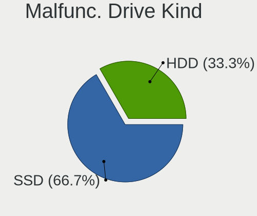
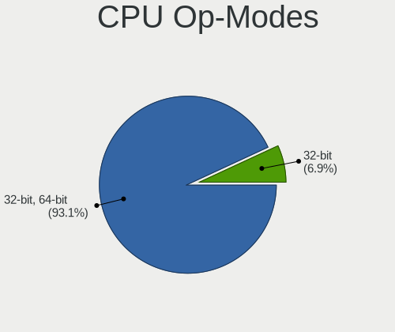
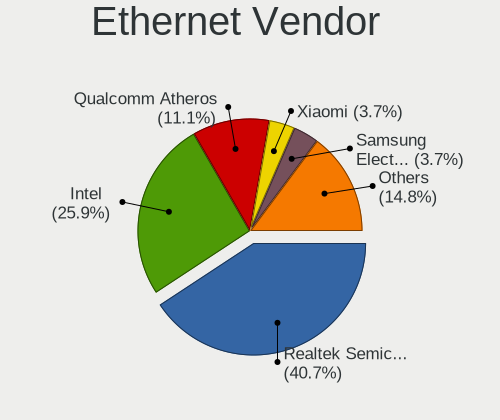
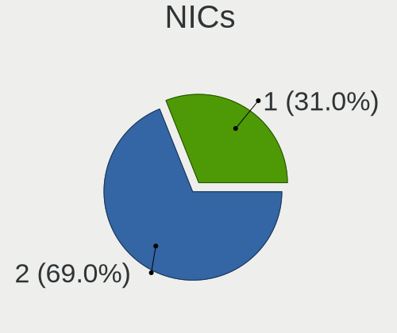
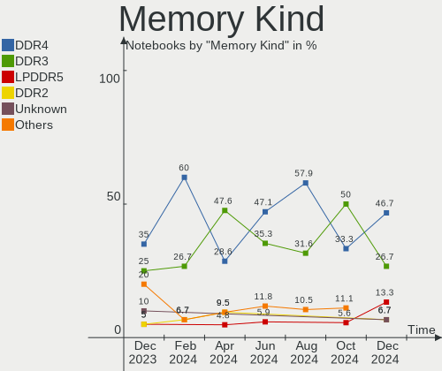
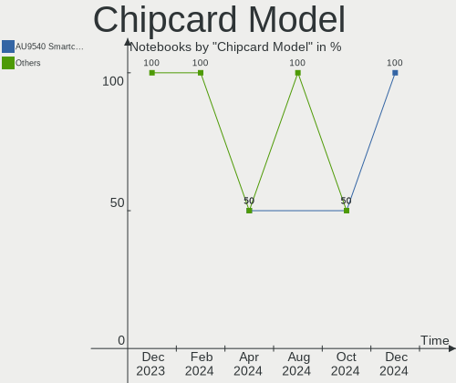

Xubuntu - Hardware Trends (Notebooks)
-------------------------------------

A project to identify most popular hardware characteristics and track their change
over time based on data collected by Linux users at https://Linux-Hardware.org.

Anyone can contribute to this report by the [hw-probe](https://github.com/linuxhw/hw-probe) tool:

    sudo -E hw-probe -all -upload

This report is for one last month. Overall report since the beginning of time: [TestCoverage](https://github.com/linuxhw/TestCoverage)

Period: May, 2022.

Contents
--------

* [ System ](#system)
  - [ OS                       ](#os)
  - [ OS Family                ](#os-family)
  - [ Kernel                   ](#kernel)
  - [ Kernel Family            ](#kernel-family)
  - [ Kernel Major Ver.        ](#kernel-major-ver)
  - [ Arch                     ](#arch)
  - [ DE                       ](#de)
  - [ Display Server           ](#display-server)
  - [ Display Manager          ](#display-manager)
  - [ OS Lang                  ](#os-lang)
  - [ Boot Mode                ](#boot-mode)
  - [ Filesystem               ](#filesystem)
  - [ Part. scheme             ](#part-scheme)
  - [ Dual Boot with Linux/BSD ](#dual-boot-with-linuxbsd)
  - [ Dual Boot (Win)          ](#dual-boot-win)

* [ Board ](#board)
  - [ Vendor                   ](#vendor)
  - [ Model                    ](#model)
  - [ Model Family             ](#model-family)
  - [ MFG Year                 ](#mfg-year)
  - [ Form Factor              ](#form-factor)
  - [ Secure Boot              ](#secure-boot)
  - [ Coreboot                 ](#coreboot)
  - [ RAM Size                 ](#ram-size)
  - [ RAM Used                 ](#ram-used)
  - [ Total Drives             ](#total-drives)
  - [ Has CD-ROM               ](#has-cd-rom)
  - [ Has Ethernet             ](#has-ethernet)
  - [ Has WiFi                 ](#has-wifi)
  - [ Has Bluetooth            ](#has-bluetooth)

* [ Location ](#location)
  - [ Country                  ](#country)
  - [ City                     ](#city)

* [ Drives ](#drives)
  - [ Drive Vendor             ](#drive-vendor)
  - [ Drive Model              ](#drive-model)
  - [ HDD Vendor               ](#hdd-vendor)
  - [ SSD Vendor               ](#ssd-vendor)
  - [ Drive Kind               ](#drive-kind)
  - [ Drive Connector          ](#drive-connector)
  - [ Drive Size               ](#drive-size)
  - [ Space Total              ](#space-total)
  - [ Space Used               ](#space-used)
  - [ Malfunc. Drives          ](#malfunc-drives)
  - [ Malfunc. Drive Vendor    ](#malfunc-drive-vendor)
  - [ Malfunc. HDD Vendor      ](#malfunc-hdd-vendor)
  - [ Malfunc. Drive Kind      ](#malfunc-drive-kind)
  - [ Failed Drives            ](#failed-drives)
  - [ Failed Drive Vendor      ](#failed-drive-vendor)
  - [ Drive Status             ](#drive-status)

* [ Storage controller ](#storage-controller)
  - [ Storage Vendor           ](#storage-vendor)
  - [ Storage Model            ](#storage-model)
  - [ Storage Kind             ](#storage-kind)

* [ Processor ](#processor)
  - [ CPU Vendor               ](#cpu-vendor)
  - [ CPU Model                ](#cpu-model)
  - [ CPU Model Family         ](#cpu-model-family)
  - [ CPU Cores                ](#cpu-cores)
  - [ CPU Sockets              ](#cpu-sockets)
  - [ CPU Threads              ](#cpu-threads)
  - [ CPU Op-Modes             ](#cpu-op-modes)
  - [ CPU Microcode            ](#cpu-microcode)
  - [ CPU Microarch            ](#cpu-microarch)

* [ Graphics ](#graphics)
  - [ GPU Vendor               ](#gpu-vendor)
  - [ GPU Model                ](#gpu-model)
  - [ GPU Combo                ](#gpu-combo)
  - [ GPU Driver               ](#gpu-driver)
  - [ GPU Memory               ](#gpu-memory)

* [ Monitor ](#monitor)
  - [ Monitor Vendor           ](#monitor-vendor)
  - [ Monitor Model            ](#monitor-model)
  - [ Monitor Resolution       ](#monitor-resolution)
  - [ Monitor Diagonal         ](#monitor-diagonal)
  - [ Monitor Width            ](#monitor-width)
  - [ Aspect Ratio             ](#aspect-ratio)
  - [ Monitor Area             ](#monitor-area)
  - [ Pixel Density            ](#pixel-density)
  - [ Multiple Monitors        ](#multiple-monitors)

* [ Network ](#network)
  - [ Net Controller Vendor    ](#net-controller-vendor)
  - [ Net Controller Model     ](#net-controller-model)
  - [ Wireless Vendor          ](#wireless-vendor)
  - [ Wireless Model           ](#wireless-model)
  - [ Ethernet Vendor          ](#ethernet-vendor)
  - [ Ethernet Model           ](#ethernet-model)
  - [ Net Controller Kind      ](#net-controller-kind)
  - [ Used Controller          ](#used-controller)
  - [ NICs                     ](#nics)
  - [ IPv6                     ](#ipv6)

* [ Bluetooth ](#bluetooth)
  - [ Bluetooth Vendor         ](#bluetooth-vendor)
  - [ Bluetooth Model          ](#bluetooth-model)

* [ Sound ](#sound)
  - [ Sound Vendor             ](#sound-vendor)
  - [ Sound Model              ](#sound-model)

* [ Memory ](#memory)
  - [ Memory Vendor            ](#memory-vendor)
  - [ Memory Model             ](#memory-model)
  - [ Memory Kind              ](#memory-kind)
  - [ Memory Form Factor       ](#memory-form-factor)
  - [ Memory Size              ](#memory-size)
  - [ Memory Speed             ](#memory-speed)

* [ Printers & scanners ](#printers--scanners)
  - [ Printer Vendor           ](#printer-vendor)
  - [ Printer Model            ](#printer-model)
  - [ Scanner Vendor           ](#scanner-vendor)
  - [ Scanner Model            ](#scanner-model)

* [ Camera ](#camera)
  - [ Camera Vendor            ](#camera-vendor)
  - [ Camera Model             ](#camera-model)

* [ Security ](#security)
  - [ Fingerprint Vendor       ](#fingerprint-vendor)
  - [ Fingerprint Model        ](#fingerprint-model)
  - [ Chipcard Vendor          ](#chipcard-vendor)
  - [ Chipcard Model           ](#chipcard-model)

* [ Unsupported ](#unsupported)
  - [ Unsupported Devices      ](#unsupported-devices)
  - [ Unsupported Device Types ](#unsupported-device-types)

System
------

OS
--

Installed operating systems

| Name          | Notebooks | Percent |
|---------------|-----------|---------|
| Xubuntu 20.04 | 23        | 58.97%  |
| Xubuntu 22.04 | 10        | 25.64%  |
| Xubuntu 18.04 | 5         | 12.82%  |
| Xubuntu 21.04 | 1         | 2.56%   |

OS Family
---------

OS without a version

| Name    | Notebooks | Percent |
|---------|-----------|---------|
| Xubuntu | 39        | 100%    |

Kernel
------

Version of the Linux kernel

| Version                   | Notebooks | Percent |
|---------------------------|-----------|---------|
| 5.4.0-110-generic         | 7         | 17.95%  |
| 5.15.0-27-generic         | 5         | 12.82%  |
| 5.13.0-41-generic         | 3         | 7.69%   |
| 5.13.0-40-generic         | 3         | 7.69%   |
| 5.15.0-25-generic         | 2         | 5.13%   |
| 5.13.0-44-generic         | 2         | 5.13%   |
| 5.4.0-90-generic          | 1         | 2.56%   |
| 5.4.0-113-generic         | 1         | 2.56%   |
| 5.4.0-109-generic         | 1         | 2.56%   |
| 5.4.0-107-lowlatency      | 1         | 2.56%   |
| 5.4.0-107-generic         | 1         | 2.56%   |
| 5.17.0-5.1-liquorix-amd64 | 1         | 2.56%   |
| 5.15.36-xanmod1           | 1         | 2.56%   |
| 5.15.0-35-generic         | 1         | 2.56%   |
| 5.15.0-30-generic         | 1         | 2.56%   |
| 5.15.0-27-lowlatency      | 1         | 2.56%   |
| 5.14.0-1033-oem           | 1         | 2.56%   |
| 5.13.0-44-lowlatency      | 1         | 2.56%   |
| 5.13.0-30-generic         | 1         | 2.56%   |
| 5.13.0-27-generic         | 1         | 2.56%   |
| 5.11.0-31-generic         | 1         | 2.56%   |
| 5.10.0-1038-oem           | 1         | 2.56%   |
| 4.15.0-176-lowlatency     | 1         | 2.56%   |

Kernel Family
-------------

Linux kernel without a distro release

| Version | Notebooks | Percent |
|---------|-----------|---------|
| 5.4.0   | 12        | 30.77%  |
| 5.13.0  | 11        | 28.21%  |
| 5.15.0  | 10        | 25.64%  |
| 5.17.0  | 1         | 2.56%   |
| 5.15.36 | 1         | 2.56%   |
| 5.14.0  | 1         | 2.56%   |
| 5.11.0  | 1         | 2.56%   |
| 5.10.0  | 1         | 2.56%   |
| 4.15.0  | 1         | 2.56%   |

Kernel Major Ver.
-----------------

Linux kernel major version

| Version | Notebooks | Percent |
|---------|-----------|---------|
| 5.4     | 12        | 30.77%  |
| 5.15    | 11        | 28.21%  |
| 5.13    | 11        | 28.21%  |
| 5.17    | 1         | 2.56%   |
| 5.14    | 1         | 2.56%   |
| 5.11    | 1         | 2.56%   |
| 5.10    | 1         | 2.56%   |
| 4.15    | 1         | 2.56%   |

Arch
----

OS architecture (x86_64, i586, etc.)

| Name   | Notebooks | Percent |
|--------|-----------|---------|
| x86_64 | 35        | 89.74%  |
| i686   | 4         | 10.26%  |

DE
--

Desktop Environment

| Name  | Notebooks | Percent |
|-------|-----------|---------|
| XFCE  | 37        | 94.87%  |
| KDE5  | 1         | 2.56%   |
| GNOME | 1         | 2.56%   |

Display Server
--------------

X11 or Wayland

| Name | Notebooks | Percent |
|------|-----------|---------|
| X11  | 39        | 100%    |

Display Manager
---------------

SDDM, LightDM, etc.

| Name    | Notebooks | Percent |
|---------|-----------|---------|
| LightDM | 35        | 89.74%  |
| GDM3    | 2         | 5.13%   |
| SDDM    | 1         | 2.56%   |
| Unknown | 1         | 2.56%   |

OS Lang
-------

Language

| Lang  | Notebooks | Percent |
|-------|-----------|---------|
| en_US | 10        | 25.64%  |
| it_IT | 5         | 12.82%  |
| fr_FR | 5         | 12.82%  |
| ja_JP | 3         | 7.69%   |
| en_GB | 3         | 7.69%   |
| C     | 3         | 7.69%   |
| ru_RU | 2         | 5.13%   |
| es_ES | 2         | 5.13%   |
| de_DE | 2         | 5.13%   |
| cs_CZ | 2         | 5.13%   |
| pl_PL | 1         | 2.56%   |
| nl_NL | 1         | 2.56%   |

Boot Mode
---------

EFI or BIOS

| Mode | Notebooks | Percent |
|------|-----------|---------|
| BIOS | 21        | 53.85%  |
| EFI  | 18        | 46.15%  |

Filesystem
----------

Type of filesystem

| Type    | Notebooks | Percent |
|---------|-----------|---------|
| Ext4    | 34        | 87.18%  |
| Overlay | 2         | 5.13%   |
| Zfs     | 1         | 2.56%   |
| Ext3    | 1         | 2.56%   |
| Btrfs   | 1         | 2.56%   |

Part. scheme
------------

Scheme of partitioning

| Type    | Notebooks | Percent |
|---------|-----------|---------|
| Unknown | 20        | 51.28%  |
| GPT     | 13        | 33.33%  |
| MBR     | 6         | 15.38%  |

Dual Boot with Linux/BSD
------------------------

Hosting more than one Linux/BSD

| Dual boot | Notebooks | Percent |
|-----------|-----------|---------|
| No        | 37        | 94.87%  |
| Yes       | 2         | 5.13%   |

Dual Boot (Win)
---------------

Hosting Linux and Windows

| Dual boot | Notebooks | Percent |
|-----------|-----------|---------|
| No        | 29        | 74.36%  |
| Yes       | 10        | 25.64%  |

Board
-----

Vendor
------

Motherboard manufacturer

| Name             | Notebooks | Percent |
|------------------|-----------|---------|
| Lenovo           | 9         | 23.08%  |
| Dell             | 7         | 17.95%  |
| Hewlett-Packard  | 6         | 15.38%  |
| ASUSTek Computer | 6         | 15.38%  |
| Google           | 2         | 5.13%   |
| TUXEDO           | 1         | 2.56%   |
| Toshiba          | 1         | 2.56%   |
| Sony             | 1         | 2.56%   |
| Razer            | 1         | 2.56%   |
| Medion           | 1         | 2.56%   |
| IBM              | 1         | 2.56%   |
| AMI              | 1         | 2.56%   |
| Acer             | 1         | 2.56%   |
| Unknown          | 1         | 2.56%   |

Model
-----

Motherboard model

| Name                                       | Notebooks | Percent |
|--------------------------------------------|-----------|---------|
| TUXEDO N14xWU                              | 1         | 2.56%   |
| Toshiba Satellite C70D-B                   | 1         | 2.56%   |
| Sony VGN-NS21S_S                           | 1         | 2.56%   |
| Razer Blade Stealth 13 Late 2019           | 1         | 2.56%   |
| Medion E15407                              | 1         | 2.56%   |
| Lenovo ThinkPad X240 20AMS6FF00            | 1         | 2.56%   |
| Lenovo ThinkPad X200s 74664SJ              | 1         | 2.56%   |
| Lenovo ThinkPad X1 Carbon Gen 9 20XWCTO1WW | 1         | 2.56%   |
| Lenovo ThinkPad W510 431963G               | 1         | 2.56%   |
| Lenovo ThinkPad T410 2516CTO               | 1         | 2.56%   |
| Lenovo ThinkPad L13 20R4S4WG00             | 1         | 2.56%   |
| Lenovo ThinkPad E580 20KS001JGE            | 1         | 2.56%   |
| Lenovo Legion Y540-17IRH-PG0 81T3          | 1         | 2.56%   |
| Lenovo IdeaPad L340-17IRH Gaming 81LL      | 1         | 2.56%   |
| IBM ThinkPad T43 2668F5G                   | 1         | 2.56%   |
| HP Pavilion dv6000 (RR374EA#ABZ)           | 1         | 2.56%   |
| HP Mini 5103                               | 1         | 2.56%   |
| HP Mini 110-1100                           | 1         | 2.56%   |
| HP Laptop 15-bw0xx                         | 1         | 2.56%   |
| HP Compaq nc6320 (RH374EA#AKB)             | 1         | 2.56%   |
| HP Compaq 6820s                            | 1         | 2.56%   |
| Google Snappy                              | 1         | 2.56%   |
| Google Auron_Yuna                          | 1         | 2.56%   |
| Dell XPS M1530                             | 1         | 2.56%   |
| Dell Latitude D610                         | 1         | 2.56%   |
| Dell Latitude 7420                         | 1         | 2.56%   |
| Dell Latitude 7400                         | 1         | 2.56%   |
| Dell Latitude 5580                         | 1         | 2.56%   |
| Dell Latitude 5511                         | 1         | 2.56%   |
| Dell Inspiron 7501                         | 1         | 2.56%   |
| ASUS X510UA                                | 1         | 2.56%   |
| ASUS X101CH                                | 1         | 2.56%   |
| ASUS UL30A                                 | 1         | 2.56%   |
| ASUS K53SC                                 | 1         | 2.56%   |
| ASUS ASUS TUF Dash F15 FX516PM_FX516PM     | 1         | 2.56%   |
| ASUS A7K                                   | 1         | 2.56%   |
| AMI Cherry Trail CR                        | 1         | 2.56%   |
| Acer Aspire 5740                           | 1         | 2.56%   |
| Unknown                                    | 1         | 2.56%   |

Model Family
------------

Motherboard model prefix

| Name              | Notebooks | Percent |
|-------------------|-----------|---------|
| Lenovo ThinkPad   | 7         | 17.95%  |
| Dell Latitude     | 5         | 12.82%  |
| HP Mini           | 2         | 5.13%   |
| HP Compaq         | 2         | 5.13%   |
| TUXEDO N14xWU     | 1         | 2.56%   |
| Toshiba Satellite | 1         | 2.56%   |
| Sony VGN-NS21S    | 1         | 2.56%   |
| Razer Blade       | 1         | 2.56%   |
| Medion E15407     | 1         | 2.56%   |
| Lenovo Legion     | 1         | 2.56%   |
| Lenovo IdeaPad    | 1         | 2.56%   |
| IBM ThinkPad      | 1         | 2.56%   |
| HP Pavilion       | 1         | 2.56%   |
| HP Laptop         | 1         | 2.56%   |
| Google Snappy     | 1         | 2.56%   |
| Google Auron      | 1         | 2.56%   |
| Dell XPS          | 1         | 2.56%   |
| Dell Inspiron     | 1         | 2.56%   |
| ASUS X510UA       | 1         | 2.56%   |
| ASUS X101CH       | 1         | 2.56%   |
| ASUS UL30A        | 1         | 2.56%   |
| ASUS K53SC        | 1         | 2.56%   |
| ASUS ASUS         | 1         | 2.56%   |
| ASUS A7K          | 1         | 2.56%   |
| AMI Cherry        | 1         | 2.56%   |
| Acer Aspire       | 1         | 2.56%   |
| Unknown           | 1         | 2.56%   |

MFG Year
--------

Motherboard manufacture year

| Year | Notebooks | Percent |
|------|-----------|---------|
| 2020 | 6         | 15.38%  |
| 2019 | 5         | 12.82%  |
| 2009 | 5         | 12.82%  |
| 2021 | 3         | 7.69%   |
| 2017 | 3         | 7.69%   |
| 2008 | 3         | 7.69%   |
| 2007 | 3         | 7.69%   |
| 2010 | 2         | 5.13%   |
| 2005 | 2         | 5.13%   |
| 2022 | 1         | 2.56%   |
| 2018 | 1         | 2.56%   |
| 2016 | 1         | 2.56%   |
| 2014 | 1         | 2.56%   |
| 2013 | 1         | 2.56%   |
| 2012 | 1         | 2.56%   |
| 2011 | 1         | 2.56%   |

Form Factor
-----------

Physical design of the computer

| Name     | Notebooks | Percent |
|----------|-----------|---------|
| Notebook | 39        | 100%    |

Secure Boot
-----------

Enabled or disabled

| State    | Notebooks | Percent |
|----------|-----------|---------|
| Disabled | 35        | 89.74%  |
| Enabled  | 4         | 10.26%  |

Coreboot
--------

Have coreboot on board

| Used | Notebooks | Percent |
|------|-----------|---------|
| No   | 37        | 94.87%  |
| Yes  | 2         | 5.13%   |

RAM Size
--------

Total RAM memory

| Size in GB | Notebooks | Percent |
|------------|-----------|---------|
| 4.01-8.0   | 10        | 25.64%  |
| 3.01-4.0   | 8         | 20.51%  |
| 16.01-24.0 | 8         | 20.51%  |
| 2.01-3.0   | 3         | 7.69%   |
| 1.01-2.0   | 3         | 7.69%   |
| 0.51-1.0   | 3         | 7.69%   |
| 32.01-64.0 | 2         | 5.13%   |
| 24.01-32.0 | 2         | 5.13%   |

RAM Used
--------

Used RAM memory

| Used GB    | Notebooks | Percent |
|------------|-----------|---------|
| 1.01-2.0   | 14        | 35.9%   |
| 2.01-3.0   | 9         | 23.08%  |
| 4.01-8.0   | 5         | 12.82%  |
| 0.51-1.0   | 4         | 10.26%  |
| 3.01-4.0   | 3         | 7.69%   |
| 8.01-16.0  | 2         | 5.13%   |
| 16.01-24.0 | 1         | 2.56%   |
| 0.01-0.5   | 1         | 2.56%   |

Total Drives
------------

Number of drives on board

| Drives | Notebooks | Percent |
|--------|-----------|---------|
| 1      | 33        | 84.62%  |
| 2      | 5         | 12.82%  |
| 0      | 1         | 2.56%   |

Has CD-ROM
----------

Has CD-ROM on board

| Presented | Notebooks | Percent |
|-----------|-----------|---------|
| No        | 27        | 69.23%  |
| Yes       | 12        | 30.77%  |

Has Ethernet
------------

Has Ethernet on board

| Presented | Notebooks | Percent |
|-----------|-----------|---------|
| Yes       | 29        | 74.36%  |
| No        | 10        | 25.64%  |

Has WiFi
--------

Has WiFi module

| Presented | Notebooks | Percent |
|-----------|-----------|---------|
| Yes       | 38        | 97.44%  |
| No        | 1         | 2.56%   |

Has Bluetooth
-------------

Has Bluetooth module

| Presented | Notebooks | Percent |
|-----------|-----------|---------|
| Yes       | 25        | 64.1%   |
| No        | 14        | 35.9%   |

Location
--------

Country
-------

Geographic location (country)

| Country     | Notebooks | Percent |
|-------------|-----------|---------|
| Germany     | 6         | 15.38%  |
| France      | 6         | 15.38%  |
| Italy       | 4         | 10.26%  |
| USA         | 3         | 7.69%   |
| UK          | 3         | 7.69%   |
| Japan       | 3         | 7.69%   |
| Czechia     | 3         | 7.69%   |
| Spain       | 2         | 5.13%   |
| Poland      | 2         | 5.13%   |
| Netherlands | 2         | 5.13%   |
| Zimbabwe    | 1         | 2.56%   |
| Sweden      | 1         | 2.56%   |
| Russia      | 1         | 2.56%   |
| Kazakhstan  | 1         | 2.56%   |
| Greece      | 1         | 2.56%   |

City
----

Geographic location (city)

| City                 | Notebooks | Percent |
|----------------------|-----------|---------|
| Prague               | 3         | 7.69%   |
| Casalecchio di Reno  | 3         | 7.69%   |
| Shinjuku             | 2         | 5.13%   |
| Wroclaw              | 1         | 2.56%   |
| Washington           | 1         | 2.56%   |
| Uppsala              | 1         | 2.56%   |
| Stuttgart            | 1         | 2.56%   |
| Sesena               | 1         | 2.56%   |
| Reading              | 1         | 2.56%   |
| Poznan               | 1         | 2.56%   |
| Nuenen               | 1         | 2.56%   |
| Noyabrsk             | 1         | 2.56%   |
| Nederland            | 1         | 2.56%   |
| Munich               | 1         | 2.56%   |
| Mulhouse             | 1         | 2.56%   |
| Lorient              | 1         | 2.56%   |
| Leesville            | 1         | 2.56%   |
| La Bourboule         | 1         | 2.56%   |
| Jerez de la Frontera | 1         | 2.56%   |
| Harare               | 1         | 2.56%   |
| Genoa                | 1         | 2.56%   |
| Geispolsheim         | 1         | 2.56%   |
| Fulham               | 1         | 2.56%   |
| Frankfurt am Main    | 1         | 2.56%   |
| Fourneaux-le-Val     | 1         | 2.56%   |
| Edinburgh            | 1         | 2.56%   |
| Chiyoda              | 1         | 2.56%   |
| Bielefeld            | 1         | 2.56%   |
| Béthune             | 1         | 2.56%   |
| Berlin               | 1         | 2.56%   |
| Bellevue             | 1         | 2.56%   |
| Augsburg             | 1         | 2.56%   |
| Athens               | 1         | 2.56%   |
| Almaty               | 1         | 2.56%   |

Drives
------

Drive Vendor
------------

Hard drive vendors

| Vendor              | Notebooks | Drives | Percent |
|---------------------|-----------|--------|---------|
| Samsung Electronics | 8         | 8      | 19.05%  |
| Crucial             | 4         | 4      | 9.52%   |
| WDC                 | 3         | 3      | 7.14%   |
| Unknown             | 3         | 3      | 7.14%   |
| Toshiba             | 3         | 4      | 7.14%   |
| Seagate             | 3         | 3      | 7.14%   |
| Sandisk             | 3         | 3      | 7.14%   |
| Hitachi             | 3         | 3      | 7.14%   |
| Micron Technology   | 2         | 2      | 4.76%   |
| Fujitsu             | 2         | 2      | 4.76%   |
| Transcend           | 1         | 1      | 2.38%   |
| SK Hynix            | 1         | 1      | 2.38%   |
| Silicon Motion      | 1         | 1      | 2.38%   |
| Lenovo              | 1         | 1      | 2.38%   |
| Kingston            | 1         | 1      | 2.38%   |
| Gigabyte Technology | 1         | 1      | 2.38%   |
| China               | 1         | 1      | 2.38%   |
| A-DATA Technology   | 1         | 1      | 2.38%   |

Drive Model
-----------

Hard drive models

| Model                             | Notebooks | Percent |
|-----------------------------------|-----------|---------|
| Samsung SSD 850 EVO 500GB         | 2         | 4.65%   |
| Crucial CT500MX500SSD1 500GB      | 2         | 4.65%   |
| WDC WDS500G2B0C-00PXH0 500GB      | 1         | 2.33%   |
| WDC WDS500G2B0C 500GB             | 1         | 2.33%   |
| WDC WD3200BEVT-60ZCT1 320GB       | 1         | 2.33%   |
| Unknown SD08G  8GB                | 1         | 2.33%   |
| Unknown MMC64G  64GB              | 1         | 2.33%   |
| Unknown Biwin  64GB               | 1         | 2.33%   |
| Transcend TS256GSSD370 256GB      | 1         | 2.33%   |
| Toshiba THNSNK128GVN8 128GB SSD   | 1         | 2.33%   |
| Toshiba MQ01ABF050 500GB          | 1         | 2.33%   |
| Toshiba MK8032GSX 80GB            | 1         | 2.33%   |
| Toshiba KXG6AZNV256G 256GB        | 1         | 2.33%   |
| SK Hynix BC711 NVMe 512GB         | 1         | 2.33%   |
| Silicon Motion NVMe SSD Drive 1TB | 1         | 2.33%   |
| Seagate ST960822A 64GB            | 1         | 2.33%   |
| Seagate ST9320325AS 320GB         | 1         | 2.33%   |
| Seagate ST320LT007-9ZV142 320GB   | 1         | 2.33%   |
| SanDisk X400 2.5 7MM 256GB SSD    | 1         | 2.33%   |
| Sandisk NVMe SSD Drive 512GB      | 1         | 2.33%   |
| SanDisk DF4032  32GB              | 1         | 2.33%   |
| Samsung SSD 970 EVO 1TB           | 1         | 2.33%   |
| Samsung SSD 860 EVO 1TB           | 1         | 2.33%   |
| Samsung NVMe SSD Drive 512GB      | 1         | 2.33%   |
| Samsung NVMe SSD Drive 250GB      | 1         | 2.33%   |
| Samsung MZVLW256HEHP-00000 256GB  | 1         | 2.33%   |
| Samsung HM160HI 160GB             | 1         | 2.33%   |
| Micron MTFDHBA1T0TCK 1TB          | 1         | 2.33%   |
| Micron 2200S NVMe 512GB           | 1         | 2.33%   |
| Lenovo NVMe SSD Drive 256GB       | 1         | 2.33%   |
| Kingston SNS4151S332GD 32GB SSD   | 1         | 2.33%   |
| Hitachi HTS725025A9A364 250GB     | 1         | 2.33%   |
| Hitachi HTS547550A9E384 500GB     | 1         | 2.33%   |
| Hitachi HTS543225L9SA00 250GB     | 1         | 2.33%   |
| Gigabyte GP-GSTFS31256GTND 256GB  | 1         | 2.33%   |
| Fujitsu MHV2120BH PL 120GB        | 1         | 2.33%   |
| Fujitsu MHV2060AH 64GB            | 1         | 2.33%   |
| Crucial M4-CT128M4SSD2 128GB      | 1         | 2.33%   |
| Crucial CT1000MX500SSD1 1TB       | 1         | 2.33%   |
| China S41CF512G 512GB             | 1         | 2.33%   |
| A-DATA SP900 128GB SSD            | 1         | 2.33%   |

HDD Vendor
----------

Hard disk drive vendors

| Vendor              | Notebooks | Drives | Percent |
|---------------------|-----------|--------|---------|
| Seagate             | 3         | 3      | 25%     |
| Hitachi             | 3         | 3      | 25%     |
| Toshiba             | 2         | 2      | 16.67%  |
| Fujitsu             | 2         | 2      | 16.67%  |
| WDC                 | 1         | 1      | 8.33%   |
| Samsung Electronics | 1         | 1      | 8.33%   |

SSD Vendor
----------

Solid state drive vendors

| Vendor              | Notebooks | Drives | Percent |
|---------------------|-----------|--------|---------|
| Crucial             | 4         | 4      | 30.77%  |
| Samsung Electronics | 3         | 3      | 23.08%  |
| Transcend           | 1         | 1      | 7.69%   |
| Toshiba             | 1         | 1      | 7.69%   |
| SanDisk             | 1         | 1      | 7.69%   |
| Kingston            | 1         | 1      | 7.69%   |
| Gigabyte Technology | 1         | 1      | 7.69%   |
| A-DATA Technology   | 1         | 1      | 7.69%   |

Drive Kind
----------

HDD or SSD

| Kind    | Notebooks | Drives | Percent |
|---------|-----------|--------|---------|
| NVMe    | 13        | 13     | 30.95%  |
| SSD     | 13        | 13     | 30.95%  |
| HDD     | 11        | 12     | 26.19%  |
| MMC     | 4         | 4      | 9.52%   |
| Unknown | 1         | 1      | 2.38%   |

Drive Connector
---------------

SATA, SAS, NVMe, etc.

| Type | Notebooks | Drives | Percent |
|------|-----------|--------|---------|
| SATA | 24        | 26     | 58.54%  |
| NVMe | 13        | 13     | 31.71%  |
| MMC  | 4         | 4      | 9.76%   |

Drive Size
----------

Size of hard drive

| Size in TB | Notebooks | Drives | Percent |
|------------|-----------|--------|---------|
| 0.01-0.5   | 21        | 23     | 91.3%   |
| 0.51-1.0   | 2         | 2      | 8.7%    |

Space Total
-----------

Amount of disk space available on the file system

| Size in GB | Notebooks | Percent |
|------------|-----------|---------|
| 251-500    | 11        | 28.21%  |
| 101-250    | 9         | 23.08%  |
| 51-100     | 7         | 17.95%  |
| 1-20       | 4         | 10.26%  |
| 501-1000   | 4         | 10.26%  |
| 21-50      | 3         | 7.69%   |
| 1001-2000  | 1         | 2.56%   |

Space Used
----------

Amount of used disk space

| Used GB  | Notebooks | Percent |
|----------|-----------|---------|
| 1-20     | 15        | 38.46%  |
| 101-250  | 7         | 17.95%  |
| 21-50    | 6         | 15.38%  |
| 251-500  | 4         | 10.26%  |
| 51-100   | 4         | 10.26%  |
| 501-1000 | 3         | 7.69%   |

Malfunc. Drives
---------------

Drive models with a malfunction

| Model                           | Notebooks | Drives | Percent |
|---------------------------------|-----------|--------|---------|
| Kingston SNS4151S332GD 32GB SSD | 1         | 1      | 100%    |

Malfunc. Drive Vendor
---------------------

Vendors of faulty drives

| Vendor   | Notebooks | Drives | Percent |
|----------|-----------|--------|---------|
| Kingston | 1         | 1      | 100%    |

Malfunc. HDD Vendor
-------------------

Vendors of faulty HDD drives

Zero info for selected period =(

Malfunc. Drive Kind
-------------------

Kinds of faulty drives

| Kind | Notebooks | Drives | Percent |
|------|-----------|--------|---------|
| SSD  | 1         | 1      | 100%    |

Failed Drives
-------------

Failed drive models

Zero info for selected period =(

Failed Drive Vendor
-------------------

Failed drive vendors

Zero info for selected period =(

Drive Status
------------

Number of failed and malfunc. drives

| Status   | Notebooks | Drives | Percent |
|----------|-----------|--------|---------|
| Detected | 21        | 24     | 55.26%  |
| Works    | 16        | 18     | 42.11%  |
| Malfunc  | 1         | 1      | 2.63%   |

Storage controller
------------------

Storage Vendor
--------------

Storage controller vendors

| Vendor                       | Notebooks | Percent |
|------------------------------|-----------|---------|
| Intel                        | 29        | 63.04%  |
| Samsung Electronics          | 4         | 8.7%    |
| Sandisk                      | 3         | 6.52%   |
| AMD                          | 3         | 6.52%   |
| Micron Technology            | 2         | 4.35%   |
| Toshiba America Info Systems | 1         | 2.17%   |
| SK Hynix                     | 1         | 2.17%   |
| Silicon Motion               | 1         | 2.17%   |
| Lenovo                       | 1         | 2.17%   |
| JMicron Technology           | 1         | 2.17%   |

Storage Model
-------------

Storage controller models

| Model                                                                        | Notebooks | Percent |
|------------------------------------------------------------------------------|-----------|---------|
| Intel Sunrise Point-LP SATA Controller [AHCI mode]                           | 3         | 5.88%   |
| Intel 82801GBM/GHM (ICH7-M Family) SATA Controller [AHCI mode]               | 3         | 5.88%   |
| Sandisk Non-Volatile memory controller                                       | 2         | 3.92%   |
| Samsung NVMe SSD Controller SM981/PM981/PM983                                | 2         | 3.92%   |
| Micron Non-Volatile memory controller                                        | 2         | 3.92%   |
| Intel Volume Management Device NVMe RAID Controller                          | 2         | 3.92%   |
| Intel Cannon Lake Mobile PCH SATA AHCI Controller                            | 2         | 3.92%   |
| Intel 82801IBM/IEM (ICH9M/ICH9M-E) 4 port SATA Controller [AHCI mode]        | 2         | 3.92%   |
| Intel 82801HM/HEM (ICH8M/ICH8M-E) SATA Controller [AHCI mode]                | 2         | 3.92%   |
| Intel 82801HM/HEM (ICH8M/ICH8M-E) IDE Controller                             | 2         | 3.92%   |
| Intel 82801G (ICH7 Family) IDE Controller                                    | 2         | 3.92%   |
| Intel 82801FBM (ICH6M) SATA Controller                                       | 2         | 3.92%   |
| Intel 5 Series/3400 Series Chipset 6 port SATA AHCI Controller               | 2         | 3.92%   |
| Intel 400 Series Chipset Family SATA AHCI Controller                         | 2         | 3.92%   |
| AMD FCH SATA Controller [AHCI mode]                                          | 2         | 3.92%   |
| Toshiba America Info Systems XG6 NVMe SSD Controller                         | 1         | 1.96%   |
| SK Hynix Gold P31 SSD                                                        | 1         | 1.96%   |
| Silicon Motion SM2263EN/SM2263XT SSD Controller                              | 1         | 1.96%   |
| Sandisk WD Blue SN550 NVMe SSD                                               | 1         | 1.96%   |
| Samsung NVMe SSD Controller SM961/PM961/SM963                                | 1         | 1.96%   |
| Samsung NVMe SSD Controller 980                                              | 1         | 1.96%   |
| Lenovo Non-Volatile memory controller                                        | 1         | 1.96%   |
| JMicron JMB360 AHCI Controller                                               | 1         | 1.96%   |
| Intel Wildcat Point-LP SATA Controller [AHCI Mode]                           | 1         | 1.96%   |
| Intel NM10/ICH7 Family SATA Controller [IDE mode]                            | 1         | 1.96%   |
| Intel NM10/ICH7 Family SATA Controller [AHCI mode]                           | 1         | 1.96%   |
| Intel Celeron N3350/Pentium N4200/Atom E3900 Series SATA AHCI Controller     | 1         | 1.96%   |
| Intel 82801IBM/IEM (ICH9M/ICH9M-E) 2 port SATA Controller [IDE mode]         | 1         | 1.96%   |
| Intel 82801 Mobile SATA Controller [RAID mode]                               | 1         | 1.96%   |
| Intel 8 Series SATA Controller 1 [AHCI mode]                                 | 1         | 1.96%   |
| Intel 6 Series/C200 Series Chipset Family 6 port Mobile SATA AHCI Controller | 1         | 1.96%   |
| Intel 5 Series/3400 Series Chipset 4 port SATA AHCI Controller               | 1         | 1.96%   |
| AMD SB600 Non-Raid-5 SATA                                                    | 1         | 1.96%   |
| AMD SB600 IDE                                                                | 1         | 1.96%   |

Storage Kind
------------

Kind of storage controller (IDE, SATA, NVMe, SAS, ...)

| Kind | Notebooks | Percent |
|------|-----------|---------|
| SATA | 25        | 50%     |
| NVMe | 13        | 26%     |
| IDE  | 9         | 18%     |
| RAID | 3         | 6%      |

Processor
---------

CPU Vendor
----------

Processor vendors

| Vendor | Notebooks | Percent |
|--------|-----------|---------|
| Intel  | 36        | 92.31%  |
| AMD    | 3         | 7.69%   |

CPU Model
---------

Processor models

| Model                                        | Notebooks | Percent |
|----------------------------------------------|-----------|---------|
| Intel Core 2 Duo CPU T6400 @ 2.00GHz         | 2         | 5.13%   |
| Intel Celeron CPU N3450 @ 1.10GHz            | 2         | 5.13%   |
| Intel Pentium M processor 2.00GHz            | 1         | 2.56%   |
| Intel Pentium M processor 1.86GHz            | 1         | 2.56%   |
| Intel Genuine CPU U7300 @ 1.30GHz            | 1         | 2.56%   |
| Intel Core i7-9750H CPU @ 2.60GHz            | 1         | 2.56%   |
| Intel Core i7-8665U CPU @ 1.90GHz            | 1         | 2.56%   |
| Intel Core i7-8550U CPU @ 1.80GHz            | 1         | 2.56%   |
| Intel Core i7-7600U CPU @ 2.80GHz            | 1         | 2.56%   |
| Intel Core i7-2670QM CPU @ 2.20GHz           | 1         | 2.56%   |
| Intel Core i7-10850H CPU @ 2.70GHz           | 1         | 2.56%   |
| Intel Core i7-1065G7 CPU @ 1.30GHz           | 1         | 2.56%   |
| Intel Core i7 CPU M 620 @ 2.67GHz            | 1         | 2.56%   |
| Intel Core i5-9300HF CPU @ 2.40GHz           | 1         | 2.56%   |
| Intel Core i5-8250U CPU @ 1.60GHz            | 1         | 2.56%   |
| Intel Core i5-4200U CPU @ 1.60GHz            | 1         | 2.56%   |
| Intel Core i5-1035G1 CPU @ 1.00GHz           | 1         | 2.56%   |
| Intel Core i5-10300H CPU @ 2.50GHz           | 1         | 2.56%   |
| Intel Core i5-10210U CPU @ 1.60GHz           | 1         | 2.56%   |
| Intel Core i5 CPU M 540 @ 2.53GHz            | 1         | 2.56%   |
| Intel Core i3-7100U CPU @ 2.40GHz            | 1         | 2.56%   |
| Intel Core i3 CPU M 330 @ 2.13GHz            | 1         | 2.56%   |
| Intel Core 2 Duo CPU T7250 @ 2.00GHz         | 1         | 2.56%   |
| Intel Core 2 Duo CPU L9400 @ 1.86GHz         | 1         | 2.56%   |
| Intel Core 2 CPU T5600 @ 1.83GHz             | 1         | 2.56%   |
| Intel Core 2 CPU T5500 @ 1.66GHz             | 1         | 2.56%   |
| Intel Celeron 3205U @ 1.50GHz                | 1         | 2.56%   |
| Intel Atom x5-Z8350 CPU @ 1.44GHz            | 1         | 2.56%   |
| Intel Atom CPU N455 @ 1.66GHz                | 1         | 2.56%   |
| Intel Atom CPU N270 @ 1.60GHz                | 1         | 2.56%   |
| Intel Atom CPU N2600 @ 1.60GHz               | 1         | 2.56%   |
| Intel 11th Gen Core i7-1185G7 @ 3.00GHz      | 1         | 2.56%   |
| Intel 11th Gen Core i7-11370H @ 3.30GHz      | 1         | 2.56%   |
| Intel 11th Gen Core i5-1145G7 @ 2.60GHz      | 1         | 2.56%   |
| AMD Turion 64 X2 Mobile Technology TL-56     | 1         | 2.56%   |
| AMD A9-9420 RADEON R5, 5 COMPUTE CORES 2C+3G | 1         | 2.56%   |
| AMD A4-6210 APU with AMD Radeon R3 Graphics  | 1         | 2.56%   |

CPU Model Family
----------------

Processor model prefix

| Model                   | Notebooks | Percent |
|-------------------------|-----------|---------|
| Intel Core i7           | 8         | 20.51%  |
| Intel Core i5           | 7         | 17.95%  |
| Other                   | 4         | 10.26%  |
| Intel Core 2 Duo        | 4         | 10.26%  |
| Intel Atom              | 4         | 10.26%  |
| Intel Celeron           | 3         | 7.69%   |
| Intel Pentium M         | 2         | 5.13%   |
| Intel Core i3           | 2         | 5.13%   |
| Intel Core 2            | 2         | 5.13%   |
| Intel Genuine           | 1         | 2.56%   |
| AMD Turion 64 X2 Mobile | 1         | 2.56%   |
| AMD A4                  | 1         | 2.56%   |

CPU Cores
---------

Number of processor cores

| Number | Notebooks | Percent |
|--------|-----------|---------|
| 2      | 17        | 43.59%  |
| 4      | 16        | 41.03%  |
| 1      | 4         | 10.26%  |
| 6      | 2         | 5.13%   |

CPU Sockets
-----------

Number of sockets

| Number | Notebooks | Percent |
|--------|-----------|---------|
| 1      | 39        | 100%    |

CPU Threads
-----------

Threads per core (Hyper-Threading)

| Number | Notebooks | Percent |
|--------|-----------|---------|
| 2      | 23        | 58.97%  |
| 1      | 16        | 41.03%  |

CPU Op-Modes
------------

CPU Operation Modes (32-bit, 64-bit)

| Op mode        | Notebooks | Percent |
|----------------|-----------|---------|
| 32-bit, 64-bit | 36        | 92.31%  |
| 32-bit         | 3         | 7.69%   |

CPU Microcode
-------------

Microcode number

| Number     | Notebooks | Percent |
|------------|-----------|---------|
| Unknown    | 9         | 23.08%  |
| 0xa0652    | 2         | 5.13%   |
| 0x806ec    | 2         | 5.13%   |
| 0x806e9    | 2         | 5.13%   |
| 0x6f6      | 2         | 5.13%   |
| 0x6d8      | 2         | 5.13%   |
| 0x506c9    | 2         | 5.13%   |
| 0x1067a    | 2         | 5.13%   |
| 0x906ed    | 1         | 2.56%   |
| 0x906ea    | 1         | 2.56%   |
| 0x806ea    | 1         | 2.56%   |
| 0x806c1    | 1         | 2.56%   |
| 0x706e5    | 1         | 2.56%   |
| 0x6fd      | 1         | 2.56%   |
| 0x406c4    | 1         | 2.56%   |
| 0x40651    | 1         | 2.56%   |
| 0x306d4    | 1         | 2.56%   |
| 0x30661    | 1         | 2.56%   |
| 0x206a7    | 1         | 2.56%   |
| 0x20655    | 1         | 2.56%   |
| 0x20652    | 1         | 2.56%   |
| 0x106c2    | 1         | 2.56%   |
| 0x07030105 | 1         | 2.56%   |
| 0x06006704 | 1         | 2.56%   |

CPU Microarch
-------------

Microarchitecture

| Name        | Notebooks | Percent |
|-------------|-----------|---------|
| KabyLake    | 8         | 20.51%  |
| Penryn      | 4         | 10.26%  |
| Westmere    | 3         | 7.69%   |
| TigerLake   | 3         | 7.69%   |
| Core        | 3         | 7.69%   |
| Bonnell     | 3         | 7.69%   |
| P6          | 2         | 5.13%   |
| IceLake     | 2         | 5.13%   |
| Goldmont    | 2         | 5.13%   |
| CometLake   | 2         | 5.13%   |
| Silvermont  | 1         | 2.56%   |
| SandyBridge | 1         | 2.56%   |
| Puma        | 1         | 2.56%   |
| K8 Hammer   | 1         | 2.56%   |
| Haswell     | 1         | 2.56%   |
| Excavator   | 1         | 2.56%   |
| Broadwell   | 1         | 2.56%   |

Graphics
--------

GPU Vendor
----------

Vendors of graphics cards

| Vendor | Notebooks | Percent |
|--------|-----------|---------|
| Intel  | 29        | 64.44%  |
| Nvidia | 10        | 22.22%  |
| AMD    | 6         | 13.33%  |

GPU Model
---------

Graphics card models

| Model                                                                                    | Notebooks | Percent |
|------------------------------------------------------------------------------------------|-----------|---------|
| Nvidia TU117M [GeForce GTX 1650 Mobile / Max-Q]                                          | 3         | 6.38%   |
| Intel TigerLake-LP GT2 [Iris Xe Graphics]                                                | 3         | 6.38%   |
| Intel UHD Graphics 620                                                                   | 2         | 4.26%   |
| Intel Mobile 945GM/GMS/GME, 943/940GML Express Integrated Graphics Controller            | 2         | 4.26%   |
| Intel Mobile 4 Series Chipset Integrated Graphics Controller                             | 2         | 4.26%   |
| Intel HD Graphics 620                                                                    | 2         | 4.26%   |
| Intel HD Graphics 500                                                                    | 2         | 4.26%   |
| Intel Core Processor Integrated Graphics Controller                                      | 2         | 4.26%   |
| Intel CometLake-H GT2 [UHD Graphics]                                                     | 2         | 4.26%   |
| Nvidia GT216GLM [Quadro FX 880M]                                                         | 1         | 2.13%   |
| Nvidia GP107M [GeForce MX150]                                                            | 1         | 2.13%   |
| Nvidia GM108M [GeForce 930MX]                                                            | 1         | 2.13%   |
| Nvidia GF119M [GeForce GT 520MX]                                                         | 1         | 2.13%   |
| Nvidia GA106M [GeForce RTX 3060 Mobile / Max-Q]                                          | 1         | 2.13%   |
| Nvidia G84M [GeForce 8600M GT]                                                           | 1         | 2.13%   |
| Nvidia G72M [GeForce Go 7400]                                                            | 1         | 2.13%   |
| Intel WhiskeyLake-U GT2 [UHD Graphics 620]                                               | 1         | 2.13%   |
| Intel Mobile 945GSE Express Integrated Graphics Controller                               | 1         | 2.13%   |
| Intel Mobile 945GM/GMS, 943/940GML Express Integrated Graphics Controller                | 1         | 2.13%   |
| Intel Mobile 915GM/GMS/910GML Express Graphics Controller                                | 1         | 2.13%   |
| Intel Iris Plus Graphics G7                                                              | 1         | 2.13%   |
| Intel Iris Plus Graphics G1 (Ice Lake)                                                   | 1         | 2.13%   |
| Intel HD Graphics                                                                        | 1         | 2.13%   |
| Intel Haswell-ULT Integrated Graphics Controller                                         | 1         | 2.13%   |
| Intel CometLake-U GT2 [UHD Graphics]                                                     | 1         | 2.13%   |
| Intel CoffeeLake-H GT2 [UHD Graphics 630]                                                | 1         | 2.13%   |
| Intel Atom/Celeron/Pentium Processor x5-E8000/J3xxx/N3xxx Integrated Graphics Controller | 1         | 2.13%   |
| Intel Atom Processor D4xx/D5xx/N4xx/N5xx Integrated Graphics Controller                  | 1         | 2.13%   |
| Intel Atom Processor D2xxx/N2xxx Integrated Graphics Controller                          | 1         | 2.13%   |
| Intel 2nd Generation Core Processor Family Integrated Graphics Controller                | 1         | 2.13%   |
| AMD Stoney [Radeon R2/R3/R4/R5 Graphics]                                                 | 1         | 2.13%   |
| AMD RV630/M76 [Mobility Radeon HD 2600]                                                  | 1         | 2.13%   |
| AMD RV620/M82 [Mobility Radeon HD 3410/3430]                                             | 1         | 2.13%   |
| AMD RV516/M62-S [Mobility Radeon X1350]                                                  | 1         | 2.13%   |
| AMD RV370/M22 [Mobility Radeon X300]                                                     | 1         | 2.13%   |
| AMD Mullins [Radeon R3 Graphics]                                                         | 1         | 2.13%   |

GPU Combo
---------

Combinations of graphics cards

| Name           | Notebooks | Percent |
|----------------|-----------|---------|
| 1 x Intel      | 22        | 56.41%  |
| Intel + Nvidia | 6         | 15.38%  |
| 1 x AMD        | 6         | 15.38%  |
| 1 x Nvidia     | 4         | 10.26%  |
| Other          | 1         | 2.56%   |

GPU Driver
----------

Free vs proprietary

| Driver      | Notebooks | Percent |
|-------------|-----------|---------|
| Free        | 34        | 87.18%  |
| Proprietary | 5         | 12.82%  |

GPU Memory
----------

Total video memory

| Size in GB | Notebooks | Percent |
|------------|-----------|---------|
| Unknown    | 27        | 69.23%  |
| 0.01-0.5   | 6         | 15.38%  |
| 0.51-1.0   | 3         | 7.69%   |
| 1.01-2.0   | 2         | 5.13%   |
| 3.01-4.0   | 1         | 2.56%   |

Monitor
-------

Monitor Vendor
--------------

Monitor vendors

| Vendor                  | Notebooks | Percent |
|-------------------------|-----------|---------|
| AU Optronics            | 10        | 22.73%  |
| LG Display              | 9         | 20.45%  |
| Samsung Electronics     | 5         | 11.36%  |
| Lenovo                  | 3         | 6.82%   |
| BOE                     | 3         | 6.82%   |
| InfoVision              | 2         | 4.55%   |
| ViewSonic               | 1         | 2.27%   |
| Sharp                   | 1         | 2.27%   |
| Philips                 | 1         | 2.27%   |
| PANDA                   | 1         | 2.27%   |
| LG Philips              | 1         | 2.27%   |
| Lenovo Group Limited    | 1         | 2.27%   |
| KDC                     | 1         | 2.27%   |
| HannStar                | 1         | 2.27%   |
| CSO                     | 1         | 2.27%   |
| Chi Mei Optoelectronics | 1         | 2.27%   |
| AOC                     | 1         | 2.27%   |
| Acer                    | 1         | 2.27%   |

Monitor Model
-------------

Monitor models

| Model                                                                    | Notebooks | Percent |
|--------------------------------------------------------------------------|-----------|---------|
| AU Optronics LCD Monitor AUO21ED 1920x1080 344x194mm 15.5-inch           | 2         | 4.55%   |
| ViewSonic XG2703-GS VSCBA32 2560x1440 598x336mm 27.0-inch                | 1         | 2.27%   |
| Sharp LCD Monitor SHP14B8 1920x1080 294x165mm 13.3-inch                  | 1         | 2.27%   |
| Samsung Electronics SyncMaster SAM027C 1680x1050 433x271mm 20.1-inch     | 1         | 2.27%   |
| Samsung Electronics SyncMaster SAM01D0 1600x1200 432x324mm 21.3-inch     | 1         | 2.27%   |
| Samsung Electronics LCD Monitor SEC4258 1024x768 286x214mm 14.1-inch     | 1         | 2.27%   |
| Samsung Electronics LCD Monitor SEC3747 1440x900 367x230mm 17.1-inch     | 1         | 2.27%   |
| Samsung Electronics LCD Monitor SEC3345 1280x800 331x207mm 15.4-inch     | 1         | 2.27%   |
| Philips PHL 276E8V PHLC18F 3840x2160 597x336mm 27.0-inch                 | 1         | 2.27%   |
| PANDA LCD Monitor NCP004D 1920x1080 344x194mm 15.5-inch                  | 1         | 2.27%   |
| LG Philips LCD Monitor LPLBB00 1024x768 304x228mm 15.0-inch              | 1         | 2.27%   |
| LG Display LCD Monitor LGD06D6 1920x1080 309x174mm 14.0-inch             | 1         | 2.27%   |
| LG Display LCD Monitor LGD05E6 1920x1080 344x194mm 15.5-inch             | 1         | 2.27%   |
| LG Display LCD Monitor LGD05DA 1920x1080 309x174mm 14.0-inch             | 1         | 2.27%   |
| LG Display LCD Monitor LGD05B9 1920x1080 380x210mm 17.1-inch             | 1         | 2.27%   |
| LG Display LCD Monitor LGD0545 3200x1800 293x165mm 13.2-inch             | 1         | 2.27%   |
| LG Display LCD Monitor LGD044F 1920x1080 345x194mm 15.6-inch             | 1         | 2.27%   |
| LG Display LCD Monitor LGD0437 1920x1080 276x156mm 12.5-inch             | 1         | 2.27%   |
| LG Display LCD Monitor LGD0396 1600x900 380x210mm 17.1-inch              | 1         | 2.27%   |
| LG Display LCD Monitor LGD02DC 1366x768 344x194mm 15.5-inch              | 1         | 2.27%   |
| Lenovo LEN LT2452pwC LEN1144 1920x1200 518x324mm 24.1-inch               | 1         | 2.27%   |
| Lenovo LCD Monitor LEN4035 1280x800 303x190mm 14.1-inch                  | 1         | 2.27%   |
| Lenovo LCD Monitor LEN4011 1280x800 261x163mm 12.1-inch                  | 1         | 2.27%   |
| Lenovo Group Limited LCD Monitor 1600x900                                | 1         | 2.27%   |
| KDC LCD Monitor KDC05F1 1366x768 344x193mm 15.5-inch                     | 1         | 2.27%   |
| InfoVision LCD Monitor IVO061F 1920x1080 344x194mm 15.5-inch             | 1         | 2.27%   |
| InfoVision LCD Monitor IVO03F4 1024x600 223x125mm 10.1-inch              | 1         | 2.27%   |
| HannStar HSD101PFW4A HSD03ED 1024x600 223x125mm 10.1-inch                | 1         | 2.27%   |
| CSO LCD Monitor CSO1403 3840x2400 302x189mm 14.0-inch                    | 1         | 2.27%   |
| Chi Mei Optoelectronics LCD Monitor CMO1025 1024x600 222x125mm 10.0-inch | 1         | 2.27%   |
| BOE LCD Monitor BOE06FF 1920x1080 344x194mm 15.5-inch                    | 1         | 2.27%   |
| BOE LCD Monitor BOE06A4 1366x768 344x194mm 15.5-inch                     | 1         | 2.27%   |
| BOE LCD Monitor BOE0687 1920x1080 344x193mm 15.5-inch                    | 1         | 2.27%   |
| AU Optronics LCD Monitor AUO6287 1440x900 367x229mm 17.0-inch            | 1         | 2.27%   |
| AU Optronics LCD Monitor AUO439D 1920x1080 382x215mm 17.3-inch           | 1         | 2.27%   |
| AU Optronics LCD Monitor AUO2774 1280x800 331x207mm 15.4-inch            | 1         | 2.27%   |
| AU Optronics LCD Monitor AUO22EC 1366x768 344x193mm 15.5-inch            | 1         | 2.27%   |
| AU Optronics LCD Monitor AUO222D 1920x1080 293x165mm 13.2-inch           | 1         | 2.27%   |
| AU Optronics LCD Monitor AUO135C 1366x768 256x144mm 11.6-inch            | 1         | 2.27%   |
| AU Optronics LCD Monitor AUO11ED 1920x1080 344x193mm 15.5-inch           | 1         | 2.27%   |
| AU Optronics LCD Monitor AUO102C 1366x768 293x164mm 13.2-inch            | 1         | 2.27%   |
| AOC 2590G5 AOC2590 1920x1080 544x303mm 24.5-inch                         | 1         | 2.27%   |
| Acer K272HL ACR03DC 1920x1080 598x336mm 27.0-inch                        | 1         | 2.27%   |

Monitor Resolution
------------------

Monitor screen resolution

| Resolution         | Notebooks | Percent |
|--------------------|-----------|---------|
| 1920x1080 (FHD)    | 16        | 39.02%  |
| 1366x768 (WXGA)    | 6         | 14.63%  |
| 1280x800 (WXGA)    | 4         | 9.76%   |
| 1600x900 (HD+)     | 2         | 4.88%   |
| 1440x900 (WXGA+)   | 2         | 4.88%   |
| 1024x768 (XGA)     | 2         | 4.88%   |
| 1024x600           | 2         | 4.88%   |
| 3840x2400          | 1         | 2.44%   |
| 3840x2160 (4K)     | 1         | 2.44%   |
| 3200x1800 (QHD+)   | 1         | 2.44%   |
| 2560x1440 (QHD)    | 1         | 2.44%   |
| 1920x1200 (WUXGA)  | 1         | 2.44%   |
| 1680x1050 (WSXGA+) | 1         | 2.44%   |
| 1600x1200          | 1         | 2.44%   |

Monitor Diagonal
----------------

Diagonal size in inches

| Inches  | Notebooks | Percent |
|---------|-----------|---------|
| 15      | 17        | 38.64%  |
| 17      | 5         | 11.36%  |
| 14      | 5         | 11.36%  |
| 13      | 4         | 9.09%   |
| 27      | 3         | 6.82%   |
| 24      | 2         | 4.55%   |
| 12      | 2         | 4.55%   |
| 10      | 2         | 4.55%   |
| 21      | 1         | 2.27%   |
| 20      | 1         | 2.27%   |
| 11      | 1         | 2.27%   |
| Unknown | 1         | 2.27%   |

Monitor Width
-------------

Physical width

| Width in mm | Notebooks | Percent |
|-------------|-----------|---------|
| 301-350     | 21        | 48.84%  |
| 201-300     | 10        | 23.26%  |
| 351-400     | 5         | 11.63%  |
| 501-600     | 4         | 9.3%    |
| 401-500     | 2         | 4.65%   |
| Unknown     | 1         | 2.33%   |

Aspect Ratio
------------

Proportional relationship between the width and the height

| Ratio   | Notebooks | Percent |
|---------|-----------|---------|
| 16/9    | 27        | 67.5%   |
| 16/10   | 8         | 20%     |
| 4/3     | 3         | 7.5%    |
| 3/2     | 1         | 2.5%    |
| Unknown | 1         | 2.5%    |

Monitor Area
------------

Area in inch²

| Area in inch² | Notebooks | Percent |
|----------------|-----------|---------|
| 101-110        | 17        | 38.64%  |
| 81-90          | 4         | 9.09%   |
| 71-80          | 4         | 9.09%   |
| 301-350        | 3         | 6.82%   |
| 121-130        | 3         | 6.82%   |
| 61-70          | 2         | 4.55%   |
| 41-50          | 2         | 4.55%   |
| 251-300        | 2         | 4.55%   |
| 131-140        | 2         | 4.55%   |
| 51-60          | 1         | 2.27%   |
| 201-250        | 1         | 2.27%   |
| 151-200        | 1         | 2.27%   |
| 91-100         | 1         | 2.27%   |
| Unknown        | 1         | 2.27%   |

Pixel Density
-------------

Pixels per inch

| Density       | Notebooks | Percent |
|---------------|-----------|---------|
| 121-160       | 15        | 34.09%  |
| 101-120       | 11        | 25%     |
| 51-100        | 11        | 25%     |
| 161-240       | 4         | 9.09%   |
| More than 240 | 2         | 4.55%   |
| Unknown       | 1         | 2.27%   |

Multiple Monitors
-----------------

Total monitors connected

| Total | Notebooks | Percent |
|-------|-----------|---------|
| 1     | 33        | 84.62%  |
| 2     | 5         | 12.82%  |
| 3     | 1         | 2.56%   |

Network
-------

Net Controller Vendor
---------------------

Controller vendors

| Vendor                   | Notebooks | Percent |
|--------------------------|-----------|---------|
| Intel                    | 30        | 46.88%  |
| Realtek Semiconductor    | 13        | 20.31%  |
| Qualcomm Atheros         | 6         | 9.38%   |
| Broadcom                 | 6         | 9.38%   |
| Marvell Technology Group | 3         | 4.69%   |
| Broadcom Limited         | 2         | 3.13%   |
| TP-Link                  | 1         | 1.56%   |
| BUFFALO                  | 1         | 1.56%   |
| Attansic Technology      | 1         | 1.56%   |
| ASIX Electronics         | 1         | 1.56%   |

Net Controller Model
--------------------

Controller models

| Model                                                                          | Notebooks | Percent |
|--------------------------------------------------------------------------------|-----------|---------|
| Realtek RTL8111/8168/8411 PCI Express Gigabit Ethernet Controller              | 6         | 8%      |
| Intel Wireless 8265 / 8275                                                     | 3         | 4%      |
| Intel Wi-Fi 6 AX201                                                            | 3         | 4%      |
| Qualcomm Atheros AR8132 Fast Ethernet                                          | 2         | 2.67%   |
| Intel Wireless 7265                                                            | 2         | 2.67%   |
| Intel Wireless 7260                                                            | 2         | 2.67%   |
| Intel PRO/Wireless 3945ABG [Golan] Network Connection                          | 2         | 2.67%   |
| Intel Ice Lake-LP PCH CNVi WiFi                                                | 2         | 2.67%   |
| Intel Comet Lake PCH CNVi WiFi                                                 | 2         | 2.67%   |
| Intel 82801FB/FBM/FR/FW/FRW (ICH6 Family) AC'97 Modem Controller               | 2         | 2.67%   |
| Intel 82577LM Gigabit Network Connection                                       | 2         | 2.67%   |
| Broadcom BCM4312 802.11b/g LP-PHY                                              | 2         | 2.67%   |
| TP-Link TL-WN722N v2/v3 [Realtek RTL8188EUS]                                   | 1         | 1.33%   |
| Realtek RTL88x2bu [AC1200 Techkey]                                             | 1         | 1.33%   |
| Realtek RTL8191SEvB Wireless LAN Controller                                    | 1         | 1.33%   |
| Realtek RTL8153 Gigabit Ethernet Adapter                                       | 1         | 1.33%   |
| Realtek RTL8152 Fast Ethernet Adapter                                          | 1         | 1.33%   |
| Realtek RTL810xE PCI Express Fast Ethernet controller                          | 1         | 1.33%   |
| Realtek RTL-8110SC/8169SC Gigabit Ethernet                                     | 1         | 1.33%   |
| Realtek Realtek Ethernet controller                                            | 1         | 1.33%   |
| Realtek 802.11n WLAN Adapter                                                   | 1         | 1.33%   |
| Realtek 802.11ac NIC                                                           | 1         | 1.33%   |
| Qualcomm Atheros QCA9377 802.11ac Wireless Network Adapter                     | 1         | 1.33%   |
| Qualcomm Atheros AR9485 Wireless Network Adapter                               | 1         | 1.33%   |
| Qualcomm Atheros AR928X Wireless Network Adapter (PCI-Express)                 | 1         | 1.33%   |
| Qualcomm Atheros AR242x / AR542x Wireless Network Adapter (PCI-Express)        | 1         | 1.33%   |
| Marvell Group Yukon Optima 88E8059 [PCIe Gigabit Ethernet Controller with AVB] | 1         | 1.33%   |
| Marvell Group 88E8055 PCI-E Gigabit Ethernet Controller                        | 1         | 1.33%   |
| Marvell Group 88E8040 PCI-E Fast Ethernet Controller                           | 1         | 1.33%   |
| Intel Wireless 3160                                                            | 1         | 1.33%   |
| Intel WiFi Link 5100                                                           | 1         | 1.33%   |
| Intel PRO/Wireless 5100 AGN [Shiloh] Network Connection                        | 1         | 1.33%   |
| Intel PRO/Wireless 2915ABG [Calexico2] Network Connection                      | 1         | 1.33%   |
| Intel PRO/Wireless 2200BG [Calexico2] Network Connection                       | 1         | 1.33%   |
| Intel Ethernet Connection I218-LM                                              | 1         | 1.33%   |
| Intel Ethernet Connection (4) I219-LM                                          | 1         | 1.33%   |
| Intel Ethernet Connection (11) I219-LM                                         | 1         | 1.33%   |
| Intel Ethernet Connection (10) I219-V                                          | 1         | 1.33%   |
| Intel Dual Band Wireless-AC 3165 Plus Bluetooth                                | 1         | 1.33%   |
| Intel Comet Lake PCH-LP CNVi WiFi                                              | 1         | 1.33%   |
| Intel Centrino Wireless-N 1000 [Condor Peak]                                   | 1         | 1.33%   |
| Intel Centrino Wireless-N 100                                                  | 1         | 1.33%   |
| Intel Centrino Advanced-N 6200                                                 | 1         | 1.33%   |
| Intel Cannon Point-LP CNVi [Wireless-AC]                                       | 1         | 1.33%   |
| Intel Cannon Lake PCH CNVi WiFi                                                | 1         | 1.33%   |
| Intel 82573L Gigabit Ethernet Controller                                       | 1         | 1.33%   |
| Intel 82567LM Gigabit Network Connection                                       | 1         | 1.33%   |
| Intel 82562GT 10/100 Network Connection                                        | 1         | 1.33%   |
| BUFFALO 802.11ac WLAN Adapter                                                  | 1         | 1.33%   |
| Broadcom NetXtreme BCM5751M Gigabit Ethernet PCI Express                       | 1         | 1.33%   |
| Broadcom NetLink BCM57780 Gigabit Ethernet PCIe                                | 1         | 1.33%   |
| Broadcom Limited NetXtreme BCM5788 Gigabit Ethernet                            | 1         | 1.33%   |
| Broadcom Limited NetXtreme BCM5751 Gigabit Ethernet PCI Express                | 1         | 1.33%   |
| Broadcom BCM4313 802.11bgn Wireless Network Adapter                            | 1         | 1.33%   |
| Broadcom BCM4311 802.11b/g WLAN                                                | 1         | 1.33%   |
| Attansic AR8152 v2.0 Fast Ethernet                                             | 1         | 1.33%   |
| ASIX AX88179 Gigabit Ethernet                                                  | 1         | 1.33%   |

Wireless Vendor
---------------

Wireless vendors

| Vendor                | Notebooks | Percent |
|-----------------------|-----------|---------|
| Intel                 | 28        | 68.29%  |
| Qualcomm Atheros      | 4         | 9.76%   |
| Broadcom              | 4         | 9.76%   |
| Realtek Semiconductor | 3         | 7.32%   |
| TP-Link               | 1         | 2.44%   |
| BUFFALO               | 1         | 2.44%   |

Wireless Model
--------------

Wireless models

| Model                                                                   | Notebooks | Percent |
|-------------------------------------------------------------------------|-----------|---------|
| Intel Wireless 8265 / 8275                                              | 3         | 7.14%   |
| Intel Wi-Fi 6 AX201                                                     | 3         | 7.14%   |
| Intel Wireless 7265                                                     | 2         | 4.76%   |
| Intel Wireless 7260                                                     | 2         | 4.76%   |
| Intel PRO/Wireless 3945ABG [Golan] Network Connection                   | 2         | 4.76%   |
| Intel Ice Lake-LP PCH CNVi WiFi                                         | 2         | 4.76%   |
| Intel Comet Lake PCH CNVi WiFi                                          | 2         | 4.76%   |
| Broadcom BCM4312 802.11b/g LP-PHY                                       | 2         | 4.76%   |
| TP-Link TL-WN722N v2/v3 [Realtek RTL8188EUS]                            | 1         | 2.38%   |
| Realtek RTL88x2bu [AC1200 Techkey]                                      | 1         | 2.38%   |
| Realtek RTL8191SEvB Wireless LAN Controller                             | 1         | 2.38%   |
| Realtek 802.11n WLAN Adapter                                            | 1         | 2.38%   |
| Realtek 802.11ac NIC                                                    | 1         | 2.38%   |
| Qualcomm Atheros QCA9377 802.11ac Wireless Network Adapter              | 1         | 2.38%   |
| Qualcomm Atheros AR9485 Wireless Network Adapter                        | 1         | 2.38%   |
| Qualcomm Atheros AR928X Wireless Network Adapter (PCI-Express)          | 1         | 2.38%   |
| Qualcomm Atheros AR242x / AR542x Wireless Network Adapter (PCI-Express) | 1         | 2.38%   |
| Intel Wireless 3160                                                     | 1         | 2.38%   |
| Intel WiFi Link 5100                                                    | 1         | 2.38%   |
| Intel PRO/Wireless 5100 AGN [Shiloh] Network Connection                 | 1         | 2.38%   |
| Intel PRO/Wireless 2915ABG [Calexico2] Network Connection               | 1         | 2.38%   |
| Intel PRO/Wireless 2200BG [Calexico2] Network Connection                | 1         | 2.38%   |
| Intel Dual Band Wireless-AC 3165 Plus Bluetooth                         | 1         | 2.38%   |
| Intel Comet Lake PCH-LP CNVi WiFi                                       | 1         | 2.38%   |
| Intel Centrino Wireless-N 1000 [Condor Peak]                            | 1         | 2.38%   |
| Intel Centrino Wireless-N 100                                           | 1         | 2.38%   |
| Intel Centrino Advanced-N 6200                                          | 1         | 2.38%   |
| Intel Cannon Point-LP CNVi [Wireless-AC]                                | 1         | 2.38%   |
| Intel Cannon Lake PCH CNVi WiFi                                         | 1         | 2.38%   |
| BUFFALO 802.11ac WLAN Adapter                                           | 1         | 2.38%   |
| Broadcom BCM4313 802.11bgn Wireless Network Adapter                     | 1         | 2.38%   |
| Broadcom BCM4311 802.11b/g WLAN                                         | 1         | 2.38%   |

Ethernet Vendor
---------------

Ethernet vendors

| Vendor                   | Notebooks | Percent |
|--------------------------|-----------|---------|
| Realtek Semiconductor    | 10        | 33.33%  |
| Intel                    | 9         | 30%     |
| Marvell Technology Group | 3         | 10%     |
| Qualcomm Atheros         | 2         | 6.67%   |
| Broadcom Limited         | 2         | 6.67%   |
| Broadcom                 | 2         | 6.67%   |
| Attansic Technology      | 1         | 3.33%   |
| ASIX Electronics         | 1         | 3.33%   |

Ethernet Model
--------------

Ethernet models

| Model                                                                          | Notebooks | Percent |
|--------------------------------------------------------------------------------|-----------|---------|
| Realtek RTL8111/8168/8411 PCI Express Gigabit Ethernet Controller              | 6         | 19.35%  |
| Qualcomm Atheros AR8132 Fast Ethernet                                          | 2         | 6.45%   |
| Intel 82577LM Gigabit Network Connection                                       | 2         | 6.45%   |
| Realtek RTL8153 Gigabit Ethernet Adapter                                       | 1         | 3.23%   |
| Realtek RTL8152 Fast Ethernet Adapter                                          | 1         | 3.23%   |
| Realtek RTL810xE PCI Express Fast Ethernet controller                          | 1         | 3.23%   |
| Realtek RTL-8110SC/8169SC Gigabit Ethernet                                     | 1         | 3.23%   |
| Realtek Realtek Ethernet controller                                            | 1         | 3.23%   |
| Marvell Group Yukon Optima 88E8059 [PCIe Gigabit Ethernet Controller with AVB] | 1         | 3.23%   |
| Marvell Group 88E8055 PCI-E Gigabit Ethernet Controller                        | 1         | 3.23%   |
| Marvell Group 88E8040 PCI-E Fast Ethernet Controller                           | 1         | 3.23%   |
| Intel Ethernet Connection I218-LM                                              | 1         | 3.23%   |
| Intel Ethernet Connection (4) I219-LM                                          | 1         | 3.23%   |
| Intel Ethernet Connection (11) I219-LM                                         | 1         | 3.23%   |
| Intel Ethernet Connection (10) I219-V                                          | 1         | 3.23%   |
| Intel 82573L Gigabit Ethernet Controller                                       | 1         | 3.23%   |
| Intel 82567LM Gigabit Network Connection                                       | 1         | 3.23%   |
| Intel 82562GT 10/100 Network Connection                                        | 1         | 3.23%   |
| Broadcom NetXtreme BCM5751M Gigabit Ethernet PCI Express                       | 1         | 3.23%   |
| Broadcom NetLink BCM57780 Gigabit Ethernet PCIe                                | 1         | 3.23%   |
| Broadcom Limited NetXtreme BCM5788 Gigabit Ethernet                            | 1         | 3.23%   |
| Broadcom Limited NetXtreme BCM5751 Gigabit Ethernet PCI Express                | 1         | 3.23%   |
| Attansic AR8152 v2.0 Fast Ethernet                                             | 1         | 3.23%   |
| ASIX AX88179 Gigabit Ethernet                                                  | 1         | 3.23%   |

Net Controller Kind
-------------------

Ethernet, WiFi or modem

| Kind     | Notebooks | Percent |
|----------|-----------|---------|
| WiFi     | 38        | 55.07%  |
| Ethernet | 29        | 42.03%  |
| Modem    | 2         | 2.9%    |

Used Controller
---------------

Currently used network controller

| Kind     | Notebooks | Percent |
|----------|-----------|---------|
| WiFi     | 30        | 76.92%  |
| Ethernet | 9         | 23.08%  |

NICs
----

Total network controllers on board

| Total | Notebooks | Percent |
|-------|-----------|---------|
| 2     | 28        | 71.79%  |
| 1     | 9         | 23.08%  |
| 0     | 2         | 5.13%   |

IPv6
----

IPv6 vs IPv4

| Used | Notebooks | Percent |
|------|-----------|---------|
| No   | 24        | 61.54%  |
| Yes  | 15        | 38.46%  |

Bluetooth
---------

Bluetooth Vendor
----------------

Controller vendors

| Vendor                          | Notebooks | Percent |
|---------------------------------|-----------|---------|
| Intel                           | 18        | 72%     |
| Broadcom                        | 3         | 12%     |
| Hewlett-Packard                 | 2         | 8%      |
| Qualcomm Atheros Communications | 1         | 4%      |
| Cambridge Silicon Radio         | 1         | 4%      |

Bluetooth Model
---------------

Controller models

| Model                                               | Notebooks | Percent |
|-----------------------------------------------------|-----------|---------|
| Intel Bluetooth wireless interface                  | 8         | 32%     |
| Intel AX201 Bluetooth                               | 6         | 24%     |
| Intel Bluetooth 9460/9560 Jefferson Peak (JfP)      | 4         | 16%     |
| HP Bluetooth 2.0 Interface [Broadcom BCM2045]       | 2         | 8%      |
| Qualcomm Atheros  Bluetooth Device                  | 1         | 4%      |
| Cambridge Silicon Radio Bluetooth Dongle (HCI mode) | 1         | 4%      |
| Broadcom IBM Integrated Bluetooth IV                | 1         | 4%      |
| Broadcom BCM2045B (BDC-2.1) [Bluetooth Controller]  | 1         | 4%      |
| Broadcom BCM2045B (BDC-2.1)                         | 1         | 4%      |

Sound
-----

Sound Vendor
------------

Sound card vendors

| Vendor                      | Notebooks | Percent |
|-----------------------------|-----------|---------|
| Intel                       | 35        | 77.78%  |
| Nvidia                      | 4         | 8.89%   |
| AMD                         | 3         | 6.67%   |
| Sennheiser Communications   | 1         | 2.22%   |
| Earth Computer Technologies | 1         | 2.22%   |
| Digidesign                  | 1         | 2.22%   |

Sound Model
-----------

Sound card models

| Model                                                                      | Notebooks | Percent |
|----------------------------------------------------------------------------|-----------|---------|
| Intel NM10/ICH7 Family High Definition Audio Controller                    | 5         | 10%     |
| Intel Sunrise Point-LP HD Audio                                            | 4         | 8%      |
| Intel Tiger Lake-LP Smart Sound Technology Audio Controller                | 3         | 6%      |
| Intel 82801I (ICH9 Family) HD Audio Controller                             | 3         | 6%      |
| Intel 5 Series/3400 Series Chipset High Definition Audio                   | 3         | 6%      |
| Nvidia TU107 GeForce GTX 1650 High Definition Audio Controller             | 2         | 4%      |
| Intel Ice Lake-LP Smart Sound Technology Audio Controller                  | 2         | 4%      |
| Intel Comet Lake PCH cAVS                                                  | 2         | 4%      |
| Intel Celeron N3350/Pentium N4200/Atom E3900 Series Audio Cluster          | 2         | 4%      |
| Intel Cannon Lake PCH cAVS                                                 | 2         | 4%      |
| Intel 82801H (ICH8 Family) HD Audio Controller                             | 2         | 4%      |
| Intel 82801FB/FBM/FR/FW/FRW (ICH6 Family) AC'97 Audio Controller           | 2         | 4%      |
| Sennheiser Communications Sennheiser SC660 Control                         | 1         | 2%      |
| Nvidia GT216 HDMI Audio Controller                                         | 1         | 2%      |
| Nvidia Audio device                                                        | 1         | 2%      |
| Intel Wildcat Point-LP High Definition Audio Controller                    | 1         | 2%      |
| Intel Haswell-ULT HD Audio Controller                                      | 1         | 2%      |
| Intel Comet Lake PCH-LP cAVS                                               | 1         | 2%      |
| Intel Cannon Point-LP High Definition Audio Controller                     | 1         | 2%      |
| Intel Broadwell-U Audio Controller                                         | 1         | 2%      |
| Intel 8 Series HD Audio Controller                                         | 1         | 2%      |
| Intel 6 Series/C200 Series Chipset Family High Definition Audio Controller | 1         | 2%      |
| Earth Computer Technologies USB Microphone                                 | 1         | 2%      |
| Digidesign Mbox 2                                                          | 1         | 2%      |
| AMD SBx00 Azalia (Intel HDA)                                               | 1         | 2%      |
| AMD RV630 HDMI Audio [Radeon HD 2600 PRO/XT / HD 3610]                     | 1         | 2%      |
| AMD Kabini HDMI/DP Audio                                                   | 1         | 2%      |
| AMD High Definition Audio Controller                                       | 1         | 2%      |
| AMD FCH Azalia Controller                                                  | 1         | 2%      |
| AMD Family 15h (Models 60h-6fh) Audio Controller                           | 1         | 2%      |

Memory
------

Memory Vendor
-------------

Memory module vendors

| Vendor              | Notebooks | Percent |
|---------------------|-----------|---------|
| SK Hynix            | 7         | 26.92%  |
| Samsung Electronics | 7         | 26.92%  |
| Unknown             | 2         | 7.69%   |
| Micron Technology   | 2         | 7.69%   |
| Crucial             | 2         | 7.69%   |
| Unknown (ABCD)      | 1         | 3.85%   |
| Ramaxel Technology  | 1         | 3.85%   |
| Patriot             | 1         | 3.85%   |
| Kingston            | 1         | 3.85%   |
| fef5                | 1         | 3.85%   |
| ASint Technology    | 1         | 3.85%   |

Memory Model
------------

Memory module models

| Model                                                          | Notebooks | Percent |
|----------------------------------------------------------------|-----------|---------|
| SK Hynix RAM HMA81GS6AFR8N-UH 8GB SODIMM DDR4 2667MT/s         | 2         | 7.69%   |
| Unknown RAM Module 2GB SODIMM DDR2                             | 1         | 3.85%   |
| Unknown RAM Module 1GB SODIMM DDR2 667MT/s                     | 1         | 3.85%   |
| Unknown (ABCD) RAM 123456789012345678 2GB SODIMM DDR4 2400MT/s | 1         | 3.85%   |
| SK Hynix RAM Module 4GB DIMM DDR3 1066MT/s                     | 1         | 3.85%   |
| SK Hynix RAM HYMP112S64CP6-S6 1GB SODIMM DDR2 2048MT/s         | 1         | 3.85%   |
| SK Hynix RAM HMT425S6AFR6A-PB 2GB DDR3 1600MT/s                | 1         | 3.85%   |
| SK Hynix RAM HMA82GS6DJR8N-VK 16384MB SODIMM DDR4 2667MT/s     | 1         | 3.85%   |
| SK Hynix RAM HMA81GS6CJR8N-VK 8GB SODIMM DDR4 2667MT/s         | 1         | 3.85%   |
| Samsung RAM UBE3D4AA-MGCR 2GB Row Of Chips LPDDR4 4267MT/s     | 1         | 3.85%   |
| Samsung RAM M471B5173DB0-YK0 4GB SODIMM DDR3 1600MT/s          | 1         | 3.85%   |
| Samsung RAM M471A5244CB0-CTD 4GB SODIMM DDR4 3266MT/s          | 1         | 3.85%   |
| Samsung RAM M471A2K43DB1-CWE 16GB SODIMM DDR4 3200MT/s         | 1         | 3.85%   |
| Samsung RAM M471A2K43DB1-CTD 16GB SODIMM DDR4 2667MT/s         | 1         | 3.85%   |
| Samsung RAM K4UBE3D4AA-MGCL 8GB Row Of Chips LPDDR4 4267MT/s   | 1         | 3.85%   |
| Samsung RAM K4F8E304HB-MGCJ 1GB 2400MT/s                       | 1         | 3.85%   |
| Ramaxel RAM RMSA3260ME78HAF-2666 8GB SODIMM DDR4 2667MT/s      | 1         | 3.85%   |
| Patriot RAM 3000 C18 Series 16384MB SODIMM DDR4 2667MT/s       | 1         | 3.85%   |
| Micron RAM 53E2G32D4NQ-046 4096MB Row Of Chips LPDDR4 4267MT/s | 1         | 3.85%   |
| Micron RAM 16KTF1G64HZ-1G6E1 8192MB SODIMM DDR3 1600MT/s       | 1         | 3.85%   |
| Kingston RAM 99U5295-012.A00LF 1GB SODIMM DDR2 667MT/s         | 1         | 3.85%   |
| fef5 RAM K4F8E304HB-MGCJ 1GB 2400MT/s                          | 1         | 3.85%   |
| Crucial RAM CT8G4SFRA32A.M8FRS 8GB SODIMM DDR4 3200MT/s        | 1         | 3.85%   |
| Crucial RAM CT16G4SFD8266.M16FJ 16GB SODIMM DDR4 2667MT/s      | 1         | 3.85%   |
| ASint RAM SSA302G08-GDJEC 4096MB SODIMM DDR3 1334MT/s          | 1         | 3.85%   |

Memory Kind
-----------

Memory module kinds

| Kind    | Notebooks | Percent |
|---------|-----------|---------|
| DDR4    | 9         | 37.5%   |
| LPDDR4  | 5         | 20.83%  |
| DDR3    | 5         | 20.83%  |
| DDR2    | 3         | 12.5%   |
| SDRAM   | 1         | 4.17%   |
| Unknown | 1         | 4.17%   |

Memory Form Factor
------------------

Physical design of the memory module

| Name         | Notebooks | Percent |
|--------------|-----------|---------|
| SODIMM       | 16        | 72.73%  |
| Row Of Chips | 3         | 13.64%  |
| Unknown      | 2         | 9.09%   |
| DIMM         | 1         | 4.55%   |

Memory Size
-----------

Memory module size

| Size  | Notebooks | Percent |
|-------|-----------|---------|
| 8192  | 8         | 33.33%  |
| 4096  | 6         | 25%     |
| 16384 | 4         | 16.67%  |
| 1024  | 3         | 12.5%   |
| 2048  | 2         | 8.33%   |
| 32768 | 1         | 4.17%   |

Memory Speed
------------

Memory module speed

| Speed   | Notebooks | Percent |
|---------|-----------|---------|
| 2667    | 6         | 26.09%  |
| 4267    | 3         | 13.04%  |
| 1600    | 3         | 13.04%  |
| 3200    | 2         | 8.7%    |
| 2400    | 2         | 8.7%    |
| 667     | 2         | 8.7%    |
| 3266    | 1         | 4.35%   |
| 2048    | 1         | 4.35%   |
| 1334    | 1         | 4.35%   |
| 1066    | 1         | 4.35%   |
| Unknown | 1         | 4.35%   |

Printers & scanners
-------------------

Printer Vendor
--------------

Printer device vendors

Zero info for selected period =(

Printer Model
-------------

Printer device models

Zero info for selected period =(

Scanner Vendor
--------------

Scanner device vendors

Zero info for selected period =(

Scanner Model
-------------

Scanner device models

Zero info for selected period =(

Camera
------

Camera Vendor
-------------

Camera device vendors

| Vendor                        | Notebooks | Percent |
|-------------------------------|-----------|---------|
| Chicony Electronics           | 6         | 20%     |
| IMC Networks                  | 4         | 13.33%  |
| Sunplus Innovation Technology | 3         | 10%     |
| Realtek Semiconductor         | 3         | 10%     |
| Syntek                        | 2         | 6.67%   |
| Ricoh                         | 2         | 6.67%   |
| Alcor Micro                   | 2         | 6.67%   |
| Suyin                         | 1         | 3.33%   |
| Silicon Motion                | 1         | 3.33%   |
| Primax Electronics            | 1         | 3.33%   |
| OmniVision Technologies       | 1         | 3.33%   |
| Microdia                      | 1         | 3.33%   |
| Logitech                      | 1         | 3.33%   |
| Lenovo                        | 1         | 3.33%   |
| Acer                          | 1         | 3.33%   |

Camera Model
------------

Camera device models

| Model                                 | Notebooks | Percent |
|---------------------------------------|-----------|---------|
| IMC Networks Integrated Camera        | 3         | 9.68%   |
| Realtek Integrated_Webcam_HD          | 2         | 6.45%   |
| Chicony Integrated Camera             | 2         | 6.45%   |
| Syntek Integrated Camera              | 1         | 3.23%   |
| Syntek HP Webcam                      | 1         | 3.23%   |
| Suyin Asus Integrated Webcam [CN031B] | 1         | 3.23%   |
| Sunplus Integrated_Webcam_HD          | 1         | 3.23%   |
| Sunplus Integrated_Webcam_FHD         | 1         | 3.23%   |
| Sunplus HP TrueVision HD Camera       | 1         | 3.23%   |
| Silicon Motion 300k Pixel Camera      | 1         | 3.23%   |
| Ricoh Webcam 1000                     | 1         | 3.23%   |
| Ricoh Sony Vaio Integrated Webcam     | 1         | 3.23%   |
| Realtek HP Truevision HD              | 1         | 3.23%   |
| Primax Villem                         | 1         | 3.23%   |
| OmniVision OV2640 Webcam              | 1         | 3.23%   |
| Microdia Integrated_Webcam_HD         | 1         | 3.23%   |
| Logitech HD Webcam C615               | 1         | 3.23%   |
| Logitech HD Pro Webcam C920           | 1         | 3.23%   |
| Lenovo Integrated Webcam [R5U877]     | 1         | 3.23%   |
| IMC Networks VGA UVC WebCam           | 1         | 3.23%   |
| Chicony USB2.0 0.3M UVC WebCam        | 1         | 3.23%   |
| Chicony TOSHIBA Web Camera - HD       | 1         | 3.23%   |
| Chicony HD WebCam                     | 1         | 3.23%   |
| Chicony Acer CrystalEye Webcam        | 1         | 3.23%   |
| Alcor Micro SHUNCCM2MP                | 1         | 3.23%   |
| Alcor Micro Asus Integrated Webcam    | 1         | 3.23%   |
| Acer SunplusIT Integrated Camera      | 1         | 3.23%   |

Security
--------

Fingerprint Vendor
------------------

Fingerprint sensor vendors

| Vendor             | Notebooks | Percent |
|--------------------|-----------|---------|
| STMicroelectronics | 2         | 33.33%  |
| AuthenTec          | 2         | 33.33%  |
| Upek               | 1         | 16.67%  |
| Synaptics          | 1         | 16.67%  |

Fingerprint Model
-----------------

Fingerprint sensor models

| Model                                                  | Notebooks | Percent |
|--------------------------------------------------------|-----------|---------|
| STMicroelectronics Fingerprint Reader                  | 2         | 33.33%  |
| Upek Biometric Touchchip/Touchstrip Fingerprint Sensor | 1         | 16.67%  |
| Synaptics Metallica MOH Touch Fingerprint Reader       | 1         | 16.67%  |
| AuthenTec AES2810                                      | 1         | 16.67%  |
| AuthenTec AES2501 Fingerprint Sensor                   | 1         | 16.67%  |

Chipcard Vendor
---------------

Chipcard module vendors

| Vendor   | Notebooks | Percent |
|----------|-----------|---------|
| Broadcom | 3         | 100%    |

Chipcard Model
--------------

Chipcard module models

| Model          | Notebooks | Percent |
|----------------|-----------|---------|
| Broadcom 58200 | 2         | 66.67%  |
| Broadcom 5880  | 1         | 33.33%  |

Unsupported
-----------

Unsupported Devices
-------------------

Total unsupported devices on board

| Total | Notebooks | Percent |
|-------|-----------|---------|
| 0     | 24        | 61.54%  |
| 1     | 11        | 28.21%  |
| 2     | 4         | 10.26%  |

Unsupported Device Types
------------------------

Types of unsupported devices

| Type                     | Notebooks | Percent |
|--------------------------|-----------|---------|
| Fingerprint reader       | 6         | 33.33%  |
| Chipcard                 | 3         | 16.67%  |
| Net/wireless             | 2         | 11.11%  |
| Modem                    | 2         | 11.11%  |
| Communication controller | 2         | 11.11%  |
| Network                  | 1         | 5.56%   |
| Graphics card            | 1         | 5.56%   |
| Camera                   | 1         | 5.56%   |

