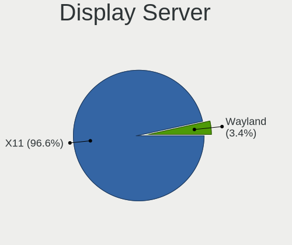
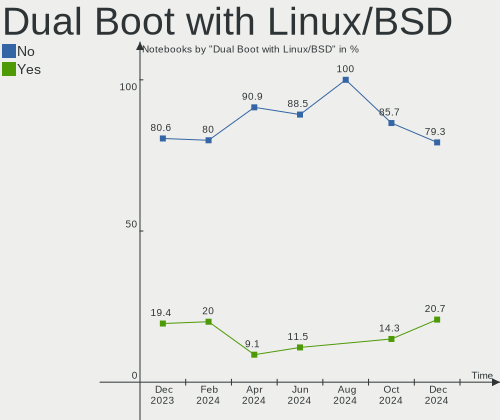
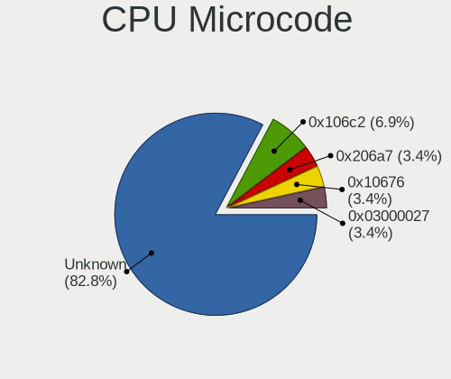
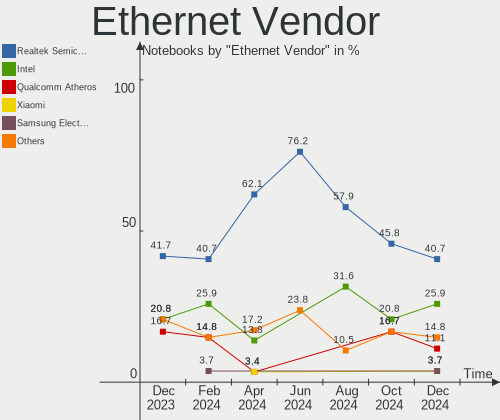

Xubuntu Hardware Trends (Notebooks)
-----------------------------------

A project to identify most popular hardware characteristics and track their change
over time based on data collected by Linux users at https://Linux-Hardware.org.

Anyone can contribute to this report by the [hw-probe](https://github.com/linuxhw/hw-probe) tool:

    sudo -E hw-probe -all -upload

Full-feature report is available here: https://linux-hardware.org/?view=trends&formfactor=notebook

Period: Jul, 2021.

Contents
--------

* [ System ](#system)
  - [ OS                       ](#os)
  - [ OS Family                ](#os-family)
  - [ Kernel                   ](#kernel)
  - [ Kernel Family            ](#kernel-family)
  - [ Kernel Major Ver.        ](#kernel-major-ver)
  - [ Arch                     ](#arch)
  - [ DE                       ](#de)
  - [ Display Server           ](#display-server)
  - [ Display Manager          ](#display-manager)
  - [ OS Lang                  ](#os-lang)
  - [ Boot Mode                ](#boot-mode)
  - [ Filesystem               ](#filesystem)
  - [ Part. scheme             ](#part-scheme)
  - [ Dual Boot with Linux/BSD ](#dual-boot-with-linuxbsd)
  - [ Dual Boot (Win)          ](#dual-boot-win)

* [ Board ](#board)
  - [ Vendor                   ](#vendor)
  - [ Model                    ](#model)
  - [ Model Family             ](#model-family)
  - [ MFG Year                 ](#mfg-year)
  - [ Form Factor              ](#form-factor)
  - [ Secure Boot              ](#secure-boot)
  - [ Coreboot                 ](#coreboot)
  - [ RAM Size                 ](#ram-size)
  - [ RAM Used                 ](#ram-used)
  - [ Total Drives             ](#total-drives)
  - [ Has CD-ROM               ](#has-cd-rom)
  - [ Has Ethernet             ](#has-ethernet)
  - [ Has WiFi                 ](#has-wifi)
  - [ Has Bluetooth            ](#has-bluetooth)

* [ Location ](#location)
  - [ Country                  ](#country)
  - [ City                     ](#city)

* [ Drives ](#drives)
  - [ Drive Vendor             ](#drive-vendor)
  - [ Drive Model              ](#drive-model)
  - [ HDD Vendor               ](#hdd-vendor)
  - [ SSD Vendor               ](#ssd-vendor)
  - [ Drive Kind               ](#drive-kind)
  - [ Drive Connector          ](#drive-connector)
  - [ Drive Size               ](#drive-size)
  - [ Space Total              ](#space-total)
  - [ Space Used               ](#space-used)
  - [ Malfunc. Drives          ](#malfunc-drives)
  - [ Malfunc. Drive Vendor    ](#malfunc-drive-vendor)
  - [ Malfunc. HDD Vendor      ](#malfunc-hdd-vendor)
  - [ Malfunc. Drive Kind      ](#malfunc-drive-kind)
  - [ Failed Drives            ](#failed-drives)
  - [ Failed Drive Vendor      ](#failed-drive-vendor)
  - [ Drive Status             ](#drive-status)

* [ Storage controller ](#storage-controller)
  - [ Storage Vendor           ](#storage-vendor)
  - [ Storage Model            ](#storage-model)
  - [ Storage Kind             ](#storage-kind)

* [ Processor ](#processor)
  - [ CPU Vendor               ](#cpu-vendor)
  - [ CPU Model                ](#cpu-model)
  - [ CPU Model Family         ](#cpu-model-family)
  - [ CPU Cores                ](#cpu-cores)
  - [ CPU Sockets              ](#cpu-sockets)
  - [ CPU Threads              ](#cpu-threads)
  - [ CPU Op-Modes             ](#cpu-op-modes)
  - [ CPU Microcode            ](#cpu-microcode)
  - [ CPU Microarch            ](#cpu-microarch)

* [ Graphics ](#graphics)
  - [ GPU Vendor               ](#gpu-vendor)
  - [ GPU Model                ](#gpu-model)
  - [ GPU Combo                ](#gpu-combo)
  - [ GPU Driver               ](#gpu-driver)
  - [ GPU Memory               ](#gpu-memory)

* [ Monitor ](#monitor)
  - [ Monitor Vendor           ](#monitor-vendor)
  - [ Monitor Model            ](#monitor-model)
  - [ Monitor Resolution       ](#monitor-resolution)
  - [ Monitor Diagonal         ](#monitor-diagonal)
  - [ Monitor Width            ](#monitor-width)
  - [ Aspect Ratio             ](#aspect-ratio)
  - [ Monitor Area             ](#monitor-area)
  - [ Pixel Density            ](#pixel-density)
  - [ Multiple Monitors        ](#multiple-monitors)

* [ Network ](#network)
  - [ Net Controller Vendor    ](#net-controller-vendor)
  - [ Net Controller Model     ](#net-controller-model)
  - [ Wireless Vendor          ](#wireless-vendor)
  - [ Wireless Model           ](#wireless-model)
  - [ Ethernet Vendor          ](#ethernet-vendor)
  - [ Ethernet Model           ](#ethernet-model)
  - [ Net Controller Kind      ](#net-controller-kind)
  - [ Used Controller          ](#used-controller)
  - [ NICs                     ](#nics)
  - [ IPv6                     ](#ipv6)

* [ Bluetooth ](#bluetooth)
  - [ Bluetooth Vendor         ](#bluetooth-vendor)
  - [ Bluetooth Model          ](#bluetooth-model)

* [ Sound ](#sound)
  - [ Sound Vendor             ](#sound-vendor)
  - [ Sound Model              ](#sound-model)

* [ Memory ](#memory)
  - [ Memory Vendor            ](#memory-vendor)
  - [ Memory Model             ](#memory-model)
  - [ Memory Kind              ](#memory-kind)
  - [ Memory Form Factor       ](#memory-form-factor)
  - [ Memory Size              ](#memory-size)
  - [ Memory Speed             ](#memory-speed)

* [ Printers & scanners ](#printers-&-scanners)
  - [ Printer Vendor           ](#printer-vendor)
  - [ Printer Model            ](#printer-model)
  - [ Scanner Vendor           ](#scanner-vendor)
  - [ Scanner Model            ](#scanner-model)

* [ Camera ](#camera)
  - [ Camera Vendor            ](#camera-vendor)
  - [ Camera Model             ](#camera-model)

* [ Security ](#security)
  - [ Fingerprint Vendor       ](#fingerprint-vendor)
  - [ Fingerprint Model        ](#fingerprint-model)
  - [ Chipcard Vendor          ](#chipcard-vendor)
  - [ Chipcard Model           ](#chipcard-model)

* [ Unsupported ](#unsupported)
  - [ Unsupported Devices      ](#unsupported-devices)
  - [ Unsupported Device Types ](#unsupported-device-types)

System
------

OS
--

Installed operating systems

| Name          | Notebooks | Percent |
|---------------|-----------|---------|
| Xubuntu 20.04 | 37        | 61.67%  |
| Xubuntu 18.04 | 14        | 23.33%  |
| Xubuntu 21.04 | 7         | 11.67%  |
| Xubuntu 21.10 | 1         | 1.67%   |
| Xubuntu 16.04 | 1         | 1.67%   |

OS Family
---------

OS without a version

| Name    | Notebooks | Percent |
|---------|-----------|---------|
| Xubuntu | 60        | 100%    |

Kernel
------

Version of the Linux kernel

| Version               | Notebooks | Percent |
|-----------------------|-----------|---------|
| 5.4.0-77-generic      | 10        | 16.67%  |
| 5.8.0-59-generic      | 8         | 13.33%  |
| 4.15.0-147-generic    | 4         | 6.67%   |
| 5.8.0-63-generic      | 3         | 5%      |
| 5.4.0-80-generic      | 3         | 5%      |
| 5.8.0-59-lowlatency   | 2         | 3.33%   |
| 5.4.0-80-lowlatency   | 2         | 3.33%   |
| 5.4.0-77-lowlatency   | 2         | 3.33%   |
| 5.11.0-26-generic     | 2         | 3.33%   |
| 5.11.0-22-generic     | 2         | 3.33%   |
| 4.15.0-151-generic    | 2         | 3.33%   |
| 5.8.0-63-lowlatency   | 1         | 1.67%   |
| 5.8.0-61-generic      | 1         | 1.67%   |
| 5.8.0-55-generic      | 1         | 1.67%   |
| 5.8.0-45-generic      | 1         | 1.67%   |
| 5.8.0-43-generic      | 1         | 1.67%   |
| 5.4.0-74-lowlatency   | 1         | 1.67%   |
| 5.4.0-70-generic      | 1         | 1.67%   |
| 5.4.0-60-generic      | 1         | 1.67%   |
| 5.4.0-59-generic      | 1         | 1.67%   |
| 5.13.0-11-generic     | 1         | 1.67%   |
| 5.12.14-xanmod1       | 1         | 1.67%   |
| 5.11.0-25-generic     | 1         | 1.67%   |
| 5.11.0-16-generic     | 1         | 1.67%   |
| 5.11.0-051100-generic | 1         | 1.67%   |
| 5.10.0-1034-oem       | 1         | 1.67%   |
| 5.10.0-1033-oem       | 1         | 1.67%   |
| 4.15.0-99-generic     | 1         | 1.67%   |
| 4.15.0-91-lowlatency  | 1         | 1.67%   |
| 4.15.0-147-lowlatency | 1         | 1.67%   |
| 4.15.0-142-generic    | 1         | 1.67%   |

Kernel Family
-------------

Linux kernel without a distro release

| Version | Notebooks | Percent |
|---------|-----------|---------|
| 5.4.0   | 21        | 35%     |
| 5.8.0   | 18        | 30%     |
| 4.15.0  | 10        | 16.67%  |
| 5.11.0  | 7         | 11.67%  |
| 5.10.0  | 2         | 3.33%   |
| 5.13.0  | 1         | 1.67%   |
| 5.12.14 | 1         | 1.67%   |

Kernel Major Ver.
-----------------

Linux kernel major version

| Version | Notebooks | Percent |
|---------|-----------|---------|
| 5.4     | 21        | 35%     |
| 5.8     | 18        | 30%     |
| 4.15    | 10        | 16.67%  |
| 5.11    | 7         | 11.67%  |
| 5.10    | 2         | 3.33%   |
| 5.13    | 1         | 1.67%   |
| 5.12    | 1         | 1.67%   |

Arch
----

OS architecture (x86_64, i586, etc.)

| Name   | Notebooks | Percent |
|--------|-----------|---------|
| x86_64 | 55        | 91.67%  |
| i686   | 5         | 8.33%   |

DE
--

Desktop Environment

| Name            | Notebooks | Percent |
|-----------------|-----------|---------|
| XFCE            | 58        | 96.67%  |
| GNOME Flashback | 1         | 1.67%   |
| Cinnamon        | 1         | 1.67%   |

Display Server
--------------

X11 or Wayland

| Name | Notebooks | Percent |
|------|-----------|---------|
| X11  | 59        | 98.33%  |
| Tty  | 1         | 1.67%   |

Display Manager
---------------

SDDM, LightDM, etc.

| Name    | Notebooks | Percent |
|---------|-----------|---------|
| Unknown | 37        | 61.67%  |
| TDM     | 20        | 33.33%  |
| GDM     | 2         | 3.33%   |
| LightDM | 1         | 1.67%   |

OS Lang
-------

Language

| Lang  | Notebooks | Percent |
|-------|-----------|---------|
| en_US | 18        | 30%     |
| de_DE | 11        | 18.33%  |
| ru_RU | 4         | 6.67%   |
| it_IT | 4         | 6.67%   |
| hu_HU | 3         | 5%      |
| fr_FR | 3         | 5%      |
| en_GB | 3         | 5%      |
| pt_BR | 2         | 3.33%   |
| cs_CZ | 2         | 3.33%   |
| sv_SE | 1         | 1.67%   |
| pt_PT | 1         | 1.67%   |
| pl_PL | 1         | 1.67%   |
| fi_FI | 1         | 1.67%   |
| es_ES | 1         | 1.67%   |
| es_CR | 1         | 1.67%   |
| en_SG | 1         | 1.67%   |
| en_CA | 1         | 1.67%   |
| en_AU | 1         | 1.67%   |
| aa_DJ | 1         | 1.67%   |

Boot Mode
---------

EFI or BIOS

| Mode | Notebooks | Percent |
|------|-----------|---------|
| BIOS | 35        | 58.33%  |
| EFI  | 25        | 41.67%  |

Filesystem
----------

Type of filesystem

| Type    | Notebooks | Percent |
|---------|-----------|---------|
| Ext4    | 59        | 98.33%  |
| Overlay | 1         | 1.67%   |

Part. scheme
------------

Scheme of partitioning

| Type    | Notebooks | Percent |
|---------|-----------|---------|
| Unknown | 37        | 61.67%  |
| GPT     | 16        | 26.67%  |
| MBR     | 7         | 11.67%  |

Dual Boot with Linux/BSD
------------------------

Hosting more than one Linux/BSD

| Dual boot | Notebooks | Percent |
|-----------|-----------|---------|
| No        | 53        | 88.33%  |
| Yes       | 7         | 11.67%  |

Dual Boot (Win)
---------------

Hosting Linux and Windows

| Dual boot | Notebooks | Percent |
|-----------|-----------|---------|
| No        | 38        | 63.33%  |
| Yes       | 22        | 36.67%  |

Board
-----

Vendor
------

Motherboard manufacturer

| Name                | Notebooks | Percent |
|---------------------|-----------|---------|
| Lenovo              | 16        | 26.67%  |
| Hewlett-Packard     | 13        | 21.67%  |
| Dell                | 7         | 11.67%  |
| Acer                | 5         | 8.33%   |
| Toshiba             | 3         | 5%      |
| Samsung Electronics | 3         | 5%      |
| ASUSTek Computer    | 3         | 5%      |
| Apple               | 2         | 3.33%   |
| System76            | 1         | 1.67%   |
| Sony                | 1         | 1.67%   |
| Packard Bell        | 1         | 1.67%   |
| MSI                 | 1         | 1.67%   |
| Medion              | 1         | 1.67%   |
| Google              | 1         | 1.67%   |
| Gateway             | 1         | 1.67%   |
| Fujitsu Siemens     | 1         | 1.67%   |

Model
-----

Motherboard model

| Name                                 | Notebooks | Percent |
|--------------------------------------|-----------|---------|
| HP Pavilion dv6                      | 2         | 3.33%   |
| Dell XPS 13 9310                     | 2         | 3.33%   |
| Toshiba Satellite L500               | 1         | 1.67%   |
| Toshiba Satellite L300               | 1         | 1.67%   |
| Toshiba PORTEGE R930                 | 1         | 1.67%   |
| System76 Gazelle                     | 1         | 1.67%   |
| Sony SVE1512C6EB                     | 1         | 1.67%   |
| Samsung RV415/RV515/E3415            | 1         | 1.67%   |
| Samsung R530/R730/P530               | 1         | 1.67%   |
| Samsung 530U3C/530U4C/532U3C         | 1         | 1.67%   |
| Packard Bell EasyNote MB65           | 1         | 1.67%   |
| MSI MS-1034                          | 1         | 1.67%   |
| Medion WAM2070                       | 1         | 1.67%   |
| Lenovo ThinkPad X220 429137G         | 1         | 1.67%   |
| Lenovo ThinkPad W530 24479Q7         | 1         | 1.67%   |
| Lenovo ThinkPad T61 7661V9Z          | 1         | 1.67%   |
| Lenovo ThinkPad T500 2241CG9         | 1         | 1.67%   |
| Lenovo ThinkPad T440s 20AQ009DGE     | 1         | 1.67%   |
| Lenovo ThinkPad T430 2349SU6         | 1         | 1.67%   |
| Lenovo ThinkPad T430 2347G4U         | 1         | 1.67%   |
| Lenovo ThinkPad E485 20KU001CGE      | 1         | 1.67%   |
| Lenovo ThinkPad E15 Gen 3 20YHS00900 | 1         | 1.67%   |
| Lenovo ThinkBook 14 G2 ITL 20VD      | 1         | 1.67%   |
| Lenovo IdeaPad 710S-13ISK 80SW       | 1         | 1.67%   |
| Lenovo IdeaPad 330S-15ARR 81FB       | 1         | 1.67%   |
| Lenovo IdeaPad 110S-11IBR 80WG       | 1         | 1.67%   |
| Lenovo G50-70 20351                  | 1         | 1.67%   |
| Lenovo G40-30 80FY                   | 1         | 1.67%   |
| Lenovo B5400 s20278Q                 | 1         | 1.67%   |
| HP ZBook 17 G5                       | 1         | 1.67%   |
| HP ProBook 6570b                     | 1         | 1.67%   |
| HP ProBook 450 G8 Notebook PC        | 1         | 1.67%   |
| HP Notebook                          | 1         | 1.67%   |
| HP Laptop 17-ca0xxx                  | 1         | 1.67%   |
| HP EliteBook Folio 9470m             | 1         | 1.67%   |
| HP EliteBook 845 G7 Notebook PC      | 1         | 1.67%   |
| HP Compaq nx7300 (RU389ES#ABZ)       | 1         | 1.67%   |
| HP 255 G2                            | 1         | 1.67%   |
| HP 15                                | 1         | 1.67%   |
| Google Kip                           | 1         | 1.67%   |
| Gateway NV57H                        | 1         | 1.67%   |
| Fujitsu Siemens AMILO Xi 3650        | 1         | 1.67%   |
| Dell Precision M4400                 | 1         | 1.67%   |
| Dell Latitude E6330                  | 1         | 1.67%   |
| Dell Inspiron 7560                   | 1         | 1.67%   |
| Dell Inspiron 5485                   | 1         | 1.67%   |
| Dell Inspiron 15-3567                | 1         | 1.67%   |
| ASUS X541SA                          | 1         | 1.67%   |
| ASUS S551LN                          | 1         | 1.67%   |
| ASUS N53SV                           | 1         | 1.67%   |
| Apple MacBookAir6,2                  | 1         | 1.67%   |
| Apple MacBook3,1                     | 1         | 1.67%   |
| Acer Predator PH317-53               | 1         | 1.67%   |
| Acer Aspire E5-521                   | 1         | 1.67%   |
| Acer Aspire E1-522                   | 1         | 1.67%   |
| Acer AOD270                          | 1         | 1.67%   |
| Acer AO751h                          | 1         | 1.67%   |
| Unknown                              | 1         | 1.67%   |

Model Family
------------

Motherboard model prefix

| Name                  | Notebooks | Percent |
|-----------------------|-----------|---------|
| Lenovo ThinkPad       | 9         | 15%     |
| Lenovo IdeaPad        | 3         | 5%      |
| Dell Inspiron         | 3         | 5%      |
| Toshiba Satellite     | 2         | 3.33%   |
| HP ProBook            | 2         | 3.33%   |
| HP Pavilion           | 2         | 3.33%   |
| HP EliteBook          | 2         | 3.33%   |
| Dell XPS              | 2         | 3.33%   |
| Acer Aspire           | 2         | 3.33%   |
| Toshiba PORTEGE       | 1         | 1.67%   |
| System76 Gazelle      | 1         | 1.67%   |
| Sony SVE1512C6EB      | 1         | 1.67%   |
| Samsung RV415         | 1         | 1.67%   |
| Samsung R530          | 1         | 1.67%   |
| Samsung 530U3C        | 1         | 1.67%   |
| Packard Bell EasyNote | 1         | 1.67%   |
| MSI MS-1034           | 1         | 1.67%   |
| Medion WAM2070        | 1         | 1.67%   |
| Lenovo ThinkBook      | 1         | 1.67%   |
| Lenovo G50-70         | 1         | 1.67%   |
| Lenovo G40-30         | 1         | 1.67%   |
| Lenovo B5400          | 1         | 1.67%   |
| HP ZBook              | 1         | 1.67%   |
| HP Notebook           | 1         | 1.67%   |
| HP Laptop             | 1         | 1.67%   |
| HP Compaq             | 1         | 1.67%   |
| HP 255                | 1         | 1.67%   |
| HP 15                 | 1         | 1.67%   |
| Google Kip            | 1         | 1.67%   |
| Gateway NV57H         | 1         | 1.67%   |
| Fujitsu Siemens AMILO | 1         | 1.67%   |
| Dell Precision        | 1         | 1.67%   |
| Dell Latitude         | 1         | 1.67%   |
| ASUS X541SA           | 1         | 1.67%   |
| ASUS S551LN           | 1         | 1.67%   |
| ASUS N53SV            | 1         | 1.67%   |
| Apple MacBookAir6     | 1         | 1.67%   |
| Apple MacBook3        | 1         | 1.67%   |
| Acer Predator         | 1         | 1.67%   |
| Acer AOD270           | 1         | 1.67%   |
| Acer AO751h           | 1         | 1.67%   |
| Unknown               | 1         | 1.67%   |

MFG Year
--------

Motherboard manufacture year

| Year | Notebooks | Percent |
|------|-----------|---------|
| 2021 | 7         | 11.67%  |
| 2015 | 6         | 10%     |
| 2012 | 6         | 10%     |
| 2019 | 5         | 8.33%   |
| 2014 | 5         | 8.33%   |
| 2013 | 5         | 8.33%   |
| 2018 | 4         | 6.67%   |
| 2020 | 3         | 5%      |
| 2011 | 3         | 5%      |
| 2010 | 3         | 5%      |
| 2009 | 3         | 5%      |
| 2017 | 2         | 3.33%   |
| 2016 | 2         | 3.33%   |
| 2008 | 2         | 3.33%   |
| 2007 | 2         | 3.33%   |
| 2006 | 2         | 3.33%   |

Form Factor
-----------

Physical design of the computer

| Name     | Notebooks | Percent |
|----------|-----------|---------|
| Notebook | 60        | 100%    |

Secure Boot
-----------

Enabled or disabled

| State    | Notebooks | Percent |
|----------|-----------|---------|
| Disabled | 53        | 88.33%  |
| Enabled  | 7         | 11.67%  |

Coreboot
--------

Have coreboot on board

| Used | Notebooks | Percent |
|------|-----------|---------|
| No   | 59        | 98.33%  |
| Yes  | 1         | 1.67%   |

RAM Size
--------

Total RAM memory

| Size in GB  | Notebooks | Percent |
|-------------|-----------|---------|
| 3.01-4.0    | 22        | 36.67%  |
| 4.01-8.0    | 19        | 31.67%  |
| 8.01-16.0   | 5         | 8.33%   |
| 32.01-64.0  | 4         | 6.67%   |
| 16.01-24.0  | 4         | 6.67%   |
| 1.01-2.0    | 4         | 6.67%   |
| 64.01-256.0 | 1         | 1.67%   |
| 0.51-1.0    | 1         | 1.67%   |

RAM Used
--------

Used RAM memory

| Used GB    | Notebooks | Percent |
|------------|-----------|---------|
| 1.01-2.0   | 27        | 45%     |
| 2.01-3.0   | 14        | 23.33%  |
| 0.51-1.0   | 8         | 13.33%  |
| 3.01-4.0   | 5         | 8.33%   |
| 4.01-8.0   | 3         | 5%      |
| 16.01-24.0 | 1         | 1.67%   |
| 8.01-16.0  | 1         | 1.67%   |
| 0.01-0.5   | 1         | 1.67%   |

Total Drives
------------

Number of drives on board

| Drives | Notebooks | Percent |
|--------|-----------|---------|
| 1      | 47        | 78.33%  |
| 2      | 11        | 18.33%  |
| 3      | 2         | 3.33%   |

Has CD-ROM
----------

Has CD-ROM on board

| Presented | Notebooks | Percent |
|-----------|-----------|---------|
| Yes       | 31        | 51.67%  |
| No        | 29        | 48.33%  |

Has Ethernet
------------

Has Ethernet on board

| Presented | Notebooks | Percent |
|-----------|-----------|---------|
| Yes       | 54        | 90%     |
| No        | 6         | 10%     |

Has WiFi
--------

Has WiFi module

| Presented | Notebooks | Percent |
|-----------|-----------|---------|
| Yes       | 59        | 98.33%  |
| No        | 1         | 1.67%   |

Has Bluetooth
-------------

Has Bluetooth module

| Presented | Notebooks | Percent |
|-----------|-----------|---------|
| Yes       | 40        | 66.67%  |
| No        | 20        | 33.33%  |

Location
--------

Country
-------

Geographic location (country)

| Country     | Notebooks | Percent |
|-------------|-----------|---------|
| Germany     | 14        | 23.33%  |
| USA         | 7         | 11.67%  |
| Italy       | 5         | 8.33%   |
| UK          | 3         | 5%      |
| Russia      | 3         | 5%      |
| Hungary     | 3         | 5%      |
| France      | 3         | 5%      |
| Brazil      | 3         | 5%      |
| Poland      | 2         | 3.33%   |
| Czechia     | 2         | 3.33%   |
| Canada      | 2         | 3.33%   |
| Australia   | 2         | 3.33%   |
| Sweden      | 1         | 1.67%   |
| Spain       | 1         | 1.67%   |
| Singapore   | 1         | 1.67%   |
| Portugal    | 1         | 1.67%   |
| Netherlands | 1         | 1.67%   |
| Latvia      | 1         | 1.67%   |
| Indonesia   | 1         | 1.67%   |
| Finland     | 1         | 1.67%   |
| Chile       | 1         | 1.67%   |
| Cabo Verde  | 1         | 1.67%   |
| Azerbaijan  | 1         | 1.67%   |

City
----

Geographic location (city)

| City                    | Notebooks | Percent |
|-------------------------|-----------|---------|
| Syracuse                | 2         | 3.33%   |
| Denver                  | 2         | 3.33%   |
| Ylöjärvi              | 1         | 1.67%   |
| Wissen                  | 1         | 1.67%   |
| Winzeln                 | 1         | 1.67%   |
| Winnipeg                | 1         | 1.67%   |
| St Petersburg           | 1         | 1.67%   |
| Singapore               | 1         | 1.67%   |
| Sindelfingen            | 1         | 1.67%   |
| Seevetal                | 1         | 1.67%   |
| Schnaittach             | 1         | 1.67%   |
| Sant Andreu de la Barca | 1         | 1.67%   |
| Rio de Janeiro          | 1         | 1.67%   |
| Riga                    | 1         | 1.67%   |
| Praia                   | 1         | 1.67%   |
| Poitiers                | 1         | 1.67%   |
| Oberhausen              | 1         | 1.67%   |
| Novosibirsk             | 1         | 1.67%   |
| Nonantola               | 1         | 1.67%   |
| Moscow                  | 1         | 1.67%   |
| Milton Keynes           | 1         | 1.67%   |
| Milan                   | 1         | 1.67%   |
| Mandello del Lario      | 1         | 1.67%   |
| Mafra                   | 1         | 1.67%   |
| London                  | 1         | 1.67%   |
| Lewis Center            | 1         | 1.67%   |
| Las Condes              | 1         | 1.67%   |
| La Fermete              | 1         | 1.67%   |
| Illewong                | 1         | 1.67%   |
| Hoeganaes               | 1         | 1.67%   |
| Hobart                  | 1         | 1.67%   |
| Havířov               | 1         | 1.67%   |
| Hauzenberg              | 1         | 1.67%   |
| Hamilton                | 1         | 1.67%   |
| Hamburg                 | 1         | 1.67%   |
| Gresik                  | 1         | 1.67%   |
| Garbsen                 | 1         | 1.67%   |
| Fot                     | 1         | 1.67%   |
| Elmira                  | 1         | 1.67%   |
| Dunaharaszti            | 1         | 1.67%   |
| Des Moines              | 1         | 1.67%   |
| Czernikowo              | 1         | 1.67%   |
| Cuiseaux                | 1         | 1.67%   |
| Cologne                 | 1         | 1.67%   |
| Budapest                | 1         | 1.67%   |
| Brno                    | 1         | 1.67%   |
| Bristol                 | 1         | 1.67%   |
| Bonn                    | 1         | 1.67%   |
| Bolesławiec            | 1         | 1.67%   |
| Bloomfield              | 1         | 1.67%   |
| Biella                  | 1         | 1.67%   |
| Berlin                  | 1         | 1.67%   |
| Belém                  | 1         | 1.67%   |
| Baku                    | 1         | 1.67%   |
| Bad Salzuflen           | 1         | 1.67%   |
| Angra dos Reis          | 1         | 1.67%   |
| Ahaus                   | 1         | 1.67%   |
| Unknown                 | 1         | 1.67%   |

Drives
------

Drive Vendor
------------

Hard drive vendors

| Vendor              | Notebooks | Drives | Percent |
|---------------------|-----------|--------|---------|
| WDC                 | 12        | 12     | 16%     |
| Samsung Electronics | 11        | 11     | 14.67%  |
| Toshiba             | 8         | 8      | 10.67%  |
| Seagate             | 8         | 8      | 10.67%  |
| Sandisk             | 6         | 6      | 8%      |
| HGST                | 6         | 6      | 8%      |
| Hitachi             | 5         | 5      | 6.67%   |
| Unknown             | 4         | 5      | 5.33%   |
| Intel               | 4         | 4      | 5.33%   |
| Kingston            | 3         | 4      | 4%      |
| XPG                 | 1         | 1      | 1.33%   |
| SK Hynix            | 1         | 1      | 1.33%   |
| Micron Technology   | 1         | 1      | 1.33%   |
| LITEONIT            | 1         | 1      | 1.33%   |
| LITEON              | 1         | 1      | 1.33%   |
| Intenso             | 1         | 1      | 1.33%   |
| Fujitsu             | 1         | 1      | 1.33%   |
| Apple               | 1         | 1      | 1.33%   |

Drive Model
-----------

Hard drive models

| Model                                 | Notebooks | Percent |
|---------------------------------------|-----------|---------|
| Toshiba MQ01ABD100 1TB                | 2         | 2.6%    |
| Seagate ST320LT007-9ZV142 320GB       | 2         | 2.6%    |
| Sandisk NVMe SSD Drive 256GB          | 2         | 2.6%    |
| HGST HTS725050A7E630 500GB            | 2         | 2.6%    |
| XPG NVMe SSD Drive 256GB              | 1         | 1.3%    |
| WDC WDS100T2B0C-00PXH0 1TB            | 1         | 1.3%    |
| WDC WD7500BPVT-80HXZT3 752GB          | 1         | 1.3%    |
| WDC WD5000LPVX-00V0TT0 500GB          | 1         | 1.3%    |
| WDC WD5000LPCX-60VHAT0 500GB          | 1         | 1.3%    |
| WDC WD5000LPCX-24C6HT0 500GB          | 1         | 1.3%    |
| WDC WD2500BEVS-22UST0 250GB           | 1         | 1.3%    |
| WDC WD1600BJKT-75F4T0 160GB           | 1         | 1.3%    |
| WDC WD10SPZX-75Z10T0 1TB              | 1         | 1.3%    |
| WDC WD10SPZX-24Z10T0 1TB              | 1         | 1.3%    |
| WDC WD10JPVX-22JC3T0 1TB              | 1         | 1.3%    |
| WDC PC SN720 SDAPNTW-512G-1014 512GB  | 1         | 1.3%    |
| WDC PC SN520 NVMe 512GB               | 1         | 1.3%    |
| Unknown SP600FA3-256GM 256GB SSD      | 1         | 1.3%    |
| Unknown SDW16G  16GB                  | 1         | 1.3%    |
| Unknown MMC Card  32GB                | 1         | 1.3%    |
| Unknown MMC Card  128GB               | 1         | 1.3%    |
| Unknown MMC Card  1073GB              | 1         | 1.3%    |
| Toshiba TR150 240GB SSD               | 1         | 1.3%    |
| Toshiba MQ02ABD100H 1TB               | 1         | 1.3%    |
| Toshiba MQ01ABF050 500GB              | 1         | 1.3%    |
| Toshiba MK7559GSXP 752GB              | 1         | 1.3%    |
| Toshiba MK6034GSX 64GB                | 1         | 1.3%    |
| Toshiba MK5076GSX 500GB               | 1         | 1.3%    |
| SK Hynix NVMe SSD Drive 256GB         | 1         | 1.3%    |
| Seagate ST9160314AS 160GB             | 1         | 1.3%    |
| Seagate ST320LT012-1DG14C 320GB       | 1         | 1.3%    |
| Seagate ST1000LM049-2GH172 1TB        | 1         | 1.3%    |
| Seagate ST1000LM048-2E7172 1TB        | 1         | 1.3%    |
| Seagate ST1000LM035-1RK172 1TB        | 1         | 1.3%    |
| Seagate ST1000LM024 HN-M101MBB 1TB    | 1         | 1.3%    |
| SanDisk SSD PLUS 480 GB               | 1         | 1.3%    |
| SanDisk SSD i100 24GB                 | 1         | 1.3%    |
| SanDisk SDSSDA240G 240GB              | 1         | 1.3%    |
| Sandisk NVMe SSD Drive 250GB          | 1         | 1.3%    |
| Samsung SSD 970 EVO Plus 2TB          | 1         | 1.3%    |
| Samsung SSD 970 EVO Plus 1TB          | 1         | 1.3%    |
| Samsung SSD 850 EVO 250GB             | 1         | 1.3%    |
| Samsung NVMe SSD Drive 512GB          | 1         | 1.3%    |
| Samsung MZVLQ512HALU-000H1 512GB      | 1         | 1.3%    |
| Samsung MZVLB512HBJQ-000H1 512GB      | 1         | 1.3%    |
| Samsung MZVLB256HAHQ-000H1 256GB      | 1         | 1.3%    |
| Samsung MZALQ256HAJD-000L2 256GB      | 1         | 1.3%    |
| Samsung MMCRE28G5MXP-0VBH1 128GB SSD  | 1         | 1.3%    |
| Samsung HN-M500MBB 500GB              | 1         | 1.3%    |
| Samsung HN-M101MBB 1TB                | 1         | 1.3%    |
| Micron 2300 NVMe 512GB                | 1         | 1.3%    |
| LITEONIT LCS-128M6S 2.5 7mm 128GB SSD | 1         | 1.3%    |
| LITEON CV3-8D128-11 SATA 128GB SSD    | 1         | 1.3%    |
| Kingston SUV500MS120G 120GB SSD       | 1         | 1.3%    |
| Kingston SUV400S37120G 120GB SSD      | 1         | 1.3%    |
| Kingston SMSM150S324G2 24GB SSD       | 1         | 1.3%    |
| Kingston SA400S37480G 480GB SSD       | 1         | 1.3%    |
| Intenso SSD 128GB                     | 1         | 1.3%    |
| Intel SSDSC2CW240A3 240GB             | 1         | 1.3%    |
| Intel SSDSC2CT120A3 120GB             | 1         | 1.3%    |

HDD Vendor
----------

Hard disk drive vendors

| Vendor              | Notebooks | Drives | Percent |
|---------------------|-----------|--------|---------|
| WDC                 | 9         | 9      | 23.68%  |
| Seagate             | 8         | 8      | 21.05%  |
| Toshiba             | 7         | 7      | 18.42%  |
| HGST                | 6         | 6      | 15.79%  |
| Hitachi             | 5         | 5      | 13.16%  |
| Samsung Electronics | 2         | 2      | 5.26%   |
| Fujitsu             | 1         | 1      | 2.63%   |

SSD Vendor
----------

Solid state drive vendors

| Vendor              | Notebooks | Drives | Percent |
|---------------------|-----------|--------|---------|
| SanDisk             | 3         | 3      | 17.65%  |
| Kingston            | 3         | 4      | 17.65%  |
| Intel               | 3         | 3      | 17.65%  |
| Samsung Electronics | 2         | 2      | 11.76%  |
| Unknown             | 1         | 1      | 5.88%   |
| Toshiba             | 1         | 1      | 5.88%   |
| LITEONIT            | 1         | 1      | 5.88%   |
| LITEON              | 1         | 1      | 5.88%   |
| Intenso             | 1         | 1      | 5.88%   |
| Apple               | 1         | 1      | 5.88%   |

Drive Kind
----------

HDD or SSD

| Kind | Notebooks | Drives | Percent |
|------|-----------|--------|---------|
| HDD  | 38        | 38     | 52.78%  |
| SSD  | 16        | 18     | 22.22%  |
| NVMe | 15        | 17     | 20.83%  |
| MMC  | 3         | 4      | 4.17%   |

Drive Connector
---------------

SATA, SAS, NVMe, etc.

| Type | Notebooks | Drives | Percent |
|------|-----------|--------|---------|
| SATA | 49        | 55     | 72.06%  |
| NVMe | 15        | 17     | 22.06%  |
| MMC  | 3         | 4      | 4.41%   |
| SAS  | 1         | 1      | 1.47%   |

Drive Size
----------

Size of hard drive

| Size in TB | Notebooks | Drives | Percent |
|------------|-----------|--------|---------|
| 0.01-0.5   | 36        | 40     | 69.23%  |
| 0.51-1.0   | 16        | 16     | 30.77%  |

Space Total
-----------

Amount of disk space available on the file system

| Size in GB | Notebooks | Percent |
|------------|-----------|---------|
| 101-250    | 21        | 35%     |
| 251-500    | 16        | 26.67%  |
| 501-1000   | 9         | 15%     |
| 21-50      | 5         | 8.33%   |
| 1001-2000  | 3         | 5%      |
| 51-100     | 3         | 5%      |
| 1-20       | 2         | 3.33%   |
| Unknown    | 1         | 1.67%   |

Space Used
----------

Amount of used disk space

| Used GB  | Notebooks | Percent |
|----------|-----------|---------|
| 1-20     | 21        | 35%     |
| 21-50    | 13        | 21.67%  |
| 51-100   | 10        | 16.67%  |
| 251-500  | 7         | 11.67%  |
| 101-250  | 7         | 11.67%  |
| 501-1000 | 1         | 1.67%   |
| Unknown  | 1         | 1.67%   |

Malfunc. Drives
---------------

Drive models with a malfunction

| Model                           | Notebooks | Drives | Percent |
|---------------------------------|-----------|--------|---------|
| WDC WD7500BPVT-80HXZT3 752GB    | 1         | 1      | 25%     |
| Toshiba MQ01ABD100 1TB          | 1         | 1      | 25%     |
| Seagate ST320LT007-9ZV142 320GB | 1         | 1      | 25%     |
| SanDisk SSD PLUS 480 GB         | 1         | 1      | 25%     |

Malfunc. Drive Vendor
---------------------

Vendors of faulty drives

| Vendor  | Notebooks | Drives | Percent |
|---------|-----------|--------|---------|
| WDC     | 1         | 1      | 25%     |
| Toshiba | 1         | 1      | 25%     |
| Seagate | 1         | 1      | 25%     |
| SanDisk | 1         | 1      | 25%     |

Malfunc. HDD Vendor
-------------------

Vendors of faulty HDD drives

| Vendor  | Notebooks | Drives | Percent |
|---------|-----------|--------|---------|
| WDC     | 1         | 1      | 33.33%  |
| Toshiba | 1         | 1      | 33.33%  |
| Seagate | 1         | 1      | 33.33%  |

Malfunc. Drive Kind
-------------------

Kinds of faulty drives

| Kind | Notebooks | Drives | Percent |
|------|-----------|--------|---------|
| HDD  | 3         | 3      | 75%     |
| SSD  | 1         | 1      | 25%     |

Failed Drives
-------------

Failed drive models

Zero info for selected period =(

Failed Drive Vendor
-------------------

Failed drive vendors

Zero info for selected period =(

Drive Status
------------

Number of failed and malfunc. drives

| Status   | Notebooks | Drives | Percent |
|----------|-----------|--------|---------|
| Detected | 39        | 47     | 61.9%   |
| Works    | 20        | 26     | 31.75%  |
| Malfunc  | 4         | 4      | 6.35%   |

Storage controller
------------------

Storage Vendor
--------------

Storage controller vendors

| Vendor              | Notebooks | Percent |
|---------------------|-----------|---------|
| Intel               | 42        | 62.69%  |
| AMD                 | 10        | 14.93%  |
| Samsung Electronics | 7         | 10.45%  |
| Sandisk             | 5         | 7.46%   |
| SK Hynix            | 1         | 1.49%   |
| Nvidia              | 1         | 1.49%   |
| Micron Technology   | 1         | 1.49%   |

Storage Model
-------------

Storage controller models

| Model                                                                            | Notebooks | Percent |
|----------------------------------------------------------------------------------|-----------|---------|
| AMD FCH SATA Controller [AHCI mode]                                              | 9         | 12.16%  |
| Intel 7 Series Chipset Family 6-port SATA Controller [AHCI mode]                 | 8         | 10.81%  |
| Samsung NVMe SSD Controller SM981/PM981/PM983                                    | 4         | 5.41%   |
| Intel 6 Series/C200 Series Chipset Family 6 port Mobile SATA AHCI Controller     | 4         | 5.41%   |
| Intel Sunrise Point-LP SATA Controller [AHCI mode]                               | 3         | 4.05%   |
| Intel 82801HM/HEM (ICH8M/ICH8M-E) IDE Controller                                 | 3         | 4.05%   |
| Intel 82801 Mobile SATA Controller [RAID mode]                                   | 3         | 4.05%   |
| Intel 8 Series SATA Controller 1 [AHCI mode]                                     | 3         | 4.05%   |
| Sandisk WD Blue SN550 NVMe SSD                                                   | 2         | 2.7%    |
| Samsung NVMe Controller                                                          | 2         | 2.7%    |
| Intel Volume Management Device NVMe RAID Controller                              | 2         | 2.7%    |
| Intel Cannon Lake Mobile PCH SATA AHCI Controller                                | 2         | 2.7%    |
| Intel Atom/Celeron/Pentium Processor x5-E8000/J3xxx/N3xxx Series SATA Controller | 2         | 2.7%    |
| Intel 82801IBM/IEM (ICH9M/ICH9M-E) 4 port SATA Controller [AHCI mode]            | 2         | 2.7%    |
| Intel 82801HM/HEM (ICH8M/ICH8M-E) SATA Controller [AHCI mode]                    | 2         | 2.7%    |
| Intel 5 Series/3400 Series Chipset 4 port SATA AHCI Controller                   | 2         | 2.7%    |
| SK Hynix BC501 NVMe Solid State Drive                                            | 1         | 1.35%   |
| Sandisk WD Black 2018/SN750 / PC SN720 NVMe SSD                                  | 1         | 1.35%   |
| Sandisk PC SN520 NVMe SSD                                                        | 1         | 1.35%   |
| Sandisk Non-Volatile memory controller                                           | 1         | 1.35%   |
| Samsung Apple PCIe SSD                                                           | 1         | 1.35%   |
| Nvidia MCP51 Serial ATA Controller                                               | 1         | 1.35%   |
| Nvidia MCP51 IDE                                                                 | 1         | 1.35%   |
| Micron Non-Volatile memory controller                                            | 1         | 1.35%   |
| Intel US15W/US15X/US15L/UL11L SCH [Poulsbo] IDE Controller                       | 1         | 1.35%   |
| Intel Tiger Lake-LP SATA Controller [AHCI mode]                                  | 1         | 1.35%   |
| Intel SSD 660P Series                                                            | 1         | 1.35%   |
| Intel NM10/ICH7 Family SATA Controller [AHCI mode]                               | 1         | 1.35%   |
| Intel Atom Processor E3800 Series SATA AHCI Controller                           | 1         | 1.35%   |
| Intel 82801IBM/IEM (ICH9M/ICH9M-E) 2 port SATA Controller [IDE mode]             | 1         | 1.35%   |
| Intel 82801HM/HEM (ICH8M/ICH8M-E) SATA Controller [IDE mode]                     | 1         | 1.35%   |
| Intel 82801GBM/GHM (ICH7-M Family) SATA Controller [IDE mode]                    | 1         | 1.35%   |
| Intel 82801GBM/GHM (ICH7-M Family) SATA Controller [AHCI mode]                   | 1         | 1.35%   |
| Intel 82801G (ICH7 Family) IDE Controller                                        | 1         | 1.35%   |
| Intel 8 Series/C220 Series Chipset Family 6-port SATA Controller 1 [AHCI mode]   | 1         | 1.35%   |
| Intel 400 Series Chipset Family SATA AHCI Controller                             | 1         | 1.35%   |
| AMD SB7x0/SB8x0/SB9x0 SATA Controller [AHCI mode]                                | 1         | 1.35%   |

Storage Kind
------------

Kind of storage controller (IDE, SATA, NVMe, SAS, ...)

| Kind | Notebooks | Percent |
|------|-----------|---------|
| SATA | 45        | 63.38%  |
| NVMe | 13        | 18.31%  |
| IDE  | 8         | 11.27%  |
| RAID | 5         | 7.04%   |

Processor
---------

CPU Vendor
----------

Processor vendors

| Vendor | Notebooks | Percent |
|--------|-----------|---------|
| Intel  | 46        | 76.67%  |
| AMD    | 14        | 23.33%  |

CPU Model
---------

Processor models

| Model                                         | Notebooks | Percent |
|-----------------------------------------------|-----------|---------|
| Intel Core i5-4210U CPU @ 1.70GHz             | 3         | 5%      |
| Intel 11th Gen Core i7-1165G7 @ 2.80GHz       | 3         | 5%      |
| Intel Core i5-3320M CPU @ 2.60GHz             | 2         | 3.33%   |
| Intel Celeron CPU N2840 @ 2.16GHz             | 2         | 3.33%   |
| AMD Ryzen 5 2500U with Radeon Vega Mobile Gfx | 2         | 3.33%   |
| AMD A8-6410 APU with AMD Radeon R5 Graphics   | 2         | 3.33%   |
| AMD A6-5200 APU with Radeon HD Graphics       | 2         | 3.33%   |
| Intel Pentium Dual-Core CPU T4300 @ 2.10GHz   | 1         | 1.67%   |
| Intel Pentium Dual CPU T3400 @ 2.16GHz        | 1         | 1.67%   |
| Intel Pentium CPU N3710 @ 1.60GHz             | 1         | 1.67%   |
| Intel Pentium CPU B980 @ 2.40GHz              | 1         | 1.67%   |
| Intel Core i7-9750H CPU @ 2.60GHz             | 1         | 1.67%   |
| Intel Core i7-8850H CPU @ 2.60GHz             | 1         | 1.67%   |
| Intel Core i7-7500U CPU @ 2.70GHz             | 1         | 1.67%   |
| Intel Core i7-4650U CPU @ 1.70GHz             | 1         | 1.67%   |
| Intel Core i7-3840QM CPU @ 2.80GHz            | 1         | 1.67%   |
| Intel Core i7-3540M CPU @ 3.00GHz             | 1         | 1.67%   |
| Intel Core i7-2670QM CPU @ 2.20GHz            | 1         | 1.67%   |
| Intel Core i7-10870H CPU @ 2.20GHz            | 1         | 1.67%   |
| Intel Core i5-6200U CPU @ 2.30GHz             | 1         | 1.67%   |
| Intel Core i5-4200M CPU @ 2.50GHz             | 1         | 1.67%   |
| Intel Core i5-3340M CPU @ 2.70GHz             | 1         | 1.67%   |
| Intel Core i5-3337U CPU @ 1.80GHz             | 1         | 1.67%   |
| Intel Core i5-3317U CPU @ 1.70GHz             | 1         | 1.67%   |
| Intel Core i5-3230M CPU @ 2.60GHz             | 1         | 1.67%   |
| Intel Core i5-2520M CPU @ 2.50GHz             | 1         | 1.67%   |
| Intel Core i5-2450M CPU @ 2.50GHz             | 1         | 1.67%   |
| Intel Core i5-2410M CPU @ 2.30GHz             | 1         | 1.67%   |
| Intel Core i5 CPU M 460 @ 2.53GHz             | 1         | 1.67%   |
| Intel Core i3-6006U CPU @ 2.00GHz             | 1         | 1.67%   |
| Intel Core i3 CPU M 330 @ 2.13GHz             | 1         | 1.67%   |
| Intel Core 2 Duo CPU T7500 @ 2.20GHz          | 1         | 1.67%   |
| Intel Core 2 Duo CPU T7100 @ 1.80GHz          | 1         | 1.67%   |
| Intel Core 2 Duo CPU T5450 @ 1.66GHz          | 1         | 1.67%   |
| Intel Core 2 Duo CPU P8700 @ 2.53GHz          | 1         | 1.67%   |
| Intel Core 2 Duo CPU P8600 @ 2.40GHz          | 1         | 1.67%   |
| Intel Core 2 Duo CPU P8400 @ 2.26GHz          | 1         | 1.67%   |
| Intel Core 2 CPU T5200 @ 1.60GHz              | 1         | 1.67%   |
| Intel Celeron M CPU 430 @ 1.73GHz             | 1         | 1.67%   |
| Intel Celeron CPU N3060 @ 1.60GHz             | 1         | 1.67%   |
| Intel Atom CPU Z520 @ 1.33GHz                 | 1         | 1.67%   |
| Intel Atom CPU N2600 @ 1.60GHz                | 1         | 1.67%   |
| Intel 11th Gen Core i3-1115G4 @ 3.00GHz       | 1         | 1.67%   |
| AMD Turion 64 X2 Mobile Technology TL-64      | 1         | 1.67%   |
| AMD Ryzen 7 PRO 4750U with Radeon Graphics    | 1         | 1.67%   |
| AMD Ryzen 7 2700U with Radeon Vega Mobile Gfx | 1         | 1.67%   |
| AMD Ryzen 5 3500U with Radeon Vega Mobile Gfx | 1         | 1.67%   |
| AMD Ryzen 3 5300U with Radeon Graphics        | 1         | 1.67%   |
| AMD E2-7110 APU with AMD Radeon R2 Graphics   | 1         | 1.67%   |
| AMD E1-2100 APU with Radeon HD Graphics       | 1         | 1.67%   |
| AMD E-450 APU with Radeon HD Graphics         | 1         | 1.67%   |

CPU Model Family
----------------

Processor model prefix

| Model                   | Notebooks | Percent |
|-------------------------|-----------|---------|
| Intel Core i5           | 15        | 25%     |
| Intel Core i7           | 8         | 13.33%  |
| Intel Core 2 Duo        | 6         | 10%     |
| Other                   | 4         | 6.67%   |
| Intel Celeron           | 3         | 5%      |
| AMD Ryzen 5             | 3         | 5%      |
| Intel Pentium           | 2         | 3.33%   |
| Intel Core i3           | 2         | 3.33%   |
| Intel Atom              | 2         | 3.33%   |
| AMD A8                  | 2         | 3.33%   |
| AMD A6                  | 2         | 3.33%   |
| Intel Pentium Dual-Core | 1         | 1.67%   |
| Intel Pentium Dual      | 1         | 1.67%   |
| Intel Core 2            | 1         | 1.67%   |
| Intel Celeron M         | 1         | 1.67%   |
| AMD Turion 64 X2 Mobile | 1         | 1.67%   |
| AMD Ryzen 7 PRO         | 1         | 1.67%   |
| AMD Ryzen 7             | 1         | 1.67%   |
| AMD Ryzen 3             | 1         | 1.67%   |
| AMD E2                  | 1         | 1.67%   |
| AMD E1                  | 1         | 1.67%   |
| AMD E                   | 1         | 1.67%   |

CPU Cores
---------

Number of processor cores

| Number | Notebooks | Percent |
|--------|-----------|---------|
| 2      | 38        | 63.33%  |
| 4      | 16        | 26.67%  |
| 8      | 2         | 3.33%   |
| 6      | 2         | 3.33%   |
| 1      | 2         | 3.33%   |

CPU Sockets
-----------

Number of sockets

| Number | Notebooks | Percent |
|--------|-----------|---------|
| 1      | 60        | 100%    |

CPU Threads
-----------

Threads per core (Hyper-Threading)

| Number | Notebooks | Percent |
|--------|-----------|---------|
| 2      | 37        | 61.67%  |
| 1      | 23        | 38.33%  |

CPU Op-Modes
------------

CPU Operation Modes (32-bit, 64-bit)

| Op mode        | Notebooks | Percent |
|----------------|-----------|---------|
| 32-bit, 64-bit | 58        | 96.67%  |
| 32-bit         | 2         | 3.33%   |

CPU Microcode
-------------

Microcode number

| Number     | Notebooks | Percent |
|------------|-----------|---------|
| Unknown    | 8         | 13.33%  |
| 0x306a9    | 6         | 10%     |
| 0x806c1    | 4         | 6.67%   |
| 0x40651    | 4         | 6.67%   |
| 0x206a7    | 4         | 6.67%   |
| 0x6fd      | 3         | 5%      |
| 0x1067a    | 3         | 5%      |
| 0x406e3    | 2         | 3.33%   |
| 0x406c4    | 2         | 3.33%   |
| 0x30678    | 2         | 3.33%   |
| 0x0810100b | 2         | 3.33%   |
| 0x07030104 | 2         | 3.33%   |
| 0x0700010f | 2         | 3.33%   |
| 0xa0652    | 1         | 1.67%   |
| 0x906ea    | 1         | 1.67%   |
| 0x806e9    | 1         | 1.67%   |
| 0x6fb      | 1         | 1.67%   |
| 0x6f6      | 1         | 1.67%   |
| 0x6e8      | 1         | 1.67%   |
| 0x306c3    | 1         | 1.67%   |
| 0x30661    | 1         | 1.67%   |
| 0x20652    | 1         | 1.67%   |
| 0x106c2    | 1         | 1.67%   |
| 0x10676    | 1         | 1.67%   |
| 0x08608103 | 1         | 1.67%   |
| 0x08600106 | 1         | 1.67%   |
| 0x08108102 | 1         | 1.67%   |
| 0x07030106 | 1         | 1.67%   |
| 0x05000119 | 1         | 1.67%   |

CPU Microarch
-------------

Microarchitecture

| Name        | Notebooks | Percent |
|-------------|-----------|---------|
| IvyBridge   | 8         | 13.33%  |
| SandyBridge | 5         | 8.33%   |
| Haswell     | 5         | 8.33%   |
| Core        | 5         | 8.33%   |
| TigerLake   | 4         | 6.67%   |
| Silvermont  | 4         | 6.67%   |
| Penryn      | 4         | 6.67%   |
| Zen         | 3         | 5%      |
| Puma        | 3         | 5%      |
| KabyLake    | 3         | 5%      |
| Jaguar      | 3         | 5%      |
| Westmere    | 2         | 3.33%   |
| Skylake     | 2         | 3.33%   |
| Bonnell     | 2         | 3.33%   |
| Zen+        | 1         | 1.67%   |
| Zen 2       | 1         | 1.67%   |
| P6          | 1         | 1.67%   |
| K8 Hammer   | 1         | 1.67%   |
| CometLake   | 1         | 1.67%   |
| Bobcat      | 1         | 1.67%   |
| Unknown     | 1         | 1.67%   |

Graphics
--------

GPU Vendor
----------

Vendors of graphics cards

| Vendor | Notebooks | Percent |
|--------|-----------|---------|
| Intel  | 41        | 58.57%  |
| AMD    | 15        | 21.43%  |
| Nvidia | 14        | 20%     |

GPU Model
---------

Graphics card models

| Model                                                                                    | Notebooks | Percent |
|------------------------------------------------------------------------------------------|-----------|---------|
| Intel 3rd Gen Core processor Graphics Controller                                         | 7         | 9.46%   |
| Intel 2nd Generation Core Processor Family Integrated Graphics Controller                | 5         | 6.76%   |
| Intel Haswell-ULT Integrated Graphics Controller                                         | 4         | 5.41%   |
| Intel TigerLake-LP GT2 [Iris Xe Graphics]                                                | 3         | 4.05%   |
| Intel Mobile 4 Series Chipset Integrated Graphics Controller                             | 3         | 4.05%   |
| AMD Raven Ridge [Radeon Vega Series / Radeon Vega Mobile Series]                         | 3         | 4.05%   |
| Nvidia GF117M [GeForce 610M/710M/810M/820M / GT 620M/625M/630M/720M]                     | 2         | 2.7%    |
| Nvidia GF108M [GeForce GT 540M]                                                          | 2         | 2.7%    |
| Intel Skylake GT2 [HD Graphics 520]                                                      | 2         | 2.7%    |
| Intel Mobile GM965/GL960 Integrated Graphics Controller (secondary)                      | 2         | 2.7%    |
| Intel Mobile GM965/GL960 Integrated Graphics Controller (primary)                        | 2         | 2.7%    |
| Intel Mobile 945GM/GMS/GME, 943/940GML Express Integrated Graphics Controller            | 2         | 2.7%    |
| Intel Mobile 945GM/GMS, 943/940GML Express Integrated Graphics Controller                | 2         | 2.7%    |
| Intel CoffeeLake-H GT2 [UHD Graphics 630]                                                | 2         | 2.7%    |
| Intel Atom/Celeron/Pentium Processor x5-E8000/J3xxx/N3xxx Integrated Graphics Controller | 2         | 2.7%    |
| Intel Atom Processor Z36xxx/Z37xxx Series Graphics & Display                             | 2         | 2.7%    |
| AMD Seymour [Radeon HD 6400M/7400M Series]                                               | 2         | 2.7%    |
| AMD Mullins [Radeon R4/R5 Graphics]                                                      | 2         | 2.7%    |
| AMD Kabini [Radeon HD 8400 / R3 Series]                                                  | 2         | 2.7%    |
| Nvidia TU116M [GeForce GTX 1660 Ti Mobile]                                               | 1         | 1.35%   |
| Nvidia GT218M [GeForce 310M]                                                             | 1         | 1.35%   |
| Nvidia GP104GLM [Quadro P3200 Mobile]                                                    | 1         | 1.35%   |
| Nvidia GM108M [GeForce 940MX]                                                            | 1         | 1.35%   |
| Nvidia GM108M [GeForce 840M]                                                             | 1         | 1.35%   |
| Nvidia GK107GLM [Quadro K2000M]                                                          | 1         | 1.35%   |
| Nvidia GF108M [NVS 5400M]                                                                | 1         | 1.35%   |
| Nvidia G96GLM [Quadro FX 770M]                                                           | 1         | 1.35%   |
| Nvidia G86M [GeForce 8400M G]                                                            | 1         | 1.35%   |
| Nvidia C51 [GeForce Go 6150]                                                             | 1         | 1.35%   |
| Intel US15W/US15X SCH [Poulsbo] Graphics Controller                                      | 1         | 1.35%   |
| Intel Tiger Lake UHD Graphics                                                            | 1         | 1.35%   |
| Intel HD Graphics 620                                                                    | 1         | 1.35%   |
| Intel Core Processor Integrated Graphics Controller                                      | 1         | 1.35%   |
| Intel CometLake-H GT2 [UHD Graphics]                                                     | 1         | 1.35%   |
| Intel Atom Processor D2xxx/N2xxx Integrated Graphics Controller                          | 1         | 1.35%   |
| Intel 4th Gen Core Processor Integrated Graphics Controller                              | 1         | 1.35%   |
| AMD RV710/M92 [Mobility Radeon HD 4530/4570/545v]                                        | 1         | 1.35%   |
| AMD Renoir                                                                               | 1         | 1.35%   |
| AMD Picasso                                                                              | 1         | 1.35%   |
| AMD Mullins [Radeon R3 Graphics]                                                         | 1         | 1.35%   |
| AMD Lucienne                                                                             | 1         | 1.35%   |
| AMD Kabini [Radeon HD 8210]                                                              | 1         | 1.35%   |

GPU Combo
---------

Combinations of graphics cards

| Name           | Notebooks | Percent |
|----------------|-----------|---------|
| 1 x Intel      | 31        | 51.67%  |
| 1 x AMD        | 14        | 23.33%  |
| Intel + Nvidia | 9         | 15%     |
| 1 x Nvidia     | 5         | 8.33%   |
| Intel + AMD    | 1         | 1.67%   |

GPU Driver
----------

Free vs proprietary

| Driver      | Notebooks | Percent |
|-------------|-----------|---------|
| Free        | 57        | 95%     |
| Proprietary | 2         | 3.33%   |
| Unknown     | 1         | 1.67%   |

GPU Memory
----------

Total video memory

| Size in GB | Notebooks | Percent |
|------------|-----------|---------|
| Unknown    | 30        | 50%     |
| 0.01-0.5   | 12        | 20%     |
| 1.01-2.0   | 9         | 15%     |
| 0.51-1.0   | 7         | 11.67%  |
| 5.01-6.0   | 1         | 1.67%   |
| 3.01-4.0   | 1         | 1.67%   |

Monitor
-------

Monitor Vendor
--------------

Monitor vendors

| Vendor                  | Notebooks | Percent |
|-------------------------|-----------|---------|
| Samsung Electronics     | 12        | 17.39%  |
| AU Optronics            | 11        | 15.94%  |
| Chimei Innolux          | 10        | 14.49%  |
| LG Display              | 8         | 11.59%  |
| Chi Mei Optoelectronics | 6         | 8.7%    |
| Lenovo                  | 3         | 4.35%   |
| BOE                     | 3         | 4.35%   |
| Sharp                   | 2         | 2.9%    |
| Hewlett-Packard         | 2         | 2.9%    |
| Dell                    | 2         | 2.9%    |
| Apple                   | 2         | 2.9%    |
| Quanta Display          | 1         | 1.45%   |
| Philips                 | 1         | 1.45%   |
| PANDA                   | 1         | 1.45%   |
| MPI                     | 1         | 1.45%   |
| LG Philips              | 1         | 1.45%   |
| Iiyama                  | 1         | 1.45%   |
| Compal                  | 1         | 1.45%   |
| BenQ                    | 1         | 1.45%   |

Monitor Model
-------------

Monitor models

| Model                                                                     | Notebooks | Percent |
|---------------------------------------------------------------------------|-----------|---------|
| Samsung Electronics LCD Monitor SEC5441 1366x768 344x194mm 15.5-inch      | 3         | 4.29%   |
| Chimei Innolux LCD Monitor CMN14D4 1920x1080 309x173mm 13.9-inch          | 3         | 4.29%   |
| Sharp LCD Monitor SHP14F9 1920x1200 288x180mm 13.4-inch                   | 2         | 2.86%   |
| Chi Mei Optoelectronics LCD Monitor CMO15A7 1366x768 350x190mm 15.7-inch  | 2         | 2.86%   |
| AU Optronics LCD Monitor AUO47EC 1366x768 344x193mm 15.5-inch             | 2         | 2.86%   |
| Samsung Electronics U32R59x SAM0F94 3840x2160 697x392mm 31.5-inch         | 1         | 1.43%   |
| Samsung Electronics U32J59x SAM0F34 3840x2160 697x392mm 31.5-inch         | 1         | 1.43%   |
| Samsung Electronics LCD Monitor SEC4151 1366x768 344x194mm 15.5-inch      | 1         | 1.43%   |
| Samsung Electronics LCD Monitor SEC3345 1280x800 331x207mm 15.4-inch      | 1         | 1.43%   |
| Samsung Electronics LCD Monitor SEC325A 1366x768 344x194mm 15.5-inch      | 1         | 1.43%   |
| Samsung Electronics LCD Monitor SEC324C 1366x768 353x198mm 15.9-inch      | 1         | 1.43%   |
| Samsung Electronics LCD Monitor SEC3150 1366x768 344x193mm 15.5-inch      | 1         | 1.43%   |
| Samsung Electronics LCD Monitor SDC4942 1366x768 309x174mm 14.0-inch      | 1         | 1.43%   |
| Samsung Electronics LCD Monitor SDC4852 3840x2160 340x190mm 15.3-inch     | 1         | 1.43%   |
| Samsung Electronics EPSON PJ SECA60D 1920x1080                            | 1         | 1.43%   |
| Quanta Display LCD Monitor QDS0041 1280x800 331x207mm 15.4-inch           | 1         | 1.43%   |
| Philips 273ELH PHLC07D 1920x1080 598x336mm 27.0-inch                      | 1         | 1.43%   |
| PANDA LCD Monitor NCP004D 1920x1080 344x194mm 15.5-inch                   | 1         | 1.43%   |
| MPI MPI5008 MPI5008 800x480 255x255mm 14.2-inch                           | 1         | 1.43%   |
| LG Philips LP154WX4-TLC8 LPL0120 1280x800 331x207mm 15.4-inch             | 1         | 1.43%   |
| LG Display LCD Monitor LGD064E 1920x1080 309x174mm 14.0-inch              | 1         | 1.43%   |
| LG Display LCD Monitor LGD064C 1920x1080 344x194mm 15.5-inch              | 1         | 1.43%   |
| LG Display LCD Monitor LGD059E 1920x1080 382x215mm 17.3-inch              | 1         | 1.43%   |
| LG Display LCD Monitor LGD04EF 1920x1080 294x165mm 13.3-inch              | 1         | 1.43%   |
| LG Display LCD Monitor LGD04E1 1366x768 340x190mm 15.3-inch               | 1         | 1.43%   |
| LG Display LCD Monitor LGD039F 1366x768 345x194mm 15.6-inch               | 1         | 1.43%   |
| LG Display LCD Monitor LGD02E3 1366x768 344x194mm 15.5-inch               | 1         | 1.43%   |
| LG Display LCD Monitor LGD02D3 1366x768 277x156mm 12.5-inch               | 1         | 1.43%   |
| Lenovo LEN LT2323pwA LEN0BD0 1920x1080 510x287mm 23.0-inch                | 1         | 1.43%   |
| Lenovo LCD Monitor LEN4057 1280x800 331x207mm 15.4-inch                   | 1         | 1.43%   |
| Lenovo LCD Monitor LEN4033 1440x900 304x190mm 14.1-inch                   | 1         | 1.43%   |
| Iiyama PL2788H IVM6628 1920x1080 600x340mm 27.2-inch                      | 1         | 1.43%   |
| Hewlett-Packard LA2306 HWP294A 1920x1080 510x287mm 23.0-inch              | 1         | 1.43%   |
| Hewlett-Packard E231 HWP3063 1920x1080 510x287mm 23.0-inch                | 1         | 1.43%   |
| Dell SE198WFP DELF003 1440x900 408x255mm 18.9-inch                        | 1         | 1.43%   |
| Dell P2212H DELA07F 1920x1080 531x299mm 24.0-inch                         | 1         | 1.43%   |
| Compal TERRA 2255WPV WOR2255 1920x1080 478x269mm 21.6-inch                | 1         | 1.43%   |
| Chimei Innolux LCD Monitor CMN15E6 1366x768 344x193mm 15.5-inch           | 1         | 1.43%   |
| Chimei Innolux LCD Monitor CMN15CA 1366x768 340x190mm 15.3-inch           | 1         | 1.43%   |
| Chimei Innolux LCD Monitor CMN15BE 1366x768 340x190mm 15.3-inch           | 1         | 1.43%   |
| Chimei Innolux LCD Monitor CMN151E 1920x1080 344x193mm 15.5-inch          | 1         | 1.43%   |
| Chimei Innolux LCD Monitor CMN1495 1366x768 309x174mm 14.0-inch           | 1         | 1.43%   |
| Chimei Innolux LCD Monitor CMN1482 1600x900 309x174mm 14.0-inch           | 1         | 1.43%   |
| Chimei Innolux LCD Monitor CMN1132 1366x768 260x140mm 11.6-inch           | 1         | 1.43%   |
| Chi Mei Optoelectronics LCD Monitor CMO1803 1920x1080 408x230mm 18.4-inch | 1         | 1.43%   |
| Chi Mei Optoelectronics LCD Monitor CMO15A2 1366x768 344x193mm 15.5-inch  | 1         | 1.43%   |
| Chi Mei Optoelectronics LCD Monitor CMO15A1 1366x768 344x193mm 15.5-inch  | 1         | 1.43%   |
| Chi Mei Optoelectronics LCD Monitor CMO1018 1024x600 222x125mm 10.0-inch  | 1         | 1.43%   |
| BOE LCD Monitor BOE06BA 1920x1080 344x193mm 15.5-inch                     | 1         | 1.43%   |
| BOE LCD Monitor BOE06B4 1920x1080 344x194mm 15.5-inch                     | 1         | 1.43%   |
| BOE LCD Monitor BOE0671 1366x768 344x194mm 15.5-inch                      | 1         | 1.43%   |
| BenQ GL2480 BNQ78ED 1920x1080 531x298mm 24.0-inch                         | 1         | 1.43%   |
| AU Optronics LCD Monitor AUO8174 1280x800 331x207mm 15.4-inch             | 1         | 1.43%   |
| AU Optronics LCD Monitor AUO45EC 1366x768 340x190mm 15.3-inch             | 1         | 1.43%   |
| AU Optronics LCD Monitor AUO409D 1920x1080 382x215mm 17.3-inch            | 1         | 1.43%   |
| AU Optronics LCD Monitor AUO312C 1366x768 293x164mm 13.2-inch             | 1         | 1.43%   |
| AU Optronics LCD Monitor AUO229E 1600x900 382x214mm 17.2-inch             | 1         | 1.43%   |
| AU Optronics LCD Monitor AUO213E 1600x900 309x174mm 14.0-inch             | 1         | 1.43%   |
| AU Optronics LCD Monitor AUO2074 1280x800 331x207mm 15.4-inch             | 1         | 1.43%   |
| AU Optronics LCD Monitor AUO205C 1366x768 256x144mm 11.6-inch             | 1         | 1.43%   |

Monitor Resolution
------------------

Monitor screen resolution

| Resolution        | Notebooks | Percent |
|-------------------|-----------|---------|
| 1366x768 (WXGA)   | 26        | 39.39%  |
| 1920x1080 (FHD)   | 19        | 28.79%  |
| 1280x800 (WXGA)   | 7         | 10.61%  |
| 1600x900 (HD+)    | 4         | 6.06%   |
| 3840x2160 (4K)    | 3         | 4.55%   |
| 1440x900 (WXGA+)  | 3         | 4.55%   |
| 1920x1200 (WUXGA) | 2         | 3.03%   |
| 800x480           | 1         | 1.52%   |
| 1024x600          | 1         | 1.52%   |

Monitor Diagonal
----------------

Diagonal size in inches

| Inches | Notebooks | Percent |
|--------|-----------|---------|
| 15     | 34        | 49.28%  |
| 13     | 9         | 13.04%  |
| 14     | 7         | 10.14%  |
| 17     | 3         | 4.35%   |
| 31     | 2         | 2.9%    |
| 27     | 2         | 2.9%    |
| 24     | 2         | 2.9%    |
| 23     | 2         | 2.9%    |
| 11     | 2         | 2.9%    |
| 72     | 1         | 1.45%   |
| 21     | 1         | 1.45%   |
| 19     | 1         | 1.45%   |
| 18     | 1         | 1.45%   |
| 12     | 1         | 1.45%   |
| 10     | 1         | 1.45%   |

Monitor Width
-------------

Physical width

| Width in mm | Notebooks | Percent |
|-------------|-----------|---------|
| 301-350     | 39        | 58.21%  |
| 201-300     | 10        | 14.93%  |
| 351-400     | 7         | 10.45%  |
| 501-600     | 5         | 7.46%   |
| 401-500     | 3         | 4.48%   |
| 601-700     | 2         | 2.99%   |
| 1501-2000   | 1         | 1.49%   |

Aspect Ratio
------------

Proportional relationship between the width and the height

| Ratio | Notebooks | Percent |
|-------|-----------|---------|
| 16/9  | 47        | 78.33%  |
| 16/10 | 12        | 20%     |
| 1.00  | 1         | 1.67%   |

Monitor Area
------------

Area in inch²

| Area in inch² | Notebooks | Percent |
|----------------|-----------|---------|
| 101-110        | 35        | 50.72%  |
| 81-90          | 11        | 15.94%  |
| 71-80          | 4         | 5.8%    |
| 201-250        | 4         | 5.8%    |
| 121-130        | 3         | 4.35%   |
| 51-60          | 2         | 2.9%    |
| 351-500        | 2         | 2.9%    |
| 301-350        | 2         | 2.9%    |
| 151-200        | 2         | 2.9%    |
| More than 1000 | 1         | 1.45%   |
| 61-70          | 1         | 1.45%   |
| 41-50          | 1         | 1.45%   |
| 141-150        | 1         | 1.45%   |

Pixel Density
-------------

Pixels per inch

| Density | Notebooks | Percent |
|---------|-----------|---------|
| 101-120 | 22        | 34.38%  |
| 121-160 | 19        | 29.69%  |
| 51-100  | 19        | 29.69%  |
| 161-240 | 3         | 4.69%   |
| 1-50    | 1         | 1.56%   |

Multiple Monitors
-----------------

Total monitors connected

| Total | Notebooks | Percent |
|-------|-----------|---------|
| 1     | 49        | 81.67%  |
| 2     | 7         | 11.67%  |
| 3     | 3         | 5%      |
| 0     | 1         | 1.67%   |

Network
-------

Net Controller Vendor
---------------------

Controller vendors

| Vendor                            | Notebooks | Percent |
|-----------------------------------|-----------|---------|
| Realtek Semiconductor             | 32        | 33.68%  |
| Intel                             | 27        | 28.42%  |
| Qualcomm Atheros                  | 18        | 18.95%  |
| Broadcom                          | 6         | 6.32%   |
| Marvell Technology Group          | 3         | 3.16%   |
| Broadcom Limited                  | 3         | 3.16%   |
| ZyDAS                             | 1         | 1.05%   |
| Samsung Electronics               | 1         | 1.05%   |
| Ralink                            | 1         | 1.05%   |
| Qualcomm                          | 1         | 1.05%   |
| Nvidia                            | 1         | 1.05%   |
| Ericsson Business Mobile Networks | 1         | 1.05%   |

Net Controller Model
--------------------

Controller models

| Model                                                                          | Notebooks | Percent |
|--------------------------------------------------------------------------------|-----------|---------|
| Realtek RTL8111/8168/8411 PCI Express Gigabit Ethernet Controller              | 18        | 15.65%  |
| Realtek RTL810xE PCI Express Fast Ethernet controller                          | 12        | 10.43%  |
| Intel 82579LM Gigabit Network Connection (Lewisville)                          | 6         | 5.22%   |
| Qualcomm Atheros AR9485 Wireless Network Adapter                               | 4         | 3.48%   |
| Intel Centrino Advanced-N 6205 [Taylor Peak]                                   | 4         | 3.48%   |
| Realtek RTL8723BE PCIe Wireless Network Adapter                                | 3         | 2.61%   |
| Qualcomm Atheros QCA9565 / AR9565 Wireless Network Adapter                     | 3         | 2.61%   |
| Qualcomm Atheros QCA9377 802.11ac Wireless Network Adapter                     | 3         | 2.61%   |
| Qualcomm Atheros AR9285 Wireless Network Adapter (PCI-Express)                 | 3         | 2.61%   |
| Intel Wi-Fi 6 AX201                                                            | 3         | 2.61%   |
| Intel PRO/Wireless 3945ABG [Golan] Network Connection                          | 3         | 2.61%   |
| Realtek RTL8188EE Wireless Network Adapter                                     | 2         | 1.74%   |
| Qualcomm Atheros AR9287 Wireless Network Adapter (PCI-Express)                 | 2         | 1.74%   |
| Intel Wireless 7260                                                            | 2         | 1.74%   |
| Intel Wi-Fi 6 AX200                                                            | 2         | 1.74%   |
| Intel Dual Band Wireless-AC 3165 Plus Bluetooth                                | 2         | 1.74%   |
| Intel Centrino Advanced-N 6235                                                 | 2         | 1.74%   |
| Intel 82579V Gigabit Network Connection                                        | 2         | 1.74%   |
| Intel 82567LM Gigabit Network Connection                                       | 2         | 1.74%   |
| Broadcom Limited BCM4312 802.11b/g LP-PHY                                      | 2         | 1.74%   |
| ZyDAS ZD1211B 802.11g                                                          | 1         | 0.87%   |
| Samsung Galaxy series, misc. (tethering mode)                                  | 1         | 0.87%   |
| Realtek USB 10/100/1G/2.5G LAN                                                 | 1         | 0.87%   |
| Realtek RTL8822CE 802.11ac PCIe Wireless Network Adapter                       | 1         | 0.87%   |
| Realtek RTL8821CE 802.11ac PCIe Wireless Network Adapter                       | 1         | 0.87%   |
| Realtek RTL8192E/RTL8192SE Wireless LAN Controller                             | 1         | 0.87%   |
| Realtek RTL8153 Gigabit Ethernet Adapter                                       | 1         | 0.87%   |
| Ralink RT3090 Wireless 802.11n 1T/1R PCIe                                      | 1         | 0.87%   |
| Qualcomm QCA6390 Wireless Network Adapter [AX500-DBS (2x2)]                    | 1         | 0.87%   |
| Qualcomm Atheros QCA8171 Gigabit Ethernet                                      | 1         | 0.87%   |
| Qualcomm Atheros QCA6174 802.11ac Wireless Network Adapter                     | 1         | 0.87%   |
| Qualcomm Atheros Killer E2500 Gigabit Ethernet Controller                      | 1         | 0.87%   |
| Qualcomm Atheros AR242x / AR542x Wireless Network Adapter (PCI-Express)        | 1         | 0.87%   |
| Nvidia MCP51 Ethernet Controller                                               | 1         | 0.87%   |
| Marvell Group Yukon Optima 88E8059 [PCIe Gigabit Ethernet Controller with AVB] | 1         | 0.87%   |
| Marvell Group 88E8058 PCI-E Gigabit Ethernet Controller                        | 1         | 0.87%   |
| Marvell Group 88E8039 PCI-E Fast Ethernet Controller                           | 1         | 0.87%   |
| Intel WiFi Link 5100                                                           | 1         | 0.87%   |
| Intel PRO/Wireless 5100 AGN [Shiloh] Network Connection                        | 1         | 0.87%   |
| Intel Ethernet Connection I218-V                                               | 1         | 0.87%   |
| Intel Ethernet Connection (7) I219-LM                                          | 1         | 0.87%   |
| Intel Comet Lake PCH CNVi WiFi                                                 | 1         | 0.87%   |
| Intel Centrino Wireless-N 1000 [Condor Peak]                                   | 1         | 0.87%   |
| Intel Cannon Lake PCH CNVi WiFi                                                | 1         | 0.87%   |
| Intel 82567LF Gigabit Network Connection                                       | 1         | 0.87%   |
| Intel 82566MM Gigabit Network Connection                                       | 1         | 0.87%   |
| Ericsson Business Mobile Networks F5521gw                                      | 1         | 0.87%   |
| Broadcom NetLink BCM57785 Gigabit Ethernet PCIe                                | 1         | 0.87%   |
| Broadcom Limited BCM4360 802.11ac Wireless Network Adapter                     | 1         | 0.87%   |
| Broadcom BCM4401-B0 100Base-TX                                                 | 1         | 0.87%   |
| Broadcom BCM43228 802.11a/b/g/n                                                | 1         | 0.87%   |
| Broadcom BCM4321 802.11a/b/g/n                                                 | 1         | 0.87%   |
| Broadcom BCM43142 802.11b/g/n                                                  | 1         | 0.87%   |
| Broadcom BCM4313 802.11bgn Wireless Network Adapter                            | 1         | 0.87%   |
| Broadcom BCM4311 802.11b/g WLAN                                                | 1         | 0.87%   |

Wireless Vendor
---------------

Wireless vendors

| Vendor                | Notebooks | Percent |
|-----------------------|-----------|---------|
| Intel                 | 23        | 38.98%  |
| Qualcomm Atheros      | 17        | 28.81%  |
| Realtek Semiconductor | 8         | 13.56%  |
| Broadcom              | 5         | 8.47%   |
| Broadcom Limited      | 3         | 5.08%   |
| ZyDAS                 | 1         | 1.69%   |
| Ralink                | 1         | 1.69%   |
| Qualcomm              | 1         | 1.69%   |

Wireless Model
--------------

Wireless models

| Model                                                                   | Notebooks | Percent |
|-------------------------------------------------------------------------|-----------|---------|
| Qualcomm Atheros AR9485 Wireless Network Adapter                        | 4         | 6.78%   |
| Intel Centrino Advanced-N 6205 [Taylor Peak]                            | 4         | 6.78%   |
| Realtek RTL8723BE PCIe Wireless Network Adapter                         | 3         | 5.08%   |
| Qualcomm Atheros QCA9565 / AR9565 Wireless Network Adapter              | 3         | 5.08%   |
| Qualcomm Atheros QCA9377 802.11ac Wireless Network Adapter              | 3         | 5.08%   |
| Qualcomm Atheros AR9285 Wireless Network Adapter (PCI-Express)          | 3         | 5.08%   |
| Intel Wi-Fi 6 AX201                                                     | 3         | 5.08%   |
| Intel PRO/Wireless 3945ABG [Golan] Network Connection                   | 3         | 5.08%   |
| Realtek RTL8188EE Wireless Network Adapter                              | 2         | 3.39%   |
| Qualcomm Atheros AR9287 Wireless Network Adapter (PCI-Express)          | 2         | 3.39%   |
| Intel Wireless 7260                                                     | 2         | 3.39%   |
| Intel Wi-Fi 6 AX200                                                     | 2         | 3.39%   |
| Intel Dual Band Wireless-AC 3165 Plus Bluetooth                         | 2         | 3.39%   |
| Intel Centrino Advanced-N 6235                                          | 2         | 3.39%   |
| Broadcom Limited BCM4312 802.11b/g LP-PHY                               | 2         | 3.39%   |
| ZyDAS ZD1211B 802.11g                                                   | 1         | 1.69%   |
| Realtek RTL8822CE 802.11ac PCIe Wireless Network Adapter                | 1         | 1.69%   |
| Realtek RTL8821CE 802.11ac PCIe Wireless Network Adapter                | 1         | 1.69%   |
| Realtek RTL8192E/RTL8192SE Wireless LAN Controller                      | 1         | 1.69%   |
| Ralink RT3090 Wireless 802.11n 1T/1R PCIe                               | 1         | 1.69%   |
| Qualcomm QCA6390 Wireless Network Adapter [AX500-DBS (2x2)]             | 1         | 1.69%   |
| Qualcomm Atheros QCA6174 802.11ac Wireless Network Adapter              | 1         | 1.69%   |
| Qualcomm Atheros AR242x / AR542x Wireless Network Adapter (PCI-Express) | 1         | 1.69%   |
| Intel WiFi Link 5100                                                    | 1         | 1.69%   |
| Intel PRO/Wireless 5100 AGN [Shiloh] Network Connection                 | 1         | 1.69%   |
| Intel Comet Lake PCH CNVi WiFi                                          | 1         | 1.69%   |
| Intel Centrino Wireless-N 1000 [Condor Peak]                            | 1         | 1.69%   |
| Intel Cannon Lake PCH CNVi WiFi                                         | 1         | 1.69%   |
| Broadcom Limited BCM4360 802.11ac Wireless Network Adapter              | 1         | 1.69%   |
| Broadcom BCM43228 802.11a/b/g/n                                         | 1         | 1.69%   |
| Broadcom BCM4321 802.11a/b/g/n                                          | 1         | 1.69%   |
| Broadcom BCM43142 802.11b/g/n                                           | 1         | 1.69%   |
| Broadcom BCM4313 802.11bgn Wireless Network Adapter                     | 1         | 1.69%   |
| Broadcom BCM4311 802.11b/g WLAN                                         | 1         | 1.69%   |

Ethernet Vendor
---------------

Ethernet vendors

| Vendor                   | Notebooks | Percent |
|--------------------------|-----------|---------|
| Realtek Semiconductor    | 32        | 58.18%  |
| Intel                    | 14        | 25.45%  |
| Marvell Technology Group | 3         | 5.45%   |
| Qualcomm Atheros         | 2         | 3.64%   |
| Broadcom                 | 2         | 3.64%   |
| Samsung Electronics      | 1         | 1.82%   |
| Nvidia                   | 1         | 1.82%   |

Ethernet Model
--------------

Ethernet models

| Model                                                                          | Notebooks | Percent |
|--------------------------------------------------------------------------------|-----------|---------|
| Realtek RTL8111/8168/8411 PCI Express Gigabit Ethernet Controller              | 18        | 32.73%  |
| Realtek RTL810xE PCI Express Fast Ethernet controller                          | 12        | 21.82%  |
| Intel 82579LM Gigabit Network Connection (Lewisville)                          | 6         | 10.91%  |
| Intel 82579V Gigabit Network Connection                                        | 2         | 3.64%   |
| Intel 82567LM Gigabit Network Connection                                       | 2         | 3.64%   |
| Samsung Galaxy series, misc. (tethering mode)                                  | 1         | 1.82%   |
| Realtek USB 10/100/1G/2.5G LAN                                                 | 1         | 1.82%   |
| Realtek RTL8153 Gigabit Ethernet Adapter                                       | 1         | 1.82%   |
| Qualcomm Atheros QCA8171 Gigabit Ethernet                                      | 1         | 1.82%   |
| Qualcomm Atheros Killer E2500 Gigabit Ethernet Controller                      | 1         | 1.82%   |
| Nvidia MCP51 Ethernet Controller                                               | 1         | 1.82%   |
| Marvell Group Yukon Optima 88E8059 [PCIe Gigabit Ethernet Controller with AVB] | 1         | 1.82%   |
| Marvell Group 88E8058 PCI-E Gigabit Ethernet Controller                        | 1         | 1.82%   |
| Marvell Group 88E8039 PCI-E Fast Ethernet Controller                           | 1         | 1.82%   |
| Intel Ethernet Connection I218-V                                               | 1         | 1.82%   |
| Intel Ethernet Connection (7) I219-LM                                          | 1         | 1.82%   |
| Intel 82567LF Gigabit Network Connection                                       | 1         | 1.82%   |
| Intel 82566MM Gigabit Network Connection                                       | 1         | 1.82%   |
| Broadcom NetLink BCM57785 Gigabit Ethernet PCIe                                | 1         | 1.82%   |
| Broadcom BCM4401-B0 100Base-TX                                                 | 1         | 1.82%   |

Net Controller Kind
-------------------

Ethernet, WiFi or modem

| Kind     | Notebooks | Percent |
|----------|-----------|---------|
| WiFi     | 59        | 51.75%  |
| Ethernet | 54        | 47.37%  |
| Modem    | 1         | 0.88%   |

Used Controller
---------------

Currently used network controller

| Kind     | Notebooks | Percent |
|----------|-----------|---------|
| WiFi     | 54        | 72.97%  |
| Ethernet | 20        | 27.03%  |

NICs
----

Total network controllers on board

| Total | Notebooks | Percent |
|-------|-----------|---------|
| 2     | 49        | 81.67%  |
| 1     | 11        | 18.33%  |

IPv6
----

IPv6 vs IPv4

| Used | Notebooks | Percent |
|------|-----------|---------|
| No   | 48        | 80%     |
| Yes  | 12        | 20%     |

Bluetooth
---------

Bluetooth Vendor
----------------

Controller vendors

| Vendor                          | Notebooks | Percent |
|---------------------------------|-----------|---------|
| Intel                           | 13        | 32.5%   |
| Qualcomm Atheros Communications | 8         | 20%     |
| Broadcom                        | 6         | 15%     |
| Realtek Semiconductor           | 5         | 12.5%   |
| Apple                           | 2         | 5%      |
| Toshiba                         | 1         | 2.5%    |
| Ralink Technology               | 1         | 2.5%    |
| Lite-On Technology              | 1         | 2.5%    |
| Foxconn International           | 1         | 2.5%    |
| Foxconn / Hon Hai               | 1         | 2.5%    |
| Cambridge Silicon Radio         | 1         | 2.5%    |

Bluetooth Model
---------------

Controller models

| Model                                               | Notebooks | Percent |
|-----------------------------------------------------|-----------|---------|
| Qualcomm Atheros  Bluetooth Device                  | 5         | 12.5%   |
| Intel Bluetooth wireless interface                  | 4         | 10%     |
| Intel AX201 Bluetooth                               | 4         | 10%     |
| Realtek RTL8723B Bluetooth                          | 2         | 5%      |
| Realtek Bluetooth Radio                             | 2         | 5%      |
| Qualcomm Atheros AR3011 Bluetooth                   | 2         | 5%      |
| Intel Centrino Bluetooth Wireless Transceiver       | 2         | 5%      |
| Intel AX200 Bluetooth                               | 2         | 5%      |
| Toshiba Integrated Bluetooth HCI                    | 1         | 2.5%    |
| Realtek  Bluetooth 4.2 Adapter                      | 1         | 2.5%    |
| Ralink Motorola BC4 Bluetooth 3.0+HS Adapter        | 1         | 2.5%    |
| Qualcomm Atheros Bluetooth                          | 1         | 2.5%    |
| Lite-On Atheros AR3012 Bluetooth                    | 1         | 2.5%    |
| Intel Bluetooth 9460/9560 Jefferson Peak (JfP)      | 1         | 2.5%    |
| Foxconn International BCM43142A0 Bluetooth module   | 1         | 2.5%    |
| Foxconn / Hon Hai Bluetooth USB Host Controller     | 1         | 2.5%    |
| Cambridge Silicon Radio Bluetooth Dongle (HCI mode) | 1         | 2.5%    |
| Broadcom HP Portable Valentine                      | 1         | 2.5%    |
| Broadcom HP Portable SoftSailing                    | 1         | 2.5%    |
| Broadcom BCM20702 Bluetooth 4.0 [ThinkPad]          | 1         | 2.5%    |
| Broadcom BCM2045B (BDC-2.1) [Bluetooth Controller]  | 1         | 2.5%    |
| Broadcom BCM2045B (BDC-2.1)                         | 1         | 2.5%    |
| Broadcom BCM2045B (BDC-2) [Bluetooth Controller]    | 1         | 2.5%    |
| Apple Bluetooth USB Host Controller                 | 1         | 2.5%    |
| Apple Bluetooth HCI                                 | 1         | 2.5%    |

Sound
-----

Sound Vendor
------------

Sound card vendors

| Vendor              | Notebooks | Percent |
|---------------------|-----------|---------|
| Intel               | 46        | 63.01%  |
| AMD                 | 14        | 19.18%  |
| Nvidia              | 8         | 10.96%  |
| GN Netcom           | 2         | 2.74%   |
| TC Electronic       | 1         | 1.37%   |
| Native Instruments  | 1         | 1.37%   |
| C-Media Electronics | 1         | 1.37%   |

Sound Model
-----------

Sound card models

| Model                                                                                             | Notebooks | Percent |
|---------------------------------------------------------------------------------------------------|-----------|---------|
| Intel 7 Series/C216 Chipset Family High Definition Audio Controller                               | 9         | 9.89%   |
| AMD Kabini HDMI/DP Audio                                                                          | 6         | 6.59%   |
| AMD FCH Azalia Controller                                                                         | 6         | 6.59%   |
| AMD Family 17h (Models 10h-1fh) HD Audio Controller                                               | 6         | 6.59%   |
| Intel 82801I (ICH9 Family) HD Audio Controller                                                    | 5         | 5.49%   |
| Intel Tiger Lake-LP Smart Sound Technology Audio Controller                                       | 4         | 4.4%    |
| Intel Haswell-ULT HD Audio Controller                                                             | 4         | 4.4%    |
| Intel 8 Series HD Audio Controller                                                                | 4         | 4.4%    |
| Intel 6 Series/C200 Series Chipset Family High Definition Audio Controller                        | 4         | 4.4%    |
| AMD Raven/Raven2/Fenghuang HDMI/DP Audio Controller                                               | 4         | 4.4%    |
| Nvidia GF108 High Definition Audio Controller                                                     | 3         | 3.3%    |
| Intel Sunrise Point-LP HD Audio                                                                   | 3         | 3.3%    |
| Intel NM10/ICH7 Family High Definition Audio Controller                                           | 3         | 3.3%    |
| Intel 82801H (ICH8 Family) HD Audio Controller                                                    | 3         | 3.3%    |
| Intel Cannon Lake PCH cAVS                                                                        | 2         | 2.2%    |
| Intel Atom/Celeron/Pentium Processor x5-E8000/J3xxx/N3xxx Series High Definition Audio Controller | 2         | 2.2%    |
| Intel Atom Processor Z36xxx/Z37xxx Series High Definition Audio Controller                        | 2         | 2.2%    |
| Intel 5 Series/3400 Series Chipset High Definition Audio                                          | 2         | 2.2%    |
| AMD Renoir Radeon High Definition Audio Controller                                                | 2         | 2.2%    |
| TC Electronic VoiceLive Play                                                                      | 1         | 1.1%    |
| Nvidia TU116 High Definition Audio Controller                                                     | 1         | 1.1%    |
| Nvidia MCP51 High Definition Audio                                                                | 1         | 1.1%    |
| Nvidia High Definition Audio Controller                                                           | 1         | 1.1%    |
| Nvidia GP104 High Definition Audio Controller                                                     | 1         | 1.1%    |
| Nvidia GK107 HDMI Audio Controller                                                                | 1         | 1.1%    |
| Native Instruments Traktor Audio 6                                                                | 1         | 1.1%    |
| Intel Xeon E3-1200 v3/4th Gen Core Processor HD Audio Controller                                  | 1         | 1.1%    |
| Intel US15W/US15X/US15L/UL11L SCH [Poulsbo] HD Audio Controller                                   | 1         | 1.1%    |
| Intel Comet Lake PCH cAVS                                                                         | 1         | 1.1%    |
| Intel 8 Series/C220 Series Chipset High Definition Audio Controller                               | 1         | 1.1%    |
| GN Netcom Jabra SPEAK 510                                                                         | 1         | 1.1%    |
| GN Netcom Jabra EVOLVE LINK MS                                                                    | 1         | 1.1%    |
| C-Media Electronics Audio Adapter (Unitek Y-247A)                                                 | 1         | 1.1%    |
| AMD SBx00 Azalia (Intel HDA)                                                                      | 1         | 1.1%    |
| AMD RV710/730 HDMI Audio [Radeon HD 4000 series]                                                  | 1         | 1.1%    |
| AMD Caicos HDMI Audio [Radeon HD 6450 / 7450/8450/8490 OEM / R5 230/235/235X OEM]                 | 1         | 1.1%    |

Memory
------

Memory Vendor
-------------

Memory module vendors

| Vendor              | Notebooks | Percent |
|---------------------|-----------|---------|
| Samsung Electronics | 9         | 29.03%  |
| Unknown             | 5         | 16.13%  |
| SK Hynix            | 3         | 9.68%   |
| Micron Technology   | 3         | 9.68%   |
| Nanya Technology    | 2         | 6.45%   |
| Crucial             | 2         | 6.45%   |
| Smart               | 1         | 3.23%   |
| Neo Forza           | 1         | 3.23%   |
| Kingston            | 1         | 3.23%   |
| G.Skill             | 1         | 3.23%   |
| Elpida              | 1         | 3.23%   |
| Corsair             | 1         | 3.23%   |
| A-DATA Technology   | 1         | 3.23%   |

Memory Model
------------

Memory module models

| Model                                                          | Notebooks | Percent |
|----------------------------------------------------------------|-----------|---------|
| Unknown SODIMM 4GB SODIMM DDR2 667MT/s                         | 1         | 3.03%   |
| Unknown SODIMM 2GB SODIMM DDR2 667MT/s                         | 1         | 3.03%   |
| Unknown SODIMM 2048MB SODIMM DDR2 667MT/s                      | 1         | 3.03%   |
| Unknown RAM Module 4096MB Row Of Chips LPDDR4 4267MT/s         | 1         | 3.03%   |
| Unknown RAM Module 2048MB SODIMM DDR2 667MT/s                  | 1         | 3.03%   |
| Unknown RAM Module 2048MB Row Of Chips LPDDR4 4267MT/s         | 1         | 3.03%   |
| Smart RAM SH564128FH8NZPHSCG 4GB SODIMM DDR3 1333MT/s          | 1         | 3.03%   |
| SK Hynix RAM HMT351S6EFR8C-PB 4GB SODIMM DDR3 1600MT/s         | 1         | 3.03%   |
| SK Hynix RAM HMT351S6CFR8C-PB 4GB SODIMM DDR3 1600MT/s         | 1         | 3.03%   |
| SK Hynix RAM HMT351S6BFR8C-H9 4GB SODIMM DDR3 1333MT/s         | 1         | 3.03%   |
| SK Hynix RAM HMT325S6BFR8C-H9 2048MB SODIMM DDR3 1333MT/s      | 1         | 3.03%   |
| Samsung RAM Module 8192MB SODIMM DDR4 3200MT/s                 | 1         | 3.03%   |
| Samsung RAM Module 2GB SODIMM LPDDR3 1867MT/s                  | 1         | 3.03%   |
| Samsung RAM Module 16384MB SODIMM DDR4 2667MT/s                | 1         | 3.03%   |
| Samsung RAM M471B5273CH0-CK0 4096MB SODIMM DDR3 1600MT/s       | 1         | 3.03%   |
| Samsung RAM M471B5273CH0-CH9 4096MB SODIMM DDR3 1334MT/s       | 1         | 3.03%   |
| Samsung RAM M471B5173EB0-YK0 4GB SODIMM DDR3 1600MT/s          | 1         | 3.03%   |
| Samsung RAM M471A5244BB0-CRC 4096MB SODIMM DDR4 2667MT/s       | 1         | 3.03%   |
| Samsung RAM M471A1K43CB1-CRC 8GB SODIMM DDR4 2667MT/s          | 1         | 3.03%   |
| Samsung RAM M471A1G44AB0-CWE 8192MB Row Of Chips DDR4 3200MT/s | 1         | 3.03%   |
| Neo Forza RAM NMSO432F82-3200E 32GB SODIMM DDR4 2933MT/s       | 1         | 3.03%   |
| Nanya RAM NT4GC64B8HG0NS-DI 4GB SODIMM DDR3 1600MT/s           | 1         | 3.03%   |
| Nanya RAM NT4GC64B8HB0NS-CG 4GB SODIMM DDR3 1334MT/s           | 1         | 3.03%   |
| Micron RAM 4KTF25664HZ-1G9P 2GB SODIMM DDR3 1333MT/s           | 1         | 3.03%   |
| Micron RAM 4KTF25664HZ-1G6P1 2048MB SODIMM DDR3 1600MT/s       | 1         | 3.03%   |
| Micron RAM 16JTF1G64HZ-1G6E1 8192MB SODIMM DDR3 1600MT/s       | 1         | 3.03%   |
| Kingston RAM ACR16D3LS1NBG/4G 4GB SODIMM DDR3 1600MT/s         | 1         | 3.03%   |
| G.Skill RAM F4-2666C19-16GRS 16GB SODIMM DDR4 2667MT/s         | 1         | 3.03%   |
| Elpida RAM Module 4096MB SODIMM DDR3 1600MT/s                  | 1         | 3.03%   |
| Crucial RAM CT51264BF160BJ.M8F 4GB SODIMM DDR3 1600MT/s        | 1         | 3.03%   |
| Crucial RAM BL16G32C16S4B.M16FE 16GB SODIMM DDR4 3200MT/s      | 1         | 3.03%   |
| Corsair RAM CMSX16GX3M2B1600C9 8192MB SODIMM DDR3 1600MT/s     | 1         | 3.03%   |
| A-DATA RAM Module 8192MB SODIMM DDR4 2667MT/s                  | 1         | 3.03%   |

Memory Kind
-----------

Memory module kinds

| Kind   | Notebooks | Percent |
|--------|-----------|---------|
| DDR3   | 12        | 44.44%  |
| DDR4   | 9         | 33.33%  |
| DDR2   | 3         | 11.11%  |
| LPDDR4 | 2         | 7.41%   |
| LPDDR3 | 1         | 3.7%    |

Memory Form Factor
------------------

Physical design of the memory module

| Name         | Notebooks | Percent |
|--------------|-----------|---------|
| SODIMM       | 24        | 88.89%  |
| Row Of Chips | 3         | 11.11%  |

Memory Size
-----------

Memory module size

| Size  | Notebooks | Percent |
|-------|-----------|---------|
| 4096  | 12        | 38.71%  |
| 2048  | 8         | 25.81%  |
| 8192  | 7         | 22.58%  |
| 16384 | 3         | 9.68%   |
| 32768 | 1         | 3.23%   |

Memory Speed
------------

Memory module speed

| Speed | Notebooks | Percent |
|-------|-----------|---------|
| 1600  | 7         | 25.93%  |
| 2667  | 5         | 18.52%  |
| 3200  | 4         | 14.81%  |
| 1333  | 3         | 11.11%  |
| 667   | 3         | 11.11%  |
| 4267  | 2         | 7.41%   |
| 1334  | 2         | 7.41%   |
| 1867  | 1         | 3.7%    |

Printers & scanners
-------------------

Printer Vendor
--------------

Printer device vendors

| Vendor | Notebooks | Percent |
|--------|-----------|---------|
| Canon  | 2         | 100%    |

Printer Model
-------------

Printer device models

| Model               | Notebooks | Percent |
|---------------------|-----------|---------|
| Canon MF3200 series | 1         | 50%     |
| Canon LBP6230/6240  | 1         | 50%     |

Scanner Vendor
--------------

Scanner device vendors

Zero info for selected period =(

Scanner Model
-------------

Scanner device models

Zero info for selected period =(

Camera
------

Camera Vendor
-------------

Camera device vendors

| Vendor                                 | Notebooks | Percent |
|----------------------------------------|-----------|---------|
| Chicony Electronics                    | 15        | 28.3%   |
| Microdia                               | 7         | 13.21%  |
| IMC Networks                           | 4         | 7.55%   |
| Acer                                   | 4         | 7.55%   |
| Suyin                                  | 3         | 5.66%   |
| Quanta                                 | 3         | 5.66%   |
| Sunplus Innovation Technology          | 2         | 3.77%   |
| Silicon Motion                         | 2         | 3.77%   |
| Lenovo                                 | 2         | 3.77%   |
| Cheng Uei Precision Industry (Foxlink) | 2         | 3.77%   |
| Unknown                                | 1         | 1.89%   |
| Ricoh                                  | 1         | 1.89%   |
| Realtek Semiconductor                  | 1         | 1.89%   |
| Primax Electronics                     | 1         | 1.89%   |
| Luxvisions Innotech Limited            | 1         | 1.89%   |
| Lite-On Technology                     | 1         | 1.89%   |
| DigiTech                               | 1         | 1.89%   |
| Apple                                  | 1         | 1.89%   |
| Alcor Micro                            | 1         | 1.89%   |

Camera Model
------------

Camera device models

| Model                                                       | Notebooks | Percent |
|-------------------------------------------------------------|-----------|---------|
| IMC Networks Integrated Camera                              | 3         | 5.66%   |
| Microdia Integrated_Webcam_HD                               | 2         | 3.77%   |
| Microdia HP Webcam                                          | 2         | 3.77%   |
| Chicony Integrated Camera                                   | 2         | 3.77%   |
| Unknown HD camera                                           | 1         | 1.89%   |
| Suyin HP Webcam                                             | 1         | 1.89%   |
| Suyin HP Truevision HD                                      | 1         | 1.89%   |
| Suyin Acer OrbiCam                                          | 1         | 1.89%   |
| Sunplus TOSHIBA Web Camera - HD                             | 1         | 1.89%   |
| Sunplus Integrated_Webcam_HD                                | 1         | 1.89%   |
| Silicon Motion WebCam SC-13HDL12131N                        | 1         | 1.89%   |
| Silicon Motion WebCam SC-0311139N                           | 1         | 1.89%   |
| Realtek Integrated Webcam                                   | 1         | 1.89%   |
| Quanta HP Webcam                                            | 1         | 1.89%   |
| Quanta HP TrueVision HD Webcam                              | 1         | 1.89%   |
| Quanta HP HD Camera                                         | 1         | 1.89%   |
| Primax HP HD Webcam [Fixed]                                 | 1         | 1.89%   |
| Microdia Sonix USB 2.0 Camera                               | 1         | 1.89%   |
| Microdia Lenovo EasyCamera                                  | 1         | 1.89%   |
| Microdia Integrated Webcam                                  | 1         | 1.89%   |
| Luxvisions Innotech Limited HP HD Camera                    | 1         | 1.89%   |
| Lite-On Integrated Camera                                   | 1         | 1.89%   |
| Lenovo UVC Camera                                           | 1         | 1.89%   |
| Lenovo Integrated Webcam                                    | 1         | 1.89%   |
| IMC Networks 2M Integrated Webcam                           | 1         | 1.89%   |
| DigiTech USB 2.0 PC Camera                                  | 1         | 1.89%   |
| Chicony WebCam                                              | 1         | 1.89%   |
| Chicony USB2.0 VGA UVC WebCam                               | 1         | 1.89%   |
| Chicony USB2.0 HD UVC WebCam                                | 1         | 1.89%   |
| Chicony USB 2.0 Webcam                                      | 1         | 1.89%   |
| Chicony thinkpad t430s camera                               | 1         | 1.89%   |
| Chicony Lenovo Integrated Camera (0.3MP)                    | 1         | 1.89%   |
| Chicony Lenovo EasyCamera                                   | 1         | 1.89%   |
| Chicony Integrated Camera [ThinkPad]                        | 1         | 1.89%   |
| Chicony HP HD Camera                                        | 1         | 1.89%   |
| Chicony HD WebCam (Acer)                                    | 1         | 1.89%   |
| Chicony HD User Facing                                      | 1         | 1.89%   |
| Chicony EasyCamera                                          | 1         | 1.89%   |
| Chicony Camera                                              | 1         | 1.89%   |
| Cheng Uei Precision Industry (Foxlink) Webcam               | 1         | 1.89%   |
| Cheng Uei Precision Industry (Foxlink) HP HD Webcam [Fixed] | 1         | 1.89%   |
| Apple iPhone 5/5C/5S/6/SE                                   | 1         | 1.89%   |
| Alcor Micro Acer Integrated Webcam                          | 1         | 1.89%   |
| Acer USB2.0 Camera                                          | 1         | 1.89%   |
| Acer Lenovo EasyCamera                                      | 1         | 1.89%   |
| Acer HP TrueVision HD                                       | 1         | 1.89%   |
| Acer BisonCam,NB Pro                                        | 1         | 1.89%   |
| Unknown                                                     | 1         | 1.89%   |

Security
--------

Fingerprint Vendor
------------------

Fingerprint sensor vendors

| Vendor                     | Notebooks | Percent |
|----------------------------|-----------|---------|
| Validity Sensors           | 5         | 45.45%  |
| Shenzhen Goodix Technology | 3         | 27.27%  |
| Upek                       | 1         | 9.09%   |
| Synaptics                  | 1         | 9.09%   |
| AuthenTec                  | 1         | 9.09%   |

Fingerprint Model
-----------------

Fingerprint sensor models

| Model                                                                      | Notebooks | Percent |
|----------------------------------------------------------------------------|-----------|---------|
| Validity Sensors VFS5011 Fingerprint Reader                                | 1         | 9.09%   |
| Validity Sensors VFS491                                                    | 1         | 9.09%   |
| Validity Sensors VFS 5011 fingerprint sensor                               | 1         | 9.09%   |
| Validity Sensors Synaptics VFS7552 Touch Fingerprint Sensor with PurePrint | 1         | 9.09%   |
| Validity Sensors Fingerprint scanner                                       | 1         | 9.09%   |
| Upek Biometric Touchchip/Touchstrip Fingerprint Sensor                     | 1         | 9.09%   |
| Synaptics  FS7604 Touch Fingerprint Sensor with PurePrint                  | 1         | 9.09%   |
| Shenzhen Goodix  FingerPrint Device                                        | 1         | 9.09%   |
| Shenzhen Goodix Fingerprint Reader                                         | 1         | 9.09%   |
| Shenzhen Goodix FingerPrint                                                | 1         | 9.09%   |
| AuthenTec Fingerprint Sensor                                               | 1         | 9.09%   |

Chipcard Vendor
---------------

Chipcard module vendors

| Vendor   | Notebooks | Percent |
|----------|-----------|---------|
| Broadcom | 2         | 66.67%  |
| Upek     | 1         | 33.33%  |

Chipcard Model
--------------

Chipcard module models

| Model                                                                        | Notebooks | Percent |
|------------------------------------------------------------------------------|-----------|---------|
| Upek TouchChip Fingerprint Coprocessor (WBF advanced mode)                   | 1         | 33.33%  |
| Broadcom BCM5880 Secure Applications Processor with fingerprint swipe sensor | 1         | 33.33%  |
| Broadcom BCM5880 Secure Applications Processor                               | 1         | 33.33%  |

Unsupported
-----------

Unsupported Devices
-------------------

Total unsupported devices on board

| Total | Notebooks | Percent |
|-------|-----------|---------|
| 0     | 44        | 73.33%  |
| 1     | 16        | 26.67%  |

Unsupported Device Types
------------------------

Types of unsupported devices

| Type               | Notebooks | Percent |
|--------------------|-----------|---------|
| Fingerprint reader | 11        | 64.71%  |
| Chipcard           | 3         | 17.65%  |
| Graphics card      | 2         | 11.76%  |
| Net/wireless       | 1         | 5.88%   |

